ORNL-TM-1070

STABILITY ANALYSIS OF THE MOLTEN-SALT

REACTOR EXPERIMENT

S.J.Ball   
T.W.Kerlin

T

RELEASES

# LEGAL NOTICE

This report was prepared as an account of Government sponsored work. Neither the United States, nor the Commission, nor any person acting on behalf of the Commission:

A. Makes any warranty or representation, expressed or implied, with respect to the accuracy, completeness, or usefulness of the information contained in this report, or that the use of any information, apparatus, method, or process disclosed in this report may not infringe privately owned rights; or   
B. Assumes any liabilities with respect to the use of, or for damages resulting from the use of any information, apparatus, method, or process disclosed in this report.

As used in the above, "person acting on behalf of the Commission" includes any employee or contractor of the Commission, or employee of such contractor, to the extent that such employee or contractor of the Commission, or employee of such contractor prepares, disseminates, or provides access to, any information pursuant to his employment or contract with the Commission, or his employment with such contractor.

Contract No. W-7405-eng-26

RELEASED FOR ANNOUNCEMENT IN NUCLEAR SCIENCE ABSTRACTS

STABILITY ANALYSIS OF THE MOLTEN-SALT REACTOR EXPERIMENT

S. J. Ball Instrumentation and Controls Division

T. W. Kerlin Reactor Division

# LEGAL NOTICE

This report was prepared as an account of Government sponsored work. Neither the United States, nor the Commission, nor any person acting on behalf of the Commission:

A: Makes any warranty or representation, expressed or implied, with respect to the accuracy, completeness, or usefulness of the information contained in this report, or that the use of any information, apparatus, method, or process disclosed in this report may not infringe privately owned rights; or

B. Assumes any liabilities with respect to the use of, or for damages resulting from the use of any information, apparatus, method, or process disclosed in this report. As used in the above, (except with regard to the use of)

As used in the above, "person acting on behalf of the Commission" includes any employee or contractor of the Commission, or employee of such contractor, to the extent that such employee or contractor of the Commission, or employee of such contractor prepares, disseminates, or provides access to, any information pursuant to his employment or contract with the Commission, or his employment with such contractor.

DECEMBER 1965

OAK RIDGE NATIONAL LABORATORY Oak Ridge, Tennessee operated by UNION CARBIDE CORPORATION for the U.S. ATOMIC ENERGY COMMISSION

10

# CONTENTS

Page

# Abstract 1

1. Introduction 1   
2. Description of the MSRE 2   
3. Review of Studies of MSRE Dynamics 6   
4. Description of Theoretical Models 7

Core Fluid Flow and Heat Transfer 7   
Neutron Kinetics 14   
Heat Exchanger and Radiator 16   
Fluid Transport and Heat Transfer in Connecting Piping 16   
Xenon Behavior 16   
Delayed Power 16

5. Stability Analysis Results 18

Transient Response 18   
Closed-Loop Frequency Response 19   
Open-Loop Frequency Response 23   
Pole Configuration 25

6. Interpretation of Results 27

Explanation of the Inherent Stability Characteristics 27   
Interpretation of Early Results 31

7. Perturbations in the Model and the Design Parameters 34

Effects of Model Changes 34   
Effects of Parameter Changes 35   
Effects of Design Uncertainties 40

8. Conclusions 42

# References 45

Appendix A. Model Equations 49   
Appendix B. Coefficients Used in the Model Equations 67

Appendix C. General Description of MSRE Frequency-Response Code 71

Appendix D. Stability Extrema Calculation 75

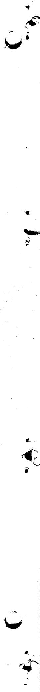

# STABILITY ANALYSIS OF THE MOLTEN-SALT REACTOR EXPERIMENT

S.J.Ball T.W.Kerlin

# Abstract

A detailed analysis shows that the Molten-Salt Reactor Experiment is inherently stable. It has sluggish transient response at low power, but this creates no safety or operational problems. The study included analysis of the transient response, frequency response, and pole configuration. The effects of changes in the mathematical model for the system and in the characteristic parameters were studied. A systematic analysis was also made to find the set of parameters, within the estimated uncertainty range of the design values, that gives the least stable condition. The system was found to be inherently stable for this condition, as well as for the design condition.

The system stability was underestimated in earlier studies of MSRE transient behavior. This was partly due to the approximate model previously used. The estimates of the values for the system parameters in the earlier studies also led to less stable predictions than current best values.

The stability increases as the power level increases and is largely determined by the relative reactivity contributions of the prompt feedback and the delayed feedback. The large heat capacities of system components, low heat transfer coefficients, and fuel circulation cause the delayed reactivity feedback.

# 1. Introduction

Investigations of inherent stability constitute an essential part of a reactor evaluation. This is particularly true for a new type of system, such as the MSRE. The first consideration in such an analysis is to determine whether the system possesses inherent self-destruction tendencies. Other less important but significant considerations are the influence of inherent characteristics on control system requirements and the possibility of conducting experiments that require constant conditions for extended periods.

Several approaches may be used for stability analysis. A complete study of power reactor dynamics would take into account the inherent nonlinearity of the reactivity feedback. It is not difficult to calculate the transient response of nonlinear systems with analog or digital computers. On the other hand, it is not currently possible to study the stability of multicomponent nonlinear systems in a general fashion. The usual method is to linearize the feedback terms in the system equations and use the well-developed methods of linear-feedback theory for stability analysis. This leads to the use of the frequency response (Bode plots or Nyquist plots) or root locus for stability analysis. This study included nonlinear transient-response calculations and linearized frequency-response and root-locus calculations.

The stability of a dynamic system can depend on a delicate balance of the effects of many components. This balance may be altered by changes in the mathematical model for the system or by changes in the values of the parameters that characterize the system. Since neither perfect models nor exact parameters can be obtained, the effect of changes in each of these on predicted stability should be determined, as was done in this study.

The transient and frequency responses obtained in a stability analysis are also needed for comparison with results of dynamic tests on the system. The dynamic tests may indicate that modifications in the theoretical model or in the design data are needed. Such modifications can provide a confirmed model that may be used for interpreting any changes possibly observed in the MSRE dynamic behavior in subsequent operation and for predicting, with confidence, the stability of other similar systems.

# 2. Description of the MSRE

The MSRE is a graphite-moderated, circulating-fuel reactor with fluoride salts of uranium, lithium, beryllium, and zirconium as the fuel. The basic flow diagram is shown in Fig. 1. The molten fuel-bearing salt enters the core matrix at the bottom and passes up through the core in channels machined out of 2-in. graphite blocks. The 10 Mw of heat

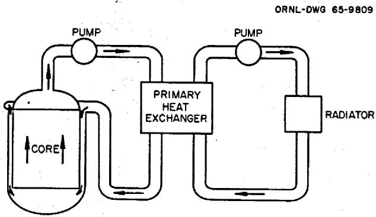  
Fig. 1. MSRE Basic Flow Diagram.

generated in the fuel and transferred from the graphite raises the fuel temperature from $1175^{\circ}\mathrm{F}$ at the inlet to $1225^{\circ}\mathrm{F}$ at the outlet. When the system operates at lower power, the flow rate is the same as at $10\mathrm{Mw}$ , and the temperature rise through the core decreases. The hot fuel salt travels to the primary heat exchanger, where it transfers heat to a non-fueled secondary salt before reentering the core. The heated secondary salt travels to an air-cooled radiator before returning to the primary heat exchanger.

Dynamically, the two most important characteristics of the MSRE are that the core is heterogeneous and that the fuel circulates. Since this combination of important characteristics is uncommon, a detailed study of stability was required. The fuel circulation acts to reduce the effective delayed-neutron fraction, to reduce the rate of fuel temperature change during a power change, and to introduce delayed fuel-temperature and neutron-production effects. The heterogeneity introduces a delayed feedback effect due to graphite temperature changes.

The MSRE also has a large ratio of heat capacity to power production. This indicates that temperatures will change slowly with power changes. This also suggests that the effects of the negative temperature coefficients will appear slowly, and the system will be sluggish. This type of behavior, which is more pronounced at low power, is evident in the results of this study.

Another factor that contributes to the sluggish time response is the heat sink - the air radiator. An approximate time constant for heating and cooling the entire primary and secondary system was found by considering all the salt, graphite, and metal as one lumped heat capacity that dumps heat through a resistance into the air (sink), as indicated in Fig. 2. For the reactor operating at $10\mathrm{Mw}$ with a mean reactor temperature of about $1200^{\circ}\mathrm{F}$ and a sink temperature of about $200^{\circ}\mathrm{F}$ , the effective resistance must be

$$
\frac {1 2 0 0 ^ {\circ} \mathrm {F} - 2 0 0 ^ {\circ} \mathrm {F}}{1 0 \mathrm {M w}} = 1 0 0 ^ {\circ} \mathrm {F} / \mathrm {M w}.
$$

Thus the overall time constant is

ORNL-DWG 65-9810

REACTOR

HEAT CAPACITY ≈ 12 Mw·sec/°F

RESISTANCE VARIOUS WITH AIR FLOW RATE

SINK TEMPERATURE

MEAN AIR TEMPERATURE VARIOWS WITH AIR FLOW RATE

Fig. 2. MSRE Heat Transfer System with Primary and Secondary System Considered as One Lump.

$$
\begin{array}{l} 1 2 \frac {\mathrm {M w} \cdot \sec}{\mathrm {^ o F}} \times 1 0 0 \frac {\mathrm {^ o F}}{\mathrm {M w}} = 1 2 0 0 \sec \\ = 2 0 \min . \\ \end{array}
$$

For the reactor operating at 1 Mw, the sink temperature increases to about $400^{\circ}\mathrm{F}$ . This is due to a reduction in cooling air flow provided at low power to keep the fuel temperature at $1225^{\circ}\mathrm{F}$ at the core exit. In this case the resistance is

$$
\frac {1 2 0 0 ^ {\circ} \mathrm {F} - 4 0 0 ^ {\circ} \mathrm {F}}{1 \mathrm {M w}} = 8 0 0 ^ {\circ} \mathrm {F} / \mathrm {M w},
$$

and the overall time constant becomes

$$
\begin{array}{l} 1 2 \frac {\mathrm {M w} \cdot \sec}{\mathrm {^ o F}} \times 8 0 0 \frac {\mathrm {^ o F}}{\mathrm {M w}} = 9 6 0 0 \sec \\ \cong 3 \mathrm {h r}. \\ \end{array}
$$

This very long time-response behavior would not be as pronounced with a heat sink such as a steam generator, where the sink temperatures would be considerably higher.

# 3. Review of Studies of MSRE Dynamics

Three types of studies of MSRE dynamics were previously made: (1) transient-behavior analyses of the system during normal operation with an automatic controller, (2) abnormal-transient and accident studies, and (3) transient-behavior analyses of the system without external control. The automatic rod control system operates in either a neutron-flux control mode, for low-power operation, or in a temperature control mode at higher powers. The predicted response of the reactor under servo control for large changes in load demand indicated that the system is both stable and controllable. The abnormal-transient and accident studies showed that credible transients are not dangerous.

The behavior of the reactor without servo control was initially investigated in 1960 and 1961 by Burke.4-7 A subsequent controller study by Ball8 in 1962 indicated that the system had greater inherent stability

than predicted by Burke. Figure 3 shows comparable transient responses for the two cases. The differences in predicted response are due to differences both in the model and in the parameters used and will be discussed in detail in Section 6.

There are two important aspects of the MSRE's inherent stability characteristics that were observed in the earlier studies. First, the reactor tends to become less stable at lower powers, and second, the period of oscillation is very long and increases with lower powers. As shown in Fig. 3, the period is about 9 min at 1 Mw, so any tendency of the system to oscillate can be easily controlled. Also, since the system is self-stabilizing at higher powers, it would not tend to run away, or as in this case, creep away. The most objectionable aspect of inherent oscillations would be their interference with tests planned for the reactor without automatic control.

# 4. Description of Theoretical Models

Several different models have been used in the dynamic studies of the MSRE. Also, because the best estimates of parameter values were modified periodically, each study was based on a different set of parameters. Since the models and parameters are both important factors in the prediction of stability, their influence on predicted behavior was examined in this study. Tables 1, 2, and 3 summarize the various models and parameter sets used. Table 1 lists the parameters for each of the three studies, Table 2 indicates how each part of the reactor was represented in the three different models, and Table 3 indicates which model was used for each study. The three models are referred to subsequently as the "Reduced," "Intermediate," and "Complete" models, as designated in Table 2. The models are described in this section, and the equations used are given in Appendix A. The coefficients for each case are listed in Appendix B.

# Core Fluid Flow and Heat Transfer

A typical scheme for representing the thermal dynamics of the MSRE core is shown in Fig. 4. The arrows indicating heat transfer require additional explanation. It was desired to base the calculation of heat

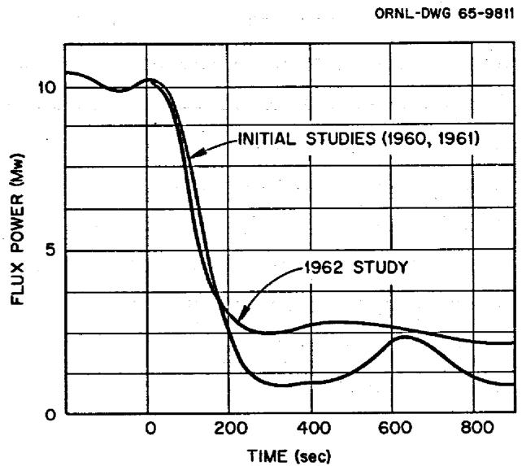  
Fig. 3. Response of MSRE Without Controller to Decrease in Load Demand.

Table 1. Summary of Parameter Values   
Used in MSRE Kinetics Studies   

<table><tr><td>Parameter</td><td>Burke 1961</td><td>Ball 1962</td><td>Present Study</td></tr><tr><td>Fuel reactivity coefficient, °F-1</td><td>-3.3 × 10-5</td><td>-2.8 × 10-5</td><td>-4.84 × 10-5</td></tr><tr><td>Graphite reactivity coefficient, °F-1</td><td>-6.0 × 10-5</td><td>-6.0 × 10-5</td><td>-3.7 × 10-5</td></tr><tr><td>Fuel heat capacity, Mw·sec/°F</td><td>4.78</td><td>4.78</td><td>4.19</td></tr><tr><td>Effective core size, ft3</td><td>20.3</td><td>24.85</td><td>22.5</td></tr><tr><td>Heat transfer coefficient from fuel to graphite, Mw/°F</td><td>0.02</td><td>0.0135</td><td>0.02</td></tr><tr><td>Fraction of power generated in fuel</td><td>0.94</td><td>0.94</td><td>0.934</td></tr><tr><td>Delayed power fraction (gamma heating)</td><td>0.064</td><td>0.064</td><td>0.0564</td></tr><tr><td>Delayed power time constant, sec</td><td>12</td><td>12</td><td>188</td></tr><tr><td>Core transit time, sec</td><td>7.63</td><td>9.342</td><td>8.46</td></tr><tr><td>Graphite heat capacity, Mw·sec/°F</td><td>3.75</td><td>3.528</td><td>3.58</td></tr><tr><td>Nuclear data</td><td></td><td></td><td></td></tr><tr><td>Prompt-neutron lifetime (sec)</td><td>0.0003</td><td>0.00038</td><td>0.00024</td></tr><tr><td>Total delayed-neutron fraction</td><td>0.0064</td><td>0.0064</td><td>0.00666</td></tr><tr><td>Effective delayed-neutron fraction for one-group approximation</td><td>0.0036</td><td>0.0041</td><td>(0.0036)a</td></tr><tr><td>Effective decay constant for one-group approximation, sec-1</td><td>0.0838</td><td>0.0838</td><td>(0.133)a</td></tr><tr><td>Fuel transit time in external primary circuit, sec</td><td>14.37</td><td>17.03</td><td>16.73</td></tr><tr><td>Total secondary loop coolant transit time, sec</td><td>24.2</td><td>24.2</td><td>21.48</td></tr></table>

${}^{a}$ Six groups used; see Appendix B for individual delayed-neutron fractions (β) and decay constants $\left( \lambda \right)$ .

Table 2. Description of Models Used in MSRE Kinetics Studies   

<table><tr><td></td><td>Reduced Model</td><td>Intermediate Model</td><td>Complete Model</td></tr><tr><td>Number of core regions</td><td>1</td><td>9</td><td>9</td></tr><tr><td>Number of delayed-neutron groups</td><td>1</td><td>1</td><td>6</td></tr><tr><td>Dynamic circulating precursorsa</td><td>No</td><td>No</td><td>Yes</td></tr><tr><td>Fluid transport lagsb</td><td>First order</td><td>Fourth-order Padé</td><td>Pure delay</td></tr><tr><td>Fluid-to-pipe heat transfer</td><td>No</td><td>Yes</td><td>Yes</td></tr><tr><td>Number of heat exchanger lumps</td><td>1</td><td>1</td><td>10</td></tr><tr><td>Number of radiator lumps</td><td>1</td><td>1</td><td>10</td></tr><tr><td>Xenon reactivity</td><td>No</td><td>No</td><td>Yes</td></tr></table>

aIn the first two models, the reduced effective delayed-neutron fraction due to fuel circulation was assumed equal to the steady-state value. In the third model, the transient equations were treated explicitly (see Appendix A for details).   
bThe Laplace transform of a time lag, $\tau$ , is $e^{-\tau s}$ . The first order approximation is $1 / (1 + \tau s)$ . The fourth order Padé approximation is the ratio of two fourth-order polynomials in $\tau s$ , which gives a better approximation of $e^{-\tau s}$ (see Appendix A).

Table 3. Models Used in the Various MSRE Kinetics Studies   

<table><tr><td>Study</td><td>Model Used</td></tr><tr><td>Burke 1961 analog (refs. 4-7)</td><td>Reduced</td></tr><tr><td>Ball 1962 analog (ref. 8)</td><td>Intermediate</td></tr><tr><td>1965 frequency response</td><td>Complete</td></tr><tr><td>1965 transient response</td><td>Intermediate</td></tr><tr><td>1965 extrema determinationa</td><td>Reduced</td></tr><tr><td>1965 eigenvalue calculations</td><td>Intermediate</td></tr><tr><td>1965 frequency response with extrema data</td><td>Complete</td></tr></table>

aThe worst possible combination of parameters was used as described in Section 7.

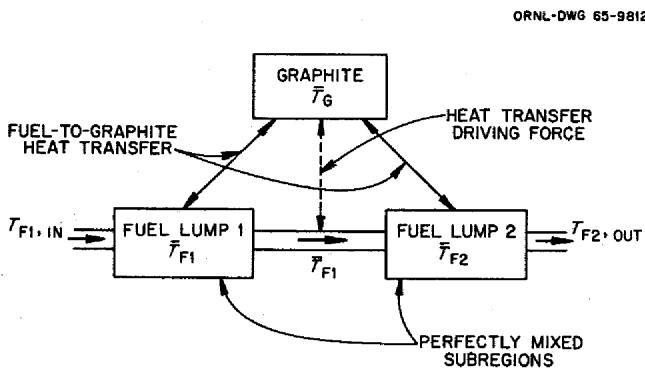  
Fig. 4. Model of Reactor Core Region; Nuclear Power Produced in all Three Subregions.

transfer rate between the graphite and the fuel stream on the difference of their average temperatures. The outlet of the first lump or "well-stirred tank" in the fuel stream is taken as the fluid average temperature. Thus a dotted arrow is shown from this point to the graphite to represent the driving force for heat transfer. However, all the mass of the fluid is in the lumps, and the heat transferred is distributed equally between the lumps. Therefore solid arrows are shown from the graphite to each fluid lump to indicate actual transfer of heat.

This model was developed by E. R. Mann* and has distinct advantages over the usual model for representing the fluid by a single lump in which the following algebraic relationship is used to define the mean fuel temperature:

$$
T _ {F} \text {m e a n} = \frac {T _ {F} \text {i n l e t} + T _ {F} \text {o u t l e t}}{2}.
$$

The outlet temperature of the model is given by

$$
T _ {F} \text {o u t l e t} = 2 T _ {F} \text {m e a n} - T _ {F} \text {i n l e t}.
$$

Since the mean temperature variable represents a substantial heat capacity (in liquid systems), it does not respond instantaneously to changes in inlet temperature. Thus a rapid increase in inlet temperature would cause a decrease in outlet temperature - clearly a nonphysical result. With certain limitations on the length of the flow path, Mann's model avoids this difficulty.

The reduced MSRE model used one region to represent the entire core, and the nuclear average temperatures were taken as the average graphite temperature $(\overline{T}_{\mathrm{G}})$ and the temperature of the first fuel lump $(\overline{T}_{\mathrm{F1}})$ . The nuclear average temperature is defined as the temperature that will give the reactivity feedback effect when multiplied by the appropriate temperature coefficient of reactivity.

The intermediate and complete models employ the nine-region core model shown schematically in Fig. 5. Each region contains two fuel lumps

UNCLASSIFIED

ORNL-DWG 63-7319R

$(T_{F})_{\text{OUT}}$

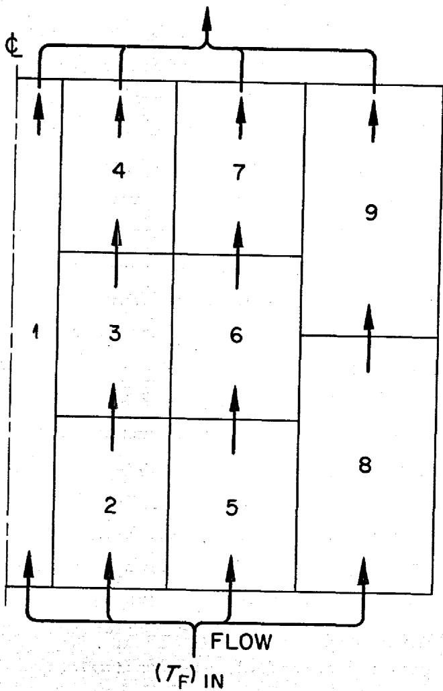  
Fig. 5. Schematic Diagram of Nine-Region Core Model.

and one graphite lump, as shown in Fig. 4. This gives a total of 18 lumps (or nodes) to represent the fuel and nine lumps to represent the graphite. The nuclear power distribution and nuclear importances for all 27 lumps were calculated with the digital code EQUIPOISE-3A, which solves steady-state, two-group, neutron-diffusion equations in two dimensions.

Tests were made on the MSRE full-scale core hydraulic mockup10 to check the validity of the theoretical models of core fluid transport. A salt solution was injected suddenly into the 1200-gpm water stream at the reactor vessel inlet of the mockup, and the response at the reactor outlet was measured by a conductivity probe. The frequency response of the system was computed from the time response by Samulon's method11 for a sampling rate of 2.5/sec. The equivalent mixing characteristics of the theoretical models are computed from the transfer function of core outlet-to-inlet temperature by omitting heat transfer to the graphite and adding pure delays for the time for fluid transport from the point of salt injection to the core inlet and from the core outlet to the conductivity probe location. A comparison of the experimental, one-region, and nine-region transfer functions is shown by frequency-response plots in Fig. 6. Both theoretical curves compare favorably with the experimental curve, especially in the range of frequencies important in the stability study (0.01 to 0.1 radians/sec). The relatively large attenuation of the magnitude ratios at frequencies as low as 0.1 to 1.0 radians/sec is due to a considerable amount of axial mixing, which is to be expected at the low Reynolds number of the core fluid flow (~1000). This test indicates that the models used for core fuel circulation in the stability analyses are adequate.

# Neutron Kinetics

The standard one-point, nonlinear, neutron kinetics equations with one average delayed-neutron group were used in all the analog and digital transient response studies. Linearized equations were used for all the other studies. In the studies of a nine-region core model, weighted values of nuclear importance for each of the 27 lumps were used to compute the thermal feedback reactivity. Six delayed-neutron groups and the

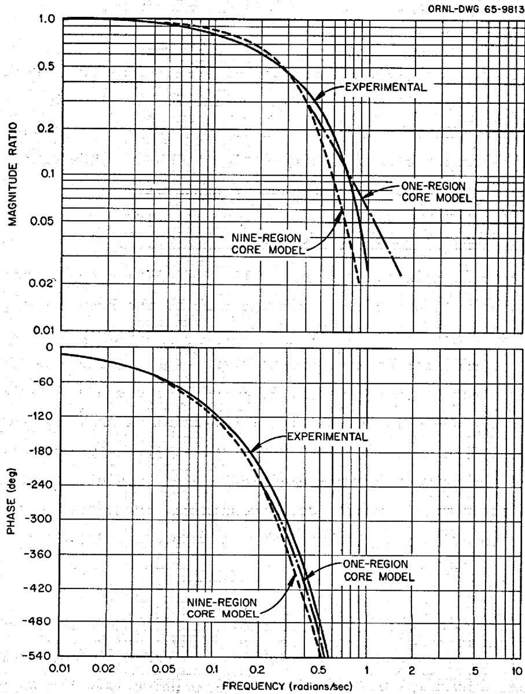  
Fig. 6. Comparison of Frequency Response of Experimental and Theoretical Reactor Mixing Characteristics.

dynamic effects of the circulation of the precursors around the primary loop were included in the complete model.

# Heat Exchanger and Radiator

The lumping scheme used to represent heat transfer in both the heat exchanger and the radiator is shown in Fig. 7. As with the core model, two lumps are used to represent each fluid flow path. The reduced and intermediate models both used one section as shown. The complete model used ten of these sections connected sequentially.

# Fluid Transport and Heat Transfer in Connecting Piping

The reduced model used single well-stirred-tank approximations for fluid transport in the piping from the core to the heat exchanger, from the heat exchanger to the core, from the heat exchanger to the radiator, and from the radiator back to the heat exchanger. Since the flow is highly turbulent (primary system, Re ≈ 240,000; secondary system, Re ≈ 120,000), there is relatively little axial mixing, and thus a plug flow model is probably superior to the well-stirred-tank model. Fourth-order Padé approximations were used in the intermediate model and pure delays in the complete model (see Appendix A). Heat transfer to the piping and vessels was also included in the complete model.

# Xenon Behavior

The transient poisoning effects of xenon in the core were considered only in the complete model. The equations include iodine decay into xenon, xenon decay and burnup, and xenon absorption into the graphite.

# Delayed Power

In all three models, the delayed-gamma portion of the nuclear power was approximated by a first-order lag.

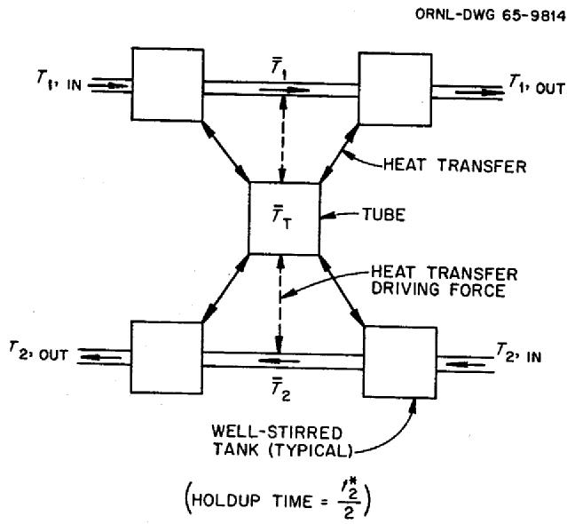  
Fig. 7. Model of Heat Exchanger and Radiator. (See discussion of Fig. 4 for explanation of arrows.)

# 5. Stability Analysis Results

Data were obtained with the best available estimates of the system parameters for analysis by the transient-response, closed-loop frequency-response, open-loop frequency-response, and pole-configuration (root locus) methods. The advantages in using various analytical methods are that (1) comparison of the results provides a means of checking for computational errors; (2) some methods are more useful than others for specific purposes; for example, the pole-configuration analysis gives a clear answer to the question of stability, but frequency-response methods are needed to determine the physical causes of the calculated behavior; and (3) certain methods are more meaningful to a reader than others, depending on his technical background. The differences between the results and earlier results4-7 are discussed in Section 6, and the effects of changes in the mathematical model and the system parameters are examined in Section 7.

The results show that the MSRE has satisfactory inherent stability characteristics. Its inherent response to a perturbation at low power is characterized by a slow return to steady state after a series of low-frequency oscillations. This undesirable but certainly safe behavior at low power can easily be smoothed out by the control system.[2]

# Transient Response

The time response of a system to a perturbation is a useful and easily interpreted measure of dynamic performance. It is not as useful in showing the reasons behind the observed behavior as some of the other methods discussed below, but it has the advantage of being a physically observable (and therefore familiar) process.

The time response of the reactor power to a step change in $\mathbf{k}_{\text{eff}}$ was calculated. The IBM-7090 code MATEXP12 was used. MATEXP solves general, nonlinear, ordinary differential equations of the form

$$
\frac {\mathrm {d} \mathbf {x}}{\mathrm {d} t} = \mathbf {A x} + \triangle \mathbf {A} (\mathbf {x}) \mathbf {x} + f (t), \tag {1}
$$

where

$$
\mathbf {x} = \text {t h e s o l u t i o n v e c t o r ,}
$$

A = system matrix (constant square matrix with real coefficients), $\triangle A(x) = a$ matrix whose elements are deviations from the values in A [thus $\triangle A(x)$ x includes all nonlinear effects], $f(t) =$ forcing function vector.

The A matrix was developed for the intermediate model and resulted in a $59 \times 59$ matrix.

The transient response of the neutron level to a step change in $\mathbf{k}_{\text{eff}}$ of $+0.01\%$ is shown in Fig. 8 for initial power levels of 10 and 1 Mw. The slow response is evident. Figure 8 also clearly shows that the reactor takes longer to return to steady state in a 1-Mw transient than in a 10-Mw transient. It is also clear that the power does not diverge (i.e., the system is stable).

It should be emphasized that this transient analysis included the nonlinearities inherent in the neutron kinetics equations. The fact that the results of the other analyses presented below, which are based on linear models, agree in substance with these results verifies the adequacy of the linear analyses for small perturbations.

# Closed-Loop Frequency Response

The closed-loop transfer function is defined as the Laplace transform of a selected output variable divided by the Laplace transform of a selected input variable. If the system is stable, it is possible to replace the Laplace transform variable, $s$ , with $j\omega$ , where $j = \sqrt{-1}$ and $\omega$ is the angular frequency of a sinusoidal input. A transfer function, $G(\omega)$ , evaluated at a particular $\omega$ is a complex quantity. The amplitude of $G(\omega)$ physically represents the gain, or the ratio of the amplitude of the output sinusoid to the amplitude of the input sinusoid. The phase angle of $G(\omega)$ represents the phase difference between the input and output sinusoids. A logarithmic plot of amplitude ratio and phase angle as a function of $\omega$ is called a Bode plot, or frequency-response plot.

The relationship between the frequency response and the time response due to a sinusoidal input is useful conceptually and experimentally. However, it may be shown that the Bode plot for a linear system also provides

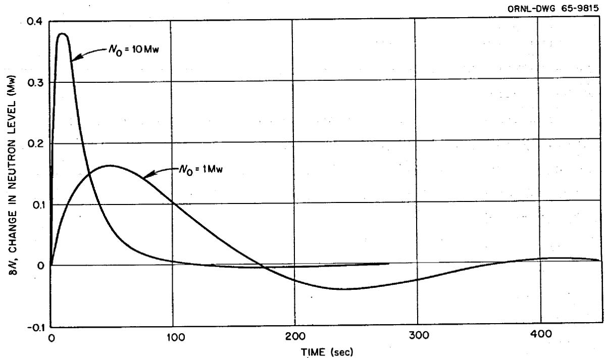  
Fig. 8. MSRE Transient Response to a +0.01% δk Step Reactivity Input when Operating at l and 10 Mw.

qualitative stability information that is not restricted to any particular form in input. $^{13}$ This information is largely contained in the peaks in the amplitude ratio curve. High narrow peaks indicate that the system is less stable than is indicated by lower broader peaks.

The closed-loop frequency response was calculated for N (neutron level fluctuations in megawatts) as a function of $\delta \mathbf{k}$ (change in input $\mathbf{k}_{\mathrm{eff}}$ ). The MSFR code (a special-purpose code for the MSRE frequency-response calculations; see Appendix C) and the complete model were used for this calculation. The results for several power levels are shown in Fig. 9. Fewer phase-angle curves than magnitude curves are shown in order to avoid cluttering the plot.

Several observations can be based on the information of Fig. 9. First, the peaks of the magnitude curves get taller and sharper with lower power. This indicates that the system is more oscillatory at low power. Also the peaks in the low-power curves rise above the no-feedback curve. This indicates that the feedback is regenerative at these power levels. Also, since the frequency at which the magnitude ratio has a peak approximately corresponds to the frequency at which the system will naturally oscillate in response to a disturbance, the low-power oscillations are much lower in frequency than the 10-Mw oscillations. The periods of oscillation range from 22 min at 0.1 Mw to 1.3 min at 10 Mw.

Figure 9 shows that the peak of the 10-Mw magnitude ratio curve is very broad and indicates that any oscillation would be small and quickly damped out. The dip in this curve at 0.25 radians/sec is due to the 25-sec fuel circulation time in the primary loop [i.e., (2π radians/cycle)/(25 sec/cycle) = 0.25 radians/sec]. Here a fuel-temperature perturbation in the core is reinforced by the perturbation generated one cycle earlier that traveled around the loop. Because of the negative fuel-temperature coefficient of reactivity, the power perturbation is attenuated.

The relatively low gains shown at low frequencies can be attributed to the large change in steady-state core temperatures that would result from a relatively small change in nuclear power with the radiator airflow rate remaining constant. This means that only a small change in power is required to bring about cancellation of an input $\delta k$ perturbation by a change in the nuclear average temperatures.

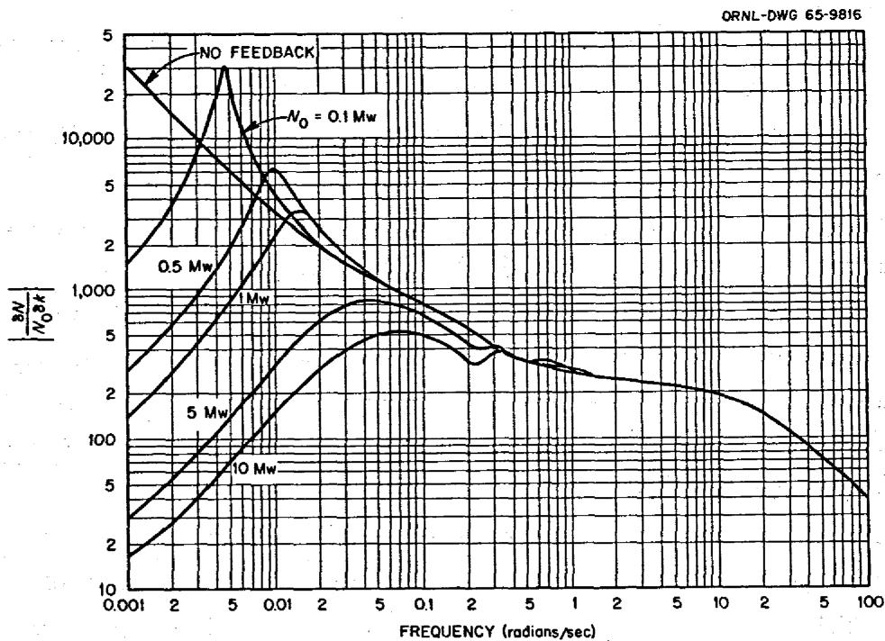

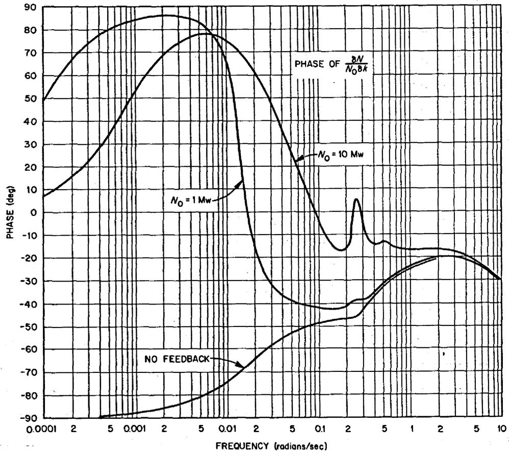  
Fig. 9. Complete Model Analysis of MSRE Frequency Response for Several Power Levels.

# Open-Loop Frequency Response

A simplified block diagram representation of a reactor as a closed-loop feedback system is shown in Fig. 10. The forward loop, G, represents the nuclear kinetics transfer function with no temperature effects, and the feedback loop, H, represents the temperature (and reactivity) changes due to nuclear power changes.

The closed-loop equation is found by solving for $\mathbf{N}$ in terms of $\delta \mathbf{k}$ :

$$
N = G \delta k _ {i n} - G H N
$$

or

$$
\frac {\mathrm {N}}{\delta \mathrm {k} _ {\text {i n}}} = \frac {\mathrm {G}}{1 + \mathrm {G H}}. \tag {2}
$$

The quantity GH is called the open-loop transfer function, and represents the response at point b of Fig. 10 if the loop is broken at point b. Equation (2) shows that the denominator of the closed-loop transfer function vanishes if $\mathrm{GH} = -1$ . Also, according to the Nyquist stability criterion, the system is unstable if the phase of GH is more negative than $-180^{\circ}$ when the magnitude ratio is unity. Thus it is clear that the open-loop frequency response contains information about system dynamics that are important in stability analyses.

A useful measure of system stability is the phase margin. It is defined as the difference between $180^{\circ}$ and the open-loop phase angle when the gain is 1.0. A discussion of the phase margin and its uses may be found in suitable references on servomechanism theory.[13] For this application, it suffices to note that smaller phase margins indicate reduced stability. A general rule of thumb in automatic control practice is that a phase margin of at least $30^{\circ}$ is desirable. Phase margins less than $20^{\circ}$ indicate lightly damped oscillation and poor control. Zero degrees indicate an oscillating system, and negative phase margins indicate instability.

The phase margin as a function of reactor power level is shown in Fig. 11. The phase margin decreases as the power decreases and goes below $30^{\circ}$ at about $0.5\mathrm{Mw}$ . However, the phase margin is still positive $(12^{\circ})$ at $0.1\mathrm{Mw}$ . These small phase margins at low power suggest slowly damped

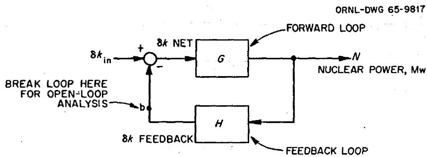  
Fig. 10. Reactor as a Closed-Loop Feedback System.

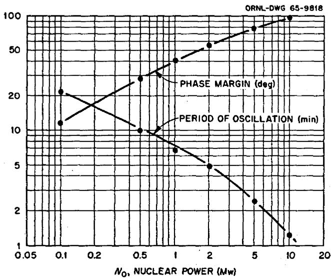  
Fig. 11. Period of Oscillation and Phase Margin Versus Power Level for MSFR Calculation with Complete Model.

oscillations, as has been observed in the transient-response and closed-loop frequency-response results. The period of oscillation as a function of power level is also shown in Fig. 11.

Figure 12 shows Nyquist plots for the open-loop transfer function, GH, at $1.0 \, \text{Mw}$ and $10.0 \, \text{Mw}$ . It is clear that the unstable condition of $\left( \left|GH \right| = 1 \right.$ and phase angle $-180^{\circ}$ is avoided. In order for the phase margin to be a reliable indication of stability, the Nyquist plot must be "well-mannered" inside the unit circle; that is, it should not approach the critical $(-1.0 + j0)$ point. Although the curves shown in Fig. 12 behave peculiarly in approaching the origin, they do not get close to the critical point.

# Pole Configuration

The denominator $(1 + GH)$ of the closed-loop transfer function of a lumped-parameter system is a polynomial in the Laplace transform variable, $s$ . The roots of this polynomial (called the characteristic polynomial) are the poles of the system transfer function. The poles are equal to the eigenvalues of the system matrix $A$ in Eq. (1). A necessary and sufficient condition for linear stability is that the poles all have negative real parts. Thus, it is useful to know the location of the poles in the complex plane and the dependence of their location on power level.

The poles were calculated for the intermediate model of the MSRE (see Section 4). The matrix used was the linearized version of the $59 \times 59$ matrix used in the transient analysis. The calculations were performed with a modification of the general matrix eigenvalue code QR14 for the IBM-7090. The results are shown in Fig. 13 for several of the major poles. All the other poles lie far to the left of the ones shown. It is clear from Fig. 13 that the system is stable at all power levels. The set of complex poles that goes to zero as the power decreases is the set primarily responsible for the calculated dynamic performance. The imaginary part of this set approximately represents the natural frequency of oscillation of the system following a disturbance. The frequency of oscillation decreases as the power decreases, as observed previously.

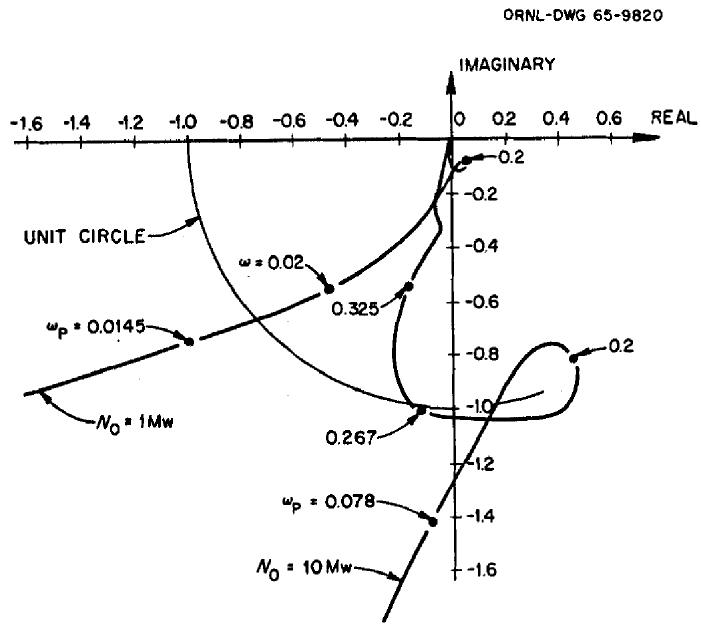

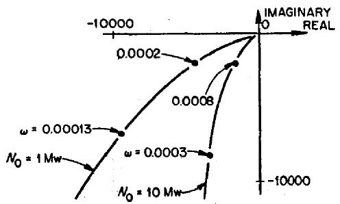  
Fig. 12. Nyquist Diagrams for Complete Model $N_0 = l$ and $10 \, \text{Mw}$ .

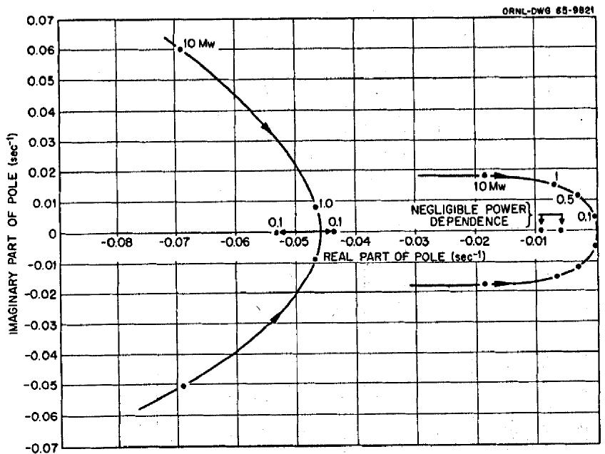  
Fig. 13. Major Poles for the MSRE.

# 6. Interpretation of Results

# Explanation of the Inherent Stability Characteristics

A physical explanation of the predicted stability characteristics is presented in this section, and an attempt is made to explain the reasons for the changes in inherent stability with power level. The reasons for the behavior are not intuitively obvious. Typically a feedback system will become more stable when the open-loop gain is reduced. The MSRE, however, becomes less stable at lower powers. In the discussion of open-loop frequency response (Sect. 5) it was noted that the forward-loop transfer function $G$ represents the nuclear kinetics ( $N / \delta k$ ) with no temperature-feedback effects, and from the equations (Appendix A), the gain of $G$ is directly proportional to power level. Thus the MSRE is not "typical" but has the characteristics of what is known as a "conditionally stable" system.[15]

The MSRE analysis is complicated further by the complexity of the feedback loop H, which represents the reactivity effects due to fuel and graphite temperature changes resulting from changes in nuclear power. A more detailed breakdown of the components of H is given in Fig. 14. This core thermal model has two inputs, the nuclear power N and core inlet temperature $\mathbf{T}_{\mathbf{ci}}$ , and three outputs, nuclear average fuel and graphite temperatures $\mathbf{T}_{\mathbf{F}}^*$ and $\mathbf{T}_{\mathbf{G}}^*$ , and the core outlet temperature $\mathbf{T}_{\mathbf{co}}$ . The block "External Loops" represents the primary loop external to the core, the heat exchanger, the secondary loop, and the radiator. All the parameters are treated as perturbation quantities or deviations from their steady-state values. Also the radiator air flow rate is adjusted so that with a given steady-state power level, the core outlet temperature is $1225^\circ \mathbf{F}$ . This means that the feedback loop transfer function H also varies with power level.

If we look at the effect of perturbations in power, $N$ , on the core inlet temperature, $T_{ci}$ , we can see that the effects of different air flow rates are only apparent at low frequencies, as in Fig. 15, which shows the Bode plots for $T_{ci} / N$ at $N_0 = 1$ and $10 \, \text{Mw}$ . It is important to note that at low power and at low frequency, the magnitude of the temperature change is large, and it lags the input $N$ considerably. For example,

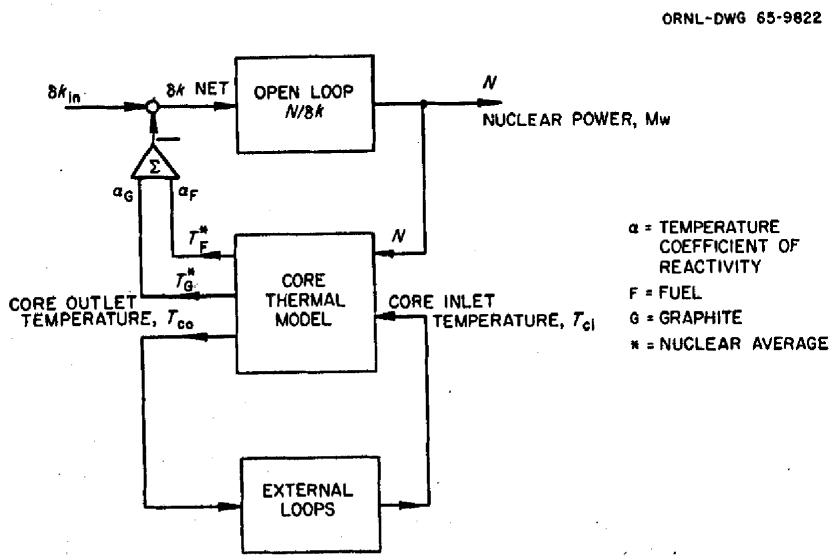  
Fig. 14. MSRE as Closed-Loop Control System.

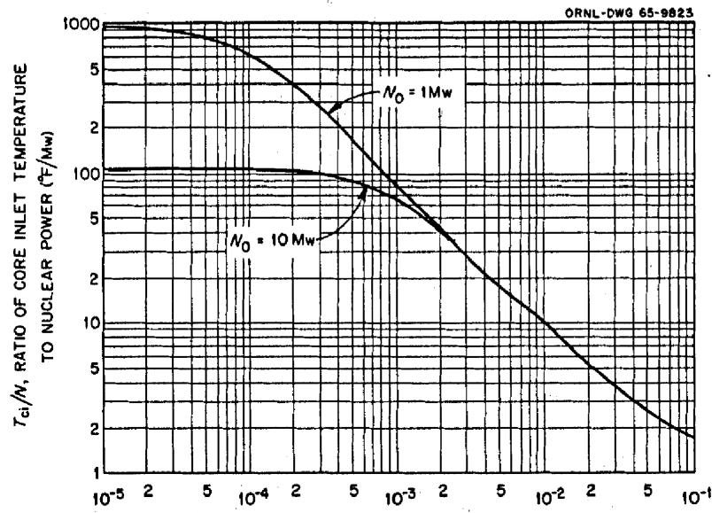

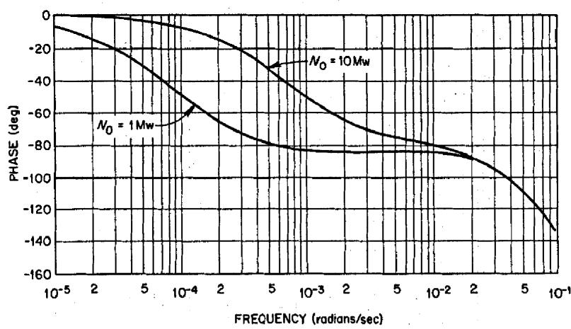  
Fig. 15. Closed-Loop Frequency-Response Diagram of Core Inlet Temperature as a Function of Nuclear Power.

at $N_0 = 1$ Mw and $\omega = 0.0005$ radians/sec, the magnitude ratio is $170^\circ F / Mw$ and the phase lag is $80^\circ$ . The block diagram of Fig. 14 indicates that the nuclear average temperature perturbations in $T_{\mathrm{F}}^*$ and $T_{\mathrm{G}}^*$ can be considered to be caused by the two separate inputs $N$ and $T_{\mathrm{ci}}$ . For example, the open-loop transfer function $T_{\mathrm{F}}^* / N$ (with $T_{\mathrm{ci}}$ constant) is $5.0^\circ F / Mw$ at steady state, and there is little attenuation and phase lag up to relatively high frequencies, as in Fig. 16, which shows the open-loop transfer functions of the nuclear average temperatures as functions of $N$ and $T_{\mathrm{ci}}$ . Returning to the example case of $N_0 = 1$ Mw and $\omega = 0.0005$ radians/sec, we note that the prompt feedback effect of $5^\circ F / Mw$ from $T_{\mathrm{F}}^* / N$ is very small compared with temperature changes of the entire system represented by a $T_{\mathrm{ci}} / N$ of $170^\circ F / Mw$ at $-80^\circ$ . (Note that $T_{\mathrm{F}}^* / T_{\mathrm{ci}} = 1.0$ at $0.0005$ radians/sec.) The important point here is that for low power levels over a wide range of low frequencies, the large gain of the frequency response of overall system temperature relative to power dominates the feedback loop $H$ , and its phase angle approaches $-90^\circ$ .

The no-feedback curve in Fig. 9 shows that at frequencies below about 0.005 radians/sec, the forward-loop transfer function N/δk (open loop) also has a phase approaching $-90^{\circ}$ and a gain curve with a -1 slope (i.e., one-decade attenuation per decade increase in frequency). With both G and H having phase angles approaching $-90^{\circ}$ , the phase of the product GH will approach $-180^{\circ}$ . If the magnitude ratio of G were such that $|GH| = 1.0$ under these conditions, the system would approach instability. From the Bode plot of Fig. 9, it can be seen that at a power of 0.1 Mw, $|GH| \approx 1.0$ at 0.0045 radians/sec (22 min/cycle), since the peak in the closed-loop occurs there. At lower powers and consequently lower gains G, $|GH|$ approaches 1.0 at even lower frequencies, where the phase of GH is closer to $-180^{\circ}$ . This accounts for the less stable conditions at the lower powers and lower frequencies.

At the higher powers, |GH| approaches 1.0 at higher frequencies where the effect of the prompt thermal feedback is significant. For example, the peak in the 10-Mw closed-loop Bode plot of N/δk, Fig. 9, occurs at 0.078 radians/sec. At this frequency, $\left| T_{ci} / N \right|$ has a value of 2.0 (Fig. 15) compared with a $T_{F}^{*} / N$ of 4.4 at -15° (Fig. 16). Consequently, the prompt fuel temperature feedback term has a dominant stabilizing effect.

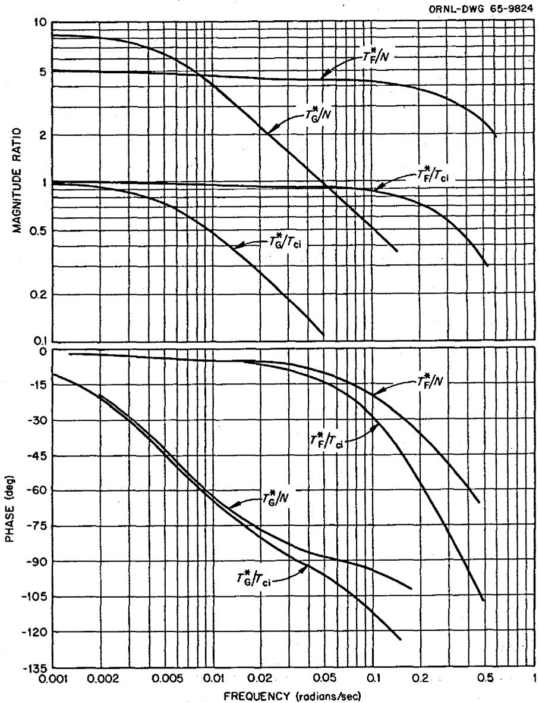  
Fig. 16. Open-Loop Frequency-Response Diagrams of Nuclear Average Temperatures as Functions of Nuclear Power and Core Inlet Temperature.

The relative importances of the various components of feedback reactivity are shown in the directed-line diagrams of Fig. 17 for power levels of 1 and $10\mathrm{Mw}$ and at the frequencies at which the oscillations occur. The vectors labeled $-\delta k_{F}$ and $-\delta k_{G}$ represent the products of the nuclear temperature components and the reactivity coefficients that result from a unit vector input $\delta k_{in}$ . The vectors labeled "prompt" are the effects due to the nuclear power input based on no change in core inlet temperature. Those labeled "loop" are caused by changes in core inlet temperature alone. For example:

$$
\frac {\delta \mathrm {k} _ {\mathrm {F}} \text {p r o m p t}}{\delta \mathrm {k} _ {\mathrm {i n}}} = \frac {\mathrm {N}}{\delta \mathrm {k} _ {\mathrm {i n}}} \left| \begin{array}{l l} & \frac {\mathrm {T} *}{\mathrm {F}} \\ \text {c l o s e d l o o p} & \frac {\mathrm {N}}{\mathrm {N}} \end{array} \right| _ {\text {o p e n l o o p}} \alpha_ {\mathrm {F}} (\delta \mathrm {k} / ^ {\circ} \mathrm {F})
$$

and

$$
\frac {\delta \mathrm {k} _ {\mathrm {G}} \text {l o o p}}{\delta \mathrm {k} _ {\mathrm {i n}}} = \frac {\mathrm {N}}{\delta \mathrm {k} _ {\mathrm {i n}}} \left| \begin{array}{c c} & \mathrm {T} _ {\mathrm {c i}} \\ \text {c l o s e d l o o p} & \frac {\mathrm {N}}{\mathrm {N}} \end{array} \right| \left| \begin{array}{c c} & \frac {\mathrm {T} ^ {*}}{\mathrm {T} _ {\mathrm {G}}} \\ \text {c l o s e d l o o p} & \frac {\mathrm {T} _ {\mathrm {c i}}}{\mathrm {T} _ {\mathrm {c i}}} \end{array} \right| _ {\text {o p e n l o o p}} \alpha_ {\mathrm {G}} (\delta \mathrm {k} / ° \mathrm {F}) .
$$

The net $\delta \mathbf{k}$ vector is the sum of the input and feedback vectors. For the 1-Mw case, $\delta \mathbf{k}$ net is greater than $\delta \mathbf{k}_{\mathrm{in}}$ ; this indicates regenerative feedback and shows up on the closed-loop Bode plot (Fig. 9) as a peak with a greater magnitude ratio than that of the no-feedback curve.

The increased stabilizing effect of the prompt fuel temperature term in going from 1 to $10\mathrm{Mw}$ is also evident. These plots clearly show the diminished effect of the graphite at the higher frequency.

In both cases, too, the plots show that a more negative graphite temperature coefficient would tend to increase the net $\delta k$ vector and hence destabilize the system.

# Interpretation of Early Results

The previously published results of a dynamic study performed in 1961 predicted that the MSRE would be less stable than is predicted in this study. This is partly because of differences in design parameters and partly because of differences in the models used. These differences were reviewed in Section 4 of this report.

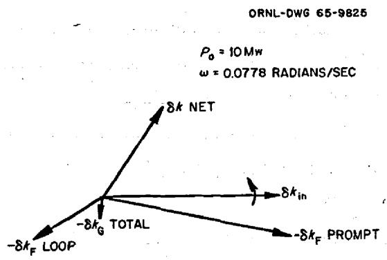

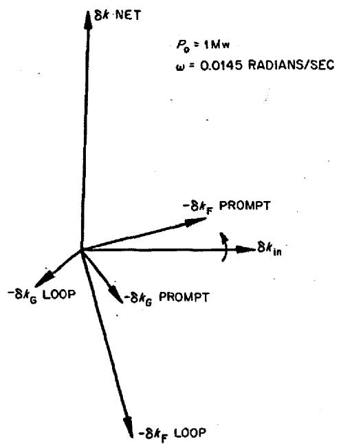  
Fig. 17. Directed-Line Diagrams of Reactivity Feedback Effects at 1 and 10 MW for Complete Model.

The most significant parameter changes from 1961 to 1965 were the values for the fuel and graphite temperature coefficients of reactivity and the changes in the fuel heat capacity. Table 1 (Sect. 4) shows that the new fuel coefficient is more negative, the new graphite coefficient is less negative, and the fuel heat capacity is smaller than was thought to be the case in 1961. All these changes contribute to the more stable behavior calculated with the current data. (The destabilizing effect of a more negative graphite temperature coefficient is discussed in Section 7.)

The most important change, however, is the use of a multiregion core model and the calculation of the nuclear average temperature. In the single-region core, $\mathbf{T}_{\mathrm{F}}^{\star}$ is equal to the temperature of the first of the two fuel lumps or the average core temperature (in steady state). In the nine-region core, $\mathbf{T}_{\mathrm{F}}^{\star}$ is computed by multiplying each of the 18 fuel-lump temperatures by a nuclear importance factor, I. In the single-region model, the steady-state value of $\mathbf{T}_{\mathrm{F}}^{\star} / \mathbf{N}$ (with $\mathbf{T}_{\mathrm{ci}}$ constant) is only $2.8^{\circ} \mathrm{F} / \mathrm{Mw}$ compared with $5.0^{\circ} \mathrm{F} / \mathrm{Mw}$ for the nine-region core model. This difference occurs because in the nine-region model, the downstream fuel-lump temperatures are affected not only by the power input to that lump but also by the change in the lump's inlet temperature due to heating of the upstream lumps. This point may be illustrated by noting the difference between two single-region models, where in one case the nuclear importance of the first lump is 1.0 and in the other case the importance of each lump is 0.5. As an example, say the core outlet temperature increases $5^{\circ} \mathrm{F} / \mathrm{Mw}$ . The change in $\mathbf{T}_{\mathrm{F}}^{\star}$ for a 1-Mw input would be

$$
\Delta \mathrm {T} _ {\mathrm {F}} ^ {*} = \mathrm {I} _ {1} \Delta \mathrm {T} _ {1} + \mathrm {I} _ {2} \Delta \mathrm {T} _ {2}.
$$

In the first case $I_1 = 1.0$ and $\Delta T_1 = 2.5^\circ F$ , so $\Delta T_{\mathrm{F}}^* = 2.5^\circ F$ . In the second case, $I_1 = I_2 = 0.5$ , $\Delta T_1 = 2.5^\circ F$ , and $\Delta T_2 = 5^\circ F$ , so $\Delta T_{\mathrm{F}}^* = 3.75^\circ F$ , or a $50\%$ greater change than in case one. For many more lumps, this effect is even greater.

As was shown above, the prompt fuel reactivity feedback effect was the dominant stabilizing mechanism at both 1 and $10\mathrm{Mw}$ , so the original single-region core model would give pessimistic results.

7. Perturbations in the Model and the Design Parameters

Every mathematical analysis of a physical system is subject to some uncertainty because of two questions: How good is the mathematical model, and how accurate are the values of the parameters used in the model? The influence of changes in the assumed model were therefore investigated, and the sensitivity to parameter variations of the results based on both the reduced and complete models was determined. An analysis was also performed to determine the worst expected stability performance within the estimated range of uncertainty of the system parameters.

# Effects of Model Changes

The effects of changing the mathematical model of the system were determined by comparing the phase margins with the reference case as each part of the model was changed in turn. The following changes were made:

1. Core Representation. A single-region core model was used instead of the nine-region core used in the complete model.   
2. Delayed-Neutron Groups. A single delayed-neutron group was used instead of the six-group representation in the complete model.   
3. Fixed Effective $\beta$ 's. The usual constant-delay-fraction delayed-neutron equations were used with an effective delay fraction, $\beta$ , for each precursor. The effective $\beta$ was obtained by calculating the delayed-neutron contribution that is reduced due to fluid flow in the steady-state case. This is in contrast to the explicit treatment of dynamic circulation effects in the complete model (see Appendix A).   
4. First-Order Transport Lags. The Laplace transform of a pure delay, $e^{-\tau s}$ , was used in the complete model. The first-order well-stirred-tank approximation, $\frac{1}{1 + \tau s}$ , was used in the modified model.   
5. Single-Section Heat Exchanger and Radiator. A single section was used to represent the heat exchanger and radiator rather than the ten-section representation in the complete model.   
6. Xenon. The xenon equations were omitted in contrast to the explicit xenon treatment in the complete model.

The results are shown in Table 4. The only significant effect is that due to a change in the core model. The results for the one-region core model indicate considerably less stability than for the nine-region core model. This difference is due primarily to the different way in which the nuclear average temperature of the fuel is calculated, as was discussed in detail in Section 6.

Table 4. Effects of Model Changes on Stability   

<table><tr><td rowspan="2">Model Change</td><td colspan="2">Phase Margin (deg)</td><td colspan="2">Change in Phase Margin from Reference Casea(deg)</td></tr><tr><td>At 1 Mw</td><td>At 10 Mw</td><td>At 1 Mw</td><td>At 10 Mw</td></tr><tr><td>Reference case (complete model)</td><td>41</td><td>99</td><td></td><td></td></tr><tr><td>One core region</td><td>27.5</td><td>56.5</td><td>-13.5</td><td>-42.5</td></tr><tr><td>One delayed-neutron group</td><td>38</td><td>(b)</td><td>-3</td><td></td></tr><tr><td>Fixed effective β&#x27;s</td><td>40</td><td>98</td><td>-1</td><td>-1</td></tr><tr><td>First-order transport lags</td><td>41</td><td>100</td><td>0</td><td>+1</td></tr><tr><td>Single-section heat exchanger and radiator</td><td>41</td><td>98.5</td><td>0</td><td>-0.5</td></tr><tr><td>Xenon omitted</td><td>41</td><td>100.5</td><td>0</td><td>+1.5</td></tr></table>

aReference case is complete model with current data. An increase in phase margin indicates greater stability.   
bNyquist plot does not cross unit circle near frequency of oscillation.

# Effects of Parameter Changes

Frequency-response sensitivities and pole sensitivities were calculated. Frequency-response sensitivities are defined as fractional changes in magnitude or phase per fractional change in a system parameter. The magnitude frequency-response sensitivities were calculated for several important parameters with the MSFR code (see Appendix C) for the complete model. The sensitivities were obtained by differences between

the results of calculations at the design point and those of calculations with a single parameter changed slightly. The results of these calculations are shown in Fig. 18. Calculations were also performed on the system with the reduced model with a new computer code called SFR (Sensitivity of the Frequency Response). This code calculates magnitude and phase sensitivities for a general system by matrix methods. This calculation was restricted to the reduced system representation because of the large cost of calculations for very large matrices. The results of this calculation are given in Fig. 19. In Figs. 18 and 19, a positive sensitivity indicates that a decrease in the system parameter will decrease the magnitude of the frequency response. The situation is reversed for negative sensitivities.

The sensitivities shown in Figs. 18 and 19 can be used to estimate the effects of possible future updating of the MSRE design parameters used in this study. In addition, they support other general observations obtained by other means. For instance, Fig. 19 shows that the sensitivities to loop effects, such as primary and secondary loop transit times, are important relative to core effects. This indicates that the external loops strongly influence the system dynamics, as was concluded in Section 6.

Similar information may be obtained from pole sensitivities (or eigenvalue sensitivities). These are defined as the fractional change of a system pole due to a fractional change in a system parameter. The sensitivity of the dominant pole (the pole whose position in the complex plane determines the main characteristics of the dynamic behavior) is usually the only one of interest.

The dominant pole sensitivities for a number of system parameters are shown in Table 5 for power levels of 1 and $10\mathrm{Mw}$ . These results may be used to estimate the effect of future updating of the MSRE design parameters, and they also furnish some insight as to the causes of the calculated dynamic behavior. For instance, it is noted that the sensitivity to changes in the graphite temperature coefficient is only about one-fourteenth the sensitivity to changes in the fuel temperature coefficient at $10\mathrm{Mw}$ . At 1 Mw, the graphite effect is about one-third as large as the fuel effect. This indicates that a decrease in power level

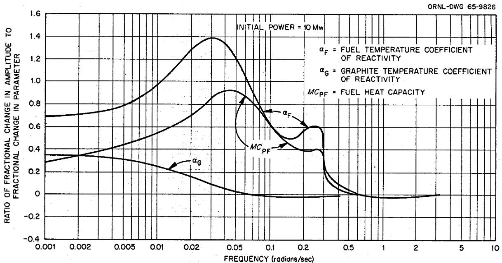  
Fig. 18. Frequency-Response Sensitivities of Complete Model.

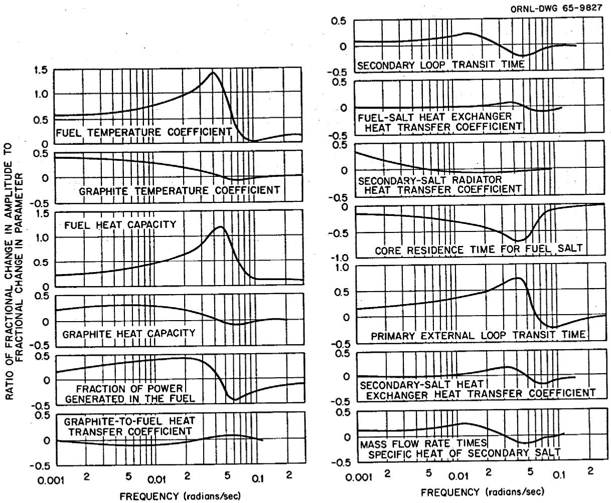  
Fig. 19. Frequency-Response Sensitivities of Reduced Model at a Power of $10\mathrm{Mw}$ Based on Current Data.

Table 5. Pole Sensitivities   

<table><tr><td rowspan="2">Parameter = x</td><td colspan="2">(x| λ| ∂x)</td></tr><tr><td colspan="2">(see footnote a)</td></tr><tr><td></td><td>At 10 Mw</td><td>At 1 Mw</td></tr><tr><td>Fraction of power that is prompt</td><td>-0.944</td><td>-2.515</td></tr><tr><td>Neutron lifetime</td><td>0.00944</td><td>0.0129</td></tr><tr><td>Fuel temperature coefficient of reactivity</td><td>0.858</td><td>1.701</td></tr><tr><td>Graphite temperature coefficient of reactivity</td><td>-0.0627</td><td>-0.493</td></tr><tr><td>Fraction of power generated in the fuel</td><td>-0.328</td><td>0.561</td></tr><tr><td>Graphite-to-fuel heat transfer coefficient</td><td>0.0434</td><td>0.177</td></tr><tr><td>Fuel heat capacity</td><td>1.024</td><td>1.315</td></tr><tr><td>Moderator heat capacity</td><td>-0.616</td><td>-0.359</td></tr><tr><td>Fuel-salt heat exchanger heat transfer coefficient</td><td>0.0157</td><td>0.254</td></tr><tr><td>Fuel transit time in core</td><td>-0.606</td><td>-0.787</td></tr><tr><td>Fuel transit time in external primary circuit</td><td>0.659</td><td>0.804</td></tr><tr><td>Secondary-salt heat exchanger heat transfer coefficient</td><td>0.00708</td><td>0.449</td></tr><tr><td>Secondary-salt loop transit time</td><td>-0.305</td><td>-0.622</td></tr><tr><td>Secondary-salt radiator heat transfer coefficient</td><td>-0.0155</td><td>-0.0754</td></tr><tr><td>Heat exchanger heat capacity</td><td>0.00745</td><td>0.00969</td></tr><tr><td>Effective precursor decay constant</td><td>-0.304</td><td>-0.726</td></tr><tr><td>Time constant for delayed gamma emission</td><td>-0.00858</td><td>0.0536</td></tr><tr><td>Total delayed-neutron fraction</td><td>0.0103</td><td>0.159</td></tr><tr><td>Effective delayed-neutron fraction</td><td>-0.788</td><td>-0.221</td></tr></table>

$\mathbf{a}_{\lambda}$ is the real part of the dominant pole. The values are -0.01865 for 10 Mw and -0.001818 for 1 Mw.

causes modifications in the dynamic behavior that accentuate the relative effect of graphite temperature feedback. It is also noted that the various heat transfer coefficients have a much larger relative effect at 1 Mw than at 10 Mw; this indicates that the coupling between system components has a larger influence at low power than at high power.

# Effects of Design Uncertainties

A new method16 for automatically finding the least stable condition in the range of uncertainty in the design parameters was used. A computer code for the IBM-7090 was used for the calculations. The method is described in some detail in Appendix D. The least stable condition is found by using the steepest-ascent (or gradient-projection) method of nonlinear programming.

The quantity that is maximized is the real part of the dominant pole of the system transfer function (or equivalently, the dominant eigenvalue of the system matrix). Less stable conditions are accompanied by less negative values for the real part of the dominant pole, and instability is accompanied by a pole with a positive real part. The maximization involves a step-wise determination of the particular combination of system parameters within the uncertainty range that causes the real part of the dominant pole to have its least negative value. If the maximized pole has a negative real part, instability is not possible in the uncertainty range. If the maximized pole has a positive real part, instability is possible in the uncertainty range if all the system parameters deviate from the design point in a particular way.

A key factor in the stability extrema analysis is the availability of the appropriate ranges to assign to the system parameters. The ranges appropriate for the MSRE were furnished by Engel.[17] It was decided to use a wide range on the important nuclear parameters (neutron lifetime, fuel temperature coefficient of reactivity, and graphite temperature coefficient of reactivity). These parameters were allowed to range between two-thirds and three-halves of the design values. All other ranges were assigned by considering the method of evaluating them and the probable effects of aging in the reactor environment. The ranges of the 16 system parameters chosen for this study are given in Table 6.

Table 6. Ranges on System Parameters for Extreme Calculations   

<table><tr><td rowspan="2">Parameter</td><td colspan="3">Ranges</td></tr><tr><td>Low</td><td>Design Value</td><td>High</td></tr><tr><td>Neutron lifetime, sec</td><td>1.6 × 10-4</td><td>2.4 × 10-4</td><td>3.6 × 10-4</td></tr><tr><td>Fuel temperature coefficient, δk/k·°F</td><td>-7.26 × 10-5</td><td>-4.84 × 10-5</td><td>-3.23 × 10-5</td></tr><tr><td>Graphite temperature coeffi-cient, δk/k·°F</td><td>-5.55 × 10-5</td><td>-3.70 × 10-5</td><td>-2.47 × 10-5</td></tr><tr><td>Fraction of power generated in fuel</td><td>0.92</td><td>0.9335</td><td>0.95</td></tr><tr><td>Graphite-to-fuel heat trans-fer coefficient, Mw/°F</td><td>0.013</td><td>0.02</td><td>0.03</td></tr><tr><td>Fuel heat capacity, Mw·sec/°F</td><td>1.13</td><td>1.50</td><td>1.910</td></tr><tr><td>Graphite heat capacity, Mw·sec/°F</td><td>3.4</td><td>3.58</td><td>3.76</td></tr><tr><td>Fuel-salt heat exchanger heat transfer coefficient, Mw/°F</td><td>0.1613</td><td>0.2424</td><td>0.3636</td></tr><tr><td>Fuel transit time in core, sec</td><td>6.96</td><td>8.46</td><td>10.25</td></tr><tr><td>Fuel transit time in external primary circuit, sec</td><td>15.75</td><td>17.03</td><td>18.60</td></tr><tr><td>Secondary-salt heat exchanger heat transfer coefficient, Mw/°F</td><td>0.1001</td><td>0.1296</td><td>0.1686</td></tr><tr><td>Secondary loop transit time, sec</td><td>21.7</td><td>24.2</td><td>32.7</td></tr><tr><td>Heat exchanger heat capacity, Mw·sec/°F</td><td>0.0738</td><td>0.0738</td><td>0.4216</td></tr><tr><td>Effective precursor decay constant, sec-1</td><td>0.11</td><td>0.133</td><td>0.15</td></tr><tr><td>Time constant for delayed gamma emission, sec</td><td>120</td><td>188</td><td>270</td></tr><tr><td>Effective delayed-neutron fraction</td><td>0.0032</td><td>0.0036</td><td>0.0040</td></tr></table>

The reduced model was used with current parameters for locating the least stable condition in the uncertainty range. This gave results at a much lower cost than with a more complete model. This was considered adequate because other calculations showed that the reduced model predicts lower stability than the complete model. The reasons for this were explored in Section 6. Experience with other calculations also showed that changes in system parameters gave qualitatively the same type of changes in the system performance with either model.

The set of parameters for the least stable condition is listed in Table 7. The least negative value of the dominant eigenvalue calculated with the reduced model changes from $(-0.0187 \pm 0.0474 \mathrm{j}) \sec^{-1}$ at the design point to $(-0.00460 \pm 0.0330 \mathrm{j}) \sec^{-1}$ at the worst condition for 10 Mw. For 1 Mw, the change is from $(-0.00182 \pm 0.0153 \mathrm{j}) \sec^{-1}$ to $(+0.000574 \pm 0.0134 \mathrm{j}) \sec^{-1}$ . This indicates that instability is impossible in the uncertainty range at 10 Mw but that the reduced model predicts an instability at 1 Mw for a combination of parameters within the uncertainty range. This condition gives a transient with a doubling time of about $1/2$ hr and a period of oscillation of about $8$ min per cycle.

It is evident that the calculated instability at the extreme case for $1 \, \text{Mw}$ is due to the inherent pessimism of the reduced model (see Sect. 6). This was verified by using the MSFR code for the complete model with the parameters describing the extreme case. It was found that the phase margin for $10 \, \text{Mw}$ was $75^\circ$ for the extreme condition (versus $99^\circ$ for the design condition), and the phase margin for $1 \, \text{Mw}$ was $21^\circ$ for the extreme condition (versus $41^\circ$ for the design condition). Thus, it is concluded that the best available methods indicate that the MSRE will be stable throughout the expected range of system parameters.

# 8. Conclusions

This study indicates that the MSRE will be inherently stable for all operating conditions. Low-power transients without control will persist for a long time, but they will eventually die out because of inherent feedback. Other studies have shown that this sluggish response at low

Table 7. Values of System Parameters at the Least Stable Condition   

<table><tr><td>Parameter</td><td colspan="2">At 10 Mw</td><td colspan="2">At 1 Mw</td></tr><tr><td>Neutron lifetime, sec</td><td>3.6 × 10-4</td><td>(H)a</td><td>3.6 × 10-4</td><td>(H)</td></tr><tr><td>Fuel temperature coefficient, δk/k·°F</td><td>-3.23 × 10-5</td><td>(H)</td><td>-3.23 × 10-5</td><td>(H)</td></tr><tr><td>Graphite temperature coefficient, δk/k·°F</td><td>-5.55 × 10-5</td><td>(L)</td><td>-5.55 × 10-5</td><td>(L)</td></tr><tr><td>Fraction of power generated in fuel</td><td>0.95</td><td>(H)</td><td>0.95</td><td>(H)</td></tr><tr><td>Graphite-to-fuel heat transfer coefficient, Mw/°F</td><td>0.03</td><td>(H)</td><td>0.02535</td><td></td></tr><tr><td>Fuel heat capacity, Mw·sec/°F</td><td>1.91</td><td>(H)</td><td>1.91</td><td>(H)</td></tr><tr><td>Graphite heat capacity, Mw·sec/°F</td><td>3.40</td><td>(L)</td><td>3.40</td><td>(L)</td></tr><tr><td>Fuel-salt heat exchanger heat transfer coefficient, Mw/°F</td><td>0.3636</td><td>(H)</td><td>0.3636</td><td>(H)</td></tr><tr><td>Fuel transit time in core, sec</td><td>6.96</td><td>(L)</td><td>6.96</td><td>(L)</td></tr><tr><td>Fuel transit time in external primary circuit, sec</td><td>10.25</td><td>(H)</td><td>10.25</td><td>(H)</td></tr><tr><td>Secondary-salt heat exchanger heat transfer coefficient, Mw/°F</td><td>0.1686</td><td>(H)</td><td>0.1686</td><td>(H)</td></tr><tr><td>Secondary loop transit time, sec</td><td>21.7</td><td>(L)</td><td>21.7</td><td>(L)</td></tr><tr><td>Heat exchanger heat capacity, Mw·sec/°F</td><td>0.4216</td><td>(H)</td><td>0.0738</td><td>(L)</td></tr><tr><td>Effective precursor decay constant, sec-1</td><td>0.11</td><td>(L)</td><td>0.15</td><td>(H)</td></tr><tr><td>Time constant for delayed gamma emission, sec</td><td>120.0</td><td>(L)</td><td>120.0</td><td>(L)</td></tr><tr><td>Effective delayed-neutron fraction</td><td>0.0040</td><td>(H)</td><td>0.0040</td><td>(H)</td></tr></table>

aLetters in parentheses indicate whether parameters are at high values (H) or low values (L).

power can be eliminated by the control system, which suppresses transients rapidly.

The theoretical treatment used in this study included all known effects that were considered to be capable of significantly influencing the system dynamics. Even so, for safety and also for obtaining basic reactor information, system stability will be checked experimentally in dynamic tests, which will begin with zero power and which will continue through full-power operation.

# References

1. R. C. Robertson, MSRE Design and Operations Report, Part 1: Description of Reactor Design, USAEC Report ORNL-TM-728, Oak Ridge National Laboratory, January 1965.   
2. Oak Ridge National Laboratory, MSRE Semiann. Progr. Rept. July 31, 1964, pp. 135-140, USAEC Report ORNL-3708.   
3. P. N. Haubenreich et al., MSRE Design and Operations Report, Part 3: Nuclear Analysis, p. 156, USAEC Report ORNL-TM-730, Oak Ridge National Laboratory, Feb. 3, 1963.   
4. O. W. Burke, MSRE - Preliminary Analog Computer Study: Flow Accident in Primary System, Oak Ridge National Laboratory unpublished internal document, June 1960.   
5. O. W. Burke, MSRE - Analog Computer Simulation of a Loss of Flow Accident in the Secondary System and a Simulation of a Controller Used to Hold the Reactor Power Constant at Low Power Levels, Oak Ridge National Laboratory unpublished internal document, November 1960.   
6. O. W. Burke, MSRE - An Analog Computer Simulation of the System for Various Conditions - Progress Report No. 1, Oak Ridge National Laboratory unpublished internal document, March 1961.   
7. O. W. Burke, MSRE - Analog Computer Simulation of the System with a Servo Controller, Oak Ridge National Laboratory unpublished internal document, December 1961.   
8. S. J. Ball, MSRE Rod Controller Simulation, Oak Ridge National Laboratory unpublished internal document, September 1962.   
9. S. J. Ball, Simulation of Plug-Flow Systems, Instruments and Control Systems, 36(2): 133-140 (February 1963).   
10. Oak Ridge National Laboratory, MSRE Semiann. Progr. Rept. July 31, 1964, pp. 167-174, USAEC Report ORNL-3708.   
11. H. A. Samulon, Spectrum Analysis of Transient Response Curves, Proc. I.R.E., 39: 175-186 (February 1951).   
12. S. J. Ball and R. K. Adams, MATEXP - A General Purpose Digital Computer Code for Solving Nonlinear, Ordinary Differential Equations by the Matrix Exponential Method, report in preparation.

13. J. E. Gibson, Nonlinear Automatic Control, Chapt. 1, McGraw-Hill, N.Y., 1963.   
14. F. P. Imad and J. E. Van Ness, Eigenvalues by the QR Transform, SHARE-1578, Share Distribution Agency, IBM Program Distribution, White Plains, N.Y., October 1963.   
15. H. Chestnut and R. W. Mayer, Servomechanisms and Regulating System Design, Vol. I, p. 346, Wiley, N.Y., 1951.   
16. T. W. Kerlin and J. L. Lucius, Stability Extrema in Nuclear Power Systems with Design Uncertainties, Trans. Am. Nucl. Soc., 7(2): 221-222 (November 1964).   
17. J. R. Engel, Oak Ridge National Laboratory, personal communication to T. W. Kerlin, Oak Ridge National Laboratory, Jan. 7, 1965.   
18. S. J. Ball, Approximate Models for Distributed-Parameter Heat-Transfer Systems, ISA Trans., 3: 38-47 (January 1964).   
19. B. Parlett, Applications of Laguerre's Method to the Matrix Eigenvalue Problem, Armed Forces Services Technical Information Agency Report AD-276-159, Stanford University, May 17, 1962.   
20. F. E. Hohn, Elementary Matrix Algebra, MacMillan, N.Y., 1958.

APPENDICES

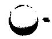

# Core Thermal Dynamics Equations

The differential thermal dynamics equations for a single-core region are given below (see Fig. 5).

First fuel lump:

$$
\frac {\mathrm {d} \overline {{\mathrm {T}}} _ {\mathrm {F l}}}{\mathrm {d t}} = \frac {1}{\tau_ {\mathrm {F l}}} \left(\mathrm {T} _ {\mathrm {F l}, \text {i n}} - \overline {{\mathrm {T}}} _ {\mathrm {F l}}\right) + \frac {\mathrm {K} _ {\mathrm {l}}}{\mathrm {M C} _ {\mathrm {p l}}} \mathrm {P} _ {\mathrm {T}} + \frac {\mathrm {K} _ {\mathrm {G l}}}{\mathrm {K} _ {\mathrm {G l}} + \mathrm {K} _ {\mathrm {G 2}}} \frac {\mathrm {h A}}{\mathrm {M C} _ {\mathrm {p l}}} \left(\overline {{\mathrm {T}}} _ {\mathrm {G}} - \overline {{\mathrm {T}}} _ {\mathrm {F l}}\right). \tag {A.1}
$$

Second fuel lump:

$$
\frac {\mathrm {d} \overline {{\mathrm {T}}} _ {\mathrm {F} 2}}{\mathrm {d t}} = \frac {1}{\tau_ {\mathrm {F} 2}} \left(\overline {{\mathrm {T}}} _ {\mathrm {F} 1} - \overline {{\mathrm {T}}} _ {\mathrm {F} 2}\right) + \frac {\mathrm {K} _ {2}}{\mathrm {M C} _ {\mathrm {p} 2}} \mathrm {P} _ {\mathrm {T}} + \frac {\mathrm {K} _ {\mathrm {G} 2}}{\mathrm {K} _ {\mathrm {G} 1} + \mathrm {K} _ {\mathrm {G} 2}} \frac {\mathrm {h A}}{\mathrm {M C} _ {\mathrm {p} 2}} \left(\overline {{\mathrm {T}}} _ {\mathrm {G}} - \overline {{\mathrm {T}}} _ {\mathrm {F} 1}\right). \tag {A.2}
$$

Graphite lump:

$$
\frac {\mathrm {d} \overline {{\mathrm {T}}} _ {\mathrm {G}}}{\mathrm {d} t} = \frac {\mathrm {h A}}{\mathrm {M C} _ {\mathrm {p G}}} \left(\overline {{\mathrm {T}}} _ {\mathrm {F l}} - \overline {{\mathrm {T}}} _ {\mathrm {G}}\right) + \frac {\mathrm {K} _ {\mathrm {G l}} + \mathrm {K} _ {\mathrm {G 2}}}{\mathrm {M C} _ {\mathrm {p G}}} \mathrm {P} _ {\mathrm {T}}. \tag {A.3}
$$

In these equations,

$\overline{\mathrm{T}}_{\mathrm{Fl}} =$ mean fuel temperature in first well-stirred tank, or lump, ${}^{\circ}\mathrm{F}$

$\mathbf{t} =$ time,sec,

$\tau_{F1} =$ transit (or holdup) time for fuel in first lump, sec,

$\mathbf{T}_{\mathbf{F}1,\mathbf{i}\mathbf{n}} =$ inlet fuel temperature to first lump, ${}^{\mathrm{o}}\mathbf{F},$

$\mathbf{K}_{\perp} =$ fraction of total power generated in first fuel lump,

MC $=$ heat capacity of first lump, $\mathrm{Mw}\cdot \mathrm{sec} / {}^{\circ}\mathrm{F},$

$\mathbf{P}_{\mathbf{T}} =$ total power, Mw,

$K_{Gl} =$ fraction of total power generated in graphite adjacent to first fuel lump,

$\mathbf{K}_{\mathrm{G2}} =$ fraction of total power generated in graphite adjacent to second fuel lump,

hA = mean heat transfer coefficient times area for fuel-to-graphite heat transfer, $\mathbf{Mw} / {}^{\circ}\mathbf{F}$ ,

$\overline{\mathbb{T}}_{\mathrm{G}} =$ mean graphite temperature in section, ${}^{\circ}\mathrm{F},$

$$
\begin{array}{l} \bar {T} _ {F 2} = \text {m e a n f u e l t e m p e r a t u r e i n s e c o n d l u m p}, ^ {\circ} F, \\ \tau_ {F 2} = \text {t r a n s i t t i m e f u l e n i n s e c o n d l u m p , s e c}, \\ \mathrm {K} _ {2} = \text {f r a c t i o n o f t o t a l p o w e r g e n e r a t e d i n s e c o n d l u m p}, \\ \mathrm {M C} _ {\mathrm {p} 2} = \text {h e a t c a p a c i t y o f s e c o n d l u m p , M w \cdot s e c / ° F}, \\ \mathrm {M C} _ {\mathrm {p G}} = \text {h e a t c a p a c i t y o f g r a p h i t e , M w} \cdot \sec / ^ {\circ} F. \\ \end{array}
$$

Nuclear importances:

$$
\delta \mathrm {k} _ {\mathrm {l}} = \mathrm {I} _ {\mathrm {F l}} \frac {\partial \mathrm {k}}{\partial \mathrm {T} _ {\mathrm {F}}} \Delta \overline {{\mathrm {T}}} _ {\mathrm {F l}}, \tag {A.4}
$$

$$
\delta k _ {2} = I _ {F 2} \frac {\partial k}{\partial T _ {F}} \Delta \overline {{T}} _ {F 2}, \tag {A.5}
$$

$$
\delta \mathrm {k} _ {\mathrm {G}} = \mathrm {I} _ {\mathrm {G}} \frac {\partial \mathrm {k}}{\partial \mathrm {T} _ {\mathrm {G}}} \Delta \overline {{\mathrm {T}}} _ {\mathrm {G}}, \tag {A.6}
$$

where

$$
\delta k _ {1, 2, G} = \text {c h a n g e s i n e f f e c t i v e r e a c t o r m u l t i p l i c a t i o n d u e t o t e m - p e r a t u r e c h a n g e i n f u e l l u m p s 1 a n d 2 a n d t h e g r a p h i t e},
$$

$$
I _ {F 1, F 2, G} = \text {i m p o r t a n c e f a c t o r s f o r f u e l l u m p s 1 a n d 2 a n d t h e}
$$

$$
\sum_ {\text {n i n e s e c t i o n s}} \left(I _ {F 1} + I _ {F 2}\right) = 1. 0
$$

$$
\sum_ {\text {n i n e s e c t i o n s}} \left(I _ {G}\right) = 1. 0,
$$

$$
\frac {\partial \mathrm {k}}{\partial \mathrm {T} _ {\mathrm {F}}} \equiv \alpha_ {\mathrm {F}} = \text {t o t a l f u e l t e m p e r a t u r e c o e f f i c i e n t o f r e a c t i v i t y},
$$

$$
\frac {\partial k}{\partial T _ {G}} \equiv \alpha_ {G} = \text {t o t a l g r a p h i t e t e m p e r a t u r e c o e f f i c i e n t o f r e a c t i v i t y},
$$

In the nine-region core model, the individual regions are combined as shown in Fig. 5. The nuclear average fuel and graphite temperatures,

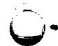

reactivity feedback, and core outlet temperatures are computed as functions of nuclear power and core inlet temperature for both the analog and frequency-response models.

The core transfer function equations solved in the MSRE frequency-response code are as follows.

Single Core Region. The equations are obtained by substituting the Laplace transform variable, $s$ , for $\frac{d}{dt}$ in Eqs. (A.1) through (A.6) and solving for $\overline{T}_{\mathbf{F}1}, \overline{T}_{\mathbf{F}2}, \overline{T}_{\mathbf{G}}$ , and $\delta k$ in terms of the inputs $T_{\mathbf{F}1, \text{in}}$ and $P_{\mathbf{T}}$ . It is assumed (without loss of generality) that the variables are written as deviations from steady state. Thus the Laplace transformed equations that follow do not contain initial conditions:

$$
\frac {\frac {1}{\tau_ {F 1}} \hat {T} _ {F 1 , i n} + \left(\frac {K _ {l}}{M C _ {p l}} + \frac {K _ {G l}}{K _ {G l} + K _ {G 2}} \frac {h A}{M C _ {p l}} \frac {\frac {K _ {G l} + K _ {G 2}}{M C _ {p G}}}{\frac {s + h A}{M C _ {p G}}}\right) \hat {P} _ {T}}{\hat {T} _ {F 1}} = \frac {\frac {1}{\tau_ {F 1}} \hat {T} _ {F 1 , i n} + \left(\frac {K _ {l}}{M C _ {p l}} + \frac {K _ {G l}}{K _ {G l} + K _ {G 2}} \frac {h A}{M C _ {p l}} \frac {\frac {K _ {G l} + K _ {\mathrm {G} 2}}{M C _ {\mathrm {p G}}}}{\frac {s + h A}{M C _ {\mathrm {p G}}}}\right) \hat {P} _ {\mathrm {T}}}{\hat {T} _ {F 1}}, \tag {A.7}
$$

$$
s + \frac {1}{\tau_ {F 1}} + \frac {K _ {G 1}}{K _ {G 1} + K _ {G 2}} \frac {h A}{M C _ {p l}} \left(1 - \frac {\frac {h A}{M C _ {p G}}}{\frac {s + h A}{M C _ {p G}}}\right)
$$

$$
\hat {\mathrm {T}} _ {\mathrm {F l}} \equiv J _ {1} (\mathrm {s}) \hat {\mathrm {T}} _ {\mathrm {F l}, \text {i n}} + J _ {2} (\mathrm {s}) \hat {\mathrm {P}} _ {\mathrm {T}}, \tag {A.7a}
$$

$$
\frac {\hat {\mathrm {T}} _ {\mathrm {G}}}{\left(s + \frac {1}{\tau_ {\mathrm {F l}}} + \frac {\mathrm {K} _ {\mathrm {G l}}}{\mathrm {K} _ {\mathrm {G l}} + \mathrm {K} _ {\mathrm {G 2}}} \frac {\mathrm {h A}}{\mathrm {M C} _ {\mathrm {p l}}}\right) \hat {\mathrm {T}} _ {\mathrm {F l , i n}}} + \left(\frac {\frac {\mathrm {h A}}{\mathrm {M C} _ {\mathrm {p G}}} \frac {\mathrm {K} _ {\mathrm {l}}}{\mathrm {M C} _ {\mathrm {p l}}}}{\mathrm {s} + \frac {1}{\tau_ {\mathrm {F l}}} + \frac {\mathrm {K} _ {\mathrm {G l}}}{\mathrm {K} _ {\mathrm {G l}} + \mathrm {K} _ {\mathrm {G 2}}} \frac {\mathrm {h A}}{\mathrm {M C} _ {\mathrm {p l}}}} + \frac {\mathrm {K} _ {\mathrm {G l}} + \mathrm {K} _ {\mathrm {G 2}}}{\mathrm {M C} _ {\mathrm {p G}}}\right) \hat {\mathrm {P}} _ {\mathrm {T}}
$$

$$
\hat {\mathrm {T}} _ {\mathrm {G}} \equiv \mathrm {J} _ {3} (\mathrm {s}) \hat {\mathrm {T}} _ {\mathrm {F l}, \text {i n}} + \mathrm {J} _ {4} (\mathrm {s}) \hat {\mathrm {P}} _ {\mathrm {T}}, \tag {A.8a}
$$

$$
\begin{array}{l} \hat {\mathrm {T}} _ {\mathrm {F} 2} = \frac {\left[ \frac {1}{\tau_ {\mathrm {F} 2}} + \frac {\mathrm {K} _ {\mathrm {G} 2}}{\mathrm {K} _ {\mathrm {G} 1} + \mathrm {K} _ {\mathrm {G} 2}} \frac {\mathrm {h A}}{\mathrm {M C} _ {\mathrm {p} 2}} \left(\frac {\frac {\mathrm {h A}}{\mathrm {M C} _ {\mathrm {p G}}} - 1}{\mathrm {s} + \frac {\mathrm {h A}}{\mathrm {M C} _ {\mathrm {p G}}}}\right) \mathrm {J} _ {1} (\mathrm {s}) \right]}{\mathrm {s} + \frac {1}{\tau_ {\mathrm {F} 2}}} \hat {\mathrm {T}} _ {\mathrm {F l}, \text {i n}} (A.9) \\ + \frac {\left[ \frac {1}{\tau_ {F 2}} + \frac {K _ {G 2}}{K _ {G 1} + K _ {G 2}} \frac {h A}{M C _ {p 2}} \left(\frac {\frac {h A}{M C _ {p G}}}{s + \frac {h A}{M C _ {p G}}} - 1\right) J _ {2} (s) + \frac {K _ {2}}{M C _ {p 2}} + \frac {\frac {h A}{M C _ {p 2}} \frac {K _ {G 2}}{M C _ {p 2}}}{s + \frac {h A}{M C _ {p G}}} \right]}{s + \frac {1}{\tau_ {F 2}}} \hat {P} _ {T}, \\ \hat {\mathrm {T}} _ {\mathrm {F} 2} \equiv \mathrm {H} _ {1} (\mathrm {s}) \hat {\mathrm {T}} _ {\mathrm {F l}, \text {i n}} + \mathrm {H} _ {2} (\mathrm {s}) \hat {\mathrm {P}} _ {\mathrm {T}}, (A.9a) \\ \frac {\delta \hat {k}}{\hat {T} _ {F l , i n}} = \left[ I _ {F 1} J _ {1} (s) + I _ {F 2} H _ {1} (s) \right] \frac {\partial k}{\partial T _ {F}} + I _ {G} J _ {3} (s) \frac {\partial k}{\partial T _ {G}}, (A.10) \\ \frac {\delta \widehat {k}}{\widehat {P} _ {T}} = \left[ I _ {F 1} J _ {2} (s) + I _ {F 2} H _ {2} (s) \right] \frac {\partial k}{\partial T _ {F}} + I _ {G} J _ {4} (s) \frac {\partial k}{\partial T _ {G}}, (A.11) \\ \delta \hat {k} \equiv H _ {3} (s) \hat {T} _ {F 1, i n} + H _ {4} (s) \hat {P} _ {T}. (A.12) \\ \end{array}
$$

# Multiregion Core

The overall transfer functions for an axial section of core consisting of several regions in series are complicated by the fact that the inputs to the upper (or downstream) regions are affected by the response of the lower regions. A block diagram illustrating the coupling in terms of the transfer functions $H_{\frac{1}{4}}(s)$ is shown in Fig. A.1.

The general forms of the coupled equations of n regions in series are

$$
\frac {\hat {T} _ {C O}}{\hat {T} _ {C i}} = \prod_ {j = 1} ^ {n} H _ {l, j}, \tag {A.13}
$$

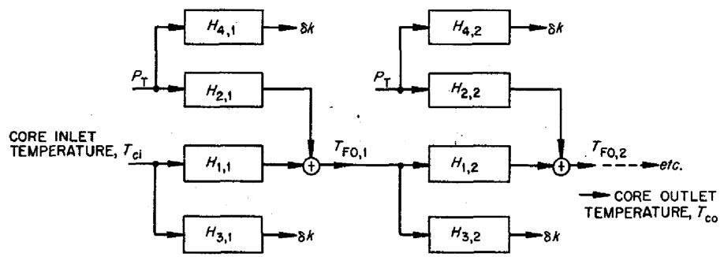  
Fig. A.l. Series Connection of Single-Core Regions.

ORNL-DWG 65-9828

$$
\begin{array}{l} \frac {\hat {T} _ {T}}{\hat {P} _ {T}} = H _ {2, 1} \left(H _ {1, 2} H _ {1, 3} \dots H _ {1, n}\right) + H _ {2, 2} \left(H _ {1, 3} H _ {1, 4} \dots H _ {1, n}\right) + \dots , (A.14) \\ \frac {\delta \hat {k}}{\hat {T} _ {c i}} = H _ {3, 1} + H _ {1, 1} \left\{H _ {3, 2} + H _ {1, 2} \left[ H _ {3, 3} + H _ {1, 3} \left(H _ {3, 4} + \dots , \right. \right. \right. (A.15) \\ \end{array}
$$

$$
\begin{array}{l} \frac {\delta \hat {k}}{\hat {P} _ {T}} = \sum_ {j = 1} ^ {n} H _ {4, j} + H _ {2, 1} H _ {3, 2} + \left(H _ {2, 1} H _ {1, 2} + H _ {2, 2}\right) H _ {3, 3} \\ + \left(\mathrm {H} _ {2, 1} \mathrm {H} _ {1, 2} \mathrm {H} _ {1, 3} + \mathrm {H} _ {2, 2} \mathrm {H} _ {1, 3} + \mathrm {H} _ {2, 3}\right) \mathrm {H} _ {3, 4} + \dots . \tag {A.16} \\ \end{array}
$$

The mean value of the core outlet temperature, $\overline{T}_{\mathrm{co}}$ for m axial sections in parallel is

$$
\overline {{\mathrm {T}}} _ {\mathrm {c o}} = \sum_ {j = 1} ^ {m} \left(\mathrm {F F} _ {j}\right) \mathrm {T} _ {\mathrm {c o}, j}, \tag {A.17}
$$

where $\mathbf{F}\mathbf{F}_{\mathbf{j}}$ is the fraction of the total flow in the jth axial section. The total δk is simply the sum of all the individual contributions.

The calculation of nuclear average temperature transfer functions was added to the MSRE frequency-response code as an afterthought; consequently there is some repetition in the calculations. The transfer functions of nuclear average temperature contributions from each core region are

$$
\frac {\hat {T} _ {F} ^ {*}}{\hat {T} _ {F l , i n}} = I _ {F 1} J _ {1} (s) + I _ {F 2} H _ {1} (s) \equiv H _ {5} (s), \tag {A.18}
$$

$$
\frac {\hat {T} _ {G} ^ {*}}{\hat {T} _ {F l , i n}} = I _ {G} J _ {3} (s) \in H _ {6} (s), \tag {A.19}
$$

$$
\frac {\hat {T} _ {F} ^ {*}}{\hat {P} _ {T}} = I _ {F 1} J _ {2} (s) + I _ {F 2} H _ {2} (s) \equiv H _ {7} (s), \tag {A.20}
$$

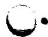

$$
\frac {\hat {T} _ {G} ^ {*}}{\hat {P} _ {T}} = I _ {G} J _ {4} (s) \equiv H _ {8} (s), \tag {A.21}
$$

where the asterisk indicates a nuclear average temperature.

The equations for the total nuclear average temperatures of the nine-region core model are derived the same way as the general equations for $\delta k$ , Eqs. (A.15) and (A.16). The second subscripts refer to the nine core regions, as designated in Fig. 5. The equations are

$$
\begin{array}{l} \frac {\hat {T} _ {F} ^ {*}}{\hat {P} _ {T}} = \sum_ {j = 1} ^ {9} H _ {7, j} + H _ {2, 2} H _ {5, 3} \\ + \left(\mathrm {H} _ {2, 2} \mathrm {H} _ {1, 3} + \mathrm {H} _ {2, 3}\right) \mathrm {H} _ {5, 4} + \mathrm {H} _ {2, 5} \mathrm {H} _ {5, 6} \\ + \left(\mathrm {H} _ {2, 5} \mathrm {H} _ {1, 6} + \mathrm {H} _ {2, 6}\right) \mathrm {H} _ {5, 7} + \mathrm {H} _ {2, 8} \mathrm {H} _ {5, 9}, \tag {A.22} \\ \end{array}
$$

$$
\begin{array}{l} \frac {\hat {T} _ {G} ^ {*}}{\hat {P} _ {T}} = \sum_ {j = 1} ^ {9} H _ {8, j} + H _ {2, 2} H _ {6, 3} \\ + \left(\mathrm {H} _ {2, 2} \mathrm {H} _ {1, 3} + \mathrm {H} _ {2, 3}\right) \mathrm {H} _ {6, 4} + \mathrm {H} _ {2, 5} \mathrm {H} _ {6, 6} \\ + \left(\mathrm {H} _ {2, 5} \mathrm {H} _ {1, 6} + \mathrm {H} _ {2, 6}\right) \mathrm {H} _ {6, 7} + \mathrm {H} _ {2, 8} \mathrm {H} _ {6, 9}, \tag {A.23} \\ \end{array}
$$

$$
\begin{array}{l} \frac {\hat {T} _ {F} ^ {*}}{\hat {T} _ {C i}} = \sum_ {j = 1, 2, 5, 8} H _ {5, j} + H _ {1, 2} H _ {5, 3} \\ + H _ {1, 2} - H _ {1, 3} H _ {5, 4} + H _ {1, 5} H _ {5, 6} \\ + H _ {1, 5} H _ {1, 6} H _ {5, 7} + H _ {1, 8} H _ {5, 9}, \tag {A.24} \\ \end{array}
$$

$$
\begin{array}{l} \frac {\hat {T} _ {G} ^ {*}}{\hat {T} _ {c i}} = \sum_ {j = 1, 2, 5, 8} H _ {6, j} + H _ {1, 2} H _ {6, 3} \\ + H _ {1, 2} H _ {1, 3} H _ {6, 4} + H _ {1, 5} H _ {6, 6} \\ + H _ {1, 5} H _ {1, 6} H _ {6, 7} + H _ {1, 8} H _ {6, 9}. \tag {A.25} \\ \end{array}
$$

# Neutron Kinetics

Nonlinear Equations

Neutron balance:

$$
\frac {\mathrm {d} n}{\mathrm {d} t} = \frac {n}{l ^ {*}} [ k (1 - \beta_ {\mathrm {T}}) - 1 ] + \sum_ {i} \lambda_ {i} c _ {i}. \tag {A.26}
$$

Precursor balance:

$$
\frac {\mathrm {d} c _ {i}}{\mathrm {d} t} = \frac {\operatorname {k n} \beta_ {i}}{l ^ {*}} - \lambda_ {i} c _ {i}. \tag {A.27}
$$

In these expressions

$$
n = \text {n e u t r o n}
$$

$$
t = \text {t i m e}, \sec ,
$$

$$
l ^ {*} = \text {p r o m p t - n e u t r o n} \quad \text {l i f e t i m e}, \quad \sec ,
$$

$$
k = \text {r e a c t o r}
$$

$$
\beta_ {T} = \text {t o t a l d e l a y e d - n e u t r o n f r a c t i o n},
$$

$$
\beta_ {i} = \text {e f f e c t i v e d e l a y e d - n e u t r o n f r a c t i o n f o r i t h p r e c u s o r g r o u p},
$$

$$
\lambda_ {i} = \text {d e c a y c o n s t a n t f o r i t h p r e c u s o r},
$$

$$
C _ {i} = i t h p r e c u s o r \quad p o p u l a t i o n.
$$

For the one-group approximation, the effective $\beta$ in the precursor balance equation was simply the sum of the $\beta$ 's for the six groups. The average decay constant $\overline{\lambda}$ was calculated from Eq. (A.28):

$$
\bar {\lambda} = \frac {\sum_ {i = 1} ^ {6} \beta_ {i}}{\sum_ {i = 1} ^ {6} \frac {\beta_ {i}}{\lambda_ {i}}} \cdot \tag {A.28}
$$

Linearized Equations with Circulating Precursor Dynamics. The differential equation for the precursor population in the core is

$$
\frac {\mathrm {d} c _ {i} (t)}{\mathrm {d} t} = \frac {k \beta_ {i} ^ {\prime} n (t)}{l ^ {*}} - \lambda_ {i} c _ {i} (t) - \frac {c _ {i} (t)}{\tau_ {c}} + \frac {c _ {i} (t - \tau_ {L}) e ^ {- \lambda_ {i} \tau_ {L}}}{\tau_ {c}}, \tag {A.29}
$$

$$
\begin{array}{l} \left[ \begin{array}{l} \text {r a t e o f c h a n g e} \\ \text {o f p r e c u s o r} \\ \text {p o p u l a t i o n i n} \\ \text {c o r e} \end{array} \right] = \left[ \begin{array}{l} \text {r a t e o f} \\ \text {f o r m a t i o n} \\ \text {i n c o r e} \end{array} \right] - \left[ \begin{array}{l} \text {r a t e o f} \\ \text {d e c a y} \\ \text {i n c o r e} \end{array} \right] \\ - \left[ \begin{array}{l} \text {r a t e} \\ \text {l e a v i n g} \\ \text {c o r e} \end{array} \right] + \left[ \begin{array}{l} \text {r a t e o f r e n t r y b y p r e c u r s o r s} \\ \text {t h a t l e f t c o r e} \tau_ {\mathrm {L}} \text {s e c o n d s a g o} \\ \text {a n d d e c a y e d t o a f r a c t i o n} \\ \mathrm {e} ^ {- \lambda_ {\mathrm {i}} \tau_ {\mathrm {L}}} \text {o f t h e i r p r e v i o u s v a l u e} \end{array} \right], \\ \end{array}
$$

where

$$
\begin{array}{l} \beta_ {i} ^ {\prime} = \text {t o t a l d e l a y e d - n e u t r o n f r a c t i o n f o r i t h p r e c u s o r g r o u p}, \\ \tau_ {c} = \text {c o r e h o l d u p t i m e}, \sec , \\ \tau_ {L} = \text {l o o p h o l d u p t i m e}, \sec . \\ \end{array}
$$

For this treatment, we assumed that the core is a well-stirred tank and that the precursor transport around the loop is a pure delay. We obtained the linearized neutron kinetics equation used in the frequency-response calculation from Eqs. (A.26) and (A.29):

$$
\frac {1}{n _ {0}} \frac {\hat {n}}{\hat {k}} = \frac {1 - \beta_ {T} + \sum_ {i = 1} ^ {6} \frac {\lambda_ {i} \beta_ {i} ^ {\prime}}{s + \lambda_ {i} + \frac {1}{\tau_ {c}} \left[ 1 - e ^ {- \tau_ {L} (s + \lambda_ {i})} \right]}}{1 - \left(1 - \beta_ {T}\right) k _ {0} + s l ^ {*} - k _ {0} \sum_ {i = 1} ^ {6} \frac {\lambda_ {i} \beta_ {i} ^ {\prime}}{s + \lambda_ {i} + \frac {1}{\tau_ {c}} \left[ 1 - e ^ {- \tau_ {L} (s + \lambda_ {i})} \right]}}, \tag {A.30}
$$

where

$$
n _ {0} = \text {s t e a d y - s t a t e n u c l e a r p o w e r}, M w,
$$

$$
k _ {0} = \text {s t e a d y - s t a t e m u l t i p l i c a t i o n c o n s t a n t},
$$

and the circumflex $(\wedge)$ indicates a perturbation quantity, that is, $\mathbf{k}(t) = \mathbf{k}_0 + \hat{\mathbf{k}}$ .

The value of the critical reactor multiplication factor $\mathbf{k}_0$ is computed by setting $\frac{dn}{dt}$ and $\frac{d\mathbf{c}_i}{dt}$ equal to zero in Eqs. (A.26) and (A.29):

$$
k _ {0} \text {c r i t i c a l} = \frac {1}{1 - \beta_ {\mathrm {T}} + \sum_ {\mathrm {i} = 1} ^ {6} \frac {\beta_ {\mathrm {i}} ^ {\prime} \lambda_ {\mathrm {i}}}{\lambda_ {\mathrm {i}} + \frac {1}{\tau_ {\mathrm {c}}} \left(1 - e ^ {- \lambda_ {\mathrm {i}} \tau_ {\mathrm {L}}}\right)}}. \tag {A.31}
$$

# Heat Exchanger and Radiator Equations

The coefficients for the heat exchanger and radiator equations are given in terms of time constants and dimensionless parameters. A detailed discussion of this model is given in ref. 18. The equations, based on the model shown in Fig. A.2, are

$$
\frac {\mathrm {d} \overline {{\mathbf {T}}} _ {1}}{\mathrm {d} t} = \frac {2}{t _ {1} ^ {*}} \left(\mathbf {T} _ {1, \text {i n}} - \overline {{\mathbf {T}}} _ {1}\right) + \frac {\mathbf {n} _ {1}}{t _ {1} ^ {*}} \left(\overline {{\mathbf {T}}} _ {\mathbf {T}} - \overline {{\mathbf {T}}} _ {1}\right), \tag {A.32}
$$

$$
\frac {d T _ {1 , o u t}}{d t} = \frac {2}{t _ {1} ^ {*}} \left(\bar {T} _ {1} - T _ {1, o u t}\right) + \frac {n _ {1}}{t _ {1} ^ {*}} \left(\bar {T} _ {T} - \bar {T} _ {1}\right), \tag {A.33}
$$

$$
\frac {\mathrm {d} \overline {{\mathrm {T}}} _ {\mathrm {T}}}{\mathrm {d t}} = \frac {1}{\tau_ {\mathrm {T 1}}} \left(\overline {{\mathrm {T}}} _ {1} - \overline {{\mathrm {T}}} _ {\mathrm {T}}\right) + \frac {1}{\tau_ {\mathrm {T 2}}} \left(\overline {{\mathrm {T}}} _ {2} - \overline {{\mathrm {T}}} _ {\mathrm {T}}\right), \tag {A.34}
$$

ORNL-DWG 65-9829

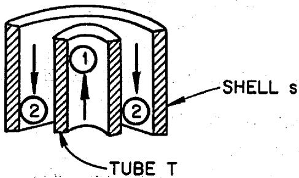  
Fig. A.2. Heat Exchanger and Radiator Tube Model.

$$
\begin{array}{l} \frac {\mathrm {d} \overline {{\mathrm {T}}} _ {2}}{\mathrm {d t}} = \frac {2}{\mathrm {t} _ {2} ^ {*}} \left(\mathrm {T} _ {2, \text {i n}} - \overline {{\mathrm {T}}} _ {2}\right) + \frac {\mathrm {n} _ {2}}{\mathrm {t} _ {2} ^ {*}} \left(\overline {{\mathrm {T}}} _ {\mathrm {T}} - \overline {{\mathrm {T}}} _ {2}\right) + \frac {\mathrm {n} _ {\mathrm {s}}}{\mathrm {t} _ {2} ^ {*}} \left(\overline {{\mathrm {T}}} _ {\mathrm {s}} - \overline {{\mathrm {T}}} _ {2}\right), (A.35) \\ \frac {\mathrm {d} \mathrm {T} _ {2 , \text {o u t}}}{\mathrm {d} t} = \frac {2}{t _ {2} ^ {*}} \left(\overline {{\mathrm {T}}} _ {2} - \mathrm {T} _ {2, \text {o u t}}\right) + \frac {\mathrm {n} _ {2}}{t _ {2} ^ {*}} \left(\overline {{\mathrm {T}}} _ {\mathrm {T}} - \overline {{\mathrm {T}}} _ {2}\right) + \frac {\mathrm {n} _ {\mathrm {s}}}{t _ {2} ^ {*}} \left(\overline {{\mathrm {T}}} _ {\mathrm {s}} - \overline {{\mathrm {T}}} _ {2}\right), (A.36) \\ \frac {\mathrm {d} \overline {{\mathrm {T}}} _ {\mathrm {s}}}{\mathrm {d t}} = \frac {1}{\tau_ {\mathrm {s}}} \left(\overline {{\mathrm {T}}} _ {2} - \overline {{\mathrm {T}}} _ {\mathrm {s}}\right), (A.37) \\ \end{array}
$$

where the nomenclature of Fig. 7 applies to the temperatures, T, and

$\overline{\mathbf{T}}_{\mathbf{s}} =$ mean shell temperature, ${}^{\circ}\mathbb{F},$

$\mathbf{t}^{*} =$ transport time, sec,

$\tau =$ heat transfer time constant $\mathrm{MC}_{\mathrm{p}} / \mathrm{hA}$ , sec,

n = section length = hA/WCp, dimensionless.

The subscripts have the following meanings:

$\mathbf{l} =$ fluid 1 side,

$2 =$ fluid 2 side,

$\mathbf{T} =$ tube side,

$\mathbf{s} = \mathbf{sh}$ ell side.

Also,

h = heat transfer coefficient, Btu/sec.ft².°F,

A = heat transfer area, ft²,

$M =$ mass of tube or shell, 1b,

Cp = specific heat, Btu/1b·°F,

W = mass flow rate, lb/sec.

Since it is the radiator air flow rate that is varied to change the load demand, the radiator shell-side coefficients will vary with power level. The coefficients listed in Appendix B are for a 197-1b/sec air flow rate, corresponding to 10-Mw power removal at design temperatures. In all the studies, $h_{\text{air}}$ was varied as the 0.6 power of the flow rate, and $W_{\text{air}}$ as the first power.

The solutions of the Laplace-transformed transfer function equations are

$$
\frac {\hat {T} _ {l , \text {o u t}}}{\hat {T} _ {l , \text {i n}}} = \frac {(2 - n _ {1}) + n _ {1} B}{t _ {1} ^ {*} s + 2} F, \tag {A.38}
$$

$$
\frac {\hat {T} _ {2 , \text {o u t}}}{\hat {T} _ {2 , \text {i n}}} = \frac {\left[ n _ {2} D + \left(2 - n _ {2} - n _ {s}\right) + \frac {n _ {s}}{\tau_ {s} s + 1} \right] E}{t _ {2} ^ {*} s + 2}, \tag {A.39}
$$

$$
\frac {\hat {T} _ {1 , \text {o u t}}}{\hat {T} _ {2 , \text {i n}}} = \frac {\operatorname {D E} \left[ n _ {1} + c (2 - n _ {1}) \right]}{t _ {1} ^ {*} s + 2}, \tag {A.40}
$$

$$
\frac {\hat {\mathrm {T}} _ {2 , \text {o u t}}}{\hat {\mathrm {T}} _ {1 , \text {i n}}} = \frac {\operatorname {B F} \left[ n _ {2} + \left(2 - n _ {2} - n _ {\mathrm {s}}\right) \mathrm {A} + \frac {\mathrm {n} _ {\mathrm {s}}}{\tau_ {\mathrm {s}} \mathrm {s} + 1} \mathrm {A} \right]}{\mathrm {t} _ {2} ^ {*} \mathrm {s} + 2}, \tag {A.41}
$$

where

$$
A = \frac {n _ {2}}{t _ {2} ^ {*} s + n _ {2} + 2 + n _ {s} - \frac {n _ {s}}{\tau_ {s} s + 1}},
$$

$$
B = \frac {1}{\tau_ {T 1} s + 1 + \frac {\tau_ {T 1}}{\tau_ {T 2}} - \frac {\tau_ {T 1}}{\tau_ {T 2}} A},
$$

$$
C = \frac {n _ {1}}{t _ {1} ^ {*} s + n _ {1} + 2},
$$

$$
D = \frac {1}{\tau_ {\mathrm {T} 2} \mathrm {s} + 1 + \frac {\tau_ {\mathrm {T} 2}}{\tau_ {\mathrm {T} 1}} - \frac {\tau_ {\mathrm {T} 2}}{\tau_ {\mathrm {T} 1}} \mathrm {c}},
$$

$$
E = \frac {2}{t _ {2} ^ {*} s + n _ {2} + 2 + n _ {s} - n _ {2} D - \frac {n _ {s}}{\tau_ {s} s + 1}},
$$

$$
F = \frac {2}{t _ {1} ^ {*} s + n _ {1} + 2 - n _ {1} B}.
$$

To compute the transfer functions of an arbitrary number of equal lumps connected in series, we considered first the transfer functions for two lumps in series, as in Fig. A.3, where for each lump,

$$
G _ {1} = \frac {T _ {l , o u t}}{T _ {l , i n}},
$$

$$
G _ {2} = \frac {T _ {2 , o u t}}{T _ {2 , i n}},
$$

$$
G _ {3} = \frac {T _ {2 , o u t}}{T _ {1 , i n}},
$$

$$
G _ {4} = \frac {T _ {1 , o u t}}{T _ {2 , i n}}.
$$

The transfer functions for the two combined lumps are

$$
\left. \frac {\hat {T} _ {1 , \text {o u t}}}{\hat {T} _ {1 , \text {i n}}} \right| _ {\text {c o m b .}} = \frac {G _ {1} G _ {1} ^ {\prime}}{1 - G _ {3} G _ {4} ^ {\prime}}, \tag {A.42}
$$

$$
\left. \frac {\hat {T} _ {2 , \text {o u t}}}{\hat {T} _ {2 , \text {i n}}} \right| _ {\text {c o m b .}} = \frac {\mathrm {G} _ {2} \mathrm {G} _ {2} ^ {\prime}}{1 - \mathrm {G} _ {3} \mathrm {G} _ {4} ^ {\prime}}, \tag {A.43}
$$

$$
\left. \frac {\hat {T} _ {2 , \text {o u t}}}{\hat {T} _ {1 , \text {i n}}} \right| _ {\text {c o m b .}} = G _ {3} ^ {\prime} + \frac {G _ {1} ^ {\prime} G _ {2} ^ {\prime} G _ {3}}{1 - G _ {3} G _ {4} ^ {\prime}}, \tag {A.44}
$$

$$
\left. \frac {\hat {\mathrm {T}} _ {1 , \text {o u t}}}{\hat {\mathrm {T}} _ {2 , \text {i n}}} \right| _ {\text {c o m b .}} = \mathrm {G} _ {4} + \frac {\mathrm {G} _ {1} \mathrm {G} _ {2} \mathrm {G} _ {4} ^ {\prime}}{1 - \mathrm {G} _ {3} \mathrm {G} _ {4} ^ {\prime}}. \tag {A.45}
$$

To solve for more lumps in series, we set the primed functions equal to the respective combined transfer functions and repeated the computation.

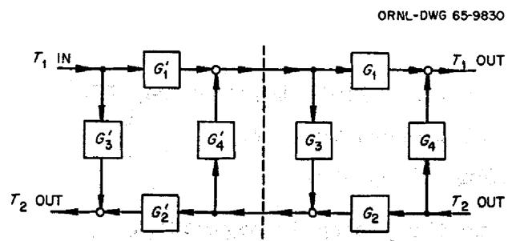  
Fig. A.3. Diagram for Computing Transfer Functions for Two Lumps in Series.

# Equations for Piping Lags

The first-order (or well-stirred-tank) approximation used in the reduced model, is given by

$$
\frac {\mathrm {d} \overline {{\mathrm {T}}}}{\mathrm {d t}} = \frac {1}{\tau} \left(\mathrm {T} _ {\text {i n}} - \overline {{\mathrm {T}}}\right), \tag {A.46}
$$

where

$$
\begin{array}{l} \overline {{\mathbf {T}}} = \text {m e a n} (\text {a n d o u t l e t}) \text {f l u i d} ^ {\prime} \text {t e m p e r a t u r e}, ^ {\prime} \mathbf {F}, \\ \mathrm {T} _ {\text {i n}} = \text {f l u i d i n l e t} ^ {\prime} \text {t e m p e r a t u r e}, ^ {\prime} \mathrm {F}, \\ \tau = \text {f l u i d h o l d u p t i m e}, \sec , \\ \end{array}
$$

and heat transfer to the piping is neglected.

In the intermediate model, fourth-order Padé approximations were used. They are series expansions of the Laplace transform expressions for a pure delay:

$$
e ^ {- \tau s} \approx \frac {1 0 7 2 - 5 3 6 \tau s + 1 2 0 \tau^ {2} s ^ {2} - 1 3 . 5 5 \tau^ {3} s ^ {3} + \tau^ {4} s ^ {4}}{1 0 7 2 + 5 3 6 \tau s + 1 2 0 \tau^ {2} s ^ {2} + 1 3 . 5 5 \tau^ {3} s ^ {3} + \tau^ {4} s ^ {4}}. \tag {A.47}
$$

The heat transfer to the piping and the reactor vessel was approximated by lead-lag networks. The method for obtaining the coefficients $L_{1}$ and $L_{2}$ is described in detail in ref. 9. The general form of the equation is

$$
\frac {\hat {T} _ {\text {o u t}}}{\hat {T} _ {\text {i n}}} = \frac {\mathrm {L} _ {1} \mathrm {s} + 1}{\mathrm {L} _ {2} \mathrm {s} + 1}. \tag {A.48}
$$

In the complete model, the heat transfer to the piping and the transport lag were represented by the exact solution to the plug-flow equations:

$$
\frac {\hat {T} _ {\text {o u t}}}{\hat {T} _ {\text {i n}}} = e ^ {- \tau s} e ^ {- n} e ^ {\frac {n / (1 + \tau_ {P} s)}{}}, \tag {A.49}
$$

where

$$
\begin{array}{l} n = \text {s e c t i o n} = h A / W C _ {p}, \text {d i m e n s i o n l e s s}, \\ \tau = \text {t r a n s p o r t} \quad \text {l a g}, \quad \text {s e c}, \\ \tau_ {P} = \text {t i m e c o n s t a n t f o r h e a t t r a n s f e r t t o p i p e} = M C _ {p} / h A, \sec . \\ \end{array}
$$

# Equations for Xenon Behavior

Xenon was considered only in the present frequency-response model. The following differential equations were used:

$$
\frac {\mathrm {d} X _ {G}}{\mathrm {d} t} = K _ {1} X ^ {\prime} - \left(K _ {2} + K _ {3} P _ {0}\right) X _ {G}, \tag {A.50}
$$

$$
\frac {\mathrm {d} X ^ {\prime}}{\mathrm {d} t} = K _ {4} I + K _ {5} X _ {G} - K _ {6} X ^ {\prime} + K _ {7} P, \tag {A.51}
$$

$$
\frac {\mathrm {d} I}{\mathrm {d} t} = - K _ {8} I + K _ {9} P, \tag {A.52}
$$

$$
\delta k = - k _ {1 0} X ^ {\prime} - k _ {1 1} X _ {G}, \tag {A.53}
$$

where

$$
\begin{array}{l} X _ {G} = \text {x e n o n c o n c e n t r a t i o n i n g r a p h i t e , a t o m s / c c}, \\ X ^ {\prime} = \text {x e n o n c o n c e n t r a t i o n i n f u e l s a t t}, \text {a t o m s / c c}, \\ I = \text {i o d i n e} \\ P = \text {n u c l e a r} \quad \text {p o w e r}, \quad M w, \\ \end{array}
$$

$$
\delta \mathrm {k} = \text {c h a n g e i n r e a c t o r m u l t i p l i c a t i o n f a c t o r d u e t o c h a n g e i n}
$$

$$
\mathrm {K} _ {1 - 1 1} = \text {c o n s t a n t s}.
$$

# Delayed Power Equations

The equation for total thermal power, $\mathbf{P}_{\mathbf{T}}$ , includes a first-order lag approximation of the delayed nuclear power due to gamma heating:

$$
\frac {\mathrm {d} P _ {\mathrm {T}}}{\mathrm {d} t} = (1 - \mathrm {K d}) \frac {\mathrm {d n}}{\mathrm {d} t} - \frac {(n - P _ {\mathrm {T}})}{\tau_ {\mathrm {g}}} \tag {A.54}
$$

where

$$
\begin{array}{l} \mathrm {K} _ {\mathrm {d}} = \text {t h e f r a c t i o n o f f l u x p o w e r d e l a y e d}, \\ n = \text {f l u x p o w e r}, M w, \\ P _ {T} = \text {t o t a l t h e r m a l p o w e r}, M w, \\ \tau_ {g} = \text {e f f e c t i v e} \\ \end{array}
$$

The frequency response of the thermal power in terms of $n$ is

$$
\frac {\hat {P} _ {T}}{\hat {n}} = \frac {(1 - K _ {d}) \tau_ {g} s + 1}{\tau_ {g} s + 1}. \tag {A.55}
$$

# Appendix B. Coefficients Used in the Model Equations

Core Thermal Equations Data

<table><tr><td>Study</td><td>Region</td><td>τF1(sec)</td><td>τF2(sec)</td><td>K1</td><td>K2</td><td>KG1</td><td>KG2</td></tr><tr><td>Burke 1961 analog</td><td>1</td><td>3.815000</td><td>3.815000</td><td>0.470000</td><td>0.470000</td><td>0.030000</td><td>0.030000</td></tr><tr><td rowspan="9">Ball 1962 analog</td><td>1</td><td>1.533</td><td>1.607</td><td>0.01493</td><td>0.01721</td><td>0.000946</td><td>0.001081</td></tr><tr><td>2</td><td>2.302</td><td>1.574</td><td>0.02736</td><td>0.0455</td><td>0.001685</td><td>0.00306</td></tr><tr><td>3</td><td>1.259</td><td>1.259</td><td>0.04504</td><td>0.04656</td><td>0.003029</td><td>0.003131</td></tr><tr><td>4</td><td>1.574</td><td>3.064</td><td>0.05126</td><td>0.04261</td><td>0.003477</td><td>0.002395</td></tr><tr><td>5</td><td>2.303</td><td>1.574</td><td>0.03601</td><td>0.06069</td><td>0.002216</td><td>0.004081</td></tr><tr><td>6</td><td>1.259</td><td>1.259</td><td>0.06014</td><td>0.06218</td><td>0.004044</td><td>0.004182</td></tr><tr><td>7</td><td>1.574</td><td>3.066</td><td>0.06845</td><td>0.05664</td><td>0.004603</td><td>0.003184</td></tr><tr><td>8</td><td>2.621</td><td>1.525</td><td>0.06179</td><td>0.07707</td><td>0.00392</td><td>0.00583</td></tr><tr><td>9</td><td>1.779</td><td>2.983</td><td>0.09333</td><td>0.07311</td><td>0.006277</td><td>0.004305</td></tr><tr><td rowspan="9">1965 frequency-response and eigenvalue calculations</td><td>1</td><td>1.386000</td><td>1.454000</td><td>0.014930</td><td>0.017210</td><td>0.000946</td><td>0.001081</td></tr><tr><td>2</td><td>2.083000</td><td>1.424000</td><td>0.027360</td><td>0.045500</td><td>0.001685</td><td>0.003060</td></tr><tr><td>3</td><td>1.139000</td><td>1.139000</td><td>0.045040</td><td>0.046560</td><td>0.003029</td><td>0.003131</td></tr><tr><td>4</td><td>1.424000</td><td>2.772000</td><td>0.051260</td><td>0.042610</td><td>0.003447</td><td>0.002395</td></tr><tr><td>5</td><td>2.084000</td><td>1.424000</td><td>0.036010</td><td>0.060690</td><td>0.002216</td><td>0.004081</td></tr><tr><td>6</td><td>1.139000</td><td>1.139000</td><td>0.060140</td><td>0.062180</td><td>0.004044</td><td>0.004182</td></tr><tr><td>7</td><td>1.424000</td><td>2.774000</td><td>0.068450</td><td>0.056640</td><td>0.004603</td><td>0.003184</td></tr><tr><td>8</td><td>2.371000</td><td>1.380000</td><td>0.061790</td><td>0.077070</td><td>0.003920</td><td>0.005183</td></tr><tr><td>9</td><td>1.610000</td><td>2.700000</td><td>0.093330</td><td>0.073110</td><td>0.006277</td><td>0.004305</td></tr><tr><td>1965 extrema determination</td><td>1</td><td>4.230</td><td>4.230</td><td>0.470</td><td>0.470</td><td>0.030</td><td>0.030</td></tr><tr><td rowspan="9">1965 frequency-response with extrema data</td><td>1</td><td>1.14068</td><td>1.19664</td><td>0.01518</td><td>0.01750</td><td>0.000695</td><td>0.000794</td></tr><tr><td>2</td><td>1.71431</td><td>1.17195</td><td>0.02783</td><td>0.04627</td><td>0.001237</td><td>0.002247</td></tr><tr><td>3</td><td>0.93740</td><td>0.93740</td><td>0.04581</td><td>0.04735</td><td>0.002224</td><td>0.002299</td></tr><tr><td>4</td><td>1.17195</td><td>2.28136</td><td>0.05213</td><td>0.04333</td><td>0.002531</td><td>0.001758</td></tr><tr><td>5</td><td>1.17513</td><td>1.17195</td><td>0.03662</td><td>0.06172</td><td>0.001627</td><td>0.002996</td></tr><tr><td>6</td><td>0.93740</td><td>0.93740</td><td>0.06116</td><td>0.06324</td><td>0.002969</td><td>0.003071</td></tr><tr><td>7</td><td>1.17195</td><td>2.28300</td><td>0.06961</td><td>0.05760</td><td>0.003380</td><td>0.002338</td></tr><tr><td>8</td><td>1.95133</td><td>1.13574</td><td>0.06284</td><td>0.07838</td><td>0.002878</td><td>0.003806</td></tr><tr><td>9</td><td>1.32503</td><td>2.22210</td><td>0.09492</td><td>0.07435</td><td>0.004609</td><td>0.003161</td></tr></table>

<table><tr><td>Study</td><td>Region</td><td>\( MC_{pl} \) (Mw·sec/°F)</td><td>\( MC_{p2} \) (Mw·sec/°F)</td><td>\( MC_{pG} \) (Mw·sec/°F)</td><td>\( hA \) (Mw/°F)</td><td>\( I_{Fl} \)</td><td>\( I_{F2} \)</td><td>\( I_G \)</td></tr><tr><td>Burke 1961 analog</td><td>1</td><td>0.763000</td><td>0.763000</td><td>3.750000</td><td>0.020000</td><td>1.000000</td><td>0.</td><td>1.000000</td></tr><tr><td rowspan="9">Ball 1962 analog</td><td>1</td><td>0.0188</td><td>0.0197</td><td>0.070</td><td>0.265 × 10-3</td><td>0.02168</td><td>0.02678</td><td>0.04443</td></tr><tr><td>2</td><td>0.0638</td><td>0.0436</td><td>0.2114</td><td>0.814 × 10-3</td><td>0.02197</td><td>0.06519</td><td>0.08835</td></tr><tr><td>3</td><td>0.0349</td><td>0.0349</td><td>0.1601</td><td>0.609 × 10-3</td><td>0.07897</td><td>0.08438</td><td>0.16671</td></tr><tr><td>4</td><td>0.0436</td><td>0.0850</td><td>0.2056</td><td>0.794 × 10-3</td><td>0.08249</td><td>0.04124</td><td>0.12077</td></tr><tr><td>5</td><td>0.1080</td><td>0.0738</td><td>0.3576</td><td>1.338 × 10-3</td><td>0.02254</td><td>0.06801</td><td>0.09181</td></tr><tr><td>6</td><td>0.0590</td><td>0.0590</td><td>0.2718</td><td>1.031 × 10-3</td><td>0.08255</td><td>0.08823</td><td>0.17429</td></tr><tr><td>7</td><td>0.0738</td><td>0.1437</td><td>0.3478</td><td>1.343 × 10-3</td><td>0.08623</td><td>0.04290</td><td>0.12612</td></tr><tr><td>8</td><td>0.2970</td><td>0.1726</td><td>0.9612</td><td>3.685 × 10-3</td><td>0.02745</td><td>0.05521</td><td>0.08408</td></tr><tr><td>9</td><td>0.2014</td><td>0.3380</td><td>0.9421</td><td>3.624 × 10-3</td><td>0.06936</td><td>0.03473</td><td>0.10343</td></tr><tr><td rowspan="9">1965 frequency-response and eigenvalue calculations</td><td>1</td><td>0.015100</td><td>0.015800</td><td>0.070000</td><td>0.000392</td><td>0.021680</td><td>0.026780</td><td>0.044430</td></tr><tr><td>2</td><td>0.051200</td><td>0.034900</td><td>0.211400</td><td>0.001204</td><td>0.021970</td><td>0.065190</td><td>0.088350</td></tr><tr><td>3</td><td>0.028000</td><td>0.028000</td><td>0.160600</td><td>0.000900</td><td>0.078970</td><td>0.084380</td><td>0.166710</td></tr><tr><td>4</td><td>0.035000</td><td>0.068200</td><td>0.205600</td><td>0.001174</td><td>0.082490</td><td>0.041240</td><td>0.120770</td></tr><tr><td>5</td><td>0.086600</td><td>0.059200</td><td>0.357600</td><td>0.001977</td><td>0.022540</td><td>0.068010</td><td>0.091810</td></tr><tr><td>6</td><td>0.047300</td><td>0.047300</td><td>0.271800</td><td>0.001525</td><td>0.082550</td><td>0.088230</td><td>0.174290</td></tr><tr><td>7</td><td>0.059200</td><td>0.115200</td><td>0.347800</td><td>0.001985</td><td>0.086230</td><td>0.042900</td><td>0.126120</td></tr><tr><td>8</td><td>0.238000</td><td>0.138400</td><td>0.961200</td><td>0.005445</td><td>0.027450</td><td>0.055210</td><td>0.084080</td></tr><tr><td>9</td><td>0.161500</td><td>0.271000</td><td>0.942100</td><td>0.005360</td><td>0.069360</td><td>0.034730</td><td>0.103430</td></tr><tr><td>1965 extrema determination</td><td>1</td><td>0.750</td><td>0.750</td><td>3.58</td><td>0.020</td><td>1.0</td><td>0.0</td><td>1.0</td></tr><tr><td rowspan="9">1965 frequency-response with extrema data</td><td>1</td><td>0.01581</td><td>0.01654</td><td>0.070</td><td>0.588 × 10-3</td><td>0.02168</td><td>0.02678</td><td>0.04443</td></tr><tr><td>2</td><td>0.05360</td><td>0.03654</td><td>0.2114</td><td>1.806 × 10-3</td><td>0.02197</td><td>0.06519</td><td>0.08835</td></tr><tr><td>3</td><td>0.02931</td><td>0.02931</td><td>0.1606</td><td>1.35 × 10-3</td><td>0.07897</td><td>0.08438</td><td>0.16671</td></tr><tr><td>4</td><td>0.03664</td><td>0.07140</td><td>0.2056</td><td>1.761 × 10-3</td><td>0.08249</td><td>0.04124</td><td>0.12077</td></tr><tr><td>5</td><td>0.09066</td><td>0.06197</td><td>0.3576</td><td>2.965 × 10-3</td><td>0.06801</td><td>0.06801</td><td>0.09181</td></tr><tr><td>6</td><td>0.04952</td><td>0.04952</td><td>0.2718</td><td>2.287 × 10-3</td><td>0.08255</td><td>0.08823</td><td>0.17429</td></tr><tr><td>7</td><td>0.06197</td><td>0.12060</td><td>0.3478</td><td>2.977 × 10-3</td><td>0.08623</td><td>0.04290</td><td>0.12612</td></tr><tr><td>8</td><td>0.24915</td><td>0.14489</td><td>0.9612</td><td>8.167 × 10-3</td><td>0.02745</td><td>0.05521</td><td>0.08408</td></tr><tr><td>9</td><td>0.16907</td><td>0.28370</td><td>0.9421</td><td>8.04 × 10-3</td><td>0.06936</td><td>0.03473</td><td>0.10343</td></tr></table>

Flow fractions FF in the four sections (nine-region core only) for all studies were

$$
\frac {F F (1)}{0 . 0 6 1 7} \quad \frac {F F (2)}{0 . 1 3 8 3} \quad \frac {F F (3)}{0 . 2 3 4} \quad \frac {F F (4)}{0 . 5 6 6}.
$$

Neutron Kinetics Equations, Data*

1965 frequency-response, eigenvalue, and extrema data for decay constant $\lambda_{i}(\sec^{-1})$ :

$$
\frac {\lambda_ {1}}{3 . 0 1} \quad \frac {\lambda_ {2}}{1 . 1 4} \quad \frac {\lambda_ {3}}{0 . 3 0 1} \quad \frac {\lambda_ {4}}{0 . 1 1 1} \quad \frac {\lambda_ {5}}{0 . 0 3 0 5} \quad \frac {\lambda_ {6}}{0 . 0 1 2 4}.
$$

1965 frequency-response data for total delayed-neutron fraction for ith precursor group, $\beta_{\mathbf{i}}^{\prime}$ :

$$
\frac {\beta_ {1} ^ {\prime}}{0 . 0 0 0 2 8} \quad \frac {\beta_ {2} ^ {\prime}}{0 . 0 0 0 7 6 6} \quad \frac {\beta_ {3} ^ {\prime}}{0 . 0 0 2 6 2 8} \quad \frac {\beta_ {4} ^ {\prime}}{0 . 0 0 1 3 0 7} \quad \frac {\beta_ {5} ^ {\prime}}{0 . 0 0 1 4 5 7} \quad \frac {\beta_ {6} ^ {\prime}}{0 . 0 0 0 2 2 3}
$$

1965 eigenvalue and extrema data for effective delayed-neutron fraction for ith precursor group:

$$
\frac {\beta_ {1}}{0 . 0 0 0 2 7 7}, \frac {\beta_ {2}}{0 . 0 0 0 7 1 8}, \frac {\beta_ {3}}{0 . 0 0 1 6 9 8}, \frac {\beta_ {4}}{0 . 0 0 0 4 9 9}, \frac {\beta_ {5}}{0 . 0 0 0 3 7 3}, \frac {\beta_ {6}}{0 . 0 0 0 0 5 2}.
$$

Heat Exchanger and Radiator Data

Radiator air-side data given for 10-Mw conditions: heat exchanger fluid $l =$ coolant, fluid $2 =$ fuel; radiator fluid $l =$ coolant, fluid $2 =$ air.

<table><tr><td colspan="2"></td><td>n1</td><td>n2</td><td>ns</td><td>t1*(sec)</td><td>t2*(sec)</td><td>τT1(sec)</td><td>τT2(sec)</td><td>τs(sec)</td></tr><tr><td>Burke 1961 and Ball 1962</td><td>Heat ex-changer</td><td>0.980</td><td>0.906</td><td>0</td><td>1.75</td><td>2.24</td><td>1.75</td><td>1.165</td><td></td></tr><tr><td>analogsg</td><td>Radiator</td><td>0.0882</td><td>0.260</td><td>0</td><td>7.14</td><td>0.01</td><td>2.35</td><td>19.7</td><td></td></tr><tr><td rowspan="2">1965 frequency-response, eigen-value, and extrema determinations</td><td>Heat ex-changer</td><td>1.10</td><td>1.366</td><td>0.1363</td><td>2.01</td><td>2.29</td><td>0.569</td><td>0.304</td><td>1.14</td></tr><tr><td>Radiator</td><td>0.8803</td><td>0.2591</td><td>0</td><td>6.52</td><td>0.01</td><td>2.35</td><td>19.7</td><td></td></tr><tr><td rowspan="2">1965 frequency-response with extrema data</td><td>Heat ex-changer</td><td>1.60</td><td>1.611</td><td>0.1363</td><td>1.80</td><td>2.29</td><td>2.5</td><td>1.16</td><td>1.14</td></tr><tr><td>Radiator</td><td>0.983</td><td>0.2591</td><td>0</td><td>5.84</td><td>0.01</td><td>2.35</td><td>19.7</td><td></td></tr></table>

# Piping Lag Data

<table><tr><td></td><td></td><td>Burke 1961</td><td>Ball 1962</td><td>1965 Frequency Response and Eigenvalue</td><td>1965 Extrema Determinations</td><td>1965 Frequency Response with Extrema Data</td></tr><tr><td rowspan="3">Core to heat exchanger</td><td>n</td><td rowspan="3">3.09</td><td rowspan="3">5.72</td><td rowspan="3">5.77</td><td rowspan="3">5.77</td><td rowspan="3">6.30</td></tr><tr><td>τ</td></tr><tr><td>τP</td></tr><tr><td rowspan="3">Heat ex-changer to core</td><td>n</td><td rowspan="3">9.04</td><td>0.155</td><td>0.155</td><td></td><td>0.155</td></tr><tr><td>τ</td><td>9.02</td><td>8.67</td><td>8.67</td><td>9.47</td></tr><tr><td>τP</td><td>15.15</td><td>15.15</td><td>,</td><td>15.15</td></tr><tr><td rowspan="3">Heat ex-changer to radiator</td><td>n</td><td rowspan="3">5.2</td><td>0.27</td><td>0.27</td><td></td><td>0.27</td></tr><tr><td>τ</td><td>5.2</td><td>4.71</td><td>4.71</td><td>4.22</td></tr><tr><td>τP</td><td>6.67</td><td>6.67</td><td></td><td>6.67</td></tr><tr><td rowspan="3">Radiator to heat exchanger</td><td>n</td><td rowspan="3">10.11</td><td>0.40</td><td>0.40</td><td></td><td>0.40</td></tr><tr><td>τ</td><td>10.11</td><td>8.24</td><td>8.24</td><td>7.38</td></tr><tr><td>τP</td><td>6.67</td><td>6.67</td><td></td><td>6.67</td></tr></table>

The coefficients of the lead-lag approximation for fluid heat transfer to the piping apply to the Ball 1962 analog study:

<table><tr><td></td><td>Heat Exchanger to Core</td><td>Heat Exchanger to Radiator</td><td>Radiator to Heat Exchanger</td></tr><tr><td>L1</td><td>14.35</td><td>5.84</td><td>5.58</td></tr><tr><td>L2</td><td>16.67</td><td>7.69</td><td>8.33</td></tr></table>

# Xenon Equation Data

Data for 1965 frequency response and frequency response with extrema data:

$$
\begin{array}{l} \mathrm {K} _ {1} = 1. 5 8 7 \times 1 0 ^ {- 6} \quad \mathrm {K} _ {7} = 2. 8 8 5 \times 1 0 ^ {- 4} \\ \mathrm {K} _ {2} = 2. 2 5 7 5 \times 1 0 ^ {- 5} \quad \mathrm {K} _ {8} = 2. 9 \times 1 0 ^ {- 5} \\ \mathrm {K} _ {3} = 1. 6 5 4 \times 1 0 ^ {- 6} \quad \mathrm {K} _ {9} = 9. 4 7 \times 1 0 ^ {- 4} \\ \mathrm {K} _ {4} = 2. 8 4 \times 1 0 ^ {- 4} \quad \mathrm {K} _ {1 0} = 3. 0 7 \times 1 0 ^ {- 6} \\ \mathrm {K} _ {5} = 1. 0 7 1 4 \times 1 0 ^ {- 5} \quad \mathrm {K} _ {2 1} = 1. 0 3 \times 1 0 ^ {- 4} \\ K _ {6} = 1. 0 5 9 \times 1 0 ^ {- 3} \\ \end{array}
$$

# Delayed Power Equation Data

See Table 1 of Section 4.

# Appendix C. General Description of MSRE Frequency-Response Code

The MSRE frequency-response code (MSFR) is written in FORTRAN IV language for the IBM 7090 computers at the Oak Ridge Central Data Processing Facility. This language has built in capabilities for handling complex algebra that result in considerable savings of programming effort.

MSFR uses transfer function techniques (rather than matrix methods) to compute frequency response. It exploits the fact that a reactor system is made up of separate components, each having a certain number of inputs and outputs, which tie in with adjacent components. The subroutines written for each subsystem were useful in other reactor and process dynamics calculations. The MAIN program of MSFR performs input, output, and supervisory chores, and calls the subroutines. A subroutine called CLOSED must be written to compute the desired closed-loop transfer functions from the component transfer functions.

The transfer function approach has several advantages over the matrix methods:

1. Input parameters are the physical coefficients of the subsystems, rather than sums and differences. This not only makes generating input data easy, it allows the computer to carry out the sum-difference-type arithmetic internally. Several matrix type computations for which the matrix coefficients were generated "carefully" with long slide rules resulted in large errors in the frequency response.   
2. The frequency response of distributed-parameter models can be computed exactly with MSFR, while most matrix calculations are limited to lumped-parameter models.   
3. MSFR calculations are much faster. The 7090 can put out between 1000 and 2000 frequency-response points per minute for the complete model. Typical running times for current matrix calculations are much longer.

The matrix technique has the advantages that special programming is not required for each different problem, and no algebraic manipulations of the equations are required. Also, matrix manipulations can be used

for optimization calculations, eigenvalue calculations, time-response calculations, and possibly many others, all with the same input data.

The advantages of both methods were exploited in this study.

The following subroutines of MSFR have potential as generally useful packages:

1. PWR, which calculates the frequency response $(\mathbb{N} / \delta \mathbf{k})$ of the nuclear kinetics equations for up to six groups of precursors, with an option for including circulating precursor dynamics.   
2. CLMP, which computes the frequency response of a "typical" core region (as noted in Appendix A). Inputs are power and inlet temperature, and outputs are outlet temperature, nuclear average temperatures, and $\delta k$ .   
3. COR9, which calculates the overall frequency responses of the MSRE nine-lump core model using CLMP outputs.   
4. LHEX, which calculates the transfer functions of a lumped-parameter heat exchanger (as in Appendix A), with an input option for solving for up to 99 typical sections in series in a counterflow configuration.   
5. PLAg, which computes the frequency response of piping lags for an arbitrary number of first-order series lags, a fourth-order Padé approximation, or a pure delay, or combinations of these, with heat transfer to the piping.

Figure C.1 shows the block diagram used as a guide to compute the closed-loop transfer functions. Typical outputs of the subroutine CLOSED are $\hat{\mathbf{N}}/\delta \hat{\mathbf{k}}$ (closed loop), Nyquist stability information, nuclear average temperatures $\hat{\mathbf{T}}_{\mathbf{F}}^{*}/\delta \hat{\mathbf{k}}$ and $\hat{\mathbf{T}}_{\mathbf{G}}^{*}/\delta \hat{\mathbf{k}}$ , and $\hat{\mathbf{T}}_{\mathbf{co}}/\delta \hat{\mathbf{k}}$ and $\hat{\mathbf{T}}_{\mathbf{c} \mathbf{i}}/\delta \hat{\mathbf{k}}$ .

Several commonly used transfer functions are

$$
\left. \frac {\hat {T} _ {c i}}{\hat {T} _ {c o}} \right| _ {\text {o p e n p r i m a r y}} \equiv G S = G _ {7} G _ {8} \binom {G _ {9} + \frac {G _ {1 0} G _ {1 1} G _ {1 3} G _ {2 4} G _ {1 5}}{1 - G _ {1 2} G _ {1 3} G _ {1 4} G _ {1 5}}}, \tag {C.1}
$$

and

$$
\frac {\hat {N}}{\delta \hat {k}} = \frac {G _ {1}}{1 + G _ {1} G _ {2} \left(\frac {G _ {4} G _ {5} G S}{1 - G _ {6} G S} + G _ {3} - G X\right)}. \tag {C.2}
$$

ORNL-DWG 65-9819

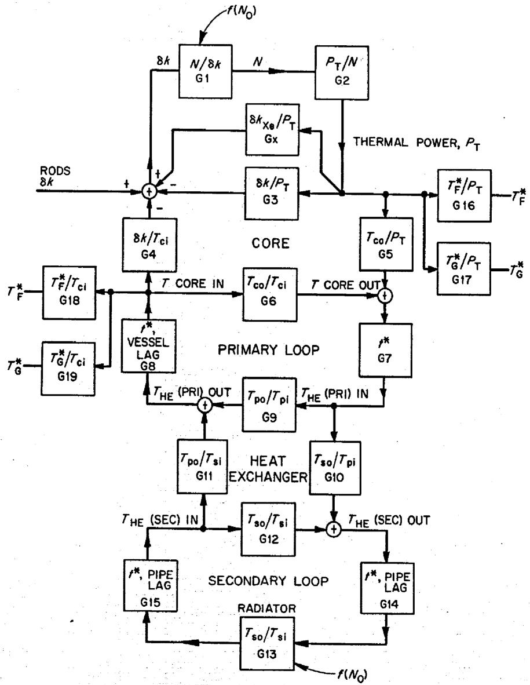  
Fig. C.l. MSFR Reference Block Diagram.

Each of these closed-loop equations can be written as a single FORTRAN IV statement, so it is a simple matter to generate different functions. An option is also available in MSFR to print out all the internal or component transfer functions. FORTRAN IV listings, decks, and input information may be obtained from S. J. Ball.

# Appendix D. Stability Extrema Calculation

For a linear description of a reactor system, the eigenvalues of the system matrix must all have negative real parts for stability. A technique16 was developed that systematically seeks out the combination of system parameters that causes the least stable condition in the feasible range (causes the dominant eigenvalue to become as positive as possible). This technique utilizes a form of the gradient-projection method to explore the hypersurface that defines the stability index (the negativity of the real part of the dominant eigenvalue) as a function of the system parameters. The upper and lower limits on the expected ranges of system parameters constitute constraint surfaces that limit the area of search on the performance hypersurface.

The real part of the dominant eigenvalue is labeled $\beta$ . The change in $\beta$ due to small changes in the system parameters, $x_{l}$ , is given by

$$
\mathrm {d} \beta = \nabla \beta \cdot \mathrm {d} \overline {{\mathbf {x}}} = | \nabla \beta | | \mathrm {d} \overline {{\mathbf {x}}} | \cos \theta , \tag {D.1}
$$

where

$$
\begin{array}{l} d \beta = \text {i n c r e m e n t a l} \beta , \\ \nabla \beta = e _ {1} \frac {\partial \beta}{\partial x _ {1}} + e _ {2} \frac {\partial \beta}{\partial x _ {2}} + \dots , \\ d \overline {{x}} = e _ {1} d x _ {1} + e _ {2} d x _ {2} + \dots , \\ e _ {i} = a \text {u n i t v e c t o r}, \\ \theta = \text {a n g l e b e t w e e n t h e v e c t o r s}. \\ \end{array}
$$

Thus the maximum change in $\beta$ occurs when $\theta = 0$ ; that is, the changes in the system parameters are in the same vector direction as the gradient vector. It is therefore expected that the greatest change in $\beta$ will occur when the system parameters change in proportion to their corresponding elements in the gradient vector:

$$
\mathrm {d} x _ {l} = \gamma \frac {\partial \beta}{\partial x _ {l}}, \tag {D.2}
$$

where $\gamma$ is a real positive coefficient whose magnitude is chosen to insure that constraints are satisfied.

It is clear that the calculated values of the components of $\nabla \beta$ are the key quantities in implementation of this method. The method for finding $\nabla \beta$ can be developed from the characteristic equation for the system given in determinant form:

$$
D = \left| A - s I \right| = 0, \tag {D.3}
$$

where

A = the system matrix,

$\mathbf{s} =$ an eigenvalue of A,

$\mathbf{I} =$ the unit diagonal matrix.

We now write D with some arbitrary eigenvalue, $\mathbf{s}_{\mathbf{k}}^{\prime}$ factored out:

$$
D = \left(s - s _ {k}\right) F (s) = 0, \tag {D.4}
$$

where $F(s)$ is a nonzero determinant if $s_k$ is a simple eigenvalue. We differentiate Eq. (D.4) with respect to an element, $a_{ij}$ , of the matrix, $A$ , and with respect to $s$ :

$$
\frac {\partial D}{\partial a _ {i j}} = \left(s - s _ {k}\right) \frac {\partial F (s)}{\partial a _ {i j}} - F (s) \frac {\partial s _ {k}}{\partial a _ {i j}}, \tag {D.5}
$$

$$
\frac {\partial D}{\partial s} = \left(s - s _ {k}\right) \frac {\partial F (s)}{\partial s} + F (s). \tag {D.6}
$$

We then evaluate Eqs. (D.5) and (D.6) for $s = s_k$ and take their ratio to get Eq. (D.7):

$$
\frac {\partial s _ {k}}{\partial a _ {i j}} = - \frac {\left. \frac {\partial D}{\partial a _ {i j}} \right| _ {s = s _ {k}}}{\left. \frac {\partial D}{\partial s} \right| _ {s = s _ {k}}} \tag {D.7}
$$

The derivative, $\frac{\partial D}{\partial a_{ij}}$ , is just the cofactor of $a_{ij}$ in $[A - sI]$ , and $\frac{\partial D}{\partial s}$ is the negative of the sum of the cofactors of diagonal elements of $[A - sI]$ . Thus Eq. (D.5) may be written

$$
\frac {\partial s _ {k}}{\partial a _ {i j}} = \frac {c _ {i j}}{\sum_ {f = 1} ^ {n} c _ {r f}}. \tag {D.8}
$$

If we choose $s_k$ to be the least negative eigenvalue, the real part of $s_k$ is just $\beta$ . Since $a_{ij}$ is real, we may write

$$
\frac {\partial \beta}{\partial a _ {i j}} = \operatorname {R e} \left[ \frac {c _ {i j}}{\sum_ {f = 1} ^ {n} c _ {f f}} \right]. \tag {D.9}
$$

The derivative with respect to a system parameter, $x_{\ell}$ , is easily obtained from Eq. (D.9), since the following relation holds:

$$
\frac {\partial \beta}{\partial x _ {l}} = \sum_ {i j} \frac {\partial \beta}{\partial a _ {i j}} \frac {\partial a _ {1 j}}{\partial x _ {l}}.
$$

We use this in Eq. (D.9) to obtain

$$
\frac {\partial \beta}{\partial x _ {l}} = \operatorname {R e} \left[ \frac {1}{\sum_ {f = 1} ^ {n} c _ {f f}} \sum_ {i = 1} ^ {n} \frac {\partial a _ {i j}}{\partial x _ {l}} \right] c _ {i j}. \tag {D.10}
$$

The usefulness of Eq. (D.10) rests on the ability to calculate the system eigenvalue, $s_k$ , to give $[A - s_k I]$ . This may be readily accomplished by using one of the standard eigenvalue computation methods, such as Parlett's method or the QR method.

The cofactors in Eq. (D.10) could be calculated directly with a method such as Gaussian elimination. However, this tedious procedure may be circumvented by application of a useful theorem from matrix algebra.

It is known that the cofactors of parallel lines in a matrix with order $n$ and rank $n - 1$ are proportional. Since $[A - s_k I]$ is a matrix with these properties, the cofactor calculation may be simplified. For instance, if the cofactors of the first row and first column of $[A - s_k I]$ are calculated, all other cofactors are given by

$$
\mathrm {C} _ {i j} = \frac {\mathrm {C} _ {i l} \mathrm {C} _ {l j}}{\mathrm {C} _ {l l}}. \tag {D.11}
$$

Use of Eq. (D.11) to find the cofactors shown in Eq. (D.10) gives a practical method for finding the derivatives $\frac{\partial\beta}{\partial x_{l}}$ needed to carry out the gradient-projection step shown in Eq. (D.2).

Gradient methods are useful for finding local extrema for nonlinear problems. However, it may be possible for the surface of $\beta$ versus system parameters to have many peaks. The only technique currently suitable for handling this problem is to use multiple starts. The computer code developed to implement this method is set up to use multiple starts automatically.

The procedure for carrying out the maximization from a given base point is to recalculate the eigenvalues for several new parameter sets specified by steps out the gradient vector. The point that gives the system with the largest value of $\beta$ is then used as a new starting point. This is repeated until a maximum within the constrained set of system parameters is found.

# Internal Distribution

1. R. K. Adams

72. P. H. Harley

2. G. M. Adamson

73. C. S. Harrill

3. R.G.Affel

74. P. N. Haubenreich

4. L.G. Alexander

75. G. M. Herbert

5. A. H. Anderson

76. P. G. Herndon

6. R.F.Apple

77. V. D. Holt

7. C. F. Baes

78. P. P. Holz

8. J. M. Baker

79. A. Houtzeel

9. M.A. Baker

80. T. L. Hudson

10-34. S. J. Ball

81. P.R.Kasten

35. S. E. Beall

82. R. J. Kedl

36. E. S. Bettis

83. M. J. Kelly

37. F. F. Blankenship

84-108. T. W. Kerlin

38. R. Blumberg

109. S. S. Kirslis

39. E. G. Bohlmann

110. D. J. Knowles

40. C. J. Borkowski

111. A. I. Krakoviak

41. G. H. Burger

112. J. W. Krewson

42. O.W.Burke

113. B. R. Lawrence

43. S. Cantor

114. C. G. Lawson

44. W. L. Carter

115. R. B. Lindauer

45. G. I. Cathers

116. M. I. Lundin

46. E. L. Compere

117. R.N.Lyon

47. J. A. Conlin

118. J.H.Marable

48. W.H.Cook

119. C. D. Martin

49. L. T. Corbin

120. C.E.Mathews

50. G. A. Cristy

121. H.G. MacPherson

51. J. L. Crowley

122. H.C.McCurdy

52. F. L. Culler

123. W. B. McDonald

53. D. G. Davis

124. H. F. McDuffie

54. S. J. Ditto

125. C. K. McGlothlan

55. R.G. Donnelly

126. L.E. McNeese

56. F. A. Doss

127. A. J. Miller

57. N. E. Dunwoody

128. W.R.Mixon

58. J. R. Engel

129. R. L. Moore

59. E.P.Epler

130. H. G. O'Brien

60. W. K. Ergen

131. P. Patriarca

61. D. E. Ferguson

132. H.R.Payne

62. A. P. Fraas

133. A.M.Perry

63. E. N. Fray

134. H. B. Piper

64. H. A. Friedman

135. B.E. Prince

65. D. N. Fry

136. J. L. Redford

66. J. H Frye, Jr.

137. M. Richardson

67. C. H. Gabbard

138. R.C.Robertson

68. R. B. Gallaher

139. J. C. Robinson

69. W. R. Grimes

140. H.C.Roller

70. A. G. Grindell

141. D. P. Roux

71. R. H. Guymon

142. H. C. Savage

143. H.W.Savage   
144. A. W. Savolainen   
145. D. Scott   
146. H. E. Seagren   
147. J. H. Shaffer   
148. M. J. Skinner   
149. A. N. Smith   
150. P.G. Smith   
151. W. F. Spencer   
152. I. Spiewak   
153. R.C.Steffy   
154. H. H. Stone   
155. R.S.Stone   
156. A. Taboada   
157. J.R.Tallackson   
158. R.E.Thoma   
159. G. M. Tolson   
160. D. B. Trauger   
161. W.C.Ulrich

162. B. H. Webster   
163. A. M. Weinberg   
164. K. W. West   
165. M. E. Whatley   
166. J. C. White   
167. G. D. Whitman   
168. R.E.Whitt   
169. H. D. Wills   
170. J. V. Wilson   
171. L. V. Wilson   
172. M. M. Yarosh   
173. MSRP Director's Office,

Rm. 219, 9204-1

174-175. Reactor Division Library   
176-177. Central Research Library   
178-179. Document Reference Section   
180-184. Laboratory Records Department   
185. Laboratory Records, RC

# External Distribution

186-187. D.F.Cope,AEC,ORO   
188. R.W.Garrison,AEC,Washington,D.C.   
189. S. H. Hanauer, University of Tennessee, Knoxville   
190. D. C. Keeton, Tennessee Valley Authority, EGCR Site   
191. H. M. Roth, AEC, ORO   
192. R. F. Saxe, North Carolina State University, Raleigh, N.C.   
193. W. L. Smalley, AEC, ORO   
194. S. E. Stephenson, University of Arkansas, Fayetteville, Ark.   
195. M. J. Whitman, AEC, Washington, D.C.   
196-210. Division of Technical Information Extension