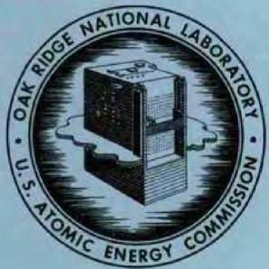

# OAK RIDGE NATIONAL LABORATORY

operated by

UNION CARBIDE CORPORATION

for the

U.S. ATOMIC ENERGY COMMISSION

3445605492507

UNION CARBIDI

ORNL-TM-1146

COPY NO. -

DATE - June 11, 1965

PRODUCTION OF A LOW-BORON HEAT OF HASTELLOY N

W. R. Martin, H. E. McCoy, and J. R. Weir

CENTRAL RESEARCH LIBRARY

DOCUMENT COLLECTION

LIBRARY LOAN COPY

DO NOT TRANSFER TO ANOTHER PERSON

If you wish someone else to see this

document, send in name with document

and the library will arrange a loan.

# LEGAL NOTICE

This report was prepared as an account of Government sponsored work. Neither the United States, nor the Commission, nor any person acting on behalf of the Commission:

A. Makes any warranty or representation, expressed or implied, with respect to the accuracy, completeness, or usefulness of the information contained in this report, or that the use of any information, apparatus, method, or process disclosed in this report may not infringe privately owned rights; or   
B. Assumes any liabilities with respect to the use of, or for damages resulting from the use of any information, apparatus, method, or process disclosed in this report.

As used in the above, "person acting on behalf of the Commission" includes any employee or contractor of the Commission, or employee of such contractor, to the extent that such employees or contractors of the Commission, or employee of such contractor prepares, disseminates, or provides access to, any information pursuant to his employment or contract with the Commission, or his employment with such contractor.

Contract No. W-7405-eng-26

METALS AND CERAMICS DIVISION

PRODUCTION OF A LOW-BORON HEAT OF HASTELLOY N

W. R. Martin, H. E. McCoy, and J. R. Weir

OAK RIDGE NATIONAL LABORATORY

Oak Ridge, Tennessee

operated by

UNION CARBIDE CORPORATION

for the

U.S. ATOMIC ENERGY COMMISSION

# PRODUCTION OF A LOW-BORON HEAT OF HASTELLOY N

W. R. Martin, H. E. McCoy, and J. R. Weir

Current mechanisms for the irradiation embrittlement of structural alloys at elevated temperature are generally associated with the production of helium by $(n, \alpha)$ reactions. In most reactor environments the helium is generated from the transmutation of $^{10}\mathrm{B}$ . Boron is generally present in nickel-base alloys at concentrations in the range of 5 to 80 ppm by weight. These concentrations are above those that have been observed to produce deleterious quantities of helium in stainless steels.

The Stellarite Division of Union Carbide has melted a 75-lb heat of Hastelloy N, using a practice designed to produce low residuals of boron, oxygen, nitrogen, hydrogen, silicon, and sulfur. This vacuum-induction heat, designated heat 65-552, was melted using an alumina crucible. Since no deliberate additions of boron were made in the melting practice, analysis of the final heat and the raw materials should lead to discovery of the source of boron in the alloy. These data are given in Table 1. The concentration of boron is much less than the normal 5 to 80 ppm. It is apparent that most of the boron was not introduced into the alloy from the raw materials listed in Table 1. Approximately $84\%$ of the boron in the ingot was introduced by some other means. There are perhaps several other sources but a prime suspect is the alumina crucible. Future work should help define further the probable sources of boron.

It has been demonstrated that a heat of Hastelloy N can be produced in 50 to 75-lb ingot sizes that contain substantially lower quantities of boron than is normally found in these grades of material. It therefore seems probable that larger ingots in the range of 10,000 lb can also be produced which could offer improved properties for reactor application at elevated temperatures.

Table 1. Boron Analyses   

<table><tr><td>Material</td><td>Boron Concentration (ppm by weight)</td><td>Approximate Boron Contribution to Alloy (ppm by weight)</td></tr><tr><td>Hastelloy N</td><td>0.90</td><td></td></tr><tr><td>Total Raw Materials in Alloy</td><td>0.14</td><td>0.144</td></tr><tr><td>Electrolytic nickel</td><td>0.08</td><td>0.057</td></tr><tr><td>Molybdenum rondels</td><td>0.25</td><td>0.042</td></tr><tr><td>Electrolytic chromium</td><td>0.06</td><td>0.005</td></tr><tr><td>Armco Iron</td><td>0.45</td><td>0.019</td></tr><tr><td>Electrolytic manganese</td><td>0.30</td><td>0.002</td></tr><tr><td>Aluminum shot</td><td>3.50</td><td>0.016</td></tr><tr><td>Nickel-magnesium</td><td>0.08</td><td>0.0002</td></tr><tr><td>Graphite</td><td>4.50</td><td>0.003</td></tr></table>

ORNL-TM-1146

# INTERNAL DISTRIBUTION

1-3. Central Research Library 24. J. H Frye, Jr.   
4-5. ORNL - Y-12 Technical Library 25. G. Hallerman

Document Reference Section

6-15. Laboratory Records

16. Laboratory Records, R.C.   
17. ORNL Patent Office   
18. G.E. Boyd   
19. R.B.Briggs   
20. F. L. Culler   
21. J. E. Cunningham   
22. W.W.Davis   
23. D. A. Douglas

30. W.R.Martin   
31. H. E. McCoy   
32. R.E.McDonald   
33. P. Patriarca   
34. A. Taboada   
35. A. M. Weinberg   
55. J.R.Weir

# EXTERNAL DISTRIBUTION

56-57. D. F. Cope, AEC, Oak Ridge Operations Office   
58-60. J.M.Simmons,AEC,Washington   
61. Division of Research and Development, AEC, ORO   
62-76. Division of Technical Information Extension