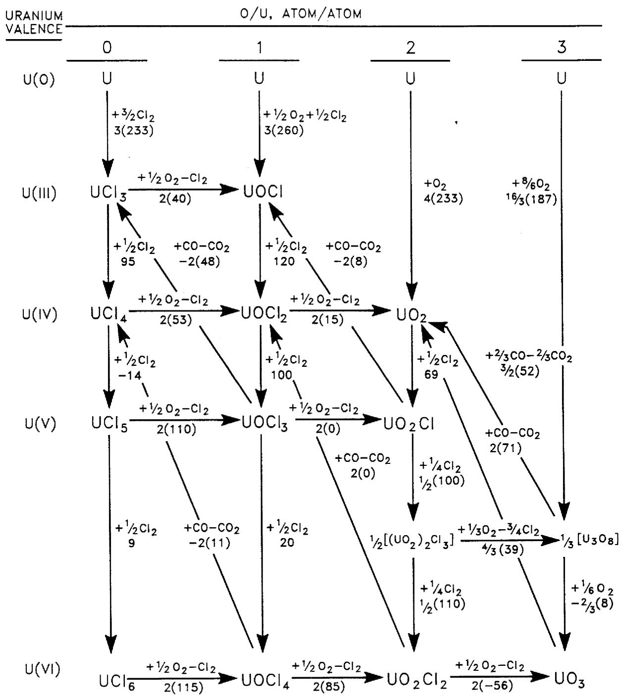
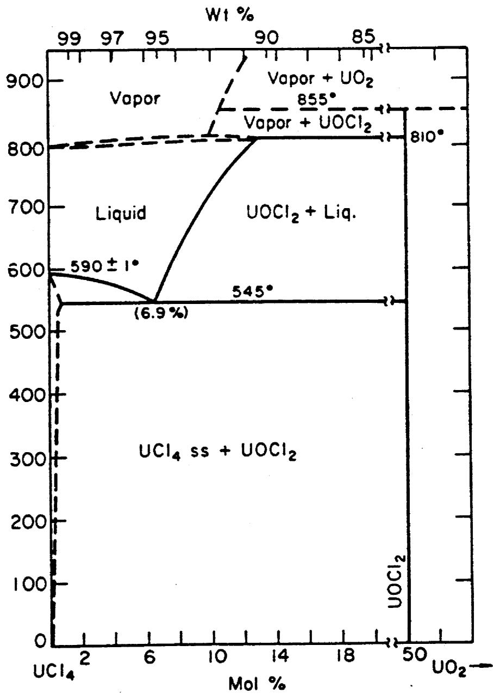
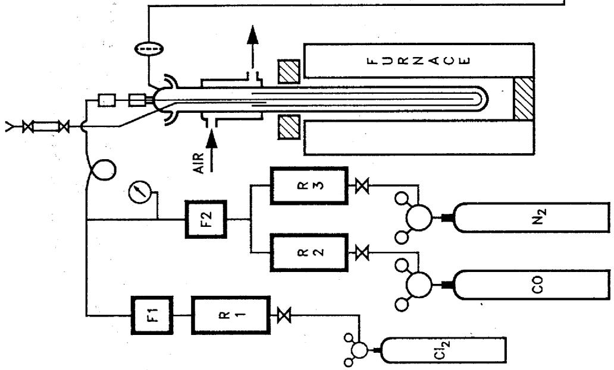
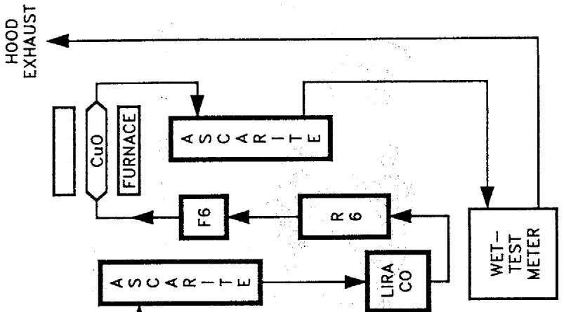
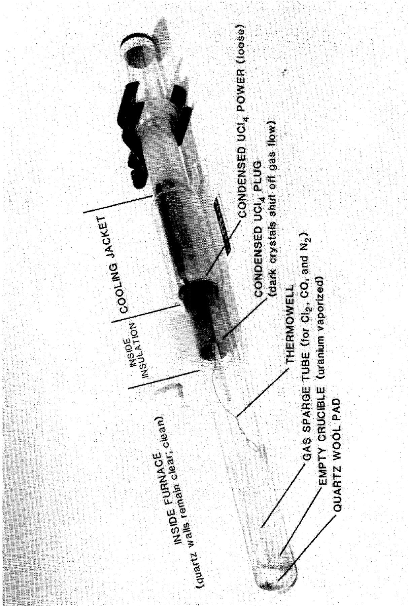
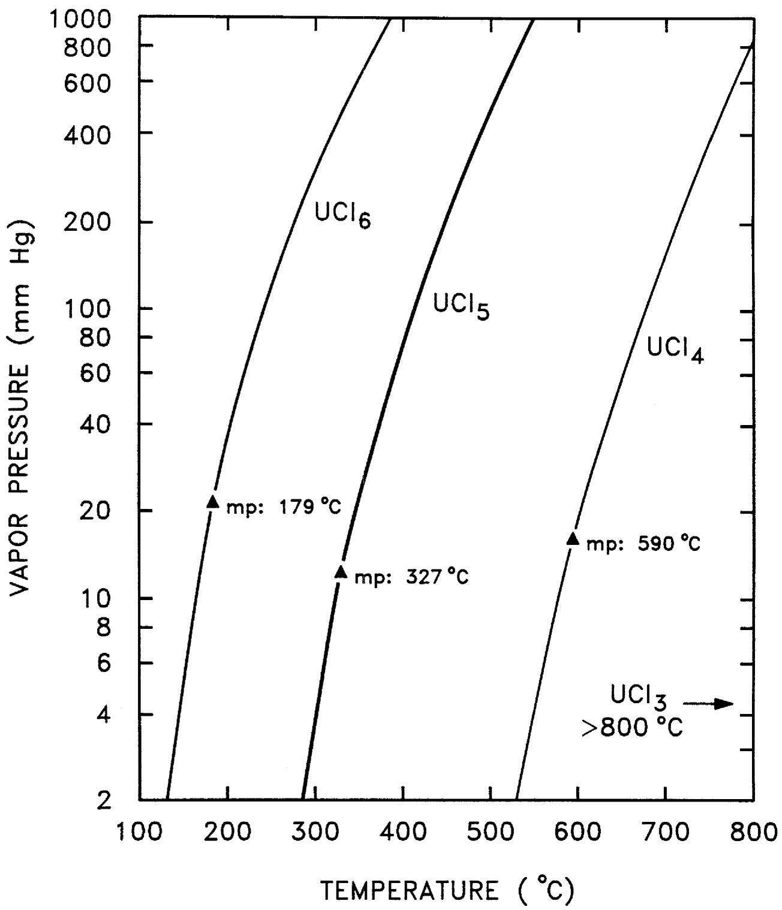
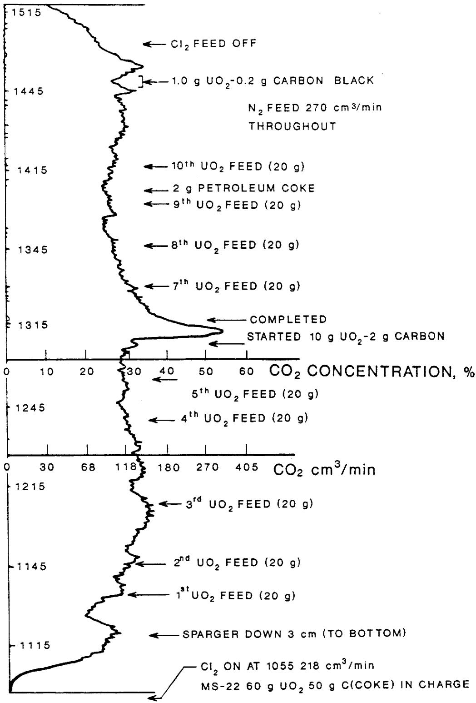

Chemical Technology Division

# REACTION OF URANIUM OXIDES WITH CHLORINE AND CARBON OR CARBON MONOXIDE TO PREPARE URANIUM CHLORIDES

P. A. Haas

D. D. Lee

J. C. Mailen

Date Published - November 1991

Prepared by the

OAK RIDGE NATIONAL LABORATORY

Oak Ridge, Tennessee 37831

managed by

MARTIN MARIETTA ENERGY SYSTEMS, INC.

for the

U.S. DEPARTMENT OF ENERGY

under contract DE-AC05-84OR21400

MAster

# DISCLAIMER

This report was prepared as an account of work sponsored by an agency of the United States Government. Neither the United States Government nor any agency thereof, nor any of their employees, make any warranty, express or implied, or assumes any legal liability or responsibility for the accuracy, completeness, or usefulness of any information, apparatus, product, or process disclosed, or represents that its use would not infringe privately owned rights. Reference herein to any specific commercial product, process, or service by trade name, trademark, manufacturer, or otherwise does not necessarily constitute or imply its endorsement, recommendation, or favoring by the United States Government or any agency thereof. The views and opinions of authors expressed herein do not necessarily state or reflect those of the United States Government or any agency thereof.

# DISCLAIMER

Portions of this document may be illegible in electronic image products. Images are produced from the best available original document.

# CONTENTS

ABSTRACT 1

1. INTRODUCTION 1   
2. EXPERIMENTAL APPARATUS AND PROCEDURES 6   
3. RESULTS 10

3.1 REACTIONS OF CHLORINE 13   
3.2 UTILIZATION OF CHLORINE 22   
3.3 EFFECTS OF URANIUM OXIDE PROPERTIES 23  
3.4 REDUCTIONS BY CARBON 26   
3.5 REDUCTIONS BY CARBON MONOXIDE 27   
3.6 VOLATILIZATION AND CONDENSATION OF URANIUM CHLORIDES 28   
3.7 PRELIMINARY RESULTS WITH A LARGER REACTOR AND BOTTOM CONDenser 32

4. CONCLUSIONS 37   
5. REFERENCES 39

APPENDIX 41

A. THERMOCHEMISTRY 43   
B. INDIVIDUAL TEST RESULTS 49   
C. EQUIPMENT DETAILS AND CALIBRATIONS 55

# TABLES

1. Chlorination test parameters and conditions 11   
2. Chlorination test results 14   
3. Changes in process conditions and results 18   
4. Changes in apparatus and procedures 19   
5. Chlorination test material balances: chlorine 20   
6. Chlorination test material balances: carbon and oxygen 21   
7. Chlorine losses versus $\mathrm{Cl}_2$ feed rates using carbon black at $\sim 730^{\circ}\mathrm{C}$ 23   
8. Properties of uranium oxide, $\mathrm{UO}_2$ -C, and carbon feed solids 24   
9. Gas flows and uranium volatilization 29   
10. Thermochemical data 44   
11. Heats of formation for U-O-Cl compounds at $298^{\circ}\mathrm{K}$ 45   
12. Free energies of formation for U-O-Cl compounds at $900^{\circ}\mathrm{K}$ (627°C) 45   
13. Vapor pressure equations 47   
14. MS-22 gas flow calculations from totalizer readings 53

# FIGURES

1. Conversion reactions for U-O-Cl compounds 4   
2. Phase diagram for $\mathrm{UCl}_4\text{-}\mathrm{UO}_2$ 5   
3. Chlorination reactor (4-cm ID) 7   
4. Photograph of reactor as removed after MS-8 8   
5. Chlorination reactor (68-mm ID) with bottom condenser 33   
6. Vapor pressures of uranium chlorides 48   
7. $\mathrm{CO}_{2}$ concentrations during MS-22 52

# ABSTRACT

The preferred preparation concept of uranium metal for feed to an AVLIS uranium enrichment process requires preparation of uranium tetrachloride $(\mathrm{UCl}_4)$ by reacting uranium oxides $(\mathrm{UO}_2 / \mathrm{UO}_3)$ and chlorine $(\mathrm{Cl}_2)$ in a molten chloride salt medium. $\mathrm{UO}_2$ is a very stable metal oxide; thus, the chemical conversion requires both a chlorinating agent and a reducing agent that gives an oxide product which is much more stable than the corresponding chloride. Experimental studies in a quartz reactor of 4-cm ID have demonstrated the practicality of some chemical flow sheets.

Experimentation has illustrated a sequence of results concerning the chemical flow sheets. Tests with a graphite block at $850^{\circ}\mathrm{C}$ demonstrated rapid reactions of $\mathrm{Cl}_2$ and evolution of carbon dioxide $(\mathrm{CO}_2)$ as a product. Use of carbon monoxide (CO) as the reducing agent also gave rapid reactions of $\mathrm{Cl}_2$ and formation of $\mathrm{CO}_2$ at lower temperatures, but the reduction reactions were slower than the chlorinations. Carbon powder in the molten salt melt gave higher rates of reduction and better steady state utilization of $\mathrm{Cl}_2$ . Addition of $\mathrm{UO}_2$ feed while chlorination was in progress greatly improved the operation by avoiding the plugging effects from high $\mathrm{UO}_2$ concentrations and the poor $\mathrm{Cl}_2$ utilizations from low $\mathrm{UO}_2$ concentrations. An $\mathrm{UO}_3$ feed gave undesirable effects while a feed of $\mathrm{UO}_2$ -C spheres was excellent. The $\mathrm{UO}_2$ -C spheres also gave good rates of reaction as a fixed bed without any molten chloride salt. Results with a larger reactor and a bottom condenser for volatilized uranium show collection of condensed uranium chlorides as a loose powder and chlorine utilizations of $95 - 98\%$ at high feed rates.

# 1. INTRODUCTION

The feed for an Atomic Vapor Laser Isotope Separation (AVLIS) process for uranium will be uranium metal. $^{1}$ The principal production of uranium metal for nuclear fuel cycles has previously been by batch metallothermic reductions of uranium fluoride $(\mathrm{UF}_4)$ using magnesium or calcium metal. If this batch metal production were used for a large AVLIS enrichment plant ( $\geq 10^{4}$ ton U/year), the costs of the hydrogen fluoride (HF) feed, the calcium or magnesium feed and the disposal of magnesium fluoride $(\mathrm{MgF}_2)$ or calcium fluoride $(\mathrm{CaF}_2)$ wastes would be major parts of the total uranium enrichment costs. Alternate processes for preparation of uranium metal from $\mathrm{UCl}_4$ allow recycling of $\mathrm{Cl}_2$ from electrolytic cells. $^{2}$ The products of uranium ore refineries are uranium oxides—most commonly $\mathrm{UO}_3$ . The objective of this AVLIS development program was to determine practical process conditions for efficient production of $\mathrm{UCl}_4$ from uranium oxides.

There is extensive background literature on the production of $\mathrm{UCl}_4$ based on reaction of carbon tetrachloride with uranium oxides. Such a process was used at Oak Ridge for producing calutron feed material. Despite this previous experience, a process based on the use of $\mathrm{CCl}_4$ would not be desirable for the proposed continuous metallothermic reduction process in which chlorine values are recycled because of both the risks associated with $\mathrm{CCl}_4$ and the fact that recycle of chlorine values would require process equipment for $\mathrm{CCl}_4$ synthesis. Such difficulties could be avoided with a process involving direct reaction of chlorine, carbon and/or carbon monoxide, and uranium oxides.

A search of the technical literature did not reveal any report of the preparation of pure $\mathrm{UCl}_4$ from uranium oxides, $\mathrm{Cl}_2$ , and C or CO. Canning demonstrated nearly complete utilization of $\mathrm{Cl}_2$ for up to $90\%$ chlorination of impure uranium oxides, $^4$ as a first step of an overall process for producing purified metal. He sparged $\mathrm{Cl}_2$ through a graphite diffuser into molten KCl-NaCl to which he fed the impure oxides. After chlorination, the molten salt mixture was treated with magnesium metal for reducing uranium compounds and electrorefined to improve the metal purity. Lyon reported rapid reaction of uranium oxides with chlorine in molten NaCl-KCl at $850^{\circ}\mathrm{C}$ to produce $\mathrm{UO}_2\mathrm{Cl}_2$ . $^5$ Gens studied the volatilization of uranium chlorides from nuclear fuels and also found the formation of some nonvolatile $\mathrm{UO}_2\mathrm{Cl}_2$ . $^6$ Gibson reported complete chlorination of $\mathrm{UO}_2$ using a block of carbon and $\mathrm{Cl}_2$ in KCl-NaCl at $860^{\circ}\mathrm{C}$ as a first step in a process for producing purified $\mathrm{UO}_2$ . $^7$ These results, along with those using $\mathrm{CCl}_4$ rather than $\mathrm{Cl}_2$ , report chlorination of uranium oxides and removal of oxygen as CO or $\mathrm{CO}_2$ .

The use of published thermochemical data for uranium oxide, oxychloride, and chloride compounds is a first step for identifying probable reactions for the desired chemical conversion. However, there are several reasons for uncertainties for such predictions. Uranium chemistry is complex with stable valence states of 3, 4, 5, and 6. Oxides, one or more oxychlorides, and chlorides have been identified at most of these valence states. The volatility of the chloride compounds increases with valence state while chemical stability decreases. All of the compounds have large negative heats and free energies of formation; hence, calculation of free energies of reaction generally involves the inherent uncertainties of small difference of large numbers. A detailed compilation of available thermochemical data for the various uranium oxide, oxychloride, and chloride compounds is presented in the Appendix. Evaluation of this body of data leads to the following general findings:

- At a given valence state, the oxychlorides are more stable than the chlorides.   
- At a given valence state, the oxides are more stable than the chlorides.   
- All additions of chlorine to oxides or oxychlorides of lower valence [less than U(VI)] are favorable to give oxychlorides of higher valence.   
- The oxychlorides can be formed both by direct reaction of chlorine and by reaction of an oxide with a chloride.   
- Production of $\mathrm{UCl}_4$ requires a reducing agent whose oxide product is much more stable than the chloride; that is, it does not react with uranium chlorides. Carbon and carbon monoxide meet this criteria. Hydrogen does not and the oxide (water) reacts with uranium chlorides to produce HCl.

Figure 1 presents a summary of the expected thermochemistry of the uranium oxide, oxychloride, and chloride compounds at various uranium valence states. The phase relationships between tetravalent uranium oxide and chloride are shown in Fig. 2. $^{8}$ The phase diagram shows that there are three stable compounds over the entire range of composition— $\mathrm{UCl}_4$ , $\mathrm{UOCl}_2$ , and $\mathrm{UO}_2$ . There is a eutectic reaction between $\mathrm{UCl}_4$ and the intermediate compounds, $\mathrm{UOCl}_2(\mathrm{UCl}_4 + 50\,\mathrm{mol}\,\% \,\mathrm{UO}_2)$ . The melting point of pure $\mathrm{UCl}_4$ is $590^{\circ}\mathrm{C}$ . A minimum melting point of $545^{\circ}\mathrm{C}$ occurs at the eutectic composition of $\mathrm{UCl}_4 + 6.9\,\mathrm{mol}\,\% \,\mathrm{UO}_2$ . A maximum solubility of about $13\,\mathrm{mol}\,\% \,\mathrm{UO}_2$ in molten $\mathrm{UCl}_4$ is reported at $810^{\circ}\mathrm{C}$ . At temperatures from 810 to $855^{\circ}\mathrm{C}$ , $\mathrm{UCl}_4$ vapor is in equilibrium with solid $\mathrm{UOCl}_2$ . $\mathrm{UOCl}_2$ decomposes at $855^{\circ}\mathrm{C}$ . At higher temperatures, vapor and solid $\mathrm{UO}_2$ are in equilibrium. The reasonably high solubility of $\mathrm{UO}_2$ in molten $\mathrm{UCl}_4$ over the temperature range of 545 to $810^{\circ}\mathrm{C}$ suggests a desirable precondition for achieving rapid rates of reaction between chlorine, carbon/carbon monoxide, and $\mathrm{UO}_2$ dissolved in molten $\mathrm{UCl}_4$ .

The present investigations were carried out to characterize the production of $\mathrm{UCl}_4$ by a direct carbochlorination of uranium oxides in a molten salt medium and to identify the optimum conditions for accomplishing the conversion in the most economic fashion. Variables that have been considered include the physical and chemical characteristics of the oxide feed material, the use of carbon versus carbon monoxide as a reductant, the physical characteristics of carbon reductants, the effects of feed rates, and the effect of temperature.

VALUES IN PARENTHESES: MINUS FREE ENERGY OF REACTION, 900 K, kJ/equiv MULTIPLIER OUTSIDE PARENTHESES: EQUIVALENTS/REACTION,

  
Fig. 1. Conversion reactions for U-O-Cl compounds.

  
Fig. 2. Phase diagram for $\mathrm{UCl}_4\text{-}\mathrm{UO}_2$ .

# 2. EXPERIMENTAL APPARATUS AND PROCEDURES

The experimental system was assembled from small flowmeters, 0.25-in. OD metal tubing and fittings, and quartz or borosilicate glass components fabricated by the Oak Ridge National Laboratory (ORNL) glass shop. For hot chlorine gas, the materials of construction were borosilicate glass for up to $450^{\circ}\mathrm{C}$ and quartz for the chlorination reactor up to $900^{\circ}\mathrm{C}$ . For chlorine gas at room temperature, Monel, Teflon, and Viton rubber were also used with some stainless steel for short time periods. Apparatus after the Cu-foil trap for $\mathrm{Cl}_2$ was mainly stainless steel and plastic.

A diagram of the apparatus as used for Tests 5 to 18 is shown in Fig. 3 The initial arrangements as used for Tests 1 to 4 were described with the preliminary results. $^{3}$ The quartz reactor was $4\text{-cm}$ ID, $69\text{-cm}$ long, with a closed bottom and a $65/40$ ball-joint socket at the top end (Fig. 4). The mating half of the ball joint had the fittings for all connections, including a gas sparger and the gas outlet. The initial charge was loaded into a quartz crucible of $3.2\text{-cm}$ ID, which was lowered on to a small pad of quartz wool on the reactor bottom. The initial reactor was fabricated with a quartz jacket for cooling from 38 to $53\text{cm}$ above the bottom end. A simple borosilicate glass sleeve with "O" rings was used for air cooling after the initial unit. The gas sparger and the thermowell or $\mathrm{UO}_2$ feed line were installed through the reactor cap using slip-fittings ("O" rings or Viton rubber sleeves) to allow length adjustments.

The apparatus and procedures allowed three different material balances for each test. The weight balances were probably the most accurate but gave only the overall run material balances. The weight measurements were:

1. The weight loss by a CuO reactor indicated the oxygen used to oxidize CO to $\mathrm{CO}_{2}$ .   
2. The weight gain in a final Ascarite absorber showed the $\mathrm{CO}_{2}$ that was produced from CO.   
3. The weight gain for the first Ascarite absorber showed the $\mathrm{CO}_{2}$ in the gas leaving the chlorination reactor.   
4. The weight gain by the Cu-foil trap showed the $\mathsf{Cl}_2$ in the gas leaving the chlorination reactor.   
5. The weight gain by all reactor components equals the $\mathrm{Cl}_2$ reacted plus the solids feed minus the C or O as CO, or $\mathrm{CO}_2$ shown by a, b, and c. (Note that these quantities must allow for whether the oxidation reaction is C to $\mathrm{CO}_2$ , C to CO, or CO to $\mathrm{CO}_2$ .)

  
ORNL DWG 90A-1406

  
R1 TO R6 ROTAMETERS   
F1 TO F6 MASS FLOWMETERS   
MANOMETER   
Fig. 3. Chlorination reactor (4-cm ID).

  
Fig. 4. Photograph of reactor as removed after MS-8.

The second material balances were from gas flow rates times concentrations. The concentrations and flows were:

1. $100\% \mathbf{N}_2$ for diluent gas feed,   
2. $100\% \mathrm{N}_2$ for wet-test meter flow out,   
3. $100\% \mathrm{Cl}_2$ for $\mathrm{Cl}_2$ feed,   
4. $100\%$ CO for CO feed,   
5. in-line $\mathrm{CO}_{2}$ measurement for gas out of the Cu-foil trap for $\mathrm{Cl}_{2}$   
6. in-line CO measurement for gas out of the first Ascarite absorber, and   
7. the $\mathbf{N}_2$ content of the gas out of the first Ascarite is 1 minus CO.

The third, and generally least accurate material balances, are from differences in flow rates. These differences are:

1. reactor out minus Cu-foil trap out is the $\mathrm{Cl}_2$ that leaves the chlorination reactor.   
2. Cu-foil trap out minus the first Ascarite out shows the $\mathrm{CO}_{2}$ absorbed.   
3. the first Ascarite out minus the wet-test meter shows the CO oxidized to $\mathrm{CO}_{2}$ and absorbed on the final Ascarite.   
4. the $\mathrm{Cl}_2$ feed, plus the $\mathbf{N}_2$ feed, plus the CO feed, plus $\mathrm{CO}_{2}$ or CO from C in the charge, minus the reactor out indicates the $\mathrm{Cl}_2$ reacted with the charge.

The results found in the literature provide little information for selection between the chlorination process alternates. The reducing feed when using $\mathrm{Cl}_2$ might be:

1. massive carbon or graphite blocks as reported,   
2. carbon particles or powder,   
3. carbon particles or powder mixed with uranium oxide powder and compacted, or   
4. CO gas.

Any of the final three alternatives appear better than the massive blocks with respect to the reactivity, cost, and ease of replacement when consumed. Further, the reaction medium might be predominantly:

1. inert, low melting chloride salts,   
2. uranium chlorides,   
3. a fixed bed of uranium oxide-carbon granules or chunks, or   
4. a fluidized bed of uranium oxide and carbon solids.

The phase diagram (Fig. 2) for $\mathrm{UO}_2\text{-} \mathrm{UCl}_4$ shows formation of $\mathrm{UOCl}_2$ with all liquid for up to $7 \, \mathrm{mol} \, \% \, \mathrm{UO}_2$ at the melting point of $\mathrm{UCl}_4$ . This solubility of $\mathrm{UO}_2$ in molten $\mathrm{UCl}_4$ appears to be a desirable condition for easy and rapid chlorination and reduction reactions.

The chlorination condition of greatest interest for the AVLIS feed process was to react $\mathrm{UO}_2$ and $\mathrm{Cl}_2$ in a molten salt medium. Chlorination studies were planned for these conditions, and the selection of other conditions proceeded as follows:

1. The first tests were with a block of carbon for diffusers as favorably reported by Canning4 and Gibson.7   
2. After good reaction of $\mathrm{Cl}_2$ and formation of $\mathrm{CO}_2$ were demonstrated with the carbon diffusers, CO was tested as a more practical reducing agent.   
3. After results with CO showed that the reduction reactions were much slower than the chlorination reactions, carbon powder was used to determine the effects of this reducing agent as compared to CO.   
4. Since high $\mathrm{UO}_2$ concentrations resulted in sparger plugging problems and low $\mathrm{UO}_2$ concentrations gave poor utilizations of $\mathrm{Cl}_2$ , the experimental apparatus was modified to allow $\mathrm{UO}_2$ feed while chlorination was in progress.   
5. Tests were made with ball-milled $\mathrm{UO}_2$ powder and with $\mathrm{UO}_2$ -carbon black spheres for comparison with the $\mathrm{UO}_2$ spheres and the petroleum coke first tested.   
6. Comparison tests were made with $\mathrm{UO}_3$ spheres as feed and with a fixed-bed of $\mathrm{UO}_2$ . carbon black spheres without any molten salt.   
7. The experimental apparatus was then modified to use a larger reactor with a bottom condenser.

The first four experimental tests were previously reported. After eighteen tests (including the initial four) in a small apparatus, the equipment was modified to provide a larger reactor and a more useful condensation arrangement for product vapors.

# 3. RESULTS

Eighteen experimental tests were made in a quartz reactor of 4-cm ID and were directed toward the molten salt chlorination of uranium oxide. Three tests were not completed as planned because of failure of reactor components. One test was to check the procedures and material balances without chlorination. The remaining fourteen gave useful chlorination results. The test conditions are summarized as a tabulation (Table 1).

Table 1. Chlorination test parameters and conditions   

<table><tr><td rowspan="2">MS test No.</td><td rowspan="2">Test dates</td><td rowspan="2">Furnace temperature (°C)</td><td rowspan="2">Reducing agent</td><td colspan="5">Initial charge (mol)</td><td colspan="4">Feed at temperature (mol)</td></tr><tr><td>\( UCl_4 \)</td><td>\( UO_2 \)</td><td>C</td><td>\( MgCl_2 \)</td><td>NaCl or LiCl</td><td>\( Cl_2 \)</td><td>CO</td><td>\( UO_x \)</td><td>C</td></tr><tr><td>1</td><td>09-12-89</td><td>850</td><td>Graphite cylinder</td><td>0.016</td><td>0.06</td><td>2.4</td><td>0.46</td><td>0</td><td>0.16</td><td>0</td><td>0</td><td>0</td></tr><tr><td>2</td><td>10-05-89</td><td>700</td><td>Graphite cylinder</td><td>0</td><td>0.04</td><td>2.3</td><td>0.26</td><td>0.59</td><td>0.37</td><td>0</td><td>0</td><td>0</td></tr><tr><td>3</td><td>12-11-8901-22-90</td><td>650790</td><td>CO</td><td>0.08</td><td>0.11</td><td>0</td><td>0</td><td>0</td><td>a</td><td>a</td><td>0</td><td>0</td></tr><tr><td>4</td><td>03-21-90</td><td>625</td><td>CO</td><td>0.16</td><td>0.11</td><td>0</td><td>0</td><td>0</td><td>0.35</td><td>0.31</td><td>0</td><td>0</td></tr><tr><td>5</td><td>05-08-90</td><td>650</td><td>CO</td><td>0</td><td>0</td><td>0</td><td>0</td><td>0</td><td>0</td><td>0</td><td>0</td><td>0</td></tr><tr><td>6</td><td>05-10-90</td><td>650</td><td>CO</td><td>0</td><td>0</td><td>0</td><td>0</td><td>0</td><td>0.13</td><td>0.2</td><td>0</td><td>0</td></tr><tr><td>7</td><td>05-15-90</td><td>655</td><td>CO</td><td>0</td><td>0.12</td><td>0</td><td>0.54</td><td>0.53</td><td>0.56</td><td>0.6</td><td>0</td><td>0</td></tr><tr><td>8</td><td>06-04-90</td><td>645680</td><td>CO</td><td>0.27</td><td>0.185</td><td>0</td><td>0</td><td>0</td><td>0.9</td><td>0.55</td><td>0</td><td>0</td></tr><tr><td>9</td><td>08-01-90</td><td>645</td><td>\( C^b \)</td><td>0.29</td><td>0.146</td><td>0.67</td><td>0</td><td>0</td><td>0.43</td><td>0</td><td>0</td><td>0</td></tr><tr><td>10</td><td>08-13-90</td><td>645680</td><td>\( C^b \)</td><td>0.32</td><td>0.06</td><td>0.57</td><td>0</td><td>0</td><td>0.45</td><td>0</td><td>0</td><td>0</td></tr><tr><td>11A</td><td>08-20-90</td><td>635</td><td>None</td><td>0.24</td><td>0</td><td>0.67</td><td>0</td><td>0</td><td>0</td><td>0</td><td>0</td><td>0</td></tr><tr><td>11B</td><td>08-21-90</td><td>635</td><td>\( C^b \)</td><td>0.24</td><td>0</td><td>0.67</td><td>0</td><td>0</td><td>0</td><td>0</td><td>0</td><td>0</td></tr><tr><td>11C</td><td>08-22-90</td><td>635690</td><td>\( C^b \)</td><td>0.24</td><td>0</td><td>0.67</td><td>0</td><td>0</td><td>0.35</td><td>0</td><td>0.056</td><td>0</td></tr><tr><td>12</td><td>09-04-90</td><td>635680</td><td>\( C^b \)</td><td>0.14</td><td>0.02</td><td>1.20</td><td>0.78</td><td>0.77</td><td>0.64</td><td>0</td><td>0.17</td><td>0</td></tr><tr><td>13</td><td>09-07-90</td><td>680</td><td>\( C^b \)</td><td>0.29</td><td>0.02</td><td>1.2</td><td>0.78</td><td>0.77</td><td>0.70</td><td>0</td><td>0.185</td><td>0</td></tr><tr><td>14</td><td>09-25-90</td><td>710</td><td>\( C^b \)</td><td>0.25</td><td>0.04</td><td>0.83</td><td>0.38</td><td>0.38</td><td>0.71</td><td>0</td><td>0.29</td><td>0</td></tr><tr><td>15</td><td>09-27-90</td><td>745</td><td>\( C^b \)</td><td>0.56</td><td>0.02</td><td>0.83</td><td>0.38</td><td>0.38</td><td>0.78</td><td>0</td><td>0.24</td><td>0</td></tr><tr><td rowspan="2">MS test No.</td><td rowspan="2">Test dates</td><td rowspan="2">Furnace temperature (°C)</td><td rowspan="2">Reducing agent</td><td colspan="5">Initial charge (mol)</td><td colspan="4">Feed at temperatire (mol)</td></tr><tr><td>\( UCl_4 \)</td><td>\( UO_2 \)</td><td>C</td><td>\( MgCl_2 \)</td><td>NaCl or LiCl</td><td>\( Cl_2 \)</td><td>CO</td><td>\( UO_x \)</td><td>C</td></tr><tr><td>16</td><td>10-16-90</td><td>705 675</td><td>\( C^e \)</td><td>0.25</td><td>0.04</td><td>0</td><td>0.125</td><td>0.108</td><td>0.78</td><td>0</td><td>0.31</td><td>1.3</td></tr><tr><td>17</td><td>10-30-90</td><td>680</td><td>\( C^e \)</td><td>0.58</td><td>0.02</td><td>0.9</td><td>0.125</td><td>0.108</td><td>0.35</td><td>0</td><td>0.11</td><td>0</td></tr><tr><td>18</td><td>11-06-90</td><td>700</td><td>\( C^e \)</td><td>0</td><td>0.34</td><td>1.4</td><td>0</td><td>0</td><td>0.70</td><td>0</td><td>0</td><td>0</td></tr><tr><td colspan="13">REACTOR SYSTEM CHANGED TO LARGER REACTOR, BOTTOM CONDenser</td></tr><tr><td>19</td><td>11-28-90</td><td>675</td><td>None</td><td>0</td><td>0</td><td>0</td><td>0</td><td>0</td><td>0</td><td>0</td><td>0</td><td>0</td></tr><tr><td>20</td><td>12-06-90</td><td>695</td><td>\( C^b \)</td><td>1.47</td><td>0.15</td><td>4.5</td><td>0</td><td>0</td><td>0.66</td><td>0</td><td>0.06</td><td>0</td></tr><tr><td>21</td><td>12-18-90</td><td>677 699</td><td>\( C^b \)</td><td>1.3</td><td>0.05</td><td>3.2</td><td>0</td><td>0</td><td>3.1</td><td>0</td><td>0.98</td><td>0</td></tr><tr><td>22</td><td>01-03-91</td><td>694 715</td><td>\( C^b \)</td><td>1.7</td><td>0.25</td><td>4.7</td><td>0.21</td><td>0.21</td><td>2.5</td><td>0</td><td>0.71</td><td>0.35</td></tr><tr><td>23</td><td>01-16-91</td><td>731</td><td>\( C^d \)</td><td>1.8</td><td>0.15</td><td>3.4</td><td>0.21</td><td>0.21</td><td>2.7</td><td>0</td><td>1.11</td><td>1.5</td></tr><tr><td>24</td><td>03-26-91</td><td>738 777</td><td>\( C^e \)</td><td>0.96</td><td>0.15</td><td>2.00</td><td>0.3</td><td>0.3</td><td>2.87</td><td>0</td><td>1.11</td><td>1.17</td></tr><tr><td>25</td><td>04-03-91</td><td>777</td><td>\( C^e \)</td><td>~1.2</td><td>0.15</td><td>2.00</td><td>0.3</td><td>0.3</td><td>1.97</td><td>0</td><td>0.65</td><td>0.25</td></tr><tr><td>26</td><td>04-24-91</td><td>774</td><td>\( C^e \)</td><td>1.4</td><td>0.20</td><td>2.58</td><td>0.3</td><td>0.3</td><td>3.07</td><td>0</td><td>1.08</td><td>0</td></tr><tr><td>27</td><td>05-01-91</td><td>778</td><td>\( C^e \)</td><td>1.8</td><td>0.30</td><td>1.1</td><td>0.3</td><td>0.3</td><td>0.66</td><td>0</td><td>0</td><td>0</td></tr><tr><td>28</td><td>05-14-91</td><td>778</td><td>\( C^e \)</td><td>2.0</td><td>&lt;0.1</td><td>3.1</td><td>0.3</td><td>0.3</td><td>4.46</td><td>0</td><td>1.93</td><td>0</td></tr><tr><td>29</td><td>05-29-91</td><td>778</td><td>\( C^e \)</td><td>1.9</td><td>0.33</td><td>1.0</td><td>0.3</td><td>0.3</td><td>0.69</td><td>0.8</td><td>0</td><td>0</td></tr><tr><td>30</td><td>06-05-91</td><td>725</td><td>\( C^e \)</td><td>2.0</td><td>0.15</td><td>2.7</td><td>0.3</td><td>0.3</td><td>2.81</td><td>0</td><td>1.07</td><td>0</td></tr><tr><td>31</td><td>06-11-91</td><td>690</td><td>\( C^e \)</td><td>2.4</td><td>0.26</td><td>2.7</td><td>0.3</td><td>0.3</td><td>0.44</td><td>0</td><td>0</td><td>0</td></tr></table>

Not measured.   
Petroleum coke.   
Carbon black.   
${}^{d}$ Petrocum coke in charge; carbon black in feed.

The progress of the chlorinations was indicated by the measurement of gas flow rates and concentrations during the tests. The overall or average results are shown by the material balances from reactor and trap weights after cool down to room temperature. Some results for the useful chlorination tests are tabulated (Table 2). Additional details by test numbers are in the Appendix. Each individual result can be interpreted in a number of ways since the overall process reactions result from a number of multiple step reactions.

Conclusions for important process parameters are discussed as separate sections. In general, a specific conclusion cannot be proven by one test result. Instead, the test results (Table 2 and the Appendix), along with thermochemical data, must be considered as a whole to justify the conclusions. Rapid reaction rates and removal of oxygen as CO or $\mathrm{CO}_{2}$ were demonstrated in the first four experiments as previously reported. $^9$ The results of these initial tests are included in the tabulations, but the details in the initial report $^9$ are not repeated.

The test conditions (Table 1), and the brief tabulation of results (Table 2) do not clearly show how the process conditions, apparatus, and procedures were changed between experiments. Some of the most important changes in process conditions and the results are listed in Table 3. Important changes in apparatus and procedures, and the corresponding results are in Table 4. The material balances tabulated for chlorine (Table 5) and oxygen and carbon (Table 6) are averaged values with more weight to the more accurate mass measurements.

# 3.1 REACTIONS OF CHLORINE

All of the chlorination studies were done with uranium oxides and the reducing agent in the reactor at temperature when the chlorine flow was started. All tests show that the initial reactions of chlorine go very well without any significant concentration of chlorine in the exit gases. This was true when the initial charge contained melts of $\mathrm{UCl}_4$ , $\mathrm{MgCl}_2$ -NaCl or $\mathrm{MgCl}_2$ -LiCl, $\mathrm{UCl}_4$ - $\mathrm{MgCl}_2$ -NaCl, or a fixed bed of $\mathrm{UO}_2$ -C particles. The reaction rates for chlorine can be much higher than the rates of reduction indicated by CO or $\mathrm{CO}_2$ flows. This result, thermochemical data, and some melt analyses indicate that the chlorine reacts by "oxidizing" U(IV) to higher valances; that is, the chlorine adds to the U(IV) compound to give U(VI) or perhaps U(V) compounds. Reaction of $\mathrm{Cl}_2$ with $\mathrm{UO}_2$ or oxychlorides is more favorable than reaction with $\mathrm{UCl}_4$ to give $\mathrm{UCl}_5$ or $\mathrm{UCl}_6$ . After U(IV) oxides or oxychlorides are depleted in concentration, $\mathrm{UCl}_4$ is reacted to give $\mathrm{UCl}_6$ or $\mathrm{UCl}_5$ that are much more volatile.

Table 2. Chlorination test results   

<table><tr><td rowspan="2">MS test No.</td><td rowspan="2">Furnace temp. (°C)</td><td colspan="2">Overall/average run resulta (%)</td><td rowspan="2">Cl2reacted UO2feed atom Cl mol UO2</td><td rowspan="2">Principal conclusions and results</td></tr><tr><td>Cl2feed reacted</td><td>O2in UO2evolved</td></tr><tr><td>1</td><td>850</td><td>~50</td><td>NDa</td><td>~3.0</td><td>UO2+Cl2+ graphite → CO2+UCl4+UOXCly.</td></tr><tr><td>2</td><td>700</td><td>~50</td><td>ND</td><td>small</td><td>Most of Cl2reacted with Monel sparge tube.</td></tr><tr><td rowspan="2">3</td><td>650</td><td>ND</td><td>ND</td><td>small</td><td rowspan="2">UO3+CO→ UO2+CO2. Severe plugging of sparger (perhaps UOCl2). Nearly all of uranium volatilized out of crucible.</td></tr><tr><td>790</td><td>ND</td><td>ND</td><td>ND</td></tr><tr><td>4</td><td>625</td><td>42</td><td>40</td><td>2.8</td><td>Consistent material balances, gas flow rates and gas concentrations. Condensed solids were predominantly UCl4while charge was half UCl4and half oxychlorides.</td></tr><tr><td>5</td><td>650</td><td>-</td><td>-</td><td>-</td><td>Quartz reactor broken.</td></tr><tr><td>6</td><td>650</td><td>0</td><td>-</td><td>0</td><td>Operator qualification completed.</td></tr><tr><td>7</td><td>655</td><td>38</td><td>&lt;10</td><td>2.3</td><td>UO2+Cl2+CO→ UO2Cl2+CO with little removal of O as CO2. Apparently UCl4is necessary for reduction by CO.</td></tr><tr><td rowspan="2">8</td><td>645</td><td rowspan="2">30</td><td rowspan="2">55</td><td rowspan="2">2.8</td><td rowspan="2">The results of MS-4 were duplicated with good material balances. The rate of CO2evolution showed little variation with temperature, Cl2rate, and sparger immersion. Complete plug by condensed solids.</td></tr><tr><td>680</td></tr><tr><td>9A</td><td>645</td><td>40</td><td>70</td><td rowspan="2">2.5</td><td rowspan="2">The C gave CO2without any detectable CO. Condensed solids plug of same appearance as MS-8. Leaks at the in-reactor sparger coupling resulted in low Cl2utilizations.</td></tr><tr><td>9B</td><td>645</td><td>0</td><td>0</td></tr><tr><td>10</td><td>645</td><td>36</td><td>&gt;100</td><td>4.2</td><td>Condensed solids plug of same appearance as 680MS-8 and MS-9. Total material balance for MS-9 and MS-10 indicates complete conversion of UO2to UCl4.</td></tr><tr><td>11A</td><td>635</td><td></td><td></td><td></td><td>No condensed UCl4without gas sparge.</td></tr><tr><td>Cl2feed O2in UO2reacted</td><td>O2in UO2evolved</td></tr><tr><td>11B</td><td>635</td><td></td><td></td><td></td><td>Low UCl4volatility in agreement with UCl4vapor pressure without Cl2.</td></tr><tr><td rowspan="2">11C</td><td>635</td><td rowspan="2">40</td><td rowspan="2">&gt;80</td><td rowspan="2">~5.0</td><td rowspan="2">The feed of uranium oxide spheres into the UCl4-C with Cl2gives an immediate evolution of CO2that peaks in a few minutes.</td></tr><tr><td>690</td></tr><tr><td rowspan="2">12</td><td>635</td><td rowspan="2">65</td><td rowspan="2">115</td><td rowspan="2">4.6</td><td rowspan="2">The rates of CO2evolution and the utilization of Cl2increased as the oxygen inventory was increased by successive additions of uranium oxides. A 50% increase in Cl2rate gave a 20% increase in CO2. A 45°C higher temperature gave 60 to 80% increases in CO2.</td></tr><tr><td>680</td></tr><tr><td>13</td><td>680</td><td>60</td><td>100</td><td>4.0</td><td>At 680°C, some point utilizations of Cl2were 100% and average values for 30 to 60 min were 80%.</td></tr><tr><td>14</td><td>710</td><td>92</td><td>102</td><td>4.0</td><td>Excellent Cl2utilization and conversion without excessive volatility of uranium.</td></tr><tr><td>15</td><td>745</td><td>63</td><td>106</td><td>3.9</td><td>Same type of plug as observed for 100% UCl4in MS-8, -9, -10, and -11.</td></tr><tr><td rowspan="2">16</td><td>705</td><td rowspan="2">92</td><td rowspan="2">115</td><td rowspan="2">4.2</td><td rowspan="2">Flow rates showed ≥99% utilization of Cl2until end of test when oxides were depleted. At 705°C, about 10% of the oxygen evolution was as CO. This decreased to a low value at 675°C. Carbon black is more reactive than coke.</td></tr><tr><td>675</td></tr><tr><td>17</td><td>680</td><td>65</td><td>145</td><td>3.8</td><td>UO3feed gives more complex reactions than UO2. Uranium is more volatile with UO3feed. Cl2utilization is lower.</td></tr><tr><td>18</td><td>700</td><td>88</td><td>120</td><td>3.8</td><td>UO2-carbon black gel spheres react well without molten salt. Typical dark plug of condensed solids stopped run while CO2rate was still high.</td></tr><tr><td></td><td></td><td colspan="4">Reactor System Changed To Larger Reactor; Bottom Condenser</td></tr><tr><td>19</td><td>675</td><td></td><td></td><td></td><td>Mechanical and thermal performance of new components are good.</td></tr><tr><td rowspan="2">MS test No.</td><td rowspan="2">Furnace temp. (°C)</td><td colspan="2">Overall/average run resulta (%)</td><td rowspan="2">Cl, reacted UO2feed atom Cl mol UO2</td><td rowspan="2">Principal conclusions and results</td></tr><tr><td>Cl2feed</td><td>O2in UO2evolved</td></tr><tr><td>20</td><td>695</td><td>85</td><td>117</td><td>4.9</td><td>About 0.17 mol condensed U collected as powder. Deposits on quartz wall above furnace and inside insulation below furnace.</td></tr><tr><td rowspan="2">21</td><td>677</td><td rowspan="2">94</td><td rowspan="2">107</td><td rowspan="2">5.0</td><td rowspan="2">0.77 mol condensed U collected as powder. Condensed U on vessel walls was about 0.59 mol or ~40% of volatilized U. Good operation except for two feed-line (UO2) plugs.</td></tr><tr><td>699</td></tr><tr><td rowspan="2">22</td><td>694</td><td rowspan="2">82</td><td rowspan="2">120</td><td rowspan="2">4.4</td><td rowspan="2">Cl2utilization near 100% for 1 h. When Cl2utilization decreased, addition of 2 g C-black (48 g C-core in charge) doubled CO2evolution. N2purge eliminated UO2feed plugs. Different UO2feeds showed same reaction rate.</td></tr><tr><td>715</td></tr><tr><td>23</td><td>731</td><td>72</td><td>75</td><td>3.4</td><td>Quartz crucible cracked – probably during heatup. A quartz baffle above crucible prevented UCl4deposits in top of reactor. Other results compromised by cracked crucible.</td></tr><tr><td rowspan="2">24</td><td>738</td><td rowspan="2">95</td><td rowspan="2">130</td><td rowspan="2">4.3</td><td rowspan="2">Reduction rate equaled chlorination rate. CO2rate = 0.5 Cl2rate = UO2feed rate; 141 g in product jar. Rates of reaction determined by Cl2feed rate without effects from temperature or the amounts of UO2or C inventory.</td></tr><tr><td>777</td></tr><tr><td>25</td><td>777</td><td>92</td><td>140</td><td>4.5</td><td>The MS-24 results confirmed with doubled UO2(0.60 mol/h) and Cl2(1.25 mol/h) feed rates. Condenser cross section plugged by dense solids.</td></tr><tr><td>26</td><td>774</td><td>92</td><td>120</td><td>4.4</td><td>The MS-24 and MS-25 results confirmed at higher UO2and Cl2feed rates; 329 g in product jar or 67 mol % of UO2feed.</td></tr><tr><td>27</td><td>778</td><td>95</td><td>160</td><td>4.2</td><td>Material specimens exposed for 6 h. Cl2utilization and percentage collection of product solids about same at the low rate and five times higher rate.</td></tr><tr><td>28</td><td>778</td><td>93</td><td>120</td><td>4.3</td><td>The MS-24 to MS-26 results confirmed at flow rates up to 2.8 mol/h Cl2feed. Continuous feed for UO2demonstrated, but plugs in feed line were troublesome. Reactor cross section plugged above condenser.</td></tr><tr><td rowspan="2">MS test No.</td><td rowspan="2">Furnace temp. (°C)</td><td colspan="2">Overall/average run resulta (%)</td><td rowspan="2">Cl2reacted UO2feed atom Cl mol UO2</td><td rowspan="2">Principal conclusions and results</td></tr><tr><td>Cl2feed reacted</td><td>O2in UO2evolved</td></tr><tr><td>29</td><td>778</td><td>98</td><td>145</td><td>4.2</td><td>Material specimens exposed for 6 h with CO in the sparger gas. Cl2utilization and product collection results of MS-27 were confirmed. Thermowell in melt shows salt temperatures of about 730°C.</td></tr><tr><td>30</td><td>725</td><td>97</td><td>125</td><td>4.4</td><td>Good Cl2utilization at lower temperatures, salt temperatures of about 650°C. High N2flow to sparger gave high U vaporations at lower melt temperatures; 73% of condensed U in product jar.</td></tr><tr><td>31</td><td>690</td><td>97</td><td>110</td><td>3.4</td><td>Short period of Cl2flow did not complete conversation of UO2. Cl2utilization good at melt temperature of 645°C. Dip samplers demonstrated removal of samples of melt.</td></tr></table>

$^{\mathrm{a}}$ ND - not determined (measured).

Table 3. Changes in process conditions and results   

<table><tr><td>Change</td><td>First test with change</td><td>Results from change</td></tr><tr><td>CO reductant in place of finned graphite cylinder</td><td>3</td><td>Evolution of CO2 at lower temperatures.</td></tr><tr><td>UCl4as the only chloride salt(no MgCl2-LiCl-NaCl)</td><td>38</td><td>Much higher rates of CO2 evolution.Severe plugging of sparger at high UO2/UCl4ratios.</td></tr><tr><td>MgCl2-LiCl or MgCl2-NaCl melt without UCl4</td><td>2 only7 only</td><td>No detectable CO2 or CO, but good Cl2utilizations.</td></tr><tr><td>Petroleum coke particles in place of CO</td><td>9</td><td>Better (higher) Cl2utilizations, more complete removal of oxygen.</td></tr><tr><td>UCl4without gas sparge</td><td>11A only</td><td>No volatilization of U.</td></tr><tr><td>UCl4with N2sparge (No Cl2)</td><td>11B only</td><td>Volatilization of U is small, in agreement with UCl4vapor pressure.</td></tr><tr><td>MgCl2-NaCl eutectic as a diluent for UCl4</td><td>12 to 1722, 23</td><td>Much lower volatility of U, no crucible plugs at 685 or 710°C.</td></tr><tr><td>Feed of UO2during operation</td><td>12</td><td>Much better utilizations of Cl2 (probably lower U volatility), but MgCl2-NaCl addition at same time is larger effect.</td></tr><tr><td>Feed of UO3, in place of UO2</td><td>17 only</td><td>More complex reaction; several unwanted effects including lower Cl2utilization and higher U volatility.</td></tr></table>

Table 4. Changes in apparatus and procedures   

<table><tr><td>Change</td><td>First test with change</td><td>Results from change</td></tr><tr><td>Cu foil trap for Cl2in place of thiosulfate scrubbers.</td><td>3</td><td>Good measurement of amount of Cl2trapped; better operation of Ascarite traps for CO2.</td></tr><tr><td>In-line measurement of CO2and CO concentrations.</td><td>3</td><td>Real-time indications of the rates of reaction.</td></tr><tr><td>Monel sparger for Cl2feed.</td><td>2 only</td><td>Cl2reacted with Monel, then bypassed without reaction.</td></tr><tr><td>Open end to perforated sparger; perforated sparger to open end.</td><td>410</td><td>Not important to plugging; a 45° cut open end is best.</td></tr><tr><td>Shop calibrations of flow meters.</td><td>9</td><td>Much better accuracy for Cl2, CO2, CO rates from flow differences; better material balances from flow rates and concentrations. However, calibrations change with exposure to Cl2.</td></tr><tr><td>Long crucible with top extending above insulation.</td><td>9</td><td>Allows easy removal of condensed solids or return to charge by melting.</td></tr><tr><td>Long quartz sparger without coupling in reactor.</td><td>10</td><td>Eliminated leaks and coupling failures as cause of low Cl2utilizations.</td></tr><tr><td>Feed of UO2particles during chlorination.</td><td>11C</td><td>Much better operation with respect to Cl2utilization, sparger plugging, and reduced volatility of U.</td></tr><tr><td>Larger reactor and bottom condenser.</td><td>19</td><td>60% of condensed U as powder on the bottom.</td></tr></table>

Table 5. Chlorination test material balances: chlorine   

<table><tr><td rowspan="2">Test No.</td><td colspan="4">Cl2product (mol)</td><td colspan="3">Total Cl2(mol)</td><td colspan="3">Cl2utilization (%)</td><td>Cl2/VO2reacted</td></tr><tr><td>Cu trap Wt a</td><td>Cu trap FD b</td><td>Reactor Wt</td><td>Reactor FD</td><td>Wt</td><td>FD</td><td>Feed FC c</td><td>Cu trap Wt and feed FC</td><td>Wt</td><td>FD</td><td>(mol/mol)</td></tr><tr><td>4</td><td>0.20</td><td>0.25</td><td>0.11</td><td>0.095</td><td>0.31</td><td>Not measured</td><td>0.35</td><td>43</td><td>35</td><td>Not measured</td><td>0.91</td></tr><tr><td>7</td><td>0.35</td><td>0.43</td><td>0.21</td><td>0.07</td><td>0.56</td><td>0.50</td><td>0.56</td><td>38</td><td>38</td><td>14</td><td>~1</td></tr><tr><td>8</td><td>0.60</td><td>0.59</td><td>0.26</td><td>0.20</td><td>0.86</td><td>0.79</td><td>1.06</td><td>43</td><td>30</td><td>19</td><td>1.4</td></tr><tr><td>9</td><td>0.25</td><td>0.14</td><td>0.15</td><td>0.09</td><td>0.40</td><td>0.46</td><td>0.43</td><td>34</td><td>38</td><td>39</td><td>1.0</td></tr><tr><td>10A</td><td>0.29</td><td>0.29</td><td>0.16</td><td>0.15</td><td>0.45</td><td>0.44</td><td>0.47</td><td>38</td><td>36</td><td>34</td><td>2.6</td></tr><tr><td>11C</td><td>0.21</td><td>0.18</td><td>0.17</td><td>0.12</td><td>0.38</td><td>0.30</td><td>0.33</td><td>36</td><td>45</td><td>40</td><td>2.7</td></tr><tr><td>12</td><td>0.23</td><td>0.18</td><td>0.40</td><td>0.49</td><td>0.63</td><td>0.67</td><td>0.64</td><td>64</td><td>63</td><td>73</td><td>2.4</td></tr><tr><td>13</td><td>0.31</td><td>0.27</td><td>0.38</td><td>0.45</td><td>0.69</td><td>0.71</td><td>0.71</td><td>56</td><td>55</td><td>63</td><td>2.0</td></tr><tr><td>14</td><td>0.062</td><td>0.04</td><td>0.65</td><td>0.74</td><td>0.71</td><td>0.78</td><td>0.71</td><td>91</td><td>91</td><td>95</td><td>2.2</td></tr><tr><td>15</td><td>0.30</td><td>0.20</td><td>0.50</td><td>0.53</td><td>0.80</td><td>0.77</td><td>0.72</td><td>58</td><td>63</td><td>73</td><td>2.2</td></tr><tr><td>16</td><td>0.062</td><td>0.048</td><td>0.74</td><td>0.73</td><td>0.80</td><td>0.78</td><td>0.76</td><td>92</td><td>92</td><td>94</td><td>2.1</td></tr><tr><td>17</td><td>0.111</td><td>0.18</td><td>0.24</td><td>0.18</td><td>0.35</td><td>0.36</td><td>0.36</td><td>69</td><td>68</td><td>50</td><td>1.6</td></tr><tr><td>18</td><td>0.096</td><td>0.07</td><td>0.65</td><td>0.53</td><td>0.75</td><td>0.60</td><td>0.70</td><td>86</td><td>87</td><td>88</td><td>1.8</td></tr><tr><td>20</td><td>0.09</td><td>0.13</td><td rowspan="2">2.82</td><td>0.55</td><td rowspan="2">3.08</td><td>0.68</td><td>0.66</td><td>86</td><td rowspan="2">92</td><td>81</td><td>2.7</td></tr><tr><td>21</td><td>0.17</td><td>0.38</td><td>2.30</td><td>2.68</td><td>2.68</td><td>94</td><td>86</td><td>2.4</td></tr><tr><td>22</td><td>0.44</td><td>0.37</td><td>1.98</td><td>2.31</td><td>2.42</td><td>2.68</td><td>2.39</td><td>82</td><td>82</td><td>86</td><td>2.2</td></tr><tr><td>23</td><td>0.75</td><td>0.75</td><td>1.6</td><td>2.07</td><td>2.3</td><td>2.82</td><td>2.68</td><td>72</td><td>67</td><td>73</td><td>1.7</td></tr></table>

*Wt indicates weight measurements.   
$^{\mathrm{b}}$ FD indicates differences in flow rates.   
FFC indicates gas flow times concentration.

Table 6. Chlorination test material balances: carbon and oxygen   

<table><tr><td rowspan="2">Test No.</td><td rowspan="2">CO feed by \(FC^a\)(mol)</td><td colspan="4">CO out of reactor (mol)</td><td colspan="3">\(CO_2\) out (mol)</td><td rowspan="2">Percent of \(UO_x\) oxygen out</td><td rowspan="2">\(CO_2\) out/\(Cl_2\) reacted (mol/mol)</td></tr><tr><td>From CuO \(Wt^b\)</td><td>From abs. \(Wt^b\)</td><td>From FC</td><td>\(From FD^c\)</td><td>From abs. \(Wt^b\)</td><td>From FC</td><td>From FD</td></tr><tr><td>4</td><td>0.23</td><td>0.21</td><td>0.22</td><td>0.24</td><td>Not measured</td><td>0.086</td><td>0.077</td><td>0.084</td><td>40</td><td>0.8</td></tr><tr><td>7</td><td>0.89</td><td>0.67</td><td>0.64</td><td>0.73</td><td>0.56</td><td>0.05</td><td>0.01</td><td>~0</td><td>~10</td><td>&lt;0.1</td></tr><tr><td>8</td><td>0.49</td><td>0.37</td><td>0.37</td><td>0.45</td><td>0.42</td><td>0.20</td><td>0.23</td><td>0.22</td><td>55</td><td>0.8</td></tr><tr><td>9</td><td>0</td><td>0</td><td>0</td><td>0</td><td>Not measured</td><td>0.10</td><td>0.09</td><td>0.07</td><td>70</td><td>0.6</td></tr><tr><td>10A</td><td>0</td><td>0</td><td>0</td><td>0</td><td>0</td><td>0.14</td><td>0.11</td><td>0.11</td><td>~200</td><td>0.9</td></tr><tr><td>11C</td><td>0</td><td>0</td><td>0</td><td>0</td><td>0</td><td>0.13</td><td>0.12</td><td>0.06</td><td>~200</td><td>0.8</td></tr><tr><td>12</td><td>0</td><td>0.01</td><td>0</td><td>0</td><td>Not measured</td><td>0.31</td><td>0.24</td><td>0.26</td><td>140</td><td>0.7</td></tr><tr><td>13</td><td>0</td><td>0</td><td>0</td><td>0</td><td>&lt;0.01</td><td>0.21</td><td>0.15</td><td>0.16</td><td>100</td><td>0.53</td></tr><tr><td>14</td><td>0</td><td>0</td><td>0</td><td>0</td><td>Not measured</td><td>0.34</td><td>0.33</td><td>0.27</td><td>100</td><td>0.47</td></tr><tr><td>15</td><td>0</td><td>0.01</td><td>0</td><td>0</td><td>0</td><td>0.28</td><td>0.23</td><td>0.20</td><td>110</td><td>0.53</td></tr><tr><td>16</td><td>0</td><td>0.03</td><td>0.03</td><td>0.04</td><td>0.06</td><td>0.44</td><td>0.41</td><td>0.38</td><td>120</td><td>0.55</td></tr><tr><td>17</td><td>0</td><td>&lt;0.01</td><td>0</td><td>0</td><td>&lt;0.02</td><td>0.27</td><td>0.21</td><td>0.27</td><td>140</td><td>1.2</td></tr><tr><td>18</td><td>0</td><td>0.07</td><td>0.06</td><td>0.09</td><td>0.05</td><td>0.38</td><td>0.46</td><td>0.45</td><td>120</td><td>0.57</td></tr><tr><td>20</td><td>0</td><td>&lt;0.01</td><td>0</td><td>0</td><td>0</td><td>0.24</td><td>0.24</td><td>0.27</td><td>114</td><td>0.42</td></tr><tr><td>21</td><td>0</td><td>&lt;0.01</td><td>Not measured</td><td>0.02</td><td>0</td><td>1.03</td><td>0.88</td><td>1.03</td><td>100</td><td>0.41</td></tr><tr><td>22</td><td>0</td><td>0</td><td>0.02</td><td>0</td><td>0</td><td>1.09</td><td>1.15</td><td>1.21</td><td>120</td><td>0.55</td></tr><tr><td>23</td><td>0</td><td>0.02</td><td>0.02</td><td>0.05</td><td>0</td><td>0.95</td><td>0.97</td><td>0.81</td><td>75</td><td>0.48</td></tr></table>

${}^{a}$ FC indicates gas flow times concentration.   
bWt indicates weight measurements.   
$^{\mathrm{c}}$ FD indicates differences in flow rates.

than $\mathrm{UCl}_4$ . This operating condition results in large losses of $\mathrm{Cl}_2$ to the off-gas. Either the completeness of reaction of $\mathrm{Cl}_2$ is limited by a less favorable equilibrium or the $\mathrm{UCl}_5$ or $\mathrm{UCl}_6$ decomposes as the vapors cool to give condensed $\mathrm{UCl}_4$ and $\mathrm{Cl}_2$ . Operation with $\mathrm{UO}_3$ as the feed instead of $\mathrm{UO}_2$ also gave higher volatilities of uranium and larger losses of $\mathrm{Cl}_2$ . This result also indicates that $\mathrm{U(IV)}$ oxides or oxychlorides are very helpful to high utilizations of chlorine.

# 3.2 UTILIZATION OF CHLORINE

High utilization of chlorine required a good inventory of U(IV) oxides and oxychlorides in the reactor charge. The initially charged $\mathrm{UO}_2$ supplied this inventory so that chlorine utilizations were always high when the chlorine feed was started. Continued high utilizations with complete chlorination required the reduction of U(VI) back to U(IV) at rates that prevented depletion of U(IV). Continued high utilizations were demonstrated using carbon as the reductant and reactor temperatures of $\geq 670^{\circ}\mathrm{C}$ .

The minimum conditions to assure high chlorine utilizations for steady-state operation were not clearly determined. The following conditions gave poor chlorine utilizations of $< 70\%$ (i.e., more than $30\%$ of the feed chlorine was trapped from the exit gas (see Table 5).

1. All tests with CO as the reductant. (The best combination of higher temperatures and an optimum continuous feed of $\mathrm{UO}_2$ might give higher chlorine utilization using CO.)   
2. All tests with reactor temperatures near $630^{\circ}\mathrm{C}$   
3. All operation with low concentrations of oxygen in the reactor charge. The limit on oxygen concentration depends on the $\mathrm{Cl}_2$ feed rate and the concentration and reactivity of the carbon. Melts as low as $2\mathrm{mol}\%$ oxides-98 mol $\%$ chloride can give good chlorine utilizations, but there is not enough information to determine limits. Because of this effect, operation at conditions intended to complete the conversion of $\mathrm{UO}_2$ to $\mathrm{UCl}_4$ gave higher chlorine losses to the off-gas.

When chlorine utilizations were good, the $\mathrm{Cl}_2$ removed in the Cu trap was only a small percentage of the total gas flow. The calibrations of the two flow meters changed continually, and calculations of flow differences using separate calibrations of the two meters did not give useful measurements of the small $\mathrm{Cl}_2$ losses. Finally, the whole run $\mathrm{Cl}_2$ losses measured by the Cu trap weight gain were used to calculate meter factors that match the whole run flow differences to the Cu trap result. These meter factors gave much more consistent results for the short period $\mathrm{Cl}_2$ losses. Some results from the large reactor tests using carbon black (all melt depths of 7 to $10\mathrm{cm}$ ) show $\mathrm{Cl}_2$ losses of 2 to $4\%$ for a range of $\mathrm{Cl}_2$ feed rates (Table 7).

Table 7. Chlorine losses versus $\mathrm{Cl}_2$ feed rates using carbon black at $\sim 730^{\circ}\mathrm{C}$ .   

<table><tr><td>Test period</td><td>Cl2feed (cm3/min)</td><td>Cl2losses (%)</td></tr><tr><td>27</td><td>43</td><td>2.6</td></tr><tr><td>24A</td><td>230</td><td>1.8</td></tr><tr><td>24B</td><td>230</td><td>4.3</td></tr><tr><td>25A</td><td>460</td><td>2.9</td></tr><tr><td>25B</td><td>460</td><td>3.3</td></tr><tr><td>26A</td><td>635</td><td>2.2</td></tr><tr><td>26B</td><td>770</td><td>4.3</td></tr><tr><td>28A</td><td>622</td><td>3.3</td></tr><tr><td>28B</td><td>838</td><td>4.0</td></tr><tr><td>28C</td><td>842</td><td>3.4</td></tr><tr><td>28D</td><td>1032</td><td>4.5</td></tr><tr><td>28E</td><td>1026</td><td>6.8</td></tr></table>

The higher losses near the end of test MS-28 may have resulted from an unintended depletion of the $\mathrm{UO}_2$ inventory. After the $\mathrm{UO}_2$ feed was ended, the appearance of high $\mathrm{Cl}_2$ losses and the sharp decrease in $\mathrm{CO}_2$ concentration indicated only 2 to $3\mathrm{min}$ (12 to $18\mathrm{g}$ of $\mathrm{UO}_2$ ) before the inventory was grossly depleted.

These results show little variation in chlorine losses for a wide range of $\mathrm{UO}_2$ and $\mathrm{Cl}_2$ feed rates. Using carbon black at $730^{\circ}\mathrm{C}$ allowed high rates of reaction, but the $\mathrm{Cl}_2$ losses remained $\geq 2\%$ at the most favorable conditions.

# 3.3 EFFECTS OF URANIUM OXIDE PROPERTIES

The feeds to an AVLIS plant will be uranium ore concentrates from refineries. Since a representative sample or a specification of typical properties was not available, the chlorination tests were made with several uranium oxides available at ORNL. Some measurements for these materials are in Table 8.

Results of chlorination tests indicated that the chlorination reactions are simpler and operation is better if the feed is predominantly $\mathrm{UO}_2$ instead of higher oxides. The U(IV) is favorable to formation of $\mathrm{UCl}_4$ while U(VI) allows excessive vaporizations of uranium as $\mathrm{UCl}_6$ .

Table 8. Properties of uranium oxide, $\mathrm{UO}_2$ -C, and carbon feed solids   

<table><tr><td>Nominal composition</td><td>Description</td><td>Surface area (m2/g)</td><td>Bulk density (g/cm3)</td><td>Particle size (μm)</td></tr><tr><td>UO2</td><td>Ball-milled powder</td><td>0.102</td><td>4.90</td><td>20–150a</td></tr><tr><td>UO2</td><td>UO3gel spheres in H2to 740°C</td><td>7.37</td><td>1.3</td><td>300–500</td></tr><tr><td>UO2-C C/U = 4.2 atom/atom</td><td>UO3-C gel sphere in Ar to 740°C</td><td>30.52</td><td>0.80</td><td>400–800</td></tr><tr><td>C</td><td>Petroleum coke</td><td>1.34</td><td>1.15</td><td>50–400a</td></tr><tr><td>C</td><td>C-black for UO2-C spheres</td><td>96.0b</td><td>0.2b</td><td>0.03b</td></tr><tr><td>C</td><td>Compacted C-black granules</td><td>c</td><td>0.68</td><td>100–1000c</td></tr></table>

aSome finer particles.   
Manufacturer's data.   
${}^{ \circ  }$ Probably $\sim  {100}{\mathrm{\;m}}^{2}/\mathrm{g}$ and ${0.03\mu }\mathrm{m}$ true basic particle size.

This effect has been reported for chlorinations using $\mathrm{CCl}_4$ , $\mathrm{COCl}_2$ and other chlorination agents. The additions of uranium oxide feeds generally gave bursts of gas pressure that were largest for $\mathrm{UO}_3$ , smaller for $\mathrm{U}_3\mathrm{O}_8$ , and smallest for feed that was nearly $\mathrm{UO}_2$ . Most of these chlorination tests have been with $\mathrm{UO}_2$ feed even though the usual uranium ore concentrates are $\mathrm{UO}_3$ . Test MS-17 was made using a feed of $\mathrm{UO}_3$ spheres to the $\mathrm{UCl}_4$ -carbon black charge remaining after test MS-16. The test was carried out to observe the $\mathrm{UO}_3$ -melt reactions and the chlorination reactions separately by adding the $\mathrm{UO}_3$ without $\mathrm{Cl}_2$ feed, and then starting the $\mathrm{Cl}_2$ after the $\mathrm{UO}_3$ -melt reactions approached completion. The simplest and best result would be the reaction of $\mathrm{UO}_3$ and carbon black to give $\mathrm{UO}_2$ , and then the same chlorination behavior after $\mathrm{Cl}_2$ flow was started as for $\mathrm{UO}_2$ feed. However, the reactions observed for $\mathrm{UO}_3$ are much more complicated and less desirable than the simple reactions just mentioned. It appears the $\mathrm{UO}_3$ also reacts with $\mathrm{UCl}_4$ to form oxychlorides and that the U(VI) feed yields more $\mathrm{UCl}_6$ than U(IV) feed. It is not certain exactly which reactions occur, but the observed results include the following:

1. The amount of $\mathrm{CO}_{2}$ evolved before the start of $\mathrm{Cl}_{2}$ flow was $< 15\%$ of the total oxygen added as $\mathrm{UO}_{3}$ (or about $40\%$ of the oxygen for reduction to $\mathrm{UO}_{2}$ ).   
2. The amount of $\mathrm{CO}_{2}$ evolved after the start of $\mathrm{Cl}_{2}$ feed was much more than that for $\mathrm{UO}_{2}$ and confirms that more than $85\%$ of the oxygen introduced as $\mathrm{UO}_{3}$ remains in the melt without reacting with the carbon until $\mathrm{Cl}_{2}$ is fed.   
3. The chlorine utilizations were only in the 50 to $70\%$ range, while chlorine utilizations for the same conditions with $\mathrm{UO}_2$ would have been $\geq 90\%$ .   
4. A plug of condensed uranium chlorides plugged the crucible cross section at the end of the test. This amount of condensed uranium chlorides was not expected based on results with $\mathrm{UO}_2$ feed at similar conditions.

The chlorination reactions did not show any dependence on the physical properties of the uranium oxide feeds. The reactions of the uranium oxides with $\mathrm{UCl}_4$ were rapid so that the availability of oxychlorides for oxidation by $\mathrm{Cl}_2$ and reduction by C or CO did not vary with the physical properties of the uranium oxide feed. During test MS-22, batches of the ball-milled $\mathrm{UO}_2$ of low-surface area and the uranium oxide gel spheres of high-surface area were alternated as feeds without any detectable differences in results. For either feed, the effects of the addition peaked as quickly as the feed addition was completed; both uranium oxides were available for reaction without any significant delay. The $\mathrm{UCl}_4$ reacts with $\mathrm{UO}_2$ to give $\mathrm{UOCl}_2$ , while higher oxides probably give mixtures of $\mathrm{UOCl}_2$ and $\mathrm{UO}_2\mathrm{Cl}_2$ .

The carbon and oxygen balances (Table 6) and the $\mathrm{CO}_{2}$ collected per mol of $\mathrm{Cl}_{2}$ reacted show consistent effects. The early tests with CO were commonly ended by reactor plugs before oxygen removal was complete. The extra oxygen in $\mathrm{U}_{3} \mathrm{O}_{8}$ or $\mathrm{UO}_{3}$ as compared to $\mathrm{UO}_{2}$ was noticeable. Exposures to air during shutdowns resulted in extra oxygen and loss of chlorine from the reaction of $\mathrm{UCl}_{4}$ with water vapor.

The material balances as compared to the amounts of $\mathrm{UO}_2$ feed commonly showed $\mathrm{CO}_2 / \mathrm{UO}_2$ larger than $1\mathrm{mol} / \mathrm{mol}$ , and $\mathrm{Cl}_2 / \mathrm{UO}_2$ larger than $2\mathrm{mol} / \mathrm{mol}$ . The excesses over the stoichiometric amounts would be expected from reactions of $\mathrm{UCl}_4$ with water vapor during handling or from water, hydrocarbon, or oxygen impurities in the feeds. Any water in the feeds during chlorination would give both $\mathrm{CO}_2$ and $\mathrm{HCl}$ that would collect on the first Ascarite trap, in addition to the $\mathrm{CO}_2$ from chlorination of $\mathrm{UO}_2$ .

The effects of other impurities in the uranium oxide or the carbon have not been studied. Logically, some impurities would accumulate in the chlorination reactor melt. Other impurities would form volatile chlorides and be transferred with $\mathrm{UCl}_4$ to the uranium metal product or transferred to the waste purge streams.

# 3.4 REDUCTIONS BY CARBON

Use of carbon as the reducing agent has important advantages over the use of CO. An excess of carbon remains in the melt ready for later use while an excess of CO separates and is lost to the exit flow of gases. The excess CO results in a toxic and flammable waste gas. The CO can react with excess $\mathrm{Cl}_2$ to give $\mathrm{COCl}_2$ (phosgene), which is more toxic than $\mathrm{Cl}_2$ alone. Carbon feeds are easily stored and are commercially available in several forms while a large feed of CO would require special preparation or storage facilities.

The chlorination behavior using C and CO appears to agree with two thermodynamic concepts. An excess of solid carbon has an activity of one for chemical equilibriums. The CO is always diluted by other gases and has activities of less than one for atmospheric pressure. The free energies of formation for $\mathrm{CO}_{2}$ and two molecules of CO are equal at $700^{\circ}\mathrm{C}$ . Because of the activities mentioned above and kinetic effects, some CO is possible from use of carbon at temperatures below $700^{\circ}\mathrm{C}$ .

The chlorination reactions in this study have shown better utilizations of chlorine and higher rates of reaction with carbon as compared to CO. The best steady-state utilizations of $\mathrm{Cl}_2$ were 30 to $40\%$ with CO feed, but $\mathrm{Cl}_2$ utilizations were $\geq 90\%$ for complete tests using carbon with some steady-state periods near $100\%$ . Temperatures of $\geq 670^{\circ}\mathrm{C}$ were necessary for high $\mathrm{Cl}_2$ utilizations using petroleum coke. The higher reactivity of carbon black was most clearly demonstrated during test MS-22. When the reactions appeared to be near steady state with $48\mathrm{g}$ of petroleum coke in the melt, an additional $2\mathrm{g}$ of carbon black was added. The rate of $\mathrm{CO}_2$ formation doubled and the utilization of $\mathrm{Cl}_2$ returned to nearly $100\%$ . The peak in $\mathrm{CO}_2$ evolution agreed with the amount of carbon black. A later addition of $2\mathrm{g}$ of petroleum coke did not give any noticeable change in $\mathrm{CO}_2$ rate.

Another indication of the more rapid reaction of carbon black as compared to the petroleum coke is the more rapid decrease in $\mathrm{CO}_{2}$ evolution after the $\mathrm{Cl}_{2}$ feed is stopped. With melt temperatures over $700^{\circ}\mathrm{C}$ and carbon black, the $\mathrm{CO}_{2}$ rate decreases almost immediately and rapidly. With petroleum coke, the $\mathrm{CO}_{2}$ evolution may taper off over a 20 or 30 min period. This difference indicates that the petroleum coke results in a much higher inventory of U(VI) [or U(V)] that reacts with the coke over the 20 to 30 min period.

Rapid formations of $\mathrm{CO}_{2}$ during chlorination were demonstrated with three types of carbon. A petroleum coke was used in the form of free-flowing, granular particles that were easy and clean to handle and feed. The frozen charge after cool down showed a floating bed

of salt-wetted coke particles. Carbon black dispersed in $\mathrm{UO}_2$ gel spheres provided fine carbon particles of high surface area and very intimate mixing with the $\mathrm{UO}_2$ . The frozen change after cool down did not show any separation of carbon in the melt or as dust above the melt (the $\mathrm{UO}_2$ dissolved in $\mathrm{UCl}_4$ ). Test MS-1 was made at $850^{\circ}\mathrm{C}$ with a finned graphite cylinder as the source of carbon. The formation of $\mathrm{CO}_2$ with little CO in spite of the $850^{\circ}\mathrm{C}$ temperature indicates a limited availability of carbon for reaction. Graphite shapes are not a practical carbon source for a production process. Either the petroleum coke or the carbon black mixed with $\mathrm{UO}_2$ appear more practical. The carbon black gives high reaction rates at lower temperatures, otherwise, the choice probably depends on convenience of use, significance of impurities, and costs rather than the suitability of the compound as a reactant. A fine, dusty carbon black powder by itself might cause feeding problems, but carbon black is available as compacted granules.

# 3.5 REDUCTIONS BY CARBON MONOXIDE

The use of CO has the advantage of providing a highly pure reactant that is easily metered and fed. Excess reactant is easily separated from the reactor charge or from condensed products. However, these advantages are much less important than the high rates of reduction and the other advantages of carbon. With reduction by CO, utilization of chlorine was high for a short period only until U(IV) oxychlorides were mostly oxidized to U(VI). This condition gave much higher volatilities of uranium and poorer utilizations of $\mathrm{Cl}_2$ . It cannot be determined whether the chlorine escaped from the melt as $\mathrm{Cl}_2$ gas or as $\mathrm{UCl}_6$ . The result was mostly condensed $\mathrm{UCl}_4$ and losses of $\mathrm{Cl}_2$ to the trap, but the $\mathrm{UCl}_6$ might decompose to $\mathrm{UCl}_4$ and $\mathrm{Cl}_2$ in the condenser. This type of mechanism is discussed more completely in Sect. 3.6. From 75 to $90\%$ of the CO feed left in the exit gases without reacting (Table 6). The limitation of CO can be summarized as follows:

Using CO, the rate of reduction is lower, and it is difficult to avoid a charge that is highly oxidized by the $\mathrm{Cl}_2$ . This scenario is unfavorable with respect to chlorine utilization and the high volatility of uranium as $\mathrm{UCl}_6$ . With C as the reductant and good (high) concentrations of oxychlorides, the reduction reactions are much faster than reduction by CO so that the charge has higher concentrations of U(IV). This situation is favorable to good utilization of $\mathrm{Cl}_2$ . The lower U(VI) concentrations using C allow higher temperatures without excessive uranium volatility. The higher temperatures tend to give higher rates for both the chlorination and reduction reactions.

One test to expose materials of construction (MS-29) used both carbon black in the melt and CO with the $\mathrm{Cl}_2$ gas feed. There was no detectable reaction of CO; all the reduction was apparently accomplished by the carbon black. The exit flow of CO did not vary for three $\mathrm{Cl}_2$ feed rates (including no $\mathrm{Cl}_2$ feed).

# 3.6 VOLATILIZATION AND CONDENSATION OF URANIUM CHLORIDES

During chlorination tests, major fractions and sometimes essentially all of the uranium is vaporized from the crucible and condensed outside the furnace. Examination of the condensed solids by X-ray diffraction shows the lines of $\mathrm{UCl}_4$ only without any known lines of other uranium compounds. The published data indicate that the volatilities of uranium oxides and oxychlorides are negligible at the chlorination temperatures. However, the observed amounts of condensed solids are too large to agree with the vapor pressure of $\mathrm{UCl}_4$ (Appendix).

The vaporization behavior of $\mathrm{UCl}_4$ in the reactor without chlorine gas is consistent with the $\mathrm{UCl}_4$ vapor pressure. There was no detectable condensed uranium from molten $\mathrm{UCl}_4$ without a sparge gas (Test MS-11A). This fact indicates that a thermal convection cell is not a controlling means of vapor transport. With a nitrogen sparge, the amount of condensed uranium is small in approximate agreement with the vapor pressure of $\mathrm{UCl}_4$ at the test temperature (Test MS-11B). With $\mathrm{Cl}_2$ feed, the amount of condensed uranium is about five to ten times that calculated from the temperature and saturation of the noncondensable gases with $\mathrm{UCl}_4$ vapor (test 11C and others) (Table 9).

The uranium condenses outside the reactor furnace and gives deposits of two distinctly different visual appearances. Both deposits show X-ray diffraction lines for $\mathrm{UCl}_4$ only. The quartz reactor walls inside the furnace remain transparent and free of deposits throughout the chlorination tests. After a sparge flow is started, a haze of fine powder deposits on the quartz walls above the insulation. This deposit becomes opaque immediately above the insulating blocks in a short time and decreases in thickness to a partly transparent film in the cap. This type of deposit remains loose and powdery and can be discharged from a tilted reactor by moderate tapping or jolting. The color of the solids is the greenish-black of $\mathrm{UCl}_4$ with some yellow-green tints for the deposits farthest from the furnace.

The other type of condensed solid is distinctly different in properties and appearance. This type of deposit forms the first 2 in. outside the reactor heated zone. The color is dark

Table 9. Gas flows and uranium volatilization ${}^{a}$   

<table><tr><td rowspan="2">Test No.</td><td rowspan="2">Furnace temperature (°C)</td><td colspan="4">Flows out of crucible (mol)</td><td rowspan="2">Calculated UCl4vapor (mol)</td><td rowspan="2">Uranium condensed (mol)</td></tr><tr><td>CO + CO2</td><td>Cl2</td><td>N2</td><td>Total none-cond.</td></tr><tr><td>4</td><td>625</td><td>0.31</td><td>0.20</td><td>0.1</td><td>0.61</td><td>0.02</td><td>0.04</td></tr><tr><td>7</td><td>655</td><td>0.70</td><td>0.56</td><td>0.21</td><td>1.47</td><td>0.005</td><td>0.006</td></tr><tr><td rowspan="2">8</td><td>645</td><td>0.60</td><td>0.86</td><td>0.27</td><td>1.73</td><td>0.13</td><td>0.44</td></tr><tr><td>680</td><td>0.60</td><td>0.86</td><td>0.27</td><td>1.73</td><td>0.13</td><td>0.44</td></tr><tr><td>9</td><td>645</td><td>0.10</td><td>0.25</td><td>0.11</td><td>0.46</td><td>0.02</td><td>~0.13</td></tr><tr><td rowspan="2">10A</td><td>645</td><td>0.14</td><td>0.29</td><td>0.50</td><td>0.93</td><td>0.027</td><td>~0.13</td></tr><tr><td>680</td><td>0.14</td><td>0.29</td><td>0.50</td><td>0.93</td><td>0.040</td><td>~0.13</td></tr><tr><td rowspan="2">11C</td><td>635</td><td>0.12</td><td>0.33</td><td>0.61</td><td>1.06</td><td>0.022</td><td>0.13</td></tr><tr><td>690</td><td>0.12</td><td>0.33</td><td>0.61</td><td>1.06</td><td>0.022</td><td>0.13</td></tr><tr><td rowspan="2">12</td><td>635</td><td>0.30</td><td>0.23</td><td>0.56</td><td>1.09</td><td>~0.01</td><td>~0.01</td></tr><tr><td>680</td><td>0.30</td><td>0.23</td><td>0.56</td><td>1.09</td><td>~0.01</td><td>~0.01</td></tr><tr><td>13</td><td>680</td><td>0.20</td><td>0.30</td><td>0.52</td><td>1.02</td><td>0.024</td><td>~0.04</td></tr><tr><td>14</td><td>710</td><td>0.34</td><td>0.06</td><td>0.69</td><td>1.09</td><td>0.068</td><td>~0.05</td></tr><tr><td>15</td><td>745</td><td>0.28</td><td>0.30</td><td>0.46</td><td>1.04</td><td>0.21</td><td>0.15</td></tr><tr><td rowspan="2">16</td><td>705</td><td>0.45</td><td>0.06</td><td>0.52</td><td>1.03</td><td>0.09</td><td>~0.06</td></tr><tr><td>675</td><td>0.45</td><td>0.06</td><td>0.52</td><td>1.03</td><td>0.09</td><td>~0.06</td></tr><tr><td>17</td><td>680</td><td>0.26</td><td>0.12</td><td>0.56</td><td>0.94</td><td>0.07</td><td>0.15</td></tr><tr><td>18</td><td>700</td><td>0.45</td><td>0.08</td><td>0.74</td><td>1.27</td><td>0.13</td><td>0.15</td></tr><tr><td>20</td><td>695</td><td>0.24</td><td>0.09</td><td>0.16</td><td>0.49</td><td>0.084</td><td>~0.28</td></tr><tr><td rowspan="2">21</td><td>677</td><td>1.03</td><td>0.17</td><td>0.30</td><td>1.50</td><td>0.24</td><td>~1.04</td></tr><tr><td>699</td><td>1.03</td><td></td><td></td><td></td><td></td><td></td></tr><tr><td rowspan="2">22</td><td>694</td><td>1.15</td><td>0.40</td><td>0.25</td><td>1.80</td><td>0.34</td><td>0.68</td></tr><tr><td>715</td><td>1.15</td><td>0.40</td><td>(3.00)b</td><td>-(4.55)b</td><td>(0.85)b</td><td>0.68</td></tr><tr><td>23</td><td>731</td><td>1.00</td><td>0.75</td><td>0.5b</td><td>2.25</td><td>0.61</td><td>0</td></tr></table>

Gas flows from start of $\mathrm{Cl}_2$ feed until end of $\mathrm{CO}_{2}$ evolution; CO, $\mathrm{CO}_{2}$ , and $\mathrm{Cl}_2$ flows selected with weight material balances considered most accurate; charge temperatures were about $20^{\circ}\mathrm{C}$ lower than the furnace temperatures. bIncluding $\mathrm{UO}_2$ feed line purge $\mathbf{N}_2$

black-purple with a mirror surface against the quartz wall and coarse crystals on the inside of the reactor. These solids can completely plug the cross section to completely block gas flow. The deposits are dense and strong and fix the gas sparge tube in place so it cannot be withdrawn. The plugs can be broken into chunks by rodding and removed without breaking the quartz reactor. Removal of chunky deposits leaves a clean quartz wall while the powdery deposits of the other type do not.

Both types of deposits are found for all chlorination tests, but their rates of accumulation differ. A photograph for MS-8 shows both types of deposits and an almost complete vaporization of uranium compounds out of the crucible and heated zone (Fig. 4). The green-black powder deposits accumulate at moderate rates that increase with temperature in reasonable agreement with the vapor pressure of $\mathrm{UCl}_4$ . The dark, dense solids have highly variable rates of accumulation. The high rates occur at conditions that give higher losses of chlorine to the Cu trap in the off-gas cascade. The tests with CO as the reductant were most commonly ended by plugs of dark, dense deposits that restricted the gas flow before the intended run plan was completed. Some tests with carbon as the reductant were ended with only thin layers of the dark deposits on the quartz walls. The thin-layer result occurred only when the $\mathrm{Cl}_2$ flow was stopped as soon as the off-gas flow rates indicated increased $\mathrm{Cl}_2$ removal in the Cu trap.

The vaporization and condensation behavior is consistent with the following explanation. The vaporization of the uranium occurs as both $\mathrm{UCl}_4$ and $\mathrm{UCl}_6$ . With an excess of carbon and oxychlorides in the charge, the steady-state concentration of U(VI) is low and the amount of $\mathrm{UCl}_6$ vaporized is small. The chlorination gives an "oxidation" of U(IV) to U(VI). If the conditions for the reduction reaction are less favorable, the steady-state concentration of U(VI) and the amount of $\mathrm{UCl}_6$ vapor increase. Conditions that lower the rate of reduction and thus increase the vaporization of $\mathrm{UCl}_6$ are:

1. CO as the reductant (CO is less effective than carbon);   
2. low concentrations of oxychlorides (inadequate $\mathrm{UO}_2$ feed) as C or CO cannot reduce $\mathrm{UCl}_6$ to U(IV); and   
3. lower temperatures as the rates of reduction are more temperature dependent than the rates of chlorination.

The vapor pressures of both $\mathrm{UCl}_4$ and $\mathrm{UCl}_6$ increase with temperature. Nevertheless, the dark plugs of condensed solids were formed at some tests below $650^{\circ}\mathrm{C}$ while other tests at higher temperatures gave much less dark solids.

The experimental data do not explain how the $\mathrm{UCl}_6$ vapor results in the deposit of dense $\mathrm{UCl}_4$ solids. The thermochemical data indicate that a large partial pressure of $\mathrm{Cl}_2$ is required to keep $\mathrm{UCl}_6$ stable. Therefore, the $\mathrm{UCl}_6$ might decompose to $\mathrm{UCl}_4$ and $\mathrm{Cl}_2$ as a surface catalyzed reaction. As an alternate explanation, the dark deposits may result from condensation at higher temperatures and higher $\mathrm{UCl}_4$ concentrations while the powdery solids form at lower temperatures and lower $\mathrm{UCl}_4$ concentrations.

The weight material balances for the large (68-mm-ID) reactor tests have given ten good measurements of uranium chloride vaporization for a range of conditions. The observed amounts of condensed solids have been compared with the calculated rates of $\mathrm{UCl}_4$ vaporization. These calculations assume a $\mathrm{UCl}_4$ vapor pressure given by an ideal melt of nonvolatile carbon solids and molten $\mathrm{MgCl}_2$ and $\mathrm{NaCl}$ with the remainder of the charge as $\mathrm{UCl}_4$ . The $\mathrm{N}_2$ sparge to the crucible and the $\mathrm{CO}_2$ product are saturated with $\mathrm{UCl}_4$ vapor at the melt temperature and composition. The results show agreement with the calculated results for the effects of temperature (i.e., $\mathrm{UCl}_4$ vapor pressure), the effects of $\mathrm{MgCl}_2$ - $\mathrm{NaCl}$ as nonvolatile diluents, and the effects of $\mathrm{N}_2$ sparge gas flow rates. However, the relative oxidation-reduction of uranium salts in the melt is also very important. The amounts of uranium vaporized compared to the calculated amounts of $\mathrm{UCl}_4$ vapor without consideration of this factor have been as follows:

a. For no $\mathrm{Cl}_2$ flows or for very small $\mathrm{Cl}_2$ flows with good charges of carbon black, the experimental amounts have been less (80 to $100\%$ ) than the calculated amounts.   
b. For the high $\mathrm{Cl}_2$ and $\mathrm{UO}_2$ feed rates with good charges of carbon black, the experimental amounts have been 100 to $150\%$ of the calculated amounts.   
c. For useful $\mathrm{Cl}_2$ flow rates and petroleum coke in the melt, the experimental amounts were about $300\%$ of the calculated amounts.   
d. Some tests in the small reactor system with CO as the reducing agent showed 500 to $1000\%$ of the calculated amounts.

Chemical analyses of the deposited solids give little additional information. The $\mathrm{UCl}_4$ is so reactive with water vapor (to form HCl) that sampling and analyses without oxygen contamination is extremely difficult. Reaction with $\mathrm{O}_2$ to release $\mathrm{Cl}_2$ is also possible, but the

rates are low below $100^{\circ}\mathrm{C}$ . As previously mentioned, x-ray diffraction shows lines for $\mathrm{UCl}_4$ only without any lines for other uranium compounds. The chemical analyses for chlorine, total uranium, and U(IV) (Appendix B) showed small amounts of U(VI) and more chlorine than needed for $\mathrm{UCl}_4$ , but not enough to give all $\mathrm{UCl}_4$ and $\mathrm{UCl}_6$ . It is believed that the difference is oxygen from reaction with water vapor during removal and sampling. In summary, the chemical analyses can be explained by deposits that are mostly $\mathrm{UCl}_4$ with a small amount of $\mathrm{UCl}_6$ and a small amount of reaction with water vapor to form oxychlorides before analysis.

Several of the plugs of dark, dense solids were melted and drained to the charge in order to allow continued chlorination. This operation was only possible when a tall crucible was used with the top extending above the insulation so the dark solid formed inside the crucible. The melting was done by either lowering the reactor into the furnace or by increasing the furnace temperature to over $800^{\circ}\mathrm{C}$ (this high temperature was necessary to give $>600^{\circ}\mathrm{C}$ in the insulation above the furnace). A supplementary heater was procured for occasional use in melting plugs, but its use was not tested.

# 3.7 PRELIMINARY RESULTS WITH A LARGER REACTOR AND BOTTOM CONDenser

After Test MS-18, the chlorination reactor was replaced with a reactor of larger (68-mm) diam designed to give a downflow of vapor and an additional flow of nitrogen diluent gas to a condenser at the bottom of the unit. The salt charge was in a crucible of 5.6 cm ID. The schematic flow sheet (Fig. 5) shows only small changes from that for the 4-cm diam reactor, but some flowmeters and reactors in the exit gas train are also larger. This larger system was operated to provide information on the condensation behavior of the uranium chlorides. The test conditions and results are included in the tabulations for the small reactor (Tables 1 through 6).

Tests MS-20 and MS-21 were with a charge of $\mathrm{UCl}_4$ and C (petroleum coke particles) and $\mathrm{UO}_2$ feed. Test MS-20 with 0.21 mol of $\mathrm{UO}_2$ and moderate $\mathrm{Cl}_2$ rates showed a steady accumulation of very dark gray-green solids falling to the bottom of the condenser chamber. Removing the bottom cap dropped $58\mathrm{g}$ of solids into a plastic sack (0.15 mol $\mathrm{UCl}_4$ and an estimated 0.02 mol remaining in the condenser). Test MS-21 was made with $80\mathrm{g/h}$ of $\mathrm{UO}_2$

ORNL DWG 90A-1407

Fig. 5. Chlorination reactor (68-mm ID) with bottom condenser.

feed and gave $236\mathrm{g}$ of solids in a collection bottle below the condenser $(0.62\mathrm{mol}\mathrm{UCl}_4)$ . The test went well with the exception of two plugs of feed lines for the $\mathrm{UO_2}$ feed. The average $\mathrm{Cl}_2$ utilization was $95\%$ even though the chlorine feed was twice continued until the $\mathrm{CO}_{2}$ showed a significant drop off from depletion of oxide from the charge.

After Test MS-21, the crucible was removed and the apparatus cleaned to obtain weight material balances for MS-20 and MS-21 together. The measured MS-20 and MS-21 results are:

1.47 mol $\mathrm{UCl}_4$ in the initial charge;   
4.5 mol C (petroleum coke) in the charge;   
1.19 mol $\mathrm{UO}_2$ fed to crucible;   
1.27 mol $\mathrm{CO}_{2}$ on traps;   
2.8 (weight) or 3.3 (feed flowmeter) mol total $\mathrm{Cl}_2$   
0.26 mol $\mathrm{Cl}_2$ on Cu-foil trap;   
>90% $\mathrm{Cl}_2$ utilization;   
0.77 mol UCl4 into product receivers;   
- 0.38 mol $\mathrm{UCl}_4$ released from the reactor walls by a wiper blade treatment;   
- $0.09 \, \text{mol} \, \text{UCl}_4$ remained on reactor walls;   
0.12 mol $\mathrm{UCl}_4$ deposits on cap, sparger tube, and feed tubes; and   
$\sim 1.3$ mol $\mathrm{UCl}_4$ in the crucible after MS-21.

This discharge of $\mathrm{UCl}_4$ powder as noncaking, flourlike particles shows a partial demonstration of the pilot plant product collection concept. Over $60\%$ of the vaporized uranium discharged in this way, and $40\%$ deposited on the apparatus walls. Part of the deposits were hard, dark, and difficult to loosen from the quartz wall. The 1.27 mol $\mathrm{CO}_2$ compared to 1.19 mol $\mathrm{UO}_2$ shows the effect of oxide impurities, water, or incomplete reduction of uranium oxides to $\mathrm{UO}_2$ .

Test MS-22 was like test MS-21 with the following changes:

1. additional charge to give about 10 cm depth of melt in the crucible;   
2. addition of $\mathrm{MgCl}_2$ and NaCl to give a charge composition (before reaction of $\mathrm{UCl}_4$ with $\mathrm{UO}_2$ ) of $1.7\mathrm{mol}$ $\mathrm{UCl}_4$ , $0.21\mathrm{mol}$ $\mathrm{MgCl}_2$ , and $0.21\mathrm{mol}$ $\mathrm{NaCl}$ ;   
3. a large purge flow of nitrogen to the $\mathrm{UO}_2$ feed line and a reduced nitrogen purge flow into the reactor top; and   
4. several different $\mathrm{UO}_2$ feeds to observe the differences in exit gas rates and composition vs the feed characteristics.

Test MS-22 gave results that are favorable with respect to steady-state operation. The chlorine feed was maintained for $4\mathrm{h}$ at $0.01\mathrm{-mol}\mathrm{Cl}_2 / \mathrm{min}$ and an overall chlorine utilization of $82\%$ . Flow differences indicate an initial chlorine utilization of near $100\%$ for $1\mathrm{h}$ . After the flow differences showed a decrease in chlorine utilization, a feed addition containing $2\mathrm{g}$ of carbon black gave a short period of doubled $\mathrm{CO}_{2}$ evolution and a return to near $100\%$ chlorine utilization. These increases indicate that the conversion was limited by the reaction of the petroleum coke and that the addition of $2\mathrm{g}$ of carbon black to the charge containing $48\mathrm{g}$ of petroleum coke more than doubled the rate of the reduction reaction. After the chlorine utilization had again dropped, an additional $2\mathrm{g}$ of petroleum coke did not yield a significant change ( $< 10\%$ ) in the rate of $\mathrm{CO}_{2}$ evaluation. The nitrogen purge to the $\mathrm{UO}_{2}$ feed line eliminated the plugs or deposits that occurred in Test MS-21 without a purge. There was no observable difference in reaction results for dense $\mathrm{UO}_{2}$ of low surface area (ball milled), as compared to porous $\mathrm{UO}_{2}$ of high-surface area (gel process spheres). The condensed uranium was again divided about $60\%$ as discharged powder and $40\%$ as deposits on the reactor walls in agreement with tests MS-20 and MS-21 results. The moles of condensed uranium was $65\%$ of the feed $\mathrm{UO}_{2}$ as compared with about $115\%$ for Tests MS-21 and MS-22. The lower amount of uranium vaporized agrees with previous results showing less volatility of uranium with $\mathrm{MgCl}_{2}$ and $\mathrm{NaCl}$ in the charge. The deposit of dense dark crystals on the reactor wall at the low end of the furnace was much smaller for Test MS-22.

Test MS-23 was intended to test a more steady-state operation using a combination of $\mathrm{UO}_2$ -C spheres and $\mathrm{UO}_2$ powder to give a feed $\mathrm{UO}_2 / \mathrm{C}$ ratio of $1\mathrm{mol} / \mathrm{mol}$ . Test MS-23 run schedule was completed as planned with the exception of a severely restricted gas flow inside the quartz reactor just after the chlorine feed was shut off. A quartz baffle with nitrogen flow to the reactor top completely eliminated the deposition of condensed uranium above the furnace. The total $\mathrm{UO}_2$ added and reacted (0.15 mol prerun and 0.96 mol at temperature) was greater than any of the previous tests. The quartz crucible probably cracked during heatup and leaked part of the charge into the bottom region of the reactor. The frozen melt probably obstructed the vapor flow to the condenser and affected the other test results.

Tests MS-24 through MS-30 were intended to provide information important to the design of pilot-plant chlorination equipment. A series of tests were completed to determine results for short-term steady-state operation with increasing rates of $\mathrm{UO}_2$ and $\mathrm{Cl}_2$ feed (see Table 7). The $\mathrm{Cl}_2$ feed rates were up to $770~\mathrm{cm}^3/\mathrm{min}$ (34 mmol/min) for test MS-26, and

$1030~\mathrm{cm}^3/\mathrm{min}$ (46 mmol/min) for test MS-28. Test MS-28 demonstrated a continuous screw feeder for $\mathrm{UO}_2$ powder, while all previous tests were run with periodic batch additions of $\mathrm{UO}_2$ . The primary objective of tests MS-27 and MS-29 was to expose three proposed materials of construction (carbon composites) to the chlorination reactor conditions. The MS-27 and MS-29 results also give chlorine utilizations at low chlorine feed rates for comparison with the higher rates. The vaporization and condensation behavior of the uranium chlorides was observed for a wide range of $\mathrm{Cl}_2$ feed rates and some variations in the gas and vapor flow configurations. The most favorable reaction conditions of carbon black in the melt and melt temperatures over $700^{\circ}\mathrm{C}$ were used, with the exception of a lower temperature for MS-30.

Many of the MS-24 - MS-30 results are included where appropriate in Sects. 3.2 - 3.5. The tests of material specimens were part of a larger investigation and are reported elsewhere.*

A primary criteria for design and operation of the larger reactor system was to provide a separate condensation and measurement of the condensed uranium compounds. The simplest model for the vaporization behavior is that the gases leaving the melt are saturated with $\mathrm{UCl}_4$ at the melt temperature. The results for MS-4 through MS-18 commonly show much larger amounts of volatilized uranium—often five to ten times the amounts calculated from the $\mathrm{UCl}_4$ vapor pressure. These results are discussed and an explanation suggested in Sect. 3.6. The results for MS-20, -21, and -22 with petroleum coke show condensed solids about three times the amounts calculated from the vapor pressure of $\mathrm{UCl}_4$ . The utilizations of $\mathrm{Cl}_2$ and the results from a small addition of carbon black in MS-22 indicate a need for better reductions of U(VI) [or U(V)] to U(IV). By using carbon black in melts at $>700^{\circ}\mathrm{C}$ , the amounts of condensed uranium were much closer (typically $120\%$ ) to that calculated for the $\mathrm{UCl}_4$ vapor pressure. The high chlorine utilizations (see Sect. 3.2) are consistent with this change in vaporization behavior.

Discharge and collection of a $\mathrm{UCl_4}$ powder are highly desirable to avoid the problems from deposition of $\mathrm{UCl_4}$ solids or the problems of collecting a $\mathrm{UCl_4}$ liquid product. The proposed plant concept is to use a quench gas recycle to produce solids below the $\mathrm{UCl_4}$ triple point of $15\mathrm{mmHg}$ , $590^{\circ}\mathrm{C}$ . Our reactor system does not allow the large gas flows necessary for a valid test of this concept. The MS-20 to MS-30 results show 48 to $73\%$ of the condensed uranium as powder into the product jar and 27 to $52\%$ deposited on the system walls. The two most important effects on how the condensed solids collected appeared to be:

1. Turbulence in the condenser results in deposit of condensed $\mathrm{UCl}_4$ on the walls and reduces the fraction that discharges to the product jar. A quench gas inlet into the condenser gave poor results.   
2. More dilution of the $\mathrm{UCl}_4$ vapor increases the fraction of solids discharged, but the dilution must be done without turbulence in the condenser. The highest $\mathrm{Cl}_2$ feed rates gave the highest $\mathrm{UCl}_4$ vapor concentrations (230 mm of Hg calculated) and deposits that completely closed the condenser cross section.

# 4. CONCLUSIONS

High rates of chemical reaction and good utilizations of $\mathrm{Cl}_2$ were demonstrated for reaction of $\mathrm{UO}_2$ , $\mathrm{Cl}_2$ , and C to produce $\mathrm{UCl}_4$ . A molten salt medium containing $\mathrm{UCl}_4$ allows dissolution of $\mathrm{UO}_2$ by the reaction $\mathrm{UO}_2 + \mathrm{UCl}_4 \rightarrow 2\mathrm{UOCl}_2$ , and this is favorable to high rates of reaction. Starting with $\mathrm{UO}_2$ dissolved in $\mathrm{UCl}_4$ , the initial rates of reaction of chlorine can be very high with low concentrations of chlorine in the exit gas. The rates of reduction reactions to remove oxygen as $\mathrm{CO}_2$ or CO control the overall rates of $\mathrm{UCl}_4$ formation. With carbon black in a melt at about $730^{\circ}\mathrm{C}$ , the rates of $\mathrm{CO}_2$ evolution matched the $\mathrm{Cl}_2$ rates for $\mathrm{Cl}_2$ feed rates up to 0.046 mol/min in a crucible of 5.6-cm ID.

Less favorable conditions for reduction give lower utilizations of $\mathrm{Cl}_2$ at steady state and greater volatilization of uranium—probably as $\mathrm{UCl}_6$ or $\mathrm{UCl}_5$ . Carbon black gave practical rates of reaction and good results for melt temperatures down to $645^{\circ}\mathrm{C}$ . Petroleum coke of low-surface area gave poorer results at $730^{\circ}\mathrm{C}$ than carbon black at $645^{\circ}\mathrm{C}$ . With CO as the reducing agent, the steady-state utilizations were $< 40\%$ for $\mathrm{Cl}_2$ and 10 to $25\%$ for CO.

The uranium oxide should be reduced to approximately $\mathrm{UO}_2$ before use as chlorination feed. The results indicate that the chlorination reactions are simpler and operation is better for $\mathrm{UO}_2$ as compared to $\mathrm{U}_3\mathrm{O}_8$ or $\mathrm{UO}_3$ . A test with $\mathrm{UO}_3$ feed gave lower chlorine utilizations and much more condensed uranium than for $\mathrm{UO}_2$ feed at similar conditions. The physical properties of the $\mathrm{UO}_2$ feed do not appear to be important; $\mathrm{UO}_2$ feeds of low- and high-surface areas did not show any detectable differences in results.

The amounts of condensed uranium were compared with calculated rates of $\mathrm{UCl}_4$ vaporization. The calculations assume that the $\mathbf{N}_2$ sparge to the melt and the $\mathrm{CO}_{2}$ product are saturated with $\mathrm{UCl}_4$ vapor at the melt temperature and composition. The results showed agreement with the calculated results for the effects of temperature (i.e., $\mathrm{UCl}_4$ vapor pressure),

the effects of $\mathrm{MgCl}_2$ -NaCl as nonvolatile diluents, and the effect of the $\mathbf{N}_2$ sparge gas flow rate. However, the relative oxidation-reduction of uranium salts in the melt is also very important. The experimental amounts were from 80 to $150\%$ of the calculated amounts with good reducing conditions (carbon black or no $\mathrm{Cl}_2$ ), but were from 300 to $1000\%$ of the calculated amounts for chlorinations with petroleum coke or CO reducing agents.

The experimental system used here did not allow a valid duplication of a pilot-plant collection system for $\mathrm{UCl}_4$ vapors. From 48 to $73\%$ of the condensed solids were collected as a powder in a product jar below the condenser; the other 27 to $52\%$ deposited on the apparatus walls. The deposits on the walls were partly powder and partly dark, dense crystalline solids that formed more rapidly when the $\mathrm{Cl}_2$ feed rate exceeded the rates of reduction reactions. Examination of both types of solids by X-ray diffraction shows the lines of $\mathrm{UCl}_4$ only without any lines of other uranium compounds. Chemical analyses for uranium and chlorine indicate mostly $\mathrm{UCl}_4$ with small amounts of $\mathrm{UCl}_6$ , and probably some oxychlorides from reaction with water vapor during sampling.

Control of the $\mathrm{UO}_2$ feed rate to the chlorination melt is very important to dependable, steady-state operation. A deficiency of $\mathrm{UO}_2$ results in poor utilizations of $\mathrm{Cl}_2$ and much higher (excessive) volatility of uranium. The $\mathrm{UO}_2$ feed reacts rapidly with $\mathrm{UCl}_4$ to give $\mathrm{UOCl}_2$ , which has a limited solubility in the molten chloride salts. Excessive $\mathrm{UO}_2$ can solidify the charge so that the gas flow is obstructed or channels with poor contact. Carbon particles are wetted by and remain suspended in the melt; a wide range of carbon black inventories is acceptable. When the reduction conditions are favorable, all reaction rates are determined by the $\mathrm{Cl}_2$ feed rate.

Overall, good results were demonstrated for the chemical reactions to produce $\mathrm{UCl}_4$ from $\mathrm{UO}_2$ , $\mathrm{Cl}_2$ , and carbon black. This result is much different than the results of an earlier study to prepare uranium metal by electrolysis of $\mathrm{UO}_2$ dissolved in fluoride salts. There, chemical reactions other than the desired ones always resulted in reductions of $\mathrm{UF}_4$ in addition to $\mathrm{UO}_2$ and in low current efficiencies. The engineering problems for $\mathrm{UCl}_4$ preparation (materials of construction, process control, $\mathrm{UO}_2$ -C, and $\mathrm{Cl}_2$ feed procedures, $\mathrm{UCl}_4$ condensation and removal) can be addressed in pilot-plant systems with confidence in the chemical flow sheets for the process.

# 5. REFERENCES

1. Phillip G. Sewell and Norman Haberman, "AVLIS Program Powers Ahead in the United States," Nucl. Eng. Int., October 1988.   
2. Lawrence Livermore National Laboratory and Martin Marietta Energy Systems, Inc., "Selection of an AVLIS Uranium Feed Process for Large-Scale Demonstration," L-12038, September 1990.   
3. Joseph J. Katz and Eugene Rabinowitch, The Chemistry of Uranium, McGraw-Hill, 1951.   
4. R. G. Canning, "The Production of Uranium Metal Powders by Electrolysis in Molten Chlorides," Australian Atomic Energy Symposium - 1958, June 1958.   
5. W. L. Lyon and E. E. Voiland, The Preparation of Uranium Dioxide from a Molten Salt Solution of Uranyl Chloride, HW-62431, October 1959.   
6. T. A. Gens, Laboratory Development of Chloride Volatility Processes for the Recovery of Uranium Directly from Spent Rover Fuel or from its Combustion Ash, ORNL-3376, June 1963.   
7. A. R. Gibson et al., "Processes for the Production of Uranium Oxide," U.S. Patent 3,117,836, January 14, 1964.   
8. Y. M. Sterlin and V. V. Artamonov, cited by E. M. Levin and H. F. McMurdie, Phase Diagrams for Ceramists: 1975 Supplement, The American Chemical Society, Columbus, OH, 1975, p. 396.   
9. J. C. Mailen et al., Laboratory Studies of the Production of Uranium Chlorides from Uranium Oxides, ORNL/TM-11609, Oak Ridge National Laboratory, October 1990.   
10. M. W. Chase et al., JANAF Thermochemical Tables, Third Edition, American Chemical Society, American Institute of Physics, and National Bureau of Standards, 1986.   
11. M. H. Rand and O. Kubaschewski, The Thermochemical Properties of Uranium Compounds, Interscience Publishers, 1963.   
12. E. H. P. Cordfunke et al., Thermochemical Data for Reactor Materials and Fission Products, Eur.-Contractno., ETSN-0005-NL, 1988.   
13. David Brown, "Compounds of Uranium with Chlorine, Bromine, Iodine," Gmelin Handbuch der Anorganischen Chemie, Vol. C9, 1979.   
14. Josef Krahe and Franz Müller, "Zur Thermochemie der Stoffsysteme U, Th, Pa, C, $\mathrm{O}_2$ , $\mathrm{Cl}_2$ ," Institute für Chemische Technologie - Jul 565 - CT, December 1968.

# APPENDIX

A. THERMOCHEMISTRY

# A. THERMOCHEMISTRY

The use of thermochemical data does not identify the probable reactions with any certainty or degree of confidence. There are several major causes of uncertainty. Uranium chemistry is complex with stable valences of 3, 4, 5, and 6, and with stable oxychlorides. $\mathrm{UO}_2\mathrm{Cl}_2$ and $\mathrm{UOCl}_2$ are well-known compounds and others are possible. All the possible products must be considered. The uranium chlorides are more volatile with increasing valence, but $\mathrm{UCl}_5$ and $\mathrm{UCl}_6$ are less stable with increasing temperature and decreasing $\mathrm{Cl}_2$ partial pressure. All the uranium compounds have large heats of formation, and calculating the free energy of these reactions usually results in a small difference from two large numbers. Small percentage uncertainties for the large numbers give large uncertainties for the differences.

Thermochemical data (Table 10) can be used to make calculations for chlorination reactor conditions. $^{10-12}$ A temperature of $700^{\circ}\mathrm{K}$ ( $427^{\circ}\mathrm{C}$ ) is about the lowest temperature of interest for practical rates of reaction, and the $1100^{\circ}\mathrm{K}$ ( $823^{\circ}\mathrm{C}$ ) is above the boiling point of $\mathrm{UCl}_4$ and is near the highest practical temperature. The relationships between the different U-O-Cl compounds can be illustrated by a matrix listing (Tables 11 and 12).

Data are available for heats of formation at $298^{\circ}\mathrm{K}$ for all the compounds (Table 11). The free energies of reaction of $900^{\circ}\mathrm{K}$ are more useful for the calculations (Table 12), but the data are much less complete. Table 12 shows estimated values for some of the compounds and one of several different published values for $\mathrm{UO}_2\mathrm{Cl}_2$ .

Tables 11 and 12 appear to show that the oxychlorides are more stable than either the chlorides or oxides. The free energies of formation show that either the U(VI) chloride or oxide are easily reduced to the corresponding U(IV) compounds, but the U(VI) oxychlorides are more difficult to reduce to U(IV) compounds. Since the oxychlorides are probable intermediates for conversion of uranium oxides to uranium chlorides, a conversion may appear favorable overall, but one of the steps involving an intermediate may be much less favorable. For example, consider the following:

$$
\mathrm {U O} _ {2} + 2 \mathrm {C} + 2 \mathrm {C l} _ {2} \rightarrow \mathrm {U C l} _ {4} + 2 \mathrm {C O}.
$$

At $900^{\circ}\mathrm{K}, \Delta G = -246.5\mathrm{kJ}$ , but individual steps show:

$$
\mathrm {U O} _ {2} + \mathrm {C l} _ {2} \rightarrow \mathrm {U O} _ {2} \mathrm {C l} _ {2}, \quad \Delta \mathrm {G} = - 1 7 4. 2;
$$

$$
\mathrm {U O} _ {2} \mathrm {C l} _ {2} + \mathrm {C} \rightarrow \mathrm {U O C l} _ {2} + \mathrm {C O}, \quad \Delta \mathrm {G} = 1 3. 6;
$$

$$
\mathrm {U O C l} _ {2} + \mathrm {C l} _ {2} \rightarrow \mathrm {U O C l} _ {4}, \quad \Delta G = - 1 1 9. 8; \text {a n d}
$$

$$
\mathrm {U O C l} _ {4} + \mathrm {C} \rightarrow \mathrm {U C l} _ {4} + \mathrm {C O}, \quad \Delta G = 3 4. 1.
$$

Table 10. Thermochemical data   

<table><tr><td rowspan="2">Compound</td><td rowspan="2">Melting point (°K)</td><td rowspan="2">Boiling point (°K)</td><td colspan="3">Free energy of formation, -ΔG° (kJ/mol)</td><td rowspan="2">Ref. No. for data</td></tr><tr><td>700°K</td><td>900°K</td><td>1100°K</td></tr><tr><td>Cl2</td><td>172.</td><td>238</td><td>0</td><td>0</td><td>0</td><td>10</td></tr><tr><td>CCl4</td><td>250.</td><td>350</td><td>-1.7</td><td>-28.3</td><td>-54.6</td><td>10</td></tr><tr><td>COCl2</td><td>169.</td><td>281</td><td>187.1</td><td>177.8</td><td>168.7</td><td>10</td></tr><tr><td>CO2</td><td>216.</td><td>195 (subl)</td><td>395.4</td><td>395.7</td><td>396.0</td><td>10</td></tr><tr><td>CO</td><td>74.</td><td>81</td><td>173.5</td><td>191.4</td><td>209.1</td><td>10</td></tr><tr><td>Cs</td><td>-</td><td>&gt;4000</td><td>0</td><td>0</td><td>0</td><td>10</td></tr><tr><td>UCl3s</td><td>1115</td><td>-</td><td>741.8</td><td>699.1</td><td>656.5</td><td>11</td></tr><tr><td>UOCI</td><td>-</td><td>-</td><td>~715.</td><td>-</td><td>-</td><td>13</td></tr><tr><td>UCl4</td><td>863.</td><td>1065</td><td>847.8s</td><td>794.51</td><td>751.01</td><td>11</td></tr><tr><td>UOCI2</td><td>a</td><td>-</td><td>943</td><td>900</td><td>857</td><td>11</td></tr><tr><td>UO2</td><td>3150</td><td>-</td><td>963.5</td><td>930.8</td><td>897.7</td><td>12</td></tr><tr><td>UCl5</td><td>600</td><td>800</td><td>845.3</td><td>~780</td><td>~723</td><td>11</td></tr><tr><td>UOCI3</td><td>-</td><td>-</td><td>-</td><td>-</td><td>-</td><td>13</td></tr><tr><td>UO2Cl</td><td>-</td><td>-</td><td>-</td><td>-</td><td>-</td><td>13</td></tr><tr><td>1/3[U3O8]</td><td>d-1300</td><td>-</td><td>1038.0</td><td>998.1</td><td>958.2</td><td>12</td></tr><tr><td>UCl6</td><td>452</td><td>~550</td><td>841.3</td><td>789.3</td><td>~747.</td><td>11</td></tr><tr><td>UOCI4</td><td></td><td></td><td>-</td><td>-</td><td>-</td><td>13</td></tr><tr><td>UO2Cl2</td><td></td><td>&gt;1050</td><td>1130</td><td>1105</td><td>1080</td><td>13</td></tr><tr><td>UO3</td><td>a</td><td>-</td><td>1043.0</td><td>992.9</td><td>942.3</td><td>1</td></tr></table>

a Decomposes.

Table 11. Heats of formation for U-O-Cl compounds at $298^{\circ}\mathrm{K}$ - $\Delta_{\mathrm{f}}\mathrm{H}^{\circ}$ in kJ/mol U   
Reference No.: See Table 1 for Compounds   

<table><tr><td>Valance</td><td>All Cl</td><td>One O</td><td>Two O</td><td>&gt;Two O</td></tr><tr><td rowspan="2">0</td><td>U</td><td>U</td><td>U</td><td>U</td></tr><tr><td>0</td><td>0</td><td>0</td><td>0</td></tr><tr><td rowspan="2">3</td><td>UCl3</td><td>UOCI</td><td></td><td></td></tr><tr><td>893.3a</td><td>947.3</td><td></td><td></td></tr><tr><td rowspan="2">4</td><td>UCL4</td><td>UOCI2</td><td>UO2</td><td></td></tr><tr><td>1051.4</td><td>1087.8</td><td>1083.7</td><td></td></tr><tr><td rowspan="2">5</td><td>UCl5</td><td>UOCI3</td><td>UO2Cl</td><td></td></tr><tr><td>1094.1</td><td>1185.7</td><td>1188.3</td><td></td></tr><tr><td rowspan="2">5.33or 5.5</td><td></td><td></td><td>(UO2)2Cl3</td><td>U3O8</td></tr><tr><td></td><td></td><td>1202.5</td><td>1191.2</td></tr><tr><td rowspan="2">6</td><td>UCl6</td><td>UOCI4</td><td>UO2Cl2</td><td>UO3</td></tr><tr><td>1132.6</td><td>1238.5</td><td>1247.3</td><td>1225.9</td></tr></table>

${}^{a}$ Values of 860 to ${880}\mathrm{\;{kJ}}/\mathrm{{mol}}$ are also reported.

Table 12. Free energies of formation for U-O-Cl compounds at ${900}^{ \circ  }\mathrm{K}\left( {{627}^{ \circ  }\mathrm{C}}\right)$ - ${\Delta }_{\mathrm{f}}\mathrm{G}$ in $\mathrm{{kJ}}/\mathrm{{mol}}\mathrm{U}$   

<table><tr><td>Valance</td><td>All Cl</td><td>One O</td><td>Two O</td><td>&gt;Two O</td></tr><tr><td rowspan="2">0</td><td>U</td><td>U</td><td>U</td><td>U</td></tr><tr><td>0</td><td>0</td><td>0</td><td>0</td></tr><tr><td rowspan="2">3</td><td>UCl3</td><td>UOCI</td><td></td><td></td></tr><tr><td>699.1</td><td>~780 est.</td><td></td><td></td></tr><tr><td rowspan="2">4</td><td>UCL4</td><td>UOCI2</td><td>UO2</td><td></td></tr><tr><td>794.5</td><td>900.2</td><td>930.8</td><td></td></tr><tr><td rowspan="2">5</td><td>UCl5</td><td>UOCI3</td><td>UO2Cl</td><td></td></tr><tr><td>780</td><td>~1000 est.</td><td>~1000 est.</td><td></td></tr><tr><td rowspan="2">5.33or 5.5</td><td></td><td></td><td>(UO2)2Cl3</td><td>U3O8</td></tr><tr><td></td><td></td><td>~1050 est.</td><td>998.1</td></tr><tr><td rowspan="2">6</td><td>UCl6</td><td>UOCI4</td><td>UO2Cl2</td><td>UO3</td></tr><tr><td>789.3</td><td>~1020 est.</td><td>1105</td><td>992.9</td></tr></table>

These numbers indicate that the reactions could stop at $\mathrm{UO}_2\mathrm{Cl}_2$ or $\mathrm{UOCl}_4$ . If using CO to give $\mathrm{CO}_2$ as the product is considered, then the two reduction reactions change to:

$$
\begin{array}{l} \mathrm {U O} _ {2} \mathrm {C l} _ {2} + \mathrm {C O} \rightarrow \mathrm {U O C l} _ {2} + \mathrm {C O} _ {2}, \quad \Delta \mathrm {G} = 0. 5 \text {a n d} \\ \mathrm {U O C l} _ {4} + \mathrm {C O} \rightarrow \mathrm {U C l} _ {4} + \mathrm {C O} _ {2}, \quad \Delta G = 2 1. 2. \\ \end{array}
$$

The uncertainties for $\Delta_{\mathrm{f}}\mathrm{G}^{\circ}$ values of $\mathrm{UO}_2\mathrm{Cl}_2$ and $\mathrm{UOCl}_4$ are probably larger than either of the above $\Delta G$ values, so it is difficult to determine whether the reactions are thermodynamically favorable. The more favorable calculation for CO as compared to C may also be misleading. The C would be present as a solid with an activity of 1, while CO would be mixed with other gases and would have a lower activity for 1 atm total pressure.

Many of the reactions to change between the U-O-Cl compounds are shown in Fig. 1. Large values for the negatives of the free energies of reaction (kJ/equiv at $900^{\circ}\mathrm{K}$ ) show reactions that are thermodynamically favored. Negative values in Fig. 1 indicate that the reactions are not thermodynamically favorable. The data for the oxychlorides are uncertain and values ranging from -20 to +20 kJ do not justify predictions. The formation of $\mathrm{UCl}_5$ and $\mathrm{UCl}_6$ appears to require excesses of $\mathrm{Cl}_2$ and will not be complete. Otherwise, all additions of $\mathrm{Cl}_2$ are favorable and oxychlorides should add chlorine to give $\mathrm{UO}_2\mathrm{Cl}_2$ or $\mathrm{UOCl}_4$ . The reduction of $\mathrm{UO}_3$ or $\mathrm{U}_3\mathrm{O}_8$ to $\mathrm{UO}_2$ by CO are highly favorable. The reduction of $\mathrm{UOCl}_3$ by CO to give $\mathrm{UCl}_3$ is very unfavorable. The other three reductions of oxychlorides by CO give free energies of reaction that are too near zero to justify predictions. A practical preparation of $\mathrm{UCl}_4$ probably requires that the reductions of $\mathrm{UO}_2\mathrm{Cl}_2$ and $\mathrm{UOCl}_4$ are possible as they would otherwise accumulate as stable products. Some additional possible reactions not shown by the diagram include:

$$
\begin{array}{l} \mathrm {U C l} _ {4} + \mathrm {U O} _ {2} \rightarrow 2 \mathrm {U O C l} _ {2}, \quad \Delta G = - 7 4. 7 \mathrm {k J}; \\ \mathrm {U C l} _ {5} + \mathrm {U O} _ {2} \mathrm {C l} \rightarrow 2 \mathrm {U O C l} _ {3}, \quad \Delta \mathrm {G} = \sim - 2 2 0 \mathrm {k J}; \\ \mathrm {U C l} _ {6} + \mathrm {U O} _ {2} \mathrm {C l} _ {2} \rightarrow 2 \mathrm {U O C l} _ {4}, \quad \Delta G = \sim - 1 4 5 \mathrm {k J}; \\ \mathrm {U C l} _ {4} + \mathrm {U O} _ {2} \mathrm {C l} _ {2} \rightarrow 2 \mathrm {U O C l} _ {3}, \quad \Delta G = - 1 0 0 \mathrm {k J}; \\ \mathrm {U C l} _ {6} + \mathrm {U O} _ {2} \rightarrow \mathrm {U O} _ {2} \mathrm {C l} _ {2} + \mathrm {U C l} _ {4}, \quad \Delta G = - 1 7 9 \mathrm {k J}; \text {a n d} \\ \mathrm {U C l} _ {6} + \mathrm {U O C l} _ {2} \rightarrow \mathrm {U O C l} _ {4} + \mathrm {U C l} _ {4}, \quad \Delta G = - 1 2 5 \mathrm {k J}. \\ \end{array}
$$

The first five reactions indicate that the uranium chlorides will react to give oxychlorides.

Krahe listed vapor pressure equations as shown in Table 13. $^{14}$ Calculated values from these equations are shown as Fig. 6 The decomposition of $\mathrm{UCl}_5$ (or $\mathrm{UCl}_6$ ) into $\mathrm{Cl}_2$ and $\mathrm{UCl}_4$ must also be considered as the $\mathrm{UCl}_5$ or $\mathrm{UCl}_6$ are only stable when excess $\mathrm{Cl}_2$ is present.

Table 13. Vapor pressure equationsa   

<table><tr><td>Compound</td><td>A</td><td>-B</td><td>-C</td><td>Temperature (°K)</td></tr><tr><td>UCl3(s)</td><td>19.224</td><td>15,760</td><td>3.02</td><td>298 - 1110</td></tr><tr><td>UCl3(l)</td><td>24.044</td><td>14,340</td><td>5.03</td><td>1110 - 1950</td></tr><tr><td>UCl4(s)</td><td>20.329</td><td>11,350</td><td>3.02</td><td>298 - 863</td></tr><tr><td>UCl4(l)</td><td>26.079</td><td>9,950</td><td>5.53</td><td>863 - 1062</td></tr><tr><td>UCl5(s)</td><td>21.810</td><td>7,450</td><td>4.03</td><td>298 - 600</td></tr><tr><td>UCl5(l)</td><td>26.027</td><td>6,210</td><td>6.29</td><td>600 - 800</td></tr><tr><td>UCl6(s)</td><td>22.317</td><td>4,765</td><td>5.03</td><td>298 - 453</td></tr><tr><td>UCl6(l)</td><td>26.120</td><td>4,060</td><td>7.04</td><td>453 - 650</td></tr></table>

$\mathbf{\nabla}^2\log \mathrm{p}_{\mathrm{atm}} = \mathrm{A} + \mathrm{B} / \mathrm{T} + \mathrm{C}\log \mathrm{T}$

  
Fig. 6. Vapor pressures of uranium chlorides.

# B. INDIVIDUAL TEST RESULTS

Some detailed results are given here as examples of the experimental studies. Some tests are not mentioned to minimize duplication or for the following reasons:

MS-1, MS-2, MS-3, MS-4—details are in a preliminary report.   
MS-5, MS-9B-mechanical failures; therefore, no useful chlorination results.   
MS-6, MS-19—training and calibration tests without any uranium or salt charge.   
MS-11A, MS-11B—volatility tests without chlorine feed.

# B.1 MS-8

Test MS-8 was made with a charge of $103.5\mathrm{g}$ $\mathrm{UCl}_4$ and $50.0\mathrm{g}$ of $\mathrm{UO}_2$ and other conditions similar to MS-4. The $\mathrm{Cl}_2$ flow was started with an estimated sparger immersion of half of the melt depth as greater immersions resulted in zero gas flow. A good flow of $\mathrm{CO}_2$ was indicated in $10\mathrm{min}$ in agreement with the system holdup times. This $\mathrm{CO}_2$ evolution peaked in $30\mathrm{min}$ and tapered off to about half the peak value by $60\mathrm{min}$ . The $\mathrm{CO}_2$ evolution rate continued for $3\mathrm{h}$ with only small effects from increased immersions of the sparger, a $30^{\circ}\mathrm{C}$ temperature increase, and changes in $\mathrm{Cl}_2$ feed rate. After $4\mathrm{h}$ of $\mathrm{Cl}_2$ feed, the chlorination reactor plugged and would only pass about $20\%$ of the intended gas flow even though the feed gas pressure was increased to 6 psig. Disassembly of the cold system showed a complete closure of the reactor cross-section by a dark crystalline dome of solids above the furnace, but below the cooling jacket (Fig. 4). The sparge tube and the thermowell were frozen in position by the solids. The upper half of the solid deposits were a loose powder instead of dense crystals. The crucible and reactor bottom only contained a few crumbs of solids.

A simple plug flow of gases that are saturated with $\mathrm{UCl}_4$ cannot account for the transfer of uranium solids. The total amount of gas feed was about $1.6\mathrm{mol}$ to give a calculated $\mathrm{UCl}_4$ concentration of 20 to $25\mathrm{mol}\%$ in the vapor. The $\mathrm{UCl}_4$ vapor pressures are reported to be 60 and $110\mathrm{mmHg}$ at the two run temperatures of 650 and $680^{\circ}\mathrm{C}$ .

The rate of $\mathrm{CO}_{2}$ evolution showed little variation with run variables (temperature, sparger immersion, $\mathrm{Cl}_{2}$ flow rate, crucible charge depletion). The CO rate was approximately constant throughout the test.

The results of the MS-8 material balances are:

# Weight measurements show:

Feed UCl4 103.5 g, 0.272 mol U, 0.544 mol Cl2

Feed $\mathrm{UO}_2$ 50.0 g, 0.185 mol U, 0.370 g-atom $\mathrm{O}_2$ .

Cu Trap 42.2 g Cl₂ or 0.592 mol Cl₂.

1st Ascarite 8.7 g CO $_2$ or 0.198 mol CO $_2$ .

CuO -5.9 g $\mathrm{O}_2$ or 0.369 g-atom $\mathrm{O}_2$ .

2nd Ascarite 16.2 g CO $_2$ or 0.368 mol CO $_2$ or CO.

Chlorination 15.3 g weight gain or $18.7\mathrm{gCl}_2$ (allowing for $\mathrm{O}_2$ loss)

Reactor to give 0.264 mol $\mathrm{Cl}_2$ reacted.

# Gas flow rates times concentrations show:

About $0.45\mathrm{mol}$ CO feed (vs $0.57\mathrm{mol}$ $\mathrm{CO}_{2}$ on Ascarite traps),

About $0.9\mathrm{mol}$ $\mathrm{Cl}_2$ feed (vs 0.86 volume from weights),

0.23 mol $\mathrm{CO}_{2}$ (vs 0.20 on trap), and

0.45 mol CO (vs 0.37 on trap).

# Differences in flow rates show:

0.42 mol CO, a good check;

0.22 mol $\mathrm{CO}_{2}$ , a good check;

0.68 mol CO + CO $_2$ , a reasonable check; and

From 0 to $0.6\mathrm{mol}\mathrm{Cl}_2$ to CU trap, depending on which flow measures are used.

# Chemical analyses of product samples show:

97.2% of feed uranium,

110% of calculated $\mathrm{Cl}_2$ , and

19% of calculated $\mathrm{O}_{2}$

# Calculated compositions of:

<table><tr><td></td><td>Dark crystalline solids, mol %</td><td>Powdery solids, mol %</td></tr><tr><td>UCl4</td><td>93.8</td><td>81.4</td></tr><tr><td>UO2Cl2</td><td>0.9</td><td>10.8</td></tr><tr><td>UCl6</td><td>5.3</td><td>7.8</td></tr></table>

Examination of the two solids by X-ray diffraction show only $\mathrm{UCl}_4$ with no indication of other uranium compounds.

# B.2 MS-22

Material was added to the crucible removed after MS-21 (541.7 g of charge, 7-cm depth) as follows:

20.0 g MgCl $_2$   
12.0 g NaCl,   
12.0 g C (petroleum coke),   
- $60.0\mathrm{g}\mathrm{UO}_2$ (ball-milled powder), and   
42.5 g UCl $_4$ (the condensed MS-21 wall deposits).

The reactor furnace was controlling at $685^{\circ}\mathrm{C}$ at 10:30 a.m., but the sparger appeared to show solids and signs of plugging when lowered to less than $2\mathrm{cm}$ from the crucible bottom. The $\mathrm{Cl}_2$ flow was started at 10:55 and $20\mathrm{g}$ batches of $\mathrm{UO}_2$ feed added at 11:35 and at 15-min intervals thereafter with some omissions. The sparger was lowered to the crucible bottom at 11:18 a.m. with no signs of solids or plugging. The evolution of $\mathrm{CO}_2$ is shown by the recorder chart for the $\mathrm{CO}_2$ concentration (Fig. 7) and were confirmed by post-run gas flow calculations (Table 14). After 1 h with little or no flow differences for flows in and out of the Cu trap for $\mathrm{Cl}_2$ , these flows appeared to show chlorine losses. At 13:10, $10\mathrm{g}$ $\mathrm{UO}_2 - 2\mathrm{g}$ carbon black was added. This resulted in a very high rate of gas evolution that overpressurized the gas train and showed about triple the previous $\mathrm{CO}_2$ rate. This high rate decreased back to the base rate in about $20\mathrm{min}$ . The remaining $\mathrm{UO}_2$ feed additions and an addition of $2\mathrm{g}$ of petroleum coke were completed without any noticeable effects on the $\mathrm{CO}_2$ concentrations or rates. About $45\mathrm{min}$ after the last $\mathrm{UO}_2$ feed, the $\mathrm{CO}_2$ rate decreased sharply and the $\mathrm{Cl}_2$ losses increased, indicating a depletion of oxide from the charge. The $\mathrm{Cl}_2$ feed was stopped and the $\mathrm{CO}_2$ rate decreased to a low value in about $30\mathrm{min}$ .

After cool down, the weights showed:

+31.2 g or 0.44 mol $\mathrm{Cl}_2$ on the copper trap;   
+47.9 g or 1.089 mol $\mathrm{CO}_{2}$ on the 1st Ascarite;   
$\sim 0$ g or $\sim 0$ mol CO oxidized by the CuO;   
+0.8 g or 0.018 mol $\mathrm{CO}_{2}$ from CO on the second Ascarite trap;   
134.1 g or 0.353 mol UCl $_4$ powder in the product jar;   
- $66.1\mathrm{g}$ or $0.174\mathrm{mol}\mathrm{UCl}_4$ collected by scraping the reactor walls;   
- $0.29\mathrm{g}$ or $< 0.001\mathrm{mol}\mathrm{UCl}_4$ on the filter;   
838.4 g of charge in the crucible as about 10.5 cm depth of melt; and   
- $37\mathrm{g}$ or $0.097\mathrm{mol}$ of $\mathrm{UCl}_4$ collected by washing the reactor, the cap, sparger, and feed line.

  
CLOCK TIME, h AND min   
Fig. 7. $\mathrm{CO}_{2}$ concentrations during MS-22.

Table 14. MS-22 gas flow calculations from totalizer readings   

<table><tr><td rowspan="3">Clock times</td><td rowspan="3">Δt(min)</td><td rowspan="3">Comments</td><td colspan="8">Calculated gas flows, cm3 of N2equiv</td></tr><tr><td colspan="8">Meters, gas, and meter factors</td></tr><tr><td>Wet test N21.00</td><td>FM-2N21.01</td><td>FM-6N2+ CO1.20</td><td>FM-1Cl21.21</td><td>FM-4N2+ CO + CO2+ Cl21.17</td><td>FM-4 minus FM-5Cl2on Cu--</td><td>FM-5N2+ CO + CO21.40</td><td>FM-5 minus wet test CO2+ CO--</td></tr><tr><td>0900</td><td>45</td><td>Heatup</td><td>19,800</td><td>18,350</td><td>13,000</td><td>0</td><td>20,830</td><td>800</td><td>20,030</td><td>230</td></tr><tr><td>1015</td><td>30</td><td>No Cl2</td><td>7,010</td><td>7,950</td><td>7,920</td><td>0</td><td>8,000</td><td>0</td><td>8,270</td><td>1,260</td></tr><tr><td>1045</td><td>15</td><td>Cl2on 1055</td><td>4,290</td><td>4,010</td><td>4,500</td><td>1,170</td><td>4,240</td><td>0</td><td>4,340</td><td>50</td></tr><tr><td>1100</td><td>15</td><td></td><td>4,700</td><td>3,990</td><td>4,680</td><td>3,810</td><td>5,640</td><td>0</td><td>5,700</td><td>1,000</td></tr><tr><td>1115</td><td>15</td><td></td><td>3,800</td><td>3,910</td><td>4,140</td><td>3,870</td><td>5,440</td><td>0</td><td>5,530</td><td>1,730</td></tr><tr><td>1130</td><td>31</td><td>Two UO2feeds</td><td>8,270</td><td>8,030</td><td>8,180</td><td>8,020</td><td>13,400</td><td>450</td><td>12,950</td><td>4,680</td></tr><tr><td>1201</td><td>29</td><td>One UO2feed</td><td>7,680</td><td>7,590</td><td>7,660</td><td>7,500</td><td>13,130</td><td>460</td><td>12,670</td><td>5,020</td></tr><tr><td>1230</td><td>30</td><td>Two UO2feeds</td><td>8,030</td><td>8,280</td><td>8,100</td><td>7,940</td><td>13,244</td><td>770</td><td>12,470</td><td>4,440</td></tr><tr><td>1300</td><td>21</td><td>UO2-C, gas loss</td><td>5,440</td><td>5,800</td><td>~5,500</td><td>5,340</td><td>9,750</td><td>240</td><td>9,510</td><td>4,070</td></tr><tr><td>1321</td><td>9</td><td></td><td>2,200</td><td>2,430</td><td>~2,000</td><td>2,070</td><td>3,700</td><td>0</td><td>3,750</td><td>1,550</td></tr><tr><td>1330</td><td>30</td><td>Two UO2feeds</td><td>8,170</td><td>8,210</td><td>8,100</td><td>7,540</td><td>12,285</td><td>0</td><td>12,290</td><td>4,120</td></tr><tr><td>1400</td><td>32</td><td>Two UO2feeds</td><td>8,860</td><td>8,830</td><td>9,220</td><td>8,110</td><td>13,570</td><td>552</td><td>13,020</td><td>4,160</td></tr><tr><td>1432</td><td>23</td><td></td><td>6,450</td><td>6,310</td><td>6,070</td><td>5,783</td><td>10,470</td><td>800</td><td>9,670</td><td>3,220</td></tr><tr><td>14551531</td><td>36</td><td>Cl2off 1503</td><td>8,980</td><td>9,990</td><td>8,210</td><td>1,900</td><td>12,050</td><td>560</td><td>11,490</td><td>2,510</td></tr><tr><td>Whole run</td><td>391</td><td></td><td>103,680</td><td>103,680</td><td>106,000</td><td>63,065</td><td>145,750</td><td>4,014</td><td>141,736</td><td>38,056</td></tr><tr><td>Corrected to true gas</td><td></td><td></td><td>103,680</td><td>103,680</td><td>106,000</td><td>53,605</td><td>--</td><td>3,410</td><td>--</td><td>27,780</td></tr><tr><td>Avg. flow (m3/min)</td><td></td><td></td><td>265</td><td>265</td><td>270</td><td>217 (247 min)</td><td>373</td><td>--</td><td>362</td><td>112 (247 min)</td></tr></table>

The flowmeter totalizer readings and the average of pre- and post-run calibration factors were used to calculate flows for fourteen intervals (Table 14). There were some losses of gases to allow breakup of a cake on the top of the 1st Ascarite absorber at 12:10 p.m., and from the overpressurization at 1:10 p.m.

# B.3 MS-28

Test MS-28 was made using a continuous feeder for $\mathrm{UO}_2$ powder and $\mathrm{Cl}_2$ feed rates of 620, 840, and $1030~\mathrm{cm}^3/\mathrm{min}$ . This feeder is a glass and Teflon unit with a screw of Teflon flights inside a glass tube and a closed, gas-purged hopper. The screw uses an O-ring seal and gives controlled and reproducible powder feed rates using a variable-speed drive motor. The powder bridged in the hopper above the screw several times, but the bridges were easily seen through the glass and were broken by moderate taps on the hopper wall. Feed was interrupted twice by plugs at the end of the feed tube in the chlorination reactor. These plugs were hard, tight solid cylinders in the last $0.5\mathrm{cm}$ of the feed tube and appeared to result from reaction of condensed $\mathrm{UCl}_4$ with $\mathrm{UO}_2$ . After the second plug, the feed tube end position was changed to about $1\mathrm{cm}$ into the crucible instead of $4\mathrm{cm}$ ; the test was then completed without further feed difficulty. The tube end was partly restricted by solids when removed after cooldown.

Test MS-28 was made in three parts as a result of the two replacements of plugged feed lines. Nitrogen purge gas was lost during these replacements and through a leak early during the test, but all other material balances were excellent. The weight balance showed $0.1\%$ loss, and the weights were confirmed by the flow rates times concentrations and by the flow differences. The overall results included:

<table><tr><td>UO2feed</td><td>521 g (1.93 mol)</td></tr><tr><td>Product jar</td><td>390 g (1.03 mol)</td></tr><tr><td>Reactor wall deposits</td><td>432 g (1.13 mol)</td></tr><tr><td>Cu trap</td><td>22.0 g (0.310 mol Cl2</td></tr><tr><td>Other traps</td><td>103 g (2.34 mol CO2)</td></tr><tr><td>Total Cl2feed</td><td>316 g (4.46 mol Cl2)</td></tr><tr><td>Average Cl2utilization</td><td>93.1%</td></tr></table>

The reactor wall deposits included a nearly complete closure of the reactor cross-section by deposits between 2 and $5\mathrm{cm}$ below the bottom end of the furnace. This is inside the end insulating brick and just above the cooling jacket. The deposits were about $50\%$ removed as powder by moderate scraping, $35\%$ hard, dense chunks removed with difficulty, and $15\%$ as thinner films removed by water washes. The product jar collection was $53\%$ of the $\mathrm{UO}_2$ feed or $48\%$ of the condensed solids.

# C. EQUIPMENT DETAILS AND CALIBRATIONS

This equipment used quartz as the material of construction for hot chlorine gas. The components in contact with chlorine gas at room temperature were also selected to avoid excessive corrosion. Otherwise, the system was a series of small, special chemical reactors and commonplace types of laboratory flowmeters, temperature measurements, and control instruments.

# C.1 Flow Control and Measurement

Feed flows of gases were set manually using needle valves and variable area flowmeters with ball floats. The primary flow measurements for material balances were the totalizer readings from Hastings mass flowmeters. One-time readings of indicators were not accurate for material balances because of delayed effects of both melt and gas inventory changes, a resonance-type oscillation of exit gas flows, and drifts of feed flows between flow adjustments.

The flowmeters were calibrated with $\mathbf{N}_2$ having one primary calibration at the ORNL instrument shop, and secondary calibrations against the wet-test meter just before or after experimental tests. The Hastings mass flowmeters exposed to $\mathrm{Cl}_2$ (F1, F4, F5) showed continuing changes in calibration. The long-term change was to require an increasing multiplier to convert the indication to a true flow, but there were also some short-term decreases in multipliers. The calibrations remained linear; the multipliers were time dependent, but not flow dependent. The manufacturer's factors were used to convert the indicated nitrogen flows to other gases. These were the following ( $\text{air} = 1.00$ ) for the mass flowmeters.

<table><tr><td>Gas</td><td>Conversion Factor</td></tr><tr><td>N2</td><td>1.02</td></tr><tr><td>CO</td><td>1.00</td></tr><tr><td>CO2</td><td>0.73</td></tr><tr><td>Cl2</td><td>0.85</td></tr></table>

The material balances were based on the $\mathbf{N}_2$ equivalents being additive. For example, a combined flow of one liter each of $\mathbf{N}_2$ , $\mathbf{CO}_2$ , and $\mathbf{Cl}_2$ would show as $1(1.02 / 1.02) + 1(1.02 / 0.73 + 1(1.02 / 0.85) = 3.60\mathrm{L}$ on the totalizer.

The variable area flowmeters were convenient for short-term adjustments of feed gas rates. Their point indications had the same limitations as the mass flowmeter indications, and were of limited usefulness in two other ways. The ball flows gave very non-linear flows and did not give simple factors to convert for different gas compositions. The meters were frequently fouled or "sticky" from chlorine corrosion products or solids entrained in the exit gases.

# C.2 Product Gas Reactors and Traps

Reaction and removal of individual components of the product gases by fixed beds of solids was the basis for all three types of material balances. The weight changes of the fixed beds showed the amounts of material reacted. The removal of individual components resulted in flow differences that were a measure of the amount and also allowed use of $\mathrm{CO}_{2}$ and $\mathrm{CO}$ concentration measurements. The reactors were designed to minimize the total weights in order to give weight material balances to 0.1- or 0.01-g precision using laboratory balances. Attempts to use liquid scrubbers for the initial tests3 were troublesome and unsatisfactory.

The $\mathrm{Cl}_2$ leaving the quartz reactor was trapped by copper foil in a Pyrex tube inside a furnace at 375 to $435^{\circ}\mathrm{C}$ . The reaction was visible as a sharp interface with plug flow, but the products at higher $\mathrm{Cl}_2$ rates collected as solidified melt on the bottom wall of the tube.

The $\mathrm{CO}_{2}$ in the gas leaving the copper foil trap was collected by Ascarite II (8 to 20 mesh) in standard laboratory Drierite reactor units at ambient temperature. The reaction was observed to show a sharp interface by appearance and by heat generation. At high $\mathrm{CO}_{2}$ rates, the Ascarite II became hot at the reaction interface and tended to soften and cake with high resistance to gas flow. This plugging was only a minor problem for the 4-cm chlorination reactor but resulted in serious flow interruptions for the 68-mm reactor. A 9.5-cm ID Ascarite absorber was then used without further difficulty.

The CO was oxidized to $\mathrm{CO}_{2}$ using a packed bed of CuO wires in a Pyrex tube in a furnace at 425 to $480^{\circ}\mathrm{C}$ . This reactor gave a sharp reaction interface by appearance and no problems. The $\mathrm{CO}_{2}$ from oxidation of CO was absorbed with a similar reactor and results as for the $\mathrm{CO}_{2}$ leaving the copper foil trap for $\mathrm{Cl}_{2}$ .

# INTERNAL DISTRIBUTION

1. D. H. Andrews   
2. J. T. Bell   
3. W. Fulkerson   
4. R. K. Genung   
5-9. P.A.Haas   
10. H. W. Hayden   
11. W. H. Hermes   
12. J. R. Hightower   
13. K. H. King-Jones   
14. F. E. Kosinski   
-19. D. D. Lee   
20. L. A. Lundberg   
21-25. J.C.Mailen   
26. J. R. Merriman

27. G. W. Parker   
28. J. A. Pashley   
29. A. S. Quist   
30. M. H. Randolph   
31. J. E. Vasgaard   
32. R. L. White   
33. K-25 Records Dept.   
34. Enrichment Technol.   
35. Cen. Research Library   
36. ORNL Y-12 Tech. Library

37-38. Document Ref. Section

39. Lab Records, ORNL RC   
40. ORNL Patent Section

# EXTERNAL DISTRIBUTION

41. Office of Assistant Manager, Energy Research and Development, Oak Ridge Operations, P. O. Box 2001, Oak Ridge, TN 37831   
42-53. Office of Scientific and Information Center, Department of Energy, P.O.Box 2001,Oak Ridge,TN 37831   
54. J. C. Hall, U.S. Department of Energy, P. O. Box 2001, FEDERAL, Oak Ridge, TN 37831   
55. J. D. Hughlett, U.S. Department of Energy, P. O. Box 2001, DNTNCON, Oak Ridge, TN 37831   
56-60. N. Habermann, U.S. Department of Energy, Washington, DC 20585   
61. J. T. Early, Lawrence Livermore National Laboratory, P. O. Box 808, Livermore, CA 94550   
62. R. W. Feinberg, Lawrence Livermore National Laboratory, P. O. Box 808, Livermore, CA 94550   
63. J. A. Horton, Lawrence Livermore National Laboratory, P. O. Box 808, Livermore, CA 94550   
64-160. Given distribution as UC-501, Nuclear Energy (Chemistry).