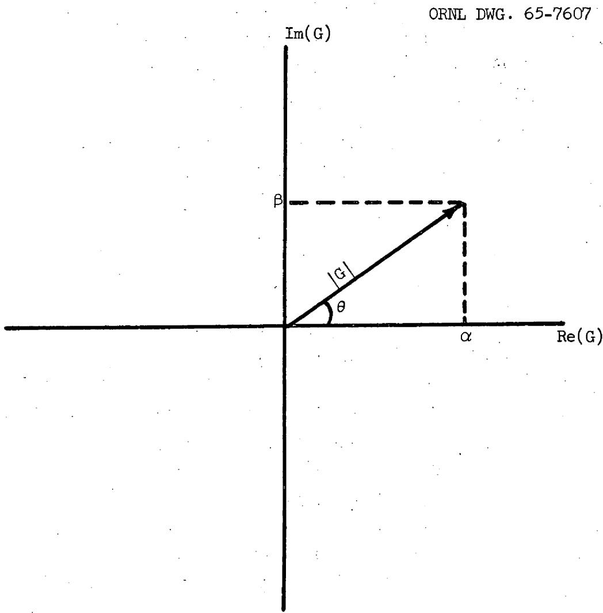
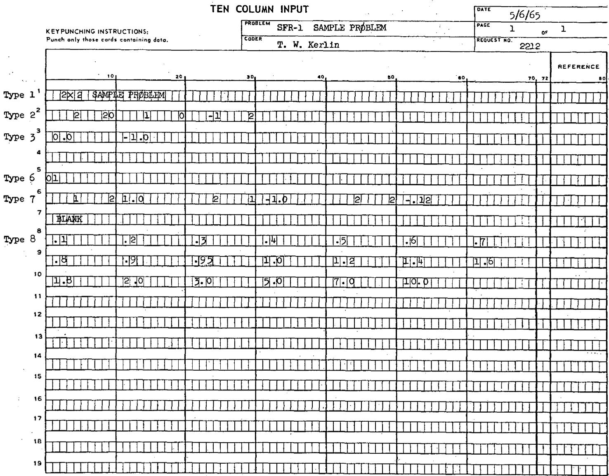
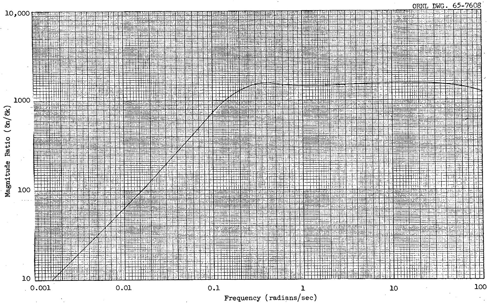
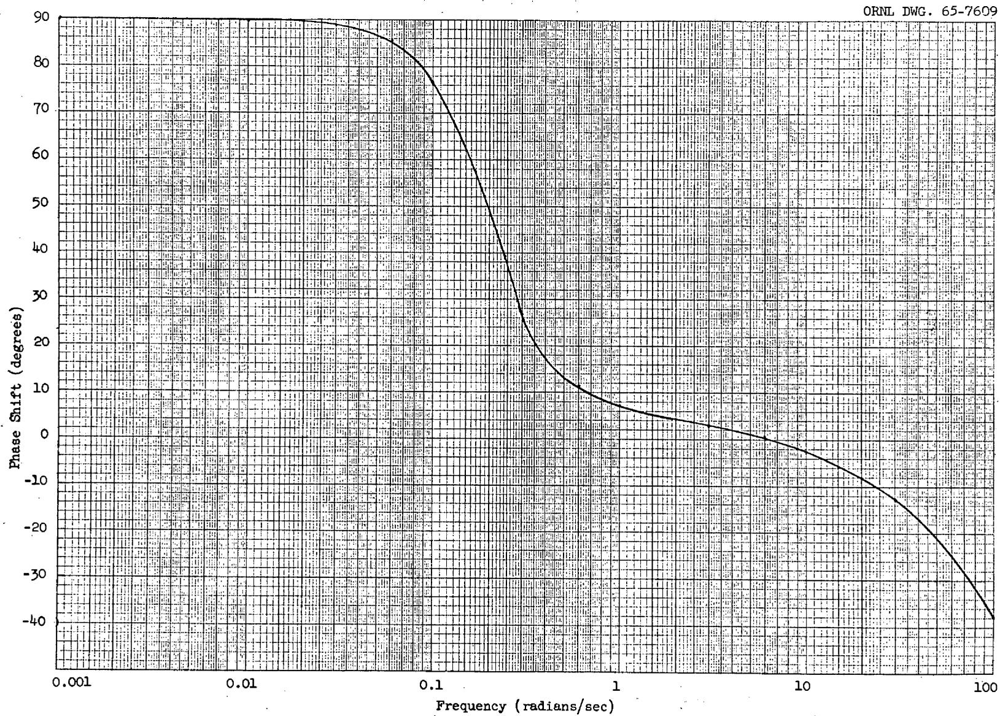
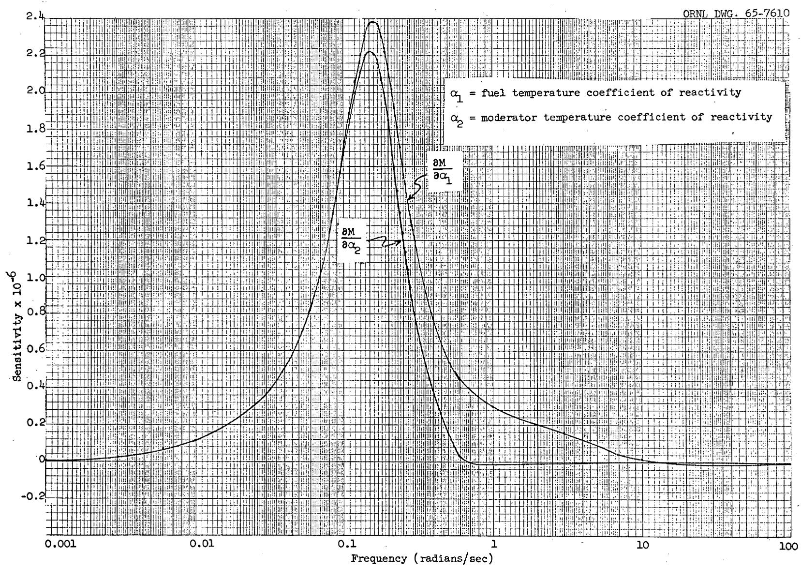
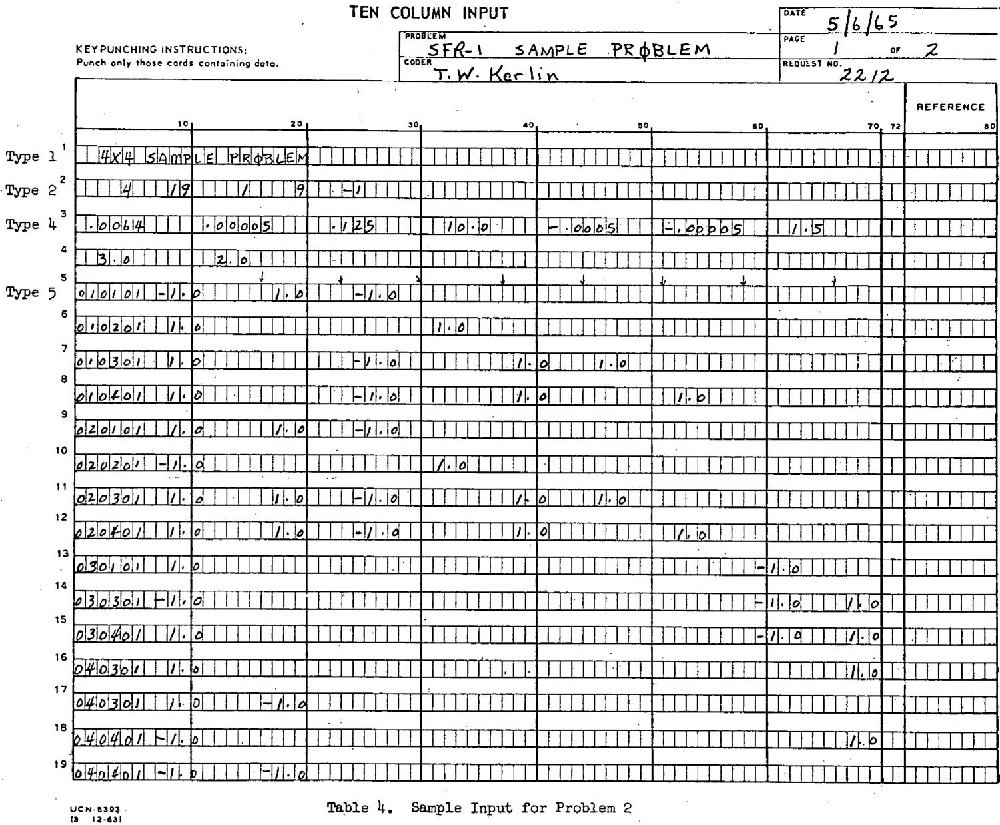
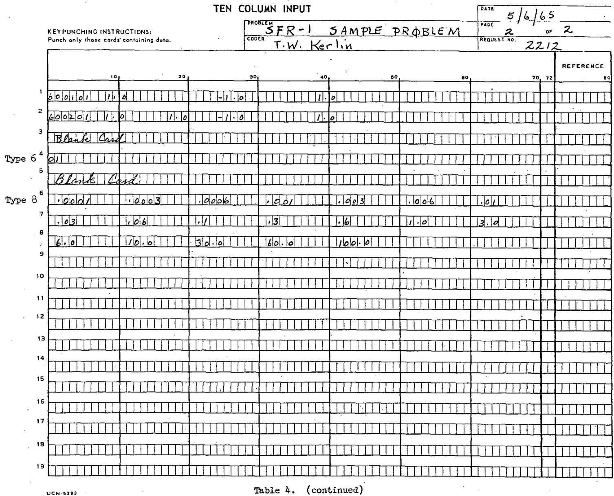

ORNL-TM-1189

COPY NO. - 41

DATE-June 24,1965

A TECHNIQUE FOR CALCULATING FREQUENCY RESPONSE AND ITS SENSITIVITY TO PARAMETER CHANGES FOR MULTI-VARIABLE SYSTEMS

T. W. Kerlin and J. L. Lucius*

# ABSTRACT

A general method for calculating the frequency response of a dynamic system and the sensitivity of this frequency response to changes in system parameters is described. The development is carried out using the matrix differential equation (or state variable) approach. SFR-1, a computer code prepared to carry out the computations, is described. Two sample problems serve to illustrate the method and the use of the code.

CENTRAL RESEARCH LIBRARY DOCUMENT COLLECTION LIBRARY LOAN COPY DO NOT TRANSFER TO ANOTHER PERSON If you wish someone else to see this document, send in name with document and the library will arrange a loan.

# LEGAL NOTICE

This report was prepared as an account of Government sponsored work. Neither the United States, nor the Commission, nor any person acting on behalf of the Commission:

A. Makes any warranty or representation, expressed or implied, with respect to the accuracy, completeness, or usefulness of the information contained in this report, or that the use of any information, apparatus, method, or process disclosed in this report may not infringe privately owned rights; or   
B. Assumes any liabilities with respect to the use of, or for damages resulting from the use of any information, apparatus, method, or process disclosed in this report.

As used in the above, "person acting on behalf of the Commission" includes any employee or contractor of the Commission, or employee of such contractor, to the extent that such employee or contractor of the Commission, or employee of such contractor prepares, disseminates, or provides access to, any information pursuant to his employment or contract with the Commission, or his employment with such contractor.

# Contents

Page 5 Introduction   
Frequency Response 5   
Frequency Response Sensitivity 9   
The Computer Program 12   
Input 13   
Output 17   
Sample Problems 18   
Problem 1 18   
Problem 2 19   
Conclusions 23   
References 30

# Introduction

Techniques for determining the frequency response of multi-variable dynamic systems are well known, and several computer codes have been prepared which are useful for calculating nuclear power reactor frequency response. $^{1,2}$ The frequency response is usually determined for the system at the design condition and at several off-design conditions to determine the sensitivity of the results to changes in system parameters. This sensitivity information can be useful in re-design of dynamically unsatisfactory systems and in determination of necessary tolerances in design specifications to insure suitable dynamic behavior at lowest cost. Sensitivity information can also provide a deeper understanding of system dynamic characteristics to the system analyst and can help in matching experimental and theoretical results.

This report presents a technique for determining the frequency response of multi-variable systems. In addition, the sensitivities to system parameters can be determined directly. A computer code for carrying out the calculation is described and numerical results are shown for sample problems.

# Frequency Response

The system equation for a linear, autonomous, lumped parameter system may be written:

$$
\frac {\mathrm {d} \dot {\mathbf {z}}}{\mathrm {d} t} = \mathbf {A} \mathbf {z} + \mathbf {f}, \tag {1}
$$

where

$$
z = t h e \text {r e s p o n s e v e c t o r},
$$

$$
t = \text {t i m e},
$$

$$
\begin{array}{l} \text {A = t h e s y s t e m m a t r i x (t h e e l e m e n t s a r e t h e u s u a l c o e f f i c i e n t s i n} \\ \text {t h e d i f f e r e n t i a l e q u a t i o n s)}, \end{array}
$$

$$
f = t h e \text {d i s t u r b a n c e v e c t o r}.
$$

Eq. (1) is usually called the state variable representation of the system. In Eq. (1), it is assumed that the dependent variables are written as perturbations around an equilibrium point. This implies that all the

initial conditions are zero when the equation is Laplace transformed. The Laplace transform of (1) is then given by the following equation:

$$
[ A - s I ] \overline {{z}} = - \overline {{f}}, \tag {2}
$$

where

$$
\begin{array}{l} I = \text {u n i t} \\ s = \text {L a p l a c e} \\ \overline {{z}} = \text {L a p l a c e} \\ \overline {{f}} = \text {L a p l a c e} \\ \end{array}
$$

Cramer's rule can be used to write the formal solution of (2):

$$
\bar {z} _ {i} = \frac {B _ {i}}{| A - s I |} \tag {3}
$$

where

$$
\begin{array}{l} \bar {z} _ {i} = i ^ {\text {t h}} \text {c o m p o n e n t o f} \bar {z}, \\ B _ {i} = \text {d e t e r m i n a n t o f [ A - s I ] w i t h t h e i} ^ {\text {t h}} \text {c o l u m n r e p l a c e d b y} - \overline {{f}}. \\ \end{array}
$$

In general, a transfer function expresses the relationship between an independent variable and some dependent variable. The independent variable appears as a factor in the disturbance vector, $f$ , on the right hand side of the system equation. Thus, $\overline{f}$ may be written as follows:

$$
\overline {{f}} = \overline {{\rho}} g \tag {4}
$$

where

$$
\begin{array}{l} \overline {{\rho}} = \text {L a p l a c e} \\ g = a \text {v e c t o r o f} \\ \end{array}
$$

Use Eq. (4) with (3) to give

$$
G = \frac {\overline {{z}} _ {i}}{\overline {{\rho}}} = \frac {C _ {i}}{| A - s I |} \tag {5}
$$

where

$$
\begin{array}{l} G = \text {t r a n s f e r} \quad \text {f u n c t i o n b e t w e e n t h e i n d e p e n d e n t v a r i a b l e ,} \rho , \text {a n d t h e} \quad \text {d e p e n d e n t v a r i a b l e ,} z _ {i}, \\ C _ {i} = \text {d e t e r m i n a n t o f [ A - s I ] w i t h t h e i} ^ {\text {t h}} \text {c o l u m n r e p l a c e d b y - g}. \\ \end{array}
$$

For nuclear reactor applications, the selected independent variable is most often reactivity, and the selected dependent variable is most often the neutron flux or a temperature at some point in the system.

The transfer function in Eq. (5) may be used to give the frequency response. For this, the Laplace transform variable, $s$ , is replaced by $j\omega$ , where $j = \sqrt{-1}$ and $\omega =$ the frequency of the perturbation. Thus, the transfer function becomes a complex quantity:

$$
G = \alpha + j \beta . \tag {6}
$$

The appearance of G in the complex plane is shown in Fig. 1. It is common to characterize G by a magnitude, M, and a phase angle, θ. These are given by:

$$
M = \sqrt {\alpha^ {2} + \beta^ {2}}, \tag {7}
$$

$$
\theta = \tan^ {- 1} \frac {\beta}{\alpha}. \tag {8}
$$

The variation of M and $\theta$ as a function of the frequency, $\omega$ , is called the frequency response of the system.

A number of approaches are possible for solving Eq. (5). The most obvious is to form the numerator and denominator determinants and to numerically evaluate these determinants in complex arithmetic. Another approach is to transform the determinants into polynomials in $s$ . This has the advantage that evaluation for numerous frequencies ( $\omega = -js$ ) does not require re-evaluation of the determinants. The choice, then, is whether to perform the bulk of the computation in finding the polynomial or in evaluating the determinants. The preference seems to have been for the polynomial method in most previous calculations. This was done because the polynomial methods were sufficiently faster than direct determinant solutions to offset two difficulties characteristic of polynomial methods: the accurate calculation of the coefficients of the polynomial is a difficult numerical problem, and the complex relation between the basic system parameters and the coefficients of the polynomials complicates calculation of the effect of changes in the parameters.

  
Fig. 1. Appearance of G in the Complex Plane

In this study the desire to determine the effect of changes in system parameters on the frequency response dictated the use of direct calculation of the determinants. In contrast to the polynomial methods, it is easy to keep track of the system parameters and to determine their effect on the frequency response. It was also found that direct calculation of the determinants for calculating the frequency response alone is inexpensive on large digital computers unless the matrix is quite large. The running time for a FORTRAN IV Gaussian elimination scheme on the IBM 7090 has been found to be given by:

$$
T = 0. 0 2 8 n ^ {1. 9},
$$

where

$\mathbf{T} =$ running time (seconds/frequency calculated),

$\mathsf{n} =$ order of the matrix.

If it is assumed that about 25 points are needed to define the frequency response, then the running time is given approximately in Table 1.

Table 1. Approximate IBM 7090 Running Time for Direct Frequency Response Calculation   

<table><tr><td>Order of Matrix</td><td>Running Time (min)</td></tr><tr><td>10</td><td>1</td></tr><tr><td>20</td><td>3.4</td></tr><tr><td>30</td><td>7.3</td></tr><tr><td>40</td><td>12.5</td></tr><tr><td>50</td><td>19.5</td></tr><tr><td>60</td><td>27.9</td></tr></table>

# Frequency Response Sensitivity

It is frequently valuable to know what changes in the frequency response will occur if certain of the system parameters should change. It would be desirable to get this information without recalculating the

whole frequency response repeatedly. A technique for accomplishing this is given in this section.

First, rewrite Eq. (5) as shown below:

$$
G = \frac {N}{\left| A - S I \right|} = \frac {N}{D}. \tag {9}
$$

Now differentiate Eq. (9) with respect to an element, $a_{ij}$ , of the system matrix, $A$ ,

$$
\frac {\partial G}{\partial a _ {i j}} = \frac {1}{D} \left(\frac {\partial N}{\partial a _ {i j}} - \frac {N}{D} \frac {\partial D}{\partial a _ {i j}}\right). \tag {10}
$$

Equation (10) gives the sensitivity of the frequency response to changes in the elements of the system matrix. The derivatives on the right side of Eq. (10) are easily calculated. It can be shown that the derivative of a determinant of a matrix with respect to one of its elements is the cofactor of that element in the matrix. Thus we get:

$$
\frac {\partial G}{\partial a _ {i j}} = \frac {1}{D} \left[ \eta_ {i j} - G y _ {i j} \right], \tag {11}
$$

where

$$
\eta_ {i j} = \text {c o f a c t o r} a _ {i j} \text {i n} \text {t h e n u m e r a t o r m a t r i x , N},
$$

$$
\gamma_ {i j} = \text {c o f a c t o r o f a} _ {i j} \text {i n t h e d e n o m i n a t o r m a t r i x , D .}
$$

It is also necessary to convert the G sensitivity into magnitude sensitivity and phase sensitivity. First, since $a_{ij}$ is real, we can write:

$$
\frac {\partial G}{\partial a _ {i j}} = \frac {\partial \alpha}{\partial a _ {i j}} + j \frac {\partial \beta}{\partial a _ {i j}}. \tag {12}
$$

Thus the real and imaginary parts of the solution given by Eq. (11) are actually $\frac{\partial\alpha}{\partial a_{ij}}$ and $\frac{\partial\beta}{\partial a_{ij}}$ . From the definitions of M and $\theta$ , it is clear that the following relations exist:

$$
\frac {\partial \mathrm {M}}{\partial \mathrm {a} _ {i j}} = \frac {\alpha \frac {\partial \alpha}{\partial \mathrm {a} _ {i j}} + \beta \frac {\partial \beta}{\partial \mathrm {a} _ {i j}}}{\sqrt {\alpha^ {2} + \beta^ {2}}} \tag {13}
$$

$$
\frac {\partial \theta}{\partial a _ {i j}} = \frac {\alpha \cdot \frac {\partial \beta}{\partial a _ {i j}} - \beta \cdot \frac {\partial \alpha}{\partial a _ {i j}}}{\alpha^ {2} + \beta^ {2}}. \tag {14}
$$

Equations (11) through (14) are adequate for finding the sensitivities to matrix element changes. However, these matrix elements are made up of algebraic combinations of basic system parameters. The same system parameters frequently occur in several matrix elements. It is desirable to find the sensitivities to system parameter changes as well as the sensitivities to matrix element changes. This can easily be done using Eqs. (15) and (16):

$$
\frac {\partial \mathrm {M}}{\partial x _ {\ell}} = \sum_ {i j} \frac {\partial \mathrm {M}}{\partial a _ {i j}} \frac {\partial a _ {i j}}{\partial x _ {\ell}} \tag {15}
$$

$$
\frac {\partial \theta}{\partial x _ {\ell}} = \sum_ {i j} \frac {\partial \theta}{\partial a _ {i j}} \frac {\partial a _ {i j}}{\partial x _ {\ell}}, \tag {16}
$$

where

$$
x _ {\ell} = t h e \ell^ {t h} s y s t e m p a r a m e t e r.
$$

The quantities $\partial a_{ij} / \partial x_{\ell}$ are known since the algebraic relations between matrix elements and system parameters must be known from the analytical description of the system.

A special feature of the numerator determinant, $\mathbb{N}$ , should be noted. The column whose elements consist of the disturbance vector, $\mathbf{g}$ , clearly do not depend on the matrix elements, $a_{ij}$ . Thus $\frac{\partial N}{\partial a_{ij}}$ does not contain a contribution from the column replaced by $g$ . However, $g$ can depend on the system parameters. Thus $\frac{\partial N}{\partial x_{\ell}}$ may have a non-zero contribution from the column of the matrix whose components are the components of $g$ . Thus the complete equations are:

$$
\frac {\partial \mathrm {M}}{\partial \mathrm {x} _ {\ell}} = \sum_ {\mathrm {i j}} \frac {\partial \mathrm {M}}{\partial \mathrm {a} _ {\mathrm {i j}}} \frac {\partial \mathrm {a} _ {\mathrm {i j}}}{\partial \mathrm {x} _ {\ell}} + \sum_ {\mathrm {k}} \frac {\partial \mathrm {M}}{\partial \mathrm {g} _ {\mathrm {k}}} \frac {\partial \mathrm {g} _ {\mathrm {k}}}{\partial \mathrm {x} _ {\ell}} \tag {17}
$$

$$
\frac {\partial \theta}{\partial x _ {\ell}} = \sum_ {i j} \frac {\partial \theta}{\partial a _ {i j}} \frac {\partial a _ {i j}}{\partial x _ {\ell}} + \sum_ {k} \frac {\partial \theta}{\partial g _ {k}} \frac {\partial g _ {k}}{\partial x _ {\ell}} \tag {18}
$$

The procedures for finding $\partial \mathbf{M} / \partial \mathbf{g}_{\mathbf{k}}$ and $\partial \theta / \partial \mathbf{g}_{\mathbf{k}}$ are similar to those for finding $\partial \mathbf{M} / \partial \mathbf{a}_{ij}$ and $\partial \theta / \partial \mathbf{a}_{ij}$ . Since $\mathbf{g}_{\mathbf{k}}$ appears only in $\mathbb{N}$ ,

$$
\frac {\partial \mathrm {G}}{\partial \mathrm {g} _ {\mathrm {k}}} = \frac {1}{\mathrm {D}} \quad \frac {\partial \mathrm {N}}{\partial \mathrm {g} _ {\mathrm {k}}}, \tag {19}
$$

where

$$
\frac {\partial \mathrm {N}}{\partial \mathrm {g} _ {\mathrm {k}}} = \text {n e g a t i v e o f t h e c o f a c t o r o f t h e e l e m e n t i n . N c o n t a i n i n g} \mathrm {g} _ {\mathrm {k}}.
$$

From the definitions of M and $\theta$ , it is clear that

$$
\frac {\partial \mathrm {M}}{\partial g _ {\mathrm {k}}} = \frac {\alpha \left. \frac {\partial \alpha}{\partial g _ {\mathrm {k}}} + \beta \frac {\partial \beta}{\partial g _ {\mathrm {k}}} \right.}{\sqrt {\alpha^ {2} + \beta^ {2}}} \tag {20}
$$

$$
\frac {\partial \theta}{\partial g _ {k}} = \frac {\alpha \frac {\partial \beta}{\partial g _ {k}} - \beta \frac {\partial \alpha}{\partial g _ {k}}}{\sqrt {\alpha^ {2} + \beta^ {2}}} \tag {21}
$$

where

$$
\frac {\partial \alpha}{\partial g _ {k}} = \text {r e a l p a r t o f} \partial G / \partial g _ {k},
$$

$$
\frac {\partial \beta}{\partial g _ {k}} = \text {i m a g i n a r y p a r t o f} \partial G / \partial g _ {k}.
$$

# The Computer Program

A computer program called SFR-l (Sensitivity of the Frequency Response) was prepared for the IBM 7090. The computer code is provided with the system matrix, A (59 x 59 or smaller), and the disturbance vector, g. For specified values of $\omega$ , the code calculates the frequency response using Eq. (5) and $s = j\omega$ . Equations (7) and (8) are used to

give the magnitude and phase. The determinants in Eq. (5) are calculated in complex arithmetic using a Gaussian elimination scheme with partial pivoting<sup>3</sup> (obtained from R. E. Funderlic of Oak Ridge Gaseous Diffusion Plant). The code also can calculate the sensitivities to matrix element changes using Eqs. (11), (13), and (14). The sensitivities to the system parameters are calculated using Eqs. (17) and (18). The method for providing the algebraic relationships between the matrix elements and the system parameters are given below in the section on input.

# Input

The input to SFR-1 is short and simple. The only section requiring extensive explanation is the algebra table. The algebra table serves to establish the relationship between matrix elements and system parameters and the relationship between elements of the disturbance vector and system parameters. In general, each matrix element or disturbance vector element is made up of a sum of terms, each of which is an algebraic combination of various system parameters:

$$
a _ {i j} = z _ {1} x _ {1} p _ {1} x _ {2} p _ {2} \dots x _ {n} + z _ {2} x _ {1} q _ {1} x _ {2} q _ {2} \dots x _ {n} + \dots
$$

or.

$$
a _ {i j} = \sum_ {m = 1} ^ {M} Z _ {m} \prod_ {q = 1} ^ {I} x _ {q} ^ {p m}, \tag {22}
$$

where

$$
Z _ {m} = a \text {c o n s t a n t},
$$

$$
P _ {q m} = \text {e x p o n e n t o f t h e q} ^ {\text {t h}} \text {f a c t o r i n t h e m} ^ {\text {t h}} \text {t e r m},
$$

$$
m = t h e n u m b e r o f t h e t e r m,
$$

$$
q = \text {i n d e x}
$$

$$
M = \text {t h e n u m b e r o f t e r m s},
$$

$$
I = \text {t h e n u m b e r o f f a c t o r s i n t e r m m .}
$$

For instance if

$$
a _ {8, 9} = 2 x _ {1} ^ {2} x _ {3} ^ {. 8} x _ {4} ^ {- 1} + 4. 2 x _ {1} ^ {- 2} x _ {2} ^ {3} x _ {4} ^ {1. 8}
$$

we could express a8,9 in tabular form as:

<table><tr><td></td><td></td><td></td><td></td><td colspan="4">Coefficient of x</td></tr><tr><td>i</td><td>j</td><td>m</td><td>Zm</td><td>1</td><td>2</td><td>3</td><td>4</td></tr><tr><td>8</td><td>9</td><td>1</td><td>2.0</td><td>2.0</td><td></td><td>0.8</td><td>-1.0</td></tr><tr><td>8</td><td>9</td><td>2</td><td>4.2</td><td>-2.0</td><td>3.0</td><td></td><td>1.8</td></tr></table>

A table of this type appears in the SFR input. The information in this table is also used by SFR-1 to calculate the derivatives shown in Eqs. (15-18). The general rule for differentiating terms of this type leads to

$$
\frac {\partial \mathrm {a} _ {i j}}{\partial \mathrm {x} _ {\ell}} = \sum_ {\mathrm {m} = 1} ^ {\mathrm {M}} \mathrm {Z} _ {\mathrm {m}} \mathrm {P} _ {\ell \mathrm {m}} \prod_ {\mathrm {q} = 1} ^ {\mathrm {I}} \left(\frac {\mathrm {P} _ {\mathrm {q m}}}{\mathrm {x} _ {\ell}}\right) \delta_ {\ell} ^ {\mathrm {q}} \tag {23}
$$

where

$$
\begin{array}{l} \delta_ {\ell} ^ {q} = 1 \text {i f} x _ {\ell} \text {a p p e r s i n t h e m} ^ {\text {t h}} \text {t e r m} \\ 0 \text {i f} x _ {\ell} \text {d o e s n o t a p p a r i n t h e} m ^ {\text {t h}} \text {t e r m} \\ \end{array}
$$

The detailed description of the input is given below:

Type 1:

Title card.

Type 2:

<table><tr><td>Column</td><td>1-5</td><td>6-10</td><td>11-15</td><td>16-20</td><td>21-25</td><td>26-30</td></tr><tr><td>Format</td><td>I5</td><td>I5</td><td>I5</td><td>I5</td><td>I5</td><td>I5</td></tr><tr><td>Input</td><td>N</td><td>NOW</td><td>NCTS</td><td>NOXI</td><td>KIPD</td><td>NOFV</td></tr></table>

where

```txt
N = order of the system matrix,  
NOW = number of frequencies to be calculated,  
NCTS = number of different columns to be replaced by the disturbance vector,  
NOXI = number of system parameters being considered,  
KIPD = derivative option. If KIPD is positive, SFR calculates the frequency response only. If KIPD is zero or negative, SFR calculates the frequency response and the sensitivities,  
NOFV = row number of the last non-zero entry in the disturbance vector if the disturbance vector is specified in Type 3 input. If the disturbance vector is specified in the algebra table (Type 5 input), NOFV is omitted. 
```

Type 3:

<table><tr><td>Column</td><td>1-10</td><td rowspan="3">Repeat, 7 per card</td></tr><tr><td>Format</td><td>7E10.4</td></tr><tr><td>Input</td><td>C_i</td></tr></table>

where

$C_{i} =$ components of the disturbance vector

Note: Type 3 cards are omitted if all components of the disturbance vector are calculated from the algebra table (Type 5 input).

Type 4:

<table><tr><td>Column</td><td>1-10</td><td rowspan="3">Repeat, 7 per card</td></tr><tr><td>Format</td><td>7E10.4</td></tr><tr><td>Input</td><td>x_ℓ</td></tr></table>

where

$x_{\ell} =$ value of the system parameter, values are listed sequentially starting with $x_{1}$

Note: Omit Type 4 cards if NOXI = 0.

Type 5:

<table><tr><td>Column</td><td>1-2</td><td>3-4</td><td>5-6</td><td>7-16</td><td>17-23</td><td>24-30</td><td>31-37</td><td>38-44</td><td>45-51</td><td>52-58</td><td>59-65</td><td>66-72</td></tr><tr><td>Format</td><td>I2</td><td>I2</td><td>I2</td><td>E10.5</td><td colspan="8">8F7.2</td></tr><tr><td>Input</td><td>I</td><td>J</td><td>m</td><td>Z</td><td colspan="8">P</td></tr></table>

where

I = row number of matrix element if I ≤ 59. If I = 60, a component of the disturbance vector is being specified,

$J =$ column number of matrix element if $I \leqslant 59$ . If $I = 60$ , $J$ is the row of the component of the disturbance vector being specified,

$\mathfrak{m} =$ number of the term,

$Z =$ constant multiplier of this term,

$\mathbf{P} =$ exponent of the system parameter.

Note: End Type 5 cards with a blank card. Omit Type 5 cards if NOXI = 0.

No blank card is used to end Type 5 input if NOXI = 0.

Type 6:

<table><tr><td>Column</td><td></td><td>1-2</td><td rowspan="3">Repeat</td></tr><tr><td>Format</td><td></td><td>I2</td></tr><tr><td>Input</td><td></td><td>CR</td></tr></table>

where

CR = column number to be replaced by the disturbance vector, NCTS entries should be made.

Type 7:

<table><tr><td>Column</td><td>1-5</td><td>6-10</td><td>11-20</td><td rowspan="3">Repeat, three per card</td></tr><tr><td>Format</td><td>I5</td><td>I5</td><td>E10.4</td></tr><tr><td>Input</td><td>I</td><td>J</td><td>aj</td></tr></table>

where

I = row number,

J = column number

a $=$ value of element, $\mathbf{a}_{ij}$ , of the system matrix, ij

Note: End Type 7 cards with a blank card.

If a matrix element is specified on a Type 7 card and also is calculated from the algebra table, the value from the algebra table will be used.

Type 8:

<table><tr><td>Column</td><td>1-10</td><td rowspan="3">Repeat, seven per card</td></tr><tr><td>Format</td><td>7E10.4</td></tr><tr><td>Input</td><td>ω</td></tr></table>

where

$\omega =$ frequency for calculation. Specify NOW values.

The FORTRAN listing of the SFR code is available from J. L. Lucius.

# Output

The output of SFR is clearly labeled in notation consistent with the notation in previous sections of this report. The first page is a review of input data. It consists of a print-out of the following:

1. Title   
2. Input system parameters (x)   
3. Algebra table   
4. Order of matrix   
5. Number of frequencies $(\omega^{\prime}\mathrm{s})$

6. Columns to be replaced   
7. Frequencies to be calculated   
8. System matrix non-zero elements   
9. Disturbance vector

The input summary page is followed by the results of the calculation. The results for each specified frequency are shown, one frequency to a page. The print-out is as follows:

1. Frequency   
2. Non-zero elements of $\partial D / \partial a_{i,j}$ (see Eq. 10)   
3. Magnitude ratio (M) and phase angle (THETA)   
4. Column replaced by $\overline{f}$ vector   
5. Values of $\alpha, \beta, D,$ and $N$ (see Eqs. 6 and 9)   
6. Values of $\partial \mathbb{N} / \partial a_{ij}$ , $\partial D / \partial a_{ij}$ , Re $\frac{\partial G}{\partial a_{ij}}$ , Im $\frac{\partial G}{\partial a_{ij}}$ , $\frac{\partial M}{\partial a_{ij}}$ and $\frac{\partial \theta}{\partial a_{ij}}$   
7. Values of $\partial \mathbf{M} / \partial \mathbf{x}_{\ell}$ and $\partial \theta /\partial \mathbf{x}_{\ell}$ (see Eqs. 17 and 18).

# Sample Problems

Problem 1. The first illustrative problem is a calculation for a second order system.

$$
\frac {d \mathbf {x} _ {1}}{d t} = \mathbf {x} _ {2} \tag {24}
$$

$$
\frac {d x _ {2}}{d t} = - x _ {1} - 0. 1 2 x _ {2} - k \tag {25}
$$

Rewrite these in matrix notation:

$$
\frac {d x}{d t} = A x + f \tag {26}
$$

$$
x = \left[ \begin{array}{l} x _ {2} \\ x _ {2} ^ {s} \end{array} \right] \quad A = \left[ \begin{array}{c c} 0 & 1 \\ - 1 & - 0. 1 2 \end{array} \right] \cdot \left[ \begin{array}{c} f = - k \end{array} \right]
$$

The transfer function, $\overline{\mathbf{x}}_1 / \overline{\mathbf{k}}$ , is given by

$$
\frac {\overline {{x}} _ {1}}{k} = \frac {1}{s ^ {2} + 0 . 1 2 s + 1}. \tag {27}
$$

This is the form of a quadratic lag with a damping ratio of 0.06. This familiar problem was analyzed with SFR-1. The frequency response and the sensitivity of the frequency response to changes in the damping ratio $\left(\frac{1}{2}a_{22}\right.$ in the system matrix) were calculated. The sensitivities were used to predict the frequency response when the damping ratio changes from 0.06 to 0.05. Table 2 shows the predicted results and a comparison with exact values. It is clear that the sensitivities provided very reliable information about the effect of changes in the damping ratio in this problem. A copy of the SFR-1 input required for this problem is shown in Table 3.

Problem 2. The second problem is the analysis of a reactor with one group of delayed neutrons and two temperature feedbacks, one prompt and one delayed. The linearized equations are:

$$
\frac {\mathrm {d} n ^ {\prime}}{\mathrm {d} t} = - \frac {\beta}{\ell} n ^ {\prime} + \lambda C ^ {\prime} + \frac {n _ {o} \alpha_ {1} T ^ {\prime}}{\ell} + \frac {n _ {o} \alpha_ {2} T ^ {\prime}}{\ell} + \frac {n _ {o} \delta k}{\ell} \tag {28}
$$

$$
\frac {\mathrm {d} C ^ {\prime}}{\mathrm {d} t} = \frac {\beta}{\ell} n ^ {\prime} - \lambda C ^ {\prime} + \frac {n _ {o} \beta \alpha_ {1} T _ {1} ^ {\prime}}{\ell} + \frac {n _ {o} \beta \alpha_ {2} T _ {2} ^ {\prime}}{\ell} + \frac {n _ {o} \beta \delta k}{\ell} \tag {29}
$$

$$
\frac {\mathrm {d} \mathrm {T} _ {1} ^ {\prime}}{\mathrm {d t}} = \frac {1}{(\mathrm {M C} _ {\mathrm {p}}) _ {1}} \mathrm {n} ^ {\prime} - \frac {\mathrm {h A}}{(\mathrm {M C} _ {\mathrm {p}}) _ {1}} \mathrm {T} _ {1} ^ {\prime} + \frac {\mathrm {h A}}{(\mathrm {M C} _ {\mathrm {p}}) _ {1}} \mathrm {T} _ {2} ^ {\prime} \tag {30}
$$

$$
\frac {d T _ {2} ^ {\prime}}{d t} = \frac {h A}{\left(M C _ {p}\right) _ {2}} T _ {1} ^ {\prime} - \frac {h A}{\left(M C _ {p}\right) _ {2}} T _ {2} ^ {\prime} \tag {31}
$$

where

$n^{\prime} =$ deviation in neutron population from the initial condition,

C' = deviation in the precursor concentration from the initial

condition,

Table 2. Results for Problem 1   

<table><tr><td>Frequency (radians/sec)</td><td>Amplitude (damping ratio = 0.06)</td><td>Amplitude Sensitivity</td><td>Predicted Amplitude (damping ratio = 0.05)</td><td>Actual Amplitude (damping ratio = 0.05)</td><td>Percent Error</td></tr><tr><td>0.1</td><td>1.01003</td><td>0.00123646</td><td>1.01005</td><td>1.01005</td><td>0</td></tr><tr><td>0.2</td><td>1.04134</td><td>0.00542026</td><td>1.04145</td><td>1.04144</td><td>0.001</td></tr><tr><td>0.3</td><td>1.09804</td><td>0.0142982</td><td>1.09833</td><td>1.09830</td><td>0.003</td></tr><tr><td>0.4</td><td>1.18854</td><td>0.0322359</td><td>1.18919</td><td>1.18913</td><td>0.005</td></tr><tr><td>0.5</td><td>1.32909</td><td>0.0704339</td><td>1.33050</td><td>1.33038</td><td>0.009</td></tr><tr><td>0.6</td><td>1.55271</td><td>0.161715</td><td>1.55594</td><td>1.55568</td><td>0.017</td></tr><tr><td>0.7</td><td>1.93472</td><td>0.425824</td><td>1.94324</td><td>1.94257</td><td>0.034</td></tr><tr><td>0.8</td><td>2.68339</td><td>1.48492</td><td>2.71310</td><td>2.71163</td><td>0.054</td></tr><tr><td>0.9</td><td>4.57562</td><td>9.31140</td><td>4.76185</td><td>4.75651</td><td>0.112</td></tr><tr><td>0.95</td><td>6.66633</td><td>32.0841</td><td>7.30801</td><td>7.34594</td><td>0.516</td></tr><tr><td>1.0</td><td>8.33333</td><td>69.4444</td><td>9.72219</td><td>10.00000</td><td>2.778</td></tr><tr><td>1.2</td><td>2.15999</td><td>1.74141</td><td>2.19482</td><td>2.19265</td><td>0.099</td></tr><tr><td>1.4</td><td>1.02607</td><td>0.254081</td><td>1.03115</td><td>1.03076</td><td>0.038</td></tr><tr><td>1.6</td><td>0.636225</td><td>0.0791140</td><td>0.637807</td><td>0.637680</td><td>0.020</td></tr><tr><td>1.8</td><td>0.444367</td><td>0.0341156</td><td>0.445049</td><td>0.444994</td><td>0.012</td></tr><tr><td>2.0</td><td>0.332272</td><td>0.0176085</td><td>0.332624</td><td>0.332595</td><td>0.009</td></tr><tr><td>3.0</td><td>0.124874</td><td>0.00210298</td><td>0.124916</td><td>0.124912</td><td>0.003</td></tr><tr><td>5.0</td><td>0.0416537</td><td>0.000216811</td><td>0.0416580</td><td>0.0416576</td><td>0.001</td></tr><tr><td>10.0</td><td>0.0101003</td><td>0.0000123646</td><td>0.010050</td><td>0.010050</td><td>0</td></tr></table>



$\mathbf{T}_{1}^{\prime}$ = deviation in fuel temperature from the initial condition,

$\mathbf{T}_{2}^{\prime}$ = deviation in moderator temperature from the initial condition,

$\beta$ = delayed neutron fraction $= 0.0064$

$\ell$ = neutron lifetime $= 0.5 \times 10^{-4}$ ,

$\lambda$ =precursordecayconstant $= 0.125,$

$\mathfrak{n}_{\circ}$ = initial neutron population $= 10.0$

$\alpha_{1} =$ fuel temperature coefficient of reactivity $= -0.5 \times 10^{-3}$ ,

$\alpha_{2}$ = moderator temperature coefficient of reactivity $= -0.5 \times 10^{-4}$ ,

$\delta \mathbf{k}_{\mathrm{ex}} =$ external perturbation in $\mathbf{k}_{\mathrm{eff}}$

$(\mathsf{MC}_{\mathsf{p}})_{1} = \mathsf{heat}$ capacity of fuel $= 1.5$

(hA) = (heat transfer coefficient) $\times$ (fuel area) = 3.0,

$(\mathbf{MC}_{\mathbf{p}})_{2} = \text{heat capacity of moderator} = 2.0$

The system parameters are identified with specific $x_{1}$ as shown below for this problem:

$$
x _ {1} = \beta = 0. 0 0 6 4
$$

$$
x _ {2} = l = 0. 0 0 0 0 5
$$

$$
x _ {3} = \lambda = 0. 1 2 5
$$

$$
x _ {4} = n _ {0} = 1 0. 0
$$

$$
x _ {5} = \alpha_ {1} = - 0. 0 0 0 5
$$

$$
x _ {6} = \alpha_ {2} = - 0. 0 0 0 5
$$

$$
x _ {7} = \left(M C _ {p}\right) _ {1} = 1. 5
$$

$$
x _ {8} = h A = 3. 0
$$

$$
x _ {9} = \left(M C _ {p}\right) _ {2} = 2. 0
$$

Substitution of these values into Eqs. (28) through (31) yields the following matrix equation:

$$
\frac {\mathrm {d} z}{\mathrm {d} t} = A z + g \delta k _ {e x}, \tag {32}
$$

where

$$
z = \left[ \begin{array}{l} n ^ {\prime} \\ C ^ {\prime} \\ T _ {1} ^ {\prime} \\ T _ {2} ^ {\prime} \end{array} \right]
$$

$$
A = \left[ \begin{array}{c c c c} - 1 2 8. 0 & 0. 1 2 5 & - 1 0 0. 0 & - 1 0. 0 \\ 1 2 8. 0 & - 0. 1 2 5 & - 0. 6 4 & - 0. 0 6 4 \\ 0. 6 6 7 & 0 & - 2. 0 & 2. 0 \\ 0 & 0 & 1. 5 & - 1. 5 \end{array} \right]
$$

$$
g = \left[ \begin{array}{c} 2. 0 \times 1 0 ^ {5} \\ 1. 2 8 \times 1 0 ^ {3} \\ 0 \\ 0 \end{array} \right]
$$

The frequency response for problem 2 is shown in Fig. 2. Figure 3 shows the sensitivity of the magnitude of the frequency response to changes in the fuel temperature coefficient of reactivity $(\alpha_{1})$ and the moderator coefficient of reactivity $(\alpha_{2})$ . Several observations about the behavior of the system are immediately obtained from the sensitivity plot. At frequencies below 0.1 radians/sec, the effect of changes in the fuel temperature coefficient and the moderator temperature coefficient are the same. However, since the fuel temperature coefficient $(\alpha_{1})$ has a magnitude which is 10 times as large as the magnitude of the moderator coefficient $(\alpha_{2})$ , it is clear that the effects of fractional changes in $\alpha_{1}$ are 10 times as large as equal fractional changes in $\alpha_{2}$ . It is also clear that the frequency response is very sensitive to changes in the temperature coefficients in the frequency range, 0.1 to 0.5 radians/sec. Above 0.5 radians/sec the graphite effect is much smaller than the fuel effect until they both diminish to small values at frequencies above 10 radians/sec. These illustrative results are typical of the results obtained in sensitivity analysis of reactor systems. The sensitivity data furnish useful information about the system which can aid in obtaining the essential understanding of the dynamic structure of the system that is needed in analysis, design, and experiment planning.

A copy of the SFR-1 input sheet for this problem is shown in Table 4.

# Conclusions

SFR-1 represents a preliminary attempt to obtain frequency response sensitivities along with the usual frequency response data. The use of Cramer's rule was expedient in developing the SFR method and certainly does not represent the most efficient procedure. Nevertheless, the calculations on SFR-1 have proved useful in practical problems<sup>5</sup> and the cost of

the calculation has not been excessive. The only numerical difficulty observed has occurred at high frequency where inaccurate sensitivities have been obtained in some problems.

The success with SFR-1 has led to the development of a new computer code which performs the SFR calculation more efficiently. This code has been prepared and is now being tested. The SFR method is also being used to furnish sensitivities to a routine for automatically adjusting the parameters in a theoretical model to fit experimental frequency response data. The method being used is similar to the "learning model" approach used by Margolis and Leondes in adaptive control applications.

  
Fig. 2a. Frequency Response for Problem 2 - Magnitude Ratios

  
Fig. 2b. Frequency Response for Problem 2 - Phase Shift

  
Fig. 3. Selected Sensitivities from Problem 2 Results.



  
UCN-5393   
(3 12-63)

# References

1. S. M. Katz and D. S. St. John, "Lass - An IBM 704 Program for Calculating System Stability," USAEC Report DP-894, Savannah River Laboratory, July, 1964.   
2. C. B. Guppy, "Computer Programme for the Derivation of Transfer Functions for Multivariable Systems," United Kingdom Atomic Energy Authority Report AEEW-R189, Winfrith, March 1962.   
3. V. N. Faddeeva, Computational Methods of Linear Algebra, Dover Publications, Inc., New York (1959).   
4. F. E. Hohn, Elementary Matrix Algebra, The MacMillan Co., New York (1958).   
5. S. J. Ball and T. W. Kerlin, "MSRE Stability Analysis," USAEC Report ORNL-TM-1070, Oak Ridge National Laboratory (in preparation).   
6. M. Margolis and C. T. Leondes, "On the Theory of Adaptive Control Systems; The Learning Model Approach," pp. 556-563 of Automatic and Remote Control, Proceedings of the First International Congress of the International Federation of Automatic Control, Moscow, 1960, edited by J. F. Coales, J. R. Ragazzini and A. T. Fuller, Butterworths, London (1961).

# Internal Distribution

1. R. K. Adams   
2. C. L. Allen, K-25   
3. S. J. Ball   
4. S.E.Beall   
5. A. A. Brooks, K-25   
6. O.W. Burke   
7. F. L. Culler   
8. A. P. Fraas   
9. D. N. Fry   
10. S.H. Hanauer   
11. P. N. Haubenreich

12-21. T. W. Berlin

22. B. R. Lawrence   
23. J. L. Lucius   
24. M. I. Lundin   
25. R.N.Lyon   
26. H. C. McCurdy   
27. A. J. Miller

28. A. M. Perry   
29. B. E. Prince   
30. C. W. Ricker   
31. M. W. Rosenthal   
32. D. P. Roux   
33. H. W. Savage   
34. A. W. Savolainen   
35. I. Spiewak   
36. R. S. Stone   
37. D. B. Trauger   
38. G. E. Whitesides, K-25   
39. G. D. Whitman   
40. ORNL Patent Office

41-42. Central Research Library   
43-44. Y-12 Document Reference Section   
45-47. Laboratory Records Department   
48. Laboratory Records Department,

LRD-RC

# External Distribution

49-63. Division of Technical Information Extension (DTIE)   
64. Research and Development Division, ORO   
65-66. Reactor Division, ORO