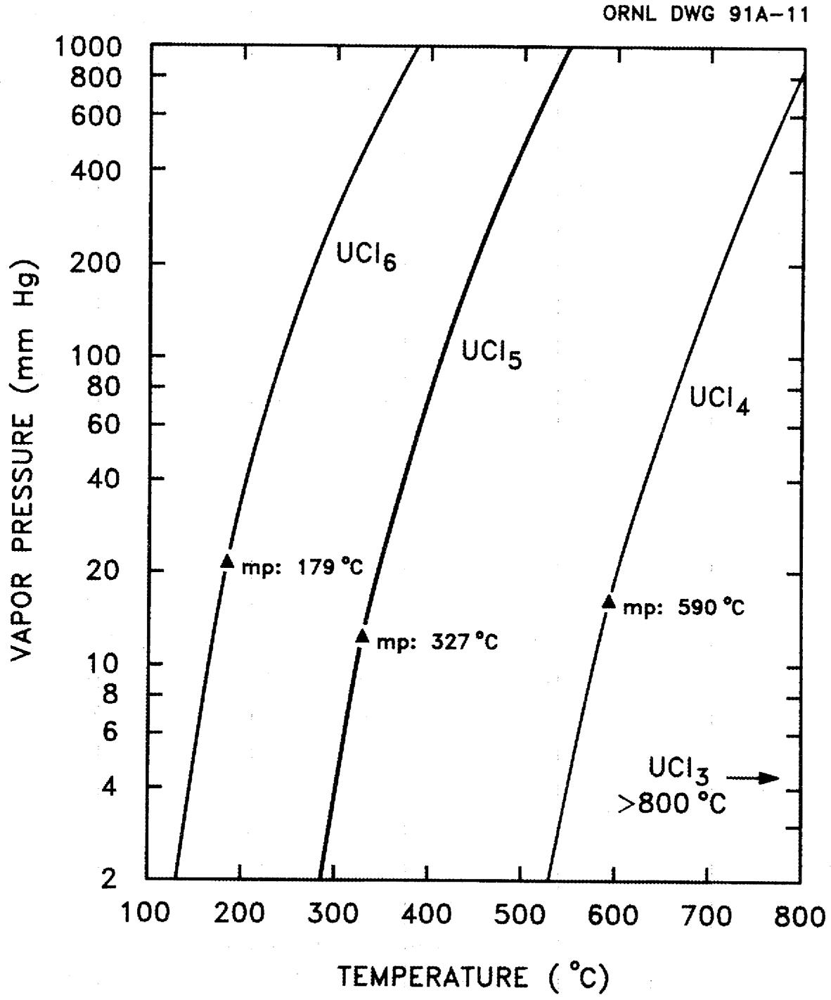
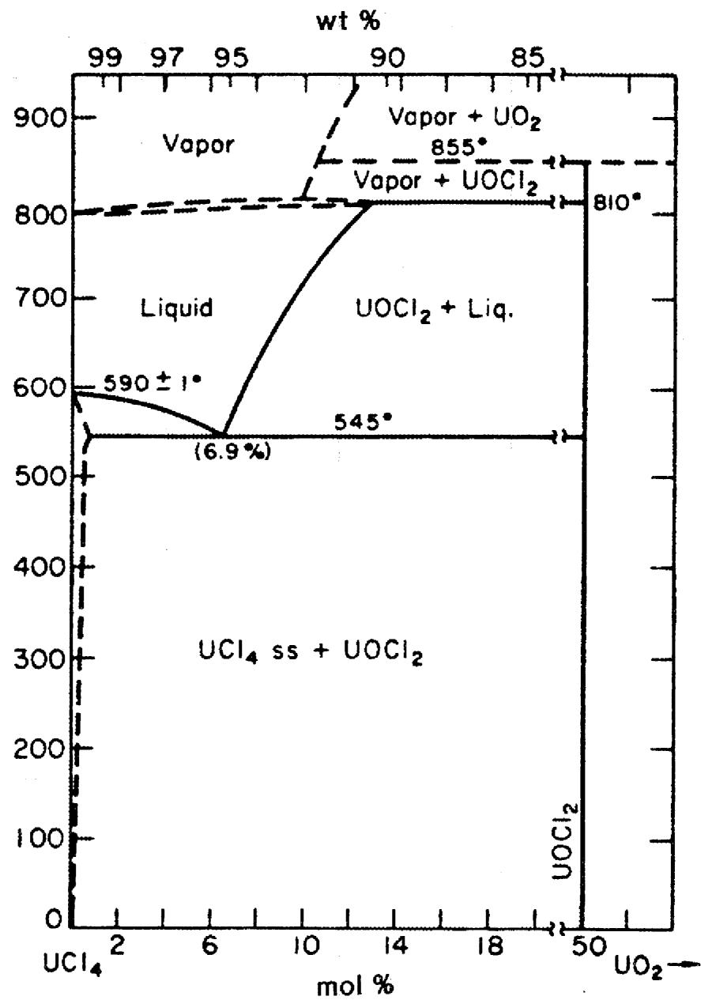
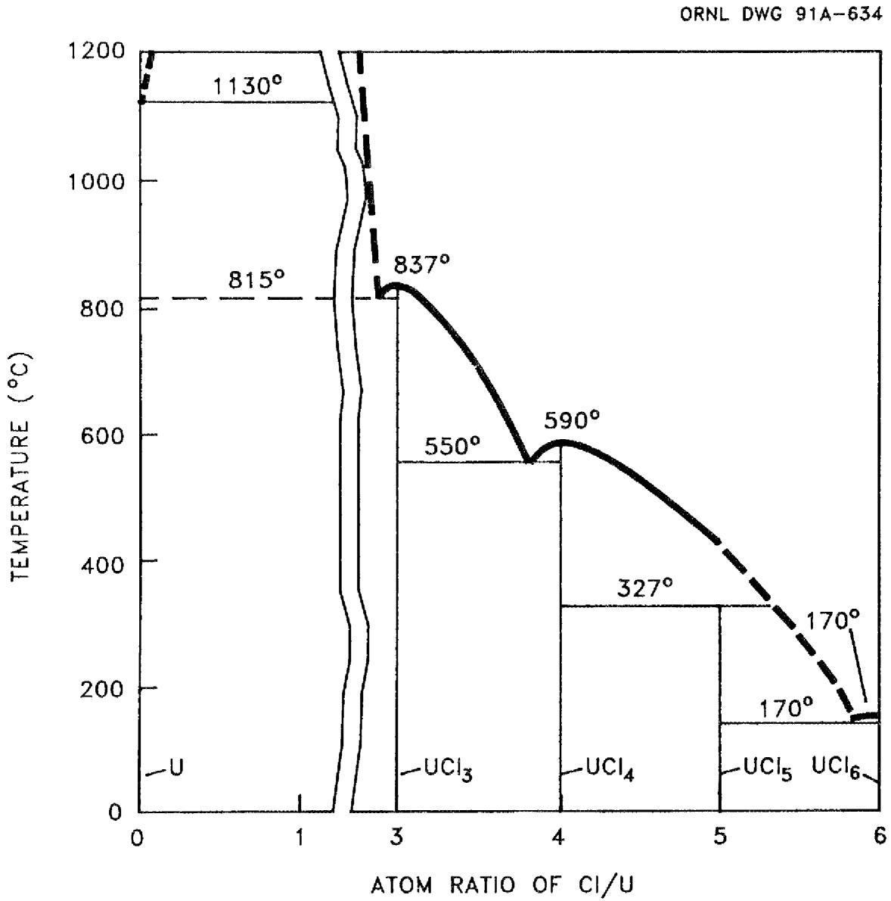
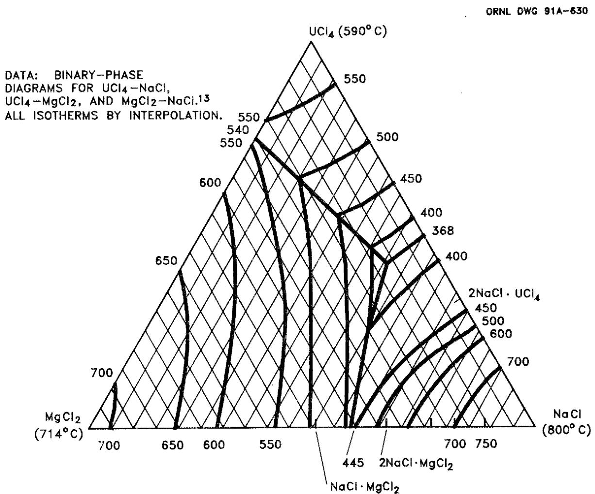
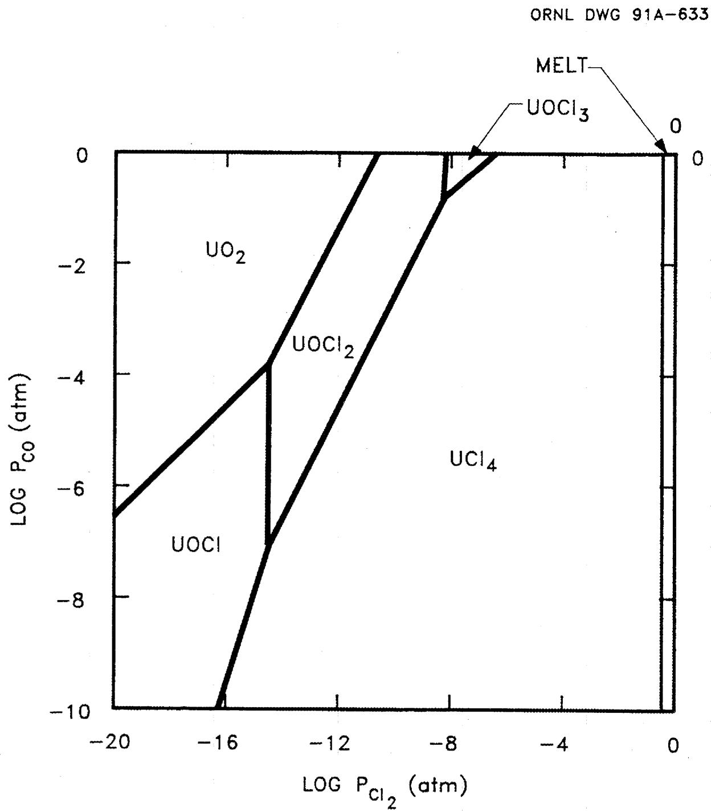
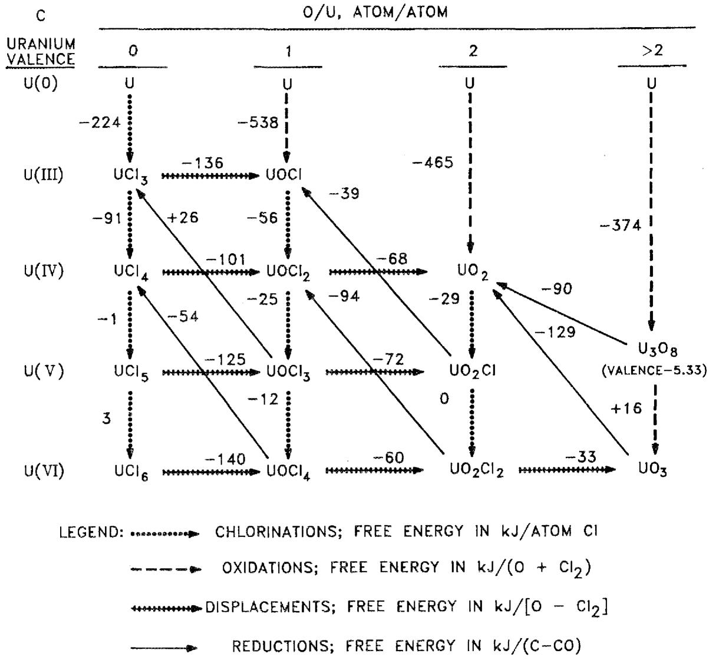
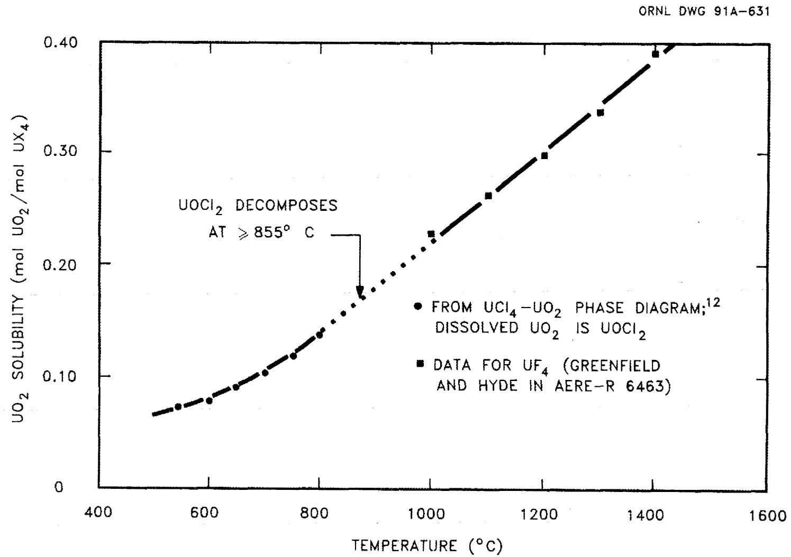

# OAK RIDGE   NATIONAL   LABORATORY

M

# LITERATURE INFORMATION APPLICABLE TO THE REACTION OF URANIUM OXIDES WITH CHLORINE TO PREPARE URANIUM Tetrachloride

P. A. Haas

February 1992

COWS PHOES: NATHIDINGAL CADDIAGE

CENTRAL DES ENVELOPHE (HOMOGENY)

L I B R A R Y L O A N 002

PROCFT TRANSFER ANONONAL FRETION

#

1

制表员AGE83Y

MARTIN MARIETTA ENERGY SYSTEMS, INC.

FOR THE UNITED STATES

DEPARTMENT OF ENERGY

This report has been reproduced directly from the best available copy

Available to DOE and DOE contractors from the Office of Scientific and Technical Information, P.O. Box 62, Oak Ridge, TN 37831; prices available from: 10m (015) 578-8401, FTS 626-8401.

Available to the public from the National Technical Information Service, U.S. Department of Commerce, 5205 Fort Royal Rd., Springfield, VA 22161

This report was prepared as an account of work sponsored by an agency of the United States Government. Neither the United States Government nor any agency thereof, nor any of its employees, makes any warranty, express or implied, or assumes any legal liability or responsibility for the accuracy, completeness, or usefulness of any information, apparatus, product, or process disclosed, or represents that its use would not infringe privacy, protected rights. Reference herein to any specific commercial product, process, or service by trade name, trademark, manufacturer, or otherwise, does not necessarily constitute or imply its endorsement, recommendation, or favoring by the United States Government or any agency thereof. The views and opinions of authors expressed herein do not necessarily state or reflect those of the United States Government or any agency thereof.

Chemical Technology Division

# LITERATURE INFORMATION APPLICABLE TO THE REACTION OF URANIUM OXIDES WITH CHLORINE TO PREPARE URANIUM TetrachlorIDE

Paul A. Haas

Date Published: February 1992

Prepared by the

OAK RIDGE NATIONAL LABORATORY

Oak Ridge, Tennessee 37831

managed by

MARTIN MARIETTA ENERGY SYSTEMS, INC.

for the

U. S. DEPARTMENT OF ENERGY

under contract DE-AC05-84OR21400

__________

# CONTENTS

# ABSTRACT 1

1. INTRODUCTION 1   
2. LITERATURE INFORMATION 3

2.1 THERMOCHEMICAL DATA 3   
2.2 PHASE DIAGRAMS 5   
2.3 EXPERIMENTAL RESULTS FOR CHLORINATION OF URANIUM OXIDES 14

3.DISCUSSIONS AND CONCLUSIONS 17

3.1 THERMOCHEMICAL CONSIDERATIONS 17   
3.2 SELECTION OF CHLORINATION CONDITIONS 22   
3.3 SALT PROPERTIES AND CONTROL CONSIDERATIONS 24  
3.4 PREPARATION OF $\mathrm{TiCl_4}$ , $\mathrm{ZrCl_4}$ , $\mathrm{SiCl_4}$ , and $\mathrm{ThCl_4}$ FROM OXIDES 27

4. ACKNOWLEDGEMENT 28   
5. REFERENCES 29

# LIST OF TABLES

1 Physical properties of U-O-Cl compounds 4   
2 Thermochemical data 6   
3 Vapor pressure equations 8   
4Heats of formation for U-O-Cl compounds at 298 K 18   
5 Free energies of formation for U-O-Cl compounds at 900 K (627°C) 19

# LIST OF FIGURES

1 Vapor pressures of uranium chlorides 7   
2 Phase diagram for $\mathrm{UCl_4 - UO_2}$ 9   
3 Phase diagrams for the compounds of uranium and chlorine 10   
4 Liquidus temperatures $(^{\circ}\mathrm{C})$ for $\mathrm{UCl_4 - MgCl_2 - NaCl}$ 12   
5 Diagram for $\log \mathbf{P}_{\mathrm{CO}}$ vs log $\mathbf{P}_{\mathrm{Cl}_2}$ at $400^{\circ}C$ 13   
6 Conversion reactions for U-O-Cl compounds and free energies at 900 K 20   
7 Solubility of $\mathrm{UO}_2$ in $\mathrm{UCl}_4$ and $\mathrm{UF}_4$ 25

# LITERATURE INFORMATION APPLICABLE TO THE REACTION OF URANIUM OXIDES WITH CHLORINE TO PREPARE URANIUM TetrachlorIDE

Paul A. Haas

# ABSTRACT

The reactions of uranium oxides and chlorine to prepare anhydrous uranium tetrachloride $(\mathrm{UCl}_4)$ are important to more economical preparation of uranium metal. The most practical reactions require carbon or carbon monoxide (CO) to give CO or carbon dioxide $(\mathrm{CO}_2)$ as waste gases. The chemistry of U-O-Cl compounds is very complex with valances of 3, 4, 5, and 6 and with stable oxychlorides. Literature was reviewed to collect thermochemical data, phase equilibrium information, and results of experimental studies. Calculations using thermodynamic data can identify the probable reactions, but the results are uncertain. All the U-O-Cl compounds have large free energies of formation and the calculations give uncertain small differences of large numbers. The phase diagram for $\mathrm{UCl}_4$ - $\mathrm{UO}_2$ shows a reaction to form uranium oxychloride $(\mathrm{UOCl}_2)$ that has a good solubility in molten $\mathrm{UCl}_4$ . This appears more favorable to good rates of reaction than reaction of solids and gases. There is limited information on U-O-Cl salt properties. Information on the preparation of titanium, zirconium, silicon, and thorium tetrachlorides $(\mathrm{TiCl}_4, \mathrm{ZrCl}_4, \mathrm{SiCl}_4, \mathrm{ThCl}_4)$ by reaction of oxides with chlorine $(\mathrm{Cl}_2)$ and carbon has application to the preparation of $\mathrm{UCl}_4$ .

# 1. INTRODUCTION

An anhydrous $\mathrm{UCl}_4$ salt has the properties to be an important intermediate chemical for processing and applications of uranium compounds. This was recognized during the World War II program to prepare nuclear weapons; preparation of $\mathrm{UCl}_4$ was studied at that time. These studies showed that uranium tetrafluoride ( $\mathrm{UF}_4$ ) was much easier to prepare and handle than $\mathrm{UCl}_4$ . Also, the uranium fluorides were better than chlorides for gaseous diffusion separation of isotopes and for batch, bomb reductions to uranium metal. Therefore, most of the uranium that has been mined, concentrated, and purified to give uranium ore concentrates (uranium oxides) has been converted to $\mathrm{UF}_4$ .

The use of uranium chlorides in place of uranium fluorides would have important economic advantages. The hydrogen fluoride (HF) and fluorine $(\mathbf{F}_2)$ required to prepare the uranium fluorides are expensive chemicals. Processes that use fluorine compounds end up with toxic and troublesome wastes, such as magnesium and calcium fluoride $(\mathrm{MgF}_2$ and $\mathrm{CaF}_2)$ and isotopically depleted uranium hexafluoride $(\mathrm{UF}_6)$ . If uranium chlorides were used, the recycle or reuse of the chlorides is more practical.

The proposed installation of a new industry for enrichment of uranium isotopes could benefit from the economic advantages of using uranium chlorides. The feed to an Atomic Vapor Laser Isotope Separation (AVLIS) process will be uranium metal. $^{1}$ The principal production of uranium metal for nuclear fuel cycles has previously been by batch metallothermic reductions of $\mathrm{UF}_4$ using magnesium or calcium metal. For a large enrichment plant ( $\geq 10^{4}$ ton U/year), the costs of the HF feed, the calcium (Ca) or magnesium (Mg) feed, and the disposal of $\mathrm{MgF}_2$ or $\mathrm{CaF}_2$ waste are major parts of the total uranium enrichment costs. Some alternate processes for preparation of uranium metal from $\mathrm{UCl}_4$ allow recycle of $\mathrm{Cl}_2$ from electrolytic cells. The application of these processes requires the reaction of uranium oxides with $\mathrm{Cl}_2$ to prepare $\mathrm{UCl}_4$ .

The purpose and scope of this review is to collect, organize, and discuss the literature information useful to the reactions of uranium oxides and chlorine to prepare anhydrous $\mathrm{UCl}_4$ . The review is selective in that only one set of consistent and useful results is presented without reference to less useful or inconsistent information. An excellent comprehensive and critical review of the chemistry of uranium was prepared as an account of work and information from the U. S. Manhattan Project. $^2$ Such a review for the preparation of $\mathrm{UCl}_4$ will not be repeated here. Well-organized and more complete presentations of thermochemical data for uranium compounds were published by Rand and Kubaschewski in 1963, $^3$ Fuger et al in 1983, $^4$ and Barin in 1989. $^5$ An assessment of thermochemical data for the system uranium-oxygen-chlorine by Cordfunke and Kubaschewski $^6$ illustrates the scatter of individual values, the limits of accuracies, and the dependence on estimated values. Selected values will be listed and discussed in the following sections without detailed reference to these limitations.

# 2. LITERATURE INFORMATION

The processes of interest for the preparation of the anhydrous $\mathrm{UCl}_4$ are to react the uranium oxide feeds with chlorine (an oxidizing agent) and carbon or carbon monoxide (reducing agents). Oxidation and reduction reactions will take place and all possible uranium oxides, uranium chlorides, and uranium oxychlorides must be considered. Physical properties for these compounds are tabulated (Table 1). A consistent set of thermodynamic data for these uranium compounds is needed to allow calculations to identify the probable reactions. The data for C, CO, and $\mathrm{CO}_2$ as reactants or products and for $\mathrm{H}_2\mathrm{O}$ and HCl as impurities are included for convenience. Phase diagrams are important as they present useful equilibrium results. Finally, results are reviewed for the reported experimental studies of the reactions of uranium oxides, chlorine, and a reducing agent.

The principal component of a molten salt for a chlorination will probably be $\mathrm{UCl}_4$ . Other physical information reported for $\mathrm{UCl}_4$ includes:

Heat of fusion at 863 K: 44.8 kJ/mol

Free energy of vaporization at 863 K: $218\mathrm{kJ / mol}$

Entropy of vaporization at 1062 K: 133 J/mol K

Densities of molten $\mathrm{UCl}_4$ are:

<table><tr><td>Temperature (°C)</td><td>Density (g/cm3)</td></tr><tr><td>590</td><td>3.57</td></tr><tr><td>600</td><td>3.55</td></tr><tr><td>650</td><td>3.45</td></tr><tr><td>700</td><td>3.36</td></tr><tr><td>750</td><td>3.26</td></tr></table>

The properties, preparation, and chemistry of the uranium chlorides and oxychlorides are comprehensively reviewed by Brown.7

# 2.1 THERMOCHEMICAL DATA

The application for the thermodynamic data is to make calculations at the chlorination reactor conditions. The most useful values are the free energies of formation at 700 to $1100\mathrm{K}$ . A temperature of $700\mathrm{K}$ $(427^{\circ}\mathrm{C})$ is about the lowest temperature of interest for both practical rates of reaction and the use of molten chloride salts. The $1100\mathrm{K}$

Table 1. Physical properties of U-O-Cl compounds   

<table><tr><td>Compound</td><td>Molecular weight</td><td>Density at 298 K, (g/cm3)</td><td>Melting point (K)</td><td>Boiling point (K)</td><td>Color at 298 K</td></tr><tr><td>U</td><td>238.03</td><td>19.05</td><td>1405</td><td>4091</td><td>Silver gray</td></tr><tr><td>UCl3</td><td>344.39</td><td>5.44</td><td>1114</td><td>1930</td><td>Olive-green</td></tr><tr><td>UOCI</td><td>289.48</td><td></td><td></td><td></td><td>Dark red</td></tr><tr><td>UCl4</td><td>379.84</td><td>4.87</td><td>863</td><td>1065</td><td>Dark green</td></tr><tr><td>UOCI2</td><td>324.94</td><td></td><td></td><td></td><td>Green</td></tr><tr><td>UO2</td><td>270.03</td><td>10.96</td><td>3110</td><td></td><td>Brown-black</td></tr><tr><td>(UO)2Cl5</td><td>685.33</td><td></td><td></td><td></td><td></td></tr><tr><td>U4O9</td><td>1096.12</td><td>10.9</td><td>decom.a</td><td></td><td>Black</td></tr><tr><td>UCl5</td><td>415.30</td><td>3.8</td><td>~600</td><td>decom.</td><td>Red-brown</td></tr><tr><td>UOCI3</td><td>360.39</td><td></td><td></td><td></td><td>Brown</td></tr><tr><td>UO2Cl</td><td>305.48</td><td></td><td>decom.</td><td></td><td>Brown-violet</td></tr><tr><td>U3O8</td><td>842.09</td><td>8.30</td><td>decom.</td><td></td><td>Greenish-black</td></tr><tr><td>(UO2)2Cl3</td><td>646.42</td><td></td><td></td><td></td><td>Black-brown</td></tr><tr><td>UCl6</td><td>450.75</td><td>3.5</td><td>452</td><td>decom.</td><td>Black or dark green</td></tr><tr><td>UOCI4</td><td>395.85</td><td></td><td></td><td></td><td></td></tr><tr><td>UO2Cl2</td><td>340.93</td><td>5.34</td><td>851</td><td>decom.</td><td>Yellow</td></tr><tr><td>UO3</td><td>286.03</td><td>7.29</td><td>decom.</td><td></td><td>Orange-yellow</td></tr></table>

$^{\mathrm{a}}$ decom. $=$ decomposes without phase change.

(823°C) is above the boiling point of $\mathrm{UCl}_4$ and is near the highest practical temperature. The enthalpies and entropies of formation at reference conditions are available for nearly all the uranium chlorides and oxychlorides, but the high-temperature data is much less complete. The enthalpies and free energies in recent (since 1975) assessments and collections of data are mostly 20 to $30\mathrm{kJ / mol}$ smaller (less negative) than those listed before 1970. It is probably inconsistent and misleading to use early and recent data together in one calculation.

A recommended set of data for calculations is tabulated (Table 2). This data is from the more recent publications.4,5,8-10 Data published for uranium chlorides and oxychlorides before 1975 is not consistent with this more recent data. The significance of and conclusions from the thermochemical data are discussed in Sect. 3.1.

Krahe listed vapor pressure equations as shown in Table 3.11 Calculated values from these equations are shown in Fig. 1. The decomposition of $\mathrm{UCl}_5$ (or $\mathrm{UCl}_6$ ) into $\mathrm{Cl}_2$ and $\mathrm{UCl}_4$ must be considered; the $\mathrm{UCl}_5$ or $\mathrm{UCl}_6$ are stable only when excess $\mathrm{Cl}_2$ is present.

# 2.2 PHASE DIAGRAMS

Phase diagrams present equilibrium information in several different ways. With only two components, a composition versus temperature type of phase diagram can show a complete representation of the solid, liquid, and gaseous phases present. The diagram for $\mathrm{UO}_2\text{-} \mathrm{UCl}_4$ gives information important to understanding the chlorination behavior. Most of the other two-component phase diagrams for uranium oxides, oxychlorides, and chlorides are not available in published literature. For three components, a triangular diagram can show one variable (usually the liquidus temperature) vs all compositions. A third type of phase diagram can be calculated from the thermodynamic data. The calculations give the equilibrium concentration or solid phases present vs two of the concentrations as variables.

Table 2. Thermochemical data   

<table><tr><td rowspan="2">Compound</td><td rowspan="2">-ΔfH* at 298 K (kJ/mol U)</td><td rowspan="2">S at 298 K (J/mol·K)</td><td colspan="3">Free energy of formation (-ΔfG°) (kJ/mol)</td></tr><tr><td>700 K</td><td>900 K</td><td>1100 K</td></tr><tr><td>UCl3</td><td>862.1</td><td>159.0</td><td>712.2</td><td>670.9</td><td>629.7</td></tr><tr><td>UOCI</td><td>947.3</td><td>102.9</td><td>836.8</td><td>807.2</td><td>795(E)</td></tr><tr><td>UCl4</td><td>1018.8</td><td>197.23</td><td>814.6</td><td>762.3</td><td>720(E)</td></tr><tr><td>UOCI2</td><td>1069.4</td><td>138.32</td><td>904.9</td><td>863(E)</td><td>nab</td></tr><tr><td>UO2</td><td>1084.9</td><td>77.03</td><td>963.5</td><td>930.8</td><td>897.7</td></tr><tr><td>(UO)2Cl5</td><td>2197.4</td><td>326.4</td><td>na</td><td>na</td><td>na</td></tr><tr><td>U4O9</td><td>4510.8</td><td>335.93</td><td>3972.9</td><td>3827.2</td><td>3680.1</td></tr><tr><td>UCl5</td><td>1041.4</td><td>246.9</td><td>816.3</td><td>763(E)</td><td>na</td></tr><tr><td>UOCI3</td><td>1140.1</td><td>169.9</td><td>946.8</td><td>888.3</td><td>835(E)</td></tr><tr><td>UO2Cl</td><td>1169.4</td><td>112.5</td><td>na</td><td>na</td><td>na</td></tr><tr><td>U3O8</td><td>3574.8</td><td>282.59</td><td>3114.0</td><td>2994.3</td><td>2874.5</td></tr><tr><td>(UO2)2Cl3</td><td>2404.5</td><td>276.1</td><td>na</td><td>na</td><td>na</td></tr><tr><td>UCl6</td><td>1068.2</td><td>285.8</td><td>812(E)</td><td>760(E)</td><td>na</td></tr><tr><td>UOCI4</td><td>na</td><td>na</td><td>na</td><td>na</td><td>na</td></tr><tr><td>UO2Cl2</td><td>1145.8</td><td>150.6</td><td>1017.7</td><td>960(E)</td><td>900(E)</td></tr><tr><td>UO3</td><td>1223.8</td><td>96.11</td><td>1043.0</td><td>992.9</td><td>942.3</td></tr><tr><td>CO</td><td>110.53</td><td>197.65</td><td>173.52</td><td>191.42</td><td>209.08</td></tr><tr><td>CO2</td><td>393.52</td><td>213.80</td><td>395.40</td><td>395.75</td><td>396.00</td></tr><tr><td>COCl2</td><td>220.08</td><td>283.80</td><td>187.05</td><td>177.84</td><td>168.66</td></tr><tr><td>CCl4</td><td>95.98</td><td>309.81</td><td>-1.74</td><td>-28.34</td><td>-54.56</td></tr><tr><td>HCI</td><td>92.31</td><td>186.90</td><td>98.75</td><td>100.15</td><td>101.43</td></tr><tr><td>H2O(g)</td><td>241.83</td><td>188.83</td><td>208.81</td><td>198.08</td><td>187.03</td></tr></table>

$\mathbf{a}(\mathbf{E})$ indicates estimated values.   
bThe term "na" indicates that values are not available in any of the known references.

  
Fig. 1. Vapor pressures of uranium chlorides.

Table 3. Vapor pressure equations ${}^{a}$   

<table><tr><td>Compound</td><td>A</td><td>B</td><td>C</td><td>Temperature (K)</td></tr><tr><td>UCl3(s)</td><td>19.224</td><td>15,760</td><td>3.02</td><td>298 - 1110</td></tr><tr><td>UCl3(l)</td><td>24.044</td><td>14,340</td><td>5.03</td><td>1110 - 1950</td></tr><tr><td>UCl4(s)</td><td>20.329</td><td>11,350</td><td>3.02</td><td>298 - 863</td></tr><tr><td>UCl4(l)</td><td>26.079</td><td>9,950</td><td>5.53</td><td>863 - 1062</td></tr><tr><td>UCl5(s)</td><td>21.810</td><td>7,450</td><td>4.03</td><td>298 - 600</td></tr><tr><td>UCl5(l)</td><td>26.027</td><td>6,210</td><td>6.29</td><td>600 - 800</td></tr><tr><td>UCl6(s)</td><td>22.317</td><td>4,765</td><td>5.03</td><td>298 - 453</td></tr><tr><td>UCl6(l)</td><td>26.120</td><td>4,060</td><td>7.04</td><td>453 - 650</td></tr></table>

$\mathbf{a}\log \mathrm{P}_{\mathrm{atm}} = \mathrm{A} - \mathrm{B} / \mathrm{T} - \mathrm{C}\log \mathrm{T}.$

The phase relationships between tetravalent uranium oxide and chloride are shown in Fig. 2. $^{12}$ The phase diagram shows that there are three stable compounds over the entire range of composition-- $\mathrm{UCl}_4$ , $\mathrm{UOCl}_2$ , and $\mathrm{UO}_2$ . There is a eutectic reaction between $\mathrm{UCl}_4$ and the intermediate compound, $\mathrm{UOCl}_2$ . The melting point of pure $\mathrm{UCl}_4$ is $590^{\circ}\mathrm{C}$ . A minimum melting point of $545^{\circ}\mathrm{C}$ occurs at the eutectic composition of $\mathrm{UCl}_4 + 6.9$ mol $\%$ $\mathrm{UO}_2$ . A maximum solubility of about $13\mathrm{mol}\%$ $\mathrm{UO}_2$ in molten $\mathrm{UCl}_4$ is reported at $810^{\circ}\mathrm{C}$ . At temperatures from 810 to $855^{\circ}\mathrm{C}$ , $\mathrm{UCl}_4$ vapor is in equilibrium with solid $\mathrm{UOCl}_2$ . $\mathrm{UOCl}_2$ decomposes at $855^{\circ}\mathrm{C}$ . At higher temperatures, vapor and solid $\mathrm{UO}_2$ are in equilibrium. This phase diagram suggests practical limitations on the useful chlorination conditions and will be discussed further in this respect (Sect. 3.2).

A phase diagram with the Cl/U atom ratio as the concentration variable shows the melting points of the uranium chlorides and their eutectics (Fig. 3). This diagram is a series of binary diagrams for U- $\mathrm{UCl}_3$ - $\mathrm{UCl}_4$ - $\mathrm{UCl}_5$ - $\mathrm{UCl}_6$ as no more than two of these compounds can be present in equilibrium.

  
Fig. 2. Phase diagram for $\mathrm{UCl}_4\text{-}\mathrm{UO}_2$ .12

For reasons discussed in Sect. 3.2, a ternary mixture of $\mathrm{UCl}_4\text{-MgCl}_2\text{-NaCl}$ might be the preferred melt for reaction of $\mathrm{UO}_2$ , $\mathrm{Cl}_2$ , and C. While this ternary diagram has not been determined, the three binary diagrams ( $\mathrm{UCl}_4\text{-MgCl}_2$ , $\mathrm{UCl}_4\text{-NaCl}$ , $\mathrm{MgCl}_2\text{-NaCl}$ ) have been published. $^{13}$ These binary diagrams give the liquidus temperatures for the three sides of a ternary $\mathrm{MgCl}_2\text{-NaCl}\text{-UCl}_4$ phase diagram. The three binary diagrams are simple, and simple liquidus curves for the ternary are very probable. Estimated curves were drawn (Fig. 4) with shapes similar to those for other published ternary diagrams. These curves are derived from the binary data and should be considered interpolations between them instead of extrapolations.

An important use of thermochemical data is to calculate the equilibrium compositions at specified temperatures. Uranium has five major valences (0, 3, 4, 5, 6) and also has some stable compounds of apparent intermediate valances (4.5, 5.33, 5.5). Only two of the major valences can be in equilibrium at a specified condition. Uranium and chlorine give a series of compounds (U, UCl₃, UCl₄, UCl₅, UCl₆). Each composition from Cl/U=0 to Cl/U=6 will have an equilibrium overpressure of Cl₂ gas. These equilibrium concentrations can be calculated from thermodynamic data. They can be conveniently represented by equations with temperature as a variable and do not require phase diagrams. The melting points and eutectics were shown in Fig. 3.

Thermochemical data can also be used to calculate equilibrium compositions for the U-O-Cl system. Because of the multiple valances of uranium and the formation of oxychlorides, over twenty U-O-Cl compounds are possible. At least seventeen of these compounds have been reported experimentally. $^{6}$ The results can be presented as diagrams showing the composition of the solid phase with a specified temperature as a constant and two gas activities $(\mathrm{Cl}_2$ and $\mathrm{O}_2$ or CO) as the variables. A result of interest for the chlorination of $\mathrm{UO}_2$ to $\mathrm{UCl}_4$ is reported by Krahe (Fig. 5). $^{11}$ Chlorine pressures near 1 atm give a melt that consists of $\mathrm{UCl}_4$ and $\mathrm{UCl}_5$ . $\mathrm{UCl}_4$ is the stable composition for a wide range of both $\mathrm{Cl}_2$ and CO (or $\mathrm{O}_2$ ) concentrations. Krahe's result looks very good with respect to utilization of $\mathrm{Cl}_2$ and the formation of $\mathrm{UCl}_4$ as the product. Cordfunke discusses the U-O-Cl phase calculations and the limitations from the precision of the data. $^{6}$ He shows that small differences in the data can cause phases to appear or disappear from the calculated results. He estimates a need for $0.25\%$ precision for enthalpies and $1\%$ for entropies. The data for uranium oxychlorides is probably not this good. The poor

  
Fig. 3. Phase diagrams for the compounds of uranium and chlorine. $^{7}$

  
Fig. 4. Liquidus temperatures $(^{\circ}\mathrm{C})$ for $\mathrm{UCl}_4$ - $\mathrm{MgCl}_2$ - $\mathrm{NaCl}$ .

  
Fig. 5. Diagram for $\log \mathrm{P}_{\mathrm{CO}}$ vs $\log \mathrm{P}_{\mathrm{Cl}_2}$ at $400^{\circ} \mathrm{C}$ .

information on the composition or chemical purity of the samples that were used is an important source of error. Cordfunke gives three phase diagrams for $\mathrm{O}_2$ and $\mathrm{Cl}_2$ pressures as the concentration variables to illustrate the effects of small differences in data. $^6$ Krake gives over twenty calculated results with gas concentrations, temperature, and the activity of carbon or CO as variables. $^{11}$

# 2.3 EXPERIMENTAL RESULTS FOR REACTIONS OF CHLORINE WITH URANIUM OXIDES

A search of technical literature did not reveal any significant reports for the preparation of pure $\mathrm{UCl}_4$ from reaction of uranium oxides with $\mathrm{Cl}_2$ and C or CO. There is extensive literature on the production of $\mathrm{UCl}_4$ by reaction of carbon tetrachloride ( $\mathrm{CCl}_4$ ) with uranium oxides.[2,14] One such process was used at Oak Ridge for producing calutron feed for isotope separations. The $\mathrm{CCl}_4$ cannot be produced by a simple reaction of C with $\mathrm{Cl}_2$ . Therefore, the reactions of $\mathrm{CCl}_4$ with uranium oxides do not provide efficient overall reactions of $\mathrm{Cl}_2$ to prepare $\mathrm{UCl}_4$ .

There are many literature descriptions concerning the reactions of chlorine with uranium oxides. Some of these were intended to produce uranium chlorides with some results for carbon as a reactant and $\mathrm{CO}_{2}$ or CO as products. Experiments using chlorine gas feed to graphite distributors immersed in molten salts showed good rates of reaction of $\mathrm{Cl}_{2}$ . These graphite distributors provide a carbon source of relatively low-surface area and reactivity, and the rates of formation of CO and $\mathrm{CO}_{2}$ are much better than might be expected. Canning demonstrated nearly complete utilization of $\mathrm{Cl}_{2}$ for up to $90\%$ chlorination of uranium oxides in $\mathrm{NaCl - MgCl_2}$ at 700 and $800^{\circ}\mathrm{C}$ .[15] Analyses indicate 80 to $85\%$ $\mathrm{UCl}_4$ and 15 to $20\%$ $\mathrm{UCl}_5$ at the end of chlorination. Gibson claims a similar result with all the uranium soluble in the $\mathrm{NaCl - KCl}$ melt at the end of chlorination.[16] Gens studied the volatilization of uranium chlorides from nuclear fuels and appeared to find the formation of some non-volatile $\mathrm{UO}_2\mathrm{Cl}_2$ .[17] Lyon reported rapid reactions of uranium oxides in molten $\mathrm{NaCl - KCl}$ at $850^{\circ}\mathrm{C}$ with $\mathrm{Cl}_2$ to give $\mathrm{UO}_2\mathrm{Cl}_2$ .[18]

The reactions of uranium oxides with $\mathrm{CCl}_4$ have been more carefully studied than the reaction with $\mathrm{Cl}_2$ and C or CO. Since the free energy of formation of $\mathrm{CCl}_4$ is positive above $415^{\circ}\mathrm{C}$ , the use of $\mathrm{CCl}_4$ above this temperature is somewhat thermodynamically

equivalent to use of C and $\mathrm{Cl}_2$ . Budayev provides good thermodynamic analyses and experimental results of reactions with $\mathrm{CCl}_4$ . Reaction products at 200 and $300^{\circ}\mathrm{C}$ were $\mathrm{UO}_2$ and $\mathrm{UCl}_4$ . Reaction products at 400 to $700^{\circ}\mathrm{C}$ included $\mathrm{UO}_2$ , $\mathrm{UCl}_4$ , $\mathrm{UOCI}_3$ , $\mathrm{UOCI}_2$ , and $\mathrm{U}_2\mathrm{O}_3\mathrm{Cl}_3$ . The experimental results showed stepwise reaction with many intermediate products, including CO, $\mathrm{COCl}_2$ , $\mathrm{Cl}_2$ , and all the uranium oxychlorides.

Gens reported that the $\mathrm{U}_3\mathrm{O}_8$ treated with $\mathrm{CCl}_4\text{-Cl}_2$ is first converted to $\mathrm{UO}_2\mathrm{Cl}_2$ and is then further reacted to give $\mathrm{UCl}_4$ , $\mathrm{UCl}_5$ , and $\mathrm{UCl}_6$ .19 Jangg found high conversions to volatile $\mathrm{UCl}_4$ and $\mathrm{UCl}_5$ at 700 to $900^{\circ}\mathrm{C}$ using $\mathrm{CCl}_4$ while $\mathrm{Cl}_2$ gave mostly $\mathrm{UO}_2\mathrm{Cl}_2$ .20

Katz and Kabonowitch published an excellent review of the literature on the chemistry of uranium up through 1946.2 The overall results for preparation of uranium chlorides indicate the following conclusions:

1. There were no complete and practical conversions of $\mathrm{UO}_2$ to pure $\mathrm{UCl}_4$ by reactions with chlorine and C or CO.   
2. $\mathrm{UO}_2$ was clearly the preferred uranium oxide feed. Uranyl compounds were much less reactive. Higher oxides, such as $\mathrm{U}_3\mathrm{O}_8$ and $\mathrm{UO}_3$ , gave larger amounts of $\mathrm{UCl}_5$ as compared to the $\mathrm{UCl}_5$ yield from $\mathrm{UO}_2$ at similar conditions.   
3. The conversion of $\mathrm{UO}_2$ to $\mathrm{UOCl}_2$ appears to liberate more energy than the conversion of $\mathrm{UOCl}_2$ to $\mathrm{UCl}_4$ . Therefore, an incomplete conversion is likely to leave large amounts of $\mathrm{UOCl}_2$ instead of unreacted $\mathrm{UO}_2$ and $\mathrm{UCl}_4$ .   
4. The first reported preparation of $\mathrm{UCl}_4$ was by the reaction of a $\mathrm{UO}_2$ -C mixture with $\mathrm{Cl}_2$ gas. The major disadvantages were the major yield of $\mathrm{UCl}_5$ , the high reaction temperature, and the phosgene in the waste gas.   
5. The reaction of $\mathrm{UO}_2$ with $\mathrm{CCl}_4$ proceeds at lower temperature and gives less $\mathrm{UCl}_5$ and phosgene than $\mathrm{UO}_2$ with C and $\mathrm{Cl}_2$ . Common conditions were 350 to $450^{\circ}\mathrm{C}$ in $\mathrm{CCl}_4$ vapor or 150 to $250^{\circ}\mathrm{C}$ in liquid $\mathrm{CCl}_4$ under pressure.   
6. Phosgene $(\mathrm{COCl}_2)$ was an effective reagent at temperatures of $450^{\circ}\mathrm{C}$ or higher.   
7. The higher chlorides $(\mathrm{UCl}_5, \mathrm{UCl}_6)$ are formed when the higher oxides $(\mathrm{U}_3\mathrm{O}_8, \mathrm{UO}_3)$ are converted to chlorides and are also formed by reaction of $\mathrm{UCl}_4$ with $\mathrm{Cl}_2$ .

# 3. DISCUSSIONS AND CONCLUSIONS

The application of literature information to plan a development program for $\mathrm{UCl}_4$ preparation is given here. The use of thermodynamic data is the logical first step, but has important limitations. The experimental results reported in the literature show reactions of chlorine and uranium oxides with little information on what reactions are occurring. The chemistry and preparation of $\mathrm{TiCl}_4$ , $\mathrm{ZrCl}_4$ , $\mathrm{ThCl}_4$ , and $\mathrm{SiCl}_4$ have important similarities to those of $\mathrm{UCl}_4$ . Therefore, references for preparation of these compounds are reviewed as sources of information applicable to $\mathrm{UCl}_4$ .

# 3.1 THERMOCHEMICAL CONSIDERATIONS

Uranium dioxide is one of the most stable metal oxides and has a larger free energy of formation than $\mathrm{UCl}_4$ . This means that many of the reactions that might convert $\mathrm{UO}_2$ to $\mathrm{UCl}_4$ are thermodynamically unfavorable. The displacement of the oxygen in $\mathrm{UO}_2$ by reaction with $\mathrm{Cl}_2$ is not practical. While the rate of reaction of $\mathrm{UCl}_4$ with air is low at room temperature, the thermodynamic equilibrium is a high ratio of $\mathrm{Cl}_2 / \mathrm{O}_2$ in the gas. At $225^{\circ}\mathrm{C}$ or higher, $\mathrm{UCl}_4$ reacts with air to release $\mathrm{Cl}_2$ .

The practical conversion of $\mathrm{UO}_2$ to $\mathrm{UCl}_4$ by a chemical reaction requires a reducing agent which yields an oxide product that is more stable than the chloride (i.e., it does not react with $\mathrm{UCl}_4$ ). Carbon and carbon monoxide meet this criteria. Both have large free energies of formation while $\mathrm{CCl}_4$ has a zero value at about $415^{\circ}\mathrm{C}$ and decomposes thermally at higher temperatures. Hydrogen oxide and hydrogen chloride are about equally stable, and the oxide (water) reacts with uranium chlorides to form $\mathrm{HCl}$ and $\mathrm{UOCl}_2$ or $\mathrm{UO}_2$ . The equilibrium pressure of $\mathrm{H}_2\mathrm{O}$ over $\mathrm{UO}_2$ in $\mathrm{HCl}$ gas is very small, and conversion to $\mathrm{UCl}_4$ by countercurrent treatment of $\mathrm{UO}_2$ with $\mathrm{HCl}$ (as used to prepare $\mathrm{UF}_4$ using HF) is completely impractical. For the same reasons, $\mathrm{UCl}_4$ prepared in aqueous solutions cannot be dehydrated to anhydrous $\mathrm{UCl}_4$ . Thermal or other treatments give removal of $\mathrm{HCl}$ leaving $\mathrm{UO}_2$ or $\mathrm{UOCl}_2$ as the product.

Thermodynamic calculations are a logical first step to identifying the probable chemical reactions for conversion of $\mathrm{UO}_2$ to $\mathrm{UCl}_4$ . The use of thermochemical data does not identify the probable reactions with any certainty or degree of confidence. There are

several major causes of uncertainty. Uranium chemistry is complex with stable valences of 3, 4, 5, and 6, and with stable oxychlorides. $\mathrm{UO}_2\mathrm{Cl}_2$ and $\mathrm{UOCl}_2$ are well known compounds and others are possible. All of the possible products must be considered. The uranium chlorides are more volatile with increasing valence, but $\mathrm{UCl}_5$ and $\mathrm{UCl}_6$ are less stable with increasing temperature and decreasing $\mathrm{Cl}_2$ partial pressure. All of the uranium compounds have large heats of formation, and calculating the free energy of these reactions usually results in a small difference from two large numbers. Small percentage uncertainties for the large numbers give large uncertainties for the differences.

The relationships between the U-O-Cl compounds can be illustrated by a matrix listing. Data are available for heats and entropies of formation at $298\mathrm{K}$ for nearly all of these compounds (Tables 2 and 4). The free energies of formation at $900\mathrm{K}$ would allow more realistic and useful calculations. However, because the free energy of formation data at high temperatures is much less complete, this matrix listing contains less certain or estimated values (Table 5).

Table 4. Heats of formation for U-O-Cl compounds at ${298}\mathrm{\;K}$   

<table><tr><td rowspan="2">Valence</td><td colspan="4">- (Heats of formation), kJ/mol U</td></tr><tr><td>All Cl</td><td>One O</td><td>Two O</td><td>&gt;Two O</td></tr><tr><td>0</td><td>Ua</td><td>U</td><td>U</td><td>U</td></tr><tr><td rowspan="2">3</td><td>UCl3</td><td>UOCI</td><td></td><td></td></tr><tr><td>862.1</td><td>947.3</td><td></td><td></td></tr><tr><td rowspan="2">4</td><td>UCl4</td><td>UOCI2</td><td>UO2</td><td></td></tr><tr><td>1018.8</td><td>1069.4</td><td>1084.9</td><td></td></tr><tr><td rowspan="2">4.5</td><td></td><td>(UO)2Cl5</td><td></td><td>U4O9</td></tr><tr><td></td><td>1098.7</td><td></td><td>1127.7</td></tr><tr><td rowspan="2">5</td><td>UCl5</td><td>UOCI3</td><td>UO2Cl</td><td></td></tr><tr><td>1041.4</td><td>1140.1</td><td>1169.4</td><td></td></tr><tr><td rowspan="2">5.33or 5.5</td><td></td><td></td><td>(UO2)2Cl3</td><td>U3O8</td></tr><tr><td></td><td></td><td>1202.3</td><td>1191.6</td></tr><tr><td rowspan="2">6</td><td>UCl6</td><td>UOCI4</td><td>UO2Cl2</td><td>UO3</td></tr><tr><td>1068.2</td><td>~1140</td><td>1145.8</td><td>1223.8</td></tr></table>

$\mathbf{\Delta}^2\Delta_{\mathrm{f}}\mathbf{H}^0 = \mathbf{0}$

Table 5. Free energies of formation for U-O-Cl compounds at ${900}\mathrm{\;K}\left( {{627}^{ \circ  }\mathrm{C}}\right)$   

<table><tr><td rowspan="2">Valence</td><td colspan="4">- (Free energy of formation), kJ/mol U</td></tr><tr><td>All Cl</td><td>One O</td><td>Two O</td><td>&gt;Two O</td></tr><tr><td>0</td><td>U</td><td>U</td><td>U</td><td>U</td></tr><tr><td>3</td><td>UCl3670.9</td><td>UOCI807.2</td><td></td><td></td></tr><tr><td>4</td><td>UCl4762.3</td><td>UOCI2863</td><td>UO2930.8</td><td></td></tr><tr><td>4.5</td><td></td><td>(UO)2Cl5880 (Est.)</td><td></td><td>U4O9956.8</td></tr><tr><td>5</td><td>UCl5763</td><td>UOCI3888.3</td><td>UO2Cl960 (Est.)</td><td></td></tr><tr><td>5.33or 5.5</td><td></td><td></td><td>(UO2)2Cl3990 (Est.)</td><td>U3O8998.1</td></tr><tr><td>6</td><td>UCl6760</td><td>UOCI4900 (Est.)</td><td>UO2Cl2960</td><td>UO3992.9</td></tr></table>

The complexity of the uranium conversion chemistry is partly shown by a diagram giving the free energies of the simple oxidation and reduction reactions (Fig. 6). This diagram was simplified by omitting the compounds of U(4.5) and U(5.5) valences. It also does not show the reactions of two U-O-Cl compounds to give a third U-O-Cl compound. The reductions are shown for $\frac{1}{2} C$ to $\frac{1}{2} CO_2$ . Similar conclusions would apply for C to CO or CO to $CO_2$ as the three free energies are 197.9, 191.4, and 204.3 kJ at 900 K. The three free energies are equal at 973 K ( $700^{\circ}C$ ), and the probable products from carbon are $CO_2$ below 700 K and CO at higher temperatures.

Some general conclusions from examinations of Tables 4 and 5 and Fig. 6 are:

- At a given valence state, the uranium oxychlorides are more stable than the chlorides.   
- At a given valence state, the uranium oxides are more stable than the chlorides.

  
Fig. 6. Conversion reactions for U-O-Cl compounds and free energies at $900\mathrm{K}$ .

ORNL DWG 91A-632

- All additions of chlorine to oxides or oxychlorides of lower valence [less than U(VI)] are favorable to yield oxychlorides of higher valence.   
- The oxychlorides can be formed by both direct reaction of chlorine and by reaction of a uranium chloride with an oxide or oxychloride.

Since oxychlorides are the intermediate compounds for conversion of $\mathrm{UO}_2$ to $\mathrm{UCl}_4$ , their stability can be of critical importance to complete conversions. A conversion may appear favorable overall, but one of the steps for the intermediate may be much less favorable. For example, consider the following overall reaction:

$$
\mathrm {U O} _ {2} + 2 \mathrm {C} + 2 \mathrm {C l} _ {2} \rightarrow \mathrm {U C l} _ {4} + 2 \mathrm {C O}.
$$

At 900 K, $\Delta G = -214.3\mathrm{kJ}$ , but individual steps show:

$$
\begin{array}{l} \mathrm {U O} _ {2} + \mathrm {C l} _ {2} \rightarrow \mathrm {U O} _ {2} \mathrm {C l} _ {2}, \Delta G = - 2 9. 2; \\ \mathrm {U O} _ {2} \mathrm {C l} _ {2} + \mathrm {C} \rightarrow \mathrm {U O C l} _ {2} + \mathrm {C O}, \Delta \mathrm {G} = - 9 4. 4; \\ \mathrm {U O C l} _ {2} + \mathrm {C l} _ {2} \rightarrow \mathrm {U O C l} _ {4}, \Delta G = - 3 7. 0; \text {a n d} \\ \mathrm {U O C l} _ {4} + \mathrm {C} \rightarrow \mathrm {U C l} _ {4} + \mathrm {C O}, \Delta \mathrm {G} = - 5 4. \\ \end{array}
$$

These numbers indicate that the reactions should take place, but older data indicate they could stop at $\mathrm{UO}_2\mathrm{Cl}_2$ or $\mathrm{UOCl}_4$ . If using CO to give $\mathrm{CO}_2$ as the product is considered, then the two reduction reactions change to:

$$
\begin{array}{l} \mathrm {U O} _ {2} \mathrm {C l} _ {2} + \mathrm {C O} \rightarrow \mathrm {U O C l} _ {2} + \mathrm {C O} _ {2}, \Delta G = - 1 0 7. 3 a n d \\ \mathrm {U O C l} _ {4} + \mathrm {C O} \rightarrow \mathrm {U C l} _ {4} + \mathrm {C O} _ {2}, \Delta \mathrm {G} = - 6 6. 6. \\ \end{array}
$$

The uncertainties for $\Delta_{\mathrm{f}}\mathrm{G}^{\circ}$ values of $\mathrm{UO}_2\mathrm{Cl}_2$ and $\mathrm{UOCl_4}$ may be larger than the above $\Delta G$ values, so it is difficult to be certain that the reactions are thermodynamically favorable. The more favorable calculation for CO as compared to C may also be misleading. The C would be present as a solid with a thermodynamic activity of 1, while CO would be mixed with other gases and would have a lower activity for 1 atm total pressure.

Many of the reactions to change between the U-O-Cl compounds are shown in Fig. 6. Large values for the negatives of the free energies of reaction (kJ/equiv at $900\mathrm{K}$ ) show reactions that are thermodynamically favored. Positive values in Fig. 6 indicate that the

reactions are not thermodynamically favorable. The data for the oxychlorides are uncertain, and values ranging from $-20$ to $+20\mathrm{kJ}$ do not justify predictions. The formation of $\mathrm{UCl}_5$ and $\mathrm{UCl}_6$ appears to require excesses of $\mathrm{Cl}_2$ and will not be complete. Otherwise, all additions of $\mathrm{Cl}_2$ are favorable, and oxychlorides should add chlorine to give $\mathrm{UO}_2\mathrm{Cl}_2$ or $\mathrm{UOCl}_4$ . The reductions of $\mathrm{UO}_3$ or $\mathrm{U}_3\mathrm{O}_8$ to $\mathrm{UO}_2$ are highly favorable. The reduction of $\mathrm{UOCl}_3$ to give $\mathrm{UCl}_3$ is unfavorable. Some of the other reactions give free energies of reaction that are too near zero to justify predictions. A practical preparation of $\mathrm{UCl}_4$ probably requires that the chlorinations to $\mathrm{U(VI)}$ and the reductions of $\mathrm{UO}_2\mathrm{Cl}_2$ and $\mathrm{UOCl}_4$ be possible since the intermediates would otherwise accumulate as stable products.

The equilibrium mixture among the uranium compounds for normal operation of a chlorination reactor will always be $\mathrm{UCl}_4$ and uranium oxychlorides containing one oxygen. The feed of $\mathrm{UO}_2$ will be limited to prevent excessive solids; therefore, O/U ratios will be much less than one. Because of the lower stability of the chlorides as compared to the oxychlorides, any uranium compounds containing two oxygens will react with a uranium chloride to form two oxychlorides with one oxygen in each. Any U(VI) or U(V) will be much more stable as oxychlorides than as $\mathrm{UCl}_6$ or $\mathrm{UCl}_5$ . Therefore, the amounts of $\mathrm{UCl}_5$ and $\mathrm{UCl}_6$ will be small unless the moles of U(VI) and U(V) exceed the moles of oxychlorides. Some of the reactions and their free energies at $900\mathrm{K}$ are:

$$
\mathrm {U C l} _ {4} + \mathrm {U O} _ {2} \rightarrow 2 \mathrm {U O C l} _ {2}, \Delta \mathrm {G} = - 3 2. 9 \mathrm {k J};
$$

$$
\mathrm {U C l} _ {5} + \mathrm {U O} _ {2} \mathrm {C l} \rightarrow 2 \mathrm {U O C l} _ {3}, \Delta \mathrm {G} = - 5 3. 9 \mathrm {k J};
$$

$$
\mathrm {U C l} _ {6} + \mathrm {U O} _ {2} \mathrm {C l} _ {2} \rightarrow 2 \mathrm {U O C l} _ {4}, \Delta \mathrm {G} = - 8 0 \mathrm {k J};
$$

$$
\mathrm {U C l} _ {4} + \mathrm {U O} _ {2} \mathrm {C l} _ {2} \rightarrow 2 \mathrm {U O C l} _ {3}, \Delta \mathrm {G} = - 5 4. 3 \mathrm {k J};
$$

$$
\mathrm {U C l} _ {6} + \mathrm {U O} _ {2} \rightarrow \mathrm {U O} _ {2} \mathrm {C l} _ {2} + \mathrm {U C l} _ {4}, \Delta \mathrm {G} = - 3 1. 5 \mathrm {k J}; \text {a n d}
$$

$$
\mathrm {U C l} _ {6} + \mathrm {U O C l} _ {2} \rightarrow \mathrm {U O C l} _ {4} + \mathrm {U C l} _ {4}, \Delta G = - 3 9. 3 \mathrm {k J}.
$$

The first five reactions indicate that the uranium chlorides will react to give oxychlorides. The first four show that an oxychloride containing two oxygens will react with uranium chlorides to give two oxychlorides. The last two show that $\mathrm{UCl}_6$ will react with a U(IV) oxychloride to give $\mathrm{UCl}_4$ and an U(VI) oxychloride.

# 3.2 SELECTION OF CHLORINATION CONDITIONS

One feed material must be the uranium oxides from ore refineries. Recycling considerations to eliminate large amounts of waste require the use of $\mathrm{Cl}_2$ gas from electrolytic cells.

Thermochemical data show larger free energies of formation for uranium oxides than for chlorides of the same valence. Therefore, the overall reaction must include a reducing agent that has a much more stable oxide than chloride. Carbon or carbon monoxide are the most practical reducing agents that meet this requirement. Hydrogen (as $\mathbf{H}_2$ or hydrocarbons) does not meet this requirement since $\mathbf{H}_2\mathbf{O}$ will react with uranium chlorides to form HCl. Sulfur and phosphorus (and some of their compounds) can meet this thermochemical requirement, but they are expensive feeds and give troublesome waste oxides in comparison to carbon.

The overall reaction from the above considerations shows one or two solids (uranium oxides, C) and gaseous feed $(\mathrm{Cl}_2$ , perhaps CO) and a gaseous product $(\mathrm{CO}_2$ or CO). Even with stepwise reactions, the reactions between two phases with one of them a solid tend to be slow or incomplete. The phase diagram for $\mathrm{UO}_2$ and $\mathrm{UCl}_4$ (Fig. 2) shows several indications toward practical conditions for conversion of $\mathrm{UO}_2$ into $\mathrm{UCl}_4$ . The use of a liquid melt with reaction of $\mathrm{UO}_2$ and $\mathrm{UCl}_4$ to give $\mathrm{UOCl}_2$ in solution appears favorable to high rates of reaction. Then the $\mathrm{Cl}_2$ and carbon can react with the $\mathrm{UOCl}_2$ or other oxychlorides in solution. The $\mathrm{Cl}_2$ can also react with $\mathrm{UCl}_4$ to give $\mathrm{UCl}_5$ or $\mathrm{UCl}_6$ as soluble chlorinating agents in the melt.

Both the temperature and the fraction of $\mathrm{UO}_2$ in the charge must be limited to maintain the desirable liquid melt condition. All of the $\mathrm{UO}_2$ reacts with $\mathrm{UCl}_4$ to form $\mathrm{UOCl}_2$ and any $\mathrm{UOCl}_2$ above the solubility is present as solids. An equimolar mixture of $\mathrm{UO}_2$ and $\mathrm{UCl}_4$ gives all $\mathrm{UOCl}_2$ solids without any melt. Since C will also be a solid, the preferred concentration to ensure a fluid melt will be less $\mathrm{UO}_2$ than the solubility limit (from $6.9\mathrm{mol}\%$ at $545^{\circ}\mathrm{C}$ to about $13\mathrm{mol}\%$ at $810^{\circ}\mathrm{C}$ ). The preferred temperatures will be intermediate between the melting point and boiling point of $\mathrm{UCl}_4$ (590 to $792^{\circ}\mathrm{C}$ ). The vapor pressure of $\mathrm{UCl}_4$ is also an important consideration.

The addition of a diluent salt to the melt would relax some of the composition and temperature limits indicated by the $\mathrm{UCl}_4\text{-}\mathrm{UO}_2$ phase diagram. The diluent salt should be unreactive with the carbon, $\mathrm{Cl}_2$ , $\mathrm{UO}_2$ , and $\mathrm{UCl}_4$ , should have a low volatility at 600 to $800^{\circ}\mathrm{C}$ , and should melt below $600^{\circ}\mathrm{C}$ . An equimolar mixture of $\mathrm{MgCl}_2$ -NaCl meets these requirements better than any single salt. Mixtures of $\mathrm{MgCl}_2$ -NaCl are commonly used for electrolytic production of $\mathrm{Mg}$ and $\mathrm{Cl}_2$ and have good properties.

There are no published phase diagrams for $\mathrm{UCl}_4\text{-}\mathrm{UO}_2\text{-}\mathrm{MgCl}_2\text{-}\mathrm{NaCl}$ or for any ternary mixtures of these components. However, reasonable liquidus temperatures and $\mathrm{UO}_2$

solubilities can be estimated from four binary phase diagrams. Binary diagrams for $\mathrm{MgCl}_2$ -NaCl, $\mathrm{MgCl}_2$ -UCl₄, and $\mathrm{NaCl}$ -UCl₄13 can be used to give liquidus temperatures for the three sides of a ternary $\mathrm{MgCl}_2$ -NaCl-UCl₄ phase diagram. The three known binary diagrams are all simple and simple liquidus curves for the ternary are very probable. Estimated curves were drawn (Fig. 4) with shapes similar to those for other published ternary diagrams. The UCl₄- $\mathrm{UO}_2$ binary phase diagram gives the data needed for a $\mathrm{UO}_2$ solubility versus temperature in units of moles $\mathrm{UO}_2 / \mathrm{UCl}_4$ (Fig. 7). Experimental data for fluoride salt mixtures show that the $\mathrm{UO}_2$ solubilities are proportional to the $\mathrm{UF}_4$ concentration; that is, moles $\mathrm{UO}_2 / \mathrm{moles} \, \mathrm{UF}_4$ is dependent on the temperature and the other salt compositions but independent of the $\mathrm{UF}_4$ concentration. Figure 7 shows the data for the solubility of $\mathrm{UO}_2$ in $\mathrm{UF}_4$ also. The data for $\mathrm{UCl}_4$ and $\mathrm{UF}_4$ could be represented by a single curve. Considering the $\mathrm{MgCl}_2$ -NaCl-UCl₄ ternary together with the $\mathrm{UO}_2\text{-}\mathrm{UCl}_4$ binary, it is likely that replacement of part of the $\mathrm{UCl}_4$ by $\mathrm{UO}_2$ up to the solubility limits shown by Fig. 7 would have only small effects on the liquidus temperatures of Fig. 4. As an example of the results of these assumptions, a charge of 20 mol % $\mathrm{MgCl}_2 - 20 \, \mathrm{mol} \% \, \mathrm{NaCl} - 60 \, \mathrm{mol} \% (\mathrm{UCl}_4 + \mathrm{UO}_2)$ would be expected to be all liquid above 500°C with $\mathrm{UO}_2$ solubilities from 4 mol % at 500°C to 8 mol % at 800°C.

# 3.3 SALT PROPERTIES AND PROCESS CONTROL CONSIDERATIONS

The practical chlorination of uranium ore concentrates to $\mathrm{UCl}_4$ on a large scale would require continuous processes with controlled inventories of the process materials. The literature data indicate that a molten salt reaction with feeds of $\mathrm{UO}_2$ , $\mathrm{Cl}_2$ , and C or CO might be most practical. The $\mathrm{UCl}_4$ product must have low concentrations of unreacted carbon or oxygen. Large amounts of unreacted chlorine in the product gas are also very undesirable. Countercurrent flows with high conversion to $\mathrm{UCl}_4$ in a melt (low oxychlorides, $\mathrm{UCl}_5$ and $\mathrm{UCl}_6$ ) would be extremely difficult to accomplish. A more practical concept is to remove $\mathrm{UCl}_4$ as a vapor from a melt with compositions favorable to high utilizations of the $\mathrm{Cl}_2$ feed. The chlorination reactor will have three reactant feed streams and two products leaving the reactor.

The most likely overall reaction will be one of:

$$
\begin{array}{l} \mathrm {U O} _ {2} + \mathrm {C} + 2 \mathrm {C l} _ {2} \rightarrow \mathrm {U C l} _ {4} + \mathrm {C O} _ {2} \\ \mathrm {U O} _ {2} + 2 \mathrm {C O} + 2 \mathrm {C l} _ {2} \rightarrow \mathrm {U C l} _ {4} + 2 \mathrm {C O} _ {2}. \\ \end{array}
$$

  
Fig. 7. Solubility of $\mathrm{UO}_2$ in $\mathrm{UCl}_4$ and $\mathrm{UF}_4$ .

Reactions with either CO or carbon and with other uranium oxides as feed will also have five primary flows of feeds and products. Small amounts of unreacted $\mathrm{Cl}_2$ or of CO in addition to $\mathrm{CO}_2$ and large amounts of a nonreactive diluent gas ( $\mathrm{N}_2$ or $\mathrm{CO}_2$ ) do not change the need to control five process inventories or process flows.

All gases including the gaseous products, unreacted $\mathrm{Cl}_2$ or CO, and nonreactive diluent gas leave by displacement without need for a control measurement. This leaves four other flows requiring control.

One flow can be set to establish the system capacity. This is most logically the $\mathrm{Cl}_2$ feed rate. Since there is little or no chlorine inventory in the melt, a change in the chlorine feed rate can give an immediate change in the rate of $\mathrm{Cl}_2$ reactions. It would normally be desirable to have a good inventory of $\mathrm{UO}_2$ , C, or CO and the molten chloride salt to allow high utilizations of $\mathrm{Cl}_2$ . Depleting one of these charge components to provide control of the reaction rate contributes to high, undesirable losses of unreacted $\mathrm{Cl}_2$ .

The condensed phase in the chlorination reactor is likely to contain more $\mathrm{UCl}_4$ than any other component. Therefore, it is logical to measure the condensed phase level or volume and use this measurement to control the $\mathrm{UCl}_4$ exit rate. The gas leaving the charge should be at a vapor pressure equilibrium; that is, saturated with $\mathrm{UCl}_4$ vapor. The $\mathrm{UCl}_4$ vapor rate could be changed by changing the charge temperature (to increase the vapor pressure of $\mathrm{UCl}_4$ ) or by changing a diluent gas rate. Liquid or solid $\mathrm{UCl}_4$ could be recycled to the charge to control the net outflow of $\mathrm{UCl}_4$ . Use of nonvolatile diluent salts such as $\mathrm{CaCl}_2$ , $\mathrm{MgCl}_2$ , or $\mathrm{NaCl}$ would reduce the vapor pressure of $\mathrm{UCl}_4$ by reducing the $\mathrm{UCl}_4$ concentration. The diluent salts could provide some automatic changes in the rate of $\mathrm{UCl}_4$ vapor. When the $\mathrm{UCl}_4$ is depleted, the lower concentration of $\mathrm{UCl}_4$ would result in a lower rate of vaporization. Excess $\mathrm{UCl}_4$ would result in a higher rate of $\mathrm{UCl}_4$ vaporization. For pure $\mathrm{UCl}_4$ , concentration in the melt and the vapor pressure do not change as the amount in the charge varies.

After the rates of gas exit flow, $\mathrm{Cl}_2$ feed, and $\mathrm{UCl}_4$ vapor are determined as described, the feed rates of $\mathrm{UO}_2$ and C or CO remain to be controlled. While the rate of $\mathrm{Cl}_2$ losses to the exit gas can depend on the charge inventories, measurement of $\mathrm{Cl}_2$ losses is a poor control criteria. A high utilization of $\mathrm{Cl}_2$ is desirable and conditions that allow increases in $\mathrm{Cl}_2$ losses are undesirable. Also, increases in $\mathrm{Cl}_2$ losses could result from deficiencies in either $\mathrm{UO}_2$ , or C-CO and could also result from excessive $\mathrm{UOCl}_2$ or C solids

with poor gas-charge contact. Since a high $\mathrm{Cl}_2$ loss might have several causes, it would not be a dependable control measurement for one feed. The $\mathrm{UO}_2$ and C feed rates should be controlled on a long-term basis by some direct measurement on the reactor charge—either measurements of salt properties or analyses of samples for C and oxygen. A review of the limited literature on uranium salt properties did not indicate any promising possibilities for use of measurements of the salt properties at 600 to $800^{\circ}\mathrm{C}$ .

Based on the lack of information for measurement and use of salt properties for control, the $\mathrm{UO}_2$ and C feed rates will probably be set to agree with the $\mathrm{Cl}_2$ feed rate with periodic adjustments from analyses of charge samples. Good inventories of $\mathrm{UO}_2$ and C appear desirable both to ensure good utilization of $\mathrm{Cl}_2$ and to make control from periodic samples more practical.

# 3.4 PREPARATION OF $\mathrm{TiCl_4}$ , $\mathrm{ZrCl_4}$ , $\mathrm{SiCl_4}$ , AND $\mathrm{ThCl_4}$ FROM OXIDES

The chemistry and preparation of these metal chlorides have important similarities to those of $\mathrm{UCl}_4$ . For all of them, the tetrachlorides have been produced from oxides using $\mathrm{Cl}_2$ and carbon as follows:

$$
\begin{array}{l} \mathrm {M O} _ {2} + \mathrm {C} + 2 \mathrm {C l} _ {2} \rightarrow \mathrm {C O} _ {2 (\mathrm {g})} + \mathrm {M C l} _ {4 (\mathrm {g})}, \text {o r} \\ \mathrm {M O} _ {2} + 2 \mathrm {C} + 2 \mathrm {C l} _ {2} \rightarrow 2 \mathrm {C O} _ {\left(\mathrm {g}\right)} + \mathrm {M C l} _ {4 (\mathrm {g})}. \\ \end{array}
$$

The $\mathrm{ThCl}_4$ preparations were small scale. The other three conversions have been production processes and should provide practical information that applies to production of $\mathrm{UCl}_4$ . For silicon, the free energy of reaction is positive, but the reactions can be completed by removal of the $\mathrm{SiCl}_4$ gas.

This conversion of $\mathrm{TiO}_2$ to $\mathrm{TiCl}_4$ is used on a large scale ( $10^{6}$ tons/year) to prepare titanium dioxide pigments. The $\mathrm{TiCl}_4$ is a more volatile product (mp $248\mathrm{K}$ and bp $409\mathrm{K}$ ) than $\mathrm{UCl}_4$ , and can be handled as a liquid at room temperature. While the process concepts for preparation of $\mathrm{TiCl}_4$ are old and well known, the details of plant design and operation are proprietary with little publication as technical literature. The descriptions published in the $1950s^{21}$ and $1980s^{22}$ are very similar.

One description of a plant operation is as follows: A mixture of 20 to 30 wt % calcined coke and 70 to 80 wt % $\mathrm{TiO}_2$ ore is fluidized at 900 to $1000^{\circ}\mathrm{C}$ using $\mathrm{Cl}_2$ gas. The reactor is lined with $\mathrm{SiO}_2$ brick and some oxygen feed may be used to preheat the reactor or replace heat losses (the chlorination reactions are exothermic). The exit gases contain the $\mathrm{TiCl}_4$ product as vapor, some excess $\mathrm{Cl}_2$ , $\mathrm{CO}_2$ , and CO (ratios near 2 mol/mol), and volatile chlorides of impurity metals such as Fe, Mn, Cr, and Al. The chlorides are separated using the differences in volatility and melting points to give a purified $\mathrm{TiCl}_4$ liquid as the product. An alternate to the fluidized bed is to flow the chlorine up through a fixed bed of $\mathrm{TiO}_2$ -carbon briquettes. Electrical resistance heating may be used to generate supplementary heat in the fixed bed. The use of $\mathrm{SiO}_2$ brick linings without excessive attack is possible as a result of the low surface area of the brick as compared to the mixture of fine $\mathrm{SiO}_2$ and carbon that is used for preparation of $\mathrm{SiCl}_4$ .

A similar chlorination of $\mathrm{ZrO_2}$ -C briquettes at $600 - 800^{\circ}\mathrm{C}$ was developed for preparation of $\mathrm{ZrCl_4}$ . Fixed beds of $66\mathrm{-cm}$ diam were operated using $\mathrm{ZrO_2}$ -C briquettes to produce $100\mathrm{mol}$ $\mathrm{ZrCl_4 / h}$ . The $\mathrm{ZrCl_4}$ leaves the reactor as vapor and is collected as condensed solids.

$\mathrm{ThCl}_4$ has been prepared using by reacting crushed $\mathrm{ThO}_2$ -C compacts with $\mathrm{Cl}_2$ in a KCl-NaCl melt at $900^{\circ}\mathrm{C}$ .24 Careful operation was required to give complete conversions to $\mathrm{ThCl}_4$ without residues of $\mathrm{ThOCl}_2$ . The containers were silica (quartz).

# 4. ACKNOWLEDGEMENT

This review resulted from a development program for preparation of uranium metal feed for the AVLIS (Atomic Vapor Laser Isotope Separation) program. Discussions with and suggestions from H. W. Hayden, J. C. Mailen, and M. J. Stephenson contributed to the evolution of the review. Some references were supplied by H. W. Hayden and W. D. Bond. Any oversights or errors in the selection of data and the discussion and conclusions are the responsibility of the author. The information in this review was used to plan and correlate results for a laboratory study. The experimental results show high rates of chemical reaction, good utilizations of chlorine, and collection of condensed $\mathrm{UCl}_4$ product.[25]

# 5. REFERENCES

1. Phillip G. Sewell and Norman Haberman, "AVLIS Program Powers Ahead in the United States," Nucl. Eng. Int., pp. 17-19 (October 1988).   
2. Joseph J. Katz and Eugene Rabinowitch, The Chemistry of Uranium, Part 1. The Element, Its Binary and Related Compounds, McGraw Hill (1951).   
3. M. H. Rand and O. Kubaschewski, The Thermochemical Properties of Uranium Compounds, Interscience Publishers (1963).   
4. J. Fuger et al., The Chemical Thermodynamics of Actinide Elements and Compounds-Part 8: The Actinide Halides, International Atomic Energy Agency, Vienna (1983).   
5. Ihsan Barin, Thermochemical Data of Pure Substances, Cambridge, New York (1989).   
6. E. H. P. Cordfunke, "Basic Thermodynamic Data in Nuclear Technology: New Developments, Old Problems," J. of Nucl. Mater., 130, 82-93 (1985).   
7. David Brown, "Compounds of Uranium with Chlorine, Bromine, Iodine," Gmelin Handbuch der Anorganischen Chemie, Vol. C9 (1979).   
8. E. H. P. Cordfunke et al., Thermochemical Data for Reactor Materials an Fission Products, Eur.-Contract no. ETSN-0005-NL (1988).   
9. E. H. P. Cordfunke and O. Kubaschewski, "The Thermochemical Properties of the System Uranium-Oxygen-Chlorine," Thermochim. Acta, 74, 235-245 (1984).   
10. M. W. Chase et al., JANAF Thermochemical Tables, Third Edition, Amer. Chem. Soc., Am. Inst. Physics, and National Bureau of Standards (1986).   
11. Josef Krahe and Franz Müller, "Zur Thyermochemie der Stoffsysteme U, Th, Pa, C, $\mathrm{O}_2$ , $\mathrm{Cl}_2$ ," Institute für Chemische Technologie, Jul 565-CT (December 1968).   
12. Y. M. Sterlin and V. V. Artamonov, cited by E. M. Levin and H. F. McMurdie, Phase Diagrams for Ceramists: 1975 Supplement, The American Chemical Society, Columbus, OH, 1975, p. 396.   
13. H. F. McMurdie, Editor, Phase Diagrams for Ceramists, Vol I to VII, American Ceramic Society (1964 to 1989).   
14. I. V. Budayev and A. N. Volsky, "The Chlorination of Uranium Dioxide and Plutonium Dioxide by Carbon Tetrachloride," Proc. of Second United Nations International Conf. on the Peaceful Uses of Atomic Energy, p.2195, pp. 316-330, (1959).   
15. R. G. Canning, "The Production of Uranium Metal Powders by Electrolysis in Molten Chlorides," Australian Atomic Energy Symposium-1958, pp. 115-122 (June 1958).

16. A. R. Gibson et al., "Processes for the Production of Uranium Oxide," U. S. Patent 3,117,386 (January 14, 1964).   
17. T. A. Gens, Laboratory Development of Chloride Volatility Processes for the Recovery of Uranium Directly from Spent Rover Fuel or from its Combustion Ash, ORNL-3376 (June 1963).   
18. W. L. Lyon and E. E. Voiland, The Preparation of Uranium Dioxide from a Molten Salt Solution of Uranyl Chloride, HW-62431 (October 1959).   
19. T. A. Gens, *Chloride Volatility Experimental Studies: The Reaction of U₃O₈ with Carbon Tetrachloride and Mixtures of Carbon Tetrachloride and Chlorine*, ORNL/TM-1258 (August 1965).   
20. G. Jangg et al., "Chlorination of Uranium Oxides," Atompraxis, 7, 332-336 (1961).   
21. A. D. Mcquillan and M. K. McQuillan, Titanium, Academic Press (1956).   
22. Minoru Ogawa et al., "A Study of Titanium Resources and Its Chlorination Process," Titanium '80 Science and Technology, pp. 1936-1945, Kyoto, Japan (May 19-22, 1980).   
23. S. M. Shelton et al., "Zirconium Metal Production," Proc. of the International Conf. on the Peaceful Uses of Atomic Energy, 8, 505 (1956).   
24. A. R. Gibson et al., "Thorium Metal Production by a Chlorination Process," Proc. of Second United Nations International Conf. on the Peaceful Uses of Atomic Energy, 4, 237-242 (1959).   
25. P. A. Haas et al., Reaction of Uranium Oxides with Chlorine and Carbon or Carbon Monoxide to Prepare Uranium Chlorides, ORNL/TM-11792, Oak Ridge National Laboratory (November 1991).

# INTERNAL DISTRIBUTION

1. D. H. Andrews   
2. J. T. Bell   
3. W. Fulkerson   
4. R. K. Genung   
5-9. P.A.Haas   
10. H. W. Hayden   
11. W.H. Hermes   
12. J. R. Hightower   
13. K. H. King-Jones   
14. F. E. Kosinski   
15. L. A. Lundberg

16. J. C. Mailen   
17. J. R. Merriman   
18. J.A.Pashley   
19. A.S.Quist   
20. M. H. Randolph   
21. K-25 Records Depart.   
22. Enrichment Technol.   
23. Cen. Research Library   
24. Document Ref. Section   
25. Lab Records, ORNL RC   
26. ORNL Patent Section

# EXTERNAL DISTRIBUTION

27-36. Office of Scientific and Technical Information, Department of Energy, P.O. Box 2001, Oak Ridge, TN 37831   
37. Office of Assistant Manager, Energy Research and Development, Oak Ridge Operations, P. O. Box 2001, Oak Ridge, TN 37831   
38. N. Habermann, U. S. Department of Energy, Washington, D.C. 20585   
39. J. A. Horton, Lawrence Livermore National Laboratory, P. O. Box 808, Livermore, CA 94550   
40-136. Given distribution as UC-501, Nuclear Energy (Chemistry)