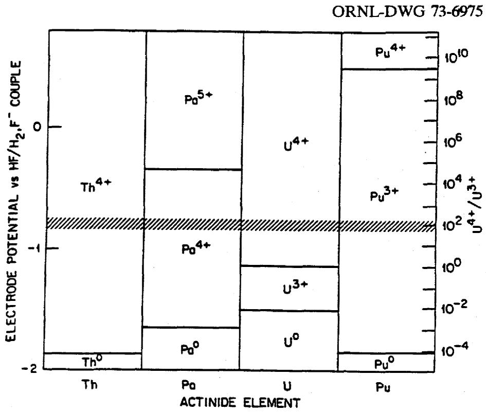
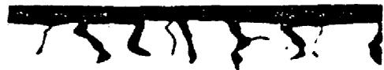
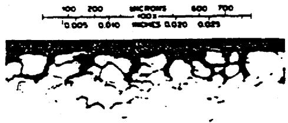
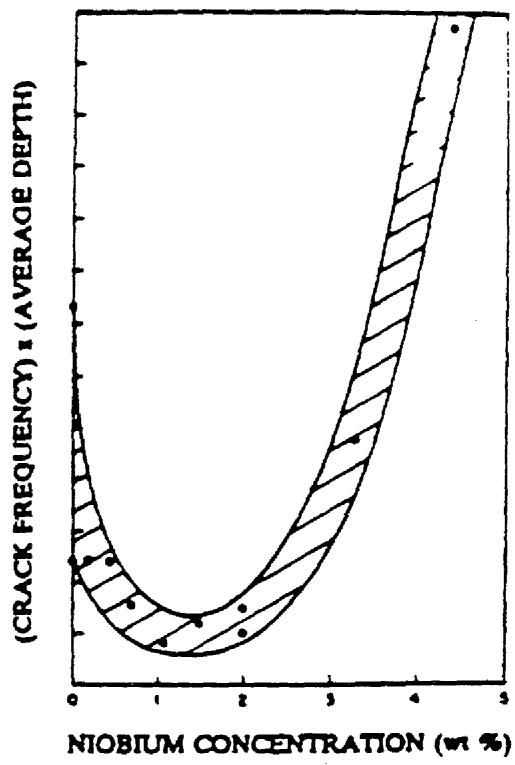
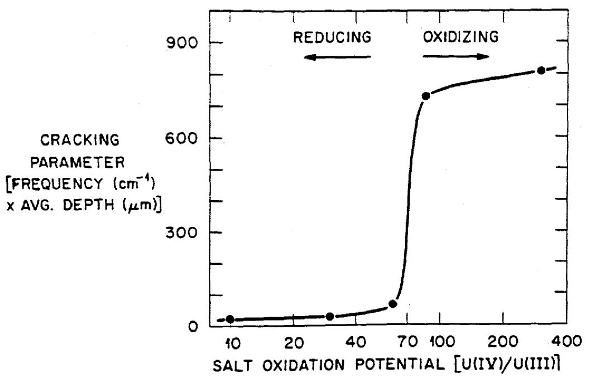
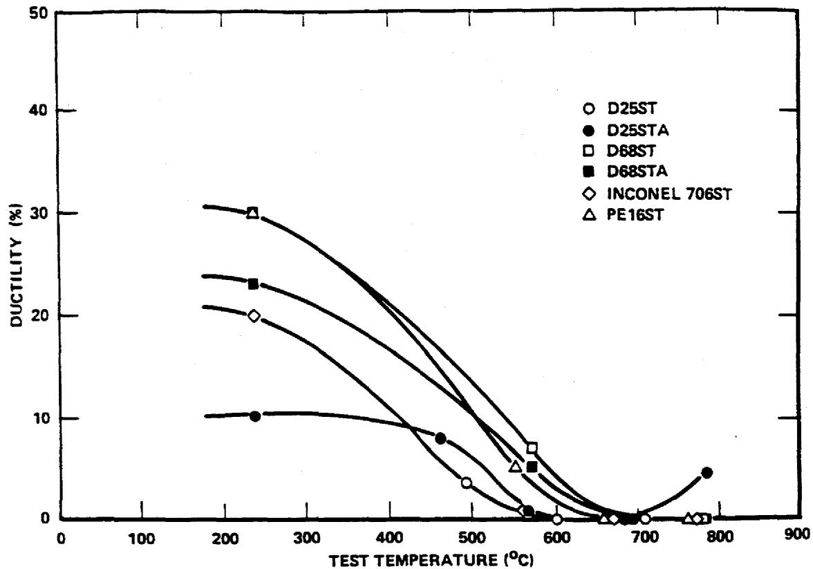
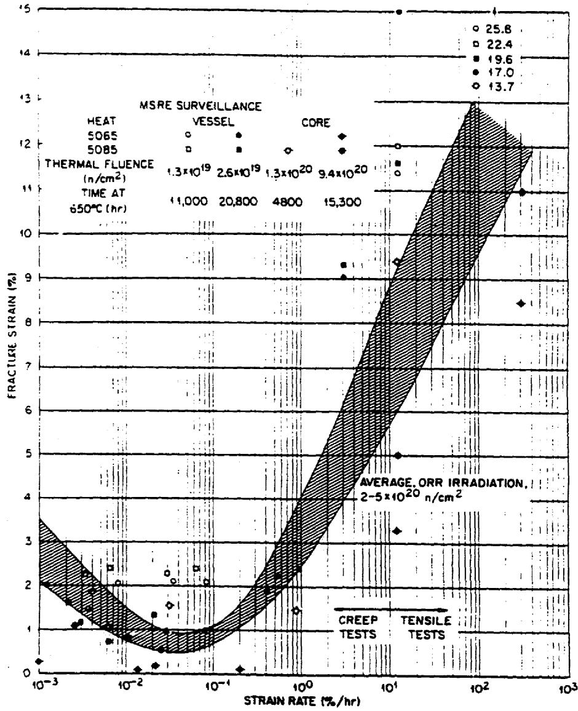
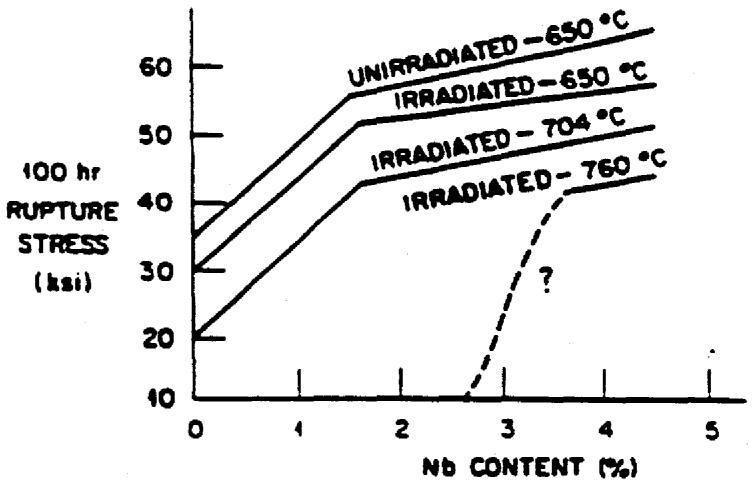
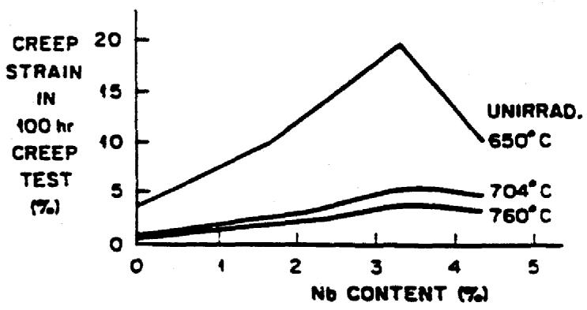

# OAK RIDGE NATIONAL LABORATORY

MARTIN MARIETTA

MATERIALS CONSIDERATIONS FOR MOLTEN SALT ACCELERATOR-BASED PLUTONIUM CONVERSION SYSTEMS

J. R. DiStefano

J. H. DeVan

J. R. Keiser

R. L. Klueh

W. P. Eatherly

This report has been reproduced directly from the best available copy.

Available to DOE and DOE contractors from the Office of Scientific and Technical Information, P.O. Box 62, Oak Ridge, TN 37831; prices available from (615) 576-8401, FTS 626-8401.

Available to the public from the National Technical Information Service, U.S. Department of Commerce, 5285 Port Royal Rd., Springfield, VA 22161.

This report was prepared as an account of work sponsored by an agency of the United States Government. Neither the United States Government nor any agency thereof, nor any of their employees, makes any warranty, express or implied, or assumes any legal liability or responsibility for the accuracy, completeness, or usefulness of any information, apparatus, product, or process disclosed, or represents that its use would not infringe privately owned rights. Reference herein to any specific commercial product, process, or service by trade name, trademark, manufacturer, or otherwise, does not necessarily constitute or imply its endorsement, recommendation, or favoring by the United States Government or any agency thereof. The views and opinions of authors expressed herein do not necessarily state or reflect those of the United States Government or any agency thereof.

# DISCLAIMER

Portions of this document may be illegible in electronic image products. Images are produced from the best available original document.

# MATERIALS CONSIDERATIONS FOR MOLTEN SALT ACCELERATOR-BASED PLUTONIUM CONVERSION SYSTEMS

J. R. DiStefano, J. H. DeVan, J. R. Keiser, R. L. Klueh, and W. P. Eatherly

Date Published: March 1995

Prepared by the

OAK RIDGE NATIONAL LABORATORY

Oak Ridge, Tennessee 37831-6285

managed by

MARTIN MARIETTA ENERGY SYSTEMS, INC.

for the

U.S. Department of Energy

under contract DE-AC05-84OR21400

DISTRIBUTION OF THIS DOCUMENT IS UNLIMITED

# TABLE OF CONTENTS

LIST OF FIGURES V

LIST OF TABLES vii

INTRODUCTION 1

SELECTION OF CONTAINMENT MATERIALS 2

CORROSION BY FLUORIDE MIXTURES 8

TRANSMUTATION EFFECTS 11

FISSION PRODUCT EFFECTS 12

RADIATION DAMAGE PROCESSES 15

Nickel-Base Alloys 16

Alternative Materials for Molten Salt Operations 20

Refractory Metals and Alloys 20

GRAPHITE 22

Radiation Damage 22

Salt and Gas Entrapment 23

SUMMARY AND RECOMMENDATIONS 23

REFERENCES 25

# LIST OF FIGURES

# Figure

1 Oxidation states of actinides in $\mathrm{LiF - BeF_2 - ThF_4 - UF_4}$ 9   
2 Hastelloy N used in experimental molten salt reactor showed intergranular cracks when tensile specimens were strained to failure 13   
3 Effect of niobium in modified Hastelloy N on grain boundary cracking when exposed in salt- $\mathrm{Cr}_3\mathrm{Te}_4 + \mathrm{Cr}_5\mathrm{Te}_6$ for $250\mathrm{h}$ at $700^{\circ}\mathrm{C}$ 14   
4 Extent of tellurium embrittlement of Hastelloy N is strongly affected by oxidation potential of salt 15   
5 Ductility behavior of the austenitic superalloys D25, D68, Inconel 706, and Nimonic PE-16 irradiated in Experimental Breeder Reactor II up to $7.1 \times 10^{22} \mathrm{n/cm}^2$ 17   
6 Variation of fracture strain with strain rate for Hastelloy N specimens irradiated in the Molten Salt Reactor Experiment and tested at $650^{\circ}\mathrm{C}$ 18   
7 The effect of niobium additions on the creep-rupture behavior of irradiated Hastelloy N 19

# LIST OF TABLES

# Table

1 Corrosion of $2\frac{1}{4}$ Cr-1 Mo steel in thermal convection loop tests (ref. 1) 4   
2 Corrosion of low-alloy steels by Pb-Bi eutectic in thermal convection loop tests (ref. 1) 5   
3 Standard free energies of formation of fluorides in a molten salt system 9   
4 Operating conditions of stainless steel thermal convection loops involving LiF-BeF $_2$ -based molten salts 11   
5 Nominal composition of standard and modified Hestelloy N 19

# MATERIALS CONSIDERATIONS FOR MOLTEN SALT ACCELERATOR-BASED PLUTONIUM CONVERSION SYSTEMS*

J. R. DiStefano, J. H. DeVan, J. R. Keiser.

R. L. Klueh, and W. P. Eatherly

# ABSTRACT

Accelerator-driven transmutation technology (ADTT) refers to a concept for a system that uses a blanket assembly driven by a source of neutrons produced when high-energy protons from an accelerator strike a heavy metal target. One application for such a system is called Accelerator-Based Plutonium Conversion, or ABC. Currently, the version of this concept being proposed by the Los Alamos National Laboratory features a liquid lead target material and a blanket fuel of molten fluorides that contain plutonium. Thus, the materials to be used in such a system must have, in addition to adequate mechanical strength, corrosion resistance to molten lead, corrosion resistance to molten fluoride salts, and resistance to radiation damage.

In this report the corrosion properties of liquid lead and the $\mathrm{LiF - BeF_2}$ molten salt system are reviewed in the context of candidate materials for the above application. Background information has been drawn from extensive past studies. The system operating temperature, type of protective environment, and oxidation potential of the salt are shown to be critical design considerations. Factors such as the generation of fission products and transmutation of salt components also significantly affect corrosion behavior, and procedures for inhibiting their effects are discussed. In view of the potential for extreme conditions relative to neutron fluxes and energies that can occur in an ADTT, a knowledge of radiation effects is a most important factor. Present information for potential materials selections is summarized.

# INTRODUCTION

A technology for the conversion of highly reactive spent fuel and nuclear waste to non-radioactive materials or materials with much shorter half-lives has been proposed for development. In a concept proposed by the Los Alamos National Laboratory (LANL), the system uses a high flux of neutrons to bombard the material to be converted. The neutron source is an external accelerator that delivers protons to a target surrounded by a "blanket" of fissile material. This concept is a part of what is referred to as accelerator-driven transmutation technology (ADTT). In the application of this technology to accelerator-based

conversion of plutonium, or ABC, the nuclear fuel is carried by a molten fluoride mixture containing LiF-BeF $_2$ .

The ABC design as presently envisioned uses a flowing lead target for generating spallation neutrons upon being bombarded by the accelerator proton beam. The lead temperature ranges from 400 to $500^{\circ}\mathrm{C}$ except at the proton beam interface where it can rise to 1000 to $1100^{\circ}\mathrm{C}$ . Since materials appropriate for containing the molten lead (Fe- or refractory-metal-based alloys) are not necessarily suitable for containing the molten fluoride fuel salt (Ni-based alloys), different materials either in contact with each other or separated by a helium or NaK space may be required. The containment material for the liquid lead target will see the highest neutron flux in the system and, therefore, its resistance to radiation damage will be critical. Because of its complexity, the target and containment material subsystem probably cannot be annealed or repaired and, therefore, will have to be replaced periodically.

Fused fluoride mixtures containing $\mathrm{PuF}_3$ are being considered as the blanket material for the accelerator-based system. Because of their high boiling points, these mixtures can be contained at low pressures even at relatively high operating temperatures. Their chemical and physical properties impart additional advantages such as stability under irradiation and chemical compatibility with a variety of containment and neutron moderator materials. The reference salt mixtures under consideration for ABC systems are modelled after mixtures that were developed for the Molten Salt Reactor (MSR) Program, conducted at the Oak Ridge National Laboratory (ORNL) during the 1950s to early 1970s. These mixtures were based on the eutectic LiF-BeF $_2$ system containing small percentages of UF $_4$ and, for some concepts, larger percentages of ThF $_4$ . This report reviews the materials developments underlying the MSR Program and relates them to the materials requirements for the ABC $\mathrm{PuF}_3$ -containing blanket. The selection of structural and moderator materials is discussed in terms of their chemical compatibility with the fluoride fuel mixtures and their neutron radiation damage characteristics. The report then addresses the ABC materials issues and needs in the implementation of a molten fluoride blanket.

# SELECTION OF CONTAINMENT MATERIALS

Target. Selection of a structural material for containment of flowing liquid lead is limited by the relatively high temperature at the proton beam interface. In a flowing system

containing a temperature differential ( $\Delta T$ ). dissolution and mass transfer of material from high to low temperature is an important concern. For example, thermal convection loops made of low-alloy steel plugged during exposure to $\mathrm{Pb - 2.5\%}$ Mg or $\mathrm{Pb - Bi}$ eutectic in 1000 to $2000\mathrm{h}$ at a hot leg temperature of $-550^{\circ}\mathrm{C}$ as shown in Tables 1 and 2 from ref. 1. However, in pure lead, a $2\frac{1}{4}$ Cr-1 Mo steel loop was operated for over $27,000\mathrm{h}$ at this temperature with a $\Delta T$ of approximately $100^{\circ}\mathrm{C}$ . At higher temperatures ( $800,300^{\circ}\mathrm{C}$ $\Delta T$ ), the refractory metals niobium and tantalum showed no mass transfer, while other conventional alloys showed small to heavy amounts. Thus, it would appear that selection of a material for containment of liquid lead may be restricted to a refractory metal or alloy unless the maximum temperature can be limited to $700^{\circ}\mathrm{C}$ or lower.

If a refractory metal is chosen, special care must be taken to exclude oxygen and nitrogen from the system, especially in the case of niobium and tantalum or their alloys. Both of these materials, in contrast with molybdenum and tungsten, readily pick up interstitial elements that can result in severe embrittlement. Thus, deoxidation of the lead would be an important requirement. Furthermore, purifying and maintaining low levels of impurities in an inert gas (helium) or alkali metal (NaK) environment to prevent this type of embrittlement will be a formidable task.

At the detection limits of analytical methods ( $\sim 1$ ppb), the activities of nitrogen and oxygen impurities in helium are far above those needed to form oxides of tantalum or niobium. Because of the obvious contamination problems, very few experiments have been conducted to evaluate the reaction rates of refractory metals in helium. The earliest attempts to operate niobium and Nb-1 Zr corrosion loops made use of helium as a protective environment, but all fell short of protecting the loop components from contamination.3 In the mid-1960s, Battelle Northwest Laboratories4 conducted a test of refractory metals using a conventional alloy recirculating helium loop ( $< 1$ ppm total impurities). Specimens of molybdenum, tungsten, niobium, and tantalum were exposed for a total of $504\mathrm{~h}$ at $1150^{\circ}\mathrm{C}$ . Results were summarized by Battelle as follows:

Niobium and tantalum readily pick up impurities from (helium) loop atmospheres pure enough to permit the evaporation of superalloys, while molybdenum and tungsten remain unaffected. The mechanical properties of Nb and Ta can be drastically altered by contaminant absorption during "clean run" conditions (i.e., without purposeful impurity additions).

Table 1. Corrosion of $2\frac{1}{4}$ Cr-1 Mo steel in thermal convection loop tests (ref. 1)   

<table><tr><td rowspan="2">Loop No.</td><td rowspan="2">Liquid metal</td><td colspan="2">T, °C</td><td rowspan="2">ΔT, h</td><td rowspan="2">Additives</td><td rowspan="2">Remarks</td></tr><tr><td>Max</td><td>Min</td></tr><tr><td rowspan="6">18</td><td rowspan="6">Pb</td><td>550</td><td>510</td><td>3,056</td><td>225 ppm Mg</td><td>Zr added but would not go into solution. Lost all Zr.</td></tr><tr><td>550</td><td>460</td><td>9,100</td><td></td><td></td></tr><tr><td>550</td><td>430</td><td>9,975</td><td></td><td></td></tr><tr><td>550</td><td>415</td><td>5,634</td><td></td><td>No corrosion. Slight pptn. in cold leg.</td></tr><tr><td rowspan="2">Avg:</td><td rowspan="2">550</td><td rowspan="2">445</td><td rowspan="2">Total:</td><td rowspan="2">27,765</td></tr><tr></tr><tr><td>30</td><td>Pb-Mg eutectic</td><td>540</td><td>430</td><td>1,104</td><td>None</td><td>Loop shut down after power failure caused hot leg to overheat.</td></tr><tr><td>38</td><td>Pb-Mg eutectic</td><td>550</td><td>510</td><td>2,775</td><td>None</td><td>Zr added but would not go into solution. Severe corrosion at tee. Plugged 0.5-in. (12.7-mm) pipe. Plug material found to be Fe-Cr. Loop gradient had not yet been applied.</td></tr></table>

Table 2. Corrosion of low-alloy steels by Pb-Bi eutectic in thermal convection loop tests (ref. 1)   

<table><tr><td rowspan="2">Loop No.</td><td rowspan="2">Material</td><td rowspan="2">Additives ppm</td><td colspan="2">T, °C</td><td rowspan="2">ΔT, h</td><td rowspan="2">Remarks</td></tr><tr><td>Max</td><td>Min</td></tr><tr><td>92*</td><td>Croloy 1%</td><td>350 Mg</td><td>550</td><td>400</td><td>1900</td><td>Zr added but would not go into solution. Plugged 0.5-in. (12.7-mm) pipe. Plug composed of Fe-Cr and possibly Pb2O3. Severe corrosion in hot leg.</td></tr><tr><td>110*</td><td>Croloy 1%</td><td>None</td><td>625</td><td>500</td><td>81</td><td>Plugged 0.5-in. (12.7-mm) pipe. Plug composed of Fe-Cr. Severe corrosion in hot leg.</td></tr><tr><td>117*</td><td>Croloy 1%</td><td>None</td><td>400</td><td>200</td><td>9961</td><td>No corrosion or pptn.</td></tr><tr><td>113*</td><td>Croloy 1%</td><td>100 Zr 350 Mg</td><td>650</td><td>505</td><td>8384</td><td>No corrosion or pptn. No additive loss. High-purity Pb used in loops 113, 117-123.</td></tr><tr><td>120</td><td>Croloy 1%</td><td>135 Ti 350 Mg</td><td>650</td><td>500</td><td>2566</td><td>No corrosion or pptn. Slight Ti drop to 70 ppm.</td></tr><tr><td>119*</td><td>Carbon steel (coextruded)</td><td>100 Zr 350 Mg</td><td>650</td><td>500</td><td>5378</td><td>No corrosion or pptn. No additive loss.</td></tr><tr><td>118</td><td>Carbon steel (coextruded)</td><td>45 Zr 350 Mg</td><td>600</td><td>450</td><td>3425</td><td>No corrosion or pptn. No additive loss.</td></tr><tr><td>122*</td><td>Carbon steel (coextruded)</td><td>135 Ti 350 Mg</td><td>650</td><td>500</td><td>4814</td><td>No corrosion or pptn. Slight Ti drop.</td></tr><tr><td>121</td><td>Carbon steel (Si-killed)</td><td>25 Ti 350 Mg</td><td>500</td><td>300</td><td>2220</td><td>No corrosion or pptn. Ti conc. difficult to maintain.</td></tr><tr><td>123*</td><td>Carbon steel (coextruded)</td><td>Sat. Zr 350 Mg</td><td>650</td><td>500</td><td>7819</td><td>Zr chip suspended in cold leg. No corrosion. Possible pptn. (might be from Zr chip inserted in cold leg).</td></tr></table>

*Loop examined metallographically.

The Japanese5,6 investigated the oxidation rates of TZM (Mo-0.5% Ti-0.1% Zr). molybdenum, and Nb-1 Zr in commercially purified (> 99.995%) helium and the same helium containing 13 ppm oxygen. The Nb-1 Zr specimens had Nb2N surface layers after exposure to the commercial-grade helium but formed NbO and NbO2 films when exposed to the He plus 13 ppm oxygen. Concentrations of oxygen in the Nb-1Zr reached 1% in either environment. However, molybdenum showed no measurable effects in commercial-grade helium but did show evaporation of molybdenum oxide above 800°C in the He plus 13 ppm oxygen. The oxygen content and microhardness of the TZM increased in both environments.

The extent of oxygen contamination of Nb-1 Zr in vacuum environments is determined by the system pressure, temperature, and time. In a recent study, $^7$ the rate of contamination was reported to be proportional to the first power of pressure and an exponential function of temperature at $\mathrm{P_{O_2}} \leq 10^{-3} \mathrm{~Pa}$ ( $10^{-5} \mathrm{Torr}$ ) and $\mathrm{T} \geq 773 \mathrm{~K}$ ( $500^{\circ} \mathrm{C}$ ). During long-term operation, significant oxygen increases (hundreds to thousands of ppm) can occur unless the partial pressure of oxygen is maintained at $10^{-6} \mathrm{~Pa}$ ( $10^{-8} \mathrm{Torr}$ ) or lower. On the other hand, the weight increase in molybdenum was low compared with Nb-1 Zr at a system pressure of $3.6 \times 10^{-5} \mathrm{~Pa}$ ( $2.7 \times 10^{-7} \mathrm{Torr}$ ) [ref. 8].

Although the compatibility of niobium and tantalum with alkali metals can be seriously degraded by oxygen in the refractory metal, $^{7}$ oxygen in sodium, potassium, or NaK has also been reported to cause corrosion of niobium, tantalum, and to a lesser extent, molybdenum. $^{9}$ Cold-trapped sodium ( $-40$ ppm oxygen) results in a much higher weight removal rate of niobium or tantalum compared with hot-trapped ( $-10$ ppm oxygen) sodium (or NaK).

Based on corrosion considerations, molybdenum would probably be a satisfactory material for containment of the liquid lead target; however, fabricability would be a significant issue. The Nb-1 Zr alloy would provide good resistance to lead and has excellent fabricability; but extreme care would have to be taken to avoid contamination and/or corrosion by system environments. For some heat exchanger coolants, e.g., helium, significant contamination probably could not be avoided.

Blanket. The development of systems that incorporate a circulating molten fluoride fuel is predicated on the availability of a construction material that will contain the salt over long time periods and also afford useful mechanical properties. The container material must also be resistant to air oxidation, be easily formed and welded into relatively complicated shapes, and be metallurgically stable over a wide temperature range. For initial MSR studies, several

commercially available. high-temperature alloy systems were evaluated with respect to the aforementioned requirements. $^{10,11}$ As a result of these initial studies, Inconel 600, a nickel-based alloy containing $15\%$ Cr and $7\%$ Fe, was found to afford the best combination of desired properties and was utilized as a container for the construction of the Aircraft Reactor Experiment. $^{12}$ Corrosion rates encountered with this alloy at $700^{\circ}\mathrm{C}$ and above, however, were excessive for long-term use with most fluoride fuel systems. Utilizing experience gained in corrosion testing of commercial alloys, an alloy development program was conducted to provide an advanced container material for MSR systems. The reference alloy system was composed of nickel with a primary strengthening addition of 15 to $20\%$ Mo. This composition afforded exceptional resistance to salt attack but lacked sufficient mechanical strength and oxidation resistance at the desired service temperature. To augment these latter properties, additions of various solid-solution alloying agents were evaluated, among them Cr, Al, Ti, Nb, Fe, V, and W. An optimum alloy composition was selected on the basis of parallel investigations of the mechanical and corrosion properties which were imparted by each of these additions. The composition best suited to reactor use was determined to be within the range 15 to $17\%$ Mo, 6 to $8\%$ Cr, 4 to $6\%$ Fe, 0.04 to $0.08\%$ C, balance Ni. This alloy was commercialized under the trade name Hastelloy N.

A 7.4-MW test reactor, the Molten Salt Reactor Experiment (MSRE), was constructed of Hastelloy N and became critical in 1965. The reactor operated successfully for 4 years and verified the excellent corrosion resistance of the alloy to the $\mathrm{UF_4}$ -containing LiF-BeF $_2$ salt mixture. However, operation of the MSRE revealed two potential problem areas that were of concern in the utilization of the Hastelloy N alloy for more advanced Molten Salt Breeder Reactors (MSBRs), where greater concentrations of fission products and greater neutron fluences would be encountered. Radiation damage, in the form of helium embrittlement from $(n,\alpha)$ reactions, was found to have reduced the creep ductility of the Hastelloy N based on post-operation examinations. Also, grain boundaries of the Hastelloy N directly exposed to the fuel salt were shown in post-operation tensile tests to have been embrittled to depths of 0.15 to $0.25\mathrm{mm}$ . Subsequent studies showed the embrittlement to be associated with the presence of fission product tellurium on grain boundaries that intersected with the salt-exposed surfaces. Accordingly, the earlier Hastelloy N alloy development program was extended to improve the alloy's radiation damage characteristics and resistance to penetration by sulfur-like fission products, such as tellurium. (These alloy modifications are discussed in

later sections of this report.) In addition, compatibility tests were conducted to re-examine the possibility of using iron-based alloys as containment materials for the MSBR. These alloys are more resistant to tellurium penetration and also generate less helium from $(\mathfrak{n},\alpha)$ reactions than nickel-based alloys. However, their use would severely limit the oxidation potential of the salt (in effect, the fluoride ion activity), whereas the Hastelloy N composition could resist attack by the reference MSBR salt components under virtually all sustainable reactor operating conditions. As will be discussed, these same materials concerns are key issues in selecting the ADTT salt blanket structural material but with the condition that $\mathrm{PuF}_3$ has replaced $\mathrm{UF}_4$ in the salt mixture.

# CORROSION BY FLUORIDE MIXTURES

The selection of a structural material for containment of molten fluoride salts begins with a consideration of the reduction-oxidation (redox) potentials of the component elements of the material with respect to components of the salt. Table 3 lists the standard free energies of formation, per gram atom of fluorine, of fluoride compounds at 527 and $727^{\circ}\mathrm{C}$ associated with salt constituents and metals commonly used in high-temperature alloys. It is evident that the major salt components, LiF and $\mathrm{BeF}_2$ , are considerably more stable than any of the fluorides of the structural metals listed, so they are unreactive with the structural metals. The corrosion of a variety of structural alloys by reference MSR salt mixtures has been found13 to result from a combination of reactions involving impurities in the salt, $2\mathrm{HF} + \mathrm{M} = \mathrm{MF}_2 + \mathrm{H}_2$ ( $\mathrm{M} = \mathrm{Ni}$ , Cr, Fe) and $\mathrm{XF}_2 + \mathrm{Cr} = \mathrm{CrF}_2 + \mathrm{X}$ ( $\mathrm{X} = \mathrm{Ni}$ , Fe), and reactions involving fuel components, e.g., $2\mathrm{Cr} + 2\mathrm{UF}_4 = \mathrm{CrF}_2 + 2\mathrm{UF}_3$ . In all cases, the corrosion product fluorides are readily dissolved by the molten salt mixture. The impurity reactions can be minimized by maintaining low-impurity concentrations in the salt and clean alloy surfaces. However, the reaction with $\mathrm{UF}_4$ is intrinsic and depends on the redox potential of the salt, which can be described in terms of the ratio of activities of quadrivalent-to-trivalent uranium ions.

Although this redox potential can be adjusted to make the salt less oxidizing (for example, by exposing the salt to beryllium or chromium metal), the activity of $\mathrm{UF}_3$ must be maintained high enough to avoid its disproportionation and subsequent alloying of metallic uranium with the containment alloy. The relationship between the $\mathrm{U}^{+4}$ and $\mathrm{U}^{+3}$ ratios and the effective fluoride ion oxidation potential is given in Fig. 1. The cross-hatched area in the figure indicates the ratios that were generally studied in corrosion tests and that were maintained in

Table 3. Standard free energies of formation of fluorides in a molten salt system   

<table><tr><td>Fluoride</td><td colspan="2">-ΔGf(800 K)</td><td colspan="2">-ΔGf(1000 K)</td></tr><tr><td></td><td>kj/g-atom of fluorine</td><td>(kcal/g-atom of fluorine)</td><td>kj/g-atom of fluorine</td><td>(kcal/g-atom of fluorine)</td></tr><tr><td>LiF</td><td>539.7</td><td>128.9</td><td>520.4</td><td>124.3</td></tr><tr><td>ThF4</td><td>466.4</td><td>111.4</td><td>451.8</td><td>107.3</td></tr><tr><td>RuF3</td><td>453.0</td><td>108.2</td><td>437.5</td><td>104.5</td></tr><tr><td>BeF2</td><td>451.3</td><td>107.8</td><td>437.1</td><td>104.4</td></tr><tr><td>UF3</td><td>436.7</td><td>104.3</td><td>422.5</td><td>100.9</td></tr><tr><td>UF4</td><td>415.7</td><td>99.3</td><td>399.8</td><td>95.5</td></tr><tr><td>TiF2</td><td>352.5</td><td>84.2</td><td>337.9</td><td>80.7</td></tr><tr><td>CrF2</td><td>334.1</td><td>79.8</td><td>320.7</td><td>76.6</td></tr><tr><td>MoF2</td><td>310.7</td><td>74.2</td><td>302.7</td><td>72.3</td></tr><tr><td>Nb5</td><td>308.6</td><td>73.7</td><td>297.3</td><td>71.0</td></tr><tr><td>FeF2</td><td>297.3</td><td>71.0</td><td>284.3</td><td>67.9</td></tr><tr><td>NiF2</td><td>266.7</td><td>63.7</td><td>251.6</td><td>60.1</td></tr></table>

  
Fig. 1. Oxidation states of actinides in $\mathrm{LiF - BeF_2 - ThF_4 - UF_4}$

the MSRE. Relative to the reactions listed above, assuming equilibrium is attained, those structural metals with less stable fluorides, such as nickel and molybdenum, are less susceptible to oxidation, while those with the more negative free energies, such as chromium, are more prone to oxidation. The chemistry of Hastelloy N was tailored to afford compatibility with $\mathrm{UF_4}$ -containing salt mixtures by simply allowing the salt to "equilibrate" with the alloy. In any heat-transfer system, true equilibrium between the salt and the alloy is precluded by temperature differences in the system. Nevertheless, in a Hastelloy N closed-loop system operating at 600 to $700^{\circ}\mathrm{C}$ , a steady-state $\mathrm{U}^{+4} / \mathrm{U}^{+3}$ ratio is reached within a few hundred hours $^{14}$ and has been shown experimentally to be in the range 100 to 350. Corrosion proceeds by the selective oxidation of chromium at the hotter loop surfaces and the reduction and deposition of chromium at the cooler loop surfaces. In the case of the MSR fuel salts, the resultant maximum corrosion rate of Hastelloy N measured in extensive loop testing was below 4 $\mu$ m/year, and a similar rate was measured on surveillance specimens in the MSRE. $^{15}$

If a 300-series stainless steel (18% Cr-10% Ni-balance iron) is exposed to $\mathrm{UF}_4$ -containing salts under the same closed-system conditions as described above, corrosion again is manifested by the selective removal of chromium from hotter loop surfaces with concomitant chromium deposition at cooler surfaces. However, because of the much higher chromium activity in the stainless steel compared to Hastelloy N, the extent of chromium mass transport is considerably greater than for Hastelloy N. Table 4 lists the operating conditions for two stainless steel thermal convection loops that circulated LiF- $\mathrm{BeF}_2$ salts containing 1 and $0.3\mathrm{mol}\% \mathrm{UF}_4$ , respectively.[16] The 304L loop operated successfully for 9 years at a maximum temperature of $688^{\circ}\mathrm{C}$ and exhibited an average corrosion rate equivalent to $21.8~\mu \mathrm{m}/$ year, based on uniform wall reduction. However, corrosion was actually manifested by subsurface void formation which, in the case of the loop wall, reached depths up to $1.2\mathrm{mm}$ . A second loop was constructed of type 316 stainless steel and operated for $4490\mathrm{h}$ . The corrosion rate of this loop at $650^{\circ}\mathrm{C}$ was slightly less than the 304L loop, but corrosion again was manifested by subsurface voids, in this case to a depth of $76~\mu \mathrm{m}$ . A second 316 stainless steel loop, whose conditions are also shown in Table 4, was operated with an LiF- $\mathrm{BeF}_2$ salt that contained no uranium, so that the oxidation potential of the salt could be lowered by buffering with metallic beryllium without concern for the disproportionation of $\mathrm{UF}_3$ . Before adding beryllium, the corrosion rate of the loop averaged $8~\mu \mathrm{m}/$ year over $25,000\mathrm{h}$ at $650^{\circ}\mathrm{C}$ . After contacting the salt with a small beryllium rod, the corrosion rate was lowered to $2~\mu \mathrm{m}/$ year over a 2000-h period.[17]

Table 4. Operating conditions of stainless steel thermal convection loops involving LiF-BeF $_2$ -based molten salts   

<table><tr><td>Loop material</td><td>Salt composition (mol %)</td><td>Maximum temperature (°C)</td><td>ΔT (°C)</td><td>Time (h)</td></tr><tr><td>304L SS</td><td>LiF-BeF2-ZrF4-ThF4-UF4(70-23-5-1-1)</td><td>688</td><td>100</td><td>83,520</td></tr><tr><td>316 SS</td><td>LiF-BeF2-ThF4-UF4(68-20-11.7-0.3)</td><td>650</td><td>110</td><td>4,490</td></tr><tr><td>316 SS</td><td>LiF-BeF2(66-34)</td><td>650</td><td>125</td><td>25,100</td></tr></table>

Based on the above observations, the corrosion characteristics of an $\mathrm{LiF - BeF_2}$ salt containing $\mathrm{PuF}_3$ in place of $\mathrm{UF_4}$ , i.e., the reference ABC blanket salt in the LANL concept, would depend on the redox potential set for the salt system. If the potential is maintained in the same range as for the MSR Program, the corrosion rate of the containment material, in terms of chromium and iron oxidation, should be unaffected by the replacement. However, as shown in Fig. 1, the oxidation potential at which the plutonium activity associated with $\mathrm{PuF_3}$ becomes unity is lower than the potential at which the activity of uranium associated with $\mathrm{UF_3}$ becomes unity. Accordingly, it may be possible to maintain a lower oxidation potential in the $\mathrm{PuF_3}$ -containing salt than in the case of the uranium-containing salt without encountering corrosion from alloying of metallic Pu with the containment. If this can be demonstrated, then the corrosion rate of an austenitic stainless steel may be in an acceptable range to be used as the structural material for the ABC blanket.

# TRANSMUTATION EFFECTS

Depending on the neutron energies and fluxes in the ABC blanket, transmutation reactions may affect the salt chemistry and, accordingly, the redox potential of the salt.[19] The overall reactions can be represented as:

$$
{ } ^ { 6 } \mathrm { L i F } + \mathrm { n } - { } ^ { 4 } \mathrm { H e } + \mathrm { T F }
$$

$$
{ } ^ { 7 } \mathrm { L i F } + \mathrm { n } \rightarrow { } ^ { 4 } \mathrm { H e } + \mathrm { T F } + \mathrm { n }
$$

$$
{ } ^ { 1 0 } \mathrm { B e F } _ { 2 } + \mathrm { n } - 2 \mathrm { n } ^ { \cdot } + 2 { } ^ { 4 } \mathrm { H e } + 2 \mathrm { ~ F }
$$

$$
{ } ^ { 1 0 } \mathrm { B e F } _ { 2 } + n - { } ^ { 6 } \mathrm { H e } + { } ^ { 4 } \mathrm { H e } + 2 \mathrm { ~ F ~ } \text { f o l l o w e d b y }
$$

$$
{ } ^ { 6 } \mathrm { H e } - { } ^ { 6 } \mathrm { L i } . a n d { } ^ { 6 } \mathrm { L i } + \mathrm { F } - { } ^ { 6 } \mathrm { L i F }
$$

$$
{ } ^ { 1 9 } \mathrm { F } + \mathrm { n } - { } ^ { 1 6 } \mathrm { N } \cdot - { } ^ { 4 } \mathrm { H e } \text { f o l l o w e d b y }
$$

$$
{ } ^ { 1 6 } \mathrm { N } ^ { - } \rightarrow { } ^ { 1 6 } \mathrm { O } ^ { - } + \mathrm { B } ^ { - } .
$$

The TF and F produced by the transmutation of lithium and beryllium, respectively, will act to increase the oxidation potential of the salt. The effect is similar to that encountered in the fission of $\mathrm{UF}_4$ in the MSR salt, where effectively one fluorine atom per fission is free to oxidize or corrode the container (i.e., is not tied up with fission products). In the MSRE, the small concentration of $\mathrm{UF}_3$ in the fuel provided a reductant to buffer any oxidants resulting from transmutation, and a redox couple similar to $\mathrm{UF}_4 / \mathrm{UF}_3$ could be added to the ABC blanket to control the transmutation effect. The selection and use of redox additions has been discussed in a recent paper.[19] The transmutation of fluoride ions ultimately results in the formation of $\mathrm{O}^{2-}$ ions in the salt; however, whatever reductant is used to reduce fluorine to fluoride should also reduce the oxygen.[19]

# FISSION PRODUCT EFFECTS

As previously described, the corrosion rate of Hastelloy N measured during operation of the MSRE was relatively low and of the same order as that for forced-convection loops operating under similar temperatures. However, Hastelloy N tensile specimens that were tested to failure after they had been exposed to the MSRE fuel salt showed shallow surface cracks along the gage length at grain boundaries that connected to the salt-exposed surfaces (see Fig. 2) [ref. 20]. These cracks generally extended to depths of about $0.13\mathrm{mm}$ but were as deep as $0.33\mathrm{mm}$ in parts removed from the salt plenum region of the pump bowl. Because this grain boundary embrittlement was found in the heat exchanger tubes where the neutron flux was insignificant, as well as in samples exposed in the reactor core, it was concluded this cracking was not due to radiation effects. Controlled dissolution of samples detected a number of fission products within the material; tellurium was the fission product found at the highest concentration.[15] Subsequent tests showed that grain boundary embrittlement could be caused in Hastelloy N samples when tellurium was applied to the sample surface. Since the

Hastelloy N exposed 21,000 h to salt containing tellurium

Hastelloy N exposed 21,000 h to vapor above salt containing tellurium

  
Fig. 2. Hastelloy N used in experimental molten salt reactor showed intergranular cracks when tensile specimens were strained to failure.

depth of cracking observed in the MSRE would not have been acceptable when extrapolated to the 30-year design life of an MSBR, a program was undertaken to identify ways to prevent tellurium embrittlement of Hastelloy N.

Investigation of the problem was approached in several ways. In-reactor experiments were used to evaluate the embrittlement resistance of various alloys. In another study, over 60 alloys were electroplated with tellurium and annealed for extended times before being tensile tested. No cracks formed on a number of alloys including stainless steels and nickel-base alloys containing more than $15\%$ chromium. Most heats of Hastelloy N developed cracks, but modifications that contained $2\%$ niobium showed better crack resistance than standard Hastelloy N.[15] Other tests were developed that involved exposure of alloy samples to molten fluoride salts containing telluride compounds.[21] Telluride compounds used included $\mathrm{Li}_2\mathrm{Te}$ , $\mathrm{LiTe}_3$ , $\mathrm{Cr}_2\mathrm{Te}_3$ , $\mathrm{Cr}_3\mathrm{Te}_4$ , $\mathrm{Cr}_5\mathrm{Te}_6$ , and $\mathrm{Ni}_3\mathrm{Te}_2$ , and cracking resulted in Hastelloy N samples exposed to salt solutions of all but the first of these compounds. Modifications of Hastelloy N were independently being developed to address the problem of radiation embrittlement, so samples of alloys modified with different combinations of titanium, niobium, and chromium were also exposed in the salt solutions containing the tellurides.

Results indicated that niobium as an alloying agent reduced embrittlement of Hastelloy N, but neither chromium nor niobium exhibited as strong an effect when titanium was included. The extent of the effect of niobium on reducing grain boundary embrittlement is shown in Fig. 3 (ref. 20).

  
Fig. 3. Effect of niobium in modified Hastelloy N on grain boundary cracking when exposed in salt- $\mathrm{Cr}_3\mathrm{Te}_4 + \mathrm{Cr}_5\mathrm{Te}_6$ for $250\mathrm{h}$ at $700^{\circ}\mathrm{C}$ (refs. 21 and 22).

Although the effort to prevent tellurium embrittlement of grain boundaries was primarily directed at alloying modifications of Hastelloy N, some work was done to determine if chemical changes in the salt could also alter tellurium behavior. On the basis of electrochemical studies conducted at ORNL $^{21}$ that indicated tellurium could exist as a telluride rather than as elemental tellurium in a relatively reducing melt, standard Hastelloy N samples were exposed to molten salt solutions containing $\mathrm{Cr}_3\mathrm{Te}_4$ with variable oxidation potentials. The oxidation potential of the salt solution was described in terms of the $\mathrm{U}^{+4} / \mathrm{U}^{+3}$ ratio (see Fig. 1), and this ratio was varied between 10 and 300. Results of these studies are shown in Fig. 4 where it is apparent that below an oxidation potential of approximately 70, tellurium embrittlement of grain boundaries is greatly reduced. $^{21}$ This finding may be particularly significant for the $\mathrm{PuF}_3$ -containing ABC blanket salt which, as discussed above, appears more amenable to operation at lower redox potentials than the $\mathrm{UF}_4$ -containing MSR fuel salts.

  
ORNL-DWG 77-4680   
Fig. 4. Extent of tellurium embrittlement of Hastelloy N is strongly affected by oxidation potential of salt (ref. 21).

# RADIATION DAMAGE PROCESSES

When an alloy is exposed to a high-energy neutron field, neutrons collide with atoms in the alloy and knock them from lattice positions. The displaced atoms displace other atoms to form a "damage cascade" of vacancies (vacant lattice sites) and an equal number of interstitials (displaced atoms wedged in the interstices between atoms). Although most interstitials and vacancies recombine, it is the disposition of the unrecombined defects that determines the radiation effects. Interstitials and vacancies not eliminated by recombination diffuse to "sinks" (surfaces, grain boundaries, dislocations, and existing voids) where they are absorbed. Defect clusters also form: clusters of interstitials evolve into dislocation loops; vacancy clusters develop into voids (small cavities).

For irradiation temperatures below about $0.35\mathrm{T}_{\mathrm{m}}$ , where $\mathbf{T}_{\mathfrak{m}}$ is the absolute melting temperature of the irradiated material, interstitials are mobile relative to vacancies. Interstitials combine to form dislocation loops that increase the strength ("irradiation hardening") and decrease ductility. Above $0.35\mathrm{T}_{\mathrm{m}}$ , vacancies become mobile and agglomerate into voids; the irradiated alloy swells. Excess vacancies cause enhanced diffusion of elements in the alloy, which can promote precipitation of new phases that can harden and embrittle the

alloy. At irradiation temperatures above about $0.6\mathrm{T}_{\mathrm{m}}$ , defect clusters are unstable, and the high equilibrium vacancy concentration and rapid diffusion enhance vacancy-interstitial annihilation, such that displacement damage has little effect on properties.

Besides causing displacement damage, an atom of the alloy can absorb a neutron and undergo a nuclear transmutation reaction. Transmutation produces a new atom (usually another metal) and hydrogen and/or helium gas atoms inside the alloy. New metal atoms have little effect on properties because relatively small quantities form. Hydrogen also has little effect for it will diffuse from the alloy. Helium, however, is insoluble in metals and alloys and will be incorporated into bubbles or voids that form within the metal.

Nickel-Base Alloys. Nickel-base alloys of the type proposed for an ABC structure to operate with a molten salt working fluid for a blanket are relatively resistant to void swelling.[22-24] The neutron spectrum in the blanket region will be highly thermalized, and a high cross section for $(n,\alpha)$ reactions exists between thermal neutrons and $^{58}\mathrm{Ni}$ (68% of natural nickel is $^{58}\mathrm{Ni}$ ). Furthermore, high-energy neutrons (up to 200 MeV) will be generated in the target. If the neutron spectrum of the blanket contains high-energy neutrons ( $\sim >6\mathrm{MeV}$ ), they could contribute to further helium generation by $(n,\alpha)$ reactions. At elevated temperatures, helium can diffuse to grain boundaries and embrittle an alloy. Helium can also cause swelling by bubble formation at elevated temperatures. Finally, in certain nickel alloys, irradiation enhances precipitate formation, which can cause properties degradation.

Several high-nickel superalloys were studied in the Liquid Metal Reactor (LMR) Program.[23,24] When irradiated in the Experimental Breeder Reactor II (EBR-II) at 465 to $575^{\circ}\mathrm{C}$ and tensile tested at 234 to $785^{\circ}\mathrm{C}$ , ductility decreased to zero at test temperatures of 600 to $800^{\circ}\mathrm{C}$ , depending on the alloy (see Fig. 5) [ref. 23]. The temperature where zero ductility occurred decreased with increasing neutron fluence. This ductility loss was attributed to an irradiation-enhanced formation of a grain boundary precipitate. However, the alloys were dropped from the LMR Program before the mechanism was completely understood. Embrittlement was not due to elevated-temperature helium embrittlement because little helium is produced by irradiation in EBR-II.

Since the ABC is proposed to have a molten salt working fluid, it is of interest to examine the radiation-damage experience in the MSRE.[15] Nickel-based Hastelloy N alloy was used in the MSRE and demonstrated excellent performance. The major difference between the

  
Fig. 5. Ductility behavior of the austenitic superalloys D25, D68, Inconel 706, and Nimonic PE-16 irradiated in Experimental Breeder Reactor II up to $7.1 \times 10^{22} \mathrm{n/cm}^2$ .

MSRE and the ABC involves the neutron fluxes. The high-energy ( $>0.8 \, \text{MeV}$ ) neutron flux in MSRE was only $1.2 \times 10^{11} \, \text{n/cm}^2$ -s, and the thermal flux was only $6.5 \times 10^{12} \, \text{n/cm}^2$ -s (ref. 15). Much larger fast and thermal fluxes are expected in the ABC, and neutrons with much higher energy will be present in the ABC spectrum.

During irradiation at $650^{\circ}\mathrm{C}$ in the MSRE, no swelling or hardening was observed in Hastelloy N. However, helium formed in the Hastelloy N by $(\mathfrak{n},\alpha)$ reactions of thermal neutrons with nickel and residual boron, and the helium caused elevated-temperature helium embrittlement, as exhibited by a loss of ductility measured in tensile and creep tests at $650^{\circ}\mathrm{C}$ . Fracture strains depended on strain rate and thermal fluence (see Fig. 6) [ref. 22]. Creep-rupture strains of less than $0.1\%$ were observed for the highest fluence, compared to strains that exceeded $16\%$ at all strain rates for specimens aged in fluoride salt for $15,189\mathrm{h}$ at $650^{\circ}\mathrm{C}$ . Embrittlement was attributed to helium gas bubbles that were observed on grain boundaries.[22]

  
Fig. 6. Variation of fracture strain with strain rate for Hastelloy N specimens irradiated in the Molten Salt Reactor Experiment and tested at $650^{\circ}\mathrm{C}$ .

An alloy development program demonstrated that the radiation resistance of the Hastelloy N could be improved by alloying.[25] A niobium addition increased creep strength and fracture strain (see Fig. 7). Titanium also proved beneficial. This work resulted in the modified Hastelloy N composition in Table 5, where it is compared to the standard Hastelloy N. The damage resistance of this new alloy to the conditions in an ABC would need to be determined.

  
ORNL-DWG 95-5770

  
Fig. 7. The effect of niobium additions on the creep-rupture behavior of irradiated Hastelloy N (ref. 25).

Table 5. Nominal composition of standard and modified Hastelloy N   

<table><tr><td></td><td>Standard</td><td>Modified</td></tr><tr><td>Ni</td><td>bal</td><td>bal</td></tr><tr><td>Mo</td><td>16</td><td>12</td></tr><tr><td>Cr</td><td>7</td><td>7</td></tr><tr><td>Fe</td><td>4</td><td>0.5</td></tr><tr><td>Mn</td><td>0.5</td><td>0.2</td></tr><tr><td>Si</td><td>0.5</td><td>0.1</td></tr><tr><td>C</td><td>0.05</td><td>0.05</td></tr><tr><td>Ti+Nb</td><td>-</td><td>2</td></tr><tr><td>Re</td><td>-</td><td>0.01</td></tr></table>

Alternative Materials for Molten Salt Operations. As an alternative to high-nickel alloys, certain improved stainless steels may offer enhanced irradiation resistance for an ABC. Less helium will be generated by thermal neutrons in an austenitic stainless steel than in a nickel alloy because there is less nickel present. Although conventional austenitic stainless steels (e.g., type 316) are extremely sensitive to helium embrittlement, embrittlement-resistant austenitic stainless steels were developed in the U.S. fusion reactor program.[26] Helium embrittlement was minimized by the precipitation of a fine dispersion of carbide particles in the matrix and grain boundaries. Fine helium bubbles formed on the particles, and because of their large number and small size, bubbles did not grow to the minimum size required for embrittlement. After irradiation at $600^{\circ}\mathrm{C}$ to 17 dpa and 1750 appm He in the mixed-spectrum High Flux Isotope Reactor (HFIR), little change in tensile ductility was observed in one of the earlier alloys. Behavior at $>600^{\circ}\mathrm{C}$ has not been determined. More advanced alloys have also been developed but have not been irradiated.

Refractory Metals and Alloys. Since the molten salt blanket region of the ABC will be moderated by graphite and the maximum temperature will be below $700^{\circ}\mathrm{C}$ , the use of a nickel-base alloy or an austenitic stainless steel should be possible. However, the structural material for the target region will be exposed to much different temperatures and irradiation conditions: temperatures as high as $1100^{\circ}\mathrm{C}$ are possible in a radiation field with neutron energies up to 20 MeV. The use of conventional nickel-base alloys or stainless steels will not be possible, and a refractory metal alloy based on Nb, Ta, Mo, or W will probably have to be used. Limited irradiation-effects data are available for these materials; the most extensive data are available for niobium and molybdenum and their alloys. The following discussion, which is based on a review of the subject by Wiffen,[27] will emphasize those alloy systems.

Irradiation of refractory metals and their alloys to $\sim 3$ to $6 \times 10^{22} \mathrm{n/cm}^2 (< 0.1 \mathrm{MeV})$ has been conducted in fast reactors, such as EBR-II, and in mixed-spectrum reactors, such as HFIR. Under such irradiation conditions, the cross section for $(\mathfrak{n}, \alpha)$ reactions is small. Therefore, little helium forms and it had no effect on the properties determined for these irradiations. However, for the high-energy neutrons (up to $20 \mathrm{MeV}$ ) in the target region of the ABC, much larger helium concentrations will be generated, and helium could greatly affect the properties.

Of the refractory metals of interest, niobium and niobium alloys have been studied most extensively. Swelling of over $2\%$ with a peak near $600^{\circ}\mathrm{C}$ was observed for unalloyed niobium

over the range 400 to $1050^{\circ}\mathrm{C}$ (the range over which data are available). The Nb-1 Zr alloy, the only niobium alloy investigated extensively, is more radiation resistant than unalloyed niobium. Swelling occurs over a much narrower temperature range with a peak near $800^{\circ}\mathrm{C}$ . Ion bombardment simulation of neutron irradiation indicated that both dissolved oxygen and helium can enhance swelling. Therefore, the high helium concentrations that could form in an ABC from transmutation reactions with the high-energy neutrons of the spectrum could be important to the swelling behavior.

Irradiation of niobium and Nb-1 Zr in the HFIR from 50 to $950^{\circ}\mathrm{C}$ caused an increase in yield stress and ultimate tensile strength, with the magnitude of the strength increase decreasing with increasing temperature. Total elongations were 5 to $10\%$ , but uniform elongation decreased to zero at the lower temperatures. Fractures of specimens tested at room temperature and the irradiation temperatures remained ductile for all test temperatures, indicating that the ductile-to-brittle transition temperature (DBTT) remained above room temperature—at least in slow strain-rate tensile tests. (Like all body-centered cubic metals and alloys, the refractory metals and their alloys show a DBTT that can be increased by neutron irradiation.) Limited studies of specimens with accelerator-injected helium indicated that elevated-temperature helium embrittlement is possible for helium contents of 200 appm or greater.

Molybdenum, Mo-0.5% Ti, and TZM alloy have been studied, and similar results were observed for the three materials. Swelling occurred over the range 450 to $1300^{\circ}\mathrm{C}$ with peaks of up to $4\%$ observed at 600 to $800^{\circ}\mathrm{C}$ . Where direct comparisons were made, swelling in the molybdenum alloys exceeded that for unalloyed molybdenum. The most important irradiation effect involved hardening, which was evident in a slow three-point bend test. Hardening for irradiation temperatures in the range 400 to $1000^{\circ}\mathrm{C}$ caused the DBTT (determined by the bend test) to increase to as high as $650^{\circ}\mathrm{C}$ for irradiation at $585^{\circ}\mathrm{C}$ and to be above room temperature for all irradiation conditions.

Fewer data are available for tantalum and tungsten and their alloys. Tantalum showed a similarity to niobium with a peak swelling temperature around $600^{\circ}\mathrm{C}$ . Tungsten additions to tantalum reduced swelling. Tensile data for irradiated tantalum and tantalum alloys are scarce (no data above $650^{\circ}\mathrm{C}$ ), and the general conclusion was that the behavior of irradiated tantalum and T-111 alloy is similar to niobium and Nb-1 Zr (ref. 27).

There are even fewer data on tungsten and tungsten alloys than there are for tantalum. A swelling peak was observed at around $800^{\circ}\mathrm{C}$ for tungsten. On the other hand, little or no swelling was observed for W-Re alloys (5 to $25\%$ Re). The effects of irradiation on the mechanical properties of tungsten were similar to the behavior of molybdenum: the limited data indicated that hardening caused a large shift in DBTT.

# GRAPHITE

Graphite in an MSR serves no structural purpose other than to define the flow patterns for the salt and, of course, to support its own weight. The requirements on the graphite derive almost entirely from nuclear considerations—namely, stability of the material against radiation-induced distortion, resistance to penetration by the fuel-bearing salt, and nontrapping of Xe within the free-volume of the graphite pores.[15]

Radiation Damage. Neutron bombardment produces atomic displacements which result in vacancy-interstitial pairs. Vacancies migrate to dislocations and collapse; interstitials combine into ordered interlaminar planes which assume a graphite structure with stacking faults. The result is that individual crystallites contract in the a-axis direction and expand in the c-axis direction. This is reflected in an initial macroscopic bulk contraction of the polycrystalline graphite, followed by bulk expansion as damage proceeds. Eventually, the expansion induces macroscopic cracking of the graphite until mechanical disintegration occurs. During this progression, all of the thermo-mechanical properties are affected, and radiation-activated creep occurs, resembling in some detail its high-temperature thermal analogue.

During reactor operation, internal stresses develop within the graphite due to temperature and flux gradients. These internal stresses are relaxed due to the radiation creep. At shutdown, the thermal gradients disappear and a reversed stress field immediately appears in the graphite. The most detailed creep data exist on the U.S. and German graphites for the high-temperature gas-cooled reactor, but these graphites, because of their coarse granularity and large pore size, are unsatisfactory for molten salt applications. Conversely, the IG-100 graphite grade produced in Japan for their gas-cooled reactor program is generically much closer to the MSR requirements.[28] However, the dominant term in the constitutive equations describing mechanical properties in the presence of neutron and thermal gradients is the creep term,[29] and the creep behavior of the fine-grained, low-porosity graphites needs further evaluation.

The operating temperature of the ABC blanket, which is on the order of 600 to $700^{\circ}\mathrm{C}$ , will be advantageous in terms of the graphite lifetime. It is precisely this temperature range over which graphite is the most long-lived, i.e., the time interval during irradiation when after initially contracting, graphite has expanded back to its original unirradiated volume. For graphites of the type needed for ABC service, this fluence will be of the order of 25 to $30 \times 10^{22}$ nvt ( $\mathbf{E} > 50\mathrm{keV}$ ) [ref. 30].

Salt and Gas Entrapment. The unique character of the graphite required for an MSR relates to the necessity in preventing the molten salt from "soaking" into the graphite. Artificial graphites are generally fabricated from petroleum cokes and pitches or polymers which, on heat treatment to high temperatures $(\geq 2500^{\circ}\mathrm{C})$ , leave a relic carbon structure capable of crystallization. By necessity, the evolving gases, predominantly hydrogen, must escape the structure, and this produces a pore texture within the graphite. Completely sealing these pores is impractical—the material will simply "blow up" due to internal gas pressure developed during heat treatment. However, since the molten salts are non-wetting to graphite and possess a high surface tension, it is only necessary to reduce the entrance pore diameter to $\leq 1\mu \mathrm{m}$ to prevent salt intrusion. Fortunately, the industry is quite capable of producing materials with the very small pores required. Also, in the last decade, isostatic molding has become a standard forming technique. As a result, quality has been significantly improved, and cost has decreased for materials of the type used in the MSRE some 20 years ago.

Gas entrapment in the graphite, specifically $\mathrm{Xe}^{135}$ and $\mathrm{Xe}^{137}$ , was an additional problem in the MSBR because of its deleterious effect on breeding uranium from thorium and the resultant increase in the fuel doubling time. Fortunately, this problem should be of lesser significance in a Pu-burner reactor.

# SUMMARY AND RECOMMENDATIONS

Based on corrosion considerations, molybdenum would probably be the best choice as containment material for a liquid lead target system operating at 1000 to $1100^{\circ}\mathrm{C}$ . However, if neutronic or other considerations, e.g., radiation damage, eliminate its use, Nb-1 Zr could be considered, but reactivity with other environments containing interstitial impurities could be significant. Testing will have to be conducted to define these limitations as well as the practicality of constructing such a system.

Corrosion studies and reactor operation have shown that Hastelloy N (both standard and modified) has excellent resistance to molten fluoride salts. As a result of studies conducted for the MSR Program from 1956 through 1976, an extensive corrosion data base exists on both nickel- and iron-base alloys for $\mathrm{UF}_4$ -containing salts. This data base provides a roadmap for establishing the corrosion properties for $\mathrm{PuF}_3$ -containing salts, but additional corrosion testing under ABC conditions will be required to quantify corrosion rates of candidate structural alloys.

Use of Hastelloy N as a containment material allows a wide latitude in possible system operating parameters such as the temperature and salt redox potential. However, operating experience in the MSRE did show that Hastelloy N was embrittled at elevated temperatures due to radiation-induced internal helium generation, and shallow intergranular cracking was associated with interactions with fission products (especially tellurium). Alloy development studies showed that Hastelloy N modified with 1 to $2\%$ niobium had better resistance to irradiation embrittlement and to intergranular cracking by tellurium. It was also found that the severity of cracking by tellurium could be diminished by lowering the redox potential of the salt. However, since the spectrum of products from transmutation of plutonium or actinide wastes would be different from that investigated in the MSR Program, corrosion reactions specific to the ABC salt chemistries must be evaluated. Included in this evaluation should be an assessment of lower salt redox potentials from the standpoint of allowing the use of austenitic stainless steels as structural materials and establishing the potentials that must be maintained to avoid alloying metallic plutonium with the containment.

The radiation fluence and spectrum in an ABC pose a serious challenge for any structural alloy. For the part of the system containing molten salt, the combination of both high-energy neutrons and thermal neutrons at high fluences introduces conditions that are different from previous applications or previous irradiation-damage studies. Calculations of neutron energy spectra and fluxes are required, so damage parameters can be determined and a better assessment of the type of damage to be expected can be made. For the nickel-base alloys, stability of potential structural alloys under high-energy neutron irradiation needs to be determined (i.e., whether any irradiation-enhanced precipitation causes embrittlement, such as that observed in fast reactors). The combination of irradiation-enhanced precipitation and high helium concentrations must be evaluated for nickel-base alloys. A program to determine this could be carried out in a mixed-spectrum reactor, such as HFIR. Alloy development

techniques used to improve resistance to helium embrittlement in austenitic stainless steels may be applicable to modified Hastelloy N to develop a nickel-base alloy with properties suitable for the molten salt environment of an ABC.

From the limited data available on refractory metal alloys, it appears that niobium or tantalum would provide the best choice of a structural material for the target region, given the indications of irradiation embrittlement in molybdenum and tungsten alloys. Again, appropriate neutron energy spectra and fluxes are needed to determine how appropriate the existing data are to the ABC. These data are also needed to determine the type of irradiation tests required to qualify a refractory alloy for an ABC. Irradiation experiments would be required to evaluate a chosen alloy over the appropriate operating conditions. None of the presently available data have been obtained under conditions where large transmutation helium concentrations are generated, such as might be expected for the target region of the ABC due to the presence of the high-energy neutrons in the spectrum. Such data are important to evaluate the propensity of the materials toward elevated-temperature helium embrittlement and to determine whether helium can adversely affect swelling and increase embrittlement due to irradiation hardening (i.e., affect the shift in DBTT).

Graphite has long been successfully employed in nuclear reactor applications, and commercial graphites are available with adequate physical, corrosion, and structural properties for ABC service. Based on available data, it should be possible to estimate the lifetimes of these graphites at ABC neutron fluences once the ABC design parameters have been finalized.

In summary, the selection of materials for an ABC system will require trade-offs between the system operating parameters and material properties in order to achieve adequate resistance to lead and salt corrosion, fission product cracking, and radiation damage.

# REFERENCES

1. A. J. Romano, C. J. Klamut, and D. H. Gurinsky, The Investigation of Container Materials for Bi and Pb Alloys, Part 1. Thermal Convection Loops, BNL 811 (T-313), Brookhaven National Laboratory, Upton, N.Y., July 1963.   
2. J. V. Cathcart and W. D. Manly, "Technique For Corrosion Testing in Liquid Lead," Corrosion 12, 43-47 (February 1956).

3. E. A. Limoncelli, Use of Helium and Argon as Protective Environments for SNAP-50/SPUR Program, TIM-824, Pratt-Whitney Aircraft, CANEL, Middletown, Conn., November 1965.   
4. L. A. Charlot, R. A. Thiede, and R. E. Westerman, Corrosion of Super-Alloys and Refractory Metals in High Temperature Flowing Helium, BNWL-SA-1137. Battelle Northwest Laboratories, Richland, Wash., September 1967.   
5. T. Noda, M. Okada, and R. Watanabe, "The Compatibility of First Wall Metallic Materials with Impure Helium," J. Nucl. Mater. 85-86, 329-33 (1979).   
6. T. Noda, M. Okada, and R. Watanabe, "Corrosion Behaviors of Iron-Base Alloy, Nickel-Base Alloy and Retractory Metals in High Temperature Impure Helium Gas," J. Nucl. Sci. Technol. 17(3), 191-203, Atomic Energy Society of Japan, 1980.   
7. J. R. DiStefano and J. W. Hendricks, Oxidation/Corrosion Studies on Nb-1 Zr for Space Reactor Applications, ORNL-6720, Martin Marietta Energy Systems, Inc., Oak Ridge Natl. Lab., August 1992.   
8. H. Inouye, Contamination of Refractory Metals by Residual Gases in Vacuum Below $10^{-6}$ Torr, ORNL-3674, Union Carbide Corp. Nuclear Div., Oak Ridge Natl. Lab., 1964.   
9. J. R. DiStefano, "Review of Alkali Metal and Refractory Alloy Compatibility for Rankine Cycle Applications," J. Mater. Eng. 11 (3), 215-25 (1989).   
10. G. M. Adamson, R. S. Crouse, and W. D. Manly, Interim Report on Corrosion by Alkaline Metal Fluorides, ORNL-2337, Union Carbide Corp. Nuclear Div., Oak Ridge Natl. Lab., 1953.   
11. G. M. Adamson, R. S. Crouse, and W. D. Manly, Interim Report on Corrosion by Zirconium-Base Fluorides, ORNL-2338, Union Carbide Corp. Nuclear Div., Oak Ridge Natl. Lab., 1961.   
12. W. D. Manly et al., Aircraft Reactor Experiment - Metallurgical Aspects, ORNL-2349, Union Carbide Corp. Nuclear Div., Oak Ridge Natl. Lab., 1957.   
13. W. D. Manly et al., Progr. Nucl. Energy, Ser. IV 2, 164 (1960).   
14. J. H. DeVan and R. B. Evans, Corrosion Behavior of Reactor Materials in Fluoride Salt Mixtures, ORNL/TM-328, Union Carbide Corp. Nuclear Div., Oak Ridge Natl. Lab., 1962.   
15. M. W. Rosenthal, P. N. Haubenreich, and R. B. Briggs, The Development of Molten Salt Breeder Reactors, Vol. II, Union Carbide Corp. Nuclear Div., Oak Ridge Natl. Lab., 1972.   
16. J. W. Koger, Alloy Compatibility with LiF-BeF $_2$ Containing ThF $_4$ and UF $_4$ , ORNL/TM-4286, Union Carbide Corp. Nuclear Div., Oak Ridge Natl. Lab., 1972.

17. J. R. Keiser, J. H. DeVan, and D. L. Manning. The Corrosion Resistance of Type 316 Stainless Steel to $Li_2BeF_4$ , ORNL/TM-5782. Union Carbide Corp. Nuclear Div., Oak Ridge Natl. Lab., 1977.   
18. S. Cantor and W. R. Grimes, Nucl. Technol. 22, 120 (1974).   
19. L. M. Toth, "Molten Fluoride Fuel Salt Chemistry," Invited Paper-Session XII, 1994 International Conference on Accelerator-Driven Transmutation Technologies and Applications, Las Vegas, Nevada, July 1994.   
20. H. E. McCoy, Jr., and B. McNabb, Intergranular Cracking of INOR-8 in the MSRE, ORNL-4829, Union Carbide Corp. Nuclear Div., Oak Ridge Natl. Lab., November 1972.   
21. J. R. Keiser, Status of Tellurium-Hastelloy N Studies in Molten Fluoride Salts, ORNL/TM-6002, Union Carbide Corp. Nuclear Div., Oak Ridge Natl. Lab., 1977.   
22. H. E. McCoy, Jr., Status of Materials Development for Molten Salt Reactors, ORNL/TM-5920, Union Carbide Corp. Nuclear Div., Oak Ridge Natl. Lab., 1978.   
23. P. S. Sklad, R. E. Clausing, and E. E. Bloom, "Effects of Neutron Irradiation on Microstructure and Mechanical Properties of Nimonic PE-16," pp. 139-55 in *Irradiation Effects on the Microstructure and Properties of Metals*, ASTM STP 611, American Society for Testing and Materials, Philadelphia, 1976.   
24. S. Vaidyanathan, T. Lauritzen, and W. L. Bell, "Irradiation Embrittlement in Some Austenitic Superalloys," pp. 619-35 in *Effects of Radiation on Materials: Eleventh Conference, ASTM STP* 782, American Society for Testing and Materials, Philadelphia, 1982.   
25. H. E. McCoy, Jr., An Evaluation of the Molten-Salt Reactor Experiment Hastelloy N Surveillance Specimens - Third Group, ORNL/TM-2647, Union Carbide Corp. Nuclear Div., Oak Ridge Natl. Lab., 1970.   
26. P. J. Maziasz and D. N. Braski, "Modification of the Grain Boundary Microstructure of the Austenitic PCA Stainless Steel to Improve Helium Embrittlement Resistance," J. Nucl. Mater. 141-143, 973 (1986).   
27. F. W. Wiffen, "Effects of Irradiation on Properties of Refractory Alloys with Emphasis on Space Power Reactor Applications," pp. 252-72 in Refractory Alloy Technology for Space Nuclear Power Applications, ed. R. H. Cooper and E. E. Hoffman, Technical Information Center, Office of Scientific and Technical Information, U.S. DOE, 1984.   
28. T. Oku, M. Eto, and S. Ishiyama, J. Nucl. Mater. 172(1), 77 (1990).   
29. B. T. Kelly, Physics of Graphite, Applied Science Publishers, London, 1981, p. 114.   
30. T. D. Burchell and W. P. Eatherly, J. Nucl. Mater. 179-181, 205 (1991).

# INTERNAL DISTRIBUTION

1-2. Central Research Library

31. T. A. Gabriel

3. Document Reference Section

32. U. Gat

4-5. Laboratory Records Department

33. S. R. Greene

6. Laboratory Records, ORNL-RC

34. H. W. Hayden

7. ORNL Patent Section

35. D. T. Ingersoll

8-10. M&C Records Office

36-39. J. R. Keiser

11. B. R. Appleton

40-44. R. L. Klueh

12. E. E. Bloom

45. L. E. McNeese

13. R. H. Cooper

46-47. G. E. Michaels

14. B. S. Cowell

48. P. R. Rittenhouse

15. G. Del Cul

49. A. F. Rowcliffe

16-20. J. H. DeVan

50. J. E. Rushton

21-25. J. R. DiStefano

51. L. M. Toth

26-30. W.P.Eatherly

# EXTERNAL DISTRIBUTION

52. ARGONNE NATIONAL LABORATORY, 9700 South Cass. Ave., Building 360, IPNS Division, Argonne, IL 60439

J. Carpenter

53. BARTHOLD & ASSOCIATES, INC., 132 Seven Oaks Drive, Knoxville, TN 37922-3407

W. Barthold

54. BROOKHAVEN NATIONAL LABORATORY, Building 130, MS 5000, Upton, NY 11973-5000

H. Ludwig

55. LAWRENCE BERKELY LABORATORY, Nuclear Science, 500-106, 1 Cyclotron Rd., Berkely, CA 94720

L. Schroeder

56. LAWRENCE LIVERMORE NATIONAL LABORATORY, P.O. Box 808, L-036, Livermore, CA 94551

J. N. Kass

57-67. LOS ALAMOS NATIONAL LABORATORY, LER/ADTT, P.O. Box 1663, Los Alamos, NM 87545   
E. Arthur (MS-H854)   
C. Beard (MS-F607)   
J. J. Buksa (MS-K551)   
L. L. Daemen (MS-H805)   
J. W. Davidson (MS-F607)   
R. A. Krakowski (MS-F607)   
J. Park (MS-K551)   
W.C.Sailor (MS-F607)   
W. Sommer (MS-E546)   
J.W.Toevs (MS-F628)   
M. A. Williamson (MS-G730)   
68. Monroe Wechsler, 106 Hunter Hill Place, Chapel Hill, NC 27514-9128   
69. PACIFIC NORTHWEST LABORATORY, P.O. Box 999, MS P8-15, Richland, WA 99352   
F. Garner   
70. PAUL SCHERRER INSTITUTE, CH-5232 Villigen-PSI, Switzerland   
G. Bauer   
71. SANDIA NATIONAL LABORATORIES, P.O. Box 5800, Albuquerque, NM 87185   
R. J. Lipinski (MS-1145)   
D. L. Mangan (MS-0656)   
72-73. SANDIA NATIONAL LABORATORIES, P.O. Box 969, Livermore, CA 94551   
M. Abrams (MS-9015)   
C.A.Pura (MS-0969)   
74. UNIVERSITY OF ILLINOIS, Nuclear Engineering Department, 103 S. Goodwin Ave., Urbana, IL 61801   
J. Stubbins   
75. WESTINGHOUSE SAVANNAH RIVER CO., P.O. Box 616, Aiken, SC 29808  
M. Louthan

76-77. DOE, OAK RIDGE OPERATIONS OFFICE, P.O. Box 2001, Oak Ridge, TN 37831-6269  
E. E. Hoffman, National Materials Programs  
Deputy Assistant Manager for Energy Research and Development   
78-80. DOE, Office of Fissile Materials Disposition, MD-2, FORS/3F043, 1000 Independence Avenue, SW, Washington, D.C. 20585   
H. R. Canter, Technical Director  
A. I. Cygelman  
P. S. Gibson   
81. DOE, OAK RIDGE OPERATIONS OFFICE, P.O. Box 2008, Oak Ridge, TN 37831-6269  
H. E. Clark, Fusion and Nuclear Technology Branch   
82-83. DOE OFFICE OF SCIENTIFIC AND TECHNICAL INFORMATION, P.O. Box 62, Oak Ridge, TN 37831   
For distribution as shown in DOE/OSTI-4500, Distribution Category UC-704 Office of Defense Programs (Materials)