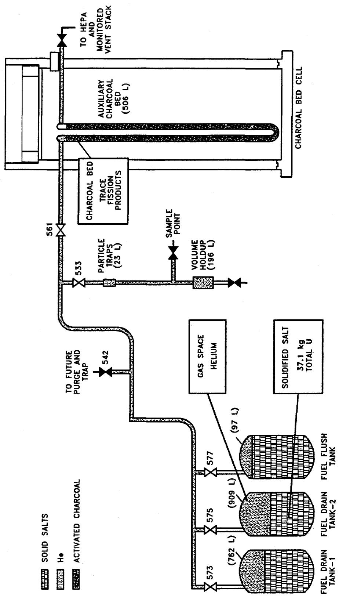
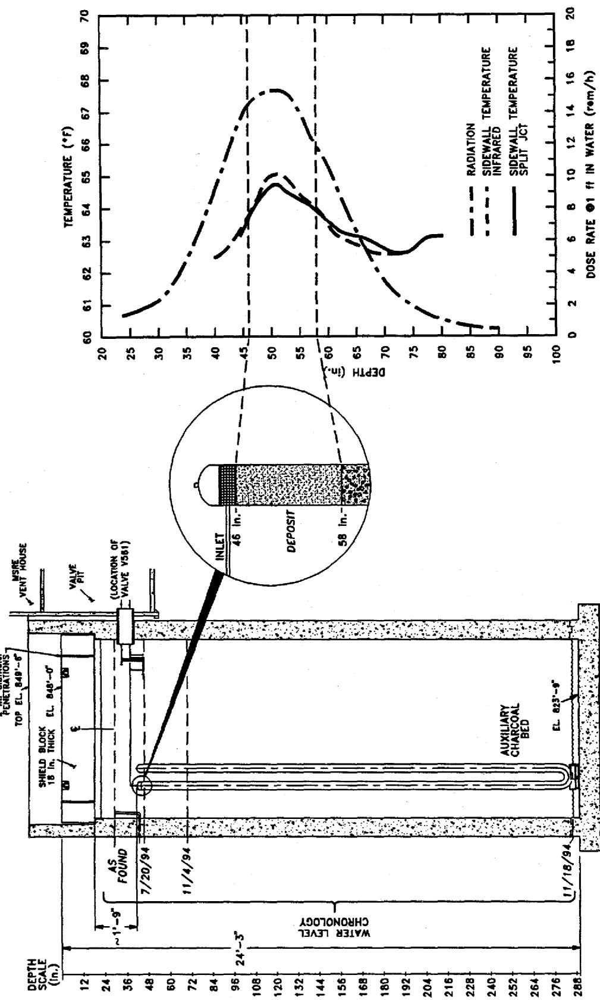
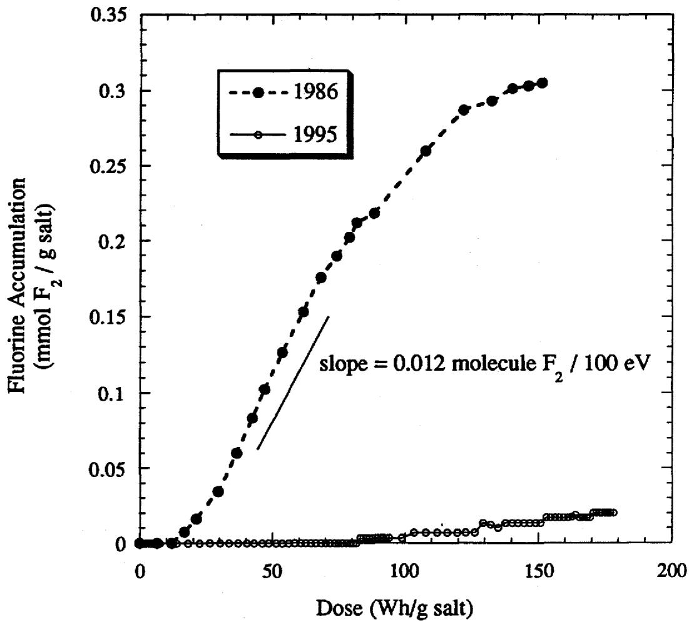
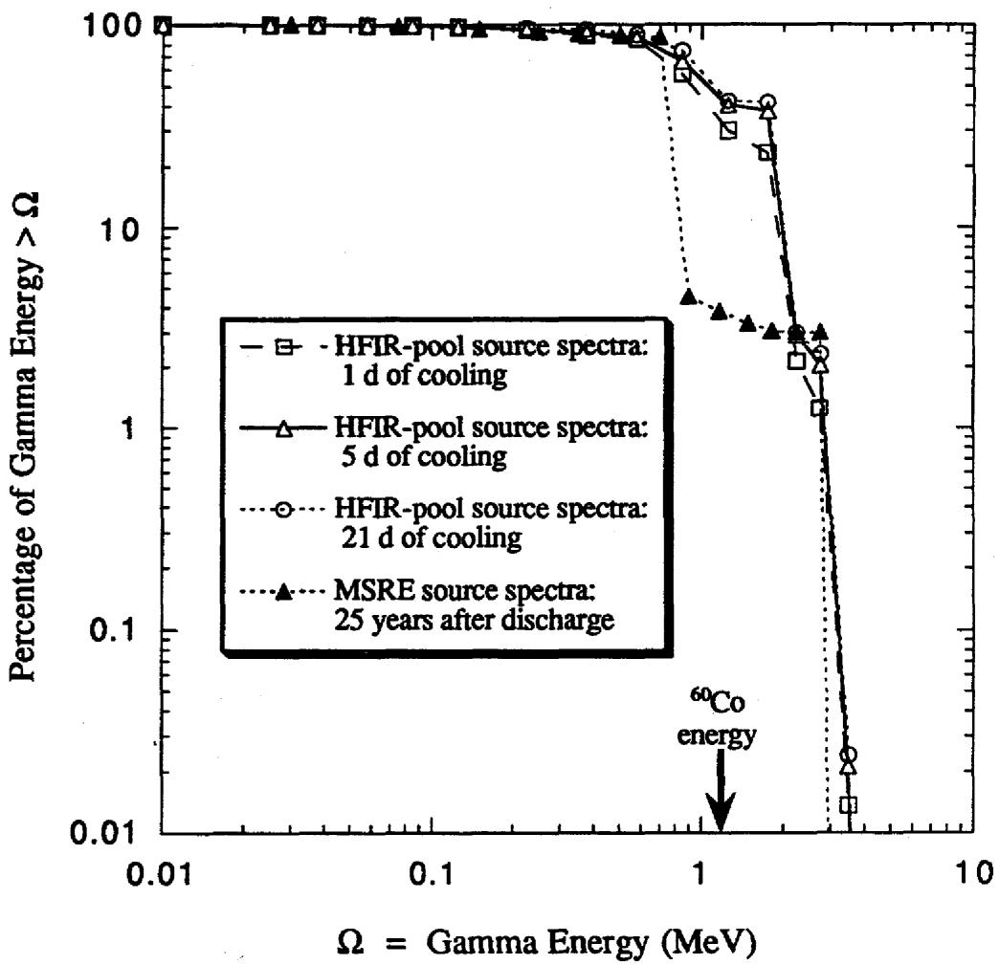
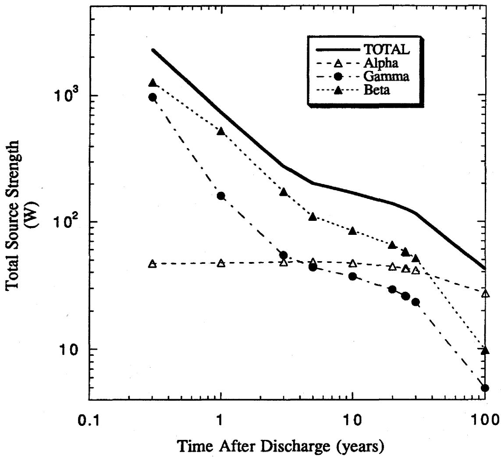
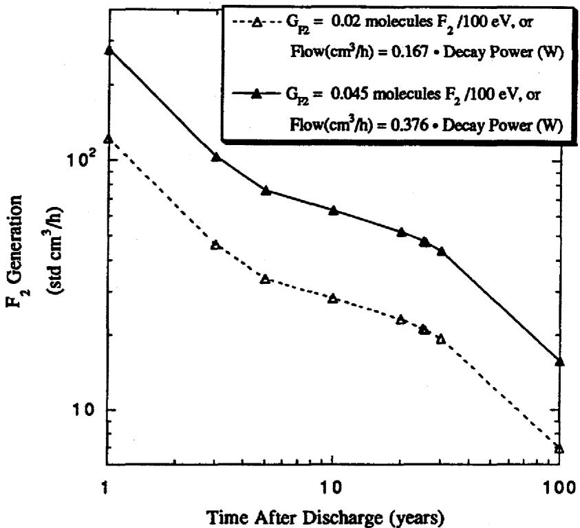
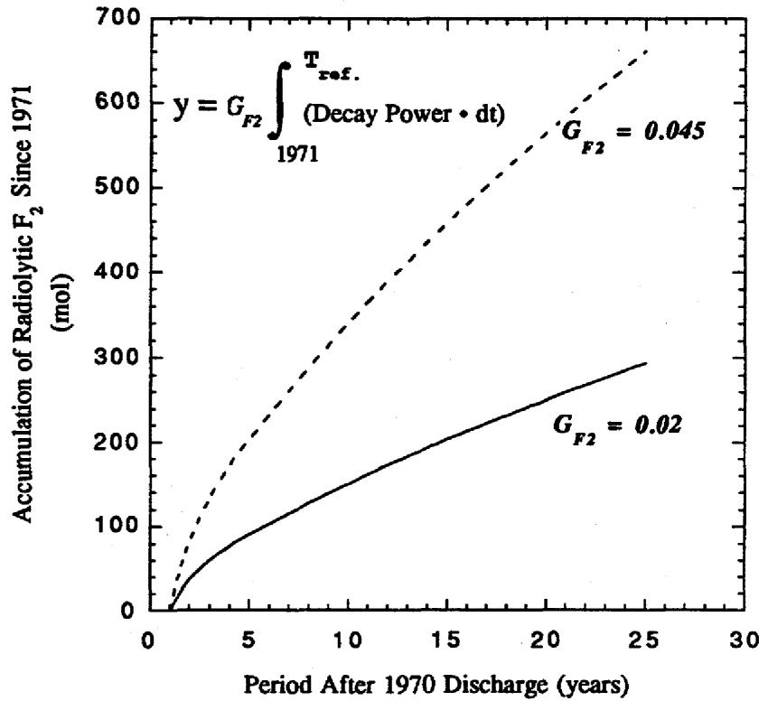
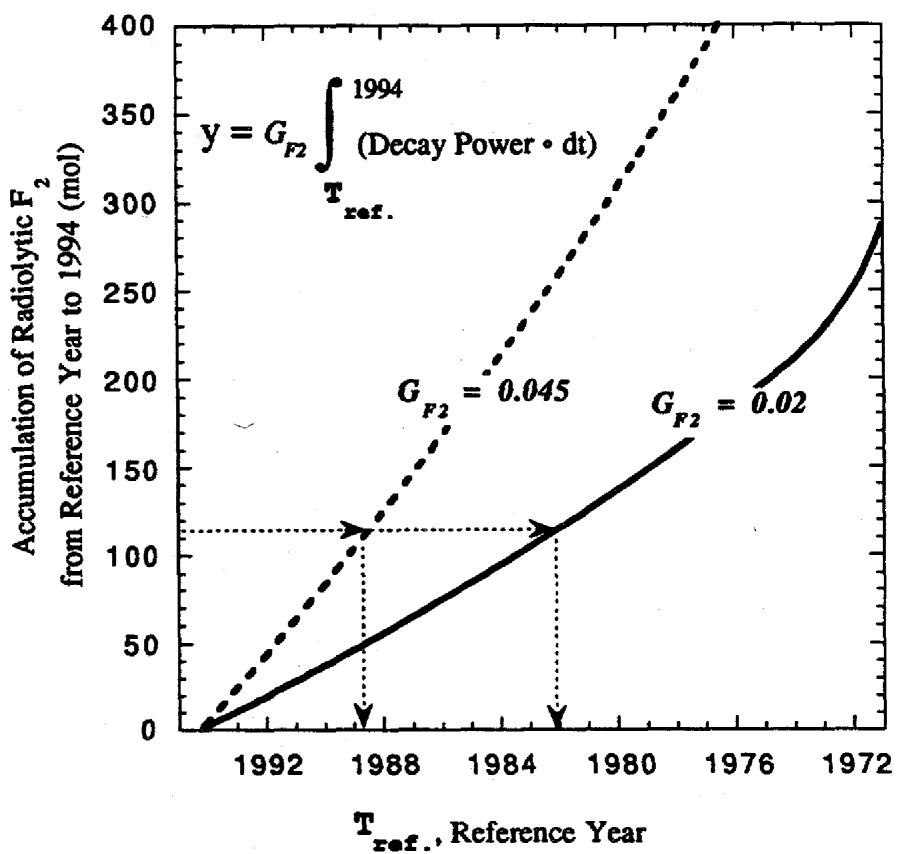
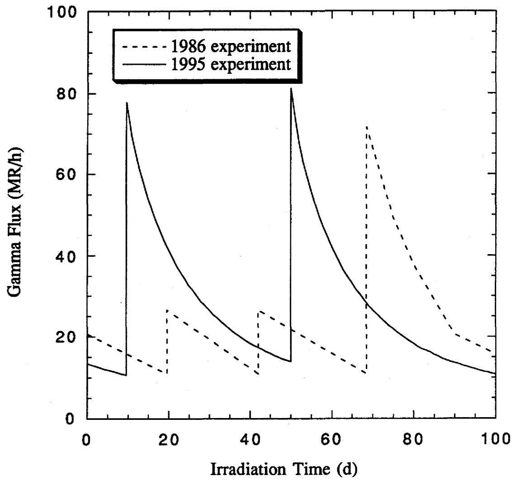

# OAK RIDGE NATIONAL LABORATORY

MARTIN MARIETTA

# RECEIVED

APR 0 2 1996

OSTI

# A Descriptive Model of the Molten Salt Reactor Experiment After Shutdown: Review of FY 1995 Progress

D. F. Williams

G. D. Del Cul

L. M. Toth

This report has been reproduced directly from the best available copy.

Available to DOE and DOE contractors from the Office of Scientific and Technical Information, P.O. Box 62, Oak Ridge, TN 37831; prices available from (615) 576-8401, FTS 626-8401.

Available to the public from the National Technical Information Service, U.S. Department of Commerce, 5285 Port Royal Rd., Springfield, VA 22161.

This report was prepared as an account of work sponsored by an agency of the United States Government. Neither the United States Government nor any agency thereof, nor any of their employees, makes any warranty, express or implied, or assumes any legal liability or responsibility for the accuracy, completeness, or usefulness of any information, apparatus, product, or process disclosed, or represents that its use would not infringe privately owned rights. Reference herein to any specific commercial product, process, or service by trade name, trademark, manufacturer, or otherwise, does not necessarily constitute or imply its endorsement, recommendation, or favoring by the United States Government or any agency thereof. The views and opinions of authors expressed herein do not necessarily state or reflect those of the United States Government or any agency thereof.

# DISCLAIMER

Portions of this document may be illegible in electronic image products. Images are produced from the best available original document.


# Chemical Technology Division

# A DESCRIPTIVE MODEL OF THE MOLTEN SALT REACTOR EXPERIMENT AFTER SHUTDOWN: REVIEW OF FY 1995 PROGRESS

D. F. Williams

G. D. Del Cul

L. M. Toth

Date Published — January 1996

Prepared by the

OAK RIDGE NATIONAL LABORATORY

Oak Ridge, Tennessee 37831-6285

managed by

LOCKHEED MARTIN ENERGY RESEARCH CORP.

for the

U.S. DEPARTMENT OF ENERGY

under contract DE-AC05-96OR22464


# CONTENTS

LIST OF TABLES

LIST OF FIGURES vii

EXECUTIVE SUMMARY ix

1. INTRODUCTION 1   
2.MSRE FUEL INVENTORY 2   
3. CHEMICAL INTERACTIONS DURING MELTING OF THE FUEL SALT 15   
4. MODELING OF THE ACB 17

4.1 RADIATION MODELING 17   
4.2 HEAT-TRANSFER MODELING 19

5.MSRESALT RADIOLYSIS 21

5.1 RADIOLYSIS EXPERIMENTS 22   
5.2 ABSORBED DOSE AND GAS GENERATION ESTIMATES 28

6. THERMAL FLUORINATION TESTS 34

ACKNOWLEDGMENTS 37

REFERENCES 39

Appendix A. ORIGEN-S RUN INPUT FILE 41   
Appendix B. CALCULATION OF RADIOLYTIC YIELD FROM IRRADIATION OF MSRE FUEL SALT IN THE HFIR COOLING POOL 47   
Appendix C. ESTIMATION OF CROSS-TRANSFER OF FISSION PRODUCTS AND PLUTONIUM TO THE FLUSH SALT 53   
Appendix D. HEAT-TRANSFER ANALYSIS OF IRRADIATION SPECIMENS 57


# LIST OF TABLES

# Table

Page

1. Comparison of measured and projected fission product activity at shutdown 5   
2. Distribution of major fission product decay energies between salt-seeking and metallic element classes 5   
3. Primary inventory of stored MSRE salts 7   
4. Secondary inventory of stored MSRE salts 7   
5. Detailed inventory of stored MSRE salts (1995 basis) 8   
6. Inventory of radioactive isotope activity (Ci) and elemental mass (g) 10   
7. Results from analysis of MSRE off-gas samples taken in 1994 14   
8. Estimate of material removed from MSRE salt beds 14   
9. Electrode potentials of major fuel-salt constituents 15   
10. Summary of radiolysis experiments on MSRE fuel salts 24   
11. Source spectra for MSRE fuel-salt irradiation 26   
12. Drain tank gamma spectrum (2583 kg salt basis, 25 years after discharge) 28   
13. Distribution of source-term power by radiation category (total fuel and flush-salt basis) 30


# LIST OF FIGURES

# Figure

# Page

1. Primary elements of the MSRE fuel-salt storage system. 3   
2. Schematic depiction of uranium deposit assay. 18   
3. Fluorine generation curves for 1986 and 1995 irradiation experiments. 23   
4. Comparison of source spectra for MSRE fuel-salt irradiation 25   
5. Distribution of source-term power by radiation category 29   
6. Projected fluorine generation in the absence of annealing and induction effects. 31   
7. Projected accumulation of radiolytic fluorine in the absence of annealing since 1971. 31   
8. Projected accumulation of radiolytic fluorine in the absence of annealing between 1994 and previous years. 32


# EXECUTIVE SUMMARY

Laboratory experiments, field measurements, and coordinated analysis efforts have helped the ORNL technical staff gain a better understanding of the status and behavior of the Molten Salt Reactor Experiment (MSRE) after its shutdown on December 12, 1969. Laboratory experiments showed that conventional (i.e., "thermal") fluorination of the $\mathrm{UF}_4$ in MSRE fuel salt by molecular fluorine does not occur under static (i.e., nonflow) conditions at temperatures below $300^{\circ}\mathrm{C}$ . However, further studies are required to rule out the possibility of conventional fluorination of the fuel salt at temperatures below the $230^{\circ}\mathrm{C}$ annealing treatment limit. A separate investigation has identified and quantified the stoichiometry and thermochemistry of the reactions between $\mathrm{F}_2 / \mathrm{UF}_6$ mixtures and activated carbon. This work seeks to explain the chemistry in the auxiliary charcoal bed (ACB) and is documented in a separate report.

Field measurements at the MSRE have identified material that has evolved from the fuel salt and now resides in the off-gas system. The following items are of particular importance:

- Analysis of radiation and temperature measurements provide independent and consistent estimates of $\sim 2.6\mathrm{kg}$ of fuel-salt uranium deposited in the top of the ACB.   
- Off-gas samples drawn just upstream of the ACB indicate that the off-gas piping and tank plenums contain more than $1.8\mathrm{kg}$ of uranium and more than $47\mathrm{mol}$ of fuel-salt fluorine. Based upon the off-gas analysis and the ACB uranium assay, it is projected that an additional $68\mathrm{mol}$ of fuel-salt fluorine is deposited in the ACB.

- Therefore, the total inventory of material removed from the fuel salt is projected to be greater than $4.4\mathrm{kg}$ of uranium and more than $115\mathrm{mol}$ of $\mathbf{F}_2$ . This represents a removal of more than $12\%$ of the $37.6\mathrm{kg}$ of fuel-salt uranium and an addition of 230 equiv of reductant to the remaining fuel. Under these net reducing conditions, significant amounts of uranium metal can form during melting of the fuel if the salt redox chemistry is not adjusted.

Revised source-term and radiation-transport calculations were conducted and support improved estimates of the decay energy deposited in the fuel salt and the generation and accumulation of fluorine by radiolysis. Based upon a one-dimensional transport calculation, more than $88\%$ of the gamma decay energy is deposited in the fuel salt. The remaining $12\%$ that escapes corresponds to an exposure at the inner tank wall of about $600\mathrm{R / h}$ . The upper bound on the yield for salt radiolysis indicates that less than $650\mathrm{mol}$ of $\mathbf{F}_2$ has accumulated since the cooling of the salt in 1971. Best-estimate yield values put the figure at $300\mathrm{mol}$ of radiolytic fluorine. Projections also show that the current measure of liberated fluorine (115 mol) could not have been generated recently. According to these estimates, generation of fluorine must have occurred prior to 1989, and probably started much earlier than this.

# 1. INTRODUCTION

During FY 1995 considerable progress was made toward gaining a better understanding of the chemistry and transport processes that continue to govern the behavior of the Molten Salt Reactor Experiment (MSRE). As measurements in the MSRE proceed, laboratory studies continue, and better analyses are available, our understanding of the state of the MSRE and the best path toward remediation improves. Because of the immediate concern about the deposit in the auxiliary charcoal bed (ACB), laboratory studies in the past year focused on carbon-fluorine chemistry. This work is documented in a separate report [1]. Secondary efforts were directed toward investigation of gas generation from MSRE salts by both radiolytic and nonradiolytic pathways.

In addition to the laboratory studies, field measurements at the MSRE provided the basis for estimating the inventory of uranium and fluorine in the ACB. Analysis of both temperature and radiation measurements provided independent and consistent estimates of about $2.6\mathrm{kg}$ of uranium deposited in the top of the ACB. Further analysis efforts included a refinement in the estimates of the fuel-salt source term, the deposited decay energy, and the projected rate of radiolytic gas generation.

This report also provides the background material necessary to explain new developments and to review areas of particular interest. The detailed history of the MSRE is extensively documented and is cited where appropriate. This work is also intended to update and complement the more recent MSRE assessment reports [2-4].

# 2. MSRE FUEL INVENTORY

The inventory of the stored MSRE fuel by element, isotope, and location is the starting point for most analyses, and a number of studies [2-6] have reported inventory values. There are two important reasons to revisit this subject: (a) the recently discovered transport of material within the MSRE has not been accounted for in these reports, and (b) previous reports contain inconsistencies that need to be reconciled. The goal of this section is to report an inventory based upon the best and most current estimates.

After MSRE reactor operations ended on December 12, 1969, the entire fuel-loop inventory was emptied into the two fuel-salt drain tanks in the drain tank cell, as shown in Fig. 1. Flush salt was then circulated through the fuel loop to remove any heel or deposits and then returned to the flush-salt drain tank in the drain tank cell. The salts solidified upon cooling below $434^{\circ}\mathrm{C}$ and were maintained between 230 and $340^{\circ}\mathrm{C}$ for 1 year before being allowed to cool to ambient conditions in 1971[7-9]. With the exception of the heel of flush salt left in the fuel loop and the heels of fluorinated salt in the fuel storage tank and salt still, these three tanks in the drain tank cell contain virtually all of the radioactive fuel salt [6, 10-11].

Consideration of the inventory after shutdown (i.e., "discharge" inventory) is the natural starting point. Adjustments are made to this baseline to account for the decay and transport of species after shutdown. Inconsistencies in the reported inventory derive from differing assumptions, different bases, and the inherent uncertainty in measurements. Even though most of the discrepancies are rather minor, it is important to adopt a logical basis for resolving these differences. Estimation of the discharge inventory is based upon a variety of measured parameters: (a) the isotopic distribution of uranium and plutonium in the fuel salt, (b) the fission product loading of the fuel salt, and (c) the weight of salt in

  
ORNL DWG 95A-57   
Fig.1. Primary elements of the MSRE fuel-salt storage system.

the reactor loop and drain tanks (both at discharge and during operation). Each of these inventory elements has a different level of certainty. Probably the most accurate measurement is that of the uranium and plutonium isotopic concentrations. Uranium and plutonium isotopic concentrations were carefully measured throughout the MSRE operating cycle and provided the most sensitive and accurate determination of power output, burnup, and total uranium and plutonium masses [11]. It was not possible to measure the remaining activation and fission products so completely and accurately. The entire fission product inventory can be estimated only by modeling the generation and decay of isotopes.

The primary objective of fission product measurements was to aid in modeling the transport behavior of the elements in the molten salt [12]. A fairly complete picture now exists for the partition of fission products between the salt and the surroundings: (a) the first four periodic groups (IA, IIA, IIIA, and IVA) and the rare earths are salt-seeking elements and remain homogeneously distributed in the fuel salt; (b) the noble gas fission products are removed to the off-gas; and (c) the noble metals class (Nb, Mo, Tc, Ru, Rh, Pd, Ag, Sb, and Te/I) dissolves in the salt to a minor extent, and probably exists as a separate phase that deposits on surfaces. The good agreement between the final MSRE fission product measurements for salt seekers and the projected inventory as calculated by Bell [5] is shown in Table 1. A correction factor of $\sim 10\%$ , due to differences in the basis for calculation of measured and projected activities, brings the values in Table 1 into agreement within the limits of experimental precision. It is impossible to know the fate of the noble metal isotopes, but it is certainly reasonable to assume that most of them were flushed into either the drain tanks or the flush tank. The noble metal fission products are relatively short-lived and comprise a significant fraction of the decay energy only during the first few years after shutdown, as shown in Table 2.

Table 1. Comparison of measured and projected fission product activity at shutdown   

<table><tr><td>Isotope</td><td>Half-life</td><td>Measured inventory (Ci)a</td><td>Ratio of measured to projected activityb</td><td>Ratio of measured to projected activityc</td></tr><tr><td colspan="5">Salt-seeking elements</td></tr><tr><td>Sr-89</td><td>51 d</td><td>93,900</td><td>0.58</td><td>0.532</td></tr><tr><td>Y-91</td><td>58.5 d</td><td>166,200</td><td>0.91</td><td>1.017</td></tr><tr><td>Zr-95</td><td>64 d</td><td>149,700</td><td>0.75</td><td>0.848</td></tr><tr><td>Cs-137</td><td>30 y</td><td>9,520</td><td>0.85</td><td>0.793</td></tr><tr><td>Ce-144</td><td>285 d</td><td>118,200</td><td>0.93</td><td>1.058</td></tr><tr><td colspan="5">Metallic elements</td></tr><tr><td>Nb-95</td><td>35 d</td><td>8,540</td><td>0.05</td><td>0.054</td></tr><tr><td>Ru-103</td><td>39 d</td><td>6,860</td><td>0.09</td><td>0.11</td></tr><tr><td>Ru-106</td><td>1.02 y</td><td>568</td><td>0.08</td><td>0.051</td></tr><tr><td>Te-129m</td><td>34 d</td><td>2,920</td><td>0.11</td><td>0.278</td></tr></table>

$a$ Based upon 12-5-69 sample reported in ORNL-4865 (complete citation in note "c") and a circulating loop inventory of $4350\mathrm{kg}$ .   
bSource: Bell, M. J., Calculated Radioactivity of the MSRE Fuel Salt, ORNL/TM-2970, Oak Ridge National Laboratory, May 1970.   
${}^{c}$ Source: Compere, E. L., et al., Fission Product Behavior in the Molten Salt Reactor Experiment, ORNL-4865,Oak Ridge National Laboratory,October 1975.

Table 2. Distribution of major fission product decay energies between salt-seeking and metallic element classes   

<table><tr><td rowspan="2"></td><td rowspan="2">Half-life</td><td colspan="3">Fission product decay energy (W)</td></tr><tr><td>1 year after shutdown</td><td>5 years after shutdown</td><td>25 years after shutdown</td></tr><tr><td colspan="5">Salt-seeking elements</td></tr><tr><td>Sr-89</td><td>50.6 d</td><td>7.2</td><td></td><td></td></tr><tr><td>Sr/Y-90</td><td>28.5 y</td><td>91.3</td><td>82.5</td><td>50.0</td></tr><tr><td>Y-91</td><td>58.5 d</td><td>8.7</td><td></td><td></td></tr><tr><td>Zr-95</td><td>64 d</td><td>19.4</td><td></td><td></td></tr><tr><td>Cs/Ba-137</td><td>30 y</td><td>52.7</td><td>48.3</td><td>30.0</td></tr><tr><td>Ce/Pr-144</td><td>285 d</td><td>417.8</td><td>11.9</td><td></td></tr><tr><td>Pm-147</td><td>2.62 y</td><td>10.5</td><td>3.7</td><td></td></tr><tr><td>Subtotal</td><td></td><td>607.6</td><td>146.4</td><td>80.0</td></tr><tr><td colspan="5">Metallic elements</td></tr><tr><td>Nb-95</td><td>35 d</td><td>39.4</td><td></td><td></td></tr><tr><td>Ru/Rh-106</td><td>1.02 y</td><td>36.2</td><td>2.4</td><td></td></tr><tr><td>Subtotal</td><td></td><td>75.6</td><td>2.4</td><td>0.0</td></tr><tr><td>Total</td><td></td><td>683.2</td><td>148.8</td><td>80.0</td></tr></table>

Perhaps the least accurate element in establishing the salt inventory is simply the total salt weight. The drain tank load cells that were originally intended to provide accurate salt weights were found to be too inaccurate for independent determinations [6]. To obtain a value for the inventory of the fuel and the flush-salt weights, considerable material balance work is required. Accounting for the numerous additions, withdrawals, and flushes of the fuel loop—in addition to the effect of the heels remaining in the drain tanks—requires good judgment and extensive process knowledge. The best values available are bounding estimates provided by the MSRE staff members who are most knowledgeable about the history of operation [6, 11]. These values (Tables 3 and 4), in conjunction with the measured uranium and plutonium isotopics [11] and the fission product/activation projections of Bell [5], form the best basis for establishing a discharge inventory. The inventory of major salt constituents calculated on this basis is summarized in Table 5.

The major uncertainty in Table 5 is the distribution of plutonium and fission products between the fuel and flush salts. Measurements of uranium concentration in the flush salt cannot be used to directly infer fission product or plutonium concentrations, because of the removal of uranium from the flush salt after the initial phase of operation with $^{235}\mathrm{U}$ . However, the steady increase of uranium measured in the flush salt after each circulation in the flow loop did establish that $\sim 20\mathrm{kg}$ of fuel salt was transferred to the flush salt during each flush operation [11]. The present inventory of uranium in the flush salt ( $\sim 1.3\%$ of the total) represents the cross-transfer from two flush operations conducted during the final phase of operations with $^{233}\mathrm{U}$ . The fission product and plutonium cross-transfers also had contributions from the seven flushes during $^{235}\mathrm{U}$ operation. In contrast to the relatively constant amount of uranium transferred per flush operation, the magnitude of the fission product/plutonium cross-transfers grew from near zero to the maximum value associated with $20\mathrm{kg}$ of spent fuel salt. It is assumed that the fuel-salt fission product and plutonium inventories grew in direct proportion to burnup during

Table 3. Primary inventory of stored MSRE salts   

<table><tr><td>Major componentsa</td><td>Maximum weight (kg)</td><td>Minimum weightb (kg)</td><td>Salt density (g/mL at 26°C)</td></tr><tr><td></td><td colspan="2">Fuel salt</td><td>2.48</td></tr><tr><td>Fuel Drain Tank -1</td><td>2583</td><td>2479</td><td></td></tr><tr><td>Fuel Drain Tank -2</td><td>2263</td><td>2171</td><td></td></tr><tr><td>Subtotal</td><td>4846</td><td>4650</td><td></td></tr><tr><td></td><td colspan="2">Flush salt</td><td>2.22</td></tr><tr><td>Fuel Flush Tank</td><td>4274</td><td>4265</td><td></td></tr></table>

${}^{a}$ Sources: MSRE Fuel and Flush Salt Storage,Request for Nuclear Safety Review and Approval,NSR 0039WM00013A (approved 12/28/93; expires 12/31/95); Thoma, R. E., Chemical Aspects of MSRE Operations, ORNL-4658,Oak Ridge National Laboratory, December 1971, pp. 58-65, 99-112 .   
These minimum weights are most consistent with the process history.

Table 4. Secondary inventory of stored MSRE salts   

<table><tr><td>Minor componentsa</td><td>Fuel-salt weight (kg)</td><td>Flush-salt weight (kg)</td></tr><tr><td>Fuel storage tank</td><td>175b</td><td></td></tr><tr><td>Distillation experiment</td><td>30b</td><td></td></tr><tr><td>Reactor flow-loop heel</td><td></td><td>20</td></tr><tr><td>Drain tank cell piping</td><td>12b,c</td><td></td></tr><tr><td>Processing cell piping</td><td>9b,c</td><td></td></tr><tr><td>Release to drain tank cell</td><td>0.1</td><td></td></tr></table>

${}^{a}$ Sources: MSRE Fuel and Flush Salt Storage, Request for Nuclear Safety Review and Approval, NSR 0039WM00013A (approved 12/28/93; expires 12/31/95); F. J. Peretz, ORNL, personal communication, September 6, 1995.   
These salts have been fluorinated and have low uranium concentration (<100 ppm).   
This value also includes the contribution of unspecified flush or fresh salt to the inventory.

Table 5. Detailed inventory of stored MSRE salts (1995 basis) $^a$   

<table><tr><td></td><td>Fuel salt</td><td>Flush salt</td><td>Total weight (kg)</td></tr><tr><td colspan="4">Bulk composition mol % (wt %)</td></tr><tr><td>LiF</td><td>64.5 (42.6)</td><td>65.9 (51.3)</td><td></td></tr><tr><td>BeF2</td><td>30.4 (35.8)</td><td>33.9 (47.8)</td><td></td></tr><tr><td>ZrF4</td><td>4.9 (20.5)</td><td>0.18 (0.89)</td><td></td></tr><tr><td colspan="4">Major elements</td></tr><tr><td>U, kg</td><td>37.1</td><td>0.5</td><td>37.6</td></tr><tr><td>Pu, %b,</td><td>98.2</td><td>1.8</td><td>0.737</td></tr><tr><td>Fission products, %b</td><td>98.3</td><td>1.7</td><td>2.71</td></tr><tr><td>Rare earths</td><td></td><td></td><td>1.47</td></tr><tr><td>IA, IIA</td><td></td><td></td><td>0.275</td></tr><tr><td>Zr</td><td></td><td></td><td>0.626</td></tr><tr><td>Other metals / I</td><td></td><td></td><td>0.334</td></tr><tr><td colspan="4">Fissile element isotopes, wt %c</td></tr><tr><td>232U</td><td>160 ppmd</td><td>75 ppme</td><td></td></tr><tr><td>233U</td><td>83.92</td><td>39.4</td><td></td></tr><tr><td>234U</td><td>7.48</td><td>3.6</td><td></td></tr><tr><td>235U</td><td>2.56</td><td>17.4</td><td></td></tr><tr><td>236U</td><td>0.104</td><td>0.245</td><td></td></tr><tr><td>238U</td><td>5.94</td><td>39.4</td><td></td></tr><tr><td>239Pu</td><td>90.1</td><td>94.7</td><td></td></tr><tr><td>240Pu</td><td>9.52</td><td>4.8</td><td></td></tr><tr><td>other Pu</td><td>0.35</td><td>0.50</td><td></td></tr></table>

${}^{a}$ Source: Thoma, R. E., Chemical Aspects of MSRE Operations, ORNL-4658, Oak Ridge National Laboratory, December 1971, pp. 58-65, 99-112 .   
$b_{\text{Distributions based upon estimates in Appendix C}}$ .   
Flush salt values are the average of two analyses.   
$d_{\mathrm{Estimate}}$ obtained from Bell, M. J., Calculated Radioactivity of the MSRE Fuel Salt, ORNL/TM-2970, Oak Ridge National Laboratory, May 1970.   
$e_{\text{Flush salt}} 232_{\text{U}} / 233_{\text{U}}$ ratio assumed to be that of the fuel salt.

$^{235}\mathrm{U}$ operations. During $^{233}\mathrm{U}$ operations, breeding of plutonium was negligible, and the change in plutonium concentration in the fuel salt was dominated by depletion due to fission/transmutation and replenishment by $\mathrm{PuF}_3$ refueling operations. Appendix C provides the details that support the transfer of $\sim 2\%$ of the fission products and plutonium to the flush salt.

The previous projections of the MSRE spent-fuel activity had either a very short focus ( $< 5$ years) or were concerned with projections far into the future—the intermediate time period between 5 and 100 years has not received detailed attention. Because of this gap in the literature, additional ORIGEN-S runs were performed at complementary time intervals [13]. The discharge inventory and decay calculations are summarized in Table 6. The ORIGEN-S input file is included in Appendix A.

The final inventory item that must be considered is the transport of material out of the salt beds. Except for the generation of fluorine by radiolysis of MSRE salt, no other mechanism for producing mobile species was known before 1994. Annual reheats of the drain tanks were intended to recombine the radiolytic fluorine before it was released from the salt, thereby preserving the salt chemistry and eliminating any substantial release of $\mathbf{F}_2$ . A completely new and unexpected pathway for volatilizing MSRE constituents was discovered during sampling of the off-gas system upstream of the ACB in 1994. Off-gas samples (Table 7) indicated the presence of a considerable volume of $\mathbf{F}_2$ and $\mathbf{UF}_6$ , in addition to small amounts of HF, $\mathbf{MoF}_6$ , and $\mathbf{CF}_4$ . The presence of such a large amount of $\mathbf{F}_2$ and $\mathbf{UF}_6$ in the off-gas suggested that the ACB be inspected as a possible sink for these reactive gases. Radiation and temperature measurements confirmed that a significant quantity of uranium was deposited in the upper portion of the charcoal bed. Careful analysis of this data led to an estimate of $2.6\mathrm{kg}$ of uranium immobilized on the carbon (Sect. 4). The quantity of fluorine held in the ACB was inferred from the $\mathbf{F}_2/\mathbf{UF}_6$ mole ratio in the off-gas sample (Table 7).

Table 6. Inventory of radioactive isotope activity (Ci) and elemental mass (g) (Elemental mass in parentheses; all other units are curies)   

<table><tr><td>Z</td><td>Element</td><td>Mass</td><td>Half-life</td><td>Discharge</td><td>1 y</td><td>3 y</td><td>5 y</td><td>10 y</td><td>20 y</td><td>25 y</td><td>30 y</td><td>100 y</td></tr><tr><td colspan="13">Fission Products</td></tr><tr><td>37</td><td>Rb</td><td>Σ</td><td></td><td>(8.48 g)</td><td></td><td></td><td></td><td></td><td></td><td>(8.48 g)</td><td></td><td>(8.48 g)</td></tr><tr><td>38</td><td>Sr</td><td>Σ</td><td></td><td>(110 g)</td><td></td><td></td><td></td><td></td><td></td><td>(58.4 g)</td><td></td><td>(14.1 g)</td></tr><tr><td></td><td></td><td>89</td><td>50.6 d</td><td>162,000</td><td>1,080</td><td></td><td></td><td></td><td></td><td></td><td></td><td></td></tr><tr><td></td><td></td><td>90</td><td>28.5 y</td><td>14,000</td><td>13,600</td><td>13,000</td><td>12,300</td><td>10,900</td><td>8,530</td><td>7,550</td><td>6,670</td><td>1,190</td></tr><tr><td>39</td><td>Y</td><td>Σ</td><td></td><td>(74.1 g)</td><td></td><td></td><td></td><td></td><td></td><td>(72.2 g)</td><td></td><td>(72.2 g)</td></tr><tr><td></td><td></td><td>90</td><td>2.7 d</td><td>13,600</td><td>13,600</td><td>13,000</td><td>12,300</td><td>10,900</td><td>8,530</td><td>7,550</td><td>6,670</td><td>1,190</td></tr><tr><td></td><td></td><td>91</td><td>58.5 d</td><td>183,000</td><td>2,420</td><td>0.4</td><td></td><td></td><td></td><td></td><td></td><td></td></tr><tr><td>40</td><td>Zr</td><td>Σ</td><td></td><td>(572 g)</td><td></td><td></td><td></td><td></td><td></td><td>(616 g)</td><td></td><td>(661 g)</td></tr><tr><td></td><td></td><td>93</td><td>1.5 E6 y</td><td>0.3</td><td>0.3</td><td>0.3</td><td>0.3</td><td>0.3</td><td>0.3</td><td>0.3</td><td>0.3</td><td>0.3</td></tr><tr><td></td><td></td><td>95</td><td>64 d</td><td>200,000</td><td>3,830</td><td>1.4</td><td></td><td></td><td></td><td></td><td></td><td></td></tr><tr><td>41</td><td>Nb</td><td>Σ</td><td></td><td>(4.41 g)</td><td></td><td></td><td></td><td></td><td></td><td></td><td></td><td></td></tr><tr><td></td><td></td><td>95</td><td>35 d</td><td>173,000</td><td>8,240</td><td>3.1</td><td></td><td></td><td></td><td></td><td></td><td></td></tr><tr><td></td><td></td><td>95m</td><td>3.6 d</td><td>4,150</td><td>45.0</td><td></td><td></td><td></td><td></td><td></td><td></td><td></td></tr><tr><td>42</td><td>Mo</td><td>Σ</td><td></td><td>(117 g)</td><td></td><td></td><td></td><td></td><td></td><td>(131 g)</td><td></td><td>(131 g)</td></tr><tr><td>43</td><td>Tc</td><td>Σ</td><td></td><td>(29.8 g)</td><td></td><td></td><td></td><td></td><td></td><td>(29.8 g)</td><td></td><td>(29.8 g)</td></tr><tr><td></td><td></td><td>99</td><td>2.1 E5 y</td><td>0.5</td><td>0.5</td><td>0.5</td><td>0.5</td><td>0.5</td><td>0.5</td><td>0.5</td><td>0.5</td><td>0.5</td></tr><tr><td>44</td><td>Ru</td><td>Σ</td><td></td><td>(47.5 g)</td><td></td><td></td><td></td><td></td><td></td><td>(43 g)</td><td></td><td>(43 g)</td></tr><tr><td></td><td></td><td>103</td><td>39.2 d</td><td>74,000</td><td>117</td><td></td><td></td><td></td><td></td><td></td><td></td><td></td></tr><tr><td></td><td></td><td>106</td><td>1.02 y</td><td>7,420</td><td>3,750</td><td>961</td><td>246</td><td>8.2</td><td></td><td></td><td></td><td></td></tr><tr><td>45</td><td>Rh</td><td>Σ</td><td></td><td>(50.7 g)</td><td></td><td></td><td></td><td></td><td></td><td>(53 g)</td><td></td><td>(53 g)</td></tr><tr><td></td><td></td><td>103m</td><td>56 m</td><td>73,900</td><td>117</td><td></td><td></td><td></td><td></td><td></td><td></td><td></td></tr><tr><td></td><td></td><td>106</td><td>30 s</td><td>8,930</td><td>3,750</td><td>961</td><td>246</td><td>8.2</td><td></td><td></td><td></td><td></td></tr><tr><td>46</td><td>Pd</td><td>Σ</td><td></td><td>(28.5 g)</td><td></td><td></td><td></td><td></td><td></td><td>(30.7 g)</td><td></td><td>(30.7 g)</td></tr><tr><td>51</td><td>Sb</td><td>Σ</td><td></td><td>(0.62 g)</td><td></td><td></td><td></td><td></td><td></td><td></td><td></td><td></td></tr><tr><td></td><td></td><td>125</td><td>2.73 y</td><td>647</td><td>502</td><td>302</td><td>182</td><td>51.1</td><td>4.0</td><td>1.0</td><td>0.3</td><td></td></tr><tr><td>52</td><td>Te</td><td>Σ</td><td></td><td>(31.7 g)</td><td></td><td></td><td></td><td></td><td></td><td>(31 g)</td><td></td><td>(31 g)</td></tr><tr><td></td><td></td><td>125</td><td>58 d</td><td>187</td><td>123</td><td>73.8</td><td>44.4</td><td>12.5</td><td>1.0</td><td>0.3</td><td></td><td></td></tr><tr><td></td><td></td><td>127</td><td>9.4 h</td><td>32,700</td><td>378</td><td>3.6</td><td></td><td></td><td></td><td></td><td></td><td></td></tr><tr><td></td><td></td><td>127m</td><td>109 d</td><td>3,940</td><td>386</td><td>3.7</td><td></td><td></td><td></td><td></td><td></td><td></td></tr><tr><td></td><td></td><td>129</td><td>1.16 h</td><td>97,800</td><td>9.1</td><td></td><td></td><td></td><td></td><td></td><td></td><td></td></tr><tr><td></td><td></td><td>129m</td><td>34 d</td><td>26,700</td><td>14.3</td><td></td><td></td><td></td><td></td><td></td><td></td><td></td></tr><tr><td>53</td><td>I</td><td>Σ</td><td></td><td>(14.9 g)</td><td></td><td></td><td></td><td></td><td></td><td>(16.2 g)</td><td></td><td>(16.2 g)</td></tr><tr><td>55</td><td>Cs</td><td>Σ</td><td></td><td>(129 g)</td><td></td><td></td><td></td><td></td><td></td><td>(71.4 g)</td><td></td><td>(12.8 g)</td></tr><tr><td></td><td></td><td>134</td><td>2.06 y</td><td>5.5</td><td>3.9</td><td>2.0</td><td>1.0</td><td>0.2</td><td></td><td></td><td></td><td></td></tr><tr><td></td><td></td><td>137</td><td>30 y</td><td>11,200</td><td>10,900</td><td>10,400</td><td>9,980</td><td>8,890</td><td>7,060</td><td>6,290</td><td>5,600</td><td>1,110</td></tr><tr><td>56</td><td>Ba</td><td>Σ</td><td></td><td>(80 g)</td><td></td><td></td><td></td><td></td><td></td><td>(137 g)</td><td></td><td>(196 g)</td></tr><tr><td></td><td></td><td>137m</td><td>2.6 m</td><td>10,500</td><td>10,300</td><td>9,870</td><td>9,420</td><td>8,390</td><td>6,660</td><td>5,940</td><td>5,290</td><td>1,050</td></tr><tr><td>57</td><td>La</td><td>Σ</td><td></td><td>(170 g)</td><td></td><td></td><td></td><td></td><td></td><td>(170 g)</td><td></td><td>(170 g)</td></tr><tr><td>58</td><td>Ce</td><td>Σ</td><td></td><td>(416 g)</td><td></td><td></td><td></td><td></td><td></td><td>(362 g)</td><td></td><td>(362 g)</td></tr><tr><td></td><td></td><td>141</td><td>32.5 d</td><td>410,000</td><td>170</td><td></td><td></td><td></td><td></td><td></td><td></td><td></td></tr><tr><td></td><td></td><td>144</td><td>285 d</td><td>127,000</td><td>52,100</td><td>8,810</td><td>1,490</td><td>17.5</td><td></td><td></td><td></td><td></td></tr><tr><td>59</td><td>Pr</td><td>Σ</td><td></td><td>(170 g)</td><td></td><td></td><td></td><td></td><td></td><td>(184g)</td><td></td><td>(184 g)</td></tr><tr><td></td><td></td><td>144</td><td>17.3 m</td><td>128,000</td><td>52,100</td><td>8,810</td><td>1,490</td><td>17.5</td><td></td><td></td><td></td><td></td></tr><tr><td></td><td></td><td>144m</td><td>7.3 m</td><td>0</td><td>729</td><td>123</td><td>20.9</td><td>0.2</td><td></td><td></td><td></td><td></td></tr><tr><td>60</td><td>Nd</td><td>Σ</td><td></td><td>(536 g)</td><td></td><td></td><td></td><td></td><td></td><td>(576 g)</td><td></td><td>(576 g)</td></tr><tr><td>61</td><td>Pm</td><td>Σ</td><td></td><td>(40.2 g)</td><td></td><td></td><td></td><td></td><td></td><td>(0.05 g)</td><td></td><td></td></tr><tr><td></td><td></td><td>147</td><td>2.62 y</td><td>37,200</td><td>28,600</td><td>16,800</td><td>9,930</td><td>2,650</td><td>189</td><td>50.3</td><td>13.4</td><td></td></tr><tr><td></td><td></td><td>148</td><td>5.4 d</td><td>0</td><td>0.1</td><td></td><td></td><td></td><td></td><td></td><td></td><td></td></tr><tr><td></td><td></td><td>148m</td><td>42 d</td><td>1,050</td><td>2.3</td><td></td><td></td><td></td><td></td><td></td><td></td><td></td></tr><tr><td>62</td><td>Sm</td><td>Σ</td><td></td><td>(71.2 g)</td><td></td><td></td><td></td><td></td><td></td><td>(110 g)</td><td></td><td>(108 g)</td></tr><tr><td></td><td></td><td>151</td><td>90 y</td><td>147</td><td>146</td><td>144</td><td>141</td><td>136</td><td>126</td><td>121</td><td>117</td><td>68</td></tr><tr><td>63</td><td>Eu</td><td>Σ</td><td></td><td>(6.37g)</td><td></td><td></td><td></td><td></td><td></td><td>(6.49 g)</td><td></td><td>(8.45 g)</td></tr><tr><td></td><td></td><td>152</td><td>13.3 y</td><td>5.5</td><td>5.2</td><td>4.7</td><td>4.2</td><td>3.3</td><td>1.9</td><td>1.5</td><td>1.1</td><td></td></tr><tr><td></td><td></td><td>154</td><td>8.8 y</td><td>35.2</td><td>32.5</td><td>27.7</td><td>23.5</td><td>15.7</td><td>7.0</td><td>4.7</td><td>3.1</td><td></td></tr><tr><td></td><td></td><td>155</td><td>4.96 y</td><td>376</td><td>324</td><td>241</td><td>179</td><td>85.5</td><td>19.4</td><td>9.3</td><td>4.4</td><td></td></tr><tr><td>64</td><td>Gd</td><td>Σ</td><td></td><td>(0 g)</td><td></td><td></td><td></td><td></td><td></td><td>(0.865 g)</td><td></td><td>(0.90 g)</td></tr><tr><td></td><td></td><td></td><td></td><td colspan="9">Fission product mass (g)</td></tr><tr><td></td><td></td><td></td><td></td><td colspan="6">(2,711 g)</td><td colspan="2">(2,711 g)</td><td>(2,711 g)</td></tr><tr><td></td><td></td><td></td><td></td><td colspan="9">Fission product activity (Ci)</td></tr><tr><td></td><td></td><td></td><td></td><td>1,800,000</td><td>207,000</td><td>83,600</td><td>58,100</td><td>42,100</td><td>31,100</td><td>27,500</td><td>24,400</td><td>4,610</td></tr><tr><td colspan="13">Actinide-decay daughters</td></tr><tr><td>81</td><td>Tl</td><td>208</td><td>3.05 m</td><td>54.8</td><td>57.4</td><td>59.3</td><td>59.6</td><td>57.8</td><td>52.5</td><td>50</td><td>47.6</td><td>23.7</td></tr><tr><td>82</td><td>Pb</td><td>Σ</td><td></td><td></td><td></td><td></td><td></td><td></td><td></td><td>(1.59 g)</td><td></td><td>(4.53 g)</td></tr><tr><td></td><td></td><td>209</td><td>3.25 h</td><td>0</td><td></td><td></td><td>0.1</td><td>0.3</td><td>0.5</td><td>0.7</td><td>0.8</td><td>2.7</td></tr><tr><td></td><td></td><td>212</td><td>10.6 h</td><td>153</td><td>160</td><td>165</td><td>166</td><td>161</td><td>146</td><td>139</td><td>132</td><td>66</td></tr><tr><td>83</td><td>Bi</td><td>212</td><td>1.01 h</td><td>152</td><td>160</td><td>165</td><td>166</td><td>161</td><td>146</td><td>139</td><td>132</td><td>66</td></tr><tr><td></td><td></td><td>213</td><td>45.6 m</td><td>0</td><td></td><td></td><td>0.1</td><td>0.3</td><td>0.5</td><td>0.7</td><td>0.8</td><td>2.7</td></tr><tr><td>84</td><td>Po</td><td>212</td><td>45 s</td><td>97.5</td><td>102</td><td>106</td><td>106</td><td>103</td><td>93.6</td><td>89.1</td><td>84.8</td><td>42.3</td></tr><tr><td></td><td></td><td>213</td><td>4 μs</td><td>0</td><td></td><td></td><td>0.1</td><td>0.3</td><td>0.5</td><td>0.7</td><td>0.8</td><td>2.7</td></tr><tr><td></td><td></td><td>216</td><td>150 ms</td><td>153</td><td>160</td><td>165</td><td>166</td><td>161</td><td>146</td><td>139</td><td>132</td><td>66</td></tr><tr><td>85</td><td>At</td><td>217</td><td>32 ms</td><td>0</td><td></td><td></td><td>0.1</td><td>0.3</td><td>0.5</td><td>0.7</td><td>0.8</td><td>2.7</td></tr><tr><td>86</td><td>Rn</td><td>220</td><td>55.6 s</td><td>153</td><td>160</td><td>165</td><td>166</td><td>161</td><td>146</td><td>139</td><td>132</td><td>66</td></tr><tr><td>87</td><td>Fr</td><td>221</td><td>4.9 m</td><td>0</td><td></td><td></td><td>0.1</td><td>0.3</td><td>0.5</td><td>0.7</td><td>0.8</td><td>2.7</td></tr><tr><td>88</td><td>Ra</td><td>224</td><td>3.66 d</td><td>153</td><td>160</td><td>165</td><td>166</td><td>161</td><td>146</td><td>139</td><td>132</td><td>66</td></tr><tr><td></td><td></td><td>225</td><td>14.8 d</td><td>0</td><td></td><td></td><td>0.1</td><td>0.3</td><td>0.5</td><td>0.7</td><td>0.8</td><td>2.7</td></tr><tr><td>89</td><td>Ac</td><td>225</td><td>10 d</td><td>0</td><td></td><td></td><td>0.1</td><td>0.3</td><td>0.5</td><td>0.7</td><td>0.8</td><td>2.7</td></tr><tr><td>90</td><td>Th</td><td>Σ</td><td></td><td>(0.187 g)</td><td></td><td></td><td></td><td></td><td></td><td>(3.90 g)</td><td></td><td>(14.7 g)</td></tr><tr><td></td><td></td><td>228</td><td>1.9 y</td><td>153</td><td>159</td><td>165</td><td>166</td><td>161</td><td>146</td><td>139</td><td>132</td><td>66</td></tr><tr><td></td><td></td><td>229</td><td>7300 y</td><td>0</td><td></td><td></td><td>0.1</td><td>0.3</td><td>0.5</td><td>0.7</td><td>0.8</td><td>2.7</td></tr><tr><td colspan="13">Actinide-decay mass (g)</td></tr><tr><td></td><td></td><td></td><td></td><td>(0.187 g)</td><td></td><td></td><td></td><td></td><td></td><td>(5.49 g)</td><td></td><td>(19.2 g)</td></tr><tr><td colspan="13">Actinide-decay activity (Ci)</td></tr><tr><td></td><td></td><td></td><td></td><td>1,069</td><td>1,118</td><td>1,155</td><td>1,162</td><td>1,129</td><td>1,026</td><td>979</td><td>931</td><td>484</td></tr></table>

Table 6. (continued) (Elemental mass in parentheses; all other units are curies) $^a$   

<table><tr><td>Z</td><td>Element</td><td>Mass</td><td>Half-life</td><td>Discharge</td><td>1 y</td><td>3 y</td><td>5 y</td><td>10 y</td><td>20 y</td><td>25 y</td><td>30 y</td><td>100 y</td></tr><tr><td colspan="13">Transuranium isotopesa</td></tr><tr><td>92</td><td>U</td><td>Σ</td><td></td><td>(37,600 g)</td><td></td><td></td><td></td><td></td><td></td><td>(37,600 g)</td><td></td><td>(37,600 g)</td></tr><tr><td></td><td></td><td>232</td><td>70 y</td><td>173</td><td>172</td><td>168</td><td>165</td><td>157</td><td>142</td><td>135</td><td>129</td><td>64.2</td></tr><tr><td></td><td></td><td>233</td><td>1.59 E5 y</td><td>302</td><td>302</td><td>302</td><td>302</td><td>302</td><td>302</td><td>302</td><td>302</td><td>302</td></tr><tr><td></td><td></td><td>234</td><td>2.45 E5 y</td><td>17.4</td><td>17.4</td><td>17.4</td><td>17.4</td><td>17.4</td><td>17.4</td><td>17.4</td><td>17.4</td><td>17.4</td></tr><tr><td></td><td></td><td>235</td><td>7.04 E8 y</td><td></td><td></td><td></td><td></td><td></td><td></td><td></td><td></td><td></td></tr><tr><td></td><td></td><td>236</td><td>2.34 E7 y</td><td></td><td></td><td></td><td></td><td></td><td></td><td></td><td></td><td></td></tr><tr><td></td><td></td><td>238</td><td>4.47 E9 y</td><td></td><td></td><td></td><td></td><td></td><td></td><td></td><td></td><td></td></tr><tr><td>94</td><td>Pu</td><td>Σ</td><td></td><td>(743 g)</td><td></td><td></td><td></td><td></td><td></td><td>(737 g)</td><td></td><td>(732 g)</td></tr><tr><td></td><td></td><td>238</td><td>87.7 y</td><td>1.00</td><td>1.09</td><td>1.10</td><td>1.08</td><td>1.01</td><td>0.96</td><td>0.92</td><td>0.89</td><td>0.51</td></tr><tr><td></td><td></td><td>239</td><td>24,110 y</td><td>41.7</td><td>41.7</td><td>41.7</td><td>41.7</td><td>41.7</td><td>41.7</td><td>41.7</td><td>41.7</td><td>41.7</td></tr><tr><td></td><td></td><td>240</td><td>6,540 y</td><td>15.3</td><td>15.3</td><td>15.3</td><td>15.3</td><td>15.3</td><td>15.3</td><td>15.3</td><td>15.3</td><td>15.3</td></tr><tr><td></td><td></td><td>241</td><td>14.4 y</td><td>904</td><td>862</td><td>782</td><td>710</td><td>558</td><td>344</td><td>270</td><td>212</td><td>7.21</td></tr><tr><td>95</td><td>Am</td><td>241</td><td>433 y</td><td>0.96</td><td>2.4</td><td>5.0</td><td>7.4</td><td>12.3</td><td>19.2</td><td>21.5</td><td>23.2</td><td>27</td></tr><tr><td>96</td><td>Cm</td><td>242</td><td>163 d</td><td>24.5</td><td>5.2</td><td>0.2</td><td></td><td></td><td></td><td></td><td></td><td></td></tr><tr><td colspan="13">Total TRU mass (g)</td></tr><tr><td></td><td></td><td></td><td></td><td>(38,340 g)</td><td></td><td></td><td></td><td></td><td></td><td>(38,340 g)</td><td></td><td>(38,330 g)</td></tr><tr><td></td><td></td><td></td><td></td><td colspan="9">Total TRU activity (Ci)</td></tr><tr><td></td><td></td><td></td><td></td><td>1,480</td><td>1,419</td><td>1,333</td><td>1,260</td><td>1,105</td><td>883</td><td>804</td><td>741</td><td>475</td></tr></table>

${}^{a}$ Uranium and plutonium inventory values (except ${}^{{232}\mathrm{U}}$ ) are derived from isotopic analysis and are 3-5% lower than those calculated by M. J. Bell, as reported in Calculated Radioactivity of the MSRE Fuel Salt, ORNL/TM-2970, Oak Ridge National Laboratory, May 1970. All other projections are derived from Bell's discharge inventory.

Table 7. Results from analysis of MSRE off-gas samples taken in $1994^{a}$   

<table><tr><td>Component</td><td>Partial Pressure (mm Hg)</td></tr><tr><td>F2</td><td>350</td></tr><tr><td>Inerts</td><td>305</td></tr><tr><td>UF6</td><td>69b</td></tr><tr><td>MoF6</td><td>10</td></tr><tr><td>CF4</td><td>5</td></tr><tr><td>HF</td><td>0.74 (1000 ppm)</td></tr><tr><td>N-F compounds</td><td>Trace</td></tr></table>

$a$ Source: Toth, L. M. ORNL, personal communication, Feb. 14, 1995. $b$ Saturation pressure of $\mathrm{UF}_6$ at the sample temperature of $21^{\circ}\mathrm{C}$ is $79\mathrm{mmHg}$ .

The off-gas assay and charcoal bed analysis provide a basis for estimating the amount of material that has migrated out of the MSRE salts. Because the source of these volatile products was far upstream of the sample point and at a lower temperature, it is possible that the amount of $\mathrm{UF}_6$ and $\mathbf{F}_2$ in the off-gas piping and tank plenums is greater than that predicted on the basis of a homogeneous vapor space with no deposition of material by reaction, condensation, or sorption. The most unbiased approach is to proceed with the limiting case of a homogeneous atmosphere, as shown in Table 8. These assumptions lead to a projection that more than $4.4\mathrm{kg}$ of uranium and $115\mathrm{mol}$ of fluorine have been removed from the fuel salt.

Table 8. Estimate of material removed from MSRE salt beds ${}^{a}$   

<table><tr><td rowspan="2"></td><td colspan="2">Uranium</td><td rowspan="2">Fuel-salt fluorine (mol F2)b</td></tr><tr><td>kg</td><td>mol</td></tr><tr><td>Off-gas volumec</td><td>&gt;1.8</td><td>&gt;7.7</td><td>&gt;46.7</td></tr><tr><td>ACB depositd</td><td>2.6</td><td>11.2</td><td>&gt;68.0</td></tr><tr><td>Total removed</td><td>&gt;4.4</td><td>&gt;18.9</td><td>&gt;115</td></tr><tr><td>Remaining fuel and flush salt inventory</td><td>&lt;33.2</td><td>&lt;142.5</td><td>&gt;115 deficient</td></tr></table>

${}^{a}$ Basis: 2029-L off-gas volume, ${20}^{ \circ  }\mathrm{C}$ average temperature, ${738}\mathrm{\;{mm}} - \mathrm{{Hg}}$ -pressure.   
bIncludes removal of fluorine as $\mathrm{UF}_4\cdot \mathrm{F}_2$   
$c$ Assumes off-gas is at 1994 sample conditions shown in Table 7.   
$d_{\text{Assumes 5.07:1 F}_2 / \text{UF}_6}$ ratio of Table 7 applies to the ACB deposit.

# 3. CHEMICAL INTERACTIONS DURING MELTING OF THE FUEL SALT

The safe and effective removal of salt from the tanks must account for the chemical condition of the stored salt, and a preliminary discussion of this issue is needed to summarize our present understanding and to plan future work. Except for the radiolytically driven reactions described in Sect. 5, the stored salts are believed to exist as an otherwise stable one-phase solid. However, the salt is also in a net reducing condition because of the more than 115 mol of fluorine that was generated by radiolysis and removed from the solid. This represents a net 230 equiv of reductant present in the form of isolated metal sites ( $\text{Li}^{\circ}$ and $\text{Be}^{\circ}$ ). The maintenance of the salt, when molten, in such a highly reduced state was one of the chief concerns of the original MSRE staff because of the likelihood of catastrophic phase segregation under these conditions. The redox chemistry was closely monitored during operation of the MSRE to ensure that highly reducing conditions did not develop. The present reducing potential of the stored salt is latent in the solid form, but once the salt is melted the reducing potential of these sites can be realized, and the metal species will react according to their redox potentials, $\text{Li} > \text{Be} > \text{U} \sim \text{Zr}$ , as shown in Table 9.

Table 9. Electrode potentials of major fuel-salt constituents ${}^{a}$   

<table><tr><td rowspan="2">Half-cell reaction</td><td colspan="2">E° = reduction potential (V)</td></tr><tr><td>450°C</td><td>725°C</td></tr><tr><td>Li+ + e- → Li(s)</td><td>-2.770</td><td>-2.559</td></tr><tr><td>Be2+ + 2e- → Be(s)</td><td>-1.958</td><td>-2.460</td></tr><tr><td>U3+ + 3e- → U(s)</td><td>-1.606</td><td>-1.433</td></tr><tr><td>U4+ + 4e- → U(s)</td><td>-1.522</td><td>-1.336</td></tr><tr><td>Zr4+ + 4e- → Zr(s)</td><td>-1.542</td><td>-1.335</td></tr><tr><td>U4+ + e- → U3+</td><td>-1.268</td><td>-1.045</td></tr></table>

$a_{\text{Potentials referenced to HF/H}_2, F^-}$ in $0.67 \mathrm{LiF} - 0.33 \mathrm{BeF}_2$ . Source: Baes, C. F., "The Chemistry and Thermodynamics of Molten Salt Reactor Fuels," Nucl.Metal.15, 617-44 (1969).

The following reactions are a consequence of this reduction series:

$$
2 \mathrm {L i} ^ {\circ} + \mathrm {B e F} _ {2} \rightarrow 2 \mathrm {L i F} + \mathrm {B e} ^ {\circ} \tag {1}
$$

$$
\mathrm {L i} ^ {\circ} + \mathrm {U F} _ {4} \rightarrow \mathrm {U F} _ {3} + \mathrm {L i F} \tag {2}
$$

$$
\mathrm {B e} ^ {\circ} + 2 \mathrm {U F} _ {4} \rightarrow 2 \mathrm {U F} _ {3} + \mathrm {B e F} _ {2} \tag {3}
$$

$$
4 \mathrm {U F} _ {3} \leftrightarrow 3 \mathrm {U F} _ {4} + \mathrm {U} ^ {\circ} \tag {4}
$$

$$
3 \mathrm {B e} ^ {\circ} + 2 \mathrm {U F} _ {3} \rightarrow 2 \mathrm {U} ^ {\circ} + 3 \mathrm {B e F} _ {2} \tag {5}
$$

$$
2 \mathrm {B e} ^ {\circ} + \mathrm {Z r F} _ {4} \rightarrow \mathrm {Z r} ^ {\circ} + 2 \mathrm {B e F} _ {2} \tag {6}
$$

It is expected that the reduction of beryllium by lithium is kinetically favored and that the cascade of subsequent reduction steps eventually converts all of the uranium to $\mathrm{U}^{3+}$ and some fraction of the uranium and zirconium to the metallic state. Using the lower bound of 230 equiv of reductant, $R$ , and the estimate of 142 mol of uranium in the fuel salt, a projection of the chemistry of uranium in the molten salt begins with the stoichiometry of the initial reduction step:

$$
\begin{array}{c c c c c c c}R&+&\mathrm {U F} _ {4}&\rightarrow&\mathrm {U F} _ {3}&+&R \mathrm {F}\\{[ 1 4 2}&&1 4 2&&1 4 2&&1 4 2 ]\end{array}\tag {7}
$$

The close proximity of uranium and zirconium on the redox scale makes it difficult to predict the subsequent reduction to these metals, and the possibility of alloy formation between the two further complicates the picture due to the lowering of the $\mathrm{U}^{\circ}$ activity. In the event that the excess of $R$ (88 equiv) reduces uranium preferentially, a mass of $6.8\mathrm{kg}$ of uranium metal will be formed by reactions (4-5). Even if uranium metal is not formed or alloyed with zirconium, the solubility of $\mathrm{UF}_3$ is limited in the MSRE salt and a considerable portion of the uranium may precipitate upon melting [14]. These results suggest that adjustment of the redox chemistry of the salt prior to or during melting (e.g., fluorination or hydrofluorination) will be required.

# 4. MODELING OF THE ACB

The basic approach of assaying the uranium deposit by measuring the temperature and radiation fields surrounding the charcoal bed is depicted in Fig. 2. It is possible to estimate the amount of uranium present based on its action as a local heat source and the extended radiation field it produces. In this particular case, the radiation-modeling calculations require a good approximation of the actual source geometry—accurate single-point spectroscopic measurements can be used with confidence only after the extent of the source has been defined. Even though the heat-transfer calculations are relatively insensitive to the source geometry, it is likely that the radiation measurements will yield a more accurate estimate because of their greater accuracy and specificity.

# 4.1 RADIATION MODELING

The estimate of the amount of uranium deposited in the charcoal bed is based upon the following [15]:

(a) a known isotopic concentration of $^{232}\mathrm{U}$ in secular equilibrium with its daughters;   
(b) a mapping of the radiation dose in the charcoal bed cell by thermoluminescent dosimetry (TLD), followed by analysis to infer a source geometry; and   
(c) measurement of the 2.6-MeV gamma-ray intensity from the $^{208}\mathrm{Tl}$ daughter, followed by shielding analysis to convert this to a source activity.

The $^{232}\mathrm{U}$ content of the deposit is based upon the measurement of uranium activity in an alpha-monitor filter sample from the MSRE vent house. The measured value of 135 ppm $^{232}\mathrm{U}$ compares with the projected value of 160 ppm $^{232}\mathrm{U}$ (Table 5). Secular equilibrium between $^{232}\mathrm{U}$ and its daughters is inferred from the stable radiation field surrounding the charcoal bed.

  
ORNL DWG 94A-B86R   
Fig. 2. Schematic depiction of uranium deposit assay.

The mapping of the radiation field within the charcoal bed cell was performed at radial distances of 8.3 and 15.4 in. from the bed centerline and at axial positions ranging from 24 to 108 in. below the top of the shield block. Both point-kernel (MARMER) and MonteCarlo (MORSE) codes gave consistent predicted dose-rate profiles for the assumed source distributions. Note that it is not possible to deconvolute the measured dose profile to identify a unique source distribution; instead, some judgment must be used to constrain the choices for the form of the source distribution. At present, it is most reasonable to assume a uniform cylindrical deposit of uranium, even though the measured profile (Fig. 2) is not exactly symmetrical (as expected for a uniform source). The best fit for a uniform cylindrical source was for a deposit extending 12 in. below the top of the charcoal bed.

Careful measurement of the 2.6-MeV gamma-ray intensity emerging from the empty shield plug atop the charcoal bed cell was coupled with the appropriate shielding parameters in the program MICROSHIELD to provide the estimate of 7.74 Ci of $^{232}\mathrm{U}$ in the source. This corresponds to a total uranium mass of $2.6\mathrm{kg}$ in the deposit.

# 4.2 HEAT-TRANSFER MODELING

Two separate types of heat-transfer calculations were performed in order to estimate (a) the strength of the heat source contained within the charcoal bed and (b) the centerline temperature in the bed, given the source distribution assumed in Sect. 4.1 (12-in.-long uniform source)[16]. The heat source-strength is most readily estimated by summing the convective and radiative heat flux over the outer boundary surface enclosing the bed (6-in. schedule 10 stainless steel pipe). Both of these fluxes are functions of the experimentally measured wall and boundary temperatures (Fig. 2). Integration of these fluxes over the surface of the pipe—using the McAdams correlation [17] for natural

convection to air and a pipe emissivity of 0.7 —results in a heat source of 2.36 W. The locally deposited energy (i.e., “thermal power”) for the same isotopic mix as considered in the previous section is 0.932 W/kg U and is consistent with a deposit of 2.5 kg of uranium—almost the same value as derived in the previous section.

The temperature within the charcoal bed is a concern because of the potential for further reaction of the carbon-fluorine compounds formed by the reaction of $\mathrm{UF}_6$ and $\mathbf{F}_2$ with activated carbon. Under certain conditions it is possible to initiate exothermic decomposition of these $\mathbf{C}_x\mathbf{F}$ compounds by heating them to a temperature above that at which they were formed [18].

The projection of the maximum temperature (i.e., centerline temperature) within the bed is a more complex task than estimating the overall source strength. Because of the system geometry and nonlinear boundary conditions, a numerical solution of the governing differential equations is required. An added complication is that the most important heat-transfer parameter, the effective bed thermal conductivity, $k_{\mathrm{bed}}$ , cannot be estimated with any real precision [19]. Because of this uncertainty the solution involved parameter fitting for $k_{\mathrm{bed}}$ . For a 2.36-W source, a value for $k_{\mathrm{bed}}$ of 0.064 Btu/(h·ft·°F) provides the best fit to the measured wall and centerline temperatures. None of the plausible alternative source strengths and heat-transfer parameters that were examined produced a temperature difference between the centerline and the cell that deviated far from the measured value of $12^{\circ}\mathrm{F}$ . Only for the condition of filling the cell with vermiculite was the centerline temperature projected to increase appreciably. Projected temperature differences between the centerline of the bed and the surrounding cell for this case ranged from 20 to $55^{\circ}\mathrm{F}$ .

# 5. MSRE SALT RADIOLYSIS

The liberation of fluorine gas by radiolysis of the lighter constituents of the MSRE salt was first recognized in 1962 [20] and has been studied intermittently since that time. A simplified picture of the process assumes the formation of radical species by homolytic cleavage of the salt, followed by the formation and liberation of molecular fluorine and the deposition of a resident active metal center in the salt lattice:

$$
\begin{array}{l l}\text {L i F}&\quad \text {L i} \cdot + \mathrm {F} \cdot\\+ h v&\rightarrow\\\text {B e F} _ {2}&\quad \text {B e}: + 2 \mathrm {F} \cdot\end{array}\quad \rightarrow \quad \mathrm {F} _ {2} \uparrow \tag {7}
$$

The net production of fluorine is governed not only by the forward steps shown here but also by a temperature-dependent back-reaction (i.e., recombination) of the metal and fluorine that restores the original salt. Various studies have identified minimum "annealing" temperatures, where the radiolysis and recombination rates are equal, that range between 70 and $150^{\circ}\mathrm{C}$ [21, 22]. Only recently has it been recognized that the room-temperature fluorination of $\mathrm{UF}_4$ in the MSRE fuel salt may also occur under the storage conditions:

$$
\mathrm {U F} _ {4} + 2 \mathrm {F} \cdot \longrightarrow \mathrm {U F} _ {6} \uparrow \tag {8}
$$

The following sections update and summarize the evidence regarding radiolysis of the MSRE salt. At present the experimental evidence is restricted to fluorine generation—only field measurements at the MSRE have confirmed the radiolytic generation of $\mathrm{UF}_6$ . Prediction of the generation rates for $\mathbf{F}_2$ and $\mathrm{UF}_6$ requires both a reaction model and an estimate of the decay energy deposited in the fuel salt. In Sect. 5.1 the experimental evidence supporting a simple model for the radiolytic generation of fluorine is updated and reviewed. Section 5.2 examines the deposition of decay energy in the salt beds and

couples the resulting dose estimates with yield values to project the potential generation and accumulation of fluorine at the MSRE.

# 5.1 RADIOLYSIS EXPERIMENTS

The 1986 experiment of Toth and Felker [21] explored the behavior of fuel-salt simulant in the limit of high radiation doses and sought to establish the asymptotic limit of radiolytic damage. The results from this work are reconsidered here because they illustrate some important points and because the radiolytic yield for this experiment was recently calculated and should be reported. In this study a $30\mathrm{-g}$ powdered salt sample was exposed to the intense gamma flux from spent-fuel elements recently discharged from the High Flux Isotope Reactor (HFIR). Radiolysis was followed by measuring the pressure rise due to fluorine generation as a function of time. In Fig. 3 the basic pressure vs time data have been transformed into the standard format of amount of radiolytic product vs absorbed dose (Appendix B). The resulting sigmoidal curve displays three distinct regions: (a) an induction period that extends to $17\mathrm{Wh/g}$ when no fluorine is released, followed by (b) a linear generation region whose slope corresponds to a radiolytic yield of $G_{\mathrm{F}_2} = 0.012$ molecules of $\mathrm{F}_2$ per $100\mathrm{eV}$ of absorbed energy, and eventually (c) an (apparent) asymptotic damage limit that occurs at about $150\mathrm{Wh/g}$ , or $2\%$ damage (i.e., metal center concentration). The first two regions have been identified in previous studies [22] and are typical of many radiolytic processes. The existence of a damage limit results from the accumulation of active metal sites to the extent that the rate of recombination counterbalances radiolysis. These three parameters—induction period, yield, and damage limit—form the basis for making projections about the generation of fluorine from MSRE salts.

The 1995 results displayed in Fig. 3 were derived from experimental conditions that are believed to be the same as in the 1986 trial (Appendix B); however, in the 1995 experiments $\mathrm{UF}_6$ generation was the primary focus. No $\mathrm{UF}_6$ was found in the gas space above the sample, even after heating to $200^{\circ}\mathrm{C}$ , and the fluorine generation rate is far below that expected. The difference in the particle size of irradiated samples is thought to be the cause of this discrepancy: the 1986 material was a 50-100 mesh powder, whereas the 1995 sample consisted of loose chunks of $0.5 - 1.0\mathrm{cm}$ . A heat-transfer analysis of the 1995 sample conditions, contained in Appendix D, indicates that it is likely that the large chunks of salt experienced considerable heating and thus promoted the recombination of fluorine. Future experiments will resolve these issues.

  
Fig. 3. Fluorine generation curves for 1986 and 1995 irradiation experiments.

Despite the unexpected results of the 1995 trial, a more consistent picture appears if one examines all of the radiolysis literature for MSRE salts. Table 10 summarizes the results for experiments that used a variety of radiation sources to generate fluorine from fuel salt and fuel-salt simulants. The consensus of these studies is that the expected yield from radiolysis at room temperature is about 0.02 molecules per $100\mathrm{eV}$ of deposited energy and that a value of 0.045 represents a likely upper limit.

It is not yet clear how radiolysis varies with the energy spectrum of gamma radiation, but it appears that the MSRE spectrum is comparable to or less energetic than the sources used in radiolysis experiments. Figure 4 and Table 11 show that the source spectrum of

Table 10. Summary of radiolysis experiments on MSRE fuel salts   

<table><tr><td>Date/ID</td><td>Radiation</td><td>Salt form</td><td>Induction period</td><td>F2yield (molecules per 100 eV)</td></tr><tr><td>1963a(MTR-47-5)</td><td>Post-irradiation decay energy</td><td>Plug</td><td>Erratic &lt; 11 d</td><td>0.005–0.031 0.02</td></tr><tr><td>1963b(Savage et al.)</td><td>60Co γ, 0.72 MR/h</td><td>Plug</td><td>25 d 1.3 Wh/g</td><td>0.045</td></tr><tr><td>1963b(Baker, Jenks)</td><td>Van de Graaf β, 1000 MR/h</td><td>Particles, ~900 μm</td><td>None evident</td><td>0.02</td></tr><tr><td>1964b(Rainey et al.)</td><td>Soft x-rays, 0.13 MR/h</td><td>&lt; 50 μm ~700 μm</td><td>Not reported</td><td>0.005–0.04 0.0006–0.004</td></tr><tr><td>1986c(Toth, Felker)</td><td>HFIR-pool γ, 20 MR/h</td><td>Powder</td><td>10 days 17 Wh/g</td><td>0.012</td></tr><tr><td>1990d(Toth, Felker)</td><td>238Pu α</td><td>Plug</td><td></td><td>No F2detected after 1 year</td></tr></table>

${}^{a}$ Source: Blankenship, F. F., et al., in Reactor Chemistry Division Annual Progress Report for the Period Ending Jan. 31, 1963, ORNL-3417, Oak Ridge National Laboratory, pp. 17-30.   
bSource: Reactor Chemistry Division Annual Progress Report for the Period Ending Jan. 31, 1964, ORNL-3591, Oak Ridge National Laboratory, pp. 16-37, May 1964.   
Source: Toth, L. M., and Felker, L. K., "Fluorine Generation by Gamma Radiolysis of a Fluoride Salt Mixture," Radiat. Eff. Def. Solids 112, 201-10 (1990).   
$d_{\text{Source}}$ : Toth, L. M., unpublished data, 1990.

MSRE fuel salt is comparable to that of the HFIR cooling pool and is, on average, less energetic than the radiation field from a $^{60}\mathrm{Co}$ source. Beta and gamma radiation appear to be equally effective for salt radiolysis, and the preliminary indication is that alpha particles do not radiolyze the salt to any significant extent [23]. At this point we adopt the conservative assumption of equal effectiveness for all forms of radiation.

  
Fig. 4. Comparison of source spectra for MSRE fuel-salt irradiation.

Table 11. Source spectra for MSRE fuel-salt irradiation ${}^{a}$   

<table><tr><td rowspan="2">Energy group</td><td colspan="4">HFIR cooling pool spectra: 1 d after discharge</td><td colspan="4">MSRE spectra: 25 years after discharge</td></tr><tr><td>Upper bound (MeV)</td><td>Average energy (MeV)</td><td>% gamma in group</td><td>% energy in group</td><td>Upper bound (MeV)</td><td>Average energy (MeV)</td><td>% gamma in group</td><td>% energy in group</td></tr><tr><td>1</td><td>0.02</td><td>0.01</td><td>16.84</td><td>0.44</td><td>0.05</td><td>0.03</td><td>33.94</td><td>2.86</td></tr><tr><td>2</td><td>0.03</td><td>0.025</td><td>6.68</td><td>0.44</td><td>0.1</td><td>0.075</td><td>10.69</td><td>2.25</td></tr><tr><td>3</td><td>0.045</td><td>0.0375</td><td>9.03</td><td>0.89</td><td>0.2</td><td>0.15</td><td>6.89</td><td>2.90</td></tr><tr><td>4</td><td>0.07</td><td>0.0575</td><td>3.69</td><td>0.56</td><td>0.3</td><td>0.25</td><td>2.80</td><td>1.96</td></tr><tr><td>5</td><td>0.1</td><td>0.085</td><td>4.64</td><td>1.04</td><td>0.4</td><td>0.35</td><td>1.60</td><td>1.58</td></tr><tr><td>6</td><td>0.15</td><td>0.125</td><td>8.10</td><td>2.66</td><td>0.6</td><td>0.5</td><td>1.57</td><td>2.20</td></tr><tr><td>7</td><td>0.3</td><td>0.225</td><td>9.59</td><td>5.66</td><td>0.8</td><td>0.7</td><td>41.60</td><td>81.72</td></tr><tr><td>8</td><td>0.45</td><td>0.375</td><td>4.55</td><td>4.48</td><td>1</td><td>0.9</td><td>0.28</td><td>0.70</td></tr><tr><td>9</td><td>0.7</td><td>0.575</td><td>17.85</td><td>26.94</td><td>1.33</td><td>1.165</td><td>0.15</td><td>0.50</td></tr><tr><td>10</td><td>1</td><td>0.85</td><td>12.02</td><td>26.82</td><td>1.66</td><td>1.495</td><td>0.07</td><td>0.28</td></tr><tr><td>11</td><td>1.5</td><td>1.25</td><td>2.10</td><td>6.89</td><td>2</td><td>1.83</td><td>0.01</td><td>0.04</td></tr><tr><td>12</td><td>2</td><td>1.75</td><td>4.59</td><td>21.06</td><td>2.5</td><td>2.25</td><td>0.00</td><td>0.00</td></tr><tr><td>13</td><td>2.5</td><td>2.25</td><td>0.15</td><td>0.88</td><td>3</td><td>2.75</td><td>0.39</td><td>3.00</td></tr><tr><td>14</td><td>3</td><td>2.75</td><td>0.17</td><td>1.24</td><td>4</td><td>3.5</td><td>0.00</td><td>0.00</td></tr><tr><td>15</td><td>4</td><td>3.5</td><td>0.00</td><td>0.01</td><td>5</td><td>4.5</td><td>0.00</td><td>0.00</td></tr><tr><td>16</td><td>6</td><td>5</td><td>0.00</td><td>0.00</td><td>6.5</td><td>5.75</td><td>0.00</td><td>0.00</td></tr><tr><td>17</td><td>8</td><td>7</td><td>0.00</td><td>0.00</td><td>8</td><td>7.25</td><td>0.00</td><td>0.00</td></tr><tr><td>18</td><td>11</td><td>9.5</td><td>0.00</td><td>0.00</td><td>10</td><td>9</td><td>0.00</td><td>0.00</td></tr><tr><td colspan="5">Total source = 2.5 × 1018 [1/s], 9.4 × 1017 [MeV/s]</td><td colspan="4">Total source = 4.5 × 1014 [1/s], 1.6 × 1014 [MeV/s]</td></tr></table>

${}^{a}$ Sources: S. E. Fisher, C-HFIR-93-029, RRD Calculation: Origen2.1 Calculations for HFIR Spent Fuel Assemblies, October 1993.; D. F. Williams,   
Revised Estimates of Energy Deposition in MSRE Fuel Drain Tanks, ORNL Internal Correspondence, July 19, 1995.

Far less confidence can be placed on projections about the induction period for fluorine release. One can imagine that a number of factors, such as impurity levels and salt morphology, make it difficult to predict induction times a priori, and the lack of convergence in the reported values in Table 10 bears this out. The induction period of $1.3\mathrm{Wh / g}$ reported by Savage [22, 24] was the basis for assuming that annual annealing treatments of the stored salts would be sufficient to preclude fluorine release. The recent measurements of the MSRE off-gas and the history of increasing radiation levels in the MSRE off-gas system indicate either that this induction period is not correct for the stored MSRE fuel salt or that the annealing heat treatments were not effective.

# 5.2 ABSORBED DOSE AND GAS GENERATION ESTIMATES

The radioactive source terms reported in Table 6 provide the basis for estimating the energy deposited in the stored fuel salt. It is clear that all of the alpha and beta decay energy will be deposited in the salt and that only a fraction of the gamma energy will be absorbed. Estimates of the "leakage" of gamma energy from the $2583\mathrm{kg}$ of fuel salt in fuel-salt drain tank number 1 were obtained using the transport code XSDRN2.7 and by assuming an equivalent spherical tank geometry [13]. These calculations showed that more than $88\%$ of the gamma energy is deposited within the salt bed and that the deposition is very uniform except for a narrow depletion zone at the wall. The spectrum and intensity of the gamma flux at the inner wall of the tank are summarized in Table 12 and correspond to an exposure rate of about $600\mathrm{R/h}$ [25].

Table 12. Drain tank gamma spectrum (2583 kg salt basis, 25 years after discharge)   

<table><tr><td>Energy group no.</td><td>Upper bound (MeV)</td><td>Lower bound (MeV)</td><td>Fraction of gammas in group at tank center (%)</td><td>Fraction of gammas in group at midradius (%)</td><td>Fraction of gammas in group at inner wall (%)</td></tr><tr><td>18</td><td>10.00</td><td>8.00</td><td></td><td></td><td>0.0002</td></tr><tr><td>17</td><td>8.00</td><td>6.50</td><td></td><td></td><td>0.0002</td></tr><tr><td>16</td><td>6.50</td><td>5.00</td><td>0.0001</td><td>0.0001</td><td>0.0002</td></tr><tr><td>15</td><td>5.00</td><td>4.00</td><td>0.0001</td><td>0.0001</td><td>0.0002</td></tr><tr><td>14</td><td>4.00</td><td>3.00</td><td>0.0002</td><td>0.0002</td><td>0.0002</td></tr><tr><td>13</td><td>3.00</td><td>2.50</td><td>0.481</td><td>0.476</td><td>0.545</td></tr><tr><td>12</td><td>2.50</td><td>2.00</td><td>0.0614</td><td>0.0586</td><td>0.0796</td></tr><tr><td>11</td><td>2.00</td><td>1.66</td><td>0.0528</td><td>0.0507</td><td>0.0673</td></tr><tr><td>10</td><td>1.66</td><td>1.33</td><td>0.114</td><td>0.111</td><td>0.136</td></tr><tr><td>9</td><td>1.33</td><td>1.00</td><td>0.211</td><td>0.208</td><td>0.246</td></tr><tr><td>8</td><td>1.00</td><td>0.80</td><td>0.291</td><td>0.289</td><td>0.328</td></tr><tr><td>7</td><td>0.80</td><td>0.60</td><td>30.0</td><td>30.1</td><td>31.2</td></tr><tr><td>6</td><td>0.60</td><td>0.40</td><td>13.5</td><td>13.5</td><td>16.8</td></tr><tr><td>5</td><td>0.40</td><td>0.30</td><td>9.81</td><td>9.79</td><td>11.9</td></tr><tr><td>4</td><td>0.30</td><td>0.20</td><td>17.7</td><td>17.7</td><td>19.7</td></tr><tr><td>3</td><td>0.20</td><td>0.10</td><td>23.8</td><td>23.8</td><td>18.2</td></tr><tr><td>2</td><td>0.10</td><td>0.05</td><td>3.66</td><td>3.67</td><td>0.8</td></tr><tr><td>1</td><td>0.05</td><td>0.01</td><td>0.353</td><td>0.355</td><td>0.0023</td></tr><tr><td colspan="3">Total flux [gamma/(cm2·s)]</td><td>2.358 × 109</td><td>2.347 × 109</td><td>7.331 × 108</td></tr></table>

The decay-power history is displayed according to radiation category in Fig. 5 and Table 13. Since 1970 beta-gamma decay has been the dominant source, with the beta source being roughly twice the size of the gamma source. At present the alpha source is only a third of the total, but this fraction is slowly and steadily increasing and will eventually become the dominant source.

  
Fig. 5. Distribution of source-term power by radiation category.

Table 13. Distribution of source-term power by radiation category (total fuel and flush-salt basis)   

<table><tr><td>Years after discharge</td><td>Total power (W)</td><td>Alpha source (W)</td><td>Gamma source (W)</td><td>Beta source (W)</td></tr><tr><td>0</td><td>5699.5</td><td>46.5</td><td></td><td></td></tr><tr><td>0.3</td><td>2269.8</td><td>46.8</td><td>967.0</td><td>1256.0</td></tr><tr><td>1</td><td>733.2</td><td>47.1</td><td>160.7</td><td>525.4</td></tr><tr><td>3</td><td>276.1</td><td>47.9</td><td>54.5</td><td>173.7</td></tr><tr><td>5</td><td>201.3</td><td>48.1</td><td>43.6</td><td>109.6</td></tr><tr><td>10</td><td>168.2</td><td>47.0</td><td>36.8</td><td>84.4</td></tr><tr><td>20</td><td>138.3</td><td>44.0</td><td>29.2</td><td>65.2</td></tr><tr><td>25</td><td>126.4</td><td>42.6</td><td>26.0</td><td>57.8</td></tr><tr><td>25.5</td><td>125.3</td><td>42.5</td><td>25.7</td><td>57.1</td></tr><tr><td>30</td><td>115.6</td><td>41.2</td><td>23.2</td><td>51.2</td></tr><tr><td>100</td><td>41.8</td><td>27.1</td><td>4.92</td><td>9.78</td></tr></table>

If we adopt the simplifying assumption that all radiation is equally effective in radiolyzing the fuel salt and neglect the (uncertain) effects of annealing treatments and induction periods, then projections about the potential for fluorine generation and accumulation are straightforward. Under these conditions the fluorine generation rate is proportional to the upper decay-power curve in Fig. 5, and the accumulation of fluorine is proportional to the area under this curve. The fluorine generation and accumulation curves for both the best-estimate yield value of 0.02 molecules of $\mathbf{F}_2$ per $100\mathrm{eV}$ and the upper bound of 0.045 molecules of $\mathbf{F}_2$ per $100\mathrm{eV}$ are presented in Figs. 6-8. The fluorine flow rates in Fig. 6, which range from $\sim 200~\mathrm{cm}^3 /\mathrm{h}$ 1 year after discharge to $20~\mathrm{cm}^3 /\mathrm{h}$ in 1995, can produce pressure rises in the 2000-L off-gas volume, which range from 13 psi/year (1971) to 1.3 psi/year (1995). The area under the flow curve, starting in 1971 when the salt was cooled below its annealing temperature, represents the amount of $\mathbf{F}_2$ accumulated to date and is displayed in Fig. 7. Depending on the assumed radiolytic yield, between 300 and $650\mathrm{mol}$ of $\mathbf{F}_2$ could have been generated by 1994. This represents an inventory of two to five times the amount of fluorine that has been



  
Fig. 6. Projected fluorine generation in the absence of annealing and induction effects.   
Fig. 7. Projected accumulation of radiolytic fluorine in the absence of annealing since 1971.

  
Fig. 8. Projected accumulation of radiolytic fluorine in the absence of annealing between 1994 and previous years.

identified in the off-gas system. The various factors that may account for the extra $\mathbf{F}_2$ identified in this estimate include (a) fluorine deposition by corrosion or reaction, (b) partial recombination of fluorine during annealing treatments, and (c) the condensation or deposition of $\mathrm{UF}_6$ that is as yet unaccounted for. Because the off-gas analysis of Table 7 indicates the presence of volatile fluoride corrosion products at very low levels, it appears that consumption of fluorine by corrosion upstream of the ACB is a minor factor. It is also possible that fluorine was deposited in the ACB in a larger proportion than that inferred from the 1994 off-gas analysis [1]. There is no detailed information to support conjectures about the effectiveness of annealing treatments or to estimate the holdup of fluorine in the form of condensed $\mathrm{UF}_6$ . At this point we can only say that the generation of $300 - 650\mathrm{mol}$ of $\mathbf{F}_2$ is consistent with what is known about the present condition of the MSRE.

Because of the uncertainty about annealing treatments, induction times, and the $\mathrm{UF}_6$ formation mechanism, it is impossible to construct a precise time line for fluorine generation and accumulation. The fact that the radiation field surrounding the ACB deposit is stable indicates that most of the uranium deposit is at least 5 years old. Some questions about the genesis of $\mathrm{UF}_6$ and $\mathbf{F}_2$ can be answered by looking at fluorine accumulation from the reverse perspective, starting in 1994 and integrating to an earlier time. Figure 8 presents the accumulation term from this perspective and is useful because it allows one to see that the $115\mathrm{mol}$ of $\mathbf{F}_2$ identified in the MSRE could not have been generated recently. According to these projections fluorine generation began prior to 1989 and it probably started much earlier than this time.

# 6. THERMAL FLUORINATION TESTS

During the review of $\mathrm{UF}_6$ generation at the MSRE, it was suggested that the annual annealing of the salt to $150 - 230^{\circ}\mathrm{C}$ may have provided a nonradiolytic pathway for $\mathrm{UF}_6$ generation. The consensus in the literature is that significant conversion of pure $\mathrm{UF}_4$ to $\mathrm{UF}_6$ by $\mathbf{F}_2$ under static (i.e., nonflow) conditions does not occur below $350^{\circ}\mathrm{C}$ [26]. However, thin samples of $\mathrm{UF}_4$ powder exposed to a flowing gas stream exhibit the onset of fluorination at temperatures between 220 and $230^{\circ}\mathrm{C}$ [27]. This $120^{\circ}\mathrm{C}$ difference between onset of fluorination for static and flow systems has been explained on the basis of alternate reaction paths. For the flow tests with thin samples, it is believed that the $\mathrm{UF}_6$ formed does not have the opportunity to react with $\mathrm{UF}_4$ to form fluorides of intermediate oxidation state (e.g., $\mathrm{UF}_5$ ). These "intermediate" fluorides have been shown to be less reactive than pure $\mathrm{UF}_4$ [27]. During static tests on a thick sample $\mathrm{UF}_6$ has the opportunity to react with the resident $\mathrm{UF}_4$ and form the inhibitory intermediates.

At this point it is not clear which of these onset limits applies to the situation of dilute $\mathrm{UF}_4$ and $\mathbf{F}_2$ trapped in the stored fuel salt. Furthermore, it appears that low-temperature fluorination of $\mathrm{UF}_4$ in the MSRE salt requires a more oxidizing species than $\mathbf{F}_2$ , such as atomic fluorine. In fact, atomic fluorine has been shown to be an effective fluorinating agent for $\mathrm{UO}_2$ at room temperature [28], and it is expected that the formation of $\mathrm{UF}_6$ in the fuel salt is caused by the atomic fluorine generated by radiolysis.

In order to see if low-temperature treatments of MSRE salt with molecular fluorine could also be responsible for the generation of $\mathrm{UF}_6$ , the following static (nonflow) experiments were conducted. Ten grams of salt simulant, held in a nickel crucible and contained by a passivated $500\text{-cm}^3$ quartz chamber, was held for 6 h at 200, 250, 300, and $400^{\circ}\mathrm{C}$ in 0.5 atm of fluorine. Infrared spectra of the gas sample after each temperature trial showed no evidence of $\mathrm{UF}_6$ or change in salt weight, and only minor fluorine losses

were noted. After the $400^{\circ}\mathrm{C}$ treatment, trace activity was measured on the chamber walls. A separate trial with pure $\mathrm{UF}_4$ in the same apparatus was then performed to verify the previous observation at this temperature. A measurable amount of $\mathrm{UF}_6$ appeared in the gas phase during this run. However, a week-long test with salt simulant in an all-Monel system at $300^{\circ}\mathrm{C}$ confirmed the finding of no measurable conversion to $\mathrm{UF}_6$ at temperatures below $400^{\circ}\mathrm{C}$ .


# ACKNOWLEDGMENTS

J. P. Renier and I. Remec of the Computational Physics and Engineering Division of ORNL carried out the ORIGEN-S and XSDRN code calculations. Their expert advice and guidance are greatly appreciated.


# REFERENCES

1. Del Cul, G. D., Some Investigations on the Chemistry of Activated Charcoal with Uranium Hexafluoride and Fluorine, to be published as ORNL/TM-13052, Oak Ridge National Laboratory.   
2. Notz, K. J., Extended Storage-in-Place of MSRE Fuel Salt and Flush Salt, ORNL/TM-9756, Oak Ridge National Laboratory, September 1985.   
3. Notz, K. J., Feasibility Evaluation of Extended Storage-in-Place of MSRE Fuel Salt and Flush Salt, ORNL/CF-85/71, Oak Ridge National Laboratory, March 1985.   
4. Notz, K. J., Decommissioning of the Molten Salt Reactor Experiment—A Technical Evaluation, ORNL/RAP-17, Oak Ridge National Laboratory, January 1988.   
5. Bell, M. J., Calculated Radioactivity of the MSRE Fuel Salt, ORNL/FTM-2970, Oak Ridge National Laboratory, May 1970.   
6. MSRE Fuel and Flush Salt Storage, Request for Nuclear Safety Review and Approval, NSR 0039WM00013A (approved 12/28/93; expires 12/31/95).   
7. Rosenthal, M. W., et al., Molten Salt Reactor Program Semiannual Progress Report for the Period Ending Feb. 28, 1970, ORNL-4548, Oak Ridge National Laboratory, August 1970, pp. 3, 24-25.   
8. Rosenthal, M. W., et al., Molten Salt Reactor Program Semiannual Progress Report for the Period Ending Aug. 28, 1970, ORNL-4622, Oak Ridge National Laboratory, January 1971, p. 1.   
9. Rosenthal, M. W., et al., Molten Salt Reactor Program Semiannual Progress Report for the Period Ending Feb. 28, 1971, ORNL-4676, Oak Ridge National Laboratory, August 1971, p. 1.   
10. F. J. Peretz, ORNL, personal communication, September 6, 1995.   
11. Thoma, R. E., Chemical Aspects of MSRE Operations, ORNL-4658, Oak Ridge National Laboratory, December 1971, pp. 58-65, 99-112.   
12. Compere, E. L., et al., Fission Product Behavior in the Molten Salt Reactor Experiment, ORNL-4865, Oak Ridge National Laboratory, October 1975.   
13. Williams, D. F., Revised Estimates of Energy Deposition in MSRE Fuel Drain Tanks, ORNL Internal Correspondence, July 19, 1995.   
14. Jennings, W., et al., "Solubility of Uranium Trifluoride in MSRE Fuel Salt Mixture," pp. 50-52 in Reactor Chemistry Division Annual Progress Report for the Period Ending Jan. 31, 1964, ORNL-3591, Oak Ridge National Laboratory.   
15. Ramey, D. W., Technique for Estimating the Uranium Content in the MSRE Auxiliary Charcoal Bed, ORNL Internal Correspondence, Sept. 12, 1994.

16. Sulfredge, C. D., and Morris, D. G., Summary of Thermal Calculations for Filling the MSRE Charcoal Bed Cell with $CO_2$ or Vermiculite, ORNL Internal Correspondence, Mar. 14, 1995.   
17. McAdams, W. H., Heat Transmission, McGraw-Hill, New York, 1954, pp. 172-176.   
18. Nakajima, T., and Watanabe, N., Graphite Fluorides and Carbon-Fluorine Compounds, CRC Press, Boca Raton Florida, 1990.   
19. Williams, D. F., “Charcoal Bed Conductivity,” Internal Memorandum to B. D. Patton and L. M. Toth, June 21, 1995.   
20. Blankenship, F. F., et al., in Reactor Chemistry Division Annual Progress Report for the Period Ending Jan. 31, 1963, ORNL-3417, Oak Ridge National Laboratory, pp. 17-30.   
21. Toth, L. M., and Felker, L. K., "Fluorine Generation by Gamma Radiolysis of a Fluoride Salt Mixture," *Radiat. Eff. Def. Solids* 112, 201-10 (1990).   
22. Haubenreich, P. N., Fluorine Production and Recombination in Frozen MSR Salts after Reactor Operation, ORNL/TM-3144, Oak Ridge National Laboratory, Sept. 30, 1970.   
23. Toth, L. M., unpublished data, 1990.   
24. Savage, H. C., et al., "Gamma Irradiation of a Simulated MSRE Fuel Salt in the Solid Phase," pp. 27-31 in Reactor Chemistry Division Annual Progress Report for the Period Ending Jan. 31, 1964, ORNL-3591, Oak Ridge National Laboratory.   
25. Etherington, H. (ed.), *Nuclear Engineering Handbook*, Sect. 7-7, 1958.   
26. Brater, D. C., and Smiley, S. H., "Preparation of Uranium Hexafluoride," in Progress in Nuclear Energy, Ser. 3, Vol. 2—Process Chemistry, F. R. Bruce (ed.), 1956.   
27 Labaton, V. Y., and Johnson, K. D. B., "Kinetic Studies of the Fluorination of Uranium Tetrafluoride by Fluorine," J. Inorg. Nucl. Chem. 10, 74-85 (1959).   
28. Beattie, W. H., and Salopek, M. A., "The Reaction Between Dissociated Fluorine and Oxides of Uranium," J. Fluorine Chem. 30, 59-72 (1985).

# Appendix A

# ORIGEN-S RUN INPUT FILE


<table><tr><td>sssssssssss</td><td>CCCCCCCCCC</td><td>aaaaaaaaa</td><td>ll</td><td>ecccceccc</td></tr><tr><td>sssssssssssss</td><td>CCCCCCCCCC</td><td>aaaaaaaaaa</td><td>ll</td><td>ecccceccc</td></tr><tr><td>SS SS</td><td>CC CC</td><td>aa aa</td><td>ll</td><td>ee</td></tr><tr><td>SS</td><td>CC</td><td>aa aa</td><td>ll</td><td>ee</td></tr><tr><td>SS</td><td>CC</td><td>aa aa</td><td>ll</td><td>ee</td></tr><tr><td>sssssssssssss</td><td>CC</td><td>aaaaaaaaaaaa</td><td>ll</td><td>eccccecc</td></tr><tr><td>sssssssssssss</td><td>CC</td><td>aaaaaaaaaaaaa</td><td>ll</td><td>eccccecc</td></tr><tr><td>SS SS</td><td>CC</td><td>aa aa</td><td>ll</td><td>ee</td></tr><tr><td>SS</td><td>CC</td><td>aa aa</td><td>ll</td><td>ee</td></tr><tr><td>SS SS</td><td>CC CC</td><td>aa aa</td><td>ll</td><td>ee</td></tr><tr><td>sssssssssssssss</td><td>CCCCCCCCCC</td><td>aa aa</td><td>l l l l l l l l l l l l l l l l l l l l l l l l l l l l l l l l l l l l l l l l l l l l l l l l l l l l l l l l l l l l l l l l l l l l l l l l l l l l l l l l l l l l l l l l l l l l l l l l l l l l l</td><td></td></tr><tr><td>sssssssssssss</td><td>CCCCCCCCCC</td><td>aa aa</td><td>l l l l l l l l l l l l l l l l l l l l l l l l l l l l l l l l l l l l l l l l l l l l l l l l l l l l l l l l l l l l l l l l l l l l l l l l l l l l l l l l l l l l l l</td><td></td></tr></table>

program verification information

code system: scale version: 4.2

program: origins

creation date: 05/31/95

library: /scale/exe

production code: origens

version: 2.5

jobname: i7r

date of execution: 06/02/95

time of execution: 13:01:05

* input echo * (with break between col. 1-72 and 73-80)

note: only comments are permitted after column 72.

only this is used as input data. comment or title end columns 1-72..73-80.

0ss A11 71 E T

DECAY CASE

3$$ 21 1 1 27 A16 2 A33 18 E T

35$$ 0 T

54$$ AB 1 A11 1 E

568$ A2 10 A6 1 A10 0 A13 116 A14 5 A15 3 E

57** O E T

MSRE DECAY FROM 12/12/1969 TO 12/31/95

ENTIRE MSRE CORE (U-233 FUEL)

60** .3 1 3 5 10 20 25 25.5 30 100

61** F 0.000001

65$$

<table><tr><td>GRAM-ATONS</td><td colspan="2">GRAMS</td><td colspan="2">CURIES</td><td>WATTS-ALL</td><td colspan="2">WATTS-GAMMA</td></tr><tr><td>3Z</td><td>1</td><td>0</td><td>1</td><td>0</td><td>1</td><td>3Z</td><td>3Z</td></tr><tr><td>3Z</td><td>1</td><td>0</td><td>1</td><td>1</td><td>0</td><td>3Z</td><td>3Z</td></tr><tr><td>3Z</td><td>1</td><td>0</td><td>1</td><td>1</td><td>0</td><td>3Z</td><td>3Z</td></tr></table>

81$$ 20261E

82$$ 0 0 0 0 0 0 2 2 2 2

83** 1.E+7 8.E+6 6.5E+6 5.E+6 4.E+6

3.E+6 2.5E+6 2.E+6 1.66E+6 1.33E+6

1.E+6 8.E+5 6.E+5 4.E+5 3.E+5

$2.\mathrm{E} + 5\;1.\mathrm{E} + 5\;5.\mathrm{E} + 4\;1.\mathrm{E} + 4$

84** 2.E+7 6.434E+6 3.E+6 1.85E+6 1.4E+6

9.E+5 4.E+5 1.E+5 1.7E+4 3.E+3

5.5E+2 1.E+2 3.E+1 1.E+1 3.04999E+0

1.77E+0 1.29999E+0 1.12999E+0 1.E+0 8.E-1

4.E-1 3.25E-1 2.25E-1 9.999985E-2 5.E-2

3.E-2 9.999998E-3 1.E-5

73$$ 370870 380880 380890 380900 390890 390910 400900 400910

400920 400930 400940 400950 400960 410950 420950 420970 420980

421000 430990 441010 441020 441030 441040 441060 451030

461050 461060 461070 511250

521271 521280 521291 521300 531290 551370 561370 561380

571390 581400 581410 581420 581440 591410 601430 601440 601450

601460 601480 601500 611470 611481 621470 621500 621510 621520

631520 631530 631540 631550

922320 922330 922340 922350 922360 922380 942390 942400

942410 952410

410930 440990 471070 521250 531270 541290 621480 631510

641540 641550 20040 822060 822070 822080 832090 882260 902290

902300 902320 932370

390900 410951 451031 451060 501231 521251 521270 521290

551340 561371 591440

812080 822120 832120 842120 842160 862200 882240 902280

942380 962420

641620 651621

30070 40000 400000 90000

74** 8.480 5.64 5.573 9.893E+1 6.660E+1 7.458 4.440 9.730E+1 1.100E+2

1.190E+2 1.180E+2 9.306 1.140E+2 4.397 2.440E+1 3.250E+1 3.160E+1

2.850E+1 2.980E+1 1.950E+1 1.560E+1 2.292 7.880 2.238 5.070E+1

1.820E+1 4.610 5.640 6.176E-1

4.175E-1 9.460 8.859E-1 2.090E+1 1.490E+1 1.287E+2 5.560 7.440E+1

1.700E+2 1.890E+2 1.439E+1 1.730E+2 3.979E+1 1.700E+2 1.670E+2 1.130E+2

1.070E+2 8.410E+1 4.630E+1 1.900E+1 4.011E+1 4.912E-2 2.390E+1 2.710E+1

5.585 1.460E+1 3.110E-2 5.45 1.303E-1 7.629E-1

7.846 3.232E+4 2.911E+3 9.860E+2 6.800E+1 2.370E+3 6.223E+2

7.501E+1 8.742 2.793E-1

```csv
0 0 0 0 0 0 0 0 0 0 0 0 0 0 0 0
2.50E-2 1.09E-2 2.27E-3 2.50E-6 3.64E-6 1.04E-2 1.24E-2 4.67E-3
4.26E-3 1.95E-5 1.69E-3
1.85E-7 1.10E-4 1.04E-5 5.46E-16 4.25E-10 1.66E-7 9.60E-4 1.87E-1
5.84E-2 7.40E-3
1.98E-8 3.16E-7
528901 319130 533050 3233452
75$$ 3 3 3 3 3 3 3 3 3 3 3 3 3 3 3 3 3 3 3
3 3 3 3 3 3 3 3
3 3 3 3 3 3 3 3 3 3 3 3 3 3 3 3 3 3
3 3 3 3 3 3 3
2 2 2 2 2 2 2 2
3 3 3 3 3 3 3 3 3
2 2 2 2 2 2
2
3
1444T
MSRE DECAY FROM 12/12/1969 TO 12/31/95 TIMESTEP
MSRE DECAY FROM 12/12/1969 TO 12/31/95 TIMESTEP
MSRE DECAY FROM 12/12/1969 TO 12/31/95 TIMESTEP
MSRE DECAY FROM 12/12/1969 TO 12/31/95 TIMESTEP
56$$00A107ET
56$$00A108ET
56$$00A109ET
56$$00A1010ET
56$$FOT
when job "fails", make sure no fido input...is out here! 
```

0$ array 12 entries read

0t

dbl. prec. machine word applied has, at least, a 16 significant figure accuracy.

short-lived split test fraction, qxn = 9.1188E-04

half-norm of matrix used, axn = 7.0000E+00

4-place-accuracy-retention ratio, ratio4 = 6.4516E-13

3\$ array 33 entries read

0t

library information...

cross-section data taken from position number 1 of library on unit 21.

pass 1

pass 0

\*scale-system control module sas2 library\*

used a time-dependent neutron spectrum, for each of the above passes

pass 0 applies start-up fuel densities

Pass n applies mid time densities of nth library interval

first library updated was...

prelim lr origin-s binary working library--id = 1143

made from modified card-image origin's libraries of scale 4.2

data from the light element, actinide, and fission product libraries

decay data, including gamma and total energy, are from endf/b-vi

neutron flux spectrum factors and cross sections were produced from

the "presas2" case updating all nuclides on the scale "burnup" library

fission product yields are from endf/b-v

photon libraries use an 18-energy-group structure

the photon data are from the master photon data base,

produced to include bremsstrahlung from uo2 matrix

see information above this box (if present) for later updates

.other identification and sizes of library.

data set name: /scale/datalib/origen/binrlyib/prlimlrw

4/4/1995 date library was produced

1697 total number of nuclides in library

689 number of light-element nuclides

129 number of actinide nuclides

879 number of fission product nuclides

7935 number of nonzero off-diagonal matrix elements

# Appendix B CALCULATION OF RADIOLYTIC YIELD FROM IRRADIATION OF MSRE FUEL SALT IN THE HFIR COOLING POOL


The pressure-time data from irradiation experiments must be transformed into an amount of radiolytic product (moles of $\mathbf{F}_2$ per gram of salt) and an accumulated dose (absorbed energy per gram of salt). Because of the rapid decay and replacement of spent fuel in the HFIR cooling pool, the accumulated dose must be calculated from the irregular gamma-flux profile shown in Fig. B.1. The accumulated exposure is simply the area under this curve.

  
Fig. B.1. Gamma-flux profile during HFIR-pool irradiation experiments.

Because the irradiation specimens constitute a thin absorbing medium (i.e., constant flux throughout the sample), the dose can be calculated by referencing the energy deposition in salt to that in air by using the ratio of their mass absorption coefficients $(\mu/\rho)$ :

$$
\text {D o s e} [ \mathrm {e V / g} ] = \left(0. 8 7 3 \frac {\left(\mu / \rho\right) _ {\text {s a l t}}}{\left(\mu / \rho\right) _ {\text {a i r}}}\right) \left[ \frac {\text {r a d}}{\mathrm {R}} \right] \quad \text {E x p o s u r e} [ \mathrm {R} ] \quad 6. 2 5 \times 1 0 ^ {1 3} \left[ \frac {\mathrm {e V / g}}{\text {r a d}} \right], \text {o r}
$$

$$
\frac {\text {D o s e} [ \mathrm {e V / g} ]}{\text {E x p o s u r e} [ \mathrm {R} ]} = 5. 4 5 6 \times 1 0 ^ {1 3} \frac {\left(\mu / \rho\right) _ {\text {s a l t}}}{\left(\mu / \rho\right) _ {\text {a i r}}}
$$

Mass absorption coefficients are both energy and composition dependent, but for the lighter elements there is little variation over a broad range of energies [Templin, L. J., Reactor Physics Constants, ANL-5800, Argonne National Laboratory, July 1963, p. 652]. This ratio should be near unity. In the absence of a detailed analysis of absorption coefficients, we use the ratio of 1.1455 determined by Savage in his $^{60}\mathrm{Co}$ irradiation of MSRE salt [Savage, H. C., et al., "Gamma Irradiation of a Simulated MSRE Fuel Salt in the Solid Phase," pp. 27-31 in Reactor Chemistry Division Annual Progress Report for the Period Ending Jan. 31, 1964, ORNL-3591, Oak Ridge National Laboratory]:

$$
\frac {\text {D o s e} [ \mathrm {e V / g} ]}{\text {E x p o s u r e} [ \mathrm {R} ]} = 5. 4 5 6 \times 1 0 ^ {1 3} (1. 1 4 5 5) = 6. 2 5 \times 1 0 ^ {1 3}
$$

The conversion of accumulated fluorine pressure to a number of moles is simply a gas-law calculation for the void volume of the specimen:

$$
n = \frac {P V}{R T} = \frac {P (p s i) (7 5 . 4 / 1 0 0 0 L)}{0 . 0 8 2 0 5 \frac {L \cdot a t m}{m o l \cdot K} (3 1 3 K) \frac {1 4 . 7 p s i}{a t m}} 6. 0 2 \times 1 0 ^ {2 3} \frac {m o l e c u l e}{m o l}
$$

$$
\frac {\mathrm {n}}{\mathrm {P}} = 1. 2 0 2 \times 1 0 ^ {2 0} \frac {\text {m o l e c u l e}}{\text {p s i}}
$$

The radiolytic yield $(G_{F_2})$ can now be calculated from the slope of the pressure-exposure curve as follows:

Example: 1986 Experiment

$$
\mathrm {d P} / \mathrm {d E} = 1. 9 3 \times 1 0 ^ {- 9} \mathrm {p s i} / \mathrm {R} \text {a t a n a v e r g e e x p o s u r e r a t e o f 2 0 M R / h}
$$

$$
\begin{array}{l} G _ {F _ {2}} = \frac {\mathrm {d n}}{\mathrm {d D}} = \frac {\frac {\mathrm {d P}}{\mathrm {d E}} \frac {\mathrm {n}}{\mathrm {P}}}{\frac {\mathrm {D}}{\mathrm {E}} \mathrm {m}} = \frac {1 . 9 3 \times 1 0 ^ {- 9} \left[ \frac {\mathrm {p s i}}{\mathrm {R}} \right] \quad 1 . 2 0 2 \times 1 0 ^ {2 0} \left[ \frac {\mathrm {m o l e c u l e}}{\mathrm {p s i}} \right]}{6 . 2 5 \times 1 0 ^ {1 3} \left[ \frac {\mathrm {e V / g}}{\mathrm {R}} \right] \quad 3 0 [ \mathrm {g s a i t} ]} \\ = 1. 2 \times 1 0 ^ {- 4} \frac {\text {m o l e c u l e}}{\mathrm {e V}} \\ G _ {F _ {2}} = 0. 0 1 2 \frac {\text {m o l e c u l e} \mathrm {F} _ {2}}{1 0 0 \mathrm {e V} \text {a b s o r b e d g a m m a e n e r g y}} \\ \end{array}
$$


# Appendix C ESTIMATION OF CROSS-TRANSFER OF FISSION PRODUCTS AND PLUTONIUM TO THE FLUSH SALT


Table C.1. Log of cross-transfers from fuel to flush salt   

<table><tr><td colspan="2">Cross-transfer no.</td><td>Flush-salt \( samples^a \) (before and after flush)</td><td>Sample datesa</td><td>Burnupb [MWh (%)]</td><td>Total Pu inventorya</td></tr><tr><td>1</td><td>(235U operation)</td><td>FP-4-10: FP-8-1</td><td>12/18/65:9/28/66</td><td>7823 (7.5%)</td><td>Linear growth</td></tr><tr><td>2</td><td></td><td>FP-8-4: FP-8-15</td><td>9/30/66:11/2/66</td><td>~9,700 (9.3%)</td><td>Linear growth</td></tr><tr><td>3</td><td></td><td>FP-8-17: FP-9-8</td><td>11/4/66:11/24/66</td><td>11,611 (11.1%)</td><td>Linear growth</td></tr><tr><td>4</td><td></td><td>FP-10-2: FP-11-59</td><td>12/11/66:5/10/67</td><td>35,385 (33.8%)</td><td>Linear growth</td></tr><tr><td>5c</td><td></td><td>FP-11-60: FP-12-1</td><td>5/11/67:6/16/67</td><td>35,385 (33.8%)</td><td>Linear growth</td></tr><tr><td>6</td><td></td><td>FP-12-3: FP-13-1</td><td>6/17/67:9/8/67</td><td>44,362 (42.3%)</td><td>Linear growth</td></tr><tr><td>7</td><td></td><td>FP-13-3: FP-14-72</td><td>9/11/67:4/28/68</td><td>71,580 (68.3%)</td><td>590 g</td></tr><tr><td>8</td><td>(233U operation)</td><td>FP-15-1: FP-19-2</td><td>8/14/68:8/12/69</td><td>91,944 (87.7%)</td><td>570 g</td></tr><tr><td>9</td><td></td><td>FP-19-5: FP-20-33</td><td>8/13/69:12/13/69</td><td>104,816 (100%)</td><td>743 g</td></tr></table>

$a$ Source: Thoma, R. E., Chemical Aspects of MSRE Operations, ORNL-4658, Oak Ridge National Laboratory, December 1971, pp. 58-65, 99-112. $b$ Source: Bell, M. J., Calculated Radioactivity of the MSRE Fuel Salt, ORNL/TM-2970, Oak Ridge National Laboratory, May 1970. $c$ This cross-transfer is identified on p. 63 of Thoma's report, but it is not consistent with the operating time line given on p. 7 of this reference.

Cross-transfer Estimates  

<table><tr><td>% of fission products transferred = ∑i=19(‰ burnup)i/100·(20 kg transfer/4560 kg fuel salt)</td></tr></table>

<table><tr><td>= 4.38 × 10-3·[∑i=19{%(burnup)i/100} = (394)/100] = 1.7% of total</td></tr></table>

<table><tr><td>amount of Pu transferred =</td><td>{[ ∑i=17(‰ burnup)i/68.3 • (590 g Pu bred during U-235 cycle)] + 570 g + 743 g} · {20 kg transfer/4560 kg fuel salt}</td></tr></table>

$= 4.38 \times 10^{-3} \cdot \left\{590 \mathrm{~g} \left[ \sum_{i=1}^{7} \frac{(\% \text { burnup })_{i}}{68.3} = (206) / 68.3 \right] + 570 \mathrm{~g} + 743 \mathrm{~g} \right\} = 13.6 \mathrm{~g} \mathrm{Pu}$ , or $1.8\%$ of the total


# Appendix D HEAT-TRANSFER ANALYSIS OF IRRADIATION SPECIMENS


As indicated in Table D.1, three different types of MSRE salt irradiation specimens have been used to investigate radiolysis: (a) solid plugs, (b) powder beds, and (c) large granular chunks.

Table D.1. Characteristics of selected irradiation specimens   

<table><tr><td>Experiment</td><td>Sample form</td><td>Salt bed size (in.)</td><td>Exposure rate (MR/hJ)</td><td>F2yield (molecules per 100 eV)</td></tr><tr><td>Savage—196360Co source</td><td>Solid plug</td><td>0.78 ID × 3.2 long</td><td>0.72</td><td>0.045</td></tr><tr><td>Toth—1986HFIR pool γ</td><td>Powder bed&lt;0.02-cm diam</td><td>0.79 ID × 3.1 long</td><td>15–25</td><td>0.012</td></tr><tr><td>Toth—1995HFIR pool γ</td><td>Large granules~ 1-cm-diam</td><td>0.79 ID × 3.1 long</td><td>20–80</td><td>&lt; 0.001</td></tr></table>

All of these situations correspond to heat transfer in the presence of a uniform heat source in the sample (due to gamma heating). However, there is an important distinction between the cases of a plug and powder bed and that of a bed of large granules. For the plug or powder bed, the entire bed can be treated as a continuum with an effective thermal conductivity that governs the temperature profile in the bed. The situation for granular material is quite different, because the continuum approach is not valid and the potential exists to support large temperature differences across an individual particle.

# Single-Particle Calculations

The temperature rise experienced in an irradiated sphere (radius = a, diameter = d) can be estimated based upon the source energy per unit volume, Q, and the resulting surface heat flux, q/A:

$$
q / A = Q \cdot v o l u m e / s u r f a c e a r e a = Q \cdot (\pi d ^ {3} / 6) / (\pi d ^ {2}) = Q d / 6
$$

From Appendix B we have the following:

$$
Q [ \mathrm {c a l} / (\mathrm {c m} ^ {3} \cdot \mathrm {s}) ] = 1. 6 5 \times 1 0 ^ {- 3} \cdot E [ \mathrm {M R} / \mathrm {h} ], o r
$$

$$
\mathrm {q} / \mathrm {A} [ \mathrm {c a l} / (\mathrm {c m} ^ {2} \cdot \mathrm {s}) ] = 2. 7 5 \times 1 0 ^ {- 4} \cdot \mathrm {E} [ \mathrm {M R} / \mathrm {h} ] \cdot \mathrm {d} [ \mathrm {c m} ]
$$

For conduction-limited transfer to the surrounding gas at $\mathbf{T}_{\infty}$ [Carslaw, H. S., and Jaeger, J. C., Conduction of Heat in Solids, Clarendon Press, Oxford, 1959, p. 232], the following calculation governs the external temperature difference:

$$
\Delta \mathrm {T} _ {\text {w a l l}} = \left(\mathrm {T} _ {\left(\mathrm {r} = \mathrm {a}\right)} - \mathrm {T} _ {\infty}\right) = \mathrm {Q} \mathrm {d} ^ {2} / \left(1 2 \cdot \mathrm {k} _ {\text {g a s}}\right) = \mathrm {q} / \mathrm {A} \cdot \mathrm {d} / \left(2 \cdot \mathrm {k} _ {\text {g a s}}\right) \tag {D.1}
$$

The temperature within the particle is given by:

$$
T _ {r} - T _ {(r = a)} = Q d ^ {2} / (2 4 \cdot k _ {\text {s a l t}}) \cdot (1 - r ^ {2} / a ^ {2}), \text {a n d}
$$

$$
\Delta \mathrm {T} _ {\mathrm {r} = 0} = \text {c e n t e r l i n e h e a t i n g} = \mathrm {T} _ {(\mathrm {r} = 0)} - \mathrm {T} _ {(\mathrm {r} = \mathrm {a})} = \mathrm {Q d} ^ {2} / (2 4 \cdot \mathrm {k} _ {\text {s a l t}})
$$

Because the salt is very conductive $\left[\mathrm{k}_{\mathrm{salt}} > 0.0058 \mathrm{cal} / (\mathrm{cm} \cdot \mathrm{s} \cdot {}^{\circ}\mathrm{C})\right.$ , Source: Rosenthal, M. W., et al., Molten Salt Reactor Program Semiannual Progress Report for the Period Ending Aug. 31 1969, ORNL-4449, Oak Ridge National Laboratory, February 1970, p. 92], the centerline heating is usually small compared with the temperature drop across the particle surface.

The conduction-limited regime applies to very small particles—for larger particles, free convection must be considered. Free convection from a sphere in the boundary layer regime between creeping flow and turbulence ( $10^{4} < \mathrm{Ra} < 10^{9}$ ) is well correlated by the semiempirical expression [Rosenhow W. M., and Hartnett, J. P. (eds.), Handbook of Heat Transfer, McGraw-Hill Co., New York, 1973, p. 6-15]:

$$
\mathrm {N u} = 0. 4 9 (\mathrm {R a}) ^ {1 / 4} \tag {D.2}
$$

Ranz and Marshall [Transport Phenomena, 1960, p. 413; Chem. Eng. Prog. 48,

141-173, (1952)] propose a more general expression for nonturbulent free convection, which extends to the creeping-flow condition of the smallest particle (with conduction as an asymptote for $\mathbf{Gr} = \mathbf{Ra} = 0$ ):

$$
\mathrm {N u} = 2 + 0. 6 (\Pr) ^ {1 / 3} \cdot (\mathrm {G r}) ^ {1 / 4} \tag {D.3}
$$

where

$$
\mathrm {N u} = \text {N u s s e l t n o .} = \frac {\left(\mathrm {q / A}\right) \mathrm {d}}{\mathrm {k} \left(\mathrm {T _ {w}} - \mathrm {T _ {\infty}}\right)}
$$

$\mathbf{Ra} = \mathbf{Rayleigh}$ no. $= \mathbf{Pr}\cdot \mathbf{Gr}$

$$
\mathrm {G r} = \text {G r a s h o f n o .} = \frac {\mathrm {g} \beta \left(\mathrm {T} _ {\mathrm {w}} - \mathrm {T} _ {\infty}\right) \mathrm {d} ^ {3}}{\mathrm {y} ^ {2}}
$$

$\mathbf{Pr} = \mathbf{Prandtl}$ no. $= c_{p} \mu / k$

and at $\mathbf{T}_{\infty} = 300\mathrm{K}$

$c_{p} =$ heat capacity $[\mathrm{cal / (g\cdot^{\circ}C)}] = 1.24$ for He, 0.24 for air,

$\mu = \text{viscosity}[\mathbf{g} / (\mathbf{cm} \cdot \mathbf{s})] = 2 \times 10^{-4}$ for both He and air;

$\mathbf{v} =$ kinematic viscosity $[\mathrm{cm}^2 /\mathrm{s}] = \mu /\rho = 1.12$ for He, 0.154 for air;

$\rho =$ ideal gas density $[\mathrm{g/cm}^3] = 1/22,400 \cdot \mathrm{MW} = 1.8 \times 10^{-4}$ for He, $1.3 \times 10^{-3}$ for air; $\mathbf{k} =$ thermal conductivity $[\mathrm{cal/(cm \cdot s \cdot {}^\circ C)}] = 36 \times 10^{-5}$ for He, $6 \times 10^{-5}$ for air;

$\beta =$ coeff. of thermal expansion $= 1 / \Gamma_{\infty}$ for ideal gas;

$\mathbf{g} =$ accel. of gravity $= 980~\mathrm{cm / s^2}$

$\mathbf{T}_{\mathbf{w}} =$ wall or surface temperature;

$\mathbf{d} =$ particle diameter $[\mathrm{cm}] = 1$ and 0.02.

It should be noted that the approach of adding conduction and convection contributions used in Eq. (D.3) is an approximation and is in conflict with the idea that there is a critical Rayleigh number for the onset of natural convection. This approach probably

overestimates the influence of natural convection at low Rayleigh numbers and therefore produces low estimates of the temperature difference required to support a particular heat flux.

Solving for $\Delta T (= T_{\mathbf{w}} - T_{\infty})$ in Eq.(D.2) gives:

$$
\Delta \mathrm {T} [ ^ {\circ} \mathrm {C} ] = \mathrm {c} _ {1} \cdot \mathrm {E} ^ {0. 8} [ \mathrm {M R} / \mathrm {h} ] \cdot \mathrm {d} [ \mathrm {c m} ] \tag {D.4}
$$

$$
(\text {f o r} \mathrm {H e}: \mathrm {c} _ {1} = 1. 2 7, \text {f o r a i r}: \mathrm {c} _ {1} = 2. 3 4)
$$

Solving for $\Delta T (= T_{\mathrm{w}} - T_{\infty})$ in Eq. (D.3) gives:

$$
\Delta \mathrm {T} + \mathrm {c} _ {2} \Delta \mathrm {T} ^ {5 / 4} = \mathrm {c} _ {3} \tag {D.5}
$$

$$
c _ {2} = 0. 3 \Pr^ {1 / 3} \left(\frac {\mathrm {g} \mathrm {d} ^ {3}}{\mathrm {T} _ {\infty} \cdot \mathrm {v} ^ {2}}\right) ^ {1 / 4} \quad c _ {3} = \frac {(q / A) \cdot d}{2 k}
$$

A bound on the radiant transfer of heat is included for comparison and to ensure that it is not the controlling mode of transport:

$$
\Delta \mathrm {T} = \left(\frac {\mathrm {q} / \mathrm {A}}{\sigma} + \mathrm {T} _ {\infty} ^ {4}\right) ^ {1 / 4} - \mathrm {T} _ {\infty} \tag {D.6}
$$

Here the emissivity assumed to be 1, and $\sigma$ is the Stefan-Boltzmann constant $[1.36 \times 10^{-12} \mathrm{cal} / (\mathrm{cm}^2 \cdot \mathrm{s} \cdot \mathrm{K}^4)]$ . Predictions based upon the preceding development are summarized in Table D.2.

Table D.2. Single-particle heat-transfer predictions   

<table><tr><td rowspan="2">Cover gas</td><td rowspan="2">d (cm)</td><td rowspan="2">E (MR/h)</td><td colspan="4">Temperature difference (°C)</td><td rowspan="2">Rayleigh no. Eqs. (D.4)/(D.5)</td></tr><tr><td>Conduction Eq. (D.1)</td><td>Free convection Eq. (D.4)</td><td>Radiant Eq. (D.5)</td><td>Eq. (D.6)</td></tr><tr><td rowspan="6">He</td><td>1</td><td>20</td><td>7.6</td><td>—</td><td>5.1</td><td>32.0</td><td>25/9</td></tr><tr><td>1</td><td>50</td><td>19.1</td><td>—</td><td>11.8</td><td>67.3</td><td>52/21</td></tr><tr><td>1</td><td>80</td><td>30.5</td><td>—</td><td>18.0</td><td>94.7</td><td>76/33</td></tr><tr><td>0.02</td><td>20</td><td>0.003</td><td>—</td><td>0.003</td><td>0.7</td><td>&lt;&lt;1</td></tr><tr><td>0.02</td><td>50</td><td>0.008</td><td>—</td><td>0.008</td><td>1.9</td><td>&lt;&lt;1</td></tr><tr><td>0.02</td><td>80</td><td>0.012</td><td>—</td><td>0.012</td><td>3.0</td><td>&lt;&lt;1</td></tr><tr><td rowspan="6">Air</td><td>1</td><td>20</td><td>45.8</td><td>25.7</td><td>15.8</td><td>32.0</td><td>2820/1735</td></tr><tr><td>1</td><td>50</td><td>115</td><td>53.5</td><td>34.6</td><td>67.3</td><td>5870/3800</td></tr><tr><td>1</td><td>80</td><td>183</td><td>77.9</td><td>51.6</td><td>94.7</td><td>8540/5665</td></tr><tr><td>0.02</td><td>20</td><td>0.018</td><td>—</td><td>0.018</td><td>0.7</td><td>&lt;&lt;1</td></tr><tr><td>0.02</td><td>50</td><td>0.045</td><td>—</td><td>0.045</td><td>1.9</td><td>&lt;&lt;1</td></tr><tr><td>0.02</td><td>80</td><td>0.072</td><td>—</td><td>0.072</td><td>3.0</td><td>&lt;&lt;1</td></tr></table>

Initially the irradiation specimens have a helium cover; however, as radiolysis proceeds, fluorine is generated, helium is withdrawn, and the transport properties of the ambient gas become more like those of air. So the estimates for a helium cover represent the conditions at the beginning of irradiation, and the estimates for an air cover bound those conditions at the end of irradiation. These estimates support the assertion that the large granular particles can develop a significant temperature gradient at the particle surface. A temperature rise of $30^{\circ}\mathrm{C}$ puts the particle temperature at $>70^{\circ}\mathrm{C}$ , which is above the lowest estimate of the salt annealing temperature [Toth, L. M., and Felker, L. K., "Fluorine Generation by Gamma Radiolysis of a Fluoride Salt Mixture," Radiat. Eff. Def. Solids 112, 201-10 (1990)]. Thus it is likely that the decreased fluorine yield seen in the 1995 experiment is due to heating of the large particles to temperatures that promote significant recombination.

# Solid and Particulate Bed Calculations

The preceding single-particle calculations must be reconciled with our existing knowledge and best estimates of heat transfer in packed and solid beds. It is useful to examine some bounding predictions for the temperature distribution in a packed or solid bed that contains a uniformly distributed energy source. The temperature in an infinite cylinder of radius $a$ , with uniform heat generation $Q$ , and imposed surface temperature $\mathbf{T}_{\mathrm{r = a}} = \mathbf{T}_{\infty}$ is given by:

$$
\Delta \mathrm {T} = \mathrm {T} _ {\left(\mathrm {r}\right)} - \mathrm {T} _ {\infty} = \mathrm {Q d} ^ {2} / \left(1 6 \cdot \mathrm {k} _ {\text {s a l t}}\right) \cdot \left(1 - \mathrm {r} ^ {2} / \mathrm {a} ^ {2}\right)
$$

Therefore, the centerline heating is as follows:

$$
\Delta \mathrm {T} _ {\mathrm {r} = 0} = \left(\mathrm {T} _ {(\mathrm {r} = 0)} - \mathrm {T} _ {(\mathrm {r} = \mathrm {a})}\right) = Q d ^ {2} / (1 6 \bullet k _ {\text {s a l t}})
$$

This one-dimensional approximation overestimates the temperature rise in the bed because it omits heat loss from the cylinder ends. In these projections the particulate bed energy source is reduced by a factor of two from the previous single-particle values in order to account for the bed voids. The value for the particulate bed conductivity is derived from previous estimates [Williams, D. F., “Charcoal Bed Conductivity,” Internal Memorandum to B. D. Patton and L. M. Toth, June 21, 1995]. The estimates in Table D.3 suggest that the 1985 experiment may have also experienced a slightly enhanced recombination rate due to sample heating. Note that a large fraction of the bed is cooler than this centerline value, as indicated by the preceding equations.

Table D.3. Projected centerline heating in irradiated samples   

<table><tr><td>Trial</td><td>Sample form</td><td>Exposure (MR/h)</td><td>Q (cal/cm3·s)</td><td>Bed conductivity [cal/(cm·s·°C)]</td><td>ΔTr=0 (°C)</td></tr><tr><td>Savage—1963</td><td>Plug</td><td>0.72</td><td>0.0012</td><td>&gt;5.8×10-3</td><td>&lt;0.1</td></tr><tr><td>Toth—1985</td><td>Powder bed (&lt;0.02-cm particles)</td><td>15–25</td><td>0.012–0.021</td><td>~4×10-4</td><td>~10–20</td></tr></table>

# INTERNAL DISTRIBUTION

1. S. N. Burman

22. B. D. Patton

2. C. H. Byers

23. F. J. Peretz

3. R. M. Canon

24. D. W. Ramey

4. J. M. Cosgrove

25. I. Remec

5. A. G. Croff

26. J. P. Renier

6. S. Dai

27. J. C. Rudolph

7. G.D. Del Cul

28. J. E. Rushton

8. M. F. P. DeLozier

29. G. W. Sherrill

9. J. R. Devore

30. R. M. Szozda

10. R. L. Faulkner

31. L. M. Toth

11. L. K. Felker

32. L. D. Trowbridge

12. M. K. Ford

33. K. L. Walker

13. M. A. Green

34-38. D.F. Williams

14. E. M. Hodges

39. ER Document Management Center

15. J. S. Ivey

40. Central Research Library

16. J. R. Keiser

41. Y-12 Technical Library Document Reference Center

17. B. L. Kimmel

42. ORNL Patent Section

18. L. E. McNeese

43-44. ORNL Laboratory Records

19. G. T. Mei

45. ORNL Laboratory Records RC

20. D. E. Mueller

21. S. H. Park

# EXTERNAL DISTRIBUTION

46. J. Caja, 9052 Highbridge Drive, Knoxville, TN 37922   
47. E. C. Crume, Jr., Pragmatics Inc., 708 S. Illinois Avenue, Suite E105, Oak Ridge, TN 37830   
48. J. R. Engel, 118 E. Morningside Drive, Oak Ridge, TN 37830   
49. P. A. Haas, 1205 Chickering Way Lane, Knoxville, TN 37923   
50. M. R. Jugan, Environmental Restoration, Department of Energy, Oak Ridge Operations, P.O. Box 2001, Oak Ridge, TN 37831   
51. J. J. Laidler, Director, Chemical Technology Division, Argonne National Laboratory, 9700 S. Cass Avenue - Bldg. 205, Argonne, IL 60439   
52. N. W. Lingle, Environmental Restoration, Department of Energy, Oak Ridge Operations, P.O. Box 2001, Oak Ridge, TN 37831   
53. K. J. Notz, Henley Point-River Road, Kingston, TN 37763   
54. A. L. Olson, Idaho National Engineering Laboratory, P.O. Box 1625, MS-5219, Idaho Falls, ID 83415-5219   
55. L. P. Pugh, 2024 Cedar Lane, Kingston, TN 37763   
56. R. E. Thoma, 119 Underwood Road, Oak Ridge, TN 37830   
57. R. G. Wymer, 188-A Outer Drive, Oak Ridge, TN 37830   
58. E. L. Youngblood, 198 N. Purdue Avenue, Oak Ridge, TN 37830   
59-60. Office of Scientific and Technical Information, P.O. Box 62, Oak Ridge, TN 37831

