图1

ELEVATED-TEMPERATURE MECHANICAL PROPERTIES OF WELDS

IN A Ni-Mo-Cr-Fe ALLOY

R. G. Gilliland

J. T. Venard

NOT APPROVED FOR PUBLIC RELEASE. AVAILABLE TO THE AEC AND ITS CONTRACTORS ONLY.

# LEGAL NOTICE

This report was prepared as an account of Government sponsored work. Neither the United States, nor the Commission, nor any person acting on behalf of the Commission:

A. Makes any warranty or representation, expressed or implied, with respect to the accuracy, completeness, or usefulness of the information contained in this report, or that the use of any information, apparatus, method, or process disclosed in this report may not infringe privately owned rights; or   
B. Assumes any liabilities with respect to the use of, or for damages resulting from the use of any information, apparatus, method, or process disclosed in this report.

As used in the above, "person acting on behalf of the Commission" includes any employee or contractor of the Commission, or employee of such contractor, to the extent that such employee or contractor of the Commission, or employee of such contractor prepares, disseminates, or provides access to, any information pursuant to his employment or contract with the Commission, or his employment with such contractor.

Contract No. W-7405-eng-26

METALS AND CERAMICS DIVISION

ELEVATED-TEMPERATURE MECHANICAL PROPERTIES OF WELDS IN A Ni-Mo-Cr-Fe ALLOY

R. G. Gilliland and J. T. Venard

This paper has been submitted to the Welding Journal

JANUARY 1966

OAK RIDGE NATIONAL LABORATORY Oak Ridge, Tennessee operated by UNION CARBIDE CORPORATION for the U.S. ATOMIC ENERGY COMMISSION

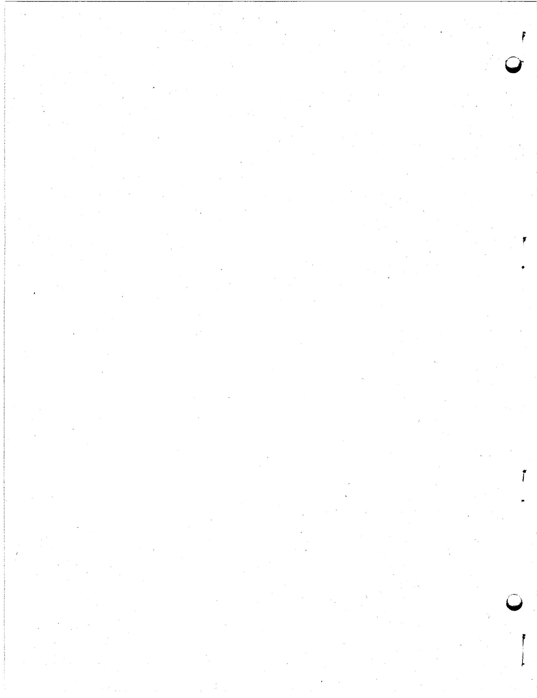

# ELEVATED TEMPERATURE MECHANICAL PROPERTIES OF

# WELDS IN A Ni-Mo-Cr-Fe ALLOY*

R. G. Gilliland and J. T. Venard

Metals and Ceramics Division

Oak Ridge National Laboratory

Oak Ridge, Tennessee

# ABSTRACT

A non-age-hardenable, high-strength alloy was developed at the Oak Ridge National Laboratory for use as the primary containment material for the Molten Salt Reactor Experiment (MSRE). The alloy was tailored to give good strength, ductility and corrosion resistance to molten fluoride salts in the 1100 to $1500^{\circ}\mathrm{F}$ temperature range. The work reported here concerns the elevated-temperature mechanical properties of welds made in this alloy, known as INOR-8, as represented by several heats of MSRE-grade material.

Tensile tests on transverse weld samples in the as-welded and annealed conditions show a good combination of strength and ductility at temperatures ranging from 70 to $1800^{\circ}\mathrm{F}$ . Tensile properties of these weld samples compare favorably with those of the base metal. Stress relieving at $1600^{\circ}\mathrm{F}$ for 2 hr results in a lowering of the tensile yield strength. Creep-rupture tests at 1100, 1300 and $1500^{\circ}\mathrm{F}$ on these same type specimens show significant improvement in strength and ductility at $1300^{\circ}\mathrm{F}$ following a hydrogen atmosphere stress relief. Both as-welded and stress-relieved creep-rupture behavior was as good as the base metal behavior. The nil-ductility temperature, as determined by

simulated heat-affected zone thermal cycle tests, was found to be $2300^{\circ}\mathrm{F}$ . Reasonable recovery of mechanical properties follows a simulated welding cycle with a $2300^{\circ}\mathrm{F}$ maximum temperature.

# INTRODUCTION

In order to fully realize the potential of nuclear reactor systems utilizing molten fluoride salts as fuel, the structural materials must possess adequate combinations of strength, ductility, and corrosion resistance at temperatures in the $1100 - 1500^{\circ}\mathrm{F}$ temperature range. The non-age-hardenable nickel-molybdenum-chromium-iron alloy, designated as INOR-8 [Ni-17 Mo-7 Cr-5 Fe (wt %)] is such an alloy and was the culmination of a comprehensive alloy development and evaluation program carried out at the Oak Ridge National Laboratory. $^{1-3}$ It is now commercially available $^{**}$ and is the primary containment material for the Molten Salt Reactor Experiment which achieved criticality on June 1, 1965, at Oak Ridge, Tennessee. A vital part of the overall welding study on INOR-8 was the determination of the elevated-temperature mechanical properties of welds. This report summarizes the findings on the mechanical behavior of welds in some of the actual heats of material used in the MSRE.

# MATERIALS, TESTING PROCEDURE AND EXPERIMENTAL RESULTS

Transverse samples machined from l-in.-thick welds, made under highly restrained conditions were used in the testing. These butt welds were fabricated in the manner illustrated in Fig. 1 and described in earlier work.3 The transverse tensile specimens used were of the

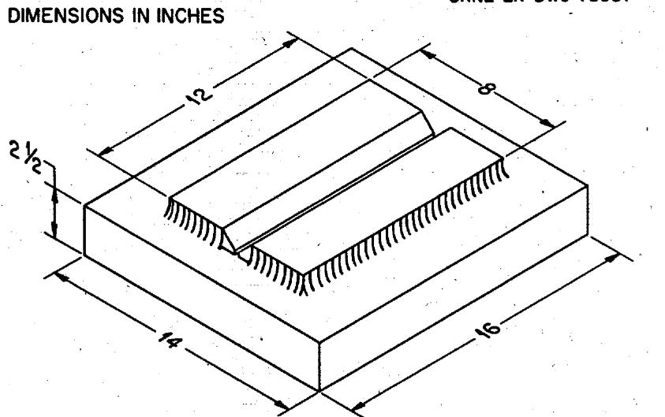  
FILLET WELDED TO STRONG BACK TO PRODUCE HIGH RESTRAINT WELD

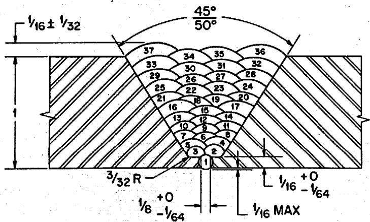  
JOINT DESIGN AND WELDING SEQUENCE   
Fig. 1 - The INOR-8 high-restraint weldability test specimen used to provide samples for the mechanical properties study.

design shown in Fig. 2. The manual gas tungsten arc-welding process was used to fabricate the joints; the filler metal used was of the same nominal composition as the base metal. The INOR-8 material used in this study was taken from the stock purchased for construction of the MSRE. The heat numbers and the tests to which each heat of INOR-8 was subjected are tabulated below.

<table><tr><td>Heat Number</td><td>Type of Test</td></tr><tr><td>5055</td><td>(Weld Metal)</td></tr><tr><td>5057</td><td>Creep-stress relieved, hydrogen</td></tr><tr><td>5060</td><td>Creep-as-welded</td></tr><tr><td>5062</td><td>Tensile-as-welded</td></tr><tr><td>5064</td><td>Tensile-stress relieved, argon</td></tr><tr><td>5067</td><td>Creep-stress relieved, hydrogen</td></tr><tr><td>5068</td><td>Creep-stress relieved, argon</td></tr><tr><td>5069</td><td>Creep-as-welded</td></tr><tr><td>5070</td><td>Tensile-stress relieved, hydrogen</td></tr><tr><td>5071</td><td>Tensile-as-welded</td></tr><tr><td>5072</td><td>Creep-stress relieved, hydrogen</td></tr><tr><td>5073</td><td>Tensile-stress relieved, hydrogen</td></tr><tr><td>5074</td><td>Tensile-as-welded; creep-stress relieved, argon</td></tr><tr><td>5075</td><td>Tensile-stress relieved, argon; Creep-as-welded</td></tr><tr><td>5081</td><td>Tensile-stress relieved, argon</td></tr><tr><td>5083</td><td>Creep-as-welded</td></tr><tr><td>5089</td><td>Creep-stress relieved, hydrogen</td></tr><tr><td>5090</td><td>(Weld Metal)</td></tr></table>

The chemical analyses of these heats are presented in Table 1. Note that the filler metal used to fabricate the weld specimens was taken from heat numbers 5055 and 5090.

Because of material fabrication schedules, it was necessary to do the welding operations on plate which had the final rolling operation performed normal to the welding direction. This schedule caused the materials' inherent stringer line to be located in the plate-thickness direction and parallel to the fusion line. A typical cross section of

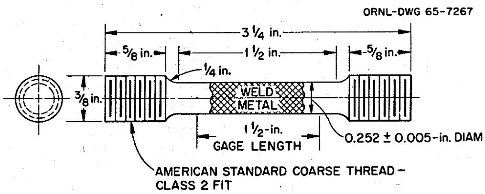  
$(a)$ Transverse Weld Tensile Specimen.

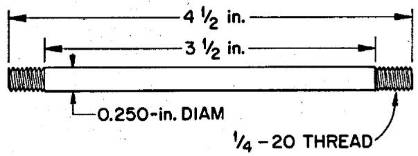  
(b) Hot Ductility Specimen.   
Fig. 2 - Transverse tensile specimen used for high-restraint INOR-8 weld evaluations.

Table 1. Chemical Analysis of the INOR-8 Heats   

<table><tr><td rowspan="2">Heat Number</td><td colspan="13">Analysis (wt %)\( ^a \)</td></tr><tr><td>Mo</td><td>Cr</td><td>Fe</td><td>C</td><td>Si</td><td>Al</td><td>T1</td><td>B</td><td>Co</td><td>V</td><td>Mn</td><td>W</td><td>P</td></tr><tr><td>5055</td><td>16.20</td><td>7.86</td><td>3.76</td><td>0.06</td><td>0.61</td><td>0.06</td><td>0.02</td><td>0.005</td><td>0.10</td><td>0.21</td><td>0.69</td><td>0.03</td><td>0.006</td></tr><tr><td>5057</td><td>16.80</td><td>7.47</td><td>3.50</td><td>0.05</td><td>0.52</td><td>0.01</td><td>0.01</td><td>0.005</td><td>0.09</td><td>0.23</td><td>0.58</td><td>0.02</td><td>0.001</td></tr><tr><td>5060</td><td>16.20</td><td>6.92</td><td>4.03</td><td>0.07</td><td>0.56</td><td>0.01</td><td>0.01</td><td>0.004</td><td>0.02</td><td>0.26</td><td>0.46</td><td>0.04</td><td>0.001</td></tr><tr><td>5062</td><td>16.17</td><td>7.45</td><td>3.78</td><td>0.04</td><td>0.58</td><td>0.01</td><td>0.01</td><td>0.005</td><td>0.08</td><td>0.24</td><td>0.63</td><td>0.08</td><td>0.001</td></tr><tr><td>5064</td><td>16.37</td><td>7.90</td><td>3.59</td><td>0.07</td><td>0.69</td><td>0.01</td><td>0.01</td><td>0.005</td><td>0.06</td><td>0.29</td><td>0.59</td><td>0.03</td><td>0.001</td></tr><tr><td>5067</td><td>17.07</td><td>7.23</td><td>4.20</td><td>0.06</td><td>0.43</td><td>0.01</td><td>0.01</td><td>0.004</td><td>0.09</td><td>0.30</td><td>0.60</td><td>0.06</td><td>0.001</td></tr><tr><td>5068</td><td>16.50</td><td>6.45</td><td>4.11</td><td>0.05</td><td>0.58</td><td>0.01</td><td>0.01</td><td>0.004</td><td>0.09</td><td>0.27</td><td>0.45</td><td>0.07</td><td>0.003</td></tr><tr><td>5069</td><td>16.22</td><td>6.42</td><td>3.93</td><td>0.07</td><td>0.56</td><td>0.01</td><td>0.01</td><td>0.006</td><td>0.12</td><td>0.23</td><td>0.52</td><td>0.06</td><td>0.003</td></tr><tr><td>5070</td><td>16.06</td><td>6.62</td><td>3.93</td><td>0.06</td><td>0.60</td><td></td><td></td><td></td><td>0.04</td><td>0.22</td><td>0.64</td><td>0.03</td><td>0.001</td></tr><tr><td>5071</td><td>16.22</td><td>7.21</td><td>4.35</td><td>0.07</td><td>0.63</td><td>0.01</td><td>0.01</td><td>0.004</td><td>0.07</td><td>0.20</td><td>0.65</td><td>0.02</td><td>0.001</td></tr><tr><td>5072</td><td>15.50</td><td>7.03</td><td>4.06</td><td>0.06</td><td>0.57</td><td>0.01</td><td>0.02</td><td>0.005</td><td>0.09</td><td>0.27</td><td>0.57</td><td>0.04</td><td>0.001</td></tr><tr><td>5073</td><td>16.21</td><td>6.77</td><td>3.90</td><td>0.05</td><td>0.60</td><td>0.01</td><td>0.01</td><td>0.006</td><td>0.07</td><td>0.34</td><td>0.50</td><td>0.03</td><td>0.004</td></tr><tr><td>5074</td><td>16.17</td><td>6.77</td><td>3.70</td><td>0.07</td><td>0.62</td><td>0.01</td><td>0.01</td><td>0.007</td><td>0.07</td><td>0.24</td><td>0.51</td><td>0.02</td><td>0.001</td></tr></table>

Heat Number   

<table><tr><td colspan="13">Analysis (wt %)\(^a\)</td><td></td></tr><tr><td>Mo</td><td>Cr</td><td>Fe</td><td>C</td><td>Si</td><td>Al</td><td>Ti</td><td>B</td><td>Co</td><td>V</td><td>Mn</td><td>W</td><td>P</td><td>S</td></tr><tr><td>6.42</td><td>6.76</td><td>4.08</td><td>0.06</td><td>0.57</td><td>0.03</td><td>0.01</td><td>0.001</td><td>0.06</td><td>0.28</td><td>0.49</td><td>0.04</td><td>0.003</td><td>0.005</td></tr><tr><td>6.90</td><td>7.74</td><td>3.56</td><td>0.06</td><td>0.60</td><td>0.01</td><td>0.01</td><td>0.005</td><td>0.07</td><td>0.27</td><td>0.57</td><td>0.04</td><td>0.003</td><td>0.006</td></tr><tr><td>7.03</td><td>7.51</td><td>3.80</td><td>0.05</td><td>0.52</td><td>0.01</td><td>0.01</td><td>0.005</td><td>0.10</td><td>0.28</td><td>0.60</td><td>0.05</td><td>0.001</td><td>0.006</td></tr><tr><td>6.69</td><td>6.78</td><td>3.81</td><td>0.07</td><td>0.36</td><td>0.01</td><td>0.01</td><td>0.004</td><td>0.14</td><td>0.38</td><td>0.34</td><td>0.05</td><td>0.011</td><td>0.012</td></tr><tr><td>6.22</td><td>7.59</td><td>4.03</td><td>0.05</td><td>0.56</td><td>0.01</td><td>0.01</td><td>0.005</td><td>0.12</td><td>0.39</td><td>0.58</td><td>0.04</td><td>0.001</td><td>0.008</td></tr></table>

Balance nickel.

the weld fusion line area is shown in Fig. 3. This view illustrates the orientation of the stringer formation with respect to the fusion line and its perpendicular orientation with respect to the welding direction and specimen axis.

The transverse weld specimens contained weld metal, heat-affected zones, and base metal and were tested at elevated temperatures in standard tensile tests (0.03 min $^{-1}$ ) and in creep tests. Elevated-temperature tensile tests were performed between 600 and $1800^{\circ}\mathrm{F}$ at $200^{\circ}\mathrm{F}$ intervals, and creep testing was done at 1100, 1300 and $1500^{\circ}\mathrm{F}$ . The specimens were tested in both the as-welded and stress-relieved conditions, with stress relieving being performed in both argon and hydrogen atmospheres (2 hr at $1600^{\circ}\mathrm{F}$ ). Samples were also machined from the as-received base metal for the determination of elevated-temperature hot ductility after being subjected to simulated heat-affected zone thermal cycles.

The room- and elevated-temperature tensile tests were run in air using a standard 12,000-lb capacity hydraulic testing machine at a crosshead speed of 0.05 in./min or a strain rate of $3.33\%/\min$ . Stress-strain relationships were obtained using load cell-deflectometer outputs. Elevated-temperature tests were performed using a clamshell-type furnace, in which specimens were allowed a 1/2-hr equilibration period to reach the test temperature. The results of these tests for the as-welded and stress-relieved conditions are presented in Tables 2 and 3 for test temperatures between room temperature and $1800^{\circ}\mathrm{F}$ .

The creep tests were run in air using standard lever arm testing machines, and strain data were obtained through dial-gage extensometers

PHOTO 80871

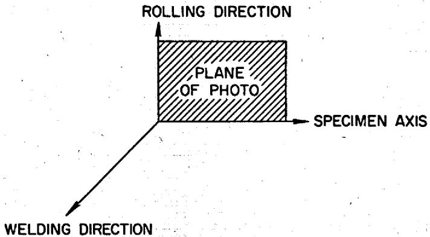

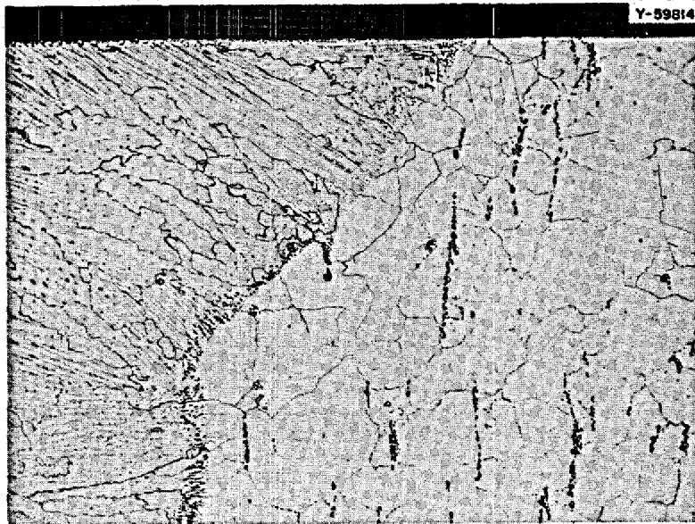  
Fig. 3 - Typical fusion-line area of the l-in. thick restrained weld used to provide specimens for the mechanical property study. Etchant: $\mathsf{CrO}_3$ , HCl, $\mathsf{H}_2\mathsf{O}$ . 100x.

Table 2. Short-Time Tension Tests of Reactor Grade INOR-8 in As-Welded Condition   

<table><tr><td>Test Temperature (°F)</td><td colspan="3">Yield Strength 0.2% Offset (psi)</td><td colspan="3">Tensile Strength (psi)</td><td colspan="3">Elongation in 1 l/2 in. (%)</td></tr><tr><td></td><td>Heat 5062</td><td>Heat 5071</td><td>Heat 5074</td><td>Heat 5062</td><td>Heat 5071</td><td>Heat 5074</td><td>Heat 5062</td><td>Heat 5071</td><td>Heat 5074</td></tr><tr><td>Room</td><td>63,100</td><td>67,200</td><td>66,000</td><td>105,700</td><td>108,800</td><td>91,500</td><td>31.5a</td><td>27.5a</td><td>10.0</td></tr><tr><td>600</td><td>54,000</td><td>58,400</td><td>52,100</td><td>93,900</td><td>95,500</td><td>84,300</td><td>26.5a</td><td>27.5a</td><td>19.0</td></tr><tr><td>800</td><td>54,300</td><td>51,900</td><td>52,600</td><td>92,100</td><td>91,400</td><td>82,300</td><td>29.0a</td><td>29.5</td><td>13.5</td></tr><tr><td>1000</td><td>46,400</td><td>50,700</td><td>47,100</td><td>84,100</td><td>83,800</td><td>79,800</td><td>24.0a</td><td>26.5a</td><td>16.5</td></tr><tr><td>1200</td><td>43,300</td><td>49,500</td><td>47,600</td><td>73,300</td><td>73,400</td><td>66,800</td><td>17.5a</td><td>17.5a</td><td>7.5</td></tr><tr><td>1400</td><td>42,400</td><td>46,600</td><td>42,100</td><td>61,400</td><td>58,600</td><td>59,600</td><td>11.0a</td><td>8.5a</td><td>8.5a</td></tr><tr><td>1600</td><td>36,400</td><td>37,700</td><td>36,400</td><td>38,700</td><td>38,400</td><td>38,200</td><td>10.0a</td><td>9.5a</td><td>8.5a</td></tr><tr><td>1800</td><td>21,100</td><td>21,900</td><td>20,800</td><td>21,800</td><td>22,400</td><td>21,200</td><td>17.5a</td><td>22.0a</td><td>13.5</td></tr></table>

${}^{a}$ Failed in weld metal.

Table 3. Short-Time Tension Tests of Reactor Grade INOR-8 in Stress-Relieved Condition   

<table><tr><td>Test Temperature (°F)</td><td colspan="3">Yield Strength 0.2% Offset (psi)</td><td colspan="3">Tensile Strength (psi)</td><td colspan="3">Elongation in l l/2 in. (%)</td></tr><tr><td></td><td>Heat5070a</td><td>Heat5073a</td><td>b</td><td>Heat5070a</td><td>Heat5073a</td><td>b</td><td>Heat5070a</td><td>Heat5073a</td><td>b</td></tr><tr><td>Room</td><td>46,000</td><td></td><td>56,500</td><td>97,300</td><td></td><td>102,500</td><td>21.0</td><td></td><td>26.5c</td></tr><tr><td>600</td><td>45,400</td><td>43,400</td><td>43,400</td><td>90,600</td><td>90,400</td><td>91,800</td><td>25.5</td><td>25.0c</td><td>29.0c</td></tr><tr><td>800</td><td>48,400</td><td>39,900</td><td>43,500</td><td>85,500</td><td>87,200</td><td>89,000</td><td>26.0</td><td>27.5</td><td>28.5c</td></tr><tr><td>1000</td><td>39,500</td><td>40,400</td><td>40,000</td><td>85,500</td><td>85,300</td><td>84,000</td><td>32.0</td><td>33.0c</td><td>30.5c</td></tr><tr><td>1200</td><td>39,500</td><td>39,300</td><td>40,000</td><td>75,800</td><td>70,400</td><td>74,500</td><td>28.5c</td><td>20.5</td><td>28.0</td></tr><tr><td>1400</td><td>36,800</td><td>37,000</td><td>40,000</td><td>62,100</td><td>57,800</td><td>61,000</td><td>14.0c</td><td>14.0c</td><td>14.5</td></tr><tr><td>1600</td><td>34,500</td><td>35,000</td><td>35,500</td><td>39,600</td><td>40,300</td><td>39,500</td><td>17.5c</td><td>10.0c</td><td>11.0</td></tr><tr><td>1800</td><td>21,500</td><td>21,800</td><td>21,200</td><td>21,900</td><td>22,100</td><td>21,700</td><td>9.0</td><td>19.5</td><td>28.5c</td></tr></table>

aStress relieved 2 hr at $1600^{\circ}\mathbf{F},$ hydrogen.   
bAveraged values of Heats 5064, 5075, and 5081 stress relieved 2 hr at $1600^{\circ}\mathbf{F},$ argon.   
cFailed in weld metal.

attached to the specimen grips. A detailed tabulation of the average values of the creep-rupture test results are given in Table 4.

All heat treatments prior to testing were carried out in either an argon or hydrogen atmosphere. The specimens were cooled from the annealing temperature by pulling them from the hot zone into the water-cooled end of the furnace muffle. Thermocouples, which were attached to the specimens during the heat treatment, recorded an average cooling rate down to $500^{\circ}\mathrm{F}$ of approximately $250^{\circ}\mathrm{F} / \mathrm{min}$ . The thermal treatment used, 2 hr at $1600^{\circ}\mathrm{F}$ , is the standard stress relieving treatment specified for INOR-8 material.

A convenient method for measuring overall weldability is a hot ductility test, which has been developed by Nipples and Savage of Rensselaer Polytechnic Institute. This test synthetically reproduces, in a laboratory specimen, the time-temperature cycle experienced by any selected point in the heat-affected zone of an arc weld. Samples were taken from all the heats tabulated previously (p. 4) and subjected to this hot ductility test. The results of these tests will be treated in the following section.

Table 4. Average Results of Elevated-Temperature Creep Tests on INOR-8 Transverse Weld Specimens   

<table><tr><td rowspan="3">Test Temperature (°F)</td><td rowspan="3">Applied Stress (psi)</td><td colspan="3">Time to Rupture (hr)</td><td colspan="3">Elongation (%)</td><td colspan="3">Minimum Creep Rate (hr-1)</td></tr><tr><td rowspan="2">As Weldeda</td><td colspan="2">Stress Relievedb</td><td rowspan="2">As Weldeda</td><td colspan="2">Stress Relievedb</td><td rowspan="2">As Weldeda</td><td colspan="2">Stress Relievedb</td></tr><tr><td>H2</td><td>Ar</td><td>H2</td><td>Ar</td><td>H2</td><td>Ar</td></tr><tr><td>1100</td><td>74,000</td><td>1.3</td><td>1.7</td><td></td><td>14.1</td><td>13.0</td><td></td><td>2.6 × 10-3</td><td>1.3 × 10-2</td><td></td></tr><tr><td>1100</td><td>54,000</td><td>197.8</td><td>188.3</td><td></td><td>2.5</td><td>8.2</td><td></td><td>2.3 × 10-5</td><td>1.0 × 10-5</td><td></td></tr><tr><td>1100</td><td>49,000</td><td>308.4</td><td>570.5</td><td></td><td>2.2</td><td>5.3</td><td></td><td>1.4 × 10-5</td><td>3.2 × 10-5</td><td></td></tr><tr><td>1300</td><td>45,000</td><td>3.7</td><td>6.4</td><td>5.5</td><td>3.9</td><td>8.2</td><td>5.4</td><td>4.9 × 10-3</td><td>7.4 × 10-3</td><td>7.0 × 10-3</td></tr><tr><td>1300</td><td>24,000</td><td>158.4</td><td>337.8</td><td>185.4</td><td>3.7</td><td>8.8</td><td>7.4</td><td>1.2 × 10-4</td><td>1.6 × 10-4</td><td>2.2 × 10-4</td></tr><tr><td>1300</td><td>20,000</td><td>472.3</td><td>936.7</td><td>452.2</td><td>4.6</td><td>10.8</td><td>3.7</td><td>3.5 × 10-5</td><td>6.6 × 10-5</td><td>4.4 × 10-5</td></tr><tr><td>1500</td><td>22,000</td><td>12.7</td><td>12.1</td><td></td><td>16.9</td><td>20.9</td><td></td><td>5.8 × 10-3</td><td>7.0 × 10-3</td><td></td></tr><tr><td>1500</td><td>13,000</td><td>172.1</td><td>117.5</td><td></td><td>14.4</td><td>9.8</td><td></td><td>4.8 × 10-4</td><td>4.4 × 10-4</td><td></td></tr><tr><td>1500</td><td>10,000</td><td>446.9</td><td>314.5</td><td></td><td>8.3</td><td>8.1</td><td></td><td>9.8 × 10-5</td><td>2.0 × 10-4</td><td></td></tr></table>

Data from tests on heats tabulated on p. 4 of this report.   
bStress relieved at $1600^{\circ}\mathbf{F},$ 2 hr in atmosphere specified.

# DISCUSSION AND EVALUATION OF RESULTS

# Tensile Tests

The average tensile properties of specimens in the as-welded condition (heats 5062, 5071 and 5074), hydrogen stress-relieved condition (heats 5070 and 5073), and argon stress-relieved condition (heats 5064, 5075 and 5081) are presented in Figs. 4, 5 and 6. These figures show ultimate tensile strength, $0.2\%$ offset yield strength and elongation vs temperature. The scatter bands for wrought metal shown in the figures were taken from earlier work.[5]

A qualification on the comparisons between transverse weld sample properties and wrought metal properties should be made at this point. Figure 7 illustrates specimen and stringer orientations which were encountered in these two classes of specimens. Note that, as previously mentioned, the material fabrication schedules resulted in the stringers of the transverse weld samples being oriented normal to the stress direction. This stress direction is the y-direction in Fig. 7. The wrought material investigation5 done previously did not include specimens cut parallel to the y-direction. The fact that these plates were not thick enough to yield reasonably large specimens in the y-direction plus the assumption of symmetry of properties about the z-axis led to the omission.

Only slight variations in ultimate strengths were observed between the as-welded and stress-relieved tests; although, at the lower testing temperatures these strengths were less than those for the wrought metal. In the case of the yield strengths noticeable differences existed between the as-welded samples and stress-relieved samples. As-welded specimen yield strengths were consistently higher than those of

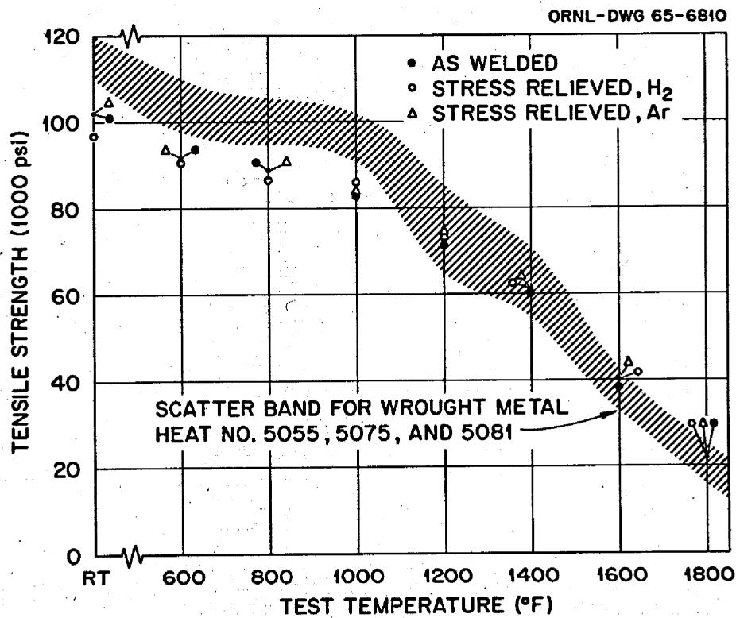  
Fig. 4 - Ultimate tensile strength of MSRE INOR-8 transverse weld specimens.

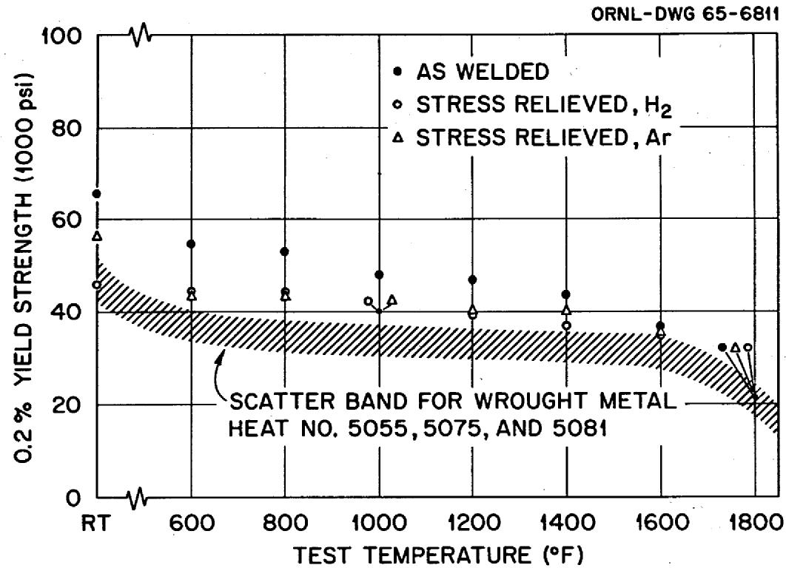  
Fig. 5 - Yield strength (0.2%) of MSRE INOR-8 transverse weld specimens.

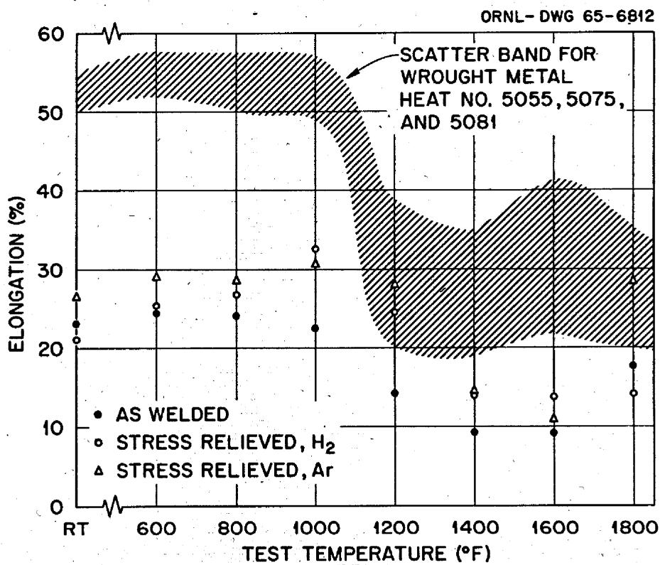  
Fig. 6 - Ductility of MSRE INOR-8 transverse weld specimens.

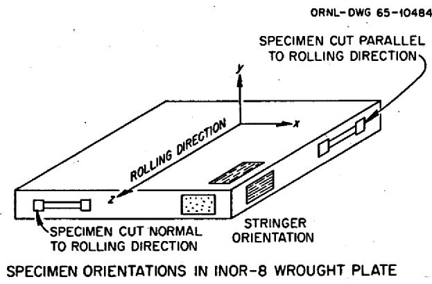

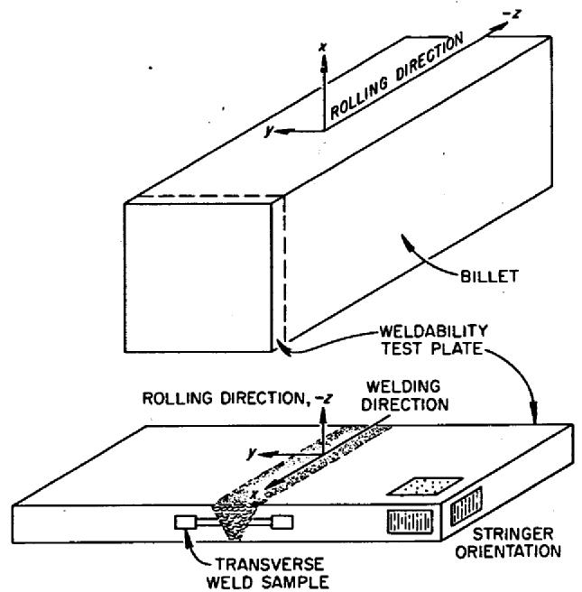  
Fig. 7 - Sketch showing orientations of stringers and specimens for wrought metal and transverse weld samples.

specimens tested after stress relieving; no difference in annealing atmosphere was observed except at room temperature. Yield strengths for transverse specimens in all conditions were generally higher than the wrought metal yield strengths.

The total elongation data, presented in Tables 2 and 3 and depicted graphically in Fig. 6, show that the overall ductility of welds is less than that observed in the wrought metal. However, this difference is probably due to the specimen orientation, as previously explained. Stress relieving produces a general improvement of this property at all test temperatures, with argon providing a slightly better atmosphere than hydrogen.

The macrographs of Figs. 8, 9, and 10 illustrate the variations in fracture location with each heat and with test temperature. The as-welded tests in heat 5074 of Fig. 8 exhibit failures in the base metal, except at 1400 and $1600^{\circ}\mathrm{C}$ , with low ductilities (Table 2) as compared with the weld metal failures in heat 5062 of Fig. 9. The variation of fracture locations with temperature for the stress-relieved heat 5070 (Fig. 10) is typical of specimens tested in this condition.

On the basis of the data presented above on the ultimate and yield strengths the assumption of symmetry in strength properties seems justified. The ductility data, however, and in particular the ductility of those specimens which fractured predominantly in the base metal, suggest that the strain-at-fracture properties of INOR-8 are not symmetrical about the z axis.

Metallographic examination was performed on one heat tested in the as-welded condition (5074) and one heat in the stress-relieved condition (5073). The micrographs shown in Fig. 11A and 11B for the $1800^{\circ}\mathrm{F}$ tests

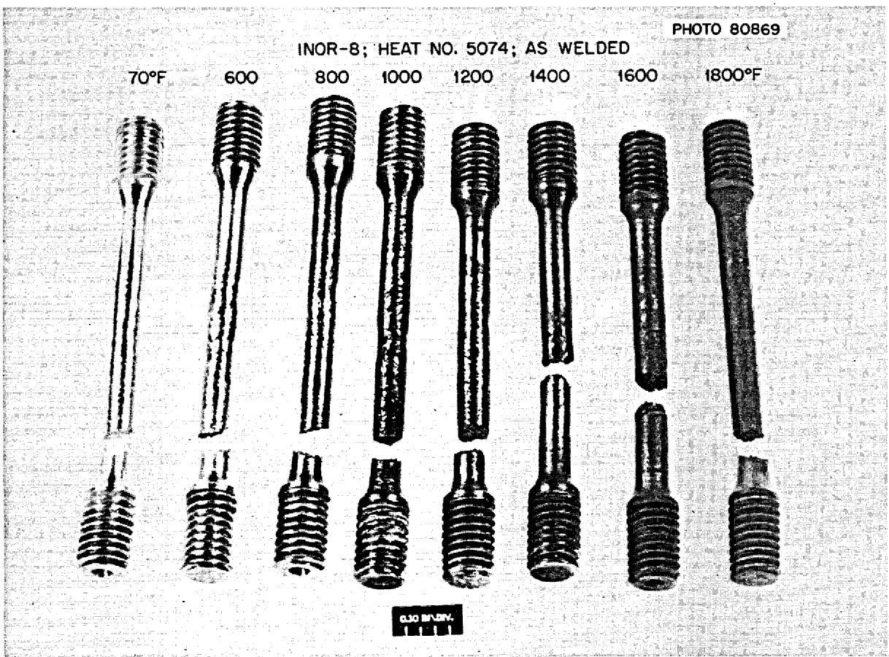  
Fig. 8 - Tensile tests in INOR-8 heat 5074 (as welded) showing location of fracture.

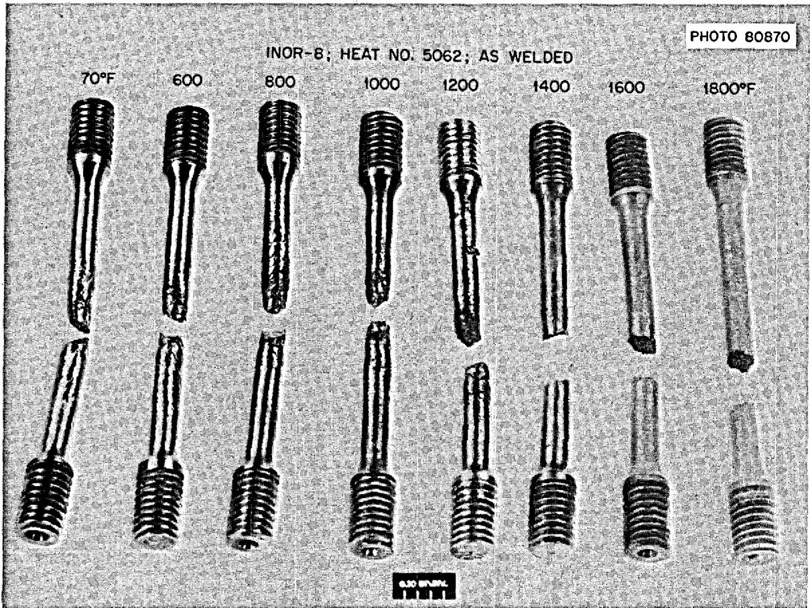  
Fig. 9 - Tensile tests in INOR-8 heat 5062 (as welded) showing location of fracture.

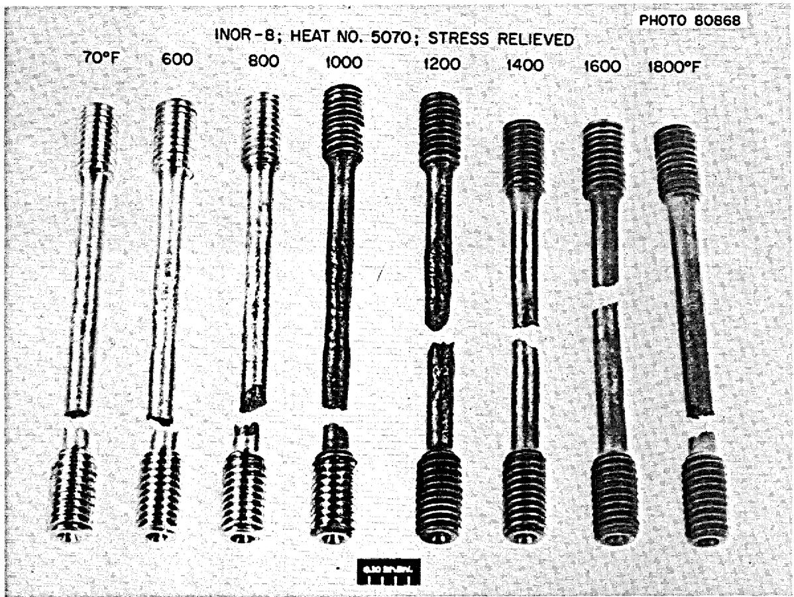  
Fig. 10 - Tensile tests in INOR-8 heat 5070 (stress relieved 2 hr at $1600^{\circ}\mathrm{F}$ in hydrogen) showing location of fracture.

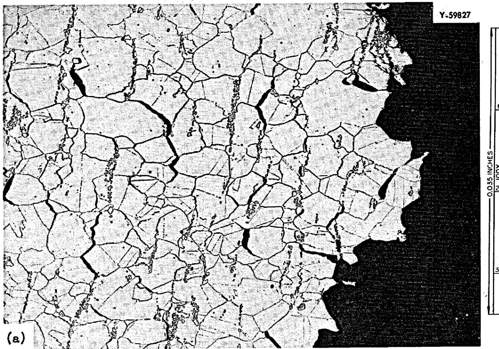

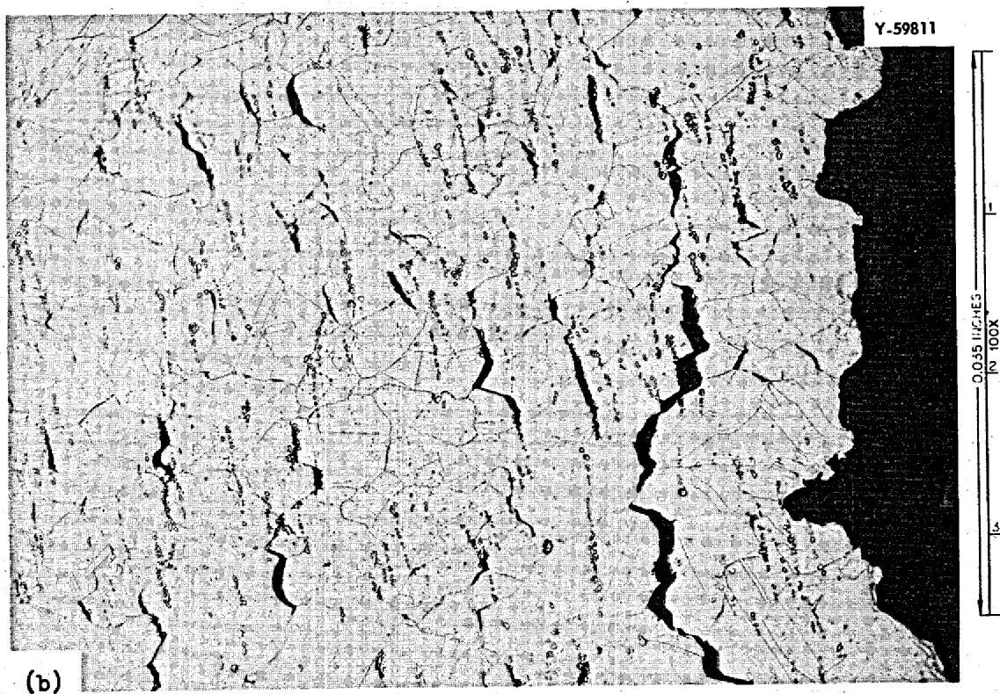  
Fig. 11 - Short-time tensile test failures of INOR-8 material tested at $1800^{\circ}\mathrm{F}$ in air. A. Heat 5074, as welded; B. Heat 5073, stress relieved 2 hr at $1600^{\circ}\mathrm{F}$ in hydrogen. Etchant: $\mathrm{CrO}_3$ , HCl, $\mathrm{H}_2\mathrm{O}$ . 100x.

are representative of the base metal failures of all the tensile tests. All failures, whether in the base metal or weld metal, were generally intergranular. As noted by McCoy, $^6$ most of the small base metal cracks appear to have been initiated by cracks in the precipitates. Here, as in McCoy's work, the intergranular cracks are predominantly normal to the applied stress with their lengths comparable to the grain diameter. As can be seen in Fig. ll, the cracks are parallel to and exist primarily in the stringer line.

# Creep-Rupture Tests

Creep-rupture data for specimens in the as-welded and argon or hydrogen stress-relieved conditions are presented graphically in Figs. 12-15. Average values of rupture time vs applied stress at 1100, 1300 and $1500^{\circ}\mathrm{F}$ are presented in Fig. 12. These studies indicate that as-welded specimens possess stress-rupture strengths equivalent to those of the base metal at all test temperatures. Stress relieving, using a hydrogen atmosphere, created a significant improvement in the creep properties of samples tested at $1300^{\circ}\mathrm{F}$ . A factor of two improvement was noted in both the time-to-rupture and the total strain properties when this treatment was employed (see Table 4). The creep-rupture tests on stress-relieved samples at 1100 and $1500^{\circ}\mathrm{F}$ showed little or no improvement over as-welded properties. The curves of Fig. 13 illustrate the stress-temperature relationships necessary to cause rupture in 10, 100 and 500 hr for these composite specimens. The improvement over the as-welded strength at $1300^{\circ}\mathrm{F}$ by stress relieving in hydrogen at $1600^{\circ}\mathrm{F}$ for 2 hr is vividly shown in this figure.

The minimum creep rate for tests on as-welded and stress-relieved specimens, shown in Figs. 14 and 15, respectively, was generally observed

ORNL-DWG 65-6816

SCATTER BANDS-WROUGHT METAL RESULTS: HEATS 5055, 5075, 5081

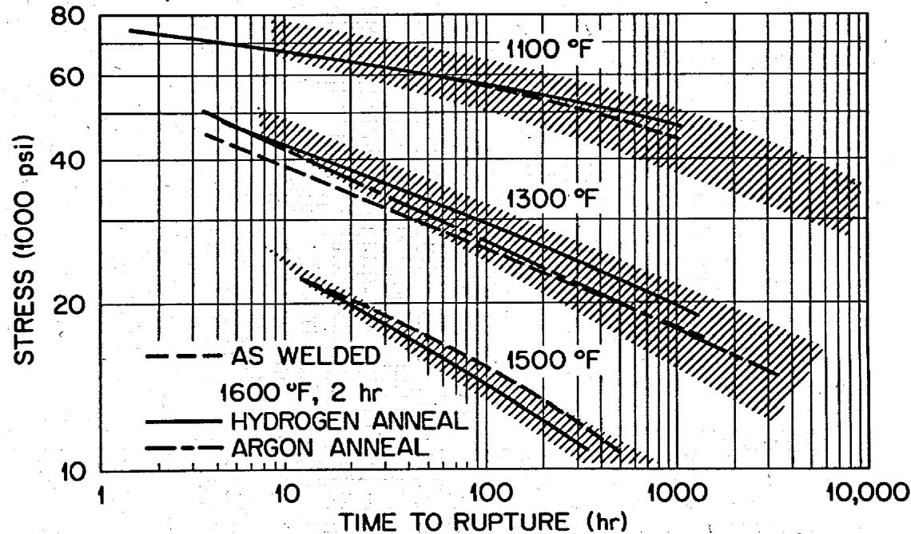  
Fig. 12. Average creep-rupture data for transverse weld specimens of MSRE INOR-8 in the as-welded and argon and hydrogen stress-relieved condition.

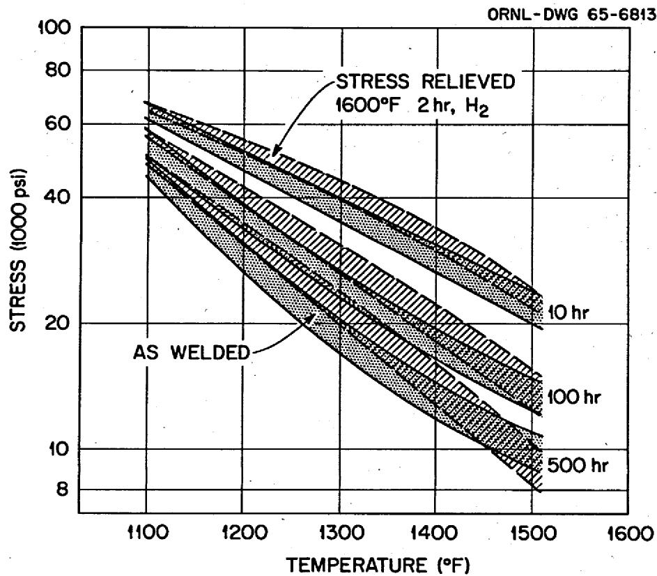  
Fig. 13 - Creep-rupture data for transverse weld specimens of MSRE INOR-8 in the as-welded and hydrogen stress-relieved conditions.

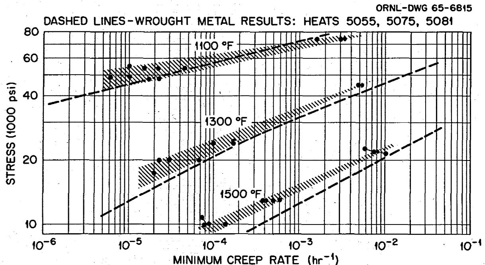  
Fig. 14 - Minimum creep-rate data for as-welded transverse weld specimens in MSRE INOR-8 heats 5060, 5069, 5075 and 5083.

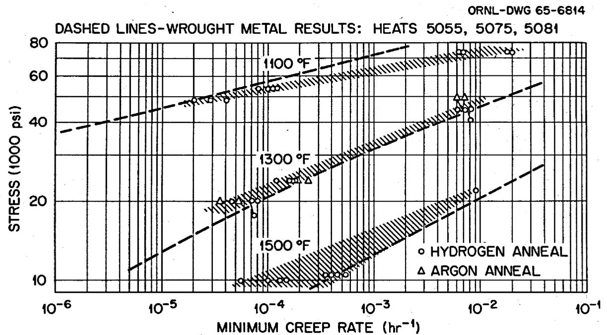  
Fig. 15 - Minimum creep-rate data for stress-relieved transverse weld specimens in MSRE INOR-8. Heats 5057, 5067, 5072 and 5083, annealed in hydrogen, and heats 5068 and 5074, annealed in argon, were held for 2 hr at $1600^{\circ}\mathbf{F}$ .

to be slightly lower than that found for wrought metal at all test temperatures and stresses. One exception to this general observation was noted for stress-relieved specimens tested at $1100^{\circ}\mathrm{F}$ .

Metallographic examination of several creep-rupture specimens revealed that stress relieving had the general effect of shifting the rupture location from the base metal to the weld metal. The fracture of the as-welded specimen in Fig. 16 shows a typical intergranular failure in base metal, with associated grain-boundary cracking normal to the applied stress. The appearance of the base metal cracks is very similar to those discussed above for the short-time tensile tests. The weld metal failure of Fig. 16 is typical of creep test fractures observed in stress-relieved specimens. Some fractures of specimens in this condition were observed to occur along the weld fusion line.

# Hot Ductility Tests

Hot ductility experiments using synthetic heat-affected zone specimens revealed the elevated-temperature nil-ductility point for this material to be $2300^{\circ}\mathrm{F}$ as shown in Fig. 17. The area of the heat-affected zone which would experience this maximum peak temperature corresponds to a plane calculated to be 0.032 in. from the weld fusion line. The curves of this figure indicate that reasonable recovery of the mechanical properties after heating to the nil-ductility temperature was exhibited, although some damage occurred as a result of the welding thermal cycle. Since no attempt was made to identify each sample with a heat number, the observed behavior is considered to be typical of MSRE reactor grade INOR-8.

As shown in Fig. 18, no gross grain boundary liquidation has occurred; however, numerous individual precipitate particles are present which retard

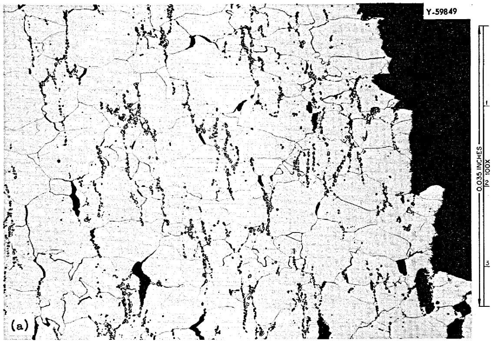

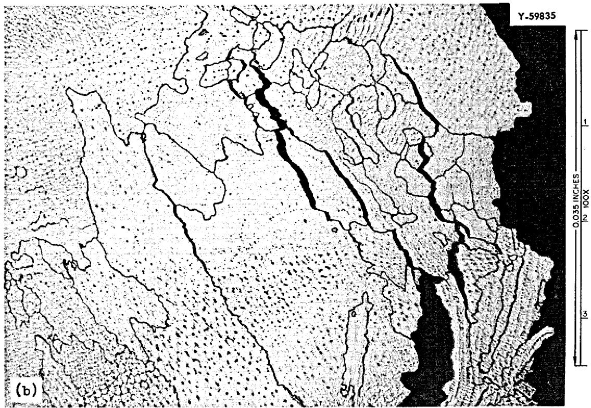  
Fig. 16 - Creep-rupture failures of MSRE INOR-8 transverse weld specimens. A. Base metal failure in heat 5075, tested at $1100^{\circ}\mathrm{F}$ ; applied stress 54,000 psi, rupture time 53.0 hr, total strain $1.4\%$ . B. Weld metal failure in heat 5072, tested at $1300^{\circ}\mathrm{F}$ ; applied stress 45,000 psi, rupture time 7.2 hr, total strain $7.5\%$ . Etchant: $\mathrm{CrO}_3$ , HCl, $\mathrm{H}_2\mathrm{O}$ . 100x.

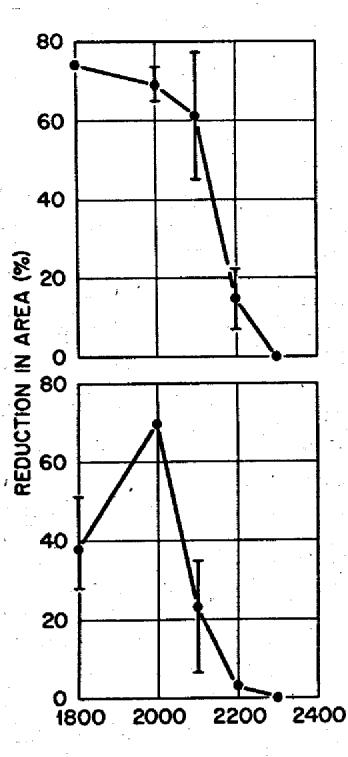

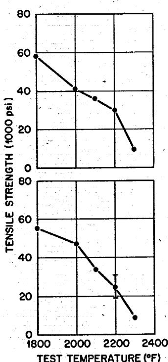

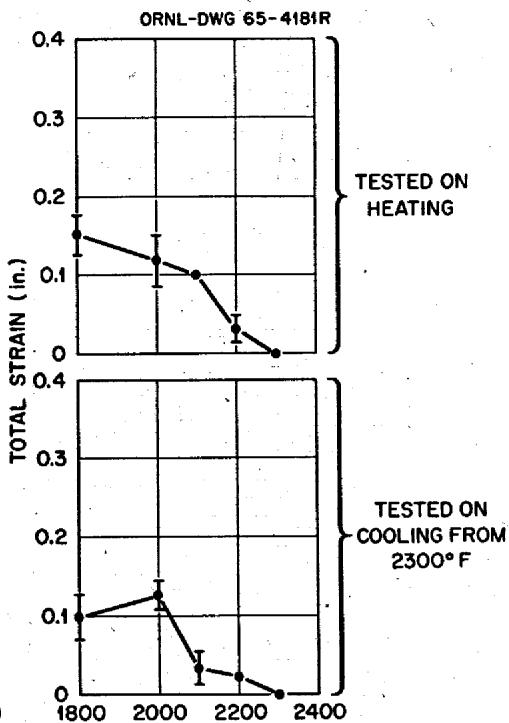  
Fig. 17 - Results of hot-ductility tests on MSRE reactor-grade INOR-8. The nil-ductility temperature for the material was found to be $2300^{\circ}\mathrm{F}$ .

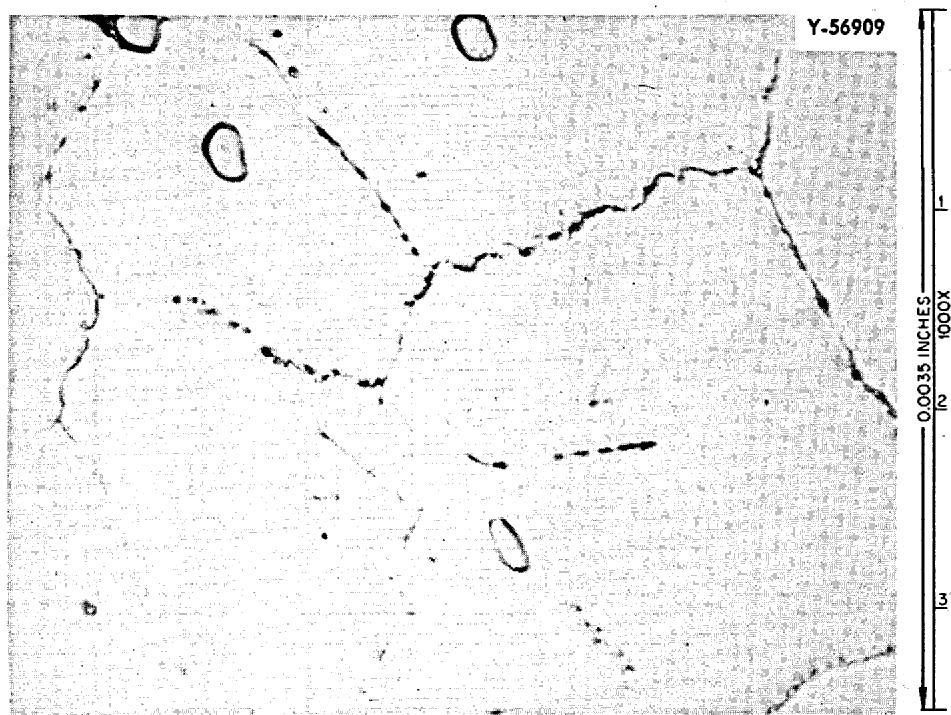  
Fig. 18 - Micrograph of the structure of MSRE INOR-8 which has experienced a welding thermal cycle with a peak temperature of $2300^{\circ}\mathrm{F}$ (NDT). Etchant: $\mathrm{H}_{3}\mathrm{PO}_{4}$ , $\mathrm{H}_{2}\mathrm{O}$ . 1000x.

the motion of the grain boundaries and cause them to be quite irregular. These boundaries etch rapidly and appear quite broad, indicating that, possibly, an impurity layer is present. Earlier studies have shown that by very rapid cooling from very high temperatures $(2500^{\circ}\mathrm{F})$ , the precipitate or stringer particles appear to be converted to an intergranular lamellar product. Gross formation of this product throughout the heat-affected zone of INOR-8 welds could cause permanent damage, resulting in almost certain failure under high restraint. The hot ductility tests conducted here do not indicate that this condition is a serious problem for the material investigated.

# CONCLUSIONS

It appears from this study that the room- and elevated-temperature mechanical properties of welds in INOR-8 compare favorably with the base metal properties. Tensile testing of these transverse specimens showed that this material possessed a good combination of strength and ductility. Stress relieving produced the general effect of lowering the $0.2\%$ offset yield strength. The creep studies of as-welded samples indicated that they possessed stress-rupture properties equivalent to those of base metal at all test temperatures. Stress relieving, using a hydrogen atmosphere, caused a significant improvement in the creep properties of samples tested at $1300^{\circ}\mathrm{F}$ . Heat-affected zone hot ductility experiments established the nil-ductility temperature for this material to be $2300^{\circ}\mathrm{F}$ , with reasonable mechanical property recovery after experiencing this temperature.

# ACKNOWLEDGMENTS

The authors gratefully acknowledge these people in connection with the preparation of specimens and the performance of tests: C. W. Dollins, L. C. Williams, H. R. Tinch, E. B. Patton, C. W. Walker, and V. G. Lane. The efforts of the Metals and Ceramics Division Reports Office and the ORNL Graphic Arts Department in document preparation is also appreciated.

# REFERENCES

1. Manly, W. D. et al., "Metallurgical Problems in Molten Fluoride Systems," Progr. Nuclear Energy, Tech. and Engr. Series IV, Vol 2, Pergamon Press (1960).   
2. Roche, T. K., The Influence of Composition Upon the $1500^{\circ}$ F Creep-Rupture Strength and Microstructure of Molybdenum-Chromium-Iron-Nickel-Base Alloys, ORNL-2524 (June 24, 1958).   
3. Gilliland, R. G. and Slaughter, G. M., "Influence of Minor Alloying Additions in INOR-8 Welds," to be published in the WELDING JOURNAL.   
4. Nipples, E. F. et al., "An Investigation of the Hot Ductility of High Temperature Alloys," WELDING JOURNAL, 34 (4), 183 to 185 (1955).   
5. Venard, J. T., Tensile and Creep Properties of INOR-8 for the Molten-Salt Reactor Experiment, ORNL-TM-1017 (February 1965).   
6. McCoy, H. E., Influence of Several Metallurgical Variables on the Tensile Properties of Hastelloy N, ORNL-3661 (August 1964).

# INTERNAL DISTRIBUTION

1-2. Central Research Library 47. W. R. Grimes

3. ORNL - Y-12 Technical Library 48. A. G. Grindell

Document Reference Section 49. D. G. Harman

4-6. Laboratory Records

7. Laboratory Records, ORNL R.C. 51-53. M. R. Hill   
8. ORNL Patent Office 54. E. C. Hise   
9. G. M. Adamson, Jr. 55. H. W. Hoffman

10. L. G. Alexander   
11. S. E. Beal1   
12. C. E. Bettis   
13. E. S. Bettis   
14. D. S. Billington   
15. F. F. Blankenship   
16. A. L. Boch   
17. S. E. Bolt   
18. C. J. Borkowski   
19. G. E. Boyd   
20. E. J. Breeding   
21. R. B. Briggs   
22. F. R. Bruce   
23. O. W. Burke   
24. D. O. Campbell   
25. S. Cantor   
26. W. G. Cobb   
27. J. A. Conlin   
28. W.H.Cook   
29. L. T. Corbin   
30. G. A. Cristy   
31. J. L. Crowley   
32. F. L. Culler   
33. J. E. Cunningham   
34. W. W. Davis   
35. J.H.DeVan   
36. C. W. Dollins   
37. R. G. Donnelly   
38. D. A. Douglas, Jr.   
39. E.P.Epler   
40. W. K. Ergen   
41. A. P. Fraas   
42. E. A. Franco-Ferreira   
43. J.H Frye, Jr.   
44. C. H. Gebbard   
45. W.R.Gall   
46. R. B. Gallaher

56. P. P. Holz   
57. L. N. Howell   
58. P.R.Kasten   
59. R.J.Kedl   
60. C. R. Kennedy   
61. B. W. Kinyon   
62. R. W. Knight   
63. V. G. Lane   
64. M. I. Lundin   
65. H. G. MacPherson   
66. E. R. Mann   
67. W.R.Martin   
68. H. E. McCoy   
69. W. B. McDonald   
70. C. K. McGlothian

71-73. E. C. Miller

74. R. L. Moore   
75. J. C. Moyers   
76. C. W. Nestor   
77. T. E. Northup   
78. L. F. Parsly   
79. P. Patriarca   
80. E. B. Patton   
81. H. R. Payne   
82. W.B.Pike   
83. M. Richardson   
84. R. C. Robertson   
85. T. K. Roche   
86. H. W. Savage   
87. J. H. Shaffer   
88. G. M. Slaughter   
89. A. N. Smith   
90. P. G. Smith   
91. I. Spiewak   
92. R. L. Stephenson   
93. R.W. Swindeman   
94. A. Taboada

95. J. R. Tallackson   
96. A. E. Thoma   
97. H. R. Tinch   
98. D. B. Trauger

99-104. J. T. Venard

105. W. C. Ulrich   
106. J. R. Weir   
107. C. W. Walker   
108. D. C. Watkin   
109. A. M. Weinberg   
110. J. H. Westsik   
111. L. C. Williams   
112. L. V. Wilson   
113. C. H. Wödtke   
114. J. W. Woods   
115. Gale Young

# EXTERNAL DISTRIBUTION

116. C. M. Adams, Jr., Massachusetts Institute of Technology   
117-118. A. E. Carden, University of Alabama   
119-120. David F. Cope, AEC, ORO   
121-125. R. G. Gilliland, Department of Metallurgical Engineering, Massachusetts Institute of Technology   
126-128. J. Simmons, AEC, Washington   
129. Research and Development, AEC, ORO   
130-144. Division of Technical Information Extension