# Definition of Weapons-Usable Uranium-233

C.W.Forsberg

C. M. Hopper

Oak Ridge National Laboratory*  
Oak Ridge, Tennessee 37831-6180

J. L. Richter

Los Alamos National Laboratory Los Alamos, New Mexico 87545

H. C. Vantine

Lawrence Livermore National Laboratory Livermore, California 94550

March 1998

# CONTENTS

LIST OF FIGURES V

LIST OF TABLES V

ACRONYMS AND ABBREVIATIONS vii

EXECUTIVE SUMMARY ix

1. INTRODUCTION 1

1.1 OBJECTIVES 1   
1.2 HISTORY 1

1.2.1 Production Methods Used to Produce $^{233}\mathrm{U}$ 2   
1.2.2 Development History 3

1.3 THE NEED FOR DEFINING NONWEAPONS $^{233}\mathrm{U}$ 3

1.3.1 Disposition of Excess Weapons-Usable Fissile Materials 3   
1.3.2 Medical Applications 4   
1.3.3 Nuclear Power Applications 4   
1.3.4 Waste Management 5

1.4 ASSUMPTIONS USED IN DEFINING NONWEAPONS $^{233}\mathrm{U}$ 5   
1.5 REPORT ORGANIZATION 5

2. STRUCTURE OF THE DEFINITION OF NON-WEAPONS USABLE $^{233}\mathrm{U}$ 7   
3. DEFINITION OF NONWEAPONS-USABLE $^{233}\mathrm{U}$ 11

3.1 DEFINITION 11   
3.2 BASIS FOR DEFINITION 11

3.2.1 History 11   
3.2.2 Nuclear Equivalence 12

3.2.2.1 Critical Mass Equivalent of a $^{233}\mathrm{U} - ^{238}\mathrm{U}$ Mixture and $^{235}\mathrm{U} - ^{238}\mathrm{U}$ Mixture 12   
3.2.2.2 Subcritical Mass Equivalence of a $^{233}\mathrm{U} - ^{238}\mathrm{U}$ Mixture with 20 wt % $^{235}\mathrm{U}$ Mixtures 13

3.2.3 Radiological Characteristics of ${}^{233}\mathbf{U}$ 15

3.2.3.1 Alpha Radiation Levels 15   
3.2.3.2 Gamma Radiation Levels 15

3.2.4 Heat Generation 17

3.3 OTHER FORM AND CATEGORY DEFINITIONS FOR $^{233}\mathrm{U}$ 17

# CONTENTS (continued)

4. CONCLUSIONS 19   
5. REFERENCES 21

Appendix A: CRITICAL MASSES OF MIXTURES OF $^{233}\mathrm{U}$ WITH $^{238}\mathrm{U}$ A-1

Appendix B: CONFIRMATION OF CRITICAL MASSES OF MIXTURES OF $^{233}\mathrm{U}$ WITH $^{238}\mathrm{U}$ AND $^{235}\mathrm{U}$ WITH $^{238}\mathrm{U}$   
Appendix C: THE DEPENDENCE OF $^{233}\mathrm{U}$ REACTIVITY ON $^{233}\mathrm{U}$ ISOTOPIC CONCENTRATION C-1   
Appendix D: CONFIRMATION OF “DEPENDENCE OF $^{233}\mathrm{U}$ REACTIVITY ON ENRICHMENT” VALUES D-1

# LIST OF FIGURES

Fig. 3.1 Critical masses of $^{233}\mathrm{U}$ in $^{238}\mathrm{U}$ and $^{235}\mathrm{U}$ in $^{238}\mathrm{U}$ for a bare metal sphere 14

Fig. 3.2 Alpha activity and gamma exposure rate at 1 ft as a function of time calculated for $1\mathrm{kg}^{233}\mathrm{U}$ (with $100\mathrm{ppm}^{232}\mathrm{U}$ ) as a loose-pour powder $(1.5\mathrm{g/cm^3})$ contained in a 3-in.-diam by 6-in.-tall can with 20-mil-thick steel walls 16

# LIST OF TABLES

Table 2.1 Current categorization of nuclear materials 8

Table 2.2 Proposed categorization of nuclear materials including $^{233}\mathrm{U}$ isotopic distinctions 9

# ACRONYMS AND ABBREVIATIONS

DOE U.S. Department of Energy

DU depleted uranium

FSU former Soviet Union

HEU high-enriched uranium

HLW high-level waste

IAEA International Atomic Energy Agency

INFCE International Nuclear Fuel Cycle Evaluation

LEU low-enriched uranium

LEU-233 low-enriched uranium-233U

NRC U.S. Nuclear Regulatory Commission

SNF spent nuclear fuel

WGP weapons-grade plutonium

# EXECUTIVE SUMMARY

A definition of low-enriched uranium-233 (LEU-233) is developed herein to provide a technical basis for changing the safeguards and security requirements for storing, using, and disposing of uranium-233 $(^{233}\mathrm{U})$ that is isotopically diluted with uranium-238 $(^{238}\mathrm{U})$ . LEU-233 is defined as $^{233}\mathrm{U}$ that contains sufficient $^{238}\mathrm{U}$ such that the mixture is effectively non-weapons usable material.

Domestic and international safeguards recognize that high-enriched uranium (HEU) containing $\geq 20$ wt % uranium-235 ( $^{235}\mathrm{U}$ ) can be used to build nuclear weapons, but that low-enriched uranium (LEU)—a mixture of $^{235}\mathrm{U}$ and $^{238}\mathrm{U}$ —can not be used practically to build nuclear weapons. Because of this difference, the respective safeguards and security requirements for HEU and LEU are substantially different. The different requirements imposed on HEU and LEU have a major impact on the total costs to process each.

It is widely recognized within the technical community that $^{233}\mathrm{U}$ which has been isotopically diluted to a sufficient degree with $^{238}\mathrm{U}$ can not be used to build nuclear weapons. However, because of a set of historical factors, this knowledge was not incorporated into the regulations covering international and domestic safeguards and security requirements for fissile materials. A technical basis is required to define how much dilution of $^{233}\mathrm{U}$ with $^{238}\mathrm{U}$ is required to convert the $^{238}\mathrm{U}$ to LEU-233, which would not require the safeguards and security that are currently mandated with direct-use (weapons-usable) materials.

The definition of LEU-233 developed herein was chosen to be equivalent to the definition of LEU containing $^{235}\mathrm{U}$ . However, because $^{233}\mathrm{U}$ has nuclear characteristics different than those of $^{235}\mathrm{U}$ , the numerical isotopic dilution requirements to make LEU-233 are different from those of LEU.

It is proposed that LEU-233 be defined as a uranium mixture containing $< 12 \, \text{wt\%}^{233}\text{U}$ and $>88 \, \text{wt\%}^{238}\text{U}$ . In comparison, LEU is defined as a uranium mixture containing $< 20 \, \text{wt\%}^{235}\text{U}$ . For mixtures of $^{233}\text{U},^{235}\text{U}$ , and $^{238}\text{U}$ , effectively non-weapons-usable uranium is defined by the following formula:

$$
\frac {\text {W e i g h t} ^ {2 3 3} \mathrm {U} + 0 . 6 \text {w e i g h t} ^ {2 3 5} \mathrm {U}}{\text {W e i g h t} ^ {2 3 3} \mathrm {U} + 0 . 6 \text {w e i g h t} ^ {2 3 5} \mathrm {U}} <   0. 1 2 \quad . \tag {ES.1}
$$

This formula is based on a nuclear criticality mixing rule for undermoderated fissile materials which assumes that each fissile material can be treated independently of each other. With a mixture containing no $^{233}\mathrm{U}$ , the equation defines LEU as $^{235}\mathrm{U}$ with a concentration $< 20 \, \mathrm{wt\%} \, ^{235}\mathrm{U}$ in uranium. With a mixture containing no $^{235}\mathrm{U}$ , the equation defines LEU-233 as $^{233}\mathrm{U}$ with a concentration $< 12 \, \mathrm{wt\%} \, ^{233}\mathrm{U}$ in uranium.

# 1. INTRODUCTION

# 1.1 OBJECTIVES

The United States is evaluating its options for managing surplus uranium-233 $(^{233}\mathrm{U})$ , which is a weapons-usable material like weapons-grade plutonium (WGP) and high-enriched uranium (HEU). The $^{233}\mathrm{U}$ may be disposed of during one of several joint activities with the former Soviet Union (FSU) to reduce world inventories of weapons-usable materials (Forsberg 1998). Alternatively, the $^{233}\mathrm{U}$ may be used to produce bismuth-213 $(^{213}\mathrm{Bi})$ for treatment of certain cancers. Finally, the $^{233}\mathrm{U}$ may be disposed of as waste. In each of these scenarios, it is desirable to convert the $^{233}\mathrm{U}$ into a non-weapons-usable form to avoid the costs and risks associated with safeguards and security of weapons-usable materials.

Isotopic dilution is used to convert HEU containing primarily $^{235}\mathrm{U}$ to effectively non-weapons-usable material. The material is diluted with depleted, natural, or low-enriched uranium (LEU) until the fissile concentration is $< 20 \, \text{wt\%} \, ^{235}\text{U}$ . After isotopic dilution, it is defined as LEU. The dividing line between HEU and LEU is based on technical studies and has been codified into (1) U.S. Department of Energy (DOE) orders; (2) U.S. Nuclear Regulatory Commission (NRC) regulations (Code of Federal Regulations 1997a); and (3) International Atomic Energy Agency (IAEA) guidance, conventions, and agreements (IAEA 1993).

Weapons-usable $^{233}\mathrm{U}$ can also be converted to effectively non-weapons-usable material by isotopically diluting it with $^{238}\mathrm{U}$ . Such material is defined herein as low-enriched uranium-233 (LEU-233). However, the required isotopic dilution is different than that for HEU because the nuclear characteristics of $^{233}\mathrm{U}$ are different than those of $^{235}\mathrm{U}$ . Furthermore, the isotopic dilution required to convert $^{233}\mathrm{U}$ to LEU-233 has not been codified in either U.S. or IAEA regulations. If the option of converting weapons-usable $^{233}\mathrm{U}$ to LEU-233 using isotopic dilution is to be considered, there must be institutional agreement on what is LEU-233.

The objective of this technical report is to define the required isotopic dilution of $^{233}\mathrm{U}$ with depleted, natural, or LEU in order to convert the mixture to LEU-233. This definition could provide the basis for needed institutional agreements on the isotopic dilution levels required for converting $^{233}\mathrm{U}$ to a nonweapons material.

# 1.2 HISTORY

There are technical and historical reasons why the current safeguards system does not currently recognize isotopic dilution as a viable mechanism to convert weapons-usable $^{233}\mathrm{U}$ into non-weapons-usable materials.

# 1.2.1 Production Methods Used to Produce $^{233}\mathrm{U}$

Three materials can be produced in large quantities to manufacture nuclear weapons: HEU, WGP, and $^{233}\mathrm{U}$ . Natural, mined uranium contains about 0.7 wt % $^{235}\mathrm{U}$ and 99.3 wt % $^{238}\mathrm{U}$ . Technologies exist to isotopically separate the $^{235}\mathrm{U}$ from the other uranium isotopes and produce HEU suitable for use in nuclear weapons. However, a nuclear weapon can not be made from $^{238}\mathrm{U}$ . WGP is primarily $^{239}\mathrm{Pu}$ made by neutron irradiation of $^{238}\mathrm{U}$ . Plutonium is a man-made material. Likewise, $^{233}\mathrm{U}$ is made by neutron irradiation of thorium. Thorium is a naturally occurring element. Uranium-233 is a man-made material.

In terms of weapons designs, $^{233}\mathrm{U}$ is similar to WGP. The IAEA (1993) defines a Category I quantity of $^{233}\mathrm{U}$ in the context of safeguards as $2\mathrm{kg}$ . This is the same amount as is defined for WGP. In contrast, a Category I quantity of HEU is $5\mathrm{kg}$ .

The different production methods for different fissile materials resulted in different approaches to safeguards. During the initial development of international safeguards, it was recognized that above a certain enrichment of uranium it was feasible to produce a weapon and that below that enrichment, production of a weapon was not feasible. This recognition resulted in the current safeguards structure in which only $^{235}\mathrm{U}$ enriched above 20 wt % $^{235}\mathrm{U}$ is considered weapons-usable material. Enriched uranium is made by increasing the abundance of $^{235}\mathrm{U}$ in uranium above that contained in natural uranium, which has an abundance of 0.71 wt % $^{235}\mathrm{U}$ . Because the cost of enriching $^{235}\mathrm{U}$ is high, there have been strong economic incentives to use LEU for applications such as commercial nuclear power reactors. This, in turn, has provided strong incentives to develop a safeguards system that distinguishes between LEU and HEU in order to minimize costly safeguards and security requirements for fuel cycle facilities and power reactors.

Uranium-233 has been historically produced by irradiating thorium with neutrons. The $^{233}\mathrm{U}$ produced is then separated from irradiated thorium targets or thorium-containing spent-nuclear fuel (SNF). The production system results in the generation of nearly pure, weapons-usable product $^{233}\mathrm{U}$ . To produce LEU-233, an additional process step was required: isotopic dilution of $^{233}\mathrm{U}$ with $^{238}\mathrm{U}$ . However, there have been few economic incentives (except reduction in safeguards and security costs) to produce LEU-233. Furthermore, the cost of producing LEU is less than that of producing LEU-233. If a non-weapons-usable material were desired, LEU is the low-cost option. There are very few incentives to use isotopically diluted $^{233}\mathrm{U}$ in nuclear reactors. These production techniques discourage uses for isotopically diluted $^{233}\mathrm{U}$ ; hence, there has been no need to develop standards for converting $^{233}\mathrm{U}$ to LEU-233 by isotopic dilution.

# 1.2.2 Development History

All three fissile materials were investigated as components in nuclear weapons. Currently, U.S. nuclear weapons contain WGP or HEU or both. Uranium-233 was not chosen as a weapons material (Woods 1966; Smith 1963) for several reasons: (1) methods and facilities to make WGP and HEU were developed in the 1940s, 20 years before methods were developed to make $^{233}\mathrm{U}$ ; (2) $^{233}\mathrm{U}$ was more difficult to make than were the other weapons usable fissile materials with the then available technology; and (3) radiation levels from $^{233}\mathrm{U}$ with associated impurities from the production process are higher (see Sect. 3.4) unless special production techniques are used. The development of such special production techniques to produce high-purity, lower-cost $^{233}\mathrm{U}$ occurred after major decisions were made about which weapons materials to use. Radiation levels in this context refers to radiation levels received by workers and military personnel in fabricating, moving, handling, and storing a weapon containing $^{233}\mathrm{U}$ .

All three materials were also investigated for use in U.S. power reactors. Because of low LEU prices in the United States, $^{233}\mathrm{U}$ is not being investigated as a nuclear power reactor fuel. As with nuclear weapons, the investigations of $^{233}\mathrm{U}$ as a reactor fuel were decades later than investigations of LEU and plutonium for reactor fuels. Some countries continue to investigate these options.

Because of these factors, the inventory of $^{233}\mathrm{U}$ in the United States and elsewhere is limited (about 2 t in the United States) and is primarily used for research (Bereolos 1997b). Few incentives have existed for developing an institutional structure to define what is LEU-233.

# 1.3 THE NEED TO DEFINE NONWEAPONS $^{233}\mathrm{U}$

Currently, multiple incentives exist to develop a definition of LEU-233 and to codify that definition in U.S. and IAEA regulations.

# 1.3.1 Disposition of Excess Weapons-Usable Fissile Materials

The United States has initiated a program to dispose of excess weapons-usable materials (DOE June 1996; DOE July 1996) as part of U.S. policies to control the spread and number of nuclear weapons worldwide. This program includes several components.

- Reduction in weapons-usable fissile inventories. A requirement for such a program is agreement as to what must be done to convert weapons-usable $^{233}\mathrm{U}$ to LEU-233. For HEU, there is international agreement that isotopic dilution will convert $^{235}\mathrm{U}$ to LEU. No such agreement exists for $^{233}\mathrm{U}$ .

- Encouragement of the use of non-weapons-usable fissile materials to replace weapons-usable fissile materials in civil applications. For some applications, $^{233}\mathrm{U}$ may be isotopically diluted with $^{238}\mathrm{U}$ to be LEU-233 and remain useful. Converting weapons-usable fissile materials to non-weapons-usable fissile material minimizes the risks from diversion of weapons-usable fissile material.

# 1.3.2 Medical Applications

Bismuth-213, a decay product of $^{233}\mathrm{U}$ , is currently being investigated in human clinical trials for curing certain cancers (Feinendegin 1996). If the trials are successful, a substantial fraction of the $^{233}\mathrm{U}$ world inventory may be used to provide $^{213}\mathrm{Bi}$ for medical applications. The $^{213}\mathrm{Bi}$ would be recovered from the $^{233}\mathrm{U}$ . The $^{233}\mathrm{U}$ may then be (1) disposed of or (2) placed in storage to allow the buildup and latter recovery of $^{213}\mathrm{Bi}$ . Isotopically diluting the $^{233}\mathrm{U}$ with depleted uranium (DU) would increase the mass of uranium that must be processed and increase processing costs. However, conversion of $^{233}\mathrm{U}$ to LEU-233 would also reduce safeguards and security requirements for such production facilities (and associated costs for "guns, gates, and guards"). A definition of LEU-233 is required before any consideration can be given to isotopically diluting the $^{233}\mathrm{U}$ used to produce medical isotopes in order to minimize safeguards and security costs.

# 1.3.3 Nuclear Power Applications

Several countries (Russia, India, Japan, etc.) are investigating the use of $^{233}\mathrm{U}$ as a nuclear power reactor fuel in a $^{233}\mathrm{U}$ thorium fuel cycle. With the current low prices of natural uranium, fueling nuclear reactors with LEU is less expensive than fueling reactors using the more complex thorium fuel cycle. However, there are several reasons for continued interest in $^{233}\mathrm{U}$ -thorium fuel cycles.

- Thorium is several times more abundant than uranium. Large reserves of thorium are found in India and Brazil. For this reason, India has had an historic interest in thorium fuel cycles and has recently started a small research reactor fueled with separated $^{233}\mathrm{U}$ .   
- Thorium fuel cycles produce smaller quantities of actinides such as plutonium, americium, and curium. This may simplify some waste management operations and is the basis for some of the research and development activities on thorium fuel cycles in Europe.   
- Thorium fuel cycles involving reprocessing can be made more diversion and proliferation resistant than corresponding uranium-plutonium fuel cycles. This is because of two characteristics of $^{233}\mathrm{U}$ . First, it can be converted to a non-weapons-usable material by isotopic diluting it with $^{238}\mathrm{U}$ . Second, in some fuel cycles the $^{233}\mathrm{U}$ contains the impurity $^{232}\mathrm{U}$ in significant concentrations. This impurity has a decay product that emits a high-energy gamma-ray that complicates construction of weapons from such materials.

If any consideration is to be given to the use of non-weapons-usable $^{233}\mathrm{U}$ as a nuclear reactor fuel, a definition of LEU-233 is required.

# 1.3.4 Waste Management

Significant quantities of $^{233}\mathrm{U}$ exist in some types of radioactive wastes. Furthermore, most options to dispose of excess $^{233}\mathrm{U}$ considered by the United States involve treating it as a waste. Potential waste disposal facilities, such as the Waste Isolation Pilot Plant and the proposed high-level waste (HLW)-SNF repository, are not designed (i.e., with guns, gates, and guards) to manage weapons-usable fissile materials. Furthermore, most waste treatment facilities are not designed to handle weapons-usable materials. If $^{233}\mathrm{U}$ is to be processed in a waste management facility or disposed of as waste, either (1) such facilities must be upgraded to provide for guarding weapons-usable fissile materials or (2) the $^{233}\mathrm{U}$ must be isotopically diluted with DU to make a mixture called LEU-233. The second option requires regulatory agreement as to what constitutes LEU-233.

# 1.4 ASSUMPTIONS USED IN DEFINING NONWEAPONS $^{233}\mathrm{U}$

It is assumed in this report that the appropriate definition of LEU-233 should be nominally equivalent to that chosen for $^{235}\mathrm{U}$ . That is, the difficulty of building a weapon with $^{233}\mathrm{U}$ isotopically diluted with DU should be equivalent to or greater than that to construct a nuclear weapon with enriched uranium with an assay of 20 wt % $^{235}\mathrm{U}$ . The use of this assumption has two implications. First, it provides a definition of weapons-usable $^{233}\mathrm{U}$ that is consistent with that for $^{235}\mathrm{U}$ . It does not change or alter the regulatory, legal, or treaty basis of current safeguards. Also, it simplifies the determination of the dividing line between weapons-usable and non-weapons-usable $^{233}\mathrm{U}$ (Sect. 3).

Nuclear weapons can be built with $^{235}\mathrm{U}$ of varying enrichments. If one is building nuclear weapons, one understands that the lower the enrichment of $^{235}\mathrm{U}$ , the larger the weapon, the more difficult it is to design, and the more awkward it is to use. Non-weapons-usable $^{235}\mathrm{U}$ is defined as uranium with a $^{235}\mathrm{U}$ enrichment level below 20 wt % with the remainder of the uranium being $^{238}\mathrm{U}$ . A nuclear weapon with LEU can (in theory) be built by a nation with sufficient knowledge and experience in weapons design and testing, but such designs would be considered impracticable. In effect, technical and political judgements were used to draw the line between non-weapons-usable $^{235}\mathrm{U}$ and weapons-usable $^{235}\mathrm{U}$ because weapons physics does not create a clear defining line. The same logic is assumed to be applicable to $^{233}\mathrm{U}$ .

# 1.5 REPORT ORGANIZATION

The report provides the basic information necessary to define LEU-233 as effectively non-weapons usable $^{233}\mathrm{U}$ . Section 2 defines the structure of such a definition, while Sect. 3 provides the technical basis for the specific value. Section 4 provides conclusions. The appendixes provide supporting backup information.

# 2. STRUCTURE OF THE DEFINITION OF NON-WEAPONS USABLE $^{233}\mathrm{U}$

There are different ways to define LEU-233. It is proposed herein that the definition of LEU-233 parallel that used by the IAEA for LEU. Table 2.1 shows the definitions of weapons-usable and effectively non-weapons-usable enriched uranium from the IAEA (IAEA 1993). Non-weapons-usable HEU is defined only by isotopic dilution of the HEU with $^{238}\mathrm{U}$ . No credit is given for the chemical form of the uranium. Table 2.2 shows those definitions extended to $^{233}\mathrm{U}$ . The basis for the specific numerical values in this table are described in the next section.

There are two reasons to use the IAEA approach.

- International. The top-level objective for converting $^{233}\mathrm{U}$ to a non-weapons-usable material is to reduce the potential for additional nations or subnational groups to obtain nuclear weapons. By treaty, the IAEA has the responsibility for international safeguards. Therefore, it is appropriate to use the structure defined by the IAEA for international safeguards. This definition provides the basis for international agreement on what constitutes non-weapons-usable $^{233}\mathrm{U}$ .   
- Domestic. Some DOE facilities, such as the proposed Yucca Mountain geological repository for SNF and HLW, are regulated by the NRC. DOE has also made a policy decision to seek legislation so that in the future its nuclear facilities will be partly or wholly regulated by the NRC. Currently, it is unclear whether NRC oversight will include safeguards. The above considerations suggest that the NRC approach to definition of weapons-usable materials should be used. The NRC uses the same definitions and structures as does the IAEA for defining weapons-usable and non-weapons-usable uranium. The safeguards requirements and definitions are defined in the 10 CFR Part 74, "Material Control and Accounting of Special Nuclear Material," (CFR 1997a). The requirements defined by treaties between the United States and the IAEA for NRC-licensed facilities are detailed in 10 CFR Part 75, "Safeguards on Nuclear Materials—Implementation of U.S./IAEA Agreement," (CFR 1997b).

The IAEA defines three forms of uranium enriched in $^{235}\mathrm{U}$ and requires different levels of safeguards and security depending upon the quantities of materials. Uranium-235 enriched to $>20 \, \mathrm{wt\%}$ $^{235}\mathrm{U}$ is considered directly usable for the manufacture of weapons. Uranium-235 with enrichments between 10 and 20 wt % are not weapons-usable, but could be converted to weapons-usable materials with a relatively small uranium-enrichment plant. The complexity of these enrichment plants is such that this could not be accomplished by a subnational group, but it could be accomplished by many countries. The third category is uranium enriched to $<10 \, \mathrm{wt\%}$ $^{235}\mathrm{U}$ but above natural enrichment (0.71 wt % $^{235}\mathrm{U}$ ). To convert this material to weapons-usable material, a substantial uranium-enrichment plant would be required. Such a plant would involve massive resources and would be very difficult to hide. The proposed categories for $^{233}\mathrm{U}$ are parallel to those for $^{235}\mathrm{U}$ .

Table 2.1. Current categorization of nuclear material   

<table><tr><td rowspan="2">Material</td><td rowspan="2">Form</td><td colspan="3">Category</td></tr><tr><td>I</td><td>II</td><td>IIIc</td></tr><tr><td>Plutoniuma</td><td>Unirradiatedb</td><td>2 kg or more</td><td>&lt;2 kg, but &gt;500 g</td><td>500 g or less, but &gt;15 g</td></tr><tr><td>Uranium-235</td><td>Unirradiatedb</td><td></td><td></td><td></td></tr><tr><td></td><td>Uranium enriched to 20% 235U or more</td><td>5 kg or more</td><td>&lt;5kg, but &gt;1 kg</td><td>1 kg or less, but &gt;15 g</td></tr><tr><td></td><td>Uranium enriched to 10% 235U, but &lt;20%</td><td></td><td>10 kg or more</td><td>&lt;10 kg</td></tr><tr><td></td><td>Uranium enriched above natural, but &lt;10% 235U</td><td></td><td></td><td>10 kg or more</td></tr><tr><td>Uranium-233</td><td>Unirradiatedb</td><td>2 kg or more</td><td>&lt;2 kg, but &gt;500 g</td><td>500 g or less, but &gt;15 g</td></tr></table>

${}^{a}$ All plutonium except that with isotopic concentration exceeding ${80}\%$ in ${}^{238}\mathrm{{Pu}}$ .   
bMaterial not irradiated in a reactor or material irradiated in a reactor but with a radiation level $\leq 100$ rads/h at $1\mathrm{m}$ unshielded.   
Quantities not falling in Category III and natural uranium, DU and thorium should be protected at least in accordance with prudent management practice.

Source: IAEA 1993.

Table 2.2. Proposed categorization of nuclear material including ${}^{233}\mathrm{U}$ isotopic distinctions ${}^{\mathrm{a}}$   

<table><tr><td rowspan="2">Material</td><td rowspan="2">Form</td><td colspan="3">Category</td></tr><tr><td>I</td><td>II</td><td>IIIc</td></tr><tr><td>Plutonium</td><td>Unirradiated</td><td>2 kg or more</td><td>&lt;2 kg, but &gt;500 g</td><td>500 g or less, but &gt;15 g</td></tr><tr><td>Uranium-235</td><td>Unirradiated</td><td></td><td></td><td></td></tr><tr><td></td><td>Uranium enriched to 20% 235U or more</td><td>5 kg or more</td><td>&lt;5kg, but &gt;1 kg</td><td>1 kg or less, but &gt;15 g</td></tr><tr><td></td><td>Uranium enriched to 10% 235U, but &lt;20%</td><td></td><td>10 kg or more</td><td>&lt;10 kg</td></tr><tr><td></td><td>Uranium enriched above natural, but &lt;10% 235U</td><td></td><td></td><td>10 kg or more</td></tr><tr><td>Uranium-233</td><td>Unirradiated</td><td></td><td></td><td></td></tr><tr><td></td><td>Uranium with 12% 233U or more</td><td>2 kg or more</td><td>&lt;2 kg, but &gt;500 g</td><td>500 g or less, but &gt;15 g</td></tr><tr><td></td><td>Uranium with &gt;6% 233U, but &lt;12%</td><td></td><td>4 kg or more</td><td>&lt;4 kg</td></tr><tr><td></td><td>Uranium with &gt;0.66%, but &lt;6% 233U</td><td></td><td></td><td>4 kg or more</td></tr></table>

aThe same footnotes and definitions apply to this table as to the IAEA table shown as Table 2.1.

It is noted that the IAEA definitions use only isotopic abundance to define what is non-weapons-usable material. The chemical form of the uranium and radiation levels (as long as they are $< 100$ rad/h at $1\mathrm{m}$ ) are not used to define weapons-usable vs non-weapons-usable uranium.

# 3. DEFINITION OF NON-WEAPONS-USABLE $^{233}\mathbf{U}$

# 3.1 DEFINITION

It is proposed that LEU-233 be defined as a uranium mixture containing $< 12 \, \text{wt\%} \, ^{233}\text{U}$ with the remainder of the uranium being $^{238}\text{U}$ . For mixtures of $^{233}\text{U},^{235}\text{U}$ , and $^{238}\text{U}$ , nonweapons uranium is defined by the following formula:

$$
\frac {\text {W e i g h t} ^ {2 3 3} \mathrm {U} + 0 . 6 \text {w e i g h t} ^ {2 3 5} \mathrm {U}}{\text {W e i g h t} ^ {2 3 3} \mathrm {U} + 0 . 6 \text {w e i g h t} ^ {2 3 5} \mathrm {U}} <   0. 1 2 \tag {1}
$$

This formula is based on a simplistic nuclear criticality mixing rule for undermoderated uranium. The rule is that each fissile material can be treated independently of each other and is derived from the commonly accepted concept that two or more mixtures of subcritical, infinite-media fissile materials may be homogeneously combined and remain subcritical if the composition of the materials remains homogeneous [the unity rule in 10 CFR Part 71.24(b)(7) (1997c)]. With a mixture containing no $^{233}\mathrm{U}$ , the equation defines LEU as $^{235}\mathrm{U}$ with a concentration $< 20 \, \mathrm{wt\%} \, ^{235}\mathrm{U}$ in uranium. With a mixture containing no $^{235}\mathrm{U}$ , the equation defines LEU-233 as $^{233}\mathrm{U}$ with a concentration $< 12 \, \mathrm{wt\%} \, ^{233}\mathrm{U}$ in uranium.

# 3.2 BASIS FOR DEFINITION

This definition of non-weapons-usable $^{233}\mathrm{U}$ is based on the following considerations: historical factors, neutronics comparisons between $^{233}\mathrm{U}$ and $^{235}\mathrm{U}$ , and the radiological characteristics of $^{233}\mathrm{U}$ compared to $^{235}\mathrm{U}$ . The dividing line between weapons-usable and non-weapons-usable material is not a sharp dividing line; thus, it involves the weighting of different factors. Each of these factors is described below.

# 3.2.1 History

The open literature states that $12\mathrm{wt}\%^{233}\mathrm{U}$ mixed with $^{238}\mathrm{U}$ is equivalent to a mixture of $20\mathrm{wt}\%$ $^{235}\mathrm{U}$ . The basis for these statements is not defined; however, the $12\mathrm{wt}\%$ number has become accepted by most within the worldwide technical community. In fact, this level has been used already by several countries as a working definition for LEU-233. Thus, this precedent suggests defining LEU-233 as uranium mixtures with $< 12\mathrm{wt}\%^{233}\mathrm{U}$ equivalent.

In its reports, the International Nuclear Fuel Cycle Evaluation (INFCE) (1980) Working Group 8 of the IAEA specifically recognizes $12\mathrm{wt}\%$ ${}^{233}\mathrm{U}$ as the dividing line between weapons-usable and non

weapons-usable $^{233}\mathrm{U}$ . The INFCE program was an international program to examine proliferation resistant nuclear fuel cycles. As such, the dividing line between weapons-usable and non-weapons-usable $^{233}\mathrm{U}$ was an important consideration. The Working Group further defines Eq. (1) for mixtures of $^{233}\mathrm{U}$ and $^{235}\mathrm{U}$ . The technical basis for the number was not provided.

# 3.2.2 Nuclear Equivalence

Several methods of analysis were performed to determine what mixture of $^{233}\mathrm{U}$ in $^{238}\mathrm{U}$ was equivalent to 20 wt % $^{235}\mathrm{U}$ in $^{238}\mathrm{U}$ . Determining the difficulty of building a nuclear weapon with a specific nuclear material is a complex task that requires highly classified and detailed knowledge of nuclear weapons and use of complex models. However, determining what isotopic composition of $^{233}\mathrm{U}$ in $^{238}\mathrm{U}$ is equivalent to a 20 wt % mixture of $^{235}\mathrm{U}$ in $^{238}\mathrm{U}$ can be achieved with unclassified, standard, nuclear-engineering, criticality-analysis techniques used for safety analysis of nuclear fuel fabrication plants, nuclear reactors, SNF shipping casks, and disposal sites. The validity of this analysis is possible because nuclear equivalency calculations (the relative nuclear worth of one nuclear material to another) can be solved assuming steady-state conditions rather than complex nuclear-weapons-detonation, unsteady-state calculations.

The analyses (Appendixes A-D) are based on the following definitions and assumptions:

- Two uranium isotopes are equivalent in the context of weapons design if their nuclear reactivity $(\mathrm{k_{eff}})$ is equal for an equal mass and volume of total uranium. The densities of uranium metal of different isotopes are almost identical; thus, the designs of weapons using different isotopics will be almost identical if their nuclear reactivity is identical.   
- In a nuclear reactor or nuclear weapon, nuclear reactivity $(\mathrm{k_{eff}})$ is defined as the number of neutrons generated from the fission of a fissile atom that are available to fission more fissile atoms. For a controlled nuclear chain reaction to occur, this number must equal one (1). For a rapid rise in energy output (such as in a nuclear weapon), this number must be significantly larger than 1. Nuclear reactivity is dependent on geometry and the isotopic composition of the material (for uranium: $^{233}\mathrm{U}$ to $^{238}\mathrm{U}$ and $^{235}\mathrm{U}$ to $^{238}\mathrm{U}$ ).   
- For comparative purposes, the geometry is assumed to be a sphere.

# 3.2.2.1 Critical Mass Equivalent of a $^{233}\mathrm{U} - ^{238}\mathrm{U}$ Mixture and $^{235}\mathrm{U} - ^{238}\mathrm{U}$ Mixture

The critical mass is that quantity of uranium needed to maintain a nuclear chain reaction. A nuclear weapons explosion is an uncontrolled, fast, nuclear chain reaction. The simplest comparison of the nuclear characteristics of two nuclear materials is to compare the minimum critical mass of each material in spherical form at room temperature and pressure. If the critical masses are identical, the two nuclear materials have the same nuclear reactivity and are equivalent in terms of use in nuclear weapons. The details of the analysis are in Appendixes A and B. Figure 3.1 shows the minimum critical masses of (1)

mixtures of $^{233}\mathrm{U}$ and $^{238}\mathrm{U}$ as a function of the $^{233}\mathrm{U}$ content and (2) mixtures of $^{235}\mathrm{U}$ and $^{238}\mathrm{U}$ as a function of the $^{235}\mathrm{U}$ content. Several conclusions can be drawn from the figure:

- The minimum critical mass increases rapidly as the concentration of $^{233}\mathrm{U}$ or $^{235}\mathrm{U}$ is reduced. The larger the mass of fissile material needed to build a weapon, the more difficult it is to design a weapon. At some lower enrichments and excessively large masses of uranium, it becomes effectively impossible to create a weapon. At 20 wt % $^{235}\mathrm{U}$ , the critical mass is ~750 kg. This is far larger than the "significant quantity" of material that is defined as 25 kg of $^{235}\mathrm{U}$ contained in HEU by the IAEA Standing Advisory Group on Safeguards Implementation (Albright 1997). The significant quantity is that quantity of HEU that can be used to build a nuclear weapon.   
- With $20 \mathrm{wt} \% ^{235} \mathrm{U}$ , the quantity of enriched uranium required to build a weapon would be more than a factor of ten higher than using $^{235} \mathrm{U}$ in weapons-grade HEU that typically contains $>90$ wt $\% ^{235} \mathrm{U}$ . The judgement of the weapons designers, who provided the technical input to the IAEA for formulation of the definition of non-weapons-usable $^{235} \mathrm{U}$ , was that weapons with such large minimum critical masses would not be practicable to design.   
- The critical mass of a $20\mathrm{wt}\% {}^{235}\mathrm{U}$ metal sphere is $\sim 750\mathrm{kg}$ . The critical mass of a $12\mathrm{wt}\% {}^{233}\mathrm{U}$ metal sphere is approximately the same.

# 3.2.2.2 Subcritical Mass Equivalence of a $^{233}\mathrm{U} - ^{238}\mathrm{U}$ Mixture with 20 wt % $^{235}\mathrm{U}$ Mixtures

An alternative nuclear equivalency approach is to compare the nuclear reactivity of spheres of uranium metal that contain $^{233}\mathrm{U}$ or $^{235}\mathrm{U}$ that are similar in size to conceptual designs of early nuclear weapons. In effect, one holds the mass of the uranium constant and calculates the nuclear reactivity as defined by $k_{\mathrm{eff}}$ as a function of the isotopic composition of the uranium. In this analysis, when $k_{\mathrm{eff}}$ for 20 wt % $^{235}\mathrm{U}$ equals that for x wt % $^{233}\mathrm{U}$ , the materials are equivalent. The details of the analysis are shown in Appendixes C and D. The quantity of uranium chosen is typical of simple theoretical estimates of the mass of HEU needed to build a nuclear weapon that was developed in the early 1940s and published in The Los Alamos Primer (Serber 1992). This document is the first published Los Alamos technical document (L.A. 1), was declassified in 1965, and published in book form in 1992.

Two independent analyses indicated that $\sim 11.5$ wt $\%$ $^{233}\mathrm{U}$ in $^{238}\mathrm{U}$ is equivalent to $20\mathrm{wt}\%$ $^{235}\mathrm{U}$ in $^{238}\mathrm{U}$ . The second analysis (Appendix D) was performed using the NRC code package for nuclear criticality analysis.

A special note is made herein. The Category I quantity of $^{233}\mathrm{U}$ is $2\mathrm{kg} - 40\%$ of the Category I quantity of $^{235}\mathrm{U}$ ( $5\mathrm{kg}$ ). These Category I quantities are for pure materials. The equivalent fissile content of a $^{233}\mathrm{U}-^{238}\mathrm{U}$ mixture vs a $^{235}\mathrm{U}-^{238}\mathrm{U}$ blend is not proportional to Category I quantities of the two fissile isotopes because the addition of $^{238}\mathrm{U}$ creates nonlinear effects on nuclear reactivity.

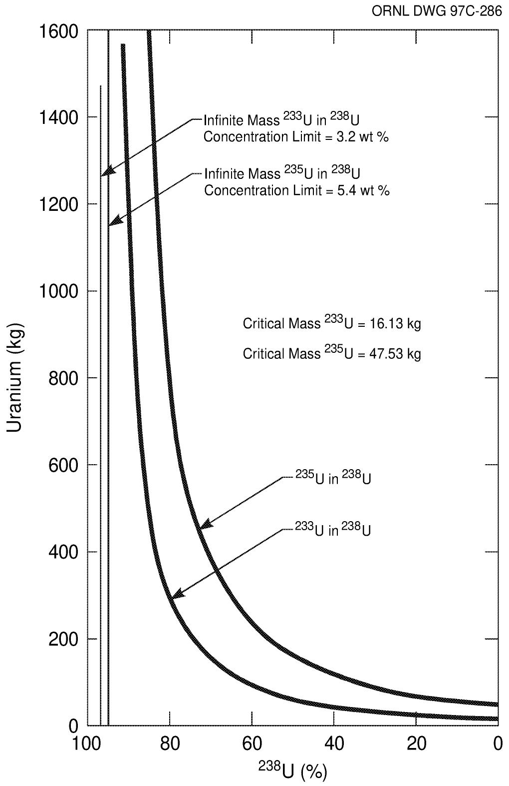  
Fig. 3.1. Critical masses of $^{233}\mathrm{U}$ in $^{238}\mathrm{U}$ and $^{235}\mathrm{U}$ in $^{238}\mathrm{U}$ for a bare metal sphere.

# 3.2.3 Radiological Characteristics of $^{233}\mathrm{U}$

The handling of $^{233}\mathrm{U}$ is substantially more hazardous (Bereolos 1997a, Till 1976) than the handling of HEU. While this fact is not used herein in a quantitative way to define weapons-usable $^{233}\mathrm{U}$ , it suggests that a mixture of $^{233}\mathrm{U}$ in $^{238}\mathrm{U}$ with approximately the same nuclear reactivity as a mixture of $^{235}\mathrm{U}$ in $^{238}\mathrm{U}$ is substantially less desirable for manufacture of a weapon.

# 3.2.3.1 Alpha Radiation Levels

The specific alpha activity of $^{233}\mathrm{U}$ ( $9.6 \times 10^{-3}\mathrm{Ci/g}$ plus rapid buildup of short-lived alpha-decay products) is about three orders of magnitude greater than that for $^{235}\mathrm{U}$ ( $2.2 \times 10^{-6}\mathrm{Ci/g}$ ) and the $\sim 1$ wt % $^{234}\mathrm{U}$ ( $6.2 \times 10^{-3}\mathrm{Ci/g}$ ) that is usually associated with weapons-grade HEU. The alpha radioactivity is the primary health hazard for those handling these materials. This high alpha radioactivity necessitates glovebox handling for $^{233}\mathrm{U}$ , but not for HEU, if radiation doses to workers by alpha contamination are a significant consideration to the builders of a nuclear weapon.

# 3.2.3.2 Gamma Radiation Levels

Uranium-233 contains an impurity: uranium-232 $(^{232}\mathrm{U})$ . The quantity of this impurity depends upon the specific production techniques used. Uranium-232 decay products include thallium-208 $(^{208}\mathrm{Tl})$ which yields a very-high energy (2.6-MeV) gamma-ray. If there is significant ${}^{232}\mathrm{U}$ mixed with the ${}^{233}\mathrm{U}$ , the ${}^{233}\mathrm{U}$ must be shielded to minimize radiation exposures to workers. If no shielding is used and the material contains high concentrations (hundreds of parts per million) of ${}^{232}\mathrm{U}$ , the radiation levels become sufficiently high such as to cause illness to workers working with and near significant quantities of materials for several hours. Figure 3.2 shows the radiation levels of one kilogram ${}^{233}\mathrm{U}$ containing 100 ppm of ${}^{232}\mathrm{U}$ impurities and the changes in the radiation levels with time.

The radiation doses from relatively pure $^{233}\mathrm{U}$ (5 to 10 ppm of $^{233}\mathrm{U}$ ) do require special handling based on current international radiation protection standards, but the radiation doses are not lethal. Ultrapure $^{233}\mathrm{U}$ can be produced using very special, complex techniques (Bereolos 1997a). The gamma-radiation levels of such material are very low. The total known U.S. inventories of such ultrapure materials are slightly $>1$ kg.

The gamma radiation levels from $^{232}\mathrm{U}$ can be reduced to low levels for short periods of time by chemical purification. The gamma radiation levels are from the decay products of $^{232}\mathrm{U}$ . When the uranium is purified, these decay products are removed. It takes several weeks for the radiation levels to begin to build up to significant levels. Again, the actual buildup radiation levels are intimately linked to the $^{232}\mathrm{U}$ concentrations. Figure 3.2 shows this radiation buildup over time. The technology for these chemical separations is well known, but fast fabrication of complex components required for nuclear weapons would be difficult.

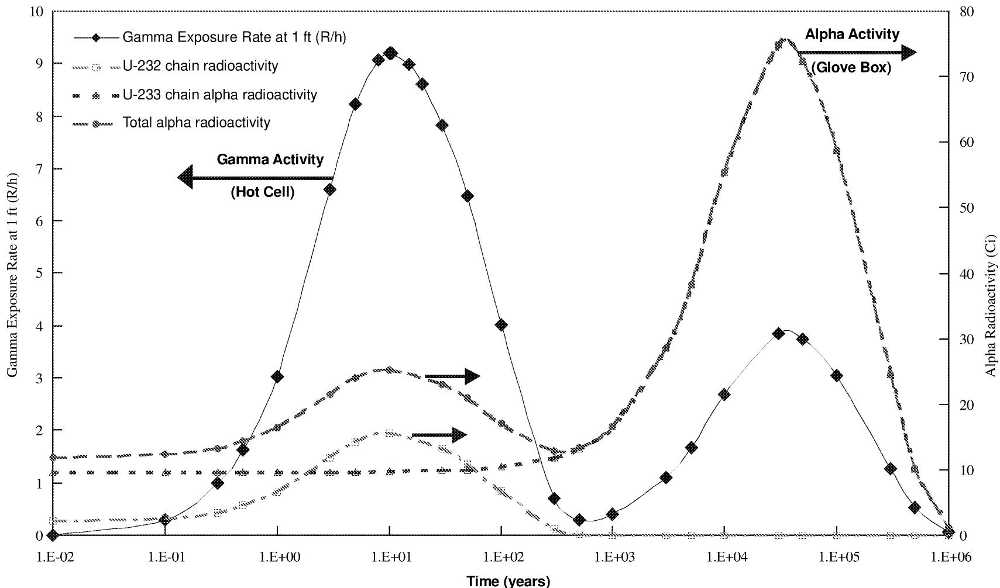  
Fig. 3.2. Alpha activity and gamma exposure rate at 1 ft as a function of time calculated for $1\mathrm{kg}^{233}\mathrm{U}$ (with $100\mathrm{ppm}^{232}\mathrm{U}$ ) as a loose-pour powder $(1.5\mathrm{g/cm}^3)$ contained in a 3-in.-diam by 6-in.-tall can with 20-mil-thick steel walls.

# 3.2.4 Heat Generation

The heat generation rate of $^{233}\mathrm{U}$ is greater than that of $^{235}\mathrm{U}$ ; thus, for equivalent nuclear reactivity, $^{233}\mathrm{U}$ diluted with $^{238}\mathrm{U}$ is less desirable than $^{235}\mathrm{U}$ diluted with $^{238}\mathrm{U}$ . Higher internal temperatures result in more rapid thermal degradation of components such as high explosives.

The internal heat-generation rate of $^{235}\mathrm{U}$ is $6.0 \times 10^{-8} \, \mathrm{W/g}$ . The internal heat generation rate of $^{234}\mathrm{U}$ (an impurity in HEU at concentrations $< 1\%$ ) is $1.8 \times 10^{-4} \, \mathrm{W/g}$ . The internal heat generation rate of $^{233}\mathrm{U}$ is $2.8 \times 10^{-4} \, \mathrm{W/g}$ . The internal heat generation rate of $^{239}\mathrm{Pu}$ is $2.0 \times 10^{-3} \, \mathrm{W/g}$ . When $^{233}\mathrm{U}$ is diluted with $^{238}\mathrm{U}$ , substantially more $^{233}\mathrm{U}$ will be required for a weapon than when pure $^{233}\mathrm{U}$ is used. The higher heat loads (relative to $^{235}\mathrm{U}$ per unit mass) combined with the greater dimensions of such a weapon (with greater resistance to heat transfer to the outside casing of the weapon) will require additional considerations during the removal of normal decay heat during storage of such weapons.

# 3.3 OTHER FORM AND CATEGORY DEFINITIONS FOR $^{233}\mathbf{U}$

The proposed definition of form for intermediate-assay $^{233}\mathrm{U}$ , as shown in Table 2.2, directly follows from the definition of weapons-usable $^{233}\mathrm{U}$ . The intermediate enrichment form of $^{235}\mathrm{U}$ , as defined by the IAEA, is material with enrichments from half the enrichment of weapons-usable $^{235}\mathrm{U}$ (10 wt % $^{235}\mathrm{U}$ ) to weapons-usable $^{235}\mathrm{U}$ (20 wt % $^{235}\mathrm{U}$ ). In a similar manner, the intermediate form of $^{233}\mathrm{U}$ is defined as from half the concentration level of weapons-usable $^{233}\mathrm{U}$ (6 wt % $^{233}\mathrm{U}$ ) to weapons-usable $^{233}\mathrm{U}$ (12 wt % $^{233}\mathrm{U}$ ). The larger mass difference between the $^{233}\mathrm{U}$ and the $^{238}\mathrm{U}$ may make it somewhat easier industrially to separate these two isotopes as compared to separating $^{235}\mathrm{U}$ from $^{238}\mathrm{U}$ ; however, the separation is made more difficult because of the much higher levels of radioactivity.

The proposed definition of form for low-assay $^{233}\mathrm{U}$ is based on technical safety and waste-management considerations. For $^{235}\mathrm{U}$ , the definition of low-enriched $^{235}\mathrm{U}$ is uranium with enrichments from natural uranium (0.71 wt % $^{235}\mathrm{U}$ ) to the definition of intermediate-enriched uranium (10 wt % $^{235}\mathrm{U}$ ). Minimal safeguards controls exist for natural uranium. A cutoff limit is important for $^{233}\mathrm{U}$ to avoid unnecessary safeguards for disposal facilities and sites. However, $^{233}\mathrm{U}$ is a man-made material; thus, there is no natural enrichment level for $^{233}\mathrm{U}$ and no simply defined level for cutoff of safeguards based on isotopic content. It is therefore proposed to use a technical basis for this definition. The value chosen here is equivalent to 1 wt % $^{235}\mathrm{U}$ . The 1 wt % $^{235}\mathrm{U}$ value is the homogeneous criticality concentration limit for $^{235}\mathrm{U}$ . The 0.66 wt % $^{233}\mathrm{U}$ is the equivalent homogeneous criticality concentration limit for $^{233}\mathrm{U}$ .

The homogeneous criticality limit for any mixture of uranium isotopes is important in several contexts. Below this enrichment it requires specially engineered systems to create a nuclear reactor. Procedures for nuclear criticality safety can be relaxed below this $^{233}\mathrm{U}$ isotopic concentration because the potential for accidental nuclear criticality is very small. Last, in waste management operations, this is the enrichment for which there is reasonable assurance that nuclear criticality would not occur in the natural environment (Elam 1997, NRC 1997). It is the isotopic concentration at which the unique properties of fissile materials (nuclear criticality) cease to exist in a practical context.

The quantities of $^{233}\mathrm{U}$ that define the different IAEA safeguards categories for different forms of $^{233}\mathrm{U}$ follow the IAEA structure used to define safeguards categories for enriched uranium. Category II quantities of intermediate-enriched $^{235}\mathrm{U} (\geq 10\mathrm{kg})$ are defined as twice the mass of Category I weapons-usable $^{235}\mathrm{U} (\geq 5\mathrm{kg})$ . Similarly, Category II quantities of intermediate-assay $^{233}\mathrm{U} (\geq 4\mathrm{kg})$ are defined as twice the mass of Category I weapons-usable $^{233}\mathrm{U} (\geq 2\mathrm{kg})$ . The definitions of Category III quantities of low-enriched $^{235}\mathrm{U}$ and low-assay $^{233}\mathrm{U}$ follow in a parallel manner from the definitions of Category II quantities of materials.

# 4. CONCLUSIONS

A technical basis for defining LEU-233 (effectively non-weapons-usable $^{233}\mathrm{U}$ by isotopic dilution with $^{238}\mathrm{U}$ ) has been defined. Uranium mixtures with $< 12 \, \mathrm{wt\%} \, ^{233}\mathrm{U}$ with the remainder being $^{238}\mathrm{U}$ are defined as LEU-233. This is equivalent to uranium mixtures with $< 20 \, \mathrm{wt\%} \, ^{235}\mathrm{U}$ being defined as LEU.

# 5. REFERENCES

Albright, D., F. Berkhout, and W. Walker, 1997. *Plutonium and Highly Enriched Uranium* 1996: World Inventories, Capabilities, and Policies, Oxford University Press.   
Bereolos, P. J., C. W. Forsberg, D. C. Kocher, and A. M. Krichinsky, February 25, 1997a. Draft: Strategy for Future Use and Disposition of Uranium-233: Technical Information, ORNL/TM-13552, Lockheed Martin Energy Research Corp., Oak Ridge National Laboratory, Oak Ridge, Tennessee.   
Bereolos, P. J., C. W. Forsberg, S. N. Storch, and A. M. Krichinsky, (in preparation, 1997b). Strategy for Future Use and Disposition of Uranium-233: History, Inventories, Storage Facilities, and Potential Future Uses, ORNL/TM-13551, Lockheed Martin Energy Research Corp., Oak Ridge National Laboratory, Oak Ridge, Tennessee.   
Code of Federal Regulations, 1997a. "10 CFR 74: Material Control and Accounting of Special Nuclear Material," Office of the Federal Register, National Archives and Records Administration, Washington D.C.   
Code of Federal Regulations, 1997b. "10 CFR 75: Safeguards on Nuclear Material—Implementation of US/IAEA Agreement," Office of the Federal Register, National Archives and Records Administration, Washington D.C.   
Code of Federal Regulations, 1997c. "10 CFR 71.24(b)(7): Packaging and Transportation of Radioactive Material," Office of the Federal Register, National Archives and Records Administration, Washington D.C.   
Elam, K. R., C. W. Forsberg, C. M. Hopper, and R. Q. Wright, 1997. Isotopic Dilution Requirements for $^{233}U$ Criticality Safety in Processing and Disposal, ORNL/TM-13524, Lockheed Martin Energy Research Corp., Oak Ridge National Laboratory, Oak Ridge, Tennessee.   
Feinendegin, L. E. and J. J. McClure, 1996. Workshop: Alpha-Emitters for Medical Therapy, DOE/NE-0113, U.S. Department of Energy, Germantown, Maryland.   
Forsberg, C. W., and A. M. Krichinsky, January 1998. Strategy for Future Use and Disposition of Uranium-233: Overview, ORNL/TM-13550, Lockheed Martin Energy Research Corp., Oak Ridge National Laboratory, Oak Ridge, Tennessee.   
Forsberg, C. W., A. S. Icenhour, and A. M. Krichinsky, (in preparation). Strategy for Future Use and Disposition of Uranium-233: Disposition Options, ORNL/TM-13553, Lockheed Martin Energy Research Corp., Oak Ridge National Laboratory, Oak Ridge, Tennessee.   
International Nuclear Fuel Cycle Evaluation Working Group 8, 1980. Advanced Fuel Cycle and Reactor Concepts, International Atomic Energy Agency, Vienna, Austria.   
International Atomic Energy Agency, December 1993. The Physical Protection of Nuclear Materials, INFCIRC/225/Rev. 3, Vienna, Austria.

Serber, R., 1992. The Los Alamos Primer, University of California Press, Berkeley, California (originally published as L. A. 1 by the Los Alamos National Laboratory, Los Alamos, New Mexico).   
Smith, A. E., October 22, 1963. U-233, Hanford Atomic Products Operation, BW-79331 RD, Richland, Washington.   
Till, John E., 1976. Assessment of the Radiological Impact of $^{232}U$ and Daughters in Recycled $^{233}U$ HTGR Fuel, ORNL/TM-5049, Union Carbide Corporation, Nuclear Division, Oak Ridge National Laboratory, Oak Ridge, Tennessee.   
U.S. Department of Energy, Office of Fissile Materials Disposition, June 1996a. Disposition of Surplus Highly-Enriched Uranium Final Environmental Impact Statement, DOE/EIS-0240, Washington D.C.   
U.S. Department of Energy, July 29, 1996. Record of Decision for the Disposition of Surplus Highly-Enriched Uranium Final Environmental Impact Statement, Washington D.C.   
U.S. Nuclear Regulatory Commission, June 1976. The Potential for Criticality Following Disposal of Uranium at Low-Level Waste Facilities: Uranium Blended with Soil, NUREG/CR-6505, Vol. 1, Washington D.C.   
Woods, W. K., February 10, 1966. LRL Interest in U-233, DUN-677, Douglas United Nuclear, Inc., Richland, Washington.

Appendix A:

CRITICAL MASSES OF MIXTURES OF $^{233}\mathrm{U}$ WITH $^{238}\mathrm{U}$

5 March 1997

To: Charles Forsberg, ORNL

From: John Richter DOE NN-30/LANL

Subject: U-233 Blended with U-238 (U)

Metal critical masses of binary mixtures of U-233 and U-238 are:

<table><tr><td>Wt % U-233</td><td>Density (g/cm3)</td><td>Crit Mass (kg)</td></tr><tr><td>100</td><td>18.60</td><td>16.17</td></tr><tr><td>90</td><td>18.64</td><td>19.76</td></tr><tr><td>80</td><td>18.68</td><td>24.64</td></tr><tr><td>70</td><td>18.72</td><td>31.51</td></tr><tr><td>60</td><td>18.76</td><td>41.62</td></tr><tr><td>50</td><td>18.80</td><td>57.45</td></tr><tr><td>40</td><td>18.84</td><td>84.33</td></tr><tr><td>30</td><td>18.88</td><td>137.64</td></tr><tr><td>20</td><td>18.92</td><td>274.58</td></tr><tr><td>10</td><td>18.96</td><td>995.56</td></tr></table>

These values were calculated with the DSN finite clement neutronics calculation using the MENDF-V cross sections.

Appendix B:

CONFIRMATION OF CRITICAL MASSES OF MIXTURES OF $^{233}\mathrm{U}$ WITH $^{238}\mathrm{U}$ AND $^{235}\mathrm{U}$ WITH $^{238}\mathrm{U}$

Date: August 11, 1997

To: Charles W. Forsberg

C: C.M. Hopper

C.V. Parks

B.L. Broadhead

R.M. Westfall

From: J. S. Tang

Subject: Determination of Critical Masses of Binary Mixtures of $^{233}\mathbf{U}$ and $^{235}\mathbf{U}$ with $^{238}\mathbf{U}$

This memorandum summarizes the calculated results of critical masses of bare metal spheres of binary mixtures of $^{233}\mathrm{U}$ and $^{235}\mathrm{U}$ with $^{238}\mathrm{U}$ . The weight percents of each fissile isotope, when mixed with $^{238}\mathrm{U}$ , at $k_{\mathrm{s}} = 1.0$ were also determined.

The critical radius of each mixture was calculated with the SCALE 4.3 Criticality Safety Analysis Sequence, CSAS4, using the 238-energy group neutron cross section library. This library was collapsed from the point data from the Evaluated Nuclear Date File B version V (ENDF/B-V). The number of particle histories of each calculation were selected to give a standard deviation of the $\mathbf{k}_{\mathrm{eff}}$ of less than $\pm 0.002$ . Also, information regarding neutron lifetime and generation time was extracted from each case.

The results of the $^{233}\mathrm{U}$ and $^{238}\mathrm{U}$ mixtures are presented in Table 1, and those of the $^{235}\mathrm{U}$ and $^{238}\mathrm{U}$ mixtures are given in Table 2. In both tables, the critical radius and critical mass, along with the density, neutron generation time, and neutron lifetime, are given as a function of the weight percent of the fissile isotopes. The weight percents at $k_{\mathrm{s}} = 1.0$ was determined to be 3.20 for $^{233}\mathrm{U}$ and 5.37 for $^{235}\mathrm{U}$ when each was mixed with $^{238}\mathrm{U}$ .

TABLE 1. Calculated Critical Parameters of Mixtures of ${}^{233}\mathrm{U}$ and ${}^{238}\mathrm{U}$ Metal Spheres   

<table><tr><td>W%233U</td><td>Density (g/cc)</td><td>Radius (cm)</td><td>Mass (kg)</td><td>Generation Time</td><td>Life Time</td></tr><tr><td>100</td><td>18.60174</td><td>5.916</td><td>16.13</td><td>2.6436-9</td><td>3.0801-9</td></tr><tr><td>90</td><td>18.64098</td><td>6.333</td><td>19.83</td><td>2.9838-9</td><td>3.4436-9</td></tr><tr><td>80</td><td>18.68039</td><td>6.830</td><td>24.93</td><td>3.4122-9</td><td>3.9161-9</td></tr><tr><td>70</td><td>18.71996</td><td>7.357</td><td>31.22</td><td>3.9257-9</td><td>4.4684-9</td></tr><tr><td>60</td><td>18.75970</td><td>8.105</td><td>41.84</td><td>4.6752-9</td><td>5.2776-9</td></tr><tr><td>50</td><td>18.79961</td><td>9.026</td><td>57.91</td><td>5.7330-9</td><td>6.4139-9</td></tr><tr><td>40</td><td>18.83969</td><td>10.226</td><td>84.40</td><td>7.3906-9</td><td>8.2235-9</td></tr><tr><td>30</td><td>18.87995</td><td>12.056</td><td>138.59</td><td>9.9839-9</td><td>1.1138-8</td></tr><tr><td>25</td><td>18.90010</td><td>13.412</td><td>208.21</td><td>1.2065-8</td><td>1.3516-8</td></tr><tr><td>20</td><td>18.92037</td><td>15.133</td><td>274.67</td><td>1.5373-8</td><td>1.7306-8</td></tr><tr><td>17</td><td>18.93250</td><td>16.565</td><td>360.50</td><td>1.8193-8</td><td>2.0757-8</td></tr><tr><td>13</td><td>18.94880</td><td>19.476</td><td>586.37</td><td>2.3820-8</td><td>2.7897-8</td></tr><tr><td>10</td><td>18.96097</td><td>23.066</td><td>974.66</td><td>3.1073-8</td><td>3.7636-8</td></tr><tr><td>8</td><td>18.96910</td><td>27.052</td><td>1573.02</td><td>3.8448-8</td><td>4.8653-8</td></tr></table>

TABLE 2. Calculated Critical Parameters of Mixtures of ${}^{235}\mathrm{U}$ and ${}^{238}\mathrm{U}$ Metal Spheres   

<table><tr><td>W% 235U</td><td>Density (g/cc)</td><td>Radius (cm)</td><td>Mass (kg)</td><td>Generation Time</td><td>Life Time</td></tr><tr><td>100</td><td>18.7617</td><td>8.457</td><td>47.53</td><td>4.7827-9</td><td>5.3427-9</td></tr><tr><td>90</td><td>18.7855</td><td>9.052</td><td>58.36</td><td>5.4515-9</td><td>6.0311-9</td></tr><tr><td>80</td><td>18.8092</td><td>9.656</td><td>70.93</td><td>6.1311-9</td><td>6.8020-9</td></tr><tr><td>70</td><td>18.8331</td><td>10.351</td><td>87.48</td><td>7.0248-9</td><td>7.7641-9</td></tr><tr><td>60</td><td>18.8570</td><td>11.285</td><td>113.53</td><td>8.3599-9</td><td>9.2137-9</td></tr><tr><td>50</td><td>18.8810</td><td>12.000</td><td>136.67</td><td>9.6334-9</td><td>1.0643-8</td></tr><tr><td>40</td><td>18.9050</td><td>14.173</td><td>225.47</td><td>1.2965-8</td><td>1.4281-8</td></tr><tr><td>30</td><td>18.9291</td><td>16.643</td><td>365.55</td><td>1.7487-8</td><td>1.9584-8</td></tr><tr><td>25</td><td>18.9412</td><td>18.528</td><td>504.65</td><td>2.1000-8</td><td>2.3844-8</td></tr><tr><td>20</td><td>18.9533</td><td>21.105</td><td>746.30</td><td>2.6298-8</td><td>3.0437-8</td></tr><tr><td>15</td><td>18.9654</td><td>25.613</td><td>1334.82</td><td>3.4790-8</td><td>4.1901-8</td></tr><tr><td>10</td><td>18.9775</td><td>35.852</td><td>3663.15</td><td>5.0125-8</td><td>6.5314-8</td></tr><tr><td>8</td><td>18.9820</td><td>46.000</td><td>7739.47</td><td>6.0323-8</td><td>8.3586-8</td></tr><tr><td>5</td><td>18.9896</td><td>Not Critical</td><td>Not Critical</td><td>Not Critical</td><td>Not Critical</td></tr></table>

Appendix C:

THE DEPENDENCE OF $^{233}\mathrm{U}$ REACTIVITY ON $^{233}\mathrm{U}$ ISOTOPIC CONCENTRATION

TO: JimDubrin,2-1143

FROM: Roger Münich and Harry Vantine 2-4552 3-8186

SUBJECT: The Dependence of U233 Reactivity on Enrichment

At your direction, we have calculated the way in which U²³³ reactivity depends on enrichment. We also have calculated the way in which the reactivity of an equal mass of U²³₅ depends on enrichment. These calculations allow us to equate a given U²³³ enrichment to an equivalent U²³₅ enrichment. For example, we show that a mass of 11.5% enriched-U²³₃ is equivalent (in a reactivity sense) to an equal mass of 20% enriched-U²³₅. This is a significant piece of information, because it allows one to set regulatory restrictions on U²³₃ based on already established restrictions on U²³₅. For example, if x kg of 20% enriched-U²³₅ is restricted, then x kg of 11.5% enriched U²³₃ should be similarly restricted.

We have performed our calculations using the MCNP code with the ENDF-V nuclear cross section data set. We chose to do two sets of calculations. The first set used a bare sphere of uranium with a radius of 9.6cm and a mass of 70kg. The reactivity of the sphere was calculated as a function of enrichment for both U233 and U235. The results are shown in Figure 1. Next a neutron reflector was placed around the sphere. We used a uranium reflector of 2cm thickness. Again the reactivity of the sphere was calculated as a function of enrichment for both U233 and U235. The results are also shown in Figure 1.

We now discuss the manner in which to interpret Figure 1. Consider a given U235 enrichment. Drawing a horizontal line from the U235 to the U233 curve establishes the equivalent U233 enrichment (See Figure 2). We note that the tamped and un-tamped cases give essentially the same results (See Figure 3).

This work represents a quick response to your request. More detailed and exhaustive work on the subject is certainly possible if needed for your application.

03/95:BCV

Anachmeats: (4)

C00y 10

Anastasio, Mikc

Andrews, Bob

Kass Jeff

Miller, George

ORNL DWG 97C-247   
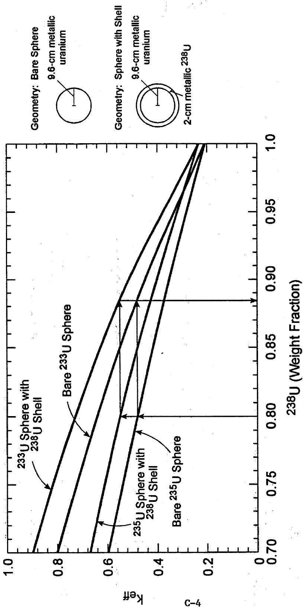  
Fig. A.1 Value for $\mathbf{k}_{\mathrm{eff}}$ vs $^{236}\mathrm{U}$ fraction for a bare uranium metal sphere and a uranium   
metal sphere with a shell of $^{238}\mathrm{U}$ (Combined Fig. 1, 2, and 3)

Appendix D:

CONFIRMATION OF “DEPENDENCE OF $^{233}\mathrm{U}$ REACTIVITY ON ENRICHMENT” VALUES

# OAK RIDGE NATIONAL LABORATORY

MANAGED BY LOCKHEED MARTIN ENERGY RESEARCH CORPORATION

FOR THE U.S. DEPARTMENT OF ENERGY

Building 6011, Rm-219, MS-6370

POST OFFICE BOX 2008

OAK RIDGE, TN 37831-6370

PHONE: (423) 576-8617

FAX: (423) 576-3513

INTERNET: hopercm@ornl.gov

Date: March 20, 1997

To: Charles W. Forsberg

C. C.V. Parks

L.M. Petrie

J.S. Tang

R.M. Westfall

From: C. M. Hopper, 6011, MS-6370, 6-8617 (RC)

Subject: Confirmation of "The Dependence of $\mathbf{U}^{233}$ Reactivity on Enrichment" Values

The following provides our response to your March 3, 1997 request to evaluate specific reactivity equivalencies between various weight percents of $^{233}\mathrm{U}$ or $^{235}\mathrm{U}$ blended with $^{238}\mathrm{U}$ as $70,000\mathrm{g}$ of uranium metal as individual spheres that are unreflected or reflected with a close fitting $2\mathrm{cm}$ thick $^{238}\mathrm{U}$ metal spherical shell. Specific $^{233}\mathrm{U}$ wt% equivalencies for $10\mathrm{wt\%}$ and $20\mathrm{wt\%}$ $^{235}\mathrm{U}$ were determined.

In summary, I provided informal, interim results to you by e-mail on March 10 and 12, 1997. The following table summarizes the final results of our evaluations.

Wt % Equivalencies of $^{233}\mathrm{U}$ in Reflected and Unreflected 70,000 g Uranium Metal Spheres (balance of wt % $^{238}\mathrm{U}$ )   

<table><tr><td colspan="2"></td><td colspan="2">Unreflected</td><td colspan="2">Reflected with 2 cm238U metal</td></tr><tr><td>238U wt %</td><td>235U wt %</td><td>keff</td><td>233U wt %</td><td>keff</td><td>233U wt %</td></tr><tr><td>90</td><td>10</td><td>0.361</td><td>5.68</td><td>0.411</td><td>5.77</td></tr><tr><td>80</td><td>20</td><td>0.492</td><td>11.41*</td><td>0.562</td><td>11.43*</td></tr><tr><td colspan="6">* These values are different from the values cited in the March 10 e-mail (11.75 and 11.32, respectively) because of the interpolation routine that was used.</td></tr></table>

The tabulated values for the 20 wt $\%$ $^{235}\mathrm{U}$ equivalencies are consistent with the single value (i.e., 11.5 wt $\%$ $^{233}\mathrm{U}$ ) provided in the January 18, 1995 LLNL memo from Minith and Vantine to Jim Dubrin.

The attachment to this memo provides the detailed results from our studies and offers alternative concepts of weight percent equivalencies.

Please feel free to call us if you wish for us to pursue the issues further.

CMH:cmh

Attachment

# ATTACHMENT

# BACKGROUND

On March 3, 1997, Charles Forsberg of the ORNL Chemical Technology Division (CTD) met with Cecil Parks and Calvin Hopper of the Nuclear Engineering Applications Section (NEAS) of the ORNL Computational Physics & Engineering Division (CP&ED) to request that NEAS perform an independent verification of a reported $^{233}$ U wt % reactivity equivalency with 20 wt % $^{235}$ U and 80 wt % $^{238}$ U. In particular, Charles requested that NEAS perform calculations with quality assured state-of-the-art computer codes and neutron cross sections (SCALE $4.3^2$ ) to verify the reported value of 11.5 wt % $^{233}$ U and 88.5 wt % $^{238}$ U for 70,000 g uranium metal spheres both unreflected and reflected with 2 cm thick $^{238}$ U metal. Additionally, Charles requested that NEAS determine a $^{233}$ U equivalence with 10 wt % $^{235}$ U metal both unreflected and reflected with 2 cm thick $^{238}$ U metal.

# COMPUTATIONAL METHOD

The reactivities for various weight percents of the fissile isotopes $^{235}\mathrm{U}$ or $^{233}\mathrm{U}$ with $^{238}\mathrm{U}$ were computed in terms of the neutron multiplication constant, $k_{\mathrm{eff}}$ . The $k_{\mathrm{eff}}$ s were computed with the SCALE 4.3 Criticality Safety Analysis Sequence, CSAS25 (resulting in computations by the Monte Carlo computer code KENO V.a), using the 238-energy group neutron cross section library collapsed from the point data from the Evaluated Nuclear Data File B version V (ENDF/B-V). The number of computed histories were selected to result in a calculated $k_{\mathrm{eff}}$ statistical standard deviation on the order of $\pm 0.002$ . Also, information regarding neutron lifetime and generation time was extracted from each calculation for possible future evaluations. Because the intent of the verification study was comparative in nature no experimental benchmarks were calculated for validation purposes.

# RESULTS

Trends in $\mathbf{k}_{\mathrm{eff}}$ , neutron lifetime, and generation time with fissile isotope weight percent were clearly defined by performing four series of calculations for variable weight percents between 0 and 100 wt % for each of the fissile isotopes under unreflected and reflected conditions. Results of the calculations are provided in Table 1. Additionally, the results are graphically presented in Figures 1 - 5 using an undefined data "smoothing" curve. The "forward" interpolation of the $^{235}\mathrm{U}$ computational results and the "backward" interpolation of the $^{233}\mathrm{U}$ computational results were performed using fifth degree polynomial least-squares fits to the thirteen data pairs of each of the four series of calculations. Results of the "forward" and "backward" interpolations are provided on pages 10 - 15 of this attachment.

# INTERPRETATIONS

Because the uncertainty and variability in the resulting interpolations have not been evaluated, it is suggested that interpolated $^{233}\mathrm{U}$ weight percent equivalences be rounded down to the nearest tenth of the lowest weight percent equivalency (i.e., 5.6 wt % $^{233}\mathrm{U}$ and 11.4 wt % $^{233}\mathrm{U}$ for 10 wt % $^{235}\mathrm{U}$ and 20 wt % $^{235}\mathrm{U}$ , respectively).

The same ENDF/B-V neutron cross section data set was used for the LLNL calculated reported 11.5 wt % $^{233}\mathrm{U}$ and the NEAS calculated and interpolated 11.4 wt % $^{233}\mathrm{U}$ equivalent values. LLNL used the MCNP code with the point data library of the ENDF/B-V whereas the ORNL KENO V.a code used a processed and collapsed energy group structure from the ENDF/B-V data. Historically, point and group structure differences in $\mathbf{k}_{\mathrm{eff}}$ have been observed. Notable reported differences occur for metallic fissile material systems producing intermediate neutron energies for which unresolved resonance processing is an important influence on system reactivity. The differences between the LLNL and NEAS results may be considered quite small and perhaps within the uncertainty of the calculations that were performed.

# CONSIDERATIONS ABOUT THE EQUIVALENcy APPROACH

Determining the reactivity equivalence between $^{233}\mathrm{U}$ and $^{235}\mathrm{U}$ for a fixed mass (70,000 g) of uranium under unreflected and reflected conditions is one of many approaches that can be considered depending upon the purpose of "equivalence." The simple "enrichment equivalence" for a fixed mass of uranium reported by LLNL and verified by NEAS may not be the "correct" equivalency depending upon the intent of "equivalency" (e.g., ease of diversion or fabrication for end-use, end-use effectiveness, etc.). Consideration of other types of equivalences may be of substantial importance (e.g., equivalent prompt energy releases due to static inertia, time delay before the first persistent chain, mass of $^{233}\mathrm{U}$ and $^{238}\mathrm{U}$ resulting in equivalent excess reactivity, etc.). The NEAS could approximate these alternate "equivalencies" and their effects on enrichment and mass values if requested.

# CONCLUSIONS

The NEAS of the CP&ED performed the requested computations and determined the general equivalences of $11.4 \, \text{wt\%}^{233}\text{U}$ in $^{238}\text{U}$ to that of $20 \, \text{wt\%}^{235}\text{U}$ in $^{238}\text{U}$ and $5.6 \, \text{wt\%}^{233}\text{U}$ to $10 \, \text{wt\%}^{235}\text{U}$ . It is judged that there is no statistically significant difference between the NEAS determined $11.4 \, \text{wt\%}^{233}\text{U}$ equivalency and the LLNL determined $11.5 \, \text{wt\%}^{235}\text{U}$ equivalency.

Page #1 - "Cecil"   
Monday, March 10 9:45 AM 1997   
Table 1   

<table><tr><td></td><td>U-238</td><td>U-235 k-eff</td><td>U-235 gen</td><td>U-235 lifetime</td><td>U-233 k-eff</td><td>U-233 gen</td><td>U-233 lfe time</td><td>U-235T k-eff</td><td>U-235T gen</td><td>U-235T lfe time</td></tr><tr><td>.0</td><td>0.0000</td><td>1.1100</td><td>5.4000e-09</td><td>5.9780e-09</td><td>1.4380</td><td>4.0300e-09</td><td>4.5070e-09</td><td>1.2160</td><td>6.7590e-09</td><td>8.5840e-09</td></tr><tr><td>1</td><td>0.10000</td><td>1.0570</td><td>5.7340e-09</td><td>6.3460e-09</td><td>1.3790</td><td>4.3250e-09</td><td>4.8280e-09</td><td>1.1620</td><td>7.1870e-09</td><td>9.0990e-09</td></tr><tr><td>2</td><td>0.20000</td><td>0.99700</td><td>6.0590e-09</td><td>6.7290e-09</td><td>1.3140</td><td>4.7260e-09</td><td>5.2530e-09</td><td>1.1070</td><td>7.6620e-09</td><td>9.7290e-09</td></tr><tr><td>3</td><td>0.30000</td><td>0.93800</td><td>6.5070e-09</td><td>7.2190e-09</td><td>1.2410</td><td>5.1260e-09</td><td>5.6890e-09</td><td>1.0410</td><td>8.2240e-09</td><td>1.0440e-08</td></tr><tr><td>4</td><td>0.40000</td><td>0.87000</td><td>6.9510e-09</td><td>7.7650e-09</td><td>1.1570</td><td>5.5600e-09</td><td>6.1960e-09</td><td>0.96600</td><td>8.8400e-09</td><td>1.1210e-08</td></tr><tr><td>5</td><td>0.50000</td><td>0.79100</td><td>7.4340e-09</td><td>8.3850e-09</td><td>1.0600</td><td>6.1370e-09</td><td>6.8380e-09</td><td>0.88800</td><td>9.4910e-09</td><td>1.2190e-08</td></tr><tr><td>6</td><td>0.60000</td><td>0.70500</td><td>7.9260e-09</td><td>9.0780e-09</td><td>0.94700</td><td>6.7890e-09</td><td>7.5890e-09</td><td>0.79400</td><td>1.0260e-08</td><td>1.3320e-08</td></tr><tr><td>7</td><td>0.70000</td><td>0.60800</td><td>8.3840e-09</td><td>9.9720e-09</td><td>0.81400</td><td>7.4400e-09</td><td>8.5000e-09</td><td>0.68600</td><td>1.0930e-08</td><td>1.4640e-08</td></tr><tr><td>8</td><td>0.80000</td><td>0.49200</td><td>8.5550e-09</td><td>1.0920e-08</td><td>0.65900</td><td>8.1230e-09</td><td>9.7900e-09</td><td>0.56200</td><td>1.1480e-08</td><td>1.6340e-08</td></tr><tr><td>9</td><td>0.85000</td><td>0.42900</td><td>8.4000e-09</td><td>1.1650e-08</td><td>0.56500</td><td>8.2940e-09</td><td>1.0470e-08</td><td>0.48900</td><td>1.1290e-08</td><td>1.7170e-08</td></tr><tr><td>10</td><td>0.90000</td><td>0.36100</td><td>7.8160e-09</td><td>1.2210e-08</td><td>0.46200</td><td>8.1780e-09</td><td>1.1380e-08</td><td>0.41100</td><td>1.0590e-08</td><td>1.8160e-08</td></tr><tr><td>11</td><td>0.95000</td><td>0.28400</td><td>6.1600e-09</td><td>1.2860e-08</td><td>0.34400</td><td>7.0160e-09</td><td>1.2400e-08</td><td>0.32085</td><td>8.4210e-09</td><td>1.8990e-08</td></tr><tr><td>12</td><td>1.0000</td><td>0.20200</td><td>1.9090e-09</td><td>1.3620e-08</td><td>0.20200</td><td>1.9090e-09</td><td>1.3620e-08</td><td>0.22400</td><td>2.3170e-09</td><td>1.8910e-08</td></tr></table>

Page #2 - "Cecil"   
Monday, March 10 9.45 AM 1997   
Table 1 (cont.)   

<table><tr><td></td><td>U-233T k-eff</td><td>U-233T gen</td><td>U-233T lifetime</td><td>K</td><td>L</td></tr><tr><td>0</td><td>1.5490</td><td>5.0490e-09</td><td>6.4400e-09</td><td></td><td></td></tr><tr><td>1</td><td>1.4930</td><td>5.4410e-09</td><td>8.9500e-09</td><td></td><td></td></tr><tr><td>2</td><td>1.4230</td><td>5.8690e-09</td><td>7.4720e-09</td><td></td><td></td></tr><tr><td>3</td><td>1.3530</td><td>6.3870e-09</td><td>8.1130e-09</td><td></td><td></td></tr><tr><td>4</td><td>1.2660</td><td>7.0540e-09</td><td>8.9530e-09</td><td></td><td></td></tr><tr><td>5</td><td>1.1710</td><td>7.8100e-09</td><td>9.9080e-09</td><td></td><td></td></tr><tr><td>6</td><td>1.0550</td><td>8.7060e-09</td><td>1.1110e-08</td><td></td><td></td></tr><tr><td>7</td><td>0.91700</td><td>9.7230e-09</td><td>1.2620e-08</td><td></td><td></td></tr><tr><td>8</td><td>0.74700</td><td>1.0820e-08</td><td>1.4580e-08</td><td></td><td></td></tr><tr><td>9</td><td>0.64200</td><td>1.1160e-08</td><td>1.5720e-08</td><td></td><td></td></tr><tr><td>10</td><td>0.52800</td><td>1.1040e-08</td><td>1.7070e-08</td><td></td><td></td></tr><tr><td>11</td><td>0.38900</td><td>9.4980e-09</td><td>1.8490e-08</td><td></td><td></td></tr><tr><td>12</td><td>0.22400</td><td>2.3170e-09</td><td>1.8910e-08</td><td></td><td></td></tr></table>

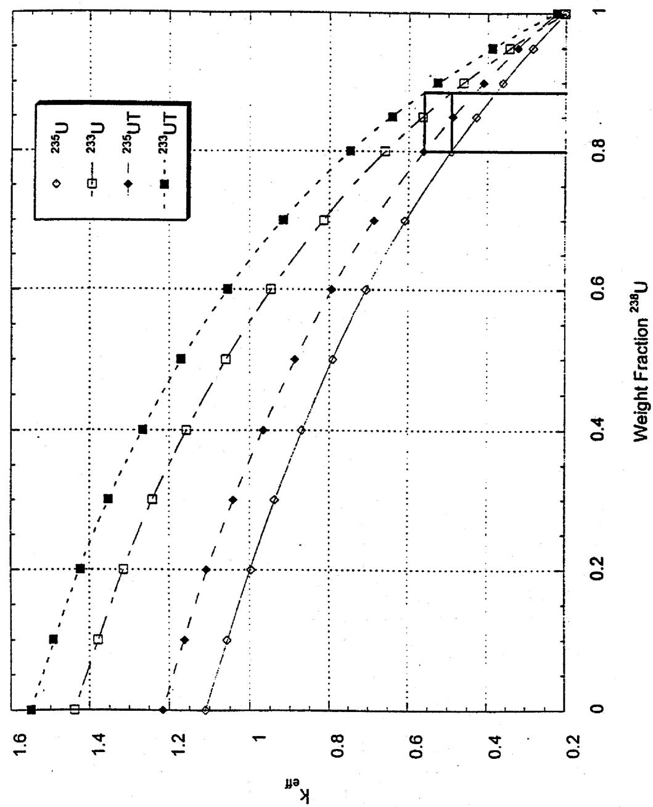  
Figure 1   
$k_{\text {eff }}$ vs Weight Fraction $^{238}\mathrm{U}$ in 70kgs U

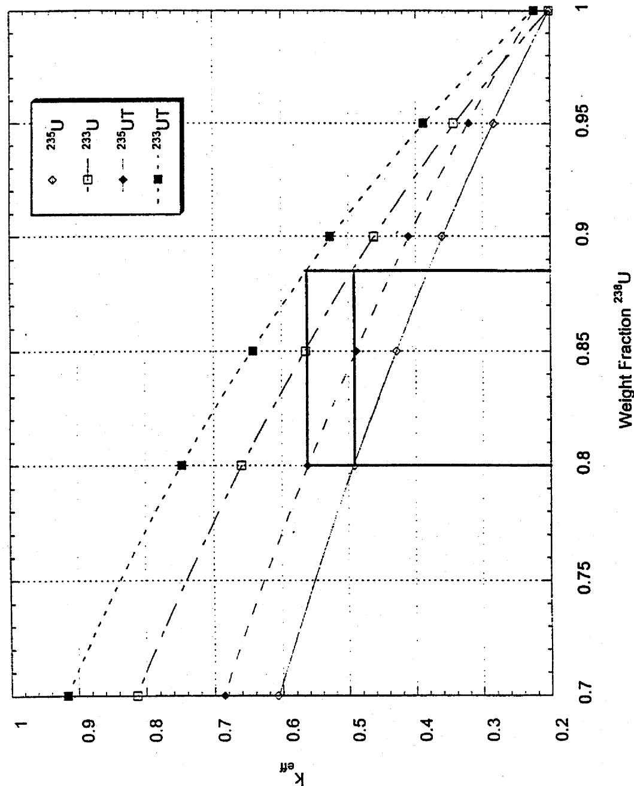  
Figure 2   
$k_{\text {eff }}$ vs Weight Fraction $^{238}\mathrm{U}$ in 70kgs U

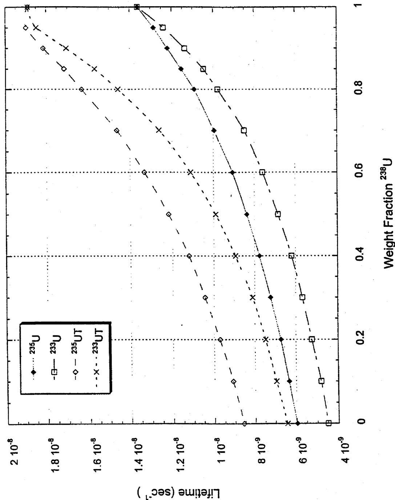  
Figure 3   
Lifetime vs Weight Fraction $^{238}\mathrm{U}$ in 70kgs U

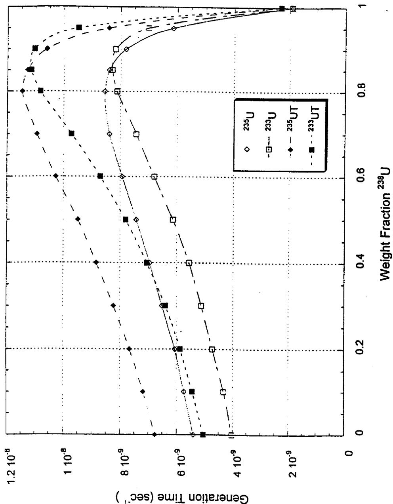  
Figure 4   
Generation Time vs Weight Fraction $^{238}\mathrm{U}$ in 70kgs U

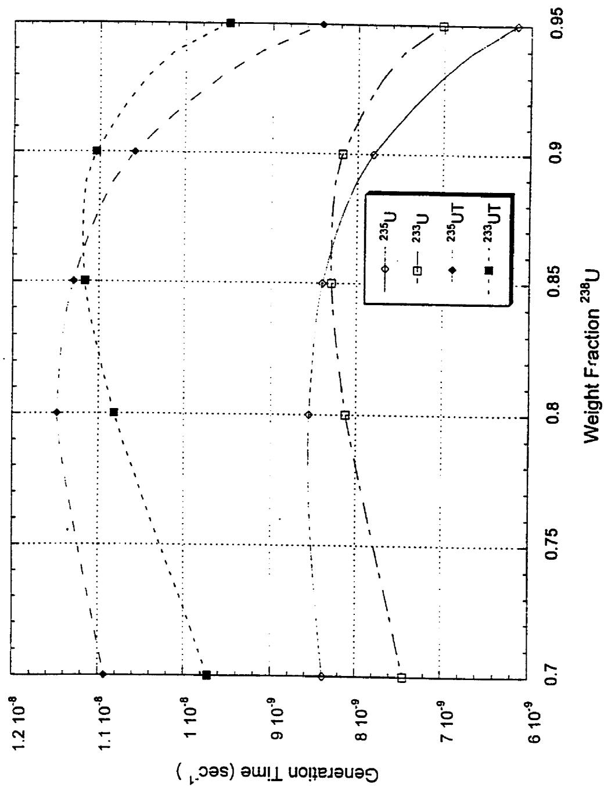  
Figure 5   
Generation Time vs Weight Fraction $^{238}\mathrm{U}$ in 70kgs U

Bare keff of 235U vs Wt % 238U as 70kg U

$r^2 = 0.999980659$ FitStdErr=0.00177172459 Fstat=72384.7111

Rank 6 Eqn 6002 $y = a + bx + cx^2 +dx^2 +ex^4 +fx^3$

$a = 1.1101733b = -0.53465814c = -0.027821245$

$d = -0.45270321$ $e = 0.30688808f = -0.20081703$

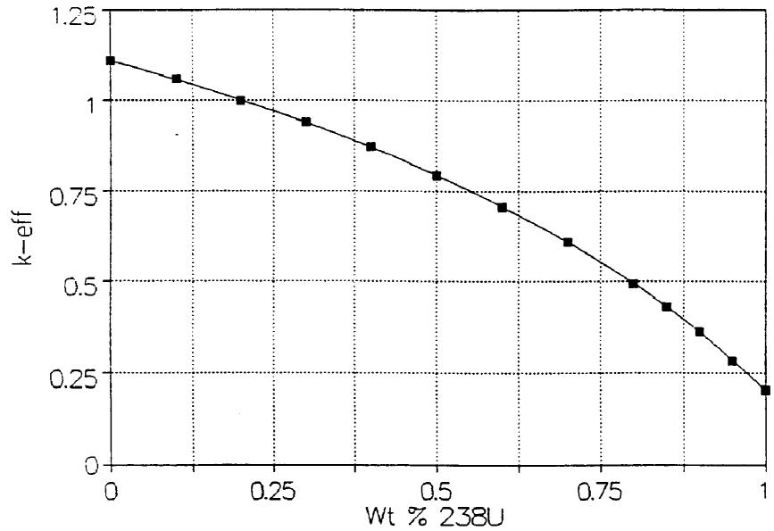

Bare keff of 235U vs Wt % 238U as 70kg U Mar 11,1997 11:42 AM

13 Active X-Y Points

X:Wt % 238U

Mean: 0.5615384615

SD: 0.3385962727

Y: k-eff

Mean: 0.6800769231

SD: 0.3076934247

File Source: NEXT01.PRN

Rank 6 Eqn 6002 $y = a + bx + cx2 + dx3 + ex4 + fx5$

r2 Coef Det

DFAdjr2

Fit Std Err

F-value

0.9999806593

0.9999613185

0.0017717246

72384.711066

Parm Value

Std Error

t-value

a 1.110173277

0.001747074

635.4470668

b -0.53465814

0.041666417

-12.8318721

c -0.02782125

0.288605325

-0.09639893

d -0.45270321

0.759746467

-0.5958609

e 0.306888077

0.842148315

0.364410961

f -0.20081703

0.331869427

-0.60510856

99% Confidence Limits

1.104058884 1.11628767   
-0.68048184 -0.38883444   
-1.03787922 0.982236733   
-3.11165617 2.20624974   
-2.64045403 3.254230184   
-1.36229028 0.960656214

<table><tr><td>Rank 6</td><td>Eqn 6002</td><td colspan="3">y=a+bx+cx»+dx3+ex4+fx5</td></tr><tr><td colspan="5">r2=0.999980659273</td></tr><tr><td>F=</td><td>72384.7110661</td><td colspan="3">Ö Bare keff of 235U vs Wt % 238U as 70kg U ác</td></tr><tr><td>a=</td><td>1.11017327702</td><td>° Wt % 238U</td><td>k-eff</td><td>°</td></tr><tr><td>b=</td><td>-0.534658139123</td><td>° 0</td><td>1.11017327702</td><td>°</td></tr><tr><td>c=</td><td>-0.0278212453104</td><td>° 0.1</td><td>1.05600522808</td><td>°</td></tr><tr><td>d=</td><td>-0.452703214493</td><td>° 0.198197573423</td><td>1</td><td>°</td></tr><tr><td>e=</td><td>0.306888077235</td><td>° 0.2</td><td>0.998933933145</td><td>°</td></tr><tr><td>f=</td><td>-0.200817030517</td><td>° 0.3</td><td>0.93704674446</td><td>°</td></tr><tr><td></td><td></td><td>° 0.4</td><td>0.868685584783</td><td>°</td></tr><tr><td></td><td></td><td>° 0.5</td><td>0.792205966947</td><td>°</td></tr><tr><td></td><td></td><td>° 0.6</td><td>0.705736013425</td><td>°</td></tr><tr><td></td><td></td><td>° 0.7</td><td>0.60693547589</td><td>°</td></tr><tr><td></td><td></td><td>° 0.8</td><td>0.492754754782</td><td>°</td></tr><tr><td></td><td></td><td>° 0.9</td><td>0.35919391887</td><td>°</td></tr><tr><td>X=</td><td>Wt % 238U</td><td>° 1</td><td>0.201061724815</td><td>°</td></tr><tr><td>Y=</td><td>k-eff</td><td>°</td><td></td><td>°</td></tr><tr><td></td><td></td><td>°</td><td></td><td>°</td></tr><tr><td colspan="2">Enter Value [x=,y=]</td><td>°</td><td></td><td>°</td></tr><tr><td></td><td></td><td>°</td><td></td><td>°</td></tr><tr><td colspan="2">Press Esc to End Evaluation</td><td>°</td><td></td><td>°</td></tr><tr><td></td><td></td><td>aáááááááááááááááááááááááááááááááááááááááááááááááááááááááááááááááááááááááááááááááááááááááááááááááááááá</td><td></td><td></td></tr></table>

Bare keff of 233U vs Wt % 238U as 70kg U

$r^2 = 0.999993505$ FitStdErr $= 0.0013842865$ Fstat $= 215548.333$

Rank 6 Eqn 6002 $y = a + bx + cx^2 + dx^3 + ex^4 + fx^5$

$a = 1.4383756$ b=-0.62610851 c=0.43905728

$d = -2.5939035$ $e = 3.1935966$ $f = -1.6478973$

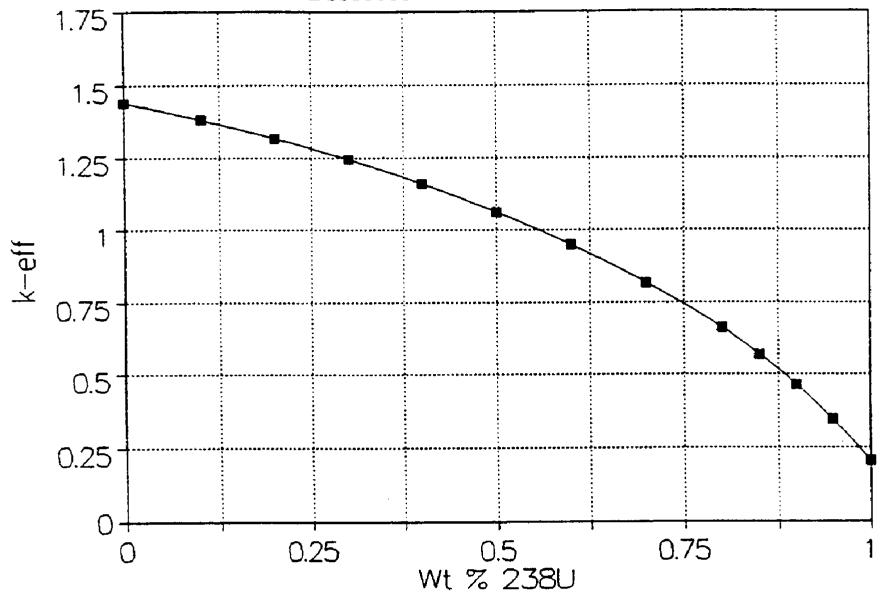

Bare keff of 233U vs Wt % 238U as 70kg U Mar 11,1997 11:50 AM

13 Active X-Y Points

X:Wt $\%$ 238U

Mean: 0.5615384615

SD: 0.3385962727

Y: k-eff

Mean: 0.8909230769

SD: 0.4148528778

File Source: NEXT02.PRN

Rank 6 Eqn 6002 $y = a + bx + cx2 + dx3 + ex4 + fx5$

r2 Coef Det 0.999993505

DF Adj r2 0.99998701

Fit Std Err 0.0013842865

F-value 215548.33335

Parm

a 1.438375551

b -0.62610851

c 0.439057279

d -2.59390351

e 3.193596631

f -1.64789734

Std Error

0.001365027

0.032554867

0.225493542

0.59360624

0.657988576

0.259296715

t-value

1053.73434

-19.2324087

1.947094694

-4.36973761

4.85357459

-6.35525728

99% Confidence Limits

1.433598244 1.443152858

-0.74004371 -0.51217332

-0.35012272 1.228237283

-4.67140059 -0.51640643

0.890774908 5.496418354

-2.55538134 -0.74041333

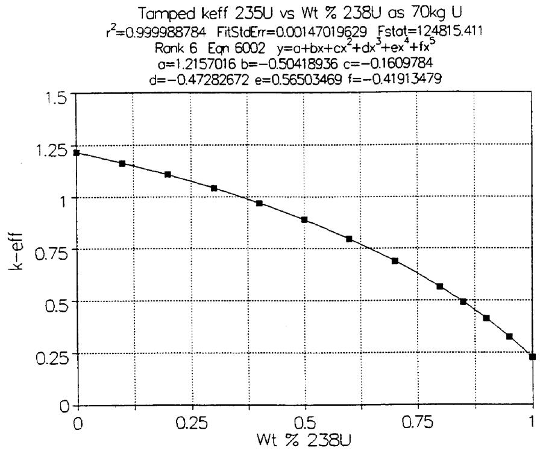

Tamped keff 235U vs Wt % 238U as 70kg U Mar 11,1997 11:55 AM

13 Active X-Y Points

X:Wt % 238U

Mean: 0.5615384615

SD: 0.3385962727

Y: k-eff

Mean: 0.7589884615

SD: 0.3352789163

File Source: NEXT03.PRN

Rank 6 Eqn 6002 $y = a + bx + cx2 + dx3 + ex4 + fx5$

r2 Coef Det

DFAdjr2

Fit Std Err

F-value

0.9999887836

0.9999775671

0.0014701963

124815.4114

<table><tr><td>Parm</td><td>Value</td><td>Std Error</td><td>t-value</td><td colspan="2">99% Confidence Limits</td></tr><tr><td>a</td><td>1.215701644</td><td>0.001449741</td><td>838.564562</td><td>1.210627854</td><td>1.220775434</td></tr><tr><td>b</td><td>-0.50418936</td><td>0.034575245</td><td>-14.5823799</td><td>-0.62519545</td><td>-0.38318327</td></tr><tr><td>c</td><td>-0.1609784</td><td>0.23948783</td><td>-0.6721778</td><td>-0.99913547</td><td>0.677178667</td></tr><tr><td>d</td><td>-0.47282672</td><td>0.630445861</td><td>-0.74998782</td><td>-2.67925473</td><td>1.733601294</td></tr><tr><td>e</td><td>0.565034692</td><td>0.698823809</td><td>0.808551003</td><td>-1.88070177</td><td>3.010771151</td></tr><tr><td>f</td><td>-0.41913479</td><td>0.275388851</td><td>-1.52197445</td><td>-1.3829379</td><td>0.544668306</td></tr></table>

<table><tr><td colspan="3">Rank 6 Eqn 6002 y=a+bx+cx»+dx3+ex4+fx5</td></tr><tr><td colspan="3">r2=0.999988783562</td></tr><tr><td>F=124815.411401</td><td colspan="2">Oá Tamped keff 235U vs Wt % 238U as 70kg U ác</td></tr><tr><td>a=1.21570164398</td><td>°Wt % 238U</td><td>k-eff</td></tr><tr><td>b=-0.504189361591</td><td>°0</td><td>1.21570164398</td></tr><tr><td>c=-0.160978402622</td><td>°0.1</td><td>1.1632524092</td></tr><tr><td>d=-0.472826716945</td><td>°0.2</td><td>1.10541195419</td></tr><tr><td>e=0.565034692252</td><td>°0.3</td><td>1.04074874136</td></tr><tr><td>f=-0.419134794748</td><td>°0.357579350471</td><td>1</td></tr><tr><td></td><td>°0.4</td><td>0.968181392861</td></tr><tr><td></td><td>°0.5</td><td>0.886475728838</td></tr><tr><td></td><td>°0.6</td><td>0.793741805695</td></tr><tr><td></td><td>°0.7</td><td>0.686930954323</td></tr><tr><td></td><td>°0.8</td><td>0.561332818354</td></tr><tr><td></td><td>°0.9</td><td>0.410072392405</td></tr><tr><td>X=Wt % 238U</td><td>°1</td><td>0.223607060323</td></tr><tr><td>Y=k-eff</td><td></td><td></td></tr><tr><td></td><td></td><td></td></tr><tr><td></td><td></td><td></td></tr><tr><td>Enter Value [x=,y=]</td><td></td><td></td></tr><tr><td></td><td></td><td></td></tr><tr><td>Press Esc to End Evaluation</td><td></td><td></td></tr><tr><td></td><td>aáááááááááááááááááááááááááááááááááááááááááááááááááááááááááááááááááááááááááááááááááááááááááááááááááááá</td><td></td></tr></table>

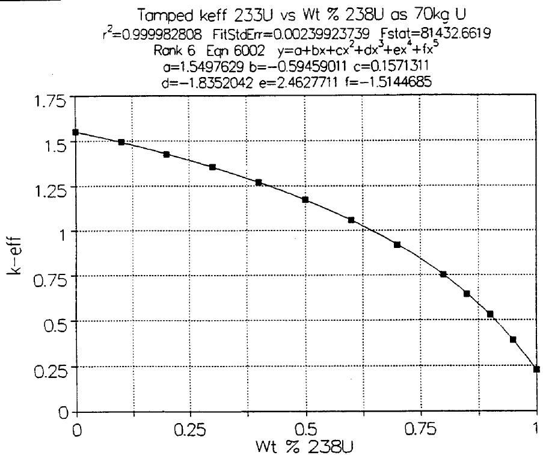

Tamped keff 233U vs Wt % 238U as 70kg U Mar 11,1997 11:58 AM

13 Active X-Y Points

X:Wt % 238U

Mean: 0.5615384615

SD: 0.3385962727

Y: k-eff

Mean: 0.9813076923

SD: 0.4419474676

File Source: NEXT04.PRN

Rank 6 Eqn 6002 $y = a + bx + cx2 + dx3 + ex4 + fx5$

r2 Coef Det

0.9999828082

DF Adj r2

0.9999656164

Fit Std Err

0.0023992374

F-value

81432.661896

Parm Value

a 1.549762898

b -0.59459011

c 0.157131099

d -1.83520416

e 2.462771089

f -1.51446847

Std Error t-value

0.002365856 655.0536366

0.056423909 -10.5379106

0.390824109 0.40205068

1.028834921 -1.78376931

1.140422013 2.159526088

0.449411574 -3.369892

99% Confidence Limits

1.541482898 1.558042899

-0.79206193 -0.39711828

-1.21067114 1.524933341

-5.43591014 1.765501831

-1.52846627 6.45400845

-3.08731452 0.058377588

# INTERNAL DISTRIBUTION

1. C.W. Alexander

2. J.J.Bedell

3. J. M. Begovich

4. P.J.Bereolos

5. B. B. Bevard

6. L. F. Blankner

7. B. L. Broadhead

8. H.E.Clark

9. E. D. Collins

10. S.O.Cox

11. A. G. Croff

12. M. D. DeHart

13. W. D. Duerksen

14 K.R.Elam

19. C. W. Forsberg

20. E.H.Gift

21. L. L. Gilpin

22. N. M. Greene

23. S. R. Greene

24. M.J.Haire

25. S. A. Hodge

26. C. M. Hopper

27. M.W.Kohring

28-32. A.M.Krichinsky

33. M. A. Kuliasha

34. D. W. Langenberg

35. A.J.Lucero

36. S. B. Ludwig

37. M. McBride

38. L. E. McNeese

39. G.E.Michaels

40. J. F. Mincey

41. H. J. Monroe

42. D. L. Moses

43. D. E. Mueller

44. D. G. O'Connor

45. C. V. Parks

46. B. D. Patton

47. L. M. Petrie

48. B. A. Powers

49. R. T. Primm, III

50. D. W. Ramey

51. D. A. Reed

52. D.E.Reichle

53. K. D. Rowley

54. J. E. Rushton

55. A.R.Sadlowe

56. O.M.Stansfield

57. B.W.Starnes

58. J.O.Stiegler

59. S. N. Storch

60. N. R. Sweat

61. J. S. Tang

62. O.F.Webb

63. R.M.Westfall

64. K. A. Williams

65. B. A. Worley

66. R. Q. Wright

67. L. K. Yong

68. Central Research Library

69. Laboratory Records-RC

70. Document Reference Section

# EXTERNAL DISTRIBUTION

71. Al Alm, U.S. Department of Energy, Assistant Secretary, Environmental Management, 1000 Independence Ave., S.W., Washington, D.C. 20585.   
72. Joe Arango, U.S. Department of Energy, S-3.1, Rm. 6H-025, 1000 Independence Ave., S.W., Washington, D.C. 20585.   
73. Guy Armantrout, Lawrence Livermore National Laboratory, MS-L394, P.O. Box 808, Livermore, California 94551.

74. John Baker, U.S. Department of Energy, Forrestal Bldg., 6G-050, MS-MD-2, 1000 Independence Ave., S.W., Washington, D.C. 20585.   
75. M. W. Barlow, Westinghouse Savannah River Company, Savannah River Site, Bldg. 704-C, Aiken, South Carolina 29808.   
76. Lake Barrett, U.S. Department of Energy, Office of Civilian Radioactive Waste Management, 1000 Independence Ave., S.W., Washington, D.C. 20585.   
77. Ralph Best, SAIC, P.O. Box 2501, 800 Oak Ridge Turnpike, Oak Ridge, Tennessee 37831-2501.   
78. Wade E. Bickford, Westinghouse Savannah River Company, Savannah River Site, Bldg. 773-41A, Aiken, South Carolina 29808.   
79. Alenka Brown-Van Hoozer, Argonne National Laboratory, P.O. Box 1625, Idaho Falls, Idaho 83415-3750.   
80. Mathew Bunn, National Academy of Sciences, Founder's Bldg., 1055 Thomas Jefferson Street, N.W., Washington, D.C. 20007.   
81. H. R. Canter, U.S. Department of Energy, Acting Director, Office of Fissile Materials Disposition, 1000 Independence Ave., S.W., Washington, D.C. 20585.   
82. Dr. Donald E. Carlson, Senior Criticality and Shielding Engineer, U.S. Nuclear Regulatory Commission, Spent Fuel Project Office, Nuclear Material Safety and Safeguards, MS 06-G22, 11555 Rockville Pike, Rockville, Maryland 20852.   
83. Nate Chipman, Idaho National Engineering and Environmental Laboratory, WCB, MS-3114, P.O. Box 1625, Idaho Falls, Idaho 83415-3114.   
84. George Christian, Lockheed Martin Idaho Technologies Company, North Building, Suite 1404, 955 L'Enfant Plaza, S.W., Washington, D.C. 20024.   
85. Ray Cooperstein, U.S. Department of Energy, Mail Stop DP-45, 19901 Germantown Rd., Germantown, Maryland 20874.   
86. T. Cotton, TRW Environmental Systems, Inc., 2650 Park Tower Dr., Vienna, Virginia 22180.   
87. Floyd L. Culler, Jr., Senior Technical Review Group, Mail Box 12098, Suite 800, 600 S. Tayler, Amarillo, Texas 79101.   
88. Paul Cunningham, Los Alamos National Laboratory, MS-A102, P.O. Box 1663, Los Alamos, New Mexico 87545.

89. A. I. Cygelman, U.S. Department of Energy, Office of Fissile Materials Disposition, DOE/MD-3, Forrestal Bldg., Rm. 6G-050, 1000 Independence Ave., S.W., Washington, D.C. 20585.   
90. Bill Danker, U.S. Department of Energy, DOE/MD-3, Forrestal Bldg., Rm. 6G-050, 1000 Independence Ave., S.W., Washington, D.C. 20585.   
91. Paul D. d'Entremont, Westinghouse Savannah River Company, Bldg. 703-H, Aiken, South Carolina 29802.   
92. Tom Doering, Framatome Cogema Fuels, 1180 Town Center Dr., Las Vegas, Nevada 89134.   
93. John Duane, Westinghouse Savannah River Company, Savannah River Site, Bldg. 704-F, Aiken, South Carolina 29808.   
94. C. Dunford, Brookhaven National Laboratory, National Nuclear Data Center, Bldg. 197D, Upton, NY 11973.   
95. Randy Erickson, Los Alamos National Laboratory, MS-F660, P.O. Box 1663, Los Alamos, New Mexico 87545.   
96. John Evans, U.S. Department of Energy, 1000 Independence Ave., S.W., Washington, D.C. 20585.   
97. Roland Felt, 780 DOE Place, Idaho Falls, Idaho 83415-1216.   
98. Michael L. Gates, U.S. Department of Energy, Project Planning and Integration, Nuclear Materials Stewardship Project Office, Albuquerque Operations Office, P.O. Box 5400, Albuquerque, New Mexico 87185-5400.   
99. Donald L. Goldman, Lawrence Livermore National Laboratory, P.O. Box 808, Livermore, California 94551.   
100. Bruce C. Goodwin, Lawrence Livermore National Laboratory, P.O. Box 808, Livermore, California 94551.   
101. Rose Gottemoller, U.S. Department of Energy, Office of Nonproliferation and National Security, 1000 Independence Ave., S.W., Washington, D.C. 20585.   
102. Peter Gottlieb, TESS, 1180 Town Center Dr., Las Vegas, Nevada 89134.   
103. Thomas Gould, Lawrence Livermore National Laboratory, MS-L186, P.O. Box 808, Livermore, California 94551.   
104. Leonard W. Gray, Lawrence Livermore National Laboratory, MS-L394, P.O. Box 808, Livermore, California 94551.   
105. M. Haas, U.S. Department of Energy, Rocky Flats Environmental Technology Site, P.O. Box 464, Golden, Colorado 80402.

106. James C. Hall, U.S. Department of Energy, Oak Ridge Operations Office, 20 Administration Rd., Oak Ridge, Tennessee 37831.   
107. Reginald Hall, Advanced Integrated Management Service, Suite B3, 575 Oak Ridge Turnpike, Oak Ridge, Tennessee 37831.   
108. Bill Halsey, Lawrence Livermore National Laboratory, MS-L369, P.O. Box 808, Livermore, California 94551.   
109. Roger Henry, P. O. Box 1625, Idaho Falls, Idaho 83415-3805.   
110. M. K. Holland, Westinghouse Savannah River Company, P.O. Box 616, Aiken, South Carolina 29802.   
111. J. D. Hulton, U.S. Department of Energy, Office of Fissile Materials Disposition, DOE/MD-4, Forrestal Bldg., Rm. 66-092, 1000 Independence Ave., S.W., Washington, D.C. 20585.   
112. Tim Hunt, U.S. Defense Nuclear Facilities Safety Board, Suite 700, 625 Indiana Ave., N.W., Washington, D.C. 20004.   
113. Brent Ives, Lawrence Livermore National Laboratory, 7000 East Ave., Livermore, California 94550.   
114. N. C. Iyer, Westinghouse Savannah River Company, Savannah River Site, Bldg. 773-A, Aiken, South Carolina 29808.   
115. Leslie Jardine, Lawrence Livermore National Laboratory, MS-L186, P.O. Box 808, Livermore, California 94551.   
116. Bill Jensen, U.S. Department of Energy, MS 1101, 850 Energy Dr., Idaho Falls, Idaho 38401-1563.   
117. Hoyt Johnson, U.S. Department of Energy, EM-66, Forrestal Bldg., 1000 Independence Ave., S.W., Washington, D.C. 20585.   
118. Ed Jones, Lawrence Livermore National Laboratory, 7000 East Ave., L-634, Livermore, California 94550.   
119. J. E. Jones, Jr., Haselwood Enterprises, Inc., Suite 300A, 1009 Commerce Park, Oak Ridge, Tennessee 37830.   
120. Professor William E. Kastenberg, University of California-Berkeley, Department of Nuclear Engineering, Berkeley, California 94720-1730.   
121. R. Kenley, U.S. Department of Energy, GA-242, EM-66, 1000 Independence Ave., S.W., Washington, D.C. 20585.   
122. J. F. Krupa, Westinghouse Savannah River Company, Savannah River Site, Bldg. 773-41A, Aiken, South Carolina 29808.

123. Terry Lash, U.S. Department of Energy, Office of Nuclear Energy Science and Technology, 1000 Independence Ave., S.W., Washington, D.C. 20585.   
124. Rodney Lehman, U.S. Department of Energy, DP-24, 19901 Germantown Rd., Germantown, Maryland 20874.   
125. Leroy Lewis, Lockheed Martin Idaho Technologies Company, P.O. Box 1625, Idaho Falls, Idaho 83415.   
126. Cary Loflin, U.S. Department of Energy, P.O. Box 5400, Albuquerque, New Mexico 87185-5400.   
127. Kathy Martin, U.S. Department of Energy, DOE/GC-52, 1000 Independence Ave., S.W., Washington, D.C. 20585.   
128. Herbert Massie, U.S. Defense Nuclear Facilities Safety Board, Suite 700, 625 Indiana Ave., N.W., Washington, D.C. 20004.   
129. Mal McKibben, Westinghouse Savannah River Company, Savannah River Site, Bldg. 773-41A, Rm. 123, Aiken, South Carolina 29808.   
130. T. McLaughlin, Los Alamos National Laboratory, ESH-6, P.O. Box 1663, Los Alamos, New Mexico 87545.   
131. Don McWhorter, Westinghouse Savannah River Company, Savannah River Site, Bldg. 704-F, Aiken, South Carolina 29808.   
132. Dave Michlewicz, U.S. Department of Energy, DOE/ER-7, 1000 Independence Ave., S.W., Washington, D.C. 20585.   
133. Lawrence E. Miller, U.S. Department of Energy, DOE/NE-40, 19901 Germantown Rd., Germantown, Maryland 20874.   
134. M. Miller, Massachusetts Institute of Technology, Security Studies Program, E38-603, 292 Main Street, Cambridge, Massachusetts 02139.   
135. Alan C. Mode, Lawrence Livermore National Laboratory, P.O. Box 808, Livermore, California 94551.   
136. Ed Moore, Westinghouse Savannah River Company, Savannah River Site, Bldg. 773-41A, Rm. 125, P.O. Box 616, Aiken, South Carolina 29808.   
137. Bruce Moran, U.S. Nuclear Regulatory Commission, MS-T-8-A33, Washington, D.C. 20555.   
138. Jim Nail, Lockheed Martin Idaho Technologies Company, P.O. Box 1625, Idaho Falls, Idaho 83415.   
139. Dave Neiswander, Advanced Integrated Management Services, Inc., Suite B-3, 575 Oak Ridge Turnpike, Oak Ridge, Tennessee 37830.

140. Jon Nielsen, Los Alamos National Laboratory, P.O. Box 1663, Los Alamos, New Mexico 87545.   
141. David Nulton, U.S. Department of Energy, Director, 1000 Independence Ave., S.W., Washington, D.C. 20585.   
142. Ronald Ott, Lawrence Livermore National Laboratory, P.O. Box 808, Livermore, California 94551.   
143. H. B. Peacock, Westinghouse Savannah River Company, Savannah River Site, Bldg. 773-A, Aiken, South Carolina 29808.   
144. Lee Peddicord, Texas A&M University, Strategic Programs, 120 Zachry, College Station, Texas 77843-3133.   
145. David Peeler, Westinghouse Savannah River Company, Savannah River Site, Bldg. 773-43A, Aiken, South Carolina 29808.   
146. Dave Pepson, U.S. Department of Energy, 1000 Independence Ave., S.W., Washington, D.C. 20585.   
147. Per F. Peterson, University of California-Berkeley, Department of Nuclear Engineering, Berkeley, California 94720-1730.   
148. K. L. Pilcher, Haselwood Enterprise, Inc., Suite 300A, 1009 Commerce Park, Oak Ridge, Tennessee 37830.   
149. Tish Price, U.S. Department of Energy, Rm. 700N, 1301 Clay St., Oakland, California 94612.   
150. Thomas Ramos, Lawrence Livermore National Laboratory, P.O. Box 808, Livermore, California 94551.   
151. Victor Reis, U.S. Department of Energy, Assistant Secretary, Defense Programs, 1000 Independence Ave., S.W., Washington, D.C. 20585.   
152. D. R. Rhoades, U.S. Department of Energy, DP24, 1000 Independence Ave., Washington, D.C. 20585-0002.   
155. John Richter, 5917 Royal Oak St., N.E., Albuquerque, New Mexico 87111.   
156. Gary D. Roberson, U.S. Department of Energy, NMSPO, P.O. Box 5400, Albuquerque, New Mexico 87185-5400.   
157. Susan B. Roth, University of California, Nuclear Materials and Stockpile Management Division, Nuclear Materials Management Office, MS E524, P.O. Box 1663, Los Alamos, New Mexico 87545.   
158. Greg Rudy, U.S. Department of Energy, Bldg. 703-A/E245N, P.O. Box A, Aiken, South Carolina 29802.   
159. S. S. Sareen, TRW, Suite 800, 2650 Park Tower Dr., Vienna, Virginia 22180.

160. Adam Schienman, U.S. Department of Energy, DOE/NN-40, 1000 Independence Ave., S.W., Washington, D.C. 20585.   
161. Glenn T. Seaborg, Senior Technical Review Group, Suite 800, 600 S. Tayler, Mail Box 12098, Amarillo, Texas 79101.   
162. Thomas F. Severynse, Westinghouse Savannah River Company, Nuclear Materials Stabilization Program, Bldg. 704-7, Aiken, South Carolina 29808.   
163. Linda Seward, Idaho National Engineering and Environmental Laboratory, P.O. Box 1625, Idaho Falls, Idaho 83415.   
164. Theodore Sherr, U.S. Nuclear Regulatory Commission, Washington, D.C. 20555.   
165. Michelle Smith, U.S. Department of Energy, DOE/NN-40, 1000 Independence Ave., S.W., Washington, D.C. 20585.   
166. Robert Stallman, U.S. Department of Energy, 850 Energy Dr., Idaho Falls, Idaho 38401.   
167. Warren Stern, Arms Control and Disarmament Agency, Rm. 4678, 320 21st Street, N.W., Washington, D.C. 20451.   
168. Carleton Stoiber, U.S. Nuclear Regulatory Commission, Washington, D.C. 20555.   
169-171. Elmer Stover, U.S. Department of Energy, DOE/NN-30, Rm. GA301, 1000 Independence Ave., S.W., Washington, D.C. 20585.   
172. Kent Sullivan, Westinghouse Savannah River Company, Savannah River Site, Bldg. 773-41A, Aiken, South Carolina 29808.   
173. Elizabeth Ten Eyck, U.S. Nuclear Regulatory Commission, Washington, D.C. 20555.   
174. Dean Tousley, U.S. Department of Energy, MD-4, 1000 Independence Ave. S.W., Washington, D.C. 20585.   
175. John Tseng, U.S. Department of Energy, DOE/EM-66, Forrestal Bldg., Rm. GA-242, 1000 Independence Ave., S.W., Washington, D.C. 20585.   
176. Bruce Twining, U.S. Department of Energy, Albuquerque Operations Office, P.O. Box 5400, Albuquerque, New Mexico 87185.   
177. Terry S. Vail, Westinghouse Hanford Company, R2-54, P.O. Box 1970, Richland, Washington 99352.   
178. Richard VanKonynenburg, Lawrence Livermore National Laboratory, MS-L269, P.O. Box 808, Livermore, California 94551.

179-181. Harry Vantine, Lawrence Livermore National Laboratory, P.O. Box 808, Livermore, California 94550.   
182. Don Vieth, 1154 Cheltenham Place, Maineville, Ohio 45039.   
183-185. Gary Wall, Los Alamos National Laboratory, MS-F669, P.O. Box 1663, Los Alamos, New Mexico 87545.   
186. K. E. Waltzer, U.S. Department of Energy, Savanna River Site, Bldg. 703-F, Aiken, South Carolina 29808.   
187-189. Mike Webb, Los Alamos National Laboratory, MS-F669, P.O. Box 1663, Los Alamos, New Mexico 87545.   
190. John Wilcynski, Manager, U.S. Department of Energy, Idaho Operations Office, MS-1203, 850 Energy Drive, Idaho Falls, Idaho 83401-1563.   
191. Jeff Williams, Idaho National Engineering and Environmental Laboratory, P.O. Box 1625, Idaho Falls, Idaho 83415.   
192. M. Williams, Louisiana State University, Nuclear Science Center, Baton Rouge, Louisiana 70803.   
193. Wendell L. Williams, U.S. Department of Energy, MD-3, Forrestal Bldg., 6G-081, 1000 Independence Ave., S.W., Washington, D.C. 20585.   
194. C. R. Wolfe, Westinghouse Savannah River Company, Savannah River Site, Bldg. 773-A, Aiken, South Carolina 29808.   
195. Jon Wolfstahal, U.S. Department of Energy, DOE/NN-40, 1000 Independence Ave., S.W., Washington, D.C. 20585.   
196. Jesse L. Yow, Jr., Lawrence Livermore National Laboratory, University of California, 7000 East Ave., Livermore, California 94550.   
197. Loong Yung, Advanced Integrated Management Service, Suite B3, 575 Oak Ridge Turnpike, Oak Ridge, Tennessee 37831.   
198. Office of Assistant Manager of Energy Research and Development, P.O. Box 2008, DOE-ORO, Oak Ridge, Tennessee 37831-6269.   
199-200. Office of Scientific and Technical Information, P.O. Box 62, Oak Ridge, Tennessee 37831.