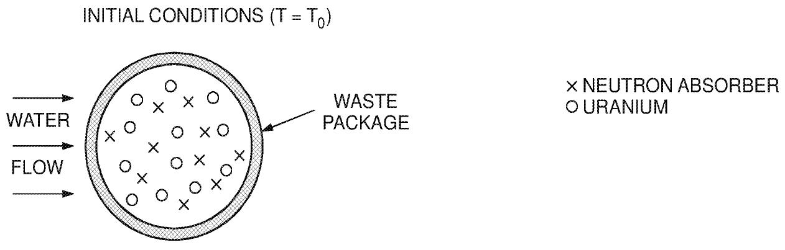
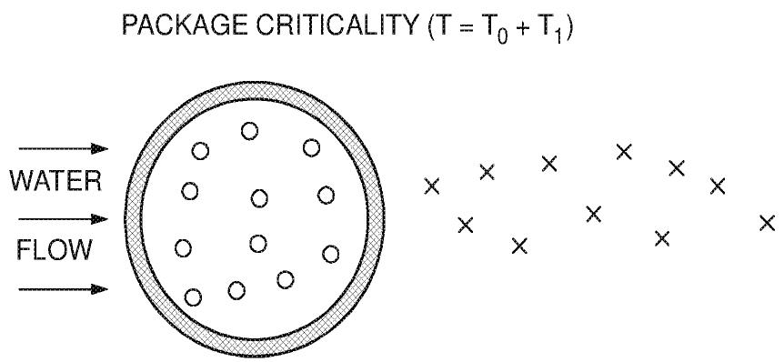
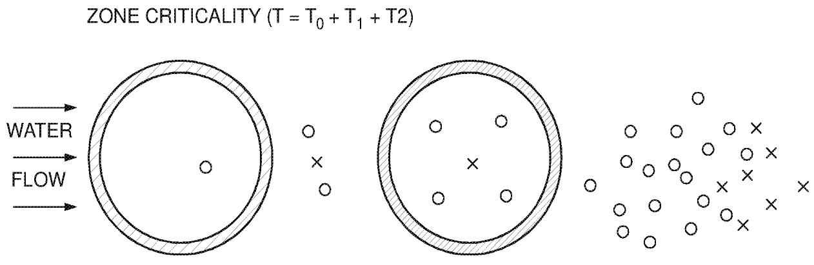
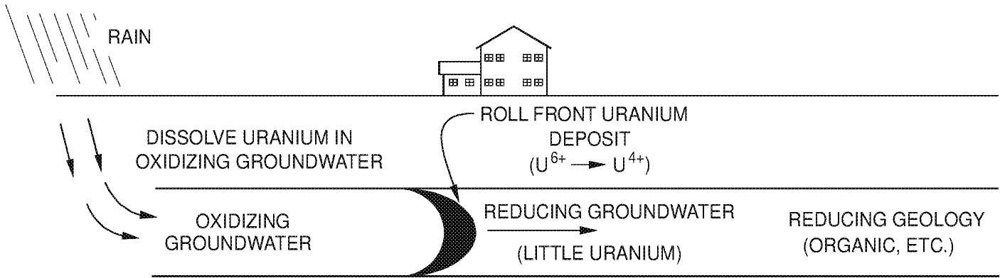
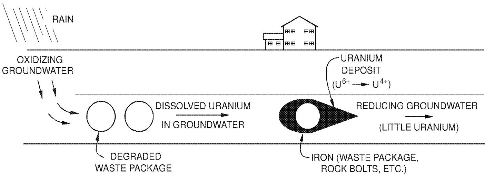

# ISOTOPIC DILUTION REQUIREMENTS FOR $^{233}\mathrm{U}$ CRITICALITY SAFETY IN PROCESSING AND DISPOSAL FACILITIES

K. R. Elam, C. W. Forsberg, C. M. Hopper, and R. Q. Wright

Oak Ridge National Laboratory*  
Oak Ridge, Tennessee 37831-6495

November 1997

# CONTENTS

LIST OF FIGURES V

LIST OF TABLES vii

ACRONYMS ix

EXECUTIVE SUMMARY xi

ABSTRACT XV

1. INTRODUCTION 1

1.1 BACKGROUND 1   
1.2 GOALS OF THIS REPORT 1  
1.3 REPORT STRUCTURE 2   
1.4 METHODOLOGY 2

2. APPROACHES TO CRITICALITY CONTROL 3  
3. BASIS FOR NUCLEAR CRITICALITY CONTROL BY ISOTOPIC DILUTION 5

3.1 PRECEDENTS: THE STRATEGY FOR CRITICALITY CONTROL OF WASTE $^{235}\mathrm{U}$ 5   
3.2 CRITICALITY CONTROL IN WASTE PROCESSING OPERATIONS 6

3.2.1 Process Options for $^{233}\mathrm{U}$ 6   
3.2.2 Characteristics of Waste Process Operations 6   
3.2.3 Current Criticality Control Practices 7   
3.2.4 233U Processing Example Case 8

3.3 CRITICALITY CONTROL IN DISPOSAL FACILITIES 9

3.3.1 Concerns About Nuclear Criticality in Repositories 9   
3.3.2 Specific Nuclear Criticality Scenarios 9

3.3.2.1 Package Criticality 11   
3.3.2.2 Zone Criticality 11   
3.3.2.3 Factors Affecting Isotopic Dilution Requirements for $^{233}\mathrm{U}$ 13

3.3.3 Institutional and Legal Requirements for Repository Criticality Control 14

3.3.3.1 Current Requirements 14   
3.3.3.2 NWTRB Recommendations 15

3.3.4 Conclusions 15

# CONTENTS (continued)

4.ISOTOPIC DILUTION OF $^{233}\mathrm{U}$ 17

4.1 METHODOLOGY 17   
4.2 RESULTS 18   
4.3 NEUTRONIC CONCLUSIONS 18

5. CONCLUSION 19   
6. REFERENCES 21

Appendix A: NEUTRONIC ANALYSIS OF $^{233}\mathrm{U}$ CRITICALITY CONTROL REQUIREMENTS A-1

# LIST OF FIGURES

Fig. 1 Alternative disposal facility criticality scenarios 10

Fig. 2 Natural and man-made formation of uranium ore deposits 12

# LIST OF TABLES

Table 1 Allowable enrichment levels for $^{235}\mathrm{U}$ without nuclear criticality controls . . . . . 7   
Table 2 Use of isotopic dilution for control of $^{235}\mathrm{U}$ nuclear criticality 8   
Table A.1 Computational results. A-8   
Table A.2 Example SCALE XSDRNM input for result No. 51 A-12   
Table A.3 SCALE calculated vs regression predicted values . A-14   
Table A.4 Influence of $^{234}\mathrm{U}$ and $^{236}\mathrm{U}$ on infinite systems of $^{235}\mathrm{U}$ diluted with $^{238}\mathrm{U}$ . . . . . . . . . . . . . . . . . . . . . . . . . . . . . . . . . . . . . . . . . . . . . . . . . . . . . . . . . . . . . . . . . . . . . . . . . .   
Table A.5 Characteristics of CEUSP material A-18   
Table A.6 $\mathbf{k}_{\infty}$ vs water volume fraction A-19

# ACRONYMS AND ABBREVIATIONS

ANS American Nuclear Society

CEUSP Consolidated Edison Uranium Solidification Program

CFR Code of Federal Regulations

DOE U.S. Department of Energy

DU Depleted uranium

DWPF Defense Waste Processing Facility

EBS Engineered barrier system

EIS Environmental impact statement

EPA U.S. Environmental Protection Agency

HEU High-enriched uranium

HLW High-level waste

IAEA International Atomic Energy Agency

LMES Lockheed Martin Energy Systems, Inc.

LWR Light-water reactor

NAS U.S. National Academy of Sciences

NRC U.S. Nuclear Regulatory Commission

NWTRB U.S. Nuclear Waste Technical Review Board

ORNL Oak Ridge National Laboratory

SNF Spent nuclear fuel

TRUW Transuranic Waste

WHC Westinghouse Hanford Company

WIPP Waste Isolation Pilot Plant

# EXECUTIVE SUMMARY

# BACKGROUND

With the end of the cold war, the U.S. government is examining options for disposing of excess fissile materials, which potentially include $^{233}\mathrm{U}$ . Part of this material will be retained for research, medical, and industrial uses. However, a portion of the inventory may be declared excess and consequently may require disposal.

Uranium-233 has a smaller critical mass than does either $^{235}\mathrm{U}$ or $^{239}\mathrm{Pu}$ and has other fissile properties that are also significantly different from other fissile isotopes. This report addresses the unique criticality issues associated with processing and disposal of $^{233}\mathrm{U}$ and suggests the use of isotopic dilution to minimize nuclear criticality control problems.

# CHARACTERISTICS OF PROCESSING AND DISPOSAL OF $^{233}\mathrm{U}$

The potential quantities of $^{233}\mathrm{U}$ requiring disposition are small, and some of the $^{233}\mathrm{U}$ contains $^{232}\mathrm{U}$ and its highly radioactive daughter products sufficient such as to require hot-cell processing of the material to an acceptable waste form. For these relatively small quantities of material, there are strong economic incentives to (1) use existing facilities and (2) avoid complex criticality control and other licensing issues associated with the high-level waste (HLW)/spent nuclear fuel repository program.

Existing U.S. Department of Energy (DOE) HLW vitrification facilities and proposed transuranic waste processing facilities may be able to process $^{233}\mathrm{U}$ . However, these facilities are not designed for significant concentrations of fissile materials. If such facilities are to be used, it is not possible to rely on traditional geometry or chemical (e.g. neutron absorbers or fissile concentration) controls to maintain nuclear criticality safety without substantial modifications of plant equipment and operations.

If neither geometric nor chemical control is practicable for nuclear safety in a processing facility, isotopic dilution (enrichment) is the best remaining criticality control option. Isotopic dilution is the addition of $^{238}\mathrm{U}$ sufficient such as to lower the $^{233}\mathrm{U}$ enrichment level below that at which nuclear criticality can occur. It is important to note that all uranium isotopes have the same chemical characteristics; therefore, the $^{238}\mathrm{U}$ used to isotopically dilute the $^{233}\mathrm{U}$ will not separate from the fissile uranium in any normal chemical process.

It is also difficult to rely on geometry or chemical composition alone within disposal facilities to control criticality over geological time frames. Several mechanisms can cause changes in waste

geometry and chemistry, including groundwater transport of uranium and mechanical disturbances of the waste. If criticality control is to be ensured for thousands of years by either geometric control or chemical control (including neutron absorbers), system performance must be predictable for these lengths of time. Such predictions are difficult to generate and are subject to substantial uncertainties. No such difficulties exist when isotopic dilution is used for criticality control.

# LEGAL AND INSTITUTIONAL CONSIDERATIONS

An expanding series of laws, regulations, recommendations, and actions by the U.S. government address nuclear criticality in regard to disposal facilities. A trend is developing to use isotopic dilution as the preferred method of criticality control for fissile materials following disposal. The environmental impact statement (DOE, June 1996) and record of decision (DOE, July 1996) for the disposition of excess high-enriched uranium (HEU) recommended isotopic dilution of the fissile $^{235}\mathrm{U}$ if any HEU was disposed of as a waste. The same considerations apply to the disposition of excess $^{233}\mathrm{U}$ . The U.S. Nuclear Waste Technical Review Board (NWTRB), the Congressionally-mandated review board for the proposed Yucca Mountain geological repository, has also recommended consideration of the use of depleted uranium (DU) to isotopically dilute fissile materials to prevent the potential for nuclear criticality in geological repositories containing fissile material (NWTRB, 1996). Finally, a recent U.S. Nuclear Regulatory Commission report made similar recommendations on the use of DU for criticality control in various disposal facilities (NRC, 1997).

# CONTROL OF NUCLEAR CRITICALITY BY ISOTOPIC DILUTION

The work presented herein determined that to ensure control of nuclear criticality in $^{233}\mathrm{U}$ by isotopic dilution with $^{238}\mathrm{U}$ , the $^{233}\mathrm{U}$ concentration must be reduced to $< 0.66 \, \mathrm{wt\%}$ . In terms of nuclear criticality safety, this concentration is equivalent to $^{235}\mathrm{U}$ at an enrichment level of $\sim 1.0 \, \mathrm{wt\%}$ —a level which will not result in nuclear criticality under conditions found in processing or disposal facilities. These uranium isotopic concentrations avoid the need to control other parameters to prevent nuclear criticality; that is, the $^{233}\mathrm{U}$ can be treated as another radioactive waste. At these concentrations, nuclear criticality will not occur in a geological environment, over time, nor in waste processing operations that have not been designed for fissile materials.

For mixtures of $^{233}\mathrm{U}$ and $^{235}\mathrm{U}$ , the amount of DU (with 0.2 wt % $^{235}\mathrm{U}$ ) in grams (g) required to ensure criticality control by isotopic dilution in a water-moderated system is the following:

$$
\mathrm {g} \quad \mathrm {D U} = 1 8 8 \cdot \mathrm {g} ^ {2 3 3} \mathrm {U} + \left(\frac {\mathrm {E} - 1}{0 . 8}\right) \cdot \mathrm {g} \text {o f e n r i c h e d u r a n i u m}, \tag {E.1}
$$

where

$$
\begin{array}{l} \mathrm{DU} = \mathrm{g}\text{of}\mathrm{DU}(0.2\mathrm{wt}\% {}^{235}\mathrm{U}) \\ \mathrm {E} = \text {the wt} \% \text {of} ^ {235} \mathrm {U}, \text {where the g of enriched uranium} = \text {total U} - ^ {233} \mathrm {U} \\ \end{array}
$$

In Eq. (E.1), $^{234}\mathrm{U}$ and $^{236}\mathrm{U}$ may be considered to be $^{238}\mathrm{U}$ providing the atom ratio of the $(^{234}\mathrm{U} +$

${}^{236}\mathrm{U})$ : ${}^{235}\mathrm{U}$ does not exceed 1.0. If the quantity of grams DU calculated using Eq. (E.1) is negative, the uranium material already contains sufficient ${}^{238}\mathrm{U}$ such as to ensure subcriticality; therefore, no additional DU is needed.

# REFERENCES

U.S. Department of Energy, Office of Fissile Materials Disposition, June 1996. Disposition of Surplus Highly Enriched Uranium Final Environmental Impact Statement, DOE/EIS-0240, Washington, D.C.   
U.S. Department of Energy, July 29, 1996. Record of Decision for the Disposition of Surplus Highly Enriched Uranium Final Environmental Impact Statement, Washington D.C.   
U.S. Nuclear Waste Technical Review Board, 1996. Report to the U.S. Congress and the Secretary of Energy: 1995 Findings and Recommendations, Arlington, Virginia.   
U.S. Nuclear Regulatory Commission, 1997. The Potential for Criticality Following Disposal of Uranium at Low-level Waste Facilities, NUREG/CR-6505, Washington, D.C.

# ABSTRACT

The disposal of excess $^{233}\mathrm{U}$ as waste is being considered. Because $^{233}\mathrm{U}$ is a fissile material, one of the key requirements for processing $^{233}\mathrm{U}$ to a final waste form and disposing of it is to avoid nuclear criticality. For many processing and disposal options, isotopic dilution is the most feasible and preferred option to avoid nuclear criticality. Isotopic dilution is dilution of fissile $^{233}\mathrm{U}$ with nonfissile $^{238}\mathrm{U}$ . The use of isotopic dilution removes any need to control nuclear criticality in process or disposal facilities through geometry or chemical composition. Isotopic dilution allows the use of existing waste management facilities, that are not designed for significant quantities of fissile materials, to be used for processing and disposing of $^{233}\mathrm{U}$ .

The amount of isotopic dilution required to reduce criticality concerns to reasonable levels was determined in this study to be $\sim 0.66$ wt $\%$ $^{233}\mathrm{U}$ . The numerical calculations used to define this limit consisted of a homogeneous system of silicon dioxide $(\mathrm{SiO}_2)$ , water $(\mathrm{H}_2\mathrm{O})$ , $^{233}\mathrm{U}$ , and depleted uranium (DU) in which the ratio of each component was varied to determine the conditions of maximum nuclear reactivity. About 188 parts of DU $(0.2\mathrm{wt}\%$ $^{235}\mathrm{U})$ are required to dilute 1 part of $^{233}\mathrm{U}$ to this limit in a water-moderated system with no $\mathrm{SiO}_2$ present. Thus, for the U.S. inventory of $^{233}\mathrm{U}$ , several hundred metric tons of DU would be required for isotopic dilution.

# 1. INTRODUCTION

# 1.1 BACKGROUND

With the fairly recent ending of the cold war, the U.S. government is examining options to dispose of excess fissile materials, which potentially include $^{233}\mathrm{U}$ . Part of this material will be retained for research, medical, and industrial uses. A portion of the inventory may be declared excess and, consequently, may require disposal.

If $^{233}\mathrm{U}$ is declared a waste, there are economic incentives to use existing waste processing facilities to prepare the material for disposal. Much of the $^{233}\mathrm{U}$ contains significant quantities of $^{232}\mathrm{U}$ and its highly radioactive daughter products. The characteristics of these materials may require that processing for waste management occur in hot cells. Because of the cost of such facilities and the relatively small quantities of $^{233}\mathrm{U} (< 2\mathrm{t})$ , it would be sensible to use current waste management facilities. However, these facilities were not designed for significant concentrations of fissile materials and for addressing any resulting nuclear criticality control issues. Therefore, criticality control is the major technical issue associated with using these facilities for $^{233}\mathrm{U}$ processing.

Requirements for disposal of this material as waste are being identified (Kocher, 1996). Most of the technical requirements are somewhat understood because they are similar to those required for other wastes. The exception is nuclear criticality safety requirements for the $^{233}\mathrm{U}$ wastes following their disposal. Because fissile materials can be used for nuclear weapons, materials with high fissile concentrations were not considered for disposal before the end of the cold war. Consequently, disposal of such fissile materials imposes the addition of criticality control to other requirements for safe disposal.

Uranium-233 has a smaller critical mass than does either $^{235}\mathrm{U}$ or $^{239}\mathrm{Pu}$ and has other fissile properties that are also significantly different from other fissile isotopes. This report addresses the unique criticality issues associated with processing and disposal of $^{233}\mathrm{U}$ and suggests the use of isotopic dilution to minimize nuclear criticality control problems.

# 1.2 GOALS OF THIS REPORT

The objectives of this report are to:

- Identify and describe regulatory, engineering, and other factors influencing the choice of a criticality control strategy.

- Describe the basis for choosing isotopic dilution as the preferred criticality control strategy for the disposition of $^{233}\mathrm{U}$ .   
- Identify and describe the technical factors and historical experience in isotopic dilution for criticality control.   
Determine required dilution of $^{233}\mathrm{U}$ with $^{238}\mathrm{U}$ to avoid criticality concerns during processing or disposal.

# 1.3 REPORT STRUCTURE

This report addresses three issues: (1) a description of the possible approaches to criticality control for $^{233}\mathrm{U}$ (presented in Sect. 2), (2) the basis for criticality control by isotopic dilution (described in Sect. 3), and (3) a neutronics analysis of the required dilution required for $^{233}\mathrm{U}$ (provided in Sect. 4). The appendix provides the detailed descriptions of the criticality analysis.

# 1.4 METHODOLOGY

The available information on criticality control for systems containing $^{233}\mathrm{U}$ is limited compared to the extensive theoretical and experimental work done with $^{235}\mathrm{U}$ systems. Therefore, the approach used in this study was to use the $^{235}\mathrm{U}$ experience to define criticality control requirements for analogous $^{233}\mathrm{U}$ systems.

# 2. APPROACHES TO CRITICALITY CONTROL

Nuclear criticality of fissile material is controlled through the balance of neutron production (i.e., through the fission process) with neutron losses (i.e., leakage from the fissile material system or nonfission neutron capture in the fissile material). Two common approaches to ensuring subcriticality are (1) geometric arrangement of fissile material which enhances neutron leakage from the system and (2) the use of neutron absorbers. Geometrically safe design of process equipment in a large-capacity plant is expensive. If neutron absorbers are used to control criticality, care must be taken to ensure that the absorbers do not chemically separate from the fissile material. Many different neutron absorbers (e.g., boron, gadolinium, cadmium, ${}^{238}\mathrm{U}$ ) are available. However, nuclear criticality in ${}^{233}\mathrm{U}$ systems can best be avoided by isotopic dilution of the ${}^{233}\mathrm{U}$ with the nonfissile neutron absorber ${}^{238}\mathrm{U}$ . This avoids the above constraints. Because all uranium isotopes have the same chemical characteristics, the ${}^{238}\mathrm{U}$ will not separate from the fissile uranium (which could be ${}^{233}\mathrm{U}$ or ${}^{235}\mathrm{U}$ ) in any normal chemical process, either before or after disposal.

If the $^{233}\mathrm{U}$ is declared waste, isotopic dilution converts the material from a fissile material for which nuclear criticality is a major safety concern into another type of very low-enriched uranium waste for which nuclear criticality is not a significant concern. This approach simplifies waste management operations in two ways:

1. It allows the use of existing waste management facilities such as high-level waste (HLW) vitrification plants for conversion of the uranium into an acceptable chemical form for disposal. Waste management facilities are not typically designed to be geometrically safe for criticality control, and chemical reactions within such processes may separate uranium from other elements that are neutron absorbers.   
2. It also allows disposal in a geological repository without creating new, unique, and difficult issues, such as the expected repository licensing requirements for the control of nuclear criticality.

This simplification is important for disposition of $^{233}\mathrm{U}$ , which, although a unique material, is in quantities that are small when compared to quantities of excess plutonium or excess high-enriched uranium (HEU). While the development of new technologies, new facilities, and new institutional structures may be warranted for the disposition of large quantities of excess plutonium or HEU, such costs would be excessive for disposition of the smaller quantities of $^{233}\mathrm{U}$ . Therefore, strong economic incentives exist to use current technologies, systems, and facilities where possible. Isotopic dilution is an acceptable nuclear criticality control in existing facilities in which neither geometric nor chemical conditions can be tightly controlled.

# 3. BASIS FOR NUCLEAR CRITICALITY CONTROL BY ISOTOPIC DILUTION

The recommendation to use isotopic dilution for nuclear criticality control during the processing and disposing of $^{233}\mathrm{U}$ is based on three considerations: (1) the decision to use isotopic dilution for disposition of $^{235}\mathrm{U}$ , (2) technical factors associated with criticality control in process operations, and (3) technical and institutional factors associated with criticality control in disposal facilities.

# 3.1 PRECEDENTS: THE STRATEGY FOR CRITICALITY CONTROL OF WASTE $^{235}\mathrm{U}$

The U.S. Department of Energy (DOE), in its environmental impact statement (EIS) on disposition of surplus HEU (DOE, June 1996) and the subsequent Record of Decision (DOE, July 1996) has defined preferred alternatives for disposition. The relatively pure HEU is to be blended with $^{238}\mathrm{U}$ down to 4 wt $\%$ $^{235}\mathrm{U}$ and sold for power reactor fuel. The HEU with no commercial value (because of various impurities, including $^{236}\mathrm{U}$ ) is to be isotopically diluted with $^{238}\mathrm{U}$ to eliminate safeguards and nuclear criticality concerns and disposed of as waste. For HEU that is declared waste, the EIS recommended blending down to 0.9 wt $\%$ $^{235}\mathrm{U}$ to eliminate criticality concerns. This conservative value was chosen to bound the environmental impacts of uranium-processing operations. (The homogeneous nuclear criticality limit for $^{235}\mathrm{U}$ is ~1 wt $\%$ $^{235}\mathrm{U}$ .) The lower the final enrichment of the waste uranium, the more DU that must be added to the HEU, the larger the processing requirements, and the more waste there will be to dispose of. It is also noteworthy that a recent U.S. Nuclear Regulatory Commission (NRC) report made similar recommendations on the use of DU for criticality control in various disposal facilities (NRC, 1997).

The decision to use isotopic dilution to below $1\%$ ${}^{235}\mathrm{U}$ as the preferred strategy for criticality control in the disposition of excess HEU as waste is based on many considerations. These include:

- Historical, experimental, and theoretical information suggests that if uranium enrichments are $>1.3 \mathrm{wt} \%$ $^{235}\mathrm{U}$ , nuclear criticality in a geological repository is a possibility (Naudet, 1977). In fact, the historical geological records (Brookins, 1990; Cowan, July 1976; and Smellie, March 1995) show that nuclear criticality has occurred in natural uranium ore bodies in the past. At the Oklo, Africa, site, 15 natural nuclear reactors have been identified which operated when the $^{235}\mathrm{U}$ enrichment of natural uranium on earth was $\sim 3.6 \mathrm{wt} \%$ . When these natural reactors shut down, the $^{235}\mathrm{U}$ enrichments were as low as $1.3 \mathrm{wt} \%$ an enrichment which is equivalent to the fissile enrichment of full-burnup light-water reactor (LWR) spent nuclear fuel (SNF). Today, natural uranium deposits have a $^{235}\mathrm{U}$ enrichment level of $0.71 \mathrm{wt} \%$ . Nuclear criticality can now no longer occur in natural uranium ore bodies because of these low enrichment levels.   
- The French Atomic Energy Commission (Commissariat Francais a L'Energie Atomique) has studied the conditions during which natural nuclear reactors formed (Naudet, 1977). Its analysis indicates that nuclear criticality could occur at enrichments as low as $1.28 \mathrm{wt} \%^{235} \mathrm{U}$ , but criticality becomes more reasonably probable in some geological environments as enrichments approach $1.64 \mathrm{wt} \%^{235} \mathrm{U}$ .

- Criticality standards [American Nuclear Society (ANS), October 7, 1983] and laboratory experiments (Paxton and Pruvost, July 1987) with the types of materials found in the natural environment indicate that nuclear criticality could, in theory, occur with fissile enrichment concentrations as low as $1 \mathrm{wt} \%^{235} \mathrm{U}$ , but no experimental evidence exists that such an event has occurred in nature. Such criticality in a natural system would require nearly incredible conditions.   
- Modeling studies for disposal of high-enriched SNF in repositories using waste packages not filled with depleted uranium (DU) show nuclear criticality to be the major technical issue for disposition of such fuels (Rechard, 1993; Patric and McDonell, March 6, 1992). The models conclude that criticality may occur in a repository in a manner similar to that which has occurred in the natural environment. The uncertainties associated with geochemical evolution of a repository, over time, make predictions highly uncertain.

The criticality and safeguards concerns associated with disposing of $^{235}\mathrm{U}$ also apply to $^{233}\mathrm{U}$ . The same techniques for criticality control are also applicable, and the institutional precedents set by the HEU EIS are noteworthy.

# 3.2 CRITICALITY CONTROL IN WASTE PROCESSING OPERATIONS

# 3.2.1 Process Options for $^{233}\mathrm{U}$

Many options are available for preparing and processing $^{233}\mathrm{U}$ for disposal. However, no decision has been made on the preferred option. Large waste management facilities with billion-dollar capital costs exist, and additional facilities are being built. Because the quantities of excess $^{233}\mathrm{U}$ are small, there are strong economic incentives to use these existing facilities. However, none are designed to handle fissile materials for which nuclear criticality is a consideration. Examples of options include:

- HLW glass logs. DOE is vitrifying HLW into borosilicate glass logs for disposal. The Defense Waste Processing Facility (DWPF) is operating at the Savannah River Site, and other facilities for vitrifying HLW are under construction or are being planned. Excess $^{233}\mathrm{U}$ could be added to the HLW tanks and converted into glass.   
- Transuranic waste (TRUW) processing facility. DOE, Idaho Operations Office, has requested proposals to process TRUW in order to minimize storage, transport, and disposal costs and risks. Excess $^{233}\mathrm{U}$ could be coprocessed with these materials.

# 3.2.2 Characteristics of Waste Process Operations

In most waste management operations, criticality control is not an issue because the quantities of fissile materials in the waste streams are very low or fissile materials such as $^{235}\mathrm{U}$ are isotopically diluted with DU before being processed for disposal to eliminate criticality concerns. For many types of waste management operations, it is difficult or impossible to ensure criticality control by controlling the geometry or chemical composition.

Wastes are usually heterogeneous, but after waste processing, a homogeneous, high-quality waste product is often obtained by blending and mixing wastes before their treatment to obtain a chemically uniform feed to the treatment process. For example, HLW is blended in batches of several hundred thousand gallons before it is converted to HLW glass. Criticality control via geometry limits on equipment is not practicable for such large-scale process operations.

Because most wastes do not have uniform chemical compositions that are well-defined, the front-end chemistry in most waste management processes is also not well-defined. If the chemistry changes during processing, uranium may precipitate or concentrate. Therefore, a feed material containing dilute concentrations of uranium will not necessarily remain dilute throughout the entire process.

These intrinsic characteristics of most large-scale waste processing facilities imply that the only viable nuclear criticality control strategy for such facilities is isotopic dilution of the fissile uranium with $^{238}\mathrm{U}$ .

# 3.2.3 Current Criticality Control Practices

Nuclear criticality is avoided in chemical processes that are not designed for geometric nuclear criticality control by either not allowing fissile material into the waste management systems or by limiting the enrichment level of uranium fed to these systems. Table 1 shows the allowable enrichment levels for $^{235}\mathrm{U}$ in different facilities for which no other criticality controls are required. Table 2 shows the allowable enrichment levels after isotopic dilution for $^{235}\mathrm{U}$ at different DOE facilities at which isotopic dilution is conducted as a pretreatment option before fissile wastes enter the treatment system.

Table 1. Allowable enrichment levels for ${}^{235}\mathrm{U}$ without nuclear criticality controls   

<table><tr><td>Site</td><td>Allowable 235U</td><td>Reference</td></tr><tr><td>Y-12a</td><td>1.0</td><td>Lockheed Martin Energy System (LMES), February 1995</td></tr><tr><td>ETTPb</td><td>0.93</td><td>LMES, February 1995</td></tr><tr><td>Hanfordc</td><td>1.0</td><td>Westinghouse Hanford Company (WHC), 1994</td></tr><tr><td>Hanfordd</td><td>0.71</td><td>WHC, 1994</td></tr></table>

${}^{a}$ Limits for liquid disposal systems.   
${}^{b}$ Limits for liquid disposal system,uranium enrichment facility with associated variable enrichments.   
${}^{c}$ As homogeneous solutions,compounds,and metals.   
${}^{d}$ Any amount (except as reflectors).

Table 2. Use of isotopic dilution for control of ${}^{235}\mathrm{U}$ nuclear criticality   

<table><tr><td>Site</td><td>Allowable 235U</td><td>Reference</td></tr><tr><td>Oak Ridge National Laboratory</td><td>1.00%</td><td>LMES, February 1995</td></tr><tr><td>Savannah River Technical Center</td><td>0.65%</td><td>Westinghouse Savannah River Company, May 23, 1995</td></tr></table>

These criticality control limits are based on decades of theoretical analysis, laboratory experiments (Paxton and Pruvost, 1987), and plant experience. Also, current industrial standards address the requirements for criticality controls (ANS, 1983).

The allowable $^{235}\mathrm{U}$ assay chosen for criticality control by isotopic dilution depends upon a number of technical factors. If the wastes to be disposed of are solutions, a higher assay of $^{235}\mathrm{U}$ can be allowed because the $^{238}\mathrm{U}$ is isotopically mixed with the waste. If the wastes contain solids, isotopic exchange of the $^{235}\mathrm{U}$ with the $^{238}\mathrm{U}$ will occur, over time, but the process may be slow. In such cases, added DU may be required to compensate for mixing uncertainties.

# 3.2.4 $^{233}\mathrm{U}$ Processing Example Case

One of the vitrification options for disposition of $^{233}\mathrm{U}$ involves the use of the DWPF. This option provides an example of the issues associated with nuclear criticality in process operations. This example also shows the need to examine the specific issues associated with each option. Feed to the DWPF is from an HLW tank farm. Either the tank farm or the DWPF may place mass limits on $^{233}\mathrm{U}$ feeds. In this example, the HLW tank farm currently contains 160 t of uranium with an average enrichment of ~0.5 wt $\%$ $^{235}\mathrm{U}$ . Most of this uranium is in only a few tanks. Because the quantities of $^{233}\mathrm{U}$ for disposal are relatively small, if the $^{233}\mathrm{U}$ is mixed with the HLW in the high-uranium tanks, isotopic dilution would lower the enrichment to levels sufficient to remove criticality concerns for feed to the DWPF. Thus, in this example, the criticality issues are (1) acceptance by the tank farm of the $^{233}\mathrm{U}$ and (2) assurance that it is possible to mix the $^{233}\mathrm{U}$ uniformly with the existing HLW. In this case, it may be feasible to partly isotopically dilute the $^{233}\mathrm{U}$ , add other neutron absorbers that are required to make glass, and feed the mixture first to the HLW tanks and then the DWPF. Such options may significantly reduce the need to add DU to the $^{233}\mathrm{U}$ for disposition and minimize final waste volumes. Several waste streams with high DU loadings in the DOE complex have the potential for coprocessing and disposal.

# 3.3 CRITICALITY CONTROL IN DISPOSAL FACILITIES

Several disposal options exist for $^{233}\mathrm{U}$ if it is declared a waste. No decision has been made on the choice of a preferred option. Options include, but are not limited to, the Yucca Mountain site, which is a candidate for an HLW repository; the Waste Isolation Pilot Plant (WIPP); and special-case waste facilities. The fundamental criticality control requirements are similar for all disposal sites, but the specific details about how the requirements are to be achieved may differ.

# 3.3.1 Concerns About Nuclear Criticality in Repositories

Nuclear criticality must be avoided in any disposal site to prevent the release of radionuclides to the environment. Evidence from nuclear reactors naturally occurring in the geological past [Cowan, July 1976; International Atomic Energy Agency (IAEA), 1975; IAEA, 1977; and Smellie, March 1995] indicate that such events have generated both added radioactivity and heat over time periods of hundreds of thousands of years. The heat generated creates higher disposal site temperatures that accelerate chemical reactions which, in turn, degrade waste packages and waste forms. This added heat also causes water movement within a disposal site that may transport radioactivity to the environment (Buscheck and Nitao, December 1993) and contributes to large uncertainties in site performance. Water movement can be accelerated in both unsaturated (Buscheck, Nitao, and Wilder, December 1993) and saturated geological environments by heat. In this context, it is important to emphasize that the concern is not necessarily that nuclear criticality may occur or that some radioactivity is added to the disposal site, but rather that criticality may occur sufficiently and often for a long enough period of time such as to generate significant amounts of heat, which is a driver for groundwater movement and, hence, radionuclide transport.

If the $^{233}\mathrm{U}$ material is disposed of in a repository with SNF or HLW, there is initially significant radioactive decay heat. To minimize the potential impacts of heat on repository performance, the waste is packaged in long-lived waste packages. The radioactive decay heat is expected to decrease to low levels before the waste packages degrade significantly. Nuclear criticality, should it occur, would most likely occur after loss of waste package integrity. Therefore, the waste package system can not be expected to contain or prevent the added heat from affecting the repository environment.

# 3.3.2 Specific Nuclear Criticality Scenarios

There are two classes of repository criticality concerns (Fig. 1): nuclear criticality involving a single waste package (package criticality) and nuclear criticality involving fissile material from multiple waste packages (zone criticality). In both classes, there are many possible scenarios. Several of these are described below.





  
Fig. 1. Alternative disposal facility criticality scenarios.

# 3.3.2.1 Package Criticality

Over time, the waste package degrades. Water selectively leaches components from the waste package. In particular, it is known (Vernaz and Godon, 1992) that boron and certain other neutron poisons will leach preferentially from a waste package (Fig. 1). Subsequently, if the waste package contains sufficient fissile material, criticality could occur. This type of nuclear criticality is primarily associated with large waste packages loaded with many critical masses of fissile material. The probability of a nuclear criticality occurrence is highly dependent upon the details of the waste package design and the waste form selected.

# 3.3.2.2 Zone Criticality

Once the waste package has degraded, materials within the waste package will begin to leach into the groundwater at various rates. Chemical neutron poisons (boron, rare earths, cadmium, etc.) may separate from the uranium, the uranium will dissolve in groundwater, migrate, and then redeposit. In the geological environment, uranium dissolves in oxidizing groundwater and then precipitates under chemically reducing conditions (Wronkiewicz et al., 1992; Smellie, March 1995). Uranium may also be precipitated by the formation of less soluble uranium species in the same uranium oxidation state. These chemical mechanisms created most of the natural uranium ore bodies. In addition, some of these deposits are the result of placer deposit mechanisms during which high-density materials (e.g., uranium oxides and gold) separated from other materials while in flowing water. Other deposits have formed because of temperature differences in hydrothermal systems. In a repository, the same geological mechanisms will operate and may concentrate and purify uranium (Fig. 2).

Some of these mechanisms may be accelerated by oxidizing groundwater conditions (which occur at the proposed Yucca Mountain repository) and the inclusion of chemical reducing agents in the repository (i.e., iron in waste packages) and tunnel support systems (i.e., rock bolts, etc.) that create local chemically reducing conditions for buildup of uranium deposits. These are much longer term phenomena (Fig. 1) than package criticality.

The potential for zonal nuclear criticality events can be eliminated by isotopic dilution. Because the mechanisms involve transport of the uranium from the waste package, it may not always be necessary that the DU be isotopically mixed with the enriched uranium in the waste package. It is only required that uranium be isotopically mixed when the uranium is transported from the waste package. In some situations, this is an important distinction.

  
FORMATION OF URANIUM ORE DEPOSITS FROM URANIUM IN ROCK

  
FORMATION OF URANIUM ORE DEPOSITS FROM URANIUM WASTES   
Fig. 2. Natural and man-made formation of uranium ore deposits.

Studies (Forsberg et al., November 1995; Forsberg et al., April 1996; Forsberg et al., December 1996) have been conducted on filling LWR SNF waste packages with small beads of DU oxide or DU silicates. The same option could exist for other waste forms. The rationale is that as the waste package degrades and groundwater flows through the waste package, the DU will isotopically mix with the enriched uranium from the SNF. In the specific example of LWR SNF, a reasonable case can be made because (1) the amount of isotopic dilution required is small because of the low enrichment of the SNF, (2) the DU and SNF have the same chemical form (oxide) with similar dissolution rates, and (3) the DU in the SNF coolant channels is mixed with the enriched uranium on a scale of $1\mathrm{cm}$ in a waste package measured in meters.

In recent years, speculation has arisen that criticality events might occur in geological repositories (Bowman and Venneri, 1994) in addition to those demonstrated to have occurred at Oklo. However, these postulated criticality events appear to require special conditions that are very unlikely. Recent studies (Kastenberg et al., September 1996) show that use of isotopic dilution with $^{238}\mathrm{U}$ eliminates these theoretical criticality concerns.

# 3.3.2.3 Factors Affecting Isotopic Dilution Requirements for $^{233}\mathrm{U}$

Uranium geochemistry, the characteristics of uranium ore bodies, and naturally occurring nuclear reactors define the chemical and geometric conditions under which uranium may be found in the natural environment. This knowledge can be used to determine the minimum fissile enrichment of uranium required to avoid the potential for nuclear criticality in a disposal site.

There are many kinds of ore deposits. The only elements almost always associated with high-purity uranium deposits are hydrogen, oxygen, and silicon. The hydrogen is in the form of water that may be either free water or waters of hydration (mineralized). Oxygen is in the water, silicon oxides, and uranium minerals. Silicon may exist as silicon oxides or uranium silicates. Silicon and oxygen are also the dominant chemical species in the earth's crust.

Though other elements found in geological deposits may be effective neutron scatterers (e.g., silicon, aluminum, oxygen) or somewhat effective neutron absorbers (e.g., iron, sodium, calcium), no assurance can be provided that such elements will remain with the uranium during hydrogeochemical processes over geological time spans.

These considerations suggest that nuclear criticality in disposal sites can be prevented if isotopic dilution is sufficient such as to prevent nuclear criticality in a homogeneous system consisting of uranium, silicon oxide, and water in its most reactive configuration. This approach is a conservative control strategy that greatly reduces the need for addressing criticality issues in any repository setting.

# 3.3.3 Institutional and Legal Requirements for Repository Criticality Control

Until very recently, the only concentrated fissile-containing material that was considered for disposal was LWR SNF. For this reason, most of the institutional and legal requirements addressing nuclear criticality issues were developed in the context of LWR SNF. This will change as consideration is given for disposal of other fissile materials. In terms of heavy metal, LWR SNF is typically 1.5 wt % fissile materials (primarily $^{235}\mathrm{U}$ and $^{239}\mathrm{Pu}$ ) and 98.5 wt % $^{238}\mathrm{U}$ .

# 3.3.3.1 Current Requirements

The NRC regulations in 10 Code of Federal Regulations (CFR) Part 60.113 (1995) forbid nuclear criticality in a geological environment. Those regulations do not, however, specify the time period during which the disposal facility must comply with this requirement. The U.S. Nuclear Waste Technical Review Board (NWTRB) has stated that these requirements do not have a time limit.

The regulatory structure for both the candidate Yucca Mountain repository and WIPP are changing. The 1992 amendments to the Nuclear Waste Policy Act directed the U.S. Environmental Protection Agency (EPA) to formulate site-specific standards for protection of public health and safety for the candidate Yucca Mountain repository. The federal law also (a) mandated that the National Academy of Sciences (NAS) make a set of recommendations on what should be in the standard and (b) required that the final EPA standards be consistent with the recommendations of the NAS.

The NAS report, Technical Bases for Yucca Mountain Standards (1995), made several recommendations. The panel recommended that repository performance be considered out in time to the period of maximum risk to the public. By definition, this point in time occurs after waste package failure and migration of radionuclides (including uranium) through the geological environment. This time frame for regulatory concern includes sufficient time for uranium dissolution and precipitation and, therefore, the potential for nuclear criticality.

The NAS has not addressed the specific issue of repository nuclear criticality control. However, several members of the NAS Board of Radioactive Waste Management have published their perspectives on various aspects of repository design including nuclear criticality control. For example, Chris Whipple, the Chairman of this NAS Board recently stated (Whipple, June 1996):

"While the possibility of criticality at some time far into the future cannot be completely ruled out, simple technical fixes could render its probability negligible. The simple addition of DU to waste canisters would be one such approach."

# 3.3.3.2 NWTRB Recommendations

The NWTRB was created by law to review the technical design of the HLW and SNF waste management system. Although the NWTRB has no regulatory authority, its recommendations are widely read and usually followed by DOE, EPA, NRC, and NAS. In its Report To the U.S. Congress and the Secretary Of Energy: 1995 Findings and Recommendations (NWTRB, 1996), the NWTRB recommended isotopic dilution as the method to ensure nuclear criticality control for SNF in the repository. Specifically the NWTRB stated:

Estimating the probability of criticality within an intact or damaged waste package will be less difficult than estimating "external (zonal) criticality," i.e., criticality that may occur due to selective dissolution and transport of neutron absorbers and fissile materials, and their recombination outside the waste package. Although external criticality may be highly unlikely, it can not be dismissed without thorough analysis. The Board understands that DOE intends to use a probabilistic risk analysis methodology to address external criticality. While such an approach is appealing, it may turn out to be costly and time-consuming to the point of impracticality in a repository context because of the very large number of events and geometric configurations possible in a repository. The Board suggests that DOE consider increasing the criticality control of the engineered barrier system (EBS). Examples of increased criticality control robustness of the EBS could include a longer waste-package lifetime; more criticality control material inside the waste package; the use of fillers; and the use of criticality control material in packing, inverts, and backfill. In particular, the use of DU in filler, invert, or backfill material, or in all three, is a concept the program has not yet explored adequately. Conceivably, increasing the criticality control robustness of the EBS could turn a potentially intractable analysis of external criticality into a comparatively easy one.

# 3.3.4 Conclusions

Except for the use of $^{238}\mathrm{U}$ as a neutron absorber, neither geometry nor neutron absorbers can prevent nuclear criticality with certainty in a repository over geological time spans because of two problems:

- Geometry. In nature, uranium migrates via groundwater and other mechanisms. Uranium is concentrated from levels of parts per million in granite to $>80$ wt $\%$ uranium in some ore deposits.   
- Neutron absorbers. In a geological environment, uranium can separate from other neutron absorbers. However, theory, laboratory experiments, and field geology all indicate that isotopes of a given element cannot be separated by geochemical processes. Therefore, $^{238}\mathrm{U}$ will not separate from $^{235}\mathrm{U}$ or $^{233}\mathrm{U}$ under these conditions.

Technical, legal, and regulatory factors indicate that isotopic dilution of $^{233}\mathrm{U}$ with $^{238}\mathrm{U}$ is the preferred method for nuclear criticality control in a waste processing facility or a geological repository. Isotopic dilution should be sufficient to prevent criticality in any system containing $^{233}\mathrm{U}$ and water, regardless of the chemical composition of the surrounding materials.

# 4. ISOTOPIC DILUTION OF $^{233}\mathrm{U}$

# 4.1 METHODOLOGY

General dilution requirements, using DU (specifically, 0.2 wt $\%$ $^{235}$ U and 99.8 wt $\%$ $^{238}$ U), were developed to ensure the subcriticality of infinite homogeneous mixtures of ${}^{233}\mathrm{U}$ , DU, quartz sand [silicon dioxide ( $\mathrm{SiO}_2$ )], and water ( $\mathrm{H}_2\mathrm{O}$ ), and of infinite homogeneous mixtures of uranium enriched in ${}^{235}\mathrm{U}$ plus DU. Silicon dioxide and $\mathrm{H}_2\mathrm{O}$ were selected as the most restrictive materials for subcriticality that occur in large process systems and natural geological environments. Both silicon and oxygen have very small probabilities for capturing neutrons, thereby permitting neutrons to scatter about in the material until they are absorbed in the uranium or they are degraded in energy by scattering with hydrogen. Neutron absorption in uranium results in either the neutron being lost from the system through a parasitic capture process or fission occurring which results in further neutron production. The degradation of neutron energy through hydrogen-neutron scattering can increase the probability of neutrons causing ${}^{235}\mathrm{U}$ fission and can also increase the probability of neutrons being lost from the system by capture in hydrogen. Other neutron-absorbing compounds consisting of iron, calcium, and sodium cannot be ensured to be present in any specific proportion; consequently, they were not considered in this study. Therefore, only combinations of ${}^{233}\mathrm{U}$ , ${}^{235}\mathrm{U}$ , $\mathrm{SiO}_2$ , $\mathrm{H}_2\mathrm{O}$ , and DU were evaluated. The Standardized Computer Analyses for Licensing Evaluation (SCALE) software and neutron cross-sections (SCALE, April 1995) were used to evaluate subcritical mixtures of these materials. The selected subcritical value for the infinite-media neutron multiplication factor ( $k_{\infty}$ ) for the ${}^{233}\mathrm{U}$ mixtures was $\leq 0.95$ . The limiting subcritical enrichment for ${}^{235}\mathrm{U}$ (Paxton and Pruvost, July 1977) for optimally moderated homogeneous aqueous systems is well-defined to be $1\mathrm{wt}\%$ ${}^{235}\mathrm{U}$ . This value was used to define the subcritical DU dilution relationship for uranium enriched in ${}^{235}\mathrm{U}$ . Using the results of the computational study for ${}^{233}\mathrm{U}$ dilution and the knowledge about the subcriticality of aqueous homogeneous $1\mathrm{wt}\%$ ${}^{235}\mathrm{U}$ enriched uranium, a simple equation was developed to define the necessary DU dilution to ensure the subcriticality of a mixture of ${}^{233}\mathrm{U}$ and uranium enriched in ${}^{235}\mathrm{U}$ . The developed relationship for the most restrictive combinations of ${}^{233}\mathrm{U}$ , enriched uranium, and DU is based upon the commonly accepted concept that two or more mixtures of optimally water-moderated, subcritical (i.e., maximum $k_{\infty} \leq 1.0$ ), infinite-media fissile materials may be homogeneously combined and remain subcritical if the composition of the materials remains homogeneous [e.g., the unity rule in 10 CFR Part 71.24(b)(7)].

Because the physical and chemical conditions of $^{233}\mathrm{U}$ and $^{235}\mathrm{U}$ for some types of process and disposal options cannot be guaranteed, the results of this isotopic dilution study were reduced to the most

restrictive possible combination of materials (i.e., $\mathrm{SiO}_2$ , $\mathrm{H}_2\mathrm{O}$ , $\mathrm{DU}$ , ${}^{233}\mathrm{U}$ , ${}^{235}\mathrm{U}$ , and ${}^{238}\mathrm{U}$ ) that will ensure subcriticality. This approach also ensures criticality control for typical process systems. As determined from these computational studies and published data that are presented in the appendix to this report, the most restrictive combination of materials is a homogeneous mixture of uranium and water. For this study, the mixture was assumed to be a mixture of water molecules and uranium atoms.

# 4.2 RESULTS

A simple equation was developed to ensure the subcriticality of $^{233}\mathrm{U}$ and uranium enriched in $^{235}\mathrm{U}$ by dilution with DU, specifically 0.2 wt % $^{235}\mathrm{U}$ (see Appendix A). The mass of DU is expressed in terms of $^{233}\mathrm{U}$ and enriched uranium masses as:

$$
\mathrm {g} \quad \mathrm {D U} = 1 8 8 \cdot \mathrm {g} ^ {2 3 3} \mathrm {U} + \left(\frac {\mathrm {E} - 1}{0 . 8}\right) \cdot \mathrm {g} \text {o f e n r i c h e d u r a n i u m}, \tag {1}
$$

where

$$
\begin{array}{l} \mathrm{DU} = \mathrm{g}\text{of}\mathrm{DU}\left(\mathrm{i.e.},0.2\mathrm{wt}\%\right.^{235}\mathrm{U}) \\ \mathrm {E} = \text {the wt} \% \text {of} ^ {235} \mathrm {U} \text {where the g of enriched uranium} = \text {total U} - ^ {233} \mathrm {U}. \\ \end{array}
$$

In Eq. (1), $^{234}\mathrm{U}$ and $^{236}\mathrm{U}$ may be considered to be $^{238}\mathrm{U}$ providing that the atom ratio of the $(^{234}\mathrm{U} + ^{236}\mathrm{U})$ : $^{235}\mathrm{U}$ does not exceed 1.0. If the calculated quantity of g DU using Eq. (1) is negative, the uranium material already contains $^{238}\mathrm{U}$ sufficient such as to ensure subcriticality and no additional DU is needed.

A more general equation which applies to DU of other than $0.2\mathrm{wt}\%$ $^{235}\mathrm{U}$ is presented in Appendix A.

# 4.3 NEUTRONIC CONCLUSIONS

The developed DU dilution equation provided in Sect. 4.2 is a good first approximation for diluting $^{233}\mathrm{U}$ and enriched uranium—providing the mixture is homogeneous and consists of uranium compounds (excluding compounds of beryllium and deuterium) and water. The presence of other fissionable materials or non-neutron-absorbing, highly neutron-moderating elements such as nuclear-grade carbon, beryllium, or deuterium has not been considered in this work. Though other scattering or absorbing nuclides may be present in a mixture, their effects have not been accounted for in the reduction of required DU mass for dilution of $^{233}\mathrm{U}$ and enriched uranium.

Because the dilution equation uses DU as the diluent to approximate an equivalent $1\mathrm{wt}\%$ $^{235}\mathrm{U}$ enriched uranium and water-moderated system, the potential for an autocatalytic criticality accident (Kastenberg et al., 1996) is rendered impossible because homogeneous systems of $1\mathrm{wt}\%$ $^{235}\mathrm{U}$ cannot be made critical as a mixture of U and $\mathrm{H}_2\mathrm{O}$ .

# 5. CONCLUSION

To avoid nuclear criticality issues in process or disposal facilities with uranium containing $^{233}\mathrm{U}$ , it is recommended that the $^{233}\mathrm{U}$ be diluted with 188 parts by weight of DU (0.2 wt % $^{235}\mathrm{U}$ ) per part $^{233}\mathrm{U}$ . Because this degree of dilution with DU ensures subcriticality of optimumly water-moderated, homogeneous mixtures of $^{233}\mathrm{U}$ , less optimumly water-moderated mixtures have further subcritical $k_{\infty}$ values, thereby compensating for uncertain nuclear parameters for dry (less water-moderated) mixtures of $^{233}\mathrm{U}$ , $^{235}\mathrm{U}$ , and $^{238}\mathrm{U}$ . Additional DU would be required for any other fissile uranium isotopes in the uranium-containing materials. If significant $^{238}\mathrm{U}$ is already present in the material, an evaluation should be performed to determine if the material is already diluted sufficiently such that subcriticality can be ensured.

# 6. REFERENCES

American Nuclear Society, Oct. 7, 1983. American National Standard for Nuclear Criticality Safety in Operations with Fissionable Materials Outside Reactors, ANSI/ANS-8.1-1983, La Grange Park, Illinois.   
Brookins, D. G., 1990. "Radionuclide Behavior at the Oklo Nuclear Reactor, Gabon," Waste Management, 10, 285.   
Bowman, C. D. and F. Venneri, 1994. Underground Autocatalytic Criticality from Plutonium and Other Fissile Materials, LA-UR 94-4022, Los Alamos National Laboratory, Los Alamos, New Mexico.   
Buscheck, T. A. and J. J. Nitao, December 1993. "Repository-Heat-Driven Hydrothermal Flow at Yucca Mountain, Part I," Nucl. Tech. 104(3), 418.   
Buscheck, T. A., J. J. Nitao, and D. G. Wilder, December 1993. "Repository-Heat-Driven Hydrothermal Flow at Yucca Mountain, Part II," Nucl. Tech. 104(3), 449.   
Cowan, G. A., July 1976. "A Natural Fission Reactor," Sci. Am., 235, 36.   
Forsberg, C. W., et al., November 1995. DUSCOBS—A Depleted-Uranium Silicate Backfill For Transport, Storage, and Disposal of Spent Nuclear Fuel, ORNL/TM-13045, Lockheed Martin Energy Systems, Oak Ridge National Laboratory, Oak Ridge, Tennessee.   
Forsberg, C. W., et al., April 29, 1996. "Depleted-Uranium-Silicate Backfill of Spent-Fuel Waste Packages for Improved Repository Performance and Criticality Control," pp. 366 in Proc. 1996 International High-Level Radioactive Waste Management Conference, Las Vegas, Nevada, April 29-May 3, 1996.   
Forsberg, C. W., December, 1996. "Depleted Uranium Oxides and Silicates as Spent Nuclear Fuel Waste Package Fill Materials," in Proc. Scientific Basis for Nuclear Waste Management XX, Materials Research Society, Pittsburgh, Pennsylvania.   
Kastenberg, W. E., et al., September 1996. "Considerations of Autocatalytic Criticality of Fissile Materials in Geological Repositories," Nucl. Tech., 155(3), 298.   
Kocher, D. C., April 1996. Draft Letter Report: Legal and Regulatory Requirements for Disposal of $^{233}U$ , ORNL/MD-45, Oak Ridge National Laboratory, Oak Ridge, Tennessee.   
International Atomic Energy Agency, 1975. The Oklo Phenomenon, Proc. Symposium, Libreville, June 23-27, 1975, Vienna, Austria.   
International Atomic Energy Agency, 1977. Natural Fission Reactors, Proc. Meeting of the Technical Committee on Natural Fission Reactors, Paris, France, December 19-21, 1977, Vienna, Austria.   
Lockheed Martin Energy Systems, Inc., February 1995. Waste Acceptance Criteria for the Oak Ridge Reservation, ES/WM-10, Rev. 1, Oak Ridge, Tennessee.

National Academy of Sciences, 1995. Technical Basis for Yucca Mountain Standards, National Academy Press, Washington, D.C.   
Naudet, S. R., 1977. "Etude paramétrique de la criticite des reacteur naturels," p. 589 in Natural Fission Reactors, Proc. Meeting of the Technical Committee on Natural Fission Reactors, Paris, France, December 19-21, 1977, International Atomic Energy Agency, Vienna, Austria.   
Patric, L. W. and W. R. McDonell, March 6, 1992. Action Plan No. REP-7: NPR Spent Nuclear Fuel Disposal Studies and Program to Resolve Disposal Cost Questions, Westinghouse Savannah River Company, Aiken, South Carolina.   
Paxton, H. C. and N. L. Pruvost, July 1987. Critical Dimensions of Systems Containing $^{235}U$ , $^{239}Pu$ , and $^{233}U$ : 1986 Revision, LA-10860-MS, Los Alamos National Laboratory, Los Alamos, New Mexico.   
Rechard, R. P., et al., 1993. Initial Performance Assessment of the Disposal of Spent Nuclear Fuel and High-Level Waste Stored at Idaho National Engineering Laboratory, SAND93-2330, Sandia National Laboratory, Albuquerque, New Mexico.   
SCALE: A Modular Code System for Performing Standardized Computer Analysis for Licensing Evaluation, April 1995. NUREG/CR-0200, Rev. 4 (ORNL/NUREG/CSD-2/R4), Vols. I, II, and III, Martin Marietta Energy Systems, Inc., Oak Ridge National Laboratory, Oak Ridge, Tennessee.   
Smellie, J., March 1995. "The Fossil Nuclear Reactors of Oklo, Gabon," Radwaste Mag. 2(2), 18.   
U.S. Department of Energy, Office of Fissile Materials Disposition, June 1996. Disposition of Surplus Highly Enriched Uranium Final Environmental Impact Statement, DOE/EIS-0240, Washington, D.C.   
U.S. Department of Energy, July 29, 1996. Record of Decision for the Disposition of Surplus Highly Enriched Uranium Final Environmental Impact Statement, Washington D.C.   
U.S. National Academy of Sciences, 1995. Technical Bases for Yucca Mountain Standards, National Academy Press, Washington, D.C.   
U.S. Nuclear Regulatory Commission, 1995. Code of Federal Regulations, 10 CFR Part 60.113(a)(1)(ii)(B), Washington D.C.   
U.S. Nuclear Regulatory Commission, 1997. The Potential for Criticality Following Disposal of Uranium at Low-level Waste Facilities, NUREG/CR-6505, Washington, D.C.   
U.S. Nuclear Waste Technical Review Board, 1996. Report to the U.S. Congress and the Secretary of Energy: 1995 Findings and Recommendations, Arlington, Virginia.   
Vernaz, E. Y., and Godon, N., 1992. "Leaching of Actinides From Nuclear Waste Glass: French Experience," Scientific Basis for Nuclear Waste Management XV, ed. C Sombret, 87, Materials Research Society, Pittsburgh, Pennsylvania.   
Westinghouse Hanford Company, May 23, 1994. "Criticality Safety Control of Fissile Materials: Rev. 0, Change 1," Nuclear Criticality Safety Manual, WHC-CM-4-29.

Westinghouse Savannah River Company, 1995. Nuclear Material Control, High Level Tanks (U), Administrative Procedure Manual L2-1, Procedure L2-1-00076A, Effective 12/21/95, Aiken, South Carolina.   
Whipple, C. G., June 1996. "Can Nuclear Waste Be Stored Safely at Yucca Mountain?", Sci. Am. 274(6), 72.   
Wronkiewicz, D. J., et al., 1992. "Uranium Release and Secondary Phase Formation During Unsaturated Testing of $\mathrm{UO}_2$ at $90^{\circ}\mathrm{C}$ ," J. Nucl. Mater. 190, 107.

Appendix A:

NEUTRONIC ANALYSIS OF $^{233}\mathrm{U}$ CRITICALITY CONTROL REQUIREMENTS

# NEUTRONIC ANALYSIS OF $^{233}\mathrm{U}$ CRITICALITY CONTROL REQUIREMENTS

# A.1 INTRODUCTION

This appendix provides the bases for guidance in using depleted uranium (DU) (specifically 0.2 wt $\%$ $^{235}\mathrm{U}$ and $99.8\mathrm{wt}\% ^{238}\mathrm{U})$ as a diluent to ensure the subcriticality of an infinite homogeneous mixture of $^{233}\mathrm{U}$ plus quartz sand [silicon dioxide $(\mathrm{SiO}_2)]$ , light water $(\mathrm{H}_2\mathrm{O})$ , and uranium enriched in $^{235}\mathrm{U}$ . The considered range of parameters defining optimum-moderation, maximum, infinite-media neutron multiplication constant, $k_{\infty}$ , was

$0\leq \mathrm{gSiO}_2 / \mathrm{g}^{233}\mathrm{U}\leq 1480$   
$0\leq \mathrm{gH}_2\mathrm{O} / \mathrm{g}^{233}\mathrm{U}\leq 22$   
$0\leq \mathrm{g}\mathrm{DU} / \mathrm{g}^{233}\mathrm{U}\leq 188$

Various combinations of $^{233}\mathrm{U}$ , $\mathrm{SiO}_2$ , $\mathrm{H}_2\mathrm{O}$ , and DU were computed to define subcritical (i.e., $k_{\infty} \leq 0.95$ ) mixtures of these materials. The computations were performed with the SCALE software and neutron cross sections (SCALE, April 1995). Additionally, the limiting subcritical (Paxton and Pruvost, July 1987) 1 wt % $^{235}\mathrm{U}$ enrichment for optimally moderated, homogeneous aqueous systems and about 5.1 wt % $^{235}\mathrm{U}$ enrichment for unmoderated, homogeneous metal systems were used for establishing a subcritical DU dilution relationship for uranium enriched in $^{235}\mathrm{U}$ . Also, the effects of nonfissile fissionable $^{234}\mathrm{U}$ and $^{236}\mathrm{U}$ were examined to demonstrate that the $^{234}\mathrm{U}$ and $^{236}\mathrm{U}$ may be considered to be $^{238}\mathrm{U}$ providing that the total mass of $^{234}\mathrm{U}$ plus $^{236}\mathrm{U}$ does not exceed the mass of $^{235}\mathrm{U}$ in the homogeneous mixture. Using the results of the computational study and the knowledge about the subcriticality of aqueous, homogeneous 1 wt % $^{235}\mathrm{U}$ -enriched uranium and 5.1 wt % $^{235}\mathrm{U}$ -enriched uranium, simple algebraic equations were developed to define the necessary DU dilution to ensure the subcriticality of these materials. The developed relationships are based upon the commonly accepted concept that two or more mixtures of optimally water-moderated, subcritical, infinite-media (i.e., maximum $k_{\infty} \leq 1.0$ ) fissile materials may be homogeneously combined—provided that the composition of the materials and their combined homogeneity can be maintained. The equation developed for DU (0.2 wt % $^{235}\mathrm{U}$ ) dilution of $^{233}\mathrm{U}$ and enriched uranium is

$$
\begin{array}{l} J = \left[ \begin{array}{l} 3 5. 3 8 - 0. 0 2 6 \cdot \left(\frac {\mathrm {g S i O} _ {2}}{\mathrm {g} ^ {2 3 3} \mathrm {U}}\right) + 1 0 0. 6 \cdot \left(\frac {\mathrm {g H} _ {2} \mathrm {O}}{\mathrm {g} ^ {2 3 3} \mathrm {U}}\right) - 0. 1 4 3 6 \cdot \left(\frac {\mathrm {g S i O} _ {2}}{\mathrm {g} ^ {2 3 3} \mathrm {U}}\right) \cdot \left(\frac {\mathrm {g H} _ {2} \mathrm {O}}{\mathrm {g} ^ {2 3 3} \mathrm {U}}\right) \\ \hline 1 + 0. 2 5 9 7 \cdot \left(\frac {\mathrm {g S i O} _ {2}}{\mathrm {g} ^ {2 3 3} \mathrm {U}}\right) + 0. 4 9 9 1 \cdot \left(\frac {\mathrm {g H} _ {2} \mathrm {O}}{\mathrm {g} ^ {2 3 3} \mathrm {U}}\right) - 0. 0 0 0 6 2 6 \cdot \left(\frac {\mathrm {g S i O} _ {2}}{\mathrm {g} ^ {2 3 3} \mathrm {U}}\right) \cdot \left(\frac {\mathrm {g H} _ {2} \mathrm {O}}{\mathrm {g} ^ {2 3 3} \mathrm {U}}\right) \end{array} \right] \cdot g \\ + \left(\frac {\mathrm {E} - 1}{0 . 8}\right) \cdot \mathrm {g} \text {o f e n r i c h e d u r a n i u m}, \tag {A.1} \\ \end{array}
$$

where

$$
\begin{array}{l} \mathrm {g} \text {o f} \text {e n r i c h e d u r a n i u m} = \mathrm {g} \text {t o t a l} \mathrm {U} - \mathrm {g} ^ {2 3 3} \mathrm {U} \\ \mathrm {DU} = \mathrm {DU} (\text {i.e., 0.2 wt} \% ^ {235} \mathrm {U}) \\ \mathrm {E} = \text {enrichment of uranium as wt} \% ^ {235} \mathrm {U} \\ \end{array}
$$

for

$$
0 \leq \frac {\mathrm {g H} _ {2} \mathrm {O}}{\mathrm {g} ^ {2 3 3} \mathrm {U}} \leq 2 2
$$

$$
0 \leq \frac {\mathrm {g} \mathrm {S i O} _ {2}}{\mathrm {g} ^ {2 3 3} \mathrm {U}} \leq 1 4 8 0.
$$

If the calculated quantity of g DU using Eq. (A.1) is negative, the uranium material already contains $^{238}\mathrm{U}$ sufficient such as to ensure subcriticality and no additional DU is needed.

If the enriched uranium, DU, and $^{233}\mathrm{U}$ mixture is known to be unmoderated metal, the following relationship may be used:

$$
\mathrm {g D U} = 3 6 \cdot \mathrm {g} ^ {2 3 3} \mathrm {U} + \left(\frac {\mathrm {E} - 5 . 1}{4 . 9}\right) \cdot \mathrm {g} \text {o f e n r i c h e d u r a n i u m}. \tag {A.2}
$$

If no controls are available on the range of $\mathrm{SiO}_2$ or $\mathrm{H}_2\mathrm{O}$ content, then the optimization of Eq. (A.1) with $\mathrm{H}_2\mathrm{O}$ moderation and no $\mathrm{SiO}_2$ results in the following relationship that should be used:

$$
\mathrm {g} \quad \mathrm {D U} = 1 8 8 \cdot \mathrm {g} ^ {2 3 3} \mathrm {U} + \left(\frac {\mathrm {E} - 1}{0 . 8}\right) \cdot \mathrm {g} \text {o f e n r i c h e d u r a n i u m}. \tag {A.3}
$$

This results in a mixture of uranium that contains $< 1 \mathrm{wt} \%$ $^{235}\mathrm{U}$ and $< 0.53 \mathrm{wt} \%$ $^{233}\mathrm{U}$ .

Equations (A.1) through (A.3) were derived for and are applicable only when using DU with $0.2\mathrm{wt}\%$ ${}^{235}\mathrm{U}$ . These equations take into account that some of the ${}^{238}\mathrm{U}$ in the DU must be used to dilute the ${}^{235}\mathrm{U}$ that is also present in the DU. A more general equation (when using DU with other enrichments) is

$$
\mathrm {D U} (\mathrm {z}) = \frac {1}{1 - \mathrm {z}} \left(1 5 0. 4 \mathrm {g} ^ {2 3 3} + 9 9 \mathrm {g} ^ {2 3 5} - \mathrm {g} ^ {2 3 8}\right), \tag {A.4}
$$

where

$\mathrm{DU(z)} = \mathrm{gDU}$ with $^{235}\mathrm{U}$ content of z wt %   
$\mathrm{g}^{233}$ = $\mathrm{g}^{233}\mathrm{U}$ in material to be isotopically diluted   
$\mathrm{g}^{235}$ $= \mathrm{g}^{235}\mathrm{U}$ in material to be isotopically diluted   
$\mathrm{g}^{238}$ = $\mathrm{g}^{238}\mathrm{U}$ in material to be isotopically diluted

The resulting mixture will contain no more than $0.66\mathrm{wt}\%^{233}\mathrm{U}$ and no more than z wt $\%$ 235 U.

The development of the relationships expressed in Eqs. (A.1) through (A.4) is provided in Sect. A.2.

# A.2 BACKGROUND

A need existed to develop guidance in terms of nuclear criticality safety for the processing and disposition of fissile $^{233}\mathrm{U}$ in systems for which neither geometric nor chemical compositional controls can be ensured. Guidance was sought particularly on how to denature $^{233}\mathrm{U}$ by diluting it with DU to a similar state as $\sim 1 \, \mathrm{wt\%}$ $^{235}\mathrm{U}$ optimally water-moderated, enriched uranium or $5.1 \, \mathrm{wt\%}$ $^{235}\mathrm{U}$ -enriched uranium as unmoderated metal. Such dilution must ensure the same level of criticality safety of the $^{233}\mathrm{U}$ as very-low-enriched $^{235}\mathrm{U}$ in an infinite, homogeneous system. Any homogeneous, aqueous medium of $^{233}\mathrm{U}$ can be denatured with DU to a limiting subcritical weight percent with a similar level of criticality safety as 1 wt $\%$ $^{235}\mathrm{U}$ enriched-uranium solutions or 5.1 wt $\%$ $^{235}\mathrm{U}$ unmoderated uranium metal.

Because "down-blending" of the $^{233}\mathrm{U}$ may also include the use of a homogeneous fixing agent (e.g., borosilicate glass or concrete), it is necessary to consider a "surrogate" material for calculating the denaturing guidance. Consequently, infinite-media tertiary mixtures of water, $\mathrm{SiO}_2$ , and uranium metal (i.e., $^{233}\mathrm{U} + ^{235}\mathrm{U} + ^{238}\mathrm{U}$ ) were evaluated to develop denaturing, "dilution equation" guidance. Though no benchmarks of homogeneous uranium metal, water, and $\mathrm{SO}_2$ mixtures exist, the average neutron energy causing fission in such systems is very similar to well-moderated aqueous $^{233}\mathrm{U}$ systems, for which benchmarks do exist. There still remains an issue regarding the adequacy of silicon cross sections. This issue has not been addressed because of delays in the processing of the new sixth evaluated nuclear data file (ENDF/B-VI) for the various isotopes of natural silicon. Even upon eventual completion of that processing, no integral critical benchmarks will exist for silicon. Such processing with more current data will provide merely greater confidence in the use of differential cross sections for computational results.

Regardless of shortfalls in the experimental data, computational studies of the referenced tertiary systems were performed. Additionally, computational studies were performed to examine the influence of $^{234}\mathrm{U}$ and $^{236}\mathrm{U}$ on variably moderated systems having various $^{235}\mathrm{U}:^{234}\mathrm{U}, ^{236}\mathrm{U}$ and $^{238}\mathrm{U}$ atom ratios. The results of those studies and an equation that was developed from a multilinear regression of the independent variables

to estimate the dependent parameter, $\mathrm{g}$ of DU per $\mathrm{g}$ of $^{233}\mathrm{U}$ , are provided in this appendix. Also, a term was added to that equation to account for the required addition of DU for diluting uranium enriched in $^{235}\mathrm{U}$ so that this equation is useful in analyzing materials that contain mixtures of $^{233}\mathrm{U}$ and $^{235}\mathrm{U}$ .

# A.3 APPROACH

Development of guidance for DU dilution of $^{233}\mathrm{U}$ and uranium enriched in $^{235}\mathrm{U}$ was based upon standardized, subcritical neutronic computational results for $^{233}\mathrm{U}$ in combination with $\mathrm{SiO}_2$ and $\mathrm{H}_2\mathrm{O}$ and was further based upon the experimental subcritical infinite-media enrichment of homogeneously light-water moderated $^{235}\mathrm{U}$ . The calculated subcritical infinite media neutron multiplication factor, $k_{\infty}$ , acceptance criteria for the $^{233}\mathrm{U}$ systems was 0.95.

Silicon dioxide and $\mathrm{H}_2\mathrm{O}$ were selected as the most restrictive materials for subcriticality that are in process systems and are naturally occurring in large geological environments. Both silicon and oxygen have very small probabilities for capturing neutrons, thereby permitting neutrons to scatter about in the material until they are absorbed in uranium or they are degraded in energy by scattering with hydrogen. Neutron absorption in uranium results in either the neutron being lost from the system through a capture process or fission being caused that results in further neutron production. The degradation of neutron energy through hydrogen-neutron scattering can increase the probability of neutrons causing $^{235}\mathrm{U}$ fission, but can also increase the probability of neutrons being lost from the system by capture in hydrogen. Because other neutron-absorbing compounds found in many process and geological systems, including iron, calcium, and sodium, cannot be ensured to be present in any specific proportion, they were not considered in this study. Therefore, only combinations of $^{233}\mathrm{U},^{235}\mathrm{U},\mathrm{SiO}_2,\mathrm{H}_2\mathrm{O},$ and DU were evaluated. The SCALE software and neutron cross sections (SCALE, April 1995) were used to evaluate subcritical mixtures of these materials. The selected subcritical value for the infinite-media neutron multiplication factor $(k_{\infty})$ for the $^{233}\mathrm{U}$ mixtures was $k_{\infty} \leq 0.95$ . The limiting subcritical enrichment of $^{235}\mathrm{U}$ (Paxton and Pruvost, July 1987) for optimally moderated, homogeneous, aqueous systems is well defined to be 1 wt $\%$ $^{235}\mathrm{U}$ and 99 wt $\%$ $^{238}\mathrm{U}$ . The 1 wt $\%$ $^{235}\mathrm{U}$ value was used for defining the subcritical DU dilution relationship for uranium enriched in $^{235}\mathrm{U}$ . Using the results of the computational study for $^{233}\mathrm{U}$ dilution and the knowledge about the subcriticality of aqueous homogeneous 1 wt $\%$ $^{235}\mathrm{U}$ enriched uranium, a simple equation was developed to define the necessary DU dilution to ensure the subcriticality of a mixture of $^{233}\mathrm{U}$ and uranium enriched in $^{235}\mathrm{U}$ . The developed relationship for the most restrictive combinations of $^{233}\mathrm{U}$ , enriched uranium, and DU is based upon the commonly accepted concept that two or more mixtures of optimally water-moderated, subcritical (i.e., maximum $k_{\infty} \leq 1.0$ ), infinite-media fissile materials may be homogeneously combined and remain subcritical if the composition of the materials remains homogeneous.

# A-7

Because the physical and chemical conditions of $^{233}\mathrm{U}$ and $^{235}\mathrm{U}$ cannot be guaranteed in certain waste management processing systems nor in subterranean storage or disposal over geological time periods, the results of this isotopic dilution study were reduced to the most restrictive possible combination of materials (i.e., $\mathrm{SiO}_2$ , $\mathrm{H}_2\mathrm{O}$ , $\mathrm{DU}$ , $^{233}\mathrm{U}$ , $^{235}\mathrm{U}$ , and $^{238}\mathrm{U}$ ) that will ensure subcriticality. As determined from these computational studies and published data, the most restrictive combination of materials is a homogeneous mixture of uranium and water. For this study, the mixture was assumed to be a mixture of water molecules and uranium atoms.

# A.4 COMPUTATIONAL APPROACH AND RESULTS

The neutronic computations performed in this study used the SCALE system, AJAX, and CSAS1X sequence (BONAMI, NITAWL, XSDRN), with the 238-energy group ENDF/B-V neutron cross-section library. The computations were executed on the Oak Ridge National Laboratory (ORNL) Computational Physics and Engineering Division Nuclear Engineering Applications section workstation, CA01. The AJAX, BONAMI, NITAWL, XSDRN, and cross-section data set identifiers and creation dates are AJAX—09/13/95, O0O008; BONAMI—09/13/95, O0O002; NITAWL—09/18/95, O0O001; XSDRNPM—09/13/95; and scale rev03.xn238—06/08/95, respectively.

Historic validation studies (Jordan, Landers, and Petrie, December 1986; Primm, November 1993) using ENDF/B-V neutron cross sections have demonstrated that water-moderated, homogeneous, single- and multiunit $^{233}\mathrm{U}$ critical systems have calculated $k_{\mathrm{eff}}$ 's $>0.95$ (average $k_{\mathrm{eff}} \approx 0.99$ ). Therefore, the CSAS1X sequence was executed for various combinations of $\mathrm{SiO}_2$ , $\mathrm{H}_2\mathrm{O}$ , $^{233}\mathrm{U}$ , and DU (0.2 wt % $^{235}\mathrm{U}$ and 99.8 wt $\%$ $^{238}\mathrm{U}$ ) to calculate subcritical, infinite, homogeneous, medium, multiplication factors, $k_{\infty}$ 's, approximating 0.95 (0.98 for some systems). The use of a $k_{\infty}$ acceptance value of 0.95 for this $^{233}\mathrm{U}$ scoping study is not fully justified (i.e., integral experimental data for combined $\mathrm{SiO}_2$ , $\mathrm{H}_2\mathrm{O}$ , $^{238}\mathrm{U}$ , and $^{233}\mathrm{U}$ mixtures is not available for data testing and validation). Additionally, specific validation and analytical studies involving the use of configuration-controlled hardware and software relative to these systems and materials is necessary to satisfy criteria for computational safety evaluations. Obtaining experimental benchmark data is a primary hurdle for researchers before they can complete such a specific validation.

Because of the multiple parameters involved in this study, step-wise approaches were used to establish the parameter space that maintains subcriticality for the combinations considered. That is, each infinite homogeneous material was assumed to consist of a selected volume fraction of $\mathrm{SiO}_2$ (assumed theoretical density $= 1.5888\mathrm{g}\mathrm{SiO}_2 / \mathrm{cm}^3\approx 60\%$ of maximum actual $2.65\mathrm{g}\mathrm{SiO}_2 / \mathrm{cm}^3$ ), a volume fraction of $\mathrm{H}_2\mathrm{O}$ (assumed theoretical density $= 0.99823\mathrm{g}\mathrm{H}_2\mathrm{O} / \mathrm{cm}^3$ ), and a volume fraction of uranium metal (assumed theoretical density $= 18.90\mathrm{gU} / \mathrm{cm}^3$ ). The wt % of $^{233}\mathrm{U}$ was varied within the uranium metal, but the wt %

of $^{235}\mathrm{U}$ remained constant (at 0.2 wt % $^{235}\mathrm{U}$ in the metal). The wt % of $^{238}\mathrm{U}$ was varied inversely with the $^{233}\mathrm{U}$ to compensate for the values of $^{233}\mathrm{U}$ wt %. The wt % of $^{233}\mathrm{U}$ in the uranium was chosen to approximate $k_{\infty} < \sim 0.95$ for any selected volume fraction of $\mathrm{H}_2\mathrm{O}$ moderation for given $\mathrm{SiO}_2$ volume fractions up to 0.6. That is to say, for a given $\mathrm{SiO}_2$ volume fraction and $^{233}\mathrm{U}$ wt % in the uranium, any variation in $\mathrm{H}_2\mathrm{O}$ volume fraction would not exceed a calculated $k_{\infty}$ of about 0.95. The selection of the subcritical $^{233}\mathrm{U}$ weight fraction was an iterative process for each assumed $\mathrm{SiO}_2$ volume fraction.

Parametric input data and results for some of the calculations are provided in Table A.1. The results are expressed in terms of D (g of DU per g of $^{233}\mathrm{U}$ ), S (g of SiO $_2$ per g of $^{233}\mathrm{U}$ ), H (g of H $_2$ O per g of $^{233}\mathrm{U}$ ), and K ( $k_{\infty}$ of the mixture).

Table A.1. Computational results (continued)   

<table><tr><td>Result No.</td><td>D (g DU/g 233U)</td><td>S (g SiO2/g 233U)</td><td>H (g H2O/g 233U)</td><td>K (k∞)</td></tr><tr><td>1</td><td>187.6792</td><td>0.0000</td><td>26.9434</td><td>0.9447</td></tr><tr><td>2</td><td>187.6792</td><td>0.0000</td><td>25.6252</td><td>0.9463</td></tr><tr><td>3</td><td>187.6792</td><td>0.0000</td><td>24.3979</td><td>0.9474</td></tr><tr><td>4</td><td>187.6792</td><td>0.0000</td><td>23.2525</td><td>0.9482</td></tr><tr><td>5</td><td>187.6792</td><td>0.0000</td><td>22.1810</td><td>0.9486</td></tr><tr><td>6</td><td>187.6792</td><td>0.0000</td><td>21.1764</td><td>0.9487a</td></tr><tr><td>7</td><td>187.6792</td><td>0.0000</td><td>20.2327</td><td>0.9484</td></tr><tr><td>8</td><td>187.6792</td><td>0.0000</td><td>19.3445</td><td>0.9479</td></tr><tr><td>9</td><td>187.6792</td><td>0.0000</td><td>18.5071</td><td>0.9471</td></tr><tr><td>10</td><td>187.6792</td><td>0.0000</td><td>17.7162</td><td>0.9460</td></tr><tr><td>11</td><td>184.5288</td><td>7.0892</td><td>30.2877</td><td>0.9389</td></tr><tr><td>12</td><td>184.5288</td><td>6.7810</td><td>28.5448</td><td>0.9420</td></tr><tr><td>13</td><td>184.5288</td><td>6.4984</td><td>26.9471</td><td>0.9444</td></tr><tr><td>14</td><td>184.5288</td><td>6.2385</td><td>25.4773</td><td>0.9463</td></tr><tr><td>15</td><td>184.5288</td><td>5.9985</td><td>24.1205</td><td>0.9476</td></tr><tr><td>16</td><td>184.5288</td><td>5.7764</td><td>22.8642</td><td>0.9484</td></tr><tr><td>17</td><td>184.5288</td><td>5.5701</td><td>21.6977</td><td>0.9488a</td></tr><tr><td>18</td><td>184.5288</td><td>5.3780</td><td>20.6116</td><td>0.9488</td></tr><tr><td>19</td><td>184.5288</td><td>5.1987</td><td>19.5979</td><td>0.9483</td></tr><tr><td>20</td><td>184.5288</td><td>5.0310</td><td>18.6496</td><td>0.9476</td></tr><tr><td>21</td><td>181.4818</td><td>16.1474</td><td>30.9431</td><td>0.9360</td></tr><tr><td>22</td><td>181.4818</td><td>15.3401</td><td>28.9141</td><td>0.9398</td></tr><tr><td>23</td><td>181.4818</td><td>14.6096</td><td>27.0783</td><td>0.9428</td></tr><tr><td>24</td><td>181.4818</td><td>13.9455</td><td>25.4094</td><td>0.9451</td></tr><tr><td>25</td><td>181.4818</td><td>13.3392</td><td>23.8856</td><td>0.9466</td></tr><tr><td>26</td><td>181.4818</td><td>12.7834</td><td>22.4887</td><td>0.9475</td></tr><tr><td>27</td><td>181.4818</td><td>12.2720</td><td>21.2037</td><td>0.9478a</td></tr><tr><td>28</td><td>181.4818</td><td>11.8000</td><td>20.0174</td><td>0.9477</td></tr><tr><td>29</td><td>181.4818</td><td>11.3630</td><td>18.9191</td><td>0.9470</td></tr><tr><td>30</td><td>181.4818</td><td>10.9572</td><td>17.8992</td><td>0.9459</td></tr><tr><td>31</td><td>177.5714</td><td>26.4906</td><td>29.4041</td><td>0.9372</td></tr><tr><td>32</td><td>177.5714</td><td>25.0189</td><td>27.2466</td><td>0.9411</td></tr><tr><td>33</td><td>177.5714</td><td>23.7021</td><td>25.3161</td><td>0.9439</td></tr><tr><td>34</td><td>177.5714</td><td>22.5170</td><td>23.5788</td><td>0.9457</td></tr><tr><td>35</td><td>177.5714</td><td>21.4448</td><td>22.0068</td><td>0.9467</td></tr><tr><td>36</td><td>177.5714</td><td>20.4700</td><td>20.5778</td><td>0.9470a</td></tr><tr><td>37</td><td>177.5714</td><td>19.5800</td><td>19.2731</td><td>0.9466</td></tr><tr><td>38</td><td>177.5714</td><td>18.7642</td><td>18.0770</td><td>0.9455</td></tr><tr><td>39</td><td>177.5714</td><td>18.0136</td><td>16.9767</td><td>0.9439</td></tr><tr><td>40</td><td>177.5714</td><td>17.3208</td><td>15.9610</td><td>0.9418</td></tr><tr><td>41</td><td>171.4138</td><td>41.4106</td><td>29.9206</td><td>0.9357</td></tr><tr><td>42</td><td>171.4138</td><td>38.6499</td><td>27.3188</td><td>0.9409</td></tr><tr><td>43</td><td>171.4138</td><td>36.2343</td><td>25.0423</td><td>0.9445</td></tr><tr><td>44</td><td>171.4138</td><td>34.1028</td><td>23.0335</td><td>0.9468</td></tr><tr><td>45</td><td>171.4138</td><td>32.2082</td><td>21.2480</td><td>0.9479</td></tr><tr><td>46</td><td>171.4138</td><td>30.5131</td><td>19.6504</td><td>0.9480a</td></tr><tr><td>47</td><td>171.4138</td><td>28.9874</td><td>18.2126</td><td>0.9472</td></tr><tr><td>48</td><td>171.4138</td><td>27.6071</td><td>16.9117</td><td>0.9455</td></tr><tr><td>49</td><td>171.4138</td><td>26.3522</td><td>15.7290</td><td>0.9431</td></tr><tr><td>50</td><td>171.4138</td><td>25.2064</td><td>14.6492</td><td>0.9400</td></tr><tr><td>51</td><td>165.6667</td><td>70.0529</td><td>35.2109</td><td>0.9176</td></tr><tr><td>52</td><td>165.6667</td><td>63.6845</td><td>31.2097</td><td>0.9284</td></tr><tr><td>53</td><td>165.6667</td><td>58.3774</td><td>27.8753</td><td>0.9361</td></tr><tr><td>54</td><td>165.6667</td><td>53.8869</td><td>25.0539</td><td>0.9413</td></tr><tr><td>55</td><td>165.6667</td><td>50.0378</td><td>22.6356</td><td>0.9444</td></tr><tr><td>56</td><td>165.6667</td><td>46.7019</td><td>20.5397</td><td>0.9457a</td></tr><tr><td>57</td><td>165.6667</td><td>43.7830</td><td>18.7058</td><td>0.9455</td></tr><tr><td>58</td><td>165.6667</td><td>41.2076</td><td>17.0877</td><td>0.9440</td></tr><tr><td>59</td><td>165.6667</td><td>38.9183</td><td>15.6493</td><td>0.9413</td></tr><tr><td>60</td><td>165.6667</td><td>36.8700</td><td>14.3624</td><td>0.9377</td></tr><tr><td>61</td><td>155.2500</td><td>131.3492</td><td>46.7645</td><td>0.8743</td></tr><tr><td>62</td><td>155.2500</td><td>112.5850</td><td>38.9049</td><td>0.9016</td></tr><tr><td>63</td><td>155.2500</td><td>98.5119</td><td>33.0103</td><td>0.9207</td></tr><tr><td>64</td><td>155.2500</td><td>87.5661</td><td>28.4255</td><td>0.9335</td></tr><tr><td>65</td><td>155.2500</td><td>78.8095</td><td>24.7577</td><td>0.9417</td></tr><tr><td>66</td><td>155.2500</td><td>71.6450</td><td>21.7568</td><td>0.9462</td></tr><tr><td>67</td><td>155.2500</td><td>65.6746</td><td>19.2556</td><td>0.9477a</td></tr><tr><td>68</td><td>155.2500</td><td>60.6227</td><td>17.1399</td><td>0.9469</td></tr><tr><td>69</td><td>155.2500</td><td>56.2925</td><td>15.3262</td><td>0.9440</td></tr><tr><td>70</td><td>155.2500</td><td>52.5397</td><td>13.7543</td><td>0.9394</td></tr><tr><td>71</td><td>139.0000</td><td>250.0000</td><td>23.6428</td><td>0.8608</td></tr><tr><td>72</td><td>139.0000</td><td>250.0000</td><td>25.815803</td><td>0.8626</td></tr><tr><td>73</td><td>139.0000</td><td>250.0000</td><td>26.954066</td><td>0.8629</td></tr><tr><td>74</td><td>139.0000</td><td>250.0000</td><td>28.129047</td><td>0.8629</td></tr><tr><td>75</td><td>139.0000</td><td>250.0000</td><td>29.342552</td><td>0.8625</td></tr><tr><td>76</td><td>139.0000</td><td>250.0000</td><td>30.596507</td><td>0.8618</td></tr><tr><td>77</td><td>90.0000</td><td>499.4865</td><td>20.191625</td><td>0.8383</td></tr><tr><td>78</td><td>90.0000</td><td>499.4865</td><td>21.794135</td><td>0.8411</td></tr><tr><td>79</td><td>90.0000</td><td>499.4865</td><td>23.435259</td><td>0.8428</td></tr><tr><td>80</td><td>90.0000</td><td>499.4865</td><td>25.116411</td><td>0.8436</td></tr><tr><td>81</td><td>90.0000</td><td>499.4865</td><td>26.839073</td><td>0.8434</td></tr><tr><td>82</td><td>90.0000</td><td>499.4865</td><td>28.604802</td><td>0.8426</td></tr><tr><td>83</td><td>35.3640</td><td>0.0000</td><td>0.0000</td><td>0.9477a</td></tr><tr><td>84</td><td>11.9870</td><td>71.3500</td><td>0.0000</td><td>0.9509a</td></tr><tr><td>85</td><td>4.4600</td><td>199.0000</td><td>0.0000</td><td>0.9499a</td></tr><tr><td>86</td><td>1.6596</td><td>499.0000</td><td>0.0000</td><td>0.9487a</td></tr><tr><td>87</td><td>0.4400</td><td>999.0000</td><td>0.0000</td><td>0.9498a</td></tr><tr><td>88</td><td>0.0000</td><td>1480.4800</td><td>0.0000</td><td>0.9505a</td></tr></table>

${}^{a}$ Optimumly-moderated (e.g.,maximum ${k}_{\infty }$ for given mixtures).

Result Nos. 83 and 84 were obtained to determine the subcritical values for dry $^{233}\mathrm{U}$ as blended with DU and as blended with DU and $\mathrm{SiO}_2$ .

An example SCALE input for Result No. 51 of Table A.1 is provided in Table A.2.

# A.5 INTERPRETATION OF RESULTS

The results of Table A.1 that are marked $a$ [optimously moderated (i.e., maximum $k_{\infty}$ ) for given mixtures] were input into the statistical graphics program called STATGRAPHICS Plus 5.2 (STATGRAPHICS, November 15, 1991) and were statistically fit by its multiple regression program. The calculational results demonstrate that the required dilution of $^{233}\mathrm{U}$ with DU is proportional to the volume fraction or mass fraction of $\mathrm{H}_2\mathrm{O}$ or $\mathrm{SiO}_2$ in the homogeneous mixture. Furthermore, the plots indicate that the proportional behavior becomes asymptotic at increased fractions of $\mathrm{H}_2\mathrm{O}$ and $\mathrm{SiO}_2$ . Therefore, the form of the regression equation was taken to be the product of two quotients, each made up of linear relationships, for the independent variables, $S(g\mathrm{SiO}_2 / g^{233}\mathrm{U})$ and $H(g\mathrm{H}_2\mathrm{O} / g^{233}\mathrm{U})$ , resulting in the dependent variable, $D(g\mathrm{DU} / g^{233}\mathrm{U})$ , computational result.

Table A.2. Example SCALE XSDRNPM input for result No. 51   
```txt
=shell  
rm ft70f001  
rm ft51f001  
rm ft52f001  
#ln -s /home/rqw/scale/data/xn199.r3 ft51f001  
#ln -s /home/e5a/sammy/u235bench/data/libampxfff2 ft52f001  
ln -s /scale/scale4.3.ibm/data/scale_REV03.xn238 ft5 1f001  
end  
#ajax  
0$$ 70 51 1$$ 1 t  
2$$ 51 6 t  
3$$ 1001 8016 14000 92233 92235 92238 t  
end  
=csaslx param=size=600000  
case12 uranium/si/h2o study, 1.0 wt% uf=0.10, 02-22-96  
199gr infha  
arbmsio2 1.5888 2011 8016 2 14000 11 0.5 end  
h2o 1 den=0.99823 0.40 end  
uranium  
end comp  
end 
```

$^a$ Reference to the 199gr is an artifact of the cross-section library unit identification for the ENDF/B-V 238-energy group library.

# A-13

That is

$$
\mathbf {D} = \left( \begin{array}{l l} \mathbf {a} + \mathbf {b} \cdot \mathbf {S} \\ \hline 1 + \mathbf {c} \cdot \mathbf {S} \end{array} \right) \cdot \left( \begin{array}{l l} \mathbf {d} + \mathbf {e} \cdot \mathbf {H} \\ \hline 1 + \mathbf {f} \cdot \mathbf {H} \end{array} \right) \tag {A.5}
$$

The product of the two quotients then becomes

$$
\mathrm {D} = \frac {\left(\mathrm {a} ^ {\prime} + \mathrm {b} ^ {\prime} \cdot \mathrm {S} + \mathrm {c} ^ {\prime} \cdot \mathrm {H} + \mathrm {d} ^ {\prime} \cdot \mathrm {S} \cdot \mathrm {H}\right)}{\left(1 + \mathrm {e} ^ {\prime} \cdot \mathrm {S} + \mathrm {f} ^ {\prime} \cdot \mathrm {H} + \mathrm {g} ^ {\prime} \cdot \mathrm {S} \cdot \mathrm {H}\right)} \quad , \tag {A.6}
$$

where $\mathbf{a}^{\prime},\mathbf{b}^{\prime},\mathbf{c}^{\prime},\mathbf{d}^{\prime},\mathbf{e}^{\prime},\mathbf{f}^{\prime},\mathbf{g}^{\prime}$ are the resultant regression coefficients.

The multiple nonlinear regression of this relationship resulted in the following equation:

$$
\frac {\mathrm {g} \mathrm {D U}}{\mathrm {g} ^ {2 3 3} \mathrm {U}} = \left[ \begin{array}{l} 3 5. 3 8 - 0. 0 2 6 \cdot \left(\frac {\mathrm {g} \mathrm {S i O} _ {2}}{\mathrm {g} ^ {2 3 3} \mathrm {U}}\right) + 1 0 0. 6 \cdot \left(\frac {\mathrm {g H} _ {2} \mathrm {O}}{\mathrm {g} ^ {2 3 3} \mathrm {U}}\right) - 0. 1 4 3 6 \cdot \left(\frac {\mathrm {g S i O} _ {2}}{\mathrm {g} ^ {2 3 3} \mathrm {U}}\right) \cdot \left(\frac {\mathrm {g H} _ {2} \mathrm {O}}{\mathrm {g} ^ {2 3 3} \mathrm {U}}\right) \\ 1 + 0. 2 5 9 7 \cdot \left(\frac {\mathrm {g} ^ {\mathrm {S i O} _ {2}}}{\mathrm {g} ^ {2 3 3} \mathrm {U}}\right) + 0. 4 9 9 1 \cdot \left(\frac {\mathrm {g H} _ {2} \mathrm {O}}{\mathrm {g} ^ {2 3 3} \mathrm {U}}\right) - 0. 0 0 0 6 2 6 \cdot \left(\frac {\mathrm {g S i O} _ {2}}{\mathrm {g} ^ {2 3 3} \mathrm {U}}\right) \cdot \left(\frac {\mathrm {g H} _ {2} \mathrm {O}}{\mathrm {g} ^ {2 3 3} \mathrm {U}}\right) \end{array} \right]
$$

(A.7)

for

$$
0 \leq \frac {\mathrm {g} \mathrm {S i O} _ {2}}{\mathrm {g} ^ {2 3 3} \mathrm {U}} \leq 1 4 8 0 @ \frac {0 \mathrm {g H} _ {2} \mathrm {O}}{\mathrm {g} ^ {2 3 3} \mathrm {U}}
$$

$$
0 \leq \frac {\mathrm {g} \mathrm {S i O} _ {2}}{\mathrm {g} ^ {2 3 3} \mathrm {U}} \leq 6 6 @ 1 9 \leq \frac {\mathrm {g} \mathrm {H} _ {2} \mathrm {O}}{\mathrm {g} ^ {2 3 3} \mathrm {U}} \leq 2 2.
$$

Table A.3 provides the observed (i.e., SCALE calculated) and predicted values for the multiple nonlinear regression.

Given that uranium enriched to $>1$ wt $\%$ $^{235}\mathrm{U}$ must also be diluted to no more than 1 wt $\%$ $^{235}\mathrm{U}$ to ensure subcriticality in an infinite, optimally water-moderated, homogeneous media, Eq. (A.7) must have

an additional term to account for enriched uranium commingled with $^{233}\mathrm{U}$ . The additional term is:

$$
\frac {\mathrm {g} \mathrm {D U}}{\mathrm {g} \mathrm {U} (\mathrm {E})} = \left(\frac {\mathrm {E} - 1}{0 . 8}\right), \tag {A.8}
$$

where $\mathbf{U}(\mathbf{E})$ is enriched uranium at E wt $\%$ $^{235}\mathrm{U}$

Table A.3. SCALE calculated vs regression predicted values   

<table><tr><td>Table A.1 Result No.</td><td>SCALE Input (g SiO2/g 233U)</td><td>SCALE Input (g H2O/g 233U)</td><td>SCALE Calculation (g DU/g 233U)</td><td>Regression (g DU/g 233U)</td></tr><tr><td>6</td><td>0.0000</td><td>21.1764</td><td>187.6792</td><td>190.0602</td></tr><tr><td>17</td><td>5.5701</td><td>21.6977</td><td>184.5288</td><td>184.9562</td></tr><tr><td>27</td><td>12.2720</td><td>21.2037</td><td>181.4818</td><td>181.5200</td></tr><tr><td>36</td><td>20.4700</td><td>20.5778</td><td>177.5714</td><td>177.1913</td></tr><tr><td>46</td><td>30.5131</td><td>19.6504</td><td>171.4138</td><td>171.5264</td></tr><tr><td>56</td><td>46.7019</td><td>20.5397</td><td>165.6667</td><td>165.4380</td></tr><tr><td>67</td><td>65.6746</td><td>19.2556</td><td>155.2500</td><td>155.2522</td></tr><tr><td>83</td><td>0.0000</td><td>0.0000</td><td>35.3640</td><td>35.3800</td></tr><tr><td>84</td><td>71.3500</td><td>0.0000</td><td>11.9870</td><td>11.7509</td></tr><tr><td>85</td><td>199.0000</td><td>0.0000</td><td>4.4600</td><td>4.8972</td></tr><tr><td>86</td><td>499.0000</td><td>0.0000</td><td>1.6596</td><td>1.605</td></tr><tr><td>87</td><td>999.0000</td><td>0.0000</td><td>0.4400</td><td>0.3491</td></tr><tr><td>88</td><td>1480.4800</td><td>0.0000</td><td>0.0000</td><td>-0.0789</td></tr></table>

The final equation for predicting the necessary mass of DU (0.2 wt $\%$ $^{235}\mathrm{U}$ ) for homogeneous dilution of $\mathrm{SiO}_2$ , $\mathrm{H}_2\mathrm{O}$ , $^{233}\mathrm{U}$ , and uranium enriched in the $^{235}\mathrm{U}$ isotope is then

# A-15

$$
\begin{array}{l} \mathrm {D U} = \left[ \begin{array}{l} 3 5. 3 8 - 0. 0 2 6 \cdot \left(\frac {\mathrm {g S i O} _ {2}}{\mathrm {g} ^ {2 3 3} \mathrm {U}}\right) + 1 0 0. 6 \cdot \left(\frac {\mathrm {g H} _ {2} \mathrm {O}}{\mathrm {g} ^ {2 3 3} \mathrm {U}}\right) - 0. 1 4 3 6 \cdot \left(\frac {\mathrm {g S i O} _ {2}}{\mathrm {g} ^ {2 3 3} \mathrm {U}}\right) \cdot \left(\frac {\mathrm {g H} _ {2} \mathrm {O}}{\mathrm {g} ^ {2 3 3} \mathrm {U}}\right) \\ \hline 1 + 0. 2 5 9 7 \cdot \left(\frac {\mathrm {g S i O} _ {2}}{\mathrm {g} ^ {2 3 3} \mathrm {U}}\right) + 0. 4 9 9 1 \cdot \left(\frac {\mathrm {g H} _ {2} \mathrm {O}}{\mathrm {g} ^ {2 3 3} \mathrm {U}}\right) - 0. 0 0 0 6 2 6 \cdot \left(\frac {\mathrm {g S i O} _ {2}}{\mathrm {g} ^ {2 3 3} \mathrm {U}}\right) \cdot \left(\frac {\mathrm {g H} _ {2} \mathrm {O}}{\mathrm {g} ^ {2 3 3} \mathrm {U}}\right) \end{array} \right] \cdot \mathrm {g} ^ {2 3 3} \mathrm {U} \\ + \left(\frac {\mathrm {E} - 1}{0 . 8}\right) \cdot \mathrm {g} \text {o f e n r i c h e d u r a n i u m}, \\ \end{array}
$$

(A.9)

for

$$
0 \leq \frac {\mathrm {g H} _ {2} \mathrm {O}}{\mathrm {g} ^ {2 3 3} \mathrm {U}} \leq 2 2
$$

$$
0 \leq \frac {\mathrm {g} \mathrm {S i O} _ {2}}{\mathrm {g} ^ {2 3 3} \mathrm {U}} \leq 1 4 8 0.
$$

If the calculated quantity of g DU using Eq. (A.9) is negative, the uranium material already contains $^{238}\mathrm{U}$ sufficient such as to ensure subcriticality and no additional DU is needed.

If the enriched uranium, DU, and $^{233}\mathrm{U}$ mixture can be ensured to remain as unmoderated [i.e., no other scattering media (e.g., iron, water, silicon, etc.)] metal, the result No. 83 of Table A.1 can be used with the knowledge of the limiting critical enrichment for $^{235}\mathrm{U}$ to develop the following relationship:

$$
\mathrm {g D U} = 3 6 \cdot \mathrm {g} ^ {2 3 3} \mathrm {U} + \left(\frac {\mathrm {E} - 5 . 1}{4 . 9}\right) \cdot \mathrm {g} \text {o f e n r i c h e d u r a n i u m}. \tag {A.10}
$$

If no controls are available on the range of $\mathrm{SiO}_2$ or $\mathrm{H}_2\mathrm{O}$ content, then the optimization of Eq. (A.1) with $\mathrm{H}_2\mathrm{O}$ moderation and no $\mathrm{SiO}_2$ results in the following relationship that should be used:

$$
\mathrm {g} \quad \mathrm {D U} = 1 8 8 \cdot \mathrm {g} ^ {2 3 3} \mathrm {U} + \left(\frac {\mathrm {E} - 1}{0 . 8}\right) \cdot \mathrm {g} \text {o f e n r i c h e d u r a n i u m}. \tag {A.11}
$$

This results in a mixture of uranium that contains $< 1 \mathrm{wt} \%$ $^{235}\mathrm{U}$ and $< 0.53 \mathrm{wt} \%$ $^{233}\mathrm{U}$ .

# A-16

Further calculations were performed to provide assurance that the nonfissile fissionable uranium isotopes of $^{234}\mathrm{U}$ and $^{236}\mathrm{U}$ can be assumed to be $^{238}\mathrm{U}$ in the dilution of $^{233}\mathrm{U}$ and $^{235}\mathrm{U}$ using the previous relationships if the atom ratio of $(^{234}\mathrm{U} + ^{236}\mathrm{U}) / ^{235}\mathrm{U}$ is $< 1.0$ . Results of these calculations are presented in Table A.4.

The first column in Table A.4 demonstrates the effect of substituting $^{234}\mathrm{U}$ or $^{236}\mathrm{U}$ for $^{238}\mathrm{U}$ in optimally water-moderated systems. At 1 atom $\%$ $^{235}\mathrm{U}$ in $^{238}\mathrm{U}$ , the $k_{\infty}$ of the mixture is 0.994. The substitution of $^{234}\mathrm{U}$ or $^{236}\mathrm{U}$ reduces the $k_{\infty}$ substantially. Likewise, the addition of $^{234}\mathrm{U}$ or $^{236}\mathrm{U}$ to 1 atom $\%$ $^{235}\mathrm{U}$ in a $^{238}\mathrm{U}$ optimally water-moderated mixture reduces the $k_{\infty}$ through thermal neutron absorption. The second column in Table A.4 demonstrates the effect of extreme oxygen moderation of

Table A.4. Influence of $^{234}\mathrm{U}$ and $^{236}\mathrm{U}$ on infinite systems of $^{235}\mathrm{U}$ diluted with $^{238}\mathrm{U}$   

<table><tr><td colspan="2">Water-moderated uranium metal system atom ratios</td><td colspan="2">Highly-moderated oxygen uranium metal system atom ratios</td><td colspan="2">Poorly-moderated oxygen uranium metal system atom ratios</td></tr><tr><td>(H:235U = 500, O:235U = 250)</td><td>k∞</td><td>(O:235U = 100,000)</td><td>k∞</td><td>(O:235U = 100)</td><td>k∞</td></tr><tr><td>234U:235U = 100</td><td>0.430</td><td>234U:235U = 100</td><td>0.102</td><td>234U:235U = 100</td><td>1.400</td></tr><tr><td>236U:235U = 100</td><td>0.847</td><td>236U:235U = 100</td><td>0.804</td><td>236U:235U = 100</td><td>0.670</td></tr><tr><td>238U:235U = 100</td><td>0.994</td><td>238U:235U = 100</td><td>1.030</td><td>238U:235U = 100</td><td>0.480</td></tr><tr><td>238U:235U = 100</td><td>0.895</td><td>238U:235U = 100</td><td>0.92</td><td>238U:235U = 100</td><td>0.500</td></tr><tr><td>234U:235U = 1</td><td></td><td>234U:235U = 1</td><td></td><td>234U:235U = 1</td><td></td></tr><tr><td>238U:235U = 100</td><td>0.972</td><td>238U:235U = 100</td><td>1.017</td><td>238U:235U = 100</td><td>0.476</td></tr><tr><td>236U:235U = 1</td><td></td><td>236U:235U = 1</td><td></td><td>236U:235U = 1</td><td></td></tr></table>

neutrons without the presence of hydrogen as a thermal neutron absorber. Clearly, a 1-atom $\%$ mixture of $^{235}\mathrm{U}$ in $^{238}\mathrm{U}$ is super-critical because of the lack of hydrogen neutron absorption. Again, the substitution of $^{234}\mathrm{U}$ or $^{236}\mathrm{U}$ reduces the $k_{\infty}$ substantially. However, the addition of $1\mathrm{wt}\%$ $^{236}\mathrm{U}$ to a $1\mathrm{wt}\%$ $^{235}\mathrm{U}$ in $^{238}\mathrm{U}$ mixture is inadequate to ensure subcriticality. The third column demonstrates the effects of substituting or adding $^{234}\mathrm{U}$ or $^{236}\mathrm{U}$ in poorly oxygen-moderated systems. As can be observed, $^{234}\mathrm{U}$ or $^{236}\mathrm{U}$ can be a contributor to the "fast fission" process.

Because of the lack of experimental data to confirm the behavior of $^{233}\mathrm{U}$ , $^{234}\mathrm{U}$ , $^{235}\mathrm{U}$ , and $^{238}\mathrm{U}$ in poorly water-moderated systems, Eq. (A.3) (based upon highly thermalized neutrons) is recommended for use in the dilution process for all systems.

# A.6 DEVELOPMENT OF GENERAL DILUTION EQUATION (A.4)

Equations (A.1) through (A.3) were derived for and are applicable only when using DU with $0.2\mathrm{wt}\%$ ${}^{235}\mathrm{U}$ . A large proportion of the DU stored in the United States has approximately this same composition, and there is enough of this material to isotopically dilute all of the excess ${}^{233}\mathrm{U}$ slated for disposal. However, if it is decided that excess ${}^{233}\mathrm{U}$ will be coprocessed with another waste stream before disposal, the ${}^{235}\mathrm{U}$ and ${}^{238}\mathrm{U}$ content of the other waste stream may vary considerably from that found in average DU. Therefore, a more general isotopic dilution equation was derived from Eq. (A.3) that allows the use of uranium material with up to $1\mathrm{wt}\%$ ${}^{235}\mathrm{U}$ for isotopic dilution of ${}^{233}\mathrm{U}$ .

This general equation must take into account that some of the $^{238}\mathrm{U}$ in the DU must be used to dilute the $^{235}\mathrm{U}$ that is also present in the DU. As discussed concerning Eq. (A.8), the $^{235}\mathrm{U}$ in the mixture must be maintained below 1 wt % in order to maintain subcriticality. Therefore, 99 parts of $^{238}\mathrm{U}$ are needed to dilute every part of $^{235}\mathrm{U}$ in the mixture. Mathematically, the grams of $^{238}\mathrm{U}$ needed to dilute the $^{235}\mathrm{U}$ in 1 g of DU with z wt % $^{235}\mathrm{U}$ is $99 \times (\mathrm{z} / 100)$ or (99z/100). To determine how many grams of $^{238}\mathrm{U}$ per gram DU are available to isotopically dilute $^{233}\mathrm{U}$ , the mass of $^{235}\mathrm{U}$ and the mass of $^{238}\mathrm{U}$ required to dilute the $^{235}\mathrm{U}$ must be subtracted. Mathematically, the grams of $^{238}\mathrm{U}$ in 1 g of DU with z wt % $^{235}\mathrm{U}$ that are available to dilute the $^{233}\mathrm{U}$ is

$$
1 - \frac {\mathrm {z}}{1 0 0} - \frac {9 9 \mathrm {z}}{1 0 0} = 1 - \mathrm {z}
$$

Therefore, the quantity of DU with z wt $\%$ $^{235}\mathrm{U}$ , or $\mathrm{DU(z)}$ , that is required to obtain $1\mathrm{g}$ of $^{238}\mathrm{U}$ for isotopic dilution of $^{233}\mathrm{U}$ is $1 / (1 - z)$ .

From Eq. (A.3), it takes $188\mathrm{g}$ of DU (0.2) to dilute $1\mathrm{g}$ of ${}^{233}\mathrm{U}$ to ensure subcriticality. This quantity of DU contains $0.376\mathrm{g}^{235}\mathrm{U}$ . To dilute this ${}^{235}\mathrm{U}$ content to 1 wt % requires $188\times (99\times 0.2 / 100)$ or 37.224 g of ${}^{238}\mathrm{U}$ . Therefore, the quantity of ${}^{238}\mathrm{U}$ from the $188\mathrm{gDU(z)}$ that is remaining to dilute the ${}^{233}\mathrm{U}$ is $188 - {}^{235}\mathrm{U} - {}^{238}\mathrm{U}$ needed to dilute the ${}^{235}\mathrm{U}$ , or $188 - 0.376 - 37.224 = 150.4\mathrm{g}$ . This implies that $150.4\mathrm{g}$ of ${}^{238}\mathrm{U}$ are required to dilute $1\mathrm{g}$ of ${}^{233}\mathrm{U}$ to ensure subcriticality and that, therefore, the ${}^{233}\mathrm{U}$ must be diluted to 1/150.4 or 0.66 wt %.

Therefore, a more general equation when using DU with other enrichments is

$$
\mathrm {D U} (\mathrm {z}) = \frac {1}{1 - \mathrm {z}} \left(1 5 0. 4 \mathrm {g} ^ {2 3 3} + 9 9 \mathrm {g} ^ {2 3 5} - \mathrm {g} ^ {2 3 8}\right) \tag {A.4}
$$

where

$$
\mathrm {DU} (\mathrm {z}) = \mathrm {g} \mathrm {DU} \text {with} ^ {235} \mathrm {U} \text {content of z wt}
$$

$$
\mathrm {g} ^ {2 3 3} = \mathrm {g} ^ {2 3 3} \mathrm {U}
$$

$$
\mathrm {g} ^ {2 3 5} = \mathrm {g} ^ {2 3 5} \mathrm {U}
$$

$$
\mathrm {g} ^ {2 3 8} \quad = \quad \mathrm {g} ^ {2 3 8} \mathrm {U} \text {i n m a t e r i a l t o b e i s o t o p i c a l l y d i l u t e d}
$$

The resulting mixture will contain no more than $0.66\mathrm{wt}\%^{233}\mathrm{U}$ and no more than $\mathrm{zwt}\%^{235}\mathrm{U}$ .

# A.7 APPLICATION OF DILUTION EQUATION

The following is an application of the dilution equation from the preceding section.

ORNL has a large quantity of contaminated $^{233}\mathrm{U}$ in temporary storage. The material, which resulted from the Consolidated Edison Uranium Solidification Program (CEUSP), is a solid, monolithic material with uranium, gadolinium, and cadmium oxides. Information regarding the material is presented in Table A.5.

Table A.5. Characteristics of CEUSP material   

<table><tr><td rowspan="2">Material inventory</td><td colspan="3">Weight</td></tr><tr><td>% U</td><td>% total</td><td>kg</td></tr><tr><td>232U</td><td>0.01</td><td></td><td>&lt;1.0</td></tr><tr><td>233U</td><td>9.69</td><td></td><td>101.0</td></tr><tr><td>234U</td><td>1.39</td><td></td><td>14.5</td></tr><tr><td>235U</td><td>76.52</td><td></td><td>797.8</td></tr><tr><td>236U</td><td>5.60</td><td></td><td>58.4</td></tr><tr><td>238U</td><td>6.80</td><td></td><td>70.9</td></tr><tr><td>UO2</td><td></td><td>64.1</td><td>1072.6</td></tr><tr><td>CdO</td><td></td><td>19.6</td><td>328.0</td></tr><tr><td>Gd2O3</td><td></td><td>2.2</td><td>36.8</td></tr><tr><td>Other metal contaminants</td><td></td><td>14.1</td><td>235.9</td></tr><tr><td>Total uranium</td><td></td><td></td><td>1042.6</td></tr><tr><td>Total CEUSP material</td><td></td><td></td><td>1673.3</td></tr></table>

# A-19

Because one cannot ensure that the cadmium, gadolinium, or other neutron-absorbing elements will remain intimately mixed with the uranium, no credit can be taken for their presence in the application of the dilution equation. Only the mass of elemental uranium can be applied in the dilution equation.

The $101.0\mathrm{kg}$ of ${}^{233}\mathrm{U}$ from Table A.5 is applied to the dilution equation separately from the remaining mass of uranium. Converted to grams, the mass of ${}^{233}\mathrm{U}$ is $101,000\mathrm{g}^{233}\mathrm{U}$ . The remaining mass of uranium is then $1042.6 - 101.0\mathrm{kg} = 941.6\mathrm{kg}\mathrm{U}$ or $941,600\mathrm{g}\mathrm{U}$ . Therefore, the effective enrichment of the remaining uranium is $(100)\times (797.8\mathrm{kg}^{235}\mathrm{U}) / (941.6\mathrm{kg}\mathrm{U}) = 84.73$ wt %. Substituting into Eq. (A.10):

$$
\begin{array}{l} \mathrm {g D U} = 1 8 8 \cdot \mathrm {g} ^ {2 3 3} \mathrm {U} + \left(\frac {\mathrm {E} - 1}{0 . 8}\right) \cdot \mathrm {g} \text {o f e n r i c h e d u r a n i u m} \\ \mathrm {g D U} = 1 8 8 \cdot 1 0 1, 0 0 0 + \left(\frac {8 4 . 7 3 - 1}{0 . 8}\right) \cdot 9 4 1, 6 0 0 \\ \mathrm {g D U} = 1 1 7, 5 3 8, 2 1 0. \\ \end{array}
$$

This is to say that it will require a dilution of about $117\mathrm{t}$ DU $(0.2\mathrm{wt}\%^{235}\mathrm{U})$ to denature the CEUSP material such that no geological condition of the material nor condition during processing can result in criticality. This amounts to increasing the mass of CEUSP uranium by a factor of about 113. This evaluated subcritical mixture is predicated upon the condition that the DU is of the same chemical composition as the CEUSP uranium such that no chemical separation of the mixture can occur.

Using the same computer codes and cross sections, test calculations were performed with the previous diluted mixture of CEUSP uranium oxides (omitting all other cadmium, gadolinium, and metal contaminants) with various proportions of water combined in an infinite homogeneous media. The water-volume fractions were chosen to demonstrate a subcritical, infinite-media, neutron multiplication factor, $k_{\infty}$ , at optimum moderation. The resulting $k_{\infty}$ for various water proportions within the mixture are shown in Table A.6.

# A-20

Table A.6. ${k}_{\infty }$ vs water volume fraction   

<table><tr><td>Water-volume fraction</td><td>k∞</td></tr><tr><td>0.65</td><td>0.9817</td></tr><tr><td>0.67</td><td>0.9867</td></tr><tr><td>0.70</td><td>0.9921</td></tr><tr><td>0.73</td><td>0.9943</td></tr><tr><td>0.74</td><td>0.9943</td></tr><tr><td>0.75</td><td>0.9937</td></tr><tr><td>0.76</td><td>0.9926</td></tr><tr><td>0.80</td><td>0.9817</td></tr></table>

The relatively large $\mathrm{k}_{\infty}$ values result from the mixture being predominately $^{235}\mathrm{U}$ (subcritical acceptance criterion for 1 wt $\%$ $^{235}\mathrm{U}$ having a calculated $\mathrm{k}_{\infty} \approx 1.00$ ) as compared to systems that are predominately $^{233}\mathrm{U}$ ( $\mathrm{k}_{\infty} \leq 0.95$ for a subcritical acceptance criterion for optimally moderated $^{233}\mathrm{U}$ (Primm, 1993).

# A.8 CONCLUSIONS

We believe that the developed DU dilution equation provided in Sect. 4.2 is a good first approximation for diluting $^{233}\mathrm{U}$ and enriched uranium—providing that the mixture is homogeneous and consists of uranium compounds (excluding compounds of beryllium and deuterium) and water. The presence of other fissionable materials or non-neutron-absorbing, highly neutron-moderating elements (e.g., carbon, beryllium, or deuterium) has not been considered in this work. Though other scattering or absorbing nuclides may be present in a mixture, their effects have not been accounted for in the required DU mass for dilution of $^{233}\mathrm{U}$ and enriched uranium.

Because the dilution equation uses DU as the diluent to approximate an equivalent 1 wt $\%$ $^{235}\mathrm{U}$ -uranium and water-moderated system, the potential for an autocatalytic criticality accident (Kastenberg, et al., September 1996) is rendered impossible. It is judged that homogeneous systems of 1 wt $\%$ $^{235}\mathrm{U}$ or $\sim 0.66$ wt $\%$ $^{233}\mathrm{U}$ cannot be made critical as a mixture of U and $\mathrm{H}_2\mathrm{O}$ .

Though other elements found in waste management process systems and geological deposits may be effective neutron scatterers (e.g., silicon, aluminum, oxygen) or somewhat effective neutron absorbers (e.g., iron, sodium, calcium), no assurance can be provided that such elements will always remain with the

uranium during some types of waste processing operations or hydrogeochemical processes over geological time spans. Isotopic dilution of $^{233}\mathrm{U}$ and $^{235}\mathrm{U}$ with DU in an identical compound and form provides the only method to ensure that changes in chemistry or geometry cannot transform the $^{233}\mathrm{U}$ and $^{235}\mathrm{U}$ into a critical configuration.

# A.9 REFERENCES

Jordan, W. C., N. F. Landers, L. M. Petrie, December 1986. Validation of KENO V.a Comparison with Critical Experiments, ORNL/CSD/TM-238, Martin Marietta Energy Systems, Inc., Oak Ridge National Laboratory.   
Kastenberg, W. E., et al., September 1996. "Considerations of Autocatalytic Criticality of Fissile Materials in Geological Repositories," Nucl. Tech. 155(3), 298.   
Paxton, H. C., and N. L. Pruvost, July 1987. Critical Dimensions of Systems Containing $^{235}U$ , $^{239}Pu$ , and $^{233}U$ 1986 Revision, LA-10860-MS, Los Alamos National Laboratory, Los Alamos, New Mexico.   
Primm, R. T. III, November 1993. Criticality Safety Studies of Building 3019, Cell 4 and In-Line Storage Wells, ORNL/TM-12374, Martin Marietta Energy Systems, Inc., Oak Ridge National Laboratory.   
SCALE: A Modular Code System for Performing Standardized Computer Analysis for Licensing Evaluation, April 1995. NUREG/CR-0200, Rev. 4 (ORNL/NUREG/CSD-2/R4), Vols. I, II, and III, Martin Marietta Energy Systems, Inc., Oak Ridge National Laboratory, Oak Ridge, Tennessee.   
STATGRAPHICS Plus 5.2 for IBM PC 386/486, November 15, 1991. Copyright 1991 by STSC, Inc., 2115 East Jefferson Street, Rockville, Maryland 20852.

# INTERNAL DISTRIBUTION

1. C.W. Alexander   
2. J. M. Begovich   
3. L.F.Blankner   
4. H.E.Clark   
5. E. D. Collins   
6. S. O. Cox   
7. A. G. Croff   
8. M. D. DeHart   
9. W.D. Duerksen

10-14. K.R.Elam

15-19. C.W.Forsberg

20. L. L. Gilpin   
21. N. M. Greene   
22. S. R. Greene   
23. M.J.Haire

24-28. C.M.Hopper

30-34. A.M.Krichinsky

29. M. W. Kohring   
35. M. A. Kuliasha   
36. A.J.Lucero   
37. S. B. Ludwig   
38. M. McBride   
39. L. E. McNeese

40-44. G.E.Michaels   
45. J. F. Mincey

46. H. J. Monroe   
47. D. E. Mueller   
48. C. V. Parks   
49. B. D. Patton   
50. L. M. Petrie   
51. B. A. Powers   
52. R. T. Primm, III   
53. D. W. Ramey   
54. D. A. Reed   
55. D. E. Reichle   
56. K. D. Rowley   
57. J. E. Rushton   
58. A.R.Sadlowe   
59. B.W.Starnes   
60. J. O. Stiegler   
61. S.N. Storch   
62. N.R.Sweat   
63. O.F.Webb   
64. R.M.Westfall   
65. B. A. Worley   
-70. R. Q. Wright   
71. Central Research Library   
72. Laboratory Records-RC   
73. Document Reference Section

# EXTERNAL DISTRIBUTION

74. Joe Arango, U.S. Department of Energy, S-3.1, Rm. 6H-025, 1000 Independence Ave., S.W., Washington, D.C. 20585.   
75. Peter J. Bereolos, Advanced Integrated Management Service, Suite B3, 575 Oak Ridge Turnpike, Oak Ridge, Tennessee 37831.   
76. Wade Bickford, Westinghouse Savannah River Company, Savannah River Site, Bldg. 773-41A, P.O. Box 616, Aiken, South Carolina 29802.   
77. Alenkka Brown-Van Hoozer, Argonne National Laboratory, P.O. Box 1625, Idaho Falls, Idaho 83415-3750.   
78. H. R. Canter, U.S. Department of Energy, Office of Fissile Materials Disposition, DOE/MD-3, Forrestal Bldg., Rm. 6G-092, 1000 Independence Ave., S.W., Washington, D.C. 20585.

79. Dr. Donald E. Carlson, Senior Criticality and Shielding Engineer, U.S. Nuclear Regulatory Commission, Spent Fuel Project Office, Nuclear Material Safety and Safeguards, MS 06-G22, 11555 Rockville Pike, Rockville, Maryland 20852.   
80. Nate Chipman, Idaho National Engineering Laboratory, WCB, MS-3114, P.O. Box 1625, Idaho Falls, Idaho 83415-3114.   
81. George Christian, Lockheed Martin Idaho Technologies Company, North Building, Suite 1404, 955 L'Enfant Plaza, S.W., Washington, D.C. 20024.   
82. Ray Cooperstein, U.S. Department of Energy, Mail Stop DP-45, 19901 Germantown Rd., Germantown, Maryland 20874.   
83. A. I. Cygelman, U.S. Department of Energy, Office of Fissile Materials Disposition, DOE/MD-3, Forrestal Bldg., Rm. 6G-092, 1000 Independence Ave., S.W., Washington, D.C. 20585.   
84. Tom Doering, Framatome Cogema Fuels, 1180 Town Center Dr., Las Vegas, Nevada 89134.   
85. C. Dunford, Brookhaven National Laboratory, National Nuclear Data Center, Bldg. 197D, Upton, NY 11973.   
86. Roland Felt, 780 DOE Place, Idaho Falls, Idaho 83415-1216.   
87. Michael L. Gates, U.S. Department of Energy, Project Planning and Integration, Nuclear Materials Stewardship Project Office, Albuquerque Operations Office, P.O. Box 5400, Albuquerque, New Mexico 87185-5400.   
88. Peter Gottlieb, TESS, 1180 Town Center Dr., Las Vegas, Nevada 89134.   
89. M. Haas, U.S. Department of Energy, Rocky Flats Environmental Technology Site, P.O. Box 464, Golden, Colorado 80402.   
90. Reginald Hall, Advanced Integrated Management Service, Suite B3, 575 Oak Ridge Turnpike, Oak Ridge, Tennessee 37831.   
91. Roger Henry, P. O. Box 1625, Idaho Falls, Idaho 83415-3805.   
92. M. K. Holland, Westinghouse Savannah River Company, P.O. Box 616, Aiken, South Carolina 29802.   
93. J. D. Hulton, U.S. Department of Energy, Office of Fissile Materials Disposition, DOE/MD-4, Forrestal Bldg., Rm. 66-092, 1000 Independence Ave., S.W., Washington, D.C. 20585.   
94. Tim Hunt, U.S. Defense Nuclear Facilities Safety Board, Suite 700, 625 Indiana Ave., N.W., Washington, D.C. 20004.

95. Brent Ives, Lawrence Livermore National Laboratory, 7000 East Ave., Livermore, California 94550.   
96. Bill Jensen, U.S. Department of Energy, MS 1101, 850 Energy Dr., Idaho Falls, Idaho 38401-1563.   
97. Hoyt Johnson, U.S. Department of Energy, EM-66, Forrestal Bldg., 1000 Independence Ave., S.W., Washington, D.C. 20585.   
98. Ed Jones, Lawrence Livermore National Laboratory, 7000 East Ave., L-634, Livermore, California 94550.   
99. Professor William E. Kastenberg, University of California-Berkeley, Department of Nuclear Engineering, Berkeley, California 94720-1730.   
100. R. Kenley, U.S. Department of Energy, GA-242, EM-66, 1000 Independence Ave., S.W., Washington, D.C. 20585.   
101. Rodney Lehman, U.S. Department of Energy, DP-24, 19901 Germantown Rd., Germantown, Maryland 20874.   
102. Leroy Lewis, Lockheed Martin Idaho Technologies Company, P.O. Box 1625, Idaho Falls, Idaho 83415.   
103. Cary Loflin, U.S. Department of Energy, P.O. Box 5400, Albuquerque, New Mexico 87185-5400.   
104. Kathy Martin, U.S. Department of Energy, DOE/GC-52, 1000 Independence Ave., S.W., Washington, D.C. 20585.   
105. Herbert Massie, U.S. Defense Nuclear Facilities Safety Board, Suite 700, 625 Indiana Ave., N.W., Washington, D.C. 20004.   
106. T. McLaughlin, Los Alamos National Laboratory, ESH-6, P.O. Box 1663, Los Alamos, New Mexico 87545.   
107. Don McWhorter, Westinghouse Savannah River Company, Savannah River Site, Bldg. 704-F, Aiken, South Carolina 29808.   
108. Dave Michlewicz, U.S. Department of Energy, DOE/ER-7, 1000 Independence Ave., S.W., Washington, D.C. 20585.   
109. Lawrence E. Miller, U.S. Department of Energy, DOE/NE-40, 19901 Germantown Rd., Germantown, Maryland 20874.   
110. Ed Moore, Westinghouse Savannah River Company, Savannah River Site, Bldg. 773-41A, P.O. Box 616, Aiken, South Carolina 29802.   
111. Jim Nail, Lockheed Martin Idaho Technologies Company, P.O. Box 1625, Idaho Falls, Idaho 83415.

112. Jon Nielsen, Los Alamos National Laboratory, P.O. Box 1663, Los Alamos, New Mexico 87545.   
113. Per F. Peterson, University of California-Berkeley, Department of Nuclear Engineering, Berkeley, California 94720-1730.   
114. Tish Price, U.S. Department of Energy, Rm. 700N, 1301 Clay St., Oakland, California 94612.   
115. D. R. Rhoades, U.S. Department of Energy, DP24, 1000 Independence Ave., Washington, D.C. 20585-0002.   
116. Susan B. Roth, University of California, Nuclear Materials and Stockpile Management Division, Nuclear Materials Management Office, MS E524, P.O. Box 1663, Los Alamos, New Mexico 87545.   
117. Thomas F. Severynse, Westinghouse Savannah River Company, Nuclear Materials Stabilization Program, Bldg. 704-7, Aiken, South Carolina 29808.   
118. Linda Seward, Idaho National Engineering and Environmental Laboratory, P.O. Box 1625, Idaho Falls, Idaho 83415.   
119. Robert Stallman, U.S. Department of Energy, 850 Energy Dr., Idaho Falls, Idaho 38401.   
120. Dean Tousley, U.S. Department of Energy, MD-4, Forrestal Bldg., 6G-092, 1000 Independence Ave. S.W., Washington, D.C. 20585.   
121. John Tseng, U.S. Department of Energy, DOE/EM-66, Forrestal Bldg., Rm. GA-242, 1000 Independence Ave., S.W., Washington, D.C. 20585.   
122. Terry S. Vail, Westinghouse Hanford Company, R2-54, P.O. Box 1970, Richland, Washington 99352.   
123. Jeff Williams, Idaho National Engineering and Environmental Laboratory, P.O. Box 1625, Idaho Falls, Idaho 83415.   
124. M. Williams, Louisiana State University, Nuclear Science Center, Baton Rouge, Louisiana 70803.   
125. Wendell L. Williams, U.S. Department of Energy, MD-4, 6G-081, 1000 Independence Ave., S.W., Washington, D.C. 20585.   
126. Jesse L. Yow, Jr., Lawrence Livermore National Laboratory, University of California, 7000 East Ave., Livermore, California 94550.   
127. Loong Yung, Advanced Integrated Management Service, Suite B3, 575 Oak Ridge Turnpike, Oak Ridge, Tennessee 37831.

128. Office of Assistant Manager of Energy Research and Development, P.O. Box 2008, DOE-ORO, Oak Ridge, Tennessee 37831-6269.   
129-130. Office of Scientific and Technical Information, P.O. Box 62, Oak Ridge, Tennessee 37831.