STUDIES OF THE CARBON DISTRIBUTION IN HASTELLOY N

H. E. McCoy

CENTRAL RESEARCH LIBRARY

DOCUMENT COLLECTION

LIBRARY LOAN COPY

DO NOT TRANSFER TO ANOTHER PERSON

If you wish someone else to see this

document, send in name with document

and the library will arrange a loan.

# LEGAL NOTICE

This report was prepared as an account of Government sponsored work. Neither the United States, nor the Commission, nor any person acting on behalf of the Commission:

A. Makes any warranty or representation, expressed or implied, with respect to the accuracy, completeness, or usefulness of the information contained in this report, or that the use of any information, apparatus, method, or process disclosed in this report may not infringe privately owned rights; or   
B. Assumes any liabilities with respect to the use of, or for damages resulting from the use of any information, apparatus, method, or process disclosed in this report.

As used in the above, "person acting on behalf of the Commission" includes any employee or contractor of the Commission, or employee of such contractor, to the extent that such employee or contractor of the Commission, or employee of such contractor prepares, disseminates, or provides access to, any information pursuant to his employment or contract with the Commission, or his employment with such contractor.

Contract No. W-7405-eng-26

METALS AND CERAMICS DIVISION

STUDIES OF THE CARBON DISTRIBUTION IN HASTELLOY N

H. E. McCoy

FEBRUARY 1966

OAK RIDGE NATIONAL LABORATORY

Oak Ridge, Tennessee

operated by

UNION CARBIDE CORPORATION

for the

U.S. ATOMIC ENERGY COMMISSION

# ABSTRACT

A small heat of Hastelloy N was prepared in which a portion of the carbon atoms were tagged as carbon-14. The response of this alloy to heat treatment was studied in an effort to determine whether the changes in mechanical properties could be correlated with the observed changes in the carbon distribution. Although marked segregation resulted, the changes in mechanical properties did not appear to be related.

A second objective of this study was to determine whether the relatively large precipitates in this alloy were carbides. These precipitates, in both their stringer (low-temperature) and lamellar (high-temperature) forms, were found to be as low or lower in carbon than the matrix. It is hypothesized that the other alloying elements reduce the solubility of molybdenum in nickel so that the precipitates are basically nickel-molybdenum intermetallic compounds.

# INTRODUCTION

Previous studies1 of Hastelloy N have shown that the fracture ductility of this alloy at elevated temperatures is very sensitive to the thermal history of the alloy. Although numerous metallographic changes have been observed, it has not been possible to correlate these changes with the changes in the properties. Most of the metallographic changes involve the fairly coarse precipitate particles (0.1 to 1 mil in diameter) which are normally present as stringers. As the alloy is taken to temperatures above $1260^{\circ}\mathrm{C}$ , these precipitates transform to a lamellar phase. Quite early in the development of this alloy, these

precipitates were reasoned to be carbides. $^2$ However, more recent studies indicate that these particles may not be carbides.

In order to help clarify this problem, a small heat of Hastelloy N was made in which part of the carbon atoms were carbon-14. Samples of this alloy were given the various heat treatments, which were observed to alter the mechanical properties and subsequent autoradiographic studies were carried out. It was felt that this approach would provide the answers to two important questions: (1) are the coarse precipitates and the lamellar phase in Hastelloy N carbides, and (2) how does the carbon distribution in the alloy change with heat treatment and can the changes in mechanical properties be correlated with the carbon distribution? The following report will present the details of this study.

# EXPERIMENTAL DETAILS

A small heat of Hastelloy N was prepared from a charge of commercial air-melted Hastelloy N and a small amount of nickel that had been carburized by heating in a mixture of graphite and $\mathrm{BaCO_3}$ (carbon atoms present as carbon-14). The charge was nonconsumably arc melted and cast into a $3/8$ -in.-diam mold. The ingot was sheathed in stainless steel, swaged to $1/4$ in. in diameter at $1177^{\circ}\mathrm{C}$ , and swaged to $1/8$ in. in diameter at ambient temperature. The chemical analysis of the resulting heat is given in Table 1. The composition is within the specified limits for Hastelloy N.

The resulting 1/8-in.-diam rod was cut into small pieces that were given various heat treatments in argon. The specimens were then prepared for metallographic examination. Eastman NTB Liquid Emulsion was used for the autoradiographic studies and was applied directly on

Table 1. Analysis of Experimental Material   

<table><tr><td>Element</td><td>Content (wt %)</td></tr><tr><td>Nickel</td><td>73.4</td></tr><tr><td>Chromium</td><td>6.34</td></tr><tr><td>Iron</td><td>3.11</td></tr><tr><td>Molybdenum</td><td>15.5</td></tr><tr><td>Silicon</td><td>0.71</td></tr><tr><td>Manganese</td><td>0.50</td></tr><tr><td>Carbon</td><td>0.058</td></tr></table>

the surface of the polished specimen. In order to obtain high resolution, very thin layers of emulsion were used. The emulsion was left undisturbed until the desired exposure was obtained, after which the emulsion was developed in situ. The carbon distribution was determined by microscopic examination of the specimen-emulsion composite.

One problem associated with the interpretation of autoradiographs was the fact that when viewed at about $250\mathrm{x}$ , the emulsion was always exposed in "spots" rather than uniformly. The reported grain size for the emulsion is of the order of $1\mu$ and the type of exposure expected would be a uniform darkening even when the developed emulsion is viewed at $1000\mathrm{x}$ . This apparent inconsistency is as yet unresolved, but the "uniform" exposure has never been observed in any material studied. It is felt that the small spots represent a uniform carbon distribution and that these spots arise because all the material in the emulsion is not capable of being exposed.

# EXPERIMENTAL OBSERVATIONS

Figure la shows the microstructure of the material in the as-worked condition. Figure lb shows an autoradiograph of the material in the as-worked condition. The carbon seems to be inhomogeneously

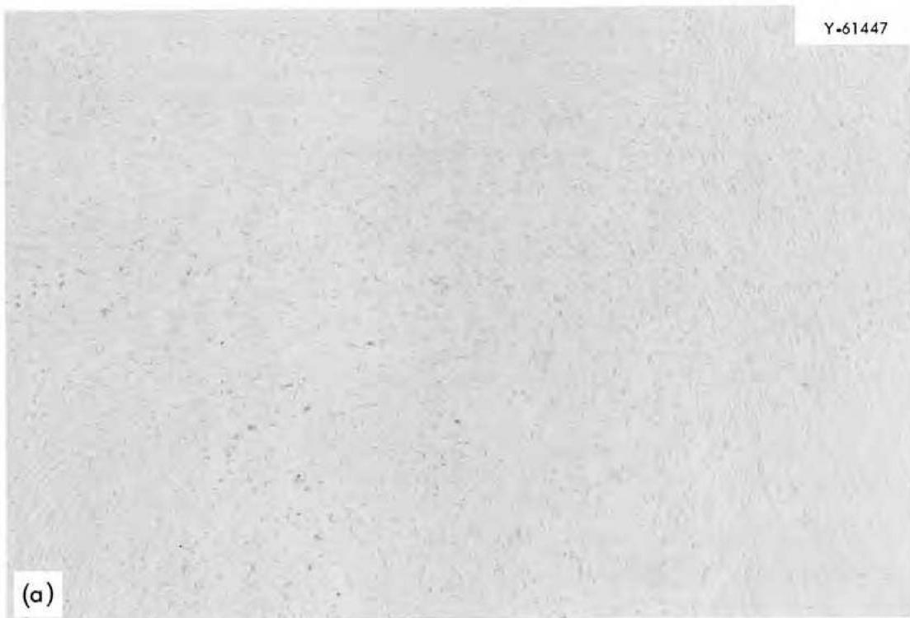

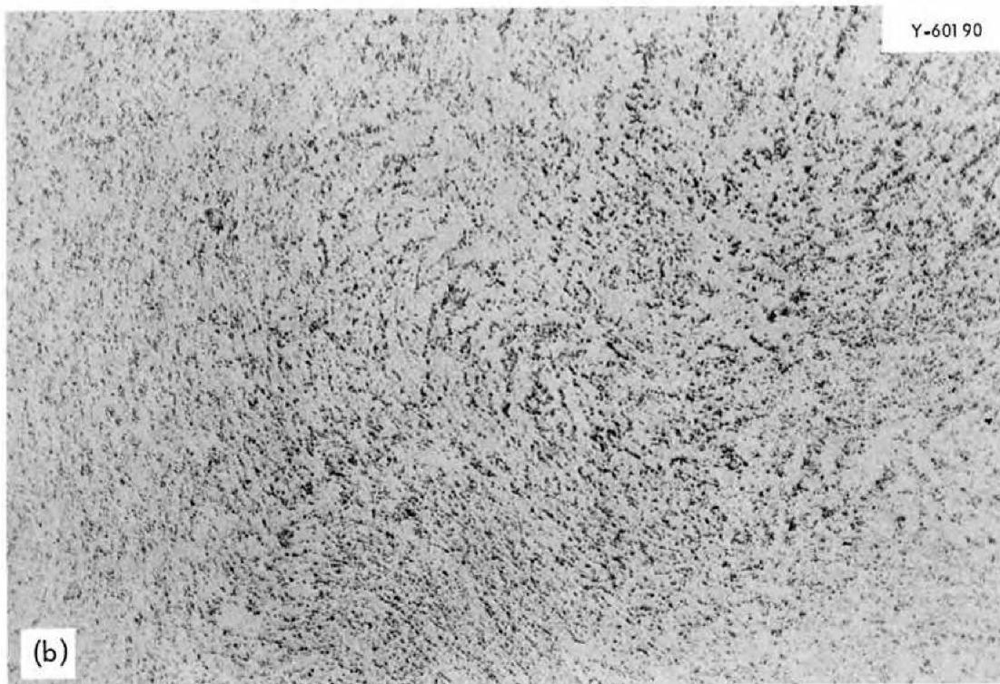  
Fig. 1. Hastelloy N in the As-Worked Condition. (a) Photomicrograph of specimen etched with aqua regia. (b) Autoradiograph of specimen in the as-polished condition, 16-hr exposure. 100x.

distributed on a microscale. Figure 2a shows the material after a 1-hr anneal at $1177^{\circ}\mathrm{C}$ , followed by rapid cooling. Figure 2b is an autoradiograph of the same specimen. This anneal distributes the carbon almost uniformly in the material, although there does seem to be enough grain-boundary segregation to delineate the grain structure. Figure 3a shows the alloy after a 1-hr anneal at $1232^{\circ}\mathrm{C}$ . This photomicrograph is at high enough magnification to resolve the large precipitates that are characteristic of this alloy. The autoradiograph of this specimen is quite similar to that shown in Fig. 2b. However, Fig. 3b shows the autoradiograph at a high magnification. The light spots are the precipitate particles in the alloy. Note that the autoradiograph does not show any darkening above these particles, indicating that they are low in carbon.

Figure 4a shows the microstructure which results from a l-hr anneal at $1260^{\circ}\mathrm{C}$ . Many of the precipitates become associated with grain boundaries so that an almost continuous network results. Figure 4b shows an autoradiograph of this specimen which has a 48-hr exposure. The importance of the exposure time will be shown later. There is a definite segregation of carbon to the grain boundaries.

Figure 5a shows the microstructure of a specimen annealed $1\mathrm{hr}$ at $1316^{\circ}\mathrm{C}$ . The precipitate particles have transformed almost entirely to the lamellar phase. Figure 5b illustrates the microstructure in greater detail. Figure 6a shows that one constituent of the lamellar product is quite low in carbon and the other constituent contains about the same amount of carbon as the matrix. Figure 6b shows the grain-boundary phase in a somewhat different morphology, but again, one constituent is low in carbon and the other contains about the same amount of carbon as the matrix.

As shown in Fig. 7a, a 1-hr anneal at $1371^{\circ}\mathrm{C}$ increases the concentration of the intergranular phase. Figure 7b is an autoradiograph with a 72-hr exposure which indicates that the grain boundaries are enriched in carbon. However, a shorter exposure and the use of a higher magnification help delineate the actual location of the carbon.

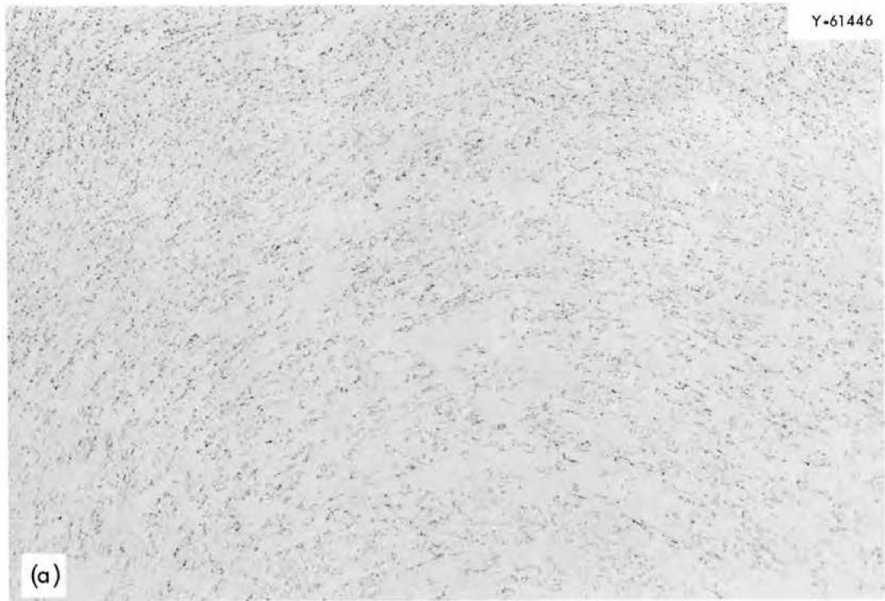

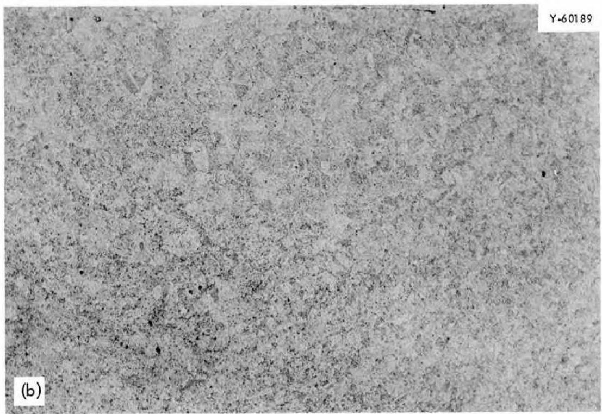  
Fig. 2. Hastelloy N After a 1-hr Anneal at $1177^{\circ}\mathrm{C}$ . (a) Photomicrograph of specimen etched with aqua regia. (b) Autoradiograph of specimen in the as-polished condition, 16-hr exposure. $100\times$ .

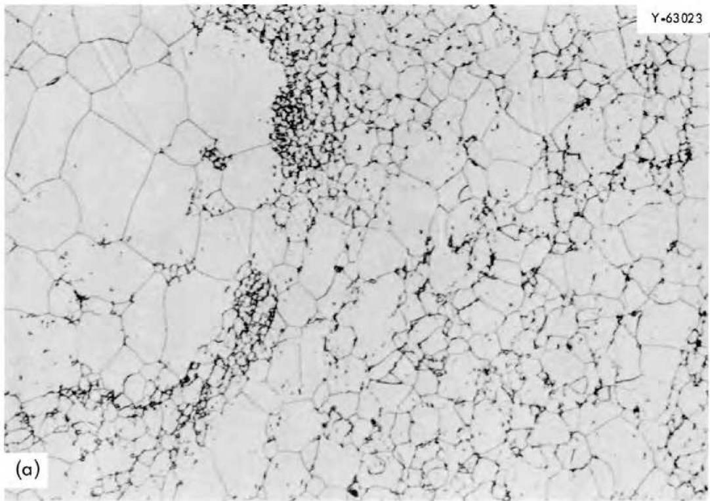

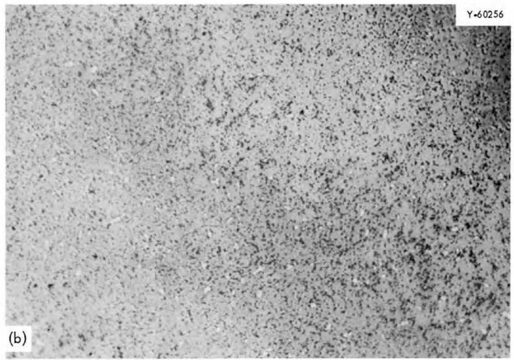  
Fig. 3. Hastelloy N After a 1-hr Anneal at $1232^{\circ}\mathrm{C}$ . (a) Photomicrograph of specimen etched with aqua regia. $250\times$ . (b) Autoradiograph of specimen in the as-polished condition, 16-hr exposure. $750\times$ .

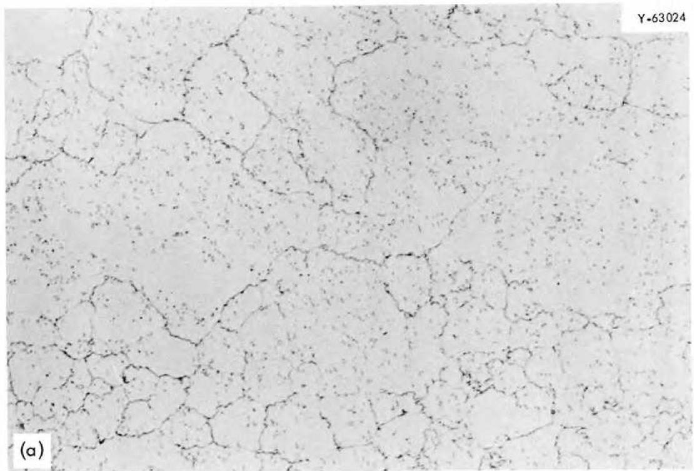

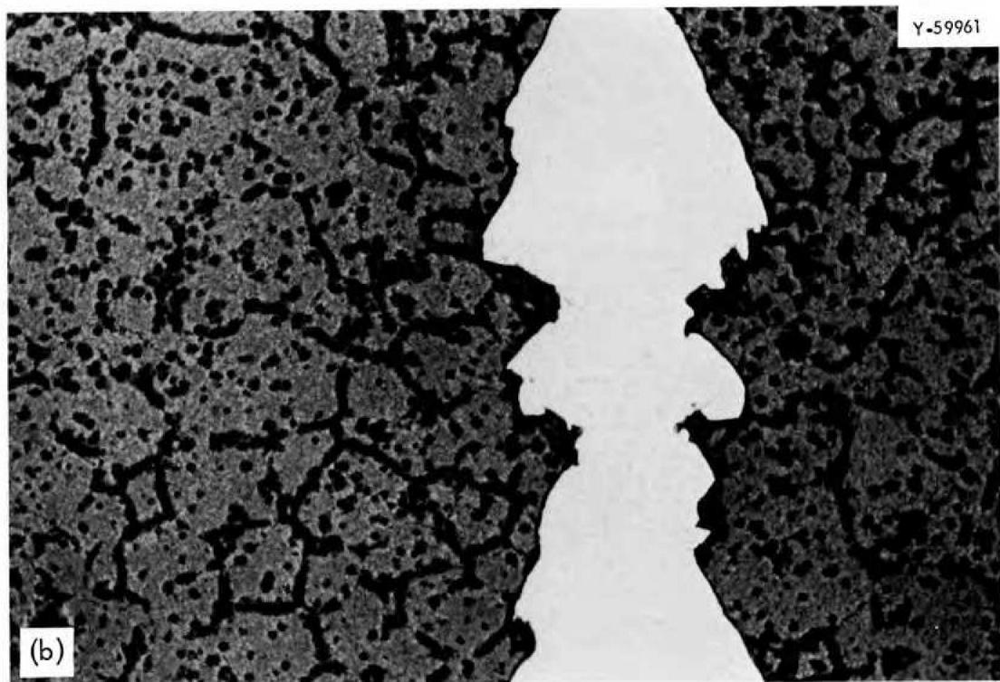  
Fig. 4. Hastelloy N After a 1-hr Anneal at $1260^{\circ}\mathrm{C}$ . (a) Photomicrograph of specimen etched with aqua regia. (b) Autoradiograph of specimen in the as-polished condition, 48-hr exposure. $250\times$ .

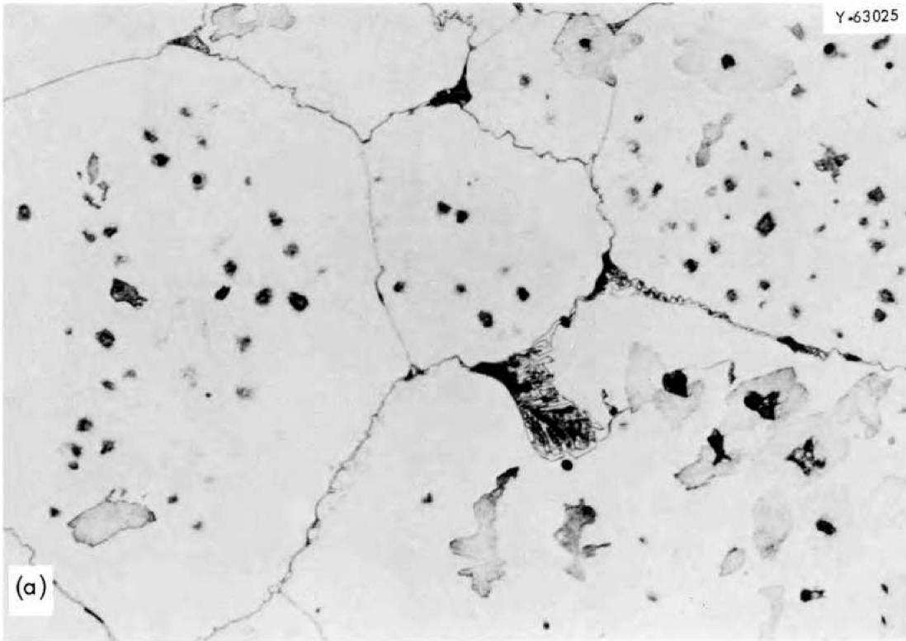

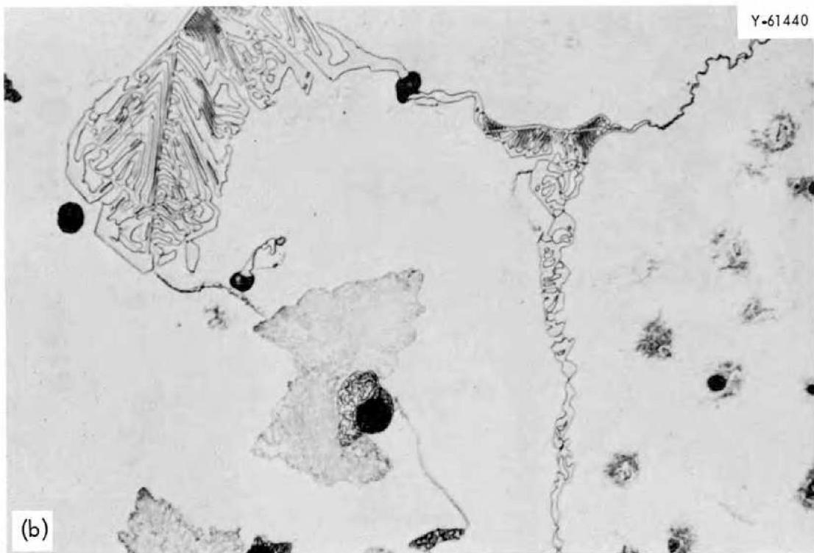  
Fig. 5. Hastelloy N After a l-hr Anneal at $1316^{\circ}C$ . Etched with aqua regia. (a) $250\times$ (b) $1000\times$ .

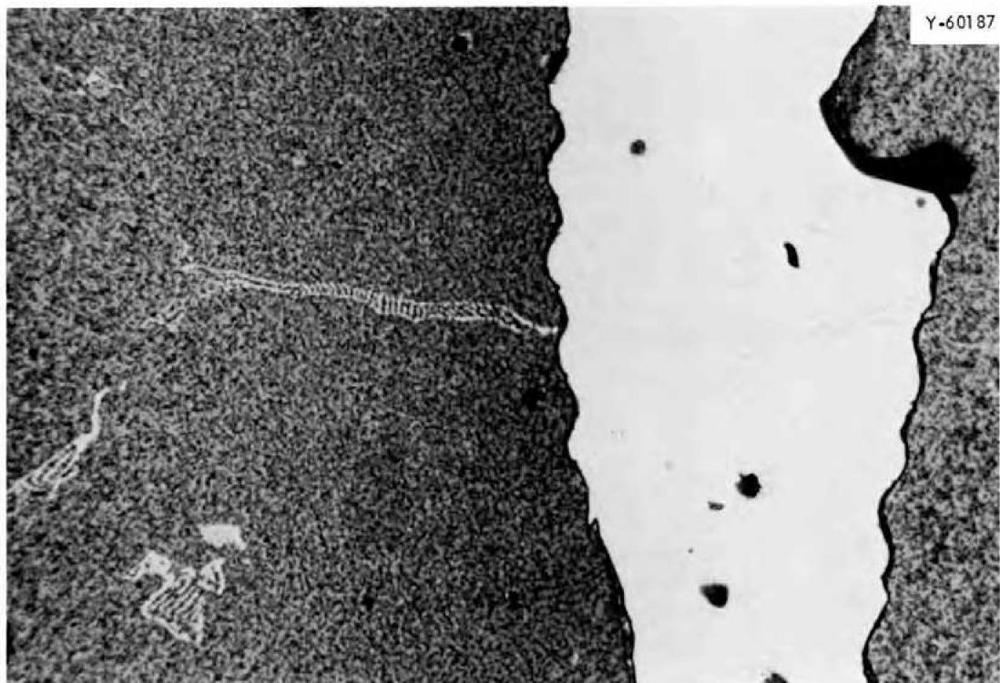

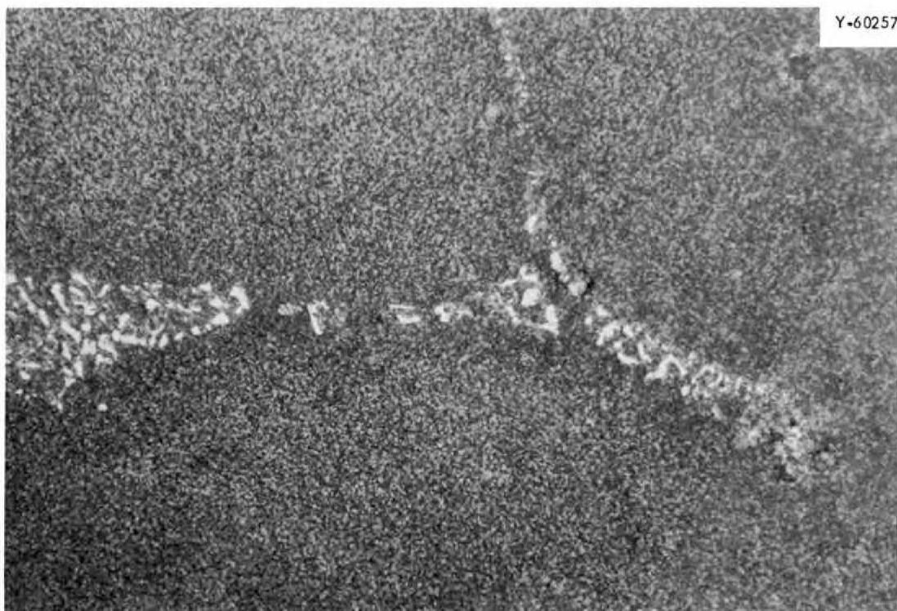  
Fig. 6. Autoradiographs of Hastelloy N After a 1-hr Anneal at $1316^{\circ}C$ . Exposed in the as-polished condition, 16-hr exposure. $750\times$

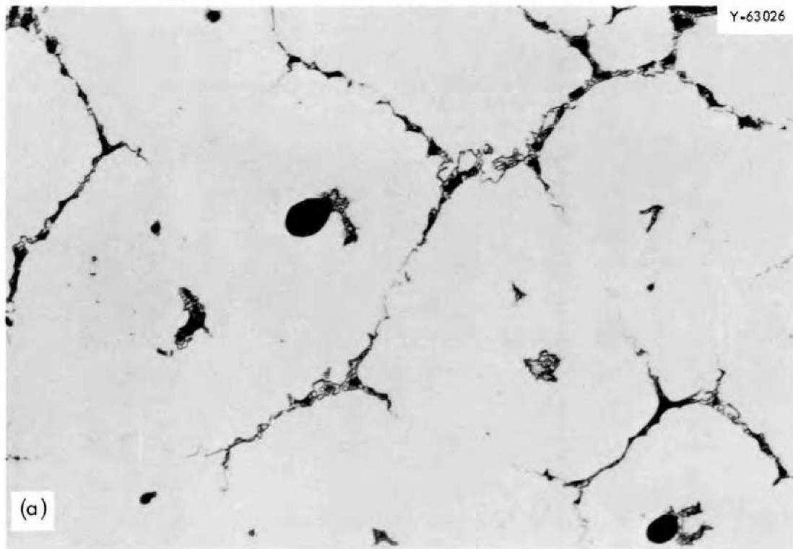

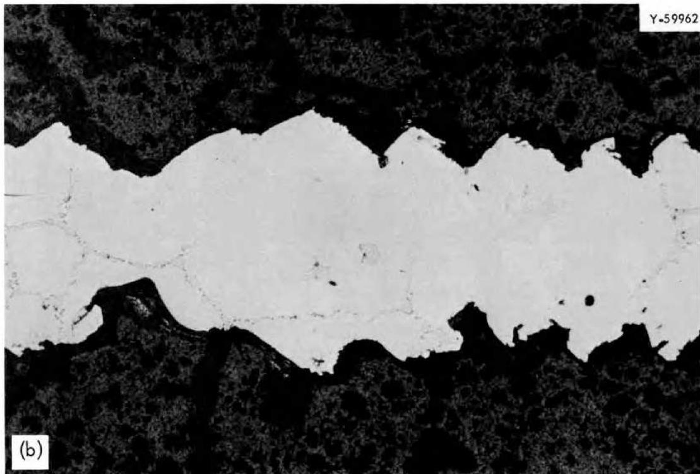  
Fig. 7. Hastelloy N after a l-hr Anneal at $1371^{\circ}\mathrm{C}$ . (a) Photomicrograph etched with aqua regia. (b) Autoradiograph made in the as-polished condition, 72-hr exposure. 250x.

Figure 8 shows that the lamellar product in the grain boundary contains a constituent that is low in carbon. The carbon enrichment seems to be adjacent to the grain-boundary product rather than in the grain-boundary phase.

Figure 9 shows the microstructure of the alloy after a 1-hr anneal at $1177^{\circ}\mathrm{C}$ followed by 100 hr at $649^{\circ}\mathrm{C}$ . Figure 10a and b show that rather gross segregation of carbon to the grain boundaries occurs as a result of this treatment.

Annealing for 1 hr at $1260^{\circ}\mathrm{C}$ followed by 24 hr at $871^{\circ}\mathrm{C}$ produces the microstructure shown in Fig. lla. The autoradiograph shown in Fig. llb illustrates the inhomogeneous distribution of carbon in the alloy after this heat treatment.

Two pieces of the alloy were rolled into $1 \times 1/2 \times 0.040$ -in. sheets. They were fused together by Heliarc welding without the addition of any filler metal. A transverse section of the weld was prepared for metallographic examination. The base metal has a microstructure similar to that shown in Fig. 1. Figure 12a shows the heat-affected zone and the weld metal. Figure 12b is an autoradiograph of the area shown in Fig. 12a. There does not seem to be any segregation of carbon in the part of the base metal that recrystallized during welding. Near the fusion line, the carbon segregated to the grain boundaries. Figure 13a is a high magnification photograph which shows the carbon segregation near the fusion line. Figure 13b shows that the carbon distribution in the weld metal is quite uniform.

Two variations in experimental techniques with respect to metallographic study of the weld specimen should be mentioned. First, the weld specimen was etched lightly before the liquid emulsion was applied. This was necessary because the carbon segregation was not sufficient to delineate the various regions of the weld. Secondly, the exposure time for the autoradiographs was 300 hr as compared with times of 16 to 72 hr for the other specimens. This resulted from differences in the properties of the MTB Liquid Emulsion. One lot of emulsion was used for the wrought specimens and a second lot was used for the weld. By appropriate cross checks it was found that both lots of emulsion revealed similar details if the exposure times were varied by a factor of about ten.

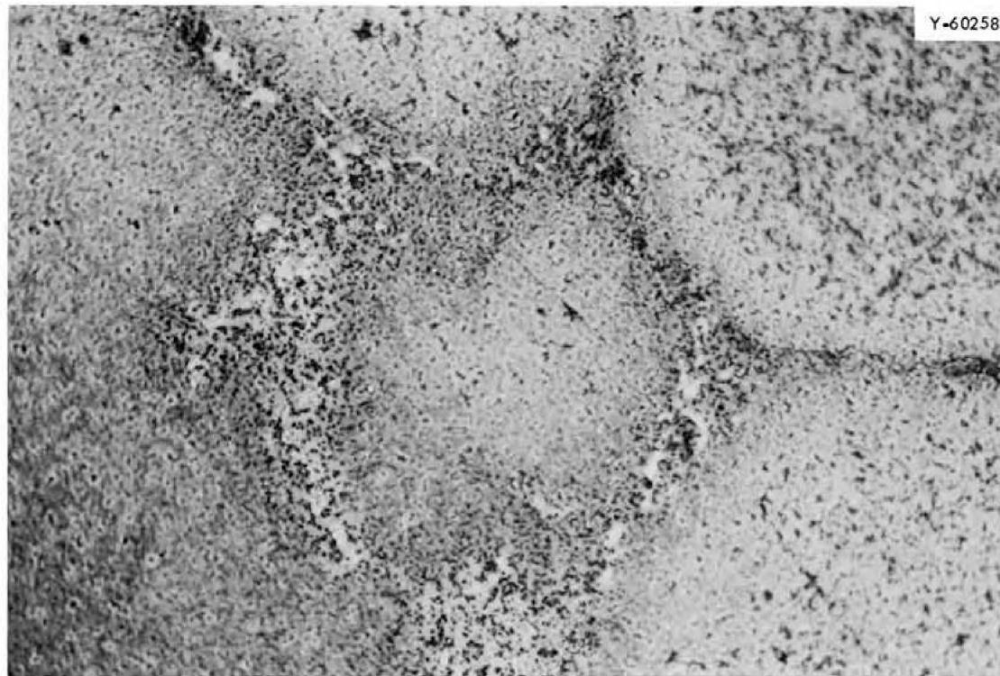

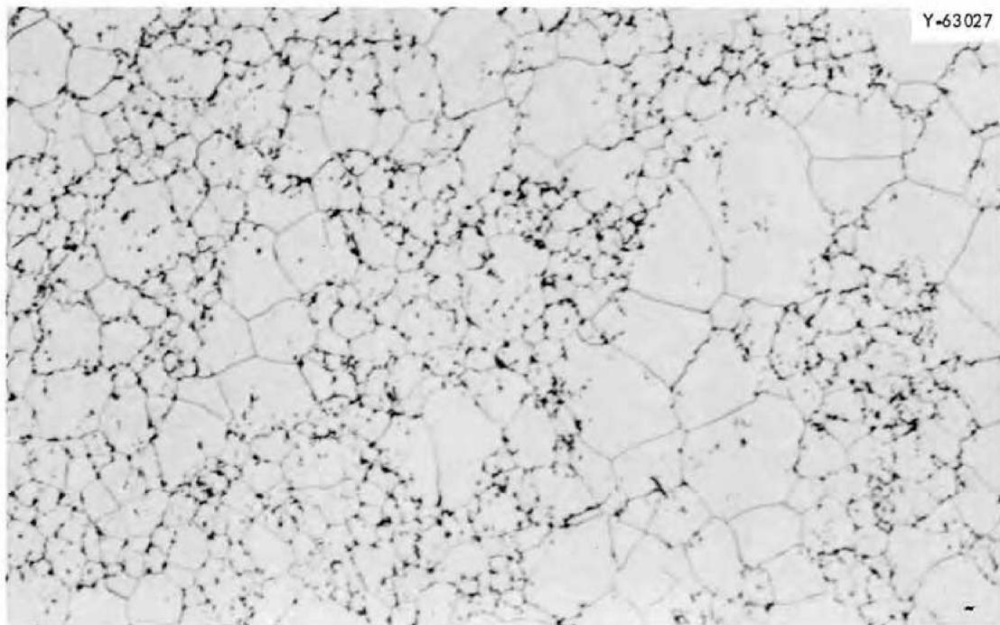  
Fig. 8. Autoradiograph of Hastelloy N after a 1-hr Anneal at $1371^{\circ}\mathrm{C}$ . As-polished condition, 16-hr exposure. $750\times$   
Fig. 9. Hastelloy N after a l-hr Anneal at $1177^{\circ}\mathrm{C}$ Followed by 100 hr at $871^{\circ}\mathrm{C}$ . Etchant: aqua regia.

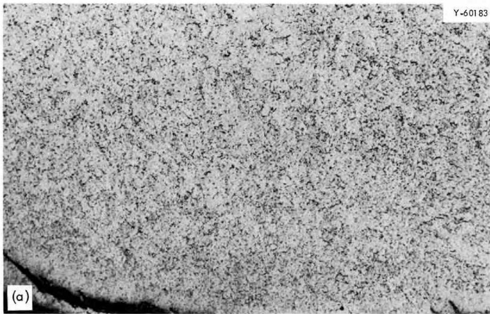

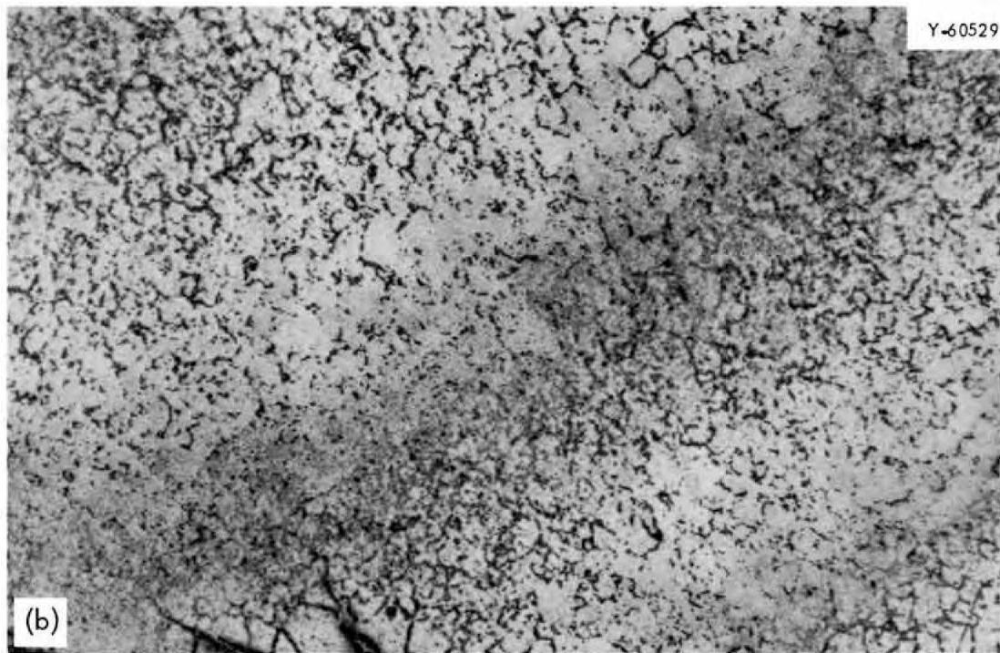  
Fig. 10. Autoradiographs of Hastelloy N After a 1-hr Anneal at $1177^{\circ}\mathrm{C}$ Followed by 100 hr at $649^{\circ}\mathrm{C}$ . As-polished condition. (a) 16-hr exposure. (b) 72-hr exposure. $250\times$

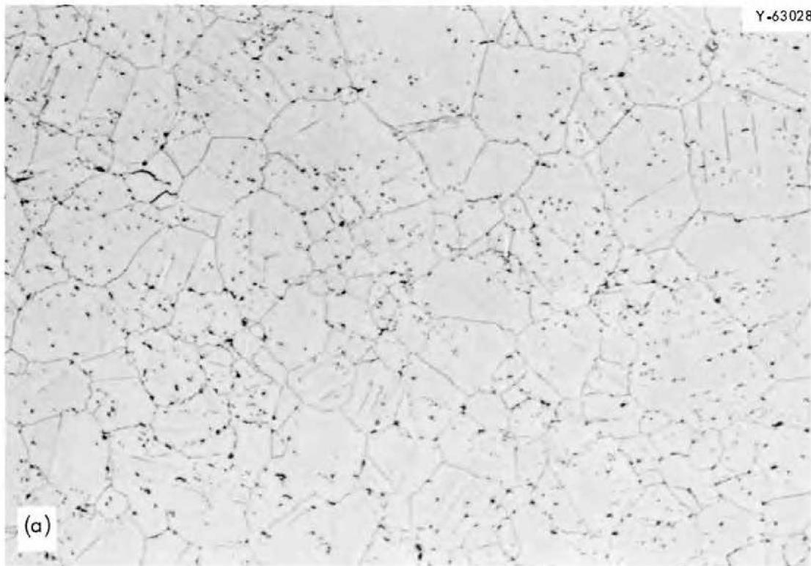

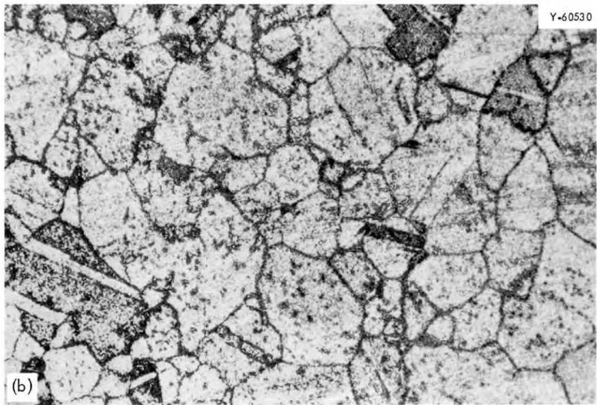  
Fig. 11. Hastelloy N After a 1-hr Anneal at $1260^{\circ}\mathrm{C}$ Followed by 24 hr at $871^{\circ}\mathrm{C}$ . (a) Photomicrograph of specimen etched with aqua regia. (b) Autoradiograph of specimen in as-polished condition, 72-hr exposure. 250x.

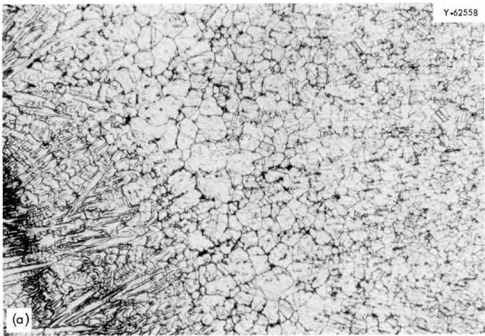

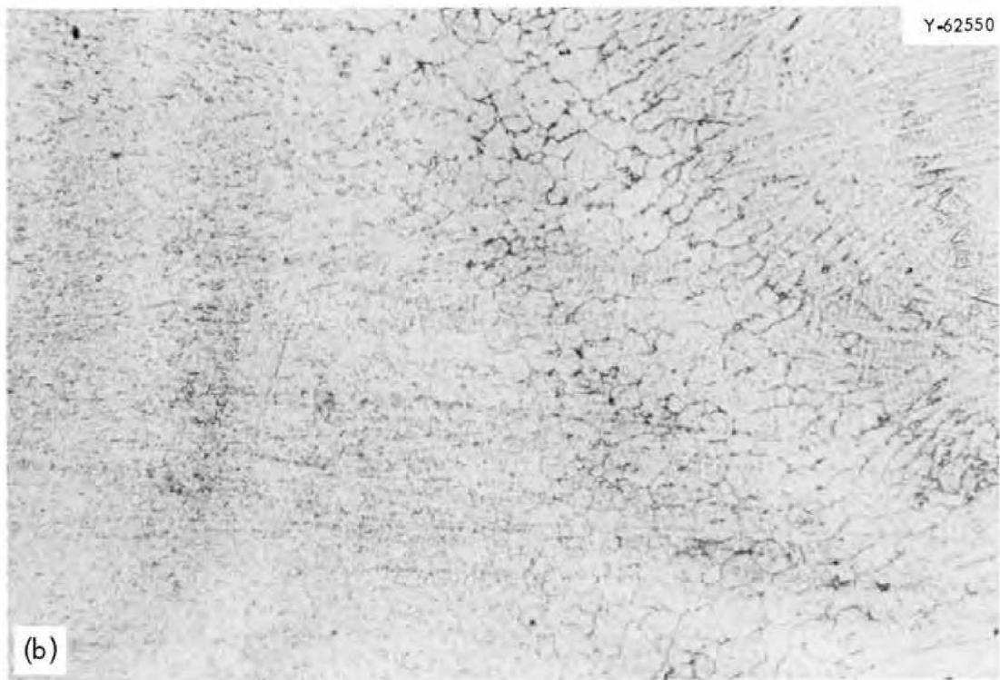  
Fig. 12. Weld Metal and Heat-Affected Zone of a Hastelloy N Weld. (a) Photomicrograph of specimen etched with aqua regia. (b) Autoradio-graph of specimen after a light etch, 300-hr exposure. $250 \times$

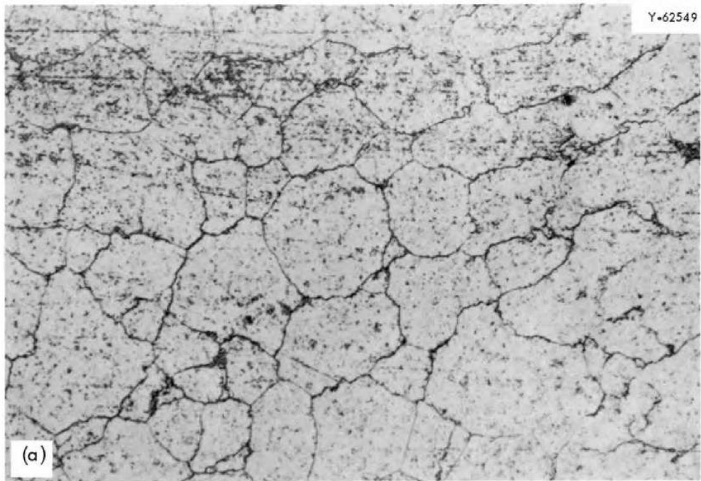

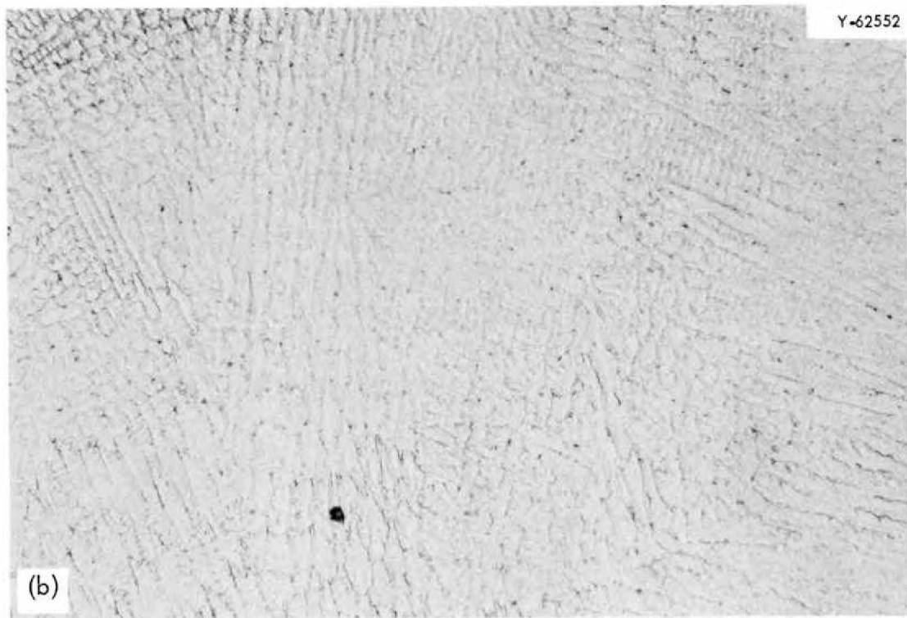  
Fig. 13. Autoradiographs of Hastelloy N Welds After a Light Etch, 300-hr Exposure. (a) Heat-affected zone. $750 \times$ . (b) Weld metal. $250 \times$ .

# DISCUSSION OF RESULTS

The results which have been presented may be summarized as follows:

1. Neither the coarse precipitate particles which are present as stringers nor the lamellar phase are enriched in carbon. In fact, the coarse precipitate particles and one constituent of the lamellar phase are depleted in carbon with respect to the matrix.   
2. The carbon is distributed fairly uniformly at annealing temperatures up to $1260^{\circ}\mathrm{C}$ .   
3. At temperatures above $1260^{\circ}\mathrm{C}$ the carbon is segregated to the grain boundaries, although the areas adjacent to the grain-boundary precipitate are more enriched than the precipitates themselves.   
4. Annealing at $1177^{\circ}\mathrm{C}$ followed by 100 hr at $649^{\circ}\mathrm{C}$ and annealing at $1260^{\circ}\mathrm{C}$ followed by 24 hr at $871^{\circ}\mathrm{C}$ both produced gross segregation of carbon to the grain boundaries.   
5. Welding produced some intergranular carbon segregation in a small region of the heat-affected zone.

The first observation indicates very strongly that Hastelloy N is not basically a solid-solution alloy and that intermetallic phases are present. There are numerous possibilities of compounds which could be formed from the various alloying elements present. However, the observation that the quantity of precipitate in Hastelloy N does not depend on the concentration of minor alloying elements leads one to believe that the second phase in actually a nickel-molybdenum intermetallic. The binary nickel-molybdenum phase diagram4 shown in Fig. 14 indicates that a binary alloy of 16 wt % Mo and nickel would be single phase up to about $1400^{\circ}\mathrm{C}$ . However, studies by Lundy on the nickel-rich corner of the nickel-molybdenum-chromium system have shown that the addition of chromium to nickel reduces the solubility of molybdenum in the alloy. This is equivalent to saying that the alpha filed in Fig. 14 is reduced in size and

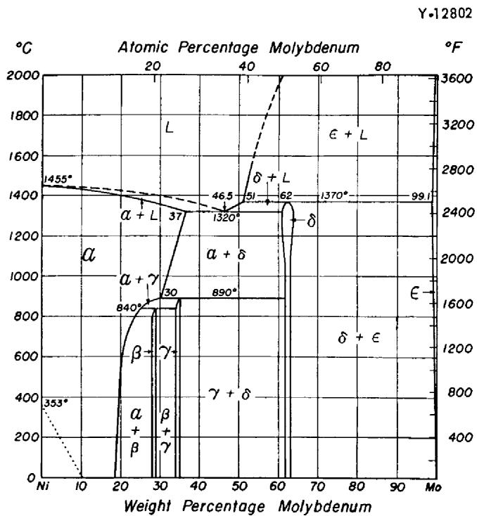  
Fig. 14. Nickel-Molybdenum Equilibrium Diagram.

that the alpha and beta fields are moved to the left. Lundy also noted that the addition of chromium suppressed the formation of beta. Recent studies by Norman $^{6}$ on the nickel-molybdenum-iron system have shown that iron has very little effect on the solubility of molybdenum in nickel, but that iron also suppresses beta formation. Both Lundy and Norman noted that the phase transformations in these alloys are quite sluggish. In light of these facts, it is hypothesized that the coarse precipitates that are present in Hastelloy N after fabrication are a modified delta phase which is formed in the melt as it cools. Reheating for 1 hr at $1260^{\circ}\mathrm{C}$ or at higher temperatures causes the delta to decompose to form alpha and gamma (the lamellar phase).

The second, third, and fourth observations which concern carbide segregation indicate that the ductility of this material is not controlled

by the carbon distribution. The studies reported previously $^{7}$ showed that the minimum fracture elongation (measured in a tensile test at $871^{\circ}\mathrm{C}$ ) is reduced by a factor of 3 as a result of annealing at $1204^{\circ}\mathrm{C}$ as compared with that obtained by annealing at $1177^{\circ}\mathrm{C}$ . Annealing at $1232^{\circ}\mathrm{C}$ produced another twofold decrease in elongation. However, the autoradiographs show no significant carbon segregation until annealing temperatures of $1260^{\circ}\mathrm{C}$ were used. Both of the aging treatments that were used (1 hr at $1177^{\circ}\mathrm{C}$ followed by 100 hr at $871^{\circ}\mathrm{C}$ , and 1 hr at $1260^{\circ}\mathrm{C}$ followed by 16 hr at $871^{\circ}\mathrm{C}$ ) produced gross carbide segregation. The material receiving the first heat treatment was found to have about one-half the ductility of the material given the second treatment. From Figs. 9, 10, and 11 it is not obvious that any great difference exists in the degree of carbon segregation.

In view of these results, it is felt that the loss in ductility in this alloy does not correlate with the grain-boundary segregation of carbon. A close examination of the test results7 obtained on various heats of Hastelloy N and the compositions of these various heats leads one to suggest that the troublesome element may be silicon, although no direct evidence exists for this conclusion.

The carbon segregation that occurred in the weld can be rationalized in terms of the microstructures that were obtained during 1-hr anneals. The carbon was segregated to the grain boundaries by 1-hr anneals above $1260^{\circ}\mathrm{C}$ . For the short time that heat was applied to the weld, higher temperatures would probably be required to cause carbon segregation. The weld metal did not show any carbon segregation. Hence the observation that the carbon was segregated only in a small region in the heat-affected zone is as expected.

# SUMMARY AND CONCLUSIONS

It has been observed by autoradiographic studies on a heat of Hastelloy N containing carbon-14 that (1) the large precipitates in this alloy are not enriched in carbon, and (2) the loss in ductility cannot be associated with the segregation of carbon. It is hypothesized that the major precipitates in this alloy are nickel-molybdenum intermetallic compounds which form as a result of the solubility of molybdenum in nickel being reduced by the presence of chromium in the alloy. The loss in ductility in this alloy as a result of annealing at elevated temperatures is probably associated with a minor alloying element other than carbon. It is hypothesized that silicon is this troublesome element.

# ACKNOWLEDGMENT

The author is grateful to B. J. Massey of the Isotopes Division for assistance in preparing the mixture used to saturate nickel melting stock with carbon-14. This study would not have been possible without the Metal Forming and Casting Group who made this alloy. The metallography and autoradiography were performed by M. D. Allen and his efforts and personal judgement were of great value. The author is also grateful to J. R. Weir, R. S. Crouse, and D. A. Douglas for reviewing this work and making several helpful suggestions. The Reports Office is acknowledged for their assistance in preparing this document.

# INTERNAL DISTRIBUTION

1-3. Central Research Library   
4-5. Reactor Division Library   
6. ORNL - Y-12 Technical Library Document Reference Section   
7-16. Laboratory Records Department   
17. Laboratory Records, ORNL R.C.   
18. ORNL Patent Office   
19. G. M. Adamson   
20. L. G. Alexander   
21. C. F. Baes   
22. S. E. Beall   
23. E. S. Bettis   
24. D. S. Billington   
25. F. F. Blankenship   
26. E.P.Blizard   
27. R. Blumberg   
28. A. L. Boch   
29. E. G. Bohlmann   
30. C. J. Borkowski   
31. G. E. Boyd   
32. E. J. Breeding   
33. R. B. Briggs   
34. F. R. Bruce   
35. G. H. Burger   
36. S. Cantor   
37. D. W. Cardwell   
38. O.B.Cavin   
39. J. A. Conlin   
40. W.H.Cook   
41. L. T. Corbin   
42. G. A. Cristy   
43. R. S. Crouse   
44. J. L. Crowly   
45. F. L. Culler   
46. J. E. Cunningham   
47. D. G. Davis   
48. W.W.Davis   
49. J. H. Devan   
50. R. G. Donnelly   
51. D. A. Douglas   
52. N. E. Dunwoody   
53. J. R. Engel   
54. E. P. Epler   
55. W. K. Ergen   
56. A. P. Fraas

57. J.H Frye, Jr.   
58. C. H. Gabbard   
59. W.R.Gall   
60. R. B. Gallaher   
61. R. J. Gray   
62. W. R. Grimes   
63. A. G. Grindell   
64. R. H. Guymon   
65. G. Hallerman   
66. P. H. Harley   
67. D. G. Harman   
68. C. S. Harrill   
69. P. N. Haubenreich   
70. P. G. Herndon

71-73. M.R.Hill   
74. E. C. Hise   
75. H. W. Hoffman   
76. V. D. Holt   
77. P. P. Holz   
78. A. Houtzeel   
79. T. L. Hudson   
80. H. Inouye   
81. P. R. Kasten   
82. R.J.Kedl   
83. T. M. Kegley   
84. M. T. Kelley   
85. M. J. Kelly   
86. C. R. Kennedy   
87. A. I. Krakoviak   
88. J. W. Krewson   
89. C. E. Lamb   
90. C. F. Leitten, Jr.   
91. R. B. Lindauer   
92. R. S. Livingston   
93. M. I. Lundin   
94. T. S. Lundy   
95. W. R. Martin   
05. H. E. McCoy   
06. W. B. McDonald   
07. C. K. McGlothlan   
08. C. J. McHargue   
09. E. C. Miller   
10. C. A. Mills   
11. W.R.Mixon   
12. R. L. Moore

113. J. C. Moyers

114. T. E. Northup

115. W. R. Osborn

116. L. F. Parsly

117. P. Patriarca

118. H. R. Payne

119. W.B.Pike

120. H.B.Piper

121. B. E. Prince

122. J. L. Redford

123. M. Richardson

124. R. C. Robertson

125. H. C. Roller

126. M. W. Rosenthal

127. H. C. Savage

128. H. W. Savage

129. D. Scott

130. J.H.Shaffer

131. E. D. Shipley

132. G. M. Slaughter

133. A. N. Smith

134. P. G. Smith

135. A.H.Snell

136. W. F. Spencer

137. I. Spiewak

138. R. Steffy

139. C. E. Stevenson

140. C. D. Susano

141. A. Taboada

142. J. R. Tallackson

143. E. H. Taylor

144. R. E. Thoma

145. G. M. Tolson

146. D. B. Trauger

147. R. W. Tucker

148. W. C. Ulrich

149. D. C. Watkin

150. G.M.Watson

151. B. H. Webster

152. J.R.Weir

153. J. H. Westsik

154. J. C. White

155. L. V. Wilson

156. C.H.Wodtke

157. G.J.Young

# EXTERNAL DISTRIBUTION

158. C. M. Adams, Massachusetts Institute of Technology

159-160. D. F. Cope, AEC, ORO

161. C. B. Deering, AEC, ORO

162. R. W. Garrison, AEC, Washington

163. J. L. Gregg, Bard Hall, Cornell University

164. R. W. McNamee, Manager, Research Administration, UCC, New York

165. M. Shaw, AEC, Washington

166. J. M. Simmons, AEC, Washington

167. E. E. Sinclair, AEC, Washington

168. W. L. Smalley, AEC, ORO

169. E. E. Stansbury, University of Tennessee

170. M. J. Whitman, AEC, Washington

171. Division of Research and Development, AEC, ORO

172-186. Division of Technical Information Extension