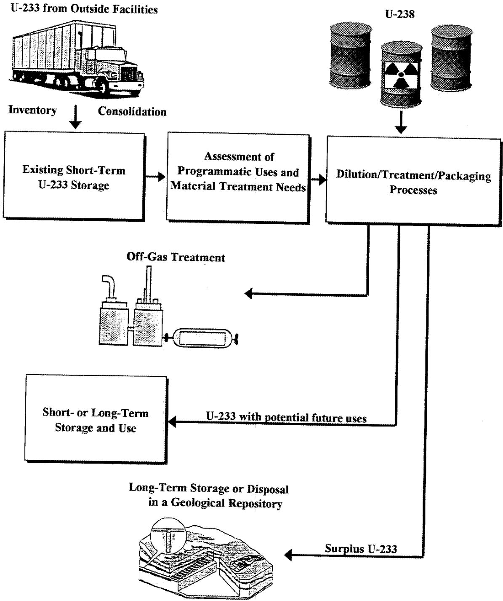
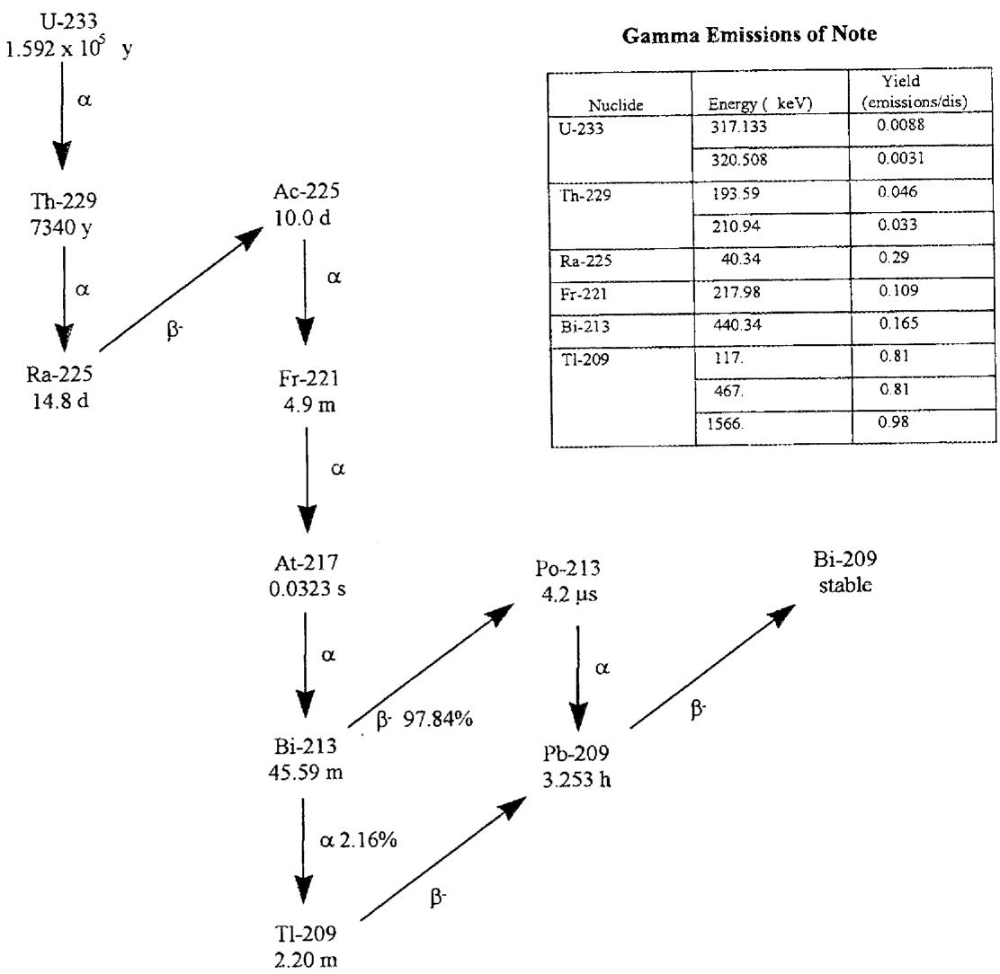
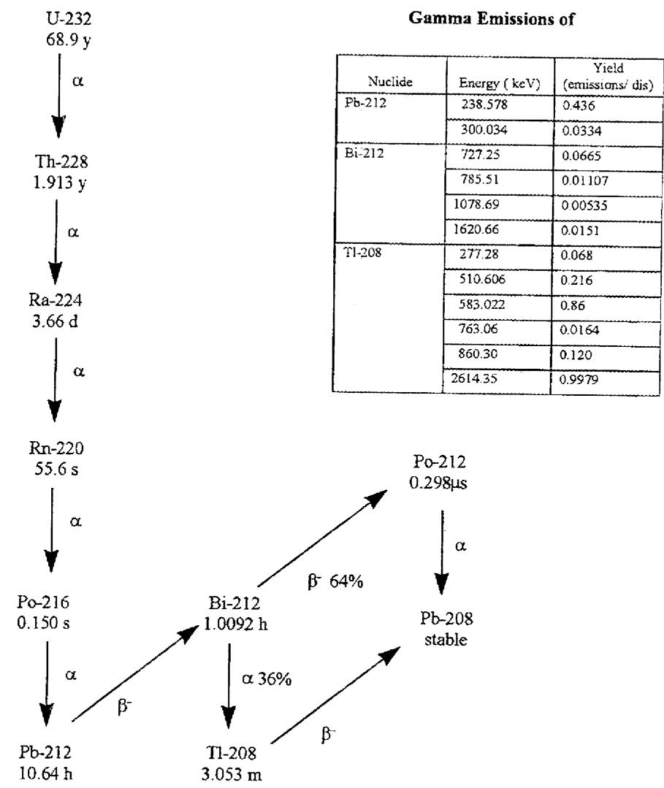
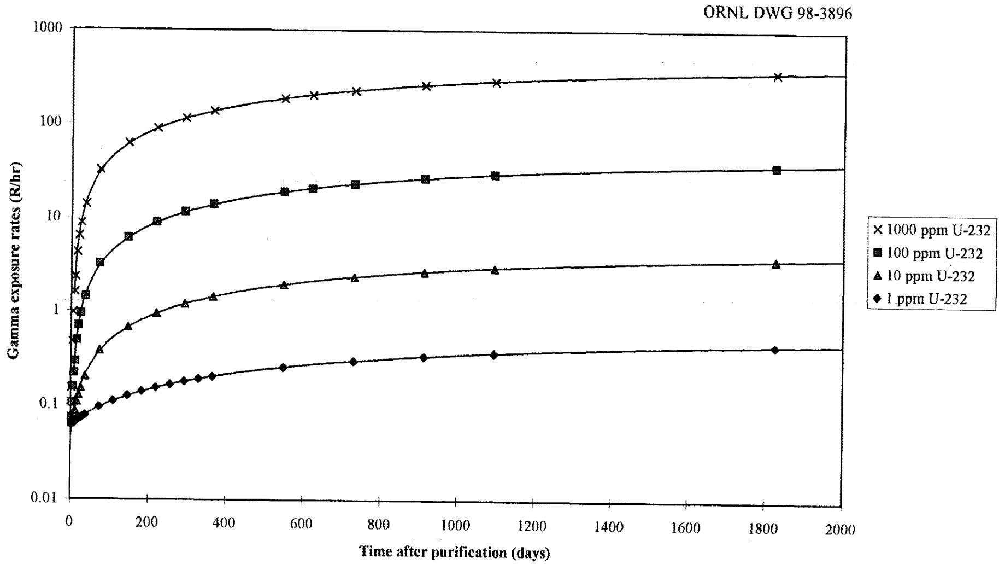
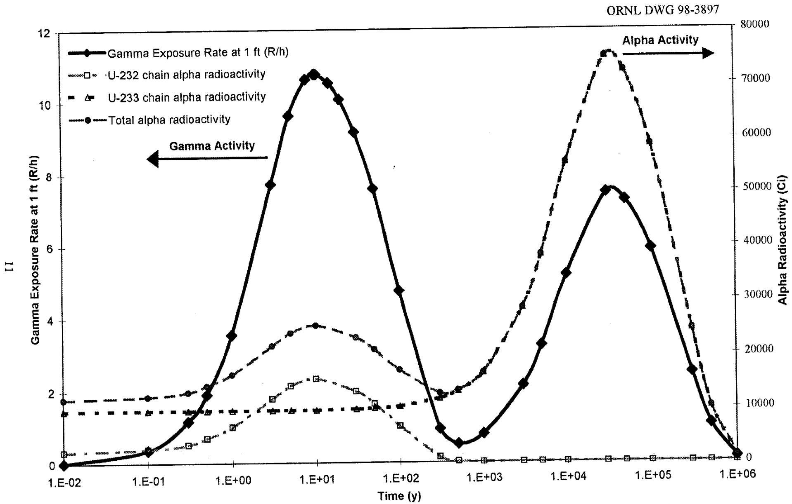
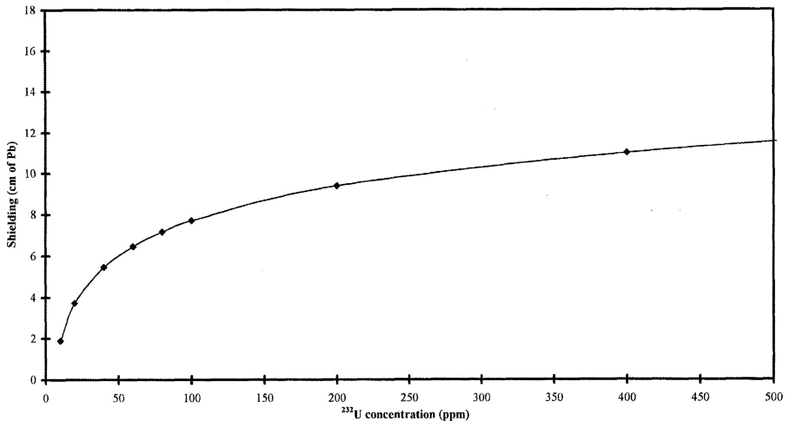

# OAK RIDGE   NATIONAL   LABORATORY

A

# ORNL Master Copy

# Strategy for the Future Use and Disposition of Uranium-233: Technical Information

P. J. Bereolos*

C. W. Forsberg

D. C. Kocher

A. M. Krichinsky

*Advanced Integrated Management Services, Inc.

This report has been reproduced directly from the best available copy.

Available to DOE and DOE contractors from the Office of Scientific and Technical Information, P.O. Box 62, Oak Ridge, TN 37831; prices available from (615) 576-8401, FTS 626-8401.

Available to the public from the National Technical Information Service, U.S. Department of Commerce, 5285 Port Royal Rd., Springfield, VA 22161.

This report was prepared as an account of work sponsored by an agency of the United States Government. Neither the United States Government nor any agency thereof, nor any of their employees, makes any warranty, express or implied, or assumes any legal liability or responsibility for the accuracy, completeness, or usefulness of any information, apparatus, product, or process disclosed, or represents that its use would not infringe privately owned rights. Reference herein to any specific commercial product, process, or service by trade name, trademark, manufacturer, or otherwise, does not necessarily constitute or imply its endorsement, recommendation, or favoring by the United States Government or any agency thereof. The views and opinions of authors expressed herein do not necessarily state or reflect those of the United States Government or any agency thereof.

# STRATEGY FOR THE FUTURE USE AND DISPOSITION OF URANIUM-233: TECHNICAL INFORMATION

P. J. Bereolos

ADVANCED INTEGRATED MANAGEMENT SERVICES, INC. 575 Oak Ridge Turnpike, Suite B-3 Oak Ridge, TN 37831

C.W.Forsberg

D. C. Kocher

A. M. Krichinsky

OAK RIDGE NATIONAL LABORATORY* Oak Ridge, Tennessee 37831

April 1998

# CONTENTS

LIST OF FIGURES.

LIST OF TABLES

ACRONYMS AND ABBREVIATIONS vii

CHEMICAL ELEMENTS ix

PREFACE xi

EXECUTIVE SUMMARY xiii

1. METHODS OF $^{233}\mathrm{U}$ PRODUCTION OR FORMATION 1

1.1 NEUTRON BOMBARDMENT OF THORIUM 1  
1.2 CONTAMINATION LEVELS OF $^{232}\mathrm{U}$ IN $^{233}\mathrm{U}$   
1.3 RADIOACTIVE DECAY OF NEPTUNIUM 2

2. DECAY CHAINS 3   
3.CHARACTERISTICS 7

3.1 CHEMICAL AND PHYSICAL PROPERTIES 7

3.1.1 Uranium Metal 7   
3.1.2 Uranium Oxides 7   
3.1.3 Uranium Fluorides 8   
3.1.4 Uranyl Nitrate 8

3.2 RADILOGICAL PROPERTIES 8

3.2.1 Comparison of $^{232}\mathrm{U}$ and $^{233}\mathrm{U}$ 8   
3.2.2 Comparison with Other Isotopes 10

3.3 BIOLOGICAL EFFECTS 14   
3.4 NUCLEAR CRITICALITY 17

4. STORAGE REQUIREMENTS 21

4.1 MATERIAL FORM 21   
4.2 PACKAGING 22   
4.3 CONFINEMENT 22   
4.4 CRITICALITY CONTROL 23   
4.5 SHIELDING 24   
4.6 SAFEGUARDS 26

4.6.1 DOE Requirements 26   
4.6.2 IAEA Requirements 27   
4.6.3 Elimination of Weapons Potential 29

5. DISPOSAL REQUIREMENTS FOR $^{233}\mathrm{U}$ DECLARED AS WASTE 31

5.1 RADIOACTIVE WASTE CLASSIFICATION 31  
5.2 CLASSIFICATION AND DISPOSAL AS HAZARDOUS WASTE 32

5.3 RADIOACTIVE WASTE DISPOSAL OPTIONS 33

5.3.1 Near-Surface Disposal of LLW 33   
5.3.2 Alternatives to Near-Surface Disposal 34

5.4 MIXING OF $^{233}\mathrm{U}$ WITH OTHER WASTES 35

5.5 NUCLEAR CRITICALITY 36

5.5.1 Need to Avoid Criticality 36   
5.5.2 Nuclear Criticality Control by Isotopic Dilution 37

6.REFERENCES 39

# LIST OF FIGURES

Fig. ES.1. National strategy for future use and disposition of $^{233}\mathrm{U}$ .   
Fig. 2.1. Decay chain of $^{233}\mathrm{U}$   
Fig. 2.2. Decay chain of $^{232}\mathrm{U}$   
Fig. 3.1. Gamma exposure at 1 ft from $10\mathrm{kg}$ of $\mathrm{UO}_3$ with varying amounts of $^{232}\mathrm{U}$ 9   
Fig. 3.2. Alpha activity and gamma exposure rate at 1 ft as a function of time calculated for $1\mathrm{kg}^{233}\mathrm{U}$ (with $100\mathrm{ppm}^{232}\mathrm{U}$ ) as a loose-pour powder ( $1.5\mathrm{g/cm^3}$ ) contained in a 3-in. diam. by 6-in. tall can with 20-mil-thick steel walls   
Fig. 4.1. Lead shielding for $^{233}\mathbf{U}$ with various concentrations of $^{232}\mathbf{U}$ . 25

# LIST OF TABLES

Table 2.1. Half-lives, branching fractions, and principal decay modes for isotopes of uranium and for $^{232}\mathrm{Th}$ and their short-lived decay products 6   
Table 3.1. Selected radiological data for isotopes of uranium and thorium and their short-lived decay products and for $^{239}\mathrm{Pu}$ and $^{241}\mathrm{Am}$ 12   
Table 3.2. Limits on activity concentrations in air and water for releases to the environment for isotopes of uranium and thorium and for $^{239}\mathrm{Pu}$ and $^{241}\mathrm{Am}$ . 15   
Table 3.3. Values of basic nuclear safety parameters 18   
Table 4.1. DOE nuclear material safeguards categories 26

__________

__________

__________

# ACRONYMS AND ABBREVIATIONS

AEA Atomic Energy Act

ANS American Nuclear Society

ANSI American National Standards Institute

CFR Code of Federal Regulations

C/S containment and surveillance

DIQ Design Information Questionnaire

dis disintegrations

DOE U.S. Department of Energy

DU depleted uranium

EIS Environmental Impact Statement

EPA U.S. Environmental Protection Agency

GCD Greater Confinement Disposal

HEU highly enriched uranium

HLW high-level waste

IAEA International Atomic Energy Agency

ICRP International Commission on Radiological Protection

LEU lowly enriched uranium

LLW low-level waste

NRC U.S. Nuclear Regulatory Commission

NTS Nevada Test Site

NWPA Nuclear Waste Policy Act

ORNL Oak Ridge National Laboratory

RCRA Resource Conservation and Recovery Act

SCALE Standardized Computer Analyses for Licensing Evaluation

SI International System of Units

SNF spent nuclear fuel

SRS Savannah River Site

TIDs tamper indication devices

TRU transuranic

WAC waste acceptance criteria

WIPP Waste Isolation Pilot Plant

# CHEMICAL ELEMENTS

Ac Actinium

Am Americium

At Astatine

Be Beryllium

Bi Bismuth

F Fluorine

Fr Francium

H Hydrogen

N Nitrogen

Np Neptunium

O Oxygen

Si Silicon

Pa Protactinium

Pb Lead

Po Polonium

Pu Plutonium

Radium

Rn Radon

Th Thorium

Thallium

U Uranium

__________

__________

__________

# PREFACE

This report is one in a series of reports which examines issues associated with the future use and disposition of $^{233}\mathrm{U}$ . A brief description of the other reports is included herein.

ORNL/TM-13550, Strategy for the Future Use and Disposition of Uranium-233: Overview. This document is a summary of the path forward for disposition of excess $^{233}\mathrm{U}$ . It includes required activities and identifies where major programmatic decisions will be required.

ORNL/TM-13551, Strategy for the Future Use and Disposition of Uranium-233: History, Inventories, Storage Facilities, and Potential Future Uses. This document includes the sources, historical uses, potential future uses, and the current inventory of $^{233}\mathrm{U}$ . The inventory includes quantities, storage forms, and packaging of the material.

ORNL/TM-13553, Strategy for the Future Use and Disposition of Uranium-233: Options. This document describes the proposed disposition alternatives, the technical advantages and disadvantages of each option, and the institutional issues associated with each option.

ORNL/TM-13524, Isotopic Dilution Requirements for $^{233}\mathrm{U}$ Criticality Safety in Processing and Disposal. This document analyzes criticality issues associated with processing and disposing of $^{233}\mathrm{U}$ .

ORNL/TM-13517, Definition of Weapons-usable Uranium-233. This document develops a definition of non-weapons-usable $^{233}\mathrm{U}$ to provide a technical basis for changing the safeguards and security requirements for storing, using, and disposing of $^{233}\mathrm{U}$ that is isotopically diluted with $^{238}\mathrm{U}$ .

# EXECUTIVE SUMMARY

This document provides a summary of technical information on the synthetic radioisotope $^{233}\mathrm{U}$ . It is one of a series of four reports that map out a national strategy for the future use and disposition of $^{233}\mathrm{U}$ (Fig. ES.1). The technical information on $^{233}\mathrm{U}$ in this document falls into two main areas. First, material characteristics are presented along with the contrasts of $^{233}\mathrm{U}$ to the more well known strategic fissile materials, $^{235}\mathrm{U}$ and plutonium (Pu). Second, information derived from the scientific information, such as safeguards, waste classifications, material form, and packaging, is presented. Throughout, the effects of isotopically diluting $^{233}\mathrm{U}$ with nonfissile, depleted uranium (DU) are examined.

Minute amounts of $^{233}\mathrm{U}$ are formed as a decay product of $^{237}\mathrm{Np}$ in spent nuclear fuel (SNF). However, the material under consideration in this report has been intentionally produced by the bombardment of natural thorium with neutrons in nuclear reactors. Uranium-233 is a long-lived isotope with a half-life of $1.592 \times 10^{5}$ years. It decays directly to $^{229}\mathrm{Th}$ , which is also relatively long-lived with a half-life of 7340 years. For the same mass of material, the alpha activity of $^{233}\mathrm{U}$ is more than three orders of magnitude greater than that of $^{235}\mathrm{U}$ and about one order of magnitude less than that of $^{239}\mathrm{Pu}$ .

A significant factor in the production of $^{233}\mathrm{U}$ from thorium is the formation of $^{232}\mathrm{U}$ , which is an undesirable contaminant isotope. The presence of even small amounts of $^{232}\mathrm{U}$ is important in determining the radiological properties of materials consisting mainly of uranium. The decay chain of $^{232}\mathrm{U}$ is quite different from that of $^{233}\mathrm{U}$ . Although $^{232}\mathrm{U}$ is the longest-lived isotope in its decay chain, it has a half-life of only 68.9 years. Therefore, in planning for disposal of $^{233}\mathrm{U}$ , the amount of $^{232}\mathrm{U}$ contamination becomes insignificant. However, for interim storage, handling, and use, the decay chain of $^{232}\mathrm{U}$ presents several complications. The primary consideration is the decay product $^{208}\mathrm{Tl}$ , which emits a 2.6-MeV gamma ray. The quantities of $^{232}\mathrm{U}$ present with $^{233}\mathrm{U}$ determine the radiation shielding requirements, and significant shielding is usually needed. Also included in the decay chain of $^{232}\mathrm{U}$ is $^{220}\mathrm{Rn}$ , which exists as a gas under standard conditions. Therefore, storage facilities must have adequate delay times in ventilation systems to prevent this material from escaping before it has decayed to a filterable particulate form. Finally, $^{232}\mathrm{U}$ lacks the equivalent of a long-lived "stopper" isotope like $^{229}\mathrm{Th}$ that can be used to "break" the decay chain through a chemical separation. Only very brief periods (i.e., weeks) of relief from penetrating gamma emitters can be realized by removing $^{228}\mathrm{Th}$ (1.9-year half-life), the first decay product of $^{232}\mathrm{U}$ .

Uranium and its compounds can cause biological damage both chemically and radiologically. It is in the radiological properties of $^{233}\mathrm{U}$ that one sees important contrasts with other isotopes of uranium. Uranium-233 has a higher specific activity than does $^{235}\mathrm{U}$ or natural uranium. Additionally, $^{233}\mathrm{U}$ almost always contains $^{232}\mathrm{U}$ , with its much shorter half-life, very high specific activity, and associated gamma emissions. Therefore, radiation damage to humans exposed to a given mass of $^{233}\mathrm{U}$ is potentially much more severe, relative to exposure to the same mass of the other prevalent uranium isotopes. Even in the absence of $^{232}\mathrm{U}$ , one g of $^{233}\mathrm{U}$ has the same radiological significance as

$1.5\mathrm{g}^{234}\mathrm{U}, 4400\mathrm{g}^{235}\mathrm{U}, 150\mathrm{g}^{236}\mathrm{U},$ or $28000\mathrm{g}^{238}\mathrm{U}$ . In all materials of concern to this report, $^{233}\mathrm{U}$ is the most important long-lived radionuclide.

Uranium can form a variety of chemical compounds. Triuranium octaoxide $(\mathrm{U}_3\mathrm{O}_8)$ is the most thermodynamically stable form in dry air and is the preferred storage form. Uranium is also stored in a variety of other chemical forms including uranium metal, oxides other than $\mathrm{U}_3\mathrm{O}_8$ , and fluorides. Uranium-233 and other uranium isotopes have no significant differences in their chemical and physical properties—except for the effects of greater levels of radiation on chemical compounds associated with the $^{233}\mathrm{U}$ .

Because $^{233}\mathrm{U}$ is readily fissionable, nuclear criticality is also an important concern during storage and disposal. The minimum critical mass of $^{233}\mathrm{U}$ is less than that of $^{235}\mathrm{U}$ . While in storage, criticality may be controlled primarily through geometry. However, during long-term disposal, geometry cannot be guaranteed. Therefore, isotopic dilution with DU (99.8 wt % $^{238}\mathrm{U}$ and 0.2 wt % $^{235}\mathrm{U}$ ) becomes an attractive alternative for criticality control. Dilution of $^{233}\mathrm{U}$ to $\sim 0.53$ wt % with DU (a) minimizes the potential for long-term criticality, (b) is equivalent to $\sim 1$ wt % $^{235}\mathrm{U}$ , and (c) is the criticality limit for a $^{233}\mathrm{U}$ system in a homogeneous mixture containing water, uranium, and silicon oxide.

Isotopic dilution also helps prevent nuclear proliferation. Because $^{233}\mathrm{U}$ is fissile, it may be used to produce nuclear weapons. Isotopic dilution of $^{235}\mathrm{U}$ to 20 wt % is already the preferred method for $^{235}\mathrm{U}$ demilitarization in the United States. Technical analysis indicates that isotopic dilution to $\sim 12$ wt % $^{233}\mathrm{U}$ (a) minimizes the potential for use of $^{233}\mathrm{U}$ in nuclear weapons and (b) is equivalent in terms of nuclear weapons use to 20 wt % $^{235}\mathrm{U}$ . However, unlike the situation with $^{235}\mathrm{U}$ , there is neither federal regulation nor international agreement on the amount of isotopic dilution necessary for $^{233}\mathrm{U}$ to minimize its weapons potential. Therefore, all $^{233}\mathrm{U}$ needs continual safeguards — physical protection, surveillance, and accounting.

If $^{233}\mathrm{U}$ were declared a waste, it would be classified presently as low-level waste (LLW). However, waste containing significant amounts of $^{233}\mathrm{U}$ probably would not be suitable for shallow-land disposal. The disposal options for such waste include (after isotopic dilution with DU) a geologic repository or a greater confinement disposal facility. The latter type of facility has been operated in the past at the Nevada Test Site. Processing of $^{233}\mathrm{U}$ with other wastes presents geologic disposal options. If the $^{233}\mathrm{U}$ were processed with high-level waste (HLW), the resulting waste would be classified as HLW. If the $^{233}\mathrm{U}$ were processed with transuranic (TRU) waste, the resulting waste would be classified as TRU waste provided that the concentrations of long-lived alpha-emitting transuranic radionuclides still exceeded 100 nCi/g. Wastes containing $^{233}\mathrm{U}$ might also be regulated as solid hazardous waste under the authority of the Resource Conservation and Recovery Act (RCRA). Indeed, it is a U.S. Department of Energy (DOE) policy to manage all of its radioactive waste according to the requirements of RCRA, unless such waste is found not to be hazardous, as defined under RCRA, depending on its non-radiological properties.

  
Fig. ES.1. National strategy for future use and disposition of $^{233}\mathbf{U}$ .

__________   
  
  
__________   
  
__________

# 1. METHODS OF $^{233}\mathrm{U}$ PRODUCTION OR FORMATION

Uranium-233 is a synthetic isotope discovered in the early 1940's by John Gofman at the University of California, Berkeley (Gofman 1943). It is a fissile isotope that can be used in nuclear reactors to generate heat and electricity. In isotopically purer concentrations, it can be used in nuclear weapons. Uranium-233 is produced by neutron bombardment of natural thorium, and it also is the decay product of long-lived $^{237}\mathrm{Np}$ . During neutron bombardment of thorium, $^{232}\mathrm{U}$ is also formed in various concentrations, and its presence usually governs precautions that must be taken while handling the main product, $^{233}\mathrm{U}$ .

# 1.1 NEUTRON BOMBARDMENT OF THORIUM

The principal method of producing $^{233}\mathbf{U}$ is by bombarding $^{232}\mathbf{Th}$ with neutrons in an accelerator or a reactor:

$$
{ } ^ { 2 3 2 } \mathrm { T h } \quad \xrightarrow { n , \gamma } \quad { } ^ { 2 3 3 } \mathrm { T h } \quad \xrightarrow { \beta ^ { - } } \quad { } ^ { 2 3 3 } \mathrm { P a } \quad \xrightarrow { \beta ^ { - } } \quad { } ^ { 2 3 3 } \mathrm { U }
$$

The Thorex solvent extraction process is used to separate uranium from spent thorium fuel. Typically, the Thorex process removes more than $99\%$ of the $^{232}\mathrm{Th}$ in the spent fuel. Therefore, $^{232}\mathrm{Th}$ is usually present only in small quantities in $^{233}\mathrm{U}$ materials.

# 1.2 CONTAMINATION LEVELS OF $^{232}\mathrm{U}$ IN $^{233}\mathrm{U}$

Uranium-232 is another synthetic isotope of uranium formed along with $^{233}\mathrm{U}$ during irradiation of $^{232}\mathrm{Th}$ and $^{230}\mathrm{Th}$ within a reactor. Although $^{230}\mathrm{Th}$ is not found in significant mass abundance in nature, its concentration in thorium fuel influences the lower bound on $^{232}\mathrm{U}$ formation in reactors. The formation of $^{232}\mathrm{U}$ in thorium fuel is shown below:

$$
\begin{array}{c c c c c c c c} \mathrm {n}, 2 \mathrm {n} & \\ \gamma , \mathrm {n} & \\ \mathrm {2 3 2 T h} & \xrightarrow {\gamma} & \mathrm {2 3 1 T h} & \xrightarrow {\beta^ {-}} & \mathrm {2 3 1 P a} & \xrightarrow {\mathrm {n}, \gamma} & \mathrm {2 3 2 P a} & \xrightarrow {\beta^ {-}} \\ & & 1. 0 6 3 3 d & & & 1. 3 1 d & & \mathrm {2 3 2 U} \\ & & \mathrm {n}, \gamma & & & & \mathrm {n}, 2 \mathrm {n} & \\ & & \mathrm {2 3 0 T h} & & & & & \end{array}
$$

Both the amount of $^{232}\mathrm{U}$ and the ratio of $^{232}\mathrm{U}$ to $^{233}\mathrm{U}$ produced increase with increasing neutron flux and irradiation time. The minimum energy threshold for the (n,2n) and (γ,n) reactions is 6.34 MeV, so $^{232}\mathrm{U}$ formation is largely dependent on the neutron and gamma energy distribution in the reactor (Till 1976; Meichle 1965).

With increasing knowledge about thorium, several methods were developed to produce low-contaminant $^{233}\mathrm{U}$ at a reasonable cost. A simple improvement was to avoid using ores that are rich in $^{230}\mathrm{Th}$ . This avoidance reduced one reaction pathway for producing $^{232}\mathrm{U}$ . Ores with low $^{230}\mathrm{Th}$ concentration are readily available (e.g., monazite). Another way of reducing $^{232}\mathrm{U}$ production was to lower the exposure of the thorium targets to high-energy neutrons. There were two ways to accomplish this task. First, the reactor was loaded so that the targets were exposed to only a low-energy neutron flux. Second, the use of short irradiation times minimized the fissioning of newly formed $^{233}\mathrm{U}$ and the consequent production of high-energy fission neutrons and gamma rays in close proximity to the still-fertile natural thorium. Short irradiation times also reduced the heat generation in the target, thus allowing methods to cheapen the target fabrication process, such as using thorium oxide instead of thorium metal (Boswell et al. 1966).

For a single-core fueling cycle under reactor conditions, the resultant $^{232}\mathrm{U}$ concentration would be typically less than $0.05\%$ by mass of total uranium. Multiple cycles could build the $^{232}\mathrm{U}$ concentration up to $0.15\%$ . Under low-power, weapons-production reactor conditions, $^{232}\mathrm{U}$ concentrations were held to as low as $5\mathrm{ppm}$ (on a total uranium basis) for an irradiation cycle.

Although $^{232}\mathrm{U}$ has a slight tendency to fission upon neutron capture, its dilute concentration (and its association with highly fissile $^{233}\mathrm{U}$ ) presents an insignificant contribution to nuclear criticality.

# 1.3 RADIOACTIVE DECAY OF NEPTUNIUM

Small amounts of $^{233}\mathrm{U}$ are produced by the decay of $^{237}\mathrm{Np}$ . Neptunium-237 is a decay product of $^{237}\mathrm{U}$ , which is produced in nuclear reactors primarily through multiple neutron capture by $^{235}\mathrm{U}$ and, to a lesser extent, (n, 2n) reactions with $^{238}\mathrm{U}$ . Therefore, $^{233}\mathrm{U}$ will be present in spent nuclear fuel (SNF). However, because $^{237}\mathrm{Np}$ is long-lived ( $2.2 \times 10^{6}$ -year half-life), only a small amount of $^{233}\mathrm{U}$ will be produced in this manner before disposal of the material. Because separating the $^{233}\mathrm{U}$ from the other uranium isotopes present in reactor fuels is very difficult, SNF is generally not considered as a source for $^{233}\mathrm{U}$ .

# 2. DECAY CHAINS

The decay chain of $^{233}\mathrm{U}$ is a part of the Neptunium Series. Uranium-233 is a long-lived isotope $(1.592 \times 10^{5}$ -year half-life) that decays to a series of alpha-emitting and beta-emitting radionuclides (Fig. 2.1). Its first decay product, $^{229}\mathrm{Th}$ , also has a long half-life (7340 years). These long half-lives mean that the decay products after $^{229}\mathrm{Th}$ will not be present in significant quantities during short-term storage and handling. The remaining decay products in the chain are relatively short-lived. Three isotopes $(^{221}\mathrm{Fr}, ^{213}\mathrm{Bi}$ and $^{209}\mathrm{Tl}$ ) in this series also emit significant intensities of higher-energy gamma rays. The decay chain ends with the stable product $^{209}\mathrm{Bi}$ .

One of the most significant characteristics of $^{232}\mathrm{U}$ is its decay chain (Fig. 2.2). Uranium-232 has a short half-life of 68.9 years followed by the even shorter half-lived series of mostly alpha-emitting decay products. Because of the short half-life of $^{232}\mathrm{U}$ , its decay products are present soon after production. The last member of this decay chain, $^{208}\mathrm{Tl}$ , emits a beta particle accompanied by a highly energetic (i.e., extremely penetrating) gamma emission (2.6 MeV). Other, less energetic gamma emissions from $^{212}\mathrm{Bi}$ are also of concern, although they occur at considerably lower yields than does the $^{208}\mathrm{Tl}$ emission. The presence of $^{232}\mathrm{U}$ and the gamma emissions associated with its decay chain dictate many of the precautions required in handling $^{233}\mathrm{U}$ .

Another hazard associated with the $^{232}\mathrm{U}$ decay chain is the presence of $^{220}\mathrm{Rn}$ . At normal temperatures and pressures, radon exists as a gas. As a gas, $^{220}\mathrm{Rn}$ can cause problems during both storage and handling because of its mobility.

Table 2.1 (based on Browne, Firestone, and Shirley 1986) lists the half-life of each long-lived isotope of uranium and its shorter-lived radioactive decay products, the branching fraction for each short-lived decay product in the decay of its long-lived parent isotope, and the principal decay modes for each isotope and its decay products. These data are also given for $^{232}\mathrm{Th}$ . For purposes of comparison, data for $^{239}\mathrm{Pu}$ and $^{241}\mathrm{Am}$ , which are important alpha-emitting transuranic (TRU) isotopes in high level waste (HLW) and TRU waste, are also included.

The shorter-lived decay products listed with each isotope of uranium or thorium in Table 2.1 are those that would achieve secular equilibrium with the long-lived parent isotope within a short period of time after chemical separation. Therefore, these decay products generally would be of concern in determining the radiological properties of any materials containing uranium or thorium during handling or disposal. The branching fraction for each decay product determines its activity relative to the activity of the long-lived parent isotope at equilibrium.

Except for $^{232}\mathrm{U}$ , the decay chain for each isotope of uranium also includes a long-lived "stopper" radionuclide that can be used to "break" the decay chain by a chemical separation. Specifically, $^{233}\mathrm{U}$ decays to $^{229}\mathrm{Th}(\mathrm{T}_{1/2} = 7340\mathrm{y})$ , $^{234}\mathrm{U}$ to $^{230}\mathrm{Th}(\mathrm{T}_{1/2} = 7.54\times 10^4\mathrm{y})$ , $^{235}\mathrm{U}$ to $^{231}\mathrm{Pa}(\mathrm{T}_{1/2} = 3.276\times 10^4\mathrm{y})$ , $^{236}\mathrm{U}$ to $^{232}\mathrm{Th}(\mathrm{T}_{1/2} = 1.405\times 10^{10}\mathrm{y})$ , and $^{238}\mathrm{U}$ to $^{234}\mathrm{U}(\mathrm{T}_{1/2} = 2.454\times 10^5\mathrm{y})$ . Because of their long half-lives, these decay products will not be important in determining radiological properties during handling of chemically separated uranium. Except for the presence of $^{228}\mathrm{Ra}$ and $^{228}\mathrm{Ac}$ , the decay chain for $^{232}\mathrm{Th}$ is the same as is that for $^{232}\mathrm{U}$ . For comparison, the isotopes, $^{239}\mathrm{Pu}$ and $^{241}\mathrm{Am}$ , decay to the longer-lived "stopper" isotopes, $^{235}\mathrm{U}$ and $^{237}\mathrm{Np}$ , respectively. Due to their long half-lives, these decay products are not radiologically significant.

  
Fig. 2.1. Decay chain of $^{233}\mathbf{U}$ .

  
Fig. 2.2. Decay chain of $^{232}\mathbf{U}$ .

Table 2.1. Half-lives, branching fractions, and principal decay modes for isotopes of uranium and for $^{232}\mathrm{Th}$ and their short-lived decay products   

<table><tr><td>Isotope</td><td>Short-lived decay producta</td><td>Half-lifeb</td><td>Branching fractionbc</td><td>Principal decay modes</td></tr><tr><td>232U</td><td></td><td>6.89 × 101y</td><td></td><td>Alpha</td></tr><tr><td></td><td>228Th</td><td>1.913 × 100y</td><td>1.0</td><td>Alpha</td></tr><tr><td></td><td>224Ra</td><td>3.66 × 100d</td><td>1.0</td><td>Alpha</td></tr><tr><td></td><td>220Rn</td><td>5.56 × 101s</td><td>1.0</td><td>Alpha</td></tr><tr><td></td><td>216Po</td><td>1.50 × 10-1s</td><td>1.0</td><td>Alpha</td></tr><tr><td></td><td>212Pb</td><td>1.064 × 101h</td><td>1.0</td><td>Beta/gamma</td></tr><tr><td></td><td>212Bi</td><td>1.0092 × 100h</td><td>1.0</td><td>Alpha, Beta/gamma</td></tr><tr><td></td><td>212Po</td><td>2.98 × 10-1μs</td><td>0.6407</td><td>Alpha</td></tr><tr><td></td><td>208Tl</td><td>3.053 × 100m</td><td>0.3593</td><td>Beta/gamma</td></tr><tr><td>233U</td><td></td><td>1.592 × 105y</td><td></td><td>Alpha</td></tr><tr><td>234U</td><td></td><td>2.454 × 105y</td><td></td><td>Alpha</td></tr><tr><td>235U</td><td></td><td>7.037 × 108y</td><td></td><td>Alpha</td></tr><tr><td></td><td>231Th</td><td>1.0633 × 100d</td><td>1.0</td><td>Beta/gamma</td></tr><tr><td>236U</td><td></td><td>2.342 × 107y</td><td></td><td>Alpha</td></tr><tr><td>238U</td><td></td><td>4.468 × 109y</td><td></td><td>Alpha</td></tr><tr><td></td><td>234Th</td><td>2.410 × 101d</td><td>1.0</td><td>Beta/gamma</td></tr><tr><td></td><td>234mPa</td><td>1.17 × 100m</td><td>1.0</td><td>Beta/gamma</td></tr><tr><td></td><td>234Pa</td><td>6.70 × 100h</td><td>0.0016</td><td>Beta/gamma</td></tr><tr><td>232Th</td><td></td><td>1.405 × 1010y</td><td></td><td>Alpha</td></tr><tr><td></td><td>228Ra</td><td>5.75 × 100y</td><td>1.0</td><td>Beta</td></tr><tr><td></td><td>228Ac</td><td>6.13 × 100h</td><td>1.0</td><td>Beta/gamma</td></tr><tr><td></td><td>228Thd</td><td></td><td></td><td></td></tr><tr><td>239Pu</td><td></td><td>2.411 × 104y</td><td></td><td>Alpha</td></tr><tr><td>241Am</td><td></td><td>4.327 × 102y</td><td></td><td>Alpha</td></tr></table>

${}^{a}$ Short-lived decay products are those with half-lives of a few years or less which normally should be present and in activity equilibrium with long-lived parent isotope shortly after chemical separation.   
${}^{b}$ Values from Browne,Firestone,and Shirley 1986.   
Number of atoms produced per decay of long-lived parent isotope.   
${}^{d}$ Data for ${}^{228}\mathrm{{Th}}$ and its decay products are listed following entry for ${}^{232}\mathrm{U}$ .   
$^e$ Data for $^{239}\mathrm{Pu}$ and $^{241}\mathrm{Am}$ are provided for comparison only. These isotopes would not be present in chemically separated uranium.

# 3. CHARACTERISTICS

# 3.1 CHEMICAL AND PHYSICAL PROPERTIES

Uranium exists as a pure metal, and because of its strongly electropositive nature, it forms compounds with all nonmetallic elements except for the noble gases. Uranium has four oxidation states in aqueous media: +3, +4, +5, and +6. The $\mathbf{U}^{+3}$ state is very unstable with respect to oxidation and is a red-wine color. $\mathbf{U}^{+3}$ reduces water, yielding $\mathbf{U}^{+4}$ and hydrogen. $\mathbf{U}^{+4}$ (known as the uranous ion) is metastable with respect to oxidation by nitrate and is a deep-green color. The +5 state, $\mathbf{UO}_2^{+1}$ , tends to disproportionate to $\mathbf{U}^{+4}$ and $\mathbf{UO}_2^{+2}$ . The +6 state, $\mathbf{UO}_2^{+2}$ (uranyl ion), is yellow and is the most prevalent and important aqueous state. It can be reduced to the +4 state chemically, photochemically, or electrochemically.

# 3.1.1 Uranium Metal

Pure uranium is a heavy metal that exists as silver-white or black crystals. It is ductile and malleable (Uranium Storage Assessment Team 1996). It melts at $1132^{\circ}\mathrm{C}$ , boils at $3818^{\circ}\mathrm{C}$ , and has a density of $19.04\mathrm{g/cm}^3$ . (By comparison, lead melts at $327.3^{\circ}\mathrm{C}$ , boils at $1750^{\circ}\mathrm{C}$ , and has a density of $11.35\mathrm{g/cm}^3$ ). When uranium metal is in the form of solid chips, shavings, or dust, it can be a dangerous fire hazard if exposed to heat or flame in air. Uranium dust can also be an explosion hazard if exposed to flame in the presence of oxygen.

Uranium metal can react vigorously, even violently, with oxidizing agents. Solid pieces, larger than 1/16-in. diam., will not spontaneously ignite (Peacock 1992), but their surfaces will corrode. The corrosion rate depends on surface area, temperature, humidity, and the presence or absence of oxygen. Corrosion of uranium metal has two primary consequences. First, it converts a cohesive metal solid to a dispersible oxide dust. Also, under humid conditions, a by-product of corrosion, hydrogen, can lead to a fire or an explosion hazard or can contribute to container pressurization.

# 3.1.2 Uranium Oxides

Uranium oxides are the most significant compounds with regard to storage. The uranium-oxygen phase diagram is complex. Many binary oxides and crystalline modifications have been reported. Three of the uranium oxides are common in $^{233}\mathrm{U}$ processing and storage areas: uranium dioxide $(\mathrm{UO}_2)$ , uranium trioxide $(\mathrm{UO}_3)$ , and triuranium octaoxide or pitchblende $(\mathrm{U}_3\mathrm{O}_8)$ , which is sometimes simply referred to as uranium oxide.

Uranium dioxide is the most common compound used (in a compressed pellet form) in reactor fuels and is a significant intermediate in metal manufacture. It exists as brown-black or sometimes green-black crystals that are fairly stable chemically. At high temperatures, nonstoichiometric forms exist with variable oxygen ratios ranging from $\mathrm{UO}_{1.63}$ to $\mathrm{UO}_{2.25}$ . In very finely divided form, $\mathrm{UO}_2$ is potentially pyrophoric.

Another significant intermediate in metal manufacture is $\mathrm{UO}_3$ . It is a yellow-red powder that is chemically stable, except for hydrate formation, and is routinely prepared by thermal decomposition of nitrate or peroxide.

The most stable oxide is $\mathrm{U}_3\mathrm{O}_8$ , an olive-green powder. Its stability makes it best suited for long-term storage (Cox 1995). It is the primary oxide formed by burning (above $650^{\circ}\mathrm{C}$ ) in excess air and by corrosion after extended air exposure, so it can be derived readily from the other oxides. Because $\mathrm{U}_3\mathrm{O}_8$ has more uranium atoms per hydrogen atom than the other two prevalent uranium oxides, proportionally less moderation is provided by waters of hydration.

# 3.1.3 Uranium Fluorides

Uranium fluorides are extensively used in the $^{235}\mathrm{U}$ fuel cycle to enrich natural uranium. However, fluoride compounds have less significance for the synthetic $^{233}\mathrm{U}$ . Uranium tetrafluoride $(\mathrm{UF}_4)$ is nonvolatile and was used in the Molten Salt Reactor Experiment. However, HF is often chemically absorbed on $\mathrm{UF}_4$ . This absorption can cause storage problems by accelerating corrosion of storage packages. Also, $\mathrm{UF}_4$ can be directly fluorinated to form uranium hexafluoride $(\mathrm{UF}_6)$ , which is volatile. Uranium hexafluoride is highly reactive with water and moist air, forming uranyl fluoride $(\mathrm{UO}_2\mathrm{F}_2)$ and releasing hydrogen fluoride, both of which are chemically toxic. Inhalation and ingestion of $\mathrm{UF}_6$ result in acutely serious health threats. Consequently, $\mathrm{UF}_6$ must be stored in gas-tight, corrosion-resistant canisters.

# 3.1.4 Uranyl Nitrate

Uranyl nitrate solution, $\mathrm{UO}_2(\mathrm{NO}_3)_2$ , is an important intermediate in the purification of uranium by solvent extraction. It is formed by the aqueous reaction of nitric acid $(\mathrm{HNO}_3)$ and uranium oxides. It forms a yellow cake that corrodes iron cans and degrades some plastics. Uranyl nitrate solutions can be absorbed through the skin.

# 3.2 RADIOLOGICAL PROPERTIES

The radiological properties of any material depend on the activity of various radioisotopes that are present. The activity of a radioisotope is defined as the number of disintegrations (dis) per unit time. The conventional unit of activity is the curie (Ci), which is defined as $3.7 \times 10^{10} \, \text{dis/s}$ , and the International System of Units (SI) unit of activity is the becquerel (Bq), which is defined as 1 dis/s. The activity of any radioisotope is related to its mass by its specific activity.

# 3.2.1 Comparison of $^{232}\mathbf{U}$ and $^{233}\mathbf{U}$

The most important factor that determines the external radiation field for $^{233}\mathrm{U}$ is the quantity of $^{232}\mathrm{U}$ present, because of the high-energy gamma radiation emitted by the $^{232}\mathrm{U}$ decay product $^{208}\mathrm{Tl}$ . Figure 3.1 shows the calculated radiation levels over time (after chemical separation to interrupt the decay chain producing $^{208}\mathrm{Tl}$ ) at several concentrations of $^{232}\mathrm{U}$ (Krichinsky 1975). These calculations were made for a distance of 1 ft from $10\mathrm{kg}$ of $\mathrm{UO}_3$ packed in a cylindrical can with a 6-cm radius, 12-cm height, and 12-mil wall thickness. After the initial increase as the activity of gamma-emitting decay products increases, the radiation levels are roughly linearly proportional to concentration of $^{232}\mathrm{U}$ . The maximum levels are reached after about 10 years.

  
Fig. 3.1. Gamma exposure at 1 ft from $10\mathrm{kg}$ of $\mathbf{UO}_3$ with varying amounts of $^{232}\mathbf{U}$ .

In addition to the gamma activity of the $^{232}\mathrm{U}$ decay chain, the gamma activity of $^{233}\mathrm{U}$ itself and of residual fission products must be considered. Although $^{233}\mathrm{U}$ is principally an alpha emitter, penetrating gammas are produced in $^{233}\mathrm{U}$ decay, primarily in the 40- to 320-keV region. However, because of their relatively low energies and intensities, these gamma emissions can easily be shielded. For the residual fission product activity, a practical goal seems to be about $10^{6}$ dis/min per gram $^{233}\mathrm{U}$ that produce 0.5-1.0 MeV gamma rays. This is about the minimum activity to be expected in the Thorex process product (Arnold 1962). However, the residual fission product content of $^{233}\mathrm{U}$ can be decreased to almost any desired level by decontamination beyond that obtained in the Thorex process.

In the long term, in comparison with $^{233}\mathrm{U}$ , the quantity of $^{232}\mathrm{U}$ becomes less of a factor because of its short half-life. Figure 3.2 shows the long-time radioactivity for $1\mathrm{kg}$ of $^{233}\mathrm{U}$ with $100\mathrm{ppm}$ of $^{232}\mathrm{U}$ . Despite the relatively high initial concentration of $^{232}\mathrm{U}$ , after 50 years the contribution to alpha activity from the $^{232}\mathrm{U}$ and $^{233}\mathrm{U}$ chains is roughly equivalent. After 500 years, the radioactivity from $^{232}\mathrm{U}$ and its decay products is negligible, while the radioactivity of the $^{233}\mathrm{U}$ chain is still increasing. This is of major importance when considering disposal in a geologic repository.

# 3.2.2 Comparison with Other Isotopes

In regard to the radioisotopes of greatest importance, materials containing high concentrations of $^{233}\mathrm{U}$ are unusual compared with more familiar types of radioactive waste containing high concentrations of alpha-emitting isotopes (i.e., HLW and TRU waste). Thus, it is useful to compare radiological data for $^{233}\mathrm{U}$ and other isotopes of uranium that may be present with the data for other alpha-emitting isotopes which commonly occur in radioactive wastes. In addition, because the abundances of different isotopes are usually reported in terms of mass rather than activity, it is useful to discuss the relationship between mass and activity abundances of different isotopes of uranium in order, for example, to identify the mass abundance of $^{233}\mathrm{U}$ at which this isotope would present the greatest radiological concern in the materials.

The basic radiological data for $^{233}\mathrm{U}$ and the other longer-lived isotopes of uranium which may be present in materials containing $^{233}\mathrm{U}$ are summarized in Table 3.1 [based on Schleien (1992), Kocher (1980), and Unger and Trubey (1981)]. Data also are included for the alpha-emitting TRU isotopes $^{239}\mathrm{Pu}$ and $^{241}\mathrm{Am}$ , which are important long-lived isotopes in HLW and TRU waste and for $^{232}\mathrm{Th}$ .

Table 3.1 lists the specific activity, thermal power, specific gamma-ray dose constant, and mean gamma-ray attenuation coefficient in lead. These radiological data are described in the following paragraphs.

The specific activity listed in Table 3.1 is defined as the activity per unit mass of the given isotope. Thus, shorter-lived radionuclides have relatively high specific activities and longer-lived radionuclides have lower specific activities. Only the specific activities of the long-lived parent isotopes of uranium or thorium are listed, because the activity of any shorter-lived decay product at equilibrium is determined by the initial activity of its long-lived parent isotope and the branching fraction for the decay product, as given in Table 2.1.

  
Fig. 3.2. Alpha activity and gamma exposure rate at 1 ft as a function of time calculated for $1\mathrm{kg}^{233}\mathrm{U}$ (with $100\mathrm{ppm}^{232}\mathrm{U}$ ) as a loose-pour powder $(1.5\mathrm{g/cm}^3)$ contained in a 3-in. diam by 6-in. tall can with 20-mil-thick steel walls.

Table 3.1. Selected radiological data for isotopes of uranium and thorium and their short-lived decay products and for $^{239}\mathrm{Pu}$ and $^{241}\mathrm{Am}$   

<table><tr><td>\( Isotope^a \)</td><td>Specific activity \( (Ci/g)^b \)</td><td>Thermal power \( (W/g)^c \)</td><td>\( Γ \)(rem/h-μCi)\( ^e \)</td><td>\( μ \)(cm\(^{-1}\))\( ^f \)</td></tr><tr><td>\( ^{232}U \)</td><td>\( 2.1 \times 10^1 \)</td><td>\( 6.9 \times 10^{-1} \)(5.2)\( ^d \)</td><td>\( 8.9 \times 10^{-8} \)(1.3 × 10−6)\( ^d \)</td><td>\( 7.2 \times 10^2 \)</td></tr><tr><td>\( ^{228}Th \)</td><td></td><td>\( 7.1 \times 10^{-1} \)</td><td>\( 7.9 \times 10^{-8} \)</td><td>\( 7.3 \times 10^2 \)</td></tr><tr><td>\( ^{224}Ra \)</td><td></td><td>\( 7.4 \times 10^{-1} \)</td><td>\( 1.1 \times 10^{-8} \)</td><td>8.1</td></tr><tr><td>\( ^{220}Rn \)</td><td></td><td>\( 8.2 \times 10^{-1} \)</td><td>\( 3.6 \times 10^{-10} \)</td><td>1.5</td></tr><tr><td>\( ^{216}Po \)</td><td></td><td>\( 8.8 \times 10^{-1} \)</td><td>\( 9.0 \times 10^{-12} \)</td><td>\( 9.7 \times 10^{-1} \)</td></tr><tr><td>\( ^{212}Pb \)</td><td></td><td>\( 4.2 \times 10^{-2} \)</td><td>\( 2.7 \times 10^{-7} \)</td><td>\( 1.1 \times 10^1 \)</td></tr><tr><td>\( ^{212}Bi \)</td><td></td><td>\( 3.7 \times 10^{-1} \)</td><td>\( 1.9 \times 10^{-7} \)</td><td>1.0</td></tr><tr><td>\( ^{212}Po \)</td><td></td><td>\( 7.3 \times 10^{-1} \)</td><td>0.0</td><td></td></tr><tr><td>\( ^{208}Tl \)</td><td></td><td>\( 1.9 \times 10^{-1} \)</td><td>\( 6.1 \times 10^{-7} \)</td><td>\( 5.5 \times 10^{-1} \)</td></tr><tr><td>\( ^{233}U \)</td><td>\( 9.6 \times 10^{-3} \)</td><td>\( 2.8 \times 10^{-4} \)</td><td>\( 2.9 \times 10^{-8} \)</td><td>\( 7.1 \times 10^2 \)</td></tr><tr><td>\( ^{234}U \)</td><td>\( 6.2 \times 10^{-3} \)</td><td>\( 1.8 \times 10^{-4} \)</td><td>\( 7.8 \times 10^{-8} \)</td><td>\( 7.2 \times 10^2 \)</td></tr><tr><td>\( ^{235}U \)</td><td>\( 2.2 \times 10^{-6} \)</td><td>\( 6.0 \times 10^{-8} \)(6.3 × 10−8)\( ^d \)</td><td>\( 3.4 \times 10^{-7} \)(8.8 × 10−7)\( ^d \)</td><td>\( 2.3 \times 10^1 \)</td></tr><tr><td>\( ^{231}Th \)</td><td></td><td>\( 2.4 \times 10^{-9} \)</td><td>\( 5.5 \times 10^{-7} \)</td><td>\( 6.8 \times 10^2 \)</td></tr><tr><td>\( ^{236}U \)</td><td>\( 6.5 \times 10^{-5} \)</td><td>\( 1.8 \times 10^{-6} \)</td><td>\( 7.4 \times 10^{-8} \)</td><td>\( 7.2 \times 10^2 \)</td></tr><tr><td>\( ^{238}U \)</td><td>\( 3.4 \times 10^{-7} \)</td><td>\( 8.6 \times 10^{-9} \)(1.0 × 10−8)\( ^d \)</td><td>\( 6.5 \times 10^{-8} \)(1.5 × 10−7)\( ^d \)</td><td>\( 7.2 \times 10^2 \)</td></tr><tr><td>\( ^{234}Th \)</td><td></td><td>\( 1.4 \times 10^{-10} \)</td><td>\( 7.5 \times 10^{-8} \)</td><td>\( 1.5 \times 10^2 \)</td></tr><tr><td>\( ^{234}Pa \)</td><td></td><td>\( 1.7 \times 10^{-9} \)</td><td>\( 1.0 \times 10^{-8} \)</td><td>\( 9.8 \times 10^{-1} \)</td></tr><tr><td>\( ^{234}Pa \)</td><td></td><td>\( 8.0 \times 10^{-12} \)</td><td>\( 3.2 \times 10^{-9} \)</td><td>1.1</td></tr><tr><td>\( ^{232}Th \)</td><td>\( 1.09 \times 10^{-7} \)</td><td>\( 2.7 \times 10^{-9} \)\( (2.7 \times 10^{-8})^d \)</td><td>\( 6.8 \times 10^{-8} \)\( (2.1 \times 10^{-6})^d \)</td><td>\( 8.3 \times 10^2 \)</td></tr><tr><td>\( ^{228}Ra \)</td><td></td><td>\( 7.7 \times 10^{-12} \)</td><td>0.0</td><td></td></tr><tr><td>\( ^{228}Ac \)</td><td></td><td>\( 9.0 \times 10^{-10} \)</td><td>\( 8.4 \times 10^{-7} \)</td><td>\( 9.9 \times 10^{-1} \)</td></tr><tr><td>\( ^{228}Th \)</td><td></td><td>\( 3.6 \times 10^{-9} \)</td><td>\( 7.9 \times 10^{-8} \)</td><td>\( 7.3 \times 10^2 \)</td></tr><tr><td>\( ^{224}Ra \)</td><td></td><td>\( 3.8 \times 10^{-9} \)</td><td>\( 1.1 \times 10^{-8} \)</td><td>8.1</td></tr><tr><td>\( ^{220}Rn \)</td><td></td><td>\( 4.2 \times 10^{-9} \)</td><td>\( 3.6 \times 10^{-10} \)</td><td>1.5</td></tr><tr><td>\( ^{216}Po \)</td><td></td><td>\( 4.5 \times 10^{-9} \)</td><td>\( 9.0 \times 10^{-12} \)</td><td>\( 9.7 \times 10^{-1} \)</td></tr><tr><td>\( ^{212}Pb \)</td><td></td><td>\( 2.1 \times 10^{-10} \)</td><td>\( 2.7 \times 10^{-7} \)</td><td>\( 1.1 \times 10^1 \)</td></tr><tr><td>\( ^{212}Bi \)</td><td></td><td>\( 1.9 \times 10^{-9} \)</td><td>\( 1.9 \times 10^{-7} \)</td><td>1.0</td></tr><tr><td>\( ^{212}Po \)</td><td></td><td>\( 3.8 \times 10^{-9} \)</td><td>0.0</td><td></td></tr><tr><td>\( ^{208}Tl \)</td><td></td><td>\( 9.5 \times 10^{-10} \)</td><td>\( 6.1 \times 10^{-7} \)</td><td>\( 5.5 \times 10^{-1} \)</td></tr><tr><td>\( ^{239}Pu \)</td><td>\( 6.2 \times 10^{-2} \)</td><td>\( 2.0 \times 10^{-3} \)</td><td>\( 3.0 \times 10^{-8} \)</td><td>\( 8.6 \times 10^2 \)</td></tr><tr><td>\( ^{241}Am \)</td><td>3.4</td><td>\( 1.2 \times 10^{-1} \)</td><td>\( 3.1 \times 10^{-7} \)</td><td>\( 2.6 \times 10^2 \)</td></tr></table>

${}^{a}$ Indented entries are short-lived decay products listed in Table 2.1,which are assumed to be in activity equilibrium with long-lived parent isotope.   
${}^{b}$ Activity per unit mass of long-lived parent isotope obtained from Table 8.4.1 of Schleien (1992). At equilibrium,activity of each short-lived decay product per unit mass of long-lived parent isotope is equal to specific activity of parent multiplied by branching fraction for decay product given in Table 2.1.   
${}^{c}$ Values are given per unit mass of long-lived parent isotope and are based on total energy of all ionizing radiations per decay of particular isotope given in Kocher (1980), energy of recoiling decay product nucleus, specific activity of parent isotope, and branching fractions for short-lived decay products given in Table 2.1.   
${}^{d}$ Value is total for long-lived parent isotope and its short-lived decay products when all decay products are in activity equilibrium with parent.   
* Specific gamma-ray dose constant obtained from Unger and Trubey (1981), gives external photon dose-equivalent rate in tissue (rem/h) per unit activity ( $\mu \text{Ci}$ ) at distance of 1 m from unshielded point source in air; see also Table 6.1.2 of Schleien (1992).   
${}^{f}$ Mean gamma-ray attenuation coefficient in lead obtained from Unger and Trubey (1981); see also Table 6.1.2 of Schleien (1992). Reciprocal of value gives thickness of lead (cm) required to reduce external photon dose-equivalent rate at distance of $1\mathrm{\;m}$ from point source in air to $5\%$ of its unshielded value.

The thermal power listed in Table 3.1 is defined as the energy per unit time emitted by all ionizing radiations (including the energy of the recoiling decay product nucleus) per unit mass of the given isotope. Thus, shorter-lived radionuclides have relatively high thermal powers, and longer-lived radionuclides have lower thermal powers. For each shorter-lived decay product, the thermal power is normalized to unit mass of the long-lived parent isotope, taking into account the branching fraction given in Table 2.1. The thermal power in watts per gram (i.e., joule per second per gram) can be converted to units of watts per curie by dividing by the specific activity. When expressed in terms of activity, the thermal power depends only on the energies and intensities of emitted radiations, but does not depend on the half-life of the radionuclide.

The specific gamma-ray dose constant $(\Gamma)$ and mean gamma-ray attenuation coefficient $(\mu)$ in lead listed in Table 3.1 are useful indicators of the potential importance of external radiation exposure. These quantities depend on the energies and intensities of all photons emitted in the decay of the given isotope. The specific gamma-ray dose constant is defined as the dose-equivalent rate in tissue per unit activity at a distance of $1\mathrm{m}$ from an unshielded point source in air. The conventional unit of dose equivalent is the rem and the SI unit is the sievert, with $1\mathrm{Sv} = 100$ rem. The reciprocal of the mean gamma-ray attenuation coefficient is defined as the thickness of lead that would be required to reduce the external dose rate at a distance of $1\mathrm{m}$ from a point source in air to $5\%$ of its unshielded value.

The specific gamma-ray dose constants and mean gamma-ray attenuation coefficients in lead listed in Table 3.1 usually cannot be used to estimate external dose from a finite source containing the isotopes of concern, because the shielding that would be provided by the source itself is not taken into account. However, these data are useful indicators of whether external exposure would be an important concern for materials containing these isotopes. For example, external exposure is a much greater concern for $^{232}\mathrm{U}$ and its short-lived decay products than for $^{233}\mathrm{U}$ , primarily because the $^{212}\mathrm{Bi}$ and $^{208}\mathrm{Tl}$ decay products of $^{232}\mathrm{U}$ emit high intensities of high-energy photons but $^{233}\mathrm{U}$ emits only low intensities of lower-energy photons (Kocher 1981). This conclusion is indicated not only by the much higher specific gamma-ray dose constant for $^{232}\mathrm{U}$ , with its short-lived decay products present in activity equilibrium, compared with the value for $^{233}\mathrm{U}$ , but also by the much lower mean gamma-ray attenuation coefficient in lead for the important $^{212}\mathrm{Bi}$ and $^{208}\mathrm{Tl}$ decay products of $^{232}\mathrm{U}$ compared with the value for $^{233}\mathrm{U}$ . The high attenuation coefficient for $^{233}\mathrm{U}$ , and for several of the other isotopes listed in Table 3.1 which emit only low-energy photons, indicates that self-shielding by a finite source would reduce the external dose by large factors.

# 3.3 BIOLOGICAL EFFECTS

In addition to potential radiation effects from external exposure, uranium and its compounds present biological hazards when ingested or inhaled. Chemical toxicity appears as kidney damage and acute necrotic arterial lesions. Soluble uranium compounds (e.g., uranyl nitrate) are relatively easily absorbed into the body, resulting in relatively high organ burdens per unit intake. Inhaled insoluble compounds have a highly toxic effect to the lungs because of radiation damage (Sax 1968). Some compounds associated with certain forms of uranium can also be toxic (e.g., HF that often is absorbed on $\mathrm{UF}_4$ and is also a chemical reaction product between $\mathrm{UF}_6$ and water).

The lack of a "stopper" isotope in the decay chain of $^{232}\mathrm{U}$ results in a dose from ingestion or inhalation about four times greater than the dose from the same activity intake of $^{233}\mathrm{U}$ (Till 1976). Table 3.2 lists the concentration limits in air and water for releases to the environment which have

Table 3.2. Limits on activity concentrations in air and water for releases to the environment for isotopes of uranium and thorium and for $^{239}\mathrm{Pu}$ and $^{241}\mathrm{Am}^{\mathrm{a}}$   

<table><tr><td>Isotope</td><td>Clearance classb</td><td>Concentration limit in air (μCi/mL)c</td><td>Concentration limit in water (μCi/mL)c</td></tr><tr><td rowspan="3">232U</td><td>D</td><td>6 × 10-13</td><td>6 × 10-8</td></tr><tr><td>W</td><td>5 × 10-13</td><td></td></tr><tr><td>Y</td><td>1 × 10-14</td><td></td></tr><tr><td rowspan="3">233U</td><td>D</td><td>3 × 10-12</td><td>3 × 10-7</td></tr><tr><td>W</td><td>1 × 10-12</td><td></td></tr><tr><td>Y</td><td>5 × 10-14</td><td></td></tr><tr><td rowspan="3">234U</td><td>D</td><td>3 × 10-12</td><td>3 × 10-7</td></tr><tr><td>W</td><td>1 × 10-12</td><td></td></tr><tr><td>Y</td><td>5 × 10-14</td><td></td></tr><tr><td rowspan="3">235U</td><td>D</td><td>3 × 10-12</td><td>3 × 10-7</td></tr><tr><td>W</td><td>1 × 10-12</td><td></td></tr><tr><td>Y</td><td>6 × 10-14</td><td></td></tr><tr><td rowspan="3">236U</td><td>D</td><td>3 × 10-12</td><td>3 × 10-7</td></tr><tr><td>W</td><td>1 × 10-12</td><td></td></tr><tr><td>Y</td><td>6 × 10-14</td><td></td></tr><tr><td rowspan="3">238U</td><td>D</td><td>3 × 10-12</td><td>3 × 10-7</td></tr><tr><td>W</td><td>1 × 10-12</td><td></td></tr><tr><td>Y</td><td>6 × 10-14</td><td></td></tr><tr><td rowspan="2">232Th</td><td>W</td><td>4 × 10-15</td><td>3 × 10-8</td></tr><tr><td>Y</td><td>6 × 10-15</td><td></td></tr><tr><td rowspan="2">239Pu</td><td>W</td><td>2 × 10-14</td><td>2 × 10-8</td></tr><tr><td>Y</td><td>2 × 10-14</td><td></td></tr><tr><td>241Am</td><td>W</td><td>2 × 10-14</td><td>2 × 10-8</td></tr></table>

${}^{a}$ Values obtained from Table 2 of 10 CFR Part 20 (U.S. NRC 1991) give limits in air and water for releases to unrestricted areas which may be accessed by the public. Concentration limits are inversely proportional to radiation doses per unit activity intake via inhalation (air) or ingestion (water).   
${}^{b}$ Clearance of inhaled radionuclides from respiratory tract in matter of days (D) for soluble chemical forms, weeks (W) for chemical forms with intermediate solubility, and years (Y) for insoluble chemical forms. Uranium or thorium in insoluble oxide forms should be Class Y.   
${}^{c}$ Corresponding concentration limits in units of $\mu \mathrm{g}/\mathrm{{mL}}$ can be obtained by dividing values in units of $\mu \mathrm{{Ci}}/\mathrm{{mL}}$ by specific activity of isotope given in Table 3.1.

been established by the U.S. Nuclear Regulatory Commission (NRC) (U.S. NRC 1991) in its radiation protection standards for the public. The limits on activity concentrations in air and water for releases to unrestricted areas that may be accessed by members of the public as given in Table 3.2 are based on a limit on an annual committed effective dose equivalent of 50 mrem $(0.5\mathrm{mSv})$ from inhalation and ingestion, respectively. The effective dose equivalent is a weighted sum of dose equivalents to different organs or tissues defined by the International Commission on Radiological Protection (ICRP) (1977), and the committed dose is the dose received over 50 years following an acute intake of a radionuclide. For any radionuclide, the committed dose includes the contributions from any radioactive decay products arising from decay of the radionuclide in the body. For inhaled materials, concentration limits for different lung clearance classes (i.e., solubilities in the lung) are given. The concentration limits for Class Y materials should be appropriate for materials containing high concentrations of uranium in an insoluble oxide form. Any thorium present in the materials also should be Class Y.

The concentration limits in air and water presented in Table 3.2 are inversely proportional to the internal doses per unit activity intake via inhalation and ingestion, respectively. The dose per unit activity intake of a radionuclide is a measure of its radiotoxicity. Thus, the data in this table indicate that the longer-lived isotopes of uranium (i.e., excluding $^{232}\mathrm{U}$ ) are less radiotoxic than the shorter-lived $^{232}\mathrm{U}$ , $^{239}\mathrm{Pu}$ or $^{241}\mathrm{Am}$ , and that all longer-lived isotopes of uranium have essentially the same radiotoxicity.

The limits on activity concentrations in air and water in Table 3.2 may be converted to mass concentrations in units of $\mu \mathrm{g} / \mathrm{mL}$ by dividing by the specific activity of the particular isotope given in Table 3.1. Thus, for example, the concentration limit for $^{233}\mathrm{U}$ in air for Class Y materials corresponds to a mass concentration of $5\times 10^{-12}\mu \mathrm{g} / \mathrm{mL}$ , whereas the corresponding mass concentration for $^{235}\mathrm{U}$ is $3\times 10^{-8}\mu \mathrm{g} / \mathrm{mL}$ . However, for purposes of radiation protection and radiation dose estimation, the activity of an isotope rather than its mass, usually is the quantity of interest.

The quantities of the various radioisotopes in the materials of concern to this report are usually reported in terms of mass. However, as noted previously, the quantity of interest in addressing radiological concerns, including radiation doses from management and disposal of the materials and from any accidental releases, usually is the activity of the various isotopes. For any radioisotope, the mass and corresponding activity are related by the specific activity given in Table 3.1. In this section, the specific activities of the different isotopes in the materials given in Table 3.1 are combined with the radiation doses per unit activity inhaled or ingested, which are inversely proportional to the concentration limits in air or water in Table 3.2, to estimate the mass abundance of $^{233}\mathrm{U}$ relative to that of the other isotopes above which the $^{233}\mathrm{U}$ would be the most important radiological concern.

The radiological significance of $^{233}\mathrm{U}$ relative to $^{235}\mathrm{U}$ is described as follows. The data in Table 3.2 show that the doses per unit activity inhaled or ingested are essentially the same for $^{233}\mathrm{U}$ and $^{235}\mathrm{U}$ . Therefore, $^{233}\mathrm{U}$ would be radiologically more significant in the materials if the activity of $^{233}\mathrm{U}$ exceeds the activity of $^{235}\mathrm{U}$ . Based on the specific activities of the two isotopes given in Table 3.1, the activity of $^{233}\mathrm{U}$ would be greater than the activity of $^{235}\mathrm{U}$ if its mass abundance exceeds about $0.02\%$ of the mass abundance of $^{235}\mathrm{U}$ . In other words, $1\mathrm{g}$ of $^{233}\mathrm{U}$ has the same radiological significance as $4400\mathrm{g}^{235}\mathrm{U}$ .

A similar analysis for the other long-lived isotopes of uranium (i.e., excluding $^{232}\mathrm{U}$ ) gives the following results: $1\mathrm{g}^{233}\mathrm{U}$ has the same radiological significance as $1.5\mathrm{g}^{234}\mathrm{U}$ , $150\mathrm{g}^{236}\mathrm{U}$ , or $28,000\mathrm{g}^{238}\mathrm{U}$ . As a further example, consider highly enriched uranium (HEU) with mass abundances of $93\mathrm{wt\%}^{235}\mathrm{U}$ , $6\mathrm{wt\%}^{238}\mathrm{U}$ , and $1\mathrm{wt\%}^{234}\mathrm{U}$ . This isotopic distribution is typical of weapons-grade HEU (Uranium Storage Assessment Team 1996). One $\mathrm{g}$ of $^{233}\mathrm{U}$ has the same radiological equivalence as $150\mathrm{g}$ of weapons-grade HEU.

All $^{233}\mathrm{U}$ materials contain small amounts of $^{232}\mathrm{U}$ . Because of its high specific activity and the presence of its shorter-lived, photon-emitting decay products, the activity of $^{232}\mathrm{U}$ is often sufficiently high such as to be an important radiological concern. However, because of its relatively short half-life, the $^{232}\mathrm{U}$ is of concern primarily during storage or operations. It should not be an important concern compared to that of $^{233}\mathrm{U}$ following disposal, especially if the materials were placed in a disposal facility which isolated the waste from the biosphere for several hundred years or more.

Finally, $^{233}\mathrm{U}$ materials also contain some $^{232}\mathrm{Th}$ . However, based on the very low specific activity of this isotope compared with the values for $^{232}\mathrm{U}$ and $^{233}\mathrm{U}$ and the other radiological data given in Tables 3.1 and 3.2, the small amounts of thorium that would be present would not be radiologically significant.

The analysis previously described shows that for potential radiation effects from ingestion or inhalation, $^{233}\mathrm{U}$ is the most important isotope radiologically in all of the materials of concern to this report. Therefore, it is reasonable to identify the materials in terms of this isotope.

# 3.4 NUCLEAR CRITICALITY

Because $^{233}\mathrm{U}$ is readily fissile, care must be taken in the design of process equipment and procedures to avoid criticality. The critical mass of $^{233}\mathrm{U}$ varies from a few hundred grams to a few tens of kilograms depending on density (or concentration), moderation, reflection, geometry (or shape), interaction with other fissionable material in an array, and presence of neutron absorbers. Table 3.3 summarizes the calculated single-parameter limits for metals, oxides, and solutions of $^{233}\mathrm{U}$ and $^{235}\mathrm{U}$ reflected by an effectively infinite thickness of water (Pruvost and Paxton 1996).

Nuclear criticality of fissile material is controlled through the balance of neutron production (i.e., through the fission process) with neutron losses (i.e., leakage from the fissile material system or nonfission neutron capture). Two common approaches to ensuring subcriticality are geometric spacing of fissile material, which enhances neutron leakage from the system, and use of neutron absorbers. Geometrically safe design of equipment in a large-capacity processing plant is expensive. Many different neutron absorbers (boron, gadolinium, cadmium, $^{238}\mathrm{U}$ ) are available. However, nuclear criticality in $^{233}\mathrm{U}$ systems can best be avoided by isotopic dilution of the $^{233}\mathrm{U}$ with the nonfissile neutron absorber $^{238}\mathrm{U}$ . It is important to note that because all uranium isotopes have the same chemical characteristics, the $^{238}\mathrm{U}$ will not separate from the fissile uranium (which could be $^{233}\mathrm{U}$ or $^{235}\mathrm{U}$ ) in any normal chemical process, either before or after disposal.

Table 3.3. Values of basic nuclear safety parametersa   

<table><tr><td>Material and form</td><td>Mass of fissile nuclide, kg</td><td>Cylinder diameter, cm</td><td>Slab thickness, cm</td></tr><tr><td>233U metal</td><td>6.0</td><td>4.5</td><td>0.38</td></tr><tr><td>235U metal (5 wt % 235U)</td><td>20.1</td><td>7.3</td><td>1.30</td></tr><tr><td>233UO2with less than 1.5 wt % water</td><td>10.1</td><td>7.2</td><td>0.8</td></tr><tr><td>233UO2with less than 1.5 wt % water</td><td>32.3</td><td>11.6</td><td>2.9</td></tr><tr><td>233U3O8with less than 1.5 wt % water</td><td>13.4</td><td>9.0</td><td>1.1</td></tr><tr><td>235U3O8with less than 1.5 wt % water</td><td>44.0</td><td>14.6</td><td>4.0</td></tr><tr><td>233UO3with less than 1.5 wt % water</td><td>15.2</td><td>9.9</td><td>1.3</td></tr><tr><td>235UO3with less than 1.5 wt % water</td><td>51.2</td><td>16.2</td><td>4.6</td></tr><tr><td>233UO2F2solution</td><td>0.54</td><td>10.5</td><td>2.5</td></tr><tr><td>235UO2F2solution</td><td>0.76</td><td>13.7</td><td>4.4</td></tr><tr><td>233UO2(NO3)2solution</td><td>0.55</td><td>11.7</td><td>3.1</td></tr><tr><td>233UO2(NO3)2solution</td><td>0.78</td><td>14.4</td><td>4.9</td></tr></table>

${}^{a}$ based on Pruvost and Paxton (1996).

General dilution requirements using DU (in this case, $0.2\mathrm{wt}\%^{235}\mathrm{U}$ and $99.8\mathrm{wt}\%^{238}\mathrm{U}$ ) were developed to ensure the subcriticality of infinite homogeneous mixtures of ${}^{233}\mathrm{U}$ , DU, quartz sand [silicon dioxide $(\mathrm{SiO}_2)$ ], and water $(\mathrm{H}_2\mathrm{O})$ , and of infinite homogeneous mixtures of uranium enriched in ${}^{235}\mathrm{U}$ plus DU. Quartz sand and $\mathrm{H}_2\mathrm{O}$ were selected as the most restrictive materials for subcriticality that are naturally occurring in large process systems and geological environments. Other neutron-absorbing compounds consisting of iron, calcium, and sodium cannot be ensured to be present in any specific proportion; consequently, they were not considered in this study.

The Standardized Computer Analyses for Licensing Evaluation (SCALE) software and neutron cross sections (Lockheed Martin Energy Systems 1995) were used to evaluate subcritical mixtures of these materials. The selected subcritical value for the infinite-medium neutron multiplication factor $(k_{\infty})$ for the $^{233}\mathrm{U}$ mixtures was $k_{\infty} \leq 0.95$ . The limiting subcritical enrichment (Paxton and Pruvost 1987) for optimally moderated homogeneous aqueous systems is well defined to be $1 \, \text{wt\%} \, ^{235}\text{U}$ and $99 \, \text{wt\%} \, ^{238}\text{U}$ . The $1 \, \text{wt\%} \, ^{235}\text{U}$ value was used to define the subcritical DU dilution relationship for uranium enriched in $^{235}\text{U}$ . Using the results of the computational study for $^{233}\text{U}$ dilution and knowledge about the subcriticality of aqueous, homogeneous $1 \, \text{wt\%} \, ^{235}\text{U}$ -enriched uranium, a simple equation was developed to define the necessary DU dilution to ensure the subcriticality of $^{233}\text{U}$ and uranium enriched in $^{235}\text{U}$ . The developed relationship for the most restrictive combinations of $^{233}\text{U}$ , enriched uranium, and DU is based upon the commonly accepted concept that two or more mixtures of optimally water-moderated, subcritical (i.e., maximum $k_{\infty} \leq 1.0$ ), infinite-medium fissile materials may be homogeneously combined and remain subcritical if the composition of the materials remains homogeneous.

The neutronic computations performed in this study used the SCALE system, AJAX, and CSAS1X sequence (BONAMI, NITAWL, XSDRN), with the 238-energy group ENDF/B-V neutron cross-section library. The computations were executed on the Oak Ridge National Laboratory (ORNL) Computational Physics and Engineering Division Nuclear Engineering Applications section workstation, CA01.

Historic validation studies (Jordan et al. 1986; Primm 1993) using ENDF/B-V neutron cross sections have demonstrated that water-moderated, homogeneous, single and multiunit $^{233}\mathrm{U}$ critical systems have calculated $k_{\mathrm{eff}} > 0.95$ (average $k_{\mathrm{eff}} \approx 0.99$ ). Therefore, the CSAS1X sequence was executed for various combinations of $\mathrm{SiO}_2$ , $\mathrm{H}_2\mathrm{O}$ , $^{233}\mathrm{U}$ , and DU (i.e., $0.2\mathrm{wt}\%$ $^{235}\mathrm{U}$ and $99.8\mathrm{wt}\%$ $^{238}\mathrm{U}$ ) to calculate a subcritical multiplication factor for an infinite, homogeneous, medium, $k_{\infty}$ , approximating 0.95. The use of a $k_{\infty}$ acceptance value of 0.95 for this $^{233}\mathrm{U}$ scoping study is not fully justified because integral experimental data for combined $\mathrm{SiO}_2$ , $\mathrm{H}_2\mathrm{O}$ , $^{238}\mathrm{U}$ , and $^{233}\mathrm{U}$ mixtures are not available for data testing and validation. Additionally, specific validation and analytical studies involving the use of configuration-controlled hardware and software relative to these systems and materials are necessary to satisfy criteria for computational safety evaluations. Obtaining experimental benchmark data is a primary hurdle for researchers before they can complete such a specific validation.

Because the physical and chemical conditions of $^{233}\mathrm{U}$ and $^{235}\mathrm{U}$ for some types of process and disposal options cannot be guaranteed, the results of this isotopic dilution study were reduced to the most restrictive possible combination of materials (i.e., $\mathrm{SiO}_2$ , $\mathrm{H}_2\mathrm{O}$ , $\mathrm{DU}$ , $^{233}\mathrm{U}$ , $^{235}\mathrm{U}$ , and $^{238}\mathrm{U}$ ) that will ensure subcriticality. This approach also ensures criticality control for typical process systems. As determined from these computational studies, the most restrictive combination of materials is a homogeneous mixture of uranium and water. For this study, the mixture was assumed to be a mixture of water molecules and uranium atoms.

Under these restrictive conditions, a simple equation was developed to ensure the subcriticality of $^{233}\mathrm{U}$ and uranium enriched in $^{235}\mathrm{U}$ by dilution with DU. The equation defines the quantity of DU that must be blended with $^{233}\mathrm{U}$ and various enrichments of $^{235}\mathrm{U}$ . The mass of DU is expressed in terms of $^{233}\mathrm{U}$ and enriched uranium masses as:

$$
\mathrm {D U} = 1 8 8 \cdot \mathrm {g} ^ {2 3 3} \mathrm {U} + \left(\frac {\mathrm {E} - 1}{0 . 8}\right) \cdot \mathrm {E U}, \tag {Eq. (3.1)}
$$

where

$$
\begin{array}{l} \mathrm{DU} = \mathrm{g}\text{of}\mathrm{DU}\left(\text{i.e.,} 0.2\mathrm{wt}\%\right)^{235}\mathrm{U}) \\ E = 100 \% \times g ^ {235} U / (g ^ {238} U + g ^ {235} U) \\ \mathrm {E U} = \mathrm {g} \text {o f t o t a l} \mathrm {U} - \mathrm {g} ^ {2 3 3} \mathrm {U}. \\ \end{array}
$$

Use of this equation results in a mixture of uranium that contains $< 1 \, \text{wt\%}^{235}\text{U}$ and $< 0.53 \, \text{wt\%}^{233}\text{U}$ . In Eq. (3.1), $^{234}\text{U}$ and $^{236}\text{U}$ may be considered to be $^{238}\text{U}$ , provided the atom ratio $(^{234}\text{U} + ^{236}\text{U}) / ^{235}\text{U}$ does not exceed 1.0. If the calculated quantity of DU [using Eq. (3.1)] is negative, the uranium material already contains $^{238}\text{U}$ in sufficient quantity to ensure subcriticality, and no additional DU is needed.

Equation 3.1 is a good first approximation for diluting $^{233}\mathrm{U}$ and enriched uranium, provided that the mixture is homogeneous and consists of uranium compounds (excluding compounds of beryllium and deuterium) and water. The presence of other fissionable materials or non-neutron-absorbing, highly neutron-moderating elements, such as nuclear-grade carbon, beryllium, or deuterium, has not been considered in this work. Though other scattering or absorbing nuclides may be present in a mixture, their effects have not been accounted for in estimating the required DU mass for dilution of $^{233}\mathrm{U}$ and enriched uranium.

Because the dilution equation uses DU as the diluent to approximate an equivalent 1 wt $\%$ $^{235}\mathrm{U}$ enriched uranium and water-moderated system, the potential for an autocatalytic criticality accident (Kastenberg et al. 1996) is rendered impossible, because homogeneous systems of 1 wt $\%$ $^{235}\mathrm{U}$ or $\sim 0.53\mathrm{wt}\%$ $^{233}\mathrm{U}$ cannot be made critical as a mixture of U and $\mathrm{H}_2\mathrm{O}$ .

# 4. STORAGE REQUIREMENTS

The characteristics described in the previous two sections indicate that $^{233}\mathrm{U}$ requires special considerations when it is being stored or handled. The requirements for $^{233}\mathrm{U}$ -bearing material are generally much stricter than those for HEU or Pu. This section will describe six basic requirements: material form, packaging, confinement, criticality control, shielding, and safeguards. Each of these is based on a characteristic of $^{233}\mathrm{U}$ : chemical form for long-term material stability, packaging for reliable containment, safeguards because of its potential use in weapons, criticality control because of its fissionability, ventilation because of the formation of radiologically or chemically toxic volatiles in the decay chain or by radiolysis, and shielding because of its radiological properties. The objective will be to state the requirements, to compare and contrast them to HEU and Pu, and to show the effect of isotopic dilution on the requirements. (Because of the chemically identical nature of all uranium isotopes, the elemental term, uranium, will be used where chemical characteristics prevail).

# 4.1 MATERIAL FORM

For long-term storage, $^{233}$ U must be in a stable form that poses minimal impact on containment and criticality control. The overwhelmingly preferred form for long-term storage is $\mathrm{U}_{3}\mathrm{O}_{8}$ (Cox 1995). It is the most chemically stable form under normal storage conditions, and it acquires the fewest waters of hydration (i.e., moderators) per uranium mass of any uranium compound.

Other forms of uranium may be acceptable for certain storage conditions (e.g., shorter storage periods, inert atmospheres, and special packaging forms such as clad fuels). Metal has the advantage of being very compact (with extremely high density) when stored as large billets and having no waters of hydration. However, its metallic nature can only be relied upon if its surfaces are protected from oxidizing atmospheres to prevent any conversion to oxides (with a resultant volume increase and powdery surface) and a tendency to acquire commensurate waters of hydration.

Additionally, because of the high specific activity of $^{233}\mathrm{U}$ , (which for pure $^{233}\mathrm{U}$ is about one order of magnitude lower than $^{239}\mathrm{Pu}$ , but can exceed that activity with higher levels of $^{232}\mathrm{U}$ contaminant) contaminants must be kept to a minimum. Contaminants also must be factored into storage considerations because they tend to evolve to gases as they absorb the energies of radioactive decay emissions. For example, $^{233}\mathrm{U}$ fluorides tend to evolve fluorine gas that can pressurize the storage container or contaminate the storage area atmosphere with its toxic and corrosive by-product, hydrofluoric acid. A greater problem is water contamination (hydration and adsorbed waters) which decomposes radiolytically to form hydrogen and oxygen gas. Hydrogen gas is not only a container pressurization problem, but also a potentially explosive-mixture problem. In a similar manner, plastics used in packaging may also decompose radiolytically to generate hydrogen (and carbon mono- and dioxides) that, when combined with air, also can create a potentially explosive atmosphere. Care must be exercised in treating these radiolytic gases to prevent any toxic, corrosive, and explosive consequences.

# 4.2 PACKAGING

The packaging material for $^{233}\mathrm{U}$ must reflect compatibility with (a) the chemical nature of the contained material and the storage atmosphere and (b) the high specific activity of the stored radionuclides. Similar to Pu, the high specific activity of $^{233}\mathrm{U}$ and its associated isotope, $^{232}\mathrm{U}$ , essentially eliminates using organic materials for primary container construction, except during brief periods of storage. Because of radiolytic degradation of hydrocarbons, even organic materials in gasketing and bag-out layers (i.e., outside the primary can) cannot be relied upon for maintaining their integrity and therefore also must be considered a source of radiolytic gas generation.

The container's material of construction must also be compatible (i.e., resist corrosion upon contact) with the contained material and with the storage environment. For example, type 304L stainless steel provides a robust barrier in the absence of chlorides (except as trace impurities) both in the contained material and in the storage atmosphere. Similarly, aluminum provides a reliable barrier in the absence of nitrates. Multiple layers of packaging can be made of different materials of construction to address complex compatibility issues.

Containers of $^{233}\mathrm{U}$ may be closed such that they provide a gas-tight seal for, or allow venting of, evolved gases. A seal is usually achieved by welding, although other closures are possible. Sealed containers trap evolved gases up to a pressure at which the container fails and vents to its surroundings. Sealed containers containing $^{233}\mathrm{U}$ with water or plastic trap evolved hydrogen. Therefore, to avoid a hydrogen explosion or deflagration, particular care must be exercised when handling and opening containers that have been sealed for an extended period of time. Consequently, it is highly desirable that materials to be stored are dried before the containers are sealed. Containers that allow venting of evolved gases either have designed, filtered vents, or they allow leakage of such gases through imperfect closures (e.g., screw-top lids). If gas leakage is a possibility (either via imperfect closures or as a result of a sealed container failure), then ventilation/confinement systems (discussed later) are warranted.

# 4.3 CONFINEMENT

On a unit mass basis, the alpha activity of $^{233}\mathrm{U}$ is one order of magnitude less than that of $^{239}\mathrm{Pu}$ , but is three orders of magnitude greater than that of $^{235}\mathrm{U}$ . Thus, the alpha decay characteristics (and, therefore, the confinement requirements) for $^{233}\mathrm{U}$ are between the other two strategic fissile materials. The presence of $^{232}\mathrm{U}$ contributes additional alpha activity which can cause the activity of $^{233}\mathrm{U}$ -bearing material to exceed that of $^{239}\mathrm{Pu}$ . Containment and ventilation are used to protect workers and the public from inhalation exposure to $^{233}\mathrm{U}$ by maintaining radiological confinement of designated areas. Confinement provides a physical barrier and ventilation draws air from areas of lower radiological contamination to areas of higher contamination. Additionally, ventilation provides a means of filtration before atmospheric discharge.

The high specific activity of $^{233}\mathrm{U}$ (and $^{232}\mathrm{U}$ ) promotes evolution of gaseous decomposition by-products from contaminants (such as water and plastics). These by-products include potentially explosive components (e.g., hydrogen) which must be isolated or carried away by a reliable ventilation system.

Material confinement is also challenged as alpha particles (with a mass of 4 atomic units) are ejected at high energies from their immediate parent nuclides (with masses ranging from 212 to 232 atomic units). The parent nuclides react to the alpha particles' "pushing off" by recoiling to this force. This phenomenon is known as "alpha recoil." In materials with significant concentrations of $^{232}\mathrm{U}$ (tens of ppm or higher), the net effect is a slight migration of radioactive particles. A properly designed confinement and ventilation system prohibits migration particles to areas of lower contamination and sweeps them into areas of higher contamination or to filters. The ventilation system also can become important for dissipating the heat generated by these highly energetic alpha emissions.

Unlike the decay chains for $^{235}\mathrm{U}$ or $\mathrm{Pu}$ , one of the products in the $^{232}\mathrm{U}$ decay chain includes a radioactive inert gas, $^{220}\mathrm{Rn}$ , with a 55.6 s half-life. Any decay product immediately dissociates from any compound to which its parent was bound. However, since $\mathrm{Rn}$ is inert, it will not form a new bond after dissociation. Furthermore, because it is a gas, it will join the other gases in its environment and can pass unhindered through particulate filter media. Therefore, the presence of significant amounts of $^{220}\mathrm{Rn}$ requires retention of the off-gas to allow this isotope to decay through several half-lives to ensure that it has transmuted to the filterable decay product, $^{216}\mathrm{Po}$ . It is important to note that $^{220}\mathrm{Rn}$ retention is more crucial at higher $^{232}\mathrm{U}$ concentrations (10 ppm or greater) and for conditions during which purging of evolved radon is facilitated by gas flow through the bulk material (which is more typical during processing such as air-sparging of liquids). However, even for dormant storage, $^{220}\mathrm{Rn}$ evolution must be considered in ventilation system design.

Similar arguments may be made for ventilation in the example of $^{233}\mathrm{U}$ stored as $\mathrm{UF}_6$ , which has a significant vapor pressure. Allowing this material to escape containment would be hazardous not only radiologically but also chemically because of the release of HF and $\mathbf{F}_2$ . Both of these latter materials are toxic and corrosive to ventilation and filtration equipment that is not particularly suited for this service.

The requirement for ventilation becomes less crucial with high-integrity packages such as those considered to be "special form" (49 CFR Part 173) with two corrosion-resistant, certified-welded layers of metal containers. As long as their integrity is intact, such special form canisters can be considered reliable for containing alpha particles, recoiling parent particles, radon, and even radiolytically generated gases.

# 4.4 CRITICALITY CONTROL

Because $^{233}\mathrm{U}$ is readily fissile, care must be taken in the design of storage facilities to avoid criticality. DOE requires adherence to the American National Standards Institute, Inc./American Nuclear Society (ANSI/ANS) nuclear criticality safety standards (U.S. DOE 1992a; ANSI/ANS-8.1 1983).

Nuclear criticality of all fissile material is controlled through the balance of neutron production (i.e., through the fission process) with neutron losses (i.e., leakage from the fissile material system or nonfission neutron capture). This ratio of neutron production to neutron loss $(k_{eff})$ must be kept less than 1 under all circumstances. Typically, $k_{eff}$ is kept less than 0.95.

Two common approaches to ensuring subcriticality are geometric spacing of fissile material and using neutron absorbers. Geometrically safe configurations enhance neutron leakage from the system, although such designs may be expensive. Many different neutron absorbers (boron, gadolinium, cadmium, $^{238}\mathrm{U}$ ) are available. It is important to note that because all uranium isotopes have the same chemical characteristics, the $^{238}\mathrm{U}$ will not separate from the fissile uranium (which could be $^{233}\mathrm{U}$ or $^{235}\mathrm{U}$ ) in any normal chemical process.

Ideally, the $\mathbf{k}_{\mathrm{eff}}$ should be established based on experiments with an allowance for uncertainty. In practice, especially for $^{233}\mathrm{U}$ , there is a lack of experimental data. In such cases, calculational methods, as described in Section 3.4, may be used. Bias is then established by correlating the calculations to known experimental results. Trends in the bias are used to extend beyond the range of experiments.

A key concept in criticality control is the double contingency principle. This principle, which is a safety factor that is built into storage design, requires at least two independent changes in system conditions before a criticality accident can occur.

In addition to the technical practices previously described, administrative controls should also be established to prevent accidental criticality. These may include process analyses, material control, emergency procedures, and operational control and review. Most of these factors take added importance in processing facilities at which factors such as their geometries may be subject to change.

# 4.5 SHIELDING

Uranium-233 compounds often must be handled in shielded enclosures because of the high external radiation hazard (Horton 1972). The external radiation field for $^{233}\mathrm{U}$ depends on many factors. Among these are the surface area of the source and the distance from the source. Self-shielding because of the density and geometry of the material is another factor. Finally, external shielding can be used to reduce the field.

While self-shielding and stainless steel containers provide a small reduction in the external radiation field, the primary shielding materials used to protect workers and the public are lead and concrete. Again, the amount of material needed depends primarily on the amount of $^{232}\mathrm{U}$ present. Figure 4.1 shows the necessary lead shielding to reduce the dose from $1\mathrm{kg}$ of 35-d aged $^{233}\mathrm{U}$ to $2\mathrm{mR/h}$ at a distance of $1\mathrm{m}$ (Arnold 1962).

Diluting the $^{233}\mathrm{U}$ with DU may help reduce the shield thickness requirements. The added uranium mass will provide an additional degree of self-shielding, but will pose a substantially larger mass (and volume) to be shielded, which will increase the overall shielding mass.

ORNL DWG 98-3898

  
Fig. 4.1. Lead shielding for $^{233}\mathbf{U}$ with various concentrations of $^{232}\mathbf{U}$ .

# 4.6 SAFEGUARDS

Because of its fissile nature, $^{233}$ U may be used to produce nuclear weapons. Therefore, safeguards to prevent theft must be applied. Currently, DOE requirements are used exclusively for the nation's $^{233}$ U inventory (U.S. DOE 1994). However, the United States is under international treaty obligations which could place the $^{233}$ U under International Atomic Energy Agency (IAEA) safeguards as well (U.S. DOE 1992b). The requirements of these two organizations are similar. Both organizations use a graded approach to safeguards in which material that is most effective in making nuclear weapons is placed under the greatest control. Table 4.1 summarizes the different levels of the DOE requirements. IAEA requirements, which correspond roughly with DOE Attractiveness Level B, are also given for comparison. The specifics will be discussed in further detail in the following sections.

Table 4.1. DOE nuclear material safeguards categories   

<table><tr><td></td><td colspan="4">Category (quantities in kg of 233U)</td></tr><tr><td>Attractiveness level</td><td>I(Highest safeguards)</td><td>II</td><td>III</td><td>IV(Lowest safeguards)</td></tr><tr><td>A (most attractive)</td><td>All quantities</td><td>NAa</td><td>NA</td><td>NA</td></tr><tr><td>B(IAEA)b</td><td>≥2(≥2)</td><td>≥0.4 to &lt;2(&gt;0.5 to &lt;2)</td><td>≥0.2 to &lt;0.4(≤0.5)</td><td>&lt;0.2(NA)</td></tr><tr><td>C</td><td>≥6</td><td>≥2 to &lt;6</td><td>≥0.4 to &lt;2</td><td>&lt;0.4</td></tr><tr><td>D</td><td>NA</td><td>≥16</td><td>≥3 to &lt;16</td><td>&lt;3</td></tr><tr><td>E (least attractive)</td><td>NA</td><td>NA</td><td>NA</td><td>Reportable quantities</td></tr></table>

$^{\mathrm{a}}$ NA--Not applicable  
IAEA values are included for comparison

# 4.6.1 DOE Requirements

Under DOE Orders, $^{233}\mathrm{U}$ is separated into four categories according to the amount of material present and its attractiveness level. The attractiveness levels correspond to the ease in which the material can be used in creating nuclear weapons. The most attractive materials (Level A) are assembled weapons and test devices. All quantities of Level A fall into Category I. Pure products (e.g., pits, major components, buttons, ingots, recastable metal, and directly convertible materials) form Level B. These fall into categories I-IV according to the amount of material. High-grade material [e.g., carbides, oxides, solutions ( $\geq 25\mathrm{g/L}$ ), nitrates, fuel elements and assemblies, alloys, and mixtures] fall into Level C, which is also further separated into four categories according to the amount of material. Level D consists of low-grade materials (e.g., solutions with $1 - 25\mathrm{g/L}$ or process residues that require extensive reprocessing). These materials are classified as only Category II, III, or IV. The lowest level of attractiveness (Level E) consists of gram quantities or greater of uranium existing as highly irradiated forms and solutions (U.S. DOE 1994).

It should be noted that these categories make no distinction as to the isotopic concentration of $^{233}\mathrm{U}$ . This is in sharp contrast to $^{235}\mathrm{U}$ . Material enriched to 50 wt % $^{235}\mathrm{U}$ or greater falls into attractiveness Level C (or greater). Material enriched to greater than or equal to 20 wt % and less

than $50\mathrm{wt}\%$ in $^{235}\mathrm{U}$ falls into Level D. Less than 20 wt $\%$ enrichment in $^{235}\mathrm{U}$ belongs to Level E. Because $^{233}\mathrm{U}$ was not originally deployed in nuclear weapons or commercial nuclear power plants, safeguards requirements as a function of isotopic levels have not been developed.

There are three functions of material control: access controls, material surveillance, and material containment. Each of these functions also takes a graded approach based on the category. Access controls are concerned with preventing unauthorized personnel access to materials, data, and equipment. The graded approach ranges from simple administrative controls for Category IV material to extensive, complex procedures for Category I material. Access controls are also designed to prevent Category III and IV materials of Levels B or C from accumulating into Category I or II amounts. Finally, there is a performance requirement that tests to detect unauthorized access to Category I or II material be at least $95\%$ effective.

Material surveillance has as its goal the detection of unauthorized flows of materials out of the material containment areas. This goal is accomplished using sensors, patrols, logs, tamper indication devices (TIDs), portal monitoring, waste monitoring, and other administrative checks. As with material access, the performance requirement for Category I and II material is that unauthorized actions must be detected in at least $95\%$ of tests. Surveillance ensures that Categories I and II materials are only used in the authorized locations described below. Category III materials that are outside of locked storage areas are also required to be kept under surveillance within authorized areas. The requirements for Category IV material are site-specific.

Material containment is broken into three areas subject to access controls and surveillance. The Materials Balance Area is the general term for any area in which nuclear material is used, processed, or stored. In accordance with the graded approach, the Protected Area, which is used for Category II materials, has stricter access controls and increased surveillance. Finally, within the Protected Area is the Materials Access Area, in which Category I material is used, processed, or stored.

# 4.6.2 IAEA Requirements

IAEA is the branch of the United Nations concerned with controlling the spread of nuclear weapons. While the responsibility of protecting fissionable material lies with individual nations, IAEA is authorized under its statute to establish and administer nuclear materials safeguards. These safeguards are designed to verify that nuclear materials and other nuclear-related items are not used to further any military purpose. IAEA also applies safeguards (at the request of a nation) to any of that nation's atomic energy activities (IAEA 1956).

Currently, about 1000 U.S. sites and facilities are eligible for IAEA safeguards. This means that the U.S. government has declared that the site is not critical to national security and that IAEA has the right to pick the site for implementation of safeguards. However, because of its limited budget, it has generally been IAEA's policy to limit its selection of sites in declared nuclear weapons states. In this way, it can concentrate on preventing the further spread of nuclear weapons to nonnuclear states. Only three sites (vaults at Y-12, Hanford, and Rocky Flats) in the United States have some of their inventories under IAEA safeguards. All three were selected by voluntary offer agreements for which, for political reasons, the U.S. government paid IAEA to implement safeguards. IAEA is also overseeing the downblending of Russian material at the Savannah River Site (SRS) and Kazak material at Babcock and Wilcox.

The first IAEA activity is verification of storage design. For this phase, a storage facility would complete IAEA's Design Information Questionnaire (DIQ). Typically, there is a two-month period after selection before the DIQ is due.

The second stage of the process is verification of the stored quantity of nuclear material. Verification is accomplished by measuring items via sampling by destructive assay on a small selection of random items and nondestructive assay of a larger fraction of the items. IAEA then places the items under containment/surveillance (C/S) using cameras and TIDs.

Future inspection and inventory activities depend on the designation of the storage area and the safeguards approach applied by IAEA. At the worst extreme, future inspections (twice a month) would verify a random sampling of TIDs and perform gamma spectrometry verification of a random sampling of items. During an annual physical inventory, a random sampling of items would be removed for nondestructive measurements. The option of opening containers and removing samples for destructive measurements is reserved by IAEA. Because of the extreme gamma radiation hazard of $^{233}\mathrm{U}$ (due to the presence of $^{232}\mathrm{U}$ ), significant handling precautions and expenses would be incurred.

Currently no $^{233}\mathrm{U}$ is under IAEA safeguards. However, IAEA does make recommendations on the physical protection of $^{233}\mathrm{U}$ (IAEA 1980; IAEA 1989). These recommendations depend on the following categorizations according to mass: $2\mathrm{kg}$ or more of unirradiated $^{233}\mathrm{U}$ is Category I, between $500\mathrm{g}$ and $2\mathrm{kg}$ is Category II, and $500\mathrm{g}$ or less is Category III. Radiologically insignificant quantities and irradiated $^{233}\mathrm{U}$ are exempted from these classifications. In contrast, as with DOE regulations, $^{235}\mathrm{U}$ is categorized not only by mass but also according to three levels of enrichment: greater than $20\%$ , $10 - 20\%$ , and up to $10\%$ . Similar to DOE regulations, IAEA safeguards do not account for different isotopic levels of $^{233}\mathrm{U}$ . The limited use of $^{233}\mathrm{U}$ to date has not warranted development of such safeguards regulations.

The recommendations of IAEA for protecting materials have certain concepts which are generic to all three categories. Materials need to be stored in areas to which access is controlled. All personnel working in the facility need to be trained about the importance of physical protection and the appropriate responses in cases of emergency. Alarms and guards should be used to detect and respond to sabotage or unauthorized removals of material. Finally, a security survey should be made whenever a significant change in a facility or its function takes place. This survey is a critical examination to evaluate, approve, and specify physical protection measures.

As in DOE requirements, storage of Categories I and II nuclear materials requires a protected area. This area is under constant surveillance, either by guards or electronically, and is surrounded by a physical barrier. Access to this area is kept to the minimum necessary and controlled through a limited number of entry points.

Category I materials are isolated further in an inner area within the protected area. (This corresponds to the Materials Access Area of DOE requirements). This inner area is arranged with a minimum number of alarmed entrances and exits (ideally, only one). The storage area itself should be alarmed and locked. Authority as to who has these keys should be tightly controlled. Electronic surveillance should be effected using at least two independent transmissions.

# 4.6.3 Elimination of Weapons Potential

The surest way to safeguard $^{233}\mathrm{U}$ from theft or misuse is to eliminate its ability to be used for weapons. Studies indicate that $^{233}\mathrm{U}$ can be made unsuitable for military use by diluting it with DU to a fissile concentration of 12 wt % (Dubrin 1995; Benedict et al. 1981). This level of dilution is equivalent to diluting weapons-grade HEU with $^{238}\mathrm{U}$ to 20 wt % $^{235}\mathrm{U}$ .

Earlier studies on demilitarization of the large quantities of weapons-grade HEU indicate that isotopic dilution of $^{235}\mathrm{U}$ with $^{238}\mathrm{U}$ is the preferred demilitarization option (U.S. DOE 1996a). The U.S. government has issued a Record of Decision (U.S. DOE 1996b) making isotopic dilution the official policy for demilitarization of HEU. Given the relatively low cost, assured technical feasibility, and acceptance for demilitarization of HEU, the same approach may be used for demilitarization of $^{233}\mathrm{U}$ . It is noted that any $^{233}\mathrm{U}$ inventory that contains sufficient $^{235}\mathrm{U} (>20\mathrm{wt\%})$ $^{235}\mathrm{U}$ is classified as HEU; therefore, isotopic dilution is the stated policy for demilitarization of this material. As with safeguards categories, the required levels of isotopic dilution to eliminate weapons potential for $^{233}\mathrm{U}$ have not been implemented in DOE orders or IAEA regulations.

# 5. DISPOSAL REQUIREMENTS FOR $^{233}\mathrm{U}$ DECLARED AS WASTE

Current legal and regulatory requirements for disposal of waste materials containing $^{233}\mathrm{U}$ are discussed in this section. Most requirements for disposal of any waste containing $^{233}\mathrm{U}$ depend on the activity concentrations of that isotope and the activity concentrations of other radionuclides that are present. In addition, if waste materials exhibit certain chemical characteristics or contain particular hazardous chemicals, then disposal must comply with requirements for solid hazardous waste developed under authority of the Resource Conservation and Recovery Act (RCRA).

# 5.1 RADIOACTIVE WASTE CLASSIFICATION

All waste materials containing $^{233}\mathrm{U}$ of concern to this report were produced as a result of operations of nuclear reactors. Therefore, because the use of nuclear reactors is authorized only under the Atomic Energy Act (AEA), these radioactive materials would be managed under authority of the Act. Furthermore, DOE currently is responsible for management of these materials because they were generated at DOE sites or under DOE agreements. The different classes of radioactive waste arising from operations of the nuclear fuel cycle that have been defined in law include SNF, HLW, TRU waste, LLW, and uranium or thorium mill tailings.

Any waste materials containing $^{233}\mathrm{U}$ and any wastes arising from further processing of these materials would be classified as LLW, regardless of the concentrations of $^{233}\mathrm{U}$ or any other radionuclides. This classification is based on the current legal definitions of LLW and the fact that the materials containing mainly $^{233}\mathrm{U}$ and any wastes arising from further processing of these materials do not meet the classification criteria for HLW or TRU waste (as well as SNF or mill tailings).

LLW is currently defined only by exclusion as waste that is not SNF, HLW, TRU waste, or uranium or thorium mill tailings. Furthermore, the current legal definitions do not describe the constituents or properties of LLW. Also, in contrast to the definitions of HLW and TRU waste, the definition is not related in any way to requirements for safe handling, storage, or disposal. While most LLW contains relatively low concentrations of any radionuclides and is expected to be acceptable for near-surface disposal, LLW also can contain high concentrations of longer- and shorter-lived radionuclides and require a disposal system similar to that for HLW or TRU waste. It also should be noted that LLW does not include naturally occurring radioactive material other than source material or radioactive material produced in an accelerator, because these types of non-fuel-cycle wastes are not subject to federal regulation under authority of the AEA.

HLW is defined as the waste stream that directly results from the chemical reprocessing of SNF. Therefore, waste materials containing mainly $^{233}\mathrm{U}$ would not be classified as HLW even if they resembled HLW (a) in having high levels of decay heat and external radiation, due primarily to the concentrations of shorter-lived radionuclides (i.e., $^{232}\mathrm{U}$ ), and (b) in having high concentrations of long-lived alpha-emitting radionuclides, because they are not wastes which arise directly from chemical reprocessing of SNF.

By definition, TRU waste contains $>100\mathrm{nCi / g}$ of alpha-emitting TRU radionuclides with half-lives $>20$ years. Therefore, waste materials containing mainly $^{233}\mathrm{U}$ would not be classified as TRU waste, even though they resembled TRU waste in having high concentrations of long-lived,

alpha-emitting radionuclides, because the concentrations of alpha-emitting TRU radionuclides with half-lives greater than 20 years would be less than $100\mathrm{nCi / g}$ .

Potentially, waste materials containing mainly $^{233}\mathrm{U}$ could be classifiable as HLW if the definition in Clause (B)* of the Nuclear Waste Policy Act (NWPA) were implemented by the NRC to include waste other than the primary wastes from chemical reprocessing of SNF. Such a reclassification would require a petition to the NRC. Alternatively, the materials and wastes arising from further processing of these materials possibly could be classifiable as TRU waste if the definition of TRU waste in the Waste Isolation Pilot Plant (WIPP) Land Withdrawal Act were modified to include waste with high concentrations of alpha-emitting, non-TRU radionuclides. Although either of these classifications of wastes containing $^{233}\mathrm{U}$ could be reasonable, based on the radiological properties of the waste, they require changes in regulations (to classify as HLW) or changes in law (to define as TRU waste).

# 5.2 CLASSIFICATION AND DISPOSAL AS HAZARDOUS WASTE

Radioactive wastes regulated under authority of the AEA may also be regulated as solid hazardous waste under authority of RCRA. Indeed, current DOE policy specifies that all of its radioactive wastes shall be managed in accordance with requirements of the AEA and RCRA, unless the waste is shown not to be hazardous as defined under RCRA (U.S. DOE 1988). However,[233] U waste should not be classified as hazardous under RCRA because (a) the materials are not ignitable, corrosive, or reactive as defined under RCRA, or these characteristics result from the chemical form of the uranium, which is exempted from regulation under RCRA; (b) any cadmium in the materials is serving its intended purpose as a neutron absorber to prevent nuclear criticality and, thus, is not classified as a waste under RCRA, and the materials should not contain significant quantities of any other hazardous substances of concern to the toxicity characteristic; and (c) the materials should not contain any listed hazardous wastes.

This conclusion also should apply to any wastes arising from further processing of $^{233}\mathrm{U}$ -bearing waste materials. However, it may be necessary to reconsider, on a case-by-case basis, the question of whether any such wastes containing cadmium would be considered hazardous under RCRA, especially if the cadmium were no longer serving its intended purpose as a neutron absorber to prevent nuclear criticality.

Should wastes containing $^{233}\mathrm{U}$ be classified as hazardous under RCRA, the conclusions regarding treatment and disposal requirements may be summarized as follows:

- The type of disposal system that would be required (e.g., a near-surface facility or geologic repository), based on radiological properties of the waste, would not be affected.

- If wastes containing $^{233}\mathrm{U}$ were classified as hazardous because they are ignitable, corrosive, or reactive, as defined under RCRA, due to the presence of substances other than radionuclides (i.e., uranium), the wastes would need to be treated to remove the hazardous characteristics prior to disposal. After treatment, the wastes would no longer be classified as hazardous under RCRA.   
- If wastes containing $^{235}\mathrm{U}$ were classified as hazardous because of the presence of cadmium, the wastes would need to be treated to remove the toxicity characteristic before disposal of the waste, unless it can reasonably be demonstrated that there will be no migration of hazardous constituents from disposal units for as long as the waste remains hazardous. After treatment, the wastes would no longer be classified as hazardous under RCRA.   
- If any listed hazardous wastes were introduced into wastes containing $^{233}\mathrm{U}$ (e.g., during processing), the wastes also would need to be treated prior to disposal (unless the condition of no migration from disposal units can reasonably be demonstrated), but the treated wastes still would be classified as hazardous under RCRA.

As noted previously, waste which is ignitable, corrosive, or reactive due only to the presence of uranium would not be classified as a hazardous waste under RCRA and, thus, would not require treatment under RCRA to remove any such hazardous characteristics. However, the waste acceptance criteria (WAC) for any potential disposal facility presumably would require that the uranium not be in a chemical form which is ignitable, corrosive, or reactive, in which case the uranium would need to be converted to a suitable chemical form (e.g., oxide) before disposal.

# 5.3 RADIOACTIVE WASTE DISPOSAL OPTIONS

Based on the conclusion that waste materials containing $^{233}\mathrm{U}$ and any wastes arising from further processing of these materials would be classified as LLW, a number of options for disposal are available which depend essentially on the concentrations of $^{233}\mathrm{U}$ . LLW containing mainly $^{233}\mathrm{U}$ generally would be intended for disposal in a near-surface facility at the generating site. If the waste would not meet the acceptance criteria for such a facility or if the generating site does not have such a facility, it would be disposed of at another DOE site with a near-surface facility that could accept the waste. However, wastes containing high concentrations of $^{233}\mathrm{U}$ probably would not be acceptable for near-surface disposal at any DOE site. The disposal criteria and the attendant options are discussed below.

# 5.3.1 Near-Surface Disposal of LLW

DOE is responsible for disposal of its own LLW under authority of the AEA. The Low-Level Radioactive Waste Policy Amendments Act is concerned only with commercial LLW and, thus, does not apply to DOE's LLW unless it is sent to a commercial disposal facility, an alternative which is not precluded by existing law or regulations.

Most LLW is intended for disposal in near-surface facilities. Current DOE policy encourages disposal of its LLW at the major waste-generating sites (U.S. DOE 1988): Oak Ridge, SRS, Idaho

Hanford, Nevada, and Los Alamos. These sites also may receive LLW from other DOE sites without disposal facilities or waste that is not acceptable for disposal in a facility at the generating site. For example, below-grade disposal of any waste was phased out at ORNL in the early 1990s (Lockheed Martin Energy Research 1997). However, as described below, LLW containing high concentrations of long-lived radionuclides may not be acceptable for near-surface disposal at any DOE site.

Currently, near-surface disposal of DOE's LLW is regulated only according to requirements in Chapter III of DOE Order 5820.2A (U.S. DOE 1988). The NRC's licensing criteria for near-surface disposal of radioactive waste, as stated in 10 CFR Part 61, which are intended to apply primarily to commercial LLW, do not apply to DOE's LLW unless it is sent to a commercial disposal facility. In addition to performance objectives for limiting radiation dose to individual members of the public, current DOE requirements include a performance objective for limiting dose to inadvertent intruders onto disposal sites after loss of active institutional control at 100 years after disposal (U.S. DOE 1988). The performance objectives in the DOE Order are used to establish WACs for near-surface disposal facilities in the form of concentration limits of radionuclides in waste.

For example, for $^{233}\mathrm{U}$ , $^{235}\mathrm{U}$ , and $^{238}\mathrm{U}$ , an analysis for a near-surface disposal facility at SRS showed that the limits on average uranium concentrations over the disposal site are on the order of 1–5 nCi/g (Lockheed Martin Energy Systems 1994), and the concentration limits for individual waste packages might be ten times higher if the limits on average concentrations over the site are to be met (Wood et al. 1994). The concentration limits for $^{232}\mathrm{U}$ would be about an order of magnitude higher. Although such concentration limits are established on a site-specific basis and, thus, would not be expected to be the same at all sites, similar results should be obtained for near-surface disposal facilities at most DOE sites other than SRS.

The analysis described above suggests that LLW containing concentrations of $^{233}\mathrm{U}$ , $^{235}\mathrm{U}$ , and $^{238}\mathrm{U}$ substantially less than $100\mathrm{nCi/g}$ could be unacceptable for near-surface disposal at most DOE sites. This conclusion is consistent with a statement by the NRC that near-surface disposal of large quantities of DU that would be generated at a commercial uranium enrichment facility is not appropriate. The expected concentrations of $^{238}\mathrm{U}$ in these wastes are as high as $60\mathrm{nCi/g}$ (U.S. NRC 1994). Even though the DU would be Class-A waste, as defined by the NRC in 10 CFR Part 61, and Class-A waste normally is acceptable for near-surface disposal with minimal requirements, disposal of large quantities of DU in any concentrations was not contemplated by the NRC in the development of 10 CFR Part 61. In particular, near-surface disposal of these wastes may not ensure protection of future inadvertent intruders onto disposal sites, as required by 10 CFR Part 61.

# 5.3.2 Alternatives to Near-Surface Disposal

For DOE LLW with concentrations of radionuclides sufficiently high that it would not be acceptable for near-surface disposal at the generating site or at any other DOE site, an alternative disposal facility would be required. The following two alternatives could be considered.

The first alternative would be to consider use of the Greater Confinement Disposal (GCD) facility at the Nevada Test Site (NTS). This facility uses deep, lined boreholes that emplace waste well below the ground surface but far above the water table. In the past, the GCD facility has disposed of high-activity LLW and some TRU waste. Therefore, disposal of waste with high

concentrations of $^{233}\mathrm{U}$ presumably would be acceptable, although a WAC for $^{233}\mathrm{U}$ wastes has not been developed for this facility.

However, a disadvantage of this alternative is that the GCD facility is not currently disposing of waste. Disposal activities were terminated following a finding by the State of Nevada that disposal of radioactive waste in the GCD boreholes constitutes a form of underground injection in wells that is prohibited by regulations developed by the U.S. Environmental Protection Agency (EPA) under authority of the Safe Drinking Water Act. Therefore, disposal of additional waste in the GCD facility could occur only if the finding by the State of Nevada were overturned.

Other facilities located well below the ground surface are being considered at the NTS for disposal of high-activity LLW that is not acceptable for near-surface disposal, including disposal in surface craters produced by underground testing of nuclear weapons. However, no such facilities have yet been developed.

If it would not be acceptable to dispose of high-activity LLW in any of the facilities at the NTS described above, the only remaining current alternative is disposal with SNF and HLW in a geologic repository. This alternative would be consistent with the NRC's current requirements for disposal of commercial LLW in 10 CFR Part 61. These requirements specify that waste that is not generally acceptable for near-surface disposal—the so-called greater-than-Class-C waste—requires disposal in a geologic repository, unless disposal elsewhere is approved by the NRC on a case-by-case basis (U.S. NRC 1989). However, the particular environmental standards, licensing criteria, and WACs that would apply to disposal of high-activity LLW in a geologic repository are currently unknown.

# 5.4 MIXING OF $^{233}\mathrm{U}$ WITH OTHER WASTES

The disposal options discussed above assume that the materials containing mainly $^{233}\mathrm{U}$ and any wastes arising from further processing of these materials would be managed and disposed of separately from other wastes. However, alternatives involving mixing of these wastes with HLW or TRU wastes before disposal could be considered, particularly if the materials would not be acceptable for disposal in any existing facilities for LLW at DOE sites.

There are no legal or regulatory prohibitions to converting solid LLW containing high concentrations of $^{233}\mathrm{U}$ to liquid form and mixing the liquid wastes with the much larger volumes of HLW at the SRS or Hanford sites. In addition, the resulting wastes should not present any technical challenges for safe disposal that would not be considered for HLW in its present form. The resulting wastes would be managed as HLW, based on the classification of its most important component, and would be intended for disposal in a geologic repository.

There also are no legal or regulatory prohibitions to mixing LLW containing high concentrations of $^{233}\mathrm{U}$ with TRU wastes. If the resulting wastes would be classified as TRU waste, the definition of which does not depend on the concentrations of any non-TRU radionuclides, the wastes would be intended for disposal in the WIPP facility, provided the WACs for that facility are met. As in the alternative of mixing with HLW described previously, the resulting wastes should not present any technical challenges for safe disposal that would not be considered for TRU waste in its current form. However, there may be other issues that would need to be addressed.

Alternatives for disposal of materials containing mainly $^{233}\mathrm{U}$ and other wastes containing high concentrations of $^{233}\mathrm{U}$ that would involve mixing with HLW or TRU wastes would need to be justified compared with managing and disposing of these materials separately from other wastes. Mixing with other wastes could be justified, for example, if it would allow more timely disposal in existing or planned facilities, or it would result in substantial cost savings for waste management and disposal.

# 5.5 NUCLEAR CRITICALITY

# 5.5.1 Need to Avoid Criticality

Nuclear criticality must be avoided in any disposal facility because of the increased potential for releases of radionuclides to the environment. Evidence from nuclear reactors occurring naturally in the geological past (Cowen 1976) indicates that such events have generated both added radioactivity and heat over time periods of hundreds of thousands of years. The heat generated creates higher disposal site temperatures that (a) drive chemical reactions which, in turn, degrade waste packages and waste forms; (b) cause water movement within a disposal site that may transport radioactivity to the environment (Buscheck and Nitao 1993) and (c) contribute to major uncertainties in site performance.

Nuclear criticality control must also be maintained in the facilities used to store and process $^{233}\mathrm{U}$ material into an acceptable waste form. The potential quantities of $^{233}\mathrm{U}$ requiring disposition are small, and some of the $^{233}\mathrm{U}$ contains $^{232}\mathrm{U}$ and its highly radioactive decay products sufficient to require hot-cell processing.

Existing waste processing facilities may be able to process $^{233}\mathrm{U}$ . These include existing DOE HLW vitrification facilities and proposed TRU waste processing facilities. However, these facilities are not designed for significant concentrations of fissile materials. If such facilities are to be used, nuclear criticality safety controls for $^{233}\mathrm{U}$ cannot rely on geometry or chemical control without substantially changing plant equipment and operations.

NRC criticality control requirements for HLW disposal are specified in 10 CFR Part 60. These requirements are similar to those for storage. The double-contingency standard is required. Additionally, the calculated effective multiplication factor, $\mathbf{k}_{\mathrm{eff}}$ , now must be less than 0.95 instead of less than 1 for storage.

Although elements found in geological deposits may be effective neutron scatterers (e.g., silicon, aluminum, or oxygen) or somewhat effective neutron absorbers (e.g., iron, sodium, or calcium), no assurance can be provided that such elements will remain with the uranium over geological time spans. Several mechanisms cause changes in waste geometry and chemistry over geological time frames. These include groundwater transport of uranium and mechanical disturbances of the waste. If criticality control is to be ensured for thousands of years by either geometric control or chemical control (including neutron absorbers), system performance must be predicted for these lengths of time. Such prediction is difficult.

# 5.5.2 Nuclear Criticality Control by Isotopic Dilution

No such difficulties exist when isotopic dilution is used for criticality control. Isotopic dilution is the addition of $^{238}\mathrm{U}$ sufficient to lower the $^{233}\mathrm{U}$ concentration level below that at which nuclear criticality can occur. It is important to note that all uranium isotopes have the same chemical characteristics if they are in the same chemical form; therefore, the $^{238}\mathrm{U}$ will not separate from fissile uranium in any normal chemical process during processing or after disposal.

If the $^{233}\mathrm{U}$ is declared to be waste, isotopic dilution converts the material from a fissile material for which nuclear criticality is a major safety concern into another type of very lowly enriched uranium (LEU) waste for which nuclear criticality is not a significant concern. This approach simplifies waste management operations for several reasons. First, it allows the use of existing waste management facilities, such as HLW vitrification plants, to convert the uranium into an acceptable chemical form for disposal. Waste management facilities are not typically designed to be geometrically safe for criticality control, and chemical reactions within such processes may separate uranium from other elements that are neutron absorbers. Second, this strategy allows disposal in a geological repository without creating new and difficult nuclear criticality issues. Finally, isotopic dilution is compatible with expected repository licensing requirements for the control of nuclear criticality.

To ensure criticality control of $^{233}\mathrm{U}$ by isotopic dilution with $^{238}\mathrm{U}$ , the $^{233}\mathrm{U}$ concentration must be reduced to $\sim 0.5 \, \mathrm{wt\%}$ (Elam et al. 1996). In terms of nuclear criticality safety, this concentration is equivalent to $^{235}\mathrm{U}$ at an enrichment level of $\sim 1.0 \, \mathrm{wt\%}$ . At these concentrations, nuclear criticality will not occur in a geological environment, over time, nor in waste processing operations that have not been designed for fissile materials. For a quantity of $^{233}\mathrm{U}$ also containing some $^{235}\mathrm{U}$ , the amount of DU $(0.2 \, \mathrm{wt\%} \, ^{235}\mathrm{U})$ in grams required to ensure criticality control by isotopic dilution in a water-moderated system is given by Eq. 3.1.

The use of isotopic dilution to control nuclear criticality in a disposal facility has already been chosen as the preferred option for criticality control for disposal of any excess $^{235}\mathrm{U}$ that is disposed of as waste (U.S. DOE 1996a; U.S. DOE 1996b). The strategy discussed herein for $^{233}\mathrm{U}$ follows the strategy for excess $^{235}\mathrm{U}$ . Some of the $^{233}\mathrm{U}$ inventory also contains $^{235}\mathrm{U}$ sufficient such as to be classified as HEU; that is, it contains $>20\mathrm{wt}\%$ $^{235}\mathrm{U}$ . Because the technical, regulatory, and economic factors relevant to HEU are, therefore, relevant for much of the $^{233}\mathrm{U}$ materials, the use of a common criticality control strategy for the disposal of any fissile uranium materials is further supported.

__________   
  
  
  
  
  
__________   
__________   
__________   
  
  
  
  
__________   
  
__________

# 6. REFERENCES

American National Standards Institute, Inc./American Nuclear Society 1983. *Nuclear Criticality Safety in Operations with Fissionable Materials Outside Reactors*, ANSI/ANS-8.1.   
Arnold, E. D. 1962. "Radiation Hazards of Recycled $^{233}\mathrm{U}$ -Thorium Fuels," p. 253 in Proc. Thorium Fuel Cycle Symposium, TID-7650, U.S. Atomic Energy Commission, Oak Ridge, Tennessee.   
Benedict, M., Pigford, T. H., and Levi, H. W. 1981. Nuclear Chemical Engineering, 2nd ed., McGraw-Hill, New York.   
Boswell, J. M., McCrosky, R. D., Stringer, J. T., and Woods, W. K. 1966. Production of U-233 with low U-232 content, DUN-SA-11, Douglas United Nuclear, Inc. Richland, Washington.   
Browne, E., Firestone, R. B., and Shirley, V. S., eds. 1986. Table of Radioactive Isotopes, John Wiley & Sons, New York.   
Buscheck, T. A. and Nitao, J. J. 1993. "Repository-Heat-Driven Hydrothermal Flow at Yucca Mountain, Part I," Nucl. Tech. 104(3), 418.   
Cowen, G. A. 1976. "A Natural Fission Reactor," Scientific American 235, 36.   
Cox, S. O. 1995. Criteria for the Safe Storage of Enriched Uranium at the Y-12 Plant, Y/ES-015, Oak Ridge Y-12 Plant, Oak Ridge, Tennessee.   
Dubrin, J. W. Jan. 23, 1995. Lawrence Livermore National Laboratory, Livermore California, correspondence to K.E. Plummer, Oak Ridge National Laboratory, Oak Ridge, Tennessee, "U-233 'Denatured' Assay Equivalent to U-235."   
Elam, K. R., Forsberg, C. W., Hopper, C. M., and Wright, R. Q. 1996. Isotopic Dilution Requirements for $^{233}$ U Criticality Safety in Processing and Disposal, ORNL/MD/LTR-51, Lockheed Martin Energy Research Corp., Oak Ridge National Laboratory, Oak Ridge, Tennessee.   
Gofman, J. W. 1943. Dissertation: The discovery of Pa-232, U-232, Pa-233, and U-233. The slow and fast fissionability of U-233, Ph.D. thesis in nuclear/physical chemistry, University of California at Berkeley.   
Horton, R. W. 1972. *Safety Analysis: LWBR Support Program in Building 3019 Pilot Plant*, ORNL/TM/3567, Union Carbide Corp.-Nuclear Division, Oak Ridge National Laboratory, Oak Ridge, Tennessee.   
International Atomic Energy Agency 1956. "Statute of the International Atomic Energy Agency," WWW, http://www.iaea.or.at/worldatom/glance/profile/statute.html#A1.12.   
International Atomic Energy Agency 1980. "The Convention on the Physical Protection of Nuclear Material," International Atomic Energy Agency Information Circular,

INFCIRC/274/Rev. 1, Vienna, Austria.   
International Atomic Energy Agency 1989. "The Physical Protection of Nuclear Material," International Atomic Energy Agency Information Circular, INFCIRC/225/Rev. 2, Vienna, Austria.   
International Commission on Radiological Protection 1977. Recommendations of the International Commission on Radiological Protection, ICRP Publication 26, Ann. ICRP 1, No. 3. Pergamon Press, Oxford.   
Jordan, W. C., Landers, N. F., and Petrie, L. M. 1986. Validation of KENO V.a Comparison with Critical Experiments, ORNL/CSD/TM-238, Lockheed Martin Energy Systems, Inc., Oak Ridge National Laboratory, Oak Ridge, Tennessee.   
Kastenberg, W. E., et al. 1996. "Considerations of Autocatalytic Criticality of Fissile Materials in Geologic Repositories," Nucl. Tech. 155(3), 298.   
Kocher, D. C. 1980. A Radionuclide Decay Data Base - Index and Summary Table, NUREG/CR-1413, ORNL/NUREG-70, Oak Ridge National Laboratory, Oak Ridge, Tennessee.   
Kocher, D. C. 1981. Radioactive Decay Data Tables, DOE/TIC-11026, U.S. Department of Energy, Oak Ridge, Tennessee.   
Krichinsky, A. M. Aug. 7, 1975. Intra-Laboratory correspondence to L. E. McNeese, Oak Ridge National Laboratory, Oak Ridge, Tennessee. "The Radiation Levels for $10\mathrm{kg}$ of ${}^{233}\mathrm{U}$ ."   
Lockheed Martin Energy Research 1997. Performance Assessment for Continuing Operations at Solid Waste Storage Area 6, ORNL-6783/R1 Vol. 1, Lockheed Martin Energy Research Corp., Oak Ridge National Laboratory, Oak Ridge, Tennessee.   
Lockheed Martin Energy Systems 1994. Radiological Performance Assessment for the E-Area Vaults Disposal Facility, WSRC-RP-94, Lockheed Martin Energy Systems, Inc., Oak Ridge National Laboratory, Grand Junction, Colorado.   
Lockheed Martin Energy Systems 1995. SCALE: A Modular Code System for Performing Standardized Computer Analysis for Licensing Evaluation, NUREG/CR-0200, Rev.4 (ORNL/NUREG/CSD-2/R4), Vols. I, II, and III, Lockheed Martin Energy Systems, Inc., Oak Ridge National Laboratory, Oak Ridge, Tennessee.   
Meichle, R. H. 1965. "Clean Uranium-233 Production - Methods and Parameters," Trans. Amer. Nucl. Soc. 8(2), 520.   
Paxton, H. C., and Pruvost, N. L. 1987. Critical Dimensions of Systems Containing $^{235}U$ , $^{239}Pu$ , and $^{233}U$ : 1986 Revision, LA-10860-MS, Los Alamos National Laboratory, Los Alamos, New Mexico.   
Peacock, H. B. 1992, *Pyrophoricity of Uranium (U)*, WSRC-TR-92-106, Westinghouse Savannah River Company, Savannah River Laboratory, Aiken, South Carolina.   
Primm, R. T. III 1993. Criticality Safety Studies of Building 3019, Cell 4, and In-Line Storage

Wells, ORNL/TM-12374, Lockheed Martin Energy Systems, Inc., Oak Ridge National Laboratory, Oak Ridge, Tennessee.   
Pruvost, N. L., and Paxton, H. C. 1996. Nuclear Criticality Safety Guide, LA-12808, Los Alamos National Laboratory, Los Alamos, New Mexico.   
Sax, N. I. 1968. Dangerous Properties of Industrial Materials, 3rd ed., Van Nostrand Reinhold Company, New York.   
Schleien, B., ed. 1992. The Health Physics and Radiological Health Handbook, Rev. ed., Scinta, Inc., Silver Spring, Maryland.   
Till, J. E. 1976. Assessment of the Radiological Impact of $^{233}U$ and Daughters in Recycled $^{233}U$ HTGR Fuel, ORNL/TM-5049, Union Carbide Corp.-Nuclear Division, Oak Ridge National Laboratory, Oak Ridge, Tennessee.   
Unger, L. M. and Trubey, D. K. 1981. Specific Gamma-Ray Dose Constants for Nuclides Important to Dosimetry and Radiological Assessment, ORNL/RSIC-45, Oak Ridge National Laboratory, Oak Ridge, Tennessee.   
Uranium Storage Assessment Team 1996. Assessment of Enriched Uranium Storage Safety Issues at the Oak Ridge Y-12 Plant, Y/ES-014/R4, Lockheed Martin Energy Systems, Inc., Oak Ridge Y-12 Plant, Oak Ridge Tennessee.   
U.S. Department of Energy 1988. Radioactive Waste Management, Order 5820.2A, Washington, D.C.   
U.S. Department of Energy 1992a. Nuclear Criticality, Order 5480.24, Washington, D.C.   
U.S. Department of Energy 1992b. Safeguards Agreement with the International Atomic Energy Agency, Order 1270.2B, Washington, D.C.   
U.S. Department of Energy 1994. Control and Accountability of Nuclear Material, Order 5633.3B, Washington, D.C.   
U.S. Department of Energy 1996a. Disposition of Surplus Highly-Enriched Uranium Final Environmental Impact Statement, DOE/EIS-0240, Washington, D.C.   
U.S. Department of Energy 1996b. Record of Decision for the Disposition of Surplus Highly-Enriched Uranium Final Environmental Impact Statement, Washington, D.C.   
U.S. Department of Transportation 1992 (as amended). 49 CFR Part 173, "Shippers - General Requirements for Shipments and Packaging," Final Rule, Federal Register 57, 20953.   
U.S. Nuclear Regulatory Commission 1981. 10 CFR Part 60, "Disposal of High-Level Radioactive Wastes in Geological Repositories," Final Rule, Federal Register 46, 13980.   
U.S. Nuclear Regulatory Commission 1989. 10 CFR Part 61, "Disposal of Radioactive Wastes," Final Rule, Federal Register 54, 22578.

U.S. Nuclear Regulatory Commission 1991. 10 CFR Part 20, "Standards for Protection Against Radiation," Final Rule, Federal Register 56, 23360.   
U.S. Nuclear Regulatory Commission 1994. Safety Evaluation Report for the Claiborne Enrichment Center, Homer, Louisiana, NUREG-1491, Washington, D.C.   
Wood, D. E., et al. 1994. Performance Assessment Task Team Progress Report, DOE/LLW-157, Rev. 1, Idaho National Engineering Laboratory, Idaho Falls, Idaho.

# INTERNAL DISTRIBUTION

1. C. W. Alexander   
2. J. M. Begovich   
3. B. B. Bevard   
4. L. F. Blankner   
5. H.E.Clark   
6. E. D. Collins   
7. S.O.Cox   
8. A. G. Croff   
9. M. D. DeHart   
10. W. D. Duerksen   
11. K.R. Elam

12-21. C.W. Forsberg

22. R. G. Gilliland   
23. L. L. Gilpin   
24. N. M. Greene   
25. S. R. Greene   
26. M. J. Haire   
27. S. A. Hodge   
28. C.M.Hopper

29-33. D.C.Kocher

34. M. W. Kohring

35-54. A. M. Krichinsky

55. M. A. Kuliasha   
56. A. J. Lucero   
57. S. B. Ludwig   
58. M. McBride   
59. L. E. McNeese

60-65. G.E. Michaelis

66. J. F. Mincey   
67. H. J. Monroe   
68. D. L. Moses   
69. D. E. Mueller   
70. D. G. O'Conner   
71. C.V. Parks   
72. B. D. Patton   
73. L. M. Petrie   
74. B. A. Powers   
75. R. T. Primm, III   
76. D.W. Ramey   
77. D. A. Reed   
78. D. E. Reichle   
79. K. D. Rowley   
80. J. E. Rushton   
81. A. R. Sadlowe   
82. B. W. Starnes   
83. S. N. Storch   
84. N.R.Sweat   
85. O.F. Webb   
86. R. M. Westfall   
87. K. A. Williams   
88. B. A. Worley   
89. R. Q. Wright   
90. Central Research Library   
91. Laboratory Records-RC   
92. Document Reference Section

# EXTERNAL DISTRIBUTION

93. Al Alm, U.S. Department of Energy, Assistant Secretary, Environmental Management, 1000 Independence Ave., S.W., Washington, D.C. 20585.   
94. Joe Arango, U.S. Department of Energy, S-3.1, Rm. 6H-025, 1000 Independence Ave., S.W., Washington, D.C. 20585.   
95. Guy Armantrout, Lawrence Livermore National Laboratory, MS-L394, P.O. Box 808, Livermore, California 94551.   
96. John Baker, U.S. Department of Energy, Forrestal Bldg., 6G-050, MS-MD-2, 1000 Independence Ave., S.W., Washington, D.C. 20585.   
97. M. W. Barlow, Westinghouse Savannah River Company, Savannah River Site, Bldg. 704-C, Aiken, South Carolina 29808.

98. Lake Barrett, U.S. Department of Energy, Office of Civilian Radioactive Waste Management, 1000 Independence Ave., S.W., Washington, D.C. 20585.   
99-103. Peter Bereolos, Advanced Integrated Management Service, Suite B3, 575 Oak Ridge Turnpike, Oak Ridge, Tennessee 37830.   
104. Ralph Best, SAIC, P.O. Box 2501, 800 Oak Ridge Turnpike, Oak Ridge, Tennessee 37831-2501.   
105. Wade E. Bickford, Westinghouse Savannah River Company, Savannah River Site, Bldg. 773-41A, Aiken, South Carolina 29808.   
106. Alenka Brown-Van Hoozer, Argonne National Laboratory, P.O. Box 1625, Idaho Falls, Idaho 83415-3750.   
74. Mathew Bunn, National Academy of Sciences, Founder's Bldg., 1055 Thomas Jefferson Street, N.W., Washington, D.C. 20007.   
75. H. R. Canter, U.S. Department of Energy, Acting Director, Office of Fissile Materials Disposition, 1000 Independence Ave., S.W., Washington, D.C. 20585.   
76. Dr. Donald E. Carlson, Senior Criticality and Shielding Engineer, U.S. Nuclear Regulatory Commission, Spent Fuel Project Office, Nuclear Material Safety and Safeguards, MS 06-G22, 11555 Rockville Pike, Rockville, Maryland 20852.   
77. Nate Chipman, Idaho National Engineering Laboratory, WCB, MS-3114, P.O. Box 1625, Idaho Falls, Idaho 83415-3114.   
78. George Christian, Lockheed Martin Idaho Technologies Company, North Building, Suite 1404, 955 L'Enfant Plaza, S.W., Washington, D.C. 20024.   
79. Ray Cooperstein, U.S. Department of Energy, Mail Stop DP-45, 19901 Germantown Rd., Germantown, Maryland 20874.   
80. Floyd L. Culler, Jr., Senior Technical Review Group, Mail Box 12098, Suite 800, 600 S. Tayler, Amarillo, Texas 79101.   
81. Paul Cunningham, Los Alamos National Laboratory, MS-A102, P.O. Box 1663, Los Alamos, New Mexico 87545.   
82. A. I. Cygelman, U.S. Department of Energy, Office of Fissile Materials Disposition, DOE/MD-3, Forrestal Bldg., Rm. 6G-050, 1000 Independence Ave., S.W., Washington, D.C. 20585.   
83. Bill Danker, U.S. Department of Energy, DOE/MD-3, Forrestal Bldg., Rm. 6G-050, 1000 Independence Ave., S.W., Washington, D.C. 20585.   
84. Tom Doering, Framatome Cogema Fuels, 1180 Town Center Dr., Las Vegas, Nevada 89134.   
85. John Duane, Westinghouse Savannah River Company, Savannah River Site, Bldg. 704-F, Aiken, South Carolina 29808.

86. C. Dunford, Brookhaven National Laboratory, National Nuclear Data Center, Bldg. 197D, Upton, NY 11973.   
87. Randy Erickson, Los Alamos National Laboratory, MS-F660, P.O. Box 1663, Los Alamos, New Mexico 87545.   
88. John Evans, U.S. Department of Energy, 1000 Independence Ave., S.W., Washington, D.C. 20585.   
89. Rowland Felt, 780 DOE Place, Idaho Falls, Idaho 83415-1216.   
90. Michael L. Gates, U.S. Department of Energy, Project Planning and Integration, Nuclear Materials Stewardship Project Office, Albuquerque Operations Office, P.O. Box 5400, Albuquerque, New Mexico 87185-5400.   
91. Rose Gottemoller, U.S. Department of Energy, Office of Nonproliferation and National Security, 1000 Independence Ave., S.W., Washington, D.C. 20585.   
92. Peter Gottlieb, TESS, 1180 Town Center Dr., Las Vegas, Nevada 89134.   
93. Thomas Gould, Lawrence Livermore National Laboratory, MS-L186, P.O. Box 808, Livermore, California 94551.   
94. Leonard W. Gray, Lawrence Livermore National Laboratory, MS-L394, P.O. Box 808, Livermore, California 94551.   
95. M. Haas, U.S. Department of Energy, Rocky Flats Environmental Technology Site, P.O. Box 464, Golden, Colorado 80402.   
96. James C. Hall, U.S. Department of Energy, Oak Ridge Operations Office, 20 Administration Rd., Oak Ridge, Tennessee 37831.   
97-101. Reginald Hall, Advanced Integrated Management Service, Suite B3, 575 Oak Ridge Turnpike, Oak Ridge, Tennessee 37830.   
102. Bill Halsey, Lawrence Livermore National Laboratory, MS-L369, P.O. Box 808, Livermore, California 94551.   
105. Roger Henry, P. O. Box 1625, Idaho Falls, Idaho 83415-3805.   
106. M. K. Holland, Westinghouse Savannah River Company, P.O. Box 616, Aiken, South Carolina 29802.   
107. J. D. Hulton, U.S. Department of Energy, Office of Fissile Materials Disposition, DOE/MD-4, Forrestal Bldg., Rm. 66-092, 1000 Independence Ave., S.W., Washington, D.C. 20585.   
108. Tim Hunt, U.S. Defense Nuclear Facilities Safety Board, Suite 700, 625 Indiana Ave., N.W., Washington, D.C. 20004.   
109. Brent Ives, Lawrence Livermore National Laboratory, 7000 East Ave., Livermore, California 94550.   
110. N. C. Iyer, Westinghouse Savannah River Company, Savannah River Site, Bldg. 773-A, Aiken, South Carolina 29808.

111. Leslie Jardine, Lawrence Livermore National Laboratory, MS-L186, P.O. Box 808, Livermore, California 94551.   
112. Bill Jensen, U.S. Department of Energy, MS 1101, 850 Energy Dr., Idaho Falls, Idaho 38401-1563.   
113. Hoyt Johnson, U.S. Department of Energy, EM-66, Forrestal Bldg., 1000 Independence Ave., S.W., Washington, D.C. 20585.   
114. Ed Jones, Lawrence Livermore National Laboratory, 7000 East Ave., L-634, Livermore, California 94550.   
115. Professor William E. Kastenberg, University of California-Berkeley, Department of Nuclear Engineering, Berkeley, California 94720-1730.   
116. R. Kenley, U.S. Department of Energy, GA-242, EM-66, 1000 Independence Ave., S.W., Washington, D.C. 20585.   
117. J. F. Krupa, Westinghouse Savannah River Company, Savannah River Site, Bldg. 773-41A, Aiken, South Carolina 29808.   
118. Terry Lash, U.S. Department of Energy, Office of Nuclear Energy Science and Technology, 1000 Independence Ave., S.W., Washington, D.C. 20585.   
119. Rodney Lehman, U.S. Department of Energy, DP-24, 19901 Germantown Rd., Germantown, Maryland 20874.   
120-123. Leroy Lewis, Lockheed Martin Idaho Technologies Company, P.O. Box 1625, Idaho Falls, Idaho 83415.   
124. Cary Loflin, U.S. Department of Energy, P.O. Box 5400, Albuquerque, New Mexico 87185-5400.   
125. Kathy Martin, U.S. Department of Energy, DOE/GC-52, 1000 Independence Ave., S.W., Washington, D.C. 20585.   
126-129. Herbert Massie, U.S. Defense Nuclear Facilities Safety Board, Suite 700, 625 Indiana Ave., N.W., Washington, D.C. 20004.   
130. Mal McKibben, Westinghouse Savannah River Company, Savannah River Site, Bldg. 773-41A, Rm. 123, Aiken, South Carolina 29808.   
131. T. McLaughlin, Los Alamos National Laboratory, ESH-6, P.O. Box 1663, Los Alamos, New Mexico 87545.   
132. Don McWhorter, Westinghouse Savannah River Company, Savannah River Site, Bldg. 704-F, Aiken, South Carolina 29808.   
133. Dave Michlewicz, U.S. Department of Energy, DOE/ER-7, 1000 Independence Ave., S.W., Washington, D.C. 20585.   
134. Lawrence E. Miller, U.S. Department of Energy, DOE/NE-40, 19901 Germantown Rd., Germantown, Maryland 20874.

135. Ed Moore, Westinghouse Savannah River Company, Savannah River Site, Bldg. 773-41A, Rm. 125, P.O. Box 616, Aiken, South Carolina 29808.   
136. Jim Nail, Lockheed Martin Idaho Technologies Company, P.O. Box 1625, Idaho Falls, Idaho 83415.   
137. Dave Neiswander, Advanced Integrated Management Services, Inc., Suite B-3, 575 Oak Ridge Turnpike, Oak Ridge, Tennessee 37830.   
138. Jon Nielsen, Los Alamos National Laboratory, P.O. Box 1663, Los Alamos, New Mexico 87545.   
139. David Nulton, U.S. Department of Energy, Director, 1000 Independence Ave., S.W., Washington, D.C. 20585.   
140. H. B. Peacock, Westinghouse Savannah River Company, Savannah River Site, Bldg. 773-A, Aiken, South Carolina 29808.   
141. Lee Peddicord, Texas A&M University, Strategic Programs, 120 Zachry, College Station, Texas 77843-3133.   
142. David Peeler, Westinghouse Savannah River Company, Savannah River Site, Bldg. 773-43A, Aiken, South Carolina 29808.   
143. Per F. Peterson, University of California-Berkeley, Department of Nuclear Engineering, Berkeley, California 94720-1730.   
144. Tish Price, U.S. Department of Energy, Rm. 700N, 1301 Clay St., Oakland, California 94612.   
145. Victor Reis, U.S. Department of Energy, Assistant Secretary, Defense Programs, 1000 Independence Ave., S.W., Washington, D.C. 20585.   
146. D. R. Rhoades, U.S. Department of Energy, DP24, 1000 Independence Ave., Washington, D.C. 20585-0002.   
147. Susan B. Roth, University of California, Nuclear Materials and Stockpile Management Division, Nuclear Materials Management Office, MS E524, P.O. Box 1663, Los Alamos, New Mexico 87545.   
148. Greg Rudy, Westinghouse Savannah River Company, Acting Manager, Savannah River Operations Office, Road 1, Aiken, South Carolina 29802.   
149.S. S. Sareen, TRW, Suite 800, 2650 Park Tower Dr., Vienna, Virginia 22180.   
150. Glenn T. Seaborg, Senior Technical Review Group, Suite 800, 600 S. Tayler, Mail Box 12098, Amarillo, Texas 79101.   
151. Thomas F. Severynse, Westinghouse Savannah River Company, Nuclear Materials Stabilization Program, Bldg. 704-7, Aiken, South Carolina 29808.   
152. Linda Seward, Idaho National Engineering and Environmental Laboratory, P.O. Box 1625, Idaho Falls, Idaho 83415.

153. Robert Stallman, U.S. Department of Energy, 850 Energy Dr., Idaho Falls, Idaho 38401.   
154. Kent Sullivan, Westinghouse Savannah River Company, Savannah River Site, Bldg. 773-41A, Aiken, South Carolina 29808.   
155-170. Dean Tousley, U.S. Department of Energy, MD-4, 1000 Independence Ave. S.W., Washington, D.C. 20585.   
171. John Tseng, U.S. Department of Energy, DOE/EM-66, Forrestal Bldg., Rm. GA-242, 1000 Independence Ave., S.W., Washington, D.C. 20585.   
172. Bruce Twining, Manager, Albuquerque Operations Office, Kirtland Air Force Base, Pennsylvania & H Street, Albuquerque, New Mexico 87116.   
173. Terry S. Vail, Westinghouse Hanford Company, R2-54, P.O. Box 1970, Richland, Washington 99352.   
174. Richard VanKonynenburg, Lawrence Livermore National Laboratory, MS-L269, P.O. Box 808, Livermore, California 94551.   
175. K. E. Waltzer, U.S. Department of Energy, Savanna River Site, Bldg. 703-F, Aiken, South Carolina 29808.   
176. John Wilcynski, Manager, Idaho Operations Office, 765 Lindsay Blvd., Idaho Falls, Idaho 83401.   
177. Jeff Williams, Idaho National Engineering and Environmental Laboratory, P.O. Box 1625, Idaho Falls, Idaho 83415.   
178. M. Williams, Louisiana State University, Nuclear Science Center, Baton Rouge, Louisiana 70803.   
179. Wendell L. Williams, U.S. Department of Energy, MD-3, Forrestal Bldg., 6G-081, 1000 Independence Ave., S.W., Washington, D.C. 20585.   
180. C. R. Wolfe, Westinghouse Savannah River Company, Savannah River Site, Bldg. 773-A, Aiken, South Carolina 29808.   
181. Jesse L. Yow, Jr., Lawrence Livermore National Laboratory, University of California, 7000 East Ave., Livermore, California 94550.   
182. Loong Yong, Advanced Integrated Management Service, Suite B3, 575 Oak Ridge Turnpike, Oak Ridge, Tennessee 37830.   
183. Office of Assistant Manager of Energy Research and Development, P.O. Box 2008, DOE-ORO, Oak Ridge, Tennessee 37831-6269.   
184-185. Office of Scientific and Technical Information, P.O. Box 62, Oak Ridge, Tennessee 37831.