ORNL-TM-1437

Contract No. W-7405-eng-26

METALS AND CERAMICS DIVISION

A STUDY OF LEAD AND LEAD-SALT CORROSION IN THERMAL-CONVECTION LOOPS

G. M. Tolson and A. Taboada

# LEGAL NOTICE

This report was prepared as an account of Government sponsored work. Neither the United States, nor the Commission, nor any person acting on behalf of the Commission: A. Makes any warranty or representation, expressed or implied, with respect to the accuracy, completeness, or usefulness of the information contained in this report, or that the use of any information, apparatus, method, or process disclosed in this report may not infringe B. Assumes any liabilities with respect to the use of, or for damages resulting from the Use in the above, "person acting on behalf of the Commission" Includes any employees or contractor of the Commission, or employees of such contractor, to the extent that such employees or contractors of the Commission, or employees of such contractor prepares, with the Commission, or his employment with such contractor.

RELEASED FOR ANNOUNCEMENT

IN NUCLEAR SCIENCE ABSTRACTS

APRIL 1966

OAK RIDGE NATIONAL LABORATORY

Oak Ridge, Tennessee

operated by

UNION CARBIDE CORPORATION

for the

U.S. ATOMIC ENERGY COMMISSION

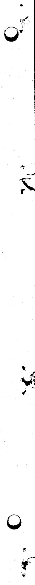

# A STUDY OF LEAD AND LEAD-SALT CORROSION IN THERMAL-CONVECTION LOOPS

G. M. Tolson and A. Taboada

# ABSTRACT

Thermal-convection loop tests of several structural alloys were operated using circulating molten lead. Screening tests were run to evaluate Croloy 2 l/4 Cr, carbon steel, AISI-type 410 stainless steel, and Nb-1% Zr at conditions described in Table 1. Two of the test loops contained surge tanks in which fluoride salts, Nb-1% Zr alloy, and graphite were placed in contact with the lead to determine the compatibility of these materials in a direct-cooled lead system.

All of the steel loops tended to plug in the cold regions because of formation of dendritic crystals of iron and chromium. The hot-leg attack consisted of general surface removal with a few large pits extending to a greater depth. The $\mathrm{Nb - 1\%}$ Zr alloy showed no measurable attack; however, niobium crystals were found in the cold leg of a loop which operated 5000 hr at $1400^{\circ}\mathrm{F}$ with a $\Delta T$ of $400^{\circ}\mathrm{F}$ .

# INTRODUCTION

Liquid lead has been proposed as a coolant for molten-salt breeder reactors. In one reactor design, lead is in direct contact with salts at temperatures up to $1100^{\circ}\mathrm{F}$ , thus eliminating a heat exchanger and resulting in superior heat transfer and thermal efficiencies. In another design, the lead extracts heat from the salt in a salt-lead heat exchanger. The materials commonly used in reactors at these temperatures, such as 300 series stainless steels, Inconels, or Hastelloy's, cannot be used in contact with lead because of the high solubility levels of nickel in lead that result in excessive mass transfer. The refractory metals offer very good corrosion resistance but are difficult to fabricate and are too expensive for a complete reactor system. Carbon steels offer good corrosion resistance to liquid lead but are very marginal with respect to both strength and oxidation resistance. Since Croloys (steel

with $1\frac{1}{4}$ to $9 \%$ Cr and $1 / 2$ to $1 \%$ Mo) and 400 series stainless steels have good oxidation resistance, adequate strength, and contain no nickel, these appeared to be the most promising material for this application. Consequently, the primary effort was expended in evaluating these materials.

# LITERATURE SURVEY

A great portion of the liquid lead corrosion tests described in the literature involves capsule tests that demonstrate the occurrence of solution attack but do not adequately measure mass transfer. In addition, no standard test procedure was used from one test to the next. Test specimens were contained in a variety of capsule materials such as graphite, quartz, and the specimen material itself. Inhibitors were frequently used, and a variety of methods were used to prevent oxidation. The maximum test time was approximately 500 hr.

Results in these isothermal tests generally indicated that iron, carbon steels, low-chromium steels, and chromium stainless steels (nickel-free) had good resistance to corrosion by lead at temperatures up to $1400^{\circ}\mathrm{F}$ . Austenitic stainless steels were good to $1000^{\circ}\mathrm{F}$ . Tan-talum, niobium, and molybdenum were not attacked by lead at $1800^{\circ}\mathrm{F}$ . Nickel and nickel-base alloys had poor resistance to attack by lead, although the attack rate for Inconel at $1100^{\circ}\mathrm{F}$ was reported as 0.38 mils/year. $^{1}$ Other nonferrous alloys of Cu, Pt, Au, W, Sn, Zn, Mn, Zr, and Ti behaved poorly or were not recommended. Carbon demonstrated poor resistance to attack by lead at $1800^{\circ}\mathrm{F}$ but good resistance at $935^{\circ}\mathrm{F}$ .

In addition to the above, other experimentation has been done using thermal-convection loops to study mass transfer. As in the static work, no standard test design existed, making comparison of data difficult. The effect of impurities in lead are not well understood.1 Oxygen has been reported to increase corrosion in lead. Some research indicates

that many elements may act as corrosion inhibitors. These inhibitors could act to form a protective film in the case of titanium and zirconium (ref. 2), to decrease the solubility of the container material in lead as may be the case of nickel, or to remove oxygen from the system in the case of magnesium.

In one of the investigations the relative resistance to mass transfer in liquid lead of 24 metals and alloys was measured at $1472^{\circ}\mathrm{F}$ maximum loop temperature and $300^{\circ}\mathrm{F} \Delta \mathrm{T}$ . The tests were run in quartz thermal-convection loops with the alloy being studied formed into tubes which were inserted into the hot leg and cold leg. In these tests niobium and molybdenum exhibited no mass transfer after 500 hr of test. Nickel-base alloys and austenitic stainless steels were highly susceptible to mass transfer and plugged the loops within 100 hr. Intergranular attack was noted in the hot region. The pure metals, Fe, Cr, Co, Ti, and Ni, all plugged within 100 hr. The 400 series stainless steel (chromium) and molybdenum-bearing alloys showed little evidence of mass transfer after approximately 500 hr. There was some evidence of preferential leaching of chromium by lead in this type alloy. Several investigators have studied the resistance of steels to corrosion by lead, bismuth, and lead-bismuth alloys were found to be more corrosive than lead, the literature indicates that they all result in the same general behavior patterns. The corrosion of steels in uninhibited lead was reported to be about 1/40 of that noted in uninhibited bismuth under comparable conditions (1472°F maximum temperature with 212°F ΔT). The most sophisticated work with lead and lead-bismuth alloys was done by ENL in conjunction with the LMFR Program. Although only one lead loop

20. F. Kammerer et al., Trans. AIME 212, 20-25 (1958).   
3J. V. Cathcart and W. D. Manly, Corrosion 12, 43-48 (February 1956).   
4J. A. James and J. Troutman, J. Iron Steel Inst. (London) 194, 319-23 (March 1960).   
5A. J. Romano, C. J. Klamut, and D. H. Gurinsky, The Investigation of Container Materials for Bi and Pb Alloys. Part I; Thermal Convection Loops, BNL-811 (T-313) (July 1963).

was operated, many bismuth and lead-bismuth loop tests were conducted. In general, the low-alloy steels and low-chromium steels exhibited the best corrosion resistance to bismuth and lead-bismuth; however, titanium and zirconium additions were required to obtain good corrosion resistance in loops that operated above $752^{\circ}\mathrm{F}$ . The authors concluded that titanium and zirconium inhibited corrosion by forming $\mathrm{ZrN}$ , $\mathrm{TiN}$ , and $\mathrm{TiC}$ on the walls in the hottest regions of the loops. No corrosion occurred in inhibited loops that operated for 10,000 hr at temperatures as high as $1022^{\circ}\mathrm{F}$ in bismuth and temperatures as high as $1202^{\circ}\mathrm{F}$ in lead-bismuth eutectic. A single Croloy 2 l/4 steel loop containing zirconium-inhibited lead was operated for over 27,000 hr with a $1022^{\circ}\mathrm{F}$ hot leg and approximately $212^{\circ}\mathrm{F} \Delta \mathrm{T}$ . Although the zirconium additions had been made, the zirconium was not detected by chemical analysis of the solution. The lead also contained about 250 ppm of magnesium, which had been added to prevent loss of zirconium by oxidation, and it may have had an inhibiting effect.

# DESCRIPTION OF TESTS

Six uninhibited thermal-convection loop tests were performed at ORNL to explore the compatibility of materials with lead under conditions expected in molten salt reactors. One additional loop test was also performed to evaluate the performance of a newly designed thermal-convection loop. A description of the loop and the results are presented in the Appendix. The operating conditions for all the loops are summarized in Table 1.

Two of the loops (type 410 stainless steel and 2 l/4 Cr steel) had Nb-1% Zr alloy liners in the surge tanks. Molten Salt Reactor Experiment fuel salt $^6$ floated on the lead surface in the surge tanks as shown in Fig. 1. These loops also contained a graphite specimen in the surge tank which was exposed to both the salt and the lead at the lead-salt interface. The maximum temperature in the loops was about $1200^{\circ}\mathrm{F}$ and the $\Delta T$ was $300^{\circ}\mathrm{F}$ .

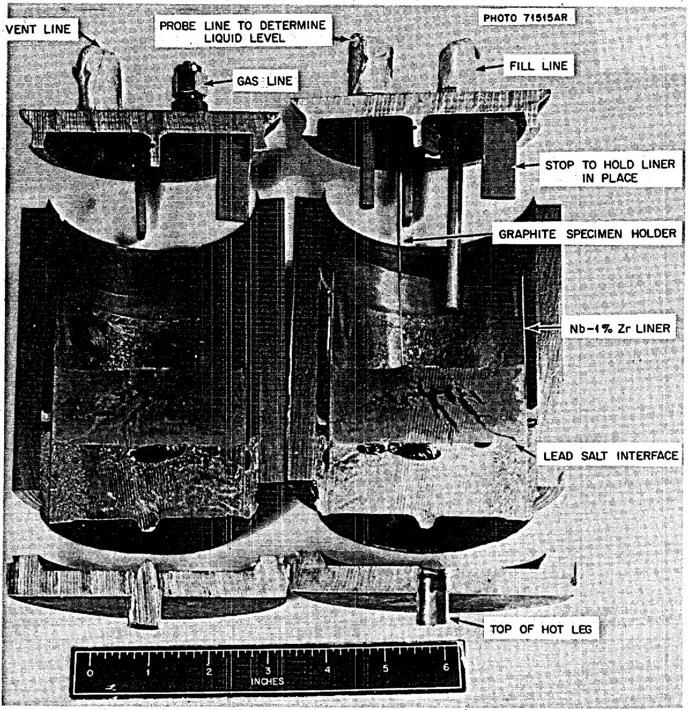  
Fig. 1. Section Through the Surge Tank Used on the 410 Loop. Notice the salt is floating on the lead and the only metal which contacts the salt is the $\mathrm{Nb - 1\%}$ Zr liner. The graphite specimens were suspended from the small wire extending into the salt and cannot be seen in the picture.

Table 1. Operating Conditions of Thermal-Convection Loop Tests Using Lead as a Coolant   

<table><tr><td>Loop Material</td><td>Maximum Temperature (°F)</td><td>ΔT (°F)</td><td>Operated (hr)</td></tr><tr><td>Croloy 2 1/4</td><td>1210</td><td>300</td><td>266</td></tr><tr><td>AISI-type 410 stainless steel</td><td>1210</td><td>300</td><td>1346</td></tr><tr><td>Croloy 2 1/4</td><td>1100</td><td>200</td><td>5156</td></tr><tr><td>ASTM type A-106</td><td>1100</td><td>200</td><td>5064</td></tr><tr><td>Nb-1% Zr clad with type 446 stainless steel</td><td>1400</td><td>400</td><td>385a</td></tr><tr><td>Nb-1% Zr clad with type 446 stainless steel</td><td>1400</td><td>400</td><td>5280</td></tr></table>

Loop containing salt shut down due to instrument malfunction.

Two other loops which did not contain salt or graphite operated at $1100^{\circ}\mathrm{F}$ with a $200^{\circ}\mathrm{F} \Delta \mathrm{T}$ . One of these loops was constructed of 2 l/4 Cr steel, the other of low-carbon steel. A third set of loop tests was operated to investigate the compatibility of niobium with lead both with and without MSRE salt. These loops were fabricated from niobium clad with type 446 stainless steel.

A cleaning charge of lead was used in all the iron-base loops. The charge was run isothermally at the maximum operating temperature of the loop overnight (about 12 hr) and then dumped. The loops were then refilled with clean lead and put into operation. This was not done with the $\mathrm{Nb - l\%}$ Zr loop because of the difficulty in attaching a drain line.

# RESULTS OF TESTS

Of the two steel loops that contained salt, the 2 l/4 Cr steel plugged after only 288 hr and the type 410 stainless steel plugged after 1346 hr. As shown in Fig. 2, the plugs were made up of dendritic crystals, which were determined to be iron and chromium by x-ray diffraction and wet chemical analysis. The maximum depth of attack on the type 410 stainless steel piping in the hot leg was 2 mils, as determined by metallographic examination. The pitting in the hot leg of the 2 l/4 Cr loop showed about 1 mil of attack, as can be seen in Fig. 3. No corrosion was observed on the Nb-1% Zr liner, as demonstrated by the photomicrograph shown in Fig. 4.

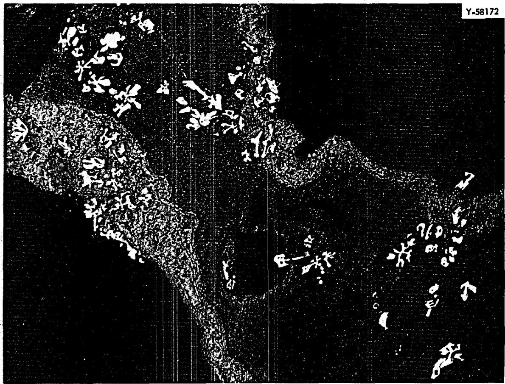  
Fig. 2. Dendritic Crystals of Iron and Chromium Which Formed in the Cold Leg of a 2 l/4 Cr Lead Loop After 266 hr. Unetched. 200x.

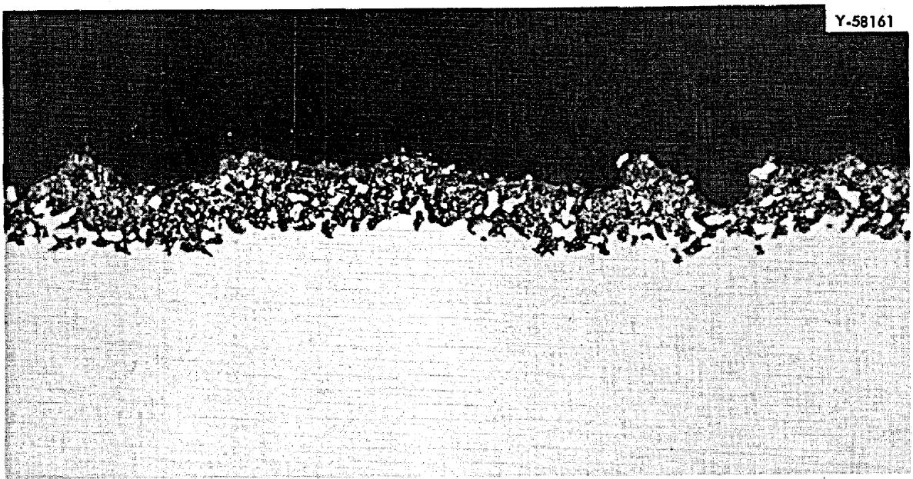  
Fig. 3. Corroded Section of Hot Leg From 2 l/4 Cr Lead Loop Operated at $1200^{\circ}\mathrm{F}$ for 266 hr. Unetched. $500\times$

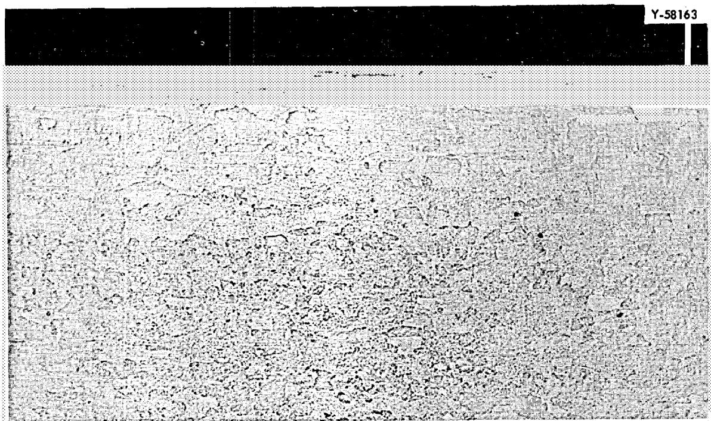  
Fig. 4. Nb-1% Zr Liner Exposed to Lead and Salt for 1349 hr at $1200^{\circ}\mathrm{F}$ in 2 l/4 Cr Lead Loop. 200x.

After 648 hr of operation, the cold leg of the $2\text{ l}/4$ Cr loop, which contained no salt or graphite, began to plug as indicated by decreasing cold-leg temperature. In order to determine if the hot leg was being selectively attacked, the lead was dumped from the loop and the hot leg was radiographed. Several areas were noted where the lead had wet the metal and had not drained from the loop, thus indicating selective attack.[7] The lead that was dumped from the loop was examined and found to contain crystals of iron and chromium which had floated to the top surface during cooling. The loop was then refilled with new lead, restarted, and operated for 5156 hr. The increased time of operation without plugging does not necessarily mean a decrease in corrosion rate since plugging time is not a function of corrosion rate. Post-test metallographic examination of the cold-leg region showed the presence of a large amount of dendritic crystals, as revealed in Fig. 5.

7Brookhaven previously had found that areas of selective attack could be identified in mercury systems in this manner because of the increased wetting action of the liquid metal.

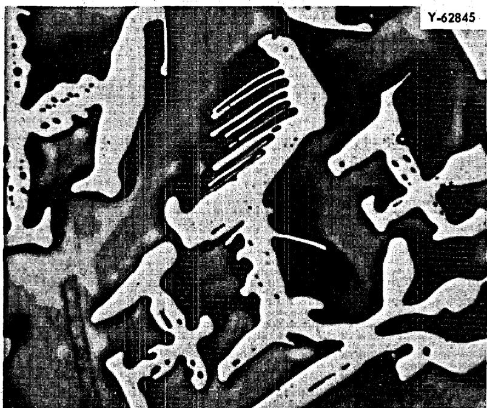

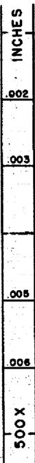  
Fig. 5. Dendritic Crystals of Iron and Chromium Found in the Cold Leg of the $21/4$ Cr Lead Loop Which Ran for 5156 hr at $1100^{\circ}\mathbf{F}$ with a $\Delta T$ of $200^{\circ}\mathbf{F}$ .

The approximate depth of hot-leg attack as determined by the change in wall thickness averaged 5 mils and could have been as deep as 8 mils. The uncertainty in the depth of attack is due to the pitting nature of the attack and the variation in the wall thickness. Analysis of the crystals in the cold leg showed about the same Fe/Cr/Mo ratio as that existing in the original loop piping alloy. A black film found floating on the lead in the top of the surge tank was identified as MnO by x-ray diffraction and spectrographic analysis. The manganese was probably preferentially leached from the hot leg and then deposited in the surge tank as it scavenged oxygen from the rest of the system materials.

The carbon steel loop, constructed of large-diameter pipe, operated for 5000 hr before shutdown. Prior to shutdown, the loop was beginning to show some signs of restricted flow. Subsequent measurements of the wall thickness of the loop piping showed a maximum of 10 and an average of 7 mils of attack similar to that found in the 2 l/4 loops (see Fig. 6).

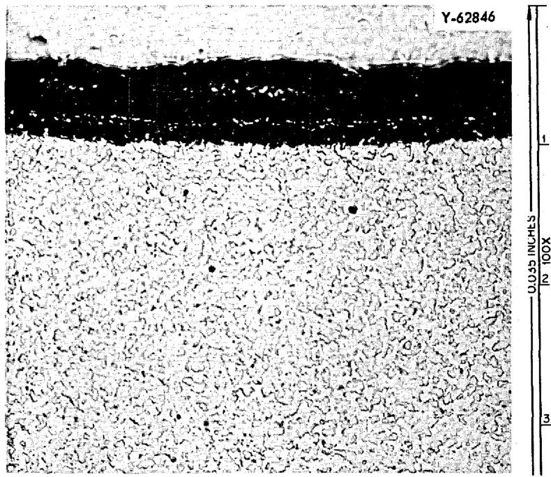  
Fig. 6. Section Through Hot Leg of $2\frac{1}{4}$ Cr Lead Loop Which Operated for 5156 hr with a Hot-Leg Temperature of $1100^{\circ}\mathrm{F}$ and a $\Delta T$ of $200^{\circ}\mathrm{F}$ . The attack consisted of uniform surface removal.

The loops constructed of $\mathrm{Nb - 1\%}$ Zr clad with type 446 stainless steel were shut down after only $385\mathrm{hr}$ of operation due to a faulty relay in the control system. The loop that contained salt could not be restarted, probably due to separation of a high-melting constituent of the salt upon cooling. The loop that contained only lead was restarted and operated $5280\mathrm{hr}$ . Posttest metallographic examination showed no significant hot-leg attack, as indicated by the photograph shown in Fig. 7. Some mass transfer crystals were found in this loop, as shown in Fig. 8. The crystals were found to be 90 to $100\%$ Nb by electron probe as shown in Fig. 9. Niobium mass transfer has not been reported by any other investigators.

$^{8}$ G. Hallerman and R. S. Crouse, personal communication, Nov. 9, 1965.

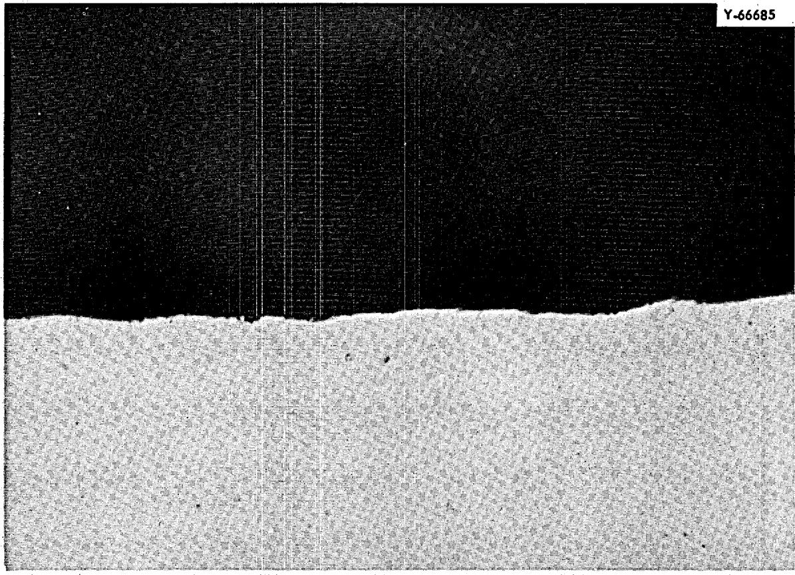  
Fig. 7. Section Through Hot Leg of Nb-1% Zr Loop Which Operated Over 5000 hr with a Cold-Leg Temperature of $1400^{\circ}\mathrm{F}$ and a $\Delta T$ of $400^{\circ}\mathrm{F}$ . Unetched. 750x.

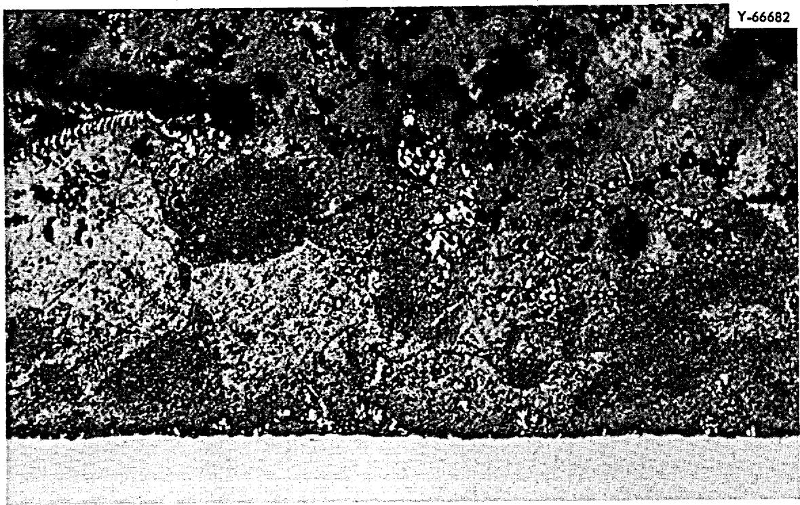  
Fig. 8. Niobium Crystals Found in Cold Leg of Nb-1% Zr Loop Which Operated Over 5000 hr at $1400^{\circ}\mathbf{F}$ and a $\Delta T$ of $400^{\circ}\mathbf{F}$ . Unetched. 250x.

Y-67208

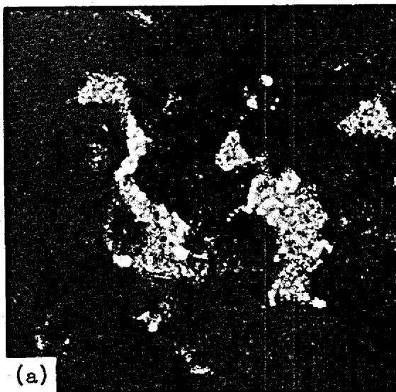

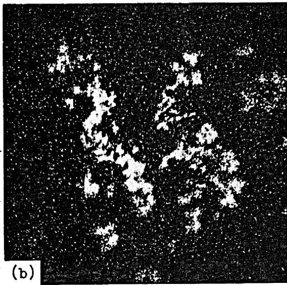  
Fig. 9. Optical and Niobium $\mathrm{La}$ X-Ray Image Taken of the Niobium Crystals Formed in the Cold Leg of a Niobium Thermal Convection Loop Which Operated 500 hr at $1400^{\circ}\mathrm{F}$ and a $\Delta T$ of $400^{\circ}\mathrm{F}$ . 250×. (a) Light optics. (b) Niobium $\mathrm{La}$ X-Ray Image.

# CONCLUSIONS AND RECOMMENDATIONS

The results of the tests are given in Table 2 along with a Brookhaven loop to use as a comparison. The poor performance of the ferritic materials described here suggests that these materials are unsuitable to contain lead at the conditions investigated. This is surprising in light of the 27,795-hr Brookhaven loop. The $78^{\circ}\mathrm{F}$ difference in hot-leg temperature between our 5156-hr loop and the Brookhaven loop is not great enough to explain the several orders of magnitude difference in the corrosion. The difference could be due to the inhibiting effect of the magnesium, used as a deoxident in the Brookhaven loop. Previously cited literature describing the benefit to be derived by inhibitors offers a possible remedy. The most promising inhibitor for our system would be titanium since it is also compatible with the salt.[9] It is therefore recommended that several tests be performed to evaluate the effect of titanium and/or magnesium as inhibitors in a steel-liquid lead system.

The Nb-1% Zr in these tests had better compatibility at higher temperatures than the ferritic materials. Although it is expensive and at present difficult to fabricate, Nb-1% Zr could possibly be used in the high-temperature portion of a bimetal system. It is therefore suggested that the effects of MSRE salt in a Nb-1% Zr-lead system be further investigated.

The loops that were used in this investigation were run for screening purposes and were not designed to obtain a maximum amount of data. Corrosion rates on the loops could only be determined metallographically. Since the attack occurs as uniform surface removal, the depth of attack could only be determined by wall thickness differences, an inaccurate method due to the variation in original pipe wall thickness. Consequently, a new loop design has been developed and is described in the Appendix. The new loop gives better control of the loop variables and provides for improved methods of analysis.

Table 2. Operating Conditions and Results of Thermal-Convection   
Loop Tests Using Lead as a Coolant   

<table><tr><td>Loop Material</td><td>Maximum 
Temperature 
(°F)</td><td>ΔT 
(°F)</td><td>Operated 
(hr)</td><td>Maximum Depth 
of Attack 
(in.)</td><td>Average Depth 
of Attack 
(in.)</td><td>Inhibitors</td></tr><tr><td>Croloy 2 1/4</td><td>1210</td><td>300</td><td>266</td><td>0.001a</td><td></td><td>None</td></tr><tr><td>AISI-type 410 
stainless steel</td><td>1210</td><td>300</td><td>1,346</td><td>0.002a</td><td></td><td>None</td></tr><tr><td>Croloy 2 1/4</td><td>1100</td><td>200</td><td>5,156</td><td>0.008b</td><td>0.006b</td><td>None</td></tr><tr><td>ASTM-type A-106</td><td>1100</td><td>200</td><td>5,064</td><td>0.010b</td><td>0.007b</td><td>None</td></tr><tr><td>Nb-1% Zr clad with type 
446 stainless steel</td><td>1400</td><td>400</td><td>385c</td><td></td><td></td><td>None</td></tr><tr><td>Nb-1% Zr clad with type 
446 stainless steel</td><td>1400</td><td>400</td><td>5,280</td><td>Noned</td><td>Noned</td><td>None</td></tr><tr><td>Croloy 2 1/4e</td><td>1022</td><td>221</td><td>27,765</td><td>None</td><td>None</td><td>250 ppm Mg + 
Zr</td></tr></table>

a Determined metallographically by thickness of corrosion layer.   
bDetermined metallographically by wall-thickness change.   
Loop containing salt shut down due to instrument malfunction.   
d No measurable hot-leg attack; however, crystals of niobium were formed in the cold leg.   
eBrookhaven Loop.

# APPENDIX

In an effort to increase the value of thermal-convection loop tests, a new test loop was developed (see Fig. 10) incorporating the following features:

1. Removable hot-leg samples for both weight-change measurements and metallographic analysis. Samples can be removed without contacting the salt.   
2. Temperature control by a thermocouple located in the lead. The thermocouple is movable so that a temperature profile of the hot leg can also be obtained.   
3. MSRE salt floating on lead in contact with both the $\mathsf{Nb - l}\%$ Zr liner and graphite in the surge tank.   
4. Miniaturized design to facilitate sectioning or radiographing of the complete loop.   
5. Sampling of both the lead and salt.   
6. A method by which the loop may be drained and refilled without removing the salt so that the hot leg can be radiographed to find selective attack and so that mass transfer crystals may be removed by gravity separation.   
7. Improved control of the cold-leg temperature.

A prototype loop of the new design was run to test the temperature distribution and the sample removal and cleaning techniques. The loop operated with a hot-leg temperature of 1100 and $1200^{\circ}\mathrm{F}$ and a maximum $\Delta T$ of $230^{\circ}\mathrm{F}$ . The sample cleaning techniques that were developed consisted of amalgamation of the lead with mercury and then removal of the amalgamate with concentrated nitric acid. Control specimens processed along with the loop specimens showed no significant weight change. One of the removable samples used in the loop was zirconium. It did not lose or gain any weight. Since the loop plugged after 1848 hr of operation and showed a maximum of 4.5 mils of attack, it is apparent that the presence of zirconium did not significantly affect the corrosion behavior in the system.

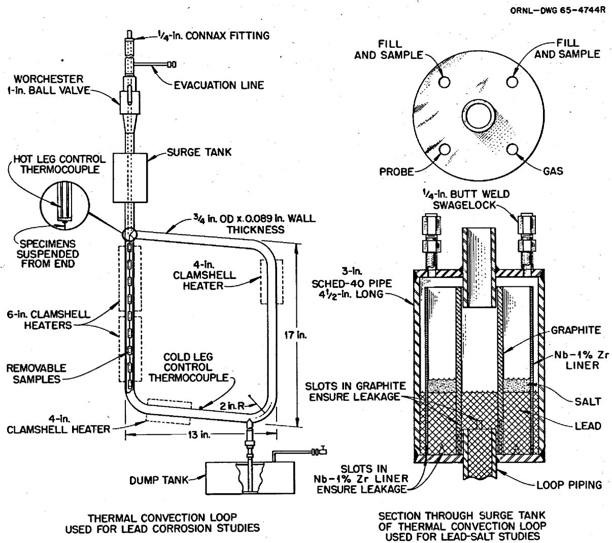  
Fig. 10. Sketch of Prototype Loop That Will Be Used to Study the Effect of Inhibitors on Lead Salt-Low Alloy Steel Systems.

In the new loop, better control over the cold-leg temperature is achieved through the use of a cold-leg heater placed at the inlet to the cold leg of the loop. This heater is controlled by the cold-leg thermocouple. A shutdown device is also incorporated which terminates the loop when the temperature at the cold-leg heater equals that of the hot leg. With this design, the degree of plugging may be determined by the power consumption of the cold-leg heater. The system worked very well in the prototype test and will be used on future loops.

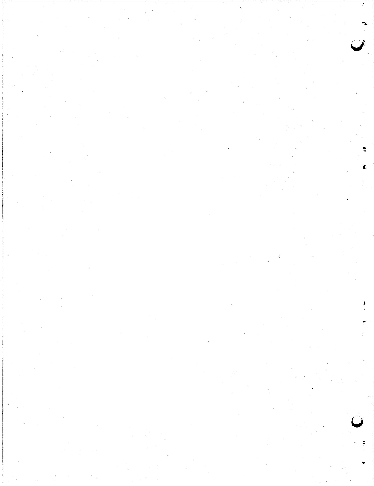

# INTERNAL DISTRIBUTION

1-3. Central Research Library   
4. Reactor Division Library   
5-6. ORNL - Y-12 Technical Library Document Reference Section   
7-16. Laboratory Records Department   
17. Laboratory Records, ORNL R.C.   
18. ORNL Patent Office   
19. G. M. Adamson, Jr.   
20. S. E. Beall   
21. E. S. Bettis   
22. F. F. Blankenship   
23. G. E. Boyd   
24-25. R.B.Briggs   
26. J.H.Coobs   
27. W.H.Cook   
28. R. S. Crouse   
29. J. E. Cunningham   
30. J. H. Devan   
31. J. R. DiStefano   
32. D. A. Douglas, Jr.   
33. B. Fleischer   
34. J.H Frye, Jr.   
35. R. J. Gray

36. W. R. Grimes   
37. W. O. Harms   
38. P. N. Haubenreich

39-41. M.R.Hill

42. H. Inouye   
43. P. R. Kasten   
44. R. B. Lindauer   
45. H. G. MacPherson   
46. R. W. McClung   
47. W. B. McDonald   
48. H. F. McDuffie   
49. C. J. McHargue   
50. R. L. Moore   
51. P. Patriarca   
52. D. Scott   
53. G. M. Slaughter   
54. I. Spiewak   
55. A. Taboada   
56. J. R. Tallackson   
57. R.E.Thomas   
67. G.M.Tolson   
68. A. M. Weinberg   
69. J. R. Weir   
70. M. E. Whatley

# EXTERNAL DISTRIBUTION

71. C. M. Adams, Jr., Massachusetts Institute of Technology   
72-73. D.F. Cope, AEC, Oak Ridge Operations Office   
74. J. L. Gregg, Bard Hall, Cornell University   
75. J. Simmons, AEC, Washington   
76. D. K. Stevens, AEC, Washington   
77. Research and Development Division, AEC, ORO   
78-92. Division of Technical Information Extension