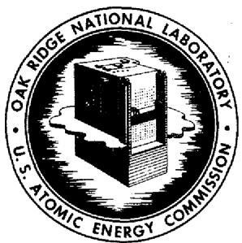

OAK RIDGE NATIONAL LABORATORY

operated by
UNION CARBIDE CORPORATION
for the
U.S. ATOMIC ENERGY COMMISSION

ORNL-TM-1445

COPY NO.

DATE - April 5, 1966

SIMULATORS FOR TRAINING MOLTEN-SALT REACTOR EXPERIMENT OPERATORS

S.J. Ball

ABSTRACT

Two on-site reactor kinetics simulators were developed for training operators of the Molten-Salt Reactor Experiment (MSRE) in nuclear startup and power-level operating procedures. Both simulators were set up on general purpose, portable Electronic Associates, Inc., TR-10 analog computers and were connected to the reactor control and instrumentation system.

The training program was successfully completed. Also, the reactor control and instrumentation system, the operating procedures, and the rod and radiator-door drives were checked out. Some minor modifications were made to the system as a result of the experience with these simulators.

RELEASED FOR ANNUNCEMENT

IN NUCLEAR SCIENCE ABSTRACTS

# LEGAL NOTICE

This report was prepared as an account of Government sponsored work. Neither the United States, nor the Commission, nor any person acting on behalf of the Commission:

A. Makes any warranty or representation, expressed or implied, with respect to the accuracy, completeness, or usefulness of the information contained in this report, or that the use of any Information, apparatus, method, or process disclosed in this report may not infringe privately owned rights; or   
B. Assumes any liabilities with respect to the use of, or for damages resulting from the use of any information, apparatus, method, or process disclosed in this report.

As used in the above, "person acting on behalf of the Commission" includes any employee or contractor of the Commission, or employee of such contractor, to the extent that such employee or contractor of the Commission, or employee of such contractor prepares, disseminates, or provides access to, any information pursuant to his employment or contract with the Commission, or his employment with such contractor.

# CONTENTS

# Abstract 1

1. Introduction 5   
2．Startup（ZeroPower）Simulator 5   
3. Power Level Simulator 8   
4. Time Required for Setup of Simulators 13   
5. Conclusions 13   
6. Appendix 15

6.1 Details of Startup Simulation 15   
6.2 Details of Power Level Simulation 19

6.2.1 Neutron Kinetics Equations 19   
6.2.2 Core Thermal Dynamic Equations 21   
6.2.3 Radiator Effectiveness 22   
6.2.4 Xenon Poisoning 23

RELEASED FOR ANNOUNCEMENT IN NUCLEAR SCIENCE ABSTRACTS

# LEGAL NOTICE

This report was prepared as an account of Government sponsored work. Neither the United States, nor the Commission, nor any person acting on behalf of the Commission: A. Makes any warranty or representation, expressed or implied, with respect to the accuracy, completeness, or usefulness of the information contained in this report, or that the use of a computer system, apparatus, method, or process disclosed in this report may not infringe the privacy of any information, apparatus, method, or process disclosed in this report. B. Assumes any liabilities with respect to the use of, or for damages resulting from the use of any information, apparatus, method, or process disclosed in this report. As used in the above, "person acting on behalf of the Commission" includes any employee who is employed by the Company, whether or not as a shareholder of the Company, or employee of such contractor or shareholder who has been contracted to act as a contractor or shareholder. Such employee or contractor of the Commission, or employee of such contractor prepares such employee or contractor of the Commission, or employee of such contractor prepares such employee or contractor of the Commission, or employee of such contractor prepares such employee or contractor of the Commission, or employee of such contractor prepares such employee or contractor of the Commission, or employee of such contractor prepares such employee or contractor of the Commission, or employee of such contractor prepares such employee or contractor of the Commission, or employee of such contractor.

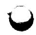

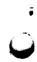

# 1. INTRODUCTION

Two reactor kinetics simulators were developed for training operators of the Molten-Salt Reactor Experiment (MSRE) in nuclear startup and power-level operation procedures. Both simulators were installed at the reactor site, and were connected to the reactor instrumentation and controls system. The operators were trained in startup, or zero power, operation with the simulator in February 1965 and in power-level operation in October 1965.

Both simulators were set up on general purpose, portable Electronic Associates, Inc., TR-10 analog computers (borrowed from the Instrumentation and Controls Division analog computer pool). No special hardware (other than the computers) was required. Although most of the simulation techniques were straightforward, a few special techniques were devised.

This report describes the two simulators.

# 2. STARTUP (ZERO POWER) SIMULATOR

The startup simulator, set up on one TR-10 analog computer (Fig. 1), computed the reactor neutron level from $10^{-2}$ w to 1.5 Mw as a function of control-rod-induced reactivity perturbations. The effect of nuclear power on system temperatures was not included.

ORNL DWG. 66-4834

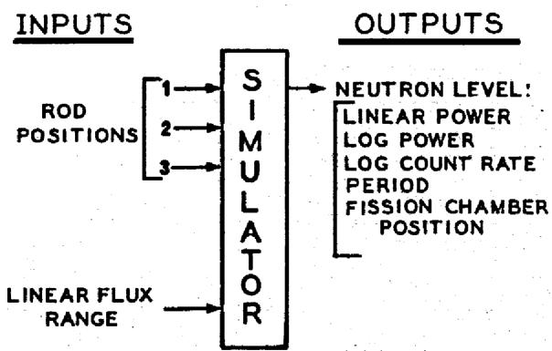  
Fig. 1. Diagram of Startup Simulator.

# REACTOR INSTRUMENTATION

RR-8100   
RR-8200   
CONSOLE METER: CHANNEL 1   
CONSOLE METER: CHANNEL 2   
SPECIAL: ON CONSOLE

The inputs to the simulator were signals indicating the actual positions of the control rods, and the outputs (indicated on the reactor instrumentation) were log count rate, period, log power, and linear power.

The linear flux-range input signal was taken from the selector switch on the reactor console. The fission-chamber position readout was provided by a meter mounted on the console. The fission chamber is the detector for the wide-range counting channel system. The chamber position is servo-controlled to give a constant output signal, and the chamber position is related to the log of the nuclear power. The period interlocks and the flux control system were also used.

The operators practiced the approach-to-critical experiment (in which plots of inverse count rate vs rod position are used to extrapolate to the critical rod position) and rod-bump experiments for calculating differential rod-reactivity worth from measurements of stable reactor period. The simulator was also used to check out the flux servo controller.

Rod position signals were obtained from the three potentiometers normally used by the MSRE computer. The "S" curve relating rod worth and position was approximated for the regulating rod by a diode function generator (Fig. 2). The rod worth vs position relationship for the other two rods was linear.

$^{1}$ S.E. Beall et al., MSRE Design and Operations Report, Part V, Reactor Safety Analysis Report, ORNL-TM-732 (August 1964), pp. 96-98.

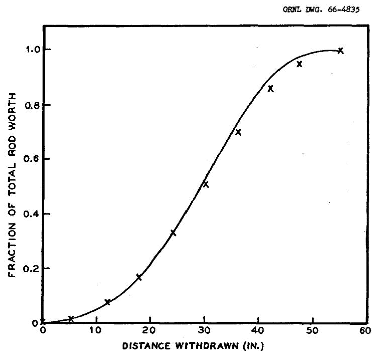  
Fig. 2. Simulator Approximation of Regulating Rod Worth vs Position.

The analog circuit used to compute reactivity from the three rod positions included the effects of the position of one rod on the total worth of the others (Table 1).

Table 1. Full-Scale Rod Worths   

<table><tr><td>Rod</td><td>Position</td><td>Full-Scale 
Rod Worth 
(‰ δK/K)</td><td>Reactivity 
vs Position</td></tr><tr><td rowspan="2">Regulating Rod</td><td>Shims out</td><td>2.6</td><td>&quot;S&quot; curve</td></tr><tr><td>Shims in</td><td>1.3</td><td>&quot;S&quot; curve</td></tr><tr><td rowspan="2">Both Shims</td><td>Regulating rod out</td><td>5.8</td><td>linear</td></tr><tr><td>Regulating rod in</td><td>4.5</td><td>linear</td></tr></table>

The neutron level computation was made by converting the kinetics equations to logarithmic form, since the neutron level varied over eight decades. Two effective delayed-neutron precursor groups were used. The usual method of including the source term in these equations was found to be unsatisfactory, and a special circuit was used (see Sect. 6.1).

The conversion of log power to linear power was approximated by using a squaring device that gave adequate accuracy over each linear (1.5 decade) range (Fig. 3). A voltage signal from the reactor instrumentation linear-

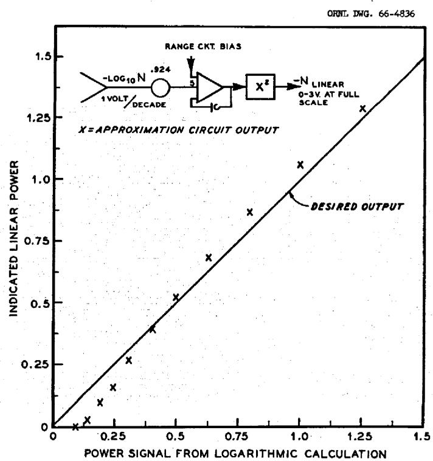  
Fig. 3. Approximate Log-to-Linear Conversion.

range selector circuit was subtracted from the log power signal, and this difference was then converted to the linear signal.

The equations and analog computer circuit used for the startup simulator are given in Sect. 6.1

# 3. POWER LEVEL SIMULATOR

The power level simulator, set up on two TR-10 analog computers (Fig. 4), simulated the kinetic behavior of the MSRE for power levels

ORNL DWG. 66-4837

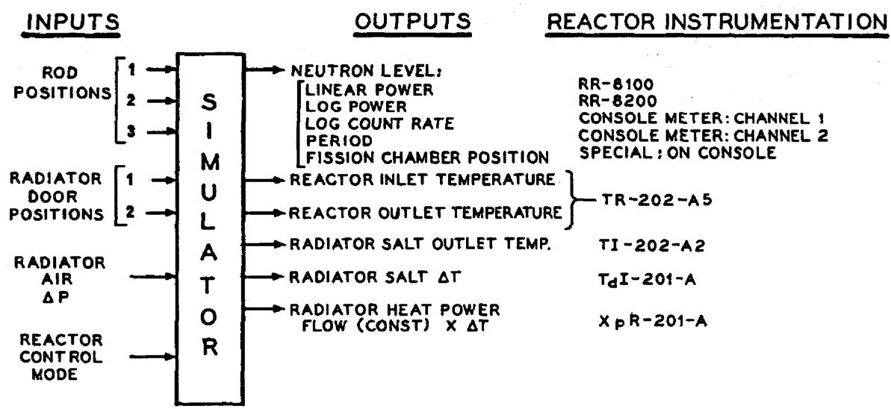  
Fig. 4. Diagram of Power Level Simulator.

between 0.5 and $12\mathrm{MW}$ . The inputs were signals indicating the actual positions of the rods and the radiator doors and the actual pressure drop of the cooling air across the radiator. The outputs were neutron levels and temperatures. The usual nuclear information and key system temperature outputs were indicated on the reactor instrumentation. The reactor power-level servo controller and radiator load control systems were also used.

The reactivity inputs from control-rod position signals were computed as in the startup simulation. The neutron level computation (using two delayed-neutron precursor groups) solved the linear, rather than logarithmic, kinetics equations. Only the 0 to 1.5 and the 0 to $15\mathrm{MW}$ ranges on the reactor linear power channels were operational. Conversion from linear to log power was approximated using a square-root device (Fig. 5).

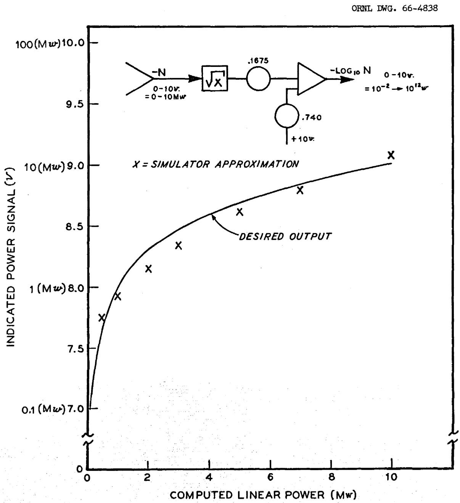  
Fig. 5. Approximate Linear-to-Log Conversion.

Other reactivity inputs to the power level simulator were from computed xenon poisoning, noise, and fuel and graphite temperature changes. The xenon-poisoning computation (Fig. 6) was included as an option. In consideration of the long time-constants of xenon buildup and decay, the equations were time scaled to run at ten times real time.

ORNL DWG. 66-4339

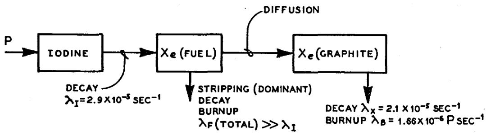  
Fig. 6. Diagram of Xenon Poisoning Computation.

Steady-State Xe Poisoning When $P = 10 \, \text{Mw}$ :

$\delta K \text{Fuel} = -0.7 \%$ .

$\delta K$ Graphite $= -0.79 \text{‰}$

The reactivity noise input was included to offset complaints typical of usual simulators about how "smooth" the flux output is compared with the noisy output of actual reactors. An operational amplifier with high resistance feedback (40 megohms) was used as the noise source.

A simplified simulation of the thermal kinetics of the MSRE was used which was based on previous studies of reactor dynamics.3

The core was represented by two fuel "lumps," or nodes, and the graphite by one. Six more lumps were used to represent the rest of the system. The thermal characteristics are summarized in Table 2.

The heat removal rate from the radiator is controlled by varying the air flow through the radiator; hence, the radiator salt outlet temperature is affected by salt inlet temperature, air inlet temperature, and air flow rate changes. A simple but fairly accurate way of simulating the heat removal is to make use of the relationship of radiator cooling "effectiveness" as a function of air flow rate. Cooling effectiveness is defined as the ratio of the actual temperature decrease of the hot fluid to the temperature decrease in an ideal (i.e., infinite heat-transfer surface) heat exchanger:

Table 2. MSRE Thermal Characteristics Used in the Power Level Simulator   

<table><tr><td>Core transit time, sec</td><td>7.6 (two 
lumps)</td></tr><tr><td>Graphite time-constant, sec</td><td>200.0</td></tr><tr><td>Heat exchanger to core transit time, seca</td><td>10.0</td></tr><tr><td>Core to heat exchanger transit time, sec</td><td>6.67</td></tr><tr><td>Radiator transit time, sec</td><td>6.67</td></tr><tr><td>Radiator to heat exchanger transit time, seca</td><td>10.0 (two 
lumps)</td></tr><tr><td>Heat exchanger to radiator transit time, seca</td><td>5.0</td></tr></table>

Heat exchanger "effectiveness" factors at steady stateb:

$$
\frac {T _ {p o}}{T _ {p i}} = 0. 7 0 2 9 \quad \frac {T _ {p o}}{T _ {s i}} = 0. 2 9 7 1
$$

$$
\frac {T _ {\text {s o}}}{T _ {\text {p i}}} = 0. 4 4 7 8 \quad \frac {T _ {\text {s o}}}{T _ {\text {s i}}} = 0. 5 5 2 2
$$

aHoldup time in heat exchanger is included in the other transit times.   
bP, primary; S, secondary; i, inlet; and o, outlet.

$$
E _ {c} = \frac {T _ {\text {s a l t i n}} - T _ {\text {s a l t o u t}}}{T _ {\text {s a l t i n}} - T _ {\text {a i r i n}}}.
$$

The salt outlet temperature is computed from

$$
\mathrm {T} _ {\text {s a l t o u t}} = \mathrm {T} _ {\text {s a l t i n}} - \mathrm {E} _ {\mathrm {c}} \left(\mathrm {T} _ {\text {s a l t i n}} - \mathrm {T} _ {\text {a i r i n}}\right).
$$

The calculated cooling effectiveness as a function of air flow rate and the linear approximation used in the simulator are shown in Fig. 7.

ORNL DWG. 66-4840

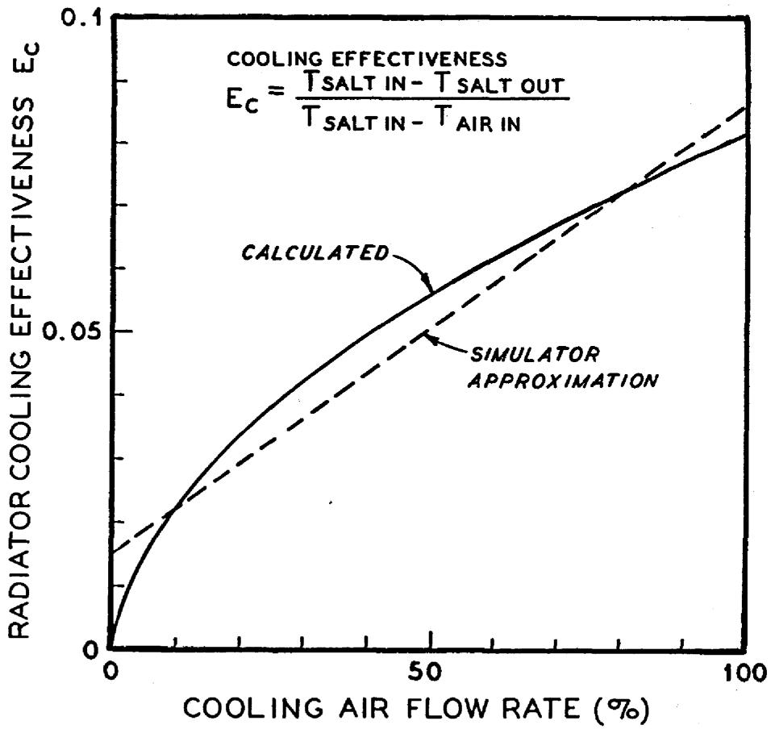  
Fig. 7. MSRE Radiation Cooling Effectiveness vs Air Flow Rate.

The air flow rate $W_{a}$ through the radiator was computed from

$$
w _ {a} = K \sqrt {\Delta P _ {a}} \left(X _ {1} + X _ {2}\right),
$$

where

$$
K = \text {c o n s t a n t}
$$

$$
\Delta P _ {a} = \text {m e a s u r e d a i r p r e s s u r e - d r o p s i g n a l a c r o s s t h e r a d i a t o r},
$$

$$
X _ {1}, X _ {2} = \text {m e a s u r e d r a i d a t o r d o o r p o s i t i o n s (i n c h e s r a i s e d)}.
$$

Conversion of the analog computer voltages representing temperatures to signals compatible with the Foxboro ECI instruments was done with straightforward resistance divider networks.

The equations and analog computer circuit used for the power level simulator are given in Sect. 6.2.

# 4. TIME REQUIRED FOR SETUP OF SIMULATORS

The engineering and craft time required to develop, install, and check out the simulators and to train the operators in their use was as follows (all values in man-weeks):

<table><tr><td></td><td>Startup Simulator</td><td>Power Level Simulator</td></tr><tr><td colspan="3">Engineering Labor</td></tr><tr><td>Development</td><td>1.6</td><td>1.4</td></tr><tr><td>Set up and check out</td><td>0.7</td><td>1.2</td></tr><tr><td>Lecturing on use</td><td>0.3</td><td>1.0</td></tr><tr><td colspan="3">Craft Labor</td></tr><tr><td>Installation</td><td>0.3</td><td>0.4</td></tr><tr><td>Total</td><td>2.9</td><td>4.0</td></tr></table>

# 5. CONCLUSIONS

The two on-site training simulators were developed and operated satisfactorily as part of the MSRE operator training program. Besides the obvious function of training the operators, the simulators served as a

means of checking out the reactor instrumentation and control system, the operating procedures, and the rod and radiator-door drives. Some minor modifications were made to the system as a result of this experience with the simulators.

All manipulations required to operate the simulated reactor were done from the reactor console, and the readout devices were part of the standard reactor instrumentation.

# 6. APPENDIX

# 6.1 Details of Startup Simulation

The neutron kinetics equations are

$$
\frac {\mathrm {d} n}{\mathrm {d} t} = \frac {n}{1 ^ {*}} [ k (1 - \beta_ {T}) - 1 ] + \sum_ {i = 1} ^ {6} \lambda_ {i} C _ {i} + s, \tag {1}
$$

$$
\frac {\mathrm {d} C _ {i}}{\mathrm {d} t} = \frac {\operatorname {k n} \beta_ {i}}{1 ^ {*}} - \lambda_ {i} C _ {i}, \tag {2}
$$

where

$$
n = \text {n e u t r o n p o p u l a t i o n},
$$

$$
t = \text {t i m e}, \sec ,
$$

$$
l * = \text {p r o m p t n e u t r o n l i f e t i m e , s e c},
$$

$$
k = \text {r e a c t o r}
$$

$$
\beta_ {T} = \text {t o t a l d e l a y e d n e u t r o n f r a c t i o n},
$$

$$
\beta_ {i} = \text {e f f e c t i v e d e l a y e d n e u t r o n f r a c t i o n f o r i ^ {t h} p r e c u s o r g r o u p}
$$

$$
\lambda_ {i} = \text {d e c a y c o n s t a n t f o r i} ^ {\text {t h}} \text {p r e c u s o r g r o u p},
$$

$$
C _ {i} = i ^ {\text {t h}} \text {p r e c u r s o r p o p u l a t i o n},
$$

$$
S = \text {r a t e}
$$

$$
\text {R e w r i t e E q s .} (1) \text {a n d} (2), \text {a s s u m i n g k} \beta_ {\mathrm {T}} \approx \beta_ {\mathrm {T}} \text {a n d} \frac {\mathrm {k n} \beta_ {\mathrm {j}}}{1 ^ {*}} \approx \frac {\mathrm {n} \beta_ {\mathrm {j}}}{1 ^ {*}}:
$$

$$
\frac {\mathrm {d} n}{\mathrm {d} t} = \frac {\delta k - \beta_ {\mathrm {T}}}{1 ^ {*}} n + \sum_ {i = 1} ^ {6} \lambda_ {i} c _ {i} + s, \tag {3}
$$

$$
\frac {\mathrm {d} C _ {i}}{\mathrm {d} t} = \frac {n \beta_ {i}}{1 ^ {*}} - \lambda_ {i} C _ {i}. \tag {4}
$$

Divide Eqs. (3) and (4) by $n$ :

$$
\frac {1}{n} \frac {d n}{d t} = \frac {\delta k - \beta_ {T}}{1 ^ {*}} + \sum_ {i = 1} ^ {6} \frac {\lambda_ {i} C _ {i}}{n} \frac {S}{n} \tag {3'}
$$

$$
\frac {1}{n} \frac {d C _ {i}}{d t} = \frac {\beta_ {i}}{1 ^ {*}} - \frac {\lambda_ {i} C _ {i}}{n}. \tag {4'}
$$

Define new variables:

$$
M = \frac {\frac {d n}{d t}}{n} = \text {r e c i p r o c a l p e r i o d},
$$

$$
v _ {i} = \frac {c _ {i}}{n},
$$

$$
w = \frac {s}{n}.
$$

Substitute into Eqs. (3') and (4'):

$$
M = \frac {\delta k}{1 ^ {*}} - \frac {\beta_ {T}}{1 ^ {*}} + \sum_ {i = 1} ^ {6} V _ {i} \lambda_ {i} + W, \tag {5}
$$

$$
\frac {\mathrm {d} V _ {i}}{\mathrm {d} t} = \frac {\beta_ {i}}{1 ^ {*}} - \lambda_ {i} V _ {i} - M V _ {i}. \tag {6}
$$

The usual method of computing the source term is as follows: noting that $\mathbf{W}\mathbf{n} = \mathbf{S}$ and

$$
\frac {d (W _ {n})}{d t} = \frac {d S}{d t} = 0,
$$

therefore

$$
w \frac {d n}{d t} + n \frac {d W}{d t} = 0,
$$

$$
\frac {\mathrm {d} W}{\mathrm {d} t} = - \frac {W}{n} \frac {\mathrm {d} n}{\mathrm {d} t} = - M W. \tag {7}
$$

The analog computer can usually solve a first-order differential equation such as Eq. (7) for $W$ ; however in this case, $W$ becomes so small when $n >> S$ that the voltage representing $W$ is within the noise level of the amplifier, so further computation with it is meaningless. To avoid this problem, the relationship between $W$ and $\log n$ was approximated as shown in Fig. 8.

ORNL DWG. 66-4841

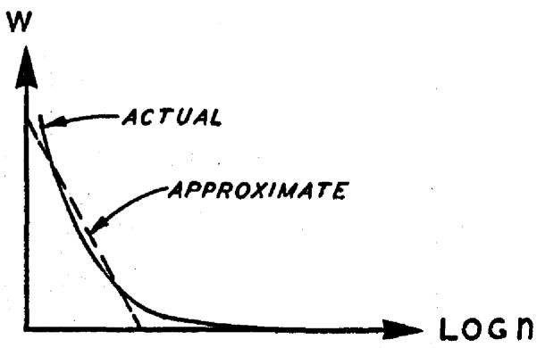  
Fig. 8. Approximation of Logarithmic Source Term W.

The six delayed-neutron precursor groups were approximated by two groups, as follows:

$$
\overline {{\beta}} _ {1 - 3} = \sum_ {1 = 1} ^ {3} \beta_ {1} = 0. 0 0 2 6 9 3,
$$

$$
\overline {{\beta}} _ {4 - 6} = 0. 0 0 0 9 2 4,
$$

$$
\bar {\lambda} _ {1 - 3} = \frac {\bar {\beta} _ {1 - 3}}{\sum_ {i = 1} ^ {3} \frac {\beta_ {i}}{\lambda_ {i}}} = 0. 6 3 \sec^ {- 1},
$$

$$
\bar {\lambda} _ {4 - 6} = 0. 0 4 4 2 \sec^ {- 1}.
$$

The prompt neutron lifetime $1^*$ was 0.00024 sec, and $\beta_{\mathrm{T}}$ was 0.0064 (ref 4).

The analog computer circuit for the startup simulator is shown in Fig. 9.

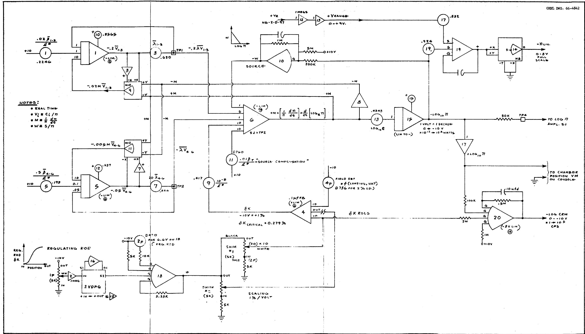  
Fig. 9. Analog Computer Circuit for the Startup Simulator.

# 6.2.1 Neutron Kinetics Equations

Equations (1) and (2) of Sect. 6.1, with two delayed-neutron precursor groups, were used. An analog circuit (Fig. 10) developed many years ago5 was used to solve these equations. This circuit is superior to most of those published in the literature, mainly because of the way in which the amplitude scaling is accomplished.

A key point in the scheme for simulating the equations is the use of a small feedback capacitor for the integration of the neutron level equation, rather than solving directly for dn/dt and then integrating with a conventional large-feedback-capacitance integrator. In Fig. 10, amplifier l (which solves for n) has a feedback capacitor of 10 $l^*$ μf. The amplifier gain is 1/10 $l^*$ Rin(sec $^{-1}$ ), where Rin is in megohms. With the assumption that all input resistors are O.l megohm, Eq. 1 can be rearranged to show the desired form of the inputs to amplifier l, as follows:

$$
\frac {\mathrm {d n}}{\mathrm {d t}} \frac {1}{1 *} \left(\mathrm {k n} - \mathrm {k n} \beta_ {\mathrm {T}} - \mathrm {n} + 1 * \lambda_ {1} \mathrm {C} _ {1} + 1 * \lambda_ {2} \mathrm {C} _ {2}\right). \tag {8}
$$

The quantity $\mathbf{kn}$ is generated from $\mathbf{n}$ and $\delta \mathbf{k}$ as shown in Fig. 10. Typically $\mathbf{k}$ will vary between 1.005 and 0.98 for control studies. Owing to the inherent inaccuracy of the multiplier, it is advantageous to let the full-scale output of the $(\delta \mathbf{k} \times \mathbf{n})$ multiplier be only a few percent of $\mathbf{kn}$ . In the simulator, the voltage representing zero $\delta \mathbf{k}$ was offset, i.e., $-1.5\% \leq \delta \mathbf{k} \leq +0.5\%$ , because of the apparent deadband in the quarter-square multiplier when one input operates around zero volts. The quantity $\mathbf{kn}\beta_{\mathbf{T}}$ is generated from

$$
0. 1 \mathrm {k n} \quad \mathrm {x} \quad \underbrace {1 0 0 \beta_ {\mathrm {T}}} _ {\text {p o t 2 s e t t i n g}} \quad \mathrm {x} \quad \underbrace {0 . 1} _ {\text {l m e g o h m i n p u t}}
$$

the gain reductions thus allowing a reasonably large gain setting on pot 2.

The $1^{\star}\lambda_{i}C_{i}$ terms are obtained by first taking the Laplace transform of Eq. 2:

$$
\mathrm {S C} _ {i} = \frac {\mathrm {k n} \beta_ {i}}{1 ^ {*}} - \lambda_ {i} \mathrm {C} _ {i},
$$

which rearranged is

Fig. 10. Analog Circuit Designed by E.R. Mann for Neutron Kinetics Equations.   
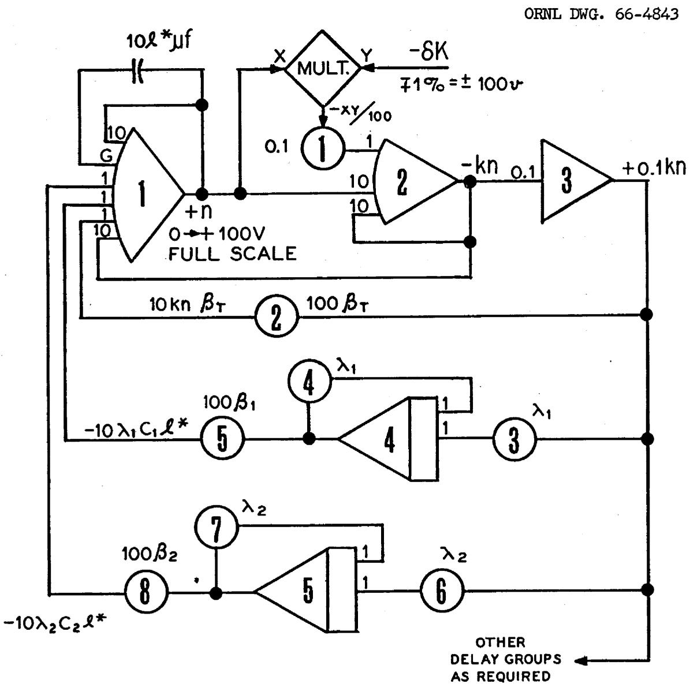  
AMPLIFIER GAIN OF 1 IMPLIES 1-MEGOHM INPUT RESISTOR; GAIN OF $10 = 0.1\mathrm{M}$

NOTE:

$$
1 * \lambda_ {i} C _ {i} = \ln \beta_ {i} \left(\frac {\lambda_ {i}}{S + \lambda_ {i}}\right), \tag {9}
$$

where $S$ is the Laplacian argument.

Solving for the output of integrator ${}^{4}\left\lbrack  {\mathrm{e}}_{\left( 4\right) }\right\rbrack$ :

$$
\begin{array}{l} \frac {d e (4)}{d t} = s e (4) = - \lambda_ {i} e (4) + 0. 1 \lambda_ {i} k m \\ e _ {(4)} = - 0. 1 \ln \left(\frac {\lambda_ {i}}{S + \lambda_ {i}}\right) \tag {10} \\ \end{array}
$$

Multiplication of $e_{(4)}$ by 100 $\beta_i$ gives -10 $\mathrm{kn}\beta_i\left(\frac{\lambda_i}{S + \lambda_i}\right)$ ,

which is seen from Eq.(9) to equal $-10\mathsf{l}^{*}\lambda_{i}\mathsf{C}_{i}$ as required for generating dn/dt in Eq. (8). Again, because the amplifier gains were reduced, the gains on the $\beta_{1}$ pots could be increased.

This circuit clearly shows that for small values of $l^*$ (e.g., $10^{-4} \to 10^{-6}$ sec) the feedback capacitor for amplifier $l$ will be very small and thus will have a negligible effect on the response of $n$ for the slow variations normally encountered in control studies. Under these conditions the negligible effect of this capacitor implies that the neutron kinetics are independent of $l^*$ , and for $m$ precursor groups, the neutron kinetics can be described by $m$ differential equations, rather than $(m + 1)$ equations. This simplification is useful when the kinetics equations are solved on a digital computer, because the maximum computation time interval is usually governed by the $l^*/\beta_T$ time constant and must be made quite small to give stable (and accurate) answers.

# 6.2.2 Core Thermal Dynamic Equations

The fuel flow in the core is approximated by two first-order lags in series, and heat transfer takes place between the first fuel lump and the graphite. The nuclear importances of the two fuel lumps are equal. Forty-seven percent of the nuclear heat is generated in each fuel lump. The remaining $6\%$ is generated in the graphite. The heat balance equations used for the core are as follows:

a. First fuel lump

$$
\frac {d \overline {{T}} _ {c}}{d t} = - 0. 2 6 3 \overline {{T}} _ {c} + 0. 0 1 7 \overline {{T}} _ {G} + 0. 2 4 6 T _ {c i} + 0. 0 3 2 9 n;
$$

b. Second fuel lump

$$
\frac {\mathrm {d} \mathrm {T} _ {\mathrm {c o}}}{\mathrm {d} t} = - 0. 2 6 3 \mathrm {T} _ {\mathrm {c o}} + 0. 2 6 3 \overline {{\mathrm {T}}} _ {\mathrm {c}} + 0. 0 3 2 9 \mathrm {n};
$$

c. Graphite

$$
\frac {d \overline {{T}} _ {G}}{d t} = - 0. 0 0 5 \overline {{T}} _ {G} + 0. 0 0 5 \overline {{T}} _ {c} + 0. 0 0 0 8 4 n.
$$

Temperatures are in $^0\mathbf{F}$ , time is in seconds, and neutron level n is in megawatts.

As discussed previously, the lags due to holdup and heat transfer in the loop external to the core were represented by six first-order lags. Each lag is described by the equation

$$
\frac {d \bar {X}}{d t} = \frac {1}{T} (x _ {\text {i n}} - \bar {X}),
$$

where $\mathbf{T}$ is the time constant of the lag.

# 6.2.3 Radiator Effectiveness

The plot of radiator cooling effectiveness vs air flow was calculated by

$$
E _ {c} = \frac {T _ {\text {s a l t i n}} - T _ {\text {s a l t o u t}}}{T _ {\text {s a l t i n}} - T _ {\text {a i r i n}}} = \frac {1 - \exp [ - (1 - N _ {1}) N _ {2} ]}{1 - N _ {1} \exp [ - (1 - N _ {1}) N _ {2} ]},
$$

where

$$
N _ {1} = \frac {\left(W C _ {p}\right) _ {\text {s a l t}}}{\left(W C _ {p}\right) _ {\text {a i r}}}
$$

$$
N _ {2} = \frac {U A}{\left(W C _ {p}\right) _ {\text {s a l t}}}
$$

$$
w = \text {m a s s f l o w r a t e}, 1 b / \sec ,
$$

$$
C _ {p} = \text {s p e c i f i c h e a t}, B t u / 1 b ^ {- o} F,
$$

$$
U = \text {o v e r a l l h e a t t r a n s f e r} ^ {2} - _ {\mathrm {F}},
$$

$$
A = \text {h e a t}
$$

Since air flow is perpendicular to the tubes, the heat transfer coefficient on the air side was assumed to vary as the 0.6 power of flow rate.

# 6.2.4 Xenon Poisoning

Even when time scaled by a factor of 10, the xenon transients are very very slow, and care had to be taken to avoid large errors due to integrator drift. Manual drift-control pots were added to both integrators in the circuit.

Fuel xenon was assumed to build up at a rate equal to iodine production, since the xenon stripping time-constant is small compared with those for decay, burnup, and diffusion to the graphite.

$$
\begin{array}{l} \frac {d (\% \delta k) _ {\text {fuel Xe}}}{\mathrm {dt}} = [ 0. 0 7 \mathrm {n} - 0. 0 0 0 2 9 5 (\% \delta k) _ {\text {fuel Xe}} ], \\ \frac {d (\% \delta k) _ {\text {graphite Xe}}}{d t} = 0.00025 (\% \delta k) _ {\text {fuel Xe}} \\ - 0. 0 0 0 1 9 8 (\% \mathrm {k}) _ {\text {graphite X e}} \\ - 0. 0 0 0 0 1 5 7 (\% \delta k) _ {\text {graphite X e}} ^ {n}. \\ \end{array}
$$

Since simulation pressed the limitations of the accuracy of the computer, some of the coefficients had to be field set to give proper steady-state output values. Although there would have been a number of advantages in speeding up the computation even more, it was not done because we didn't want to have the xenon dynamics confused with the reactor thermal dynamics.

Fig. 11 is the analog computer circuit used for the power level simulator.

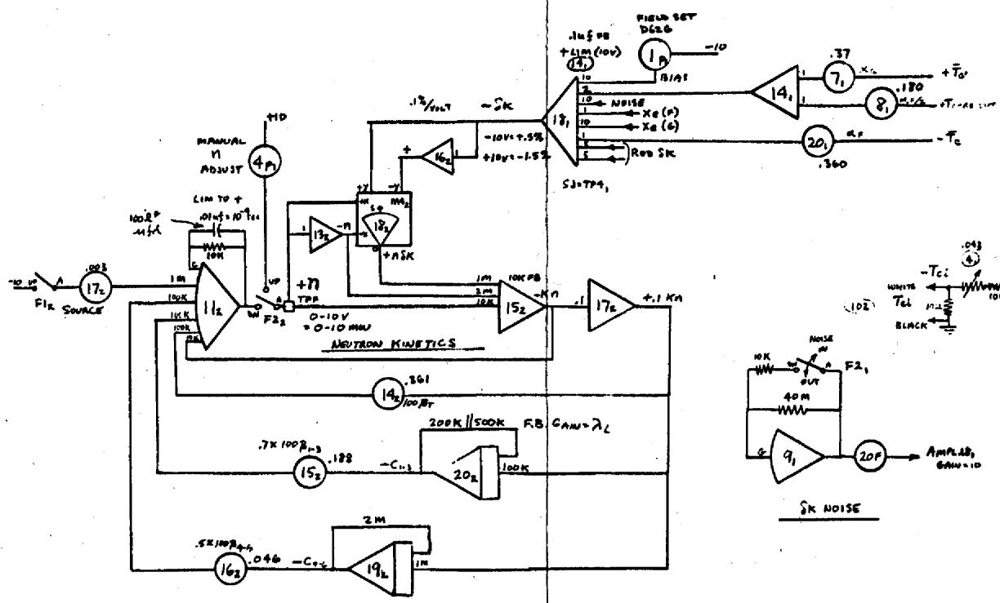

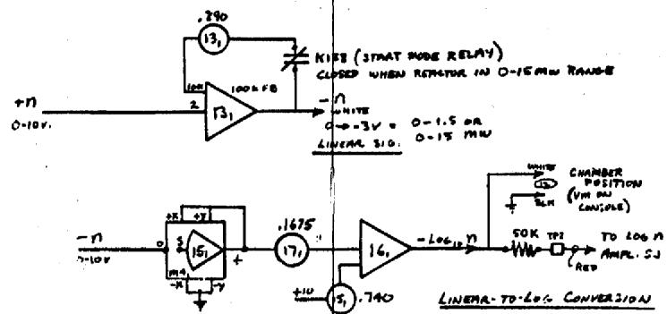

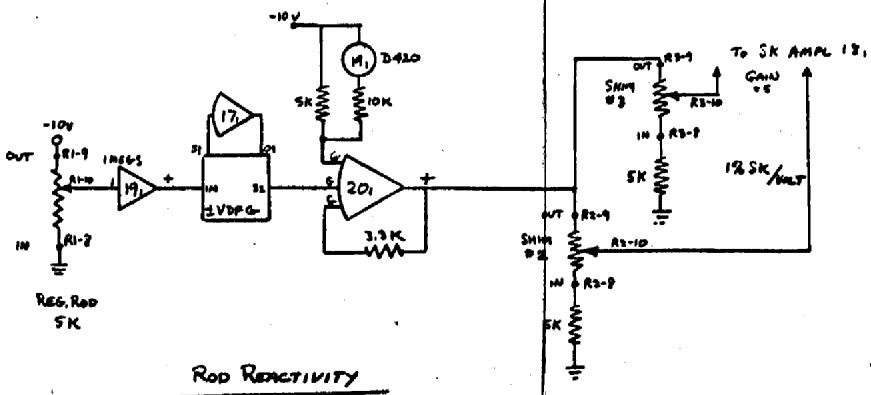

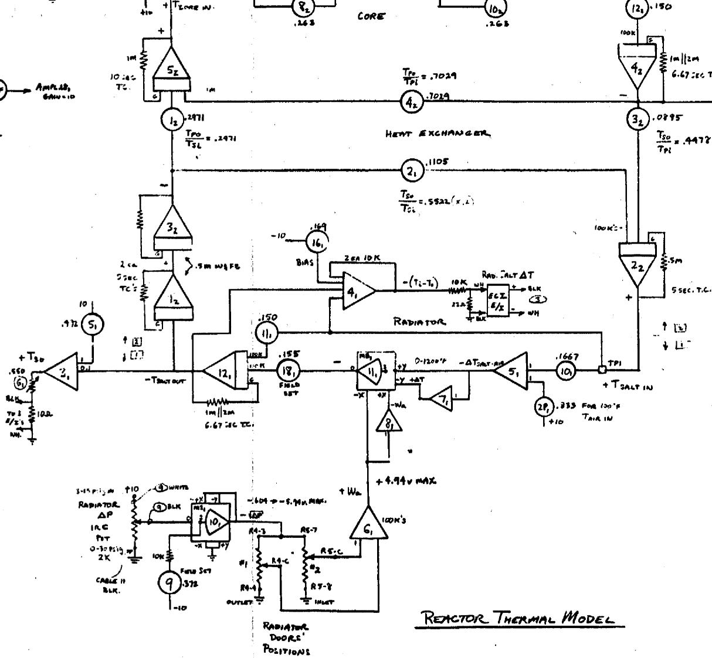  
Fig. 11. Analog Computer Circuit for the Power Level Simulator.

Rood Woaths - Full Scale

$$
\begin{array}{l} R e = R o d \left[ \begin{array}{l l l} S h i m s & C V T & - 2. 6 \% \\ S h i m s & I N & - 1. 3 \% \end{array} \right] ^ {\prime \prime} S ^ {\prime \prime} C U R A V \\ B a n S h a r s \left[ \begin{array}{l l} R e & R o o D O V T - 5. 8 6 k \\ R e & R o o D I W - 4. 5 2 k \end{array} \right] L i v i d e t \\ \end{array}
$$

REACTOR THEMAL MODEL

NOTE: Lencni EA2 TR-10 ComPuTems

ARE Used, INTEGRATOR FEED BACR

CAPACITOR ABD 10 uSd.

TIME SCALE - REAL

TEMP SCALE $- {10V} + {10V} = {900}^{ \circ  }F = {1300}^{ \circ  }F$

# INTERNAL DISTRIBUTION

1. R.G. Affel   
2-7. S.J. Ball   
8. S.E. Beall   
9. E.S. Bettis   
10. R. Blumberg   
11. E.G. Bohlfann   
12. C.J. Borkowski   
13. G.A. Cristy   
14. J.L. Crowley   
15. F.L. Culler   
16. R.A. Dandl   
17. J.R. Engel   
18. E.P. Epler   
19. D.E. Ferguson   
20. C.H. Gabbard   
21. R.B. Gallaher   
22. A.G. Grindell   
23. R.H. Guymon   
24. P.H. Harley   
25. C.S. Harrill   
26. P.N. Haubenreich   
27. V.D. Holt   
28. P.P. Holz   
29. T.L. Hudson   
30. P.R. Kasten   
31. R.J. Kedl   
32. T.W. Kerlin   
33. S.S. Kirlis   
34. A.I. Krakoviak   
35. M.I. Lundin   
36. R.N. Lyon   
37. C.E. Mathews   
38. H.G. MacPherson   
39. W.B. McDonald

40. H.F. McDuffie   
41. C.K. McGlothlan   
42. H.R. Payne   
43. A.M. Perry   
44. H.B. Piper   
45. B.E. Prince   
46. M. Richardson   
47. H.C. Roller   
48. H.C. Savage   
49. D. Scott   
50. H.E. Seagren   
51. M.J. Skinner   
52. A.N. Smith   
53. P.G. Smith   
54. R.C. Steffy   
55. R.E. Thoma   
56. G.M. Tolson   
57. W.C. Ulrich   
58. B.H. Webster   
59. A.M. Weinberg   
60. MSRP Director's Office, Rm. 219, 9204-1   
-62. Central Research Library   
63. Document Reference Section   
-93. Laboratory Records Department   
94. Laboratory Records, ORNL R.C.   
95. ORNL Patent Office   
110. Division of Technical Information Extension   
111. Research and Development Division, ORO   
113. D.F. Cope, ORO   
114. R.G. Garrison, AEC, Washington   
115. H.M. Roth, ORO   
116. W.L. Smalley, ORO   
117. M.J. Whitman, AEC, Washington

# EXTERNAL DISTRIBUTION

118. S.H. Hanauer, Univ. Tenn.   
119. R.F. Saxe, North Carolina State Univ.   
120. S.E. Stephenson, Univ. Ark.