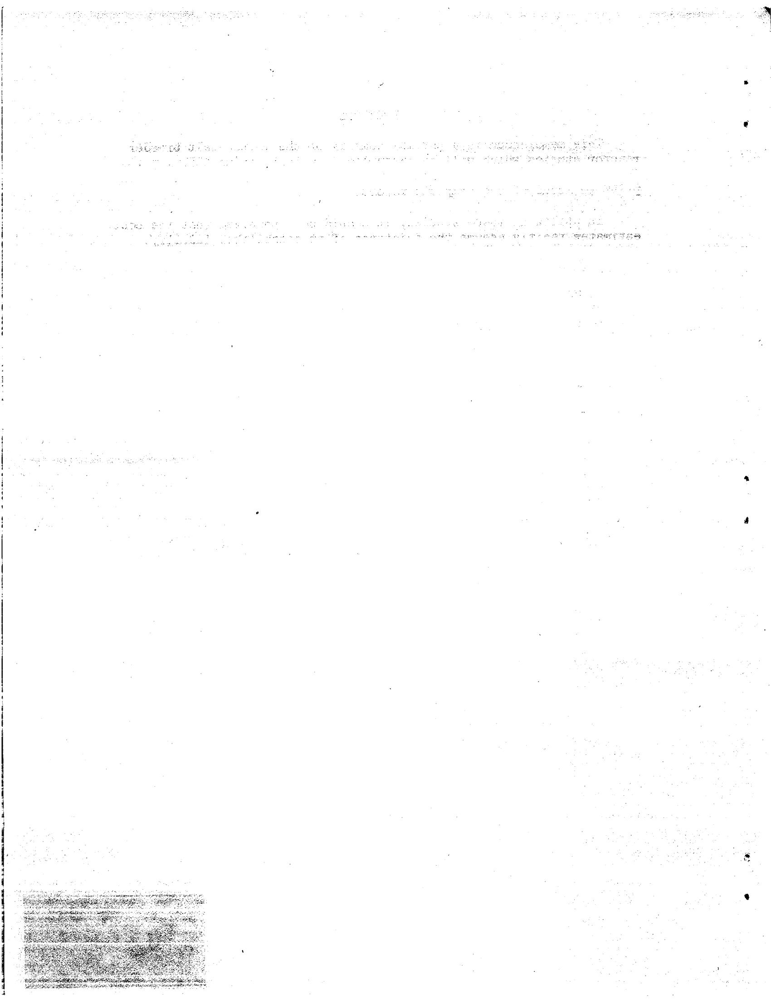
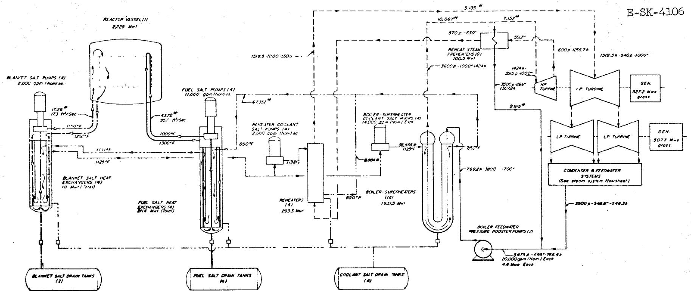
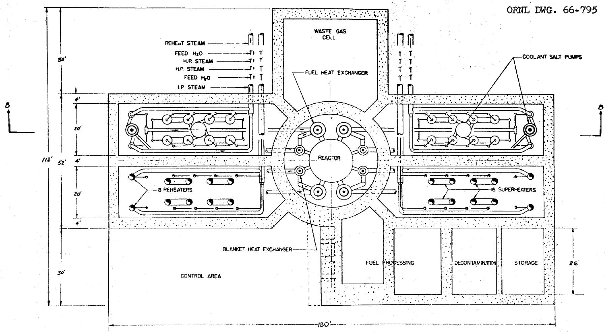
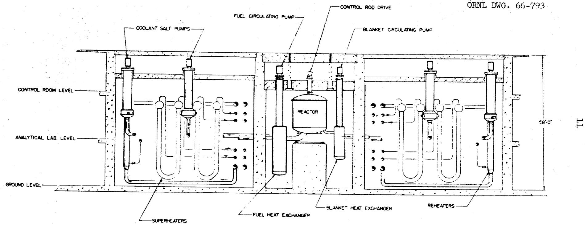
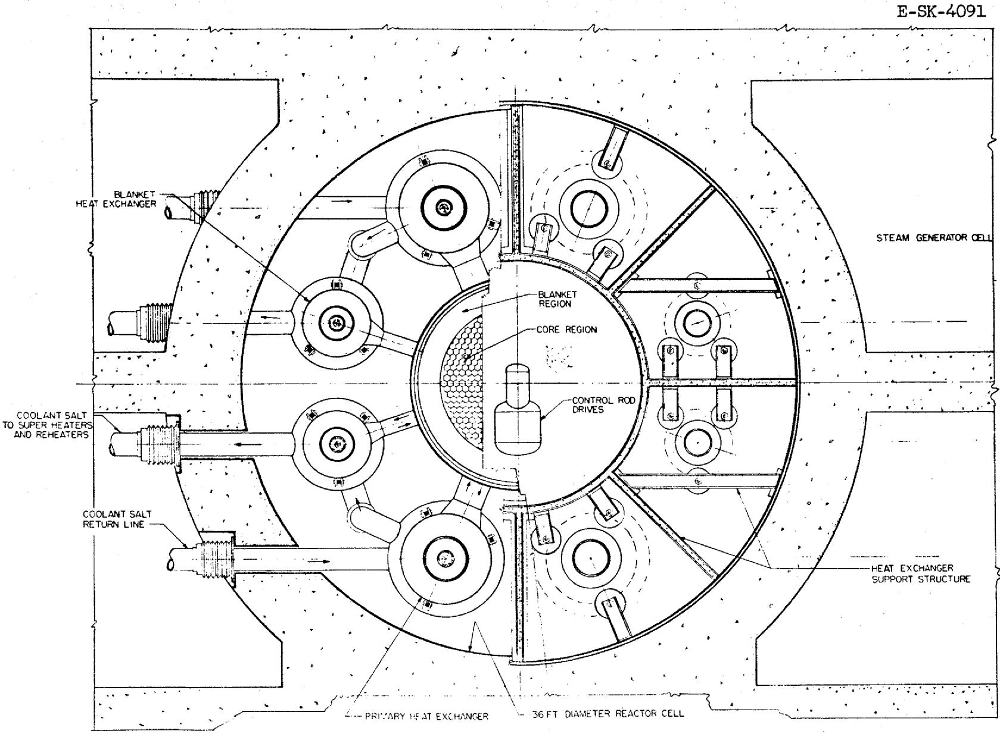
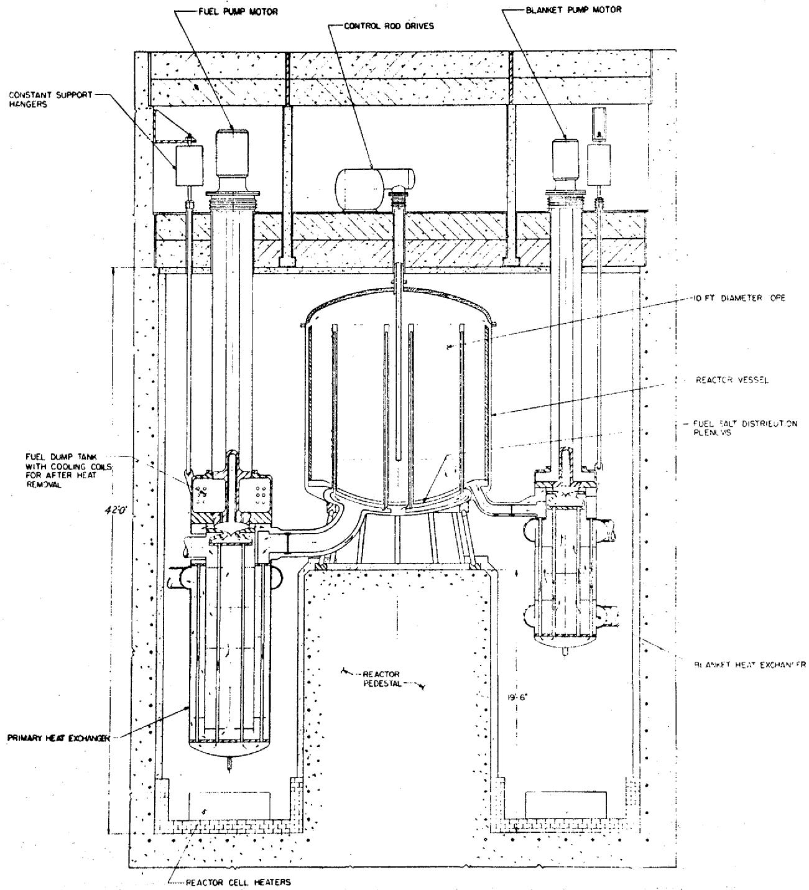
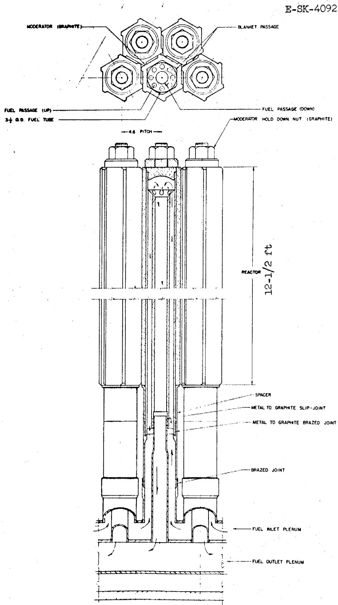
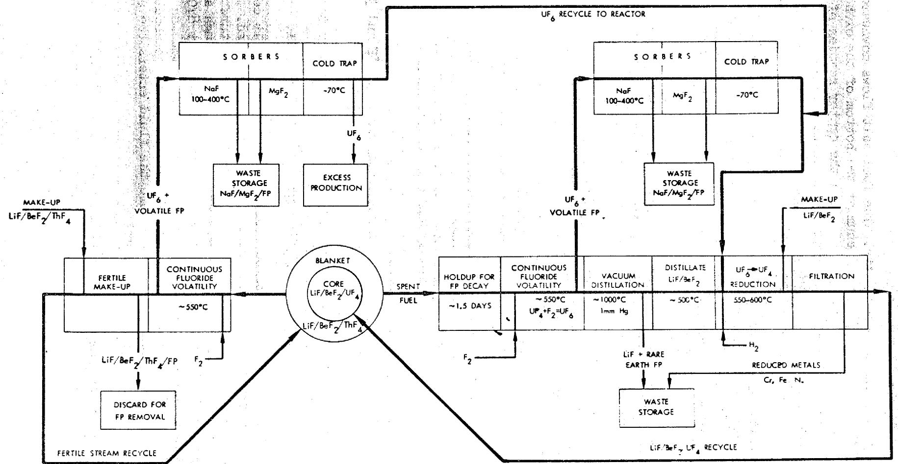

MARTIN MARIETTA ENERGY SYSTEMS LIBRARIES

3445602516436

ORNL-TM-1467

COPY NO. - 1

DATE-March 24,1966

SUMMARY OF MOLTEN-SALT BREEDER REACTOR DESIGN STUDIES

Paul R. Kasten

E. S. Bettis W. B. McDonald

H. F. Bauman R. C. Robertson

W. L. Carter J. H. Westsik

# Abstract

Design and evaluation studies were made of thermal molten-salt breeder reactors (MSBR) in order to assess their economic and nuclear potential and to identify important design and development problems. The MSBR reference design concept is a two-region, two-fluid system with fuel salt separated from the blanket salt by graphite tubes. The energy produced in the reactor fluid is transferred to a secondary coolant-salt circuit, which couples the reactor to a supercritical steam cycle. On-site fluoride volatility processing is employed, which leads to low unit processing costs and economic reactor operation as a thermal breeder. The resulting power cost is estimated to be 2.7 mills/kwhr for investor-owned utilities; the associated fuel cycle cost is 0.45 mill/kwhr(e), the specific fissile inventory is 0.8 kg/Mw(e), and the fuel doubling time is 21 years. Development of a Pa-removal scheme for the blanket region of the MSBR could lead to power costs of 2.6 mills/kwhr(e), a fuel cycle cost of 0.33 mill/kwhr(e), a specific fissile inventory of 0.7 kg/Mw(e), and a fuel doubling time of 13 years.

# LEGAL NOTICE

This report was prepared as an account of Government sponsored work. Neither the United States, nor the Commission, nor any person acting on behalf of the Commission;

A. Makes any warranty or representation, expressed or implied, with respect to the accuracy, completeness, or usefulness of the information contained in this report, or that the use of any information, apparatus, method, or process disclosed in this report may not infringe privately owned rights; or   
B. Assumes any liabilities with respect to the use of, or for damages resulting from the use of any information, apparatus, method, or process disclosed in this report.

As used in the above, "person acting on behalf of the Commission" includes any employee or contractor of the Commission, or employee of such contractor, to the extent that such employee or contractor of the Commission, or employee of such contractor prepares, disseminates, or provides access to, any information pursuant to his employment or contract with the Commission, or his employment with such contractor.

April 7, 1966

To: Recipients of ORNL-TM-1467

Report No.: ORNL-TM-1467 Classification: Unclassified

Author(s): P.R. Kasten, E.S. Bettis, H.F. Bauman, W.L. Carter, et al.

Subject: Summary of Molten-Salt Breeder Reactor Design Studies.

Request compliance with indicated action:

Please replace the table of contents on page 5 in your copy(ies) of the subject report with the attached. It has been prepared on gummed stock for your convenience.

D. $\pi / 3$

N.T. Bray, Supervisor

Laboratory Records Department Technical Information Division

4-25-66

#

# FOREWORD

This memorandum is a partial summary of the molten-salt breeder reactor studies which will be presented in a forthcoming ORNL report. The purpose of the present memo is to provide results of these studies prior to issue of the complete report.

In utilizing these studies, it should be emphasized that the cost estimates tacitly assume the existence of an established industry.

# CONTENTS

FOREWORD 3

INTRODUCTION 7

MSBR PLANT DESIGN 7

7

Reactor Design 9

Fuel Processing 15

Heat Exchange and Steam Systems 15

CAPITAL COST ESTIMATES 19

Reactor Power Plant 19

Fuel Recycle Plant 19

NUCLEAR PERFORMANCE AND FUEL CYCLE ANALYSES 19

Analysis Procedures 23

Basic Assumptions 23

Nuclear Design Analysis 25

POWER COST AND FUEL UTILIZATION CHARACTERISTICS 28

REFERENCES 30

（二）基金的名称

CBOV5X01

#

__________

1

1 200000000000000000000000000000000000000000000000000000

${10}/{12}$

1

$\therefore m - 1 \neq  0$ ;

#

#

。

.

.

。

#

。

${19}/{19}$

.

#

，

。

$\therefore m = \frac{3}{11}$

\*

。

。

#

1

。

.

1

。

# INTRODUCTION

Design and evaluation studies have been made of thermal molten-salt breeder reactors (MSBR) in order to assess their economic and nuclear potential and to identify the important design and development problems. The reference reactor design presented here contains design problems related to molten-salt reactors in general.

The MSBR reference design concept is a two-region, two-fluid system, with fuel salt separated from the blanket salt by graphite tubes. The fuel salt consists of uranium fluoride dissolved in a mixture of lithium-beryllium fluorides, while the blanket salt is a thorium-lithium fluoride of eutectic composition (about 27 mole $\%$ thorium fluoride). The energy generated in the reactor fluid is transferred to a secondary coolant-salt circuit, which couples the reactor to a supercritical steam cycle. On-site fluoride volatility processing is employed, leading to low unit processing costs and economic operation as a thermal breeder reactor.

# MSBR PLANT DESIGN

# Flowsheet

Figure 1 gives the flowsheet of the 1000-Mw(e) MSBR power plant. Fuel flows through the reactor at a rate of about 44,000 gpm (velocity of about 15 ft/sec), entering the core at $1000^{\circ}\mathrm{F}$ and leaving at $1300^{\circ}\mathrm{F}$ . The primary fuel circuit has four loops, each loop having a pump and a primary heat exchanger. Each of these pumps has a capacity of about 11,000 gpm. The four blanket pumps and heat exchangers, although smaller, are similar to corresponding components in the fuel system. The blanket salt enters the reactor vessel at $1150^{\circ}\mathrm{F}$ and leaves at $1250^{\circ}\mathrm{F}$ . The blanket salt pumps have a capacity of about 2000 gpm.

Four 14,000-gpm coolant pumps circulate the sodium fluoroborate coolant salt, which enters the shell side of the primary heat exchanger at $850^{\circ}\mathrm{F}$ and leaves at $1112^{\circ}\mathrm{F}$ . After leaving the primary heat exchanger, the coolant salt is further heated to $1125^{\circ}\mathrm{F}$ on the shell side of the blanket heat exchangers. The coolant then circulates through the shell side of 16 once-through superheaters (four superheaters per pump). In addition, four 2000-gpm pumps circulate a portion of the coolant through eight reheaters.

The steam system flowsheet is essentially that of the new TVA Bull Run plant, with modifications to increase the rating to 1000 Mw(e) and to preheat the working fluid to $700^{\circ}\mathrm{F}$ prior to entering the heat exchanger—superheater unit. A supercritical power conversion system is used, which is appropriate for molten-salt application and takes advantage of the high-strength structural alloy employed. Use of a supercritical fluid system results in an overall plant thermal efficiency of about $45\%$ .

  
Fig. 1. Molten Salt Breeder Reactor Flow Diagram ( $700^{\circ}$ F Feedwater).

PERFONNANCE

<table><tr><td>NET OUTPUT</td><td>1,000 MWh</td></tr><tr><td>GROSS GENERATION</td><td>1,034.9 MW</td></tr><tr><td>BF BOSTER PUMPS</td><td>5.2 MW</td></tr><tr><td>STATION AUXILIARIES</td><td>257 MW</td></tr><tr><td>REACTION NEAT INPUT</td><td>2,283 MW</td></tr><tr><td>NET HEAT RATE</td><td>7,600 Btu/kW</td></tr><tr><td>NET EFFICIENCY</td><td>44.9 %</td></tr></table>

<table><tr><td>LEGEQN
FUEL
BLANET
COOLANT
SATEX</td><td></td></tr><tr><td>N°0</td><td></td></tr><tr><td>a</td><td>10thN/A</td></tr><tr><td>b</td><td>p#o</td></tr><tr><td>c</td><td>Boe/#</td></tr><tr><td>d</td><td>°F</td></tr><tr><td>0-</td><td>Pressure value</td></tr></table>

# Reactor Design

Figure 2 shows a plan view of the MSBR cell arrangement. The reactor cell is surrounded by four shielded cells containing the superheaters and reheater units; these cells can be individually isolated for maintenance. The processing cell, located adjacent to the reactor, is divided into a high-level and a low-level activity area.

Figure 3 shows an elevation view of the reactor and indicates the position of equipment in the various cells. Figure 4, a plan view of the reactor cell, shows the location of the reactor, pumps, and fuel and blanket heat exchangers. Figure 5 is an elevation of the reactor cell. The Hastelloy N reactor vessel has a side wall thickness of about $1 - 1 / 4-$ in. and a head thickness of about $2 - 1 / 4$ in.; it is designed to operate at $1200^{\circ}\mathrm{F}$ and 150 psi. The plenum chambers, with $1 / 4$ -in.-thick walls, communicate with the external heat exchangers by concentric inlet-outlet piping. The inner pipe has slip joints to accommodate thermal expansion. Bypass flow through these slip joints is about $1 \%$ of the total flow. As indicated in Fig. 5, the heat exchangers are suspended from the top of the cell and are located below the reactor. Each fuel pump has a free fluid surface and a storage volume which permits rapid drainage of fuel fluid from the core upon loss of flow. In addition, the fuel salt can be drained to the dump tanks when the reactor is shut down for an extended time. The entire reactor cell is kept at high temperature, while cold "fingers" and thermal insulation surround structural support members and all special equipment which must be kept at relatively low temperatures. The control rod drives are located above the core, and the control rods are inserted into the central region of the core.

The reactor vessel, about 14 ft in diameter by about 15 ft high, contains a 10-ft-diam core assembly composed of reentry-type graphite fuel cells. The graphite tubes are attached to the two plenum chambers at the bottom of the reactor with graphite-to-metal transition sleeves. Fuel from the entrance plenum flows up fuel passages in the outer region of the fuel cell and down through a single central passage to the exit plenum. The fuel flows from the exit plenum to the heat exchangers, then to the pump and back to the reactor. A 1-1/2-ft-thick molten-salt blanket plus a 1/4-ft-thick graphite reflector surround the core. The blanket salt also permeates the interstices of the core lattice so fertile material flows through the core without mixing with the fissile fuel salt.

The MSBR requires structural integrity of the graphite fuel cell. In order to reduce the effect of radiation damage, the fuel cells have been made small to reduce the fast flux gradient across the graphite wall. Also, the cells are anchored only at one end to permit axial movement. The core volume has been made large in order to reduce the flux level in the core. In addition, the reactor is designed to permit replacement of the entire graphite core by remote means if required.

Figure 6 shows a cross section of a fuel cell. Fuel fluid flows upward through the small passages and downward through the large central

  
Fig. 2. Molten Salt Breeder Reactor - Reactor and Steam Cells-Plan.

  
Fig. 3. Molten Salt Breeder Reactor' - Reactor and Steam Cells-Elevation.

  
Fig. 4. Molten Salt Breeder Reactor - Reactor Cell-Plan View.

ORNL DWG. 66-794

  
Fig. 5. Molten Salt Breeder Reactor - Reactor Cell-Elevation.

  
Fig. 6. Molten Salt Breeder Reactor Core Cell.

passage. The outside diameter of a fuel cell tube is 3.5 in.; there are $534$ of these tubes spaced on a 4.8-in. triangular pitch. The tube assemblies are surrounded by hexagonal blocks of moderator graphite with blanket salt filling the interstices. The nominal core composition is $75\%$ graphite, $18\%$ fuel salt, and $7\%$ blanket salt by volume.

A summary of parameter values chosen for the MSBR design is given in Table 1.

# Fuel Processing

The primary objectives of fuel processing are to purify and recycle fissile and carrier components, and minimize fissile inventory while holding losses to a low value. The fluoride volatility-vacuum distillation process fulfills these objectives through simple operations.

The core fuel is conveniently processed by fluoride volatility and vacuum distillation. Blanket processing is accomplished by fluoride volatility alone, and the processing cycle time is short enough to maintain a very low concentration of fissile material. The effluent $\mathrm{UF_6}$ is absorbed by fuel salt and reduced to $\mathrm{UF_4}$ by treatment with hydrogen to reconstitute a fuel-salt mixture of the desired composition.

Molten-salt reactors are inherently suited to the design of processing facilities integral with the reactor plant; these facilities require only a small amount of cell space adjacent to the reactor cell. Because all services and equipment available to the reactor are available to the processing plant and shipping and storage charges are eliminated, integral processing facilities permit significant savings in capital and operating costs. Also, the processing plant inventory of fissile material is greatly reduced, resulting in low fuel inventory charges and improved fuel utilization characteristics for the reactor.

The principal steps in core and blanket stream processing of the MSBR are shown in Fig. 7. A small side stream of each fluid is continuously withdrawn from the fuel and blanket circulating loops and circulated through the processing system. After processing, the decontaminated fluids are returned to the reactor at some convenient point--for example, via the fuel and fertile stream storage tanks.

Fuel inventories retained in the processing plant are estimated to be about $10\%$ of the reactor system inventory for core processing, and less than $1\%$ for blanket processing.

# Heat Exchange and Steam Systems

The structural material for all components contacted by molten salt in the fuel, blanket, and coolant systems, including the reactor vessel, pumps, heat exchangers, piping and storage tanks, is Hastelloy N.

The primary heat exchangers are of the tube-and-shell type. Each shell contains two concentric tube bundles connected in series and

Table 1. Parameter Values of MSBR Design   

<table><tr><td colspan="3">Power, Mw</td></tr><tr><td>Thermal</td><td>2220</td><td></td></tr><tr><td>Electrical</td><td>1000</td><td></td></tr><tr><td>Thermal efficiency</td><td>0.45</td><td></td></tr><tr><td>Plant factor</td><td>0.80</td><td></td></tr><tr><td colspan="3">Dimensions, ft</td></tr><tr><td>Core height</td><td>12.5</td><td></td></tr><tr><td>Core diameter</td><td>10.0</td><td></td></tr><tr><td colspan="3">Blanket thickness</td></tr><tr><td>Radial</td><td>1.5</td><td></td></tr><tr><td>Axial</td><td>2.0</td><td></td></tr><tr><td>Reflector thickness</td><td>0.25</td><td></td></tr><tr><td colspan="3">Volumes, ft3</td></tr><tr><td>Core</td><td>982</td><td></td></tr><tr><td>Blanket</td><td>1120</td><td></td></tr><tr><td colspan="3">Volume fractions</td></tr><tr><td colspan="3">Core</td></tr><tr><td>Fuel salt</td><td>0.169</td><td></td></tr><tr><td>Fertile salt</td><td>0.0735</td><td></td></tr><tr><td>Moderator</td><td>0.7575</td><td></td></tr><tr><td colspan="3">Blanket</td></tr><tr><td>Fertile salt</td><td>1.0</td><td></td></tr><tr><td colspan="3">Salt volumes, ft3</td></tr><tr><td colspan="3">Fuel</td></tr><tr><td>Core</td><td>166</td><td></td></tr><tr><td>Blanket</td><td>26</td><td></td></tr><tr><td>Plena</td><td>147</td><td></td></tr><tr><td>Heat exchanger and piping</td><td>345</td><td></td></tr><tr><td>Processing</td><td>33</td><td></td></tr><tr><td>Total</td><td>717</td><td></td></tr><tr><td colspan="3">Fertile</td></tr><tr><td>Core</td><td>72</td><td></td></tr><tr><td>Blanket</td><td>1121</td><td></td></tr><tr><td>Heat exchanger and piping</td><td>100</td><td></td></tr><tr><td>Storage (Pa decay)</td><td>2066</td><td></td></tr><tr><td>Processing</td><td>24</td><td></td></tr><tr><td>Total</td><td>3383</td><td></td></tr><tr><td colspan="3">Salt compositions, mole %</td></tr><tr><td colspan="3">Fuel</td></tr><tr><td>LiF</td><td>63.6</td><td></td></tr><tr><td>BeF2</td><td>36.2</td><td></td></tr><tr><td>UF4(fissile)</td><td>0.22</td><td></td></tr><tr><td colspan="3">Fertile</td></tr><tr><td>LiF</td><td>71.0</td><td></td></tr><tr><td>BeF2</td><td>2.0</td><td></td></tr><tr><td>ThF4</td><td>27.0</td><td></td></tr><tr><td>UF4(fissile)</td><td>0.0005</td><td></td></tr><tr><td colspan="3">Core atom ratios</td></tr><tr><td>Th/U</td><td>41.7</td><td></td></tr><tr><td>C/U</td><td>5800</td><td></td></tr><tr><td>Fissile inventory, kg</td><td>769</td><td></td></tr><tr><td>Fertile inventory, 1000 kg</td><td>260</td><td></td></tr><tr><td rowspan="2">Processing</td><td>Fuel</td><td>Fertile</td></tr><tr><td>Stream</td><td>Stream</td></tr><tr><td colspan="3">Cycle time, days</td></tr><tr><td>Volatility process</td><td>47</td><td>23</td></tr><tr><td colspan="3">Rate, ft3/day</td></tr><tr><td>Volatility process</td><td>14.5</td><td>144</td></tr><tr><td>Unit processing cost, $/ft3</td><td>183</td><td>6.85</td></tr></table>

  
Fig. 7. Fuel and Fertile Stream Processing for the MSBR.

attached to fixed tube sheets. The fuel salt flows downward in the outer section of tubes, enters a plenum at the bottom of the exchanger, and then flows upward to the pump through the center section of tubes. Entering at the top, the coolant salt flows on the baffled shell-side of the exchanger down the central core, under the barrier that separates the two sections, and up the outer annular section.

Since a large temperature difference exists in the two tube sections, the tube sheets at the bottom of the exchanger are not attached to the shell. The design permits differential tube growth between the two sections without creating troublesome stress problems. To accomplish this, the tube sheets are connected at the bottom of the exchanger by a bellows-type joint. This arrangement, essentially a floating plenum, permits enough relative motion between the central and outer tube sheets to compensate for difference in tube growth without creating intolerable stresses in either the joint, the tubes, or in the pump.

The blanket heat exchangers increase the temperature of the coolant leaving the primary core heat exchangers. Since the coolant-salt temperature rise through the blanket exchangers is small and the flow rate is relatively high, the exchangers are designed for a single shell-side pass for the coolant salt, although two-pass flow is retained for the blanket salt in the tubes. Straight tubes with two tube sheets are used.

The superheater is a U-tube, U-shell exchanger using disc and doughnut baffles with varying spacing. It is a long, slender exchanger having relatively large baffle spacing. The baffle spacing is established by the shell-side pressure drop and by the temperature gradient across the tube wall, and is greatest in the central portion of the exchanger where the temperature difference between the fluids is high. The supercritical fluid enters the tube side of the superheater at $700^{\circ}\mathrm{F}$ and 3800 psi and leaves at $1000^{\circ}\mathrm{F}$ and 3600 psi.

The reheaters transfer energy from the coolant salt to the working fluid before its use in the intermediate pressure turbine. A shell-tube exchanger is used, producing steam at $1000^{\circ}\mathrm{F}$ and 540 psi.

Since the freezing temperature of the secondary salt coolant is about $700^{\circ}\mathrm{F}$ , a high working fluid inlet temperature is required. Preheaters, along with prime fluid, are used in raising the temperature of the working fluid entering the superheaters. Prime fluid goes through a preheater exchanger and leaves at a pressure of 3550 psi and about $870^{\circ}\mathrm{F}$ . It is then injected into the feedwater in a mixing tee, producing fluid at $700^{\circ}\mathrm{F}$ and 3500 psi. The pressure is then increased to about 3800 psi by a pressurizer (feedwater pump) before the fluid enters the superheater.

# CAPITAL COST ESTIMATES

# Reactor Power Plant

Preliminary estimates of the capital cost of a 1000-Mw(e) molten-salt breeder reactor power station indicate a direct construction cost of about $80.4 million. After supplying the indirect cost factors used in the advanced converter evaluation, an estimated total plant cost of $113.6 million is obtained. A summary of plant costs is given in Table 2. The conceptual design was not sufficiently detailed to permit a completely reliable estimate; however, the design and estimates were studied thoroughly enough to make meaningful comparisons with previous converter reactor plant cost studies. The relatively low capital cost estimate obtained results from the small physical size of the MSBR and the simple control requirements. The results of the study encourage the belief that the cost of an MSBR power station will be as low as for stations utilizing other reactor concepts.

The operating and maintenance costs of the MSBR were not estimated. Based on the ground rules used in reference 1, these costs would be about 0.3 mill/kwhr(e).

# Fuel Recycle Plant

The capital costs associated with fuel recycle equipment were obtained by itemizing and costing the major process equipment required, and estimating the costs of site, buildings, instrumentation, waste disposal, and building services associated with fuel recycle.

Table 3 summarizes the direct construction costs, the indirect costs, and total costs associated with the integrated processing facility having approximately the required capacity.

The operating and maintenance costs for the fuel recycle facility include labor, labor overhead, chemicals, utilities, and maintenance materials. The total annual cost for the capacity considered here (15 ft³ of fuel salt per day and 105 ft³ of fertile salt per day) is estimated to be $721,230, which is equivalent to about 0.1 mill/kwhr(e).² A breakdown of these charges is given in Table 4.

# NUCLEAR PERFORMANCE AND FUEL CYCLE ANALYSES

The fuel cycle cost and the fuel yield are closely related, yet independent in the sense that two nuclear designs can have similar costs but significantly different yields. The objective of the nuclear design calculations was primarily to find the conditions that gave the lowest fuel cycle cost, and then, without appreciably increasing this cost, the highest fuel yield.

Table 2. Preliminary Cost-Estimate Summarya 1000-Mw(e) Molten-Salt Breeder Reactor Power Station   

<table><tr><td></td><td>Federal Power Commission Account</td><td>Costs ($1000)</td></tr><tr><td>20</td><td>Land and Land Rightsb</td><td>360</td></tr><tr><td>21</td><td>Structures and Improvements</td><td></td></tr><tr><td></td><td>211 Ground Improvements</td><td>866</td></tr><tr><td></td><td>212 Buildings and Structures</td><td></td></tr><tr><td></td><td>.1 Reactor buildingc</td><td>4,181</td></tr><tr><td></td><td>.2 Turbine building, auxiliary building, and feedwater heater space</td><td>2,832</td></tr><tr><td></td><td>.3 Offices, shops, and laboratories</td><td>1,160</td></tr><tr><td></td><td>.4 Waste disposal building</td><td>150</td></tr><tr><td></td><td>.5 Stack</td><td>76</td></tr><tr><td></td><td>.6 Warehouse</td><td>40</td></tr><tr><td></td><td>.7 Miscellaneous</td><td>30</td></tr><tr><td></td><td></td><td>Subtotal Account 212</td></tr><tr><td></td><td></td><td>Total Account 21</td></tr><tr><td>22</td><td>Reactor Plant Equipment</td><td></td></tr><tr><td></td><td>221 Reactor Equipment</td><td></td></tr><tr><td></td><td>.1 Reactor vessel</td><td>1,610</td></tr><tr><td></td><td>.2 Control rods</td><td>250</td></tr><tr><td></td><td>.3 Shielding and containment</td><td>1,477</td></tr><tr><td></td><td>.4 Heating-cooling systems and vapor-suppression system</td><td>1,200</td></tr><tr><td></td><td>.5 Moderator and reflector</td><td>1,089</td></tr><tr><td></td><td>.6 Reactor plant crane</td><td>265</td></tr><tr><td></td><td></td><td>Subtotal Account 221</td></tr><tr><td></td><td></td><td>5,891</td></tr><tr><td>22</td><td>Heat Transfer Systems</td><td></td></tr><tr><td></td><td>.1 Reactor coolant system</td><td>6,732</td></tr><tr><td></td><td>.2 Intermediate cooling system</td><td>1,947</td></tr><tr><td></td><td>.3 Steam generator and reheaters</td><td>9,853</td></tr><tr><td></td><td>.4 Coolant supply and treatmentd</td><td>300</td></tr><tr><td></td><td>.5 Coolant salt inventory</td><td>354</td></tr><tr><td></td><td></td><td>Subtotal Account 222</td></tr><tr><td></td><td></td><td>19,186</td></tr><tr><td>223</td><td>Nuclear Fuel Handling and Storage (Drain Tanks)</td><td>1,700</td></tr><tr><td>224</td><td>Nuclear Fuel Processing and Fabrication (included in Fuel Cycle Costs)</td><td>*</td></tr><tr><td>225</td><td>Radioactive Waste Treatment and Disposal (Off-Gas System)</td><td>450</td></tr><tr><td>226</td><td>Instrumentation and Controls</td><td>4,500</td></tr><tr><td>227</td><td>Feedwater Supply and Treatment</td><td>4,051</td></tr><tr><td>228</td><td>Steam, Condensate, and FW Piping</td><td>4,069</td></tr><tr><td>229</td><td>Other Reactor Plant Equipment (Remote Maintenance)</td><td>5,000e</td></tr><tr><td></td><td></td><td>Total Account 22</td></tr><tr><td colspan="3">23 Turbine-Generator Units</td></tr><tr><td>231</td><td>Turbine-Generator Units</td><td>19,174</td></tr><tr><td>232</td><td>Circulating Water System</td><td>1,243</td></tr><tr><td>233</td><td>Condensers and Auxiliaries</td><td>1,690</td></tr><tr><td>234</td><td>Central Lube Oil System</td><td>80</td></tr><tr><td>235</td><td>Turbine Plant Instrumentation</td><td>25</td></tr><tr><td>236</td><td>Turbine Plant Piping</td><td>220f</td></tr><tr><td>237</td><td>Auxiliary Equipment for Generator</td><td>66</td></tr><tr><td>238</td><td>Other Turbine Plant Equipment</td><td>25</td></tr><tr><td></td><td>Total Account 23</td><td>22,523</td></tr><tr><td colspan="3">24 Accessory Electrical</td></tr><tr><td>241</td><td>Switchgear, Main and Station Service</td><td>500</td></tr><tr><td>242</td><td>Switchboards</td><td>128</td></tr><tr><td>243</td><td>Station Service Transformers</td><td>169</td></tr><tr><td>244</td><td>Auxiliary Generator</td><td>50</td></tr><tr><td>245</td><td>Distributed Items</td><td>2,000</td></tr><tr><td></td><td>Total Account 24</td><td>2,897</td></tr><tr><td colspan="2">25 Miscellaneous</td><td>800</td></tr><tr><td></td><td>Total Direct Construction Costg</td><td>80,402</td></tr><tr><td></td><td>Total Indirect Cost</td><td>33,181</td></tr><tr><td></td><td>Total Plant Cost</td><td>113,583</td></tr></table>

Estimates are based on 1966 costs, assuming an established molten-salt nuclear power plant industry.   
bLand costs are not included in total direct construction costs.   
cMSBR containment cost is included in Account 221.3.   
Assumed as $300,000 on the basis of MSRE experience.   
eThe ample MSBR allowance for remote maintenance may be too high, and some of the included replacement equipment allowances could more logically be classified as operating expenses rather than first capital costs.   
fBased on Bull Run plant cost of $160,000 plus ~37% for uncertainties.   
gDoes not include Account 20, Land Costs. This is included in the indirect costs.

Table 3. Summary of Processing-Plant Costs for 1000-Mw(e) MSBR   

<table><tr><td>Installed process equipment</td><td>$ 853,760</td></tr><tr><td>Structures and improvements</td><td>556,770</td></tr><tr><td>Waste storage</td><td>387,970</td></tr><tr><td>Process piping</td><td>155,800</td></tr><tr><td>Process instrumentation</td><td>272,100</td></tr><tr><td>Electrical auxiliaries</td><td>84,300</td></tr><tr><td>Sampling connections</td><td>20,000</td></tr><tr><td>Service and utility piping</td><td>128,060</td></tr><tr><td>Insulation</td><td>50,510</td></tr><tr><td>Radiation monitoring</td><td>100,000</td></tr><tr><td>Total direct cost</td><td>$2,609,270</td></tr><tr><td>Construction overhead(30% of direct costs)</td><td>782,780</td></tr><tr><td>Total construction cost</td><td>$3,392,050</td></tr><tr><td>Engineering and inspection(25% of total construction cost)</td><td>848,010</td></tr><tr><td>Subtotal plant cost</td><td>$4,240,060</td></tr><tr><td>Contingency (25% of subtotalplant cost)</td><td>1,060,020</td></tr><tr><td>Total plant cost</td><td>$5,300,080</td></tr></table>

Table 4. Summary of Operating and Maintenance Charges for Fuel Recycle in a 1000-Mw(e) MSBR ($/year)   

<table><tr><td>Direct labor</td><td>$ 222,000</td></tr><tr><td>Labor overhead</td><td>177,600</td></tr><tr><td>Chemicals</td><td>14,640</td></tr><tr><td>Waste containers</td><td>28,270</td></tr><tr><td>Utilities</td><td>80,300</td></tr><tr><td>Maintenance materials</td><td></td></tr><tr><td>Site</td><td>2,500</td></tr><tr><td>Services and utilities</td><td>35,880</td></tr><tr><td>Process equipment</td><td>160,040</td></tr><tr><td>Total annual charges</td><td>$ 721,230</td></tr></table>

# Analysis Procedures

Calculation Method. The calculations were performed with OPTIMERC, a combination of an optimization code with the MERC multigroup, diffusion, equilibrium reactor code. MERC3 calculates the nuclear performance, the equilibrium concentrations of the various nuclides, including fission products, and the fuel cycle cost for a given set of conditions. OPTIMERC permits up to twenty reactor parameters to be varied, within limits, in order to determine an optimum, by the method of steepest ascent. The designs were optimized essentially for minimum fuel cycle cost, with lesser weight given to maximizing the annual fuel yield. Typical parameters varied were the reactor dimensions, blanket thickness, fractions of fuel and fertile salts in the core, and fuel and fertile stream processing rates.

Several equations were included in the code for approximating certain capital and operating costs that vary with the design parameters (for example, capital cost of the reactor vessel, which varies with the reactor dimensions). These costs were automatically added to the fuel cycle cost in the optimization routine so that the optimization search would take into account all known economic factors. However, only the fuel cycle cost itself is reported in the results.

Modified GAM-1 - THERMOS cross-section libraries were used to compute the broad group cross sections for these calculations. It was assumed that all nuclides in the reactor system are at their equilibrium concentrations. To check this assumption, a typical reactor design was examined to determine the operating time required for the various uranium isotopes to approach their equilibrium concentrations from a startup with $^{235}\mathrm{U}$ . It was found that $^{233}\mathrm{U}$ and $^{235}\mathrm{U}$ were within $95\%$ of their equilibrium concentrations in less than two years. Uranium- $^{234}$ was within $95\%$ of equilibrium after eight years, while $^{236}\mathrm{U}$ was within $80\%$ after 10 years. Since the breeding performance depends mainly on the ratio of $^{233}\mathrm{U}$ to $^{235}\mathrm{U}$ in the fuel, the equilibrium calculation appears to be a good representation of the lifetime performance of these reactors, even for startup on $^{235}\mathrm{U}$ .

# Basic Assumptions

Economic. The basic economic assumptions employed in the calculations are given in Table 5. The values of the fissile isotopes were taken from the current AEC price schedule.

The processing costs are based on these given in the section entitled "Capital Cost Estimates" and are included in the fuel cycle costs. The capital and operating costs were estimated separately for each stream as a function of plant throughput, based on the volume of salt processed. The total processing cost is assumed to be a function of the throughput to some fractional power called the scale factor.

Table 5. Basic Economic Assumptions   

<table><tr><td>Reactor power, Mw(e)</td><td>1000</td></tr><tr><td>Thermal efficiency, %</td><td>45</td></tr><tr><td>Load factor</td><td>0.80</td></tr><tr><td>Cost assumptions</td><td></td></tr><tr><td>Value of 233U and 233Pa, $/g</td><td>14</td></tr><tr><td>Value of 235U, $/g</td><td>12</td></tr><tr><td>Value of thorium, $/kg</td><td>12</td></tr><tr><td>Value of carrier salt, $/kg</td><td>26</td></tr><tr><td>Capital charge, annual rate, %</td><td></td></tr><tr><td>Plant</td><td>12</td></tr><tr><td>Nondepreciating capital, including fissile inventory</td><td>10</td></tr><tr><td>Processing cost, $/ft3salt</td><td></td></tr><tr><td>Fuel (at 10 ft3/day processing rate)</td><td>228</td></tr><tr><td>Blanket (at 100 ft3/day processing rate)</td><td>8.47</td></tr><tr><td>Processing cost scale factor (exponent)</td><td>0.4</td></tr></table>

Processing. The processing scheme is that indicated in Fig. 7. A fissile material loss of $0.1\%$ per pass through processing was assumed.

In addition to the basic processing scheme employed, results were also obtained for the case that Pa can be removed directly from the blanket stream. The improvement in performance under these circumstances is a measure of the incentive to develop Pa removal ability.

Fission Product Behavior. The disposition of the various fission products was assumed as shown in Table 6. The behavior of $^{135}\mathrm{Xe}$ and other fission gases has a significant influence on nuclear performance. A gas-stripping system is provided to remove these gases from the fuel salt. However, part of the xenon could diffuse into the moderator graphite. In the calculations reported here, a $^{135}\mathrm{Xe}$ poison fraction of 0.005 was assumed.

Corrosion Product Behavior. The control of corrosion products in molten-salt fuels does not appear to be a significant problem, and the effect of corrosion products was neglected in the nuclear calculations. The processing method considered here can control corrosion product buildup in the fuel.

Table 6. Disposition of Fission Products in MSBR Reactor and Processing Systems   

<table><tr><td>Elements present as gases; assumed to be partly absorbed by graphite and partly removed by gas stripping (1/2% poisoning assumed):</td><td>Kr, Xe</td></tr><tr><td>Elements that plate out on metal surfaces; assumed to be removed instantaneously:</td><td>Ru, Rh, Pd, Ag, In</td></tr><tr><td>Elements that form volatile fluorides; assumed to be removed in the fluoride volatility process:</td><td>Se, Br, Nb, Mo, Tc, Te, I</td></tr><tr><td>Elements that form stable fluorides less volatile than LiF; assumed to be separated by vacuum distillation:</td><td>Sr, Y, Ba, La, Ce, Pr, Nd, Pm, Sm, Eu, Gd, Tb</td></tr><tr><td>Elements that are not separated from the carrier salt; assumed to be removed only by salt discard:</td><td>Rb, Cd, Sn, Cs, Zr</td></tr></table>

# Nuclear Design Analysis

The important parameters describing the MSBR design are given in Table 1. Many of the parameters were basically fixed by the ground rules for the evaluation or by the engineering design. These include the thermal efficiency, plant factor, capital charge rate, maximum fuel velocity, size of fuel tubes, processing costs and fissile loss rate, and the out-of-core fuel inventory. The parameters which were optimized by OPTIMERC were the reactor dimensions, power density, the core composition including the C/U and Th/U ratios, and the processing rates.

Nuclear Performance. The results of the calculations for the MSBR design are given in Table 7, and the neutron balance in Table 8. The basic design has the inherent advantage of no neutron losses to structural materials other than the moderator. Except for some unavoidable loss of delayed neutrons in the external fuel circuit, there is almost zero neutron leakage from the reactor because of the thick blanket. The neutron losses to fission products are minimized by the availability of rapid and inexpensive integrated processing.

Fuel Cycle Cost. The components of the fuel cycle cost for the MSER are given in Table 9. The main components are the fissile inventory and processing costs. The inventory costs are rather rigid for a given reactor design, since they are largely determined by the assumed external fuel volume. The processing costs are, of course, a function of the processing cycle times, one of the chief parameters optimized in this study.

Table 7. MSBR Performance   

<table><tr><td>Fuel yield, % per annum</td><td>4.86</td></tr><tr><td>Breeding ratio</td><td>1.0491</td></tr><tr><td>Fissile losses in processing, atoms/fissile absorption</td><td>0.0057</td></tr><tr><td>Neutron production per fissile absorption (ηe)</td><td>2.221</td></tr><tr><td>Specific inventory, kg fissile/Mw(e)</td><td>0.769</td></tr><tr><td>Specific power, Mw(t)/kg fissile</td><td>2.89</td></tr><tr><td>Power density, core average, kw/liter</td><td></td></tr><tr><td>Gross</td><td>80</td></tr><tr><td>In fuel salt</td><td>473</td></tr><tr><td>Neutron flux, core average, 1014neutrons cm-2sec-1</td><td></td></tr><tr><td>Thermal</td><td>6.7</td></tr><tr><td>Fast</td><td>12.1</td></tr><tr><td>Fast over 100 kev</td><td>3.1</td></tr><tr><td>Thermal flux factors, core, peak/mean</td><td></td></tr><tr><td>Radial</td><td>2.22</td></tr><tr><td>Axial</td><td>1.37</td></tr><tr><td>Fraction of fissions in fuel stream</td><td>0.987</td></tr><tr><td>Fraction of fissions in thermal neutron group</td><td>0.806</td></tr><tr><td>Mean η of 233U</td><td>2.221</td></tr><tr><td>Mean η of 235U</td><td>1.958</td></tr></table>

Table 8. MSBR Neutron Balance   

<table><tr><td rowspan="2">Material</td><td colspan="3">Neutrons per Fissile Absorption</td></tr><tr><td>Absorbed Total</td><td>Absorbed by Fission</td><td>Produced</td></tr><tr><td>23aTh</td><td>0.9710</td><td>0.0025</td><td>0.0059</td></tr><tr><td>233Pa</td><td>0.0079</td><td></td><td></td></tr><tr><td>233U</td><td>0.9119</td><td>0.8090</td><td>2.0233</td></tr><tr><td>234U</td><td>0.0936</td><td>0.0004</td><td>0.0010</td></tr><tr><td>235U</td><td>0.0881</td><td>0.0708</td><td>0.1721</td></tr><tr><td>236U</td><td>0.0115</td><td>0.0001</td><td>0.0001</td></tr><tr><td>237Np</td><td>0.0014</td><td></td><td></td></tr><tr><td>238U</td><td>0.0009</td><td></td><td></td></tr><tr><td>Carrier salt (except 6Li)</td><td>0.0623</td><td></td><td>0.0185</td></tr><tr><td>6Li</td><td>0.0030</td><td></td><td></td></tr><tr><td>Graphite</td><td>0.0300</td><td></td><td></td></tr><tr><td>135Xe</td><td>0.0050</td><td></td><td></td></tr><tr><td>149Sm</td><td>0.0069</td><td></td><td></td></tr><tr><td>151Sm</td><td>0.0018</td><td></td><td></td></tr><tr><td>Other fission products</td><td>0.0196</td><td></td><td></td></tr><tr><td>Delayed neutrons losta</td><td>0.0050</td><td></td><td></td></tr><tr><td>Leakageb</td><td>0.0012</td><td></td><td></td></tr><tr><td>Total</td><td>2.2209</td><td>0.8828</td><td>2.2209</td></tr></table>

aDelayed neutrons emitted outside the core.   
bLeakage, including neutrons absorbed in the reflector.

Table 9. Fuel Cycle Cost for MSBR   

<table><tr><td rowspan="2"></td><td colspan="4">Costs, mills/kwhr(e)</td></tr><tr><td>Fuel Stream</td><td>Fertile Stream</td><td>Total</td><td>Grand Total</td></tr><tr><td>Fissile inventorya</td><td>0.1180</td><td>0.0324</td><td>0.1504</td><td></td></tr><tr><td>Fertile inventory</td><td>0.0000</td><td>0.0459</td><td>0.0459</td><td></td></tr><tr><td>Salt inventory</td><td>0.0146</td><td>0.0580</td><td>0.0726</td><td></td></tr><tr><td>Total inventory</td><td></td><td></td><td></td><td>0.2690</td></tr><tr><td>Fertile replacement</td><td>0.0000</td><td>0.0185</td><td>0.0185</td><td></td></tr><tr><td>Salt replacement</td><td>0.0565</td><td>0.0217</td><td>0.0782</td><td></td></tr><tr><td>Total replacement</td><td></td><td></td><td></td><td>0.0967</td></tr><tr><td>Processing</td><td>0.1102</td><td>0.0411</td><td>0.1513</td><td></td></tr><tr><td>Total processing</td><td></td><td></td><td></td><td>0.1513</td></tr><tr><td>Production credit</td><td></td><td></td><td></td><td>0.0718</td></tr><tr><td>Net fuel cycle cost</td><td></td><td></td><td></td><td>0.4452</td></tr></table>

aIncluding 233Pa, 233U, and 235U.

MSBR Performance with Pa-Removal Scheme. The ability to remove Pa directly from the blanket of the MSBR has a marked effect on fuel yield and fuel cycle cost. This is due primarily to the marked decrease in Pa neutron absorptions when Pa is removed from the blanket region. A simple and inexpensive blanket Pa-removal scheme would give the MSBR the performance indicated under MSBR (Pa) in Table 10; for comparison, the results without Pa removal are also given in the table.

# POWER COST AND FUEL UTILIZATION CHARACTERISTICS

Based on the above, the power cost, specific fissile inventory, and fuel doubling time for the MSBR and MSBR (Pa) are summarized in Table 11.

Table 11 illustrates the economic advantage of MSBR's as nuclear power plants. Also, the fuel utilization characteristics as measured by the product of the specific inventory and the square of the doubling time are excellent. On this basis the MSBR is comparable to a fast breeder with a specific inventory of $3\mathrm{kg/Mw(e)}$ and a doubling time of 10.5 years, while the MSBR (Pa) is comparable to the same fast breeder with a doubling time of 6 years.

Table 10. Comparison of MSBR Performance With and Without Pa Removal   

<table><tr><td></td><td>MSBR
(Without Pa
Process)</td><td>MSBR (Pa)
(With Pa
Removal)</td></tr><tr><td>Fuel yield, % per annum</td><td>4.86</td><td>7.95</td></tr><tr><td>Breeding ratio</td><td>1.0491</td><td>1.0713</td></tr><tr><td>Fuel cycle cost, mills/kwhr</td><td>0.45</td><td>0.33</td></tr><tr><td>Specific inventory, kg/Mw(e)</td><td>0.769</td><td>0.681</td></tr><tr><td>Specific power, Mw(t)/kg</td><td>2.89</td><td>3.26</td></tr><tr><td>Neutron production per fissile
absorption (ηε)</td><td>2.221</td><td>2.227</td></tr><tr><td>Volume fractions, core</td><td></td><td></td></tr><tr><td>Fuel</td><td>0.169</td><td>0.169</td></tr><tr><td>Fertile</td><td>0.0745</td><td>0.0735</td></tr><tr><td>Moderator</td><td>0.7565</td><td>0.7575</td></tr><tr><td>Salt volumes, ft3</td><td></td><td></td></tr><tr><td>Fuel</td><td></td><td></td></tr><tr><td>Core</td><td>166</td><td>166</td></tr><tr><td>External</td><td>547</td><td>551</td></tr><tr><td>Total</td><td>713</td><td>717</td></tr><tr><td>Fertile</td><td></td><td></td></tr><tr><td>Total</td><td>3383</td><td>1317</td></tr><tr><td>Core atom ratios</td><td></td><td></td></tr><tr><td>Th/U</td><td>39.7</td><td>41.7</td></tr><tr><td>C/U</td><td>5440</td><td>5800</td></tr></table>

Table 11. Power Cost and Fuel Utilization Characteristics of the MSBR and the MSBR (Pa)   

<table><tr><td></td><td colspan="2">Cost, mills/kwhr(e)</td></tr><tr><td>Reactor:</td><td>MSBR</td><td>MSBR (Pa)</td></tr><tr><td>Capital costa</td><td>1.95</td><td>1.95</td></tr><tr><td>Operating and maintenance costb</td><td>0.30</td><td>0.30</td></tr><tr><td>Fuel cycle costc</td><td>0.45</td><td>0.33</td></tr><tr><td>Total power cost</td><td>2.70</td><td>2.58</td></tr><tr><td>Specific fissile inventory, kg/Mv(e)</td><td>0.77</td><td>0.68</td></tr><tr><td>Fuel doubling time, years</td><td>20.6</td><td>12.6</td></tr></table>

Twelve per cent fixed charge rate, $80\%$ load factor, 1000-Mw(e) plant.   
bNominal value used in advanced converter evaluation.1

Costs of on-site integrated processing plant are included in this value.

# REFERENCES

I. M. W. Rosenthal et al., A Comparative Evaluation of Advanced Converters, ORNL-3686 (January 1965).   
2. C. D. Scott and W. L. Carter, Preliminary Design Study of a Continuous Fluorination-Vacuum Distillation System for Regenerating Fuel and Fertile Streams in a Molten Salt Breeder Reactor, ORNL-3791 (January 1966).   
3. T. W. Kerlin, Jr., C. W. Craven, Jr., L. G. Alexander, and J. L. Lucius, The MERC-1 Equilibrium Code, ORNL-TM-847 (April 22, 1964).   
4. Paul R. Kasten. "Nuclear Fuel Utilization and Economic Incentives," paper presented at American Nuclear Society Meeting, November 15-18, 1965, Washington, D.C.

# Internal Distribution

1. G.M. Adamson   
2. C. J. Barton   
3. H.F.Bauman   
4. S.E.Beall   
5. C.E.Bettis   
6. E. S. Bettis   
7. F. F. Blankenship   
8. R. J. Braatz   
9. R. B. Briggs   
10. S. Cantor   
11. R. S. Carlsmith   
12. W. L. Carter   
13. W.H.Cook   
14. G. A. Cristy   
15. F. L. Culler   
16. D. E. Ferguson   
17. A. P. Fraas   
18. W.R.Grimes   
19. A. G. Grindell   
20. P. N. Haubenreich

21-41. P.R.Kasten

42. C. R. Kennedy   
43. S. S. Kirslis   
44. J. A. Lane   
45. M. I. Lundin   
46. R. N. Lyon   
47. H. G. MacPherson

48. R.E. MacPherson   
49. H.C. McCurdy   
50. W. B. McDonald   
51. H.F. McDuffie   
52. A. J. Miller   
53. R. L. Moore   
54. M. L. Myers   
55. R.C. Olson   
56. A.M.Perry   
57. T. W. Pickel   
58. R.C. Robertson   
59. A. W. Savolainen   
60. D. Scott   
61. J. H. Shaffer   
62. M. J. Skinner   
63. I. Spiewak   
64. R.E.Thoma   
65. G.M. Tolson   
66. D. B. Trauger   
67. A. M. Weinberg   
68. J.H.Westsik   
69. J.C. White   
70. G. D. Whitman

71-72. Central Research Library   
73-74. Y-12 Document Reference Section   
75-77. Laboratory Records   
78. Laboratory Records, RC

# External Distribution

79. D. F. Cope, AEC, ORO   
80. C. B. Deering, AEC, ORO   
81. R.G. Garrison, AEC, Washington   
82. R. E. Hoskins, TVA, Chattanooga   
83. W.J. Larkin, AEC, ORO   
84. S. R. Sapirie, AEC, ORO

85-99. Division of Technical Information Extension (DTIE)

100. Research and Development Division, ORO

101-102. Reactor Division, ORO

1 1 1   
1 1 1   
1 1 1   
1 1 1   
1 1 1   
1 1 1

（20 电

1. 2. 3. 4. 5. 6. 7. 8. 9. 10. 11. 12. 13. 14.

__________

（1）《关于调整独立董事津贴的议案》；2）《关于修订<董事会议事规则>的议案》；

__________

__________