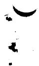
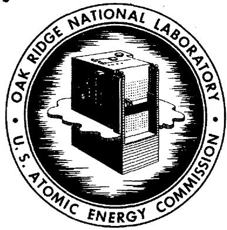
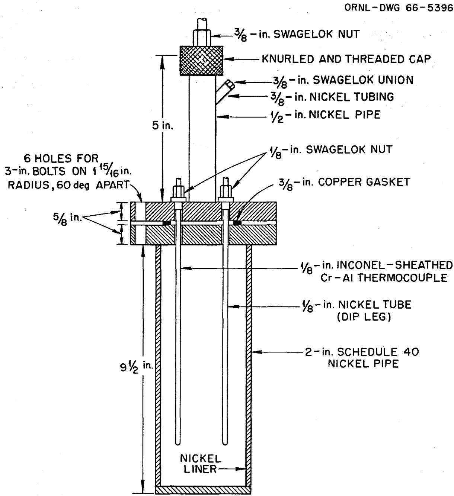
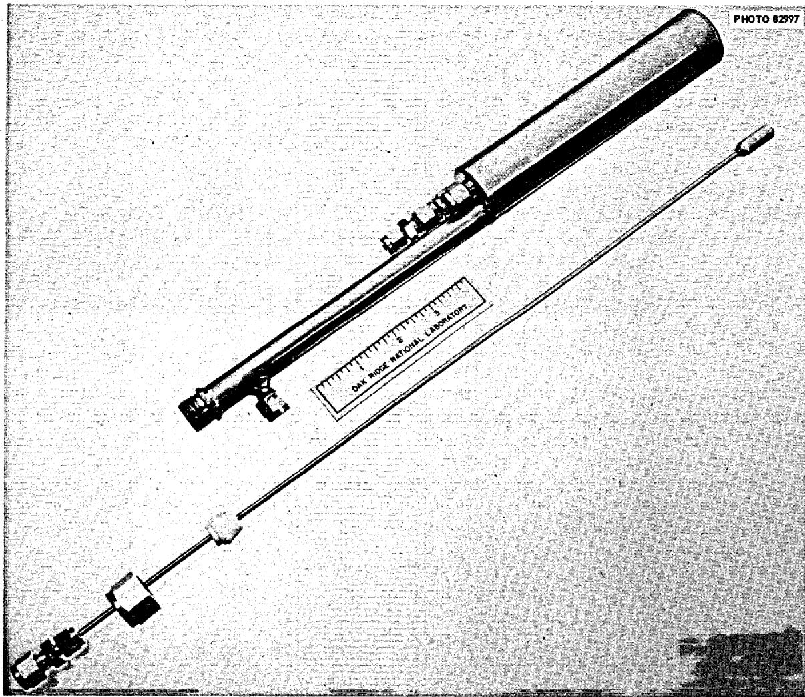
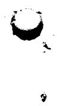

# OAK RIDGE NATIONAL LABORATORY

operated by  
UNION CARBIDE CORPORATION for the

U.S. ATOMIC ENERGY COMMISSION

ORNL-TM-1543

COPY NO. 10

DATE - June 1, 1966

REMOVAL OF PROTACTINIUM FROM MOLTEN FLUORIDE BREEDER BLANKET MIXTURES

C. J. Barton and H. H. Stone

C. 12x, $y$ RICES

HC. $ 200, MN .50

# ABSTRACT

Three types of experiments involving removal of protactinium from molten fluoride breeder blanket mixtures were performed. The first showed that addition of thorium oxide to an $\mathrm{LiF - BeF_2 - ThF_4}$ mixture containing a tracer concentration of $^{233}\mathrm{Pa}$ (less than 0.1 ppb) precipitated the protactinium and that treatment of the mixture with HF redissolved the protactinium. In another experiment equilibration of molten LiF-ThF₄ containing 26 ppm of $^{231}\mathrm{Pa}$ with a lead-thorium alloy resulted in removal of 99% of the protactinium from the salt phase but only a fraction of the reduced protactinium was found in the molten metal. A small amount of protactinium was transferred from the molten metal to a salt mixture by hydrofluorination treatment. In the third type of experiment, which was performed in both nickel and copper containers, exposure of solid thorium metal to molten LiF-ThF₄ containing 20 to 30 ppm of $^{231}\mathrm{Pa}$ precipitated 81 to 98% of the protactinium. More than half of the reduced protactinium was found in the unfiltered salt mixture, probably associated with small metal particles produced by the preliminary HF treatment of the mixture followed by hydrogen reduction. Again, hydrofluorination of the mixture redissolved the protactinium. Efforts are continuing to find container materials to improve the retention of protactinium in molten lead or bismuth.

RELEASED FOR ANNouncement

IN NUCLEAR SCIENCE ABSTRACTS

# NOTICE

This document contains information of a preliminary nature and was prepared primarily for internal use at the Oak Ridge National Laboratory. It is subject to revision or correction and therefore does not represent a final report. The information is not to be abstracted, reprinted or otherwise given public dissemination without the approval of the ORNL patent branch, Legal and Information Control Department.

# LEGAL NOTICE

This report was prepared as an account of Government sponsored work. Neither the United States, nor the Commission, nor any person acting on behalf of the Commission:

A. Makes any warranty or representation, expressed or implied, with respect to the accuracy, completeness, or usefulness of the information contained in this report, or that the use of any information, apparatus, method, or process disclosed in this report may not infringe privately owned rights; or   
B. Assumes any liabilities with respect to the use of, or for damages resulting from the use of any information, apparatus, method, or process disclosed in this report. As used in the above, "person acting on behalf of the Commission" includes any employee or contractor of the Commission, or employee of such contractor, to the extent that such employee or contractor of the Commission, or employee of such contractor prepares, disseminates, or provides access to, any information pursuant to his employment or contract with the Commission, or his employment with such contractor.

# Introduction

RELEASED FOR ANNouncement IN NUCLEAR SCIENCE ABSTRACTS

A protactinium isotope, $^{233}\mathrm{Pa}$ (half-life 27 days), is an intermediate product in the conversion of $^{232}\mathrm{Th}$ to fissionable $^{233}\mathrm{U}$ . It has been recognized for some time that it would be desirable to have a process for removing $^{233}\mathrm{Pa}$ from fluoride breeder blanket mixtures used in a two-region molten fluoride reactor. Earlier studies demonstrated that additions of BeO or $\mathrm{ThO}_2$ to one molten fluoride breeder blanket mixture precipitated protactinium and that hydrofluorination of the mixture redissolved the precipitate. More recently, design and evaluation studies pointed out the strong economic incentive for development of a Pa-removal scheme that could be applied in large thermal molten salt breeder reactors. This document is a progress report of part of the continuing effort to develop improved Pa-removal methods. Results of a more extensive program that is being conducted by another ORNL group using tracer concentrations of $^{233}\mathrm{Pa}$ will be reported elsewhere. Preliminary results of this investigation have been published. The present report deals primarily with studies conducted with Pa concentrations in the part per million range expected to be reached under reactor operating conditions. A mixture of $^{231}\mathrm{Pa}$ and $^{233}\mathrm{Pa}$ was used in order to attain the required concentration without the excessively high gamma activity levels associated with milligram quantities of $^{233}\mathrm{Pa}$ . Small amounts of this isotope (about 1 mc) were added to facilitate quick evaluation of concentration changes occurring

during the experiments by use of gross gamma counting techniques. The actual concentration of $^{233}\mathrm{Pa}$ was five orders of magnitude less than the $^{231}\mathrm{Pa}$ concentration.

# Conclusions

1. A tracer level experiment (less than 0.1 ppb $^{233}\mathrm{Pa}$ ) showed that protactinium was precipitated from a molten LiF-BeF $_2$ -ThF $_4$ mixture by additions of ThO $_2$ , confirming the results of earlier studies, $^1$ and that the precipitated protactinium was redissolved by a hydrofluorination treatment.   
2. Equilibration of a molten fluoride mixture containing 26 ppm $^{231}$ Pa with a lead-thorium alloy resulted in removal of $99\%$ of the protactinium from the salt phase, but only a fraction of the reduced protactinium was found in the molten metal. A small amount $(5\%)$ of the reduced protactinium was transferred from the molten lead to a fluoride salt mixture by a brief hydrofluorination treatment. It appears that better container materials are needed to assure the success of this Pa-removal technique.   
3. Precipitation of ppm concentrations of $^{231}\mathrm{Pa}$ in molten LiF-ThF $_4$ (73-27 mole %) can be accomplished by reduction with thorium metal. The reduction rate was increased by an increase in surface area. Hydrofluorination treatment of the reduced mixture redissolved the protactinium.   
4. When the reduction of protactinium was effected by thorium turnings in nickel equipment, the largest fraction

(more than half) was found in the salt, probably associated with small nickel particles, and about $20\%$ was associated with the nickel-plated copper screen used to support the thorium in the melt. A comparatively small amount of the reduced protactinium was found on the nickel dip leg and vessel wall.

5. A similar distribution of reduced protactinium was found in copper apparatus. The results of the one experiment performed with this container material suggest that it is more difficult to dissolve Pa in copper containers than in nickel.

# Experimental

# Facilities

All the studies reported here were performed in the High-Alpha Molten-Salt Laboratory, which is described in other reports, $^{4}$ although the initial experiment was conducted with a small amount of $^{233}\mathrm{Pa}$ that does not require glove boxes for safe handling.

Procedure for Thorium Oxide Precipitation Experiment

A flanged nickel pot, Fig. 1, was used for this experiment. A pretreated $516\mathrm{~g}$ batch of $\mathrm{LiF - BeF_2 - ThF_4}$ (73-2-25 mole %), to which $1\mathrm{mc}$ of $^{233}\mathrm{Pa}$ had been added to $3\mathrm{kg}$ of material, was placed in a 2-in diameter nickel liner inside the nickel pot. After sealing, the pot was evacuated and filled with helium. Helium was introduced into the pot through the dip leg at a rate of $350\mathrm{~cm^3/min}$ while the contents of the pot were heated to a temperature of $575^{\circ}\mathrm{C}$ .

  
Fig. 1. Flanged Nickel Pot

Hydrogen was substituted for helium at this point and then 15 min later, at a temperature of $590^{\circ}$ , HF was mixed with the hydrogen in the approximate volume ratio 10 $\mathbf{H}_2:1$ HF. After 40 min HF treatment (final temperature $605^{\circ}$ ) hydrogen flow continued for 60 min to effect reduction of $\mathrm{NiF}_2$ introduced by the hydrofluorination treatment. Since the HF content of the effluent gas stream was not monitored in these experiments, there was no way to determine when reduction of $\mathrm{NiF}_2$ was completed.

The sampling procedure consisted of connecting the copper filter units (see Fig. 2) to the gas manifold inside the glove box by means of flexible 1/4-in plastic tubing and Swagelok fittings. Helium was used to flush out the unit for several minutes and then it was introduced into the pot, sealed by tightening a 3/8-in Swagelok nut around a Teflon gasket, and then the filter was immersed in the melt with helium still flowing through it. After allowing time for the filter to reach the temperature of the molten salt mixture, helium flow was terminated and a vacuum was applied to pull a sample of the melt into the filter. After the full available vacuum was reached (23 to 26 in.), the filter was raised to a point near the top of the pot and allowed to cool for a few minutes before removing it from the pot. The filter was then sacrificed to recover the filtered salt mixture. This was weighed and then a 1 gm portion of each sample was weighed, placed in a small vial, and bagged out in a plastic bag for gross gamma counting and for $^{233}\mathrm{Pa}$ analysis by gamma spectrometry.

  
Fig. 2. Welded Nickel Pot and Filter Unit

The schedule followed in sampling and $\mathbf{ThO_2}$ additions is given in Table 1.

# Procedure for Reduction by Molten Pb-Th Alloy

One experiment (Run 1-12) was conducted in which protactinium reduction was effected by metallic thorium in the presence of liquid lead using welded nickel pots of the types shown in Fig. 2. This experiment comprised a number of steps extending over a period of several days:

1. Mixed 1 ml of 17 M HF solution containing $9.0 \, \text{mg} \, ^{231}\text{Pa}$ with 4.0 gram irradiated $\text{ThF}_4$ containing 1.1 mc of $^{233}\text{Pa}$ evaporated to dryness, added to an unlined nickel pot containing 330 gram LiF- $\text{ThF}_4$ (73-27 mole %), hydrofluorinated the mixture at $600^{\circ}\text{C}$ , and reduced at $625^{\circ}\text{C}$ for 4 hrs 20 min, cooled to room temperature under helium.   
2. Repeated $\mathrm{HF - H_2}$ treatment because 38 gram of the salt mixture had formed a plug near the top of the pot that prevented sampling of the melt; cooled to room temperature under helium.   
3. Connected the nickel pot containing the treated salt to a tantalum-lined nickel pot containing 692 gram of Pb-Th alloy saturated with Th at $600^{\circ}\mathrm{C}$ . Effected transfer of salt to the lined pot with the pots at $650^{\circ}\mathrm{C}$ and the transfer line at $600^{\circ}$ .   
4. Added about 5 gram of thorium turnings to the mixture after 141 min equilibration of phases. Cooled to room temperature under helium after 434 min contact time.

5. Put 206 gram of uncontaminated LiF-ThF₄ mixture in the nickel pot used at the beginning of the experiment, after removal of residual salt, gave the melted mixture a 20 min HF-H₂ treatment followed by 3 hrs H₂ treatment and cooled to room temperature under helium.   
6. Connected the salt pot to the pot containing the lead and Pa-contaminated salt. Heated to $500^{\circ}\mathrm{C}$ and applied vacuum to the salt pot to effect transfer of lead phase. Cooled to room temperature under helium.   
7. Disconnected pots and weighed to determine amount of material transferred.   
8. Heated the pot containing the fresh salt plus transferred lead to $625^{\circ}\mathrm{C}$ and treated the mixture for 60 min with $\mathrm{HF - H_2}$ gas. Cooled to room temperature under helium.

Sampling of the salt phase was performed with copper filters. Stainless steel filter units were used to take most of the samples of the lead phase but, in two instances, improper positioning of copper filter units resulted in removal of lead samples in these units. The samplers were connected to the glove box manifold by means of flexible plastic tubing, and sampling was carried out in the manner described in the previous section.

# Procedure for Solid Thorium Reduction Experiments

The procedure used in these experiments should be evident from the tabulated data and the discussion of results in the following section.

# Results and Discussion

# Oxide Precipitation

A summary of the only complete experiment on precipitation of protactinium by oxide addition is given in Table 1. This test was conducted with only a tracer concentration of $^{233}\mathrm{Pa}$ present in the melt in order to check out the glove box equipment before the system became contaminated with a high activity isotope such as $^{231}\mathrm{Pa}$ . The $^{233}\mathrm{Pa}$ activity in the melt (1 millicurie in $3\mathrm{kg}$ of melt) is equivalent to a concentration of approximately 0.02 parts per billion.

The data in Table 1 show that $\mathrm{ThO_2}$ effects the precipitation of $^{23}3\mathrm{Pa}$ from molten LiF-BeF $_2$ -ThF $_4$ and that the protactinium can be redissolved by hydrofluorinating the mixture long enough to convert the $\mathrm{ThO_2}$ to $\mathrm{ThF_4}$ . It appears that, under the conditions used in this experiment, precipitation of $^{23}3\mathrm{Pa}$ occurs rather slowly and additions of $\mathrm{ThO_2}$ were made too rapidly to permit determination of the amount required for complete precipitation at equilibrium. The re-precipitation of partially redissolved $^{23}3\mathrm{Pa}$ shown by Sample #13 was due to water vapor from the dry ice-cooled hydrogen trap that warmed up during overnight operation. The reason for the low value in Sample #15 is not clear.

When the top of the flanged pot was removed at the conclusion of the experiment, it was found that a large part of the fused salt mixture had frozen on the liner wall approximately two inches above the surface of the melt. A large

Table 1. Precipitation of Tracer $^{233}\mathrm{Pa}$ From Molten LiF-BeF $_2$ -ThF $_4$ (73-2-25 mole %) At $630^{\circ}\mathrm{C}$ By ThO $_2$ Additions (Run 9-22)   

<table><tr><td>Sample No.</td><td>Treatment of Melt Prior to Sampling</td><td>233Pa C/m 1 gm. (x 105)</td></tr><tr><td>-</td><td>salt as received</td><td>3.34</td></tr><tr><td>1</td><td>95 min H2-HF</td><td>3.26</td></tr><tr><td>2</td><td>73 min He</td><td>3.32</td></tr><tr><td>3</td><td>50 min after addition of 0.809 g ThO2</td><td>3.12</td></tr><tr><td>4</td><td>110 min after addition of 2.000 g ThO2</td><td>2.54</td></tr><tr><td>5</td><td>45 min after addition of 1.989 g ThO2</td><td>1.93</td></tr><tr><td>6</td><td>10 hrs helium</td><td>~0.09</td></tr><tr><td>7</td><td>90 min after addition of 2.068 g ThO2</td><td>&lt;0.01</td></tr><tr><td>8</td><td>68 min helium</td><td>&lt;0.01</td></tr><tr><td>9</td><td>85 min after 4.807 g ThO2</td><td>&lt;0.01</td></tr><tr><td>10</td><td>6½ hrs helium</td><td>&lt;0.01</td></tr><tr><td>11</td><td>12 hrs helium</td><td>~0.06</td></tr><tr><td>12</td><td>4 hrs 20 min H2-HF</td><td>0.68</td></tr><tr><td>13</td><td>12 hrs H2, 2 hrs H2-HF</td><td>&lt;0.01</td></tr><tr><td>14</td><td>2 hrs H2-HF</td><td>1.05</td></tr><tr><td>15</td><td>2 hrs H2-HF</td><td>~0.07</td></tr><tr><td>16</td><td>5 hrs H2-HF</td><td>2.12</td></tr><tr><td>17</td><td>12 hrs H2-HF (?)</td><td>4.39</td></tr><tr><td>-</td><td>202 g wall material</td><td>2.32</td></tr><tr><td>-</td><td>145 g bottom material</td><td>5.54</td></tr></table>

temperature gradient exists in the furnace well due to the necessity of maintaining a cool glove box floor. Part of the mixture obviouslyly splashed up the wall to a point below the freezing point of the melt. This material was removed, weighed, ground and analyzed for $^{233}\mathrm{Pa}$ content along with a sample of the material in the bottom of the liner. The results are recorded at the bottom of Table 1. This finding, together with the above-mentioned failure to reach equilibrium after each $\mathrm{ThO}_2$ addition, robs the experiment of any quantitative significance. However, the previously stated qualitative conclusions are not affected.

# Reduction by Molten Pb-Th Alloy

The data in Table 2 confirm the results of tracer-level experiments conducted earlier by other investigators $^{4}$ at this laboratory. In brief this experiment demonstrated that protactinium can be effectively removed from a molten salt mixture by contacting it with molten lead containing thorium but it also showed that only part of the protactinium content of the salt can be found in the molten lead. Protactinium that does stay in the lead long enough to permit transfer to a new pot can be recovered in a molten fluoride by hydrofluorinating the mixture. The exact amount of protactinium present in the molten lead seems to be open to question. Most of the samples of this phase were removed by use of stainless steel filter units. The exterior wall of each unit was scraped to remove any salt adhering to it and then it was treated with

Table 2. Reduction of 26 ppm ${}^{231}$ Pa Dissolved in ${330}\mathrm{\;g}$ Molten LiF-Th ${\mathrm{F}}_{4}$ (73-27 mole %) by   
Equilibration With Pb-Th Alloy at $630^{\circ}\mathrm{C}$ . (Run 1-12)   

<table><tr><td rowspan="2">Sample No.</td><td rowspan="2">2-Phase Contact Time (min)</td><td colspan="4">Salt Phase</td><td colspan="4">Metal Phase</td></tr><tr><td>\( ^{231}\text{Pa C/m} \) 1 gm</td><td>Total Pa (mg)</td><td>% of Total Pa</td><td>\( ^{231}\text{Pa C/m} \) Sample</td><td>Wt Sample gm</td><td>Total Pa (mg)</td><td>% of Total Pa</td><td></td></tr><tr><td>1</td><td>-</td><td>\( 1.29x10^6 \)</td><td>8.5</td><td>100</td><td></td><td></td><td></td><td></td><td></td></tr><tr><td>2</td><td>-</td><td>\( 1.18x10^6 \)</td><td>7.8</td><td>92</td><td></td><td></td><td></td><td></td><td></td></tr><tr><td>3</td><td>34</td><td></td><td></td><td></td><td>\( 1.6x10^5 \)</td><td>5.605(ss)</td><td>0.39</td><td>4.6</td><td></td></tr><tr><td>4</td><td>57</td><td>\( 6.68x10^5 \)</td><td>4.4</td><td>52</td><td></td><td></td><td></td><td></td><td></td></tr><tr><td>5</td><td>88</td><td></td><td></td><td></td><td>\( 3.7x10^4 \)</td><td>6.017(ss)</td><td>0.09</td><td>1.0</td><td></td></tr><tr><td>6</td><td>110</td><td>\( 6.29x10^5 \)</td><td>4.2</td><td>49</td><td></td><td></td><td></td><td></td><td></td></tr><tr><td colspan="2">Added Th metal after</td><td colspan="8">141 min contact</td></tr><tr><td>B</td><td>144</td><td>\( 5.6x10^5 \)</td><td>3.7</td><td>44</td><td></td><td></td><td></td><td></td><td></td></tr><tr><td>7</td><td>216</td><td>\( 1.38x10^4 \)</td><td>0.091</td><td>1.1</td><td></td><td></td><td></td><td></td><td></td></tr><tr><td>8</td><td>251</td><td></td><td></td><td></td><td>\( 2.8x10^4 \)</td><td>5.882(ss)</td><td>0.07</td><td>0.8</td><td></td></tr><tr><td>9</td><td>341</td><td></td><td></td><td></td><td>\( 1.1x10^6 \)</td><td>10.350(Cu)</td><td>2.7</td><td>32</td><td></td></tr><tr><td>10</td><td>359</td><td></td><td></td><td></td><td>\( 3.4x10^4 \)</td><td>5.559(ss)</td><td>0.08</td><td>1.0</td><td></td></tr><tr><td>11</td><td>404</td><td>\( 1.25x10^4 \)</td><td>0.083</td><td>1.0</td><td></td><td></td><td></td><td></td><td></td></tr><tr><td colspan="2">Transferred</td><td colspan="8">\( 412\text{g Pb phase to unlined pot containing }206\text{ g LiF-ThF_4} \)</td></tr><tr><td>12</td><td>40 min HF-H2</td><td>\( 1.0x10^5 \)</td><td>0.40</td><td>4.7</td><td></td><td></td><td></td><td></td><td></td></tr><tr><td>13</td><td>40 min HF-H2</td><td></td><td></td><td></td><td>\( 3.8x10^5 \)</td><td>10.4(Cu)</td><td>0.30</td><td>3.5</td><td></td></tr><tr><td>14</td><td>60 min HF-H2</td><td></td><td></td><td></td><td>\( 1.3x10^5 \)</td><td>5.8(ss)</td><td>0.19</td><td>2.2</td><td></td></tr></table>

acid before dissolving. It was found possible to dissolve the jackets with only a small part of the lead sample while the bulk of the lead was dissolved and analyzed separately. The results are shown in Table 3. It was not feasible to make a similar separation in the case of the samples obtained with copper samplers. The data in Table 3 demonstrate that very little of the protactinium associated with the samples was in the filtered lead. It seems likely that protactinium was removed from the lead while passing through the sintered stainless steel filter media but, since this material was dissolved along with the side wall, evidence in support of this belief cannot be given at present. The higher protactinium content of the samples obtained with the copper filter units, as compared to the stainless steel samples, likewise cannot be explained on the basis of presently available information.

# Reduction With Solid Thorium

The first experiment in which a solid thorium rod was exposed to a molten fluoride mixture containing protactinium (Run 2-22) gave somewhat anomalous results, probably due to electrochemical effects. The results can be summarized as follows: Exposure of the 3/8-in diameter rod to 240 gram of LiF-ThF $_4$ (73-27 mole %) at $625^{\circ}\mathrm{C}$ for 65 min resulted in a reduction in $^{231}\mathrm{Pa}$ content of the melt from 11.1 mg to 0.087 mg (0.8% of starting concentration). A further 5-hr exposure resulted in an increase in $^{231}\mathrm{Pa}$ content of the

Table 3. Analysis of Stainless Steel Sampler Jackets and Their Contained Lead Samples (Run 1-12)   

<table><tr><td rowspan="2">Sample No.</td><td colspan="2">231Pa Content (C/min)</td><td rowspan="2">% 231Pa in Core</td><td colspan="3">Lead Distribution (Gm)</td></tr><tr><td>Jacket Solution</td><td>Lead Core</td><td>Jacket Solution</td><td>Core Solution</td><td>Total</td></tr><tr><td>3</td><td>1.6 x 105</td><td>3.8 x 103</td><td>2.4</td><td>0.355</td><td>5.250</td><td>5.605</td></tr><tr><td>5</td><td>3.7 x 104</td><td>&lt;50</td><td>&lt;0.1</td><td>0.417</td><td>5.600</td><td>6.017</td></tr><tr><td>8</td><td>2.4 x 104</td><td>4.0 x 103</td><td>14</td><td>0.432</td><td>5.450</td><td>5.882</td></tr><tr><td>10</td><td>3.4 x 104</td><td>80</td><td>0.2</td><td>0.409</td><td>5.150</td><td>5.559</td></tr></table>

melt, based on analysis of the filtered sample, to $0.54\mathrm{mg}$ $(4.9\%)$ . Samples obtained during $6\frac{1}{2}$ hrs treatment of the melt with a $\mathbf{H}_2$ -HF mixture gave protactinium contents varying from 3 to $16\%$ of the initial concentration. It was found that $70\%$ of the bottom $\frac{15}{16}$ inch of the rod (28 g) had been eroded by the exposure. The recovered salt had a large amount of black material in it, some of which was magnetic and analyzed $45\%$ nickel and $30\%$ thorium. It contained $0.15\mathrm{mg}^{231}\mathrm{Pa}$ per gram. The non-magnetic material contained $22\%$ nickel, $49.5\%$ thorium, and $0.27\mathrm{mg}^{231}\mathrm{Pa}$ per gram. It seems likely that the thorium rod was in contact with the bottom of the nickel pot during this experiment, causing a current flow that eroded the rod. The chunks of black material were rather brittle and it seems probable that they were compacts of finely divided thorium and nickel particles rather than alloys, together with a small amount of the LiF-ThF₄ salt.

Another experiment (Run 3-2) was performed in which a section of the same 3/8-in thorium rod used in Run 2-22 was exposed to a fresh 243 gram batch of LiF-ThF $_4$ under the same conditions used in the previous experiment except that care was exerted to prevent contact of the rod with the bottom of the nickel pot. Measurements were also made of the potential difference between the nickel rod which supported the thorium (insulated from the body of the pot by a Teflon bushing) and the grounded shell of the pot. During the first immersion of the rod, a value of 0.16l volt (grounded side negative)

was measured. During the second immersion, the value varied from 0.242 to 0.231 volt.

Data obtained in this experiment are summarized in Table 4. Reduction of Pa occurred at a much slower rate and there was no noticeable erosion of the thorium rod. The drop in $^{231}\mathrm{Pa}$ concentration that occurred on remelting the mixture after the initial HF and hydrogen reduction treatment was completed and the melt had cooled overnight under helium probably indicates that some oxide contamination of the melt occurred. There is no obvious explanation for the drop in $^{231}\mathrm{Pa}$ concentration in the 6th sample. It may indicate non-equilibrium conditions in the mixture. The high concentration in the ground (-80 mesh) sample of recovered salt seems to indicate that the initial HF treatment of the melt was inadequate for complete dissolution of the added $^{231}\mathrm{Pa}$ .

The slow reduction of dissolved $^{231}\mathrm{Pa}$ observed in Run 3-2 encouraged efforts to increase the reduction rate by increasing the surface area of the solid thorium metal in Run 3-10. A nickel-plated copper screen was used to support 3.6 gram of thorium metal turnings in the melt which consisted of the salt recovered from the previous experiment. The data obtained are shown in Table 5. The data indicate that a larger thorium surface area did indeed increase the rate of protactinium reduction, as expected. The treatment of the melt with thorium was not extended because the basket

Table 4. Exposure of Thorium Rod to 243 g Molten LiF-ThF $_4$ (73-27 mole %)Containing 32 ppm $^{231}\mathrm{Pa}$ (Run 3-2)   

<table><tr><td>Sample No.</td><td>231Pa C/m - 1 gm.</td><td>231Pa Concentration mg/gm</td><td>% of Initial Conc.</td><td>Totala 231Pa (mg)</td><td>Comments</td></tr><tr><td>1</td><td>1.59 x 106</td><td>3.18 x 10-2</td><td>100</td><td>7.72</td><td>50 min H2-HF and 270 min H2</td></tr><tr><td>2</td><td>1.33 x 106</td><td>2.66 x 10-2</td><td>84</td><td>6.30</td><td>Remelted under helium</td></tr><tr><td>3</td><td>4.82 x 105</td><td>9.64 x 10-3</td><td>30</td><td>2.22</td><td>60 min Th rod exposure</td></tr><tr><td>4</td><td>3.04 x 105</td><td>6.01 x 10-3</td><td>19</td><td>1.35</td><td>120 min Th rod exposure</td></tr><tr><td>5</td><td>1.35 x 106</td><td>2.7 x 10-2</td><td>85</td><td>5.91</td><td>65 min H2-HF</td></tr><tr><td>6</td><td>1.19 x 106</td><td>2.38 x 10-2</td><td>75</td><td>5.07</td><td>135 min H2-HF</td></tr><tr><td>7</td><td>1.54 x 106</td><td>3.08 x 10-2</td><td>97</td><td>6.37</td><td>75 min H2-HF</td></tr><tr><td>A</td><td>1.91 x 106</td><td>3.82 x 10-2</td><td>120</td><td>7.69</td><td>Ground sample of recovered salt</td></tr></table>

aCalculated on the basis that 6 gms of salt were removed in each sample.

Table 5. Exposure of Thorium Turnings to 204 g Molten LiF-ThF $_4$ (73-27 mole %) Containing 27 ppm $^{231}$ Pa (Run 3-10)   

<table><tr><td>Sample No.</td><td>231Pa Conc. C/m - 1 gm.</td><td>231Pa Conc. mg/gm.</td><td>% of Initial 231Pa Conc.</td><td>Comments</td></tr><tr><td>1</td><td>1.54 x 106</td><td>3.08 x 10-2</td><td>100</td><td>Short HF-H2and H2treatment</td></tr><tr><td>2</td><td>1.37 x 105</td><td>2.74 x 10-3</td><td>9</td><td>65 min thorium exposure</td></tr><tr><td>3</td><td>1.36 x 106</td><td>2.72 x 10-2</td><td>88</td><td>95 min HF</td></tr><tr><td>4</td><td>1.42 x 106</td><td>2.84 x 10-2</td><td>92</td><td>75 min HF</td></tr><tr><td>A</td><td>1.48 x 106</td><td>2.96 x 10-2</td><td>96</td><td>43 min HF-ground recovered salt (unfiltered)</td></tr></table>

came loose from its support rod the first time that an attempt was made to remove it from the pot. The thorium was apparently dissolved by the hydrofluorination treatment as the basket was completely empty, except for some solidified salt, when it was removed from the melt. In this case, the ground (-80 mesh) recovered salt showed a $^{231}\mathrm{Pa}$ concentration slightly lower than the initial value. The $^{231}\mathrm{Pa}$ content of the first sample was exactly the same as that of the last filtered sample (No. 7) in Table 4 and this agreement casts doubt on the validity of the high $^{231}\mathrm{Pa}$ content of sample A, Table 4.

Run 3-31 was essentially a repeat of Run 3-2 except that no effort was made to return the reduced protactinium to solution. The apparatus was disassembled and all parts that had been in contact with the melt were analyzed for $^{231}\mathrm{Pa}$ content in order to determine the distribution of reduced protactinium in the nickel equipment. The results given in Table 6 show that more than half of the reduced protactinium was in the unfiltered salt mixture, probably attached to small metal particles dispersed in the salt mixture, about 1/5 was adsorbed on (or alloyed with) the nickel-plated copper basket, and only $7\%$ reached the wall of the nickel pot. As is indicated in Table 6, some magnetic particles were removed from the recovered salt. There is no good explanation at present for the missing $20\%$ of the protactinium.

An experiment similar to Run 3-31 was conducted with the

Table 6. Reduction of 19 ppm $^{231}\mathrm{Pa}$ Dissolved in 280 g LiF-ThF $_4$ (73-27 mole %) by Exposure to Thorium Turnings and the Distribution of Reduced Protactinium in Nickel Apparatus (Run 3-31)   

<table><tr><td>Sample No.</td><td>231Pa Conc. C/m - 1 gm. or Sample</td><td>Total 231Pa (mg)</td><td>% of Total 231Pa</td><td>Comments</td></tr><tr><td>1</td><td>9.29 x 105</td><td>5.20</td><td>100</td><td>43 min HF and 60 min H2</td></tr><tr><td>2</td><td>9.29 x 105</td><td>5.20</td><td>100</td><td>65 min H2</td></tr><tr><td>3</td><td>3.08 x 104</td><td>0.13</td><td>2.5</td><td>115 min thorium exposure</td></tr><tr><td></td><td></td><td></td><td></td><td></td></tr><tr><td>A</td><td>5.30 x 105</td><td>2.65</td><td>51.0</td><td>Recovered salt ground to -80 mesh</td></tr><tr><td>Dip leg</td><td>2.21 x 106</td><td>0.044</td><td>0.9</td><td>Part of nickel dip leg exposed to melt</td></tr><tr><td>Basket</td><td>5.22 x 107</td><td>1.04</td><td>20.0</td><td>Includes part of support rod - screen very brittle</td></tr><tr><td>Pot</td><td>1.80 x 107</td><td>0.36</td><td>6.9</td><td>Pot was cut above the salt line</td></tr><tr><td>Magnetic Matl.</td><td>2.94 x 106</td><td>0.06</td><td>1.1</td><td>Mostly nickel particles from sawing pot but includes some particles from salt</td></tr></table>

melt in contact with copper or thorium rather than nickel or thorium as in Run 3-31. The results of this experiment (Run 4-12) are displayed in Table 7. The distribution of reduced protactinium in the copper apparatus was not markedly different from that in nickel. There are some rather puzzling aspects of the data obtained as the amount of $^{231}\mathrm{Pa}$ added was approximately $5.4\mathrm{mg}$ and a maximum of $1.5\mathrm{mg}$ was found in the melt, based on filtered samples. About $3.4\mathrm{mg}$ were recovered from the apparatus at the conclusion of the experiment. The results suggest that it may be more difficult to achieve complete solution of protactinium by hydrofluorination treatment in copper apparatus than in nickel but this cannot be regarded as a firm conclusion.

Table 7. Reduction of 6 ppm $^{231}\mathrm{Pa}$ Dissolved in 251 g LiF-ThF4 (73-27 mole %) by Exposure to Thorium Turnings and The Distribution of Reduced Protactinium in Copper Apparatus   

<table><tr><td>Sample No.</td><td>Treatment of Melt or Sample Description</td><td>231 Pa (C/m) 1 gm or whole sample</td><td>231 Pa (mg)</td><td></td></tr><tr><td>2</td><td>HF-H2</td><td>2.93 x 105</td><td>1.50</td><td></td></tr><tr><td>3</td><td>63 min Th exposure</td><td>9.74 x 104</td><td>0.49</td><td></td></tr><tr><td>4</td><td>90 min HF-H2-basket with Th in melt</td><td>4.80 x 104</td><td>0.23</td><td></td></tr><tr><td>5</td><td>85 min HF-H2, basket removed from melt</td><td>2.42 x 105</td><td>1.15</td><td></td></tr><tr><td>6</td><td>35 min HF-H2, basket with Th in melt</td><td>4.72 x 104</td><td>0.22</td><td></td></tr><tr><td>7</td><td>63 min HF-H2, basket in melt</td><td>2.35 x 105</td><td>1.05</td><td></td></tr><tr><td>8</td><td>85 min exposure of fresh Th turnings</td><td>1.00 x 105</td><td>0.44</td><td></td></tr><tr><td></td><td></td><td></td><td></td><td>% of Total Pa Recovered</td></tr><tr><td>A</td><td>Unfiltered salt, &lt;80 mesh</td><td>4.68 x 105</td><td>2.05</td><td>60.0</td></tr><tr><td>DL</td><td>Part of Cu dipleg exposed to melt</td><td>1.03 x 107</td><td>0.21</td><td>6.2</td></tr><tr><td>Liner</td><td>Part of Copper liner exposed to melt</td><td>2.42 x 107</td><td>0.48</td><td>14.0</td></tr><tr><td>Basket</td><td>Screen and support rod plus remaining thorium</td><td>2.84 x 107</td><td>0.57</td><td>16.7</td></tr><tr><td>BF</td><td>Fragments of support screen not included in above sample</td><td>4.74 x 106</td><td>0.10</td><td>2.9</td></tr></table>

# References

1. J. H. Shaffer et al, Nucl. Sci. Eng. 18, 177 (1964).   
2. P. R. Kasten et al, Summary of Molten-Salt Breeder Reactor Design Studies, ORNL-TM-1467 (March 1966).   
3. J. H. Shaffer et al, Removal of Protactinium from Molten Fluorides by Reduction Processes, ORNL-3913 (March 1966) p. 42.   
4. C. J. Barton, *Protactinium Studies in the High-Alpha Molten-Salt Laboratory*, ORNL-3913 (March 1966), p. 44; Recovery of *Protactinium* from Fluoride Breeder Blanket Mixtures, ORNL-3872 (Dec. 1965), p. 137.

# DISTRIBUTION

1. G. M. Adamson   
2-10. C. J. Barton   
11. S. E. Beall   
12. E. S. Bettis   
13. F. F. Blankenship   
14. E. G. Bohlmann   
15. R.B.Briggs   
16. W. H. Cook   
17. W. R. Grimes   
18. P. N. Haubenreich   
19. P. R. Kasten   
20. O. L. Keller   
21. R. B. Lindauer   
22. H. G. MacPherson   
23. H. F. McDuffie

24. R. L. Moore   
25. D. Scott   
26. J. H. Shaffer   
27. H. H. Stone   
28. J. R. Tallackson   
29. R. E. Thoma   
30. M. E. Whatley

31-32. Central Research Library   
33. Document Reference Section

34-36. Laboratory Records

37. Laboratory Records (RC)   
38. ORNL Patent Office

39-53. Division of Technical Information Extension (DITE)

54. Research and Development Division (ORO)