ORNL-TM-1544

SOLUTIONS TO THE PROBLEMS OF HIGH-TEMPERATURE IRRADIATION EMBRITTLEMENT

W.R. Martin

J.R. Weir

CENTRAL RESEARCH LIBRARY

DOCUMENT COLLECTION

LIBRARY LOAN COPY

DO NOT TRANSFER TO ANOTHER PERSON

If you wish someone else to see this

document, send in name with document

and the library will arrange a loan.

# LEGAL NOTICE

This report was prepared as an account of Government sponsored work. Neither the United States, nor the Commission, nor any person acting on behalf of the Commission:

A. Makes any warranty or representation, expressed or implied, with respect to the accuracy, completeness, or usefulness of the information contained in this report, or that the use of any information, apparatus, method, or process disclosed in this report may not infringe privately owned rights; or   
B. Assumes any liabilities with respect to the use of, or for damages resulting from the use of any information, apparatus, method, or process disclosed in this report.

As used in the above, "person acting on behalf of the Commission" includes any employee or contractor of the Commission, or employee of such contractor, to the extent that such employee or contractor of the Commission, or employee of such contractor prepares, disseminates, or provides access to, any information pursuant to his employment or contract with the Commission, or his employment with such contractor.

Contract No. W-7405-eng-26

METALS AND CERAMICS DIVISION

SOLUTIONS TO THE PROBLEMS OF HIGH-TEMPERATURE IRRADIATION EMBRITTLEMENT

W.R.Martin J.R.Weir

Paper presented at the Sixty-Ninth Annual Meeting of the American Society for Testing and Materials, Atlantic City, N.J., June 27-July 1, 1966.

JUNE 1966

OAK RIDGE NATIONAL LABORATORY

Oak Ridge, Tennessee

operated by

UNION CARBIDE CORPORATION

for the

U.S. ATOMIC ENERGY COMMISSION

# Abstract

The effect of irradiation on the high-temperature mechanical properties of structural materials is described using type 304 stainless steel as an example. The general effect is one in which the grain-boundary fracture process, but not the deformation process, is affected. The data suggest the primary cause to be helium generated from $(n,\alpha)$ reactions. Several metallurgical techniques for improving the ductilities of irradiated alloys are suggested and experimental data on type 304 stainless steel are given for which the degree of improvement is demonstrated.

# Introduction

Irradiation embrittlement of iron- and nickel-base alloys at temperatures above $500^{\circ}\mathrm{C}$ is a problem of immense importance to the success of nuclear reactors. The integrity of structural components and fuel element cladding can depend upon properties that are affected or related to the alloy ductility. Because of the paucity of material data at conditions appropriate to the high-temperature reactor environment, a large effort has been centered in recent years in the area of irradiation damage.

High-temperature embrittlement of iron- and nickel-base alloys is characteristically different than that observed at temperatures below $500^{\circ}\mathrm{C}$ . Within the lower temperature range, the damage produced by the displacement of atoms hardens the lattice, lowers the work hardening rate, but does not significantly affect the fracture stress. Material may exhibit low ductility in terms of uniform strains and total elongations without a large change in the true fracture strain.

In contrast, the embrittlement at high temperatures is not associated with large changes in the bulk strength of the alloy. In tensile tests, the stress necessary to produce a given strain is unchanged; but the irradiated alloy fractures at true strains smaller than that of the unirradiated alloy. In creep tests, the strain-time relationship in the irradiated and unirradiated materials is approximately equivalent. However, because of the embrittlement, the stress-rupture properties of the alloy are reduced. The embrittlement at high temperature is one related primarily to the fracture process whereas the low ductility observed at lower temperatures is a result of a change in the deformation (stress-strain) behavior. The change from low- to high-temperature behavior is observed at approximately $600^{\circ}\mathrm{C}$ for stainless steels.

Efforts to find commercial alloys given standard heat treatments that are not affected by irradiation have not been successful. The solution to this problem may lie in the investigation of the many metallurgical variables available while concurrently investigating the mechanisms of irradiation damage. From these research programs, a general hypothesis for the mechanism of embrittlement has been derived. Although a complete understanding of the embrittlement is not available, one is able to propose possible solutions to the problem and conduct research within these areas in order to determine their effectiveness.

Nature of the Embrittlement

Our interpretation of the high-temperature embrittlement has as its basis our work and the recent literature. (1-12) The most important observation is that the high-temperature embrittlement is associated with

intergranular fracture. Materials tested under conditions that tend to produce intergranular fracture in the absence of irradiation damage are generally highly susceptible to high-temperature irradiation embrittlement. The general behavior of the irradiated alloys is that they fracture at strains at which grain-boundary cracks in unirradiated alloys are either absent or only slightly perceptible. It appears that once a grain-boundary crack is nucleated, it is easier to propagate that crack than to initiate another. At fracture one normally finds fewer cracks in the irradiated alloy than in the unirradiated material. There are exceptions, particularly in the alloys in which intergranular cracks propagate readily in the absence of irradiation damage. With these alloys, the number of cracks near the fracture in both irradiated and unirradiated material is small. The irradiation effect then appears to produce easier nucleation and propagation of grain-boundary cracks.

Since the early work of Hinkle, (1) Robertshaw et al, (2) and Hughes and Coley, (3) it now appears that helium generated from $(n,\alpha)$ reactions is responsible for the embrittlement. Harries (4) demonstrated that the magnitude of embrittlement was a function of $^{10}\mathrm{B}$ content and related to the thermal neutron fluence for alloys in which the total boron content was constant. The $^{10}\mathrm{B}(n,\alpha)$ reaction with thermal neutrons occurs at a much greater rate than that of the other elements normally present in structural alloys. Subsequently other investigators (5) have confirmed these findings. Since the $^{10}\mathrm{B}(n,\alpha)$ reaction produces $^{7}\mathrm{Li}$ as well as $^{4}\mathrm{He}$ , it was not clear whether the lithium or helium was producing the damage. Higgins and Roberts, (6) in their work on bombarding steels with $\alpha$ -particles and lithium ions, showed that the helium was the principal

cause of embrittlement. The solubility of the inert gases in metals is probably quite low. Therefore once helium bubbles are formed in a material the gas remains essentially in place. Postirradiation heat treatments do not remove the irradiation damage in either nickel- or iron-base alloys. (7) The magnitude of embrittlement may be altered somewhat by postirradiation heat treatments, but these are effects probably related to changes in metallurgical structure that affect the process of intergranular fracture.

Although there is a relationship between thermal neutrons, boron concentration, and embrittlement, the neutrons in fast reactors (without a significant neutron flux in the thermal energy range) can produce sufficient helium to cause embrittlement. In a fast neutron spectrum, 3 to 4 Mev neutrons reacting with all of the elements will produce about one-tenth the helium generated from a stainless steel containing 5 ppm B irradiated to an equivalent thermal neutron fluence. Therefore, irradiation embrittlement due to helium will be a problem of some magnitude in fast reactors as well as in thermal reactors.

Helium-induced embrittlement is not peculiar to the stainless steels and nickel-base alloys. In 1959, Rich (8) proposed that gas bubbles served as crack nuclei in irradiated beryllium. All of the work in studying irradiated beryllium, (9) fission-gas bubble (10,11) behavior in fuels, and cyclotron-induced helium bubbles (12) in aluminum and copper serves as a basis for predicting the behavior of helium in iron- and nickel-base alloys.

In 1965, Barnes (13) presented a critical stress model for helium-induced embrittlement in which the helium bubbles serve as crack nuclei. Vacancy flow into the bubbles allows them to grow and connect, thus forming a large grain-boundary crack.

Improvement in Ductility of Irradiated Alloys

Metallurgical solutions to the problem of high-temperature embrittlement appear to be related to one of two primary theses. The first is to reduce the tendency for grain-boundary fracture in the unirradiated and irradiated materials. The second assumes that the embrittlement is related to helium and hence one attempts to reduce the quantity of helium that resides in the boundary during deformation.

We (14,15) cited some time ago several approaches which could be taken. These were

1. decreasing the grain size,   
2. appropriately distributing the grain-boundary precipitate,   
3. lowering the concentration of helium produced in the alloy, and   
4. distributing the precipitate within the matrix that traps helium bubbles and prevents their ultimate concentration within the grain boundaries.

Small-grain size and spherodized grain-boundary carbides should decrease the tendency for intergranular fracture by increasing the stress necessary to nucleate a grain-boundary crack according to the following expression. (16,17)

$$
\sigma_ {N} = (1 2 \mu Y _ {d} / \pi L) ^ {1 / 2}, \tag {1}
$$

where

$\sigma_{\mathbb{N}} =$ stress necessary to nucleate a crack,

$$
\mu = \text {s h e a r}
$$

$\gamma_{d} =$ free energy of surface,

$\mathbf{I} =$ length of the sliding interface.

The rate of propagation of the crack will be related to the maximum stress at the tip of the crack. This stress, $\sigma_{\mathrm{max}}$ , is given in the expression developed by Zener (18) and Inglis: (19)

$$
\sigma_ {\max } = \left[ (2 t / L) ^ {1 / 2} + (L / 2 t) ^ {1 / 2} \right] \sigma_ {a}, \tag {2}
$$

where

$\sigma_{a} =$ applied shear stress,

$t =$ radius of curvature at the tip of the sliding interface, and

$\mathrm{L} =$ length of sliding interface.

This expression may be simplified for the conditions when $L >> t$ ; now

$$
\sigma_ {\max } = \sigma_ {a} (L / 2 t) ^ {1 / 2}. \tag {3}
$$

Since the length of the boundary is proportional to the grain size, it follows that grain size can greatly influence intergranular fracture.

When the grain size is decreased, a higher stress is required to nucleate the wedge-type fracture and also the rate at which cracks propagate should be reduced. Grain-boundary carbides could also act in the same manner.

The length of the sliding interface would be the interparticle spacing if the strength of the carbide-matrix interface is large compared to the

cohesive strength of the boundary. Weaver (20,21) and Garofalo (22) have shown that the heat treatment of nickel- and iron-base alloys to produce coherent grain-boundary precipitate can improve the ductility. Garofalo (22) enumerated the following conditions for grain-boundary precipitate to be beneficial:

1. high cohesion between particle and matrix,   
2. interparticle spacing of 1 to $2\mu$ to allow grain-boundary migration, and   
3. rounded particles that have high shear strength.

Examples of the beneficial effect of grain size on tensile properties are given in Table 1 and the creep data at $650^{\circ}\mathrm{C}$ in Table 2. A 100-hr heat treatment at $800^{\circ}\mathrm{C}$ following a 1-hr solution anneal at $1036^{\circ}\mathrm{C}$ was

Table 1 -- Grain Size Dependence of Postirradiation Short-Time Tensile Strength and Ductility of Type 304 Stainless Steel   

<table><tr><td rowspan="3">Deformation Temperature (℃)</td><td colspan="2">Yield Strength (psi)</td><td colspan="4">Ductility (%)</td></tr><tr><td rowspan="2">ASTM 9</td><td rowspan="2">ASTM 5</td><td colspan="2">True Uniform</td><td colspan="2">Total Elongation</td></tr><tr><td>ASTM 9</td><td>ASTM 5</td><td>ASTM 9</td><td>ASTM 5</td></tr><tr><td>500</td><td>23.5 × 103</td><td>18.8 × 103</td><td>23.6</td><td>24.7</td><td>32.2</td><td>31.8</td></tr><tr><td>600</td><td>19.3</td><td>13.1</td><td>25.5</td><td>24.1</td><td>34.7</td><td>32.0</td></tr><tr><td>700</td><td>16.7</td><td>12.4</td><td>19.5</td><td>19.1</td><td>36.3</td><td>25.2</td></tr><tr><td>800</td><td>15.6</td><td>11.6</td><td>15.2</td><td>14.9</td><td>29.6</td><td>16.2</td></tr><tr><td>900</td><td>8.2</td><td>8.7</td><td>10.1</td><td>6.2</td><td>24.7</td><td>10.2</td></tr></table>

Table 2 -- Grain Size Dependence of Postirradiation Stress Rupture of Type 304 Stainless Steel at $650^{\circ}\mathrm{C}$   

<table><tr><td rowspan="2">Stress (psi)</td><td colspan="2">Strength in Terms of Time to Rupture (hr)</td><td colspan="2">Ductility (%)</td></tr><tr><td>ASTM 9</td><td>ASTM 5</td><td>ASTM 9</td><td>ASTM 5</td></tr><tr><td>30 × 103</td><td>11.3</td><td>1.5</td><td>44.0</td><td>11.4</td></tr><tr><td>25</td><td>79.0</td><td>5.5</td><td>29.5</td><td>9.0</td></tr><tr><td>20</td><td>191.0</td><td>109.5</td><td>17.2</td><td>3.8</td></tr><tr><td>15</td><td>514.4</td><td>194.4</td><td>9.2</td><td>3.5</td></tr></table>

given type 304 stainless steel in order to produce the desired grain-boundary carbide distribution. These microstructures are shown in Fig. 1. The effect of aging is illustrated in Tables 3 and 4 for tensile and creep conditions, respectively. In terms of ductility, the fine-grain size is superior to the coarse grain in the aged and unaged conditions. However, because the coarse-grain material creeps at a rate lower than the fine-grain material, the time to rupture for the aged coarse-grain material offers the best properties for those conditions investigated to date. Another approach to improve the ductility is to assume that the radiation-induced grain-boundary embrittlement is due to the generation of helium from the $(n,\alpha)$ reactions. Helium bubbles at the grain boundary would be expected to be deleterious. However, helium generated within the grains would not be harmful. The primary way that these helium atoms could be swept into the boundary would be by a dislocation mechanism as illustrated

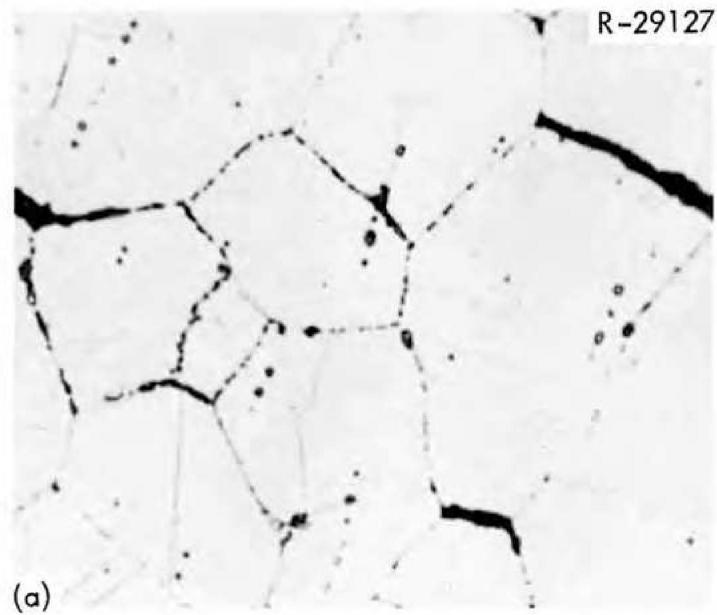

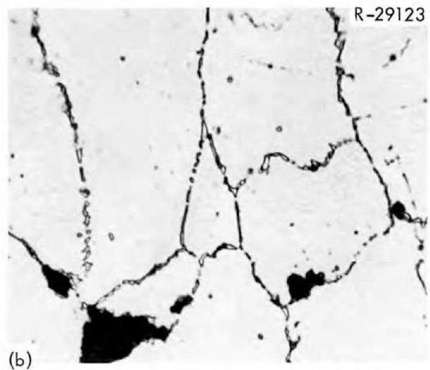  
Fig. 1 -- Microstructures of Irradiated Stainless Steel Having Been Creep Tested at $630^{\circ}\mathrm{C}$ . 20,000 psi stress. (a) Preirradiation heat treatment of 1 hr at $1036^{\circ}\mathrm{C}$ , fractured at $3.8\%$ strain. (b) Preirradiation heat treatment of 1 hr at $1036^{\circ}\mathrm{C}$ followed by a 100-hr aging at $800^{\circ}\mathrm{C}$ , fractured at $14.3\%$ strain. $1000\times$ .

Table 3 -- Effect of Preirradiation Aging on the Short-Time Tensile   
Properties of Type 304 Stainless Steel   
Table 4 -- Effect of Preirradiation Aging on the   

<table><tr><td rowspan="4">Deformation Temperature (℃)</td><td rowspan="4">Strain Rate (min-1)</td><td colspan="2">Yield Strength (psi)</td><td colspan="4">Ductility (%)</td></tr><tr><td rowspan="3">Unaged</td><td rowspan="3">Aged</td><td colspan="2">True</td><td colspan="2">Total</td></tr><tr><td colspan="2">Uniform</td><td colspan="2">Elongation</td></tr><tr><td>Unaged</td><td>Aged</td><td>Unaged</td><td>Aged</td></tr><tr><td rowspan="2">704</td><td>20</td><td>12.7 × 103</td><td>12.2 × 103</td><td>24.3</td><td>25.8</td><td>34.7</td><td>37.2</td></tr><tr><td>0.2</td><td>13.1</td><td>15.6</td><td>15.6</td><td>18.1</td><td>20.5</td><td>30.5</td></tr><tr><td rowspan="2">842</td><td>20</td><td>.11.8</td><td>10.6</td><td>10.4</td><td>12.8</td><td>13.7</td><td>17.5</td></tr><tr><td>0.2</td><td>10.9</td><td>10.2</td><td>5.1</td><td>9.4</td><td>7.6</td><td>13.9</td></tr></table>

Postirradiation Stress Rupture of Type 304

Stainless Steel at $650^{\circ}\mathrm{C}$

<table><tr><td rowspan="2">Stress (psi)</td><td colspan="2">Strength in Terms of Time to Rupture (hr)</td><td colspan="2">Ductility (%)</td></tr><tr><td>Unaged</td><td>Aged</td><td colspan="2">Elongation at Rupture</td></tr><tr><td>30 × 103</td><td>1.5</td><td>14.8</td><td>11.4</td><td>24.2</td></tr><tr><td>25</td><td>5.5</td><td>50.8</td><td>9.0</td><td>25.1</td></tr><tr><td>20</td><td>109.5</td><td>664.1</td><td>3.8</td><td>14.3</td></tr><tr><td>15</td><td>194.4</td><td>3638.0</td><td>3.5</td><td>7.8</td></tr></table>

by Barnes (13) for copper. Therefore, to improve the ductility of irradiated materials, one must devise ways to reduce the helium concentration at the grain boundaries.

For many reactor applications, the preponderance of helium generated is due to the transmutation of $^{10}\mathrm{B}$ . Boron, a horophilic element, normally segregates to the grain boundaries in the solid state and therefore a large quantity of helium is generated near these boundaries. If one could form a stable boron compound, insoluble either in the melt or at a very high temperature after solidification, it would be possible to get a homogeneous distribution of this compound. Therefore, helium generated would tend to stay at the precipitate-matrix interface and hence the quantity at the grain boundaries would be greatly reduced. These precipitates having an incoherent interface, would also serve as traps for helium generated from other elements and fast neutrons. Thus in principle, this system should result in material with a lower susceptibility to high-temperature embrittlement in thermal and fast-neutron environments.

We have chosen to first investigate the iron-base systems, in particular 18-8 stainless steel. Among the most stable borides are those of titanium. We have now accumulated data from two different irradiations, and typical data are given in Fig. 2 for a steel containing $0.02 \mathrm{wt} \%$ C. Data for the $0.06 \mathrm{wt} \%$ C alloy are given in Table 5. It is clear that small additions of titanium greatly improve the ductility of type 304 stainless steels. Titanium additions at the level required to meet the chemical specifications for type 321 stainless steel are above the range for which one observes the maximum ductility.

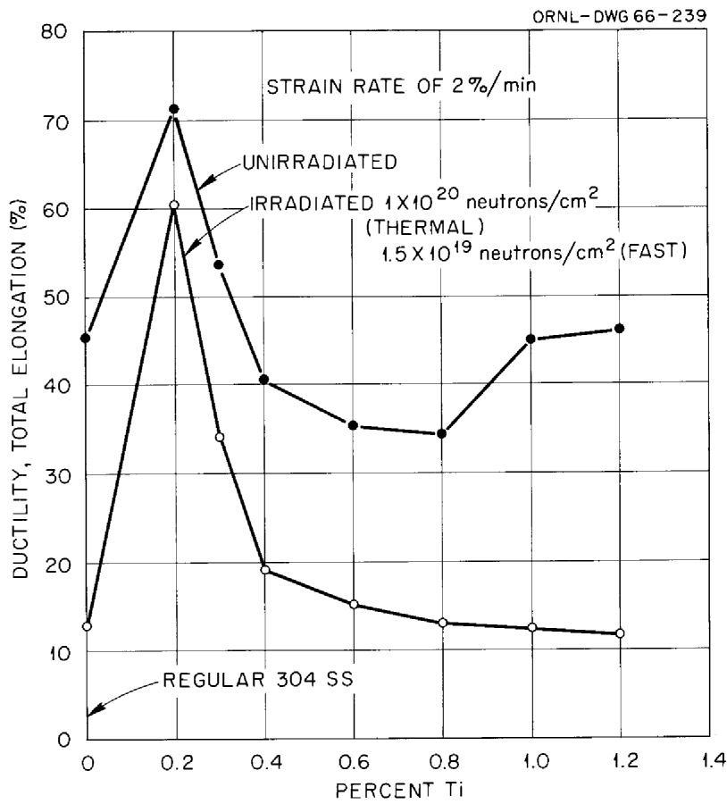  
Fig. 2 -- Ductility at $842^{\circ}\mathrm{C}$ of Irradiated Austenitic Stainless Steel as a Function of Titanium Content.

Table 5 -- Influence of Titanium on the High-Temperature Irradiation Embrittlement of 18-8 Stainless Steels Having 0.06 wt % C   

<table><tr><td rowspan="2">Titanium (wt %)</td><td colspan="3">Total Elongation (%)a,b at</td></tr><tr><td>650°C</td><td>700°C</td><td>842°C</td></tr><tr><td>0.0</td><td>31.0</td><td>31.5</td><td>20.0</td></tr><tr><td>0.2</td><td>40.0</td><td>38.0</td><td>45.1</td></tr><tr><td>0.3</td><td>34.7</td><td>28.5</td><td>35.2</td></tr><tr><td>0.4</td><td>31.5</td><td>26.5</td><td>25.0</td></tr><tr><td>0.5</td><td>28.8</td><td>21.5</td><td>19.0</td></tr><tr><td>0.6</td><td>24.1</td><td>19.5</td><td>17.9</td></tr><tr><td>0.8</td><td>22.9</td><td>20.5</td><td>19.1</td></tr><tr><td>1.0</td><td>30.6</td><td>23.5</td><td>23.5</td></tr><tr><td>1.2</td><td>29.8</td><td>23.0</td><td>28.5</td></tr></table>

Measured in l-in.-gage length for tests at a strain rate of 0.2%/min.   
b Specimens irradiated to a fluence level of $1 \times 10^{20}$ neutrons/cm² (thermal) and $1.5 \times 10^{19}$ neutrons/cm² (E > 1 MeV).

Titanium additions in the range up to 0.2 wt $\%$ greatly reduce the magnitude of irradiation embrittlement in type 304 stainless steel. The lower ductilities of the higher titanium-bearing alloys are not understood. Although the alloys containing titanium have a grain size smaller than the unstabilized grade, we believe the effect of titanium to be as hypothesized earlier. The helium bubbles in the as-irradiated stainless steels are not always of a size resolvable in the electron microscope. A 1-hr postirradiation anneal at $1200^{\circ}\mathrm{C}$ will produce bubbles in the grain boundaries of the regular 304 stainless steel but not in the 0.2 wt $\%$ Ti-bearing steel. These photomicrographs are compared in Fig. 3. On the other hand, one can find evidence suggesting bubble attachment to intragranular precipitate in the titanium-bearing steels. Figure 4 illustrates the possible bubble attachment. It is possible that these void areas may be a result of sample preparation for electron microscopy examination.

We believe the concept of intragranular precipitate serving as sinks for bubbles to be valid. We have in our own studies experienced difficulty in getting the correct precipitate distribution and size. Additionally producing the proper distribution of boron in these precipitates may prove too difficult in many alloy systems. Thus the improvement of alloys for use in thermal reactors may prove to be more difficult than the use of this concept for fast reactor irradiations. In the latter case the precipitate need not contain the boron. The precipitate may also be formed in situ, such as the titanium precipitate, or an inert oxide could be added during fabrication. This latter approach may be desirable if the thermal stability of precipitates during long exposures at high temperatures is small in the base alloy system.

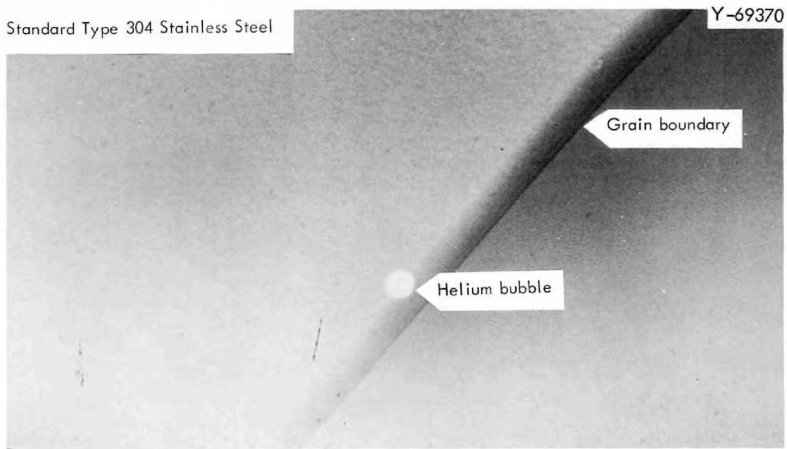

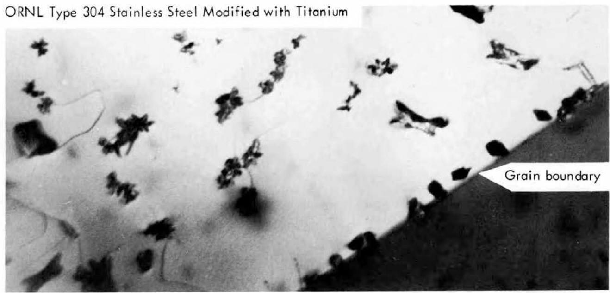  
Fig. 3 -- Comparison of Grain Boundaries in Irradiated Stainless Steels After Postirradiation Annealing Treatments.

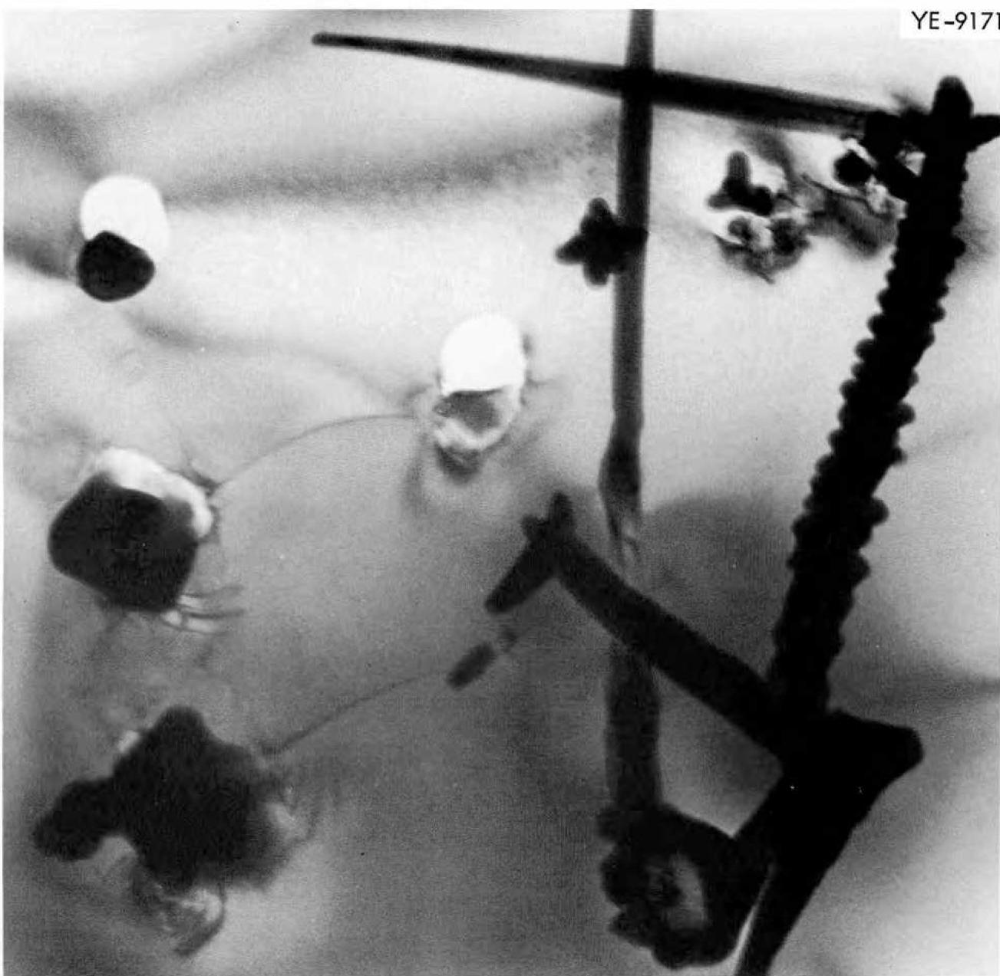  
Fig. 4 -- Electron Transmission Micrograph of 0.2 wt % Ti-Bearing Stainless Steel after Postirradiation Anneal of 1 hr at $1200^{\circ}\mathrm{C}$ . 50,000x.

The final proposal for reducing the embrittlement concerns the concentration of helium produced. In fast reactor irradiations, there appears little hope, as there is no single $(n,\alpha)$ reaction that produces the bulk of the helium as is the case in thermal reactors with the $^{10}\mathrm{B}(n,\alpha)$ reaction. Nitrogen could be a major contributor if the concentrations become larger than those presently in our commercial alloys. In the thermal reactors, one can reduce the boron content to concentrations of $10^{-8}$ , but this appears impractical for commercial application. There is another lower limit for boron because even in thermal reactors, the fast $(n,\alpha)$ reaction produces helium at a rate comparable with the thermal neutrons and boron at a concentration of about 0.2 ppm for neutron fluences less than $10^{20}$ neutrons/ $\mathrm{cm}^2$ .

The boron level in type 304 stainless steel given an electron-beam remelt treatment was reduced from 3.9 to 0.015 ppm. Data at a neutron fluence of $4.5 \times 10^{20}$ neutrons/cm² have been published earlier (23) for these alloys and others. We have investigated the embrittlement of these steels at lower neutron fluences in order to evaluate the relative contribution of helium generated from fast and thermal $(n,\alpha)$ reactions. These data are given in Table 6 and Fig. 5. The atom fraction of helium plotted in Fig. 5 is the total helium content. It is apparent that with the lower boron levels, fast $(n,\alpha)$ reactions are of significant importance. A correlation of this type is surprising since the boron, and hence the helium produced therefrom, is believed to be segregated to grain boundaries whereas the helium from fast $(n,\alpha)$ reactions will be produced throughout the material. If this were true, one would not expect a correlation from a simple addition of helium produced by both reactions. We believe the

Table 6 -- Ductility of Stainless Steel as a Function of Boron Concentration and Irradiation Fluence   

<table><tr><td></td><td colspan="3">At 8.6 × 1017neutrons/cm2(thermal) and</td><td colspan="3">At 7.8 × 1018neutrons/cm2(thermal) and</td><td colspan="3">At 2.7 × 1019neutrons/cm2(thermal) and</td></tr><tr><td rowspan="3">Natural Boron Concentration (ppm)</td><td colspan="3">8.6 × 1016neutrons/cm2(E &gt; 1 Mev)</td><td colspan="3">7.8 × 1017neutrons/cm2(E &gt; 1 Mev)</td><td colspan="3">2.7 × 1019neutrons/cm2(E &gt; 1 Mev)</td></tr><tr><td rowspan="2">Elongation (%)</td><td colspan="2">Helium Content (atom fraction)</td><td rowspan="2">Elongation (%)</td><td colspan="2">Helium Content (atom fraction)</td><td rowspan="2">Elongation (%)</td><td colspan="2">Helium Content (atom fraction)</td></tr><tr><td>Thermal</td><td>Total</td><td>Thermal</td><td>Total</td><td>Thermal</td><td>Total</td></tr><tr><td>0.015</td><td>41</td><td>6 × 10-11</td><td>1.4 × 10-10</td><td>32</td><td>6 × 10-10</td><td>1.4 × 10-9</td><td>27</td><td>2 × 10-9</td><td>5 × 10-9</td></tr><tr><td>0.110</td><td>43</td><td>4 × 10-10</td><td>5 × 10-10</td><td>31</td><td>3 × 10-9</td><td>4 × 10-9</td><td>26</td><td>1 × 10-8</td><td>1 × 10-8</td></tr><tr><td>0.150</td><td>...</td><td>5 × 10-10</td><td>6 × 10-10</td><td>31</td><td>5 × 10-9</td><td>6 × 10-9</td><td>24</td><td>2 × 10-8</td><td>2 × 10-8</td></tr><tr><td>3.900</td><td>23</td><td>2 × 10-8</td><td>2 × 10-8</td><td>18</td><td>2 × 10-7</td><td>2 × 10-7</td><td>18</td><td>6 × 10-7</td><td>6 × 10-7</td></tr></table>

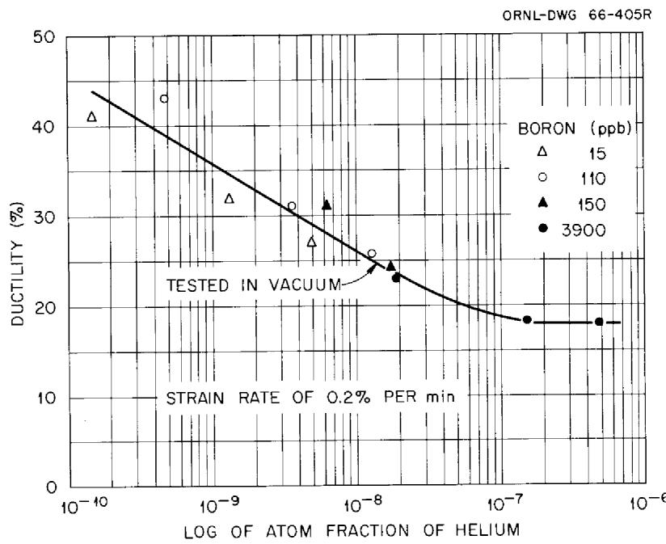  
Fig. 5 -- Irradiation Embrittlement of Boron-Stainless Steels at $700^{\circ}\mathrm{C}$ as a Function of Total Helium Content.

most plausible explanation is that most of the helium generated from the threshold reactions is swept into the grain boundaries during deformation; thus the majority of helium within the samples is at grain boundaries and one can then get a reasonable correlation by simple addition of the helium from both sources. This means that the actual concentration at grain boundaries for a given ductility is many orders of magnitude greater than that given in Fig. 5. A reasonable figure based on segregation may be a factor of 1000. Although replication techniques using Faxfilm are prone to exhibit artifacts we attempted fractographic evaluation of these low boron bearing alloys in order to evaluate the bubble density along the fractured boundary. Typical photographs are given in Figs. 6 and 7. We observed protrusions on the replica that cast shadows, and this is what we would expect for cavities on the metal fracture surface. The density of these protrusions appears to be related to the total helium content in the sample and not to neutron fluence or boron content. Assuming, therefore, that these are cavities along the grain boundary and not artifacts, it is not clear as to their role in the fracture process.

# Summary

The irradiation of stainless steels at temperatures in the range of $600^{\circ}\mathrm{C}$ and above results in an embrittlement of the alloy that is significantly different than the neutron displacement damage which is of principal importance at temperatures below $600^{\circ}\mathrm{C}$ . This embrittlement at high temperatures does not necessarily affect the strength of an alloy, in terms of the stress necessary to produce a given value of strain. The

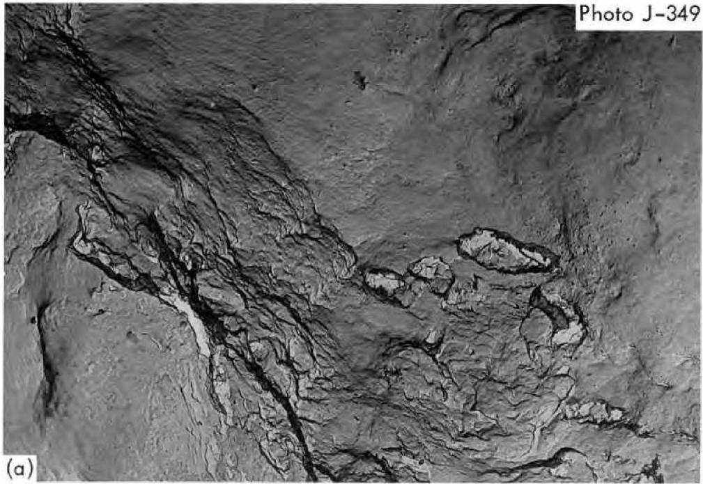

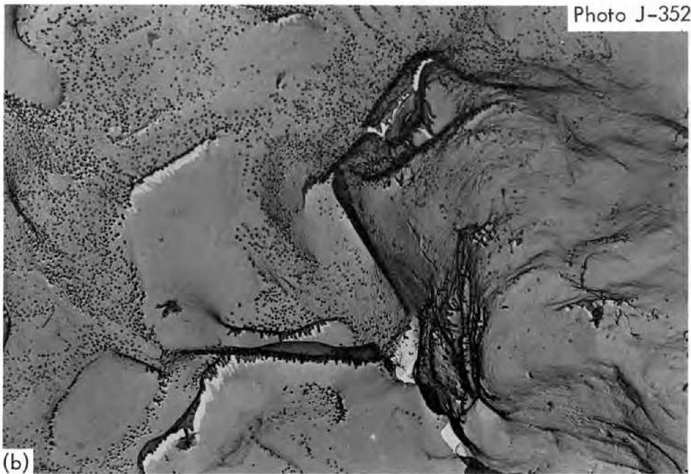  
Fig. 6. Fractographs of Irradiated Stainless Steels Containing

0.015 ppm B after Fracture at $842^{\circ}\mathrm{C}$ . (a) Fracture at $18\%$ strain with calculated helium atom fraction of $5 \times 10^{-11}$ . (b) Fracture at $12\%$ strain with calculated helium atom fraction of $4 \times 10^{-10}$ . 6,500x.

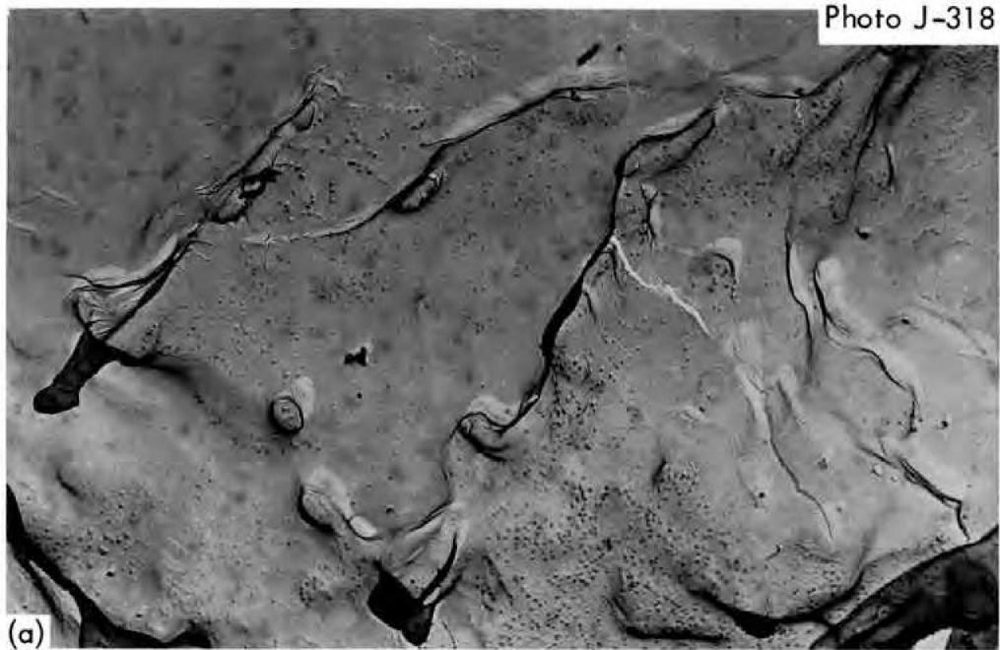

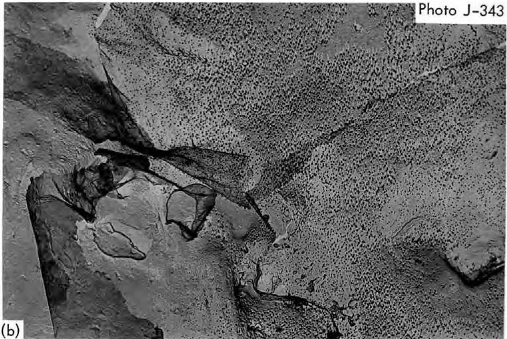  
Fig. 7. Fractographs of Irradiated Stainless Steels Containing

3.9 ppm B after Fracture at $842^{\circ}\mathrm{C}$ . (a) Fracture at $11\%$ strain with a calculated helium atom fraction of $2 \times 10^{-9}$ . (b) Fracture at $10\%$ strain with a calculated helium atom fraction of $2 \times 10^{-8}$ . 6,500x.

embrittlement can be severe, and ductilities less than $1\%$ have been observed for creep conditions.

Irradiation affects the ability of the alloy to resist intergranular fracture and most experiments point to the principal cause as one related to the production of helium from two sources. The first one is the $^{10}\mathrm{B}(\mathfrak{n},\alpha)$ reaction with neutrons having thermal energies and the second source is from reactions between the major alloy constituents and fast neutrons having energies in the 3-Mev range.

Solutions to the problem of embrittlement are then related to (1) alterations of the unirradiated alloy that affect the process of intergranular fracture and (2) modifications of the alloy that reduce the amount of helium that is located in the grain boundaries of the irradiated alloy.

Metallurgical variables, such as grain size, annealed vs cold-work structures, are variables that greatly affect the ductilities of alloys in the temperature range for which the alloys fracture intergranularly. After irradiation a fine-grain size alloy can be an order of magnitude more ductile than the coarse grain. Grain sizes in the range of ASTM 8 to 11 are preferred.

To reduce the amount of helium at the grain boundary, one must produce the helium at sites other than the grain boundary and prevent the movement of helium to the grain boundary. A reduction in boron content can reduce the amount of helium produced, but is not a complete solution because of the helium generated from nickel, iron, chromium, nitrogen, and other elements. Thus, a more suitable approach would appear to be a desegregation of boron and the production of helium sinks within the matrix of the grains

which will greatly reduce the quantity of helium moving to the grain boundary. Titanium additions to stainless steel are believed to form complex metal borides dispersed homogeneously within the matrix and the precipitate-matrix interfaces serve as a depository for helium. Other approaches for improving high-temperature ductility are available; one of these is proper aging of existing grades of stainless steels.

# Acknowledgments

The authors thank their colleagues, E. E. Bloom, J. W. Woods, J. O. Stiegler, T. E. Nolan and R. E. McDonald for their assistance in our irradiation damage program. We also thank V. Bullington, D. Gates, H. Kline, and K. W. Boling for their kind attention to details in conducting the irradiation and deformation experiments.

# References

1. N. E. Hinkle, "Effect of Neutron Bombardment on Stress-Rupture Properties of Some Structural Alloys," Radiation Effects on Metals and Neutron Dosimetry, ASTM STP 341, Am. Soc. Testing Mater., 1963, p. 344.   
2. F. C. Robertshaw, J. Moteff, F. D. Kingsbury, and M. A. Pugacz, "Neutron Irradiation Effects in A286, Hastelloy X and René 41 Alloys," Radiation Effects on Metals and Neutron Dosimetry, ASTM STP 341, Am. Soc. Testing Mater., 1963, p. 372.   
3. N. A. Hughes and J. Coley, "The Effects of Neutron Irradiation at Elevated Temperatures on the Tensile Properties of Some Austenitic Stainless Steels," Journal of Nuclear Materials, Vol. 10, 1963, p. 60.   
4. P.C.L. Pfeil and D. R. Harries, "Effect of Irradiation in Austenitic Steels and Other High-Temperature Alloys," Flow and Fracture of Metals and Alloys in Nuclear Environments, ASTM STP 380, Am. Soc. Testing Mater., 1965, p. 202.   
5. W. R. Martin and J. R. Weir, "Irradiation Effects in Stainless Steels at High Temperatures," Proceedings of Sodium Components Development Program, USAEC CONF-650620, U.S. Atomic Energy Commission, 1966, pp. 36-46.   
6. P.R.B. Higgins and A. C. Roberts, "Reduction in Ductility of Austenitic Stainless Steel after Irradiation," Nature, Vol. 206, No. 4990, 1965, pp. 1249-1250.   
7. W. R. Martin and J. R. Weir, "Effect of Post-irradiation Heat Treatment on the Elevated Temperature Embrittlement of Irradiated Stainless Steel," Nature, Vol. 202, No. 4936, June 1964, p. 997.

8. J. B. Rich, G. P. Walters, and R. S. Barnes, "The Mechanical Properties of Some Highly Irradiated Beryllium," Journal of Nuclear Materials, Vol. 4, 1961, p. 287.   
9. J. R. Weir, "The Effect of High-Temperature Reactor Irradiation on Some Physical Properties of Beryllium," International Conference on the Metallurgy of Beryllium, London, 1961, Chapman and Hall, London, 1963, pp. 395-409.   
10. D. Kramer, W. V. Johnston, and C. G. Rhodes, "Reduction of Fission-Product Swelling in Uranium Alloys by Means of Finely Dispersed Phases," Journal of the Institute of Metals, Vol. 93, No. 5, 1964-65, pp. 145-152.   
11. W. H. Chatwin and E. D. Hyam, "Grain Boundary Holes in Irradiated Uranium," TRG Report 325(W), United Kingdom Atomic Energy Authority, 1966.   
12. C. E. Ells, "Effect of Temperature During Irradiation on the Behavior of Helium in Aluminum," Journal of Nuclear Materials, Vol. 5, 1962, pp. 147-149.   
13. R. S. Barnes and R. S. Nelson, "Theories of Swelling and Gas Retention in Reactor Materials," AERE-R 4952, Atomic Energy Research Establishment, Harwell, June 1965.   
14. W. R. Martin and J. R. Weir, "Effect of Elevated-Temperature Irradiation on Hastelloy N," Nuclear Applications, Vol. 1, No. 2, 1965, pp. 160-167.   
15. W. R. Martin and J. R. Weir, "Influence of Grain Size on the Irradiation Embrittlement of Stainless Steel at Elevated Temperatures," Journal of Nuclear Materials, Vol. 18, No. 2, 1966, pp. 108-118.

16. D. McLean, Grain Boundaries in Metals, Clarendon Press, Oxford, 1957, p. 336.   
17. A. N. Stroh, "The Formation of Cracks as a Result of Plastic Flow," Proceedings of the Royal Society (London) Series A: Vol. 223, 1954, p. 404.   
18. C. Zener, Elasticity and Anelasticity of Metals, University of Chicago Press, Chicago, 1948, p. 158.   
19. C. E. Inglis, Institute of Naval Architects (London) Transactions, Vol. 55, 1944, p. 126.   
20. C. W. Weaver, "The Influence of Annealing Twins on Intergranular Creep Cracking," Journal of the Institute of Metals, Vol. 88, 1959-60, p. 296.   
21. C. W. Weaver, "Application of Stroh's theory to intercrystalline creep cracking," Acta Metallurgia, Vol. 8, 1960, p. 343.   
22. F. Garofalo, Fundamentals of Creep and Creep-Rupture in Metals, Macmillan Company, New York, 1965.   
23. W. R. Martin, J. R. Weir, R. E. McDonald, and J. C. Franklin, "Irradiation Embrittlement of Low-Boron Type 304 Stainless Steel," Nature, Vol. 208, No. 5005, 1965, pp. 73-74.

# INTERNAL DISTRIBUTION

1-2. Central Research Library   
3. Reactor Division Library   
4-5. ORNL - Y-12 Technical Library Document Reference Section   
6-15. Laboratory Records Department.   
16. Laboratory Records, ORNL R.C.   
17. ORNL Patent Office   
18. R. G. Berggren   
19. G.E. Boyd   
20. R. B. Briggs   
21. J. E. Cunningham   
22. W.W.Davis   
23. D. A. Douglas, Jr.   
24. J.H Frye, Jr.   
25. W. O. Harms

26-28. M.R.Hill   
29. C. F. Leitten, Jr.   
30. A. P. Litman   
31. H. G. MacPherson   
32. H. E. McCoy, Jr.

33-42. W.R.Martin

43. E.C.Miller   
44. P. Patriarca   
45. G. M. Slaughter   
46. D. B. Trauger   
47. J. T. Venard   
48. J. R. Weir   
49. M. S. Weschler

50-69. G. D. Whitman

70. J. W. Woods

# EXTERNAL DISTRIBUTION

71. C. M. Adams, Massachusetts Institute of Technology   
72. J. Brunhouse, Aerojet, General Nucleonics   
73. D. B. Coburn, General Atomic   
74-75. D. F. Cope, AEC, Oak Ridge Operations   
76. F. Comprelli, General Electric, San Jose   
77. P. Fortescue, General Atomic   
78. J. E. Irwin, General Electric, Hanford   
79-80. V. B. Lawson, Atomic Energy of Canada Limited, Chalk River   
81. J. Moteff, General Electric, NMPO, Cincinnati   
82. R. E. Schreiber, Du Pont Company, Savannah River Laboratory   
83. F. Shober, Battelle Memorial Institute   
84. A. A. Shoudy, Atomic Power Development Associates, Inc.   
85-87. J. M. Simmons, AEC, Washington   
88. J. C. Tobin, General Electric, Hanford   
89. S. R. Vandenberg, General Electric, San Jose   
90. Division of Research and Development, AEC, Oak Ridge Operations   
91-105. Division of Technical Information Extension