CFSTI PRICS

ORNL-TM-1545

H.C. $ 3.00; M.K. 62

Contract No. W-7405-eng-26

General Engineering and Construction Division

DESIGN STUDY OF A HEAT-EXCHANGE SYSTEM

FOR ONE MSBR CONCEPT

by the

GE&C Division Design Analysis Section

LEGAL NOTICE

The government sponsored an account of Government sponsored work. Neither the United

This report was prepared as an initial draft.

A. Makes any warranty or representation, expressed or implied, with respect to the use, accuracy, completeness, or usefulness of the information contained in this report, or that the use, accuracy, completeness, or usefulness of any information, apparatus, method, or process disclosed in this report may not infringe

privately owned rights; or

B. Assumes any liabilities will respect the use of any information, apparatus, method, or process disclosed in this report. As used in the above, "person acting on behalf of the Commission" includes any employee or contractor of the Commission, or employee of such contractor, to the extent that employee or contractor of the Commission, or employee of such contractor prepares, such employee or contractor of the Commission, or employee of such contractor prepares, disseminates, or provides access to, any information pursuant to his employment or contract with such contractor.

with the Commission, or his employment with such construction.

SEPTEMBER 1967

OAK RIDGE NATIONAL LABORATORY

Oak Ridge, Tennessee

operated by

UNION CARBIDE CORPORATION

for the

U.S. ATOMIC ENERGY COMMISSION


The individuals who participated in this study performed by the General Engineering and Construction Division Design Analysis Section are listed below.

C. E. Bettis   
R. J. Braatz   
G. A. Cristy   
D. A. Dyslin   
O. A. Kelly   
T. W. Pickel   
L. R. Shobe   
A. E. Spaller   
W. C. Stoddart


# CONTENTS

Page

# Abstract 1

1. INTRODUCTION 1   
2. SUMMARY 3   
3. DESIGN APPROACH 6

Heat-Exchange System 6

Factors Affecting Design of Heat Exchangers 12

Materials 12   
Maintenance Philosophy 12   
Feasibility 13   
Heat-Transfer and Pressure-Drop Calculations 14   
Stress Analyses 20

4. DESIGN FOR PRIMARY HEAT EXCHANGERS 22

Case A 22   
Case B 26

Design Variables 28   
Calculatory Procedures 30   
Results of Calculations 32

5. DESIGN FOR BLANKET-SALT HEAT EXCHANGERS 35

Case A 35   
Case B 39

6. DESIGN FOR BOILER-SUPERHEATER EXCHANGERS 46

Case A 46   
Case B 52   
Case C. 53

7. DESIGN FOR STEAM REHEATER EXCHANGERS 56

Case A 56   
Case B. 62   
Case C 63

# Page

8. DESIGN FOR REHEAT-STEAM PREHEATERS 65

Appendix A. CALCULATIONS FOR PRIMARY HEAT EXCHANGER 71   
Appendix B. CALCULATIONS FOR BLANKET-SALT HEAT EXCHANGER 111   
Appendix C. CALCULATIONS FOR BOILER SUPERHEATER EXCHANGER 140   
Appendix D. CALCULATIONS FOR STEAM REHEATER EXCHANGER 164   
Appendix E. CALCULATIONS FOR REHEAT-STEAM PREHEATER 184   
Appendix F. NOMENCLATURE 198

<table><tr><td>Table
Number</td><td>Title</td><td>Page
Number</td></tr><tr><td>1</td><td>Values for Fuel-, Blanket-, and Coolant-Salt
Properties Used in Preliminary Calculations
for MSBR-Heat-Transfer Equipment</td><td>15</td></tr><tr><td>2</td><td>Primary Heat Exchanger Design Data for Case A</td><td>24</td></tr><tr><td>3</td><td>Primary Heat Exchanger Design Data for Case B</td><td>33</td></tr><tr><td>4</td><td>Blanket-Salt Heat Exchanger Design Data for Case A</td><td>38</td></tr><tr><td>5</td><td>Blanket-Salt Heat Exchanger Design Data for Case B</td><td>43</td></tr><tr><td>6</td><td>Boiler-Superheater Design Data for Case A</td><td>50</td></tr><tr><td>7</td><td>Boiler-Superheater Stress Data for Case B</td><td>53</td></tr><tr><td>8</td><td>Boiler-Superheater Design Data for Case C</td><td>54</td></tr><tr><td>9</td><td>Steam Reheater Exchanger Design Data for Case A</td><td>60</td></tr><tr><td>10</td><td>Steam Reheater Stress Data for Case B</td><td>62</td></tr><tr><td>11</td><td>Steam Reheater Exchanger Design Data for Case C</td><td>63</td></tr><tr><td>12</td><td>Design Data for the Reheat-Steam Preheater</td><td>67</td></tr></table>


LIST OF FIGURES   

<table><tr><td>Figure Number</td><td>Title</td><td>Page Number</td></tr><tr><td>1</td><td>Flow Diagram for the Case-A Heat-Exchange System</td><td>8</td></tr><tr><td>2</td><td>Flow Diagram for the Case-B Heat-Exchange System</td><td>10</td></tr><tr><td>3</td><td>Primary Fuel-Salt-to-Coolant-Salt Heat Exchanger for Case A</td><td>23</td></tr><tr><td>4</td><td>Primary Fuel-Salt-to-Coolant-Salt Heat Exchanger for, Case B</td><td>27</td></tr><tr><td>5</td><td>Blanket-Salt Heat Exchanger for Case A</td><td>36</td></tr><tr><td>6</td><td>Blanket-Salt Heat Exchanger for Case B</td><td>40</td></tr><tr><td>7</td><td>Boiler-Superheater Exchanger</td><td>47</td></tr><tr><td>8</td><td>Steam Reheater Exchanger</td><td>57</td></tr><tr><td>9</td><td>Reheat-Steam Preheater Exchanger</td><td>66</td></tr></table>


# DESIGN STUDY OF A HEAT-EXCHANGE SYSTEM FOR ONE MSBR CONCEPT

# Abstract

The heat-exchange system for one concept of a 1000-Mw(e) nuclear power plant using a molten-salt breeder reactor has been studied. The system has five types of heat exchangers to transfer the heat generated in the reactor core to the supercritical steam energy required to drive the turbine for the generation of electrical power. The two major design approaches reported here are for flow circuits in which heat is transferred from the molten core fuel and fertile blanket salts to the molten coolant salt and then to the supercritical fluid. The Case-A system involves relatively high fuel-and blanket-salt pressures in the reactor core. These pressures are reduced in the Case-B system by reversal of the flows of the fuel and blanket salts through the reactor core and the respective pumps and exchangers, while the operating pressures of the coolant-salt system are raised above those in the Case-A system. The criteria used, assumptions made, relationships employed, and the results obtained in the design for each of the five types of exchangers used in these cases are reported. Although the resulting design for the Case-B heat-exchange system and the exchangers appears to be the most workable one, further experimental and analytical investigations are needed before the designs for these ex-changers can be finalized.

# 1. INTRODUCTION

Thermal-energy molten-salt breeder reactors (MSBR) are being studied to assess their economic and nuclear performance and to identify important design problems. One such study made at Oak Ridge National Laboratory (ORNL) was of a conceptual 1000-Mw(e) MSBR power plant. $^{1}$ The initial reference design for this plant employs a molten-salt breeder reactor with a two-region fluid-fuel concept that has fissile material in the

core stream and fertile material in the blanket stream. This study encompassed all of the major equipment required for a complete power station, including the components of the heat-exchange system. The design studies for the heat exchangers are presented here in greater detail to document some of the unique considerations involved in the transfer of heat between different molten-salt systems and between molten salt and water or steam.

The reference 1000-Mw(e) plant<sup>1</sup> has four heat-exchange loops, and the design for this heat-exchange system is referred to here as Case A. Five types of heat exchangers are used in this system to accomplish the two principal transfers of heat: (l) from the fuel and blanket salts to the coolant salt and (2) from the coolant salt to supercritical fluid. After an evaluation of this concept was made, the possibility of improving the system by changing the operating pressures of the fuel-, blanket-, and coolant-salt systems became apparent. The resulting design for a reverse-flow system with lower fuel- and blanket-salt pressures in the reactor core and higher operating pressures in the coolant-salt system is presented here as Case B. Because of the possibility of developing a coolant salt with a lower and more favorable freezing-point temperature, another modification of the Case-A system was considered briefly. This is referred to as the Case-C design. The design criteria, assumptions, calculatory procedures, and the resulting design data are discussed for each of the five types of exchangers in these heat-exchange systems.

# 2. SUMMARY

In the Case-A design of the heat-exchange system for the reference 1000-Mw(e) MSBR power plant, five types of heat exchangers are used in each of the four heat-exchange loops. Each loop has one primary fuel-salt-to-coolant-salt exchanger, one blanket-salt exchanger, four boiler superheater exchangers, two steam reheater exchangers, and two reheatsteam preheaters to transfer the heat in the fuel and blanket salts to the coolant salt and from the coolant salt to the supercritical fluid.

The fuel salt circulates through graphite tubes in the reactor core with a maximum pressure of 95 psi, leaves the core, and passes through the primary exchanger where some of its heat is transferred to the coolant salt. Upon leaving the primary exchanger, the fuel salt enters the suction side of the fuel-salt pump and is discharged back to the reactor core. The blanket salt circulates through the reactor core outside the graphite tubes with a maximum pressure of 115.8 psi. Upon leaving the core, it passes through the blanket-salt exchanger to release some of its heat to the coolant salt, enters the suction side of the blanket-salt pump, and is discharged back to the reactor.

Coolant salt is circulated through the primary exchanger and the blanket-salt exchanger in series. A major portion (87%) of the coolant salt is then circulated through the boiler superheater exchangers where its heat is released to the supercritical fluid, while a smaller portion (13%) of the coolant salt is circulated through the reheaters. Reheat-steam preheaters are required in the steam system to raise the temperature of the exhaust steam from the high-pressure turbine before it enters the reheaters.

A modification of the Case-A design that would eliminate the need for the reheat-steam preheaters and for direct-contact heating of the supercritical fluid before it enters the boiler superheaters was considered briefly. Case C involves lowering the inlet temperatures of the steam reheaters and the boiler superheaters to study the effects of a coolant salt with a lower freezing-point temperature.

As the studies progressed and more understanding of the overall system was obtained, the fact that the pressure of the fuel salt is

higher than that of the coolant salt at the same point in the primary exchanger and the relatively high pressures of the molten salts in contact with graphite in the reactor core caused concern. The Case-B system was developed to obtain a more desirable pressure arrangement.

In the Case-B system, the operating pressures of the coolant-salt system were raised to assure that any leakage in the overall system would be from the coolant-salt system into the fuel- or blanket-salt systems. To lower the pressure on the graphite tubes in the reactor core and keep salt penetration at a minimum, the flows of the fuel and blanket salts through the reactor core and the respective pumps and exchangers are reversed from those in Case A. The result is that the maximum pressure of the fuel salt in the reactor core is 18 psi, and the maximum pressure of the blanket salt is 32.5 psi.

The Case-B heat-exchange system involved redesign of the primary, blanket-salt, boiler superheater, and steam reheater exchangers. The design for the Case-B primary exchanger is an improvement over that for Case A because the expansion bellows was eliminated and differential thermal expansion between the inner and outer tubes is accommodated by the use of sine-wave shaped tubes in the inner annulus. The blanket-salt exchanger was improved in Case B by the addition of a floating head to accommodate differential thermal expansion between the tubes and shell and to reduce cyclic fatigue. These improvements seem well suited for ultimate application in the power-plant heat-exchange system.

The design criteria, calculatory procedures, and the results of the calculations for each type of exchanger are given in this report, and many of the detailed calculations for the Case-B exchangers are appended. While no optimization can be claimed for these exchanger designs, we feel that the concepts are sound and reasonable. However, there are two major uncertainties in the heat-transfer calculations. Accurate values of the molten-salt physical constants are not known, and the heat-transfer correlations for our application need further verification. The values for physical constants and tolerances for values of viscosity, density, and thermal capacity that we used were provided us by the designers of the MSBR during the early stages of the study. Recent developments have revealed uncertainties in viscosity and thermal conductivity that could

invalidate the existing designs. Therefore, before final designs for the heat exchangers can be presented with confidence, experimental investigations should be made to

1. accurately determine the physical properties of molten fluoride salts;   
2. investigate the heat-transfer properties of molten salts to extend the work of MacPherson and Yarosh;<sup>1</sup>   
3. check and extend the heat-transfer and pressure-drop equations developed by Bergelin et al.2,3 to include disk and doughnut baffles;   
4. investigate heat transfer from molten salt to supercritical fluid, in particular the heat transfer during the transition from pressurized water to supercritical fluid, if a practical experiment can be devised;   
5. determine the tendency of both bent and straight tubes to vibrate under various conditions of diameter, pitch, support, length, and baffle shape and spacing; and to   
6. determine the possible vibration effects of direct mixing of supercritical fluid with pressurized water.

Analytical studies should also be made of the

1. possible errors to arrive at the amount of contingency that should be designed into each exchanger to provide a trustworthy design,   
2. cyclic conditions in the system,   
3. vibration in each exchanger to assure adequate tube life,   
4. possibility of applying recently developed knowledge of tube configurations that enhance heat transfer,   
5. loads on exchangers imposed by methods of support and the piping restraints, and   
6. the maintenance considerations.

# 3. DESIGN APPROACH

The reference design<sup>1</sup> for the 1000-Mw(e) MSBR power plant involves a two-region two-fluid system with the fuel salt and the blanket salt in the reactor core separated by graphite tubes. The fuel salt consists of uranium fluoride dissolved in a carrier salt of lithium and beryllium fluorides, and the blanket salt contains thorium fluoride dissolved in a similar carrier salt. The energy generated in the reactor fluid is transferred to a coolant-salt circuit that couples the reactor to a supercritical steam cycle. This reference design employs one reactor with four heat-exchange loops.

Since a high plant-availability factor in the power plant is important to the maintenance of low power costs, a modular-type design for the MSBR plant was also considered. This modular plant would have four separate and identical reactors with their separate salt circuits. The desirability of the modular-type design and consideration of the size of the components and pipe required for the reference plant influenced the selection of the number of heat exchangers to be used in the system. Regardless of the number of reactors to be used in the 1000-Mw(e) plant, the study reported here is based on the use of four heat-exchange modules in the system.

# Heat-Exchange System

Each of the four modules or loops of the reference heat-exchange system contains one primary fuel-salt-to-coolant-salt exchanger, one blanket-salt exchanger, four boiler superheater exchangers, two steam reheater exchangers, and two reheat-steam preheater exchangers. These exchangers are housed in temperature-controlled shielding cells that can be heated to temperatures up to $1000^{\circ}\mathrm{F}$ with either gas or electric

heaters. This simplifies the system considerably by eliminating the need for auxiliary heaters on each piece of equipment and the need to insulate each individual component.

The flow diagram of the heat-exchange system for the reference design, $^{1}$ Case A, is shown in Fig. 1. Each heat transfer stage consists of a number of identical exchangers represented in Fig. 1 as a single typical exchanger. The temperature values shown in Fig. 1 constitute the basis from which development of the designs for the various heat exchangers was begun. Some of these values were derived from known properties of molten-salt systems, and some were derived from simple heat and material balances. Values in the steam system were selected to make use of the existing steam-cycle design in the Tennessee Valley Authority's 900-Mw(e) Bull Run steam plant. This design was modified to increase the power rating to 1000 Mw(e).

In the resulting design for the Case-A system, the fuel salt leaving the reactor core at a pressure of 90 psi enters the primary exchanger at a temperature of $1300^{\circ}\mathrm{F}$ and a pressure of 85.8 psi and is circulated through the tubes in the exchanger where some of its heat is released to the coolant salt. It then enters the suction side of the fuel-salt pump and is discharged back to the reactor at a temperature of $1000^{\circ}\mathrm{F}$ and a pressure of 95 psi. The heat from the blanket salt is transferred to the coolant salt in the blanket-salt heat exchanger. The blanket salt leaving the reactor at a pressure of 95.8 psi enters the exchanger at a temperature of $1250^{\circ}\mathrm{F}$ and a pressure of 90.3 psi, is circulated through the tubes of the exchanger where some of its heat is given up to the coolant salt, enters the suction side of the blanket-salt pump, and is discharged back to the reactor at a temperature of $1150^{\circ}\mathrm{F}$ and a pressure of 97.8 psi.

These transfers of heat to the coolant-salt system represent one of the two direct steps involved in converting the heat generated in the reactor core to the energy required to drive the steam turbine. The coolant salt in the system enters the primary exchanger at a temperature of $850^{\circ}\mathrm{F}$ and a pressure of 79.2 psi and leaves it at a temperature of $1111^{\circ}\mathrm{F}$ and pressure of 28.5 psi. This coolant salt is then circulated through the blanket-salt exchanger, entering at a temperature of $1111^{\circ}\mathrm{F}$ and pressure of 26.5 psi and leaving at a temperature of $1125^{\circ}\mathrm{F}$ and a

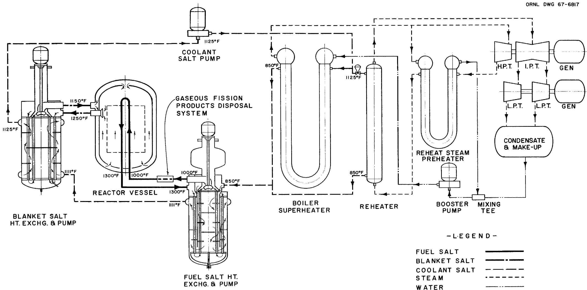  
Fig. 1. Flow Diagram for the Case-A Heat-Exchange System.

pressure of 9 psi. The second direct heat-conversion step is performed when the major portion (87%) of the coolant salt is circulated through the boiler superheater exchangers where its heat is released to the supercritical fluid.

The remaining portion (13%) of the coolant salt in the system is used to reheat the exhaust steam from the high-pressure turbine in the steam reheater exchanger. There is a possibility that the coolant salt in the steam reheater could be cooled to a temperature too close to its freezing point by the much cooler steam fed directly from the turbine exhaust. To avert possible freezing of the coolant salt, a reheat-steam preheater was included in the system wherein heat from a relatively small quantity of the high-temperature supercritical fluid raises the temperature of the reheat steam. For the same reason, the temperature of the supercritical fluid is raised before it enters the boiler superheaters by direct-contact heating.

The studies of the MSBR heat-exchange system progressed to a point where a better evaluation of the temperatures and pressures in the overall system could be made. The most objectionable single feature of the Case-A system is that there are points in the primary heat exchanger where the pressure of the fuel salt is higher than that of the coolant salt, particularly where the fuel salt enters at a pressure of 85.8 psi and the coolant salt exits at a pressure of 28.5 psi. When efforts were directed toward correcting this feature, other areas where improvements in the system could be made became evident. The revised design that we refer to as the Case-B system was developed by the reactor designers to improve the overall operation of the heat-exchange system. The Case-B system required the redesign of the primary, blanket-salt, boiler superheater, and steam reheater exchangers, and the resulting flow diagram for the system is shown in Fig. 2.

The operating pressures of the coolant-salt system in the Case-B design were raised to assure that any leakage in the overall system would be from the coolant-salt system into the fuel or blanket salt system. The Case-B system has a further advantage over the Case-A system in that the pressures of the molten salts in contact with the graphite tubes in the reactor core are lower. At the top of the reactor where

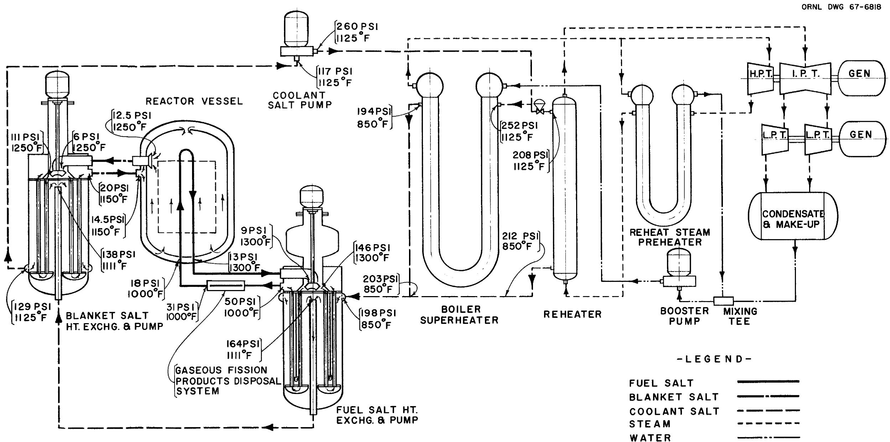  
Fig. 2. Flow Diagram for the Case-B Heat-Exchange System.

pressures are at a minimum, the pressure of the fuel salt in the graphite tubes in the Case-A system is 83.5 psi, while that of the blanket salt outside the tubes is 95.8 psi. At the bottom of the reactor where the pressures are maximum, the pressure of the fuel salt is 95 psi and the corresponding pressure of the blanket salt is 115.8 psi.

In the Case-B system, where the pressures are at a minimum at the top of the reactor, the pressure of the fuel salt circulating through the graphite tubes is 6.5 psi, while the pressure of the blanket salt outside the tubes at that point is 12.5 psi. At the bottom of the reactor where the pressures are maximum, the pressure of the fuel salt is 18 psi and the corresponding pressure of the blanket salt is 32.5 psi.

This lowering of the pressure of the fuel and blanket salts in the reactor for the Case-B system is accomplished by reversing the flow of the fuel and blanket salts through the respective pumps and exchangers and through the reactor core. The fuel salt leaving the reactor core at a temperature of $1300^{\circ}\mathrm{F}$ and a pressure of 13 psi enters the suction side of the fuel-salt pump and is discharged into the primary heat exchanger at a pressure of 146 psi. It is circulated through the tubes of the exchanger and then reenters the reactor at a temperature of $1000^{\circ}\mathrm{F}$ and a pressure of 18 psi. The blanket salt leaving the reactor core at a temperature of $1250^{\circ}\mathrm{F}$ and a pressure of 12.5 psi enters the suction side of the blanket-salt pump and is discharged into the blanket-salt exchanger at a pressure of 111 psi. It is circulated through the tubes in the exchanger and then reenters the reactor at a temperature of $1150^{\circ}\mathrm{F}$ and a pressure of 14.5 psi.

To study the effects of having a coolant salt with a lower and more favorable freezing-point temperature in the system, another modification of the Case-A heat-exchange system was developed. Case C involves lowering the inlet temperatures of the steam reheaters and the boiler superheaters, eliminating the reheat-steam preheaters and the need for direct-contact heating of the supercritical fluid before it enters the superheaters. The turbine exhaust steam is fed directly to the steam reheaters at a temperature of $552^{\circ}\mathrm{F}$ , and the supercritical fluid enters the boiler superheaters at a temperature of $580^{\circ}\mathrm{F}$ .

# Factors Affecting Design of Heat Exchangers

Several factors other than operating temperatures and pressures also had to be taken into account before the designs for the various components of the heat-exchange system could be developed. Those factors included consideration of the materials that could be used to construct the components, the maintenance philosophy to be followed, and the feasibility of the concept as a whole.

# Materials

Metal surfaces in frequent contact with molten fluoride salts must have corrosion resistance not provided by conventional materials. Hastelloy N, originally developed as INOR-8 specifically for use with molten fluoride salts, was designated by the designers of the MSBR as the structural material for all components in the fuel, blanket, and coolant systems that are in contact with molten salts.

The preheater and high-temperature steam piping will be made of Croloy, 2 $1/4\%$ chrome and $1\%$ molybdenum. Carbon steel can be used for those surfaces in contact with water at temperatures below $700^{\circ}\mathrm{F}$ , as specified in Section III of the ASME Boiler and Pressure Vessel Code.[2]

# Maintenance Philosophy

Certain features of the designs for the heat exchangers are governed by the maintenance philosophy to be applied to them. We believe that the reliability of the exchangers can be held at a high level through quality control in design and fabrication. Therefore, the maintenance philosophy we adopted predicates that defective exchangers will be replaced with new ones rather than being repaired in place. This attitude is necessary for the primary and blanket exchangers because of the high level

of radioactivity that they will incur during operation at full power. When an exchanger must be removed from its temperature-controlled shielding cell, it will have to be placed in another shielded cell for an indefinite period.

Those exchangers that contain no fuel or blanket salt are not likely to reach as high a level of radioactivity during operation as the primary and blanket exchangers, but the level reached will probably be high enough to prevent direct repair in place. If they fail, these exchangers will also be replaced, and after the required decay time, they will be repaired. Removal and subsequent repair of the exchangers in the steam system constitute major operations, but no provisions for repairing them have yet been made. In the final design, such provisions would be based on industrial experience and practice with conventional heat exchangers that are operated in the same pressure and temperature range as those used in this application.

# Feasibility

Some of the features of the designs for the heat exchangers that had to be investigated to demonstrate the feasibility of the concept are worth mentioning here. In each of the exchangers that have molten salt on the shell side, a baffle extends across the entire cross-sectional area of the shell at a distance of 0.5 in. from the tube sheet. This provides a stagnant layer of molten salt between the tube sheet and the circulating molten salt, and this insulating layer of salt serves to reduce the temperature drop across the tube sheet. As conceived, the tube-to-tubesheet connection is to be made by rolling at two places within the thickness of the tube sheet and welding at the end of the tube. Trepanning the tube sheet around each tube makes a reliable tube-to-tube-sheet weld possible.

In cases where the shell-side fluid travels for considerable distance without baffling, small ring baffles are used to break the flow between the outermost tubes and the shell. In some cases, long tube lengths are unsupported by baffles. Although the drawings do not show it, these tubes can be held in place by some form of wire-mesh tube support.

# Heat-Transfer and Pressure-Drop Calculations

The values for the physical properties of the fuel, blanket, and coolant salt that were used in the preliminary calculations were provided by the designers of the MSBR. These are given in Table 1. Because of the unusual situations involved in this heat-exchange system, we searched the literature to determine correlations between reported conditions and those of our particular application and to select the physical properties most nearly suited to those involved in our application. From the material searched, we developed the bases for our heat-transfer and pressure-drop calculations.

For calculations involving heat transfer by forced convection through a molten-salt film inside a tube with a small diameter, we used data reported by MacPherson and Yarosh.3 From the data, the following equation was written.

$$
\frac {\mathrm {h} _ {i} \mathrm {d} _ {i}}{\mathrm {k}} = 0. 0 0 0 0 6 5 \left(\mathrm {N} _ {\mathrm {R e}}\right) ^ {1} \cdot^ {4 3} \left(\mathrm {N} _ {\mathrm {P r}}\right) ^ {0} \cdot^ {4}, \tag {1}
$$

where

$$
h _ {1} = \text {h e a t t r a n s f e r c o e f f i c i e n t i n s d e t u b e , B t u / h r} ^ {2} \cdot {} ^ {\circ} F,
$$

$$
\mathbf {d} _ {\mathbf {j}} = \text {i n s i d e}
$$

$$
k = \text {t h e r m a l} B t u / h r \cdot f t ^ {2} \cdot {} ^ {0} F p e r f t,
$$

$$
\mathrm {N} _ {\text {R e}} = \text {R e y n o l d s n u m b e r},
$$

$$
\mathrm {N} _ {\mathrm {P r}} = \text {P r a n d t l n u m b e r}.
$$

Equation 1 was used when $\mathbf{N}_{\mathrm{Re}} < 10,000$ and Eq. 2, the Dittus-Boelter equation, was used when $\mathbf{N}_{\mathrm{Re}} \geq 10,000$ .

$$
\frac {h _ {i} d _ {i}}{k} = 0. 0 2 3 \left(N _ {R e}\right) ^ {0. 8} \left(N _ {P r}\right) ^ {0. 4}. \tag {2}
$$

Table 1. Values for Fuel-, Blanket-, and Coolant-Salt Properties Used in Preliminary Calculations for MSBR-Heat-Transfer Equipment   

<table><tr><td></td><td>Fuel Salt</td><td>Blanket Salt</td><td>Coolant Salt</td></tr><tr><td>Reference temperature, ℘F</td><td>1150</td><td>1200</td><td>988</td></tr><tr><td>Composition</td><td>LiF-BeF2-UF4</td><td>LiF-ThF4-BeF2</td><td>NaF-NaBF4</td></tr><tr><td>Molecular weight, approximate</td><td>34.3</td><td>102.6</td><td>68.3</td></tr><tr><td>Liquidus temperature, ℘F</td><td>842</td><td>1040</td><td>579</td></tr><tr><td>Density, lb/ft3</td><td>127 ± 6(a)</td><td>277 ± 14(a)</td><td>about 125</td></tr><tr><td>Viscosity, lb/hr·ft</td><td>27 ± 3</td><td>38 ± 19(a)</td><td>12</td></tr><tr><td>Thermal conductivity Btu/hr·ft3·°F per ft</td><td>1.5(b)</td><td>1.5(c)</td><td>1.3(c)</td></tr><tr><td>Heat capacity, Btu/lb·°F</td><td>0.55 ± 0.14</td><td>0.22 ± 0.055</td><td>about 0.41</td></tr></table>

(a) Internal memo MSBR-D-24 from Stanley Cantor to E. S. Bettis July 15, 1965, Subject: Physical Property Estimates of MSBR Reference-Design Fuel and Blanket Salts.   
(b) A value of 4.0 Btu/hr·ft².°F per ft was used for the thermal conductivity of the fuel salt in the calculations for the Case-A primary exchanger. Subsequent to the calculatory work done for the Case-A primary exchanger, the improved estimated value of 1.5 was obtained and used.   
(c)W. R. Gambill, "Prediction of Thermal Conductivity of Fused Salts," Internal Document, Oak Ridge National Laboratory, August 1956.

In all instances of baffled flow, we made use of the work of O. P. Bergelin et al. $^{4,5}$ for both the heat-transfer and the pressure calculations. Four out of five of the heat exchangers have coolant salt on the shell side, and in each of these four exchangers, the flow of the coolant salt is directed by baffles. A relation between a heat transfer factor J and the Reynolds number for such baffled flow is illustrated in graphic form in Fig. 11 of Ref. 4. Based on the outside diameter of the tube, the Reynolds number,

$$
\mathrm {N} _ {\text {R e}} = \frac {\mathrm {d} _ {\mathrm {o}} G}{\mu_ {\mathrm {b}}} , \tag {3}
$$

where

$\mathbf{d}_{\mathbf{o}} =$ outside diameter of the tube,

$G =$ mass velocity of fluid, $1b / hr\cdot ft^2$

$\mu_{\mathrm{b}} =$ viscosity at temperature of bulk fluid, 1b/hr·ft.

The heat transfer factor for the window area,

$$
J _ {w} = \frac {h _ {w}}{C G _ {m}} \left(\frac {C _ {p} ^ {\mu_ {b}}}{k}\right) ^ {2 / 3} \left(\frac {\mu_ {i}}{\mu_ {b}}\right) ^ {0. 1 4}, \tag {4}
$$

where

$\mathbf{h}_{\mathbf{w}} =$ heat transfer coefficient for window area, Btu/hr·ft²·°F,

$C_p =$ specific heat,

$G_{m} =$ mean mass velocity of fluid, $1b / hr\cdot ft^2,$

$\mathbf{k} =$ thermal conductivity, Btu/hr·ft²·0F per ft,

$\mu_{b} =$ viscosity at temperature of bulk fluid, $\mathrm{lb / hr}\cdot \mathrm{ft},$

$\mu_{i} =$ viscosity at temperature of tube surface, $1b / hr\cdot ft.$

The heat transfer factor for the cross-flow area,

$$
J _ {B} = \frac {h _ {B}}{C _ {p} G _ {B}} \left(\frac {C _ {p} \mu_ {b}}{k}\right) ^ {2 / 3} \left(\frac {\mu_ {i}}{\mu_ {b}}\right) ^ {0. 1 4}. \tag {5}
$$

In some instances, values of $J$ were read from the graph and the heat transfer coefficients were determined from the equation. In other instances, particularly where machine computation was used, the following approximate equations derived from the graph were used to determine $J$ .

$$
\text {F o r} 8 0 0 \leq N _ {\mathrm {R e}} \leq 1 0 ^ {5}, J = 0. 3 4 6 N _ {\mathrm {R e}} ^ {- 0. 3 8 2}. \tag {6}
$$

$$
\text {F o r} 1 0 0 \leq N _ {\mathrm {R e}} \leq 8 0 0, J = 0. 5 7 1 N _ {\mathrm {R e}} ^ {- 0. 4 5 6}. \tag {7}
$$

The value of the heat transfer coefficient for the window area, $h_w$ , and the value for the cross-flow area, $h_b$ , were then combined in Eq. 8 to determine the total heat-transfer coefficient.

$$
\mathrm {h} _ {\mathrm {t}} \mathrm {a} _ {\mathrm {t}} = \mathrm {h} _ {\mathrm {B}} \mathrm {a} _ {\mathrm {B}} + \mathrm {h} _ {\mathrm {w}} \mathrm {a} _ {\mathrm {w}}, \tag {8}
$$

where $a =$ the heat transfer surface, $ft^2 / ft$ .

These relationships were used to determine values for the heat transfer coefficients on the shell side of baffled exchangers. The data reported by Bergelin, $^{4,5}$ and therefore the relationships given above, were based on work with half-moon shaped baffles with straight edges, whereas in the study reported here, disk and doughnut baffles were used in all the exchangers except the superheater. The adaptation of Bergelin's data to disk and doughnut baffles involved certain interpretations. The "number of major restrictions encountered in cross flow" referred to in Bergelin's work was interpreted for tubes arranged in triangular array as being the number of rows of tubes, $r$ , in cross flow. Cross flow for disk and doughnut baffles varies in direction through $360^{\circ}$ . For $30^{\circ}$ of change in direction, the distance between tube rows will vary from the pitch p to $0.866p$ . Therefore, an average of these two extremes was used to calculate $r$ .

$$
r = \frac {\text {c r o s s - f l o w d i s t a n c e}}{\frac {1 + 0 . 8 6 6}{2} p}. \tag {9}
$$

Where an arrangement has the tubes placed in concentric circular rings, $r$ is simply the number of rings in the cross-flow area.

In calculating the flow area, $A_{w}$ , for the fluid moving outward from the doughnut opening of diameter $D_{d}$ , we made use of the approximate equation for the number of tubes, $n$ , in a circular band with a width equal to 1 pitch, $p$ .

$$
n = \frac {\pi D _ {d} p}{0 . 9 p ^ {2}} = \frac {\pi D _ {d}}{0 . 9 p}. \tag {10}
$$

For the values of $\mathbf{D_d}$ involved, the factor 0.9 lies between 0.8 and 1; our choice of 0.9 was arbitrary. Then,

$$
A _ {w} / X = \pi D _ {d} - n d _ {o},
$$

where

$$
X = \text {t h e}
$$

$$
d _ {0} = \text {t h e o u t s i d e d i a m e t e r o f t h e t u b e}.
$$

The number of tubes of given size and pitch arranged in triangular array that can fit into a cylindrical shell,

$$
n = \frac {1}{K ^ {2}} \left(\frac {D ^ {2}}{P ^ {2}}\right), \tag {11}
$$

where

$$
K = \text {c o r r e c t i o n}
$$

$$
D = \text {t h e}
$$

$$
p = p i t c h o f t h e t u b e s.
$$

The value of $\mathbf{K}$ decreases with the increasing ratio between $\mathbf{D}$ and $\mathbf{p}$ . The value $\mathbf{K} = 1.15$ is sometimes used for triangular array, and the value $\mathbf{K} = 1.12$ was used in the calculations for the reheater exchanger. This compromise value has been checked by graphic methods and found reasonable for our applications.

The number of tubes passing through the window in a doughnut baffle,

$$
n = A _ {w} / 0. 8 6 6 p ^ {3}.
$$

In this case, there is no space devoid of tubes near the outside of the circular window as is found in the case of the cylindrical shell.

For heat transfer calculations involving parallel flow on the shell side, we used the data reported by Short. The heat transfer coefficient outside of the tubes,

$$
h _ {0} = 0. 1 6 \frac {k}{d _ {0}} \left(\frac {d _ {0} G}{\mu_ {b}}\right) ^ {0. 6} \left(\frac {C _ {p} \mu_ {b}}{k}\right) ^ {0. 3 3}. \tag {12}
$$

This equation was used in the design calculations for the reheat-steam preheater and the parallel-flow portion of the Case-A primary exchanger.

The superheater and the preheater both involve supercritical fluid, and the data reported by Swenson et al.7 was used extensively in calculating the heat transfer coefficients for those components. The correlation recommended in this work is given below.

$$
\frac {h _ {i} d _ {i}}{k _ {i}} = 0. 0 0 4 5 9 \left(\frac {d _ {i} G}{\mu_ {i}}\right) ^ {0. 9 2 3} \left[ \frac {H _ {i} - H _ {b}}{t _ {i} - t _ {b}} \left(\frac {\mu_ {i}}{k _ {i}}\right) \right] ^ {0. 6 1 3} \left(\frac {v _ {b}}{v _ {i}}\right) ^ {0. 2 3 1}, \tag {13}
$$

where

$h_i =$ heat transfer coefficient inside tube, Btu/hr·ft²·°F,

$\mathbf{d}_{\mathbf{i}} =$ inside diameter of tube,

$k_{i} =$ thermal conductivity inside tube, Btu/hr·ft²· ${}^{0}$ F per ft,

G = mass velocity of fluid, lb/hr·ft²,

$\mu_{i} =$ viscosity of fluid at temperature inside tube, $1b / hr \cdot ft,$

$\mathbf{H}_{\mathbf{i}} =$ enthalpy at temperature inside tube, Btu/1b,

$\mathbf{H}_{\mathfrak{h}} =$ enthalpy at temperature of bulk fluid, Btu/1b,

$\mathbf{t}_{\mathrm{j}} =$ temperature of fluid inside tube, ${}^{\circ}\mathbf{F},$

$t_b =$ temperature of bulk fluid, ${}^{\circ}\mathbb{F},$

$\mathbf{v}_{\mathrm{b}} =$ specific volume of bulk fluid, ft³/1b,

$\mathbf{v}_{i} =$ specific volume of fluid inside tube, ft³/lb.

The physical properties of supercritical fluid under various conditions of pressure and temperature were taken from data reported by Keenan and Keyes<sup>8</sup> and by Nowak and Grosh.<sup>9</sup>

The pressure drops in the shell side of the exchangers were calculated by using Bergelin's equations.4

$$
\Delta P _ {\text {c r o s s f l o w}} = 0. 6 r _ {B} \rho \frac {V _ {B} ^ {2}}{2 g _ {C}} \text {a n d} \tag {14}
$$

$$
\Delta P _ {\text {w i n d o w}} = \left(2 + 0. 6 r _ {w}\right) \frac {\rho V _ {m} ^ {2}}{2 g _ {c}}, \tag {15}
$$

where

$$
\mathbf {r} = \text {n u m b e r o f r e s c i r t i o n s},
$$

$$
V _ {m} = \text {m e a n v e l o c i t y}, f t / \sec ,
$$

$$
V _ {B} = \text {c r o s s - f l o w v e l o c i t y , f t / s e c .}
$$

# Stress Analyses

Stress calculations were made for each of the heat exchangers. Where possible, the shear stress theory of failure was used as the failure criterion, the stresses were classified, and the limits of stress intensity were determined in accordance with the methods prescribed in Section III of the ASME Boiler and Pressure Vessel Code.[2]

The analyses were performed by treating thermally induced stresses as secondary stresses in a single-cycle analysis rather than in a multicyclic analysis. This procedure should assure adequate strength so that future analyses based on cyclic considerations should not result in severe revisions to the geometries of the exchangers. A departure from the maximum shear stress theory of failure occurred in the analysis of

the tube sheets of the exchangers. These were analyzed by using the maximum normal stress theory of failure and the allowable stress intensity values applicable to an analysis based on the maximum shear stress theory of failure. No consideration was given to the support of these vessels or to the loads induced by piping restraints.

The thicknesses of the heads, shells, tube sheets, and tubes were chosen to withstand the maximum pressure and thermal stresses at the respective temperatures in the material. The exchangers were tentatively designed, and the stresses caused by differential expansion and discontinuities were checked to be sure that the allowable stress at the maximum temperature had not been exceeded.

These analyses reported here are preliminary, but their extent is considered sufficient to appraise the integrity of the conceptual designs for the heat exchangers. More rigorous analyses would be required to investigate cycling and off-design-point operations such as startup or a hazardous incident.

# 4. DESIGN FOR PRIMARY HEAT EXCHANGERS

The four primary fuel-salt-to-coolant-salt heat exchangers are shell-and-tube two-pass exchangers with disk and doughnut baffles. The basic geometry of the top-supported vertical exchangers, the material to be used to fabricate them, and the size of the tubes were established by the designers of the MSBR. The structural material selected for the primary exchangers was Hastelloy N, and the tube chosen was one with an outside diameter of 3/8 in. and a wall thickness of 0.035 in.

# Case A

The criteria governing the design for the primary heat exchangers for Case A that were fixed by the system are

1. the temperatures and pressures of the incoming and outgoing coolant salt,   
2. the temperatures and pressures of the incoming and outgoing fuel salt,   
3. the flow rates of the coolant salt and the fuel salt, and   
4. the total heat to be transferred.

The design developed for the Case-A primary heat exchanger is shown in Fig. 3. The exchanger is about 5.5 ft in diameter and 18.5 ft high, including the bowl of the circulating pump. The inlet of the fuel-salt pump is connected to the exchanger, and the fuel salt from the reactor enters the exchanger from the 18-in.-diameter inner passage of the concentric pipes connecting the reactor and exchanger. The fuel salt flows downward in the exchanger through the rows of tubes in the outer annular section, and upon reaching the bottom of the shell, it reverses direction and moves upward through the tubes in the center section.

The coolant salt enters the exchanger at the top and flows downward, countercurrent to the flow of the fuel salt, through the center section. Upon reaching the bottom of the shell, the coolant salt turns and flows upward around the tubes in the outer annular section and leaves the exchanger through the annular collecting ring at the top.

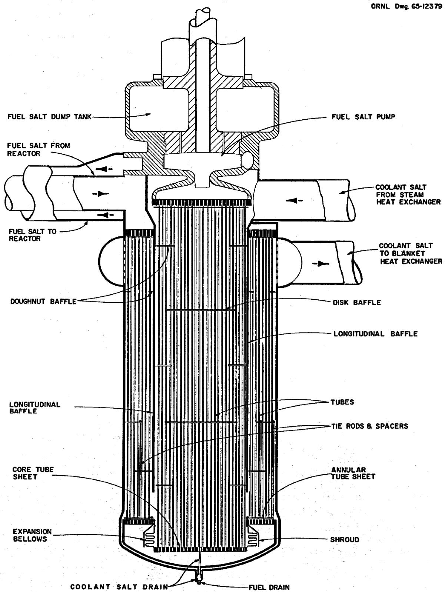  
Fig. 3. Primary Fuel-Salt-to-Coolant-Salt Heat Exchanger for Case A.

During the preliminary stages of the design for the Case-A primary heat exchangers, a computer study was made to determine the effects on the area of the heat-transfer surface of varying the pitch, the baffles size and spacing, and the ratio of the number of tubes in the two sections. The computer code established the minimum baffle spacing limited by thermal stress in the tubes and then increased the spacing as necessary to remain within the pressure-drop limitations. The thermal-stress criteria for the computer code were based on the worst possible conditions in each section of the exchanger, and as a result, the annular section was designed without baffles. It was therefore necessary to make "hand" calculations for an exchanger with several baffles in the bottom of the annular section. This changed the baffle spacing in the center section, the ratio of the tubes in the two sections, and the length of the exchanger. The resulting design data for the Case-A primary exchanger are given in Table 2.

Table 2. Primary Heat Exchanger Design Data for Case A   

<table><tr><td>Type</td><td>Shell-and-tube two-pass vertical exchanger with disk and doughnut baffles</td></tr><tr><td>Number required</td><td>4</td></tr><tr><td>Rate of heat transfer, each, Mw</td><td>528.5</td></tr><tr><td>Btu/hr</td><td>1.8046 x 109</td></tr><tr><td>Shell-side conditions</td><td></td></tr><tr><td>Cold fluid</td><td>Coolant salt</td></tr><tr><td>Entrance temperature,OF</td><td>850</td></tr><tr><td>Exit temperature,OF</td><td>1111</td></tr><tr><td>Entrance pressure,psi</td><td>79.2</td></tr><tr><td>Exit pressure,psi</td><td>28.5</td></tr><tr><td>Pressure drop across exchanger,psi</td><td>50.7</td></tr><tr><td>Mass flow rate, lb/hr</td><td>1.685 x 107</td></tr><tr><td>Tube-side conditions</td><td></td></tr><tr><td>Hot fluid</td><td>Fuel salt</td></tr><tr><td>Entrance temperature,OF</td><td>1300</td></tr><tr><td>Exit temperature,OF</td><td>1000</td></tr><tr><td>Entrance pressure,psi</td><td>85.8</td></tr><tr><td>Exit pressure,psi</td><td>0</td></tr><tr><td>Pressure drop across exchanger,psi</td><td>85.8</td></tr><tr><td>Mass flow rate, lb/hr</td><td>1.093 x 107</td></tr><tr><td colspan="2">Mass velocity, lb/hr·ft2</td></tr><tr><td>Center section</td><td>5.95 x 106</td></tr><tr><td>Annular section</td><td>5.175 x 106</td></tr><tr><td>Velocity, fps</td><td></td></tr><tr><td>Center section</td><td>13.0</td></tr><tr><td>Annular section</td><td>11.3</td></tr><tr><td>Tube material</td><td>Hastelloy N</td></tr><tr><td>Tube OD, in.</td><td>0.375</td></tr><tr><td>Tube thickness, in.</td><td>0.035</td></tr><tr><td>Tube length, tube sheet to tube sheet, ft Center section</td><td>13.7</td></tr><tr><td>Annular</td><td>11.7</td></tr><tr><td>Shell material</td><td>Hastelloy N</td></tr><tr><td>Shell thickness, in.</td><td>0.5</td></tr><tr><td>Shell ID, in.</td><td></td></tr><tr><td>Center section</td><td>40.25</td></tr><tr><td>Annular section</td><td>66.5</td></tr><tr><td>Tube sheet material</td><td>Hastelloy N</td></tr><tr><td>Tube sheet thickness, in.</td><td></td></tr><tr><td>Top annular section</td><td>3.62</td></tr><tr><td>Bottom annular section</td><td>1.75</td></tr><tr><td>Top and bottom center section</td><td>1.0</td></tr><tr><td>Number of tubes</td><td></td></tr><tr><td>Center section</td><td>3624</td></tr><tr><td>Annular section</td><td>4167</td></tr><tr><td>Pitch of tubes, in.</td><td></td></tr><tr><td>Center section</td><td>0.625</td></tr><tr><td>Annular section</td><td>0.750</td></tr><tr><td colspan="2">Total heat transfer area per exchanger, ft2</td></tr><tr><td>Center section</td><td>4875</td></tr><tr><td>Annular section</td><td>4790</td></tr><tr><td>Total</td><td>9665</td></tr><tr><td>Basis for area calculation</td><td>Tube outside diameter</td></tr><tr><td>Type of baffle</td><td>Disk and doughnut</td></tr><tr><td>Number of baffles</td><td></td></tr><tr><td>Center section</td><td>5</td></tr><tr><td>Annular section</td><td>2</td></tr><tr><td>Baffle spacing, in.</td><td></td></tr><tr><td>Center section</td><td>27.4</td></tr><tr><td>Annular section</td><td>21</td></tr></table>

Table 2 (continued)   

<table><tr><td colspan="2">Disk OD, in.</td></tr><tr><td>Center section</td><td>30.6</td></tr><tr><td>Annular section</td><td>55.8</td></tr><tr><td>Doughnut ID, Center section</td><td>25.0</td></tr><tr><td>Annular section</td><td>51.0</td></tr><tr><td>Overall heat transfer coefficient, U, Btu/hr·ft2</td><td>1106</td></tr><tr><td colspan="2">Maximum stress intensity, a psi Tube</td></tr><tr><td>Calculated</td><td>Pm=413; (Pm+Q)=12,017</td></tr><tr><td>Allowable</td><td>Pm=Sm=4600; (Pm+Q)=3Sm=13,800</td></tr><tr><td colspan="2">Shell</td></tr><tr><td>Calculated</td><td>Pm=6156; (Pm+Q)=21,589</td></tr><tr><td>Allowable</td><td>Pm=Sm=12,000; (Pm+Q)=3Sm=36,000</td></tr><tr><td colspan="2">Maximum tube sheet stress, psi</td></tr><tr><td>Calculated</td><td>10,750</td></tr><tr><td>Allowable</td><td>10,750</td></tr></table>

aThe symbols are those of Section III of the ASME Boiler and Pressure Vessel Code, where

$$
P _ {m} = \text {p r i m a r y}
$$

$$
Q = \text {s e c o n d a r y}
$$

$$
S _ {m} = \text {a l l o w a b l e}
$$

# Case B

In the reverse-flow heat-exchange system of Case B, the fuel-salt and blanket-salt flows were reversed from those of Case A, and the operating pressures of the coolant-salt system were increased. This involved redesign of the primary heat exchanger, as well as some of the other components of the system. The design for the primary heat exchanger for Case B is illustrated in Fig. 4.

ORNL DWG 67-6819

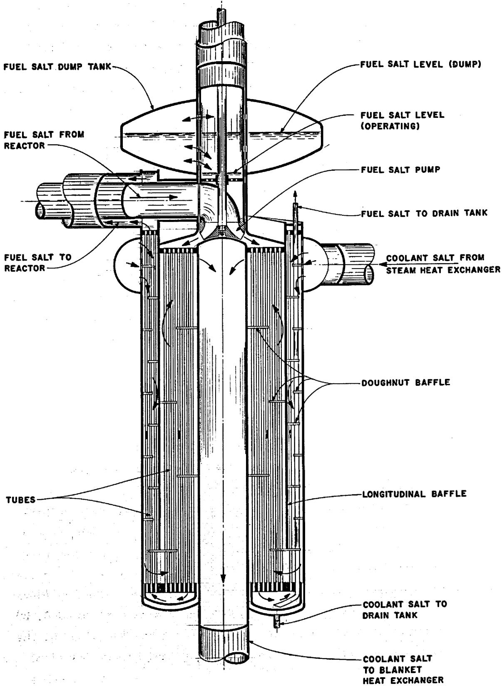  
Fig. 4. Primary Fuel-Salt-to-Coolant-Salt Heat Exchanger for Case B.

As may be seen in Fig. 4, the flow of the fuel salt in the exchanger for Case B is reversed from that in Case A, with the outlet of the fuel-salt pump connected to the exchanger. Fuel salt enters the exchanger in the inner annular region, flows downward through the tubes, and then upward through the tubes in the outer annular region before entering the reactor. The coolant salt enters the exchanger through the annular volute at the top. It then flows downward through the baffled outer region, reverses to flow upward through the baffled inner annular region, and exits through a central pipe.

In this design, a floating head is used to reverse the flow of the fuel salt in the exchanger. This was done to accommodate the differential thermal expansion between the tubes and the shell and central pipe. The expansion bellows of the Case-A design was eliminated, and differential thermal expansion between the inner and outer tubes is accommodated by using sine-wave type bent tubes in the inner annulus and straight tubes in the outer annulus. Doughnut-shaped baffles are used in both annuli. Those in the inner annulus have no overlap so that the bent tubes have a longer unrestrained bend.

# Design Variables

Before making any detailed calculations for the design of the primary heat exchanger for Case B, we fixed a number of the design variables on the basis of our own judgment.

Tube Pitch. As previously stated, the tubes in the inner annulus are bent and those in the outer annulus are straight. To simplify the bend schedule for the tubes in the inner annulus, these tubes are placed in concentric circles with a constant delta radius and a nearly constant circumferential pitch. The bends in the tubes are made in the cylindrical surface that locates each ring of tubes. A radial spacing of 0.600 in. was selected for these bent tubes in the inner annulus as being the minimum spacing practical for assembly. The spacing was increased to 0.673 in. in the circumferential direction because the distance between the tubes at the bends is somewhat less than the circumferential pitch.

The tubes in the outer annulus are located on a triangular pitch. The dimension for this pitch, 0.625 in., was selected on the basis of the calculations done for the Case-A primary exchanger. This spacing resulted in an efficient use of the shell-side pressure drop.

Number of Tubes. The number of tubes in each annular region is determined by the allowable pressure drop on the inside of the tubes. Since for Case B, the heat-transfer efficiency of the inner annulus needed to be lowered to minimize the temperature drop across the tube walls, the number of tubes chosen for the outer annulus was less than the number chosen for the inner annulus. This number of tubes in the outer annulus was further reduced until all of the allowable pressure drop for the fuel salt was utilized. The resulting number of tubes in the outer annulus was 3794 with 4347 tubes in the inner annulus.

Lengths of Annular Regions. The length of the exchanger and the number and size of the baffles determines the flow conditions for the coolant-salt pressure drops and the heat-transfer coefficients. Preliminary calculations showed that the exchanger would be approximately 15 ft long, with a recess of about 1 ft for the pump. A 14-to-15 ratio was established for the lengths of the inner and outer annuli.

Baffle Spacing and Size. The baffle spacing in the inner annulus is limited by the length required for the unrestrained bends in the tubes and the maximum allowable temperature drop across the tube wall. The use of smaller distances between baffles results in larger outside film coefficients and therefore smaller film drops. This increases the temperature drop across the tube wall. The number of baffles selected for use in the inner annulus was four.

In the outer annulus, an attempt was made to select the baffle size and spacing combinations that would result in efficient use of the available shell-side pressure drop. Ten baffles were used in the outer annulus.

# Calculatory Procedures

After selecting the just-described design variables, the pressure drops, the required length of the exchanger, and the stresses in the tubes were calculated for the selected conditions, and these conditions were adjusted where necessary. Then the thicknesses required for the shell, skirt, tube sheets, and head of the exchanger were calculated. The detailed heat-transfer, pressure-drop, and stress-analysis calculations are given in Appendix A.

Pressure Drops. The pressure drops for the selected conditions were calculated, and where necessary, these conditions were adjusted to obtain the allowable pressure drops. The pressure drops inside the tubes were calculated by using Fanning's equation,

$$
\Delta P = \left[ \left(\frac {4 f L}{d _ {i}}\right) + 2 \right] \frac {G ^ {2}}{\rho 2 g _ {c}},
$$

where

$$
P = \text {p r e s s u r e}, \text {p s i},
$$

$$
\begin{array}{l} f = \text {f r i c t i o n} \\ = 0. 0 0 1 4 + \left(0. 1 2 5 / N _ {R e} ^ {0. 3 2}\right), \\ \end{array}
$$

$\mathbf{L} =$ length of tube, ft,

$\mathbf{d}_{\mathbf{i}} =$ inside diameter of tube,

$$
\begin{array}{l} G = \text {m a s s v e l o c i t y}, 1 b / h r ^ {\cdot} f t ^ {2}, \\ \rho = \text {d e n s i t y}, 1 b / f t ^ {3}, \\ \end{array}
$$

$$
g _ {c} = \text {g r a v i t a t i o n a l c o n v e s i o n c o n s t a n t}, 1 b _ {m} \cdot f t / 1 b _ {f} \cdot \sec^ {2}.
$$

The pressure drops in the coolant salt outside the tubes were calculated by using Bergelin's equations.

$$
\begin{array}{l} \Delta P _ {\text {c r o s s f l o w}} = 0. 6 \mathrm {r} \rho \frac {\mathrm {V} _ {\mathrm {B}} ^ {2}}{2 \mathrm {g} _ {\mathrm {C}}} \text {a n d} \\ \Delta P _ {\text {w i n d o w}} = (2 + 0. 6 r _ {w}) \frac {\rho V _ {m} ^ {3}}{2 g _ {c}}, \\ \end{array}
$$

where

$$
\begin{array}{l} r = \text {n u m b e r o f} \\ V _ {m} = \text {m e a n v e l o c i t y}, f t / \sec , \\ V _ {B} = \text {c r o s s - f l o w v e l o c i t y , f t / s e c .} \\ \end{array}
$$

These equations developed by Bergelin were the result of his experimental work with straight-edged baffles. However, we decided that the flow conditions for doughnut baffles would be similar to those for straight-edged baffles and that the same pressure-drop equations would be applicable.

Length of Exchanger. The required length of the exchanger for the selected conditions was calculated, and the selected conditions were adjusted until the calculated length equaled the assumed length. Six equations that state the conditions necessary for heat balance in the exchanger were combined, which resulted in a single equation with the length of the exchanger as a function of all the other variables. The development and use of this length equation is given in more detail in Appendix A.

Stress in Tubes. The stresses in the tubes were calculated, and if the allowable stresses were exceeded, the selected conditions were changed to lower the stress. The conceptual design for the exchanger was analyzed to determine the stress intensities existing in the tubes of the exchanger that were caused by the action of pressure, thermal gradients, and restraints imposed on the tubes by other portions of the exchanger. The major stresses produced in the tubes are

1. primary membrane stresses caused by pressure,   
2. secondary stresses caused by temperature gradients across the tube wall,   
3. discontinuity stresses at the junction of the tube and tube sheet, and   
4. secondary stresses at the mid-height of the inner tubes caused by differential expansion of the inner and outer tubes.

The analysis of the inner tubes was made by using an energy method with a simplified model of the tubes. These calculations for the stresses are given in more detail in Appendix A.

Thickities. The thicknesses required for the shell, skirt, tubes sheets, and head were calculated. The conceptual design for the exchanger was analyzed to determine the stress intensities or maximum normal stresses existing in the heat exchanger shells and tube sheets that are caused by the action of pressure and to determine the loads caused by the action of other portions of the exchanger. The major stresses in the shell are

1. primary membrane stresses caused by pressure and   
2. discontinuity stresses at the junction of the tube sheets and shell. The inlet and exit scrolls or toroidal turn-around chamber were not considered in this analysis. The shear stress theory of failure was used as the failure criterion, and the stresses were classified and the limits of stress intensity were determined in accordance with Section III of the ASME Boiler and Pressure Vessel Code.

The tube sheets were designed by using the maximum normal stress theory of failure and ligament efficiencies based on Section VIII of the ASME Boiler and Pressure Vessel Code. The tube sheets were considered to be simply supported, and the pressure caused by the tube loads and pressures were used to determine a uniform effective pressure to be used in this analysis.

# Results of Calculations

The calculations described in the preceding paragraphs are given in detail in Appendix A, and the resulting design data for the primary heat exchanger for Case B are given in Table 3.

Table 3. Primary Heat Exchanger Design Data for Case B   

<table><tr><td>Type</td><td>Shell-and-tube two-pass vertical exchanger with doughnut baffles</td></tr><tr><td>Number required</td><td>Four</td></tr><tr><td>Rate of heat transfer, each</td><td></td></tr><tr><td>Mw</td><td>528.5</td></tr><tr><td>Btu/hr</td><td>1.8046 x 109</td></tr><tr><td>Shell-side conditions</td><td></td></tr><tr><td>Cold fluid</td><td>Coolant salt</td></tr><tr><td>Entrance temperature, °F</td><td>850</td></tr><tr><td>Exit temperature, °F</td><td>1111</td></tr><tr><td>Entrance pressure, psi</td><td>198</td></tr><tr><td>Exit pressure, psi</td><td>164</td></tr><tr><td>Pressure drop across exchanger, psi</td><td>34</td></tr><tr><td>Mass flow rate, lb/hr</td><td>1.685 x 107</td></tr><tr><td>Tube-side conditions</td><td></td></tr><tr><td>Hot fluid</td><td>Fuel salt</td></tr><tr><td>Entrance temperature, °F</td><td>1300</td></tr><tr><td>Exit temperature, °F</td><td>1000</td></tr><tr><td>Entrance pressure, psi</td><td>146</td></tr><tr><td>Exit pressure, psi</td><td>50</td></tr><tr><td>Pressure drop across exchanger, psi</td><td>96</td></tr><tr><td>Mass flow rate, lb/hr</td><td>1.093 x 107</td></tr><tr><td>Tube material</td><td>Hastelloy N</td></tr><tr><td>Tube OD, in.</td><td>0.375</td></tr><tr><td>Tube thickness, in.</td><td>0.035</td></tr><tr><td>Tube length, tube sheet to tube sheet, ft</td><td></td></tr><tr><td>Inner annulus</td><td>15.286</td></tr><tr><td>Outer annulus</td><td>16.125</td></tr><tr><td>Shell material</td><td>Hastelloy N</td></tr><tr><td>Shell thickness, in.</td><td>1</td></tr><tr><td>Shell ID, in.</td><td>66.7</td></tr><tr><td>Tube sheet material</td><td>Hastelloy N</td></tr><tr><td>Tube sheet thickness, in.</td><td></td></tr><tr><td>Top outer annulus</td><td>1.5</td></tr><tr><td>Top inner annulus</td><td>2.5</td></tr><tr><td>Floating head</td><td>3.5</td></tr><tr><td>Number of tubes</td><td></td></tr><tr><td>Inner annulus</td><td>4347</td></tr><tr><td>Outer annulus</td><td>3794</td></tr><tr><td colspan="2">Pitch of tubes, in.</td></tr><tr><td>Inner annulus</td><td></td></tr><tr><td>Radial</td><td>0.600</td></tr><tr><td>Circumferential</td><td>0.673</td></tr><tr><td>Outer annulus, triangular</td><td>0.625</td></tr><tr><td>Type of baffle</td><td>Doughnut</td></tr><tr><td>Number of baffles</td><td></td></tr><tr><td>Inner annulus</td><td>4</td></tr><tr><td>Outer annulus</td><td>10</td></tr><tr><td>Maximum stress intensity, a psi Tube</td><td></td></tr><tr><td>Calculated</td><td>Pm= 285; (Pm+Q) = 6504</td></tr><tr><td>Allowable</td><td>Pm= Sm= 5850; (Pm+Q) = 3Sm= 17,500</td></tr><tr><td>Shell</td><td></td></tr><tr><td>Calculated</td><td>Pm= 6470; (Pm+Q) = 9945</td></tr><tr><td>Allowable</td><td>Pm= Sm= 18,750; (Pm+Q) = 3Sm= 56,250</td></tr><tr><td>Maximum tube sheet stress, calculated and allowable, psi</td><td></td></tr><tr><td>Inner annulus</td><td>3500</td></tr><tr><td>Outer annulus</td><td>17,000</td></tr><tr><td>Floating head</td><td>10,000</td></tr></table>

aThe symbols are those of Section III of the ASME Boiler and Pressure Vessel Code, where

$\mathbf{P}_{\mathfrak{m}} =$ primary membrane stress intensity,

$Q =$ secondary stress intensity, and

$\mathbf{S}_{\mathfrak{m}} =$ allowable stress intensity.

# 5. DESIGN FOR BLANKET-SALT HEAT EXCHANGERS

Heat accumulated in the blanket salt while it is circulating around the reactor core is transferred to the coolant salt by means of four shell-and-tube one-shell-pass two-tube-pass exchangers with disk and doughnut baffles. The basic geometry of the top-supported vertical exchangers, the material to be used to fabricate them, the tube size, and the approximate pressure drops were established by the designers of the MSBR. All surfaces of the blanket-salt exchanger that contact fluoride salts were to be made of Hastelloy N, the outside diameter of the tubes was specified as 0.375 in., and the wall thickness as 0.035 in. The blanket salt would circulate inside the tubes and the coolant salt through the shell. The pressure drop in the tubes was to be approximately 90 psi, and the pressure drop in the shell would be about 20 psi. Physical-property data pertaining to the blanket salt and the coolant salt were also supplied by the designers of the MSBR.

# Case A

The criteria governing the design for the blanket-salt exchangers for Case A that were fixed by their function in the overall system are the

1. inlet temperature of the blanket salt,   
2. outlet temperature of the blanket salt,   
3. mass flow rate of the blanket salt,   
4. inlet temperature of the coolant salt,   
5. outlet temperature of the coolant salt,   
6. mass flow rate of the coolant salt, and   
7. the total heat to be transferrred.

As shown in Fig. 5, the configuration of the blanket-salt heat exchanger for Case A is similar to that of the primary heat exchanger for Case A; that is, two passes were used on the tube side with the tubes arranged in two concentric regions and with the blanket-salt pump located at the top of the inner annulus. The inlet of the blanket-salt pump is connected to

ORNL Dwq.65-12380

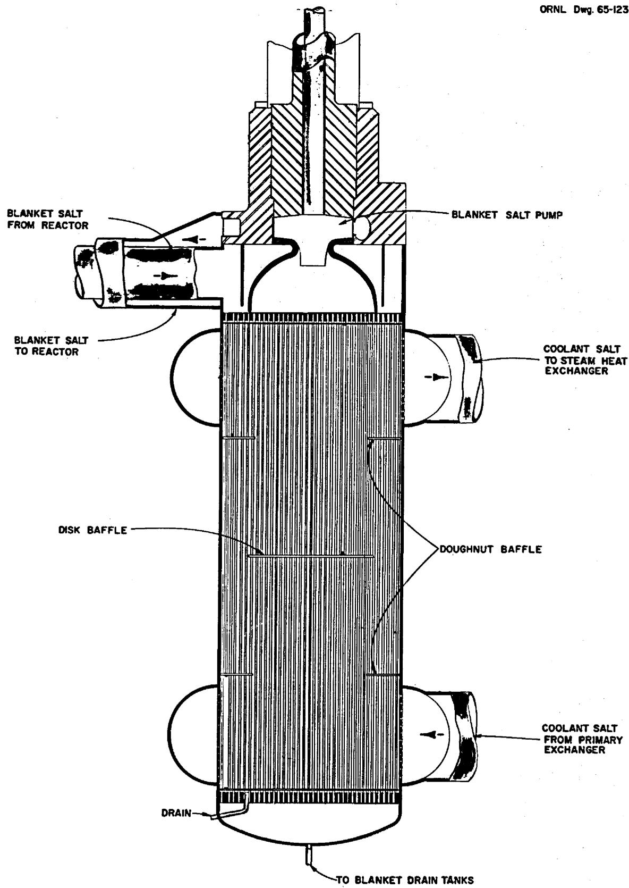  
Fig. 5. Blanket-Salt Heat Exchanger for Case A.

the exchanger, and the blanket salt from the reactor enters the exchanger and moves downward through the tubes in the outer annular region and then upward through the tubes in the inner annular region to the pump suction. Straight tubes with two tube sheets are used rather than U-tubes to permit drainage of the blanket salt.

The coolant salt passes through the primary heat exchangers and the blanket-salt heat exchangers in series. However, unlike the primary exchanger, a single coolant-salt pass on the shell side of the blanket-salt exchanger was judged adequate on the basis of the heat load, temperature conditions, and the advantage offered by the simplification of the design for the exchanger.

Before any values could be generated for the design of the blanket-salt heat exchanger for Case A, it was necessary to tentatively fix the values of some additional design variables. From several approximations, a triangular tube pitch of 0.8125 in. was chosen, and it was also decided that there would be an equal number of tubes in each annulus. Disk and doughnut baffles were selected to improve the shell-side heat transfer coefficient and to provide the necessary tube support. Baffles on the shell side of the tube sheets reduce the temperature difference across the sheets to keep thermal stresses within tolerable limits. An open-area-to-shell-cross-sectional-area ratio of 0.45 was selected for the baffles.

With these data fixed, values were calculated for the

1. number of tubes per annulus,   
2. diameter of the shell,   
3. size and spacing of the baffles,   
4. length of the tubes,   
5. thickness of the tube sheets,   
6. thickness of the shell, and   
7. thickness and shape of the heads.

These design values were dependent upon calculations and upon an analysis of the individual heat-transfer coefficients, shell-side and tube-side pressure drops, and the thermal and mechanical stresses. The resulting design data developed for the blanket-salt heat exchanger for Case A are given in Table 4.

Table 4. Blanket-Salt Heat Exchanger Design Data for Case A   

<table><tr><td>Type</td><td>Shell-and-tube one-shell-pass two-tube-pass exchan-ger, with disk and doughnut baffles</td></tr><tr><td>Number required</td><td>4</td></tr><tr><td>Rate of heat transfer per unit,Mw</td><td>27.75</td></tr><tr><td>Btu/hr</td><td>9.47 x 107</td></tr><tr><td>Shell-side conditions</td><td></td></tr><tr><td>Cold fluid</td><td>Coolant salt</td></tr><tr><td>Entrance temperature,OF</td><td>1111</td></tr><tr><td>Exit temperature,OF</td><td>1125</td></tr><tr><td>Entrance pressure,psi</td><td>26.5</td></tr><tr><td>Exit pressure,psi</td><td>9</td></tr><tr><td>Pressure drop across exchanger,psi</td><td>17.5</td></tr><tr><td>Mass flow rate,1b/hr</td><td>1.685 x 107</td></tr><tr><td>Tube-side conditions</td><td></td></tr><tr><td>Hot fluid</td><td>Blanket salt</td></tr><tr><td>Entrance temperature,OF</td><td>1250</td></tr><tr><td>Exit temperature,OF</td><td>1150</td></tr><tr><td>Entrance pressure,psi</td><td>90.3</td></tr><tr><td>Exit pressure,psi</td><td>0</td></tr><tr><td>Pressure drop across exchanger,psi</td><td>90.3</td></tr><tr><td>Mass flow rate,1b/hr</td><td>4.3 x 106</td></tr><tr><td>Mass velocity,1b/hr·ft2</td><td>10.48 x 106</td></tr><tr><td>Velocity,fps</td><td>10.5</td></tr><tr><td>Tube material</td><td>Hastelloy N</td></tr><tr><td>Tube OD,in.</td><td>0.375</td></tr><tr><td>Tube thickness,in.</td><td>0.035</td></tr><tr><td>Tube length,tube sheet to tube sheet,ft</td><td>8.25</td></tr><tr><td>Shell material</td><td>Hastelloy N</td></tr><tr><td>Shell thickness,in.</td><td>0.25</td></tr><tr><td>Shell ID,in.</td><td>36.5</td></tr><tr><td>Tube sheet material</td><td>Hastelloy N</td></tr><tr><td>Tube sheet thickness,in.</td><td>1.0</td></tr><tr><td>Number of tubes</td><td>1641 (~820 per pass)</td></tr><tr><td>Pitch of tubes,in.</td><td>0.8125</td></tr><tr><td>Total heat transfer area,ft2</td><td>1330</td></tr><tr><td>Basis for area calculation</td><td>Outside diameter</td></tr><tr><td>Type of baffle</td><td>Disk and doughnut</td></tr><tr><td>Number of baffles</td><td>3</td></tr><tr><td>Baffle spacing, in.</td><td>24.75</td></tr><tr><td>Disk OD, in.</td><td>26.5</td></tr><tr><td>Doughnut ID, in.</td><td>23</td></tr><tr><td>Overall heat transfer coefficient, U, Btu/hr·ft2</td><td>1016</td></tr><tr><td>Maximum stress intensity, a psi Tube</td><td></td></tr><tr><td>Calculated</td><td>Pm= 411; (Pm+Q) = 7837</td></tr><tr><td>Allowable</td><td>Pm= Sm= 6500; (Pm+Q) = 3Sm= 19,500</td></tr><tr><td>Shell</td><td></td></tr><tr><td>Calculated</td><td>Pm= 1663; (Pm+Q) = 11,140</td></tr><tr><td>Allowable</td><td>Pm= Sm= 12,000; (Pm+Q) = 3Sm= 36,000</td></tr><tr><td>Maximum tube sheet stress, psi</td><td></td></tr><tr><td>Calculated</td><td>2217</td></tr><tr><td>Allowable</td><td>5900 at 1200°F</td></tr></table>

aThe symbols are those of Section III of the ASME Boiler and Pressure Vessel Code, where   
$\mathbf{P}_{\mathfrak{m}} =$ primary membrane stress intensity,   
$Q =$ secondary stress intensity, and   
$\mathbf{S}_{\mathfrak{m}} =$ allowable stress intensity.

# Case B

In the reverse-flow heat exchange system of Case B, the flow of the blanket salt through the exchanger was reversed from that of Case A. The redesigned blanket-salt heat exchanger is illustrated in Fig. 6. The outlet of the blanket-salt pump is connected to the exchanger and the blanket salt enters the tubes in the inner annulus, flows downward, reverses direction, and flows upward through the tubes in the outer annulus and out to the reactor. The coolant salt from the primary exchanger enters the bottom of the blanket-salt exchanger to flow upward through a central

ORNL DWG 67-6820

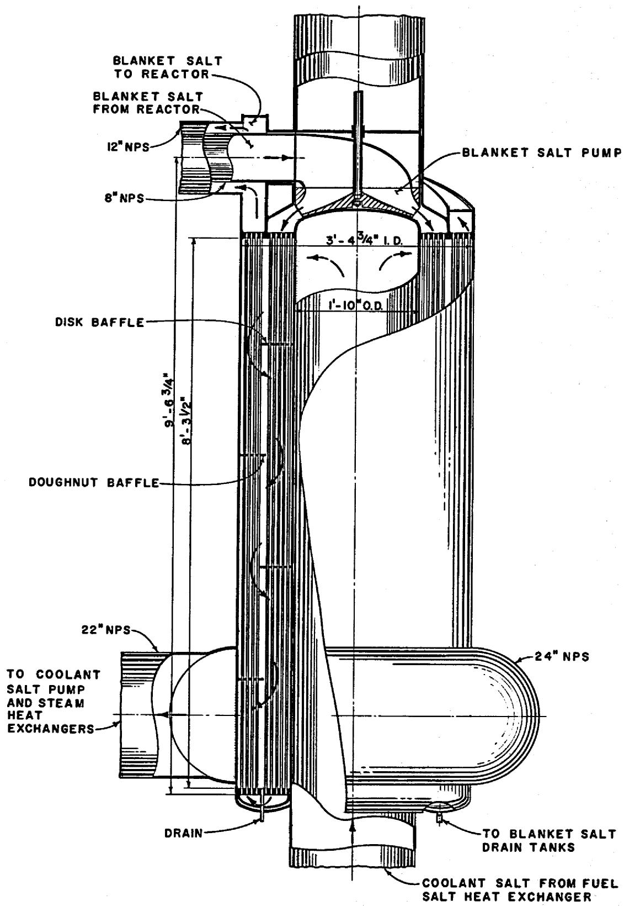  
Fig. 6. Blanket-Salt Heat Exchanger for Case B.

pipe and then make a single pass downward on the shell side of the exchanger before going out to the coolant-salt pumps.

A significant improvement over the Case-A design for the blanket-salt heat exchanger was the inclusion of a floating head in the Case-B design to reverse the flow of the blanket salt in the exchanger. This was done to accommodate thermal expansion between the tubes and the shell and the central pipe. However, unlike the Case-B primary exchanger, straight tubes are used in both annuli of the blanket-salt exchanger for Case B. Doughnut and disk baffles are also used in the design for the Case-B blanket-salt heat exchanger.

The reversal of the flow direction of the blanket salt, the increase in operating pressures, and the physical changes in the blanket-salt heat exchanger did not influence its heat-transfer or pressure-drop characteristics. Therefore, the calculatory procedures used to determine the design variables for the Case-B blanket-salt heat exchanger were basically the same as those used for the Case-A exchanger. The heat-transfer and pressure-drop calculations and the calculations performed for the stress analysis for the Case-B design are given in Appendix B.

The calculations performed to determine the number of tubes to be used in each annulus of the Case-B blanket-salt exchanger were based on the straightforward relationship between the mass flow rate, tube size, linear velocity, and density. The number of tubes per pass resulting from these calculations was 810. Determination of the geometry of the shells and baffles followed readily once the number of tubes was established.

Calculating the baffle spacing and tube length that fulfills the heat-transfer and pressure-drop requirements was quite involved. The heat transfer coefficient for the blanket salt inside the tubes was calculated by using an equation derived from heat transfer data on molten salt provided by MacPherson and Yarosh.<sup>1</sup> In this equation, the heat transfer coefficient of the blanket salt inside the tubes,

$$
h _ {i} = 0. 0 0 0 0 6 5 \frac {k}{d _ {i}} \left(N _ {R e}\right) ^ {1. 4 3} \left(N _ {P r}\right) ^ {0. 4},
$$

where

$$
k = \text {t h e r m a l} B t u / h r \cdot f t ^ {2} \cdot {} ^ {\circ} F \text {p e r} f t,
$$

$$
\mathbf {d} _ {\mathbf {i}} = \text {i n s i d e}
$$

$$
\mathrm {N} _ {\text {R e}} = \text {R e y n o l d s n u m b e r},
$$

$$
\mathrm {N} _ {\mathrm {P r}} = \text {P r a n d t l n u m b e r},
$$

The value determined for $h_{i}$ was 2400 Btu/hr·ft².°F. The resistance across the tube wall was then easily evaluated by using the conductivity equation, and this was found to be 2.8 x $10^{-4}$ .

The first step in determining the heat transfer coefficient and the pressure drop for the coolant salt outside the tubes was to plot a curve of the outside film resistance as a function of the baffle spacing. Data for the curve were generated by calculating the outside film resistance for various assumed baffle spacings. The method used was based on an adaptation of the work on cross-flow exchangers done by Bergelin et al.[2,3] At this point, it was possible to establish whether the baffle spacing was limited by thermal stress in the tube wall or by the allowable shell-side pressure drop. The outside film resistance, $R_{0}$ , was evaluated for the maximum temperature drop (46°F) across the tube wall, and the corresponding baffle spacing from the curve was approximately 6 in. The pressure drop at a baffle spacing of 6 in. exceeded the allowable of 20 psi. Therefore, the pressure drop was limiting and the baffle spacing was greater than 6 in.

The next step in the calculatory procedures was to develop the equations given below that relate the baffle spacing, the outside film resistance, and the shell-side pressure drop.

$$
L = 6. 7 4 + (0. 8 5 \times 1 0 ^ {4}) R _ {o},
$$

where

$$
\mathbf {L} = \text {l e n g t h o f t h e t u b e}, \mathbf {f t}, \text {a n d}
$$

$$
R _ {0} = \text {t h e r m a l f i m}
$$

$$
P = \frac {L}{X} (0. 3 2 x 1 0 ^ {- 6}) \left(\frac {G _ {B}}{3 6 0 0}\right) ^ {2} + (\frac {L}{X} - 1) (2. 4 0 x 1 0 ^ {- 6}) \left(\frac {G _ {m}}{3 6 0 0}\right) ^ {2},
$$

where

$$
P = \text {s h e l l - s i d e}
$$

$$
L = \text {l e n g t h o f t u b e}, f t,
$$

$$
X = \text {b a f f l e}
$$

$$
G _ {B} = \text {c r o s s - f l o w m a s s v e l o c i t y ,} 1 b / h r \cdot f t ^ {2},
$$

$$
G _ {m} = \text {m e a n m a s s v e l o c i t y}, 1 b / h r \cdot f t ^ {3}.
$$

These equations and the curve were then used to determine a bafflespacing at which the shell-side pressure drop was within the maximumallowable of 20 psi. Using four baffles at a spacing of 1.65 ft, thepressure drop across the shell was 14.55 psi. With the tube lengthestablished at 8.3 ft, the pressure drop through the tubes was determinedfrom the Darcy equation and found to be 90.65 psi.

Analysis of the thermal stresses in the exchanger required determination of the temperature of the salt between the tube passes. The temperature was evaluated by a trial-and-error calculation involving a heat balance between the two tube passes, and its value was determined as $1184^{\circ}\mathrm{F}$ .

The design data for the blanket-salt heat exchanger for Case B that resulted from these calculations are given in Table 5.

Table 5. Blanket-Salt Heat Exchanger Design Data for Case B   

<table><tr><td>Type</td><td>Shell-and-tube one-shell-pass two-tube-pass exchanger with disk and doughnut baffles</td></tr><tr><td>Number required</td><td>4</td></tr><tr><td>Rate of heat transfer per unit, 
Mw</td><td>27.75</td></tr><tr><td>But/hr</td><td>9.471 x 10^7</td></tr></table>

Table 5 (continued)   

<table><tr><td colspan="2">Shell-side conditions</td></tr><tr><td>Cold fluid</td><td>Coolant salt</td></tr><tr><td>Entrance temperature, °F</td><td>1111</td></tr><tr><td>Exit temperature, °F</td><td>1125</td></tr><tr><td>Entrance pressure, a psi</td><td>138</td></tr><tr><td>Exit pressure, a psi</td><td>129</td></tr><tr><td>Pressure drop across exchanger, b psi</td><td>15</td></tr><tr><td>Mass flow rate, lb/hr</td><td>1.685 x 107</td></tr><tr><td colspan="2">Tube-side conditions</td></tr><tr><td>Hot fluid</td><td>Blanket salt</td></tr><tr><td>Entrance temperature, °F</td><td>1250</td></tr><tr><td>Exit temperature, °F</td><td>1150</td></tr><tr><td>Entrance pressure, a psi</td><td>111</td></tr><tr><td>Exit pressure, a psi</td><td>20</td></tr><tr><td>Pressure drop across exchanger, b psi</td><td>91</td></tr><tr><td>Mass flow rate, lb/hr</td><td>4.3 x 106</td></tr><tr><td>Velocity, ft/sec</td><td>10.5</td></tr><tr><td>Tube material</td><td>Hastelloy N</td></tr><tr><td>Tube OD, in.</td><td>0.375</td></tr><tr><td>Tube thickness, in.</td><td>0.035</td></tr><tr><td>Tube length, tube sheet to tube sheet, ft</td><td>8.3</td></tr><tr><td>Shell material</td><td>Hastelloy N</td></tr><tr><td>Shell thickness, in.</td><td>0.25</td></tr><tr><td>Shell ID, in.</td><td>40.78</td></tr><tr><td>Tube sheet material</td><td>Hastelloy N</td></tr><tr><td>Tube sheet thickness, in.</td><td>1</td></tr><tr><td colspan="2">Number of tubes</td></tr><tr><td>Inner annulus</td><td>810</td></tr><tr><td>Outer annulus</td><td>810</td></tr><tr><td>Pitch of tubes, in.</td><td>0.8125</td></tr><tr><td>Total heat transfer area, ft2</td><td>1318</td></tr><tr><td>Basis for area calculation</td><td>Tube OD</td></tr><tr><td>Type baffle</td><td>Disk and Doug</td></tr><tr><td>Number of baffles</td><td>4</td></tr><tr><td>Baffle spacing, in.</td><td>19.80</td></tr><tr><td>Disk OD, in.</td><td>33.65</td></tr><tr><td>Doughnut ID, in.</td><td>31.85</td></tr><tr><td>Overall heat transfer coefficient, U, Btu/hr·ft2</td><td>1027</td></tr></table>

Table 5 (continued)   

<table><tr><td>Maximum stress intensity, c psi
Tube</td><td></td></tr><tr><td>Calculated</td><td>Pm=841; (Pm+Q) = 4833</td></tr><tr><td>Allowable</td><td>Pm=Sm=11,400; (Pm+Q) = 3Sm=34,200</td></tr><tr><td>Shell</td><td></td></tr><tr><td>Calculated</td><td>Pm=3020; (Pm+Q) = 7913</td></tr><tr><td>Allowable</td><td>Pm=Sm=12,000; (Pm+Q) = 3Sm=36,000</td></tr><tr><td>Maximum tube sheet stress, calculated and allowable, psi</td><td></td></tr><tr><td>Top annular</td><td>8500</td></tr><tr><td>Lower annular</td><td>6500</td></tr></table>

aIncludes pressure caused by gravity head.   
Pressure loss caused by friction only.   
The symbols are those of Section III of the ASME Boiler and Pressure Vessel Code where

$\mathbf{P}_{\mathfrak{m}} =$ primary membrane stress intensity,

$Q =$ secondary stress intensity, and

$\mathbf{S}_{\mathfrak{m}} =$ allowable stress intensity.

# 6. DESIGN FOR BOILER-SUPERHEATER EXCHANGERS

Sixteen, four in each heat-exchange module, vertical U-tube U-shell superheater exchangers are used to transfer heat from the coolant salt to feedwater. The feedwater enters the superheater at a temperature of $700^{\circ}\mathrm{F}$ and a pressure of 3766 psi and leaves at a temperature of $1000^{\circ}\mathrm{F}$ and a pressure of 3600 psi as supercritical fluid. The four superheater exchangers in each module of the heat-exchange system are supplied by one variable-speed coolant-salt pump.

# Case A

The location of the four superheater exchangers in each module of the heat-exchange system for Case A is illustrated in Fig. 1. The criteria governing the design for the boiler-superheater exchangers for Case A that were fixed by the system are the

1. temperature and pressure of the incoming salt,   
2. temperature and pressure of the outgoing salt,   
3. temperature of the incoming feedwater,   
4. temperature and pressure of the outgoing supercritical fluid,   
5. maximum drop in pressure of the supercritical fluid across the exchanger,   
6. flow rate of the salt,   
7. flow rate of the feedwater, and   
8. the total heat transferred.

The type exchanger chosen for the system is a vertical U-tube one-shell-pass and one-tube-pass unit, as illustrated in Fig. 7. The tubes and shell are fabricated of Hastelloy N because of its compatibility with molten salt and the supercritical fluid. The U-shaped cylindrical shell of the exchanger is about 18 in. in diameter, and each vertical leg is about 34 ft high, including the spherical head. Segmental baffles were used to improve the heat-transfer coefficient on the shell side to the extent permitted by pressure drop in the salt stream and thermal stresses

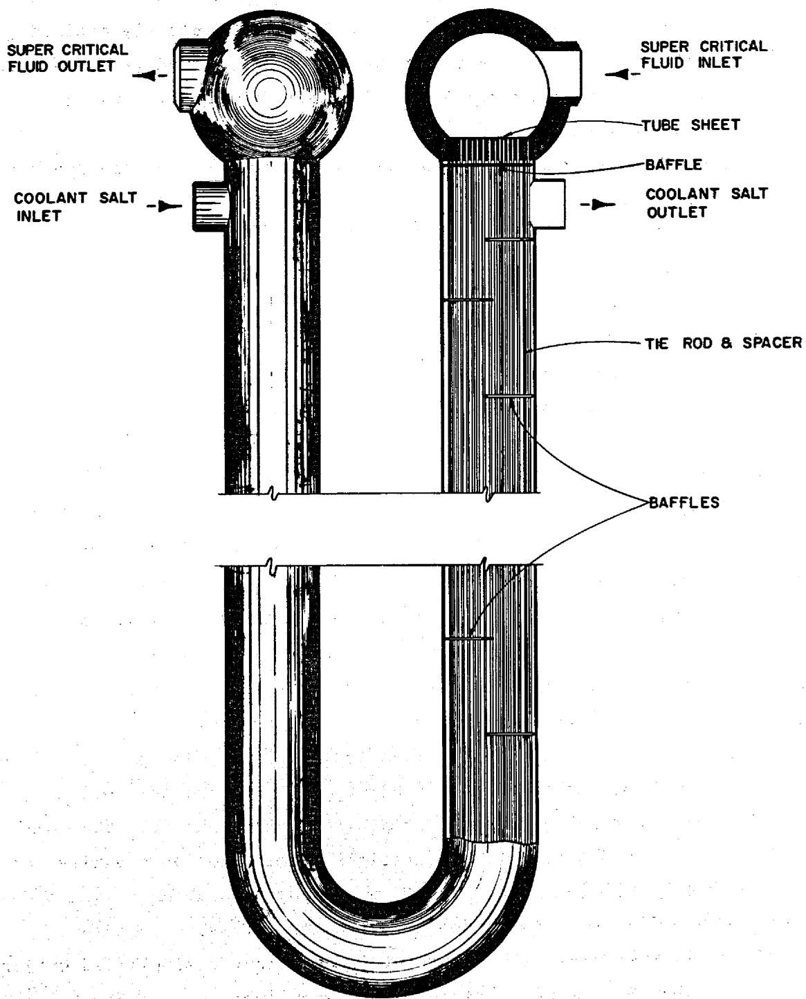  
Fig. 7. Boiler-Superheater Exchanger.

in the tube wall. A baffle on the shell side of each tube sheet provides a stagnant layer of salt that helps reduce stresses in the sheet caused by temperature gradients. The coolant salt can be completely drained from the shell, and the feedwater can be partially removed from the tubes by gas pressurization or by flushing. Complete drainability was not considered a mandatory design requirement.

Design variables that had to be determined for the boiler-superheater exchanger were the

1. number of tubes,   
2. tube pitch,   
3. length of tubes,   
4. thickness of the wall,   
5. thickness of tube sheet,   
6. baffle size and spacing,   
7. diameter of shell,   
8. thickness of shell, and   
9. thickness and shape of head.

Because of marked changes in the physical properties of water as its temperature is increased above the critical point at supercritical pressures, the temperature driving force and heat-transfer coefficient vary considerably along the length of the exchanger. This conditions required that the heat-transfer and pressure-drop calculations for the superheater exchanger be made on incremental lengths of the exchanger.

Since the heat balances, heat transfer equations, and pressure drop equations had to be satisfied for each increment and for the entire exchanger, an iterative procedure was programmed for the CDC 1604 computer to perform the necessary calculations. This procedure varies the number of tubes, the total length of the exchanger, and the number and spacing of baffles to satisfy the heat-transfer, pressure-drop, and thermal-stress requirements. The input information, a simplified outline of the program, and the output information are given in Appendix C.

The values for the physical properties of the coolant salt used in the calculations were provided by the MSBR designers and are given in Table 1. The calculations of physical properties for supercritical steam were included in the computer program as subroutines. The values

for specific volume and enthalpy as functions of temperature and pressure were taken from the work of Keenan and Keyes, $^{1}$ and the values for thermal conductivity and viscosity were taken from data reported by Nowak and Grosh. $^{2}$

An adaptation of Eqs. 3 through 11 and Eqs. 14 and 15 discussed in Chapter 3 was used to calculate the shell-side heat transfer coefficients and pressure drops. The heat transfer coefficient on the inside of the tubes was calculated by using Eq. 13 given in Chapter 3. The pressure drop on the inside of the tubes was calculated by using Fanning's equation, with the friction factor, $^{3}$

$$
f = 0. 0 0 1 4 0 + 0. 1 2 5 \left(\frac {\mu_ {i}}{d _ {i} G}\right) ^ {0. 3 2},
$$

where

$$
\begin{array}{l} \mu_ {1} = \text {v i s c o s i t y o f f l u i d a t t e m p e r a t u r e i n s i d e t u b e}, 1 b / h r \cdot f t, \\ d _ {i} = \text {i n s i d e d i a m e t e r o f t u b e}, \\ G = \text {m a s s v e l o c i t y}, 1 b / h r \cdot f t ^ {2}. \\ \end{array}
$$

The thermal resistance of the tube wall was calculated for each increment of tube length by using the thermal conductivity of Hastelloy N evaluated at the average temperature of the tube wall of each particular increment. The procedure used to determine the allowable temperature drop across the tube wall was based on the requirements set forth in Section III of the ASME Boiler and Pressure Vessel Code. The thermal stresses were treated as secondary membrane plus bending stresses with the maximum allowable value being equal to three times the allowable membrane stress for Hastelloy N minus the stresses caused by pressure.

From an equation reported by Harvey,4 the thermal stress,

$$
\sigma_ {W} = \frac {\alpha E _ {T} \left(t _ {o} - t _ {i}\right)}{2 (1 - v) \left(\ln \frac {d _ {o}}{d _ {i}}\right)} \left[ 1 - \frac {2 d _ {o} ^ {2}}{d _ {o} ^ {2} - d _ {i} ^ {2}} \left(\ln \frac {d _ {o}}{d _ {i}}\right) \right],
$$

where

$\sigma_{W} =$ tangential or axial thermal stress in tube wall, psi,

$\alpha =$ coefficient of thermal expansion, in./in. ${}^{\mathrm{o}}\mathbf{F},$

$\mathbf{E}_{\mathbf{T}} =$ modulus of elasticity of tube, psi,

$\mathbf{t}_{\mathbf{o}} =$ temperature outside tube, ${}^{\mathrm{o}}\mathbb{F},$

$\mathbf{t}_{\mathbf{i}} =$ temperature inside tube, ${}^{\mathrm{o}}\mathbb{F},$

$\mathsf{v} =$ Poisson's ratio,

$\mathbf{d}_{0} =$ outside diameter of tube,

$\mathbf{d}_{\mathbf{i}} =$ inside diameter of tube.

This equation and the allowable thermal stress as defined above were used to calculate the allowable temperature drop across the tube wall.

The computer program was run for several cases to investigate the parameters, and "hand" calculations were made to check the program.

However, it should be noted that this work did not constitute a complete parameter study or optimization of the design variables. The resulting design data for the boiler-superheater exchanger for Case A are given in Table 6.

Table 6. Boiler-Superheater Design Data for Case A   

<table><tr><td>Type</td><td>U-tube U-shell exchanger with cross-flow baffles</td></tr><tr><td>Number required</td><td>16</td></tr><tr><td>Rate of heat transfer, each, Mw</td><td>120.9</td></tr><tr><td>Btu/hr</td><td>4.13 x 108</td></tr><tr><td colspan="2">Shell-side conditions</td></tr><tr><td>Hot fluid</td><td>Coolant salt</td></tr><tr><td>Entrance temperature, °F</td><td>1125</td></tr><tr><td>Exit temperature, °F</td><td>850</td></tr><tr><td>Entrance pressure, psi</td><td>149</td></tr><tr><td>Exit pressure, psi</td><td>90.9</td></tr><tr><td>Pressure drop across exchanger, psi</td><td>58.1</td></tr><tr><td>Mass flow rate, 1b/hr</td><td>3.6625 x 10^6</td></tr><tr><td colspan="2">Tube-side conditions</td></tr><tr><td>Cold fluid</td><td>Supercritical fluid</td></tr><tr><td>Entrance temperature, °F</td><td>700</td></tr><tr><td>Exit temperature, °F</td><td>1000</td></tr><tr><td>Entrance pressure, psi</td><td>3766.4</td></tr><tr><td>Exit pressure, psi</td><td>3600</td></tr><tr><td>Pressure drop across exchanger, psi</td><td>166.4</td></tr><tr><td>Mass flow rate, 1b/hr</td><td>6.3312 x 10^5</td></tr><tr><td>Mass velocity, 1b/hr·ft²</td><td>2.78 x 10^6</td></tr><tr><td>Tube material</td><td>Hastelloy N</td></tr><tr><td>Tube OD, in.</td><td>0.50</td></tr><tr><td>Tube thickness, in.</td><td>0.077</td></tr><tr><td>Tube length, tube sheet to tube sheet, ft</td><td>63.81</td></tr><tr><td>Shell material</td><td>Hastelloy N</td></tr><tr><td>Shell thickness, in.</td><td>0.375</td></tr><tr><td>Shell ID, in.</td><td>18.25</td></tr><tr><td>Tube sheet material</td><td>Hastelloy N</td></tr><tr><td>Tube sheet thickness, in.</td><td>4.75</td></tr><tr><td>Number of tubes</td><td>349</td></tr><tr><td>Pitch of tubes, in.</td><td>0.875</td></tr><tr><td>Total heat transfer area, ft²</td><td>2915</td></tr><tr><td>Basis for area calculation</td><td>Outside surface</td></tr><tr><td>Type of baffle</td><td>Crossflow</td></tr><tr><td>Number of baffles</td><td>9</td></tr><tr><td>Baffle spacing</td><td>Variable</td></tr><tr><td>Overall heat transfer coefficient, U, Btu/hr·ft²</td><td>1030</td></tr><tr><td>Maximum stress intensity, a psi
Tube</td><td></td></tr><tr><td>Calculated</td><td>Pm= 6748; (Pm+Q) = 40,665</td></tr><tr><td>Allowable</td><td>Pm= Sm= 16,000; (Pm+Q) = 3Sm= 48,000</td></tr><tr><td>Shell</td><td></td></tr><tr><td>Calculated</td><td>Pm= 3775; (Pm+Q) = 8543</td></tr><tr><td>Allowable</td><td>Pm= Sm= 10,500; (Pm+Q) = 3Sm= 31,500</td></tr><tr><td>Maximum tube sheet stress, psi</td><td></td></tr><tr><td>Calculated</td><td>&lt;16,600</td></tr><tr><td>Allowable</td><td>16,600</td></tr></table>

aThe symbols are those of Section III of the ASME Boiler and Pressure Vessel Code, where   
$\mathbf{P}_{\mathfrak{m}} =$ primary membrane stress intensity, $\mathbf{Q} =$ secondary stress intensity, $\mathbf{S}_{\mathfrak{m}} =$ allowable stress intensity.

# Case B

As previously discussed, the operating pressures of the coolant-salt system were raised in the Case-B design for the heat-exchange system. The coolant salt enters the superheater exchanger at the same temperature as in Case A but at a pressure of 251.5 psi, and it leaves the exchanger at the same temperature as in Case A but at a pressure of 193.4 psi. Thus, the pressure drop across the exchanger, 58.1 psi, and the heat transfer are the same for Case B as they are for Case A. However, the difference between the pressure level in Case B and that for Case A resulted in different stress intensities for the two cases. The maximum pressure drop through the tubes was specified as 200 psi, but this value had to be reduced to prevent exceeding the limitation placed on the maximum height of the exchanger.

An analysis was made of the stress intensities in the tube sheets, tubes, shells, high-pressure heads, shell-to-tube-sheet junctions, and tube-to-tube-sheet junctions. However, the discontinuity stresses were not analyzed at the junctions of the high-pressure heads and shells or at the junctions involving the entrance and exit of coolant salt or supercritical fluid. These calculations performed for the Case-B boiler-superheater exchanger are given in Appendix C, and the resulting design data are given in Table 7. All other superheater design data for Case B are the same as for Case A.

Table 7. Boiler-Superheater Stress Data for Case B   

<table><tr><td>Maximum stress intensity, a psi
Tube</td><td></td></tr><tr><td>Calculated</td><td>Pm= 13,843; (Pm+Q) = 40,662</td></tr><tr><td>Allowable</td><td>Pm= Sm= 16,000; (Pm+Q) = 
3Sm= 48,000</td></tr><tr><td>Shell</td><td></td></tr><tr><td>Calculated</td><td>Pm= 6372; (Pm+Q) = 14,420</td></tr><tr><td>Allowable</td><td>Pm= Sm= 10,500; (Pm+Q) = 
3Sm= 31,500</td></tr><tr><td>Maximum tube sheet stress, psi</td><td></td></tr><tr><td>Calculated</td><td>&lt;16,600</td></tr><tr><td>Allowable</td><td>16,600</td></tr></table>

aThe symbols are those of Section III of the ASME Boiler and Pressure Vessel Code, where

$\mathbf{P}_{\mathfrak{m}} =$ primary membrane stress intensity,

$Q =$ secondary stress intensity, and

$\mathbf{S}_{\mathfrak{m}} =$ allowable stress intensity.

# Case C

Case C is basically a modification of the Case-A heat-exchange system that was studied briefly to determine the effect of having a coolant salt with a lower liquidus point. To study this condition, the temperature

of the feedwater entering the boiler superheater was lowered from $700^{\circ}\mathrm{F}$ to $580^{\circ}\mathrm{F}$ , and the entrance pressure was set at 3694 psi. With the feed-water leaving the superheater as supercritical fluid at a temperature of $1000^{\circ}\mathrm{F}$ and pressure of 3600 psi, the coolant salt entering at a temperature of $1125^{\circ}\mathrm{F}$ and a pressure of 149 psi leaves the exchanger at a temperature of $850^{\circ}\mathrm{F}$ and pressure of approximately 145 psi.

The computer program was used to size an exchanger for these conditions, and the resulting design data for the Case-C boiler superheater are given in Table 8.

Table 8. Boiler Superheater Design Data for Case C   

<table><tr><td>Type</td><td>U-tube U-shell exchanger with cross-flow baffles</td></tr><tr><td>Number required</td><td>16</td></tr><tr><td>Rate of heat transfer, each</td><td></td></tr><tr><td>Mw</td><td>114.7</td></tr><tr><td>Btu/hr</td><td>3.914 x 108</td></tr><tr><td>Shell-side conditions</td><td></td></tr><tr><td>Hot fluid</td><td>Coolant salt</td></tr><tr><td>Entrance temperature, °F</td><td>1125</td></tr><tr><td>Exit temperature, °F</td><td>850</td></tr><tr><td>Pressure drop across exchanger, psi</td><td>3.9</td></tr><tr><td>Tube-side conditions</td><td></td></tr><tr><td>Cold fluid</td><td>Supercritical fluid</td></tr><tr><td>Entrance temperature, °F</td><td>580</td></tr><tr><td>Exit temperature, °F</td><td>1000</td></tr><tr><td>Entrance pressure, psi</td><td>3694</td></tr><tr><td>Exit pressure, psi</td><td>3600</td></tr><tr><td>Pressure drop across exchanger, psi</td><td>9.4</td></tr><tr><td>Tube material</td><td>Hastelloy N</td></tr><tr><td>Tube OD, in.</td><td>0.50</td></tr><tr><td>Tube thickness, in.</td><td>0.077</td></tr><tr><td>Tube length, tube sheet to tube sheet, ft</td><td>62.64</td></tr><tr><td>Shell material</td><td>Hastelloy N</td></tr><tr><td>Shell thickness, in.</td><td>0.375</td></tr><tr><td>Shell ID, in.</td><td>17</td></tr><tr><td>Tube sheet material</td><td>Hastelloy N</td></tr><tr><td>Number of tubes</td><td>323</td></tr><tr><td>Pitch of tubes, in.</td><td>0.875</td></tr><tr><td>Total heat transfer area, ft2</td><td>2648</td></tr><tr><td>Basis for area calculation</td><td>Outside of tubes</td></tr><tr><td>Type of baffle</td><td>Cross flow</td></tr><tr><td>Number of baffles</td><td>3</td></tr><tr><td>Baffle spacing, in.</td><td>Variable</td></tr><tr><td>Overall heat transfer coefficient, U, Btu/hr·ft2</td><td>785</td></tr></table>

# 7. DESIGN FOR STEAM REHEATER EXCHANGERS

Eight, two in each module of the heat-exchange system, vertical shell-and-tube exchangers transfer heat from the coolant salt to the exhaust steam from the high-pressure turbine. The coolant salt enters the exchanger at a temperature of $1125^{\circ}\mathrm{F}$ and leaves at a temperature of $850^{\circ}\mathrm{F}$ , having elevated the temperature of the steam from $650^{\circ}\mathrm{F}$ to $1000^{\circ}\mathrm{F}$ .

# Case A

The location of the two steam reheater exchangers in each module of the heat-exchange system for Case A is illustrated in Fig. 1. The criteria governing the design for the reheater exchangers for Case A that were fixed by the system are the

1. temperature and pressure of the incoming salt,   
2. temperature and pressure of the outgoing salt,   
3. temperature and pressure of the incoming steam,   
4. temperature and pressure of the outgoing steam,   
5. flow rate of the salt,   
6. flow rate of the steam, and   
7. total heat transferred.

Following a procedure outlined by Kays and London, $^{1}$ we selected the general type of exchanger to be used for these conditions. The reheater exchangers are straight counterflow ones with baffles, as shown in Fig. 8. The straight shell occupies less cell volume than a U-tube U-shell design and requires slightly less coolant-salt inventory. The steam enters the bottom of the exchanger at a pressure of 580 psi, flows upward through the tubes, and leaves the top of the exchanger at a pressure of 567.1 psi. The coolant salt enters the upper portion of the exchanger at a pressure of 106 psi, flows downward around the tubes, and leaves the

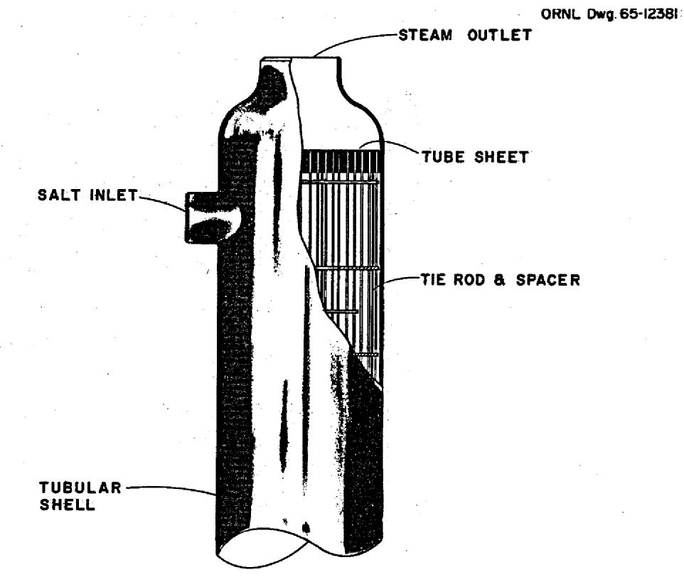

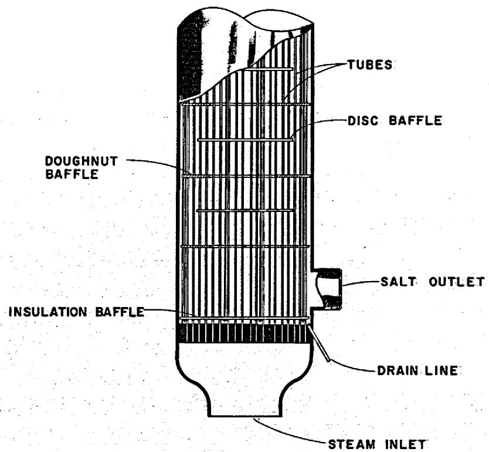  
Fig. 8. Steam Reheater Exchanger.

bottom portion of the exchanger at a pressure of 89.6 psi. A special drain pipe at the bottom of the exchanger permits drainage of the coolant salt.

Disk and doughnut baffles were selected for the exchanger because, in our opinion, this design results in a more efficient exchanger than one in which straight-edged baffles are used. Baffles on the shell side of the tube sheets provide a stagnant layer of coolant salt to reduce the thermal stresses in the sheets. The outside diameter of the tubes stipulated by the designers of the MSBR is 3/4 in., and the tubes and shell are fabricated of Hastelloy N because of its compatibility with molten salt and steam.

The design variables that had to be determined for the steam reheater exchanger were the

1. number of tubes,   
2. tube length,   
3. wall thickness of tubes,   
4. baffle size and spacing,   
5. thickness of tube sheets, and   
6. thickness and shape of head.

To determine these variables, it was necessary to calculate the heat transfer coefficients, pressure drops, and the thermal and mechanical stresses. These calculations are given in Appendix D.

From a consideration of stresses caused by the temperatures and pressures to be encountered, a tube wall thickness of 0.035 in. was chosen. From the stipulated tube size (3/4 in. OD), the steam pressure drop, and an assumed tube length, the number of tubes required was calculated. This calculated value was corrected by iteration, and the number of tubes was fixed at 628. A triangular tube pitch of 1 in. was selected, and the inside diameter of the shell was calculated to be 28 in. Then, by using the Dittus-Boelter equation, Eq. 2 of Chapter 3, the heat transfer coefficient for the steam inside the tubes was calculated as 409 Btu/hr·ft²·°F.

Design calculations for the shell-side flow of coolant salt were somewhat more involved. Turbulent flow is desirable for good heat transfer on the shell side. We therefore arbitrarily chose a Reynolds number of 7500 for parallel flow through both the interior and exterior

baffle windows. The Reynolds number chosen is well above the number at the threshold of turbulence, and the resulting size of the exchanger is not extreme. From this number and the mass flow rate fixed by the system, the flow area in the two baffle windows was determined as $0.764 \, ft^2$ . Because we judged it to be good design practice and because it simplified calculation of the shell-side heat-transfer coefficient, we made the cross-flow area equal to the flow area through the baffle windows: $0.764 \, ft^2$ . Knowing the baffle sizes and pitch, we were then able to determine the baffle spacing, which is 12.4 in.

The shell-side heat-transfer coefficient was calculated by using an adaptation of Eqs. 3 through 11 discussed in Chapter 3, and this coefficient is 2240 Btu/hr·ft²·°F. Knowing the shell-side heat-transfer coefficient, the heat-transfer coefficient for the steam inside the tubes (409 Btu/hr·ft²·°F), the thermal conductivity of the Hastelloy N, and the total heat transferred per hour in the exchanger, the length of the tubes was calculated.

$$
\mathrm {L} = \frac {\mathrm {U a} _ {\mathrm {t}} \mathrm {n L}}{\mathrm {n}} \left(\frac {1}{\mathrm {h} _ {\mathrm {i}} \mathrm {a} _ {\mathrm {i}}} + \frac {1}{\frac {\mathrm {k}}{\mathrm {T}} \mathrm {a} _ {\mathrm {m}}} + \frac {1}{\mathrm {h} _ {\mathrm {o}} \mathrm {a} _ {\mathrm {o}}}\right),
$$

where

$\mathbf{L} =$ length of tube, ft,

U = overall heat-transfer coefficient, Btu/hr·ft²

$a_{t} =$ total heat transfer surface, ft²/ft,

$\mathbf{n} =$ number of tubes,

$h_i =$ heat-transfer coefficient for steam inside tubes,

$a_{i} =$ heat transfer surface inside tubes, ft²/ft,

k = thermal conductivity, Btu/hr.ft²·°F per ft,

$\mathbf{T} =$ thickness of tube wall, in.,

$a_{\mathrm{m}} =$ mean heat-transfer surface, ft²/ft,

$h_{0} =$ heat-transfer coefficient for coolant salt in shell,

$a_{0} =$ shell-side heat transfer surface, ft²/ft.

$$
\begin{array}{l} L = \frac {7 . 7 8 x 1 0 ^ {5}}{6 2 8} (0. 0 1 3 7 3 + 0. 0 0 1 5 0 + 0. 0 0 2 2 7), \\ = 2 1. 7 0 f t. \\ \end{array}
$$

Conventional means were used to calculate the steam-side pressure drop for the reheater exchanger, and the total was found to be 12 psi. The pressure drop on the salt side was calculated by making use of an adaptation of Eqs. 14 and 15 discussed in Chapter 3. The salt-side pressure drop is 11.4 psi.

In designing the exchanger, a length of shell was allowed for the inlet and outlet pipes that was somewhat larger than the baffle spacing. This increased the overall length of the tubes from 21.7 and 22.1 ft. This small increment in the length was neglected insofar as its effect upon pressure, velocity, etc., is concerned. The Case A design data for the steam reheater exchanger are given in Table 9.

Table 9. Steam Reheater Exchanger Design Data for Case A   

<table><tr><td>Type</td><td>Straight tube and shell with disk and doughnut baffles</td></tr><tr><td>Number required</td><td>8</td></tr><tr><td>Rate of heat transfer per unit, 
Mw</td><td>36.25</td></tr><tr><td>Btu/hr</td><td>1.24 x 10^9</td></tr><tr><td>Shell-side conditions</td><td></td></tr><tr><td>Hot fluid</td><td>Coolant salt</td></tr><tr><td>Entrance temperature, °F</td><td>1125</td></tr><tr><td>Exit temperature, °F</td><td>850</td></tr><tr><td>Entrance pressure, psi</td><td>106</td></tr><tr><td>Exit pressure, psi</td><td>94.6</td></tr><tr><td>Pressure drop across exchanger, psi</td><td>11.4</td></tr><tr><td>Mass flow rate, lb/hr</td><td>1.1 x 10^6</td></tr><tr><td>Mass velocity, lb/hr·ft^2</td><td>1.44 x 10^6</td></tr><tr><td>Tube-side conditions</td><td></td></tr><tr><td>Cold fluid</td><td>Steam</td></tr><tr><td>Entrance temperature, °F</td><td>650</td></tr><tr><td>Exit temperature, °F</td><td>1000</td></tr><tr><td>Entrance pressure, psi</td><td>580</td></tr><tr><td>Exit pressure, psi</td><td>568</td></tr><tr><td>Pressure drop across exchanger, psi</td><td>12</td></tr><tr><td>Mass flow rate, lb/hr</td><td>6.3 x 10^5</td></tr><tr><td>Mass velocity, lb/hr·ft^2</td><td>3.98 x 10^5</td></tr><tr><td>Velocity, fps</td><td>145</td></tr><tr><td>Tube material</td><td>Hastelloy N</td></tr><tr><td>Tube OD, in.</td><td>0.75</td></tr><tr><td>Tube thickness, in.</td><td>0.035</td></tr><tr><td>Tube length, tube sheet to tube sheet, ft</td><td>22.1</td></tr><tr><td>Shell material</td><td>Hastelloy N</td></tr><tr><td>Shell thickness, in.</td><td>0.5</td></tr><tr><td>Shell ID, in.</td><td>28</td></tr><tr><td>Tube sheet material</td><td>Hastelloy N</td></tr><tr><td>Tube sheet thickness, in.</td><td>4.75</td></tr><tr><td>Number of tubes</td><td>628</td></tr><tr><td>Pitch of tubes, in.</td><td>1.0</td></tr><tr><td>Total heat transfer area, ft2</td><td>2723</td></tr><tr><td>Basis for area calculation</td><td>Outside of tubes</td></tr><tr><td>Type of baffle</td><td>Disk and doughnut</td></tr><tr><td>Number of baffles</td><td>10 and 10</td></tr><tr><td>Baffle spacing, in.</td><td>12.375</td></tr><tr><td>Disk OD, in.</td><td>24.3</td></tr><tr><td>Doughnut ID, in.</td><td>16.9</td></tr><tr><td>Overall heat transfer coefficient, U, Btu/hr·ft2</td><td>285</td></tr><tr><td>Maximum stress intensity, a psi Tube</td><td></td></tr><tr><td>Calculated</td><td>Pm=5243; (Pm+Q)=15,091</td></tr><tr><td>Allowable</td><td>Pm=Sm=14,500; (Pm+Q)=3Sm=43,500</td></tr><tr><td>Shell</td><td></td></tr><tr><td>Calculated</td><td>Pm=4350; (Pm+Q)=14,751</td></tr><tr><td>Allowable</td><td>Pm=Sm=10,600; (Pm+Q)=3Sm=31,800</td></tr><tr><td>Maximum tube sheet stress, psi</td><td></td></tr><tr><td>Calculated</td><td>9600</td></tr><tr><td>Allowable</td><td>9600</td></tr></table>

aThe symbols are those of Section III of the ASME Boiler and Pressure Vessel Code, where

$\mathbf{P}_{\mathrm{m}} =$ primary membrane stress intensity,

$\mathbf{Q} =$ secondary stress intensity,

$\mathbf{S}_{\mathfrak{m}} =$ allowable stress intensity.

# Case B

In the Case-B design for the heat-exchange system, the operating pressures of the coolant salt were raised. The coolant salt enters the steam reheater exchanger at the same temperature as in Case A (1125°F) but at a pressure of 208.5 psi, and it leaves the exchanger at the same temperature as in Case A (850°F) but at a pressure of 197.1 psi. Thus, the pressure drop across the exchanger, 11.4 psi, and the heat transfer are the same for Case B as for Case A, but the difference between the pressure levels of Case A and Case B resulted in different stress intensities for the two cases.

An analysis was made of the stress intensities existing throughout the reheater for the higher pressure conditions, but the effects of the design for the coolant-salt entrance and exit pipes and the steam delivery and exit plenums upon the shell stresses were not considered. These calculations are given in Appendix D, and the resulting stress data are given in Table 10. All other steam reheater design data for Case B are the same as for Case A.

Table 10. Steam Reheater Stress Data for Case B   

<table><tr><td>Maximum stress intensity, a psi
Tube</td><td></td></tr><tr><td>Calculated</td><td>Pm=4349; (Pm+Q) = 13,701</td></tr><tr><td>Allowable</td><td>Pm=Sm=14,500; (Pm+Q) = 
3Sm=43,500&#x27;</td></tr><tr><td>Shell</td><td></td></tr><tr><td>Calculated</td><td>Pm=6046.5; (Pm+Q) = 17,165</td></tr><tr><td>Allowable</td><td>Pm=Sm=10,600; (Pm+Q)= 
3Sm=31,800</td></tr><tr><td>Maximum tube sheet stress, psi</td><td></td></tr><tr><td>Calculated</td><td>&lt;10,500</td></tr><tr><td>Allowable</td><td>10,500</td></tr></table>

aThe symbols are those of Section III of the ASME Boiler and Pressure Vessel Code, where $\mathbf{P}_{\mathfrak{m}} =$ primary membrane stress intensity, $Q =$ secondary stress intensity, and $\mathbf{S}_{\mathfrak{m}} =$ allowable stress intensity.

# Case C

The Case-C modification of the Case-A design for the heat-exchange system was studied to determine the effect of having a coolant salt with a lower liquidus point. To effect this, the temperature of the steam entering the reheater exchanger was lowered from 650 to $551^{\circ}\mathrm{F}$ , and the entrance pressure was set at 600 psi. With the steam leaving the reheater at a temperature of $1000^{\circ}\mathrm{F}$ and pressure of 584.8 psi, the coolant salt entering at a temperature of $1125^{\circ}\mathrm{F}$ and pressure of 106 psi leaves at a temperature of $850^{\circ}\mathrm{F}$ and a pressure of 92.2 psi. The design data for the Case-C reheater are given in Table 11.

Table 11. Steam Reheater Exchanger Design Data for Case C   

<table><tr><td>Type</td><td>Straight tube and shell with disk and doughnut baffles</td></tr><tr><td>Number required</td><td>8</td></tr><tr><td>Rate of heat transfer, each</td><td></td></tr><tr><td>Mw</td><td>48.75</td></tr><tr><td>Btu/hr</td><td>1.66 x 108</td></tr><tr><td>Shell-side conditions</td><td></td></tr><tr><td>Hot fluid</td><td>Coolant salt</td></tr><tr><td>Entrance temperature, °F</td><td>1125</td></tr><tr><td>Exit temperature, °F</td><td>850</td></tr><tr><td>Pressure drop across exchanger, psi</td><td>13.8</td></tr><tr><td>Tube-side conditions</td><td></td></tr><tr><td>Cold fluid</td><td>Steam</td></tr><tr><td>Entrance temperature, °F</td><td>551</td></tr><tr><td>Exit temperature, °F</td><td>1000</td></tr><tr><td>Entrance pressure, psi</td><td>600</td></tr><tr><td>Pressure drop across exchanger, psi</td><td>15.2</td></tr><tr><td>Tube material</td><td>Hastelloy N</td></tr><tr><td>Tube OD, in.</td><td>0.75</td></tr><tr><td>Tube thickness, in.</td><td>0.035</td></tr><tr><td>Tube length, tube sheet to tube sheet, ft</td><td>23.4</td></tr><tr><td>Shell material</td><td>Hastelloy N</td></tr><tr><td>Shell thickness, in.</td><td>0.5</td></tr><tr><td>Shell ID, in.</td><td>28</td></tr><tr><td>Tube sheet material</td><td>Hastelloy N</td></tr><tr><td>Number of tubes</td><td>620</td></tr><tr><td>Pitch of tubes, in.</td><td>1</td></tr><tr><td>Total heat transfer area, ft2</td><td>2885</td></tr><tr><td>Basis for area calculation</td><td>Outside of tubes</td></tr><tr><td>Type of baffles</td><td>Disk and doughnut</td></tr><tr><td>Number of baffles</td><td>13 and 14</td></tr><tr><td>Baffle spacing, in.</td><td>10</td></tr><tr><td>Disk OD, in.</td><td>21.3</td></tr><tr><td>Doughnut ID, in.</td><td>18.5</td></tr><tr><td>Overall heat transfer coefficient, U, Btu/hr·ft2</td><td>289</td></tr></table>

# 8. DESIGN FOR REHEAT-STEAM PREHEATERS

Eight reheat-steam preheaters, two in each module of the heat-exchange system, are used to heat the exhaust steam from the high-pressure turbine before it enters the reheaters to assure that the coolant salt will not be cooled below its liquidus point. The preheaters are part of the steam power system, and since they do not come into contact with molten salts, they are fabricated of Croloy. Being a part of the steam system, the preheaters are unaffected by the Case-B design for the heat-exchange system, and their design is the same for both Case A and Case B. Thus, their location in a module of the system may be seen in either Fig. 1 or 2. However, the need for the preheaters is eliminated in the Case-C modification of the Case-A heat exchange system.

Throttle steam or supercritical fluid at a temperature of $1000^{\circ}\mathrm{F}$ and a pressure of 3600 psi is used to heat the exhaust steam from the high-pressure turbine, and the preheaters had to be designed for this high temperature and pressure. A conceptual drawing of the reheat-steam preheater is shown in Fig. 9. The exchanger selected is a one-tube-pass one-shell-pass counterflow type with U-tubes and U-shell. Selection of a U-shell rather than a divided cylindrical shell permits the use of smaller diameters for the heads and reduces the thicknesses required for the heads and the tube sheets. Each vertical leg of the U-shell is about 21 in. in diameter and the overall height is about 15 ft, including the spherical heads. The U-tubes have an outside diameter of $3/8$ in. and a wall thickness of 0.065 in. They are located in a triangular array with a pitch of $3/4$ in. No baffles are used in this design, but the tubes are supported at intervals.

The supercritical fluid enters the head region, flows down through the tubes, back up, and exits from the opposite head at a temperature of $869^{\circ}\mathbf{F}$ and a pressure of 3535 psi. The turbine exhaust steam enters a side inlet below the head at a temperature of $551^{\circ}\mathbf{F}$ and a pressure of 595.4 psi, flows around the tubes countercurrent to the flow of the supercritical fluid, and leaves the exchanger through a side outlet on the opposite leg below the head at a temperature of $650^{\circ}\mathbf{F}$ and a pressure of 590 psi.

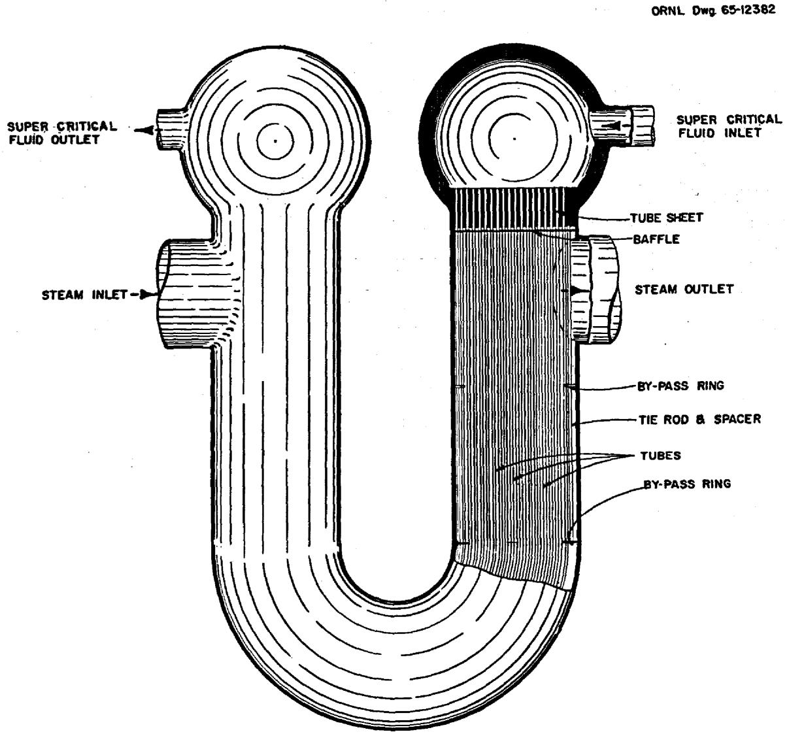  
Fig. 9. Reheat-Steam Preheater Exchanger.

The heat-transfer and pressure-drop calculations made for the reheat-steam preheater are given in Appendix E. The heat transfer coefficient for the supercritical-fluid film inside the tubes was calculated by using the Dittus-Boelter equation, Eq. 2 discussed in Chapter 3 of this report. The reheat steam flows outside and parallel to the tubes, and the heat-transfer coefficient for the film outside the tubes was calculated by using both Eq. 2 and Eq. 12 of Chapter 3. Equation 12 gave the most conservative value and it was used in the design calculations. Pressure drops in the tubes and in the shell were calculated by using the Darcy equation for the friction loss; four velocity heads to account

for the inlet, exit, and reversal losses; and a correction factor for changes in kinetic energy between the inlet and exit of the exchanger.

An analysis of the stress intensities in the tubes, tube sheets, shells, and high-pressure heads and of the discontinuity-induced stresses at their junctions was made. The discontinuity stresses at the junction of the high-pressure head and the shell, the entrance line, and the exit line were not considered in this analysis. These stress calculations are also given in Appendix E, and the resulting design data for the reheat-steam preheater are given in Table 12.

Table 12. Design Data for the Reheat-Steam Preheater   

<table><tr><td>Type</td><td>One-tube-pass one-shell-pass U-tube U-shell exchanger with no baffles</td></tr><tr><td>Number required</td><td>8</td></tr><tr><td>Rate of heat transfer, each</td><td></td></tr><tr><td>Mw</td><td>12.33</td></tr><tr><td>Btu/hr</td><td>4.21 x 107</td></tr><tr><td>Shell-side conditions</td><td></td></tr><tr><td>Cold fluid</td><td>Steam</td></tr><tr><td>Entrance temperature, °F</td><td>551</td></tr><tr><td>Exit temperature, °F</td><td>650</td></tr><tr><td>Entrance pressure, psi</td><td>595.4</td></tr><tr><td>Exit pressure, psi</td><td>590.0</td></tr><tr><td>Pressure drop across exchanger, psi</td><td>5.4</td></tr><tr><td>Mass flow rate, lb/hr</td><td>6.31 x 105</td></tr><tr><td>Mass velocity, lb/hr·ft2</td><td>3.56 x 105</td></tr><tr><td>Tube-side conditions</td><td></td></tr><tr><td>Hot fluid</td><td>Supercritical water</td></tr><tr><td>Entrance temperature, °F</td><td>1000</td></tr><tr><td>Exit temperature, °F</td><td>869</td></tr><tr><td>Entrance pressure, psi</td><td>3600</td></tr><tr><td>Exit pressure, psi</td><td>3535</td></tr><tr><td>Pressure drop across exchanger, psi</td><td>65</td></tr><tr><td>Mass flow rate, lb/hr</td><td>3.68 x 105</td></tr><tr><td>Mass velocity, lb/hr·ft2</td><td>1.87 x 105</td></tr><tr><td>Velocity, fps</td><td>93.5</td></tr><tr><td>Tube material</td><td>Croloy</td></tr><tr><td>Tube OD, in.</td><td>0.375</td></tr><tr><td>Tube thickness, in.</td><td>0.065</td></tr><tr><td>Tube length, tube sheet to tube sheet, ft</td><td>13.2</td></tr><tr><td>Shell material</td><td>Croloy</td></tr><tr><td>Shell thickness, in.</td><td>7/16</td></tr><tr><td>Shell ID, in.</td><td>20.25</td></tr><tr><td>Tube sheet material</td><td>Croloy</td></tr><tr><td>Tube sheet thickness, in.</td><td>6.5</td></tr><tr><td>Number of tubes</td><td>603</td></tr><tr><td>Pitch of tubes, in.</td><td>0.75</td></tr><tr><td>Total heat-transfer area, ft2</td><td>781</td></tr><tr><td>Basis for area calculation</td><td>Tube OD</td></tr><tr><td>Type of baffle</td><td>None</td></tr><tr><td>Overall heat transfer coefficient, U, Btu/hr·ft2</td><td>162</td></tr><tr><td>Maximum stress intensity, a psi Tube</td><td></td></tr><tr><td>Calculated</td><td>Pm= 10,503; (Pm+Q) = 7080</td></tr><tr><td>Allowable</td><td>Pm= Sm= 10,500 @ 961°F; (Pm+Q) = 3S_m= 31,500</td></tr><tr><td>Shell</td><td></td></tr><tr><td>Calculated</td><td>Pm= 14,375; (Pm+Q) = 33,081</td></tr><tr><td>Allowable</td><td>Pm= Sm= 15,000 @ 650°F; (Pm+Q) = 3S_m= 45,000</td></tr><tr><td>Maximum tube sheet stress, psi</td><td></td></tr><tr><td>Calculated</td><td>7800</td></tr><tr><td>Allowable</td><td>7800 @ 1000°F</td></tr></table>

aThe symbols are those of Section III of the ASME Boiler and Pressure Vessel Code, where

$\mathbf{P}_{\mathfrak{m}} =$ primary membrane stress intensity, $\mathbf{Q} =$ secondary stress intensity, and $\mathbf{S}_{\mathfrak{m}} =$ allowable stress intensity.

APPENDICES


# Appendix A

# CALCULATIONS FOR PRIMARY HEAT EXCHANGER

# Pressure-Drop and Heat-Transfer Calculations for Case B

The Case B design for the primary fuel-salt-to-coolant-salt heat exchanger is illustrated in Fig. 4 of Chapter 4. The values assumed to determine the design variables for this two-pass shell-and-tube exchanger with disk and doughnut baffles are tabulated below.

$$
\ell_ {(o a)} = \text {l e n g t h o f o u t e r a n n u l u s} = 1 6. 1 2 5 \mathrm {f t},
$$

$$
\ell_ {(i a)} = \text {l e n g t h o f i n n e r a n n u l u s} = 1 5. 0 5 0 \mathrm {f t},
$$

$$
N _ {(o a)} = \text {n u m b e r o f b a f f l e s i n o u t e r a n n u l u s} = 1 0,
$$

$$
\mathrm {N} _ {(i a)} = \text {n u m b e r o f b a f f l e s i n i n n e r a n n u l u s} = 4,
$$

$$
\mathrm {X} _ {\left(\mathrm {o a}\right)} = \text {b a f f l e s p a c i n g i n o u t e r a n n u l u s} = 1. 4 6 6 \mathrm {f t},
$$

$$
X _ {(i a)} = \text {b a f f l e s p a c i n g i n n e r a n n u l u s} = 1. 4 6 6 \mathrm {f t} \text {a n d} 3. 3 9 6 \mathrm {f t},
$$

$$
p _ {(o a)} = \text {t u b e p i t c h i n o u t e r a n n u l u s} = 0. 6 2 5 \text {i n . (t r i a n g u l a r)},
$$

$$
\begin{array}{l} P _ {(i a)} = \text {t u b e p i t c h i n i n n e r a n n u l u s} \\ = 0. 6 0 0 \text {i n .} \text {r a d i a l} \text {a n d} 0. 6 7 3 \text {i n .} \text {c i r c u m f e r e n t i a l}, \\ \end{array}
$$

$$
\begin{array}{l} n (o a) = \text {n u m b e r o f t u b e s i n o u t e r a n n u l u s} = 3 7 9 4, \\ n _ {(i a)} = \text {n u m b e r o f t u b e s i n i n n e r a n n u l u s} = 4 3 4 7. \\ \end{array}
$$

The assumed length for $\ell_{(0a)}$ of 16.125 ft resulted in a calculated length of 16.11 ft. Therefore, the 16.125-ft length was used for the outer annulus, and the resulting length for the inner annulus was 15.050 ft.

With these variables established, the pressure-drop and heat-transfer calculations were made, and the terms used in these calculations are defined in Appendix F.

# Pressure-Drop Calculations

Calculation of the total pressure drop inside the tubes involved the determination of the pressure drop inside the tubes of both the outer and inner annuli, and calculation of the total pressure drop outside the tubes or on the shell side involved the determination of the shell-side pressure drop in both the outer and inner annuli.

Pressure Drop Inside Tubes. The pressure drop inside the tubes in the outer annulus,

$$
\Delta P _ {i (o a)} = \left(\frac {4 f L}{d _ {i}} + 2\right) \frac {G ^ {2}}{\rho^ {2} g _ {c}},
$$

where

$$
f = \text {t h e f r i c t i o n f a c t o r} = 0. 0 0 1 4 + 0. 1 2 5 / \left(\mathrm {N} _ {\mathrm {R e}}\right) ^ {0. 3 2},
$$

$$
\mathbf {L} = \text {l e n g t h o f t u b e s}, \mathbf {f t},
$$

$$
d _ {i} = \text {i n s i d e}
$$

$$
G = \text {m a s s v e l o c i t y o f f l u i d i n s t e d t u b e s}, 1 b / h r \cdot f t ^ {2},
$$

$$
\rho = \text {d e n s i t y} \rho = \text {d e n s i t y} \rho = \text {d e n s i t y} \rho = \text {d e n s i t y} \rho = \text {d e n s i t y} \rho = \text {d e n s i t y} \rho = \text {d e n s i t y} \rho = \text {d e n s i t y} \rho =
$$

$$
\mathrm {g} _ {\mathrm {c}} = \text {g r a v i t a t i o n a l} \quad \text {c o n s t a n t}, \quad \mathrm {l b} _ {\mathrm {m}} \cdot \mathrm {f t} / \mathrm {l b} _ {\mathrm {f}} \cdot \sec^ {2}.
$$

To determine the friction factor, the Reynolds number,

$$
N _ {R e} = \frac {d _ {i} G}{\mu},
$$

where

$$
\begin{array}{l} d _ {i} = 0. 0 2 5 4 1 6 7 f t, \\ \mu = 2 7 \mathrm {l b} / \mathrm {f t} \cdot \mathrm {h r}, \text {a n d} \\ G = \text {f l o w} \\ \end{array}
$$

$$
\text {w h e r e} \mathrm {f l o w} \quad \mathrm {a r e a}, \mathrm {A} = 3 7 9 4 \text {t u b e s} (5. 0 7 3 7 4 \times 1 0 ^ {- 4} f t ^ {2} / \text {t u b e})
$$

$$
\begin{array}{l} = 1. 9 2 5 0 f t ^ {2}, \\ = \frac {1 . 0 9 3 \times 1 0 ^ {7} \mathrm {l b / h r}}{1 . 9 2 5 0 \mathrm {f t} ^ {3}} = 5. 6 7 8 \times 1 0 ^ {6} \mathrm {l b / f t} ^ {2} \cdot \mathrm {h r}. \\ \end{array}
$$

Therefore, $\mathbf{N}_{\mathrm{Re}} = 5345,$ and the friction factor,

$$
\begin{array}{l} f = 0. 0 0 1 4 + 0. 1 2 5 (5 3 4 5) ^ {- 0. 3 2} = 0. 0 0 9 4 1 6. \\ \Delta P _ {i (o a)} = \left[ \frac {4 (0 . 0 0 9 4 1 6) (1 6 . 1 2 5)}{0 . 0 2 5 4 2} + 2 \right] \frac {\left(\frac {5 . 6 7 8 x 1 0 ^ {6}}{3 . 6 x 1 0 ^ {3}}\right) ^ {2}}{(1 2 7) (1 4 4) 6 4 . 4} = 5 4. 6 9 p s i. \\ \end{array}
$$

For the pressure drop inside the tubes in the inner annulus,

$$
\begin{array}{l} L _ {(i a)} = 1 5. 2 8 6 f t, \\ n _ {(i a)} = 4 3 4 7, \\ A = \text {t h e f l o w a r e a i n s i d e t h e t u b e s} = 2. 2 0 5 6 f t ^ {2}, \\ G _ {i (i a)} = 4. 9 5 6 x 1 0 ^ {5} 1 b / f t ^ {2} \cdot h r, \\ \mathrm {N} _ {\text {R e}} = 4 6 6 5, \text {a n d} \\ f = 0. 0 0 1 4 + 0. 1 2 5 (4 6 6 5) ^ {- 0} \cdot 3 2 = 0. 0 0 9 8 1. \\ \end{array}
$$

$$
\Delta P _ {i (i a)} = 4 1. 1 9 p s i.
$$

The total pressure drop inside the tubes,

$$
\Delta P _ {i (t o t a l)} = 5 4. 6 9 + 4 1. 1 9 = 9 5. 8 8 p s i.
$$

Pressure Drop Outside Tubes. The shell-side flow pattern of the coolant salt in the primary heat exchanger is illustrated in Fig. A.1. The horizontal cross-sectional portion of this illustration shows the outer annulus, oa, to be divided into three types of flow regions, and these are numbered 1 through 3 from the outside in. Flow region 2 or the middle region is established by the overlap of the alternately spaced baffles, and there is only cross flow in this region. Regions 1 and 3 consist of baffle windows in which there is a combination of parallel and cross flow.

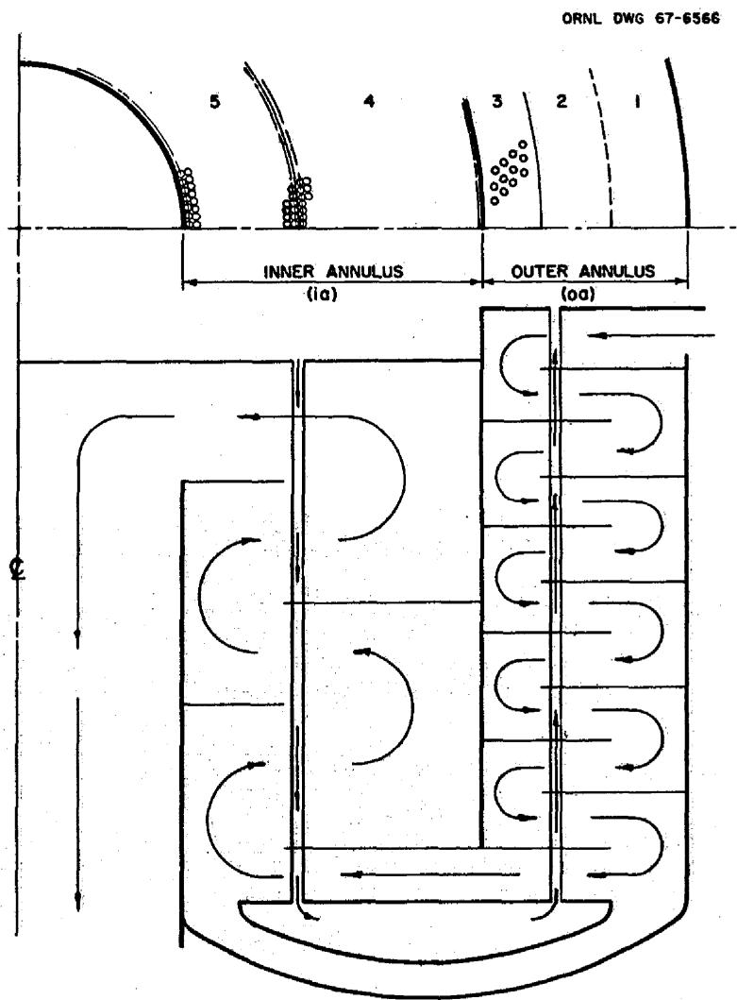  
Fig. A.1. Shell-Side Flow Pattern of Coolant Salt in Primary Exchanger.

From Eq. 15 in Chapter 3, the shell-side pressure drop in the window region of the outer annulus,

$$
\Delta P _ {o (o a) _ {3 - 1}} = \left(2 + 0. 6 r _ {w}\right) \frac {\rho V _ {m} ^ {2}}{2 g _ {c}},
$$

where

$$
\mathbf {r} _ {\mathbf {w}} = \text {t h e n u m b e r o f r e s t r i c t i o n s i n t h e w i n d o w r e g i o n},
$$

$$
\rho = \text {t h e d e n s i t y o f t h e c o o l a n t s a l t} = 1 2 5 \mathrm {l b / f t ^ {3}},
$$

$$
V _ {m} = \text {m e a n v e l o c i t y o f t h e f l u i d , f t / s e c , a n d}
$$

$$
\mathbf {g} _ {\mathbf {c}} = \text {g r a v i t a t i o n a l c o n v e n s i o n c o n s t a n t}, \mathrm {l b} _ {\mathrm {m}} \cdot \mathrm {f t} / \mathrm {l b} _ {\mathrm {f}} \cdot \sec^ {3}.
$$

The volumetric flow rate of the coolant salt,

$$
q = \frac {1 . 6 8 5 \times 1 0 ^ {7} \mathrm {l b / h r}}{1 2 5 \mathrm {l b / f t} ^ {3}} (3 6 0 0 \mathrm {s e c / h r}) = 3 7. 4 4 4 \mathrm {f t} ^ {3} / \mathrm {s e c}.
$$

With the parallel-flow areas being based on a velocity of 15 ft/sec, the average flow area in the outer annulus is the average of the cross-flow and the parallel-flow areas.

$$
A _ {m} = \left[ S _ {w} \left(S _ {B}\right) \right] ^ {0. 5},
$$

where

$$
\begin{array}{l} S _ {w} = \text {t h e c r o s s - s e c t i o n a l a r e a o f t h e w i n d o w r e g i o n} \\ = \text {p a r a l l e l - f l o w a r e a s i n r e g i o n s 3 a n d} 1 = 2. 4 9 6 \mathrm {f t} ^ {2}, \\ \end{array}
$$

$$
\begin{array}{l} S _ {B} = \text {t h e c r o s s - s e c t i o n a l a r e a o f t h e c r o s s - f l o w r e g i o n} \\ = \text {c r o s s - f l o w a r e a i n r e g i o n 2} = 7. 7 0 8 f t ^ {2}. \\ \end{array}
$$

Therefore,

$$
A _ {m} = [ 2. 4 9 6 (7. 7 0 8) ] ^ {0. 5} = 4. 3 8 6 f t ^ {2},
$$

and the mean velocity of the coolant salt in the outer annulus,

$$
V _ {m} = \frac {3 7 . 4 4 4}{4 . 3 8 6} = 8. 5 3 7 f t / s e c
$$

The number of restrictions in the window region,

$$
r _ {w} = \frac {D _ {o} - D _ {i}}{1 . 8 6 6 p},
$$

where

$$
\begin{array}{l} D _ {o} = \text {t h e o u t s i d e d i a m e t e r o f t h e o u t e r a n n u l u s r e g i o n ,} \\ D _ {i} = \text {t h e i n s i d e d i a m e t e r o f t h e i n n e r a n n u l u s r e g i o n , a n d} \\ \mathbf {p} = \text {t h e p i t c h o f t h e t u b e s}. \\ \end{array}
$$

For outer annulus region 3,

$$
r _ {w} = \frac {5 9 . 1 1 - 5 3 . 0 5}{1 . 8 6 6 (0 . 6 2 5)} = 5. 1 9 6,
$$

and for the outer annulus region 1,

$$
r _ {w} = \frac {6 6 . 7 0 - 6 1 . 3 9}{1 . 8 6 6 (0 . 6 2 5)} = 4. 5 5 3.
$$

Therefore, the number of cross-flow restrictions in regions 1 and 3,

$$
r  = (5. 1 9 6 + 4. 5 5 3) 0. 5 = 4. 8 7 5.
$$

The shell-side pressure drop in the outer annulus baffle window flow regions 3 and 1,

$$
\begin{array}{l} \Delta P _ {o (o a) _ {3 - 1}} = 2 + 0. 6 (4. 8 7 5) \frac {1 2 5 (8 . 5 3 7) ^ {2}}{2 (3 2 . 2) (1 4 4)} \\ = 4. 8 3 8 \text {p s i}. \\ \end{array}
$$

From Eq. 14 in Chapter 3, the shell-side pressure drop in the cross-flow region of the outer annulus,

$$
\Delta P _ {O (o a) _ {2}} = 0. 6 r _ {B} \rho \frac {V ^ {2}}{2 g _ {c}}
$$

The velocity of the coolant salt in region 2,

$$
V = \frac {3 7 . 4 4 4 f t ^ {3} / s e c}{7 . 7 0 8 f t ^ {2}} = 4. 8 5 8 f t / s e c ,
$$

and the number of cross-flow restrictions in region 2,

$$
r _ {B} = \frac {6 1 . 3 9 - 5 9 . 1 1}{1 . 8 6 6 (0 . 6 2 5)} = 1. 9 5 5.
$$

Therefore,

$$
\begin{array}{l} \Delta P _ {O (o a) _ {2}} = 0. 6 (1. 9 5 5) (1 2 5) \frac {(4 . 8 5 8) ^ {2}}{2 (3 2 . 4) (1 4 4)} \\ = 0. 3 7 3 \mathrm {p s i}. \\ \end{array}
$$

As may be seen in Fig. A.1, the horizontal cross-sectional area of the inner annulus, ia, is divided roughly into two flow regions caused by the alternate spacing of the doughnut baffles with virtually no overlap. These two regions, 4 and 5, consist of baffle windows in which there is a combination of parallel and cross flow. The cross-flow area in the inner annulus is 15.856 ft². The parallel-flow area in region 5

of the inner annulus is 4.529 ft², and the parallel-flow area in region 4 of the inner annulus is 4.559 ft². The average flow areas in region 5 and 4,

$$
S _ {m 5} = \left[ 4. 5 2 9 (1 5. 8 5 6) \right] ^ {0. 5} = 8. 4 7 4 f t ^ {3} a n d
$$

$$
S _ {m 4} = \left[ 4. 5 5 9 (1 5. 8 5 6) \right] ^ {0. 5} = 8. 5 0 2 f t ^ {2}.
$$

The mean velocities of the coolant salt in regions 5 and 4,

$$
V _ {m 5} = \frac {3 7 . 4 4 4}{8 . 4 7 4} = 4. 4 1 9 f t / s e c, a n d
$$

$$
V _ {m 4} = \frac {3 7 . 4 4 4}{8 . 5 0 2} = 4. 4 0 4 f t / s e c
$$

The pressure drop in the window areas 5 and 4 of the inner annulus,

$$
\Delta P _ {o (i a) _ {5}} = 2 + 0. 6 (1 5) \frac {1 2 5 (4 . 4 1 9) ^ {2}}{2 (3 2 . 2) (1 4 4)} = 2. 8 9 5 p s i a n d
$$

$$
\Delta P _ {o (i a) _ {4}} = 2 + 0. 6 (1 0) \frac {1 2 5 (4 . 4 0 4) ^ {2}}{2 (3 2 . 2) (1 4 4)} = 2. 0 9 1 p s i
$$

To determine the total shell-side pressure drop in both the outer and inner annuli, assume the pressure drop at the entrance and the turnarounds to be proportional to $\Delta P_{0(0a)_2}$ /restrictions. Thus,

$$
\begin{array}{l} \Delta P _ {\text {e n} \& \text {t u r n}} = \frac {\mathrm {r} _ {\text {e n}} + \mathrm {r} _ {\text {t u r n}}}{\mathrm {r} _ {2}} \left(\Delta \mathrm {P} _ {2}\right) \\ = \frac {2 . 6 8 9 + 3 . 0 2 9}{1 . 1 4 2} (0. 3 7 3) = 1. 8 6 8 p s i. \\ \end{array}
$$

Assume a leakage factor of 0.52 for leakage between the tubes and baffles and between the baffles and the shell. Then the total shell-side pressure drop for both the outer and inner annuli,

$$
\begin{array}{l} \Delta P _ {o (t o t a l)} = \left(2 \Delta P _ {o 5} + 2 \Delta P _ {o 4} + 1 0 \Delta P _ {o (3, 1)} + 1 1 \Delta P _ {o 2} + 2 \Delta P _ {e n} \text {a n d} \text {t u r n}\right) 0. 5 2 \\ = [ 2 (2. 8 9 5) + 2 (2. 0 9 1 + 1 0 (4. 8 3 8) + 1 1 (0. 3 7 3) + 2 (1. 8 6 8) ] 0. 5 2 \\ = 3 4. 4 2 \text {p s i}. \\ \end{array}
$$

# Heat-Transfer Calculations

The heat transfer coefficients inside the tubes, across the tube wall, and outside the tubes were determined for both the outer and inner annuli of the Case-B primary heat exchanger. The overall heat transfer coefficients were then determined for both annuli, and these values were used with the mass-flow and heat-transfer equations developed to determine the required length of the tubes for the primary exchanger.

Heat Transfer Coefficients. From Eq. 1 in Chapter 3, the heat transfer coefficient inside the tubes in the outer annulus,

$$
\begin{array}{l} h _ {i (o a)} = 0. 0 0 0 0 6 5 \frac {k}{d _ {i}} \left(N _ {R e}\right) ^ {1} \cdot^ {4 3} \left(N _ {P r}\right) ^ {0} \cdot^ {4} \frac {d _ {i}}{d _ {o}} \\ = 0. 0 0 0 0 6 5 \frac {1 . 5}{0 . 0 2 5 4 2} (5 3 4 5) ^ {1. 4 3} \left[ 2 7 \left(\frac {0 . 5 5}{1 . 5}\right) \right] ^ {0. 4} \left(\frac {0 . 3 0 5}{0 . 3 7 5}\right) \\ = 1 6 7 2 \mathrm {B t u} / \mathrm {h r} \cdot \mathrm {f t} ^ {2} \cdot {} ^ {\circ} \mathrm {F}. \\ \end{array}
$$

The heat transfer coefficient inside the tubes in the inner annulus,

$$
\begin{array}{l} \mathrm {h} _ {\mathrm {i} (\mathrm {i a})} = 0. 0 0 7 8 0 6 \left(\mathrm {N} _ {\mathrm {R e}}\right) ^ {1 - 4 3} \\ = 0. 0 0 7 8 0 6 (4 6 6 5) ^ {1}. ^ {4 3} \\ = 1 3 7 7 \mathrm {B t u} / \mathrm {h r} \cdot \mathrm {f t} ^ {2} \cdot {} ^ {\circ} \mathrm {F}. \\ \end{array}
$$

The heat transfer coefficient across the tube wall for both annuli,

$$
h _ {W} = \frac {d k}{d T}
$$

where

$\mathbf{T} =$ thickness of the tube wall and

$$
d _ {m} = \frac {d _ {o} - d _ {i}}{\ln \frac {d _ {o}}{d _ {i}}}
$$

$$
\begin{array}{l} h _ {W} = \frac {\frac {0 . 3 7 5 - 0 . 3 0 5}{\ln \frac {0 . 3 7 5}{0 . 3 0 5}} (1 1 . 6)}{0 . 3 7 5 (0 . 0 0 2 9 1 6 7)} \\ = 3 6 0 2 \mathrm {B t u} / \mathrm {h r} \cdot \mathrm {f t} ^ {2} \cdot {} ^ {\circ} \mathrm {F}. \\ \end{array}
$$

From Eq. 4 in Chapter 3 where $\mu_{\mathbf{i}} / \mu_{\mathbf{b}} = 1$ for this case, the heat transfer coefficient outside the tubes,

$$
\begin{array}{l} h _ {o} = \frac {\frac {C G J}{p}}{\left(\frac {C \mu}{k}\right) ^ {2 / 3}} = \frac {0 . 4 1 G J}{\left(\frac {0 . 4 1 (1 2)}{1 . 3}\right) ^ {2 / 3}} \\ = 0. 1 6 8 8 G J, \\ \end{array}
$$

where

$$
f o r 8 0 0 \leq N _ {R e} \leq 1 0 ^ {5}, \quad J = 0. 3 4 6 (N _ {R e}) ^ {- 0}. 3 8 2
$$

$$
f o r 1 0 0 \leq N _ {R e} \leq 8 0 0, \quad J = 0. 5 7 1 (N _ {R e}) ^ {- 0}. ^ {4 5 6}.
$$

A leakage factor of 0.80 was assumed for leakage between the tubes and baffles and between the baffles and shell. Thus, the heat transfer coefficient outside the tubes,

$$
\mathrm {h} _ {\mathrm {o}} = 0. 1 3 5 0 4 \mathrm {G J}.
$$

For the heat transfer coefficient outside the tubes in the window regions 3 and 1 of the outer annulus, the mass velocity of the coolant salt in the shell,

$$
\begin{array}{l} G = \frac {1 . 6 8 5 x 1 0 ^ {7} l b / h r}{4 . 3 8 6 f t ^ {3}} = 3. 8 4 1 8 x 1 0 ^ {6} l b / f t ^ {2} \cdot h r, \\ N _ {R e} = \frac {G d _ {o}}{\mu} = \frac {(3 . 8 4 1 8 x 1 0 ^ {5}) 0 . 0 3 1 2 5}{1 2} = 1 0, 0 0 5, a n d \\ J = 0. 3 4 6 (1 0 0 0 5) ^ {- 0. 3 8 2} = 0. 0 1 0 2 4. \\ \end{array}
$$

Therefore,

$$
\begin{array}{l} \mathrm {h} _ {\mathrm {o} (\mathrm {o a})} = 0. 1 3 5 0 4 (3. 8 4 1 8 \times 1 0 ^ {6}) (0. 0 1 0 2 4) \\ = 5 3 1 2 \mathrm {B t u} / \mathrm {h r} \cdot \mathrm {f t} ^ {2} \cdot {} ^ {\circ} \mathrm {F}. \\ \end{array}
$$

In the cross-flow region 2 of the outer annulus, the mass velocity of the coolant salt in the shell,

$$
\begin{array}{l} G = \frac {1 . 6 8 5 \times 1 0 ^ {7} \mathrm {l b / h r}}{7 . 7 0 8 \mathrm {f t} ^ {2}} = 2. 1 8 6 0 \times 1 0 ^ {6} \mathrm {l b / f t} ^ {2} \cdot \mathrm {h r}, \\ N _ {R e} = \frac {2 . 1 8 6 0 (0 . 0 3 1 2 5)}{1 2} = 5 6 9 3, a n d \\ J = 0. 3 4 6 (5 6 9 3) ^ {- 0}. ^ {3 8 2} = 0. 0 1 2 7 2. \\ \end{array}
$$

The heat transfer coefficient outside the tubes in region 2 of the outer annulus,

$$
\begin{array}{l} \mathrm {h} _ {\mathrm {o} (\mathrm {o a}) _ {2}} = 0. 1 3 5 0 4 (2. 1 8 6 0 \times 1 0 ^ {6}) (0. 0 1 2 7 2) \\ = 3 7 5 5 \mathrm {B t u} / \mathrm {h r} \cdot \mathrm {f t} ^ {2} \cdot {} ^ {\circ} \mathrm {F}. \\ \end{array}
$$

To determine the heat transfer coefficient outside the tubes in the inner annulus, the average of the mean flow areas in regions 5 and 4 of the inner annulus,

$$
A _ {m (i a)} = \frac {8 . 4 7 4 + 8 . 5 0 2}{2} = 8. 4 8 8 f t ^ {2}.
$$

Therefore,

$$
\begin{array}{l} G = \frac {1 . 6 8 5 \times 1 0 ^ {7} \mathrm {l b / h r}}{8 . 4 8 8 \mathrm {f t} ^ {2}} = 1. 9 8 5 2 \times 1 0 ^ {3} \mathrm {l b / f t} ^ {2} \cdot \mathrm {h r}, \\ N _ {R e} = \frac {(1 . 9 8 5 2 x 1 0 ^ {6}) 0 . 0 3 1 2 5}{1 2} = 5 1 7 0, a n d \\ J = 0. 3 4 6 (5 1 7 0) ^ {- 0. 3 8 2} = 0. 0 1 3 2 2. \\ \end{array}
$$

The heat transfer coefficient outside the tubes in the inner annulus,

$$
\begin{array}{l} h _ {o (i a)} = 0. 1 3 5 0 4 \left(1. 9 8 5 2 \times 1 0 ^ {6}\right) (0. 0 1 3 2 2) \\ = 3 5 4 4 \mathrm {B t u} / \mathrm {h r} \cdot \mathrm {f t} ^ {2} \cdot {} ^ {\circ} \mathrm {F}. \\ \end{array}
$$

Overall Heat Transfer Coefficients. The overall heat transfer coefficient in the outer annulus,

$$
U _ {(o a)} = \frac {1}{\frac {1}{h _ {i}} + \frac {1}{h _ {W}} + \frac {1}{h _ {o}}}
$$

The average heat transfer coefficient outside the tubes in the outer annulus,

$$
\begin{array}{l} h _ {o _ {a v}} = \frac {n _ {(o a)} 3 , 1 ^ {h} o (o a) 3 , 1 + n _ {(o a)} 2 ^ {h} o (o a) 2}{\text {t o t a l} n _ {(o a)}} \\ = \frac {3 1 5 5 (5 3 1 2) + 6 3 9 (3 7 5 5)}{3 7 9 4} \\ = 5 0 5 0 \mathrm {B t u} / \mathrm {h r} \cdot \mathrm {f t} ^ {2} \cdot {} ^ {\circ} \mathrm {F}. \\ \end{array}
$$

Therefore,

$$
U _ {(o a)} = \frac {1}{\frac {1}{1 6 7 2} + \frac {1}{3 6 0 2} + \frac {1}{5 0 5 0}} = 9 3 1 B t u / h r \cdot f t ^ {2} \cdot {} ^ {\circ} F.
$$

The overall heat transfer coefficient in the inner annulus,

$$
U _ {(i a)} = \frac {1}{\frac {1}{1 3 7 7} + \frac {1}{3 6 0 2} + \frac {1}{3 5 4 4}} = 7 7 8 B t u / h r \cdot f t ^ {2} \cdot {} ^ {\circ} F.
$$

# Determination of Length of Tubes

The heat-transfer and mass-flow equations developed in the following material were used to calculate the required length of the tubes in the Case-B primary heat exchanger. The heat transfer rate in the outer annulus,

$$
Q _ {(o a)} = \frac {U _ {(o a)} A _ {(o a)} \left[ \left(t _ {F X} - t _ {C X}\right) + \left(t _ {F o u t} - t _ {C i n}\right) \right]}{2}, \tag {A.1}
$$

where

$$
\begin{array}{l} \begin{array}{l} U _ {(o a)} = \text {t h e o v e r a l l h e a t t r a n s f e r c o e f f i c i e n t i n t h e o u t e r a n n u l u s ,} \\ B t u / h r \cdot f t ^ {2} \cdot {} ^ {0} F, \end{array} \\ A _ {(o a)} = \text {h e a t f l o w a r e a i n o u t e r a n n u l u s ,} f t ^ {2}, \\ t _ {F X} = \begin{array}{l} t e m p e r a t u r e o f t h e f u e l s a t a t t u r n a r o u n d p o i n t i n e x c h a n g e r, \\ o _ {F}, \end{array} \\ t _ {C X} = \text {t e m p e r a t e o f c o o l a n t s a l t a t t u r n a r o u n d p o i n t}, ^ {\circ} F, \\ t _ {F} \text {o u t} = \text {t e m p e r a t u r e o f f u e l s a t} ^ {\circ} F, \\ t _ {C} \text {i n} = \text {t e m p e r a t u r e o f c o o l a n t s a l t a t i n l e t}, ^ {\circ} F. \\ \end{array}
$$

The heat transfer rate in the inner annulus,

$$
Q _ {(i a)} = \frac {U _ {(i a) ^ {A} (i a)} \left[ \left(t _ {F i n} - t _ {C o u t}\right) + \left(t _ {F X} - t _ {C X}\right) \right]}{2}. \tag {A.2}
$$

The total heat transfer rate,

$$
Q _ {\text {t o t a l}} = Q _ {(\mathrm {o a})} + Q _ {(\mathrm {i a})}. \tag {A.3}
$$

The heat transfer rate in the outer annulus,

$$
Q _ {(o a)} = \left(W C _ {p}\right) F \left(t _ {F X} - t _ {F o u t}\right), \tag {A.4}
$$

and

$$
Q _ {(o a)} = \left(W C _ {p}\right) C \left(t _ {C X} - t _ {C i n}\right), \tag {A.5}
$$

where

$(\mathbf{W}\mathbf{C}_{\mathbf{p}})_{\mathbf{F}} = \mathbf{product}$ of the flow rate, W, and the specific heat, Cp, for the fuel salt,

$(WC_{p})_{C} = \text{product of the flow rate, } W,$ and the specific heat, $C_{p}$ , for the coolant salt,

The heat flow area of the outer annulus,

$$
A _ {(o a)} = K _ {l} A _ {(i a)}. \tag {A.6}
$$

where $\mathbf{K}_1 =$ a constant used for these equations only. By definition,

$$
\Delta t _ {m (o a)} = \frac {\left(t _ {F X} - t _ {C X}\right) + \left(t _ {F o u r} - t _ {C i n}\right)}{2},
$$

and

$$
\Delta t _ {m (i a)} = \frac {\left(t _ {F i n} - t _ {C o u t}\right) + \left(t _ {F X} - t _ {C X}\right)}{2}.
$$

Substituting in Eq. A.1,

$$
\mathrm {Q} _ {\text {(o a)}} = \mathrm {U} _ {\text {(o a)}} \mathrm {A} _ {\text {(o a)}} \Delta t _ {\mathrm {m} (\mathrm {o a})}, \tag {A.1a}
$$

and substituting Eq. A.6 into Eq. A.1a,

$$
Q _ {(o a)} = U _ {(o a)} ^ {K _ {1}} A _ {(i a)} \Delta t _ {m (o a)}. \tag {A.1b}
$$

Similarly,

$$
Q _ {(i a)} = U _ {(i a)} A _ {(i a)} \Delta t _ {m (o a)}. \tag {A.2a}
$$

Combining Eqs. A.1b and A.2a and eliminating $A_{(ia)}$ ,

$$
\frac {Q _ {(o a)}}{U _ {(o a)} K _ {1} \Delta t _ {m (o a)}} = \frac {Q _ {(i a)}}{U _ {(i a)} \Delta t _ {m (i a)}}. \tag {A.2b}
$$

Substituting Eq. A.3 into Eq. A.2b,

$$
\frac {Q _ {(o a)}}{U _ {(o a)} ^ {K _ {1} \Delta t} m (o a)} = \frac {Q _ {t o t a l} - Q _ {(o a)}}{U _ {(i a) \Delta t} m (i a)},
$$

$$
\mathrm {Q} _ {\left(\mathrm {o a}\right)} \left(\frac {1}{\mathrm {U} _ {\left(\mathrm {o a}\right)} \mathrm {K} _ {1} \Delta \mathrm {t}} _ {\mathrm {m} (\mathrm {o a})} + \frac {1}{\mathrm {U} _ {\left(\mathrm {i a}\right)} \Delta \mathrm {t}} _ {\mathrm {m} (\mathrm {i a})}\right) = \frac {\mathrm {Q} _ {\text {t o t a l}}}{\mathrm {U} _ {\left(\mathrm {i a}\right)} \Delta \mathrm {t}} _ {\mathrm {m} (\mathrm {i a})},
$$

$$
Q _ {(o a)} = \frac {Q _ {\text {t o t a l}} \left[ \frac {U _ {(o a)} K _ {1} t _ {m (o a)} (U _ {(i a)} \Delta t _ {m (i a)})}{U _ {(o a)} K _ {1} \Delta t _ {m (o a)} + U _ {(i a)} \Delta t _ {m (i a)}} \right]}{U _ {(i a)} \Delta t _ {m (i a)}},
$$

$$
Q _ {(o a)} = Q _ {t o t a l} \left(\frac {U _ {(o a)} K _ {1} \Delta t _ {m (o a)}}{U _ {(o a)} K _ {1} \Delta t _ {m (o a)} + U _ {(i a)} \Delta t _ {m (i a)}}\right)
$$

or

$$
Q _ {(o a)} = \frac {Q _ {\text {t o t a l}}}{1 + \frac {U (i a)}{U _ {(o a) K _ {l}}} \left(\frac {\Delta t _ {m (i a)}}{\Delta t _ {m (o a)}}\right)}. \tag {A.7}
$$

From Eqs. A.4 and A.5,

$$
t _ {F X} - t _ {F} \text {o u t} = \frac {Q _ {(o a)}}{\left(W C _ {p}\right) F} \quad \text {a n d}
$$

$$
t _ {C X} - t _ {C i n} = \frac {Q _ {(o a)}}{\left(W C _ {P}\right) C}.
$$

Subtracting,

$$
\left(t _ {F X} - t _ {F \text {o u t}}\right) - \left(t _ {C X} - t _ {C \text {i n}}\right) = Q _ {(o a)} \left(\frac {1}{\left(W C _ {p}\right) _ {F}} - \frac {1}{\left(W C _ {p}\right) _ {C}}\right).
$$

Defining a second constant used for these equations only,

$$
K _ {2} = \frac {1}{\left(W C _ {p}\right) _ {F}} - \frac {1}{\left(W C _ {p}\right) _ {C}}.
$$

Therefore,

$$
t _ {F X} - t _ {C X} = K _ {2} Q _ {(o a)} - t _ {C i n} + t _ {F o u t}. \tag {A.8}
$$

From previously stated definitions

$$
\begin{array}{l} \frac {\Delta t _ {m (i a)}}{\Delta t _ {m (o a)}} = \frac {\frac {\left(t _ {F i n} - t _ {C o u t}\right) + \left(t _ {F X} - t _ {C X}\right)}{2}}{\frac {\left(t _ {F X} - t _ {C X}\right) + \left(t _ {F o u t} - t _ {C i n}\right)}{2}} \\ = \frac {\left(t _ {F X} - t _ {C X}\right) + \left(t _ {F i n} - t _ {C o u t}\right)}{\left(t _ {F X} - t _ {C X}\right) + \left(t _ {F o u t} - t _ {C i n}\right)}. \tag {A.9} \\ \end{array}
$$

Substituting Eq. A.8 into Eq. A.9,

$$
\frac {\Delta t _ {m (i a)}}{\Delta t _ {m (o a)}} = \frac {\left(\mathrm {K} _ {2} \mathrm {Q} _ {(o a)} - \mathrm {t} _ {\mathrm {C}} \text {i n} + \mathrm {t} _ {\mathrm {F}} \text {o u t}\right) + \mathrm {t} _ {\mathrm {F}} \text {i n} - \mathrm {t} _ {\mathrm {C}} \text {o u t}}{\left(\mathrm {K} _ {2} \mathrm {Q} _ {(o a)} - \mathrm {t} _ {\mathrm {C}} \text {i n} + \mathrm {t} _ {\mathrm {F}} \text {o u t}\right) + \mathrm {t} _ {\mathrm {F}} \text {o u t} - \mathrm {t} _ {\mathrm {C}} \text {i n}},
$$

or

$$
\frac {\Delta t _ {m (i a)}}{\Delta t _ {m (o a)}} = \frac {K _ {2} Q _ {(o a)} - t _ {C i n} - t _ {C o u t} + t _ {F i n} + t _ {F o u t}}{K _ {2} Q _ {(o a)} - 2 t _ {C i n} + 2 t _ {F o u t}}. \tag {A.10}
$$

Substituting Eq. A.10 into Eq. A.7,

$$
Q _ {(o a)} = \frac {Q _ {\text {t o t a l}}}{1 + \frac {U _ {(i a)}}{U _ {(o a)} K _ {1}} \left(\frac {K _ {2} Q _ {(o a)} - t _ {C i n} - t _ {C o u t} + t _ {F i n} + t _ {F o u t}}{K _ {2} Q _ {(o a)} - 2 t _ {C i n} + 2 t _ {F o u t}}\right)},
$$

or

$$
Q _ {(o a)} = \frac {Q _ {\text {t o t a l}}}{1 + \frac {U _ {(i a)}}{U _ {(o a)} K _ {1}} \left[ \frac {Q _ {(o a)} + \frac {t _ {F i n} + t _ {F o u t} - t _ {C i n} - t _ {C o u t}}{K _ {2}}}{Q _ {(o a)} + \frac {2 \left(t _ {F o u t} - t _ {C i n}\right)}{K _ {2}}} \right]}. \tag {A.11}
$$

Equation A.11 will be used to determine the heat transfer rate in the outer annulus, $Q_{(oa)}$ . Substituting into Eq. A.6,

$$
\mathrm {K} _ {1} = \frac {\mathrm {A} _ {(o a)}}{\mathrm {A} _ {(i a)}} = \frac {3 7 9 3}{4 3 4 7} \text {t u b e s (1 6 . 1 2 5 f t)} = 0. 9 2 0 4 5
$$

Substituting values into the equation defining $\mathbf{K}_{\mathfrak{z}}$

$$
\begin{array}{l} K _ {2} = \frac {1}{(1 . 0 9 3 \times 1 0 ^ {7}) (0 . 5 5)} - \frac {1}{(1 . 6 8 5 \times 1 0 ^ {7}) (0 . 4 1)} \\ = 2. 1 5 9 9 x 1 0 ^ {- 8}, \\ \end{array}
$$

and into

$$
\frac {U _ {(1 a)}}{U _ {(0 a)} ^ {K _ {1}}} = \frac {7 7 8}{9 3 1 (0 . 9 2 0 4 5)} = 0. 9 0 7 8 8.
$$

Substituting values in Eq. A.11,

$$
\begin{array}{l} Q _ {(o a)} = \frac {Q _ {\text {t o t a l}}}{1 + 0 . 9 0 7 8 8 \left[ \frac {Q _ {(o a)} + (1 3 0 0 + 1 0 0 0 - 8 5 0 - 1 1 1 1)}{2 . 1 5 9 9 x 1 0 ^ {- 8}} \right]} \\ = \frac {1 . 8 0 4 6 x 1 0 ^ {9}}{1 + 0 . 9 0 7 8 8 \left[ \frac {Q _ {(o a)} + (1 . 5 6 9 5 2 x 1 0 ^ {1 0})}{Q _ {(o a)} + (1 . 3 8 8 9 5 x 1 0 ^ {1 0})} \right]} \\ \end{array}
$$

By trial and error,

$$
Q _ {(o a)} = 8. 9 3 9 1 \times 1 0 ^ {8} B t u / h r.
$$

From Eq. A.3,

$$
\begin{array}{l} Q _ {(i a)} = Q _ {t o t a l} - Q _ {(o a)} \\ = 1. 8 0 4 6 \times 1 0 ^ {9} - 8. 9 3 9 1 \times 1 0 ^ {8} \\ = 9. 1 0 6 9 \times 1 0 ^ {8} B t u / h r. \\ \end{array}
$$

From Eq. A.4, $t_{\text{FX}} = 1149^{\circ} \text{F}$ , and from Eq. A.5, $t_{\text{CX}} = 979^{\circ} \text{F}$ . Then,

$$
\Delta t _ {m (o a)} = \frac {(1 1 4 9 - 9 7 9) + (1 0 0 0 - 8 5 0)}{2} = 1 6 0 ^ {\circ} F,
$$

and

$$
\Delta t _ {m (i a)} = \frac {(1 3 0 0 - 1 1 1 1) + (1 1 4 9 - 9 7 9)}{2} = 1 7 9. 5 ^ {\circ} F.
$$

The length of the tubes in the outer annulus,

$$
\begin{array}{l} L _ {(o a)} = \frac {Q _ {(o a)}}{n _ {(o a)} U _ {(o a)} \pi d _ {o} \Delta t _ {m (o a)}} \\ = \frac {8 . 9 3 9 1 \times 1 0 ^ {8}}{3 7 9 4 (9 3 1) \pi (0 . 0 3 1 2 5) (1 6 0)} \\ = 1 6. 1 1 f t. \\ \end{array}
$$

Using the previously assumed ratio, $\ell_{(ia)} / \ell_{(oa)} = 14 / 15$ and adding 0.236 ft for tube bends, the length of the tubes in the inner annulus,

$$
\begin{array}{l} L (i a) = \left(\frac {1 4}{1 5} l _ {(o a)}\right) + 0. 2 3 6 \\ = \left[ \frac {1 4}{1 5} (1 6. 1 1) \right] + 0. 2 3 6 = 1 5. 2 7 f t. \\ \end{array}
$$

As a check,

$$
\begin{array}{l} L (i a) = \frac {Q _ {(i a)}}{n _ {(i a)} U _ {(i a)} \pi d _ {o} \Delta t _ {m (i a)}} \\ = \frac {9 . 1 0 6 9 \times 1 0 ^ {8}}{4 3 4 7 (7 8 8) \pi (0 . 0 3 1 2 5) (1 7 9 . 5)} = 1 5. 2 8 f t. \\ \end{array}
$$

These calculated lengths may be favorably compared with the lengths assumed for the tubes, $\mathbf{L}_{\mathrm{(oa)}} = 16.125$ ft and $\mathbf{L}_{\mathrm{(ia)}} = 15.286$ ft. After studying the results of previous iterations, the lengths established for the tubes in the primary exchanger are

$$
\begin{array}{l} L _ {(o a)} = 1 6. 1 2 5 f t a n d \\ L _ {(i a)} = 1 5. 2 8 6 f t. \\ \end{array}
$$

# Stress Analysis for Case B

The fuel salt enters the primary heat exchanger in the inner annular region at a temperature of $1300^{\circ}\mathrm{F}$ and a pressure of 147 psi, flows down through the 4347 bent tubes 15.05 ft, reaches the floating head at a temperature of $1149^{\circ}\mathrm{F}$ and a pressure of 119 psi, reverses direction and flows upward through the 3794 straight tubes in the outer annulus 16.125 ft, and leaves the exchanger at a temperature of $1000^{\circ}\mathrm{F}$ and a pressure of

50 psi. The coolant salt enters the exchanger through the annular volute at the top, enters the outer annulus at a temperature of $850^{\circ}\mathrm{F}$ and a pressure of 194 psi, flows downward to the bottom tube sheet, reverses direction at a temperature of $979^{\circ}\mathrm{F}$ and a pressure of 181 psi, flows upward through the inner annulus and exits into the central pipe at a temperature of $1111^{\circ}\mathrm{F}$ and a pressure of 161 psi. The inside diameter of the outer annulus of the exchanger is 66.7 in., the outside diameter of the inner annulus is 53.05 in., and the outside diameter of the central pipe is 22 in.

The stress analysis for the Case-B primary heat exchanger consisted of a determination of the stresses produced in the tubes, the shells, and the tube sheets. The shear stress theory of failure was used as the failure criterion, and the stresses were classified and limits of stress intensity were determined in accordance with Section III of the ASME Boiler and Pressure Vessel Code. The terms used in these calculations are defined in Appendix F.

# Stresses in Tubes

The stresses developed in the tubes that were investigated are the

1. primary membrane stresses caused by pressure,   
2. secondary stresses caused by the temperature gradient across the tube wall,   
3. discontinuity stresses at the junction of the tubes and tube sheets, and   
4. secondary stresses caused by the difference in growth between the tubes and the shell.

Primary Membrane Stresses. The primary membrane stresses caused by pressure are the hoop stress and the longitudinal stress. The hoop stress,

$$
\sigma_ {h} = \frac {a ^ {2} P _ {i} - b ^ {2} P _ {o}}{b ^ {2} - a ^ {3}} + \frac {\left(P _ {i} - P _ {o}\right) a ^ {2} b ^ {2}}{r ^ {2} \left(b ^ {2} - a ^ {3}\right)},
$$

where

$$
\begin{array}{l} a = \text {i n s i d e} = 0. 1 5 2 5 \text {i n .}, \\ b = \text {o u t s i d e} = 0. 1 8 7 5 \text {i n .}, \\ \end{array}
$$

$$
P _ {i} = \text {p r e s s u r e i n s i d e t u b e s}, p s i,
$$

$$
P _ {0} = \text {p r e s s u r e o u t s i d e t u b e s}, p s i,
$$

$$
r = \text {r a d i u s o f t u b e a t p o i n t u n d e r i n v i g i t a t i o n}, \text {i n}.
$$

$$
\begin{array}{l} \sigma_ {h} = \frac {0 . 0 2 3 2 6 P _ {i} - 0 . 0 3 5 1 6 P _ {o}}{0 . 0 1 1 9} + \frac {\left(P _ {i} - P _ {o}\right) (0 . 0 0 0 8 1 9)}{r ^ {2} (0 . 0 1 1 9)} \\ = 1. 9 5 4 P _ {i} - 2. 9 5 5 P _ {o} + 0. 0 6 8 8 \left(\frac {P _ {i} - P _ {o}}{r ^ {2}}\right). \\ \end{array}
$$

To obtain a maximum value, set $r^2 = a^2 = 0.0232$ .

$$
\sigma_ {h} = 4. 9 1 3 P _ {i} - 5. 9 1 3 P _ {o} =
$$

The longitudinal stress in the tubes was assumed to be caused by the pressure drop in the tubes. The longitudinal stress,

$$
\begin{array}{l} \sigma_ {L} = \frac {a ^ {2} \Delta P}{b ^ {2} - a ^ {2}} = \frac {0 . 0 2 3 2 6 \Delta P}{0 . 0 1 1 9} \\ = 1. 9 5 4 \Delta P. \\ \end{array}
$$

The tube-side and shell-side pressures, the pressure drop in the tubes, and the calculated hoop and longitudinal stresses at pertinent locations are tabulated below.

<table><tr><td>Location</td><td>Tube-Side Pressure (psi)</td><td>Shell-Side Pressure (psi)</td><td>Pressure Drop in tubes (psi)</td><td>σh(psi)</td><td>σL(psi)</td></tr><tr><td>Outer tubes</td><td></td><td></td><td></td><td></td><td></td></tr><tr><td>Inlet</td><td>119</td><td>181</td><td>69</td><td>-486</td><td>135</td></tr><tr><td>Outlet</td><td>50</td><td>184</td><td>69</td><td>-842</td><td>135</td></tr><tr><td>Inner tubes</td><td></td><td></td><td></td><td></td><td></td></tr><tr><td>Inlet</td><td>147</td><td>161</td><td>28</td><td>-230</td><td>55</td></tr><tr><td>Outlet</td><td>119</td><td>181</td><td>28</td><td>-486</td><td>55</td></tr></table>

Secondary Stresses Caused by Temperature Gradient. The stresses at the inside surface of the tube that are caused by the temperature gradient across the wall of the tube,

$$
\Delta t ^ {\sigma_ {L}} = \Delta t ^ {\sigma_ {h}} = k \Delta t \left[ 1 - \frac {2 b ^ {3}}{b ^ {2} - a ^ {2}} \left| \ln \frac {b}{a} \right| \right],
$$

and the stresses at the outside surface of the tube that are caused by the temperature gradient across the wall of the tube,

$$
\Delta t ^ {\sigma} L = \Delta t ^ {\sigma} h = k \Delta t \left[ 1 - \frac {2 a ^ {2}}{b ^ {2} - a ^ {2}} \ln \frac {b}{a} \right],
$$

where

$$
k = \frac {\alpha E}{2 (1 - v) \left[ 1 \pi \frac {b}{a} \right]} = \frac {\alpha E}{2 (1 - 0 . 3) (0 . 2 0 7)} = 3. 4 5 \alpha E,
$$

$$
\Delta t _ {t u b e} = \frac {R _ {w}}{\Sigma R} \left(t _ {i} - t _ {o}\right) = \frac {R _ {w}}{R _ {i} + R _ {w} + R _ {o}} \left(t _ {i} - t _ {o}\right),
$$

$$
\mathbf {a v} \mathbf {t} _ {\text {t u b e}} = \mathbf {t} _ {\mathbf {o}} + \frac {\frac {\mathbf {R} _ {\mathbf {w}}}{2} + \mathbf {R} _ {\mathbf {o}}}{\mathbf {R} _ {\mathbf {i}} + \mathbf {R} _ {\mathbf {w}} + \mathbf {R} _ {\mathbf {o}}} \left(\mathbf {t} _ {\mathbf {i}} - \mathbf {t} _ {\mathbf {o}}\right).
$$

The temperatures, resistances, and physical-property values at the pertinent locations that are required to determine the secondary stresses caused by the temperature gradient are given in Table A.1. Using the values given in Table A.1, the stresses calculated for the inside and outside surfaces of the tubes at the pertinent locations are given below.

<table><tr><td rowspan="2">Location</td><td rowspan="2">k</td><td colspan="2">Inside Surface</td><td colspan="2">Outside Surface</td></tr><tr><td>Δtσh(psi)</td><td>ΔtσL(psi)</td><td>Δtσh(psi)</td><td>ΔtσL(psi)</td></tr><tr><td>Outer tubes</td><td></td><td></td><td></td><td></td><td></td></tr><tr><td>Inlet</td><td>688</td><td>-6660</td><td>-6660</td><td>+5721</td><td>+5721</td></tr><tr><td>Outlet</td><td>682</td><td>-5851</td><td>-5851</td><td>+5027</td><td>+5027</td></tr><tr><td>Inner tubes</td><td></td><td></td><td></td><td></td><td></td></tr><tr><td>Inlet</td><td>686</td><td>-6188</td><td>-6188</td><td>+5316</td><td>+5316</td></tr><tr><td>Outlet</td><td>688</td><td>-5600</td><td>-5600</td><td>+4811</td><td>+4811</td></tr></table>

Table A.1. Data Required to Determine Secondary Stresses Caused by Temperature Gradient   

<table><tr><td>Location</td><td>ti(°F)</td><td>to(°F)</td><td>Ri</td><td>Rw</td><td>R0</td><td>avt tube (°F)</td><td>Δt tube (°F)</td><td>α x 108(in./in.·°F)</td><td>Ex 10-6(psi)</td></tr><tr><td colspan="10">Outer tubes</td></tr><tr><td>Inlet</td><td>1149</td><td>979</td><td>60</td><td>28</td><td>20</td><td>1033</td><td>44</td><td>7.52</td><td>26.5</td></tr><tr><td>Outlet</td><td>1000</td><td>850</td><td>60</td><td>28</td><td>20</td><td>897</td><td>39</td><td>7.27</td><td>27.2</td></tr><tr><td colspan="10">Inner tubes</td></tr><tr><td>Inlet</td><td>1300</td><td>1111</td><td>73</td><td>28</td><td>28</td><td>1173</td><td>41</td><td>7.77</td><td>25.6</td></tr><tr><td>Outlet</td><td>1149</td><td>979</td><td>73</td><td>28</td><td>28</td><td>1034</td><td>37</td><td>7.52</td><td>26.5</td></tr></table>

Discontinuity Stresses. It was assumed that the tube sheet is very rigid with respect to the tube so that there is no deflection or rotation of the joint at the junction. The deflection produced by the moment, $\Delta_{\mathbf{M}}$ , and the deflection produced by the force, $\Delta_{\mathbf{F}}$ , must be equal to the deflection produced by the pressure load, $\Delta_{\mathbf{P}}$ , and the slope at the junction must remain zero. The deflection caused by pressure,

$$
\Delta_ {P} = \frac {P D ^ {2}}{4 E t} = \frac {P r ^ {2}}{E T}
$$

and from pages 12, 126, and 127 in Ref. 2, the deflections caused by the force and the moment,

$$
\Delta_ {F} = \frac {F}{2 D \lambda^ {3}}
$$

and

$$
\Delta_ {M} = - \frac {M}{2 D \lambda^ {2}},
$$

where

$$
\begin{array}{l} D = \frac {E T ^ {3}}{1 2 (1 - v ^ {2})}, \\ \lambda = \left[ \frac {3 (1 - v ^ {2})}{r ^ {2} T ^ {2}} \right] ^ {1 / 4} = \left[ \frac {3 (0 . 9 1)}{(0 . 1 7) ^ {2} (0 . 0 3 5) ^ {2}} \right] ^ {1 / 4} = 1 6. 6 6. \\ \end{array}
$$

Setting the deflection caused by pressure equal to the deflection caused by M and F,

$$
\frac {\operatorname {P r} ^ {2}}{\operatorname {E T}} = \frac {F - \lambda M}{2 \lambda^ {3} D}.
$$

The slope produced by $\mathbf{F}$ must be counteracted by $M;^2$ that is,

$$
\mathbf {F} - 2 \lambda \mathbf {M} = \mathbf {0}.
$$

Substituting for D and solving these last two equations for M and F,

$$
\mathbf {M} = \frac {\mathbf {P}}{2 \lambda^ {2}} \text {a n d} \mathbf {F} = \frac {\mathbf {P}}{\lambda}.
$$

From page 271 in Ref. 3, the longitudinal stress,

$$
M ^ {\sigma} L = \frac {6 M}{T ^ {2}} = \frac {3 P}{(\lambda T) ^ {2}} = 8. 8 2 4 P,
$$

and the hoop stresses,

$$
F ^ {\sigma} h = \frac {2 F}{T} \lambda r = \frac {2 P r}{T} = 9. 7 1 4 P,
$$

$$
\mathrm {M} ^ {\sigma} \mathrm {h} = \frac {2 \mathrm {M}}{\mathrm {T}} \lambda^ {2} \mathrm {r} = \frac {\mathrm {P r}}{\mathrm {T}} = 4. 5 8 7 \mathrm {P},
$$

$$
\mathrm {M} _ {\mathrm {h} _ {\mathrm {s e c}}} ^ {\sigma} = v \left(\mathrm {M} _ {\mathrm {L}} ^ {\sigma}\right) = 2. 6 4 7 \mathrm {P}.
$$

The stresses calculated for the pertinent locations are tabulated below. The stress values listed for the longitudinal stress component caused by the moment, $\mathbf{M}^{\sigma}_{\mathbf{L}}$ , and the secondary hoop stress component caused by the moment, $\mathbf{M}^{\sigma}_{\mathbf{hsec}}$ , are compressive on the inner surface of the tube and tensile on the outer surface of the tube.

<table><tr><td>Location</td><td>Differential Pressure (psi)</td><td>M0L (psi)</td><td>M0h (psi)</td><td>M0h sec (psi)</td><td>F0h (psi)</td></tr><tr><td>Outer tubes</td><td></td><td></td><td></td><td></td><td></td></tr><tr><td>Inlet</td><td>-62</td><td>547</td><td>-284</td><td>164</td><td>-602</td></tr><tr><td>Outlet</td><td>-134</td><td>1182</td><td>-615</td><td>355</td><td>-1302</td></tr><tr><td>Inner tubes</td><td></td><td></td><td></td><td></td><td></td></tr><tr><td>Inlet</td><td>-14</td><td>124</td><td>-64</td><td>37</td><td>-136</td></tr><tr><td>Outlet</td><td>-62</td><td>547</td><td>-284</td><td>164</td><td>-602</td></tr></table>

Buckling of Tubes Caused by Pressure. Where the external pressure is greater than the internal pressure, the stress on the tube wall must be checked to avert possible collapse of the tubes.

$$
\frac {T}{D _ {o}} = \frac {0 . 0 3 5}{2 (0 . 1 8 7 5)} = 0. 0 9 3 3.
$$

From Fig. UG-31 in Section VIII of the ASME Boiler and Pressure Vessel Code for $\mathrm{T} / \mathrm{D}_0 = 0.0933$ , the minimum design stress required to match the design pressure differential at the pertinent locations and the maximum allowable design stresses for Hastelloy N are tabulated below.

<table><tr><td>Location</td><td>ΔP (psi)</td><td>Minimum Design Stress (psi)</td><td>avT</td><td>S for m Hastelloy N (psi)</td></tr><tr><td>Inner tubes</td><td></td><td></td><td></td><td></td></tr><tr><td>Inlet</td><td>-14</td><td>&lt;1000</td><td>1173</td><td>~7000</td></tr><tr><td>Outlet</td><td>-62</td><td>~1000</td><td>1034</td><td>&gt;14000</td></tr><tr><td>Outer tubes</td><td></td><td></td><td></td><td></td></tr><tr><td>Inlet</td><td>-62</td><td>~1000</td><td>1034</td><td>&gt;14000</td></tr><tr><td>Outlet</td><td>-134</td><td>~1400</td><td>897</td><td>&gt;14000</td></tr></table>

Secondary Stresses Caused by Growth Difference. Since the average temperature of the outer tubes is different than the average temperature of the inner tubes, there will be differential growth stresses.

$$
t ^ {\Delta L _ {i}} - \epsilon_ {i} L _ {i} = t ^ {\Delta L _ {o}} + \omega^ {L _ {o}},
$$

where

$\Delta L =$ unrestrained thermal growth of length of tubes,

$\epsilon =$ strain on tubes required by compatability condition,

$\mathbf{L} =$ length of tubes,

sub $\pmb{\mathfrak{i}}$ inner tubes, and

sub $\mathbf{\sigma}_{\mathbf{0}} =$ outer tubes.

$$
\epsilon = \frac {\sigma}{E},
$$

where

$\sigma =$ normal stress and

$\mathbf{E} =$ modulus of elasticity of tubes.

Therefore,

$$
t ^ {\Delta L _ {i}} - \frac {\sigma_ {i} L _ {i}}{E} = t ^ {\Delta L _ {o}} + \frac {\sigma_ {o} L _ {o}}{E},
$$

and

$$
n _ {i} \sigma_ {i} = n _ {o} \sigma_ {o}
$$

where $\mathbf{n} =$ the number of tubes.

$$
\sigma_ {o} = \frac {n _ {i} \sigma_ {i}}{n _ {o}},
$$

$$
t ^ {\Delta L _ {i}} - \frac {\sigma_ {i} L _ {i}}{E} = t ^ {\Delta L _ {o}} + \frac {n _ {i} \sigma_ {i} L _ {o}}{n E},
$$

$$
\left(\frac {\sigma_ {i}}{E}\right) \left(\frac {n _ {i} L _ {o}}{n _ {o}} + L _ {i}\right) = t ^ {\Delta L _ {i}} - t ^ {\Delta L _ {o}},
$$

$$
\sigma_ {i} = \frac {E (t \Delta L _ {i} - t \Delta L _ {o})}{\frac {n _ {i} L _ {o}}{n _ {o}} + L _ {i}}.
$$

From the hot length of the tubes, the mean temperature of the tubes, and the coefficient of thermal expansion for the tubes, these data were obtained for the Case-B primary heat exchanger.

$$
\begin{array}{l} t ^ {\Delta L} i = 0. 1 0 6 7 f t a n d \\ t ^ {\Delta L _ {o}} = 0. 1 1 8 9 f t. \\ \sigma_ {1} = \frac {(2 6 \times 1 0 ^ {8}) (0 . 1 0 6 7 - 0 . 1 1 8 9)}{\frac {4 3 4 7 (1 6 . 1 3)}{3 7 9 4} + 1 5 . 0 5} \\ = - 9 4 6 0 p s i. \\ \end{array}
$$

Since the sign is negative, this stress was assumed wrong and $\sigma_{i}$ is tension.

$$
\sigma_ {0} = \frac {4 3 4 7}{3 7 9 4} (9 4 6 0) = 1 0, 8 3 8 p s i (c o m p r e s s i o n).
$$

Compressive buckling might occur readily if the baffle spacing is large, and the critical baffle spacing,

$$
\begin{array}{l} X ^ {2} = \frac {\pi^ {2} E I}{\sigma A} \\ = \frac {\pi (2 6 x 1 0 ^ {6}) (5 . 4 6 x 1 0 ^ {- 4})}{1 4 4 (1 0 8 3 8) (0 . 0 1 1 9)} = 2. 4, \\ \end{array}
$$

$$
X = 1. 5 5 f t.
$$

This is only slightly less than the baffle schedule determined in the heat-transfer calculations and since buckling is of concern in this design, an analysis of the bent tube concept was made. The diagram for this analysis is shown in Fig. A.2.

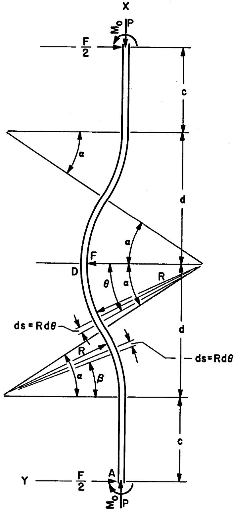  
Fig. A.2. Diagram for Stress Analysis of Bent Tube Concept for Case-B Primary Heat Exchanger.

For this analysis, the energy caused by direct stress and shear will be neglected. Therefore,

$$
u = \sum \int \frac {M ^ {2} d s}{2 E I}
$$

Because of symmetry,

$$
u = 2 \int_ {0} ^ {c} \frac {\mathrm {M d} x}{2 E I} + 2 \int_ {c} ^ {c + d} \frac {M ^ {2} \mathrm {d} s}{2 E I}.
$$

Since $\mathbf{M}_{\circ}$ does no work,

$$
\frac {\partial u}{\partial M _ {o}} = 0.
$$

For $0 <   \mathbf{X} <   \mathbf{c}$

$$
M _ {1} = M _ {0} - \frac {F X}{2}.
$$

For $c < X < c + \frac{d}{2}$ ,

$$
M _ {2} = M _ {0} - \frac {F}{2} (c + R \sin \beta) - P R (1 - \cos \beta).
$$

For $c + \frac{d}{2} < X < c + d$ ,

$$
\begin{array}{l} M _ {3} = M _ {0} - \frac {F}{2} (c + d - R \sin \theta) - P [ 2 R (1 - \cos \alpha) - R (1 - \cos \theta) ] \\ = M _ {0} - \frac {F}{2} (c + d - R \sin \theta) - P R (1 + \cos \theta - 2 \cos \beta). \\ \end{array}
$$

F is a dummy load used only to determine the horizontal movement of point D. Therefore, the terms involving F are set as being equal to zero.

$$
\begin{array}{l} E I \frac {\partial u}{\partial M _ {o}} = 2 \int_ {0} ^ {c} M _ {1} \frac {\partial M _ {1}}{\partial M _ {o}} d x + 2 \int_ {c} ^ {c + d} M \frac {\partial M}{\partial M _ {o}} d s \\ = 2 \int_ {0} ^ {c} M _ {o} (1) d x + 2 \int_ {0} ^ {\alpha} \left[ M _ {o} - P R (1 - \cos \beta) \right] (1) R d \beta \\ - 2 \int_ {\alpha} ^ {0} \left[ M _ {0} - \operatorname {P R} (1 + \cos \theta - 2 \cos \alpha) \right] (1) (R) (- d \theta), \\ \end{array}
$$

and

$$
E I \frac {\partial u}{\partial M _ {o}} = 0.
$$

Therefore,

$$
\begin{array}{l} \int_ {0} ^ {c} M _ {o} d x + R \int_ {0} ^ {\alpha} \left(M _ {o} - P R + P R \cos \beta\right) d \beta \\ + R \int_ {0} ^ {\alpha} \left(M _ {0} - P R - P R \cos \theta + 2 P R \cos \alpha\right) d \theta = 0, \\ \mathrm {M} _ {\circ} \mathrm {c} + \mathrm {R M} _ {\circ} \alpha - \mathrm {P R} ^ {2} \alpha + \mathrm {P R} ^ {2} \sin \alpha + \mathrm {M} _ {\circ} \mathrm {R} \alpha - \mathrm {P R} ^ {2} \alpha \\ - \operatorname {P R} ^ {2} \sin \alpha + 2 \operatorname {P R} ^ {2} \alpha \cos \alpha = 0, \\ M _ {O} = \frac {2 P R ^ {2} \alpha - 2 P R ^ {2} \alpha \cos \alpha}{c + 2 R \alpha} \\ = \frac {2 P R ^ {2} \alpha (1 - \cos \alpha)}{c + 2 R \alpha}. \\ \end{array}
$$

The deflection of point A in the direction of P,

$$
\delta_ {\mathbf {P}} = \frac {\partial u}{\partial \mathbf {P}}.
$$

Therefore,

$$
E I \delta_ {P} = E I \frac {\partial u}{\partial P} = 2 \int_ {0} ^ {c} M _ {1} \frac {\partial M _ {1}}{\partial P} d x + 2 \int_ {0} ^ {c + d} M \frac {\partial M}{\partial P} d s.
$$

Since $\mathbf{M}_{\mathbf{o}}$ has been determined, for $0 <   X <   c,$

$$
M _ {1} = \frac {2 P R ^ {2} \alpha - 2 P R ^ {2} \alpha \cos \alpha}{c + 2 R \alpha}
$$

and

$$
\frac {\partial \mathrm {M} _ {1}}{\partial \mathrm {P}} = \frac {2 \mathrm {R} ^ {2} \alpha - 2 \mathrm {R} ^ {2} \alpha \cos \alpha}{\mathrm {c} + 2 \mathrm {R} \alpha};
$$

for $c < X < c + \frac{d}{2}$ ,

$$
M _ {2} = \frac {2 P R ^ {2} \alpha - 2 P R ^ {2} \alpha \cos \alpha}{c + 2 R \alpha} - P R + P R \cos \beta
$$

or

$$
M _ {3} = \frac {2 P R ^ {2} \alpha \cos \beta + P R c \cos \beta - P R c - 2 P R ^ {2} \alpha \cos \alpha}{c + 2 R \alpha}
$$

and

$$
\frac {\partial M _ {2}}{\partial P} = \frac {2 R ^ {2} \alpha \cos \beta + R c \cos \beta - R c - 2 R ^ {2} \alpha \cos \alpha}{c + 2 R \alpha};
$$

and for $c + \frac{d}{2} < X < c + d$ ,

$$
M _ {3} = \frac {2 P R ^ {3} \alpha - 2 P R ^ {3} \alpha \cos \alpha}{c + 2 R \alpha} - P R - P R \cos \theta + 2 P R \cos \alpha
$$

or

$$
M _ {3} = \frac {2 P R ^ {2} \alpha \cos \alpha + 2 P R c \cos \alpha - P R c - P R c \cos \theta - 2 P R ^ {2} \alpha \cos \theta}{c + 2 R \alpha}
$$

and

$$
\frac {\partial M _ {a}}{\partial P} = \frac {2 R ^ {2} \alpha \cos \alpha + 2 R c \cos \alpha - R c - R c \cos \theta - 2 R ^ {2} \alpha \cos \theta}{c + 2 R \alpha}.
$$

Thus, the expression for $\mathbf{EI}\delta_{\mathbf{p}}$

$$
\begin{array}{l} E I \delta_ {P} = 2 P \left[ 2 R ^ {2} \alpha (1 - \cos \alpha) \right] ^ {2} \int_ {0} ^ {c} d x \\ + \frac {2 P R ^ {3}}{(c + 2 R \alpha) ^ {2}} \int_ {0} ^ {\alpha} (2 R \alpha \cos \beta + c \cos \beta - c - 2 R \alpha \cos \alpha) ^ {2} d \beta \\ + \frac {2 P R ^ {3}}{(c + 2 R \alpha) ^ {2}} \int_ {0} ^ {\alpha} (2 R \alpha \cos \alpha + 2 c \cos \alpha - c - c \cos \theta - 2 R \alpha \cos \theta) ^ {2} d \theta . \\ \end{array}
$$

After expansion and integration,

$$
\begin{array}{l} E I \delta_ {P} = \frac {P R ^ {4}}{(c + 2 R \alpha) ^ {2}} f (R, \alpha , c) \\ = \frac {\mathrm {P R} ^ {4}}{(\mathrm {c} + 2 \mathrm {R} \alpha) ^ {2}} \left[ (8 \mathrm {R} \alpha^ {3} + \frac {4 \mathrm {c} ^ {2} \alpha}{\mathrm {R}} + 8 \alpha^ {2} \mathrm {c}) \cos 2 \alpha \right. \\ - (1 2 R \alpha^ {3} + 1 2 \alpha c + \frac {3 c ^ {2}}{R}) \sin 2 \alpha + (8 \alpha^ {2} c) \cos^ {2} \alpha \\ - (1 6 \alpha^ {2} c + \frac {8 c ^ {2} \alpha}{R}) \cos \alpha \\ \left. + \left(1 6 R O ^ {3} + 2 4 c ^ {2} c + \frac {1 0 c ^ {2} \alpha}{R}\right) \right]. \\ \end{array}
$$

The differential tube growth,

$$
\begin{array}{l} \delta_ {P} = t ^ {\Delta L _ {o}} - t ^ {\Delta L _ {i}} \\ = 0. 1 1 8 9 - 0. 1 0 6 7 = 0. 0 1 2 2 \text {f t} \text {o r} 0. 1 4 6 4 \text {i n}. \\ \end{array}
$$

Bending the inner tubes and solving for the maximum moment present in these tubes,

$$
M _ {3} = \frac {2 P R ^ {2} \alpha - 2 P R ^ {2} \alpha \cos \alpha}{c + 2 R \alpha} - P R - P R \cos \theta + 2 P R \cos \alpha .
$$

Setting $\theta = 0^{\circ}$

$$
M _ {3} = - 2 P R (1 - \cos \alpha) \left(\frac {c + R \alpha}{c + 2 R \alpha}\right).
$$

The maximum flexure stress,

$$
\sigma_ {f l e x} = \frac {M}{Z} = \frac {- 2 P R (1 - \cos \alpha) \left(\frac {c + R \alpha}{c + 2 R \alpha}\right)}{Z},
$$

and

$$
P = \frac {E I \delta_ {P} (c + 2 R \alpha) ^ {2}}{R ^ {4} [ f (R , \alpha , c) ]}.
$$

Assume that the maximum offset is 8 in. Then,

$$
2 R (1 - \cos \theta) = 8.
$$

Assume that $\alpha = 30^{\circ} = 0.5236$ radians.

$$
2 R (1 - 0. 8 6 6) = 8,
$$

$$
R = \frac {4}{0 . 1 3 4} = 2 9. 2 \text {i n}.
$$

When $R = 30$ in., the offset $= 2(30)(0.134) = 8.05$ in.

$$
\begin{array}{l} d = 2 R \sin \alpha \\ = 2 (3 0) (0. 5) = 3 0 \text {i n .} \\ \end{array}
$$

Since $2(d + c) = 72$ in., the value $c = 5$ in. was used. For the tubes in the inner annulus,

$$
\overline {{\mathbf {E}}} = 2 6 \times 1 0 ^ {5} p s i
$$

and

$$
\begin{array}{l} \overline {{I}} = \frac {\pi \left(r _ {o} ^ {4} - r _ {i} ^ {4}\right)}{4} = \frac {\pi [ (0 . 1 8 7 5) ^ {4} - (0 . 1 5 2 5) ^ {4} ]}{4} \\ = 0. 7 8 5 3 9 (0. 0 0 1 2 3 5 9 - 0. 0 0 0 5 4 0 8) \\ = 5. 4 5 8 \times 1 0 ^ {- 4} \text {i n}. ^ {4} \\ \end{array}
$$

Solving for $\mathbb{P}$

$$
\begin{array}{l} P = \frac {(2 6 x 1 0 ^ {6}) (5 . 4 5 x 1 0 ^ {- 4}) (- 0 . 1 4 6 4) [ 5 + 2 (3 0) (0 . 5 2 3 6) ] ^ {2}}{(3 0) ^ {4} [ f (R , a , c) ]} \\ = \frac {- 3 . 3 9 6 3}{[ 7 3 . 9 7 ]} = - 0. 0 4 5 9 \mathrm {l b (t e n s i o n)}. \\ M _ {3} = - 2 (- 0. 0 4 5 9) (3 0) (1 - 0. 8 6 6) \left[ \frac {5 + 3 0 (0 . 5 2 3 6)}{5 + 2 (3 0) (0 . 5 2 3 6)} \right] \\ = (0. 3 6 7 5) \frac {2 0 . 7 0 8}{3 6 . 4 1 6} = 0. 2 0 8 9 8 \text {i n . - 1 b}. \\ \end{array}
$$

The flexure stress,

$$
\begin{array}{l} \sigma_ {\text {f l e x}} = \frac {\mathrm {M c}}{\mathrm {I}} = \frac {(0 . 2 0 8 9 8) (0 . 1 8 7 5)}{5 . 4 5 8 \times 1 0 ^ {- 4}} \\ = + 7 1. 7 5 \text {p s i}, \\ \end{array}
$$

and the stress inside the tubes,

$$
\sigma_ {i} = + 5 8. 3 6 p s i.
$$

The direct stress,

$$
\sigma_ {\text {d i r e c t}} = \frac {\mathrm {P}}{\mathrm {A}} = \frac {0 . 0 4 5 9}{\pi (0 . 0 1 1 9)} = + 1. 2 3 \text {p s i},
$$

which is negligible.

Secondary Stress Caused by Pressure. The longitudinal load on the tubes caused by the pressure differential on the bottom floating head,

$\mathbf{F} = (191 - 119)$ (area of head - annulus area + area of tubes)

$$
\begin{array}{l} = 7 2 [ (\text {n u m b e r o f t u b e s}) (\text {e n c l o s e d a r e a o f t u b e s}) ] \\ = 7 2 \left[ (3 7 9 4 + 4 3 4 7) (0. 1 1 0 4 5) \right] \\ = 6 4, 7 4 0 \text {l b} (\text {c o m p r e s s i v e}). \\ \end{array}
$$

Therefore,

$$
\Delta P ^ {\sigma} L = 7 2 \text {p s i (c o m p r e s s i v e)} \text {o n a l l t h e t u b e s}.
$$

# Stresses in Shell

The stresses produced in the shells are

1. primary membrane stresses caused by pressure and   
2. discontinuity stresses at the junction of the shell and tube sheet.

Primary Membrane Stresses. It was assumed that the outer shell of the exchanger is 1 in. thick. The hoop stress component,

$$
P ^ {\sigma} h = \frac {\Delta P D}{2 T} = \frac {1 9 4 (6 6 . 7)}{2 (1)} = 6 4 7 0 p s i,
$$

and the longitudinal stress component,

$$
P ^ {\sigma} L = \frac {\Delta P D}{4 T} = 3 2 3 5 p s i.
$$

For the inside shell separating the inner annulus and the central tube by which the coolant salt leaves the exchanger, the hoop stress component,

$$
P ^ {C _ {h}} = \frac {\Delta P D}{2 T} = \frac {(1 7 1 - 0) (2 2)}{2 (0 . 2 5)} = 7 5 2 4 p s i,
$$

and the longitudinal stress component,

$$
\mathbf {P} ^ {\sigma} \mathbf {L} = \frac {\Delta P D}{4 T} = 3 7 6 2 \text {p s i}.
$$

For the l-in.-thick shell separating the outer and inner annuli, the hoop stress component,

$$
P ^ {o} h = \frac {\Delta P D}{2 T} = \frac {(- 1 9 4 + 1 6 1) (5 2 . 5)}{2 (1)} = - 8 6 6 p s i,
$$

and the longitudinal stress component,

$$
p _ {L} ^ {\sigma} = 4 3 3 p s i.
$$

For that portion of the separator shell above the head of the inner annulus, the hoop stress component,

$$
P ^ {\sigma_ {h}} = \frac {1 9 4 (5 2 . 5)}{2 (1)} = 5 0 9 2 p s i,
$$

and the longitudinal stress component,

$$
\mathbf {p} ^ {\sigma_ {\mathbf {L}}} = 2 5 4 6 \text {p s i}.
$$

Discontinuity Stresses in Shell at Junction of Shell and Tube Sheet.

It was assumed that the tube sheet is very rigid with respect to the shell. Therefore, the deflection and rotation of the shell at the joint are zero. The reactions on the shell from the tube sheet are the moment and the force,

$$
\mathbf {M} = \frac {\mathbf {P}}{2 \lambda^ {2}} \quad \text {a n d} \quad \mathbf {F} = \frac {\mathbf {P}}{\lambda},
$$

where

$$
\lambda = \left[ \frac {1 2 (1 - v ^ {2})}{D _ {s} ^ {2} T ^ {2}} \right] ^ {1 / 4} = \left[ \frac {1 2 (1 - 0 . 3 ^ {2})}{(6 6 . 7) ^ {2} (1) ^ {2}} \right] ^ {1 / 4} = 0. 2 2.
$$

Therefore,

$$
M = \frac {1 9 4}{2 (0 . 0 4 8 4)} = 2 0 0 3 \text {i n . - 1 b / i n . ,}
$$

and

$$
F = \frac {1 9 4}{0 . 2 2} = 8 8 2 \mathrm {l b / i n}.
$$

For the outer shell of the exchanger, the secondary longitudinal stresses,

$$
\mathrm {M} ^ {\sigma} \mathrm {L} = \frac {6 \mathrm {M}}{\mathrm {T} ^ {2}} = \frac {6 (2 0 0 3)}{1} = 1 2 0 2 4 \text {p s i} (\text {t e n s i l e i n s i d e}, \text {c o m p r e s s i v e o u t s i d e}) ,
$$

and the hoop stresses,

$$
\mathrm {M} _ {\text {s e c}} ^ {\sigma} = \upsilon \left(\mathrm {M} _ {\mathrm {L}} ^ {\sigma}\right) = 0. 3 (1 2 0 2 4) = 3 6 0 7 \text {p s i} (\text {t e n s i l e i n s i d e},
$$

$$
\mathrm {M} ^ {\sigma_ {\mathrm {h}}} = \frac {2 \mathrm {M} \lambda^ {2}}{\mathrm {T}} = \frac {2 (2 0 0 3) (0 . 0 4 8 4)}{1} = 1 9 4 \text {p s i} (\text {u n i f o r m t e n s i l e}),
$$

$$
F ^ {\sigma} h = \frac {2 F _ {\lambda} r}{T} = \frac {2 (8 8 2) (0 . 2 2) (6 6 . 7)}{2 (1)} = 1 2 9 3 9 p s i (u n i f o r m c o m p r e s s i v e).
$$

The inner shell between the inner annulus and the central tube is strictly a tube that will be affected greatly by the method of anchorage and the final design of the exchanger. Therefore, the secondary discontinuity stresses for the inner shell or tube were not considered in this analysis.

For the upper portion of the separator shell above the top of the inner annulus head, the constant,

$$
\lambda = \left[ \frac {1 2 (1 - 0 . 3 ^ {2})}{(5 2 . 5) ^ {2} (1) ^ {2}} \right] ^ {1 / 4} = 0. 2 5 1.
$$

$$
M = \frac {P}{2 \lambda^ {2}} = \frac {1 9 4}{2 (0 . 0 6 3 0)} = 1 5 3 9. 6 \text {i n . - l b / i n . ,}
$$

and

$$
F = \frac {P}{\lambda} = \frac {1 9 4}{0 . 2 5 1} = 7 7 2. 9 6 1 b / i n.
$$

The secondary longitudinal stresses,

$$
M ^ {\sigma} L = \frac {6 M}{T ^ {2}} = \frac {6 (1 5 3 9 . 6)}{1} = 9 2 3 7. 8 p s i (\text {c o m p r e s s i v e i n s i d e},
$$

and the hoop stresses,

$$
\mathrm {M} ^ {\sigma} \mathrm {h} _ {\text {s e c}} = v \left(\mathrm {M} ^ {\sigma} \mathrm {L}\right) = 2 7 7 1. 3 \text {p s i (c o m p r e s s i v e i n s i d e ,} \quad \text {t e n s i l e o u t s i d e)} ,
$$

$$
M ^ {\sigma} h = \frac {2 M _ {A} ^ {2}}{T} = \frac {2 (1 5 3 9 . 6) (0 . 0 6 3)}{1} = 1 9 4 p s i (\text {u n i f o r m c o m p r e s s i v e}),
$$

$$
F ^ {\sigma} h = \frac {2 F \lambda r}{T} = \frac {2 (7 7 2 . 9 6) (0 . 2 5 1) (5 2 . 5)}{2 (1)} = 1 0 1 8 6 p s i (\text {u n i f o r m}
$$

# Stresses in Tube Sheets

The tube sheets included in this analysis of the Case-B primary heat exchanger are the top sheet for the outer annulus, the top sheet for the inner annulus, and the bottom sheet across both outer and inner annuli.

Outer Annulus Top Tube Sheet. The acting pressure, $\Delta P = 194$ psi on the top tube sheet of the outer annulus, and the area of action for this pressure,

$$
\begin{array}{l} \overline {{\mathbf {A}}} = \mathbf {A} _ {\mathrm {o}} - \mathbf {A} _ {\mathrm {i}} - \mathbf {A} _ {\mathrm {T}} = 3 5 0 0 - 2 1 6 5 - 3 7 9 4 (0. 1 1 0 4 5) \\ = 9 1 5. 5 5 \text {i n}. ^ {2} \\ \end{array}
$$

The resulting force,

$$
F = \Delta P A = 1 9 4 (9 1 5. 5 5) = 1 7 7, 6 1 7 1 b,
$$

and the uniformly distributed effective pressure,

$$
\overline {{\Delta P}} = 1 7 7 6 1 7 / 1 3 3 4. 8 = 1 3 3 \mathrm {p s i}.
$$

The ratio of the average ligament stress in the tube sheets, which are strengthened and stiffened by the rolled-in tubes, to the stress in flat unperforated plates of like dimensions equals the inverse of the ligament efficiency if the inside diameter of the tubes is used as the diameter of the penetrations (page 106 in Ref. 1); that is,

$$
\beta = \frac {\sigma_ {a v} ^ {\prime}}{\sigma} = \frac {p}{p - d _ {i}},
$$

where

$\beta =$ the inverse of the ligament efficiency,

$\sigma^{\prime} =$ average ligament stress in tube sheet,

$\sigma =$ stress in unperforated plate,

$\mathbf{p} =$ tube:pitch,

$\mathbf{d}_{\mathbf{i}} =$ inside diameter of tubes.

The inverse of the ligament efficiency,

$$
\beta = \frac {0 . 6 2 5}{(0 . 6 2 5 - 0 . 3 0 5)} \simeq \frac {0 . 6 2 5}{0 . 3 7 0} \simeq 1. 9 5.
$$

The value of 2.0 was used for $\beta$ . To determine the thickness required for the outer annulus upper tube sheet,

$$
\frac {S}{2} = \frac {\beta \overline {{\Delta P}} A ^ {2}}{T ^ {3}},
$$

$$
T ^ {2} = \frac {2 \beta \overline {{\Delta P}} A ^ {3}}{S}.
$$

From Case 76 in Ref. 3, $\beta = 0.03$ for $\mathsf{D_{oa}} / \mathsf{D_{ia}} = 66.7 / 52.5 \simeq 1.27$ , and at a temperature of $1000^{\circ}\mathsf{F}$ , the allowable stress, $\mathbf{s} = 17,000$ psi. Therefore

$$
\mathbf {T} ^ {2} = \frac {2 (0 . 0 3) (1 3 3) (6 6 . 7) ^ {2}}{1 7 0 0 0} = \frac {3 5 , 5 0 1}{1 7 , 0 0 0} = 2. 0 8.
$$

The thickness used, $\mathbf{T} = 1.5$ in.

Inner Annulus Top Tube Sheet. The acting pressure, $\Delta P = 161 - 147 = 14$ psi, and the area of action for this pressure,

$$
\overline {{A}} = A _ {0} - A _ {1} - A _ {T} = 2 1 6 5 - 3 9 7. 6 - 4 3 4 7 (0. 1 1 0 4 5)
$$

$$
1 2 8 7. 3 \quad i n. ^ {2}
$$

The resultant force,

$$
\mathbf {F} = \Delta \overline {{\mathbf {P A}}} = 1 8, 0 2 2 1 b,
$$

and the uniformly distributed effective pressure,

$$
\overline {{\Delta P}} = \frac {1 8 0 2 2}{1 7 6 7 . 4} = 1 0. 2 p s i.
$$

The inverse of the ligament efficiency

$$
\beta = \frac {0 . 6 7 4}{(0 . 6 7 4 - 0 . 3 0 5)} = 1. 8 2 6 (\text {u s e} 2. 0).
$$

At $D_{ia} / D_{center}$ tube = 52.5/22 = 2.386, $\beta \simeq 0.2438$ ; and at a temperature of $1300^{\circ}\mathrm{F}$ , the allowable stress, $S = 3500$ psi. Therefore, the required thickness of the inner annulus top tube sheet,

$$
\begin{array}{l} \mathrm {T} ^ {\circ} = \frac {2 \beta \overline {{\Delta P}} A ^ {2}}{S} \\ = \frac {2 (0 . 2 4 3 8) (1 0 . 2) (5 2 . 2) ^ {2}}{3 5 0 0} = 3. 9 2 \text {i n}. \\ \end{array}
$$

The thickness used, $\mathbf{T} = 2.5$ in.

Bottom Tube Sheet. The acting pressure on the bottom tube sheet, $\Delta P = 181 - 119 = 62$ psi, and the load caused by the tubes $= 0$ . The effective pressure,

$$
\begin{array}{l} \overline {{\Delta P}} = 6 2 \left[ \frac {3 5 0 0 - 3 9 8 - (0 . 1 1 0 4 5) (8 1 4 1)}{3 5 0 0 - 3 9 8} \right] \\ = 4 4 \text {p s i}. \\ \end{array}
$$

For $\frac{D_{oa}}{D_{center}}$ tube = 66.7/22 = 3.03, $\beta = 0.306$ ; and at the operating temperature, the allowable stress, $S = 10,000$ psi. Therefore, the thickness required for the bottom tube sheet,

$$
\begin{array}{l} T ^ {2} = \frac {2 \beta \overline {{\Delta P}} A ^ {3}}{S} \\ = \frac {2 (0 . 3 0 6) (4 4) (6 6 . 7) ^ {2}}{1 0 , 0 0 0} = 1 1. 8 8 \text {i n}. \\ \end{array}
$$

The thickness used, $\mathrm{T} = 3.5$ in.

Further analysis of the design for the Case-B primary heat exchanger that includes stress concentration, non-uniform loading, edge restraints, and thermal stresses will be required when the design is finalized and cyclical considerations are investigated.

# Summary of Calculated Stresses

Calculated Stresses in Tubes. The values calculated for the stresses that are uniform across the tube wall and their locations are given in Table A.2. The calculated stresses on the inside and outside surfaces of the tubes are given in Table A.3, and the calculated stress intensities for the tubes are compared with the allowable stress intensities in Table A.4.

Table A.2. Calculated Stresses Uniform Across Tube Wall   

<table><tr><td>Location</td><td>M^σh(psi)</td><td>P^σL(psi)</td><td>P^σh(psi)</td><td>ΔP^σL(psi)</td><td>F^σh(psi)</td></tr><tr><td colspan="6">Inner tubes</td></tr><tr><td>Inlet</td><td>-64</td><td>55</td><td>-230</td><td>-72</td><td>-136</td></tr><tr><td>Mid-height</td><td></td><td>55</td><td>-358</td><td>-72</td><td></td></tr><tr><td>Outlet</td><td>-284</td><td>55</td><td>-486</td><td>-72</td><td>-602</td></tr><tr><td colspan="6">Outer tubes</td></tr><tr><td>Inlet</td><td>-284</td><td>135</td><td>-486</td><td>-72</td><td>-602</td></tr><tr><td>Outlet</td><td>-615</td><td>135</td><td>-842</td><td>-72</td><td>-1302</td></tr></table>

Table A.3. Calculated Stresses on Inside and Outside Surfaces of Tubes   

<table><tr><td>Location</td><td>M0L(psi)</td><td>M0hsec(psi)</td><td>Δt0L(psi)</td><td>Δt0h(psi)</td><td>Δε0L(psi)</td></tr><tr><td>Inner tubes inlet</td><td></td><td></td><td></td><td></td><td></td></tr><tr><td>Inside surface</td><td>-124</td><td>-37</td><td>-6188</td><td>-6188</td><td></td></tr><tr><td>Outside surface</td><td>+124</td><td>+37</td><td>+5316</td><td>+5316</td><td></td></tr><tr><td>Inner tubes mid-height</td><td></td><td></td><td></td><td></td><td></td></tr><tr><td>Inside surface</td><td></td><td></td><td>-5894</td><td>-5894</td><td>+58</td></tr><tr><td>Outside surface</td><td></td><td></td><td>+5064</td><td>+5064</td><td>+72</td></tr><tr><td>Inner tubes outlet</td><td></td><td></td><td></td><td></td><td></td></tr><tr><td>Inside surface</td><td>-547</td><td>-164</td><td>-5600</td><td>-5600</td><td></td></tr><tr><td>Outside surface</td><td>+547</td><td>+164</td><td>+4811</td><td>+4811</td><td></td></tr><tr><td>Outer tubes inlet</td><td></td><td></td><td></td><td></td><td></td></tr><tr><td>Inside surface</td><td>-547</td><td>-164</td><td>-6660</td><td>-6660</td><td></td></tr><tr><td>Outside surface</td><td>+547</td><td>+164</td><td>+5721</td><td>+5721</td><td></td></tr><tr><td>Outer tubes outlet</td><td></td><td></td><td></td><td></td><td></td></tr><tr><td>Inside surface</td><td>-1182</td><td>-355</td><td>-5851</td><td>-5851</td><td></td></tr><tr><td>Outside surface</td><td>+1182</td><td>+355</td><td>+5027</td><td>+5027</td><td></td></tr></table>

Table A.4. Calculated Stress Intensities for Tubes of Case-B Primary Exchanger Compared With Allowable Stress Intensities   

<table><tr><td rowspan="2">Location</td><td rowspan="2">t(°F)</td><td colspan="3">Primary</td><td rowspan="2">Pm(psi)</td><td rowspan="2">Sm(psi)</td><td colspan="3">Secondary and Cyclic</td><td rowspan="2">Pm+Q+F(psi)</td><td rowspan="2">3Sm(psi)</td></tr><tr><td>Σσh(psi)</td><td>ΣσL(psi)</td><td>Σσr(psi)</td><td>Σσh(psi)</td><td>ΣσL(psi)</td><td>Σσr(psi)</td></tr><tr><td colspan="12">Inner tubes inlet</td></tr><tr><td>Inside surface</td><td>1203</td><td>-230</td><td>55</td><td>-147</td><td>285</td><td>5850</td><td>-6655</td><td>-6329</td><td>-147</td><td>6504</td><td>17,500</td></tr><tr><td>Outside surface</td><td>1157</td><td>-230</td><td>55</td><td>-161</td><td>285</td><td>8050</td><td>+4923</td><td>+5423</td><td>-161</td><td>5584</td><td>24,150</td></tr><tr><td colspan="12">Inner tubes mid-height</td></tr><tr><td>Inside surface</td><td>1133</td><td>-359</td><td>55</td><td>-133</td><td>414</td><td>9850</td><td>-6252</td><td>-5957</td><td>-133</td><td>6119</td><td>29,550</td></tr><tr><td>Outside surface</td><td>1088</td><td>-358</td><td>55</td><td>-171</td><td>414</td><td>14000</td><td>+4706</td><td>+5104</td><td>-171</td><td>4933</td><td>42,000</td></tr><tr><td colspan="12">Inner tubes outlet</td></tr><tr><td>Inside surface</td><td>1062</td><td>-486</td><td>55</td><td>-119</td><td>541</td><td>15050</td><td>-7136</td><td>-6164</td><td>-119</td><td>7017</td><td>45,150</td></tr><tr><td>Outside surface</td><td>1020</td><td>-486</td><td>55</td><td>-181</td><td>541</td><td>16400</td><td>+3603</td><td>+5341</td><td>-181</td><td>5522</td><td>49,200</td></tr><tr><td colspan="12">Outer tubes inlet</td></tr><tr><td>Inside surface</td><td>1065</td><td>-486</td><td>135</td><td>-113</td><td>621</td><td>15050</td><td>-8032</td><td>-7144</td><td>-119</td><td>7913</td><td>45,150</td></tr><tr><td>Outside surface</td><td>1016</td><td>-486</td><td>135</td><td>-184</td><td>621</td><td>16400</td><td>+4513</td><td>+6331</td><td>-181</td><td>6521</td><td>49,200</td></tr><tr><td colspan="12">Outer tubes outlet</td></tr><tr><td>Inside surface</td><td>924</td><td>-842</td><td>135</td><td>-50</td><td>977</td><td>17650</td><td>-8965</td><td>-6970</td><td>-51</td><td>8914</td><td>52,950</td></tr><tr><td>Outside surface</td><td>880</td><td>-842</td><td>135</td><td>-198</td><td>977</td><td>18100</td><td>+2623</td><td>+6272</td><td>-194</td><td>6466</td><td>54,300</td></tr></table>

Calculated Stresses in Shells. The stresses calculated for the shells of the exchanger are given in Table A.5, and the calculated stress intensities for the shells are compared with the allowable stress intensities in Table A.6.

Table A.5. Calculated Stress for Shells of Case-B Primary Exchanger   

<table><tr><td>Location</td><td>PCL(psi)</td><td>PGH(psi)</td><td>FGR(psi)</td><td>FC(h(psi)</td><td>Mgh(psi)</td><td>MCL(psi)</td><td>MCHSec(psi)</td></tr><tr><td>Top outer shell</td><td></td><td></td><td></td><td></td><td></td><td></td><td></td></tr><tr><td>Inside surface</td><td>+3235</td><td>+6470</td><td>-194</td><td>-12939</td><td>+194</td><td>+12024</td><td>+3607</td></tr><tr><td>Outside surface</td><td>+3235</td><td>+6470</td><td>-0</td><td>-12939</td><td>+194</td><td>-12024</td><td>-3607</td></tr><tr><td>Top separator shell</td><td></td><td></td><td></td><td></td><td></td><td></td><td></td></tr><tr><td>Inside surface</td><td>+2546</td><td>+5092</td><td>-194</td><td>+10186</td><td>-194</td><td>-9238</td><td>-2771</td></tr><tr><td>Outside surface</td><td>+2546</td><td>+5092</td><td>~0</td><td>+10186</td><td>-194</td><td>+9238</td><td>+2771</td></tr><tr><td>Mid-height inner shell</td><td></td><td></td><td></td><td></td><td></td><td></td><td></td></tr><tr><td>Inside surface</td><td>+3762</td><td>+7524</td><td>-166</td><td></td><td></td><td></td><td></td></tr><tr><td>Outside surface</td><td>+3762</td><td>+7524</td><td>-173</td><td></td><td></td><td></td><td></td></tr></table>

Table A.6. Calculated Stress Intensities for Shells of Case-B Primary Exchanger Compared With Allowable Stress Intensities   

<table><tr><td>Location</td><td>t max (°F)</td><td>Pm (psi)</td><td>Sm (psi)</td><td>Σσh (psi)</td><td>ΣσL (psi)</td><td>Σσr (psi)</td><td>Pm + Q + F (psi)</td><td>3S m (psi)</td></tr><tr><td>Top outer shell</td><td></td><td></td><td></td><td></td><td></td><td></td><td></td><td></td></tr><tr><td>Inside surface</td><td>850</td><td>6664</td><td>18,750</td><td>-2668</td><td>+15259</td><td>-194</td><td>17,927</td><td>56,250</td></tr><tr><td>Outside surface</td><td>850</td><td>6470</td><td>18,750</td><td>-9945</td><td>-8789</td><td>~0</td><td>9,945</td><td>56,250</td></tr><tr><td>Top separator shell</td><td></td><td></td><td></td><td></td><td></td><td></td><td></td><td></td></tr><tr><td>Inside surface</td><td>850</td><td>5286</td><td>18,750</td><td>+12313</td><td>-6692</td><td>-194</td><td>19,005</td><td>56,250</td></tr><tr><td>Outside surface</td><td>850</td><td>5092</td><td>18,750</td><td>+17855</td><td>+11784</td><td>~0</td><td>17,855</td><td>56,250</td></tr><tr><td>Mid-height inner shell</td><td></td><td></td><td></td><td></td><td></td><td></td><td></td><td></td></tr><tr><td>Inside surface</td><td>1111</td><td>7690</td><td>12,000</td><td></td><td></td><td></td><td></td><td></td></tr><tr><td>Outside surface</td><td>1111</td><td>7697</td><td>12,000</td><td></td><td></td><td></td><td></td><td></td></tr></table>

Calculated Stresses in Tube Sheets. The tube sheet thicknesses, maximum calculated stresses, and allowable stresses are tabulated below.

<table><tr><td>Tube Sheet</td><td>Thickness (in.)</td><td>Maximum Calculated Stress (psi)</td><td>Allowable Stress (psi)</td></tr><tr><td>Top outer annulus</td><td>1.5</td><td>&lt;17,000</td><td>17,000</td></tr><tr><td>Top inner annulus</td><td>2.5</td><td>&lt;3,500</td><td>3,500</td></tr><tr><td>Lower</td><td>3.5</td><td>&lt;10,000</td><td>10,000</td></tr></table>

# Appendix B

# CALCULATIONS FOR BLANKET-SALT HEAT EXCHANGER

# Heat-Transfer and Pressure-Drop Calculations for Case B

Each of the four modules in the heat-exchange system has one blanket-salt exchanger to transfer heat from the blanket-salt system to the coolant-salt system. The heat load per unit, $Q_{t}$ , is 9.471 x 10^7 Btu/hr.

The conditions stipulated for the tube-side blanket salt were an inlet temperature of $1250^{\circ}\mathrm{F}$ , an outlet temperature of $1150^{\circ}\mathrm{F}$ , a temperature drop of $100^{\circ}\mathrm{F}$ , and a maximum pressure drop across the exchanger of 90 psig. Other criteria given for the blanket salt were the flow rate through the core tubes, $\mathbf{W}_{\mathrm{tc}} = 4.3 \times 10^{8} \mathrm{lb/hr}$ and the total velocity, $\mathbf{V}_{\mathrm{t}} = 10.5 \mathrm{ft/sec}$ . Certain properties of the blanket salt vary almost linearly with temperature and pressure. Therefore, average conditions may be used without serious error. These average conditions for the blanket salt were

1. density, $\rho = 277$ lb/ft³;   
2. viscosity, $\mu = 38\cdot 1b / hr\cdot ft;$   
3. thermal conductivity, $k = 1.5$ Btu/hr·ft²·°F per ft; and   
4. specific heat, $C_p = 0.22$ Btu/1b $^{\circ}F$ .

The conditions stipulated for the shell-side coolant salt were an inlet temperature of $1111^{\circ}\mathrm{F}$ , an outlet temperature of $1125^{\circ}\mathrm{F}$ , a temperature increase of $14^{\circ}\mathrm{F}$ , and a maximum pressure drop across the exchanger of 20 psig. The mass flow rate of the cold fluid, $W_{\mathrm{cf}}$ , was given as $1.685 \times 10^{7} \mathrm{lb/hr}$ . The average conditions given for the coolant salt were

1. $\rho = 125\mathrm{lb / ft^3}$   
2. $\mu = 12\mathrm{lb / hr}\cdot \mathrm{ft},$   
3. $k = 1.3$ Btu/hr·ft²· ${}^0$ F per ft, and   
4. $C_p = 0.41 \, \text{Btu/lb} \cdot^{\circ} \text{F}$ .

The material to be used for the tubing was specified as Hastelloy N, and the tubes were to have an outside diameter of 0.375 in. and a wall thickness of 0.035 in. A triangular pitch was chosen and set at 0.8125 in.

The baffle cut, $\mathbf{F}_{\mathbf{w}}$ , or the ratio of open area of the baffle to the cross-sectional area of the shell required for the tubes was established as 0.45.

# Geometry of Exchanger

The reverse-flow exchanger has a 22-in.-OD pipe in the center through which coolant salt from the primary fuel-salt-to-coolant-salt exchanger enters the shell. This central pipe is surrounded by an annular area for the tubes. Two tube passes with an equal number of tubes in each pass are used against a single-pass shell with disk and doughnut baffles. The geometry of this arrangement was calculated as follows, and the terms used in the equations are defined in Appendix F.

The number of tubes in outer pass, $n_a$ , = number of tubes in inner pass, $n_c$ .

$$
\begin{array}{l} n _ {a} = n _ {c} = \frac {W _ {t c}}{V _ {T} \frac {\pi}{4} d _ {i} ^ {2} \rho (3 6 0 0)} \\ = \frac {4 . 3 \times 1 0 ^ {6} (1 4 4)}{(1 0 . 5) (0 . 7 8 5 4) (0 . 3 0 5) ^ {2} (2 7 7) (3 6 0 0)} = 8 1 0. \\ \end{array}
$$

The area required for tubes $= \frac{(810 + 810)(0.866)(0.8125)^{2}}{144} = 6.43$ ft².

The area of the center pipe $= (0.7854)(1.833)^{2} = 2.64 ft^{2}$ .

The total cross-sectional area $= 6.43 + 2.64 = 9.07$ ft².

The diameter of the shell,

$$
\begin{array}{l} D _ {s} = \left(\frac {9 . 0 7}{0 . 7 8 5 4}\right) ^ {1 / 2} = (1 1. 5 4 8) ^ {1 / 2} \\ = 3. 3 9 8 f t o r 4 0. 7 7 6 i n. \\ \end{array}
$$

The diameter of the doughnut hole,

$$
\begin{array}{l} D _ {d} = \left[ \frac {2 . 6 4 + (0 . 4 5) 6 . 4 3}{0 . 7 8 5 4} \right] ^ {1 / 2} \\ = 2. 6 5 4 \text {f t o r} 3 1. 8 5 2 \text {i n}. \\ \end{array}
$$

The diameter of the disk,

$$
\begin{array}{l} D _ {O D} = \left[ \frac {9 . 0 7 - (0 . 4 5) 6 . 4 3}{0 . 7 8 5 4} \right] ^ {1 / 2} \\ = 2. 8 0 4 \text {f t o r} 3 3. 6 5 3 \text {i n}. \\ \end{array}
$$

# Heat Transfer Coefficient Inside Tubes

The Reynolds number was calculated from given data,

$$
\mathrm {N} _ {\text {R e}} = \frac {\mathrm {d} _ {\mathrm {i}} \mathrm {V} _ {\mathrm {T} ^ {0} \mathrm {i}}}{\mu_ {\mathrm {i}}} = \frac {(0 . 3 0 5) (1 0 . 5) (2 7 7) (3 6 0 0)}{(1 2) 3 8} = 7 0 0 0.
$$

Using Eq. 1 discussed in Chapter 3, the heat transfer coefficient inside the tubes,

$$
\begin{array}{l} h _ {i} = 0. 0 0 0 0 6 5 \frac {k}{d _ {i}} (N _ {R e}) ^ {1. 4 3} (N _ {P r}) ^ {0. 4} \\ = 0. 0 0 0 0 6 5 \left(\frac {1 . 5 x 1 2}{0 . 3 0 5}\right) (7 0 0 0) ^ {1. 4 3} \left(\frac {0 . 2 2 x 3 8}{1 . 5}\right) ^ {0. 4} \\ = 0. 0 0 3 8 4 (3 1 4, 0 0 0) 1. 9 9 \\ = 2 4 0 0 \mathrm {B t u} / \mathrm {h r} \cdot \mathrm {f t} ^ {2} \cdot {} ^ {\circ} \mathrm {F}. \\ \end{array}
$$

The thermal resistance inside the tubes,

$$
R _ {i} = \frac {0 . 3 7 5}{(2 4 0 0) (0 . 3 0 5)} = 5. 1 2 \times 1 0 ^ {- 4}.
$$

# Thermal Resistance of Tube Wall

The thermal conductivity of Hastelloy N tubing in the temperature range of calculation is 11.6 Btu/hr·ft²·°F per ft. Therefore, the thermal resistance of the tube wall,

$$
\begin{array}{l} R _ {W} = \frac {d _ {o} \ln \frac {d _ {o}}{d _ {i}}}{2 k} \\ = \frac {(0 . 3 7 5) \ln \frac {0 . 3 7 5}{0 . 3 0 5}}{2 (1 2) 1 1 . 6} = 2. 8 \times 1 0 ^ {- 4}. \\ \end{array}
$$

# Shell-Side Heat Transfer Coefficient and Pressure Drop

The baffle spacing and therefore the number of baffles determines the heat transfer coefficient outside the tubes, $h_{0}$ , and the shell-side pressure drop, $\Delta P$ . Using Eqs. 3 through 11 discussed in Chapter 3,

which were developed from the work of Bergelin et al, $^{1,2}$ to determine the shell-side coefficient in cross-flow exchangers, the outside film resistance was calculated for various assumed baffle spacings. A curve of outside film resistance versus baffle spacing was then plotted from the data developed. The average cross-sectional flow area, $A_{B}$ , per foot of baffle spacing, $X$ , was first determined for rows of tubes in the cross-flow section.

$$
\begin{array}{l} \frac {A _ {B}}{X} = \pi \left(\frac {D _ {d} + D _ {O D}}{2}\right) \left(1 - \frac {d _ {o}}{0 . 9 p}\right) \\ = \pi \left(\frac {2 . 6 5 4 + 2 . 8 0 4}{2}\right) \left[ 1 - \frac {0 . 3 7 5}{(0 . 9) (0 . 8 1 2 5)} \right] \\ = (3. 1 4 1 6) (2. 7 2 9) (0. 4 8 7) = 4. 1 7 5 f t ^ {3} / f t. \\ \end{array}
$$

The cross-sectional flow area in the window section was then determined.

$$
\begin{array}{l} A _ {w} = \frac {0 . 4 5 (1 6 2 0)}{1 4 4} [ 0. 8 6 6 (0. 8 1 2 5) ^ {3} - 0. 7 8 5 4 (0. 3 7 5) ^ {2} ] \\ = 2. 3 3 5 f t ^ {2}. \\ \end{array}
$$

The Prandtl number was calculated from given data,

$$
\left(\mathrm {N} _ {\mathrm {P r}}\right) ^ {2 / 3} = \left[ \frac {0 . 4 1 (1 2)}{1 . 3} \right] ^ {2 / 3} = 2. 4 3.
$$

To calculate the outside film resistance, $\mathbf{R}_0$ , various baffle spacings, $\mathbf{X}$ , were assumed. For $\mathbf{X} = 0.74$ ft, the average cross-sectional flow area,

$$
A _ {B} = 4. 1 7 5 (0. 7 4) = 3. 0 9 f t ^ {3};
$$

the mass velocity of the cross-flow section,

$$
G _ {B} = \frac {1 . 6 8 5 \times 1 0 ^ {7}}{3 . 0 9} = 5. 4 5 \times 1 0 ^ {6} \mathrm {l b / h r} \cdot \mathrm {f t} ^ {2};
$$

the mass velocity of the window section,

$$
G _ {w} = \frac {1 . 6 8 5 x 1 0 ^ {7}}{2 . 3 3 5} = 7. 2 2 x 1 0 ^ {6} l b / h r \cdot f t ^ {2};
$$

the mean mass velocity,

$$
G _ {m} = 6. 2 7 5 \times 1 0 ^ {6} \mathrm {l b / h r} \cdot \mathrm {f t} ^ {2};
$$

the Reynolds number for the cross-flow section,

$$
\left(\mathrm {N} _ {\mathrm {R e}}\right) _ {\mathrm {B}} = \frac {(0 . 3 7 5) 5 . 4 5 \times 1 0 ^ {6}}{1 2 (1 2)} = 1 4, 2 0 0;
$$

the Reynolds number for the window section,

$$
\left(\mathrm {N} _ {\mathrm {R e}}\right) _ {\mathrm {w}} = \frac {(0 . 3 7 5) 6 . 2 7 5 \times 1 0 ^ {6}}{1 2 (1 2)} = 1 6, 3 5 0;
$$

the heat transfer factor,

$$
J = 0. 3 4 6 / \left(N _ {R e}\right) ^ {0} \cdot 3 8 2;
$$

the heat tranfer factor for the cross-flow section,

$$
J _ {B} = 0. 0 0 8 9 5;
$$

the heat transfer factor for the window section,

$$
J _ {W} = 0. 0 0 8 5;
$$

the heat transfer coefficient for the cross-flow section,

$$
\begin{array}{l} h _ {B} = J _ {B} \frac {C _ {p} G _ {B}}{\left(N _ {P r}\right) ^ {2} / 3} = 0. 0 0 8 9 5 \frac {(0 . 4 1) 5 . 4 5 \times 1 0 ^ {6}}{2 . 4 3} \\ = 8 2 3 0 \mathrm {B t u} / \mathrm {h r} ^ {\cdot} \mathrm {f t} ^ {3} ^ {\cdot} ^ {\circ} F; \\ \end{array}
$$

the heat transfer coefficient for the window section,

$$
h _ {w} = 0. 0 0 8 5 \frac {(0 . 4 1) 6 . 2 7 5 x 1 0 ^ {6}}{2 . 4 3} = 9 0 0 0 B t u / h r \cdot f t ^ {2} \cdot {} ^ {o} F;
$$

the heat transfer coefficient outside the tubes,

where $B_h =$ leakage correction factor because the heat transfer equations are based on no leakage

$$
\begin{array}{l} \mathrm {h} _ {\mathrm {o}} = \left[ \mathrm {h} _ {\mathrm {B}} \left(1 - 2 \mathrm {F} _ {\mathrm {w}}\right) + \mathrm {h} _ {\mathrm {w}} \left(2 \mathrm {F} _ {\mathrm {w}}\right) \right] \mathrm {B} _ {\mathrm {h}}, \\ = 0. 8, \\ = [ 8 2 3 0 (0. 1) + 9 0 0 0 (0. 9) ] 0. 8 \\ = 7 1 4 0 \mathrm {B t u} / \mathrm {h r} \cdot \mathrm {f t} ^ {2} \cdot {} ^ {\circ} \mathrm {F}; \text {a n d} \\ \end{array}
$$

the thermal resistance of the outside film,

$$
R _ {o} = 1. 4 0 x 1 0 ^ {- 4}.
$$

When $\mathbf{X} = 1.48$ ft,

$$
A _ {B} = 4. 1 7 5 (1. 4 8) = 6. 1 8 f t ^ {2},
$$

$$
G _ {B} = \frac {1 . 6 8 5 x 1 0 ^ {7}}{6 . 1 8} = 2. 7 3 x 1 0 ^ {6} 1 b / h r \cdot f t ^ {2},
$$

$$
G _ {w} = 7. 2 2 \times 1 0 ^ {5} \mathrm {l b / h r} \cdot \mathrm {f t} ^ {2},
$$

$$
G _ {m} = 4. 4 4 x 1 0 ^ {5} \mathrm {l b / h r} \cdot \mathrm {f t} ^ {2},
$$

$$
\left(\mathrm {N} _ {\mathrm {R e}}\right) _ {\mathrm {B}} = \frac {(0 . 3 7 5) 2 . 7 3 \times 1 0 ^ {6}}{1 2 (1 2)} = 7 1 0 0,
$$

$$
\left(\mathrm {N} _ {\mathrm {R e}}\right) _ {\mathrm {w}} = \frac {(0 . 3 7 5) 4 . 4 4 \times 1 0 ^ {6}}{1 2 (1 2)} = 1 1, 5 0 0,
$$

$$
J _ {B} = 0. 0 1 1 7,
$$

$$
J _ {w} = 0. 0 0 9 7 2,
$$

$$
h _ {B} = 0. 0 1 1 7 \frac {(0 . 4 1) 2 . 7 3 x 1 0 ^ {6}}{2 . 4 3} = 5 3 9 0 B t u / h r \cdot f t ^ {2} \cdot {} ^ {\circ} F,
$$

$$
h _ {w} = 0. 0 0 9 7 2 \frac {(0 . 4 1) 4 . 4 4 x 1 0 ^ {6}}{2 . 4 3} = 7 2 8 0 B t u / h r \cdot f t ^ {2} \cdot {} ^ {\circ} F,
$$

$$
h _ {o} = [ 0. 1 (5 3 9 0) + 0. 9 (7 2 8 0) ] 0. 8 = 5 6 7 0 B t u / h r \cdot f t ^ {2} \cdot {} ^ {o} F, a n d
$$

$$
R _ {o} = 1. 7 6 \times 1 0 ^ {- 4}.
$$

When $\mathbf{X} = 2.22$ ft,

$$
A _ {B} = 4. 1 7 5 (2. 2 2) = 9. 2 7 f t ^ {2},
$$

$$
G _ {B} = \frac {1 . 6 8 5 \times 1 0 ^ {7}}{9 . 2 7} = 1. 8 2 \times 1 0 ^ {6} \mathrm {l b / h r} ^ {\cdot} \mathrm {f t} ^ {2},
$$

$$
G _ {w} = 7. 2 2 \times 1 0 ^ {6} \mathrm {l b / h r} \cdot \mathrm {f t} ^ {2},
$$

$$
G _ {m} = 3. 6 2 \times 1 0 ^ {6} \mathrm {l b / h r} \cdot \mathrm {f t} ^ {3},
$$

$$
\left(\mathrm {N} _ {\mathrm {R e}}\right) _ {\mathrm {B}} = \frac {(0 . 3 7 5) 1 . 8 2 \times 1 0 ^ {6}}{1 2 (1 2)} = 4 7 4 0,
$$

$$
\left(\mathrm {N} _ {\text {R e}}\right) _ {\mathrm {w}} = \frac {(0 . 3 7 5) 3 . 6 2 \times 1 0 ^ {6}}{1 2 (1 2)} = 9 4 3 0,
$$

$$
J _ {B} = 0. 0 1 3 6,
$$

$$
J _ {w} = 0. 0 1 0 5,
$$

$$
h _ {B} = 0. 0 1 3 6 \frac {(0 . 4 1) 1 . 8 2 \times 1 0 ^ {6}}{2 . 4 3} = 4 1 8 0 B t u / h r \cdot f t ^ {2} \cdot {} ^ {\circ} F,
$$

$$
h _ {w} = 0. 0 1 0 5 \frac {(0 . 4 1) 3 . 6 2 \times 1 0 ^ {6}}{2 . 4 3} = 6 4 1 0 B t u / h r \cdot f t ^ {2} \cdot {} ^ {\circ} F,
$$

$$
h _ {o} = [ 0. 1 (4 1 8 0) + 0. 9 (6 4 1 0) ] 0. 8 = 4 9 5 0 B t u / h r \cdot f t ^ {2} \cdot {} ^ {o} F, a n d
$$

$$
R _ {0} = 2. 0 2 \times 1 0 ^ {- 4}.
$$

When $\mathbf{X} = 2.96$ ft,

$$
\begin{array}{l} A _ {B} = 4. 1 7 5 (2. 9 6) = 1 2. 3 6 f t ^ {3}, \\ G _ {B} = \frac {1 . 6 8 5 \times 1 0 ^ {7}}{1 2 . 3 6} = 1. 3 6 5 \times 1 0 ^ {6} \mathrm {l b / h r} \cdot \mathrm {f t} ^ {2}, \\ G _ {W} = 7. 2 2 \times 1 0 ^ {6} \mathrm {l b / h r} \cdot \mathrm {f t} ^ {3}, \\ G _ {m} = 3. 1 4 \times 1 0 ^ {6} \mathrm {l b / h r} \cdot \mathrm {f t} ^ {2}, \\ \left(\mathrm {N} _ {\text {R e}}\right) _ {\mathrm {B}} = \frac {(0 . 3 7 5) 1 . 3 6 5 \times 1 0 ^ {6}}{1 2 (1 2)} = 3 5 5 0, \\ \left(\mathrm {N} _ {\text {R e}}\right) _ {\mathrm {w}} = \frac {(0 . 3 7 5) 3 . 1 4 \times 1 0 ^ {6}}{1 2 (1 2)} = 8 1 8 0, \\ J _ {B} = 0. 0 1 5 2 5, \\ J _ {W} = 0. 0 1 1 1, \\ h _ {B} = 0. 0 1 5 2 5 \frac {(0 . 4 1) 1 . 3 6 5 \times 1 0 ^ {6}}{2 . 4 3} = 3 5 1 0 B t u / h r ^ {\cdot} f t ^ {2} \cdot {} ^ {\circ} F, \\ h _ {w} = 0. 0 1 1 1 \frac {(0 . 4 1) 3 . 1 4 x 1 0 ^ {6}}{2 . 4 3} = 5 8 9 0 B t u / h r \cdot f t ^ {2} \cdot {} ^ {\circ} F, \\ h _ {0} = [ 0. 1 (3 5 1 0) + 0. 9 (5 8 9 0) ] 0. 8 = 4 5 2 0 B t u / h r ^ {\cdot} f t ^ {2} \cdot {} ^ {\circ} F, a n d \\ R _ {o} = 2. 2 1 \times 1 0 ^ {- 4}. \\ \end{array}
$$

These calculated values of the thermal resistance of the outside film were then plotted as a function of the baffle spacing, and the resulting curve is shown in Fig. B.1.

From the curve in Fig. B.1, it can be quickly determined whether the baffle spacing is limited by thermal stress in the tube wall or by the allowable shell-side pressure drop. Because of thermal stress, the maximum temperature drop across the tube wall is $46^{\circ}\mathrm{F}$ . With this information and other given data, $\mathbf{R}_{\circ}$ can be calculated.

$$
\Delta t = 4 6 = \frac {R _ {W}}{R _ {t}} \left(t _ {h i} - t _ {c i}\right).
$$

$$
R _ {t} = 0. 0 0 0 2 8 \frac {(1 2 5 0 - 1 1 1 1)}{4 6} = 0. 0 0 0 8 5.
$$

$$
\begin{array}{l} R _ {o} = R _ {t} - R _ {i} - R _ {W} = 0. 0 0 0 8 5 - 0. 0 0 0 5 1 2 - 0. 0 0 0 2 8 \\ = 0. 0 0 0 0 6. \\ \end{array}
$$

By extrapolating the values on the curve in Fig. B.1 for $R_{0} = 0.00006$ , the baffle spacing limited by the temperature drop across the tube wall is approximately 3 in. A rough approximation of the pressure drop based

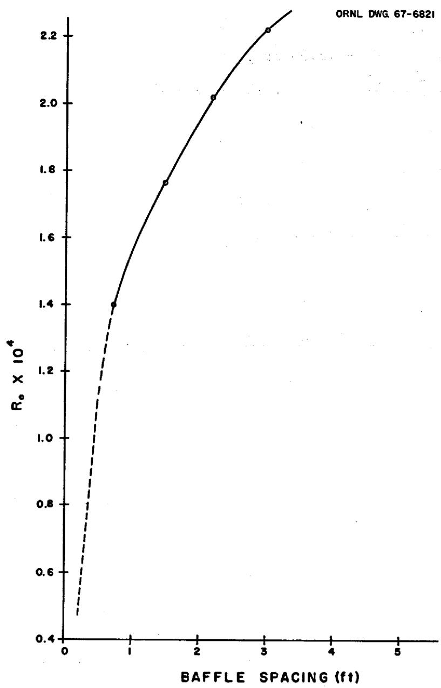  
Fig. B.1. Outside Film Resistance Versus Baffle Spacing.

on this 3-in. spacing is in excess of the desired maximum of 20 psi. Therefore, the baffle spacing will be limited by the pressure drop, and it will exceed 3 in.

With the limiting factor for the baffle spacing established, some mathematical relationships between the baffle spacing, the outside film resistance, and the shell-side pressure drop were established. These were based primarily on the methods proposed by Bergelin et al. $^{1,2}$ for

determining pressure drop in cross-flow exchangers. The total heat transfer rate,

$$
\begin{array}{l} Q _ {t} = U a _ {t} \gamma \Delta t _ {L m}, \\ = U \pi d _ {o} \left(n _ {a} + n _ {c}\right) L \gamma \Delta t _ {L m}. \tag {B.1} \\ \end{array}
$$

$$
\begin{array}{l} \Delta P _ {s} = \left[ \frac {(N + 1) (r _ {B}) (0 . 6)}{1 4 4 x 6 4 . 4} \left(\frac {G _ {B}}{3 6 0 0}\right) ^ {2} + \frac {N [ 2 + 0 . 6 (r _ {w}) ]}{1 4 4 x 6 4 . 4} \left(\frac {G _ {x m}}{3 6 0 0}\right) ^ {2} \right] \frac {B _ {P}}{\rho}. (B.2) \\ \mathbf {L} = \mathbf {X} (\mathbf {N} + 1). (B.3) \\ \end{array}
$$

From Eq. B.1,

$$
\mathrm {U L} = \frac {\mathrm {Q} _ {\mathrm {t}}}{\pi \mathrm {d} _ {\mathrm {o}} \gamma \Delta \mathrm {t} _ {\mathrm {L m}} \left(\mathrm {n} _ {\mathrm {a}} + \mathrm {n} _ {\mathrm {c}}\right)}
$$

Various factors of this equation can be evaluated from known data,

$$
\begin{array}{l} \Delta t _ {\mathrm {L m}} = \frac {\left(t _ {\mathrm {h i}} - t _ {\mathrm {c o}}\right) - \left(t _ {\mathrm {h o}} - t _ {\mathrm {c i}}\right)}{\ln \left(\frac {t _ {\mathrm {h i}} - t _ {\mathrm {c o}}}{t _ {\mathrm {h o}} - t _ {\mathrm {c i}}}\right)} = \frac {(1 2 5 0 - 1 1 2 5) - (1 1 5 0 - 1 1 1 1)}{\ln \frac {1 2 5}{3 9}} \\ = 7 3. 9 ^ {\circ} \mathrm {F}. \\ \end{array}
$$

A correction factor must be applied to a one-shell-pass two-tube-pass exchanger to account for the deviation from a strictly counterflow situation. This correction factor is represented by gamma in Eq. B.1. To determine gamma, the capacity and effectiveness ratios most be calculated first. The capacity ratio,

$$
\alpha = \frac {t _ {\mathrm {h i}} - t _ {\mathrm {h o}}}{t _ {\mathrm {c o}} - t _ {\mathrm {c i}}} = \frac {1 2 5 0 - 1 1 5 0}{1 1 2 5 - 1 1 1 1} = \frac {1 0 0}{1 4} = 7. 1 5.
$$

The effectiveness ratio,

$$
\beta = \frac {t _ {c o} - t _ {c i}}{t _ {h i} - t _ {c i}} = \frac {1 4}{1 3 9} = 0. 1.
$$

From data published by Chapman, $^3$ $\gamma = 0.95$ for a one-shell-pass two-tube-pass exchanger. The overall heat transfer coefficient, U, of Eq. B.1,

$$
U = \frac {1}{R _ {o} + R _ {i} + R _ {W}} = \frac {1}{R _ {o} + (5 . 1 2 + 2 . 8) 1 0 ^ {- A}}.
$$

Substituting the values for $\Delta t_{\mathbf{Lm}}$ , $\gamma$ , and $\mathbf{U}$ in Eq. B.1,

$$
\begin{array}{l} \frac {L}{R _ {0} + (7 . 9 2 \times 1 0 ^ {- 4})} = \frac {9 . 4 7 1 \times 1 0 ^ {7} \times 1 2}{(3 . 1 4 1 6) (0 . 3 7 5) (0 . 9 5) (7 3 . 9) (1 6 2 0)} \\ = 0. 8 5 \times 1 0 ^ {4}. \\ L = 0. 8 5 \times 1 0 ^ {4} \left(R _ {0}\right) + 6. 7 4. \tag {B.1a} \\ \end{array}
$$

Values of $\mathbf{r}_{\mathbf{B}}$ and $\mathbf{r}_{\mathbf{w}}$ were then determined for substitution into Eq. B.2. The average number of restrictions to flow in the cross-flow area,

$$
r _ {B} = \frac {D _ {O D} - D _ {d}}{1 . 8 6 6 p} = \frac {(2 . 8 0 4 - 2 . 6 5 4) (1 2)}{(1 . 8 6 6) (0 . 8 1 2 5)} = 1. 1 9.
$$

The average number of restrictions to flow in the window area,

$$
\begin{array}{l} r _ {w} = \frac {\left(D _ {s} - D _ {O D}\right) + \left(D _ {d} - D _ {C P}\right)}{2 (1 . 8 6 6 p)} = \frac {1 2 [ (3 . 3 9 8 - 2 . 8 0 4) + (2 . 6 5 4 - 1 . 8 3 3) ]}{(3 . 7 3 2) (0 . 8 1 2 5)} \\ = 5. 6. \\ \end{array}
$$

Because the equation for pressure drop is based on no leakage, $\mathbf{B}_{\mathbf{P}}$ in Eq. B.2 is a leakage correction factor. From the work reported by Bergelin et al., $^{1,3}$ its value is 0.52. Combining Eqs. B.1 and B.2 and substituting the values for $\mathbf{r}_{\mathbf{B}}, \mathbf{r}_{\mathbf{W}}$ , and $\mathbf{B}_{\mathbf{P}}$ ,

$$
\begin{array}{l} \Delta P = \left[ \left(\frac {L}{X}\right) \frac {(1 . 1 9) 0 . 6}{(1 4 4) 6 4 . 4} \left(\frac {G _ {B}}{3 6 0 0}\right) ^ {2} + \left(\frac {L}{X} - 1\right) \frac {2 + (0 . 6) (5 . 6)}{(1 4 4) 6 4 . 4} \left(\frac {G _ {m}}{3 6 0 0}\right) ^ {2} \right] \frac {0 . 5 2}{1 2 5} \\ = \frac {L}{X} (0. 3 2 x 1 0 ^ {- 6}) \left(\frac {G _ {B}}{3 6 0 0}\right) ^ {2} + \left(\frac {L}{X} - 1\right) (2. 4 0 x 1 0 ^ {- 6}) \left(\frac {G _ {m}}{3 6 0 0}\right) ^ {2}. \tag {B.2a} \\ \end{array}
$$

Equations B.la and B.2a and the curve in Fig. B.l were then used to determine a baffle spacing at which the shell-side pressure drop was within the maximum allowable of 20 psi. An even number of baffles was desired for smooth flow through the shell with a minimum number of stagnant areas. By approximation, four baffles should give a pressure drop within the allowable. Assuming four baffles, the baffle spacing was chosen so that the ratio $\mathrm{L} / \mathrm{X} = 5$ . For baffle spacing, $\mathrm{X} = 1.65$ ft from Fig. B.l, $\mathrm{R}_{\mathrm{o}} = 1.82 \times 10^{-4}$ . Substituting in Eq. B.la,

$$
\mathbf {L} = (0. 8 5 \times 1 0 ^ {4}) (1. 8 2 \times 1 0 ^ {- 4}) + 6. 7 4 = 8. 2 8 7 f t.
$$

Therefore,

$$
\frac {L}{X} = N + 1 = \frac {8 . 2 8 7}{1 . 6 5} = 5. 0 2.
$$

For substitution in Eq. B.2a, values of $G_B$ and $G_m$ were calculated. $A_B = (4.175)(1.65) = 6.89 ft^3$ ,

$$
G _ {B} = \frac {1 . 6 8 5 x 1 0 ^ {7}}{6 . 8 9} = 2. 4 4 6 x 1 0 ^ {8} 1 b / h r \cdot f t ^ {3}.
$$

$$
\begin{array}{l} G _ {W} = 7. 2 2 \times 1 0 ^ {6} \mathrm {l b / h r} \cdot \mathrm {f t} ^ {3}, \\ G _ {m} = \left(G _ {B} G _ {w}\right) ^ {1 / 2} = \left[ \left(2. 4 4 6 x 1 0 ^ {6}\right) \left(7. 2 2 x 1 0 ^ {6}\right) \right] ^ {1 / 2} \\ = 4. 2 \times 1 0 ^ {3} \mathrm {l b / h r} \cdot \mathrm {f t} ^ {3}. \\ \end{array}
$$

Therefore,

$$
\begin{array}{l} \Delta P = 5 (0. 3 2 \times 1 0 ^ {- 6}) \left(\frac {2 . 4 4 6 \times 1 0 ^ {6}}{3 6 0 0}\right) ^ {2} + 4 (2. 4 0 \times 1 0 ^ {- 6}) \left(\frac {4 . 2 \times 1 0 ^ {8}}{3 6 0 0}\right) ^ {2} \\ = 0. 7 4 + 1 3. 0 7 = 1 3. 8 1 \text {p s i}. \\ \end{array}
$$

If we add five cross-flow areas to account for the cross-flow areas at the entrance and exit of the shell,

$$
\begin{array}{l} \Delta P = 1 0 (0. 3 2 \times 1 0 ^ {- 6}) (4. 6 2 \times 1 0 ^ {5}) + 4 (2. 4 0 \times 1 0 ^ {- 6}) (1. 3 6 1 \times 1 0 ^ {6}) \\ = 1. 4 8 + 1 3. 0 7 = 1 4. 5 5 \mathrm {p s i}. \\ \end{array}
$$

# Tube-Side Pressure Drop

The pressure drop of the blanket salt through the tubes was calculated by using the Darcy equation.4 The Reynolds number was calculated to determine the friction factor, f.

$$
N _ {R e} = \frac {d _ {i} V _ {T} \rho}{\mu} = \frac {(0 . 3 0 5) (1 0 . 5) (2 7 7) (3 6 0 0)}{(1 2) (3 8)} = 7 0 0 0.
$$

$$
f = 0. 0 3 5.
$$

From the calculated length, the total length of the tubes, including tube-sheet thickness,

$$
\mathbf {L} = 2 (8. 2 8 7) + 0. 5 = 1 7. 0 7 4 \mathrm {f t}.
$$

From the Darcy equation,

$$
\begin{array}{l} \Delta P = \left(\frac {f L}{d _ {i}} + 4\right) \frac {V _ {T} ^ {2} \rho}{(1 4 4) 6 4 . 4} \\ = \left(\frac {0 . 0 3 5 (1 7 . 0 7 4) 1 2}{0 . 3 0 5} + 4\right) \frac {(1 0 . 5) ^ {2} 2 7 7}{(1 4 4) 6 4 . 4} = (2 7. 5 1 2) (3. 2 9 5) \\ = 9 0. 6 5 \mathrm {p s i}. \\ \end{array}
$$

# Temperature of Blanket Salt at End of First Pass

Determination of the temperature between tube passes is a trial and error procedure. By using the relationships given below and substituting given and calculated data, the trial and error calculations were simplified. The total heat transfer rate,

$$
Q _ {t} = \left(t _ {h i} - t _ {h e}\right) W _ {t c} C _ {p}.
$$

$$
Q _ {t} = U a _ {t} \gamma \frac {\left(t _ {h i} - t _ {c o}\right) - \left(t _ {h e} - t _ {c i}\right)}{\ln \left(\frac {t _ {h i} - t _ {c o}}{t _ {h e} - t _ {c i}}\right)}.
$$

The overall heat transfer coefficient,

$$
U = \frac {1}{(1 . 8 2 + 7 . 9 2) 1 0 ^ {- 4}} = 1 0 2 7 B t u / h r \cdot f t ^ {2} \cdot {} ^ {o} F,
$$

and the surface area of the first pass

$$
\begin{array}{l} a _ {T} = 8 1 0 \pi \left(\frac {0 . 3 7 5}{1 2}\right) 8. 2 8 7 \\ = 6 5 9 f t ^ {2}. \\ \end{array}
$$

$$
1 2 5 0 - t _ {h e} = \frac {(1 0 2 7) (6 5 9) (0 . 9 5)}{(4 . 3 \times 1 0 ^ {6}) (0 . 2 2)} \left(\frac {1 2 5 - t _ {h e} + 1 1 1 1}{\ln \frac {1 2 5}{t _ {h e} - 1 1 1 1}}\right) = 0. 6 8 0 \frac {1 2 3 6 - t _ {h e}}{\ln \frac {1 2 5}{t _ {h e} - 1 1 1 1}}.
$$

Assume that the temperature of the blanket salt at the end of the first pass, $t_{\text{he}} = 1184.4^{\circ}\text{F}$ .

$$
6 5. 6 = 0. 6 8 0 \frac {5 1 . 6}{\ln 1 . 7 0 3} = 6 5. 9 5.
$$

Assume $t_{\text{he}} = 1184.2^{\circ} \text{F}$ ,

$$
6 5. 8 = 0. 6 8 0 \frac {5 1 . 8}{\ln 1 . 7 0 8} = 6 5. 8 4.
$$

The value for $t_{\text{the}}$ of $1184.2^{\circ} \text{F}$ is a close enough approximation.

# Stress Analysis for Case B

The stress analysis for the blanket-salt heat exchanger involved a determination of the stresses produced in the tubes, the shell, and the tube sheets. The stresses produced in the tubes are

1. primary membrane stresses caused by pressure,   
2. secondary stresses caused by the temperature gradient across the wall of the tube,   
3. discontinuity stresses at the junction of the tube and the tubesheet, and   
4. secondary stresses caused by the difference in growth between the tubes and the shell.

The stresses produced in the shell are

1. primary membrane stresses caused by pressure and   
2. discontinuity stresses at the junction of the shell and tube sheet. For this exchanger, the stresses in the tube sheets are those produced by pressure. The shear stress theory of failure was used as the failure criterion, and the stresses were classified and the limits of stress intensity were determined in accordance with Section III of the ASME Boiler and Pressure Vessel Code.

The coolant salt enters the blanket-salt exchanger at the bottom through the 22-in.-OD central pipe at a temperature of $1111^{\circ}\mathbf{F}$ and a pressure of 145 psi, travels to the top of the pipe and enters the shell side of the exchanger at a pressure of 138 psi, circulates through the shell and leaves the exchanger at a temperature of $1125^{\circ}\mathbf{F}$ and a

pressure of 129 psi. The tubes through which the blanket salt is circulated are 0.375-in.-OD ones with a wall thickness of 0.035 in. and a tube-sheet-to-tube-sheet length of 8.287 ft. There are 810 straight tubes in the inner annulus and 810 straight tubes in the outer annulus of the 40.78-in.-ID shell. The tubes are arranged in a triangular array with a pitch of 0.8125 in. The blanket salt enters the tubes at a temperature of $1250^{\circ}\mathrm{F}$ and a pressure of 111 psi, flows down and reaches the floating head at a temperature of $1184^{\circ}\mathrm{F}$ and a pressure of 83 psi, flows up and leaves the exchanger at a temperature of $1150^{\circ}\mathrm{F}$ and a pressure of 20 psi.

# Stresses in Tubes

The analyses of the stresses in the tubes of the blanket-salt exchanger consisted of a determination of the four types of stresses previously mentioned. The terms used in these calculations are defined in Appendix F.

Primary Membrane Stress. The hoop stress,

$$
\sigma_ {h} = \frac {a ^ {2} P _ {i} - b ^ {2} P _ {o}}{b ^ {2} - a ^ {2}} + \frac {\left(P _ {i} - P _ {o}\right) a ^ {2} b ^ {2}}{r ^ {2} \left(b ^ {2} - a ^ {2}\right)},
$$

where

a = inside radius of tube = 0.1525 in.,

$\mathbf{b} =$ outside radius of tube $= 0.1857$ in., and

$\mathbf{r} =$ radius of tube at point where stresses are being investigated.

Therefore,

$$
\sigma_ {h} = 1. 9 5 4 P _ {i} - 2. 9 5 5 P _ {o} + \frac {0 . 0 6 8 8 (P _ {i} - P _ {o})}{r ^ {2}}.
$$

To obtain a maximum value, use $\mathbf{r} = \mathbf{a}$ . Then,

$$
\sigma_ {\mathrm {h}} = 4. 9 1 3 \mathrm {P} _ {\mathrm {i}} - 5. 9 1 3 \mathrm {P} _ {\mathrm {o}}. \tag {B.4}
$$

The longitudinal stress was assumed to be caused by the pressure drop in the tubes. Therefore, the longitudinal stress,

$$
\begin{array}{l} \sigma_ {L} = \frac {a ^ {2} \Delta P}{b ^ {2} - a ^ {2}} \\ = 1. 9 5 4 \Delta P. \tag {B.5} \\ \end{array}
$$

The shell-side and tube-side pressures at the pertinent locations and the pressure drops in the tubes are tabulated below.

<table><tr><td>Location</td><td>Shell-Side Pressure (psi)</td><td>Tube-Side Pressure (psi)</td><td>Pressure Drop in Tubes (psi)</td></tr><tr><td>Inner tubes</td><td></td><td></td><td></td></tr><tr><td>Inlet</td><td>138</td><td>111</td><td></td></tr><tr><td>Outlet</td><td>129</td><td>83</td><td>28</td></tr><tr><td>Outer tubes</td><td></td><td></td><td></td></tr><tr><td>Inlet</td><td>129</td><td>83</td><td></td></tr><tr><td>Outlet</td><td>138</td><td>20</td><td>63</td></tr></table>

Using this information and Eqs. B.4 and B.5, the hoop and longitudinal stress components in the tubes were calculated for these locations.

<table><tr><td>Location</td><td>Pσh(psi)</td><td>PσL(psi)</td></tr><tr><td>Inner tubes</td><td></td><td></td></tr><tr><td>Inlet</td><td>-271</td><td>55</td></tr><tr><td>Outlet</td><td>-355</td><td>55</td></tr><tr><td>Outer tubes</td><td></td><td></td></tr><tr><td>Inlet</td><td>-355</td><td>123</td></tr><tr><td>Outlet</td><td>-718</td><td>123</td></tr></table>

Secondary Stresses Caused by $\Delta t$ Across Tube Wall. The stress components at the inside surface of the tubes that are caused by the temperature gradient across the tube wall are the longitudinal stress, $\Delta t^{\sigma_L}$ , and the hoop stress, $\Delta t^{\sigma_h}$ .

$$
\Delta t ^ {\sigma} L = \Delta t ^ {\sigma} h = k \Delta t \left[ 1 - \frac {2 b ^ {3}}{b ^ {2} - a ^ {2}} \left\langle \ln \frac {b}{a} \right\rangle \right], \tag {B.6}
$$

where $\mathbf{k} = \mathbf{a}$ constant. The stress components at the inside surface of the tubes,

$$
Q t ^ {\sigma} L = \Delta t ^ {\sigma} h = k \Delta t (- 0. 2 2).
$$

The stress components at the outer surface of the tubes,

$$
\begin{array}{l} \Delta t ^ {\sigma} L = \Delta t ^ {\sigma} h = k \Delta t \left[ 1 - \frac {2 a ^ {3}}{b ^ {3} - a ^ {2}} \left(\ln \frac {b}{a}\right) \right], \tag {B.7} \\ = k \Delta t (0. 1 8 9). \\ \end{array}
$$

The constant in Eqs. B.6 and B.7,

$$
k = \frac {O E}{2 (1 - v) \ln \frac {b}{a}},
$$

where

$\alpha =$ the coefficient of thermal expansion,

$\mathbf{E} =$ modulus of elasticity, and

$\nu =$ Poisson's ratio.

$$
k = \frac {O E}{2 (1 - 0 . 3) (0 . 2 0 7)} = 3. 4 5 0 E.
$$

To determine the physical constants $\alpha$ and $\mathbf{E}$ , the average temperature of the tube, $\mathbf{t}_{\mathbf{T}}$ , must be determined.

$$
\mathrm {a v} \mathrm {t} _ {\mathrm {T}} = \mathrm {t} _ {\mathrm {o}} + \frac {\frac {\mathrm {R} _ {\mathrm {w}}}{2} + \mathrm {R} _ {\mathrm {o}}}{\mathrm {R} _ {\mathrm {i}} + \mathrm {R} _ {\mathrm {w}} + \mathrm {R} _ {\mathrm {o}}} \left(\mathrm {t} _ {\mathrm {i}} - \mathrm {t} _ {\mathrm {o}}\right).
$$

For the applicable locations,

$$
R _ {i} = 5. 1 2 \times 1 0 ^ {4},
$$

$$
R _ {W} = 2. 8 \times 1 0 ^ {4},
$$

$$
R _ {o} = 1. 8 2 x 1 0 ^ {4}.
$$

Therefore,

$$
\mathrm {a v} \mathrm {t} _ {\mathrm {T}} = \mathrm {t} _ {\mathrm {o}} + 0. 3 3 0 6 \left(\mathrm {t} _ {\mathrm {i}} - \mathrm {t} _ {\mathrm {o}}\right).
$$

The temperature drop in the tubes, $\Delta t_{\mathbf{T}}$ , must also be determined to solve Eqs. B.6 and B.7.

$$
\Delta t _ {T} = \frac {R _ {w}}{\Sigma R} \left(t _ {i} - t _ {o}\right) = \frac {R _ {w}}{R _ {i} + R _ {w} + R _ {o}} \left(t _ {i} - t _ {o}\right).
$$

For all applicable locations,

$$
\frac {R _ {\mathrm {w}}}{R _ {\mathrm {i}} + R _ {\mathrm {w}} + R _ {\mathrm {o}}} = 0. 2 8 7.
$$

Therefore,

$$
\Delta t _ {T} = 0. 2 8 7 \left(t _ {i} - t _ {o}\right).
$$

The inlet and outlet temperatures for the pertinent tube locations, the average temperatures, and the values of $\alpha$ and $\mathbf{E}$ at these locations are tabulated below.

<table><tr><td>Location</td><td>ti(OF)</td><td>to(OF)</td><td>ΔtT(OF)</td><td>avT(OF)</td><td>α* x 106(in./in.·°F)</td><td>E* x 10-6(psi)</td></tr><tr><td>Inner tubes</td><td></td><td></td><td></td><td></td><td></td><td></td></tr><tr><td>Inlet</td><td>1250</td><td>1111</td><td>40</td><td>1157</td><td>7.7</td><td>25.8</td></tr><tr><td>Outlet</td><td>1184</td><td>1125</td><td>17</td><td>1145</td><td>7.7</td><td>25.8</td></tr><tr><td>Outer tubes</td><td></td><td></td><td></td><td></td><td></td><td></td></tr><tr><td>Inlet</td><td>1184</td><td>1125</td><td>17</td><td>1145</td><td>7.7</td><td>25.8</td></tr><tr><td>Outlet</td><td>1150</td><td>1111</td><td>11</td><td>1124</td><td>7.7</td><td>25.8</td></tr></table>

Using this information in Eqs. B.6 and B.7, the longitudinal and hoop stress components on the inside and outside surfaces of the tubes were calculated for the pertinent locations. The calculated values are tabulated below.

<table><tr><td></td><td></td><td colspan="2">Inside Surface of Tubes</td><td colspan="2">Outside Surface of Tubes</td></tr><tr><td>Location</td><td>k</td><td>Δtσh (psi)</td><td>ΔtσL (psi)</td><td>Δtσh (psi)</td><td>ΔtσL (psi)</td></tr><tr><td>Inner tubes</td><td></td><td></td><td></td><td></td><td></td></tr><tr><td>Inlet</td><td>685</td><td>-6028</td><td>-6028</td><td>+5179</td><td>+5179</td></tr><tr><td>Outlet</td><td>685</td><td>-2562</td><td>-2562</td><td>+2201</td><td>+2201</td></tr><tr><td>Outer tubes</td><td></td><td></td><td></td><td></td><td></td></tr><tr><td>Inlet</td><td>685</td><td>-2562</td><td>-2562</td><td>+2201</td><td>+2201</td></tr><tr><td>Outlet</td><td>685</td><td>-1658</td><td>-1658</td><td>+1424</td><td>+1424</td></tr></table>

Tube Discontinuity Stresses. Assume that the tube sheet is very rigid with respect to the tube so that there is no deflection or rotation of the joint at the junction. The deflection produced by the discontinuity moment M and the discontinuity force F must be equal to the deflection produced by the pressure load and the slope at the junction must remain zero. The deflection caused by pressure,

$$
\triangle_ {P} = \frac {P D ^ {2}}{4 E T} = \frac {P r ^ {2}}{E T}.
$$

From the data published by Timoshenko,5 the deflection caused by F,

$$
\Delta_ {\mathrm {F}} = \frac {\mathrm {F}}{2 \mathrm {D} \lambda^ {3}}
$$

and the deflection cuased by M,

$$
\Delta_ {M} = - \frac {M}{2 D \lambda^ {2}},
$$

where

$$
D = \frac {E T ^ {3}}{1 2 (1 - v ^ {2})} a n d
$$

$$
\lambda = \left[ \frac {3 (1 - v ^ {2})}{r ^ {2} T ^ {2}} \right] ^ {1 / 4}.
$$

Setting the deflection caused by pressure equal to the deflection caused by M and F,

$$
\frac {\mathrm {P r} ^ {2}}{\mathrm {E T}} = \frac {(\mathrm {F} - \lambda \mathrm {M})}{2 \lambda^ {3} \mathrm {D}}.
$$

The slope produced by $\mathbf{F}$ must be counteracted by M;5 that is,

$$
\mathbf {F} - 2 \lambda \mathbf {M} = 0.
$$

Substituting for D and solving these last two equations for M and F,

$$
\mathbf {M} = \frac {\mathbf {P}}{2 \lambda^ {2}} \text {a n d} \mathbf {F} = \frac {\mathbf {P}}{\lambda}.
$$

$$
\lambda = \left[ \frac {3 (0 . 9 1)}{(0 . 1 7) ^ {2} 0 . 0 3 5 ^ {2}} \right] ^ {1 / 4} = 1 6. 6 6.
$$

The longitudinal stress component caused by the moment,6

$$
M _ {L} ^ {C} = \frac {6 M}{T ^ {2}} = \frac {3 P}{(\lambda T) ^ {2}} = 8. 8 2 4 P
$$

The hoop stress component caused by the force,

$$
F ^ {\sigma} h = \frac {2 F}{T} \lambda r = \frac {2 P r}{T} = 9. 7 1 4 P;
$$

the hoop stress component caused by the moment,

$$
\mathrm {M} ^ {\sigma} \mathrm {h} = \frac {2 \mathrm {M}}{\mathrm {T}} \lambda^ {2} \mathrm {r} = \frac {\mathrm {P r}}{\mathrm {T}} = 4. 5 8 7 \mathrm {P}; \text {a n d}
$$

the secondary hoop stress component caused by the moment,

$$
\mathrm {M} _ {\text {s e c}} ^ {\sigma_ {\mathrm {h}}} = v \left(\mathrm {M} _ {\mathrm {L}} ^ {\sigma_ {\mathrm {L}}}\right) = 2. 6 4 7 \mathrm {P}.
$$

These stress components were calculated by using the differential pressures at the pertinent locations in the exchanger. These pressures and the resulting stresses for the locations are tabulated below.

<table><tr><td></td><td>Differential Pressure (psi)</td><td>a M^σL (psi)</td><td>M^σh (psi)</td><td>M^σh(sec) (psi)</td><td>F^σh (psi)</td></tr><tr><td colspan="6">Inner tubes</td></tr><tr><td>Inlet</td><td>-27</td><td>238</td><td>-124</td><td>72</td><td>-262</td></tr><tr><td>Outlet</td><td>-46</td><td>406</td><td>-211</td><td>122</td><td>-447</td></tr><tr><td colspan="6">Outer tubes</td></tr><tr><td>Inlet</td><td>-46</td><td>406</td><td>-211</td><td>122</td><td>-447</td></tr><tr><td>Outlet</td><td>-118</td><td>1041</td><td>-541</td><td>312</td><td>-1146</td></tr></table>

${}^{a}$ Stress at the inner surface of the tubes is compressive and stress at the outer surface of the tubes is tensile.

Buckling of Tubes Caused by Pressure. Where the external pressure is greater than the internal pressure, the stress on the tube wall must be checked to avert possible collapse of the tubes. From Fig. UG-31 in Section VIII of the ASME Boiler and Pressure Vessel Code.

$$
\frac {T}{D _ {0}} = \frac {0 . 0 3 5}{2 (0 . 1 8 7 5)} = 0. 0 9 3 3.
$$

The minimum design stress required to match the design pressure differential at the pertinent locations and the maximum allowable design stresses for Hastelloy N are tabulated below.

<table><tr><td>Location</td><td>ΔP (psi)</td><td>Minimum Design Stress (psi)</td><td>avT (0F)</td><td>Sm for Hastelloy N (psi)</td></tr><tr><td>Inner tubes</td><td></td><td></td><td></td><td></td></tr><tr><td>Inlet</td><td>-27</td><td>&lt;1000</td><td>1157</td><td>8000</td></tr><tr><td>Outlet</td><td>-46</td><td>&lt;1000</td><td>1145</td><td>8800</td></tr><tr><td>Outer tubes</td><td></td><td></td><td></td><td></td></tr><tr><td>Inlet</td><td>-46</td><td>&lt;1000</td><td>1145</td><td>8800</td></tr><tr><td>Outlet</td><td>-118</td><td>~1200</td><td>1124</td><td>10600</td></tr></table>

From these data, it does not appear likely that the tubes will collapse because of external pressure.

Lateral Buckling and Secondary Stresses Caused By Restrained Tube Growth. Since the average temperature of the outer tubes is different than the average temperature of the inner tubes, differential growth stresses will occur.

$$
t ^ {\Delta L _ {i}} - \epsilon_ {i} L _ {i} = t ^ {\Delta L _ {o}} + \epsilon_ {o} L _ {o},
$$

where

$\Delta L =$ unrestrained thermal growth of length of tubes,

$\epsilon =$ strain on tubes required by compatability condition,

$\mathbf{L} =$ length of tubes,

$\mathbf{sub}_{i} =$ inner tubes, and

sub $\mathbf{\sigma}_{\mathbf{o}} =$ outer tubes.

$$
\epsilon = \frac {\sigma}{E},
$$

where

$\sigma =$ normal stress and

$\mathbf{E} =$ modulus of elasticity of tubes.

Therefore,

$$
t ^ {\Delta L _ {i}} - \frac {\sigma_ {i} L _ {i}}{E} = t ^ {\Delta L _ {o}} + \frac {\sigma_ {o} L _ {o}}{E}.
$$

$$
\mathrm {n} _ {\mathbf {i}} \sigma_ {\mathbf {i}} = \mathrm {n} _ {\mathbf {o}} \sigma_ {\mathbf {o}},
$$

where $\mathbf{n} =$ the number of tubes.

$$
\sigma_ {o} = \frac {n _ {i} \sigma_ {i}}{n _ {o}}.
$$

$$
t ^ {\Delta L _ {i}} - \frac {\sigma_ {i} L _ {i}}{E} = t ^ {\Delta L _ {o}} + \frac {n _ {i} \sigma_ {i} L _ {o}}{n _ {o} E},
$$

$$
\sigma_ {i} E \left(\frac {n _ {i} L _ {o}}{n _ {o}} + L _ {i}\right) = t ^ {\Delta L _ {i}} - t ^ {\Delta L _ {o}}.
$$

For the Case-B blanket-salt exchanger,

$$
\begin{array}{l} t ^ {\Delta L} i = 8. 2 8 7 (1 2) \left(7. 7 x 1 0 ^ {- 6}\right) (1 0 8 1) \\ = 0. 8 2 8 \text {i n .}, \text {a n d} \\ \end{array}
$$

$$
\begin{array}{l} t ^ {\Delta L} = 8. 2 8 7 (1 2) \left(7. 7 \times 1 0 ^ {- 6}\right) (1 0 6 5) \\ = 0. 8 1 5 \text {i n .} \\ \end{array}
$$

The stresses,

$$
\begin{array}{l} \sigma_ {i} = \frac {2 5 . 8 \times 1 0 ^ {6} (0 . 8 2 8 - 0 . 8 1 5)}{\left(\frac {8 1 0 (8 . 2 8 7)}{8 1 0} + 8 . 2 8 7\right) 1 2} \\ \sim 1 6 2 2 \text {p s i} (\text {c o m p r e s s i o n}), \text {a n d} \\ \end{array}
$$

$$
\sigma_ {0} \simeq 1 6 2 2 p s i (t e n s i o n).
$$

The free space between baffles is 1.65 ft, and the maximum distance between lateral supports on any one tube is 2.3 ft. For the axial load alone,

$$
\mathrm {P} _ {\mathrm {c c}} = \sigma_ {\mathrm {c c}} \mathrm {A} = \frac {\pi^ {2} \mathrm {E I}}{\mathrm {L} ^ {2}},
$$

$$
\sigma_ {c c} = \frac {\pi^ {2} E I}{L ^ {2} A},
$$

where

$$
\sigma_ {c c} = \text {t h e c r i t i c a l c o m p r e s s i v e s t r e s s , p s i ,}
$$

$$
I = \text {c r o s s - s e c t i o n a l}
$$

$$
L = \text {l e n g t h}
$$

$$
A = \text {c r o s s - s e c t i o n a l}
$$

$$
\sigma_ {c c} = \frac {\pi^ {2} (2 5 . 8 \times 1 0 ^ {6}) (0 . 0 0 0 5 4 6)}{(2 . 3) ^ {2} (1 4 4) (0 . 0 3 7 3 8)} = 4 8 2 8 p s i.
$$

Therefore, it does not appear likely that buckling of the tubes will occur because of built-in restraint.

Summary of Calculated Stresses in Tubes. The values calculated for the stresses that are uniform across the tube wall and their locations are given in Table B.1. The calculated stresses on the inside and outside surfaces of the tubes are given in Table B.2, and the calculated stress intensities for the tubes are given in Table B.3.

Table B.1. Calculated Stresses Uniform Across Tube Wall   

<table><tr><td>Location</td><td>P^σL (psi)</td><td>P^σh (psi)</td><td>ΔP^σL (psi)</td><td>F^σh (psi)</td></tr><tr><td>Inner tubes</td><td></td><td></td><td></td><td></td></tr><tr><td>Inlet</td><td>55</td><td>-271</td><td>-46</td><td>-262</td></tr><tr><td>Outlet</td><td>55</td><td>-355</td><td>-46</td><td>-447</td></tr><tr><td>Outer tubes</td><td></td><td></td><td></td><td></td></tr><tr><td>Inlet</td><td>123</td><td>-355</td><td>-46</td><td>-447</td></tr><tr><td>Outlet</td><td>123</td><td>-718</td><td>-46</td><td>-1146</td></tr></table>

Table B.2. Calculated Stresses on Inside and Outside Surfaces of Tubes   

<table><tr><td>Location</td><td>MCL(psi)</td><td>MH(psi)</td><td>Mhsec(psi)</td><td>Δtσh(psi)</td><td>ΔtσL(psi)</td><td>ΔεσL(psi)</td></tr><tr><td>Inner tube inlet</td><td></td><td></td><td></td><td></td><td></td><td></td></tr><tr><td>Inside surface</td><td>-238</td><td>-124</td><td>-72</td><td>-6028</td><td>-6028</td><td>-1622</td></tr><tr><td>Outside surface</td><td>+238</td><td>-124</td><td>+72</td><td>+5178</td><td>+5179</td><td>-1622</td></tr><tr><td>Inner tube outlet</td><td></td><td></td><td></td><td></td><td></td><td></td></tr><tr><td>Inside surface</td><td>-406</td><td>-211</td><td>-122</td><td>-2562</td><td>-2562</td><td>-1622</td></tr><tr><td>Outside surface</td><td>+406</td><td>-211</td><td>+122</td><td>+2201</td><td>+2201</td><td>-1622</td></tr><tr><td>Outer tube inlet</td><td></td><td></td><td></td><td></td><td></td><td></td></tr><tr><td>Inside surface</td><td>-406</td><td>-211</td><td>-122</td><td>-2562</td><td>-2562</td><td>+1622</td></tr><tr><td>Outside surface</td><td>+406</td><td>-211</td><td>+122</td><td>+2201</td><td>+2201</td><td>+1622</td></tr><tr><td>Outer tube outlet</td><td></td><td></td><td></td><td></td><td></td><td></td></tr><tr><td>Inside surface</td><td>-1041</td><td>-541</td><td>-312</td><td>-1658</td><td>-1658</td><td>+1622</td></tr><tr><td>Outside surface</td><td>+1041</td><td>-541</td><td>+312</td><td>+1424</td><td>+1424</td><td>+1622</td></tr></table>

Table B.3. Calculated Stress Intensities for Tubes   

<table><tr><td rowspan="2">Location</td><td rowspan="2">t(°F)</td><td colspan="3">Primary</td><td rowspan="2">Pm(psi)</td><td rowspan="2">Sm(psi)</td><td colspan="3">Cyclic</td><td rowspan="2">(Pm+Q+F)(psi)</td><td rowspan="2">3Sm(psi)</td></tr><tr><td>Σσh(psi)</td><td>ΣσL(psi)</td><td>Σσr(psi)</td><td>Σσh(psi)</td><td>ΣσL(psi)</td><td>Σσr(psi)</td></tr><tr><td>Inner tube inlet</td><td></td><td></td><td></td><td></td><td></td><td></td><td></td><td></td><td></td><td></td><td></td></tr><tr><td>Inside surface</td><td>1157</td><td>-271</td><td>55</td><td>-111</td><td>326</td><td>8000</td><td>-6757</td><td>-7879</td><td>-111</td><td>7768</td><td>24,000</td></tr><tr><td>Outside surface</td><td>1137</td><td>-271</td><td>55</td><td>-138</td><td>326</td><td>9600</td><td>-4593</td><td>+3804</td><td>-138</td><td>4455</td><td>28,800</td></tr><tr><td>Inner tube outlet</td><td></td><td></td><td></td><td></td><td></td><td></td><td></td><td></td><td></td><td></td><td></td></tr><tr><td>Inside surface</td><td>1154</td><td>-355</td><td>55</td><td>-83</td><td>410</td><td>8000</td><td>-3697</td><td>-4581</td><td>-83</td><td>4498</td><td>24,000</td></tr><tr><td>Outside surface</td><td>1137</td><td>-355</td><td>55</td><td>-129</td><td>410</td><td>9600</td><td>+1310</td><td>+994</td><td>-129</td><td>1181</td><td>28,800</td></tr><tr><td>Outer tube inlet</td><td></td><td></td><td></td><td></td><td></td><td></td><td></td><td></td><td></td><td></td><td></td></tr><tr><td>Inside surface</td><td>1154</td><td>-355</td><td>123</td><td>-83</td><td>478</td><td>8000</td><td>-3697</td><td>-1269</td><td>-83</td><td>3614</td><td>24,000</td></tr><tr><td>Outside surface</td><td>1137</td><td>-355</td><td>123</td><td>-129</td><td>478</td><td>9600</td><td>+1310</td><td>+4306</td><td>-129</td><td>4435</td><td>28,800</td></tr><tr><td>Outer tube outlet</td><td></td><td></td><td></td><td></td><td></td><td></td><td></td><td></td><td></td><td></td><td></td></tr><tr><td>Inside surface</td><td>1130</td><td>-718</td><td>123</td><td>-20</td><td>841</td><td>10000</td><td>-4375</td><td>-1000</td><td>-20</td><td>4355</td><td>30,000</td></tr><tr><td>Outside surface</td><td>1118</td><td>-718</td><td>123</td><td>-138</td><td>841</td><td>11400</td><td>-669</td><td>+4164</td><td>-138</td><td>4833</td><td>34,200</td></tr></table>

# Stresses in Shell

The stresses calculated in the shell were the primary membrane stresses caused by pressure and the discontinuity stresses at the junctions of the shell and tube sheet.

Primary Membrane Stresses. The hoop stress component caused by pressure,

$$
\mathrm {P} ^ {\sigma_ {\mathrm {h}}} = \frac {\triangle \mathrm {P D}}{2 \mathrm {T}},
$$

and the longitudinal stress component,

$$
\mathbf {P} ^ {\sigma_ {\mathbf {L}}} = \frac {\Delta \mathrm {P D}}{4 \mathrm {T}}.
$$

For the outer shell,

$$
P ^ {\sigma_ {h}} = \frac {1 3 8 (4 1 . 7 8)}{2 (1)} = 2 8 8 2 p s i, a n d
$$

$$
P ^ {\sigma} L = \frac {1 3 8 (4 1 . 7 8)}{4 (1)} = 1 4 4 1 p s i.
$$

For the inner shell or delivery tube,

$$
P ^ {\sigma_ {h}} = \frac {(1 4 5 - 1 2 9) 2 2 . 5}{2 (0 . 5)} = 3 6 0 p s i, a n d
$$

$$
P ^ {\sigma} L = \frac {3 6 0}{2} = 1 8 0 p s i.
$$

Discontinuity Stresses. In the determination of the discontinuity stresses at the junctions of the shell and tube sheet, it was assumed that the tube sheet is very rigid with respect to the shell. Therefore, the deflection and rotation of the shell at the joint are zero. The reactions on the shell from the tube sheet are the moment, $\mathbf{M} = \mathbb{P} / 2\lambda^2$ , and the force, $\mathbf{F} = \mathbb{P} / \lambda$ . The constant,

$$
\lambda = \left[ \frac {1 2 (1 - v ^ {2})}{D _ {S} ^ {2} T ^ {2}} \right] ^ {1 / 4} = 1. 8 1 3 \left[ \frac {1}{D _ {S} T} \right] ^ {1 / 2}.
$$

For the outer shell

$$
\lambda = 1. 8 1 3 \left[ \frac {1}{(4 1 . 7 8) 1} \right] ^ {1 / 2} = 0. 2 7 9.
$$

Therefore,

$$
M = \frac {1 3 8}{2 (0 . 7 7 9)} = 8 8 6 \text {i n . - 1 b / i n . , a n d}
$$

$$
F = \frac {1 3 8}{0 . 2 7 9} = 4 9 5 \mathrm {l b / i n}.
$$

The secondary longitudinal stress,

$$
M ^ {\sigma} L = \frac {6 M}{T ^ {2}} = 5 3 1 6 \text {p s i} (\text {t e n s i l e o u t s i d e}, \text {c o m p r e s s i v e i n s i d e})
$$

The secondary hoop stress,

$$
\mathrm {M} _ {\text {s e c}} ^ {\sigma} = v _ {\mathrm {M}} \sigma_ {\mathrm {L}} = 1 5 9 5 \text {p s i (t e n s i l e i n s i d e ,} \quad .
$$

$$
M ^ {\sigma} h = \frac {2 M \lambda^ {2}}{T} = \frac {2 (8 8 6) (0 . 7 7 9)}{1} = 1 3 8 p s i (t e n s i l e u n i f o r m).
$$

$$
F ^ {\sigma} h = \frac {F \lambda D}{T} = \frac {4 9 5 (0 . 2 7 9) (4 1 . 7 8)}{l} = 5 7 7 0 p s i (c o m p r e s s i v e u n i f o r m).
$$

The inner shell is a tube that will be greatly affected by anchorage and final design, and the secondary discontinuity stresses in the inner shell were not included in this analysis.

Summary of Calculated Stresses in Shell. The calculated values of the stresses in the shells are tabulated below, and the stress intensities calculated for the shells are given in Table B.4.

For the outer shell,

$$
\mathbf {p} ^ {\sigma_ {\mathbf {h}}} = 2 8 8 2 \text {p s i},
$$

$$
\mathbf {p} _ {\mathbf {L}} ^ {\sigma_ {\mathbf {L}}} = 1 4 4 \mathbf {l} \quad \mathbf {p s i}
$$

$$
\mathrm {M} _ {\mathrm {L}} ^ {\sigma} = 5 3 1 6 \text {p s i (t e n s i l e i n s i d e , c o m p r e s s i v e o u t s i d e)}
$$

$$
\mathrm {M} ^ {\sigma} \mathrm {h} _ {\text {s e c}} = 1 5 9 5 \text {p s i (t e n s i l e i n s i d e , c o m p r e s s i v e o u t s i d e)}
$$

$$
\mathrm {M} ^ {\sigma} \mathrm {h} = + 1 3 8 \mathrm {p s i}
$$

$$
F ^ {\sigma_ {h}} = - 5 7 7 0 p s i
$$

For the inner shell,

$$
P ^ {\sigma_ {h}} = 3 6 0 p s i
$$

$$
\mathbf {p} ^ {\sigma_ {\mathbf {L}}} = 1 8 0 \text {p s i}
$$

Table B.4. Calculated Stress Intensities for Shells   

<table><tr><td rowspan="2"></td><td colspan="2">Outside Shell</td><td rowspan="2">Inner Shell</td></tr><tr><td>Inside Surface</td><td>Outside Surface</td></tr><tr><td>Temperature, ℘Primary</td><td>1111</td><td>1111</td><td>1111</td></tr><tr><td>Σσh, psi</td><td>2882</td><td>2882</td><td>360</td></tr><tr><td>ΣσL, psi</td><td>1441</td><td>1441</td><td>180</td></tr><tr><td>Σσr, psi</td><td>-138</td><td>0</td><td>~0</td></tr><tr><td>Pm, psi</td><td>3020</td><td>2882</td><td>180</td></tr><tr><td>Sm, psi</td><td>12000</td><td>12000</td><td>12000</td></tr><tr><td>Cyclic</td><td></td><td></td><td></td></tr><tr><td>Σσh, psi</td><td>-1155</td><td>-4345</td><td></td></tr><tr><td>ΣσL, psi</td><td>+6758</td><td>-3875</td><td></td></tr><tr><td>Σσr, psi</td><td>-138</td><td>0</td><td></td></tr><tr><td>Pm + Q, psi</td><td>7913</td><td>4345</td><td></td></tr><tr><td>3Sm, psi</td><td>36000</td><td>36000</td><td></td></tr></table>

# Stresses in Tube Sheets

The loads on the tube sheets are those caused by the pressure differential and differential expansion of the tubes in relation to the tube sheets. In the Case-B design for the blanket-salt exchanger, a floating lower head is used to accommodate the differential expansion. Therefore, only the pressure stresses need be considered in this analysis of the tube sheets for the blanket-salt exchanger.

Lower Annular Tube Sheet. In the lower tube sheet, the differential pressure, $\Delta P = 46$ psi. The area where this pressure acts,

$$
\begin{array}{l} \overline {{\mathbf {A}}} = \mathbf {A} _ {\mathbf {O}} - \mathbf {A} _ {\mathbf {T}} \\ = \frac {\pi}{4} (4 0. 7 8 ^ {2} - 2 2 ^ {3}) - 2 (8 1 0) \frac {\pi (0 . 3 7 5) ^ {2}}{4} \\ = 9 2 6 - 1 7 9 = 7 4 7 \text {i n .} ^ {2} \\ \end{array}
$$

Therefore, the effective pressure,

$$
\overline {{\Delta P}} = 4 6 \frac {7 4 7}{9 2 6} = 3 7 \mathrm {p s i}.
$$

The ratio of the average ligament stress in the tube sheets (strengthened and stiffened by the rolled-in tubes) to the stress in the flat unperforated plates of like dimensions equals the inverse of the ligament efficiency if the inside diameter of the tubes is used as the diameter of the penetrations.[7] That is, the inverse of the ligament efficiency,

$$
\beta = \frac {\sigma_ {a v} ^ {\prime}}{\sigma} = \frac {p}{p - d _ {i}},
$$

where

$$
\begin{array}{l} \sigma_ {a v} ^ {\prime} = \text {a v e r a g e l i g a m e n t s t r e s s i n t h e t u b e s h e t}, \\ \sigma = \text {s t r e s s i n u n p e r f o r a t e d p l a t e}, \\ \mathbf {p} = \text {t u b e p i t c h}, \text {a n d} \\ d _ {i} = \text {i n s i d e d i a m e t e r o f t u b e}. \\ \beta = \frac {0 . 8 1 2 5}{0 . 8 1 2 5 - 0 . 3 0 5} = 1. 6 \\ = 2. 0 \text {(u s e d v a l u e)}. \\ \end{array}
$$

To determine the thickness required for the lower annulus tube sheet, $^{8}$

$$
\begin{array}{l} \frac {S}{2} = \frac {\beta \overline {{\Delta P}} A ^ {2}}{T ^ {2}}, \\ T ^ {2} = \frac {2 \beta \overline {{\Delta P}} A ^ {2}}{S}. \\ \end{array}
$$

For $A_{0} / A_{T} = 40.78 / 22 = 1.85$ , $\beta = 0.152$ ; and at a temperature of $1184^{\circ}$ F, the allowable stress, $S_{m} = 6500$ psi. Therefore,

$$
T ^ {2} = \frac {2 (0 . 1 5 2) (3 7) (4 0 . 7 8) ^ {2}}{6 5 0 0} = 2. 8 7 \text {i n}. ^ {2}
$$

$$
\mathrm {T} = 1. 7 \text {i n .} = 2 \text {i n . (u s e d v a l u e)}.
$$

Upper Annular Tube Sheet. The thickness of the upper tube sheet was determined for the outer annulus portion where the acting pressure differential,

$$
\Delta P = 1 3 8 - 2 0 = 1 1 8 p s i.
$$

The area where this pressure acts,

$$
\begin{array}{l} \overline {{A}} = \frac {\pi}{4} \left[ (4 0. 7 5) ^ {2} - (3 2) ^ {2} \right] - \frac {8 1 0 \pi (0 . 3 7 5)}{4} \\ = 4 1 1. 8 7 \text {i n}. ^ {2} \\ \end{array}
$$

Therefore, the effective pressure differential,

$$
\overline {{\Delta P}} = 1 1 8 \frac {4 1 1 . 8 7}{5 0 1 . 8 7} = 9 7 p s i.
$$

For $\mathrm{A_o / A_T} = 40.78 / 32 = 1.27$ , $\beta \simeq 0.03$ ; and at a temperature of $1150^{\circ}\mathrm{F}$ , the allowable stress, $S_{\mathrm{m}} = 8500$ psi. Therefore, the thickness of the tube sheet,

$$
\begin{array}{l} T ^ {2} = \frac {2 (0 . 0 3) (9 7) (4 0 . 7 8) ^ {2}}{8 5 0 0} = 1. 1 4 \text {i n}. \\ \mathrm {T} \simeq 1 1 / 8 \text {i n .} \\ \end{array}
$$

Checking, the thickness required for the inner annulus portion was determined. If the differential pressure of 27 psi is considered the effective pressure, $\mathbf{A}_{\mathrm{o}} / \mathbf{A}_{\mathrm{T}} = 32 / 22 = 1.45$ and $\beta = 0.0824$ . At a temperature of $1250^{\circ}\mathrm{F}$ , the allowable stress, $S_{\mathrm{m}} = 4500$ psi. Therefore, the thickness of the tube sheet,

$$
\begin{array}{l} \mathbf {T} ^ {2} = \frac {2 (0 . 0 8 2 4) (2 7) (3 2) ^ {2}}{4 5 0 0} = 1. 0 1 \text {i n}. \\ \mathrm {T} \simeq 1 \text {i n .} \\ \end{array}
$$

These calculated thicknesses are dependent upon the scroll of the pump plenum providing the necessary support for the tube sheet. If this is not the case, a much thicker sheet will be required, and an approximation of this thickness was calculated. At $\mathbf{A}_{\mathrm{o}} / \mathbf{A}_{\mathrm{T}} \simeq 2$ , $\beta = 0.1815$ . With a working differential pressure of 97 psi, the allowable stress, $S_{\mathrm{m}} = 4500$ psi. The thickness,

$$
\begin{array}{l} T ^ {2} = \frac {2 (0 . 1 8 1 5) (9 7) (4 0 . 7 8) ^ {2}}{4 5 0 0} = 1 3. 0 1 2 \text {i n}. \\ T = 3. 6 1 \text {i n}. \\ = 4. 0 0 \text {i n . (v a l u e u s e d)}. \\ \end{array}
$$

The use of 4-in.-thick material for the upper tube sheet matches the assumption of a rigid tube sheet that was made for the shell section because some support from the pump plenum will indeed be present.

Summary of Calculated Stresses in Tube Sheets. The stresses and thicknesses calculated for the upper and lower tube sheets are tabulated below.

<table><tr><td>Tube Sheet</td><td>Thickness (in.)</td><td>Allowable Stress (psi)</td><td>Maximum Calculated Stress (psi)</td></tr><tr><td>Upper</td><td>4</td><td>8500</td><td>&lt;8500</td></tr><tr><td>Lower</td><td>2</td><td>6500</td><td>&lt;6500</td></tr></table>

# Appendix C

# CALCULATIONS FOR BOILER-SUPERHEATER EXCHANGER

# Heat-Transfer and Pressure-Drop Calculations

Since the heat balances, heat-transfer equations, and the pressure-drop equations had to be satisfied for each increment of the U-tube one-shell-pass one-tube-pass exchanger and for the entire exchanger, an iterative procedure was programmed for the CDC 1604 computer to perform the necessary calculations. The outline of the computer program used is given below in its stepped sequence.

1. Divide the total heat to be transferred into N equal increments.   
2. Assume the number of tubes.   
3. Start at the hot end of the exchanger.   
4. Assume a baffle spacing.   
5. Calculate the heat transfer coefficient on the exterior of the tubes by using the method proposed by Bergelin et al. $^{1,2}$   
6. Assume the pressure drop through the increment of tube length.   
7. Determine the temperatures at the end of the increment from a heat balance.   
8. Determine the physical properties of the supercritical fluid at the end of the increment.   
9. Calculate the heat transfer coefficient on the inside of the tube by using the method of Swenson et al.<sup>3</sup>

10. Calculate the tube wall resistance using the thermal conductivity of Hastelloy N corresponding to the average wall temperature.   
11. Calculate the overall heat transfer coefficient for this increment.   
12. Calculate the temperature driving force for the increment.   
13. Calculate the length of the increment using the heat transferred per increment from Step 1, the number of tubes from Step 2, the overall coefficient from Step 11, and the temperature driving force from Step 12.   
14. Calculate the pressure drop inside the tube for the increment.   
15. Compare the calculated pressure drop in Step 14 to the value assumed in Step 6. If they do not agree, adjust the assumed value and return to Step 6. When the two values agree within a specified tolerance, continue to the next step.   
16. Calculate the allowable temperature across the tube wall based on thermal stress considerations using the allowable stress corresponding to the maximum wall temperature for the increment.   
17. Calculate the actual temperature drop across the tube wall based on the heat transfer coefficients.   
18. Compare the wall temperature drops in Steps 16 and 17. If they do not agree, adjust the assumed baffle spacing and return to Step 4. When the two values agree within a specified tolerance, continue to the next step.   
19. Repeat Steps 6 through 15 until the summation of the tube lengths for the increments calculated equals the calculated baffle spacing.   
20. Repeat Steps 4 through 19 until all $N$ increments have been calculated.   
21. Sum the pressure drops through the tubes for N increments. If the total tube pressure drop exceeds the specified pressure drop, adjust the number of tubes and return to Step 2. When the calculated tube pressure drop agrees with the specified drop, continue to the next step.   
22. Calculate the pressure drop in the shell of the exchanger and compare this with the specified shell-side pressure drop.

(a) If the specified pressure drop exceeds the calculated pressure drop, the baffle spacing is limited by thermal stress considerations and the problem is finished.

(b) If the calculated pressure drop exceeds the specified pressure drop, each baffle spacing is increased and Steps 4 through 21 (excluding Steps 16, 17, and 18) are repeated until the two values agree. In this case, the baffle spacing is limited by the shell-side pressure drop and the problem is finished.

# 23. Write out the final answers.

The computer input data are given in Table C.1, the terms used in the computer calculations are given in Table C.2, the computer input data for one case are given in Table C.3. The computer output data for the baffles for one case are given in Table C.4, the output data for tube increments for one case are given in Table C.5, and the computer output data for the overall exchanger for one case are given in Table C.6.

Table C.1. Computer-Input Data for Boiler-Superheater Exchanger   

<table><tr><td>Card</td><td>Columns</td><td>Format</td><td></td><td></td></tr><tr><td>1</td><td>1-10</td><td>F10.5</td><td>Tube outside diameter</td><td>inches</td></tr><tr><td></td><td>11-20</td><td>F10.5</td><td>Tube wall thickness</td><td>inches</td></tr><tr><td></td><td>21-30</td><td>F10.5</td><td>Tube pitch</td><td>inches</td></tr><tr><td></td><td>31-40</td><td>I10</td><td>Number of increments</td><td></td></tr><tr><td>2</td><td>1-10</td><td>F10.1</td><td>Inlet salt temperature</td><td>oF</td></tr><tr><td></td><td>11-20</td><td>F10.1</td><td>Exit salt temperature</td><td>oF</td></tr><tr><td></td><td>21-30</td><td>F10.1</td><td>Inlet steam temperature</td><td>oF</td></tr><tr><td></td><td>31-40</td><td>F10.1</td><td>Exit steam temperature</td><td>oF</td></tr><tr><td>3</td><td>1-10</td><td>F10.1</td><td>Inlet steam pressure</td><td>psi</td></tr><tr><td></td><td>11-20</td><td>F10.1</td><td>Exit steam pressure</td><td>psi</td></tr><tr><td></td><td>21-30</td><td>F10.1</td><td>Allowable shell pressure drop</td><td>psi</td></tr><tr><td></td><td>31-40</td><td>F10.5</td><td>Bergelin leakage factor for pressure drop</td><td></td></tr><tr><td>4</td><td>1-20</td><td>E20.6</td><td>Steam flow rate</td><td>1b/hr</td></tr><tr><td></td><td>21-40</td><td>E20.6</td><td>Salt flow rate</td><td>1b/hr</td></tr><tr><td></td><td>41-60</td><td>E20.6</td><td>Total heat transferred</td><td>Btu/hr</td></tr><tr><td></td><td>61-70</td><td>F10.5</td><td>Bergelin leakage factor for heat transfer</td><td></td></tr><tr><td>5</td><td>1-10</td><td>F10.5</td><td>Specific heat for salt</td><td>Btu/1b·oF</td></tr><tr><td></td><td>11-20</td><td>F10.5</td><td>Thermal conductivity for salt</td><td>Btu/ft·hr·oF</td></tr><tr><td></td><td>21-30</td><td>F10.5</td><td>Viscosity for salt</td><td>1b/ft·hr</td></tr><tr><td></td><td>31-40</td><td>F10.5</td><td>Density for salt</td><td>1b/ft3</td></tr><tr><td>6</td><td>1-10</td><td>F10.5</td><td>Window opening</td><td>fraction</td></tr><tr><td></td><td>11-20</td><td>F10.5</td><td>First guess at tube length</td><td>ft</td></tr><tr><td></td><td>21-30</td><td>F10.5</td><td>First guess at baffle spacing</td><td>ft</td></tr></table>

Table C.2. Terms Used in Computer Calculations for Boiler-Superheater Exchanger   

<table><tr><td>AREAB</td><td>heat transfer area for length SBS, ft2</td></tr><tr><td>AREAX</td><td>heat transfer area for length SX, ft2</td></tr><tr><td>BLFH</td><td>by-pass leakage factor for heat transfer</td></tr><tr><td>BLFP</td><td>by-pass leakage factor for pressure</td></tr><tr><td>BS</td><td>baffle spacing, ft</td></tr><tr><td>CPH</td><td>specific heat, hot fluid</td></tr><tr><td>DELP</td><td>tube ΔP for given increment, psi</td></tr><tr><td>DELPS</td><td>calculated ΔP for 1 baffle in shell</td></tr><tr><td>DELPSA</td><td>allowable shell ΔP, psi</td></tr><tr><td>DELPTA</td><td>allowable tube ΔP, psi</td></tr><tr><td>DELTW</td><td>calculated Δt across tube wall,OF</td></tr><tr><td>DELTWA</td><td>allowable Δt across tube wall, OF</td></tr><tr><td>DENH</td><td>density, hot fluid, 1b/ft3</td></tr><tr><td>DS</td><td>ID of shell, in.</td></tr><tr><td>DTLME</td><td>log mean Δt, OF</td></tr><tr><td>DTO</td><td>outside diameter</td></tr><tr><td>I</td><td>increment position number</td></tr><tr><td>IBK</td><td>increment number at baffle</td></tr><tr><td>J</td><td>baffle position number</td></tr><tr><td>MP</td><td>index of baffle spacing dependence</td></tr><tr><td>N</td><td>number of increments</td></tr><tr><td>NUMT</td><td>number of tubes, total</td></tr><tr><td>P</td><td>pitch of tubes, in.</td></tr><tr><td>PC</td><td>pressure of cold fluid</td></tr><tr><td>PC1</td><td>inlet pressure of cold fluid, psi</td></tr><tr><td>PC2</td><td>outlet pressure of cold fluid, psi</td></tr><tr><td>PW</td><td>fractional window cut</td></tr><tr><td>QT</td><td>total heat transfer rate, Btu/hr</td></tr><tr><td>RI</td><td>thermal resistance inside film for particular increment</td></tr><tr><td>RO</td><td>thermal resistance, outside film for particular baffle</td></tr><tr><td>RT</td><td>thermal resistance, total for particular increment</td></tr><tr><td>RW</td><td>thermal resistance, wall</td></tr><tr><td>SBS</td><td>total baffle space length, ft</td></tr><tr><td>SDPS</td><td>total pressure drop in shell, psi</td></tr><tr><td>SDPT</td><td>total pressure drop in tubes, psi</td></tr><tr><td>SX</td><td>total tube length, ft</td></tr><tr><td>TC</td><td>temperature, of cold fluid, °F</td></tr><tr><td>TCH</td><td>thermal conductivity of hot fluid, Btu/(hr·ft2·°F/ft)</td></tr><tr><td>TC1</td><td>temperature of cold fluid at inlet, °F</td></tr><tr><td>TC2</td><td>temperature of cold fluid at outlet, °F</td></tr><tr><td>TH</td><td>temperature of hot fluid, °F</td></tr><tr><td>THK</td><td>tube wall thickness, in.</td></tr><tr><td>TH1</td><td>temperature of hot fluid at inlet, °F</td></tr><tr><td>TH2</td><td>temperature of hot fluid at outlet, °F</td></tr><tr><td>UEQB</td><td>overall heat transfer coefficient, AREAB, Btu/(hr·°F·ft2)</td></tr><tr><td>UEQX</td><td>overall heat transfer coefficient, AREAX, Btu/(hr·°F·ft2)</td></tr><tr><td>VISH</td><td>viscosity of hot fluid, lb/hr·ft</td></tr><tr><td>WC</td><td>flow rate of cold fluid, lb/hr</td></tr><tr><td>WH</td><td>flow rate of hot fluid, lb/hr</td></tr><tr><td>X1</td><td>tube length for increment, ft</td></tr></table>

Table C.3. Computer Input Data for One Case   

<table><tr><td>DT0=</td><td>.50000</td><td>THK=</td><td>.07700</td><td>P=</td><td>.67500</td><td>N=100</td><td></td></tr><tr><td>TH1=</td><td>1125.0</td><td>TH2=</td><td>858.0</td><td>TC1=</td><td>700.0</td><td>TC2=</td><td>1000.0</td></tr><tr><td>PC1=</td><td>3763.0</td><td>PC2=</td><td>3600.0</td><td>DELPTA=</td><td>163.0</td><td>DELPSA=</td><td>60.0</td></tr><tr><td>WC=</td><td>6.33120=+05</td><td>WH=</td><td>3.66250=+86</td><td></td><td>QT=4,12750=+0B</td><td></td><td></td></tr><tr><td>CPH=</td><td>.41000</td><td>TCH=</td><td>1.30000</td><td>VISH=</td><td>12.00000</td><td>DENH=</td><td>125.00000</td></tr><tr><td>PH=</td><td>.40000</td><td>BLFP=</td><td>.52000</td><td>BLFH=</td><td>.60000</td><td></td><td></td></tr></table>

Table C.4. Computer Output Data for Baffles for One Case   

<table><tr><td>SHELL J#</td><td>PRES 1</td><td>DROP LIMITING BAFFLE IBK=1</td><td colspan="4">SPACING MP=0</td></tr><tr><td></td><td></td><td>DELTW=60.96866</td><td colspan="4">DELTWA=87.54793</td></tr><tr><td></td><td></td><td>RS=9.93476</td><td colspan="2">DELPS= .63753</td><td>RO=</td><td>.00033</td></tr><tr><td>J=2</td><td></td><td>IBK=13</td><td></td><td></td><td></td><td></td></tr><tr><td></td><td></td><td>DELTW=93.15944</td><td colspan="2">DELTWA=121,52259</td><td></td><td></td></tr><tr><td>J=3</td><td></td><td>RS=9.93476</td><td colspan="2">DELPS=1.25107</td><td>RO=</td><td>.00033</td></tr><tr><td></td><td></td><td>IBK=2A</td><td></td><td></td><td></td><td></td></tr><tr><td></td><td></td><td>DELTW=128.62404</td><td colspan="2">DELTWA=130,34932</td><td></td><td></td></tr><tr><td></td><td></td><td>RS=6.30254</td><td colspan="2">DELPS=1.99387</td><td>RO=</td><td>.00028</td></tr><tr><td>J=4</td><td></td><td>IBK=40</td><td></td><td></td><td></td><td></td></tr><tr><td></td><td></td><td>DELTW=139.48357</td><td colspan="2">DELTWA=137,18944</td><td></td><td></td></tr><tr><td>J=5</td><td></td><td>RS=9.61748</td><td colspan="2">DELPS=1.29316</td><td>RO=</td><td>.00033</td></tr><tr><td></td><td></td><td>IBK=58</td><td></td><td></td><td></td><td></td></tr><tr><td></td><td></td><td>DELTW=134.79747</td><td colspan="2">DELTWA=145,40434</td><td></td><td></td></tr><tr><td></td><td></td><td>RS=18.39796</td><td colspan="2">DELPS= .66960</td><td>RO=</td><td>.00041</td></tr><tr><td>J=6</td><td></td><td>IBK=87</td><td></td><td></td><td></td><td></td></tr><tr><td></td><td></td><td>DELTW=119.72982</td><td colspan="2">DELTWA=151,70324</td><td></td><td></td></tr><tr><td>J=7</td><td></td><td>RS=4.73836</td><td colspan="2">DELPS=2.67826</td><td>RO=</td><td>.00026</td></tr><tr><td></td><td></td><td>IBK=94</td><td></td><td></td><td></td><td></td></tr><tr><td></td><td></td><td>DELTW=117.40258</td><td colspan="2">DELTWA=152,89518</td><td>RO=</td><td>.00019</td></tr><tr><td></td><td></td><td>RS=1.98518</td><td colspan="2">DELPS=6.74195</td><td></td><td></td></tr><tr><td>J=8</td><td></td><td>IBK=97</td><td></td><td></td><td></td><td></td></tr><tr><td></td><td></td><td>DELTW=118.29501</td><td colspan="2">DELTWA=153,24864</td><td></td><td></td></tr><tr><td>J=9</td><td></td><td>RS=89656</td><td colspan="2">DELPS=16.54442</td><td>RO=</td><td>.00014</td></tr><tr><td></td><td></td><td>IBK=99</td><td></td><td></td><td></td><td></td></tr><tr><td></td><td></td><td>DELTW=116.02805</td><td colspan="2">DELTWA=153,84142</td><td></td><td></td></tr><tr><td></td><td></td><td>RS=89656</td><td colspan="2">DELPS=16.54442</td><td>RO=</td><td>.00014</td></tr><tr><td>J=10</td><td></td><td>IBK=100</td><td></td><td></td><td></td><td></td></tr><tr><td></td><td></td><td>DELTW=115.52915</td><td colspan="2">DELTWA=154,20190</td><td></td><td></td></tr><tr><td></td><td></td><td>RS=89656</td><td colspan="2">DELPS=9.74585</td><td>RO=</td><td>.00014</td></tr></table>

Table C.5. Computer Output Data for Tube Increments for One Case   

<table><tr><td>I = 1</td><td>TH=1125.0000</td><td>TC=1000.0000</td><td>PC=3600.0000</td><td>XI = 1,0564</td></tr><tr><td rowspan="2">I = 2</td><td>RW= .00072</td><td>RI= .00043</td><td>RT= .00148</td><td>DELPE= 5,37009</td></tr><tr><td>TH=1122.2513</td><td>TC= 993.4807</td><td>PC=3605.3292</td><td>XI = 1,0113</td></tr><tr><td rowspan="2">I = 3</td><td>RW= .00073</td><td>RI= .00043</td><td>RT= .00148</td><td>DELPE= 5,06465</td></tr><tr><td>TH=1119.5026</td><td>TC= 983.0060</td><td>PC=3610.3874</td><td>XI = .9690</td></tr><tr><td rowspan="2">I = 4</td><td>RW= .00073</td><td>RI= .00042</td><td>RT= .00148</td><td>DELPE= 4,79216</td></tr><tr><td>TH=1116.7539</td><td>TC= 976.4867</td><td>PC=3615.1838</td><td>XI = .9364</td></tr><tr><td rowspan="2">I = 5</td><td>RW= .00073</td><td>RI= .00042</td><td>RT= .00148</td><td>DELPE= 4,57095</td></tr><tr><td>TH=1114.0052</td><td>TC= 968.0519</td><td>PC=3619.7527</td><td>XI = .9057</td></tr><tr><td rowspan="2">I = 6</td><td>RW= .00074</td><td>RI= .00041</td><td>RT= .00148</td><td>DELPE= 4,36358</td></tr><tr><td>TH=1111.2566</td><td>TC= 961.5326</td><td>PC=3624.1198</td><td>XI = .8754</td></tr><tr><td rowspan="2">I = 7</td><td>RW= .00074</td><td>RI= .00041</td><td>RT= .00148</td><td>DELPE= 4,16006</td></tr><tr><td>TH=1108.5079</td><td>TC= 952.5880</td><td>PC=3628.2776</td><td>XI = .8473</td></tr><tr><td rowspan="2">I = 8</td><td>RW= .00074</td><td>RI= .00041</td><td>RT= .00148</td><td>DELPE= 3,96972</td></tr><tr><td>TH=1105.7592</td><td>TC= 946.0687</td><td>PC=3632.2504</td><td>XI = .8272</td></tr><tr><td rowspan="2">I = 9</td><td>RW= .00074</td><td>RI= .00040</td><td>RT= .00148</td><td>DELPE= 3,82778</td></tr><tr><td>TH=1103.0105</td><td>TC= 939.5494</td><td>PC=3636.0536</td><td>XI = .8017</td></tr><tr><td rowspan="2">I = 10</td><td>RW= .00075</td><td>RI= .00040</td><td>RT= .00148</td><td>DELPE= 3,65538</td></tr><tr><td>TH=1100.2618</td><td>TC= 930.5517</td><td>PC=3639.7070</td><td>XI = .7778</td></tr><tr><td rowspan="2">I = 11</td><td>RW= .00075</td><td>RI= .00040</td><td>RT= .00148</td><td>DELPE= 3,49345</td></tr><tr><td>TH=1097.513i</td><td>TC= 924.0324</td><td>PC=3643.2029</td><td>XI = .7608</td></tr><tr><td rowspan="2">I = 12</td><td>RW= .00075</td><td>RI= .00039</td><td>RT= .00148</td><td>DELPE= 3,37272</td></tr><tr><td>TH=1094.7644</td><td>TC= 917.5131</td><td>PC=3646.5779</td><td>XI = .7438</td></tr><tr><td rowspan="2">I = 13</td><td>RW= .00076</td><td>RI= .00039</td><td>RT= .00147</td><td>DELPE= 3,25391</td></tr><tr><td>TH=1092.0157</td><td>TC= 910.9938</td><td>PC=3649.8339</td><td>XI = .7279</td></tr><tr><td rowspan="2">I = 14</td><td>RW= .00076</td><td>RI= .00038</td><td>RT= .00147</td><td>DELPE= 3,14101</td></tr><tr><td>TH=1089.2670</td><td>TC= 984.4745</td><td>PC=3652.9770</td><td>XI = .7127</td></tr><tr><td rowspan="2">I = 15</td><td>RW= .00076</td><td>RI= .00038</td><td>RT= .00147</td><td>DELPE= 3,03305</td></tr><tr><td>TH=1086.5184</td><td>TC= 897.9552</td><td>PC=3656.0120</td><td>XI = .6976</td></tr><tr><td rowspan="2">I = 16</td><td>RW= .00076</td><td>RI= .00037</td><td>RT= .00147</td><td>DELPE= 2,92554</td></tr><tr><td>TH=1083.7697</td><td>TC= 891.4359</td><td>PC=3658.9393</td><td>XI = .6831</td></tr><tr><td rowspan="2">I = 17</td><td>RW= .00077</td><td>RI= .00037</td><td>RT= .00147</td><td>DELPE= 2,82265</td></tr><tr><td>TH=1081.0210</td><td>TC= 884.9166</td><td>PC=3661.7636</td><td>XI = .6696</td></tr><tr><td rowspan="2">I = 18</td><td>RW= .00077</td><td>RI= .00037</td><td>RT= .00147</td><td>DELPE= 2,72487</td></tr><tr><td>TH=1078.2723</td><td>TC= 878.3973</td><td>PC=3664.4901</td><td>XI = .6559</td></tr><tr><td rowspan="2">I = 19</td><td>RW= .00077</td><td>RI= .00036</td><td>RT= .00146</td><td>DELPE= 2,62691</td></tr><tr><td>TH=1075.5236</td><td>TC= 871.8780</td><td>PC=3667.1185</td><td>XI = .6446</td></tr><tr><td rowspan="2">I = 20</td><td>RW= .00077</td><td>RI= .00036</td><td>RT= .00146</td><td>DELPE= 2,54406</td></tr><tr><td>TH=1072.7749</td><td>TC= 866.6293</td><td>PC=3669.6631</td><td>XI = .6343</td></tr><tr><td rowspan="2">I = 21</td><td>RW= .00078</td><td>RI= .00035</td><td>RT= .00146</td><td>DELPE= 2,46584</td></tr><tr><td>TH=1070.0262</td><td>TC= 860.1100</td><td>PC=3672.1303</td><td>XI = .6247</td></tr><tr><td rowspan="2">I = 22</td><td>RW= .00078</td><td>RI= .00035</td><td>RT= .00146</td><td>DELPE= 2,39212</td></tr><tr><td>TH=1067.2775</td><td>TC= 855.3347</td><td>PC=3674.5229</td><td>XI = .6170</td></tr><tr><td rowspan="2">I = 23</td><td>RW= .00078</td><td>RI= .00034</td><td>RT= .00146</td><td>DELPE= 2,32929</td></tr><tr><td>TH=1064.5288</td><td>TC= 850.1787</td><td>PC=3676.8526</td><td>XI = .6090</td></tr><tr><td rowspan="2">I = 24</td><td>RW= .00078</td><td>RI= .00034</td><td>RT= .00145</td><td>DELPE= 2,26436</td></tr><tr><td>TH=1061.7802</td><td>TC= 844.9151</td><td>PC=3679.1173</td><td>XI = .6015</td></tr><tr><td rowspan="2">I = 25</td><td>RW= .00079</td><td>RI= .00033</td><td>RT= .00145</td><td>DELPE= 2,20199</td></tr><tr><td>TH=1059.0315</td><td>TC= 839.7608</td><td>PC=3681.3196</td><td>XI = .5943</td></tr><tr><td rowspan="2">I = 26</td><td>RW= .00079</td><td>RI= .00033</td><td>RT= .00145</td><td>DELPE= 2,14194</td></tr><tr><td>TH=1056.2828</td><td>TC= 834.9016</td><td>PC=3683.4619</td><td>XI = .5874</td></tr><tr><td rowspan="2">I = 27</td><td>RW= .00079</td><td>RI= .00032</td><td>RT= .00145</td><td>DELPE= 2,08374</td></tr><tr><td>TH=1053.5341</td><td>TC= 830.1062</td><td>PC=3685.5460</td><td>XI = .5810</td></tr><tr><td rowspan="2">I = 28</td><td>RW= .00079</td><td>RI= .00032</td><td>RT= .00144</td><td>DELPE= 2,02865</td></tr><tr><td>TH=1050.7854</td><td>TC= 825.3324</td><td>PC=3687.5750</td><td>XI = .5566</td></tr><tr><td rowspan="2">I = 29</td><td>RW= .00080</td><td>RI= .00032</td><td>RT= .00139</td><td>DELPE= 1,91297</td></tr><tr><td>TH=1048.0367</td><td>TC= 820.6851</td><td>PC=3689.4883</td><td>XI = .5516</td></tr><tr><td rowspan="2">I = 30</td><td>RW= .00080</td><td>RI= .00031</td><td>RT= .00139</td><td>DELPE= 1,86582</td></tr><tr><td>TH=1045.2880</td><td>TC= 816.3936</td><td>PC=3691.3545</td><td>XI = .5465</td></tr><tr><td rowspan="2">I = 31</td><td>RW= .00080</td><td>RI= .00030</td><td>RT= .00139</td><td>DELPE= 1,81857</td></tr><tr><td>TH=1042.5393</td><td>TC= 812.1967</td><td>PC=3693.1734</td><td>XI = .5416</td></tr><tr><td rowspan="2">I = 32</td><td>RW= .00080</td><td>RI= .00030</td><td>RT= .00139</td><td>DELPE= 1,77333</td></tr><tr><td>TH=1039.7906</td><td>TC= 888.0518</td><td>PC=3694.9471</td><td>XI = .5374</td></tr><tr><td rowspan="2">I = 33</td><td>RW= .00080</td><td>RI= .00029</td><td>RT= .00138</td><td>DELPE= 1,73021</td></tr><tr><td>TH=1035.7999</td><td>TC= 888.0518</td><td>PC=3695.9522</td><td>XI = .5292</td></tr><tr><td>I = 33</td><td>TH=1037.0420</td><td>TC=893.9267</td><td>PC=3696.6776</td><td>X1= .5336</td></tr><tr><td rowspan="2">I = 34</td><td>RW= .00081</td><td>RI= .00029</td><td>RT= .00138</td><td>DELPE: 1,68990</td></tr><tr><td>TH=1034.2933</td><td>TC=800.0034</td><td>PC=3698.3679</td><td>X1= .5300</td></tr><tr><td rowspan="2">I = 35</td><td>RW= .00081</td><td>RI= .00029</td><td>RT= .00138</td><td>DELPE: 1,65070</td></tr><tr><td>TH=1031.5446</td><td>TC=796.2431</td><td>PC=3700.0189</td><td>X1= .5264</td></tr><tr><td rowspan="2">I = 36</td><td>RW= .00081</td><td>RI= .00028</td><td>RT= .00137</td><td>DELPE: 1,61131</td></tr><tr><td>TH=1028.7959</td><td>TC=792.5643</td><td>PC=3701.6306</td><td>X1= .5233</td></tr><tr><td rowspan="2">I = 37</td><td>RW= .00081</td><td>RI= .00027</td><td>RT= .00137</td><td>DELPE: 1,57497</td></tr><tr><td>TH=1026.0472</td><td>TC=789.0954</td><td>PC=3703.2059</td><td>X1= .5205</td></tr><tr><td rowspan="2">I = 38</td><td>RW= .00081</td><td>RI= .00027</td><td>RT= .00137</td><td>DELPE: 1,53895</td></tr><tr><td>TH=1023.2985</td><td>TC=785.7118</td><td>PC=3704.7452</td><td>X1= .5180</td></tr><tr><td rowspan="2">I = 39</td><td>RW= .00082</td><td>RI= .00026</td><td>RT= .00136</td><td>DELPE: 1,50427</td></tr><tr><td>TH=1020.5498</td><td>TC=782.4346</td><td>PC=3706.2498</td><td>X1= .5160</td></tr><tr><td rowspan="2">I = 40</td><td>RW= .00082</td><td>RI= .00026</td><td>RT= .00136</td><td>DELPE: 1,47276</td></tr><tr><td>TH=1017.8011</td><td>TC=779.3894</td><td>PC=3707.7229</td><td>X1= .5301</td></tr><tr><td rowspan="2">I = 41</td><td>RW= .00082</td><td>RI= .00025</td><td>RT= .00140</td><td>DELPE: 1,48594</td></tr><tr><td>TH=1015.0524</td><td>TC=776.4471</td><td>PC=3709.2093</td><td>X1= .5283</td></tr><tr><td rowspan="2">I = 42</td><td>RW= .00082</td><td>RI= .00025</td><td>RT= .00140</td><td>DELPE: 1,45406</td></tr><tr><td>TH=1012.3038</td><td>TC=773.5637</td><td>PC=3710.6637</td><td>X1= .5269</td></tr><tr><td rowspan="2">I = 43</td><td>RW= .00082</td><td>RI= .00024</td><td>RT= .00139</td><td>DELPE: 1,42490</td></tr><tr><td>TH=1009.5551</td><td>TC=770.8925</td><td>PC=3712.0890</td><td>X1= .5259</td></tr><tr><td rowspan="2">I = 44</td><td>RW= .00082</td><td>RI= .00024</td><td>RT= .00139</td><td>DELPE: 1,39757</td></tr><tr><td>TH=1006.8064</td><td>TC=768.3245</td><td>PC=3713.4870</td><td>X1= .5247</td></tr><tr><td rowspan="2">I = 45</td><td>RW= .00082</td><td>RI= .00023</td><td>RT= .00138</td><td>DELPE: 1,36779</td></tr><tr><td>TH=1004.0577</td><td>TC=765.8153</td><td>PC=3714.8552</td><td>X1= .5238</td></tr><tr><td rowspan="2">I = 46</td><td>RW= .00083</td><td>RI= .00023</td><td>RT= .00138</td><td>DELPE: 1,33952</td></tr><tr><td>TH=1001.3090</td><td>TC=763.4085</td><td>PC=3716.1951</td><td>X1= .5232</td></tr><tr><td rowspan="2">I = 47</td><td>RW= .00083</td><td>RI= .00022</td><td>RT= .00138</td><td>DELPE: 1,31391</td></tr><tr><td>TH=998.5603</td><td>TC=761.2032</td><td>PC=3717.5095</td><td>X1= .5234</td></tr><tr><td rowspan="2">I = 48</td><td>RW= .00083</td><td>RI= .00022</td><td>RT= .00137</td><td>DELPE: 1,29175</td></tr><tr><td>TH=995.8116</td><td>TC=759.1047</td><td>PC=3718.8017</td><td>X1= .5231</td></tr><tr><td rowspan="2">I = 49</td><td>RW= .00083</td><td>RI= .00021</td><td>RT= .00137</td><td>DELPE: 1,26564</td></tr><tr><td>TH=993.0629</td><td>TC=757.0717</td><td>PC=3720.0678</td><td>X1= .5230</td></tr><tr><td rowspan="2">I = 50</td><td>RW= .00083</td><td>RI= .00020</td><td>RT= .00136</td><td>DELPE: 1,24015</td></tr><tr><td>TH=990.3142</td><td>TC=755.0824</td><td>PC=3721.3084</td><td>X1= .5232</td></tr><tr><td rowspan="2">I = 51</td><td>RW= .00083</td><td>RI= .00020</td><td>RT= .00136</td><td>DELPE: 1,21712</td></tr><tr><td>TH=987.5656</td><td>TC=753.3076</td><td>PC=3722.5260</td><td>X1= .5235</td></tr><tr><td rowspan="2">I = 52</td><td>RW= .00083</td><td>RI= .00019</td><td>RT= .00136</td><td>DELPE: 1,19371</td></tr><tr><td>TH=984.8769</td><td>TC=751.2361</td><td>PC=3723.7194</td><td>X1= .5241</td></tr><tr><td rowspan="2">I = 53</td><td>RW= .00084</td><td>RI= .00019</td><td>RT= .00135</td><td>DELPE: 1,17109</td></tr><tr><td>TH=982.0682</td><td>TC=749.4961</td><td>PC=3724.8904</td><td>X1= .5247</td></tr><tr><td rowspan="2">I = 54</td><td>RW= .00084</td><td>RI= .00018</td><td>RT= .00135</td><td>DELPE: 1,14822</td></tr><tr><td>TH=979.3195</td><td>TC=748.1964</td><td>PC=3726.0391</td><td>X1= .5262</td></tr><tr><td rowspan="2">I = 55</td><td>RW= .00084</td><td>RI= .00018</td><td>RT= .00134</td><td>DELPE: 1,12911</td></tr><tr><td>TH=976.5708</td><td>TC=746.9061</td><td>PC=3727.1688</td><td>X1= .5277</td></tr><tr><td rowspan="2">I = 56</td><td>RW= .00084</td><td>RI= .00017</td><td>RT= .00134</td><td>DELPE: 1,11009</td></tr><tr><td>TH=973.8221</td><td>TC=745.6244</td><td>PC=3728.2794</td><td>X1= .5294</td></tr><tr><td rowspan="2">I = 57</td><td>RW= .00084</td><td>RI= .00017</td><td>RT= .00133</td><td>DELPE: 1,09258</td></tr><tr><td>TH=971.0934</td><td>TC=744.4728</td><td>PC=3729.3726</td><td>X1= .5319</td></tr><tr><td rowspan="2">I = 58</td><td>RW= .00084</td><td>RI= .00016</td><td>RT= .00133</td><td>DELPE: 1,07825</td></tr><tr><td>TH=968.3247</td><td>TC=743.4379</td><td>PC=3730.4490</td><td>X1= .5651</td></tr><tr><td rowspan="2">I = 59</td><td>RW= .00084</td><td>RI= .00015</td><td>RT= .00140</td><td>DELPE: 1,12240</td></tr><tr><td>TH=965.5760</td><td>TC=741.9860</td><td>PC=3731.5707</td><td>X1= .5673</td></tr><tr><td rowspan="2">I = 60</td><td>RW= .00084</td><td>RI= .00015</td><td>RT= .00140</td><td>DELPE: 1,10246</td></tr><tr><td>TH=962.8274</td><td>TC=740.8452</td><td>PC=3732.6728</td><td>X1= .5697</td></tr><tr><td rowspan="2">I = 61</td><td>RW= .00084</td><td>RI= .00014</td><td>RT= .00139</td><td>DELPE: 1,08653</td></tr><tr><td>TH=960.0787</td><td>TC=739.8300</td><td>PC=3733.7601</td><td>X1= .5732</td></tr><tr><td rowspan="2">I = 62</td><td>RW= .00084</td><td>RI= .00014</td><td>RT= .00139</td><td>DELPE: 1,06995</td></tr><tr><td>TH=957.3300</td><td>TC=739.1030</td><td>PC=3734.8307</td><td>X1= .5770</td></tr><tr><td rowspan="2">I = 63</td><td>RW= .00084</td><td>RI= .00013</td><td>RT= .00139</td><td>DELPE: 1,05430</td></tr><tr><td>TH=954.5813</td><td>TC=738.3825</td><td>PC=3735.8857</td><td>X1= .5801</td></tr><tr><td rowspan="2">I = 64</td><td>RW= .00084</td><td>RI= .00013</td><td>RT= .00138</td><td>DELPE: 1,03721</td></tr><tr><td>TH=951.8326</td><td>TC=737.6678</td><td>PC=3736.9236</td><td>X1= .5839</td></tr><tr><td></td><td>RW= .00085</td><td>RI= .00012</td><td>RT= .00138</td><td>DELPE: 1,02142</td></tr><tr><td>1 = 65</td><td>TH= 949.0839</td><td>TC= 736.9584</td><td>PC=3737.9458</td><td>XI= .5881</td></tr><tr><td rowspan="2">1 = 66</td><td>RW= .00085</td><td>R1= .00012</td><td>RT= .00137</td><td>DELPE: 1,00761</td></tr><tr><td>TH= 946.3352</td><td>TC= 736.3515</td><td>PC=3738.9522</td><td>XI= .5925</td></tr><tr><td rowspan="2">1 = 67</td><td>RW= .00085</td><td>R1= .00012</td><td>RT= .00137</td><td>DELPE: .99372</td></tr><tr><td>TH= 943.5865</td><td>TC= 735.6423</td><td>PC=3739.9466</td><td>XI= .5967</td></tr><tr><td rowspan="2">1 = 68</td><td>RW= .00085</td><td>R1= .00011</td><td>RT= .00137</td><td>DELPE: .97798</td></tr><tr><td>TH= 940.8378</td><td>TC= 734.9426</td><td>PC=3740.9253</td><td>XI= .6011</td></tr><tr><td rowspan="2">1 = 69</td><td>RW= .00085</td><td>R1= .00011</td><td>RT= .00136</td><td>DELPE: .96249</td></tr><tr><td>TH= 938.0892</td><td>TC= 734.2505</td><td>PC=3741.8885</td><td>XI= .6062</td></tr><tr><td rowspan="2">1 = 70</td><td>RW= .00085</td><td>R1= .00010</td><td>RT= .00136</td><td>DELPE: .94949</td></tr><tr><td>TH= 935.3405</td><td>TC= 733.6660</td><td>PC=3742.8368</td><td>XI= .6117</td></tr><tr><td rowspan="2">1 = 71</td><td>RW= .00085</td><td>R1= .00010</td><td>RT= .00136</td><td>DELPE: .93675</td></tr><tr><td>TH= 932.5918</td><td>TC= 732.9739</td><td>PC=3743.7742</td><td>XI= .6170</td></tr><tr><td rowspan="2">1 = 72</td><td>RW= .00085</td><td>R1= .00010</td><td>RT= .00136</td><td>DELPE: .92189</td></tr><tr><td>TH= 929.8431</td><td>TC= 732.2867</td><td>PC=3744.6968</td><td>XI= .6227</td></tr><tr><td rowspan="2">1 = 73</td><td>RW= .00085</td><td>R1= .00010</td><td>RT= .00135</td><td>DELPE: .90730</td></tr><tr><td>TH= 927.0944</td><td>TC= 731.6032</td><td>PC=3745.6048</td><td>XI= .6288</td></tr><tr><td rowspan="2">1 = 74</td><td>RW= .00085</td><td>R1= .00009</td><td>RT= .00135</td><td>DELPE: .89455</td></tr><tr><td>TH= 924.3457</td><td>TC= 731.0141</td><td>PC=3746.4983</td><td>XI= .6350</td></tr><tr><td rowspan="2">1 = 75</td><td>RW= .00085</td><td>R1= .00009</td><td>RT= .00135</td><td>DELPE: .88148</td></tr><tr><td>TH= 921.5970</td><td>TC= 730.3257</td><td>PC=3747.3805</td><td>XI= .6411</td></tr><tr><td rowspan="2">1 = 76</td><td>RW= .00085</td><td>R1= .00009</td><td>RT= .00135</td><td>DELPE: .86636</td></tr><tr><td>TH= 918.8483</td><td>TC= 729.6396</td><td>PC=3748.2476</td><td>XI= .6473</td></tr><tr><td rowspan="2">1 = 77</td><td>RW= .00085</td><td>R1= .00009</td><td>RT= .00135</td><td>DELPE: .85906</td></tr><tr><td>TH= 916.0996</td><td>TC= 729.0491</td><td>PC=3749.1060</td><td>XI= .6538</td></tr><tr><td rowspan="2">1 = 78</td><td>RW= .00085</td><td>R1= .00008</td><td>RT= .00135</td><td>DELPE: .85176</td></tr><tr><td>TH= 913.3510</td><td>TC= 728.3555</td><td>PC=3749.9583</td><td>XI= .6606</td></tr><tr><td rowspan="2">1 = 79</td><td>RW= .00086</td><td>R1= .00008</td><td>RT= .00135</td><td>DELPE: .84375</td></tr><tr><td>TH= 910.6023</td><td>TC= 727.6631</td><td>PC=3750.8027</td><td>XI= .6682</td></tr><tr><td rowspan="2">1 = 80</td><td>RW= .00086</td><td>R1= .00008</td><td>RT= .00134</td><td>DELPE: .83753</td></tr><tr><td>TH= 907.8536</td><td>TC= 727.0654</td><td>PC=3751.6395</td><td>XI= .6759</td></tr><tr><td rowspan="2">1 = 81</td><td>RW= .00086</td><td>R1= .00008</td><td>RT= .00134</td><td>DELPE: .83123</td></tr><tr><td>TH= 905.1049</td><td>TC= 726.3638</td><td>PC=3752.4712</td><td>XI= .6839</td></tr><tr><td rowspan="2">1 = 82</td><td>RW= .00086</td><td>R1= .00008</td><td>RT= .00135</td><td>DELPE: .82378</td></tr><tr><td>TH= 902.3562</td><td>TC= 725.6539</td><td>PC=3753.2955</td><td>XI= .6921</td></tr><tr><td rowspan="2">1 = 83</td><td>RW= .00086</td><td>R1= .00008</td><td>RT= .00135</td><td>DELPE: .81731</td></tr><tr><td>TH= 899.6075</td><td>TC= 725.0349</td><td>PC=3754.1129</td><td>XI= .7005</td></tr><tr><td rowspan="2">1 = 84</td><td>RW= .00086</td><td>R1= .00008</td><td>RT= .00135</td><td>DELPE: .81142</td></tr><tr><td>TH= 896.8588</td><td>TC= 724.3616</td><td>PC=3754.9244</td><td>XI= .7089</td></tr><tr><td rowspan="2">1 = 85</td><td>RW= .00086</td><td>R1= .00008</td><td>RT= .00135</td><td>DELPE: .80446</td></tr><tr><td>TH= 894.1101</td><td>TC= 723.6726</td><td>PC=3755.7290</td><td>XI= .7177</td></tr><tr><td rowspan="2">1 = 86</td><td>RW= .00086</td><td>R1= .00008</td><td>RT= .00135</td><td>DELPE: .79751</td></tr><tr><td>TH= 891.3614</td><td>TC= 722.9768</td><td>PC=3756.5266</td><td>XI= .7267</td></tr><tr><td rowspan="2">1 = 87</td><td>RW= .00086</td><td>R1= .00008</td><td>RT= .00135</td><td>DELPE: .79035</td></tr><tr><td>TH= 888.6128</td><td>TC= 722.2760</td><td>PC=3757.3171</td><td>XI= .6540</td></tr><tr><td rowspan="2">1 = 88</td><td>RW= .00086</td><td>R1= .00008</td><td>RT= .00120</td><td>DELPE: .69607</td></tr><tr><td>TH= 885.8641</td><td>TC= 721.5694</td><td>PC=3758.0132</td><td>XI= .6623</td></tr><tr><td rowspan="2">1 = 89</td><td>RW= .00086</td><td>R1= .00008</td><td>RT= .00120</td><td>DELPE: .68954</td></tr><tr><td>TH= 883.1154</td><td>TC= 720.8582</td><td>PC=3758.7028</td><td>XI= .6708</td></tr><tr><td rowspan="2">1 = 90</td><td>RW= .00086</td><td>R1= .00008</td><td>RT= .00120</td><td>DELPE: .68288</td></tr><tr><td>TH= 886.3667</td><td>TC= 720.1383</td><td>PC=3759.3857</td><td>XI= .6786</td></tr><tr><td rowspan="2">1 = 91</td><td>RW= .00086</td><td>R1= .00008</td><td>RT= .00120</td><td>DELPE: .67590</td></tr><tr><td>TH= 877.6180</td><td>TC= 718.6245</td><td>PC=3760.0616</td><td>XI= .6864</td></tr><tr><td rowspan="2">1 = 92</td><td>RW= .00086</td><td>R1= .00008</td><td>RT= .00120</td><td>DELPE: .67322</td></tr><tr><td>TH= 874.8693</td><td>TC= 717.1020</td><td>PC=3760.7349</td><td>XI= .6944</td></tr><tr><td rowspan="2">1 = 93</td><td>RW= .00087</td><td>R1= .00008</td><td>RT= .00121</td><td>DELPE: .67060</td></tr><tr><td>TH= 872.1206</td><td>TC= 715.5719</td><td>PC=3761.4056</td><td>XI= .7025</td></tr><tr><td rowspan="2">1 = 94</td><td>RW= .00087</td><td>R1= .00009</td><td>RT= .00121</td><td>DELPE: .66762</td></tr><tr><td>TH= 869.3719</td><td>TC= 713.9547</td><td>PC=3762.0732</td><td>XI= .6711</td></tr><tr><td rowspan="2">1 = 95</td><td>RW= .00087</td><td>R1= .00009</td><td>RT= .00115</td><td>DELPE: .62793</td></tr><tr><td>TH= 866.6232</td><td>TC= 712.5430</td><td>PC=3762.7011</td><td>XI= .6795</td></tr><tr><td rowspan="2">1 = 96</td><td>RW= .00087</td><td>R1= .00010</td><td>RT= .00115</td><td>DELPE: .62620</td></tr><tr><td>TH= 863.8746</td><td>TC= 711.0082</td><td>PC=3763.3273</td><td>XI= .6875</td></tr><tr><td></td><td>RW= .00087</td><td>R1= .00010</td><td>RT= .00116</td><td>DELPE: .62230</td></tr><tr><td>I = 97</td><td>THE 861,1259</td><td>TC=789.0878</td><td>PC=3763.9496</td><td>X1= .6669</td></tr><tr><td rowspan="2">I = 98</td><td>RW= .00087</td><td>RI= .00011</td><td>RT= .00112</td><td>DELP= .59647</td></tr><tr><td>TH=858,3772</td><td>TC=786.7089</td><td>PC=3764.5461</td><td>X1= .6747</td></tr><tr><td rowspan="2">I = 99</td><td>RW= .00087</td><td>RI= .00012</td><td>RT= .00113</td><td>DELP= .59577</td></tr><tr><td>TH=855,6285</td><td>TC=784.3212</td><td>PC=3765.1419</td><td>X1= .6820</td></tr><tr><td rowspan="2">I=100</td><td>RW= .00088</td><td>RI= .00012</td><td>RT= .00114</td><td>DELP= .59408</td></tr><tr><td>TH=852,8798</td><td>TC=781.7730</td><td>PC=3765.7359</td><td>X1= .6865</td></tr><tr><td></td><td>RW= .00088</td><td>RI= .00013</td><td>RT= .00115</td><td>DELP= .59000</td></tr></table>

<table><tr><td colspan="7">Table C.6. Computer Output Data for Overall Exchanger for One Case</td></tr><tr><td>NUMT#</td><td>349</td><td></td><td>DS#</td><td>17.1646</td><td></td><td></td></tr><tr><td>SX#</td><td>63.86760</td><td>SBS#</td><td>63.60070</td><td>SDPT#</td><td>166.35626</td><td>SDPS#</td></tr><tr><td colspan="2">AREAX#2915.00193</td><td>UEOX#</td><td>1032.63359</td><td>DTLME#</td><td>137.12037</td><td></td></tr><tr><td colspan="2">AREAB#2905.5409#</td><td>UEQB#</td><td>1035.99605</td><td></td><td></td><td></td></tr></table>

The computer program was run for several cases to investigate all the parameters, and "hand" calculations were made to check the accuracy of the computer program. These hand calculations involved the determination of the heat transfer coefficient outside the tubes for the first baffle spacing, the shell-side pressure drop for the first baffle spacing, the thermal resistance of the tube wall for the first increment, the length of the first increment, and the pressure drop inside the tubes for the first increment. The terms used in these calculations are defined in Appendix F.

Heat-Transfer Coefficient Outside Tubes for First Baffle Spacing

Assume that the number of tubes, $n$ , in the boiler-superheater exchanger is 349, and the cross-sectional area of the shell,

$$
S _ {s} = \frac {3 4 9}{1 4 4} (0. 8 6 6) (0. 8 7 5) ^ {2} = 1. 6 0 7 f t ^ {2} o r 2 3 1. 4 i n. ^ {2}
$$

The diameter of the shell,

$$
d _ {s} = \left[ (4 / \pi) (1. 6 0 7) \right] ^ {1 / 2} = 1. 4 3 0 4 f t o r 1 7. 1 6 i n.
$$

The fractional window cut, $\mathbf{F} = 0.40$ , and the cross-sectional area of the window,

$$
S _ {w} = 0. 4 0 (2 3 1. 4) = 9 2. 5 6 \text {i n}. ^ {2}
$$

Therefore,

$$
\frac {S _ {w}}{d _ {s} ^ {2}} = \frac {9 2 . 5 6}{(1 7 . 1 6) ^ {2}} = 0. 3 1 4 3.
$$

From the data published by Perry,4

$$
\frac {\text {W i n d o w h e i g h t}}{\mathrm {d} _ {s}} = 0. 4 2 1 3,
$$

Window height = 0.4213(17.16) = 7.23 in.

To determine the length of the chord formed by the edge of the window across the circular area, the included angle of the chord must be determined.

$$
\begin{array}{l} \theta = 1 / 2 \text {t h e i n c l u d e d a n g l e}. \\ \cos \theta = \frac {8 . 5 8 - 7 . 2 3}{8 . 5 8} = 0. 1 5 7 3 4, \\ \theta = 8 0. 9 4 6 ^ {\circ}. \\ \end{array}
$$

The length of the chord $= 2(8.58) \sin \theta = 16.95$ in. When the baffle spacing, $X = 9.935$ ft,

$$
\begin{array}{l} A _ {B} = (9. 9 3 5) \frac {1 6 . 9 5 + 1 7 . 1 6}{2 (1 2)} \left(\frac {0 . 8 7 5 - 0 . 5 0}{0 . 8 7 5}\right) = 6. 0 5 1 f t ^ {2}, \\ A _ {w} = \left(2 3 1. 4 - \frac {3 4 9 \pi (0 . 5) ^ {2}}{4}\right) \frac {0 . 4}{1 4 4} = 0. 4 5 2 4 f t ^ {2}, \\ G _ {B} = \frac {3 . 6 6 2 5 \times 1 0 ^ {6}}{6 . 0 5 1} = 6. 0 5 3 \times 1 0 ^ {5} \mathrm {l b / h r} \cdot \mathrm {f t} ^ {2}, \\ G _ {W} = \frac {3 . 6 6 2 5 x 1 0 ^ {6}}{0 . 4 5 2 4} = 8. 0 9 6 x 1 0 ^ {6} \mathrm {l b / h r} \cdot \mathrm {f t} ^ {3}, \\ G _ {m} = \left[ (6. 0 5 3 x 1 0 ^ {5}) (8. 0 9 6 x 1 0 ^ {6}) \right] ^ {1 / 2} = 2. 2 1 3 7 x 1 0 ^ {6} 1 b / h r \cdot f t ^ {3}, \\ \left(\mathrm {N} _ {\mathrm {R e}}\right) _ {\mathrm {B}} = \frac {0 . 5 (6 . 0 5 3 \times 1 0 ^ {5})}{1 2 (1 2)} = 2 1 0 2, \\ \left(\mathrm {N} _ {\mathrm {R e}}\right) _ {\mathrm {w}} = \frac {0 . 5 (2 . 2 1 3 7 \times 1 0 ^ {6})}{1 2 (1 2)} = 7 6 8 6, \\ J _ {B} = 0. 0 1 8 6, \\ J _ {W} = 0. 0 1 1 3, \\ \end{array}
$$

$$
\begin{array}{l} \left(\mathrm {N} _ {\mathrm {P r}}\right) ^ {2 / 3} = \left(\frac {0 . 4 1 (1 2)}{1 . 3}\right) ^ {2 / 3} = 2. 4 3, \\ h _ {B} = 0. 0 1 8 6 \frac {0 . 4 1 (6 . 0 5 3 x 1 0 ^ {5})}{2 . 4 3} = 1 9 0 0 B t u / h r \cdot f t ^ {2} \cdot {} ^ {\circ} F, \\ h _ {w} = 0. 0 1 1 3 \frac {0 . 4 1 (2 . 2 1 3 7 x 1 0 ^ {6})}{2 . 4 3} = 4 2 2 1 B t u / h r \cdot f t ^ {2} \cdot {} ^ {\circ} F, \\ h _ {o} = \left[ 0. 2 (1 9 0 0) + 0. 8 (4 2 2 1) \right] 0. 8 = 3 0 0 6 B t u / h r \cdot f t ^ {2} \cdot {} ^ {o} F, a n d \\ R _ {o} = \frac {1}{3 0 0 6} = 3. 3 3 \times 1 0 ^ {- 4}. \\ \end{array}
$$

From the computer calculations, the thermal resistance outside the tubes,

$$
R _ {o} = 3. 3 \times 1 0 ^ {- 4}.
$$

Shell-Side Pressure Drop for First Baffle Spacing

The number of cross-flow restrictions,

$$
r _ {B} = \frac {2 (8 . 5 8 - 7 . 2 3)}{0 . 8 6 6 (0 . 8 7 5)} = 3. 5 6,
$$

and the number of window restrictions,

$$
r _ {w} = \frac {7 . 2 3}{0 . 8 6 6 (0 . 8 7 5)} - 1 = 8. 5 4.
$$

From the data published by Bergelin et al.,² the leakage factor for baffled exchangers is 0.52. Therefore, the shell-side pressure drop for the first baffle spacing,

$$
\begin{array}{l} \Delta P _ {s} = 0. 5 2 \left[ \frac {0 . 6 (3 . 5 6) \left(\frac {6 . 0 5 3 x 1 0 ^ {5}}{3 6 0 0}\right) ^ {2}}{1 4 4 (6 4 . 4) (1 2 5)} + \frac {0 . 5 \left[ 2 + (0 . 6) 8 . 5 4 \right] \left(\frac {2 . 2 1 3 7 x 1 0 ^ {6}}{3 6 0 0}\right) ^ {2}}{1 4 4 (6 4 . 4) (1 2 5)} \right] \\ = 0. 6 3 1 \text {p s i} \\ \end{array}
$$

From the computer calculations, $\Delta P_{s} = 0.638$ psi.

Thermal Resistance of Tube Wall for First Increment

The temperature of the tube wall for the first increment of the exchanger is approximately $1000 + 0.5(125) = 1062^{\circ}\mathrm{F}$ . The thermal

conductivity of the tube wall, $k_{\mathrm{W}} = 10.6$ Btu/hr·ft²·°F per ft. Therefore, the thermal resistance of the tube wall,

$$
\begin{array}{l} R _ {W} = \frac {d _ {o} \ln \frac {d _ {o}}{d _ {i}}}{2 k _ {W}} = \frac {0 . 5 \ln \frac {0 . 5}{0 . 3 4 6}}{2 (1 2) (1 0 . 5)} \\ = 7. 2 3 \times 1 0 ^ {- 4}. \\ \end{array}
$$

From the computer calculations, $R_{W} = 7.2 \times 10^{-4}$

Heat-Transfer Coefficient Inside Tubes for First Increment

The heat transfer rate,

$$
Q = 0. 0 0 1 (4. 1 2 7 5 \times 1 0 ^ {8}) = 4. 1 2 7 5 \times 1 0 ^ {6} B t u / h r.
$$

The temperature of the hot fluid leaving the first increment,

$$
t _ {h f} = 1 1 2 5 - \frac {4 . 1 2 7 5 x 1 0 ^ {6}}{(3 . 6 6 2 5 x 1 0 ^ {6}) 0 . 4 1} = 1 1 2 2. 2 5 2 ^ {\circ} F,
$$

and the average temperature of the hot fluid in the first increment,

$$
\mathrm {a v} ^ {\mathrm {t}} \mathrm {h f} = \frac {1 1 2 5 + 1 1 2 2 . 2 5 2}{2} = 1 1 2 3. 6 3 ^ {\circ} \mathrm {F}.
$$

The change in enthalpy of the supercritical fluid,

$$
\Delta H = \frac {4 . 1 2 7 5 x 1 0 ^ {6}}{6 . 3 3 1 2 x 1 0 ^ {5}} = 6. 5 2 B t u / 1 b,
$$

and the enthalpy of the supercritical fluid at the end of the first increment, $\mathrm{H} = 1421 - 6.52 = 1414.48$ Btu/lb. The temperature of the supercritical fluid at the end of the first increment, $t = 992^{\circ}\mathrm{F}$ , and the average temperature of the supercritical fluid in the first increment,

$$
\mathbf {a v} \mathbf {t} = \frac {9 9 2 + 1 0 0 0}{2} = 9 9 6 ^ {\circ} \mathbf {F}.
$$

The mass velocity of the fluid inside the tubes,

$$
G _ {T} = \frac {(6 . 3 3 1 2 x 1 0 ^ {5}) 1 4 4}{3 4 9 \left(\frac {\pi}{4}\right) (0 . 3 4 6) ^ {2}} = 2. 7 7 8 x 1 0 ^ {5} \mathrm {b / h r} \cdot \mathrm {f t} ^ {2}.
$$

Assume that the temperature drop across the inside film is $37^{\circ}\mathrm{F}$ . Then the temperature of the inside surface, $t_{i} = 996 + 37 = 1033^{\circ}\mathrm{F}$ . Using Eq. 13 discussed in Chapter 3, the heat transfer coefficient inside the tubes,

$$
\begin{array}{l} h _ {i} = \frac {0 . 0 0 4 5 9 (1 2) (0 . 0 6 4)}{0 . 3 4 6} \left[ \frac {0 . 3 4 6 (2 . 7 7 8 x 1 0 ^ {6})}{1 2 (0 . 0 7 5)} \right] ^ {0. 9 2 3} \\ \left[ \frac {(1 4 4 5 . 6 - 1 4 1 7 . 8) 0 . 0 7 5}{(1 0 3 3 - 9 9 6) 0 . 0 6 4} \right] ^ {0. 6 1 3} \left(\frac {0 . 1 9 7 7}{0 . 2 0 7 1}\right) ^ {0. 2 3 1} \\ = 3 4 2 2 \mathrm {B t u} / \mathrm {h r} \cdot \mathrm {f t} ^ {3} \cdot {} ^ {\circ} \mathrm {F}. \\ \end{array}
$$

The thermal resistance inside the tubes,

$$
R _ {i} = \frac {0 . 5 0}{3 4 2 2 (0 . 3 4 6)} = 4. 2 2 \times 1 0 ^ {- 4},
$$

and the total thermal resistance in the first increment,

$$
R _ {t} = (4. 2 2 + 7. 2 3 + 3. 3 3) 1 0 ^ {- 4} = 1 4. 7 8 \times 1 0 ^ {- 4}.
$$

Therefore, the calculated temperature drop across the inside film,

$$
\Delta t = \frac {4 . 2 2}{1 4 . 7 8} (1 1 2 3. 6 3 - 9 9 6) = 3 6. 4 ^ {\circ} F.
$$

This is sufficiently close to the assumed temperature drop across the inside film of $37^{\circ}\mathrm{F}$ . From the computer calculations, $\mathbf{R}_{\mathbf{i}} = 4.3 \times 10^{-4}$ and $\mathbf{R}_{\mathbf{t}} = 14.8 \times 10^{-4}$ .

# Length of First Increment

The length of the first increment,

$$
\ell = \frac {(4 . 1 2 7 5 \times 1 0 ^ {6}) (1 4 . 8 \times 1 0 ^ {- 4})}{3 4 9 \pi \left(\frac {0 . 5}{1 2}\right) (1 1 2 3 . 6 3 - 9 9 6)} = 1. 0 4 8 f t.
$$

From the computer calculations, $\ell = 1.056$ ft.

The Reynolds number for the tubes,

$$
\left(\mathrm {N} _ {\mathrm {R e}}\right) _ {\mathrm {T}} = \frac {0 . 3 4 6 (2 . 7 7 8 \times 1 0 ^ {6})}{1 2 (0 . 0 7 5)} = 1. 0 6 8 \times 1 0 ^ {6},
$$

and the friction factor, $f = 0.0029$ . Therefore,

$$
\begin{array}{l} \Delta P _ {T} = \frac {4 (0 . 0 0 2 9) (1 . 0 5 6) (1 2)}{0 . 3 4 6} \left(\frac {2 . 7 7 8 x 1 0 ^ {6}}{3 6 0 0}\right) ^ {2} \frac {0 . 1 9 7 7}{1 4 4 (6 4 . 4)} \\ = 5. 3 9 \text {p s i}. \\ \end{array}
$$

From the computer calculations, $\Delta P_{\mathrm{T}} = 5.37$ psi.

# Stress Analysis for Case B

In the vertical U-tube one-shell-pass one-tube-pass boiler-superheater exchanger, the supercritical fluid enters the head at a temperature of $700^{\circ}\mathrm{F}$ and a pressure of 3766.4 psi, flows through the tubes, and leaves the opposite high-pressure head at a temperature of $1000^{\circ}\mathrm{F}$ and a pressure of 3600 psi. The supercritical fluid entrance pressure used in this analysis was 3800 psi, which has a more conservative effect on the analysis. Because of these high temperatures and pressures, the material chosen for the exchanger was Hastelloy N. The high-pressure head has an inside radius of 12 in. and a wall thickness of 4.5 in. There are 349 tubes inside the shell and they have an outside diameter of 0.5 in., a wall thickness of 0.077 in., and are on 7/8-in. center lines.

The coolant salt enters the shell inlet below the head at a temperature of $1125^{\circ}\mathrm{F}$ and a pressure of 251.5 psi, flows around the tubes through the 18.25-in.-ID shell, and leaves the exchanger at a temperature of $850^{\circ}\mathrm{F}$ and a pressure of 193.4 psi. The relative heat transfer resistances at the supercritical-fluid tube-inlet side of the exchanger and at the tube-outlet side are tabulated below.

<table><tr><td>Resistances of
Supercritical Fluid
Tube-Inlet End
(hr·ft2·°F/Btu)</td></tr></table>

$$
R _ {1} = 1. 3 \times 1 0 ^ {- 4}
$$

$$
R _ {w} = 8. 8 x 1 0 ^ {- 4}
$$

$$
R _ {o} = 1. 4 \times 1 0 ^ {- 4}
$$

<table><tr><td>Resistances of Supercritical Fluid Tube-Outlet End (hr·ft2·°F/Btu)</td></tr></table>

$$
R _ {1} = 4. 3 \times 1 0 ^ {- 4}
$$

$$
R _ {w} = 7. 2 x 1 0 ^ {- 4}
$$

$$
R _ {o} = 3. 3 x 1 0 ^ {- 4}
$$

The stress analysis for the boiler-superheater exchanger involved a determination of the stresses produced in the tubes, the shell, the tube sheets, and in the high-pressure head. The stresses developed in the tubes that were considered in this analysis are

1. primary membrane stresses caused by pressure,   
2. secondary stresses caused by the temperature gradient across the tube wall, and   
3. discontinuity stresses at the junction of the tube and tube sheet. The stresses in the shell that were considered in this analysis are

1. primary membrane stresses caused by pressure and   
2. discontinuity stresses at the junction of the shell and tube sheet. The tube sheet thickness required for the allowable stress under the existing temperature and pressure conditions was determined, and the maximum primary membrane stresses were calculated for the high-pressure head.

The maximum shear stress theory of failure was used as the failure criterion, and the limits of stress intensity were determined in accordance with Section III of the ASME Boiler and Pressure Vessel Code. The terms used in these calculations are defined in Appendix F.

# Stresses in Tubes

The stresses in the tubes may be grouped as pressure, temperature, and discontinuity stresses.

Pressure Stresses. From page 208 in Ref. 5, the longitudinal stress component caused by pressure,

$$
P _ {L} ^ {\sigma} = \frac {P _ {i} a ^ {2} - P _ {o} b ^ {2}}{b ^ {2} - a ^ {2}},
$$

where

$\mathbf{b} =$ outside radius of tube $= 0.25$ in.,

a = inside radius of tube = 0.173 in.

$$
\begin{array}{l} P _ {i} = 3 8 0 0 p s i, \\ \mathrm {P} _ {\mathrm {o}} = 1 9 3. 4 \mathrm {p s i}. \\ P ^ {o} L = \frac {3 8 0 0 (0 . 0 2 9 9 3) - (1 9 3 . 4) 0 . 0 6 2 5}{0 . 0 3 2 5 7} = 3 1 2 1 p s i (t e n s i l e). \\ \end{array}
$$

The hoop stress component caused by pressure,

$$
P ^ {o} h = \frac {a ^ {2} P _ {i} - b ^ {2} P _ {o}}{b ^ {2} - a ^ {2}} + \frac {\left(P _ {i} - P _ {o}\right) a ^ {2} b ^ {2}}{r ^ {2} \left(b ^ {2} - a ^ {2}\right)}.
$$

At the inside surface of the tubes,

$$
\begin{array}{l} P ^ {\sigma_ {h}} = 3 1 2 1 + \frac {3 6 0 7 (0 . 0 2 9 9 3) (0 . 0 6 2 5)}{0 . 0 2 9 9 3 (0 . 0 3 2 5 7)} \\ = 6 4 3 6 \text {p s i (t e n s i l e) , a n d} \\ \end{array}
$$

at the outside surface of the tubes,

$$
\begin{array}{l} P ^ {\sigma} h = 3 1 2 1 + \frac {3 6 0 7 (0 . 0 2 9 9 3) (0 . 0 6 2 5)}{0 . 0 6 2 5 (0 . 0 3 2 5 7)} \\ = 6 4 3 6 \text {p s i (t e n s i l e)}. \\ \end{array}
$$

The radial stress component at the inside surface of the tubes,

$$
\sigma_ {r} = 3 8 0 0 \text {p s i (c o m p r e s s i v e) , a n d}
$$

at the outside surface of the tubes,

$$
\sigma_ {r} = 1 9 3. 4 \text {p s i (c o m p r e s s i v e)}.
$$

Temperature Stresses. From page 63 in Ref. 6, the stresses in the tube caused by the temperature gradient,

$$
\Delta t ^ {\sigma_ {L}} = \Delta t ^ {\sigma_ {h}} = \frac {\Delta E \Delta T}{2 (1 - v) \ln \frac {b}{a}} \left[ 1 - \frac {2 r ^ {2}}{b ^ {2} - a ^ {2}} \left(\ln \frac {b}{a}\right) \right],
$$

where $r$ is the inner or outer radius opposite that at which the stress is being computed. At the tube-side inlet, the maximum temperature gradient across the tube wall,

$$
\Delta t _ {\max } = \frac {8 . 8}{1 1 . 5} (8 5 0 - 7 0 0) = 1 1 5 ^ {\circ} F.
$$

The average temperature of the tube wall

$$
t _ {a v} = 7 0 0 + \frac {5 . 7}{1 1 . 5} (1 5 0) = 7 7 4. 4 ^ {\circ} F.
$$

For this temperature, the coefficient of thermal expansion, $\alpha = 8.1 \times 10^{-6}$ in./in. $^{0}$ F, and the modulus of elasticity, $\mathbf{E} = 27.8 \times 10^{6}$ psi. Therefore,

$$
\begin{array}{l} \Delta t ^ {\sigma_ {L}} = - \frac {8 . 1 (2 7 . 8) (1 1 5)}{1 . 4 (0 . 3 7)} \left[ 1 - \frac {2 r ^ {2}}{0 . 0 3 2 5 7} (0. 3 7) \right] \\ = - 4 9, 9 9 2 (1 - 2 2. 7 2 r ^ {2}). \\ \end{array}
$$

At the outside surface of the tube wall, $\mathbf{r} = \mathbf{a} = 0.173$ and

$$
\Delta t ^ {\sigma} L = \Delta t ^ {\sigma} h = - 1 6, 0 0 8 p s i (c o m p r e s s i v e).
$$

At the inside surface of the tube wall, $\mathbf{r} = \mathbf{b} = 0.25$ and

$$
\Delta t ^ {\sigma} _ {L} = \Delta t ^ {\sigma} h = 2 0, 9 9 7 p s i (t e n s i l e).
$$

Discontinuity Stresses. At the junction of the thick-walled tube and the tube sheet, the deflection of the outside surface of the tube caused by internal pressure (page 276 in Ref. 7),

$$
\Delta_ {P} = P \left. \frac {b}{E} \left[ \frac {a ^ {2}}{b ^ {2} - a ^ {2}} (2 - v) \right]. \right. \tag {C.1}
$$

To maintain continuity at the tube sheet junction, the deflection and slope at the junction must be zero. From Case 11 on page 271 of Ref. 7, the deflection caused by a moment,

$$
\Delta_ {M} = \frac {M}{2 D \lambda^ {2}}, \tag {C.2}
$$

and the deflection caused by a force,

$$
\Delta_ {F} = \frac {F}{2 D \lambda^ {3}}, \tag {C.3}
$$

where

$$
\begin{array}{l} D = \frac {E T ^ {3}}{1 2 (1 - v ^ {2})}, \\ \lambda = \left(\frac {3 (1 - v ^ {2})}{r ^ {2} T ^ {2}}\right) ^ {1 / 4}, a n d \\ r = \frac {a + b}{2}. \\ \end{array}
$$

The slope at the junction must also be zero. Therefore, the change in slope caused by the force must be compensated for by the action of the moment; that is, from page 271 in Ref. 7,

$$
\mathbf {F} - 2 \lambda \mathbf {M} = 0. \tag {C.4}
$$

To satisfy the continuity requirements, Eqs. C.2 and C.3 must equal Eq. C.1, or

$$
\begin{array}{l} \mathrm {P} \frac {\mathrm {b}}{\mathrm {E}} \left[ \frac {a ^ {2}}{b ^ {2} - a ^ {2}} (2 - v) \right] = \frac {\mathrm {F}}{2 \mathrm {D} \lambda^ {3}} - \frac {\mathrm {M}}{2 \mathrm {D} \lambda^ {2}} \tag {C.5} \\ = \frac {2 F \lambda \left(\frac {a + b}{2}\right) ^ {2}}{E T} - \frac {2 M \lambda^ {2} \left(\frac {a + b}{2}\right) ^ {2}}{E T}. \\ \end{array}
$$

$$
\frac {\mathrm {P b T}}{2} \left[ \frac {a ^ {2}}{b ^ {2} - a ^ {2}} (2 - v) \right] = F \lambda \left(\frac {a + b}{2}\right) ^ {2} - M \lambda^ {2} \left(\frac {a + b}{2}\right) ^ {2}.
$$

Substituting for $\mathbf{F}$

$$
\frac {\mathrm {P b T}}{2} \left[ \frac {a ^ {2}}{b ^ {2} - a ^ {2}} (2 - v) \right] = \lambda^ {2} M \left(\frac {a + b}{2}\right) ^ {2},
$$

or

$$
M = \frac {P b T}{2 \lambda^ {2} \left(\frac {a + b}{2}\right) ^ {2}} \left[ \frac {a ^ {2}}{b ^ {2} - a ^ {2}} (2 - v) \right],
$$

and $\mathbf{F} = 2\lambda \mathbf{M}$

From page 271 in Ref. 7, the stresses caused by M are longitudinal stresses,

$$
\mathrm {M} ^ {\sigma} \mathrm {L} = \frac {6 \mathrm {M}}{\mathrm {T} ^ {2}},
$$

hoop stresses caused by lengthening of the circumference,

$$
\mathrm {M} ^ {\sigma} \mathrm {h} = \frac {2 \mathrm {M}}{\mathrm {T}} \lambda^ {2} \left(\frac {\mathrm {a} + \mathrm {b}}{2}\right),
$$

and the hoop stresses caused by distortion,

$$
\mathbf {\Pi} _ {M} ^ {\sigma_ {h}} _ {\text {s e c}} = v _ {M} \sigma_ {L}.
$$

From page 27 in Ref. 5, the stresses caused by the force due to shortening of the circumference,

$$
\mathrm {F} ^ {\sigma} \mathrm {h} = \frac {2 \mathrm {F}}{\mathrm {T}} \lambda \left(\frac {\mathrm {a} + \mathrm {b}}{2}\right).
$$

For the boiler-superheater exchanger,

$$
\begin{array}{l} b = 0. 2 5 \text {i n .}, \\ a = 0. 1 7 3 \text {i n .}, \\ \mathrm {T} = 0. 0 7 7 \text {i n .}, \\ v = 0. 3, a n d \\ \frac {a + b}{2} = 0. 2 1 1 5 \text {i n .} = r. \\ \lambda = \left[ \frac {3 (1 - 0 . 0 9)}{(0 . 2 1 1 5) ^ {2} (0 . 7 7) ^ {2}} \right] ^ {4} = 1 0. 0 7 \frac {1}{i n}. \\ \end{array}
$$

Therefore,

$$
M = 1 2. 5 9 \text {i n . - l b / i n .}, a n d
$$

$$
F = 2 5 3. 5 6 \mathrm {1 b / i n .}
$$

The hoop stresses at the junction are

$$
\begin{array}{l} F ^ {\sigma_ {h}} = \frac {2 F}{T} \lambda r = 1 4, 0 2 7 p s i (c o m p r e s s i v e) a n d \\ \mathrm {M} ^ {\sigma} \mathrm {h} = \frac {2 \mathrm {M} \lambda^ {2} \mathrm {r}}{\mathrm {T}} = 7 0 1 7 \text {p s i (t e n s i l e)}. \\ \end{array}
$$

The longitudinal stresses at the junction,

$$
\mathrm {M} ^ {\sigma} \mathrm {L} = \frac {6 \mathrm {M}}{\mathrm {T} ^ {2}} = 1 2, 7 4 1 \text {p s i (t e n s i l e i n s i d e c o m p r e s s i v e o u t s i d e)}
$$

The secondary hoop stress,

$$
\mathrm {M} ^ {\sigma} \mathrm {h} _ {\text {s e c}} = v _ {\mathrm {M}} \sigma_ {\mathrm {L}} = 0. 3 (1 2, 7 4 1) = 3 8 2 2 \text {p s i (t e n s i l e i n s i d e c o m p r e s s i v e}
$$

# Stresses in Shell

The stresses in the shell are the primary membrane stresses and the discontinuity stresses at the junction of the shell and tube sheet.

Primary Membrane Stresses. The hoop stress,

$$
P ^ {\sigma_ {h}} = \frac {P D}{2 T} = \frac {2 5 1 . 5 (1 8 . 2 5)}{2 (0 . 3 7 5)} = 6 1 2 0 p s i (t e n s i l e),
$$

and the longitudinal stress,

$$
P ^ {o} L = \frac {F D}{4 T} = 3 0 6 0 p s i (t e n s i l e).
$$

Discontinuity Stresses. If it is assumed that the tube sheet is very rigid with respect to the shell, the resulting moment and force applied to the shell at the junction are

$$
M = P / 2 \lambda^ {2} \text {a n d} F = P / \lambda
$$

where

$$
\lambda = \left[ \frac {3 (1 - v ^ {2})}{r ^ {2} T ^ {2}} \right] ^ {1 / 4} = 0. 6 9 5.
$$

Therefore, the longitudinal stress in the shell at the junction,

$$
\mathrm {M} ^ {\sigma} \mathrm {L} = \frac {6 \mathrm {M}}{\mathrm {T} ^ {2}} = 1 1, 1 0 8 \text {p s i (t e n s i l e i n n e r s u r f a c e , c o m p r e s s i v e}
$$

The hoop stresses in the shell at the junction,

$$
\mathrm {M} ^ {\sigma_ {\mathrm {h}}} = \frac {2 \mathrm {M}}{\mathrm {T}} \lambda^ {3} \mathrm {r} = \frac {\mathrm {P}}{\mathrm {T}} \mathrm {r} = 6 1 2 0 \text {p s i (t e n s i l e)},
$$

$$
\begin{array}{l} \mathrm {M} _ {\text {s e c}} ^ {\sigma} = v _ {\mathrm {M}} \sigma_ {\mathrm {L}} = 3 3 3 2 \text {p s i (t e n s i l e i n n e r s u r f a c e , c o m p r e s s i v e} \quad \text {o u t e r s u r f a c e) , a n d} \\ F ^ {\sigma} h = \frac {2 F}{T} \lambda r = 1 2, 2 4 0 p s i (c o m p r e s s i v e). \\ \end{array}
$$

# Stress in Tube Sheet

The thickness required for the tube sheet, $^{8}$

$$
T = \frac {Z d _ {i}}{2} \left\{\frac {P}{S} \right\} ^ {1 / 2},
$$

where

$$
\mathbf {T} = \text {t h i c k n e s s o f t u b e s h e e t , i n .},
$$

$$
d _ {i} = \text {i n s i d e d i a m e t e r o f t h e p r e s s u r e p a r t , i n .},
$$

$$
P = \text {p r e s s u r e}, \text {p s i},
$$

$$
S = \text {t h e a l l o w a b l e}
$$

$$
Z = a \text {c o n s t a n t}.
$$

For $S = 16,600$ psi at $1000^{\circ}F$ , $Z = 1$ , and

$$
\mathrm {T} = 9. 1 2 5 (0. 4 7 8 5) = 4. 3 6 6 \text {i n .}
$$

# Stress in High-Pressure Head

The spherical high-pressure head has an inside radius of 12 in. and a wall thickness of 4.5 in. The maximum primary membrane stresses caused by the internal pressure,

$$
P ^ {\sigma} h = P ^ {\sigma} L = P \frac {b ^ {3} + 2 a ^ {3}}{2 \left(b ^ {3} - a ^ {3}\right)},
$$

where

$$
a = 1 2 \text {i n .},
$$

$$
b = 1 6. 5 \text {i n . a n d}
$$

$$
P = 3 8 0 0 p s i.
$$

Therefore,

$$
P _ {h} ^ {\sigma} = P _ {L} ^ {\sigma} = 5 4 6 3 p s i (t e n s i l e),
$$

and

$$
\mathrm {P r} = 3 8 0 0 \text {p s i (c o m p r e s s i v e)}.
$$

Stresses in Tubes. The stresses calculated for the tubes are tabulated below.

<table><tr><td>Stress</td><td>Inside Surface (psi)</td><td>Outside Surface (psi)</td></tr><tr><td>PσL</td><td>3121</td><td>3121</td></tr><tr><td>Pσh</td><td>10043</td><td>6436</td></tr><tr><td>Pσr</td><td>-3800</td><td>-193.4</td></tr><tr><td>MσL</td><td>-12741</td><td>-12741</td></tr><tr><td>Mσh</td><td>7017</td><td>7017</td></tr><tr><td>Mσhsec</td><td>3822</td><td>-3822</td></tr><tr><td>Fσh</td><td>-14027</td><td>-14027</td></tr><tr><td>ΔtσL</td><td>+12000</td><td>-16000</td></tr><tr><td>Δtσh</td><td>+21000</td><td>-16000</td></tr><tr><td>Σσh</td><td>27855</td><td>-20396</td></tr><tr><td>ΣσL</td><td>36862</td><td>-25620</td></tr><tr><td>Σσr</td><td>-3800</td><td>-193.4</td></tr></table>

Therefore, the primary membrane stress intensity,

$\mathbf{P}_{\mathfrak{m}} = 13,843$ psi for the inside surface, and

$\mathbf{P}_{\mathfrak{m}} = 6629$ psi for the outside surface.

The allowable stress intensity,

$\mathbf{S}_{\mathfrak{m}} = \mathbf{P}_{\mathfrak{m}}$ allowable $= 16,000$ psi at $1036^{\circ}\mathbf{F}$ for inside surface,   
$= 13,000$ psi at $1100^{\circ}\mathbf{F}$ for outside surface.

The calculated primary membrane stress intensity plus the secondary stress intensity

$\mathbf{P}_{\mathfrak{m}} + \mathbf{Q} = 40,662$ psi for inside surface,   
$= 25,427$ psi for outside surface.

The allowable primary membrane stress intensity plus the secondary stress intensity,

$\mathbf{P}_{\mathfrak{m}} + \mathbf{Q} = 3\mathbf{S}_{\mathfrak{m}} = 48,000$ psi at $1036^{\circ}\mathrm{F}$ for inside surface,   
$= 39,000$ psi at $1100^{\circ}\mathbf{F}$ for outside surface.

Stresses in Shell. The stresses calculated for the shell are tabulated below.

<table><tr><td>Stress</td><td>Inside Surface (psi)</td><td>Outside Surface (psi)</td></tr><tr><td>PσL</td><td>3060</td><td>3060</td></tr><tr><td>Pσh</td><td>6120</td><td>6120</td></tr><tr><td>Pσr</td><td>-251.5</td><td>0</td></tr><tr><td>MσL</td><td>11108</td><td>-11108</td></tr><tr><td>Mσh</td><td>6120</td><td>6120</td></tr><tr><td>Mσhsec</td><td>-3332</td><td>-3332</td></tr><tr><td>Fσh</td><td>-12240</td><td>-12240</td></tr><tr><td>Σσh</td><td>3332</td><td>-3332</td></tr><tr><td>ΣσL</td><td>14168</td><td>-8084</td></tr><tr><td>Σσr</td><td>-251.5</td><td>0</td></tr></table>

The maximum primary membrane stress intensity in the shell,

$$
P _ {m (m a x)} = 6 3 7 2 p s i.
$$

The allowable stress intensity,

$$
\mathbf {S} _ {\mathrm {m}} = 1 0, 5 0 0 \text {p s i a t} 1 1 2 5 ^ {\circ} \mathbf {F}.
$$

The maximum calculated $\mathbf{P}_{\mathfrak{m}} + \mathbf{Q} = 14,420$ psi, and the allowable $\mathbf{P}_{\mathfrak{m}} + \mathbf{Q} =$

$$
3 s _ {m} = 3 1, 5 0 0 p s i a t 1 1 2 5 ^ {\circ} F.
$$

Stress in Tube Sheet. The maximum stress calculated for the 4.75-in.-thick tube sheet is less than 16,600 psi. The allowable stress at a temperature of $1000^{\circ}\mathrm{F} = 16,600$ psi.

Stresses in High-Pressure Head. The maximum primary membrane stresses,

$$
P ^ {\sigma} L = P ^ {\sigma} h = 5 4 6 3 p s i (t e n s i l e).
$$

The radial stress, $\sigma_{\mathrm{r}} = -3800$ psi, and therefore, $\mathbf{P}_{\mathrm{m}} = 5463 - (-3800) = 9263$ psi. The allowable stress, $\mathbf{S}_{\mathrm{m}} = 16,600$ psi at $1000^{\circ}\mathbf{F}$ .

# Appendix D

# CALCULATIONS FOR STEAM REHEATER EXCHANGER

The steam reheater exchanger transfers heat from the coolant salt to the exhaust steam from the high-pressure turbine. The coolant salt or hot fluid is on the shell side of the exchanger, and the steam or cold fluid passes through the tubes of the exchanger.

# Heat-Transfer and Pressure-Drop Calculations

The criteria governing the design for the reheater exchanger stipulated that the coolant salt enter the exchanger at a temperature of $1125^{\circ}\mathrm{F}$ and leave the exchanger at a temperature of $850^{\circ}\mathrm{F}$ , a temperature drop of $275^{\circ}\mathrm{F}$ . The flow rate for the coolant salt,

$$
w _ {h f} = \frac {0 . 8 8 x 1 0 ^ {7}}{8} = 1. 1 x 1 0 ^ {6} 1 b / h r.
$$

Certain properties vary with temperature in a manner that is close to being linear. Therefore, average conditions may be used without serious error except in calculating pressure loss at the entrance and exit. The average conditions given for the coolant salt are tabulated below.

Density, $\rho = 125\mathrm{lb / ft^3}$

Viscosity, $\mu = 12$ lb/hr·ft

Thermal conductivity, $\mathbf{k} = 1.3$ Btu/hr·ft²·°F per ft

Specific heat, $C_p = 0.41$ Btu/1b $^{\bullet}F$

Prandtl number, $\mathbf{N}_{\mathbf{Pr}} = 3.785$

The conditions stipulated for the steam in the exchanger are tabulated below.

<table><tr><td></td><td>Inlet</td><td>Outlet</td><td>Change</td></tr><tr><td>Temperature, ℜ</td><td>650</td><td>1000</td><td>+350</td></tr><tr><td>Pressure, psia</td><td>580</td><td>540</td><td>-40</td></tr><tr><td>Specific volume, ft3/1b</td><td>1.0498</td><td>1.5707</td><td>+0.5209</td></tr><tr><td>Enthalpy, Btu/1b</td><td>1322.3</td><td>1518.6</td><td>+196.3</td></tr></table>

The flow rate for the steam,

$$
W _ {c f} = \frac {5 . 5 0 x 1 0 ^ {6}}{8} = 0. 6 3 x 1 0 ^ {6} l b / h r.
$$

The average conditions given for the steam in the exchanger were

1. viscosity, $\mu = 0.062$ lb/hr'ft,   
2. thermal conductivity, $k = 0.036$ Btu/hr·ft²·°F per ft,   
3. specific volume, $\mathbf{v} = 1.3103\mathrm{ft}^3 / 1\mathrm{b}$ , and   
4. $\mathbf{N}_{\mathbf{Pr}} = 1.0$

The material to be used for the tubing was specified as Hastelloy N, and the tubes were to have an outside diameter of $3/4$ in. and a wall thickness of 0.035 in. From this information, the pertinent diameters and areas tabulated below were calculated.

$$
\begin{array}{l} d _ {o} = 0. 0 6 2 5 f t \\ d _ {i} = 0. 0 5 6 6 7 f t \\ A _ {i} = 0. 0 0 2 5 2 2 f t ^ {3} p e r t u b e \\ a _ {o} = 0. 1 9 6 4 f t ^ {2} p e r f t o f t u b e l e n g t h \\ a _ {i} = 0. 1 7 8 f t ^ {2} \text {p e r f t o f t u b e l e n g t h} \\ a _ {m} = 0. 1 8 7 f t ^ {2} \text {p e r f t o f t u b e l e n g t h} \\ \end{array}
$$

The selection of the type exchanger to be used to reheat the exhaust steam was based on the data published by Kays and London. Our study of the principles discussed led to the selection of a straight airflow unit as being the best suited to meet the requirements for this particular application. The design for this vertical shell-and-tube airflow exchanger with disk and doughnut baffles is illustrated in Fig. 8 of Chapter 7. The inside diameter of the shell is 28 in., and the exchanger contains 628 tubes on a triangular pitch of 1 in.

# Heat-Transfer Calculations

Heat Transfer Coefficient Inside Tubes. Equation 2 of Chapter 3 was used to determine the heat transfer coefficient inside the tubes.

$$
h _ {i} = 0. 0 2 3 \frac {k}{d _ {i}} \left(N _ {R e}\right) ^ {0. 8} \left(N _ {P r}\right) ^ {0. 4}.
$$

TheReynoldsnumber,

$$
N _ {R e} = \frac {d _ {i} G}{\mu},
$$

where

$$
\begin{array}{l} G = \frac {W _ {c f}}{n (A _ {i})} = \frac {0 . 6 3 x 1 0 ^ {6}}{6 2 8 (0 . 0 0 2 5 2 2)} = 3. 9 8 x 1 0 ^ {5} h r \cdot f t ^ {2}. \\ \mathrm {N} _ {\text {R e}} = \frac {0 . 0 5 6 6 7 (3 . 9 8 \times 1 0 ^ {5})}{0 . 0 6 2} = 3. 6 4 \times 1 0 ^ {5}, \\ \end{array}
$$

and

$$
\begin{array}{l} h _ {i} = 0. 0 2 3 \frac {0 . 0 3 6}{0 . 0 5 6 6 7} (3. 6 4 \times 1 0 ^ {5}) ^ {0. 8} (1) ^ {0. 4} \\ = 4 0 9 \mathrm {B t u} / \mathrm {h r} \cdot \mathrm {f t} ^ {2} \cdot {} ^ {\circ} \mathrm {F}. \\ \end{array}
$$

The velocity of the steam through the tubes,

$$
V = \frac {G _ {c f} v}{3 6 0 0} = \frac {3 . 9 8 \times 1 0 ^ {5} (1 . 3 1 0)}{3 6 0 0} = 1 4 5 f t / s e c.
$$

Heat-Transfer Coefficient Outside Tubes. A modification of Eq. 5 in Chapter 3 was used to determine the shell-side heat transfer coefficient for this cross-flow exchanger with no internal leakage and disk and doughnut baffles. The opening in the doughnut baffle was sized so that the flow parallel to the tubes is turbulent; that is, $N_{\text{Re}}$ was set at 7500 on the basis of the outside diameter of the tubes. The disk baffle was sized so that the flow around it parallel to the tubes is turbulent, and the baffles were spaced so that the flow of the coolant salt outward from the central parallel-flow region is the same as the flow in the parallel-flow regions.

To determine the diameter of the hole in the doughnut baffle,

$$
\frac {\mathrm {d} G}{\mu} = 7 5 0 0 = \frac {0 . 0 6 2 5 G}{1 2},
$$

when

$$
\begin{array}{l} G _ {w} = \frac {7 5 0 0 (1 2)}{0 . 0 6 2 5} = 1. 4 4 x 1 0 ^ {6} l b / h r \cdot f t ^ {3} a n d \\ V _ {w} = \frac {1 . 4 4 x 1 0 ^ {6}}{1 2 5 (3 6 0 0)} = 3. 2 f t / s e c. \\ \end{array}
$$

The flow area through the window region,

$$
A _ {w} = \frac {W _ {h f}}{G _ {w}} = \frac {1 . 1 x 1 0 ^ {6}}{1 . 4 4 x 1 0 ^ {6}} = 0. 7 6 4 f t ^ {2}.
$$

$$
\begin{array}{l} A _ {w} = \text {a r e a o f d o u g h n u t o p e n i n g - a r e a o f t u b e s} \\ = \pi (\text {r a d i u s o f d o u g h n u t h o l e}) ^ {2} - n _ {d} \frac {\pi d ^ {2}}{4} = 0. 7 6 4 f t ^ {2}, \\ \end{array}
$$

where $\mathbf{n_d} =$ the number of tubes through the doughnut opening. The area associated with each tube in triangular pitch can be expressed as $0.866p^2$ . Therefore,

$$
\pi (\text {r a d i u s}) ^ {2} = n _ {d} (0. 8 6 6 p ^ {2}),
$$

and

$$
n _ {d} \left(0. 8 6 6 p ^ {2}\right) - n _ {d} \frac {\pi d ^ {2}}{4} = 0. 7 6 4 f t ^ {3}.
$$

$$
\mathrm {n} _ {\mathrm {d}} \left[ 0. 8 6 6 \left(\frac {1}{1 2}\right) ^ {2} - \frac {\pi}{4} \left(\frac {3}{4}\right) ^ {2} \frac {1}{1 4 4} \right] = 0. 7 6 4,
$$

$$
n _ {d} = \frac {0 . 7 6 4 (1 4 4)}{0 . 8 6 6 - 0 . 4 4 2} = \frac {1 1 0}{0 . 4 2 4} = 2 5 9 t u b e s.
$$

$$
(\text {r a d i u s} \quad \text {d o u g h n u t} \quad \text {h o l e}) ^ {2} = \frac {2 5 9 (0 . 8 6 6)}{3 . 1 4}
$$

radius doughnut hole $= 8.46$ in. and

$$
D _ {d} = 1 6. 9 2 \text {i n .}
$$

The maximum number of restrictions or tubes in the cross-flow region through the inner window,

$$
\mathrm {r} _ {\mathrm {i w}} = \frac {1 6 . 9 2}{2 (0 . 9 3 3)} = 9. 0 7.
$$

The number used was 9.

The baffle spacing was based on the arbitrary requirement that $G_B = G_w$ or $A_B = A_w$ . Where $X =$ the baffle spacing,

$$
\frac {A}{X} = \pi D _ {d} - n d _ {o},
$$

when $n$ is the number of tubes in a band around the edge of the doughnut opening. The band width is equal to the pitch of the tubes, and the area

of the band is approximately $\pi D_{d}p$ . An approximate equation for determining the number of the tubes,

$$
n = \frac {\pi D _ {d} P}{0 . 9 p ^ {2}} = \frac {\pi D _ {d}}{0 . 9 p}.
$$

Then

$$
\frac {A _ {W}}{X} = \pi D _ {d} \left(\frac {1 - d _ {0}}{0 . 9 p}\right),
$$

and the baffle spacing,

$$
\begin{array}{l} X = \frac {A _ {w}}{\pi D _ {d} \left(1 - \frac {d _ {0}}{0 . 9 D}\right)} = \frac {0 . 7 6 4 (1 4 4)}{3 . 1 4 (1 6 . 9 2) (0 . 1 6 7)} \\ = 1 2. 4 \text {i n .} \\ \end{array}
$$

To determine the outside diameter of the disk baffles, the flow area outside the disk, $\mathbf{A}_{\mathbf{W}} =$ cross-sectional area of the shell minus the area of the disk minus the cross-sectional area of the tubes in the outer window region.

$$
A _ {w} = \pi \left(\frac {1 4}{1 2}\right) ^ {2} - \pi (\text {r a d i u s d i s k}) ^ {2} - n _ {o w} \left(\frac {\pi d _ {o} ^ {2}}{4}\right).
$$

The number of tubes in the outer window region,

$$
\begin{array}{l} n _ {o w} = 6 2 8 - \frac {\pi \left(\frac {D}{2}\right) ^ {2}}{0 . 8 6 6 p ^ {2}} = 6 2 8 - \frac {1 4 4 \pi \left(\frac {D}{2}\right) ^ {2}}{0 . 8 6 6} \\ = 6 2 8 - 5 2 2 \left(\frac {D}{2}\right) _ {\text {d i s k}} ^ {2}. \\ \end{array}
$$

Therefore,

$$
\begin{array}{l} A _ {w} = 0. 7 6 4 = \pi \left(\frac {1 4}{1 2}\right) ^ {2} - \pi \left(\frac {D}{2}\right) ^ {2} d i s k - \left[ 6 2 8 - 5 2 2 \left(\frac {D}{2}\right) ^ {2} d i s k \right] \frac {\pi}{4 (1 4 4)} \left(\frac {3}{4}\right) ^ {2} \\ = \pi \left[ \frac {1 9 6}{1 4 4} - \left(\frac {D}{2}\right) _ {\text {d i s k}} ^ {2} - \left(6 2 8 - 5 2 2 \left(\frac {D}{2}\right) _ {\text {d i s k}} ^ {2} \right] (0. 0 0 0 9 7 7) \right] \\ = \pi \left[ 0. 7 4 7 - 0. 4 9 \left(\frac {D}{2}\right) _ {\text {d i s k}} ^ {2} \right]. \\ 0. 4 9 \left(\frac {D}{2}\right) _ {\text {d i s k}} ^ {2} = 0. 7 4 7 - \frac {0 . 7 6 4}{\pi}, \\ \end{array}
$$

$$
\left. \left(\frac {D}{2}\right) ^ {2} \right| _ {\text {d i s k}} = 1. 0 2 8,
$$

radius disk $= 1.014$ ft $= 12.17$ in.

diameter disk $= 24.3$ in.

The maximum number of restrictions in the cross-flow region of the outer window,

$$
r _ {o w} = \frac {2 8 - 2 4 . 3}{0 . 9 3 3 (2)} = 1. 9 8 (u s e 2).
$$

Where the Reynolds number $= 7500$ , the heat transfer factor for the cross-flow area,

$$
J _ {B} = 0. 3 4 6 \left(N _ {R e}\right) ^ {- 0. 3 8 2} = 0. 0 1 1 5,
$$

and

$$
J _ {B} = \frac {h _ {o}}{C _ {p} G _ {B}} (N _ {P r}) ^ {2} / 3 \left[ \frac {1}{1 - r + r \left(\frac {G _ {B}}{G _ {w}}\right) ^ {0 . 3}} \right].
$$

Since we arbitrarily set $G_B = G_w$ , the bracketed fraction in the above equation becomes 1 and

$$
J _ {B} = \frac {h _ {o}}{C G _ {B}} (N _ {P r}) ^ {2 / 3}.
$$

Therefore, the shell-side heat transfer coefficient,

$$
\begin{array}{l} h _ {o} = \frac {J _ {B p} C _ {B}}{\left(N _ {P r}\right) ^ {2 / 3}} \\ = \frac {0 . 0 1 1 5 (0 . 4 1) (1 . 4 4 \times 1 0 ^ {6})}{2 . 4 2 8} \\ = 2 8 0 0 \mathrm {B t u} / \mathrm {h r} \cdot \mathrm {f t} ^ {2} \cdot {} ^ {\circ} \mathrm {F}. \\ \end{array}
$$

Since $G_{\mathrm{B}} = G_{\mathrm{w}}$ , the heat transfer is assumed to be the same for cross flow and for flow through the windows of the baffles. The average leakage flow area is approximately 25% of the total flow area, and

according to Bergelin et al.,<sup>2</sup> this makes it necessary to multiply the heat transfer coefficient by a correction factor of 0.8. Therefore,

$$
\mathrm {h} _ {\mathrm {o}} = 0. 8 (2 8 0 0) = 2 2 4 0 \mathrm {B t u / h r} \cdot \mathrm {f t} ^ {2} \cdot {} ^ {\circ} \mathrm {F}.
$$

Determination of Tube Length. The log mean temperature drop across the exchanger,

$$
\begin{array}{l} \Delta t _ {\mathrm {L m}} = \frac {(8 5 0 - 6 5 0) - (1 1 2 5 - 1 0 0 0)}{1 n \frac {2 0 0}{1 2 5}} = \frac {7 5}{0 . 4 7 0} \\ = 1 6 0 ^ {\circ} \mathbf {F}. \\ \end{array}
$$

$$
\begin{array}{l} \mathrm {U a} _ {\mathrm {t}} = \frac {\mathrm {Q} _ {\mathrm {t}}}{\Delta t _ {\mathrm {L m}}} = \frac {1 . 2 4 5 \times 1 0 ^ {8}}{1 6 0} = 7. 7 8 \times 1 0 ^ {5} \mathrm {B t u / h r} ^ {\cdot} \mathrm {O F}. \\ \frac {1}{U a _ {t}} = \frac {1}{h _ {i} a _ {i} n L} + \frac {T}{k a _ {m}} + \frac {1}{h _ {o o} a _ {o} n L}, \\ \end{array}
$$

and solving for L,

$$
L = \frac {U a _ {t}}{n} \left[ \frac {1}{h _ {i} a _ {i}} + \frac {1}{\frac {k}{T} a _ {m}} + \frac {1}{h _ {o} a _ {o}} \right],
$$

where

$$
\frac {1}{\frac {\mathrm {k}}{\mathrm {T}} \mathrm {a} _ {\mathrm {m}}} = \frac {1}{\frac {1 0 . 3 7}{\left(\frac {0 . 0 3 5}{1 2}\right)} 0 . 1 8 7} = 0. 0 0 1 5 0.
$$

$$
\begin{array}{l} L = \frac {7 . 7 8 \times 1 0 ^ {5}}{6 2 8} \left[ \frac {1}{4 0 9 (0 . 1 7 8)} + 0. 0 0 1 5 0 + \frac {1}{2 2 4 0 (0 . 1 9 6 4)} \right] \\ = 2 1. 7 0 f t. \\ \end{array}
$$

This tube-sheet-to-tube-sheet tube length was increased to 22.1 ft to allow room for the inlet and outlet pipes on the shell side of the exchanger. This minute change in length was neglected in the pressuredrop calculations, but it was used to calculate the overall heat transfer coefficient. The total outside heat transfer surface area of the tubes,

$$
\begin{array}{l} a _ {t} = n \pi d L \\ = 6 2 8 \pi (0. 0 6 2 5) (2 2. 1) = 2 7 2 5 f t ^ {2}. \\ \end{array}
$$

Therefore,

$$
2 7 2 5 \mathrm {U} = 7. 7 8 \times 1 0 ^ {5},
$$

$$
U = 2 8 5 B t u / h r ^ {\cdot} f t ^ {2}.
$$

# Pressure-Drop Calculations

Pressure Drop Inside Tubes. From the work published by Perry, $^{3}$ the entrance loss,

$$
\Delta P _ {i} = 0. 4 \left(1. 2 5 - \frac {A _ {i t}}{S _ {s}} \right\rvert \frac {V _ {T} ^ {2}}{2 g _ {c} (1 4 4)}
$$

The velocity of the steam at the inlet,

$$
V _ {T} = \frac {G _ {c f} v}{3 6 0 0} = \frac {(3 . 9 8 x 1 0 ^ {5}) 1 . 0 4 9 8}{3 6 0 0} = 1 1 5. 5 f t / s e c ,
$$

and

$$
\frac {A _ {i t}}{S _ {s}} = \frac {6 2 8 (0 . 0 0 2 5 2 2)}{\pi \left(\frac {1 4}{1 2}\right) ^ {2}} = \frac {1 . 5 8 4}{4 . 2 8} = 0. 3 7.
$$

Therefore, the entrance loss,

$$
\begin{array}{l} \Delta P _ {i} = \frac {0 . 4 (1 . 2 5 - 0 . 3 7) (1 1 5 . 5) ^ {2}}{6 4 . 4 (1 . 0 4 9 8) (1 4 4)} \\ = 0. 4 8 2 5 \text {p s i}. \\ \end{array}
$$

The kinetic energy loss,

$$
\begin{array}{l} \Delta P _ {i} = \frac {G _ {c f} ^ {2} \left(v _ {c o} - v _ {c i}\right)}{2 g _ {c} (3 6 0 0) ^ {2} (1 4 4)} = \frac {(3 . 9 8 x 1 0 ^ {5}) ^ {2} (0 . 5 2 0 9)}{6 4 . 4 (3 6 0 0) ^ {2} (1 4 4)} \\ = 0. 6 8 6 \text {p s i}. \\ \end{array}
$$

The friction loss,

$$
\Delta P _ {i} = \frac {4 f L V _ {T} ^ {2} \rho}{2 g _ {c} d _ {i} (1 4 4)} = \frac {0 . 0 1 5 (2 1 . 7) (1 4 5) ^ {2} (0 . 7 6 3)}{6 4 . 4 (0 . 0 5 6 6 7) (1 4 4)} = 9. 9 3 p s i.
$$

The exit loss,

$$
\begin{array}{l} \Delta P _ {i} = \left(1 - \frac {A _ {i t}}{S _ {s}}\right) ^ {2} \frac {V _ {T} ^ {2}}{2 (1 4 4) g _ {c} v _ {c o}} \\ = \frac {(1 - 0 . 3 7) ^ {2} \left(1 4 5 \frac {1 . 5 7 0 7}{1 . 3 1 0 3}\right) ^ {2}}{2 (1 4 4) (3 2 . 2) (1 . 5 7 0 7)} = 0. 8 2 5 p s i \\ \end{array}
$$

The total pressure drop inside the tubes is the sum of the entrance, kinetic energy, friction, and exit losses.

$$
\begin{array}{c c} & \text {p s i} \\ \text {E n t r a n c e l o s s} & 0. 4 8 2 \\ \text {K i n e t i c e n e r g y l o s s} & 0. 6 8 6 \\ \text {F r i c t i o n l o s s} & 9. 9 3 0 \\ \text {E x i t l o s s} & 0. 8 2 5 \\ \text {T o t a l} \Delta P _ {i} & 1 1. 9 2 3 \text {o r} 1 2. 0 \text {p s i} \end{array}
$$

Pressure Drop Outside Tubes. The number of baffles on the shell side of the exchanger,

$$
N = \frac {2 1 . 7 (1 2)}{1 2 . 4} - 1 = 2 0,
$$

and the number of cross-flow restrictions,

$$
r _ {B} = \frac {2 4 . 3 - 1 6 . 9}{0 . 9 3 3 (2)} = 3. 9 7 (\text {u s e} 4).
$$

The pressure drop caused by the cross-flow restrictions

$$
\begin{array}{l} \Delta P _ {o} = 0. 6 r _ {B} N \frac {V _ {B} ^ {2} \rho}{2 g _ {c} (1 4 4)} = \frac {0 . 6 (4) (2 1) (3 . 2) ^ {2} (1 2 5)}{6 4 . 4 (1 4 4)} \\ = 6. 9 6 \text {p s i}. \\ \end{array}
$$

The pressure loss through the inner window region or the holes in the doughnut baffles,

$$
\begin{array}{l} \Delta P _ {o} = 1 0 (2 + 0. 6 r _ {w}) \frac {V _ {B} ^ {2} \rho}{2 g _ {c} (1 4 4)} \\ = 1 0 [ 2 + 0. 6 (9) ] 0. 1 3 8 = 1 0. 2 \text {p s i}. \\ \end{array}
$$

The pressure loss in the outer window region around the disk baffles,

$$
\begin{array}{l} \Delta P _ {o} = 1 0 (2 + 0. 6 r _ {w}) \frac {V _ {B} ^ {2} \rho}{2 g _ {c} (1 4 4)} \\ = 1 0 [ 2 + 0. 6 (2) ] 0. 1 3 8 = 4. 4 2 \mathrm {p s i}. \\ \end{array}
$$

The total shell-side pressure drop equals the sum of the pressure losses.

<table><tr><td></td><td>psi</td></tr><tr><td>Cross-flow loss</td><td>6.96</td></tr><tr><td>Inner window loss</td><td>10.20</td></tr><tr><td>Outer window loss</td><td>4.42</td></tr><tr><td>Total ΔPo</td><td>21.58 psi</td></tr></table>

Using the factor of 0.53 from the data published by Bergelin et al.,<sup>2</sup> the total shell-side pressure drop,

$$
\Delta P _ {0} = 2 1. 5 8 (0. 5 3) = 1 1. 4 \text {p s i}.
$$

# Stress Analysis for Case B

The operating pressures of the coolant salt were raised for the Case-B design of the heat-exchange system. The coolant salt enters the steam reheater exchanger at the same temperature $(1125^{\circ}\mathrm{F})$ but at a pressure of 208.5 psi, and it leaves the exchanger at the same temperature $(850^{\circ}\mathrm{F})$ but at a pressure of 197.1 psi. The steam entry and exit temperatures and pressures are the same for Case B as they are for Case A. The steam enters the exchanger at a temperature of $650^{\circ}\mathrm{F}$ and a pressure of 580 psi, and it leaves the exchanger at a temperature of $1000^{\circ}\mathrm{F}$ and a pressure of 568 psi. The same type vertical shell-and-tube counter flow exchanger with disk and doughnut baffles is used for Case B. The shell of the exchanger has an inside diameter of 28 in. and a wall thickness of 0.5 in. There are 628 tubes with an outside diameter of 3/4 in. and a wall thickness of 0.035 in. arranged in a triangular array on a l-in. pitch in the exchanger.

The stress analysis for the Case-B exchanger involved a determination of the stresses produced in the tubes, shell, and the tube sheets. The shear stress theory of failure was used as the failure criterion, and the

stresses were classified and the limits of intensity were determined in accordance with Section III of the ASME Boiler and Pressure Vessel Code.

# Stresses in Tubes

The stresses produced in the tubes are

1. primary membrane stresses caused by the steam pressure,   
2. secondary stresses caused by the temperature gradient across the wall of the tube,   
3. discontinuity stresses at the junction of the tube and tube sheet, and   
4. secondary stresses caused by the difference in growth between the tubes and the shell.

Primary Membrane Stresses. The hoop stress component,

$$
\sigma_ {h} = \frac {P d _ {i}}{2 T} = \frac {3 8 8 (0 . 6 8)}{2 (0 . 0 3 5)} = 3 7 6 9 p s i (t e n s i l e).
$$

Assume a longitudinal stress caused by the pressure drop only. The longitudinal stress at the point where the steam enters the tubes,

$$
\sigma_ {L} = \frac {P d _ {i}}{4 T} = \frac {1 2 (0 . 6 8)}{4 (0 . 0 3 5)} = 5 8. 2 p s i (t e n s i l e).
$$

Secondary Stresses Caused by Temperature Gradient. The secondary stresses caused by the temperature gradient across the tube wall are longitudinal, $\Delta t^{\sigma_L}$ , and hoop, $\Delta t^{\sigma_h}$ . From page 63 of Ref. 4, the stresses at the inside surface of the tube caused by the temperature gradient,

$$
\Delta t ^ {\sigma} L = \Delta t ^ {\sigma} h = k \Delta t \left[ 1 - \frac {2 b ^ {2}}{b ^ {2} - a ^ {2}} \left\{\ln \frac {b}{a} \right\} \right];
$$

and the stresses at the outer surface of the tube,

$$
\Delta t ^ {\sigma} _ {L} = \Delta t ^ {\sigma} h = k \Delta t \left[ 1 - \frac {2 a ^ {2}}{b ^ {2} - a ^ {2}} \left(\ln \frac {b}{a}\right) \right],
$$

where $\mathbf{k} =$ a constant. At the steam entry into the tubes, the relative

heat transfer resistance inside the tube, $\mathbb{R}_{\mathbf{i}} = 86$ ; the resistance across the tube wall, $\mathbb{R}_{\mathbf{W}} = 14$ ; and the resistance outside the tube, $\mathbb{R}_{\mathbf{o}} = 51$ . Therefore, the temperature gradient across the tube at the steam entrance,

$$
\Delta t _ {T} = \frac {1 4}{1 5 1} (2 0 0) = 1 8. 5 ^ {\circ} F.
$$

The inside radius of the tube, $a = 0.34$ in., and the outside radius of the tube, $b = 0.375$ in. At the point where the steam enters the tubes, $t_m =$ the mean temperature of the tube $= 773^{\circ}F$ ,

$\mathbf{E} =$ the modulus of elasticity $= 27.8 \times 10^{6}$ psi,

$\alpha =$ coefficient of thermal expansion $= 8.1 \times 10^{-6}$ in./in. $^{\circ} F,$ and

$$
k = \frac {O E}{2 (1 - v) (\ln b / a)} = \frac {8 . 1 x 1 0 ^ {- 6} (2 7 . 8 x 1 0 ^ {6})}{1 . 4 (0 . 0 9 8)} = 1 6 4 1.
$$

The stresses at the inside surface of the tube,

$$
\begin{array}{l} \Delta t ^ {\sigma_ {L}} = \Delta t ^ {\sigma_ {h}} = 1 6 4 1 (1 8. 5) \left[ 1 - \frac {0 . 2 8 1 2}{0 . 0 2 5} (0. 0 9 8) \right] \\ = - 3 1 5 4 p s i; \\ \end{array}
$$

and the stresses at the outside surface of the tube,

$$
\begin{array}{l} \Delta t ^ {\sigma} L = \Delta t ^ {\sigma} h = 1 6 4 1 (1 8. 5) \left\{1 - \frac {0 . 2 3 1 2}{0 . 0 2 5} (0. 0 9 8) \right\} \\ = 2 8 4 5 \text {p s i}. \\ \end{array}
$$

Discontinuity Stresses. Since the tube sheet is very rigid with respect to the tube, assume that there is no deflection or rotation of the joint at the junction of the tube and tube sheet. Therefore, the deflection produced by the moment M and the force F must be equal to the deflection, $\triangle$ , produced by the pressure load, and the slope at the junction must remain zero. The deflection caused by differential pressure,

$$
\Delta_ {P} = \frac {P d ^ {2}}{4 E T}.
$$

From pages 12, 126, and 127 in Ref. 5, the deflections caused by F and M,

$$
\triangle_ {\mathbf {F}} = \frac {\mathbf {F}}{2 D \lambda^ {3}}
$$

and

$$
\Delta_ {M} = - \frac {M}{2 D \lambda^ {2}}
$$

where

$$
D = \frac {E T ^ {3}}{1 2 (1 - v ^ {2})} a n d
$$

$$
\lambda = \left[ \frac {3 (1 - v ^ {2})}{r ^ {2} T ^ {2}} \right] ^ {1 / 4}.
$$

Setting the deflection caused by pressure equal to the deflection caused by M and F,

$$
\frac {\mathrm {P r} ^ {2}}{\mathrm {E T}} = \frac {\mathrm {F} - \lambda \mathrm {M}}{2 \lambda^ {3} \mathrm {D}}.
$$

The slope produced by $\mathbf{F}$ must be counteracted by $\mathbf{M}$ ; that is,

$$
\mathbf {F} - 2 \lambda \mathbf {M} = \mathbf {0}.
$$

Substituting for D and solving these last two equations for M and F,

$$
M = \frac {P}{2 \lambda^ {2}} a n d F = \frac {P}{\lambda}.
$$

The outside diameter of the tube is 0.75 in., the wall thickness is 0.035 in., and the mean diameter, $\mathtt{d}_{\mathtt{m}} = 0.715$ in. Therefore,

$$
\lambda = \left[ \frac {1 2 (1 - v ^ {2})}{d _ {\mathrm {m}} ^ {2} T ^ {2}} \right] ^ {1 / 4} = \left[ \frac {1 2 (0 . 9 1)}{(0 . 7 1 5) ^ {2} (0 . 0 3 5) ^ {2}} \right] ^ {1 / 4} = 1 1. 5.
$$

The moment,

$$
M = \frac {3 8 8}{2 (1 3 2 . 0 5)} = 1. 4 6 8 i n. - 1 b,
$$

and the force,

$$
\mathbf {F} = \frac {3 8 8}{1 1 . 5} = 3 3. 7 4 \mathbf {l b}.
$$

From page 271 in Ref. 6, the hoop stresses,

$$
F ^ {\sigma} h = \frac {2 F}{T} \lambda r = \frac {2 (3 3 . 7 4) (1 1 . 5) (0 . 3 5 7 5)}{(0 . 0 3 5)} = - 7 9 2 6 p s i, a n d
$$

$$
M ^ {\sigma} h = \frac {2 M}{T} \lambda^ {2} r = \frac {2 (1 . 4 6 8) (1 3 2 . 0 5) (0 . 3 5 7 5)}{(0 . 0 3 5)} = 3 9 6 0 p s i.
$$

The longitudinal stresses,

$$
\mathrm {M} ^ {\sigma} \mathrm {L} = \frac {6 \mathrm {M}}{\mathrm {T} ^ {2}} = \frac {6 (1 . 4 6 8)}{(0 . 0 3 5) ^ {2}} = 7 1 9 0 \text {p s i (t e n s i l e i n s i d e , c o m p r e s s i v e}
$$

The secondary hoop stresses,

$$
\mathrm {M} ^ {\sigma_ {\mathrm {h}}} = v _ {\mathrm {M}} \sigma_ {\mathrm {L}} = 0. 3 (7 1 9 0) = 2 1 5 7 \text {p s i (t e n s i l e i n s i d e , c o m p r e s s i v e}
$$

Secondary Stresses Caused by Growth Difference. Unrestrained differential growth arises from two sources: (1) temperature differences between the tubes and the shell and (2) pressure differences between the tubes and the shell. The differential growth caused by temperature differences was calculated first. The mean temperature of a tube,

$$
t _ {m (t u b e)} = t _ {s t e a m} + \frac {9 3}{1 5 1} \left(t _ {s a l t} - t _ {s t e a m}\right),
$$

where the fraction 93/151 represents the ratio of the heat transfer resistance of the steam side plus one-half the tube wall resistance to the total resistance. Therefore, the mean temperature of a tube at the steam inlet,

$$
t _ {m (t u b e)} = 6 5 0 + \frac {9 1}{1 5 1} (2 0 0) = 7 7 3 ^ {\circ} F;
$$

and the mean temperature of a tube at the steam outlet,

$$
t _ {m (t u b e)} = 1 0 0 0 + \frac {9 3}{1 5 1} (1 2 5) = 1 0 7 7 ^ {\circ} F.
$$

Thus, the average temperature of the tubes is $925^{\circ}\mathbf{F}$ , and the average unrestrained tube expansion per inch of length,

$$
\begin{array}{l} t ^ {\epsilon} T = (9 2 5 - 7 0) _ {7 0} \alpha_ {9 2 5} \\ = 8 5 5 (7. 2 7 \times 1 0 ^ {- 6}) = 6. 2 1 6 \times 1 0 ^ {- 3} \text {i n . / i n .} \\ \end{array}
$$

It was assumed that the temperature of the shell is the same as the temperature of the coolant salt flowing through it. The average temperature of the shell is $988^{\circ}\mathrm{F}$ , and the average unrestrained growth of the shell per inch of length,

$$
\begin{array}{l} t ^ {\epsilon} S = (9 8 8 - 7 0) _ {7 0} \alpha_ {9 8 8} = 9 1 8 (7. 4 \times 1 0 ^ {- 6}) \\ = 6. 7 9 3 x 1 0 ^ {- 3} \text {i n . / i n .} \\ \end{array}
$$

Therefore, the unit unrestrained differential growth caused by temperature differences,

$$
\begin{array}{l} t \Delta \epsilon = t s - t T = 6. 7 9 3 x 1 0 ^ {- 3} - 6. 2 1 6 x 1 0 ^ {- 3} \\ = 0. 5 7 7 \times 1 0 ^ {- 3} \text {i n . / i n .} \\ \end{array}
$$

The unit unrestrained differential growth caused by pressure differences was calculated next. The unit unrestrained longitudinal expansion of the shell caused by pressure,

$$
P ^ {\epsilon} s = \frac {\sigma_ {1} - v \sigma_ {2}}{E} = \frac {\sigma_ {2} \left(\frac {1}{2} - v\right)}{E} = \frac {P D _ {s}}{2 T E} \left(\frac {1}{2} - v\right),
$$

where

$\sigma_{1} =$ the longitudinal stress caused by pressure and

$\sigma_{2} =$ the hoop stress caused by pressure.

$$
\begin{array}{l} P ^ {\epsilon} s = \frac {2 0 0 (2 8)}{2 (0 . 5) (2 6 . 7 x 1 0 ^ {6})} (0. 5 - 0. 3) \\ = 0. 0 4 2 \times 1 0 ^ {- 3} \text {i n . / i n .} \\ \end{array}
$$

Since the longitudinal stresses in the tubes are only 194 psi, they were assumed to be zero. The unit unrestrained longitudinal expansion of the tubes caused by pressure,

$$
\begin{array}{l} P ^ {\epsilon} T = - \frac {v P d _ {0}}{2 T E} = \frac {- 0 . 3 (3 8 8) (0 . 6 8)}{2 (0 . 0 3 5) (2 7 x 1 0 ^ {6})} \\ = - 0. 0 4 1 9 \times 1 0 ^ {- 3} \text {i n . / i n .} \\ \end{array}
$$

Therefore, the unit unrestrained differential growth caused by pressure,

$$
\begin{array}{l} \Delta \epsilon_ {P} = \epsilon_ {s} - \epsilon_ {T} = (0. 0 4 2 x 1 0 ^ {3}) - (- 0. 0 4 1 9 x 1 0 ^ {- 3}) \\ = 0. 0 8 3 9 \times 1 0 ^ {- 3} \text {i n . / i n .}; \\ \end{array}
$$

and the total unrestrained differential growth,

$$
\begin{array}{l} \Delta \epsilon_ {\text {t o t a l}} = t \Delta \epsilon + \frac {\Delta \epsilon}{F} \\ = (0. 5 7 7 + 0. 0 8 3 9) 1 0 ^ {- 3} \\ = 0. 6 6 0 9 x 1 0 ^ {- 3} \text {i n . / i n .} \\ \end{array}
$$

Actually, the growth is restrained and the load induced in the shell by the total differential growth must equal the load induced in

the tubes. The sum of the deflections of the tubes and of the shell caused by the induced load must equal the deflection caused by the differential growth; that is,

$$
\mathrm {F} _ {\mathrm {s}} = \mathrm {F} _ {\mathrm {T}} = \frac {\triangle \epsilon}{\frac {1}{\mathrm {A} _ {\mathrm {T}} \mathrm {E} _ {\mathrm {T}}} + \frac {1}{\mathrm {A} _ {\mathrm {s}} \mathrm {E} _ {\mathrm {s}}}}.
$$

The area of a 3/4-in.-OD tube with a wall thickness of 0.035 in. is 0.0786 in. $^2$ Therefore, the total area of the tubes,

$$
A _ {T} = 6 2 8 (0. 0 7 8 6) = 4 9. 4 \text {i n}. ^ {2}
$$

The area of the shell,

$$
A _ {s} = \pi (2 8. 5 0) (0. 5) = 4 4. 7 7 \text {i n .} ^ {2}
$$

At a temperature of $925^{\circ}\mathbf{F}$ , the modulus of elasticity of the tube, $\mathbf{E}_{\mathrm{T}} = 27 \times 10^{6} \mathrm{psi}$ ; and at a temperature of $988^{\circ}\mathbf{F}$ , the modulus of elasticity of the shell, $\mathbf{E}_{\mathrm{s}} = 26.7 \times 10^{6} \mathrm{psi}$ .

$$
\begin{array}{l} F _ {T} = F _ {S} = \frac {0 . 6 6 0 9 x 1 0 ^ {- 3}}{\frac {1}{4 9 . 4 (2 7 x 1 0 ^ {6})} + \frac {1}{4 4 . 7 7 (2 6 . 7 x 1 0 ^ {6})}} \\ = 4. 1 6 \times 1 0 ^ {5} 1 b. \\ \end{array}
$$

The longitudinal stresses in the tubes caused by the restrained differential growth,

$$
\Delta \epsilon \sigma_ {L} = \frac {4 . 1 6 \times 1 0 ^ {5}}{4 9 . 4} = 8 4 4 0 p s i.
$$

# Stresses in Shell

The stresses produced in the shell are

1. primary membrane stresses caused by the pressure of the coolant salt,   
2. secondary stresses caused by the difference in growth between the tubes and the shell, and   
3. discontinuity stresses at the junction of the shell and the tube sheet.

Primary Membrane Stresses. The primary membrane stresses are the hoop stress,

$$
\sigma_ {h} = \frac {P D _ {s}}{2 T} = \frac {2 0 8 . 5 (2 8)}{2 (0 . 5)} = 5 8 3 8 p s i,
$$

and thelonitudinal stress,

$$
\sigma_ {L} = \frac {P D _ {S}}{4 T} = 2 9 1 9 p s i.
$$

Differential Growth Stresses. The longitudinal stress in the shell caused by the difference in growth between the tubes and the shell,

$$
\Delta \epsilon \sigma_ {L} = - \frac {4 . 1 6 \times 1 0 ^ {5}}{4 4 . 7 7} = - 9 3 0 0 p s i.
$$

Discontinuity Stresses. It was assumed that the tube sheet is very rigid with respect to the shell. Therefore, the deflection and rotation of the shell at the junction of the shell and tube sheet are zero. The moment and force,

$$
\mathbf {M} = \frac {\mathbf {P}}{2 \lambda^ {2}} \text {a n d} \mathbf {F} = \frac {\mathbf {P}}{\lambda},
$$

where

$$
\lambda = \left[ \frac {1 2 (1 - v ^ {2})}{D _ {s} ^ {2} T ^ {2}} \right] ^ {1 / 4} = \left[ \frac {1 2 (0 . 9 1)}{(2 8 . 5) ^ {2} \left(\frac {1}{4}\right)} \right] ^ {1 / 4} = 0. 4 8 2.
$$

From page 271 in Ref. 3, the longitudinal stresses,

$$
M ^ {\sigma} L = \frac {6 M}{T ^ {2}} = \frac {6 (2 0 8 . 5)}{2 (0 . 2 3 2) \frac {1}{4}} = 1 0, 7 8 4 p s i (t e n s i l e i n s i d e, c o m p r e s s i v e o u t s i d e);
$$

and the hoop stresses,

$$
\mathrm {M} _ {\text {s e c}} ^ {\sigma} = v _ {\mathrm {M}} \sigma_ {\mathrm {h}} = 0. 3 (1 0 7 8 4) = 3 2 3 5 \text {p s i (t e n s i l e i n s i d e , c o m p r e s s i v e} \quad \text {o u t s i d e)},
$$

$$
M ^ {\sigma} h = \frac {2 M _ {A} ^ {2}}{T} r = \frac {2 0 8 . 5 (1 4 . 2 5)}{0 . 5} = 5 9 4 2 p s i (t e n s i l e),
$$

$$
F ^ {\sigma} h = \frac {2 F _ {\lambda} r}{T} = \frac {2 (2 0 8 . 5) (1 4 . 2 5)}{0 . 5} = 1 1, 8 8 4 p s i (c o m p r e s s i v e).
$$

# Stresses in Tube Sheet

The load on the tube sheet comes from two sources: (1) that caused by pressure and (2) that caused by the differential growth between the tubes and the shell. Assume that the load caused by differential growth can be converted into an equivalent pressure,

$$
\begin{array}{l} \Delta \epsilon P e = \frac {\text {t o t a l f o r c e}}{\text {t u b e - s h e e t a r e a}} \\ = \frac {4 . 1 6 \times 1 0 ^ {5}}{(1 4) ^ {2} \pi} = 6 7 5 p s i. \\ \end{array}
$$

The net actual pressure on the tube sheet, $570 - 192.1 = 378$ psi. Therefore, the total effective pressure, $378 + 675 = 1063$ psi. From page 24 of Ref. 7, based on bending the tube sheet thickness,

$$
T = \frac {K D _ {S}}{2} \left(\frac {P}{S}\right) ^ {1 / 2},
$$

where

$D_{s} =$ inside diameter of pressure part for stationary integral tube sheet,

$\mathbf{P} =$ pressure, psi,

S = allowable working stress   
$= 10,500$ psi at a temperature of $1125^{\circ}\mathrm{F}$ , and

k = a constant

= 1 for T/D < 0.02.

$$
T = \frac {1 (2 8)}{2} \left(\frac {1 0 5 3}{1 0 5 0 0}\right) ^ {1 / 2} = 1 4 (0. 0 3 1 6 2) = 4. 4 3 \text {i n}.
$$

A tube sheet thickness of 4.5 in. was used.

# Summary of Calculated Stresses

The maximum shear stress theory of failure was used as the failure criterion, and the stresses were classified and limits of stress

intensity were determined in accordance with Section III of the ASME Boiler and Pressure Vessel Code.

Calculated Stresses in Tubes. The calculated stresses in the tubes are tabulated below.

<table><tr><td>Type</td><td>Stress on Inside Surface (psi)</td><td>Stress on Outside Surface (psi)</td></tr><tr><td>PL</td><td>58.2</td><td>58.2</td></tr><tr><td>Ph</td><td>3769</td><td>3769</td></tr><tr><td>Pr</td><td>-580</td><td>-208.5</td></tr><tr><td>ΔεσL</td><td>8440</td><td>8440</td></tr><tr><td>Fh</td><td>-7926</td><td>7926</td></tr><tr><td>Mφh</td><td>3960</td><td>3960</td></tr><tr><td>Mφhsec</td><td>2157</td><td>2157</td></tr><tr><td>ML</td><td>7190</td><td>7190</td></tr><tr><td>ΔtσL</td><td>-3154</td><td>+2845</td></tr><tr><td>Δtσh</td><td>-3154</td><td>+2845</td></tr><tr><td>ΣσL</td><td>12534</td><td>4153</td></tr><tr><td>Σσh</td><td>-1167</td><td>+491</td></tr><tr><td>Σσr</td><td>-580</td><td>-208.5</td></tr></table>

The calculated primary membrane stress intensity in the tubes,

$$
P _ {m} = 3 7 6 9 - (- 5 8 0) = 4 3 4 9 p s i.
$$

The allowable $\mathbf{P}_{\mathfrak{m}}$ at a temperature of $1077^{\circ}\mathbf{F} = 14,500$ psi. The calculated primary membrane stress intensity plus the secondary stress intensity,

$$
\begin{array}{l} P _ {m} + Q = \sigma_ {\max } - \sigma_ {\min } \\ = 1 2 5 3 4 - (- 1 1 6 7) = 1 3, 7 0 1 \text {p s i}. \\ \end{array}
$$

At a temperature of $1077^{\circ}\mathbf{F}$ the allowable stress intensity for Hastelloy N, $\mathbf{S}_{\mathfrak{m}} = 14,500$ psi. The allowable $\mathbb{P}_{\mathfrak{m}} + \mathbb{Q}$ for the tubes,

$$
P _ {m} + Q = 3 S _ {m} = 4 3, 5 0 0 p s i.
$$

Calculated Stresses in Shell. The stresses calculated for the

shell are tabulated below.

<table><tr><td>Type</td><td>Stress On Inside Surface (psi)</td><td>Stress On Outside Surface (psi)</td></tr><tr><td>PσL</td><td>2919</td><td>2919</td></tr><tr><td>Pσh</td><td>5838</td><td>5838</td></tr><tr><td>ΔεσL</td><td>-9300</td><td>-9300</td></tr><tr><td>Fσh</td><td>-11884</td><td>-11884</td></tr><tr><td>Mσh</td><td>5942</td><td>5942</td></tr><tr><td>Mσhsec</td><td>3235</td><td>-3235</td></tr><tr><td>MσL</td><td>10784</td><td>10784</td></tr><tr><td>ΣσL</td><td>4403</td><td>-17165</td></tr><tr><td>Σσh</td><td>3131</td><td>-3339</td></tr><tr><td>Σσr</td><td>-208.5</td><td>0</td></tr></table>

The calculated primary stress intensity in the shell,

$$
P _ {m} = 5 8 3 8 - (- 2 0 8. 5) = 6 0 4 6. 5 p s i.
$$

At a temperature of $1125^{\circ}\mathrm{F}$ , the allowable $\mathbf{P}_{\mathrm{m}} = 10,600$ psi. The calculated primary plus secondary stress intensity in the shell,

$$
\begin{array}{l} P _ {m} + Q = \sigma_ {\max } - \sigma_ {\min } \\ = 0 - (- 1 7 1 6 5) = 1 7, 1 6 5 \mathrm {p s i}. \\ \end{array}
$$

At a temperature of $1125^{\circ}\mathrm{F}$ the allowable stress intensity, $\mathbf{S}_{\mathfrak{m}} = 10,600$ psi. The allowable

$$
P _ {m} + Q = 3 S _ {m} = 3 1, 8 0 0 p s i.
$$

Calculated Stress in Tube Sheet. The maximum calculated stress in the tube sheet $< 10,500$ psi, and the allowable stress $= 10,500$ psi.

# Appendix E

# CALCULATIONS FOR REHEAT-STEAM PREHEATER

Heat is transferred from throttle steam or supercritical fluid in the reheat-steam preheater to heat the exhaust steam from the high-pressure turbine before it enters the reheater. The exchanger selected is a one-tube-pass one-shell-pass counterflow type with U-tubes and a U-shell, as illustrated in Fig. 9 of Chapter 8. There are 603 tubes with an outside diameter of $\frac{3}{8}$ in. and a wall thickness of 0.065 in. on a triangular pitch of $\frac{3}{4}$ in. in the exchanger, and no baffles are used.

The supercritical fluid flowing through the tubes enters the exchanger at a temperature of $1000^{\circ}\mathrm{F}$ and leaves at a temperature of $869^{\circ}\mathrm{F}$ . The reheat steam enters the shell side of the exchanger at a temperature of $551^{\circ}\mathrm{F}$ and leaves at a temperature of $650^{\circ}\mathrm{F}$ . The terms used in the following calculations are defined in Appendix F.

# Heat-Transfer and Pressure-Drop Calculations

The properties of the supercritical fluid flowing through the tubes vary almost linearly because the fluid does not pass through the critical temperature range. Therefore, average conditions were used, and the inlet, outlet, and average values or change of the properties of the supercritical fluid that these calculations were based on are tabulated below.

<table><tr><td></td><td>Inlet</td><td>Outlet</td><td>Change or Average</td></tr><tr><td>Temperature,OF</td><td>1000</td><td>869</td><td>Δt = 131</td></tr><tr><td>Pressure,psi</td><td>3600</td><td>3550</td><td>ΔP = 50</td></tr><tr><td>Enthalpy,Btu/lb</td><td>1421.0</td><td>1306.8</td><td>ΔH = 114.2</td></tr><tr><td>Specific volume,ft3/lb</td><td>0.1988</td><td>0.1620</td><td>\( v_{av} \)= 0.18</td></tr><tr><td>Specific heat,Btu/lb·OF</td><td>0.76</td><td>1.07</td><td>\( C_p \)av = 0.91</td></tr><tr><td>Viscosity,1b/hr·ft</td><td>0.078</td><td>0.074</td><td>\( μ_{av} \)= 0.076</td></tr><tr><td>Thermal conductivity,Btu/hr·ft2·OF per ft</td><td>0.066</td><td>0.066</td><td>\( k_{av} \)= 0.066</td></tr><tr><td>Prandtl number</td><td>0.90</td><td>1.2</td><td>\( N_{Pr} \)av = 1.05</td></tr></table>

The flow rate of the supercritical fluid in the tubes,

$$
W _ {h f} = \frac {2 . 9 4 x 1 0 ^ {6}}{8} = 3. 6 8 x 1 0 ^ {5} 1 b / h r,
$$

and the total heat transfer rate,

$$
\begin{array}{l} Q _ {t} = W _ {h f} \Delta H = 3. 6 8 x 1 0 ^ {5} (1 1 4. 2) \\ = 4. 2 1 \times 1 0 ^ {7} B t u / h r. \\ \end{array}
$$

The flow rate of the reheat steam on the shell side of the exchanger, $W_{cf} = 6.31 \times 10^{5} \, \text{lb/hr}$ . The inlet, outlet, and average values or change of the properties of the reheat steam that these calculations were based on are tabulated below.

<table><tr><td></td><td>Inlet</td><td>Outlet</td><td>Change or Average</td></tr><tr><td>Temperature,0F</td><td>551</td><td>650</td><td>Δt = 99</td></tr><tr><td>Pressure, psi</td><td>600</td><td>580</td><td>ΔP = 20</td></tr><tr><td>Enthalpy, Btu/lb</td><td>1256.2</td><td>1322.8</td><td>ΔH = 66.6</td></tr><tr><td>Specific volume, ft3lb</td><td>0.8768</td><td>1.0498</td><td>\( v_{av} \) = 0.9633</td></tr><tr><td>Specific heat, Btu/lb·0F</td><td>0.72</td><td>0.60</td><td>\( C_p \)\( av \)= 0.66</td></tr><tr><td>Viscosity, lb/hr·ft</td><td>0.048</td><td>0.054</td><td>\( μ_{av} \)= 0.051</td></tr><tr><td>Thermal conductivity,Btu/hr·ft2·0F per ft</td><td>0.029</td><td>0.032</td><td>\( k_{av} \)= 0.0305</td></tr><tr><td>Prandtl number</td><td>1.19</td><td>1.01</td><td>\( N_{Pr} \)\( av \)= 1.10</td></tr></table>

# Heat Transfer Calculations

The log mean temperature difference for the exchanger,

$$
\begin{array}{l} \Delta t _ {L m} = \frac {\left(t _ {h i} - t _ {c o}\right) - \left(t _ {h o} - t _ {c i}\right)}{\ln \left(\frac {t _ {h i} - t _ {c o}}{t _ {h o} - t _ {c i}}\right)} \\ = \frac {3 5 0 - 3 1 8}{\ln \left(\frac {3 5 0}{3 1 8}\right)} = 3 3 3 ^ {\circ} F. \\ \end{array}
$$

The heat transfer surface areas were established from the physical data for the tubes. The tube outside diameter = 0.375 in., wall thickness = 0.065 in., and the inside diameter = 0.245 in. Therefore,

$$
\begin{array}{l} d _ {0} = 0. 0 3 1 3 f t, \\ d _ {i} = 0. 0 2 0 4 f t, \\ \end{array}
$$

$$
a _ {o} = \pi d _ {o} = 0. 0 9 8 2 f t ^ {2} / f t,
$$

$$
a _ {i} = \pi d _ {i} = 0. 0 6 4 1 f t ^ {2} / f t, a n d
$$

$$
a _ {m} = \frac {a _ {0} + a _ {i}}{2} = 0. 0 8 1 2 f t ^ {2} / f t.
$$

Heat Transfer Coefficient Inside Tubes. From Eq. 2 in Chapter 3, the heat transfer coefficient inside the tubes,

$$
h _ {i} = 0. 0 2 3 \frac {k}{d _ {i}} \left(N _ {R e}\right) ^ {0}. ^ {8} \left(N _ {P r}\right) ^ {0}. ^ {4}.
$$

Based on the inside diameter of the tube, the Reynolds number,

$$
N _ {R e} = \frac {d _ {1} G _ {T}}{\mu},
$$

where

$$
d _ {i} = 0. 0 2 0 4 f t,
$$

$$
\mu = 0. 0 7 6, \text {a n d}
$$

$$
G _ {T} = \frac {w _ {h f}}{A _ {i t}}.
$$

The total inside flow area,

$$
A _ {i t} = n \frac {\pi d _ {i} ^ {2}}{4} = 6 0 3 (0. 0 0 0 3 2 7) = 0. 1 9 7 f t ^ {2}.
$$

Therefore,

$$
G _ {T} = \frac {3 . 6 8 \times 1 0 ^ {5}}{0 . 1 9 7} = 1. 8 6 8 \times 1 0 ^ {6} \mathrm {l b / h r} \cdot \mathrm {f t} ^ {2},
$$

and

$$
N _ {R e} = \frac {0 . 0 2 0 4 (1 . 8 6 8 x 1 0 ^ {6})}{0 . 0 7 6} = 5. 0 1 x 1 0 ^ {5}.
$$

The heat transfer coefficient inside the tubes,

$$
\begin{array}{l} h _ {i} = 0. 0 2 3 \frac {0 . 0 6 6}{0 . 0 2 0 4} (3. 6 3 \times 1 0 ^ {4}) (1. 0 1 9 7) \\ = 2 7 5 0 \mathrm {B t u} / \mathrm {h r} \cdot \mathrm {f t} ^ {2} \cdot {} ^ {\circ} \mathrm {F}. \\ \end{array}
$$

The velocity of the supercritical fluid through the tubes,

$$
V = \frac {1 . 8 6 8 x 1 0 ^ {8}}{3 6 0 0} (0. 1 8) = 9 3. 5 f t / s e c
$$

Heat Transfer Coefficient Outside Tubes. The inside diameter of the shell, $D_{s} = 20.25$ in., and since there are no baffles used in the exchanger,

$$
\begin{array}{l} S _ {s} - S _ {T _ {o d}} = \left(\frac {\pi}{4}\right) \frac {(2 0 . 2 5) ^ {2}}{1 4 4} - 6 0 3 (0. 0 0 0 7 6 7) \\ = 1. 7 7 3 f t ^ {2}, \\ \end{array}
$$

and the shell-side mass velocity,

$$
G _ {S} = \frac {6 . 3 1 x 1 0 ^ {5}}{1 . 7 7 3} = 3. 5 6 x 1 0 ^ {5} \mathrm {l b / h r} \cdot \mathrm {f t} ^ {2}.
$$

If Eq. 2 of Chapter 3 is used, the heat transfer coefficient outside the tubes,

$$
h _ {o} = 0. 0 2 3 \frac {k}{D _ {e}} \left(N _ {R e}\right) ^ {0. 8} \left(N _ {P r}\right) ^ {0. 4},
$$

where

$$
\begin{array}{l} k = 0. 0 3 5 a n d \\ \left(\mathrm {N} _ {\mathrm {P r}}\right) ^ {0. 4} = (1. 1 0) ^ {0. 4} = 1. 0 3 9. \\ \end{array}
$$

The equivalent diameter,

$$
D _ {e} = \frac {4 (1 . 7 7 3)}{6 0 3 (0 . 0 9 8 2) + \frac {\pi (2 0 . 2 5)}{1 2}} = \frac {4 (1 . 7 7 3)}{6 4 . 4} = 0. 1 1 0 f t,
$$

and the Reynolds number,

$$
\begin{array}{l} N _ {R e} = \frac {0 . 1 1 (3 . 5 6 \times 1 0 ^ {5})}{0 . 0 5 1} = 7. 6 8 \times 1 0 ^ {5}, \\ \left(\mathrm {N} _ {\mathrm {R e}}\right) ^ {0. 8} = 5. 1 \times 1 0 ^ {4}. \\ h _ {0} = 0. 0 2 3 \frac {0 . 0 3 0 5}{0 . 1 1} (5. 1 \times 1 0 ^ {4}) (1. 0 3 9) \\ = 3 3 8 \mathrm {B t u} / \mathrm {h r} \cdot \mathrm {f t} ^ {2} \cdot {} ^ {\circ} \mathrm {F}. \\ \end{array}
$$

However, if Eq. 12 of Chapter 3 is used, the shell-side heat transfer coefficient, $\left( d \cdot G \right)^{0.6} \left( C_{\mathrm{w}} \right)^{0.33}$

$$
\begin{array}{l} h _ {o} = 0. 1 6 \frac {k}{d _ {o}} \left(\frac {d G}{\mu}\right) ^ {0. 6} \left(\frac {c p u}{k}\right) ^ {0. 3 3} \\ = 0. 1 6 \frac {0 . 0 3 0 5}{0 . 0 3 1 3} \left(\frac {0 . 0 3 1 3 (3 . 5 6 \times 1 0 ^ {5})}{0 . 0 5 1}\right) ^ {0. 6} \tag {1.032} \\ = 2 5 7 \mathrm {B t u} / \mathrm {h r} \cdot \mathrm {f t} ^ {2} \cdot {} ^ {\circ} \mathrm {F}. \\ \end{array}
$$

The more conservative value given by Eq. 12 was used.

Length of Tubes. To determine the length of the tubes required for the exchanger,

$$
U a _ {t} = \frac {Q _ {t}}{\Delta t _ {L m}} = \frac {4 . 2 1 x 1 0 ^ {7}}{3 3 3} = 1. 2 6 6 x 1 0 ^ {5} B t u / h r \cdot^ {\circ} F
$$

$$
\frac {1}{U a _ {t}} = \frac {1}{h a n L} + \frac {R _ {W}}{a n L} + \frac {1}{h a n L},
$$

and

$$
L = \frac {U a _ {t}}{n} \left(\frac {1}{h _ {o o}} + \frac {R _ {W}}{a _ {m}} + \frac {1}{h _ {i} a _ {i}}\right),
$$

where $\mathbf{R}_{\mathbf{W}} = \frac{\mathbf{T}}{\mathbf{k}_{\mathbf{W}}} = \frac{0.065}{12(12)} = 4.51 \times 10^{-4}$ .

$$
\begin{array}{l} L = \frac {1 . 2 6 6 x 1 0 ^ {5}}{6 0 3} \left(\frac {1}{0 . 0 9 8 2 (2 5 7)} + \frac {4 . 5 1 x 1 0 ^ {- 4}}{0 . 0 8 1 2} + \frac {1}{0 . 0 6 4 1 (2 7 5 0)}\right) \\ = 1 0. 6 8 f t. \\ \end{array}
$$

This active length of 10.68 ft was increased by 2.52 ft to allow room for the shell-side inlet and outlet pipes, giving a total tube-sheet-to-tube-sheet tube length of 13.2 ft. The overall heat transfer coefficient was calculated on the basis of the total outside heat transfer surface area of the tubes,

$$
\begin{array}{l} a _ {t} = n \pi d _ {0} L \\ = 6 0 3 \pi 0. 0 3 1 3 (1 3. 2) \\ = 7 8 1 f t ^ {2}. \\ \end{array}
$$

Therefore,

$$
\begin{array}{l} 7 8 1 U = 1. 2 6 6 x 1 0 ^ {5} \\ U = 1 6 2 B t u / h r \cdot f t ^ {2}. \\ \end{array}
$$

The distribution of film resistances and temperature drops at the hot end of the exchanger are tabulated below.

<table><tr><td></td><td>Resistance (%)</td><td>Δt (°F)</td></tr><tr><td>Outside film</td><td>77.9</td><td>273</td></tr><tr><td>Tube wall</td><td>10.9</td><td>38</td></tr><tr><td>Inside film</td><td>11.2</td><td>89</td></tr><tr><td>Total</td><td>100.0</td><td>350</td></tr></table>

# Pressure Drop Calculations

On the basis of a tube length of 13.2 ft, the pressure drop in the tubes,

$$
\begin{array}{l} \Delta P _ {i} = \frac {G _ {T} ^ {2} \left(v _ {h o} - v _ {h i}\right)}{2 g _ {c} (1 4 4)} + \left(\frac {f L}{d _ {i}} + 4\right) \frac {V ^ {2}}{2 g _ {c}} \left(\frac {1}{v _ {a v} (1 4 4)}\right) \\ = \frac {\left(\frac {1 . 8 6 8 x 1 0 ^ {6}}{3 6 0 0}\right) ^ {2} (- 0 . 0 3 6 8)}{6 4 . 4 (1 4 4)} + \left(\frac {0 . 0 1 3 3 (1 3 . 2)}{0 . 0 2 0 4} + 4\right) \left(\frac {(9 3 . 5) ^ {2}}{6 4 . 4 (0 . 1 8) (1 4 4)}\right) \\ = - 1. 0 7 + (1 2. 6) 5. 2 4 = 6 5 \mathrm {p s i}. \\ \end{array}
$$

Calculation of the shell-side pressure drop was based on the active tube length of 10.68 ft. This pressure drop outside the tubes,

$$
\begin{array}{l} \Delta P _ {o} = \frac {G _ {s} ^ {2} \left(v _ {c o} - v _ {c i}\right)}{2 g _ {c} (1 4 4)} + \left(\frac {f L}{D _ {e}} + 4\right) \frac {G _ {s} ^ {2}}{2 g _ {c}} \left(\frac {v _ {a v}}{1 4 4}\right) \\ = \frac {\left(\frac {3 . 5 6 \times 1 0 ^ {5}}{3 6 0 0}\right) ^ {2} (0 . 1 7 3)}{6 4 . 4 (1 4 4)} + \left(\frac {0 . 0 1 2 (1 0 . 6 8)}{0 . 1 1} + 4\right) \frac {\left(\frac {3 . 5 6 \times 1 0 ^ {5}}{3 6 0 0}\right) ^ {2} (0 . 9 6 3 3)}{6 4 . 4 (1 4 4)} \\ = 0. 1 8 3 + (5. 1 6 5) (1. 0 1 5) = 5. 4 3 \text {p s i}. \\ \end{array}
$$

# Stress Analysis

The material selected for use in this exchanger was Croloy (2.25% Cr, 1% Mo, and 96.75% Fe) SA 387 Grade D for the plate and SA 199 Grade T22 for the tubes. The stress analysis calculations were based on a supercritical-fluid inlet pressure of 3600 psi and an outlet pressure of 3535 psi and a steam inlet pressure of 595.4 psi and an outlet pressure of 590 psi. This analysis involved the determination of the stresses in the tubes, shell, tube sheets, and the high-pressure head.

# Stresses in Tubes

The stresses produced in the tubes are

1. primary membrane stresses caused by pressure,

2. secondary stresses caused by the temperature gradient across the tube wall, and   
3. discontinuity stresses at the junction of the tube and tube sheet.

Pressure Stresses. From page 208 of Ref. 1, the longitudinal stress component,

$$
\begin{array}{l} \sigma_ {L} = \frac {\textbf {P} _ {i} a ^ {2} - \textbf {P} _ {o} b ^ {2}}{b ^ {2} - a ^ {2}} \\ = \frac {3 6 0 0 (0 . 0 1 5) - 5 9 0 (0 . 0 3 5 1 5)}{0 . 0 2 0 1 5} = 1 6 5 1 \text {p s i (t e n s i o n)}. \\ \end{array}
$$

The hoop stress component,

$$
\begin{array}{l} \sigma_ {h} = \frac {a ^ {2} P _ {i} - b ^ {2} P _ {o}}{b ^ {2} - a ^ {2}} + \frac {\left(P _ {i} - P _ {o}\right) a ^ {2} b ^ {2}}{r ^ {2} \left(b ^ {2} - a ^ {2}\right)} \\ = 1 6 5 1 + \frac {3 0 1 0 (0 . 0 1 5) (0 . 0 3 5 1 5)}{r ^ {2} (0 . 0 2 0 1 5)} \\ = 1 6 5 1 + \frac {7 8 . 7 6}{r ^ {2}}, \\ \end{array}
$$

where $\mathbf{r} =$ the mean radius of the tube. At the inside surface of the tube

$$
\sigma_ {h} = 1 6 5 1 + \frac {7 8 . 7 6}{0 . 0 1 5} = 6 9 0 3 p s i (t e n s i o n),
$$

and at the outside surface of the tube,

$$
\sigma_ {h} = 1 6 5 1 + \frac {7 8 . 7 6}{0 . 0 3 5 1 5} = 3 8 9 2 p s i (t e n s i o n).
$$

The radial stress component at the inside surface of the tube, $\sigma_{\mathbf{r}} = 3600$ psi (compression) and at the outside surface of the tube, $\sigma_{\mathbf{r}} = 590$ psi (compression).

Temperature Stresses. From page 63 in Ref. 2, the stresses in the tube caused by the temperature gradient,

$$
\Delta t ^ {\sigma} L = \Delta t ^ {\sigma} h = \frac {O E \Delta t}{2 (1 - v) \ln \frac {b}{a}} \left[ 1 - \frac {2 R ^ {2}}{b ^ {2} - a ^ {2}} \left(\ln \frac {b}{a}\right) \right],
$$

where $R$ is the inner or outer radius opposite that at which the stress is being computed. The maximum temperature gradient across the tube wall,

$$
\Delta t _ {W} = 0. 1 0 9 (3 5 0) = 3 8. 1 5 ^ {\circ} F.
$$

The maximum average temperature of the wall $= 650 + 0.0835(350) = 942^{\circ}\mathrm{F}$ . For this temperature, the coefficient of thermal expansion, $\alpha = 8.5 \times 10^{-6}$ in./in. $^{\circ}\mathrm{F}$ , and the modulus of elasticity, $E = 27 \times 10^{6}$ psi, and $\frac{b}{a} = \frac{0.1875}{0.1225} = 1.5306$ , and $\ln \frac{b}{a} = 0.4257$ . Therefore,

$$
\begin{array}{l} \Delta t ^ {\sigma} L = \Delta t ^ {\sigma} h = \frac {(8 . 5 \times 1 0 ^ {- 6}) (2 7 \times 1 0 ^ {6}) 3 8 . 2}{2 (0 . 7) (0 . 4 2 5 7)} \left[ 1 - \frac {2 R ^ {2}}{0 . 0 2 0 1 5} (0. 4 2 5 7) \right] \\ = 1 4 7 1 0 (1 - 4 2. 2 \mathrm {R} ^ {3}) \\ \end{array}
$$

At the outside surface of the tube wall, $\mathbf{R} = \mathbf{a} = 0.1225$ , and

$$
\Delta t ^ {\sigma_ {L}} = \Delta t ^ {\sigma_ {h}} = 1 4 7 1 0 [ 1 - 4 2. 2 (0. 0 1 5 0) ] = + 5 3 9 9 p s i.
$$

At the inside surface of the tube wall $\mathbf{R} = \mathbf{b} = 0.1875$ , and

$$
\Delta t ^ {\sigma} _ {L} = \Delta t ^ {\sigma} _ {h} = - 7 1 1 2 p s i.
$$

Discontinuity Stresses. From page 210 in Ref. 1, the deflection at the junction of the thick-wall tube and the tube sheet,

$$
\Delta = \frac {1 - v}{E} \left(\frac {a ^ {2} P _ {i} - b ^ {2} P _ {o}}{b ^ {2} - a ^ {2}}\right) r + \left(\frac {1 + v}{E}\right) \frac {a ^ {2} b ^ {2} \left(P _ {i} - P _ {o}\right)}{\left(b ^ {2} - a ^ {2}\right) r}.
$$

When $\mathbf{r} = \mathbf{b}$

$$
\frac {1}{E \left(b ^ {2} - a ^ {2}\right)} \left[ 2 a ^ {2} b P _ {i} - \left(b ^ {2} + a ^ {2}\right) b P _ {o} + v \left(b ^ {2} - a ^ {2}\right) b P _ {o} \right]. \tag {E.1}
$$

To maintain continuity at the junction of the tube and tube sheet, both the slope and deflection of the tube wall must be zero at the junction. Replacing EI with D in Eqs. 11 and 12 on page 12 of Ref. 1,

$$
\triangle_ {(\mathbf {x} = 0)} = \frac {1}{2 \lambda^ {3} D} (\mathbf {F} - \lambda \mathbf {M}), \tag {E.2}
$$

and

$$
\frac {\mathrm {d} \mathbf {y}}{\mathrm {d} \mathbf {x}} _ {(\mathbf {x} = 0)} = - \frac {1}{2 \lambda^ {2} D} (\mathbf {F} - 2 \lambda \mathbf {M}) = 0, \tag {E.3}
$$

where

$$
D = \frac {E T ^ {3}}{1 2 (1 - v ^ {2})},
$$

$$
\lambda = \left[ \frac {3 (1 - v ^ {2})}{r ^ {2} T ^ {2}} \right] ^ {1 / 4},
$$

$$
\mathrm {T} = \mathrm {b} - \mathrm {a}, \text {a n d}
$$

$$
r \text {i s a s s u m e d t o b e} \frac {a + b}{2}.
$$

From Eq. E.3, it may be seen that $\mathbf{F} = 2\lambda \mathbf{M}$ . Using this value for $\mathbf{F}$ and the values for $\mathbf{D}$ , $\mathbf{r}$ , $\mathbf{T}$ , and $\lambda$ listed above, from Eqs. E.1 and E.2 one obtains

$$
\frac {1}{b + a} \left[ 2 a ^ {2} b P _ {i} - \left(b ^ {2} + a ^ {2}\right) b P _ {o} + v \left(b ^ {2} - a ^ {2}\right) b P _ {o} \right] = \frac {\lambda^ {2} (a + b) ^ {2} M}{2},
$$

which reduces to

$$
M = \frac {2}{\lambda^ {2} (a + b) ^ {3}} \left[ 2 a ^ {2} b P _ {i} - \left(b ^ {2} + a ^ {2}\right) b P _ {o} + v \left(b ^ {2} - a ^ {2}\right) b P _ {o} \right].
$$

For the preheater with a tube outside diameter of 0.375 in. and wall thickness of 0.065 in., $a = 0.1225$ in., $b = 0.1875$ in., and $v =$ assumed value of 0.30. Therefore,

$$
b + a = 0. 3 1,
$$

$$
(b + a) ^ {2} = 0. 0 9 6 1,
$$

$$
(b + a) ^ {3} = 0. 0 2 9 8,
$$

$$
a ^ {2} = 0. 0 1 5 0 0 6 2 5,
$$

$$
b ^ {2} = 0. 0 3 5 1 5 6 2 5,
$$

$$
a ^ {2} + b ^ {2} = 0. 0 5 0 1 6 2 5 0,
$$

$$
b ^ {2} - a ^ {2} = 0. 0 2 0 1 5,
$$

$$
\lambda = 1 2. 8 1, \text {a n d}
$$

$$
\lambda^ {2} = 1 6 4.
$$

$$
\begin{array}{l} M = 0. 4 0 9 2 3 (2 0. 2 6 3 5 - 5. 5 4 9 + 0. 6 6 9) \\ = 6. 2 9 6 \text {i n . - l b / i n . o f c i r c u m f e r e n c e , a n d} \\ \end{array}
$$

$$
\begin{array}{l} F = 2 \lambda M = 2 (1 2. 8 1) (6. 2 9 6) \\ = 1 6 1. 3 \mathrm {l b} / \text {i n . o f c i r c u m f e r e n c e}. \\ \end{array}
$$

The discontinuity stresses at the junction of the tube and the tube sheet caused by the moment are the longitudinal stress component,

$$
\begin{array}{l} M ^ {O L} = \frac {6 M}{T ^ {2}} = \frac {6 (6 . 2 9 6)}{(0 . 0 6 5) ^ {2}} \\ = 8 9 4 1 \text {p s i} (\text {t e n s i o n i n s i d e}, \text {c o m p r e s s i o n o u t s i d e}), \\ \end{array}
$$

the hoop stress component caused by lengthening of the circumference,

$$
\begin{array}{l} M ^ {\sigma} h = \frac {2 M}{T} \lambda^ {2} \left(\frac {a + b}{2}\right) = 1 6 4 (0. 1 5 5) \\ = 2 4 6 2 \text {p s i} (\text {t e n s i o n}) , \\ \end{array}
$$

and the hoop stress component caused by distortion,

$$
\begin{array}{l} \mathrm {M} _ {\text {s e c}} ^ {\sigma_ {\mathrm {h}}} = \upsilon \left(\mathrm {M} _ {\mathrm {L}} ^ {\sigma_ {\mathrm {L}}}\right) = 0. 3 (8 9 4 1) \\ = 2 6 8 2 \text {p s i} (\text {t e n s i o n i n s i d e}, \text {c o m p r e s s i o n o u t s i d e}). \\ \end{array}
$$

The discontinuity stress at the junction of the tube and the tube sheet caused by the force is the hoop stress component,

$$
\begin{array}{l} P ^ {\sigma} h = \frac {2 F}{T} \lambda \left\{\frac {a + b}{2} \right\} = \frac {2 (1 6 1 . 3) (1 2 . 8 1)}{2 (0 . 0 6 5)} \tag {0.155} \\ = 4 9 2 7 \text {p s i} (\text {c o m p r e s s i o n}). \\ \end{array}
$$

# Stresses in Shell

The stresses in the shell are

1. primary membrane stresses caused by pressure, and   
2. discontinuity stresses at the junction of the shell and tube sheet.

Primary Membrane Stresses. The primary membrane stresses in the shell caused by pressure are the hoop stress,

$$
\sigma_ {h} = \frac {\mathrm {P D} _ {s}}{2 \mathrm {T}} = \frac {5 9 5 . 4 (2 0 . 2 5)}{2 (0 . 0 3 6 5)} = 1 3, 7 8 0 \mathrm {p s i},
$$

and the longitudinal stress,

$$
\sigma_ {L} = \frac {P D _ {S}}{4 T} = 6 8 9 0 p s i.
$$

Discontinuity Stresses. To determine the discontinuity stresses in the shell at the junction of the shell and tube sheet, the tube sheet was assumed to be very rigid with respect to the shell. The resulting moment and force applied to the shell at the junction are

$$
\mathbf {M} = \frac {\mathbf {P}}{2 \lambda^ {2}} \text {a n d} \mathbf {F} = \frac {\mathbf {P}}{\lambda},
$$

where

$$
\begin{array}{l} \lambda = \left[ \frac {3 (1 - v ^ {2})}{r ^ {2} T ^ {2}} \right] ^ {1 / 4} = \left[ \frac {2 . 7 3}{(1 0 . 3 4 4) ^ {2} (0 . 4 3 7 5) ^ {2}} \right] ^ {1 / 4} = (0. 1 3 3 3) ^ {1 / 4} \\ = 0. 6 0 4 2. \\ \end{array}
$$

The stresses in the shell at the junction caused by the moment are the longitudinal stress component,

$$
M ^ {\sigma} L = \frac {6 M}{T ^ {2}} = \frac {6 (5 9 5 . 4)}{2 (0 . 3 6 5 1) (0 . 4 3 7 5) ^ {2}} = 2 5, 5 6 1 p s i (\text {t e n s i l e i n s i d e},
$$

the hoop stress component caused by lengthening of the circumference,

$$
M ^ {\sigma} h = \frac {2 M}{T} \lambda^ {2} r = \frac {P}{T} r = \frac {5 9 5 . 4 (1 0 . 3 4 4)}{(0 . 4 3 7 5)} = 1 4, 0 7 7 p s i (t e n s i l e),
$$

and the hoop stress component caused by distortion,

$$
\mathrm {M} _ {\mathrm {h} \text {s e c}} ^ {\sigma} = v (\mathrm {M} _ {\mathrm {L}}) = 7 6 6 8 \text {p s i (t e n s i l e i n s i d e ,} \text {c o m p r e s s i v e o u t s i d e)} .
$$

The stress in the shell at the junction caused by the force is the hoop stress,

$$
F ^ {\sigma} h = \frac {2 F}{T} \lambda r = 2 8, 1 3 6 p s i (c o m p r e s s i v e).
$$

# Stress in Tube Sheet

From page 24 in Ref. 3, the thickness of the tube sheet,

$$
T = \frac {F D _ {i}}{2} \left(\frac {P}{S}\right) ^ {1 / 2},
$$

where

$$
\mathbf {F} = \text {a c o n s t a n t},
$$

$$
D _ {i} = \text {i n s i d e d i a m e t e r o f t h e p r e s s u r e p a r t , i n .},
$$

$$
P = \text {p r e s s u r e}, \text {p s i}, \text {a n d}
$$

$$
S = t h e a l l o w a b l e \text {s t r e s s}, p s i.
$$

For $\mathbf{F} = 1$ and $S = 7800$ psi at a temperature of $1000^{\circ}\mathbf{F}$ ,

$$
\begin{array}{l} T = \frac {2 1}{2} \left(\frac {3 0 1}{7 8 0 0}\right) ^ {1 / 2} = 1 0. 1 2 5 (0. 6 2 1) \\ = 6. 2 8 8 \text {i n .} \\ \end{array}
$$

A tube-sheet thickness of 6.5 in. was used in the preheater.

# High-Pressure Head

The high-pressure head is a thick-wall sphere with a wall thickness of 5.75 in. and an inside radius of 12 in. The maximum primary membrane stresses caused by internal pressure,

$$
P ^ {\sigma} h = P ^ {\sigma} L = P \frac {b ^ {3} + 2 a ^ {3}}{2 \left(b ^ {3} - a ^ {3}\right)},
$$

where

$$
a = 1 2 \text {i n . a n d}
$$

$$
b = 1 7. 7 5 \text {i n}.
$$

Therefore,

$$
\begin{array}{l} P ^ {\sigma} h = P ^ {\sigma} L = 3 6 0 0 \left[ \frac {(1 7 . 7 5) ^ {3} + 2 (1 2) ^ {3}}{2 [ (1 7 . 7 5) ^ {3} - (1 2) ^ {3} ]} \right] \\ = 4 2 1 5 \text {p s i} (\text {t e n s i l e}) \\ \end{array}
$$

The radial stress component, $\sigma_{\mathbf{r}} = 3600$ psi (compressive).

# Summary of Stress Calculations

The shear stress theory of failure was used as the failure criterion, and the stresses were classified and limits of stress intensity were determined in accordance with Section III of the ASME Boiler and Pressure Vessel Code.

Calculated Stresses in Tubes. The calculated stresses in the tubes are tabulated below.

<table><tr><td>Stress</td><td>Inside Surface (psi)</td><td>Outside Surface (psi)</td></tr><tr><td>P^σL</td><td>1651</td><td>1651</td></tr><tr><td>P^σh</td><td>6903</td><td>3892</td></tr><tr><td>P^σr</td><td>-3600</td><td>-590</td></tr><tr><td>M^σL</td><td>8941</td><td>-8941</td></tr><tr><td>M^σh</td><td>2462</td><td>2462</td></tr><tr><td>M^σhsec</td><td>2682</td><td>-2682</td></tr><tr><td>F^σh</td><td>-4927</td><td>-4927</td></tr><tr><td>Δt^σL</td><td>-7112</td><td>5399</td></tr><tr><td>Δt^σh</td><td>-7112</td><td>5399</td></tr><tr><td>Σσh</td><td>8</td><td>4144</td></tr><tr><td>ΣσL</td><td>3480</td><td>-1891</td></tr><tr><td>Σσr</td><td>-3600</td><td>-590</td></tr></table>

Therefore, the calculated primary membrane stress intensity,

$$
P _ {m} = 6 9 0 3 - (- 3 6 0 0) = 1 0, 5 0 3 p s i,
$$

and the allowable primary stress intensity at a temperature of $961^{\circ}\mathbf{F}$ , $\mathbf{P}_{\mathfrak{m}} = \mathbf{S}_{\mathfrak{m}} = 10,500$ psi. The calculated maximum primary plus secondary stress intensity,

$$
(P _ {m} + Q) _ {\max } = 3 4 8 0 - (- 3 6 0 0) = 7 0 8 0 p s i,
$$

and at a temperature of $961^{\circ} \mathrm{F}$ , the allowable

$$
(P _ {m} + Q) _ {\max } = 3 S _ {m} = 3 1, 5 0 0 p s i.
$$

Calculated Stresses in Shell. The stresses calculated in the shell are tabulated on the following page.

<table><tr><td>Stress</td><td>Inside Surface (psi)</td><td>Outside Surface (psi)</td></tr><tr><td>P^σL</td><td>6890</td><td>6890</td></tr><tr><td>P^σh</td><td>13780</td><td>13780</td></tr><tr><td>P^σr</td><td>-595</td><td>0</td></tr><tr><td>M^σL</td><td>25561</td><td>-25561</td></tr><tr><td>M^σh</td><td>14077</td><td>14077</td></tr><tr><td>M^σh(sec)</td><td>7668</td><td>-7668</td></tr><tr><td>F^σh</td><td>-28136</td><td>-28136</td></tr><tr><td>Σσh</td><td>7443</td><td>-7883</td></tr><tr><td>ΣσL</td><td>32486</td><td>-18600</td></tr><tr><td>Σσx</td><td>-595</td><td>0</td></tr></table>

Therefore, the calculated primary membrane stress intensity,

$$
P _ {m} = 1 3 7 8 0 - (- 5 9 5) = 1 4, 3 7 5 p s i,
$$

and the allowable $\mathbf{P}_{\mathfrak{m}} = \mathbf{S}_{\mathfrak{m}} = 15,000$ psi. The calculated maximum primary plus secondary stress intensity

$$
(P _ {m} + Q) _ {\max } = 3 2, 4 8 6 - (- 5 9 5) = 3 3, 0 8 1 p s i,
$$

and the allowable $(\mathbf{P}_{\mathfrak{m}} + \mathbf{Q})_{\mathfrak{max}}$ at $650^{\circ}\mathbf{F} = 3S_{\mathfrak{m}} = 45,000$ psi.

Calculated Stress in Tube Sheet. The maximum calculated stress intensity in the tube sheet is less than 7800 psi and the allowable at $1000^{\circ}\mathrm{F}$ is 7800 psi.

Calculated Stresses in High-Pressure Head. The maximum primary membrane stresses calculated,

$$
P ^ {\sigma} L = P ^ {\sigma} h = 4 2 1 5 p s i,
$$

and the radial stress component, $\sigma_{\mathbf{r}} = -3600$ psi. Therefore, the calculated primary membrane stress intensity,

$$
P _ {m} = 4 2 1 5 - (- 3 6 0 0) = 7 8 1 5 p s i,
$$

and the allowable $\mathbf{P}_{\mathfrak{m}}$ at $1000^{\circ}\mathbf{F} = \mathbf{S}_{\mathfrak{m}} = 7800$ psi. These values were judged to be in adequate agreement for the purposes of this preliminary analysis.

# Appendix F

# NOMENCLATURE

$a =$ heat transfer surface area, ft²/ft (heat-transfer and pressure-drop calculations)

$a =$ inside radius of tube, in. (stress analysis)

A = flow area, ft² (heat-transfer and pressure-drop calculations)

$A_{S}, A_{T} = \text{area of shell or tubes, in.}^{2}$ (stress analysis)

$\mathbf{b} =$ outside radius of tube, in.

$\mathbf{B} =$ by-pass leakage factor

C = heat exchanger parameter

$C_p =$ specific heat

$\mathbf{d} =$ diameter of tube

$\mathbf{D} =$ diameter of shell

D = a constant in stress analysis

$\mathbf{E} =$ modulus of elasticity, psi

$\mathbf{f} =$ friction factor

$\mathbf{F} =$ fractional window cut (heat-transfer and pressure-drop calculations)

$\mathbf{F} =$ force per inch at discontinuity, lb/in. (stress analysis)

FOT' FIT' Fs = load on tubes or shell caused by differential expansion, lb (stress analysis)

$g_{c} =$ gravitational conversion constant, $\mathrm{lb}_{\mathrm{m}}\cdot \mathrm{ft} / \mathrm{lb}_{\mathrm{f}}\cdot \mathrm{sec}^{2}$

G = mass velocity, lb/hr·ft²

h = heat transfer coefficient, Btu/hr·ft²·°F

H = enthalpy, Btu/lb

J = heat transfer factor

k = thermal conductivity, Btu/hr·ft²·°F per ft (heat-transfer and pressure-drop calculations)

$\mathbf{k} = \mathbf{a}$ constant in stress analysis

$$
\begin{array}{l} = \frac {\mathrm {E T} ^ {3}}{1 2 (1 - v ^ {2})} \\ = \frac {\alpha E}{2 (1 - v) (\ln \frac {b}{a})} \\ \ell = \text {l e n g t h} \\ \end{array}
$$

$\mathbf{L} =$ length of tubes, ft

$\mathbf{M} =$ moment per inch at discontinuity, in.-lb/in.

$\mathbf{n} =$ number of tubes

$\mathbf{N} =$ number of baffles

$\mathbf{N}_{\mathbf{Pr}} = \mathbf{Prandtl}$ number

$N_{\text{Re}} =$ Reynolds number

$\mathbf{p} =$ pitch of tubes

$\mathbf{P} =$ pressure, psi

$\mathbf{P}_{\mathfrak{m}} =$ primary membrane stress intensity, psi

q = volumetric flow rate, ft³/sec

$Q =$ heat transfer rate, Btu/hr (heat-transfer and pressure-drop calculations)

$Q =$ secondary stress intensity, psi (stress analysis)

$\mathbf{r} =$ number of restrictions (heat-transfer and pressure-drop calculations)

$\mathbf{r} =$ mean radius of tube or shell, in. (stress analysis)

R = thermal resistance, ft²·hr·°F/Btu (heat-transfer and pressure-drop calculations)

$\mathbf{R} =$ relative heat transfer resistance (stress analysis)

S = cross-sectional area (heat-transfer and pressure-drop calculations)

$S =$ calculated stress intensity, psi (stress analysis)

$\mathbf{S}_{\mathfrak{m}} =$ allowable stress intensity, psi

$\mathbf{t} =$ temperature, ${}^{\bullet}\mathbf{F}$

$\mathbf{T} =$ wall thickness of tube, in.

U = overall heat transfer coefficient, Btu/hr·ft²·°F

$\mathbf{v} =$ specific volume, ft³/lb

$\mathbf{V} = \mathbf{v}$ olocity, ft/sec

W = flow rate, lb/hr

$\mathbf{X} =$ baffle spacing

$\alpha =$ capacity ratio in heat-transfer and pressure-drop calculations.

$$
= \frac {t _ {h 1} - t _ {h o}}{t _ {c o} - t _ {c i}}
$$

$\alpha =$ coefficient of thermal expansion, in./in. ${}^{\circ}\mathbf{F}$ (stress analysis)

$\beta =$ effectiveness ratio

$$
= \frac {t _ {c o} - t _ {c i}}{t _ {h i} - t _ {c i}}
$$

$\Delta_{\mathbb{P}}, \Delta_{\mathbb{F}}, \Delta_{\mathbb{M}} =$ deflection caused by pressure, force, and moment, in.

$\Delta \epsilon =$ differential growth, in./in.

$\Delta P =$ pressure difference, psi

$\Delta t =$ temperature difference, ${}^{\circ}\mathbf{F}$

$\Delta t_{\mathrm{Lm}} = \log \text{mean} \Delta t, {}^{\circ}\mathbf{F}$

$\epsilon =$ growth, in./in.

$\lambda = a$ constant in stress analysis

$$
= \left[ \frac {3 (1 - v ^ {2})}{r ^ {2} T ^ {2}} \right] ^ {1 / 4}
$$

$\lambda = \log$ mean correction factor (heat-transfer and pressure-drop calculations)

$\mu =$ viscosity, lb/hr·ft

$\pmb{\nu} =$ Poisson's ratio

$\rho =$ density, 1b/ft3

$\sigma_{L}, \sigma_{h}, \sigma_{r} =$ longitudinal, hoop, and radial stress components, psi

$\Delta t^{\sigma}h', \Delta t^{\sigma}L =$ hoop and longitudinal stress components caused by temperature differences, psi

$\mathbf{M}^{\sigma}\mathbf{h}, \mathbf{M}^{\sigma}\mathbf{L} =$ hoop and longitudinal stress components due to the moment, psi

$\mathbf{F}^{\sigma_{\mathbf{h}}} =$ hoop stress components due to force, psi

$\Delta \epsilon^{\sigma}L =$ longitudinal stress component due to differential growth, psi

$\mathbf{P}^{\sigma_{h}}, \mathbf{P}^{\sigma_{L}} = \begin{array}{c}\text{hoop}\\ \text{and longitudinal stress components due to pressure,}\\ \text{psi}\end{array}$

# Subscripts for Nomenclature Above

a = annulus

B = cross flow

ce = cold fluid at end of first pass

cf = cold fluid

ci = cold fluid in

co = cold fluid out

cu = cold fluid at end of unbaffled section

$\pmb{d} =$ doughnut opening

$\mathbf{e} =$ equivalent

```txt
he = hot fluid at end of first pass  
hf = hot fluid  
hi = hot fluid in  
ho = hot fluid out  
hu = hot fluid at end of unbaffled section  
i = inside  
it = total inside flow area  
m = mean  
o = outside  
OD = OD of disk  
ow = ID of inner window  
P = pressure  
s = shell  
t = total  
T = tube  
u = unbaffled section  
w = window  
W = tube wall 
```


# Internal Distribution

1. M. Bender   
2-4. C. E. Bettis   
5. E. S. Bettis   
6. E. G. Bohlmann   
7. R. J. Braatz   
8. R. B. Briggs   
9. G. A. Cristy   
10. F. L. Culler   
11. S.J.Ditto   
12. H. G. Duggan   
13. D. A. Dyslin   
14. D. E. Ferguson   
15. W. F. Ferguson   
16. F. C. Fitzpatrick   
17. C. H. Gabbard   
18. W.R.Gall   
19. W. R. Grimes   
20. A. G. Grindell   
21. P. N. Haubenreich   
22. H.W.Hoffman   
23. P. R. Kasten   
24. R. J. Kedl   
25. O.A. Kelly

26. G. H. Llewellyn   
27. R.E. MacPherson   
28. H. E. McCoy   
29. R. L. Moore   
30. H. A. Nelms   
31. E. L. Nicholson   
32. L. C. Oakes   
33. A. M. Perry   
34. T. W. Pickel

35-36. M. W. Rosenthal

37. Dunlap Scott   
38. W. C. Stoddart   
39. R.E.Thoma   
40. J. R. Weir   
41. M. E. Whatley   
42. J. C. White   
43. W. R. Winsbro

44-45. Central Research Library

46. Document Reference Section   
47. GE&C Division Library

48-57. Laboratory Records Department

58. Laboratory Records, ORNL R. C.   
59. ORNL Patent Office

# External Distribution

60-74. Division of Technical Information Extension   
75. Research and Development Division