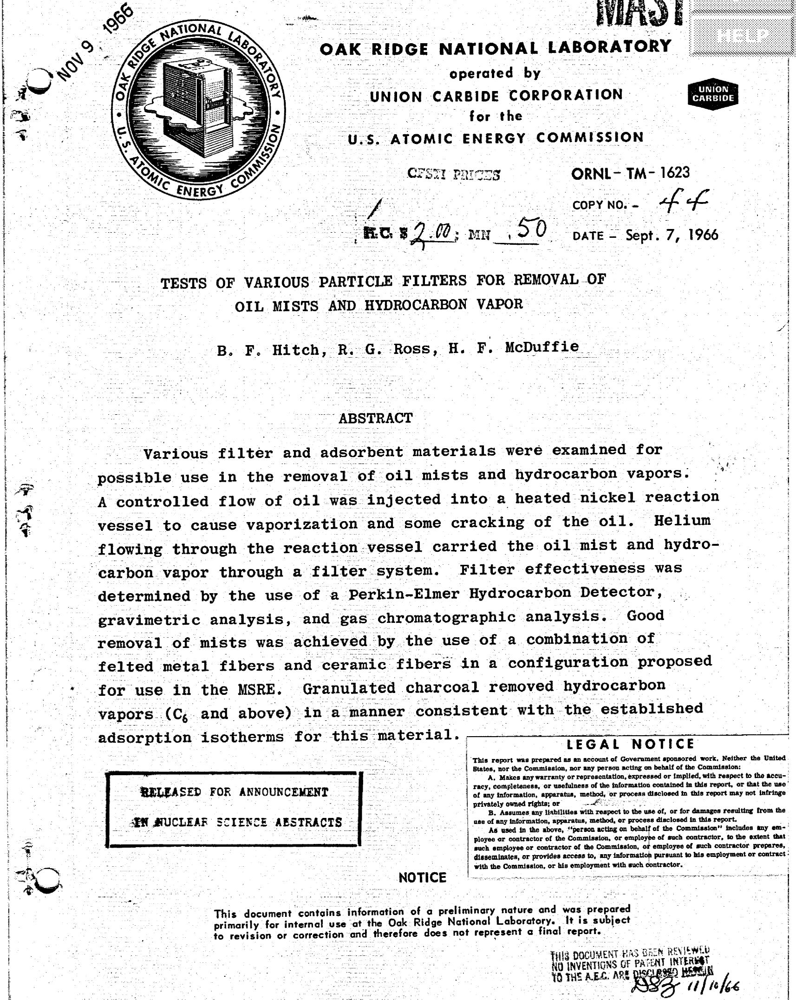

# LEGAL NOTICE

This report was prepared as an account of Government sponsored work. Neither the United States, nor the Commission, nor any person acting on behalf of the Commission:

A. Makes any warranty or representation, expressed or implied, with respect to the accuracy, completeness, or usefulness of the information contained in this report, or that the use of any information, apparatus, method, or process disclosed in this report may not infringe privately owned rights; or   
B. Assumes any liabilities with respect to the use of, or for damages resulting from the use of any information, apparatus, method, or process disclosed in this report.

As used in the above, "person acting on behalf of the Commission" includes any employee or contractor of the Commission, or employee of such contractor, to the extent that such employee or contractor of the Commission, or employee of such contractor prepares, disseminates, or provides access to, any information pursuant to his employment or contract with the Commission, or his employment with such contractor.

# CONTENTS

Page

ABSTRACT. 1

1. INTRODUCTION. 4   
2. PROCEDURE 4   
3. OIL MIST FILTERS. 7

3.1. General Description 7   
3.2. Experimental Data 7   
3.3. Experimental Data After Altering Oil Injection 9

4. CHARCOAL TRAP EFFICIENCY. 12

4.1. Charcoal Saturation with Hydrocarbons 13   
4.2. Temperature Dependence of Hydrocarbon Adsorption on Charcoal 13

5. TESTING OF MSRE PARTICLE FILTER 19

5.1. Pressure Drop Data. 19   
5.2. Pressure Drop Data of Felt Metal at Elevated Temperatures. 23

6. ACKNOWLEDGEMENTS. 25

# 1. INTRODUCTION

One of the problems encountered during the early stages of power operation of the Molten Salt Reactor Experiment was that some valves and filters in the off-gas system became plugged. The plugs were analyzed and found to be of organic composition.

One possible source of organic material was the oil used to lubricate the salt circulating pump. If indeed the pump were leaking oil into the pump bowl, the maximum credible leakage would be in the range of 15 to 20 cc per day.

This experiment was designed to simulate the consequences of this maximum expected oil leakage and to test various filter and adsorbent materials for removal of oil mist and hydrocarbon vapors under these conditions.

# 2. PROCEDURE

A complete flow diagram of the apparatus is shown in Fig. 1 and a picture as Fig. 1a.

Gulfspin-35 oil is used to lubricate the Molten Salt Reactor pump; this same oil was used in our experiments. The oil was injected by a motor driven syringe connected by a capillary tube to a heated reaction vessel. The injection rate was 0.67 cc per hour.

Simulating MSRE off-gas flow conditions, helium was passed through the system at 4 liters per minute. The nickel reaction vessel temperature was about $600^{\circ}\mathrm{C}$ .

The gas effluent from the filters A, B, C, D, and E

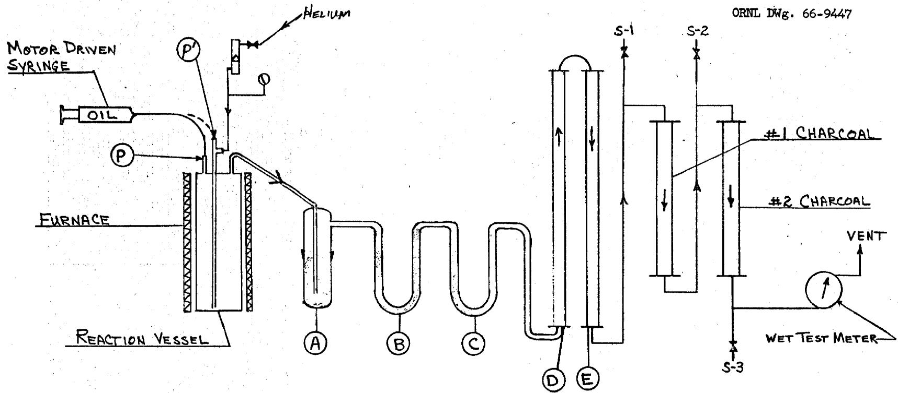  
Fig. 1. Oil Injection and Filtering Apparatus

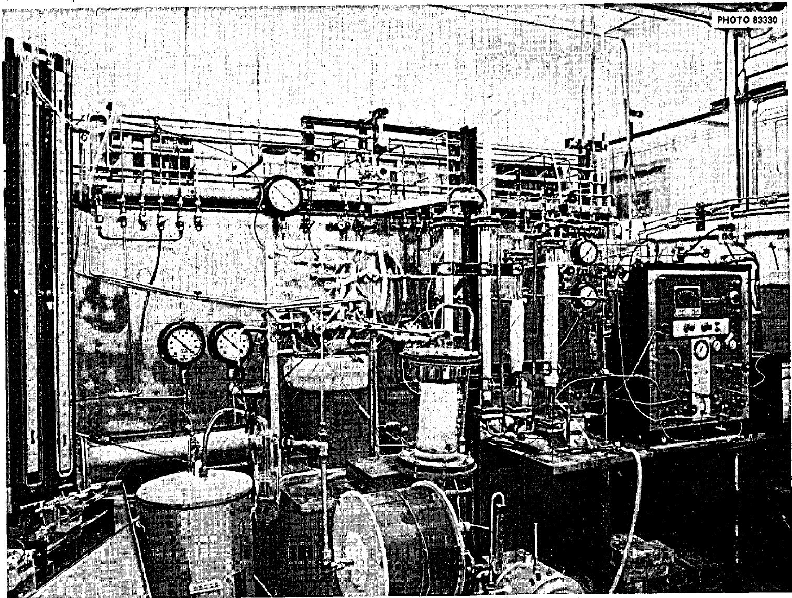  
Fig. 1a. Picture of Oil Injection and Filtering Apparatus

passed through two charcoal traps filled with PCB 6X16 charcoal. A Perkin-Elmer 213 Hydrocarbon Detector, provided by the Analytical Chemistry Division, was used to measure the hydrocarbon levels at three positions (S-1, S-2, S-3) shown on the flow diagram. Gas samples were taken periodically at these same three positions for subsequent chromatographic analysis.

Pressure drop measurements were made using Hg and $\mathbf{H}_2\mathbf{O}$ manometers. Readings were taken each half hour.

# 3. OIL MIST FILTERS

# 3.1. General Description

Limited time necessitated that the investigation of filter materials be confined to those easily obtainable. Materials tested were coarse nickel wool, Supreme #1 steel wool, Supreme #00 steel wool, Pyrex glass wool, Fiberfrax and a M-S-A air line Ultra Filter.

Fiberfrax showed an appreciable pressure drop when packed into the glass U-tube traps. This was the short fiber variety which packed very tightly when loading the traps. Because the pressure drop was in excess of 8 psig, this material was not tested. However, long fiber Fiberfrax proved to be satisfactory.

# 3.2. Experimental Data

3.2.1. The first two experiments were performed using coarse nickel wool in trap A, and Supreme #1 steel wool in traps B and C. The data summarized in Table 1 show this trap assembly removed $55\%$ of the total oil injected into the

Table 1. Efficiency of Filter Materials Tested   

<table><tr><td rowspan="2">Run #</td><td rowspan="2">Length of Run (hrs)</td><td colspan="2">Trap A</td><td colspan="2">Trap B</td><td colspan="2">Trap C</td><td rowspan="2">Total Oil Removed (g)</td><td rowspan="2">Total Oil Injected (g)</td><td rowspan="2">Per Cent of Oil Trapped</td></tr><tr><td>Filter Material</td><td>Wt. of Oil Removed</td><td>Filter Material</td><td>Wt. of Oil Removed</td><td>Filter Material</td><td>Wt. of Oil Removed</td></tr><tr><td>1,2</td><td>6</td><td>Coarse Ni wool (1)</td><td>0.690</td><td>#1 Supreme steel wool (2)</td><td>0.878</td><td>#1 Supreme steel wool</td><td>0.501</td><td>2.069</td><td>3.740</td><td>55</td></tr><tr><td>3</td><td>13</td><td>Coarse Ni wool</td><td>1.735</td><td>#00 Supreme steel wool (3)</td><td>3.428</td><td>#00 Supreme steel wool</td><td>0.749</td><td>5.912</td><td>7.410</td><td>80</td></tr><tr><td>4</td><td>18</td><td>Coarse Ni wool</td><td>3.749</td><td>Pyrex glass wool</td><td>5.440</td><td>Pyrex glass wool</td><td>0.000</td><td>9.189</td><td>10.090</td><td>91</td></tr><tr><td>5*</td><td>23.5</td><td>#00 Supreme steel wool</td><td>5.341</td><td>Pyrex glass wool</td><td>3.792</td><td>Pyrex glass wool</td><td>0.278</td><td>9.411</td><td>13.400</td><td>70</td></tr><tr><td>6A*</td><td>22.6</td><td>#00 Supreme steel wool</td><td>4.929</td><td>Pyrex glass wool</td><td>4.188</td><td>Pyrex glass wool</td><td>0.123</td><td>9.240</td><td>12.882</td><td>72</td></tr><tr><td>6B*</td><td>31.6</td><td>#00 Supreme stbel wool</td><td>6.892</td><td>Pyrex glass wool</td><td>5.374</td><td>Pyrex glass wool</td><td>0.001</td><td>12.267</td><td>18.012</td><td>68</td></tr><tr><td>7*</td><td>88</td><td colspan="5">Trap A, B, and C replaced by MSA Ultra Filter using 7930 cartridge</td><td>47.486</td><td>47.486</td><td>50.160</td><td>95</td></tr></table>

*These runs were made with oil being injected into dip-leg.   
(1) Surface area of 0.016 square meters per gram.   
(2) Surface area of 0.032 square meters per gram.   
(3) Surface area of 0.047 square meters per gram.

reaction vessel. However, in the first few runs a portion of the oil was probably held up on the walls of exit lines.   
3.2.2. Experiment #3 utilized the same coarse nickel wool in trap A. Traps B and C were filled with Supreme #00 steel wool. Eighty percent of the total oil injected was removed with these traps.   
3.2.3. Experiment #4 used coarse nickel wool in trap A and Pyrex glass wool in traps B and C. Although this run was of greater duration than previous ones, no increase in weight was found in trap C. Ninety-one per cent of the oil injected was removed by this trap assembly.   
3.2.4. The following summary indicates the amount of oil retained per gram of filter material used in experiments 1 through 4.

<table><tr><td>Expt. #</td><td>Trap A</td><td>Trap B</td><td>Trap C</td></tr><tr><td>1 and 2</td><td>.020</td><td>.066</td><td>.048</td></tr><tr><td>3</td><td>.049</td><td>.244</td><td>.078</td></tr><tr><td>4</td><td>.106</td><td>.754</td><td>0</td></tr></table>

# 3.3. Experimental Data After Altering Oil Injection

To obtain better cracking, the oil entry to the reaction vessel was altered. In experiments 1 through 4 the oil entered at point P as shown on the flow diagram in Fig. 1. This entry point was changed to point P' so that the oil entered directly into the stream of flowing helium and down the dip-leg of the reaction vessel.

Using this method of injection, the hydrocarbon level at

the three analysis points S-1, S-2, and S-3 rose to about ten times previous levels. Obviously, much less cracking had occurred in experiments 1 through 4. The average hydrocarbon levels are summarized below:

<table><tr><td>Expt. #</td><td>Analysis Point S-1</td><td>Analysis Point S-2</td><td>Analysis Point S-3</td></tr><tr><td>1 - 4</td><td>75 ppm</td><td>35 ppm</td><td>22 ppm</td></tr><tr><td>5 - 7</td><td>715 ppm</td><td>360 ppm</td><td>285 ppm</td></tr></table>

3.3.1. Traps for experiments 5, 6A, and 6B contained Supreme #00 steel wool in trap A, and Pyrex glass wool in traps B and C. Oil recovery ranged from $68\%$ to $72\%$ for this trap assembly. More efficient cracking of the oil resulted in a decreased oil recovery. It should be noted that in each of these runs only a small portion of the adsorbable oil mist reached trap C as shown in Table 1.

3.3.2. Experiment 7 investigated the efficiency of a commercial filter assembly. A M-S-A air line Ultra Filter as shown in Fig. 2 was used. The particulate filter element is molded of a cellulose matrix with glass microfibers added to present a large capturing surface. The cartridge holder is equipped with a drain plug through which liquids can be removed periodically.

The M-S-A filter assembly was installed in our apparatus, replacing traps A, B, and C.

This filter assembly was the most efficient filter material tested, retaining $95\%$ of the oil injected into the

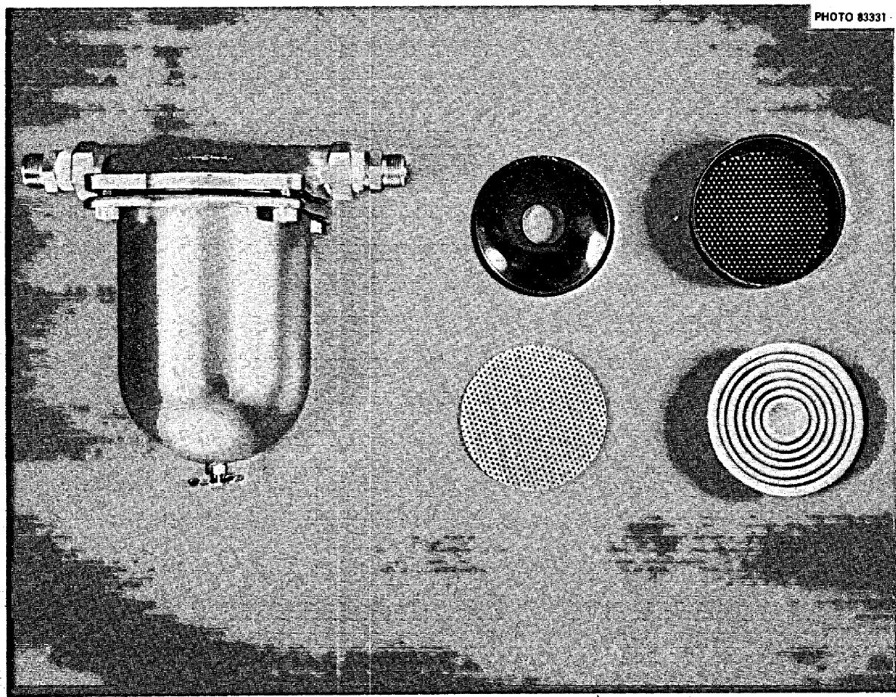  
Fig. 2. M-S-A Air Line Ultra Filter

reaction vessel. All of the trapped oil mist was retained in the filter element, no liquid was present in the cartridge holder.

3.3.3. The following summary indicates the grams of oil mist retained per gram of filter material tested.

<table><tr><td>Expt. #</td><td>Trap A</td><td>Trap B</td><td>Trap C</td></tr><tr><td>5</td><td>0.319 gm</td><td>1.365 gm</td><td>0.049 gm</td></tr><tr><td>6A</td><td>0.295</td><td>1.243</td><td>0.023</td></tr><tr><td>6B</td><td>0.412</td><td>0.925</td><td>no wt. gain</td></tr><tr><td>7</td><td>1.700</td><td>--</td><td>--</td></tr></table>

# 4. CHARCOAL TRAP EFFICIENCY

The charcoal traps used in our experiments were 1-in. I.D. glass Pyrex pipe packed with about 12 inches of PCB 6X16 charcoal.

Under reactor conditions, the decay of fission products is expected to raise the temperature of a charcoal trap of the above dimensions to about $100^{\circ}\mathrm{C}$ . Consequently, charcoal traps were kept at a temperature of $100^{\circ}\mathrm{C}$ during our experiments.

A point of interest was the amount of hydrocarbons necessary to saturate a known amount of charcoal at $100^{\circ}\mathrm{C}$ . Data for this investigation were obtained simultaneously with the filter material tests previously described.

Charcoal trap #1 shown in Fig. 1 was filled with a known amount of charcoal. Sample points S-1, S-2, and S-3 were

monitored with the hydrocarbon detector. Saturation was assumed when the hydrocarbon level at S-2 started approaching the level of S-1.

# 4.1. Charcoal Saturation with Hydrocarbons

Figure 3 summarizes the two experiments carried out. The first experiment made use of a packed bed of about 3 inches of charcoal in a glass trap. The weight of charcoal was approximately 6.0 grams per inch. The first evidence of saturation occurred at a total time of 30 hours. A second test with about 6 inches of charcoal reached saturation in about 60 hours. The hydrocarbon level at S-1 and S-2 averaged 700 ppm and 425 ppm (CH₄ eq.) respectively prior to trap saturation.

The 3-in. trap was analyzed after it became saturated and the results are shown in Table 2. This data indicates that as the heavier hydrocarbons were more strongly adsorbed in the top of the trap, the lighter hydrocarbons were forced to the bottom. "Breakthrough" occurred when the $C_6$ hydrocarbons were forced out. Table 3 contains gas samples taken before and after hydrocarbon saturation.

# 4.2. Temperature Dependence of Hydrocarbon Adsorption on Charcoal

Adsorption of hydrocarbons on the charcoal is a function of charcoal temperature as shown in Figs. 4 and 5. Upon cooling charcoal trap #2 from $100^{\circ}\mathrm{C}$ to $25^{\circ}\mathrm{C}$ the helium effluent to the trap was lowered to approximately 40 per cent of the original hydrocarbon concentration. Cooling from $100^{\circ}\mathrm{C}$

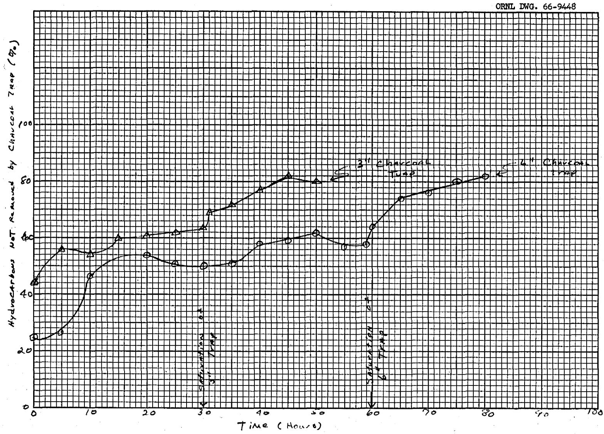  
Fig. 3. Hydrocarbon Saturation of Charcoal Trap #1

Table 2. Hydrocarbons Adsorbed in 3-in. Charcoal Trap Concentration, Wt. %   

<table><tr><td>Depth
In Inches</td><td>&lt;C6</td><td>C6</td><td>C7</td><td>C8</td><td>C9-10</td><td>&gt;C10</td><td>Total</td></tr><tr><td>0.0 - 0.5</td><td>0.5</td><td>0.3</td><td>0.3</td><td>0.3</td><td>2.1</td><td>14.3</td><td>17.8</td></tr><tr><td>0.5 - 1.0</td><td>0.3</td><td>0.2</td><td>0.4</td><td>1.6</td><td>5.6</td><td>9.4</td><td>17.5</td></tr><tr><td>1.0 - 1.5</td><td>0.3</td><td>0.3</td><td>1.4</td><td>4.0</td><td>4.5</td><td>3.1</td><td>13.6</td></tr><tr><td>1.5 - 2.0</td><td>0.2</td><td>0.8</td><td>4.2</td><td>3.3</td><td>0.6</td><td>0.3</td><td>9.4</td></tr><tr><td>2.0 - 2.5</td><td>0.3</td><td>1.9</td><td>2.6</td><td>1.0</td><td>0.1</td><td>0.1</td><td>6.0</td></tr><tr><td>2.5 - 3.0</td><td>0.2</td><td>2.3</td><td>1.1</td><td>0.3</td><td>0.0</td><td>0.0</td><td>3.9</td></tr><tr><td>3.0 - 3.5</td><td>0.4</td><td>2.7</td><td>0.3</td><td>0.1</td><td>0.0</td><td>0.0</td><td>3.5</td></tr></table>

Table 3. Analysis of Gas Samples Taken Before and After Hydrocarbon Saturation of Charcoal Trap   
(ppm by Volume)   

<table><tr><td rowspan="2">Components</td><td colspan="2">Before</td><td colspan="2">After</td></tr><tr><td>Sample Pt. S-1</td><td>Sample Pt. S-2</td><td>Sample Pt. S-1</td><td>Sample Pt. S-2</td></tr><tr><td>Methane</td><td>25</td><td>30</td><td>16</td><td>28</td></tr><tr><td>Ethane</td><td>4</td><td>6</td><td>3</td><td>7</td></tr><tr><td>Ethylene</td><td>70</td><td>95</td><td>41</td><td>80</td></tr><tr><td>Propylene</td><td>33</td><td>40</td><td>20</td><td>41</td></tr><tr><td>Butene-1</td><td>7</td><td>12</td><td>7</td><td>12</td></tr><tr><td>Isobutylene</td><td>3</td><td>3</td><td>4</td><td>4</td></tr><tr><td>Cis-Butene-2</td><td>4</td><td>8</td><td>5</td><td>8</td></tr><tr><td>2-Me Butene-1</td><td>4</td><td>-</td><td>8</td><td>10</td></tr><tr><td>Pentene-2</td><td>1</td><td>-</td><td>2</td><td>2</td></tr><tr><td>Branched Hexenes</td><td>5</td><td>-</td><td>1</td><td>3</td></tr><tr><td>Hexene-1</td><td>3</td><td>-</td><td>4</td><td>37</td></tr><tr><td>Isomeric Hexenes</td><td>1</td><td>-</td><td>1</td><td>6</td></tr></table>

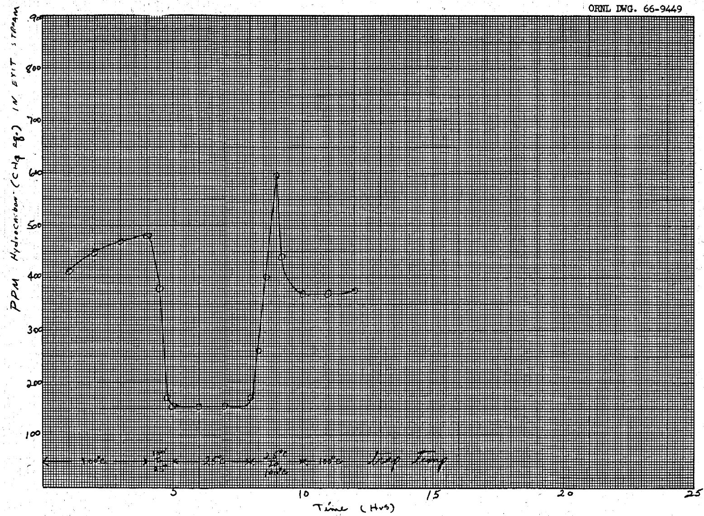  
Fig. 4. Hydrocarbon Adsorption on Charcoal at $25^{\circ}\mathrm{C}$ and $100^{\circ}\mathrm{C}$

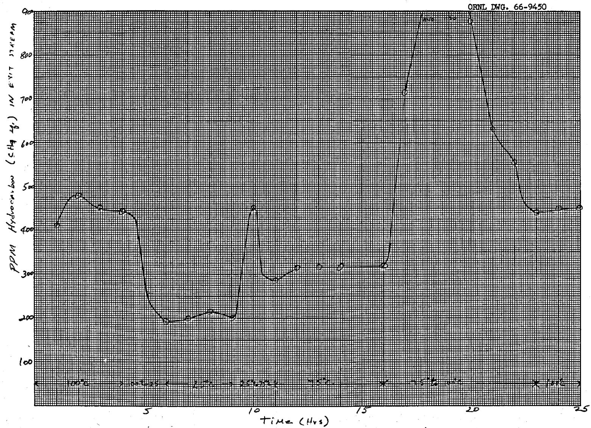  
Fig. 5. Hydrocarbon Adsorption on Charcoal at $25^{\circ}\mathrm{C}$ , $75^{\circ}\mathrm{C}$ , and $100^{\circ}\mathrm{C}$ .

to $75^{\circ} \mathrm{C}$ lowered the concentration to $70 \%$ . When the trap was returned to $100^{\circ} \mathrm{C}$ after each cooling cycle the hydrocarbon content rose sharply then returned to its original level.

# 5. TESTING OF MSRE PARTICLE FILTER

Traps A, B, and C were replaced with a prototype of the MSRE particle filter shown in Fig. 6. This filter was prepared by personnel of the Reactor Division. The filter consisted of two Huyck stainless steel felt metal filters and a chamber filled with long fiber Fiberfrax. Pressure drop measurements were made to determine the maximum $\Delta P$ after the felt metal filters were saturated with oil mist. Measurements were made using $\mathrm{H}_2\mathrm{O}$ and $\mathrm{Hg}$ manometers.

A further test was performed in which the felt metal filters were welded inside a stainless steel pipe as shown in Fig. 7. This assembly was placed inside a tube furnace and tests were conducted at various temperatures.

# 5.1. Pressure Drop Data

Figure 8 shows the pressure drop data obtained from the MSRE particle filter test. After 24 hours the pressure remained constant at 2.7 psig. Attempts to blow the oil off the felt metal filters, by suddenly increasing the flow rate of helium to 8 liters/min, were not successful. The $\Delta P$ would drop slightly, when the flow rate was returned to 4 liters/min, but returned to its former level in less than 5 minutes.

The felt metal filters were removed from the system and a pressure drop across the Fiberfrax alone was determined. The

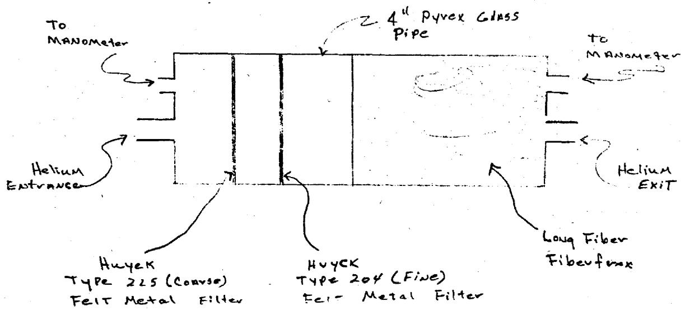  
Fig. 6. Sketch of MSRE Particle Filter Prototype

ORNL DWG.66-9451

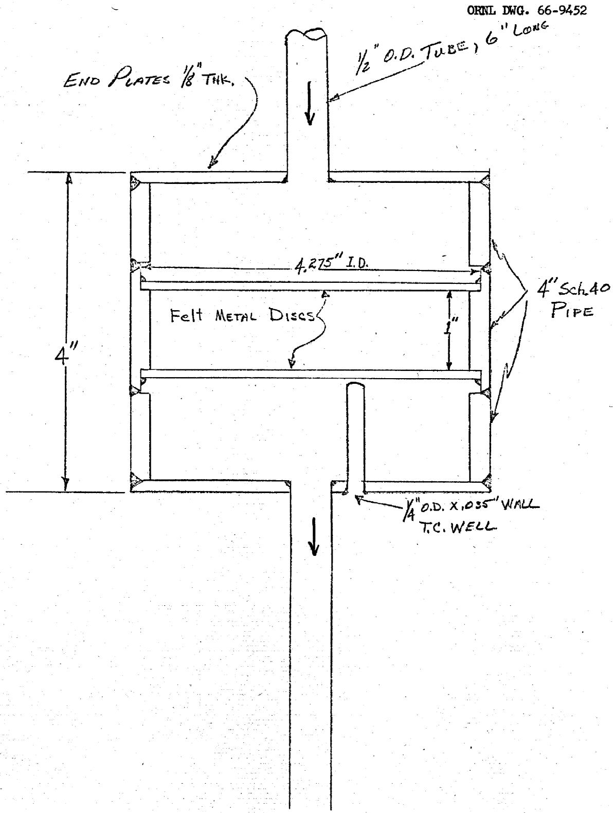  
Fig. 7. Felt Metal Filter Assembly Used At Elevated Temperatures

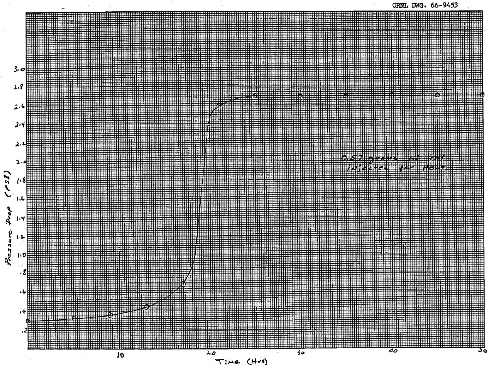  
Fig. 8. $\Delta P$ Across Prototype at MSRE Particle Filter

pressure drop was 0.012 psig and remained constant over a 20-hr period.

# 5.2. Pressure Drop Data of Felt Metal at Elevated Temperatures

A filter assembly with the coarse and fine felt metal filters welded in a stainless steel pipe was fabricated as shown in Fig. 9. The assembly was placed in a 5-in. tube furnace. It was desirable to measure the $\Delta P$ of the felt metal filters at elevated temperatures, since, during reactor operations, the decay of fission products would possibly raise the temperature of the filter assembly.

Measurements at various temperatures were reproducible as shown in Fig. 9. However, the maximum $\Delta P$ at $25^{\circ}C$ was 0.45 psig compared with 2.7 psig measured in the previous experiment.

DOP measurements conducted by the Reactor Division on the prototype of the MSRE particle filter showed it to be $99.98\%$ efficient. The welded filter assembly, when tested, was only about $95\%$ efficient. Although there was no visible evidence, cracks may have been present in the welds of the welded filter assembly.

Thirty hours at $25^{\circ}\mathrm{C}$ were required before the felt metal filters became saturated with oil mist. The transition to the maximum $\Delta P$ required only about one or two minutes. Upon reaching maximum $\Delta P$ at room temperature, heat was applied to the filter assembly. At a temperature of $150^{\circ}\mathrm{C}$ the $\Delta P$

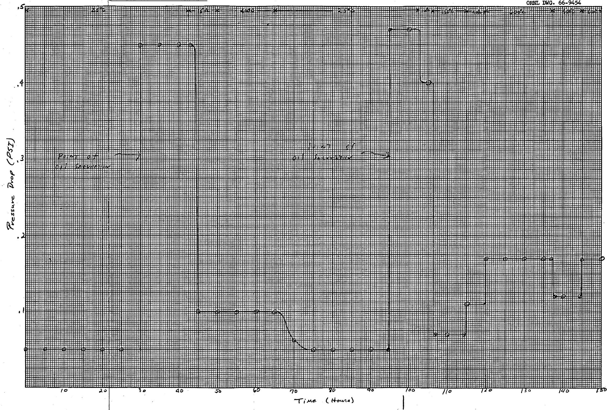  
Fig. 9. $\Delta P$ of Felt Metal Filter

decreased sharply, returning almost to the minimum. When the temperature was raised to $400^{\circ}\mathrm{C}$ and $600^{\circ}\mathrm{C}$ the $\Delta P$ rose slightly in each case but gave no indication of plugging. The rise in $\Delta P$ associated with a rise in temperature can probably be attributed to an increase in the viscosity of helium. The viscosity of helium at $25^{\circ}\mathrm{C}$ is 180 micropoises, and at $600^{\circ}\mathrm{C}$ is 405 micropoises.

A total of 230 grams of Gulfspin-35 oil was injected into the heated reaction vessel during the previously described experiments. Upon termination of the experiments the reaction vessel was cut apart for visual inspection. The vessel contained 0.5 grams of dry carbon; no evidence of any liquid hydrocarbons was found.

The welded felt metal filter assembly was also cut apart; again no liquid hydrocarbons were found.

# 6. ACKNOWLEDGEMENTS

6.1. Excellent cooperation and much assistance was received from Messrs. A. S. Meyer, C. M. Boyd, and A. D. Horton, of the Analytical Chemistry Division, who supplied and installed the hydrocarbon gas analyzer, assisted us with the interpretation of the results, and analyzed many samples of gas and charcoal by the gas chromatographic procedure.   
6.2. Continuous operation of the apparatus over the period of many days was made possible by the MSRE operations section through their assignment of personnel for taking data during the evening and night shifts.

6.3. The close cooperation and frequent discussions with D. Scott, Jr., were invaluable in guiding the investigation in directions which were useful for the application of filters to the MSRE off-gas system.

# DISTRIBUTION

1. G. M. Adamson   
2. C. F. Baes, Jr.   
3. S. E. Beall   
4. E. S. Bettis   
5. F. F. Blankenship   
6. E. G. Bohlmann   
7. C. M. Boyd   
8. R. B. Briggs   
9. W. H. Cook   
10. W. R. Grimes   
11. A. G. Grindell   
12. P. N. Haubenreich

13-18. B. F. Hitch

19. A. D. Horton   
20. P. R. Kasten   
21. S. S. Kirslis   
22. R. B. Lindauer   
23. H. G. MacPherson   
24. H. F. McDuffie   
25. A. S. Meyer, Jr.   
26. R. L. Moore   
27. R. J. Ross   
28. D. Scott, Jr.   
29. A. N. Smith   
30. P. G. Smith   
31. J. R. Tallackson   
32. R. E. Thoma   
33. M. E. Whatley

34-35. Central Research Library   
36. Document Reference Section

37-39. Laboratory Records

40. Laboratory Records, ORNL R.C.   
41. ORNL Patent Office

# EXTERNAL DISTRIBUTION

42. Research and Development Div., OR

43-57. DTIE, OR