ORNL-TM-1626

MASTER

PACED FOR ANNouncement

RELEWED:

IN NUCLEAR SCIENTIFIC

PERIOD MEASUREMENTS ON THE MOLTEN SALT REACTOR

EXPERIMENT DURING FUEL CIRCULATION:

THEORY AND EXPERIMENT

B.E. Prince

# LEGAL NOTICE

This report was prepared as an account of Government sponsored work. Neither the United States, nor the Commission, nor any person acting on behalf of the Commission: A. Makes any warranty or representation to

any warranty of Representation, expressed or implied, with respect to the accuracy, completeness, or usefulness of the information contained in this report, or that the use of any information, apparatus, method, or process disclosed in this report may not infringe privately owned rights; or

B. Assumes any liabilities with respect to the use of, or for damages resulting from the use of any information, apparatus, method, or process disclosed in this report. As used in the above paragraph,

As used in the above, "person acting on behalf of the Commission" includes any employee or contractor of the Commission, or employee of such contractor, to the extent that such employee or contractor of the Commission, or employee of such contractor prepares, disseminates, or provides access to, any information pursuant to his employment or contract with the Commission, or his employment with such contractor.

101300000000000000000000000

#

NOTICE This document contains information of a preliminary nature and was prepared primarily for internal use at the Oak Ridge National Laboratory. It is subject to revision or correction and therefore does not represent a final report.

# LEGAL NOTICE

This report was prepared as an account of Government sponsored work. Neither the United States, nor the Commission, nor any person acting on behalf of the Commission:

A. Makes any warranty or representation, expressed or implied, with respect to the accuracy, completeness, or usefulness of the information contained in this report, or that the use of any information, apparatus, method, or process disclosed in this report may not infringe privately owned rights; or   
8. Assumes any liabilities with respect to the use of, or for damages resulting from the use of any information, apparatus, method, or process disclosed in this report.

As used in the above, "person acting on behalf of the Commission" includes any employee or contractor of the Commission, or employee of such contractor, to the extent that such employee or contractor of the Commission, or employee of such contractor prepares, disseminates, or provides access to, any information pursuant to his employment or contract with the Commission, or his employment with such contractor.

Contract No. W-7405-eng-26

REACTOR DIVISION

# PERIOD MEASUREMENTS ON THE MOLTEN SALT REACTOR   EXPERIMENT DURING FUEL CIRCULATION:   THEORY AND EXPERIMENT

B. E. Prince

# LEGAL NOTICE

This report was prepared as an account of Government sponsored work. Neither the United States, nor the Commission, nor any person acting on behalf of the Commission:

A. Makes any warranty or representation, expressed or implied, with respect to the accuracy, completeness, or usefulness of the information contained in this report, or that the use of any information, apparatus, method, or process disclosed in this report may not infringe privately owned rights; or

B. Assumes any liabilities with respect to the use of, or for damages resulting from the use of any information, apparatus, method, or process disclosed in this report.

As used in the above, "person acting on behalf of the Commission" includes any employee or contractor of the Commission, or employee of such contractor, to the extent that such employee or contractor of the Commission, or employee of such contractor prepares, disseminates, or provides access to, any information pursuant to his employment or contract with the Commission, or his employment with such contractor.

RELEASED FOR ANNUNCEMENT

IN NUCLEAR SCIENCE ABSTRACTS

OCTOBER 1966

OAK RIDGE NATIONAL LABORATORY

Oak Ridge, Tennessee

operated by

UNION CARBIDE CORPORATION

for the

U.S. ATOMIC ENERGY COMMISSION

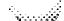

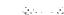

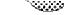

# CONTENTS

# Page

ABSTRACT 1

INTRODUCTION 1

THEORY OF ZERO POWER KINETICS DURING FUEL CIRCULATION 2

NUMERICAL AND EXPERIMENTAL RESULTS 17

Numerical Groundwork 17

Experimental Results 25

DISCUSSION OF RESULTS 29

Theoretical Model Verification 29

Recommendations for the MSRE 31

ACKNOWLEDGMENT 32

REFERENCES 33

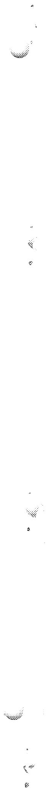

# PERIOD MEASUREMENTS ON THE MOLTEN SALT REACTOR   EXPERIMENT DURING FUEL CIRCULATION:   THEORY AND EXPERIMENT

B. E. Prince

# ABSTRACT

As an aid in interpreting the zero-power kinetics experiments performed on the MSRE, a theory of period dependence on the fuel circulation is developed from the general space dependent reactor kinetics equations. A procedure for evaluating the resulting inhour-type equation by machine computation is presented, together with numerical results relating the reactivity to the observed asymptotic period, both with the fuel circulating and with it stationary. Based on this analysis, the calculated reactivity difference between the time independent flux conditions for the noncirculating and the circulating fuel states is in close agreement with the value inferred from the MSRE rod calibration experiments. Rod-bump period measurements made with the fuel circulating were converted to differential rod worth by use of this model. These results are compared with similar rod sensitivity measurements made with the fuel stationary. The rod sensitivities measured under these two conditions agree favorably, within the limits of precision of the period measurements. Due to the problem of maintaining adequate precision, however, the period-rod sensitivity measurements provide a less conclusive test of the theoretical model than the reactivity difference between the time independent flux conditions. Suggestions are made for improving the precision of the experiments to provide a more rigid test of the theoretical model for the effects of circulation on the delayed neutron kinetics.

# 1. INTRODUCTION

It is well recognized that the circulation of fuel in a liquid fueled reactor introduces some unique effects into its observable kinetic behavior. Foremost in this category is the phenomenon of emission of delayed neutrons in the part of the circulating system external to the reactor core where they do not contribute to the chain reaction. The literature in reactor kinetics contains several theoretical studies of this effect, $^{1,2,3}$ but there have been few opportunities for parallel experimental studies. The Molten Salt Reactor Experiment, hereafter

referred to as the MSRE, has presented a unique chance to develop and test some analytical models for the zero power kinetics of a circulating fuel reactor. The experimental measurements discussed in this report were made as part of an overall program to calibrate the control rods in the MSRE.

In the first section following, we develop the theory of period dependence on fuel circulation. The second section gives an account of the results of applying this theory to the experimental measurements made during MSRE Run No. 3. Finally, in the third section, we discuss the results of this work in terms of the general problem of kinetics analysis for circulating fuel reactors. Several questions are left open by the present study, and these are discussed in that section.

# 2. THEORY OF ZERO POWER KINETICS DURING FUEL CIRCULATION

At negligible reactor power, the special effects produced by fuel circulation reduce essentially to (a) the transport of delayed neutron precursors to that part of the loop external to the core where they subsequently decay, and (b) the shift of the spatial distribution of delayed neutron precursors in the direction of circulation within the reactor core, relative to the prompt neutron production. Although we shall not attempt to review all earlier studies pertaining to these effects,\* two fairly recent studies made by Wolfe $^2$ and Haubenreich $^3$ are pertinent to the present work. Wolfe employs a perturbation approach and obtains an inhour-type equation for an infinite slab reactor, through which fuel circulates in the direction of variation of the neutron flux. Wolfe's approach, while valuable, is almost entirely formal, and requires some modification in order to obtain a procedure useful for the quantitative analysis of experimental measurements. In the second of the above mentioned works, Haubenreich considers an explicit analytical model representing the MSRE in the circulating, just-critical condition. By means of a modal analysis, he obtains effective values for the delayed neutron fractions for this condition. He uses a bare cylinder approximation to

represent the MSRE core, with boundaries corresponding physically to the channelled region of the actual core.

We have combined and extended these analyses to include the contribution to the chain reaction of the delayed neutrons emitted while the fuel is in the plenums just above and below the graphite core, and to include the case of the flux varying exponentially with a stable asymptotic period. It will be seen that an inhour-type equation results which relates the period of a circulating fuel reactor to the static reactivity of the same reactor configuration, but in which the fuel is not circulating. The static reactivity, $\rho_{\mathrm{s}}$ , is defined by the relation

$$
\rho_ {s} = \frac {v - v _ {c}}{v}, \tag {1}
$$

in which $\nu$ is the physical, energy-averaged number of neutrons emitted per fission, and $\nu_{\mathrm{c}}$ is the fictitious value for which the reactor with the same geometric and material configuration would be critical with the fuel stationary. One finds that as a result of this definition, the reactivity for a critical, circulating fuel condition is greater than zero (here, criticality denotes the condition of time independence of the neutron and precursor concentrations). However, since the static reactivity is the quantity normally obtained in reactor calculation programs, it is most convenient to relate this quantity directly to the asymptotic period.

The theory following is developed by beginning along general lines and delineating special assumptions as they are introduced. Several of these simplifying approximations are suitable for MSRE analysis, both in the neutronics model and the flow model for the circulating fuel.

The starting point of the analysis is the general time dependent reactor equations, written to include the transport of delayed neutron precursors by fuel motion in the axial direction:

$$
\mathrm {L} \Phi + (1 - \beta_ {\mathrm {T}}) f _ {\mathrm {p}} \mathrm {P} \Phi + \sum_ {i = 1} ^ {6} \lambda_ {i} f _ {\mathrm {d i}} C _ {i} = v ^ {- 1} \frac {\partial \Phi}{\partial t}, \tag {2}
$$

$$
\beta_ {i} \mathrm {P} \Phi - \lambda_ {i} C _ {i} - \frac {\partial}{\partial z} \left(\mathrm {V C} _ {i}\right) = \frac {\partial C _ {i}}{\partial t}, \quad i = 1, 2, \dots , 6. \tag {3}
$$

The symbols $\Phi$ and $C$ represent the neutron flux and delayed neutron precursor densities. The operator $L$ represents net neutron loss (leakage, absorption, and energy transfer by scattering), and $P$ represents the production processes by fission. The explicit representation of these operators depends on the model used in analysis. If these processes are given their most general representation in terms of the Boltzmann transport equation, the neutron flux, $\Phi$ , will be a function of position, energy, direction, and time variables. In order to provide a framework for discussion which can be directly related to application, we shall assume that the angular variables have been integrated from the equation, i.e., that a model such as multigroup diffusion theory or its continuous energy counterpart provides an adequate description of the neutron population. In Eq. 3, above, $\Phi$ is taken as zero in that part of the circulating loop which is external to the chain reacting regions. The remaining symbols in Eqs. 2 and 3 are $(1 - \beta_{\mathrm{T}})$ , the fraction of all neutrons from fission which are prompt, and $\beta_{i}$ and $\lambda_{i}$ , the production fraction and decay constant for the $i$ th precursor group. The quantities $f_{p}$ and $f_{di}$ are energy spectrum operators which multiply the total volumetric production rates of prompt and delayed neutrons to obtain neutrons of a specific energy. Finally, the symbols $v$ and $V$ represent the neutron velocity and the fluid velocity, respectively.

As applied to a fluid fueled reactor with a heterogeneous structure such as the MSRE (where the axial fuel channels are located in a matrix of solid graphite moderator), the usual cellular homogenization must be made on the neutron production and destruction rates. Thus, for example

$$
(1 - \beta_ {T}) P \Phi = \text {l o c a l r a t e o f p r o d u c t i o n o f p r o m p t f i s s i o n} \quad \text {n e u t r o n s , p e r u n i t c e l l v o l u m e}
$$

$$
\lambda_ {i} C _ {i} = \text {l o c a l r a t e o f p r o d u c t i o n o f i t h g r o u p o f d e l a y e d} \quad \text {n e u t r o n s , p e r u n i t c e l l v o l u m e .}
$$

If we assume that the operators $L$ and $P$ are time independent, corresponding to a fixed rod position, we can investigate the conditions under

which the flux and precursor densities in the reactor and the external circulating system vary in time as $\mathrm{e}^{\mathrm{wt}}$ . Assuming solutions of Eqs. 2 and 3 exist of the form:

$$
\Phi (\underline {{x}}, E, t) = \emptyset (\underline {{x}}, E; w) e ^ {w t}, \tag {4}
$$

$$
C _ {i} (x, t) = c _ {i} (x; w) e ^ {w t}, \tag {5}
$$

then,

$$
L \varnothing + (1 - \beta_ {T}) f _ {p} P \varnothing + \sum_ {i = 1} ^ {6} \lambda_ {i} f _ {\mathrm {d i}} c _ {i} = v ^ {- 1} w \varnothing , \tag {6}
$$

$$
\beta_ {i} P \emptyset - \lambda_ {i} c _ {i} - \frac {\partial}{\partial z} \left(V c _ {i}\right) = w c _ {i}, \quad i = 1, 2, \dots , 6. \tag {7}
$$

As previously stated, our primary objective is to relate the observed stable reactor period, $\mathbf{w}^{-1}$ , to the static reactivity of the given reactor configuration. The static reactivity defined by Eq. 1 is the algebraically largest eigenvalue of the equation:

$$
\mathrm {L} \varnothing_ {\mathrm {s}} + (1 - \rho_ {\mathrm {s}}) \bar {f} \mathrm {P} \varnothing_ {\mathrm {s}} = 0, \tag {8}
$$

where;

$$
\bar {F} = (1 - \beta_ {\mathrm {T}}) f _ {\mathrm {p}} + \sum_ {i = 1} ^ {6} \beta_ {i} f _ {\mathrm {d i}}. \tag {9}
$$

Rather than attempting to solve the reactor equations 6 and 7 directly, we will make use of a procedure which is often useful for spatial reactor kinetics problems. Several sources give details of similar analyses for stationary fuel reactor systems (see, for example, Ref. 4). We multiply the "local" equation for the neutron population by an appropriate weighting function and integrate over the position and energy variables of the neutron population in order to obtain a relation involving only "global" or integral quantities. As seen below, by using the static adjoint flux, $\varnothing_{\mathrm{s}}^{+}$ , the solution of the adjoint equation corresponding to Eq. 8 as the

weighting function, the resulting relation admits a direct physical interpretation. The adjoint flux, also obtained in most reactor physics calculation programs in common usage, is the solution of

$$
L ^ {+} \varnothing_ {S} ^ {+} + (1 - \rho_ {S}) (\bar {f} P) ^ {+} \varnothing_ {S} ^ {+} = 0, \tag {10}
$$

where $L^+$ and $(\overline{fP})^+$ are operators adjoint to $L$ and $\overline{fP}$ of Eq. 8, and $\rho_s$ is the same algebraically largest eigenvalue of Eq. 8. With appropriately prescribed boundary conditions on the allowable functions on which these operators are defined, the following relation can be used to define the adjoint operator;

$$
\left(\varnothing_ {\mathrm {S}} ^ {+}, \mathrm {A} \varnothing\right) = \left(\mathrm {A} ^ {+} \varnothing_ {\mathrm {S}} ^ {+}, \varnothing\right) = \left(\varnothing , \mathrm {A} ^ {+} \varnothing_ {\mathrm {S}} ^ {+}\right). \tag {11}
$$

Here A represents abstractly either of the operators L and fP and $(\varnothing_{\mathrm{s}}^{+},\mathrm{A}\varnothing)$ denotes the scalar product, i.e., the multiplication of A by $\varnothing_{\mathrm{s}}^{+}$ and integration over the position and energy variables of the neutron population.

On forming the scalar product of Eq. 6 with $\varnothing_{\mathrm{s}}^{+}$ , we obtain

$$
\begin{array}{l} w \left(\varnothing_ {s} ^ {+}, v ^ {- 1} \varnothing\right) = \left(\varnothing_ {s} ^ {+}, L \varnothing\right) + (1 - \beta_ {T}) \left(\varnothing_ {s} ^ {+}, f _ {p} P \varnothing\right) + \\ + \sum_ {i = 1} ^ {6} \lambda_ {i} \left(\varnothing_ {\mathrm {s}} ^ {+}, f _ {\mathrm {d i}} c _ {i}\right). \tag {12} \\ \end{array}
$$

Similarly, forming the scalar product of Eq. 10 with $\varnothing$ and making use of Eq. 11 gives

$$
\left(\varnothing_ {s} ^ {+}, L \emptyset\right) + \left(1 - \rho_ {s}\right) \left(\varnothing_ {s} ^ {+}, \overline {{f}} P \emptyset\right) = 0. \tag {13}
$$

Combining Eq. 12 and Eq. 13 gives

$$
\begin{array}{l} w \left(\varnothing_ {s} ^ {+}, v ^ {- 1} \varnothing\right) = - \left(1 - \rho_ {s}\right) \left(\varnothing_ {s} ^ {+}, f P \varnothing\right) + \left(1 - \beta_ {T}\right) \left(\varnothing_ {s} ^ {+}, f _ {p} P \varnothing\right) + \\ + \sum_ {i = 1} ^ {6} \lambda_ {i} \left(\varnothing_ {s} ^ {+}, f _ {\mathrm {d i}} c _ {i}\right). \\ \end{array}
$$

By making use of Eq. 9, we may rewrite this equation as

$$
\rho_ {s} = w \frac {\left(\phi_ {s} ^ {+} , v ^ {- 1} \phi\right)}{\left(\phi_ {s} ^ {+} , \bar {f} P \phi\right)} + \frac {\sum_ {i = 1} ^ {6} \beta_ {i} \left(\phi_ {s} ^ {+} , f _ {d i} P \phi\right) - \sum_ {i = 1} ^ {6} \lambda_ {i} \left(\phi_ {s} ^ {+} , f _ {d i} c _ {i}\right)}{\left(\phi_ {s} ^ {+} , \bar {f} P \phi\right)} \quad . \tag {14}
$$

The first term on the right hand side of Eq. 14 is simplified in appearance if we make a conventional type of definition of the prompt neutron generation time;

$$
\Lambda = \frac {\left(\varnothing_ {s} ^ {+} , v ^ {- 1} \varnothing\right)}{\left(\varnothing_ {s} ^ {+} , \bar {f} P \varnothing\right)} \tag {15}
$$

We may also note that the second term on the right hand side of Eq. 14 appears as the difference between the weighted total production of delayed neutrons and the weighted production of delayed neutrons from precursor decay within the reactor. In accordance with its definition by Eqs. 1 and 8, the static reactivity is completely determined by the geometric and material configuration of the reactor, whether or not the fuel is circulating in the actual reactor. The relationship between $\rho_{\mathrm{s}}$ and $\omega$ expressed by Eq. 14, therefore, has an explicit physical interpretation. For example, if the fuel composition and control rod position are such that the flux is time independent when the fuel is circulating, $\omega = 0$ in Eqs. 6 and 7. Equation 14 then shows that the static reactivity for the just critical reactor is numerically equal to the net difference in the production of delayed neutrons described above. In the more general case when the flux is varying in time according to a stable period,

the first term on the right hand side of Eq. 14 will differ from zero, and also the effective decrement in production of delayed neutrons will differ numerically from the time independent case ( $c_i$ and $\varnothing$ depend on $\omega$ through Eqs. 6 and 7. Equation 14 is an inhour type relation which can be used as a foundation for an approximate determination of $\rho_s$ , given an observed asymptotic period, $\omega^{-1}$ . One may observe that it includes the usual inhour relation for the stationary fuel reactor as a special case, simply by setting $V = 0$ in Eq. 7. Before discussing the practical use of Eq. 14, we can exhibit the previous concepts in an explicit algebraic manner. From Eq. 7 we have,

$$
c _ {i} = \left(\omega + \lambda_ {i}\right) ^ {- 1} \left[ \beta_ {i} P \phi - \frac {\partial}{\partial z} (V c _ {i}) \right] \quad . \tag {16}
$$

Inserting this relationship into Eq. 14 gives

$$
\begin{array}{l} \rho_ {s} = \omega \Lambda + \sum_ {i = 1} ^ {6} \frac {\left(\varnothing_ {s} ^ {+} , \beta_ {i} f _ {d i} P \emptyset\right)}{\left(\varnothing_ {s} ^ {+} , \overline {{f}} P \emptyset\right)} = \sum_ {i = 1} ^ {6} \frac {\lambda_ {i} \left(\omega + \lambda_ {i}\right) ^ {- 1} \left(\varnothing_ {s} ^ {+} , \beta_ {i} f _ {d i} P \emptyset\right)}{\left(\varnothing_ {s} ^ {+} , \overline {{f}} P \emptyset\right)} \\ + \sum_ {i = 1} ^ {6} \frac {\lambda_ {i} \left(\omega + \lambda_ {i}\right) ^ {- 1} \left(\phi_ {s} ^ {+} , f _ {d i} \frac {\partial}{\partial z} [ V c _ {i} ]\right)}{\left(\phi_ {s} ^ {+}, \bar {f} P \emptyset\right)} \tag {17} \\ \end{array}
$$

If we define

$$
\bar {\beta} _ {i} = \beta_ {i} \frac {\left(\varnothing_ {s} ^ {+} , f _ {d i} P \emptyset\right)}{\left(\varnothing_ {s} ^ {+} , \bar {f} P \emptyset\right)}, \tag {18}
$$

$$
\bar {Y} _ {i} = \frac {\left(\varnothing_ {\mathrm {s}} ^ {+} , f _ {\mathrm {d i}} \frac {\mathrm {d}}{\mathrm {d z}} \left[ V c _ {i} \right]\right)}{\left(\varnothing_ {\mathrm {s}} ^ {+} , \bar {f} P \emptyset\right)}. \tag {19}
$$

Equation 17 may be written as

$$
\rho_ {S} = \omega \left[ \Lambda + \sum_ {i = 1} ^ {6} \frac {\left(\overline {{\beta}} _ {i} - \overline {{\gamma}} _ {i}\right)}{\omega + \lambda_ {i}} \right] + \sum_ {i = 1} ^ {6} \overline {{\gamma}} _ {i}. \tag {20}
$$

This equation has the appearance of the ordinary inhour relation for the stationary fuel reactor, $^{4}$ except that the effective production fractions, $\overline{\beta}_{i}$ are reduced by a quantity $\overline{\gamma}_{i}$ which depends on the circulation rate and also on $\omega$ . In addition, the last term on the right hand side of Eq. 20 appears because the zero point of the static reactivity was chosen to correspond to the composition and geometry of the just-critical stationary fuel reactor. The usual inhour relation for the stationary fuel reactor is obtained by letting $V \to 0$ and $\overline{\gamma}_{i} \to 0$ in Eq. 20. Although Eq. 20 is instructive in discussing the net effects of fuel circulation, its simplicity is somewhat deceptive since $\overline{\gamma}_{i}$ depends in a complicated way on $\omega$ , through Eq. 7. Therefore, it will be more convenient to discuss the use of the inhour relation starting with the form given in Eq. 14.

At first appearance, in order to use Eq. 14 we are required to solve Eqs. 6 and 7 for $\omega$ , $c_{i}(\underline{x};\omega)$ , and $\phi (\underline{x},E;\omega)$ , and also to solve Eq. 10 for $\rho_{s}$ and $\phi_s^+ (\underline{x},E;\rho_s)$ . Both are eigenvalue problems in which the algebraically largest real eigenvalues, $\omega$ and $\rho_{s}$ , are of immediate interest. Not only does Eq. 14 reduce to an identity if this procedure is used, but it is precisely the explicit solution of Eqs. 6 and 7 that we wish to avoid. The great usefulness of Eq. 14 is in the basis it provides for approximating the relation between $\rho_{s}$ and the observed stable period $\omega^{-1}$ . The basic simplification results from assuming that the shape of the asymptotic flux distribution, $\phi$ , is sufficiently well approximated by the static flux distribution, $\phi_{s}$ . From a physical standpoint, the validity of this approximation is a consequence of the smallness of the delayed neutron fraction, $\beta_{T}$ . If this approximation is made, and $\phi_{s}$ is substituted for $\phi$ in Eq. 7, this equation can be integrated around the circulating path of the fuel to obtain the distributions of delayed precursors, $c_{i}$ . Before completing the analysis, however, we shall make a second approximation to simplify the computation of the integrals occurring in Eq. 14. It can be assumed that the correction

for the difference in energy spectra for emission of prompt and delayed neutrons appearing in Eq. 14 can be calculated approximately as a separate step. This is done by reducing the age for the $i$ th group of delayed neutrons from that of the prompt neutrons and modifying the static delayed neutron fractions, $\beta_{i}$ , by the relative non-leakage probability factors appropriate to a bare reactor which approximates the actual core. Such an approximation can also be justified from an objective standpoint, since the correction for the differing "energy effectiveness" of delayed neutrons relative to prompt neutrons is small compared to the effect of the spatial transport of precursors under consideration. For the MSRE, calculations of the former effect are given in Ref. 3. The net energy correction changes the effective value of $\beta_{\mathrm{T}}$ for $U^{235}$ from 0.0064 to 0.00666.

One further remark should be made concerning Eq. 14. A given static reactivity, $\rho_{\mathrm{s}}$ , corresponding to some time independent reactor configuration is also related through Eq. 14 to all physically allowable transient modes present in the neutron flux after the final reactor configuration has been established. In this study, we have chosen to emphasize only the relation between the circulation and the asymptotic mode. An approximate analysis indicates that the remaining eigenvalues and eigenfunctions of Eqs. 6 and 7 differ in certain fundamental respects from those of stationary fuel reactors. For the purpose of this report, we shall not attempt to demonstrate this. Except for a brief return to this topic in a later section, we will restrict attention entirely to the analysis of the stable asymptotic period measurements.

The completion of the required analysis consists of the integration of Eq. 7 around the circulating path of the fuel. Obviously, even if $\varnothing$ is replaced by $\varnothing_{\mathrm{s}}$ calculated from Eq. 8, further simplifications in the flow model are necessary before the problem becomes amenable to practical computation. The approximations we have used in representing the circulating loop of the MSRE are shown schematically in Fig. 1. The model consists of a three region approximation to the actual core, representing the lower or entrance plenum, the graphite moderated region, and the upper, or exit plenum, respectively. The core is represented as a right cylinder with volumes in the upper and lower plenums equal to those of

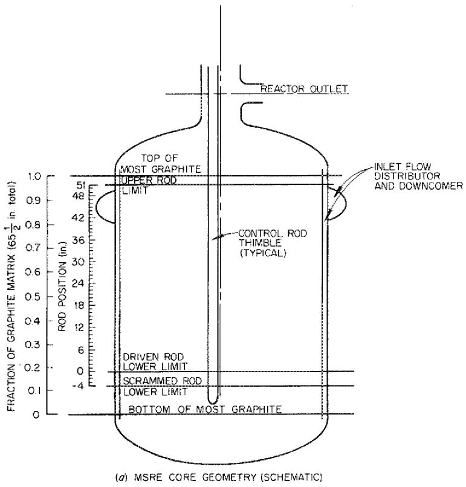

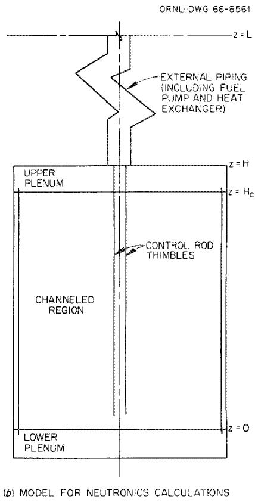  
Fig. 1. Geometry of MSRE Core and Three Region Core Model Used in Physics Calculations.

the actual MSRE core. This three-region model is a simplified version of that used for all previous MSRE core physics computations.[7]

Fluid dynamics studies with the MSRE core mockup have indicated that the fuel velocity within the graphite moderated region is very nearly constant over a large part of the core. Higher velocities occur in a small region about the core axis and near the outer radius. In the upper plenum, the flow is nearly laminar, whereas in the bottom head the flow distribution is complex due to the reversal in the flow direction between the peripheral downcomer and the graphite moderated region.

In the present study, we have assumed the flow velocity in each region except the lower plenum to be constant (plug flow), with the magnitude of the linear velocity determined by

$$
V _ {k} = \frac {I _ {k}}{t _ {k}}, \tag {21}
$$

where $L_k$ is the axial length of the $k$ th region, and $t_k$ is the residence time of the fluid in the $k$ th region. It will be seen later that the precursor densities in the regions of zero neutron flux (external loop) depend only on the fluid residence time in these regions.

Although the lower plenum is in a region of relatively low neutron importance so that several approximations are allowable, rather than assign a linear velocity to this region it was considered more realistic from a physical standpoint to treat the region as a "well stirred tank" with an average neutron flux and importance (adjoint flux) assigned to it.

Within the graphite moderated region, the primary difference in the spatial distributions of prompt and delayed neutrons can be expected to be in the direction of fuel salt flow. As a first approximation, we have assumed the velocity profile to be flat in the radial direction across the entire core, and have neglected the radial averaging of the neutron production rates implied in the scalar product integrals in Eq. 14. This is equivalent to assuming radial and axial separability of the neutron production rates and adjoint fluxes. Thus, if we preaverage the fluxes over the radial coordinate, and consider only the axial (z) dependence

of $\mathsf{P}\emptyset_{\mathsf{s}}$ in the integration of Eq. 7, the problem reduces entirely to a one-dimensional calculation (line model).*

With these simplifications, the required integration of Eq. 7 can now be completed. As written in the preceding formulas, the precursor densities and neutron reaction rates are the homogenized values, i.e., normalized to a unit cell volume of the reactor. To integrate Eq. 7, account must be taken of the variation in the fluid volume fraction over the path of flow through the reactor. If $\alpha_{\mathrm{k}}$ is the volume fraction of fuel in the kth region and superscript (o) is used to indicate the precursor densities and prompt neutron production rate in the fuel;

$$
c _ {i} (z) = \alpha_ {k} c _ {i} ^ {0} (z), \tag {22}
$$

$$
P \phi_ {s} (z) = \alpha_ {k} P ^ {\circ} \phi_ {s} (z). \tag {23}
$$

The values of $\alpha$ used for numerical calculations with the model of the MSRE core shown in Fig. 1b were 0.225 for the graphite moderated region, and 1.0 and 0.91 for the top and bottom plenums, respectively. The explicit forms of Eq. 7 for the various regions become:

a) Graphite moderated region

$$
\beta_ {i} P ^ {O} \phi_ {S} (z) - \left(\lambda_ {i} + w\right) c _ {i} ^ {O} = V _ {c} \frac {d c _ {i} ^ {O}}{d z} \quad 0 \leq z \leq H _ {c}, \tag {24}
$$

b) Top plenum

$$
\beta_ {i} P ^ {\circ} \emptyset_ {s} (z) - (\lambda_ {i} + w) c _ {i} ^ {\circ} = V _ {u} \frac {d c _ {i} ^ {\circ}}{d z} \quad H _ {c} \leq z \leq H, \tag {25}
$$

c) External piping

$$
- \left(\lambda_ {i} + w\right) c _ {i} ^ {o} = V _ {e x} \frac {\mathrm {d} c _ {i} ^ {o}}{\mathrm {d} z} \quad H \leq z \leq L, \tag {26}
$$

d) Bottom plenum

$$
\beta_ {i} \left(\overline {{P ^ {o} \varnothing_ {s}}}\right) _ {\ell} - \left(\lambda_ {i} + w\right) c _ {i} ^ {o} = \frac {\mathrm {d} c _ {i} ^ {o}}{\mathrm {d} t} \quad 0 \leq t \leq t _ {\ell}. \tag {27}
$$

In the above equations, $H_{c}$ is the height of the graphite moderated region, $H - H_{c}$ is the thickness of the upper plenum, and $L - H$ is the effective length of the region representing the external piping and heat exchanger (see Fig. 1b). As described above, the lower plenum region is treated by means of a well mixed tank approximation, in contrast to the plug flow model for the remaining regions. In Eq. 27, $t_{\ell}$ is the average residence time and $(\overline{P^{\circ}\varnothing_{s}})_{\ell}$ is the average fission production rate for each element of fluid in the lower plenum.

The boundary conditions for each region require that the precursor concentrations in the salt, $c_{i}^{0}$ , are continuous along the path of flow. As applied to Eq. 27, these conditions are;

$$
\mathrm {c} _ {\dot {1}} ^ {\circ} (t = 0) = \mathrm {c} _ {\dot {1}} ^ {\circ} (z = L), \tag {28}
$$

$$
\mathrm {c} _ {\dot {1}} ^ {\circ} (\mathrm {t} = \mathrm {t} _ {\hat {\mathcal {X}}}) = \mathrm {c} _ {\dot {1}} ^ {\circ} (\mathrm {z} = 0) \quad . \tag {29}
$$

These conditions, together with the continuity conditions given above, completely determine the solution of Eqs. 24 through 27. The results of integrating the above differential equations are:

$$
\begin{array}{l} 0 \leq z \leq H _ {c}; \\ c _ {i} ^ {\circ} (z) = c _ {i} ^ {\circ} (0) e ^ {- \left(\lambda_ {i} + w\right) \frac {z}{V _ {c}}} + \int_ {0} ^ {z} \beta_ {i} P ^ {\circ} \varnothing_ {s} \left(z ^ {\prime}\right) e ^ {- \left(\lambda_ {i} + w\right) \left(\frac {z - z ^ {\prime}}{V _ {c}}\right)} \frac {d z ^ {\prime}}{V _ {c}}, (30) \\ \mathrm {H} _ {\mathrm {c}} \leq \mathrm {z} \leq \mathrm {H}; \\ c _ {i} ^ {o} (z) = c _ {i} ^ {o} \left(H _ {c}\right) e ^ {- \left(\lambda_ {i} + w\right) \left(\frac {z - H _ {c}}{V u}\right)} + \int_ {H _ {c}} ^ {z} \beta_ {i} P ^ {o} \varnothing_ {s} \left(z ^ {\prime}\right) e ^ {- \left(\lambda_ {i} + w\right) \left(\frac {z - z ^ {\prime}}{V u}\right)} \frac {d z ^ {\prime}}{V u}, (31) \\ \end{array}
$$

$$
\begin{array}{l} \mathrm {H} \leq \mathrm {z} \leq \mathrm {L} \\ c _ {i} ^ {o} (z) = c _ {i} ^ {o} (H) e ^ {- \left(\lambda_ {i} + w\right) \left(\frac {z - H}{V _ {\text {e x}}}\right)} \tag {32} \\ \end{array}
$$

$$
\begin{array}{l} \mathbb {Z} = \mathbb {L} \rightarrow 0 \\ c _ {i} ^ {o} (o) = c _ {i} ^ {o} (L) e ^ {- \left(\lambda_ {i} + w\right) t _ {\ell}} + \beta_ {i} \left(\overline {{P ^ {o} \varnothing_ {s}}}\right) _ {\ell} \left[ \frac {1 - e ^ {- \left(\lambda_ {i} + w\right) t _ {\ell}}}{\lambda_ {i} + w} \right] ， (33) \\ \left(\overline {{c _ {i} ^ {o}}}\right) _ {\ell} = \frac {\beta_ {i} \left(\overline {{P ^ {o} \varnothing_ {s}}}\right) _ {\ell}}{\lambda_ {i} + w} + \left[ c _ {i} ^ {o} (L) - \frac {\beta_ {i} \left(\overline {{P ^ {o} \varnothing_ {s}}}\right) _ {\ell}}{\lambda_ {i} + w} \right] \left[ \frac {1 - e ^ {- (\lambda_ {i} + w) t _ {\ell}}}{(\lambda_ {i} + w) t _ {\ell}} \right] (34) \\ \end{array}
$$

The last of the equations given above results from averaging the precursor concentration obtained from solving Eq. 27 over the residence time $t_{\ell}$ . By use of the continuity conditions for the entrance and exit concentrations in each region, the above equations may be used to solve for $c_{i}^{0}(o)$ . The result is:

$$
\begin{array}{l} c _ {i} ^ {o} (o) = \left\{ \begin{array}{l l} H _ {c} & - (\lambda_ {i} + w) \left(\frac {H _ {c} - z ^ {\prime}}{V _ {c}} + t _ {u} + t _ {e x} + t _ {\ell}\right) \\ \int_ {o} \beta_ {i} P ^ {o} \varnothing_ {s} (z ^ {\prime}) e & \frac {d z ^ {\prime}}{V _ {c}} \end{array} \right. \\ + \int_ {H _ {C}} ^ {H} \beta_ {i} P ^ {\circ} \varnothing_ {s} (z ^ {i}) e ^ {- (\lambda_ {i} + w) \left(\frac {H - z ^ {i}}{V _ {u}} + t _ {e x} + t _ {\ell}\right)} \frac {d z ^ {i}}{V _ {u}} \\ + \beta_ {i} \left(\overline {{P ^ {0} \varnothing_ {s}}}\right) _ {\ell} \left[ \frac {1 - e ^ {- (\lambda_ {i} + w) t _ {\ell}}}{\lambda_ {i} + w} \right] \Bigg \} / \left[ 1 - e ^ {- (\lambda_ {i} + w) t _ {\text {c i r c}}} \right] \quad , \tag {35} \\ \end{array}
$$

where the following definitions of the residence times have been used:

$$
t _ {c} = \frac {H c}{V c}, \tag {36}
$$

$$
t _ {u} = \frac {H - H _ {c}}{V _ {u}} \quad , \tag {37}
$$

$$
t _ {e x} = \frac {L - H}{V _ {e x}}, \tag {38}
$$

$$
t _ {\text {c i r c}} = t _ {c} + t _ {u} + t _ {e x} + t _ {l}. \tag {39}
$$

The computational procedure developed in this section may be summarized as follows:

1. Calculate approximations to the static flux and adjoint flux axial distributions by standard techniques of core physics analysis.   
2. From a specified asymptotic inverse period, $w$ , and the static flux distribution, $\varnothing_{s}$ , corresponding to the same reactor state, calculate $c_{i}^{0}(o;w)$ using Eq. 35. Note that the absolute normalization of the flux is arbitrary since Eq. 14 is independent of the flux normalization.   
3. Calculate the axial distribution of precursor densities in the salt, $c_{\perp}^{\circ}(z; w)$ , by means of formulas 30 through 34. Either a numerical integration procedure or analytical approximations for $\varnothing_{s}(z)$ can be used in evaluating the integrals. The former method was used in the work described in the following section.   
4. Calculate $\rho_{s}$ by performing the integrations in Eq. 14.

It is obvious that the only means of practical calculation with this scheme is the digital computer. A calculation program based on this scheme was written for the IBM-7090. Specific details concerning the numerical results, and the application of this analysis to the MSRE experiments are given in Section 3.

# 3. NUMERICAL AND EXPERIMENTAL RESULTS

# Numerical Groundwork

Our intention in this section is to apply Eq. 14 to the analysis of a series of rod bump-stable period measurements made with the MSRE during fuel circulation. These measurements were taken at various control rod insertions during the course of enrichment of the fuel salt in Run No. 3. It has been seen from the analysis presented in Section 2 that the quantities required to relate the measured asymptotic period to reactivity are the static distributions of the precursor concentration and the fission production rate together with the associated adjoint flux distribution. We have already introduced several approximations in order to simplify calculations with Eq. 14. We now make explicit use of the group diffusion model for the neutron fluxes. The flux distributions we shall use were obtained from standard core physics analysis with one-dimensional multigroup and two-dimensional, few group diffusion models for the neutronic behavior. In performing a "first round" analysis of the experimental measurements, the attempt was made to maintain as much computational simplicity as possible without discarding the essential features of the reactor and fuel circulation models.

It has been shown that the static distribution $\mathsf{P}^{\circ}\phi_{\mathrm{s}}$ and $\varphi_{s}^{+}$ occurring in Eq. 14 are those appropriate to the asymptotic state, i.e., the reactor-rod configuration during the period measurement. However, the three control rods in the MSRE are in a highly localized cluster about the center of the core (Fig. 2), and the insertion of a single rod produces a perturbation in the thermal flux distribution which is fairly well localized in the radial direction. Some calculational results in support of this conclusion are shown in Fig. 3. These are plots of the radial variation of the thermal flux, taken at an azimuthal angle half way between control rods 2 and 3. The calculations were made with the two dimensional diffusion program EXTERMINATOR, using an R-0 model of the MSRE core geometry. The perturbed fluxes with rod No. 2 inserted and with all three rods inserted are compared with the fluxes when all

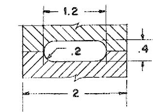  
TYPICAL FUEL PASSAGE

ORALIMG64-8214

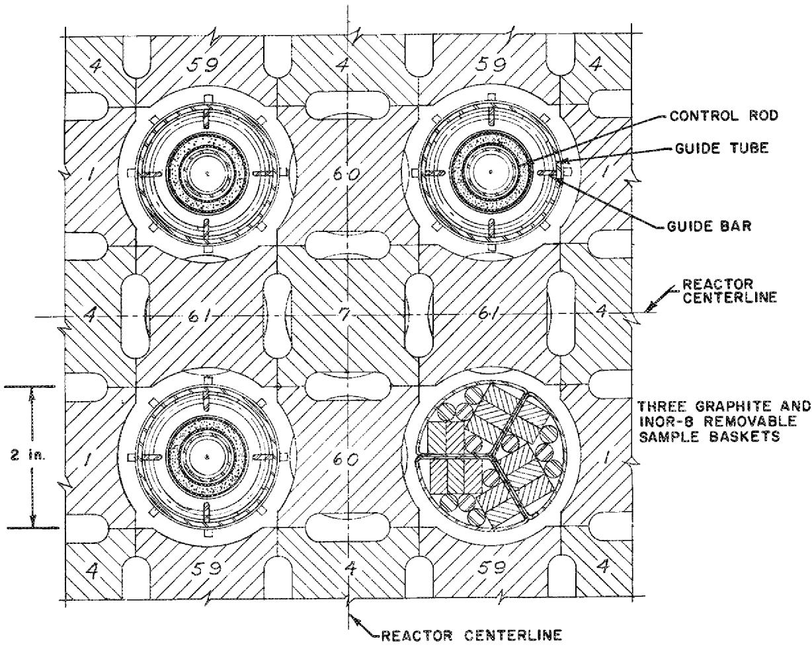  
NOTE: STRINGERS NOS. 7, 60 AND 61 (FIVE) ARE REMOVABLE.   
Fig. 2. Lattice Arrangement of MSRE Control Rods.

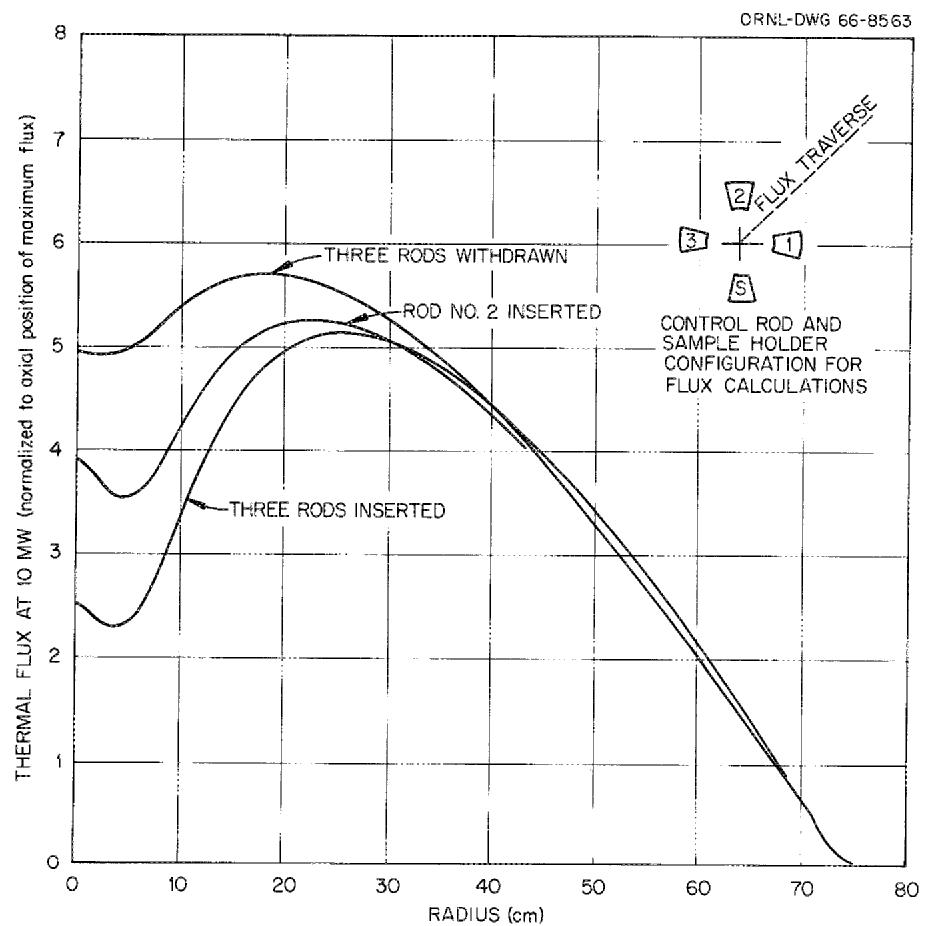  
Fig. 3. Radial Distribution of Thermal Flux in MSRE Core (Calculated Curves).

rods are fully withdrawn.* In all cases, the fluxes are normalized to a core power level of 10 Mw. It may be seen that the shape of the flux is relatively undisturbed over a large fraction of the radial cross section of the core.

One may also note that the total neutron production rates in the numerator and denominator of Eq. $14$ are multiplied by the energy spectrums of neutron production. Hence, when performing the integration over energy in evaluating the scalar products in Eq. $14$ , only the high energy portion (where $\overline{\mathbf{f}}(\mathbf{E}) \neq 0$ ) contributes to the result. We therefore need only approximate the fast group adjoint flux distribution.

Based on the preceding observations, as a final set of simplifying approximations we have used only the unperturbed distributions of fission production and fast adjoint flux, corresponding to the case of the rods fully withdrawn from the core. This simplification is consistent with the neglect of the radial variations of flux and precursor concentrations over the core which was discussed in Section 2.

The calculated unperturbed axial distributions of fission production rates and fast adjoint flux are given in Fig. 4. These were used for the calculation of the axial distributions of the six delayed neutron precursor groups, in accordance with the scheme developed in Section 2. The individual precursor concentrations, $c_{i}^{0}(z)$ , were multiplied by $\lambda_{1}$ and summed to obtain the total local rate of emission of delayed neutrons along the flow path through the reactor core. These resulting total distributions are shown in Fig. 5, for the particular cases of $w = 0$ (circulating critical) and $w = 0.1$ sec $^{-1}$ (10 sec stable period), and also for the case when the fuel is not circulating. All three distributions are normalized to the same total production rate, $P^{\circ}$ . The bottom plenum is omitted from Fig. 5 since the well stirred tank model was used to represent the delayed neutron production in this region.

Based on these same unperturbed fluxes, the relationship between the stable inverse period, $w^{-1}$ , and the increment in static reactivity corresponding to the rod bump is shown in Fig. 6. For comparison

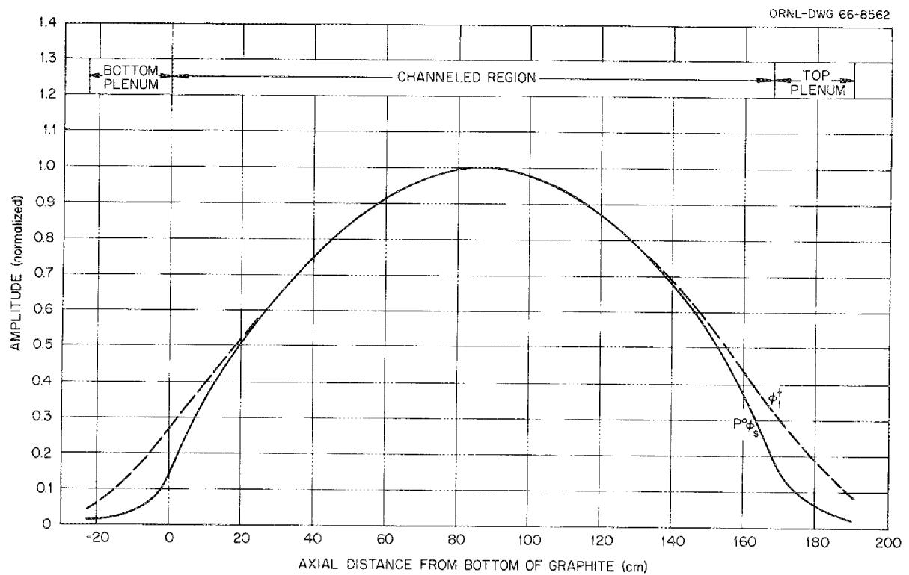  
Fig. 4. Axial Distributions of Fission Density in Fuel Salt and Fast Groups Adjoint Flux (Calculated Curves).

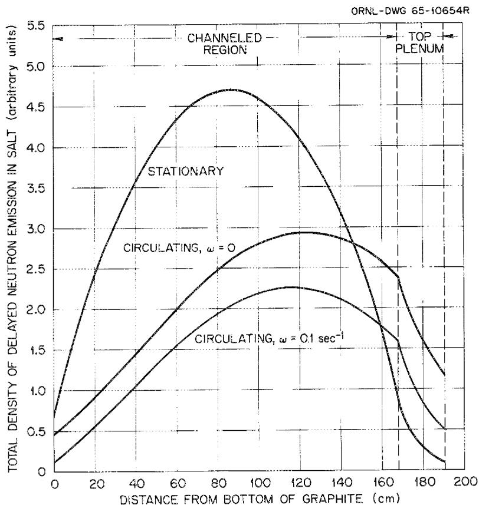  
Fig. 5. Axial Distribution of Net Source of Delayed Neutrons in MSRE (Calculated Curves).

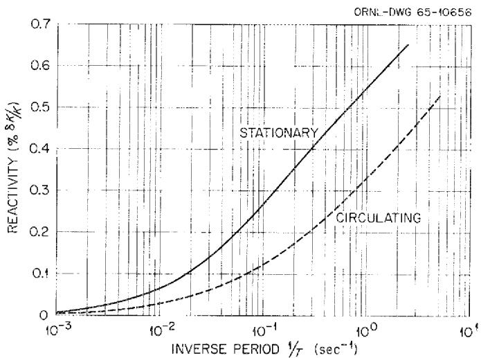  
Fig. 6. Reactivity vs Stable Inverse Period of MSRE (Calculated Curves).

purposes, a calculated curve is also given for the standard inhour relation4,8 when the fuel is stationary in the core. All of these calculations are based on the static values of $\beta_{i}$ and $\lambda_{i}$ and the fuel residence times given in Table 1.

Table 1. Static Delayed Neutron Precursor   
Characteristics and Fuel Residence   
Times used in Calculations   

<table><tr><td>Delayed Group*</td><td>1</td><td>2</td><td>3</td><td>4</td><td>5</td><td>6</td></tr><tr><td>104βi, (n/104n)</td><td>2.23</td><td>14.57</td><td>13.07</td><td>26.28</td><td>7.66</td><td>2.80</td></tr><tr><td>λi·(sec-1)</td><td>0.0124</td><td>0.0305</td><td>0.1114</td><td>0.3013</td><td>1.140</td><td>3.010</td></tr><tr><td colspan="7">Fuel Residence Times (sec)</td></tr><tr><td colspan="3">Core (graphite moderated region)</td><td colspan="4">9.4</td></tr><tr><td colspan="3">Upper plenum</td><td colspan="4">3.9</td></tr><tr><td colspan="3">External system</td><td colspan="4">8.1</td></tr><tr><td colspan="3">Lower plenum</td><td colspan="4">3.8</td></tr><tr><td colspan="3">Total</td><td colspan="4">25.2</td></tr></table>

*β₁ corrected for the difference between the static energy spectrums of prompt and delayed neutron emission.³

As the curves in Fig. 6 illustrate, because the margin between the prompt and delayed neutron sources has been increased by the spatial transport of the precursors, the same static reactivity increment produces a faster rate of rise of both neutron and precursor densities. The calculated curves extend somewhat beyond the region of practical interest in experimental measurements of the stable period. They are presented mainly for the purposes of illustration. In analyzing the experimental data, it proved to be most expedient to carry out machine calculations of the reactivity increments corresponding to each observed stable period.

# Experimental Results

In the chronology of the MSRE zero power experiments, the measurements of interest in this study began at the point of reaching the minimum $23^{5}\mathrm{U}$ concentration required for criticality with circulation stopped and all control rods fully withdrawn. A summary of the zero power experiments is given elsewhere, $^{10}$ and we consider only those details pertinent to the topic of this report.

Once this first basepoint $^{235}\mathrm{U}$ concentration had been reached, the concentration was further increased by the addition of capsules of enriched fuel salt containing approximately 85g amounts of $^{235}\mathrm{U}$ . The amount of control rod insertion required to compensate for these additions was measured, and period measurements about these new critical rod positions were made. Care was taken to determine the minimum extra addition of $^{235}\mathrm{U}$ required to reach criticality with the fuel circulating and all rods fully withdrawn. Once this second basepoint was reached, the critical rod position and period measurements were made first with the pump stopped then with the fuel circulating. The measurements were terminated when enough $^{235}\mathrm{U}$ had been added to calibrate one rod over its entire length of travel.

Most of the period measurements were made in pairs. The rod whose sensitivity was to be measured was first adjusted to make the reactor critical at about 10 watts. Then it was pulled a prescribed distance and held there until the power had increased by about two decades. The rod was then inserted to bring the power back to 10 watts and the measurement was repeated at a somewhat shorter stable period. Two fission chambers driving log-count-rate meters and a two-pen recorder were used to measure the period. The stable period was determined by averaging the slopes of the two curves (which usually agreed within about $2\%$ ). Periods observed were generally in the range of 30 to 150 sec.

Prior to pulling the rod for each period measurement, the attempt was made to hold the power level at 10 watts for at least 3 minutes, in an effort to assure initial equilibrium of the delayed neutron precursors. Generally, however, it was difficult to prevent a slight initial drift in the power level as observed on a linear recorder, and corrections were

therefore introduced for this initial period. The difference between the reactivity during the transient and the initial reactivity, as computed from the in-hour relation, was divided by the rod movement and this sensitivity was ascribed to the rod at the mean position.

The results of the rod sensitivity measurements made with the fuel stationary are shown in Fig. 7. Since the rod reactivity worth is affected by the $^{235}\mathrm{U}$ concentration, theoretical corrections have been applied to the raw data to account for the fact that the $^{235}\mathrm{U}$ mass was continually being increased during the course of these experiments. The rod sensitivities shown in Fig. 7 have been normalized to a single $^{235}\mathrm{U}$ concentration, that at the beginning of the calibration measurements.

The calibration curve in Fig. 7 constitutes a convenient reference from which the static reactivity equivalent of the $^{235}\mathrm{U}$ additions can be determined, simply by relating the integral under the curve between the fully withdrawn position and the critical rod position to the $^{235}\mathrm{U}$ mass. By applying this equivalence to the minimum $^{235}\mathrm{U}$ increment between criticality with the fuel stationary and with it circulating, one obtains an experimental determination of the reactivity loss increment due to circulation. In addition, the curve in Fig. 7 is a convenient comparison curve for the rod sensitivity data taken while the fuel was circulating.

In the first of the two above cases, the reactivity increment obtained from experiment was $0.212 \pm 0.004\% \delta \mathrm{k} / \mathrm{k}$ . This was found to compare with $0.222\%$ calculated directly from Eq. 14, with $w = 0$ . In the second case, the rod sensitivities determined from period measurements during circulation and Eq. 14 are shown in Fig. 8. Note that the solid curves in Figures 7 and 8 are identical. The experimental points were found to be distributed fairly closely about the reference curve, but the scatter of points relative to this curve is somewhat larger than observed with the data points of Fig. 7. Suggestions concerning the possible sources of this scatter, and methods for improving the precision of these measurements are included in the following section.

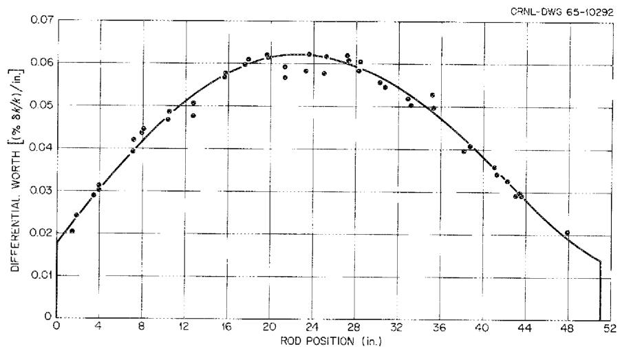  
Fig. 7. Differential Worth of MSRE Control Rod No. 1, Measured with Fuel Stationary. (Normalized to initial critical $^{235}\mathrm{U}$ loading).

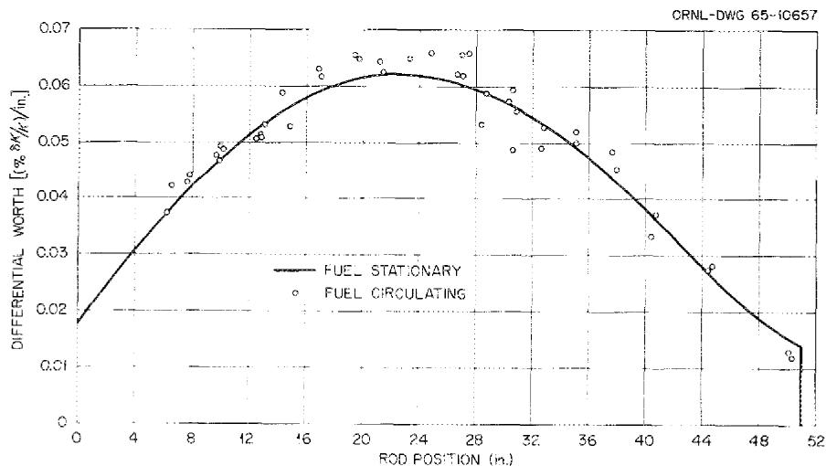  
Fig. 8. Differential Worth of MSRE Control Rod No. 1, Measured with Fuel Circulating. (Normalized to initial critical $235$ U loading).

# 4. DISCUSSION OF RESULTS

# Theoretical Model Verification

In keeping with the order of presentation of the preceding part of this memorandum, we shall first discuss those aspects of the results which relate directly to the theoretical model. Following this, some suggestions concerning the MSRE experiments will be made.

As a test of the theoretical model for determining the effects of fuel circulation on the delayed neutron precursors, quite satisfactory results were obtained for the reactivity increment between the just-critical states with the pump stopped and with the fuel in steady circulation. Here, the principal difference in our model and an earlier calculation by Haubenreich3 is the specific inclusion of the top and bottom reactor plenums as additional sources of delayed neutron emission which contribute to the chain reaction. As was shown in Fig. 5, the combined effect of fuel flow and radioactive decay of the precursors is to "skew" the distribution of delayed emission toward the upper core and the top plenum. It is important to notice that this relative increase in emission of delayed neutrons in the top plenum is further accentuated by the much larger fuel volume fraction in this region (the effective neutron production is the product of the source in the fuel salt times the fuel volume fraction). Because Haubenreich's model accounted for the ultimate contribution to fission of only those delayed neutrons emitted in the channelled region of the core, he obtained a somewhat larger effective loss in delayed neutrons due to circulation.

Although these results seem to constitute an adequate test of the model for the steady state condition, we cannot extend this claim to the stable asymptotic periods measured over the entire range of rod travel, due primarily to the lack of precision in the period measurements. However, until more precise measurements can be made, this calculational model appears to be an adequate description of the delayed neutron precursor transport due to circulation.

More generally, one may pose the question of the need for sensitive tests and models of the delayed neutron kinetics during fuel circulation

at zero power. For the rod calibration work, it is always possible to stop the fuel pump, perform the tests with the fuel stationary in the core, and use simpler, well developed methods for the analysis of stable periods. Also, the questions of ultimate safety and stability of the reactor generally involve large reactivity additions which take place on a time scale short compared to the core transit time, and greatly influence the kinetics of the prompt neutron generation. These questions also involve nonlinear interaction effects with temperature at high power.

In addition to the theoretical interest, there are several contributions a good understanding of the effect of circulation on the delayed neutron kinetics can make from the viewpoint of reactor operation. For example, the observed differences between the fuel stationary and circulating critical conditions can constitute a sensitive method of determining fuel circulation rate, amount of circulating gas bubbles, or any special characteristic due to the circulation. Necessary control system sensitivities and response times for normal operation can be specified with less uncertainty in the design of other molten salt reactors.

Although much of this study overlaps that of earlier work, it is useful to re-emphasize here that the kinetics of circulating fuel systems belong to a mathematical category which is fundamentally different from that of stationary fueled reactors. This is particularly important in the description of reactor transients occurring on a time scale comparable with the fuel transit times. It is appropriate to refer to the circulating fuel systems as "time-lag" systems, governed by partial differential equations for the delayed emitter concentrations, rather than by ordinary differential equations. For many purposes, approximate reductions of the equations to a form similar to the kinetics equations of the stationary fueled systems are adequate (e.g., the replacement of the individual delayed fractions, $\beta_{i}$ , by effective reduced values, $\beta_{i}^{\mathrm{eff}}$ , in the conventional reactor kinetics equations). This reduction, however, does not seem to be fully justified for the analysis of an arbitrary transient. In this study, the only conditions we have fully examined are the just critical state and the state of flux changing with a stable asymptotic period. For a complete theoretical understanding of the

coupling of the circulation with the delayed neutron kinetics, we need also to analyze the transient delayed neutron modes, mentioned briefly in Section 2. This transient coupling determines the effective time to establish the asymptotic period, and should also provide a basis for approximations made in the analysis of arbitrary transients. Some preliminary work has been done on this problem, and we hope to make this the subject of a future memorandum.

# Recommendations for the MSRE

One reason for the lack of precision of the rod bump-period measurement of control rod sensitivity is that the latter is the ratio of two small quantities. For best results, this requires the experimenter to maintain high precision in both the measurement of the increment in rod position and the slope of the log n vs time curve. Early in the course of these experiments it was decided that only the regular reactor instrumentation would be used for the rod sensitivity measurements. Determination of the period in each measurement involved laying a straight-edge along the pen line record on the log n chart and reading the time interval graphically along the horizontal scale which corresponded to a change of several decades in the neutron level. Since these charts, together with the pen speeds, are subject to variations, this is a probable source of error in the rod sensitivity measurements. A second possible source of error, probably less important, lies in the measurement of the increments in the rod positions. It has been seen that the scatter in the experimental points was larger for the sensitivity measurements made during circulation. This is expected, since similar increments in rod withdrawal result in a shorter stable period under these conditions.

Although a complete error analysis has not been carried out, these considerations would seem to be obvious starting points in any future attempt to obtain more precise measurements of the rod sensitivities. At the time these experiments were performed, the MSRE on-line computer was unavailable for the automatic recording of experimental data. It would be useful, during future MSRE operation, to repeat some of the period measurements while at zero power, using the computer in the data

logging mode to automatically record the log n and time intervals. The shim rods could be adjusted to vary the initial critical position of the regulating rod for the period measurements. The immediate need for more precise experiments is not great, since the precision of the rod calibration obtained from the measurements with the fuel stationary is judged adequate for further operation.

# ACKNOWLEDGMENT

The cooperation of J. R. Engel and various members of the MSRE operating staff in performing the experiments and aiding in analysis is gratefully acknowledged. Also, the author is indebted to J. L. Lucius of the Central Data Processing Facility for programming the machine computations to implement the analysis.

# REFERENCES

1. J. A. Fleck, Jr., Theory of Low Power Kinetics of Circulating Fuel Reactors With Several Groups of Delayed Neutrons, USAEC Report BNL-334 (T-57), Brookhaven National Laboratory, 1955.   
2. B. Wolfe, Reactivity Effects Produced by Fluid Motion in a Reactor Core, Nucl. Sci. Eng., 13(2): 80-90 (June 1962).   
3. P. N. Haubenreich, Prediction of Effective Yields of Delayed Neutrons in MSRE, USAEC Report ORNL-TM-380, Oak Ridge National Laboratory, October 13, 1962.   
4. T. Gozani, The Concept of Reactivity and Its Application to Kinetics Measurements, Nukleonik, 5(2): 55 (1963).   
5. B. Friedman, Principles and Techniques of Applied Mathematics, Chapter 1, John Wiley & Sons, Inc., New York (1956).   
6. T. B. Fowler et al., EXTERMINATOR - A Multigroup Code for Solving Neutron Diffusion Problems in One and Two Dimensions, ORNL-TM-342, February 1965.   
7. P. N. Haubenreich et al., MSRE Design and Operations Report, Part III: Nuclear Analysis, USAEC Report ORNL-TM-730, Oak Ridge National Laboratory, February 3, 1964.   
8. S. Glasstone and M. C. Edlund, The Elements of Nuclear Reactor Theory, Chapter 10, Van Nostrand, New York (1952).   
9. R. C. Robertson, MSRE Design and Operations Report, Part I: Description of Reactor Design, ORNL-TM-728, January 1965, p. 102.   
10. P. N. Haubenreich et al., MSRE Zero Power Physics Experiments, Oak Ridge National Laboratory Report in preparation.

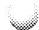

# INTERNAL DISTRIBUTION

1. R. K. Adams

2. S.J.Ball

3. W. P. Barthold

4. H.F.Bauman

5. S.E.Beall

6. L. L. Bennett

7. E. S. Bettis

8. F. F. Blankenship

9. R. Blumberg

10. C. J. Borkowski

ll. R. B. Briggs

12. G. H. Burger

13. S. Cantor

14. R. S. Carlsmith

15. R. D. Cheverton

16. C. W. Craven, Jr.

17. J. L. Crowley

18. F. L. Culler

19. J. G. Delene

20. S.J.Ditto

21. G. E. Edison

22. J.R.Engel

23. E. P. Epler

24. W. K. Ergen

25. D. E. Ferguson

26. T. B. Fowler

27. A. P. Fraas

28. D. N. Fry

29. C. H. Gabbard

30. R. B. Gallaher

31. E.H.Gift

32. W. R. Grimes

33. R. H. Guymon

34. P. H. Harley

35. P. N. Haubenreich

36. V. D. Holt

37. T. L. Hudson

38. L. Jung

39. P. R. Kasten

40. R.J.Kedl

41. M. J. Kelly

42. T. W. Kerlin

43. H. T. Kerr

44. S. S. Kirslis

45. S. I. Krakoviak

46. R. B. Lindauer

47. J. L. Lucius

48. M. I. Lundin

49. R. N. Lyon

50. H. G. MacPherson

51. R. E. MacPherson

52. C. D. Martin

53. H. E. McCoy

54. H.C.McCurdy

55. H. F. McDuffie

56. A. J. Miller

57. R. L. Moore

58. E. A. Nephew

59. H. R. Payne

60. A. M. Perry

61. H. B. Piper

62. P. H. Pitkanen

63. C. M. Podeweltz

64. C. A. Preskitt

65-74. B. E. Prince

75. J. L. Redford

76. M. Richardson

77. R.C.Robertson

78. H.C.Roller

79. M. W. Rosenthal

80. A. W. Savolainen

81. D. Scott

82. M.J. Skinner

83. O. L. Smith

84. P. G. Smith

85. I. Spiewak

86. R.C.Steffy

87. J. R. Tallackson

88. R.E.Thoma

89. W. E. Thomas

90. M. L. Tobias

91. D. B. Trauger

92. M. E. Tsagaris

93. W. C. Ulrich

94. D. R. Vondy

95. B.H. Webster

96. A. M. Weinberg

97. F. G. Welfare

98. G. D. Whitman

99. J. V. Wilson

100-101. Central Research Library

102-103. Document Reference Section

104-106. Laboratory Records

107. Laboratory Records (LRD-RC)

# EXTERNAL DISTRIBUTION

108-122. Division of Technical Information Extension (DTIE)   
123. Research and Development Division, ORO   
124-125. Reactor Division, ORO

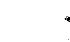

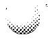

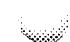

