ORNL-TM-1730

CFSTI PRICES

Contract No. W-7405-eng-26

CHEMICAL TECHNOLOGY DIVISION

H.C. $900; MN 65

CONSIDERATIONS OF LOW PRESSURE DISTILLATION AND ITS APPLICATION TO PROCESSING OF MOLTEN-SALT BREEDER REACTOR FUELS

L. E. McNeese

RELEASED FOR ANNouncement

IN NUCLEAR SCIENCE ABSTRACTS

MARCH 1967

# LEGAL NOTICE

This report was prepared as an account of Government sponsored work. Neither the United States, nor the Commission, nor any person acting on behalf of the Commission: A. Makes any warranty or representation, expressed or implied, with respect to the accuracy, completeness, or usefulness of the information contained in this report, or that the use of any information, apparatus, method, or process disclosed in this report may not infringe B. Assumes any liabilities with respect to the use of, or for damages resulting from the As used in the above, "person acting on behalf of the Commission" includes any employees or contractor of the Commission, or employee of such contractor, to the extent that has been designated, or provides access to, any information pursuant to his employment or contract

OAK RIDGE NATIONAL LABORATORY

Oak Ridge, Tennessee

operated by

UNION CARBIDE CORPORATION

for the

U.S. ATOMIC ENERGY COMMISSION

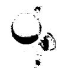

# CONTENTS

Page

# Abstract. 1

1. Introduction 1   
2. Distillation at Low Pressure 2

2.1 Equilibrium Distillation 3   
2.2 Molecular Distillation 3   
2.3 Mean Free Path 4   
2.4 Langmuir Vaporization Rate 5   
2.5 Probable Operating Mode for MSBR Processing 10

3. Relative Volatility 11

3.1 Relative Volatility for Equilibrium Distillation 12   
3.2 Relative Volatility for Molecular Distillation 14   
3.3 Comparison of Experimental and Calculated Relative Volatilities for Rare Earth Fluorides 16

4. Separation Potential of Various Distillation Methods 16

4.1 Continuous Distillation 16   
4.2 Semicontinuous Distillation with Continuous Feed 19   
4.3 Semicontinuous Distillation with Rectification 21   
4.4 Batch Distillation 28   
4.5 Semicontinuous Distillation Followed by Batch Distillation 29   
4.6 Comparison of Methods Considered 32

5. Prevention of Buildup of Nonvolatiles at a Vaporizing Surface by Liquid Phase Mixing 36

6. Conclusions and Recommendations 41

# References 43

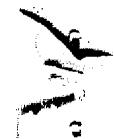

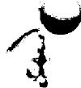

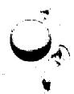

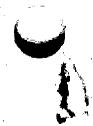

# CONSIDERATIONS OF LOW PRESSURE DISTILLATION AND ITS APPLICATION TO PROCESSING OF MOLTEN-SALT BREEDER REACTOR FUELS

L. E. McNeese

# ABSTRACT

Distillation at low pressure was examined as a method for removing rare earth fluorides from the fuel stream of a molten-salt breeder reactor. It was concluded that distillation allows adequate rare earth fluoride removal with the simultaneous recovery of more than $99.5\%$ of the fuel salt. Characteristics of equilibrium and molecular distillation were noted and expressions for the relative volatility of rare earth fluorides were derived for these types of distillation.

Expressions for the separation potential of several modes of distillation were derived and reported rare earth fluoride relative volatilities were shown to allow a great deal of latitude in still design and operational mode. It was concluded that a single contact stage such as a well mixed liquid pool provides adequate rare earth fluoride removal and that rectification is not required.

The buildup of rare earth fluorides at the vaporization surface was shown to seriously reduce the effectiveness of a distillation system. Liquid circulation was shown to be an effective means for preventing buildup of rare earth fluorides at vaporization surfaces.

# 1. INTRODUCTION

The molten-salt breeder reactor (MSBR) is a reactor concept having the possibilities of economic nuclear power production and simultaneous breeding of fissile material using the thorium-uranium fuel cycle. The reactor will be fueled with a mixture of molten fluoride salts which will circulate continuously through the reactor core where fission occurs and through the primary heat exchanger where most of the fission energy is removed. The reactor will employ a blanket of molten fluorides containing a fertile material (thorium)

in order to increase the neutron economy of the system by the conversion of thorium to fissile uranium-233. A close-coupled processing facility for removal of fission products, corrosion products, and fissile materials from these fused fluoride mixtures will be an integral part of the reactor system.

It has been proposed that the rare earth fluorides (REF) and fluorides of Ba, Sr, and Y be removed from the fuel stream by vacuum distillation. The purpose of this report is to examine various factors pertinent to such an operation and to compare several methods for effecting the distillation.

# 2. DISTILLATION AT LOW PRESSURE

The vaporization of a liquid is normally carried out under conditions such that the liquid and vapor phases are essentially in thermodynamic equilibrium. This condition may cease to exist if the distillation pressure is reduced sufficiently, and phenomena peculiar to low pressure distillation may be observed.

In discussing distillation at low pressure, it is convenient to make a distinction between two modes of distillation: equilibrium distillation and molecular distillation. During equilibrium distillation, a kinetic equilibrium exists at the liquid-vapor interface owing to the presence of a vapor atmosphere above the liquid which has the net effect of immediately returning most of the vaporizing molecules to the liquid surface. In contrast, molecular distillation is carried out in the absence of such an atmosphere and the vaporizing molecules reach the condensing surface without experiencing collisions with other gas molecules or with the walls of the system. In the following sections, consideration will be given to characteristics of these modes of distillation, to values of the mean free path under conditions of interest for MSBR processing, and to calculated values of maximum vaporization rates to be expected.

# 2.1 Equilibrium Distillation

Equilibrium distillation can be further divided into ebullient distillation and evaporative distillation. Ebullient distillation occurs when bubbles of vapor form within the bulk of the liquid which remains at a temperature such that the vapor pressure is equal to the total external pressure acting on the liquid (in the absence of other gases). Boiling promotes mixing in the liquid and the surface from which vaporization occurs is not depleted in the more volatile species.

Evaporative distillation occurs when the distillation is carried out at a temperature below the boiling point of the liquid. Under these conditions there is no formation of bubbles at points below the liquid surface and no visible movement of the liquid surface. Transfer of the more volatile species to the liquid surface occurs by a combination of molecular diffusion and convective mixing so that depletion of this species in the vicinity of the surface is possible. However, the rate of distillation is relatively low owing to the kinetic equilibrium which exists at the liquid-vapor interface and the liquid surface may have a composition near that of the bulk liquid.

# 2.2 Molecular Distillation

Molecular distillation is quite similar to evaporative distillation in that vaporization occurs only from a quiescent liquid surface and in that the vaporizing species is transferred to the surface by molecular diffusion and convective mixing. However, few of the vaporizing molecules are returned to the liquid surface by collisions in the vapor space above the liquid and vaporization proceeds at the greatest rate possible at the operating temperature. In order to achieve this condition, the distance between the vaporizing surface and the condensing surface should theoretically be less than the "mean free path" of the distilling molecules. This condition is seldom realized in practice, however the distance should

be no greater than a few mean free paths. These conditions favor a greater buildup of rare earth fluorides at the liquid surface than do those of evaporative distillation at the same temperature where vaporization is impeded by the vapor atmosphere above the liquid which serves to return most of the vaporized molecules to the liquid surface.

# 2.3 Mean Free Path

In a distillation system, the gases in the region between the vaporizing liquid and the condenser normally consist of a mixture of the distilling molecules and molecules of noncondensable gases. The calculation of the mean free path in this region is complicated by the fact that the vaporizing molecules, which have a net velocity component directed away from the liquid surface, pass into gas whose molecules are in random motion. The mean free path of a type 1 molecule in type 2 molecules may be obtained from a relation given by Loeb2 as

$$
\lambda_ {1, 2} = \frac {1}{\pi \left(\frac {\sigma_ {1} + \sigma_ {2}}{2}\right) ^ {2} n \sqrt {1 + \frac {C _ {2} ^ {2}}{C _ {1} ^ {2}}}} \tag {1}
$$

where

$\lambda_{1,2} =$ mean free path of a type 1 molecule moving among type 2 molecules

$\sigma_{1}, \sigma_{2} =$ collision diameters of type 1 and type 2 molecules

n = number of type 2 molecules per unit volume

$\mathbf{C}_1, \mathbf{C}_2 =$ average velocity of type 1 and type 2 molecules.

By making appropriate substitutions into this relation, one can obtain the following relation for the mean free path of a type 1 molecule in type 2 molecules at a pressure $P$ , both gases being at the temperature $T$ .

$$
\lambda_ {1, 2} = \frac {\mathrm {R T}}{\pi \left(\frac {\sigma_ {1} + \sigma_ {2}}{2}\right) ^ {2} P \left(1 + \frac {M _ {1}}{M _ {2}}\right) ^ {1 / 2}} \tag {2}
$$

where

$$
R = \text {g a s c o n s t a n t}, (\mathrm {m m} \mathrm {H g}) \left(\mathrm {c m} ^ {3}\right) / \left(^ {\circ} \mathrm {K}\right) (\text {g m o l e})
$$

$$
\sigma_ {1}, \sigma_ {2} = \text {c o l l i s i o n d i a m e t e r s o f t y p e 1 a n d 2 m o l e c u l e s}
$$

$$
M _ {1}, M _ {2} = \text {m o l e c u l a r w e i g h t s o f t y p e 1 a n d 2 m o l e c u l e s}.
$$

Values for the mean free path of LiF in Ar and in LiF at $1000^{\circ}\mathrm{C}$ are given in Fig. 1. It should be noted that the mean free path of LiF at a pressure of $1\mathrm{mmHg}$ is approximately $0.04\mathrm{cm}$ and that at a pressure of $0.01\mathrm{mmHg}$ , the mean free path of LiF is approximately $4\mathrm{cm}$ . These distances are probably quite small in comparison with the distance between the condenser and the surface from which vaporization will occur in an MSBR distillation system. Hence, the rate of distillation in an MSBR system will be set by the pressure drop between the liquid surface and the condensing surface. The values for the mean free path are sufficiently large that slip-flow may be of importance in pressure drop considerations.

# 2.4 Langmuir Vaporization Rate

The maximum rate of evaporation of a pure substance was shown by Langmiur3 to be

$$
W = 0. 0 5 8 3 \sqrt {\frac {M}{T}} P \tag {3}
$$

where

$$
W = \text {e v a p o r a t i o n} g m s / c m ^ {2}, \sec
$$

$$
\mathbf {M} = \text {m o l e c u l a r w e i g h t}
$$

$$
\mathbf {T} = \text {a b s o l u t e} ^ {\prime} \text {t e m p e r a t u r e}, ^ {\prime} \mathbf {K}
$$

$$
P = \text {v a p o r} \quad \text {p r e s s u r e}, \quad \mathrm {m m} \quad \mathrm {H g}.
$$

A derivation of this relation will be given in order to show the region of its applicability. Consider a plane liquid surface at a temperature below its boiling point. At equilibrium, the rate of vaporization from the surface will equal the rate of condensation on the surface. Langmiur postulated that the rate of vaporization in a high vacuum is the same as the rate of vaporization in the presence of a saturated vapor and that the rate of condensation in

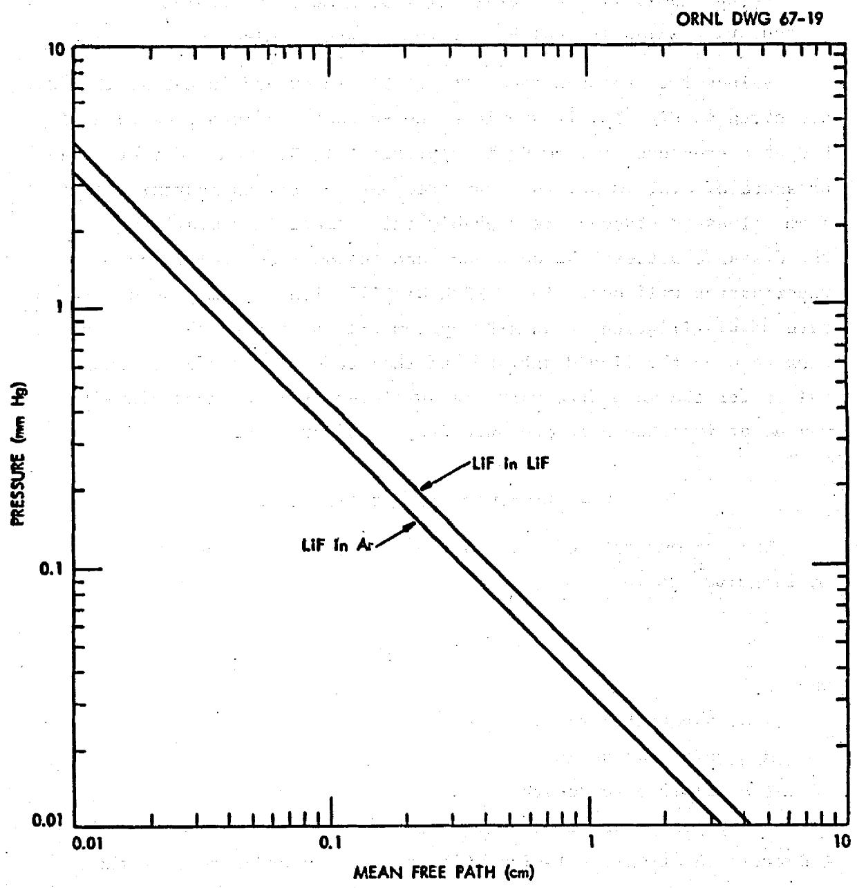  
Fig. 1. Mean Free Path of LiF in Ar and in LiF at $1000^{\circ}\mathrm{C}$ .

a high vacuum is determined by the pressure of the vapor. At equilibrium the rates of vaporization and condensation are equal and the rate of vaporization can be calculated from the rate of condensation.

The vapor contained in a unit cube in contact with the liquid surface is in equilibrium when the number of molecules moving toward the surface equals the number moving away from the surface. For n molecules of mass m in the volume v, the quantity of vapor approaching the liquid surface will be

$$
\frac {1}{2} \cdot \frac {\operatorname {m n}}{\mathbf {v}} = \frac {1}{2} \rho \tag {4}
$$

where $\rho$ is the vapor density. The average component of velocity of molecules moving toward the surface is $\frac{1}{2} U$ , where $U$ is the arithmetic mean velocity of the molecules. The mass of vapor striking a unit area of the liquid surface per unit time is then

$$
W = \left(\frac {1}{2} \rho\right) \left(\frac {1}{2} U\right) = \frac {1}{4} \rho U. \tag {5}
$$

If the vapor is an ideal gas,

$$
\rho = \frac {\mathrm {P M}}{\mathrm {R T}} \tag {6}
$$

and

$$
P V = R T = \frac {1}{3} \mathrm {m n} \overline {{C}} ^ {2}. \tag {7}
$$

Solving for $(\overline{C}^2)^{1/2}$ yields

$$
\left(\overline {{\mathrm {C}}} ^ {2}\right) ^ {1 / 2} = \sqrt {\frac {3 \mathrm {R T}}{\mathrm {M}}} \tag {8}
$$

where $M = mn = \rho v$ . The mean velocity $U$ is related to the root mean square velocity, $(\overline{C^2})^{1/2}$ , as

$$
\frac {U}{(\overline {{C ^ {2}}}) ^ {1 / 2}} = \sqrt {\frac {8}{3 \pi}} \tag {9}
$$

so that

$$
U = \sqrt {\frac {8 R T}{\pi M}}. \tag {10}
$$

Thus

$$
W = P \sqrt {\frac {M}{2 \pi R T}} \tag {11}
$$

or

$$
W = 0. 0 5 8 3 \sqrt {\frac {M}{T}} P.
$$

The assumptions implicit in the use of this relation for calculating the rate of vaporization from a liquid surface include the following:

(1) The liquid surface is plane.   
(2) The liquid surface is of infinite extent, i.e. collisions of molecules with the vessel walls in the vapor space must exert a negligible influence on the rate of vaporization.   
(3) The vapor behaves as an ideal gas.   
(4) Every part of the liquid surface is within a fraction of the mean free path from every other part or from a condensing surface, i.e., the effect of collisions between evaporating molecules on the rate of vaporization is negligible.   
(5) The number of molecules leaving the liquid surface is not affected by the number striking the surface.   
(6) Vapor molecules striking the liquid surface are absorbed and revaporized in a direction given by a cosine relation which is independent of the direction of approach at the moment of absorption.

When applied to the vaporization of LiF-BeF $_2$ mixtures, the poorest of these assumptions is likely that of considering the vapor to behave as an ideal gas since it is known that gaseous LiF tends to associate. The vaporization rate given by Eq. ll represents the maximum rate at which vaporization will occur and hence sets an upper limit on the vaporization rate. Values for the Langmuir vaporization rate of LiF are given in Fig. 2. The vaporization rates observed in practice may be considerably lower than the Langmuir rate since the fourth assumption is rarely met.

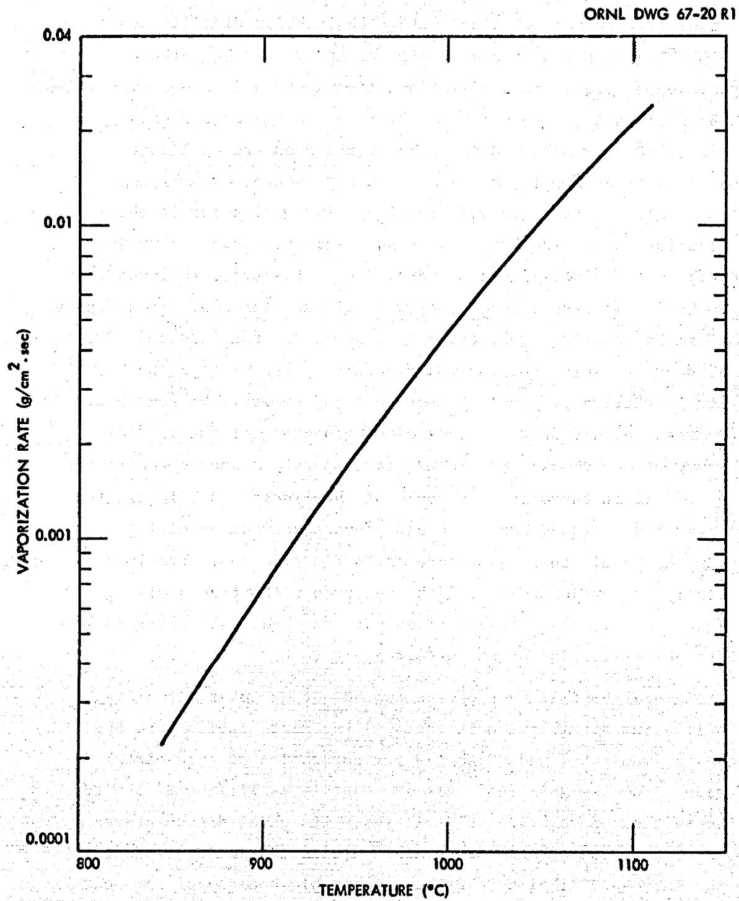  
Fig. 2. Langmuir Vaporization Rate for LiF.

# 2.5 Probable Operating Mode for MSBR Processing

The mode of distillation currently envisioned for processing MSBR fuel salt is that of single stage equilibrium distillation at $950^{\circ}$ - $1050^{\circ}$ C and at a pressure of approximately $1\mathrm{mmHg}$ . The composition of liquid in equilibrium with vapor having the composition of MSBR fuel salt (64 mole % LiF - 36 mole % $\mathrm{BeF}_2$ ) is approximately 88 mole % LiF - 12 mole % $\mathrm{BeF}_2$ . The vapor pressure of liquid of this composition is $\sim 1.5\mathrm{mmHg}$ at $1000^{\circ}$ C. Hence, evaporative distillation, with surface vaporization only, will occur if the distillation is carried out at a pressure greater than $1.5\mathrm{mmHg}$ . However, if the distillation is carried out at a pressure lower than $1.5\mathrm{mmHg}$ , boiling could occur below the liquid surface. At a pressure of $0.5\mathrm{mmHg}$ , boiling could occur to a depth of about $0.7\mathrm{cm}$ . The actual depth to which boiling would occur is dependent on the vertical variation of liquid temperature and composition (and hence vapor pressure) and on the extent of superheating of the liquid; the value of $0.7\mathrm{cm}$ assumes a constant temperature and concentration and no superheat throughout the bulk of the liquid. Boiling in the vicinity of the liquid surface would promote convective mixing which would result in a lower rare earth fluoride concentration at the liquid surface than would be observed without such mixing. The lower surface concentrations would in turn decrease the relative rate of volatilization of REF with respect to LiF.

Molecular distillation offers two advantages over either type of equilibrium distillation in that (1) the distillation proceeds at the maximum rate, and (2) a greater separation of rare earth fluorides from the MSBR fuel salt is possible as will be discussed in the section on relative volatilities. Its chief disadvantages are the low pressure required to achieve this type of distillation and the increased likelihood of an undesirable buildup of rare earth fluoride at the liquid surface.

The MSBR distillation system will probably be operated at the vapor pressure of the liquid at the vaporization surface or possibly

at a pressure 0.5-1.0 mm Hg lower than the vapor pressure. A decrease in pressure could yield an increase in distillation rate and/or a decrease in operating temperature. Entrainment at the lower pressures should be considered. It is improbable that the advantages to be gained by molecular distillation justify the effort necessary to attain this mode of operation.

# 3. RELATIVE VOLATILITY

The relative volatility is a convenient form for presenting data relating the composition of liquid and vapor phases at equilibrium and is defined as

$$
\alpha_ {A B} = \frac {y _ {A} / y _ {B}}{x _ {A} / x _ {B}} \tag {12}
$$

where

$$
\begin{array}{l} \alpha_ {A B} = \text {r e l a t i v e} A \text {r e f e r e d} B \\ \mathbf {y} _ {\mathbf {A}}, \mathbf {y} _ {\mathbf {B}} = \text {m o l e f r a c t i o n o f c o m p o n e n t A , B i n v a p o r} \\ x _ {A}, x _ {B} = \text {m o l e f r a c t i o n o f c o m p o n e n t A , B i n l i q u i d}. \\ \end{array}
$$

If the concentration of component A is low compared to that of the major component (B), the relative volatility can be expressed in a useful approximate form

$$
\alpha_ {\mathrm {A B}} = \frac {\mathrm {C} _ {\mathrm {v}}}{\mathrm {C} _ {\mathrm {l}}} \tag {13}
$$

where

$$
\begin{array}{l} C _ {v} = \text {m o l e s A / u n i t v o l u m e o f c o n d e n s e d v a p o r} \\ C _ {\ell} = \text {m o l e s A / u n i t v o l u m e o f l i q u i d}. \\ \end{array}
$$

and where the condensed vapor and liquid are at the temperature at which vaporization is carried out. In a binary system, the error introduced in relative volatility by this approximation depends on the concentration of component A, the relative volatility, and the relative molar volumes of components A and B. The error can be evaluated as follows.

Let $\alpha$ denote the actual relative volatility as defined by Eq. 12, and $\alpha^{*}$ denote the relative volatility in the approximate form defined by Eq. 13. From Eq. 13,

$$
\alpha^ {*} = \frac {Y _ {A}}{X _ {A}} \frac {X _ {A} V _ {A} + (1 - X _ {A}) V _ {B}}{Y _ {A} V _ {A} + (1 - Y _ {A}) V _ {B}}.
$$

The relation between $\mathbf{Y}_{\mathbf{A}}$ and $\mathbf{X}_{\mathbf{A}}$ is given by Eq.12 and its use with the expression for $\alpha^{*}$ yields the fractional error in $\alpha^{*}$ as

$$
\operatorname {f r a c} \text {e r r o r} = \frac {\alpha^ {*} - \alpha}{\alpha} = \frac {\mathrm {X} _ {\mathrm {A}} (1 - \alpha) \left(\mathrm {V} _ {\mathrm {A}} / \mathrm {V} _ {\mathrm {B}}\right)}{1 - \mathrm {X} _ {\mathrm {A}} [ 1 - \alpha \left(\mathrm {V} _ {\mathrm {A}} / \mathrm {V} _ {\mathrm {B}}\right) ]}.
$$

The fractional error in $\alpha^*$ is given in Fig. 3 as a function of $X_A$ for various values of $\alpha$ for the case where the molar volumes of A and B are equal. It should be noted that the error in $\alpha^*$ introduced by Eq. 13 is less than $18\%$ for $X_A \leq 0.15$ mole fraction if $\alpha \leq 2.46$ . For rare earth fluorides in LiF, the error in $\alpha^*$ will be approximately three times the values shown for $\alpha \leq 10^{-3}$ since the molar volume of rare earth fluorides is approximately three times that of LiF.

The definition of relative volatility given by Eq.12 has been used throughout this report except in Section 5 where the definition given by Eq.13 was used.

The appropriate forms of the relative volatility will be derived in the following sections for both equilibrium and molecular distillation, and a comparison of experimental and calculated values of relative volatility for several rare earth fluorides in LiF will be made.

# 3.1 Relative Volatility for Equilibrium Distillation

In equilibrium distillation, the relative volatility relates the composition of liquid and vapor which are in thermodynamic equilibrium. For the $i$ th component of a system which obeys Raoult's Law, one can write

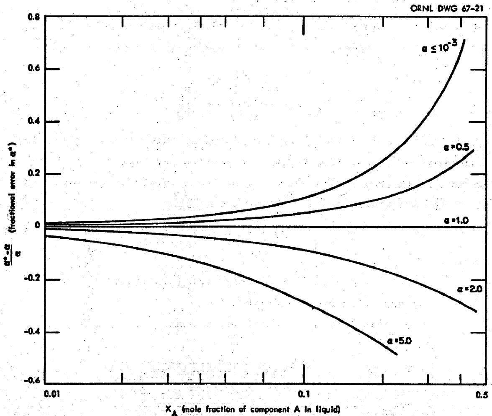  
Fig. 3. Error Introduced in Relative Volatility by Use of Approximate Form of Relative Volatility.

$$
\pi \mathbf {y} _ {\mathbf {i}} = \mathbf {P} _ {\mathbf {i}} \mathbf {x} _ {\mathbf {i}}
$$

where

$$
\pi = \text {t o t a l}
$$

$$
P _ {i} = \text {v a p o r}
$$

$$
y _ {i} = \text {m o l e f r a c t i o n o f i i n v a p o r}
$$

$$
\mathbf {x} _ {\mathbf {i}} = \text {m o l e f r a c t i o n o f i i n l i q u i d}.
$$

Substitution of this relation into the definition for relative volatility of component A referred to component B yields

$$
\alpha_ {A B} = \frac {\frac {P _ {A} x _ {A}}{\pi} / \frac {P _ {B} x _ {B}}{\pi}}{x _ {A} / x _ {B}} = \frac {P _ {A}}{P _ {B}}. \tag {14}
$$

Raoult's Law implies the absence of chemical interaction between the components under consideration. Interaction may be taken into account if information is available on the activity of the components since one can write for the $i$ th component

$$
\pi \mathbf {y} _ {\mathbf {i}} = \gamma_ {\mathbf {i}} \mathbf {P} _ {\mathbf {i}} \mathbf {x} _ {\mathbf {i}} \tag {15}
$$

where

$$
\gamma_ {i} = \text {a c t i v i t y c o e f f i c i e n t o f c o m p o n e n t i n l i q u i d o f t h e}
$$

The relative volatility may then be written as

$$
\alpha_ {\mathrm {A B}} = \frac {\gamma_ {\mathrm {A}} \quad \mathrm {P} _ {\mathrm {A}}}{\gamma_ {\mathrm {B}} \quad \gamma_ {\mathrm {B}}} \cdot \tag {16}
$$

# 3.2 Relative Volatility for Molecular Distillation

With molecular distillation, the liquid and vapor phases are not in thermodynamic equilibrium; instead, the composition of the vaporizing material is related to that of the liquid by a dynamic equilibrium which is dependent on the relative rates for vaporization of the various components of the liquid. An expression for the rate of vaporization of a pure liquid was derived in Section 2.4.

Division of the rate equation (Eq. 11) by M, the molecular weight yields the molar rate of vaporization as

$$
m = \frac {W}{M} = \frac {P}{\sqrt {2 \pi R M T}}. \tag {17}
$$

Thus, the molar rate of vaporization for any substance, at a given temperature, is governed by the ratio of $\mathbb{P} / \sqrt{\mathbb{M}}$ . In a binary system, if Raoult's Law is assumed,

$$
\mathbf {p} _ {\mathbf {i}} = \mathbf {x} _ {\mathbf {i}} \quad \mathbf {P} _ {\mathbf {i}} \tag {18}
$$

where

$$
\begin{array}{l} x _ {i} = \text {m o l e f r a c t i o n o f c o m p o n e n t i n t h e l i q u i d} \\ P _ {i} = \text {v a p o r} \\ p _ {i} = \text {p a r t i a l p r e s s u r e o f c o m p o n e n t i a t l i q u i d s u r f a c e}. \\ \end{array}
$$

The mole ratio of components vaporizing from the liquid surface is then

$$
\frac {m _ {A}}{m _ {B}} = \frac {P _ {A} X _ {A}}{\sqrt {M _ {A}}} \frac {\sqrt {M _ {B}}}{P _ {B} X _ {B}} = \frac {P _ {A}}{P _ {B}} \sqrt {\frac {M _ {B}}{M _ {A}}} \frac {X _ {A}}{X _ {B}}. \tag {19}
$$

Since the quantity $\mathbf{m}_{\mathbf{A}} / \mathbf{m}_{\mathbf{B}}$ is related to the ratio of the mole fraction of components A and B in the vapor as

$$
\frac {\mathrm {m} _ {\mathrm {A}}}{\mathrm {m} _ {\mathrm {B}}} = \frac {\mathrm {y} _ {\mathrm {A}}}{\mathrm {y} _ {\mathrm {B}}} \tag {20}
$$

where

$\mathbf{y}_{\mathbf{i}} =$ mole fraction of component i in vapor one obtains $\alpha_{i}$ the relative volatility as

$$
\alpha = \frac {y _ {A} / y _ {B}}{x _ {A} / x _ {B}} = \frac {P _ {A}}{P _ {B}} \sqrt {\frac {M _ {B}}{M _ {A}}} \tag {21}
$$

This should be compared with the relation for relative volatility for equilibrium distillation which was $\mathbf{P}_{\mathrm{A}} / \mathbf{P}_{\mathrm{B}}$ .

# 3.3 Comparison of Experimental and Calculated Relative Volatilities for Rare Earth Fluorides

Relative volatilities for several rare earth fluorides in LiF have been measured at $1000^{\circ}\mathrm{C}$ by Hightower6 and the relative volatility of $\mathsf{LaF}_3$ in 87.5 - 11.9 - 0.6 mole % LiF-BeF $_2$ -LaF $_3$ has been measured at $1000^{\circ}$ and $1028^{\circ}\mathrm{C}$ by Cantor.7 These experimental data and calculated relative volatilities for rare earth fluorides for which vapor pressure data8,9,10 are available are given in Table 1. Calculated values were obtained using Eq. 14 and Eq. 21.

# 4. SEPARATION POTENTIAL OF VARIOUS DISTILLATION METHODS

Several modes of operation are available for the distillation of MSBR fuel salt; the choice between these will involve consideration of their separation potential as well as factors such as degree of complexity, economics, etc. In the following sections, a comparison will be made of the separation potential of distillation systems employing continuous, batch, and semicontinuous methods. A semi-continuous system employing rectification will also be considered.

# 4.1 Continuous Distillation

Consider a continuous distillation system of the type shown in Fig. 4. Salt containing $C_f$ moles REF/mole LiF is fed to the system at a rate of F moles LiF/unit time. A vapor stream containing $\alpha C$ moles REF/mole LiF is withdrawn at the rate of v moles LiF/unit time and salt containing C moles REF/mole LiF is discarded at the rate of F-v moles LiF/unit time. A material balance on REF yields the relation

$$
\mathrm {F C} _ {\mathrm {f}} = (\mathrm {v} \alpha + \mathrm {F} - \mathrm {v}) \mathrm {C}.
$$

The fraction of the REF removed by the distillation system is then given as

Table 1. Experimental and Calculated Relative Volatilities of Several Rare Earth Fluorides Referred to LiF at $1000^{\circ}$ C   

<table><tr><td rowspan="3">Rare Earth Fluoride</td><td rowspan="3">Vapor Pressure mm Hg</td><td colspan="3">Relative Volatility</td></tr><tr><td rowspan="2">Experimental</td><td colspan="2">Calculated</td></tr><tr><td>Equilibrium Distillation</td><td>Molecular Distillation</td></tr><tr><td>NdF3</td><td>1.6 x 10-4</td><td>6 x 10-4</td><td>3.1 x 10-4</td><td>1.1 x-10-4</td></tr><tr><td>SmF3</td><td>-</td><td>5 x 10-4</td><td>-</td><td>-</td></tr><tr><td>CeF3</td><td>1.3 x 10-4</td><td>3 x 10-3</td><td>2.4 x 10-4</td><td>8.7 x 10-5</td></tr><tr><td>LaF3</td><td>2.8 x 10-5</td><td>3 x 10-4a</td><td>5.2 x 10-5</td><td>1.9 x 10-5</td></tr><tr><td></td><td></td><td>8.6 x 10-4b</td><td></td><td></td></tr><tr><td></td><td></td><td>1.09 x 10-3</td><td></td><td></td></tr></table>

Measured in 87.5-11.9-0.6 mole % LiF-BeF $_2$ -LaF $_3$ at $1028^{\circ}$ C.   
Measured in 87.5-11.9-0.6 mole % LiF-BeF2-LaF3 at 1000°C.

ORNL DWG 67-22

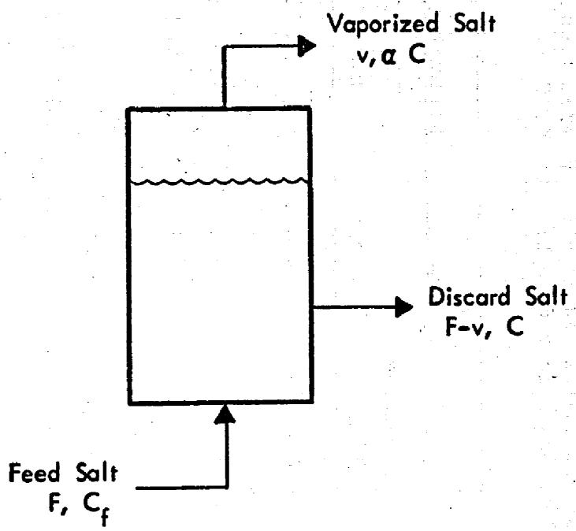  
Fig. 4. Continuous Still Having a Uniform Concentration of Rare Earth Fluoride in Liquid.

$$
\text {f r a c t i o n} = \frac {(\mathrm {F} - \mathrm {v}) \mathrm {C}}{\mathrm {F C} _ {\mathrm {f}}} = \frac {1}{1 + \frac {\mathrm {v} \alpha}{\mathrm {F} - \mathrm {v}}}. \tag {22}
$$

If the fraction of the LiF fed to the system which is vaporized is denoted as $f$ , where

$$
\mathbf {f} = \frac {\mathbf {v}}{\mathbf {F}}
$$

then

$$
\text {f r a c t i o n} = \frac {1}{1 + \frac {\mathrm {f} \alpha}{1 - \mathrm {f}}} \tag {23}
$$

The fraction of REF removed was calculated using Eq. 23 for various values of $f$ and $\alpha$ is shown in Fig. 5.

# 4.2 Semicontinuous Distillation with Continuous Feed

Consider a single-stage distillation system which contains V moles LiF at any time and a quantity of $\mathrm{BeF}_2$ such that vapor in equilibrium with the liquid has the composition of the MSBR fuel salt. Assume that MSBR fuel salt containing $X_0$ moles REF/mole LiF is fed to the system at a rate of F moles LiF/unit time where it mixes with the liquid in the system. Let the initial REF concentration in the liquid be $X_0$ moles REF/mole LiF and let the concentration at any time t be X moles REF/mole LiF. From a mass balance on REF,

$$
\frac {d}{d t} (V X) = F X _ {0} - F O X \tag {24}
$$

which has the solution

$$
X = \frac {X _ {0}}{\alpha} [ 1 - (1 - \alpha) \exp (- F \alpha t / V) ] \tag {25}
$$

for $V$ constant.

The total quantity of REF fed to the system at time $t$ is $(Ft + V)X_0$ and the quantity of REF remaining in the liquid at that

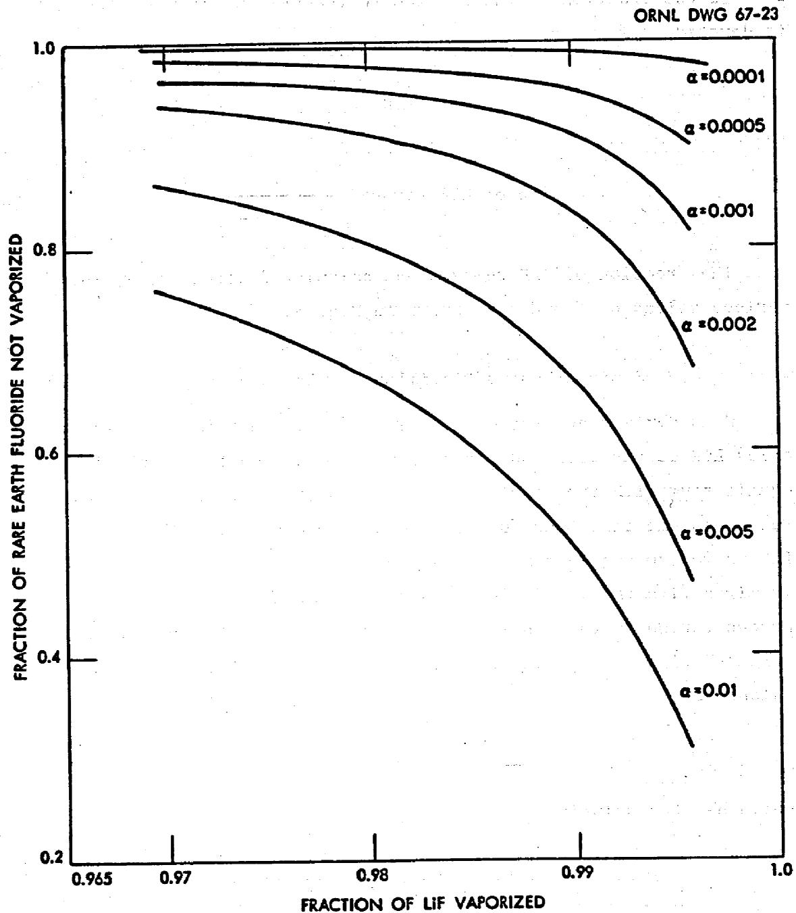  
Fig. 5. Rare Earth Fluoride Removal in a Continuous Still as a Function of LiF Recovery and Rare Earth Fluoride Relative Volatility.

time is VX. Thus, the fraction of the REF not vaporized at time t is

$$
f _ {R E F} = \frac {V X}{(F t + V) X _ {0}} = \frac {1 - (1 - \alpha) \exp (- F \alpha t / V)}{\alpha \left(\frac {F t}{V} + 1\right)} \tag {26}
$$

where

$\mathbf{f}_{\mathrm{REF}} = \mathrm{fraction}$ of REF not vaporized at time t. The fraction of the LiF vaporized at time t is given by the relation

$$
f = \frac {F t}{F t + V}, \tag {27}
$$

where

$f =$ fraction of LiF vaporized at time t. Substitution of Eq. 27 into Eq. 26 yields the desired relation:

$$
f _ {\text {R E F}} = \frac {1 - f}{\alpha} [ 1 - (1 - \alpha) \exp (- \alpha f / 1 - f) ]. \tag {28}
$$

Values for the fraction of REF not volatilized as a function of the fraction of the LiF volatilized are shown in Fig. 6 for various values of REF relative volatility.

# 4.3 Semicontinuous Distillation with Rectification

Consider a distillation system as shown in Fig. 7, which consists of a reboiler and one theoretical plate to which reflux is returned. The feed stream to the reboiler consists of F moles LiF/unit time plus $\mathbf{X}_0$ moles REF/mole LiF and $\mathbf{Z}_0$ moles BeF2/mole LiF. The following assumptions will be made:

(1) At any time the reboiler contains V moles LiF, where V is constant.   
(2) The initial REF concentration in the reboiler is $\mathbf{X}_{\mathbf{o}}$ moles REF/mole LiF.   
(3) The concentrations of $\mathrm{BeF}_2$ , moles $\mathrm{BeF}_2/$ mole LiF) throughout the system are the steady state values, i.e., the values which would be obtained at steady state with a feed stream containing $Z_0$ moles $\mathrm{BeF}_2/$ mole LiF and no REF.

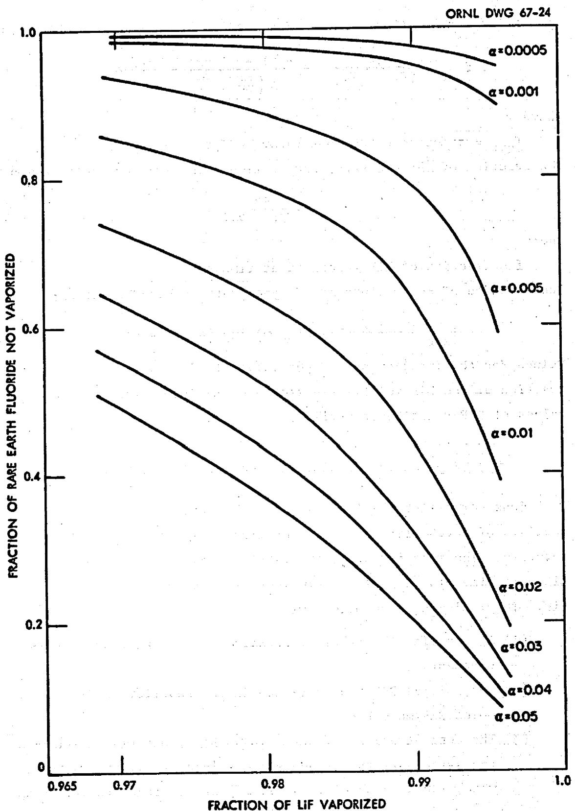  
Fig. 6. Rare Earth Fluoride Removal in a Semicontinuous Still as a Function of LiF Recovery and Rare Earth Fluoride Relative Volatility.

ORNL DWG 67-25

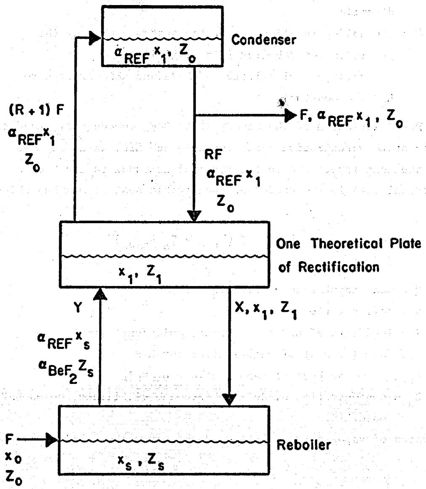  
Fig. 7. Semicontinuous Distillation System with Rectification.

(4) The vaporization rates for LiF and $\mathrm{BeF}_2$ are unaffected by the presence of REF and hence are the steady state vaporization rates. This assumption is made in view of the low concentration of REF in the vapor from the reboiler and hence in the liquid on the plate and in the distillate.   
(5) The holdup in all parts of the system excluding the liquid in the reboiler is negligible.   
(6) The relative volatilities of $\mathsf{BeF}_2$ and REF referred to LiF are constant.

For calculation of the steady state $\mathrm{BeF}_2$ concentration and the steady state vaporization rates for $\mathrm{BeF}_2$ and LiF, it is assumed that the heat input rate to the reboiler is equal to the heat withdrawal rate in the condenser (negligible heat of mixing) which is

$$
Q = (R + 1) F \left(\lambda_ {L i F} + z _ {o} \lambda_ {B e F _ {2}}\right)
$$

where

$$
\begin{array}{l} Q = \text {h e a t i n p u t r a t e o f} \\ R = \text {r e f l u x} \\ \end{array}
$$

$$
\begin{array}{l} \mathbf {F} = \text {f e e d r a t e o f L i F t o r e b o i l e r , m o l e s / u n i t t i m e} \\ \lambda_ {\mathrm {L i F}} = \text {m o l a r h e a t o f v a p o r i z a t i o n f o r} \mathrm {L i F} \\ \lambda_ {\mathrm {B e F} _ {2}} = \text {m o l a r h e a t o f v a p o r i z a t i o n f o r B e F} _ {2} \\ Z _ {0} = \text {c o n c e n t r a t i o n o f B e F} _ {2} \text {i n f e e d a n d d i s t i l l a t e , m o l e s B e F} _ {2} \quad \text {m o l e / L i F}. \\ \end{array}
$$

The rates of vaporization of LiF and $\mathsf{BeF}_2$ from the reboiler are then

$$
\begin{array}{l} \text {m o l e s L i F v a p o r i z e d / u n i t t i m e} = \frac {Q}{\lambda_ {\mathrm {L i F}} + \alpha_ {\mathrm {B e F} _ {2}} Z _ {\mathrm {s}} \lambda_ {\mathrm {B e F} _ {2}}} (29) \\ \text {m o l e s B e F} _ {2} \text {v a p o r i z e d / u n i t t i m e} = \frac {\alpha_ {\mathrm {B e F} _ {2}} ^ {\mathrm {z}} \mathrm {s}}{\lambda_ {\mathrm {L i F}} + \alpha_ {\mathrm {B e F} _ {2}} ^ {\mathrm {z}} \mathrm {s} \lambda_ {\mathrm {B e F} _ {2}}} (30) \\ \end{array}
$$

where

$$
\alpha_ {\mathrm {B e F} _ {2}} = \text {r e l a t i v e} \quad \text {v o l a t i l i t y} \quad \text {o f} \quad \mathrm {B e F} _ {2} \quad \text {r e f e r e r d} \quad \text {t o} \quad \mathrm {L i F}
$$

$Z_{s} =$ concentration of $\mathsf{BeF}_2$ in liquid in reboiler, moles $\mathsf{BeF}_2 / \mathsf{mole}$ LiF.

A material balance on LiF around plate 1 yields

$$
\frac {Q}{\lambda_ {\mathrm {L i F}} + \alpha_ {\mathrm {B e F} _ {2}} z _ {\mathrm {s}} \lambda_ {\mathrm {B e F} _ {2}}} + R F = (R + 1) F + X \tag {31}
$$

from which

$$
X = \frac {Q}{\lambda_ {L i F} + \alpha_ {B e F _ {2}} z _ {s} \lambda_ {B e F _ {2}}} - F \tag {32}
$$

where

$\mathbf{X} =$ moles LiF returned to reboiler/unit time from plate 1. A material balance on $\mathrm{BeF}_2$ around the reboiler gives

$$
\frac {Q Z _ {1}}{\lambda_ {\mathrm {L i F}} + \alpha_ {\mathrm {B e F} _ {2}} z _ {\mathrm {s}} \lambda_ {\mathrm {B e F} _ {2}}} - F Z _ {1} + F Z _ {0} = \frac {Q \alpha_ {\mathrm {B e F} _ {2}} z _ {\mathrm {s}}}{\lambda_ {\mathrm {L i F}} + \alpha_ {\mathrm {B e F} _ {2}} z _ {\mathrm {s}} \lambda_ {\mathrm {B e F} _ {2}}} \tag {33}
$$

Substitution of the definition of $Q$ from Eq. 29 with the relation

$$
Z _ {1} = \frac {Z _ {0}}{\alpha_ {\mathrm {B e F} _ {2}}}
$$

into Eq. 33 yields

$$
Z _ {s} = \frac {Z _ {0}}{\alpha_ {\mathrm {B e F} _ {2}}} \frac {\frac {R + \alpha_ {\mathrm {B e F} _ {2}}}{R + 1} \lambda_ {\mathrm {L i F}} + Z _ {0} \lambda_ {\mathrm {B e F} _ {2}}}{\alpha_ {\mathrm {B e F} _ {2}} \lambda_ {\mathrm {L i F}} + Z _ {0} \lambda_ {\mathrm {B e F} _ {2}} \left[ \frac {R \alpha_ {\mathrm {B e F} _ {2} + 1}}{R + 1} \right]} \tag {34}
$$

A material balance around plate 1 for REF yields

$$
\begin{array}{l} (R + 1) F \alpha_ {R E F} X _ {1} + \frac {Q X _ {1}}{\lambda_ {L i F} + \alpha_ {B e F _ {2}} Z _ {s} \lambda_ {B e F _ {2}}} - F X _ {1} = \\ = \frac {\mathrm {Q} \alpha_ {\mathrm {R E F}} \mathrm {X} _ {\mathrm {s}}}{\lambda_ {\mathrm {L i F}} + \alpha_ {\mathrm {B e F} _ {2}} \mathrm {Z} _ {\mathrm {s}} \lambda_ {\mathrm {B e F} _ {2}}} + \mathrm {R F} \alpha_ {\mathrm {R E F}} \mathrm {X} _ {1} \tag {35} \\ \end{array}
$$

from which

$$
\mathrm {X} _ {1} = \frac {\alpha_ {\mathrm {R E F}} \mathrm {X} _ {\mathrm {s}}}{\mathrm {F} \left(\alpha_ {\mathrm {R E F}} - 1\right) \left(\lambda_ {\mathrm {L i F}} + \alpha_ {\mathrm {B e F} _ {2}} \mathrm {Z} _ {\mathrm {s}} \lambda_ {\mathrm {B e F} _ {2}}\right) + \mathrm {Q}} \tag {36}
$$

A material balance around the reboiler on REF yields

$$
V \frac {d X _ {s}}{d t} = F X _ {o} - \frac {\alpha_ {R E F} X _ {s}}{\lambda_ {L i F} + \alpha_ {B e F _ {2}} Z _ {s} \lambda_ {B e F _ {2}}} + X x _ {1} \tag {37}
$$

which can be written as

$$
\frac {d X _ {s}}{d t} = \frac {F}{V} \left(X _ {0} - \beta X _ {s}\right) \tag {38}
$$

where

$$
\beta = \frac {\left(\lambda_ {\mathrm {L i F}} + z _ {0} \lambda_ {\mathrm {B e F} _ {2}}\right) \alpha_ {\mathrm {R E F}} ^ {2}}{\frac {\mathrm {R} + \alpha_ {\mathrm {R E F}}}{\mathrm {R} + 1} \lambda_ {\mathrm {L i F}} + \lambda_ {\mathrm {B e F} _ {2}} \left[ z _ {0} + \frac {\alpha_ {\mathrm {R E F}} - 1}{\mathrm {R} + 1} \alpha_ {\mathrm {B e F} _ {2}} z _ {s} \right]}
$$

The solution to Eq. 38, with the condition $\mathbf{X}_{\mathbf{s}} = \mathbf{X}_{\mathbf{o}}$ when $\mathbf{t} = 0$ is

$$
X _ {s} = \frac {X _ {0}}{\beta} [ 1 - (1 - \beta) \exp (- F \beta t / v) ] \tag {39}
$$

from which the fraction of the total REF not vaporized is given by

$$
f _ {\text {R E F}} = \frac {1 - f}{\beta} [ 1 - (1 - \beta) \exp (- \beta f / 1 - f) ] \tag {40}
$$

where

$f_{REF} =$ fraction of total REF fed to system which is contained in liquid in reboiler

$f =$ fraction of total LiF added to system which is vaporized

Values for the fraction of REF not vaporized as a function of the fraction of the LiF vaporized are shown in Fig. 8 for various values of the rare earth fluoride relative volatility. Data used in the calculation were as follows:

$$
\begin{array}{l} Z _ {0} = 0. 4 5 \text {m o l e s B e F} _ {2} / \text {m o l e L i F} \\ R = 1 \\ \alpha_ {\mathrm {B e F} _ {2}} = 5 \\ \lambda_ {\mathrm {L i F}} = 5 3. 8 \mathrm {k c a l} / \mathrm {m o l e} \\ \lambda_ {\mathrm {B e F} _ {2}} = 5 0. 1 \cdot \mathrm {k c a l / m o l e} \\ \end{array}
$$

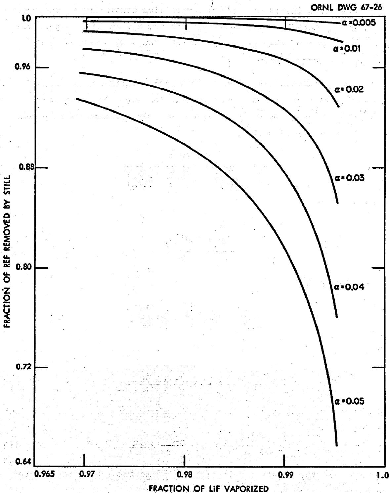  
Fig. 8. Rare Earth Fluoride Removal in a Semicontinuous Still Having One Theoretical Stage with Rectification and a Reflux Ratio of Unity.

# 4.4 Batch Distillation

Consider a liquid of uniform composition consisting of components 1, 2, and 3 which have molecular weights $M_1$ , $M_2$ , and $M_3$ , respectively. Let the weights of the components in the liquid at any time be $W_1$ , $W_2$ , and $W_3$ , respectively.

For the vaporization of a differential quantity of the liquid, the number of moles of each component in the vapor thus produced is $d\left(\frac{W_1}{M_1}\right)$ , $d\left(\frac{W_2}{M_2}\right)$ , and $d\left(\frac{W_3}{M_3}\right)$ . Since the mole fraction of component $i$ in the vapor is given by

$$
y _ {i} = \frac {d \left(W _ {i} / M _ {i}\right)}{d \left(\frac {W _ {1}}{M _ {1}}\right) + d \left(\frac {W _ {2}}{M _ {2}}\right) + d \left(\frac {W _ {3}}{M _ {3}}\right)} \tag {41}
$$

one can write

$$
\frac {d \left(\frac {W _ {1}}{M _ {1}}\right)}{y _ {1}} = \frac {d \left(\frac {W _ {3}}{M _ {3}}\right)}{y _ {3}}. \tag {42}
$$

In the liquid

$$
\frac {W _ {3} / M _ {3}}{W _ {1} / M _ {1}} = \frac {X _ {3}}{X _ {1}}; \frac {M _ {1}}{M _ {3}} = \frac {X _ {3}}{X _ {1}} \frac {W _ {1}}{W _ {3}}.
$$

Thus

$$
\frac {d W _ {i}}{d W _ {3}} = \frac {y _ {i}}{y _ {3}} \frac {M _ {i}}{M _ {3}} = \frac {y _ {i}}{y _ {3}} \frac {X _ {3}}{X _ {1}} \frac {W _ {i}}{W _ {3}} \tag {43}
$$

Then

$$
\frac {d \left(\log W _ {i}\right)}{d \left(\log W _ {3}\right)} = \frac {y _ {i} / y _ {3}}{x _ {i} / x _ {3}} = \alpha_ {i 3} \tag {44}
$$

where $\alpha_{i3}$ is the relative volatility of component $i$ with respect to component 3. The quantity $\alpha_{i3}$ is defined as

$$
\alpha_ {i 3} = \frac {\text {(m o l e s i / m o l e 3)} , \text {v a p o r}}{\text {(m o l e s i / m o l e 3)} , \text {l i q u i d}} = \frac {\text {(m o l e f r a c i / m o l e f r a c 3)} , \text {v a p o r}}{\text {(m o l e f r a c i / m o l e f r a c 3)} , \text {l i q u i d}} (4 5)
$$

If $\alpha_{13}$ is constant during the distillation, Eq. 44 can be integrated. Thus if $Q_1$ and $Q_3$ are the initial weights of components i and 3 in the liquid,

$$
\int_ {Q _ {1}} ^ {W _ {1}} d \left(\log W _ {i}\right) = \alpha_ {i 3} \int_ {Q _ {3}} ^ {W _ {3}} d \left(\log W _ {3}\right). \tag {46}
$$

$$
\frac {w _ {i}}{Q _ {i}} = \left(\frac {w _ {3}}{Q _ {3}}\right) ^ {\alpha_ {i 3}} \tag {47}
$$

where the quantity $W_{1} / Q_{1}$ represents the fraction of component i which remains in the liquid. If the components 1, 2, and 3 are now designated to be a rare earth fluoride (REF), $\mathrm{BeF}_{2}$ and LiF respectively,

$$
\frac {W _ {\text {R E F}}}{Q _ {\text {R E F}}} = \left(\frac {W _ {\text {L i F}}}{Q _ {\text {L i F}}}\right) ^ {\alpha_ {\text {R E F}}} \tag {48}
$$

$$
\frac {W _ {\mathrm {B e F} _ {2}}}{Q _ {\mathrm {B e F} _ {2}}} = \left(\frac {W _ {\mathrm {L i F}}}{Q _ {\mathrm {L i F}}}\right) ^ {\alpha_ {\mathrm {B e F} _ {2}}} \tag {49}
$$

The fraction of the rare earth fluoride not vaporized as a function of the fraction of the LiF vaporized for various values of $\alpha_{\mathrm{REF}}$ was calculated from Eq. 48 and is shown in Fig. 9. The vaporization of $\mathrm{BeF}_2$ can be regarded as complete for the probable range of LiF recoveries since for $\alpha_{\mathrm{BeF}_2 - \mathrm{LiF}} = 3.0$ , vaporization of $90\%$ of the LiF results in vaporization of $99.9\%$ of the $\mathrm{BeF}_2$ .

# 4.5 Semicontinuous Distillation Followed by Batch Distillation

Consider a still containing V' moles LiF. If a feed stream consisting of F moles LiF/unit time which contains $\mathbf{X}_{\circ}$ moles REF/mole LiF and which may also contain $\mathrm{BeF}_2$ is fed to the still with the condition that the initial REF concentration in the still is $\mathbf{X}_{\circ}$ , the concentration of REF in the liquid at time t is given by

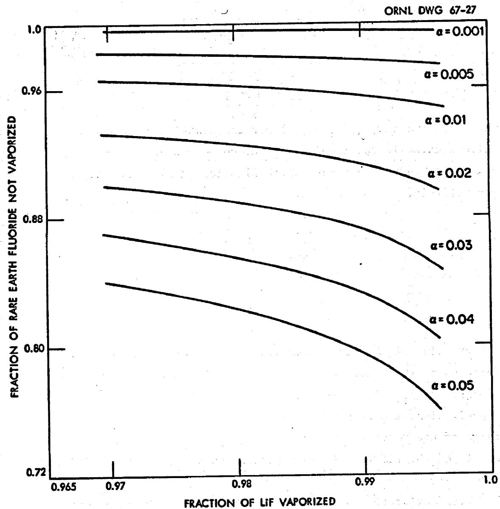  
Fig. 9. Rare Earth Fluoride Removal in a Batch Still as a Function of LiF Recovery and Rare Earth Fluoride Volatility.

$$
X = \frac {X _ {0}}{\alpha} [ 1 - (1 - \alpha) \exp (- F \alpha t / V ^ {\prime}) ] \tag {50}
$$

where

X = REF concentration in still liquid, moles REF/mole LiF

$X_{0} =$ REF concentration in feed, moles REF/mole LiF

$\alpha =$ relative volatility of REF referred to LiF

F = feed rate, moles LiF/unit time

t = time

$\mathbf{V}^{\prime} =$ moles LiF contained in liquid in still.

If at time $t$ the feed is stopped and batch distillation is carried out on the liquid in the still to give a final liquid volume containing $V$ moles LiF, the fraction of the REF which was present in the still at the beginning of batch distillation which remains in the still is then $(V / V')^\alpha$ . The moles of REF at the beginning of batch operation is $V'X$ so that the moles of REF in the still at the end of batch operation is $V'X(V / V')^\alpha$ . The total moles of REF fed to the system is $(Ft + V')X_0$ . Hence the fraction of the total REF which remains in the still is

$$
f _ {R E F} = \frac {V ^ {\prime} X}{\left(F t + V ^ {\prime}\right) X _ {o}} \left(\frac {V}{V ^ {\prime}}\right) ^ {\alpha}, \tag {51}
$$

which can be written in the form

$$
f _ {R E F} = \frac {1}{(n + 1) \alpha} [ 1 - (1 - \alpha) \exp (- n \alpha) ] \xi^ {\alpha} \tag {52}
$$

where

$\mathbf{f}_{\mathrm{REF}} = \mathrm{fraction}$ of REF which remains in still

V/V

$\mathbf{V} =$ final LiF content of still, moles

$\mathbf{V}^{\prime} =$ initial LiF content of still, moles

$\mathbf{n} = \mathbf{Ft} / \mathbf{V}^{\prime}$ , number of still volumes fed prior to batch operation

$\mathbf{F} =$ feed rate to still during semicontinuous operation,

moles/unit time

t = time

$\alpha =$ relative volatility of REF referred to LiF.

The fraction of the LiF which is vaporized by both methods of operation is given by

$$
f _ {L i F} = 1 - \frac {\xi}{n + 1} \tag {53}
$$

where

$f_{\text{LiF}} = \frac{\text{fraction of LiF vaporized by both methods of distillation.}}{\text{The fraction of REF not volatilized as a function of the fraction of the LiF volatilized for } \xi = 0.1 \ (\text{final volume of } 10\% \ \text{of still volume})}$ is shown in Fig. 10 for various values of the REF relative volatility.

# 4.6 Comparison of Methods Considered

A comparison of the various distillation methods must take account of numerous factors such as separation potential, operability, economics, etc. Consideration of all of these factors is beyond the scope of this report, however, the two topics of separation potential and operational simplicity will be discussed.

For currently envisioned processing rates, the required removal efficiency for the rare earth fluorides is approximately $90\%$ for the more important neutron poisons (Pm, Nd, Sm) and less for other members of this group. It should be recalled that the real requirement is the rate at which neutron poisons are removed from the reactor system, hence the "required removal efficiency" can be lowered at the expense of an increased throughput in the processing plant. With this in mind, a rare earth fluoride removal efficiency of $90\%$ will be used as a basis for discussion of separation potential for the various distillation methods.

As shown in Table 1, recent measurements indicate the relative volatilities (referred to LiF) of some of the more important rare earth fluorides to be $6 \times 10^{-4}$ for $\mathrm{NdF}_3$ , $5 \times 10^{-4}$ for $\mathrm{SmF}_3$ , and $3 \times 10^{-4}$ for $\mathrm{LaF}_3$ at $1000^{\circ}\mathrm{C}$ in LiF. The relative volatility of $\mathrm{CeF}_3$ was found to be $3 \times 10^{-3}$ , however, the required removal efficiency for $\mathrm{CeF}_3$ is only $8\%$ .

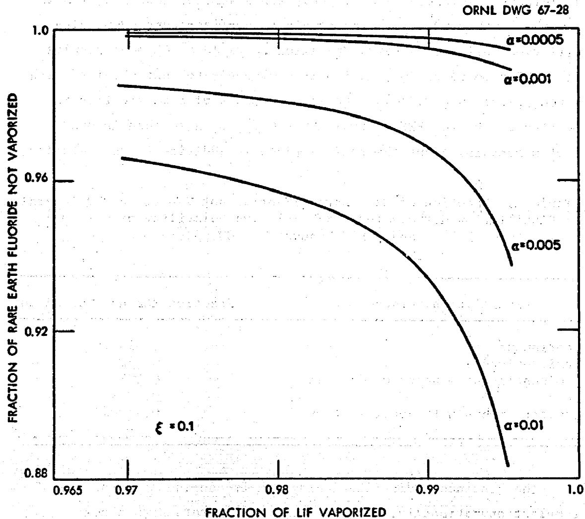  
Fig. 10. Variation of Rare Earth Fluoride Removal in a Semi-continuous Still Using a Final Batch Volume Reduction to $10\%$ of the Still Volume.

The fraction of REF not vaporized for the various distillation methods considered is given in Table 2. The values were calculated for a REF relative volatility of $5 \times 10^{-4}$ and a LiF recovery of $99.5\%$ . As would be expected, the continuous system yields the poorest REF removal ( $91\%$ ) although this is an adequate removal efficiency. The removal efficiency for a semicontinuous system is somewhat higher ( $95.2\%$ ). The combination of semicontinuous distillation followed by batch operation to yield a $10\%$ heel results in a REF removal of $99.5\%$ which is comparable to that obtained with batch operation ( $99.74\%$ ). The effectiveness of rectification is pointed out by the REF removal ( $99.9967\%$ ) for a semicontinuous system containing one theoretical plate in addition to the reboiler.

Table 2. Fraction of Rare Earth Fluoride not Vaporized for Several Distillation Methods for a REF Relative Volatility of $5 \times 10^{-4}$ and a LiF Recovery of $99.5\%$ .   

<table><tr><td>Distillation Method</td><td>Fraction REF not Vaporized</td></tr><tr><td>Continuous</td><td>0.91</td></tr><tr><td>Semicontinuous</td><td>0.952</td></tr><tr><td>Semicontinuous + batch (10%) heel</td><td>0.995</td></tr><tr><td>Batch</td><td>0.9974</td></tr><tr><td>Semicontinuous with Rectification</td><td>0.999967</td></tr></table>

The continuous distillation system is considered to be the simplest operationally. This system will operate with a near constant heat load (due to fission product decay) and liquid level which will allow prediction and control of concentration and temperature gradients in the liquid phase and will simplify instrumenting the system. Waste salt could be removed from the system at frequent intervals rather than continuously.

The semicontinuous system is considered to be slightly more complex operationally than the continuous system; this complexity

arises primarily from the transient nature of this mode of operation and the associated variation of the fission product heat load with time. Reduction of the liquid volume in the system near the end of a cycle by batch operation will not complicate instrumenting the system if the heel volume is not less than approximately $10\%$ of the initial still volume.

Operation of a batch system will be significantly more complicated than either of the above systems for a number of reasons. The cycle time for this system should be relatively short in order to maintain an acceptably low salt inventory, hence the system must be charged and discharged frequently. Control of temperature and concentration gradients in the liquid will be complicated by the continual variation of both liquid level and heat generation per unit volume. Near the end of a cycle, the liquid volume in the system will be approximately $0.5\%$ of the initial volume; accurate measurement of liquid level at this point may be difficult.

Conceivably, a continuous distillation system employing rectification would be as simple operationally as a continuous system without rectification. However, a system using rectification probably requires a greater extension of present technology than any of the systems considered. Problems such as vapor-liquid contact are aggravated by the necessity for low pressure, high temperature operation. The very high rare earth removal efficiency achievable with rectification is not required for MSBR processing.

Based on the factors considered, the distillation methods can be listed in order of decreasing desirability as follows:

1. continuous   
2. semicontinuous with batch reduction to yield a $10\%$ heel   
3. semicontinuous   
4. batch   
5. continuous with rectification

# 5. PREVENTION OF BUILDUP OF NONVOLATILES AT A VAPORIZING SURFACE BY LIQUID PHASE MIXING

During vaporization of a multicomponent mixture, materials less volatile than the bulk of the mixture tend to remain in the liquid phase and are removed from the liquid surface by the processes of convection and molecular diffusion. As noted in Section II, low pressure distillation will result in little if any convective mixing in the liquid and an appreciable variation in the concentration of materials of low volatility is possible if these materials are removed by diffusion only. The extent of surface buildup and the effectiveness of liquid phase mixing will be examined for a continuous still, although the phenomena is common to all types of stills.

Consider a continuous still of the type shown in Fig. ll. Fuel carrier salt $(\mathrm{LiF - BeF_2})$ containing fission product fluorides is fed to the bottom of the system continuously. Most of the $\mathrm{LiF - BeF_2}$ fed to the system is vaporized and a salt stream containing most of the nonvolatile materials is withdrawn continuously. The positive x direction will be taken as vertically upward and the liquid withdrawal point and the liquid surface will be located at $x = 0$ and $x = l$ , respectively. Assume that above the liquid withdrawal point, molten LiF containing rare earth fluorides (REF) flows upward at a constant velocity V. At the surface, a fraction v/v of the LiF vaporizes and the remaining LiF is returned to the bottom of the still.

Above the withdrawal point, the concentration of REF satisfies the relation

$$
D \frac {d ^ {2} C}{d x ^ {2}} - V \frac {d C}{d x} = 0 \tag {54}
$$

and the boundary conditions are:

$$
a t x = \ell
$$

$$
- D \frac {d C}{d x} \left| _ {x = \ell} + V C _ {s} = v \alpha C _ {s} + (V - v) C _ {s} \right. \tag {55}
$$

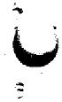

ORNL DWG 67-29

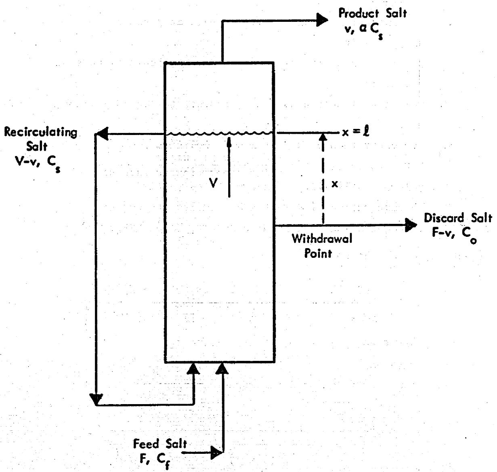  
Fig. 11. Continuous Still Having External Circulation and a Nonuniform Liquid Phase Rare Earth Fluoride Concentration Gradient.

and at $x = 0$

$$
- D \frac {d C}{d x} \left| _ {x = l} + V C _ {o} = (V - v) C _ {s} + F C _ {f} - (F - v) C _ {o} \right. \tag {56}
$$

where

D = diffusivity of REF in molten salt of still pot concentration, cm²/sec

C = concentration of REF in molten salt at position x, moles REF/cm³ salt

$x =$ position in molten salt measured from liquid withdrawal point, cm

V = velocity of molten salt with respect to liquid surface, cm/sec

$C_{\mathrm{g}} =$ concentration of REF at $\mathbf{x} = \lambda_{j}$ moles REF/cm³ salt

v = LiF vaporization rate, $\frac{\mathrm{cm}^3\mathrm{LiF(liquid)}}{\mathrm{cm}^2}$ vaporizing surface·sec

$\alpha =$ relative volatility of REF referred to LiF

$C_{0} =$ concentration of REF at $\mathbf{x} = 0,$ moles REF/cm salt

$C_{f} =$ concentration of REF in feed salt, moles REF/cm³ salt

Equation 54 has the solution

$$
C (x) = \frac {F C _ {f} \left\{1 - \frac {v}{v} (1 - \alpha) [ 1 - \exp (- v (\ell - x) / D) ] \right\}}{v \alpha + (F - v) \left\{1 - \frac {v}{v} (1 - \alpha) [ 1 - \exp (- v \ell / D) ] \right\}} \tag {57}
$$

The fraction of the REF removed by the still is

$$
\begin{array}{l} \text {f r a c t i o n R E F r e m o v e d} = \frac {(\mathrm {F} - \mathrm {v}) \mathrm {C} _ {\mathrm {o}}}{\mathrm {F C} _ {\mathrm {f}}} = \\ = \frac {\mathrm {F} - \mathrm {v}}{\mathrm {F} - \mathrm {v} + \frac {\mathrm {y} \alpha}{1 - \frac {\mathrm {v}}{\mathrm {v}} (1 - \alpha) [ 1 - \exp (- \mathrm {V} \ell / \mathrm {D}) ]}} \tag {58} \\ \end{array}
$$

The fractional removal of REF for a continuous system having a perfectly mixed liquid phase was derived earlier and is given by Eq. 23. The ratio of the fractional removal of REF in a system

having a nonuniform concentration to that in a still having a uniform concentration will be denoted as $\varnothing$ and can be obtained by dividing Eq. 58 by Eq. 23. Thus

$$
\varnothing = \frac {1 + \frac {\mathrm {v} \alpha}{\mathrm {F} - \mathrm {v}}}{1 + \frac {\frac {\mathrm {v} \alpha}{\mathrm {F} - \mathrm {v}}}{1 - \frac {\mathrm {v}}{\mathrm {V}} (1 - \alpha) [ 1 - \exp (- \mathrm {V} \ell / \mathrm {D}) ]}} \tag {59}
$$

Values of $\varnothing$ calculated for a still in which $99.5\%$ of the LiF fed to the still is vaporized ( $v / F - v = 199$ ) and in which the relative volatility of REF is $5 \times 10^{-4}$ are given in Fig. 12. The following two effects should be noted:

1. The value of $\varnothing$ is essentially unity for $V\ell /D < 0.1$ for any value of v/V (fraction of LiF vaporized per circulation through still). Within this region, a near uniform REF concentration is maintained by diffusion of REF within the liquid and mixing by liquid circulation is not required.

2. The value of $\varnothing$ is strongly dependent on $v / v$ for $\mathbf{V}\ell /\mathbf{D} > 1$ . Within this region, a near uniform REF concentration can be maintained only if liquid circulation is provided. For $\mathbf{V}\ell /\mathbf{D} = 100$ , $\varnothing$ has a value of 0.0055 with no liquid circulation and a value of 0.99 if $90\%$ of the LiF is returned to the bottom of the still.

An actual still would probably operate in the region $\mathbf{V}\ell / \mathbf{D} > 1$ so that the importance of liquid circulation can not be over emphasized. Liquid phase mixing by circulation is believed to be an essential feature of an effective distillation system. In the case considered, circulation was provided by an external loop for mathematical convenience. In an actual still internal circulation could be provided by a toroidal liquid flow path which, for a liquid having a strong volume heat source (provided in the present case by fission product decay), would result if more cooling were provided to the still in an outer annular region than in the center.

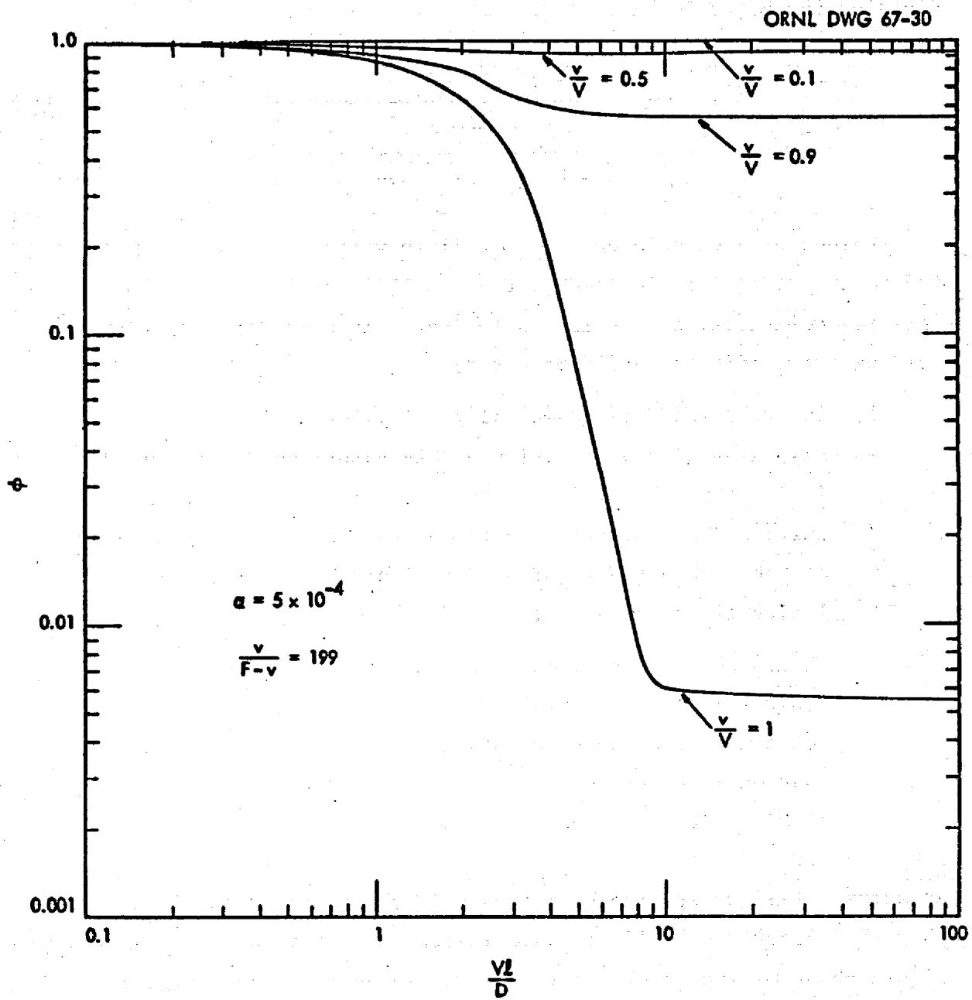  
Fig. 12. Ratio of Fraction of Rare Earth Fluoride Removed in Still Having Nonuniform Concentration to That Still Having Uniform Concentration.

# 6. CONCLUSIONS AND RECOMMENDATIONS

The following conclusions have been drawn from the information considered in this report:

1. Distillation at low pressure allows the adequate removal of rare earth fluorides from MSBR fuel salt and the simultaneous recovery of more than $99.5\%$ of the fuel salt.   
2. Recently reported relative volatilities of several rare earth fluorides allow a great deal of latitude in still design and operational mode. A single contact stage such as a liquid pool is adequate and rectification is not necessary.   
3. The effectiveness of a distillation system can be seriously decreased by the buildup of rare earth fluorides at the surface of the vaporizing liquid.   
4. Liquid circulation can provide adequate liquid phase mixing and is an essential feature of an effective distillation system.

The following recommendations are made:

1. Further consideration should be given to the use of single-stage, continuous distillation for removal of rare earth fluorides from the fuel stream of an MSBR.   
2. The study of liquid phase temperature and concentration profiles should be extended to stills having configurations of interest for MSBR processing. Methods should be devised for the calculation of velocity, temperature and concentration in the liquid phase of a three-dimensional still having a distributed heat source. The effect of variations in heat generation rate should be considered.

3. Removal of fission product decay heat from a distillation system should be studied. Heat removal systems which maintain the temperature within acceptable limits in the event of failure of the primary cooling system should be devised.   
4. Factors which limit distillation rate such as operating pressure, the presence of noncondensables, and entrainment should be examined.

# REFERENCES

1. P. R. Kasten et al., Design Studies of 1000-Mw(e) Molten Salt Breeder Reactors, USAEC Report ORNL-3996, Oak Ridge National Laboratory, August 1966.   
2. L. B. Loeb, The Kinetic Theory of Gases, McGraw-Hill Book Co., New York, 1934, p. 98.   
3. G. Burrows, Molecular Distillation, Clarendon Press, Oxford, 1960, p. 20.   
4. Oak Ridge National Laboratory, Molten-Salt Reactor Program Semiannual Progress Report for Period Ending February 1966, USAEC Report ORNL-3936, p. 130.   
5. Oak Ridge National Laboratory, Reactor Chemistry Division Annual Progress Report for Period Ending December 31, 1965, USAEC Report ORNL-3913.   
6. Oak Ridge National Laboratory, Unit Operations Section Quarterly Progress Report for Period Ending September 1966, USAEC Report ORNL-4075.   
7. Oak Ridge National Laboratory, Molten-Salt Reactor Program Semiannual Progress Report for Period Ending August 1966, USAEC Report ORNL-4037.   
8. Lim, M. J., Vapor Pressure and Heat of Sublimation of Cerium (III) Fluoride, UCRL-16150, University of California, 1965.   
9. Mar, R. W., Vaporization Studies of Lanthanum Fluoride, UCRL-16649, University of California, 1966.   
10. Zmbov, K. F., and J. L. Margrave, Mass-Spectrometric Studies at High Temperatures. XI. The Sublimation Pressure of $\mathrm{NdF}_3$ and the Stabilities of Gaseous $\mathrm{NdF}_2$ and NdF, Journal of Chemical Physics, 45, 3167 (1966).

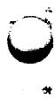

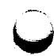

# DISTRIBUTION

1. MSRP Directors Office, 9204-1   
2. G.M. Adamson   
3. C.F.Baes   
4. S.E.Beall   
5. E. S. Bettis   
6. R.E.Blanco   
7. F. F. Blankenship   
8. E. G. Bohlman   
9. R. B. Briggs   
10. R.E.Brooksbank   
11. S. Cantor   
12. W. L. Carter   
13. G.I.Cathers   
14. W.H.Cook   
15. F. L. Culler, Jr.   
16. D.E.Ferguson   
17. L. M. Ferris   
18. H. A. Friedman   
19. H. E. Goeller   
20. W. R. Grimes   
21. C. E. Guthrie   
22. P. N. Habenreich   
23. J. R. Hightower, Jr.   
24. R. W. Horton   
25. P. R. Kasten   
26. R. J. Kedl   
27. M. J. Kelly   
28. C. R. Kennedy   
29. H. T. Kerr   
30. S. S. Kirslis   
31. R.B.Lindauer   
32. H. G. McPherson   
53. H.F.McDuffie   
34. L. E. McNeese   
35. R. L. Moore   
36. E. L. Nicholson   
37. A. M. Perry   
38. D. Scott   
39. J.H.Schaffer   
40. C. E. Schilling   
41. M. J. Skinner   
42. J.R. Tallackson   
43. R.E.Thoma   
44. J. S. Watson   
45. A.M. Weinberg   
46. M.E.Whatley

# DISTRIBUTION (contd)

47-48. Central Research Library   
49-50. Document Reference Section   
51-53. Laboratory Records   
54. Laboratory Records-RC   
55. Research and Development Div (ORO)   
56-70. DTIE