ORNL-TM-1796

COPY NO. 152

DATE - March 10, 1967

RELEASED FOR ANNouncement

IN NUCLEAR SCIENCE ABSTRACTS

CE37I P1C3S

H.C. $ 3.09 MN, 65

THE REACTIVITY BALANCE IN THE MSRE

J. R. Engel

B. E. Prince

# LEGAL NOTICE

This report was prepared as an account of Government sponsored work. Neither the United States, nor the Commission, nor any person acting on behalf of the Commission:

A. Makes any warranty or representation, expressed or implied, with respect to the accuracy, completeness, or usefulness of the information contained in this report, or that the use of any information, apparatus, method, or process disclosed in this report may not infringe privately owned rights; or   
B. Assumes any liabilities with respect to the use of, or for damages resulting from the use of any information, apparatus, method, or process disclosed in this report.

As used in the above, "person acting on behalf of the Commission" includes any employee or contractor of the Commission, or employee of such contractor, to the extent that such employee or contractor of the Commission, or employee of such contractor prepares, disseminates, or provides access to, any information pursuant to his employment or contract with the Commission, or his employment with such contractor.

# CONTENTS

ABSTRACT 1

INTRODUCTION 1

DESCRIPTION OF THE REACTIVITY BALANCE 3

The Reference Conditions 3

The General Reactivity Balance Equation 3

Control-Rod Worth 5

Excess-Uranium Reactivity Worth 8

Power Coefficient of Reactivity 9

Samarium Poisoning 11

Xenon-135 Poisoning 13

Density Effects of Circulating Bubbles on Reactivity 33

Isotope Burnout Effects 33

EXPERIENCE WITH THE ON-LINE CALCULATION 37

Low-Power Calculations 37

Intermediate Calculations 38

Complete Calculations 39

Long-Term Residual Reactivity 43

INTERPRETATION OF RESULTS 45

Previous Reports of Results 45

Utility of Residual Reactivity 47

Effects Not Treated 48

Operating Limitations 49

Conclusions 51

REFERENCES 52

RELEASED FOR ANNouncement

IN NUCLEAR SCIENCE ABSTRACT

# LEGAL NOTICE

This report was prepared as an account of Government sponsored work. Neither the United States, nor the Commission, nor any person acting on behalf of the Commission: A. Makes any warranty or representation, expressed or implied, with respect to the accu- racy, completeness, or usefulness of the information contained in this report, or that the use of any information, apparatus, method, or process disclosed in this report may not infringe or合法权益, or with respect to the use of, or for damages resulting from the

B. Assumes any liabilities with respect to the Commission's liability for the loss or damage caused by the use of any information, apparatus, method, or process disclosed in this report. Assume any information, apparatus, method, or process disclosed in this report is accurate and complete. Assume that the Commission has been informed about the extent to which the use of such information may have affected the Company's ability to make a reasonable contribution to the equity of the Company. Assume that the Company has been informed about the extent to which the use of such information may have affected the Company's ability to make a reasonable contribution to the equity of the Company. Assume that the Company has been informed about the extent to which the use of such information may have affected the Company's ability to make a reasonable contribution to the equity of the Company. Assume that the Company has been informed about the extent to which the use of such information may have affected the Company's ability to make a reasonable contribution to the Equity of the Company. Assume that the Company has been informed about the extent to which the use of such information may have affected the Company's ability to make a reasonable contribution to the Equity of the Company. Assume that the Company has been informed about the extent to which the use of such information may have affected the Company's ability to make a reasonable contribution to the Equity of the Company. Assume that the Company has been informed about the extent to which the use of such information may have affected the Company's ableity to make a reasonable contribution to the Equity of the Company. Assume that the Company has been informed about the extent to which the use of such information may have affected the Company's ability to make a reasonable contribution to the Equity of the Company. Assume that the Company has been informed about the extent to which the use of such information may have affected the Company's ability to make a reasonable contribution to the Equity of the Company. Assume that the Company has been informed about the extent to which the use of Such information may have affected the Company's ability to make a reasonable contribution to the Equity of the Company. Assume that the Company has been informed about the extent to which the use of such information may have affected the Company's ability to make a reasonable contribution to the Equity of the Company. Assume that the Company has been informed about the extent to which the use of such information may have affected the Company's ability to make a reasonable contribution to the Equity of the Company. Assume that the Company has been informed

with the Commission, or in effect,

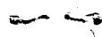

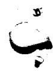

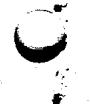

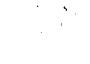

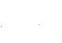

# LIST OF FIGURES

# Fig. No.

# Title

# Page

1. Comparison of Control Rod Reactivity from Experimental curves and from Least-Squares Formula. 7   
2. First Order Decay Schemes for Production of Samarium Poisons in the MSRE. 12   
3. Effect of Volume of Circulating Gas on Transient Buildup of $^{135}\mathrm{Xe}$ Reactivity. Step increase in power level from 0 to 7.2 Mw; bubble-stripping efficiency, $10\%$ ; MSRE Run No. 7. 18   
4. Effect of Bubble-Stripping Efficiency on Transient Buildup of $^{135}\mathrm{Xe}$ Reactivity. Step increase in power level from 0 to 7.2 Mw; volume percent circulating bubbles, 0.10; MSRE Run No. 7. 20   
5. Effect of Volume of Circulating Gas on Transient Buildup of $^{135}\mathrm{Xe}$ Reactivity. Step increase in power level from 0 to 5.7 Mw; bubble-stripping efficiency, $10\%$ ; MSRE Run No. 8. 21   
6. Effect of Bubble-Stripping Efficiency on Transient Buildup of $^{135}\mathrm{Xe}$ Reactivity. Step increase in power level from 0 to 5.7 Mw; volume percent circulating bubbles, 0.10; MSRE Run No. 8. 22   
7. Effect of Volume of Circulating Gas on Transient Decay of 135Xe Reactivity. Step decrease in power level from 5.7 Mw to 0; bubble-stripping efficiency, 10%; MSRE Run No. 8 23   
8. Effect of Bubble-Stripping Efficiency on Transient Decay of $^{135}\mathrm{Xe}$ Reactivity. Step decrease in power level from 5.7 Mw to 0; volume percent circulating bubbles, 0.10; MSRE Run No. 8. 24   
9. Effect of Bubble-Stripping Efficiency on Transient Decay of $^{135}\mathrm{Xe}$ Reactivity. Step decrease in power level from 5.7 Mw to 0; volume percent circulating bubbles, 0.15; MSRE Run No. 8. 26   
10. Effect of Bubble-Stripping Efficiency on Transient Decay of $^{135}\mathrm{Xe}$ Reactivity. Step decrease in power level from 7.4 Mw to 0; volume percent circulating bubbles, 0.10; MSRE Run No. 9. 27

Fig. No.

Title

Page

11. Effect of Bubble-Stripping Efficiency on Transient Decay of $^{135}\mathrm{Xe}$ Reactivity. Step decrease in power level from 7.4 Mw to 0; volume percent circulating bubbles, 0.15; MSRE Run No. 9. 28   
12. Effect of Bubble-Stripping Efficiency on Transient Decay of $^{135}\mathrm{Xe}$ Reactivity. Step decrease in power level from 7.4 Mw to 0; volume percent circulating bubbles, 0.10; MSRE Run No. 10. 29   
13. Effect of Bubble-Stripping Efficiency on Transient Decay of $^{135}\mathrm{Xe}$ Reactivity. Step decrease in power level from 7.4 Mw to 0; volume percent circulating bubbles, 0.15; MSRE Run No. 10. 30   
14. Results of Modified Reactivity Balances in MSRE. 40   
15. Results of Complete Reactivity Balances in MSRE. 41   
16. Long-Term Drift in Residual Reactivity in MSRE. 44

# ABSTRACT

Reactivity balances have been calculated for the MSRE since the start of power operation. After an initial period of manual calculations while the computer was being set up, machine calculations were started which are now routinely performed every 5 minutes while the reactor is in operation. The calculations are carried out by an on-line (Bunker-Ramo Model 340) computer using current values of reactor parameters such as temperature, power, and control-rod positions. All the known factors that have significant reactivity effects are computed and a residual reactivity required to keep the reactor just critical is evaluated.

Early results showed that the $^{135}\mathrm{Xe}$ poisoning in the MSRE $(\sim 0.3\% \delta \mathrm{k} / \mathrm{k}$ at 7.2 Mw) was lower than was expected and results during xenon transients were used to construct a model to describe the xenon behavior. Subsequent results have been used to monitor the reactor operation for the appearance of anomalous reactivity effects. After the equivalent of 95 days' operation at maximum power, the residual reactivity is $+0.05 \pm 0.04\%$ $\delta \mathrm{k} / \mathrm{k}$ . This indicates excellent agreement between the predicted and observed behavior of the reactor. No significant anomalous effects have been observed.

Prior to the start of reactor operation, a limit of $\pm 0.5\%$ $\delta \mathbf{k} / \mathbf{k}$ was imposed on the residual reactivity as a criterion for critical operation of the reactor. This limit has not been approached.

# INTRODUCTION

The availability of an on-line digital computer for the purpose of data logging and routine computations for the MSRE has made feasible the continuous monitoring of the important reactivity effects associated with power operation of the reactor. Steady power operation requires that a balance be maintained between the rate of production of neutrons from fission and their rate of disappearance due to absorption and leakage to the surroundings. The reactivity is a quantity introduced to describe physical situations in which these rates do not balance. It is convenient

to express this quantity as the algebraic fraction of the production rate which equals the net rate of accumulation (+) or depletion (-) of neutrons in the entire reactor, i.e.,

$$
\text {R e a c t i v i t y} = \frac {\text {T o t a l P r o d u c t i o n R a t e - T o t a l D e p l e t i o n R a t e}}{\text {T o t a l P r o d u c t i o n R a t e}}.
$$

In one sense, therefore, the reactivity makes its appearance physically only when the reactor power level is changing. At steady power, the reactivity must be zero, and any attempt to ascribe separate reactivity components (both positive and negative) to the steady state is merely a convenient bookkeeping device. If we use this device to monitor the reactor operation and find that the algebraic sum of the calculated components is not zero, this may mean either that the calculations of the individual known effects are in error, or that there are unknown, or anomalous changes occurring in the neutron reaction rates which are not accounted for in the calculations. Power operation of the reactor is a complex situation where many effects are simultaneously influencing the neutron reaction rates. The device of separating the effects according to a reactivity scale allows individual experiments or computations to be used as an aid in interpreting the whole process. Thus, continuous monitoring of the component reactivities serves both to test our confidence in individual measurements and, potentially, as a means of detecting and interpreting anomalous changes in the reaction rates during operation.

As an illustration of these general considerations, we describe in the following sections the basis and approximations used for the reactivity balance calculation for the MSRE. We emphasize at the outset that the methods and quantitative results of analysis of MSRE operation to date are still subject to possible future modifications. In discussing the results, wherever possible we will attempt to indicate the level of confidence in present calculations of the individual reactivity effects.

# DESCRIPTION OF THE REACTIVITY BALANCE

# The Reference Conditions

If we are to monitor changes in component reactivity effects during operation, it is advantageous to choose a starting, or reference condition which can be defined by experimental measurement with relatively little error or ambiguity. The reference conditions chosen for the present work correspond to the just critical reactor, isothermal at $1200^{\circ}\mathrm{F}$ , with fuel circulating and free of fission products, and with all three control rods withdrawn to their upper limits (51 inches). The uranium concentration for these conditions, as well as the increase in uranium concentration required to compensate for a range of control-rod insertions and isothermal temperature changes was established during a program of zero-power nuclear experiments carried out in the summer of 1965 (Ref. 1). In this program, independent measurements of control-rod reactivity worth (period - differential worth experiments and rod drop integral worth experiments) were used to determine reactivity equivalents of uranium concentration changes and isothermal temperature changes.

# The General Reactivity Balance Equation

The equation describing the general situation when the reactor is operating at some intermediate steady power level includes terms representing, relative to the reference state,

1. the total excess uranium added before increasing the power,   
2. the poisoning effect of the rod insertions, and   
3. the power and time-integrated power dependent effects of changes in fuel and graphite temperature levels and spatial distributions, uranium burnup, and fission product buildup (135Xe, 149Sm, 151Sm, and non-saturating fission products).

This list includes the most important effects of substantial power generation. There are, however, other known effects of smaller magnitude arising from isotopic burnup which must be added to this list. These include:

1. the burnout of the small amount of lithium-6 present in the clean fuel salt,

2. burnout of residual boron-10 from the unirradiated graphite moderator,   
3. production of plutonium-239 from absorptions in uranium-238, and   
4. Changes in the concentrations of uranium-234 and 236 in the fuel salt due to neutron absorption.

There are, in addition, other known reactivity effects which can be shown to be insignificant in the MSRE, such as photoneutron reactions in the beryllium in the fuel salt, and several high-energy neutron reactions. This completes the list of component reactivity effects only if we assume that the structural configuration of the graphite stringers and the associated matrix of fuel-salt channels undergo no significant changes during the power-generating history of the core. If changes in the fuel-moderator geometry are induced, for example by nonuniform temperature-expansion effects or cumulative radiation-damage effects on the graphite, this could appear as an anomalous reactivity effect, not explicitly accounted for in the reactivity balance.

There is substantial evidence that another special reactivity effect is of importance in the operation of the MSRE. This arises from the entrainment of helium-gas bubbles in the circulating fuel salt, through the action of the xenon-stripping spray ring in the fuel-pump tank. These minute, circulating helium bubbles would be expected to affect the reactivity in two ways, by modifying the neutron leakage through an effective reduction in the density of the fuel salt, and by providing an additional sink for $^{135}\mathrm{Xe}$ , thereby reducing the effective xenon migration to the graphite pores. (This will be discussed in greater detail in a later section.)

We can summarize the preceding discussion in the form of a general equation for the reactivity balance. By using the symbol $\mathbf{K}(\mathbf{x})$ to represent the algebraic value of the reactivity change due to component $\mathbf{x}$ , and grouping terms which can be treated similarly in the calculations, one obtains:

$$
\begin{array}{l} 0 = K (R o d s) + K (E x c e s s ^ {2 3 5} U) + K (T e m p.) + K (P o w e r) + K (S a m a r i u m) \\ + K (\text {X e n o n - 1 3 5}) + K (\text {B u b b l e s}) \\ + K (\text {I s o t o p e B u r n o u t}) \\ + K (\text {R e s i d u a l}) \tag {1} \\ \end{array}
$$

The final term on the right hand side of the above equation includes any small residual effects known to occur which are not explicitly accounted for in the calculation (such as long-term effects of gadolinium burnup on the control-rod reactivity), effects of any anomalous changes in the graphite-fuel salt configuration, permeation of the graphite by salt, or changes in fuel-salt composition. If, in addition, we consider each term in Eq. 1 to represent our best estimate of the individual effect, rather than the value we could compute with perfect information, the final term in Eq. 1 will also contain any residual reactivity corrections due to errors in calculating the other terms. In order to make this report reasonably self-sufficient, we will give a brief review of the basis of calculation of each term of Eq. 1, in the order given.

# Control-Rod Worth

Of the terms in Eq. 1, the rod worth, the $^{235}\mathrm{U}$ reactivity worth, and the temperature-level reactivity effects [K(Temp.)], are based on zero-power experimental measurements. Because the uranium and temperature reactivity effects are inferred from the control-rod calibration experiments, and also because the magnitude of other known power-dependent reactivity effects are evaluated according to the time variation of the control-rod position following a change in power level, accurate knowledge of the rod worth is vital to the successful interpretation of the reactivity balance. The control rods were calibrated by means of rod bump-period measurements made with the reactor at zero power (i.e., with negligible temperature feedback effects), and with the fuel circulating pump stopped. These were made during a period of uranium additions sufficient to vary the initial critical position of one rod (the regulating rod) over its entire length of travel. At three intermediate $^{235}\mathrm{U}$ concentrations, banked insertions of the two shim rod required to balance specified increments of withdrawal of the regulating rod were measured. In this way, various combinations

of shim- and regulating-rod insertions equivalent in their reactivity poisoning effect were obtained. Rod-drop experiments were also performed at three intermediate $^{235}\mathrm{U}$ concentrations. In these experiments, the equivalent integral negative reactivity insertion of the rod, falling from its initial critical position to its scram position was measured. $^{1,2}$ Agreement between the integral of the differential worth measurements and the integral reactivity obtained directly from the rod-drop experiments was found to be within $5\%$ of the total negative reactivity insertion involved in each experiment.

The reactivity vs position calibration curve for the regulating rod, and the results of the three experiments measuring equivalent shim- and regulating-rod combinations were next combined with a theoretical formula for the reactivity worth of an arbitrary shim-regulating rod configuration. The theoretical formula contained several parameters which were adjusted so that the formula provided a least squares fit to the experimental measurements. Derivation of the formula for the rod worth and discussion of its application are given in Ref. 3. The result of this analysis is shown in Figure 1. Here, the solid sample points are taken from smooth curves through the experimental data. As Figure 1 indicates, the smoothed data could be fitted very closely with the theoretical rod-worth formula, except for small errors at the extreme positions of the rods (full insertion or withdrawal). No important restrictions in the use of the formula arise from these errors, since its purpose is primarily for interpolating for the reactivity worth of intermediate shim-regulating rod combinations not specifically covered in the three groups of experiments described above. It provides a convenient means of rapidly calculating the reactivity equivalent of the rod configuration during reactor operation, by means of the BR-340 on-line computer. One restriction in the practical use of the formula on which Figure 1 is based should be noted, however. It should only be applied in regions of rod travel and excess reactivity covered in the zero-power calibration experiments (i.e., magnitude of reactivity less than or equal to the worth of a single rod, moving through 5l inches of travel). Modifications of the least-squares formula would be required to cover a larger reactivity range.

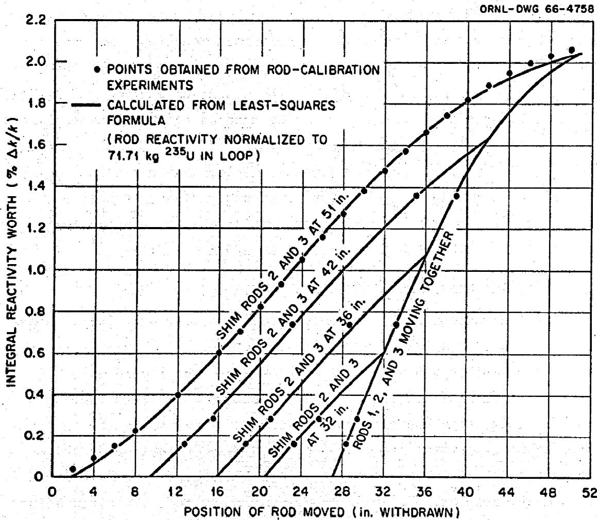  
Fig. 1. Comparison of Control Rod Reactivity from Experimental Curves and from Least-Squares Formula.

# Excess-Uranium Reactivity Worth

Relative to the reference conditions defined in the preceding part of this report, the total excess $^{235}\mathrm{U}$ is equal to the amount added during the zero-power experiments, minus the amount burned during power operation of the reactor, plus the amount added to re-enrich the fuel salt when the burnup becomes sufficient. Corrections must also be introduced for relative dilution effects each time the reactor fuel loop is drained and mixed with the fuel salt "heel" remaining in the drain tanks during operation.

The reactivity equivalent of the excess uranium was determined from the zero-power experiments by measuring the amount of control-rod insertion required to balance each addition of $^{235}\mathrm{U}$ , then using the independent calibration of reactivity vs position to determine the incremental reactivity worth of the $^{235}\mathrm{U}$ . Results of these measurements, expressed in terms of a concentration coefficient of reactivity, gave 0.223% increase in reactivity for a 1% increase in $^{235}\mathrm{U}$ concentration. This was within approximately 5% agreement with the theoretical calculations of this quantity.

# Temperature-Level Reactivity Effect

When the core temperature is maintained spatially uniform, a change in this temperature can be related both experimentally and theoretically to the core reactivity in an unambiguous manner. The method used to measure the isothermal temperature coefficient of reactivity during the zero-power experiments consisted of varying the external heater inputs and allowing the just critical reactor to cool slowly and uniformly while measuring the change in regulating-rod position required to maintain a constant neutron level. In these experiments, the fuel was circulating and the system temperature was taken to be the average of a preselected set of thermocouples distributed over the circulating system. The change

in rod position corresponding to the temperature change was converted to reactivity by again using the rod calibration curve. These experiments measured the combined effect of a uniform change in fuel and graphite temperature. The measured total isothermal temperature coefficient of reactivity was -7.3 x $10^{-5}$ (F $^{-1}$ ).

Experiments were also performed to separate the component effect of fuel and graphite temperatures. This was done by stopping the fuel circulating pump, raising the temperature of the circulating coolant salt as well as the stagnant fuel salt in the heat exchanger, then restarting the fuel pump to pass fuel salt that was hotter than the graphite through the core. The reactor was maintained critical with the power level controlled by the flux servo. The change in control-rod position and the output of a thermocouple in the reactor-vessel outlet was logged digitally at quarter-second intervals. The value of the fuel coefficient obtained from these experiments was $-4.9 \times 10^{-5} (^{\circ}\mathrm{F}^{-1})$ , about $20\%$ higher in magnitude than the calculated fuel temperature coefficient. These experiments, however, contained a relatively large band of uncertainty due to the inherent difficulty in introducing proper time-dependent corrections.

# Power Coefficient of Reactivity

At power levels higher than about 10 kw of heat, nonuniform nuclear heating of the core occurs, and produces spatial distributions of temperature in the graphite and fuel salt characteristic of the power level. The reactivity change, relative to a fixed uniform temperature level, is no longer simply related to a single physically measurable temperature (or even the average of several measured temperatures) in the circulating system. Rather, the reactivity is a cumulative effect of the entire temperature field in the core. This temperature-distribution reactivity

effect, or steady-state power coefficient of reactivity,\* is somewhat difficult to estimate reliably for the MSRE, because it requires accurate knowledge of the local heat deposition and temperature distributions in the graphite and salt and the contribution of these local effects to the neutron reaction rates. An approximate way of treating this problem involves the use of a "nuclear average temperature," as described in Ref. 4. In this method, the local temperature changes are multiplied by a weighting (importance) function which measures their effect on the net reactivity, then integrated over the reactor core. Even if we assume that the temperature distributions in the fuel and core graphite can be calculated accurately, one should note that the weighting procedure described in Ref, 4 may be intrinsically in error, when applied to a small reactor core such as the MSRE. Here the principal temperature reactivity effects arise from changes in the neutron leakage. Although non-uniform temperature changes induce expansion in fuel salt and graphite which do affect the reactivity according to the weighting procedure described above, they also influence the thermal neutron spectrum in a more complex, non-local manner.\*\*

The power coefficient of reactivity for a fixed reactor outlet temperature was measured during the approach to power, by holding the reactor outlet temperature at a preset value with the servo controller, and measuring the control-rod response to the change in steady-state power level. Since the reactivity response to the change in temperature distribution is essentially instantaneous, this effect can be separated from the slower power-dependent reactivity effects such as xenon-135 and samarium-149. The

*The temperature distributions in fuel and graphite are determined by the total power level and the mode of temperature level control (the reactor outlet fuel temperature is servo-controlled in the MSRE). Since the power level is an input variable to the on-line computer, it is convenient to relate the reactivity effect directly to the power level.

**To the authors' knowledge, the theoretical problem of neutron thermalization in a moderator with a non-uniform temperature field has not yet been completely resolved.

measured power coefficient was $+0.001\%$ reactivity per Mw compared to a calculated value of $-0.007\%$ . The observed coefficient corresponds to a difference of $22^{\circ}\mathrm{F}$ between the nuclear average temperature of the graphite and that of the fuel at 7.2 Mw; the calculated temperature difference was $32^{\circ}\mathrm{F}$ . This sensitivity of the power coefficient to changes in core temperatures results from the fact that it represents a small difference between two larger values (the positive reactivity effect of the fuel average temperature and the negative effect of the graphite average temperature). As with the other terms in Eq. 1 in which experimental results can be applied directly, we emphasize that the measured power coefficient is used in the overall reactivity balance equation.

# Samarium Poisoning

The direct fission production-decay schemes for the high-cross-section isotopes $^{149}\mathrm{Sm}$ and $^{151}\mathrm{Sm}$ are shown in Figure 2. The numerical values of effective removal constants due to neutron absorption, $\dot{\alpha}_{\mathrm{a}}$ , given in Figure 2, are normalized to 1 Mw and corrected for the time the fuel spends in the part of the circulating loop external to the reactor core. In principle, the chains shown in Figure 2 should be connected by neutron absorption in $^{150}\mathrm{Sm}$ ; other indirect routes for the production of $^{149}\mathrm{Sm}$ can also be considered. However, for the relatively low neutron flux and fraction of uranium burnup engendered in the MSRE, these corrections can be neglected. For periodic calculation with the ER-340 on-line computer, the differential equations describing the production and decay schemes in Figure 2 were converted to finite difference form. The form of the equations used for computation in both decay chains are:

$$
\mathrm {N} _ {\mathrm {p}} \left(\mathrm {t} _ {\mathbf {1}} + \Delta \mathrm {t}\right) = \mathrm {N} _ {\mathrm {p}} \left(\mathrm {t} _ {\mathbf {1}}\right) (1 - \lambda \Delta \mathrm {t}) + \mathrm {C} _ {\mathbf {1}} \overline {{\mathrm {P}}} \left(\mathrm {t} _ {\mathbf {1}}\right) \Delta \mathrm {t} \tag {2}
$$

$$
\mathrm {N} _ {\mathrm {S}} \left(\mathrm {t} _ {\mathrm {i}} + \Delta \mathrm {t}\right) = \mathrm {N} _ {\mathrm {S}} \left(\mathrm {t} _ {\mathrm {i}}\right) [ 1 - \sigma_ {\mathrm {a}} \phi \overline {{\mathrm {P}}} \left(\mathrm {t} _ {\mathrm {i}}\right) \Delta \mathrm {t} ] + \mathrm {N} _ {\mathrm {P}} \left(\mathrm {t} _ {\mathrm {i}}\right) \lambda \Delta \mathrm {t} \tag {3}
$$

$$
\overline {{P}} \left(t _ {\underline {{1}}}\right) = \frac {P \left(t _ {\underline {{1}}}\right) + P \left(t _ {\underline {{1}}} + \Delta t\right)}{2} \tag {4}
$$

where $\mathbf{N}(t_{\mathbf{i}})$ is the atomic concentration of the isotope in the fuel salt at time $t_{\mathbf{i}}$ , $\Delta t$ is the time interval between calculations of the concentrations, and $\overline{\mathbb{P}}$ is the average power level during this time interval. The

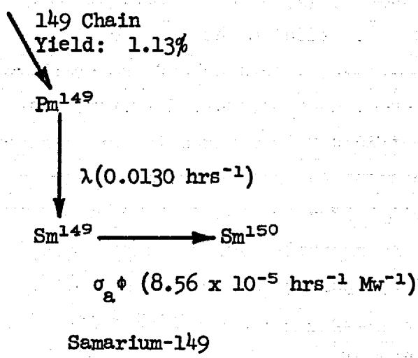

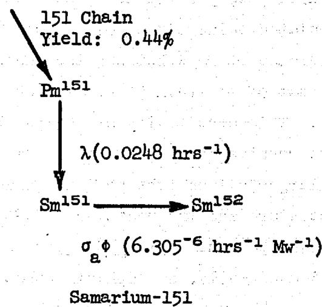  
Figure 2   
First Order Decay Schemes for Production   
of   
Samarium Poisons in the MSRE

coefficient $C_1$ is the product of the direct fission yield and the average fission rate per unit volume of fuel salt, normalized to 1 Mw. Numerical values of $C_1$ for the MSRE are 6.32 x $10^{11}$ and 2.46 x $10^{11}$ atoms per cm³ salt per Mw for the samarium-149 and samarium 15l chains, respectively.

The conversion of the samarium concentrations to a reactivity effect requires knowledge of their average cross sections for absorption in the MSRE neutron spectrum and the reactivity coefficient for a unit absorber of this type, uniformly distributed in the MSRE fuel salt. In the MSRE spectrum, all but a small fraction of the absorptions in the samarium isotopes take place below about 0.9 ev. At $1200^{\circ}\mathrm{F}$ , the peak of the thermal spectrum is at approximately 0.09 ev, and 0.876 was chosen as the effective cutoff for the thermal energy group, for reasons of convenience in theoretical computations. The absorption cross sections, averaged over the neutron energy spectrum below and above this cutoff energy can be estimated with a fair degree of reliability with presently available computer codes. Effective absorption cross sections can then be obtained which give

the correct reaction rate when multiplied by the thermal-group flux. Theoretical calculations of the coefficients which convert the samarium absorption rates to reactivity effects must also be employed since a direct measurement of the reactivity change due to a known amount of thermal absorber, uniformly distributed in the MSRE fuel salt, was not obtained from the zero-power experiments. It may be noted, however, that considerable indirect support of the theoretical reactivity coefficient for thermal absorption is given by the close comparison between the measured and calculated $^{235}\mathrm{U}$ concentration coefficients of reactivity, mentioned earlier in this report.

# Xenon-135 Poisoning*

Early estimates of the magnitude of xenon-135 poisoning were based upon the assumption that, at equilibrium, a relatively large fraction of the xenon produced in the reactor would diffuse into the pores of the graphite moderator and undergo radioactive decay and neutron absorption there. Continuous removal of some of the xenon from the fuel salt would be accomplished by circulation of a small bypass stream of salt through the spray ring in the fuel-pump tank, which contacts the salt with a stream of helium gas. Estimates of the efficiency of removal of fission gases by this stripping apparatus, and also of the expected mass transfer of xenon to the graphite pores, were based on experiments performed prior to the nuclear operation of the MSRE.[6] Although it was recognized that the presence of any circulating voids (undissolved helium gas) would drastically affect the xenon behavior, this aspect of the problem was first neglected because there was no evidence that circulating voids would be encountered in the operation of the reactor.

During the zero-power operation, several tests were performed to evaluate the response of the system reactivity to changes in overpressure.

In these tests the system pressure was slowly increased by about 10 psi and then rapidly reduced to the normal value. If circulating voids had been present, their expansion when the pressure was reduced would have expelled some salt from the core and reduced the nuclear reactivity. In addition, the gas expansion in the entire loop would have raised the salt level in the fuel-pump tank. There was no evidence of undissolved gas in the tests performed with the normal salt level in the pump tank. However, when the salt level was reduced to an abnormally low value, the same experiments did indicate 1 to 2 volume percent of undissolved gas. We concluded from these tests that circulating voids would not be a factor in the xenon poisoning during normal power operation.

Soon after power operation of the reactor was started, it became apparent that the magnitude of the xenon-l35 poisoning was much smaller than had been predicted on the basis of the above considerations. At this point the attempts at on-line calculation of the xenon poisoning were suspended and the reactivity-balance results were used to measure the actual xenon poisoning. Examination of the steady-state results showed that the low poison level could not be accounted for with reasonable parameter values within the assumption of no circulating voids. In addition, the system response to small pressure changes now indicated a small circulating void fraction at normal salt levels in the pump tank.

Another set of pressure-release tests was then performed which showed significant pressure effects at normal conditions. If all of the observed effects were attributed to circulating voids (as was done initially), a volumetric void fraction of 1 to $2\%$ was indicated. However, the pressure-release tests do not necessarily indicate the presence of this amount of circulating voids prior to the pressure release; they only indicate that they are present afterwards. That is the observed response could be explained by a stagnant void of fixed volume from which expanding gas could escape to the circulating stream when the system pressure is reduced. Such a void could be anywhere in the loop so long as its volume is unaffected by pressure (e.g. voids into which salt cannot penetrate because of surface tension). Further analysis of the pressure-release tests showed that most

of the excess gas that was in the loop after the pressure release was removed very rapidly; gas-stripping efficiencies of 80 to $100\%$ were calculated.

In view of the new evidence for circulating voids, the steady-state xenon equations were modified to include bubbles and were reevaluated. As expected, the steady-state xenon poisoning was quite sensitive to both the volumetric void fraction and the bubble-stripping efficiency. However, it was found that the steady-state xenon poisoning as a function of reactor power could be described by a variety of combinations of void fraction and bubble-stripping efficiency. Therefore, the equations were rewritten to include the time dependence which would permit a comparison of calculated and observed transient $^{135}\mathrm{Xe}$ poisoning effects (as determined by the change in the critical position of the regulating rod during the 48 hours following a change in the steady-state reactor power level). The purpose was to attempt a separation of those parameter effects that could not be separated in the steady-state correlations. The mathematical model used to calculate the time behavior of the $^{135}\mathrm{Xe}$ poisoning is described in References 7 and 8. In the present section we will give only a qualitative description of the main aspects and assumptions in the model. Further refinements of the model for the xenon behavior may also be required in future operation. These refinements should not affect the major conclusions about the overall reactivity behavior.

In the model chosen, we have assumed that all the iodine-135 produced from fission remains in circulation with the salt. After decay to xenon-135, the xenon migrates to the accessible pores of the graphite at the boundaries of the fuel channels and also to minute helium bubbles distributed through the circulating salt stream. An effective mass-transfer coefficient was used to describe the transfer of xenon from solution in the circulating salt to the interface between the liquid and the graphite pores at the channel boundaries. Equilibrium Henry's-law coefficients were used for the mass transfer of xenon between the liquid phase at the interface and the gas phase in the graphite pores. The numerical value used for the mass-transfer coefficient between the circulating salt and the graphite

were based on krypton-injection experiments with flush salt circulating in the fuel loop, performed prior to nuclear operation of the MSRE.6

Similar considerations were assumed to apply to the mass transfer of xenon from liquid solution to the gas bubbles. The coefficient of mass transfer from the liquid to a small gas bubble, of the order of 0.010 in. in diameter, moving through the main part of a fuel channel, was estimated from theoretical mass-transfer correlations.6 The equilibrium $^{135}\mathrm{Xe}$ poisoning was shown to be relatively insensitive to the bubble diameter and mass-transfer coefficient, over a reasonable range of uncertainty for these parameters.

Different efficiencies of removal by the external stripping apparatus of xenon dissolved in the salt and that contained in the gas bubbles were provided for in the computational model. The efficiency of removal (fraction of xenon removed per unit circulated through the spray ring) of xenon dissolved in the salt was estimated to be between 10 and $15\%$ , based on some early mock-up experiments to evaluate the performance of the xenon removal apparatus.

The conversion of the calculated $^{135}\mathrm{Xe}$ concentrations in salt, gas bubbles, and graphite pores to the corresponding reactivity poisoning effect follows from considerations similar to those described in the preceding section for the samarium isotopes. Here, however, there is one special feature which should be accounted for which is not present in the case of samarium. This is the non-uniformity of the spatial distribution of the $^{135}\mathrm{Xe}$ in the graphite pores. In the graphite region, the $^{135}\mathrm{Xe}$ tends to assume a "dished" shape, governed by the burnout of the xenon in the neutron flux. The concentration is minimum near the center of the reactor and maximum near the boundaries of the graphite region. This influences the net reactivity effect, since these regions assume different importances in determining reactivity changes. The calculation of this "shape correction" factor is described in Reference 7.

A computational study based on the theoretical model described above was first performed "off line", with the aid of an IBM 7090 program. These theoretical calculations were compared with the data logged by the ER-340. The apparent transient $^{135}\mathrm{Xe}$ poisoning was determined by subtracting all

other known power-dependent reactivity effects from the reactivity change represented by movement of the regulating rod after a step change in the power level. This off-line analysis was the most efficient method of making a first-round analysis of the $^{135}\mathrm{Xe}$ behavior because the many other usage requirements of the data logger limit us to a relatively simple "point" kinetic model for on-line computations, and also because a wide parameter study can best be performed on a larger machine.

In Figures 3 through 13, we have compared some of the transient reactivity curves obtained from this analysis with some experimental transients, in the chronological order in which they were obtained. In each of these figures, the solid curves represent the calculated behavior and the plotted points show the observed response from reactivity-balance results. A measurement of the $^{134}\mathrm{Xe} / ^{136}\mathrm{Xe}$ ratio in a sample of the reactor offgas taken at 7.2 Mw with the xenon in steady state gave an independent value for the magnitude of the $^{135}\mathrm{Xe}$ poisoning which agreed well with the reactivity-balance results. At this date, only a few relatively clean experimental transients corresponding to step changes in power level (for which the 7090 program was devised) have been obtained. However, several characteristics of the $^{135}\mathrm{Xe}$ behavior are indicated from these curves. These will be discussed by considering the figures in order.

Figure 3 shows the calculated and observed xenon transients for a step increase in reactor power from zero to $7.2\mathrm{Mw}$ . The calculations (solid curves) were made for a variety of circulating void fractions $(\alpha_{b})$ to show the effect of this parameter on the xenon poisoning. A single bubble-stripping efficiency $(\epsilon_{b})$ of $10\%$ was used for this figure. This relatively low efficiency is equal to the efficiency estimated for the stripping of xenon dissolved in the salt; it was used as a first approximation because at the time there was no basis for assuming a higher value for the bubbles. The effectiveness of the circulating gas in reducing the poison level is due to the combined effects of the large overall gas-liquid surface area for mass transfer to the bubbles and of the large xenon-storage capability of the bubbles (because of the extreme insolubility of xenon in molten salt). Thus, the bubbles compete effectively with the graphite for removal of xenon from the liquid and xenon in the circulating

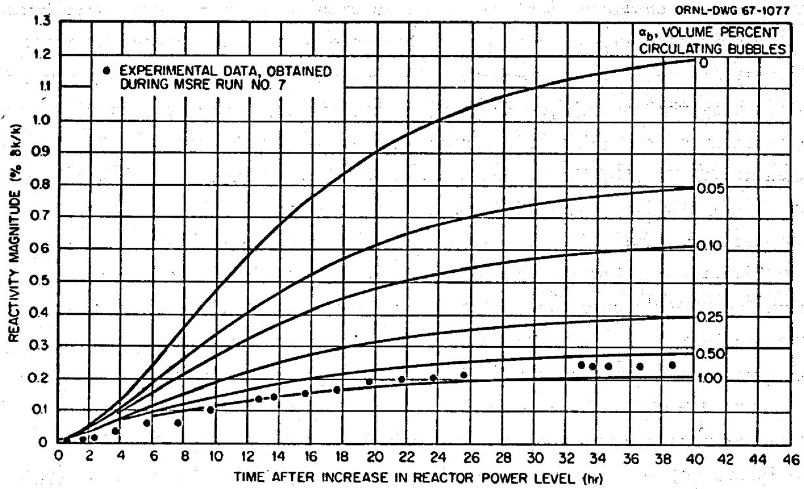  
Fig. 3. Effect of Volume of Circulating Gas on Transient Buildup of $135\mathrm{Xe}$ Reactivity. Step increase in power level from 0 to 7.2 Mw; bubble-stripping efficiency, $10\%$ ; MSRE Run No. 7.

fluid is a less effective poison than that in the graphite because about two-thirds of the fluid is outside the core at any instant. The plotted points represent the observed $^{135}\mathrm{Xe}$ reactivity transient at the beginning of Reactor Run No. 7 (July 1, 1966). The data indicate that the low apparent xenon poisoning at steady state could be explained by a large void fraction (between 0.5 and 1.0 vol%) and a low bubble-stripping efficiency. However, the transient buildup is not closely fitted by these parameter values.

In Figure 4, the curves indicate the calculated effect of increasing the bubble-stripping efficiency for a fixed, relatively small (0.1 vol%) circulating void fraction. The plotted points are for the same reactor xenon transient shown in Fig. 3. A comparison of Figs. 3 and 4 shows that the steady-state xenon poisoning is described as well by a low void fraction with a high bubble-stripping efficiency as it is by a high void fraction with a low stripping efficiency. However, the shape of the transient is described much more closely by the parameter values in Fig. 4.

Figures 5 and 6 show the calculated and observed transient buildup of $^{135}\mathrm{Xe}$ poisoning after a step increase in power from zero to 5.7 Mw in Run No. 8 (October, 1966). The ranges of values of $\alpha_{\mathrm{b}}$ and $\epsilon_{\mathrm{b}}$ used in these calculations are the same as those used for Figs. 3 and 4. Again, the shape of the observed transient is matched more closely by the calculations which assume a low void fraction and a high bubble-stripping efficiency. Thus, it appears that the initial assumption of a low stripping efficiency for the bubbles was incorrect. The higher stripping efficiency not only fits the xenon transients better, it is also consistent with the rates of excess gas removal observed in the pressure-release experiments. Since the latter experiments do not define the void fraction unambiguously, the low void fraction that must be associated with a high stripping efficiency is also in agreement with all the data.

Figures 7 and 8 show the calculated and observed $^{135}\mathrm{Xe}$ reactivity transients for a power reduction from 5.7 Mw to zero, with the $^{135}\mathrm{Xe}$ initially at equilibrium.* Comparison of the results in this case provides

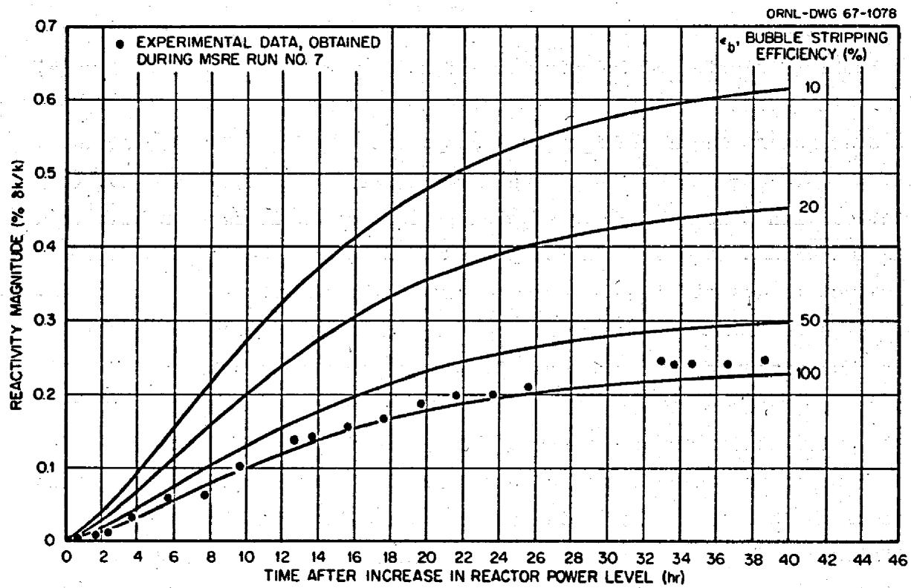  
Fig. 4. Effect of Bubble-Stripping Efficiency on Transient Buildup of $135\mathrm{Xe}$ Reactivity. Step increase in power level from 0 to 7.2 Mw; volume percent circulating bubbles, 0.10; MSRE Run No. 7.

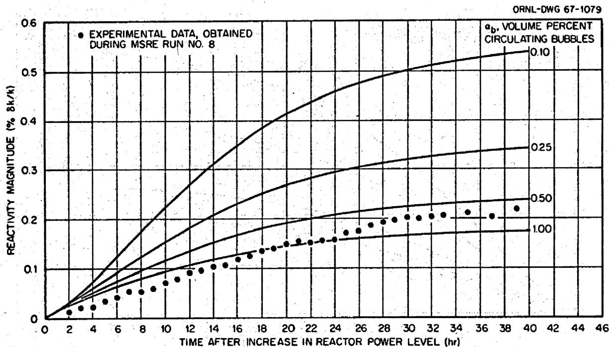  
Fig. 5. Effect of Volume of Circulating Gas on Transient Buildup of $135\mathrm{Xe}$ Reactivity. Step increase in power level from 0 to 5.7 Mw; bubble-stripping efficiency, $10\%$ ; MSRE Run No. 8.

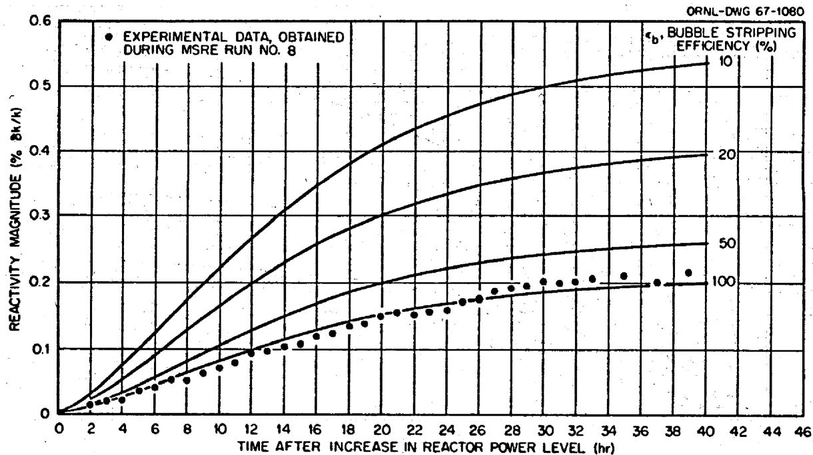  
Fig. 6. Effect of Bubble-Stripping Efficiency on Transient Buildup of $135\mathrm{Xe}$ Reactivity. Step increase in power level from 0 to 5.7 Mw; volume percent circulating bubbles, 0.10; MSRE Run No. 8.

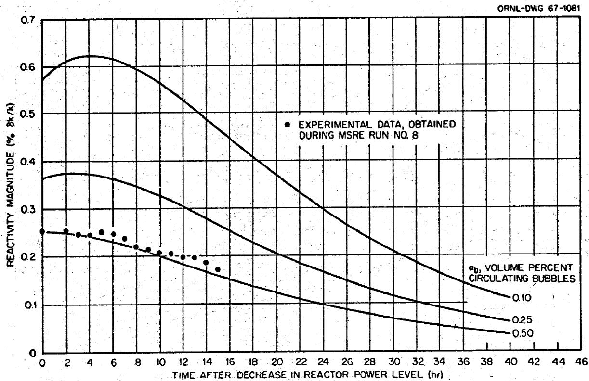  
Fig. 7. Effect of Volume of Circulating Gas on Transient Decay of $^{135}\mathrm{Xe}$ Reactivity. Step decrease in power level from 5.7 Mw to 0; bubble-stripping efficiency, $10\%$ ; MSRE Run No. 8.

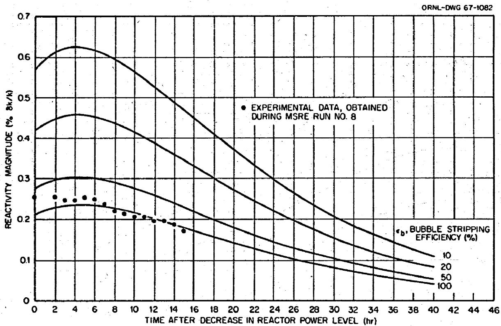  
Fig. 8. Effect of Bubble-Stripping Efficiency on Transient Decay of $135\mathrm{Xe}$ Reactivity. Step decrease in power level from 5.7 Mw to 0; volume percent circulating bubbles, 0.10; MSRE Run No. 8.

about the same information about the bubble parameters as the earlier xenon buildup transients. The calculated curves also reveal an important characteristic of the transient xenon behavior which is due to variations in the overall xenon distribution that result from the choice of values for $\alpha_{b}$ and $\epsilon_{b}$ . If the circulating void fraction is low, most of the poisoning effect is due to xenon in the graphite and only a small amount of xenon is in the circulating fluid. Xenon that is produced in the fluid from iodine decay continues to migrate to the graphite for a period of time after the power has been reduced. This produces a shutdown peak in the xenon poisoning. Eventually, the stripping process reduces the xenon concentration in the fluid so that some of the xenon in the graphite can escape and be stripped out. This results in a more rapid decrease in xenon poisoning than simple radioactive decay. As the circulating void fraction is increased, a larger fraction of the xenon inventory (or poisoning) is associated with the bubbles and there is less xenon migration to the graphite. In this case the shutdown peak tends to disappear. This effect makes the shape of the shutdown transients more sensitive to changes in the values assumed for the bubble parameters and thus facilitates the process of fitting the observed data to the calculations.

For this same limited decay transient, Figure 9 shows the effect of the bubble-stripping efficiency with a slightly larger volume fraction of circulating gas bubbles (0.15 vol%). Although the data for this particular transient are somewhat scattered, the combined results from Figures 3 through 9 suggest that $\alpha_{\mathrm{b}}$ and $\epsilon_{\mathrm{b}}$ might be bracketed between 0.1 and 0.15 vol%, and 50 to 100% respectively.

A second $^{135}\mathrm{Xe}$ stripping out-decay transient, observed during Run No. 9 (November, 1966), following reduction in the power level from $7.4\mathrm{Mw}$ to zero, is plotted in Figures 10 and 11. Again, the approximate ranges given above for $\alpha_{b}$ and $\epsilon_{b}$ are in agreement with the experimental observations of the shape of the transient and the data show clearly the small xenon peak expected for these parameter values.

Finally, in Figures 12 and 13, we show the most recent shutdown transient obtained at the termination of Run No. 10 (January 14, 1967). In this case, the apparent $^{135}\mathrm{Xe}$ reactivity transient was recorded for more than

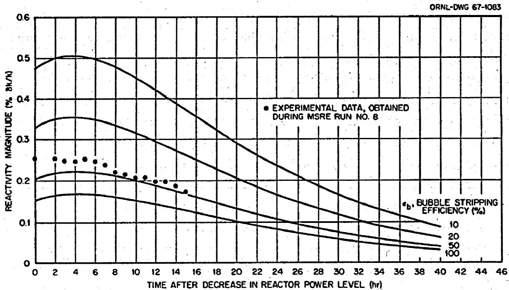  
Fig. 9. Effect of Bubble-Stripping Efficiency on Transient Decay of $135\mathrm{Xe}$ Reactivity. Step decrease in power level from 5.7 Mw to 0; volume percent circulating bubbles, 0.15; MSRE Run No. 8.

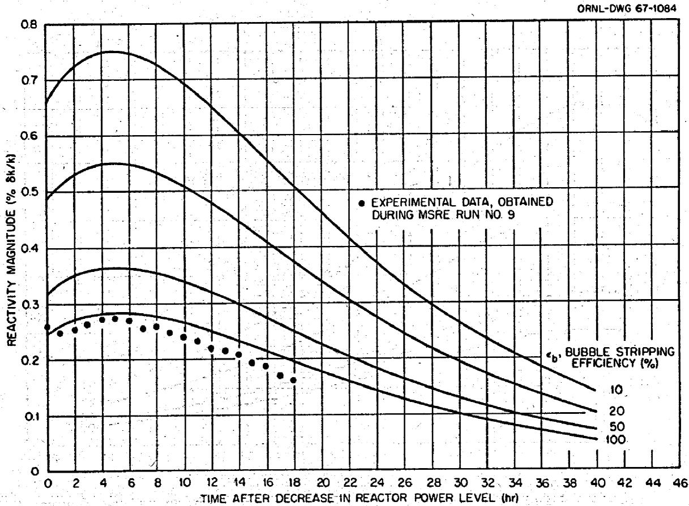  
Fig. 10. Effect of Bubble-Stripping Efficiency on Transient Decay of $135\mathrm{Xe}$ Reactivity. Step decrease in power level from 7.4 Mw to 0; volume percent circulating bubbles, 0.10; MSRE Run No. 9.

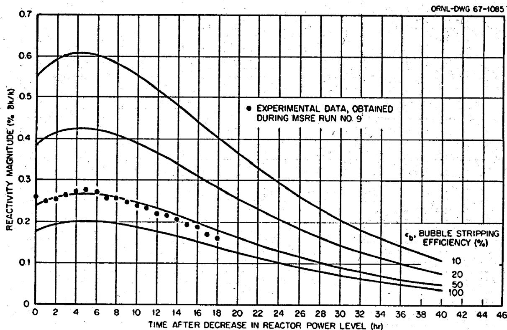  
Fig. 11. Effect of Bubble-Stripping Efficiency on Transient Decay of $135\mathrm{Xe}$ Reactivity. Step decrease in power level from 7.4 Mw to 0; volume percent circulating bubbles, 0.15; MSRE Run No. 9.

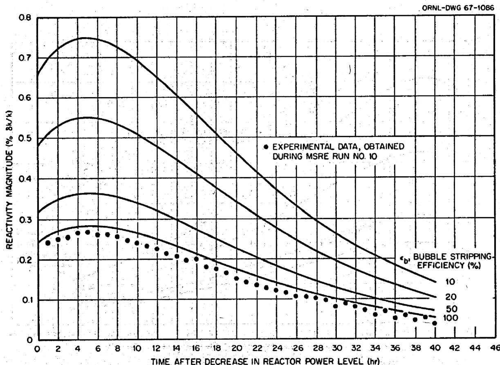  
Fig. 12. Effect of Bubble-Stripping Efficiency on Transient Decay of $135\mathrm{Reactivity}$ . Step decrease in power level from 7.4 Mw to 0; volume percent circulating bubbles, 0.10; MSRE Run No. 10.

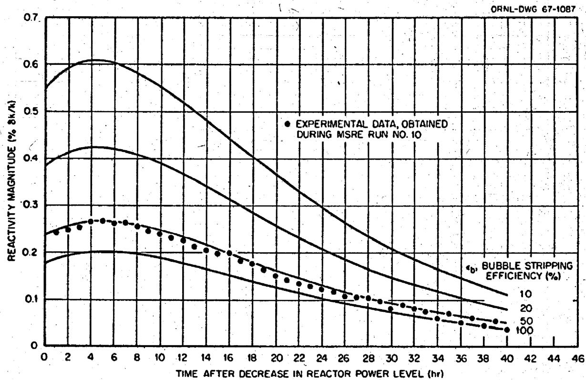  
Fig. 13. Effect of Bubble-Stripping Efficiency on Transient Decay of $^{135}\mathrm{Xe}$ Reactivity. Step decrease in power level from 7.4 Mw to 0; volume percent circulating bubbles, 0.15; MSRE Run No. 10.

40 hours after the reduction in power level. These results indicate strongly that the tentative conclusions reached from the earlier comparisons are essentially correct.

Although substantial progress has been made in interpreting the xenon behavior in the MSRE, the experimental data which have thus far been accumulated for the transient behavior of the $^{135}\mathrm{Xe}$ poisoning are as yet insufficient to provide a rigid test of our model for analysis. As one example, it should be noted that, if gas bubbles are continuously being ingested into the main circulating stream as the evidence indicates, the volume of gas in circulation is probably not constant, but rather is a slowly varying quantity depending on the level of the liquid in the fuel-pump tank and the transfer rate of salt to the overflow tank. This dependence is as yet not well understood, and future operation is expected to shed further light in this area.

We should also mention that least-squares methods can be employed to determine the unknown parameters in the theoretical model for the $135\mathrm{Xe}$ behavior which provide a closest fit to the experimental transients. However, these methods contain several pitfalls (primarily relating to the uniqueness, and hence to the interpretation of the results) when two or more parameters in the differential equations describing the process are to be determined simultaneously. Their success is best assured if ground-work is first completed by a broad parameter study such as that summarized here. We are now at the point where least-squares techniques will be useful in further refining the conclusions.

Based on the results of the off-line analysis with the IBM-7090, approximate equations and parameters were determined for the BR-340 on-line calculation of the $^{135}\mathrm{Xe}$ reactivity effect. Similar to the case of the samarium poisoning calculation, these are finite difference equations, of the form given below:

$$
I ^ {1 3 5} \left(t _ {i} + \Delta t\right) = I ^ {1 3 5} \left(t _ {i}\right) (1 - a _ {0} \Delta t) + a _ {1} \bar {P} \left(t _ {i}\right) \Delta t \tag {5}
$$

$$
\begin{array}{l} x _ {8} ^ {1 3 5} \left(t _ {1} + \Delta t\right) = I ^ {1 3 5} \left(t _ {1}\right) [ 1 - a _ {2} \Delta t - a _ {3} \bar {P} \left(t _ {1}\right) \Delta t ] \\ + a _ {4} \mathrm {I} ^ {1 3 5} \left(t _ {1}\right) \Delta t + a _ {5} X _ {\mathrm {g}} ^ {1 3 5} \left(t _ {1}\right) + a _ {6} \overline {{\mathrm {P}}} \left(t _ {1}\right) \Delta t \tag {6} \\ \end{array}
$$

$$
\begin{array}{l} \mathrm {X} _ {\mathrm {g}} ^ {1 3 5} \left(\mathrm {t} _ {1} + \Delta \mathrm {t}\right) = \mathrm {X} _ {\mathrm {g}} ^ {1 3 5} \left(\mathrm {t} _ {1}\right) [ 1 - \mathrm {a} _ {7} \Delta \mathrm {t} - \mathrm {a} _ {8} \bar {\mathrm {P}} \left(\mathrm {t} _ {1}\right) \Delta \mathrm {t} ] + \mathrm {a} _ {9} \mathrm {X} _ {\mathrm {6}} ^ {1 3 5} \left(\mathrm {t} _ {1}\right) \Delta \mathrm {t} (7) \\ X _ {b} ^ {1 3 5} \left(t _ {1} + \Delta t\right) = \frac {a _ {1 0}}{a _ {1 1} + a _ {1 2} \overline {{P}} \left(t _ {1}\right)} X _ {s} ^ {1 3 5} \left(t _ {1} + \Delta t\right) (8) \\ \left[ X _ {g} ^ {1 3 5} \left(t _ {i}\right) \right] _ {\text {e f f}} = F X _ {g} ^ {1 3 5} \left(t _ {i}\right). (9) \\ \end{array}
$$

In these equations, $I^{135}$ is the concentration of iodine-135 in the circulating salt, and $X^{135}$ is the concentration of xenon-135, with subscripts s, g, and b representing the components in solution, in the graphite pores, and in the circulating helium bubbles, respectively. The parameters a0 through a12 are determined from the analysis described in the preceding pages, and depend on the fission yields, radioactive decay constants, mass-transfer coefficients, bubble characteristics, and external stripping efficiencies. The factor F is a shape correction factor for the component of the $135Xe$ poisoning in the graphite. Although this is actually a time dependent quantity, in the ER-340 program we are presently using a constant value, equal to the correction calculated under equilibrium conditions $(F \sim 0.8$ at $\overline{P} = 7.5$ Mw).

As further experience is accumulated from operation of the MSRE, efforts will be made to refine the analysis summarized in this section.

# Density Effects of Circulating Bubbles on Reactivity

In addition to its indirect influence on the reactivity through reduction of the $^{135}\mathrm{Xe}$ poisoning, the entrainment of undissolved helium in the circulating salt also directly affects reactivity by increasing the neutron leakage from the reactor core. This "fuel-salt density coefficient of reactivity" was estimated earlier as part of the analysis of core physics characteristics summarized in Ref. 4. The value obtained was $-0.18\%$ reactivity for one volume percent of circulating gas bubbles.

Measurements were made during the zero-power experiments to evaluate the reactivity effect due to fuel circulation. At that time there was no evidence of circulating voids and the measured reactivity effect was $-0.21\%$ , in good agreement with the calculated decrease due to the loss of delayed neutrons. This measurement was repeated in October, 1966, after the analysis of the $^{135}\mathrm{Xe}$ poisoning had indicated a circulating void fraction of 0.1 to 0.15 vol%. Prior to the start of circulation, the fuel salt had been stored in a drain tank for 11 weeks so it should have been free of undissolved gas. The observed reactivity change between no circulation and circulation at steady state this time was $-0.23$ to $-0.25\%$ , an increase of 0.02 - $0.04\%$ . If the amount of gas normally in circulation is approximately 0.1 to 0.15 vol%, this means that the density-reactivity effect would be in the range of $-.02$ to $-.03\%$ reactivity. Although this result does not prove the existence of circulating voids, it is at least consistent with the xenon results. Because the actual amount of gas in circulation appears to vary somewhat during operation (see also later section describing operational experience at the MSRE), the magnitude of this reactivity effect is not well enough established to be included as an explicit term in the ER-340 on-line reactivity balance calculations. Hence, it is included in the residual reactivity in the experimental results presented in the later sections.

# Isotope Burnout Effects

We have already mentioned in an earlier section that changes in the isotopic concentrations of lithium-6, uranium-234, -236, and -238, plutonium-239, and non-saturating fission products, all in the salt, and

residual boron-10 in the graphite can be lumped together as a single category in terms of their effect on the reactivity of the core. Most of these effects manifest themselves as very slowly developing positive reactivity changes, dependent on the time-integrated power, or energy generated. The exceptions are $^{236}\mathrm{U}$ (for which there is a slight increase in concentration resulting from radiative capture in $^{235}\mathrm{U}$ ) and the buildup of non-saturating fission-product poisons.

In the MSRE, the $^{235}\mathrm{U}$ consumed per year's operation at 7.5 Mw is $3.56\mathrm{kg}$ , or approximately 5 percent of the initial fuel charge. Because this represents a relatively low fractional burnup of the fuel, and because each of the reactivity effects mentioned above is a small correction in the net reactivity balance, we can make convenient first-order approximations in calculating these effects. For this purpose, we have assumed that the magnitude and energy spectrum of the neutron flux remain constant during operation at a given power level, and have used calculated effective cross sections for neutron reactions in this spectrum. With these assumptions, it is a straightforward exercise to obtain the solutions to the differential equations governing the first-order changes in isotopic concentrations with exposure to the neutron flux. We will omit description of the algebraic details of these calculations. For all isotopes but boron-10, account has to be taken of the "flux dilution" effect of the time the fuel spends in the section of the loop that is external to the core. Thus the calculated volume-average thermal flux* for the entire fuel loop is $0.665 \times 10^{12} \mathrm{n/cm}^2 \mathrm{sec/Mw}$ , whereas the average thermal flux over the graphite-moderated region of the core is $2.0 \times 10^{12} \mathrm{n/cm}^2 \mathrm{sec/Mw}$ . The boron concentration initially in the MSRE graphite was estimated from Ref. 9 to be about $0.8 \mathrm{ppm}$ . In the calculation of the boron burnout, we have neglected a correction factor accounting for the spatial dependence of burnout in the graphite region, since the total effect is quite small.

Table 1 lists the effective cross sections used in these calculations. The effective cross sections, multiplied by the thermal fluxes, give the total reaction rates per atom for neutrons of all energies in the MSRE spectrum.

Since the formulas for the reactivity changes corresponding to each of the above terms are algebraically similar, it is possible to develop an approximate formula for a single "pseudo-isotope" to represent the net reactivity effect of this group in the ER-340 calculations. The equation we use is:

$$
K = A _ {0} + A _ {1} P T + A _ {2} e ^ {- b _ {1} P T} + A _ {3} e ^ {- b _ {2} P T} + A _ {4} e ^ {- b _ {3} P T} \tag {10}
$$

The parameters $A_0$ through $A_4$ , and $b_1$ through $b_3$ in this formula depend on the cross sections and initial isotopic concentrations, and are obtained from the analysis outlined in this section.

Table 1 Effective Cross Sections and Reactivity Effects Due to Isotopic Changes(a)   

<table><tr><td>Isotope</td><td>Effective 
Cross Section 
in MSRE Thermal 
Spectrum at 1200°F 
(barns)</td><td>Approximate 
Reactivity 
Effect at 
104Mwhrs 
(‰ δk/k)</td></tr><tr><td>εLi(b)</td><td>457.6</td><td>.017</td></tr><tr><td>Boron(c)</td><td>362.4</td><td>.007</td></tr><tr><td>234U</td><td>121.4</td><td>.001(d)</td></tr><tr><td>236U</td><td>43.5</td><td>-.003</td></tr><tr><td>238U(e)</td><td>22.9</td><td>.004</td></tr><tr><td>259Pu (abs.)</td><td>1451.3</td><td>---</td></tr><tr><td>259Pu (ν x fission)</td><td>2496.7</td><td>.051 (net)</td></tr><tr><td>Nonsaturating fission products(f)</td><td>43.1 (barns/fission)</td><td>-.005</td></tr><tr><td>Total</td><td></td><td>.072</td></tr></table>

(a) The reactivity effect of burnup of $235\mathrm{U}$ is not included in this list, since this term is treated explicitly in Eq. 1.   
(b) Cross section for the reaction $^{6}\mathrm{Li}$ (n, α) $^{3}\mathrm{H}$ using the initial $^{6}\mathrm{Li}$ concentration.   
(c) Natural enrichment boron (19.8% 10B)   
(d) Includes reactivity increment due to both depletion of $^{234}\mathrm{U}$ and production of $^{235}\mathrm{U}$ .   
(e) Burnout only.   
$(f)$ Estimated from Ref. 5.

# EXPERIENCE WITH THE ON-LINE CALCULATION

Reactivity-balance calculations have been performed for the MSRE since the start of reactor operation at significant power. During the very early stages of the operation, many of the calculations were done manually while the computer program was being checked out. Such calculations were feasible at that time because the terms which depend on integrated power were negligibly small. Subsequently the on-line computer was used to execute modified reactivity balances to provide data for evaluating the xenon-poisoning term. At present, the complete reactivity balance is calculated routinely by the computer every 5 minutes and the results are used without further modification during normal operation. However, it is still necessary to manually calculate the dilution effects that occur when the fuel loop is drained. Since shutdown operations may involve a variety of fuel and flush-salt transfers, each shutdown must be treated as a special case. Low-Power Calculations

The first operation of the MSRE after the zero-power experiments and hence, the first opportunity to apply the reactivity-balance calculation occurred in December, 1965, and January - February, 1966, during a series of low-power experiments. (The intervening period, July - December, 1965, was spent in completing those parts of the system that were required for power operation.) The reactor was operated at a variety of powers up to 1 Mw and a total of 36.5 Mwhr of fission energy was produced in these tests.

During the control-rod calibration, capsules of enriched fuel were added to the loop with the sampler-enricher, and at the end of the zero-power experiments, the $^{235}\mathrm{U}$ concentration in the primary loop was about $10\%$ greater than that in the salt heel which remained in the drain tanks. Thus, when the reactor was drained in July, 1965, a substantial dilution occurred which had to be accounted for in the reactivity balance.

Since the computer program for the on-line calculation was not ready for service during the low-power tests, manual calculations were performed. However, the analytic expression for control-rod poisoning and the various reactivity coefficients that were being incorporated in the computer

program were applied. Since very little integrated power was produced, the xenon, samarium, burnup, and other-fission-product terms were neglected.

At low power these calculations provided a test of those terms in the balance that do not depend directly on power operation, i.e. control-rod poisoning, variations in operating temperature, and changes in $^{235}\mathrm{U}$ concentration. They also gave some indication of the inherent accuracy of the calculation under the simplest conditions. These calculations gave a residual reactivity of $+0.01 \pm 0.01\% \delta \mathrm{k / k}$ . This residual was attributed to uncertainties in the physical inventory in the system and was eliminated from subsequent reactivity balances. That is, the reference condition for the reactivity balance was established as the system condition just before the start of power operation. In addition to verifying the "zero-power" reactivity balance, the calculations at 1 Mw gave an early indication that the power coefficient of reactivity was less negative than had been calculated and that the xenon poisoning would be less than we had expected. (See also pp 9 - 11 and 13 - 32.) As a result of these and later findings, experiments were performed to evaluate these two terms.

# Intermediate Calculations

Operation of the reactor at powers and for times that produced significant fission-product terms began in April, 1966. This operation soon showed that the xenon term was inadequately treated and that part of the calculation was temporarily deleted from subsequent computations. The calculation results from the other terms in the reactivity balance were then used to aid in the development of an adequate representation of the xenon poisoning.

In order to use the reactivity balance to evaluate xenon poisoning, it was necessary to assume that there were no other unaccounted-for reactivity effects. This assumption was not completely valid for the early calculations because of long-term effects that were neglected, but it was valid for the relatively short times involved in the xenon transients. Since most of the data for the xenon calculation were developed from the reactivity transients after the reactor power was raised or lowered

(see pp 13 - 32) the early errors in the long-term reactivity balances were of little consequence.

Figure 14 shows the results of reactivity-balance calculations without xenon for all power operation of the reactor between April and July, 1966. The reactor power is shown with each reactivity plot for reference purposes. The reactivity transients associated with the buildup and removal of xenon due to changes in power are clearly displayed. The apparent steady-state xenon poisoning at maximum power ( $\sim$ 7.2 Mw) is 0.25 to $0.30\% \delta \mathrm{k} / \mathrm{k}$ .

The large negative-reactivity transient on June 18 - 19 was caused by the development of a large circulating void fraction in the fuel loop. It was known that if the fuel-salt level in the pump tank were allowed to decrease below a given value, the amount of gas in circulation would increase significantly. This condition was reached on June 18 and the accompanying decrease in average fuel density produced the reactivity decrease. The reactivity recovered rapidly when the normal pump-tank level was restored and the excess gas was stripped out. The response of the reactivity balance in this event illustrates the sensitivity of this method for detecting minor anomalies under otherwise normal circumstances.

The reactivity balances calculated for the period shown in Figure 14 were not completely corrected for long-term isotopic change effects or for flush-salt dilution. This is illustrated by the apparent increase in the residual reactivity at zero-power when there was no xenon present. (Note especially the results on April 11, May 9, June 13, and July 1 and 21-23.) Corrections for these factors were subsequently applied to the zero-power balances to evaluate as accurately as possible the long-term drift in the residual reactivity.

# Complete Calculations

The complete reactivity balance calculation, including all known effects, was first applied to the period of reactor operation which began in October, 1966. Figure 15 shows the power history and residual reactivity results on a day-to-day basis for the next three runs (the reactivity scale in Figure 15 is expanded from that of the preceding figure).

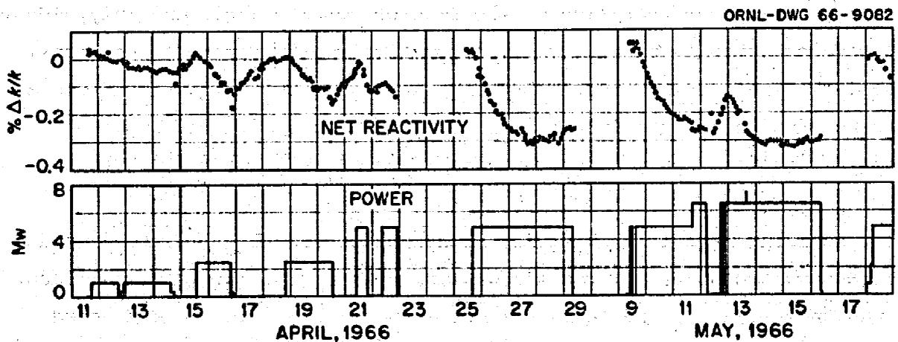

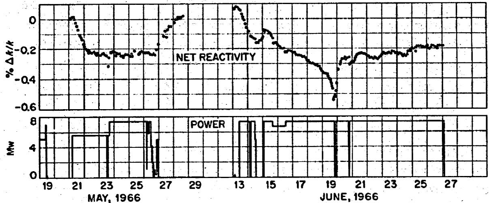

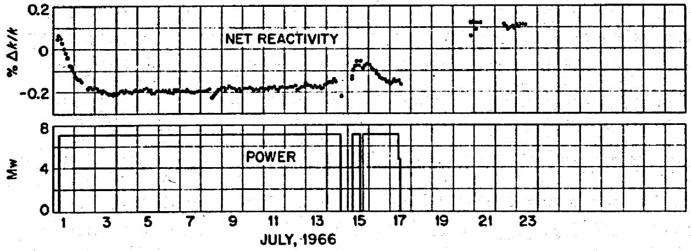  
Fig. 14. Results of Modified Reactivity Balances in MSRE.

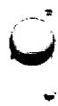

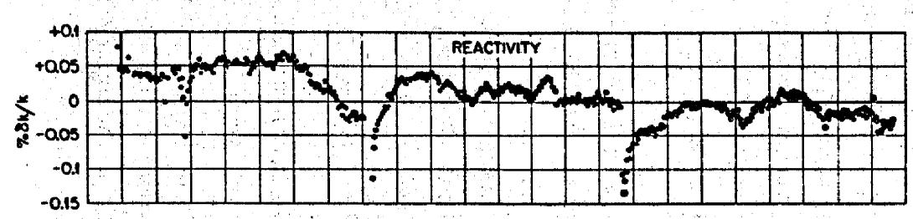

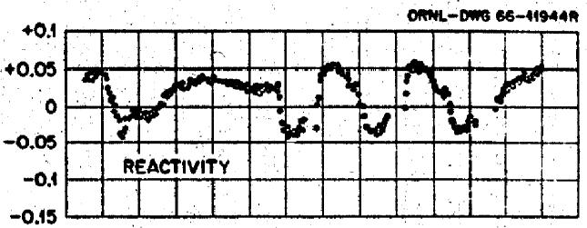

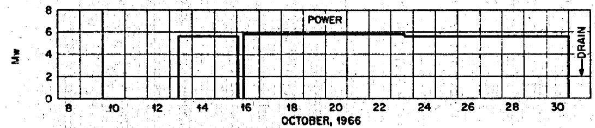

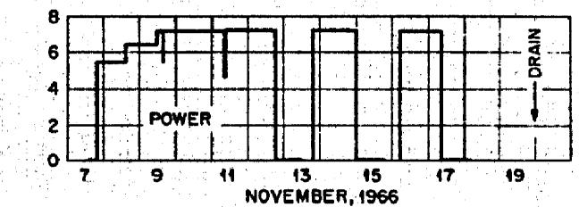

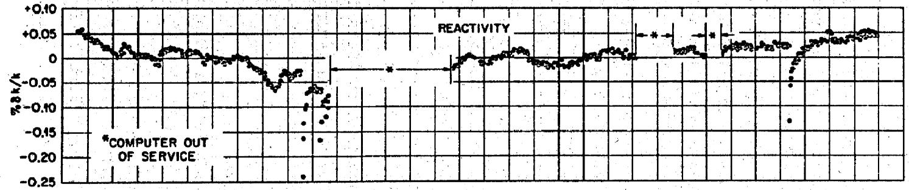

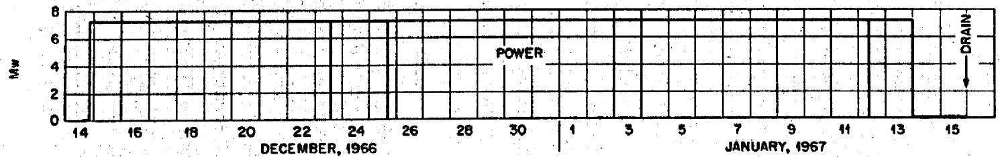  
Fig. 15. Results of Complete Reactivity Balances in MSRE.

During steady-state operation the results show only minor variations in the residual reactivity. However, in October and November there is still some indication of a disagreement between the calculated and actual xenon poisoning, both in the absolute magnitude of the term and in the transient behavior. The results for December, 1966 and January, 1967 show better transient agreement but still some difference in the magnitude of the xenon term.

The larger spikes in residual reactivity can all be accounted for by abnormal reactor conditions which are not covered in the reactivity balance. For example, the spikes on October 10 are associated with special experiments during which gas bubbles were circulating with the salt. Fuel-salt circulation was interrupted for 2-1/2 hours on October 16 and no xenon stripping occurred. When circulation and power operation were resumed, the actual xenon-poison level was higher than that calculated in the reactivity balance which assumed continuing circulation and stripping while the power was low. On October 23, the salt level in the pump tank was at an abnormally high level for a brief period. The xenon stripping was much less effective in this condition and the xenon-poison level rapidly built up to a higher value. When a more normal salt level was restored, the xenon poisoning returned to the normal value.

The perturbations in residual reactivity during the November operation resulted from failure of the calculation to adequately describe the xenon transients. During this run it was necessary to reduce the power on several occasions because of conditions imposed by the reactor offgas system. In each case the observed xenon behavior was about the same, indicating a longer time constant for xenon stripping than was calculated in the model. This disparity in the time constants produced the cyclic behavior that was observed.

Considerable difficulty was encountered in the operation of the online computer during the last period of operation shown in Figure 15. As a result, substantial gaps exist in the complete reactivity-balance results. However, the available results are in good agreement with the expected behavior. Again, the spikes on December 23 and 24 and January 12 reflect abnormal reactor operations which resulted in circulating voids.

The smaller variations (see, for example, the period from December 30 to January 5) appear to be related to variations in the fuel-system over-pressure. They may reflect changes in the circulating void fraction or variations in the net xenon-stripping efficiency. Additional detailed analyses will be required to identify the cause of these small variations.

# Long-Term Residual Reactivity

The long-term drift in residual reactivity can best be seen in the calculation results where there is no xenon present. In order to make this comparison, representative results of this kind have been converted to a common basis using current values for all coefficients. The major corrections that were applied to earlier results were to compensate for long-term isotopic-change effects that had been neglected and for flush-salt dilution effects. Each time the fuel loop is drained a small heel of the salt that was circulating remains in the loop. This salt then mixes with the material that is next introduced into the loop. When the reactor is shut down for maintenance the fuel loop is normally rinsed with flush salt to remove as much residual radioactivity as possible. Then, when the loop is refilled with fuel salt, the remaining flush-salt heel produces a dilution of the fuel. Some additional intermixing occurs because a common fill-and-drain line is used for the two salts. The extent of the salt intermixing was determined from the amount of uranium that has appeared in the otherwise-barren flush salt. Chemical analyses of the flush salt indicated the amount of fuel salt that was picked up by the flush salt in various operations. We then assumed that a similar volume of flush salt is added to the fuel. The net result of a flush-salt fill and drain followed by a fuel-salt fill is to reduce the system reactivity by about $0.05\%$ .

The corrected reactivity-balance results at zero power with no xenon present are shown as a function of integrated power in Figure 16. It should be noted that the reactivity scale is greatly expanded and that the average residual reactivity is only about $+0.05 \, \text{sk/k}$ . There appears to have been a positive shift of about $+0.04$ to $+0.05\% \, \text{sk/k}$ early in the operation with insignificant changes occurring subsequently.

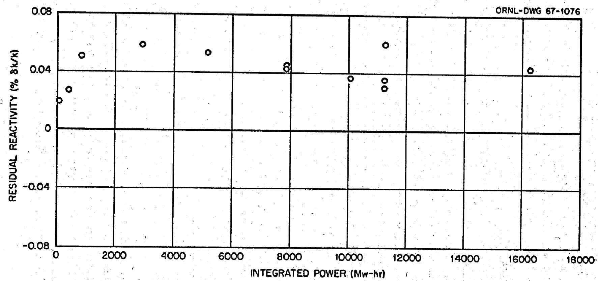  
Fig. 16. Long-Term Drift in Residual Reactivity in MSRE.

Through the end of Run No. 10 (January, 1967) the reactor had produced 16,450 Mw-hrs, equivalent to 95 days' operation at maximum power and substantial changes had occurred in many of the reactivity-balance terms. Table 2 shows typical values for the various terms in the reactivity balance at the start of power operation and at the end of Run 10. The values given represent zero-power operation with no xenon present to emphasize the long-term effects. The estimated accuracies of the various terms are included in the table for later consideration (see pp 47 - 48). This table shows clearly the current value of the residual reactivity of $0.05\%$ .

# INTERPRETATION OF RESULTS

# Previous Reports of Results

The results presented in this report represent our current evaluation of the reactivity behavior of the MSRE during the first year of power operation. In the course of this year the accumulation of data and experience has resulted in a number of changes in the calculation of various terms as well as in the interpretation of the results. Because of the interest in the performance of the MSRE and the value of the reactivity balance in assessing that performance, intermediate results have been reported from time to time (see especially Reference 10) even though it was recognized that further analysis was required for an accurate interpretation. Some of these results suggested the possibility that the positive residual reactivity was gradually increasing. This apparent increase was due to an inadequate treatment of long-term changes in minor salt constituents and to a misinterpretation of conflicting data on the circulating void fraction.

It is to be expected that additional modifications will be made in our treatment of the reactivity balance as more operating experience is accumulated. However, we feel that any future refinements will have small effects and that the current evaluation is reasonably accurate.

at

Zero Power

Table 2   
Values of Reactivity-Balance Terms in MSRE   

<table><tr><td rowspan="2">Term</td><td rowspan="2">\( \mathbf{a} \)Effect Described</td><td colspan="2">Value (% δk/k)</td><td rowspan="2">Change (% δk/k)</td><td rowspan="2">Estimated Uncertainty (% δk/k)</td></tr><tr><td>Start of Power Operation</td><td>After 16,450 Mwhr</td></tr><tr><td>KROD</td><td>Control-rod poisoning</td><td>-1.712</td><td>-0.911</td><td>+0.801</td><td>±0.020</td></tr><tr><td>KU235</td><td>Excess \( ^{235}\mathrm{U} \) concentration</td><td>1.785</td><td>\( +1.355^b \)</td><td>-0.430</td><td>±0.011</td></tr><tr><td>KTEMP</td><td>Reactor outlet temperature</td><td>-0.073</td><td>-0.073</td><td>0</td><td>--</td></tr><tr><td>KPOW</td><td>Temperature distribution</td><td>\( o^c \)</td><td>\( o^c \)</td><td>0</td><td>--</td></tr><tr><td>KSAM</td><td>Samarium poisoning</td><td>0</td><td>-0.534</td><td>-0.534</td><td>±0.027</td></tr><tr><td>KXE</td><td>Xenon poisoning</td><td>\( o^d \)</td><td>\( o^d \)</td><td>0</td><td>--</td></tr><tr><td>KB</td><td>Circulating bubbles</td><td>e</td><td>--</td><td>--</td><td>--</td></tr><tr><td>KFP</td><td>Isotope burnout</td><td>0</td><td>+0.116</td><td>+0.116</td><td>±0.006</td></tr><tr><td>KNET</td><td>Residual</td><td>0</td><td>+0.047</td><td>+0.047</td><td>±0.04</td></tr></table>

a. Change from reference condition.   
b. Includes dilution by flush salt.   
c. Value at 7.4 Mw is +0.007% δk/k.   
d. Value at 7.4 Mw is -0.27% 8k/k.   
e. Not currently included.

# Utility of Residual Reactivity

The residual reactivity as determined from the reactivity balance cannot be used by itself as an absolute indicator of the reactor performance. Because of the experimental nature of the MSRE and the variety of unknowns associated with the reactivity behavior, particularly in regard to xenon poisoning, it was necessary to use the reactor behavior as a tool in developing the reactivity balance. During this development it was necessary to assume that no anomalous reactivity effects were present. This assumption was supported by a variety of other observations: the nuclear stability both at steady power and during transients, a comparison of predicted and directly observable nuclear characteristics, chemical analyses of fuel-salt samples, and examination of in-core irradiation and corrosion specimens. Even after its development, the reactivity balance must be used in conjunction with these other observations to insure that no neglected, but otherwise normal, reactivity-effect is interpreted as an anomaly.

The reactivity balance is potentially one of the most sensitive indicators of changing conditions in a system like the MSRE. However, there are certainly limitations in both the precision and absolute accuracy of such calculations. At steady reactor conditions (constant temperature, pressure, and power) the variation in consecutive reactivity balances is only about $0.01\% \delta \mathrm{k} / \mathrm{k}$ . This is associated primarily with variations in the temperature and control-rod-position readings from the computer and, therefore, probably represents the precision limit of the calculation.

It is difficult to provide a reliable estimate of the confidence limits of the calculations summarized in this report. To a large extent, refinements in the analysis to include effects found to be significant, together with reinterpretations of measurements, have to be performed sequentially as reactor operating data are obtained. The measurements of reactivity effects important in operation are often interwoven, so that operational data taken in connection with one particular effect have shed further light on earlier measurements pertaining to other effects. This process is expected to continue.

Because several of the most important terms in the reactivity balance (control-rod worth, excess $^{235}\mathrm{U}$ , temperature levels) are based on measurements made during the zero-power nuclear experiments, a rough basis for discussing the accuracy of these terms is provided by those experiments. As mentioned in an earlier section, independent measurements of the control-rod worth (by means of period-differential worth experiments and rod drop-integral worth experiments) were found to be self consistent, within $5\%$ . Also, the interpretation of other reactivity effects ( $^{235}\mathrm{U}$ concentration coefficient, overall temperature coefficient, and delayed-neutron losses) based on the rod calibration were within $5\%$ of the calculated values. Thus, reasonable confidence limits are probably $\pm 2.5\%$ on terms for which experimental measurements are available and $\pm 5\%$ on terms for which only calculations are available. Application of these limits to the changes in reactivity leads to an uncertainty of $\pm 0.04\%$ $\delta \mathbf{k} / \mathbf{k}$ in the residual reactivity at zero power with no xenon present. (See also Table 2, p 46.)

The very small uncertainty in the residual reactivity makes this a very sensitive monitor of conditions in the MSRE. By comparison, statistical analysis of the results of chemical analyses of fuel-salt samples gave a change in $^{235}\mathrm{U}$ concentration of $-0.025 \pm 0.013$ wt% between the start of power operation and 16,450 Mw-hrs.[11] This corresponds to a reactivity change of $-0.36 \pm 0.18\%$ sk/k which can be directly compared with the reactivity-balance value of $-0.43 \pm 0.01\%$ sk/k in Table 2. Thus, while both the reactivity balances and the chemical results indicate normal behavior the reactivity balances are somewhat more accurate in this particular application and are continuously available during reactor operation.

# Effects: Not Treated

Several effects have been mentioned which have not been explicitly included in the reactivity-balance calculations, and for which cognizance should be taken. These include the production of photoneutrons through $(\gamma ,n)$ reactions in the beryllium and neutron absorptions in the products which result from reactions that are evaluated. Since only changes in reactivity relative to the reference condition are observed in the reactivity balance, one may show by approximate calculation that the magnitude

of these effects should have negligible direct effect on the reactivity balance in the MSRE.

Of potentially greater significance among the effects known to be present but not accounted for are (1) the slight changes in the structural configuration of the graphite stringers and salt channels due to neutron irradiation damage to the graphite, and (2) the cumulative effects of irradiation on the control-rod worth (through burnup of the gadolinium). Both these effects should appear as slow changes in the residual reactivity. Radiation damage is expected to cause the graphite to shrink, thereby reducing slightly the axial dimensions of the core, increasing the effective graphite density, and causing some bowing of the stringers due to the radial gradient in the neutron flux. It is difficult to provide a precise estimate of the change in core reactivity associated with this effect, but a reported estimate which should be on the conservative side (larger than the actual magnitude) is about $+.07\%$ 8k/k per Mw yr. $^{12}$ Although this is in the range which might be detected in the residual reactivity, no consistent, slowly increasing change of this magnitude has been observed in the reactivity.

In the second case, above, rough calculations supported by comparative observations in the reactor, have indicated that the effect of burnout of the gadolinium on rod reactivity is of negligible significance in the MSRE operation to date. However, corrections for this effect should properly be accounted for as operation continues into a substantial fraction of the core life. A thorough analysis of this effect is planned in the immediate future.

# Operating Limitations

In the MSRE operating authorization, the USAEC recommended that "allowable limits on reactivity anomalies should be established and documented before critical tests begin and should be adhered to during all operations."[13] This was, and is being, done. The operating limits on the MSRE include this one. "At no time during critical operation of the reactor will the reactivity anomaly be allowed to exceed $0.5\%$ $\delta \mathrm{k} / \mathrm{k}$ ."[14]

The limit of $0.5\%$ was set in consideration of the consequences of a very pessimistic hypothetical incident involving separated uranium. It was postulated that uranium separated from the circulating fuel by some unspecified process and collected in the lower head of the reactor vessel.* Then something caused part of the uranium to be resuspended and sucked up through the central channels in the core in a single blob. (The velocity in 22 channels near the center is 2.0 ft/sec, almost three times the velocity in the 940 channels covering the main body of the core.)

The computations were done as follows.[15] The shape of the reactivity transient due to movement of a blob of uranium up through a central channel was computed. Then the transients in power, temperature, and core pressure were computed for various amounts of added reactivity and different initial power levels. No account was taken of rod scream, only the shutdown provided by the negative temperature coefficient of reactivity. The computed power excursions were brief, producing sharp but momentary increases in the temperature of the fuel in the core (but little change in graphite temperature) and pressure surges in the core due to fuel-salt expansion. A tolerable excursion (one which would not be expected to cause damage) was defined as one in which the pressure surge was less than 50 psig and the peak fuel temperature was less than $1800^{\circ}\mathrm{F}$ . The limit was reached by incidents in which the reactivity addition peaked at $0.7\%$ $\mathrm{8k / k}$ . The amount of excess uranium that would give this reactivity was computed to be $0.8\mathrm{kg}$ (neglecting self-shielding in the blob, which would increase the amount of uranium required).

The next step was to decide what fraction of a uranium deposit might reasonably be pictured as becoming detached and passing through the core as postulated. In HRE-2 (an aqueous fluid-fuel reactor where fuel separation could and did occur), deposits could be dispersed by movement of the loose core-inlet screens in the turbulent flow, or by steam formation, and

the dispersed material was soluble. Even under these conditions the largest sudden recovery of uranium was less than 0.1 of the existing deposits. In the MSRE, on the other hand, deposits of uranium as $\mathrm{UO_2}$ should be quite stable so the probability of resuspension of any significant fraction should be quite small. Therefore, we considered that an assumption of sudden resuspension of 10 percent of the separated uranium was quite conservative.

With the foregoing pessimistic assumptions, one computes that the separation of $8\mathrm{kg}$ of uranium is the maximum amount tolerable. If this much were to separate from the circulating fuel and collect in a region of low nuclear importance, the reactivity would decrease by $0.5\%$ $\delta \mathbf{k} / \mathbf{k}$ . This was set then as the maximum allowable reactivity anomaly.

# Conclusions

Several conclusions can be drawn from the experience with the reactivity-balance calculation during the first year of power operation of the MSRE. The calculation has provided an invaluable tool for evaluating the performance of the reactor system, particularly in connection with the xenon-poisoning problem. The results have been accurate and precise enough to permit a detailed analysis and evaluation of mechanisms which would otherwise have been largely indeterminate in the reactor. In addition, they have provided the operating staff with a real-time monitor of the condition of the reactor system.

Possibly the most important conclusion is that the reactivity balance has shown, within very narrow confidence limits, no anomalous reactivity behavior during this first year of power operation. The long-term change that has occurred is lower than the allowable anomaly by a factor of 10 and there have been no unexplained short-term deviations. This experience shows with considerable confidence that the reactor has performed as expected in all respects that could affect the nuclear reactivity.

# REFERENCES

1. P. N. Haubenreich et al., Summary of MSRE Zero Power Physics Experiments, USAEC Report ORNL-TM (in preparation).   
2. Oak Ridge National Laboratory, MSRP Semiann. Progr. Rept. Aug. 31, 1966, USAEC Report ORNL-4037, pp 88-94.   
3. Oak Ridge National Laboratory, MSRP Semiann. Progr. Rept. Feb. 28, 1966, USAEC Report ORNL-3936, pp 82-87.   
4. P. N. Haubenreich et al., MSRE Design and Operations Report, Part III, Nuclear Analysis, USAEC Report ORNL-TM-730, Oak Ridge National Laboratory, Feb. 4, 1964, pp 41-48.   
5. L. L. Bennett, Recommended Fission Product Chains for Use in Reactor Evaluation Studies, USAEC Report ORNL-TM-1658, Oak Ridge National Laboratory, Sept. 26, 1966.   
6. R. J. Kedl and A. Houtzeel, Development of a Model for Computing $^{135}\mathrm{Xe}$ Migration in the MSRE, USAEC Report ORNL-4069 (in preparation).   
7. Oak Ridge National Laboratory, MSRP Semiann. Progr. Rept. Feb. 28, 1966, USAEC Report ORNL-3936, pp 87-92.   
8. Oak Ridge National Laboratory, MSRP Semiann. Progr. Rept. Aug. 31, 1966, USAEC Report ORNL-4037, pp 13-21.   
9. Oak Ridge National Laboratory, MSRP Semiann. Progr. Rept. July 31, 1964, USAEC Report ORNL-3708, pp 373-389.   
10. Oak Ridge National Laboratory, MSRP Semiann. Progr. Rept. Aug. 31, 1966, USAEC Report ORNL-4037, pp 10-13.   
11. Oak Ridge National Laboratory, MSRP Semiann. Progr. Rept. Feb. 28, 1967, (in preparation).   
12. P. N. Haubenreich et al., MSRE Design and Operations Report, Part III, Nuclear Analysis, USAEC Report ORNL-TM-730, Oak Ridge National Laboratory, Feb. 4, 1964, pp 183-184.   
13. Letter from H. M. Roth to A. M. Weinberg, May 19, 1965, Subject: MSRE Operating Authorization.   
14. S. E. Beall and R. H. Guymon, Operating Safety Limits for the MSRE, USAEC Report ORNL-TM-733 (1st revision) Aug. 3, 1965.   
15. S. E. Beall et al., MSRE Design and Operations Report, Part V, Reactor Safety Analysis Report, USAEC Report ORNL-TM-732, Aug., 1964, pp 214-216.

# Internal Distribution

1. MSRP Director's Office  
Rm. 325, 9204-1

2. R. K. Adams

3. G. M. Adamson

4. R.G. Affel

5. L. G. Alexander

6. A. H. Anderson

7. R.F.Apple

8. C.F.Baes

9. J.M. Baker

10. S.J.Ball

11. W.P.Barthold

12. H.F. Bauman

13. S. E. Beall

14. M. Bender

15. L. L. Bennett

16. E.S.Bettis

17. F. F. Blankenship

18. R. Blumberg

19. R. B. Briggs

20. E. G. Bohlmann

21. C.J. Borkowski

22. R. S. Carlsmith

23. S. Cantor

24. W. L. Carter

25. G.I. Cathers

26. R. D. Cheverton

27. E. L. Compere

28. W.H.Cook

29. L. T. Corbin

30. W. B. Cottrell

31. C. W. Craven, Jr.

32. J. L. Crowley

33. F. L. Culler

34. J.M.Dale

35. D. G. Davis

36. J. G. Delene

37. S.J.Ditto

38. R. G. Donnelly

39. F. A. Doss

40. G. E. Edison

41-45. J.R. Engel

46. E.P.Epler

47. W. K. Ergen

48. D. E. Ferguson

49. T. B. Fowler

50. A. P. Fraas

51. H. A. Friedman

52. J.H. Frye, Jr.

53. C. H. Gabbard

54. R. B. Gallaher

55. E.H.Gift

56. W.R.Grimes

57. A. G. Grindell

58. R. H. Guymon

59. P. H. Harley

60. P. N. Haubenreich

61. G.M. Hebert

62. F. A. Heddleson

63. P. G. Herndon

64. T. L. Hudson

65. I. Jung

66. P. R. Kasten

67. R. J. Kedl

68. M. J. Kelly

69. C.R. Kennedy

70. T. W. Kerlin

71. H. T. Kerr

72. S.S. Kirslis

73. D. J. Knowles

74. A. I. Krakoviak

75. J. W. Krewson

76. J.A. Lane

77. R.B. Lindauer

78. M. I. Lundin

79. R. N. Lyon

80. H. G. MacPherson

81. R. E. MacPherson

82. J.H.Marable

83. C. D. Martin

84. C. E. Mathews

85. H. E. McCoy

86. H.C.McCurdy

87. H. F. McDuffie

88. C. K. McGlothlan

89. L. E. McNeese

# Internal Distribution

# (continued)

90. A. S. Meyer

91. A. J. Miller

92. R. L. Moore

93. E. A. Nephew

94. P. Patriarca

95. H.R.Payne

96. A.M.Perry

97. H. B. Piper

98. P. H. Pitkanen

99. C.M. Podeweltz

100. B. E. Prince

101. J. L. Redford

102. M. Richardson

103. R.C.Robertson

104. H. C. Roller

105. H.C.Savage

106. A.W. Savolainen

107. D. Scott

108. H. E. Seagren

109. J. H. Shaffer

110. M. J. Skinner

111. A. N. Smith

112. 0. L. Smith

113. P. G. Smith

114. W. F. Spencer

115. I. Spiewak

116. R.C.Steffy

117. H. H. Stone

118. J.R. Tallackson

119. R. E. Thoma

120. W. E. Thomas

121. M. L. Tobias

122. G.M.Tolson

123. D. B. Trauger

124. W.C.Ulrich

125. D.R.Vondy

126. A.M. Weinberg

127. J.R.Weir, Jr.

128. K.W. West

129. M. E. Whatley

130. J.C. White

131. G. D. Whitman

132. H.D.Wills

133. F. G. Welfare

134. J. V. Wilson

135. L. V. Wilson

136-137. Central Research Library

138-139. Document Reference Section

140-142. Laboratory Records

143. Laboratory Records - RC

144. Nuclear Safety Information Center

# External Distribution

145-146. Reactor Division, ORO

147. A. Giambusso, AEC-Washington

148. C. L. Matthews, AEC-ORO

149. T. W. McIntosh, AEC, Washington

150. H. M. Roth, AEC-ORO

151. W. L. Smalley, AEC-ORO

152-167. Division of Technical Information Extension