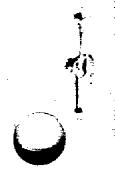
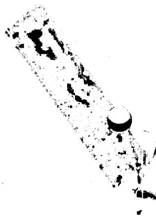
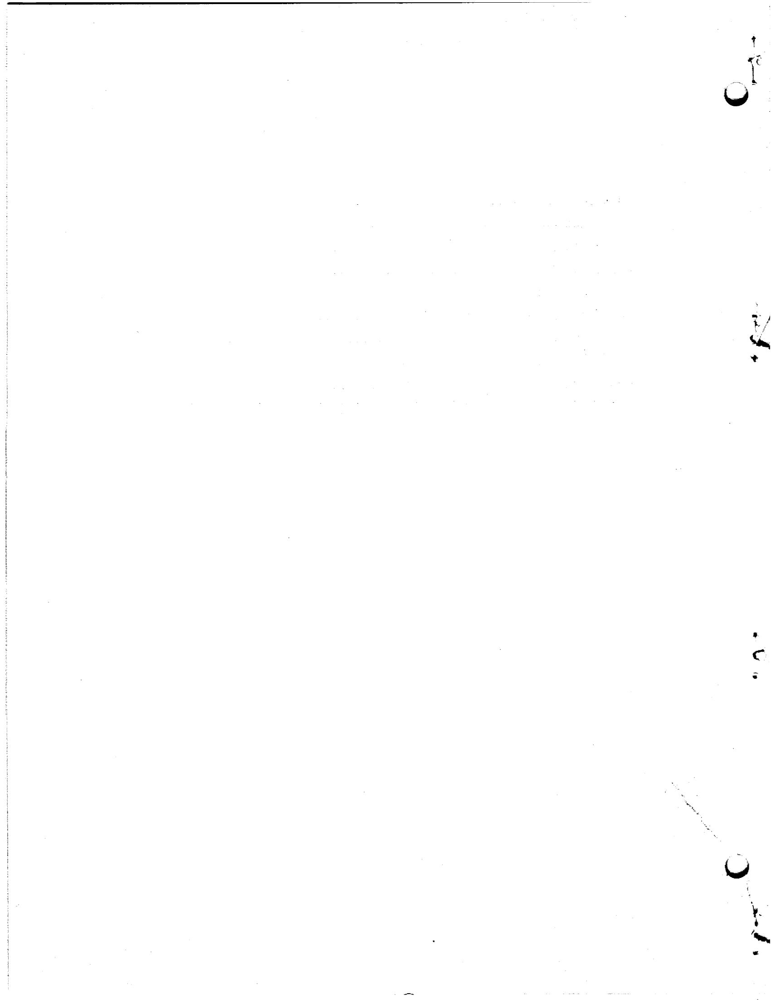
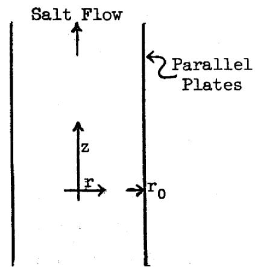
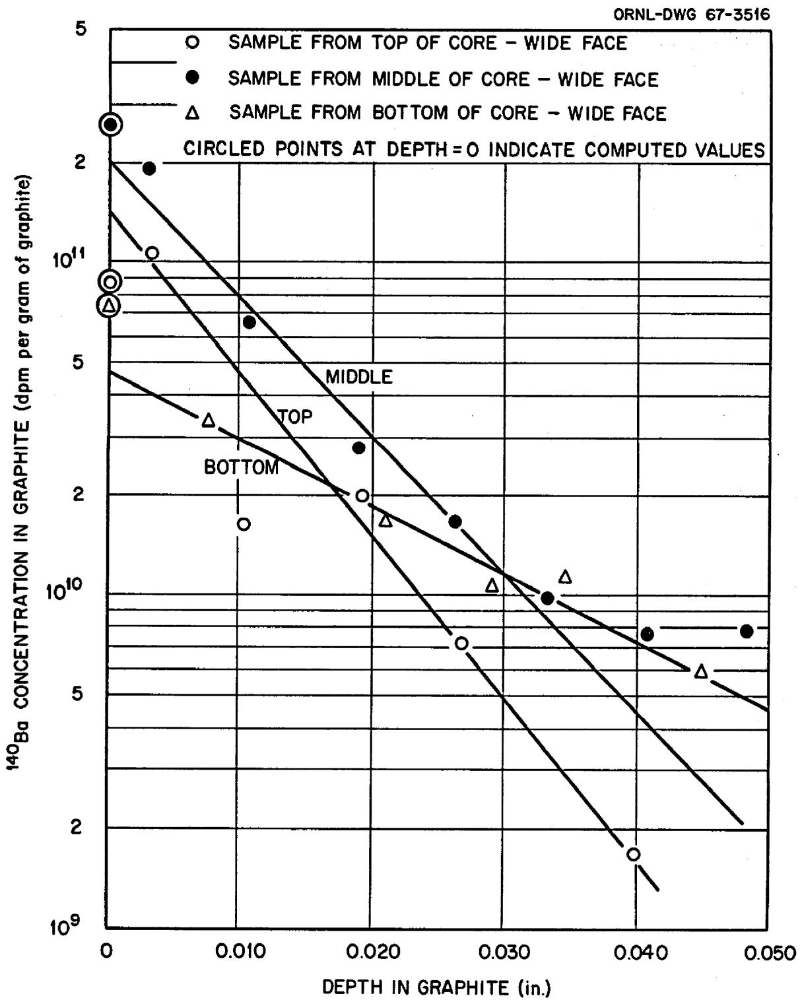
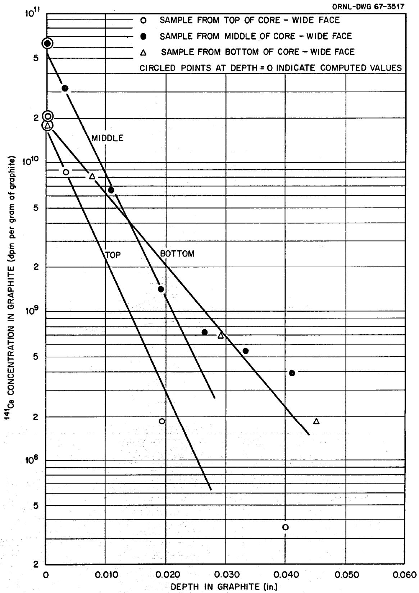
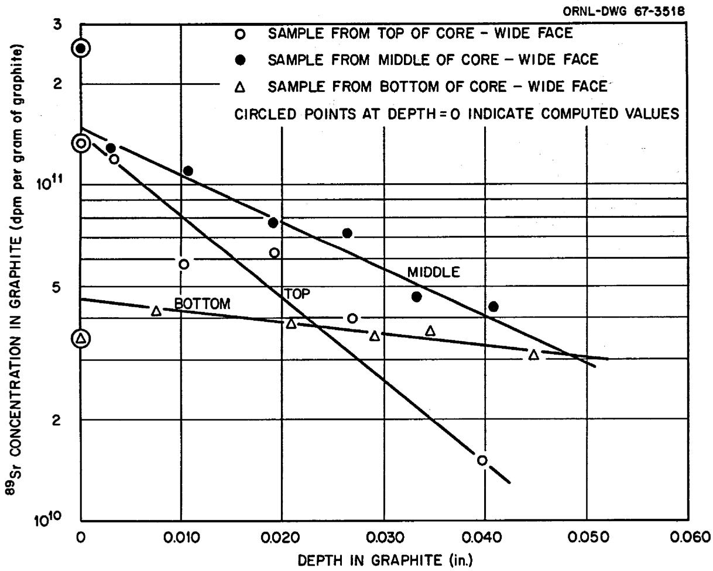
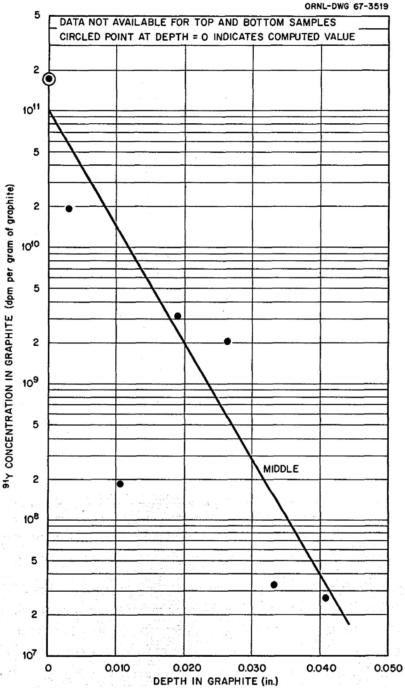
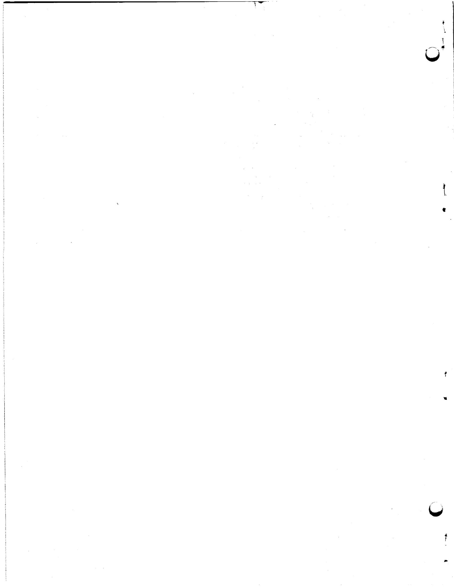
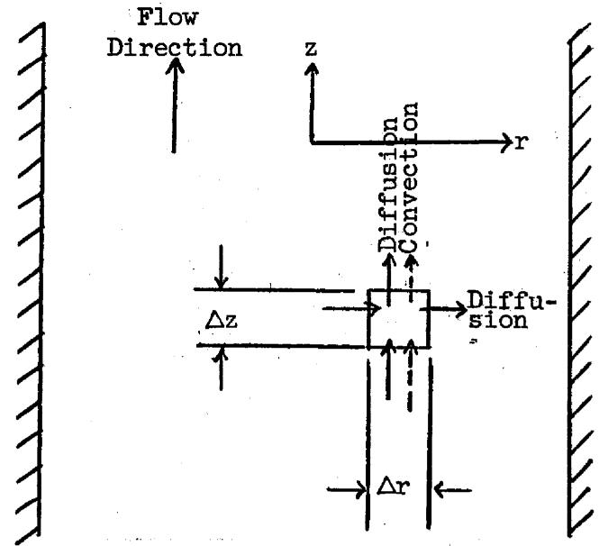

# LEGAL NOTICE

This report was prepared as an account of Government sponsored work. Neither the United States, nor the Commission, nor any person acting on behalf of the Commission:

A. Makes any warranty or representation, expressed or implied, with respect to the accuracy, completeness, or usefulness of the information contained in this report, or that the use of any information, apparatus, method, or process disclosed in this report may not infringe privately owned rights; or

B. Assumes any liabilities with respect to the use of, or for damages resulting from the use of any information, apparatus, method, or process disclosed in this report. As used in the above, "person acting on behalf of the Commission" includes any employee or contractor of the Commission, or employee of such contractor, to the extent that such employee or contractor of the Commission, or employee of such contractor prepares, disseminates, or provides access to, any information pursuant to his employment or contract with the Commission, or his employment with such contractor.

ORNL-TM-1810

CFSTI PRICES

Contract No. W-7405-eng-26

HC. ${3m} : {MN} \cdot  {65}$

Reactor Division

A MODEL FOR COMPUTING THE MIGRATION OF VERY SHORT-LIVED NOBEL GASES INTO MSRE GRAPHITE

R.J.Kedl

JULY 1967

OAK RIDGE NATIONAL LABORATORY

Oak Ridge, Tennessee

operated by

UNION CARBIDE CORPORATION

for the

U.S. ATOMIC ENERGY COMMISSION

# CONTENTS

# Page

Abstract 1   
Introduction 1   
Diffusion in Salt 3   
Diffusion in Graphite 5   
Daughter Concentrations in Graphite 7   
Results for MSRE Graphite Samples 8   
Conclusions 17   
References 19   
Appendix A. Derivation of Equation Describing Diffusion in Salt Flowing Between Parallel Plates 20

# A MODEL FOR COMPUTING THE MIGRATION OF VERY SHORT-LIVED NOBLE GASES INTO MSRE GRAPHITE

R.J.Kedl

# ABSTRACT

A model describing the migration of very short-lived noble gases from the fuel salt to the graphite in the MSRE core has been developed. From the migration rate, the model computes (with certain limitations) the daughter-product distribution in graphite as a function of reactor operational history. Noble-gas daughter-product concentrations $(^{140}\mathrm{Ba},^{141}\mathrm{Ce},^{89}\mathrm{Sr},$ and $^{91}\mathrm{Y})$ were measured in graphite samples removed from the MSRE core after 7800 Mwhr of power operation. Concentrations of these isotopes computed with this model compare favorably with the measured values.

# INTRODUCTION

On July 17, 1966, some graphite samples were removed from the MSRE core after 7800 Mwhr of power operation. While in the reactor, these samples were exposed to flowing fuel salt, and as a result they absorbed some fission products. After removal from the reactor, the concentrations of several of these fission-product isotopes were measured as a function of depth in the samples. Details of the samples, their geometry, analytical methods, and results are presented in Refs. 1 and 2. Briefly, the graphite samples were rectangular in cross section (0.47 × 0.66 in.) and from 4 l/2 to 9 in. long. All samples were located near the center line of the core. Axially, the samples were located at the top, middle, and bottom of the core. The top and middle samples were grade CGB graphite and were taken from the stock from which the core blocks were made. The bottom sample was a modified grade of CGB graphite that is structurally stronger and has a higher diffusivity than regular CGB. (This graphite was used to make the lower grid bars of the core.) The analytical technique was to mill off successive layers of graphite from the surfaces and determine the mean isotropic concentration in each layer by radiochemical means.

A model was formulated that predicts quantitatively the amount of certain of these isotopes in the graphite as a function of the reactor operational parameters. Specifically the model is applicable only to very short-lived noble gases and their daughters. This diffusional model may be described as follows: As fission takes place, the noble gases (xenon and krypton) are generated in the salt either directly or as daughters of very short-lived precursors, so they can be considered as generated directly. These noble gases diffuse through the salt and into the graphite according to conventional diffusion laws. As they diffuse through the graphite they decay and form metal atoms. These metal atoms are active, and it is assumed that they are adsorbed very shortly after their formation by the graphite. It is also assumed that once they are adsorbed, they (and their daughters) remain attached and migrate no more, or at least very slowly compared with the time scales involved.

The derivations of the formulas involved in working with this model are given in the next few sections of this report. The first section considers diffusion through fuel salt, where the noble-gas flux leaving the salt and migrating to the graphite is determined. In this section the "very short half-life" restriction is placed on the model. The next section takes this flux and determines the noble-gas concentration in the graphite. The following section determines the noble-gas decay-product concentration in the graphite as a function of reactor operating history. The last section compares computed and measured concentrations of four isotopes $^{140}\mathrm{Ba}$ (from $^{140}\mathrm{Xe}$ ), $^{141}\mathrm{Ce}$ (from $^{141}\mathrm{Xe}$ ), $^{89}\mathrm{Sr}$ (from $^{89}\mathrm{Kr}$ ), and $^{91}\mathrm{Y}$ (from $^{91}\mathrm{Kr}$ ) in the MSRE graphite samples.

It is of interest to point out the difference between this model and a previously derived model used to compute nuclear poisoning from $^{135}\mathrm{Xe}$ (Ref. 3). In the $^{135}\mathrm{Xe}$ -migration model, all the xenon that migrates to the graphite comes from the bulk of the salt and is transmitted through the boundary layer. The xenon generated within the boundary layer is considered negligible. In this noble-gas model, all the xenon (or krypton) that migrates to the graphite is generated in the boundary layer and that which comes from the bulk of the salt is negligible. This is a direct consequence of the very short half-life restriction placed on the noble-gas

model in contrast to $^{135}\mathrm{Xe}$ -migration model, which specifies a long half-life (9.2 hr).

# DIFFUSION IN SALT

The equation that describes the concentration distribution of a diffusing material in a flowing stream between two parallel plates and includes a mass generation and decay term is (see derivation in Appendix A)

$$
\frac {\partial^ {2} C _ {s}}{\partial r ^ {2}} + \frac {\partial^ {2} C _ {s}}{\partial z ^ {2}} + \frac {Q}{D _ {s}} - \frac {\lambda C _ {s}}{D _ {s}} = \frac {v}{D _ {s}} \frac {\partial C _ {s}}{\partial z},
$$

where

$C_{s} =$ noble-gas concentration in salt (atoms/ft $^3$ ),

$Q =$ noble-gas generation rate (atoms/hr per ft $^3$ of salt),

$\lambda =$ noble-gas decay constant $(\mathrm{hr}^{-1})$

$\mathbf{D}_{\mathbf{s}} =$ noble-gas diffusion coefficient in salt $(\mathrm{ft}^2 /\mathrm{hr})$

$\mathbf{v} = \text{salt velocity (ft/hr)}$ ,

$\mathbf{z} =$ axial distance (ft),

$\mathbf{r} =$ traverse distance (ft),

$\mathbf{r}_0 =$ half the distance between the plates.

In the case of laminar flow,

$$
v = \frac {3}{2} \bar {v} \left(1 - \frac {r ^ {2}}{r _ {0} ^ {2}}\right),
$$

where $\overline{\mathbf{v}}$ is the mean fluid velocity.

If we restrict the formulation to very short-lived isotopes of noble gases, we can say

$$
\frac {\partial c _ {s}}{\partial z} = 0;
$$

that is, as the fuel salt is moving through the core the noble-gas generation and decay rates are balanced and the noble-gas concentration is close

to steady state. Even though the mean salt velocity past the samples is in the order of 1 or 2 ft/sec, this analysis is restricted to a salt layer next to the graphite only a few thousandths of an inch thick. At this position the salt velocity is very low, and this assumption is quite adequate. The original differential equation then reduces to

$$
\frac {d ^ {2} C _ {S}}{d r ^ {2}} = \frac {\lambda C _ {S}}{D _ {S}} - \frac {Q}{D _ {S}}.
$$

The result of this assumption is that all velocity terms disappear, and the model of flowing salt reduces to that of a solid. Integrating once with the boundary conditions that at $r = 0$ , $\frac{dC_s}{dr} = 0$ and $C_s = C_{ss}$ , where $C_{ss} =$ steady-state isotope concentration at $r = 0$ , we find that

$$
\frac {\mathrm {d} C _ {S}}{\mathrm {d} r} = \left[ \frac {2 Q}{D _ {S}} \left(C _ {S S} - C _ {S}\right) - \frac {\lambda}{D _ {S}} \left(C _ {S S} ^ {2} - C _ {S} ^ {2}\right) \right] ^ {1 / 2}.
$$

In the analysis of $^{135}\mathrm{Xe}$ poisoning in the MSRE (Ref. 3), it was seen that the xenon concentration in salt at the interface was very small compared with the concentration in bulk salt. If a similar situation is assumed in this case, the analysis can be simplified considerably. The assumption is therefore made that

$$
\left(\mathrm {c} _ {\mathrm {s}}\right) _ {\mathrm {r} = \mathrm {r} _ {0}} \ll \mathrm {c} _ {\mathrm {s s}},
$$

and later it will be seen that this is true. The above equation can now be evaluated at $\mathbf{r} = \mathbf{r}_0$ :

$$
\left(\frac {\mathrm {d C} _ {\mathrm {s}}}{\mathrm {d r}}\right) _ {\mathrm {r} = \mathrm {r} _ {0}} = \left(\frac {2 Q C _ {\mathrm {s s}}}{D _ {\mathrm {s}}} - \frac {\lambda C _ {\mathrm {s s}} ^ {2}}{D _ {\mathrm {s}}}\right) ^ {1 / 2},
$$

where the negative root gives the proper sign to $(\mathrm{dC_s / dr})_{\mathbf{r} = \mathbf{r}_0}$ . The noble gas flux leaving the salt at $\mathbf{r} = \mathbf{r}_0$ is related to the concentration

gradient as

$$
\operatorname {F l u x} _ {r = r _ {0}} = - D _ {s} \left(\frac {\mathrm {d C} _ {s}}{\mathrm {d r}}\right) _ {r = r _ {0}}.
$$

By substituting,

$$
\mathbf {F l u x} _ {\mathbf {r} = \mathbf {r} _ {0}} = (2 Q D _ {s} C _ {s s} - \lambda D _ {s} C _ {s s} ^ {2}) ^ {1 / 2}.
$$

With the very short half-life restriction on this model, the isotope concentration in the bulk salt is always at steady state, and it can be evaluated by equating the generation and decay terms as follows:

$$
Q _ {s} = \lambda C _ {S S}.
$$

Substituting this value of $C_{ss}$ into the above equation, gives

$$
\operatorname {F l u x} _ {\mathrm {r} = \mathrm {r} _ {0}} = Q \left(\frac {\mathrm {D} _ {\mathrm {S}}}{\lambda}\right) ^ {1 / 2}. \tag {1}
$$

# DIFFUSION IN GRAPHITE

In the previous section we determined the noble-gas flux leaving the salt and going into the graphite. It is now necessary to relate this noble-gas flux to the noble-gas concentration in graphite.

The equation that describes diffusion of a gas in graphite at steady state and includes a decay term is4

$$
\frac {\partial^ {2} C _ {g}}{\partial x ^ {2}} + \frac {\partial^ {2} C _ {g}}{\partial y ^ {2}} + \frac {\partial^ {2} C _ {g}}{\partial z ^ {2}} = \frac {\epsilon}{D _ {g}} \lambda C _ {g},
$$

where

$C_g =$ noble-gas concentration in graphite (atoms per ft $^3$ of graphite),

$\epsilon =$ graphite void fraction available to gas,

$\mathbf{D_g} =$ noble-gas diffusion coefficient in graphite (ft³ void/hr per ft of graphite),

$\lambda =$ noble-gas decay constant $(\mathrm{hr}^{-1})$ $x,y,z =$ coordinates (ft).

There is no generation term in this expression because these gases are generated only in the salt. It will also be assumed that the cross sections are sufficiently low that burnup can be neglected. Since we have restricted the formulation to very short-lived isotopes, we need consider only the one-dimensional case because the isotopes are present only near the surface of the graphite. The above equation then reduces to

$$
\frac {d ^ {2} C _ {g}}{d x ^ {2}} = \frac {\epsilon \lambda}{D g} C _ {g}.
$$

Solving with the boundary conditions that $C_g = 0$ as $x \to \infty$ and $C_g = C_{gi}$ at $x = 0$ , we obtain

$$
C _ {g} = C _ {g i} e ^ {- x \left(\epsilon \lambda / D g\right) ^ {1 / 2}}. \tag {2}
$$

Differentiating and evaluating at $x = 0$ , we obtain

$$
\left(\frac {\mathrm {d} C _ {g}}{\mathrm {d} x}\right) _ {x = 0} = - C _ {g} \mathrm {i} \left(\frac {\varepsilon \lambda}{D g}\right) ^ {1 / 2}.
$$

The noble-gas flux into the graphite is represented by

$$
\operatorname {F l u x} _ {\mathbf {x} = 0} = - \frac {\mathrm {D g}}{\epsilon} \left(\frac {\mathrm {d C g}}{\mathrm {d x}}\right) _ {\mathbf {x} = 0},
$$

and by substituting we obtain

$$
\operatorname {F l u x} _ {\mathbf {x} = 0} = \mathrm {C} _ {\mathbf {g} \mathbf {i}} \left(\frac {\mathrm {D} _ {\mathbf {g}} \lambda}{\epsilon}\right) ^ {1 / 2}
$$

or

$$
C _ {g i} = F l u x _ {x = 0} \left(\frac {\epsilon}{D g \lambda}\right) ^ {1 / 2}, \tag {3}
$$

which is the equation that relates the noble-gas concentration at the graphite surface to the noble-gas flux. By combining Eqs. (2) and (3), we can relate the flux to concentration anywhere in the graphite,

$$
C _ {g} = F l u x _ {X = 0} \left(\frac {\epsilon}{D g \lambda}\right) ^ {1 / 2} e ^ {- X (\epsilon \lambda / D g) ^ {1 / 2}}, \tag {4}
$$

and by combining this equation with Eq. (1), we can relate $C_g$ to known reactor operational parameters.

$$
C _ {g} = \frac {Q}{\lambda} \left(\frac {D _ {S} \epsilon}{D _ {g}}\right) ^ {1 / 2} e ^ {- x (\epsilon \lambda / D _ {g}) ^ {1 / 2}}. \tag {5}
$$

# DAUGHTER CONCENTRATIONS IN GRAPHITE

As an example consider the $^{140}\mathrm{Xe}$ chain for which data from the MSRE graphite samples are available (specifically $^{140}\mathrm{Ba}$ ). The decay chain is as follows:

$$
\begin{array}{l} \begin{array}{l}(16 \sec) ^ {140} X e \rightarrow (66 \sec) ^ {140} C s \rightarrow (12.8 \text {day}) ^ {140} B a\\Y i e l d - 3.8 \%\end{array} \\ \rightarrow (4 0. 2 \mathrm {h r}) ^ {1 4 0} \mathrm {L a} \rightarrow (\text {s t a b l e}) ^ {1 4 0} \mathrm {C e}. \\ \end{array}
$$

From Eq. (5) we can compute the $^{140}\mathrm{Xe}$ concentration in the graphite. Neglecting the short-lived $^{140}\mathrm{Cs}$ , the $^{140}\mathrm{Ba}$ generation rate is given by

$$
1 4 0 \mathrm {B a} \text {g e n e r a t i o n r a t e} = \lambda^ {\mathrm {X e}} \mathrm {C g} ^ {\mathrm {X e}}
$$

and

$$
1 4 0 \mathrm {B a} \text {d e c a y r a t e} = \lambda^ {\mathrm {B a}} \mathrm {C} _ {\mathrm {g}} ^ {\mathrm {B a}}.
$$

When the reactor is at power, the change in $^{140}\mathrm{Ba}$ concentration in the

graphite as a function of time is

$$
\frac {d C _ {g} ^ {B a}}{d t} = \lambda^ {X e} C _ {g} ^ {X e} - \lambda^ {B a} C _ {g} ^ {B a}.
$$

If we specify that the equation is applicable only for intervals of time when the reactor power level is constant, and recognize that $C_{g}^{Xe}$ will approach equilibrium very shortly after the reactor is brought to power, the term $\lambda^{Xe} C_{g}^{Xe}$ is a constant and the equation can be integrated. With the boundary condition that at zero time, $C_{g}^{Ba} = C_{g_{0}}^{Ba}$ , the solution is

$$
C _ {g} ^ {B a} = \frac {\lambda^ {X e} C _ {g} ^ {X e}}{\lambda^ {B a}} (1 - e ^ {- \lambda B a t}) + C _ {g _ {0}} ^ {B a} e ^ {- \lambda B a t}. \tag {6}
$$

Then, when the reactor is shut down, the $^{140}\mathrm{Ba}$ concentration will decay as

$$
C _ {g} ^ {B a} = C _ {g _ {0}} ^ {B a} e ^ {- \lambda^ {B a} t}. \tag {7}
$$

With these equations, the $^{140}\mathrm{Ba}$ concentration in the graphite can be determined as a function of time and can be taken through the "reactor on" and "reactor off" cycles by solving the equations the appropriate number of times.

# RESULTS FOR MSRE GRAPHITE SAMPLES

The concentrations of four isotopes from noble-gas precursors were measured in the MSRE graphite samples in order to determine the applicability of the model to the MSRE. The decay chains involved are the following:

$$
\begin{array}{l} \begin{array}{c}(1 6 - s) ^ {1 4 0} X e \rightarrow (6 6 - s) ^ {1 4 0} C s \rightarrow (1 2. 8 d) ^ {1 4 0} B a \rightarrow (4 0. 2 - h) ^ {1 4 0} L a \rightarrow (\text {s t a b l e}) ^ {1 4 0} C e\\3. 8 \quad 6. 0 \quad 6. 3 5 \quad 6. 3 5 \quad 6. 4 4\end{array}, \\ \begin{array}{c}(1. 7 - s) ^ {1 4 1} X e \rightarrow (2 5 - s) ^ {1 4 1} C s \rightarrow (1 8 - m) ^ {1 4 1} B a\\1. 3 3 \quad 4. 6 \quad 6. 3\end{array} \\ \rightarrow (3. 8 - h) ^ {1 4 1} \mathrm {L a} \rightarrow \frac {(3 3 - d) ^ {1 4 2} \mathrm {C e}}{6 . 0} \rightarrow (\text {s t a b l e}) ^ {1 4 1} \mathrm {P r}, \\ \end{array}
$$

$$
\begin{array}{l} \begin{array}{l}(2. 8 - h) ^ {8 8} \mathrm {K r} + \text {n e u t r o n}\\(4. 4 - s) ^ {8 9} \mathrm {B r} \xrightarrow {\sim 0 . 8 5} (3. 2 - m) ^ {8 9} \mathrm {K r} \rightarrow (1 5. 4 - m) ^ {8 9} \mathrm {R b}\\4. 5 9\end{array} \\ \begin{array}{l}\text {0 0 0 2 (1 6 - s) ^ {8 9 m Y}}\\\rightarrow \frac {(5 0 . 5 - d) ^ {8 9} S r}{4 . 7 9} \xrightarrow {\sim 0 . 9 9 9 8} (\text {s t a b l e}) ^ {8 9} Y,\end{array} \\ \end{array}
$$

$$
\begin{array}{c}(1 0 - s) ^ {9 1} \mathrm {K r} \rightarrow (7 2 - s) ^ {9 1} \mathrm {R b} \rightarrow (9. 7 - h) ^ {9 1} \mathrm {S r} \xrightarrow [ \sim 5. 4 ]{(5 8 - d) ^ {9 1} \mathrm {Y}} \xrightarrow [ ]{\text {(s t a b l e)}} ^ {9 1} \mathrm {Z r}.\\3. 4 5\end{array}
$$

The underlined element is the particular isotope whose concentration was measured. The measured concentration profiles are shown in Figs. 1 through 4. The three curves shown on each plot are for the top, middle, and bottom graphite samples. Although data are available from three sides of the rectangular sample that was exposed to salt, for the sake of clarity, only data from the wide face are shown. Concentrations from the other faces exposed to salt are in good agreement with these.

The noble-gas diffusion coefficient in graphite that was used in these calculations was determined from the daughter-product concentration profiles. The assumption was made earlier that as a noble gas in graphite decays, its metal daughter is immediately adsorbed and migrates no more. If this is true, it can be shown that the daughter distribution in graphite will follow the same exponential as the noble-gas distribution. Equation (2) represents the noble-gas distribution for the one-dimensional case, and this equation can be evaluated for the "half thickness" case as follows:

$$
\frac {c _ {g}}{c _ {g 1}} = \frac {1}{2} = e ^ {- x _ {1} / 2 (\epsilon \lambda / D _ {g}) ^ {1 / 2}} = e ^ {- 0. 6 9 3}.
$$

Therefore

$$
D _ {g} = \frac {\epsilon \lambda x _ {1 / 2} ^ {2}}{(0 . 6 9 3) ^ {2}}, \tag {8}
$$

  
Fig. 1. $^{140}\mathrm{Ba}$ Distribution in MSRE Graphite Samples at 1100 hr on July 17, 1966.

  
Fig. 2. $^{141}\mathrm{Ce}$ Distribution in MSRE Graphite Samples at 1100 hr on July 17, 1966.

  
Fig. 3. $^{89}\mathrm{Sr}$ Distribution in MSRE Graphite Samples at 1100 hr on July 17, 1966.

  
Fig. 4. $^{91}\mathrm{Y}$ Distribution in MSRE Graphite Samples at 1100 hr on July 17, 1966.

where

$$
\begin{array}{l} x _ {1 / 2} = \text {g r a p h i t e} \quad \text {t h i c k n e s s w h e r e d a g h t e r i s o t o p e c o n c e n t r a t i o n i s r e - d u c e d b y} 1 / 2, \\ \epsilon = \text {graphite void available to noble gas (taken to be} 10 \%) , \\ \lambda = \text {a p p r o p r i t e n o b l e - g a s d e c a y c o n s t a n t}. \\ \end{array}
$$

Since the distributions of the noble gas and its daughters follow the same exponential, the value of $x_{1/2}$ will be the same for both. Half-thickness data can therefore be obtained from Figs. 1 through 4 and Eq. (8) evaluated for $D_g$ in graphite. The diffusion coefficient in graphite is not constant throughout but, rather, is a function of depth. In drawing the line through the data points in the figures, more weight was attached to the surface concentration distribution than the interior distribution because the diffusion coefficient at the surface is of primary interest. Actually, some of the concentration profiles tend to level out at greater depths in the graphite. This implies that $D_g$ increases with depth. The diffusion coefficient was computed for each sample of each decay chain and the results are shown in column 4 of Table 1. The diffusion coefficient selected for the remainder of these calculations is shown in the following tabulation, where the values of $D_g^{X_e}$ have been averaged for each sample, and the values of $D_g^{Kr}$ from the $^{89}Kr$ chain were given precedence over the $^{91}Kr$ chain.

Diffusion Coefficient in Graphite (ft²/hr)   

<table><tr><td></td><td>Top Sample</td><td>Middle Sample</td><td>Bottom Sample</td></tr><tr><td>XeDg</td><td>1.6 × 10-5</td><td>2.0 × 10-5</td><td>6.9 × 10-5</td></tr><tr><td>KrDg</td><td>0.3 × 10-5</td><td>0.9 × 10-5</td><td>14.4 × 10-5</td></tr></table>

From this tabulation it may be seen that the bottom sample has a higher $D_g$ than either of the others. This was expected because it was a more permeable grade of graphite. In the case of $D_g^{Xe}$ the top and middle samples agree fairly well whereas in the case of $D_g^{Kr}$ the top sample is about 30% of the middle sample. Probably the greatest inconsistency in the tabulation is that $D_g^{Xe}$ is greater than $D_g^{Kr}$ for the top and middle samples, whereas it would be expected that $D_g^{Kr}$ would be greater than $D_g^{Xe}$ . The reason for this is not known. There may be some question about the assumption that the

Table 1. Computed Values for MSRE Graphite Samples   

<table><tr><td>1</td><td>2</td><td>3</td><td>4</td><td>5</td><td>6</td><td>7</td><td>8</td><td>9</td><td>10</td><td>11</td><td>12</td></tr><tr><td rowspan="2">Noble-Gas Precursor</td><td rowspan="2">Measured Daughter Isotope</td><td rowspan="2">Sample Position in Core</td><td rowspan="2">Dg(ft2/hr)a</td><td rowspan="2">Q(atoms/hr per ft3 of salt)b</td><td rowspan="2">Cgi(atoms per ft3 of graphite)c</td><td rowspan="2">Csi(atoms per ft3 of salt)d</td><td rowspan="2">Css(atoms per ft3 of salt)e</td><td rowspan="2">Flux (atoms/hr per ft2 of salt)f</td><td rowspan="2">Flux/G (in.)g</td><td colspan="2">Calculated Daughter Concentrationh</td></tr><tr><td>Atoms per ft3 of Graphite</td><td>dpm per g of Graphite at Date of Sampling</td></tr><tr><td>140Xe</td><td>140Ba</td><td>Top</td><td>0.9 × 10-5</td><td>0.68 × 1018</td><td>2.43 × 1015</td><td>5.01 × 1012</td><td>4.33 × 1015</td><td>3.85 × 1014</td><td>0.0068</td><td>1.20 × 1020</td><td>0.86 × 1011</td></tr><tr><td>140Xe</td><td>140Ba</td><td>Middle</td><td>1.2 × 10-5</td><td>2.28 × 1018</td><td>7.38 × 1015</td><td>15.4 × 1012</td><td>14.6 × 1015</td><td>12.9 × 1014</td><td>0.0068</td><td>3.65 × 1020</td><td>2.60 × 1011</td></tr><tr><td>140Xe</td><td>140Ba</td><td>Bottom</td><td>4.9 × 10-5</td><td>1.22 × 1018</td><td>2.09 × 1015</td><td>4.34 × 1012</td><td>7.82 × 1015</td><td>6.94 × 1014</td><td>0.0068</td><td>1.04 × 1020</td><td>0.74 × 1011</td></tr><tr><td>141Xe</td><td>141Ce</td><td>Top</td><td>2.4 × 10-5</td><td>2.39 × 1017</td><td>0.91 × 1014</td><td>1.89 × 1011</td><td>1.63 × 1014</td><td>4.41 × 1013</td><td>0.0022</td><td>7.44 × 1019</td><td>2.06 × 1010</td></tr><tr><td>141Xe</td><td>141Ce</td><td>Middle</td><td>2.7 × 10-5</td><td>8.04 × 1017</td><td>2.77 × 1014</td><td>5.76 × 1011</td><td>5.49 × 1014</td><td>14.8 × 1013</td><td>0.0022</td><td>22.6 × 1019</td><td>6.29 × 1010</td></tr><tr><td>141Xe</td><td>141Ce</td><td>Bottom</td><td>8.9 × 10-5</td><td>4.31 × 1017</td><td>0.78 × 1014</td><td>1.62 × 1011</td><td>2.94 × 1014</td><td>7.97 × 1013</td><td>0.0022</td><td>6.41 × 1019</td><td>1.78 × 1010</td></tr><tr><td>89Kr</td><td>89Sr</td><td>Top</td><td>0.3 × 10-5</td><td>0.82 × 1018</td><td>5.47 × 1014</td><td>6.29 × 1016</td><td>1.68 × 1015</td><td>0.025</td><td>7.32 × 1020</td><td>1.32 × 1011</td><td></td></tr><tr><td>89Kr</td><td>89Sr</td><td>Middle</td><td>0.9 × 10-5</td><td>2.75 × 1018</td><td>10.6 × 1014</td><td>21.1 × 1016</td><td>5.65 × 1015</td><td>0.025</td><td>14.2 × 1020</td><td>2.55 × 1011</td><td></td></tr><tr><td>89Kr</td><td>89Sr</td><td>Bottom</td><td>14.4 × 10-5</td><td>1.48 × 1018</td><td>1.42 × 1014</td><td>11.4 × 1016</td><td>3.04 × 1015</td><td>0.025</td><td>1.94 × 1020</td><td>0.348 × 1011</td><td></td></tr><tr><td>91Kr</td><td>91Y</td><td>Middle</td><td>0.4 × 10-5</td><td>2.06 × 1018</td><td>6.46 × 1015</td><td>4.17 × 1013</td><td>8.28 × 1015</td><td>9.70 × 1014</td><td>0.0056</td><td>1.11 × 1021</td><td>1.75 × 1011</td></tr></table>

$^{\mathbf{a}}$ Diffusion coefficient in graphite near surface.   
bNoble-gas generation rate at 7.5 Mw.   
cNoble-gas concentration in graphite at surface at 7.5 Mw.   
dNoble-gas concentration in salt at interface at 7.5 Mw (in equilibrium with $C_{gi}$ ). Henry's law constant for Xe in molten salt: $2.75 \times 10^{-9}$ moles of Xe per cc of salt per atm; Henry's law constant for Kr in molten salt: $8.5 \times 10^{-9}$ moles of Kr per cc of salt per atm.

eNoble-gas concentration in bulk salt at 7.5 Mw $(Q / \lambda)$

fNoble-gas flux from salt to graphite.

$\mathfrak{g}_{\mathrm{Equivalent}}$ film thickness.

$\mathbf{h}_{\text {In }}$ graphite at surface at date of sampling.

noble-gas daughters do not migrate. This assumption should be good for all daughters involved, except possibly cesium and rubidium. These elements have boiling points of $1238^{\circ}\mathrm{F}$ and $1290^{\circ}\mathrm{F}$ , respectively, and therefore their vapor pressures could be significant at the reactor operating temperature of approximately $1200^{\circ}\mathrm{F}$ , and they may diffuse a little. Nevertheless the above values of $\mathbf{D}_{\mathbf{g}}$ are in the expected range, and since the following calculations are not strong functions of $\mathbf{D}_{\mathbf{g}}$ the values will be used as listed above.

The diffusion coefficients of noble gases in molten salt were taken to be (Ref. 3):

$$
D _ {S} ^ {X e} = 5. 0 \times 1 0 ^ {- 5} f t ^ {2} / h r
$$

and

$$
D _ {s} ^ {K r} = 5. 5 \times 1 0 ^ {- 5} f t ^ {2} / h r
$$

and represent an average of coefficients estimated from the Stokes-Einstein equation, the Wilke-Chang equation, and an indirect measurement based on analogy between the noble gas-salt system and heavy metal ion-water system.

The noble-gas generation rate (Q) was evaluated for each sample position (top, middle, and bottom) from computed thermal-flux distribution curves (Refs. 5 and 6).

The operational history of the MSRE was taken to be as listed below. The first significant power operation of appreciable duration started on April 25, 1966, and the graphite sample concentrations were extrapolated back to the sampling date (1100 hr on July 17, 1966).

<table><tr><td>Power Level (Mw)</td><td>Time at Indicated Power (hr)</td></tr><tr><td>5.0</td><td>88 Starting date</td></tr><tr><td>0</td><td>248</td></tr><tr><td>5.0</td><td>64</td></tr><tr><td>0</td><td>12</td></tr><tr><td>7.0</td><td>86</td></tr><tr><td>0</td><td>44</td></tr><tr><td>5.0</td><td>28</td></tr><tr><td>0</td><td>42</td></tr><tr><td>5.5</td><td>60</td></tr><tr><td>7.5</td><td>68</td></tr><tr><td>0</td><td>430</td></tr><tr><td>7.0</td><td>26</td></tr><tr><td>0</td><td>12</td></tr><tr><td>7.2</td><td>292</td></tr><tr><td>0</td><td>100</td></tr><tr><td>7.2</td><td>320</td></tr><tr><td>0</td><td>16</td></tr><tr><td>7.2</td><td>50</td></tr><tr><td>0</td><td>1 Sampling date</td></tr></table>

For each isotope involved and for each sampling position, Eq. (5) was evaluated for the noble-gas concentration in the graphite. The concentration of the appropriate daughter isotope was then solved for and carried through the reactor operational history with Eqs. (6) and (7). The results of these calculations are listed in Table 1 and shown in Figs. 1 through 4. For the sake of clarity, the daughter-product concentration in the table and on the figures is given only at the surface of the graphite. On the figure it is indicated by a circle around the appropriate symbol.

# CONCLUSIONS

The following observations can be made from studying the table and the figures.

1. The model predicts very short-lived noble-gas and daughter-product concentrations in graphite fairly well. This is especially true when we consider the degree of uncertainty of some of the parameters, such as fission yields of short-lived noble gases and their half-lives, $\mathrm{D_g}$ and $\mathrm{D_s}$ , and detailed information on fission density distribution.   
2. From comparing columns 7 and 8 of the table, it can be seen that the assumption $(C_{s})_{r = r_{0}} \ll C_{ss}$ in the section "Diffusion in Salt" is quite good.   
3. Column 10 of the table is the thickness of an imaginary salt film next to the graphite if all the xenon (or krypton) generated in this film goes into making up the computed noble-gas flux. Specifically, it is column 9 divided by column 5. It can be shown that the dissolved gas concentration will reach $63\%$ of its steady-state concentration $(C_{SS})$ at this

distance from the graphite. The film thickness for $^{140}\mathrm{Xe}$ , $^{141}\mathrm{Xe}$ , and $^{91}\mathrm{Kr}$ is very thin and the salt velocities this close to the graphite are indeed very low. It may be recalled that the differential equation for diffusion in a flowing stream in the section "Diffusion in Salt" reduced to an equation for diffusion in a solid, but since the salt film thickness involved is small, this is an adequate reduction.

4. In the case of $^{89}\mathrm{Kr}$ , the film thickness is substantial and it is probably coincidental that the model fits this decay chain as well as it does. Krypton-89 is not a short-lived noble gas in the sense of this development. As a matter of fact, its half-life (3.2 min) is equivalent to almost eight circuit times of fuel salt around the loop (25 sec). The $^{89}\mathrm{Kr}$ concentration in the external loop will therefore become appreciable, and effects of the xenon stripper and circulating bubbles as additional krypton sinks must be considered.

# REFERENCES

1. Oak Ridge National Laboratory, MSRP Semiann. Progr. Rept. Aug. 31, 1965, USAEC Report ORNL-3872.   
2. Oak Ridge National Laboratory, MSRP Semiann. Progr. Rept. Aug. 31, 1966, USAEC Report ORNL-4037.   
3. R. J. Kedl, Development of a Model for Computing the $^{135}\mathrm{Xe}$ Migration in the MSRE, USAEC Report ORNL-4069, Oak Ridge National Laboratory (to be published).   
4. G. M. Watson and R. B. Evans, Xenon Diffusion in Graphite: Effects of Xenon Absorption in Molten Salt Reactors Containing Graphite, Oak Ridge National Laboratory, unpublished internal document, Feb. 15, 1961.   
5. P. N. Haubenreich et al., MSRE Design and Operations Report, Part III. Nuclear Analysis, USAEC Report ORNL-TM-730, Oak Ridge National Laboratory, February 1964.   
6. B. E. Prince, Oak Ridge National Laboratory, personal communication.

# APPENDIX A

# Derivation of Equation Describing Diffusion in Salt Flowing Between Parallel Plates

Consider two parallel plates, as shown below, with flow in the $z$ direction only.

Let $\Delta z\Delta r(1)$ be an element of volume one unit in width. Consider the flow to be viscous, that is, no turbulent mixing. Dissolved material may enter and leave the volume element by diffusion in both the $z$ and $r$ directions. It may enter and leave the volume element by convection only in the $z$ direction. Mass is generated in the volume element at a constant rate resulting from fission, and mass is depleted from the volume as a result of decay. The noble-gas decay rate is proportional to its concentration. A material balance around the element of volume will yield the following terms in units of atoms/hr:

mass in by diffusion at r q/rrz(1)

mass out by diffusion at $r + \Delta r$

mass in by diffusion at z $\mathbf{q}_{\mathbf{z} / \mathbf{z}}\Delta \mathbf{r}(1)$

mass out by diffusion at $z + \Delta z$ $q_{z / z + \Delta z}\Delta r(1)$

mass in by convection at z $\mathbf{v}\mathbf{C}_{\mathbf{S}\mathbf{Z}}\Delta \mathbf{r}(1)$

mass out by convection at $z + \Delta z$ vC(S(z+△z) △r(1)

mass generation Q arz(1)

mass decay $\lambda C_{\mathrm{sz}}\Delta r\Delta z(1)$

where the terms are defined as follows:

$$
q _ {r / r} = \text {m a s s f l u x i n t h e d i r e c t i o n o f r a n d a t p o s i t i o n r (a t o m s / h r \cdot f t ^ {2})}
$$

$$
\begin{array}{l} q _ {r / r + \Delta r} = \text {m a s s f l u x i n t h e d i r e c t i o n o f r a n d a t p o s i t i o n r + \Delta r} \\ \text {(a t o m s / h r \cdot f t ^ {2})} \end{array}
$$

$$
z = \text {a x i a l} (f t)
$$

$$
\mathbf {r} = \text {t r a v e r s e d i m e n s i o n (f t)}
$$

$$
v = \text {s a l t v e l o c i t y (f t / h r)}
$$

$$
\begin{array}{l} C _ {s} = \text {n o b l e - g a s c o n c e n t r a t i o n d i s s o l v e d i n s a l t (a t o m s p e r f t ^ {3} o f} \\ \text {s a l t)} \end{array}
$$

$$
Q = \text {n o b l e - g a s}
$$

$$
\lambda = \text {n o b l e - g a s d e c a y c o n s t a n t} (\mathrm {h r} ^ {- 1})
$$

$$
D _ {S} = \text {n o b l e - g a s d i f f u s i o n c o e f f i c i e n t i n s a l t} \left(f t ^ {2} / h r\right)
$$

By equating the input and output terms and dividing by $\triangle r\triangle z(1)$ we obtain

$$
\frac {q _ {r / r + \Delta r} - q _ {r / r}}{\Delta r} + \frac {q _ {z / z + \Delta z} - q _ {z / z}}{\Delta z} + \frac {v \left(c _ {s (z + \Delta z)} - c _ {s z}\right)}{\Delta z} - Q + \lambda C _ {s z} = 0.
$$

If $\Delta r$ and $\Delta z$ are allowed to approach zero,

$$
\frac {\partial q _ {r}}{\partial r} + \frac {\partial q _ {z}}{\partial z} + v \frac {\partial c _ {s}}{\partial z} - q + \lambda c _ {s} = 0
$$

and, by definition,

$$
q _ {r} = - D _ {s} \frac {\partial c _ {s}}{\partial r} \quad \text {a n d} \quad q _ {z} = - D _ {s} \frac {\partial c _ {s}}{\partial z}.
$$

Therefore

$$
\frac {\partial q _ {r}}{\partial r} = - D _ {s} \frac {\partial^ {2} C _ {s}}{\partial r ^ {2}} \quad \text {a n d} \quad \frac {\partial q _ {z}}{\partial z} = - D _ {s} \frac {\partial^ {2} C _ {s}}{\partial z ^ {2}}.
$$

Substituting we get

$$
\frac {\partial^ {2} C _ {s}}{\partial r ^ {2}} + \frac {\partial^ {2} C _ {s}}{\partial z ^ {2}} + \frac {Q}{D _ {s}} - \frac {\lambda}{D _ {s}} C _ {s} = \frac {v}{D _ {s}} \frac {\partial C _ {s}}{\partial z},
$$

and in the case of fully developed laminar flow between parallel plates

$$
v = \frac {3}{2} \overline {{v}} \left(1 - \frac {r ^ {2}}{r _ {0} ^ {2}}\right).
$$

# Internal Distribution

l. G. M. Adamson 48. J. R. Hightower   
2.R.G.Affel 49.H.W.Hoffman   
3. L. G. Alexander 50. R. W. Horton   
4.C.F.Baes 51.W.H.Jordan   
5. S.J.Ball 52.P.R.Kasten   
6. W. P. Barthold 53-57. R. J. Kedl   
7.H.F.Bauman 58.M.J.Kelley   
8. S.E.Beall 59.M.T.Kelley   
9. M. Bender 60. T. W. Kerlin   
10. E.S.Bettis 61.H.T.Kerr   
ll. R.E.Blanco 62.S.S.Kirslis   
12. F. F. Blankenship 63. D. J. Knowles   
13. J. O. Blomeke 64. J. A. Lane   
14. E. G. Bohlmann 65. R. B. Lindauer   
15.C.J.Borkowski 66.A.P.Litman   
16. M. A. Bredig 67. M. I. Lundin   
17. R. B. Briggs 68. R. N. Lyon   
18. J.R.Bronstein 69.H.G.MacPherson   
19. G. D. Brunton 70. R. E. MacPherson   
20. S. Cantor 71. C. L. Matthews   
21. W. L. Carter 72. R. W. McClung   
22. G. I. Cathers 73. H. C. McCurdy   
23. J.M. Chandler 74.H.F.McDuffie   
24. E. L. Compere 75. C. J. McHargue   
25. W.H.Cook 76.L.E.McNeese   
26-27. D.F.Cope   
28. W. B. Cottrell 78. R. L. Moore   
29. J. L. Crowley 79. J. P. Nichols   
30. F. L. Culler 80. E. L. Nicholson   
31. S. J. Ditto 81. L. C. Oakes   
32. J. R. Engel 82. P. Patriarca   
33.E.P.Epler 83.A.M.Perry   
34. R. B. Evans 84. H. B. Piper   
35. D. E. Ferguson 85. B. E. Prince   
36. L. M. Ferris 86. R. C. Robertson   
37. A. P. Fraas 87. M. W. Rosenthal   
38. H. A. Friedman 88. H. C. Savage   
39. J. H. Frye, Jr. 89. A. W. Savolainen   
40. H. E. Goeller 90. C. E. Schilling   
41. W. R. Grimes 91-94. Dunlap Scott   
42. R. H. Guymon 95. H. E. Seagren   
43.P.H.Harley 96.W.F.Schaffer   
44. D. G. Harmon 97. J. H. Shaffer   
45.C.S.Harrill 98.M.J.Skinner   
46. P. N. Haubenreich 99. G. M. Slaughter   
47. F. A. Heddleson 100. A. N. Smith

101. F. J. Smith   
102. O. L. Smith   
103. P. G. Smith   
104. W. F. Spencer   
105. I. Spiewak   
106. H.H. Stone   
107. J.R.Tallackson   
108. R.E.Thoma   
109. D. B. Trauger   
110. J. S. Watson   
111. S. S. Watson

112. C. F. Weaver   
113. A. M. Weinberg   
114. J. R. Weir   
115. K.W. West   
116. M. E. Whatley   
117. G. D. Whitman   
118. H.C. Young

119-120. Central Research Library   
121-122. Document Reference Section   
123-125. Laboratory Records Department   
126. Laboratory Records, RC

# External Distribution

127. A. Giambusso, AEC, Washington   
128. T. W. McIntosh, AEC, Washington   
129. H. M. Roth, AEC, ORO   
130. W. L. Smalley, AEC, ORO   
131-132. Reactor Division, AEC, ORO   
133. Research and Development Division, AEC, ORO   
134-148. Division of Technical Information Extension (DTIE)