ORNL-TM-1851

COPY NO. - 228

DATE - June 12, 1967

SUMMARY OF THE OBJECTIVES, THE DESIGN, AND A PROGRAM

OF DEVELOPMENT OF MOLTEN-SALT BREEDER REACTORS

R. B. Briggs

CFSTI RICES

H.C. 3.00, MN. 65

# ABSTRACT

Molten-salt thermal breeder reactors are characterized by low specific inventory, moderate breeding gain with low fuel cycle cost, and high efficiency for converting heat into electricity. Studies indicate they should be able to produce electricity in 1000-Mw(e) stations for about 2.6 mills/kwhr in investor-owned utilities, a cost that is as low or lower than projected for advanced converter reactors or fast breeder power stations. The fuel utilization characteristics compare favorably with those of fast breeders.

The present status of the breeder technology is being demonstrated in successful operation of the Molten-Salt Reactor Experiment. A two-region Molten-Salt Breeder Experiment to demonstrate all the basic technology for full-scale breeders is proposed as the next step in the development. Design and construction of the MSBE would be accompanied by a program of fuels, materials, fuel reprocessing, and engineering development. Development, construction, and startup of the breeder reactor is estimated to take about eight years and to cost about $125 million.

# NOTICE

This document contains information of a preliminary nature and was prepared primarily for internal use at the Oak Ridge National Laboratory. It is subject to revision or correction and therefore does not represent a final report. The information is not to be abstracted, reprinted or otherwise given public dissemination without the approval of the ORNL patent branch, Legal and Information Control Department.

# LEGAL NOTICE

This report was prepared as an account of Government sponsored work. Neither the United States, nor the Commission, nor any person acting on behalf of the Commission:

A. Makes any warranty or representation, expressed or implied, with respect to the accuracy, completeness, or usefulness of the information contained in this report, or that the use of any information, apparatus, method, or process disclosed in this report may not infringe privately owned rights; or   
B. Assumes any liabilities with respect to the use of, or for damages resulting from the use of any information, apparatus, method, or process disclosed in this report.

As used in the above, "person acting on behalf of the Commission" includes any employee or contractor of the Commission, or employee of such contractor, to the extent that such employee or contractor of the Commission, or employee of such contractor prepares, disseminates, or provides access to, any information pursuant to his employment or contract with the Commission, or his employment with such contractor.

# CONTENTS

Why Develop Molten-Salt Breeders 7

Fuel Utilization Comparison 9

Growth of Electric Generating Capacity 9

Nuclear Fuel Resources 10

Fuel-Utilization Characteristics of Converter Reactors -10

Fuel Resource Requirements with Converter Reactors 12

Fuel Utilization Characteristics of Breeder Reactors 14

Fuel Resource Requirements with Breeder Reactors 14

Cost-of-Power Comparison 19

Capital Costs 19

Operating Costs 21

Fuel Cycle and Total Power Costs 21

1000-Mw(e) Molten-Salt Thermal Breeder Power Plant 22

Reference Plant Design 23

Fuel, Blanket, and Coolant Salts 23

Flowsheet 23

Reactor Design 26

Heat Exchange Systems 33

Fuel and Blanket Processing 35

Capital-Cost Estimates 36

Reactor Power Plant 36

Fuel Recycle Plant 40

Nuclear Performance and Fuel Cycle Analyses 41

Analysis Procedures and Basic Assumptions 43

Nuclear Performance and Fuel-Cycle Cost 45

Power-Production Cost and Fuel Utilization

Characteristics 45

Alternatives to the Reference Design 45

Modular Designs 50

Mixed-Fuel Reactor 53

Direct-Contact Cooling with Molten Lead 58

Program for Development of Molten-Salt Thermal Breeder

Power Plants 59

Steps in the Development 59

Present Status of the Technology - MSRE 60

Advances in Technology Required for a High-

Performance Thermal Breeder 71

Criteria for the Molten-Salt Breeder Experiment 72

Summary of Plans, Schedule, and Costs 75

Molten-Salt Breeder Experiment 75

Engineering Test Unit and Fuel Processing Pilot Plant 75

# CONTENTS (continued)

Development of Components and Systems 78

Instrumentation and Controls Development 78

Materials Development 79

Chemical Research and Development 79

Fuel and Blanket Processing Development 80

Maintenance Development 80

Physics Program 80

Safety Program 81

# LIST OF FIGURES

Fig. 1. Fuel Required for Inventory and Current Burnup in Converter Reactors 13   
Fig. 2. Total Fuel Requirements for Nuclear Power Industry Based on Introduction of Breeder Reactors in 1976 17   
Fig. 3. Total Fuel Requirements for Nuclear Power Industry Based on Introduction of Breeder Reactors in 1986   
Fig. 4. Molten-Salt Breeder Reactor Flow Diagram 25   
Fig. 5. Molten-Salt Breeder Reactor Cell Arrangement, Plan View 27   
Fig. 6. Molten-Salt Breeder Reactor Cell Arrangement, Elevation 28   
Fig. 7. Reactor Primary Equipment 29   
Fig. 8. Molten-Salt Breeder Reactor Core Cell 30   
Fig. 9. Molten-Salt Breeder Reactor Primary Heat Exchanger and Pump 34   
Fig. 10. MSBR Core and Blanket Processing Scheme 37   
Fig. 11. MSBR Fuel-Recycle Costs as a Function of Processing Rates 42   
Fig. 12. Variation of Fuel-Cycle Cost with Fuel Yield in MSBR and MSBR(Pa) Concepts 48   
Fig. 13. Molten-Salt Breeder Reactor Plan of Modular Units -51   
Fig. 14. Elevation of Modular Units 52   
Fig. 15. Mixed-Fuel 1000-Mw(e) Reactor Cell Elevation 57

# LIST OF FIGURES (continued)

Fig. 16. MSRE Flow Diagram 61   
Fig. 17. General Arrangement of MSRE 62   
Fig. 18. Reactor Vessel 65   
Fig. 19. MSRE Activities - July 1964-December 1965 66   
Fig. 20. MSRE Activities - January 1966-May 1967 67

# LIST OF TABLES

Table 1. Electric Utility Generating Capacity 9   
Table 2. U.S. Nuclear Fuel Resources 10   
Table 3. Fuel-Use Characteristics of Several Types of Converter Reactors   
Table 4. Partial Effect of $\mathrm{U}_{3}\mathrm{O}_{8}$ on Cost of Power 15   
Table 5. Fuel-Utilization Characteristics of Several Breeder Reactors 16   
Table 6. A Comparison of Estimated Costs for Breeder and and Advanced Converter Reactors Based on Investor-Owned Utilities Charges 20   
Table 7. Estimated Physical Properties of MSBR Fuel, Blanket, and Coolant Salts 24   
Table 8. Reactor Design Values 31   
Table 9. Preliminary Cost-Estimate Summary for a 1000-Mw(e) Molten-Salt Breeder Reactor Power Station [MSBR(Pa) or MSBR] 38   
Table 10. Summary of Processing-Plant Capital Costs for a 1000-Mw(e) MSBR 40   
Table 11. Summary of Annual Operating and Maintenance Costs for Fuel Recycle in a 1000-Mw(e) MSBR 41   
Table 12. Economic Ground Rules Used in Obtaining Fuel Cycle Costs 43

# Table 13. Behavior of Fission Products in MSBR Systems LEGAL NOTICE

This report was prepared as an account of Government sponsored work. Neither the United States, nor the Commission, nor any person acting on behalf of the Commission:   
A. Makes any warranty or representation, expressed or implied, with respect to the accuracy, completeness, or usefulness of the information contained in this report, or that the use of any information, apparatus, method, or process disclosed in this report may not infringe privately owned rights; or   
B. Assumes any liabilities with respect to the use of, or for damages resulting from the use of any information, apparatus, method, or process disclosed in this report.   
As used in the above, "person acting on behalf of the Commission" includes any employee or contractor of the Commission, or employee of such contractor, to the extent that such employee or contractor of the Commission, or employee of such contractor prepares,

# LIST OF TABLES (continued)

Table 14. Neutron Balances for the MSBR(Pa) and the MSBR Design Conditions 46   
Table 15. Fuel-Cycle Cost for MSBR(Pa) and MSBR Plants 47   
Table 16. Power-Production Cost and Fuel-Utilization Characteristics of the MSBR(Pa) and the MSBR Plants   
Table 17. Design Values for Modular Plants   
Table 18. Fuel-Cycle Costs from Modular Plants -56   
Table 19. Some Performance Data for Mixed-Fuel Reactor -58   
Table 20. Accumulated Operating Experience with MSRE -64   
Table 21. Comparison of Characteristics of Full-Scale and Pilot Plant Breeders   
Table 22. Proposed Schedule for Molten-Salt Breeder Experiment   
Table 23. Summary of Estimated Costs for Development, Construction, and Startup of the Molten-Salt Breeder Experiment

# WHY DEVELOP MOLTEN-SALT BREEDERS?

Nuclear power, based on light-water-moderated converter reactors, seems to be an assured commercial success. This circumstance has placed upon the Atomic Energy Commission the burden of forestalling any serious rise in the cost of nuclear power once our country has been fully committed to this source of energy. It is for this reason that the development of an economical breeder, at one time viewed as a long-range goal, has emerged as the central task of the atomic energy enterprise. Moreover, as our country commits itself more and more heavily to nuclear power, the stake in developing the breeder rises: breeder development simply must not fail. All plausible paths to a successful breeder must therefore be 'examined carefully.

To be successful a breeder must meet three requirements. First, the breeder must be technically feasible. Second, the cost of power from the breeder must be low; and third, the breeder should utilize fuel so efficiently that a full-fledged energy economy based on the breeder could be established without using high-cost ores. The molten-salt breeder appears to meet these criteria as well as, and in some respects better than, any other reactor system. Moreover, since the technology of molten-salt breeders hardly overlaps the technology of the solid-fueled fast reactor, its development provides the world with an alternate path to long-term cheap nuclear energy that is not affected by any obstacles that may crop up in the development of the fast breeder.

The molten-salt breeder, though seeming to be a by-way in reactor development, in fact represents the culmination of more than 17 years of research and development. The incentive to develop a reactor based on fluid fuels has been strong ever since the early days of the Metallurgical Laboratory. In 1958 the most prominent fluid fuel projects were the liquid bismuth reactor, the aqueous homogeneous reactor, and the molten-salt reactor. In 1959 the AEC assembled a task force to evaluate the three concepts. The principal conclusion of their report1 was that the "molten-salt reactor has the highest probability of achieving technical feasibility."

This verdict of the 1959 task force appears to be confirmed by the operation of the Molten-Salt Reactor Experiment. To those who have followed the molten-salt project closely, this success is hardly surprising. The essential technical feasibility of the molten-salt system is based on certain thermodynamic realities first pointed out by the late R. C. Briant, who directed the ANP project at ORNL. Briant pointed out that molten fluorides are thermodynamically stable against reduction by nickel-based structural materials; that, being ionic, they should suffer no radiation damage in the liquid state; and that, having low vapor pressure and being relatively inert in contact with air, reactors based on them should be safe. The experience at ORNL with molten salts during the intervening years has confirmed Briant's chemical intuition. Though some technical uncertainties remain, particularly those connected with the graphite moderator, the path to a successful molten-salt breeder appears to be well defined.

We estimate that a 1000-Mw(e) molten-salt breeder should cost $115 per kilowatt (electric) and that the fuel cycle cost ought to be in the range of 0.3 to 0.4 mill/kwhr(e). The overall cost of power from a privately owned, 1000-Mw(e) Molten-Salt Breeder Reactor should come to around 2.6 mills/kwhr(e). In contrast to the fast breeder, the extremely low cost of the MSBR fuel cycle hardly depends upon sale of byproduct fissile material. Rather, it depends upon certain advances in the chemical processing of molten fluoride salts that have been demonstrated either in pilot plants or laboratories: fluoride volatility to recover uranium, vacuum distillation to rid the salt of fission products, and for highest performance, but with somewhat less assurance, removal of protactinium by liquid-liquid extraction or absorption.

The molten-salt breeder, operating in the thermal Th-233U cycle, is characterized by a low breeding ratio: the maximum breeding ratio consistent with low fuel cycle costs is estimated to be about 1.07. This low breeding ratio is compensated by the low specific inventory* of the MSBR. Whereas the specific inventory of the fast reactor ranges between 2.5 to $5\mathrm{kg/Mw(e)}$ , the specific inventory of the molten-salt breeder ranges between 0.4 to $1.0\mathrm{kg/Mw(e)}$ . The estimated fuel doubling time for the MSBR therefore falls in the range of 8 to 50 years. This is comparable to estimates of doubling times of 7 to 30 years given in fast breeder reactor design studies.

From the point of view of long-term conservation of resources, low specific inventory in itself confers an advantage upon the thermal breeder. If the amount of nuclear power grows linearly, the doubling time and the specific inventory enter symmetrically in determining the maximum amount of raw material that must be mined in order to inventory the whole nuclear system. Thus, low specific inventory is an essential criterion of merit for a breeder, and the detailed comparisons in the next section show that a good thermal breeder with low specific inventory could, in spite of its low breeding gain, make better use of our nuclear resources than a good fast breeder with high specific inventory and high breeding gain.

The molten salt approach to a breeder promises to satisfy the three criteria of technical feasibility, very low power cost, and good fuel utilization. Its development as a uniquely promising competitor to the fast breeder is, we believe, in the national interest.

It is our purpose in the remainder of this report to outline the current status of the technology, and to estimate what is required to develop and demonstrate the technology for a full-scale thermal breeder based on molten fluorides.

-- A. M. Weinberg

# FUEL-UTILIZATION COMPARISON

# Growth of Electric Generating Capacity

The importance of good fuel utilization can be shown simply as follows. A projection of the rate of growth of the electrical generating capacity in the U.S. is presented in Table 1. Numbers through the year 2000 were based on estimates developed by the Federal Power Commission and the AEC for the Report to the President in 1962 and were the nuclear capacities updated to reflect the present rapid growth of nuclear electric capacity. The total capacities for the years beyond 2000 were based, in Case A, on continued growth at the exponential rate of about $5\%$ per year and, in Case B, on continued growth at a linear rate of 100,000 Mw/yr-- the rate at year 2000. In Case B, the rate of expansion of total electrical generating capacity would be down to about $2\%$ per year by the year 2030. The nuclear capacities for the years beyond 2000 were extrapolated on the basis that all new generating capacity after about 2020 would be nuclear.

Table 1. Electric Utility Generating Capacity   

<table><tr><td rowspan="2">Year</td><td colspan="2">Total Capacity (1000 Mw)</td><td colspan="2">Nuclear Capacity (1000 Mw)</td><td rowspan="2">Percent Nuclear</td></tr><tr><td>Case A</td><td>Case B</td><td>Case A</td><td>Case B</td></tr><tr><td>1965</td><td>240</td><td>240</td><td>1</td><td>1</td><td>0.4</td></tr><tr><td>1970 (1973)</td><td>330 (390)</td><td>330 (390)</td><td>\( 11^a \)\( (36)a \)</td><td>\( 11^a \)\( (36)a \)</td><td>3 (9)</td></tr><tr><td>1980</td><td>580</td><td>580</td><td>\( 140^a \)</td><td>\( 140^a \)</td><td>24</td></tr><tr><td>1990</td><td>1000</td><td>1000</td><td>390</td><td>390</td><td>39</td></tr><tr><td>2000</td><td>1700</td><td>1700</td><td>800</td><td>800</td><td>47</td></tr><tr><td>2010</td><td>2900</td><td>2700</td><td>1700</td><td>1500</td><td>~60</td></tr><tr><td>2020</td><td>5000</td><td>3700</td><td>3400</td><td>2500</td><td>~70</td></tr><tr><td>2030</td><td>8600</td><td>4700</td><td>7000</td><td>3800</td><td>~80</td></tr></table>

aProjections based on present rapid rate of sales of nuclear plants. Original numbers were 6.8 for 1970 and 75 for 1980. Numbers for 1973 were not in the original projection but are based on the present sales picture and lend support to the higher number for 1980.

Case A - exponential growth continued at rate of about $5\%$ per year beyond 2000.

Case B - growth linear after 2000 at a rate of 100,000 Mw per year.

# Nuclear Fuel Resources

Nuclear fuel resources estimated to be available in the U.S. to support this expansion of the nuclear power industry are shown in relation to cost in Table 2. If we define low-cost resources as those obtainable

Table 2. U.S. Nuclear Fuel Resources   

<table><tr><td>Cost ($/1b U3O8 or ThO2)</td><td>Reasonable Assured Resources (thousand short tons of oxide)</td><td>Total Resources (thousand short tons of oxide)</td></tr><tr><td colspan="3">Uranium Resources</td></tr><tr><td>5 to 10</td><td>195 (475*)</td><td>800*</td></tr><tr><td>10 to 30</td><td>400</td><td>1000</td></tr><tr><td>30 to 50</td><td>5000</td><td>8000</td></tr><tr><td>50 to 100</td><td>6000</td><td>15,000</td></tr><tr><td>100 to 500</td><td>500,000</td><td>2,500,000</td></tr><tr><td colspan="3">Thorium Resources</td></tr><tr><td>5 to 10</td><td>100</td><td>400</td></tr><tr><td>10 to 30</td><td>100</td><td>200</td></tr><tr><td>30 to 50</td><td>3000</td><td>10,000</td></tr><tr><td>50 to 100</td><td>8000</td><td>25,000</td></tr><tr><td>100 to 500</td><td>1,000,000</td><td>3,000,000</td></tr></table>

*Includes all uranium delivered to AEC to date.

for less than $30 per pound, then our total low-cost resources are believed to be 1.8 million short tons of U₃O₈, containing about 10,000 tons of recoverable $^{235}\mathrm{U},$ and 600,000 short tons of ThO₂.

# Fuel-Utilization Characteristics of Converter Reactors

The efficiency of fuel utilization is determined by the quantity of $\mathrm{U}_{3}\mathrm{O}_{8}$ required to provide the total inventory of fissionable material associated with the reactor per megawatt of electrical generating capacity and the quantity of $\mathrm{U}_{3}\mathrm{O}_{8}$ required per year per megawatt of electrical generating capacity to provide for burnup of fissionable material. These requirements are listed in Table 3 for several types of reactors. The reactors are more advanced than are being built today, but the performance

Table 3. Fuel-Use Characteristics of Several Types of Converter Reactors   

<table><tr><td rowspan="2">Reactor Type</td><td colspan="3">Specific Inventorya</td><td colspan="3">Annual Consumption at 0.8 Total Load Factorb</td></tr><tr><td>(kg fissile/Mw(e))</td><td>(short tons U3O81000 Mw(e))</td><td>(short tons ThO21000 Mw(e))</td><td>(kg fissile/Mw(e))</td><td>(short tons U3O81000 Mw(e))</td><td>(short tons ThO21000 Mw(e))</td></tr><tr><td>BWR or PWR</td><td>2.3</td><td>500</td><td>-</td><td>0.62</td><td>135</td><td>-</td></tr><tr><td>HWOCR-U</td><td>1.2</td><td>260</td><td>-</td><td>0.34</td><td>74</td><td>-</td></tr><tr><td>LWBR</td><td>4</td><td>870</td><td>380</td><td>0.07</td><td>15</td><td>1.5</td></tr><tr><td>HWOCR-Th</td><td>2.4</td><td>520</td><td>130</td><td>0.22</td><td>48</td><td>0.7</td></tr><tr><td>ETGR</td><td>3.1</td><td>670</td><td>95</td><td>0.11</td><td>24</td><td>0.8</td></tr><tr><td>VACR</td><td>1.0</td><td>220</td><td>100</td><td>0.05</td><td>11</td><td>1</td></tr></table>

aIncludes total inventory in reactor, fuel processing, fuel fabrication and storage.   
$b_{\text{Based on recycle of plutonium}}$ .

indicated should be attainable within a few years, except possibly for the hypothetical Very Advanced Converter Reactor, which has a much lower specific inventory and a conversion ratio approaching one. The latter is included to show what greatly improved "advanced converters" or high-performance near-breeders might accomplish. In the studies from which the data were taken, the reactors were generally optimized to obtain the lowest power cost from low-cost fuels. Recycle of plutonium is assumed in estimating the burnup. Optimization for use of higher cost fuels would have resulted in better, but not greatly better, fuel utilization and higher power costs.

# Fuel Resource Requirements with Converter Reactors

The data from Tables 1 and 3 were used to obtain the curves in Fig. 1. The assumption was made that only boiling or pressurized water reactors would be built until 1976. Beginning in 1976 advanced converters associated with a given curve would begin to be built and by 1988 all new reactors would be advanced converters. Each reactor built was assumed to have a life of 30 years.

The amount of uranium required for the inventory and the total burnup to any given date is shown in Fig. 1 along with the total estimated resources and the total cost of obtaining those resources. The fuel requirements for pressurized and boiling water reactors do not differ appreciably and would require the mining of all our reserves costing less than $30 per pound by shortly after the year 2000. If the industry continues to expand as projected and the estimate of the availability and cost of the fuels is reasonably accurate, all the fuel available for less than $50 per pound would have to be mined by 2030 at a cost of about $700 billion. The advanced converters presently proposed will buy 5 to 10 years' time in uranium reserves over the pressurized and boiling water reactors.

Further extension by converter reactors would require development of a reactor--probably of a completely different type--with a much lower specific inventory and a higher conversion ratio. Even with such a very advanced converter, the total domestic uranium resource, available for less than $50 per pound U₃O₈, would be consumed by about 2050.

Figure 1 does not give the whole picture. A power reactor should run dependably and profitably for about 30 years, so when a reactor is built, we, in a sense, commit a fuel supply for 30 years. For the reactors and growth rates used in making the curves in Fig. 1, the total commitment at any given time is about the same as the total shown for the inventory and burnup 10 years later. Reactors built as late as 1990 in an "all-water-reactor economy" would be fueled initially with uranium costing as little as $10 per pound $U_{3}O_{8}$ . However, the cost of fuel could be expected to rise to $30 per pound of $U_{3}O_{8}$ during the life of the plant if there were no further expansion of the power industry, and to $50 per pound if the industry continued to expand rapidly.

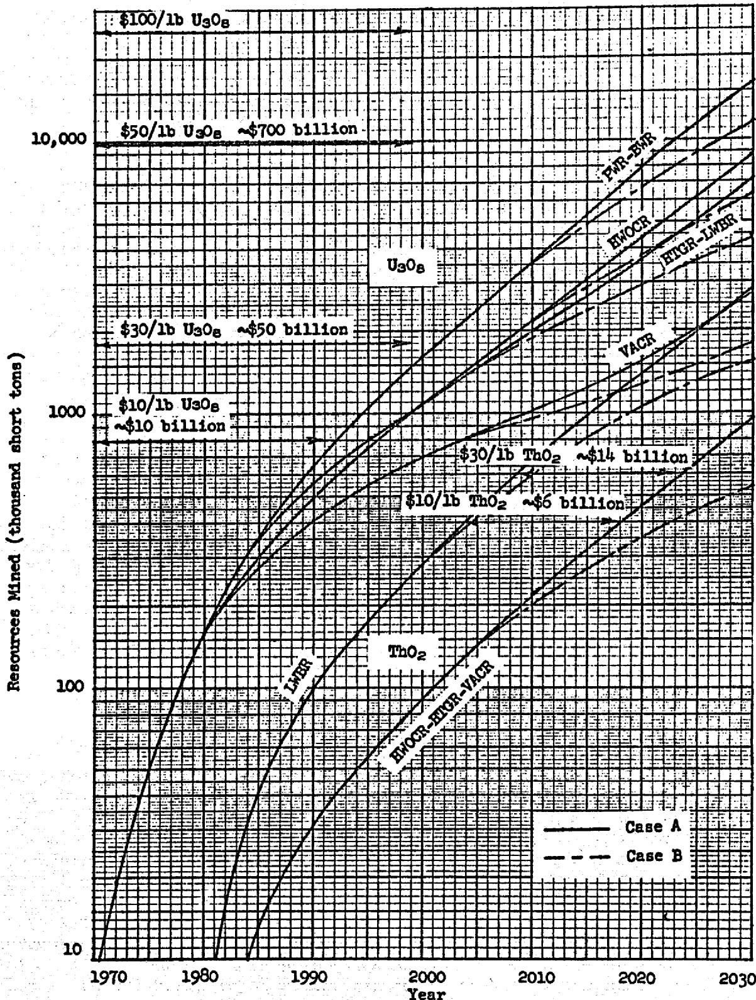  
Fig. 1. Fuel Required for Inventory and Current Burnup in Converter Reactors.

The $\mathsf{ThO_2}$ commitment is about the same for the HWOCR, HTGR, and the VACR. The light water breeder reactor has a much greater thorium inventory. In all cases the thorium inventory is several times the 30-year burnup, so the amount of thorium required at any time is close to the total commitment. Although much less thorium is required than uranium, the low-cost reserves are smaller and would be used in inventory by 2010 to 2030.

The effect of the cost of U3O6 and ThO2 on the cost of power is shown in Table 4 for the reactors and the corresponding inventory and consumption numbers from Table 3. These costs are only the costs associated with the raw materials and do not reflect the higher enrichment, fabrication, processing, and other costs that invariably accompany increases in raw material cost. They are, however, for reactors that have not been optimized for use of high-cost resources. All except the very best converter reactors would suffer heavy penalties if the U3O6 cost were to rise to $30 per pound. In the thorium reactors, the consumption is small, and for those reactors with low inventory the use of high-cost resources has only a small effect on the power cost. The light water breeder reactor would incur a considerable cost penalty in an era of high-cost thorium.

# Fuel Utilization Characteristics of Breeder Reactors

The effectiveness with which a breeder reactor can reduce the total resource requirements depends on the specific inventory and doubling time of fissile material in the breeder system, the growth rate of the nuclear power industry, and the capacity in converter reactors at the time the breeders begin to be used for essentially all new capacity. Characteristics taken from studies of oxide- and carbide-fueled fast breeders and of a molten-salt-fueled thermal breeder are presented in Table 5. The estimated doubling times vary from 7 to 30 years for the fast breeders and from 8 to 50 years for the thermal breeder.

# Fuel Resource Requirements with Breeder Reactors

The total resource requirements* for a power industry in which only water reactors are built until 1976 or 1986 and only breeders are built after 1988 and 1998, respectively, are presented in Figs. 2 and 3. The figures show the total resource requirements to depend heavily on the capacity in water reactors at the time when breeder reactors are introduced and, by comparison with Fig. 1, the great incentive for expediting the development of breeders.

The thermal breeder is clearly competitive with the fast breeders in reducing the requirements for mined uranium. If the doubling time is less than about 12 years, the maximum resource requirement depends more on doubling time than specific inventory, so there is little difference

Table 4. Partial Effect of ${\mathrm{U}}_{3}{\mathrm{O}}_{8}$ on Cost of Power ${}^{a}$   

<table><tr><td rowspan="3">Reactor Type</td><td colspan="8">Contribution of Raw Material Cost to Power Cost (mills/kwhr)</td></tr><tr><td colspan="2">$5/1b</td><td colspan="2">$10/1b</td><td colspan="2">$30/1b</td><td colspan="2">$50/1b</td></tr><tr><td>Inventory</td><td>Burnup</td><td>Inventory</td><td>Burnup</td><td>Inventory</td><td>Burnup</td><td>Inventory</td><td>Burnup</td></tr><tr><td></td><td></td><td></td><td colspan="2">U3O8 Requirements</td><td></td><td></td><td></td><td></td></tr><tr><td>BWR or PWR</td><td>0.07</td><td>0.19</td><td>0.14</td><td>0.38</td><td>0.43</td><td>1.2</td><td>0.70</td><td>1.9</td></tr><tr><td>HWOCR-U</td><td>0.04</td><td>0.10</td><td>0.07</td><td>0.21</td><td>0.22</td><td>0.66</td><td>0.37</td><td>1.0</td></tr><tr><td>LWBR</td><td>0.12</td><td>0.02</td><td>0.24</td><td>0.04</td><td>0.67</td><td>0.14</td><td>1.2</td><td>0.22</td></tr><tr><td>HWOCR-Th</td><td>0.07</td><td>0.07</td><td>0.14</td><td>0.14</td><td>0.45</td><td>0.43</td><td>0.73</td><td>0.68</td></tr><tr><td>HTGR</td><td>0.09</td><td>0.04</td><td>0.19</td><td>0.07</td><td>0.58</td><td>0.21</td><td>0.94</td><td>0.34</td></tr><tr><td>VACR</td><td>0.03</td><td>0.02</td><td>0.06</td><td>0.03</td><td>0.19</td><td>0.10</td><td>0.31</td><td>0.16</td></tr><tr><td></td><td></td><td></td><td colspan="2">ThO2 Requirements</td><td></td><td></td><td></td><td></td></tr><tr><td>HWOCR-Th, HTGR, VACR</td><td>0.01</td><td>0.00</td><td>0.03</td><td>0.00</td><td>0.09</td><td>0.01</td><td>0.14</td><td>0.01</td></tr><tr><td>LWBR</td><td>0.05</td><td>0.00</td><td>0.11</td><td>0.00</td><td>0.33</td><td>0.01</td><td>0.53</td><td>0.01</td></tr></table>

aInventory charged at 10% per year.

(Doubling time = 1/annual yield)

Table 5. Fuel-Utilization Characteristics of Several Breeder Reactors   

<table><tr><td rowspan="2"></td><td colspan="2">Specific Inventory</td><td rowspan="2">Breeding Ratio</td><td rowspan="2">Doubling Time (yr)</td></tr><tr><td>(kg fissile) Mw(e)</td><td>(short tons U3O8) 1000 Mw(e)</td></tr><tr><td colspan="5">Liquid-metal-cooled fast breeder reactors</td></tr><tr><td>Carbide fueleda,f</td><td>5</td><td>1100</td><td>1.4 to 1.6</td><td>12 - 17</td></tr><tr><td>Carbide fueledb,f</td><td>2.4</td><td>520</td><td>1.4</td><td>8</td></tr><tr><td>Oxide fueledc,f</td><td>4</td><td>870</td><td>1.2 to 1.3</td><td>18 - 28</td></tr><tr><td>Oxide fueledd,f</td><td>3</td><td>650</td><td>1.2 to 1.4</td><td>10 - 20</td></tr><tr><td colspan="5">Helium-cooled fast breeder reactor</td></tr><tr><td>Oxide fuelede</td><td>4.3</td><td>930</td><td>1.5</td><td>12</td></tr><tr><td>Carbide fueled</td><td>3</td><td>650</td><td>1.6</td><td>7</td></tr><tr><td>Molten-salt thermal breeder reactor</td><td>0.4 to 1.5</td><td>87 to 320</td><td>1.03 to 1.08</td><td>8 - 50</td></tr><tr><td>MSBR with Pa removal</td><td>0.7</td><td>150</td><td>1.07</td><td>14</td></tr></table>

aR. B. Steck (compiler), Liquid Metal Fast Breeder Reactor Design Study, WCAP-3251-1, Westinghouse Electric Corporation (January 1964).   
b Liquid Metal Fast Breeder Reactor Design Study, CEND-200, Vol. I and II, Combustion Engineering, Inc. (January 1964).   
Large Fast Reactor Design Study, ACNP-64503, Allis Chalmers (January 1964).   
dM. J. McNelly, Liquid Metal Fast Breeder Reactor Study, GEAP-4418, Vol. I and II, General Electric (January 1963).   
eA Study of a Gas-Cooled Fast Breeder Reactor, Initial Study, Core Design Analysis and System Development Program, Final Summary Report, GA-5537, General Atomic Division of General Dynamics (August 15, 1964).   
fAn Evaluation of Four Designs of a 1000 MWe Ceramic Fueled Fast Breeder Reactor, COO-279, Chicago Operations Office, U. S. Atomic Energy Commission (December 1, 1964).

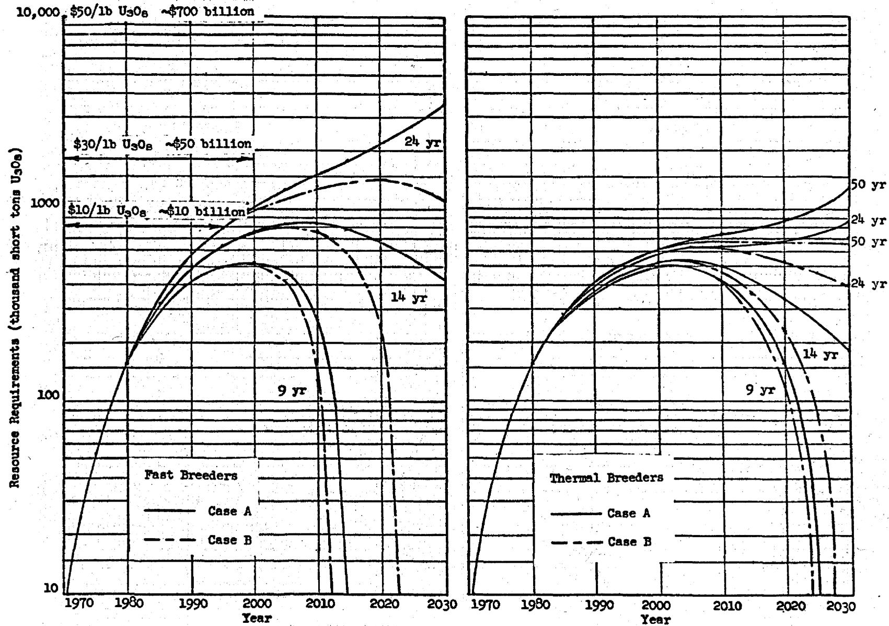  
Fig. 2. Total Fuel Requirements for Nuclear Power Industry Based on Introduction of Breeder Reactors in 1976.

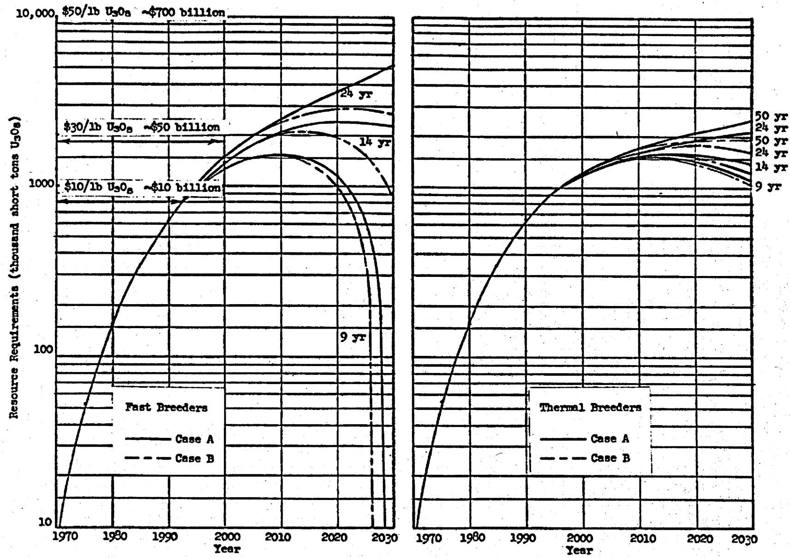  
Fig. 3. Total Fuel Requirements for Nuclear Power Industry Based on Introduction of Breeder Reactors in 1986.

between fast and thermal breeder systems. For longer doubling times, the specific inventory assumes greater importance and the maximum requirements for thermal breeder systems become increasingly less than those for fast breeder systems with equal doubling times. Once the maximum requirement is satisfied, the fast breeders produce much larger amounts of excess fissionable material. Whether this is important depends on the need for the excess material.

Figures 2 and 3 were based on starting the fast breeder reactors with plutonium and the thermal breeders with $^{233}\mathrm{U}$ . The fast breeders require an inventory of 3 to 5 kg of plutonium per megawatt of electric generating capacity, and the PWR's and HwR's produce 0.2 to 0.3 kg of plutonium per year per megawatt of electric generating capacity. The growth rate of the nuclear generating capacity is 7 to $10\%$ per year from 1980 to 2000. The converters and the breeders coming into operation would be able to provide the inventory for high-performance fast breeders but would fall rapidly behind if the breeders were to have doubling times longer than about 12 years. Additional thermal converters or fast converters would have to be built or the breeders would have to be fueled initially with $^{235}\mathrm{U}$ . This could add significantly to the resource requirement and the fuel cycle costs during the period of conversion to operation on plutonium.

Thermal breeders are also likely to be fueled initially with $^{235}\mathrm{U}$ to produce an inventory of $^{233}\mathrm{U}$ . However, the conversion time is only about one year and the additional resource requirement and the cost penalty are small.

# COST-OF-Power COMPARISON

# Capital Costs

Although molten-salt thermal breeder reactors are competitive with fast breeder reactors and superior to the converter reactors with respect to the efficient use of nuclear fuel resources, they must also produce power for as low or lower cost. No large molten-salt reactors or fast breeders and few large advanced converters have been designed in detail, so most of the costs must be educated estimates based on comparisons of the reactor systems and judicious use of information from reactors that are being built. Such a comparison was made of several advanced converter reactors and reported in ORNL-3686.2 The results are summarized in Table 6. A comparable estimate of costs for a large molten-salt thermal breeder reactor, made by the same people and reported in ORNL-3996 (ref. 3), is also included in the table, along with the fuel cycle costs from several studies of fast breeder reactors. Capital costs were not estimated in the fast breeder studies. In all cases the costs in the table are for investor-owned utility plants which carry a $12\%$ per year charge on investment in plant and $10\%$ per year on inventory of fuel.

The comparisons show that the capital cost of a large power station containing a molten-salt breeder reactor should not be much different

Table 6. A Comparison of Estimated Coats for Breeder and Advanced Converter Reactors   
Based on Investor-Owned Utilities Charges   

<table><tr><td rowspan="3"></td><td colspan="8">Advanced Converter Reactors</td><td rowspan="3">Molten SaltThermalBreederReactor</td><td colspan="5">Fast Breeder Reactors</td></tr><tr><td rowspan="2">FNR</td><td rowspan="2">LMBR</td><td rowspan="2">ETOR</td><td rowspan="2">SGRa</td><td colspan="2">HVR</td><td colspan="2">BWCER</td><td rowspan="2">WCAP3251-1</td><td rowspan="2">CEND200</td><td rowspan="2">ACNP64503</td><td rowspan="2">GEAP4418</td><td rowspan="2">GA5557</td></tr><tr><td>U</td><td>Th</td><td>U</td><td>Th</td></tr><tr><td colspan="15">Cost for 1000-Mw(e) power plant, $ million</td></tr><tr><td>Direct costs</td><td>94</td><td>***</td><td>83</td><td>93</td><td>88</td><td>96</td><td>86</td><td>82</td><td>81</td><td></td><td></td><td></td><td></td><td></td></tr><tr><td>Indirect costs</td><td>59</td><td>***</td><td>35</td><td>39</td><td>37</td><td>40</td><td>35</td><td>34</td><td>33</td><td></td><td></td><td></td><td></td><td></td></tr><tr><td>Total capital</td><td>133b</td><td>133e</td><td>118</td><td>132</td><td>125</td><td>136</td><td>121</td><td>116</td><td>115</td><td></td><td></td><td></td><td></td><td></td></tr><tr><td>Special fluids</td><td>0</td><td>0</td><td>0</td><td>0</td><td>27</td><td>33</td><td>14</td><td>13</td><td>5</td><td>0</td><td>0</td><td>0</td><td>0</td><td>0</td></tr><tr><td>Fuel processing plant</td><td>0</td><td>0</td><td>0</td><td>0</td><td>0</td><td>0</td><td>0</td><td>0</td><td>5</td><td>0</td><td>0</td><td>8</td><td>0</td><td>0</td></tr><tr><td colspan="15">Power costs (mills/kwhr)</td></tr><tr><td>Capital cost</td><td>2.3</td><td>2.3</td><td>2.0</td><td>2.2</td><td>2.1</td><td>2.3</td><td>2.1</td><td>2.0</td><td>2.0</td><td>(2.3)</td><td>(2.3)</td><td>(2.3)</td><td>(2.3)</td><td>(2.3)</td></tr><tr><td>Operating cost</td><td>0.3</td><td>0.3</td><td>0.3</td><td>0.3</td><td>0.3</td><td>0.3</td><td>0.3</td><td>0.3</td><td>0.3</td><td></td><td></td><td></td><td></td><td></td></tr><tr><td>Fuel cycle cost</td><td></td><td>(f)</td><td></td><td></td><td></td><td></td><td></td><td></td><td></td><td></td><td></td><td></td><td></td><td></td></tr><tr><td>Fabrication</td><td>0.34</td><td>0.61</td><td>0.26</td><td>0.20</td><td>0.31</td><td>0.22</td><td>0.52</td><td>0.54</td><td>***</td><td>0.31</td><td>0.26</td><td>0.16</td><td>0.34</td><td>0.39</td></tr><tr><td>Burnup and losses</td><td>0.99</td><td>0.40</td><td>0.20</td><td>0.97</td><td>0.81</td><td>0.41</td><td>0.25</td><td>0.39</td><td>0.01</td><td>0.02</td><td>0.02</td><td>***</td><td>***</td><td>***</td></tr><tr><td>Processing</td><td>0.20</td><td>0.27</td><td>0.19</td><td>0.19</td><td>0.25</td><td>0.24</td><td>0.17</td><td>0.14</td><td>0.19c</td><td>0.15</td><td>0.12</td><td>0.49c</td><td>0.19</td><td>0.17</td></tr><tr><td>Shipping</td><td>0.03</td><td>0.05</td><td>0.05</td><td>0.02</td><td>0.03</td><td>0.04</td><td>0.02</td><td>0.04</td><td>***</td><td>0.04</td><td>0.05</td><td>***</td><td>***</td><td>***</td></tr><tr><td>Inventory</td><td>0.24</td><td>0.92</td><td>0.51</td><td>0.27</td><td>0.10</td><td>0.59</td><td>0.09</td><td>0.30</td><td>0.15</td><td>0.67d</td><td>0.53d</td><td>0.59d</td><td>0.40d</td><td>0.66d</td></tr><tr><td>Interest on working capital</td><td>0.07</td><td>0.05</td><td>0.14</td><td>0.02</td><td>0.03</td><td>0.04</td><td>0.06</td><td>0.07</td><td>***</td><td>0.01</td><td>0.11</td><td>0.04</td><td>0.03</td><td>0.04</td></tr><tr><td>Subtotal</td><td>1.87</td><td>2.30</td><td>1.35</td><td>1.67</td><td>1.51</td><td>1.34</td><td>1.11</td><td>1.48</td><td>0.35</td><td>1.18</td><td>0.89</td><td>1.28</td><td>0.96</td><td>1.26</td></tr><tr><td>Pu or 233U credit</td><td>0.20</td><td>0.24</td><td>0</td><td>0.14</td><td>0.32</td><td>0</td><td>0.25</td><td>0</td><td>0.10</td><td>0.55</td><td>0.41</td><td>0.32</td><td>0.19</td><td>0.52</td></tr><tr><td>Net cost</td><td>1.7b</td><td>2.1</td><td>1.4</td><td>1.5</td><td>1.2</td><td>1.3</td><td>0.9</td><td>1.5</td><td>0.5</td><td>0.6</td><td>0.5</td><td>1.0</td><td>0.8</td><td>0.7</td></tr><tr><td>Special fluids inventory and replacement</td><td>0</td><td>0</td><td>0</td><td>0</td><td>0.5</td><td>0.6</td><td>0.3</td><td>0.3</td><td>0.1</td><td>0</td><td>0</td><td>0</td><td>0</td><td>0</td></tr><tr><td>Total power cost</td><td>4.3b</td><td>4.7</td><td>3.7</td><td>4.0</td><td>4.1</td><td>4.5</td><td>3.6</td><td>4.1</td><td>2.7</td><td>(2.9)</td><td>(2.8)</td><td>(3.3)</td><td>(3.1)</td><td>(3.0)</td></tr></table>

a. Included because plant is similar to sodium-cooled fast breeder plants.   
b. Although these numbers are higher than present bid prices for large nuclear power plants, the basis for the numbers is the same as for the other converter reactors and for the MEBR so they are used for this comparison. The numbers do not differ much from preliminary results of recent studies of normalized costs.

c. Includes capital charge on processing plant.

d. Adjusted to 10% charge for investor-owned utilities to be consistent with other studies.

e. Capital costs taken to be the same as FPR.

f. Fuel cycle cost is 30-year averaged cost. Fuel cycle cost for equilibrium breeder cycle is 2.4 mills/kwhr.

from one containing a thermal converter reactor. We believe this is a reasonable conclusion. The molten-salt reactor uses high-nickel alloys-- which are more expensive than stainless steels--for structural material, uses expensive graphite in the core, has an intermediate heat transfer system between the reactor primary system and the steam system, and requires special provisions for remote maintenance of radioactive equipment. However, the salts are good heat transfer fluids with high volumetric heat capacity, are chemically stable at high temperature and, we believe, at very high power density, have low vapor pressure, and can be used with large temperature differences without mass transfer difficulties. They do not undergo violent chemical reactions with air or water. The primary and secondary systems can be compact and, except for parts of the steam generators, can be built for low pressure. The reactor can be fueled while at power by means of relatively simple equipment, and the amount of excess reactivity can be kept small. The plant can operate at the highest thermal efficiency obtainable with modern steam plant practice, so the cost in dollars per electrical kilowatt can be low even though the plant may have more equipment and the dollars per thermal kilowatt may be higher than for a water reactor.

# Operating Costs

In Table 6 the operating costs for the molten-salt reactors are shown to be the same as for the converter reactors. Most of the operating costs do not vary much with type of reactor. We have not studied the operation and maintenance enough to know whether an appreciable cost penalty results from handling of the larger quantities of radioactive wastes and from maintenance of the more-than-normally radioactive equipment in a molten-salt reactor plant, so none was included here. Several million dollars was included in the capital cost for special maintenance equipment.

# Fuel Cycle and Total Power Costs

Table 6 shows that the fuel cycle cost for a molten-salt thermal breeder reactor is lower than for any of the converter or fast breeder reactors. The molten fuel and blanket salts can be reprocessed continuously or semiconductively by simple physical and chemical processes, such as vacuum distillation and fluoride volatility, in a small plant connected directly to the reactor. Fuel fabrication and shipping costs are eliminated; burnup cost (thorium) is negligible; the inventory charges are minimal; the credit for bred fuel is small. All these combine to produce very low fuel cycle costs that depend very little on the sale of $^{233}\mathrm{U}$ . The contribution of the mined $\mathrm{ThO_2}$ and $\mathrm{U_3O_8}$ costs to the total power cost is small, so the increase in power cost in going from the present low-cost resources to $50-per-pound resources should be less than 0.3 mill/kwhr. The very low fuel cycle cost results in the molten-salt reactor having an estimated power cost that is substantially lower than for any of the converter reactors.

If one accepts, in the absence of estimates, that the costs for building and operating large power plants containing fast breeder reactors should not differ greatly from the costs for the other plants in Table 6, then differences in power costs depend primarily on differences in fuel cycle costs. According to the numbers in the table, the fuel cycle costs and the total power costs for the fast breeder plants are mostly lower than for the converter plants but higher than for the molten-salt thermal breeder plant.

How the molten-salt thermal breeder and the, fast breeders compare depends strongly on such characteristics of the fast breeders as the relationship between the plutonium inventory, the breeding gain, the charge assessed against the inventory, and the value of the excess plutonium produced. These factors can be so adjusted that a fast breeder with a very short doubling time could have negative fuel cycle costs. In view of the many uncertainties, we interpret the data in Table 5 to indicate primarily that a molten-salt thermal breeder plant could produce power at a cost competitive with the cost of power from a fast breeder plant and with far less dependence on the sale of fissionable material. The molten-salt thermal breeder is clearly a strong competitor to the fast breeder for achieving the goal of producing power at low cost with good fuel utilization.

# 1000-Mw(e) MOLTEN-SALT THERMAL BREEDER POWER PLANT

Studies of the conceptual design of a 1000-Mw(e) molten-salt thermal breeder power plant (MSBR) and of some alternatives or improvements are reported in ORNL-3996, ORNL-4037, and ORNL-4119. Results of the studies are summarized here and in some instances are adjusted to incorporate more recent information.

The MSBR reference design is a two-region, two-fluid system with fuel salt separated from the blanket salt by graphite tubes. The fuel salt consists of uranium fluoride dissolved in a mixture of lithium and beryllium fluorides, and the blanket salt is a thorium fluoride - lithium fluoride mixture of eutectic composition. The heat generated in those fluids is transferred in a primary salt-circulating system to a coolant salt in a secondary circuit which couples the reactor to a supercritical steam cycle. Fuel and blanket are processed on site by means of fluoride volatility and vacuum distillation processes.

A design called MSBR(Pa) is a favored variation of the MSBR. It is the same as the reference design except that the blanket salt is processed to remove protactinium on about a half-day cycle. This results in improved performance through a higher breeding ratio, a smaller inventory of fissile material in the blanket, and a considerable reduction in the inventory of blanket salt.

Two methods of removing protactinium from fluoride melts have been tested on small scale in the laboratory. In one, $\mathrm{PaO_2}$ was shown to precipitate on $\mathrm{ThO_2}$ that had been added as a solid to a molten fluoride salt. In the second, protactinium was extracted from a fluoride melt by molten bismuth with thorium metal as a reducing agent. The chemistry of these processes is favorable, so further work should provide an inorganic ion exchange process or a liquid-metal extraction process for removing protactinium continuously and inexpensively from the blanket salt of a breeder reactor.

Because the designs are so similar the MSBR and MSBR(Pa) are treated below as one plant. Characteristics for both are reported where they differ.

# Reference Plant Design

# Fuel, Blanket, and Coolant Salts

Fuel salt for the reactor is a ternary mixture consisting of about $0.3\% \times \mathrm{UF}_4$ , $65.7\% \times 7\mathrm{LiF}$ , and $34\% \mathrm{BeF}_2$ . This salt is similar to the fuel in the Molten-Salt Reactor Experiment. A salt containing $27\% \mathrm{ThF}_4$ , $71\% \mathrm{LiF}$ , and $2\% \mathrm{BeF}_2$ is proposed for the blanket. A mixture of $48\% \mathrm{NaF}$ , $4\% \mathrm{KF}$ , and $48\% \mathrm{BF}_3$ is the favored coolant salt because of its low liquidus temperature and low cost. Estimates of the physical properties of the salts are reported in Table 7.

# Flowsheet

A flowsheet for the 1000-Mw(e) plant is presented in Fig. 4. Fuel is pumped through the reactor at a rate of about 44,000 gpm, entering the core at $1000^{\circ}\mathrm{F}$ and leaving at $1300^{\circ}\mathrm{F}$ . The primary fuel system has four loops, each loop having a heat exchanger and a pump of 11,000-gpm capacity. The blanket system has four pumps and heat exchangers, smaller but similar to the components in the fuel system. Blanket salt circulates through each of the four loops at a rate of 2000 gpm, entering the reactor vessel at $1150^{\circ}\mathrm{F}$ and leaving at $1250^{\circ}\mathrm{F}$ .

Four 14,000-gpm pumps circulate the sodium fluoroborate coolant salt through the shell sides of the primary heat exchangers. The salt enters at $850^{\circ}\mathrm{F}$ , leaves at $1112^{\circ}\mathrm{F}$ , and then passes through the shell sides of the blanket heat exchangers where it is further heated to $1125^{\circ}\mathrm{F}$ . The coolant then passes in parallel through sixteen once-through boiler-superheaters and eight steam reheaters.

Table 7. Estimated Physical Properties of MSBR Fuel, Blanket, and Coolant Saltsa   

<table><tr><td></td><td>Fuel Salt</td><td>Blanket Salt</td><td>Coolant Salt</td></tr><tr><td>Composition, mole %</td><td>65.7 LiF-34.0 BeF2-0.3 UF4</td><td>71 LiF-2 BeF2-27 ThF4</td><td>48 NaF-4 KF-48 BF3</td></tr><tr><td>Liquid temperature, °F</td><td>852</td><td>1040</td><td>~700</td></tr><tr><td>Reference temperature for properties, °F</td><td>1150</td><td>1200</td><td>988</td></tr><tr><td>Density, lb/ft3</td><td>127</td><td>277</td><td>125</td></tr><tr><td>Viscosity, lb/ft-hr</td><td>19</td><td>38</td><td>12</td></tr><tr><td>Thermal conductivity, Btu/ft-hr-°F</td><td>0.6</td><td>0.4</td><td>0.5</td></tr><tr><td>Heat capacity, Btu/1b-°F</td><td>0.55</td><td>0.22</td><td>0.37</td></tr></table>

aS. Cantor, R. E. Thoma, J. W. Cooke, and H. W. Hoffman, Estimated Physical Properties of MSBR Fuel, Blanket, and Coolant Salts, ORNL-CF-67-3-18 (March 10, 1967).

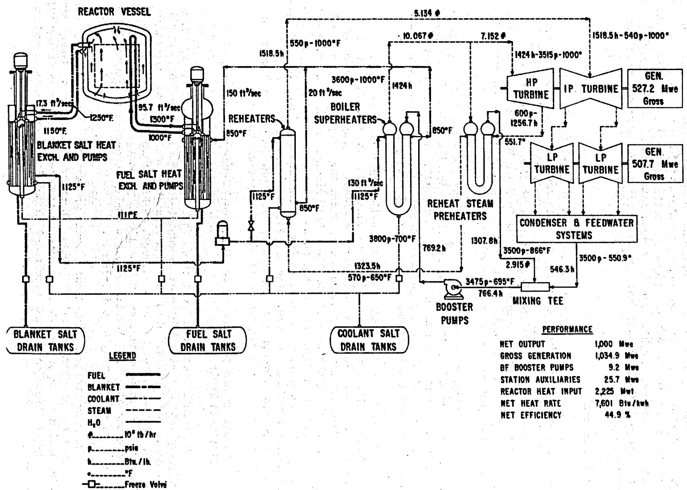  
Fig. 4. Molten-Salt Breeder Reactor Flow Diagram.

The steam system is essentially that of the new Bull Run plant of the TVA, modified to increase the rating to 1000 Mw(e) and to preheat the working fluid to $700^{\circ}\mathrm{F}$ before it enters the boiler-superheaters. Use of the supercritical steam cycle appears to ease some problems of design of steam generators for molten-salt reactors and results in a thermal efficiency of about $45\%$ .

# Reactor Design

The MSBR cell arrangement is shown in plan in Fig. 5. On two sides of the reactor cell are four shielded cells containing the boiler-supper-heaters and the reheaters; those cells can be isolated individually for maintenance. A cell for handling the gaseous fission products from the reactor and two cells for processing the fuel and blanket salts are adjacent to the reactor cell. Cells are also provided for decontamination and storage and repair of radioactive equipment.

An elevation of the plant in Fig. 6 shows the arrangement of equipment in the reactor and coolant cells, and a more detailed view of the reactor primary equipment is shown in Fig. 7. The reactor vessel is about 14 ft in diameter by about 19 ft high, is designed for $1200^{\circ}\mathrm{F}$ and 150 psi and has a metal-wall thicknesses in the range of 1 to 3 in.

The reactor vessel contains a 10-ft-diam by 12-1/2-ft-high core assembly composed of 534 graphite fuel cells of a type similar to that shown in Fig. 8. Fuel from the entrance plenum in the reactor vessel flows upward through the annulus and downward through the large central passage in the graphite tubes to the outlet plenum. Fuel is circulated from the outlet plenum through the pumps to the heat exchangers and then back to the reactor. A 1-1/2-ft-thick blanket and a 3-in.-thick graphite reflector surround the core. The thorium salt circulates through the blanket region, through the passages between fuel cells in the core, and through the heat removal system outside the reactor vessel.

Values chosen for some of the MSBR and MSBR(Pa) design parameters are listed in Table 8.

The reactor vessel and all other equipment that holds salt is made of Hastelloy N, a nickel-base alloy containing about $17\%$ molybdenum, $7\%$ chromium, and $4\%$ iron. This material is highly resistant to corrosion by fluoride salts and has good strength at high temperature. The high-temperature creep properties of Hastelloy N presently obtainable commercially deteriorate under irradiation, but small changes in the alloy offer promise of eliminating this deficiency.

The graphite is a high-density grade processed to achieve small pore openings for low permeability to salt. Superior resistance to damage by irradiation is important, but the core is designed to keep the flux gradients small across individual pieces and to permit the graphite to expand or contract with little restraint.

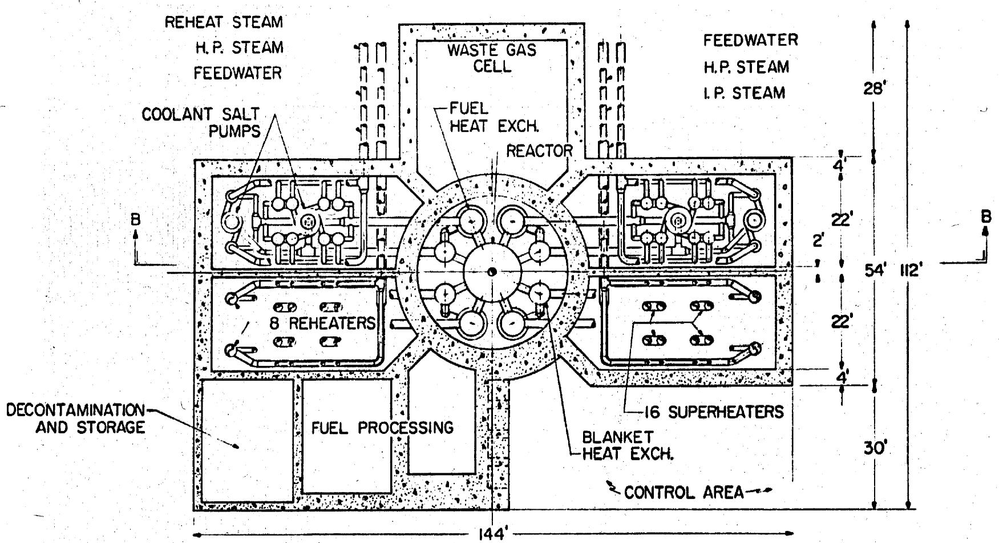  
Fig. 5. Molten-Salt Breeder Reactor - Cell Arrangement, Plan View.

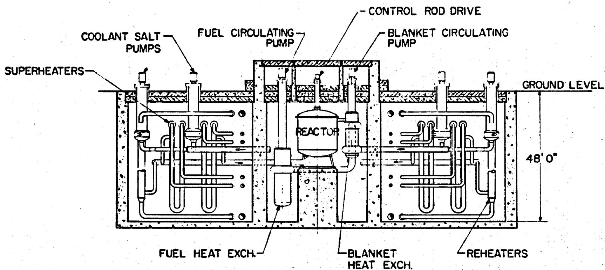  
Fig. 6. Molten-Salt Breeder Reactor - Cell Arrangement, Elevation.

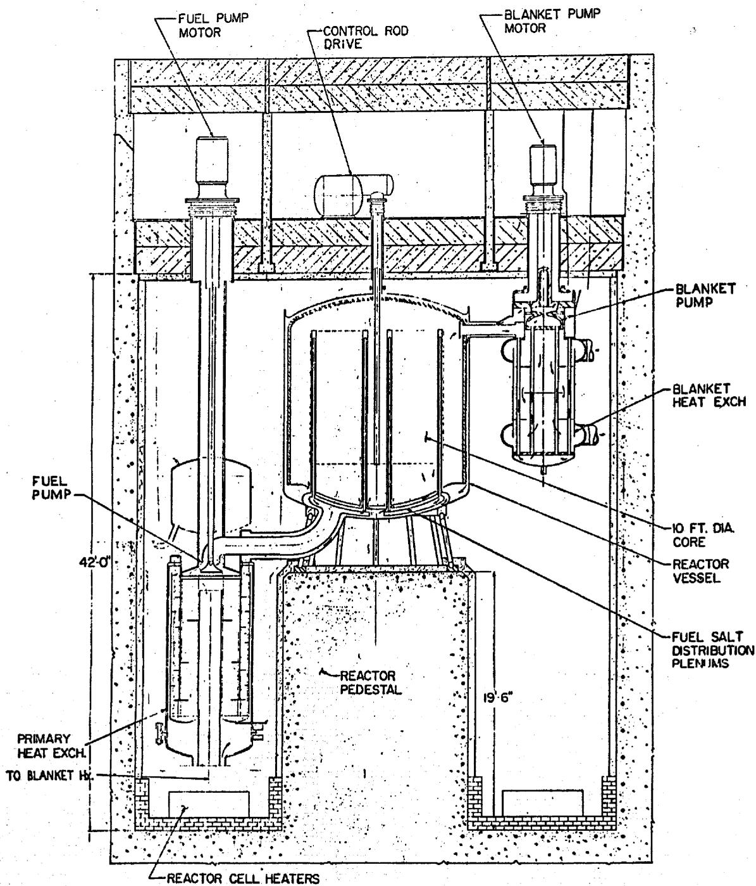  
Fig. 7. Reactor Primary Equipment.

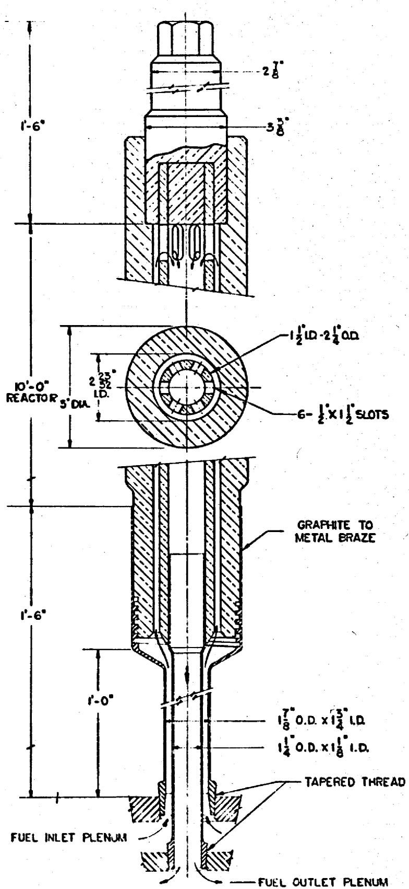  
Fig. 8. Molten-Salt Breeder Reactor Core Cell.

Table 8. Reactor Design Values   

<table><tr><td></td><td colspan="2">MSBR(Pa)</td><td>MSBR</td></tr><tr><td>Power, Mw</td><td></td><td></td><td></td></tr><tr><td>Thermal</td><td></td><td>2225</td><td></td></tr><tr><td>Electrical</td><td></td><td>1000</td><td></td></tr><tr><td>Thermal efficiency, fraction</td><td></td><td>0.45</td><td></td></tr><tr><td>Plant load factor</td><td></td><td>0.80</td><td></td></tr><tr><td>Reactor vessel</td><td></td><td></td><td></td></tr><tr><td>Outside diameter, ft</td><td></td><td>14</td><td></td></tr><tr><td>Overall height, ft</td><td></td><td>~19</td><td></td></tr><tr><td>Wall thickness, in.</td><td></td><td>1.5</td><td></td></tr><tr><td>Head thickness, in.</td><td></td><td>2.25</td><td></td></tr><tr><td>Core</td><td></td><td></td><td></td></tr><tr><td>Height of active core, ft</td><td></td><td>12.5</td><td></td></tr><tr><td>Diameter, ft</td><td></td><td>10</td><td></td></tr><tr><td>Number of graphite fuel passage tubes</td><td></td><td>534</td><td></td></tr><tr><td>Volume, ft3</td><td></td><td>982</td><td></td></tr><tr><td>Volume fractions</td><td></td><td></td><td></td></tr><tr><td>Fuel salt</td><td>0.169</td><td></td><td>0.169</td></tr><tr><td>Blanket salt</td><td>0.073</td><td></td><td>0.074</td></tr><tr><td>Graphite moderator</td><td>0.758</td><td></td><td>0.757</td></tr><tr><td>Atom ratios</td><td></td><td></td><td></td></tr><tr><td>Thorium to uranium</td><td>42</td><td></td><td>40</td></tr><tr><td>Carbon to uranium</td><td>5800</td><td></td><td>5440</td></tr><tr><td>Neutron flux, core average, neutrons/cm2·sec</td><td></td><td></td><td></td></tr><tr><td>Thermal</td><td>7.2 x 1014</td><td></td><td>6.7 x 1014</td></tr><tr><td>Fast</td><td>12.1 x 1014</td><td></td><td>12.1 x 1014</td></tr><tr><td>Fast, over 100 kev</td><td>3.1 x 1014</td><td></td><td>3.1 x 1014</td></tr><tr><td>Power density, core average, kw/liter</td><td></td><td></td><td></td></tr><tr><td>Gross</td><td></td><td>80</td><td></td></tr><tr><td>In fuel salt</td><td></td><td>473</td><td></td></tr><tr><td>Blanket</td><td></td><td></td><td></td></tr><tr><td>Radial thickness, ft</td><td></td><td>1.5</td><td></td></tr><tr><td>Axial thickness, ft</td><td></td><td>2.0</td><td></td></tr><tr><td>Volume, ft3</td><td></td><td>1120</td><td></td></tr><tr><td>Volume fraction, blanket salt</td><td></td><td>1.0</td><td></td></tr><tr><td>Reflector thickness, in.</td><td></td><td>3</td><td></td></tr><tr><td>Fuel salt</td><td></td><td></td><td></td></tr><tr><td>Inlet temperature, °F</td><td></td><td>1000</td><td></td></tr><tr><td>Outlet temperature, °F</td><td></td><td>1300</td><td></td></tr><tr><td>Flow rate, ft/sec (total)</td><td></td><td>95.7</td><td></td></tr><tr><td>gpm</td><td></td><td>42,950</td><td></td></tr></table>

Continued

Table 8 (continued)   

<table><tr><td></td><td>MSBR(Pa)</td><td>MSBR</td></tr><tr><td colspan="3">Fuel salt (continued)</td></tr><tr><td colspan="3">Nominal volume holdup, ft3</td></tr><tr><td>Core</td><td>166</td><td></td></tr><tr><td>Blanket</td><td>26</td><td></td></tr><tr><td>Plena</td><td>147</td><td></td></tr><tr><td>Heat exchangers and piping</td><td>404</td><td></td></tr><tr><td>Processing plant</td><td>33</td><td></td></tr><tr><td>Total</td><td>776</td><td></td></tr><tr><td colspan="3">Nominal salt composition, mole %</td></tr><tr><td>LiF</td><td>65.7</td><td></td></tr><tr><td>BeF2</td><td>34.0</td><td></td></tr><tr><td>UF4(fissile)</td><td>0.22</td><td></td></tr><tr><td colspan="3">Blanket salt</td></tr><tr><td>Inlet temperature, °F</td><td>1150</td><td></td></tr><tr><td>Outlet temperature, °F</td><td>1250</td><td></td></tr><tr><td>Flow rate, ft3/sec (total)</td><td>17.3</td><td></td></tr><tr><td>gpm</td><td>7764</td><td></td></tr><tr><td colspan="3">Volume holdup, ft3</td></tr><tr><td>Core</td><td>72</td><td></td></tr><tr><td>Blanket</td><td>1121</td><td></td></tr><tr><td>Heat exchanger and piping</td><td>100</td><td></td></tr><tr><td>Processing</td><td>24</td><td></td></tr><tr><td>Storage for protactinium decay</td><td colspan="2">2066</td></tr><tr><td>Total</td><td>1317</td><td>3383</td></tr><tr><td colspan="3">Salt composition, mole %</td></tr><tr><td>LiF</td><td>71.0</td><td></td></tr><tr><td>BeF2</td><td>2.0</td><td></td></tr><tr><td>ThF4</td><td>27.0</td><td></td></tr><tr><td>UF4(fissile)</td><td colspan="2">0.0005</td></tr><tr><td>System fissile inventory, kg</td><td>724</td><td>812</td></tr><tr><td>System fertile inventory, kg</td><td>101,000</td><td>260,000</td></tr><tr><td colspan="3">Processing data</td></tr><tr><td colspan="3">Fuel stream</td></tr><tr><td>Cycle time, days</td><td>42</td><td>47</td></tr><tr><td>Rate, ft3/day</td><td>16.3</td><td>14.5</td></tr><tr><td>Processing cost, $/ft3</td><td>190</td><td>203</td></tr><tr><td colspan="3">Blanket stream</td></tr><tr><td colspan="3">Equivalent cycle time, days</td></tr><tr><td>Uranium-removal process</td><td>55</td><td>23</td></tr><tr><td>Protactinium-removal process</td><td>0.55</td><td></td></tr><tr><td colspan="3">Equivalent rate, ft3per day</td></tr><tr><td>Uranium-removal process</td><td>23.5</td><td>144</td></tr><tr><td>Protactinium-removal process</td><td>2350</td><td></td></tr><tr><td>Equivalent processing cost (based on uranium removal), $/ft3</td><td>65</td><td>7.3</td></tr><tr><td>Fuel yield, %/yr</td><td>7.5</td><td>4.5</td></tr><tr><td>Net breeding ratio</td><td>1.07</td><td>1.05</td></tr><tr><td>Fissile losses in processing, atoms per fissile absorption</td><td>0.0051</td><td>0.0057</td></tr><tr><td>Specific inventory, kg of fissile material per megawatt of electricity produced</td><td>0.724</td><td>0.812</td></tr><tr><td>Specific power, Mw(th)/kg of fissile material</td><td>3.1</td><td>2.7</td></tr><tr><td>Fraction of fissions in fuel stream</td><td>0.996</td><td>0.987</td></tr><tr><td>Fraction of fissions in thermal-neutron group</td><td>0.815</td><td>0.806</td></tr><tr><td>Net neutron production per fissile absorption (η€)</td><td>2.227</td><td>2.221</td></tr></table>

${}^{a}$ This table and others taken from ORNL-3996 have been revised to include the effects on inventories of a reduced thermal conductivity of the fuel salt.

# Heat Exchange, Systems

The fuel heat exchangers are of the tube and shell design and are combined with the pumps as shown in Fig. 9. Fuel salt from the reactor flows into the impeller of the pump and is discharged down through the tubes of the inner bundle. It then flows upward through the tubes of the outer bundle and back to the reactor core. The coolant salt enters the shell at the bottom, flows upward along the outer wall, then through the tube bundles countercurrent to the flow of the fuel salt and out through the center pipe.

The blanket heat exchangers transfer only a small fraction of the heat, but they pass the full flow of coolant from the fuel heat exchangers. They are similar to the fuel heat exchangers and are designed for single-pass flow of coolant on the shell side, although two-pass flow is retained for blanket salt in the tubes.

Fuel and blanket pumps are sump-type pumps built into the upper heads of the heat exchangers. While this complicates the design of some of the equipment, it reduces the salt inventory (particularly in the fuel system), the amount of piping, and some of the stress problems during heating and cooling of the systems. Concentric piping is used between the reactor

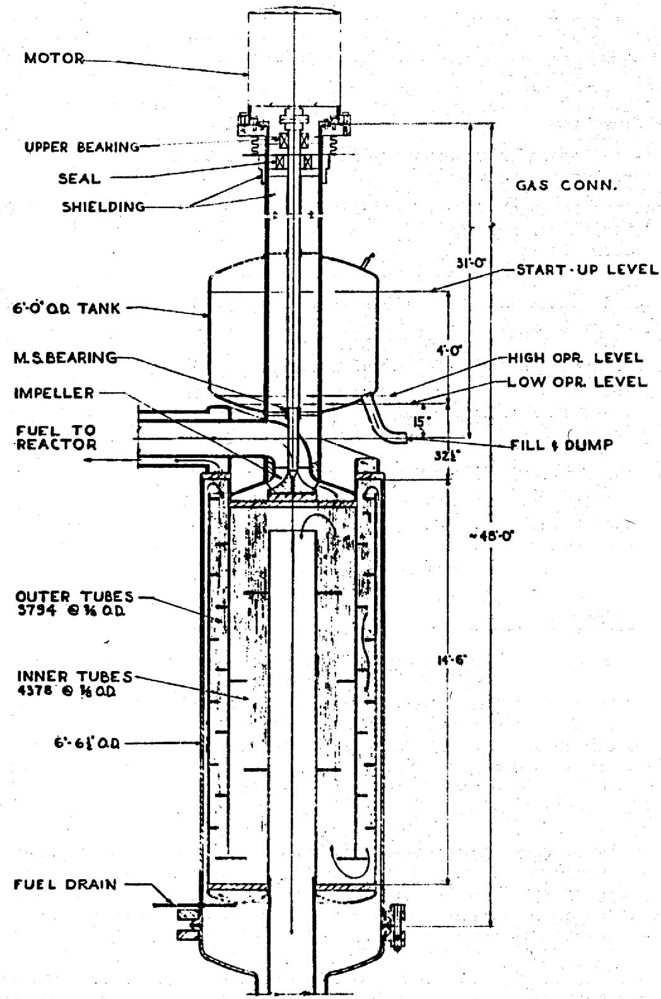  
Fig. 9. Molten-Salt Breeder Reactor Primary Heat Exchanger and Pump.

vessel and the heat exchangers for the same reason. The fuel heat ex-changers and pumps are below the core so the fuel salt in the core will drain quickly into tanks, where it can be cooled more easily, if the pumps stop.

The boiler-superheaters are long, slender, U-tube - U-shell exchangers. Coolant salt flows through the shell, entering at $1125^{\circ}\mathrm{F}$ and leaving at $850^{\circ}\mathrm{F}$ . Water preheated to about $700^{\circ}\mathrm{F}$ enters the tubes at 3800 psi and leaves as supercritical steam at $1000^{\circ}\mathrm{F}$ and 3600 psi.

Steam is extracted from the high-pressure turbine at about $550^{\circ}\mathrm{F}$ and reheated to $1000^{\circ}\mathrm{F}$ and $540$ psi before use in the intermediate pressure turbine. This is accomplished by heating partly with prime steam in preheaters and partly with coolant salt in reheaters.

Since the freezing temperature of the coolant salt is about $700^{\circ}\mathrm{F}$ , it seems desirable to preheat the working fluid to almost $700^{\circ}\mathrm{F}$ before it enters the boiler-superheaters or reheaters. This is the purpose of the steam preheaters ahead of the reheaters. The prime steam from those preheaters is injected into the feedwater in a mixing tee to heat the water to the desired temperature before it enters the boiler-superheaters.

Use of the supercritical steam cycle makes possible this matching of salt and feedwater temperatures. It is believed to reduce the thermal cycling (and fatigue) of the tubes that would occur in the boiling regions of the steam generators at lower pressure. The net thermal efficiency of the plant is about $45\%$ and would be higher if higher temperatures could be used effectively in the steam system.

# Fuel and Blanket Processing

The primary objectives of the processing are to separate fission products in low concentration from the other constituents of the fuel salt and to separate bred fissile material in low concentration from the other constituents of the blanket salt while keeping the losses and the costs low. With the fluoride fuel and blanket salts of the MSBR, these objectives can be fulfilled by a combination of fluoride volatility, vacuum distillation and protactinium extraction processes. The processing is done continuously or semicontinuously in cell space adjacent to the reactor; services and some other equipment required for the reactor are shared by the processing plant. Shipping, long storage at the reactor and reprocessing sites, and refabrication of fuel and blanket are eliminated. All these factors lead to reduced inventories, improved fuel utilization, and reduced costs.

The fuel salt for the MSBR and the MSBR(Pa) is processed by fluoride volatility to remove the uranium and by vacuum distillation to separate the carrier salts from the fission products. For the MSBR the blanket is processed by fluoride volatility alone. The cycle time is short enough to maintain the concentration of fissile material very low. The inventory of blanket salt is made large to keep the Pa losses small. For the MSBR(Pa) the blanket stream is treated by a liquid-metal extraction process

or an exchange process to remove Pa and $^{233}\mathrm{U}$ on a very short cycle. In this case the fissile inventory in the blanket and the blanket salt inventory can be kept to a minimum.

Principal steps in the processes are shown in Fig. 10. Small streams of core and blanket fluids are withdrawn continuously from the reactor and circulated through the processing system. After processing, the decontaminated fluids are returned to the reactor at convenient points such as the storage tanks. Inventories in the processing plant are estimated to be about $5\%$ of the reactor fuel system inventory and less than $1\%$ of the blanket inventory.

The fuel and blanket processing plants are intended to operate continuously in conjunction with the reactor. However, the reactor can continue to operate when all or part of the processing plant is shut down for maintenance. During a 30-day interruption in processing of the blanket, the increase in concentration of $^{233}\mathrm{U}$ in the blanket salt would produce an increase of less than $20\%$ in the amount of heat generated in the blanket. Since $^{233}\mathrm{U}$ would not be available from the blanket, the burnup in the core would have to be compensated by supplying fissile material from a reserve.

Interruption of the processing of the fuel stream would cause the fission product concentration in the fuel to increase. Fissile material would have to be added to compensate for burnup and for the gradual increase in poison level. During periods of operation without processing, there would also be a gradual decrease in the breeding gain. The decrease would be less than 0.02 in 30 days.

# Capital-Cost Estimates

# Reactor Power Plant

Preliminary estimates of the capital cost of a 1000-Mw(e) MSBR power station indicate a direct construction cost of about $81 million. After applying the indirect cost factors used in the advanced converter evaluation, the estimated total plant cost is $115 million for private financing and $111 million for public financing. A summary of plant costs is given in Table 9. The conceptual design was not sufficiently detailed to permit a completely reliable estimate; however, the design and estimates were studied thoroughly enough to make meaningful comparisons with previous converter-reactor-plant cost studies. The relatively low capital cost results from the small physical size of the MSBR and the simple control requirements. The results of the study encourage the belief that the cost of an MSBR power station will be as low as for stations utilizing other reactor concepts.

The operating and maintenance costs of the MSBR were not estimated. Based on the ground rules used in Ref. 4, these costs would be 0.34 mill/kwhr(e).

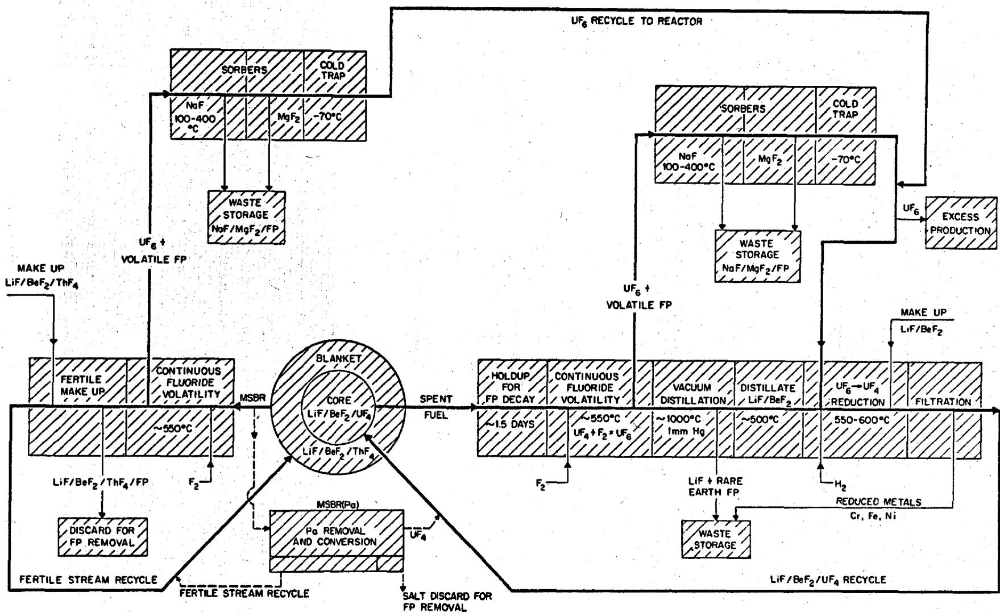  
Fig. 10. MSBR Core and Blanket Processing Scheme.

Table 9. Preliminary Cost-Estimate Summarya for a 1000-Mw(e) Molten-Salt Breeder Reactor Power Station [MSBR(Pa) or MSBR]   

<table><tr><td>Federal Power Commission Account</td><td></td><td>Costs (in thousands of dollars)</td></tr><tr><td>20</td><td>Land and Land Rights</td><td></td></tr><tr><td>21</td><td>Structures and Improvements</td><td></td></tr><tr><td></td><td>211 Ground improvements</td><td>866</td></tr><tr><td></td><td>212 Building and structures</td><td></td></tr><tr><td></td><td>.1 Reactor buildingb</td><td>4,181</td></tr><tr><td></td><td>.2 Turbine building, auxiliary building, and feedwater heater space</td><td>2,832</td></tr><tr><td></td><td>.3 Offices, shops, and laboratories</td><td>1,160</td></tr><tr><td></td><td>.4 Waste disposal building</td><td>150</td></tr><tr><td></td><td>.5 Stack</td><td>76</td></tr><tr><td></td><td>.6 Warehouse</td><td>40</td></tr><tr><td></td><td>.7 Miscellaneous</td><td>30</td></tr><tr><td></td><td>Subtotal Account 212</td><td>8,469</td></tr><tr><td></td><td>Total Account 21</td><td>9,335</td></tr><tr><td>22</td><td>Reactor Plant Equipment</td><td></td></tr><tr><td></td><td>221 Reactor equipment</td><td></td></tr><tr><td></td><td>.1 Reactor vessel and internals</td><td>1,610</td></tr><tr><td></td><td>.2 Control rods</td><td>250</td></tr><tr><td></td><td>.3 Shielding and containment</td><td>2,113</td></tr><tr><td></td><td>.4 Heating-cooling systems and vapor-suppression system</td><td>1,200</td></tr><tr><td></td><td>.5 Moderator and reflector</td><td>1,089</td></tr><tr><td></td><td>.6 Reactor plant crane</td><td>265</td></tr><tr><td></td><td>Subtotal Account 221</td><td>6,527</td></tr><tr><td></td><td>222 Heat transfer systems</td><td></td></tr><tr><td></td><td>.1 Reactor coolant system</td><td>6,732</td></tr><tr><td></td><td>.2 Intermediate cooling system</td><td>1,947</td></tr><tr><td></td><td>.3 Steam generator and reheaters</td><td>9,855</td></tr><tr><td></td><td>.4 Coolant supply and treatment</td><td>300</td></tr><tr><td></td><td>Subtotal Account 222</td><td>18,832</td></tr><tr><td></td><td>223 Nuclear fuel handling and storage (drain tanks)</td><td>1,700</td></tr><tr><td></td><td>224 Nuclear fuel processing and fabrication (included in fuel-cycle costs)</td><td>(c)</td></tr><tr><td></td><td>225 Radioactive waste treatment and disposal (off-gas system)</td><td>450</td></tr><tr><td></td><td>226 Instrumentation and controls</td><td>4,500</td></tr><tr><td></td><td>227 Feedwater supply and treatment</td><td>4,051</td></tr><tr><td></td><td>228 Steam, condensate, and feedwater piping</td><td>4,069</td></tr><tr><td></td><td>229 Other reactor plant equipment (remote maintenance)</td><td>5,000d</td></tr><tr><td></td><td>Total Account 22</td><td></td></tr></table>

Estimates are based on 1966 costs for an established molten-salt nuclear power plant industry.   
bContainment cost is included in Account 221.3.   
See Table 3 for these costs.

Table 9. (continued)   

<table><tr><td>Federal Power Commission Account</td><td></td><td>Costs (in thousands of dollars)</td></tr><tr><td>23</td><td>Turbine-Generator Units</td><td></td></tr><tr><td></td><td>231 Turbine-generator units</td><td>19,174</td></tr><tr><td></td><td>232 Circulating-water system</td><td>1,243</td></tr><tr><td></td><td>233 Condensers and auxiliaries</td><td>1,690</td></tr><tr><td></td><td>234 Central lube-oil system</td><td>80</td></tr><tr><td></td><td>235 Turbine plant instrumentation</td><td>25</td></tr><tr><td></td><td>236 Turbine plant piping</td><td>220</td></tr><tr><td></td><td>237 Auxiliary equipment for generator</td><td>66</td></tr><tr><td></td><td>238 Other turbine plant equipment</td><td>22</td></tr><tr><td></td><td>Total Account 23</td><td>22,523</td></tr><tr><td>24</td><td>Accessory Electrical</td><td></td></tr><tr><td></td><td>241 Switchgear, main and station service</td><td>500</td></tr><tr><td></td><td>242 Switchboards</td><td>128</td></tr><tr><td></td><td>243 Station service transformers</td><td>169</td></tr><tr><td></td><td>244 Auxiliary generator</td><td>50</td></tr><tr><td></td><td>245 Distributed items</td><td>2,000</td></tr><tr><td></td><td>Total Account 24</td><td>2,897</td></tr><tr><td>25</td><td>Miscellaneous</td><td>800</td></tr><tr><td></td><td>Total Direct Construction Costd</td><td>80,684</td></tr><tr><td></td><td>Private Financing</td><td></td></tr><tr><td></td><td>Total indirect cost</td><td>33,728</td></tr><tr><td></td><td>Total plant cost</td><td>114,412</td></tr><tr><td></td><td>Public Financing</td><td></td></tr><tr><td></td><td>Total indirect cost</td><td>30,011</td></tr><tr><td></td><td>Total plant cost</td><td>110,695</td></tr></table>

Does not include Account 20, Land Costs. Land is treated as a nondepreciating capital item. However, land costs were included when computing indirect costs.

# Fuel.Recycle Plant

The capital costs of the fuel recycle plant for processing 15 ft³/day of fuel salt and 105 ft³/day of blanket salt in a 1000-Mw(e) MSBR power station were obtained by itemizing and costing the major process equipment and by estimating the costs of site, buildings, instrumentation, waste disposal, and building services associated with fuel recycle. Table 10 summarizes the direct construction costs, the indirect costs, and total costs of the plant. The total is $5.3 million. The operating and maintenance costs for the plant include labor, labor overhead, chemicals, utilities, and maintenance materials. The total annual cost is estimated to be about $721,000, which is equivalent to about 0.1 mill/kwhr(e). A breakdown of these charges is given in Table 11.

Table 10. Summary of Processing-Plant Capital Costs for a 1000-Mw(e) MSBR   

<table><tr><td>Installed process equipment</td><td>$ 853,760</td></tr><tr><td>Structures and improvements</td><td>556,770</td></tr><tr><td>Waste storage</td><td>387,970</td></tr><tr><td>Process piping</td><td>155,800</td></tr><tr><td>Process instrumentation</td><td>272,100</td></tr><tr><td>Electrical auxiliaries</td><td>34,300</td></tr><tr><td>Sampling connections</td><td>20,000</td></tr><tr><td>Service and utility piping</td><td>128,060</td></tr><tr><td>Insulation</td><td>50,510</td></tr><tr><td>Radiation monitoring</td><td>100,000</td></tr><tr><td>Total direct cost</td><td>$2,609,270</td></tr><tr><td>Construction overhead(30% of direct costs)</td><td>782,780</td></tr><tr><td>Subtotal construction cost</td><td>$3,392,050</td></tr><tr><td>Engineering and inspection(25% of subtotal construction cost)</td><td>848,010</td></tr><tr><td>Subtotal plant cost</td><td>$4,240,060</td></tr><tr><td>Contingency (25% of subtotal plant cost)</td><td>1,060,020</td></tr><tr><td>Total capital cost</td><td>$5,300,000</td></tr></table>

Table 11. Summary of Annual Operating and Maintenance Costs for Fuel Recycle in a 1000-Mw(e) MSBR   

<table><tr><td>Direct labor</td><td>$222,000</td></tr><tr><td>Labor overhead</td><td>177,600</td></tr><tr><td>Chemicals</td><td>14,640</td></tr><tr><td>Waste containers</td><td>28,270</td></tr><tr><td>Utilities</td><td>80,300</td></tr><tr><td>Maintenance materials</td><td></td></tr><tr><td>Site</td><td>2,500</td></tr><tr><td>Services and utilities</td><td>35,880</td></tr><tr><td>Process equipment</td><td>160,000</td></tr><tr><td>Total annual charges</td><td>$721,230</td></tr></table>

The capital and operating costs for this plant were the basis for deriving the costs of plants with other capacities. The relationship of cost to volume of salt processed was estimated separately for fuel and blanket streams to give the curves shown in Fig. 11. Data from those curves were used in the fuel-cycle-cost optimization studies to represent the effects of varying the plant size and throughput.

For the MSBR(Pa) plant the processing methods and costs were the same as those for the MSBR plant except for the blanket processing. The cost of protactinium removal from the blanket stream was estimated to be

$$
C (P a) = 1. 6 5 R ^ {0. 4 5} \tag {1}
$$

where $C(Pa)$ is the capital cost of the protactinium removal equipment, in millions of dollars, and $R$ is the processing rate for protactinium removal in thousands of cubic feet of blanket salt per day. Calculations of the total costs of fuel recycle in the MSBR(Pa) were based on the curves in Fig. 11 for the fuel stream and on Eq. (1) combined with the curves in Fig. 12 for the blanket stream.

# Nuclear Performance and Fuel Cycle Analyses

The fuel cycle cost and the fuel yield are closely related, yet independent in the sense that two nuclear designs can have similar costs but significantly different yields. The objective of the nuclear design calculations was primarily to find the conditions that gave the lowest

ORNL-DWG 66-7455

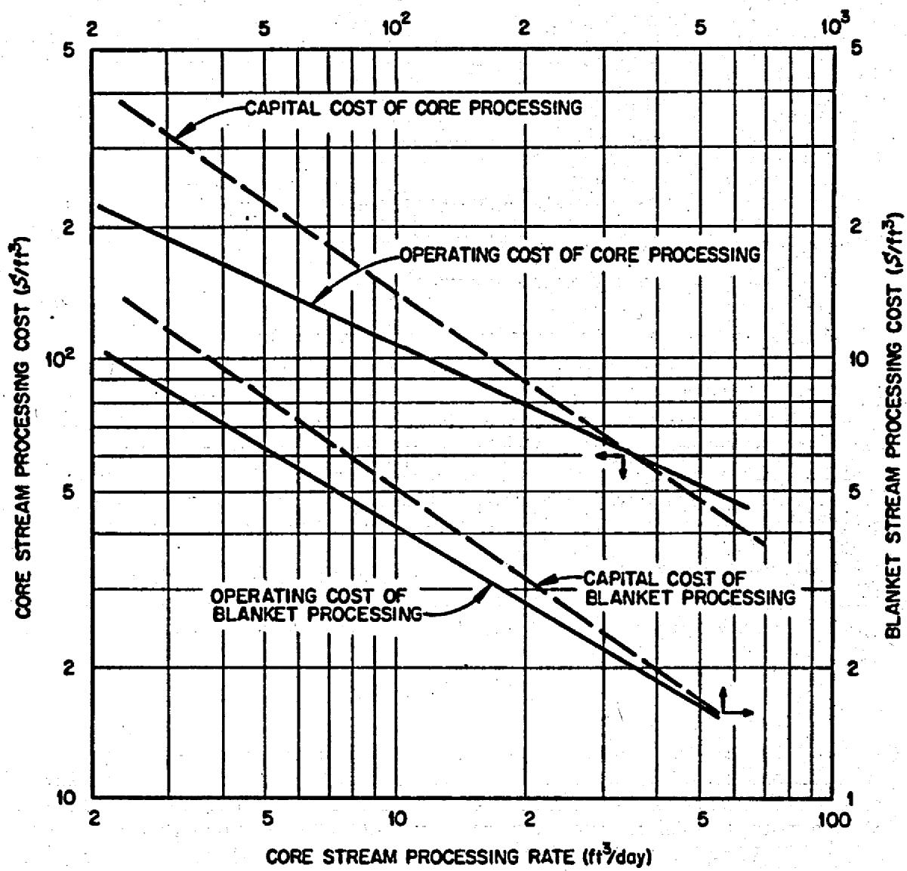  
BLANKET STREAM PROCESSING RATE (ft $^3$ /day)   
Fig. 11. MSBR Fuel-Recycle Costs as a Function of Processing Rates. Fluoride volatility plus vacuum distillation processing for core; fluoride volatility processing for blanket; 0.8 plant factor; $12\%$ /yr capital charges for investor-owned processing plant.

fuel cycle cost, and then, without appreciably increasing this cost, the highest fuel yield.

# Analysis Procedures and Basic Assumptions

The nuclear calculations were performed with a multigroup, diffusion, equilibrium reactor program, which calculated the nuclear performance, the equilibrium concentrations of the various nuclides, including the fission products, and the fuel-cycle cost for a given set of conditions. The 12-group neutron cross sections were obtained from neutron spectrum calculations, with the core heterogeneity taken into consideration in the thermal-neutron-spectrum computations. The nuclear designs were optimized by parameter studies, with most emphasis on minimum fuel-cycle cost and with lesser weight given to maximizing the annual fuel yield. Typical parameters varied were the reactor dimensions, blanket thickness, fractions of fuel and fertile salts in the core, and the fuel- and fertile-stream processing rates.

The basic economic assumptions employed in obtaining the fuel-cycle costs are given in Table 12. The processing costs are based on those given in the previous section and are included in the fuel-cycle costs. A fissile material loss of $0.1\%$ per pass through the fuel-recycle plant was applied.

Table 12. Economic Ground Rules Used in Obtaining Fuel-Cycle Costs   

<table><tr><td>Reactor power, Mw(e)</td><td>1000</td></tr><tr><td>Thermal efficiency, %</td><td>45</td></tr><tr><td>Load factor</td><td>0.80</td></tr><tr><td>Cost assumptions</td><td></td></tr><tr><td>Value of 233U and 233Pa, $/g</td><td>14</td></tr><tr><td>Value of 235U, $/g</td><td>12</td></tr><tr><td>Value of thorium, $/kg</td><td>12</td></tr><tr><td>Value of carrier salt, $/kg</td><td>26</td></tr><tr><td>Capital charge, %/yr</td><td></td></tr><tr><td>Private financing</td><td></td></tr><tr><td>Depreciating capital</td><td>12</td></tr><tr><td>Nondepreciating capital</td><td>10</td></tr><tr><td>Public financing</td><td></td></tr><tr><td>Depreciating capital</td><td>7</td></tr><tr><td>Nondepreciating capital</td><td>5</td></tr><tr><td colspan="2">Processing cost: given by curves in Fig. 11, plus cost given by Eq. (1), where applicable.</td></tr></table>

The effective behavior used in the fuel-cycle-performance calculations for the various fission products was that given in Table 13. The gas-stripping system is provided to remove fission-product gases from the fuel salt. In the calculations reported here, the $^{135}\mathrm{Xe}$ poison fraction was assumed to be 0.005.

Table 13. Behavior of Fission Products in MSBR Systems   

<table><tr><td>Behavior</td><td>Fission Products</td></tr><tr><td>Elements present as gases; assumed to be removed by gas stripping (a poison fraction of 0.005 was applied)</td><td>Kr, Xe</td></tr><tr><td>Elements that form stable metallic colloids; removed by fuel processing</td><td>Ru, Rh, Pd, Ag, In</td></tr><tr><td>Elements that form either stable fluorides or stable metallic colloids; removed by fuel processing</td><td>Se, Br, Nb, Mo, Tc, Te, I</td></tr><tr><td>Elements that form stable fluorides less volatile than LiF; separated by vacuum distillation</td><td>Sr, Y, Ba, La, Ce, Pr, Nd, Pm, Sm, Eu, Gd, Tb</td></tr><tr><td>Elements that are not separated from the carrier salt; removed only by salt discard</td><td>Rb, Cd, Sn, Cs, Zr</td></tr></table>

The control of corrosion products in molten-salt fuels does not appear to be a significant problem, so the effect of corrosion products was neglected in the nuclear calculations. The corrosion rate of Hastelloy N in molten salts is very low; in addition, the fuel-processing operations can control corrosion-product buildup in the fuel.

The important parameters describing the MSBR and MSBR(Pa) designs are given in Table 8. Many of the parameters were fixed by the ground rules for the evaluation or by engineering-design factors that include the thermal efficiency, plant factor, capital charge rate, maximum fuel velocity, size of fuel tubes, processing costs, fissile-loss rate, and the out-of-core fuel inventory. The parameters optimized in the fuel-cycle calculations were the reactor dimensions, power density, core composition (including the carbon-to-uranium and thorium-to-uranium ratios), and processing rates.

# Nuclear Performance and Fuel-Cycle Cost

The general results of the nuclear calculations are given in Table 8; the neutron-balance results are given in Table 14. The basic reactor design has the advantage of zero neutron losses to structural materials in the core other than the moderator. Except for the loss of delayed neutrons in the external fuel circuit, there is almost no neutron leakage from the reactor because of the thick blanket. The neutron losses to fission products are low because of the low cycle times associated with fission-product removal.

The components of the fuel-cycle cost for the MSBR(Pa) and the MSBR are summarized in Table 15. The main components are the fissile inventory and processing costs. The inventory costs are rather rigid for a given reactor design, since they are largely determined by the external fuel volume. The processing costs are a function of the processing-cycle times, one of the chief parameters optimized in this study. As shown by the results in Tables 8 and 15 the ability to remove protactinium directly from the blanket stream has a marked effect on the fuel yield and lowers the fuel-cycle cost by about 0.1 mill/kwhr(e). This is due primarily to the decrease in neutron absorptions by protactinium when this nuclide is removed from the core and blanket regions.

In obtaining the reactor design conditions, the optimization procedure considered both fuel yield and fuel-cycle cost as criteria of performance. The corresponding fuel-cycle performance is shown in Fig. 12, which gives the minimum fuel-cycle cost as a function of fuel-yield rate based on privately financed plants and a plant factor of 0.8. The design conditions for the MSBR(Pa) and MSBR concepts correspond to the designated points in Fig. 12.

# Power-Production Cost and Fuel-Utilization

# Characteristics

The power-production costs are based on the capital costs given above, operation and maintenance charges, and fuel-cycle costs. Table 16 summarizes the power-production cost and the fuel-utilization characteristics of the MSBR(Pa) and MSBR plants. Both concepts produce power at low cost and have good fuel-utilization characteristics. In terms of fuel utilization, the MSBR(Pa) concept is comparable to a fast breeder reactor with a specific inventory of $3\mathrm{kg}$ of fissile material per megawatt of electricity produced and a doubling time of 9 years, while the MSBR plant is comparable to the same fast breeder with a doubling time of 12 years.

# Alternatives to the Reference Design

The MSBR and MSBR(Pa) reference design represents extrapolation to a large scale of technology that has been mostly demonstrated on a much smaller scale. The major uncertainty is whether the graphite fuel cells will have an economical life in the high fast neutron flux in the core.

Table 14. Neutron Balances for the MSBR(Pa) and the MSBR Design Conditions   

<table><tr><td rowspan="2">Material</td><td colspan="3">MSBR(Pa) Neutrons per Fissile Absorption</td><td colspan="3">MSBR Neutrons per Fissile Absorption</td></tr><tr><td>Total Absorbed</td><td>Absorbed Producing Fission</td><td>Neutrons Produced</td><td>Total Absorbed</td><td>Absorbed Producing Fission</td><td>Neutrons Produced</td></tr><tr><td>233Th</td><td>0.9970</td><td>0.0025</td><td>0.0058</td><td>0.9710</td><td>0.0025</td><td>0.0059</td></tr><tr><td>233Pa</td><td>0.0003</td><td></td><td></td><td>0.0079</td><td></td><td></td></tr><tr><td>233U</td><td>0.9247</td><td>0.8213</td><td>2.0541</td><td>0.9119</td><td>0.8090</td><td>2.0233</td></tr><tr><td>234U</td><td>0.0819</td><td>0.0003</td><td>0.0008</td><td>0.0936</td><td>0.0004</td><td>0.0010</td></tr><tr><td>235U</td><td>0.0753</td><td>0.0607</td><td>0.1474</td><td>0.0881</td><td>0.0708</td><td>0.1721</td></tr><tr><td>236U</td><td>0.0084</td><td>0.0001</td><td>0.0001</td><td>0.0115</td><td>0.0001</td><td>0.0001</td></tr><tr><td>237Np</td><td>0.0009</td><td></td><td></td><td>0.0014</td><td></td><td></td></tr><tr><td>238U</td><td>0.0005</td><td></td><td></td><td>0.0009</td><td></td><td></td></tr><tr><td>Carrier salt (except 6Li)</td><td>0.0647</td><td></td><td>0.0186</td><td>0.0623</td><td></td><td>0.0185</td></tr><tr><td>6Li</td><td>0.0025</td><td></td><td></td><td>0.0030</td><td></td><td></td></tr><tr><td>Graphite</td><td>0.0323</td><td></td><td></td><td>0.0300</td><td></td><td></td></tr><tr><td>135Xe</td><td>0.0050</td><td></td><td></td><td>0.0050</td><td></td><td></td></tr><tr><td>149Sm</td><td>0.0068</td><td></td><td></td><td>0.0069</td><td></td><td></td></tr><tr><td>151Sm</td><td>0.0017</td><td></td><td></td><td>0.0018</td><td></td><td></td></tr><tr><td>Other fission products</td><td>0.0185</td><td></td><td></td><td>0.0196</td><td></td><td></td></tr><tr><td>Delayed neutrons losta</td><td>0.0049</td><td></td><td></td><td>0.0050</td><td></td><td></td></tr><tr><td>Leakageb</td><td>0.0012</td><td></td><td></td><td>0.0012</td><td></td><td></td></tr><tr><td>Total</td><td>2.2268</td><td>0.8849</td><td>2.2268</td><td>2.2209</td><td>0.8828</td><td>2.2209</td></tr></table>

${}^{8}$ Delayed neutrons emitted outside core.   
bLeakage, including neutrons absorbed in reflector.

Table 15. Fuel-Cycle Cost for MSBR(Pa) and MSBR Plantsa,c   

<table><tr><td rowspan="2"></td><td colspan="4">MSBR(Pa) Cost (mill/kwhr)</td><td colspan="4">MSBR Cost [mill/kwhr(e)]</td></tr><tr><td>Fuel Stream</td><td>Fertile Stream</td><td>Subtotal</td><td>Grand Total</td><td>Fuel Stream</td><td>Fertile Stream</td><td>Subtotal</td><td>Grand Total</td></tr><tr><td>\( Fissile~inventory^b \)</td><td>0.1198</td><td>0.0208</td><td>0.1413</td><td></td><td>0.1247</td><td>0.0324</td><td>0.1571</td><td></td></tr><tr><td>Fertile inventory</td><td>0.0000</td><td>0.0179</td><td>0.0179</td><td></td><td></td><td>0.0459</td><td>0.0459</td><td></td></tr><tr><td>Salt inventory</td><td>0.0156</td><td>0.0226</td><td>0.0396</td><td></td><td>0.0154</td><td>0.0580</td><td>0.0734</td><td></td></tr><tr><td>Total inventory</td><td></td><td></td><td></td><td>0.20</td><td></td><td></td><td></td><td>0.28</td></tr><tr><td>Fertile replacement</td><td>0.0000</td><td>0.0041</td><td>0.0041</td><td></td><td></td><td>0.0185</td><td>0.0185</td><td></td></tr><tr><td>Salt replacement</td><td>0.0636</td><td>0.0035</td><td>0.0671</td><td></td><td>0.0565</td><td>0.0217</td><td>0.0782</td><td></td></tr><tr><td>Total replacement</td><td></td><td></td><td></td><td>0.07</td><td></td><td></td><td></td><td>0.10</td></tr><tr><td>Processing</td><td>0.1295</td><td>0.0637</td><td>0.1932</td><td></td><td>0.1223</td><td>0.0440</td><td>0.1663</td><td></td></tr><tr><td>Total processing</td><td></td><td></td><td></td><td>0.19</td><td></td><td></td><td></td><td>0.17</td></tr><tr><td>Production credit</td><td></td><td></td><td></td><td>(0.10)</td><td></td><td></td><td></td><td>(0.07)</td></tr><tr><td>Net fuel-cycle cost</td><td></td><td></td><td></td><td>0.36</td><td></td><td></td><td></td><td>0.48</td></tr></table>

${}^{a}$ Based on investor-owned power plant and 0.80 plant factor.   
bIncluding 233Pa, 233U,and 235U.   
cRevised

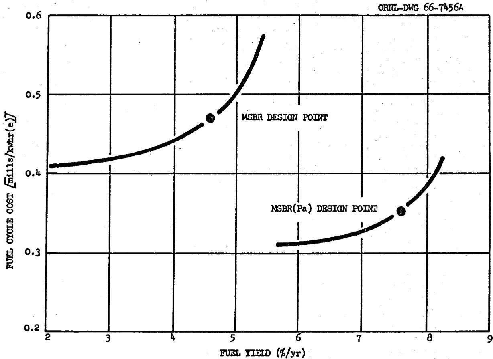  
Fig. 12. Variation of Fuel-Cycle Cost with Fuel Yield in MSBR and MSBR(Pa) Concepts.

Table 16. Power-Production Cost and Fuel-Utilization Characteristics of the MSBR(Pa) and the MSBR Plantsa,e   

<table><tr><td></td><td colspan="2">MSBR(Pa)</td><td colspan="2">MSBR</td></tr><tr><td>Specific fissile inventory, kg/mw(e)</td><td colspan="2">0.72</td><td colspan="2">0.81</td></tr><tr><td>Specific fertile inventory, kg/Mw(e)</td><td colspan="2">101</td><td colspan="2">260</td></tr><tr><td>Breeding ratio</td><td colspan="2">1.07</td><td colspan="2">1.05</td></tr><tr><td>Fuel-yield rate, %/yr</td><td colspan="2">7.5</td><td colspan="2">4.5</td></tr><tr><td>Fuel doubling time, years</td><td colspan="2">13.0</td><td colspan="2">22.0</td></tr><tr><td>Power doubling time, years</td><td colspan="2">9.3</td><td colspan="2">15.0</td></tr><tr><td></td><td>Private Financing</td><td>Public Financing</td><td>Private Financing</td><td>Public Financing</td></tr><tr><td>Capital charges, mills/kwhr(e)</td><td>1.95</td><td>1.10</td><td>1.95</td><td>1.10</td></tr><tr><td>Operating and maintenance cost, mill/kwhr(e)</td><td>0.34</td><td>0.34</td><td>0.34</td><td>0.34</td></tr><tr><td>Fuel-cycle cost, mill/kwhr(e)</td><td>0.36</td><td>0.21</td><td>0.48</td><td>0.30</td></tr><tr><td>Power-production cost, mills/kwhr(e)</td><td>2.7</td><td>1.7</td><td>2.8</td><td>1.8</td></tr></table>

${}^{a}$ Based on 1000-Mw(e) plant and a 0.8 load factor. Private financing considers a capital charge rate of ${12}\%$ ’yr for depreciating capital and of ${10}\%$ ’/yr for nondeprecipitating capital; public financing considers a capital charge rate of 7%/yr for depreciating capital and 5%/yr for nondeprecipitating capital.   
bInverse of the fuel-yield rate.   
cCapability based on continuous investment of the net bred fuel in new reactors; equal to the reactor fuel doubling time multiplied by 0.693.   
Costs of on-site integrated processing plant included in this value.   
$\mathbf{e}_{\mathrm{Revised}}$

This, in turn, is related to the cost in equipment, effort, and downtime to do maintenance of the highly radioactive core and other components in the reactor primary systems. Several alternatives to the reference design have been proposed and they are primarily concerned with making these problems less difficult and in some instances with generally improving the performance of the breeders. These alternatives and the extent to which they should be included in the program of development of large power breeder stations are discussed below.

# Modular Designs

The reference design has four fuel circuits and four blanket circuits operating off one reactor vessel in order to produce 1000 Mw(e). One coolant circuit is provided for each fuel and blanket circuit. If a graphite tube in the core were to fail or a pump in the primary system were to stop or a tube in a primary heat exchanger were to fail, the entire plant would have to be shut down until the fault was repaired. We believe the components can be made reliable enough so that such shutdowns will be infrequent, but they will happen.

As an alternative, a modular design was evolved with the objective of providing assurance of high plant availability. Each primary circuit of the reference design and its secondary circuits were connected to a separate reactor vessel to provide four 556-Mw(th) reactor modules. The modules were installed in separate cells so that one could be repaired while the others were operating. The layout is shown in plan and elevation in Figs. 13 and 14.

Although the modular design has four reactor vessels, they are smaller than the reference vessel. The average power density in the fuel salt and in the core are the same as in the reference reactor; the reactor vessel for each module is about 12 ft in diameter by 15 ft high, as compared with 14 ft diam by 19 ft high for the reference design. Most of the rest of the equipment in the two types of plants is the same, and the plants are of very nearly the same size. The increase in total cost of the modular plant over the reference plant would be about $4\%$ ; there is no significant difference in breeding performance or in cost of the power produced.

The reference design and the modular design described above operate at the same high power density in the core and the graphite is subjected to a high dose of damaging neutrons in a few years-- $10^{23}$ neutrons/ $\mathsf{cm}^2$ (max) in four to six full-power years depending on the amount of flux flattening that can be achieved. This dose is a factor of 4 higher than has been achieved to date in in-pile testing, and having to replace the graphite every 5 years is estimated to increase the power cost by 0:05 to 0.1 mill/kwhr. Although there is considerable confidence that graphite can be developed to perform satisfactorily to even greater doses, several years of irradiation in the HFIR and in EBR-II or other fast test reactors is required to provide a firm basis for this confidence.

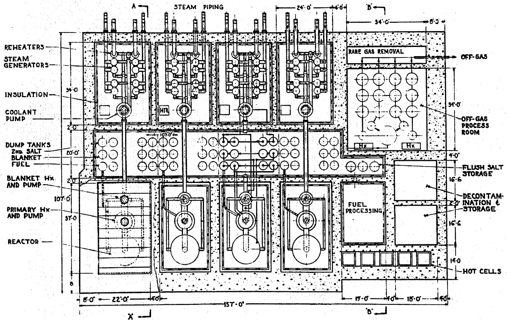  
Fig. 13. Molten-Salt Breeder Reactor Plan of Modular Units.

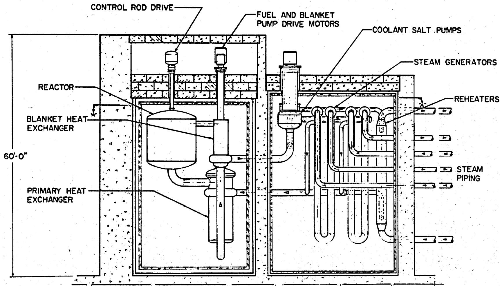  
Fig. 14. Elevation of Modular Units.

For these reasons the first molten-salt breeder reactors are likely to be operated at lower power densities where an acceptable core life is more easily assured, so considerable attention is being given to a modular plant in which the average power density in the core is $40 \mathrm{kw} / \mathrm{liter}$ half the power density in the core of the reference design. Again the only significant physical change in the plant is in the size of the core and the reactor vessel. The reactor vessels become about 13 ft in diameter by 17 ft high; the breeding ratio remains about the same, but the yield decreases; the capital cost would be about $8\%$ higher than for the reference plant. Some characteristics of modular plants with full and half power density in the core, with and without protactinium removal, are shown in Tables 17 and 18. The plant factor is 0.8 as for the reference design, no credit being taken for being able to maintain a higher plant factor.

Whether the modular design represents a more attractive or a less attractive alternative to the reference design depends on the outlook of each designer and operator. The modules can be made larger than 556 Mw(th) if desired, the capacity depending on the fraction of plant the operator is willing to have shut down for repair on short notice. No special development is required for the modular design. It should receive continued attention as design studies are made. Construction of a plant of the size of one module could be a desirable step in the development of large power breeder stations.

# Mixed-Fuel Reactor

In the reference design, graphite cells or tubes with graphite-to-metal joints on one end are used to keep the fuel and blanket salts from mixing in the reactor vessel. The major feasibility question in the design is whether the damage to the graphite by the high flux of fast neutrons will cause the cells to crack or break in less than the three to five years required for replacement to be economical.

An alternative to this type of reactor is one in which both thorium and uranium are contained in the fuel salt which flows through channels in graphite bars much as it does in the MSRE. In order for the reactor to be a breeder the core would have to be surrounded by a blanket as shown in Fig. 15. The wall separating the core and blanket would be Hastelloy N, niobium, or molybdenum, $1/8$ to $1/4$ in. thick. Whether a satisfactory core tank can be developed is the major feasibility question of this reactor.

The breeding performance of such a reactor is shown in Table 19. The specific inventory and the doubling time can be attractively low. Major requirements are that satisfactory processes be invented to separate protactinium continuously from uranium and thorium in the fuel stream and to separate thorium from fission products. The demands on fuel processing for this reactor are considerably greater than those imposed by the reference MSBR.

Table 17. Design Values for Modular Plants   

<table><tr><td rowspan="2"></td><td colspan="2">Full Power Density</td><td colspan="2">Half Power Density</td></tr><tr><td>With Pa Removal</td><td>Without Pa Removal</td><td>With Pa Removal</td><td>Without Pa Removal</td></tr><tr><td colspan="5">Power, Mw</td></tr><tr><td>Thermal - per module</td><td>556</td><td>556</td><td>556</td><td>556</td></tr><tr><td>- total</td><td>2223</td><td>2223</td><td>2223</td><td>2225</td></tr><tr><td>Electrical - Total</td><td>1000</td><td>1000</td><td>1000</td><td>1000</td></tr><tr><td colspan="5">Core</td></tr><tr><td>Diameter, ft</td><td>6.34</td><td>6.34</td><td>8</td><td>8</td></tr><tr><td>Height, ft</td><td>8</td><td>8</td><td>10</td><td>10</td></tr><tr><td>Number of graphite fuel tubes</td><td>210</td><td>210</td><td>336</td><td>336</td></tr><tr><td>Volume, ft3</td><td>253</td><td>253</td><td>503</td><td>503</td></tr><tr><td colspan="5">Volume fractions</td></tr><tr><td>Fuel salt</td><td>0.164</td><td>0.164</td><td>0.165</td><td>0.165</td></tr><tr><td>Fertile salt</td><td>0.05</td><td>0.055</td><td>0.06</td><td>0.06</td></tr><tr><td>Graphite</td><td>0.786</td><td>0.781</td><td>0.775</td><td>0.775</td></tr><tr><td colspan="5">Average neutron fluxes, n/cm2sec</td></tr><tr><td>Thermal x 1014</td><td>6.56</td><td>5.62</td><td>3.44</td><td>3.3</td></tr><tr><td>Fast over 100 kV x 1014</td><td>2.91</td><td>2.90</td><td>1.48</td><td>1.48</td></tr><tr><td colspan="5">Average power density, kw/liter</td></tr><tr><td>Gross</td><td>78</td><td>78</td><td>39</td><td>39</td></tr><tr><td>Fuel salt</td><td>475</td><td>475</td><td>237</td><td>237</td></tr><tr><td colspan="5">Average fuel salt temperatures, °F</td></tr><tr><td>In</td><td>1000</td><td>1000</td><td>1000</td><td>1000</td></tr><tr><td>Out</td><td>1300</td><td>1300</td><td>1300</td><td>1300</td></tr><tr><td>Fuel salt flow, ft3/sec</td><td>25</td><td>25</td><td>25</td><td>25</td></tr><tr><td colspan="5">Blanket</td></tr><tr><td colspan="5">Thickness, ft</td></tr><tr><td>Axial</td><td>1.25</td><td>1.25</td><td>1.25</td><td>1.25</td></tr><tr><td>Radial</td><td>2</td><td>2.32</td><td>1.5</td><td>1.5</td></tr><tr><td colspan="5">Average blanket salt temperatures, °F</td></tr><tr><td>In</td><td>1150</td><td>1150</td><td>1150</td><td>1150</td></tr><tr><td>Out</td><td>1250</td><td>1250</td><td>1250</td><td>1250</td></tr><tr><td>Blanket salt flow, ft3/sec</td><td>0.2</td><td>1.2</td><td>0.2</td><td>1.8</td></tr><tr><td colspan="5">Volume fractions</td></tr><tr><td>Blanket salt</td><td>0.65</td><td>0.714</td><td>60</td><td>60</td></tr><tr><td>Graphite</td><td>0.35</td><td>0.286</td><td>40</td><td>40</td></tr><tr><td>Reflector thickness, in.</td><td>6</td><td>6</td><td>6</td><td>6</td></tr><tr><td>Reactor vessel dimensions, ft</td><td></td><td></td><td></td><td></td></tr><tr><td>Diameter</td><td>11.4</td><td>12</td><td>12.00</td><td>12.00</td></tr><tr><td>Height</td><td>~13</td><td>~13</td><td>~17</td><td>~17</td></tr><tr><td>Salt Compositions, mole, %</td><td></td><td></td><td></td><td></td></tr><tr><td>Fuel</td><td></td><td></td><td></td><td></td></tr><tr><td>LiF</td><td>63.5</td><td>63.5</td><td>63.5</td><td>63.5</td></tr><tr><td>BeF2</td><td>36.2</td><td>36.2</td><td>36.2</td><td>36.2</td></tr><tr><td>UF4(fissile)</td><td>0.22</td><td>0.25</td><td>0.21</td><td>0.22</td></tr><tr><td>Blanket</td><td></td><td></td><td></td><td></td></tr><tr><td>LiF</td><td>71</td><td>71</td><td>71</td><td>71</td></tr><tr><td>BeF2</td><td>2</td><td>2</td><td>2</td><td>2</td></tr><tr><td>ThF4</td><td>27</td><td>27</td><td>27</td><td>27</td></tr><tr><td>System Inventories</td><td></td><td></td><td></td><td></td></tr><tr><td>Fuel salt, ft3</td><td>169</td><td>169</td><td>229</td><td>229</td></tr><tr><td>Blanket salt, ft3</td><td>532</td><td>1063</td><td>565</td><td>973</td></tr><tr><td>Fissile material, kg</td><td>175</td><td>217</td><td>218</td><td>253</td></tr><tr><td>Fertile material, 1000 kg</td><td>41</td><td>81</td><td>43</td><td>75</td></tr><tr><td>Processing Data - Full Plant</td><td></td><td></td><td></td><td></td></tr><tr><td>Fuel stream</td><td></td><td></td><td></td><td></td></tr><tr><td>Cycle time, days</td><td>30.4</td><td>34.5</td><td>50</td><td>50</td></tr><tr><td>Rate, ft3/day</td><td>20.8</td><td>18.4</td><td>17.6</td><td>17.6</td></tr><tr><td>Blanket stream</td><td></td><td></td><td></td><td></td></tr><tr><td>Fluoride volatility</td><td></td><td></td><td></td><td></td></tr><tr><td>Cycle time,</td><td></td><td></td><td></td><td></td></tr><tr><td>days</td><td>45.3</td><td>37</td><td>50</td><td>50</td></tr><tr><td>Rate, ft3/day</td><td>46</td><td>112</td><td>44.4</td><td>76.4</td></tr><tr><td>Protactinium removal</td><td></td><td></td><td></td><td></td></tr><tr><td>Cycle time, days</td><td>0.42</td><td>--</td><td>0.42</td><td>--</td></tr><tr><td>Rate, ft3/day</td><td>5112</td><td>--</td><td>5360</td><td>--</td></tr><tr><td>Net breeding ratio</td><td>1.06</td><td>1.05</td><td>1.07</td><td>1.05</td></tr><tr><td>Specific inventory, kg fissile/Mw(e)</td><td>0.70</td><td>0.87</td><td>0.87</td><td>1.01</td></tr><tr><td>Specific power, Mw(th)/kg fissile</td><td>3.2</td><td>2.6</td><td>2.6</td><td>2.2</td></tr><tr><td>Fuel yield, %/year</td><td>6.8</td><td>4.6</td><td>6.0</td><td>3.9</td></tr><tr><td>Fuel doubling time, year</td><td>15</td><td>22</td><td>17</td><td>26</td></tr><tr><td>Reactor doubling time, yr</td><td>10</td><td>15</td><td>12</td><td>18</td></tr></table>

Table 18. Fuel-Cycle Costs from Modular Plants   

<table><tr><td rowspan="2"></td><td colspan="2">Full Power Density</td><td colspan="2">Half Power Density</td></tr><tr><td>With Pa Removal</td><td>Without Pa Removal</td><td>With Pa Removal</td><td>Without Pa Removal</td></tr><tr><td colspan="5">Fissile Inventory</td></tr><tr><td>Fuel Stream</td><td>0.1160</td><td>0.1300</td><td>0.1498</td><td>0.1524</td></tr><tr><td>Fertile Stream</td><td>0.0206</td><td>0.0397</td><td>0.0208</td><td>0.0458</td></tr><tr><td>Subtotal</td><td>0.1366</td><td>0.1697</td><td>0.1706</td><td>0.1982</td></tr><tr><td>Fertile Inventory</td><td>0.0287</td><td>0.0574</td><td>0.0305</td><td>0.0525</td></tr><tr><td>Carrier Salt</td><td>0.0514</td><td>0.0878</td><td>0.0588</td><td>0.0868</td></tr><tr><td>Total Inventory</td><td>0.2167</td><td>0.3149</td><td>0.2599</td><td>0.3375</td></tr><tr><td colspan="5">Salt Replacement</td></tr><tr><td>Fissile Stream</td><td>0.0868</td><td>0.0764</td><td>0.0732</td><td>0.0732</td></tr><tr><td>Fertile Stream</td><td>0.0069</td><td>0.0169</td><td>0.0067</td><td>0.0115</td></tr><tr><td>Subtotal</td><td>0.0937</td><td>0.0933</td><td>0.0799</td><td>0.0847</td></tr><tr><td>Fertile Replacement</td><td>0.0068</td><td>0.0146</td><td>0.0066</td><td>0.0104</td></tr><tr><td>Total Replacement</td><td>0.1005</td><td>0.1079</td><td>0.0865</td><td>0.0951</td></tr><tr><td colspan="5">Processing</td></tr><tr><td>Fissile Stream</td><td>0.1279</td><td>0.1216</td><td>0.1195</td><td>0.1195</td></tr><tr><td>Fertile Stream</td><td>0.0681</td><td>0.0368</td><td>0.0671</td><td>0.0316</td></tr><tr><td>Total Processing</td><td>0.1960</td><td>0.1584</td><td>0.1866</td><td>0.1511</td></tr><tr><td>Production Credit</td><td>0.0920</td><td>0.0760</td><td>0.1021</td><td>0.0766</td></tr><tr><td>Net Fuel Cycle Cost</td><td>0.42</td><td>0.51</td><td>0.43</td><td>0.51</td></tr></table>

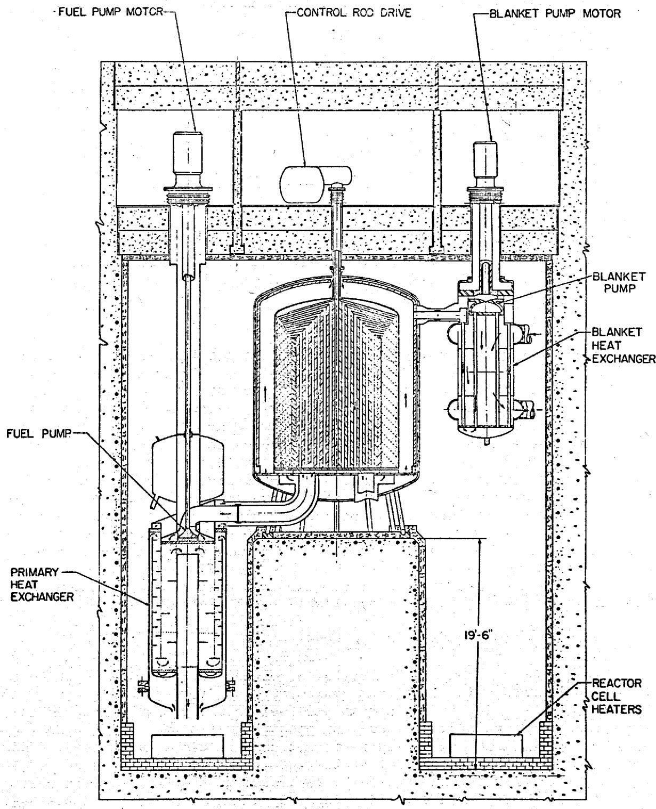  
Fig. 15. Mixed-Fuel 1000-Mw(e) Reactor Cell Elevation.

Table 19. Some Performance Data for Mixed-Fuel Reactor   

<table><tr><td>Core size, ft</td><td>10 diam x 15 high</td></tr><tr><td>Power density in fuel, kw(th)/liter</td><td>360</td></tr><tr><td>Fuel composition, mole %</td><td>66 LiF-25 BeF2-8.7 ThF4-0.3 UF4</td></tr><tr><td>Specific power, Mw(th)/kg 233U</td><td>3.2</td></tr><tr><td>Specific inventory, kg 233U/Mw(e)</td><td>0.68</td></tr><tr><td>Breeding ratio</td><td>1.06</td></tr><tr><td>Yield, % per annum</td><td>7.2</td></tr><tr><td>Fuel cycle cost,a mills/kwhr(e)</td><td>0.33</td></tr></table>

${}^{a}$ Assumes that processing is no more complicated or expensive than for reference MSBR.

This alternative is attractive if serious problems are encountered with the graphite tubes of the reference design, but substitutes problems of a metal core tank and more difficult reprocessing. The neutron absorption in the metal core tank increases with decreasing core size, so the breeding performance would suffer if a modular design were used and the reactor were made smaller to keep the specific inventory low. Work on the mixed-fuel reactor should be limited to laboratory studies (or observation of other groups' studies) of the effects of radiation on the high-temperature properties of potential core-tank materials, the compatibility of those materials with fluoride salts and graphite, and methods of processing the fuel. If the results in the main line program indicate that the graphite cells are unlikely to perform satisfactorily in the reference design, the development should be shifted to this mixed-fuel alternative. The reactors are so similar that most of the work done on the reference breeder would be applicable to this alternative.

# Direct-Contact Cooling with Molten Lead

The reference-design MSBR has three volumes of fuel outside the core in heat exchanger, piping, plenum chambers, etc., for each volume of fuel in the core. Studies indicate that the fuel volume could be reduced to about one volume outside the core for each volume in the core if the fuel salt were circulated and cooled by direct contact with molten lead. The lead would be pumped into a jet at the lower end of each fuel tube. Salt and lead would mix in the jet and be separated at the outlet. The salt would return directly through the graphite cells to the core and the lead would be pumped either through intermediate heat exchangers or directly to the steam generators.

This system has several advantages. Ideally the specific inventory could be reduced to 0.3 to $0.4\mathrm{kg}$ of ${}^{233}\mathrm{U}$ per megawatt (electrical) and

the doubling time to 5 or 6 years. Relatively inexpensive lead would be substituted for some of the lithium and beryllium fluorides. The lead pumps and heat exchangers could be arranged for maintenance of individual units with the remainder of the plant operating. Some parts of the plant should be considerably simplified.

There are some uncertainties also. Thermodynamics data indicate that lead, fuel and blanket salts, graphite, and refractory metals such as niobium and molybdenum alloys should be compatible. Preliminary tests indicate that this is true and that the much less expensive iron-chromium alloys might be used in the main lead systems. However, the materials problems are almost unexplored; little is known of the effects of radiation or fission products or of the ease of separating lead and salt.

The lead-cooled reactor represents an almost completely new technology that cannot presently be given a good evaluation. Work on the basic chemical, engineering, and materials problems of the system should be pursued to make a good evaluation possible within three or four years. If direct-contact cooling proved to be practical, its adoption could produce impressive improvements in the performance of the thermal breeders and could point the way to the use of molten-salt fuels in fast breeders.

# PROGRAM FOR DEVELOPMENT OF MOLTEN-SALT THERMAL BREEDER POWER PLANTS

We believe the information in the section on fuel utilization strongly indicates the need for the U.S. to be able to build 1000-Mw(e) or larger power breeder stations of high performance by about 1980, so they could be built at a rate near 50,000 Mw(e) per year by about 1990. The development program for a molten-salt thermal breeder should be aimed directly at that goal. This requires an aggressive program, carefully planned and executed and supported by firm intentions to carry it to completion unless developments along the way show that the technical or economic goals cannot be met.

# Steps in the Development

The technology as it presently exists is embodied in the Molten-Salt Reactor Experiment. The reactor is a one-region, one-fluid reactor. It operates at $1200^{\circ}\mathrm{F}$ but at 7.5 Mw(th), so the power density is low. Some exploratory tests, however, indicate that the fuel salts and the major structural materials--graphite and Hastelloy N--should be compatible at power densities far above the maximum in the reference breeder design. The MSRE plant includes some provision for fuel processing and for maintenance of radioactive equipment, but much less than will be needed in a power breeder plant.

Successful operation of the MSRE is providing an essential base for proceeding with larger reactors, but a true breeder pilot plant--a MoltenSalt Breeder Experiment--should be operated before building a prototype power breeder plant. The MSBE should include the essential features and

satisfy all the technical criteria of the reference design, but it should be about as small a plant as will meet these requirements. According to preliminary studies, the power would be 100 to 150 Mw(th). The experiment would demonstrate all the basic equipment and processes under the most severe conditions of the large plants; its essential purpose would be to produce information rather than electricity.

A prototype power breeder station would follow the MSBE. The size would be 250 to 500 Mw(e), one module of the modular design described above. A full-scale plant could then be obtained by adding modules to the prototype plant or by building a plant of the reference design with heat transfer circuits of the size developed for the prototype.

Plans are discussed here and in related reports for designing, developing, and building the MSBE. They are aimed at having the experiment in operation as soon as is consistent with resolving all basic problems before beginning construction and major procurement for the plant. Detailed design of the plant and research and development for all the parts proceed concurrently. Design in detail is essential for identifying all the development problems, and much of the development for a fluid fuel reactor consists of building, testing, and modifying the equipment that has been designed so that it will perform satisfactorily in the reactor.

Nuclear operation of the MSBE would begin in FY 1975. A prototype could be in operation by 1980, and its construction would bring into being the capability for building full-scale plants. This capability could then be expanded according to the needs of the time. We have not included a more detailed schedule or a projection of the development costs for the prototype or for plants beyond the prototype. If the MSBE fulfills its purpose, the development would consist largely of building and testing larger equipment and improving on demonstrated processes. The rate and manner in which the work on larger reactors would proceed and the distribution of expenditures between government and industry are uncertain and are completely out of our control. We therefore have limited our projections to the essential step in making this further development feasible and attractive to the equipment industry and the utilities.

# Present Status of the Technology - MSRE

The present status of the technology is best described in terms of the MSRE and some supplementary information. The MSRE is a molten-salt-fueled thermal reactor that produces heat at a rate of 7.5 Mw(th) while operating at about $1200^{\circ}\mathrm{F}$ . The purpose of the reactor is to provide a demonstration of the technology and a facility for investigating the compatibility of fuels and materials and the engineering features of molten-salt reactors. The design conditions are shown in the flow diagram in Fig. 16, and the general arrangement of the plant is shown in Fig. 17.

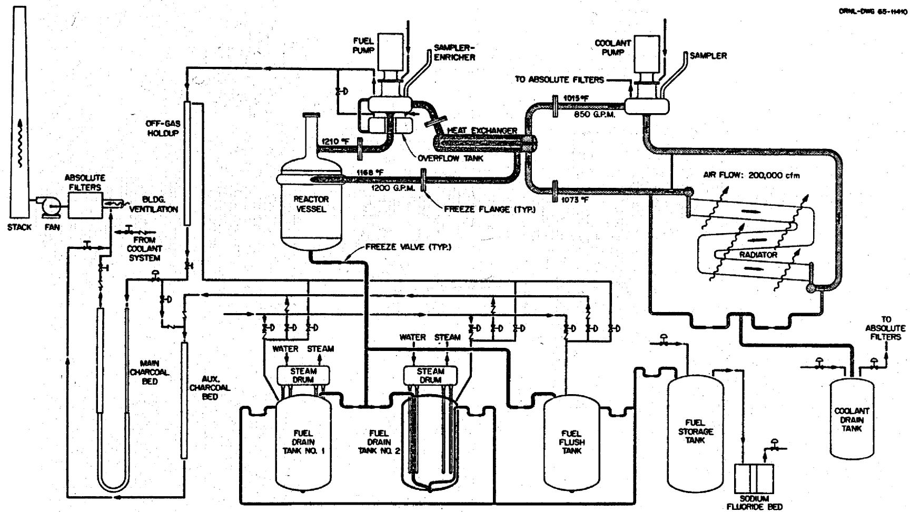  
Fig. 16. MSRE Flow Diagram.

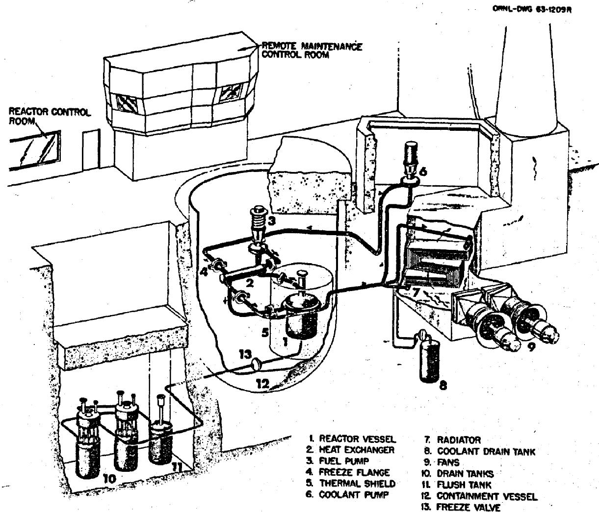  
Fig. 17. General Arrangement of MSRE.

The fuel for the MSRE is $65\%$ LiF-29.1% BeF2-5% ZrF4-0.9% UF4.* Except for the small amount of ZrF4 and the higher UF4 concentration, it is the fuel for the core of the reference breeder.

In the reactor primary system the fuel salt is recirculated by a sump-type centrifugal pump through a shell and U-tube heat exchanger and the reactor vessel. The flow rate is about 1250 gpm. The MSRE normally operates at about 7.5 Mw thermal and at that power level fuel enters the reactor at $1168^{\circ}\mathrm{F}$ and leaves at $1210^{\circ}\mathrm{F}$ . The base pressure in the system is 5 psig in the helium cover gas over the free surface of salt in the pump bowl. The maximum pressure is about 55 psig at the outlet of the pump.

The heat generated in the fuel salt as it passes through the reactor vessel is transferred in the heat exchanger to a molten-salt coolant containing $66\%$ LiF and $34\%$ BeF₂. The coolant is circulated by means of a second sump-type pump at a rate of 850 gpm through the heat exchanger, normally entering at $1015^{\circ}\mathrm{F}$ and leaving at $1073^{\circ}\mathrm{F}$ , and through a radiator where the heat is dissipated to the atmosphere. The base pressure in this system is also 5 psig in the pump tank; the maximum pressure, at the discharge of the pump, is 70 psig.

Drain tanks are provided for storing the fuel and the coolant salts at high temperature when the reactor is not operating. The salts drain from the primary and secondary systems by gravity. They are transferred between tanks or returned to the circulating systems by pressurizing the drain tanks with helium.

The fission product gases krypton and xenon are removed continuously from the circulating fuel salt by spraying salt at a rate of 50 gpm into the cover gas above the liquid level in the fuel pump tank. There they transfer from the liquid to the gas phase and are swept out of the tank by a small purge of helium. After a delay of about 1-1/2 hr in the piping, this gas passes through water-cooled beds of activated carbon. The krypton and xenon are delayed until all but the $\mathbf{85}\mathrm{Kr}$ decay and then are diluted with air and discharged to the atmosphere.

Fuel and coolant systems are provided with equipment for taking samples of the molten salt through pipes attached to the pump tanks while the reactor is operating at power. The fuel sampler is also used for adding small amounts of fuel to the reactor while at power to compensate for burnup.

Finally, the plant is provided with a simple processing facility for treating full 75-ft³ batches of fuel salt with hydrogen fluoride and fluoro-ine gases. The hydrogen fluoride treatment is for removing oxide contamination from the salt as H₂O. The fluorine treatment is the fluoride volatility process for removing the uranium as UF₆. The equipment approaches the size required for batchwise processing of the blanket of the 1000-Mw(e) reference reactor.

All the equipment in the MSRE that contains salt is made of Hastelloy N. All of it was designed to be able to operate at $1300^{\circ}\mathrm{F}$ . The liquidus temperature of fuel and coolant salts is near $850^{\circ}\mathrm{F}$ . It is desirable to keep the salts molten in the reactor systems and in the drain tanks, so the major pieces of equipment are installed in electrical furnaces and the piping is covered by electrical heaters and insulation.

The reactor primary system, the fuel drain tank system, and some auxiliaries become permanently radioactive during the first few hours of operation at appreciable power. Maintenance of this equipment and associated heaters, insulation, and services must be done remotely or semi-remotely by means of special tools. Tools have been developed for accomplishing this maintenance of the MSRE equipment.

The MSRE reactor vessel is shown in Fig. 18. It is about 5 ft diam by 8-1/2 ft high from the drain line at the bottom to the center of the outlet nozzle. The wall thickness of the cylindrical section is 9/16 in.; the top and bottom heads are 1-1/8 in. thick. The core contains approximately 600 vertical graphite bars 2 in. square x 67 in. long. Most of the bars have grooves 1.2 in. wide x 0.2 in. deep machined along the full length of each face. The bars are installed with the grooves on adjacent bars aligned to form channels 1.2 in. x 0.4 in. for the salt to flow through the core. The graphite is a new type with high strength, high density, and pore openings averaging about 0.4 microns in diameter. The salt does not wet the graphite and cannot penetrate through the small pores unless the pressure is raised to 5 to 20 times the normal pressure in the core.

Preliminary testing of the MSRE was begun in July, and fuel and coolant systems were heated for the first time for the prenuclear testing in the fall of 1964. The reactor was first critical in June 1965 and reached its maximum power of about 7.5 Mw(th) in June 1966. The accumulated operating experience through May 12, 1967, is presented in Table 20. Major activities are shown as a function of time in Figs. 19 and 20.

Table 20. Accumulated Operating Experience with MSRE   

<table><tr><td colspan="2">Fuel system</td></tr><tr><td>Circulating helium above 1000°F, hr</td><td>3465</td></tr><tr><td>Circulating salt above 1000°F, hr</td><td>9050</td></tr><tr><td>Full thermal cycles, 100°F to 1200°F</td><td>7</td></tr><tr><td colspan="2">Coolant system</td></tr><tr><td>Circulating helium above 1000°F, hr</td><td>2125</td></tr><tr><td>Circulating salt above 1000°F, hr</td><td>10,680</td></tr><tr><td>Full thermal cycles, 100°F to 1200°F</td><td>6</td></tr><tr><td>Time critical, hr</td><td>5790</td></tr><tr><td>Integrated power, Mwhr thermal</td><td>32,450</td></tr><tr><td>Effective full-power hours</td><td>4510</td></tr></table>

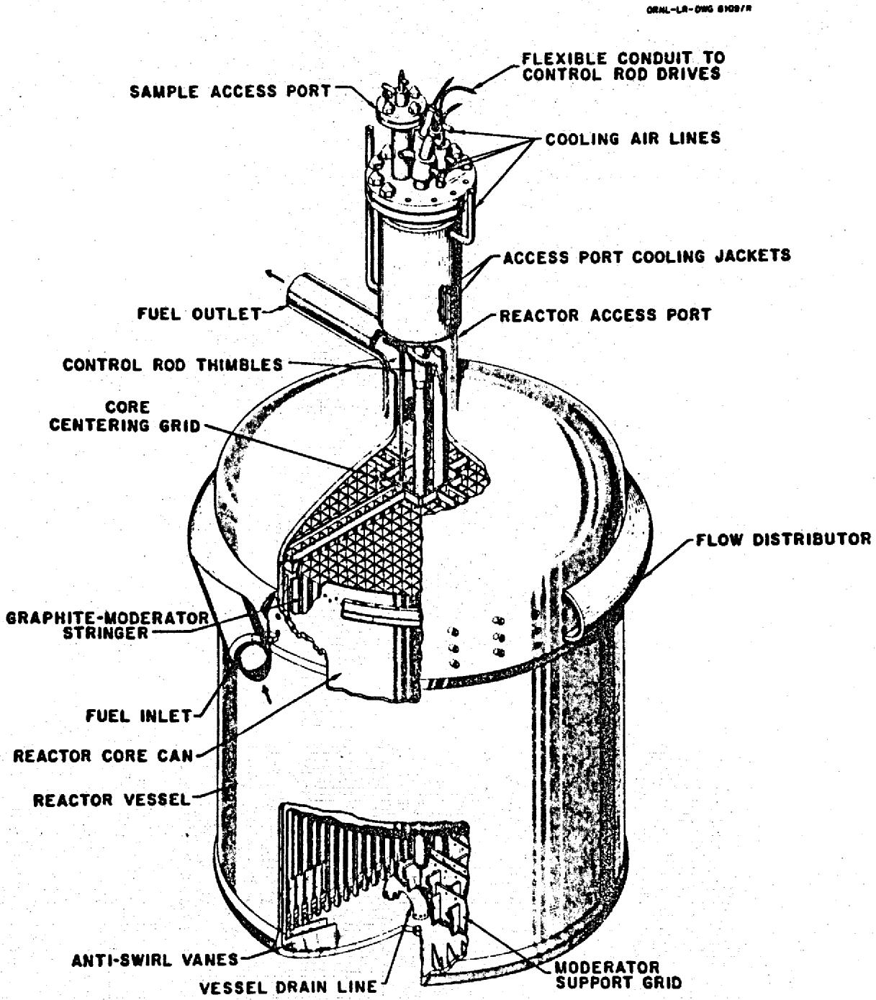  
Fig. 18. Reactor Vessel.

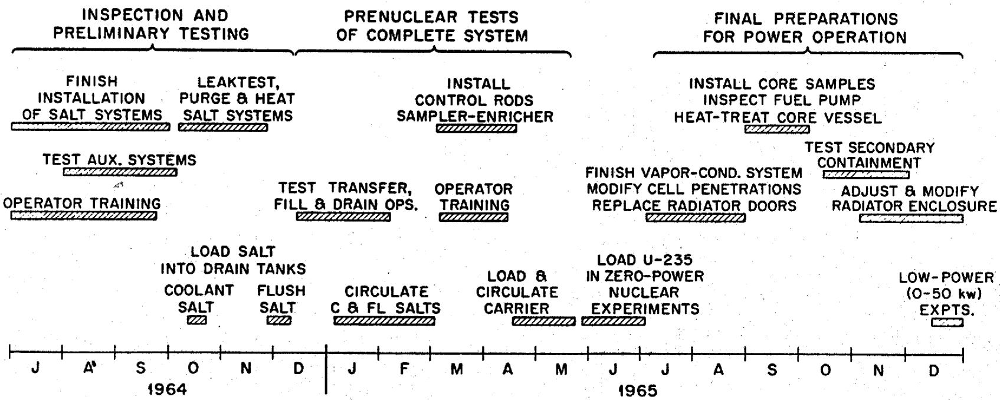  
Fig. 19. MSRE Activities - July 1964-December 1965.

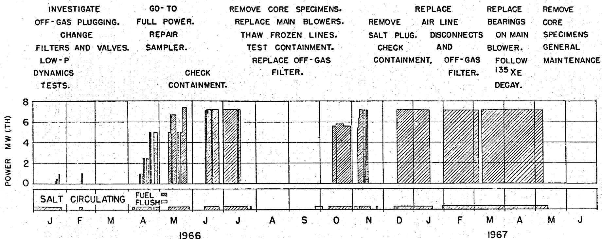  
Fig. 20. MSRE Activities - January 1966-May 1967.

In most respects the reactor has performed exceptionally well. Analyses for corrosion products in the salt indicate that there has been essentially no corrosion of the Hastelloy N by the salt. Inspection of some parts of the fuel system confirmed that the corrosion was negligible during about 1890 hours of circulating salt in prenuclear and critical tests. Samples removed from the core showed no attack on metal or graphite during the 2760 hours of subcritical and power operation from December 1965 through July 1966. Analyses of the fuel salt for uranium and reactivity balances indicate that the fuel has been completely stable.

Although there have been problems with auxiliaries and electrical systems, few problems have been encountered with the major reactor systems. The time to reach full power was extended several months by plugging of small lines in the off-gas system that handles the helium and gaseous fission products from the pump bowl. The reactor was shut down from mid-July to mid-October, 1966, by failure of the rotary elements of the blowers in the heat rejection system. After power operation was resumed in October, it was interrupted in November and again briefly in January for work on the off-gas line and on problems associated with monitoring of the reactor containment. In spite of these interruptions the reactor was critical $75\%$ of the time--mostly at full power, the fuel system operated $86\%$ of the time, and the coolant system operated $100\%$ of the time from mid-October until the reactor was shut down in mid-May, 1967, to remove graphite and metal specimens from the core. The major incidents are discussed more fully below.

The radiator housing is a large, insulated, electrically heated box around the radiator coils and is required so the radiator can be kept hot and the salt in it molten when the reactor is not producing fission heat. The difficulties were in obtaining proper operation of the doors and in controlling leakage of hot air through joints and through ducts for electrical leads to prevent overheating of equipment outside the housing. Future molten-salt reactors are unlikely to have similar radiators, but the experience will be helpful in designing better furnaces for other equipment.

The off-gas system was designed for a small flow of gas, essentially free of solid or liquid aerosols. Some difficulty was experienced with micron-size particles of salts collecting in the tiny ports of the flow control valves, but much more difficulty was experienced after the reactor began to operate at 1 Mw with organic solids and viscous organic liquids collecting in the valves and at the entrance to the carbon beds.

The bearings on the fuel circulation pump are lubricated and parts of the pump are cooled by oil. The oil is separated from the pump tank by a rotary seal. Provision is made for directing the normal seal leakage of 1 to 10 cc per day of oil to a waste tank and preventing liquid or vapor from coming in contact with the salt or cover gas in the pump tank. Under special conditions, demonstrated in a pump test loop, this oil can leak through a gasketed seal in the pump presently in the MSRE and into the pump tank where it vaporizes. The vapors mix with the helium purge stream and flow into the off-gas system. The oil has no effect on the

fuel salt, but the organic materials polymerize in the off-gas system under the intense beta radiation of the gaseous fission products to form the viscous liquids and solids that plugged the valves and the entrances to the carbon beds.

This problem has been reduced to a minor nuisance in the MSRE by installing absolute filters for trapping solids and heavy liquids ahead of the control valves. The leakage path has been eliminated in future pumps by substituting a welded seal for the gasketed seal. Small amounts of organic and inorganic vapors or aerosols are likely to be found in the off-gas from future reactors, but they can be easily controlled by the use of filters, traps, and absorbers.

The off-gas line was plugged once by frozen salt. This happened when the pump bowl was accidentally overfilled while the calibration of the liquid-level indicators was being investigated. Salt was discharged into some of the lines attached to the pump bowl and froze in the cold sections. Heaters were applied to the lines to remove most of the salt, but it was necessary to open the off-gas line and break up a small amount of material in part of the line. Careful attention must be given to the interface between hot systems and cold systems in the breeder designs.

The maximum power reached in the MSRE is 20 to $25\%$ below the design power. It is limited by the heat transfer performance of the radiator, but the overall heat transfer coefficient of the primary heat exchanger is also less than had been calculated. In the case of the radiator the air-side coefficient is low. While this indicates that better relationships would be useful for calculating the air-side performance of such devices, the designs for molten-salt breeder reactors do not contain salt-to-air radiators. Recent data indicate that the equations used to calculate the performance of the primary heat exchanger were adequate, but that too high a value was used for the thermal conductivity of the salt. This points to the need for very good data on the properties of salts for the breeder reactors.

One day in July, 1966, when the reactor was running at full power, the power slowly decreased from $7.5\mathrm{Mw}$ to about $5.5\mathrm{Mw}$ without action on the part of the operators, and at the same time the air flow through the radiator decreased. Investigation soon showed that the reduction in air flow had resulted from the disintegration of the rotary element on one of the two axial blowers that operate in parallel to pump air through the radiator at a rate of about $200,000\mathrm{ft}^3/\mathrm{min}$ . Although the blower was wrecked, the housing retained most of the fragments. Only some small pieces were blown through the radiator and they did no damage.

The rotary element on the other blower had a large crack in the hub, so one blower and the rotary element of the second had to be replaced. It took about three months to obtain rotary elements with blades that would pass a thorough examination. The cause for the failures was never fully established. The blowers with new rotary elements have been operated for about 8 months with the vibrations and bearing temperatures monitored carefully. One bearing on one blower has had to be replaced

to keep the vibrations within specified limits. The rotary elements have been inspected periodically and show no signs of cracking. While this incident caused a long shutdown it is unrelated to molten-salt reactor technology.

We stated above that the mechanical performance of the MSRE salt systems has been excellent, that there has been little or no corrosion of the container metal and little or no reaction of the salt with the graphite, and that the fuel salt has been completely stable. This is the performance that the component tests and several years of materials work and chemical development prior to the experiment had led us to expect. Aside from the experience with polymerization of organic materials in the off-gas system, the only unexpected behavior in the system has been that of fission products from niobium, atomic number 41, through tellurium, atomic number 52.

These elements were expected to be reduced to metals by the chromium in the Hastelloy N and by the trivalent uranium in the salt and to deposit on metal surfaces in the reactor or to circulate as colloidal particles. However, they were found in considerable amounts on graphite as well as on metal specimens that were removed from the core of the reactor in August 1966. Also there is some evidence of these materials in the gas phase above the salt in the pump bowl. In the higher valence states, most of these elements form volatile fluorides, but the fluorides should not be able to exist in equilibrium with the fuel salt. The actual state of these materials in the MSRE may be exactly what the chemists expected; the deposits on the graphite samples may be thin films of metal particles; and the materials in the gas phase may be aerosols instead of volatile fluoride compounds. More work is required to firmly establish the behavior of these elements in the MSRE and to relate this behavior to the conditions of breeder reactors.

In its performance to date the MSRE has fulfilled much of its original purpose. Continued operation of the reactor now becomes important in the investigation of details of the technology, of long-term effects, and of some aspects that were not included in the original plans.

The MSRE is the only large irradiation facility available or proposed for use in the development of molten-salt reactors before the MSBE begins to operate. It is needed primarily for study of the chemistry of the fuel salt and the materials. Continued investigation of the mechanism of deposition of fission products on graphite and metal surfaces and of the appearance in the gas phase of elements from niobium through tellurium is essential to the design of molten-salt breeder reactors. This information will be obtained through studies of the fuel salt, the off-gas from the pump bowl, and specimens of graphite and metal that are exposed in the core and in the liquid and vapor phases in the pump bowl. The core of the MSRE is the only place where large numbers of specimens can be accommodated for this purpose and also for determining the effects of irradiation on metals and graphite in a fuel-salt environment. Since the MSRE operates at low power density, the effects of power density must be determined in capsule and in circulating loop experiments in other reactors.

By having these latter tests complement those in the MSRE the number of tests and the size and complexity of the test facilities should be considerably reduced.

Large breeder reactors will use $^{233}\mathrm{U}$ as fuel and in the circulating reactor the effective delayed neutron fraction will be reduced to about 0.0013. This is much smaller than has been used in reactors to date and has important safety and control implications. Plans are to fuel the MSRE with $^{233}\mathrm{U}$ late in FY-1968 and to investigate the stability of the reactor when operating with the small delayed neutron fraction. This will be the first reactor fueled with $^{233}\mathrm{U}$ and good agreement between the calculated and measured stability characteristics will give confidence in the calculated stability and safety characteristics of the large breeders.

While the above experiments are in progress the longer operation of the reactor will subject the equipment to additional exposure to radiations and operation at high temperature. Effects observed and experience with the equipment will provide data helpful in designing the MSBE and in design studies for larger plants. Experience with the maintenance and studies of radiation levels and the principal sources will apply directly to the development of maintenance methods and equipment for those reactors.

# Advances in Technology Required for a

# High-Performance Thermal Breeder

Advancing the technology of the MSRE to the level required to build large, two-fluid, two-region power breeders requires few, if any, major inventions. It does require considerable research and development to increase the depth of knowledge in the entire field, to improve materials and processes, to make larger, better equipment, and to demonstrate a much higher performance in a combined reactor, processing, and power plant.

The most important difference between the MSRE and the reference breeder is the power density in the fuel. The maximum power density in the fuel in the power breeder is expected to be 600 to $1000\mathrm{kw / liter}$ , a factor of 20 to 35 above the maximum in the MSRE. Results of short-term in-pile tests of fuel salt and graphite in metal capsules at 250 kw/liter and fuel salts in metal capsules at several thousand kilowatts per liter indicate that the fuel is stable and compatible with the materials at the high power density. This compatibility must be more thoroughly established by tests of long duration under conditions proposed for the breeder and, in some instances, under more severe conditions. A very important part of this effort is to determine the distribution of fission products in the systems and in particular whether enough of them deposit on the graphite to seriously affect the breeding potential of the reactor.

The two-region breeder makes use of graphite tubes or fuel cells to keep the fuel salt from mixing with the blanket salt in the reactor core. This graphite will be subjected to a maximum neutron dose of about $10^{23}$ nvt ( $E > 100$ kev) in five years at the high power density in the center of the core. The graphite bars in the MSRE have cracks that would pass salt, but with some additional development, tubes or fuel cells could almost certainly be made with the same low permeability to salt and free from cracks. Whether they would survive the large radiation dose is uncertain because no graphite has yet been irradiated beyond about $3 \times 10^{22}$ nvt. A more radiation-resistant graphite, possibly an isotropic material, with equally low permeability may have to be obtained to get the desired life.

The Hastelloy N used in the MSRE has excellent properties when un-irradiated, but the creep properties deteriorate under irradiation. This behavior occurs in stainless steels and other alloys and is caused by helium bubbles in the grain boundaries produced by thermal neutron irradiation of boron in the alloy. For the reactors to have long life, the Hastelloy N must be improved to have better high-temperature properties under irradiation. Research in progress indicates this can be done, but a satisfactory improvement must be demonstrated with commercial materials.

The vacuum distillation, protactinium removal, and continuous volatility processes for the fuel and blanket salts must be taken through the laboratory and pilot plant stages.

Equipment for the full-scale breeder plants and for any demonstration plant will be considerably larger than that in the MSRE. Techniques developed for building large equipment for other types of reactors will have to be adapted to the needs of molten-salt reactors. Supercritical steam generators, salt to steam reheaters, large pumps with long shafts and molten-salt bearings and new concepts in cover-gas systems must be developed for the reactors. A continuous fluorinator, a high-temperature vacuum still, a liquid-metal to molten-salt extraction system and other new devices are required for the fuel processing plant. Equipment and techniques must be developed for maintaining larger radioactive equipment with greater facility. Development of remote welding and inspection of radioactive systems is expected to be necessary.

All these developments must be combined and the new level of technology demonstrated in a breeder pilot plant.

# Criteria for the Molten-Salt Breeder Experiment

The MSBE should demonstrate all the basic technology of a large molten-salt breeder reactor so that moderate scale-up and normal improvement of equipment and processes are all that is required to build large plants. The plant should be as small and the power level as low as is consistent with making a complete demonstration. Major criteria for the plant are the following.

1. The average core power density in the fuel salt in the core should be at least the 470 w/liter of the MSBR reference design.   
2. Fuel, blanket, and coolant salts should be essentially those proposed for use in the reference reactor. The uranium concentration may be somewhat higher in the fuel salt in the experiment with the reference concentration of thorium in the blanket but not so high as to cause the chemistry to be significantly different. A fuel of the reference uranium concentration could be demonstrated by reducing the thorium concentration in the blanket for the demonstration period.   
3. The design of the plant should be similar to that proposed for a large breeder and the components should be of a size and design that can reasonably be scaled up to make components for a prototype. The core should have graphite tubes or fuel cells with fuel salt in the tubes and blanket salt around the tubes. Components probably should be at least one-tenth the size of the components of the reference design.   
4. Reactor and coolant systems must be capable of operating with the maximum temperatures and temperature differences.   
5. The reactor should be a breeder with high enough yield to demonstrate breeding in a reasonable time. Suggested times are one full-power year for the determination based on analyses of core and blanket fluids and weights of fissile material fed to the core and removed from the blanket and three to five years for a material balance over the reactor and processing plant.   
6. Methods for processing the fuel and blanket salts should be those proposed for the reference breeder. Protactinium removal should be included. Equipment for the processing plant should be of a size that can be scaled up for the larger plant. Intermittent operation of the pilot plant would be acceptable to permit use of equipment of larger size.   
7. Maintenance methods and tools should represent major steps in development of equipment for large power breeders. This probably requires development of remote welding that might not otherwise be needed in the pilot plant.   
8. Supercritical steam should be generated in the pilot plant and should be used to produce electricity. This may require a special turbine, smaller than is normally built for use with supercritical steam.

Results of some preliminary studies suggest that a reactor with a power level of 100 to 150 Mw(th) would satisfy these criteria. Some characteristics of pilot plants of several sizes and power levels, but with an average power density of 470 w/liter in the core, are compared with those of the reference design and one module of the modular alternative in Table 21. All the reactors use fuel cells of the same design,

Table 21. Comparison of Characteristics of Full-Scale and Pilot Plant Breeders   

<table><tr><td></td><td>Reference Design</td><td>Modular Design</td><td></td><td colspan="2">MSBE Studies</td><td></td></tr><tr><td>Power level, Mw(th)</td><td>2225</td><td>556</td><td>150</td><td>110</td><td>44</td><td>22</td></tr><tr><td>Mw(e)</td><td>1000</td><td>250</td><td>70</td><td>50</td><td>20</td><td>10</td></tr><tr><td>Core size</td><td></td><td></td><td></td><td></td><td></td><td></td></tr><tr><td>Diameter, ft</td><td>10</td><td>6.3</td><td>4.1</td><td>3.7</td><td>2.7</td><td>2.2</td></tr><tr><td>Height, ft</td><td>12.5</td><td>8.0</td><td>5.1</td><td>4.6</td><td>3.4</td><td>2.7</td></tr><tr><td>Blanket thickness, ft</td><td>2</td><td>2</td><td>2</td><td>2</td><td>3</td><td>3</td></tr><tr><td>Reactor vessel size</td><td></td><td></td><td></td><td></td><td></td><td></td></tr><tr><td>Diameter, ft</td><td>14</td><td>12</td><td>9</td><td>8.7</td><td>9.7</td><td>9.2</td></tr><tr><td>Height, ft</td><td>19</td><td>13</td><td>10</td><td>10</td><td>11</td><td>10</td></tr><tr><td>Fuel circulation rate, gpm</td><td>44,000</td><td>11,000</td><td>3000</td><td>2200</td><td>900</td><td>450</td></tr><tr><td>Temperature rise, °F</td><td>300</td><td>300</td><td>300</td><td>300</td><td>300</td><td>300</td></tr><tr><td>233U concentration in fuel salt, mole %</td><td>0.22</td><td>0.25</td><td>0.4</td><td>0.31</td><td>0.53</td><td>1.1</td></tr><tr><td>Thorium concentration in blanket salt, mole %</td><td>27</td><td>27</td><td>27</td><td>27</td><td>27</td><td>27</td></tr><tr><td>Fissile inventory, kg</td><td>812</td><td>217</td><td>120</td><td>74</td><td>40</td><td>41</td></tr><tr><td>Core composition, volume fraction</td><td></td><td></td><td></td><td></td><td></td><td></td></tr><tr><td>Fuel salt</td><td>17</td><td>17</td><td>17</td><td>18</td><td>15</td><td>17</td></tr><tr><td>Graphite</td><td>76</td><td>78</td><td>81</td><td>81</td><td>84</td><td>82</td></tr><tr><td>Blanket salt</td><td>7</td><td>5</td><td>2</td><td>1</td><td>1</td><td>1</td></tr><tr><td>Blanket composition, volume fraction</td><td></td><td></td><td></td><td></td><td></td><td></td></tr><tr><td>Blanket salt</td><td>100</td><td>71</td><td>85</td><td>82</td><td>14</td><td>9</td></tr><tr><td>Graphite</td><td>0</td><td>29</td><td>15</td><td>18</td><td>86</td><td>91</td></tr><tr><td>Power density in fuel salt, kw/liter</td><td>470</td><td>470</td><td>470</td><td>440</td><td>530</td><td>470</td></tr><tr><td>Specific power, Mw(th)/kg 233U</td><td>2.7</td><td>2.6</td><td>1.2</td><td>1.5</td><td>1.1</td><td>0.54</td></tr><tr><td>Specific inventory, kg 233U/Mw(e)</td><td>0.81</td><td>0.87</td><td>1.4</td><td>1.1</td><td>2.0</td><td>18</td></tr><tr><td>Breeding ratio</td><td>1.05</td><td>1.05</td><td>1.06</td><td>1.06</td><td>1.04</td><td>0.96</td></tr><tr><td>Fuel yield, % per year</td><td>4.5</td><td>4.5</td><td>2.5</td><td>3.1</td><td>1.5</td><td>0</td></tr><tr><td>233U net production rate, kg/day</td><td>0.13</td><td>0.033</td><td>0.01</td><td>0.008</td><td>0.002</td><td>0</td></tr><tr><td>Processing rates, ft3/day</td><td></td><td></td><td></td><td></td><td></td><td></td></tr><tr><td>Fuel salt</td><td>15</td><td>4.5</td><td>0.8</td><td>0.5</td><td>0.3</td><td>0.2</td></tr><tr><td>Blanket salt</td><td>144</td><td>28</td><td>7</td><td>4.3</td><td>5.4</td><td>5.0</td></tr></table>

but the number and length vary with core size. Moderator pieces around the fuel cells are modified to vary the fraction of blanket salt in the core. The pilot plant would be expected to be a smaller version of the modular design in having one fuel salt, one blanket salt, and one coolant-salt circuit to remove the heat generated in the reactor. The comparison suggests that a 100- to 150-Mw(th) reactor would satisfy the criteria. For smaller reactors, the fraction of blanket salt in the core becomes impractically small, or the uranium concentration in the fuel salt undesirably high unless the core is made drastically different from the reference design.

SUMMARY OF PLANS, SCHEDULE, AND COSTS

# Molten-Salt Breeder Experiment

The entire program centers about the breeder experiment. A proposed schedule for the experiment is shown in Table 22. Conceptual design and planning would begin immediately to provide the design basis for FY-1969 authorization of Title I and part of Title 2 design for a construction project. Authorization of construction would be requested for FY-1970. Construction of buildings and services and procurement of major equipment would begin in FY-1971, this time being determined by the time required for parts of the final design and for essential development work. No construction or procurement would begin until all basic questions of feasibility were satisfactorily resolved. Prenuclear testing and checkout of parts of the plant would begin in FY-1974 and the plant would reach full power in 1975.

The MSBE would be a complete power breeder plant designed to operate at 100 to 150 Mw(th) and to produce 40 to 60 Mw(e). The experiment would contain a reactor and supercritical steam-generating plant, an electrical generating and distributing plant, a fuel and blanket processing facility associated with the reactor, waste handling and storage facilities, and all necessary maintenance equipment. Preliminary estimates of the cost of the experiment and the startup are presented in Table 23. The plant costs represent a factor of more than two escalation of costs obtained by scaling down to the experiment size the estimates for the 1000-Mw(e) MSBR and the 250-Mw(e) module.

Training of operators, which is done in conjunction with the operation of the Engineering Test Unit and the Fuel Processing Pilot Plant, and startup costs were estimated on the basis of experience with the MSRE and a variety of processing plants.

# Engineering Test Unit and Fuel Processing Pilot Plant

As an important part of the development and testing of equipment, we plan to build and operate a full-scale mockup of the reactor primary system, coolant system, and fuel and blanket processing facility. Equipment for this plant will be made directly from the early designs of equipment

Table 22. Proposed Schedule for Molten-Salt Breeder Experiment   

<table><tr><td>Fiscal Year</td><td>1968</td><td>1969</td><td>1970</td><td>1971</td><td>1972</td><td>1973</td><td>1974</td><td>1975</td></tr><tr><td>Conceptual design and planning</td><td></td><td></td><td></td><td></td><td></td><td></td><td></td><td></td></tr><tr><td>Issue direction</td><td></td><td></td><td></td><td></td><td></td><td></td><td></td><td></td></tr><tr><td>Design and inspection</td><td></td><td></td><td></td><td></td><td></td><td></td><td></td><td></td></tr><tr><td>Construction of buildings and services</td><td></td><td></td><td></td><td></td><td></td><td></td><td></td><td></td></tr><tr><td>Procurement and installation of equipment</td><td></td><td></td><td></td><td></td><td></td><td></td><td></td><td></td></tr><tr><td>Prenuclear startup</td><td></td><td></td><td></td><td></td><td></td><td></td><td></td><td></td></tr><tr><td>Nuclear startup</td><td></td><td></td><td></td><td></td><td></td><td></td><td></td><td></td></tr></table>

Table 23. Summary of Estimated Costs for Development, Construction, and Startup of the Molten-Salt Breeder Experiment   

<table><tr><td rowspan="2"></td><td colspan="9">Costs in Millions of Dollars</td><td></td></tr><tr><td>1968</td><td>1969</td><td>1970</td><td>1971</td><td>1972</td><td>1973</td><td>1974</td><td>1975</td><td>Totals</td><td></td></tr><tr><td colspan="10">Molten-Salt Breeder Experiment</td><td></td></tr><tr><td>Design and inspection</td><td>0.8</td><td>1.0</td><td>2.0</td><td>2.7</td><td>1.5</td><td>1.3</td><td>0.7</td><td></td><td>10</td><td></td></tr><tr><td>Construction of buildings and services</td><td></td><td></td><td></td><td>0.4</td><td>1.5</td><td>0.6</td><td></td><td></td><td>2.5</td><td></td></tr><tr><td>Procurement and installation of equipment</td><td></td><td></td><td></td><td>2.5</td><td>8.0</td><td>13</td><td>4.0</td><td></td><td>27.5</td><td></td></tr><tr><td>Operator Training and Startup of MSBE</td><td></td><td></td><td>0.2</td><td>0.2</td><td>0.2</td><td>1.4</td><td>4.0</td><td>4.0</td><td></td><td>10</td></tr><tr><td colspan="10">Engineering Test Unit and Fuel Processing Pilot Plant</td><td></td></tr><tr><td>Design and inspection</td><td>0.3</td><td>0.5</td><td>0.3</td><td>0.2</td><td>0.2</td><td>0.1</td><td></td><td></td><td>1.6</td><td></td></tr><tr><td>Modification of building and services</td><td></td><td>0.2</td><td>0.3</td><td></td><td></td><td></td><td></td><td></td><td>0.5</td><td></td></tr><tr><td>Procurement and installation of equipment</td><td></td><td>0.5</td><td>4.0</td><td>4.2</td><td>0.5</td><td></td><td></td><td></td><td>9.2</td><td></td></tr><tr><td>Preparation and operation</td><td></td><td>0.3</td><td>0.3</td><td>1.0</td><td>2.8</td><td>1.7</td><td>0.6</td><td>0</td><td>6.7</td><td></td></tr><tr><td>Development of Components and Systems</td><td>1.3</td><td>3.1</td><td>1.7</td><td>1.3</td><td>0.8</td><td>0.6</td><td>0.4</td><td>0.4</td><td></td><td>9.6</td></tr><tr><td>Instrumentation and Controls Development</td><td>0.3</td><td>0.5</td><td>0.4</td><td>0.2</td><td>0.1</td><td>0.1</td><td>0.1</td><td>0.1</td><td></td><td>1.8</td></tr><tr><td>Materials Development</td><td>2.0</td><td>2.2</td><td>2.1</td><td>1.6</td><td>0.9</td><td>0.5</td><td>0.1</td><td>0.1</td><td></td><td>9.5</td></tr><tr><td>Chemical Research and Development</td><td>1.2</td><td>1.6</td><td>2.1</td><td>2.2</td><td>2.0</td><td>1.8</td><td>1.4</td><td>1.3</td><td></td><td>13.6</td></tr><tr><td>Fuel and Blanket Processing Development</td><td>1.0</td><td>2.3</td><td>3.0</td><td>2.8</td><td>2.3</td><td>2.1</td><td>2.0</td><td>1.0</td><td></td><td>16.5</td></tr><tr><td>Maintenance Development</td><td>0.3</td><td>0.6</td><td>0.6</td><td>0.4</td><td>0.4</td><td>0.3</td><td>0.2</td><td>0.2</td><td></td><td>3.0</td></tr><tr><td>Physics Program</td><td>0.1</td><td>0.5</td><td>0.5</td><td>0.2</td><td>0.2</td><td>0.2</td><td>0.2</td><td>0.2</td><td></td><td>2.1</td></tr><tr><td>Safety Program</td><td>0.3</td><td>0.3</td><td>0.2</td><td>0.1</td><td>0.1</td><td>0.1</td><td>0.1</td><td>0.1</td><td></td><td>1.3</td></tr><tr><td></td><td></td><td></td><td></td><td></td><td></td><td></td><td></td><td></td><td></td><td>125</td></tr></table>

for the MSBE and will be made of materials being developed for use in the final plant. The equipment will be arranged in heated cells of the design proposed for the MSBE but the cells will not have heavy concrete walls and will be installed in an existing building.

Fabrication of the equipment will provide manufacturers with their first experience in making reactor equipment of Hastelloy N and should result in much better equipment for the reactor. Operation of the plant will provide a better test of the equipment, the methods of support, and the furnaces than would individual tests. Maintenance procedures and equipment will be tested there also. Operators for the MSBE will receive much of their training in this test facility. Serious work on the test plant is planned to begin in the middle of FY-1968 with the goal of having it in operation by the end of FY-1971. Operation will end in FY-1974.

# Development of Components and Systems

Much of the development and testing of components and systems will be carried out in conjunction with the Engineering Test Unit. In addition there will be extensive design, development, and loop testing of pumps for the fuel and blanket systems and some work on the coolant pumps. Reliable pumps are essential to long continuous operation of the reactor, and the pumps for the MSBR differ considerably from those in use in the MSRE. Other major activities include development of control rods and drives, a cover gas recirculation system, mechanical valves for use in salt, and parts of furnaces and special coolers. Flow tests will be made in the EIU and in reactor core models. Heat transfer studies will be made for the heat exchangers, the steam generator, and the reheater. Minor testing will be done of components for the steam system and the salt sampler, and the drain tank cooler systems developed for the MSRE will be upgraded for use in the MSBE. Models of the pumps, the control rods, and the cover gas and xenon stripping system will be operated, solutions to other critical problems will be demonstrated, and critical parts of the heat transfer and flow tests will be completed in FY-1970.

# Instrumentation and Controls Development

The instrumentation for the MSBE will depend heavily on the experience with the MSRE. Upgrading of some instruments will be necessary; there will be considerable testing of the instrument components specified for use in the MSBE. An ultrasonic flowmeter will be investigated for measuring the flows of salt in the fuel, blanket, and coolant systems in the reactor and in the ETU. Development of the control rods and drives is included under the Component and Systems Development. The instrumentation offers no barriers to the successful construction and operation of the breeder experiment.

# Materials Development

Demonstration of a graphite satisfactory for the tubes for the core of the reactor and a Hastelloy N with adequate high-temperature properties under irradiation for making the equipment and piping are crucial items in the development for the MSBE. The metals program includes modifying the present Hastelloy N, testing the resistance to radiation effects, and demonstrating that the improved alloy has satisfactory corrosion resistance, weldability, fabricability, and compatibility with graphite.

The graphite program includes determining the effects of very large doses of fast neutrons on the properties of several promising graphites, developing graphite in tubes with an acceptably high resistance to radiation effects and low permeability to salt and gaseous fission products, and developing a satisfactory method for joining the graphite to metals. The program is aimed at demonstrating before FY-1971 that these problems have adequate solutions. A strong continuing program is required in support of the effort to provide all the Hastelloy equipment and a graphite core for the MSBE.

# Chemical Research and Development

Although the fuel salt for the MSBE is similar to the fuel used in the MSRE and salts similar to the blanket salt have been used in experiments, some studies must be done with salts of the actual compositions proposed for the MSBE. The proposed coolant salt is new and must be thoroughly tested. Details of the phase relationships will be obtained in the vicinity of the specified compositions. The physical and thermodynamics properties and the behavior of oxides and oxyfluorides in the salts will be studied in regions of interest to MSBE operation.

In-pile tests will be run to establish the compatibility of salt, graphite, and Hastelloy N through long exposures at high power density. Good knowledge of the distribution of the fission products between the salt, graphite, and metal surfaces promises to be a very important result of these experiments.

Studies will be made of protactinium and fission-product chemistry to provide a better chemical basis for the separations processes. Some work will be done to improve the efficiency of the salt preparation processes.

Continuous knowledge of the composition of the salts, especially the fuel salt, is desirable for running a liquid-fuel reactor. The most direct way of obtaining this information is through in-line analysis of the salts. Effort will be spent on methods which have been partly developed under other programs and appear to be promising for making the analyses.

A favorable fission-product distribution and good compatibility of salts, graphite, and Hastelloy N at high power density are essential to

the success of the MSBR as a breeder. The program is planned to provide definitive data by the end of FY-1970.

# Fuel and Blanket Processing Development10

The fuel and blanket process development involves converting the fluoride volatility process from batchwise to continuous operation and taking the vacuum distillation and the protactinium removal processes from the stage of demonstration of basic phenomena in the laboratory to an engineered plant. This includes developing flowsheets and equipment, determining effects of operating variables, testing the processes in the laboratory and pilot plants, and testing the final equipment before it is installed in the MSBE processing facility.

Demonstration of the continuous fluorinator and the partial decontamination of fuel salt from the MSRE in a practical vacuum still are required before FY-1971 in order to begin construction of the plant. Demonstration of the protactinium removal process on a small scale by that time is desirable and is planned, but it is not essential. Such a process significantly improves the performance of a molten-salt reactor as a breeder. It is not a decisive factor in making an MSBR competitive with advanced converter or fast breeder reactors.

# Maintenance Development11

The methods for maintaining much of the radioactive equipment in the MSBE will be similar to those used in the MSRE. This eliminates the expensive consideration and investigation of several alternatives, but considerable development of tools, jigs, and fixtures will be necessary because their design is closely related to the design of the reactor equipment. Several techniques new to the molten-salt reactor technology are proposed to be investigated and some will be developed. One is remote machining and welding of the main salt piping. A second is the remote replacement of the graphite structure core. A third is remote machining and welding of seal welds or closure welds on the cover of the reactor vessel and on the plenums. A fourth is the remote replacement of the primary heat exchanger and possibly the plugging of heat exchanger tubes in place or in a hot cell, depending on the design of the exchanger. The welding and brazing development is a joint Materials Development and Maintenance Development effort. The program is planned to demonstrate by the end of FY-1970 the feasibility of making the essential joints in the reactor system by remote brazing or welding or by other methods proposed by the designers.

# Physics Program

Because the molten-salt breeder reactors are thermal reactors, make use of circulating fuels that are easily adjusted in fissile concentration, and are of simple configurations, they do not require an elaborate physics

program. Some work is needed to obtain better cross-section data. Studies are required of the dynamics characteristics of the reactors and methods of flattening the power distribution and some development of codes will be necessary. Physics experiments will consist primarily of a few lattice substitution measurements in the High-Temperature Lattice Test Reactor and the Physics Constants Test Reactor at the Pacific Northwest Laboratory. The program is planned to resolve by FY-1971 all physics questions concerning the performance of molten-salt reactors as breeders. Work after that time will be mostly concerned with refining the physics calculations and preparing for the physics experiments associated with startup of the MSBE.

# Safety Program13

The studies of safety of molten-salt reactors have, in the past, been limited to the safety analysis of the MSRE. A thorough analysis is required of the safety problems of the large breeder reactors, primarily in describing potential accidents, their consequences, and methods of prevention. Experimental investigation of specific problems such as release of fission products from salt under accident conditions and release of pressure produced by discharge of supercritical steam into the intermediate coolant system will be made when the conditions are properly established by the analysis. The analytical work and essential experiments can be completed easily as the reactor is designed. No problems are presently foreseen that would lead to serious questioning of the feasibility of properly containing and safely operating molten-salt reactor plants.

# References

1. Report of the Fluid Fuel Reactors Task Force, US-AEC Report TID-8507, (February 1959).   
2. M. W. Rosenthal et al., A Comparative Evaluation of Advanced Converters, ORNL-3686 (January 1965).   
3. Paul R. Kasten, E. S. Bettis, Roy C. Robertson, Design Studies of 1000-Mw(e) Molten-Salt Breeder Reactors, ORNL-3996 (August 1966).   
4. M. W. Rosenthal et al., A Comparative Evaluation of Advanced Converters, ORNL-3686 (January 1965).   
5. C. D. Scott and W. L. Carter, Preliminary Design Study of a Continuous Fluorination-Vacuum Distillation System for Regenerating Fuel and Fertile Streams in a Molten Salt Breeder Reactor, ORNL-3791 (January 1966).   
6. Dunlap Scott and A. G. Grindell, Components and Systems Development for Molten-Salt Breeder Reactors, ORNL-TM-1855 (June 30, 1967).   
7. J. R. Tallackson, R. L. Moore, S. J. Ditto, Instrumentation and Controls Development for Molten-Salt Breeder Reactors, ORNL-1856 (May 22, 1967).   
8. H. E. McCoy and J. R. Weir, Materials Development for Molten-Salt Breeder Reactors, ORNL-TM-1854 (June 1967).   
9. W. R. Grimes, Chemical Research and Development for Molten-Salt Breeder Reactors, ORNL-TM-1853 (June 1967)   
10. W. L. Carter and M. E. Whatley, Fuel and Blanket Processing Development for Molten-Salt Breeder Reactors, ORNL-TM-1852 (June 1967)   
11. Robert Blumberg, Maintenance Development for Molten-Salt Breeder Reactors, ORNL-TM-1859 (June 30, 1967).   
12. A. M. Perry, Physics Program for Molten-Salt Breeder Reactors, ORNL-TM-1857 (June 1967).   
13. Paul R. Kasten, Safety Program for Molten-Salt Breeder Reactors, ORNL-TM-1858 (June 9, 1967).

# Internal Distribution

1-50. MSRP Director's Office Room 325, 9204-1

98. R.B.Gallaher

99. H. E. Goeller

OO. W.R.Grimes

101. A.G.Grindell

102. R. H. Guymon

103. B. A. Hannaford

104. P.H.Harley

105. D. G. Harmon

106. C. S. Harrill

107. P. N. Haubenreich

108. F. A. Heddleson

109. P. G. Herndon

110. J.R.Hightower

111. H.W.Hoffman

112. R. W. Horton

113. T. L. Hudson

114. H. Inouye

115. W.H. Jordan

116. P. R. Kasten

117. R.J.Kedl

118. M. T. Kelley

119. M. J. Kelly

120. C. R. Kennedy

121. T. W. Kerlin

122. H. T. Kerr

123. S. S. Kirslis

124. A. I. Krakoviak

125. J. W. Krewson

126. C. E. Lamb

127. J.A.Lane

128. R.B.Lindauer

129. A.P.Litman

130. M. I. Lundin

131. R. N. Lyon

132. H. G. MacPherson

133. R.E. MacPherson

134. C. D. Martin

135. C. E. Mathews

136. C. L. Matthews

137. R.W.McClung

138. H. E. McCoy.

139. H.F. McDuffie

140. C. K. McGlothlan

141. C. J. McHargue

142. L. E. McNeese

143. A. S. Meyer

144. R. L. Moore

145. J.P.Nichols

146. E. L. Nicholson

147. L.C.Oakes

148. P. Patriarca

149. A.M.Perry

150. H.B.Piper

151. B. E. Prince

152. J. L. Redford

153. M. Richardson

154. R.C.Robertson

155. H.C.Roller

156. H.C.Savage

157. C. E. Schilling

158. Dunlap Scott

159. H. E. Seagren

160. W. F. Schaffer

161. J. H. Shaffer

162. M. J. Skinner

163. G. M. Slaughter

164. A. N. Smith

165. F.J. Smith

166. G.P. Smith

167. O. L. Smith

168. P.G. Smith

169. W. F. Spencer

170. I. Spiewak

171. R.C. Steffy

172. H. H. Stone

173. J. R. Tallackson

174. E.H. Taylor

175. R.E.Thoma

176. J. S. Watson

177. C.F.Weaver

178. B. H. Webster

179. A.M. Weinberg

180. J.R.Weir

181. W. J. Werner

182. K.W. West

183. M. E. Whitley

184. J. C. White

185. L. V. Wilson

186. G. Young

187. H.C. Young

188-189. Central Research Library

190-191. Document Reference

Section, Y-12

192-201. Laboratory Records

202. Laboratory Records (RC)

# External Distribution

203-204. D. F. Cope, Atomic Energy Commission, RDT Site Office

205. A. Giambusso, Atomic Energy Commission, Washington

206. W. J. Larkin, Atomic Energy Commission, ORO

207-221. T. W. McIntosh, Atomic Energy Commission, Washington

222. H. M. Roth, Atomic Energy Commission, ORO

223-224. M. Shaw, Atomic Energy Commission, Washington

225. W. L. Smalley, Atomic Energy Commission, ORO

226. R.F. Sweek, Atomic Energy Commission, Washington

227-241. Division of Technical Information Extension (DTIE)

242. Research and Development Division, ORO

243-244. Reactor Division, ORO