ORNL-TM-1852

COPY NO. 227

DATE - June 1967

FUEL AND BLANKET PROCESSING DEVELOPMENT FOR MOLTEN SALT BREEDER REACTORS

W. L. Carter

M. E. Whatley

CESTI PRICCS

3.0; MN 65

# ABSTRACT

Evaluations of Molten Salt Breeder Reactors have pointed the direction of desirable design, research, and development for improving the economic and breeding performance of these systems. In design, the conventional concept of processing fuel in facilities that are separate from the reactor plant needs to be abandoned in favor of integrating the processing operations directly into the reactor building. For the MSBR, only a small space is required adjacent to the reactor cells for processing cells. This arrangement allows significant savings in capital, operating, shipping, and inventory costs.

Research and development have shown that irradiated MSER fuel can be decontaminated in a four-step process consisting of fluorination, UF $_6$ sorption, vacuum distillation, and reduction-reconstitution. These operations recover not only the uranium but also the LiF-BeF $_2$ carrier. Fluorination and sorption technologies are well developed for batchwise operation, having advanced through the pilot plant stage. However, for MSER application, these two steps, as well as distillation and reduction-reconstitution, must be developed for continuous operation. These four unit processes are rather simple and straightforward; however, vacuum distillation requires a higher temperature ( $\sim 1000^{\circ}\mathrm{C}$ ) than has been encountered previously in molten salt processing.

# LEGAL NOTICE

This report was prepared as an account of Government sponsored work. Neither the United States, nor the Commission, nor any person acting on behalf of the Commission:

A. Makes any warranty or representation, expressed or implied, with respect to the accuracy, completeness, or usefulness of the information contained in this report, or that the use of any information, apparatus, method, or process disclosed in this report may not infringe privately owned rights; or   
8. Assumes any liabilities with respect to the use of, or for damages resulting from the use of any information, apparatus, method, or process disclosed in this report.

As used in the above, "person acting on behalf of the Commission" includes any employee or contractor of the Commission, or employee of such contractor, to the extent that such employee or contractor of the Commission, or employee of such contractor prepares, disseminates, or provides access to, any information pursuant to his employment or contract with the Commission, or his employment with such contractor.

Fertile stream processing steps consist of protactinium removal, fluorination, and $\mathbf{U}\mathbf{F}_6$ sorption. Protactinium removal is singularly important because of the improved breeding performance with low protactinium concentrations in the fertile stream. Relatively high processing rates are required.

Xenon poisoning is kept low by injecting a purge gas directly into the circulating fuel stream. An in-line stripper removes the gases, which are routed to a charcoal system for retention and decay.

This document describes the fuel and blanket processes for the MSBR, giving the current status of the technology and outlining the needed development. It is concluded that the principal needs are to develop the vacuum distillation and protactinium removal operations, which have been demonstrated in the laboratory but not on an engineering scale. A program to develop continuous fluoride volatility, liquid-phase reduction-reconstitution, improved xenon control, and special instrumentation should also be a major developmental effort. An estimate of manpower and cost for developing MSBR fuel and fertile processes indicates that it will require 288 man-years of effort over a 7-year period at a total cost of about $18,000,000.

# LEGAL NOTICE

This report was prepared as an account of Government sponsored work. Neither the United States nor the Commission, nor any person acting on behalf of the Commission:

A. Makes any warranty or representation, expressed or implied, with respect to the accuracy, completeness, or usefulness of the information contained in this report, or that the use of any information, apparatus, method, or process disclosed in this report may not infringe privately owned rights; or

B. Assumes any liabilities with respect to the use of, or for damages resulting from the use of any information, apparatus, method, or process disclosed in this report.

As used in the above, "person acting on behalf of the Commission" includes any employee or contractor of the Commission, or employee of such contractor, to the extent that such employee or contractor of the Commission, or employee of such contractor prepares, disseminates, or provides access to, any information pursuant to his employment or contract with the Commission, or his employment with such contractor.

# TABLE OF CONTENTS

# Page No.

Abstract 1   
Introduction 6   
Elements and Requirements of MSBR Processing 7

Objectives 7   
Design Features 8   
Process Operations 8

Description of Process 9

Fuel Stream Process 9   
Fertile Stream Process 17   
Off-Gas Treatment 18   
Waste Storage 19

Status of Processing Technology and Needed Development 20

Fluoride Volatility Process 20   
Continuous Fluorination 25   
$\mathbf{U}\mathbf{F}_{6}$ Purification by Sorption 26   
Cold Traps 28   
Vacuum Distillation 31   
Fuel Reconstitution 33   
Fuel Clarification 35   
Protactinium Removal 36   
Waste Handling and Disposal 36   
Process Control 38

Development of Alternative Processes and Improvements 39

Iodine Stripping 39   
Use of Additives in Vacuum Distillation 39   
Reduction-Coprecipitation and/or Electrolysis 40   
Ion Exchange with Nonfluoride Solids 41

Schedule of Manpower and Cost for Development Program 42

Continuous Fluorination 44   
Sorption 44   
Carrier Salt Distillation and the MSRE Experiment 44

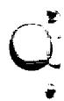

# TABLE OF CONTENTS (cont.)

Page No.

Reconstitution of Fuel 45

Blanket Processing (Pa) 45

Filtration and Salt Cleanup 46

Process Off-Gas Handling 46

Alternative Processing Schemes and Process Improvements - 46

Special Instrumentation and Process Control 47

Waste Handling and Disposal 47

General Design 47

Salt Production 48

Engineering Test Unit 48

Summary of Development Costs 48

References 149

# INTRODUCTION

The breeding potential of a molten salt reactor operating on the thorium-uranium cycle has been recognized for a number of years, and in 1959 a study was initiated to compare the MSBR on the same bases with other thorium-uranium breeders, namely, aqueous homogeneous, liquid bismuth, and gas-cooled reactors. The comparisons were made on the bases of fuel yield (percent of fissile inventory bred per year) and fuel cycle cost, and the results8 confirmed the belief that the MSBR was attractive in both regards. Evaluations of MSBR concepts have continued toward optimizing nuclear and economic performance and have resulted in the generation of more reliable information on the system. These evaluations have also served to point the direction of desirable development and research.

Whereas the initial studies were made on the bases of (a) on-site and (b) central processing plants using existing processing techniques, the savings that would result by using an integrated processing plant, i.e., (a), soon became apparent. Furthermore, a new processing concept for recovering the fuel carrier salt by vacuum distillation had been shown by Kelly4 to be feasible, considerably enhancing the economic appearance of the MSBR. These aspects of the fuel cycle were studied by Scott and Carter1 for a 1000-Mw (electrical) system. Protactinium removal from the fertile stream was not considered as a processing step in these studies because no satisfactory process was apparent; however, more recent experiments have suggested a mechanism of protactinium removal, whereby significant improvement in the breeding performance of an MSBR can be achieved.

These newer design and processing concepts have been incorporated into more recent physics and economic calculations to define an optimum MSBR. The discussion that follows treats processing of MSBR fuel and fertile streams in this same respect. First, processing requirements for an economic molten salt breeder are discussed; second, the process is described; third, the status of the technology and needed development for each process step are described; fourth, attractive alternative processes to the main-line operations are discussed; and, finally, a schedule of manpower and costs for a developmental program to solve critical MSBR processing problems

and to provide the processes and equipment for the processing plant for an Engineering Test Unit is included.

# ELEMENTS AND REQUIREMENTS OF MSBR PROCESSING

One of the most attractive features of a two-region, molten salt reactor is the ease with which the fuel and fertile streams can be processed for removal of fission products and recovery of bred material. The fluid streams are easily removed from and returned to the reactor without disturbing operations, and the processing methods are relatively simple and straightforward. On-site processing is a primary requirement of a breeder reactor, which would be at an extreme disadvantage if a sizable inventory of fissile material were held up in decay cooling and transit.

# Objectives

The fuel stream of the MSBR is a mixture of $\mathsf{LiF - BeF}_2\mathsf{-UF}_4$ in the approximate molar proportions 63.6-36.2-0.22 mole %; the fertile stream is a mixture of $\mathsf{LiF - BeF}_2\mathsf{-ThF}_4$ of approximate composition 71-2-27 mole %. The primary objective of the fuel process is to recover both uranium and carrier salts sufficiently decontaminated from fission products to ensure attractive breeding performance of the reactor. To discard the carrier salt with the fission products is not economical since both lithium and beryllium are expensive components (the former being enriched to about 99.995 at. $\%$ Li). For the blanket processing, the objective is to remove the bred fissile material on a sufficiently rapid cycle to minimize the inventory of fissile material, the fission rate, and concentration of fission products in the blanket salt. This can be accomplished by removing the $^{233}\mathsf{U}$ on a relatively fast cycle but even more effectively by removing the protactinium precursor rapidly enough so that its concentration in the blanket is low. A low $^{233}\mathsf{Pa}$ concentration is desirable because each capture of a neutron by an atom of $^{233}\mathsf{Pa}$ results in the net loss of two neutrons (effectively two atoms of bred $^{233}\mathsf{U}$ ).

# Design Features

An essential element in the design of an MSBR processing plant is that of keeping the out-of-reactor inventory low to decrease inventory charges and improve the fuel yield, which is the fraction of fissile inventory bred per year. The logical way to achieve this low inventory is to close-couple the processing plant with the reactor, and it is proposed to integrate the two operations. Processing equipment will be located in cells adjacent to the reactor cell, and a small portion of each circulating stream will be metered semicontinuously to the processing plant. Most processing operations are continuous: the fuel stream being purged of fission products, fortified with makeup fuel and carrier, and returned to the reactor core; the fertile stream being stripped of its protactinium and uranium, fortified with makeup thorium and returned to the blanket. It is not necessary to allow long decay periods before processing since the reactants are either gaseous $(\mathsf{F}_2)$ or solid (granular NaF) and are not affected by strong radiation fields. Cooling periods before processing no longer than one day and perhaps as low as a few hours should suffice. The length of this period depends upon the design of the continuous fluorinator and the ability to control the fluorination temperature. Removal of fission product decay heat is a principal consideration throughout the plant.

In the integrated plant all services available to the reactor are available to the chemical plant. These include mechanical equipment, compressed gases, heating and ventilating equipment, electricity, shop services, supervision, etc. The cost savings for an integrated facility are immediately apparent when one considers the large amount of duplication required for separate plants. Only a relatively small space is needed for the processing equipment as compared to that needed for the reactor and power conversion equipment so that the additional building cost is small.

# Process Operations

Four major operations are needed to sufficiently decontaminate the fuel stream of an MSBR. These are fluorination, sorption of $\mathbf{U}\mathbf{F}_{6}$ , vacuum

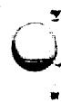

distillation, and salt reconstitution. The fertile stream requires fluorination, sorption of $\mathrm{UF}_6$ , and for maximum effectiveness includes protactinium removal. These operations represent the most straightforward processing for achieving a high-performance molten salt breeder. The technology for fluorination and sorption is well developed (through the operation of the fluoride volatility pilot plant at ORNL); the other operations have been demonstrated in small engineering experiments and/or in the laboratory. The process for each stream is capable of economically recovering more than $99.9\%$ of the uranium, $94\%$ or more of the LiF-BeF $_2$ in the fuel carrier, and more than $99\%$ of the LiF in the fertile stream.

# DESCRIPTION OF PROCESS

The processing facility must be capable of removing the major portion of the fission products from the molten fuel salt and returning the purified salt to the fuel system after reconstitution with $^{233}\mathrm{U}$ and carrier salts. In blanket processing, the facility must recover bred uranium, minimize parasitic neutron loss to protactinium, and minimize the loss of carrier and fertile salts with the waste.

In Fig. 1 a flow diagram is presented to show the steps in processing a molten salt breeder. The flow rates were obtained from physics calculations for a 2225-Mw (thermal) reference reactor. The core cycle time is 52 days, and the blanket cycle time is about 22 days for the uranium recovery step; protactinium removal is on a 1-day cycle. The core power is 2160 Mw (thermal); the blanket power is 65 Mw (thermal). A flowsheet, similar to Fig. 1 and excluding the protactinium removal step, was used in a design and cost study1 of a processing plant for a 1000-Mw (electrical) MSR.

# Fuel Stream Process

# Decay Holdup

Irradiated fuel is removed directly from the circulating fuel stream for processing, and, as such, is only a few seconds removed from the fission zone. The gross heat generation rate is shown in Fig. 2. It is

ORNL DWG A7-3654 R1

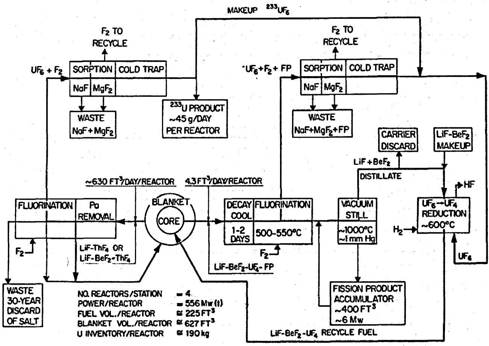  
Fig. 1. Processing Diagram for a Molten Salt Breeder Reactor.

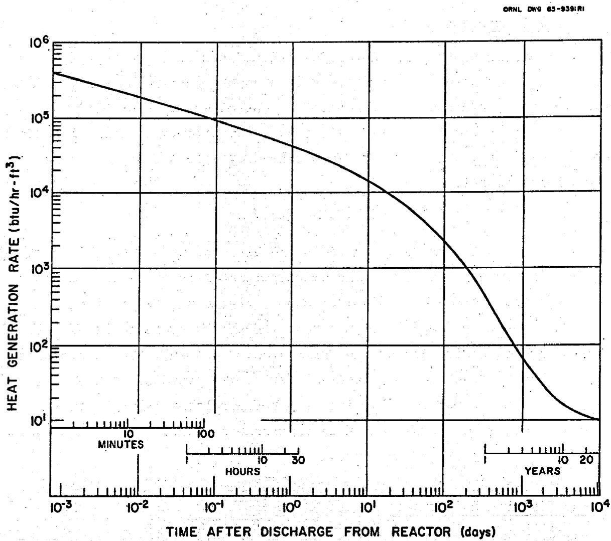  
Fig. 2. Fission Product Decay Heat in MSER Fuel Stream for a 1000 MW (electrical) Reactor. The curve is calculated for the gross amount of fission products in the discharged fuel.

necessary to allow fission products to decay a few hours before fluorination so that the fluorinating temperature can be controlled at the desired value. This holdup will be carried out in a metering tank in the reactor cell where there is convenient access to the reactor cooling system.

# Continuous Fluorination

After the cooling period, the fuel salt flows into the top of a columnar vessel where it is contacted by a countercurrent stream of fluorine gas. The temperature of fluorination is controlled at about $550^{\circ}\mathrm{C}$ . Uranium tetrafluoride in the irradiated salt reacts quantitatively with fluorine to give volatile $\mathrm{UF}_6$ , which is carried overhead by excess fluorine. The chemical reaction is

$$
\mathrm {U F} _ {4} + \mathrm {F} _ {2} = \mathrm {U F} _ {6}.
$$

Certain fission product fluorides are also volatile and will leave the fluorinator with the $\mathbf{U}\mathbf{F}_{6}$ . The principal metallic elements that form volatile fluorides are ruthenium, niobium, molybdenum, technetium, and tellurium. Since prefluorination time is so short, appreciable amounts of fission product iodine and bromine will also be present. These elements are oxidized by fluorine to volatile interhalogen compounds and exit in the $\mathbf{U}\mathbf{F}_{6}$ stream. Zirconium fluoride also has a relatively high vapor pressure and has been observed in the overhead product. Sorption techniques are used to purify the $\mathbf{U}\mathbf{F}_{6}$ product.

# UF6 Purification by Sorption

Volatile fission product fluorides and $\mathbf{U}\mathbf{F}_6$ are separated in a series of sorption and desorption steps. These are batch steps, but the process is made continuous by using parallel beds alternately.

The first separation is made when the gas passes through a bed of pelletized NaF. The system consists of two distinct zones, one held at $400^{\circ}\mathrm{C}$ and one at about $100^{\circ}\mathrm{C}$ . In the higher-temperature zone, most of the fission products, corrosion products, and entrained salt are irreversibly removed while the $\mathrm{UF}_6$ and some fission products pass through to the lower-temperature zone. In this zone, $\mathrm{UF}_6$ and $\mathrm{MoF}_6$ are sorbed. The barren fluorine carrier passes through the next bed of pelletized $\mathrm{MgF}_2$ , which is

believed to be effective for sorbing technetium; however, available data are not altogether conclusive. The volatile halogens are expected to pass through the sorbers and remain in the recycle fluorine stream. These are controlled by decay and by a small gas purge to the off-gas disposal system. About $10\%$ of the circulating fluorine will have to be discarded to purge these fission products.

When the low-temperature zone of the NaF bed is loaded with $\mathbf{U}\mathbf{F}_{6}$ , the bed is taken off stream, and the temperature of the cold zone is slowly raised while the bed is swept with fluorine gas. At temperatures around $150^{\circ}\mathrm{C}$ , molybdenum fluoride desorbs and is carried away, thereby separating it from $\mathbf{U}\mathbf{F}_{6}$ . The temperature is raised higher to about $400^{\circ}\mathrm{C}$ for complete desorption of uranium, which is collected for recycle to the reactor. The NaF and $\mathbf{MgF}_{2}$ beds are reused until loaded with retained fission products; at this point they are discharged to waste and filled with fresh material. The operation of the sorption system is diagrammed in Fig. 3.

The rate of heat generation by fission products deposited on the sorbers might be as large as $30\%$ of the gross rate shown in Fig. 2. Therefore, the beds will require cooling to prevent local overheating.

# UF6 Collection

Desorbed $\mathbf{U}\mathbf{F}_{6}$ is carried by fluorine into a primary cold trap held at about $-40^{\circ}C$ where it is collected for the fuel reconstitution step. The $-40^{\circ}C$ trap is backed up by a colder $(-60^{\circ}C)$ trap to catch any $\mathbf{U}\mathbf{F}_{6}$ that might pass through the first trap. For additional safety a NaF chemical trap is included to trap any $\mathbf{U}\mathbf{F}_{6}$ that might get through the cold traps. When a cold trap is loaded with $\mathbf{U}\mathbf{F}_{6}$ , the trap is warmed to triple point conditions (90°C and 46 psia) to melt $\mathbf{U}\mathbf{F}_{6}$ and allow it to drain to a receiver for feeding the reduction unit.

# Vacuum Distillation

After fluorination, the barren carrier, containing the bulk of the fission products, flows to a still which is operated at about 1 mm Hg pressure and $1000^{\circ}\mathrm{C}$ . The LiF and $\mathrm{BeF}_2$ volatilize, leaving fission products in the still bottoms. This residue consists largely of rare earth fluorides,

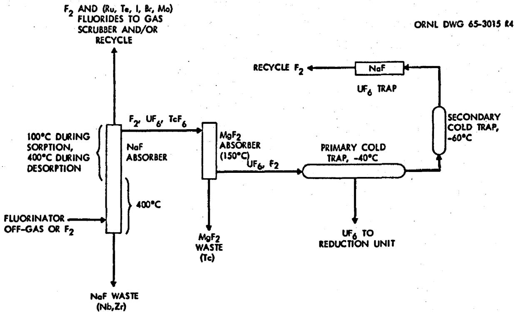  
Fig. 3. UF6 Purification System with Disposition of Volatile Fission Products.

which are the principal neutron poisons. Available data indicate that the relative volatilities of the rare earth fluorides, compared to LiF and $\mathrm{BeF}_2$ , are low and that a good separation can be achieved in a single-step distillation without rectification. The following data (Table 1) have been obtained for several fluoride compounds.

Table 1. Relative Volatilities of Rare Earth Fluorides, $\mathbf{ZrF}_{4}$ , and $\mathbf{BeF}_{2}$ With Respect to LiF   
Temperature = 1000°C  
Pressure = 1.5 mm Hg   

<table><tr><td>Component</td><td>Mole Fraction in Liquid</td><td>Relative Volatility</td></tr><tr><td>LiF</td><td>0.842</td><td>--</td></tr><tr><td>BeF2</td><td>0.105</td><td>4.6</td></tr><tr><td>ZrF4</td><td>0.0096</td><td>1.4</td></tr><tr><td>PrF3</td><td>0.055</td><td>2.5 x 10-3</td></tr><tr><td>NdF3</td><td>0.06</td><td>&lt;3 x 10-4</td></tr><tr><td>SmF3</td><td>0.05</td><td>&lt;3 x 10-4</td></tr></table>

It is proposed to operate the still semicontinuously, allowing the fission products to collect in the still bottoms; the bottoms, in turn, are sent to the fission product accumulator tank (see Fig. 1) for dilution and storage. The accumulator contains about $400\mathrm{ft}^3$ of 88-l2 mole $\%$ LiF-BeF $_2$ mixture, which is the equilibrium composition of the liquid in the still. The accumulator salt is recycled through the still by adding it into the still feed coming from the fluorinator. Since the recycle/feed ratio can have any desired value, it is adjusted to exercise control over the heat generation rate in the still as the fission products continuously concentrate at that point. Calculations indicate that a volume ratio as low as 1:l is adequate for control of the heat generation.

The $400\mathrm{ft}^3$ of $\mathsf{LiF - BeF}_2$ mixture in the accumulator is believed to be sufficient for collecting fission products for the entire 30-year lifetime of the reactor. At the end of this time the mixture can be processed for

recovery of LiF and $\mathrm{BeF}_2$ and transfer of fission products to some inexpensive medium for permanent disposal.

Although CsF and RbF have higher vapor pressures than LiF and would be expected to contaminate the recycle carrier, no difficulty is expected with these fission products because each has a gaseous precursor which is removed on a very fast cycle in the gas sparging operation. Another fission product that has a relatively high vapor pressure is $\mathrm{ZrF}_{4}$ , and it might be necessary to discard a small fraction of the carrier distillate to purge this poison. There is some evidence that the activity of $\mathrm{ZrF}_{4}$ is low in the still bottoms; thus, most of the $\mathrm{ZrF}_{4}$ will remain in these bottoms. Even if all the $\mathrm{ZrF}_{4}$ distilled, no more than $5\%$ of the distillate would have to be discarded to control its poisoning effect.

Although fluorination is expected to recover greater than $99.9\%$ of the uranium in the fuel stream, any small fraction that reaches the vacuum still is not entirely lost. The vapor pressure of $\mathrm{UF}_{4}$ at $1000^{\circ}\mathrm{C}$ is slightly greater than that of LiF allowing part of this uranium to accompany the carrier salt.

# Fuel Reconstitution

The principal operation in reconstituting the fuel is to recombine the distillate, the recycle and makeup uranium, and the makeup carrier salt in the proper proportions for feed to the reactor. Uranium hexafluoride from the cold traps is mixed with a portion of the bred $\mathbf{U}\mathbf{F}_6$ from the blanket process, and the mixture is dissolved at 550 to $600^{\circ}\mathbb{C}$ in recycle fuel salt. The mixture is kept at the proper $\mathbf{U}\mathbf{F}_4$ concentration by introducing LiF-BeF $_2$ distillate and makeup. Hydrogen is then introduced into the mixture to reduce $\mathbf{U}\mathbf{F}_6$ to $\mathbf{U}\mathbf{F}_4$ . The entire operation can be carried out continuously in a single unit.

A filter after the reduction unit will be used to clarify the fuel salt before it goes to the reactor. Reducing conditions in the column will precipitate any colloidal nickel or iron, which will contaminate the salt (as a result of equipment corrosion).

# Xenon Removal

Because of the low solubility of the rare gases in molten fluoride salts, xenon can be stripped from the fuel salt by sparging with an inert gas such as helium or nitrogen. The sparging is done in an in-line gas stripping unit located between the pump and the reactor.[13] A very short cycle time of the order of 30 sec is required to keep xenon poisoning at the desired low level, which is less than $0.5\%$ fractional poisoning. The inert carrier gas transports the fission gases to charcoal adsorbers where they are retained for decay; the carrier gas is recycled. Because of the very short cycle time, this processing must be accomplished with equipment in the reactor primary system and is considered to be a part of the reactor system, rather than a part of the fuel processing system.

An alternative method of eliminating xenon is to process the reactor fluid for removal of iodine, the precursor of xenon. A method for removing iodine has not been developed; however, laboratory experiments have given promising results.[11] The method is to sparge the fuel salt with an $\mathsf{HF - H}_2$ mixture, allowing the iodine ion (the form present under reactor conditions) to react with HF forming HI, which is removed as a gas. Considering the fact that $^{135}\mathrm{I}$ has a half-life of 6.7 hr, it is seen that the processing rate must be fast to make the process effective for removing the xenon daughter. There is a lower limit to the amount of $^{135}\mathrm{Xe}$ that can be purged by removing the iodine precursor; the independent fission yield of $^{135}\mathrm{Xe}$ is quite significant (removing $^{135}\mathrm{I}$ accounts for only about $80\%$ of the xenon poisoning).

# Fertile Stream Process

The fertile (or blanket) stream process has three primary operations: protactinium removal, continuous fluorination, and UF $_6$ sorption. The assumption is made that the uranium is not removed with the protactinium, so the latter two operations are analogous to the corresponding fuel stream operations discussed above but are carried out at a higher volumetric rate. The fertile stream is cycled through fluorination once every 20 to 25 days to keep a low uranium concentration in the blanket, thereby keeping the

fission rate low. The low fission rate ensures a low fission product accumulation rate so that it is unnecessary to remove them on the same cycle as uranium. In fact, a 30-year discard cycle of the barren fertile stream is a sufficient purge rate for fission products. At the end of this time the waste tank would be processed to recover $\mathrm{ThF}_{4}$ ; the fission products would be permanently stored in an inexpensive medium.

If the process for removing protactinium from the fertile stream also removes all the uranium, fluorination of the fertile stream will not be necessary. A fluorination step is, however, required in the subsequent processing of the protactinium to separate the uranium.

The bred uranium is recovered in cold traps as UF6. A portion of this is used to refuel the core, and the remainder is sold.

# Protactinium Removal

The breeding performance of the reactor can be significantly improved if the protactinium concentration is kept low. The proposed process is to contact the fertile salt at about $650^{\circ}\mathrm{C}$ on a rather fast cycle, perhaps as fast as once every 10 to 60 hr, with a stream of liquid metal carrier; e.g., bismuth, containing 3000 to 4000 ppm thorium. The thorium metal reduces protactinium and the two nuclides exchange between the two streams. A hydrofluorination or sorption treatment is then used to extract protactinium from the bismuth stream into a second salt mixture, in which it is allowed to decay to uranium. Later the salt is fluorinated to recover the uranium.

Preliminary data indicate that $96\%$ of the protactinium can be removed from the blanket by this method. The behavior of uranium has not yet been determined. Thorium, of course, is the ideal reductant because the removed protactinium is replaced by equivalent fertile material.

# Off-Gas Treatment

Most of the off-gas from the processing plant comes from the continuous fluorinators; smaller amounts are formed in various other process vessels. The gases are treated to prevent the release of any contained fission products to the atmosphere. Excess fluorine used in the fluorinators is

recycled through a surge chamber, and a small side-stream of the recycling fluorine is sent through a caustic scrubber to prevent gross buildup of fission products. Each of the processing vessels and holdup tanks has off-gas lines that lead to the scrubber for removing HF, $\mathbf{F}_2$ , and volatile contaminants.

The scrubber operates as a continuous countercurrent, packed bed unit with recirculating aqueous KOH. A small side-stream of KOH solution is sent to waste, and the scrubber off-gas is contacted with steam to hydrolize fission product tellurium. A filter removes the hydrolized product. Non-condensable gases are sent to the facility that treats gases generated by the reactor; ultimately the gases are discharged to the atmosphere after considerable dilution.

# Waste Storage

Waste streams from the processing facility are: (1) aqueous waste from the KOH scrubber for purifying recycle fluorine, (2) molten salt from fertile stream discard, (3) NaF and $\mathrm{MgF_2}$ sorbent from UF6 purification, (4) daughter products of Kr and Xe that accumulate as solids in the gas sparging system of the reactor, and (5), if needed, molten salt discard of LiF-BeF2 carrier to purge $\mathrm{ZrF_4}$ . The material in the fission product accumulator (see Fig. 1) is not considered a waste because it is not removed from the process even though it contains fission products. Eventually a portion of this volume becomes waste at the end of the reactor lifetime and after processing to reclaim as much as possible of the LiF-BeF2 content. Each of the waste streams would be stored in underground facilities at the reactor site; after appropriate decay periods and waste treatment procedures, these could be sent to permanent storage or disposal sites.

# Aqueous Waste

The aqueous waste stream is small and would be combined with similar wastes from the reactor in a single underground facility.

# Fertile Stream Discard

This waste is stored in an underground tank which can be cooled by air circulation in natural convection. The specific heat generation rate is low because of the small concentration of fission products present. It may be desirable to store the fertile stream discard inside the processing cell. The salt volume is only about $2500\mathrm{ft}^3$ , and, if inside the cell, cooling could be conveniently provided by the same medium that is used in the processing operations.

# NaF and MgF, Pellets

These sorbents, which contain the volatile fission product fluorides, are stored in cylindrical cans in an underground concrete vault. The spent pellets are discharged from the sorbers into cans inside the processing cell. When several cans have been filled, the contents are moved from the cell to the vault. Decay heat is removed by forced air circulation through the vault.

# Kr and Xe Daughter Products

Krypton and xenon, sparged from the reactor, are precursors of solid fission products (Rb, Sr, Y, Zr, Cs, Ba, La, Ce) that settle as fines and dust throughout the gas processing system. These particulates must be removed to avoid clogging and overheating gas lines. A possible method for doing this is to periodically flush lines and gas holders with a molten salt, which dissolves and accumulates the decay products. The accumulator could be a vessel (in the processing cell) in which these fission products are retained until permanent disposal.

# STATUS OF PROCESSING TECHNOLOGY AND NEEDED DEVELOPMENT

# Fluoride Volatility Process

Experience at ORNL with the processing of molten salt fuels by the fluoride volatility process dates from 1954 and included all phases of laboratory and development work through the successful operation of a

pilot plant. During this period the process was adapted for use with the fluid fuel, NaF-ZrF $_4$ -UF $_4$ , of the Aircraft Reactor Experiment, and two alloy fuels, Zr-U and Al-U. Although the alloy fuels were solid, they were dissolved in the molten fluoride salt and their processing was carried out by methods analogous to processing a molten fluoride fuel. After the initial dissolution step for the solid element, processing of liquid and solid fuels becomes identical within the limits imposed by different compositions.

The fluoride volatility process takes its name from the principal operation, the volatilizing of uranium as the hexafluoride. The advantages of fluoride volatility are: the small volume of fission product waste, the convenient form of the $\mathbf{U}\mathbf{F}_6$ product, which is easily converted to $\mathbf{U}\mathbf{F}_4$ for fuel recycle, the virtual elimination of processing criticality hazards as opposed to aqueous processing of enriched fuels, and the high decontamination factors attainable for the $\mathbf{U}\mathbf{F}_6$ product. Unattractive features of the process are: the corrosiveness of fluorine-molten salt mixtures, and, to a lesser degree, the high processing temperatures. A diagram of the ORNL Fluoride Volatility Pilot Plant is shown in Fig. 4.

In addition to the molten fluoride processing work at ORNL, similar research has been carried out at Argonne National Laboratory. Efforts at the two installations were complementary, with the ANL work being directed primarily toward hydrofluorination and fluorination techniques and reagents as well as equipment development. In addition, molten salt process development was supplemented by an extensive corrosion-testing program under subcontract with Battelle Memorial Institute (1959-1963). Evaluations were made of potential construction materials for the hydrofluorination and fluorination equipment; the metals of most interest were found to be Hastelloy N, Alloy 79-4 (known also as HyMu 80 and Moly Permaloy), and Nickel 201 (L-Nickel). All these metals are satisfactory construction materials for molten salt processing equipment with the possible exception of the vacuum still. The $1000^{\circ}\mathrm{C}$ distillation temperature is beyond the range at which materials have been evaluated.

The proposed process for the MSBR includes several operations in addition to those with which there has been reprocessing experience. The most important of these are: continuous fluorination, vacuum distillation, reduction of $\mathrm{UF}_6$ to $\mathrm{UF}_{4}$ , and removal of protactinium from the fertile

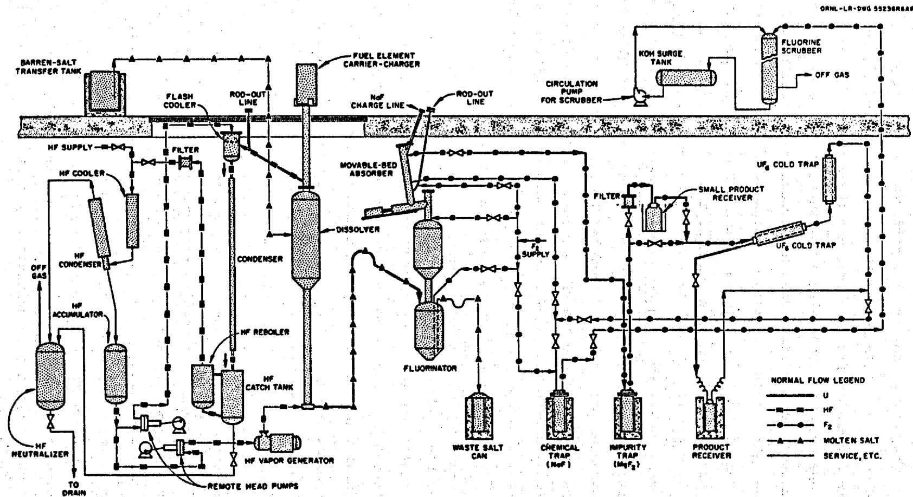  
Fig. 4. Schematic Diagram of ORNL Fluoride Volatility Pilot Plant

stream. The following paragraphs review the experience with ARE, Zr-U, and Al-U fuel processing and delineate the status of existing technology for the operations involved in MSBR processing.

# ARE Fuel Processing

Initial development of a process for molten fluoride fuel was motivated by the need to recover unburned, highly enriched uranium from the irradiated fuel of the Aircraft Reactor Experiment. This fuel was a 48-49.5-2.5 mole % mixture of NaF-ZrF₄-UF₄. Beginning in 1954 the fluoride volatility process was developed for this recovery and culminated in successfully processing the ARE fuel during the period December 1957 to March 1958. Since the reactor operated in November 1954, the irradiated fuel was about three years old. The recovery operations consisted of batchwise UF₆ volatilization, followed by its decontamination on granular beds of sodium fluoride, and its recovery in cold traps. Barren waste, containing the bulk of the fission products, was drained into metal cans and buried. Better than 99% recovery of uranium was attained in this initial hot operation of the fluoride volatility pilot plant. Decontamination factors of at least 10⁴ were attained as indicated by the gross gamma activity of the product.

# Zr-U and Al-U Fuels

In the initial stages of fluoride volatility development it was recognized that the process had application to fuels other than molten fluoride salts. Concurrently with the development of a process for ARE fuel, laboratory research was pursued toward adapting the process for treating irradiated Zircaloy-clad, Zr-U alloy fuel from submarine reactors. This research resulted in the development of a hydrofluorination operation in which the solid fuel element is dissolved by reaction with anhydrous HF in molten LiF-NaF-ZrF4; the remaining steps of the process were the same as for ARE fuel.

Processing experience led to improvements in the pilot plant and equipment before operation with Zr-U fuel. In addition to the hydrofluorinator, an improved fluorinator (Fig. 5) and NaF sorber were incorporated in the modified plant. The plant was operated with irradiated

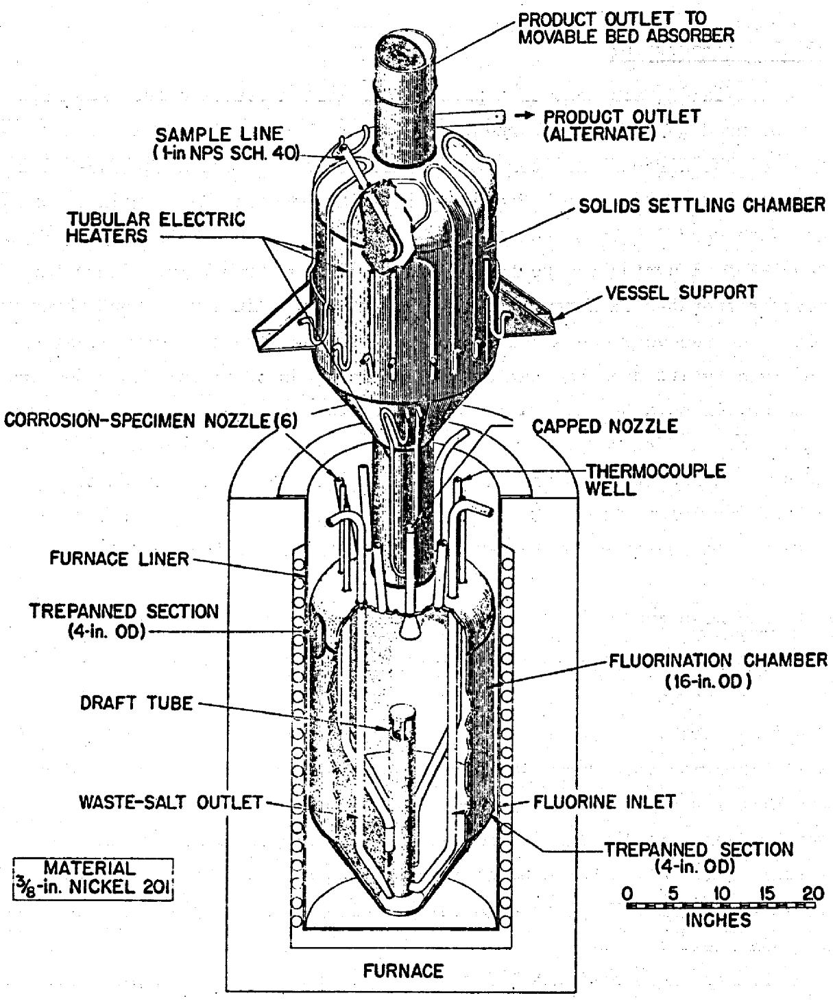  
Fig. 5. Volatility Pilot Plant Fluorinator Vessel

submarine reactor fuels during the period March 1962 to September 1963. Fuel elements that had cooled as long as 6.5 years and as short as 6 months were successfully processed. Uranium recovery and decontamination in all runs were excellent.

The final phase of operation of the ORNL Volatility Pilot Plant was associated with processing aluminum-clad, Al-U alloy fuel.10 It was found that the solid elements could be satisfactorily dissolved by reaction with anhydrous HF in molten 66-22-12 mole % KF-ZrF₄-AlF₃. Other operations in the process were the same as for Zr-U alloy processing, and the same pilot plant equipment was used. A number of pilot plant runs were made with irradiated Al-U fuel during the period July 1964 to January 1965 at which time the Volatility Pilot Plant was shut down. During that period, Al-U fuel cooled for only four weeks was satisfactorily processed. The same excellent recovery and decontamination factors were obtained as with ARE and Zr-U fuels; uranium recoveries of 99.9% or better, and decontamination factors of 10⁶, were typical:

# Continuous Fluorination

Continuous fluorination is desirable for processing both the core and blanket of an MSBR because of the need to minimize the out-of-reactor inventory and the costs of processing. Engineering development is complicated by the corrosiveness of the molten-salt-fluorine mixture and by the difficulty of reproducing in the laboratory the high internal heat generation rate of a recently irradiated fuel.

# Current Status

The technology for batchwise fluorination has been rather thoroughly developed and applied in the Fluoride Volatility Pilot Plant but there is little experience with continuous fluorination. One technique of continuous fluorination involves spraying or jetting small droplets of molten salt through a fluorine atmosphere in such a way that they do not contact the metal walls of the fluorinator. Some very preliminary tests2 with single salt droplets have been successful in achieving high uranium recovery.

A second method, which appears to be the most promising, is to carry out the fluorination in a liquid-phase continuous system using a 1/2- to $3/4$ -in.-thick layer of frozen salt to protect the vessel walls. The initial work on such a system was done at Argonne National Laboratory;3 currently, the development is being pursued in the Chemical Technology Division at ORNL. Preliminary results, employing units that did not have frozen-wall protection, have demonstrated that high uranium recoveries can be effected in continuous, countercurrent operation.

# Needed Development

Engineering development of a continuous fluorinator should be given high priority. Areas requiring study include: mass transfer information; process flow control; method of establishing and maintaining a frozen-salt wall; mist deentrainment in gas stream; and, efficiency of gas-liquid contact. A problem in particular need of attention is the design of nozzles that admit and remove the molten salt and fluorine gas. It might be difficult to protect these areas from corrosive attack by establishing a frozen-salt wall. In the development it should be recognized that there is a large difference in capacity between the fuel and fertile stream fluorinators and that the internal heat generation in the fertile stream is appreciably less than in the fuel. A conceptual design of a continuous fluorinator is shown in Fig. 6.

# $\mathbf{U}\mathbf{F}_{6}$ Purification by Sorption

The NaF and $\mathbf{MgF}_2$ sorption units provide adequate decontamination for $\mathbf{U}\mathbf{F}_6$ . The batchwise units can be operated satisfactorily for both fuel and fertile streams of the MSBR. Development on this part of the process is not critical to successful operation of a molten salt breeder experiment.

# Current Status

The UF $_6$ purification system has been operated as an integral part of the Fluoride Volatility Pilot Plant, producing a product that can be handled directly. Also, it has been demonstrated that uranium recovery from the sorbers is essentially quantitative.

ORNL-DWG 65-3037RA

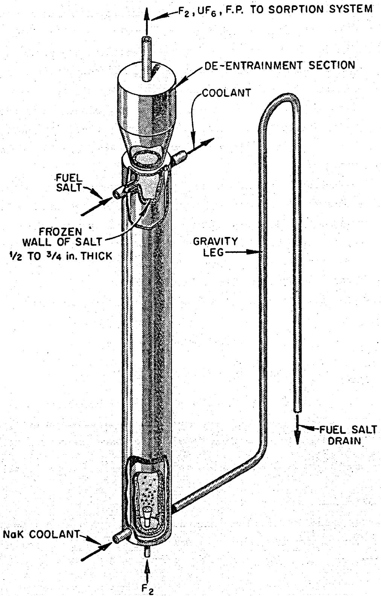  
Fig. 6. Continuous Fluorination. NaK coolant, flowing through the jacket, freezes a layer of salt on the inner surface of the column, thus protecting the Alloy 79-4 from corrosive attack by the molten-salt-fluorine mixture.

# Needed Development

Although no extensive development is needed to ensure successful operation of the sorption system, there are several areas in which performance data should be obtained. The sorption characteristics and capacity of $\mathbf{MgF}_2$ for technetium are not well known; the methods for removal of tellurium and ruthenium are also not well known; and the chemistry of molybdenum in the sorption system needs better definition. From an engineering viewpoint, a sorption system that could be operated continuously would have advantages over a batch system, and such a system should be developed for large-scale MSBR installations.

Heat generation in the sorber beds will be appreciable because of the short decay time before fluorination. A thorough evaluation must be made of this problem (including a satisfactory cooling mechanism). Since the sorbents become wastes that are removed from the processing cell for storage, it is essential that a means of doing this be developed (one that precludes frequent entry into the cell).

A diagram of a successfully operated unit is shown in Fig. 7.

# Cold Traps

# Current Status

Cold traps, like the one shown in Fig. 8, have been used at ORNL and ORGDP for the collection of UF6. The unit has to be operated batchwise, but this is no deterrent to its use in a breeder experiment or a full-scale installation.

# Needed Development

No development is needed on this phase of the process on a near-term basis; however, ultimately it will be desirable to have a continuous cold trap system.

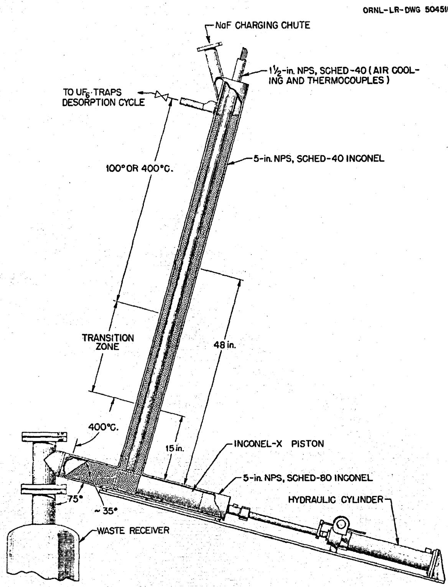  
Fig. 7. Movable-Bed Temperature-Zoned Absorber. When the lower zone of the bed becomes loaded with fission products, the hydraulic cylinder operates the piston to discharge that portion of the bed into the waste carrier. Fresh NaF is added at the top. This apparatus has already been tested in the ORNL pilot plant.

ORNL-LR-DWG 19091 R-I

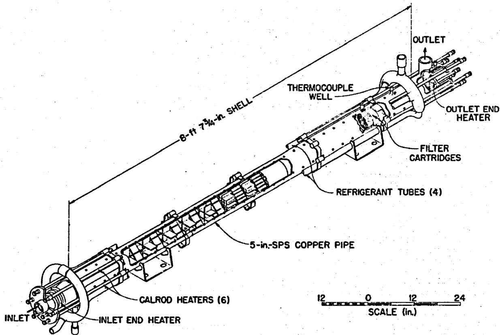  
Fig. 8. Cold Trap for UF6 Collection. This design has already been successfully used in the ORNL pilot plant.

# Vacuum Distillation

The vacuum distillation concept for separating $\mathrm{LiF - BeF_2}$ fuel carrier from fission products is feasible from an engineering viewpoint. However, considerable development is needed to perfect the operation for a breeder experiment, and the most significant advancement in molten salt processing can be made by developing vacuum distillation.

# Current Status

Vacuum distillation has been seriously considered for purifying the carrier since laboratory tests4 showed that decontamination factors for rare earths in the range 100 to 1000 could be achieved. These bench-scale tests have been continued to develop basic data for the relative volatility (see Table 1) of rare earth fluorides as well as operating technology at high temperature and low pressure. Also underway is the fabrication of a large-scale distillation experiment that will be an extensive demonstration of the operation employing nonradioactive mixtures; the last part of the experiment will be a demonstration run employing radioactive spent fuel from the MSRE. The equipment for this experiment is shown in Fig. 9.

# Needed Development

Research has only recently begun to explore vacuum distillation of molten salts, and a high priority should be given to this critical step in the processing scheme. Although a considerable amount of physical and chemical data for this system has been measured, more data, especially relative volatility, activity, and distillation rate measurements, are needed before a full-scale plant unit can be designed. It appears that semicontinuous operation of the still as diagrammed in Fig. 1 is the most satisfactory method for accumulating and storing the fission products. The general problems and technology of operating a piece of equipment at $1000^{\circ}\mathrm{C}$ and $1\mathrm{mmHg}$ need to be determined so that their influence on design can be recognized. Extensive, nonradioactive testing of the MSRE experimental still should answer some of these questions.

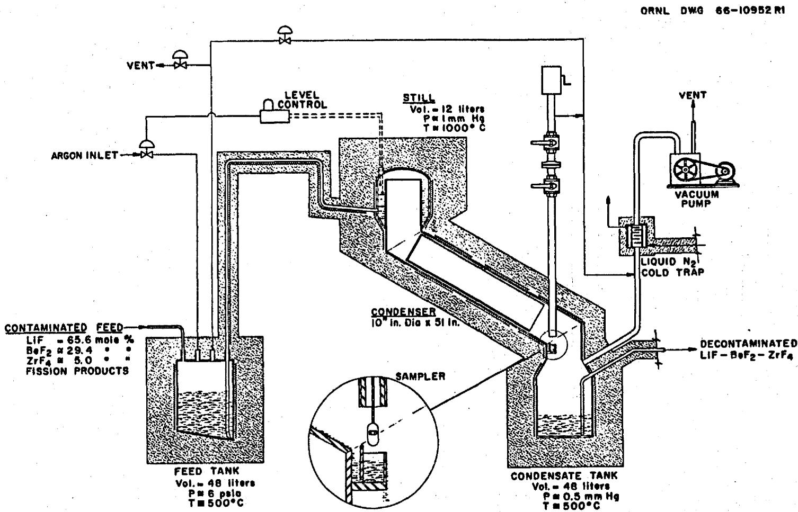  
Fig. 9. Vacuum Still for MSRE Distillation Experiment. Contaminated feed is fed continuously to the annular space in the still by pressurizing the feed tank with argon. The feed rate is made equal to the vaporization rate so that the still level remains constant. The course of the distillation is followed by periodic sampling of the condensate. The bulk of the fission products remains in the still residue.

Even though the accumulated fission products generate a considerable amount of heat, the use of the accumulator vessel lowers the specific heat generation rate to a value that introduces no difficulty in designing the heat removal system. The calculated magnitude of this heat generation rate for a conceptual still design for a 1000-Mw (electrical) MSBR is shown in Fig. 10.

The $1000^{\circ}\mathrm{C}$ operating temperature of the vacuum still introduces metallurgical problems that have not been encountered previously in molten salt processing. Equipment for the MSRE distillation experiment is made of Hastelloy N; however, it is believed that this material is not the best for these conditions and that development of a suitable material should be started. Molybdenum or a high molybdenum alloy are likely candidates and should be evaluated. Not only must the material be compatible with molten fluoride salt but also with the coolant, which will probably be NaK or another molten salt, and the surrounding atmosphere. Duplex or clad material may be applicable.

# Fuel Reconstitution

The reduction of $\mathbf{U}\mathbf{F}_6$ to $\mathbf{U}\mathbf{F}_{4}$ and recombination of the $\mathbf{U}\mathbf{F}_{4}$ with LiF-BeF $_2$ carrier requires engineering development. This work should have a high priority, ranking in importance with continuous fluorination and vacuum distillation.

# Current Status

The reduction of $\mathbf{U}\mathbf{F}_6$ by hydrogen in an $\mathbf{H}_2$ - $\mathbf{F}_2$ flame is a well known reaction; the reduction is rapid and quantitative. However, the powdery $\mathbf{U}\mathbf{F}_4$ product is difficult to handle remotely. Liquid-phase reduction in which $\mathbf{U}\mathbf{F}_6$ is reacted with $\mathbf{H}_2$ in molten salt is more suitable for continuous, trouble-free operation. A limited amount of work has been done on liquid-phase reduction, and the data indicate that the method is highly suitable to this application.

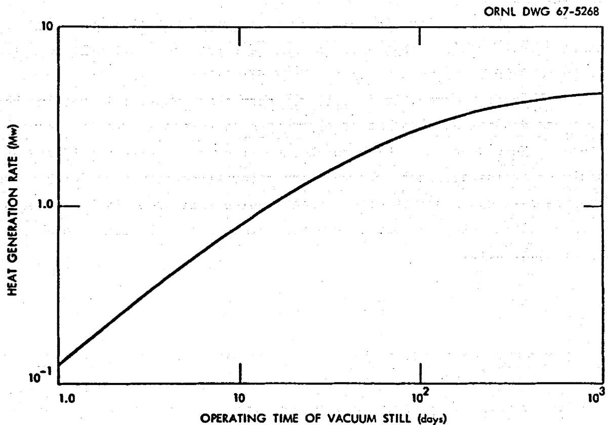  
Fig. 10. Heat Generation Rate in the Vacuum Still Residue Due to Fission Product Buildup. The integrated heat generation rate of decaying fission products in the still residue makes it necessary to accumulate these nuclides in a relatively large volume in order to lower the specific heat generation rate. The above curve is for gross amounts of fission products from processing $15\mathrm{ft}^3/$ day of fuel from a $1000\mathrm{Mw}$ (electrical) reactor system. Elapsed time between discharge from the reactor and entry to the still is 2.58 days.

# Needed Development

Little is known about the kinetics of the absorption and reduction of $\mathbf{U}\mathbf{F}_6$ in the molten fluoride mixture other than that it is fast. The mechanism may be reaction of $\mathbf{U}\mathbf{F}_6$ with $\mathbf{U}\mathbf{F}_4$ to form an intermediate fluoride, followed by reduction with $\mathbf{H}_2$ . An experimental program is needed to study reaction rates, temperature, $\mathbf{U}\mathbf{F}_4$ concentration, nozzle design, contactor design, and gas-liquid separation. There might be a corrosion problem in the reduction unit, and considerable attention will be needed in the design of the unit to minimize this effect.

# Fuel Clarification

Reducing conditions that exist in the $\mathbf{U}\mathbf{F}_6$ reduction unit are conducive to the formation of metallic species, particularly nickel and iron, which may be in a finely divided or colloidal state. Before returning to the reactor, the fuel will need clarification. Development of a solid-liquid separation system for the breeder experiment is not a critical item; however, it is a problem that will have to be solved eventually.

# Current Status

Final clarification of the fuel charge for the MSRE was accomplished by filtration, which was carried out after an $\mathrm{H}_{2}$ -HF treatment to reduce oxides. Sintered nickel filters were used in a batch operation, and after use the filters were discarded. This procedure was very effective in clarifying the molten salt.

# Needed Development

So far, filtrations have been carried out on nonirradiated salts, and one did not have to cope with heat generation from fission product decay on the filters. This could be a real problem in a system that recycles fuel. Present filters probably do not have an adequate operating lifetime in this type of service. No techniques for handling or backwashing the filter cake have been worked out. A continuous clarification method would be highly desirable to avoid frequent entries into the cell to change filters.

# Protactinium Removal

Protactinium removal is an important operation in fertile stream processing and should be vigorously pursued. The benefits are primarily in improvement in the breeding ratio (by decreasing parasitic captures) and reduction in the thorium inventory. In order to be effective, the processing rate for protactinium removal must be significantly faster than its natural decay rate (half-life = 27.4 days); this requirement means a high volumetric processing rate for the fertile salt.

# Current Status

The work on protactinium removal has been confined to laboratory development, which has given some promising preliminary results. The status of this work is discussed in the report12 on the chemical development program, ORNL-TM-1853.

# Needed Development

Laboratory investigations into protactinium removal are underway, but no engineering development has been started. As soon as the laboratory work has reached the point at which engineering studies can be useful, the studies should be started. They will involve the complete engineering development of process and equipment. A primary need for the engineering is an alpha-handling facility in which to do the work. Building such a facility should begin soon in order to be ready when needed. Engineering development must be oriented toward a simple and easily operated process because of the high volumetric throughput required to maintain a low protactinium concentration.

# Waste Handling and Disposal

Waste handling for an MSBR poses some problems that have not been encountered before in processing operations. These are brought about primarily by having considerable amounts of fission products appear at several points in the process, for example, in still bottoms, in NaF and

$\mathbf{MgF}_2$ sorbents, and throughout the gas sparging system. In-process collection and handling of these wastes are areas that need study and development. On the other hand, waste disposal is not a critical problem in the development of a molten salt breeder experiment. Bulk storage procedures like those used for aqueous wastes can be used for the near term while research and development effort is applied in more-critical areas.

# Current Status

The general topic of waste disposal has been the subject of considerable study at ORNL for several years. Although molten fluoride wastes were not a specific part of the study, a large amount of the developed data and knowledge are applicable in this case. For example, the cost data for permanent disposal and heat dissipation rate in underground storage facilities should be very good estimates for the fluoride salt case. In addition there is considerable experience in handling and treating hot aqueous wastes in pilot plant operations at Hanford and the Idaho Chemical Processing Plant to make glasses and calcined products.

# Needed Development

A study is being made of waste disposal for molten fluoride salts to determine the most satisfactory program to follow. The fission product accumulator, which is integrated directly into the vacuum distillation step, is in effect a waste tank that stores the bulk of the MSBR waste for its 30-year lifetime. At the end of life and following an interim cooling period, this waste could be disposed of by procedures current at that time. Another highly radioactive waste is the NaF and $\mathsf{MgF}_2$ sorbent from purifying the UF6. Since this material is already in solid, granular form, it is probably suitable for permanent disposal if sealed in the proper container. An interim cooling period would of course be necessary.

In the reactor off-gas treating system, however, fission products are not conveniently collected in a material that subsequently acts as a retention medium; instead decaying krypton and xenon deposit solid daughter products, perhaps as fines and dust, throughout the off-gas system. The

problem of keeping the off-gas system clean of such products has not been encountered in fuel processing, and considerable development is needed to perfect a satisfactory method.

# Process Control

The chemical processing plant will need measurements of radiation, temperature, pressure, uranium concentration, and flow rate. Development of a flow metering device is of outstanding importance because of the proposed continuous operations, and the work should be undertaken in the near future.

# Current Status

All of these measurements have been encountered in the development program for the MSRE and much satisfactory instrumentation has been developed. In the case of temperature and pressure control, satisfactory means of control have been developed. However, the problem of controlling the flow rate of a molten salt stream has not been solved. There is no current method of continuously measuring uranium concentration in a flowing stream of molten salt or $\mathrm{UF}_6$ concentration in a flowing gas stream. Concentrations have been determined by sampling and laboratory analysis.

# Needed Development

The primary need in instrumentation for processing the MSBR is a flow control device that can meter the flow of a molten salt stream. The problem has been recognized as a difficult one and, in the past, has been circumvented by batch operation and liquid level measurements. However, for smooth operation of a continuous process, such a device will be needed. The usual method of using flow control valves is not suitable for a molten salt and has been avoided.

Considerable emphasis must also be placed on the development of in-line instrumentation for concentration measurements, particularly for uranium, lithium, and beryllium. Smooth operation of the plant might require a fast analysis of a flowing stream.

# DEVELOPMENT OF ALTERNATIVE PROCESSES AND IMPROVEMENTS

The discussion in the preceding sections has presented the main-line effort for the development of a processing method for the molten salt breeder reactor. In this section several alternative schemes are described. These schemes have promise for improving or substituting for the primary processing method and a concurrent investigation should be conducted.

# Iodine Stripping

No single fission product has such a deleterious effect on the breeding performance as $^{135}\mathrm{Xe}$ . Removal of its iodine precursor from a side stream is an indirect means of removing xenon; however, since $^{135}\mathrm{Xe}$ has a direct fission yield, the reduction in poison fraction by iodine removal is limited. Iodine stripping does not appear to have an advantage over direct stripping of xenon, and development should be subordinate to more important problems.

# Current Status

Some laboratory studies have been made of the chemistry of iodine in molten salts. They included experiments in which iodine was removed from salt by sparging with a stream of HF in hydrogen.

# Needed Development

Laboratory development should be continued to obtain the basic data for an iodine removal process. Engineering support is also needed to evaluate proposed processes. The engineering effort will include some experimentation as well as process analysis and calculations. Fission gases contain a surprisingly large amount of the decay energy of the system, and the importance of this fact needs to be assessed in the design of a fission gas disposal system.

# Use of Additives in Vacuum Distillation

The success of vacuum distillation depends upon the fission product fluorides' having a low relative volatility compared to LiF, and extant

data indicate that this is the case with the rare earths (see Table 1). However, there is a possibility that even lower relative volatilities can be achieved through the use of additives that react with the rare earths, zirconium, and other fission products. The additives could be introduced just prior to the vacuum distillation step and would remain in the still residue, being sent to waste when the still is drained.

This technique could be significantly helpful in improving zirconium decontamination if the proper complexing additive were found. Zirconium fluoride is more volatile than LiF so the vacuum still may not be very effective in separating it from the carrier unless its activity in the solution is lowered. Zirconium poisoning can be economically controlled by discarding carrier salt, but lowering $\mathrm{ZrF}_{4}$ volatility would decrease the required amount of carrier discard.

# Current Status

No work has been done.

# Needed Development

Reliable relative volatility data for the rare earths and zirconium fluorides are being obtained, and this is the first step in accurately assessing the effect of additives. Bench-scale development is the primary need. If useful additives are found their effects can be demonstrated in the general development of the distillation process.

# Reduction-Coprecipitation and/or Electrolysis

Reductive coprecipitation of the lanthanide elements with beryllium has been demonstrated in the laboratory. The reduction product is a refractory, insoluble beryllide deposited at the salt-metal interface. Metallic lithium can also be used as the reducing agent.

Electrochemical reduction instead of liquid metal contacting might also be used to control the concentration of such fission products as Mo, Ru, Sn, and Pd and in removing corrosion product Fe, Ni, and Cr.

# Current Status

The liquid metal extractions have been limited to scouting experiments in the laboratory; however, significant removals were observed for La, Sm, Gd, Sr, and Eu using a Li-Bi alloy extractant. Similar results were obtained with Be instead of Li; however, a large excess of Be was needed to remove Zr.

# Needed Development

The data on these extraction methods are preliminary and insufficient for judging the process. Back extraction of rare earths from liquid metal carrier has not been tested. More basic laboratory experiments are needed to more clearly define mechanisms and products. As for electrolytic reduction, the electrochemistry of molten salt systems needs to be explored as a prerequisite to a sound evaluation of the method. Basic oxidation-reduction relationships between the metals and the rare earth components of the salt phase need to be measured. Extensive engineering development will be required if laboratory experiments indicate that the process is attractive.

# Ion Exchange with Nonfluoride Solids

The processes included here are concerned with the selective removal of rare earth fission products while not requiring any change of state in the bulk of MSBR core stream. Conceptually, this is a most desirable feature. Refractory solids, based on carbides, phosphides, nitrides, silicides, and sulfides, might be found which will exchange cations with the rare earths forming insoluble compounds. Oxides might also be included in this class of materials because of their extreme low solubility in molten salt. Indeed, the oxide method might be particularly useful for processing a fuel stream containing thorium, as proposed in the alternative reactor concept. In its simplest form, the operation can be visualized as a percolation of a small side stream of core fluid through a column packed with the ion exchange material.

# Current Status

There have been some exploratory experiments with carbides (that indicate such an exchange does occur) and a few incidental observations

on sulfides (made during the course of other studies). On the other hand, there is a large body of information concerning the chemistry of oxides in contact with molten salts. Many oxides, including those of fission products as well as heavy metals, have been studied to establish their solubility products in molten salt. Also the removal of rare earths as oxides from molten fluoride melts has been researched to assess the potential for a processing scheme. However, it is not yet possible to resolve all the variables to permit a quantitative statement about the possibilities for such a process.

# Needed Development

More laboratory development is needed on these ion exchange processes before there can be a full appreciation of their potential. Later in the development, the work will have to be supported by engineering experiments, which to a large extent would be concerned with contactor development.

# SCHEDULE OF MANPOWER AND COST FOR DEVELOPMENT PROGRAM

The cost and manpower commitment necessary to develop on-site, integrated processing methods for the fuel and fertile streams of a molten salt breeder reactor were estimated on the presumption that all critical questions required answers by June of 1970. Costs were based on the predicted costs of work in the Chemical Technology Division (including a steady $2\%$ increase per year) and the estimated amount of work necessary to solve each problem as required for comprehensive design and optimum operation.

Table 2 itemizes the manpower and costs for each subprogram with totals drawn at the end of FY 74. It is anticipated that some support for the reactor processing development program will be required after FY 74, but that it will be small compared to the effort which brought the program to that point.

Comments on each subprogram, with the anticipated status at the end of FY 74, are given below.

Table 2. Manpower and Cost Breakdown for the Development of the On-Site Processing for the Fuel and Fertile Salts of a Molten Salt Breeder Reactor by the Chemical Technology Division   

<table><tr><td rowspan="2" colspan="2"></td><td colspan="2">FY 68</td><td colspan="2">FY 69</td><td colspan="2">FY 70</td><td colspan="2">FY 71</td><td colspan="2">FY 72</td><td colspan="2">FY 73</td><td colspan="2">FY 74</td><td colspan="2">Total Through FY 74</td></tr><tr><td>MY</td><td>$×10-3</td><td>MY</td><td>$×10-3</td><td>MY</td><td>$×10-3</td><td>MY</td><td>$×10-3</td><td>MY</td><td>$×10-3</td><td>MY</td><td>$×10-3</td><td>MY</td><td>$×10-3</td><td>MY</td><td>$×10-3</td></tr><tr><td rowspan="3">Continuous Fluorination</td><td>Men</td><td>2.5</td><td>113.0</td><td>4.0</td><td>184.0</td><td>4.0</td><td>188.0</td><td>3.5</td><td>168.0</td><td>3.0</td><td>147.0</td><td>2.0</td><td>100.0</td><td>2.0</td><td>102.0</td><td>21.0</td><td>1002.0</td></tr><tr><td>Unusual Expenses</td><td>25.0</td><td></td><td>150.0</td><td></td><td></td><td>100.0</td><td></td><td>50.0</td><td></td><td>50.0</td><td></td><td>50.0</td><td></td><td>50.0</td><td></td><td>175.0</td></tr><tr><td>Total</td><td>138.0</td><td></td><td>334.0</td><td></td><td></td><td>288.0</td><td></td><td>218.0</td><td></td><td>197.0</td><td></td><td>150.0</td><td></td><td>152.0</td><td></td><td>1177.0</td></tr><tr><td rowspan="3">Sorption</td><td>Men</td><td>1.0</td><td>40.0</td><td>1.5</td><td>64.0</td><td>2.0</td><td>102.5</td><td>0.5</td><td>24.0</td><td>1.5</td><td>73.5</td><td>1.0</td><td>50.0</td><td>1.0</td><td>51.0</td><td>8.5</td><td>495.0</td></tr><tr><td>Unusual Expenses</td><td></td><td></td><td></td><td></td><td></td><td></td><td></td><td></td><td></td><td>50.0</td><td></td><td></td><td></td><td></td><td></td><td>50.0</td></tr><tr><td>Total</td><td></td><td>40.0</td><td></td><td>64.0</td><td></td><td>102.5</td><td></td><td>24.0</td><td></td><td>123.5</td><td></td><td>50.0</td><td></td><td>51.0</td><td></td><td>455.0</td></tr><tr><td rowspan="3">Carrier Salt Distillation</td><td>Men</td><td>2.5</td><td>110.0</td><td>2.5</td><td>112.5</td><td>4.0</td><td>183.0</td><td>6.0</td><td>311.0</td><td>6.5</td><td>328.0</td><td>4.0</td><td>195.0</td><td>4.0</td><td>199.0</td><td>29.5</td><td>1438.5</td></tr><tr><td>Unusual Expenses</td><td></td><td>25.0</td><td></td><td>110.0</td><td></td><td>150.0</td><td></td><td>100.0</td><td></td><td>50.0</td><td></td><td>50.0</td><td></td><td>50.0</td><td></td><td>535.0</td></tr><tr><td>Total</td><td></td><td>135.0</td><td></td><td>222.5</td><td></td><td>333.0</td><td></td><td>411.0</td><td></td><td>378.0</td><td></td><td>245.0</td><td></td><td>249.0</td><td></td><td>1973.5</td></tr><tr><td rowspan="3">MSRE Experiment</td><td>Men</td><td>1.0</td><td>220.0</td><td>3.0</td><td>141.0</td><td></td><td></td><td></td><td></td><td></td><td></td><td></td><td></td><td></td><td></td><td>7.0</td><td>361.0</td></tr><tr><td>Unusual Expenses</td><td></td><td>100.0</td><td></td><td>30.0</td><td></td><td></td><td></td><td></td><td></td><td></td><td></td><td></td><td></td><td></td><td></td><td>130.0</td></tr><tr><td>Total</td><td></td><td>320.0</td><td></td><td>171.0</td><td></td><td></td><td></td><td></td><td></td><td></td><td></td><td></td><td></td><td></td><td></td><td>191.0</td></tr><tr><td rowspan="3">Recombiner</td><td>Men</td><td>0.5</td><td>20.0</td><td>2.5</td><td>120.5</td><td>1.5</td><td>65.5</td><td>3.0</td><td>139.0</td><td>1.0</td><td>49.0</td><td>1.0</td><td>50.0</td><td>1.0</td><td>51.0</td><td>10.5</td><td>495.0</td></tr><tr><td>Unusual Expenses</td><td></td><td></td><td></td><td></td><td></td><td></td><td></td><td></td><td></td><td></td><td></td><td></td><td></td><td></td><td></td><td>50.0</td></tr><tr><td>Total</td><td></td><td>20.0</td><td></td><td>120.5</td><td></td><td>65.5</td><td></td><td>189.0</td><td></td><td>49.0</td><td></td><td>50.0</td><td></td><td>51.0</td><td></td><td>545.0</td></tr><tr><td rowspan="3">Blanket Processing (Pa)</td><td>Men</td><td>1.0</td><td>40.0</td><td>4.5</td><td>233.0</td><td>9.0</td><td>440.0</td><td>9.0</td><td>478.0</td><td>9.0</td><td>489.0</td><td>12.0</td><td>650.0</td><td>9.0</td><td>511.0</td><td>53.5</td><td>2811.0</td></tr><tr><td>Unusual Expenses</td><td></td><td></td><td></td><td>70.0</td><td></td><td>100.0</td><td></td><td>200.0</td><td></td><td>250.0</td><td></td><td>300.0</td><td></td><td>300.0</td><td></td><td>1220.0</td></tr><tr><td>Total</td><td></td><td>40.0</td><td></td><td>303.0</td><td></td><td>540.0</td><td></td><td>678.0</td><td></td><td>739.0</td><td></td><td>950.0</td><td></td><td>811.0</td><td></td><td>4061.0</td></tr><tr><td rowspan="3">Filtration and Salt Clean-Up</td><td>Men</td><td></td><td></td><td>1.5</td><td>66.5</td><td>2.5</td><td>110.0</td><td>2.0</td><td>91.0</td><td></td><td></td><td></td><td></td><td></td><td></td><td>6.0</td><td>267.5</td></tr><tr><td>Unusual Expenses</td><td></td><td></td><td></td><td>30.0</td><td></td><td>30.0</td><td></td><td></td><td></td><td></td><td></td><td></td><td></td><td></td><td></td><td>60.0</td></tr><tr><td>Total</td><td></td><td></td><td></td><td>96.5</td><td></td><td>140.0</td><td></td><td>91.0</td><td></td><td></td><td></td><td></td><td></td><td></td><td></td><td>327.5</td></tr><tr><td rowspan="3">Process Off Gas Handling</td><td>Men</td><td>1.0</td><td>57.0</td><td>2.0</td><td>106.0</td><td>3.0</td><td>164.0</td><td>3.0</td><td>136.5</td><td>1.0</td><td>44.0</td><td>1.0</td><td>45.0</td><td>1.0</td><td>46.0</td><td>12.0</td><td>598.5</td></tr><tr><td>Unusual Expenses</td><td></td><td></td><td></td><td>20.0</td><td></td><td>40.0</td><td></td><td>50.0</td><td></td><td>50.0</td><td></td><td>50.0</td><td></td><td>50.0</td><td></td><td>260.0</td></tr><tr><td>Total</td><td></td><td>57.0</td><td></td><td>126.0</td><td></td><td>204.0</td><td></td><td>186.5</td><td></td><td>94.0</td><td></td><td>95.0</td><td></td><td>96.0</td><td></td><td>858.5</td></tr><tr><td rowspan="3">Alternative Processing Schemes and Process Improvement</td><td>Men</td><td>2.0</td><td>80.0</td><td>5.0</td><td>210.0</td><td>4.0</td><td>168.0</td><td>2.0</td><td>86.0</td><td>2.0</td><td>88.0</td><td>2.0</td><td>90.0</td><td>2.0</td><td>92.0</td><td>19.0</td><td>814.0</td></tr><tr><td>Unusual Expenses</td><td></td><td></td><td></td><td></td><td></td><td></td><td></td><td></td><td></td><td></td><td></td><td></td><td></td><td></td><td></td><td>814.0</td></tr><tr><td>Total</td><td></td><td>80.0</td><td></td><td>210.0</td><td></td><td>168.0</td><td></td><td>86.0</td><td></td><td>88.0</td><td></td><td>90.0</td><td></td><td>92.0</td><td></td><td>814.0</td></tr><tr><td rowspan="3">Special Instrumentation and Control</td><td>Men</td><td>1.0</td><td>45.0</td><td>2.0</td><td>105.0</td><td>2.0</td><td>107.5</td><td>2.0</td><td>110.0</td><td>2.0</td><td>112.5</td><td>1.0</td><td>50.0</td><td>1.0</td><td>51.0</td><td>11.0</td><td>581.0</td></tr><tr><td>Unusual Expenses</td><td></td><td></td><td></td><td>30.0</td><td></td><td>50.0</td><td></td><td>50.0</td><td></td><td>50.0</td><td></td><td>50.0</td><td></td><td>50.0</td><td></td><td>280.0</td></tr><tr><td>Total</td><td></td><td>45.0</td><td></td><td>135.0</td><td></td><td>157.5</td><td></td><td>160.0</td><td></td><td>162.5</td><td></td><td>100.0</td><td></td><td>101.0</td><td></td><td>861.0</td></tr><tr><td rowspan="3">Waste Handling and Disposal</td><td>Men</td><td>0.5</td><td>35.0</td><td>2.5</td><td>143.0</td><td>3.5</td><td>201.5</td><td>0.5</td><td>38.0</td><td></td><td></td><td></td><td></td><td></td><td></td><td>7.0</td><td>417.5</td></tr><tr><td>Unusual Expenses</td><td></td><td></td><td></td><td>10.0</td><td></td><td>30.0</td><td></td><td></td><td></td><td></td><td></td><td></td><td></td><td></td><td></td><td>10.0</td></tr><tr><td>Total</td><td></td><td>35.0</td><td></td><td>153.0</td><td></td><td>231.5</td><td></td><td>38.0</td><td></td><td></td><td></td><td></td><td></td><td></td><td></td><td>457.5</td></tr><tr><td rowspan="3">General Design</td><td>Men</td><td>1.0</td><td>45.0</td><td>1.0</td><td>72.0</td><td>1.5</td><td>111.0</td><td>2.0</td><td>152.0</td><td>2.0</td><td>160.0</td><td></td><td></td><td></td><td></td><td>7.5</td><td>540.0</td></tr><tr><td>Unusual Expenses</td><td></td><td></td><td></td><td>72.0</td><td></td><td>111.0</td><td></td><td>152.0</td><td></td><td>160.0</td><td></td><td></td><td></td><td></td><td></td><td>540.0</td></tr><tr><td>Total</td><td></td><td>45.0</td><td></td><td>72.0</td><td></td><td>111.0</td><td></td><td>152.0</td><td></td><td>160.0</td><td></td><td></td><td></td><td></td><td></td><td>540.0</td></tr><tr><td rowspan="3">Salt Production</td><td>Men</td><td>1.0</td><td>45.0</td><td>5.5</td><td>272.0</td><td>8.0</td><td>336.0</td><td>8.0</td><td>344.0</td><td>8.0</td><td>352.0</td><td>8.0</td><td>360.0</td><td>8.0</td><td>368.0</td><td>46.5</td><td>2077.0</td></tr><tr><td>Unusual Expenses</td><td></td><td></td><td></td><td>50.0</td><td></td><td>300.0</td><td></td><td>200.0</td><td></td><td>50.0</td><td></td><td>50.0</td><td></td><td>50.0</td><td></td><td>550.0</td></tr><tr><td>Total</td><td></td><td>45.0</td><td></td><td>322.0</td><td></td><td>636.0</td><td></td><td>544.0</td><td></td><td>352.0</td><td></td><td>360.0</td><td></td><td>368.0</td><td></td><td>2627.0</td></tr><tr><td rowspan="3">Engineering Test Unit Operations</td><td>Men</td><td></td><td></td><td>2.0</td><td>144.0</td><td>2.0</td><td>148.0</td><td>12.0</td><td>582.0</td><td>20.0</td><td>880.0</td><td>8.0</td><td>400.0</td><td>6.0</td><td>300.0</td><td>50.0</td><td>2454.0</td></tr><tr><td>Unusual Expenses</td><td></td><td></td><td></td><td>144.0</td><td></td><td>148.0</td><td></td><td>582.0</td><td></td><td>880.0</td><td></td><td>400.0</td><td></td><td>500.0</td><td></td><td>2454.0</td></tr><tr><td>Total</td><td></td><td></td><td></td><td></td><td></td><td></td><td></td><td></td><td></td><td></td><td></td><td></td><td></td><td></td><td></td><td>2454.0</td></tr><tr><td rowspan="3">Total</td><td>Men</td><td>18.0</td><td>850.0</td><td>39.5</td><td>1973.5</td><td>47.0</td><td>2325.0</td><td>53.5</td><td>2659.5</td><td>56.0</td><td>2723.0</td><td>40.0</td><td>1990.0</td><td>35.0</td><td>1771.0</td><td>289.0</td><td>14292.0</td></tr><tr><td>Unusual Expenses</td><td></td><td></td><td></td><td>500.0</td><td></td><td>800.0</td><td></td><td>700.0</td><td></td><td>500.0</td><td></td><td>500.0</td><td></td><td>500.0</td><td></td><td>3650.0</td></tr><tr><td>Total</td><td></td><td>1000.0</td><td></td><td>2473.5</td><td></td><td>3125.0</td><td></td><td>3359.5</td><td></td><td>3223.0</td><td></td><td>2490.0</td><td></td><td>2271.0</td><td></td><td>17942.0</td></tr></table>

# Continuous Fluorination

The continuous fluorination development is primarily an engineering problem which will center around the development of small towers operated with the liquid phase continuous. By the end of 1970 a good estimate of the size of equipment necessary to give the desired recovery consistently will be established. The feasibility of protecting surfaces from corrosion by a layer of frozen salt will be established, although plant conditions cannot be realized in experiment. Scouting work will have been done on alternative methods for continuous fluorination, including spray fluorination technique. Studies will have been initiated to determine the rate-controlling mechanisms. In years 1971 through 1974 additional work will be done to establish the mechanism of mass transfer to allow more nearly optimum operation. Corrosion protection by a frozen layer of salt will be further studied with emphasis on startup and shutdown and the specific design of inlet and outlet ports.

# Sorption

The absorption system to collect and purify $\mathbf{U}\mathbf{F}_6$ from the fluorinator does not require extensive work; however, the use of a supplemental magnesium fluoride bed to retain technetium will be studied. All pertinent problems will be answered by the end of 1970. Attention will be given to the specific equipment necessary for the absorption problems in the reactor processing.

# Carrier Salt Distillation and the MSRE Experiment

Work on carrier salt distillation is logically divided into two parts. There will be an experiment in the MSRE in which salt from this reactor will be distilled and the separation from fission products demonstrated in a short campaign of batchwise operation. This should be completed by the end of 1969 and will require, including FY 67 expenses, about 8-1/2 man-years and $500,000. The other part of the distillation study is of a more general nature and will be aimed at providing an effective unit for use in the

breeder reactor. By the end of 1970 relative volatility of all significant components in the fuel salt and blanket salt should be known with accuracy necessary for design. The behavior of evaporating salt systems under the temperature and pressure of the still will be understood and calculations will be made to define the requirements for mass transport from the bulk of the solution to the evaporating interface. The feasibility of using distillation will be well established by this time and the approximate size of the unit will be known; however, details on still design will not have been fixed.

# Reconstitution of Fuel

Work on the reconstitution of the fuel will comprise a minimum study for understanding the effect of oxidation state of the salt on its chemical and physical properties, and for providing an effective design. There is no question as to the feasibility of the liquid phase reconstitution of the salt.

# Blanket Processing (Pa)

Studies on the processing of the blanket salt to remove protactinium cannot be specifically outlined at this time because of the uncertainties in the chemistry of the system. It is anticipated that engineering work would not be undertaken in earnest for at least two years, during which time chemical studies and feasibility studies would proceed (while the necessary experimental facilities are being constructed). By the end of 1970 it is anticipated that there will be a flowsheet for protactinium removal; it will likely involve either reduction of protactinium with its accumulation on metal surfaces, reduction and assimilation into a molten metal, or the ion exchange of protactinium with some active insoluble oxide. Cold engineering studies would have commenced by 1970 and engineering experiments in alpha facilities will be in an advanced planning stage.

# Filtration and Salt Cleanup

It is anticipated that there will be particulate matter circulating with the salt streams. It is possible that intentional precipitation of specific fission products may be used, but in any case solid matter will be present. A small effort will be devoted to the development of methods to filter and clean the salt during reactor operation. By the end of 1970 an acceptable filter medium should be available and tests should have been started. These will terminate after 1971.

# Process Off-Gas Handling

Studies will be pursued to define methods of handling and treating the gases produced by the chemical processing plant. Among the problems which hopefully will be solved by 1970 is the problem of accommodating the fission product decay heat in gas streams. By the end of 1970 all problems in the handling of the off-gas will be anticipated and defined.

# Alternative Processing Schemes and Process Improvement

There will be a study of reasonable intensity on the evaluation of alternatives to the fluorination-distillation process. Although it is not anticipated that a more desirable alternative will be produced, study should be undertaken to ascertain that we have not missed a better process than the one we plan to use. Alternative methods for removing xenon from the fuel salt, specifically the removal of precursor iodine, will be evaluated. This subprogram will also include study of methods of processing an alternative reactor which contains thorium in the fuel salt. This change in chemistry produces chemical and engineering problems much more formidable than those associated with the system without thorium. It is anticipated that the study would form a nucleus of technology from which a more intensive program could spring if such an alternative reactor were necessary. By the end of 1970 both the reactor system and the processing method will be firmly fixed and this subprogram will be reoriented to handle process chemistry

problems as they arise. The work on process alternatives should yield valuable insight into the phase equilibria of circulating impurities that may be found in the reactor system.

# Special Instrumentation and Process Control

There are many places where special instrumentation and control are crucial. The feed to the continuous fluorinator and the feed to the distillation unit must be metered; therefore, knowledge of properties, particularly uranium concentration and gross beta-gamma, is necessary for process control. A minimal program will be manned to do this, although it is anticipated that most process control problems will be worked out as part of the development of particular units.

# Waste Handling and Disposal

One important problem in the successful operation of the chemical processing plant is the safe, temporary accommodation of the separated fission products. These include those stored in the fission product retention tank (which will be close-coupled to the carrier salt still), alkali metals (which are accumulated along with several other fission products from the xenon removal system), and the sorber beds from the fluorination step. No fundamental difficulties are foreseen, but several materials-handling and heat-transfer problems must be worked out.

Our waste disposal program is not intended to make major contribution to the philosophy of long-term waste disposal. Our effort here will be restricted to establishing an acceptable way of disposing of the particular waste from this experimental reactor. The method will be selected and evaluated by the end of 1969 and details of the facility should be available by the end of 1970.

# General Design

Provision is made for funding a general design group who will put together the components in a rational form and do layout work, etc., and

who will maintain liaison with designers. By the end of 1970, space requirements and the general appearance of the facility should be reasonably established.

# Salt Production

As a service to all of the Laboratory groups working with reactor-grade MSR-type salt systems, a group will be set up to produce salt in adequate quantities. It is anticipated that the existing facilities at Y-12 will be used for at least the first two years, after which time some modification will be necessary to allow increased capacity. These modifications will be done in 1969 and 1970.

# Engineering Test Unit

An Engineering Test Unit for the chemical processing plant will be built as part of the engineering test unit for the reactor. By the end of 1970 a layout for this mockup will be fixed. The funds included in this write-up cover the Title I design and liaison with the architect-engineer who will make the Title II design. They also cover the operation of the facility and an engineering development program which will use the facility as its major tool. The denoted funds do not cover either the detailed design or the construction of this engineering test unit.

# Summary of Development Costs

The total program through the end of 1970 (fiscal year) will cost about $5,150,000 for support of people and $1,450,000 for special equipment and experimental facilities. The program through FY 74 is estimated at $14,300,000 for the support of people and $3,650,000 for special equipment and experimental facilities.

# REFERENCES

1. C. D. Scott and W. L. Carter, Preliminary Design Study of a Continuous Fluorination-Vacuum Distillation System for Regenerating Fuel and Fertile Streams in a Molten Salt Breeder Reactor, ORNL-3791 (January 1966).   
2. F. L. Culler, Chemical Technology Division Annual Progress Report for Period Ending May 31, 1964, ORNL-3627 (October 1964).   
3. R. W. Kessie et al., Process Vessel Design for Frozen Wall Containment of Fused Salt, ANL-6377 (1961).   
4. W. R. Grimes, Reactor Chemistry Division Annual Progress Report for Period Ending December 31, 1965, ORNL-3913, pp. 35-8 (March 1966).   
5. L. E. McNeese and C. D. Scott, Reconstitution of MSR Fuel by Reducing UF Gas to UF in a Molten Salt, ORNL-TM-1051 (1965).   
6. D. E. Ferguson, Chemical Technology Division Annual Progress Report for Period Ending May 31, 1966, ORNL-3945 (September 1966).   
7. W. R. Grimes, Reactor Chemistry Division Annual Progress Report for Period Ending January 31, 1960, ORNL-2931, pp. 83-4 (March 1961).   
8. L. G. Alexander et al., Thorium Breeder Reactor Evaluation. Part I. Fuel Yield and Fuel Cycle Costs for Five Thermal Breeders, ORNL CF-61-3-9 (May 24, 1961).   
9. W. H. Carr, "Volatility Processing of the ARE Fuel," Chem. Engr. Sym. Series 56(28), pp. 57-61 (1960).   
10. M. R. Bennett et al., "A Fused-Salt Fluoride-Volatility Process for Recovering Uranium from Spent Aluminum-Based Fuel Elements," published in Ind. and Eng. Chem., Process Design and Development, 1965.   
11. R. B. Briggs, Molten-Salt Reactor Program Semiannual Progress Report for Period Ending August 31, 1965, ORNL-3872, 127 ff (December 1965).   
12. W. R. Grimes, Chemical Research and Development for Molten Salt Breeder Reactors, ORNL-TM-1853 (June 1967).   
13. D. Scott, Jr., Components and Systems Development for Molten Salt Breeder Reactors, ORNL-TM-1855 (June 1967).

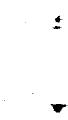

# DISTRIBUTION

1. R. K. Adams

2. G. M. Adamson

3. R. G. Affel

4. L. G. Alexander

5. R.F.Apple

6. C. F. Baes

7. J.M.Baker

8. S.J.Ball

9. W. P. Barthold

10. H.F. Bauman

11. S. E. Beall

12. M. Bender

13. E. S. Bettis

14. F. F. Blankenship

15. R. E. Blanco

16. J. O. Blomeke

17. R. Blumberg

18. E. G. Bohlmann

19. C. J. Borkowski

20. G. E. Boyd

21. J. Braunstein

22. M. A. Bredig

23. R. B. Briggs

24. H. R. Bronstein

25. G. D. Brunton

26. D. A. Canonico

27. S. Cantor

28. W. L. Carter

29. G. I. Cathers

30. J. M. Chandler

31. E. L. Compere

32. W.H.Cook

33-34. D. F. Cope

35. L. T. Corbin

36. J. L. Crowley

37. F. L. Culler, Jr.

38. J.M.Dale

39. D. G. Davis

L0. S. J. Ditto

41. A. S. Dworkin

42. J.R. Engel

43. E. P. Epler

44. D. E. Ferguson

45. L. M. Ferris

46. A. P. Fraas

47. H. A. Friedman

48. J.H.Frye, Jr.

49. C. H. Gabbard

50. R. B. Gallaher

51. A. Giambusso, AEC-Wash.

52. H.E.Goeller

53. W.R.Grimes

54. A. G. Grindell

55. R. H. Guymon

56. B. A. Hannaford

57. P.H.Harley

58. D. G. Harman

59. C. S. Harrill

60. P. N. Haubenreich

61. F. A. Heddleson

62. P. G. Herndon

63. J. R. Hightower

64. H.W.Hoffman

65. R.W.Horton

66. T. L. Hudson

67. H. Inouye

68. W. H. Jordan

69. P. R. Kasten

70. R. J. Kedl

71. M. T. Kelley

72. M. J. Kelly

73. C. R. Kennedy

74. T. W. Kerlin

75. H. T. Kerr

76. S. S. Kirslis

77. A. I. Krakoviak

78. J.W.Krewson

79. C. E. Lamb

80. J.A.Lane

81. W. J. Larkin, AEC-ORO

82. R. B. Lindauer

83. A. P. Litman

81. M. I. Lundin

85. R. N. Lyon

86. H. G. MacPherson

87. R. E. MacPherson

88. C. D. Martin

89. C. E. Mathews

90. C. L. Matthews

91. R. W. McClung

92. H. E. McCoy

93. H. F. McDuffie

94. C. K. McGlothlan

95. C. J. McHargue

96-110. T. W. McIntosh, AEC-Wash.

111. L. E. McNeese

112. A. S. Meyer

113. R. L. Moore

# DISTRIBUTION (cont.)

114. J. P. Nichols   
115. E. L. Nicholson   
116. L. C. Oakes   
117. P. Patriarca   
118. A.M.Perry   
119. H. B. Piper   
120. B. E. Prince   
121. J. L. Redford   
122. M. Richardson   
123. R. C. Robertson   
124. H. C. Roller

125-174. M. W. Rosenthal

175. H.M.Roth, AEC-ORO   
176. H.C.Savage   
177. C. E. Schilling   
178. Dunlap Scott   
179. H. E. Seagren   
180. W.F. Schaffer   
181. J. H. Shaffer

182-183. M. Shaw, AEC-Wash.

184. M. J. Skinner   
185. G.M.Slaughter   
186. W. L. Smalley, AEC-ORO   
187. A. N. Smith   
188. F. J. Smith   
189. G.P. Smith   
190. O. L. Smith   
191. P. G. Smith   
192. W.F. Spencer   
193. I. Spiewak   
194. R.C. Steffy   
195. H. H. Stone   
196. R.F. Sweek, AEC-Wash.   
197. J.R.Tallackson   
198. E. H. Taylor   
199. R. E. Thoma   
200. J. S. Watson   
201. C.F.Weaver   
202. B.H.Webster   
203. A. M. Weinberg   
204. J. R. Weir   
205. W. J. Werner   
206. K.W. West   
207. M. E. Whatley   
208. J. C. White   
209. L.V.Wilson   
210. G. Young   
211. H. C. Young

212-213. Central Research Library

214-215. Document Reference Section

216-225. Laboratory Records Department

226. Laboratory Records, ORNL R.C.

227-241. Division of Technical Informa

tion Extension