# OAK RIDGE NATIONAL LABORATORY

# operated by   UNION CARBIDE CORPORATION for the

U.S. ATOMIC ENERGY COMMISSION

ORNL-TM-1853

COPY NO. - 262

DATE-6-6-67

CFSTIRICES

H.C. $3.00; MN .65

CHEMICAL RESEARCH AND DEVELOPMENT FOR MOLTEN-

SALT BREEDER REACTORS

W. R. Grimes

# ABSTRACT

Results of the 15-year program of chemical research and development for molten salt reactors are summarized in this document. These results indicate that $^{7}\mathrm{LiF - BeF}_2 - \mathrm{UF}_4$ mixtures are feasible fuels for thermal breeder reactors. Such mixtures show satisfactory phase behavior, they are compatible with Hastelloy N and moderator graphite, and they appear to resist radiation and tolerate fission product accumulation. Mixtures of $^{7}\mathrm{LiF - BeF}_2 - \mathrm{ThF}_4$ similarly appear suitable as blankets for such machines. Several possible secondary coolant mixtures are available; NaF-NaBF₃ systems seem, at present, to be the most likely possibility.

Gaps in the technology are presented along with the accomplishments, and an attempt is made to define the information (and the research and development program) needed before a Molten Salt Thermal Breeder can be operated with confidence.

# NOTICE

This document contains information of a preliminary nature and was prepared primarily for internal use at the Oak Ridge National Laboratory. It is subject to revision or correction and therefore does not represent a final report. The information is not to be abstracted, reprinted or otherwise given public dissemination without the approval of the ORNL patent branch, Legal and Information Control Department.

# LEGAL NOTICE

This report was prepared as an account of Government sponsored work. Neither the United States, nor the Commission, nor any person acting on behalf of the Commission:

A. Makes any warranty or representation, expressed or implied, with respect to the accuracy, completeness, or usefulness of the information contained in this report, or that the use of any information, apparatus, method, or process disclosed in this report may not infringe privately owned rights; or   
B. Assumes any liabilities with respect to the use of, or for damages resulting from the use of any information, apparatus, method, or process disclosed in this report.

As used in the above, "person acting on behalf of the Commission" includes any employee or contractor of the Commission, or employee of such contractor, to the extent that such employee or contractor of the Commission, or employee of such contractor prepares, disseminates, or provides access to, any information pursuant to his employment or contract with the Commission, or his employment with such contractor.

# CONTENTS

Abstract 1

Selection of MSBR Salt Mixtures 3

General Requirements for the Fluids 3

Choice of Fuel and Blanket Composition 5

Oxide-Fluoride Equilibria 21

Fuel and Blanket Compositions 29

Choice of Coolant 30

Physical Properties of MSBR Liquids 34

Chemical Compatibility of MSRE Materials 37

Stability of $\mathbf{U}\mathbf{F}_3$ and $\mathbf{U}\mathbf{F}_4$ 37

Oxidation (Corrosion) of Hastelloy N 40

Compatibility of Graphite with Fluorides 45

Radiation Effects 46

Behavior of Fission Products in Molten Salts 57

Physical Chemistry of Fission Products 57

Net Oxidizing Potential of Fission Process 65

Chemical Behavior in MSRE 68

General 68

Corrosion in MSRE 69

Behavior of Fission Products 71

Molten-Salt Production Technology 82

Production Process 82

MSRE Salt-Production Economics 86

Separations Processes in MSBR Fuels and Blankets . 89

Possible Separation of Rare Earths from Fuel 89

MSBR In-Line Analysis Program 102

Proposed Program of Chemical Development 120

References 133

# LEGAL NOTICE

This report was prepared as an account of Government sponsored work. Neither the United States nor the Commission sat on behalf of the Commission:

States, nor the Commission, nor any person acting on behalf of the Commission.

A. Makes any warranty or representation, expressed or implied, of the use, accuracy, completeness, or usefulness of the information contained in this report, or that the use, accuracy, completeness, or usefulness of any information, apparatus, method, or process disclosed in this report may not infringe

privately owned rights; or B. Assumes any liabilities with respect to the use of, or for damages resulting from the

use of any information, apparatus, method, or process whatsoever, including the use of a computer program or software, as used in the above, "person acting on behalf of the Commission" includes any employee or contractor of the Commission, or employee of such contractor, to the extent that such employee or contractor of the Commission, or employee of such contractor prepares, disseminates, or provides access to, any information pursuant to his employment or contract with the Commission, or his employment with such contractor.

# CHEMICAL RESEARCH AND DEVELOPMENT FOR MOLTEN

# SALT BREEDER REACTORS

Use of molten fluorides as fuels, blankets, and coolants offers a promising and versatile route to thorium breeder reactors. Mixtures containing fissile and/or fertile materials have been studied in considerable detail, and shown to possess liquidus temperatures, phase stability, and physical properties which are suitable for the purpose. These fluoro-ride mixtures appear to be compatible with structural metals and with graphite suitable for use in a Molten Salt Breeder Reactor; such compatibility seems assured under irradiation at MSBR conditions. Cheap, low-melting fluoride coolants for MSBR have not yet been demonstrated but promising leads are available; the relative simplicity of the coolant problem lends assurance that a reasonable solution can be found.

A reference design for a 1000 MW(e) Molten Salt Breeder Reactor has recently been published. The state of knowledge of molten salts as materials for use in that reactor and in attractive alternatives or improvements is described in some detail in the following pages. An attempt is made to define those areas where additional knowledge is necessary or very desirable and to estimate the effort required to obtain this knowledge for a molten salt breeder reactor and a breeder reactor experiment.

SELECTION OF MSBR SALT MIXTURES2-5

General Requirements for the Fluids

A molten salt reactor makes the following stringent minimum demands upon its fluid fuel. The fuel must consist of elements of low (and prefer-

ably very low) capture cross section for neutrons typical of the energy spectrum of the chosen design. The fuel must dissolve more than the critical concentration of fissionable material at temperatures safely below the temperature at which the fuel leaves the heat exchanger. The mixture must be thermally stable and its vapor pressure must be low over the operating temperature range. The fuel mixture must possess heat transfer and hydrodynamic properties adequate for its service as a heat-exchange fluid. It must be relatively non-aggressive toward some otherwise suitable material--presumably a metal--of construction and toward some suitable moderator material. The fuel must be stable toward reactor radiation, must be able to survive fission of the uranium--or other fissionable material--and must tolerate fission product accumulation without serious deterioration of its useful properties.

If such reactors are to produce economical power we must add to this list the need for reactor temperatures sufficiently high to achieve genuinely high quality steam, and we must provide a suitable link (a secondary coolant) between the fuel circuit and the steam system. We must also be assured of a genuinely low fuel cycle cost; this presupposes a cheap fuel and an effective turn-around of the unburned fissionable material or (more reasonably) an effective and economical decontamination and reprocessing scheme for the fuel.

If the reactor is to be a breeder we must impose even more stringent limits on permissible parasitic neutron captures by the reactor materials and provide sufficient fertile material either in a breeder blanket or in the fuel (or in both). If a blanket is used it must be separated from

the fuel by some material of very low neutron cross section.

The demands imposed upon the coolant and blanket fluids differ in obvious ways from those imposed upon the fuel system. Radiation intensity will be considerably less in the blanket--and markedly less in the coolant--than in the fuel. Efficiency of the blanket mixture as a heat transfer agent may be relatively unimportant, but a high concentration of fertile material is essential and an effective recovery of bred material is likely to be vital.

# Choice of Fuel and Blanket Composition

# General Considerations

The compounds which are permissible major constituents of fuels or blankets for thermal breeders are those that can be prepared from beryllium, bismuth, boron-ll, carbon, deuterium, fluorine, lithium-7, nitrogen-15, oxygen, and the fissionable and fertile isotopes. As minor constituents one can probably tolerate compounds containing the elements listed in Table 1.

Of the known compounds containing useful concentrations of hydrogen (or deuterium) only the hydroxides of the alkali metals, the saline hydrides of lithium and calcium, and certain interstitial hydrides (zirconium hydride, for example) show adequate thermal stability in the $1000^{\circ}\mathrm{F}$ to $1300^{\circ}\mathrm{F}$ temperature range. [Acid fluorides $\left(\mathrm{NaHF}_2\right.$ , for example] might be permissible in low concentrations at lower temperatures.] The hydrides are very strong reducing agents and are most unlikely to be useful components of any uraniferous liquid fuel system. Alkali hydroxides dissolve extremely small quantities of uranium compounds at useful reactor temperatures and are very corrosive to virtually all useful metals at

such temperatures. One concludes, therefore, that hydrogen-rich compounds, which might provide self-moderation to molten fuels, are not useful in practical fuel or blanket mixtures.

The non-metals carbon, nitrogen, silicon, sulfur, phosphorus, and oxygen each form only high melting and generally unsuitable binary compounds with the metals of Table 1. From these non-metals, however, a wide variety of oxygenated anions are available. Nitrates, nitrites, sulfates, and sulfites can be dismissed as lacking adequate thermal stability; silicates can be dismissed because of undesirably high viscosities. Phosphates, borates, and carbonates are not so easy to eliminate without study, and phosphates have, in fact, received some attention. The several problems of thermal stability, corrosion, solubility of uranium and thorium compounds, and, especially, radiation stability would seem to make the use of any such compounds very doubtful.

When the oxygenated anions are eliminated only fluorides and chlorides remain. Chlorides offer mixtures that are, in general, lower melting than fluorides; in addition UCl₃ is probably more stable than UF₃ with respect to the analogous tetravalent compounds. For thermal reactors, fluorides appear much more suitable for reasons which include (1) usefulness of the element without isotope separation, (2) better neutron economy, (3) higher chemical stability, (4) lower vapor pressure, and (5) higher heat capacity per unit weight or volume. Fluoride mixtures are, accordingly, preferred as fuel and blanket mixtures for thermal reactors. The fluoride ion is capable of some moderation of neutrons; this moderation is insufficient for thermal reactors with cores of reasonable size. An additional moderator material is, accordingly, required.

May be Tolerable in High Temperature Reactor Fuels

Table 1. Elements or Isotopes Which   

<table><tr><td>Material</td><td>Absorption Cross Section (Barns)</td></tr><tr><td>Nitrogen-15</td><td>0.000024</td></tr><tr><td>Oxygen</td><td>0.0002</td></tr><tr><td>Deuterium</td><td>0.00057</td></tr><tr><td>Carbon</td><td>0.0033</td></tr><tr><td>Fluorine</td><td>0.009</td></tr><tr><td>Beryllium</td><td>0.010</td></tr><tr><td>Bismuth</td><td>0.032</td></tr><tr><td>Lithium-7</td><td>0.033</td></tr><tr><td>Boron-ll</td><td>0.05</td></tr><tr><td>Magnesium</td><td>0.063</td></tr><tr><td>Silicon</td><td>0.13</td></tr><tr><td>Lead</td><td>0.17</td></tr><tr><td>Zirconium</td><td>0.18</td></tr><tr><td>Phosphorus</td><td>0.21</td></tr><tr><td>Aluminum</td><td>0.23</td></tr><tr><td>Hydrogen</td><td>0.33</td></tr><tr><td>Calcium</td><td>0.43</td></tr><tr><td>Sulfur</td><td>0.49</td></tr><tr><td>Sodium</td><td>0.53</td></tr><tr><td>Chlorine-37</td><td>0.56</td></tr><tr><td>Tin</td><td>0.6</td></tr><tr><td>Cerium</td><td>0.7</td></tr><tr><td>Rubidium</td><td>0.7</td></tr></table>

# Choice of Active Material

Uranium Fluoride. - Uranium hexafluoride is a highly volatile compound clearly unsuited as a component of high-temperature liquids. $\mathrm{UO_2F_2}$ , though relatively nonvolatile, is a strong oxidant which should prove very difficult to contain. Fluorides of pentavalent uranium ( $\mathrm{UF}_5$ , $\mathrm{U}_2\mathrm{F}_9$ , etc.) are not thermally stable and should prove prohibitively corrosive if they could be stabilized in solution.

Uranium tetrafluoride $(\mathrm{UF}_4)$ is a relatively stable, non-volatile, non-hygrosopic material, which is readily prepared in high purity. It melts at $1035^{\circ}\mathrm{C}$ , but this freezing point is markedly depressed by several useful diluent fluorides. Uranium trifluoride $(\mathrm{UF}_3)$ is stable, under inert atmospheres, to temperatures above $1000^{\circ}\mathrm{C}$ , but it disproportionates at higher temperatures by the reaction

$$
4 \mathrm {U F} _ {3} \neq 3 \mathrm {U F} _ {4} + \mathrm {U} ^ {\circ}.
$$

Uranium trifluoride is appreciably less stable in molten fluoride solutions. $^{4,5}$ It is tolerable in reactor fuels only insofar as the equilibrium activity of uranium metal is sufficiently low to avoid reaction with the moderator graphite or alloying with the container metal. $^{5}$ Appreciable concentrations of $\mathrm{UF}_3$ (see below) are tolerable in LiF-BeF $_2$ mixtures such as those used in MSRE and proposed for MSBR. In general, however, uranium tetrafluoride must be the major uraniferous compound in the fuel.

Thorium Fluoride. - All the normal compounds of thorium are quadri-valent; $\mathrm{ThF}_4$ (melting at $1115^{\circ}\mathrm{C}$ ) must be used in any thorium-bearing fluoride melt. Fortunately, the marked freezing point depression by useful diluents noted above for uranium tetrafluoride applies also to thorium

tetrafluoride.

Choice of Fluoride Diluents

The fuel systems for thermal reactors of the MSRE and MSBR types require low concentrations (0.2 to 1 mole %) of uranium, and the properties (especially the melting temperature) of such fuels will be essentially those of the diluent mixture. Blanket mixtures (and perhaps fuel systems for one-region breeders) will require considerable concentrations of high-melting $\mathrm{ThF}_{4}$ . The fuels must, if they are to be compatible with large steam turbines, be completely molten at $975^{\circ}\mathrm{F}$ ( $525^{\circ}\mathrm{C}$ ).

Simple consideration of the nuclear properties leads one to prefer as diluents the fluorides of Be, Bi, $^{7}$ Li, Mg, Pb, Zr, Ca, Na, and Sn (in that order). Equally simple considerations (Table 2) of the stability of diluent fluorides toward reduction by common structural metals, $^{6,7}$ however, serve to eliminate $\mathrm{BiF}_3$ , $\mathrm{PbF}_2$ , and probably $\mathrm{SnF}_2$ from consideration.

No single fluoride can serve as a useful diluent for the active fluorides. $\mathrm{BeF}_2$ is the only stable compound listed whose melting point is close to the required level; this compound is too viscous for use in the pure state.

The very stable fluorides of the alkaline earths and of yttrium and cerium do not seem to be useful major constituents of low melting fluids. Mixtures containing about 10 mole % of alkaline earth fluoride with $\mathrm{BeF}_2$ melt below $500^{\circ}\mathrm{C}$ , but the viscosity of such melts is certainly too high for serious consideration.

Some of the possible combinations of alkali fluorides have suitable freezing points. Equimolar mixtures of LiF and KF melt at $490^{\circ}\mathrm{C}$ , and mixtures with 40 mole % LiF and 60 mole % RbF melt at $470^{\circ}\mathrm{C}$ . The ternary

For Use in High Temperature Reactors

Table 2. Relative Stability ${}^{a}$ of Fluorides   

<table><tr><td>Compound</td><td>Free Energy of Formation at 1000oK (kcal/F atom)</td><td>Melting Point (oC)</td><td>Absorption Cross Sectionb for Thermal Neutrons (barns)</td></tr><tr><td>Structural Metal Fluorides</td><td></td><td></td><td></td></tr><tr><td>CrF2</td><td>-74</td><td>1100</td><td>3.1</td></tr><tr><td>FeF2</td><td>-66.5</td><td>930</td><td>2.5</td></tr><tr><td>NiF2</td><td>-58</td><td>1330</td><td>4.6</td></tr><tr><td>Diluent Fluorides</td><td></td><td></td><td></td></tr><tr><td>CaF2</td><td>-125</td><td>1330</td><td>0.43</td></tr><tr><td>LiF</td><td>-125</td><td>848</td><td>0.033c</td></tr><tr><td>BaF2</td><td>-124</td><td>1280</td><td>1.17</td></tr><tr><td>SrF2</td><td>-123</td><td>1400</td><td>1.16</td></tr><tr><td>CeF3</td><td>-118</td><td>1430</td><td>0.7</td></tr><tr><td>YF3</td><td>-113</td><td>1144</td><td>1.27</td></tr><tr><td>MgF2</td><td>-113</td><td>1270</td><td>0.063</td></tr><tr><td>RbF</td><td>-112</td><td>792</td><td>0.70</td></tr><tr><td>NaF</td><td>-112</td><td>995</td><td>0.53</td></tr><tr><td>KF</td><td>-109</td><td>856</td><td>1.97</td></tr><tr><td>BeF2</td><td>-104</td><td>548</td><td>0.010</td></tr><tr><td>ZrF4</td><td>-94</td><td>903</td><td>0.180</td></tr><tr><td>AlF3</td><td>-90</td><td>1404</td><td>0.23</td></tr><tr><td>SnF2</td><td>-62</td><td>213</td><td>0.6</td></tr><tr><td>PbF2</td><td>-62</td><td>850</td><td>0.17</td></tr><tr><td>BiF3</td><td>-50</td><td>727</td><td>0.032</td></tr><tr><td>Active Fluorides</td><td></td><td></td><td></td></tr><tr><td>ThF4</td><td>-101</td><td>1111</td><td>-</td></tr><tr><td>UF4</td><td>-95.3</td><td>1035</td><td>-</td></tr><tr><td>UF3</td><td>-100.4</td><td>1495</td><td>-</td></tr></table>

aReference state is the pure crystalline solid; these values are, accord-. ingly, only very approximately those for solutions in molten mixtures. bOf Metallic ion. 7Li.

systems LiF-NaF-KF and LiF-NaF-RbF have lower melting regions than do these binaries. All these systems will dissolve $\mathrm{UF}_{4}$ at concentrations up to several mole % at temperatures below $525^{\circ}\mathrm{C}$ . They might well prove useful as reactor fuels if no mixtures with more attractive properties were available.

Mixtures with useful melting points over relatively wide ranges of composition are available if $\mathrm{ZrF}_{4}$ is a major component of the system. Phase relationships NaF-ZrF $_{4}$ system show low melting points over the interval 40 to 55 mole % $\mathrm{ZrF}_{4}$ . A mixture of UF $_{4}$ with NaF and $\mathrm{ZrF}_{4}$ served as fule for the Aircraft Reactor Experiment.

The lowest melting binary mixtures of the usable diluent fluorides are those containing $\mathsf{BeF}_2$ with NaF or LiF. $^8$ (The ternary system LiF-NaF-BeF $_2$ has been examined in some detail, but it seems to have no important advantage over either binary.) Since Be offers the best cross section of the diluents (and $^7$ Li ranks very high), fuels based on the LiF-BeF $_2$ diluent system were chosen for MSRE and are proposed for MSBR.

The binary system $\mathsf{LiF - BeF}_2$ has melting points below $500^{\circ}\mathsf{C}$ over the concentration range from 33 to 80 mole $\% \mathsf{BeF}_2$ . The presently accepted $\mathsf{LiF - BeF}_2$ system diagram, presented in Fig. 1, is characterized by a single eutectic (52 mole $\% \mathsf{BeF}_2$ , melting at $360^{\circ}\mathsf{C}$ ) between $\mathsf{BeF}_2$ and 2LiF· $\mathsf{BeF}_2$ . The compound 2LiF· $\mathsf{BeF}_2$ melts incongruently to LiF and liquid at $458^{\circ}\mathsf{C}$ . $\mathsf{LiF - BeF}_2$ is formed by the reaction of solid $\mathsf{BeF}_2$ and solid 2LiF· $\mathsf{BeF}_2$ below $280^{\circ}\mathsf{C}$ .

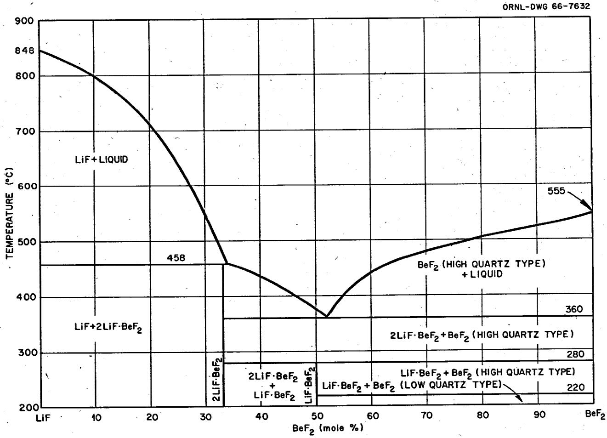  
Fig. 1. The System LiF-BeF $_2$

# LiF-BeF $_2$ Systems with Active Fluorides

The phase diagram of the $\mathrm{BeF}_2\text{-}\mathrm{UF}_4$ system (Fig. 2) shows a single eutectic containing very little $\mathrm{UF}_4$ . That of the $\mathrm{LiF - UF_4}$ system (Fig. 3) shows three compounds, none of which melts congruently and one of which shows a low temperature limit of stability. The eutectic mixture of $4\mathrm{LiF}\cdot \mathrm{UF}_4$ and $\mathrm{LiF}\cdot \mathrm{UF}_4$ occurs at 27 mole $\%$ $\mathrm{UF}_4$ and melts at $490^{\circ}\mathrm{C}$ . The ternary system $\mathrm{LiF - BeF}_2\text{-}\mathrm{UF}_4$ , of primary importance in reactor fuels, is shown as Fig. 4. The system shows two eutectics. These are at 1 mole $\%$ $\mathrm{UF}_4$ and 52 mole $\%$ $\mathrm{BeF}_2$ and at 8 mole $\%$ $\mathrm{UF}_4$ and 26 mole $\%$ $\mathrm{BeF}_2$ ; they melt at 350 and $435^{\circ}\mathrm{C}$ , respectively. Moreover, the system shows a very wide range of compositions melting below $525^{\circ}\mathrm{C}$ .

The system $\mathrm{BeF}_2\text{-}\mathrm{ThF}_4$ is very similar to the analogous $\mathrm{UF}_4$ system. $^{11}$ The $\mathrm{LiF - ThF_4}$ system (Fig. 5) contains four compounds. $^{12}$ The compound $3\mathrm{LiF}\cdot \mathrm{ThF}_4$ melts congruently at $580^{\circ}C$ and forms eutectics at $570^{\circ}C$ and 22 mole $\% \mathrm{ThF}_4$ and $560^{\circ}C$ and 29 mole $\% \mathrm{ThF}_4$ with LiF and with $\mathrm{LiF}\cdot \mathrm{ThF}_4$ , respectively. The compounds $\mathrm{LiF}\cdot \mathrm{ThF}_4$ , $\mathrm{LiF}\cdot 2\mathrm{ThF}_4$ , and $\mathrm{LiF}\cdot 4\mathrm{ThF}_4$ melt incongruity at $595^{\circ}C$ and $890^{\circ}C$ . The ternary system $\mathrm{LiF - BeF}_2\text{-}\mathrm{ThF}_4$ (see Fig. 6) shows only a single eutectic with the composition $47.0$ mole $\%$ LiF and $1.5$ mole $\% \mathrm{ThF}_4$ melting at $356^{\circ}C$ . $^{11}$ In spite of small differences due to the phase fields of $\mathrm{LiF}\cdot 2\mathrm{ThF}_4$ , $3\mathrm{LiF}\cdot \mathrm{ThF}_4$ , and $4\mathrm{LiF}\cdot \mathrm{UF}_4$ , the systems represented by Figures 4 and 6 are very similar.

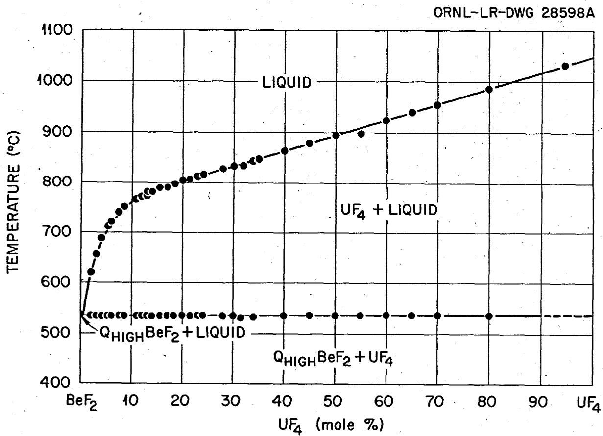  
Fig. 2 The System $\mathbf{U}\mathbf{F}_{4} - \mathbf{B}\mathbf{e}\mathbf{F}_{2}$

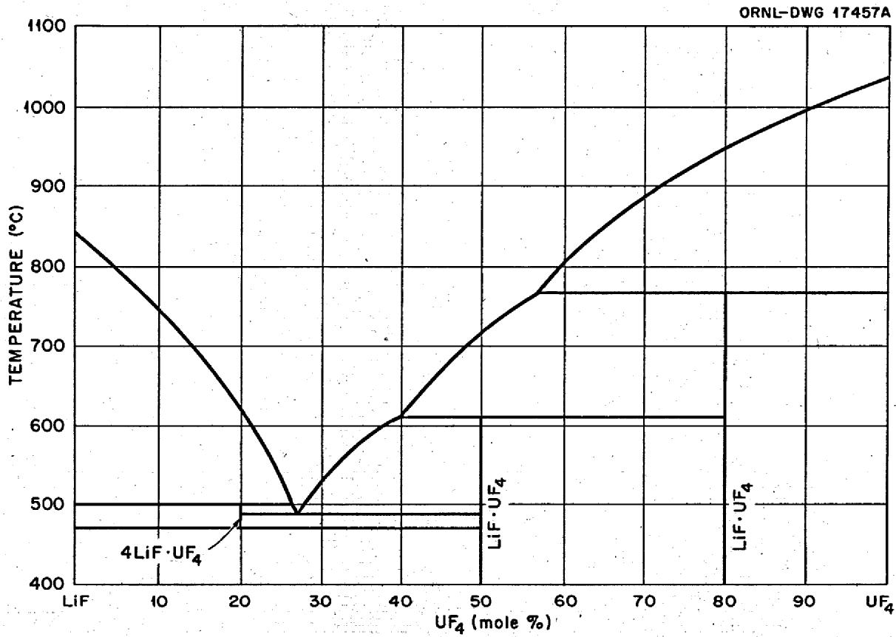  
Fig. 3. The System $\mathrm{LiF - UF}_{4}$

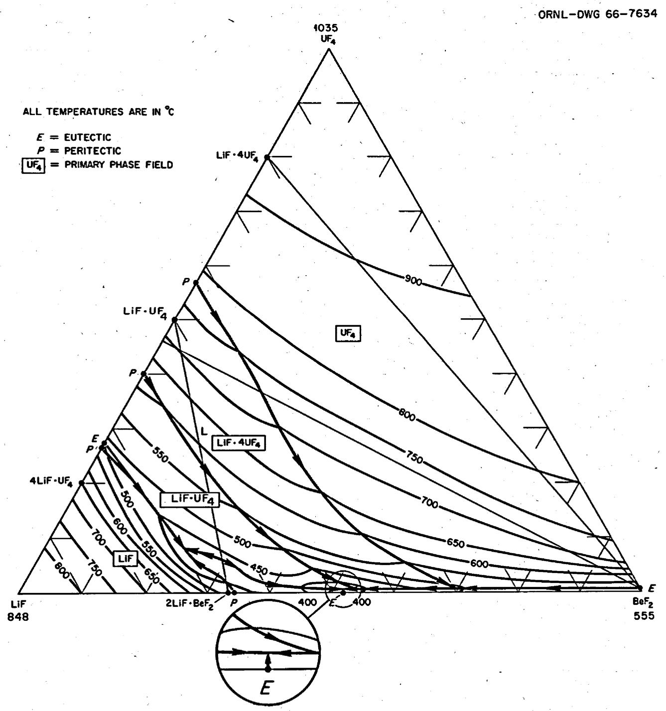  
Fig. 4. The System LiF-BeF $_2$ -UF $_4$

$\mathrm{ThF}_{4}$ and $\mathrm{UF}_{4}$ form a continuous series of solid solutions with neither maximum nor minimum. The LiF- $\mathrm{ThF}_{4}-\mathrm{UF}_{4}$ system (see Fig. 7) shows no ternary compounds and a single eutectic13 (which contains 1.5 mole % $\mathrm{ThF}_{4}$ with 26.5 mole % $\mathrm{UF}_{4}$ and freezes at $488^{\circ} \mathrm{C}$ ). Most of the area on the diagram is occupied by primary phase fields of the solid solutions $\mathrm{UF}_{4}-\mathrm{ThF}_{4}$ , $\mathrm{LiF} \cdot 4 \mathrm{UF}_{4}-\mathrm{LiF} \cdot 4 \mathrm{ThF}_{4}$ , and $\mathrm{LiF} \cdot \mathrm{UF}_{4}-\mathrm{LiF} \cdot \mathrm{ThF}_{4}$ . Liquidus temperatures decrease, generally, to the $\mathrm{LiF}-\mathrm{UF}_{4}$ edge of the diagram.

It is clear from examination of the diagrams shown that fuel systems melting below $500^{\circ}\mathrm{C}$ are available over a wide range of compositions in the $\mathrm{LiF - BeF}_2\text{-} UF_4$ system. Since (see Fig. 6) up to 28 mole $\%$ of $\mathrm{ThF}_4$ can be melted at temperatures below $1100^{\circ}\mathrm{F}$ , blanket systems with very large $\mathrm{ThF}_4$ concentrations can be obtained. Moreover, the very great similarity in behavior of $\mathrm{ThF}_4$ and $\mathrm{UF}_4$ permits fractional replacement of $\mathrm{ThF}_4$ by $\mathrm{UF}_4$ with little effect on freezing temperature over the composition range of interest as fuel. Fuels for single region reactors should, accordingly, be available in the $\mathrm{LiF - BeF}_2\text{-} ThF_4\text{-} UF_4$ quaternary system.

Phase behavior in the ternary systems $\mathrm{LiF - BeF}_2\text{-UF}_4$ and $\mathrm{LiF - BeF}_2\text{-ThF}_4$ has, as a consequence of studies cited above, been examined in considerable detail and the phase diagrams are well defined. If, as is likely, fuels and blankets for two-region breeders can be chosen from these ternaries then the only necessary additional study of phase behavior is a more detailed examination of liquidus and especially of solidus relationships and crystallization path behavior in the regions near those chosen as fuel and as blanket compositions.

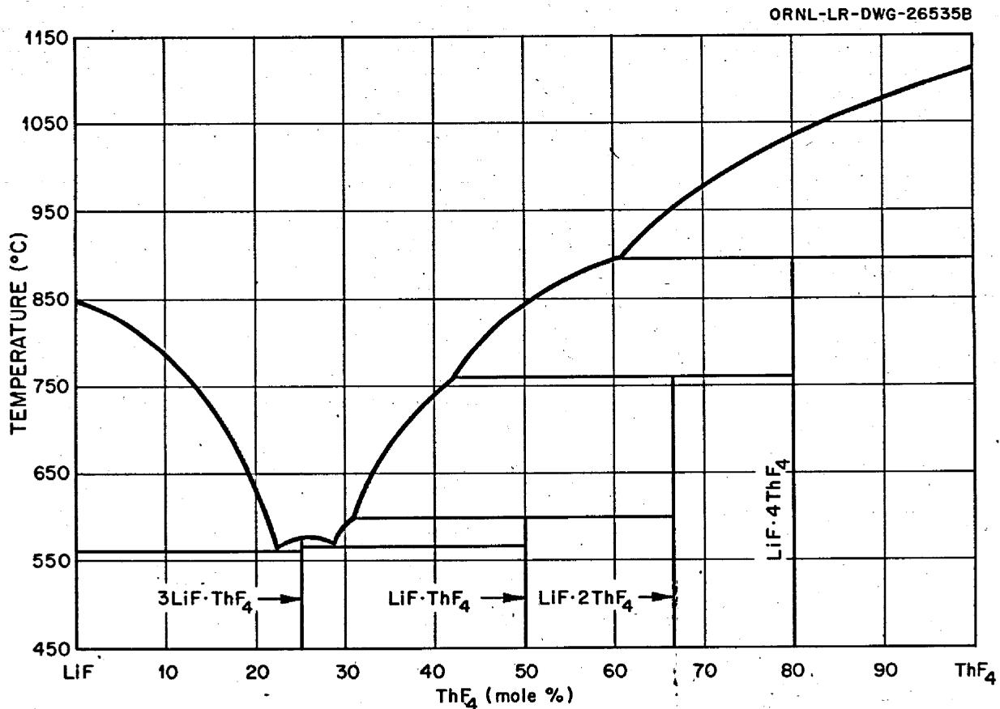  
Fig. 5. The System LiF-ThF4

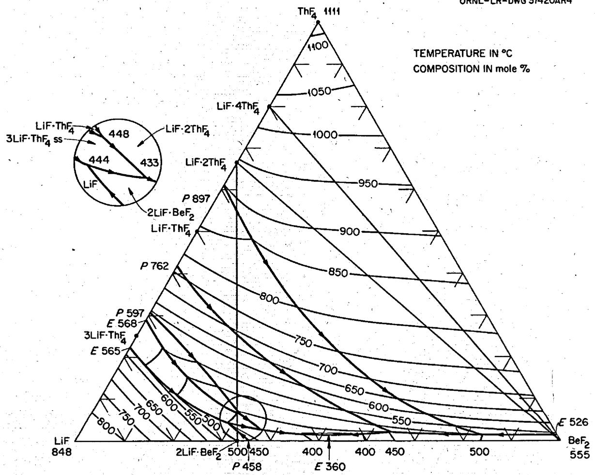  
Fig. 6. The System LiF-BeF $_2$ -ThF $_4$

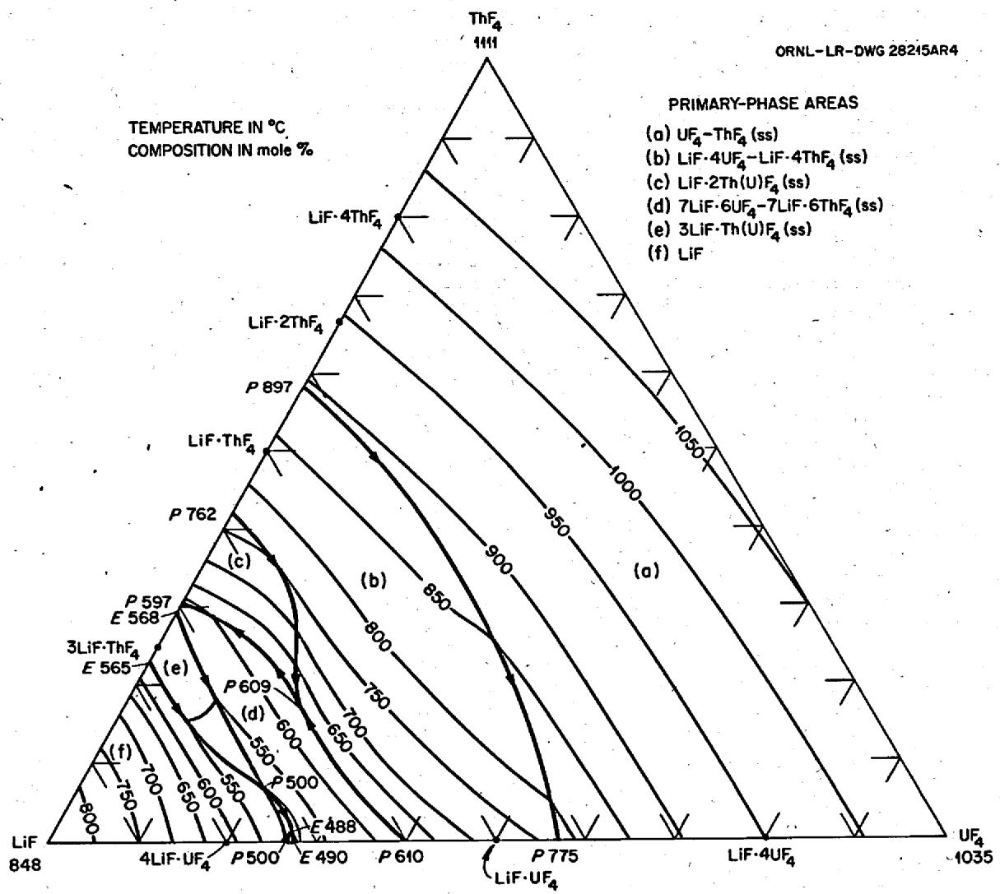  
Fig. 7. The System $\mathrm{LiF - ThF}_4 - \mathrm{UF}_4$

# Oxide-Fluoride Equilibria

The phase behavior of pure fluoride systems is such that adequate fuels and blankets seem assured, but the behavior of such systems is markedly altered by appreciable concentrations of oxide. Since all commercial fluoride preparations contain some oxide (and water which reacts with the fluorides at high temperature to produce oxide) methods must be devised to remove this contaminant to safe levels before use of the fluoride mixture in the reactor. Avoiding contamination by oxide of the molten mixtures during reactor operation and maintenance was possible in principle but, before the excellent operating experience with MSRE, was not at all certain in practice. Accordingly, careful studies of oxide-fluoride equilibria in fluoride melts have been made to establish (1) the effect of contaminant oxide on MSRE fuel, and (2) the ease of removal of oxide to tolerable levels prior to reactor usage of the melts.

Measurements of reaction equilibria between water vapor in hydrogen carrier gas with LiF-BeF $_2$ melts over a wide composition interval have been examined in detail by Mathews and Baes. $^{14,15}$ Equilibrium quotients for the reaction

$$
\mathrm {H} _ {2} ^ {0} (\mathrm {g}) + \mathrm {B e F} _ {2 (\mathrm {l})} \neq \mathrm {B e O} (\mathrm {s}) + 2 \mathrm {H F} (\mathrm {g}) \tag {1}
$$

(where $\ell, g$ , and $d$ refer to liquid, gaseous, and dissolved states and $s$ indicates that BeO was present as a saturating solid phase) were measured from 500 to $700^{\circ}C$ over the composition range $\mathbf{x}_{\mathrm{BeF}_2} = 0.3$ to 0.8. The results are summarized by

$$
\log \left(\mathrm {P} _ {\mathrm {H F}} ^ {2} / \mathrm {P} _ {\mathrm {H} _ {2} 0} \mathrm {x} _ {\mathrm {B e F} _ {2}}\right) = \mathrm {a} + \mathrm {b} \mathrm {x} _ {\mathrm {L i F}} ^ {2} + \mathrm {c} \mathrm {x} _ {\mathrm {L i F}} ^ {4} \tag {2}
$$

wherein a, b, and c all were linear functions of $l / T^0 K$ ,

$$
\begin{array}{l} a = 3. 9 0 0 - 4. 4 1 8 \left(1 0 ^ {3} / T\right), \\ b = 7. 8 1 9 - 5. 4 4 0 \left(1 0 ^ {3} / T\right), \\ c = - 1 2. 6 6 + 5. 2 6 2 \left(1 0 ^ {3} / T\right). \\ \end{array}
$$

In the same investigation, measurements were made upon melts not saturated with BeO. In addition to the reaction

$$
\mathrm {H} _ {2} ^ {0} (\mathrm {g}) + 2 \mathrm {F} ^ {-} (\mathrm {d}) \neq 0 ^ {2 -} (\mathrm {d}) + 2 \mathrm {H F} (\mathrm {g}) \tag {3}
$$

for the formation of oxide ion, it became evident, both from these measurements and from those upon BeO saturated melts, that hydroxide ion also was formed

$$
\mathrm {H} _ {2} \mathrm {O} (\mathrm {g}) + \mathrm {F} ^ {-} (\mathrm {d}) \neq \mathrm {O H} ^ {-} (\mathrm {d}) + \mathrm {H F} (\mathrm {g}) \tag {4}
$$

Because of limitations inherent in the transpiration method used, the equilibrium quotients for these two reactions were less accurately determined than was the previous one for BeO saturated melts (ca. $\pm 10\%$ , respectively, compared to $\pm 5\%$ ). They were sufficient to show, however, that both oxide and hydroxide increase in stability with increasing temperature. The stability of hydroxide with respect to oxide, however, decreases with increasing temperature. Hydroxide can, accordingly, be readily decomposed in these fluoride melts by sparging with an inert gas (e.g., hydrogen).

$$
O H ^ {-} + F ^ {-} \neq H F _ {(g)} + 0 ^ {2 -}, \log K = 5. 2 3 - 6. 5 6 (1 0 ^ {3} / T) \tag {5}
$$

Similar measurements have also been made by Baes and Hitch $^{16}$ in which the $2\mathrm{LiF} \cdot \mathrm{BeF}_2$ contained added $\mathrm{ZrF}_4$ . With $\mathbf{x}_{\mathrm{ZrF}_4} > 3 \times 10^{-4}$ , $\mathrm{ZrO}_2$ is the stable saturating oxide aolid, and hence the following equilibrium may be written

$$
\mathrm {2 H} _ {2} \mathrm {0} (\mathrm {g}) + \mathrm {Z r F} _ {4 (\mathrm {d})} \neq \mathrm {Z r 0} _ {2 (\mathrm {s})} + \mathrm {4 H F} _ {(\mathrm {g})} \tag {6}
$$

It was also found that the equilibria (3 and 4) for the formation of oxide and hydroxide ions were shifted to the right with increasing $x_{\mathrm{ZrF}_4}$ ; i.e., in the direction of greater stability of these ions.

These results are consistent with previous observations that $\mathsf{LiF - BeF}_2$ melts are readily freed of oxide contamination by treatment with gaseous mixtures of $\mathsf{H}_2$ and HF. The measured equilibrium quotients in $2\mathsf{LiF} \cdot \mathsf{BeF}_2$ were used to calculate the efficiency of HF utilization in such a treatment as a function of temperature and HF partial pressure with the assumption that equilibrium is maintained between the gas stream, the molten salt, and any BeO solid present. This calculation (Fig. 8) shows that the efficiency in the removal of oxide to a final value of 16 ppm $(x_{0}2^{-} = 3.3x10^{-5})$ is quite high over a wide range of conditions.

By combination of reactions (1) and (6), it is possible to calculate that both $\mathrm{BeO}$ and $\mathrm{ZrO}_2$ will coexist at equilibrium with $2\mathrm{LiF} \cdot \mathrm{BeF}_2$ containing oxide ion

$$
\mathrm {Z r} 0 _ {2 (\mathrm {s})} + 2 \mathrm {B e} ^ {2 +} (\mathrm {d}) \stackrel {\rightleftarrows} {=} \mathrm {Z r} ^ {1 +} (\mathrm {d}) + 2 \mathrm {B e} 0 _ {(\mathrm {s})} \tag {7}
$$

when $\mathrm{ZrF}_4$ is present at concentration of approximately $3 \times 10^{-4}$ mole fraction. With larger amounts of added $\mathrm{ZrF}_4$ , $\mathrm{ZrO}_2$ becomes the less soluble (stable) oxide.

When a molten mixture containing only LiF, $\mathrm{BeF}_2$ , and $\mathrm{UF}_4$ is treated with appreciable quantities of a reactive oxide (such as $\mathrm{H}_2\mathrm{O}$ , $\mathrm{CO}_3^=$ , FeO) precipitation of $\mathrm{UO}_2$ results. $^{4,5}$ The $\mathrm{UO}_2$ so produced is stoichiometric, and if it is maintained in contact with the melt for sufficient time it forms transparent ruby crystals of $\mathrm{UO}_2$ .

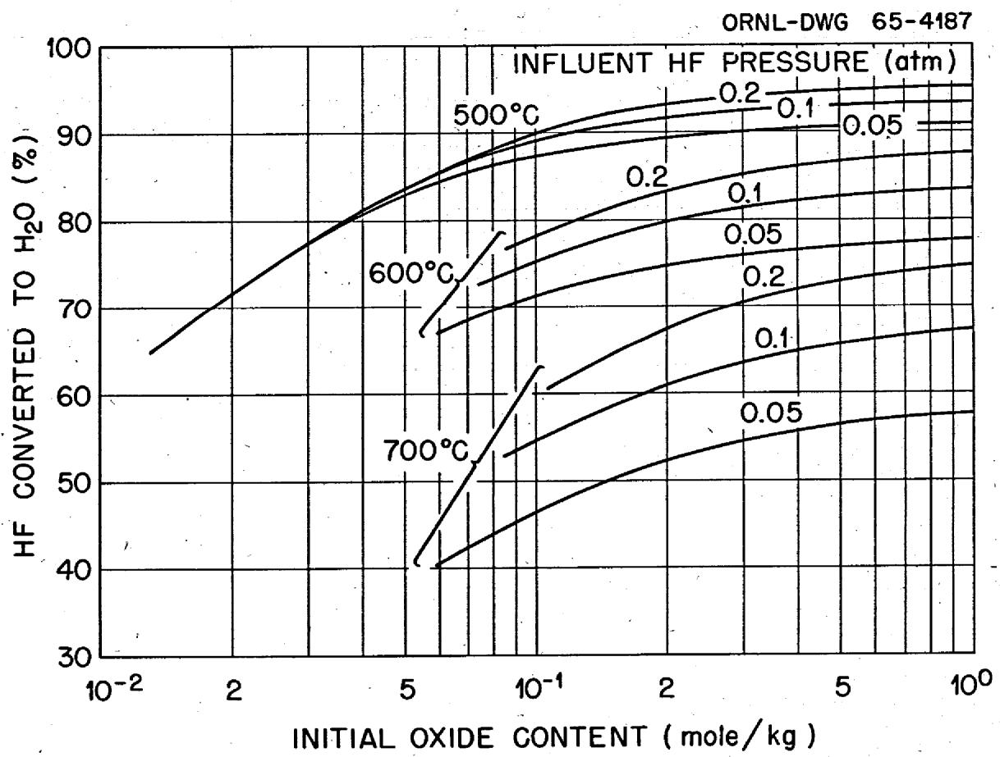  
Fig. 8. Efficiency of Removal of Oxide from 2LiF·BeF $_2$ by Treatment with HF

assumed to present a danger for the MSRE since slow precipitation of $\mathrm{UO}_2$ followed by a sudden entrance of the material into the core could permit uncontrolled increases in reactivity. Precautions were taken with the MSRE to assure cleanliness of the system, the fuel mixture, and the cover gas, but it was anticipated that some inadvertent contamination of the system might occur. Accordingly, it was decided to include $\mathrm{ZrF}_4$ in the MSRE fuel composition since measurements of the metathesis reaction

$$
\mathrm {Z r} _ {2 (\mathrm {s})} + \mathrm {U F} _ {4 (\mathrm {d})} \neq \mathrm {Z r F} _ {4 (\mathrm {d})} + \mathrm {U O} _ {2 (\mathrm {s})} \tag {8}
$$

have shown that the mole ratio of $\mathrm{ZrF}_4$ to $\mathrm{UF}_4$ at equilibrium with both $\mathrm{UO}_2$ and $\mathrm{ZrO}_2$ , while varying somewhat with temperature and melt composition, remains very far below that chosen for the fuel salt. As a consequence a considerable amount of $\mathrm{Zr}^{4+}$ --an amount easily detected by chemical analysis of the fuel salt--would be precipitated by oxide contamination before an appreciable quantity of $\mathrm{UO}_2$ should precipitate. $^{4,5}$

In connection with these studies, it was ascertained that, contrary to published $\mathrm{UO}_2\text{-ZrO}_2$ phase diagrams,[17] only very dilute solid solutions are formed in the temperature range $500 - 700^{\circ}\mathrm{C}$ . Because of the obvious importance of this to the MSRE, experiments have been carried out in which both $\mathrm{UO}_2\text{-ZrO}_2$ mixtures and $(\mathrm{U},\mathrm{Zr})\mathrm{O}_2$ solid solutions prepared by fusion were equilibrated with LiF-BeF $_2$ melts. The resulting phase diagram[18] for the $\mathrm{UO}_2\text{-ZrO}_2$ system over the temperature interval of real concern is shown in Fig. 9.

The oxide concentration in $2\mathrm{LiF}\cdot \mathrm{BeF}_2$ saturated with BeO was estimated by combining the equilibrium results for reactions (1) and (3) to be:

$$
\log x _ {0} 2 - = - 0. 0 4 - 2. 9 6 x 1 0 ^ {3} / \mathrm {T} \tag {9}
$$

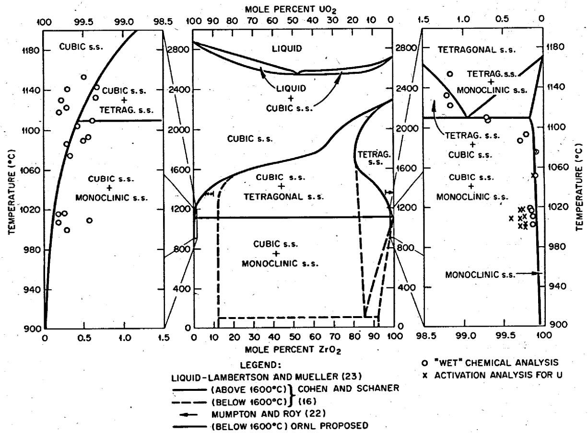  
Fig. 9. Phase Behavior in System $\mathrm{UO}_2\text{-ZrO}_2$

The solubility increased with temperature, but no strong dependence on $x_{\mathrm{BeF}_2}$ was found. In these measurements the mole fraction of oxide at BeO saturation probably was less than 0.002.

From the similar measurements in $\mathrm{ZrF}_{4}$ -containing melts16 the solubility product of $\mathrm{ZrO}_{2}$ could be estimated. With increasing $x_{\mathrm{ZrF}_{4}}$ , the concentration of oxide at $\mathrm{ZrO}_{2}$ saturation at first falls as would be expected from the equilibrium

$$
\mathrm {Z r} _ {2 (\mathrm {s})} \stackrel {\rightleftarrows} {=} \mathrm {Z r} _ {(d)} ^ {4 +} + 2 0 ^ {2 -} (d). \tag {10}
$$

However, it then levels off and subsequently rises with further increases in $x_{\mathrm{ZrF}_4}$ (Fig. 10). This could be caused, at least in part, by the formation of a complex ion, $\mathrm{ZrO}^{2+}$ .

$$
\mathrm {Z r} ^ {4 +} (\mathrm {d}) + 0 ^ {2 -} (\mathrm {d}) \neq \mathrm {Z r} 0 ^ {2 +} (\mathrm {d}) \tag {11}
$$

or it could be caused entirely by the influence of the changing melt composition on the activity coefficients of the species $\mathbf{Zr}^{4+}$ and $0^{2-}$ . The plot in Fig. 10 indicates approximately the "oxide tolerance" of MSRE fuel salt-flush salt mixtures; i.e., the amount of dissolved oxide these mixtures can contain without oxide precipitation. It is seen that the oxide tolerance increases rapidly with temperature, especially near the fuel composition ( $x_{\mathrm{ZrF}_{4}} \cong 0.05$ ), indicating that any excess oxide present might be removed by collecting $\mathrm{ZrO}_{2}$ on a relatively cool surface in the MSRE system.

These studies have defined relatively well the situation in $\mathsf{LiF - BeF}_2$ and in $\mathsf{LiF - BeF}_2\mathsf{-ZrF}_4$ melts. They have been of real value in assessing the initial purification process (see below) and in assuring the inadvertent precipitation of $\mathsf{UO}_2$ should prove no problem in MSRE.

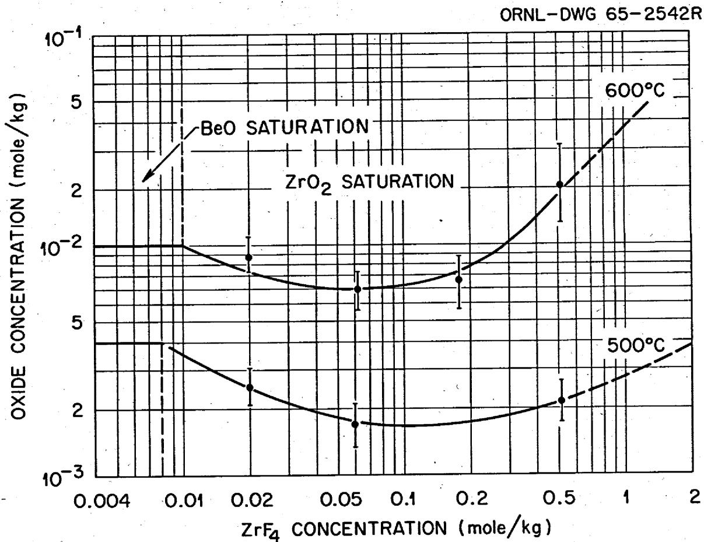  
Fig. 10. Solubility of $\mathbf{ZrO_2}$ in LiF-BeF $_2$ -ZrF $_4$ Melts as Function of ZrF $_4$ Concentration

# Fuel and Blanket Compositions

The fuel chosen for MSRE was a mixture of $^7\mathrm{LiF}$ , $\mathrm{BeF}_2$ , $\mathrm{ZrF}_4$ and $\mathrm{UF}_4$ consisting of 65-29.1-5-0.9 mole %, respectively, of these materials. The $\mathrm{ZrF}_4$ was added, as indicated above, to eliminate the possibility of precipitation of $\mathrm{UO}_2$ through inadvertent contamination of the system with reactive oxide. [The general precautions regarding cleanliness in MSRE and the apparent success of the fuel preparation and handling procedures for that operation have gone far to remove apprehension from this source. No samples removed from MSRE have contained more than 100 ppm of oxide, and no precipitated oxides have been observed on examination by optical microscopy.] Since chemical reprocessing techniques (probably distillation) will certainly be applied to the MSBR fuel system and since such a reprocessing scheme can be expected to remove oxides, it seems very likely that $\mathrm{ZrF}_4$ need not be a constituent of MSBR fuel.

On the basis of information presented above the reference fuel selected for use in the MSBR is a ternary mixture of $^{7}\mathrm{LiF - BeF}_2 - ^{233}\mathrm{UF}_4$ (68.3-31.5-0.2 mole %) (see Fig. 4) which exhibits a liquidus temperature of approximately $450^{\circ}\mathrm{C}$ . Equilibrium crystallization of this fuel mixture proceeds according to the following sequence: On cooling in the temperature interval 450 to $438^{\circ}\mathrm{C}$ , $2\mathrm{LiF} \cdot \mathrm{BeF}_2$ is deposited from the fuel. At $438^{\circ}\mathrm{C}$ , the salt mixture solidifies and produces a mixture of the two crystalline phases, $2\mathrm{LiF} \cdot \mathrm{BeF}_2$ and $\mathrm{LiF} \cdot \mathrm{UF}_4$ , comprised of approximately 89 wt % $2\mathrm{LiF} \cdot \mathrm{BeF}_2$ and approximately 11 wt % $\mathrm{LiF} \cdot \mathrm{UF}_4$ .

The blanket salt selected for the MSBR is the $^7\mathrm{LiF - BeF}_2 - \mathrm{ThF}_4$ ternary mixture (71-2-27 mole %) (see Fig. 6), which exhibits a liquidus temperature of approximately $560^{\circ}\mathrm{C}$ . Equilibrium crystallization of this blanket

mixture is as uncomplicated as that of the fuel. Only the two solid phases, $\mathrm{LiF} \cdot \mathrm{ThF}_4$ and a solid solution of $3\mathrm{LiF} \cdot \mathrm{ThF}_4$ which incorporates $\mathrm{Be}^{2+}$ in both interstitial and substitutional sites, are formed during solidification, and these solids are coprecipitated throughout the crystallization of the salt.[11]

# Choice of Coolant

The secondary coolant is required to remove heat from the fuel in the primary heat exchanger and to transport this heat to the power generating system. In the MSBR the coolant must transport heat to supercritical steam at minimum temperatures only modestly above $700^{\circ}\mathrm{F}$ ; in MSRE the heat was rejected to an air cooled radiator at markedly higher temperatures.

The coolant must be possessed of adequate heat transfer properties and must be compatible with Hastelloy N structures. It should not react energetically with fuel or with steam, it should consist of materials whose leakage into the fuel would not necessitate expensive separations procedures, and it should be relatively inexpensive. To assure easy compatibility with the steam generation circuit the melting temperature of the coolant should be below (and preferably considerably below) $700^{\circ}\mathrm{F}$ . Other demands (especially in the neutron economy and in radiation stability areas) are clearly less stringent than those upon fuel and blanket mixtures.

The coolant mixture chosen for MSRE and apparently shown to be satisfactory in that application is $\mathsf{BeF}_2$ with 66 mole % of $^7\mathsf{LiF}$ . Use of this mixture would require some changes in design of equipment for the MSBR since its liquidus temperature is $851^{\circ}\mathsf{F}$ ; moreover, it is an expensive material. The eutectic mixture of LiF with $\mathsf{BeF}_2$ (48 mole % LiF) melts at

near $700^{\circ}\mathrm{F}$ (see Fig. 1) but it is both viscous and expensive. The alkali metals, excellent coolants with real promise in other systems, are undesirable here since they react vigorously with both fuel and steam. Less noble metal coolants such as $\mathsf{Pb}^{\circ}$ or $\mathsf{Bi}^{\circ}$ might be tolerated, but they may not prove compatible with Hastelloy N.

Several binary chloride systems are known $^{19}$ to have eutectics melting below (in some cases much below) $700^{\circ}\mathrm{F}$ . These binary systems do not, however, appear especially attractive since they contain high concentrations of chlorides $\left[\mathrm{TlCl}_{2}, \mathrm{ZnCl}_{2}, \mathrm{BiCl}_{2}, \mathrm{CdCl}_{2}, \mathrm{or} \mathrm{SnCl}_{2}\right]$ , which are easily reduced and, accordingly, corrosive or chlorides $\left[\mathrm{AlCl}_{3}, \mathrm{ZrCl}_{4}, \mathrm{HfCl}_{4}, \mathrm{or} \mathrm{BeCl}_{2}\right]$ which are very volatile. The only binary systems of stable, non-volatile chlorides are those containing LiCl; LiCl-CsCl (330°C at 45 mole % CsCl), LiCl-KCl (355°C at 42 mole % KCl), LiCl-RbCl (312°C at 45 mole % RbCl). Such systems would be relatively expensive if made from ${}^{7}\mathrm{LiCl}$ , and they could lead to serious contamination of the fuel if normal LiCl were used.

Very few fluorides or mixtures of fluorides are known to melt at temperatures below $370^{\circ}\mathrm{C}$ . Stannous fluoride $(\mathrm{SnF}_2)$ melts at $212^{\circ}\mathrm{C}$ . This material is probably not stable during long term service in Hastelloy N; moreover, its phase diagrams with stable fluorides (such as NaF or KF) probably show high melting points at relatively low alkali fluoride concentrations.

Coolant mixtures of most interest at present are those based on fluoborates of the alkali metals. The binary system $\mathrm{NaF - NaBF}_4$ is described $^{19,20}$ as having a eutectic (at 60 mole $\%$ $\mathrm{NaBF}_4$ ) melting at $580^{\circ}\mathrm{F}$ . Preliminary unpublished studies at this Laboratory suggest strongly that this

published diagram is in error, and that the $\mathrm{NaF - NaBF}_4$ eutectic melts at near $716^{\circ}\mathrm{F}$ . There is some evidence to suggest that boric oxide substantially lowers the freezing point of $\mathrm{NaF - NaBF}_4$ mixtures and we believe that the Russian workers may have used quite impure materials. It is likely, however, that the material (perhaps even with a moderate amount of $\mathrm{B}_{2}\mathrm{O}_{3}$ ) may be useful. It should prove sufficiently stable to radiation for service as coolant, and the equilibrium pressure due to

$$
\mathrm {N a B F} _ {4 \ell} \neq \mathrm {B F} _ {3} + \mathrm {N a F} _ {\ell}
$$

should prove satisfactorily low. Estimates of the heat transfer and fluid properties of this material appear attractive. The extraordinarily high cross section of boron should permit small leaks in the heat exchanger to be recognized immediately, and removal of traces of $\mathsf{BF}_3$ from the fuel by continued treatment with HF should be possible. Compatibility of the NaF-NaBF $_4$ mixture with Hastelloy N will probably be satisfactory (see subsequent sections), but such compatibility remains to be demonstrated.

If the $\mathrm{NaF - NaBF_4}$ eutectic system proves unsuitable by virtue of its freezing point, preliminary data (see Fig. 11) suggests that freezing points below $700^{\circ}\mathrm{F}$ can be obtained in the ternary system $\mathrm{NaF - KF - BF}_3$ .

Should experience prove the $\mathrm{NaF - NaBF_4}$ mixture (or its close relatives) unsuitable, coolant compositions which will meet the low liquidus temperature specification may be chosen in the $\mathrm{NaF - BeF_2}$ systems. These materials are almost certainly compatible with Hastelloy N, and they possess adequate specific heats and low vapor pressures (see section below). They (especially those including LiF) are moderately expensive, and their viscosities at low temperature are certain-

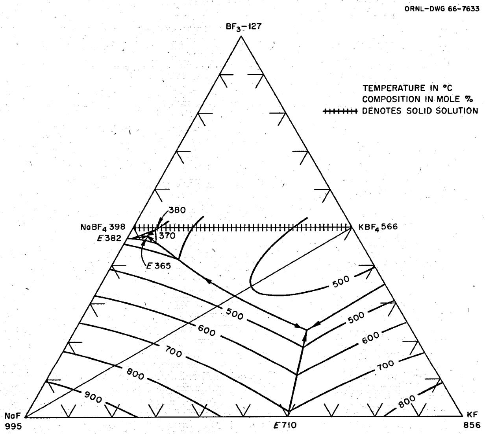  
Fig. 11. The System NaF-KF-BF3 (Preliminary)

# Physical Properties of MSBR Liquids

Estimates of some of the physical properties of the proposed MSBR blanket and fuel salts are listed in Table 3. Estimated values for four possible secondary coolants are given in Table 4.

Table 3. Composition and Properties of Fuel and Blanket Salts   

<table><tr><td>Composition (mole %)</td><td colspan="2">Fuel</td><td colspan="2">Blanket</td></tr><tr><td></td><td>LiF</td><td>65.9</td><td>LiF</td><td>71</td></tr><tr><td></td><td>BeF2</td><td>33.9</td><td>ThF4</td><td>27</td></tr><tr><td></td><td>UF4</td><td>0.2</td><td>BeF2</td><td>2</td></tr><tr><td>Liquidus Temperature:</td><td></td><td></td><td></td><td></td></tr><tr><td>°C</td><td colspan="2">457</td><td colspan="2">560</td></tr><tr><td>°F</td><td colspan="2">855</td><td colspan="2">1040</td></tr><tr><td>Physical Properties:</td><td colspan="2">At 600°C</td><td colspan="2">At 600°C</td></tr><tr><td></td><td colspan="2">1112°F</td><td colspan="2">1112°F</td></tr><tr><td>Density, lb/ft3</td><td colspan="2">125</td><td colspan="2">280</td></tr><tr><td>Heat Capacity, Btu lb-1(°F)-1</td><td colspan="2">0.55</td><td colspan="2">0.22</td></tr><tr><td>Viscosity, centipoise</td><td colspan="2">8.6</td><td colspan="2">21</td></tr><tr><td>Vapor Pressure, mm</td><td colspan="2">Negligible</td><td colspan="2">Negligible</td></tr><tr><td>Thermal Conductivity, watts/(°C-cm)</td><td colspan="2">0.011</td><td colspan="2">0.077</td></tr></table>

ly higher than are desirable. It is possible that substitution of $\mathrm{ZrF}_4$ or even $\mathrm{AlF}_3$ for some of the $\mathrm{BeF}_2$ will provide liquids of lower viscosity at no real expense in liquidus temperature.

Table 4. Composition and Properties of Four   
Possible Secondary Coolants   

<table><tr><td>Composition (mole %)</td><td>A</td><td>B</td><td>C</td><td>D</td><td>E</td></tr><tr><td></td><td>NaF 4</td><td>NaF</td><td>7.7 LiF 5</td><td>LiF 23</td><td></td></tr><tr><td></td><td>NaBF496</td><td>NaBF4KBF4</td><td>83.65 NaF 53</td><td>NaF 41</td><td>NaF 57</td></tr><tr><td></td><td></td><td></td><td>8.65 BeF242</td><td>BeF236</td><td>BeF243</td></tr><tr><td>Liquidus Tem- perature:</td><td></td><td></td><td></td><td></td><td></td></tr><tr><td>°C</td><td>380</td><td>370</td><td>318</td><td>328</td><td>340</td></tr><tr><td>°F</td><td>716</td><td>700</td><td>604</td><td>622</td><td>634</td></tr><tr><td>Physical Proper- ties at 850°F 454°C)a</td><td></td><td></td><td></td><td></td><td></td></tr><tr><td>Density, 1b/ft3</td><td>130</td><td>130</td><td>138</td><td>136</td><td>139</td></tr><tr><td>Heat Capacity Btu. 1b-1(°F)-1</td><td>0.4</td><td>0.4</td><td>0.45</td><td>0.47</td><td>0.44</td></tr><tr><td>Viscosity, centi- poise</td><td colspan="2">15 (436°C) 25</td><td>50</td><td>35</td><td>55</td></tr><tr><td colspan="2">Vapor Pressure at 1125°F (607°C)b, mm 310c</td><td>253c</td><td>Negligible</td><td>Negligible</td><td>Negligible</td></tr><tr><td>Thermal Conductiv- ity (watts/°C-cm)</td><td>0.008</td><td>0.0075</td><td>0.01</td><td>0.01</td><td>0.01</td></tr></table>

Mean temperature of coolant going to the primary heat exchanger.   
bHighest normal operating temperature of coolant.   
cRepresents decomposition pressure due to $\mathsf{MBF}_4\to \mathsf{BF}_3 + \mathsf{MF}$

The densities were calculated from the molar volumes of the pure components by assuming the volumes to be additive. The heat capacities were estimated by assuming that each gram atom in the mixture contributes 8 calories per degree centigrade. The value of 8 is the approximate average from a set of similar fluoride melts.[22]

The viscosity of the fuel and coolants C, D, and E were estimated from other measured LiF-BeF $_2$ and NaF-BeF $_2$ mixtures;[23,24,25] the viscosity of the blanket salt was estimated from measurements[24] of mixtures which contained UF $_4$ instead of ThF $_4$ . The viscosity of coolant A could not be reliably estimated because of the absence of measurements on this composition. However, the viscosity of the major components, NaBF $_4$ , is about 14 cp at $436^{\circ}\mathrm{C}$ .[26]

The vapor pressures of the fuel, blanket, and coolants C, D, and E are considered negligible; extrapolation of measurements on similar mixtures yielded pressures less than 0.1 millimeter. The partial pressure of $\mathrm{BF}_3$ above the fluoroborate coolant mixture was calculated from measurements on pure $\mathrm{NaBF}_4$ , by assuming that NaF, $\mathrm{NaBF}_4$ , and $\mathrm{KBF}_4$ form an ideal (in the sense of Raoult's Law) solution.

The values given are unlikely to be in error to an extent sufficient to remove the fluid from consideration. It is clear from the fact that estimates, rather than experimentally determined values, are used in these tables that a program must be devoted to measurement of physical properties for the pertinent materials.

# CHEMICAL COMPATIBILITY OF MSRE MATERIALS

Successful operation of the MSRE requires compatibility of the molten fuel mixture with unclad graphite and Hastelloy N during years of rapid circulation of the fuel through an appreciable temperature gradient. Such compatibility must, moreover, be assured while the fission process produces its intense radiation field and the buildup of fission product species. To evaluate these implied problems has required a large research and development program in which many tests have been conducted over a period of several years.

Details and specific findings of the large program of corrosion testing are presented as a separate paper in this series.[28] In brief, compatibility of the MSBR materials is assured by choosing as melt constituents only fluorides that are thermodynamically stable toward the moderator graphite and toward the structural metal, Hastelloy N, a nickel alloy containing about $16\%$ Mo, $7\%$ Cr, and $5\%$ Fe. The fuel and blanket components $(\mathrm{LiF}, \mathrm{BeF}_2, \mathrm{UF}_4, \mathrm{and} \mathrm{ThF}_4)$ are much more stable than the structural metal fluorides $(\mathrm{NiF}_2, \mathrm{FeF}_2, \mathrm{and} \mathrm{CrF}_2)$ ; accordingly, the fuel and blanket have a minimal tendency to corrode the metal. Such selection, combined with proper purification procedures, provides liquids whose corrosivity is within tolerable limits. The chemical properties of the materials and the nature of their several interactions, both with and without radiation and fission, are described briefly in the following.

# Stability of $\mathbf{U}\mathbf{F}_3$ and $\mathbf{U}\mathbf{F}_4$

Pure, crystalline uranium trifluoride is stable, under an inert atmosphere, to temperatures in excess of $1000^{\circ}\mathrm{C}$ , but it disproportionates at

sufficiently high temperatures by

$$
4 U F _ {3} ^ {\neq} 3 U F _ {4} + U ^ {\circ}.
$$

Long, who studied the reaction

$$
\mathrm {U F} _ {4} + \frac {1}{2} \mathrm {H} _ {2} \rightleftarrows \mathrm {U F} _ {3} + \mathrm {H F}
$$

obtained data $^{28}$ which when combined with other accepted values indicate that the free energies (in kcal/mole) for the pure crystalline materials can be represented by

$$
\Delta F _ {U F} ^ {f} = - 3 5 1 + 5 2. 8 \times 1 0 ^ {- 3} T ^ {\circ} K
$$

and

$$
\Delta F _ {U F _ {3}} ^ {f} - \Delta F _ {U F _ {4}} ^ {f} = + 9 7. 0 - 1 5. 6 x 1 0 ^ {- 3} T ^ {\circ} K.
$$

However, uranium trifluoride is appreciably less stable in molten fluoride solutions than in the crystalline state. Long's data for the reaction in $2\mathrm{LiF} \cdot \mathrm{BeF}_2$ solution yield the following equations for activity coefficients of the materials in this solution

$$
\log \gamma_ {U F _ {3}} = - 1. 6 2 + 3. 7 7 \times 1 0 ^ {- 3} T o K
$$

and

$$
\log \gamma_ {U F _ {4}} = - 0. 9 9 + 1. 3 1 \times 1 0 ^ {- 3} T ^ {\circ} K.
$$

Uranium trifluoride is permissible in reactor fuels only insofar as the equilibrium activity of $\mathbf{U}^{\circ}$ which results is sufficiently low to avoid reaction with the moderator graphite or appreciable alloy formation with the Hastelloy N. Use of the activity coefficients shown above to predict at $1000^{\circ}\mathrm{K}$ ( $727^{\circ}\mathrm{C}$ ) the activity of uranium in equilibrium with melts containing various $\mathrm{U}^{+3} / \mathrm{U}^{+4}$ ratios leads to the data of Table 6. It is obvious that large quantities of $\mathrm{UF}_{4}$ must be reduced if appreciable uranium

activities are to be obtained. $\mathsf{UC}_2$ would form, for example, if $68\%$ of the $\mathsf{UF}_4$ were reduced to $\mathsf{UF}_3$ .

Table 6. Calculated Values of the Fraction of the Total Uranium in Solution Present in the Trivalent State (UF₃/Total U) in Equilibrium at 1000°K with Various Phases   
(Total uranium in solution = 1 mole %)   

<table><tr><td>Phase</td><td>U° Activity</td><td>UF3/Total U(%)</td></tr><tr><td>U Metal</td><td>1.0</td><td>&gt;99</td></tr><tr><td>UC</td><td>3 x 10-5</td><td>89</td></tr><tr><td>UC2</td><td>5 x 10-7</td><td>68</td></tr><tr><td>Ni alloy</td><td>10-8</td><td>49</td></tr><tr><td>Ni alloy</td><td>2 x 10-10</td><td>20</td></tr><tr><td>Ni alloy</td><td>1 x 10-15</td><td>1</td></tr></table>

In fuel processing, hydrogen reduction of the fuel mixtures (as described in the section on Production Technology below) should lead to reduction of no more than about $2\%$ of the $\mathrm{UF}_{4}$ . Corrosion reactions such as $2\mathrm{UF}_{4} + \mathrm{Cr} \stackrel{\rightarrow}{\mathrm{CrF}}_{2} + 2\mathrm{UF}_{3}$ would increase the $\mathrm{UF}_{3}$ concentration to a negligible extent above this value. Thus, under reactor conditions, it seems clear that the reduction of the $\mathrm{UF}_{4}$ normally encountered would introduce no problems; only through drastic and virtually unimaginable reduction could serious consequences arise.

# Oxidation (Corrosion) of Hastelloy $\mathbf{N}^{3-5}$

Blood30 has made a careful study of the reaction

$$
\mathrm {M F} _ {2 (\mathrm {d})} + \mathrm {H} _ {2 (\mathrm {d})} \neq \mathrm {M} _ {(\mathrm {c})} + 2 \mathrm {H F} _ {(\mathrm {g})}
$$

where M represents Cr, Fe, or Ni, c, g, and d indicate that the species is crystalline solid, gaseous, or dissolved in molten LiF-BeF $_2$ mixture. His data (Table 7) when combined15 with accepted values for HF, yield free

$$
\mathrm {M F} _ {2 (\mathrm {d})} + \mathrm {H} _ {2 (\mathrm {g})} \not \geq \mathrm {M} (\mathrm {c}) + 2 \mathrm {H F} (\mathrm {g})
$$

in LiF-BeF₂ Mixture Containing 62 mole % LiF

Table 7. Experimentally Determined Equilibrium Constants for the Reaction   

<table><tr><td>Temperature</td><td>KNfor CrF2</td><td>KNfor FeF2</td><td>KNfor NiF2</td></tr><tr><td>1000oK</td><td>4.4 x 10-4</td><td>1.9</td><td></td></tr><tr><td>800oC</td><td>1.3 x 10-4</td><td>0.80</td><td></td></tr><tr><td>700oC</td><td>7.5 x 10-5</td><td>0.53</td><td>7 x 105</td></tr><tr><td>600oC</td><td>1.2 x 10-5</td><td>0.13</td><td>1.5 x 104</td></tr><tr><td colspan="4">where KN = PF2HF/NM2xPH2</td></tr></table>

energies of formation (along with those of Long for $\mathbf{U}\mathbf{F}_{4}$ and $\mathbf{U}\mathbf{F}_{3}$ ) in Table 8.

Table 8. Free Energies ${}^{a}$ for Solutes in Molten 2LiF·BeF ${}_{2}$ (773-1000°K)   

<table><tr><td>Solute</td><td>ΔGf(kcal/mole)</td><td>ΔGf(1000°K)(kcal/F-)</td></tr><tr><td>U4+ + 4F-</td><td>444.6 - 58.1 x 10-3T0K</td><td>96.6</td></tr><tr><td>U3+ + 3F-</td><td>336.7 - 40.5 x 10-3T0K</td><td>98.7</td></tr><tr><td>Ni2+ + 2F-</td><td>146.9 - 36.3 x 10-3T0K</td><td>55.3</td></tr><tr><td>Fe2+ + 2F-</td><td>154.7 - 21.8 x 10-3T0K</td><td>61.5</td></tr><tr><td>Cr2+ + 2F-</td><td>171.8 - 21.4 x 10-3T0K</td><td>75.2</td></tr></table>

a The reference state is that hypothetical solution with the solute at unit mole fraction and with the activity coefficient it would have at infinite dilution.

These data reveal clearly that chromium is much more readily oxidized than iron or nickel. Accordingly, any oxidative attack upon Hastelloy N should be expected to show selective attack on the chromium. Such oxidation and selective attack follows from reactions such as the following:

1. Impurities in the melt

$$
\mathrm {C r} + \mathrm {N i F} _ {2} + \mathrm {C r F} _ {2} + \mathrm {N i}, \text {o r}
$$

$$
\mathrm {C r} + 2 \mathrm {H F} + \mathrm {C r F} _ {2} + \mathrm {H} _ {2}
$$

2. Oxide films on the metal

$$
\mathrm {N i} 0 + \mathrm {B e F} _ {2} \rightarrow \mathrm {N i F} _ {2} + \mathrm {B e O}
$$

followed by reaction of $\mathbf{NiF}_2$ with Cr

3. Reduction of $\mathbf{U}\mathbf{F}_{4}$ to $\mathbf{U}\mathbf{F}_{3}$

$$
\mathrm {C r} + 2 \mathrm {U F} _ {4} \neq 2 \mathrm {U F} _ {3} + \mathrm {C r F} _ {2}
$$

Reactions implied under (1) and (2) above will proceed essentially to completion at all temperatures within the MSBR circuit. Accordingly, such reactions can lead (if the system is poorly cleaned) to a noticeable rapid initial corrosion rate. however, these reactions do not give a sustained corrosive attack.

The reaction of $\mathrm{UF}_4$ with Cr, on the other hand, has an equilibrium constant with a small temperature dependence; hence, when the salt is forced to circulate through a temperature gradient, a possible mechanism exists for mass transfer and continued attack.

If nickel, iron, and molybdenum are assumed to be completely inert diluents for chromium (as is approximately true), and if the circulation rate in the MSBR is very rapid, the corrosion process can be simply described. At high flow rates, uniform concentrations of $\mathrm{UF}_3$ and $\mathrm{CrF}_2$ are maintained throughout the fluid circuit; these concentrations satisfy (at some intermediate temperature) the equilibrium constant for the reaction. Under these steady-state conditions, there exists some temperature intermediate between the maximum and minimum temperatures of the circuit, at which the initial surface composition of the structural metal is at equilibrium with the fused salt. Since the equilibrium constant for the chemical reaction increases with increasing temperature, the chromium concentration in the alloy surface tends to decrease at temperatures higher than T and tends to increase at temperatures lower than T. [In some melts (NaF-LiF-KF-UF $_4$ , for example) $\Delta G$ for the mass transfer reaction is quite large, and the equilibrium constant changes sufficiently as a function of temperature to cause formation of dendritic chromium crystals in the cold zone.] For MSBR fuel and other LiF-BeF $_2$ -UF $_4$ mixtures, the temperature

dependence of the mass-transfer reaction is small, and the equilibrium issatisfied at reactor temperature conditions without the formation of crystalline chromium.

Thus, in the MSBR, the rate of chromium removal from the salt stream by deposition at cold-fluid regions is controlled by the rate at which chromium diffuses into the cold-fluid wall; the chromium concentration gradient tends to be small, and the resulting corrosion is well within tolerable limits. In the hot-fluid region, the alloy surface becomes depleted in chromium, and chromium from the interior of the wall diffuses toward the surface. This rate of diffusion is dependent on the chromium concentration gradient. Since diffusion occurs by a vacancy process and in this particular situation is essentially monodirectional, an excess of vacancies can accumulate in the depleted region. These vacancies precipitate in areas of disregistry, principally at grain boundaries and impurities, to form voids. The voids in turn agglomerate and grow in size with increasing time and temperature. The resulting subsurface voids are not interconnected with each other or with the surface.

The mechanisms described above lead to such observations as (a) the complete independence of corrosion rate from flow rate for a given system and (b) the increase in corrosion with increase in temperature drop as well as with increase in mean temperature within a system.

The results of numerous long-term tests have shown that Hastelloy N has excellent corrosion resistance to molten fluoride mixtures at temperatures well above those anticipated in MSBR. The attack from mixtures similar to the MSBR fuel at temperatures as high as $1300^{\circ}\mathrm{F}$ is barely observable in tests of as long as 12,000 hr. A figure of 0.5 mil/yr might

be expected. $^{31}$ Even less corrosion occurs in the blanket where the $\mathrm{UF}_{4}$ concentration is very low. Further, the mechanical properties of Hastelloy N are virtually unaffected by long-time exposure to the molten fluoride fuel and blanket mixtures. Corrosion of the container metal by the reactor fuel and blanket does not seem to be an important problem in the MSBR.

This encouraging status for metal-salt compatibility certainly applies to the coolant mixture if a reasonable $\mathrm{NaF - BeF}_2$ or $\mathrm{NaF - LiF - BeF}_2$ mixture is chosen. It is likely that the $\mathrm{NaF - NaBF}_4$ coolant mixture will also prove compatible with INOR-8, but no detailed experimental proof of this is available. The free energy change for the chemical reaction

$$
\mathrm {B F} _ {3 (g)} + 3 / 2 \mathrm {C r} _ {(s)} \rightarrow 3 / 2 \mathrm {C r F} _ {2 (l)} + \mathrm {B} _ {(s)}
$$

is about $+30$ kcal at $800^{\circ}\mathrm{K}$ . The reaction is, therefore, quite unlikely to occur, and similar reactions with Fe, Mo, and Ni are much less so. In addition, the above reaction becomes even less likely (perhaps by 10 kcal or so) when one considers the energetics of formation of the compound $\mathrm{NaBF}_4$ and dilution of the $\mathrm{NaBF}_4$ by NaF. However, the following reaction

$$
\mathrm {B F} _ {3 (g)} + (x + 3 / 2) \mathrm {M} _ {(s)} \rightarrow \mathrm {M} _ {\mathbf {x}} \mathrm {B} _ {(s)} + 3 / 2 \mathrm {M F} _ {2 (l)}
$$

is almost certainly the one to be expected. Thermochemical data for the borides of Cr, Ni, Mo, and Fe do not seem to have been established. Very stable borides such as $\mathrm{TiB}_2$ and $\mathrm{ZrB}_2$ show free energies of formation of -67 and -68 kcal/mole (or about -34 kcal/boron atom) at $800^{\circ}\mathrm{K}$ .33 The borides of Mg ( $\mathrm{MgB}_2$ and $\mathrm{MgB}_4$ ) show free energies of formation of less than -10 kcal per boron atom.33 Unless the borides of the Hastelloy N constituents are very stable, it would appear that the alloy will prove resistant

to this coolant. However, such compatibility must be demonstrated by experiments.

# Compatibility of Graphite with Fluorides

Graphite does not react chemically with molten fluoride mixtures of the type to be used in the MSBR. Available thermodynamic data suggest that the most likely reaction:

$$
4 \mathrm {U F} _ {4} + \mathrm {C} \neq \mathrm {C F} _ {4} + 4 \mathrm {U F} _ {3}
$$

should come to equilibrium at $\mathrm{CF_4}$ pressures below $10^{-8}$ atm. $\mathrm{CF_4}$ concentrations over graphite-salt systems maintained for long periods at elevated temperatures have been shown $^{34}$ to be below the limit of detection ( $>1$ ppm) of this compound by mass spectrometry. Moreover, graphite has been used as a container material for many NaF-ZrF $_4$ -UF $_4$ , LiF-BeF $_2$ -UF $_4$ , and other salt mixtures with no evidence of chemical instability.

The MSBR will contain perhaps 20 tons of graphite. Several potential problems in addition to that of chemical stability have been considered. These include (1) hazardous increase in uranium content of core through permeations of the graphite by fuel, (2) reaction of fuel material with oxygenated gaseous species desorbed from the graphite, and (3) carburization of the Hastelloy N structure by carbon dissolved, suspended, or otherwise carried in the circulating salt. These possibilities have been studied experimentally and found to be inconsequential or to have practicable solutions.[4,5]

Graphite is not wetted by MSR fuel mixtures (or by other similar mixtures) at elevated temperatures. The extent to which graphite is permeated by the fuel is, accordingly, defined by well-known relationships among

applied pressure, surface tension of the nonwetting liquid (about 130 dynes/cm), and the pore size spectrum of the graphite specimen. However, since the void volume of the graphite may be about $16\%$ of the core fuel volume, detailed testing of permeation behavior has been necessary. Typical tests with MSRE graphite have exposed evacuated specimens to MSRE fuel mixtures at $1300^{\circ}\mathrm{F}$ ; applied pressures were set at 150 lb, a value of three times the reactor design pressure. The observed permeation did not change with time after a few hours. In these tests $0.18\%$ of the graphite bulk volume was permeated by the salt; such permeation is well within that considered tolerable during MSRE operation. Specimens permeated to this extent have been given 100 cycles between 390 and $1300^{\circ}\mathrm{F}$ without detectable change in properties or appearance.

# Radiation Effects1,3-5,34,36

A considerable body of information about the stability and compatibility of MSBR materials under irradiation from fissioning fuel has been obtained. These studies were motivated by the concern that neutrons, beta and gamma rays, and fission fragments might cause radiation damage to fuel, metal, and graphite structural components. Fission fragments, which should produce localized regions of dense ionization and radiolysis in the molten salt, might affect fuel stability and corrosion behavior.

# Early In-Pile Tests on NaF-ZrF $_{4}$ -UF $_{4}$ Fuels

The earliest studies of radiation effects on molten fluoride systems were done in the molten-salt ANP program. These tests used $\mathrm{NaF - ZrF_4 - UF_4}$ mixtures and Inconel containers. Such irradiations, with melts and metal chemically similar to those proposed for the MSBR, were performed over a

wider range of power density and temperature than were used in more recent irradiation work in support of the MSRE. More than 100 static capsule tests were carried out in thermal neutron fluxes from $10^{11}$ to $10^{14}$ neutrons $\mathrm{cm}^{-2} \sec^{-1}$ , with fission power densities from 80 to 8000 w/c, at temperatures from 1500 to $1600^{\circ}\mathrm{F}$ , and for irradiation times from 300 to 800 hr. Chemical, physical, and metallographic tests indicated no major changes in the fuel or the Inconel which could be attributed to the irradiation conditions. Corrosion of Inconel was comparable to that found in unirradiated controls. Three types of Inconel forced-circulation in-pile loops were operated with $\mathrm{NaF - ZrF_4 - UF_4}$ melts at fission power densities of 400 to 800 w/cc, maximum temperatures of 1500 to $1600^{\circ}\mathrm{C}$ , and for 235 to 475 hr at full power; corrosive attack on the Inconel was no greater than in corresponding out-of-pile tests (wall penetrations less than 3 mils). Early Tests on LiF-BeF $_2$ -UF $_4$ Fuels

The first irradiation test on an LiF-BeF $_4$ based fuel was a graphite-fuel compatibility test in the MTR. Two Inconel capsules containing graphite liners filled with LiF-BeF $_2$ -UF $_4$ (62-37-1 mole %) were irradiated at $1250^{\circ}\mathrm{F}$ for 1610 and 1492 hr, and at average power densities of 954 and 920 w/cc, respectively. The exposure resulted in no apparent damage to the graphite, and negligible corrosion to the Inconel which was exposed to the salt through small holes in the graphite liner.

In the next test, two small Hastelloy N capsules were filled with the same $\mathrm{LiF - BeF}_2\mathrm{-UF}_4$ mixture and irradiated for 5275 hr in a flux of 1 to $2\times 10^{14}$ neutrons $\mathrm{cm}^{-2}\mathrm{sec}^{-1}$ at an initial power density of 1170 w/cc and a temperature of $1250^{\circ}\mathrm{F}$ to an estimated $75\%$ burnup. The failure of one

capsule at this time forced termination of the experiment. The results of later tests suggest that fuel radiolysis at ambient reactor temperature during shutdowns may have contributed importantly to the capsule failure.

Two forced-circulation Hastelloy N loops containing the above LiF-BeF $_2$ -UF $_4$ mixture were also installed and operated in the MTR. These were designed to operate at $1300^{\circ}\mathrm{F}$ maximum temperature, 190 w/cc power density, and a linear flow velocity of 2.5 ft/sec. Pump failure terminated the first test after 860 hr and the second after 1000 hr. Metallographic examination of the metal from the first loop revealed a moderately eroded region (approximately 2 mils deep) in one of the sharp bends in the high-flux region. Metal specimens from the second loop showed a negligible degree of corrosive attack. Since later in-pile tests confirmed the good corrosion resistance of Hastelloy N, it is suspected that the first loop was fabricated from substandard alloy.

# Testing of MSRE Fuels

The ORNL-MTR-47- series of capsule irradiation experiments was designed to test the stability and compatibility of actual MSRE materials (graphite, Hastelloy N, and fuel salt) under conditions approximately those of the MSRE, with emphasis on the interfacial behavior of molten salt and graphite. The capsules were relatively large to provide adequate specimens of graphite, fuel, and Hastelloy N for thorough postirradiation examination.

In the 47-3 test, four Hastelloy N capsules (see Fig. 12) containing graphite boats holding a pool of fuel salt $(\mathrm{BeF}_2 - \mathrm{UF}_4 - \mathrm{LiF} - \mathrm{ThF}_4 - \mathrm{ZrF}_4, 23.2 - 1.4 - 69.0 - 1.2 - 5.2$ mole %) were irradiated for $1594\mathrm{hr}$ at maximum temperatures of $800^{\circ}\mathrm{C}$ and maximum power densities of $200\mathrm{W / cc}$ to a burnup of about

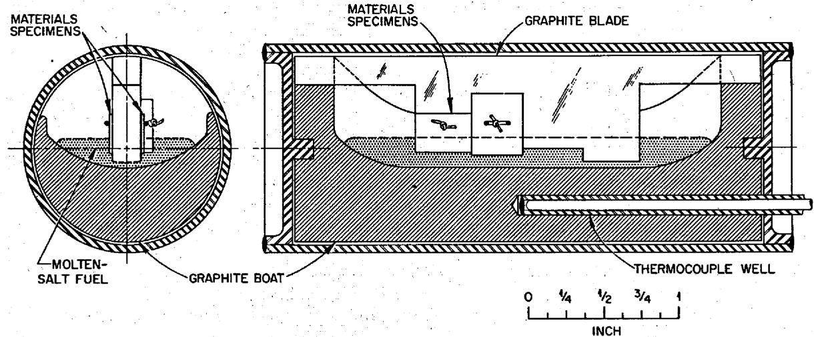  
ORNL-LR-DWG 56754R   
Fig. 12. MSRE Graphite-Fuel Capsule Test ORNL-MTR-47-3

$10\%$ . Each capsule also contained specimens of Hastelloy N, molybdenum, and a pyrolytic graphite attached to a graphite blade dipping into the shallow pool of fuel. Two of the graphite boats were initially impregnated with the fuel to provide a more extreme test of graphite-fuel compatibility at high temperature. When the capsules were dismantled, the frozen fuel exhibited nonwetting contact angles with the graphite boats, the graphite blades, and the pyrolytic graphite specimens. The graphite structure appeared undamaged visually and metallographically. However, there were definite observations that fuel radiolysis had taken place (generation of $\mathbf{F}_2$ and $\mathbf{CF}_4$ ). Because of these observations, subsequent tests studied the radiolytic instability of the fuel in detail: it was found that only when the irradiated fuel was allowed to freeze and cool below $100^{\circ}\mathrm{C}$ did radiolytic decomposition take place.

The $47-4$ irradiation assembly comprised of four large Hastelloy N capsules (see Fig. 13), each containing a 0.5-in.-diam graphite specimen surrounded by a 0.2-in. annulus of fuel, and two small Hastelloy N capsules containing a 0.5-in.-OD graphite cup nearly filled with fuel. The large capsules contained about $25\mathrm{g}$ of fuel $(\mathrm{BeF}_2 - \mathrm{UF}_4 - \mathrm{LiF} - \mathrm{ThF}_4 - \mathrm{ZrF}_4)$ , 22.6-0.7-71.0-1.0-4.7 mole %). One of the smaller capsules contained $10\mathrm{g}$ of the same fuel; the other $10\mathrm{g}$ of a similar fuel of higher $\mathrm{UF}_4$ concentration (1.4 mole %). The capsules were irradiated for 1553 hr at temperatures up to $800^{\circ}\mathrm{C}$ (900°C for the small 1.4 mole % $\mathrm{UF}_4$ capsule), at average power densities from 40 to 260 w/cc, and to burnups from 5 to $10\%$ . There was a gain evidence that fuel radiolysis occurred at low temperatures during reactor shutdown; however, metallographic examination of the Hastelloy N capsule walls showed no discernible corrosion, and the graphite appeared

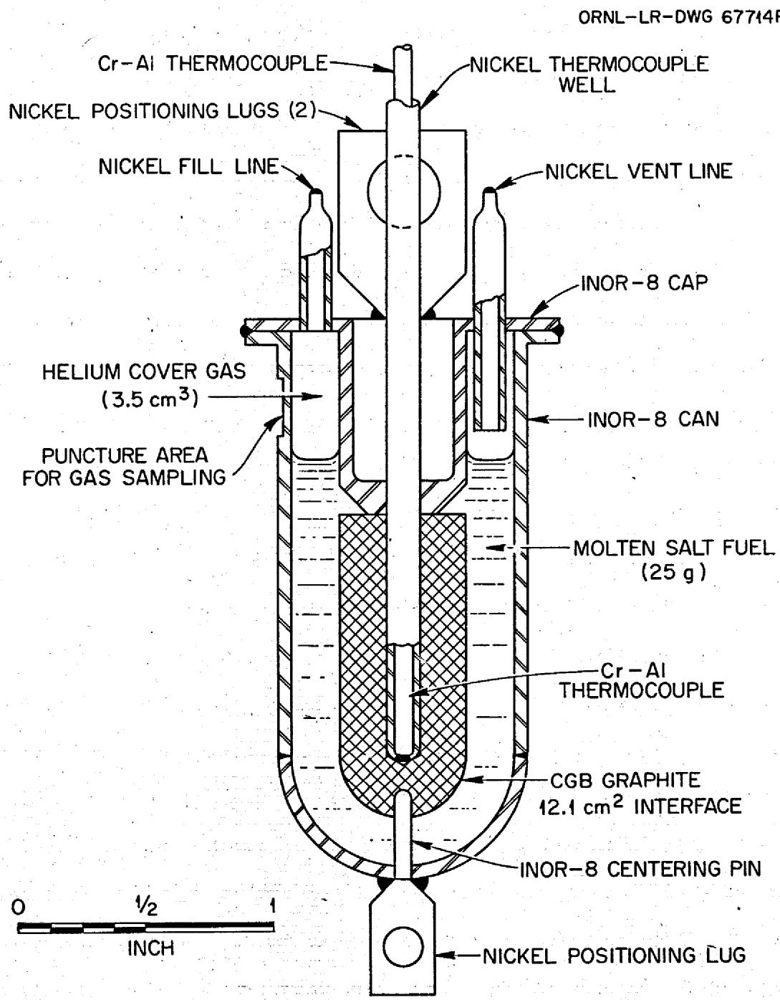  
Fig. 13. Large Fuel Capsule from ORNL-MTR 47-4

undamaged except for the vapor-exposed region of the small high power density capsule.

To investigate the fuel radiolysis further, two capsules in the 47-5 assembly, of design similar to the large 47-4 capsules, were equipped with gas lines which permitted measurement of pressure within the capsule and withdrawal of cover gas samples while the irradiation was proceeding. Two large sealed capsules with widely different areas of graphite and metal exposed to the fuel, and two small capsules containing fuel-impregnated graphite rods suspended in helium completed the assembly. Four of the capsules contained salt having the composition $\mathrm{LiF - BeF_2 - ZrF_4 - UF_4}$ with mole ratios of 67.36-27.73-4.26-0.66. Salt with lower uranium concentration $(\mathrm{LiF - BeF}_2 - \mathrm{ZrF}_4 - \mathrm{UF}_4, 67.19 - 27.96 - 4.51 - 0.34)$ was used in one of the gas-swept capsules and in the low-flux, impregnated-rod capsule. The 47-5 capsules were irradiated for 4-1/2 months at average fluxes between $2 \times 10^{13}$ and $3 \times 10^{13}$ neutrons $\mathrm{cm}^{-2} \mathrm{sec}^{-1}$ to burnups between 7 and $15\%$ . Gas samples were taken from the purged capsules under a variety of operating conditions, with fuel temperatures varying from 190 to $1500^{\circ}\mathrm{F}$ and power densities from 3 to $80 \mathrm{~W} / \mathrm{cc}$ . During reactor shutdowns, when the assembly cooled to about $35^{\circ}\mathrm{C}$ , pressure rises were observed in the capsules equipped with gas lines, and gas samples indicated the presence of fluorine. With the reactor operating and the fuel molten, the isolated capsules showed no fluorine. In a few of the 60 gas samples, barely detectable traces of $\mathrm{CF}_4$ (approximately $5 \mathrm{ppm}$ ) were found; these were probably due to incomplete flushing of the system since the last reactor shutdown. In any case, the observed minute rates of $\mathrm{CF}_4$ generation represented negligible reduction of $\mathrm{UF}_4$ to $\mathrm{UF}_3$ and, accordingly, an inconsequential practical

problem. In later hot-cell studies of frozen irradiated fuel, it was established that the gas evolved was pure fluorine and that the G value at $35^{\circ}\mathrm{C}$ was 0.02 molecules of fluorine per 100 ev of fission product decay energy absorbed. The rate of radiolysis was greatest in the temperature range of 35 to $50^{\circ}\mathrm{C}$ ; it dropped to low values at $-70^{\circ}\mathrm{C}$ and to zero at temperatures above $80^{\circ}\mathrm{C}$ .

The 47-6 test was designed to allay any lingering doubts that fuel radiolysis and its consequences could be eliminated by maintaining the fuel molten even during reactor shutdown. Four cylindrical, Hastelloy N capsules were used (1 in. OD x 2.615 in. long). Heaters were provided for all capsules, and these turned on automatically when the fuel temperature approached the liquidus temperature, maintaining the fuel salt in a molten condition even when the reactor was shut down. The capsules contained cylindrical graphite cores which were 0.5 in. in diameter and 1.35 in. long; the cores were surrounded by 0.2 in. of fuel salt and pierced by a central Hastelloy N thermocouple well. Two of the capsules (see Fig. 14) were equipped with gas lines and differed from each other only in that half the graphite area in one was replaced by a Hastelloy N extension of the thermowell. These capsules were charged with an LiF-BeF $_2$ -ZrF $_4$ -UF $_4$ fuel similar to that in the 47-5 test but containing 0.9 mole % UF $_4$ . The two sealed capsules contained full-size graphite cores and similar fuels with 0.5 mole % and 4.0 mole % UF $_4$ .

The 47-6 assembly was irradiated in the MTR for 1500 hr to burnups from $1\%$ (in salt containing $0.5\% \mathrm{UF}_4$ ) to $5\%$ (salt with $4.0\% \mathrm{UF}_4$ ). Gas samples were taken at steady operation with the purged capsules at temperatures from 850 to $1300^{\circ}\mathrm{F}$ and at power densities from 20 w/cc to 75 w/cc.

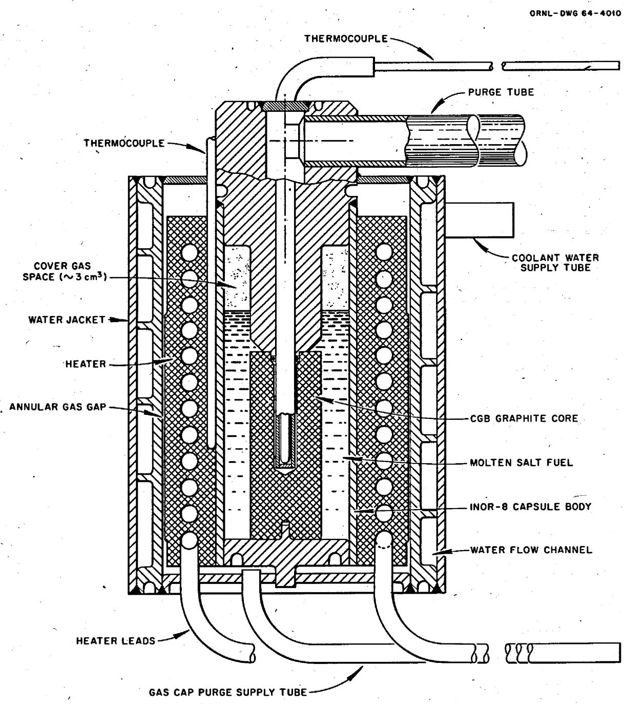  
Fig. 14. Fuel Capsule from ORNL-MTR-47-6

The gas analyses detected no $\mathrm{CF}_4$ or other fluorine-containing gases in any of the 36 gas samples. $\mathrm{CF}_4$ deliberately added to the capsules during irradiation was radiolytically decomposed at a rate which decreased with temperature and seldom exceeded $1\% / \mathrm{hr}$ .

Particular care was given to the postirradiation examination of the graphite specimens. No uranium deposits were found by chemical analysis, by delayed neutron counting of neutron activated specimens, or by x-radiography of thin sections. It is therefore clear that uranium deposition on graphite is associated only with fuel radiolysis at low temperatures, and that the reaction does not take place between graphite and molten fission-ing fuel. In addition, visual, metallographic, and x-ray diffraction examinations of the 47-6 graphite specimens failed to reveal any differences between the irradiated graphite and unirradiated controls. Also, the Hastelloy N capsule wall specimens from run 47-6 appeared unaffected by the exposure based on visual and low-power magnification examination. Metallographic examination of unetched specimens revealed no change in wall thickness (less than 1 mil change).

Conclusions from In-File Testing of Molten Salts

In summary, the 47- series of irradiation studies has been generally reassuring as to the radiation stability and compatibility of Hastelloy N, graphite, and fuels based on lithium and beryllium fluorides. The corrosion that is known to occur, i.e., that due to mass transfer, does not seem to be influenced by power density. It has been shown that the principal disturbing effects are consequences of low-temperature fuel radiolysis which is easily suppressed by maintaining the irradiated fuel at a temperature above (conservatively) $200^{\circ}\mathrm{C}$ . On the basis of the 47- series

tests, the limits of this reassurance in regard to radiation effects on MSBR materials extend to temperatures of about $1400^{\circ}\mathrm{F}$ and power densities of about 100 w/cc.

The two previous loop tests on similar $\mathrm{LiF - BeF}_2$ fuels, described above, extend the limits of assurance to power densities of 200 w/cc at $1300^{\circ}\mathrm{F}$ with regard to corrosion of Hastelloy N in the absence of graphite. There has been no indication of the 47- series experiments that graphite introduces problems in addition to the expected one of Hastelloy N carburization (when the two are in close contact).

The previous capsule tests with $\mathrm{LiF - BeF}_2\text{-}UF_4$ fuels, carried out with no provisions to circumvent the low-temperature fuel radiolysis effect, suggested that salt power densities of at least $1\mathrm{kw / cc}$ may be permissible. Also, the numerous tests with $\mathrm{NaF - ZrF}_4\text{-}UF_4$ fuels in Inconel at temperatures up to $1600^{\circ}\mathrm{F}$ and power densities up to many kilowatts per cubic centimeter exhibited tolerable compatibility characteristics. With respect to radiation effects, there is no obvious chemical reason to suppose that a grossly different salt behavior would be observed using MSBR materials.

# BEHAVIOR OF FISSION PRODUCTS IN MOLTEN SALTS 3-5

Fission products will be produced in a 2225-Mw(th) MSBR at a rate of about $2.3\mathrm{kg/day}$ . In the reference MSBR design, the fuel salt volume is about $700\mathrm{ft}^3$ and the fissile inventory about $700\mathrm{kg}$ ; with these values the fission product concentration after 50 days accumulation would be about $15\%$ of the fissile concentration. Thus, it is clear that fission product concentrations can be significant even with high processing rates, and that fission product behavior needs to be considered in specifying reactor operating conditions.

# Physical Chemistry of Fission Products

Fission and its immediate aftermath must be a violent process; the very energetic major fragments are probably deficient in electrons at their origin, and, as they lose energy by collisions, they undoubtedly produce additional ionization within the medium. It seems certain, however, that electrical charge is conserved in this process; electrons and protons are neither created nor destroyed by the fission event. It follows, therefore, that when fission of $\mathrm{UF}_{4}$ occurs in an inert environment [as in a (hypothetical) completely inert container] the reaction

$$
\mathrm {U F} _ {4} + \mathrm {n} \neq 2 \mathrm {F P} + 2 ^ {+} \mathrm {n} + 4 \mathrm {F} ^ {-}
$$

must, in a statistical sense, satisfy the conditions that (1) the salt be electrically neutral, and (2) redox equilibrium be established among the numerous ionic species. In an inert container such cation-anion equivalence (and redox equilibrium) might be satisfied with uranium valence states above $4^{+}$ and with positive ion formation by Nb, Mo, Te, or Ru. The MSBR container metal (Hastelloy N) is not completely inert and the fuel

contains a small concentration of $\mathbf{U}\mathbf{F}_3$ , so additional possibilities exist for this system. Should the fission product cations prove inadequate for the fluoride ions plus the fission product anions (notably $\mathbf{I}^{-}$ ), or should they prove adequate only by assuming element valence states too high to be thermodynamically compatible with Hastelloy N, the container metal would be constrained to supply the cation deficiency.

Thermochemical data from which the stability of fission product fluorides in complex dilute solutions can be predicted are lacking in many cases. Such information which appears definite is briefly described in the following sections.

# Rare Gases

The fission products krypton and xenon are volatilized from high-temperature melts as elements. $^{34,37}$ The solubilities of these gases in molten fluoride mixtures $^{38,39,40}$ obey Henry's law, increase with increasing temperature, decrease with increasing atomic weight of the gas, and vary somewhat with composition of the solvent. Henry's law constants and heats of solution for the rare gases in $\mathrm{LiF - BeF}_2$ mixtures are shown in Table 9. The positive heat of solution ensures that blanketing or sparging of the fuel with helium or argon in a low-temperature region of the reactor cannot lead to difficulty due to decreased solubility and bubble formation in higher temperature regions of the system. [There is no evidence of trouble from such source in MSRE where the He is applied in the pump bowl at the highest temperature in the circuit.]

The very low solubilities of these gases suggest that they should be readily removed from reactor systems. Only a small fraction of the calculated xenon poisoning was observed during operation of the Aircraft Reactor

Experiment41 where the only mechanism for xenon removal was the helium purge of the pump bowl.

Table 9. Solubilities and Heats of Solution for Noble Gases in Molten LiF-BeF $_2$ Mixtures at $600^{\circ}\mathrm{C}$   

<table><tr><td rowspan="2">Gas</td><td colspan="2">LiF-BeF2(64-36 mole %)</td></tr><tr><td>K x 108a</td><td>Heat of Solution (kcal/mole)</td></tr><tr><td>Helium</td><td>11.55 ± 0.4</td><td>5.2</td></tr><tr><td>Neon</td><td>4.63 ± 0.2</td><td>5.9</td></tr><tr><td>Argon</td><td>0.98 ± 0.02</td><td>8.6</td></tr><tr><td>Xenon</td><td>0.233 ± 0.01</td><td>12.1</td></tr></table>

$\mathbf{a}_{\mathrm{K}} = \text{moles gas} / (\mathrm{cm}^{3} \text{ solvent})(\text{atmosphere})$

A somewhat more ambitious scheme for insuring a low poison fraction for xenon (and krypton) isotopes is to remove the halogen precursors iodine and bromine on a time cycle short compared to their halftimes for decay into the noble gases. Since $^{135}\mathrm{Xe}$ is by far the worst poison of this class, removal of its iodine precursor would be most important; its decay half-time is such that its residence time in the reactor should be kept at 1 hour or less. In principle $\mathbf{I}^{-}$ (and $\mathbf{B}\mathbf{r}^{-}$ ) can be removed by the reaction

$$
I _ {d} ^ {-} + H F (g) \rightarrow F _ {d} ^ {-} + H I (g)
$$

where $d$ and $g$ indicate that the species is dissolved in the melt or exists in the gaseous state. Molten fluorides similar to MSBR fuel and spiked with $I^{-}$ have been shown to yield the contained iodine readily on contact with gaseous $HF$ . These small-scale (and preliminary) studies suggest

that the removal step is chemically feasible.

Elements in Periodic Groups I-A, II-A, II-B, and IB-B

Rubidium, cesium, strontium, barium, zirconium, yttrium, and the lanthanides form very stable fluorides. These fission products should, accordingly, exist in the molten fuel in their ordinary valence states. A variety of studies of many types shows that large amounts of $\mathrm{ZrF}_{4}$ , the alkali fluorides, and the alkaline earth fluorides can be dissolved in MSBR fuel mixtures at operating temperatures. Since the trifluorides are less soluble, the solubility behavior of the fluorides of yttrium and the rare earths, $^{43,44}$ and of plutonium $^{45}$ has been examined in some detail. The saturating phase from solutions in LiF-BeF $_2$ and related mixtures is the simple trifluoride; when more than one rare earth is present, the saturating phase is a (nearly ideal) solid solution of the trifluorides. Such solid solutions are known to accommodate UF $_3$ and it is very likely that they would include PuF $_3$ as well. The solubilities of these solid solutions depend strongly on composition of the melt; the solubilities may be near the minimum value for MSBR fuel compositions. Even then, however, the solubility (near 0.5 mole % at MSBR operating temperatures) is such that many months would be required for the reactor to saturate its fuel with these fission products. In any case, reprocessing to remove the rare earths, and particularly neodymium, is required in the interest of neutron economy.

The above statements regarding rubidium and cesium do not apply to that fraction of these elements originating in the graphite as daughters of the rare gases which have permeated the moderator. These alkali metals form compounds with graphite at high temperature but the absolute amounts

are so small that difficulties from this source are unlikely. Damage to the graphite by this mechanism will, as a matter of course, be looked for in all future radiation and fission studies.

# Other Fission Products

These products include molybdenum, ruthenium, technetium, niobium, and tellurium produced in relatively high yields with rhodium, palladium, silver, cadmium, tin, and antimony in yields ranging from small to trivial. The available thermochemical data6,7,32,33,46 suggests that the fluorides of these elements would be (if they were present in the pure state) reduced to the metal by chromium at its activity in Hastelloy N or by UF3 at reasonable concentrations in the fuel salt.

The high-yield noble metals (Mo, Nb, Ru, Tc, and Te) have polyvalent fluorides which are generally quite volatile and moderately unstable. The formation free energies for $\mathsf{NbF}_5$ , $\mathsf{MoF}_6$ , and $\mathsf{UF}_6$ may be calculated with relatively good accuracy because of recent measurements at Argonne of the heats of formation of these compounds by fluorine bomb calorimetry.[47-49] The entropies and heat capacity data also are available.[50] While the people at Argonne have measured $\mathsf{RuF}_5$ ,[51] no entropy or heat capacity data seem to be available:

<table><tr><td></td><td>ΔHf298</td><td>ΔSf298</td><td>Reference</td></tr><tr><td>MoF6(g)</td><td>-372.35 ± 0.22</td><td>-72.13</td><td>48</td></tr><tr><td>UF6(g)</td><td>-510.77 ± 0.45</td><td>-67.01</td><td>49</td></tr><tr><td>NbF5(g)</td><td>-433.5 ± 0.15</td><td>-91.56</td><td>47</td></tr><tr><td>RuF5(s)</td><td>-213.41 ± 0.35</td><td></td><td>51</td></tr></table>

From these values and the available heat capacity data the following expressions for $\Delta G^{\mathrm{f}}$ were derived. In the case of RuF $_5$ , Glassner's earlier

estimate was corrected to be consistent with the above $\Delta H^{\mathrm{f}}$ measurement:

$$
\Delta G ^ {f} \left(N b F _ {5}, g\right) = - 4 1 6. 7 0 + 5 4. 4 0 (T / 1 0 0 0),
$$

$$
\Delta G ^ {f} \left(\mathrm {R u F} _ {5}, g\right) = - 2 0 0 + 2 5 (\mathrm {T} / 1 0 0 0),
$$

$$
\Delta G ^ {f} \left(\text {M o F} _ {6}, g\right) = - 3 7 0. 9 9 + 6 9. 7 (\mathrm {T} / 1 0 0 0),
$$

$$
\Delta G ^ {f} \left(U F _ {6}, g\right) = - 5 0 9. 9 4 + 6 5. 1 5 (T / 1 0 0 0).
$$

The following values of $\Delta G^{\mathrm{f}}$ have been reported previously for $\mathbf{U}\mathbf{F}_{3}$ and $\mathbf{U}\mathbf{F}_{4}$ in 2LiF-BeF $_2$ :

$$
\Delta \mathrm {G} ^ {\mathrm {f}} (\mathrm {U F} _ {3}, \mathrm {d}) = - 3 3 6. 7 3 + 4 0. 5 4 (\mathrm {T} / 1 0 0 0),
$$

$$
\Delta \overline {{G}} ^ {f} \left(U F _ {4}, d\right) = - 4 4 4. 6 1 + 5 8. 1 3 (T / 1 0 0 0).
$$

From these free-energy values the following equilibrium constants have been calculated for the formation of the volatile fluorides by reaction with $\mathrm{UF}_{4(d)}$ in the MSRE from the equation

$$
\log K = a + b \left(1 0 ^ {3} / T\right):
$$

Reaction

K

a

b

$$
\begin{array}{l} \mathrm {N b} _ {(\mathbf {s})} + 5 \mathrm {U F} _ {4 (\mathbf {d})} \stackrel {\neq} {\geq} \mathrm {N b F} _ {5 (\mathbf {g})} + 5 \mathrm {U F} _ {3 (\mathbf {d})} \mathrm {P} _ {\mathrm {N b F} _ {5} \underset {- 3} {\mathrm {X}} _ {\mathrm {U F} _ {3}} ^ {5} / \mathrm {X} _ {\mathrm {U F} _ {4}}} ^ {5} 7. 3 3 - 2 6. 8 2 \\ \mathrm {R u} _ {(s)} + 5 \mathrm {U F} _ {4 (d)} \geqslant \mathrm {R u F} _ {5 (g)} + 5 \mathrm {U F} _ {3 (d)} \mathrm {P} _ {\mathrm {R u F} _ {5} \mathrm {X} _ {\mathrm {U F} _ {3}} ^ {5} / \mathrm {X} _ {\mathrm {U F} _ {4}} ^ {5}} 1 3. 7 6 - 7 4. 1 7 \\ \mathrm {M o} _ {(s)} + 6 \mathrm {U F} _ {4 (d)} \not \geq \mathrm {M o F} _ {6 (g)} + 6 \mathrm {U F} _ {3 (d)} \mathrm {P} _ {\mathrm {M o F} _ {6} ^ {\mathrm {X}} \mathrm {U F} _ {3} / \mathrm {X} _ {\mathrm {U F} _ {4}} ^ {\mathrm {6}}} \quad 7. 8 3 \quad - 6 0. 3 8 \\ 3 \mathrm {U F} _ {4 (d)} \neq \mathrm {U F} _ {6 (g)} + 2 \mathrm {U F} _ {3 (d)} \quad \mathrm {P} _ {\mathrm {U F} _ {6}} \mathrm {X} _ {\mathrm {U F} _ {3}} ^ {2} / \mathrm {X} _ {\mathrm {U F} _ {4}} ^ {3} \quad 6. 1 5 \quad - 3 2. 8 8 \\ \end{array}
$$

In Fig. 15, calculated equilibrium partial pressures of the gases are plotted vs the $\mathrm{UF}_3 / \mathrm{UF}_4$ ratio in the melt. As the oxidizing power of the melt is increased, $\mathrm{NbF}_5$ is expected to appear first, followed by $\mathrm{MoF}_6$ , and then $\mathrm{RuF}_5$ . Uranium hexafluoride has a lower dependence on oxidizing power because its reduction product is $\mathrm{UF}_4$ rather than the metal. It was as-

sumed in the case of $\mathsf{NbF}_5$ , $\mathsf{MoF}_6$ , and $\mathsf{RuF}_5$ that the reduction product was the metal. The $\mathsf{UF}_6$ should not be formed in significant amounts until the melt is oxidizing enough to produce $\mathsf{RuF}_5$ . If any stable intermediate fluorides of $\mathsf{Nb}$ , $\mathsf{Mo}$ , and $\mathsf{Ru}$ are formed in the melt, the result would be correspondingly lowered equilibrium gas pressures and lowered power dependences on the $\mathsf{UF}_4/\mathsf{UF}_3$ ratio.

Tellurium hexafluoride has not been included in this listing, but this compound seems certain to be less stable than any shown here. No data which would permit inclusion of the fluorides of technetium seem to be available.

If the $\mathrm{UF}_3 / \mathrm{UF}_4$ ratio in MSRE falls significantly below $10^{-3}$ , $\mathrm{NbF}_5$ would be expected to volatilize if the niobium metal in equilibrium with the fused salt were at a near unit activity. Appreciable pressures of $\mathrm{MoF}_6$ , $\mathrm{RuF}_5$ , $\mathrm{UF}_6$ , (and almost certainly of $\mathrm{TcF}_5$ or $\mathrm{TeF}_6$ ) would require much more oxidizing conditions in the melt.

The actual state of these fission products is of moderate importance to the effectiveness of molten salt reactors as breeders. If the molybdenum, niobium, technetium, and ruthenium exist as metals (or perhaps as intermetallic compounds) and plate the Hastelloy N portions of the reactor they will be of little consequence as poisons, although they may prove a serious nuisance or worse to heat exchanger maintenance. If they exist as soluble fluorides then they cause little trouble and are, in principle, removable in the processing cycle. They can cause most trouble by forming carbides or by adhering in some other way to the graphite moderator. Molybdenum can form $\mathrm{Mo}_{2}\mathrm{C}$ and $\mathrm{MoC}$ in the MSRE and MSBR temperature range; the $\Delta G$ values for these compounds become negative at about $450^{\circ}C$ and the

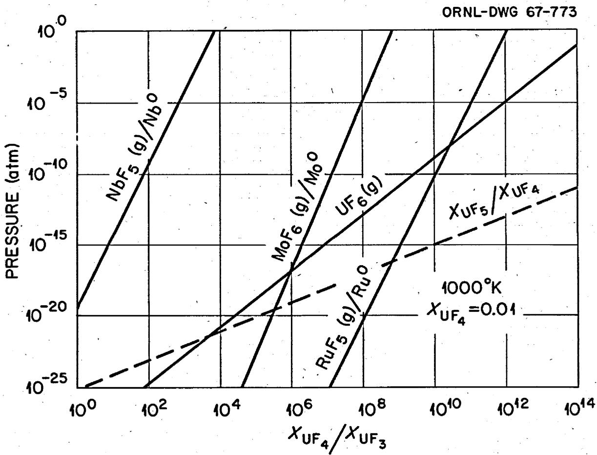  
Fig. 15. Equilibrium Pressures of Volatile Fluorides as Function of $\mathsf{UF}_4 / \mathsf{UF}_3$ Ratio in MSRE Fuel.

compounds become more stable at increasing temperatures. $^{52}$ Niobium carbide (essentially NbC) has a large (33 kcal) negative heat of formation at $298^{\circ}\mathrm{K}$ and is certainly stable under reactor conditions. Nothing appears to be known concerning carbides of technetium, but it seems certain that no carbide formation is expected from the platinum metals, silver, tellurium, cadmium, antimony or tin.

Net Oxidizing Potential of Fission Process53

The fuel exposure tests have used $^{235}\mathrm{U}$ as fissile fuel, with thermal flux exposures of about $3 \times 10^{13}$ neutrons $\mathrm{cm}^{-2}$ sec $^{-1}$ . Table 10 shows the relative yields of the several most important fission products $^{30}$ resulting from fission of $^{235}\mathrm{U}$ in a steady thermal flux of $3 \times 10^{13}$ neutrons $\mathrm{cm}^{-2}$ sec $^{-1}$ for three selected time intervals. The listed fission products comprise at least $97\%$ of all those produced (total yield is 2.0) at listed times, with no fission product removal.

Table 10. Fission Yields from Thermal Fission of ${}^{235}\mathrm{U}$   
$\Phi_{\mathrm{th}} = 3 \times 10^{13} \mathrm{neutrons} \mathrm{cm}^{-2} \mathrm{sec}^{-1}$   

<table><tr><td rowspan="2">Element</td><td colspan="3">Time Since Startup</td></tr><tr><td>11.6 days</td><td>116 days</td><td>3.2 years</td></tr><tr><td>Br</td><td>0.00030</td><td>0.00021</td><td>0.00021</td></tr><tr><td>I</td><td>0.0359</td><td>0.0145</td><td>0.0125</td></tr><tr><td>Kr + Xe</td><td>0.297</td><td>0.301</td><td>0.301</td></tr><tr><td>Rb</td><td>0.0387</td><td>0.0390</td><td>0.0393</td></tr><tr><td>Cs</td><td>0.0971</td><td>0.131</td><td>0.132</td></tr><tr><td>Sr</td><td>0.144</td><td>0.121</td><td>0.0980</td></tr><tr><td>Ba</td><td>0.105</td><td>0.0684</td><td>0.0626</td></tr><tr><td>Rare Earths + Y</td><td>0.528</td><td>0.560</td><td>0.559</td></tr><tr><td>Zr</td><td>0.318</td><td>0.318</td><td>0.317</td></tr><tr><td>Subtotal</td><td>1.564</td><td>1.553</td><td>1.522</td></tr><tr><td>Nb</td><td>0.0040</td><td>0.0139</td><td>0.0028</td></tr><tr><td>Mo</td><td>0.201</td><td>0.201</td><td>0.242</td></tr><tr><td>Tc</td><td>0.0410</td><td>0.0586</td><td>0.0592</td></tr><tr><td>Ru</td><td>0.140</td><td>0.126</td><td>0.114</td></tr><tr><td>Total</td><td>1.950</td><td>1.953</td><td>1.940</td></tr></table>

If the chemically active fission products shown in Table 10 occur as $\mathrm{I}^{-}$ , $\mathrm{Br}^{-}$ , $\mathrm{Rb}^{+}$ , $\mathrm{Cs}^{+}$ , $\mathrm{Sr}^{2+}$ , $\mathrm{Ba}^{2+}$ , $\mathrm{Y}^{3+}$ , $\mathrm{L}^{3+}$ (rare earths), $\mathrm{Zr}^{4+}$ , and $\mathrm{Nb}^{5+}$ and if krypton, xenon, molybdenum, technetium, and ruthenium occur as elements, and if no fission product species are removed from the reactor, then the total fission product yield multiplied by the valence $(\Sigma_{\mathbf{i}}\mathbf{Z}_{\mathbf{i}})$ will be 3.475 and 3.560 at 11.6 and 116 days, respectively. If all krypton and xenon nuclides of half-life greater than 5 minutes are removed from the system before they decay, the comparable $\Sigma_{\mathbf{i}}\mathbf{Z}_{\mathbf{i}}$ values become 3.21 and 3.26. If all krypton and xenon nuclides with half-lives greater than 1 minute are removed before decay, the $\Sigma_{\mathbf{i}}\mathbf{Z}_{\mathbf{i}}$ values are 3.06 and 3.09 at 11.6 and 116 days, respectively. The above $\Sigma_{\mathbf{i}}\mathbf{Z}_{\mathbf{i}}$ values (which seem inadequate to satisfy the fluoride ions released by the fissioned uranium) suggest that the fission process is per se oxidizing to $\mathrm{UF}_3$ and ultimately to Hastelloy N. Results of many in-pile tests of compatibility of the materials, however, suggest that fission does not lead to corrosion of this container metal.

If, on the other hand, all the molybdenum formed $\mathsf{MoF}_6$ and the technetium formed $\mathsf{TcF}_5$ then the fission process would require more than 4 fluoride ions per fission event and the fission process would per se be reducing to $\mathsf{UF}_4$ . Even for the rather unrealistic case where all xenon and krypton species with half-lives in excess of 1 minute were removed the $\mathbf{E}\mathbf{X}_{i}\mathbf{Z}_{i}$ values would be near 4.5. This would require reduction of one mole of $\mathsf{UF}_4$ to $\mathsf{UF}_3$ for each 2 moles of uranium fissioned.

Both extremes (that is a strongly oxidizing or a strongly reducing action of the fission process) seem unlikely. It seems likely that a fraction of the molybdenum, niobium, and technetium exist as fluorides

(of valence lower than this maximum) and that, accordingly, the net effect of fission is neither markedly oxidizing nor markedly reducing to the Hastelloy $\mathbf{N} - \mathbf{U}\mathbf{F}_{4}$ system.

Should subsequent long-term tests at high burnup prove the fission process to be oxidizing the cure would seem to be relatively simple; if the burned uranium were made up by addition of $\mathbf{U}\mathbf{F}_3$ (or $\mathbf{U}\mathbf{F}_3 + \mathbf{U}\mathbf{F}_4$ ) the problem would be solved. Similarly, if the fission processes were ( unexpectedly) reducing toward $\mathbf{U}\mathbf{F}_4$ the makeup of burned uranium could be as a mixture of $\mathbf{U}\mathbf{F}_5$ (or $\mathbf{U}\mathbf{F}_6$ ) with $\mathbf{U}\mathbf{F}_4$ .

# CHEMICAL BEHAVIOR IN MSRE

# General

The Molten-Salt Reactor Experiment operated during six separate periods in 1966; virtually all of the operating time accumulated after mid-May was at the maximum possible power of about $7.5\mathrm{Mw}$ . The reactor accumulated approximately 11,200 Mwhr during the year. Additional operation in 1967 (essentially all at maximum power) led to accumulation of an additional 21,000 Mwhr as of the scheduled shutdown on May 10, 1967.

During periods of reactor operation, samples of the reactor salts were removed routinely and were analyzed for major constituents, corrosion products and (less frequently) oxide contamination. Standard samples of fuel are drawn three times per week; the $\mathrm{LiF - BeF_2}$ coolant salt is sampled every two weeks.

Current chemical analyses suggest no perceptible composition changes for the salts since they were first introduced into the reactor some 20 months ago.

While analyses for $\mathrm{ZrF_4}$ and for $\mathrm{UF_4}$ agree quite well with the material balance on quantities charged to the reactor tanks, the values for ${}^7\mathrm{LiF}$ and $\mathrm{BeF}_2$ have never done so; analyses for LiF have shown lower and for $\mathrm{BeF}_2$ have shown high values than the book value since startup. Table 11 shows a comparison of current analysis with the original inventory value. While the discrepancy in LiF and $\mathrm{BeF}_2$ concentration remains a puzzle, there is nothing in the analysis (or in the behavior of the reactor) to suggest that any changes have occurred.

Routine determinations of oxide (by study of salt- $\mathsf{H}_2\mathsf{O}$ -HF equilibria) continue to show low values (about 50 ppm) for $0^{2-}$ . There is no reason to

believe that contamination of the fuel has been significant in operations to the present.

Table 11. Current and Original Composition of MSRE Fuel Mixture   

<table><tr><td>Constituent</td><td>Original Value (mole %)</td><td>Current Analysis (mole %)</td></tr><tr><td>7LiF</td><td>63.40 ± 0.49</td><td>64.35</td></tr><tr><td>BeF2</td><td>30.63 ± 0.55</td><td>29.83</td></tr><tr><td>ZrF4</td><td>5.14 ± 0.12</td><td>5.02</td></tr><tr><td>UF4</td><td>0.821 ± 0.008</td><td>0.803</td></tr></table>

MSRE maintenance operations have necessitated flushing the interior of the drained reactor circuit on four occasions. The salt used for this operation consisted originally of an $^7\mathrm{LiF - BeF}_2$ (66.0-34.0 mole %) mixture. Analysis of this salt before and after each use shows that 215 ppm of uranium is added to the flush salt in each flushing operation, corresponding to the removal of 22.7 kg of fuel-salt residue (about 0.5% of the charge) from the reactor circuit.

# Corrosion in MSRE

The chromium concentration in MSRE fuel is $64~\mathrm{ppm}$ at present; the entire operation seems to have increased the chromium concentration only 26 ppm. This increase corresponds to removal of about $130\mathrm{g}$ of chromium from the metal of the fuel circuit. If this were removed uniformly it would represent removal of chromium to a depth of about 0.1 mil. Analyses for iron and nickel in the system are relatively high (120 and 50 ppm respectively) and do not seem to represent dissolved $\mathrm{Fe}^{2+}$ and $\mathrm{Ni}^{2+}$ . While there

is considerable scatter in these analyses, there seems to be no indication of corrosion of the Hastelloy N by the salt.

The absence of corrosion--though in general accord with results from a wide variety of out-of-pile corrosion tests--seems somewhat surprising for the following reasons. The $\mathbf{UF}_3$ concentration of the fuel added to MSRE was markedly less than intended. Careful reexamination of the production records and study of the reaction

$$
\frac {1}{2} \mathrm {H} _ {2} + \mathrm {U F} _ {4} \rightleftharpoons \mathrm {U F} _ {3} + \mathrm {H F}
$$

on samples of surplus fuel concentrate show that the fuel salt had only a-bout $0.16\%$ of its uranium as $\mathbf{U}^{3+}$ . Nearly 10 fold more than this was intended.

If--as seems virtually certain--the chromium content of the salt was due to

$$
\frac {1}{2} \mathrm {C r} + \mathrm {U F} _ {4} \xrightarrow {\leftarrow} \frac {1}{2} \mathrm {C r F} _ {2} + \mathrm {U F} _ {3}
$$

an additional 1100 grams of $\mathbf{U}^{3+}$ should have resulted. With that originally added the $\mathbf{U}^{3+}$ should have totaled about 1500 grams and as much as $0.65\%$ of the uranium in the system could have been trivalent. An attempt, however, to determine the $\mathbf{U}^{3+}$ (by the $\mathbf{H}_2$ -HF reaction above) after 11,000 Mwhr of MSRE operation indicated that less than $0.1\%$ of the uranium was trivalent. Fission of the 550 grams of uranium (corresponding 11,000 Mwhr) could certainly not have oxidized more than $40\%$ of the 1350 grams of $\mathbf{U}^{3+}$ which had apparently been oxidized. The remaining 800 grams (approximately) could have been oxidized by inadvertent contamination (as by 60 grams of $\mathbf{H}_2\mathbf{O}$ desorbed from the moderator stack). However, the rate of corrosion even by this relatively oxidizing fuel melt remained imperceptibly slow.

Addition of beryllium metal (as $3''$ rods of $3/8''$ diameter in a perforated basket of nickel) through the sampling system in the pump bowl served as a convenient means of reducing $\mathbf{U}^{4+}$ to $\mathbf{U}^{3+}$ during reactor operation. In this form beryllium appears to react at about 1.25 grams per hour so that some 600 grams of $\mathbf{U}^{3+}$ are produced by an 8 hour treatment. Some 30 grams of Be have been added in this way to create an additional $1.6\mathrm{kg}$ of $\mathbf{U}^{3+}$ . During the subsequent 20,000 Mwhr of operation (which burned $1\mathrm{kg}$ of uranium) this $1.6\mathrm{kg}$ of $\mathbf{U}^{3+}$ seems to have been oxidized. Again, it seems likely that the fission process was responsible for oxidizing a substantial fraction, but not all of, this material.

Additional beryllium will be added to MSRE fuel as soon as power operation is resumed; it is tentatively planned to reduce at least $1\%$ of the $\mathrm{U}^{4+}$ to $\mathrm{U}^{3+}$ at that time.

The lack of corrosion in MSRE by melts which appear to be more oxidizing than those intended can be rationalized by the assumption (1) that the Hastelloy N has been depleted in Cr (and Fe) at the surface so that only Mo and Ni are exposed to attack, with Cr (and Fe) reacting only at the slow rate at which it is furnished to the surface by diffusion, or (2) that the noble-metal fission products (see sections following) are forming an adherent and protective plate on the reactor metal.

Behavior of Fission Products 54,55

Helium is introduced into the pump bowl of MSRE at a rate of about 4 liters per minute; this helium serves to strip Kr and Xe from the fuel in the pump bowl and to sweep these gases to the charcoal-filled traps far downstream in the exit gas system. Since a relatively small fraction (less than $10\%$ ) of the fuel mixture is bypassed through the pump bowl, the ef-

ficiency of removal of the fission product gases should not be very high. However, the Xe poisoning of MSRE at 7 Mw is only about $0.3\%$ in $\Delta K / K$ , a value considerably less than was anticipated. This low poison level is probably due to stripping of Xe within the fuel system into helium bubbles which are known to circulate (at perhaps $0.2\%$ by volume) in the fuel salt.

Samples of MSRE fuel, drawn in 10 to 50 cc metal samples at the sampling station in the pump bowl, have been routinely analyzed, by radiochemical techniques, for $^{14}$ fission product isotopes and, in some cases, for $^{239}$ $\mathrm{Np}$ and $^{239}$ $\mathrm{Pu}$ produced in the fuel. In general, the fission product species which are known to possess stable fluorides are present in the circulating fuel at approximately the expected concentration levels. The best monitors ( $^{91}\mathrm{Sr}$ and $^{143}\mathrm{Ce}$ ) with convenient half-lives, stable non-volatile fluorides, and no precursors of consequence typically and consistently show concentration levels some $15\%$ lower than those calculated from power levels based upon heat balances for the reactor.

Those elements whose fluorides are known to be relatively unstable (molybdenum, niobium, ruthenium, tellurium, and silver) are found in the salt at considerably less than the expected concentration. If calculations of amounts expected are based upon concentrations of ${}^{91}\mathrm{Sr}$ , about $60\%$ of the ${}^{99}\mathrm{Mo}$ , $30\%$ of the ${}^{103}\mathrm{Ru}$ , and about $30\%$ of the ${}^{132}\mathrm{Te}$ appears in the melt. It is not yet possible to state with certainty whether these materials are present in the salt as colloidal metal (or alloy) particles or as soluble chemical species, though present evidence suggests that the former is the more likely.

Iodine has been found (presumably as $\mathbf{I}^{-}$ ) at nearly the expected concentration in the samples of fuel. Examination of graphite and metal samples

and, especially, of specimens from the vapor phase as described below do show several surprises.

An assembly of MSRE graphite and Hastelloy N specimens was exposed on the central stringer within the MSRE core during its initial operation. This assembly was removed during the July 17 shutdown after 7800 Mwhr of reactor operation, and many specimens have been carefully examined.

No evidence of alteration of the graphite was found under examination by visual, x-radiographic, and metallographic examination. Autoradiographs showed that penetration of radioactive materials into the graphite was not uniform and disclosed a thin (perhaps 1- to 2-mil) layer of highly radioactive materials on or near the exposed graphite surfaces. Examination of the metal specimens showed no evidence of corrosion or other danger.

Rectangular bars of graphite from the top (outlet), middle, and bottom (inlet) region of this central stringer were milled in the hot cell to remove six successive layers from each surface. The removed layers were then analyzed for several fission product isotopes.

The results of analysis of the outer layer from the graphite specimens are shown in Table 12. It is clear that, with the assumption of uniform deposition on or in all the moderator graphite, appreciable fractions of Mo, Te, and Ru and a large fraction of the Nb are associated with the graphite. No analyses for Tc have been obtained.

The behavior of $^{140}\mathrm{Ba}$ , $^{89}\mathrm{Sr}$ , $^{141}\mathrm{Ce}$ , $^{144}\mathrm{Ce}$ , and $^{137}\mathrm{Cs}$ , all of which have xenon or krypton precursors, can be accounted for in terms of laws of diffusion and half-lives of the precursors. Figure 16 shows the change in concentration of the fission product isotope with depth in the graphite. Those isotopes (such as $^{140}\mathrm{Ba}$ ) which penetrated the graphite as noble gases

Table 12. Fission Product Deposition on Surface ${}^{a}$ of MSRE Graphite   

<table><tr><td rowspan="3">Isotope</td><td colspan="6">Graphite Location</td></tr><tr><td colspan="2">Top</td><td colspan="2">Middle</td><td colspan="2">Bottom</td></tr><tr><td>dpm/cm2</td><td>Percent of Totalb</td><td>dpm/cm2</td><td>Percent of Totalb</td><td>dpm/cm2</td><td>Percent of Totalb</td></tr><tr><td></td><td>(x 109)</td><td></td><td>(x 109)</td><td></td><td>(x 109)</td><td></td></tr><tr><td>99Mo</td><td>39.7</td><td>13.4</td><td>51.4</td><td>17.2</td><td>34.2</td><td>11.5</td></tr><tr><td>132Te</td><td>32.2</td><td>13.8</td><td>32.6</td><td>13.6</td><td>27.8</td><td>12.0</td></tr><tr><td>103Ru</td><td>8.3</td><td>11.4</td><td>7.5</td><td>10.3</td><td>4.8</td><td>6.3</td></tr><tr><td>95Nb</td><td>4.6</td><td>12</td><td>22.8</td><td>59.2</td><td>24.0</td><td>62.4</td></tr><tr><td>131I</td><td>0.21</td><td>0.16</td><td>0.42</td><td>0.33</td><td>0.33</td><td>0.25</td></tr><tr><td>95Zr</td><td>0.38</td><td>0.33</td><td>0.31</td><td>0.27</td><td>0.17</td><td>0.15</td></tr><tr><td>144Ce</td><td>0.016</td><td>0.052</td><td>0.083</td><td>0.27</td><td>0.044</td><td>0.14</td></tr><tr><td>89Sr</td><td>3.52</td><td>3.24</td><td>3.58</td><td>3.30</td><td>2.99</td><td>2.74</td></tr><tr><td>140Ba</td><td>3.56</td><td>1.38</td><td>4.76</td><td>1.85</td><td>2.93</td><td>1.14</td></tr><tr><td>141Ce</td><td>0.32</td><td>0.19</td><td>1.03</td><td>0.63</td><td>0.58</td><td>0.36</td></tr><tr><td>137Cs</td><td>6.6 x 10-4</td><td>0.07</td><td>2.3 x 10-3</td><td>0.25</td><td>2.0 x 10-3</td><td>0.212</td></tr></table>

aAverage of values in 7- to 10-mil cuts from each of three exposed.graphite faces.   
bPercent of total in reactor deposited on graphite if each $\mathbf{cm}^2$ of the $2\times 10^{6}$ cm $^2$ of moderator had the same concentration as the specimen.

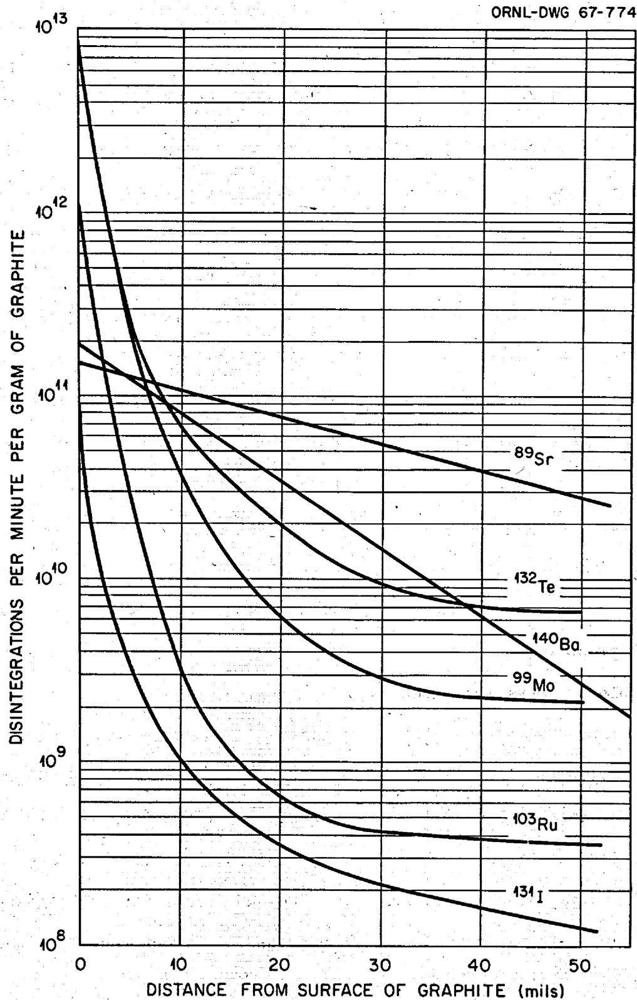  
Fig. 16: Concentration Profile of Fission Products in MSRE Core Graphite After 8000 Mwhr

show straight lines on the logarithmic plot; they seem to have remained at the point where the noble gas decayed. As expected, the gradient for $^{140}\mathrm{Ba}$ with a 16-sec $^{140}\mathrm{Xe}$ precursor is much steeper than that for $^{89}\mathrm{Sr}$ , which has a 3.2-min $^{89}\mathrm{Kr}$ precursor. All the others shown show a much steeper concentration dependence. Generally the concentration drops a factor of 100 from the top 6 to 10 mils to the second layer.

It is possible that carbide formation is responsible for the deposition of Nb and possibly for that of Mo, but it seems quite unlikely for Ru and Te; the iodine probably got in as its tellurium precursor. Since these materials have been shown to appear in the exit gas as volatile species, it seems likely that they entered the graphite by the same mechanism. The possibility that the strongly oxidizing fluorides such as $\mathrm{MoF}_6$ were present raised the question as to whether $\mathrm{UF}_6$ was accumulating in the graphite. An average of $0.23\mu \mathrm{g} / \mathrm{cm}^2$ was found in the surface of the graphite; much less was present in interior samples. This amount of uranium, equivalent to less than $1\mathrm{g}$ in the core, was considered to be negligible.

Table 13 shows the extent to which various fission product isotopes are deposited on the Hastelloy N specimens in the core. A large fraction of the molybdenum and tellurium and a substantial fraction of the ruthenium seem to be so deposited. It seems possible that the $^{131}\mathrm{I}$ was carried into the specimen as its tellurium precursor. The values for $^{95}\mathrm{Zr}$ seem surprisingly high, since those for the $^{141}\mathrm{Ce}$ and $^{144}\mathrm{Ce}$ with noble-gas precursors probably reflect the amount expected by direct recoil at the moment of fission.

If the Nb and Tc are assumed to behave like the Mo, Te, and Ru, it may be noted that the MSRE could have been uniformly plated during its opera-

Table 13. Deposition of Fission Products on Hastelloy N in MSRE Core   

<table><tr><td rowspan="3">Isotope</td><td colspan="6">Hastelloy Location</td></tr><tr><td colspan="2">Top</td><td colspan="2">Middle</td><td colspan="2">Bottom</td></tr><tr><td>dpm/cm2</td><td>Percent of Totala</td><td>dpm/cm2</td><td>Percent of Totala</td><td>dpm/cm2</td><td>Percent of Totala</td></tr><tr><td></td><td>(x 109)</td><td></td><td>(x 109)</td><td></td><td>(x 109)</td><td></td></tr><tr><td>99Mo</td><td>212</td><td>42.8</td><td>276</td><td>55.6</td><td>204</td><td>41.2</td></tr><tr><td>132Te</td><td>508</td><td>131</td><td>341</td><td>88</td><td>427</td><td>110</td></tr><tr><td>103Ru</td><td>35.5</td><td>29.3</td><td>25.5</td><td>21</td><td>23.2</td><td>19.1</td></tr><tr><td>131I</td><td>8.2</td><td>3.8</td><td>4.0</td><td>1.8</td><td>5.2</td><td>2.4</td></tr><tr><td>95Zr</td><td>1.8</td><td>1.0</td><td>1.8</td><td>1.0</td><td>2.6</td><td>1.3</td></tr><tr><td>141Ce</td><td>0.05</td><td>0.02</td><td>0.22</td><td>0.07</td><td>0.15</td><td>0.06</td></tr><tr><td>144Ce</td><td>0.01</td><td>0.02</td><td>0.09</td><td>0.18</td><td>0.35</td><td>0.07</td></tr></table>

aPercent of total present in reactor which would deposit on the 1.2 x $10^{6}$ cm² of Hastelloy N if deposition on all surfaces was the same as on the specimen.

tion with several hundred angstroms of relatively noble metals.

The only gas-liquid interface in the MSRE (except for the contact between liquid and the gas-filled pores of the moderator graphite) exists in the pump bowl. There a salt flow of about 60 gpm (5% of the total system flow) contacts a helium cover gas which flows through the bowl at 4 liters/min. Provisions for direct sampling of this exit gas are planned but have not yet been installed in the MSRE.

Samples of the liquid fuel are obtained by lowering a sampler, on a stainless steel cable, through this cover gas and into the liquid. It has been possible, accordingly, to detect chemically active fission product species in this cover gas by radiochemical analysis of the stainless steel cable and its accessories which contact only the gas phase and by analysis of special getter materials which are attached to the cable. Coils of silver wire and specimens of Hastelloy N have generally been used as getters for this purpose. No quantitative measure of the isotopes present in the gas phase is possible, since no good estimate can be made of the gas volume sampled. The quantity of material deposited on the wire specimen does not correlate well with contact time (in the range 1 to 10 min) or with the getter materials studied.

The quantity of material deposited, however, is relatively large. Table 14 indicates relative amounts found in typical tests. There is no doubt that Mo, Ru, Te, (and from subsequent tests, Nb) are appearing in the helium gas of the pump bowl. The quantities are, moreover, surprisingly large; if the materials are presumed to be vapors the partial pressures would be above $10^{-6}$ atmosphere. The iodine isotopes show perceptibly different behavior. Iodine-135, whose tellurium precursor has a short half

Table 14. Qualitative Indication of Fission Product in MSRE Exit Gas   

<table><tr><td rowspan="2">Isotope</td><td colspan="4">Amounta</td></tr><tr><td>On Ni</td><td>On Ag</td><td>On Hastelloy</td><td>From Liquidb</td></tr><tr><td>99Mo</td><td>8</td><td>2</td><td>1</td><td>4</td></tr><tr><td>132Te</td><td>14</td><td>6</td><td>7</td><td>9</td></tr><tr><td>105Ru</td><td>10</td><td>3</td><td>3</td><td>5</td></tr><tr><td>106Ru</td><td>6</td><td>2</td><td>1</td><td>1</td></tr><tr><td>135I</td><td>0</td><td>0</td><td>0</td><td>0</td></tr><tr><td>133I</td><td>2</td><td>1</td><td>2</td><td>2</td></tr><tr><td>131I</td><td>1.5</td><td>0.9</td><td>0.5</td><td>0.8</td></tr></table>

aThe unit of quantity is that amount of the isotope in $1\text{g}$ of salt.   
bOn stainless steel cable.

life, does not appear, while $^{131}\mathrm{I}$ and $^{133}\mathrm{I}$ , both of which have tellurium precursors of appreciable half-life, are found. These findings--along with the fact that these iodine isotopes are present in the salt at near their expected concentration--suggest that any iodine in the vapor phase comes as a result of volatilization of the tellurium precursors.

Early attempts to find uranium on the wires (as from evolution of $\mathrm{UF}_{6}$ ) were unsuccessful. More recent attempts--perhaps with the oxidation potential of the salt at a higher level--have shown significant uranium deposition corresponding to several parts per million in the gas phase. It is possible, but it seems unlikely, that "salt spray" could account for this observed uranium. Salt spray certainly does not account for the observed noble metal species carried in the gas.

The behavior of these fission product species in the gas phase seems to correlate poorly--if at all--with the $\mathrm{UF}_3 / \mathrm{UF}_4$ ratio in the fuel melt. Concentrations of Mo, Nb, Ru, and Te in the gas phase seem to increase (or decrease) together but were unaffected--within the considerable scatter of the data--by the deliberate addition of beryllium to the MSRE melt. The concentrations of these elements in the fuel decrease (after correction for radioactive decay) during reactor shutdowns; such behavior would be expected if they plate out upon metallic or other surfaces. Concentrations in the gas phase decrease somewhat more than those in the salt but the differences seem much smaller than should be attributable to (for example) some radiation chemistry oxidation process to produce $\mathrm{MoF}_6$ , etc.

It seems most unlikely that these data can be reconciled as equilibrium behavior of the volatile fluorides. It is possible that the MSRE metal is plated with a noble-metal alloy whose thickness is several hundred

angstroms, and it is conceivable that the $\mathrm{UF}_4 / \mathrm{UF}_3$ ratio is near $10^{4}$ . The compound $\mathrm{NbF}_5$ could show an appreciable pressure under these circumstances. The other possibilities such as $\mathrm{MoF}_6$ , $\mathrm{TeF}_6$ , and $\mathrm{RuF}_5$ would require much higher $\mathrm{UF}_4 / \mathrm{UF}_3$ ratios, and it seems most unlikely that any single redox potential can yield the relative abundance observed for these isotopes.

The recent findings of silver and palladium isotopes in relatively high concentration in the gas phase seem (since these elements certainly lack volatile fluorides) to case additional doubt on species such as $\mathsf{MoF}_6$ , $\mathsf{RuF}_5$ , etc. as the gas-borne species.

One possible explanation of the available data is the following: The noble metal species (Mo, Nb, Ru, Te, Ag, Pd, and probably Tc) occur--as thermodynamics predicts--in the elemental state. They originate as (or very rapidly become) individual metal atoms. They aggregate at some finite rate, probably alloying with one another in the process and become insoluble as very minute colloidal particles which then grow at a slower rate. These colloidal particles are not wetted by the fuel, tend to collect at gas-liquid interfaces, and can readily be swept into the gas stream of the helium purge of the pump bowl. They tend to plate upon the metal surfaces of the system, to form carbides (Nb and Mo only) with the graphite, and (as extraordinarily fine "smoke") to penetrate the outer layers of the moderator. While there are difficulties with this interpretation it seems more plausible than others suggested to date.

It is clear that further study and additional data from MSRE and from sophisticated in-pile loop tests will be required before the details of fission product behavior can be understood.

# MOLTEN-SALT PRODUCTION TECHNOLOGY

The fuel and blanket salts of a molten-salt breeder reactor can be prepared by techniques similar to those developed for the production of fluoride mixtures for the MSRE. Commercially available fluoride salts, which were used as starting materials for the fluoride production process, required further purification only to remove a limited number of impurity species. Chemical reactions used to effect salt purification and methods by which process conditions were controlled are both adaptable to the larger-scale production capabilities that will be required to supply large-scale MSBR's.

# Production Process

Fluoride mixtures required for the MSRE were prepared by a batch process in a facility initially designed to support the various chemical and engineering tests of the program. A layout of the production process is shown in Fig. 17. Starting materials were weighed into appropriate batch sizes and simultaneously transferred by vibratory conveyor to a melt-down furnace assembly. In addition to providing a molten charge to each of two adjacent processing units, the meltdown facility was utilized for preliminary purification of the fluoride mixtures. Beryllium-metal turnings were added to reduce structural-metal impurities to their insoluble metallic states. The molten mixture was also sparged with helium and hydrogen at relatively high flow rates to remove insoluble carbon by entrainment.

Primary salt purification was achieved in each of two batch processing units. The melts were initially sparged with a gaseous mixture of anhydrous HF in hydrogen (1:10 vol ratio). Oxides, either initially present

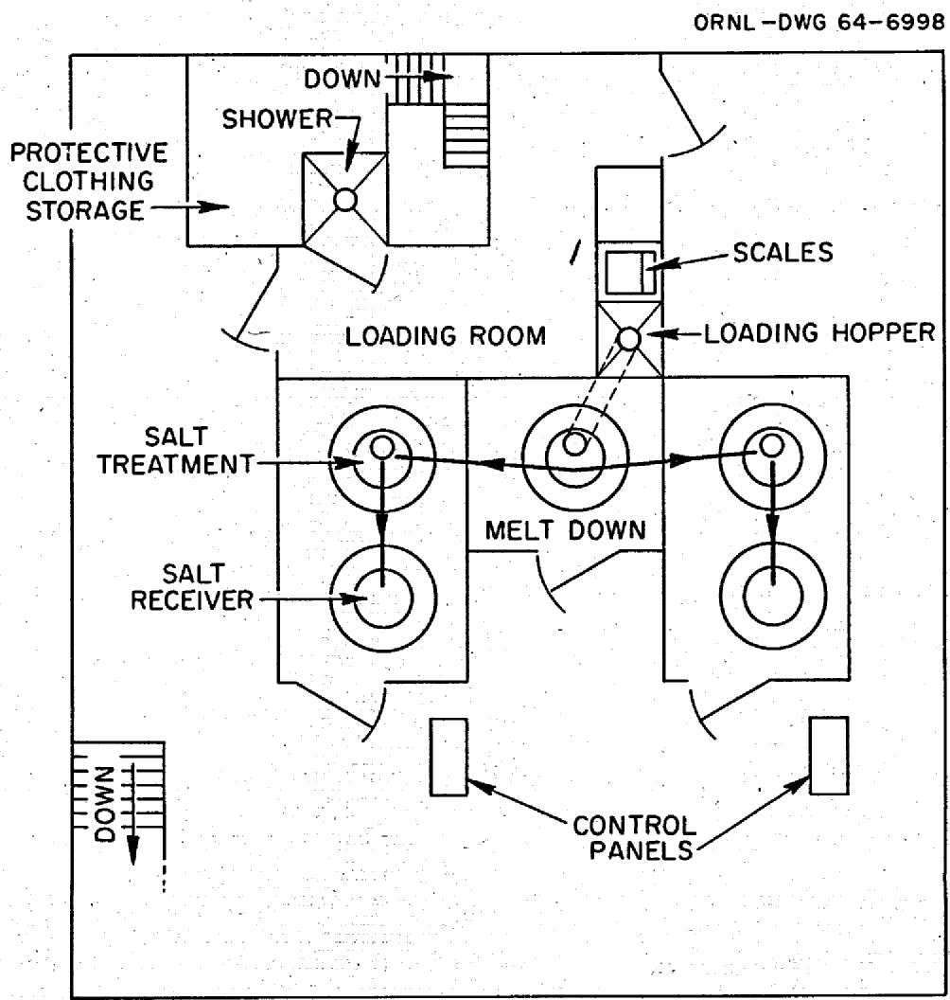  
Fig. 17. Fluoride Production Facility; Layout of Operating Level

or formed by reaction of the fluoride salts with their adsorbed water on heating, were removed as water by the reaction

$$
0 ^ {2 -} + 2 \mathrm {H F} \rightleftarrows 2 \mathrm {F} ^ {-} + \mathrm {H} _ {2} 0.
$$

As shown by Fig. 18, the efficiency of this reaction is quite high. Oxide removal rates were determined by condensing water vapor from the gas effluent in a cold trap.

Sulfides were also removed (as $\mathrm{H}_2\mathrm{S}$ ) by reaction with HF. However, any remaining sulfates must be reduced by hydrogen or added beryllium metal before sulfur removal by HF treatment is effective. Although this impurity is difficult to remove, commercial vendors of fluoride salts used in the MS.E were successful, through process development efforts, in substantially reducing this impurity from their products. Consequently, sulfur removal from fluoride salts should not be an important consideration for future production of fused fluoride mixtures for MSBR's.

Nonequilibrium concentrations of structural-metal fluoride impurities that are more easily reduced than $\mathrm{UF}_4$ (e.g., $\mathrm{NiF}_2$ or $\mathrm{FeF}_2$ ) would result in the depletion of chromium activity in the Hastelloy N alloy used as the structural material in the MSRE. Since these impurities are present in fluoride raw materials and may also be introduced by corrosion of the process equipment, their concentrations in the purified fluoride mixtures were an important process consideration. Following HF treatment, the fluoride mixtures were sparged with $\mathrm{H}_2$ alone at $700^{\circ}\mathrm{C}$ to effect the conversion of impurities to insoluble metals by the reaction

$$
\mathrm {M F} _ {2} + \mathrm {H} _ {2} \neq \mathrm {M} ^ {\circ} + 2 \mathrm {H F}.
$$

Hydrogen was also introduced during HF treatment to reduce corrosion of the nickel salt-containment vessel. Measurement of the HF concentration

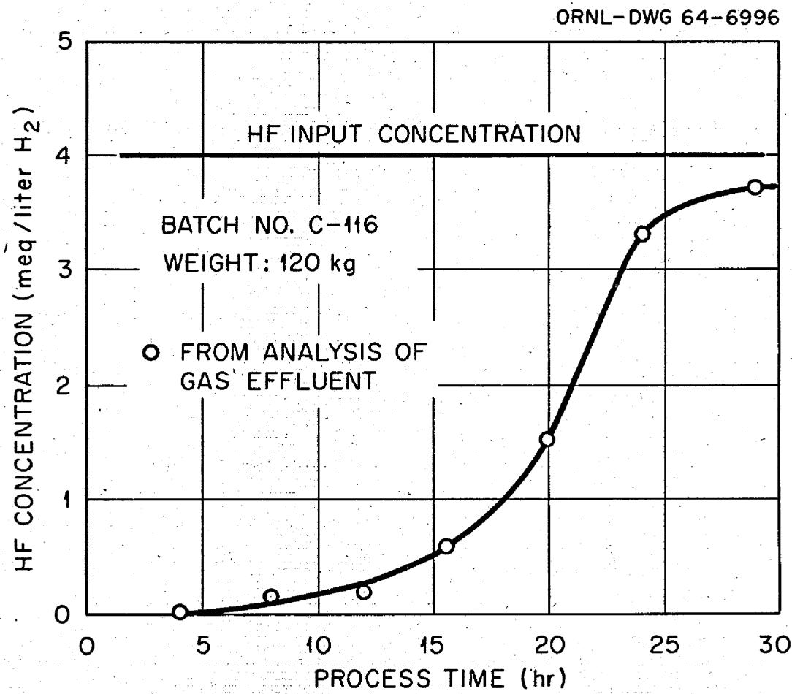  
Fig. 18. Fluoride Production for MSRE; Utilization of HF During Purification of ${}^{7}\mathrm{LiF - BeF}_{2}$ (66-34 mole %) at $600^{\circ}\mathrm{C}$ .

in the gas effluent during hydrogen sparging provided a convenient process control. As shown by Fig. 19 the concentration of HF in the gas effluent was indicative of the iron concentration remaining in the salt mixtures.

At the conclusion of the $\mathbf{H}_2$ treatment, residual quantities of HF were removed by sparging the melt with dry helium. The purified fluoride mixture was then transferred to its storage container. A sintered nickel filter, inserted in the transfer line, removed entrained solids from the melt.

Thus primary control of the production process was exercised by analysis of process gas streams. Filtered samples of the salt mixtures were obtained periodically during the process for chemical analyses. This secondary control measure provided the basis for acceptance of the salt batch for use in the MSRE.

All the $^{235}\mathrm{U}$ required for critical operation of the reactor could be prepared as a concentrate mixture, $^7\mathrm{LiF - UF}_4$ (73-27 mole %), with $\mathrm{UF}_4$ that was highly enriched in $^{235}\mathrm{U}$ . This facilitated compliance with nuclear safety requirements and permitted an orderly approach to criticality during fueling operations through incremental additions of $^{235}\mathrm{UF}_4$ to the fuel system of the reactor. Since the density of $^{235}\mathrm{U}$ in the concentrate mixture is relatively high (2.5 g/cc), the fueling method employed for the MSRE should suffice for all practical reactor systems.

# MSRE Salt-Production Economics

The operation of the production facility for the preparation of MSRE materials was conducted on a seven-day, three-shift schedule at a budgeted cost of about $20,000 per month. The raw materials cost for the 15,300 lb of LiF-BeF₂(66-34 mole %) used as the coolant and flush salt was $1.29

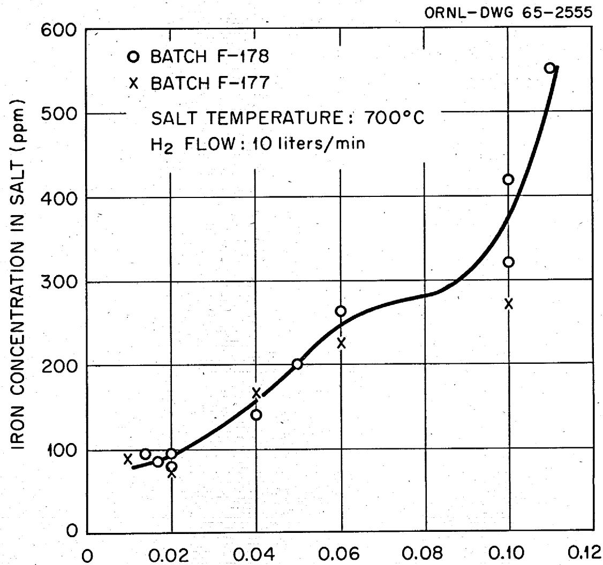  
Fig. 19. HF Concentration in Gas Effluent (meg/liter $\mathbf{H}_2$ )

per pound and that of the fuel salt (11,260 lb) excluding \(^{235}\mathrm{U}\) costs was \\(10.13 per pound. As calculated from operating and raw materials costs (but not plant amortization or \)\mathbf{\Omega}^{235}\mathrm{U}\) costs) the coolant and flush salt cost \\)19.71 per pound and the fuel salt cost was \\(17.33 per pound. Operating costs, as well as raw materials costs, should be substantially reduced for larger-scale production operations.

# SEPARATIONS PROCESSES IN MSBR FUELS AND BLANKETS

Use of molten salt reactors as thermal breeders will obviously require effective schemes for decontamination of the fuel and for recovery of bred uranium from the blanket. No provision, however, was made for on-stream removal of fission products from the MSRE, and fuel reprocessing has received less attention to date than have more immediate materials problems of this and similar machines. No detailed reprocessing scheme has, accordingly, been demonstrated.

Recovery of uranium from molten fluorides by volatilization as uranium hexafluoride and the subsequent purification of this $\mathbf{U}\mathbf{F}_{6}$ by rectification or by sorption-desorption on NaF beds is well demonstrated. Recovery of bred uranium from blankets or removal of uranium (where necessary to facilitate other processing operations) from the fuel, therefore, is clearly feasible. Such volatility processing is described in some detail elsewhere56 in this series.

More recent studies57 have shown that the LiF, $\mathrm{BeF}_2$ (and $\mathrm{ZrF}_4$ , if present) can be recovered quantitatively, along with much of the uranium, by vacuum distillation at temperatures near $1000^{\circ}\mathrm{C}$ ; very encouraging decontamination factors from rare earth fluorides (which are left behind in the still bottoms) have been demonstrated. As is described elsewhere in this series56 this distillation procedure combined with recovery of $\mathrm{UF}_6$ by fluorination shows real promise as a fuel processing technique.

Several other techniques have shown promise, at least in preliminary testing. A brief summary of these is presented in the following.

# Possible Separation of Rare Earths from Fuel

The rare earth fission products, which are the most important nuclear

poisons in a reactor from which xenon is effectively removed, form very stable trifluorides with a portion of that $\mathbf{F}^{-}$ released as fission of uranium as $\mathbf{U}\mathbf{F}_{4}$ . There is no doubt, therefore, that these fission products are dissolved in the molten fuel and are available for reprocessing.

# By Solid-Liquid Equilibria

The limited solubility of these trifluorides (though sufficient to prevent their precipitation under normal MSBR conditions) suggested years ago a possible recovery scheme. When a LiF-BeF $_2$ -UF $_4$ melt (in the MSBR concentration range) that is saturated with a single rare earth fluoride $(\mathrm{LaF}_3$ , for example) is cooled slowly the precipitate is the pure simple trifluoride. When the melt contains more than one rare earth fluoride the precipitate is a (nearly ideal) solid solution of the trifluorides. Accordingly, addition of an excess of $\mathrm{CaF}_3$ or $\mathrm{LaF}_3$ to the melt followed by heating to effect dissolution of the added trifluoride and cooling to effect crystallization effectively removes the fission product rare earths from solution. $^{44}$ It is likely that effective removal of the rare earths and yttrium (along with $\mathrm{UF}_3$ and $\mathrm{PuF}_3$ ) can be obtained by passage of the fuel through a heated bed of solid $\mathrm{CeF}_3$ or $\mathrm{LaF}_3$ . The price, which is almost certainly too high, is that the resulting fuel solution is saturated with the scavenger fluoride $(\mathrm{LaF}_3$ or $\mathrm{CeF}_3$ , whose cross section is far from negligible) at the temperature of contact.

Since the rare earth fluorides seem to form with uranium trifluorides solid solutions similar to those described above it is possible to consider $\mathbf{U}\mathbf{F}_3$ as the scavenger material. It should be possible to reduce the fuel $\mathbf{U}\mathbf{F}_4$ to $\mathbf{U}\mathbf{F}_3$ and then by passage of the solution through a bed of $\mathbf{U}\mathbf{F}_3$ to remove the contaminant rare earths; in principle, by careful control of

the column temperature (and, thereby, the solubility of $\mathrm{UF}_3$ ) one could obtain from the column a fuel of the correct uranium concentration which could be returned to the reactor after oxidation (by HF or $\mathrm{HF - H_2}$ mixture) of $\mathrm{UF}_3$ to $\mathrm{UF}_4$ . While the process deserves further study, the great instability of $\mathrm{UF}_3$ in solutions of high $\mathrm{UF}_3 / \mathrm{UF}_4$ ratios and the great ease with which the metallic uranium alloys with structural metals will probably make the process unattractive in practice.

Removal of rare earth ions, and other ionic fission product species, by use of cation exchangers also seems an appealing possibility. The ion exchanger would, of course, need (1) to be quite insoluble, (2) to be extremely unreactive (in a gross sense) with the melt, and (3) to take up rare earth cations in exchange ions of low neutron cross section. For rare earth separations it would probably suffice if the material exchanged normal $\mathrm{Ce}^{3+}$ or $\mathrm{La}^{3+}$ for the fission product rare earths; other separation schemes (such as distillation) would be required to remove the $\mathrm{Ce}^{3+}$ or $\mathrm{La}^{3+}$ but they could operate on a much longer time cycle. [The bed of $\mathrm{CeF}_3$ described above functions in an ion exchanger; it fails to be truly beneficial because it is too soluble in the melt.]

Unfortunately, there are not many materials known to be truly stable to the fuel mixture. Zirconium oxide is stable (in its low temperature form) to melts whose $\mathrm{Zr}^{4+}/\mathrm{U}^{4+}$ ratio is in excess of about 3. It is conceivable that sufficiently dilute solid solutions of $\mathrm{Ce}_{2}\mathrm{O}_{3}$ in $\mathrm{ZrO}_{2}$ would be stable and would exchange $\mathrm{Ce}^{3+}$ for other rare earth species. Intermetallic compounds of rare earths with moderately noble metals (or rare earths in very dilute alloys with such metals) seem unlikely to be of use because they are unlikely to be stable toward oxidation by $\mathrm{UF}_{4}$ . Compounds

with oxygenated anions (such as silicates and molybdates) are decomposed by the fluoride melt; they, and simple oxides $\left(\mathrm{ZrO}_{2}\right.$ excepted) precipitate $\mathrm{UO}_{2}$ from the fuel mixture. It is possible that refractory compounds (such as carbides or nitrides) of the rare earths either alone or in solid dilute solution with analogous uranium compounds, may prove useful. A considerable amount of exploratory research will be required (and many of the obvious possibilities have already been rejected) before such a technique can be given consideration.

# By Reduction

The rare earth fluorides are very stable toward reduction to the metal. For example, at $1000^{\circ}\mathrm{K}$ the reaction

$$
\frac {2}{3} \mathrm {L a F} _ {3 (\mathbf {c})} + \mathrm {B e} _ {(\mathbf {c})} + \frac {2}{3} \mathrm {L a} _ {(\mathbf {c})} + \mathrm {B e F} _ {2 (\mathbf {\ell})}
$$

where $c$ and $l$ indicate crystalline solid and liquid, respectively, shows $+32.4$ kcal for the free energy of reaction. With the $\mathrm{LaF}_3$ in dilute solution and $\mathrm{BeF}_2$ in concentrated solution in $\mathrm{LiF - BeF}_2$ mixture the free energy change is, of course, even more unfavorable. However, the rare earth metals form extremely stable solutions in molten metals such as bismuth. Beryllium is virtually insoluble in bismuth and forms no intermetallic compounds with this metal. Accordingly, the reaction

$$
\frac {2}{3} \mathrm {L a F} _ {3 (\mathrm {d})} + \mathrm {B e} _ {(\mathrm {c})} \neq \frac {2}{3} \mathrm {L a} _ {(\mathrm {B i})} + \mathrm {B e F} _ {2 (\mathrm {d})},
$$

where $d$ indicates that the species is dissolved in $2LiF\cdot BeF_2$ , $c$ indicates crystalline solid, and $Bi$ indicates a dilute alloy in bismuth, can be made to proceed essentially to completion. Accordingly, $LaF_3$ can be reduced and extracted into molten $Bi$ from $LiF\cdot BeF_2$ mixtures.

Since $\mathsf{Li}^{\circ}$ also forms stable solutions in molten bismuth, $^{58,59}$ the process of reducing the rare earths with beryllium cause some reduction of LiF and extraction of lithium by the bismuth. In practice, it is more convenient to use $^7\mathsf{Li}$ in bismuth (at or just below the concentration which yields crystalline $\mathsf{Be}^{\circ}$ at equilibrium) as the reductant. Figure 20 shows the behavior of several rare earths when extracted from very dilute solutions in $2\mathsf{LiF}\cdot \mathsf{BeF}_2$ with Li-bearing Bi in simple equipment. $^{60}$ It is still too early to be sure that the separations available are sufficiently complete, especially for heavier rare earths, for the method to be competitive with the distillation process. In addition, it is uncertain whether recovery of the $^7\mathsf{Li}$ will be necessary and, if so, how much recovery would be accomplished. However, the process seems at this preliminary stage to be worthy of further study.

It is clear that reduction processes of this type can, at least in principle, be accomplished electrochemically with the molten bismuth as the cathode and with some inert anode at which fluorine gas can be generated. The concentrations of rare earth metals, lithium, and beryllium obtained in the molten bismuth will be identical to those obtained by chemical equilibrium as described above. Whether one prefers the electrolytic method or direct chemical equilibration will, accordingly, depend upon the economics of the competing processes.

# Recovery of Protactinium from Blanket

While removal of bred $^{233}\mathrm{U}$ from the blanket by fluorination $^{56}$ appears feasible, the prior removal of $^{233}\mathrm{Pa}$ from the blanket to permit its decay to $^{233}\mathrm{U}$ outside the neutron field would be a most valuable contribution to the breeding economy. Such a separative process must be simple, since it

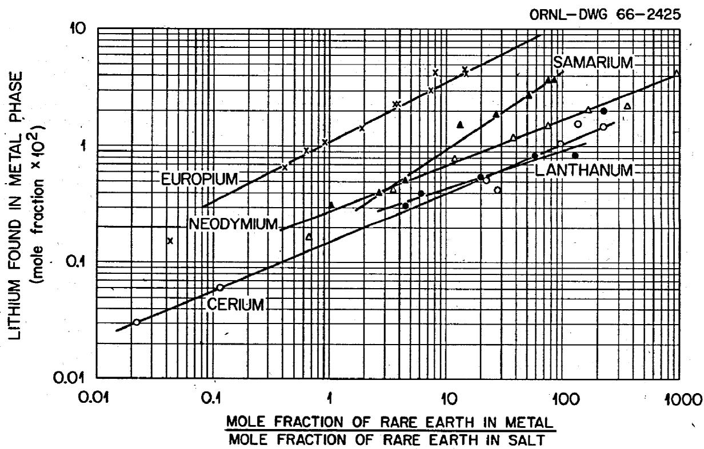  
Fig. 20. Effect of Lithium Concentration in Metal Phase on the Distribution of Rare Earths Between LiF-BeF $_2$ (66-34 mole %) and Bismuth at $600^{\circ}\mathrm{C}$ .

must be capable of handling the entire blanket in a time short compared with the 31.5 day half-time for decay of $^{233}\mathrm{Pa}$ .

# By Oxide-Fluoride Equilibria

Removal of Pa by deliberate addition to $\mathrm{LiF - BeF}_2\text{-ThF}_4$ blanket mixtures of $\mathrm{BeO}$ , $\mathrm{ThO}_2$ , or $\mathrm{UO}_2$ has been demonstrated.61,62 Precipitation of an oxide of protactinium, adsorption of protactinium on the added oxide, or (more likely) formation of a solid solution of protactinium oxide with the best oxide, has been shown to be essentially complete. The process has been demonstrated to be reversible; treatment of the oxide-fluoride mixture with anhydrous HF dissolves the added (or precipitated) oxide and returns the protactinium to solution from which it can readily be reprecipitated. It seems likely that protactinium might be removed from the blanket by passage of a side stream through a tower packed with $\mathrm{ThO}_2$ (or possibly $\mathrm{BeO}$ ); the protactinium, in some unidentified form, would remain on the bed and would there decay to $^{233}\mathrm{U}$ outside the neutron field. In its passage through the packed bed of oxide the blanket melt becomes saturated with oxide ion. This oxide ion concentration would probably have to be diminished appreciably by treatment with HF and then $\mathrm{H}_2$ before the melt could be returned to the blanket stream.

# By Reduction

The possibility of recovery of protactinium from realistic $\mathsf{LiF - BeF}_2$ -ThF₄ blanket mixtures by reduction has been examined experimentally with surprising and encouraging results.[63] No real information exists as to the free energy formation of the fluorides of protactinium. Accordingly, experiments were performed in which traces of $^{233}\mathrm{Pa}$ were added to $\mathsf{LiF - BeF}_2$ -ThF₄ melts, the melts were carefully treated with HF and $\mathsf{H}_2$ to insure

conversion of protactinium to fluoride and its dissolution in the melt, and the solution subsequently treated with a strong reducing agent. Some experiments used $\mathrm{ThPb}_{2}$ in lead or $\mathrm{ThBi}_{3}$ in bismuth as the reductant; other tests have used metallic thorium. In each case, the protactinium remained in molten fluoride solution (as judged by radiochemical analysis of filtered samples) until the reducing agent was added and was removed, upon addition of reductant, to very low concentration levels. Figure 21 shows the data for a typical case. The removal has been shown to be nearly quantitative at both traces (less than part per billion) levels and at realistic concentrations (50 ppm) of $^{231}\mathrm{Pa}$ traced with $^{233}\mathrm{Pa}$ . The process has also been shown to be reversible; sparging of the system with HF or $\mathrm{HF - H}_{2}$ mixtures returns the protactinium quantitatively to the molten fluoride solution.

Recovery of the precipitated protactinium has proved to be more difficult. Attempts to obtain the deposited protactinium in molten Bi or Pb have been generally unsuccessful in equipment of iron, copper, niobium, or steel; the deposited protactinium was only fleetingly (if ever) dissolved in the molten metal. When thorium was used as the reductant no appreciable concentration of protactinium was found in the excess thorium. Careful examination of sectioned apparatus shows some protactinium on the vessel walls, and some appears to remain suspended (in easily filterable form) in the salt. The mechanism of removal of protactinium from the salt mixture remains far from certain. It appears likely that the thorium (or slightly weaker reducing agent) reduces protactinium to form a moderately stable intermetallic compound (perhaps with Cr or Fe) which is filterable, is not dissolved by the molten lead or bismuch, and is readily decomposed

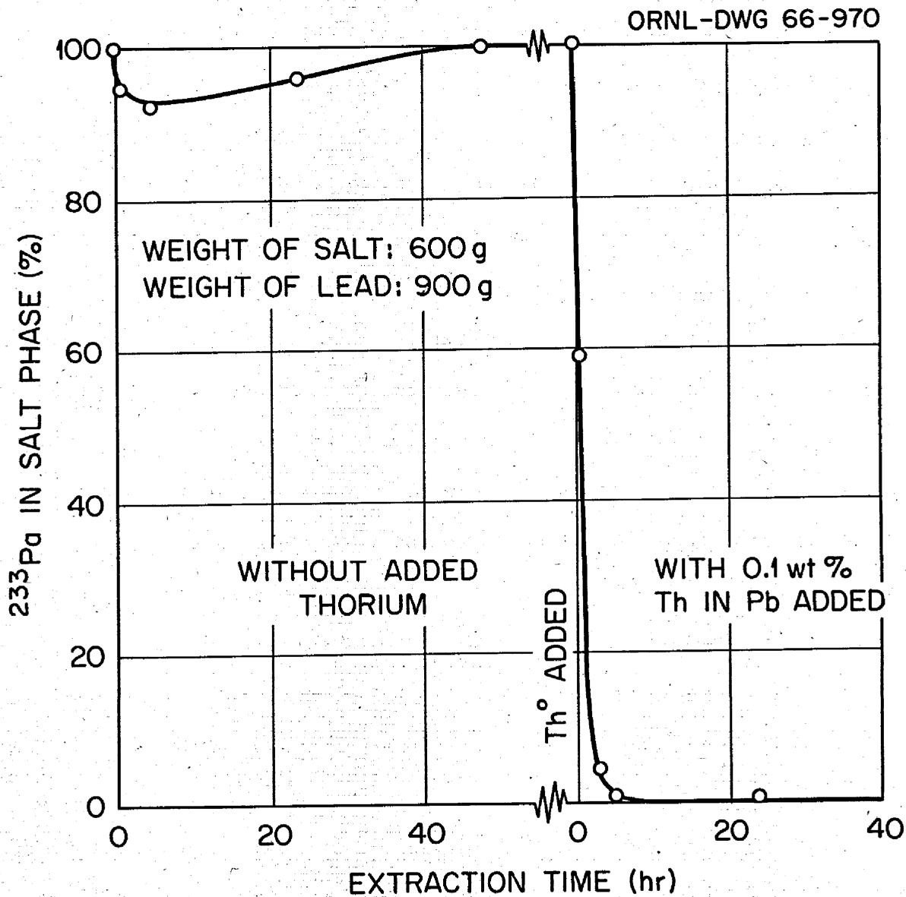  
Fig. 21. Effect of Thorium Metal on the Extraction of $^{233}\mathrm{Pa}$ from LiF-BeF $_2$ -ThF $_4$ (73-2-25 mole %) in Salt-Lead System at $600^{\circ}\mathrm{C}$ .

by anhydrous HF.

Attempts to recover the protactinium by reduction with metallic thorium in steel equipment in the presence of added iron surface (steel wool) have shown some promise.64 In a typical experiment, some 320 grams of $\mathrm{LiF - ThF}_{4}$ (27 mole $\%$ $\mathrm{ThF}_{4}$ ) containing 81 ppm (26 mg) of protactinium was reduced with thorium-in the presence of 4 grams of steel wool. The $\mathrm{LiF - ThF}_{4}$ , previously purified, was placed in a welded nickel reaction vessel, irradiated $\mathrm{ThF}_{4}$ containing a known amount of $^{233}\mathrm{Pa}$ and $^{231}\mathrm{Pa}$ was added to the mixture, and it was treated first with a mixture of HF and $\mathrm{H}_{2}$ and then with $\mathrm{H}_{2}$ alone. Four grams of steel wool (grade 00, $0.068\mathrm{m}^2/\mathrm{g}$ surface area) was placed in a low-carbon-steel liner inside another nickel vessel. The contents of this vessel were then treated with purified hydrogen at $800^{\circ}\mathrm{C}$ for several hours to remove as much as possible of the oxide surface contamination of the steel wool and liner. The two vessels were then connected together at room temperature and heated to about $650^{\circ}\mathrm{C}$ , and the salt was transferred to the steel-lined vessel. After two separate exposures of the salt to a solid thorium surface, as indicated in Table 15, the salt was transferred back to its original container and allowed to cool in helium. The steel-lined vessel was cut up, and samples were submitted for analysis.

The data in Table 15 show that $99\%$ of the protactinium was precipitated in a form that would not pass through a sintered copper filter after a fairly short exposure to solid thorium, but nearly $7\%$ was in the unfiltered salt that was transferred back to the nickel vessel after exposure to thorium. About $69\mathrm{g}$ of salt was associated with the steel wool in the steel liner in the form of a hard ball. Partial separation of the

salt from steel wool was effected by use of a magnet after crushing the ball, and the iron-rich fraction had the higher protactinium concentration. The small amount of protactinium found on the vessel wall is especially notable. Coprecipitation of metallic protactinium and iron (and possibly nickel) would help to account for the manner in which protactinium settled out on, and adhered to, the steel wool surface.

On the basis of presently available information, thorium reduction of protactinium from molten breeder blanket mixtures in the presence of steel wool is believed to be a promising recovery method warranting further investigation.

Recent experiments have shown, in addition, that the handling of protactinium is simplified somewhat if graphite serves as the container. When irradiated thorium metal (containing $^{233}\mathrm{Pa}$ ) is dissolved in molten bismuth in metal containers the protactinium disappears from the liquid metal solution rapidly. Similar experiments using graphite vessels show very slow negligible decreases in protactinium concentration (after correction for radioactive decay) with time.

Accordingly, recent studies of reduction of protactinium from molten fluoride solution have been conducted in vessels of graphite. An interesting assembly which has been studied in a preliminary way uses a cylindrical graphite crucible (as a liner inside a stainless steel or nickel vessel) containing a pool of molten bismuth and a central cylindrical chimney of graphite with its lower end immersed in the bismuth pool. The chimney is connected to the lid of the metal jacket vessel in a manner such that the central chamber and the annular outer chamber can be maintained under separate and different atmospheres. A LiF-ThF4 blanket mix-

Table 15. Precipitation of Protactinium from Molten LiF-ThF4 (73-27 Mole %) by Thorium Reduction in the Presence of Steel Wool   

<table><tr><td>Sample</td><td>231Pa Concentration (mg/g)</td><td>Total 231Pa (mg)</td></tr><tr><td>Salt after HF-H2treatment</td><td>0.0634</td><td>20.3</td></tr><tr><td>Salt just before transfer</td><td>0.081</td><td>26.1</td></tr><tr><td>Salt 35 min after transfer</td><td>0.079</td><td>24.9</td></tr><tr><td>Salt after 50 min thorium exposure</td><td>0.0026</td><td>0.69</td></tr><tr><td>Salt after 45 min thorium exposure</td><td>0.0009</td><td>0.27</td></tr><tr><td>Nonmagnetic fraction of material in steel liner</td><td>0.20</td><td>11.5</td></tr><tr><td>Magnetic fraction of material in steel liner</td><td>0.628</td><td>10.2</td></tr><tr><td>Unfiltered salt after transfer to nickel vessel</td><td>0.0076</td><td>1.75</td></tr><tr><td>Steel liner wall</td><td></td><td>0.0006</td></tr><tr><td>Stainless steel dip leg</td><td></td><td>0.53</td></tr><tr><td>Filings from thorium rod</td><td></td><td>0.29</td></tr><tr><td>All salt samples</td><td></td><td>1.35</td></tr><tr><td>Total protactinium recovered</td><td></td><td>25.5</td></tr></table>

ture containing protactinium fluoride is placed in the annular chamber and a LiF-NaF-KF mixture is placed in the inner chamber. An atmosphere of HF is used to sparge the LiF-NaF-KF mixture and a reducing metal and (beryl-lium or thorium) is added to the salt in the outer chamber. The protactinium fluoride in the outer chamber is reduced, dissolved in and transferred through the bismuth and is oxidized by HF and dissolved in the LiF-NaF-KF mixture in the inner cylinder. Additional study is necessary to establish (1) the rate at which such a system can be made to work, (2) the quantity of reducing metals transferred to the recovery salt, and the completeness to which the reaction can be easily driven. The system-- which seems to have several useful variations--does, however, look promising.

It is also clear that, as in the rare earth reduction process, electrochemical reduction of the protactinium fluorides should be successful. In this case, it might seem especially promising if (as now seems likely) the protactinium is being reduced in the presence of metal to a stable intermetallic compound. Attempts to reduce protactinium electrochemically with a variety of metallic electrodes to ascertain (1) the type and composition of the intermetallic compound, and (2) whether a simple recovery process with a solid electrode can be achieved are scheduled for study.

# MSBR IN-LINE ANALYSIS PROGRAM

The rapid acquisition of data concerning the compositions of the fuel, coolant, and cover gas is highly desirable in the operation of a fluid fuel reactor. To be of most value the data should be representative of the reactor at zero time preferably with as little time-delay as possible in order to evaluate changes in composition from normal conditions and to take requisite action. This state can only be attained by in-line analysis. Investigations are under way to develop instrumentation capable of providing instantaneous data. It is proposed to devote considerable effort in this direction as part of the MSBR program. The alternative is to sample the fuel and coolant at periodic intervals and remove the sample for analysis at an appropriate analytical laboratory. This procedure is time-consuming and thereby suffers obviously from a definite time lag in providing information so that unknown events and information concerning these events are out of phase.

Although in-line instrumentation is a well-established technique, its application to molten salt reactors is essentially in its infancy - particularly in regard to radiation and its effect on maintenance of operating equipment. The objective is thus to apply the successful in-line techniques that have been used to control many nonradioactive chemical processes to control the reactor fuel, coolant, and cover gas.

# Helium Cover Gas

In addition to the anticipated impurities (atmospheric contaminants, $\mathrm{CF}_4$ , Kr, and Xe) have been found to represent significant contaminants in the MSRE off-gas system. While it has not yet been possible to measure hydrocarbons in the MSRE blanket gas, organic deposits have seriously

interfered with the operation of the MSRE off-gas system and hydrocarbons in concentrations of several hundred parts per million have been found in the off-gas from the MSRE pump test loop and in simulated pump leak experiments. (These experiments indicate that most, if not all, of the hydrocarbon enters the pump bowl through a mechanical joint which can be welded in future models.) In these tests the total hydrocarbon concentration was measured continuously by a flame ionization detector and the individual hydrocarbons -- principally light unsaturates -- were identified by gas chromatography.

Gas chromatography is a near perfect technique for automated analysis. This technique is now highly developed and refined, and considerable experience has been gained from research in other reactor programs on the analysis of helium by gas chromatographic techniques. The determination of permanent gas impurities in molten salt reactor blanket gases will require an instrument of improved sensitivity that is compatible with intense radiation. A simple chromatograph has been used to measure ppm and lower concentrations of $\mathrm{H}_{2}$ , $\mathrm{O}_{2}$ , $\mathrm{N}_{2}$ , $\mathrm{CH}_{4}$ , $\mathrm{Kr}$ , $\mathrm{Xe}$ , and $\mathrm{CF}_{4}$ in the off-gas from an MSRE in-pile test. These contaminants were resolved on a 10X molecular sieve column and measured with a helium discharge detector, which has the following limits of detection.

Table 16. Sensitivity for Detection of Contaminants in Helium by Gas Chromatography   

<table><tr><td>Component</td><td>Parts per Billion</td></tr><tr><td>H2O</td><td>1</td></tr><tr><td>H2</td><td>100</td></tr><tr><td>O2</td><td>&gt;10</td></tr><tr><td>Kr</td><td>&gt;10</td></tr><tr><td>N2</td><td>20</td></tr><tr><td>CH4</td><td>&gt;10</td></tr><tr><td>CF4</td><td>20</td></tr><tr><td>CO</td><td>20</td></tr><tr><td>Xe</td><td>10</td></tr></table>

The determination of $\mathrm{H}_2\mathrm{O}$ and $\mathrm{CO}_{2}$ will require a more complex instrument with multiple columns; probably a three-column instrument will be required for all the above components. Also it will be necessary to eliminate all organic materials of construction completely if extended dependable operation is to be obtained with highly radioactive samples. An all-metal pneumatically actuated sampling valve is being developed for this application. This valve will also be operable at high temperatures to minimize the adsorption of traces of moisture. The effects of hydrocarbons on the chromatograph has not been tested but will probably require some modification of the proposed instrument.

Gas chromatography is the most highly developed method for the automatic analysis of hydrocarbon mixtures; however, the resolution of the complex mixtures anticipated in the blanket gas requires columns packed with organic substrates, which are not compatible with the highly radioactive samples. Also, the experience with the pump test loop has indicat-

ed that the continuous measurement of the total concentration of hydrocarbons would provide adequate information for reactor operations. These measurements, made with a flame ionization detector, provided data to differentiate between possible locations of leaks; conversely, the complete analyses were of value only in development studies for the selection of means of removing the hydrocarbons. The flame ionization detector would probably not be suitable for in-line analysis of the reactor blanket gases because its operation would inject substantial quantities of air into the off-gas system. An alternate method which will not introduce contaminants is being developed. In this technique the hydrocarbons are oxidized to carbon dioxide and water with copper oxide, and the thermal conductivity of the combusted stream is compared with that of the same gas after the $\mathrm{CO}_{2}$ and $\mathrm{H}_{2} \mathrm{O}$ are removed by ascarite and magnesium perchlorate. This method has been tested with a bench top apparatus and found to give a signal proportional to hydrocarbon concentration over the range of interest with a limit of detection below 10 ppm. If possible, a similar apparatus will be tested on the off-gas of the MSRE.

# Spectrophotometry of Molten Salts

Absorption spectrophotometry and electrochemical analytical techniques are potentially applicable for in-line analysis. The absorption spectra of separate solutions of U(IV) and U(III) in fluoride-base molten salts have been obtained.[65,66] Based on a consideration of these spectra, U(III) could be determined at a wavelength of $360\mathrm{m}\mu$ to a concentration level of ca. 300 ppm in the presence of up to 1 mole $\%$ of U(IV) in molten LiF-BeF $_2$ -ZrF $_4$ . Such a spectrophotometric method, which is based on a characteristic spectrum, would be a specific and direct method. Performed

"In-line," this determination would provide a direct, specific, and continuous monitor of the U(III) concentration in the molten fuel salt. Similarly a relatively weak peak at $1000\mathrm{m}\mu$ in the absorption spectra of tetravalent uranium could be used to monitor U(IV), provided the concentration of U(III) does not exceed about $1000\mathrm{ppm}$ . Any corrosion products in the molten salt, even if present at several times the concentration level that is expected, will not interfere with the proposed determinations. The effect of the spectra of the various fission products is not known primarily because their equilibrium oxidation states are not known with certainty. It seems reasonable to assume, however, that little if any effect will be observed. Perhaps the most interference will be from the rare earths, probably as soluble fluorides. On the basis of experimental evidence the rare-earth spectra in molten fluoride salts should present sharp but insensitive absorption peaks.

Recently a very intense absorption peak at $235\mathrm{m}\mu$ has been found for U(IV) in $\mathrm{LiF - BeF}_2$ melts. Preliminary estimates indicate that this peak could be used for the in-line measurement of uranium concentrations as low as 5 to $10~\mathrm{ppm}$ . If no interfering ions are present, the peak could be applied as a sensitive detector of leaks into coolant salt streams and to measure residual uranium in depleted reprocessing streams.

The design of a spectrophotometer to be used in these proposed applications is rather well defined. Modification of an existing commercial spectrophotometer, a Cary Model 14-H manufactured by Applied Physics Company, will adequately meet the design criteria. In order to eliminate most of the radiation which is present in the salt sample the optical path-length of the spectrophotometer will be extended ca. three feet; at the

same time the imaging of the optical system will be modified to provide more intense illumination of the sample area.

It appears that the piping which will deliver the molten salt to the sample cell can be extended a convenient distance from the reactor core so that environmental radiation may be no problem to the servicing of the electronic components of the spectrophotometer. If the radiation is above tolerance, separation of electronic and optical components can best be handled by building one instrument housing the optical components and another instrument containing the electronics. Schematic diagrams of the cell design and spacing are shown in Figs. 22 and 23.

If the spectrophotometer is to monitor the spectrum of U(III) continuously and monitor the spectrum of U(IV) occasionally, this type of repetitive analysis is readily adaptable to an automatic cyclic operation with the data recorded by digitizing equipment.

# Electrochemical Studies

In principle electrochemical analyses of molten salts are attractive for in-line analysis since the technique lends itself so well to remote operations. In addition, any species in solutions that can be oxidized or reduced is determinable by electrochemistry. The chemical behavior of the solution and the reactions involved must be known, however. Ideally, one could establish the normal potential of the fuel and observe fluctuations and deviations from this norm. In this manner the normal operating behavior of the fuel is known and presumably changes in this behavior would be correlated with observed transitions. To accomplish this task a reliable reference electrode is needed. To this end, it is planned to investigate various metal-metal ion couples (nickel-nickel fluoride, nickel-

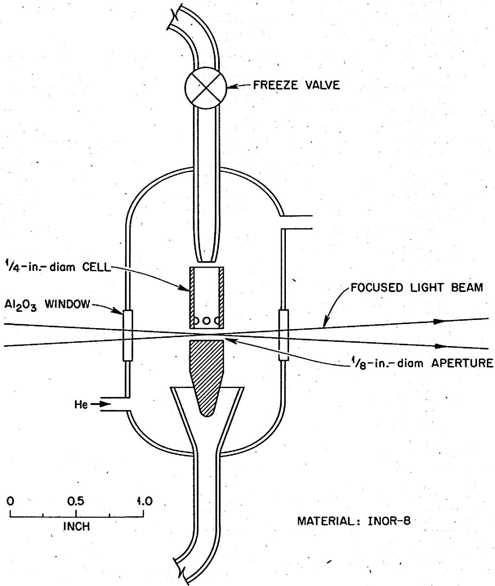  
Fig. 22. Molten Salt Reactor In-Line Spectrophotometric Facility

ORNL-DWG.65-3976

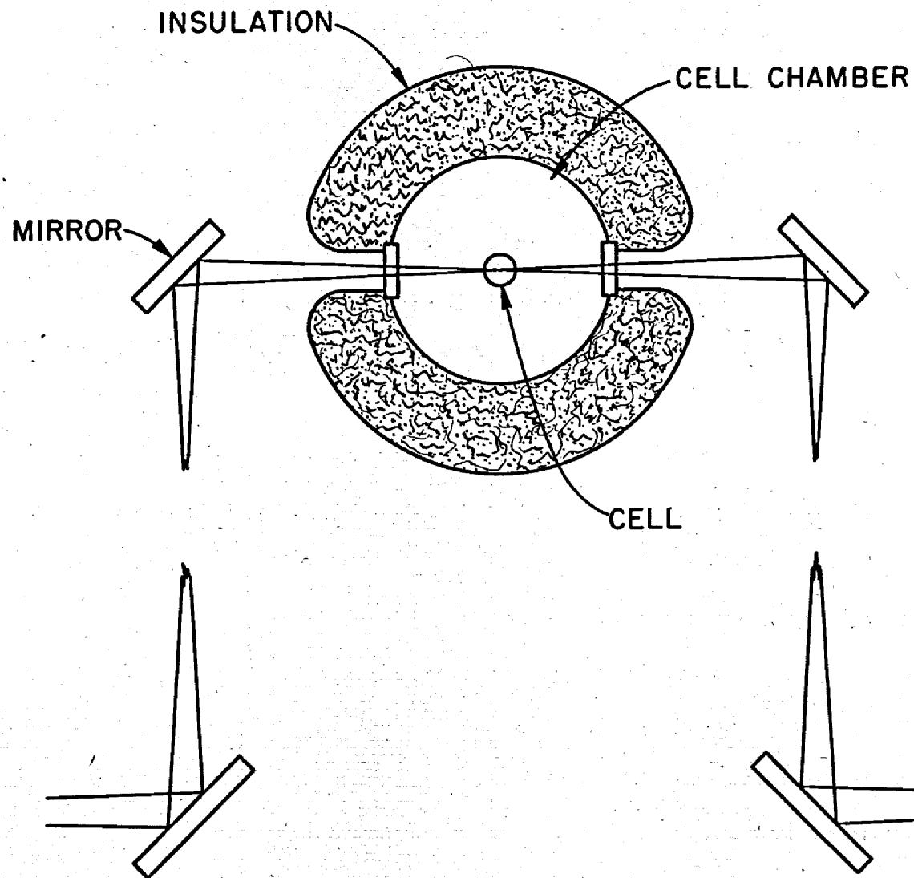  
Fig. 23. Cell Space Optical Design

nickel oxide, beryllium-beryllium fluoride, for example) as possible reference electrodes that are compatible with fluoride melts. In practice, the metal-metal ion reference appears to be the best choice from the standpoint of investigating and setting up of electroanalytical methods for analysis of molten fluorides. One model of the Ni-NiF $_2$ electrode has been tested and found to be reversible and reproducible but of limited service life. The useful lifetime of this electrode is limited to a few weeks by the dissolution of a thin membrane of boron nitride which serves as a "salt bridge" between the Ni-NiF $_2$ half cell and the molten sample. While it may be mechanically feasible to replace electrodes in reactor process streams periodically, a much more dependable system could be constructed if an insulating material that is compatible with molten fluorides could be discovered.

A three-electrode system, an indicator electrode, $^{67}$ quasi-reference electrode, $^{68}$ and an isolated counter electrode, $^{69}$ has been applied to molten salts successfully. Approximate potentials for observed electrode reactions for several electroactive species are shown in Fig. 24. Theoretically, it is possible to measure the concentration of the metal ions at their decomposition potentials independent of the presence of other metal ions as long as the potential difference is at least $0.3\mathrm{v}$ . The presence of gross quantities of one metal and trace quantities of another often results in swamping of the decomposition potential.

This technique has already been applied to samples from the MSRE to determine the oxidation state of iron and nickel which appeared to be present in the fuel in concentrations above that predicted to exist in equilibrium with INOR-8 at the observed concentrations of chromium. Con

ORNL-DWG.66-6277

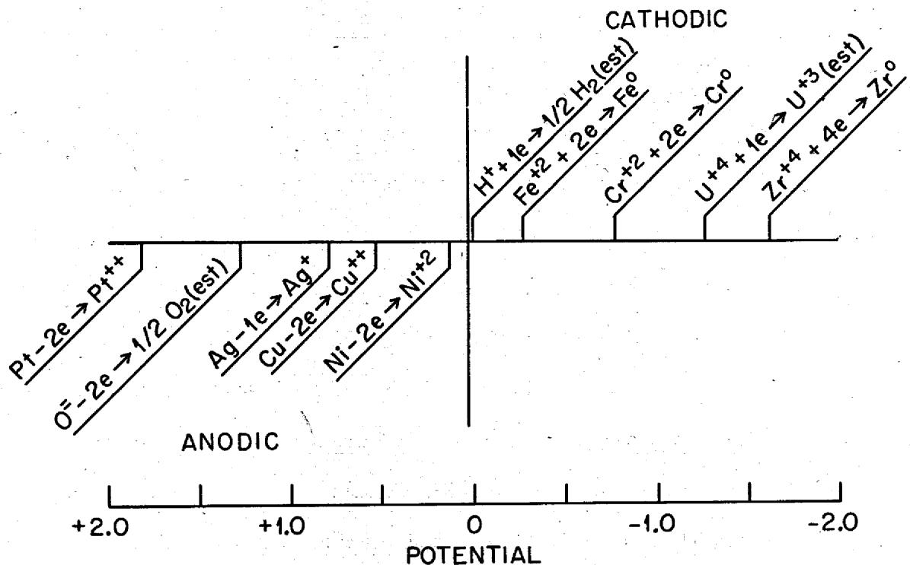  
VOLTS VERSUS PLATINUM QUASI-REFERENCE ELECTRODE   
Fig. 24. Approximate Potentials for Electrode Reactions in Molten LiF-BeF $_2$ -ZrF $_4$ (65.6-29.4-5.0 mole %, at Temp. 500°C).

centrations of ionic iron and nickel of only about 10 and 1 ppm were determined by voltammetric scans of remelted samples that had been withdrawn from the MSRE before it was operated at power. These values compare with total concentrations (determined chemically) of 125 and $45~\mathrm{ppm}$ , respectively, and indicate that the major fractions of these contaminants are probably present as finely divided metals. Thus the concentrations of these corrosion products in true ionic solution are more consistent with thermodynamic predictions.

The three-electrode system also offers significant potential as a technique for in-line monitoring of uranium in reactor fuels. In MSRE type melts at $500^{\circ}\mathrm{C}$ U(IV) to U(III) reduction waves have been found to be reproducible to better than $1\%$ in measurements during a two-hour period, and to about 2 to $3\%$ for intermittent measurements taken over a one-month period. If the reproducibility could be improved, the technique could also be used to measure trivalent uranium. The ratio of reverse to forward scan currents is unity when only U(IV) is present, but the ratio increases as $\mathrm{UF}_3$ is added to the melt. One limit to the reproducibility of the voltammetric measurement is the precision of definition of the area of the indicating electrode. With present instrumentation it is necessary to limit the electrode area by inserting a 20-gauge platinum wire only $5\mathrm{mm}$ into the melts to limit the currents to measurable values. It is apparent that only a small change in melt level will produce a significant error in electrode area.

A new voltammeter is being built that will measure twentyfold higher currents so that an electrode with more reproducible area can be used. This instrument also permits faster sweep rates which will minimize the

effects of stirring in flow cells which will be necessary for process analysis. With these refinements it is possible that uranium can be continuously monitored with accuracy that is comparable to that of hot cell analyses. An alternate method for defining the electrode area is to use an insulating sheath. Boron nitride sheaths have been used with some success but are slowly attacked by the salts. The technique would be greatly simplified if a really compatible insulator were available, and a materials development program would appear to be merited.

A new phenomena which may offer a combined electrolytic and gas analysis technique for oxide determination has recently been observed. When LiF-BeF $_2$ melts are electrolyzed in vacuo at the potential (+ 1.0 v) of an anodic wave which has been attributed to the oxidation of oxide ion, gas evolution is noted at the indicator electrode. The gas was found to be predominantly CO $_2$ (resulting from the reaction of electrolytic oxygen with the pyrolytic graphite electrode or the graphite container) with lesser quantities of CO and O $_2$ . If 100% current efficiency can be achieved, a coulometric method would result. Alternately the evolved gases could be purged from the electrolytic cell and analyzed gas chromatographically. Determination of Oxide by Hydrofluorination

The quantitative evolution of oxide as water by hydrofluorination of molten fluoride salt mixtures has been successfully applied to the determination of oxide in the highly radioactive MSRE fuel samples. The sampling ladle, containing about $50\mathrm{g}$ of salt, is sealed in a nickel hydrofluorinator with a delivery tube spring-loaded against the surface of the salt. After the system is purged at $300^{\circ}\mathrm{C}$ with a hydrofluorinating gas mixture of anhydrous HF in hydrogen, the salt is melted, the delivery tube

is driven beneath the surface of the salt, and the melt is purged with hydrofluorinating gas mixture, the oxide being evolved as water. The effluent from the hydrofluorinator is passed through a sodium fluoride column at $70^{\circ}\mathrm{C}$ to remove the HF, and the water in a fraction of this gas stream is measured with the cell of an electrolytic moisture monitor. The integrated signal from the moisture monitor cell is proportional to the concentration of oxide in the sample. The water is evolved quite rapidly with analyses essentially complete within about 30 minutes after the salt is melted. Most of this time is consumed in purging the water from the sodium fluoride trap and in "drying down" the cell.

The components required to carry out this determination in the hot cell are shown in Figs. 25 and 26. Figure 25 shows from left to right: the sampling ladle; a nickel liner, which protects the hydrofluorinator bottom; the hydrofluorinator top, with its replaceable delivery tip and baffles to retain the salt in the liner; the hydrofluorinator bottom and a clamping yoke to seal the hydrofluorinator via a Teflon O-ring. Figure 26 shows the assembled hydrofluorinator in the furnace on the right connected with a pneumatically actuated coupler to the compartment which contains the sodium fluoride column, the moisture cell, a capillary gas stream splitter and the necessary valving and connections.

At the reactor startup samples of flush salt and fuel were analyzed by both the hydrofluorination and $\mathrm{KBrF}_4$ methods with satisfactory agreement. The $\mathrm{KBrF}_4$ results were positively biased by about 20 ppm which is readily explained by atmospheric contamination of the pulverized salt. Since the reactor has been operating at power the results of the samples analyzed have fallen in the range of $50 \pm 5$ ppm.

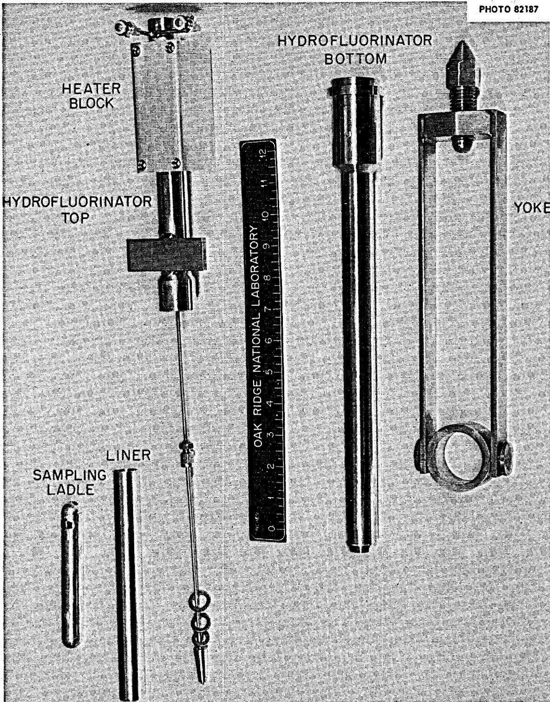  
Fig. 25. Disassembled Hydrofluorinator

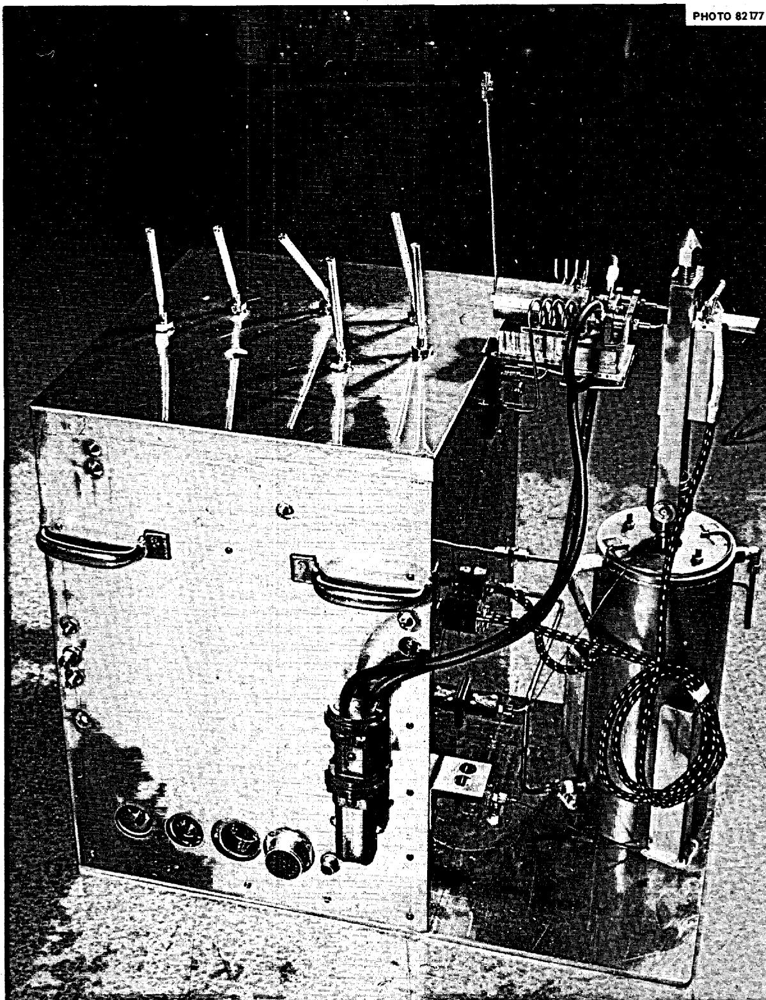  
Fig. 26. Hot-Cell Apparatus for Oxide in MSRE Salts.

The hydrofluorination method should be equally applicable to the analysis of MSBR samples, as no interference is anticipated from thorium. Because the reaction is rapid and quantitative it offers promise for application to process analysis and might also be combined with a determination of reducing power. The reactions involved in the process determination are as follows:

$$
0 ^ {2 -} + 2 \mathrm {H F} \rightleftharpoons \mathrm {H} _ {2} 0 + 2 \mathrm {F} ^ {-} \tag {1}
$$

$$
\mathrm {a n d} \quad \mathrm {U F} _ {3} + \mathrm {H F} \geqslant \mathrm {U F} _ {4} + 1 / 2 \mathrm {H} _ {2} ^ {\uparrow}, \tag {2}
$$

$$
M ^ {\circ} + n H F \rightleftharpoons M F _ {n} + n / 2 H _ {2} \uparrow , \tag {3}
$$

with evolved water and hydrogen measured.

Application of reaction (1) could be carried out by either of two techniques. In the simplest approach the molten salt would be subjected to a single-stage equilibration with HF in a hydrogen or helium carrier and the oxide computed from known equilibrium constants. This approach is subject to several problems, the most serious of which is that activities of oxide rather than concentrations are measured. Thus precipitated oxides are not determined. Also, it would be necessary to maintain accurate temperature control because equilibrium constants of the reaction are relatively dependent on temperature. An alternate approach which would circumvent the above problem but would require a more complex apparatus is to equilibrate a constant stream of the fuel with a counter-current flow of hydrofluorinating gas. By proper selection of parameters (HF concentration, temperature, contractor design and flow rates) it is theoretically possible to approach quantitative removal of oxide from the effluent salt so that a steady state is reached in which the water evolved

is equivalent to the oxide introduced in the salt stream. Rate constants for hydrofluorination are not available.

# Thorium and Protactinium

All of the experimental work on the proposed methods has been carried out on MSRE type salts but should also provide adequate analyses for the MSBR fuel. In the analysis of the MSBR blanket the presence of thorium and protactinium must also be considered. At this time the in-line analysis of thorium does not appear essential to the operation of the reactor -- a possible exception is the monitoring of thorium in the core to detect leaks between the blanket and the core. Also, on the basis of its spectrophotometric, electrical and thermodynamic properties, thorium is not expected to interfere significantly with any of the proposed methods. The in-line analysis of protactinium must be considered as a priority determination because the concentration of protactinium must be maintained at a low level in the blanket for efficient breeding. In the absence of experimental data, the spectrophotometric method appears to offer the most profitable avenue of investigation.

# Reprocessing System

Monitoring of the continuous fuel reprocessing system will probably be of even more importance than the monitoring of the main reactor system, because the compositions of the reprocessing streams are more subject to rapid operational control. Moreover, the reprocessing system offers several avenues for the temporary or permanent loss of fissionable material. Salt streams which will require continuous measurement of trace concentrations of uranium include the effluents from fluorinators of the fuel and blanket reprocessing streams. Part of the residual uranium in

either of these streams is subject to permanent loss either in the still bottoms of the fuel system or in the waste of the blanket fission product disposal. The in-line analysis of major concentrations of uranium in the make-up stream from the recombiner will also be required for inventory control. With the possible exception of a change in the concentration and/or nature of the corrosion products the techniques that are developed for the analysis of reactor salts should be equally applicable to the reprocessing system.

Gaseous effluents streams from the $\mathrm{UF}_6$ cold traps and the recombiner system could introduce temporary losses via transfer of uranium to the off-gas system and will require in-line analysis for trace concentrations. Gas streams that contain major concentrations of $\mathrm{UF}_6$ (e.g., effluents from the fluorinators) can probably be adequately monitored by ultraviolet spectrophotometers, but no completely satisfactory methods have yet been found for the in-line analysis of trace concentrations of uranium in gas streams. Several techniques are being considered to monitor the Fluid Bed Volatility Pilot Plant, and any methods developed should be ideally suited for the MSBR reprocessing system.

# PROPOSED PROGRAM OF CHEMICAL DEVELOPMENT

The chemical status of molten fluorides as reactor materials, presented in some detail in preceding sections, indicates strongly that thermal breeders based upon these materials are feasible. The discussion above, however, points out several problem areas that remain and numerous specific details that require examination and experimental investigation. A brief summary of these areas and specific plans for the necessary studies is presented under the several headings below. An estimate of the manpower and money required, over the next 8 years, to accomplish these research and development activities is presented as Table 17.

It is axiomatic that the course of research and development activities is seldom smooth and is difficult to predict in detail for a long period. Researches lead to valuable findings that can be exploited, and unsuspected problems arise and require additional efforts for their solution. It is very unlikely, therefore, that this budget breakdown will prove accurate in detail, but the overall sums and manpower, year by year, should be sufficient for the purpose.

# Phase Equilibrium Studies

Equilibrium phase behavior of the proposed fuel and blanket systems is relatively well established. A careful and detailed examination, using all the most advanced techniques, should be made of the region close to the proposed compositions in the fuel and, especially, in the blanket system. In addition, the join from the $\mathrm{LiF - UF_4}$ eutectic, through the fuel composition, to the barren fuel solvent will require some examination. None of these studies is urgently needed in the next year or two. Behavior of the $\mathrm{LiF - BeF_2 - UF_4}$ system with moderate fractions of the $\mathrm{UF_4}$

Table 17. Projected Breakdown of Chemical Development for MSBR Program   

<table><tr><td rowspan="2">Development Area</td><td colspan="2">1968</td><td colspan="2">-1969</td><td colspan="2">1970</td><td colspan="2">1971</td><td colspan="2">1972</td><td colspan="2">1973</td><td colspan="2">1974</td><td colspan="2">1975</td></tr><tr><td>MY</td><td>$</td><td>MY</td><td>$</td><td>MY</td><td>$</td><td>MY</td><td>$</td><td>MY</td><td>$</td><td>MY</td><td>$</td><td>MY</td><td>$</td><td>MY</td><td>$</td></tr><tr><td>Phase Relationships</td><td></td><td></td><td></td><td></td><td></td><td></td><td></td><td></td><td></td><td></td><td></td><td></td><td></td><td></td><td></td><td></td></tr><tr><td>Fuels and Blankets</td><td>0.5</td><td>20</td><td>0.5</td><td>20</td><td>1</td><td>40</td><td>1</td><td>40</td><td>0.25</td><td>10</td><td>0.25</td><td>10</td><td>0.25</td><td>10</td><td>0.25</td><td>10</td></tr><tr><td>Coolants</td><td>2</td><td>80</td><td>1</td><td>40</td><td>1</td><td>40</td><td>0.25</td><td>10</td><td>0.25</td><td>10</td><td>0.25</td><td>10</td><td>0.25</td><td>10</td><td>0.25</td><td>10</td></tr><tr><td>Oxide and Oxyfluoride Behavior</td><td>2</td><td>90</td><td>2</td><td>90</td><td>2</td><td>90</td><td>1</td><td>40</td><td>1</td><td>40</td><td>1</td><td>40</td><td>1</td><td>40</td><td>1</td><td>40</td></tr><tr><td>Solution Thermodynamics</td><td>2</td><td>80</td><td>2</td><td>80</td><td>2</td><td>80</td><td>2</td><td>80</td><td>2</td><td>80</td><td>2</td><td>80</td><td>2</td><td>80</td><td>2</td><td>80</td></tr><tr><td>Physical Properties</td><td>3</td><td>100</td><td>4</td><td>150</td><td>4</td><td>150</td><td>4</td><td>150</td><td>2</td><td>80</td><td>2</td><td>80</td><td>1</td><td>40</td><td></td><td></td></tr><tr><td>Radiation Effects</td><td>5</td><td>350</td><td>8a</td><td>500</td><td>10</td><td>800</td><td>10</td><td>800</td><td>10</td><td>800</td><td>10</td><td>800</td><td>8</td><td>500</td><td>6</td><td>400</td></tr><tr><td>Fission Product Behavior</td><td>2</td><td>100</td><td>3</td><td>150</td><td>3</td><td>150</td><td>3</td><td>150</td><td>3</td><td>150</td><td>3</td><td>150</td><td>2</td><td>100</td><td>2</td><td>100</td></tr><tr><td>Protactinium Chemistry</td><td>2</td><td>80</td><td>2</td><td>80</td><td>3</td><td>120</td><td>3</td><td>120</td><td>2</td><td>80</td><td>1</td><td>50</td><td>1</td><td>50</td><td>1</td><td>50</td></tr><tr><td>Fission Product Separations</td><td>2</td><td>80</td><td>2</td><td>80</td><td>3</td><td>120</td><td>4</td><td>160</td><td>4</td><td>160</td><td>2</td><td>80</td><td>2</td><td>80</td><td>1</td><td>40</td></tr><tr><td>Development of Continuous Production</td><td>0</td><td>0</td><td>0</td><td>0</td><td>2</td><td>100</td><td>2</td><td>100</td><td>2</td><td>100</td><td>0.5</td><td>25</td><td>0.5</td><td>25</td><td>0</td><td>0</td></tr><tr><td>Chemical Services</td><td>2</td><td>70</td><td>2</td><td>70</td><td>2</td><td>70</td><td>3</td><td>105</td><td>3</td><td>105</td><td>4</td><td>140</td><td>4</td><td>140</td><td>6</td><td>200</td></tr><tr><td>Subtotal</td><td>22.5</td><td>1050</td><td>26.5</td><td>1260</td><td>33.0</td><td>1760</td><td>33.25</td><td>1755</td><td>29.5</td><td>1615</td><td>26.0</td><td>1465</td><td>22.0</td><td>1075</td><td>19.5</td><td>930</td></tr><tr><td>Analytical Development</td><td>2</td><td>80</td><td>4</td><td>160</td><td>4</td><td>175</td><td>5</td><td>225</td><td>5</td><td>225</td><td>4</td><td>170</td><td>4</td><td>170</td><td>4</td><td>170</td></tr><tr><td>Analytical Services</td><td>3</td><td>100</td><td>4</td><td>130</td><td>5</td><td>160</td><td>6</td><td>180</td><td>6</td><td>180</td><td>6</td><td>180</td><td>6</td><td>180</td><td>6</td><td>180</td></tr><tr><td>Total</td><td>27.5</td><td>1230</td><td>34.5</td><td>1550</td><td>42.0</td><td>2095</td><td>44.25</td><td>2160</td><td>40.5</td><td>2020</td><td>36.0</td><td>1815</td><td>32.0</td><td>1425</td><td>29.5</td><td>1280</td></tr></table>

Does not include a considerable capital expenditure for in-pile facility. Estimate for this might be as high as $600,000.

reduced to $\mathbf{U}\mathbf{F}_{3}$ , and more definitive information as to solubility of rare-earth fluorides, alkaline earth fluorides, plutonium fluoride, etc. in the mixtures near to the fuel mixture are of somewhat more urgency. At the modest research level shown, these studies should be largely concluded in a four-year period, and very minor efforts are projected beyond that interval.

Phase behavior in the fluoroborate systems (or the alternatives presented above) proposed as coolants is much less well understood. The items of first priority are to define the phase behavior (including equilibrium $\mathsf{BF}_3$ pressure) in the NaF- $\mathsf{BF}_3$ system; such studies should include a systematic examination of the effect of $\mathsf{B}_{2}\mathsf{O}_{3}$ on the phase equilibrium. Once the binary system is established, the NaF-KF- $\mathsf{BF}_3$ ternary system should be examined. However, should the $\mathsf{BF}_3$ system appear unattractive (for example, by reason of incompatibility with Hastelloy N) these phase studies should immediately be shifted to examination of the most promising alternative. In addition, a small exploratory study of systems based upon $\mathsf{SnF}_2$ should be attempted, so that the interesting properties of this material can be exploited if its compatibility with Hastelloy N can be demonstrated.

# Oxide and Oxyl fluoride Behavior

Behavior of oxides, and of oxide and hydroxide ions over pertinent regions of the LiF-BeF $_2$ , LiF-BeF $_2$ -UF $_4$ , and LiF-BeF $_2$ -UF $_4$ -ZrF $_4$ systems is reassuring and is now reasonably well understood. Some additional effort on such behavior in the proposed MSBR fuel system (and its close compositional relatives) is still necessary. Little is known of oxide behavior in systems with moderate to high concentrations of thorium. Accordingly, a high priority in these studies must be given to examination of oxides

and hydroxides in $\mathrm{LiF - BeF_2 - ThF_4}$ systems at and near the blanket composition. A study of distribution of uranium and thorium between the anticipated $(\mathsf{U} - \mathsf{Th})0_{2}$ solid solution and the molten fluoride phase as a function of temperature and melt composition will follow. Extension of this study to include equilibrium distribution of protactinium will also be done if oxide processes for this element still appear attractive. It is expected that a 2-man effort can answer, during the next three years, the urgent questions that affect fuel and blanket production techniques and system cleanliness requirements. Minor questions and careful refinement of some of the data are expected to justify a continuing effort at a slower pace thereafter.

# Solution Thermodynamics

We feel a distinct need for more information about thermodynamics of many possible fission product or corrosion product species in dilute solution in fluoride melts. We need to augment the program now under way which attempts to obtain this data by EMF measurements and by direct measurements of chemical equilibria. The following several items would be accorded nearly equal priority:

# EMF Study of M/MFx Electrodes

Experiments using metal/metal fluoride electrodes with reference electrodes such as $\mathrm{Be} / \mathrm{Be}^{2+}$ or $\mathrm{H}_{2}$ , HF/Pd will attempt to determine the identity, solubility, and thermodynamic stability of lower valence fluorides of such elements as niobium, molybdenum, ruthenium, technetium, and copper in $\mathrm{LiF - BeF}_{2}$ melts. The priority order for these elements is probably the order listed. The method should also be used, as opportunity

permits, to firm our present values for the fluorides of iron, chromium, and nickel. Such studies should prove of real value in (1) decisions as to suitability of improved container metals (such as niobium) and (2) evaluation of possible fission product species and behavior. These EMF studies would, at least in the initial stages, be coupled with measurements of equilibria such as

$$
\mathrm {N b} + \mathrm {X H F} \neq \mathrm {N b F} _ {\mathrm {x}} + \mathrm {X} / 2 \mathrm {H} _ {2}.
$$

Thermodynamics of Rare-Earth Fluorides

We will use the cell

$$
M \mid M F _ {3 (s)} \mid M F _ {3 (d)}, L i F _ {(d)} \mid H _ {2}, H F \mid P d
$$

for which the expected cell reaction is

$$
\mathrm {M} + 3 \mathrm {H F} = \mathrm {M F} _ {3 (\mathrm {s})} + 3 / 2 \mathrm {H} _ {2}.
$$

We hope to measure $\Delta G_{\mathrm{f}}$ and $\Delta H_{\mathrm{f}}$ for crystalline rare-earth trifluorides. These data are badly needed in order to calculate $\Delta G_{\mathrm{f}}$ values for the dissolved salts from solubility data.

# Electrochemical Deposition Studies

Liquid bismuth solutions of niobium, molybdenum, ruthenium, and technetium will be studied (1) to investigate the feasibility of electrochemical deposition and (2) to determine activity coefficients of metal solutes in the liquid bismuth. These studies also could support present studies of chemical reduction of rare earths (and Pa) into Bi, by demonstrating electrochemical reduction of the same ions.

# Activities of LiF and BeF

Measurements with the cell

$$
\mathrm {B e} \mid \mathrm {B e F} _ {2 (\mathrm {d})} \mid \mathrm {H F} _ {2}, \mathrm {H} _ {2} \mid \mathrm {P d}
$$

should be extended over a wider temperature interval and composition range to confirm, improve, and extend our knowledge of the thermodynamics of the LiF-BeF $_2$ system. [If a suitable Th $^0$ | ThF $_4$ electrode can be demonstrated, a similar study in the LiF-ThF $_4$ and LiF-BeF $_2$ -ThF $_4$ systems will be made.] Other Studies

As time permits and the need requires we would attempt (1) study of reaction equilibria involving $\mathbf{BF}_3$ (especially with structural metal elements and alloys) in mixtures of interest as coolants, and (2) continued study of the reaction

$$
2 \mathrm {H F} + \mathrm {S} ^ {2 -} \neq \mathrm {H} _ {2} \mathrm {S} + \mathrm {H} _ {2}.
$$

# Physical Properties

We believe it unlikely that the physical property values listed in this document for the fuel, the blanket, and the several coolants are in error sufficient to cause rejection of the fluid. However, the state of knowledge of physical and heat transfer properties of these fluids is unsatisfactory, and a considerable effort will be required to establish the values with precision.

Vapor pressures need to be evaluated for the several mixtures (through decomposition pressures of the $\mathrm{BF}_3$ -based coolants will be established with their phase behavior). Since the values are known to be low, these measurements do not per se deserve a high priority, but studies with the fuel should be included early since they will assist with the distillation studies.

Density, coefficient of thermal expansion, and viscosity data will be required to confirm the present estimates. Specific heat and heat of

fusion values are also needed. All these values will, if sufficiently high accuracy can be achieved and if a sufficient concentration range is covered, be helpful in checking present methods for estimating the properties and will be useful in attempts to formulate a consistent theory of high temperature liquids.

Surface tension measurements of the several salts, and their close compositional relatives, should be established during the next two years as time and resources permit.

Thermal conductivity is the property that is most difficult to measure for molten salts (as for other liquids), and the one for which available information is most insufficient. A program for measurement of this property for fuel, blanket, and any of the materials likely to be chosen as coolant is urgently required. Thermal conductivity of liquids can be estimated with some precision if the velocity of sound in the liquid is known; measurements of sonic velocity in the molten salt mixtures should, therefore, be undertaken as a reasonable backup effort.

# Radiation Effects and Fission Product Behavior

These two items promise to be the most demanding, and the most expensive, in the list of necessary chemical development activities. No adverse effects of radiation upon the fuels, the moderator, or the compatibility of the fuel-graphite-metal system have been observed. However, no realistic tests of these combinations have been made at power densities so high as those proposed for MSBR. Studies presently under way, and radiation facilities presently available, should by early FY 1968 permit long-term tests to high fuel burnup at power densities in the 300 kw/liter range. Such studies are done in in-pile thermal convection loops which

expose a very high fraction of the total fuel to the highest flux; the assembly is equipped so that samples of gas can be taken at will, samples of fuel can be withdrawn, and samples of enriched fuel can be added as desired. These tests will be valuable both in assessment of possible radiation damage problems and in evaluation of fission product behavior.

We are convinced that exposures at even higher power densities (up at least to 1000 Kw/liter) are necessary in this program and we will attempt to design and operate such facilities. Success in this venture would permit not only an accelerated test program for the numerous possible problem areas but would also safely assess such reactor accident possibilities as blocked flow channels, pump stoppages, etc. We hope that such tests can be conducted at the Oak Ridge Research Reactor in loops cooled by thermal convection, and the considerable sums budgeted for the effort are predicated on that hope. If the studies must be done elsewhere, or if forced convection loops (with the attendant pump development problem) must be used, then the estimates of staff and funding required are certainly too low.

With careful analysis of off-gases from such systems and rapid radiochemical analysis of fuel samples, we should get definitive data on fission product behavior at truly realistic concentrations and production rates. Careful checks of graphite and metal from such tests immediately after termination of the run should afford realistic data on distribution of fission products in these materials.

Radiation levels, from gamma rays and from the delayed neutrons, in the coolant mixture are, clearly, much lower than those for the fuel, but radiation damage to the $\mathsf{BF}_3$ -based coolants is not necessarily a trivial

matter. When such a coolant mixture is established as to phase behavior, heat transfer capability, and compatibility, it should be given a long-term test at higher-than-realistic radiation levels to see whether such damage is a possibility.

# Fission Product Separations

The distillation process is, at present, the expected technique for reprocessing of the fuel mixture, and development activities associated with that process are described in another report in this series. A small effort on vapor-liquid equilibria in direct support of that development will continue, as needed, as a portion of the present program.

Highest priority will, for the present, be devoted to the study of reduction of rare-earth fluorides from $\mathrm{LiF - BeF_2}$ mixtures into dilute alloys of the rare-earth metals in bismuth, or into stable intermetallic compounds of other types. These studies can be carried by mid-1968 to a point where a sound evaluation of their potential can be made. If the process shows promise, it will be useful to examine electrochemical vs chemical techniques for its prosecution, and it may prove necessary to investigate means of recovery of lithium from the rare earth-bismuth alloy.

The search for insoluble compounds which are stable toward the molten fuel and which are capable of ion exchange reactions with rare-earth cations in the fuel mixture will be continued. Attempts will be made to use $\mathrm{ZrO}_2$ doped with traces of rare-earth oxides, uranium carbide doped with rare-earth carbide, and other refractory compounds, as well as any promising rare-earth intermetallic compounds.

Exploratory studies of reduction of the more noble fission products will be instituted as definite information on the nature of the species in

solution becomes available. Should niobium or molybdenum, for example, be shown to exist in the fuel mixture as a fluoride, their removal by chemical or electrochemical means will be attempted.

Study of the equilibrium

$$
\mathbf {H} \mathbf {F} + \mathbf {I} ^ {-} \rightarrow \mathbf {H} \mathbf {I} + \mathbf {F} ^ {-}
$$

will be continued and extended to include effects of melt composition and temperature. This technique may prove valuable in removing a major fraction of xenon precursors on a short time cycle and may minimize requirements for impermeability of the graphite moderator and core structure. If these studies continue to appear promising, they should be extended to include possible removal of tellurium by volatilization of $\mathrm{H}_{2}\mathrm{Te}$ .

# Protactinium Chemistry

The surprising fact that protactinium as fluoride is removed from very dilute solutions in $\mathrm{LiF - BeF_2 - ThF_4}$ by reduction with thorium metal (or with moderately stable intermetallic compounds of thorium) represents a breakthrough which must be exploited. Accordingly, first priority will be given to continued and increased study of this reaction. Primary attention must be paid to determination of the ultimate state of the protactinium; it is presently believed to be a stable intermetallic compound. Success in this venture should permit systematic study of means for recovery of the element. Techniques, which will be applied at both tracer (ppb) and realistic (ppm) concentrations, will include electrochemical reductions with a variety of metal electrodes, and chemical reductions in the presence of selected metallic constituents.

The process by which protactinium is precipitated by an excess of

BeO or $\mathrm{ThO}_2$ will continue to be examined. Attempts will be made to establish that passage of the melt through beds of oxide ( $\mathrm{ZrO}_2$ will be included) will remove the protactinium without reaction with other constituents. If this is true, as previous tests have strongly suggested, a careful study of the effect of extraneous ions, of the behavior of uranium, and of the extent of contamination of the melt by oxide and hydroxide ion will be made.

Methods for recovery of the protactinium or of the $^{233}\mathrm{U}$ product from whichever of these processes seems promising will be undertaken as soon as an understanding of the removal mechanism permits.

# Development of Continuous Production Methods

As the discussion of production technology above makes clear, the present production methods have been adequate for materials for MSRE; the fuel, coolant, and flush salt were furnished in a high and completely satisfactory state of purity. It seems very likely that the present unit processes will serve to prepare MSBR fuel and (perhaps with minor modifications) blanket. However, the 25,000 lb of material for MSRE required nearly a year to prepare in the existing batch processing facilities, and provision of a considerably larger quantity for an MSBR would be quite uneconomical if this equipment were used.

The purification process is quite a simple one. It seems certain that it can be engineered into a continuous process with the throughput per unit of time and manpower much greater than that of the present batch operation. The relatively small development effort adjudged necessary for this conversion is scheduled so that the finished plant could be available for run-in on large quantities of salt needed in the engineering-scale tests.

# Chemical Services

Under this heading are lumped the many and diverse ways in which the molten salt chemists perform services in direct support of other portions of the development effort. These ways range from (1) examination and identification (as by the optical microscope) of deposits found in engineering test loops, (2) determination of permeability of graphite specimens, (3) in-place hydrofluorination of batches of salt before reuse in test equipment, (4) manufacture of small batches of special salt compositions for corrosion or physical property tests, and (5) liaison among the engineers, reactor operators, hot-cell operators, and analytical chemists so that the many special samples receive proper handling and data from them are reasonably interpreted.

It is difficult to specify, long in advance, the details of such services, but many years' experience encourages us in the belief that the suggested level will be needed.

# Analytical Development

In order to apply in-line analytical techniques to the MSBR, considerable preliminary information and data must be gathered so that a sound evaluation of possible successful reactor applications can be made. This approach will permit a maximum shift of effort to those concepts that appear to be most fruitful. For example, the experience gained in the analysis of hydrocarbons in the MSRE off-gas is being used now in the design of a gas chromatograph to determine automatically the various constituents in the cover gas. Work on this project is currently under way and will be directed towards the MSBR.

The long term in-line analysis program is planned in this tentative

order of priority.

I. a. Construct a laboratory facility which will provide a flowing salt stream, probably driven by a gas lift. Provision will be made for the addition of contaminants to the salt including oxide, sampling, capability for hydrofluorination and electrolytic treatment of the salt. This facility will be used to provide tests of electrochemical methods for uranium and corrosion products and for measuring the electrochemical potential of the salt vs a standard reference cell.   
b. Initiate investigation of a countercurrent equilibration method for the determination of oxide by hydrofluorination.   
c. Accurately determine reproducibility of operation of spectrophotometric cell for future application to determination of uranium and protactinium.   
II. Continue basic investigations of electrode processes to observe if chromium, oxide, and trivalent uranium can be determined in this manner.   
III. Investigate materials as insulators for reference electrode.   
IV. Conduct in-pile testing of any in-line techniques which prove successful in Section I.   
V. Develop gas chromatographic analyses compatible with high activity. Includes radiation testing of packing materials, testing solid adsorbents for hydrocarbons. Development of all metal valving. Testing effect of radiation on detectors.   
VI. Investigation of alternate continuous methods of in-line gas analysis, e.g., thermal conductivity, referencing gas after chemical separation to original gas stream.

# REFERENCES

1. P. R. Kasten et al., Design Studies of 1000-Mw(E) Molten-Salt Breeder Reactors, ORNL-3996 (July 1966).   
2. W. R. Grimes et al., "Chemical Aspects of Molten Fluoride Reactors," in Progress in Nuclear Energy, Series IV, Vol. 2, Technology, Engineering, and Safety, Pergamon Press, London, 1960.   
3. W. R. Grimes et al., "Chemical Aspects of Molten Fluoride Salt Reactor Fuels," in Fluid Fuel Reactors, ed. by J. A. Lane, H. G. MacPherson, and Frank Maslan, Addison-Wesley Publishing Co., Inc., Mass., 1958.   
4. W. R. Grimes, "Materials Problems in Molten Salt Reactors," in Materials and Fuels for High Temperature Nuclear Energy Applications, ed. by M. T. Simnad and L. R. Zumwalt, the M.I.T. Press, Mass., 1964.   
5. MSRP Semiann. Progr. Rept. July 31, 1964, ORNL-3708, p. 214.   
6. Alvin Glassner, The Thermochemical Properties of the Oxides, Fluorides and Chlorides to $2500^{\circ}\mathrm{K}$ , ANL-5750.   
7. L. Brewer et al., MDDC-1553 (1945) and L. Brewer in The Chemistry and Metallurgy of Miscellaneous Materials; Thermodynamics, ed. by L. L. Quill, McGraw-Hill, New York, 1950, pp. 76-192.   
8. R. E. Thoma (ed.), Phase Diagrams of Nuclear Reactor Materials, ORNL-2548 (Nov. 6, 1959).   
9. L. V. Jones et al., "Phase Equilibria in the Ternary Fused-Salt System LiF-BeF $_2$ -UF $_4$ ," J. Am. Ceram. Soc. 45(2), 79-83 (1962).   
10. C. J. Barton et al., J. Am. Ceram. Soc. 41(2), 63-69 (1958).   
11. R. E. Thoma et al., J. Phys. Chem. 64, 865 (1960).   
12. R. E. Thoma et al., J. Phys. Chem. 63, 1266-74 (1959).

13. C. F. Weaver et al., J. Am. Ceram. Soc. 43(4), 213-18 (1960).   
14. A. L. Mathews and C. F. Baes, USAEC Report ORNL-TM-1129 (1965).   
15. C. F. Baes, "The Chemistry and Thermodynamics of Molten Salt Reactor Fluoride Solutions," in Proceedings of IAEA Symposium on Thermodynamics with Emphasis on Nuclear Materials and Atomic Transport in Solids, Vienna, Austria, July, 1965.   
16. C. F. Baes and B. F. Hitch, Reactor Chemistry Div. Ann. Progr. Rept. Jan. 31, 1965, ORNL-3789, pp. 61-5.   
17. I. Cohen and B. E. Schaner, A Metallographic and X-Ray Study of the $\mathrm{UO}_2\text{-ZrO}_2$ System, USAEC Report WAPD-253, June 1962.   
18. K. A. Romberger et al., "Phase Equilibrium Studies in the Uranium(IV) Oxide Zirconium Oxide System," presented at 15lst National Meeting of the American Chemical Society, Pittsburgh, Penn., March 21-31, 1966.   
19. E. M. Levin, C. R. Robbins, and H. F. McMurdie, Phase Diagrams for Ceramists, The American Ceramic Society, Inc., Ohio, 1964.   
20. V. G. Selivanov and V. V. Stender, Zhur. Neorg. Khim. 3(2), 448 (1958).   
21. R. E. Thoma and B. J. Sturm, Reactor Chem. Div. Ann. Progr. Rept. Jan. 31, 1965, ORNL-3789, p. 306.   
22. W. D. Powers and G. C. Blalock, Enthalpies and Heat Capacities of Solid and Molten Fluoride Mixtures, ORNL-1956 (Feb. 1, 1956).   
23. MSRP Semiann. Progr. Rept. Feb. 28, 1965, ORNL-3812, p. 145.   
24. B. C. Blanke et al., Density and Viscosity of Fused Mixtures of

Lithium, Beryllium, and Uranium Fluorides, MLM-1086 (Dec. 1956).   
25. B. C. Blanke et al., Viscosity of Fused Mixtures of Sodium Fluoride, Beryllium Fluoride, and Uranium Fluoride, MLM-1079 (April 1956).   
26. S. Cantor and W. T. Ward, Reactor Chem. Div. Ann. Progr. Rept. Dec. 31, 1965, ORNL-3913, p. 27.   
27. L. J. Klinkenberg, Rec. Trav. Chem. 56, 36 (1937).   
28. G. M. Adamson, Materials Development for Molten-Salt Breeder Reactors, ORNL TM-1854 (Aug. 1966).   
29. G. Long, Reactor Chem. Div. Ann. Progr. Rept. Jan. 31, 1965, ORNL-3789, p. 65.   
30. C. M. Blood, Solubility and Stability of Structural Metal Difluorides in Molten Fluoride Mixtures, ORNL CF-61-5-4 (Sept. 21, 1961), and C. M. Blood, F. F. Blankenship, W. R. Grimes, and G. M. Watson, "Activities of Some Transition Metal Fluorides in Molten Fluoride Mixtures," presented at 7th International Conference on Coordination Chemistry, 71CCC, Stockholm and Uppsala, June 25-29, 1962.   
31. MSRP Semiann. Progr. Rept. Aug. 31, 1961, ORNL-3215, p. 93.   
32. C. E. Wicks and F. E. Block, "Thermodynamic Properties of 65 Elements--Their Oxides, Halides, Carbides, and Nitrides," Bureau of Mines Bulletin 605 (1963).   
33. JANAF (Joint Army-Navy-Air Force) Interim Thermochemical Tables, Thermal Research Laboratory, Dow Chemical Co., Midland, Mich.   
34. W. R. Grimes, Radiation Chemistry of the MSRE System, ORNL-TM-500 (March 31, 1963).

35. W. H. Cook, Metals and Ceramics Div. Ann. Progr. Rept. July 1, 1963, ORNL-3420, pp. 165-7.   
36. MSRP Semiann. Progr. Rept. Feb. 28, 1965, ORNL-3812, p. 87.   
37. F. F. Blankenship et al., Reactor Chem. Div. Ann. Progr. Rept. Jan. 31, 1963, ORNL-3417, p. 17.   
38. W. R. Grimes, N. V. Smith, and G. M. Watson, J. Phys. Chem. 62, 862 (1958).   
39. M. Blander et al., J. Phys. Chem. 63, 1164 (1959).   
40. G. M. Watson et al., J. Chem. Eng. Data 7, 285 (1962).   
41. E. S. Bettis et al., Nucl. Sci. Engr. 2, 841 (1957).   
42. C. F. Baes et al., Reactor Chem. Div. Ann. Progr. Rept. Dec. 31, 1965, ORNL-3913, p. 38.   
43. W. R. Grimes et al., Nucl. Engr. - Part VII, 55(27), 65 (1959).   
44. W. T. Ward et al., J. Chem. Engr. Data 5, 137 (1960).   
45. C. J. Barton, J. Phys. Chem. 64, 306 (1960).   
46. C. F. Baes, Jr., Reactor Chem. Div. Ann. Progr. Rept. Jan. 31, 1967, ORNL-4076, pp. 49-50.   
47. E. Greenberg, C. A. Natke, and W. N. Hubbard, J. Phys. Chem. 69, 2089 (1965).   
48. J. L. Settle, H. M. Feder, and W. N. Hubbard, J. Phys. Chem. 65, 1337 (1961).   
49. J. L. Settle, H. M. Feder, and W. N. Hubbard, J. Phys. Chem. 67, 1892 (1963).   
50. K. K. Kelly, U.S. Bur. Mines Bull. 584, 1960.

51. H. A. Porte, E. Greenberg, and W. N. Hubbard, J. Phys. Chem. 69, 2308 (1965).   
52. J. F. Elliott and M. Gleiser, Thermochemistry for Steelmaking, Addison-Wesley Publishing Co., Reading Mass., 1960.   
53. Memorandum from C. F. Baes, Jr. to H. F. McDuffie, March 8, 1965, "Chemical Consequences of Nuclear Fission in Molten Fluorides."   
54. Reactor Chem. Div. Ann. Progr. Rept. Dec. 31, 1966, ORNL-4076, pp. 45-54.   
55. MSRP Semiann. Progr. Rept. Feb. 28, 1967 (in press).   
56. W. L. Carter and M. E. Whatley, "Fuel and Blanket Processing Development for Molten Salt Reactors," ORNL TM-1852 (June 1967).   
57. Reactor Chem. Div. Ann. Progr. Rept. Dec. 31, 1965, ORNL-3913.   
58. J. J. Egan and R. N. Wiswall, *Nucleonics* 15, 104 (1967).   
59. Melvin S. Foster, Scott E. Wood, and Carl E. Crouthamel, Inorganic Chemistry 3, 1428 (1964).   
60. J. H. Shaffer et al., Reactor Chem. Div. Ann. Progr. Rept. Dec. 31, 1966, ORNL-4076, pp. 34-36.   
61. C. J. Barton et al., Reactor Chem. Div. Ann. Progr. Rept. Dec. 31, 1965, ORNL-3913, p. 45.   
62. J. H. Shaffer et al., Nucl. Sci. Eng. 18(2), 177 (1964).   
63. J. H. Shaffer et al., Reactor Chem. Div. Ann. Progr. Rept. Dec. 31, 1965, ORNL-3913, p. 42.   
64. C. J. Barton et al., Reactor Chem. Div. Ann. Progr. Rept. Dec. 31, 1966, ORNL-4076, pp. 39-41.

65. J. P. Young, Anal. Chem. Div. Ann. Progr. Rept. Dec. 31, 1961, ORNL-3243, p. 30.   
66. J. P. Young, Anal. Chem. Div. Ann. Progr. Rept. Nov. 15, 1964, ORNL-3750, p. 6.   
67. D. L. Manning and Gleb Mamantov, J. Electroanal. Chem. 1, 102 (1964).   
68. D. L. Manning, "Voltammetry of Nickel in Molten Lithium Fluoride-Potassium Fluoride-Sodium Fluoride," J. Electroanal. Chem. 7, 302 (1964).   
69. Gleb Mamantov, D. L. Manning, and J. M. Dale, "Reversible Deposition of Metals on Solid Electrodes by Voltammetry with Linearly Varying Potential," J. Electroanal. Chem. 9, 253 (1965).

# DISTRIBUTION

<table><tr><td>1-50.</td><td>MSRP Director&#x27;s Office</td><td>99.</td><td>H. E. Goeller</td></tr><tr><td>51.</td><td>R. K. Adams</td><td>100-103.</td><td>W. R. Grimes</td></tr><tr><td>52.</td><td>G. M. Adamson</td><td>104.</td><td>A. G. Grindell</td></tr><tr><td>53.</td><td>R. G. Affel</td><td>105.</td><td>R. H. Guymon</td></tr><tr><td>54.</td><td>L. G. Alexander</td><td>106.</td><td>B. A. Hannaford</td></tr><tr><td>55.</td><td>R. F. Apple</td><td>107.</td><td>P. H. Harley</td></tr><tr><td>56.</td><td>C. F. Baes</td><td>108.</td><td>D. G. Harman</td></tr><tr><td>57.</td><td>J. M. Baker</td><td>109.</td><td>C. S. Harrill</td></tr><tr><td>58.</td><td>S. J. Ball</td><td>110.</td><td>P. N. Haubenreich</td></tr><tr><td>59.</td><td>W. P. Barthold</td><td>111.</td><td>F. A. Heddleson</td></tr><tr><td>60.</td><td>H. F. Bauman</td><td>112.</td><td>P. G. Herndon</td></tr><tr><td>61.</td><td>S. E. Beall</td><td>113.</td><td>J. R. Hightower</td></tr><tr><td>62.</td><td>M. Bender</td><td>114.</td><td>H. W. Hoffman</td></tr><tr><td>63.</td><td>E. S. Bettis</td><td>115.</td><td>R. W. Horton</td></tr><tr><td>64.</td><td>F. F. Blankenship</td><td>116.</td><td>T. L. Hudson</td></tr><tr><td>65.</td><td>R. E. Blanco</td><td>117.</td><td>H. Inouye</td></tr><tr><td>66.</td><td>J. O. Blomeke</td><td>118.</td><td>W. H. Jordan</td></tr><tr><td>67.</td><td>R. Blumberg</td><td>119.</td><td>P. R. Kasten</td></tr><tr><td>68.</td><td>E. G. Bohlmann</td><td>120.</td><td>R. J. Kedl</td></tr><tr><td>69.</td><td>C. J. Borkowski</td><td>121.</td><td>M. T. Kelley</td></tr><tr><td>70.</td><td>G. E. Boyd</td><td>122.</td><td>M. J. Kelly</td></tr><tr><td>71.</td><td>J. Braunstein</td><td>123.</td><td>C. R. Kennedy</td></tr><tr><td>72.</td><td>M. A. Bredig</td><td>124.</td><td>T. W. Kerlin</td></tr><tr><td>73.</td><td>R. B. Briggs</td><td>125.</td><td>H. T. Kerr</td></tr><tr><td>74.</td><td>H. R. Bronstein</td><td>126.</td><td>S. S. Kirslis</td></tr><tr><td>75.</td><td>G. D. Brunton</td><td>127.</td><td>A. I. Krakoviak</td></tr><tr><td>76.</td><td>D. A. Canonico</td><td>128.</td><td>J. W. Krewson</td></tr><tr><td>77.</td><td>S. Cantor</td><td>129.</td><td>C. E. Lamb</td></tr><tr><td>78.</td><td>W. L. Carter</td><td>130.</td><td>J. A. Lane</td></tr><tr><td>79.</td><td>G. I. Cathers</td><td>131.</td><td>R. B. Lindauer</td></tr><tr><td>80.</td><td>J. M. Chandler</td><td>132.</td><td>A. P. Litman</td></tr><tr><td>81.</td><td>E. L. Compere</td><td>133.</td><td>M. I. Lundin</td></tr><tr><td>82.</td><td>W. H. Cook</td><td>134.</td><td>R. N. Lyon</td></tr><tr><td>83.</td><td>L. T. Corbin</td><td>135.</td><td>H. G. MacPherson</td></tr><tr><td>84.</td><td>J. L. Crowley</td><td>136.</td><td>R. E. MacPherson</td></tr><tr><td>85.</td><td>F. L. Culler</td><td>137.</td><td>C. D. Martin</td></tr><tr><td>86.</td><td>J. M. Dale</td><td>138.</td><td>C. E. Mathews</td></tr><tr><td>87.</td><td>D. G. Davis</td><td>139.</td><td>R. W. McClung</td></tr><tr><td>88.</td><td>S. J. Ditto</td><td>140.</td><td>H. E. McCoy</td></tr><tr><td>89.</td><td>A. S. Dworkin</td><td>141.</td><td>H. F. McDuffie</td></tr><tr><td>90.</td><td>J. R. Engel</td><td>142.</td><td>C. K. McGlothlan</td></tr><tr><td>91.</td><td>E. P. Epler</td><td>143.</td><td>C. J. McHargue</td></tr><tr><td>92.</td><td>D. E. Ferguson</td><td>144.</td><td>L. E. McNeese</td></tr><tr><td>93.</td><td>L. M. Ferris</td><td>145.</td><td>A. S. Meyer</td></tr><tr><td>94.</td><td>A. P. Fraas</td><td>146.</td><td>R. L. Moore</td></tr><tr><td>95.</td><td>H. A. Friedman</td><td>147.</td><td>J. P. Nichols</td></tr><tr><td>96.</td><td>J. H. Frye, Jr.</td><td>148.</td><td>E. L. Nicholson</td></tr><tr><td>97.</td><td>C. H. Gabbard</td><td>149.</td><td>L. C. Oakes</td></tr><tr><td>98.</td><td>R. B. Gallaher</td><td>150.</td><td>P. Patriarca</td></tr></table>

# DISTRIBUTION

<table><tr><td>151.</td><td>A. M. Perry</td></tr><tr><td>152.</td><td>H. B. Piper</td></tr><tr><td>153.</td><td>B. E. Prince</td></tr><tr><td>154.</td><td>J. L. Redford</td></tr><tr><td>155.</td><td>M. Richardson</td></tr><tr><td>156.</td><td>R. C. Robertson</td></tr><tr><td>157.</td><td>H. C. Roller</td></tr><tr><td>158-207.</td><td>M. W. Rosenthal</td></tr><tr><td>208.</td><td>H. C. Savage</td></tr><tr><td>209.</td><td>C. E. Schilling</td></tr><tr><td>210.</td><td>Dunlap Scott</td></tr><tr><td>211.</td><td>H. E. Seagren</td></tr><tr><td>212.</td><td>W. F. Schaffer</td></tr><tr><td>213.</td><td>J. H. Shaffer</td></tr><tr><td>214.</td><td>M. J. Skinner</td></tr><tr><td>215.</td><td>G. M. Slaughter</td></tr><tr><td>216.</td><td>A. N. Smith</td></tr><tr><td>217.</td><td>F. J. Smith</td></tr><tr><td>218.</td><td>G. P. Smith</td></tr><tr><td>219.</td><td>O. L. Smith</td></tr><tr><td>220.</td><td>P. G. Smith</td></tr><tr><td>221.</td><td>W. F. Spencer</td></tr><tr><td>222.</td><td>I. Spiewak</td></tr><tr><td>223.</td><td>R. C. Steffy</td></tr><tr><td>224.</td><td>H. H. Stone</td></tr><tr><td>225.</td><td>J. R. Tallackson</td></tr><tr><td>226.</td><td>E. H. Taylor</td></tr><tr><td>227.</td><td>R. E. Thoma</td></tr><tr><td>228.</td><td>J. S. Watson</td></tr><tr><td>229.</td><td>C. F. Weaver</td></tr><tr><td>230.</td><td>B. H. Webster</td></tr><tr><td>231.</td><td>A. M. Weinberg</td></tr><tr><td>232.</td><td>J. R. Weir</td></tr><tr><td>233.</td><td>W. J. Werner</td></tr><tr><td>234.</td><td>K. W. West</td></tr><tr><td>235.</td><td>M. E. Whatley</td></tr><tr><td>236.</td><td>J. C. White</td></tr><tr><td>237.</td><td>L. V. Wilson</td></tr><tr><td>238.</td><td>G. Young</td></tr><tr><td>239.</td><td>H. C. Young</td></tr><tr><td>240-241.</td><td>Central Research Lib.</td></tr><tr><td>242-243.</td><td>Document Reference Sect.</td></tr><tr><td>244-254.</td><td>Laboratory Records</td></tr><tr><td>255.</td><td>Laboratory Records - RC</td></tr></table>

# EXTERNAL DISTRIBUTION

<table><tr><td>256-257.</td><td>D. F. Cope, AEC-ORO</td></tr><tr><td>258.</td><td>W. J. Larkin, AEC-ORO</td></tr><tr><td>259.</td><td>C. L. Matthews, AEC-ORO</td></tr><tr><td>260-274.</td><td>T. W. McIntosh, AEC-Washington</td></tr><tr><td>275.</td><td>H. M. Roth, AEC-ORO</td></tr><tr><td>276-277.</td><td>M. Shaw, AEC-Washington</td></tr><tr><td>278.</td><td>W. L. Smalley, AEC-ORO</td></tr><tr><td>279.</td><td>R. F. Sweek, AEC-Washington</td></tr></table>

<table><tr><td>280.</td><td>Research and Development Div.</td></tr><tr><td>281.</td><td>Reactor Division - ORO</td></tr><tr><td>282-296.</td><td>DTIE</td></tr></table>

