ORNL-TM-1854

1

MATERIALS DEVELOPMENT FOR MOLTEN-SALT BREEDER REACTORS

H.E. McCoy, Jr., and J.R. Weir, Jr.

THIS DOCUMENT HAS BEEN REVIEWED.

NO INVENTIONS OF PATIENT INTEREST

TO THE A.E.C. ARE DISCLOSED THEREIN

7

NOTICE This document contains information of a preliminary nature and was prepared primarily for internal use at the Oak Ridge National Laboratory. It is subject to revision or correction and therefore does not represent a final report.

# LEGAL NOTICE

This report was prepared as an account of Government sponsored work. Neither the United States, nor the Commission, nor any person acting on behalf of the Commission:

A. Makes any warranty or representation, expressed or implied, with respect to the accuracy, completeness, or usefulness of the information contained in this report, or that the use of any information, apparatus, method, or process disclosed in this report may not infringe privately owned rights; or   
B. Assumes any liabilities with respect to the use of, or for damages resulting from the use of any information, apparatus, method, or process disclosed in this report.

As used in the above, "person acting on behalf of the Commission" includes any employee or contractor of the Commission, or employee of such contractor, to the extent that such employee or contractor of the Commission, or employee of such contractor prepares, disseminates, or provides access to, any information pursuant to his employment or contract with the Commission, or his employment with such contractor.

ORNL-TM-1854

CFSTI PRICES

Hg $ 300, MN

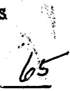

Contract No. W-7405-eng-26

# METALS AND CERAMICS DIVISION

# LEGAL NOTICE

This report was prepared as an account of Government sponsored work. Neither the State nor the

States, nor the Commission, nor any person acting on behalf of the Commission;

A. Makes any warranty or representation, expressed or implied, with respect to the accuracy, completeness, or usefulness of the information contained in this report, or that the use of any information, apparatus, method, or process disclosed in this report may not infringe privately owned rights; or

B. Assume any liabilities with respect to the use of, or for damages resulting from the use of any information, apparatus, method, or process disclosed in this report. As used in the above (unless otherwise specified),

The contract in the above, "person acting on behalf of the Commission" includes any employee or contractor of the Commission, or employee of such contractor, to the extent that such employee or contractor of the Commission, or employee of such contractor prepares, disseminates, or provides access to, any information pursuant to his employment or contract with the Commission, or his employment with such contractor.

MATERIALS DEVELOPMENT FOR MOLTEN-SALT BREEDER REACTORS

H. E. McCoy, Jr., and J. R. Weir, Jr.

JUNE 1967

OAK RIDGE NATIONAL LABORATORY

Oak Ridge, Tennessee

operated by

UNION CARBIDE CORPORATION

for the

U.S. ATOMIC ENERGY COMMISSION

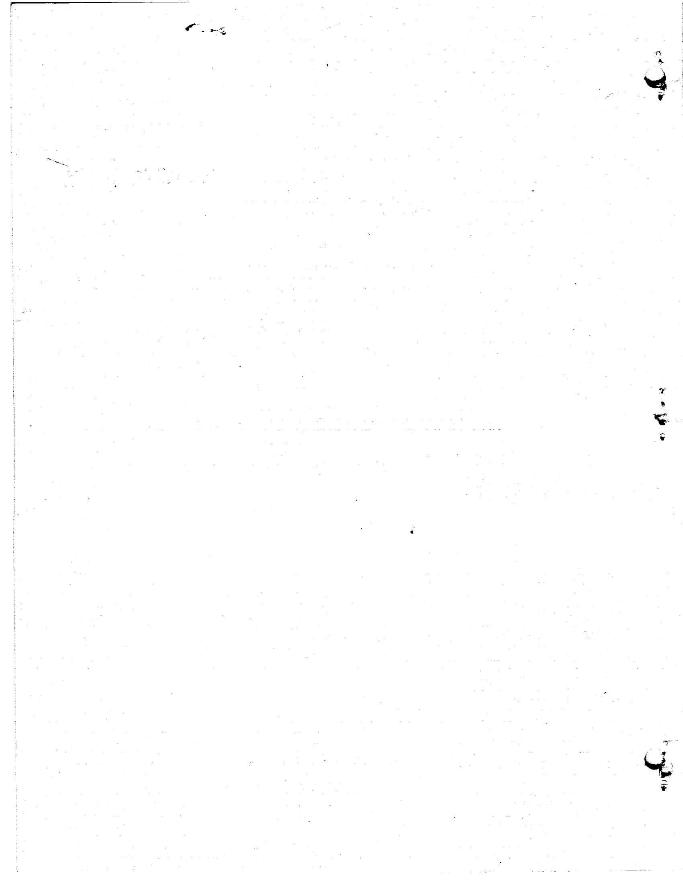

# CONTENTS

Abstract 1

Introduction 2

Status of the Development of Hastelloy N 3

General Properties 3

Physical Properties 5

Mechanical Properties 5

Tensile Properties 5

Creep Properties 9

Fatigue Properties 11

Effects of Irradiation 14

Corrosion by Molten Fluoride Salts 18

Loop Studies 19

MSRE Operating Experience 27

Resistance to Gaseous Contaminants 31

Oxidation Resistance 31

Resistance to Nitriding 32

Compatibility with Superheated Steam 32

Fabrication of Hastelloy N Systems and Components 36

36

Welding and Brazing of Hastelloy N 37

Joining for Reactor Component Fabrication 40

Pressure Vessel and Piping 40

Heat Exchangers 40

Dissimilar Metal Joints 42

Remote Joining 43

Remote Welding 43

44

Remote Inspection 44

Status of Development of Graphite 45

Grade CGB Graphite 46

Structure 46

Permeability 51

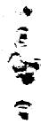

# Page

Mechanical Properties 53

Isotropic Graphite 54

Joining 56

Graphite-to-Hastelloy N Joints 57

Graphite-to-Graphite Joints 60

Compatibility of Graphite with Molten Salts 60

Radiation Effects on Graphite 61

Nondestructive Testing of Tubing 64

Materials Development Program for Molten-Salt Breeder Reactors 65

Hastelloy N Program 65

Resistance to Irradiation Damage 65

Corrosion Program 67

Nitriding 69

Joining Development 69

74

Materials Development for Chemical Processing Equipment 75

Graphite Program 75

Graphite Fabrication and Evaluation 76

Irradiation Behavior 77

Graphite Joining 79

Permeability Studies 79

Corrosion and Compatibility of Graphite 80

Graphite Inspection 80

General Development and Project Assistance 81

Acknowledgments 81

Appendix 83

H. E. McCoy, Jr., and J. R. Weir, Jr.

# ABSTRACT

We have described the materials development program that we feel necessary to ensure the successful construction and operation of a molten-salt breeder reactor. The proposed reactor is a two-region system utilizing a uranium-bearing fluoride fuel salt and a thorium-bearing fluoride blanket salt. A third lower melting fluoride salt will be used as a coolant for transferring the heat from the fuel and blanket salts to the supercritical steam. The primary structural materials are graphite and modified Hastelloy N. The individual fuel cells will be constructed of graphite tubes. These tubes must withstand neutron doses of the order of $10^{23}$ neutrons/cm² and must have very low permeability to gases (because of ${}^{135}\mathrm{Xe}$ entrapment) and fused salts. These requirements mean that we need a graphite that is slightly better than any currently available. We have described in detail what graphites are available and their respective properties. A line of action for obtaining improved grades of graphite is proposed along with a test program for evaluating these new products.

Modified Hastelloy N will be used in all parts of the system except the reactor core. Since standard Hastelloy N is embrittled at elevated temperatures by neutron irradiation, it has been necessary to modify the composition of the alloy with a small addition of titanium. The program necessary for fully developing this modified alloy as an engineering material is described in detail.

An integral part of the proposed system is a joint between the tubular graphite fuel channels and the modified Hastelloy N. Brazing alloys have been developed specifically for this job and a reasonable design for the joint has been made. The integrity of the joint must be demonstrated by engineering tests.

Several areas require the development of suitable inspection techniques. These techniques are further complicated by the fact that they must be adaptable to remote inspection inside the reactor cell.

Although numerous problems exist which will require further development, none of these appear insolvable. Hence, we feel that the materials development program can proceed at a rate consistent with that proposed for the Molten-Salt Breeder Reactor.

# INTRODUCTION

The proposed molten-salt breeder reactors1 will require some advances in materials technology. However, the construction and operation of the Molten-Salt Reactor Experiment have given us invaluable insight concerning what advances are necessary. We feel that we can make these advances on a time schedule that is consistent with that proposed for the Molten-Salt Breeder Reactor.

From a materials standpoint, the reactor is easily divided into two sections: (1) the core and (2) the reactor vessel and associated piping. The requirements of the material for use within the core are (1) good moderation, (2) low neutron absorption, (3) compatibility with the molten salt-Hastelloy N system, (4) low permeability to both salt and fission gases, (5) fabricable into tubular shapes, (6) capable of being joined to the rest of the system, and (7) capable of maintaining all the above properties after accumulated neutron doses of $10^{23}$ neutrons/ $\mathsf{cm}^2$ . Graphite is the preferred material for the core, and the Grade CGB graphite used in the MSRE satisfies most of the stated requirements. The main additional requirements are that we develop the technology for producing tubular shapes of a comparable material with slightly improved gas permeability and then demonstrate that this material will retain its integrity to neutron doses of $10^{23}$ neutrons/ $\mathsf{cm}^2$ . Tubes of the desired quality can be produced in the near future. Available data on the radiation damage of graphite to doses of 2 to $3 \times 10^{22}$ neutrons/ $\mathsf{cm}^2$ indicate that the material is capable of the anticipated doses.

The rest of the system - the core vessel, heat exchangers, and piping will see a considerably lower neutron flux. The requirements of a material for this application include (1) resistance to corrosion by fluoride salts, (2) compatibility with the core material, (3) capable of being fabricated into complicated shapes by conventional processes such as rolling, forging, and welding, (4) good mechanical strength and ductility at temperatures over the expected service range of 100 to $1300^{\circ}\mathbf{F}$ , and (5) capable of maintaining

reasonable strength and ductility after exposure to a neutron environment. Hastelloy N satisfies most of these requirements. This alloy was developed at the Oak Ridge National Laboratory specifically for use in molten-salt systems. However, our experiences with this alloy in the MSRE indicate that it has at least two disadvantages: a propensity for weld cracking and severe reduction of high-temperature ductility after irradiation. The first problem can be solved by using vacuum-melted material, but slight changes in the alloy composition will be necessary to minimize the radiation damage problem. We have found that a slightly modified alloy containing 0.5 wt % Ti has good weldability and reasonable resistance to radiation damage.

This report presents the present state of knowledge of these two materials, graphite and Hastelloy N, as they affect an MSBR. The first section discusses Hastelloy N and the second discusses graphite. The final section briefly presents the program required to extend the development of these materials to a stage where they may be used in the MSBR. While considerable development and testing must be accomplished to provide the assured performance necessary for a reactor system, it appears that adequate materials can be obtained for a molten-salt breeder reactor.

# STATUS OF THE DEVELOPMENT OF HASTELLOY N

# General Properties

During the early stages of the Aircraft Nuclear Propulsion Program, many metals and alloys were screened to determine their resistance to molten fluorides. Primarily on the basis of these results, the nickel-molybdenum system was selected as the most promising for additional study. A molybdenum concentration range of 15 to $20\%$ was selected, since this yielded single-phase alloys with their inherent metallurgical stability. Various other alloying additions were studied in order to improve the mechanical properties and oxidation resistance of the basic binary alloy. The Hastelloy N alloy resulted from this program and was used for the MSRE. The chemical composition is listed in Table 1.

Hastelloy N is a nickel-base alloy that is solution strengthened with molybdenum and has an optimized chromium content to maximize oxidation

Table 1. Chemical Composition Requirements for the Nickel-Molybdenum-Chromium Alloy Hastelloy N   

<table><tr><td>Element</td><td>Wt % (a)</td></tr><tr><td>Nickel</td><td>bal</td></tr><tr><td>Molybdenum</td><td>15.00–18.00</td></tr><tr><td>Chromium</td><td>6.00–8.00</td></tr><tr><td>Iron</td><td>5.00</td></tr><tr><td>Carbon</td><td>0.04–0.08</td></tr><tr><td>Manganese</td><td>1.00</td></tr><tr><td>Silicon</td><td>1.00</td></tr><tr><td>Tungsten</td><td>0.50</td></tr><tr><td>Aluminum + titanium</td><td>0.50</td></tr><tr><td>Copper</td><td>0.35</td></tr><tr><td>Cobalt</td><td>0.20</td></tr><tr><td>Phosphorus</td><td>0.015</td></tr><tr><td>Sulfur</td><td>0.020</td></tr><tr><td>Boron</td><td>0.010</td></tr><tr><td>Others, total</td><td>0.50</td></tr></table>

aSingle values are maximum percentages unless otherwise specified.

resistance and to minimize corrosion by fluoride salts. The chemistry has been controlled to preclude aging embrittlement. The aluminum, titanium, and carbon contents are limited to minimize severe fabrication and corrosion problems, and the boron content is limited to prevent weld cracking. Iron is included to allow more choice of starting materials for melting. The extreme examples of permissible combinations of elements allowed by the chemistry specification were studied, and in no case did any undesirable brittle phases develop. Carbides of the form $\mathsf{M}_{23}\mathsf{C}_6$ and $\mathsf{M}_{6}\mathsf{C}$ exist in the alloy and are stable to at least $1800^{\circ}\mathsf{F}$ .

The MSRE was constructed using conventional practices (comparable to those used for a stainless steel system) and from material obtained from commercial vendors. The major materials problem encountered was one of weld cracking, which was eventually overcome by slight changes in melting

practice and by strict quality control of the material. Heats of material subject to weld cracking were identified and thereby eliminated by means of a special weld-cracking test that was included as a part of the specifications.

# Physical Properties

Several physical properties of Hastelloy N are listed in Table 2. Specific heat, electrical resistivity, and thermal conductivity data all show inflections with respect to temperature at $1200^{\circ}\mathbf{F}$ . This is thought to be due to an order-disorder reaction; however, no changes in mechanical properties are detectable as a result of this reaction.

# Mechanical Properties

The composition and the fabrication procedure for Hastelloy N have been optimized with respect to resistance to salt corrosion, oxidation resistance, and freedom from embrittling aging reactions. The strength of the alloy is greater than the austenitic stainless steels and comparable with the stronger alloys of the "Hastelloy type."

Design data for this alloy were established by performing mechanical property tests on experimental heats of commercial size.2 Data from this study were reviewed by the ASME Boiler and Pressure Vessel Code Committee and Code approval was obtained under Case 1315 for Unfired Pressure Vessel construction and Case 1345 for Nuclear Vessel construction. The recognized allowable stresses are tabulated in Table 3. The commercial heats used for MSRE construction exhibited strengths equal to or greater than the experimental heats.

# Tensile Properties

Tensile tests were performed on the experimental heats and specifications were thereby established for the commercial heats. Figure 1 is a

Table 2. Physical Properties at Various Temperatures   

<table><tr><td rowspan="2">Temperature (°F)</td><td colspan="2">Density</td><td>Electrical Resistivity</td><td colspan="2">Thermal Conductivity</td><td>Specific Heat</td><td>Coefficient of Thermal Expansion</td><td>Modulus of Elasticity</td></tr><tr><td>(g/cm3)</td><td>(lb/in.3)</td><td>(μchm-cm)</td><td>(w cm-1°C-1)</td><td>(Btu ft-1hr-1°F-1)</td><td>(Btu lb-1F-1)</td><td>(°F)-1</td><td>(lb/in.2)</td></tr><tr><td></td><td></td><td></td><td></td><td></td><td></td><td></td><td>×10-6</td><td>×106</td></tr><tr><td>75-85</td><td>8.93</td><td>0.320</td><td>120.5</td><td></td><td></td><td></td><td></td><td></td></tr><tr><td>1300</td><td></td><td></td><td>126.0</td><td></td><td></td><td></td><td></td><td></td></tr><tr><td>1500</td><td></td><td></td><td>124.1</td><td></td><td></td><td></td><td></td><td></td></tr><tr><td>140</td><td></td><td></td><td></td><td></td><td></td><td>0.098</td><td></td><td></td></tr><tr><td>572</td><td></td><td></td><td></td><td></td><td></td><td>0.109</td><td></td><td></td></tr><tr><td>1000</td><td></td><td></td><td></td><td></td><td></td><td>0.115</td><td></td><td></td></tr><tr><td>1292</td><td></td><td></td><td></td><td></td><td></td><td>0.138</td><td></td><td></td></tr><tr><td>212-752</td><td></td><td></td><td></td><td></td><td></td><td></td><td>7.0</td><td></td></tr><tr><td>752-1112</td><td></td><td></td><td></td><td></td><td></td><td></td><td>8.4</td><td></td></tr><tr><td>1112-1832</td><td></td><td></td><td></td><td></td><td></td><td></td><td>9.9</td><td></td></tr><tr><td>212-1832</td><td></td><td></td><td></td><td></td><td></td><td></td><td>8.6</td><td></td></tr><tr><td>300</td><td></td><td></td><td></td><td>0.12</td><td>6.94</td><td></td><td></td><td></td></tr><tr><td>575</td><td></td><td></td><td></td><td>0.14</td><td>8.21</td><td></td><td></td><td></td></tr><tr><td>825</td><td></td><td></td><td></td><td>0.16</td><td>9.25</td><td></td><td></td><td></td></tr><tr><td>985</td><td></td><td></td><td></td><td>0.18</td><td>10.40</td><td></td><td></td><td></td></tr><tr><td>1165</td><td></td><td></td><td></td><td>0.20</td><td>11.56</td><td></td><td></td><td></td></tr><tr><td>1475</td><td></td><td></td><td></td><td>0.24</td><td>13.67</td><td></td><td></td><td></td></tr><tr><td>55</td><td></td><td></td><td></td><td></td><td></td><td></td><td></td><td>31.5</td></tr><tr><td>425</td><td></td><td></td><td></td><td></td><td></td><td></td><td></td><td>29.0</td></tr><tr><td>775</td><td></td><td></td><td></td><td></td><td></td><td></td><td></td><td>28.0</td></tr><tr><td>925</td><td></td><td></td><td></td><td></td><td></td><td></td><td></td><td>27.0</td></tr><tr><td>1075</td><td></td><td></td><td></td><td></td><td></td><td></td><td></td><td>26.3</td></tr><tr><td>1175</td><td></td><td></td><td></td><td></td><td></td><td></td><td></td><td>26.0</td></tr><tr><td>1300</td><td></td><td></td><td></td><td></td><td></td><td></td><td></td><td>24.8</td></tr><tr><td>1475</td><td></td><td></td><td></td><td></td><td></td><td></td><td></td><td>23.7</td></tr><tr><td>1575</td><td></td><td></td><td></td><td></td><td></td><td></td><td></td><td>22.7</td></tr><tr><td>1650</td><td></td><td></td><td></td><td></td><td></td><td></td><td></td><td>21.9</td></tr><tr><td>1750</td><td></td><td></td><td></td><td></td><td></td><td></td><td></td><td>20.7</td></tr><tr><td>1825</td><td></td><td></td><td></td><td></td><td></td><td></td><td></td><td>19.1</td></tr><tr><td>1925</td><td></td><td></td><td></td><td></td><td></td><td></td><td></td><td>17.7</td></tr></table>

Table 3. Maximum Allowable Stresses for Hastelloy N Reported by ASME Boiler and Pressure Vessel Code   

<table><tr><td rowspan="2">Temperature (°F)</td><td colspan="2">Maximum Allowable Stress, psi</td></tr><tr><td>Material Other than Bolting</td><td>Bolting</td></tr><tr><td>100</td><td>25,000</td><td>10,000</td></tr><tr><td>200</td><td>24,000</td><td>9,300</td></tr><tr><td>300</td><td>23,000</td><td>8,600</td></tr><tr><td>400</td><td>21,000</td><td>8,000</td></tr><tr><td>500</td><td>20,000</td><td>7,700</td></tr><tr><td>600</td><td>20,000</td><td>7,500</td></tr><tr><td>700</td><td>19,000</td><td>7,200</td></tr><tr><td>800</td><td>18,000</td><td>7,000</td></tr><tr><td>900</td><td>18,000</td><td>6,800</td></tr><tr><td>1000</td><td>17,000</td><td>6,600</td></tr><tr><td>1100</td><td>13,000</td><td>6,000</td></tr><tr><td>1200</td><td>6,000</td><td>6,000</td></tr><tr><td>1300</td><td>3,500</td><td>3,500</td></tr></table>

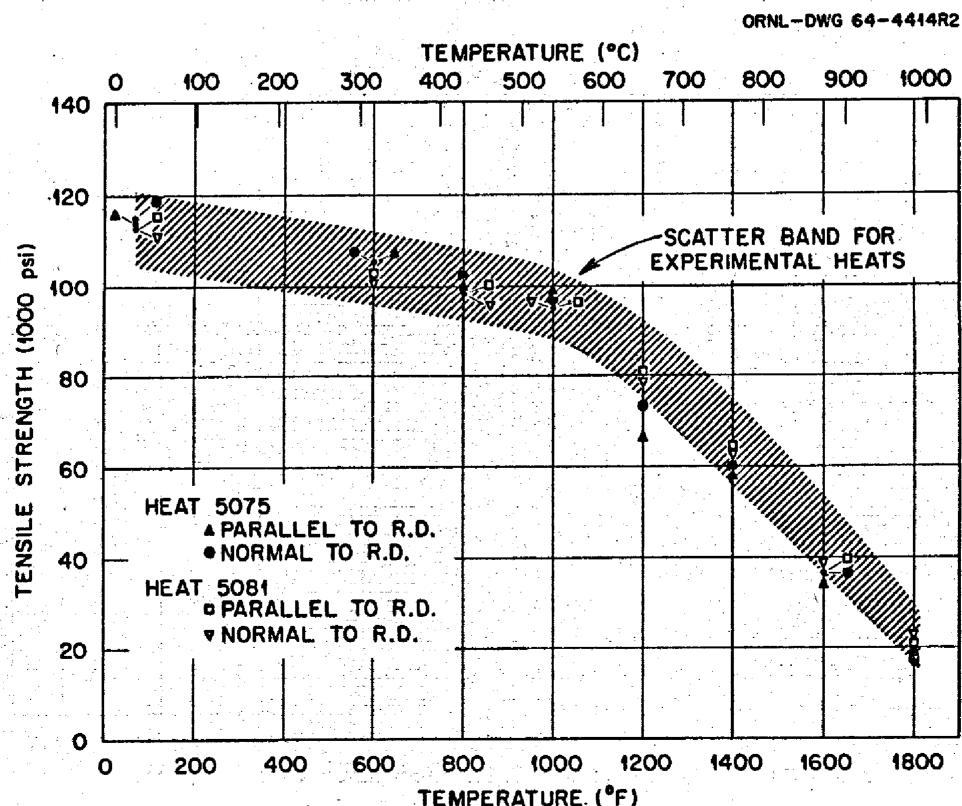  
Fig. 1. Tensile Strength at Various Temperatures of Hastelloy N.

summary of the ultimate strengths at temperatures from ambient to $1800^{\circ}\mathrm{F}$ for both types of material. Similar data on the $0.2\%$ offset yield strength are shown in Fig. 2. The values for fracture ductility are presented in Fig. 3. In all cases, the values for the commercial heats were well within the band obtained from the experimental heats. The values from both the longitudinal and transverse specimens are comparable, showing no anisotropy effects. Metallographic data indicate that the heats with low carbon, and consequently large grain size, tend to exhibit the lower strengths.

Tensile tests of notched specimens were performed using a notch radius of 0.005 in. The notched-to-unnotched strength ratios varied from 1.07 to 1.38 at test temperatures from ambient to $1500^{\circ}\mathrm{F}$ .

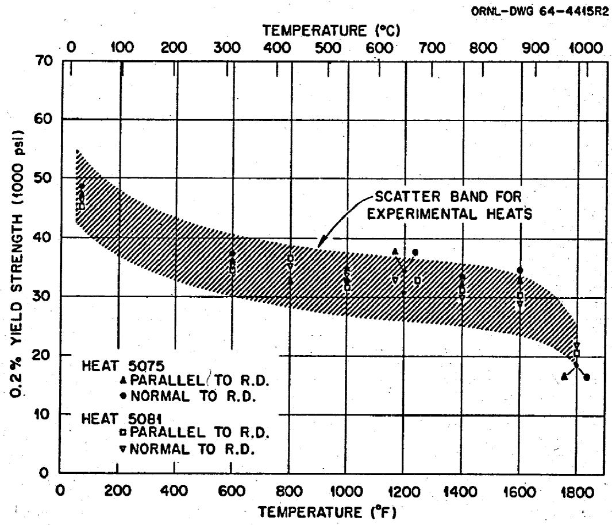  
Fig. 2. Yield Strength Values for Hastelloy N.

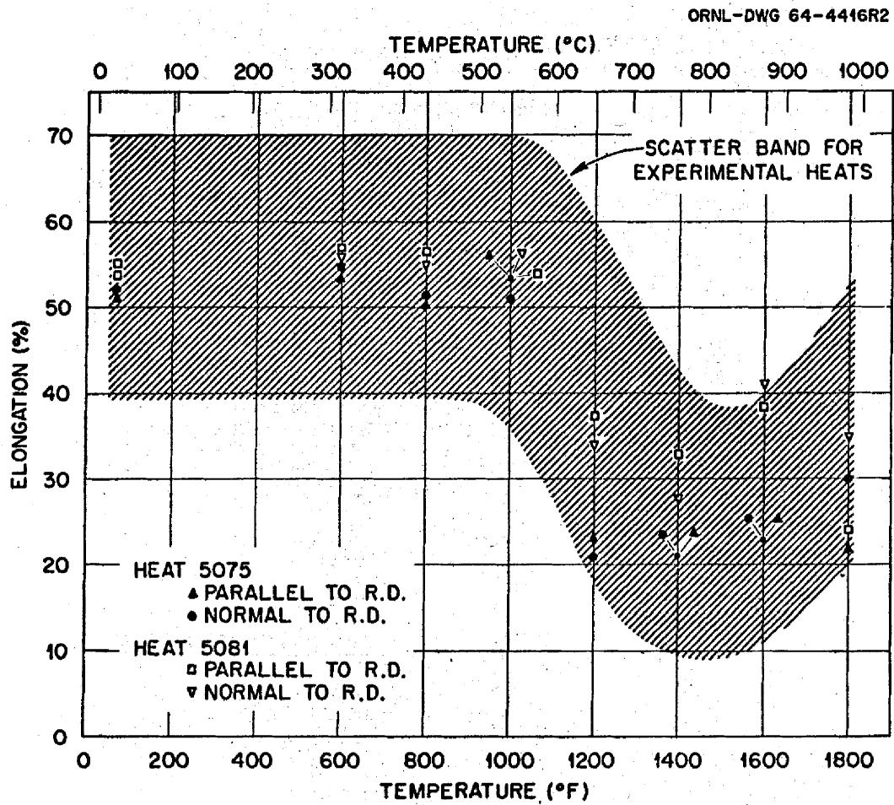  
Fig. 3. Total Elongation Values for Hastelloy N.

# Creep Properties

Creep-rupture tests were performed on sheet and rod specimens in both air and molten salts. Most of the testing was confined to the 1100 to $1300^{\circ}\mathrm{F}$ temperature range; however, a few tests were conducted at temperatures up to $1700^{\circ}\mathrm{F}$ . Summary curves representing stress vs minimum creep rate for the MSRE heats of Hastelloy N are shown in Fig. 4. These data for heat 5055 are plotted to show the time to various strains at $1300^{\circ}\mathrm{F}$ in Fig. 5. The rupture life of Hastelloy N plotted as a function of stress is shown in Fig. 6. The creep properties in molten-salt environments were not significantly different from those obtained in air.

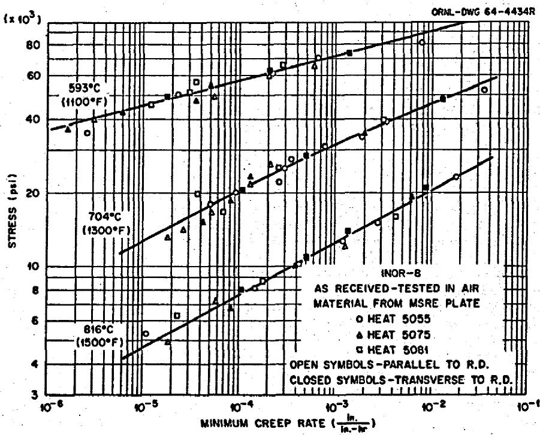  
Fig. 4. Effect of Stress on Minimum Creep Rate of Hastelloy N.

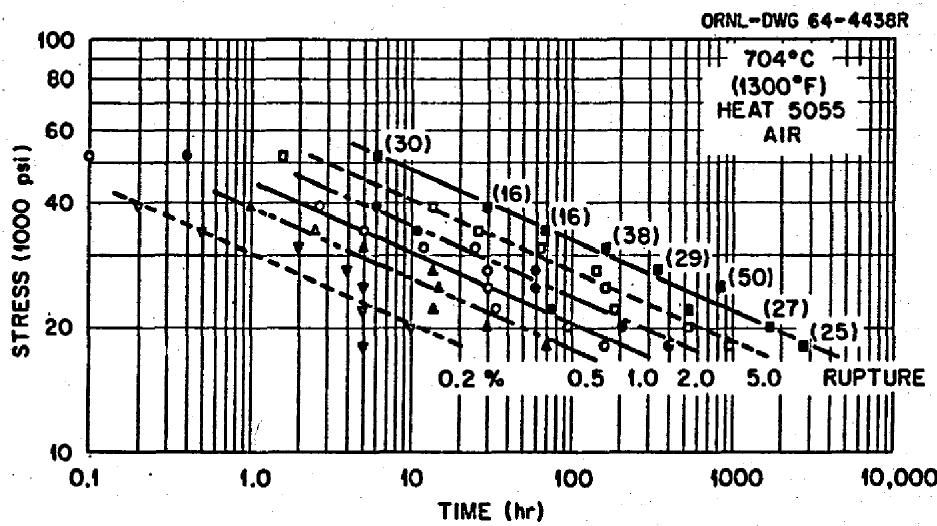  
Fig. 5. Time to Reach Various Strains for a Given Stress. Numbers in parentheses indicate fracture ductilities. (Open symbols - specimens parallel to rolling direction, closed symbols - specimens perpendicular to rolling direction.)

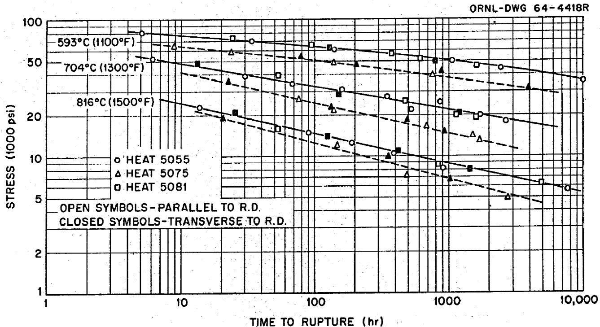  
Fig. 6. Rupture Life of Hastelloy N at Given Stresses and Temperatures.

# Fatigue Properties

Rotating-beam fatigue tests were conducted on Hastelloy N at 1100 and $1300^{\circ}\mathbf{F}$ by Battelle Memorial Institute.4 Grain size and frequency were the major variables studied. The results are shown in Figs. 7 and 8.

The thermal-fatigue behavior of the alloy was investigated at the University of Alabama. Figure 9 presents a graph of the plastic strain range vs cycles to failure, and the results are seen to obey a Coffin-type relation. The tests involved several maximum temperatures, as noted, as well as rapid cycling and hold-time cycling. Furthermore, the data were obtained from two specimen geometries. These data show good agreement with isothermal strain-fatigue data on this alloy.

An analysis of these same tests, based on a plastic strain energy criterion, indicates that the total plastic work for failure of Hastelloy N by fatigue is constant in this temperature range. The data have been plotted in Fig. 10 as plastic strain energy vs cycles to failure. It is seen that the data for 1300 and $1600^{\circ}\mathrm{F}$ fit curves having the same slope

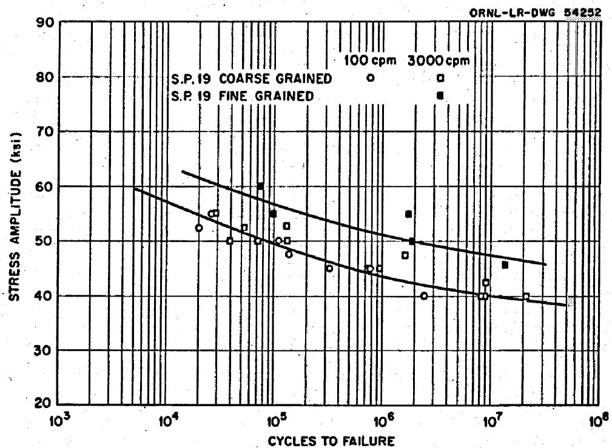  
Fig. 7. Fatigue Properties of Hastelloy N at $1300^{\circ}\mathbf{F}$ ; Rotating Beam.

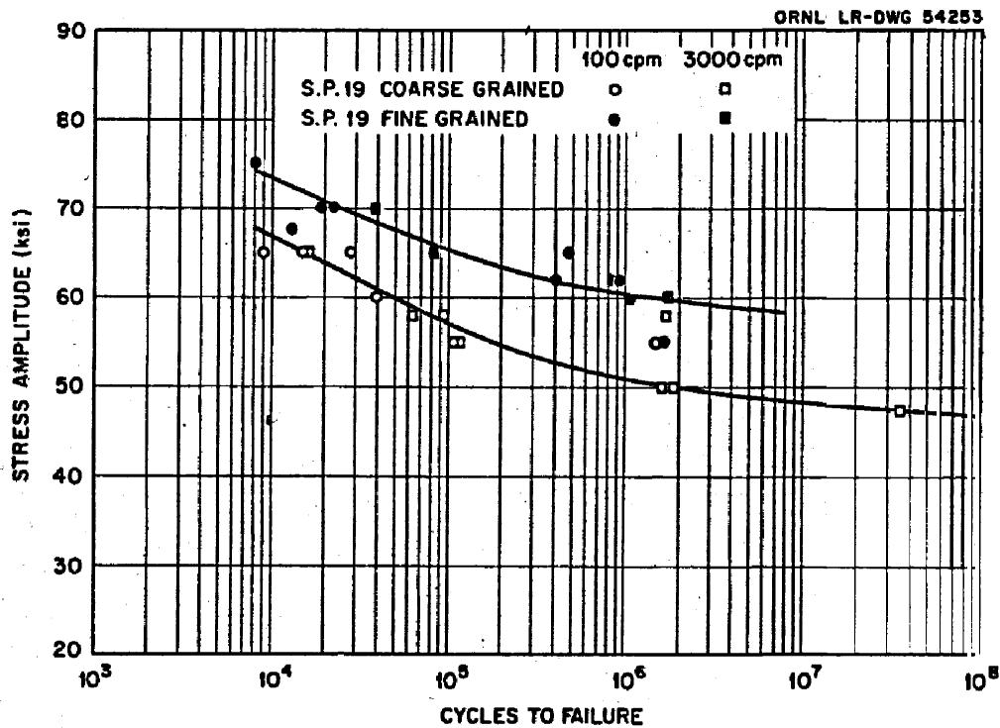  
Fig. 8. Fatigue Properties of Hastelloy N at $1100^{\circ}\mathrm{F}$ ; Rotating Beam.

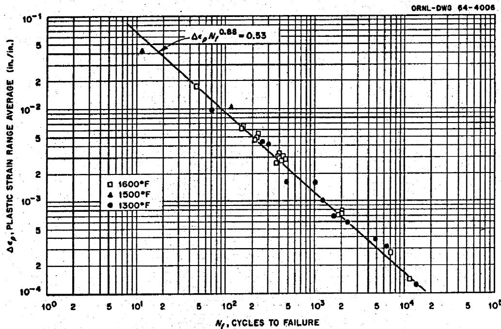  
Fig. 9. Effect of Strain Range on the Thermal Fatigue Life of Hastelloy N.

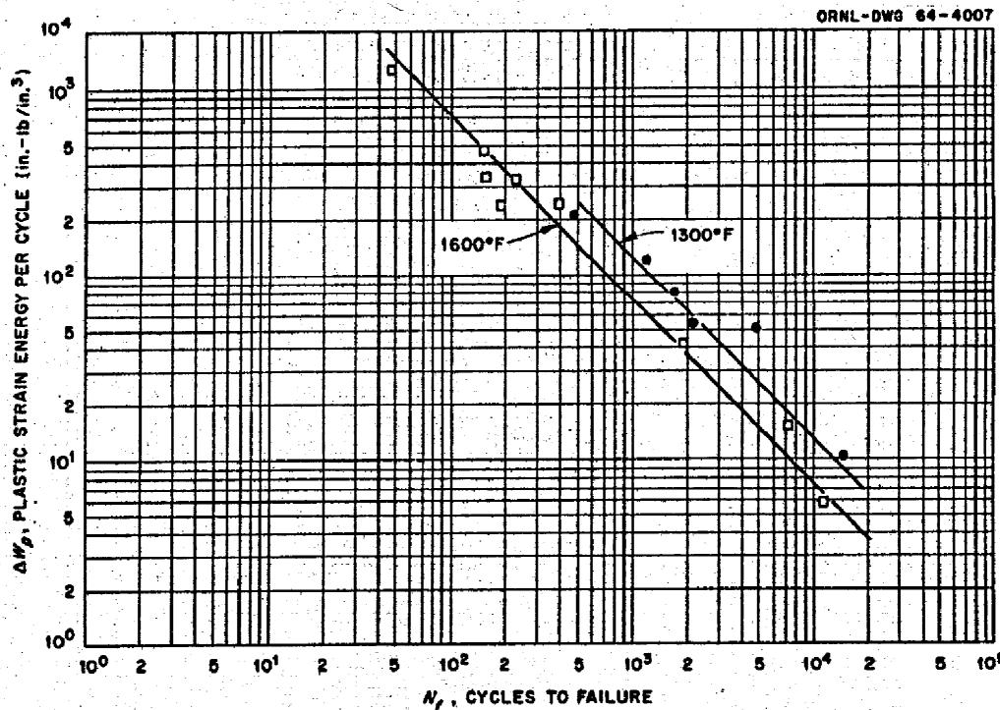  
Fig. 10. Relation of Plastic Strain Energy Absorbed per Cycle to the Fatigue Life of Hastelloy N.

(approximately -1) but different intercepts. The intercept values (at $N_{f} = 1/2$ ) are in fair agreement with plastic strain energy values derived from tensile tests at the appropriate temperatures.

# Effects of Irradiation

Although it has been shown that Hastelloy N has suitable properties for long-time use at high temperatures, a deterioration of high-temperature properties occurs in a high neutron-radiation field. We have found that Hastelloy N is susceptible to a type of high-temperature irradiation damage that reduces the creep-rupture life and the rupture ductility. Data from in-reactor creep-rupture tests run on a heat of MSRE material are presented in Fig. 11. The rupture life has been reduced by a factor of 10 and the rupture ductility to strains of 1 to $3\%$ . There is, however, an indication that the radiation effect becomes less as the stress levels are reduced.

5W. R. Martin and J. R. Weir, Effect of Elevated Temperature Irradiation on the Strength and Ductility of the Nickel-Base Alloy, Hastelloy N, ORNL-TM-1005 (1965).

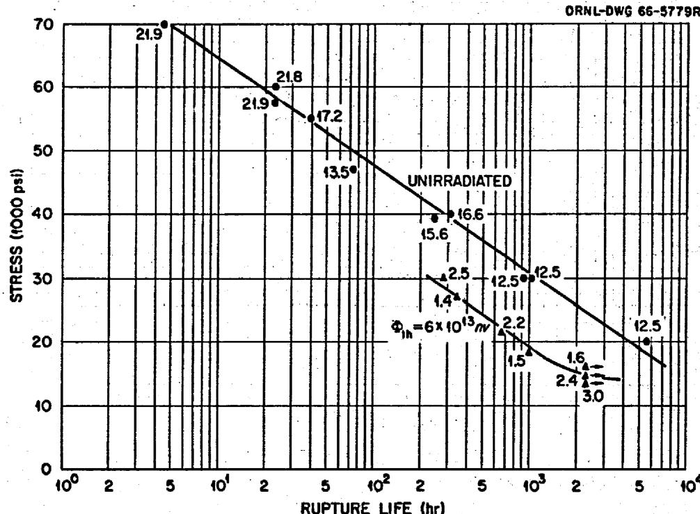  
Fig. 11. Creep-Rupture Properties of Hastelloy N at $650^{\circ}\mathrm{C}$ , Heat 5065. Numbers indicate rupture strains.

The amount of damage present is a function of the thermal flux and is essentially independent of fast flux. This supports the hypothesis that the damage is due to the thermal neutrons with the $^{10}\mathrm{B}$ transmutation to lithium and helium thought to be the most probable reaction. The helium collects in the grain boundaries and promotes the formation of intergranular cracks. This type of irradiation damage has been found to be quite general for iron- and nickel-base structural alloys.[6]

Helium may be formed in Hastelloy N from two sources. The normal alloys contain 30 to 100 ppm B; and, when exposed to thermal neutrons, the transmutation of the $^{10}\mathrm{B}$ just discussed is by far the predominant source of helium. A second source is the $(n,\alpha)$ reactions of fast neutrons with nickel, molybdenum, and iron. This source of helium predominates after all the $^{10}\mathrm{B}$ has been transmuted (requiring a thermal dose of approximately $10^{21}$ neutrons/cm $^2$ ) or in materials where the $^{10}\mathrm{B}$ content is extremely low.

In the reference MSBR there is no stressed metal in the core and the Hastelloy N is shielded from the core by the breeder blanket. Most of the neutrons reaching the metal will originate as delayed neutrons that are born with too low an energy level to produce the fast neutron reactions. Therefore, the best way to reduce the amount of helium in the metal is to reduce the boron content.

The main source of boron in commercial alloys is the melting crucible, and we have found that with reasonable care commercial heats can be prepared with boron in the range 1-5 ppm. However, the properties of irradiated metal of this low boron content are no better than those of metal containing 50 ppm B, indicating that the threshold helium levels necessary for damage can be produced in metal containing below 1 ppm B. Hence, it appears that reducing the boron level alone is not an adequate solution to the problem.

We have found that the resistance of Hastelloy N to irradiation damage can be improved by slight changes in chemical composition. A reduction in the molybdenum content seems desirable to prevent the formation of massive $\mathbf{M}_6\mathbf{C}$ in the alloy. Figure 12 shows the simpler microstructure of the alloy containing $12\%$ Mo. Further increases in the

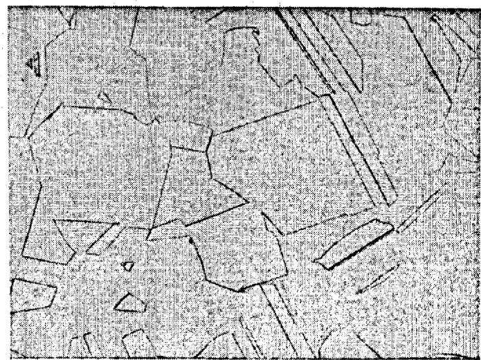  
10% Mo

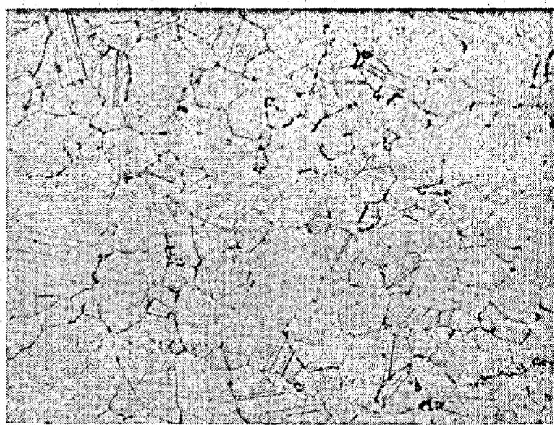  
0.035 INCHES 1   
14% Mo

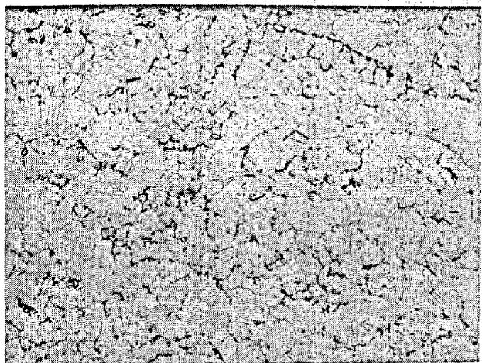  
$16 \%$ Mo

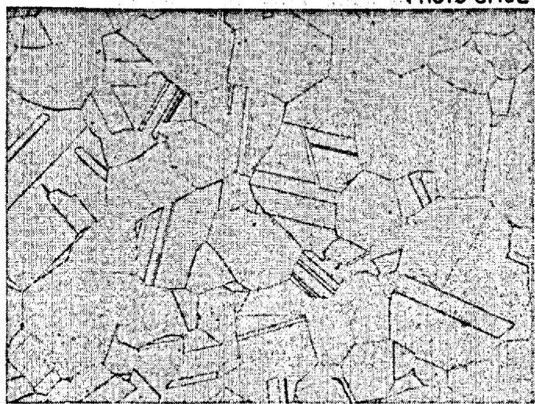  
PHOTO 87192  
12% Mo   
Fig. 12. Effect of Molybdenum Content on the Microstructure of Ni-7% Cr-0.2% Mn-0.05% C Alloys After Annealing 1 hr at $2150^{\circ}$ F.

molybdenum content result in the formation of the molybdenum-rich $\mathbf{M}_6\mathbf{C}$ and have little effect on strength. The addition of small amounts (approx 0.5 wt %) of Ti, Zr, and Hf reduces the irradiation damage problem significantly. Figure 13 illustrates the fact that several alloys have been developed with properties after irradiation that are superior to those of unirradiated standard Hastelloy N. We are beginning work to optimize the compositions and heat treatments for these alloys. We are also initiating the procurement of 1500 lb commercial melts of some of the more attractive compositions.

The ex-reactor properties of the modified Hastelloy N seem very attractive. Strengths are slightly better than standard Hastelloy N and fracture ductilities are about double. The weldability of the titanium- and hafnium-bearing alloys appears excellent; however, we realize that welds need to be made under higher restraint and in larger sections than

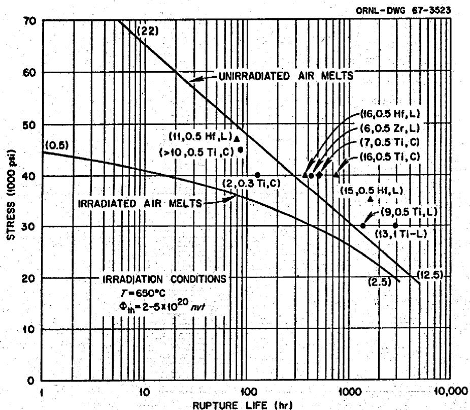  
Fig. 13. Comparison of the Postirradiation Creep Properties of Several Hastelloy N Alloys at $1202^{\circ}\mathrm{F}$ . The first number indicates the fracture strain, the second indicates the alloy addition, and the third indicates the source, C = commercial, L = laboratory.

have been studied thus far. The zirconium addition appears very detrimental to the weldability with extensive weld metal cracking resulting. Thus we feel that the further development of the zirconium-bearing alloy must await the development of a suitable filler metal.

# Corrosion by Molten Fluoride Salts

A unique feature of the molten-salt type reactors is the circulation of molten salts both as the fuel and the coolant media. The salts being used are mixtures of metal fluorides. Essentially no experience is available from industry on handling such salt mixtures at the proposed temperatures, but much information has been produced at ORNL.

Studies on molten fluoride mixtures for reactor applications began in the early 1950's and gave primary consideration to the compatibility of these salt mixtures with structural materials. In the intervening 15 years, an extensive corrosion program has been conducted at ORNL with several families of fluoride mixtures using both commercial and developmental high-temperature alloys.[7-15] As a consequence, the corrosion

7L. S. Richardson et al., Corrosion by Molten Fluorides, ORNL-1491 (Mar. 17, 1953).   
$^{8}$ G. M. Adamson et al., Interim Report on Corrosion by Alkali-Metal Fluorides: Work to May 1, 1953, ORNL-2337.   
$^9 G$ . M. Adamson et al., Interim Report on Corrosion by Zirconium-Base Fluorides, ORNL-2338 (Jan. 31, 1961).   
10W. B. Cottrell et al., Disassembly and Postoperative Examination of the Aircraft Reactor Experiment, ORNL-1868 (Apr. 2, 1958).   
11W. D. Manly et al., Aircraft Reactor Experiment - Metallurgical Aspects, ORNL-2349 (Dec. 20, 1957) pp. 2-24.   
12W. D. Manly et al., Prog. in Nucl. Energy, Ser. IV 2, 1964 (1960).   
13J. A. Lane et al., pp. 595-604 in Fluid Fuel Reactors, Addison-Wesley, Reading, Pa., 1958.   
14Molten-Salt Reactor Program Status Report, ORNL-CF-58-5-3, pp. 112-13 (May 1, 1958).   
15J. H. DeVan and R. B. Evans III, "Corrosion Behavior of Reactor Materials in Fluoride Salt Mixtures," pp. 557-79 in Conference on Corrosion of Reactor Materials, June 4-8, 1962, Vol. II, International Atomic Energy Agency, Vienna, 1962.

technology for the molten-salt reactor concept is now in an advanced stage of development. Furthermore, container materials are available that have shown extremely low corrosion rates in fluoride mixtures at temperatures considerably above the 1000 to $1300^{\circ}\mathrm{F}$ range proposed for the MSBR.

Unlike more conventional oxidizing media, the products of oxidation of metals by molten fluorides tend to be completely soluble in the corroding media; hence, passivation is precluded, and corrosion depends directly on the thermodynamic driving force of the corrosion reactions. Design of a chemically stable system utilizing fluoride salts, therefore, requires the selection of salt constituents that are not appreciably reduced by available structural metals and the development of containers whose components are in near thermodynamic equilibrium with the salt medium. In practical applications, the major source of corrosion by fluoride mixtures has derived from trace impurities in the melt rather than the major salt constituents. These impurities may originate within the melt or from oxide films or other contaminants on the metal surface. Further details concerning corrosion mechanisms in fluoride melts have been presented previously.[15]

Corrosion data on Hastelloy N in LiF-BeF $_2$ based salts have been generated in out-of-reactor thermal- and forced-convection loops, in-reactor capsules, and more recently the MSRE.

# Loop Studies

The original studies that serve as a base for the MSBR corrosion studies were conducted at ORNL as part of the Aircraft Nuclear Propulsion Project.[7-13] Work on this project was aimed at a $1500^{\circ}\mathrm{F}$ maximum temperature. Nickel alloys were shown to be the most promising for containing the fluorides; however, strength considerations restricted the candidate materials to the commercial nickel-chromium group, with Inconel 600 receiving the most attention. These alloys incurred corrosion by selective oxidation of chromium through trace impurities and by mass transfer of chromium through a redox reaction involving $\mathrm{UF_4}$ . Corrosion was in the form of subsurface voids with the depth proportional to the test time and temperature.

Using information gained in corrosion testing of the commercial alloys and from fundamental interpretations of the corrosion process, an alloy was developed at ORNL to provide improved corrosion resistance as well as acceptable mechanical properties. The alloy system used as the basis for this development was composed of nickel with a primary strengthening addition of 15 to $20\%$ Mo. Evaluations of other strengthening additions culminated in the selection of an alloy containing $16\%$ Mo, $7\%$ Cr, and $4\%$ Fe (INOR-8, now Hastelloy N).

The corrosion testing program for Hastelloy N involved three sequential phases. In the first phase, the corrosion properties of 13 fluoride salt mixtures were compared in Hastelloy N thermal-convection loops operated for 1000 hr. Specific salt mixtures, whose compositions are listed in Table 4, were selected to provide an evaluation of (1) the corrosion properties of beryllium-bearing fuels, (2) the corrosion properties of beryllium-fluoride mixtures containing large quantities of thorium, and (3) the corrosion properties of nonfuel-bearing fluoride coolant salts. The second phase of testing, which again used thermal-convection loops, involved more extensive investigations for longer time periods and at two temperature levels. The third phase of the testing was conducted in forced-circulation loops at flow rates and temperature conditions simulating those of an operating reactor system. These loops operated with maximum fuel-salt temperatures of 1250 to $1500^{\circ}\mathrm{F}$ , maximum coolant-salt temperatures of 1050 to $1200^{\circ}\mathrm{F}$ , and all with approximately $200^{\circ}\mathrm{F}$ temperature drops. A total of 49 thermal loops and 15 forced-circulation loops were operated during these phases of the program.

Essentially no attack or deposition was found with any of the fluorides in Hastelloy N loops in the phase-I studies. The maximum attack found after 8760 hr in the phase-II tests was a limited surface roughening and pitting to a depth of $1/2$ mil. Attack in most cases was accompanied by a thin surface layer. The typical appearance of a hot-leg surface is shown in Fig. 14. No deposit or other evidence of mass transfer was found in any of the cold legs.

In the third phase of the program, employing forced-convection loops, tubular inserts in the heated sections of some of the loops provided information about the weight losses occurring during the tests. Salt samples

Table 4. Compositions of Molten-Salt Mixtures Tested for Corrosiveness in Thermal-Convection Loops   

<table><tr><td rowspan="2">Salt Mixture</td><td colspan="7">Composition, mole %</td></tr><tr><td>NaF</td><td>LiF</td><td>KF</td><td>ZrF4</td><td>BeF2</td><td>UF4</td><td>ThF4</td></tr><tr><td></td><td colspan="7">Fuel and Blanket Salts</td></tr><tr><td>122</td><td>57</td><td></td><td></td><td>42</td><td></td><td>1</td><td></td></tr><tr><td>129</td><td>55.3</td><td></td><td></td><td>40.7</td><td></td><td>4</td><td></td></tr><tr><td>123</td><td>53</td><td></td><td></td><td></td><td>46</td><td>1</td><td></td></tr><tr><td>124</td><td>58</td><td></td><td></td><td></td><td>35</td><td></td><td>7</td></tr><tr><td>125</td><td>53</td><td></td><td></td><td></td><td>46</td><td>0.5</td><td>0.5</td></tr><tr><td>126</td><td></td><td>53</td><td></td><td></td><td>46</td><td>1</td><td></td></tr><tr><td>127</td><td></td><td>58</td><td></td><td></td><td>35</td><td></td><td>7</td></tr><tr><td>128</td><td></td><td>71</td><td></td><td></td><td></td><td></td><td>29</td></tr><tr><td>130</td><td></td><td>62</td><td></td><td></td><td>37</td><td>1</td><td></td></tr><tr><td>131</td><td></td><td>60</td><td></td><td></td><td>36</td><td>4</td><td></td></tr><tr><td>133</td><td></td><td>71</td><td></td><td></td><td>16</td><td></td><td>13</td></tr><tr><td>134</td><td></td><td>62</td><td></td><td></td><td>36.5</td><td>0.5</td><td>1</td></tr><tr><td>135</td><td>53</td><td></td><td></td><td></td><td>45.5</td><td>0.5</td><td>1</td></tr><tr><td>136</td><td></td><td>70</td><td></td><td></td><td>10</td><td>20</td><td></td></tr><tr><td>Bu-14 + 0.5 U</td><td></td><td>67</td><td></td><td></td><td>18.5</td><td>0.5</td><td>14</td></tr><tr><td></td><td colspan="7">Coolant Salts</td></tr><tr><td>12</td><td>11.5</td><td>46.5</td><td>42</td><td></td><td></td><td></td><td></td></tr><tr><td>84</td><td>27</td><td>35</td><td></td><td></td><td>38</td><td></td><td></td></tr></table>

taken from the pump bowls provided a semicontinuous indication of corrosion-product concentration in the circulating systems. $^{11}$ A summary of the operating conditions and results of the metallographic examination of the forced-circulation loops are presented in Table 5. Note that the operating times of these systems range from a minimum of 6500 hr to a maximum of 20,000 hr. Nine of the loops were operated for over 14,000 hr.

The corrosion rates of Hastelloy N in the pumped loops operating with maximum temperatures between 1300 and $1500^{\circ}\mathrm{F}$ (ref. 15) indicate that

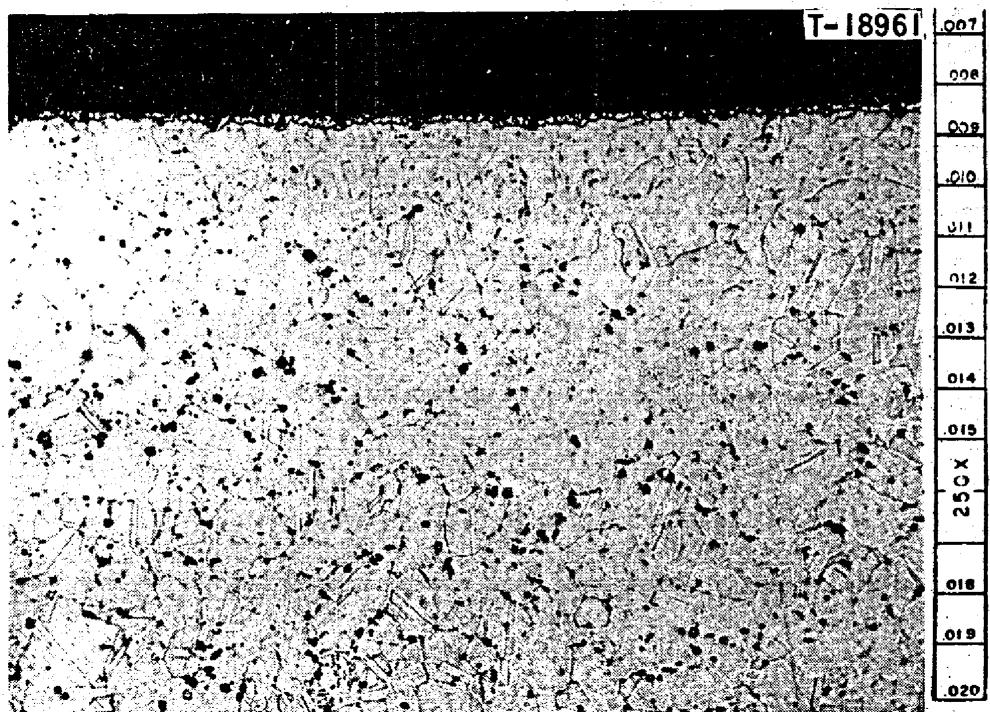  
Fig. 14. Appearance of Metallographic Specimen from Hot Leg $(1250^{\circ}\mathrm{F})$ of Hastelloy N Thermal-Convection Loop. Operating time: 8760 hr. Salt mixture: LiF-BeF $_2$ -UF $_4$ -ThF $_4$ (62-36.5-0.5-1 mole%). The small "voids" in the microstructure below the surface layer are microconstituents in the Hastelloy N which have been darkened and partially removed by metallographic etching.

corrosion reactions effectively go to completion in the first few thousand hours of loop operation. As shown in Table 6, weight losses in 10,000- and 15,000-hr tests in pumped loops containing $\mathrm{LiF - BeF_2 - UF_4}$ salts showed no measurable increase after the first 5000 hr of operation; furthermore, changes in concentrations of corrosion products in the circulating salt leveled off in the same time period. The temperature dependence of the maximum corrosion rate, as judged from total weight losses of specimens, was less than a factor of 5 over the temperature range investigated (Table 5). However, the metallographic appearance of the loop surfaces was noticeably affected by the test temperature. At the highest test temperature $(1500^{\circ}\mathrm{F})$ , Hastelloy N surfaces were depleted of chromium, as indicated by the appearance of shallow subsurface voids to a maximum depth of 4 mils. At 1300 and $1400^{\circ}\mathrm{F}$ , the surfaces exhibited no evidence of attack or other metallographic changes during the first 5000 hr of operation; at still longer test times a thin continuous intermetallic layer was

Table 5. Hastelloy N Operating Conditions of Forced-Convection Loops and Results of Metallographic Examinations of Loop Materials   

<table><tr><td>Loop Number</td><td>Duration of Test (hr)</td><td>Salt Mixturea</td><td>Maximum Fluid-Metal Interface Temperature (°F)</td><td>ΔT (°F)</td><td>Reynolds Number</td><td>Flow Rate (gal/min)</td><td>Results of Metallographic Examination</td></tr><tr><td>9354-1</td><td>14,563</td><td>126</td><td>1300</td><td>200</td><td>2000</td><td>2.5</td><td>Heavy surface roughening and pitting to 1 l/2 mils</td></tr><tr><td>9354-3</td><td>19,942</td><td>84</td><td>1200</td><td>100</td><td>3000</td><td>2.0</td><td>No attack, slight trace of metallic deposit in cooler coil</td></tr><tr><td>9354-4</td><td>15,140</td><td>130</td><td>1300</td><td>200</td><td>3000</td><td>2.5</td><td>No attack</td></tr><tr><td>9354-5</td><td>14,503</td><td>130</td><td>1300</td><td>200</td><td>3000</td><td>2.5</td><td>No attack</td></tr><tr><td>MSRP-6</td><td>20,000</td><td>134</td><td>1300</td><td>200</td><td>2300</td><td>1.5</td><td>Pitted surface layer to 2 mils</td></tr><tr><td>MSRP-7</td><td>20,000</td><td>133</td><td>1300</td><td>200</td><td>3100</td><td>1.8</td><td>Pitted surface layer to 1 mil</td></tr><tr><td>MSRP-8</td><td>9,633</td><td>124</td><td>1300</td><td>200</td><td>4000</td><td>2.0</td><td>No attack</td></tr><tr><td>MSRP-9</td><td>9,687</td><td>134</td><td>1300</td><td>200</td><td>2300</td><td>1.8</td><td>No attack</td></tr><tr><td>MSRP-10</td><td>20,000</td><td>135</td><td>1300</td><td>200</td><td>3400</td><td>2.0</td><td>Pitted surface layer to 1/2 mil</td></tr><tr><td>MSRP-11</td><td>20,000</td><td>123</td><td>1300</td><td>200</td><td>3200</td><td>2.0</td><td>Pitted surface layer to 1 mil</td></tr><tr><td>MSRP-12</td><td>14,498</td><td>134</td><td>1300</td><td>200</td><td>2300</td><td>1.8</td><td>No attack</td></tr><tr><td>MSRP-13</td><td>8,085</td><td>136</td><td>1300</td><td>200</td><td>3900</td><td>2.0</td><td>Heavy surface roughening and pitting</td></tr><tr><td>MSRP-14</td><td>9,800</td><td>Bu-14 + 0.5 U</td><td>1300</td><td>200</td><td></td><td></td><td>Pitted surface layer to 1/2 mil</td></tr><tr><td>MSRP-15</td><td>10,200</td><td>Bu-14 + 0.5 U</td><td>1400</td><td>200</td><td></td><td></td><td>Pitted surface layer to 2/3 mil</td></tr><tr><td>MSRP-16</td><td>6,500</td><td>Bu-14 + 0.5 U</td><td>1500</td><td>200</td><td></td><td></td><td>Moderate subsurface void formation to 4 mils</td></tr></table>

aSee Table 4.

Loop temperature gradient: $(360^{\circ}\mathbf{F})$ Flow rate: approximately 2.0 gal/min Reynolds number: approximately 3000

Table 6. Corrosion Rates of Inserts Located in the Hot Legs of Hastelloy N Forced-Convection Loops as a Function of Operating Temperature   

<table><tr><td>Loop Number</td><td>Salt a Mixture</td><td>Insert Temperature b (°F)</td><td>Time (hr)</td><td>Weight Loss per Unit Area (mg/cm2)</td><td>Equivalent Loss in Wall Thickness (μ)</td></tr><tr><td rowspan="3">9354-4</td><td rowspan="3">130</td><td rowspan="3">1300</td><td>5,000</td><td>1.8</td><td>2.0</td></tr><tr><td>10,000</td><td>2.1</td><td>2.3</td></tr><tr><td>15,140</td><td>1.8</td><td>2.0</td></tr><tr><td rowspan="3">MSRP-14</td><td rowspan="3">Bu-14</td><td rowspan="3">1300</td><td>2,200</td><td>0.7</td><td>0.8</td></tr><tr><td>8,460</td><td>3.8</td><td>4.3</td></tr><tr><td>10,570</td><td>5.1</td><td>5.8</td></tr><tr><td rowspan="2">MSRP-15</td><td rowspan="2">Bu-14</td><td rowspan="2">1400</td><td>8,770</td><td>11.2</td><td>12.7</td></tr><tr><td>10,880</td><td>10.0c</td><td>11.2</td></tr><tr><td rowspan="2">MSRP-16</td><td rowspan="2">Bu-14</td><td rowspan="2">1500</td><td>5,250</td><td>9.6</td><td>10.9</td></tr><tr><td>7,240</td><td>9.0c</td><td>9.1</td></tr></table>

Salt Compositions: 130 LiF-BeF2-UF4 (62-37-1 mole %) Bu-14 LiF-BeF2-ThF4-UF4 (67-18.5-14-0.5 mole %).   
bSame as maximum wall temperature.   
Average of two inserts.

faintly discernible. Figure 15 illustrates the metallographic appearance of hot-leg surfaces from Hastelloy N pumped loops after various operating times at $1300^{\circ}\mathbf{F}$ . Chemical analyses of exposed surfaces suggested that the layer was an intermetallic transformation product of the nickel-molybdenum system.

Although most of our work was with Hastelloy N, we looked at the behavior of several nickel-base alloys with variations of the Hastelloy N composition.[16] Several alloys were screened by thermal-convection loop tests at $1500^{\circ}\mathrm{F}$ in salt 107 (composition given in Table 7). The composition of these alloys and the depth of corrosion are shown in Fig. 16.

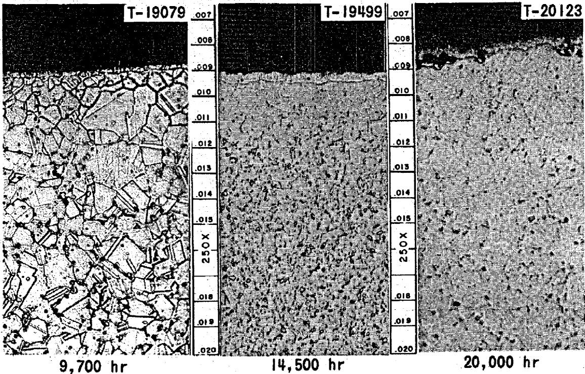  
Fig. 15. Effect of Operating Time on the Corrosion of Hastelloy N Forced-Convection Loops Operated with Mixtures of LiF-BeF $_2$ -UF $_4$ -ThF $_4$ (62-36.5-0.5-1 mole %). Maximum salt-metal interface temperature: $1300^{\circ}\text{F}$ . Loop $\Delta T$ : $200^{\circ}\text{F}$ . The differences in microstructure among the three specimens below the surface layer are attributable to differences in metallographic etching techniques rather than the test conditions.

Table 7. Composition of Fluoride Mixturea Used to Evaluate Experimental Nickel-Molybdenum Alloys   

<table><tr><td>Component</td><td>Mole %</td><td>Weight %</td></tr><tr><td>NaF</td><td>11.2</td><td>9.79</td></tr><tr><td>LiF</td><td>45.3</td><td>24.4</td></tr><tr><td>KF</td><td>41.0</td><td>49.4</td></tr><tr><td>UF4</td><td>2.5</td><td>16.3</td></tr></table>

Salt 107; liquidus temperature, $490^{\circ}C$ .

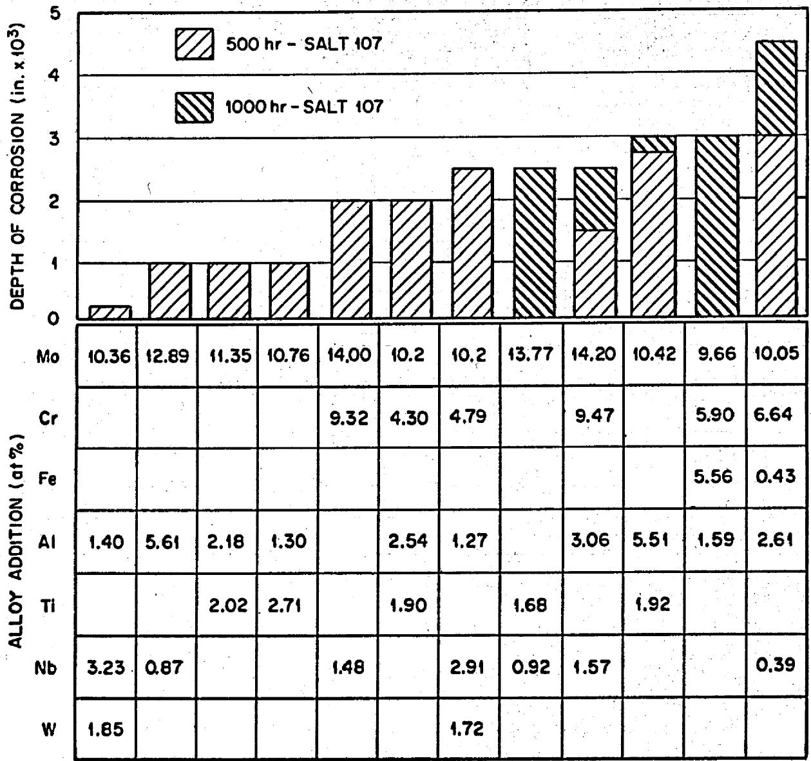  
Fig. 16. Depths of Corrosion Observed for Nickel-Molybdenum Alloys with Multiple Alloy Additions Following Exposure to Salt 107. Bars designating corrosion depths appear directly above the alloy compositions which they represent. (Where bars have both positively sloped and negatively sloped cross-hatching, the height of positively sloped cross-hatching indicates depth of corrosion after 500 hr and combined height of both types indicates depth after 1000 hr.)

Chromium increases the corrosion rate significantly. With chromium present, the addition of about 2 at. $\%$ Ti does not appear to increase the corrosion rate. Hence, we feel that the small titanium addition that we are making will not be harmful at $1300^{\circ}\mathbf{F}$ .

# MSRE Operating Experience

The MSRE initially underwent a series of zero- and low-power tests. The chemical analyses of the MSRE fuel and coolant salts showed very little change, indicating a low corrosion rate of the Hastelloy N and negligible transfer of impurities from the graphite to the salt. This was substantiated by the examination of graphite and metal specimens after the initial tests.

The full-power operation of the reactor began in March 1965. The first group of metal and graphite surveillance specimens was removed in July 1966 after exposure to the reactor core environment for 7612 Mwhr which included a thermal exposure of $4800\mathrm{hr}$ at $1200^{\circ}\mathrm{F}$ . The peak thermal dose was $1.3 \times 10^{20}$ neutrons/ $\mathrm{cm}^2$ and the peak fast dose $>1.2$ Mev was $3 \times 10^{19}$ neutrons/ $\mathrm{cm}^2$ . The concentration of chromium in the fuel salt increased from an initial value of 37 to 48 ppm where it remained fairly steady during the 7612 Mwhr run. The iron and nickel concentrations remained constant at values of 10 and 1 ppm, respectively. Visual examination indicated the metal and graphite specimens to be in excellent condition. Machining marks were quite visible on the graphite specimens. Several of the graphite and metal specimens were given to the Reactor Chemistry Division for analysis with respect to fission product content.[17] The graphite specimens have been stored and mechanical property tests will be run in the near future. The Hastelloy N specimens were examined metal-lographically and subjected to tensile and creep-rupture tests. Control specimens for comparison purposes were exposed to MSRE-type fuel salt and duplicated the thermal history of the in-reactor specimens.

Metallographic examination of the Hastelloy N showed the presence of a surface film at points where the graphite and Hastelloy N were in intimate contact. This product is shown in Fig. 17 and was present on both the surveillance and the control specimens. Electron microprobe examination showed that the carbon content of the edge of the specimen ranged from 0.3 to 1.2 wt % compared with a value of 0.05% for the interior of the sample. No evidence of attack or carburization was found on

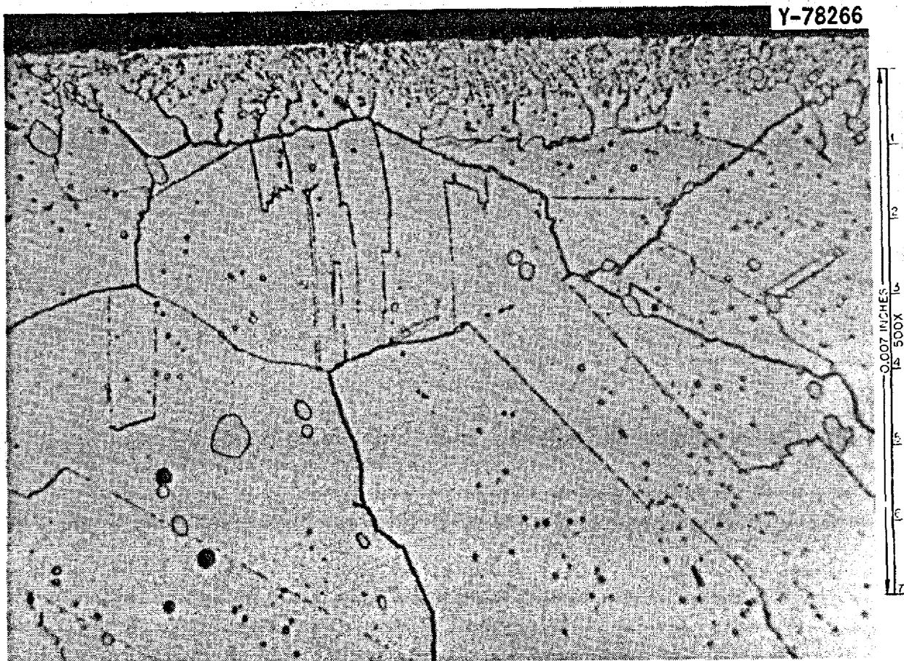  
Fig. 17. Edge of Hastelloy N Specimen Exposed to Molten Salt for 4800 hr at $1200^{\circ}\mathrm{F}$ . Surface in intimate contact with graphite. Etchant: glyceria regia.

metal surfaces that were separated from the graphite 1/16 in. This carburization is not a concern for the MSRE since we were aware of the problem before the reactor was built and placed sacrificial shims between the graphite and metal where contact was necessary.

Several of the surveillance and control specimens were evaluated by tensile tests. The total elongation at fracture when deformed at a strain rate of $0.05\mathrm{min}^{-1}$ is shown as a function of temperature in Fig. 18. Both heats show some reduction in ductility at low temperatures in the irradiated condition with a greater reduction being observed for heat 5085. At temperatures above $932^{\circ}\mathrm{F}$ , the ductility of the irradiated and the control material decreased with increasing temperature, with the irradiated material showing a greater loss in ductility. At temperatures above 1202 to $1292^{\circ}\mathrm{F}$ , the control material exhibited improved ductility, whereas the ductility of the irradiated material continued to decrease.

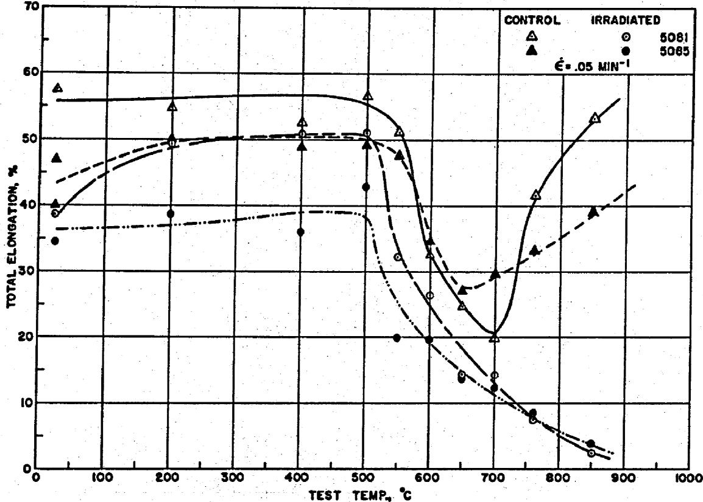  
Fig. 18. Comparative Tensile Ductilities of MSRE Surveillance Specimens and Their Controls at a Strain Rate of $0.05\mathrm{min}^{-1}$ .

We compared the ductilities of the surveillance specimens with those for specimens irradiated in other experiments without salt present. Heat 5081 had been irradiated previously in the ORR.[18] The ORR experiment was run at $1292^{\circ}\mathrm{F}$ to a thermal dose of $9 \times 10^{20}$ neutrons/ $\mathrm{cm}^2$ and the material was in the as-received condition. The MSRE surveillance specimens were run at $1202^{\circ}\mathrm{F}$ to a thermal dose of $1.3 \times 10^{20}$ neutrons/ $\mathrm{cm}^2$ and the preirradiation anneal was different. However, none of these differences are thought to be particularly significant and the results can be compared. Figure 19 shows that the postirradiation ductilities of heat 5081 after both experiments are very similar.

Several of the surveillance specimens were evaluated by creep-rupture tests. The results of these tests are shown in Fig. 20. The specimens

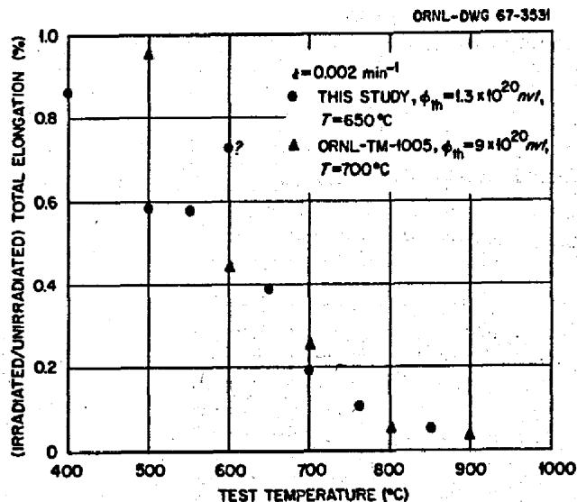  
Fig. 19. Comparative Effects of Irradiation in MSRE and ORR on the Ductility of Hastelloy N, Heat 5081.

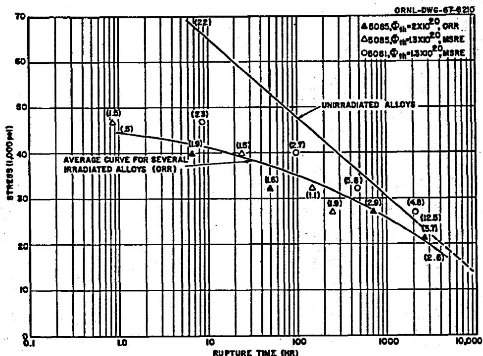  
Fig. 20. Comparison of MSRE Surveillance Specimens with Specimens Irradiated in the ORR. Numbers in parentheses indicate ductilities.

from the MSRE had properties very similar to those observed for specimens irradiated to comparable doses in the ORR.

The most important question to be answered concerning these data is how they apply to the operation of the MSRE.

The surveillance specimens were exposed to a thermal dose of $1.3 \times 10^{20}$ neutrons/cm². (The MSRE vessel will reach this dose after about 150,000 Mwhr of operation.) This burned out about $30\%$ of the $^{10}\mathrm{B}$ and produced a helium content of about $10^{-5}$ atom fraction in both heats. The high-temperature tensile and creep-rupture properties are exactly what we would expect for this dose. Our work indicates a saturation in the degree of radiation damage at a helium atom fraction of about $10^{-5}$ and we feel that the properties of the material will not deteriorate further. The low-temperature ductility reduction was not expected. It is thought to be a result of grain-boundary precipitates forming due to the long thermal exposure. Irradiation plays some role in this process that is yet undefined. The low-temperature properties are not "brittle" by any standards, but will be monitored closely when future sets of surveillance specimens are removed.

The MSRE has since operated for a total of approximately 32,500 Mwhr. The chromium content of the salt has been somewhat higher during this run at approximately 60 ppm. We removed a group of surveillance specimens (graphite and Hastelloy N) for study about May 15, 1967. The Hastelloy N removed was of the modified type, with small additions of titanium and zirconium. The graphite and metal specimens will be evaluated with respect to corrosion, metallographic changes, mechanical properties, and fission product absorption.

# Resistance to Gaseous Contaminants

# Oxidation Resistance

The oxidation resistance of nickel-molybdenum alloys depends on the service temperature, the temperature cycle, the molybdenum content, and the chromium content. The oxidation rate of the binary nickel-molybdenum alloy passes through a maximum for the alloy containing $15\%$ Mo, and the scale formed by the oxidation is $\mathrm{NiMoO_4}$ and NiO. Upon thermal cycling

from above $1400^{\circ}\mathbf{F}$ to below $660^{\circ}\mathbf{F}$ , the $\mathrm{NiMoO_4}$ undergoes a phase transformation that causes the protective scale on the oxidized metal to spall. Subsequent temperature cycles then result in an accelerated oxidation rate. Similarly, the oxidation rate of nickel-molybdenum alloys containing chromium passes through a maximum as the chromium content of the alloys is increased from 2 to $6\%$ Cr. Alloys containing more than $6\%$ Cr are insensitive to thermal cycling and to the molybdenum content because the oxide scale is predominantly stable $\mathrm{Cr_2O_3}$ . An abrupt decrease (by a factor of about 40) in the oxidation rate at $1800^{\circ}\mathbf{F}$ is observed when the chromium content is increased from 5.9 to $6.2\%$ .

The oxidation resistance of Hastelloy N is excellent, and continuous operation at temperatures up to $1800^{\circ}\mathbf{F}$ is feasible. Intermittent use at temperatures as high as $1900^{\circ}\mathbf{F}$ could be tolerated. For temperatures up to $1200^{\circ}\mathbf{F}$ , the oxidation rate is not measurable; it is essentially zero after 1000 hr of exposure in static air, as well as in nitrogen containing small quantities of air (the MSRE cell environment). It is estimated that oxidation of 0.001 to 0.002 in. would occur in 100,000 hr of operation at $1200^{\circ}\mathbf{F}$ . The effect of temperature on the oxidation rate of the alloy is shown in Fig. 21.

# Resistance to Nitriding

Hastelloy N does not react noticeably with nitrogen at temperatures up to $2200^{\circ}\mathrm{F}$ in the absence of irradiation. However, in a neutron environment, the nitrogen is dissociated and some shallow surface reaction (a few mils) is encountered. Although only limited data are available, there appears to be a considerable variation in the depth of such layers with various lots of material. While such layers are not thick enough in themselves to affect the strength of the proposed components, they are brittle and crack easily, so that they could possibly act as stress risers.

# Compatibility with Superheated Steam

In parts of the system Hastelloy N will be exposed to supercritical steam having a maximum temperature of $1050^{\circ}\mathbf{F}$ and a pressure of 3800 psi. Some heat exchange equipment will have coolant salt on one side and steam

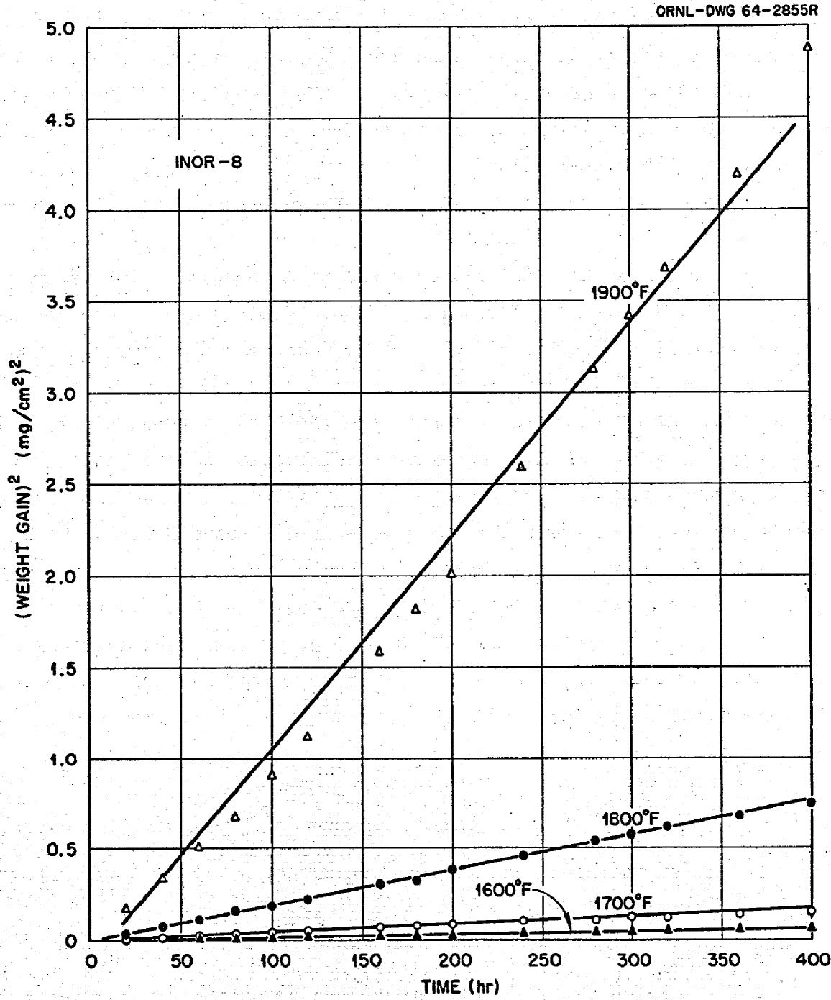  
Fig. 21. Effect of Temperature on Oxidation of Hastelloy N.

on the other side. Because of the higher pressure of the steam, a failure in the Hastelloy N would result in steam being forced into the coolant-salt circuit. Thus, we cannot adopt the "cheap material and frequent maintenance" policy of the power industry. The stress-corrosion type of failure in boiling water and in superheated steam systems has been observed for the austenitic stainless steels in several nuclear systems.[19,20] The resistance of high-nickel alloys to this type of attack has also been established and it seems reasonable that our system should utilize such an alloy.[19,20]

Hastelloy N has been included in steam-metal compatibility programs at BNWL, $^{21,22}$ and some of the results of these studies are summarized in Table 8. Hastelloy N exhibited much better resistance to corrosion by steam than type 304L stainless steel. It also compared very favorably with the other nickel-base alloys that were included in these evaluation programs (e.g., Hastelloy X, Inconel 600, and Incoloy 800). Although the depth of attack varied slightly with steam pressure and oxygen content, a rather pessimistic value for the corrosion rate is about 0.1 mil attack in 2400 hr. Assuming a linear rate of attack, which again is on the pessimistic side, the depth of attack in 20 years would be about 7 mils. Assuming the more realistic parabolic behavior, the expected depth of attack would be only 0.8 mil. Either of these values is quite acceptable and we feel that Hastelloy N is a very attractive material for use in the steam circuit.

Table 8. Summary of Data on the Corrosion of Hastelloy N in Steam   

<table><tr><td rowspan="3">Environment and Test Conditions</td><td colspan="4">Test Results</td></tr><tr><td colspan="2">Weight Gain (mg/cm2)</td><td colspan="2">Oxide Penetration (mil)</td></tr><tr><td>Hastelloy N</td><td>Type 304L Stainless Steel</td><td>Hastelloy N</td><td>Type 304L Stainless Steel</td></tr><tr><td>Superheated steam, 1022°F, 3000 psi, 1062 hr</td><td>0.57</td><td>2.20</td><td></td><td></td></tr><tr><td>Deoxygenated steam, 932°F, 3000 psi, 2400 hr</td><td></td><td></td><td>0.08</td><td>3.3</td></tr><tr><td>932°F, 5000 psi, 2400 hr (&lt; 50 ppb), 1022°F, 3000 psi, 2400 hr</td><td></td><td></td><td>0.04</td><td>0.14</td></tr><tr><td></td><td></td><td></td><td>0.08</td><td>0.33</td></tr><tr><td>Oxygenated steam, (3 to 4 ppm), 1022°F, 3000 psi, 2400 hr</td><td></td><td></td><td>0.15</td><td>0.37</td></tr><tr><td>Helium plus 15 torrs water vapor, 1500°F, 300 hr, ~1 atm pressure</td><td>0.109</td><td></td><td></td><td></td></tr></table>

# Fabrication of Hastelloy N Systems and Components

The fact that Hastelloy N is a material from which a complicated reactor system may be constructed has been demonstrated by the successful construction and operation of the MSRE. Evidence of its general recognition by industry is demonstrated by its acceptance and approval by the ASME Boiler and Pressure Vessel Code.

# Raw Material Fabrication

Hastelloy N has proven to be readily fabricable into the many raw material forms (pipe, tube, plate, bar, castings, etc.) required in the fabrication of a complex engineering system such as a nuclear reactor. Fabrication of the various raw material items required for the MSRE was by normal commercial sources. Forming techniques developed for austenitic stainless steels can usually be used for Hastelloy N with a small increase in temperature.

Melting and casting is carried out by using conventional practices for nickel and its alloys. Ingots for the MSRE were prepared by both air- and vacuum-induction or consumable arc melting. Individual melts up to 10,000 lb and a total quantity of almost 200,000 lb were produced. Castings have been made in molds of water-cooled copper, graphite, rammed magnesia, cast iron, and sand. While castings are considerably weaker than wrought metal at room temperature, they are slightly stronger at MSBR operating temperatures. It is easier to control the chemical analysis by vacuum melting and the metal has better mechanical properties and fabricability. Vacuum melting has become a common commercial practice during the last few years, and this melting practice will probably be used in preference to air melting in the future for nuclear grade materials.

In making the many different forms and sizes of material required during the development and construction of the MSRE, Hastelloy N was fabricated using the normal techniques for nickel-base alloys. The initial fabrication or breaking down of the ingots was accomplished by forging, or extrusion. Temperatures varied from 1825 to $2250^{\circ}\mathrm{F}$ . Secondary fabrication was accomplished hot and cold. Acceptable techniques included rolling, swaging, tube reducing, and drawing. The alloy work hardens

when fabricated cold, but reductions in area of up to $50\%$ are possible between anneals. Temperatures of 2100 to $2200^{\circ}\mathrm{F}$ are used for hot rolling with reductions of about $10\%$ per pass.

The standard finished annealing temperature for this alloy is $2150^{\circ}\mathrm{F}$ . All material for the MSRE was annealed after forming or working. After final fabrication, all material was stress relieved at $1600^{\circ}\mathrm{F}$ . For any heat treatment the cooling rate to $600^{\circ}\mathrm{F}$ was limited to $400^{\circ}\mathrm{F}$ per hour per inch of thickness. The slow cooling helped to impart dimensional stability and improved the ductility in the 1400 to $1800^{\circ}\mathrm{F}$ range.

A necessary adjunct of fabrication is an inspection to demonstrate the acceptance of the product. Products fabricated from Hastelloy N may be inspected with the same nondestructive testing procedures used for other high-nickel alloys or austenitic stainless steels. Tubing and pipe received for the MSRE were inspected using liquid penetrants, eddy currents, and ultrasonic techniques.

# Welding and Brazing of Hastelloy N

Extensive experience with Hastelloy N has shown that it exhibits relatively good weldability. The MSRE contains literally hundreds of satisfactory tungsten-arc welds in varied section sizes. The welds were made using procedures developed at ORNL for nuclear-quality applications. The subsequent inspection of these welds showed that they met the very tight ORNL requirements.

Hastelloy N has also been shown to be readily brazeable. Good wetting and flow have been demonstrated using commercially available brazing alloys and conventional brazing techniques.

During the course of the investigation of the weldability of Hastelloy N, welding problems were encountered. Hot cracking of the type occasionally encountered in welding high-nickel alloys was sometimes observed in heavily restrained joints both in experimental heats and in later commercial heats. In some of these unacceptable heats, the cause of cracking was established as high boron content; however, certain lower boron heats were still crack-sensitive for unknown reasons. Although the exact cause of the trouble was never established, indications were that

it was associated with the proprietary melting practice used by the manufacturer. The impurity specifications were relaxed slightly, the melting practice was revised, and weldable heats were produced.

Although these changes upgraded the quality of the commercial products they did not assure the complete elimination of the propensity toward cracking. A crack test was conceived and used as the basis for segregating unsatisfactory heats. Since the effects of processing variables and impurity levels on welding were not determined, the weldability of a particular heat had to be determined by a test weld. Consequently, metallurgical studies aimed at understanding the basic reasons for cracking and eventually reaching a more permanent solution were initiated. Cracking was shown to be associated with the segregation of alloying elements in the heat-affected zone of Hastelloy N weldments.[23] Figure 22 shows the microstructural changes that can occur as a result of welding; microprobe analyses of these samples showed that the brittle eutectic-type structure had a markedly different composition from that of the matrix.

To date, the gas tungsten-arc welding process is the only technique that has been used for the construction of reactors of this material. The MSRE experience has proven the applicability of this process. The weld filler metal used for joining Hastelloy N has been of the same basic composition as the wrought product.

The room-temperature mechanical properties of Hastelloy N weldments have been extensively investigated. In the course of qualifying welding procedures for this alloy in accordance with the ASME Boiler and Pressure Vessel Code, numerous bend and tensile tests were conducted. The results readily satisfied the Code requirements. However, as was expected, the ductilities of the welds were not as good as those obtained for the base metal. Elevated-temperature studies of welds $^{24,25}$ showed that they had

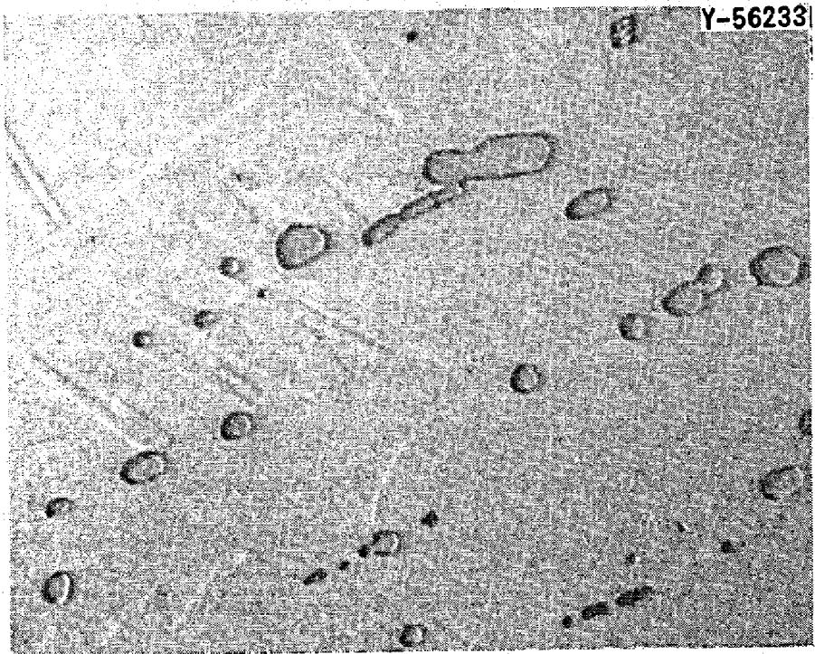  
0.0035 INCHES 1000X

Fig. 22. Microstructural Changes that Occurred as a Result of Welding. (a) Structure of unaffected base metal showing stringer-type phase; (b) eutectic-type structure in heat-affected zone. Electrolytically etched in $\mathrm{H}_3\mathrm{PO}_4$ .   
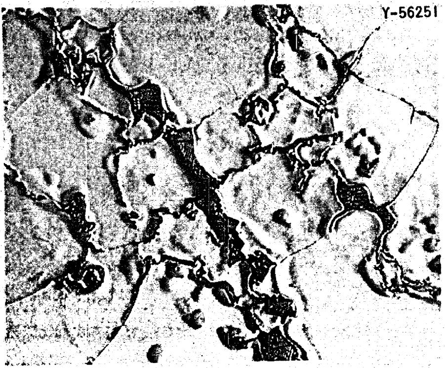  
1000X 1

lower ductility and creep-rupture strength than the base metal. However, stress relieving at $1600^{\circ}\mathbf{F}$ improved the properties to where they were comparable with those of the base metal.

The room- and elevated-temperature shear strengths of Hastelloy N joints brazed with Au-18% Ni filler metal have also been determined.[26] Joints tested at room temperature had an average shear strength of 73,000 psi, while those tested at $1300^{\circ}\mathbf{F}$ possessed an average strength of 18,000 psi. Diffusion and microhardness studies of aged brazed joints showed that they possessed excellent microstructural stability.

# Joining for Reactor Component Fabrication

# Pressure Vessel and Piping

As mentioned previously, only weldable heats of Hastelloy N were used for the MSRE application. The tungsten-arc welding process, with filler metal additions, was used throughout, and the fabrication was carried out without undue difficulty. All welding was done in accordance with ORNL-approved specifications by qualified operators. The finished product readily met the strict ORNL requirements for nuclear systems.

# Heat Exchangers

The production of reliable tube-to-header joints for heat exchange applications in molten-salt systems is mandatory. One means of assuring this reliability, welding and back-brazing, was successfully developed and tested extensively under severe operating conditions for the Aircraft Nuclear Propulsion Project.[27] The technique was further improved and adapted for use in the fabrication of the primary heat

exchanger for the MSRE.[28] Figure 23 shows the completed tube bundle in its handling fixture. Figure 24 is a sketch of the joint. To date, several thousand joints have been fabricated by the welded and back-brazed technique without a single reported failure.

28R. G. Donnelly and G. M. Slaughter, Welding J. (N.Y.) 43(2), 118-24 (February 1964).

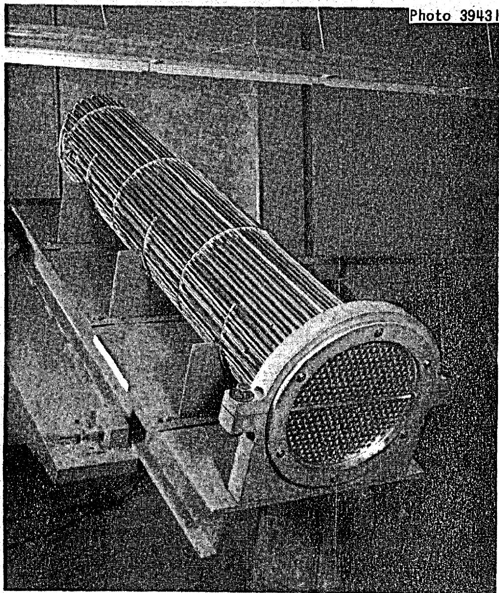  
Fig. 23. Completed Tube Bundle in Fixture.

ORNL-LR-DWG 65682R3

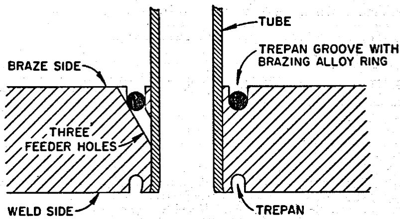  
(a) BEFORE WELDING AND BRAZING

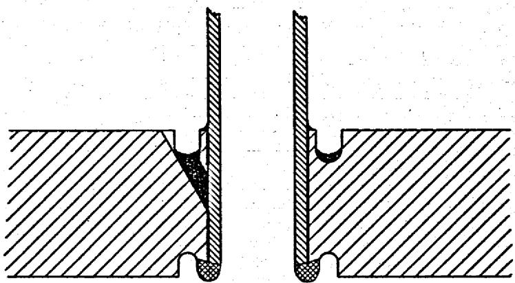  
(b) AFTER WELDING AND BRAZING   
Fig. 24. Sketch Showing Joint Design Used for Welding and Back-Brazing MSRE Heat Exchanger.

# Dissimilar Metal Joints

The incorporation of a variety of components in a reactor system frequently requires the use of dissimilar metal welds. Welding procedures have been developed for joining Hastelloy N to several different materials, including Inconel 600, austenitic stainless steels, and nickel.

# Remote Joining

Molten-salt reactors have the characteristic that the fuel circulates through much of the external piping system. During operation, residual activity is imparted to the walls, and during draining some fuel always remains either in the crevices or by sticking to the wall. The resulting radioactivity requires that remote maintenance procedures be used, and they include remote joining.

# Remote Welding

While many remote joining methods have been developed for the nuclear industry, they were always for special applications such as replacing the seal weld on a vessel, or making a closure weld for a capsule or a fuel element.[29] Commercial equipment is not generally available for such applications. The nearest approaches to developed remote maintenance systems for a large reactor were one designed and partially developed by Westinghouse Electric Corporation, Atomic Power Department, for use with the proposed Pennsylvania Advanced Reactor,[30] and one at Atomics International for use with a large sodium graphite reactor.[31] However, these projects were terminated before the developed techniques could be demonstrated. Included were techniques for plugging heat exchanger tubes and for butt welding of pressure piping.

The practicality of remote operations has been improved by the recent rapid advances in the automatic welding field aimed at the nuclear and aerospace industries; an excellent example of an automated machine is the one developed for welding the HFIR fuel elements. The only function of the operator is to position the torch and to press the start button; both of these operations could also be done automatically if desirable.

# Brazing and Mechanical Joints

Studies on remote joining have also included brazing and mechanical joining techniques. Standard ring joint flanges were used at high pressures but lower temperatures in the Homogeneous Reactor Experiment. Freeze flanges are used to join the major pieces of equipment in the MSRE. Similar developments have been made for other reactors and for fuel reprocessing plants. In all cases the joints were developed for use in smaller pipes than are being proposed for the MSBR. The principal deterrent to the use of mechanical joints is the difficulty in repeatedly assuring a seal, particularly in high-temperature cyclic service.

Equipment was developed and tested for remotely cutting and brazing the drain line and the salt piping in the drain tank cell of the MSRE. The piping is standard 1 l/2-in. sched-40 pipe. These joints were carefully inspected and were determined to be of high quality.

# Remote Inspection

A necessary accompaniment of remote welding must be a remote inspection. Less development has been done on inspection than on welding. Sufficient work has been done at ORNL to show that such operations are feasible and the required techniques should be possible with a limited development program.

Ultrasonic techniques along with remote positioning equipment were developed and used for the remote measurement of the wall thickness of the Homogeneous Reactor Test core vessel.[32] The precision of measurement was approximately $1\%$ .

Ultrasonic and radiographic techniques were developed but not tried for the remote inspection of the EGCR through-tube weldments.[33]

Another class of remote inspection devices has been developed for use in hot cells. Radiographic techniques have been shown to be applicable to the evaluation of radioactive materials in high radiation backgrounds. This includes both television $^{34}$ and film techniques. $^{35}$

# STATUS OF DEVELOPMENT OF GRAPHITE

In the proposed MSBR, graphite is used in the core as a pipe material for separating the fuel and blanket salts and also for moderator blocks around the tubes. The former is the more critical use. The graphite in the tubes must have low permeability to salt and must be free from flaws that would permit appreciable seepage of salt between the fuel and blanket streams. A value for the permeability to gases has not been specified yet but a very low one is desirable to minimize the rate of diffusion of xenon into the graphite and thereby minimize the loss of neutrons to $^{135}\mathrm{Xe}$ . Although high strength is desirable, it need not be higher than has already been obtained readily. Techniques are required for joining graphite to graphite and graphite to metals. Finally the graphite in the MSBR will be irradiated to a dose as high as $2 \times 10^{22}$ neutrons/cm $^2$ ( $E > 0.18$ MeV) per year and the tubes must perform satisfactorily at this irradiation level for at least three and possibly five years to have a practical power reactor.

Graphites have been used for many years as the moderator in a variety of power and plutonium production reactors where the requirements are less severe and the radiation levels are much lower. The type CGB graphite used in the MSRE approaches the requirements of the MSBR but the MSRE is not a two-fluid system and is less demanding. Loosely assembled bars were used, small cracks were not serious faults, and the radiation levels were almost two orders of magnitude lower than those in the MSBR. Some of the newer isotropic graphites promise greater stability under irradiation than does the anisotropic-type CGB. Improvement of

those materials to satisfy other requirements imposed by the use of moltensalt fuels could result in a better graphite for use in the breeder reactors. Extrapolation of existing data indicates that the life will probably be adequate.

# Grade CGB Graphite

Grade CGB graphite was designed for use in molten-salt reactors and was first made in commercial quantities for the MSRE. It is basically a petroleum needle coke that is bonded with coal-tar pitch, extruded to rough shape, and heated to $5072^{\circ}\mathrm{F}$ . Improved dimensional stability under irradiation is ensured by not using amorphous carbon materials such as carbon black in the base stock. High density and low permeation are achieved through multiple impregnations and heat treatments. All components are fired to $5072^{\circ}\mathrm{F}$ or higher. The product is essentially a well-graphitized material and is highly anisotropic. Its properties are tabulated in Table 9.

Grade CGB graphite represents significant progress in the development of a low-permeability radiation-resistant graphite. Experiments have demonstrated that the multiple impregnations required to obtain the low permeability and small open-pore size do not appreciably alter the dimensional stability compared to conventional needle-coke graphites.

In manufacturing the material for the MSRE, experimental equipment and processes were used on a commercial scale for the first time by the Carbon Products Division of Union Carbide Corporation to produce bars 2.50 in. square and 72 in. long which were machined to the shapes required for the MSRE. The bars were the largest that could be produced by the then-current technology to meet the requirements of low permeability to salt and gases and resistance to radiation effects. Assembly of the MSRE core from bars of the graphite is shown in Fig. 25.

# Structure

The MSRE graphite has an accessible void space of only $4.0\%$ of its bulk volume. The pore entrance diameters to the accessible voids are

Table 9. Properties of MSRE Core Graphite, Grade CGB   

<table><tr><td colspan="2">Physical properties</td></tr><tr><td colspan="2">Bulk density, a g/cm3</td></tr><tr><td>Range</td><td>1.82-1.89</td></tr><tr><td>Average</td><td>1.86</td></tr><tr><td colspan="2">Porosity, b %</td></tr><tr><td>Accessible</td><td>4.0</td></tr><tr><td>Inaccessible</td><td>13.7</td></tr><tr><td>Total</td><td>17.7</td></tr><tr><td colspan="2">Thermal conductivity, a Btu ft-1 hr-1 (°F)-1</td></tr><tr><td>With grain</td><td></td></tr><tr><td>At 90°F</td><td>112</td></tr><tr><td>At 1200°F</td><td></td></tr><tr><td>Normal to grain</td><td></td></tr><tr><td>At 90°F</td><td>63</td></tr><tr><td>At 1200°F</td><td>34</td></tr><tr><td colspan="2">Temperature coefficient of expansion, c (°F)-1</td></tr><tr><td>With grain</td><td></td></tr><tr><td>At 68°F</td><td>0.27 × 10-6</td></tr><tr><td>Normal to grain</td><td></td></tr><tr><td>At 68°F</td><td>1.6 × 10-6</td></tr><tr><td colspan="2">Specific heat, d Btu lb-1 (°F)-1</td></tr><tr><td>At 0°F</td><td>0.14</td></tr><tr><td>At 200°F</td><td>0.22</td></tr><tr><td>At 600°F</td><td>0.33</td></tr><tr><td>At 1000°F</td><td>0.39</td></tr><tr><td>At 1200°F</td><td>0.42</td></tr><tr><td colspan="2">Matrix coefficient of permeabilitye to helium at 70°F, cm2/sec</td></tr><tr><td>Salt absorption at 150 psig, a vol %</td><td>0.20</td></tr><tr><td colspan="2">Mechanical strengthb at 68°F</td></tr><tr><td colspan="2">Tensile strength, psi</td></tr><tr><td>With grain</td><td></td></tr><tr><td>Range</td><td>1500-6200</td></tr><tr><td>Average</td><td>1900</td></tr><tr><td>Normal to grain</td><td></td></tr><tr><td>Range</td><td>1100-4500</td></tr><tr><td>Average</td><td>1400</td></tr><tr><td colspan="2">Flexural strength, psi</td></tr><tr><td>With grain</td><td></td></tr><tr><td>Range</td><td>3000-5000</td></tr><tr><td>Average</td><td>4300</td></tr><tr><td colspan="2">Mechanical strengthb at 68°F</td></tr><tr><td colspan="2">Flexural strength, psi</td></tr><tr><td colspan="2">Normal to grain</td></tr><tr><td>Range</td><td>2200-3650</td></tr><tr><td>Average</td><td>3400</td></tr><tr><td colspan="2">Modulus of elasticity, psi</td></tr><tr><td>With grain</td><td>3.2 × 106</td></tr><tr><td>Normal to grain</td><td>1.0 × 106</td></tr><tr><td>Compressive strength, d psi</td><td>8600</td></tr><tr><td colspan="2">Chemical purityf</td></tr><tr><td>Ash, wt %</td><td>0.0041</td></tr><tr><td>Boron, wt %</td><td>0.00009</td></tr><tr><td>Vanadium, wt %</td><td>0.0005</td></tr><tr><td>Sulfur, wt %</td><td>0.0013</td></tr><tr><td>Oxygen, cm3 of CO per 100 cm3 of graphite</td><td>9.0</td></tr><tr><td colspan="2">Irradiation dataa</td></tr><tr><td colspan="2">[Exposure: 1.0 × 1020neutrons/cm2, (E &gt; 2.9 Mev)</td></tr><tr><td colspan="2">Shrinkage, % (350-475°C)]</td></tr><tr><td>A0</td><td>0.10</td></tr><tr><td>C0</td><td>0.07</td></tr></table>

Measurements made by ORNL.   
bBased on measurements made by the Carbon Products Division and ORNL.   
cMeasurements made by the Carbon Products Division.   
d. Representative data from the Carbon Products Division.   
Based on measurements made by the Carbon Products Division on pilot-production MSRE graphite.   
fData from the Carbon Products Division.

small; over $95\%$ of the entrances are $< 0.4 \mu$ in diameter. $^{36}$ The molten salts do not wet the graphite, and calculations indicate that pressures in excess of 300 psig would be required to force salt into these accessible voids. The microstructures of a conventional nuclear graphite and the graphite in the MSRE are compared in Fig. 26.

Photo 70797

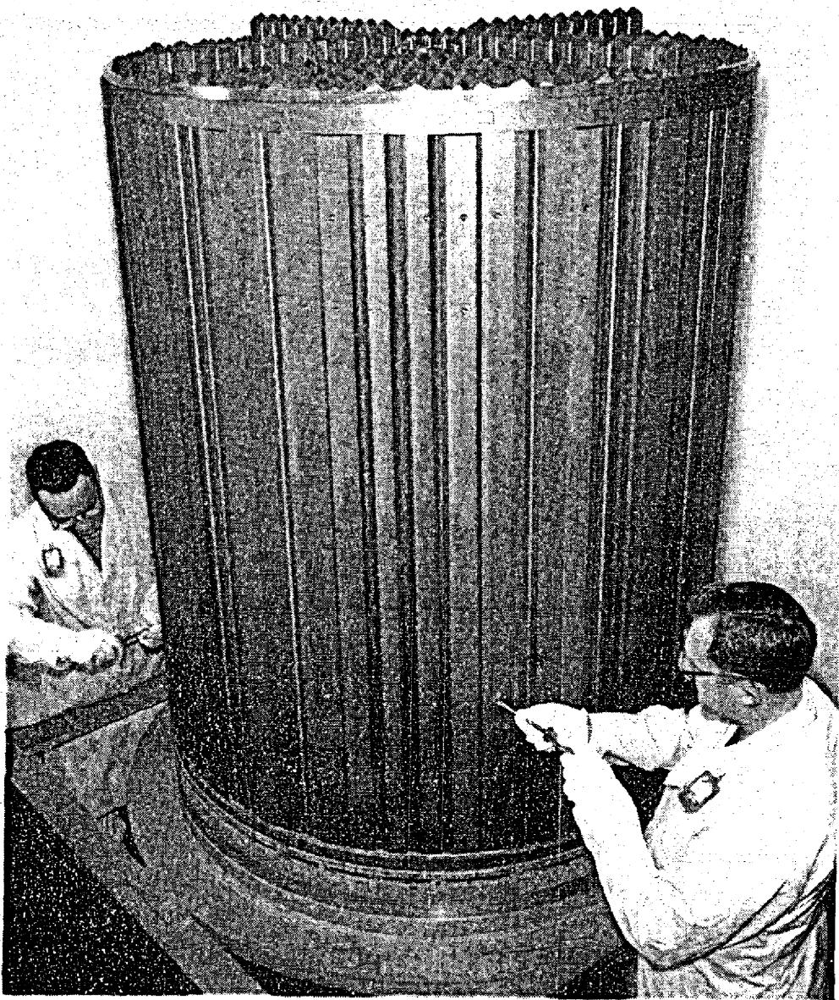  
Fig. 25. Anisotropic, Needle-Coke Graphite Grade CGB Being Assembled for MSRE Core.

High-density and small-pore structures are desirable characteristics of unclad graphite for molten-salt reactors. However, for the MSRE bars, this particular structure was perfected to such a degree that in the final fabrication operations gases could not escape rapidly enough through the natural pores in the graphite. Consequently, the matrix of the graphite cracked as the gases forced their way out. However, 0.50-in.-thick sections (heaviest wall for MSBR fuel tubes) have been made successfully without cracks.

PHOTO 67670

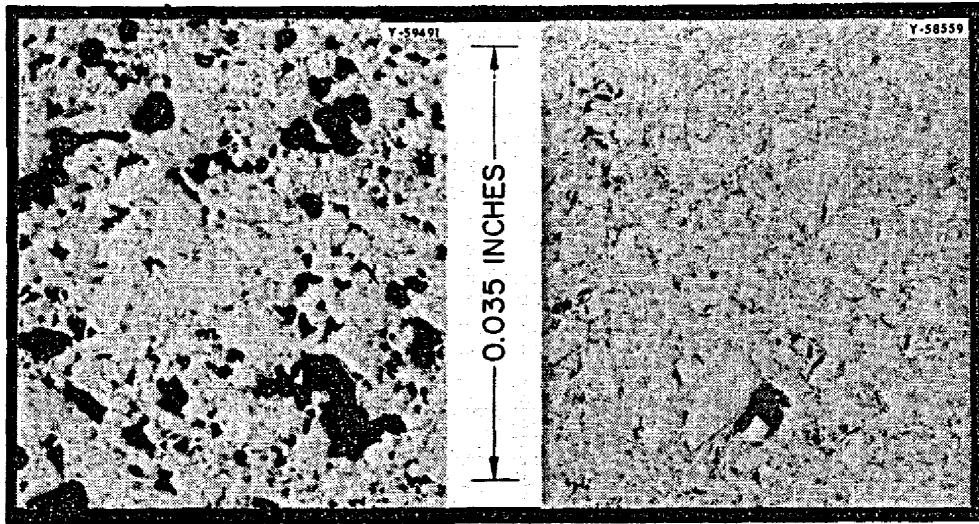  
Fig. 26. The Microstructures of a Conventional Nuclear Graphite, Grade AGOT, and of the MSRE Graphite, Grade CGB.

# AGOT

# CGB

1.68 g/cm³

1.86 g/cm³

21.7% ACCESSIBLE Void VOL.

4.0% ACCESSIBLE Void VOL.

3.7% INACCESSIBLE Void VOL.

14.0% INACCESSIBLE Void VOL.

25.4% TOTAL Void VOL.

18.0% TOTAL Void VOL.

Mechanical tests indicate that the processing cracks in the graphite resist propagation.[37] Since it is probable that cracks in graphite will fill with salt, tests were made to determine if repeated melting and freezing of the salt would propagate the cracks. Impregnated specimens were cycled from 390 to $1830^{\circ}\mathrm{F}$ at various rates of temperature rise. Specimens and cracks were not detectably changed by the thermal cycles.[38,39] The maximum temperature in the tests considerably exceeded the $1350^{\circ}\mathrm{F}$ expected in the MSRE or the MSBR.

# Permeability

Some of the more stringent specifications on graphite for MSBR will be on permeability.40 Values will be specified for permeability to both molten salts and to helium. The screening test for salt permeability is to expose evacuated specimens for 100 hr to molten salt at $1300^{\circ}\mathrm{F}$ under a pressure of 150 psig. The MSRE design specifications required that less than $0.5\%$ of the bulk volume of the graphite should be filled with salt and that the salt should not penetrate the graphite matrix. Specimens of grade CGB had an average of less than $0.2\%$ of their bulk volume permeated by salt in these screening tests, and the salt distribution was limited to shallow penetrations at the surfaces and along cracks which intersected the exterior surfaces. The salt that entered the cracks was confined to the cracks and, as shown in Fig. 27, did not permeate the matrix. The permeation characteristics of the graphite as determined by test should be representative since irradiation does not appear to change the wetting characteristics of the salt and the screening pressures are three times the maximum design pressure for the MSRE core.

The limit on gas permeability has played a major role in establishing the fabrication sequence for the graphite. Low permeability to gases is desirable to prevent gaseous fission products from entering the graphite. We would like a graphite for the MSBR with a helium permeability of $10^{-7}\mathrm{cm}^2/\mathrm{sec}$ . While it has been possible to obtain graphites meeting the salt-permeability requirements, it has not been possible to reduce the gas permeability to the $10^{-7}$ level. Crack-free CGB graphite in the MSRE exhibited average helium permeability values of $3 \times 10^{-4}\mathrm{cm}^2/\mathrm{sec}$ . As previously discussed, this graphite was fabricated using special procedures aimed at low porosity. The graphite tubes for MSBR will have much thinner cross sections and should be less permeable. At present, it would appear that values of $10^{-5}\mathrm{cm}^2/\mathrm{sec}$ would be about all that can be produced by present technology. Experimental and other special graphite pipes have been produced with permeabilities less than $10^{-6}\mathrm{cm}^2/\mathrm{sec}$

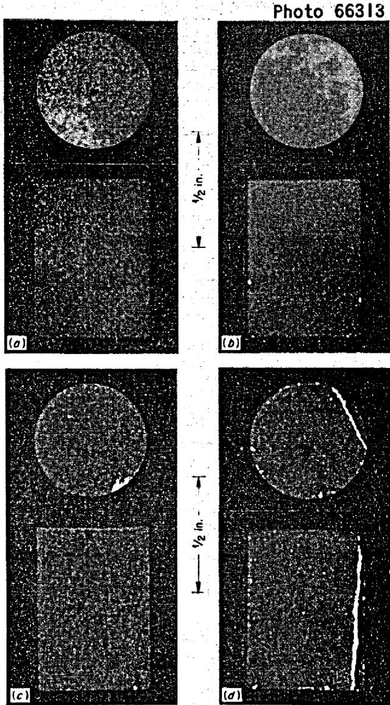  
Fig. 27. Radiographs of Thin Sections Cut from an Unimpregnated Specimen and Three Salt-Impregnated Specimens. (a) Control (no salt present); (b), (c), and (d) salt-impregnated specimens; white phase is salt.

(refs. 41, 42). The latter contained carbon black in the base stock which would significantly decrease its dimensional stability under radiation. The former had amorphous carbon impregnants, but this appears to cause only slight decrease in its dimensional stability under irradiation.[43]

While a homogeneous graphite is desirable, one with a surface seal must also be considered. Such a seal may be a penetrating, integral skin of graphite or a thin coating of $^{92}\mathrm{Mo}$ or Nb. The metallic coatings would be applied by deposition from the metal chloride gas at elevated temperatures. The surface coating would be quite thin (approx 0.0001 in.) but would be applied under conditions where the metal would be linked into the pore structure so that good adherence would be ensured.

# Mechanical Properties

The tensile and flexural strength measurements on grade CGB graphite for the MSRE averaged 1900 and 4300 psi, respectively, despite the presence of cracks in the graphite. There were no values less than the minima of 1500 and 3000 psi specified for the tensile and flexural strengths, respectively. These strength values were specified primarily to assure a good quality of graphite. The stresses expected in the reactor are very low in the absence of irradiation. However, under fast-neutron irradiation, the differences in shrinkage rates across the 1/2-in. wall of a pipe caused by flux gradients can produce high stresses.

The tensile strength of the MSRE graphite is shown in Fig. 28. The band with the single cross-hatching indicates the stress-strain behavior of the material. However, some of the material contained cracks and failure occurred at lower stresses and strains as indicated by the solid points. The crack-free material, represented by the solid points, failed at higher stresses. Specimens that demonstrated definite effects of cracks (the black points) had a minimum strength of 1510 psi and an average

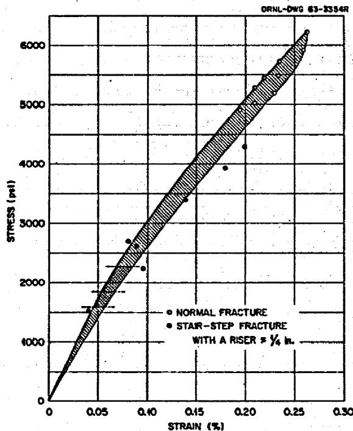  
Fig. 28. Tensile Properties of Grade CGB Graphite Parallel with Grain (Axis of Extrusion); Bar 45, $2 \times 2$ in.

strength of 2940 psi. Specimens that were not appreciably affected by cracks (the open circles) yielded an average strength of 5440 psi and a modulus of elasticity of $3.2 \times 10^{6}$ psi, corresponding to an unusually strong graphite. These results indicate the variation of properties within a single bar (No. 45); however, there was also some variation between various bars. The double cross-hatched portion indicates the overall range of properties obtained by sampling various bars of the MSRE graphite.

# Isotropic Graphite

There has been recent progress in the development of isotropic grades of graphite that offer greater dimensional stability under irradiation and potentially can be used as a base for the impregnations to obtain the necessary low permeability. Development of this material has occurred in the last few years and much of the data are proprietary and have not been released for publication. However, properties of some available grades are listed in Table 10.

<table><tr><td rowspan="2">Propertyb</td><td colspan="3">Grade</td></tr><tr><td>H-207-85</td><td>H-315-A</td><td>H-319</td></tr><tr><td>Density, g/cm3</td><td>1.80</td><td>1.85</td><td>1.80</td></tr><tr><td>Bend strength, psi</td><td>&gt;6000</td><td>&gt;4500</td><td>&gt;4000</td></tr><tr><td>Modulus of elasticity, psi</td><td></td><td>1.35-1.65 × 10^6</td><td></td></tr><tr><td>Thermal conductivity, Btu ft-1 hr-1 °F-1 (1832°F)</td><td>22</td><td>22</td><td>22</td></tr><tr><td>Thermal expansion, α 10^6/°C (22-700°C)</td><td>5.2-5.7</td><td>4.8-5.8</td><td>3.7-4.4</td></tr><tr><td>Electrical resistivity, ohm-cm × 10^4</td><td>8.9</td><td>9.4</td><td>9.9</td></tr><tr><td>Isotropy factor, CTE||/CTE↓</td><td>1.11</td><td>1.20</td><td>1.18</td></tr><tr><td>Permeability to helium, cm²/sec</td><td>8 × 10^-2</td><td>2 × 10^-2</td><td></td></tr><tr><td>Dimensional instabilityc at 700°C</td><td>1/2 to 1/3 that of AGOT</td><td></td><td></td></tr></table>

aAdapted from G. B. Engle, The Effect of Fast Neutron Irradiation from $495^{\circ}C$ to $1035^{\circ}C$ on Reactor Graphite, GA-6888 (February 11, 1966).   
bAll properties measured at room temperature unless stated otherwise.   
Based on very preliminary results on H-207-85 and type B isotropic data to $2 \times 10^{22}$ neutrons/cm².

The isotropic graphite is made in various shapes with conventional carbon and graphite molding and extruding equipment. Bulk densities can range from $< 1.40$ to $1.90 \, \text{g/cm}^3$ . The strengths of various grades tend to exceed those of grades of conventional, anisotropic graphite.

Past work has not been directed toward producing isotropic graphite with the low permeabilities required for molten-salt breeder reactors. Pipes of grade H-315-A (Table 10) have been made that are approximately 4.5 in. in diameter with 0.50-in.-wall thickness which would correspond to the large MSBR pipes. These pipes had an average bulk density of $1.83\mathrm{g/cm}^3$ and radially they had a permeability to helium of $2 \times 10^{-3}$ to $1 \times 10^{-2}\mathrm{cm}^2/\mathrm{sec}$ . The lower value refers to the unmachined pipe and the higher value to pieces machined from the pipe walls. Pore spectrum measurements indicated that approximately $50\%$ of the pore volume had pore entrance diameters between 0.5 and $3.5\mu$ and less than $15\%$ of the pore volume had pore entrance diameters $>3.5\mu$ . This pore spectrum suggests that this material, although it was not designed for it, might be suitable base stock to impregnate to produce low-permeability graphite. Of course, in fabricating graphite for MSBR use one would want to optimize the base stock for impregnation which would mean that the base stock would be fabricated with pore entrances less than $1\mu$ in diameter.

In the following program, the isotropic graphite will be considered as the reference material. However, until its development has proceeded to the point that meeting the MSBR requirements is reasonably assured, it will be necessary to continue the development of the anisotropic needle-coke graphite as backup material. Most of the data obtained to date have been with needle-coke graphite; however, much of this technology is transferable to the isotropic graphite.

# Joining

The MSBR is unique among reactors in that it uses graphite as an engineering material and the present conceptual design calls for graphite-to-graphite and graphite-to-Hastelloy N joints.[44] These joints are on

the core pieces but in a region where the neutron flux dose is reduced considerably. With all the tons of graphite that have been used in nuclear reactors, most of the work on graphite-to-metal joining seems to have been done in small programs at ORNL $^{45,46}$ and Atomics International.

# Graphite-to-Hastelloy N Joints

Only a few brazing alloys are suitable for brazing graphite for molten-salt service, since, in addition to wetting ability, the brazematerial must be corrosion resistant and stable under irradiation. To promote bonding, some chemical reaction with the graphite is desirable; therefore, most proposed graphite brazes contain some "active" metal. However, titanium and zirconium - the two usually proposed - may not besuitable as far as corrosion resistance to molten fluoride salts is concerned. Similar statements can be made about alloys containing large quantities of chromium. Thus, brazing development in support of molten-salt concepts has been concerned with developing an alloy that not only will braze graphite but also will be corrosion resistant, melt high enough to be strong in use but low enough to be brazed with conventional vacuum or inert-atmosphere equipment, and be stable under irradiation.

The low coefficient of thermal expansion and low tensile strength of the graphite may make it difficult to join it directly to the Hastelloy N or other structural materials. The problem is further complicated by the respective shrinkage and expansion expected in the graphite as it is exposed to the fast neutrons.

Two of several approaches are receiving the greatest study at this time. One is to braze the Hastelloy N to the graphite in such a way that the Hastelloy N applies a compressive loading to the graphite as the joint is cooled from the brazing temperature. This is desirable since graphite is stronger and more ductile in compression than in tension. The other approach is to join the graphite to materials that have coefficients of thermal expansion approaching or equal to that of

the graphite. These transition materials would, in turn, be joined to the Hastelloy N by brazing. Therefore, refractory metals, such as molybdenum and tungsten, which have thermal expansion coefficients more closely matched to graphite as well as much higher strengths, have been selected as promising transition materials.

The joint utilizing the refractory metal transition piece has received considerable attention. The ductile and corrosion-resistant alloy, $82\%$ Au-18% Ni, was chosen as a starting point for molten-salt applications. To this base material has been added the corrosion-resistant, strong carbide formers, molybdenum and tantalum. As a result, alloys in both the Au-Ni-Mo and Au-Ni-Ta systems were developed45 which fulfilled the above requirements with the possible exception of nuclear stability in a high neutron flux (gold will transmute to mercury in high flux fields). The most promising alloy contains 35 Au-35 Ni-30 Mo (wt %) and has been designated as ANM-16. Graphite-to-graphite and graphite-to-molybdenum joints have been made with ANM-16 by induction brazing in an inert atmosphere and vacuum brazing in a muffle furnace. A brazing temperature of 2282 to $2372^{\circ}\mathrm{F}$ was used. Several components have been brazed with this alloy, the largest of which have been 1.50-in. OD × 0.31-in.-wall graphite pipes with molybdenum end caps and sleeves. Joints of this type as well as T-joints have been examined metallographically and found to be sound in all cases.

If brazing conditions are controlled closely, the joints appear sound in all respects. However, if the assembly is maintained at brazing temperature longer than necessary or if too high a brazing temperature is used, the alloy in the fillet spreads onto the surface of the graphite in a very thin layer. Upon cooling from the brazing temperature, this thin layer will crack. This behavior is aggravated when the surface of the graphite is smooth and free of porosity, such as with the desired MSBR graphite. Joints made with high-density CEY graphite pipe exhibited this behavior, whereas it had not been noticed when brazing the very porous grades such as AGOT. Metallographic examination, however, shows that the cracks do not extend into the body of the fillet.

A short section of graphite pipe with a brazed graphite-to-metal end closure successfully contained molten salts for 500 hr at $1292^{\circ}\mathrm{F}$ and a pressure of 150 psig. The graphite pipe was machined to 1.25-in. OD × 0.75-in. ID from a bar of MSRE graphite. Molybdenum end caps were brazed to the ends of the pipe using braze metal ANM-16. No leak occurred during the 500-hr test period, and posttest radiographic examination indicated that the salt was contained as planned. Metallographic examination revealed no penetration of salt into the graphite and no detectable corrosion of the braze material.

Recently, an alloy without gold has been developed to overcome the possible problems of transmutation. This alloy has a composition of $35\%$ Ni- $60\%$ Pd- $5\%$ Cr and has exhibited brazing characteristics very much like the $35\%$ Au- $35\%$ Ni- $30\%$ Mo alloy. The chromium content was kept low in the hope that acceptable corrosion resistance would be obtained. The brazing alloy wet both materials and appeared to form a joint as good as that obtained with ANM-16.

Joints of graphite to molybdenum have been brazed with this alloy and survived a $1300^{\circ}$ F corrosion test (LiF-BeF $_2$ -ZrF $_4$ -ThF $_4$ -UF $_4$ ) of 10,000 hr with no attack. There was a thin palladium-rich layer on the surface of the brazing alloy. A 20,000-hr corrosion test has accumulated 10,700 hr to date. Chromium, the carbide former, may be tied up in the form of a corrosion-resistant carbide, $\mathrm{Cr}_3\mathrm{C}_2$ , to such an extent that the chromium will not cause a corrosion problem.[47]

To date, no mechanical property tests have been run on brazed graphite joints at ORNL but graphite-to-molybdenum specimens brazed with the $35\%$ Ni- $60\%$ Pd- $5\%$ Cr alloy have successfully withstood ten thermal cycles from $1300^{\circ}\mathrm{F}$ to ambient. Metallographic examination revealed no cracks after this test.

# Graphite-to-Graphite Joints

Techniques are commercially available for joining graphite to itself.[48] Most techniques are based on the use of furfural alcohol and graphite powder. The mechanism of sealing is by polymerization of the alcohol at temperatures to $1600^{\circ}\mathrm{F}$ . The joint must be held under pressure during the curing to prevent gross porosity. The porosity arises from the gas that must escape during curing. It may be minimized by close joint fitups and slow heating rates. The polymerization would be followed by a graphitizing treatment at about $4892^{\circ}\mathrm{F}$ . However, it may be more desirable to use a metallic brazing alloy to obtain a joint with lower permeability and higher strength. Small graphite-to-graphite joints have been made at ORNL using the Au-Ni-Mo and Au-Ni-Ta brazing alloys; however, such joints were most effective when graphite that was much more porous than the CGB grade was used. Several other alloys are being investigated that wet the graphite and are resistant to corrosion by fused salts.

# Compatibility of Graphite with Molten Salts

Since the MSBR uses graphite in direct contact with the molten-salt fuel and the breeder blanket, good compatibility between graphite and Hastelloy N in these molten fluorides is needed. Tests performed have indicated that excellent compatibility exists. The tendency for Hastelloy N to be carburized was investigated in static pots containing LiF-BeF $_2$ -UF $_4$ (67-32-1 mole %) and a graphite at $1300^{\circ}\mathrm{F}$ for times ranging from 2000 to 12,000 hr. No carburization was metallographically detected on specimens from any of the above tests.[49] Tensile properties were determined on specimens included in each test. A comparison of the tensile strengths and elongation values of the tested specimens with those of the control specimens indicated that no significant change occurred in the test specimens.

For the purpose of evaluating the compatibility of graphite and Hastelloy N in a circulating fluoride fuel, a Hastelloy N forced-convection loop was operated for 8850 hr. The loop operated at a maximum temperature of $1300^{\circ}\mathrm{F}$ and circulated a fluoride mixture of $\mathrm{LiF - BeF_2 - UF_4}$ . On completion of the test, components from the loop were checked metallographically and chemically, and specimens were checked for dimensional changes and weight changes. The tests indicated that (1) there was no corrosion or erosion of the graphite by the flowing salt; (2) there was very little permeation of the graphite by the salt and the permeation that occurred was uniform throughout the graphite rods; (3) the various Hastelloy N loop components exposed to the salt were not carburized; (4) the Hastelloy N components exposed to the salt and graphite were negligibly attacked; and (5) with the possible exception of oxygen contamination, the salt appeared to have undergone no chemical changes as a result of exposure to the graphite test specimens. In-reactor tests $^{50}$ confirmed this good compatibility.

# Radiation Effects on Graphite

Although graphite has been used successfully in reactors for over 20 years, it is only within the past 10 years that the effects of irradiation have been studied intensively. These studies have been responsible for significant improvements in both the quality of the graphite and the development of reactor concepts that fully utilize the unique properties of graphite. The molten-salt reactor systems are very good examples of reactors that fully utilize the advantageous properties of graphite. These systems will, however, subject the graphite to much higher neutron doses [for a 10-year life, $2 \times 10^{23}$ neutrons/cm² ( $>0.18$ MeV)] than have been or are being obtained in any other reactor system. These large doses give rise to questions of growth, strength, and dimensional stability that will determine the serviceable life of the graphite under such conditions.

The thin-wall tubular design used in the MSBR is one of the better configurations in reducing the differential growth problem to within the capabilities of the graphite. The tubular shape also has the advantages of good fabricability and reliable nondestructive testing techniques to ensure maximum integrity initially. Extrapolation of irradiation damage data for doses to $2 \times 10^{22}$ neutrons/cm² leads to the conclusion that graphite should have an adequate life in the MSBR. However, we cannot conclude this with certainty until we have exposed graphite to the doses anticipated for the MSBR.

Although there is no experimental evidence beyond $2 \times 10^{22}$ neutrons/ $\mathrm{cm}^2$ , several factors lead to optimism about the ability of graphite to sustain much greater damage. The first factor is the recognition that in the $1292^{\circ}\mathrm{F}$ temperature range the contractual dimensional changes for the first $10^{22}$ neutrons/ $\mathrm{cm}^2$ are due to the repair of the damage caused by cooling the graphite from its graphitization temperature. Doses above $10^{22}$ neutrons/ $\mathrm{cm}^2$ produce an expansion in the "c" direction and a contraction in the "a" direction. In effect, the stresses produced normal to the basal planes will be compressive rather than tensile. This, of course, is very much preferred in that the crystal can sustain this type of loading more readily without cracking. Even so, measurements obtained from irradiated pyrolytic graphites indicate that a deformation rate of about $1\%$ shear strain per $10^{21}$ neutrons/ $\mathrm{cm}^2$ must be absorbed. Thus, for a 5-year life, the graphite tubes operating in a flux region of $6 \times 10^{14}$ neutrons $\mathrm{cm}^{-2}$ sec $^{-1}$ must absorb an internal deformation of about $100\%$ shear strain. There is evidence, however, that graphite can sustain this type of internal deformation without creating microcracks. Very fine crystallite pyrocarbons have been irradiated under conditions producing crystallite shearing rates of $60\%$ per $10^{22}$ neutrons/ $\mathrm{cm}^2$ (ref. 51) and have demonstrated the ability to absorb $160\%$ shear strain without observable internal cracking or loss of integrity. Thus, it is difficult to predict whether the anisotropic

crystal growth will produce microcracks in the structure; and if the microcracks are formed, whether they will be more detrimental to the structure than the initial microcracks produced by cooling from the graphitization temperature.

As previously mentioned, the relatively thin-wall tube design minimizes stresses due to the differential growth. The magnitude of the maximum stress produced can be fairly well calculated with the main uncertainty being the flux difference across the tube wall. Using a conservative estimate of $2.4 \times 10^{-24} \mathrm{~cm}^2/$ neutron as the growth rate and a $10\%$ flux drop across the wall, a differential growth rate of $2.4 \times 10^{-25} \mathrm{~cm}^2/$ neutron is obtained. The restraint is internal; therefore, about half of the differential growth is restrained to produce a strain rate. Thus, a strain rate of $1.2 \times 10^{-25} \mathrm{~cm}^2/$ neutron is obtained for comparison to an estimated creep rate coefficient of $4 \times 10^{-27} (\mathrm{psi})^{-1}$ . The stress is simply and directly calculated to be:

$$
\sigma = \frac {\dot {\varepsilon}}{K} = \frac {1 . 2 \times 1 0 ^ {- 2 5}}{4 \times 1 0 ^ {- 2 7}} = 3 0 \mathrm {p s i}.
$$

Thus, the equilibrium stress level is very low, probably much below that required for failure even at high radiation dose levels.

Failure, however, could result from inability of the graphite to absorb the creep deformation even though the stress level is much less than the fracture stress. For lifetimes of $1 \times 10^{23}$ , $2 \times 10^{23}$ , and $4 \times 10^{23}$ neutrons/cm $^2$ (corresponding to 5-, 10-, and 20-year lifetimes), the strain to be absorbed would be 1.2, 2.4, and $4.8\%$ , respectively. The consideration of a strain limit for failure is realistic; however, the strain limit for fracture has not been established. It has been demonstrated that graphite can absorb strains in excess of $2\%$ in $10^{22}$ neutrons/cm $^2$ under stresses in excess of 3000 psi without fracture. There is also some evidence that growth rates of isotropic graphites will diminish after a dose of $10^{22}$ neutron/cm $^2$ . Thus, the graphite will not be forced to absorb the quantities of strain calculated.

Although there is no direct evidence that graphite can sustain $1.2\%$ strain in 5 years of very high dose and low stress, the indirect evidence does indicate that a failure is improbable.

# Nondestructive Testing of Tubing

There has not been extensive development of nondestructive tests for graphite at ORNL and other AEC installations $^{52,53}$ or by industry. However, past efforts at ORNL aimed at specific tests have produced confidence that several NDT methods are applicable. These programs have produced background knowledge that will aid in subsequent development programs.

Several low-voltage radiographic techniques have been developed for use on low-density materials.[54] These innovations have produced superior achievements in sensitivity and have been applied to numerous graphite shapes. Sufficient sensitivity has been obtained to make it possible to permit examination of details as small as $1\mu$ in carbon-coated fuel particles.[55,56]

The eddy-current method has been shown to be applicable to graphite inspection. One of the earlier applications of this technique was for inspecting the graphite support sleeves for the EGCR fuel assemblies.[57] Because of the local porosity in the graphite, the sensitivity in this

test was limited to detection of discontinuities of approximately $10\%$ of the l-in. thickness.

More recent ORNL eddy-current work has included development of the phase-sensitive instrument which overcomes some of the disadvantages of conventional equipment. This device has been used to measure thicknesses of graphite $^{58}$ and to detect flaws in the unfueled graphite shells of fuel spheres $^{58}$ such as are proposed for advanced gas-cooled reactors.

Other testing with graphite has included studies of infrared methods59 to detect laminations or unbonded areas in the fueled spheres and ultrasonic methods to detect flaws and to measure elastic properties.

# MATERIALS DEVELOPMENT PROGRAM FOR MOLTEN-SALT BREEDER REACTORS

In the previous sections of this report, we have shown that we have a strong technical background in working with the two primary structural materials in the MSBR, graphite and Hastelloy N. However, we feel that certain advancements in technology must be made with respect to both materials to ensure the successful operation of the MSBR. We will briefly outline the areas of concern and indicate the work necessary for developing suitable technology in these areas. The cost estimate for the materials development for the MSBR is appended.

# Hastelloy N Program

# Resistance to Irradiation Damage

The major problem area with Hastelloy N requiring additional development before it may be used in the MSBR is that of improving its resistance to neutron irradiation. The present alloy is susceptible to a type of high-temperature radiation damage that reduces the creep-rupture life and the rupture ductility. Solving this problem will be a major consideration

in establishing the schedule for the MSBR. The problem is complicated by the long lead time required to obtain in-reactor mechanical property data and by the fact that the solution appears to lie in a change in composition. This means that once a modified radiation-resistant alloy is developed, it will be necessary to determine if the changes in composition have affected any other properties. Another complication is that it has been shown that the radiation damage is sensitive to fabrication practice, so to be truly representative, material used will have to be taken from large commercial heats. Obviously, a compromise is required in which small laboratory heats will be used initially for screening with the results being confirmed with material from the large heats. The fabrication practices for the large and small heats will be kept as nearly alike as possible.

Our work has shown that titanium, zirconium, and hafnium are effective additions that will reduce the radiation damage of Hastelloy N. We have not established the exact mechanism responsible for the improvement, but feel that it is associated with the reactivity of these elements with boron and other impurities in Hastelloy N.

During the first year, screening-type tests are being run. The major goal is to determine which of the additives appears to be the most effective and to begin obtaining an indication of the optimum composition. Machined specimens are being irradiated in capsules at elevated temperatures; on removal they are used to determine the tensile and creep-rupture properties of the material. During this period, most testing will be on laboratory-size vacuum-melts and on small (100 lb) commercial melts. These irradiations are being conducted in the ORNL Research Reactor and the Engineering Test Reactor.

A limited number of compositions will be evaluated by being inserted into the core of the MSRE. These samples will be added as the surveillance specimens are removed for testing. These samples will be tested to obtain postirradiation mechanical properties and studied metallographically to determine whether corrosion has occurred.

The second year will be spent in determining the optimum composition, heat treatment, and fabrication practice for the most promising additives. Since these composition changes may adversely affect other properties,

alloys based on at least two different alloy additions will be carried through this step. The majority of the testing will still be postirradiation tensile and creep-rupture. The results will, however, be confirmed by running a few in-reactor stress-rupture tests. Both laboratory and small melts commercially fabricated will be tested with a shift gradually being made to the latter type.

Large commercial heats (1500 lb) of a few compositions will be tested during the second and third years. This material will also be available for other testing programs. These ingots will show if scaling-up in size has any adverse effects and also if materials from different vendors are comparable. When the composition is firmly established, we shall procure a few full-scale commercial heats (10,000 lb).

Specifications must be issued during the first year of testing; they will be continually upgraded by incorporating new data as they become available. The specifications for materials for a full-size mockup and for the MSBR will be issued during the third year. As both the mockup and reactor material are received they will be irradiation tested.

# Corrosion Program

Molten Salt. - Since the reference design of the MSBR primary coolant circuit incorporates the same basic fuel salts and construction materials as the MSRE, an extensive corrosion program will not be required. The large volume of data generated during the development and operation of the MSRE is directly applicable to the MSBR and has demonstrated that an acceptable system has been developed.

Corrosion testing for the primary system will be mainly in the area of proof testing. As compositional adjustments are made to the Hastelloy N or to the graphite, their effects on corrosion will have to be determined. The active metals being proposed as a solution to the radiation-embrittlement problem may increase the corrosion rate, although our previous experience indicates that the effect will be small. Alloys of modified composition will be evaluated initially in thermal-convection loops. As the final composition is established more firmly, the corrosion behavior will be better established by pump loops.

Sufficient information is available to indicate that corrosion problems are not to be expected in the blanket salt system; however, because of fewer tests, such a conclusion is not as well substantiated as that for the primary system. It will be necessary to operate thermal-convection and pump loops with the actual proposed salt composition as proof tests. As with the primary system, any major changes in Hastelloy N or graphite will be checked with these salts.

Another area of corrosion testing is anticipated in association with the development of a low-melting coolant salt for the MSBR. Studies of both fluoroborate and stannous fluoride systems are currently under way for this application. Neither salt system has been subjected to evaluations in prior corrosion studies, and corrosion data will obviously be required in the overall assessment of their properties relative to the MSBR.

Additional corrosion studies are being planned in support of goals of longer range than the MSBR. In particular, the improvements in purity and chemical stability of fluoride systems have brought us to a stage where it appears reasonable to consider the use of austenitic stainless steels as salt-containment materials. The transition from a nickel- to iron-base alloy offers important economic advantages in larger sized molten-salt reactor plants, and there is a strong incentive for examining the utility of iron-base systems in the coolant-salt region alone. Accordingly, we plan to investigate the behavior of stainless steels in the presence of the LiF-BeF $_2$ salt system both as a function of salt-processing techniques and exposure temperatures.

Steam. - Although Hastelloy N looks very attractive for use in the steam circuit, we shall run some proof tests to demonstrate the compatibility of Hastelloy N and supercritical steam. Engineering experiments are planned that involve steam and coolant salt separated by Hastelloy N.[60] These tests should yield useful heat transfer data as well as provide metal corrosion data.

# Nitriding

To minimize any explosive hazard, a nitrogen blanket is proposed for use around the reactor vessel. Preliminary studies have shown that nitrogen is dissociated by the nuclear environment and may react with the Hastelloy N. The rate of reaction varies from heat to heat of the alloy.

Specimens of Hastelloy N will be exposed to $\mathbf{NH}_3$ , in the absence of irradiation, and the effects on mechanical properties determined. Samples from various heats of material will be exposed to reveal the rate-controlling element in the alloy. If any deleterious effects are found, additional samples will be exposed in in-reactor experiments. If nitriding is indeed a problem, the cell atmosphere will be changed to another gas, such as argon.

# Joining Development

While a detailed examination of the joining problems for the MSBR cannot be made until designs have progressed beyond the conceptual phase, a tentative evaluation has been conducted to reveal the major problem areas. The fabrication problems fall into two categories: (1) the original construction and (2) maintenance of the system. The latter will be by far the more difficult of the two since, in most cases, it must be maintained remotely.

Welding will be encountered in the reactor core, reactor vessel fabrication, heat exchangers for the fuel and blanket systems, and in the assembly of the piping system. Fortunately, the large number of joining tasks may be combined into a few general types, at least for the initial development. This combining of problems will greatly reduce the effort required for the first 2 years. The general problems are:

1. joining graphite to itself,   
2. joining graphite to Hastelloy N,   
3. general welding development of Hastelloy N,   
4. joining Hastelloy N tubes to Hastelloy N headers,   
5. development of remote welding techniques for a variety of Hastelloy N joints from 4 in. to 6 ft in diameter,   
6. remote capping or plugging of tubes.

The proposed programs for solving the graphite joining problems are included in the graphite section of this report. The programs for the other problems will be presented in the following section.

General Welding Development of Hastelloy N. - The welding of Hastelloy N has been developed to the point that it was possible to construct the MSRE using a wide variety of welded joints. However, before a MSBR is constructed, additional welding development is desirable. This general welding development will be aimed primarily at a better understanding of the weld-cracking problem which has been encountered with Hastelloy N but is also common to all high-nickel alloys.

Weld-cracking problems have sporadically occurred in commercial heats of Hastelloy N manufactured to the same specification and by the same procedure. While we were able to work around this problem by using a weld-cracking test to select the material, the cause was not established. To avoid this problem, welding and metallurgical studies aimed at understanding the basic reasons for cracking will be conducted. Previous indications that cracking was associated with segregation of alloying elements need to be expanded to a wider variety of compositions. These studies will rely heavily on the use of the electron microprobe to delineate the segregation. Welds will be made in material prepared for the radiation damage program and also in special small heats specifically for welding studies. The various compositions will be welded at several heat inputs with restraint applied to the pieces. Heats showing tendencies to crack will be studied on the "Gleeble"61 which will be programmed to magnify any effects resulting from heating.

As work progresses on the development of a radiation-resistant alloy, it will be necessary to conduct weldability studies on the likely candidates. Zirconium, one of the attractive alloying additions, is known to be detrimental to welding. Attempts will therefore be made to find a set of welding parameters that will be adaptable to the zirconium-containing

alloys. It will also be necessary to make welds that can be fabricated into irradiation samples to demonstrate adequate radiation resistance of the weldments.

Currently, the filler metals used for welding Hastelloy N are of the same composition as the base material. Results in the two previous programs will be examined for indications of ways to improve the welds by changing the composition of the filler metals. Possible improvements will be sought by eliminating impurities known to be harmful or by the addition of other elements to alter the form of the harmful impurity. Preliminary tests have indicated that the addition of either niobium or tungsten to the filler metal will improve weldability. This lead will be pursued and the composition optimized.

Joining Development for Components. - As the engineering components get larger and the reactor power increases, it will be necessary to use heavier sections in construction. With such sections, there will be an economic incentive to use welding processes capable of high deposition rates. All previous welding of Hastelloy N has been with the tungsten-arc process which is reliable but slow. Processes of potential interest for the higher deposition rates are gas metal-arc, submerged-arc, and plasma welding. These processes by their very natures utilize high heat inputs and, therefore, studies of their heat-affected zones will be required. Welding parameters will be established for any process which, in the preliminary testing, looks promising. These processes will also be studied as to their suitability for use in remote welding.

Procedures for making tube-to-header joints for small tubes (0.50 in.) were developed and used successfully for the MSRE heat exchanger. These joints were welded and then back-brazed. For the MSBR, a large number of such joints, many with much larger tubes, will be required. The major welding development effort in this area therefore will be to adapt the present techniques to the new geometries and to automate them. While manual welding is possible, the large number of such welds make automation appear imperative. Because of the larger size components required and

limitations in sizes of brazing or annealing furnaces, it may be necessary to handle the bundles in subsections which are subsequently welded together.

To reduce the costs and to simplify the designs, the elimination of back-brazing will be explored. Conventional mechanical-expanding techniques, such as rolling or plug drawing, will be investigated and tested for reliability. Use of high energy forming for expanding and bonding would appear to be a promising technique. We have the equipment at ORNL for these processes and will investigate them further.

Remote Joining. - A major program will be required to develop remote welding and brazing techniques. It will be necessary to first develop techniques for the specific geometry and then to adapt them to remote operation. The development of the positioning and guiding fixtures will be a major part of the program. These phases of the program will be part of the maintenance equipment development.[62] Several different types of remote welds will be required and they will be sufficiently different to require separate development.

Although the welds differ in size and geometry, the programs for their development will attempt to answer similar questions. The general questions are:

1. Which welding technique will be most reliable?   
2. What are the necessary welding parameters, such as voltage, current, wire feed rate, and torch speed, and over what limits may they vary? This will include sequences for start, operation, and stop.   
3. What is the recommended joint design, and how much misalignment of the pieces can be permitted?   
4. How pure an inert atmosphere will be required, both inside and outside the pipe?   
5. What are the effects of small amounts of fluoride contamination?

6. What is the permissible misalignment of the welding torch?   
7. How will the pipes and the torch be positioned?

The major problem with the Hastelloy N-to-Hastelloy N butt joints in tubes will be the limited space around each pipe; this is approximately 1 in. Present plans are to develop a single procedure for the initial assembly and for remote repairs. Several weld joint designs appear possible and will be investigated. A concurrent effort will be conducted on remote brazing for joining these tubes. This technique, which was developed for the MSRE, makes use of a conical-type joint in which one member must either twist or slide as the braze metal melts.[63]

A single development effort should suffice for all the large (approx 12-in.-diam) remote pipe joints. Many of these joints are containment members, so a high degree of reliability will be required. This makes remote welding much more attractive than mechanical-joining techniques. While these pipes are of large diameter, they do not have heavy walls. However, the addition of filler metal will be necessary. After completion of exploratory studies, a selection of the applicable welding process will be made. Welds similar to these were developed by Westinghouse for the Pennsylvania Advanced Reactor,[64] and their procedures will serve as a starting point. A complication with these welds will be the tight limit on pipe lengths required to minimize fuel inventory. The positioning and aligning present difficulties since short, large-diameter pipes are very rigid. An insert may be required to guide the pipes together.

If one tube of a heat exchanger develops a leak, it will have to be plugged or the whole unit will have to be replaced. It will be necessary to plug the ends of the failed tube through a small access port in each end of the exchanger. Such plugging procedures are standard on

commercial heat exchangers, but are not for remote applications. The positioning equipment for such a job would be similar to that used to cut small pieces from the HRT core tank.[65]

For such an application, a plug must be developed which can be inserted into the tube and then fused to the header. A major problem will be that such a weld is by nature highly restrained and is, therefore, subject to cracking. This may require trepanning the head before the plug is inserted and welded.

# Inspection Development

While a complete evaluation of testing and inspection problems cannot be made until a firm design is available, some are apparent from the conceptual design. The ones requiring most attention are those that will have to be made remotely. Inspection development for the Hastelloy N tubing and pipe will consist of adapting available techniques to the necessary configurations and to the required sensitivity levels. The techniques developed for inspecting the MSRE heat exchanger should also be adaptable to the MSBR heat exchangers. Techniques to be used would include penetrants, radiography, and ultrasonics.

Remote inspection will be required for (1) Hastelloy N tube joints at the fuel header, (2) large butt-weld pipe joints to disconnect the main piping from both the reactor and the heat exchangers, and (3) plugs in the heat exchanger tubes. Until development of the joining techniques has progressed further, it is impractical to speculate on inspection procedures. Several testing techniques will be evaluated.

In developing the nondestructive testing techniques, three phases must be completed (not necessarily in sequence). They are (1) demonstration of feasibility, (2) determination of test sensitivity and establishment of reference standards, and (3) development of detailed techniques and equipment.

For the remotely inspected joints, each of the steps must first be performed in a cold laboratory (but with cognizance of the need to progress to remote operation) and then the necessary mechanical devices must be developed for the remote performance. It may be possible to devise accessories which can be attached to the manipulators used to fabricate the joints.

# Materials Development for Chemical Processing Equipment

The fuel salt will have to be continually reprocessed to remove fission products. The present concept of this processing calls for distilling the salt at a temperature of about $1800^{\circ}\mathrm{F}$ . The strength requirements are quite modest, but the material will be exposed to salt on one side and to some gaseous atmosphere on the other side. The easiest gaseous atmosphere to obtain is the cell environment which is $\mathsf{N}_2 + \sim 2\% \mathsf{O}_2$ . This would require that the material be fairly resistant to oxidation and nitriding. The oxidation resistance is improved by increasing the chromium content of the alloy, but this in turn increases the corrosion rate on the salt side. We feel that several possibilities exist for materials for constructing this vessel.

1. Hastelloy N with an inert cover gas,   
2. a molybdenum-base alloy with an inert cover gas,   
3. a duplex system with a nickel-molybdenum alloy, exposed to the salt and an oxidation-resistant material such as Haynes alloy No. 25 exposed to the cell environment,   
4. a vessel made of an oxidation-resistant alloy with a graphite liner.

These possibilities and others will have to be explored by screening tests to determine resistance to oxidation, nitriding, and salt corrosion. The ease of fabricability and cost of the candidate materials will also be considered in making a final choice.

# Graphite Program

The graphite that we need for this reactor requires that some advances be made in present technology. Therefore, our first concern is to procure material that meets our specifications for study. The major items to be

evaluated for this material are (1) determining its behavior at radiation dose levels as high as possible, (2) joining of graphite to itself and to structural materials, (3) fabrication development to yield a low gas permeability, (4) evaluation and characterization of the modified or improved graphite, (5) determining its compatibility when used with Hastelloy N in a system circulating fused salts at elevated temperatures, and (6) fabrication of the graphite into engineering systems and evaluating its performance. Because of its greater potential for reducing radiation damage effects, the major effort will be on the development of isotropic graphite. However, this material is so new and so little is known about it, development of anisotropic graphite such as the needle-coke types will also be continued. The proposed development program is discussed in the following sections.

# Graphite Fabrication and Evaluation

The grade CGB graphite used in the MSRE was produced in experimental equipment and its properties still leave much to be desired for a MSBR. No graphite from any source is now available that will meet all of the MSBR requirements. Since there is no present industrial need for low-permeability graphite, we are not likely to obtain much allied development help from industry. An adequate supply of the highest quality graphite will be purchased to supply material for use in test rigs, to establish reasonable specifications, and for evaluation. Continuing orders will be placed as improvements, or potential improvements, are made in the quality. The intent is to progress in order size from the laboratory to the pilot plant and then to a production-size order. Until material is actually produced in production equipment and is tested, doubt will exist as to how representative the smaller batches really are. It is expected that grade CGB or a similar graphite will be used in the first tests.

The various problems to be faced will include:

1. As soon as possible, consult with manufacturers and prepare a specification for small lots (laboratory quantities) of graphite of as near MSBR quality as it is possible to obtain immediately.

2. Place small orders for both isotropic and anisotropic grades of graphite in the form of block and pipe.   
3. Measure pertinent physical and mechanical properties of representative graphites.   
4. In about 1 year, prepare a specification for a pilot-size batch of the most promising type, or types, of graphite. It is not expected that any significant new radiation-damage information will be available at this time.   
5. If suitable graphite cannot be purchased from outside sources, an in-house pilot-production facility will have to be established.

# Irradiation Behavior

In laying out any graphite development program, an enigma rapidly becomes apparent. One of the major unknowns is the effect of massive neutron doses. To obtain the desired doses requires irradiation periods of two to three years, and we would like to firmly establish in three years that graphite will have an acceptable life in the MSBR. The problem therefore is that, if during the development period major changes are made in the graphite, the graphite being irradiated will no longer be representative and the results will therefore be suspect. The most satisfactory solution appears to be starting irradiation tests as soon as possible with samples fabricated from the highest quality material available and to follow these with other tests of improved material. The purpose of the work would be to determine first the dimensional stability of the graphite for the temperatures and high-radiation doses that would have to be sustained in the MSBR plus the effects of irradiation on the graphite properties, such as creep ductility, mechanical properties, accessible voids, and permeability. The inclusion of both anisotropic and isotropic graphite is warranted since the anisotropic has more technological development behind it, but the isotropic graphite which has been under development for approximately three years shows more potential. These experiments should be performed on graphite, graphite-to-graphite joints, and graphite-to-Hastelloy N joints.

To demonstrate the ability of graphite to successfully retain its integrity after exposure to dose levels of $1 \times 10^{23}$ neutrons/cm² (5-year life), we plan to irradiate graphite to as near this dose as possible. This will require the irradiations to be performed in reactors that have fast fluxes of $10^{15}$ neutrons cm⁻² sec⁻¹ or greater to obtain the data in a reasonable time. At present, there are only two fast reactors, EBR-II and Dounreay, and one thermal reactor, HFIR, that approach the fast-flux requirements. Approximate values of the time required to reach a dose of $1 \times 10^{23}$ neutrons/cm², cost per year, and facility size are listed in Table 11.

Table 11. Comparison of Reactors   

<table><tr><td></td><td>EBR-II</td><td>Dounreay</td><td>HFIR</td></tr><tr><td>Time to 1 × 1023neutrons/cm2, year</td><td>6</td><td>4a</td><td>2</td></tr><tr><td>Cost per year, $</td><td>20,000</td><td>300,000</td><td>15,000</td></tr><tr><td>Facility size, in.</td><td>0.75-diam × 25</td><td>0.75-diam × 21</td><td>0.50-diam × 20</td></tr></table>

$^{\mathbf{a}}$ 270 operating power days per year

It is, therefore, proposed to use HFIR to demonstrate the ability of the graphite to retain its integrity after an exposure of $1 \times 10^{23}$ neutrons/cm². Due to the size limitation of HFIR, the irradiation will be restricted to simply prepost type of testing. To demonstrate the ability of the MSBR graphite to absorb creep strain, restrained growth type experiments will be performed in EBR-II. By enforcing a creep rate equal to the growth rate, the creep strain accumulation will be forced into the material ten times faster than under MSBR conditions. Although an equivalent neutron exposure will not be achieved, the enforced strain will be greater than expected in the MSBR.

# Graphite Joining

Since the graphite-to-Hastelloy N joint is a very important part of the system, we will carry parallel efforts on at least two different types of joint. Braze joints of several designs will be evaluated using the $35\%$ Ni- $60\%$ Pd- $5\%$ Cr alloy and pure copper as brazing materials. These joints will be designed so that graphite is initially in compression where it is strongest and has the ability to undergo small amounts of plastic strain. This will minimize the tensile stress that will develop in the graphite as it shrinks due to irradiation. A mechanical type of joint will also be evaluated as a second preference. These joints will be made using the 5-in.-OD $\times 1/2$ -in.-wall graphite pipes that are presently in the MSBR design. These joints will be subjected to thermal cycling, evaluated for corrosion resistance to the fuel and blanket salts, and irradiated to determine integrity under service conditions.

The graphite-to-graphite joint will be studied in detail. Based on this study the choice will be made between a graphitized joint and a brazed joint.

# Permeability Studies

As "improved" grades of graphite are received from producers, it will be necessary to determine their permeability for molten fluorides, helium, and fission gases. As was pointed out in the previous discussion, obtaining graphite with the very low permeability of $1 \times 10^{-7} \mathrm{~cm}^2/\mathrm{sec}$ will be very difficult. When the data on xenon stripping and the designs of the MSBR become firmer, realistic values for gas permeability will have to be established. This program will include:

1. studies of permeability to gases and molten salt of the various grades of graphite,   
2. investigation of the properties of graphite which affect the permeability and how it may be minimized,   
3. measurement of the effects of various coatings on the permeability of graphite,   
4. determination of the permeability of graphite joints,   
5. determination of the effects of fluorides and solid fission products on the graphite.

# Corrosion and Compatibility of Graphite

Some additional data will be obtained on the compatibility of graphite with Hastelloy N in systems circulating high-temperature fused salts. The testing must also include the brazed joints. Initial tests will be simple capsule tests containing both materials. Then small-scale graphite and graphite-Hastelloy N thermal-convection loops will be fabricated and operated with fused salts to determine the compatibility and corrosion resistance of these materials. The final stage will be testing in the engineering loops to evaluate full-scale components. These large loops are a part of the component development program. The function of this task will be to thoroughly examine the components after exposure in the loops.

Data on effects of irradiation on corrosion and compatibility will be obtained from in-reactor tests in the Chemical Research and Development Program.[66] Various types of graphite are being included in the Surveillance Program with subsequent evaluation of fission-product retention and changes in mechanical and physical properties.

# Graphite Inspection

The necessary nondestructive testing program for the graphite tubes proposed to be used for MSBR would cover several test methods. It is anticipated that eddy-current techniques would be used for dimensional gaging and both low-voltage radiography and eddy-current techniques would be used to detect discontinuities. If laminations are present and undesirable, it may be necessary to use ultrasonics or infrared techniques to detect them. For geometries more complex than concentric tubes, the same methods would likely be pursued. However, there would be more requirement for dimensional gaging and the flaw-finding techniques would be more difficult to develop. The development would proceed in the following steps (not necessarily in sequence):

1. determination of feasibility of application of the test method to the configuration and grade of graphite,   
2. determination of characteristic flaws and relative test sensitivity attainable,   
3. establishment of reference standards,   
4. development of detailed techniques (perhaps including equipment).

# General Development and Project Assistance

Many details of the final design will depend upon the properties of the two primary structural materials - graphite and modified Hastelloy N. As we progress with the development of these materials, we will keep the designers informed, so that this information can be incorporated in the design. Several of the planned engineering tests will also require assistance. We shall be called upon for design assistance and fabrication technology. The evaluation of many of the test results will be made by materials personnel. After working with the vendors to obtain the desired products and with the designers to finalize the MSBR design, we will take an active part in writing the specifications, procuring the materials, and assisting in the actual construction.

Several parts of the proposed molten-salt systems could probably be made of cheaper materials, such as the austenitic stainless steels. We do not have adequate corrosion data on these materials, but tests will be initiated to obtain this information on a second priority basis. We will critically assess the properties of these materials for this program and introduce them where they appear advantageous.

# ACKNOWLEDGMENTS

The authors are indebted to G. M. Adamson, Jr., and A. Taboada for assembling the first draft of this report, ORNL-CF-66-7-42. Several persons contributed information for the various sections: J. H. DeVan; G. M. Slaughter; R. G. Donnelly; D. A. Canonico; E. A. Franco-Ferreira; R. W. McClung; W. H. Cook; and C. R. Kennedy.

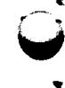

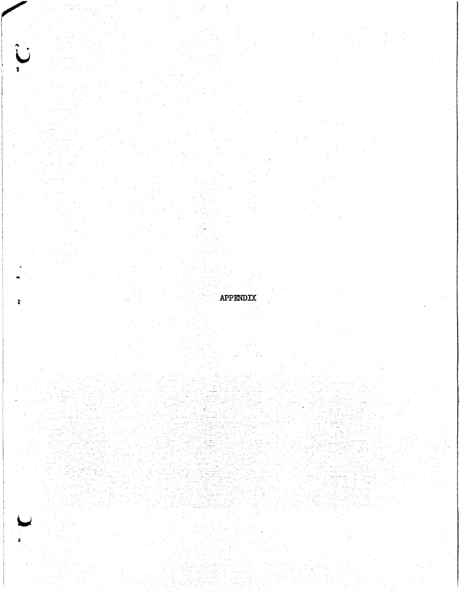

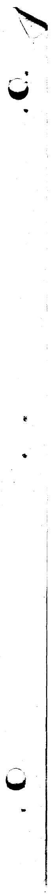

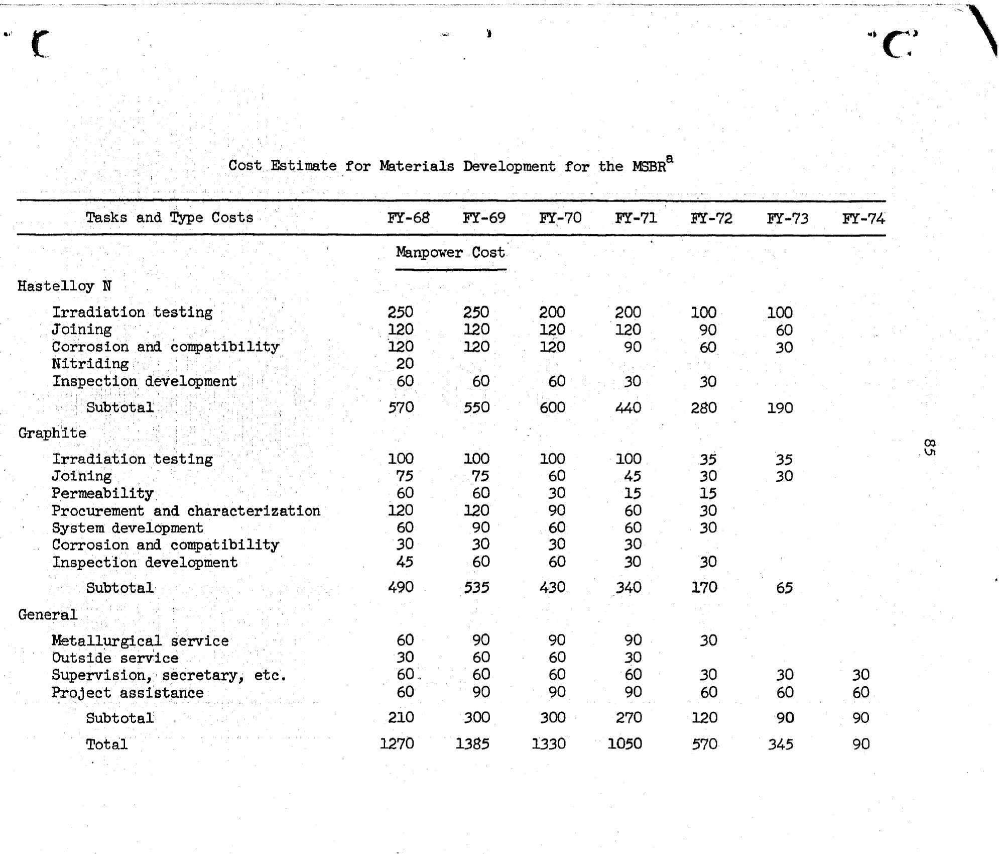

Cost Estimate (continued)   

<table><tr><td rowspan="2">Tasks and Type Costs</td><td colspan="7">Unusual Cost</td></tr><tr><td>FY-68</td><td>FY-69</td><td>FY-70</td><td>FY-71</td><td>FY-72</td><td>FY-73</td><td>FY-74</td></tr><tr><td>Hastelloy N</td><td></td><td></td><td></td><td></td><td></td><td></td><td></td></tr><tr><td>Reactor</td><td>50</td><td>50</td><td>50</td><td>40</td><td>40</td><td></td><td></td></tr><tr><td>Hot cells</td><td>60</td><td>60</td><td>60</td><td>60</td><td>60</td><td>30</td><td></td></tr><tr><td>Experiment and specimen fabrication</td><td>110</td><td>110</td><td>140</td><td>100</td><td>50</td><td></td><td></td></tr><tr><td>Materials</td><td>85</td><td>100</td><td>100</td><td>50</td><td>30</td><td></td><td></td></tr><tr><td>Analytical chemistry</td><td>40</td><td>30</td><td>30</td><td>30</td><td>10</td><td>5</td><td></td></tr><tr><td>Subtotal</td><td>345</td><td>350</td><td>380</td><td>280</td><td>190</td><td>35</td><td></td></tr><tr><td>Graphite</td><td></td><td></td><td></td><td></td><td></td><td></td><td></td></tr><tr><td>Reactor</td><td>100</td><td>100</td><td>50</td><td>100</td><td>100</td><td>100</td><td></td></tr><tr><td>Hot cells</td><td>10</td><td>20</td><td>20</td><td>20</td><td>10</td><td>10</td><td></td></tr><tr><td>Experiment and specimen fabrication</td><td>60</td><td>90</td><td>100</td><td>100</td><td>40</td><td></td><td></td></tr><tr><td>Materials</td><td>80</td><td>120</td><td>100</td><td>10</td><td>10</td><td>10</td><td></td></tr><tr><td>Analytical chemistry</td><td>20</td><td>20</td><td>20</td><td>10</td><td>5</td><td></td><td></td></tr><tr><td>Subcontracts</td><td>15</td><td>35</td><td>25</td><td></td><td></td><td></td><td></td></tr><tr><td>Subtotal</td><td>285</td><td>405</td><td>315</td><td>240</td><td>165</td><td>120</td><td></td></tr><tr><td>Equipment</td><td>100</td><td>50</td><td>50</td><td>50</td><td>10</td><td></td><td></td></tr><tr><td>Total</td><td>730</td><td>805</td><td>745</td><td>570</td><td>365</td><td>155</td><td></td></tr><tr><td></td><td colspan="7">Summary of Costs</td></tr><tr><td>Manpower total</td><td>1270</td><td>1385</td><td>1330</td><td>1050</td><td>570</td><td>345</td><td>90</td></tr><tr><td>Unusual total</td><td>730</td><td>805</td><td>745</td><td>570</td><td>365</td><td>155</td><td></td></tr><tr><td>Grand total</td><td>2000</td><td>2190</td><td>2075</td><td>1620</td><td>935</td><td>500</td><td>90</td></tr></table>

$^\mathrm{a}$ All costs in thousands of dollars.

# INTERNAL DISTRIBUTION

1-2. Central Research Library   
3. ORNL - Y-12 Technical Library Document Reference Section   
4-13. Laboratory Records Department   
14. Laboratory Records, ORNL R.C.   
15. ORNL Patent Office   
16. R. K. Adams   
17. G. M. Adamson, Jr.   
18. R.G.Affel   
19. L. G. Alexander   
20. R.F.Apple   
21. C. F. Baes   
22. J. M. Baker   
23. S.J.Ball   
24. W.P. Barthold   
25. H. F. Bauman   
26. S. E. Beall   
27. M. Bender   
28. E. S. Bettis   
29. F. F. Blankenship   
30. R. E. Blanco   
31. J. O. Blomeke   
32. R. Blumberg   
33. E. G. Bohlmann   
34. C. J. Borkowski   
35. G. E. Boyd   
36. J. Braunstein   
37. M. A. Bredig   
38. R. B. Briggs   
39. H. R. Bronstein   
40. G. D. Brunton   
41. D. A. Canonico   
42. S. Cantor   
43. W. L. Carter   
44. G. I. Cathers   
45. J. M. Chandler   
46. E. L. Compere   
47. W.H.Cook   
48. L. T. Corbin   
49. J. L. Crowley   
50. F. L. Culler   
51. J. E. Cunningham   
52. J. M. Dale   
53. D. G. Davis   
54. S.J.Ditto   
55. A. S. Dworkin

56. J. R. Engel   
57. E.P.Epler   
58. D. E. Ferguson   
59. L. M. Ferris   
60. A. P. Fraas   
61. H. A. Friedman   
62. J. H Frye, Jr.   
63. C. H. Gabbard   
64. R. B. Gallaher   
65. H. E. Goeller   
66. W. R. Grimes   
67. A. G. Grindell   
68. R. H. Guymon   
69. B. A. Hanneford   
70. P.H.Harley   
71. D. G. Harman   
72. C. S. Harrill   
73. P. N. Haubenreich   
74. F. A. Heddleson   
75. P. G. Herndon   
76. J. R. Hightower

77-79. M.R.Hill

80. H.W. Hoffman   
81. R.W.Horton   
82. T. L. Hudson   
83. H. Inouye   
84. W. H. Jordan   
85. P. R. Kasten   
86. R. J. Kedl   
87. M. T. Kelley   
88. M. J. Kelly   
89. C. R. Kennedy   
90. T. W. Kerlin   
91. H. T. Kerr   
92. S. S. Kirslis   
93. A. I. Krakoviak   
94. J. W. Krewson   
95. C. E. Lamb   
96. J.A. Lane   
97. R.B.Lindauer   
98. A. P. Litman   
99. M. I. Lundin   
100. R.N.Iyon   
101. H. G. MacPherson   
L02. R.E. MacPherson   
L03. C. D. Martin

<table><tr><td>104.</td><td>C. E. Mathews</td><td>184.</td><td>C. E. Sessions</td></tr><tr><td>105.</td><td>C. L. Matthews</td><td>185.</td><td>J. H. Shaffer</td></tr><tr><td>106.</td><td>R. W. McClung</td><td>186.</td><td>G. M. Slaughter</td></tr><tr><td>107-111.</td><td>H. E. McCoy, Jr.</td><td>187.</td><td>A. N. Smith</td></tr><tr><td>112.</td><td>H. F. McDuffie</td><td>188.</td><td>F. J. Smith</td></tr><tr><td>113.</td><td>C. K. McGlothlan</td><td>189.</td><td>G. P. Smith</td></tr><tr><td>114.</td><td>C. J. McHargue</td><td>190.</td><td>O. L. Smith</td></tr><tr><td>115.</td><td>L. E. McNeese</td><td>191.</td><td>P. G. Smith</td></tr><tr><td>116.</td><td>A. S. Meyer</td><td>192.</td><td>W. F. Spencer</td></tr><tr><td>117.</td><td>R. L. Moore</td><td>193.</td><td>I. Spiewak</td></tr><tr><td>118.</td><td>J. P. Nichols</td><td>194.</td><td>R. C. Steffy</td></tr><tr><td>119.</td><td>E. L. Nicholson</td><td>195.</td><td>H. H. Stone</td></tr><tr><td>120.</td><td>L. C. Oakes</td><td>196.</td><td>J. R. Tallackson</td></tr><tr><td>121.</td><td>P. Patriarca</td><td>197.</td><td>E. H. Taylor</td></tr><tr><td>122.</td><td>A. M. Perry</td><td>198.</td><td>R. E. Thoma</td></tr><tr><td>123.</td><td>H. B. Piper</td><td>199.</td><td>J. S. Watson</td></tr><tr><td>124.</td><td>B. E. Prince</td><td>200.</td><td>C. F. Weaver</td></tr><tr><td>125.</td><td>J. L. Redford</td><td>201.</td><td>B. H. Webster</td></tr><tr><td>126.</td><td>M. Richardson</td><td>202.</td><td>A. M. Weinberg</td></tr><tr><td>127.</td><td>R. C. Robinson</td><td>203-207.</td><td>J. R. Weir, Jr.</td></tr><tr><td>128.</td><td>H. C. Roller</td><td>208.</td><td>W. J. Werner</td></tr><tr><td>129-178.</td><td>M. W. Rosenthal</td><td>209.</td><td>K. W. West</td></tr><tr><td>179.</td><td>H. C. Savage</td><td>210.</td><td>M. E. Whatley</td></tr><tr><td>180.</td><td>W. F. Schaffer</td><td>211.</td><td>J. C. White</td></tr><tr><td>181.</td><td>C. E. Schilling</td><td>212.</td><td>L. V. Wilson</td></tr><tr><td>182.</td><td>Dunlap Scott</td><td>213.</td><td>G. Young</td></tr><tr><td>183.</td><td>H. E. Seagren</td><td>214.</td><td>H. C. Young</td></tr></table>

# EXTERNAL DISTRIBUTION

<table><tr><td>215-216.</td><td>D. F. Cope, RDT, SSR, AEC, Oak Ridge National Laboratory</td></tr><tr><td>217.</td><td>A. Giambusso, AEC, Washington</td></tr><tr><td>218.</td><td>J. L. Gregg, Bard Hall, Cornell University</td></tr><tr><td>219.</td><td>W. J. Larkin, AEC, Oak Ridge Operations</td></tr><tr><td>220-234.</td><td>T. W. McIntosh, AEC, Washington</td></tr><tr><td>235.</td><td>R. M. Roth, AEC, Oak Ridge Operations</td></tr><tr><td>236-237.</td><td>M. Shaw, AEC, Washington</td></tr><tr><td>238.</td><td>J. M. Simmons, AEC, Washington</td></tr><tr><td>239.</td><td>W. L. Smalley, AEC, Oak Ridge Operations</td></tr><tr><td>240.</td><td>D. K. Stevens, AEC, Washington</td></tr><tr><td>241.</td><td>R. F. Sweek, AEC, Washington</td></tr><tr><td>242-256.</td><td>Division of Technical Information Extension</td></tr></table>