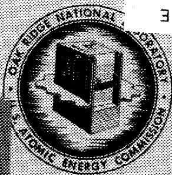
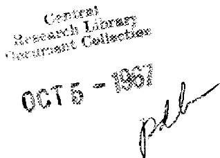
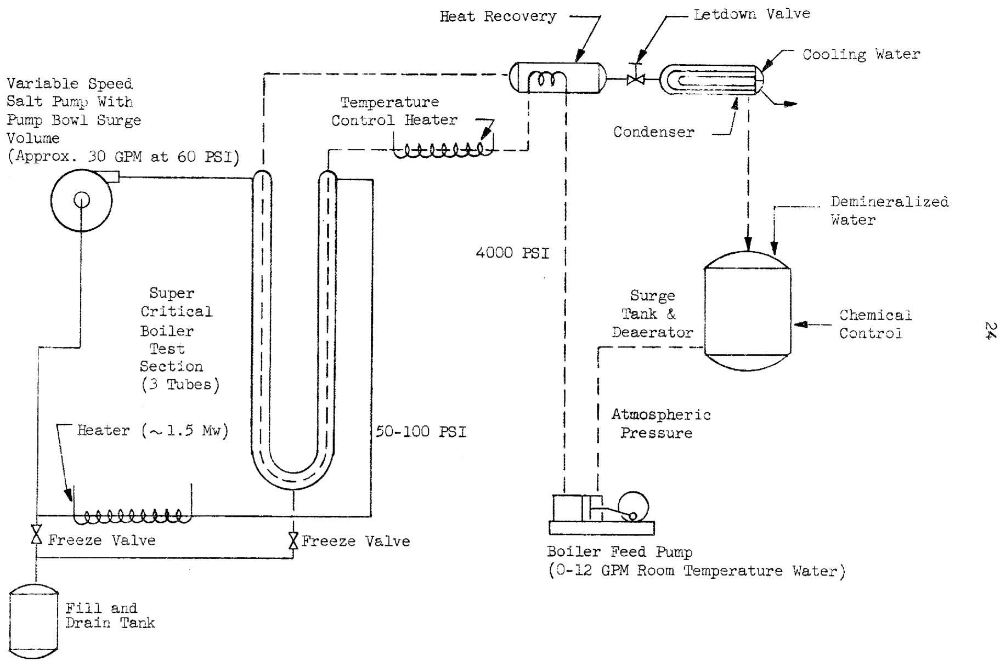
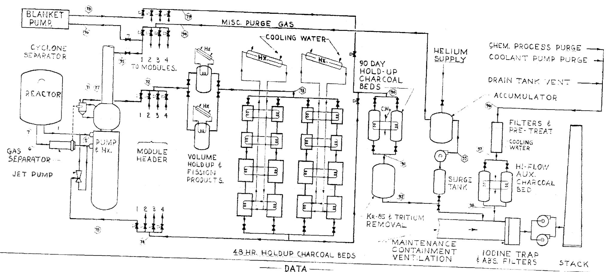
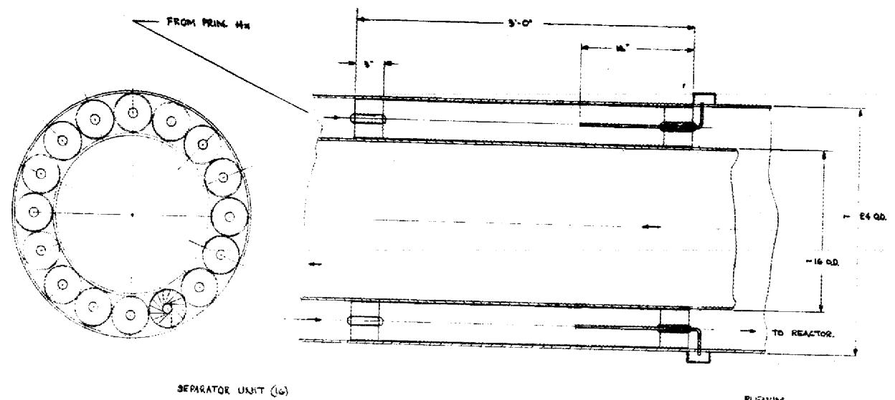
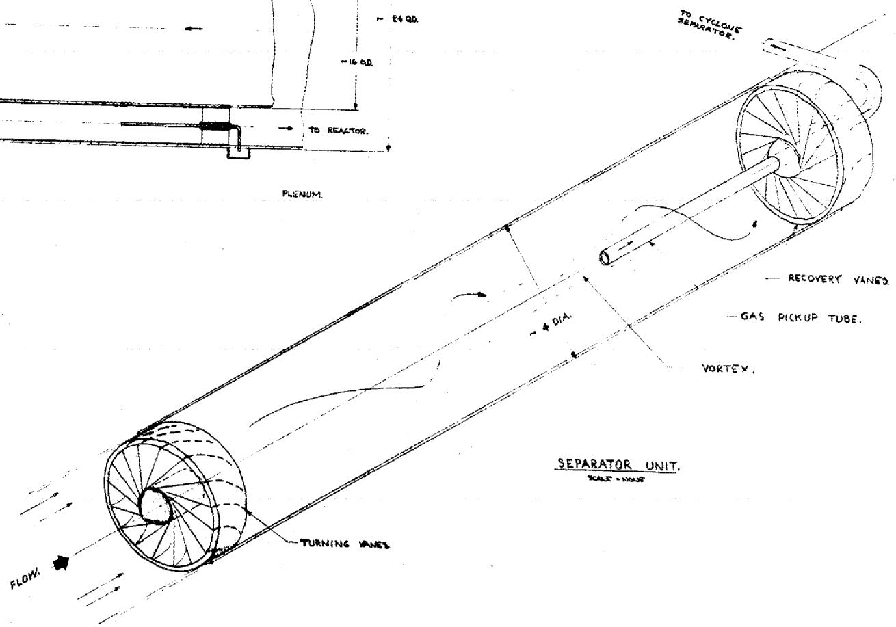
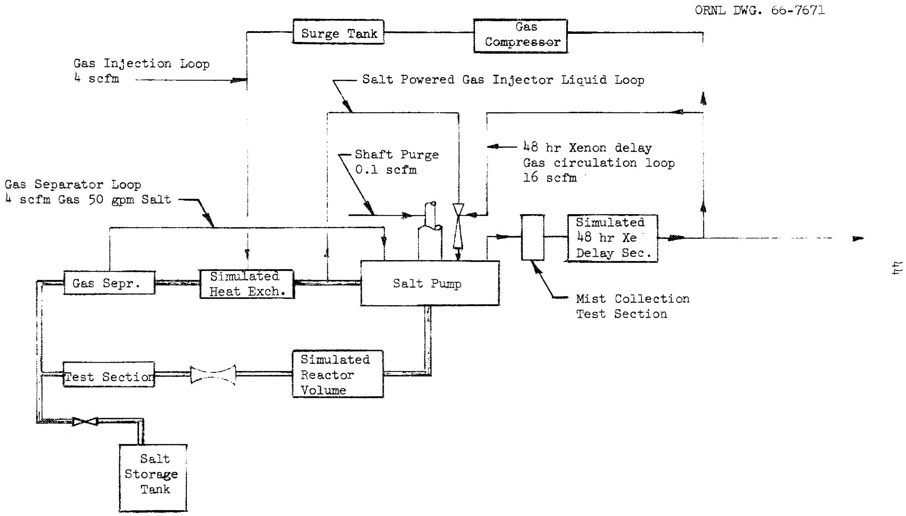
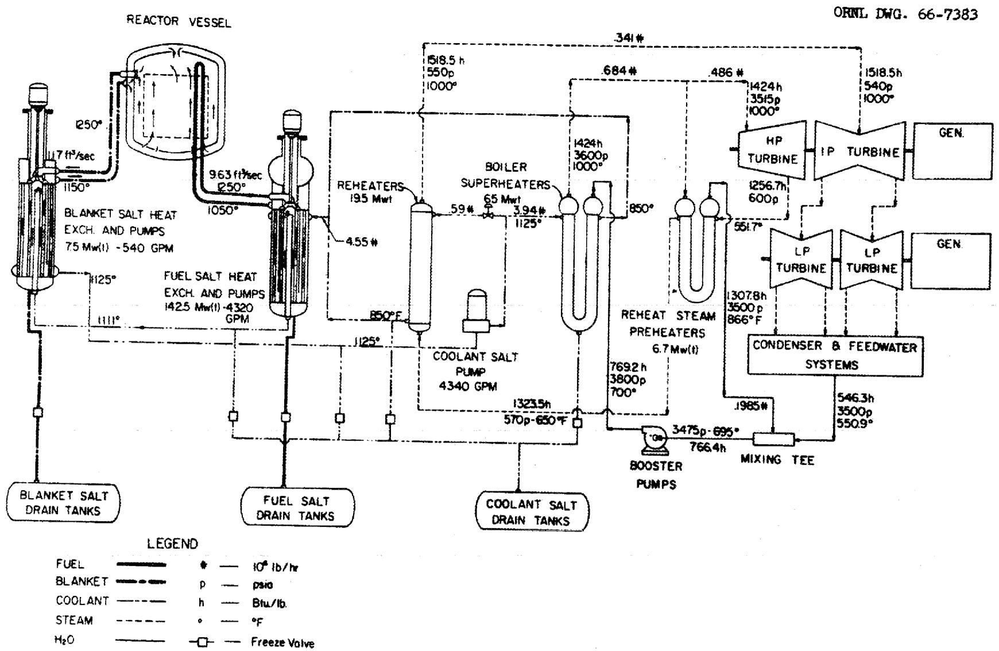

# NATIONAL LABORATORY

operated by

UNION CARBIDE CORPORATION

for the

3. 题型

C. ${\mathrm{F}}_{2}$ 的表现型比例为 $1 : 1$

U.S. ATOMIC ENERGY COMMISSION

ORNL-TM-1855

COPY NO. 132

DATE - 6/30/67

6/30

Dunlap Scott

A. G. Grindelli

# Abstract

A study was made of tharms

Identify important design and design

study was to organize these - in . The purpose

components for use in these problems into a program which

e use in a molten-salt breeder expani , '

Theorem 1.

The reference design concept is a two-region, two-fluid system with energy produced in the reactor fluid is transferred to a secondary cycle. The specific development problems to be studied include the systems, heat transfer in the heat exchangers and boiler-superheater, relief in coolant system, cell insulation and heaters, and the cover gas for individual components.

The final demonstration of the performance of the components and systems will be made in an essentially isothermal engineering test unit. will be used to train operators for the MSEE. A cost summary and schedule for the program cover eight years from the

- 100 from the start of the project.

乡

公

#

3

# NOTICE

This document contains information of a preliminary nature and was prepared primarily for internal use at the Oak Ridge National Laboratory. It is subject information is not to be abstracted, reprinted or otherwise given public dis- mation Control Department.

# LEGAL NOTICE

This report was prepared as an account of Government sponsored work. Neither the United States, nor the Commission, nor any person acting on behalf of the Commission:

A. Makes any warranty or representation, expressed or implied, with respect to the accuracy, completeness, or usefulness of the information contained in this report, or that the use of any information, apparatus, method, or process disclosed in this report may not infringe privately owned rights; or   
B. Assumes any liabilities with respect to the use of, or for damages resulting from the use of any information, apparatus, method, or process disclosed in this report.

As used in the above, "person acting on behalf of the Commission" includes any employee or contractor of the Commission, or employee of such contractor, to the extent that such employee or contractor of the Commission, or employee of such contractor prepares, disseminates, or provides access to, any information pursuant to his employment or contract with the Commission, or his employment with such contractor.

# INTRA-LABORATORY CORRESPONDENCE

# OAK RIDGE NATIONAL LABORATORY

October 3, 1967

To: Recipients of the subject report.

Report No.: ORNL-TM-1855 Classification: Unclassified

Author(s): Dunlap Scott and A. G. Grindell

Subject: Components and Systems Development for Molten-Salt Breeder Reactors

For your information:

Reference 7, on page 52 of subject report is incorrect. It should read as follows:

7P. G. Smith, Experience with High-Temperature Centrifugal Pumps in Nuclear Reactors and Their Application to Molten-Salt Thermal Breeder Reactors, ORNL-TM-1993 (September 1967).

${NH} = {N}_{2}$ 木炭素

N. T. Bray, Supervisor

Laboratory Records Department

Technical Information Division

NTB:WCB:dbp

UCN-6638 (3 5-65)

TABLE OF CONTENTS   

<table><tr><td>INTRODUCTION</td><td>Page 1</td></tr><tr><td>GENERAL STATUS OF TECHNOLOGY</td><td>1</td></tr><tr><td>PURPOSE AND SCOPE OF DEVELOPMENT PROGRAM</td><td>2</td></tr><tr><td>REACTOR CORE</td><td>2</td></tr><tr><td>Review of Hydraulic Tests of the MSRE Core</td><td>2</td></tr><tr><td>Hydraulic Tests for the MSBE Core</td><td>4</td></tr><tr><td>Fuel Cell Tests in Molten Salt</td><td>5</td></tr><tr><td>CONTROL ROD AND DRIVE</td><td>5</td></tr><tr><td>Control Rod System for the MSRE</td><td>6</td></tr><tr><td>Control Scheme for the MSBR</td><td>6</td></tr><tr><td>SALT PUMPS FOR MOLTEN SALT</td><td>7</td></tr><tr><td>Present Technology</td><td>7</td></tr><tr><td>Requirements for Pumps for Breeder Reactors</td><td>8</td></tr><tr><td>Program Scope</td><td>10</td></tr><tr><td>Design and Development Program</td><td>11</td></tr><tr><td>Effects of Physical Properties of Breeder Salts on Pump Design</td><td>11</td></tr><tr><td>Specific Design Problems and Goals</td><td>12</td></tr><tr><td>Separation Requirement</td><td>12</td></tr><tr><td>Hydraulic Design</td><td>12</td></tr><tr><td>Rotordynamic Analysis</td><td>12</td></tr><tr><td>Plastic Strain</td><td>13</td></tr><tr><td>Purge Gas Requirements</td><td>13</td></tr><tr><td>Size-Scaling Requirements</td><td>13</td></tr><tr><td>Specific Development Problems and Goals</td><td>13</td></tr></table>

TABLE OF CONTENTS - cont'd

Page

Fuel and Blanket Pumps 14

Shaft Damper Tester 14

Molten-Salt Bearing Tester 14

Pump Test Facility 14

Coolant Salt Pumps 15

HEAT EXCHANGERS 15

Review of Heat Exchangers in the MSRE 15

Fundamental Molten-Salt Heat Transfer 17

Heat Exchangers for Breeder Reactors 20

Fuel-Salt Heat Exchanger 20

Blanket-Salt Heat Exchanger 21

Steam Reheater 21

Reheat Steam Preheaters 21

Boiler-Superheater 21

Heat Transfer Enhancement 23

PRESSURE RELIEF IN COOLANT SYSTEM 25

DRAIN AND STORAGE TANKS 25

Drain Tank System for the MSRE 25

Drain Tank System for the MSBE 26

VALVES FOR MOLTEN SALTS 28

SALT SAMPLERS 29

GAS SYSTEM 31

MSRE Cover and Offgas Systems 31

MSRE Gas System Performance 32

MSBR Offgas System 34

TABLE OF CONTENTS - cont'd

Page

MSBE Offgas System 37

Development Program 37

Gas Separator 38

Mass Transfer to Circulating Bubbles 38

Salt-Powered Injector 38

Cyclone Separator 40

Salt-Mist Removal 40

Fission Product Filter 41

Kr-85 and Tritium Removal System 42

Gas Compressor 42

Gas Sampler 42

MSBE Gas System Test Loop 43

CELL FURNACE AND SHIELDING 43

STEAM SYSTEM 45

TURBINE GENERATOR 46

ENGINEERING TEST UNIT 46

SCHEDULE AND COST 49

ACKNOWLEDGEMENTS 51

# INTRODUCTION

The conceptual design of a 1000-Mw(e) Molten-Salt Breeder Reactor (MSBR) is described in ORNL-3996. The Molten-Salt Reactor Experiment (MSRE),2 now operating, represents a first step in the development of such a reactor. A Molten-Salt Breeder Experiment (MSBE) is proposed as the next step. This reactor would be a 100- to 150-Mw(th) model of the MSBR designed to demonstrate all aspects of the breeder technology under conditions at least as severe as those proposed for the full-scale breeder. Components and systems for the MSBE would incorporate all the features of the full-scale units so that "scaling-up" the equipment to higher power level would be the major task in building the reference breeder.

The purpose of this report is to describe the present status of development of components and systems for molten-salt reactors and to present a development program for the MSBE. Since no design has been made for the breeder experiment, the program is based on a study of the problems of the reference design assuming that the MSBE would be a "scaled-down" version of the modular concept described in the reference report. For purposes of organizing this report and the development program, the plant was subdivided into components, systems, and general problem areas. The design, the problems, the present status of the technology, and the required development are discussed for each subdivision.

# GENERAL STATUS OF TECHNOLOGY

The initial technology development for molten-salt reactors was done in the early 1950's in the Aircraft Nuclear Propulsion (ANP) Program at Oak Ridge National Laboratory. In carrying out this program, much information on the physical, chemical, and engineering characteristics of molten-salt systems was obtained from studies of fluoride salt chemistry, and materials compatibility, and from development of components, materials, fabrication methods, and reactor maintenance methods. In 1954 the Aircraft Reactor Experiment (ARE), a 2-1/2 Mw(th) molten-salt reactor--fueled with $\mathrm{UF_4}$ dissolved in a mixture of zirconium and sodium fluorides, moderated with beryllium oxide, and contained in Inconel--was built and operated successfully at outlet salt temperatures up to $1650^{\circ}\mathrm{F}$ .

The present molten-salt reactor program was initiated in 1957, drawing upon the information developed in the ANP program as well as beginning new investigations. By 1960 enough favorable experimental results were obtained to support authorization for design and construction of a 10-Mw(th) Molten-Salt Reactor Experiment (MSRE). The MSRE initiated power operation in early 1966, and provides facilities for testing fuel salt, graphite, and Hastelloy N under appropriate reactor operating conditions. The basic reactor performance to date has been outstanding, and indicates that the desirable features of the molten-salt concept can be embodied in a practical reactor that can be constructed, operated, and maintained with safety and reliability.

The purpose of the program is to provide components and systems with demonstrated reliability for use in the MSBE. All components and systems must be of a design that can be scaled up to the higher power level of the MSBR. The development of new types of equipment and improvement of existing equipment require that life-tests be performed. Such tests provide information on limiting operational characteristics and assist in predicting maintenance requirements. In addition, certain performance tests must be made on components when operated as part of a system to provide information for evaluating the compatibility of the component with the system.

The development of new types of equipment such as the steam generator, the off-gas disposal system, the salt-cooled control rod, and the long shaft molten-salt pumps will require separate test facilities of significant size. In addition, there will be numerous small tests conducted to assist in resolving design features as well as to establish the expected life of some components. These small tests may be conducted in separate facilities but in many cases they can be incorporated into one of the larger test facilities. In many areas the technology is reasonably well established, but conservative engineering requires performance and life testing of the components to make sure they will operate satisfactorily with the reactor.

For a final demonstration of the reliability and compatibility of all molten-salt connected components and systems, an Engineering Test Unit (ETU), a full-scale operating model of this MSBE, will be constructed and operated, essentially isothermally, over the ranges of temperature and salt flow proposed for the MSBE. As described in the appropriate sections, the final evaluation of the components will be made while operating as a part of this system. The model will also be used to train operators for the reactor and to demonstrate the maintenance procedures and equipment.

# REACTOR CORE

# Review of Hydraulic Tests of the MSRE Core

The MSRE reactor vessel is a 5-ft-diam by 8-ft-high tank that contains a 55-in.-diam by 67-in.-high graphite core structure. Under design conditions of 10 Mw of reactor heat, the fuel salt would enter the flow distributor at the top of the vessel at $1175^{\circ}\mathrm{F}$ and 20 psig. The fuel is distributed evenly around the circumference of the vessel and then flows turbulently downward in a spiral path through a 1-in. annulus between the vessel wall and the core can. The salt loses its rotational motion in the straightening vanes in the lower plenum and turns and flows upward through the graphite matrix in the core can. The graphite matrix is an assembly of vertical bars, 2 in. by 2 in. by about 67 in. long. The fuel flows in 0.4-in. by 1.2-in. channels that are formed by grooves in the sides of the bars. There are about 1140 of these

passages. Fuel was to leave the top of the reactor at $1225^{\circ}\mathrm{F}$ . Additional description of the MSRE core is given in the MSRE Design Report. The core development program was divided into two phases. The first phase consisted of building and testing a 1/5 linearly scaled plastic model. This model was operated with water and was relatively inexpensive. It was used as a rapid method of checking the preliminary design to establish the acceptability of major concepts.

The second phase consisted of building and testing a full-scale model of the core at the rated flow. This model was used to establish the design. The core vessel was made of carbon steel and the moderator bars were extruded from aluminum. This model was used for a final and much more detailed look at the hydraulic and thermal characteristics of the core. Some of the major items studied were:

1. Overall pressure drop and distribution of this pressure drop among the core components.   
2. Flow distribution by the volute.   
3. Efficiency of the swirl killers in the lower vessel head.   
4. Heat transfer coefficients in the lower and upper heads to assure adequate vessel wall cooling.   
5. Flow distributions in the lower and upper head to assure that no stagnant salt pockets were present.   
6. Tendency of particulate matter to settle out in the lower vessel head, on the tops of the core bars, and on the core support flange.   
7. Various other more minor phenomena.

Most of the measurements were made with water in the loop, and at flow rates from the design flow down to $25\%$ of the design flow. With water, however, the Reynolds number was several times higher than would be expected for fuel salt at the noted flow rate. To attain Reynolds similarity, a thickening agent was added to the water to increase its viscosity, and therefore decrease the Reynolds number. Several of the items in the above list were then rechecked. The agreement between measurements in the 1/5 scale model, the full-scale model with water, and the full-scale model with thickened water, was good where equivalent measurements were made. None of these measurements were checked in a molten-salt system. It was believed that the heat and momentum transfer analogies were adequately well established to extrapolate water data to a molten-salt system with a degree of reliability much greater than was required to insure adequate performance of the MSRE.

During the course of MSRE core development, several small models were made to check some hydraulic phenomena. Generally, these models were made of plastic and operated with tap water.

# Hydraulic Tests for the MSBE Core

The reactor core for the MSBE is expected to be about 4-ft-diam by 5-ft-high and composed of re-entrant type graphite fuel cells through which the fuel salt flows. The graphite tubes are attached to two plenum chambers at the bottom of the reactor with graphite-to-metal transition sleeves. Fuel from the entrance plenum flows up through the outer annulus of the fuel cell and down through the central passage to the exit plenum. The fuel flows from the exit plenum to the pump then through the heat exchanger and back to the reactor. A 2-ft-thick blanket of a thorium-containing salt and graphite surrounds the core. The blanket salt also permeates the interstices of the core lattice so fertile material flows through the core without mixing with the fissile fuel salt.

Generally speaking, the MSBE core will be studied more critically than the MSRE core because of its much higher power density. The proposed development program for the MSBE core will be, in many respects, similar to that for the MSRE core, and can be thought of as a two-phase program.

The first phase will be directed toward making plastic models as necessary for rapid and preliminary checks on major design concepts. This could take the form of a complete scaled-down plastic model as in the MSRE, but probably not. Rather, small plastic models of individual core components will be built and tested. Probable examples are:

1. A small model of the fuel salt distribution plenums would be built and tested for proper flow distribution to the fuel cells.   
2. A small model of the blanket salt distributor would be built and tested for proper flow distribution.   
3. A single full-scale model of a fuel cell would be built and tested with tap water to measure the pressure drop and check for adequate degassing on startup.   
4. Other models as needed to provide confidence in the design.

Assembled units do not always behave as one might expect from observing individual components. It is therefore necessary to test hydraulically a complete prototype of the core. A full-scale prototype is available in the ETU and it is planned to run the ETU with water for a period of time, thus fluid measurements could be easily obtained. However, it may take 6 months to a year to make all the measurements necessary in the core. It would certainly be undesirable to restrict the ETU to water operation for this long a period of time. We therefore plan, as phase two, to build another and much less expensive prototype of the core suitable for operating in a circulating water loop. This special loop will also allow us to start testing the core sooner than in the ETU, possibly in FY 1969. The loop will simulate both salt systems. The core size will be half to full scale, although full scale

is probably more desirable. The principal objectives of this model will be:

1. To demonstrate the required flow distribution of fuel and blanket salt throughout the core.   
2. To insure adequate flow for cooling structural members of the core.   
3. To demonstrate that no stagnant fuel and blanket salt regions exist.   
4. To insure complete degassing of all fuel tubes during filling and startup.   
5. To show that fluid induced vibrations are below acceptable levels.

These measurements will be made over a range of flow rates both above and below the design values. Water will be the fluid used in most of these tests and Reynolds similarity will not hold. Where necessary, the measurements will be repeated with a thickening agent added to the water to attain Reynolds similarity.

Measurements made in the ETU would then be limited to those thought necessary to confirm results of the water model. Certainly some data will be taken with water in the system. Some direct measurements with salt in the system may be necessary, although this will be a more difficult task and might have to await development of additional instrumentation. Nevertheless, if some fluid dynamic characteristic of the core is sufficiently critical, it could be checked out in the ETU while circulating salt.

# Fuel Cell Tests in Molten Salt

Demonstration of the performance of full-scale MSBE fuel cells without radiation is an important part of the early phases of core development for the MSBE. As soon as practicable, representative graphite fuel cells will be operated with the full design salt flows, temperatures and pressure differences. These tests will be run in the pump development loop and the off-gas test loop. Removal and replacement by the remote means will be demonstrated as part of this test program.

# CONTROL ROD AND DRIVE

The design of the MSBR takes advantage of the ease of adding fuel while the reactor is operating to minimize the excess reactivity in the core, the ability to drain the fuel to effect complete shutdown and safety functions. However, a control rod or rods, as yet undesigned, are included to permit short-term adjustments to the reactor temperature.

# Control Rod System for the MSRE

The control rod system for the MSRE consists of a flexible poison rod that is moved in and out of a re-entrant thimble by a continuous link-chain drive mechanism. This chain drive is controlled by a servomotor through a magnetic-clutch arrangement which permits rapid insertion of the poison rod. In addition there are electrical synchros and potentiometers for remote indication of position, limit switches for control of the range of motion, and a shock absorber to stop the rapid insertion. The drive unit and the control element are cooled by circulating air through the drive housing and through the center of the control rod.

The poison elements operate at a temperature in the 1200 to $1400^{\circ}\mathrm{F}$ range. The electromechanical drive unit, mounted well above the reactor vessel, is slightly above ambient cell air temperature which does not exceed $150^{\circ}\mathrm{F}$ . Two conditions dominated the design, high-thimble temperature and maintenance-free operation. The electromechanical design of the drive unit is straightforward, complicated principally by space restrictions. It was not expected to be troublesome. The service record of these MSRE rods and associated drive units has been good but only because the final design was preceded by over a year of concentrated developmental testing of a prototype unit. As expected, these tests disclosed a number of defects and confirmed the quality of the final version.

# Control Scheme for the MSBR

Although experience with the control rods for the MSBE provides a useful background, the control rod and drive for the MSBE will be considerably different. Design of the drive should be straightforward but aircooling of the rod would not suffice at the much higher power density, and the metal thimble would absorb too many of the neutrons needed for breeding $^{233}\mathrm{U}$ . A likely control scheme for the MSBE involves the insertion of the control element directly into the center of the reactor core, without using a thimble, and letting the fertile blanket salt provide the necessary cooling. If it proves necessary to provide cooling for the portion of the graphite rod which is in the gas space above the fertile salt, a small stream can be diverted from the inlet line and directed over the rod. One problem of this scheme is that the drive mechanism must also be within a gas space directly connected to the blanket salt. Not only does this radioactive environment present a problem of electrical design but it also makes the repair of the drive difficult. A system of gas seals and buffer control should be developed to permit the drive to operate in a clean gas atmosphere.

A thorough development and prototype testing program will be required. Components of the drive and rod will be tested separately, and then tested in assembly in a simulated reactor environment. Finally, the rod will be operated in the ETU.

# SALT PUMPS FOR MOLTEN SALT

The approach which will be followed to provide the pumps required for molten-salt breeders is outlined. A brief resume is presented of the present status of molten salt pump technology at ORNL and the considerations given to using the MSRE pump configuration in the breeder concept. A more desirable pump configuration is broached, and the problems anticipated with it are listed. Finally, the specific design and development problems for the new configuration as they are presently envisioned are discussed in more detail.

# Present Technology

The present status of the technology of molten salt pumps at ORNL is set forth in References 3, 4, 5 and 6. In brief, we have developed the sump pump configuration in which the impeller is mounted on the lower end of the pump shaft below the lower shaft bearing. Conventional ball bearings and shaft seals, lubricated and cooled with a petroleum base turbine oil, are utilized. The vertical shaft is mounted in a bearing housing to support and guide the impeller in the pump volute, which is an integral part of the pump tank. The pump tank also serves as the expansion tank for the molten salt system and is used in the MSRE for the removal of gaseous fission products such as $^{135}\mathrm{Xe}$ .

These pumps have been built in sizes from 2 to $1600\mathrm{~gpm}$ to develop heads to $400\mathrm{ft}$ of fluid. They have been used to pump molten salts and liquid metals to temperatures of $1500^{\circ}\mathrm{F}$ . The MSRE fuel salt pump circulates $1200\mathrm{~gpm}$ normally at $1210^{\circ}\mathrm{F}$ against $49\mathrm{ft}$ of head, and the coolant salt pump circulates $850\mathrm{~gpm}$ normally at $1020^{\circ}\mathrm{F}$ against $78\mathrm{ft}$ of head. The MSRE prototype fuel pump was operated at temperatures up to $1500^{\circ}\mathrm{F}$ .

Four 5 gpm pumps, one 750 gpm and one 1200 gpm pump, were operated at temperatures above $1200^{\circ}\mathrm{F}$ for periods greater than one year. The 750 gpm pump was operated with molten salt for 25,000 hr at $1200^{\circ}\mathrm{F}$ in a regime of cavitation. Another test pump which was equipped with a submerged journal bearing lubricated with molten salt was operated for 12,000 hr, during which it was started and stopped approximately 100 times.

Two pump characteristics of concern to operation of the MSRE were determined in somewhat special fashions. Techniques were developed using $^{85}\mathrm{Kr}$ to measure the back diffusion of gaseous fission products against a flow of purge gas in the shaft annulus of the MSRE fuel pump. The concentration of undissolved gas in the circulating molten salt was measured for the MSRE fuel pump in the prototype pump test facility using radiation densitometry devices and techniques adapted to the task.

Larger pumps, of designs similar to those proposed for large molten salt pumps, have been built and operated in liquid metal cooled reactors. Operating conditions for three such pumps are given in Table 1. Experi- ence with these pumps bears directly on the development of pumps for the

molten salt breeder reactors. A survey7 of the pertinent design features and the operating experiences with these larger pumps is being made to stimulate and enhance their contribution to the design of the breeder salt pumps.

Table 1. Pumps for Liquid Metal Reactors   

<table><tr><td></td><td>Hallam</td><td>Fermi</td><td>EBR-2</td></tr><tr><td>Flow, gpm</td><td>7200</td><td>11,800</td><td>5500</td></tr><tr><td>Head, ft</td><td>160</td><td>310</td><td>200</td></tr><tr><td>Temperature, °F</td><td>1000</td><td>1000</td><td>800</td></tr><tr><td>Speed, rpm</td><td>900</td><td>900</td><td>1035</td></tr><tr><td>Pumping power, bhp</td><td>350</td><td>1060</td><td>350</td></tr><tr><td colspan="4">Operating experience:</td></tr><tr><td colspan="4">Hallam pumps accumulated several thousand hr of pump operation with sodium from 300 to 950°F, of which at least 1000 hr was at 950°F.</td></tr><tr><td colspan="4">Fermi pumps accumulated over 7000 hr operation including two weeks at 1000°F.</td></tr></table>

# Requirements for Pumps for Breeder Reactors

The presently envisioned requirements of the fuel, blanket, and coolant salt pumps for a 1000 Mw(e) Molten-Salt Breeder Reactor (MSBR) plant, and for the Molten Salt Breeder Experiment (MSBE), a 150 Mw(th) experiment, are presented in Table 2. Tentative values for pertinent hydraulic design parameters, e.g., speed, specific speed, are given also.

The centrifugal sump pumps developed and used in the Aircraft Reactor Experiment (ARE), the Aircraft Reactor Test program (ART), and the Molten-Salt Reactor Experiment (MSRE) received first consideration for application to the Molten-Salt Breeder Reactor (MSBR). There are at least three differences between the MSRE and the MSBR concept whose effects on the thermal and nuclear radiation environments will influence the choice of the pump configuration for the MSBR.

Depending on the type of designs, the power rating for the MSBR is fifty to 200 times greater than MSRE design power. In addition, the separation distances between its reactor, heat exchanger, and pump are equal to or smaller than the corresponding MSRE distances. Thus the intensity of the nuclear radiations in the vicinity of the fuel pump will be very much greater for the MSBR than the MSRE.

Table 2. Pumps for Breeder Reactors   

<table><tr><td></td><td>Fuel</td><td>Blanket</td><td>Coolant</td></tr><tr><td colspan="4">2225 Mw(th) MSBR</td></tr><tr><td>Number required</td><td>4a</td><td>4a</td><td>4a</td></tr><tr><td>Design temperature, °F</td><td>1300</td><td>1300</td><td>1300</td></tr><tr><td>Capacity, gpm</td><td>11,000</td><td>2000</td><td>16,000</td></tr><tr><td>Heat, ft</td><td>150</td><td>80</td><td>150</td></tr><tr><td>Speed, rpm</td><td>1160</td><td>1160</td><td>1160</td></tr><tr><td>Specific speed, Ns</td><td>2830</td><td>2150</td><td>3400</td></tr><tr><td>NPSH, required, ft (Net positive suction head)</td><td>25</td><td>8</td><td>32</td></tr><tr><td>Impeller input power, hp</td><td>990</td><td>250</td><td>1440</td></tr><tr><td colspan="4">150 Mwt MSBE</td></tr><tr><td>Number required</td><td>1</td><td>1</td><td>1</td></tr><tr><td>Design temperature, °F</td><td>1300</td><td>1300</td><td>1300</td></tr><tr><td>Capacity, gpm</td><td>4500</td><td>540</td><td>4300</td></tr><tr><td>Heat, ft</td><td>150</td><td>80</td><td>150</td></tr><tr><td>Speed, rpm</td><td>1750</td><td>1750</td><td>1750</td></tr><tr><td>Specific speed, Ns</td><td>2730</td><td>1520</td><td>2670</td></tr><tr><td>NPSH required, ft (Net positive suction head)</td><td>27</td><td>5</td><td>26</td></tr><tr><td>Impeller input power, hp</td><td>410</td><td>61</td><td>390</td></tr></table>

aThe same total number of pumps is required for a 1000 Mw(e) plant of the MSBR reference design or modular design.

Another difference concerns the manner of heating the MSBR. One of the features of the MSBR concept is the use of large furnaces to contain the fuel, blanket and coolant salt systems and to maintain them at elevated temperatures during reactor power operation. The temperature in the furnace for the fuel and blanket salt systems will range between 1050 and $1150^{\circ}\mathrm{F}$ . The temperature in the coolant salt system furnace may range between 700 and $1150^{\circ}\mathrm{F}$ .

A list of the conditions and circumstances under which the MSRE pump configuration may be used in the fuel and blanket salt systems include:

a. Provide a specially constructed and cooled pit, both to maintain the ambient temperature for the bearing housing in the range 150 to $175^{\circ}\mathrm{F}$ , and reduce intensity of nuclear radiations.   
b. Develop suitable shaft bearings and seals and the associated lubricant for operation at a higher ambient temperature which, although still requiring the construction of a pump pit, would materially reduce the heat load on the pump pit cooling system.   
c. Return to the concept of local preheating of the salt system components, with attendant use of local nuclear radiation shielding and space cooling, to maintain the ambient temperature below $200^{\circ}\mathrm{F}$ .

In a more desirable pump configuration, the thermal and radiation damage sensitive drive motor is separated from the pump, per se, by a sufficiently large distance to provide both reasonable thermal gradients in the pump structure and adequate amounts of radiation attenuation materials. The approach is to separate the drive motor from the hostile environments by as large a distance as practicable within the limits of rotordynamic, fabrication, and reactor layout considerations. Preliminary study indicates that the required separation probably cannot be obtained with the MSRE pump configuration using a reasonable shaft diameter. Thus initial consideration will be given to a pump configuration that features a rather long slender shaft and utilizes molten salt lubricated bearings and probably shaft dampers.

# Program Scope

The pump program will provide for the study and design of the fuel, blanket, and coolant salt pumps for the larger MSBR, and for the design and development of those pumps for the smaller MSBE. The study will include the evaluation of the feasibility of the long shaft pump configuration and the practicability of scaling it down by a factor of four to suit the MSBE pump requirements.

Our present approach is to use one basic pump rotary assembly design and to accommodate the differences in the hydraulic requirements for the three pumps with appropriate changes in the hydraulic designs of the impeller and volute and in the characteristics of the drive motors.

If, for reasons of reactor system layout the coolant salt pump requires separate treatment, then either the long shaft configuration will be modified or the MSRE pump configuration will be used, depending upon the results of further study.

One each of the fuel, blanket, and coolant salt pumps will be provided for 1) development, 2) the Engineering Test Unit, and 3) the Molten-Salt Breeder Experiment.

In essence, the study portion of the program will be focused on identifying pump configurations that are feasible for the MSBR, and the development portion of the program will be concerned with producing pumps for the MSBE, which will be scaled-down versions of the MSBR configurations. During the development of the MSBE pumps, attention will be given to the problems of scaling-up components for use in the MSBR pumps.

# Design and Development Program

Because of the importance of the pumps and the close relationship between their design and development, these two activities are considered to be one. In this activity the major problems are expected to include:

1. selecting a hydraulic design,   
2. choosing a satisfactory rotordynamic configuration,   
3. controlling the total plastic strain in the pump caused by temperature cycling of the system,   
4. specifying purge gas requirements to prevent back diffusion of gaseous fission products to radiation sensitive regions of the pump,   
5. controlling adequately any flow which passes through the pump tank, a) to prevent the re-entrainment of xenon-laden gas in the recirculating salt, and b) to prevent stoppage of purge gas flow by freezing of salt splash or aerosol in the pump shaft annulus,   
6. designing and proof testing an adequate shaft damper, a molten-salt lubricated bearing, and any shaft seal that is larger in diameter than now used,   
7. verifying the adequacy of the hydraulic and rotordynamic designs,   
8. providing pump reliability, and   
9. obtaining confidence in scaling-up the MSBE pumps to fit the requirements of large-scale plants.

# Effects of Physical Properties of Breeder Salts on Pump Design

Density and viscosity are the two physical properties of molten salts which strongly affect pump design. Salt density mainly affects the torque requirements for the pump impeller and requires that the shaft has sufficient torsional strength and that the drive motor produces the required torque. Both of these items, which are under the control of the pump designer, should present no untoward problem in the design of the breeder pumps.

Viscosity strongly affects the life characteristics of the hydrodynamic bearings, which we anticipate will be used in the breeder pumps. The values of the viscosity for all three breeder reactor salts are similar and greater than water and should present no untoward problem in the design of molten salt lubricated bearings.

# Specific Design Problems and Goals

Separation Requirement. The principal feature of the long shaft pump configuration is the use of sufficient separation distance and shielding to provide for ten years of operation of the drive motor. Such a configuration requires a long, slender shaft guided at its lower end by a molten-salt bearing and at its upper end by a more conventional bearing and using, hopefully, a conventional, easily replenishable lubricant. A shaft damper will probably be necessary to provide for operation at a speed above the first critical frequency of the shaft-bearing system.

Estimates of the separation distance between the pump impeller and drive motor will be made based on the anticipated flux of neutrons and gamma radiation at the motor and the shielding required to provide ten-year life for the radiation damage sensitive materials in the fuel and blanket pumps.

Hydraulic Design. We plan to select the hydraulic design which will provide the required head (H) and capacity (Q) at as high shaft speed (N) as good practice and the available net positive suction head (NPSH) in the system will permit. This approach should permit the use of a relatively small diameter impeller and volute and should minimize the parasitic volume of salt. Vanes for the back side of the impeller, suitable for reducing hydraulic thrust, will receive consideration.

Rotordynamic Analysis. The principal analytical problem we anticipate concerns the selection of satisfactory pump rotordynamic configurations. These should provide reliable and economic pumps for the fuel, blanket, and coolant salt circuits in the MSBR, which can be scaled-down by a factor of approximately four for use in the MSBE.

The rotordynamics of the proposed "long shaft" configuration are new to us and will be analyzed extensively to determine a suitable arrangement of shaft, bearings, and shaft damper. We plan to select two or three out of several promising shaft-bearing configurations which provide the required separation, and to subject them to rotordynamic analysis. The location and performance characteristics of both shaft dampers and bearings necessary to provide a safe margin of fatigue life for the shaft during ten-year operation will be determined for several values of shaft diameter. The configuration which has the best chance of providing reliable pumps will be chosen for development. Appropriate rotordynamic analysis of a reduced scope will be performed for the coolant salt pump, if a different configuration is required.

Plastic Strain. Temperature cycles in a salt system can impose increments of plastic strain in the high-temperature portions of the pump due to changes in either thermal stresses associated with steep temperature gradients or mechanical stresses associated with pipe anchor forces and moments exerted on pump nozzles. We noted that the largest temperature gradients associated with the nuclear operation of the MSRE fuel pump were caused by heat deposited in the pump walls by gaseous fission products. It is likely that more fission products will be present and heat will be deposited in larger quantities in the salt reservoir in the MSBR fuel pump. We plan to use a small portion of the circulating fuel salt to remove the heat. The total plastic strain in the pump nozzles, resulting from the forces associated with heating and cooling the system and changing reactor power levels, will be estimated for a specified number of cycles. Measures will be taken to keep the total strain within the plastic fatigue strength of the container material.

Purge Gas Requirements. An inert purge gas will be used in the MSBR, as in the MSRE, to: (1) remove, dilute, and transport to an appropriate trap system the xenon and other gaseous fission products from the fuel salt; (2) reduce the back diffusion of these gaseous fission products into radiation sensitive regions of the pump; and (3) remove any lubricant that leaks past a shaft seal without permitting the leakage to enter the pumped salt. The amount of purge gas required for the fuel and blanket salt pumps will be much larger than for the MSRE fuel pump, and a recycle system will be used to conserve gas. The recycle system is treated in the section on the offgas system. The smaller purge gas flow for the coolant salt pump may permit open-cycle operation.

Size-Scaling Requirements. Pumps for the MSBR and MSBE should use the same general configurations. The feasibility of scaling up the MSBE pumps by a factor of four for application to the MSBR will be one criterion for acceptance of MSBE pump design. The scaling of the rotordynamic configuration will be made a part of the analysis of the MSBR pumps, which, in turn, should establish the requirements for scaling the molten salt bearings and dampers. Fabrication, inspection, handling, assembly, and installation of the MSBR pumps will receive study to determine that the long shaft configuration will not impose expensive solutions for large molten-salt systems. We plan to have the MSBE pumps fabricated by industry, and to discuss extensively with them during this time the fabrication problems of the MSBR pumps. The necessity for proof-testing the large pumps in molten salt will receive much attention during similar tests with the MSBE pumps.

# Specific Development Problems and Goals

The development of the MSBE pumps will entail the testing of pumps and certain pump components and the feedback of information from these tests to pump design, and will include all the aspects of detailed hardware fabrication. The main problems anticipated with the long shaft pump configuration include: (1) demonstrating the adequacy of the design

and the reliability of the shaft damper and the molten-salt bearing in component testers; (2) providing adequate control of the bypass salt flow which carries fission-product laden helium into the pump tank; and (3) verifying the adequacy of the hydraulic, rotordynamic, and purge gas designs for each complete pump. The long-time reliability (availability) of the pumps will be demonstrated in endurance tests. The feasibility of verifying the rotordynamic characteristics of large pumps in room temperature shaker tests of small models of shaft-bearing-damper configurations will be studied also. Since many of these development tasks are of routine nature, only those problems whose resolution meets specific and significant goals are discussed below:

# Fuel and Blanket Pumps

Shaft Damper Tester. The hydraulic performance and the mechanical design of the damper will be verified in what we anticipate will be a room-temperature tester using a fluid which approximates the kinematic viscosity of the damper working fluid. The damping coefficient required to reduce shaft flexure stress to a value satisfactory to provide ten-year pump life will be deduced during rotordynamic analysis of the pumps. In the tester, we anticipate imposing on the damper a sinusoidal transverse motion of known amplitude and frequency and deducing the damping coefficient from measurements of the force necessary to sustain that motion. Satisfactory correlation between predicted and experimental values of the damping coefficient would provide confidence in extrapolating the hydraulic and mechanical designs of shaft dampers to pumps for the large-scale systems.

Molten-Salt Bearing Tester. The operating stability of the bearing and the start-stop wear resistance of the bearing materials will be verified in a component tester. We anticipate first operating a suitable bearing configuration at room temperature with a fluid having the approximate kinematic viscosity of the appropriate salt in order to insure stable operation of the bearing. Next, the bearing will be operated in the appropriate molten salt in the tester for more than the anticipated number of starts and stops for the pump in the MSBE. Then, the bearing will be thermally cycled over the temperature range and the number of cycles anticipated for the MSBE and operated in an endurance test to obtain confidence in the adequacy and reliability of its mechanical design. The tester will be designed to accommodate the larger diameter bearings anticipated for pumps for large-scale systems. Sufficient tests will be made with mockup fluid to establish the stability of the larger bearings.

Pump Test Facility. We plan to verify the hydraulic and rotordynamic designs and to establish control of salt bypass flow, i.e., to eliminate salt splash and re-entrainment of xenon-laden gas in the recirculated salt using a fluid which has kinematic viscosity similar to the appropriate salt. Then the hydraulic and rotordynamic designs and the functions of the purge gas system will be checked in molten salt operation, after which the reliability of the pump will be investigated during endurance tests. Maintainability of the pump will be demonstrated during these tests also.

It will be necessary to perform several kinds of room temperature tests with each of the three salt pump designs using a suitable fluid. These tests include: 1) checking the hydraulic design performance, 2) developing appropriate controls for required bypass flows through the pump tank, 3) providing adequate capacity for degassing the liquid, and 4) determining the adequacy of the pump design to meet special, transient or emergency conditions encountered in reactor operation or of revisions to pump design deemed necessary. Preliminary study indicates these tests can be performed for all three pumps in a single room temperature facility using an appropriate fluid.

The differences in the chemistry and physical properties of the three salts and in the flow rate requirements for the individual salt circuits indicate the desirability of using three high temperature pump test facilities, one each for the fuel, blanket, and coolant salt pumps.

A facility for making a room temperature rotordynamic test of the full-scale rotary assembly will also be provided, if the results of the rotordynamic analyses indicate this necessity.

Coolant Salt Pumps. In the event that the MSRE pump configuration is chosen over the long shaft configuration for the coolant salt pump, the following development program will be carried out.

The leakage performance and life characteristics of the shaft seal will be obtained at an early practicable date. The bearing-shaft-seal configuration will be mocked up and operated at design speed and temperature using a good grade turbine oil to lubricate the seal. Follow-on tests will be made with larger diameter shaft seals suitable for the coolant salt pumps in large-scale systems.

In addition to the molten salt pump test facility alluded to previously, a room temperature pump test facility suited to the water test development of the MSRE pump configuration will be provided. The hydraulic design of the pump will be checked and satisfactory controls for the bypass flow of salt in the pump tank will be developed. Subsequently, performance and endurance tests will be performed with molten salt in the high temperature facility.

# HEAT EXCHANGERS

# Review of Heat Exchangers in the MSRE

Although 10 Mw(th) was the nominal power level for the design calculations for the MSRE, the actual capability is limited to about 7.5 Mw(t). Both the primary heat exchanger (fuel salt to coolant salt) and the radiator (coolant salt to air) contribute to this reduced capacity. A review at each heat exchanger will be very briefly summarized.

The primary heat exchanger is a conventional cross baffles, U-tube exchanger, with fuel salt on the shell side and coolant salt on the tube

side. For a more detailed description see Ref. 3. The observed overall heat transfer coefficient was about $60\%$ of the estimated design coefficient (refs. 9 and 10). The initial design of this heat exchanger was reviewed in detail and the following significant items noted:

1. Heat transfer coefficients and pressure drops were computed from conventional relationships for normal fluids.   
2. The physical properties of salt used in the design were those believed to be correct at that time.   
3. A total contingency factor of something over $20\%$ was included in the heat transfer area.

In trying to determine why the measured coefficient was so low, many things were considered. The following are the most pertinent.

1. Since salt does not wet Hastelloy N, the question of a helium gas film on the tubes was considered. This was discounted by pressure release tests discussed in ref. 9 and other considerations.   
2. The question of an insulating scale was considered. The very high resistance of Hastelloy N to attack by fuel salt in a good many loops and the reactor made this a negligible consideration. Also, there has been very little, if any, drop in U with time in the reactor.   
3. The physical properties of salt were looked at critically, and herein lies what we believe to be the discrepancy.

Specifically, it involves the thermal conductivity. Shown in the table are values of thermal conductivity used in the heat exchanger design. These values were estimated from data on similar but not identical salts. Also shown are recently measured values (ref.li.) for fuel salt and an estimated value for coolant salt.

Thermal Conductivity (Btu/hr ft ${}^{\circ}\mathrm{F}$ )   

<table><tr><td></td><td>Fuel Salt</td><td>Coolant Salt</td></tr><tr><td>Values used in original design</td><td>2.75</td><td>3.5</td></tr><tr><td>Measured value (ref. 11)</td><td>0.83</td><td>Not yet measured</td></tr><tr><td colspan="2">Estimated for coolant salt = (0.83)(3.5/2.75) --</td><td>1.06</td></tr></table>

Now if the overall heat transfer coefficient of the primary heat exchanger is recomputed with these new values of thermal conductivity, then the measured and computed values agree quite well.

The primary heat exchanger was tested with water after it was built. The tubes vibrated excessively in the baffles at flows greater than about 2/3 of the design flow through the shell, and the shell side pressure drop was excessive. Modifications were made to tighten the tubes in the baffles and to reduce the pressure drop at the outlet nozzle. The exchanger has been operated for about 9000 hr at high temperature with salt without obvious difficulty.

The radiator consists of 120 tubes, each about 30 ft long, in the form of an S-shaped bundle. Air blows across the tube bundle at right angles to remove the heat. For a more detailed description, see ref. 3. The observed overall heat transfer coefficient was about $68\%$ of the design coefficient (refs. 9 and 10). The initial design of the radiator was reviewed in detail and the following significant items noted:

1. The salt side coefficient was computed from conventional relationships for normal fluids. In the radiator this is a negligible consideration, however, because only about $2\%$ of the resistance to heat transfer is through the salt film.   
2. A design error was found in the calculation of the air coefficient. This resulted in the estimated outside coefficient being about $14\%$ too high.   
3. A contingency factor of only about $4\%$ was included in the heat transfer area.

If the overall coefficient is recomputed to account for the error mentioned in item 2, then the observed coefficient is about $75\%$ of the design coefficient. We believe that a discrepancy of this magnitude is not unreasonable when the unconventional configuration of the radiator is considered. A 20 to $30\%$ contingency factor should have been included in the design heat transfer area to be certain of 10 Mw capacity.

The conclusion we have arrived at, after looking at the performance of both heat exchangers in detail, is that no unique heat transfer problems exist in the MSRE that can be attributed to some unusual behavior of the molten salt.

# Fundamental Molten Salt Heat Transfer

Heat transfer with molten-salt mixtures was extensively studied during the period 1950-1957 as a part of the ANP effort, and the period 1958-1961 as a part of the MSR program. The mixtures investigated are tabulated below along with certain pertinent parameters:

<table><tr><td>Salt Mixture</td><td>Composition (mole%)</td><td>Reynolds Modulus</td><td>Test Section Material</td></tr><tr><td>NaOH</td><td>100.0</td><td>6000-12,000</td><td>Nickel</td></tr><tr><td>NaF-KF-LiF</td><td>11.5-42.0-46.5</td><td>2300-9000</td><td>Nickel, Inconel, 316 SS</td></tr><tr><td>NaF-KF-LiF-UF4</td><td>11.2-41.0-45.3-2.5</td><td>2800-13,000</td><td>Inconel, 316 SS, Hastelloy B</td></tr><tr><td>NaF-ZrF4-UF4</td><td>50.0-46.0-4.0</td><td>7000-10,000</td><td>Inconel</td></tr><tr><td>NaF-ZrF4-UF4</td><td>53.5-40.0-6.5</td><td>3500-14,000</td><td>Inconel</td></tr><tr><td>LiF-BeF2-UF4</td><td>53.0-46.0-1.0</td><td>4000-5000</td><td>Inconel</td></tr><tr><td>LiF-BeF2-UF4</td><td>62.0-37.0-1.0</td><td>3000-7000</td><td>Inconel</td></tr><tr><td>LiF-BeF2-UF4-ThF4</td><td>67.0-18.5-0.5-14.0</td><td>6500-25,000</td><td>Inconel, Hastelloy N</td></tr><tr><td>LiCl-KCl</td><td>41.2-58.8</td><td>6000-18,000</td><td>Inconel, 347 SS</td></tr><tr><td>NaNO2-NaNO3-KNO3</td><td>47.0-7.0-53 (wt %)</td><td>4900-25,000</td><td>Inconel, 316 SS</td></tr></table>

While these experiments indicated that the molten salts have the heat transfer and fluid mechanical properties of common fluids (0.5 < $\mathbb{N}_{\mathbb{P}\mathbb{r}} < 100$ ),* the same studies showed that such phenomena as non-wetting and interfacial deposits could drastically reduce the heat transfer. Since these effects are difficult to predict, the heat transfer characteristics of the molten salts for critical applications should be experimentally established. A bibliography covering ORNL studies on molten-salt heat transfer is given in references 1. through 8.

1. H. W. Hoffman, Turbulent Forced Convection Heat Transfer in Circular Tubes Containing Molten Sodium Hydroxide, USAEC Report ORNL-1370, ORNL (1952); see also Heat Transfer and Fluid Mechanics Institute, p 83, Stanford University Press, Stanford, Calif. (1953).   
2. H. W. Hoffman and J. Lones, Fused Salt Heat Transfer-Part II: Forced Convection Heat Transfer in Circular Tubes Containing NaF-KF-LiF Eutectic, USAEC Report ORNL-1777, ORNL (1955).   
3. H. W. Hoffman and S. I. Cohen, Fused Salt Heat Transfer-Part III: Forced Convection Heat Transfer in Circular Tubes Containing the Salt Mixture $\mathrm{NaNO}_2$ - $\mathrm{NaNO}_3$ - $\mathrm{KNO}_3$ , USAEC Report ORNL-2433, ORNL (1960).   
4. H. W. Hoffman, Fused Salt Heat Transfer, Reactor Heat Transfer Information Meeting Oct. 18-19, 1954, p. 23, USAEC Report BNL-311, Brookhaven National Laboratory (classified).

*The Prandtl modulus, $\mathbb{N}_{\mathbb{P}_r}$ for the tabulated mixtures ranges from 1 to 10.

5. H. W. Hoffman, Molten Salt Heat Transfer, Reactor Heat Transfer Conference of 1956, p. 50, USAEC Report TID-7329 (Pt. 3), (classified).   
6. H. W. Hoffman, Molten Salt Heat Transfer, USAEC Report ORNL-CF-58-2-40, ORNL (1958).   
7. ANP Quart. Prog. Repts. Period Ending Sept. 10, 1955, p. 149, USAEC Report ORNL-1947; Period Ending Dec. 10, 1955, p. 170, USAEC Report ORNL-2012; Period Ending Mar. 10, 1956, p. 171, USAEC Report ORNL-2061; Period Ending June 30, 1957, p. 99, USAEC Report ORNL-2340; Period Ending Sept. 30, 1957, p. 103, USAEC Report ORNL-2387; Period Ending Dec. 31, 1957, p. 57, USAEC Report ORNL-2440.   
8. MSR Quart. Prog. Repts. Period Ending Jan. 31, 1958, p. 37, USAEC Report ORNL-2474; Period Ending June 30, 1958, p. 43, USAEC Report ORNL-2551; Period Ending Oct. 31, 1958, p. 46, USAEC Report ORNL-2626; Period Ending Jan. 31, 1959, p. 67, USAEC Report ORNL-2684; Period Ending Apr. 30, 1959, p. 41, USAEC Report ORNL-2773; Period Ending July 31, 1959, p. 39, USAEC Report ORNL-2799; Period Ending Oct. 31, 1959, p. 23, USAEC Report ORNL-2890; Periods Ending Jan. 31 and Apr. 30, 1960, p. 27, USAEC Report ORNL-2973; Period Ending July 31, 1960, p. 86, USAEC Report ORNL-3014; Period Ending Feb. 28, 1961, p. 140, USAEC Report ORNL-3122; Period Ending Aug. 31, 1961, p. 132, USAEC Report ORNL-3215.

For added assurance and for other reasons, a molten salt heat transfer loop will be built. Generally the loop will be small and oriented toward fundamental heat transfer rather than toward component testing. It will be capable of operating with a variety of salts and container materials. Some of its objectives will be to evaluate:

1. Transfer coefficients and pressure drop with salt flowing axially on the inside and outside of the tubes.   
2. Thermal effects of possible corrosion and scale deposits on the tubes.   
3. Effects of circulating gas bubbles on heat transfer. This could be significant if the salt does not wet the tubes, and is of concern in the MSBE because gas bubbles will be intentionally injected into the fuel salt at the inlet to the primary heat exchanger to aid in stripping Xenon-135.

# Heat Exchangers for Breeder Reactors

Molten-salt breeder reactors of the reference design make use of five different heat exchangers: (1) the fuel salt heat exchanger, (2) the blanket salt heat exchanger, (3) the boiler superheater, (4) the steam reheater, and (5) the reheat steam preheater. These heat exchangers will be largely designed and built by commercial manufacturers. Fabrication procedures will be developed by the manufacturers or as part of the materials development program. However, any heat transfer or fluid flow studies necessary to assure adequate performance of the units is a part of this component development program.

# Fuel Salt Heat Exchanger

The function of this heat exchanger is to transfer heat from the fuel salt to the coolant salt. The heat exchangers in each of the MSBR circuits has a capacity of 528 Mw. The MSBE will have one heat exchanger with a capacity of 150 Mw.

The fuel salt is in the tubes and makes two passes through the exchanger. First it goes downward through an annular bundle of tubes near the center. It reverses direction in a floating head and then passes up through another annular tube bundle at the outer periphery. The coolant salt on the shell side flows generally countercurrent to the fuel salt. Baffles are incorporated to attain cross flow. The coolant salt outlet is through a pipe located at the center of the heat exchanger and running its entire length. This heat exchanger, and all other heat exchangers in this report, are in the conceptual design stage and subject to change as more design work is done on the reactor.

A heat exchanger of full MSBE size will be built and tested in the ETU. The ETU is conceived of as an isothermal loop; nevertheless, it will have a large capacity for heating fluids. With this heat source available and with water in the system, we expect to measure reasonably well the overall heat transfer coefficient. This will characterize the heat exchanger physically; that is, the combined effects of baffles, unconventional geometry, etc. The overall heat transfer coefficient can then be extrapolated to a salt-salt system. While water is in the ETU, the pressure drop through the heat exchanger will be measured. In addition, the unit will be checked for fluid induced vibrations. As many of the measurements as possible will be checked again with salt in the system.

Because of the unconventional configuration of this heat exchanger, various small models may have to be built to serve as a check of the hydraulic and structural design. For instance, a relatively small plastic model to run on water would be used to look at the adequacy of the flow distribution produced by the coolant salt inlet volute. Also, because of the complexity introduced by combining the pump with the heat exchanger, models may have to be built to measure thermally induced stresses.

# Blanket Salt Heat Exchanger

The purpose of this exchanger is to transfer heat from the blanket salt to the coolant salt. The MSBR exchangers each have a capacity of 28 Mw. The MSBE would have a 5- to 8-Mw exchanger. They are similar to the fuel salt heat exchangers and the same comments and program apply.

# Steam Reheater

The function of this exchanger is to reheat steam from the high-pressure turbine before it is admitted to the intermediate pressure turbine. The MSBR plant has eight reheaters, each rated at 36 Mw; the MSBE would have a 12- to 18-Mw unit. The reheater would be single pass of steam and coolant salt with the steam in the tubes and the salt flowing countercurrently through the disc-and-doughnut-baffled shell. Control of the steam outlet temperature is obtained by varying the salt flow.

Generally, this heat exchanger is conventional, and no fundamental heat transfer problems are foreseen. Again, the overall heat transfer coefficient should be measured in the ETU, possibly with salt on the shell side and low-pressure superheated steam on the tube side.

# Reheat Steam Preheaters

The function of this heat exchanger is to preheat the high pressure turbine exhaust to $650^{\circ}\mathrm{F}$ before it reaches the reheaters. This is necessary to minimize the chances of freezing the coolant salt in the reheaters. The heating fluid is steam at 3500 psia and $1000^{\circ}\mathrm{F}$ . The exchanger is U-shaped containing a single pass of U tubes. Exhaust steam from the high-pressure turbine makes a single pass through the shell side; it is superheated throughout. Throttle steam makes a single pass through the tubes countercurrently; it is supercritical throughout. The heat transfer coefficient on the tube side is high compared to the overall coefficient, so that even the boundary layer temperature is fairly well above the critical point. No development work is planned for this heat exchanger. The unit for the MSBE will be designed with ample capacity and the overall heat transfer coefficient will be measured during the operation of the reactor.

# Boiler-Superheater

The function of these heat exchangers is to take heat from the coolant salt and generate supercritical steam for the turbines. Each of 16 exchangers in the MSBR plant has a capacity of $121\mathrm{Mw}$ . Two exchangers of about 60-Mw capacity each or one of 120 Mw capacity would be used in the MSBE. Physically, the heat exchangers are U shell with a single pass of U tubes. The shell side has cross flow baffles with a variable pitch. The pitch is greatest in the central portion of the exchanger where the bulk fluid temperature difference is highest. Salt on the shell side and supercritical water on the tube side flow countercurrently. This heat exchanger is conventional except for the supercritical aspect of the water. Coolant salt is supplied through a throttling valve which permits control of the outlet steam temperature.

The choice of the supercritical steam cycle for the MSBR steam generator was based on considerations of the high melting point of the fuel and coolant salt, the large thermal stresses which are produced in the tube wall during normal operation, and the higher thermal efficiency which may be obtained with the supercritical cycle.

We prefer to operate the fuel and coolant salt system such that even local freezing would not occur. The fuel salt, which freezes at about $850^{\circ}\mathrm{F}$ , will be kept from freezing in the fuel heat exchanger by maintaining the temperature of the coolant salt above $850^{\circ}\mathrm{F}$ . and the coolant salt will be kept from freezing by maintaining the feedwater temperature at about $700^{\circ}\mathrm{F}$ . Conventionally, a feedwater temperature of less than $575^{\circ}\mathrm{F}$ is used but the higher temperature is possible with the supercritical system. Also, by raising the feedwater temperature, the temperature gradient across the tube wall is reduced to about 1/2 with a corresponding reduction in the thermal stress for normal operation.

Rapid thermal cycling of the tube wall which is produced by a rapid oscillation of the steam-water interface in subcritical systems will be greatly reduced by the virtual elimination of the phase change in going through the critical temperature in the supercritical pressure system.

The thermal efficiency consideration is consistent with the trend of the power industry toward the use of supercritical steam systems to obtain the highest efficiency for the temperature. Since the high nickel alloy is to be used to contain the coolant salt anyway, there will be no additional penalty from the materials standpoint. The study of the compatibility of Hastelloy N with supercritical steam will be done as a part of the materials program.[12]

Several investigations of heat transfer to supercritical water have been reported in the literature. Notably are two investigations, one by Babcock and Wilcox (ref. 13) and the other by Westinghouse (ref.14). Both programs are quite extensive. The programs were carried out independently and yielded practically identical heat transfer coefficient correlations. As a result of this, we believe that extensive work directed toward fundamentally measuring and correlating coefficients is unwarranted at this time. Nevertheless, the technology of supercritical heat transfer is relatively new and there are questions of corrosion, scale deposits, thermal stresses, etc. and how these affect tube performance. One of the most potentially serious unknowns concerns supercritical heat transfer whistle. "Whistle" is a phenomenon much like the more conventional boiling songs, but confined to supercritical systems. Sometimes this whistle is associated with extensive tube vibrations and flow oscillations. Little is known about the cause and effect of this phenomenon.

Two developmental programs are planned concerning supercritical heat transfer. The first will be a rather fundamentally oriented study in a small laboratory loop. One or possibly two supercritical steam generating loops will be involved. This program is intended primarily to look at whistle from a mechanistic point of view. Calculated heat transfer coefficients will also be confirmed.

The second program involves a larger two fluid (salt and water) system, and can be thought of as a component development loop. This loop will feature two or three full-sized tubes from the boiler superheater. The tubes will be operated at their rated heat load with circulating salt on the shell side transferring heat to water in the tubes at supercritical conditions. Some of the principal objectives of this loop are as follows:

1. To assure the absence of supercritical whistle in a nearly exact duplicate of the boiler superheater tubes and under similar conditions.   
2. To confirm the overall heat transfer coefficient calculated for the boiler superheater,   
3. To gain experience in corrosion and scale buildup in a once- through system of this type, and to observe the feedwater chemical control necessary for acceptable results. Additional information will be gotten on the compatibility of Hastelloy N in steam, however, the major program for this study is a part of the materials development program.   
4. Circulating bubbles would be added to the salt loop to see if any reduction in overall heat transfer coefficient results.   
5. As one of the final experiments, one of the supercritical steam tubes would be intentionally ruptured to see if the salt side pressure release system is adequate. This test should yield valuable information on the effect of a similar incident in the MSBE.

Figure 1 is a diagram of this loop.

The above program should provide an adequate demonstration of the heat transfer performance of the boiler superheater, even though it is confined to two or three tubes. The entire boiler superheater will be tested isothermally in the ETU. As in the case of all other heat exchangers, its pressure drop, fluid induced tube vibrations and overall heat transfer coefficient (salt to air or low pressure steam) will be measured.

# Heat Transfer Enhancement

As a long-range goal, heat transfer enhancement may be a method of reducing capital cost and fuel salt inventory. Particular reference is made to a tube shape devised by C. G. Lawson (ref. 15). This tube features a "wavy" surface and is unique in that inside heat transfer coefficients have been doubled in such a way that Colburn's analogy holds. That is to say, the inside heat transfer coefficient increases in the same proportion as the fluid friction factor. A given enhanced tube will transfer the same quantity of heat as a longer smooth tube

  
Fig. 1. Super Critical Heat Transfer Test of Prototype Tubes

if both have the same flow and pressure drop. Both tubes would require the same pumping power. The tubes tested so far are of brass, and the "waves" are spiral grooves produced by drawing the tubes through a planetary swaging head containing four balls or needles. The indentions left by the balls are the spiral grooves. Tests have been conducted only with water. Tubes of this type should be useful in any heat exchanger in the reactor system including the turbine condenser, but would be very important in the fuel to coolant salt heat exchanger in providing a significant decrease in the fuel inventory.

A study will be made of the use of the enhanced heat transfer in the fuel heat exchanger and if the concept is compatible, then measurements will be made using salt in the special tubes.

# PRESSURE RELIEF IN COOLANT SYSTEM

One of the purposes of using an intermediate salt to separate the fuel and steam systems is to prevent the high-pressure steam from leaking into the highly radioactive fuel region and creating a gross rupture of the low-pressure pipe or vessel walls. A pressure relief system is proposed for the coolant salt side of the steam generator and reheater to handle the total flow of steam resulting from the rupture of several steam tubes without putting an excessive pressure on the heat exchangers. There is no equivalent requirement in the MSRE.

This problem can be mostly solved by design studies and tests using compressed gas and water. However, some tests may be required of the discharge of supercritical steam into coolant salt and the release of steam and salt mixtures through rupture discs and blow-down lines.

# DRAIN AND STORAGE TANKS

The drain and storage tank system provides for the safe storage of the fuel, blanket, and coolant salts when they are not in the circulating systems. In addition to maintaining the salts above the liquidus temperature, there are provisions for removing the after-heat from the fuel and blanket salts and for maintaining an inert cover gas overpressure to prevent the inleakage of moisture and oxygen. A method for determining the level of salt in the tank is also provided.

# Drain Tank System for the MSRE

Four tanks are provided for storage of the salt mixtures when they are not in use in the fuel- and coolant-salt circulating systems of the MSRE. Two fuel-salt drain tanks and a flush-salt tank are connected to the reactor by means of the fill and drain line which contains freeze valves to control the salt flow. One drain tank is provided for the coolant salt.

A fuel drain tank is 50 in. in diameter by 86 in. high and has a volume of about 80 ft³, sufficient to hold in a noncritical geometry all the salt that can be contained in the fuel circulating system. The tank is provided with a cooling system capable of removing 100 kw of fission-product decay heat, the cooling being accomplished by boiling water in 32 bayonet tubes that are inserted in thimbles in the tank.

The flush-salt tank is similar to the fuel-salt tank except that it has no thimbles or cooling system. New flush salt is like fuel salt but without fissile or fertile material. It is used to wash the fuel circulating system before fuel is added and after fuel is drained, and the only decay heating is by the small quantity of fission products that it removes from the equipment.

The coolant-salt tank resembles the flush-salt tank, but it is 40 in. in diameter by 78 in. high and the volume is 50 ft3.

The tanks are provided with devices to indicate high and low liquid levels, with weigh cells to indicate the weight of the tanks and their contents, and with thermocouples to indicate the temperatures at several points on the tank surface.

These tanks are installed in insulated furnaces which are heated with electrical resistance heaters. The experience with the electrically heated furnaces in the MSRE has been very good. A test unit was brought up to a temperature of $1200^{\circ}\mathrm{F}$ in 1963 and has operated essentially without interruption for 25,600 hours. The failure of an electrical lead, which occurred shortly after the startup, was traced to a poor weld at a junction. This junction was redesigned to permit inspection and no further trouble has been encountered from either the test unit or the heaters in the drain tanks of the MSRE.

Another problem encountered with the MSRE drain tanks was the startup of the steam cooling system. In the standby condition, the bayonet tubes are at the drain tank temperature of greater than $1000^{\circ}\mathrm{F}$ . To start the cooling system, water is allowed to run down the center-most tube, cooling as it goes. There is no method in the present system of reducing the thermal shock to the tube that results from this sudden cooling. The tests run on MSRE prototype cooling tubes demonstrated (1) that there was no significant hazard even if one of the tubes did fail since it was easily detected, and (2) that there were sufficient thermal cycles available before failure to operate through the expected life of the MSRE.

# Drain Tank System for the MSBE

The fuel, blanket, and coolant systems will require separate drain or storage areas. Because of critical mass considerations, the fuel storage area will contain several tanks each of which will have a cooling system that may be similar to the one in the MSRE drain tank system. Although this cooling system would not be necessary if the fuel could be held in the heat exchanger-fuel pump system for after heat decay, it would

not be practical to delay a maintenance operation just for this purpose. Therefore, the storage tank cooling system must have sufficient capacity to take care of the heat existing shortly after reactor shutdown.

The blanket salt system does not have an automatic drain feature in the circulating system but will have a drain tank system similar to the fuel storage system. The amount of after-heat removal needed will be considerably less than for the fuel system but some provision must be made. The coolant salt drain tank area will be separate from the fuel blanket salt storage area to take advantage of the lower temperature required for the coolant salt. The inventory for both the blanket and coolant salt is large enough to require several tanks.

The design of the drain tank system for the MSBR has not been carried far enough to give good definition to the development program. If the MSRE drain tank system can be used, a new method of start-up and operation must be developed. The major thermal shock in the MSRE cooling system occurs when the water is first introduced into the centermost tube thereby suddenly reducing the tube temperature from above $1000^{\circ}\mathrm{F}$ to the operating temperature of about $212^{\circ}$ . A more gentle startup could be accomplished by repiping the system to permit the use of low pressure steam initially, and then by reducing the steam quality a transition to water could be made. The use of water as the normal operating coolant would permit the use of a storage system for emergency cooling.

If a different system is devised for the MSBR, some development and testing, as yet undefined, will undoubtedly be required. In any event, the test stand used for the MSRE coolers will be reactivated or a new test stand will be built for this program.

Another area which must be investigated is the method of maintaining the drain tanks at temperature. The system in the MSBE used a furnace for each tank, removable heater-insulation packages for the piping, and space coolers to remove the heat which leaks through the insulation, thereby maintaining a low temperature in the drain cell. One advantage of this arrangement is that it allowed much leeway in the choice of materials and equipment that would be used in the cell. The disadvantages are that a failure of the space cooler in the cell would permit the cell temperature to rise excessively and that the heater-insulation packages involve many intricate shapes which are difficult to fabricate and maintain. The MSBE proposes to install the tanks and piping in heated cells, one cell for the fuel and blanket drain tanks and one cell for the coolant salt tanks. In addition to the cell wall, insulation and containment membrane, there are cell heaters, vessel supports, instrumentation, and service line disconnects all of which must be examined for compatibility with the high temperature environment. Many of these problems are common to those found in the reactor cell.

# VALVES FOR MOLTEN SALTS

Means of controlling the flow of molten salt will be needed in all of the systems of the MSBR. The requirements range from absolute shut-off of the flow in the fill, drain, and transfer lines of the fuel, blanket, and coolant systems to the throttling of the flow of the coolant salt to the steam reheater and to the boiler-superheater. The coolant salt flow will be normally 14,600 gpm to the boiler superheaters and 2200 gpm to the reheaters. The control scheme for operating the plant during startup and other off design conditions has not been firmly established, but it is estimated that the throttling range may be down to about $20\%$ of the full flow but in no case will it have to go to zero flow. Methods of achieving these requirements include variable flow pumps, mechanical throttling and cutoff valves, frozen salt cutoff valves, and balanced pressure barometric legs to provide and maintain flow interruption. A brief discussion of the status of these methods is given below.

Some development work was done on an emergency drain or dump valve for use in the molten salt of the Aircraft Reactor Test. This valve consisted of a spherical metal plug which fitted into a similar metal seat to form a seal. The leakage permitted through this valve was less than 1 cc/hr. The positioning of the plug was accomplished by the movement of a stem through a bellows seal. The guiding was done on the helium gas side of the bellows. Among the accomplishments of this work was the development of a method of attaching a Kenametal plug and seat to an Inconel stem and valve body. One of the difficulties encountered was the tendency of the valve to stick after an extended period in the closed position. Although the valve tended to stick even after the Kenametal was adopted, there were indications that the sticking then was due to galling of the exterior guides. Unfortunately, this program was terminated before it was completed and the question was not resolved. During the tests in connection with this development, none of the valves would consistently leak less than 10 cc/hr, although some of them did approach this.

Valves for use with liquid metal systems have been developed and successfully demonstrated. One feature of these valves which prevents their being adopted directly for use with molten salt is the frozen metal shaft seal. Static seals using frozen molten salts have been used with freeze flanges, access ports, and freeze valves, however, the glass-like character of the frozen salt makes its use in a dynamic seal doubtful.

An alternate to the mechanical throttling valve for controlling salt flow would be to provide variable flow salt pumps, one for the steam reheater, and a second for the boiler--superheater. While it appears that such a scheme is feasible, there are other considerations which make the use of a mechanical valve more attractive for controlling the salt flow to the steam reheater, and a variable flow pump for circulating the coolant salt.

An alternative to the mechanical cutoff valve is a freeze valve. Freeze valves for use in 1-1/2 in. pipes were developed for use in the MSRE and, except for a possible limitation on the expected life because of the stress produced in thermal cycling during the freeze-thaw operation, these valves have performed well and should be adaptable for use in the MSBR. The thermal cycling problem will have to be studied. Briefly, the valve consists of a flattened section of pipe, cooled at the center by an insulated air stream, and a heated furnace which encloses the entire valve. This arrangement controls the manner in which the salt freezes and thaws so as to prevent damage resulting from trapped liquid expansion during the thaw. Modes of operation possible for these valves include: (1) open, (2) closed but ready to open on a power failure, (3) closed and to remain closed on a power failure, and (4) closed but ready to open rapidly (less than 15 minutes) on demand. The time required to freeze a valve varies from 5 to 30 minutes depending on the starting temperature and the time required to thaw varies from less than 15 minutes up to several hours depending on the mode of operation at the time of the demand.

Another method of controlling the flow is the use of the balanced pressure barometric leg to provide and maintain the flow interruption except when a controlled transfer is needed. Briefly, the flow is controlled by differential gas pressures between the source and the receiver and the quantity transferred is limited by the volumes available to the transfer lines. This system is particularly attractive for use in eliminating the thermal stress associated with freeze valves where transfers are very frequent but involve only a small quantity of salt in each transfer.

The development program initially will consist of a design study to determine more exactly the requirement of the system for flow control. A mechanical throttle valve for use in high flow streams will be designed and tested in connection with one of the salt pump loops. A mechanical valve for the shutoff of small flows will be designed and studied for possible use in transfer lines. The development of the valve operator will be a part of this program. A study will be made of the fill, drain, and transfer flow rate requirements to determine the size of valves needed and the appropriate freeze valve will be designed and tested. Finally, a study will be made of the use of balanced pressure method of flow control to determine the limitations and if the problems are reasonable, a system for controlled transfer will be developed for process systems.

# SALT SAMPLERS

The salt sampler consists of a mechanism for lowering a capsule into a free surface of the salt from which the sample is to be taken. Since the sample capsule must pass through both the primary and secondary containment boundaries, it is necessary that suitable valves, access ports, and transport mechanisms be provided to prevent the accidental release of activity. In addition, it is necessary that a

high level of reliability of the mechanisms involved be established, and that a reliable maintenance scheme be devised to replace all components of the sampler system with a minimum delay.

The sampler in the MSRE contains three primary seal closures through which the sample is transferred in sequence. The first closure consists of two gate valves with helium buffer and leak detectors at the valve seats. This closure isolates the sampler from the tank that is being sampled except when the sample is actually being withdrawn. These valves are replaceable but require that the reactor be shut down during replacement.

The second closure consists of a single door with a helium buffered and leak detected seal. This door provides access to the capsule lowering mechanism and is opened only after the first closure is closed and sealed. The sample capsule is inserted and removed through this door with a hand-operated mechanical manipulator.

The third closure is a ball valve with a helium buffered and leak detected seal. A cylindrical transport container is lowered through this valve, the sampler installed, and the sealed container is removed into a shielded carrier.

The capsule lowering mechanism, which is between the first and second closures, consists of several electrically operated components including a motor and a cable drum with cable and capsule latch.

In general, the sampler system has operated satisfactorily through the removal of 239 samples and the insertion of 96 enriching capsules. The only difficulty with the system, which required complete shutting down of the reactor to repair, occurred when an electrical connection on the innermost closure opened due to a shorted connector. This equipment was designed to insure that it could be maintained but with no strong emphasis on speed of maintenance. Approximately one week was required to disassemble, repair, and replace the faulty item, under conditions of medium radioactive contamination (60 R/hr at surface of the component).

A more objective approach is needed for the maintenance of the sampler for the MSBE. First, it should not be necessary to shut down the reactor to repair the sampler. Secondly, the time required to repair any portion of the sampler system should be less than the required sampling interval. With the experience gained from the MSRE sampler as a guide, the entire sampler design will be reviewed for changes which will improve the maintainability, and the success of these changes will be demonstrated in a prototype sampler to be used on the ETU.

One simplifying feature of the MSBE is that the sampling need not be carried out in the reactor cell. Since a portion of the fuel and blanket stream will be bypassed continuously to the chemical process plant, the sampling station might be installed in a cell adjacent to the analytical facility such that the salt coming from the reactor to the

process plant and from the process plant back to the reactor could be analyzed for material control and inventory purposes. Development needed is to enable one sampler to serve several stages in the chemical process plant.

# GAS SYSTEM

The design of the MSBR gas system will be based in part on experience gained from previous liquid fuel reactors, the ART, the HRT, and the MSRE, and in part on design criteria peculiar to the MSBR.

As in the MSRE, the MSBR gas system will:

1. Strip xenon-135 from the fuel system.   
2. Dispose of radioactive fission gases and daughters.   
3. Protect the salt from oxidizing atmospheres.   
4. Provide motive power for salt transfer.   
5. Furnish miscellaneous services such as purging, venting, and leak detection.

Compared with the MSRE, the MSBR cover gas supply system will have a larger capacity and will utilize helium recycled from the offgas system. The MSBR offgas system plans or contemplates the following features which were not a part of the MSRE system.

1. Rapid stripping of xenon-135 from the fuel system by injecting helium at the heat exchanger inlet and removing xenon-enriched helium by means of a gas separator downstream of the heat exchanger. The helium from the separator will be returned to the fuel stream after passing through a holdup system designed to reduce the concentration of Xe-135 by a factor of 40.   
2. Removal of Kr-85 and tritium from the charcoal bed effluent, with collection, recompression and reuse of the helium, and concentration and storage of the Kr-85 and tritium.

# MSRE Cover and Offgas Systems

A detailed description of the MSRE cover and offgas system may be found in the MSRE Design and Operations Report.2 Only a brief description will be presented here.

A helium cover-gas system protects the oxygen-sensitive fuel from contact with air and moisture. Commercial helium is supplied in a tank truck and is passed through a purification system to reduce the oxygen and water content below 1 ppm before it is admitted to the reactor systems. A flow of 200 ft $^3$ /day (STP) is passed continuously through the fuel pump bowl to transport the fission product gases to activated charcoal adsorber beds. The radioactive xenon is retained on the charcoal for a minimum of 90 days, and the krypton for 7-1/2 days, which is sufficient for all but the $^{85}\mathrm{Kr}$ to decay to insignificant levels. The $^{85}\mathrm{Kr}$ is maintained well within tolerance, the effluent gas being diluted with 21,000 cfm of air, filtered, monitored, and dispersed from a 3-ft-diam by 100 ft high stack. Some tritium is also produced in the reactor. Its behavior has not been studied but we assume that it too is discharged to the atmosphere. The quantity produced is such that the concentration in the air does not exceed AEC limits.

As described in the section on pump development, the MSRE pump also contains an arrangement for spraying the salt into the gas space of the pump in fine streams such that the gas is permitted to separate from the salt. Experiments conducted on this arrangement in a small test loop indicated that the efficiency of this separation would be less than $15\%$ , probably due to the extremely short contacting time available in the gas space. The experience gained in the MSRE has indicated that the apparent efficiency may be as high as $75\%$ . It is believed that the apparent higher separation efficiency is the result of a small volume fraction of gas bubbles circulating in the salt. On the average these bubbles make 20 trips around the fuel loop and then pass through the spray ring into the pump bowl where they can separate from the salt. The xenon concentration in the bubbles should be in equilibrium with the concentration of xenon dissolved in the salt. Since the solubility in salt is very low, most of the xenon will be in the bubbles. This type of bubble-liquid contactor is proposed for use in the MSBR except that a bubble will not reside in the loop for more than 1 circuit.

The cover gas system is also used to pressurize the drain tanks to move molten salts into the fuel and coolant circulating systems. Gas from these operations is passed through charcoal beds and filters before it is discharged through the offgas stack.

# MSRE Gas System Performance

Performance of the cover gas supply and distribution system has been satisfactory. Buildup of oxide in the fuel salt during 10,000 hours of operation has been negligible, indicating that the purity of the helium gas has been adequate. The helium purifiers system, the pressure and flow controls, and the leak detector system have offered no mechanical problems.

Minor difficulties have been experienced as follows:

1. Gas purification - the indicated moisture content of the purified gas has varied from less than the 1 ppm control point to as high as 10 ppm. It is not known if the variation is real or perhaps is a systematic error in the analytical instrument. Some development work is under way to evaluate this problem for the MSRE.   
2. Back diffusion - pressure variations in the drain tanks caused back diffusion of activity into the helium supply line with resultant high radiation level in the adjacent work area. The situation was corrected by providing a small, continuous purge of clean gas through the lines.   
3. Rupture discs - the supply line rupture disc (protects salt vessels from excess pressure) failed several times during the pre-nuclear operating period. The trouble was ascribed to the lower ratio of rupture to operating pressures, and the problem was corrected by reducing the header operating pressure.

Delay tests were run on the MSRE charcoal beds during the pre-nuclear period. The krypton delay time was found to agree with the predicted value within acceptable limits. This fact, coupled with experience during MSRE power operation, indicates that the basic technology of charcoal bed design is adequate.

The following difficulties were experienced with the MSRE offgas system:

1. Foreign matter, which resulted from inleakage of oil from the fuel pump lubricating system, caused plugging of control valves, flow restrictors, and filters. The resulting loss of control of pump bowl over-pressure and off-gas flow caused several interruptions in reactor operations. The problem is being corrected by modifications in fuel pump design and by the use of filters of improved design. The investigation of this problem yielded valuable experience in the design of filters for radioactive gases (e.g., the importance of adequate heat transfer), and in the hot cell examination of components. The work also served to emphasize the potential problem of salt-mist carryover in the offgas.

2. A flow restriction resulted in the drain tank vent header when the poppet in an in-line relief valve became disengaged from the valve body and became lodged in the piping at the inlet to the auxiliary charcoal bed.

3. Control valves, which operated in the very low flow of 4 liters/min of dry helium, tended to gall in the sliding surfaces between the valve plug and the valve seat. This problem has been reduced by using different materials and by opening the clearances between the plug and seat.   
4. Intermittent plugging occurred at the inlet to the main charcoal beds. This trouble, which has persisted throughout the power operation, was at first relieved periodically by blowing back from the charcoal bed into the holdup volume. As a result of hot cell examination of offgas system components, the difficulty was ascribed to accumulations of polymerized organic solids. In recent months the rate of plugging has been appreciably lower, possibly due to the improved filters mentioned in l. above, and restrictions, when excessive, have been cleared by heating the charcoal bed inlet lines to about $800^{\circ}\mathrm{F}$ .

# MSBR Offgas System

The offgas system proposed for the MSBR is shown schematically on Figure 2. The fuel system offgas stream is a combination of helium flows from the gas separator and from the pump bowl vapor space. The pump bowl effluent is a collection of miscellaneous purge gases from places such as the pump shaft annulus and the level indicator instrument bubblers. The two offgas streams combine at the cyclone separator where entrained salt is removed. The offgas stream then combines with similar streams from the other three reactor modules,\* and the total offgas stream passes through the 48-hr holdup system where the gas is filtered to remove solid daughter products and the xenon-l35 concentration is reduced by radioactive decay to about $2 - 1 / 2\%$ of its initial value. At the outlet of the 48-hr holdup system, the offgas is split into two streams. One, comprising about $96\%$ of the total flow, is returned to the fuel system at the fuel pump suction line by means of a gas injection system. The injection rate is calculated to maintain the volume fraction of gas at the point of injection equal to $1\%$ of the fuel flow. This value for the circulating void fraction is tentative, however, pending results of development studies to be made on the diffusion rate of xenon from the salt to the circulating bubbles.

The balance of the fuel system offgas flow is combined with blanket pump offgas from the four modules and the combined stream passes in order through long delay charcoal beds, a tritium removal system and a krypton-85 trapping system, and is then recompressed and returned to the purge gas supply system.

  
Fig. 2

POINT FTOSEPSA TEMPT

1 25 27.7 1000

25 647 1000

25 45.7 1000  
25 32.7 1000

POINT SCFM PSIA TEMPF

6.75 24.7 1000

27.00 24.0 1000   
27.00 23.0 230

24 24.00 180 230   
76 6.60 70 1.50

0.25 24.7

025 24.7 1000

0.25 17 1.00

POINT SC.F.M. PS.I.A.TEMP

200 18.0 100   
300 16.5

200 150 70

2.00 44.7 70

2.00 44.7 10

$= \frac{425}{50}\mu \mathrm{m} \times  {177}\mathrm{\;{mm}} = {100}$

100 50 MAX. 72 MAX. 100

50 MAX. 14.7 70

MOLTEN SALT BREEDER REACTOR

(4) 250 MWie) MODULES

GAS FLOW DIAGRAM

NOTE -

TOTAL HEAT LOAD ON 48HR DELAY

SYSTEM IS-5 M.W.

Thus, the offgas system consists of two recirculating loops, one a high flow system for rapid removal of xenon-l35 from the reactor fuel stream, and the other a low flow system for removal of long-lived activity and recovery of helium. Current estimates of the various flow rates are as follows:

<table><tr><td></td><td colspan="2">Flow Rate, scfm Helium</td></tr><tr><td></td><td>One Module</td><td>Four Modules</td></tr><tr><td>Input to Fuel System</td><td></td><td></td></tr><tr><td>Stripper Gas</td><td>6.5</td><td>26</td></tr><tr><td>Miscellaneous Purge</td><td>0.25</td><td>1</td></tr><tr><td>Total Input</td><td>6.75</td><td>27</td></tr><tr><td>Effluent from Fuel System</td><td></td><td></td></tr><tr><td>Gas Separator</td><td>6.5</td><td>26</td></tr><tr><td>Miscellaneous Purge</td><td>0.25</td><td>1</td></tr><tr><td>Total Effluent</td><td>6.75</td><td>27</td></tr><tr><td>Throughput for 48 hr Holdup System</td><td>----</td><td>27</td></tr><tr><td>Stripper Gas Recycle</td><td>6.5</td><td>26</td></tr><tr><td>Throughput for Blanket System</td><td>0.25</td><td>1</td></tr><tr><td>Throughput for Long Delay Charcoal Bed</td><td>----</td><td>2</td></tr><tr><td>Throughput for Tritium and Krypton</td><td>----</td><td>2</td></tr><tr><td>Removal System</td><td></td><td></td></tr><tr><td>Clean Helium Recycle</td><td>----</td><td>2</td></tr></table>

The anticipated temperature and pressure levels at various points in the system are tabulated on Figure 2.

In addition to the main offgas system, provision is made for handling the following gas streams:

1. Intermittent venting of large volumes of helium from the fuel blanket and coolant system drain tanks.   
2. A continuous flow of about 0.8 scfm of helium from the coolant pumps. This stream will contain some short lived, induced activity plus a high partial pressure of BF3.   
3. A more-or-less continuous low flow offgas stream containing gaseous fission product activity from the chemical processing plant.

These gases are pretreated to remove undesirable contaminants such as $\mathsf{BF}_3$ and fluorine and then directed through a high flow, auxiliary charcoal bed. Depending on the outcome of future feasibility studies, the effluent from the auxiliary charcoal bed may be diluted with air from the building ventilation system and discharged to the atmosphere through an iodine trap and absolute filter system, or it may be purified, recompressed and returned to the helium supply header. The present flow sheet shows this material as being vented to the stack.

# MSBE Offgas System

The MSBE offgas system will be a scale model of the proposed MSBR system and as such will serve as a final proving ground to check the adequacy of the individual components and of the integrated system. Since the fuel flow rate in the MSBE is about $40\%$ of the flow in one MSBR module, components common to each module, such as the gas separator and the gas injector, will be about 2/5 MSBR scale. The scale of the other components will vary from 1/4 to 1/10 as shown on Table 3.

Table 3. MSBE Offgas System Scaling Factors   

<table><tr><td rowspan="2">System</td><td colspan="2">Flow Rate</td><td rowspan="2">MSBE Scale</td></tr><tr><td>MSBR</td><td>MSBE</td></tr><tr><td>Fuel, gpm</td><td>11,000*</td><td>4400</td><td>2/5</td></tr><tr><td>Gas injection &amp; stripping, scfm</td><td>6.5*</td><td>2.6</td><td>2/5</td></tr><tr><td>Cyclone separator:</td><td></td><td></td><td></td></tr><tr><td>Gas, scfm</td><td>6.5*</td><td>2.6</td><td>2/5</td></tr><tr><td>Salt, gpm</td><td>50*</td><td>20</td><td>2/5</td></tr><tr><td>48-hr holdup system, scf</td><td>27</td><td>2.85</td><td>1/10</td></tr><tr><td>Biological charcoal beds, scfm</td><td>2</td><td>0.5</td><td>1/4</td></tr><tr><td>Kr-85 trapping system, scfm</td><td>2</td><td>0.5</td><td>1/4</td></tr><tr><td>Helium compressor, scfm</td><td>3</td><td>0.75</td><td>1/4</td></tr></table>

*Per reactor module.

# Development Program

Gas system components which require development are the gas separator, the salt powered gas injector, the cyclone separator, the filter system for fission products, the gas compressor, the $^{85}\mathrm{Kr}$ stripping system, the tritium removal system and the gas sampler.

# Gas Separator

The gas separator will be located in the fuel pipe between the heat exchanger outlet and the reactor inlet. In this region the reactor inlet line surrounds, and is concentric with, the reactor outlet line, forming an annular duct. The separator for the MSBR will consist of about 15 identical vortex bubble separator units of the same diameter as the annulus width and distributed about the annulus as shown in Figure 3. The separator for the MSBE will use the full-scale MSBR separator unit, but only six of the vortex units will be required because of the lower salt flow rate.

For the MSBR, each individual unit should have the capability of removing all bubbles larger than 0.01 in. diam and the capacity to separate $0.44$ scfm of gas from a flow of 750 gpm of salt. The gas takeoff lines will be connected to a common header leading to the cyclone separator. About 50 gpm of salt, equal to about $40\%$ of the total volume flow will be discharged to the cyclone separator along with the gas.

A considerable amount of theoretical and experimental work was done in connection with the gas separation problem in the aqueous homogeneous reactors.[16,17,18,19] The program will include (1) application of those results to the design of a full-scale unit, and (2) proof testing of a prototype unit in water and salt loops.

# Mass Transfer to Circulating Bubbles

One of the uncertainties in estimating the efficiency of the proposed system for removing $^{135}\mathrm{Xe}$ and all other noble gases from the system is the rate of mass transfer from the fuel salt to the circulating bubbles. This rate is intimately associated with the mass transfer coefficient to the bubbles. Only a moderate amount of information on this mechanism is available from the literature and generally it is not directly applicable. A program involving a water loop and some relatively insoluble gas (perhaps oxygen) will be used to measure the mass transfer coefficient to small bubbles circulating in a turbulent stream. This information will then be extrapolated to the fuel salt-helium bubble system by mass transfer analogy. It is hoped to be able to confirm these results in the gas system test loop and the engineering test unit.

# Salt-Powered Injector

The Xe-135 stripping system requires injection of helium into the fuel stream at the heat exchanger inlet. The required gas flow is about 6.5 scfm. The available gas head, which is the pressure at the outlet of the 48-hr holdup system, is about 2 psig. The static pressure of the salt at the point of injection is about 9 psig. We believe that the gas injection can be effected by utilizing the energy in the salt stream. The device might be either a commercial, liquid powered gas injector or a full-flow venturi section. As a backup, the possibility of using a mechanical compressor will also be investigated. The program will include small-scale tests to evaluate the alternates, followed by construction

  
Fig. 3. Vortex Gas Separator

and testing of an MSBE prototype unit. The main problems will be to demonstrate (1) ability to perform at the prescribed MSBE design conditions, (2) compatibility with the overall gas handling system, (3) adequate service life and (4) replaceability.

# Cyclone Separator

A cyclone separator is provided to remove salt which is entrained by the gas coming from the gas separator. The underflow is returned to the fuel stream by way of the pump bowl. The design of the unit will be based on existing technology, but this work will be deferred pending development of data on the operating characteristics of the gas separator. The program will consist merely of proof-testing the final design.

# Salt-Mist Removal

Offgas system components must be protected from salt mist. A program will be required to determine the nature and severity of the salt-mist problem, and to develop a satisfactory entrainment separation system. Tests will be conducted in a loop incorporating flow of fuel and offgas at design conditions. The program will include (1) characterization of offgas contaminants and (2) proof-testing of various possible mist trapping devices. The MSBR mist trap will be located at the outlet of the cyclone separator.

The problem with the entrainment of a salt mist in the gas lines of the MSRE was first encountered in one of the offgas lines coming from the pump bowl. The gas flows from the pump bowl at about 4 liters/min and travels through a holdup volume of 170 liters before entering a filter and valve assembly. It was found that very fine particles of salt were carrying through the holdup volume, going through the filter and depositing in the opening of the valve ultimately causing a flow stoppage. Since the quantity of salt was very small and did not seem to present other problems, the difficulty was solved by changing the pore size of the filter from 25 μ to one closer to 10 μ. At the same time tests were initiated to characterize the particles coming from the bowl of a similar pump being operated in a test loop. It was found that the particles were formed as a mist of the circulating salt and were not the result of condensation of a salt vapor. The proposed solution to this problem, which is to be tested for use in the MSRE replacement pump, is to install a heated metallic filter element in the pump bowl such that any salt caught on the filter will run back into the pump bowl. The MSBE could potentially have a more severe problem since the gas leaves the pump bowl at about 30 times the rate for the MSRE. A similar solution is proposed for the MSBE but it must be tested at the higher gas flow.

# Fission Product Filter

At a power level of 2200 Mw thermal, fission products will be produced at a rate of about 0.1 y gm-moles/day, where y is the yield in per cent. Since yields of kryptons and xenons range up to $6.5\%$ , the total production of xenon and krypton will be on the order of several hundred grams per day (see Table 4). Except for Kr-85, essentially $100\%$ of the radioactive kryptons and xenons will decay to solid daughter products which will deposit in the reactor system or at some point in the offgas system. The location and rate of deposition will be a function of the decay constant and the local flow rate and geometry. In the MSBR, a filter system is required upstream of the 48-hr charcoal beds to remove solid daughters from the offgas stream. The purpose is to minimize the deposition of solids in undesired places, such as on valve trim, and to minimize the carry-over of solids into the charcoal beds. The equivalent system for the MSBE will be designed utilizing experience gained in the design and operation of filters for the MSRE offgas system. The prime considerations are (1) adequate heat dissipation, (2) adequate service life and (3) ease of repair or replacement.

Table 4 Production of Gaseous Fission Products in MSBR\* Power Level - 2200 Mwt   

<table><tr><td>Isotope, i</td><td>(t1/2)i</td><td>Yi</td><td>gms/day</td></tr><tr><td>Kr 87</td><td>78 m</td><td>2.7</td><td>23</td></tr><tr><td>Kr 88</td><td>2.77 hr</td><td>3.7</td><td>33</td></tr><tr><td>Kr 89</td><td>3.18 m</td><td>4.6</td><td>41</td></tr><tr><td>Kr 90</td><td>33 s</td><td>5.2</td><td>47</td></tr><tr><td>Kr 91</td><td>9.8 s</td><td>3.7</td><td>34</td></tr><tr><td></td><td></td><td></td><td>178</td></tr><tr><td>Xe 133</td><td>5.27 d</td><td>6.5</td><td>86</td></tr><tr><td>Xe 135</td><td>9.13 hr</td><td>6.2</td><td>83</td></tr><tr><td>Xe 137</td><td>3.9 m</td><td>5.9</td><td>81</td></tr><tr><td>Xe 138</td><td>17 m</td><td>5.5</td><td>76</td></tr><tr><td>Xe 139</td><td>41 s</td><td>4.7</td><td>65</td></tr><tr><td>Xe 140</td><td>16 s</td><td>3.7</td><td>52</td></tr><tr><td></td><td></td><td></td><td>443</td></tr><tr><td></td><td colspan="2">Total Kr and Xe</td><td>621</td></tr></table>

\*Kr-85 and short lived (t 1/2 < 5 secs) are not shown.

At a power of 2200 Mw thermal, the MSBR will produce an estimated 2000 curies/day of Kr-85 (10.27 yr half-life) and 2800 curies/day of tritium (12.26 yr half-life). About $25\%$ of the tritium will be produced in the blanket. Since there is no information available at present which would indicate an alternate fate for the tritium, it is assumed that it, as well as the Kr-85, will pass essentially undecayed through the charcoal bed retention system. A cleanup system will be provided which will reduce the Kr-85 and tritium to a level which will permit helium to be returned to the purge gas system or vented to the stack. The current concept of the cleanup system provides for a series operation wherein the helium will pass first through a tritium removal station and then through a cryogenic absorber to remove Kr-85. The Kr-85 system will be of the regenerative type, with periodic transfer of the stripped material to storage cylinders.

The development program will include:

1. An evaluation of possible methods of tritium removal followed by mockup and testing of selected units. Two systems are currently under consideration: (1) an oxidizer, such as hot CuO, followed by a chemical trap to remove the ${}^{3}\mathrm{H}_{2}\mathrm{O}$ and (2) a chemical reactor which will bind the tritium in the form of a hydride.

2. Mockup and testing of the Kr-85 removal system.

It is planned to use the MERE offgas system as a test station for this work.

# Gas Compressor

The helium effluent from the Kr-85 trapping system will be recycled to the purge gas header. A compressor will be required to recompress the gas to about 30 psig in order to permit adequate flow control to the various purge and bubbler lines. Operating conditions for the MSBR are: flow - 3 scfm, inlet pressure - 0 psig, discharge pressure - 30 psig. One of the main problems will be to provide a system which will not add contaminants to the gas. It is anticipated that requirements will be met by a commercially-available diaphragm compressor. The program will include (1) a survey and paper evaluation of commercial units and (2) proof-testing of selected units both on test stand and as part of the integrated gas system.

# Gas Sampler

Control or check samples will be required from the recirculating gas and the main offgas stream. Analyses of these gas samples will be used to provide additional information about the chemistry of molten-salt reactors. The major problem will be to develop and proof-test adequate sampling techniques. The offgas sample unit currently being installed at the MSRE will provide the basic technology for this work.

# MSBE Gas System Test Loop

It will be necessary to demonstrate the adequacy and reliability of the xenon stripping and offgas system components when operating as an integrated system. Such a demonstration can best be made by means of a test system incorporating a salt circulating loop with suitable connections for the various gas circulating loops. Figure 4 shows a schematic diagram of the proposed loop layout. Provisions are made for:

1. Gas injection and separation.   
2. Salt powered gas circulation.   
3. Recompression-recycle system.

The salt loop contains an extra test section for materials testing and a tank to simulate reactor holdup. The gas system contains test sections for component test or component simulation. The salt flow rate will be 1000 gpm.

This loop will also be used to evaluate the performance of scale models of the components. The net mass transport of the gas to the entrained bubbles injected into the salt will be determined and the efficiency for removal of the bubbles by the separator will be measured. The use of the salt driven exhauster as a prime mover for the gas recirculation system will be demonstrated as will the effect of the gas injection system on the stability of the liquid level, the stability of the gas recirculation, and the xenon removal rate. In short, this test loop will serve to proof test the concept.

# CELL FURNACE AND SHIELDING

The cell containing the fuel and blanket salts is to be maintained above the liquidus temperature of both salts (about $1040^{\circ}\mathrm{F}$ ). The cells containing coolant salt only are to be operated above the liquidus temperature of the coolant (about $700^{\circ}\mathrm{F}$ ). However, there are times when the coolant cell must also operate above $1040^{\circ}\mathrm{F}$ so the furnace will be designed for $1150^{\circ}\mathrm{F}$ . The cell temperatures are to be maintained by radiant heating surfaces. Thermal insulation and cooling will be applied as required to protect concrete, equipment supports, instrumentation, etc.

The concept of maintaining the entire cell at the elevated temperature differs from the method used in previous molten salt work. The closest approach to the proposed method is in the thermal-shield reactor-furnace arrangement in the MSRE. Here the reactor is installed in a water-cooled thermal shield that has thermal insulation on the inner surfaces. The heat for the furnace is supplied by electrical heaters which are inserted through the top of the furnace. The cooling system in the thermal shield removes the heat deposited by the nuclear source and also the heat that leaks through the thermal insulation. This system has operated satisfactorily except for the minor problem of keeping radiolytic gas from accumulating in some parts of the thermal

  
Fig. 4. MSBE Gas System Test Loop.

shield. This problem was at least partially solved by installing an additional circulating pump to increase the flow through the water passages and by making provisions for the removal of the entrained gas.

One basic problem which evolves from this system results from the necessity of using water as the heat removal medium. The maximum credible accident for the MSRE involves the intimate mixing of salt leaking from the fuel system into water leaking from the thermal shield system. Steam is generated and this produces a high pressure in the reactor cell. In the MSRE, a pressure suppression system is used to limit the pressure and to contain the fission products should such an accident occur.

Studies will be made of designs of furnace and shield combinations for the MSBE with the objective of eliminating the possibility of mixing of salt and water.

The heat for these cells might be supplied by gas or oil burners mounted outside the cell but with the hot gases passing through the cell in radiating fin tubes or electrical heaters mounted in re-entrant tubes in the cell. The selected method and the proposed design will require testing.

The arrangement for cooling the supports for the reactor vessel must be tested. The effect of temperature changes in the supports on the vessel alignment must be examined under the conditions expected during the system startup and during a failure of the support cooling system.

Some small scale mockups will be built to give aid in design arrangement and evaluation. The final checkout of the system will be done in the ETU.

# STEAM SYSTEM

The steam conditions in the MSBR steam cycle are almost identical to those in the Bull Run Plant of the TVA except that a reheat steam-preheater, a mixing tee on the feedwater line, and a feedwater pressure-booster pump have been added. The technology involved in these three components is such that the design and construction should be straightforward. These units will be specified in sufficient detail so that they can be designed and fabricated by an experienced manufacturer. While some testing would be done by the manufacturer, the final testing for performance and serviceability could be done elsewhere, perhaps at the Bull Run Plant. Preliminary inquiries to vendors have been met with sufficient interest and confidence to indicate that this approach to the procurement problem is a reasonable one.

# TURBINE GENERATOR

A 60 Mwe turbine-generator is smaller than is normally supplied by the major manufacturers for a 3500 psi-1000°F - 1000°F reheat cycle. Here too, a preliminary inquiry indicated that such a unit is technically feasible and could be made, however, interstage leakage in the small high pressure end would reduce the efficiency. The cost for this small supercritical pressure unit would run from 10% to 25% more than for a comparable unit at a lower, more conventional pressure. It is desirable to produce supercritical steam in order to reduce some of the thermal stress problems in the steam generator. A study will be required to decide whether to use a supercritical turbine or to throttle the steam to lower pressure and use the more conventional unit.

In summary, it appears that the steam system can be tailored to fit the MSBE requirements and that no extensive development is necessary to produce the equipment or to insure that it meets the program requirements.

# ENGINEERING TEST UNIT

The final demonstration of the components and systems for the MSBE will be done in a full scale engineering test unit modeled after the reactor. The components for this model are to be exactly the same as those intended for use in the MSBE and in fact some of these units, after demonstrating a satisfactory performance in the ETU, might serve as spare parts for the reactor experiment. It is expected the experience gained in building and operating the ETU will considerably shorten the startup time for the MSBE.

The primary purposes for the Engineering Test Unit are three:

1. It will provide an integrated test at full temperatures, pressures, and flows, but in an unradioactive environment of the reactor fuel, blanket, and coolant systems; the fuel and blanket processing systems; and their major auxiliaries.   
2. The equipment will be the first manufactured of Hastelloy N by commercial fabricators. This will provide an opportunity to qualify the manufacturers to build reactor equipment and the modified Hastelloy N as a structural material. The same manufacturers will make a second group of components for the MSBE, and they should be of superior quality.   
3. It will provide a plant for thoroughly training the operations and maintenance staff and for thoroughly testing the maintenance equipment and procedures before the startup of the MSBE.

  
Fig. 5. Molten Salt Breeder Experiment Flow Diagram.

The design of the ETU will be based on the MSBE flowsheet shown in Figure 5. The test unit will be complete through the boiler-super-heater and the steam reheater but will not include the supercritical steam system. It will include those parts of the offgas system that are required to inject gas into the circulating fuel stream, remove gas from the fuel stream, and separate entrainment from the gas before it goes to the carbon beds. The fuel salt, blanket salt, and coolant salt drain tank system will be included.

A pilot plant will be provided for processing the fuel and blanket salts. How complete that plant will be has not been decided. The equipment to be used for effecting transfers between the reactor and the processing plant will certainly be included. We also expect to provide equipment for fluorinating, distilling, and reconstituting the salts but have not yet fully decided whether this is fully necessary.

We plan to install the ETU in an existing building, probably in the Y-12 area. This will involve removing existing equipment and floors, installing the cell liners and cooling system, insulation, vessel supports, and coolers, cell heaters and representative sections of water-cooled concrete shielding. The method of penetrating the furnace-containment wall will be used in representative locations such as salt piping, instrument lines, and gas supply and vent lines.

The program will use the designs and drawings prepared for the reactor and will prepare only those additional designs necessary to adapt the reactor to the experimental installations. Much of the vendor's development and testing of fabrication methods will be done in building components for the ETU.

The systems will operate isothermally during most of their experimental life although it is planned that some representative temperature differences across components may be generated by greatly reducing the salt flow and throttling small quantities of steam out of the steam generators. In addition, some thermal transients will be produced to help in developing a startup procedure which will minimize the thermal shock to the system.

As outlined in the program on heat transfer equipment, it is planned that initially the individual salt loops will be operated with water so that the hydraulic characteristics of the loops may be evaluated. Since there will be considerable heat input capacity available to the loops, it is planned that some heat transfer data will be obtained during the period of operation with water.

Another area, in which some preliminary experience will be gained, is the control of the coolant salt flow through the two steam generators and reheater to help adjust the system for carrying reduced power loads. As described in the design proposal, this will be done by varying the coolant pump speed and the position of the valve which controls the salt flow to the reheater.

The adequacy of the reactor and component support system will be evaluated during thermal startup. The stresses at critical vessel nozzles and penetrations will be measured with the system at reduced temperature by reproducing strains measured during thermal startup.

While the purpose of the ETU will be to evaluate as many of the components and systems as are ready at the time the unit is scheduled to startup, it is anticipated that some expedients will be necessary to meet the startup date. Such things as direct access maintenance will be used initially with demonstration of the remote technique developed for radioactive systems to be made at a later date. Where available, representative reactor-grade instrumentation will be used, however, if the actual instrument is not ready, some substitute measure will be taken with provision made to install the reactor grade equipment later.

The operation of the ETU will be continuous during the testing period with molten salts. During this time the plant will be staffed largely by operators and engineers in training for assignment to the MSBE. This will provide a well trained staff for the startup of the breeder experiment.

# SCHEDULE AND COST

The schedule and costs are shown on Table 5 and were estimated on the basis that the program begins with FY 1968 and that the ETU and MSBE installations should be completed by the end of FY 1971 and FY 1974, respectively. The main effort of the development program is centered on building components of MSBE size, assembling them into systems and testing them in the Engineering Test Unit.

Table 5. Cost Summary - Component and System Development   

<table><tr><td rowspan="2"></td><td colspan="3">($ thousands)</td><td colspan="5">FY</td><td rowspan="2">Totals</td></tr><tr><td>68</td><td>69</td><td>70</td><td>71</td><td>72</td><td>73</td><td>74</td><td>75</td></tr><tr><td>Core flow tests</td><td>100</td><td>150</td><td>150</td><td>150</td><td>100</td><td>50</td><td></td><td></td><td>700</td></tr><tr><td>Control rod tests</td><td>100</td><td>250</td><td>150</td><td>100</td><td>80</td><td>80</td><td>80</td><td>40</td><td>880</td></tr><tr><td>Pumps</td><td>600</td><td>1400</td><td>600</td><td>350</td><td>280</td><td>200</td><td>150</td><td>150</td><td>3730</td></tr><tr><td>Heat transfer studies</td><td>100</td><td>400</td><td>100</td><td>100</td><td>80</td><td>-</td><td>-</td><td>-</td><td>780</td></tr><tr><td>Steam system vendor tests</td><td></td><td>60</td><td>30</td><td>50</td><td></td><td></td><td></td><td></td><td>140</td></tr><tr><td>Salt samples</td><td></td><td>100</td><td>150</td><td>120</td><td>100</td><td>50</td><td>50</td><td>50</td><td>620</td></tr><tr><td>Cell furnace</td><td>120</td><td>100</td><td>100</td><td>100</td><td>50</td><td>50</td><td>50</td><td>50</td><td>620</td></tr><tr><td>Drain tank and storage tank cooler</td><td>50</td><td>80</td><td>50</td><td>50</td><td></td><td></td><td></td><td></td><td>230</td></tr><tr><td>Salt valves</td><td>80</td><td>200</td><td>150</td><td>100</td><td>50</td><td>50</td><td>20</td><td>20</td><td>670</td></tr><tr><td>Gas system</td><td>130</td><td>400</td><td>200</td><td>150</td><td>100</td><td>100</td><td>50</td><td>50</td><td>1180</td></tr><tr><td>ETU</td><td colspan="9">Shown separately in Summary CF 66-7-39</td></tr><tr><td>Totals</td><td>1280</td><td>3140</td><td>1680</td><td>1270</td><td>840</td><td>580</td><td>400</td><td>360</td><td>9550</td></tr></table>

# ACKNOWLEDGEMENTS

The work of assembling the program for engineering development of components and systems for the Molten-Salt Breeder Reactor was done by some of the same people who have had the job of developing equivalent components for the MSRE and even for the original Aircraft Reactor Experiment. This continuity is considered very important in the success of a future program.

P. G. Smith and L. V. Wilson prepared the section on pumps. R. J. Kedl and A. N. Smith prepared a substantial portion of the remainder. R. B. Briggs provided guidance and editorial help in the preparation of the document.

# REFERENCES

$^{1}$ P. R. Kasten, E. S. Bettis and R. C. Robertson, Design Studies of 1000-Mw(e) Molten-Salt Breeder Reactors, ORNL-3996 (August 1966).   
$^{2}$ R. C. Robertson, MSRE Design and Operations Report; Part I, Description of Reactor Design, ORNL-TM-728 (January 1965).   
3A. G. Grindell, W. F. Boudreau and H. W. Savage, "Development of Centrifugal Pumps for Operation with Liquid Metals and Molten Salts at 1100-1500°F," Nuclear Science and Engineering, Vol. 7(1): 83-91 (January 1960).   
4H. W. Savage and A. G. Grindell, "Pumps for High-Temperature Liquid Systems," Space-Nuclear Conference, Sponsored Jointly by American Rocket Society and ORNL, Gatlinburg, Tennessee, May 1961.   
5 ORNL MSRP Semiann. Prog. Rept. July 31, 1964, ORNL-3708, pp 147-167 (November 1964).   
6P. G. Smith and L. V. Wilson, "Development of an Elevated-Temperature Centrifugal Pump for a Molten-Salt Nuclear Reactor," ASME 65-WA/FE-27 (November 1965).   
P. G. Smith, Experience with High-Temperature Centrifugal Pumps in Nuclear Reactors and Their Application to Molyb-Salt Thermal Breeder Reactors, ORNL-TM-1993 (September 1967). of Reactor Design, ORNL-TM-728, pp 162-172 (January 1965).   
9C. H. Gabbard et al., Heat Transfer Performance of the MSRE Main Heat Exchanger and Radiator, ORNL-CF-67-3-38 (March 21, 1967).   
10 ORNL MSRP Semiann. Prog. Rept. Aug. 31, 1966, ORNL-4037 (January 1967).   
11J. W. Cooke, Experimental Determinations of the Thermal Conductivity of Molten Fluoride Salt Mixtures, ORNL-CF-66-5-41 (May 12, 1966).   
12H. E. McCoy, Jr. and J. R. Weir, Jr., Material Development for Molten-Salt Breeder Reactors, ORNL-TM-1854 (June 1967).   
$^{13}$ H. S. Swenson et al., "Heat Transfer to Supercritical Water in Smooth-Bore Tubes," Trans. of the ASME - Jour. of Heat Transfer (November 1965).   
$^{14}$ A. A. Bishop et al., High Temperature Supercritical Pressure Water Loop, Parts I through IV, WCAP-2056 (Westinghouse Electric Corporation) Pts. 1-6 (February 1964).   
15C. G. Lawson et al., "Enhanced Heat Transfer Tubes for Horizontal Condensers with Possible Applications in Nuclear Power Plant Design," Trans. - 1966 Winter Meeting of ANS, Pittsburg, Pennsylvania.

# REFERENCES - cont'd

16F. N. Peebles, The Motion of Gas Bubbles in the HRE Reactor Core, ORNL-1171 (January 4, 1952).   
17J. A. Hafford, Development of the Pipe Line Gas Separator, ORNL-1602 (February 18, 1954).   
18J. A. Hafford, HRT Gas Separator, ORNL-CF-54-6-112 (June 14, 1954).   
19J. A. Hafford, Large Scale Gas Separators, ORNL-CF-55-7-67 (July 20, 1955).

# Internal Distribution

<table><tr><td>1.-50.</td><td>MSRP Director&#x27;s Office</td><td>95.</td><td>H. A. Friedman</td></tr><tr><td></td><td>Room 325, 9204-1</td><td>96.</td><td>J. H. Frye, Jr.</td></tr><tr><td>51.</td><td>R. K. Adams</td><td>97.</td><td>C. H. Gabbard</td></tr><tr><td>52.</td><td>G. M. Adamson</td><td>98.</td><td>R. B. Gallaher</td></tr><tr><td>53.</td><td>R. G. Affel</td><td>99.</td><td>H. E. Goeller</td></tr><tr><td>54.</td><td>L. G. Alexander</td><td>100.</td><td>W. R. Grimes</td></tr><tr><td>55.</td><td>R. F. Apple</td><td>101.</td><td>A. G. Grindell</td></tr><tr><td>56.</td><td>C. F. Baes</td><td>102.</td><td>R. H. Guymon</td></tr><tr><td>57.</td><td>J. M. Baker</td><td>103.</td><td>B. A. Hannaford</td></tr><tr><td>58.</td><td>S. J. Ball</td><td>104.</td><td>P. H. Harley</td></tr><tr><td>59.</td><td>W. P. Barthold</td><td>105.</td><td>D. G. Harman</td></tr><tr><td>60.</td><td>H. F. Bauman</td><td>106.</td><td>C. S. Harrill</td></tr><tr><td>61.</td><td>S. E. Beall</td><td>107.</td><td>P. N. Haubenreich</td></tr><tr><td>62.</td><td>M. Bender</td><td>108.</td><td>F. A. Heddleson</td></tr><tr><td>63.</td><td>E. S. Bettis</td><td>109.</td><td>P. G. Herndon</td></tr><tr><td>64.</td><td>F. F. Blankenship</td><td>110.</td><td>J. R. Hightower</td></tr><tr><td>65.</td><td>R. E. Blanco</td><td>111.</td><td>H. W. Hoffman</td></tr><tr><td>66.</td><td>J. O. Blomeke</td><td>112.</td><td>R. W. Horton</td></tr><tr><td>67.</td><td>R. Blumberg</td><td>113.</td><td>T. L. Hudson</td></tr><tr><td>68.</td><td>E. G. Bohlmann</td><td>114.</td><td>H. Inouye</td></tr><tr><td>69.</td><td>C. J. Borkowski</td><td>115.</td><td>W. H. Jordan</td></tr><tr><td>70.</td><td>G. E. Boyd</td><td>116.</td><td>P. R. Kasten</td></tr><tr><td>71.</td><td>J. Braunstein</td><td>117.</td><td>R. J. Kedl</td></tr><tr><td>72.</td><td>M. A. Bredig</td><td>118.</td><td>M. T. Kelley</td></tr><tr><td>73.</td><td>R. B. Briggs</td><td>119.</td><td>M. J. Kelly</td></tr><tr><td>74.</td><td>H. R. Bronstein</td><td>120.</td><td>C. R. Kennedy</td></tr><tr><td>75.</td><td>G. D. Brunton</td><td>121.</td><td>T. W. Kerlin</td></tr><tr><td>76.</td><td>D. A. Canonico</td><td>122.</td><td>H. T. Kerr</td></tr><tr><td>77.</td><td>S. Cantor</td><td>123.</td><td>S. S. Kirslis</td></tr><tr><td>78.</td><td>W. L. Carter</td><td>124.</td><td>A. I. Krakoviak</td></tr><tr><td>79.</td><td>G. I. Cathers</td><td>125.</td><td>J. W. Krewson</td></tr><tr><td>80.</td><td>J. M. Chandler</td><td>126.</td><td>C. E. Lamb</td></tr><tr><td>81.</td><td>E. L. Compere</td><td>127.</td><td>J. A. Lane</td></tr><tr><td>82.</td><td>W. H. Cook</td><td>128.</td><td>R. B. Lindauer</td></tr><tr><td>83.</td><td>L. T. Corbin</td><td>129.</td><td>A. P. Litman</td></tr><tr><td>84.</td><td>J. L. Crowley</td><td>130.</td><td>M. I. Lundin</td></tr><tr><td>85.</td><td>F. L. Culler</td><td>131.</td><td>R. N. Lyon</td></tr><tr><td>86.</td><td>J. M. Dale</td><td>132.</td><td>H. G. MacPherson</td></tr><tr><td>87.</td><td>D. G. Davis</td><td>133.</td><td>R. E. MacPherson</td></tr><tr><td>88.</td><td>S. J. Ditto</td><td>134.</td><td>C. D. Martin</td></tr><tr><td>89.</td><td>A. S. Dworkin</td><td>135.</td><td>C. E. Mathews</td></tr><tr><td>90.</td><td>J. R. Engel</td><td>136.</td><td>C. L. Matthews</td></tr><tr><td>91.</td><td>E. P. Epler</td><td>137.</td><td>R. W. McClung</td></tr><tr><td>92.</td><td>D. E. Ferguson</td><td>138.</td><td>H. E. McCoy</td></tr><tr><td>93.</td><td>L. M. Ferris</td><td>139.</td><td>H. F. McDuffie</td></tr><tr><td>94.</td><td>A. P. Fraas</td><td>140.</td><td>C. K. McGlothlan</td></tr></table>

<table><tr><td>141.</td><td>C. J. McHargue</td><td>171.</td><td>O. L. Smith</td></tr><tr><td>142.</td><td>L. E. McNeese</td><td>172.</td><td>P. G. Smith</td></tr><tr><td>143.</td><td>A. S. Meyer</td><td>173.</td><td>W. F. Spencer</td></tr><tr><td>144.</td><td>R. L. Moore</td><td>174.</td><td>I. Spiewak</td></tr><tr><td>145.</td><td>J. P. Nichols</td><td>175.</td><td>R. C. Steffy</td></tr><tr><td>146.</td><td>E. L. Nicholson</td><td>176.</td><td>H. H. Stone</td></tr><tr><td>147.</td><td>L. C. Oakes</td><td>177.</td><td>J. R. Tallackson</td></tr><tr><td>148.</td><td>P. Patriarca</td><td>178.</td><td>E. H. Taylor</td></tr><tr><td>149.</td><td>A. M. Perry</td><td>179.</td><td>R. E. Thoma</td></tr><tr><td>150.</td><td>H. B. Piper</td><td>180.</td><td>J. S. Watson</td></tr><tr><td>151.</td><td>B. E. Prince</td><td>181.</td><td>C. F. Weaver</td></tr><tr><td>152.</td><td>J. L. Redford</td><td>182.</td><td>B. H. Webster</td></tr><tr><td>153.</td><td>M. Richardson</td><td>183.</td><td>A. M. Weinberg</td></tr><tr><td>154.</td><td>R. C. Robertson</td><td>184.</td><td>J. R. Weir</td></tr><tr><td>155.</td><td>H. C. Roller</td><td>185.</td><td>W. J. Werner</td></tr><tr><td>156.</td><td>H. C. Savage</td><td>186.</td><td>K. W. West</td></tr><tr><td>157.</td><td>C. E. Schilling</td><td>187.</td><td>M. E. Whatley</td></tr><tr><td>158..</td><td>Dunlap Scott</td><td>188.</td><td>J. C. White</td></tr><tr><td>163.</td><td>H. E. Seagren</td><td>189.</td><td>L. V. Wilson</td></tr><tr><td>164.</td><td>W. F. Schaffer</td><td>190.</td><td>G. Young</td></tr><tr><td>165.</td><td>J. H. Shaffer</td><td>191.</td><td>H. C. Young</td></tr><tr><td>166.</td><td>M. J. Skinner</td><td>192..193.</td><td>Central Research Library</td></tr><tr><td>167.</td><td>G. M. Slaughter</td><td>194..195.</td><td>Document Reference Section</td></tr><tr><td>168.</td><td>A. N. Smith</td><td>196..205.</td><td>Laboratory Records (LRD)</td></tr><tr><td>169.</td><td>F. J. Smith</td><td>206.</td><td>Laboratory Records (LRD-RC)</td></tr><tr><td>170.</td><td>G. P. Smith</td><td></td><td></td></tr></table>

# External Distribution

207.-208. D. F. Cope, Atomic Energy Commission, RDT Site Office   
209. A. Giambusso, Atomic Energy Commission, Washington   
210. W. J. Larkin, Atomic Energy Commission, ORO   
211.-225. T. W. McIntosh, Atomic Energy Commission, Washington   
226. H. M. Roth, Atomic Energy Commission, ORO   
227.-228. M. Shaw, Atomic Energy Commission, Washington   
229. W. L. Smalley, Atomic Energy Commission, ORO   
230. R. F. Sweek, Atomic Energy Commission, Washington   
231.-245. Division of Technical Information Extension (DTIE)   
246. Research and Development Division, ORO   
247.-248. Reactor Division, ORO