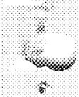
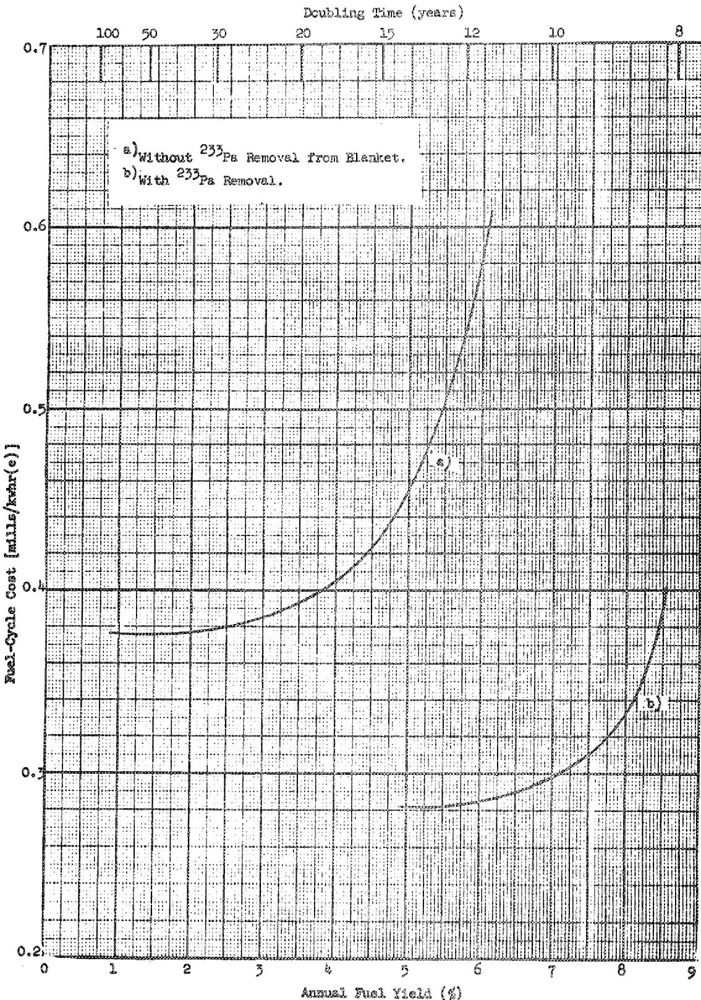
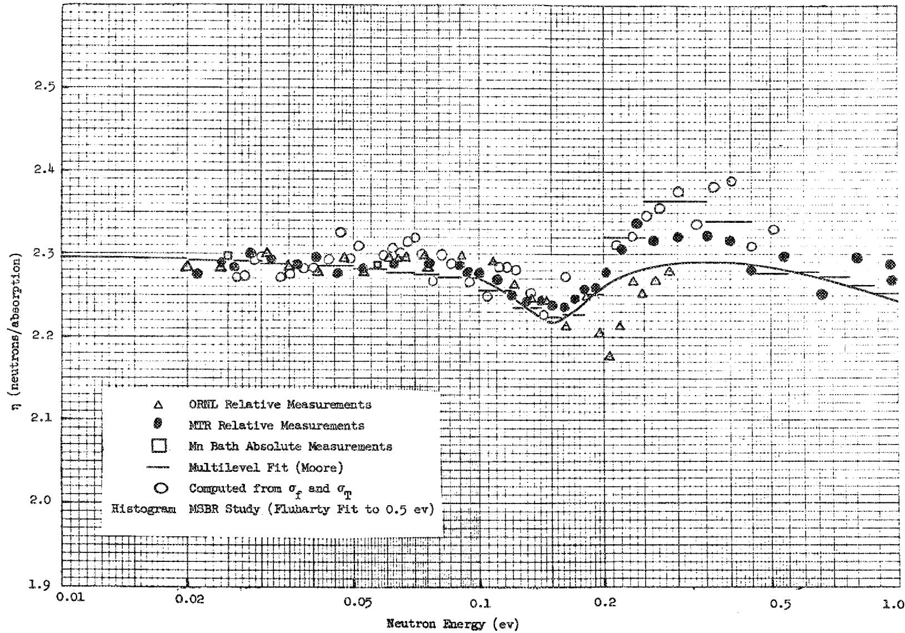
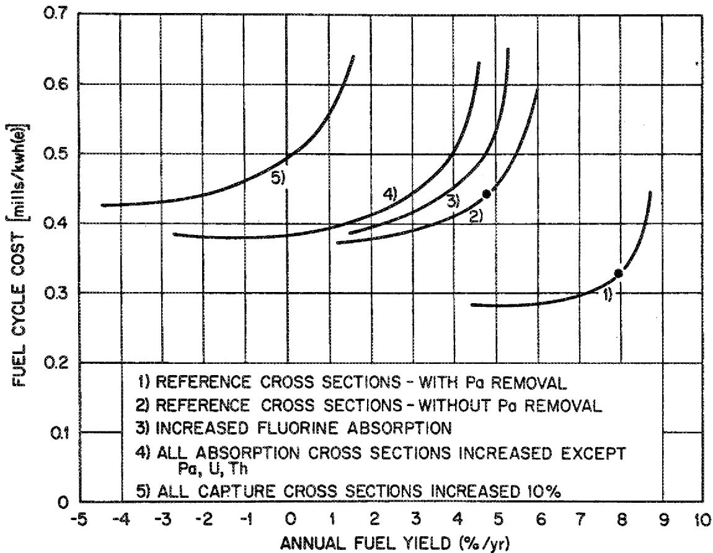
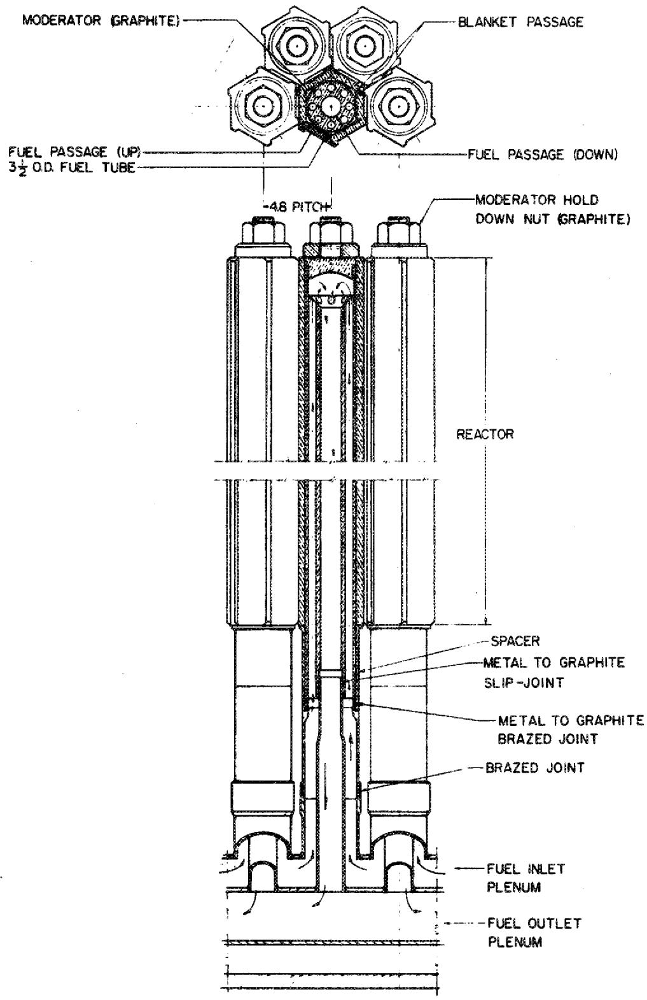
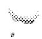
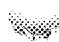
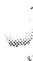

# OAK RIDGE NATIONAL LABORATORY

operated by

# UNION CARBIDE CORPORATION

NUCLEAR DIVISION

for the

U.S. ATOMIC ENERGY COMMISSION

UNION CARBIDE

ORNL-TM-1857

COPY NO. - 249

DATE - June 12, 1967

PHYSICS PROGRAM FOR MOLTEN-SALT BREEDER REACTORS

A. M. Perry

891 21053

ABSTRACT

3.2; MN

The sources of possible error in estimates of breeding performance of a Molten-Salt Breeder Reactor are discussed. Uncertainties in cross sections may contribute an uncertainty of about $\pm 0.026$ in breeding ratio. Other sources of error may arise from assumptions regarding behavior of fission products, or from inadequacies in methods of computation. A reactor physics development program is outlined which should provide a sound basis for design of a reactor experiment.

THIS DOCUMENT HAS BEEN REVIEWED.

B.1.1.1.1.1.1.1.1.1.1.1.1.1.1.1.1.1.1.1.1.1.1.1.1.1.1.1.1.1.1.1.1.1.1.1.1.1.1.1.1.1.1.1.1.1.1.1.1.1.1.

10 THE A.E.C.A. AND H.K.S. 2

NOTICE This document contains information of a preliminary nature and was prepared primarily for internal use at the Oak Ridge National Laboratory. It is subject to revision or correction and therefore does not represent a final report.

# LEGAL NOTICE

This report was prepared as an account of Government sponsored work. Neither the United States, nor the Commission, nor any person acting on behalf of the Commission:

A. Makes any warranty or representation, expressed or implied, with respect to the accuracy, completeness, or usefulness of the information contained in this report, or that the use of any information, apparatus, method, or process disclosed in this report may not infringe privately owned rights; or   
B. Assumes any liabilities with respect to the use of, or for damages resulting from the use of any information, apparatus, method, or process disclosed in this report.

As used in the above, "person acting on behalf of the Commission" includes any employee or contractor of the Commission, or employee of such contractor, to the extent that such employee or contractor of the Commission, or employee of such contractor prepares, disseminates, or provides access to, any information pursuant to his employment or contract with the Commission, or his employment with such contractor.

# CONTENTS

1. INTRODUCTION 5   
2. ANALYSIS OF UNCERTAINTIES 8

2.1 Cross Sections 9   
2.2 Computational Methods 18   
2.3 Assumptions Regarding Salt Chemistry 21

3. MSBR REACTOR PHYSICS PROGRAM 27

3.1 Investigation of Dynamic Characteristics 27   
3.1.1 Stability Analysis 28   
3.1.2 Transient Analysis 29   
3.1.3 Flux Flattening 29

3.2 Investigation of Alternate Core Designs 30   
3.3 Development of Methods 30   
3.4 Cross Section Evaluation 31   
3.5 Development of Computer Codes 32   
3.6 Experimental Physics Program 33   
3.6.1 Dynamics Experiments 35

4. MANPOWER AND COST ESTIMATES 36   
5. CONCLUSIONS 36   
6. ACKNOWLEDGMENTS 38

# LEGAL NOTICE

This report was prepared as an account of Government sponsored work. Neither the United States, nor the Commission, nor any person acting on behalf of the Commission: A. Makes any warranty or representation, expressed or implied, with respect to the accuracy, completeness, or usefulness of the information contained in this report, or that the use of privately owned rights; or B. Assumes any liabilities with respect to the use of, or for damages resulting from the use of any information, apparatus, method, or process disclosed in this report. As used in the above, "person acting on behalf of the Commission" includes any employee or contractor of the Commission, or employee of such contractor, to the extent that employee or contractor of the Commission, or employee of such contractor prepares such employee or contractor of the Commission, or employee of such contractor prepares such employee or contractor of the Commission, or employee of such contractor prepares such employees, or provides access to, any information pursuant to his employment or contract with the Commission, or his employment with such contractor.

。

# PHYSICS PROGRAM FOR MOLTEN-SALT BREEDER REACTORS

A. M. Perry

# 1. INTRODUCTION

One of the attractive aspects of the Molten-Salt Breeder Reactor concept that emerges from the design studies conducted at ORNL is the prospect that very low fuel-cycle costs will coincide with very good fuel utilization, that in fact the curve of fuel-cycle cost versus doubling time will possess a minimum at a doubling time as short as 15 to 20 years*, and that this minimum fuel cost will be as low as 0.3-0.4 mills/kwhr(e). Our present estimates of the fuel-cycle cost as a function of annual yield are shown in Fig. 1 for two cases, i.e., with and without continuous removal of $^{233}\mathrm{Pa}$ .

That a reactor comprising essentially graphite, thorium, and $^{233}\mathrm{U}$ should be able to breed is not in itself surprising, for we have long had reason to believe that this is possible, provided the fuel is reprocessed at a sufficiently rapid rate. That such rapid processing can be accomplished economically, however, and that a very high fuel specific power can be maintained while keeping neutron losses in $^{233}\mathrm{Pa}$ to a very low level, appear to be unique properties of the fluid fuel reactor.

It must be remembered that the excellent fuel-cycle characteristics projected for the Molten-Salt Breeder Reactor are based on a combination of a low net breeding gain and a high specific power. A net breeding gain of about 0.05-0.06 was found to be optimum (i.e., corresponds to near-minimum fuel cost) for the current reference MSBR design.

This is of course a very small margin for breeding, and the calculation of it is subject to some uncertainty. In considering the merit

  
Fig. 1. Fuel-Cycle Cost Versus Annual Fuel Yield.

of the MSBR concept, we must attempt to appraise realistically the possible magnitude and importance of uncertainties in the calculated characteristics of the reactor, and to consider what steps may be taken to reduce these uncertainties.

A description of the Molten-Salt Breeder Reactor concept and of our current reference design for an MSBR is given in the report ORNL-3996 (Ref. 1), and will not be repeated here. Some of the important characteristics that are relevant to a discussion of reactor physics problems are given in Tables 1 and 2. (These characteristics are appropriate to a single 2225 Mw(t) reactor, operating at an average core power density of 80 kw/liter. While they differ slightly from those of a 555 Mw(t) modular core operating at 40 kw/liter, the differences are not material to the present discussion.)

Table 1. MSBR Performance   

<table><tr><td></td><td>Without Pa Removal</td><td>With Pa Removal</td></tr><tr><td>Nuclear breeding ratio</td><td>1.0538</td><td>1.074</td></tr><tr><td>Fissile consumption (Inventories per year at 0.8 plant factor)</td><td>1.03</td><td>1.17</td></tr><tr><td>Fissile losses in processing (Inventories per year at 0.8 plant factor)</td><td>0.006</td><td>0.007</td></tr><tr><td>Fuel yield, % per annum</td><td>4.96</td><td>7.95</td></tr><tr><td>Neutron production per fissile absorption, ηe</td><td>2.221</td><td>2.227</td></tr><tr><td>Specific power, Mw(t)/kg fissile</td><td>2.89</td><td>3.26</td></tr><tr><td>Fuel-cycle cost, mills/kwhr(e)</td><td>0.45</td><td>0.33</td></tr><tr><td>Doubling time, yearsa</td><td>14</td><td>8.7</td></tr></table>

Here defined as 0.693/(annual yield).

Table 2. MSBR Neutron Balance   

<table><tr><td rowspan="2">Material</td><td colspan="2">Absorptions</td></tr><tr><td>Without Pa Removal</td><td>With Pa Removal</td></tr><tr><td>232Th</td><td>0.9710</td><td>0.9970</td></tr><tr><td>233Pa</td><td>0.0079</td><td>0.0003</td></tr><tr><td>233U</td><td>0.9119</td><td>0.9247</td></tr><tr><td>234U</td><td>0.0936</td><td>0.0819</td></tr><tr><td>235U</td><td>0.0881</td><td>0.0753</td></tr><tr><td>236U</td><td>0.0115</td><td>0.0084</td></tr><tr><td>237Np</td><td>0.0014</td><td>0.0010</td></tr><tr><td>238U</td><td>0.0009</td><td>0.0005</td></tr><tr><td>Carrier salt (except 6Li)</td><td>0.0623</td><td>0.0648</td></tr><tr><td>6Li</td><td>0.0030</td><td>0.0025</td></tr><tr><td>Graphite</td><td>0.0300</td><td>0.0323</td></tr><tr><td>135Xe</td><td>0.0050</td><td>0.0050</td></tr><tr><td>149Sm</td><td>0.0069</td><td>0.0068</td></tr><tr><td>151Sm</td><td>0.0018</td><td>0.0017</td></tr><tr><td>Other fission products</td><td>0.0196</td><td>0.0185</td></tr><tr><td>Delayed neutron losses</td><td>0.0050</td><td>0.0049</td></tr><tr><td>Leakage</td><td>0.0012</td><td>0.0012</td></tr><tr><td>Total</td><td>2.2211</td><td>2.2268</td></tr></table>

# 2. ANALYSIS OF UNCERTAINTIES

Because of the operating flexibility of fluid fuel reactors, which allows criticality to be maintained by adjustment of fuel concentration, we are not primarily interested in the problem of calculating the criticality factor per se. We are concerned instead with the fraction of source neutrons that is available for absorption in the fertile materials. Estimates of this quantity may be uncertain because of uncertainties in cross sections, in methods of computation, or in the assumptions made regarding the behavior of fission products in the reactor system. These sources of uncertainty are discussed in the following sections.

# 2.1 Cross Sections

There are comparatively few nuclides in the MSBR for which cross section uncertainties lead to appreciable uncertainty in estimates of the breeding performance of the reactor; only two or three nuclides have cross section uncertainties that could, alone, affect the breeding ratio by as much as 0.01.

The outstanding example, of course, is the $^{233}\mathrm{U}$ itself. Here the important quantity is the average value of $\eta$ , averaged over the entire reactor spectrum. This quantity may be uncertain for at least three reasons: (1) the value of $\eta$ at 2200 m/sec is uncertain by perhaps $\pm 0.3\%$ , (2) the variation of $\eta$ with neutron energy in the range below 0.5 ev is not known well enough to establish $\overline{\eta}$ (in a thermal neutron spectrum with kT ~0.1 ev) to much better than 1%, and (3) $\overline{\eta}$ in a l/E spectrum above 0.5 ev is also subject to an uncertainty of about 1%. The uncertainty in the thermal average value of $\eta$ produces an uncertainty of about $\pm 0.02$ in breeding ratio, and appears to be by far the most important source of uncertainty in breeding ratio.

The ambiguity in the epithermal $\eta$ is, fortunately, not so significant now as it has been until recently. The ambiguity arose from a discrepancy that appeared to exist between average epithermal $\alpha$ values as deduced from differential fission and total cross section measurements on the one hand, and from direct integral measurements of $\alpha$ on the other hand. The differential measurements yield a value of $\alpha$ ,2 averaged over a $1 / \mathbb{E}$ spectrum above 0.5 ev, of about 0.23. This value is subject to appreciable uncertainty, however, because $\sigma_{\mathrm{c}}$ must be deduced by subtraction of $\sigma_{\mathrm{f}}$ and $\sigma_{\mathrm{s}}$ from the measured $\sigma_{\mathrm{T}}$ . Furthermore, an adequate statistical analysis of the probable error in $\bar{\alpha}$ , as derived from the differential cross sections, has not been made. The integral $\bar{\alpha}$ measurements are performed by measuring the $^{234}\mathrm{U}$ and fission product concentrations in irradiated $^{233}\mathrm{U}$ samples. Results of the three most recent

measurements of this type are as follows:

Halperin $\overline{\alpha} = 0.171\pm 0.017$ Ref.3

Esch and Feiner $\overline{\alpha} = 0.175\pm 0.008$ Ref.4

Conway and Gunst $\overline{\alpha} = 0.175\pm 0.006$ Ref.5

Average $\overline{\alpha} = 0.175\pm 0.005$

We believe that the close agreement among these independent measurements and the inherently greater accuracy of the direct integral $\alpha$ measurement support the lower value of $\alpha$ in the epithermal energy range. The value used in the MSBR analyses was $\alpha = 0.173$ , leading to an average value of $\eta$ , in a $1 / E$ spectrum above 0.5 ev of 2.13. It may be noted that an uncertainty of 0.01 in $\alpha$ ( $>0.5$ ev) generates an uncertainty of about 0.006 in the breeding ratio, for the MSBR reference configuration.

A similar discrepancy between differential cross section measurements and direct $\alpha$ measurements in the epithermal region has existed for $^{235}\mathrm{U}$ . In recent months the $\alpha$ values deduced by de Saussure, Gwin, and Weston from their measurements of fission and capture cross sections for $^{235}\mathrm{U}$ are in much closer agreement with the integral $\alpha$ measurements for $^{235}\mathrm{U}$ than any values previously derived from differential cross section measurements, and there is good reason to hope that this troublesome discrepancy is very nearly resolved. Similar experiments for $\sigma_{\mathrm{f}}$ and $\sigma_{\mathrm{c}}$ for $^{233}\mathrm{U}$ are now underway by Weston, Gwin, de Saussure, and their

collaborators at RPI. $^{7}$ These measurements, (when combined with other data at energies above 1 keV), yield a value for $\overline{\alpha}$ , averaged over a (1/E) spectrum above 0.5 ev, of 0.188 ± 0.01, in much closer agreement with the integral measurements cited above. We believe, therefore, that the range of uncertainty in $\overline{\alpha}$ has been significantly reduced by these measurements, and can hardly exceed ± 0.01, centered around a mean value close to that of the integral measurements.

In addition to the related uncertainties in $\eta$ and in $\alpha$ , there is also an uncertainty in the value of $\nu = \eta (1 + \alpha)$ . This is not of any consequence in the subcadmium energy range, since $\eta$ is a directly measured quantity. In the epicadmium range, however, $\eta$ is deduced from $\alpha$ and $\nu$ , and must reflect uncertainties in both of these quantities. It is difficult to assess the uncertainty in $\nu$ because of what appear to be systematic discrepancies between determinations by various methods. Nonetheless, we presently believe it is unlikely that $\nu$ lies outside the range $2.50 \pm 0.01$ . The combined effect of the uncertainties in $\overline{\alpha}$ and in $\nu$ is an uncertainty of about $1\%$ in $\overline{\eta}$ , in the energy range $\mathbb{E} > 0.5$ ev.

Uncertainty in the value of $\eta$ averaged over the thermal neutron spectrum is important because $\sim 70\%$ of the absorptions in $^{233}\mathrm{U}$ occur in the subcadmium neutron range. Direct measurements of $\eta (\mathbf{E}) / \eta (0.025\mathrm{ev})$ have been made by several investigators since the early 1950's. The existing measurements are not in good agreement with each other or with values deduced from differential cross section measurements, nor do they have the very high precision required to determine $\langle \eta /\eta_{\mathrm{o}}\rangle_{\mathrm{avg}}$ to an error as small as that in $\eta_{\mathrm{o}}$ itself $[\eta_{\mathrm{o}} = \eta (0.025\mathrm{ev})]$ .

The problem is illustrated by the data shown in Fig. 2, where the symbols represent direct relative $\eta$ measurements, normalized to $\eta_{\circ} = 2.294^{*}$ , and the solid line represents the values used in the MSBR design studies. Averaging over a Maxwellian flux distribution peaked at 0.1 ev,

  
Fig. 2. Relative Eta of $^{233}\mathrm{U}$ .

one can easily obtain values for $\eta$ ranging from 2.26 to 2.30 and the true value could possibly, though not probably, lie outside this range.

This uncertainty in the average thermal $\eta$ of $^{233}\mathrm{U}$ remains the most important single contributor to uncertainty in the breeding ratio of an MSBR. The $\sigma_{\mathrm{c}}$ and $\sigma_{\mathrm{f}}$ measurements of Weston et al. are now being extended downward in energy to about 0.02 ev, and it is expected that this will significantly reduce the uncertainty in the average value of $\eta$ .

One of the most abundant materials in the MSBR, and one of the most important parasitic neutron-absorbers, is fluorine. As is true of other light elements, the resonances of fluorine are predominantly scattering resonances, and the radiative capture widths are difficult to determine accurately. The capture widths are not known to better than $\pm 30\%$ , and the high-energy $(n,\alpha)$ cross sections are equally uncertain. These uncertainties affect the estimated breeding gain to the extent of about 0.005; while not large in an absolute sense, this is a non-trivial fraction of the breeding gain, and it would facilitate further design and optimization of molten-salt reactors to have improved accuracy in these cross sections of fluorine. A more accurate determination of the resonance capture integral would itself be an appreciable help in reducing the limits of uncertainty in the fluorine absorption rate.

Uncertainties in remaining cross sections, including Li, Be, C, Pa, and fission products, probably do not contribute an uncertainty in breeding ratio greater than about 0.01.

The effective cross sections of thorium may indeed be subject to considerable uncertainty, arising from uncertainties in resonance parameters, from methods of computation of resonance self-shielding, and from variations in geometry of the fertile salt passages. Variations in passage geometry may well contribute the greatest uncertainty in thorium absorption rate. Further analysis of this possibility is required, but is likely to lead to requirements on the mechanical design of MSBR cores, rather than to the need for further measurements of cross sections or resonance integrals. Uncertainties in cross sections of $^{234}\mathrm{U}$ and $^{236}\mathrm{U}$ are of minor consequence, since these materials reach equilibrium concentrations rather quickly. The $^{234}\mathrm{U}$ is a fertile

material, while $^{236}\mathrm{U}$ is a poison. The equilibrium absorption rate in each depends primarily on the capture-to-fission ratio of the fissile precursors, $^{233}\mathrm{U}$ and $^{235}\mathrm{U}$ ; however, there is some small dependence on the $^{234}\mathrm{U}$ and $^{236}\mathrm{U}$ cross sections because some of the material is extracted from the fuel stream, along with the fissile isotopes, as excess production.

The $^{235}\mathrm{U}$ cross sections are known with about the same precision as those of $^{233}\mathrm{U}$ , but are of far less importance, since less than $10\%$ of the fissile-material absorptions are in $^{235}\mathrm{U}$ .

The various cross section uncertainties that contribute significantly to uncertainty in the estimated breeding performance are summarized in Table 3. In this table, we show nominal ranges of uncertainty as fractional deviations from what we believe to be the most probable values. We refrain from calling these deviations probable errors, because in many cases they do not represent standard deviations of a normal error distribution, and hence do not really represent confidence limits in a conventional statistical sense; they do represent our present judgment of the ranges within which the true values have perhaps a $50\%$ or greater probability of falling. Also shown are the corresponding uncertainties in breeding gain. In the case of $^{233}\mathrm{U}$ , $^{234}\mathrm{U}$ , and $^{235}\mathrm{U}$ , the consequent changes in $^{235}\mathrm{U} / ^{233}\mathrm{U}$ absorption ratio and in $^{236}\mathrm{U}$ absorption rate are taken into account in the indicated uncertainties in breeding gain.

Since the uncertainties listed in Table 3 are all independent, and, with respect to the most probable values of the various cross sections, positive and negative deviations are equally likely, we have combined them by taking the square root of the sum of the squares as the overall uncertainty in breeding ratio attributable to cross section uncertainties. The resulting value, $(\Sigma \delta_{i}^{2})^{1/2} = 0.026$ , reflects primarily the uncertainty in the average thermal $\eta$ of $^{233}\mathrm{U}$ .

The effect of cross section uncertainties can also be appreciated by reference to Fig. 3. The various curves of fuel-cycle cost versus annual fuel yield that are shown in Fig. 3 represent the result of re-optimizing the reactor to compensate for specified alterations in cross

Table 3. Effect of Cross Section Uncertainties on Breeding Ratio   

<table><tr><td>Nuclide</td><td>Cross Sectiona</td><td>δσb</td><td>Ac</td><td>δBRd</td></tr><tr><td rowspan="3">233U</td><td>ηo</td><td>0.003</td><td></td><td>±0.007</td></tr><tr><td>[η(t)/ηo]</td><td>0.01</td><td></td><td>±0.022</td></tr><tr><td>η(f)</td><td>0.01</td><td></td><td>±0.009</td></tr><tr><td rowspan="2">235U</td><td>η(t)</td><td>0.01</td><td></td><td>±0.003</td></tr><tr><td>η(f)</td><td>0.013</td><td></td><td>±0.001</td></tr><tr><td rowspan="2">234U</td><td>σa(t)</td><td>0.1</td><td>0.033</td><td>--</td></tr><tr><td>σa(f)</td><td>0.25</td><td>0.049</td><td>±&lt;0.001</td></tr><tr><td rowspan="2">236U</td><td>σa(t)</td><td>0.1</td><td>--</td><td>--</td></tr><tr><td>σa(f)</td><td>0.3</td><td>0.008</td><td>±&lt;0.001</td></tr><tr><td rowspan="2">233Pa</td><td>σa(t)</td><td>0.1</td><td></td><td>--</td></tr><tr><td>σa(f)</td><td>0.1</td><td>0.0003</td><td>--</td></tr><tr><td rowspan="3">19F</td><td>σa(t)</td><td>0.07</td><td>0.013</td><td>±0.001</td></tr><tr><td>σγ(f)</td><td>0.3</td><td>0.008</td><td>±0.003</td></tr><tr><td>σ(n,α)(f)</td><td>0.3</td><td>0.006</td><td>±0.002</td></tr><tr><td rowspan="2">7Li</td><td>σa(t)</td><td>0.1</td><td>0.02</td><td>±0.002</td></tr><tr><td>σa(f)</td><td>0.1</td><td>0.001</td><td>--</td></tr><tr><td rowspan="3">9Be</td><td>σa(t)</td><td>0.1</td><td>0.002</td><td>--</td></tr><tr><td>σn,2n(t)</td><td>0.15</td><td>0.009</td><td>±0.002</td></tr><tr><td>σn,α(f)</td><td>0.1</td><td>0.003</td><td>±0.002</td></tr><tr><td rowspan="2">F.P.</td><td>σa(t)</td><td>0.1</td><td>0.01</td><td>±0.001</td></tr><tr><td>σa(f)</td><td>0.3</td><td>0.01</td><td>±0.003</td></tr></table>

aThe notation (t) signifies the energy range below 1.86 ev, and the notation (f) signifies energies above 1.86 ev, except for $^{233}\mathrm{U}$ and $^{235}\mathrm{U}$ where the break point is 0.5 ev.   
$\delta \sigma$ is the fractional uncertainty in the cross section.   
Approximate typical absorptions, relative to $\eta \epsilon$ source neutrons; may vary, of course, from case to case.   
Uncertainty in breeding ratio resulting from indicated cross section uncertainty.

  
Fig. 3. The Effect of Cross Section Uncertainties on the MSBR Performance.

section values used in the calculations. Curves 1 and 2, which also appear in Fig. 1, are the reference curves with and without $^{233}\mathrm{Pa}$ re-removal, respectively. Curve 3 results from increasing just the fluorine absorption cross sections, for the case without Pa removal, while curve 4 results from increasing the absorption cross sections of all constituents of the core (except the heavy elements Pa, U, and Th) by the percentage amounts shown in Table 4.

Table 4. Assumed Increases in Capture Cross Sections   
(Percent of reference values)   

<table><tr><td>Isotope</td><td>Thermal σa</td><td>Epithermal σa</td></tr><tr><td>6Li</td><td>1</td><td>10</td></tr><tr><td>7Li</td><td>11</td><td>10</td></tr><tr><td>Be</td><td>11</td><td>15</td></tr><tr><td>C</td><td>9</td><td>9</td></tr><tr><td>F</td><td>7</td><td>32</td></tr><tr><td>149Sm</td><td>10</td><td>20</td></tr><tr><td>151Sm</td><td>10</td><td>20</td></tr><tr><td>Other fission products</td><td>10</td><td>10</td></tr></table>

To obtain curve 5, capture cross sections of all nuclides, including the heavy elements, were increased by $10\%$ at all neutron energies. By far the largest effect of this perturbation is a decrease of about 0.03 in the average value of $\eta$ .

All of the perturbations represented by curves 3, 4, and 5 are relative to curve 2, i.e., without Pa removal. Comparison of these with curve 1 shows the very substantial incentive for continuous removal of the Pa. (All of the perturbations shown are in the unfavorable direction, representing an adverse resolution of all cross section uncertainties. Deviations in the other direction are of course equally likely, so far as cross section uncertainties are concerned.)

In summary, the cross sections which particularly require further investigation are:

1) the variation of $\eta$ of $^{233}\mathrm{U}$ with neutron energy in the range of 0.01 to 1 ev;   
2) the absolute values of $\eta$ and $\nu$ at 0.025 ev;   
3) the radiative capture width, the $(n,\alpha)$ cross section, and the resonance capture integral of 19F.

Further analysis of data already available may either reduce the uncertainties assigned to some important quantities, such as the average epithermal $\alpha$ , or may pinpoint specific measurements which would be especially helpful in reducing such uncertainties.

# 2.2 Computational Methods

Verification of computational methods, without ambiguity from cross section uncertainties, is usually difficult to obtain. However, our experience with the MSRE leads us to believe that on the whole our methods are quite adequate to deal with this type of reactor. Briefly, the methods employed in the statics calculations were one- and two-dimensional multigroup diffusion theory. The neutron spectrum and group-averaged cross sections were obtained from GAM-THERMOS cell calculations. A comparison of predicted and subsequently observed values for some of the important characteristics of the MSRE is given in Table 5.

The good agreement between predicted and observed values lends considerable confidence in the validity of the methods employed. Similar methods were used by General Atomic in the prediction of critical loadings for the Peach Bottom Reactor, which is complicated by nonuniform distributions of fertile material and poisons, by singularities such as control rods and poisoned dummy fuel elements, and by appreciable self shielding of the heterogeneously distributed thorium. Observed reactivities were nonetheless within 0.005 of predicted values, and since this agreement prevailed over a range of core loadings, the possibility of chance cancellation of systematic errors is considerably reduced.

It must be acknowledged, however, that the MSBR configuration is somewhat more complicated than that of the MSRE, and has complexities of

Table 5. A Comparison of Predicted and Observed Characteristics of the MSRE   

<table><tr><td>Characteristic</td><td>Predicted</td><td>Observed</td></tr><tr><td>Critical concentration of 235U, g/liter</td><td>33.06</td><td>33.1</td></tr><tr><td>Fuel concentration coefficient of reactivity, δk/k/δc/c</td><td>0.234</td><td>0.223</td></tr><tr><td>Isothermal temperature coefficient of reactivity, δk/k/°F</td><td>-8.1 × 10-5</td><td>-7.3 × 10-5</td></tr><tr><td>Reactivity worth of three control rods, % δk/k</td><td>5.46</td><td>5.59</td></tr><tr><td>Reactivity effect of fuel circulation (loss of delayed neutrons), % δk/k</td><td>0.222</td><td>0.21</td></tr></table>

a somewhat different character from those of the Peach Bottom Reactor. A sketch of the present concept for an MSBR lattice cell is shown in Fig. 4, from which one may appreciate the importance of a careful calculation of the space- and energy-dependence of the neutron flux, both for thermal neutrons and for resonance neutrons. While estimates of the potential performance of the MSBR concept are not seriously affected by errors of a few percent in calculating these details of the flux distributions, the design calculations for a particular reactor require higher precision, primarily to provide assurance against fuel cost penalties that might arise if the critical fuel concentration were appreciably different than expected. Although we have no a priori reason to doubt the adequacy of presently available methods, it will be necessary to verify their adequacy both by investigating the effect of further refinements in technique (cf. Sec. 3.3) and by comparisons between calculations and the results of carefully selected experiments which reproduce the details of the MSBR cell geometry (cf. Sec. 3.6).

  
Fig. 4. Molten-Salt Breeder Reactor Core Cell.

# 2.3 Assumptions Regarding Salt Chemistry

As is well known, the conversion ratio in a thermal-neutron reactor depends very much on the rate of processing of the fuel, largely because it is by this means that neutron losses to fission products may be controlled. In the processing scheme proposed for the fuel salt of the MSBR, the thirty or more chemical elements of which significant amounts are present in the fission products may be expected to behave in quite different ways, depending on their chemical and physical properties in a very complex environment. The assumptions that were made regarding fission product behavior in the MSBR studies are cited in Table 6. (For a description of the processing system, see Ref. 1.)

Table 6. Disposition of Fission Products in MSBR Reactor and Processing System   

<table><tr><td>1.</td><td>Elements present as gases; assumed to be partly absorbed by graphite and partly removed by gas stripping (1/2% poisoning assumed):</td><td>Kr, Xe</td></tr><tr><td>2.</td><td>Elements that plate out on metal surfaces; assumed to be removed instantaneously:</td><td>Rh, Pd, Ag, In</td></tr><tr><td>3.</td><td>Halogens and elements that form volatile fluorides; assumed to be removed in the fluoride volatility process:</td><td>Se, Br, I, Nb, Mo, Ru, Tc, Te</td></tr><tr><td>4.</td><td>Elements that form stable fluorides less volatile than LiF; assumed to be separated by vacuum distillation:</td><td>Sr, Y, Ba, La, Ce, Pr, Nd, Pm, Sm, Eu, Gd, Tb</td></tr><tr><td>5.</td><td>Elements that are not separated from the carrier salt; assumed to be removed only by salt discard:</td><td>Rb, Cd, Sn, Cs, Zr</td></tr></table>

In most instances, (except perhaps for groups 2 and 3) we still believe these to be the most probable modes of behavior. It must be acknowledged, however, that these assignments are not in all cases certain, and one must ascertain the effect on MSBR performance of possible, if improbable, deviations from these assumptions.

Because of their combination of high fission yield and high neutron-absorption cross section, and because their fluorides are probably not more stable than their carbides, one is particularly led to examine alternative modes of behavior for the elements of group 3, especially molybdenum and technetium. It is entirely possible, even probable, that these elements will form neither fluorides nor carbides, but will rather form inter-metallic compounds with other metallic fission products, e.g., those of group 2, or simply remain in the salt as colloidal suspensions of the metal. In this event, these elements would still be removed in the vacuum distillation process, and there would be no change in the neutron balance. There remains the possibility that some fraction of these group 3 fission products might react with the graphite moderator, forming metal carbides, and hence remain indefinitely in the core. Deposition of several fission products, including Mo, Nb, Ru, and Te, has in fact been observed on graphite specimens in contact with the fuel salt in the MSRE. If one assumes that these samples are typical of all the MSRE graphite, one can calculate the fraction of each fission product species that remains in the core. These fractions, calculated from activities observed on the graphite specimens removed from the MSRE in July 1966, are shown in Table 7. It is immediately obvious, of course, that any mechanism that can leave fission products in the core indefinitely is potentially very serious, especially so in a reactor with very high specific power. It can easily be shown that the additional neutron absorption that would result would be nearly proportional to the fraction, f, of the atoms in this group that remain in core, instead of being removed in processing. The time required for each species to saturate depends, of course, on its cross section. The poisoning effect of each of several fission product nuclides that would result from $100\%$ retention on the graphite of an MSBR is shown in Table 8 as a function of time, in full-power years, after startup of the reactor. As an application of the information given in Table 8, Table 9 shows the average poisoning that would result in an MSBR if the various nuclides were deposited to the extent observed in the MSRE (as shown in Table 7). (Two different assumptions were made regarding the behavior of $^{95}\mathrm{Mo}$ , that is, that it behaves either like its precursor, $^{95}\mathrm{Nb}$ , or like

Table 7. Fission-Product Deposition in the Surface Layers of MSRE Graphite   
(Percent of Totalb)   

<table><tr><td rowspan="2">Isotope</td><td colspan="3">Graphite Location</td></tr><tr><td>Top of Core</td><td>Middle of Core</td><td>Bottom of Core</td></tr><tr><td>99Mo</td><td>13.4</td><td>17.2</td><td>11.5</td></tr><tr><td>132Te</td><td>13.8</td><td>13.6</td><td>12.0</td></tr><tr><td>103Ru</td><td>11.4</td><td>10.3</td><td>6.3</td></tr><tr><td>95Nb</td><td>12</td><td>59.2</td><td>62.4</td></tr><tr><td>131I</td><td>0.16</td><td>0.33</td><td>0.25</td></tr><tr><td>95Zr</td><td>0.33</td><td>0.27</td><td>0.15</td></tr><tr><td>144Ce</td><td>0.052</td><td>0.27</td><td>0.14</td></tr><tr><td>89Sr</td><td>3.24</td><td>3.30</td><td>2.74</td></tr><tr><td>140Ba</td><td>1.38</td><td>1.85</td><td>1.14</td></tr><tr><td>141Ce</td><td>0.19</td><td>0.63</td><td>0.36</td></tr><tr><td>137Cs</td><td>0.07</td><td>0.25</td><td>0.212</td></tr></table>

aAverage of values in 7 to 10 mil cuts from each of three exposed graphite faces.

b. Expressed as percentage of the quantity of each species produced in the reactor that would be deposited on graphite if each $\mathbf{cm}^2$ of the $2 \times 10^{6}$ $\mathbf{cm}^2$ of moderator had the same concentration as the specimen.

Table 8. Loss of Breeding Ratio Corresponding to Complete Retention of Certain Fission Products in the MSBR Core   

<table><tr><td rowspan="2">Nuclide</td><td rowspan="2">(σφ)-1(yr)</td><td colspan="5">Time After Startup (full-power years)</td></tr><tr><td>2</td><td>5</td><td>10</td><td>15</td><td>20</td></tr><tr><td>95Mo</td><td>5.4</td><td>0.0167</td><td>0.0323</td><td>0.0453</td><td>0.0507</td><td>0.0528</td></tr><tr><td>97Mo</td><td>36.2</td><td>0.0026</td><td>0.0062</td><td>0.0115</td><td>0.0163</td><td>0.0201</td></tr><tr><td>98Mo</td><td>116</td><td>0.0008</td><td>0.0020</td><td>0.0038</td><td>0.0055</td><td>0.0073</td></tr><tr><td>100Mo</td><td>118</td><td>0.0007</td><td>0.0017</td><td>0.0033</td><td>0.0049</td><td>0.0065</td></tr><tr><td>99Te</td><td>3.9</td><td>0.0174</td><td>0.0312</td><td>0.0399</td><td>0.0425</td><td>0.0434</td></tr><tr><td>101Ru</td><td>9.1</td><td>0.0055</td><td>0.0118</td><td>0.0184</td><td>0.0222</td><td>0.0244</td></tr><tr><td>102Ru</td><td>53</td><td>0.0008</td><td>0.0020</td><td>0.0036</td><td>0.0051</td><td>0.0066</td></tr><tr><td>104Ru</td><td>82</td><td>0.0002</td><td>0.0005</td><td>0.0010</td><td>0.0015</td><td>0.0019</td></tr><tr><td>103Rh</td><td>0.51</td><td>0.0166</td><td>0.0169</td><td>0.0169</td><td>0.0169</td><td>0.0169</td></tr><tr><td>105Pd</td><td>7.5</td><td>0.0012</td><td>0.0024</td><td>0.0035</td><td>0.0041</td><td>0.0045</td></tr><tr><td>107Pd</td><td>11.4</td><td>0.0002</td><td>0.0004</td><td>0.0006</td><td>0.0007</td><td>0.0008</td></tr><tr><td>126Te</td><td>58</td><td>0.0001</td><td>0.0002</td><td>0.0004</td><td>0.0006</td><td>0.0008</td></tr><tr><td>128Te</td><td>290</td><td>--</td><td>0.0001</td><td>0.0003</td><td>0.0004</td><td>0.0006</td></tr><tr><td>130Te</td><td>193</td><td>0.0002</td><td>0.0006</td><td>0.0012</td><td>0.0018</td><td>0.0023</td></tr><tr><td>Total</td><td></td><td>0.0631</td><td>0.1083</td><td>0.1494</td><td>0.1732</td><td>0.1889</td></tr><tr><td>97Mo, 98Mo, 106Mo</td><td></td><td>0.0041</td><td>0.0099</td><td>0.0186</td><td>0.0267</td><td>0.0339</td></tr><tr><td>101Ru, 102Ru, 104Ru</td><td></td><td>0.0065</td><td>0.0143</td><td>0.0230</td><td>0.0288</td><td>0.0329</td></tr><tr><td>126Te, 128Te, 130Te</td><td></td><td>0.0003</td><td>0.0009</td><td>0.0019</td><td>0.0028</td><td>0.0037</td></tr><tr><td>P</td><td></td><td>0.035</td><td>0.067</td><td>0.099</td><td>0.120</td><td>0.136</td></tr></table>

$$
\overline {{P}} = \frac {1}{t} \int_ {0} ^ {t} P (t ^ {\prime}) d t ^ {\prime}
$$

Table 9. Average Poisoning as a Function of Exposure with Deposition Fractions from First MSRE Samples   

<table><tr><td rowspan="2">Assumption</td><td colspan="5">Time (years)</td></tr><tr><td>2</td><td>5</td><td>10</td><td>15</td><td>20</td></tr><tr><td>95Mo acts like 95Nb</td><td>0.0072</td><td>0.0151</td><td>0.0229</td><td>0.0278</td><td>0.0320</td></tr><tr><td>95Mo acts like 99Mo</td><td>0.0043</td><td>0.0081</td><td>0.0121</td><td>0.0147</td><td>0.0166</td></tr></table>

99Mo.) Table 8 also lists the combined contributions of several groupings of isotopes and the totals for all the isotopes listed. The poisoning, $\mathrm{P(t)}$ , shown in Table 8 represents the current loss of breeding ratio at time $t$ after startup with clean graphite; also given in Table 8 is the average loss in breeding ratio, defined by $\overline{\mathrm{P}} = (1 / t)\int^t\mathrm{P}(t')\mathrm{dt'}$ .

The noble metals (group 2 in Table 6) constitute another group of fission products whose behavior may well be different from that assumed in the MSBR studies. Since about two tons of these materials (mostly ruthenium) will be produced by one 1000-Mw(e) reactor over a 30-year period, one would prefer that they not deposit on metal surfaces, as was assumed to occur almost instantaneously. The alternative, and more likely, possibility seems to be that they will react with other fission products (e.g., molybdenum), forming intermetallic compounds, or remain in elemental form, and in either event be removed in the residue of the vacuum distillation process. A calculation of the additional poisoning that would result from having these nuclides remain in the fuel stream for the normal processing cycle indicates a maximum loss of breeding ratio of 0.001, which is certainly nothing to worry about.

If, for any reason, all of these nuclides were to remain in the core indefinitely, the asymptotic poisoning effect would be about 0.08. This would of course be serious, but the probability of its occurrence seems vanishingly small.

The behavior of xenon (and krypton) in an MSBR system is, of course, very important, with some 0.04 in breeding ratio dependent on nearly complete removal of these gases by sparging with helium in the fuel pump. Experience with operation of the MSRE gives every assurance that this can in fact be done. The residual xenon poisoning in the MSRE appears to be appreciably less than anticipated on the basis of the known permeability of the graphite, an observation which may be accounted for by some slight entrainment of small helium bubbles in the circulating fuel salt.

The assumption with respect to group 5 fission products is that they remain in the fuel salt essentially indefinitely. It is perhaps at least as likely that cadmium and tin will behave like group 2, that is, as just discussed, be removed in the regular fuel processing cycle. Such a contingency could only improve the breeding ratio. However, the combined yield of all the fission product chains from mass number lll to mass number 124 is only about $0.3\%$ , so that at most a gain in breeding ratio of 0.003 might be realized.

The reasons for the fission product behavior observed in the MSRE are not yet fully understood. The role of various factors which may influence this behavior, and the most promising means of limiting the deposition of fission products will be thoroughly investigated in a research program described in another report.8 The subject is introduced here because the behavior of fission products constitutes the principal source of uncertainty in the expected nuclear performance of an MSBR.

An additional assumption of some consequence, not listed in Table 6, is that the $^{237}\mathrm{Np}$ formed by neutron capture in $^{236}\mathrm{U}$ will be removed from the fuel stream by the fluoride volatility process. If this were not the case, and the $^{237}\mathrm{Np}$ were to remain in the fuel stream, along with the uranium, there would be a loss of $\sim 0.01$ in breeding ratio. We believe that the neptunium can in fact be removed, by proper operation of the sorbers in the fluoride volatility process, and the potential loss in breeding ratio just cited indicates that there is good reason to do so.

# 3. MSBR REACTOR PHYSICS PROGRAM

As a result of the analyses summarized in the preceding sections, we are quite confident that an MSBR will breed under conditions that produce minimum or near-minimum fuel costs. There are nonetheless a number of aspects of the physics of MSBR reactors which require further investigation, both to establish an adequate basis for the detailed design of an MSBR and to gain a much better understanding of the dynamic characteristics of these reactors.

# 3.1 Investigation of Dynamic Characteristics

The design studies of molten-salt breeder reactors that have been carried out up to the present have emphasized the normal, steady-state behavior of such reactors, in order to determine their potential performance with respect to the goals of resource utilization and economic power. Less attention has been directed to such questions as the dynamic response characteristics of an MSBR, as influenced in detail by the design parameters, and to possible abnormal modes of behavior that might result from failures anywhere in the system.

In order to take full advantage of its breeding potential, the MSBR design must minimize neutron losses to control rods and associated hardware (such as thimbles). This implies that it is highly desirable for the MSBR to be strongly self-regulating.

While there are no reasons to suspect unsatisfactory dynamic behavior in the MSBR, the system has new features whose effect on dynamics cannot be predicted quantitatively on the basis of past experience. For instance, the system will use circulating $^{233}\mathrm{U}$ fuel, and the small delayed neutron fraction of $^{233}\mathrm{U}$ will be reduced to an even smaller effective value by fuel circulation. Also, the system is a heterogeneous, two-fluid, circulating fuel reactor and consequently has almost every time delay conceivable in a reactor system (heat transfer from graphite to fuel, fuel transport in the core, blanket transport in the core, etc.). The negative temperature coefficients of reactivity which are to be designed into the system are no guarantee of stability unless the time lags are suitable.

The experience acquired with the MSRE provides understanding about this type of system which will aid in analyzing the MSBR. The predictions of MSRE dynamic behavior were experimentally confirmed,10 indicating that satisfactory mathematical models and analysis procedures were used. Experience with the proposed 233U loading in the MSRE will further extend our understanding.

# 3.1.1 Stability Analysis

Analysis of the dynamic behavior of the MSRE was based on calculations of the eigenvalues of the time-dependent equations for the neutron density, on analysis of the system frequency response (transfer functions) and on computation of the transient response to various perturbations in system operating parameters. These methods must be applied to clarify the complex relationship existing between the dynamic behavior of the MSBR system and the design parameters. The analysis must of course include calculation of all temperature- and power-dependent reactivity effects. An investigation of the effects of long-term dimensional changes in the graphite structures (resulting from fast neutron bombardment), and of tolerances or indeterminacy in the geometry of the salt passages will be required. .The possibility of oscillations or other instabilities associated with movement of graphite structures, and concomitant changes in salt-passage geometry, although thought to be remote, must be investigated.

Drawing upon these studies, and the transient analyses described below, a conceptual control and safety system must be developed which involves the smallest possible steady-state loss of neutrons to elements of the control system, while providing ample operational flexibility and protection.

A program of experimental investigations must be developed for the breeder reactor experiment in order to provide additional verification of the models and physical properties employed in the analysis for the MSBR configuration. Extensive pre-analysis of the experiments, to facilitate selection of the best experimental conditions, will greatly enhance the value of the experiments themselves.

# 3.1.2 Transient Analysis

Because of the mathematical methods used, the dynamic analyses discussed above deal primarily with the effect of comparatively small disturbances in the reactor system, and are therefore principally applicable to normal operating conditions of the reactor. Larger disturbances can of course arise from abrupt changes in load, from pump stoppages, or from any of a number of other rapid changes in operating conditions. The effects of such changes must be analyzed to determine whether system temperatures will inherently remain within acceptable limits or whether, on the contrary, specific control actions must be taken. Additional studies will be required in connection with the safety analysis of the MSBR. All possible sources of positive reactivity addition must be identified and evaluated, including those which might result from failures outside the nuclear system proper, and could therefore be regarded as secondary criticality accidents.

The methods presently available for studying nuclear excursions in an MSBR must be carefully examined; some extensions and improvements in these methods may well be required, particularly with regard to the transient temperature distribution within the core and the transient distribution of delayed neutron precursors.

# 3.1.3 Flux Flattening

The length of time during which the graphite structures in an MSBR can continue to perform their function depends partly on the fast neutron flux level (i.e., on power density) and partly on the gradient of the power density, as well as on the nature of the graphite itself. The useful life of the graphite may be extended somewhat by flattening the power

distribution, as for example by varying the size of salt passages from place to place within the core. Such variations could also influence the reactivity coefficients associated with these salt passages. Both the desirability of flux flattening and the effect of doing so on reactivity coefficients should be investigated.

# 3.2 Investigation of Alternate Core Designs

While it is unlikely that there is any configuration for an MSBR that would have significantly better breeding performance at low cost than does the present reference design, there may be alternate core configurations that could yield essentially the same performance while possessing different, and perhaps desirable, mechanical features. A search for such alternatives should be carried forward to provide additional assurance that the prototype reactor design will represent the best basic core concept.

# 3.3 Development of Methods

Further improvement and refinement of computational methods is needed in order to establish a satisfactory level of confidence in the procedures - whether most elaborate or relatively simple - that will be used in design of a specific MSBR, such as the 150-Mw reactor experiment, and in order to provide for precise interpretation of related lattice physics experiments (cf. Sec. 3.6). As is usual in geometrically complex reactor lattices, the key problems relate to the calculation of $\phi (\underline{\mathbf{r}},\mathbf{E})$ the neutron flux as a non-separable function of position and energy, in the source-energy region, in the resonance region and in the thermalization range. Problems of this sort are present in many types of reactor lattices, and cannot be said to have been fully resolved. The special features of the MSBR lattice relate to the physical separation of the fissile and fertile materials in separate salt streams, to the geometrical irregularities of salt passages, and to the significant scattering contribution of the fuel salt itself. Both two-dimensional multigroup neutron-transport methods and Monte Carlo methods should be tested, and one or both approaches used

in the analysis of lattice experiments to determine the amount of detail in the description of $\phi (\underline{\mathbf{r}},\mathbf{E})$ that it is necessary to obtain in order to account for all important characteristics of the MSBR lattice.

In the same vein, and in view of the dominant importance of calculating correctly the spectrum-averaged capture-to-fission ratio for $^{233}\mathrm{U}$ , it is highly desirable to develop suitable procedures for calculating Doppler-broadened, self-shielded cross sections for the fissile materials without assuming asymptotic flux shapes above each resonance, and, of course, to do this in a complex heterogeneous lattice. It is not likely, in fact, that any really large effects, in an MSBR, are associated with the details of the flux distributions implied by such refinements of analysis. However, the objective of achieving an unusually high degree of reliability in the design calculations in order to guarantee the performance of the reactor within very narrow limits requires both meticulous attention to detail in the calculations, and supporting experimental work (Sec. 3.6).

Because of the relatively small size of an MSBR core, which results from its high power density, and because of the continuous removal of xenon from the fuel salt, as well as the thorough mixing that would occur even if xenon were present in the salt, there will be no tendency towards flux instabilities of the kind normally expected in large power reactors. The question of non-separable time- and space-dependent effects will nevertheless arise in connection with the analysis of potential accidents. Further investigations will be required to determine what extensions in computational technique may be needed to describe the reactor adequately for such transient analyses, and, depending on the outcome of these investigations, additional work may be necessary to accomplish the indicated development of methods.

# 3.4 Cross Section Evaluation

There is a constantly accelerating rate of acquisition of new experimental information on neutron cross sections of interest in reactor calculations. Such information must be collected, evaluated, and assimilated into our computational structure. Many of the cross sections

discussed in Sec. 2.1, while not individually contributing major uncertainties in the nuclear calculations for an MSBR, need further analysis and evaluation to ensure that best values are employed in our analyses and that uncertainties and sources of error are more quantitatively assessed than has yet been done.

The assimilation of new information on $^{233}\mathrm{U}$ cross sections, especially, requires significant effort, in determining the resonance parameters that best fit the experimental data, in deriving statistical distributions of these parameters for use in the unresolved resonance region (including proper allowance for resonances not identified in the differential cross section measurements), and in expressing the resulting information in terms best suited for reactor computations. Some of this work is customarily and appropriately performed by the experimenters themselves, notably the fitting of parameters to the resolved resonances; but the reactor physicist still has much to do, especially if the desired representation of the cross sections for the purpose of reactor calculations is not in terms of the conventional parameters.

In addition to analysis, evaluation, and, in some instances, the theoretical calculation of needed cross section data, the maintenance of an up-to-date cross section library is a regular housekeeping chore that each major reactor project must acknowledge and support.

# 3.5 Development of Computer Codes

In support of the MSBR design studies, which culminated in the reference design described in Ref. 1, a procedure was devised for finding automatically the optimum combination of as many as twenty variable parameters of the reactor system, such as core size and height-to-diameter ratio, fuel- and fertile-stream volume fractions, thorium and uranium concentrations in the salt, blanket thickness, processing rates, fertile salt hold-up volume, and others. Called OPTIMERC, $^{11}$ the program uses

one-dimensional multigroup diffusion theory, alternating between radial and axial directions in the core to synthesize a two-dimensional model, and generates space- and energy-integrated reaction rates for each type of nuclide. The isotope chain equations are solved to find the equilibrium fuel concentrations corresponding with a specified processing rate. Solutions of the diffusion equations and of the isotope equations are interleaved in a convergent iterative procedure which is better described in Ref.9. The program systematically searches (by a method of steepest gradient) for that combination of variables that gives the optimum value for a selected figure of merit, such as lowest power cost. This code has proven to be extremely useful in arriving at an optimum core design. It still has some restrictions whose removal will make the tool still more useful and convenient in evaluating proposed alternative core concepts and possibly in exploring the changes in design and operating conditions that might result from changing conditions in the nuclear power industry, such as increases in the cost of fissile material. These improvements will require a fairly modest effort, and should be undertaken.

In connection with the maintenance of a master-cross-section library, from which data can be retrieved and processed for various specific computational needs, data-handling procedures need to be improved and some additional codes developed to facilitate full and reliable use of the library.

Many of the computer codes that will be used in further analyses of the MSBR reactor need to be transcribed for the latest generation of digital computers, and in some instances altered and improved to take full advantage of computer capability.

# 3.6 Experimental Physics Program

As was discussed in Sec. 2.2, the general approaches employed in the MSBR studies have proven quite effective in analysis of the MSRE, the Peach Bottom Reactor, and others. However, the validity of these approaches, or of the improvements discussed in Sec. 3.3, as applied to the complex lattice geometry of an MSBR, should be confirmed by a few well-selected and carefully executed experiments on the characteristics

of an MSBR lattice. The most appropriate type of experiment to fill this need appears to be the kind of lattice substitution measurement, and associated flux and activation measurements, that can be made in the Physical Constants Test Reactor (PCTR) and the High-Temperature Lattice Test Reactor (HTLTR) at the Pacific Northwest Laboratories. Extremely accurate determinations of lattice reactivity can be made with a small number of typical lattice cells, requiring far less material and fabrication cost than would be needed for exponential or critical experiments. For lattices with $\mathbf{k}_{\infty}$ close to unity, and with a precision of perhaps 5% in determining $(\mathbf{k}_{\infty} - 1)$ , one may expect to determine $\mathbf{k}_{\infty}$ for the lattice to within about ±0.001, or possibly better.

A measurement of $\mathbf{k}_{\infty}$ does not by itself, of course, provide an unambiguous determination of breeding ratio. A nearly direct measurement of this important quantity can be obtained by measuring the ratio of absorptions in thorium to fissions in $^{233}\mathrm{U}$ , i.e., $(A_{02} / F_{23})$ . In natural or slightly enriched uranium systems, the analogous ratio, $(A_{28} / F_{25})$ , can be measured to within about 1%, or possibly a little better, if extreme care is taken. Far less experience has been accumulated with the thorium- $^{233}\mathrm{U}$ system (which, of course, involves different characteristic decay gamma rays), and it is not quite clear how high a precision can be achieved in this measurement. Further investigation of this question will be required, and some development work may be needed, before we can determine just how much information can be obtained, and with what precision. It appears nevertheless that a program of such lattice measurements on the PCTR or the HTLTR, including determinations of reactivity, flux distributions, and activation ratios can go far to provide the detailed understanding of the lattice characteristics that will be required for the design of an MSBR.

In connection with PCTR and HTLTR experiments, it is both possible and desirable to obtain additional information related to various reactivity coefficients for the lattice under study. Temperature coefficients, density coefficients, effects of displacement of various components of the lattice cell, can all be measured with high accuracy if the experiment is appropriately designed with these measurements in

mind. In addition, there will be a velocity selector available at the HTLTR, with which one can undertake measurements of the low-energy neutron spectrum as a function of position in the lattice cell.

By performing some of these measurements (e.g., reactivity and activation ratios) on various lattice configurations, some of which may not be typical of an MSBR per se, but which are chosen to emphasize one or another particular aspect of the neutron balance, one may gain further understanding of the detailed behavior of the neutrons in an MSBR lattice.

Questions of exact experimental design, such as use of frozen salt as opposed to molten salt, the method of containing the salt, and so forth, have not been explored. Some of the lattice cells - perhaps as few as seven - should contain primarily $^{233}\mathrm{U}$ as fissile material. For this purpose, not more than a kilogram or two of $^{233}\mathrm{U}$ should be required.

Further work is needed to develop a detailed experimental program along these lines, and to determine how many separate lattices should be investigated. In order to estimate the scope of the effort required in these experiments, we assume that not more than five lattices would be studied, and that three of these would be studied in the PCTR, and two in the HTLTR.

# 3.6.1 Dynamics Experiments

While the lattice studies in the PCTR and HTLTR can provide some information on reactivity coefficients, they cannot, of course, tell us anything about the overall dynamic behavior of an MSBR. Such studies will have to be carried out on the reactor experiment. A detailed program for these experiments must be planned in advance, in order to ensure that adequate provision is made for them in the design of the reactor. The experiments will include measurements of frequency response and transient response to various perturbations in system operating parameters, as a function of reactor power level, fuel circulation rate, and control mode.

The experiments themselves and the associated analysis will of course follow completion of the prototype, and are not included in the time period covered by this report.

# 4. MANPOWER AND COST ESTIMATES

Results of most of the investigations discussed in Sec. 3 should be available as a basis for the detailed design of the experimental MSBR. According to the proposed schedule for this reactor, the design should begin in FY 1968 and be completed by the end of FY 1971. The reactor physics program outlined in this report should therefore largely be completed by the end of FY 1970, and the manpower allocations and cost estimates shown in Table 10 have been prepared with this schedule in mind. The total cost of the program, over the three-year period FY 1968 to FY 1970, is estimated to be about $1,100,000.

The program outlined above is designed to provide, by the end of FY 1970, a secure basis for the design of the 150-Mw reactor experiment. In the ensuing fiscal years, 1971-1975, it will be necessary to carry on a continuing program of reactor physics investigations in support of the MSBR concept. This program will comprise further analysis and evaluation of new cross section information as it becomes available, continuing improvement and refinement of methods of analysis, further studies of operational problems and characteristics of molten-salt breeder reactors as influenced by details of design, the search for better or more economical approaches to reactor control, and a continuing study of potential safety problems - in short, a continuing effort to gain a more complete understanding of the characteristics of this reactor concept, so that the twin objectives of safe, reliable operation and economical power production can be most satisfactorily accomplished. A need for additional supporting experimental work may be recognized as the program progresses. We believe that a support level of $200,000 per year for the five-year period FY 1971-FY 1975 will be required for this program.

# 5. CONCLUSIONS

The reactor physics efforts that have been discussed in this report should provide a sound basis for thoroughly reliable assessments of the performance of a thermal molten-salt breeder reactor as proposed in

Table 10. Manpower and Cost Estimates for MSBR Physics Development Program   

<table><tr><td rowspan="2" colspan="2">Section Activity</td><td colspan="2">FY 1968</td><td colspan="2">FY 1969</td><td colspan="2">FY 1970</td><td colspan="2">3-Year Total</td></tr><tr><td>MY</td><td>Costa</td><td>MY</td><td>Costa</td><td>MY</td><td>Costa</td><td>MY</td><td>Costa</td></tr><tr><td>3.1</td><td>Investigation of Dynamic Characteristics</td><td>0.7</td><td>24</td><td>1.6</td><td>60</td><td>2.2</td><td>84</td><td>4.5</td><td>168</td></tr><tr><td>3.2</td><td>Investigation of Alternate Core Designs</td><td>0.5</td><td>18</td><td>1.0</td><td>38</td><td>0.5</td><td>20</td><td>2.0</td><td>76</td></tr><tr><td>3.3</td><td>Development of Methods for Analysis</td><td>0</td><td></td><td>1.5</td><td>56</td><td>1.2</td><td>46</td><td>2.7</td><td>102</td></tr><tr><td>3.4</td><td>Cross Section Evaluation</td><td>0.5</td><td>18</td><td>0.5</td><td>18</td><td>0.5</td><td>18</td><td>1.5</td><td>54</td></tr><tr><td>3.5</td><td>Development and Improvement of Computer Codes</td><td>0.5</td><td>18</td><td>1.0</td><td>38</td><td>1.0</td><td>38</td><td>2.5</td><td>94</td></tr><tr><td>3.6</td><td>Experimental Physics Program</td><td></td><td></td><td></td><td></td><td></td><td></td><td></td><td></td></tr><tr><td></td><td>Lattice experiments - planning, design, analysis</td><td>0.5</td><td>18</td><td>2.0</td><td>75</td><td>2.0</td><td>75</td><td>4.5</td><td>168</td></tr><tr><td></td><td>Procurement, measurements</td><td></td><td></td><td></td><td>200b</td><td></td><td>200b</td><td></td><td>400</td></tr><tr><td></td><td>Dynamic experiments - planning</td><td>0.3</td><td>10</td><td>0.4</td><td>15</td><td>0.6</td><td>23</td><td>1.3</td><td>48</td></tr><tr><td colspan="2">Totals</td><td>3.0</td><td>106</td><td>8.0</td><td>500</td><td>8.0</td><td>504</td><td>19.0</td><td>1110</td></tr></table>

Costs are distributed roughly $80\%$ for direct salaries and overhead, and $20\%$ for computer charges. (Cost in thousands.)   
bIncludes estimated costs for all necessary hardware, including fuel, but not including value of fissile material used; includes also estimated expenses of Pacific Northwest Laboratories for per- forming experiments.

Ref. 1, and, together with operation of the reactor experiment, should permit selection and detailed design of a full-scale MSBR. The proposed program will result in improved nuclear data, in a much better understanding of the dynamic characteristics of such reactors, and in confirmed method of computation.

# 6. ACKNOWLEDGMENTS

The author acknowledges with thanks the invaluable assistance of C. W. Craven, Jr., T. W. Kerlin, B. E. Prince, and others in the preparation of this report.

# Internal Distribution

<table><tr><td>1-50.</td><td>MSRP Director&#x27;s Office</td><td>96.</td><td>H. A. Friedman</td></tr><tr><td></td><td>Room 325, 9204-1</td><td>97.</td><td>J. H. Frye, Jr.</td></tr><tr><td>51.</td><td>R. K. Adams</td><td>98.</td><td>C. H. Gabbard</td></tr><tr><td>52.</td><td>G. M. Adamson</td><td>99.</td><td>R. B. Gallaher</td></tr><tr><td>53.</td><td>R. G. Affel</td><td>100.</td><td>J. H. Gibbons</td></tr><tr><td>54.</td><td>L. G. Alexander</td><td>101.</td><td>H. E. Goeller</td></tr><tr><td>55.</td><td>R. F. Apple</td><td>102.</td><td>W. R. Grimes</td></tr><tr><td>56.</td><td>C. F. Baes</td><td>103.</td><td>A. G. Grindell</td></tr><tr><td>57.</td><td>J. M. Baker</td><td>104.</td><td>R. H. Guymon</td></tr><tr><td>58.</td><td>S. J. Ball</td><td>105.</td><td>J. Halperin</td></tr><tr><td>59.</td><td>H. F. Bauman</td><td>106.</td><td>B. A. Hannaford</td></tr><tr><td>60.</td><td>S. E. Beall</td><td>107.</td><td>P. H. Harley</td></tr><tr><td>61.</td><td>M. Bender</td><td>108.</td><td>D. G. Harman</td></tr><tr><td>62.</td><td>E. S. Bettis</td><td>109.</td><td>C. S. Harrill</td></tr><tr><td>63.</td><td>F. F. Blankenship</td><td>110.</td><td>P. N. Haubenreich</td></tr><tr><td>64.</td><td>R. E. Blanco</td><td>111.</td><td>F. A. Heddleson</td></tr><tr><td>65.</td><td>J. O. Blomeke</td><td>112.</td><td>P. G. Herndon</td></tr><tr><td>66.</td><td>R. Blumberg</td><td>113.</td><td>J. R. Hightower</td></tr><tr><td>67.</td><td>E. G. Bohlmann</td><td>114.</td><td>H. W. Hoffman</td></tr><tr><td>68.</td><td>C. J. Borkowski</td><td>115.</td><td>R. W. Horton</td></tr><tr><td>69.</td><td>G. E. Boyd</td><td>116.</td><td>T. L. Hudson</td></tr><tr><td>70.</td><td>J. Braunstein</td><td>117.</td><td>H. Inouye</td></tr><tr><td>71.</td><td>M. A. Bredig</td><td>118.</td><td>W. H. Jordan</td></tr><tr><td>72.</td><td>R. B. Briggs</td><td>119.</td><td>P. R. Kasten</td></tr><tr><td>73.</td><td>H. R. Bronstein</td><td>120.</td><td>R. J. Kedl</td></tr><tr><td>74.</td><td>G. D. Brunton</td><td>121.</td><td>M. T. Kelley</td></tr><tr><td>75.</td><td>D. A. Canonico</td><td>122.</td><td>M. J. Kelly</td></tr><tr><td>76.</td><td>S. Cantor</td><td>123.</td><td>C. R. Kennedy</td></tr><tr><td>77.</td><td>W. L. Carter</td><td>124.</td><td>T. W. Kerlin</td></tr><tr><td>78.</td><td>G. I. Cathers</td><td>125.</td><td>H. T. Kerr</td></tr><tr><td>79.</td><td>J. M. Chandler</td><td>126.</td><td>S. S. Kirslis</td></tr><tr><td>80.</td><td>E. L. Compere</td><td>127.</td><td>A. I. Krakoviak</td></tr><tr><td>81.</td><td>W. H. Cook</td><td>128.</td><td>J. W. Krewson</td></tr><tr><td>82.</td><td>L. T. Corbin</td><td>129.</td><td>C. E. Lamb</td></tr><tr><td>83.</td><td>J. L. Crowley</td><td>130.</td><td>J. A. Lane</td></tr><tr><td>84.</td><td>F. L. Culler</td><td>131.</td><td>R. B. Lindauer</td></tr><tr><td>85.</td><td>J. M. Dale</td><td>132.</td><td>A. P. Litman</td></tr><tr><td>86.</td><td>D. G. Davis</td><td>133.</td><td>M. I. Lundin</td></tr><tr><td>87.</td><td>G. de Saussure</td><td>134.</td><td>R. N. Lyon</td></tr><tr><td>88.</td><td>S. J. Ditto</td><td>135.</td><td>R. L. Macklin</td></tr><tr><td>89.</td><td>A. S. Dworkin</td><td>136.</td><td>H. G. MacPherson</td></tr><tr><td>90.</td><td>J. R. Engel</td><td>137.</td><td>R. E. MacPherson</td></tr><tr><td>91.</td><td>E. P. Epler</td><td>138.</td><td>F. C. Maienschein</td></tr><tr><td>92.</td><td>D. E. Ferguson</td><td>139.</td><td>C. D. Martin</td></tr><tr><td>93.</td><td>L. M. Ferris</td><td>140.</td><td>C. E. Mathews</td></tr><tr><td>94.</td><td>J. L. Fowler</td><td>141.</td><td>R. W. McClung</td></tr><tr><td>95.</td><td>A. P. Fraas</td><td>142.</td><td>H. E. McCoy</td></tr></table>

<table><tr><td>143.</td><td>H. C. McCurdy</td><td>186.</td><td>O. L. Smith</td></tr><tr><td>144.</td><td>H. F. McDuffie</td><td>187.</td><td>P. G. Smith</td></tr><tr><td>145.</td><td>C. K. McGlothlan</td><td>188.</td><td>W. F. Spencer</td></tr><tr><td>146.</td><td>C. J. McHargue</td><td>189.</td><td>I. Spiewak</td></tr><tr><td>147.</td><td>L. E. McNeese</td><td>190.</td><td>R. C. Steffy</td></tr><tr><td>148.</td><td>A. S. Meyer</td><td>191.</td><td>H. H. Stone</td></tr><tr><td>149.</td><td>R. L. Moore</td><td>192.</td><td>J. R. Tallackson</td></tr><tr><td>150.</td><td>J. P. Nichols</td><td>193.</td><td>E. H. Taylor</td></tr><tr><td>151.</td><td>E. L. Nicholson</td><td>194.</td><td>R. E. Thoma</td></tr><tr><td>152.</td><td>L. C. Oakes</td><td>195.</td><td>J. S. Watson</td></tr><tr><td>153.</td><td>P. Patriarca</td><td>196.</td><td>C. F. Weaver</td></tr><tr><td>154-168.</td><td>A. M. Perry</td><td>197.</td><td>B. H. Webster</td></tr><tr><td>169.</td><td>H. B. Piper</td><td>198.</td><td>A. M. Weinberg</td></tr><tr><td>170.</td><td>B. E. Prince</td><td>199.</td><td>J. R. Weir</td></tr><tr><td>171.</td><td>J. L. Redford</td><td>200.</td><td>W. J. Werner</td></tr><tr><td>172.</td><td>M. Richardson</td><td>201.</td><td>K. W. West</td></tr><tr><td>173.</td><td>R. C. Robertson</td><td>202.</td><td>L. W. Weston</td></tr><tr><td>174.</td><td>H. C. Roller</td><td>203.</td><td>M. E. Whatley</td></tr><tr><td>175.</td><td>H. C. Savage</td><td>204.</td><td>J. C. White</td></tr><tr><td>176.</td><td>C. E. Schilling</td><td>205.</td><td>L. V. Wilson</td></tr><tr><td>177.</td><td>Dunlap Scott</td><td>206.</td><td>G. Young</td></tr><tr><td>178.</td><td>H. E. Seagren</td><td>207.</td><td>H. C. Young</td></tr><tr><td>179.</td><td>W. F. Schaffer</td><td>208-209.</td><td>Central Research Library</td></tr><tr><td>180.</td><td>J. H. Shaffer</td><td>210-211.</td><td>Y-12 Document Reference</td></tr><tr><td>181.</td><td>M. J. Skinner</td><td></td><td>Section</td></tr><tr><td>182.</td><td>G. M. Slaughter</td><td>212-221.</td><td>Laboratory Records Department</td></tr><tr><td>183.</td><td>A. N. Smith</td><td>222.</td><td>Laboratory Records Department, LRDF-RC</td></tr><tr><td>184.</td><td>F. J. Smith</td><td></td><td></td></tr><tr><td>185.</td><td>G. P. Smith</td><td></td><td></td></tr></table>

# External Distribution

<table><tr><td>223-224.</td><td>D. F. Cope, RDT-OSR</td></tr><tr><td>225.</td><td>A. Giambusso, AEC-Washington</td></tr><tr><td>226.</td><td>R. E. Heineman, Pacific Northwest Laboratory, Richland, Washington</td></tr><tr><td>227.</td><td>W. J. Larkin, AEC, ORO</td></tr><tr><td>228.</td><td>C. L. Matthews, AEC, ORO</td></tr><tr><td>229-243.</td><td>T. W. McIntosh, AEC-Washington</td></tr><tr><td>244.</td><td>H. M. Roth, AEC, ORO</td></tr><tr><td>245-246.</td><td>Milton Shaw, AEC-Washington</td></tr><tr><td>247.</td><td>W. L. Smalley, AEC, ORO</td></tr><tr><td>248.</td><td>R. F. Sweek, AEC-Washington</td></tr><tr><td>249-263.</td><td>Division of Technical Information Extension (DTIE)</td></tr><tr><td>264.</td><td>Research and Development Division, ORO</td></tr><tr><td>265-266.</td><td>Reactor Division, ORO</td></tr></table>

