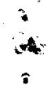
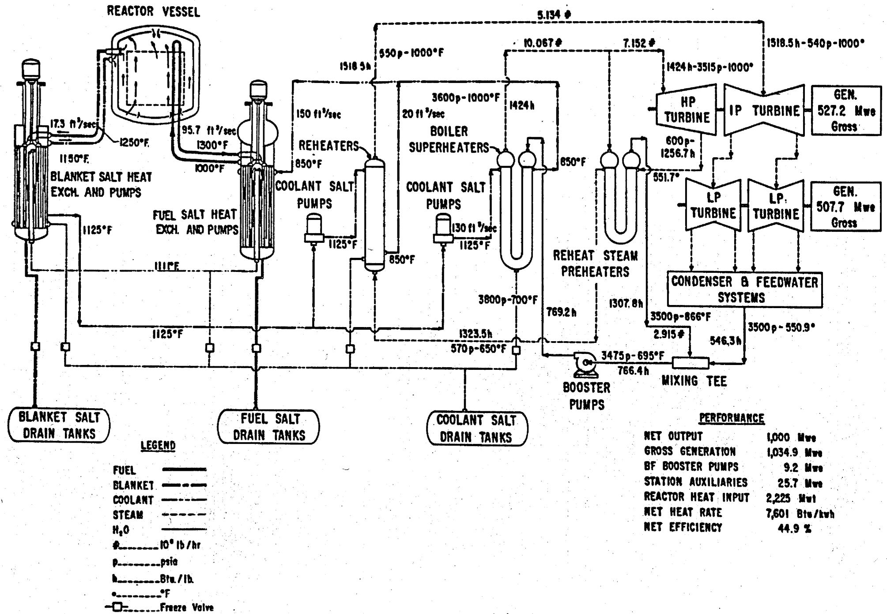
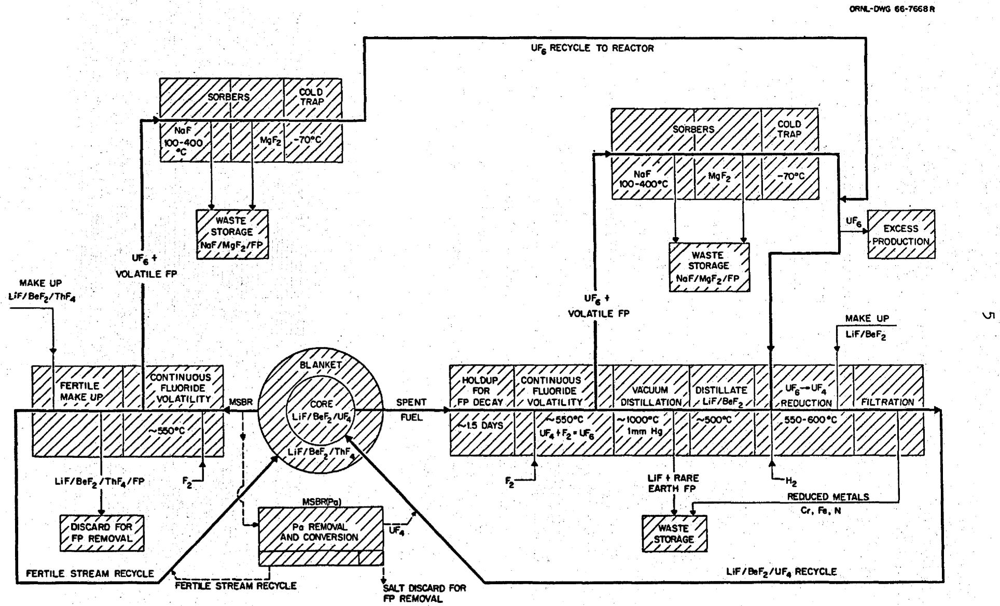
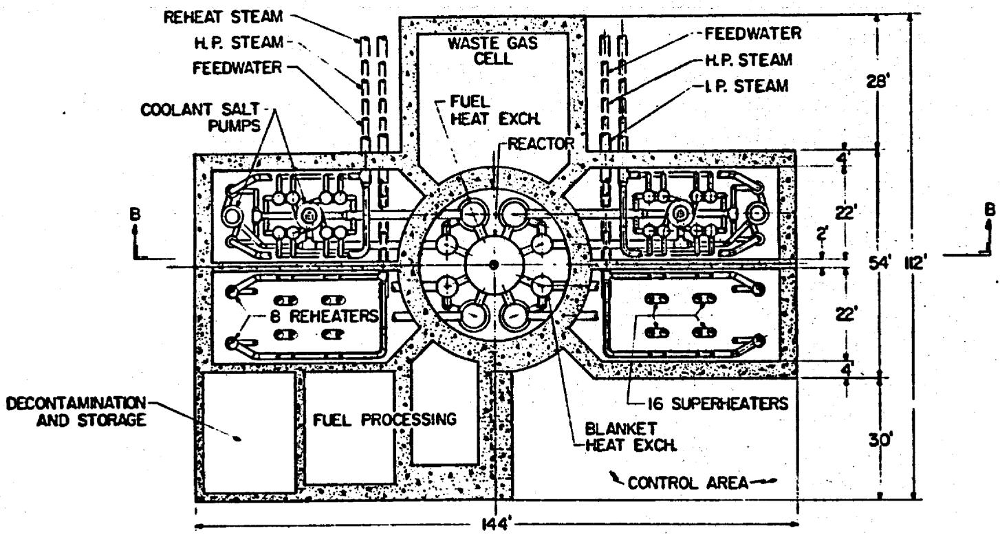
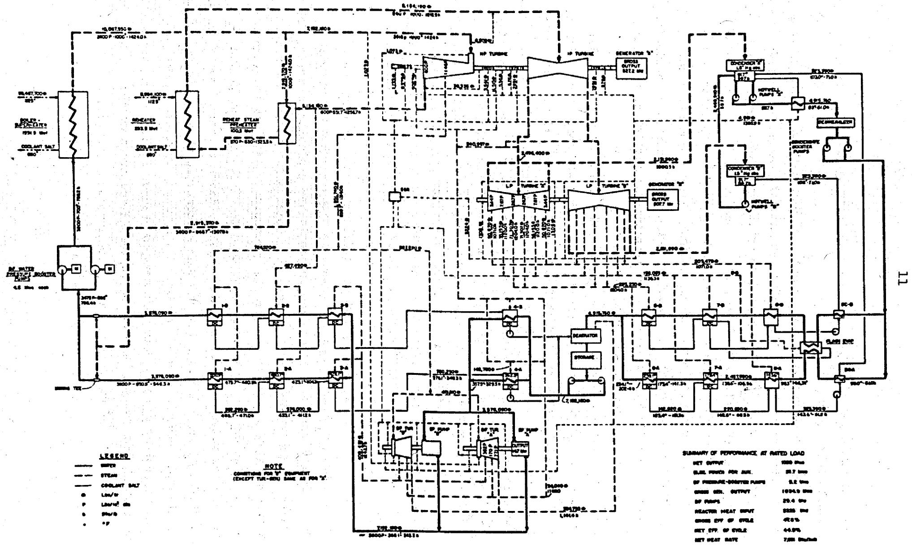
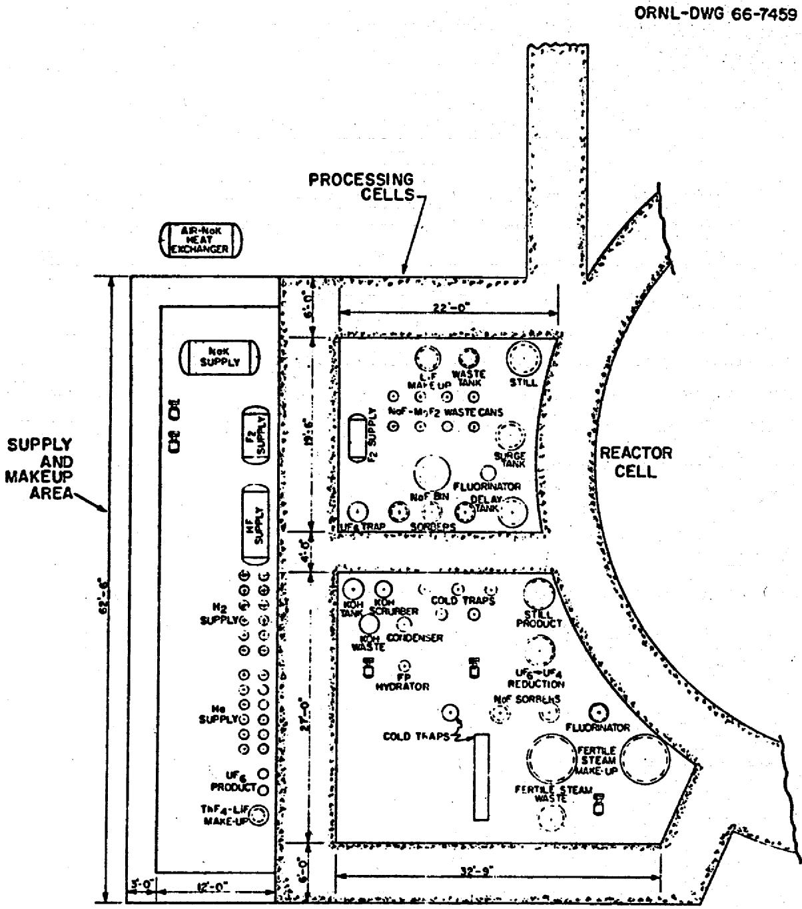
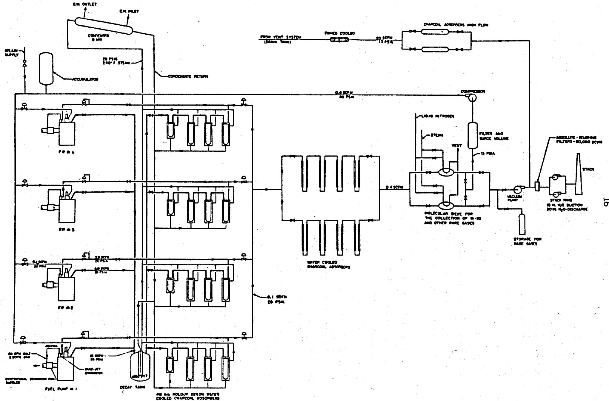
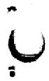
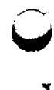

ORNL-TM-1858

231

COPY NO. -

DATE - June 9, 1967

GSETI REICES

Hg 3.00; MN 65

SAFETY PROGRAM FOR MOLTEN-SALT BREEDER REACTORS

Paul R. Kasten

# ABSTRACT

Investigations required in determining the safety characteristics of MSBR power plants are outlined, and associated safety program cost estimates are given. The safety features of the major plant systems in the MSBR are described; the favorable characteristics arise from the prompt negative temperature coefficient of reactivity, the low system pressures, the mobility of fluid fuel, and the low excess reactivity available to the reactor at any time. Reactivity additions which need detailed study include those associated with net fuel addition to the core region, those due to graphite behavior, those caused by changes in fluid flow conditions, and those due to control rod movement. Reactivity coefficients which require evaluation include those associated with temperature, voids, pressure, fuel concentration, and graphite concentration. The integrity of plant containment under reactivity incident conditions and also under circumstances where reactivity itself is not involved need to be evaluated; included here are events such as mixing of water and steam with coolant salt, criticality in regions outside the core, and flow blockage within the fuel or coolant streams. Stability analysis of the reactor plant is required to determine the operating, control, and/or design requirements for obtaining satisfactory plant characteristics. Physical behavior of materials and of equipment under MSBR conditions, as they relate to reactor safety, need to be determined experimentally. In order to delineate and resolve the basic safety problems associated with MSBR systems, it is estimated that about $1.3 million is required over a period of about eight years, with most of the effort ($0.9 million) occurring during the first four years.

# LEGAL NOTICE

This report was prepared as an account of Government sponsored work. Neither the United States, nor the Commission, nor any person acting on behalf of the Commission:

A. Makes any warranty or representation, expressed or implied, with respect to the accuracy, completeness, or usefulness of the information contained in this report, or that the use of any information, apparatus, method, or process disclosed in this report may not infringe privately owned rights; or   
B. Assumes any liabilities with respect to the use of, or for damages resulting from the use of any information, apparatus, method, or process disclosed in this report.

As used in the above, "person acting on behalf of the Commission" includes any employee or contractor of the Commission, or employee of such contractor, to the extent that such employee or contractor of the Commission, or employee of such contractor prepares, disseminates, or provides access to, any information pursuant to his employment or contract with the Commission, or his employment with such contractor.

# TABLE OF CONTENTS

# ABSTRACT 1

1. INTRODUCTION 3   
2. MAJOR PLANT SYSTEMS INFLUENCING REACTOR SAFETY 6

2.1 Reactor System 7   
2.2 Steam System 10   
2.3 Fuel Recycle Processing System 13   
2.4 Off-Gas System 15

3. REACTOR SAFETY ASPECTS 18

3.1 Reactivity Coefficients and Kinetics Parameters 18   
3.2 Control-Rod Function 20   
3.3 Reactor Incidents 21

3.3.1 Reactivity Additions 23   
3.3.2 Mechanical and Physical Integrity - Containment 29   
3.3.3 Miscellaneous Incidents 31

3.4 Reactor Stability 32

4. MSBR SAFETY PROGRAM 33

4.1 Summary 33   
4.2 Cost Estimates 36

ACKNOWLEDGMENTS 38

# LEGAL NOTICE

This report was prepared as an account of Government sponsored work. Neither the United States, nor the Commission, nor any person acting on behalf of the Commission:

A representation, expressed or implied, with respect to the accuracy, completeness, or usefulness of the information contained in this report, or that the use of any information, apparatus, method, or process disclosed in this report may not infringe privately owned rights; or

B. Assumes any liabilities with respect to the use of, or for damages resulting from the use of any information, apparatus, method, or process disclosed in this report, as used in the above, "person acting on behalf of the Commission" includes any em-such employee or contractor of the Commission, or employee of such contractor, to the extent that disseminates, or provides access to, any information pursuant to his employment or contract with the Commission, or his employment with such contractor.

Paul R. Kasten

# I. INTRODUCTION

The purpose of this report is to discuss important aspects of molten-salt breeder reactor plants which are related to the operational and ultimate safety of such systems, and to present a program for investigating reactor characteristics and associated cost requirements. In order to be relatively specific, the Molten Salt Breeder Reactor plant (MSBR) described in Ref. 1 forms the basis for this discussion. However, general studies which also consider other design concepts will need to be performed; the general studies required will come into better focus as MSBR safety and design information is developed.

Briefly, the MSBR design concept concerns a two-region, two-fluid system with fuel salt separated from the blanket salt by graphite tubes. Circulating-fuel temperatures are high ( $\sim 1300^{\circ}\mathrm{F}$ ), and reactor pressures are low ( $\sim 100$ psi). The energy produced in the reactor fluid is transferred to a secondary coolant-salt circuit, which couples the reactor to a supercritical steam cycle. The fuel salt consists of uranium fluoride dissolved in a carrier salt containing a mixture of lithium and beryllium fluorides, while the blanket salt contains thorium fluoride dissolved in a similar carrier salt. The blanket salt also circulates through passages in the graphite moderator region of the core. The coolant salt is a mixture of sodium fluoride and sodium fluoroborate. Fuel processing is performed on-site, in a processing plant integral with the reactor plant. Figure 1 gives a flowsheet of the 1000-Mw(e) MSBR power plant, while Figure 2 gives the associated processing flow-sheet. Details of these flowsheets are discussed in References 1 and 2.

The safety of MSBR's has not as yet been investigated in detail; however, it can be discussed in a qualitative manner, pointing out areas and items which need to be investigated. The operating philosophy and

  
Fig. 1. Flowsheet of a 1000-Mw(e) MSBR Power Plant.

  
Fig. 2. Fuel- and Fertile-Stream Processing for the MSBR and MSBR(Pa).

the organization for safety in MSBR power plants will have to satisfy the licensing and regulatory requirements which exist; also, MSBR plants must satisfactorily pass safety reviews, inspections, and testing. Plant operations will have to be safe and efficient so that the health and safety of plant personnel and that of the general public will not be endangered, and so that the plant can operate economically on a long-term basis. While it appears that the safety of MSBR systems can be assured at costs as low or lower than the safety requirement costs of other reactor power plants, a definitive evaluation cannot be made until detailed safety studies have been performed.

In discussing MSBR safety, credible incidents which would normally never occur must be considered. Plant systems involved are primarily the reactor system, the supercritical-steam system, the fuel processing system, and the off-gas system. These are discussed below relative to their influence and function on reactor safety. Also, a discussion is included of possible events which can be described qualitatively, but which need detailed investigation to be evaluated adequately. These involve reactivity coefficients, control rod function, possible incidents, and reactor stability. Finally, a summary is given of the MSBR safety program, along with estimates of the costs associated with resolving safety design questions.

# 2. MAJOR PLANT SYSTEMS INFLUENCING REACTOR SAFETY

The reactor system is the primary one of interest, but other systems can also influence reactor behavior. For example, rupture of the supercritical boiler-superheaters could lead to high pressures in the secondary coolant system, which in turn could lead to rupture of the primary heat exchanger if proper safeguards are not employed. Such a train of events would influence the reactivity of the reactor core, and need to be considered relative to the adequacy of reactor plant containment.

Another plant system of importance is the fuel recycle system, since it is integrated with the reactor plant and operates "on-line." This operation could introduce reactivity changes into the reactor system.

Also, the off-gas system is an important protective system relative to the reference of radioactive gases from the plant site.

# 2.1. Reactor System

As considered here, the reactor system contains the reactor core, the primary and secondary circulating-salt loops, and associated pumps the heat transfer equipment. Important items in this system are indicated in Figure 3.

The reactor vessel is housed in a circular cell of reinforced concrete, about 36-ft-diam by 42-ft-high. This volume also contains the four fuel- and blanket-salt primary heat exchangers and their respective circulating pumps. The wall separating this cell from the adjoining cells is 4-ft-thick, and the removable bolt-down roof plugs total 8 ft in thickness. The pump drive shafts pass through stepped openings in the special concrete roof plugs to the drive motors which are located in sealed tanks pressurized above the reactor cell pressure. The control rod drive mechanisms pass through the top shielding in a similar manner. The coolant-salt pipes passing through the cell wall have bellows seals at the penetrations.

The cell is lined with $\frac{1}{4}$ to $\frac{1}{2}$ -in.-thick steel plate having welded joints, which, together with the seal pan that forms a part of the roof structure, provides a cell leak rate less than $1\%$ (volume) per $24$ hr. The cell is heated to above $1050^{\circ}$ F by radiant heating surfaces located at the bottom of the cell. The liner plate and the concrete structure are protected from high temperatures by 6 in. or more of thermal insulation and by a heat removal system. The reactor and heat exchanger support structures are cooled as required.

Thus, there are several barriers to protect against the escape of radioactivity. The first is the primary reactor piping and equipment, the second is the seal-welded containment vessel, and a third is the reactor building proper which is maintained at a negative pressure by ventilating fans which discharge through a stack-filter arrangement. All penetrations into the reactor cell, such as those associated with instrument, electrical, and service lines, are equipped with sealing devices.

ORNL-Dwg.-67-6314

  
Fig. 3. General Arrangement of Equipment in the Reactor Cell and Coolant Cells.

The four cooling-salt-circulating circuits are housed in individual compartments having 4-ft-thick reinforced concrete walls and bolted-down, removable roof plugs. Each compartment contains four boiler-superheaters, two reheaters, one coolant-salt pump serving the boiler-superheaters, and one coolant-salt pump supplying the reheaters. All piping passing into these cells from the turbine plant has sealed penetrations and valving located outside the walls. The coolant-salt pump drive shafts extend through the roof plugs and the cells are sealed and heated in the same manner as in the reactor cell. Normally the temperature need not be maintained above $750^{\circ}\mathrm{F}$ , however.

The secondary coolant lines are maintained at a higher pressure than the reactor system (about 200 psi, compared with $\sim$ 100 psi in the reactor), so that in the event of a primary heat exchanger tube failure, leakage of radioactive fuel salt into the secondary circuit will be minimized. Ordinarily, the activity of the coolant salt will be that due to $\mathbf{N}^{16}$ (formed from the $\mathbf{N},\alpha$ reaction on fluorine and having a half life of 7.4 sec) and $\mathbf{Na}^{24}$ (formed by an n, $\gamma$ reaction and having a half life of about 15 hr). In each case the neutron source for activation is the delayed neutron emission in the primary heat exchanger.

The design pressure for the reactor cell and the four adjoining compartments is expected to be about 45 psig. Pressure-suppression systems are provided, the reactor cell system being separate from the system used for the other compartments. These suppression systems would contain water storage tanks so that vapors released into a cell would pass through these tanks and be condensed, maintaining the cell pressure below the design value. Noncondensable gases would be contained until they could be disposed of by passage through the off-gas system. When the coolant salt is discharged into the water in the pressure suppression system some HF will be produced. The quantity and the effects need to be evaluated. Studies made for the MSRE suggest that corrosion of the steel liners and tanks by the HF will not be a serious problem.

The fuel drain tanks maintain subcritical storage of the fuel and also remove decay heat for maintaining proper fuel temperatures. Evaporative cooling is provided. The coolant drain tank is similar to the fuel drain tank except no cooling is required. An inert cover gas system is

provided to protect the molten salt from oxygen and moisture at all times. In order to keep stresses within equipment low, normal heating and cooling of the reactor will be done slowly at rates of $100^{\circ}\mathrm{F/hr}$ or less, applying temperature differences less than about $100^{\circ}\mathrm{F}$ . However, the reactor system should withstand several severe thermal shocks (such as a rapid fuel-salt temperature rise of about $400^{\circ}\mathrm{F}$ ) without breaching.

The homogeneous and fluid nature of molten-salt fuels permits ready transport of material from one system to another. From the viewpoint of safety, it is important that the fissile fuel remain homogeneously distributed in the carrier salt. This has been demonstrated repeatedly under both nonirradiation and irradiation conditions; in addition, chemical stability of the fuel salts improves with increasing temperature, a favorable relation. Also, the fuel salt expands with increasing temperature, effectively leading to expulsion of fuel from the core region and leading to a negative temperature coefficient of reactivity. Because of the ease of fuel addition and removal, very little excess reactivity is provided within the reactor during normal operating conditions.

Fission gases are continuously removed from the reactor core on a very short cycle time (less than one minute) by sparging the salt with inert gas. Fuel processing takes place on about a 30-day cycle (for the fuel salt), so that the fission product content of the reactor system is always relatively low.

Since the fuel salt does not wet the container material or the moderator, drainage of the fuel salt plus flushing the system with carriers salt should remove a large fraction of the fission products from the circulating-fuel system. The actual behavior will need to be studied experimentally.

# 2.2. Steam System

The steam system is indicated in Figure 4 and consists of the coolant-salt heat exchangers, boiler feed pumps, feedwater heaters, the turbine-generator, and associated equipment. The steam-power system uses steam conditions of 3500 psia -- $1000^{\circ}\mathrm{F} / 1000^{\circ}\mathrm{F}$ , which are representative of modern steam power plant practice. The feedwater enters

ORNL-Dwg.-67-6315

  
Fig. 4. MSBR Power Cycle.

the boiler at $700^{\circ}\mathrm{F}$ so that little or no freezing of the secondary coolant salt takes place.

The 16 boiler-superheaters consist of U-tube-U-shell heat exchangers, which transfer heat from the $1125^{\circ}\mathrm{F}$ coolant salt to the $700^{\circ}\mathrm{F}$ feedwater and generate steam at $1000^{\circ}\mathrm{F}$ and 3600 psia. Variable-speed, coolant-salt pumps are used to permit control of the outlet steam temperature. There are eight shell-and-tube heat exchangers which function as reheaters and transfer heat from the coolant salt to 570 psia steam from the high-pressure turbines exhaust, raising its temperature to $1000^{\circ}\mathrm{F}$ . Reheat steam preheaters are used to heat this exhaust steam to about $600^{\circ}\mathrm{F}$ before it enters the reheaters.

The heat-exchange equipment is located within containment cells which communicate with the reactor cell by means of coolant-salt lines, and with the turbine room by means of steam and water lines. In addition, these cells communicate with the fuel processing area by means of small coolant-salt lines and with the control and service areas through penetrations for gas, cooling water, instrumentation lines, etc. These cells also communicate with a vapor suppression volume through a large conduit equipped with a rupture disc. The vapor-condensing system provides pressure control of the coolant-salt cell in the event of a rupture of the steam or water circuits. Biological shielding is provided for the cells, and a controlled inert gas atmosphere is maintained.

Molten salts do not undergo a significant chemical reaction with water; however, high-temperature steam is produced when water contacts molten salt. In order to provide for accidents producing steam, or for leakage of high-pressure steam into the coolant-salt cells, a vapor-suppression system is used to provide pressure relief, and maintain pressures below the containment design value of about 45 psig. Automatic block valves are provided in the steam lines to reduce the likelihood of draining the water in the steam system into these cells in the event of a rupture.

To protect against high pressures in case of failure of a superheater tube in the heat exchanger, rupture discs are provided on the shell side of the superheaters and reheaters for venting the coolant

system into the vapor condensing system. These rupture discs protect against overpressure in the coolant-salt circuit and thus protect the reactor system, which is separated from the coolant salt by the tube walls of the primary heat exchanger.

# 2.3. Fuel Recycle Processing System

The flowsheet for the MSBR processing system has been given previously in Figure 2. The core fuel is processed by the fluoride volatility process to separate the uranium from the carrier salt and fission products. The valuable carrier salt is separated from the rare-earth fission products by the vacuum-distillation process. The fuel salt is reconstituted by absorbing $\mathrm{UF_6}$ in uranium-containing carrier salt, followed by reduction in the liquid phase by bubbling hydrogen through the melt. Excess uranium from the reactor is sold as an equilibrium mixture of the fuel isotopes. Fuel salt is returned to the reactor as needed.

The blanket salt is processed by the fluoride volatility process along with a Pa-removal process in which Pa is extracted by liquid bismuth containing dissolved thorium. The same process also removes uranium.

Small side streams of fuel salt and blanket salt are continuously withdrawn from the reactor circulating systems and routed to the processing plant located within the same building. At the same time, makeup streams are returned to the fuel and blanket systems at the same rate they are removed. These rates are low enough that no significant reactivity additions to the reactor should normally be possible.

The fuel-recycle processing plant is located in two cells adjacent to the reactor shield; one contains the high-radiation-level operations, and the other contains the lower-radiation-level operations. Each cell is designed for top access through a removable biological shield having a thickness equivalent to 6 ft of high-density concrete. A general plan of the processing plant and a partial view of the reactor cell is shown in Figure 5. The highly radioactive operations in the fuel-stream processing are carried out in the smaller cell (upper left). The other cell houses equipment for the fertile stream and the fuel-makeup-stream operations.

  
Fig. 5. General Location of Processing Plant Equipment.

The highly radioactive cell contains only fuel-stream processing equipment consisting primarily of the fluorinator, still, waste receiver, NaF and $\mathrm{MgF_2}$ sorbers, and associated vessels. The other cell houses the blanket processing equipment and fuel- and fertile-stream makeup vessels.

The processing plant will use hydrogen and fluorine gases in the treatment of the salts. Care must be taken in utilizing these gases because of the hazards associated with obtaining explosive mixtures of hydrogen and oxygen, or fluorine. Thus, hydrogen must be isolated from the fluorine and from the reactor cell. Also, fluorine must be isolated from the reactor system, and organic lubricants must not enter the fluorine system.

The processing plant will utilize the same off-gas disposal system as the reactor plant. This combined use should not introduce operating hazards. The integrity of the cooling systems needed for cooling of processing equipment must be assured, both during continuous processing and during storage of waste.

Criticality considerations must be considered, such that recovery of fissionable material constitutes no criticality hazard; however, due to the relatively small quantities of fissile fuel held up in the processing plant and the character of the materials handled, no difficulty is anticipated.

Reactor fuel additions will be done primarily through the return line from the processing plant. The associated components would be of all-welded construction and would be maintained by remote maintenance procedures.

# 2.4. Off-Gas System

Xenon and krypton as well as tritium are stripped from the fuel salt in the reactor circulating system by sparging with an inert gas, such as helium. This gas along with the gases generated are treated in the off-gas system.

The flowsheet for the off-gas system in shown in Figure 6. After passing through a decay tank, the fission product gases are passed through water-cooled charcoal beds where xenon is retained for $48\mathrm{hr}$ .

  
Fig. 6. Flowsheet for the Off-Gas System.

In addition to removing the $^{135}\mathrm{Xe}$ , this system of circulation effectively transfers a large fraction of the other gaseous fission products to areas where the decay heat can be removed more readily.

About 0.1 scfm of the gas stream leaving the initial charcoal beds (or 0.4 scfm total for the four fuel-salt circulating loops) is passed through additional charcoal beds and then through a molecular sieve (operated at liquid nitrogen temperature) to remove $99\%$ or more of the ${}^{85}\mathrm{Kr}$ and other gaseous products. The effluent helium can be recycled into the reactor system or passed through filters, diluted, and discharged into an off-gas stack. The molecular sieves can be regenerated, and the radioactive gases that are driven off can be sent to storage tanks.

Concentration and storage of the tritium will probably require additional equipment; this operation needs additional study.

A helium system provides cover gas for the blanket pump bowls, the drain tanks, fuel-handling and processing systems, etc. Essentially all helium will be recycled to the cover-gas system. Any discharged cover gas passes through charcoal adsorbers and absolute filters, is diluted with air, and discharged through the off-gas stack.

Relative to the off-gas processing of the fuel recycle system, most of the facilities are located in the processing plant proper. In the processing plant, off-gas comes primarily from the continuous fluorinators, while smaller amounts are formed in various other processing vessels. The gases are processed to prevent the release of any contained fission products to the atmosphere. Excess fluorine used in the fluorinators is recycled through a surge chamber by a positive displacement pump, and a small side stream of the recycling fluorine is sent through a caustic scrubber to prevent gross buildup of fission products. Each of the processing vessels and holdup tanks has off-gas lines which lead to the scrubber for treating HF, fluorine, and volatile fission products.

The scrubber operates as a continuous, countercurrent, packed bed with recirculating aqueous KOH. A small side stream of KOH solution is sent to waste, and the scrubber off-gas is contacted with steam to hydrolyze fission products such as tellurium. A filter removes the hydrolyzed products. The noncondensable fission products are sent to the reactor off-gas facility.

The off-gas system must be designed to handle the very radioactive gases and to provide cooling of these gases. Also, while the vapor pressure of molten salts is very low, MSRE experience indicates that some particulate matter can be carried into the off-gas stream. Cold trapping or filtering must be provided in the off-gas lines for removing these mist-like particles. Any oil leakage and associated decomposition products entering the off-gas system must be removed by a filter system.

The off-gas system primarily removes fission products, recirculates sparge gases back to the reactor system, and holds up fission products until they have decayed sufficiently for disposal. If fission products are not held up sufficiently, radioactive gases are discharged prematurely, leading to high activity levels.

# 3. REACTOR SAFETY ASPECTS

In operating a reactor power plant there always exists the possibility that reactivity can be inadvertently added to the system, leading to a system disturbance. If this disturbance is very small, no ill effects result. Increasing the degree of disturbance can lead to conditions which affect reactor operation (operating safety) and eventually to conditions which affect the safety of the general public (ultimate safety). In this section the MSBR operations are discussed from the viewpoint of items which need to be evaluated from a safety standpoint such as reactivity coefficients, control rod function, possible reactivity events that could cause reactivity additions to the reactor, and the stability requirements of the reactor power plant. In general, the specific situations which need to be evaluated are dependent upon the design and operational features of the system.

# 3.1. Reactivity Coefficients and Kinetics Parameters

A number of reactivity coefficients are associated with an MSBR system. These include those associated with temperature, voids, pressure, fuel concentration, graphite concentration, xenon concentration, fuel

burnup, fuel flow rate, and involve the fuel and blanket fluids separately and together. From the viewpoint of reactor safety, the most important coefficients appear to be the temperature coefficients of reactivity for the fuel salt, the blanket salt, and the graphite moderator, and the fuel concentration coefficient of reactivity. There are special circumstances where others are also of importance. All of these need to be determined specifically.

Molten-salt reactors have, in general, a relatively large negative fuel temperature coefficient of reactivity, due to the expulsion of fuel from the core region with increasing temperature. The value for MSBR systems will be in the range of $-1 \times 10^{-6} \Delta k_{\mathrm{e}} / {}^{\circ}\mathrm{F}$ to $-5 \times 10^{-5} \Delta k_{\mathrm{e}} / {}^{\circ}\mathrm{F}$ , the value being a function of design and operating conditions. This coefficient gives inherent control and safety to molten-salt systems, since any increase in power level tends to decrease the reactivity and thus decrease the power level. Since MSBR's will normally operate with only low values of excess reactivity available, the temperature coefficient appears sufficient for controlling the reactor without excessive temperature variations. This inherent control feature permits use of control rod mechanisms which have relatively slow action.

Increasing the prompt temperature coefficient of reactivity generally improves the safety and stability margins of reactor operations, provided that the reactivity is added by means other than the temperature coefficient. However, the temperature coefficient itself can add reactivity by means of "cold slug" type occurrences. Such an occurrence in an MSBR would be normally associated with an increase of fluid flow rate; however, increasing the flow rate tends to decrease reactivity due to the associated increased loss in delayed neutrons. The effective value for the delayed neutron fraction in $^{233}\mathrm{U}$ -fueled reactors is about 0.003 in fixed fuel systems; in MSBR systems, the effective value for beta during fuel circulation would be about 0.001.

Reactivity coefficients need to be determined in order to properly evaluate the safety of MSBR systems. Primary values appear to be the temperature coefficients associated with the fuel and blanket fluids and with the graphite; the void coefficients associated with both the fuel

and blanket fluids; concentration coefficients associated with the fissile and fertile salts in the core; reactivity coefficients associated with loss of fuel flow; effective delayed neutron fraction as a function of flow and power conditions; and the reactivity effects associated with graphite shrinkage, graphite breakup, and fuel soakup by graphite.

The reactivity coefficients need to be consistent with the kinetics model used in the safety evaluations, and time- and space-dependent criticality effects need to be included in such studies. These time- and space-dependent effects should include consideration of the different heating and flow rates within the reactor, afterheat generation, and the change in the effective delayed neutron fraction during a power pulse. Other parameters needed in the kinetics analysis include the prompt neutron lifetime and xenon poisoning effects.

# 3.2. Control-Rod Function

One or more control rods are provided in the MSBR in order to provide flexibility in reactor operations, and to control reactivity additions such that fuel temperatures and associated temperatures do not become excessive. As mentioned in Section 3.1, inherent control is provided through the negative temperature coefficient of reactivity, which provides prompt protection against reactivity additions. At the same time, if reactivity additions take place over a long-time interval, the total reactivity added may lead to undesirably high fuel temperatures if only the temperature coefficient is utilized (however, such temperatures may be permissible for relatively short times -- order of hours). Installation of control rods which are slow acting (response time of about one second) appears sufficient for controlling maximum fuel temperatures, and would permit reactivity control independent of fuel temperature. Control rods provide an easy means of controlling reactor power at low power levels where the temperature coefficient is a poor operational control; during power operation, control rods would normally be fully withdrawn from the core.

The required reactivity worth of control rods is a function of shim and shutdown margin requirements, and needs to be investigated in detail. Control-rod worth as a function of fuel concentration, power conditions, and reactor design should be studied. In particular, use of "control rods" which use fertile blanket salt as absorber material need to be evaluated.

The action and position of control rods during reactor startup need to be examined. It appears reasonable that the rods be fully inserted prior to start of fuel circulation, with criticality achieved by withdrawal of the rods.

In general, the control rods of the MSBR need not be used for shim requirements (e.g., change in steady-state Xe level, or fuel temperature); rather, associated reactivity changes can be made by adjusting the fuel concentration. Reactor shutdown can be obtained by insertion of a control rod, or by stopping a fuel pump which leads to fuel drainage from the core region.

It does not appear that control rods need to control large amounts of reactivity (probably less than $1/2\%$ in reactivity) or to have fast response times (response times of about a second are probably sufficient). However, detailed studies need to be performed relative to specific requirements as a function of core design. The results obtained will be used to determine general considerations concerning control rods and MSBR safety.

# 3.3. Reactor Incidents

Items to be considered here concern physical events which influence system reactivity, as well as some which do not influence reactivity per se. Operational safety, or the ability to continue reactor operation after abnormal events, is involved, as well as ultimate safety where containment of gross radioactivity and public safety are the important concerns. These definitions are illustrated below.

As normally considered, a reactor incident involves a core reactivity addition. If the reactivity addition is small enough, there is primarily a small disturbance in reactor power, with no deleterious effects to the reactor plant. Under these circumstances, operational safety is maintained. If the reactivity addition is large enough, a graphite tube separating the fuel and blanket fluids may break because of the pressure rise, with no other untoward effects. Under these circumstances the reactor plant has produced no public hazard, but must be shut down for repairs. Under these circumstances operational safety has not been maintained, but ultimate safety has not been involved. If the reactivity addition is so large that the reactor vessel ruptures and generates a disruptive force which results in penetration of the reactor containment, both operational and ultimate safety may be violated.

Reactor plant incidents can also occur without the reactor itself being involved. For example, if mechanical failures occur which permit water or supercritical steam to contact secondary coolant salt within the cell containing the steam generators, high pressures could occur in the cell and lead to rupture of this containment. Release of steam containing particles of radioactive coolant salt could involve personnel hazard and ultimate safety.

The design of an MSBR plant must consider both operational and ultimate safety aspects; the resulting reactor plant must have operational safety assured under nearly all credible circumstances, and ultimate safety assured under all credible circumstances. Items which need to be considered in such safety design studies are discussed below and are separated into those which involve reactivity additions to the reactor proper, those associated with mechanical and physical integrity, and items not covered in either of the above categories. In nearly all cases, these events require malfunction of equipment or reactor operation as indicated below.

# 3.3.1 Reactivity Additions

Reactivity can be added to the MSBR by mechanisms and events similar to those considered for the MSRE; in addition, the use of two fluid streams separated by graphite tube walls and the supercritical steam-power cycle requires that several other events be considered. Possible reactivity additions need to be investigated in detail.

The protective devices available to the MSBR are similar to those in the MSRE. "Prompt" protection is afforded by the negative temperature coefficient of reactivity and "delayed" protection is provided by the control rods and also by drainage of fuel salt from the core region. Since all reactivity changes involve rates of addition rather than reactivity steps, an important factor in protection is the minimum neutron source strength which can exist in the core. The MSBR fuel contains an inherent neutron source of nearly $10^{7}$ n/sec due to the $\alpha, n$ reactions resulting from the alpha decay of $^{233}\mathrm{U}$ and $^{234}\mathrm{U}$ in the fuel salt. An additional neutron source exists from the $\gamma, n$ reaction resulting from the decay of fission products within the fuel salt; the photoneutron source is greater than $10^{7}$ n/sec for about four months after reactor shutdown following a month's operation at power. Thus a strong internal neutron source is always present; if reactivity is added at low rates, multiplication of this source results in a significant increase in reactor power before large amounts of reactivity can be added to the system, which in turn permits the temperature coefficient to become effective after relatively small gross reactivity additions.

Net Fuel Addition to Core. Probably the largest reactivity addition that can take place in an MSBR is that associated with breakage of one or more graphite tubes with net addition of fuel salt to the core region. However, special circumstances have to exist for this to take place since the blanket region operates at pressures higher than the fuel region, and tube breakage under normal conditions would add fertile salt to the fuel region and reduce reactivity. Thus, to add reactivity, the fuel pressure would have to rise higher than the blanket pressure at the time of, or shortly after, breakage of a graphite tube. This is possible if the high pressure of the supercritical steam system is at least partially

transmitted to the fuel-salt system, or if there is a decrease in the blanket pressure without a concurrent decrease in the core-fuel pressure.

Failure of the tubing in the boiler-superheater could allow the high-pressure steam to enter the coolant-salt system. To protect against a buildup of pressure in the coolant system, rupture discs are provided in the steam generator and reheaters, and also could be provided on the shell sides of the fuel and blanket heat exchangers. If these rupture discs fail to operate, or fail to operate quickly enough, it is conceivable that a buildup of pressure in the coolant system could cause failure of the primary fuel heat exchanger. The likely means of failure would be rupture of the shell or collapse of the tubes, neither event transmitting the pressure increase to the fuel fluid. However, if there were localized weakness in a fuel-heat-exchanger tube, due to a defect in manufacture, fretting corrosion, etc., failure of a tube could occur leading to a buildup of pressure in the fuel system. Alternatively, loss of overpressure in the blanket region could permit operation with fuel pressures higher than blanket pressure. If a graphite tube failed under such operating conditions, there would be a net fuel addition to the core region. The reactivity addition would depend upon the pressures and flow passages involved and their variation with time.

If steam does contact coolant salt, no exothermal reactions of any consequence are involved. Mixing of steam with coolant salt would oxidize the coolant salt, but no safety hazard would be introduced because of this action. However, the corrosiveness of the mixture to the container material needs determination. There are no fission products in the coolant salt, and the induced activity present would decay (the primary activity is associated with $\mathbf{Na}^{24}$ and $\mathbf{N}^{16}$ , having half lives of about 15 hr and 7 sec, respectively). Cleanup of the system and repair or replacement of damaged equipment appears possible.

The coolant salt is compatible with the fuel salt, so leakage of coolant salt into the reactor system does not involve safety; any such leakage would reduce reactivity. The $\mathrm{BF}_3$ added to the reactor fuel could be readily removed by heating the salt, with the $\mathrm{BF}_3$ removed as a gas.

Contacting fuel salt with steam would oxidize the uranium, but probably would not cause any problems other than those associated with subsequent cleanup of the fuel. However, possible reactivity effects due to fuel precipitation need to be studied specifically.

At this time it appears reasonable that engineered safeguards, such as installing rupture discs within the heat exchangers of the coolant system, and providing strengthened primary system heat exchanger tubes can either protect against such an accident, or keep the amount of fuel salt added to the core region small enough that ultimate safety is not involved. However, detailed studies are needed to examine this situation.

Reactivity Changes Due to Graphite Behavior. In addition to the case discussed above in which breakage of graphite tubes was assumed to take place, other graphite behavior can effect reactivity changes. For example, shrinkage of graphite during radiation exposure can effectively influence fuel concentrations; however, the associated reactivity changes should take place at rates such that they can be readily compensated by adding or removing fuel through normal operations.

Reactivity can be added if part of the graphite inside a fuel tube were to break away from the tube proper and be swept out of the core region. Only small amounts of reactivity could be involved so long as this action took place in single tubes, and no difficulty for this situation would be anticipated. Alternatively, if graphite were removed from the blanket portion of the core region, it would be displaced by fertile salt, leading to a decrease in reactivity such that safety is not involved.

Graphite is compatible with molten salt, but fuel penetration into the graphite could take place with time. Here again, the time element involved would make such events insignificant from a safety viewpoint. If, on the other hand, a pressure rise took place in the core which caused the fuel to penetrate and fill voids in the graphite, perhaps a significant reactivity addition could be obtained. The actual addition is dependent upon the physical properties of the graphite employed. If the pressure rise occurs because of a previous reactivity addition, the pressure buildup itself would expel fuel salt from the core and tend to decrease reactivity.

Fuel-salt penetration in graphite appears to present little problem during normal operation, but may present difficulties during emergency shutdowns which require fuel-salt drainage. Fuel remaining in the graphite would generate decay heat which could lead to undesirably high temperatures (temperature distributions and levels influence thermal stresses and creep rates, which can affect the mechanical integrity of the graphite). The ability of blanket salt to remove this decay heat needs investigation.

Reactivity Changes Associated With Changes in Flow Conditions. In a circulating-fuel reactor, an appreciable fraction of the delayed neutrons can be emitted external to the core under normal flow conditions. Increasing flow thus tends to lower the contribution of delayed neutrons to the fission chain and also decreases the average neutron lifetime of the reactor. While lowering the delayed neutron fraction (beta) is normally considered detrimental to safety, this is in the context of systems having instrument control. Lowering the value of beta in a system having inherent control under the condition that reactivity additions take place at relatively low rates does not significantly decrease the ultimate safety of the system. Also, the effective value of beta increases during a rise in power, a favorable condition.

Since delayed neutrons are "lost" because of fuel circulation, stoppage of flow due to pump power failure would tend to add reactivity to the system. However, in the MSBR the reactivity addition would only be about 0.002. In addition, stoppage of flow leads to drainage of the core, which would make the reactor subcritical. The fuel temperature rise due to afterheat during drainage of the core may be the most significant variable, and needs detailed study. Also, time delays in fuel drainage from the core following pump stoppage needs to be investigated experimentally, and the results interpreted relative to reactor safety.

Another reactivity incident possible with systems having a negative temperature coefficient of reactivity is that of the "cold slug" accident. Such an accident could occur by starting the fuel-circulating pump at a time when the fuel external to the core has been cooled well below that of the fuel in the core. The cooler fuel would add reactivity when it entered the core; this addition could exceed the reactivity decrease due

to the "loss" of delayed neutrons associated with fluid transport. By going critical only with the pump on, making use of the control rod for this purpose, would avoid the "cold slug" incident. The seriousness of the cold slug incident and the control mechanisms needed under various circumstances needs investigation.

Drainage of the reactor fuel system begins automatically due to gravity forces when the fuel pump stops. Fuel from the core drains by gravity into the sump tank of the fuel pump where afterheat is removed by cooling coils. Convective circulation may be assisted by flow of gas used to sparge xenon from the fuel salt. However, as pointed out above, fuel and graphite temperatures also need to be studied during fuel drainage from the core. In general, the ability and need for afterheat removal requires detailed studies.

Changes in Fuel Concentration. Reactivity can be added by increasing the concentration of fissile material within the fuel fluid; examples of possible events are filling the fuel tubes with salt containing abnormally high fissile concentrations, and returning salt having abnormally high fuel concentrations from the processing system to the reactor system.

The reactor would initially be "filled" by adding fissile material to the carrier salt while the latter was circulating. If, however, following criticality and drainage of fuel salt from the reactor core, the fissile concentration in the drained fuel salt were increased inadvertently, refilling the core could result in a supercritical reactor. Such an event is highly unlikely, since fuel would not be added in large amounts to the drained system; also, partial freezing of the fuel salt does not appear to lead to significant increases of fissile concentration in the fluid portion of the fuel. Specific cases need to be evaluated, however.

The rate of return of fuel from the processing plant is low, and it will be difficult to add reactivity at a high rate through the processing lines because of the limited rate at which fuel can be added. A more likely way to increase fuel concentration above the normal value would be to fill the core with fuel having a temperature lower than the critical temperature. A reactivity added by this means would correspond to a low-rate addition and should cause no difficulty.

If fuel were to accumulate outside the core region, and inadvertently return to the core, reactivity could be added rapidly to the reactor. Since the fuel is homogeneous and chemically stable, this event does not appear to be likely; also, any such possibility would be indicated by a previous reactivity loss. Nonetheless, the consequences of uranium precipitation or accumulation outside the core and its subsequent addition to the core region requires general evaluation. Such studies will help determine operating procedures consistent with reactor safety.

While none of the above events appears to constitute an operational or ultimate safety hazard, all should be considered in detail.

Reactivity Addition by Control-Rod Movement. The presence of a control rod permits reactivity addition to the reactor by rod movement. Normally the reactor would be critical with the control rod completely removed, but there could be conditions where criticality is achieved with the rod partially or completely inserted. The amount and rate of reactivity addition associated with control rod movement under these conditions would be limited by the control rod worth (which will probably be under $0.005\Delta \mathrm{k_e}$ ) and the rate of withdrawal (which will be limited to a low value). As with the MSRE, no difficulty is foreseen, particularly if rod withdrawal does not continue after the power level reaches an initial peak value as a result of rod movement.

Reactivity Addition Due to Positive Pressure Coefficient. The MSBR design specifies use of helium as a sparge gas to remove xenon from the circulating fuel. As a result of this operation, some gas will undoubtedly circulate through the MSBR core, resulting in a positive pressure coefficient of reactivity. The importance of this coefficient on safety is a function of the gas content of the core, which in turn is related to the ease of stripping xenon from the fuel salt and the efficiency of the gas separator used to remove sparge gas before it enters the core region. An increase in pressure would decrease the fraction gas in the core and increase reactivity. Experience with the MSRE indicates that the above is not a serious problem, but it needs to be evaluated specifically for the MSBR.

# 3.3.2 Mechanical and Physical Integrity - Containment

This subject is related to the reactivity additions discussed above. Here, the discussion is concerned with containment relative to events which do not necessarily require or result in reactivity additions to the reactor system. Some of the questions which arise are: What are the consequences of having water and salt in a cell if these materials accidentally make contact? What are the cooling conditions required if there is mixing of salt and water? What are the consequences of fuel-salt leakage or diffusion into the coolant-salt system? How practicable is it to maintain low leakage from a containment cell at the temperatures involved (leakage of no more than $1\%$ of the containment volume per day)? What are the consequences of a major spill of fuel salt within the reactor cell?

The containment of the reactor plant has to be assured even though there is rupture of, or leakage from, the primary and secondary salt systems. Rupture and/or leakage may result from overheating, overstressing, corrosion, or other unexpected material failures. The severity of the containment problem will depend on the amount of salt spillage, the rate at which water mixes with hot salt, and the amount of water added to the cell. Consequences of a spill accident are heat generation, pressure buildup, and release of fission products into the cell, and these will need to be evaluated for specific cases. Problems associated with a major spill of fuel salt within the reactor cell must be considered in the detailed design of MSBR systems and must also be studied experimentally. If water is present, corrosion of steel by HF must be considered. The effects of local thermal expansion or energy deposition due to hot salt spillage needs evaluation. Provision should also be made that oil from the pump lubrication system does not contact hot components, although if this does occur, there normally would not be sufficient oxygen to support combustion in the cell atmosphere of inert gas (nitrogen). In order to assure containment, knowledge of the very long-term creep behavior of materials under plant operating conditions is needed. Information is also needed on the conditions required to produce "steam explosions" upon mixing of salt and water; similar information is needed for the mixing of oil and salt.

The containment of fission products should be assured, and release of these through the off-gas system must not constitute a safety hazard. This involves the amount of volatile material which is to be released and the amount of fission products carried in very small, mist-like salt particles. In any case, the release of material through the off-gas system should be controlled so that exposure of individuals is not excessive. This can be accomplished by filtration and retention systems as required. Beryllium and fluorine hazards, as well as radioactive iodine, must be considered relative to permissible release rates during normal operation as well as following a severe incident. The release of fission products upon mixing of fuel salt and water, or of salt and oil also needs determination. A fission product flow and inventory sheet will be made as MSBR design studies are made in more detail. Also, investigation of the plating out of fission products throughout the reactor system is an important part of the chemical development program. The implication that fission product plating have upon reactor safety needs to be considered.

In designing the reactor system containment, consideration must be given to the possibility of earthquakes. The effect of such an event on reactor containment is, of course, dependent upon its severity, which in turn is a function of local conditions. The possibility of flooding and associated consequences is also dependent upon local conditions.

The most likely method of rupturing the secondary containment is through sabotage, missile damage, acts of nature, or excessive pressure. The generation of missiles in the reactor cell is not likely, since the reactor pressure is low. Missile damage and high pressures are more likely in the coolant cell and steam plant, and, although massive concrete shielding is provided, such events need further investigation. The containment cells will be protected by vapor-suppression systems, which should prevent the pressure from exceeding the containment design figure ( $\sim 45$ psig for present MSBR design) in case of buildup of steam pressure. In designing the vapor-suppression systems, it is necessary to consider the amount of salt and water that can come together and/or the leakage of high-pressure steam into the containment volume. Valves are located

in the steam lines which can be closed to prevent draining all the steam system into the coolant cell. The reservoir of condensing water should be adequate to keep the cell pressure below the design containment pressure. Also, the supercritical steam systems contain relatively small amounts of water in comparison with subcritical systems.

# 3.3.3 Miscellaneous Incidents

Included here are possible incidents which are not covered in the above sections. These involve vessel criticality, heat removal, and heat addition conditions.

Studies are needed relative to the possibility of attaining supercritical conditions in fuel drain tanks and in vessels of the processing plant, along with consequences of such occurrences. Also, criticality conditions might occur as a result of fuel spills. In general, tanks which hold fuel should store it indefinitely in a subcritical condition. Accumulation of spilled fuel salt should be in regions which cannot attain criticality.

The afterheat conditions which can exist within the reactor plant particularly need to be studied in detail, and cooling and heating provided and assured as needed. The temperatures occurring in the core following fuel drainage need to be evaluated as a function of fuel retention by the graphite. The influence of air contact on fuel salt needs study for conditions associated with core maintenance operations. The effects of salt freezing and melting in various parts of the primary and secondary salt circuits require evaluation, with equipment designed to minimize undesirable effects (e.g., rupture of equipment).

The consequences of flow blockage with the reactor system require investigation. A partially plugged fuel tube would normally not be detected and could lead to salt boiling and temperature gradients which may affect the mechanical integrity of the fuel tube. Flow blockage may also lead to inability to remove all the fuel salt from the core, which may lead to afterheat problems and/or maintenance difficulties.

# 3.4. Reactor Stability

Although usually treated separately, reactor safety and stability are intimately related. Reactor safety normally considers relatively large reactivity additions and their influence on system behavior for small time intervals, while reactor stability studies normally consider small reactivity additions and determine whether they result in a buildup of oscillations to the point where reactor safety is involved.

For the MSBR, investigations of stability are required to study the influence of inherent characteristics on instrumentation and control system requirements. Although the MSBR has a negative temperature coefficient of reactivity, this in itself is not sufficient to insure stability, particularly if the system has time delays. The MSBR has a number of built-in time delays which can either help or hinder reactor stability, such as the time lags associated with heat transport from the graphite to the fuel, with fuel and fertile salt transport, and with delayed neutron production. Because of the complexity of the three-loop system from a dynamics analysis point of view, a preliminary linearized analysis should first be made to evaluate the current design and aid in establishing appropriate means of system control.

It is estimated that an adequate preliminary analysis for the complete system (reactor core to turbogenerator) would involve about 60 first-order equations (about 14 for the fuel stream, 14 for the fertile stream, 7 for nuclear kinetics, 15 for coolant streams, and 10 for the steam system). These equations would consider fuel and blanket nodes, transport delays, heat exchanger nodes, and fuel leakage effects. Work is required in formulating the specific equations and in compiling and evaluating the physical parameters. Present computer codes could be utilized in the initial analysis. In particular, codes are available for performing a dynamic analysis utilizing a general linear model. These can be used to give system eigenvalues, system frequency response, and/or system transient response.

Some of the important items to be investigated in stability analysis would be the significance of heat transfer lags between various parts of

the reactor system, the relative importance of the fuel temperature and graphite temperature coefficients of reactivity, and the influence of delayed neutron fraction and flow effects on reactor system behavior. The effect of fuel flow on the effective delayed neutron fraction may reduce this value from 0.003 to less than 0.001. This reduction is not necessarily bad from either the viewpoint of inherent safety or inherent stability. In fact, lowering the delayed neutron fraction can increase the degree of stability, as was the case for the Homogeneous Reactor Test (HRT). Also, the tendency (in circulating-fuel systems) of the effective delayed neutron fraction to increase during the power rise portion of a power pulse tends to aid stability. Plans for the MSRE call for operating that reactor with $^{233}\mathrm{U}$ fuel beginning in the fourth quarter of FY 1968. Studies will be made of the stability of the MSRE with the $^{233}\mathrm{U}$ fuel and the results will be used where applicable in the analysis of the stability of the MSBR.

More detailed stability analysis studies would be dependent upon the results obtained from the initial evaluation but presumably would include investigation of nonlinear effects and their relative influence on results.

# 4. MSBR SAFETY PROGRAM

# 4.1. Summary

The studies and investigations associated with MSBR safety are summarized here in terms of general and detailed studies which need to be done in order to evaluate MSBR safety; these constitute investigations which will be carried out in the MSBR Safety Program.

The favorable safety characteristics of MSBR systems arise from the low excess reactivity available to the reactor, the prompt negative temperature coefficient of reactivity, the low system pressures, the low level of fission gases and fission products retained within the reactor, the mobility of fluid fuel, and the ease of fuel drainage from the reactor. At the same time, there are a number of possible incidents and

safety aspects which need detailed investigation; these aspects are related to the specific plant design and involve both mechanical and nuclear design features. Plant systems which have a major influence on MSBR reactor safety are the reactor system proper, the steam system, the fuel-recycle-processing system, the coolant systems, and the off-gas system. These are described above (Section 2), along with safety features that were incorporated in the plant design.

Safety analysis requires a study of possible incidents, their consequences, and their avoidance. Types of accidents which can take place include those due to reactivity additions. Reactor behavior under such circumstances is influenced by reactivity coefficients and kinetics parameter values. Reactivity coefficients which will be considered include those associated with temperature, voids, pressure, fuel concentration, and graphite concentration, and involve the fuel and blanket fluids separately and together. The function and design of control rods will be fully investigated; these studies will determine the number, reactivity worth, placement, and response requirements of control rods, as well as the ability to utilize blanket salt as a control rod. Possible reactor incidents will be evaluated as to their probability and their consequences; also, the influence of design changes (including alternate core designs) on safety aspects will be obtained.

Under normal operating conditions, the MSBR should be load-following and self-controlling because of the prompt, negative temperature coefficient of reactivity associated with the fuel salt. The temperature coefficient also protects against excessively high reactor temperatures and pressures in case of reactivity incidents. This situation is partially due to the large inherent neutron source strength present in the fuel salt (nearly $10^{7}$ n/sec due to the $\alpha$ ,n reaction), which permits the temperature coefficient to become effective as a reactivity control agent soon after initiation of rate additions of reactivity.

Reactivity additions and their safety implications which will be considered in detail involve: breakage of graphite fuel tubes and the possible net fuel addition to the core region; other types of graphite behavior; changes in fluid-flow conditions; changes in fissile concentration within the fuel fluid; abrupt changes in fission product

concentrations; change in control rod position; and the effect of pressure increases on reactivity. Relative to graphite tubes, a study of the credibility and the consequences of single and multiple failures of graphite tubes in the reactor will be made.

The integrity of plant containment under both reactivity incident conditions and under circumstances where reactivity itself is not involved will be evaluated for a number of physical possibilities; these include events such as mixing of coolant salt with water or steam; spills of fuel or coolant salt and associated thermal, chemical, corrosion, and criticality affects; temperature changes due to afterheat generation; container damage due to high temperature and/or corrosion; criticality in regions outside the core; flow blockage within the fuel or coolant streams; and blockage of flow in the off-gas system. The consequences of credible accidents will be determined in all cases.

The application of pressure-suppression systems to molten-salt reactor plants will be investigated, and problems associated with their use will be analyzed. Additional design studies will be performed to better define such systems and their operation in detail.

There are a number of areas which will be investigated experimentally in order to determine the general safety problems of molten-salt reactors. Some of these are closely related to areas studied as part of the engineering-development and research programs of the MSBR Program. These include determination of the effects of reactor operating conditions on the physical behavior and properties of graphite, of graphite-to-metal joints, and of Hastelloy N. The long-term creep properties of Hastelloy N and graphite need to be known and understood; also, the physical and chemical properties of salts and of salt-water mixtures need to be known. In addition, the ability to drain the fuel from the core under credible conditions needs study; also the desirability of alternative core designs relative to afterheat removal will be evaluated.

Experimental information will be obtained on salt permeation of graphite, fission-product deposition in reactor systems, the ability to remove fission products from surfaces, and the ability to remove after-heat generated in the fuel salt. Experiments will be performed concerning

the release of fission gases from solid as well as molten fuel salts, and concerning the fission-product flow and inventory throughout the reactor system. Retention of fission products as well as tritium in off-gas systems will be demonstrated.

Measurements will be made concerning the conditions required to produce "steam explosions" when molten salt and water are mixed. The release of fission products from fuel salt upon mixing it with water, or with oil, also will be measured.

Investigations will also be performed concerning the reactivity effects associated with precipitation of uranium, rapid movements of fission products, "cold slug" accidents, fuel leakage into the blanket region via a plenum chamber, boiling of blanket salt within the core region, and buckling of a fuel-plenum wall with associated change in graphite distribution.

A stability analysis of the reactor plant systems will be made to determine the operating, control, and/or design requirements for obtaining satisfactory plant characteristics. Items to be considered are timelag events, spatial-distribution effects, the effect of fuel tube oscillations upon reactor behavior, and the relative importance of various parameter values upon system behavior.

# 4.2. Cost Estimates

The planned safety studies are to resolve the basic safety problems associated with MSBR plants. This means that enough information will be obtained to know which problems are the most important ones and how they can be overcome or eliminated (e.g., by changing either the reactor design or methods of operation). These studies will also provide experimental information which is necessary in order to resolve safety problems. On this basis, the cost estimates required to carry out the investigations indicated above are those given in Table 1. These estimates take into consideration the efforts planned in other parts of the MSBR Program which are related to reactor safety, but do not include costs of such studies. However, the MSBR safety program depends on these other investigations for major contributions. Information which will be obtained

Table 1. Cost Estimates for the MSBR Safety Program   

<table><tr><td rowspan="2">Investigations</td><td colspan="9">Cost, in millions of dollars</td></tr><tr><td>FY</td><td>1968</td><td>1969</td><td>1970</td><td>1971</td><td>1972</td><td>1973</td><td>1974</td><td>1975 Total</td></tr><tr><td>Reactivity-related events</td><td>0.05</td><td>0.05</td><td>0.05</td><td>0.05</td><td>--</td><td>--</td><td>--</td><td>--</td><td>0.20</td></tr><tr><td>Physical and chemical behavior of materials</td><td>0.10</td><td>0.1</td><td>0.05</td><td>0.05</td><td>0.05</td><td>0.05</td><td>0.05</td><td>0.05</td><td>0.50</td></tr><tr><td>Equipment-failure events</td><td>0.10</td><td>0.15</td><td>0.10</td><td>0.05</td><td>0.05</td><td>0.05</td><td>0.05</td><td>0.05</td><td>0.60</td></tr><tr><td>Total</td><td>0.25</td><td>0.30</td><td>0.20</td><td>0.05</td><td>0.10</td><td>0.10</td><td>0.10</td><td>0.10</td><td>1.30</td></tr></table>

*Does not include costs of safety studies carried out as part of other programs.

from other parts of the Program include the physical and chemical properties of salts and structural materials, the characteristics of pressure-suppression systems and containment structures, and the behavior for reliability of reactor components.

The safety program outlined above includes the specific mathematical and physical formulation of the various problems, the compilation and evaluation of parameter values, and determination of reactor plant behavior under the postulated conditions. Experimental studies will be performed in conjunction with other MSBR investigations, which will involve modifying or initiating new experiments so as to give pertinent safety information. The objective is to determine design and operating conditions which are compatible with reactor safety and economic power production. The present MSBR design would serve as a starting point in these studies; however, general safety information related to moltensalt reactors will be obtained as problems become more clearly defined.

# ACKNOWLEDGMENTS

The assistance of E. S. Bettis, T. W. Kerlin, W. B. Cottrell, S. J. Ditto, and J. O. Kolb in providing information for this report is gratefully acknowledged. Thanks are also given to R. B. Briggs and R. C. Robertson for their review of this report.

# REFERENCES

1. P. R. Kasten, E. S. Bettis, and R. C. Robertson, Design Studies of 1000-Mw(e) Molten-Salt Breeder Reactors, USAEC Report ORNL-3996, Oak Ridge National Laboratory (August 1966).   
2. W. L. Carter and M. E. Whatley, Fuel and Blanket Processing Development for Molten Salt Breeder Reactors, USAEC Report ORNL-TM-1852, Oak Ridge National Laboratory (June 1967).   
3. S. E. Beall et al., MSRE Design and Operations Report, Part V, Reactor Safety Analysis Report, USAEC Report ORNL-TM-732, Oak Ridge National Laboratory (August 1964).

# Internal Distribution

1-50. MSRP Director's Office Room 325, 9204-1

51. R. K. Adams

52. G. M. Adamson

53. R.G.Affel

54. L. G. Alexander

55. R.F.Apple

56. C.F.Baes

57. J. M. Baker

58. S.J.Ball

59. W.P.Barthold

60. H. F. Bauman

61. S.E.Beall

62. M. Bender

63. E. S. Bettis

64. F. F. Blankenship

65. R.E.Blanco

66. J. O. Blomeke

67. R. Blumberg

68. E.G. Bohlmann

69. C.J. Borkowski

70. G. E. Boyd

71. J. Braunstein

72. M. A. Bredig

73. R. B. Briggs

74. H. R. Bronstein

75. G. D. Brunton

76. D. A. Canonico

77. S. Cantor

78. W. L. Carter

79. G. I. Cathers

80. J. M. Chandler

81. E. L. Compere

82. W.H.Cook

83. L. T. Corbin

84. J. L. Crowley

85. F. L. Culler

86. J.M.Dale

87. D. G. Davis

88. S.J.Ditto

89. A. S. Dworkin

90. J.R. Engel

91. E.P.Epler

92. D. E. Ferguson

93. L.M.Ferris

94. A. P. Fraas

95. H. A. Friedman

96. J.H.Frye, Jr.

97. C. H. Gabbard

98. R. B. Gallaher

99. H.E.Goeller

100. W. R. Grimes

101. A. G. Grindell

102. R. H. Guymon

103. B. A. Hennaford

104. P.H.Harley

105. D.G.Harman

106. C. S. Harrill

107. P. N. Haubenreich

108. F. A. Heddleson

109. P. G. Herndon

110. J. R. Hightower

111. H.W.Hoffman

112. R.W.Horton

113. T. L. Hudson

114. H. Inouye

115. W.H.Jordan

116-120. P.R.Kasten

121. R.J.Kedl

122. M. T. Kelley

123. M. J. Kelly

124. C. R. Kennedy

125. T. W. Kerlin

126. H. T. Kerr

127. S. S. Kirslis

128. A. I. Krakoviak

129. J. W. Krewson

130. C. E. Lamb

131. J. A. Lane

132. R.B.Lindauer

133. A. P. Litman

134. M. I. Lundin

135. R.N.Lyon

136. H.G. MacPherson

137. R.E.MacPherson

138. C. D. Martin

139. C. E. Mathews

140. C. L. Matthews

141. R.W. McClung

142. H. E. McCoy

143. H.F.McDuffie

144. C. K. McGlothlan

145. C. J. McHargue

146. L. E. McNeese

147. A. S. Meyer

148. R. L. Moore

149. J.P.Nichols

150. E. L. Nicholson

151, L.C.Oakes

152. P. Patriarca

153. A.M.Perry

154. H. B. Piper

155. B. E. Prince

156. J. L. Redford

157. M. Richardson

158. R.C.Robertson

159. H.C.Roller

160. H. C. Savage

161. C. E. Schilling

162. Dunlap Scott

163. H. E. Seagren

164. W. F. Schaffer

165. J. H. Shaffer

166. M. J. Skinner

167. G. M. Slaughter

168. A. N. Smith

169. F.J. Smith

170. G.P. Smith

171. O. L. Smith

172. P.G. Smith

173. W. F. Spencer

174. I. Spiewak

175. R.C.Steffy

176. H. H. Stone

177. J. R. Tallackson

178. E. H. Taylor

179. R.E.Thoma

180. J. S. Watson

181. C. F. Weaver

182. B. H. Webster

183. A. M. Weinberg

184. J. R. Weir

185. W. J. Werner

186. K.W. West

187. M. E. Whatley

188. J. C. White

189. L. V. Wilson

190. G. Young

191. H.C. Young

192-193. Central Research Library

194-195. Document Reference Section

196-205. Laboratory Records (LRD)

206. Laboratory Records (LRD-RC)

# External Distribution

207-208. D. F. Cope, Atomic Energy Commission, RDT Site Office

209. A. Giambusso, Atomic Energy Commission, Washington

210. W. J. Larkin, Atomic Energy Commission, IORO

211-225. T. W. McIntosh, Atomic Energy Commission, Washington

226. H. M. Roth, Atomic Energy Commission, ORO

227-228. M. Shaw, Atomic Energy Commission, Washington

229. W. L. Smalley, Atomic Energy Commission, ORO

230. R. F. Sweek, Atomic Energy Commission, Washington

231-245. Division of Technical Information Extension (DTIE)

246. Research and Development Division, ORO

247-248. Reactor Division, ORO