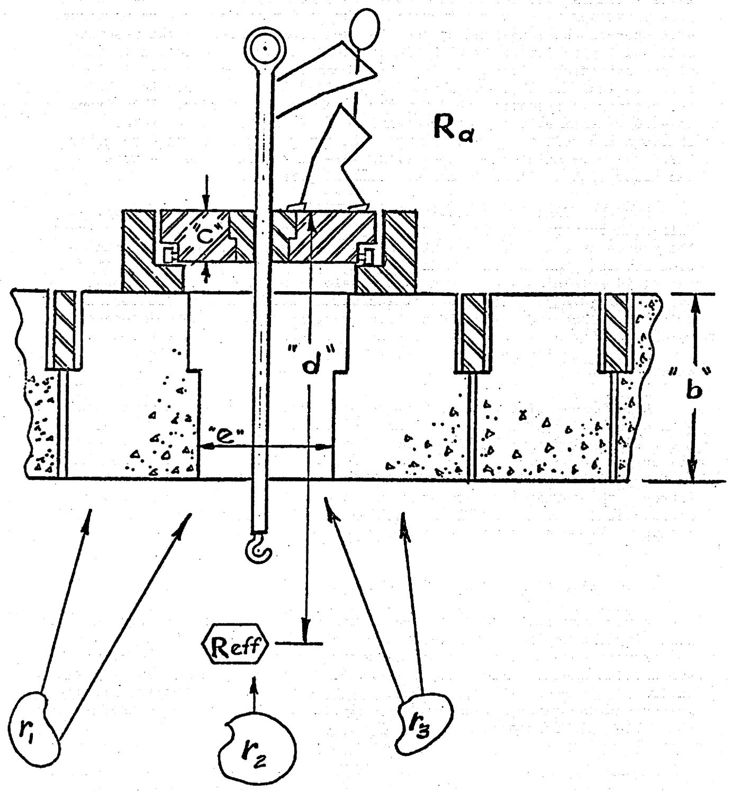
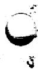

ORNL-TM-1859

COPY NO. - 231

DATE - 6/30/67

MAINTENANCE DEVELOPMENT FOR MOLTEN-SALT BREEDER REACTORS

Robert Blumberg

# ABSTRACT

The maintenance system of the proposed molten-salt breeder reactors will be based upon the technology in use and experience gained from the Molten-Salt Reactor Experiment. The unit replacement scheme, long-handled tools, movable maintenance shields, and the means for handling contaminated equipment will be similar for many operations. The techniques must be improved and extended and new techniques must be developed for maintaining some of the larger more radioactive components of the breeder reactors. Remote welding is needed for major component replacement. Methods must be available for replacing the core and for the repair of heat exchangers. Finally, a general development and design surveillance program will be required. These programs are described and their cost is estimated.

# NOTICE

This document contains information of a preliminary nature and was prepared primarily for internal use at the Oak Ridge National Laboratory. It is subject to revision or correction and therefore does not represent a final report. The information is not to be abstracted, reprinted or otherwise given public dissemination without the approval of the ORNL patent branch, Legal and Information Control Department.

# LEGAL NOTICE

This report was prepared as an account of Government sponsored work. Neither the United States, nor the Commission, nor any person acting on behalf of the Commission:

A. Makes any warranty or representation, expressed or implied, with respect to the accuracy, completeness, or usefulness of the information contained in this report, or that the use of any information, apparatus, method, or process disclosed in this report may not infringe privately owned rights; or   
B. Assumes any liabilities with respect to the use of, or for damages resulting from the use of any information, apparatus, method, or process disclosed in this report.

As used in the above, "person acting on behalf of the Commission" includes any employee or contractor of the Commission, or employee of such contractor, to the extent that such employee or contractor of the Commission, or employee of such contractor prepares, disseminates, or provides access to, any information pursuant to his employment or contract with the Commission, or his employment with such contractor.

TABLE OF CONTENTS   

<table><tr><td>INTRODUCTION</td><td>Page 1</td></tr><tr><td>PHILOSOPHY OF MAINTENANCE</td><td>1</td></tr><tr><td>DESCRIPTION OF PRESENT TECHNOLOGY</td><td>2</td></tr><tr><td>MSRE MAINTENANCE EXPERIENCE AS RELATED TO MOLTEN-SALT BREEDER REACTORS</td><td>4</td></tr><tr><td>DISCUSSION OF ANTICIPATED PROBLEMS</td><td>5</td></tr><tr><td>Piping Connections and Vessel Closures</td><td>5</td></tr><tr><td>Replacement and Repair of Components</td><td>7</td></tr><tr><td>Large Component Replacement</td><td>8</td></tr><tr><td>Core Replacement</td><td>8</td></tr><tr><td>Heat Exchanger Replacement</td><td>9</td></tr><tr><td>Repair of Components</td><td>9</td></tr><tr><td>Radioactive Component Examination</td><td>10</td></tr><tr><td>Improved Performance</td><td>10</td></tr><tr><td>INCREASED RADIATION LEVEL</td><td>11</td></tr><tr><td>GENERAL MAINTENANCE DEVELOPMENT AND DESIGN SURVEILLANCE</td><td>11</td></tr><tr><td>PROGRAM COSTS AND SCHEDULE</td><td>13</td></tr></table>

# LEGAL NOTICE

the United

This report was prepared as an account of Government sponsored work.   
States, nor the Commission, nor any person acting on behalf of the Commission: A. Makes any warranty or representation, expressed or implied, with respect to the accu- racy, completeness, or usefulness of the information contained in this report, or that the use of any information, apparatus, method, or process disclosed in this report may not infringe B. Assumes any liabilities with respect to the use of, or for damages resulting from the use of any information, apparatus, method, or process disclosed in this report. As used in the above, "person acting on behalf of the Commission" includes any em-. 1euse of any information, apparatus, method, or process disclosed in this report. employee or contractor of the Commission, or employee of such contractor, to the extent that such employee or contractor of the Commission, or employee of such contractor prepares such employees or contractors of the Commission, or employee of such contractor prepares such employees or contractors of the Commission, or employee of such contractor prepares such employees or contractors of the Commission, or employee of such contractor prepares such employees or contractors of the Commission, or employee of such contractor.

# INTRODUCTION

One of the basic differences between a molten-salt reactor or any circulating-fuel reactor and the more widely utilized, solid or stationary fuel reactor, is in how each contains fission products. One of the important ramifications of this difference is in the area of maintenance. The circulating fuel deposits some fission products in the reactor system, drain tanks, offgas system, and the fuel processing system. Questions naturally arise. Is it feasible to maintain such radioactive systems? From our experience with Homogeneous Reactor Experiment-2 (HRE-2 or HRT) and the Molten-Salt Reactor Experiment (MSRE), the answer is an unqualified yes. Another question is, "Are such systems much more expensive to maintain than solid fuel systems?" This question cannot be adequately assessed because of the complexity of the economics, but when one accounts for the costs involved with replacing spent fuel elements, the answer is no longer clearly in favor of the solid fuel system. It may well be cheaper to maintain a circulating fuel reactor.

A reference conceptual design for a 1000-Mw(e) molten-salt thermal breeder reactor (MSBR) is described in ORNL-3996. The program for developing the breeder through a molten-salt breeder experiment (MSBE) is summarized in ORNL-TM-1851. The following report describes a program of development of methods and equipment for maintaining the radioactive equipment of the MSBE. A major criterion for the program is that only scaleup of the equipment should be necessary to satisfactorily maintain the larger MSBR.

# PHILOSOPHY OF MAINTENANCE

The prime philosophy of maintenance of failed radioactive components in molten-salt breeder reactors is simply stated as remove, replace and repair or discard. We do not plan to repair those components in place. They will be removed and replaced by a new or repaired unit and then will be repaired in specially equipped facilities or discarded depending on the size and cost of the unit, the difficulty of making the repair, and the value of the repaired unit. This philosophy was adopted because it appears to be the best way of making repairs quickly to get the plant back into operation.

One of the most important factors which affects this maintenance philosophy is the effort to make the components reliable so repairs are infrequent and discard not prohibitively expensive. The program for engineering development will place emphasis on establishing a predictable and practical life for the components permitting us to establish a philosophy which includes discard of the failed component if it is too radioactive for direct or semi-direct maintenance. Emphasis also will be placed on rapid replacement to reduce the down time for the system.

The reactor vessel, the heat exchangers for the fuel and blanket systems, the drain tanks, and the pump rotary elements will become so radioactive that they will normally be discarded. It may be necessary

to disassemble and examine a failed component to determine the exact cause of failure but this would not require that the component be re-assembled. Possibly the failed component will be stored in the same cell with the reactor to await some decay before examination.

The offgas system and the chemical process plant will contain many of the fission products and will be very radioactive. Where practical, components of these systems will be decontaminated and repaired with a minimum of shielding, otherwise they will be discarded and a new component will be installed.

The coolant system ordinarily should not be very radioactive. There is some activation of the sodium but with the system drained the residual activity should be low enough to permit direct maintenance. The pressures in this system are maintained above the opposing pressures across the tube walls in the fuel and blanket heat exchangers so that any leakage would be out of the coolant system. This arrangement should prevent contamination of the coolant salt with fission products. If perchance fission products should get into the coolant system, then some decontamination would be necessary before maintenance would be possible.

The steam and turbine generator system should never become radioactive since it is separated from the prime sources of activity by the coolant system and from direct neutron activation by the shielding of the cell walls. Conventional methods of direct maintenance will be used here.

In this program we shall concentrate on developing the techniques for maintaining the highly radioactive components such as the core, pump, drain tanks, and heat exchangers.

# DESCRIPTION OF PRESENT TECHNOLOGY

The present status of the technology of maintenance of molten-salt reactors is largely embodied in the maintenance scheme for the MSRE. Methods and equipment in use at the MSRE are based on extensive experience gained on the aqueous Homogeneous Reactor Experiment No. 2. Experience with remote maintenance of the radiochemical plants at Hanford and Savannah River, repair of the Sodium Reactor Experiment, and remote dismantling of various reactor assemblies contributes in a general, and often important way, to the development.

To achieve a practical level of maintainability, uniform methods are provided for gaining access to, removing, and replacing all of the equipment in the radioactive areas of the reactor. At the MSRE, this includes the reactor cell, the drain tank cell, the offgas system and the chemical process system. The general philosophy is to remove a failed component and replace it with an interchangeable spare. A considerable emphasis was placed in design and construction phases on making components reliable so that the need for replacement is infrequent and discarding failed components is not prohibitively expensive. However, facilities have been provided for some some decontamination and repair of equipment.

Reduced to fundamentals, the MSRE is a collection of component parts which are capable of being disconnected and reconnected remotely. Access to these units is provided through removable shielding sections that make up the roofs of the various cells. A portable maintenance shield is installed over the component, the roof section is removed, and long-handled tools are used to do the manipulations that are required. This portable shield provides 12 in. of steel for shielding (attenuation factor $10^{4}-10^{5}$ ), tool access holes, lighting, and maneuverability. The long-handled tools are, for the most part, simple, strong, and single purpose. Periscopes and lead glass windows in the shield provide viewing in the work area. All preparations for removal are done completely with the portable shield. After large components are prepared for removal with the same technique, they are removed from the installed position by means of a crane operated by personnel inside a shielded control room with closed-circuit television and liquid-filled windows for viewing. Small components are removed by use of suitable transport shields. A hot-equipment storage cell and a decontamination cell can be reached by the crane so that contaminated equipment can be disposed of conveniently.

The ability to completely disconnect a particular component is basic to this system. The disconnects must be remotely operable by the long-handled tools. They must be reliable both for the service conditions and for the high radiation and in some cases must satisfy nuclear safety considerations of containment leak tightness and leak detectability. A number of different disconnects are used at the MSRE for the various applications. Almost all the piping in such auxiliary systems as the offgas, lubricating oil, air, and cooling water systems have standard ring joint flanges, with minor modifications. Special designs were used for leak detector tubing, thermocouple, electrical and instrument leads.

The disconnects for the 5-in. sched-40 piping are called freeze flanges. They are large diameter, unheated and uninsulated flanges. The clamping device, a U-shaped spring clamp, and the ring gasket seal are near the perimeter and operate at a much lower temperature than the bore of the pipe. The oversize flanges take up much space, have large temperature gradients, and require large clamping forces. Much development was required to obtain the desired serviceability and maintainability, but five pairs of flanges are now in service at the MSRE and they work well. While they have never been broken and remade remotely in a radiation field, the long-handled tools which were developed for this purpose were used for the assembly of the reactor and their operability was established to that extent.

The drain and storage system of the reactor is connected with 1-1/2-in. sched-40 piping. It is planned to maintain this system by remotely cutting and brazing these lines. The equipment to accomplish this is on hand3 and has been extensively tested in mockups, but not yet in a radioactive situation.

The maintenance philosophy in use for most parts of the MSRE is to replace a failed, contaminated unit with a spare component. Spares are built in jigs to assure interchangeability. Pieces that are small and not too radioactive are partly decontaminated and repaired by direct contact with the help of local shielding to reduce the radiation level. To satisfy the requirements of the MSRE, a constant review was made of the component and installation design to insure that it was maintainable and, where necessary, mockups were constructed to assist in guiding the designers.

# MSRE MAINTENANCE EXPERIENCE AS RELATED TO MOLTEN-SALT BREEDER REACTORS

The MSRE has been successfully operated and maintained during the past year and a half. Several different items of equipment have been replaced or repaired and several difficult operations were completed which were unanticipated in our planning for maintenance. To evaluate our experience in the light of the needs of the breeder, one may divide all of the equipment of the MSRE into two classes. The first class includes all the large salt-containing vessel and piping complexes. These are the three major components in the reactor cell, the drain tanks and the interconnecting piping. While these complexes have the most difficult maintenance jobs, they are also low frequency jobs. We have not yet maintained these large components. The second class includes all of the rest of the removable equipment; items such as control rods, heaters, valves, auxiliary lines, offgas component, etc. This is where most of the maintenance work will be done because of the higher failure rate. The maintenance capability has been clearly demonstrated for the second class of equipment. Based upon many hours of actual work experience, a detailed knowledge of the magnitude of the radiation and contamination levels, and a first hand knowledge of the ability of the system to handle unanticipated problems, we make the following statements regarding MSRE maintenance.

1. We believe that the demonstration of maintenance of the major fuel components (i.e., that which we have not yet done) is merely a matter of doing it when the occasion arises. It presumably will be more difficult and will require more time but nevertheless is well within our capability.   
2. The MSRE maintenance system possesses several attractive qualities, including reliability, simplicity, ruggedness and flexibility.   
3. There are two weaknesses of the system which have been recognized. These are the levels of radiation around tool penetrations and the method of disposing of contaminated equipment. These are weaknesses that can be improved quite readily through design and procedural changes.   
4. The MSRE can continue to supply information of value to the MSBR program. It is planned to conduct experiments, perform maintenance tasks and gather data, during the remainder of the operating life of the MSRE. Projects of this nature include demonstrating the replacement of a major component, mapping the gamma radiation levels in a portion of the reactor cell and the offgas system, and continuing the plotting and analysis of in-cell radiation levels. The possibilities of decontaminating components of the fuel and offgas systems to a level which would permit direct maintenance will be investigated.

5. We believe that the requirements of the MSBR can best be fulfilled with a system based generally on the one in use at the MSRE. The equipment must be modified, of course, to meet increased requirements in performance and in size, weight and radiation capabilities. Finally, it must be modified to reflect the specific design problems of the breeder.

# DISCUSSION OF ANTICIPATED PROBLEMS

We propose that the system for maintaining the radioactive components of the MSBR be based on the technology and experience of the MSRE. The overhead access, movable maintenance shield, separable components and long handled tools to accomplish in cell manipulations will be retained. We know that some new techniques must be developed and existing techniques must be improved. However, the details of the maintenance system must be based upon a more detailed design of the reactor than now exists. The MSBR will be larger. The pumps, heat exchangers, and reactor vessel will be larger and heavier, so the maintenance equipment must have increased capabilities. For example, the reactor vessel for a 250 Mw(e) MSBR module weighs 71 tons compared to 9 tons for the MSRE. Radiation levels will be higher, so the shielding must be increased. The power level in an MSBR module is higher by a factor of about 80 and the residual activity after the fuel salt is drained would be correspondingly higher. While this would require some additional thickness in the portable maintenance shield, the important effect will be the attention which must be given to the cracks around the tools at penetrations. Economic factors and some nuclear requirements dictate a compact design for the fuel, blanket, and some auxiliary equipment and systems. This tends to make maintenance more difficult. Finally, economic considerations and program objectives place more emphasis on efficient maintenance. The following is a discussion of the places where problems are anticipated, proposed solutions to the problems, and the development required. This discussion is concerned primarily with the large breeder reactors. The MSBE will have the same problems but on a smaller scale and the research and development will in most instances be done on MSBE scale.

# Piping Connections and Vessel Closures

The unit replacement scheme requires piping connections and vessel closures that are highly reliable in service and are capable of being maintained remotely. In the MSBR these connections will be needed in the main fuel and blanket recirculation systems, the drain and storage systems, the offgas system, the fuel and blanket processing systems, and in the parts of the coolant and other auxiliary systems that must be located in radioactive areas. Vessel closures will be needed on the reactor and on the fuel and the blanket heat exchangers. For lines no larger than those in the MSRE and installed in areas where the ambient temperature is below about $400^{\circ}\mathrm{F}$ , use can be made of equipment and techniques that will have been proven at the MSRE. However, the design of the MSBR imposes three new difficulties: (1) The 24-in.-diam piping is considerably larger than has been used with remotely disconnectable joints. (2) The $1150^{\circ}\mathrm{F}$ ambient

temperature proposed for the reactor cell is considerably higher than has been used in the past. (3) No vessel closures approaching the size needed for the MSBR have been developed for remote operation and elevated temperatures.

In the reference design of the MSBR, six connections are required in the reactor cell in the large lines that join the reactor vessel to the heat exchangers and the heat exchangers to the coolant system. Remote welding, we believe, is the best way to make satisfactory joints in those lines. Welding also appears to be the best way of making reliable vessel closures and it is possible that the design of a vessel closure seal can be made fundamentally the same as the piping connection. While considerable development will be required, the program seems to be straightforward and the goal reasonably attainable. Development of satisfactory flanges for those lines would also be difficult and probably would require considerably more long-term testing. Once developed for the larger closures, remote welding can be used on the smaller lines in all the radioactive systems. The development will be of considerable value to the entire nuclear industry.

Some development has already been done on remote welding. Atomics International Division of North American Aviation, Inc., has equipment for remote welding of small tubing for repairing heat exchangers. They are deeply involved in automatic welding development including the joining of 40-ft-long pieces of 4-in.-diam pipe for deep-well casings by welding from the inside. The PAR Project advanced the technology to the point of completing many seal welds and test welds on large and small pipes with remotely operated equipment. The pipeline industry has automatic equipment that will make high quality welds on 30-in.-diam pipe. North American Aviation, Inc., has used the "skate welding" method for fabricating missiles where the welding is controlled from a remote location.

The welding development will be a joint effort of the Materials Development Program and the Maintenance Development Program. It will consist primarily of:

1. designing and qualifying the weld joints,   
2. supporting the improvement or modification of existing automatic welding apparatus,   
3. adding the jigs and fixtures required to align and hold the pipe or vessel and the manipulative devices to operate the torch, and   
4. making test welds to improve the techniques until good welds can be made consistently.

The maintenance development will also include the devices for cutting the seals and machining the ends to the specified configuration. A joint design using a seal weld with a mechanical clamping device to provide the strength is a possible alternative to the multi-pass welding of thick wall members.

Development of techniques for inspecting and repairing welds in radioactive areas must accompany the effort on remote welding. Visual inspection via closed circuit television and dye penetrant and ultrasonic testing techniques appear to be applicable, whereas radiography does not appear feasible. An intensive study of the joint configuration may reveal a design that will allow complete confidence in the joint without the detailed evidence of a totally inspected weld. A leak detectable buffered joint is one example of such a design.

One arrangement for making welded connections would involve installing at each joint a built-in track or guide, upon which a wheeled or geared carriage containing welding, cutting, and inspection heads would ride. The track would provide accurate positioning in the radial and circumferential directions. Long-handled tools would lower and install the various heads upon the built-in tracks and would provide means for routing purge, power, coolant, and instrument leads. Remote television or optical equipment could be used to monitor the automatic control of the process.

The development effort will consist of at least three stages of testing: (1) bench tests of automatic welding equipment to establish the basic parameters of control of the welding process such as voltage, current, purge and coolant rates; (2) tests of welding, cutting, inspection, and repair on full-size pipes and vessels using the preinstalled guides and remote controls; (3) fully remote shakedown of reactor grade equipment and procedures. The magnitude of the supporting design effort would depend upon the success of the tests in the two early stages. The development work will be done on joints of the sizes required for the MSBE, making certain that the results can be applied to the large joints of an MSBR. Service tests must be made on all joints in the various systems. Equivalent life cycles of these joints will be run to establish compatibility of the joint, its method of operation, and its service requirements.

While the remote welding is the first-line approach, some study will be made of two additional approaches. The feasibility of remotely disconnectable mechanical joints for the intended service will be investigated. Also a braze seal with mechanical support will be considered for use in the auxiliary systems in the reactor (both salt and non-salt carrying) and as a backup to remote welding. It is well to note that remote welding and remote brazing are techniques rather than designs for specific applications. As such, they have a wide variety of potential uses in radioactive environments for incorporation in the original designs and for modifying or repairing existing equipment.

# Replacement and Repair of Components

In keeping with the long-range goals of the program, we must develop the ability to maintain the reactor quickly to avoid down time penalties and efficiently to lower the overall maintenance costs. The present plan of maintenance of radioactive systems calls for replacement of a failed component with another like unit and then either repairing or discarding the failed component. The following is a discussion of the problems of this plan.

To replace any large unit we do the following basic operations. Separate the unit from its connecting lines by remote cutting. Using long-handled tools, detach all minor connections and prepare for lifting. Remove the unit to a previously prepared area in the cell or take it out of the cell to some other storage area. The latter choice involves the transport of a very large, very radioactive component, shielding of maintenance and non-maintenance personnel, and control of contamination in areas which are used daily. A new unit must then be installed and reconnected to the piping by remote welding.

Development of the means for this capability will begin as a design study. The sizes, weights, and expected radiation levels of the components will be studied along with the various handling methods that are available. At the MSRE, measurements will be made of the effectiveness of flush salt operations, radiation levels will be measured and experience will be gained in handling radioactive components. From this experience, tool designs, shielding requirements, procedures, and requirements for equipment such as cranes, supports, in-cell jacks, and alignment devices will be specified. Questionable areas will be mocked up and tested. For instance, it is expected that tests must be run on equipment to align large vessels and equipment to effect the necessary displacements. Tools and techniques must ultimately be tried and demonstrated in MSBE size equipment and finally on the components of the Engineering Test Unit.

# Core Replacement

In the MSBR of reference design the core is an assembly of graphite fuel tubes or cells that are joined to Hastelloy-N plenums. First, each graphite tube is joined by a threaded and brazed joint to a Hastelloy-N tube. The resulting elements are assembled into a reactor core by screwing, welding or brazing the Hastelloy N tubes to the plenum header. The core assembly is then installed in the reactor vessel and connected to the fuel entrance plenum by a gasketed or seal welded joint. Finally, the top head is installed to close the reactor vessel.

Means must be provided for replacing the core if one or more of the graphite elements breaks or develops large leaks. Problems of containment, shielding, removal of fission product decay heat, etc. influence the choice of a method for safely removing, transporting and disposing of the core.

One method calls for replacing the entire core and reactor vessel assembly and for storing the used unit in a morgue within the reactor building. This scheme would use the vessel for containment of the fission products and would ease some of the problems of removing decay heat, transporting and storing the core. With this concept the reactor vessel could be of all welded construction, thereby eliminating the need for large, remotely assembled vessel and plenum closures.

A second proposal calls for removing the core assembly from the reactor vessel, installing a new one and discarding the old. This method requires the large closures and may also make solution of the other problems more difficult. An early study will be made of the problems and the economics of the two methods, a choice will be made for use in the reactor design, and equipment will be developed for accomplishing the maintenance.

# Heat Exchanger Replacement

To repair a leak in one tube of a heat exchanger one must do the following:

1. open the vessel to gain access to the tube sheets,   
2. find the tube which is leaking,   
3. seal the ends of the tube,   
4. reseal the vessel.

The reference design heat exchanger is not well suited to repair because of very poor accessibility to the tube ends. Many compromises would have to be made in the design of the heat exchanger to make it more easily repairable.

The first choice for a maintenance method for the radioactive heat exchanger is the replacement of the entire heat exchanger bundle. This requires the removal of the pump rotary element from the pump bowl, opening the joint in the piping to the core, opening the vessel closure in the exchanger shell and disconnecting several small service lines. Then the heat exchanger would be removed to an examination facility or to a storage area. The capability of replacing the entire heat exchanger must be available and the necessary steps to do so will be developed.

# Repair of Components

Components that can be easily decontaminated will be repaired and reused as spare parts. Components that can be repaired by use of simple tools behind a small amount of shielding or are small enough to be handled in a small hot cell may also be repaired for reuse.

Whether to repair or discard the radioactive components from a large breeder plant has not been firmly established but discard is the first choice at this time. Studies are required of the facilities for making repairs and of the costs in arriving at a firm decision. Measurements will be made of the effectiveness of flush salt operations and decontamination procedures in reducing the activity of contaminated parts from the MSRE. The levels of neutron-induced radioactivity will be calculated. Making use of these data, some designs will be made of hot cells and the equipment for making the repairs. This involves the application of hot

cell techniques to tasks that are ordinarily done in a heavy equipment shop. Total costs of making the repairs will be estimated and compared with the value of equipment that would be salvaged. Results of these studies will be used in specifying and developing equipment and facilities for the MSBE. Experience with that reactor will strongly influence what is done for large breeder reactors.

Although our maintenance proposals are based on removal and replacement of major equipment in the plant, some attention will be given to in-place repair. Studies will be made of core designs and heat exchanger designs to better determine whether in-place repair of the graphite fuel cells and the heat exchanger tubes can be made practicable.

# Radioactive Component Examination

The experimental nature of the MSBE requires that careful examination be made of any failed component to determine the cause of failure so the cause can be corrected in future components. An examination cell will be required at the reactor site and it must at least be equipped to dismantle equipment so that parts can be sent to other hot cell facilities for detailed examination. Depending on the types of failures, repair of some radioactive components could also be demonstrated in this cell.

Specifications will be prepared for the facility and the equipment required. Some development of very special equipment is anticipated and procedures will be prepared for operating the equipment.

# Improved Performance

In a power reactor the importance of making repairs quickly must be taken into account. In this respect the record of the radioactive maintenance of the MSRE has been encouraging in spite of several negative elements. Because it was an experimental reactor, there was little effort to provide anything above the minimum level of maintainability. The tight time schedule and low budget did not allow much testing and practice at the reactor, and the very crowded condition in the reactor cell is not conducive to efficient maintenance. The handling of components where maintenance was anticipated such as control rods, space coolers, valves, heaters, and piping spool pieces has all gone smoothly. The ability to utilize existing craft forces with modest training was encouraging.

There is no doubt, however, that the performance can be improved. Among the items that will be studied are the increased use of shielding to cut down radiation levels, better mobility of the roof shield and the maintenance shield, and perhaps more than one maintenance shield. Of course, in the design of all the tools, components and equipment, the speed of the completion of the operation will be considered.

A general area for study arises from the increase in the radiation level which is expected in the MSBR. The geometry for shielding maintenance personnel is shown in Figure 1. The radiation level where personnel will operate the long-handled tools arises from sources in the reactor cell and varies inversely with the distance and the attenuation factor of the shielding. Gamma levels at the MSRE as measured by in-cell ion chambers, indicate that the shielding provided there is adequate. When the reactor is operating at $7\mathrm{Mw}$ , the level is $60,000\mathrm{r/hr}$ . This drops to $4000\mathrm{r/hr}$ immediately after draining the fuel. During a recent shutdown the radiation level in the cell was $2000\mathrm{r/hr}$ seven days after shutdown while maintenance operations were in progress and the work was accomplished without undue exposure of personnel.

For the MSBR, the radiation levels will be considerably higher. This will require additional shielding. A study will be made to evaluate the source strength during shutdown and methods for reducing the radiation levels, such as using a flushing material, decontamination systems, and fluid shielding (perhaps a molten salt with a low melting point). Also involved with an increase in radiation are details of the design of the long-handled tools and the penetrations through the maintenance shield. Internal voids in the tools and cracks in the penetration represent radiation leakage paths, and effort must be taken to avoid them.

Development of better protection of the maintenance crew will begin with an analysis of data concerning the radiation levels at the MSRE and the experience with maintenance there. This information will then be applied to analysis of the radiation levels in the MSBR and the MSBE. Then the designs of special shielding and tools will be studied and improved to provide the necessary shielding. Some new devices or new approaches to special shielding problems can be expected to evolve, and mockups will be built to test them.

# GENERAL MAINTENANCE DEVELOPMENT AND DESIGN SURVEILLANCE

A very important part of the maintenance development program involves following the design of the reactor to make certain that the maintenance requirements are satisfied and then designing and testing the special tools to do a wide variety of maintenance operations. This activity is entirely concerned with the breeder experiment; however, the experience gained and the general techniques developed are expected to be useful for the full-scale reactors.

  
Fig. 1. Shielding Configuration for Maintenance Operations.

This activity will be carried out in about the following sequence.

1. Review preliminary flowsheets and equipment and plant designs to make certain that the maintenance requirements are integrated into the design of the plant. Items of special importance include the shielding arrangement with emphasis on special shielding for maintenance, the shielding penetrations, the component support structures, the cranes and other equipment for handling radioactive components, and the viewing devices.   
2. Prepare proposals for all maintenance operations. Compile lists of problems, tools, and special disconnects.   
3. Review final designs as they are being made. Revise maintenance requirements as necessary.   
4. Build required special tools, jigs and fixtures. Test them in full-scale mockups and on the Engineering Test Unit.   
5. Follow the construction of the MSBE and the installation of the equipment to be certain that maintenance is properly considered if changes are made.   
6. Prepare procedures for maintaining the equipment in the MSBE.

# PROGRAM COSTS AND SCHEDULE

A preliminary estimate of the cost of the maintenance development program for the MSEE is shown in Table 1. The activities are fitted into the schedule proposed in ORNL-TM-1851 (Ref 2) for designing and building the plant. Although the maintenance considerations influence the design, there is only one crucial development. The feasibility of remotely welding the joints in the main fuel, blanket, and coolant lines and vessels or some suitable alternative must be established before the design can be completed. The program is designed to demonstrate a satisfactory joint by the end of FY 1970, although considerable testing and improvement of equipment and techniques are expected to follow the demonstration.

In the other areas we expect to establish maintenance requirements and provide convincing evidence of the practicality of the maintenance schemes by the end of FY 1970. However, the development of many of the tools and procedures will be accomplished while the plant is being built.

Table 1. Estimate of Costs for Maintenance Development Program (\$ Thousands)   

<table><tr><td></td><td>FY 1968</td><td>FY 1969</td><td>FY 1970</td><td>FY 1971</td><td>FY 1972</td><td>FY 1973</td><td>FY 1974</td><td>FY 1975</td></tr><tr><td>Remote Welding</td><td>120</td><td>230</td><td>250</td><td>180</td><td>150</td><td>100</td><td>70</td><td>70</td></tr><tr><td>Core Replacement and Repair</td><td>60</td><td>160</td><td>160</td><td>100</td><td>100</td><td>50</td><td>30.</td><td>30</td></tr><tr><td>Maintenance of the Heat Exchangers and Other Components</td><td>60</td><td>100</td><td>100</td><td>60</td><td>60</td><td>60</td><td>30</td><td>30</td></tr><tr><td rowspan="2">General Maintenance Development and Design Surveillance</td><td>60</td><td>120</td><td>120</td><td>60</td><td>60</td><td>60</td><td>60</td><td>30</td></tr><tr><td>300</td><td>610</td><td>630</td><td>400</td><td>370</td><td>270</td><td>190</td><td>160</td></tr></table>

1P. R. Kasten, E. S. Bettis and R. C. Robertson, Design Studies of 1000-Mw(e) Molten-Salt Breeder Reactors, ORNL-3996 (August 1966).   
2R. B. Briggs, Summary of Objectives and a Program of Development of Molten-Salt Breeder Reactors, ORNL-TM-1851 (June 1967).   
3E. C. Hise, F. W. Cooke and R. G. Donnelly, "Remote Fabrication of Brazed Structural Joints in Radioactive Piping," ASME 63-WA-53 (September 1964).   
4E. H. Seidler, "Welding," Advanced Fabrication Technology, Atomics International (Brochure).   
5E. H. Seidler, Layout and Maintenance, WCAP-1104, Vol. IV, Part 1 (March 1959).   
$^{6}$ R. R. Irving, "Welding Reacts to New Demands," Iron Age 191(14), pp. 83-90 (April 4, 1963).

# Internal Distribution

1.-50. MSRP Director's Office

51. R. K. Adams   
52. G. M. Adamson   
53. R.G.Affel   
54. L. G. Alexander   
55. R.F.Apple   
56. C. F. Baes   
57. J. M. Baker   
58. S.J.Ball   
59. W. P. Barthold   
60. H. F. Bauman   
61. S. E. Beall   
62. M. Bender   
63. E. S. Bettis   
64. F. F. Blankenship   
65. R.E.Blanco   
66. J. O. Blomeke

67.-71. R. Blumberg

72. E. G. Bohlmann   
73. C. J. Borkowski   
74. G. E. Boyd   
75. J. Braunstein   
76. M.A.Bredig   
77. R. B. Briggs   
78. H. R. Bronstein   
79. G. D. Brunton   
80. D. A. Canonico   
81. S. Cantor   
82. W. L. Carter   
83. G.I. Cathers   
84. J. M. Chandler   
85. E. L. Comperes   
86. W. H. Cook   
87. L. T. Corbin   
88. J. L. Crowley   
89. F. L. Culler   
90. J.M.Dale   
91. D. G. Davis   
92. S.J.Ditto   
93. A. S. Dworkin   
94. J. R. Engel   
95. E.P.Epler   
96. D. E. Ferguson   
97. L. M. Ferris   
98. A. P. Fraas

99. H. A. Friedman   
100. J. H. Frye, Jr.   
101. C. H. Gabbard   
102. R.B.Gallaher   
103. H. E. Goeller   
104. W. R. Grimes   
105. A. G. Grindell   
106. R.H.Guymon   
107. B. A. Hannaford   
108. P. H. Harley   
109. D. G. Harman   
110. C. S. Harrill   
111. P. N. Haubenreich   
112. F. A. Heddleson   
113. P. G. Herndon   
114. J. R. Hightower   
115. H.W.Hoffman   
116. R.W.Horton   
117. T. L. Hudson   
118. H. Inouye   
119. W. H. Jordan   
120. P. R. Kasten   
121. R.J.Kedl   
122. M. T. Kelley   
123. M. J. Kelly   
124. C. R. Kennedy   
125. T. W. Kerlin   
126. H. T. Kerr   
127. S.S. Kirslis   
128. A. I. Krakoviak   
129. J.W.Krewson   
130. C. E. Lamb   
131. J.A.Lane   
132. R. B. Lindauer   
133. A. P. Litman   
134. M. I. Lundin   
135. R.N.Lyon   
136. H. G. MacPherson   
137. R.E. MacPherson   
138. C. D. Martin   
139. C. E. Mathews   
140. C. L. Matthews   
141. R.W.McClung   
142. H.C.McCoy   
143. H. F. McDuffie   
144. C. K. McGlothlan

145. C. J. McHargue   
146. L. E. McNeese   
147. A. S. Meyer   
148. R. L. Moore   
149. J. P. Nichols   
150. E. L. Nicholson   
151. L.C.Oakes   
152. P. Patriarca   
153. A. M. Perry   
154. H. B. Piper   
155. B. E. Prince   
156. J. L. Redford   
157. M. Richardson   
158. R.C. Robertson   
159. H.C.Roller   
160. H. C. Savage   
161. C. E. Schilling   
162. Dunlap Scott   
163. H.E.Seagren   
164. W. F. Schaffer   
165. J.H.Shaffer   
166. M. J. Skinner   
167. G. M. Slaughter   
168. A. N. Smith   
169. F.J. Smith   
170. G.P. Smith

171. O. L. Smith   
172. P. G. Smith   
173. W. F. Spencer   
174. I. Spiewak   
175. R.C. Steffy   
176. H. H. Stone   
177. J. R. Tallackson   
178. E.H.Taylor   
179. R.E.Thoma   
180. J. S. Watson   
181. C. F. Weaver   
182. B. H. Webster   
183. A. M. Weinberg   
184. J. R. Weir   
185. W. J. Werner   
186. K.W. West   
187. M. E. Whatley   
188. J. C. White   
189. L. V. Wilson   
190. G. Young   
191. H.C. Young   
-193. Central Research Library   
-195. Document Reference Section   
-205. Laboratory Records (LRD)   
206. Laboratory Records (LRD-RC)

# External Distribution

207.-208. D. F. Cope, Atomic Energy Commission, RDT Site Office   
209. A. Giambusso, Atomic Energy Commission, Washington   
210. W. J. Larkin, Atomic Energy Commission, ORO   
211.-225. T. W. McIntosh, Atomic Energy Commission, Washington   
226. H. M. Roth, Atomic Energy Commission, ORO   
227.-228. M. Shaw, Atomic Energy Commission, Washington   
229. W. L. Smalley, Atomic Energy Commission, ORO   
230. R. F. Sweek, Atomic Energy Commission, Washington   
231.-245. Division of Technical Information Extension (DTIE)   
246. Research and Development Division, ORO   
247.-248. Reactor Division, ORO