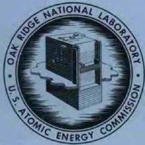

# OAK RIDGE NATIONAL LABORATORY

operated by  
UNION CARBIDE CORPORATION  
NUCLEAR DIVISION

for the U.S. ATOMIC ENERGY COMMISSION

3445605134173

ORNL-TM-1906

IN- AND EX-REACTOR STRESS-RUPTURE PROPERTIES OF HASTELLOY N TUBING

H.E.McCoy, Jr. J.R.Weir, Jr.

OAK RIDGE NATIONAL LABORATORY CENTRAL RESEARCH LIBRARY DOCUMENT COLLECTION

LIBRARY LOAN COPY

DO NOT TRANSFER TO ANOTHER PERSON If you wish someone else to see this document, send in name with document and the library will arrange a loan.

CNU 796512 3-671

NOTICE This document contains information of a preliminary nature and was prepared primarily for internal use at the Oak Ridge National Laboratory. It is subject to revision or correction and therefore does not represent a final report.

# LEGAL NOTICE

This report was prepared as an account of Government sponsored work. Neither the United States, nor the Commission, nor any person acting on behalf of the Commission:

A. Makes any warranty or representation, expressed or implied, with respect to the accuracy, completeness, or usefulness of the information contained in this report, or that the use of any information, apparatus, method, or process disclosed in this report may not infringe privately owned rights; or   
B. Assumes any liabilities with respect to the use of, or for damages resulting from the use of any information, apparatus, method, or process disclosed in this report.

As used in the above, "person acting on behalf of the Commission" includes any employee or contractor of the Commission, or employee of such contractor, to the extent that such employee or contractor of the Commission, or employee of such contractor prepares, disseminates, or provides access to, any information pursuant to his employment or contract with the Commission, or his employment with such contractor.

Contract No. W-7405-eng-26

METALS AND CERAMICS DIVISION

IN- AND EX-REACTOR STRESS-RUPTURE PROPERTIES OF HASTELLOY N TUBING

H. E. McCoy, Jr., and J. R. Weir, Jr.

# SEPTEMBER 1967

OAK RIDGE NATIONAL LABORATORY

Oak Ridge, Tennessee

operated by

UNION CARBIDE CORPORATION

for the

U.S. ATOMIC ENERGY COMMISSION

# CONTENTS

Page Abstract 1

Introduction 1

Experimental Details 3

Test Materials 3

Test Specimens 5

Testing Techniques 5

Experimental Results 10

Discussion of Results 21

Summary and Conclusions 24

Acknowledgments 24

# IN- AND EX-REACTOR STRESS-RUPTURE PROPERTIES OF HASTELLOY N TUBING

H. E. McCoy, Jr. and J. R. Weir, Jr.

# ABSTRACT

The stress-rupture properties of two heats of Hastelloy N tubing have been determined at $760^{\circ}\mathrm{C}$ in-and ex-reactor. Irradiation reduced the rupture life and the rupture strain, but no effects on the creep rate were detectable. Small variations in behavior of tubular specimens tested during irradiation and small rod specimens tested after irradiation are explained on the basis of differences in stress states and sizes of test sections. The effects of irradiation are rationalized on the basis of the behavior of helium which occurs in the metal as a result of the thermal ${}^{10}\mathrm{B}(n,\alpha)$ transformation.

# INTRODUCTION

Numerous cases have been reported where the high-temperature mechanical properties of nickel- and iron-base alloys deteriorated under neutron irradiation. $^{1-9}$ This deterioration manifests itself as both a reduction

in the creep-rupture life and in the rupture ductility. This effect has been correlated with the thermal neutron dose and has been attributed to the helium produced by the transmutation of $^{10}\mathrm{B}$ to $^{7}\mathrm{Li}$ and $^{4}\mathrm{He}$ .6,9,10 However, the sensitivity of different materials to helium produced by this process varies greatly1 and our present state of understanding of this problem necessitates that we study each material individually.

We have studied Hastelloy N, an alloy developed at Oak Ridge National Laboratory specifically for use with molten fluoride salts.[11] It is nickel base, solid solution strengthened with about $16\%$ Mo, and contains $7\%$ Cr for moderate oxidation resistance. However, this alloy has become a candidate material for use in several other reactors and we are attempting to learn as much as possible about this material in nuclear environments. Recent studies have shown that the mechanical properties of this material are indeed altered by irradiation.[12,13]

In this study we compared the in- and ex-reactor properties of two vacuum-melted heats of Hastelloy N tubing at $760^{\circ}\mathrm{C}$ . The testing techniques used in this program will be described and the resulting test data presented. These data will be compared with those obtained for the same material in uniaxial postirradiation stress-rupture tests.

on the Post-Irradiation Stress-Strain Behavior of Stainless Steel," Am. Soc. Testing Mater. Spec. Tech. Publ. 380, 251 (1965).   
8J. T. Venard and J. R. Weir, "In-Reactor Stress-Rupture Properties of a 20 Cr-25 Ni Columbium-Stabilized Stainless Steel," Am. Soc. Testing Mater. Spec. Tech. Publ. 380, 269 (1965).   
9P.C.L. Pfeil, P. J. Barton, D. R. Arkell, Trans. Am. Nucl. Soc. 8, 120 (1965).   
10P.R.B. Higgins and A. C. Roberts, Nature 206, 1249 (1965).   
11W. D. Manly et al., "Metallurgical Problems in Molten Fluoride Systems," Progress in Nuclear Energy, 2 (IV), Technology, Engineering, and Safety, pp. 164-79, Pergamon Press (1960).   
12W. R. Martin and J. R. Weir, "Effect of Elevated Temperature Irradiation on the Strength and Ductility of the Nickel-Base Alloy, Hastelloy N," Nucl. Appl. 1(2), 160-67 (1965).   
13W. R. Martin and J. R. Weir, "Postirradiation Creep and Stress Rupture of Hastelloy N," Nucl. Appl. 3, 167 (1967).

# EXPERIMENTAL DETAILS

# Test Materials

The two lots of material used in this study were 10,000 lb vacuum-melted heats obtained from Allvac Metals Company. This material was converted to tubing by Superior Tube and had a nominal inner diameter of 0.540 in. Heat 5911 was initially fabricated with a 0.015 in. wall, but the same material was redrawn (designated 5911R) to obtain a 0.010 in. wall. Heat 281-4-0143 was fabricated into tubing with a 0.010 in. wall. The working schedule used to manufacture the tubing is proprietary and details are not available. The chemical analysis of the fabricated material is given in Table 1. A typical cross section of the as-received tubing (Heat 281-4-0143) is shown in Fig. 1. This tubing was coated for a specific application. Neither the coating composition nor the technique for its application to the metal can be made available, but temperatures as high as $1150^{\circ}\mathrm{C}$ were encountered in the processing. The microstructure

Table 1. Chemical Analysis of Test Material   

<table><tr><td rowspan="2">Element</td><td colspan="2">Content, wt %</td></tr><tr><td>Heat Number 281-4-0143</td><td>Heat Number 5911</td></tr><tr><td>Fe</td><td>0.28</td><td>0.03</td></tr><tr><td>Cr</td><td>7.00</td><td>6.14</td></tr><tr><td>Mo</td><td>16.88</td><td>17.01</td></tr><tr><td>Ni</td><td>Bal</td><td>Bal</td></tr><tr><td>C</td><td>0.05</td><td>0.056</td></tr><tr><td>Mn</td><td>0.50</td><td>0.21</td></tr><tr><td>B</td><td>0.0006</td><td>0.0010</td></tr><tr><td>S</td><td>0.009</td><td>0.002</td></tr><tr><td>P</td><td>0.002</td><td>0.002</td></tr><tr><td>Si</td><td>0.28</td><td>0.05</td></tr><tr><td>Cu</td><td>0.03</td><td>&lt;0.01</td></tr><tr><td>Co</td><td>0.01</td><td>0.04</td></tr><tr><td>Al</td><td>0.20</td><td>0.15</td></tr><tr><td>Ti</td><td>0.04</td><td>0.067</td></tr><tr><td>W</td><td>0.01</td><td>0.01</td></tr><tr><td>O</td><td>0.0006</td><td>0.0014</td></tr><tr><td>N</td><td>0.0025</td><td>&lt;0.0005</td></tr><tr><td>H</td><td>0.0004</td><td></td></tr></table>

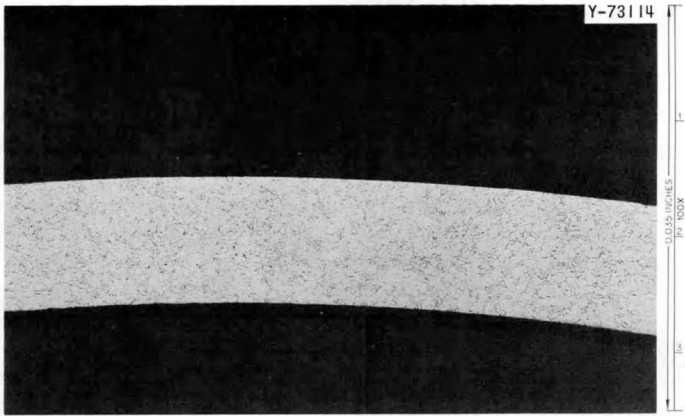

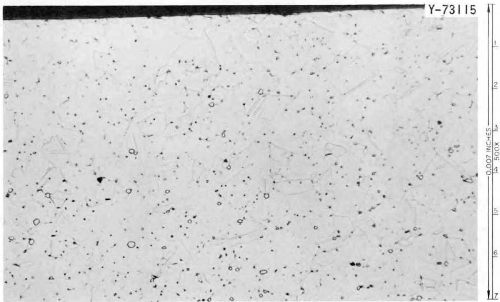  
Fig. 1. Photomicrographs of As-Received Hastelloy N Tubing-Heat 281-4-0143. Etchant: glyceria regia.

of the tubing before it was tested is shown in Fig. 2. Because of the brittle nature of the coating, it probably exerted little influence on the properties of the tubing.

# Test Specimens

A drawing of the test specimens used in this study is shown in Fig. 3. The assemblies were prepared by Atomics International (AI) and shipped to ORNL for testing.

# Testing Techniques

The apparatus used in ex-reactor tube burst tests is shown schematically in Fig. 4. Because of the relatively weak welds at both ends of the tubes, only the center 3 in. section was heated. The furnace consisted of three 1 in. zones with a thermocouple located on the specimen at the center of each zone for monitoring the temperature. A single proportioning controller was used with three variable power supplies for controlling the temperature. The controller received its signal from the thermocouple on the center zone and the variable power supplies were adjusted to obtain a uniform temperature over nearly the entire center 3 in. of the specimen. The specimens were pressured with argon and the external environment was air. After the pressure was adjusted manually, the specimen was isolated from the gas supply. Failure was detected by a reduction in the system pressure. This pressure change actuated a switch that cut off a timer. Thus, failure was detected when the first crack penetrated the tube wall.

The in-reactor experiments were run in a similar fashion although the equipment was somewhat more complicated. Figure 5 shows a schematic diagram of the test equipment. The purge gas in these experiments was He-1 vol $\%$ $0_{2}$ . An experiment in two stages of completion is shown in Figs. 6 and 7. The entire experiment is built on the framework shown in Fig. 6. The sides of the can are welded on to obtain an integral unit that can be immersed in the poolside of the ORR. The furnaces on these specimens are similar to those used ex-reactor, the primary difference

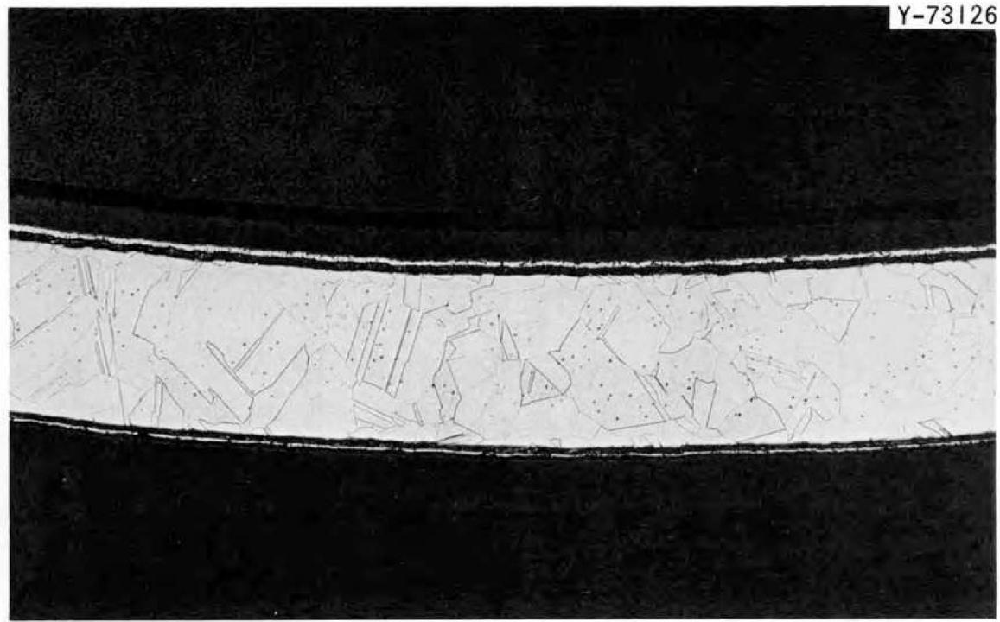  
Y-73126

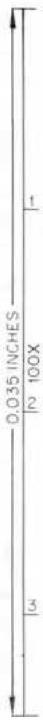

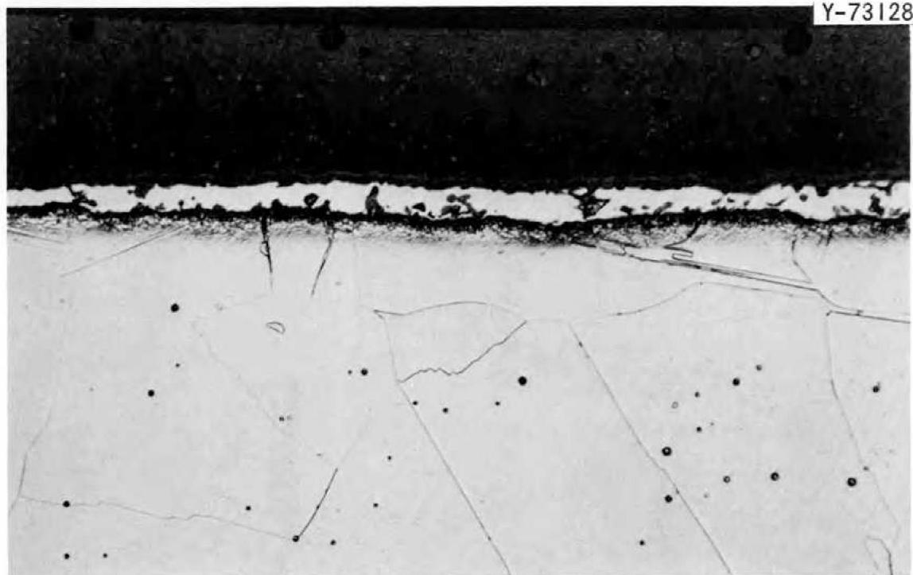  
Y-73128

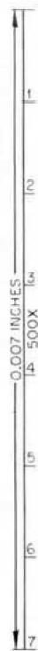  
Fig. 2. Photomicrographs of Processed Hastelloy N Tubing-Heat 281-4-0143. Etchant: glyceria regia.

ORNL-DWG 67-4935

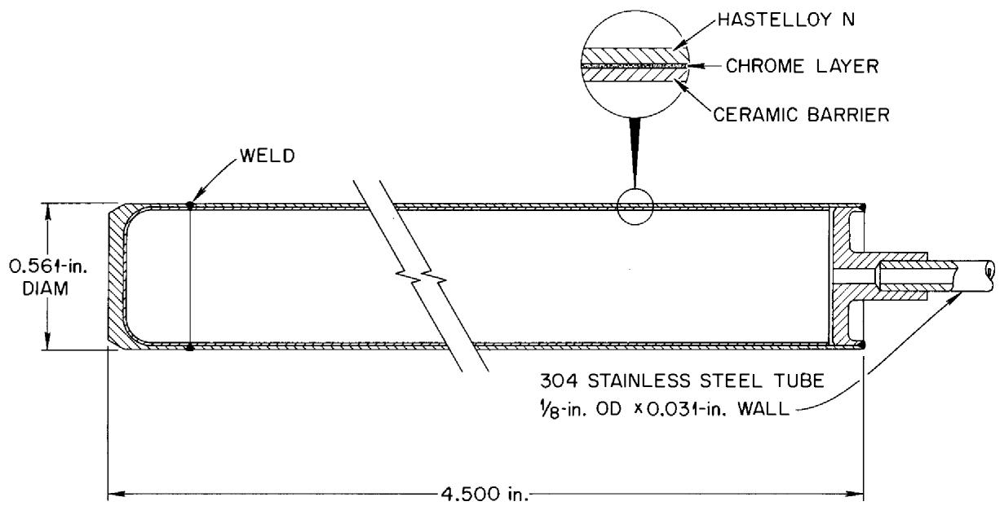  
Fig. 3. Schematic Drawing of Test Specimen.

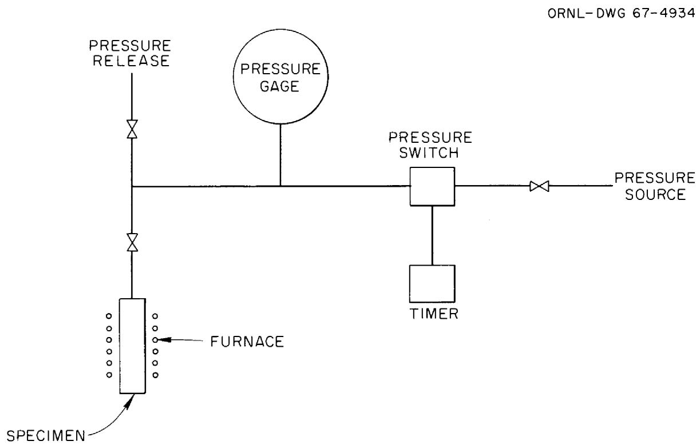  
Fig. 4. Schematic Diagram of Apparatus Used for Ex-Reactor Tube Burst Tests.

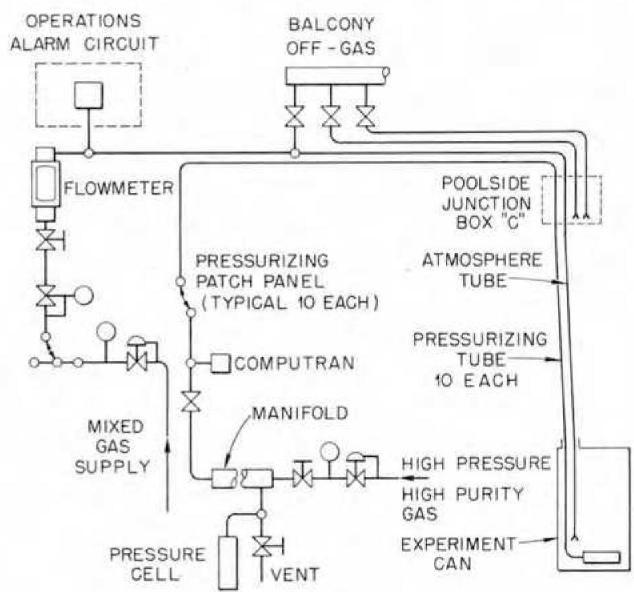  
UNCLASSIFIED ORNL-DWG 64-1433   
Fig. 5. Schematic Diagram of Apparatus for Running In-Reactor Tube Burst Tests.

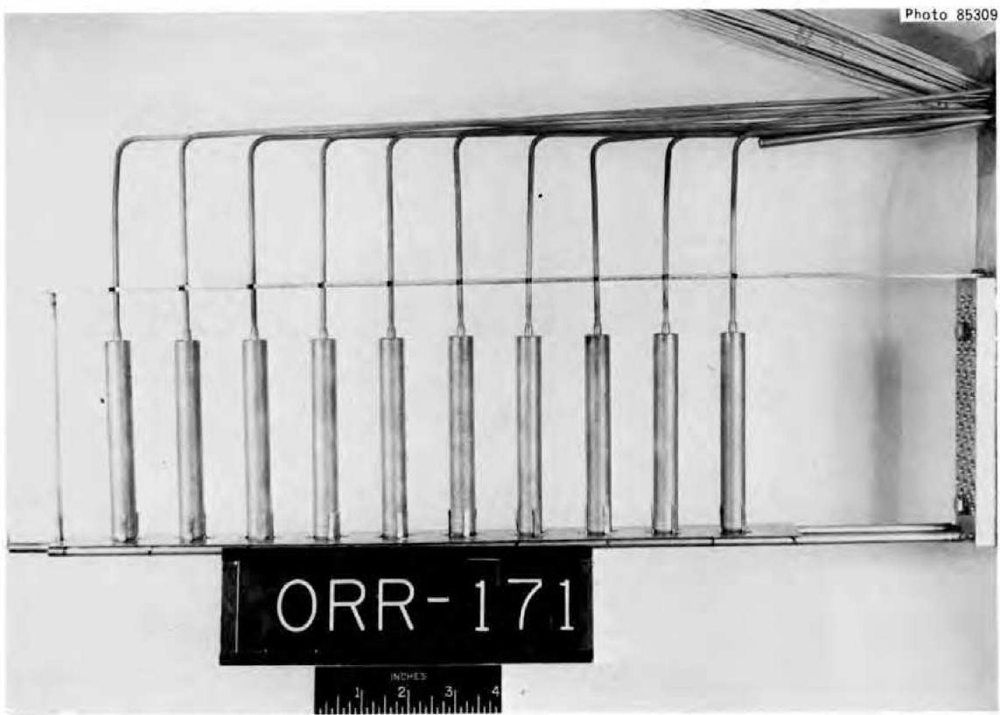  
Fig. 6. Partially Assembled In-Reactor Experiment with the Tube Burst Specimens Mounted in Place.

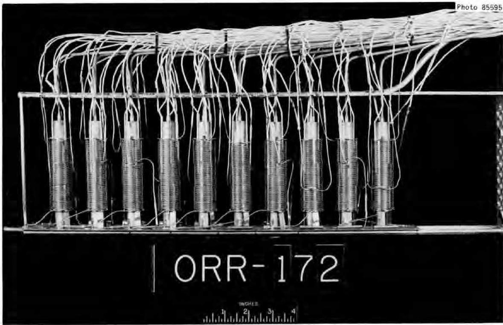  
Fig. 7. In-Reactor Tube Burst Experiment Assembled Except for Outside Container.

being that each zone has a separate controller. The heaters are only sufficient to maintain the test temperature $(760^{\circ}\mathrm{C})$ while the reactor is in operation.

The three in-reactor experiments which were run in this series of tests utilized positions P-5 and P-6 in the ORR poolside. Both positions have very similar flux levels. Cobalt-doped type 302 stainless steel monitors were used. The thermal flux was obtained from the $^{59}\mathrm{Co}(\mathrm{n},\gamma)^{60}\mathrm{Co}$ reaction and the fast flux ( $>4$ MeV) was obtained from the $^{54}\mathrm{Fe}(\mathrm{n},\mathrm{p})^{54}\mathrm{Mn}$ transmutation. The average values over the length of the test specimens were $4 \times 10^{13}$ neutrons $\mathrm{cm}^{-2}$ sec $^{-1}$ thermal and $3 \times 10^{12}$ neutrons $\mathrm{cm}^{-2}$ sec $^{-1}$ $>4$ MeV.

The tubes were measured with a profilometer at AI before and after testing. The ex-reactor specimens were measured at ORNL with a micrometer and the in-reactor specimens were measured with an optical comparator. The techniques used by both installations were in reasonably good agreement, but the ORNL measurements have been used in all graphs. The tubes were somewhat oval before testing and this made it difficult

to obtain accurate measurements of strain at the strains of $1\%$ or less. The tangential stresses were calculated from the standard thin-wall formula

$$
\sigma_ {\theta} = \frac {P d}{2 t} \tag {1}
$$

where

$\sigma_{\theta} =$ tangential stress,

$\mathbf{P}$ = internal gas pressure,

$\mathsf{d} =$ outside diameter, and

$t =$ wall thickness.

The wall thickness, $t$ , is probably the largest source of error in this calculation since it varied by up to 0.0002 in. ( $\pm 2\%$ ).

# EXPERIMENTAL RESULTS

The test results obtained on the three lots of material are summarized in Tables 2 and 3. These same data are plotted in Fig. 8 as the logarithm of the tangential stress $(\sigma_{\theta})$ versus the rupture life. Within the accuracy of the data, there do not seem to be any differences between the lots of material. Hence, we can consider the data as two sets - irradiated and unirradiated. The large effects of small doses on the rupture life are somewhat surprising. For example, in test 5034R where the stress was 26,000 psi there was a reduction in rupture life of about an order of magnitude although the dose at failure was only $7 \times 10^{17}$ neutrons/cm². The bulk helium content in specimen 5034R (Table 3) at the time of its failure was only about 35 ppb. The irradiated and unirradiated curves are approximately parallel.

The tangential rupture strains are compared in Fig. 9 as a function of rupture life. Most of the unirradiated specimens have fracture strains from 7 to $10\%$ although there are a few with strains as low as 4 to $5\%$ . The irradiated specimens exhibit tangential strains from a few tenths of a percent to about $2\%$ . The trend seems to be that of increasing fracture strain with increasing rupture life (or decreasing stress). There are two points for irradiated specimens that appear to be anomalous.

Table 2. Results on Ex-Reactor Tube Burst Test at ${760}^{ \circ  }\mathrm{C}$   

<table><tr><td>Test Number</td><td>Specimen Number</td><td>Hoop or Tangential Stress (psi)</td><td>Rupture Life (hr)</td><td>Tangential Rupture Strain (%)</td><td>Tangential Strain Rate (%/hr)</td></tr><tr><td></td><td></td><td colspan="4">Heat Number 281-4-0143</td></tr><tr><td>5918</td><td>5069a</td><td>50,400</td><td>~0.1</td><td>17.2</td><td></td></tr><tr><td>5929</td><td>5057</td><td>35,900</td><td>2.2</td><td>6.7</td><td>3.1</td></tr><tr><td>6174</td><td>5097</td><td>29,800</td><td>4.2</td><td>7.7</td><td>1.8</td></tr><tr><td>5927</td><td>5068</td><td>24,100</td><td>12.7</td><td>4.6</td><td>0.36</td></tr><tr><td>6173</td><td>5098</td><td>21,100</td><td>15.5</td><td>9.6</td><td>0.62</td></tr><tr><td>5922</td><td>5048</td><td>18,600</td><td>63.7</td><td>8.9</td><td>0.14</td></tr><tr><td>5936</td><td>5072</td><td>14,900</td><td>153.2</td><td>8.2</td><td>0.053</td></tr><tr><td>5932</td><td>5062</td><td>12,400</td><td>788.5</td><td>11.1</td><td>0.014</td></tr><tr><td>5983</td><td>5078b</td><td>9,930</td><td>2160.0</td><td>10.6</td><td>0.0049</td></tr><tr><td>6291</td><td>5088b</td><td>14,900</td><td>140.0</td><td>9.3</td><td>0.066</td></tr><tr><td></td><td></td><td colspan="4">Heat Number 5911</td></tr><tr><td>5919</td><td>6025</td><td>38,200</td><td>0.9</td><td>8.4</td><td>9.4</td></tr><tr><td>5933</td><td>6029</td><td>27,100</td><td>5.0</td><td>3.9</td><td>0.78</td></tr><tr><td>5921</td><td>6019</td><td>19,400</td><td>30.3</td><td>9.4</td><td>0.31</td></tr><tr><td>5925</td><td>6020c</td><td>14,500</td><td>61.2</td><td>0.88</td><td>0.014</td></tr><tr><td>5935</td><td>6026</td><td>14,500</td><td>343.5</td><td>9.0</td><td>0.026</td></tr><tr><td>6193</td><td>6018</td><td>14,500</td><td>100.2</td><td>6.4</td><td>0.064</td></tr><tr><td>6139</td><td>6014</td><td>11,600</td><td>334.7</td><td>7.6</td><td>0.023</td></tr><tr><td>5931</td><td>6031</td><td>9,690</td><td>2974.5</td><td>4.6</td><td>0.0016</td></tr><tr><td></td><td></td><td colspan="4">Heat Number 5911R</td></tr><tr><td>5928</td><td>5127R</td><td>36,600</td><td>0.4</td><td>9.1</td><td>23</td></tr><tr><td>5996</td><td>5126R</td><td>31,400</td><td>5.85</td><td>4.4</td><td>0.75</td></tr><tr><td>5916</td><td>5057R</td><td>26,300</td><td>19.8</td><td>8.2</td><td>0.42</td></tr><tr><td>5923</td><td>5049R</td><td>19,700</td><td>87.5</td><td>8.9</td><td>0.10</td></tr><tr><td>5924</td><td>5050R</td><td>19,700</td><td>86.9</td><td>8.2</td><td>0.095</td></tr><tr><td>5984</td><td>5130R</td><td>15,900</td><td>142.4</td><td>6.2</td><td>0.044</td></tr><tr><td>5926</td><td>5128R</td><td>13,200</td><td>372.5</td><td>7.8</td><td>0.021</td></tr><tr><td>5997</td><td>5123Rb</td><td>10,500</td><td>1731.7</td><td>6.8</td><td>0.0039</td></tr><tr><td>6292</td><td>5124Rb</td><td>15,900</td><td>182.8</td><td>4.4</td><td>0.024</td></tr></table>

a Tube split.   
bAged 2300 hr in argon at $760^{\circ}C$   
Tube not fractured; leak in system.

Table 3. Results of In-Reactor Tube Burst Tests at ${760}^{ \circ  }{\mathrm{C}}^{\mathrm{a}}$   

<table><tr><td rowspan="2">Tube Number</td><td rowspan="2">Hoop or Tangential Stress (psi)</td><td colspan="2">Tangential Strain, %</td><td rowspan="2">Ruptureb Life (hr)</td><td rowspan="2">Thermal Neutron Dose at Rupture (neutrons/cm2)</td><td rowspan="2">Helium Produced (at. fraction)</td><td rowspan="2">Strain Rate (%/hr)</td><td rowspan="2">Location of Fracture from End of Specimenc (in.)</td><td rowspan="2">Experiment Number ORR</td></tr><tr><td>ORNL</td><td>AI</td></tr><tr><td colspan="10">Heat Number 5911</td></tr><tr><td>6002</td><td>19,400</td><td>0.65</td><td>0.35</td><td>8.2</td><td>1.86 × 1018</td><td>9.0 × 10-8</td><td>0.079</td><td>3</td><td>172</td></tr><tr><td>6003</td><td>15,500</td><td>0.51</td><td>0.65</td><td>22.8</td><td>3.28 × 1018</td><td>1.6 × 10-7</td><td>0.022</td><td>2 1/8</td><td>172</td></tr><tr><td>6004</td><td>13,550</td><td>0.86</td><td>0.72</td><td>46.0</td><td>6.62 × 1018</td><td>3.2 × 10-7</td><td>0.019</td><td>2</td><td>172</td></tr><tr><td>6005</td><td>11,600</td><td>0.93</td><td>1.01</td><td>133.1</td><td>1.92 × 1019</td><td>9.0 × 10-7</td><td>0.0070</td><td>1 3/4</td><td>172</td></tr><tr><td>6006</td><td>9,700</td><td>1.33</td><td>1.41</td><td>244.3</td><td>3.52 × 1019</td><td>1.6 × 10-6</td><td>0.0055</td><td>1 7/8</td><td>172</td></tr><tr><td>6007</td><td>8,730</td><td>0.96</td><td>1.84</td><td>572</td><td>8.23 × 1019</td><td>3.4 × 10-6</td><td>0.0017</td><td>3</td><td>172</td></tr><tr><td>6008</td><td>7,750</td><td>1.33</td><td>1.54</td><td>632</td><td>9.10 × 1019</td><td>3.7 × 10-6</td><td>0.0021</td><td>1 1/2</td><td>172</td></tr><tr><td colspan="10">Heat Number 5911R</td></tr><tr><td>5034R</td><td>26,200</td><td>0.62</td><td>0.67</td><td>0.7</td><td>7.3 × 1017</td><td>3.5 × 10-8</td><td>0.89</td><td>2 3/4</td><td>171</td></tr><tr><td>5036R</td><td>20,900</td><td>0.21</td><td>1.33</td><td>4.7</td><td>1.3 × 1018</td><td>6.1 × 10-8</td><td>0.045</td><td>3</td><td>171</td></tr><tr><td>5037R</td><td>15,700</td><td>0.84</td><td>1.60</td><td>25.5</td><td>4.3 × 1018</td><td>2.1 × 10-7</td><td>0.033</td><td>2 1/2</td><td>171</td></tr><tr><td>5046R d</td><td>13,100</td><td>1.90</td><td>2.01</td><td>83.2</td><td>1.3 × 1019</td><td>6.2 × 10-7</td><td>0.023</td><td>1 3/4</td><td>171</td></tr><tr><td>5039R d</td><td>11,800</td><td>0.37</td><td>0.31</td><td>109.5</td><td>1.6 × 1019</td><td>7.5 × 10-7</td><td>0.0034</td><td>3</td><td>171</td></tr><tr><td>5040R</td><td>10,500</td><td>6.3</td><td>3.88</td><td>145.8</td><td>2.2 × 1019</td><td>1.0 × 10-6</td><td>0.043</td><td>2</td><td>171</td></tr><tr><td colspan="10">Heat Number 281-4-0143</td></tr><tr><td>4504</td><td>24,900</td><td>0.39</td><td>0.68</td><td>1.25</td><td>8.4 × 1017</td><td>2.2 × 10-8</td><td>0.31</td><td>2</td><td>171</td></tr><tr><td>4550</td><td>19,900</td><td>4.5</td><td>2.64</td><td>2.25</td><td>9.7 × 1017</td><td>2.6 × 10-8</td><td>2.0</td><td>3</td><td>171</td></tr><tr><td>4588</td><td>17,400</td><td>0.11</td><td>0.52</td><td>6.7</td><td>1.6 × 1018</td><td>4.2 × 10-8</td><td>0.017</td><td>2 3/4</td><td>171</td></tr><tr><td>4596</td><td>14,900</td><td>0.53</td><td>0.40</td><td>5.7</td><td>1.4 × 1018</td><td>3.7 × 10-8</td><td>0.093</td><td>2</td><td>171</td></tr><tr><td>4602</td><td>12,400</td><td>0.64</td><td>0.60</td><td>56.3</td><td>8.8 × 1018</td><td>2.3 × 10-7</td><td>0.011</td><td>3</td><td>172</td></tr><tr><td>4616</td><td>11,200</td><td>0.43</td><td>0.69</td><td>105.9</td><td>1.6 × 1019</td><td>4.1 × 10-7</td><td>0.0041</td><td>2 1/2</td><td>172</td></tr><tr><td>4621</td><td>9,790</td><td>1.00</td><td>0.87</td><td>88.3</td><td>1.3 × 1019</td><td>3.4 × 10-7</td><td>0.0113</td><td>3</td><td>172</td></tr><tr><td>5071d</td><td>10,000</td><td>2.1</td><td>1.95</td><td>409.6</td><td>5.9 × 1019</td><td>1.4 × 10-6</td><td>0.0051</td><td>1 3/4</td><td>178</td></tr><tr><td>4639</td><td>9,000</td><td>2.8</td><td>2.1</td><td>505.1</td><td>7.4 × 1019</td><td>1.7 × 10-6</td><td>0.0055</td><td>1 3/4</td><td>178</td></tr><tr><td>5090</td><td>8,500</td><td>1.7</td><td>1.37</td><td>930</td><td>1.3 × 1020</td><td>2.8 × 10-6</td><td>0.0018</td><td>1 3/4</td><td>178</td></tr><tr><td>5053e</td><td>8,000</td><td>1.5</td><td>1.85</td><td>1125</td><td>1.6 × 1020</td><td>3.1 × 10-6</td><td>0.0013</td><td></td><td>178</td></tr><tr><td>5094e</td><td>7,000</td><td>0.9</td><td>0.48</td><td>1125</td><td>1.6 × 1020</td><td>3.1 × 10-6</td><td>0.0008</td><td></td><td>178</td></tr><tr><td>5066f</td><td>12,000</td><td>1.2</td><td>0.59</td><td>40.6</td><td>1.4 × 1020</td><td>2.9 × 10-6</td><td>0.030</td><td>1 3/4</td><td>178</td></tr></table>

$\mathbf{a}_{\phi_{\mathrm{th}}} = 4 \times 10^{13}$ neutrons $\mathrm{cm}^{-2} \sec^{-1}$ .   
bReactor was at power about 5 hr before the specimens were stressed.   
c Measured from end where pressurizing tube attached.   
dSplit.   
eDid not fail during reactor cycle.   
Held at temperature for 950 hr before applying stress.

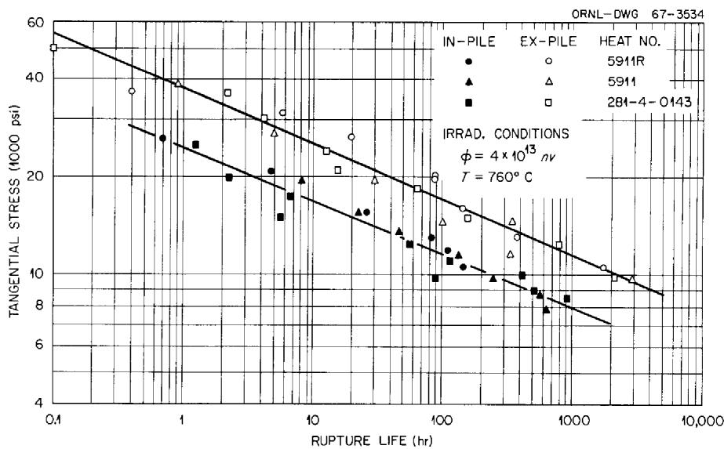  
Fig. 8. Stress-Rupture Properties of Hastelloy N Tubes at $760^{\circ}\mathrm{C}$ . (The irradiated tubes were exposed for about 5 hrs before the stress was applied.)

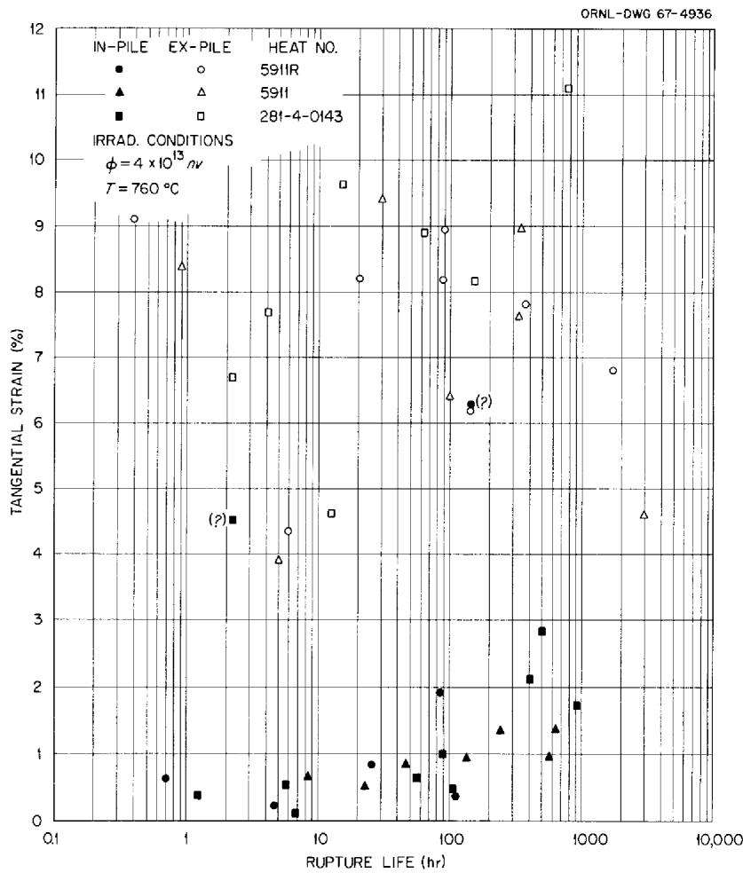  
Fig. 9. Tangential Strains for Hastelloy N Tubes Tested at $760^{\circ}\mathrm{C}$ .

Another interesting correlation is shown in Fig. 10. If the strain at fracture is divided by the time to fracture, a creep rate is obtained. At $760^{\circ}\mathrm{C}$ Hastelloy N exhibits little, if any, primary creep. For a thin-walled tube with the test being terminated when the first leak occurs, there would probably be no tertiary creep. Hence, the creep rate obtained is very close to the minimum creep rate that would be obtained from a standard creep curve. The creep rates obtained in this manner are listed in Tables 2 and 3 and plotted in Fig. 10. The data scatter about a common line, independent of whether or not the specimens were irradiated. Hence, the minimum creep rate does not appear to be influenced by irradiation.

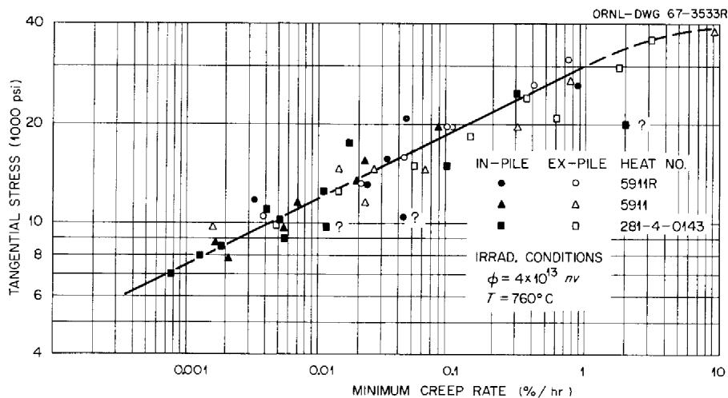  
Fig. 10. Variation of Minimum Creep Rate with Stress Level for Hastelloy N Tubes.

Figure 11 shows the random nature of the failures in the irradiated specimens. There appear to be no systematic problems with temperature control nor any marked influence on rupture life due to the range of dose received by each specimen.

Two specimens were aged prior to testing in an effort to determine whether thermal treatment produced any deleterious effects on the properties. These specimens were aged for 2300 hr at $760^{\circ}\mathrm{C}$ in argon and then tested at $760^{\circ}\mathrm{C}$ . The data, shown in Table 2, indicate no severe effects. However, the slight ductility reduction of heat 5911R (Test 6292) may be

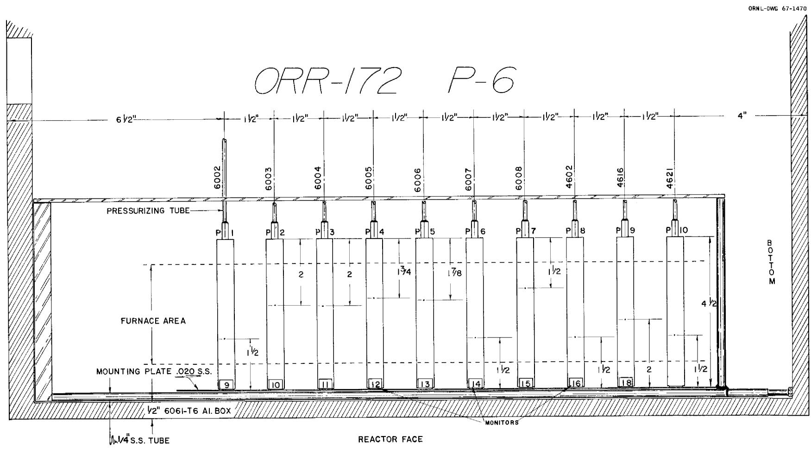  
Fig. 11. Schematic Drawing of Experiment ORR-172 Showing the Locations of the Failures.

real and should be studied further before using this particular lot of tubing.

A subject of importance is a comparison of the behavior of the tubular specimens with that of wrought specimens of the same material. Specimens of heat 5911 were tested as both tubes and small rod specimens with a gage section of $1 \times 1/8$ in. diameter. The details of the work on the rod specimens were reported previously.[14] The heat treatments of the rods and the tubes differed slightly, but probably not enough to be significant. The small rod specimens were irradiated to a thermal dose of $2.3 \times 10^{20}$ neutrons/cm² at $760^{\circ}\mathrm{C}$ and subjected to postirradiation creep testing at the same temperature.

The differences in stress state between the tubes and the rods must be considered. Weil et al. $^{15}$ showed that the effects of end restraint on the properties of tubes are negligible for length to diameter ratios greater than about two for a material with a strain hardening exponent of about 0.3. Since our tubes had a length to diameter ratio of about eight and were very thin walled, they are assumed to have been exposed to a two-dimensional stress described by:

$$
\begin{array}{l} \sigma_ {Z} (\text {a x i a l s t r e s s}) = \frac {\mathrm {P d}}{4 \mathrm {t}} \\ \sigma_ {\theta} (\text {t a n g e n t i a l s t r e s s}) = \frac {\mathrm {P d}}{2 \mathrm {t}} \\ \sigma_ {R} (\text {r a d i a l s t r e s s}) = 0. \tag {2} \\ \end{array}
$$

A comprehensive study of stress state was made by Kennedy et al.16 on Inconel at $816^{\circ}C$ . This work will be drawn on extensively to predict

the differences in properties under uniaxial tension and the two-dimensional stress state of a thin-walled tube. Kennedy showed that the time to failure, $t_r$ , was predicted under various stress states by the relationship

$$
t _ {r} = \left(\frac {\overline {{B}}}{\overline {{\sigma}}}\right) ^ {\beta} \frac {\overline {{\sigma}}}{\sigma_ {1}} \tag {3}
$$

where

B and $\beta =$ material constants that were obtained from the uniaxial stress-rupture curve (B = 37,500 psi and $\beta = 5$ for Hastelloy N),

$\sigma_{1} =$ maximum principal stress, and

$\overline{\sigma} =$ effective stress. Based on the von Mises (distortion energy) criterion,

$$
\overline {{\sigma}} = \frac {1}{\sqrt {2}} \left[ \left(\sigma_ {\mathrm {Z}} - \sigma_ {\theta}\right) ^ {2} + \left(\sigma_ {\theta} - \sigma_ {\mathrm {R}}\right) ^ {2} + \left(\sigma_ {\mathrm {R}} - \sigma_ {\mathrm {Z}}\right) ^ {2} \right] ^ {1 / 2}. \tag {4}
$$

For the internally pressurized tube

$$
\sigma_ {\theta} = \sigma_ {\theta}
$$

$$
\sigma_ {Z} = 1 / 2 \sigma_ {\theta} \tag {5}
$$

$$
\sigma_ {R} = 0. \tag {5}
$$

With the same maximum principal stress, the ratio of the rupture life of the rod, $t_{\mathrm{r}}^{\mathrm{R}}$ , to that of the tube, $t_{\mathrm{r}}^{\mathrm{T}}$ , is given by

$$
\frac {t _ {r} ^ {R}}{t _ {r} ^ {T}} = 0. 5 6. \tag {6}
$$

Figure 12 compares the rupture lives of the uniaxially stressed rods and the biaxially stressed tubes. In the unirradiated condition the rupture

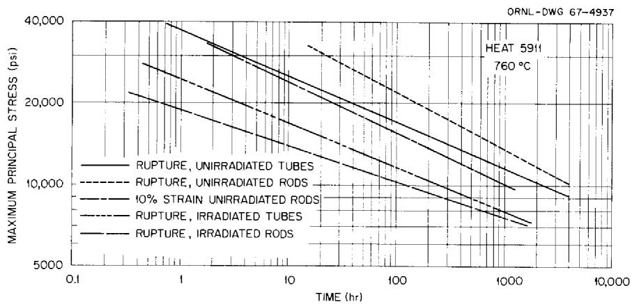  
Fig. 12. A Comparison of the Creep-Rupture Properties of Hastelloy N Tube and Rods at $760^{\circ}\mathrm{C}$ .

lives of the rod specimens were greater than those of the tubes. This is probably due to the different methods used to determine failure. Failure of the tubes was indicated by a drop in the internal pressure. This would occur when the first crack penetrated the thin tube wall and tangential strains of only 7 to $10\%$ were noted at failure. The rods were strained until the specimen completely parted and strains of 30 to $40\%$ were noted. Thus it is probably more accurate to compare the lives of the two test specimen configurations at similar strains. The curve for the time to $10\%$ strain for the rods is also shown in Fig. 12. This curve has a slightly different slope than that for the tube data, but at low stresses the rods reach a strain of $10\%$ in about one half the time for the tube to fail. Thus, with similar fracture criterion for the two types of specimens, Eq. (3) seems to predict the behavior reasonably well. The irradiated rods and tubes both failed at low strains. The tubes were stressed and irradiated simultaneously and about 100 hr were required to accumulate thermal doses of $1 \times 10^{19}$ neutrons/ $\mathrm{cm}^2$ . The rods were tested after they had been irradiated to a dose of $2.3 \times 10^{20}$ neutrons/ $\mathrm{cm}^2$ . Thus the longer rupture lives of the tubes at high stresses is probably due to their lower dose. At low stresses the rupture lives of the tubes and rods are similar. It is quite likely that the irradiated specimens are brittle enough that their failure time is governed solely by the maximum principal stress; hence the tubes and rods would be expected to fail in equivalent times. Equation (3), which is based primarily on a

shear-stress criterion and depends to a lesser extent on the maximum principal stress, may not strictly apply to the irradiated specimens.

The variation of creep rate with stress state is given by

$$
\begin{array}{l} \dot {\epsilon} _ {Z} = \frac {\dot {\epsilon}}{\bar {\sigma}} \left[ \sigma_ {Z} - \frac {\sigma_ {R} + \sigma_ {\theta}}{2} \right], \\ \dot {\epsilon} _ {\theta} = \frac {\dot {\bar {\epsilon}}}{\bar {\sigma}} \left[ \sigma_ {\theta} - \frac {\sigma_ {R} + \sigma_ {Z}}{2} \right], \\ \dot {\epsilon} _ {R} = \frac {\dot {\bar {\epsilon}}}{\bar {\sigma}} \left[ \sigma_ {R} - \frac {\sigma_ {\theta} + \sigma_ {Z}}{2} \right]. \tag {7} \\ \end{array}
$$

The effective creep rate $\dot{\bar{\epsilon}}$ is defined by

$$
\dot {\overline {{\epsilon}}} = \left(\frac {\underline {{A}}}{\sigma}\right) ^ {\alpha} \tag {8}
$$

where $A$ , $\alpha$ are material constants determined from uniaxial data. For Hastelloy N at $760^{\circ}C$ the values of $\alpha$ and $A$ were 5 and 30,000 psi, respectively. By substituting the appropriate values into Eq. (7), we can relate the axial strain rate for the rod $\dot{\epsilon}^{\text{R}}$ with the tangential strain rate of the tube $\dot{\epsilon}_{\theta}^{\text{T}}$ . For the same maximum principal stress

$$
\frac {\dot {\epsilon} \mathrm {R}}{\dot {\epsilon} _ {\theta}} = 2. 4. \tag {9}
$$

Figure 13 shows a plot of the minimum creep rate as a function of the maximum principal stress. The strain rates appear to be equal for the two specimen geometries, indicating that the ratio in Eq. (9) is approximately 1. However, reference to Fig. 10 shows that the scatter in the minimum creep rate data is greater than a factor of 2.4 at a given stress.

The parameter of prime importance in this study is the fracture strain. In general, the strain at fracture $\epsilon^{\mathrm{F}}$ is given by

$$
\epsilon^ {\mathrm {F}} = \dot {\epsilon} t _ {r}. \tag {10}
$$

By combining Eqs. (7), (3), and (10) the axial fracture strain for the

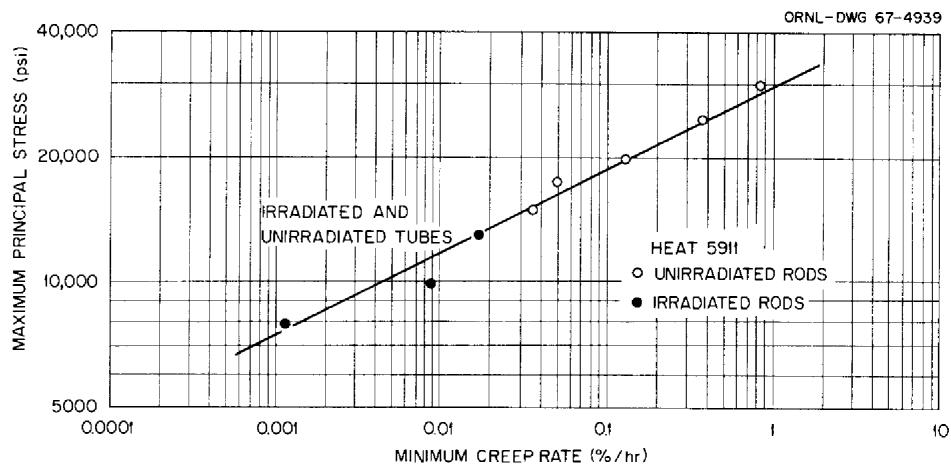  
Fig. 13. Comparison of the Creep Rates of Hastelloy N Tubes and Rods at $760^{\circ}\mathrm{C}$ .

rod, $\epsilon^{\mathbb{R},\mathbb{F}}$ , and the tangential fracture strain for the tube, $\epsilon_{\theta}^{\mathbb{T},\mathbb{F}}$ , can be related for the same maximum principal stress.

$$
\frac {\epsilon^ {R , F}}{\epsilon_ {\theta} ^ {T , F}} = 1. 3 3. \tag {11}
$$

Figure 14 compares the fracture strains of rods and tubes. Again, the scatter in the data is greater than the predicted variation.

One complicating factor that has not been considered in comparing the behavior of tubes under a biaxial stress and rods under a uniaxial stress is that the stresses change differently with strain. In both types of tests the stress is based on the initial dimensions (engineering stress) and the true stress actually increases during the test. In the uniaxial case the true stress (up to necking) $\sigma^{\prime}$ is given by

$$
\sigma^ {\prime} = \sigma (1 + \epsilon). \tag {12}
$$

In the biaxial case the true stress is given approximately by

$$
\sigma_ {\theta} ^ {\prime} = \frac {P d}{2 t} (1 + \epsilon) ^ {2}
$$

$$
\sigma_ {Z} ^ {\prime} = \frac {P d}{4 t} (1 + \epsilon). \tag {13}
$$

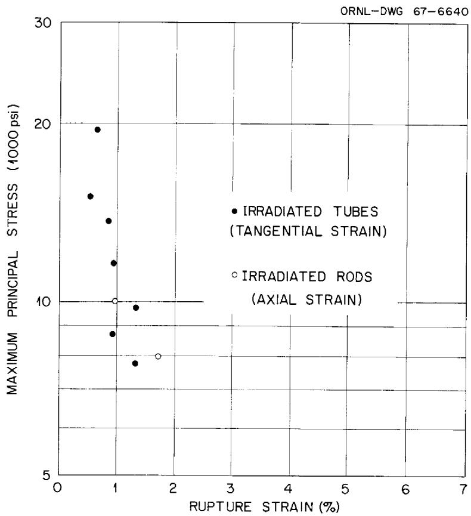  
Fig. 14. Comparison of the Fracture Strains for Irradiated Hastelloy N Tubes and Rods at $760^{\circ}\mathrm{C}$ .

Hence the tangential stress increases more rapidly with strain than does the axial stress and the stress state changes with strain. This change in stress state complicates the comparison of the two types of tests.

# DISCUSSION OF RESULTS

The data indicate an effect of neutron irradiation characterized by (a) a reduction in stress-rupture life, (b) a reduction in rupture ductility with a trend of increasing fracture strain with increasing rupture life (or decreasing stress), (c) no change in creep rate, and (d) a very low neutron dose necessary to produce these property changes. These characteristics are consistent with our understanding of how helium would affect the properties of a material once it was introduced by the transmutation of $^{10}\mathrm{B}$ . At least two excellent papers have been written which deal with the behavior of helium in metals and we shall not discuss this

subject in detail. $^{17,18}$ The $^{10}\mathrm{B}$ , because of its size and low solubility, is initially segregated at the grain boundaries of the metal. $^{17}$ As the $^{10}\mathrm{B}$ is transmuted, the recoil range of the helium is about $2\mu$ (ref. 19) and, hence, most of the helium will lie in the proximity of the boundaries.

The formation of intergranular voids under creep conditions is a naturally occurring phenomenon in most metals.[20-24] Several mechanisms have been suggested for their nucleation,[25] but they are generally assumed to grow by the diffusion of vacancies into the voids. The voids are thermodynamically stable[26] when

$$
\sigma = \frac {2 \gamma}{r (\cos \theta) ^ {2}}
$$

where:

$\sigma =$ applied stress,

$\gamma =$ surface tension,

$\mathbf{r} =$ radius of the void, and

$\theta =$ angle between the applied stress and the normal to the plane of the boundary in which the void lies.

Thus, the surface tension provides a driving force for the void to collapse. If a stress is applied that is large enough to balance the surface tension,

the void will be stable. If an even larger stress is applied, the bubble will grow as the supply of vacancies allows. The presence of helium complicates this process in at least two ways. The helium atoms can agglomerate and serve as the void nucleus. The helium will also produce some internal pressure in the void and thus reduce the stress that must be applied to stabilize the void. In this case the equation above becomes

$$
(\sigma + P) = \frac {2 \gamma}{r (\cos \theta) ^ {2}}.
$$

Thus, the mechanism of creep fracture is not altered by the presence of helium. If the stress is low and the temperature high, failure will occur by the linking up of the intergranular voids. The strain in this case will be a/d, where a is the void spacing and d is the grain diameter.[27] At higher stresses and lower temperatures, bulk deformation predominates and the intergranular void formation process will become of less importance. The presence of helium will help nucleate and stabilize the voids so that their growth will be important at higher stresses and lower temperatures than normal.

The effects of helium content on the somewhat simplified process just described are not clear. The expected trend would be that increasing concentrations would help nucleate and stabilize more voids. Since the growth of voids under creep conditions is a natural phenomenon, it is difficult to determine the minimum quantity of helium necessary to be effective and the maximum quantity above which saturation of the effect should occur. However, the data in the present study showed that large effects were noted when the helium content was a few parts per billion (atomic) and that these effects did not seem to increase greatly as the helium content increased to a few parts per million (atomic).

The observation of increasing fracture ductility with decreasing strain rate (decreasing stress) is quite interesting and has been observed for several lots of Hastelloy N. This can be rationalized from the fact that the size of void that will grow decreases with decreasing

stress. This would probably result in an increase in the spacing of the voids, a, and the strain, a/d, would become larger. The spacing could also be decreased by the coalescence of bubbles. Hull and Rimmer²⁸ showed that the creep behavior of copper (in the absence of irradiation) could be explained on the basis of an increase in the void spacing with decreasing stress.

# SUMMARY AND CONCLUSIONS

We have determined the properties of Hastelloy N tubes in- and ex-reactor at $760^{\circ}\mathrm{C}$ . The rupture life was reduced by about a factor of 10, even under conditions where the integrated thermal neutron dose was only of the order of $10^{18}$ neutrons/cm $^2$ . The tangential rupture strains decreased from values of 7 to $10\%$ for the unirradiated tubes to 0.1 to $2\%$ for the irradiated tubes. The fracture strains for the irradiated tubes were a minimum for those that failed in short times and increased as the rupture life increased. Although the fracture strains were affected markedly by irradiation, the creep rates of the tubes were not altered. These observations can be rationalized on the basis of a mechanism of radiation damage involving helium produced by the thermal $^{10}\mathrm{B}$ ( $n,\alpha$ ) reaction.

The results for the tubular specimens are compared with those obtained for rod specimens on the same heat of material. The results are in reasonably good agreement. The small strains and the inherent experimental errors involved with the irradiated samples make it difficult to detect any effects of the two different stress states on the fracture strains.

# ACKNOWLEDGMENTS

The authors gratefully acknowledge the assistance of several other persons at ORNL in this study.

V. G. Lane - Ex-Reactor Tests

J. W. Woods - Supervised construction and running of in-reactor experiments

Metals and Ceramics Reports Office - Preparation of manuscript

Graphic Arts - Preparation of drawings

H. R. Tinch - Metallography

C. R. Kennedy - Review of manuscript

J. L. Scott - Review of manuscript

We also are pleased to acknowledge the assistance of Atomics International in supplying the materials used in this program and the support of the Division of Space Nuclear Systems of the AEC.

# INTERNAL DISTRIBUTION

1-3. Central Research Library

4-5. ORNL - Y-12 Technical Library Document Reference Section

6-25. Laboratory Records

26. Laboratory Records, ORNL RC

27. ORNL Patent Office

28. G. M. Adamson, Jr.

29. S. E. Beall

30. D. Billington

31. E. E. Bloom

32. E. G. Bolhmann

33. G. E. Boyd

34. R. B. Briggs

35. D. Canonico

36. E. L. Compere

37. J. E. Cunningham

38. J. H. Devan

39. J. H Frye, Jr.

40. R. Gelbach

41. D. G. Harman

42. W. O. Harms

43-45. M.R.Hill

46. N. E. Hinkle

47. H. Inouye

48. P. Kasten

49. C. R. Kennedy

50. R. T. King

51. A. P. Litman

52. E. L. Long, Jr.

53. H. G. MacPherson

54-58. H. E. McCoy, Jr.

59. C. J. McHargue

60. A. J. Miller

61. A. R. Olsen

62. P. Patriarca

63. M. W. Rosenthal

64. H. C. Savage

65. J. L. Scott

66. C. E. Sessions

67. J. Stanley

68. J. O. Stiegler

69. G. M. Slaughter

70. D. B. Trauger

71-75. J.R.Weir

76. J.W.Woods

# EXTERNAL DISTRIBUTION

77. G. G. Allaria, Atomics International

78. J. G. Asquith, Atomics International

79. D. F. Cope, RDT, SSR, AEC, Oak Ridge National Laboratory

80. H. M. Dieckamp, Atomics International

81. J. L. Gregg, Bard Hall, Cornell University

82. F. D. Haines, AEC, Washington

83. C. E. Johnson, AEC, Washington

84. W. L. Kitterman, AEC, Washington

85. W. J. Larkin, AEC, Oak Ridge Operations

86. A. B. Martin, Atomics International

87. D. G. Mason, Atomics International

88. G. W. Meyers, Atomics International

89. D. E. Reardon, AEC, Canoga Park Area Office

90. J. M. Simmons, AEC, Washington

91. S. R. Stamp, AEC, Canoga Park Area Office

92. R. F. Wilson, Atomics International

93. Division of Research and Development, AEC, Oak Ridge Operations

94-108. Division of Technical Information Extension