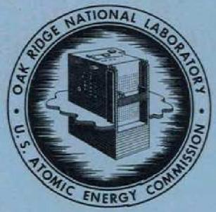
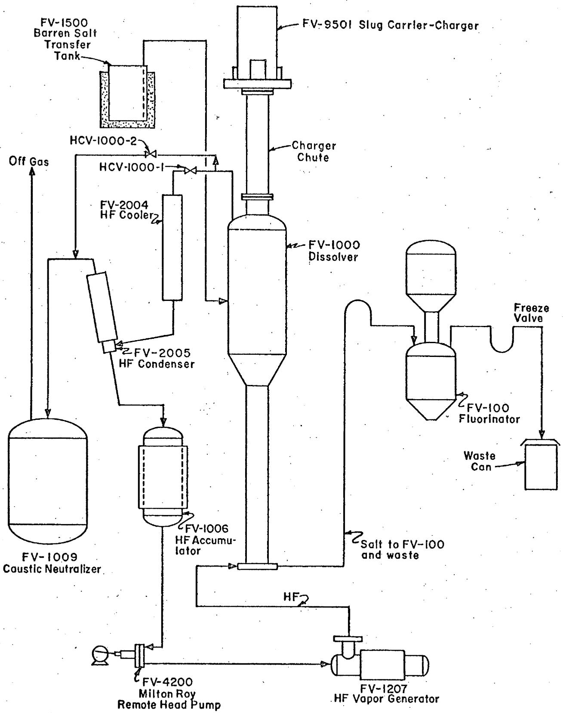
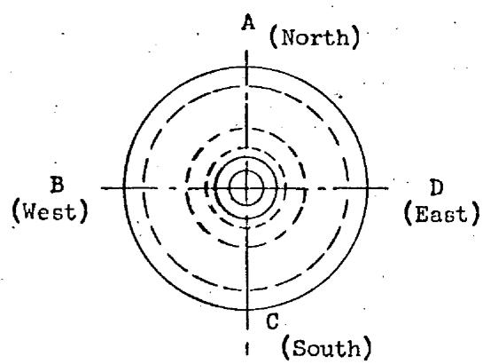
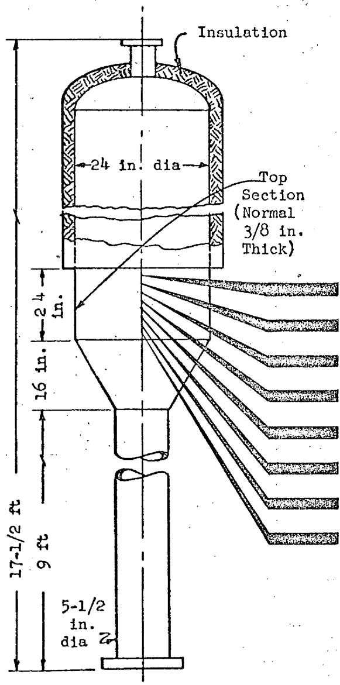
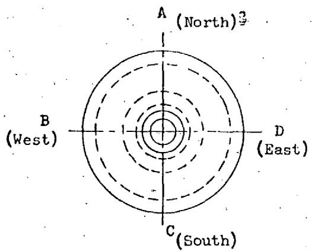
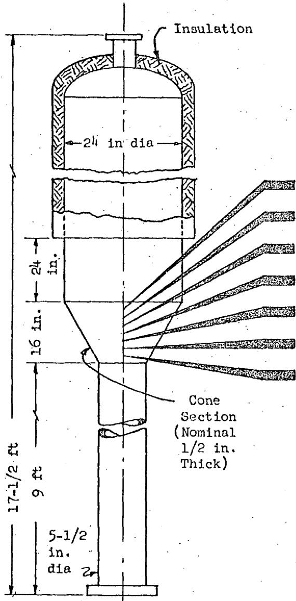
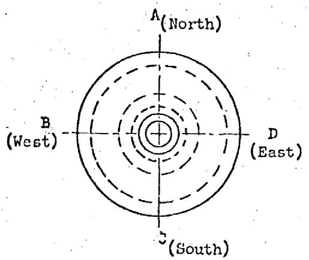
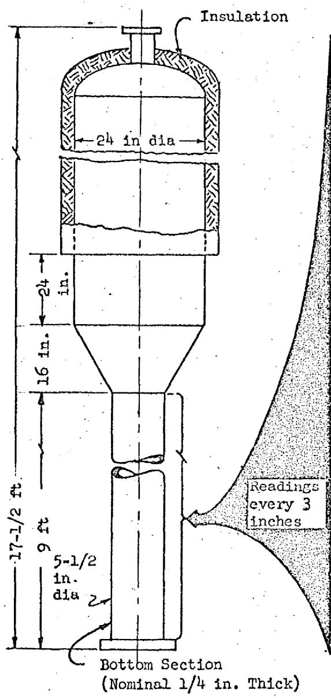

# OAK RIDGE NATIONAL LABORATORY

operated by

# UNION CARBIDE CORPORATION

NUCLEAR DIVISION

for the

U.S. ATOMIC ENERGY COMMISSION

LOCKHEED MARTIN ENERGY RESEARCH LIBRARIES

3445605134182

ORNL-TM-1907

COPY NO. -

DATE - July 21, 1967

# CORROSION OF THE VOLATILITY PILOT PLANT INOR-8

# DISSOLVER AFTER SEVEN COLD DISSOLUTION RUNS

E.C.Moncrief

A.P.Litman

# ABSTRACT

The Volatility Pilot Plant dissolver vessel, based on ultrasonic thickness measurements, seems to be sustaining low corrosion losses.

Wall thickness changes were measured for the Volatility Pilot Plant INOR-8 dissolver after 204 hours of exposure to anhydrous HF and equimolar NaF-LiF fused salt containing 22-52 mole per cent $\mathsf{ZrF_4}$ at $495 - 655^{\circ}C$ while Zircaloy-2 dummy fuel elements were being dissolved. Measurements were taken using the "Vidigage," an ultrasonic thickness measuring device, first after an ammonium oxalate solution wash to dissolve residual salt, and later after an $\mathsf{HNO}_3\mathsf{-Al}(\mathsf{NO}_3)_3$ rinse to remove any metallic deposits that might have formed.

For the dissolver, maximum wall thickness losses were noted in the vapor region where a maximum loss of 11 mils was found. This loss corresponds to 0.054 mils/hour, based on HF exposure time, or 17.0 mils/month, based on molten salt residence time. Lower losses occurred in the vapor-salt interface region, and still less in the salt region of the vessel. Bulk metal losses due to the use of the oxalate and nitric acid-aluminum

nitrate solutions were considered negligible.

OAK RIDGE NATIONAL LABORATORY

CENTRAL RESEARCH LIBRARY

DOCUMENT COLLECTION

# LIBRARY LOAN COPY

DO NOT TRANSFER TO ANOTHER PERSON

If you wish someone else to see this

document, send in name with document

and the library will arrange a loan.

LSCN-7269

(3) 3+67

# LEGAL NOTICE

This report was prepared as an account of Government sponsored work. Neither the United States, nor the Commission, nor any person acting on behalf of the Commission:

A. Makes any warranty or representation, expressed or implied, with respect to the accuracy, completeness, or usefulness of the information contained in this report, or that the use of any information, apparatus, method, or process disclosed in this report may not infringe privately owned rights; or   
B. Assumes any liabilities with respect to the use of, or for damages resulting from the use of any information, apparatus, method, or process disclosed in this report.

As used in the above, "person acting on behalf of the Commission" includes any employee or contractor of the Commission, or employee of such contractor, to the extent that such employee or contractor of the Commission, or employee of such contractor prepares, disseminates, or provides access to, any information pursuant to his employment or contract with the Commission, or his employment with such contractor.

The Volatility Pilot Plant has currently completed a series of seven cold dissolution runs using Zircaloy-2 dummy fuel elements according to the head-end procedure of the fused salt Volatility Process. These runs were designed to evaluate the HF dissolution step of the Volatility Process. A necessary part of that evaluation was the determination of the corrosion losses occurring on INOR-8, the material of construction for the dissolver vessel. Table I summarizes the corrosion rate losses. The nominal composition of INOR-8 is Ni: 71 wt %, Cr: 7 wt %, Fe: 5 wt %, and Mo: 16 wt %. Table II details the process conditions for the seven runs and indicates that equimolar NaF-LiF fused salt containing 22-52 mole per cent $\mathrm{ZrF_4}$ was used at temperatures of $495 - 655^{\circ}\mathrm{C}$ along with $1160\mathrm{kg}$ of anhydrous HF to dissolve eight dummy fuel elements. Figure 1 shows a schematic of the hydrofluorination operation.

Wall thickness measurements were made prior to the development runs and twice after run T-7 using an ultrasonic thickness measuring device, the "Vidigage." The first measurement after run T-7 followed a 41 hr wash with boiling $0.35\mathrm{M}$ ammonium oxalate solution; and the second measurement followed a 10 hr rinse with boiling $5\mathrm{wt}\% \mathrm{HNO}_3 - 5\mathrm{wt}\% \mathrm{Al}(\mathrm{NO}_3)_3$ . The oxalate wash served to remove residual fused salt while the $\mathrm{HNO}_3 - \mathrm{Al}(\mathrm{NO}_3)_3$ rinse dissolved any metallic deposits which might have formed on the dissolver walls during fuel element dissolution. Figures 2, 3, and 4 present the data obtained and show that measurements were made at $90^{\circ}$ intervals around the circumference of the dissolver at three inch height increments. The present operating orientation of the dissolver vessel is also indicated.

Although a restricted number of readings were taken on the top cylindrical section of the dissolver because of the presence of insulation, sufficient data were collected to indicate that the vessel had lost an average of 9.3 mils on the inside diameter of that section (see Fig. 2).

1G. I. Cathers, "Fluoride Volatility Process for High Alloy Fuels," ORNL-CF-57-4-95, Presented at Symposium on Chemical Processing, Brussels, Belgium, May 20-25, 1957.

This loss corresponds to 0.045 mils/hr, based on HF exposure time. The top section was exposed only to the process vapors except for occasional salt splash. However, for comparative purposes, an average rate loss figure of 14.4 mils/month, based on molten salt residence time was also calculated. The maximum wall thickness loss in the vapor region of the dissolver, 11 mils, did not deviate greatly from the average quoted.

The conical section of the hydrofluorination vessel was exposed to both process vapors and fluoride salts during the runs described. In run T-7 the salt level was in the conical section; in all other runs salt contact was from splash. The average wall thickness loss found for this section was 4.2 mils, less than the $1\%$ accuracy of the "Vidigage" instrument, although a maximum of 10 mils loss was noted at one point (see Fig. 3). Maximum rate losses were 0.049 mils/hr, based on HF exposure time or 15.4 mils/month, based on molten salt residence time.

The bottom section of the dissolver consists of five cylinders of 5-1/2 inches inside diameter and varying length joined by circumferential welds to form a right cylinder 9 feet in height. Thickness measurements of this section did not disclose significant bulk metal loss (see Fig. 4). However, two areas in the west quadrant did register unusual high and low thickness changes. These irregularities may be due to inaccuracies in the base-line data collected on the dissolver vessel. Excluding the high and low data mentioned, a maximum loss of 6 mils was found for the bottom section.

Comparison of the thickness data before and after the nitric acid-aluminum nitrate rinse (Figs. 2, 3, and 4) indicated that negligible changes occurred outside the accuracy of the "Vidigage" instrument.

The Volatility Pilot Plant dissolver vessel, based on ultrasonic thickness measurements, seems to be sustaining low corrosion losses.

Table I. Summary of Corrosion Rate Losses on Volatility Pilot Plant INOR-8 Hydrofluorinator after Seven Runs   

<table><tr><td rowspan="3">Region Dissolver</td><td colspan="4">Corrosion Rate</td></tr><tr><td colspan="2">Mils/hra</td><td colspan="2">Mils/mob</td></tr><tr><td>Average</td><td>Maximum</td><td>Average</td><td>Maximum</td></tr><tr><td>Top</td><td>0.045</td><td>0.054</td><td>14.4</td><td>17.0</td></tr><tr><td>Cone</td><td>0.021</td><td>0.049</td><td>6.5</td><td>15.4</td></tr><tr><td>Bottom</td><td>0.003</td><td>0.054</td><td>1.1</td><td>17.0</td></tr></table>

${}^{a}$ Based on HF exposure time of 204 hr.   
b. Based on molten salt residence time of 465 hr.

Table II. Summary of Zircaloy-2 Dissolution Runs in the Volatility Pilot Plant   

<table><tr><td rowspan="2">Run No.</td><td colspan="2">Fused Salt Composition, (mole % NaF-LiF-ZrF4)</td><td colspan="2">Salt Temp., °C</td><td rowspan="2">HF Rate, (g/min)</td><td rowspan="2">Time, (hr)</td><td rowspan="2">Zircaloy-2 Dissolution Rate, (mg/cm2-min)</td><td rowspan="2">HF Utilization (Over-all Average)</td></tr><tr><td>Initial</td><td>Final</td><td>Max</td><td>Min</td></tr><tr><td>T-1</td><td>42.8-21.7-35.5</td><td>30.9-17.3-51.8</td><td>560</td><td>520</td><td>104</td><td>38.0</td><td>0.60</td><td>15.0</td></tr><tr><td>T-2</td><td>38.3-30.1-31.6</td><td>30.2-26.8-42.9</td><td>530</td><td>525</td><td>40</td><td>41.5</td><td>0.49</td><td>23.4</td></tr><tr><td>T-3</td><td>38.8-38.8-22.4</td><td>31.4-25.9-42.7</td><td>625</td><td>550</td><td>90</td><td>24.7</td><td>1.01</td><td>23.2</td></tr><tr><td>T-4</td><td>37.3-37.3-25.3</td><td>29.3-27.3-43.3</td><td>630</td><td>495</td><td>90</td><td>22.5</td><td>1.01</td><td>22.3</td></tr><tr><td>T-5</td><td>37.5-37.5-25.0</td><td>27.4-27.4-45.2**</td><td>625</td><td>530</td><td>90</td><td>27.2</td><td>0.85</td><td>18.4</td></tr><tr><td>T-6</td><td>37.5-37.5-25.0</td><td>30.7-30.7-38.5**</td><td>650</td><td>500</td><td>150*</td><td>25.7</td><td>0.87</td><td>11.3</td></tr><tr><td>T-7+</td><td>36.9-36.9-26.3</td><td>25.3-25.3-49.4**</td><td>655</td><td>523</td><td>135</td><td>23.0</td><td>0.97</td><td>27.8</td></tr></table>

*HF rate 118 g/min (avg) first 8.5 hr; 160 g/min thereafter.   
+Two elements dissolved during run   
**Theoretical value (analyses of final salt not available to date).

  
Fig.1. Schematic Diagram of Hydrofluorination Operation.

# ORNL-LR-DJG.54469 UNCLASSIFIED

1. Total HF time, 204 hr   
2. Readings taken on line beneath letters every three inches.   
3. Dissolver cleaned with boiling $0.35\mathrm{M}$ ammonium oxalate solution for 41 hr; boiling 5 wt $\%$ HNO $_3$ -5 wt $\%$ Al(NO $_3$ ) $_3$ for 10 hr.

  
Fig. 2. Summary of VPP Dissolver Corrosion Measurements (Top Section).

FV-1000 VPP Dissolver

<table><tr><td colspan="9">Readings in Mils
(Accuracy ~± 1% of Material Thickness)</td></tr><tr><td colspan="9">Change in Wall Thickness</td></tr><tr><td colspan="4">After Oxalate</td><td colspan="4">After HNO3-Al(NO3)3</td><td rowspan="2">Average Change</td></tr><tr><td>A</td><td>B</td><td>C</td><td>D</td><td>A</td><td>B</td><td>C</td><td>D</td></tr><tr><td>-10</td><td>*</td><td>-11</td><td>*</td><td>-10</td><td>*</td><td>-10</td><td>*</td><td>-10.3</td></tr><tr><td>-8</td><td></td><td>-10</td><td></td><td>-8</td><td></td><td>-9</td><td></td><td>-8.8</td></tr><tr><td>-8</td><td></td><td>-11</td><td></td><td>-8</td><td></td><td>-10</td><td></td><td>-9.3</td></tr><tr><td>-10</td><td></td><td>-9</td><td></td><td>-11</td><td></td><td>-5</td><td></td><td>-8.8</td></tr><tr><td>**</td><td></td><td>**</td><td></td><td>+2</td><td></td><td>+4</td><td></td><td>-</td></tr><tr><td>**</td><td></td><td>**</td><td></td><td>+2</td><td></td><td>+2</td><td></td><td>-</td></tr><tr><td>**</td><td></td><td>**</td><td></td><td>+1</td><td></td><td>+1</td><td></td><td>-</td></tr><tr><td>**</td><td></td><td>**</td><td></td><td>0</td><td></td><td>+2</td><td></td><td>-</td></tr><tr><td colspan="9">Over-all Average -9.3</td></tr></table>

*B and D readings obstructed by FV-1000 heaters.  
**Original readings not available.

Vessel Material INOR-8: Ni 71 wt %, Cr 7 wt %, Fe 5 wt %, Mo 16 wt %.

Normal salt interface: 75-110 in. from bottom of FV-1000.

8

ORNL-LR-DWG. 5/470

UNCLASSIFIED

1. Total HF time, 204 hr.   
2. Reading taken on line beneath letters every three inches.   
3. Dissolver cleaned with boiling 0.35 M ammonium oxalate solution for 41 hr; boiling 5 wt % HNO₃-5 wt % Al(NO₃)₃ for 10 hr.

  
Fig. 3. Summary of VPP Dissolver Corrosion Measurements (Cone Section).

<table><tr><td colspan="9">Readings in Mils
(Accuracy ~± 1% of Material Thickness)</td></tr><tr><td colspan="9">Change in Wall Thickness</td></tr><tr><td colspan="4">After Oxalate</td><td colspan="4">After HNO3-Al(NO3)3</td><td rowspan="2">Average Change</td></tr><tr><td>A</td><td>B</td><td>C</td><td>D</td><td>A</td><td>B</td><td>C</td><td>D</td></tr><tr><td>0</td><td>*</td><td>-6</td><td>*</td><td>+1</td><td>*</td><td>-4</td><td>*</td><td>-2.3</td></tr><tr><td>-2</td><td></td><td>-3</td><td></td><td>-3</td><td></td><td>-2</td><td></td><td>-2.5</td></tr><tr><td>-5</td><td></td><td>-4</td><td></td><td>-1</td><td></td><td>-3</td><td></td><td>-3.3</td></tr><tr><td>-9</td><td></td><td>-6</td><td></td><td>-4</td><td></td><td>-4</td><td></td><td>-5.8</td></tr><tr><td>-6</td><td></td><td>-8</td><td></td><td>0</td><td></td><td>-6</td><td></td><td>-5.0</td></tr><tr><td>-4</td><td></td><td>-10</td><td></td><td>-4</td><td></td><td>-8</td><td></td><td>-6.5</td></tr><tr><td>-</td><td></td><td>-</td><td></td><td>-2</td><td></td><td>-8</td><td></td><td>-</td></tr><tr><td colspan="8">Over-all Average</td><td>-4.2</td></tr></table>

*B and D readings obstructed by FV-1000 heaters.   
Vessel material INOR-8: Ni 71 wt %, Cr 7 wt %, Mo 16 wt %, Fe 5 wt %.   
Normal salt interface: 75-110 in. from bottom of FV-1000.

FV-1000 VPP Dissolver

  
Fig. 4. Summary of VPP Dissolver Corrosion Measurements (Bottom Section).

FV-1000 VPP Dissolver

-9

# UNCLASSIFIED ORNL-LR-DAG.54471

1. Total HF time, 204 hr.   
2. Readings taken on line beneath letters every three inches.   
3. Dissolver cleaned with boiling 0.35 M ammonium oxalate solution for 41 hr; boiling 5 wt % HNO₃-5 wt % Al(NO₃)₃ for 10 hr.

<table><tr><td colspan="9">Readings in Mils
(Accuracy ~± 1% of Material Thickness)</td></tr><tr><td colspan="9">Change in Wall Thickness</td></tr><tr><td colspan="4">After Oxalate</td><td colspan="4">After HNO3-Al(NO3)3</td><td rowspan="2">Average Change</td></tr><tr><td>A</td><td>B</td><td>C</td><td>D</td><td>A</td><td>B</td><td>C</td><td>D</td></tr><tr><td>-</td><td>-</td><td>-</td><td>-</td><td>-2</td><td>-3</td><td>-1</td><td>-1</td><td>-</td></tr><tr><td>-3</td><td>-3</td><td>-6</td><td>-3</td><td>-3</td><td>-3</td><td>-5</td><td>-2</td><td>-3.5</td></tr><tr><td>-3</td><td>-2</td><td>-4</td><td>-2</td><td>-4</td><td>-3</td><td>-4</td><td>-5</td><td>-3.4</td></tr><tr><td>-2</td><td>-4</td><td>-4</td><td>-3</td><td>-5</td><td>-3</td><td>-5</td><td>-3</td><td>-3.6</td></tr><tr><td>-1</td><td>-4</td><td>-2</td><td>-2</td><td>-5</td><td>-4</td><td>-4</td><td>-2</td><td>-3.0</td></tr><tr><td>0</td><td>-3</td><td>-2</td><td>-4</td><td>0</td><td>-3</td><td>+1</td><td>0</td><td>-1.4</td></tr><tr><td>+1</td><td>-3</td><td>-3</td><td>-3</td><td>+1</td><td>-3</td><td>0</td><td>+1</td><td>-1.1</td></tr><tr><td>+3</td><td>+4</td><td>-1</td><td>-1</td><td>+1</td><td>-3</td><td>+1</td><td>+1</td><td>+0.6</td></tr><tr><td>0</td><td>+1</td><td>-1</td><td>0</td><td>0</td><td>0</td><td>-1</td><td>-1</td><td>-0.3</td></tr><tr><td>+1</td><td>+1</td><td>-1</td><td>-4</td><td>0</td><td>+2</td><td>+1</td><td>-1</td><td>-0.1</td></tr><tr><td>0</td><td>0</td><td>-3</td><td>-2</td><td>+1</td><td>+1</td><td>+1</td><td>-2</td><td>-0.5</td></tr><tr><td>+1</td><td>+2</td><td>-3</td><td>-1</td><td>0</td><td>+1</td><td>0</td><td>-2</td><td>-0.3</td></tr><tr><td>0</td><td>0</td><td>-1</td><td>0</td><td>-1</td><td>0</td><td>+1</td><td>-2</td><td>-0.4</td></tr><tr><td>0</td><td>+1</td><td>-2</td><td>0</td><td>-1</td><td>-1</td><td>0</td><td>-2</td><td>-0.6</td></tr><tr><td>0</td><td>+2</td><td>-2</td><td>-1</td><td>0</td><td>+1</td><td>+1</td><td>-1</td><td>0</td></tr><tr><td>+1</td><td>0</td><td>-1</td><td>0</td><td>+1</td><td>+2</td><td>+1</td><td>+1</td><td>+0.6</td></tr><tr><td>+1</td><td>0</td><td>-2</td><td>0</td><td>+1</td><td>+2</td><td>0</td><td>0</td><td>+0.3</td></tr><tr><td>0</td><td>+1</td><td>0</td><td>-4</td><td>+1</td><td>+2</td><td>+1</td><td>-1</td><td>0</td></tr><tr><td>0</td><td>-6</td><td>-1</td><td>-2</td><td>-1</td><td>-6</td><td>+1</td><td>+1</td><td>-1.8</td></tr><tr><td>+1</td><td>-7</td><td>-1</td><td>-1</td><td>+1</td><td>-8</td><td>0</td><td>+1</td><td>-1.8</td></tr><tr><td>+2</td><td>-11</td><td>+1</td><td>0</td><td>+2</td><td>-7</td><td>+1</td><td>+1</td><td>-1.4</td></tr><tr><td>+1</td><td>0</td><td>-3</td><td>-2</td><td>+2</td><td>+1</td><td>-1</td><td>+1</td><td>-0.1</td></tr><tr><td>+2</td><td>0</td><td>0</td><td>-4</td><td>+1</td><td>0</td><td>0</td><td>0</td><td>-0.1</td></tr><tr><td>+2</td><td>+10</td><td>-1</td><td>-3</td><td>0</td><td>+9</td><td>-1</td><td>0</td><td>+2.0</td></tr><tr><td>+1</td><td>+10</td><td>+1</td><td>-2</td><td>0</td><td>+10</td><td>+1</td><td>0</td><td>+2.6</td></tr><tr><td>+2</td><td>+10</td><td>-1</td><td>-1</td><td>+1</td><td>+8</td><td>0</td><td>+1</td><td>+2.5</td></tr><tr><td>+1</td><td>+3</td><td>-4</td><td>-3</td><td>+2</td><td>+2</td><td>-2</td><td>0</td><td>-0.1</td></tr><tr><td>+2</td><td>+1</td><td>-3</td><td>-2</td><td>+1</td><td>0</td><td>-1</td><td>-1</td><td>-0.4</td></tr><tr><td>+1</td><td>+1</td><td>-2</td><td>-4</td><td>0</td><td>0</td><td>-1</td><td>-1</td><td>-0.8</td></tr><tr><td>+2</td><td>+2</td><td>-4</td><td>-2</td><td>+2</td><td>0</td><td>-2</td><td>0</td><td>-0.3</td></tr><tr><td>+2</td><td>+1</td><td>-5</td><td>-3</td><td>+1</td><td>+2</td><td>-2</td><td>0</td><td>-0.5</td></tr><tr><td>-1</td><td>-2</td><td>-1</td><td>-2</td><td>+1</td><td>0</td><td>-1</td><td>-2</td><td>-1.0</td></tr><tr><td>-4</td><td>-2</td><td>-2</td><td>-2</td><td>-2</td><td>0</td><td>0</td><td>0</td><td>-1.5</td></tr><tr><td>-1</td><td>-2</td><td>-4</td><td>-4</td><td>0</td><td>-1</td><td>-1</td><td>-2</td><td>-1.9</td></tr><tr><td>-2</td><td>-5</td><td>-5</td><td>-5</td><td>+2</td><td>-0</td><td>-2</td><td>-0.1</td><td>-2.1</td></tr><tr><td colspan="9">Over-all Average -0.7</td></tr></table>

Vessel Material INOR-8: Ni 71 wt %, Cr 7 wt %, Fe 5 wt %, Mo 16 wt %.

Normal salt interface: 75-110 in. from bottom of FV-1000.

# DISTRIBUTION

1-3. DTIE, OR   
4-5. Central Research Library   
6. Document Reference Section   
7. M.R.Hill   
8. M. J. Skinner