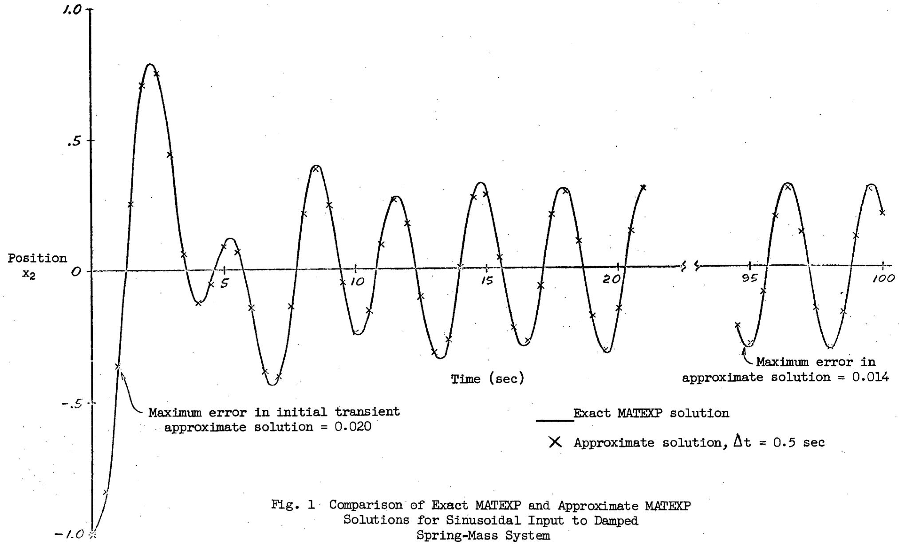
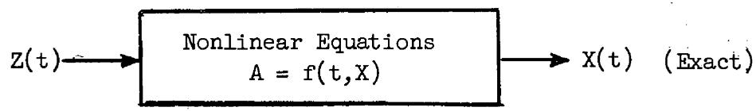
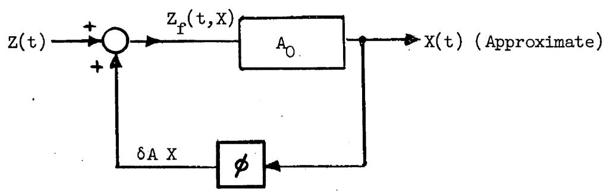
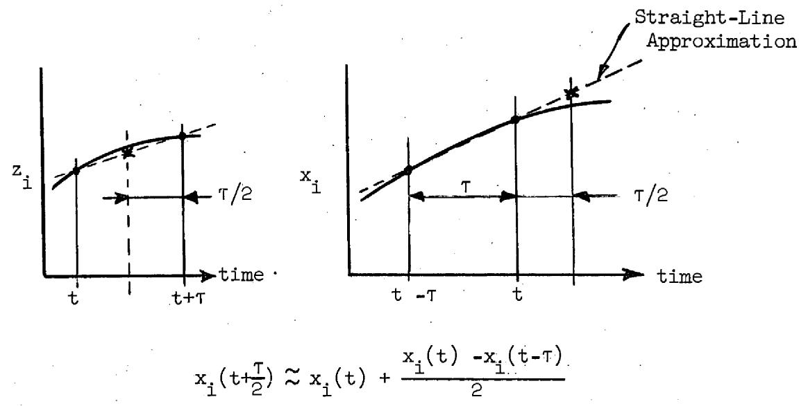
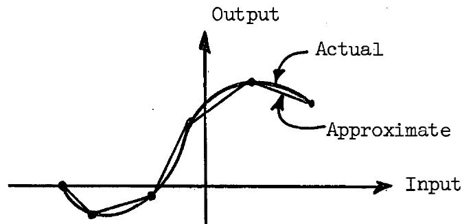
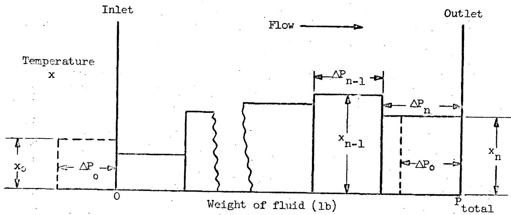
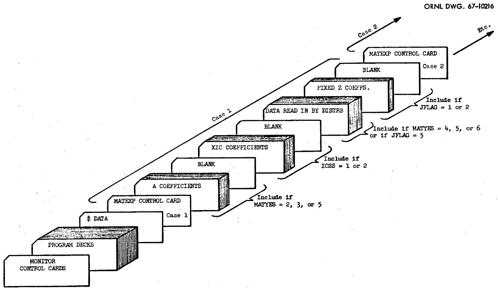
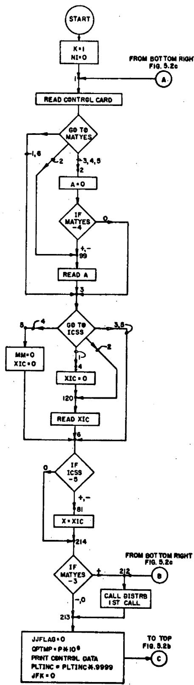
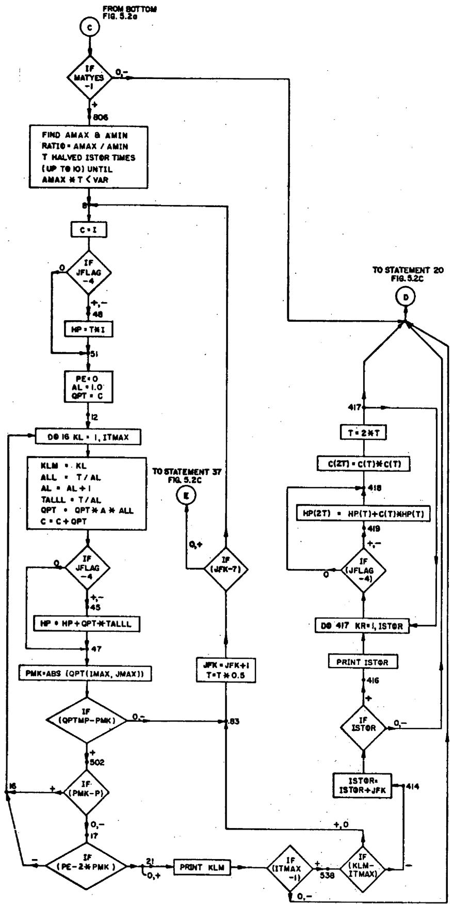
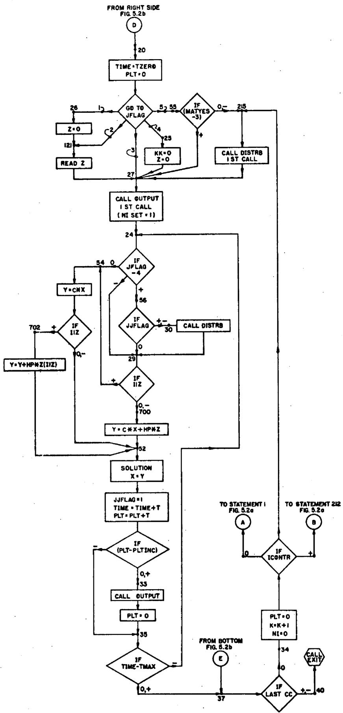

ORNL-TM-1933

COPY NO.133

DATE - August 30, 1967

"MATEXP," A GENERAL PURPOSE DIGITAL COMPUTER PROGRAM FOR

SOLVING ORDINARY DIFFERENTIAL EQUATIONS

BY THE MATRIX EXPONENTIAL METHOD

S.J.Ball R.K.Adams

# ABSTRACT

MATEXP, a general purpose digital computer program, was written for solving systems of ordinary differential equations by the matrix exponential method. MATEXP has several advantages over standard numerical integration routines. It gives virtually exact solutions to constant-coefficient homogeneous equations and to nonhomogeneous equations for which the forcing functions are constant during the computation interval. The speed at which the equations are solved and the accuracy of the solution are essentially unaffected either by the degree of cross-coupling of the equations or by whether or not the coefficient matrix is nonsingular or that its eigenvalues are distinct.

The method has been extended to nonlinear equations and equations with time-varying coefficients; this use is very effective for engineering systems analysis problems.

# LEGAL NOTICE

This report was prepared as an account of Government sponsored work. Neither the United States, nor the Commission, nor any person acting on behalf of the Commission:

A. Makes any warranty or representation, expressed or implied, with respect to the accuracy, completeness, or usefulness of the information contained in this report, or that the use of any information, apparatus, method, or process disclosed in this report may not infringe privately owned rights; or   
B. Assumes any liabilities with respect to the use of, or for damages resulting from the use of any information, apparatus, method, or process disclosed in this report.

As used in the above, "person acting on behalf of the Commission" includes any employee or contractor of the Commission, or employee of such contractor, to the extent that such employee or contractor of the Commission, or employee of such contractor prepares, disseminates, or provides access to, any information pursuant to his employment or contract with the Commission, or his employment with such contractor.

# CONTENTS

Page

1. Introduction 4   
2. Development of the Matrix Exponential Method 6

2.1 For Homogeneous Equations 6   
2.2 For Nonhomogeneous Equations 9   
2.3 Miscellaneous Features of the Matrix Exponential. 11

3. Description of MATEXP Program and Options 13

3.1 Basic Input Information 13   
3.2 Alternative Methods of Generating the Coefficient Matrix A. 15   
3.3 Alternative Methods of Generating the Forcing Function Vector Z. 16   
3.4 Methods for Solving Time-Varying-Parameter and Nonlinear Differential Equations.... 19   
3.5 Special Forcing Function Subroutines 22

4. Summary and Conclusions 27   
5. Appendix 28

5.1 Problems in the Evaluation of Exponential Functions 28   
5.2 Detailed Description of Programs 30   
5.3 Fortran Listing of Programs 43

# 1. INTRODUCTION

The matrix exponential method of solving differential equations was first described to the authors by Prof. Henry Paynter of MIT, who with his students $^{1-3}$ developed this method into a practical engineering tool. The basic technique was derived many years ago, $^{4}$ and even then it was an elegant method of obtaining exact solutions for a set of constant coefficient, homogeneous differential equations. The matrix exponential technique is ideally suited to digital computation and is very simple to implement, especially when compared with most quadrature methods.

Only two persons besides Prof. Paynter have done extensive work in this area. L. Pease<sup>5</sup> of Atomic Energy of Canada, Ltd., independently developed the method simultaneously with Paynter. The work of Paynter and Pease formed the basis for our implementation and, perhaps, refinement of the method, although the work of several researchers<sup>5-9</sup> established the rigor of the central technique.

$^{1}$ J. Suez, Automated Programming for Analog Computers, M.S. thesis, MIT, Aug. 1962.   
2H.C.H. Lee, Some Finite Difference Models for Linear and Nonlinear Control Studies Using Digital Computation, M.S. thesis, MIT, Aug. 1962.   
3H. M. Paynter and J. Suez, "Automatic Digital Setup and Scaling of Analog Computers," Trans. ISA, 3, 55-64 (Jan. 1964).   
4E. Artin, from O. Schreier and E. Sperner, Introduction to Modern Algebra and Matrix Theory (1935); Translated from German, Chelsea Publ. Co., N.Y., 1951, pp. 319-320.   
5. Pease, DEEMS, A Fortran Program for Solving the First-Degree Coupled Differential Equations by Expansion in Matrix Series, AECL-1898 (Oct. 1963, reprinted Feb. 1964).   
6. E. G. Keller, Mathematics of Modern Engineering, vol. II, Mathematical Engineering, Wiley, N.Y., 1942, pp. 234-246.   
7R. Bellman, Introduction to Matrix Analysis, McGraw-Hill, N.Y., 1960, pp. 165-173.

More recently, M. L. Liou of Bell Telephone Laboratories made important contributions to the matrix exponential method.<sup>10,11</sup>   
Because this method can give virtually exact solutions to systems of equations, it is of considerable interest to most engineers engaged in systems analysis, automatic control, and simulation. Also, systems engineers have long recognized that one essential difference between the analog computer and the digital computer is the awkward (at best) manner in which the digital machine can perform integration. The matrix exponential method, on the other hand, requires the digital computer to perform mainly matrix manipulations, which it can do in a very straightforward and efficient manner.   
The matrix exponential techniques have worked well for a large general class of simulation problems which constitute the bulk of the work in the systems analysis and automatic control fields. Indeed, by use of the methods described in Sect. 3.4, certain types of nonlinear equations can be solved as a natural extension of the basic matrix exponential method.   
8. F. R. Gantmakher, Applications of the Theory of Matrices, Interscience, N.Y., 1959, pp. 135-9 (translation of Russian original book: Theory of Matrices, 1954).   
9L. A. Pipes, Applied Mathematics for Engineers and Physicists, 2d ed., McGraw-Hill, N.Y., 1958, pp. 101-4.   
10 M. L. Liou, "A Novel Method of Evaluating Transient Responses," Proc. IEEE, 54 (1), 20-23 (Jan. 1966).   
11 F. F. Kuo and J. F. Kaiser, eds., System Analysis by Digital Computer, Wiley, N.Y., 1966, pp. 99-129.   
12"Virtually exact" means that the solution can be calculated to as great a precision as is desired, consistent with the precision obtainable with a given computer word length. In other words, the precision of the method is not necessarily limited by the convergence of any approximate quadrature (integration) formula, simply because quadrature is not performed.

The matrix exponential method has also been implemented and used extensively in Fourier analysis problems by simulating band-pass filters. Instead of calculating correlation functions (and subsequently their Fourier transforms) digital filtering can be used to obtain spectral density estimates and transfer functions from noise data. Calculations using filtering techniques are of comparable accuracy and typically more efficient than the conventional methods.

MATEXP has also been used in a special technique to calculate the sensitivities of the time response of a system to changes in parameter values. $^{15}$ A description of a subroutine which was written to implement time response sensitivity calculations is given in Sect. 5.2.3.

MATEXP has been developed and modified over a period of several years, and its present form reflects the considerable number of helpful suggestions we have had from many people. We are particularly grateful to Prof. H. M. Paynter for first introducing us to the method, and to Prof. T. W. Kerlin of the University of Tennessee, and J. V. Wilson of ORNL for their help and encouragement.

# 2. DEVELOPMENT OF THE MATRIX EXPONENTIAL METHOD

# 2.1 For Homogeneous Equations

Consider the first-order scalar, linear, homogeneous differential equation (with constant coefficient)

$$
\frac {\mathrm {d} x}{\mathrm {d} t} + a x = 0, \tag {1}
$$

whose solution is

$$
x = e ^ {- a t} x _ {0}. \tag {2}
$$

An interesting characteristic of the solution is that, for any time interval $\tau$ , the value of $x$ at the end of the interval is a product of an exponential term $\epsilon^{-a\tau}$ and the value of $x$ at the beginning of the interval, i.e.

$$
x _ {t + \tau} = \epsilon^ {- a \tau} x _ {t}. \tag {3}
$$

This will be referred to as the "incremental solution."

Now because a system of homogeneous linear equations of any order can always be broken up into a set of first-order equations, consider the following set of equations

$$
\begin{array}{l} \frac {d x _ {1}}{d t} = a _ {1 1} x _ {1} + a _ {1 2} x _ {2} + \dots a _ {1 n} x _ {n}, \\ \begin{array}{l} \frac {\mathrm {d} x _ {2}}{\mathrm {d} t} = a _ {2 1} x _ {1} + a _ {2 2} x _ {2} + \dots a _ {2 n} x _ {n}, \\ \frac {\mathrm {d} x _ {n}}{\mathrm {d} t} = a _ {n 1} x _ {1} + a _ {n 2} x _ {2} + \dots a _ {n n} x _ {n}. \end{array} \tag {4} \\ \end{array}
$$

This array can be expressed compactly in matrix form as a first-order, linear, homogeneous, matrix differential equation with constant coefficients, i.e.

$$
\frac {\mathrm {d} X}{\mathrm {d} t} = A X, \tag {5}
$$

where $X$ is the column vector of state variables $x_{i}$

$$
\mathrm {x} \equiv \left( \begin{array}{c} \mathrm {x} _ {1} \\ \mathrm {x} _ {2} \\ \vdots \\ \mathrm {x} _ {n} \end{array} \right)
$$

and A represents the coefficient matrix

$$
A \equiv \left( \begin{array}{c c c c} a _ {1 1} & a _ {1 2} & \dots \dots & a _ {1 n} \\ a _ {2 1} & a _ {2 2} & \dots \dots & a _ {2 n} \\ \vdots & & & \\ a _ {n 1} & a _ {n 2} & \dots \dots & a _ {n n} \end{array} \right)
$$

This matrix equation has the solution

$$
\mathrm {X} _ {\mathrm {t}} = \epsilon^ {\mathrm {A t}} \mathrm {X} _ {\mathrm {O}}. \tag {6}
$$

For a formal proof that Eq. (6) is the desired solution, the reader is referred to Bellman. However, the following simple proof is somewhat less formal. First, if $\frac{d^2X}{dt^2} = A\frac{dX}{dt}$ , then $\frac{d^2X}{dt^2} = A\frac{dX}{dt} = AAX = A^2X$ ; similarly, $\frac{d^3X}{dt^3} = A^3X$ , so that $\frac{d^mX}{dt^m} = A^mX$ . (7)

If $\mathbf{X}_t$ is expanded about zero in a Taylor's series,

$$
X _ {t} = X _ {0} + \frac {t}{1 !} \frac {d X}{d t} \left| \begin{array}{l l} & + \frac {t ^ {2}}{2 !} \frac {d ^ {2} X}{d t ^ {2}} \\ t = 0 & \end{array} \right| _ {t = 0} + \dots \left. \frac {t ^ {m}}{m !} \frac {d ^ {m} X}{d t ^ {m}} \right| _ {t = 0}
$$

With Eq. (7) substituted for the derivative,

$$
x _ {t} = \left(I + \frac {A t}{1 !} + \frac {A ^ {2} t ^ {2}}{2 !} + \dots \dots\right) x _ {0}
$$

or

$$
\mathrm {X} _ {\mathrm {t}} = \epsilon^ {\mathrm {A t}} \mathrm {X} _ {\mathrm {O}} \quad (\mathrm {Q}. \mathrm {E}. \mathrm {D}..) \tag {8}
$$

The "incremental solution" is

$$
X _ {t + \tau} = e ^ {A \tau} X _ {t}, \tag {9}
$$

where $\epsilon^{\mathrm{A}\tau}$ , the matrix exponential, is defined analogously to the scalar exponential as

$$
\epsilon^ {A \tau} = I + A \tau + \frac {(A \tau) ^ {2}}{2 !} + \frac {(A \tau) ^ {3}}{3 !} + \dots \frac {(A \tau) ^ {k}}{k !} \tag {10}
$$

in which I is the identity matrix

$$
I = \left( \begin{array}{c c c c c c} 1 & 0 & 0 & \dots \dots & 0 \\ 0 & 1 & 0 & \dots \dots & 0 \\ 0 & 0 & 1 & 0 & \dots & 0 \\ \cdot & & & & \\ \cdot & & & & \\ 0 & \dots \dots \dots . 0 & 1 \end{array} \right)
$$

# 2.2 For Nonhomogeneous Equations

The matrix equation representing a system of first-order, constant coefficient differential equations with nonzero forcing functions is the nonhomogeneous equation

$$
\frac {\mathrm {d} X}{\mathrm {d} t} = A X + Z, \tag {11}
$$

where $Z$ is the disturbance, or forcing function, vector.

A general incremental solution of the nonhomogeneous equation as derived by Liou is

$$
X _ {t + \tau} = \epsilon^ {A \tau} X _ {t} + \epsilon^ {A (t + \tau)} \int_ {t} ^ {t + \tau} \epsilon^ {- A \tau} Z _ {\tau} d \tau . \tag {12}
$$

An exact solution derived from Eq. (12) for the case where the forcing function $Z$ is constant over the interval $t$ to $t + \tau$ is

$$
X _ {t + \tau} = \epsilon^ {A \tau} X _ {t} + (\epsilon^ {A \tau} - I) A ^ {- 1} Z _ {t}. \tag {13}
$$

It is important to note that the inverse of A need not be calculated to evaluate Eq. (13) since

$$
\begin{array}{l} \left(\epsilon^ {A \tau} - I\right) A ^ {- 1} = \left[ \frac {I}{2 !} + A \tau + \frac {(A \tau) ^ {2}}{2 !} + \dots \frac {(A \tau) ^ {k}}{k !} - I \right] A ^ {- 1}, \\ = I \tau + \frac {A \tau^ {2}}{2 !} + \frac {A ^ {2} \tau^ {3}}{3 !} + \dots \frac {A ^ {k - 1} \tau^ {k}}{k !}, \\ \end{array}
$$

$$
\begin{array}{l} = \tau \left[ I + \frac {A \tau}{2 !} + \frac {(A \tau) ^ {2}}{3 !} + \dots \frac {(A \tau) ^ {k - 1}}{k !} \right], \\ = \tau \sum_ {k = 1} ^ {\infty} \frac {\left(A \tau\right) ^ {k - 1}}{k !}. \tag {14} \\ \end{array}
$$

Because this series is similar to that used to represent $\epsilon^{\mathsf{A}\tau}$ , the computer program can calculate the two required matrices concurrently, since the kth term of the $(\epsilon^{\mathsf{A}\tau} - \mathsf{I})\mathsf{A}^{-1}$ series equals the (k-1)th term of the $\epsilon^{\mathsf{A}\tau}$ series times $(\tau / \mathsf{k})$ . In the MATEXP program, the $\epsilon^{\mathsf{A}\tau}$ matrix is called the "C" matrix and the $(\epsilon^{\mathsf{A}\tau} - \mathsf{I})\mathsf{A}^{-1}$ matrix is called the "HP" matrix (in honor of H. Paynter).

At this point, two essential features of the matrix exponential method are emphasized:

1. The exponential matrices can be computed by the series approximation to nearly any desired precision (typically, 1 part in $10^6$ is specified for MATEXP calculations). Hence, for homogeneous equations and for nonhomogeneous equations in which the forcing functions remain constant over the computation time interval, the solutions are virtually exact solutions.

2. The solution vector can be updated successively by a time increment $\tau$ by two matrix multiplications:

$$
\begin{array}{l} X _ {\tau} = C X _ {0} + H P Z _ {0} \\ \begin{array}{c} \mathrm {X} _ {2 \tau} = \mathrm {C X} _ {\tau} + \mathrm {H P Z} _ {\tau} \\ \vdots \\ \mathrm {e t c} \end{array} \\ \end{array}
$$

If it is assumed that just one time increment value $\tau$ is required, the C and HP matrices need to be evaluated only once.

An exact solution to the set of nonhomogeneous differential equations can also be derived from Eq. (12) for the case where the forcing function $Z$ varies linearly within the computation interval $\tau$ . In terms of the matrix exponential series approximations, the

trapezoid forcing function incremental solution is

$$
\begin{array}{l} X _ {t + \tau} = \epsilon^ {A \tau} X _ {t} + \tau \sum_ {k = 1} ^ {\infty} \left(\frac {1}{k !} - \frac {1}{(k + 1) !}\right) (A \tau) ^ {k - 1} Z _ {t} \\ + \tau \sum_ {k = 1} ^ {\infty} \frac {(A \tau) ^ {k - 1}}{(k + 1) !} Z _ {t + \tau}. \tag {15} \\ \end{array}
$$

Liou<sup>11</sup> has also developed a recursive formula for accurate approximations of continuous forcing functions which uses a Simpson's rule approximation of the nonhomogeneous solution, Eq. (12), within the time interval $\tau$ :

$$
X _ {t + \tau} \approx \epsilon^ {A \tau} \left[ X _ {t} + \frac {\tau}{6} Z _ {t} \right] + \frac {2 \tau}{3} \epsilon^ {A \tau / 2} Z _ {t + \tau / 2} + \frac {\tau}{6} Z _ {t + \tau}. \tag {16}
$$

As with the case of the step-wise varying forcing functions, the matrices required for Eqs. (15) and (16) need to be evaluated just once at the start. These features are not presently included in the MATEXP code, but could readily be added as options.

# 2.3 Miscellaneous Features of the Matrix Exponential

Since the matrix exponential principle has been a part of the mathematical literature for many years, the matrix exponential has had at least two other names: the fundamental matrix, and the transition matrix. Besides the series approximation method, an analytical method is often used to calculate this matrix; however, the eigenvalues of $A$ and their eigenvectors must be calculated and the initial condition vector must be transformed by a matrix comprised of the eigenvectors. It is emphasized that the series method used in MATEXP does not require that the coefficient matrix be nonsingular (i.e., have a nonzero determinant) or that its eigenvalues be distinct (a case where the analytical solution has terms of the form $\mathsf{te}^{\mathsf{bt}}$ and cannot be expressed as the sum of exponentials). The latter condition, which occurs in problems where two time constants in a decay chain are equal, was one of

the problems that Pease encountered in reactor burnup calculations that prompted him to develop the matrix exponential method.<sup>5</sup>

Another feature noted by Pease (but not included in MATEXP) is that the average solution vector $\overline{\mathbf{X}}$ could be obtained directly from a matrix exponential type calculation.

From the mean value theorem,

$$
\overline {{X}} = \frac {1}{\tau} \int_ {0} ^ {\tau} X _ {t} d t,
$$

$\overline{\mathbf{X}}$ can be obtained by integrating the equation for $\mathbf{X}$ in terms of C and HP:

$$
\bar {X} = \frac {1}{\tau} \int_ {0} ^ {\tau} X _ {t} d t = \frac {1}{\tau} \int_ {0} ^ {\tau} \left[ C X _ {0} + (H P) Z _ {0} \right] d t. \tag {17}
$$

Term by term integration of the series approximations for C and HP gives

$$
\int_ {0} ^ {\tau} C d t = \tau \left[ I + \frac {A \tau}{2 !} + \frac {(A \tau) ^ {2}}{3 !} + \frac {(A \tau) ^ {3}}{4 !} + \dots \right] \equiv H P, \tag {18}
$$

and

$$
\int_ {0} ^ {\tau} H P d t = \tau^ {2} \left[ \frac {I}{2 !} + \frac {A \tau}{3 !} + \frac {(A \tau) ^ {2}}{4 !} + \dots \right]. \tag {19}
$$

The latter series, like the HP matrix calculation, could easily be made concurrent with the other matrix exponential calculations.

The accuracy of MATEXP solutions, both in absolute terms and compared with other methods, is difficult to estimate quantitatively for the general case. Even for those cases that are solved "exactly," the successive multiplications of the solution vector by the matrix exponential naturally tend to accumulate errors. However, with precise calculations of the C and HP matrices as recommended in the Appendix, Sect. 5.1, test cases have shown this error to be negligible for large systems (40 x 40), even after many thousands of updating calculations. Liou<sup>11</sup> has developed an alternative method of evaluating the C and HP matrices to a prescribed accuracy.

The nature of the matrix exponential method permits the use of

much larger computation time intervals $\tau$ than would be feasible for most numerical integration solutions. For constant-coefficient equations and a given $\tau$ , it would be safe to assume that MATEXP would be inherently more accurate. As is usually the case, however, it would be unwise to generalize about nonlinear equations. Nonlinear solutions are discussed further in Sect. 3.4.

Eq. (20) gives a rough estimate of MATEXP solution times on the IBM-7090 computer, assuming that a negligible time is spent in the peripheral subroutines:

$$
\text {S o l u t i o n} \left(\min  \right) \approx 3. 0 \times 1 0 ^ {6} (\mathrm {N E}) ^ {2} \mathrm {N T}, \tag {20}
$$

where NE is the number of equations, and NT is the number of computation time intervals. For example, a 59 x 59 system run for 1000 time steps took 10 min, and an 8 x 8 run for 10,000 steps took 1.5 min. The solution time factor will vary from about 2 x $10^{-6}$ to 7 x $10^{-6}$ , depending on the amount of extra subroutine computation and printout, and will be approximately halved for homogeneous equations.

The present "standard" version of the MATEXP program solves up to 60th-order equations and uses about 22,000 words of core storage. In a 32,000 word computer, the extra 10,000 words can be used for special programming or storage, or the order of the equation can be increased to about 80. Since, for larger problems, tape or other slower storage devices would be required to calculate the matrix exponential functions, the overall efficiency of the method would be reduced.

Two other interesting, though perhaps purely academic, features of the matrix exponential technique are that the solution time increment can be negative (allowing one to go backwards) and that the A matrix can contain complex coefficients.

# 3. DESCRIPTION OF MATEXP PROGRAM AND OPTIONS

# 3.1 Basic Input Information

The MATEXP program was written with the intent that it should be easy to use for a wide variety of differential equation problems.

Unfortunately, as a program becomes more general, i.e. the more options and special features the program has, it becomes more difficult to explain the program and to use it for any given problem. Consequently, any apparent awkwardness and complications in the following discussion are due to a desire to make it general, and any omissions are due to a desire to keep it simple.

The basic parts of the code are: the main program, MATEXP; the utility subroutine used for outputting, OUTPUT; and the subroutine for calculating forcing (or disturbance) functions, DISTRB. To solve linear, constant-coefficient differential equations that are homogeneous (i.e. have no forcing functions) or which have only fixed forcing functions, all the required data can be read in and no extra programming is necessary. For equations of the form

$$
\frac {\mathrm {d} X}{\mathrm {d} t} = A X + Z,
$$

the initial values of the X vector, the coefficient matrix A, and the (fixed) disturbance vector Z may be read in. Other information required for each run is the following:

1. number of equations,   
2. initial time (or other independent variable),   
3. computation time interval,   
4. final time,   
5. interval at which solution vector $X$ and disturbance vector $Z$ are to be printed.

Since many elements of the coefficient matrix $A$ are often zero, only the nonzero elements need to be read in. This makes it necessary to identify each coefficient with its row and column number. The nonzero values of the initial condition and fixed disturbance vectors, with their row numbers, are read in similarly.

Since successive runs might require no changes (or only a few) in input data from the previous run, options are provided so that only the altered data has to be read in.

An option is also available whereby the last value of the X vector from one run can be used as the starting value of the succeeding run.

This option can be used if changes in the computation or printing interval are required in the middle of a solution or if certain iteration or successive approximation schemes are being used.

A complete description of the inputs and options is given in the Appendix, Sect. 5.

# 3.2 Alternative Methods of Generating the Coefficient Matrix A

Although the most straightforward method of inputting the coefficient matrix is to read it in, very often it is advantageous to have some or all of the elements calculated from system parameter values. One option of MATEXP provides for this to be done by special programming on the first call of DISTRB. An alternative is to use an "algebra table" routine developed by Kerlin and Lucius.[16] This routine calculates the matrix elements from input parameter values without any special programming. The general expression used for calculating an element $a_{ij}$ in terms of parameters $P_k$ and their exponents $E_{k|l}$ is

$$
a _ {i j} = C _ {1} P _ {1} ^ {E _ {1 1}} P _ {2} ^ {E _ {2 1}} P _ {3} ^ {E _ {3 1}} \dots P _ {n} ^ {E _ {n 1}} + C _ {2} P _ {1} ^ {E _ {1 2}} P _ {2} ^ {E _ {2 2}} P _ {3} ^ {E _ {3 2}} \dots P _ {n} ^ {E _ {n 2}} + \dots
$$

or

$$
a _ {i j} = \sum_ {\ell = 1} ^ {m} c _ {\ell} \prod_ {k = 1} ^ {n} P ^ {E _ {k k}} \tag {21}
$$

A complete description of the program is given in reference 16.

Beside the fact that it is sometimes convenient to have the coefficient matrix calculated by the computer, in some cases computer computation is almost necessary to obtain accurate solutions. This was the case for one reactor dynamics calculation where the coefficients were first carefully calculated on a 20-in. slide rule, then by the machine. The difference in the steady-state solution for neutron

level after a reactivity insertion was approximately a factor of 2.

# 3.3 Alternative Methods of Generating the Forcing Function Vector Z

When variable forcing functions are needed, a special program must usually be written and included in DISTRB. Two special forcing function subroutines have been written to simplify the programming: DFG, for approximating arbitrary functions; and TRIG, for approximating variable transport lags. They are both described in Sect. 3.5.

For cases where the forcing function is a solution to an ordinary differential equation, this equation can simply be added to the system matrix, and an exact solution can be obtained. As an example, assume that a sinusoidal forcing function is used to excite a damped spring-mass system. The quadratic equation that describes the displacement of the mass with time is

$$
\frac {d ^ {2} y}{d t ^ {2}} + a \frac {d y}{d t} + b y = c \sin (\omega t + \phi), \tag {22}
$$

where $\omega$ is the frequency of the sinusoidal input (radians/time). To arrange the equation in terms of first-order derivatives, let

$$
x _ {1} \equiv \frac {d y}{d t}, \tag {23}
$$

$$
x _ {2} \equiv y. \tag {24}
$$

Solving for $\frac{d^2y}{dt^2}$ (or $\frac{dx_1}{dt}$ ), we obtain

$$
\frac {\mathrm {d} x _ {1}}{\mathrm {d} t} = - a x _ {1} - b x _ {2} + c \sin (\omega t + \phi), \tag {25}
$$

and

$$
\frac {\mathrm {d} \mathbf {x} _ {2}}{\mathrm {d} t} = \mathbf {x} _ {1}. \tag {26}
$$

The equation for a pure oscillator with frequency $\omega$ is

$$
\frac {d ^ {2} s}{d t ^ {2}} + \omega^ {2} s = 0. \tag {27}
$$

If we let $x_3 = \frac{ds}{dt}$ , and $x_4 = \omega s$ , then

$$
\frac {\mathrm {d} \mathbf {x} _ {3}}{\mathrm {d} t} = - \omega \mathbf {x} _ {4}, \tag {28}
$$

$$
\frac {d x _ {4}}{d t} = \omega x _ {3}. \tag {29}
$$

If the initial conditions of $x_3$ and $x_4$ are zero and -1, respectively, then

$$
x _ {3} (t) = \sin \omega t, \tag {30}
$$

$$
x _ {4} (t) = - \cos \omega t. \tag {31}
$$

Thus $\mathbf{c}\mathbf{x}_3$ could be substituted for $\mathbf{c} \sin (\omega t + \phi)$ in Eq.(25). The required initial conditions of velocity $\mathbf{x}_1(0)$ and displacement $\mathbf{x}_2(0)$ must also be specified.

The coefficient matrix for this example is

$$
A = \left( \begin{array}{c c c c} - a & - b & + c & 0 \\ + 1 & 0 & 0 & 0 \\ 0 & 0 & 0 & - \omega \\ 0 & 0 & + \omega & 0 \end{array} \right)
$$

If the sinusoidal input were introduced as a forcing function, it would appear as a stair-step approximation of a sine wave, and the accuracy of the solution would depend on the accuracy of this approximation. A comparison of the approximate and exact solutions for a specific example is shown in Fig. 1. In the approximate solution, a first-order extrapolation was used to approximate the average value of the forcing function over the time interval.

In this example, the system has a natural frequency of 1.0 radian/sec and a damping factor of 0.25, and the driving sinusoid has a frequency of 2.0 radians/sec. The computation interval of 0.5 sec for the approximate case gives about seven computations per cycle of the driving function. Figure 1 also shows the response after a long time where the excellent stability and accuracy of both



solutions can be seen. This type of calculation is, historically, very difficult to do with standard digital methods.[17]

# 3.4 Methods for Solving Time-Varying-Parameter and Nonlinear Differential Equations

It was shown in Sect. 2 that the MATEXP method can provide exact solutions to sets of constant-coefficient, homogeneous differential equations and to nonhomogeneous equations for which the forcing functions can be represented by stepwise-varying functions. Since forcing functions are usually smoothly varying, the accuracy of the solution would naturally depend on the accuracy of the stair-step approximations.

Likewise, in the case of time-varying-parameter, or nonlinear, equations, the variations in the coefficient matrix A can be approximated by stepwise variations. For a variable A matrix, however, the matrix exponentials (C and HP) would both have to be re-evaluated at each computation interval. Although this may still be an efficient method for low-order equations (~10 or less), it could be quite time consuming for larger problems.

A more efficient method of solution is to modify, or "fudge," the forcing function vector so that it compensates for the variation in coefficients while the A, C, and HP matrices remain constant. This is shown schematically in Fig. 2.



  
Fig. 2. Approximate Solution Using Fudged Forcing Functions.

Each component of the fudged forcing-function vector is calculated by adding all the coefficient perturbation quantities in the row. For example, assume one row of the matrix equation is

$$
\frac {\mathrm {d} x _ {1}}{\mathrm {d} t} = a _ {1 1} (t) x _ {1} + a _ {1 2} x _ {2} + a _ {1 3} (t) x _ {3} + z _ {1} (t),
$$

where $a_{11}, a_{13}$ , and $z_1$ are variables and $a_{12}$ is a constant.

Let $a_{11}(t) \equiv (a_{11})_0 + a_{11}'$ ,

and $a_{13}(t) = (a_{13})_0 + a_{13}^\prime .$

Then the equation can be rewritten

$$
\frac {\mathrm {d} \mathbf {x} _ {1}}{\mathrm {d} t} = \left(a _ {1 1}\right) _ {0} \mathbf {x} _ {1} + a _ {1 2} \mathbf {x} _ {2} + \left(a _ {1 3}\right) _ {0} \mathbf {x} _ {3} + \underbrace {z _ {1} (t) + a _ {1 1} ^ {\prime} x _ {1} + a _ {1 3} ^ {\prime} x _ {3}} _ {\equiv z _ {f} (t, x)}
$$

Again, the forcing function $z_{f}$ would actually be smoothly varying, but in the MATEXP difference equations, it is approximated by a stair-step function.

For the case where the coefficients and/or the forcing functions are known functions of time, much greater accuracy (for a given computation interval $\tau$ ) results from using approximate mean values, rather than initial values, of the functions in the computation interval. First-order approximations of the mean values can be obtained by evaluating the time-varying forcing functions and matrix elements at $(t + \tau/2)$ instead of at (t). First-order extrapolations of the mean values of the solution vector $X$ should also be used where coefficients are functions of $X$ , as shown in Fig. 3.

  
Fig. 3. First-Order Extrapolation of Mean Values of $z$ and $x$ at $(t + \frac{T}{2})$ .

The use of an auxiliary subroutine VARCO greatly simplifies the programming required to use first-order extrapolation calculations to find approximate mean values of the forcing function. VARCO is described in detail in Sect. 5.2.

The only way of guaranteeing that the solution is accurate is to reduce the computation interval $\tau$ until further reductions make no significant difference in the solution. A simple, intuitive estimation

of the accuracy, however, may be obtained by noting the maximum amount of change in the solution and coefficient values within a computation interval. If these changes are only a few percent of the values of the functions at the start of the interval, then the first-order approximations will probably give very accurate answers. The true accuracy of the representation of a nonlinearity should also be considered when trying to "squeeze" too much accuracy out of a solution.

The use of fudged forcing functions for the solution of nonlinear differential equations is very effective when relatively few of the matrix coefficients are variable. In this case one might consider the linear portion of the system of equations as being solved by an extremely accurate analog computer, while the nonlinear portion is simulated by a not-quite-so-accurate computer. If most of the matrix coefficients are variable, then the more conventional numerical solution methods might be more practical than MATEXP.

More detailed discussions of the theory and use of fudged forcing functions have been found disguised in sophisticated mathematical treatises by Wolf<sup>18</sup> and Frazer et al.<sup>19</sup>

# 3.5 Special Forcing Function Subroutines

Since special programming is required in the DISTRB subroutine to generate variable forcing functions for the differential equations, two general purpose subroutines were written to facilitate this programming for some problems.

# 3.5.1 Arbitrary Function Generation - DFG

The arbitrary function generation subroutine DFG provides a means of generating approximations of single-valued functions of one variable where the arbitrary function curve is represented by a

series of linear segments (Fig. 4). The principle is identical to that of the diode function generator (hence DFG) used in analog computation.

  
Fig. 4. Subroutine DFG Representation of an Arbitrary Function of One Variable.

DFG in its standard form arbitrarily allows for up to 8 functions with up to 32 points (or 31 line segments) per function. Inputs required are the ordinate and abscissa values of the line-segment end points. If more functions or finer approximations are required, the dimensions could be changed easily. More details on the program and a Fortran listing are given in the Appendix, Sect. 5.

# 3.5.2 Variable Transport Lag Generation - TRLG

A transport lag (also known as a pure time delay, or dead time) actually represents a distributed parameter system; hence, its representation in a lumped-parameter solution will be only approximate. The output $z$ from a pure delay device with an input $x$ and a fixed delay time $\tau$ is

$$
z (t) = x (t - \tau).
$$

If $\tau$ is variable, then the relationship between $z$ and $x$ is a function of the time history of $\tau$ .

The variable time-delay problem is best illustrated by fluid flow in a pipe where the inlet temperature and flow rate are both variable. The assumptions required for a pure delay are:

1. there is no heat transfer to the pipe;   
2. the fluid density is constant;   
3. plug flow exists, i.e., there is no mixing of the fluid in the direction of flow.

The technique used in TRLG is to sample the inlet temperature $x$ and the flow rate $W$ at each computation time interval $T$ , thereby keeping an inventory on each slug of fluid in the pipe. The total weight of fluid in the pipe is computed from the initial transport time $\tau_{i}$ and the flow rate $W_{i}$ :

$$
P _ {t o t a l} (l b) = W _ {i} (l b / \sec) x \tau_ {i} (\sec).
$$

Similarly, the weight of fluid that enters during each time interval $T$ is $W(t) \times T$ . Since the fluid density is constant, the weight of fluid that leaves during that interval $T$ is equal to the weight of the inlet slug.

As an example, assume that the temperature profile in the pipe is as shown in Fig. 5 and the slug at the inlet of $\Delta P_0$ lb is about to enter. The slug at the outlet is $\Delta P_n$ at a temperature $x_n$ , where $\Delta P_n > \Delta P_0$ . When $\Delta P_0$ enters, the outlet slug temperature will be equal to $x_n$ , and the whole profile will be shifted to the right by $\Delta P_0$ lb. The weight of the new slug just upstream of the exit is then $(\Delta P_n - \Delta P_0)$ .

If $\Delta P_0$ had been greater than $\Delta P_n$ , the outlet slug would have taken as much of the upstream inventory (i.e., $\Delta P_{n-1}$ , $\Delta P_{n-2}$ , etc.) as required (up to 300 samples), and the outlet slug temperature $z$ would be computed as the weighted average of the slug temperatures. For example

if

$$
\Delta P _ {0} = \Delta P _ {n} + 0. 5 \Delta P _ {n - 1},
$$

then

$$
z = \frac {\Delta P _ {n} x _ {n} + 0 . 5 \Delta P _ {n - 1} x _ {n - 1}}{\Delta P _ {n} + 0 . 5 \Delta P _ {n - 1}}.
$$

If the maximum delay time (minimum flow rate) would use up too many storage locations, the sampling would be done every other (or every third, etc.) computation interval. With a variable lag, a minimum expected flow rate must be specified to calculate how often to sample.

The input variables supplied by the calling program for each call of TRLG are XT (e.g., fluid temperatures) and the flow rates W (in

  
Fig. 5. Temperature Profile of Fluid in Pipe.

terms of mass/time, unity for full flow, or some percentage of full scale). The lagged functions ZT are returned by TRLG.

On the first call of TRIG, the flag NI should be zero, and the following input data are read in:

NLAGS = number of functions used,

TI = initial values of transport lag time for each function,

WMIN = minimum expected values of flow W for each function.

The initial values of fluid temperatures in the pipes are set equal to the initial values of inlet temperatures. If specific initial temperature profiles are required, they can be read in with only a minor change being required in the program. The standard version of TRLG provides for up to six lags with up to 300 samples per lag. If more or fewer lags or points are desired, the statements labeled DIMENS in the comment field can be changed accordingly.

More details on TRLG and a Fortran listing are in the Appendix, Sect. 5.

There are two other techniques that are commonly used to represent transport delays:

1. A series of n first-order lags, or "well-stirred tanks," with time constants $\tau / n$ ;   
2. A Padé approximation<sup>20</sup> which uses several terms of a series approximation of $\epsilon^{-\tau S}$ (the Laplacian representation of a pure delay), where $S$ is the Laplacian argument.

Both the series lag and Padé methods have accuracy and flexibility limitations that would be prohibitive for certain problems.[21] Since the digital computer is quite proficient at sampling data, the sampled data approximation as used in the TRLG subroutine is recommended as the most efficient and accurate method.

# 4. SUMMARY AND CONCLUSIONS

The matrix exponential method has a number of advantages over the more common integration schemes for a large and significant class of ordinary differential equation problems. The speed and accuracy of MATEXP have the potential of reducing computing costs for large problems and of making more "real-time" computations feasible for on-line digital computation, control, and optimization calculations.

The MATEXP program has been developed over a period of several years, mainly through use in simulation problems. There are, however, at least three other areas in which the matrix exponential method might be effective:

1. Automatic parameter estimation - where the parameters of the model differential equations are adjusted to optimize the agreement between theoretical and experimental response curves. A computer program to implement this technique is currently under development;   
2. Solution of nonlinear algebraic equations by the method of steepest ascents; and   
3. Boundary value problems.

Other refinements that have been used with the MATEXP code include the addition of an automatic plotting subroutine and a more efficient output routine which prints only specified variables. Forcing-function subroutines to solve implicit equations and generate functions of two variables are planned as additions to the "standard" package.

# 5. APPENDIX

# 5.1 Problems in the Evaluation of Exponential Functions

The Taylor series approximation for a scalar exponential function is

$$
\epsilon^ {y} \approx \sum_ {k = 0} ^ {n} \frac {(y) ^ {k}}{k !} = 1 + y + \frac {y ^ {2}}{2 !} + \frac {y ^ {3}}{3 !} + \dots + \frac {y ^ {n}}{n !}. \tag {5.1}
$$

This approximation also holds true when the argument $y$ is a matrix; hence, matrix exponential functions are amenable to digital computer calculation, since raising a matrix to a power is a straightforward operation.

It is important to note that the HP matrix calculation

$$
\mathrm {H P} \equiv \left[ \exp (\mathrm {A} \pi) - \mathrm {I} \right] \mathrm {A} ^ {- 1} \tag {5.2}
$$

does not require inversion of the $A$ matrix, and can be calculated directly from the terms of the $C$ matrix approximation as shown in Sect. 2.2.

There are several numerical problems associated with the matrix exponential calculations. The approximations will be valid only if

1. the series will converge,   
2. the numerical computation does not lose significance due to overflow, roundoff, or truncation errors.

Since the evaluation of exp (Aτ) requires calculating powers of the matrix Aτ, there is a practical limitation on the maximum value of the largest element in the Aτ matrix, and experience has shown that it is most efficient to limit this value to about 1.0. Should the desired τ make max i,j |Aijτ| > 1.0, then τ is halved up to 10 times for the exponential calculations: The original arguments are restored by applying the following equations as many times as required:

$$
\begin{array}{l} C (\tau) \equiv \exp (A \tau) \\ = \exp \left(A _ {2} ^ {\tau}\right) \exp \left(A _ {2} ^ {\tau}\right) (5.3) \\ \mathrm {H P} (\tau) \equiv \left[ \exp (A \tau) - I \right] A ^ {- 1} \\ = \left\{\left[ \exp \left(A _ {\frac {1}{2}} ^ {\tau}\right) - I \right] A ^ {- 1} \right\} \left[ I + \exp \left(A _ {\frac {1}{2}} ^ {\tau}\right) \right] (5.4) \\ \end{array}
$$

There are also provisions in the code to keep track of the roundoff errors in the exponential calculations. The maximum values of the largest elements in the QPT matrices $\frac{(A\tau)^k}{k!}$ are monitored to make sure that they are not larger than the specified precision "P" times $10^8$ (for an eight-decimal computer). When the QPT terms are summed, the accuracy of the summation will be approximately P, since the summation is carried out until the largest element in QPT < P. If a maximum value of a QPT element does exceed P x $10^8$ , then $\tau$ is halved, the exponential is calculated, and the original $\tau$ is restored as before.

Users are cautioned that roundoff errors may become significant if restoration of the original $\tau$ requires very many applications of the argument doubling Eqs. 5.3 and 5.4. We know of no general rules for estimating this limitation; however, checks made on sample problems indicate a "safe" boundary probably exists at a precision $P = 10^{-6}$ and T halved 10 times. With a larger P and more halvings, one should at least be cautious about the results.

The fidelity of the results are also questionable whenever the ratio of the largest (absolute) matrix element to the smallest (nonzero) element is $\geq 10^8$ . This might be a manifestation of a very wide range of time constants in a dynamics problem. With a range of $\sim 10^8$ , clearly the faster time constants could be considered "instantaneous" with respect to the slower ones, and the equations could probably be rewritten to get around this problem.

# 5.2 Detailed Description of Programs

Hopefully the information given in this section is sufficient to permit the reader to use and modify MATEXP. Since we have tried going through this typically excruciating experience with programs from others, we have tried making things as clear as possible. In particular, we have used many comment cards in the program listings as a running explanation of what we are doing. Either author would be glad to try to help out any potential MATEXP user, and would be happy to receive any suggestions for improving the program.

# 5.2.1 MATEXP Main Program

The MATEXP program consists of the main program and two subroutines. OUTPUT and DISTRB, plus any other subroutines called by DISTRB. Even if DISTRB is not used, a dummy must be included.

For each case run on MATEXP, the data will include (if appropriate):

l. MATEXP Control Card,   
2. Coefficient matrix (A),   
3. Initial Condition Vector (XIC),   
4. Any data read in by subroutine DISTRB,   
5. Fixed forcing function vector (Z).

Input Data Formats - MATEXP Main Program

1. Control Card

<table><tr><td>Column</td><td>1-2</td><td></td><td>6-7</td><td></td><td>11-20</td><td>21-30</td><td>31-40</td><td>41-50</td><td>51-60</td><td>61-62</td></tr><tr><td>Format</td><td>I2</td><td>3X</td><td>I2</td><td>3X</td><td>F10.0</td><td>F10.0</td><td>F10.0</td><td>F10.0</td><td>F10.0</td><td>I2</td></tr><tr><td>Input</td><td>NE</td><td></td><td>LL</td><td></td><td>P</td><td>TZERO</td><td>T</td><td>TMAX</td><td>PLTINC</td><td>MATYES</td></tr></table>

Control Card - cont'd

<table><tr><td>Column</td><td>63-64</td><td>65-66</td><td>67-69</td><td>70</td><td>71-72</td><td>73-74</td><td>75-80</td></tr><tr><td>Format</td><td>I2</td><td>I2</td><td>I3</td><td>I1</td><td>I2</td><td>I2</td><td>F6.0</td></tr><tr><td>Input</td><td>ICSS</td><td>JFLAG</td><td>ITMAX</td><td>LASTCC</td><td>I1Z</td><td>ICONTR</td><td>VAR</td></tr></table>

NE = number of equations
LL = coefficient matrix tag number
P = precision of C and HP - recommend $10^{-6}$ or less
TZERO = zero time
T = computation time interval
TMAX = maximum time
PLTINC = printing time interval
MATYES = coefficient matrix (A) control flag
1 = use previous A and T
2 = read new coefficients to alter A
3 = read entire new A (nonzero values)
4 = DISTRB to calculate entire new A
5 = read some, DISTRB to calculate others
6 = DISTRB to alter some A elements
ICSS = initial condition vector (XTC) flag
1 = read in all new nonzero values
2 = read new values to alter previous vector
3 = use previous vector
4 = vector = 0
5 = use last value of X vector from previous run
JFLAG = forcing function (Z) flag
1 thru 4 = same as for ICSS for constant Z
5 = call DISTRB at each time step for variable Z
ITMAX = maximum number of terms in series approximation of exp (AT)
LASTCC = nonzero for last case
ILZ = row of Z if only one nonzero, otherwise = 0
ICONTR - for internal control options
0 = read new control card for next case
1 = go to 212 call DISTRB for new A or T
-1 = go to 215 call DISTRB for new initial conditions
VAR = maximum allowable value of largest coefficient matrix element * T (Recommend VAR = 1.0)

2. Coefficient Matrix A Format 4(213, El2.3) - Include if MATYES = 2, 3, or 5.

<table><tr><td>Column</td><td>1-3</td><td>4-6</td><td>7-18</td><td rowspan="3">Repeat, 4 per card</td></tr><tr><td>Format</td><td>I3</td><td>I3</td><td>E 12.3</td></tr><tr><td>Input</td><td>Row No.</td><td>Col. No.</td><td>COEFFICIENT</td></tr></table>

Notes: 1. All row and column number entries on a card must be nonzero.

2. Insert blank card after all coefficient matrix data is read in.

3. Data can be entered in floating point (F) format with decimal point.

3. Initial Condition Vector XIC Format (I2, 5(I3, E12.3)) - Include if ICSS = 1 or 2

<table><tr><td>Column</td><td>1-2</td><td>3-5</td><td>6-17</td><td rowspan="3">Repeat Cols. 3-17, 5 per card</td></tr><tr><td>Format</td><td>I2</td><td>I3</td><td>E 12.3</td></tr><tr><td>Input</td><td>MM</td><td>Row No.</td><td>I.C. Value</td></tr></table>

Notes: 1. All row number entries on a card must be nonzero.

2. Insert blank card after all XIC data is read in.

3. Data can be entered in F format.

4. Disturbance Vector Z Format (I2, 5(13, E12.3)) - Include if JFLAG = 1 or 2

<table><tr><td>Column</td><td>1-2</td><td>3-5</td><td>6-17</td><td rowspan="3">Repeat Cols. 3-17, 5 per card</td></tr><tr><td>Format</td><td>I2</td><td>I3</td><td>E12.3</td></tr><tr><td>Input</td><td>KK</td><td>Row No.</td><td>Z Value</td></tr></table>

Note: See notes under 3.

Two figures are included to aid in understanding the MATEXP program. Figure 5.1 summarizes the data arrangement, and Fig. 5.2 is a flow diagram of the main program. The symbols used in MATEXP are also listed and identified.

  
Fig. 5.1 MATEXP Data Arrangement

ORNL DWG. 67-10217

  
Fig. 5.2a. MATEXP Block Diagram - Read or Compute A Matrix and XIC Vector.

ORNL DWG. 67-10218

  
Fig. 5.2b. MATEXP Block Diagram - Compute C and HP Matrices.

  
Fig. 5.2c. MATEXP Block Diagram - Compute Solution Vector.

# MATEXP MAIN PROGRAM SYMBOL KEY

1. Control Card Inputs

See input data format list.

2. Input Data

A(NE,NE) = coefficient matrix

MM = initial condition vector tag number

XIC (NE) = initial condition vector

KK = disturbance vector tag number

Z(NE) = disturbance vector

3. Internal Variables

The following variables are listed in alphabetical order.

$\mathrm{ADT} = \mathrm{AMAX} * \mathrm{T}$

AL = Floating point KLM for ALL calc, KLM+1 for TALLL

ALL = T/AL with AL = KLM

AMAX = Maximum (absolute) value of element in A matrix

AMIN = Minimum (absolute) value of nonzero element in A matrix

C(NE,NE) = Coefficient matrix exponential

HP(NE,NE) = Disturbance function matrix exponential

IMAX = Row location of AMAX

IMIN = Row location of AMIN

ISTOR = Number of times matrix exponential argument T is

halved so that AMAX $\star$ T<VAR; later ISTOR = ISTOR + JFK

JFK = Number of times T is halved in order for matrix exponential

calculation precision to be P or better

JJFLAG = Flag to prevent double call of DISTRB during initial

time step calculation

JMAX = Column location of AMAX

JMIN = Column location of AMIN

K = Case number

KLM = Number of terms in series approximations of exponentials

NI = Printing flag: 0 on initial call of OUTPUT causing printout

of A, C, and HP matrices. OUTPUT sets NI = 1 on first call.

PE = Maximum element in. $(\underline{\mathbf{n}} - 1)$ th QPT term

PMK = Maximum element in nth QPT term

QPT(NE,NE) = Term in series approximation of C matrix

QPTMP = Maximum permissible value of element in QPT matrix.

RATIO = AMAX/AMIN. If RATIO less than $10^8$ (for eight decimal machine) there may be significant problems in calculation of C and HP.

TALL = T/AL with AL = KLM +1

TQP(NE) = Temporary storage for QPT terms

X(NE) = Solution vector

Y(NE) = Temporary storage for X

# 5.2.2 Subroutine OUTPUT

The first time MATEXP calls OUTPUT, the coefficient matrix (A) and the exponential matrices C and HP are printed out, along with the initial solution (X) and disturbance (Z) vectors. OUTPUT also sets the first call flag (NI) to 1, and on subsequent calls only the X and Z vectors are printed. A possible means of saving computing time at the expense of storage would be to store X (and Z) values in arrays for a large number of time intervals, then print the arrays out in blocks. Additional savings could be achieved by printing only selected variables.

# 5.2.3 Subroutine DISTRB

Subroutine DISTRB may be called by MATEXP either to compute matrix coefficients (A) on the first call (i.e. when flag $\mathsf{NI} = 0$ ) and/or compute variable forcing-function vectors (Z).

Other special purpose subroutines, such as VARCO, DFG, TRLG, and any others the user may want to supply, are usually called by DISTRB.

Another special purpose use of DISTRB is to compute inputs for successive MATEXP cases without requiring a control card for each case. This is done by means of the flag ICONTR (Cols. 73-4 on the control card). After a case is run, the first call flag NI is reset to 0, and case number K is increased by 1; then if ICONTR is positive, DISTRB will be called at statement 212, where a new

coefficient matrix A or time interval T may be calculated. If ICONTR is negative, DISTRB is called at statement 215, permitting new initial conditions to be used.

The program listing for DISTRB that was used in calculating the sinusoidal forcing function for the example in Sect. 3.3 is given in Sect. 5.3.

Another version of DISTRB is used to calculate the sensitivity of a system's time response to changes in the system's coefficient matrix elements

$$
\frac {\partial x}{\partial a _ {i j}}.
$$

DISTRB controls the solution of the system equations and stores those values of the solution vector which are to be used subsequently as forcing functions for the sensitivity calculations. To compute the sensitivity to $a_{ij}$ , the $j^{th}$ row of the system solution vector is stored and is later used as a forcing function to the $i^{th}$ row of the same system equations.[15]

After solving the system equations and storing the required elements of the response vector, the arithmetic average values of the X's in each time interval are calculated and stored (XT).

During each sensitivity run, DISTRB feeds the forcing function into the system equations, and the resulting printouts of the X vectors are the desired sensitivities.

For the sample program shown in the Fortran listing, Sect. 5.3, the system is forced by a unit step input in row I1Z (specified on the control card). Other control card inputs are:

$$
\begin{array}{l} J F L A G = 5 \\ I C O N T R = 1 \\ \end{array}
$$

Special input data read in by DISTRB are the row (IS) and column (JS) numbers of the matrix elements for which sensitivities are to be calculated, the number of time points (NTS), and the number of sensitivity runs (NSENS), as follows:

<table><tr><td colspan="2">1</td><td colspan="4">11</td><td colspan="2">51</td><td></td></tr><tr><td>IS(1)</td><td>JS(1)</td><td>(4X)</td><td>IS(2)</td><td>JS(2)</td><td>(4X)</td><td>...thru JS(5)</td><td>NTI</td><td>NSENS</td></tr><tr><td>I3</td><td>I3</td><td>I3</td><td>I3</td><td></td><td></td><td></td><td>I3</td><td>I3</td></tr></table>

# 5.2.4 Subroutine VARCO

The VARCO (VARIABLE Coefficient) subroutine can be used with DISTRB to simplify the programming of problems with variable coefficient matrix elements. In general, these elements are functions of both time and the values of the solution vector X. VARCO is designed to be called by DISTRB at the start of each computation interval and to return the mean values of time (TX), and X, (XTR), for that interval. The mean values of X are predicted by a first order extrapolation scheme, as shown in Fig. 3. VARCO will also cause the initial timestep to be repeated, using the first try at calculating $\mathrm{X(T)}$ to estimate the mean value at $\frac{\mathrm{T}}{2}$ . DISTRB can then calculate the coefficient values using TX and XTR. Use of this first-order extrapolation scheme results in significant improvement in accuracy over using no extrapolation.

# 5.2.5 Subroutine DFG

DFG uses the principle of the analog computer's Diode Function Generator (see Fig. 4) and uses linear interpolation to approximate arbitrary, single-valued functions of a variable. Data for DFG is read in the first time it is called by DISTRB (i.e., when $\mathrm{NI} = 0$ ). The standard program provides for up to 8 functions with up to 32 coordinates each.

On each successive call, DFG returns the functions ZD for varying inputs XD. If an input xd(I) goes outside the specified limits, the output is a straight-line approximation of ZD(I) based on the slope of the function at the boundary, and an error message "DFG(I) RANGE EXCEEDS" is printed.

The inputs read in by DFG are:

NDFGS Number of functions used

NPTS(8) Number of points in approximation for each function

XP(32,8) Independent variable points

ZP(32,8) Dependent variable points

The input format is as follows:

Card No. 1 (I2, 8X, 8I3)

<table><tr><td>Column</td><td>1-2</td><td></td><td>11-13</td><td rowspan="3">Repeat Cols, 11-13
7 more times for
NPTS(2) to (7)</td></tr><tr><td>Format</td><td>I2</td><td>8X</td><td>I3</td></tr><tr><td>Variable</td><td>NDFGS</td><td></td><td>NPTS(1)</td></tr></table>

Card No. 2, 3...etc. (8E10.3)

<table><tr><td>Column</td><td>1-10</td><td>11-20</td><td>21-30</td><td>31-40</td><td rowspan="3">Repeat as required for DFG(1); Max. 8 numbers per card</td></tr><tr><td>Format</td><td>E10.3</td><td>E10.3</td><td>E10.3</td><td>E10.3</td></tr><tr><td>Variable</td><td>XP(1,1)</td><td>ZP(1,1)</td><td>XP(2,1)</td><td>ZP(2,1)</td></tr></table>

NOTES: 1. When all data for DFG(1) has been entered, start DFG(2) data on new card; etc.   
2. Enter independent variable points XP in order, progressing from most negative to most positive values.   
3. F Format entries (with decimal point) may be used.

# 5.2.6 Subroutine TRLG

TRLG (Transport LaG) is described in some detail in Sect. 3.5. The input functions XT (e.g. fluid temperature) and the mass flowrates W (in terms of either mass/time, unity for full flow, or some percentage of full scale) are supplied by the calling program DISTRB, and the lagged functions ZT are returned by TRLG. On the first call of TRLG (when $\mathrm{NI} = 0$ ), the following input data is read in:

NLAGS Number of functions used

TI(6) Initial value of transport lag time for each function

WMIN(6) Minimum expected value of mass flow W for each function

The program is set up assuming that subroutine VARCO is also called by DISTRB. VARCO has a restart feature which repeats the initial time step calculation; thus the TRLG functions will not be updated on the second call. If VARCO is not used, this second call

omission may be deleted by removing statement 33 in the TRLG program. The input format for TRLG is:

Card No.1 (I2)   

<table><tr><td>Column</td><td>1-2</td></tr><tr><td>Format</td><td>I2</td></tr><tr><td>Variable</td><td>NLAGS</td></tr></table>

Card No. 2 (6E10.3)   

<table><tr><td>Column</td><td>1-10</td><td rowspan="3">Repeat 5 more times for TI(2) - (6)</td></tr><tr><td>Format</td><td>E10.3</td></tr><tr><td>Variable</td><td>TI(1)</td></tr></table>

Card No. 3 (6E10.3)   

<table><tr><td>Column</td><td>1-10</td><td rowspan="3">Repeat 5 more times for WMIN(2) - (6)</td></tr><tr><td>Format</td><td>E10.3</td></tr><tr><td>Variable</td><td>WMIN(1)</td></tr></table>

# 5.3 FORTRAN LISTING OF PROGRAMS

$IBFTC MAIN DECK

PROGRAM MATEXP FOR THE 7090 - FORTRAN 4

THIS PROGRAM CALCULATES THE SOLUTION OF A MATRIX OF FIRST

ORDER, SIMULTANEOUS DIFFERENTIAL EQUATIONS w/ CONSTANT COEFFICIENTS

OF THE FORM DX/DT # AX + Z.

THE METHOD IS PAYNTER-S MATRIX EXPONENTIAL METHOD

THE SOLUTION IS GIVEN FOR INCREMENTS OF THE INDEPENDENT

VARIABLE (T) FROM TZERO THROUGH TMAX

COMPUTES MATRICES C # EXP(A*T) AND

HP # (C-I) \*A INVERSE

SOLUTION X(N*T) # C*X((N-1)*T)+HP*Z((N-1)*T)

SERIES CALCULATION OF C AND HP MONITORED TO

ASSURE SPECIFIED SIGNIFICANCE.

IF T IS REDUCED FOR C AND HP CALCS.

ORIGINAL ARGUMENTS ARE RESTORED BY -

C(2*T) #C(T)*C(T)

HP（2\*T）#HP（T）+C（T）\*HP（T）

OUTPUT FROM THE PROGRAM IS PRINTED AT INTERVALS PLTINC.

THE PROGRAM USES SUBROUTINES DISTRB AND OUTPUT

INPUT FOR THE PROGRAM CONSISTS OF

ONE CONTROL CARD

THE COEFFICIENT MATRIX A (UP TO 60 x 60)

THE INITIAL CONDITION VECTOR X

A FIXED DISTURBANCE VECTOR Z

A VARYING Z CAN BE GENERATED BY DISTRB

VARIABLE COEFFICIENT EQUATIONS MAY BE SOLVED BY APPROPRIATE

FUDGING OF THE DISTURBANCE FUNCTION SUBROUTINE.

CONTROL CARD INPUT INFORMATION

NE#NO. OF EQUATIONS (I2)

LL#COEFF. MATRIX TAG NO. (I2)

P#PRECISION OF C AND HP (FIO·O) - RECOMMEND I·OE-6 OR LESS

TZERO#ZERO TIME (FIO.0)

T#COMPUTATION TIME INTERVAL (F10.0)

TMAX#MAXIMUM TIME (FIO·O)

PLTINC#PRINTING TIME INTERVAL (FIO·0)

MATYESCOEFF.MATRIX（A）CONTROLFLAG（I2）

I#USE PREVIOUS A AND T

2READ NEW COEFF.S TO ALTER A

3#READ ENTIRE NEW A (NON-ZERO VALUES)

4#DISTRB TO CALC. ENTIRE NEW A

5READ SOME, DISTRB TO CALC. OTHERS

6#DISTRB TO ALTER SOME A ELEMENTS

ICSS# INITIAL CONDITION VECTOR (XIC) FLAG (I2)

I#READ IN ALL NEW NON-ZERO VALUES

2#READ NEW VALUES TO ALTER PREVIOUS VECTOR

3#USE PREVIOUS VECTOR

4#VECTOR#0

DIM

```txt
5#USE LAST VALUE OF X VECTOR FROM PREVIOUS RUN
JFLAG#FORCING FUNCTION (Z) FLAG (I2)
I THRU 4#SAME AS FOR ICSS FOR CONSTANT Z
5#CALL DISTRB AT EACH TIME STEP FOR VARIABLE Z
ITMAX # MAX. NO. OF TERMS IN SERIES APPROX.
OF EXP(AT). (I3)
LASTCC # NON-ZERO FOR LAST CASE (II)
IIZ # ROW NO. OF Z IF ONLY ONE NON-ZERO,
OTHERWISE #0 (I2)
ICONTR - FOR INTERNAL CONTROL OPTIONS (I2)
0#READ NEW CONTROL CARD FOR NEXT CASE
1#GO TO 212 CALL DISTRB FOR NEW A OR T
-1#GO TO 215 CALL DISTRB FOR NEW I.C.-S
VAR # MAX. ALLOWABLE VALUE OF LARGEST COEFF. MATRIX ELEMENT * T
(RECOMMEND VAR#1.D) (F6.D) 
```

```csv
DIMENSION A(60,60), C(60,60), HP(60,60), QPT(60,60),  
IX(60), Y(60), Z(60), XIC(60), TQP(60)  
COMMON C, HP, A, QPT, X, Z, Y, ITMAX, KK, LL, MM,  
IJJFLAG, XIC, NI, TIME, TMAX, TZERO, NE, TQP, T,  
2.IIZ, ICONTR, PLTINC, MATYES, ICSS, JFLAG, PLT 
```

```txt
K#CASE NUMBER  
NI#0 ON I-ST PASS. SET TO I ON I-ST CALL OF OUTPUT.  
K#1  
NI#0 
```

```csv
READ(5,100) NE,LL,P,TZERO,T,TMAX,PLTINC,MATYES,ICSS, JFLAG,ITMAX,LASTCC,IIZ,ICONTR,VAR 
```

```csv
100 FORMAT(2(I2,3X),5F10.0,3I2,I3,I1,2I2,F6.C) 
```

```txt
COEFFICIENT MATRIX INPUT GO TO (3,99,2,2,2,3), MATYES 
```

```csv
2 DO 90 I#1,NE DO 90 J#1,NE 
```

```csv
90 A(I,J)#□·□IF(MATYES-4)99,3,99 
```

```csv
99 DO 91 I#1,1379 
```

```txt
C MATRIX ELEMENTS 5 (ROW, COLUMN, VALUE) 
```

```txt
C ALL I AND J ENTRIES ON CARD MUST BE NON-ZERO. 
```

```csv
A BLANK CARD IS REQUIRED AFTER ALL ELEMENTS ARE READ IN. READ (5,101) I1,J1,D1,I2,J2,D2,I3,J3,D3,I4,J4,D4 
```

```txt
101 FORMAT（4（213，E12.3））IF（I1）3,3,92 
```

```txt
92 A（I1，J1）#D1 A（I2，J2）#D2 A（I3，J3）#D3 
```

```txt
91 A（I4，J4#D4 
```

```txt
C INITIAL CONDITION VECTOR XIC INPUT 
```

```csv
3 GTO14,120,6,5,61,ICSS 
```

```txt
4 DO 93 I#1,NE 
```

```txt
93 XIC(I)#0. 
```

```txt
120 DO 94 I#1,15 
```

```txt
C ALL ROW (I) ENTRIES MUST BE NON-ZERO  
C A BLANK CARD IS REQUIRED AFTER ALL ELEMENTS ARE READ IN.  
READ (5,95) MM,III,DII,I12,D12,I13,D13,I14,D14,I15,D15 
```

```txt
95 FORMAT(I2,5(I3,E12.3)) 
```

IF (I11)6,6,96

96 XIC（I||）#D||

XIC（112）#D12

XIC（113）#D13

XIC（114）#D14

94 XIC（115）#D15

C

5 MM#0   
DO7I#1,NE  
7 XIC（I）#0·0   
6 IF(ICSS-5)81,214,81   
81 DO 82 I#1,NE   
82 X(I)#XC(I)   
214 IF(MATYES-3)213,213,212  
212CALLDISTRB   
213 JJFLAG#0

C QPTMP # MAX. PERMISSIBLE ELEMENT OF QPT FOR 8 DECIMAL COMPUTER   
C MATRIX CALC. LOSES SIGNIFICANCE IF LARGEST   
C ELEMENT IN SERIES APPROX. MATRIX QPT IS   
C GREATER THAN P\*I.DE8

QPTMP#P\*I.0E8

C

WRITE (6,211) K,NE,P,T,

IPLTINC, MATYES, ICSS, JFLAG, ICONTR, ITMAX, IIZ, VAR, QPTMP

C

2110FORMAT(12HIMATEXP CASE,13/17H NO. OF EQUATIONS,

113/20H SPECIFIED PRECISION, F12.8/6H TIME ,

28HINTERVAL,F18.8/15H PLOT INCREMENT,F17.8//

316H CONTROL FLAGS -/IH ,5X,6HMATYES,I4/IH ,

45X,4HICSS,I6/1H,5X,5HJFLAG,I5/1H,5X,6HICONTR,I4/

534HOMAX. TERMS IN EXPONENTIAL APPROX.,I5/

613H SINGLE Z ROW,I4/2DH MAX. ALLOWABLE A*DT,F9.3/

727H MAX. ALLOWABLE QPT ELEMENT,FiI·3)

C

PLTINC#PLTINC\*.9999

C

JFK#0

IF(MATYES-1)20,20,806

C SCAN MATRIX FOR MAX. AND MIN. NON-ZERO ELEMENTS.

806 IMAX#1

JMAX#1

AMAX#ABS (A(1,1))

DO 401 I#1,NE

DO 401 J#1,NE

IF(AMAX-ABS(A(I,J)))402,401,401

402 AMAX#ABS(A(I,J))

IMAX#I

JMAX#J

40I CONTINUE

IMIN#IMAX

JMIN#JMAX

AMIN#AMAX

DO 4#9 I#1,NE

DO 409 J#1,NE

IF(A(I,J)) 407,409,407

407 IF(ABS(A(I,J))-AMIN) 408,409,409

408 AMIN#ABS(A(I,J))

IMIN#I

JMIN#J

```csv
409 CONTINUE RATIO#AMAX/AMIN   
C AMIN # MINIMUM NON-ZERO ELEMENT ISTOR#0 ADT#AMAX\*T DO 403 I#1,11 IF (VAR-ADT) 413,404,404   
413 ISTOR#ISTOR+1   
403 ADT#ADT\*0.5   
404 T#ADT/AMAX   
C COMPUTATION INTERVAL T IS HALVED ISTOR TIMES (IO#MAX.) SO MAX. ELEMENT IN A\*T   
C IS LESS THAN VAR. WRITE (6,405) IMAX, JMAX, A (IMAX, JMAX), ADT, T, I IMIN, JMIN, A (IMIN, JMIN), RATIO   
405 FORMAT (3IHOMAX.COEFF. MATRIX ELEMENT # A(,)2, IH, ,I2,3H) #, I.E15.4/13H MAX. A*DT # ,F12.8,2X,14HWITH DELTA T #,F15.8/ 23OHOMINUM NON-ZERO ELEMENT # A(,)2, IH, ,I2,3H) #,E15.4/ 318H RATIO AMAX/AMIN #,E15.4)   
C IF (ISTOR-10)8,410,410   
410 WRITE (6,411)   
411oFORMAT (34HOA*DT STILL GREATER THAN ALLOWABLE, 119H AFTER 10 HALVINGS.) GO TO 37   
C CALCULATION OF MATRIX EXPONENTIALS C AND HP 8 DO 9 I#1,NE DO 9 J#1,NE 9 C(I,J)#0.   
C DO 10 I#1,NE 10 C(I,I)#1.   
C SKIP HP CALCS. FOR HOMOGENEOUS EQUATIONS IF (JFLAG-4)48,51,48   
48 DO 49 I#1,NE DO 49 J#1,NE   
49 HP(I,J)#0.   
C DO 50 I#1,NE   
50 HP(I,I)#T   
C PE#0.0   
C DO II I#1,NE. DO II J#1,NE   
II QPT(I,J)#C(I,J)   
C NOW FORM THE MATRIX EXPONENTIALS C#EXP(A*T) AND HP#((C-I)*A INVERSE)   
C AL#I.O   
C 12 DO 16 KL#I,ITMAX   
C KLM#KL ALL#T/AL AL#AL+I.O TALLL#T/AL 
```

DO 18 I#1,NE

DC 13 J#1,NE

TQP（J）#□

DO 13 KX#1,NE

13 TQP(J)#TQP(J)+QPT(I,KX)*A(KX,J)

DO 18 J#1,NE

18 QPT(I, J) #TQP(J) *ALL

QPT#MATRIX TERM IN SERIES APPROX. #((A*T)***K)/K FACTORIAL

DO 44 I#1,NE

DO 44 J#1,NE

44 C(I, J) # C(I, J) + QPT(I, J)

IF (JFLAG-4)45,47,45

45 IF(ITMAX-KL)47,47,145

145 DO 46 I#1,NE

DO 46 J#1,NE

46 HP(I,J) $\&$ HP(I,J)+QPT(I,J)*TALL

FIND MAX ABS ELEMENT IN QPT AND CALL IT PMK

LARGEST QPT ELEMENT USUALLY IN ROW IMAX, COLUMN JMAX

47 PMK#ABS (QPT(IMAX, JMAX))

IF(QPTMP-PMK) 83,83,502

502 IF(PMK-P) 406,406,16

C SCAN. OTHER QPT ELEMENTS ONLY WHEN QPT (IMAX, JMAX) IS LESS THAN P

406 DO 14 I#1,NE

DO 14 J#1,NE

14 PMK#AMAXI(PMK,ABS(QPT(I,J)))

IF(PMK-P)17,17,16

PRESENT MAX. QPT ELEMENT SHOULD BE LESS THAN

HALF PREVIOUS MAX. TO INSURE CONVERGENCE

17 IF(PE-2.*PMK)16,21,21

16 PE#PMK

21 WRITE (6,200) KLM

200 FORMAT(44HONO. OF TERMS IN SERIES APPROX. OF MATEXP #,I2)

IF（ITMAX-1）20，20，538

538 IF(KLM-ITMAX) 414,83,83

83 T#T\*0.5 JFK#JFK+1 IF(JFK-7)303,304,304

304 WRITE (6,305) PMK

305 OFORMAT(32H07 TRIES AT HALVING T N.G., PMK#, F12.6)

GTO37

303 WRITE (6,210) KLM,PMK,T

210 FORMAT(21HOMAX. ELEMENT IN TERM, I3, 8HOF QPT#, EII.3/

135HTRYHALVEDTIMEINTERVALDELTA#,F15.8)

GOTO8

414 I sT O R#I S T O R+J F K

C ORIGINAL ARGUMENTS OF C AND HP MATRICES RESTORED IF ISTOR GREATER THAN OIF (ISTOR) 20,20,416

416WRITE(6,415) ISTOR

415 FORMAT(26HOTOTAL NC. OF T HALVINGS #,13)  
DO 417 KR#1,ISTOR  
IF (JFLAG-4) 419,418,419

C SKIP HP CALCS. FOR HOMOGENEOUS EQUATIONS

419 DO 420 I#1,NE

DO 421 J#1,NE

TQP（J）#0·0

DO 421 KX#1,NE

421 TQP(J)#TQP(J)+HP(I,KX)*C(KX,J)

DO 420 J#1,NE

420 HP(I, J) #TQP(J) + HP(I, J)

C

418 DO 430 I#1,NE

DO 430 J#1,NE

430 QPT（I，J）#□。

DO 431 I#1,NE

DO 431 J#1,NE

DO 431 KX#1,NE

431 QPT(I,J)#QPT(I,J)+C(I,KX)*C(KX,J)

DO 432 I#1,NE

DO 432 J#1,NE

432 C(I, J) #QPT(I, J)

417 T#2.0*T

C

C(I,J) IS THE MATRIX EXPONENTIAL C#EXP(A*T)

C AND HP(I,J) IS THE ((C-I)*A INVERSE) MATRIX

C NOW WE READ (OR CALL SUBROUTINE FOR) DISTURBANCE VECTOR

C

20 TIME#TZERO

PLT#0.

GO TO (26,121,27,25,55),JFLAG

55 IF(MATYES-3)215,215,27

215CALLDISTRB

I I#I I Z

GOTO27

C

26 DO 97 I#1,NE

97 Z（I）#0.0

121 DO 98 I#1,15

C ALL ROW (I) ENTRIES MUST BE NON-ZERO

C A BLANK CARD IS REQUIRED AFTER ALL ELEMENTS ARE READ IN.  
READ (5,95) KK,I21,D21,I22,D22,I23,D23,I24,D24,I25,D25  
IF(I21)27,27,78

78 Z（121）#D21

Z（122）#D22

Z（I23）#D23

Z（124）#D24

98 Z（125）#D25

C

25 KK#0

DO 28 I#1,NE

28 Z(I)#□.

C

C ON I-ST CALL OF OUTPUT NI SET TO I

27 CALL OUTPUT

```csv
C   
C NOW COMES THE EQUATION SOLUTION BASED ON   
C X(NT)#M*X(NT-1) + ((M-I)A INV.)*Z(NT-1)   
C   
24 IF (JFLAG-4)29,54,56   
54 DO 53 I#1,NE Y(I)#C(I,1)*X(I) DO 53 J#2,NE   
53 Y(I)#Y(I)+C(I,J)*X(J) IF (IIZ)52,52,702   
56 IF (JJFLAG)30,29,30   
30 CALL DISTRB   
29 IF (IIZ)700,700,54   
C ONLY ONE Z-TERM CALC. IF IIZ IS GREATER THAN ZERO   
702 DO 703 I#1,NE   
703 Y(I)#Y(I)+HP(I,IIZ)*Z(IIZ)   
GO TO 52   
700 DO 32 I#1,NE Y(I)#C(I,1)*X(I)+HP(I,I)*Z(I) DO 32 J#2,NE   
32 Y(I)#Y(I)+C(I,J)*X(J)+HP(I,J)*Z(J)   
52 DO 31 I#1,NE   
31 X(I)#Y(I)   
C   
C ONE TIME INCREMENT OF THE SOLUTION HAS JUST BEEN FOUND   
C NOW PLOT AND PRINT IF PLTINC INTERVAL HAS ELAPSED   
C   
33 CALL OUTPUT PLT#0.   
35 IF (TIME-TMAX)24,37,37   
37 IF(LASTCC)40,34,40   
34 K#K+1 NI#0 PLT#0. #IF (ICONTR)215,1,212   
40 STOP END 
```

$IBFTC OUT DECK
SUBROUTINE OUTPUT

C

C

DIMENSION A(60,60), C(60,60), HP(60,60), QPT(60,60), XIX(60), Y(60), Z(60), XIC(60), TQP(60)

C

COMMON C,HP,A,QPT,X,Z,Y,ITMAX,KK,LL,MM,1JJFLAG,XIC,NI,TIME,TMAX,TZERO,NE,TQP,T2IIZ,ICONTR,PLTINC,MATYES,ICSS,JFLAG,PLT

C

IF(NI)2,1,2

1 NI#1 NC#IO DO IINCM#1,51,10 WRITE(6,200) LL，((A(I,J)，J#NCM,NC),I#1,NE)

200 FORMAT（2H0A,I2/（IH，IP10E11.3））IF(NE-NC) 10,10,11

NC/NC+10

C

10 NC#10 DO 21 NCM#1,51,10 WRITE(6,201) ((C(I,J),J#NCM,NC),I#1,NE)

201 FORMAT（2HOC/（IH，IPIOE11.3））IF(NE-NC) 20,20,21

21 NC#NC+10

C

20 NC#10 DO 31 NCM#1,51,10 WRITE(6,202) (HP(I,J),J#NCM,NC),I#1,NE)

202 FORMAT (3HOPH/(1H ,IPIDELI.3)) IF(NE-NC) 2,2,31

31 NC#NC+10

C

2WRITE(6,203)TIME,(X(I),I#1,NE)

203 FORMAT(4H T #, IPE10·3, 4H X #, / (1H, 5X, 10E11·3)) IF (JFLAG·NE·5) GO TO 30

C

WRITE(6,204) (Z(I),I#1,NE)

204 FORMAT(6H0Z # ,IP1OE11.3/(IH,5X,1OE11.3))

30 RETURN END

$IBFTC SUBZ DECK   
SUBROUTINE DISTRB   
C   
C DISTRB FOR REPORT EXAMPLE   
C DIMENSION A(60,60),C(60,60),HP(60,60),QPT(60,60),   
IX(60),Y(60),Z(60),XIC(60),TQP(60) DIMENS   
C COMMON C,HP,A,QPT,X,Z,Y,ITMAX,KK,LL,MM,   
1JJFLAG,XIC,NI,TIME,TMAX,TZERO,NE,TQP,T,   
2IIZ,ICONTR,PLTINC,MATYES,ICSS,JFLAG,PLT   
C TX#TIME+O.5*T Z(I)#SIN (2.0\*TX)   
RETURN   
END

$IBFTC DSENS DECK   
SUBROUTINE DISTRB  
C DISTRB FOR TIME RESPONSE SENSITIVITY CALCS.  
DIMENSION A(60,60), C(60,60), HP(60,60), QPT(60,60),  
IX(60), Y(60), Z(60), XIC(60), TQP(60)  
COMMON C, HP, A, QPT, X, Z, Y, ITMAX, KK, LL, MM,  
1JJFLAG, XIC, NI, TIME, TMAX, TZERO, NE, TQP, T,  
2IIZ, ICONTR, PLTINC, MATYES, ICSS, JFLAG, PLT  
DIMENSION IR(5), IS(15), JS(15), IQ(30), XT(5,1000),  
IXSEN(15,30), XPSI(30)  
IF(NI)1,1,2  
1 IF(ICONTR+2)5,4,3  
2 IF(ICONTR+2)7,6,6  
C INITIAL INPUTS AND CALCS.  
3 READ(5,100)(IS(I), JS(I), I#1,5), NTI, NSENS  
100 FORMAT(6(213,4X))  
NDT#1  
ICONTR#-2  
NTIMO#NTI-1  
DO 8 I#1,NE  
8 Z(I)#0.0  
C DURING SOLUTION OF SYSTEM EQUATIONS  
6 DO 20 I#1, NSENS  
ICO#JS(I)  
20 XT(I, NDT)#X(ICO)  
NDT#NDT+1  
GO TO 30  
C  
C JUST AFTER SYSTEM SOLUTION IS COMPLETED  
4 IST#0  
ICONTR#-3  
DO 21 I#1, NSENS  
DO 21 J#1, NTIMO  
21 XT(I,J)#0.5*(XT(I,J)+XT(I,J+1))  
C XT # AVG VALUES OF SENSITIVITY EQN INPUTS  
WRITE(6,102) ((XT(I,J), J#1, NTI), I#1, NSENS)  
102 FORMAT(3HOXT/(IH , IDEII.3))  
C  
C AFTER COMPLETING EACH SENSITIVITY RUN -  
5 IST#IST+1  
IF (IST-NSENS)31,31,32

C GO TO NEXT CASE

32 ICONTR#0

PLTINC#TMAX

TMAX#0.0

N！#1

GO TO 30

31 IIZ#IS（IST）

C COL. IIZ OF HP MATRIX MULT. BY Z

WRITE(6,101) IS(IST),JS(IST)

101 FORMAT(18HOSENSITIVITY TO A(，I3,IH，，I3,IH))

TIME#TZERO

NDT#1

DO 41 I#1,NE

X（I）#□·0

4|Z（I）#□·0

JJFLAG#

C DURING EACH SENSITIVITY RUN -

7 Z(I|Z)#XT(IST,NDT)

NDT#NDT+1

30 RETURN

END

2988219

29880221

2988□301

29880303

29880305

29880309

2988ü315

2988317

```csv
$IBFTC SUBV DECK
SUBROUTINE VARCO(XTR,TX)
FOR USE WITH DISTRIBUT AND MATEXP FOR
VARIABLE Z-S. GIVES I-ST ORDER EXTRAP.
FOR AVG. X AND TIME, PLUS RESTART
ON I-ST INTERVAL. DISTRIBUT FORM #
CALC. MATRIX COEFF.-S, ETC. IF N#0
CALL VARCO(XTR,TX)
CALC. Z-S USING XTR(I)-S AND TX (TIME).
DIMENSION A(60,60), C(60,60), HP(60,60), QPT(60,60),
IX(60), Y(60), Z(60), XIC(60), TQP(60)
COMMON C, HP, A, QPT, X, Z, Y, ITMAX, KK, LL, MM,
IJFLAG, XIC, NI, TIME, TMAX, TZERO, NE, TQP, T,
2IIZ, ICONTR, PLTINC, MATYES, ICSS, JFLAG, PLT
DIMENSION XTR(60), XL(60)
IF(NI)1,1,2
FIRST ENTRY
IVN#
TX#TZERO+0.5*T
DO IO I#1,NE
IO XTR(I)#XIC(I)
GO TO 30
2 IF(NV)3,3,4
SECOND ENTRY
IVN#
TIME#TZERO
PLT#0.0
DO II I#1,NE
XL(I)#XIC(I)
XTR(I)#0.5*(XL(I)+X(I))
II X(I)#XIC(I)
GO TO 30
ENTRIES AFTER SECOND
3 TX#TIME+0.5*T
DO 12 I#1,NE
XTR(I)#X(I)+0.5*(X(I)-XL(I))
12 XL(I)#X(I)
RETURN
END 
```

```csv
$IBFTC FGEN DECK
SUBROUTINE DFG(XD,ZD)
C
EQUIVALENT TO 8 DFG-S WITH UP TO 32
C
POINTS EACH. CALLED BY DISTRIBUT.
C
C
INPUTS ARE
NDFGS NO. OF DFG-S USED
NPTS NO. OF POINTS IN EACH DFG
XP INDEPENDENT VARIABLE DFG POINTS
ZP DEPENDENT VARIABLE DFG POINTS
XD IS THE INPUT VARIABLE AND ZD THE OUTPUT
DIMENSION A(60,60), C(60,60), HP(60,60), QPT(60,60),
IX(60), Y(60), Z(60), XIC(60), TQP(60)
COMMON C,HP,A,QPT,X,Z,Y,ITMAX,KK,LL,MM,
IJFLAG,XIC,NI,TIME,TMAX,TZERO,NE,TQP,T,
2IIZ,ICONTR,PLTINC,MATYES,ICSS,JFLAG,PLT
DIMENSION XP(32,8), ZP(32,8), SL(32,8), NPTS(8),
IJP(8), ZD(8), XD(8)
C
IF(NI)1,2,1
FIRST CALL COMP.
2 READ (5,100) NDFGS, NPTS
100 FORMAT(I2,8X,8I3)
DO 86 I#1,NDFGS
NP#NPTS(I)
7 READ (5,101) (XP(J,I), ZP(J,I), J#1,NP)
101 FORMAT(8E10.3)
86 WRITE (6,200) I,(XP(J,I), ZP(J,I), J#1,NP)
2000FORMAT(4HDFG,I3,17H XP AND ZP INPUTS/
I(IHO,4(2E12.4,4X))
DO 3 I#1,NDFGS
M#NPTS(I)-I
DO 3 J#1,M
3 SL(J,I)#(ZP(J+1,I)-ZP(J,I))/(XP(J+1,I)-XP(J,I))
DO 5 I#1,NDFGS
DO 4 J#2,32
IF(XD(I)-XP(J,I))5,5,4
4 CONTINUE
5 JP(I)#J
C
CALCS. MADE EACH TIME
1 DO 6 I#1,NDFGS
J#JP(I)
18 IF(XD(I)-XP(J,I))10,11,12
10 IF(XD(I)-XP(J-1,I))13,14,15
13 J#J-1
IF(J-1)16,16,10
16 J#2
GO TO 19
14 ZD(I)#ZP(J-1,I)
GO TO 6
12 J#J+1
IF(NPTS(I)-J)17,18,18 
```

```txt
17J#NPTS(I) GO TO 19   
11ZD(I)#ZP(J,I) GO TO 6   
19WRITE(6,102）I   
102FORMAT(4H0DFG,I3,16H RANGE EXCEEDED.)   
C   
15ZD(I)#ZP(J-I,I)+SL(J-I,I)*(XD(I)-XP(J-I,I)) JP(I)STORES VALUE OFXDLOCATION   
C TO USEASFIRSTTRYNEXTTIME.   
6JP(I)#J   
C RETURN END 
```

```txt
29880222 29880223 
```

```txt
29880224   
29880225 
```

```txt
29880301   
29880302   
29880303   
29880304 
```

<table><tr><td colspan="3">$IBFTC TRLAG DECK</td></tr><tr><td colspan="3">SUBROUTINE TRLG(XT,W,ZT)</td></tr><tr><td colspan="2">C</td><td>VARIABLE TRANSPORT LAG GENERATOR - FORTRAN IV</td></tr><tr><td colspan="2">C</td><td>USES UP TO 300 POINT APPROXIMATION FOR</td></tr><tr><td colspan="2">C</td><td>UP TO 6 VARIABLES. USES INVENTORY CALC.</td></tr><tr><td colspan="2">C</td><td>INPUTS FOR EACH LAG (TOTAL # NLAGS)</td></tr><tr><td colspan="2">C</td><td>1. INPUT FUNCTION XT(I)</td></tr><tr><td colspan="2">C</td><td>2. MASS FLOWRATE W(I)</td></tr><tr><td colspan="2">C</td><td>3. INITIAL VALUE OF LAG TIME TI(I)</td></tr><tr><td colspan="2">C</td><td>4. MINIMUM EXPECTED VALUE OF MASS FLOW WMIN(I)</td></tr><tr><td colspan="2">C</td><td>OUTPUTS ARE LAGGED FUNCTIONS ZT(I)</td></tr><tr><td colspan="2">C</td><td>DIMENSION A(60,60), C(60,60), HP(60,60), QPT(60,60),</td></tr><tr><td colspan="2"></td><td>IX(60),Y(60),Z(60),XIC(60),TQP(60)</td></tr><tr><td colspan="2"></td><td>COMMON C,HP,A,QPT,X,Z,Y,ITMAX,KK,LL,MM,</td></tr><tr><td colspan="2"></td><td>IJJFLAG,XIC,NI,TIME,TMAX,TZERO,NE,TQP,T,</td></tr><tr><td colspan="2"></td><td>2IIZ,ICNTR,PLTINC,MATYES,ICSS,JFLAG,PLT</td></tr><tr><td colspan="2"></td><td>DIMENSION XT(6),W(6),TI(6),WMIN(6),ZT(6),XS(300,6),</td></tr><tr><td colspan="2"></td><td>IPS(300,6),KT(6),JT(6),XJMP(6),JMP(6),NJMP(6)</td></tr><tr><td colspan="2">C</td><td>NI # I-ST CALL FLAG (# O ON I-ST CALL)</td></tr><tr><td colspan="2">C</td><td>T # COMPUTATION TIME INTERVAL</td></tr><tr><td colspan="2">C</td><td>IF(NI)20,21,20</td></tr><tr><td colspan="2">C</td><td>FIRST CALL COMP.</td></tr><tr><td colspan="2">21</td><td>READ(5,100) NLAGS, TI, WMIN</td></tr><tr><td colspan="2">100</td><td>FORMAT(12/(6E10,3))</td></tr><tr><td colspan="2"></td><td>WRITE(6,101) TI, WMIN</td></tr><tr><td colspan="2">101</td><td>FORMAT(26HOTRLG INPUTS - TI AND WMIN/(IHO,6E18,5))</td></tr><tr><td colspan="2"></td><td>DO 22 I#1, NLAGS</td></tr><tr><td colspan="2"></td><td>XJMP(I)#1.0</td></tr><tr><td colspan="2"></td><td>XS(I,I)#XT(I)</td></tr><tr><td colspan="2"></td><td>PS(I,I)#W(I)*TI(I)</td></tr><tr><td colspan="2"></td><td>XNSP#PS(I,I)/(WMIN(I)*T)</td></tr><tr><td colspan="2"></td><td>DO 23 M#1,10</td></tr><tr><td colspan="2"></td><td>PI#XJMP(I)*XNSP</td></tr><tr><td colspan="2"></td><td>IF(300,O-PI)23,24,24</td></tr><tr><td colspan="2">23</td><td>XJMP(I)#XJMP(I)+1.0</td></tr><tr><td colspan="2">C</td><td>JMP(I)#FIX(XJMP(I))</td></tr><tr><td colspan="2"></td><td>KT(I)#2</td></tr><tr><td colspan="2"></td><td>JT(I)#1</td></tr><tr><td colspan="2">22</td><td>NJMP(I)#1</td></tr><tr><td colspan="2"></td><td>NV##-1</td></tr><tr><td colspan="2">C</td><td>CALCS. MADE EACH TIME</td></tr><tr><td colspan="2"></td><td>20 NV#NV+1</td></tr><tr><td colspan="2">C</td><td>***NOTE - IF A RESTART FEATURE IS USED (WHERE THE INITIAL TIME</td></tr><tr><td colspan="2">C</td><td>STEP CALCULATION IS REPEATED), THE FLAG NV AND STATEMENT 33 WILL</td></tr><tr><td colspan="2">C</td><td>OMIT THE TRLG CALC. THIS I-ST CALL OMISSION MAY BE DELETED BY</td></tr><tr><td colspan="2">C</td><td>REMOVING STATEMENT 33.</td></tr><tr><td colspan="2">33</td><td>IF(NV)31,32,31</td></tr><tr><td colspan="2">31</td><td>DO 17 I#1, NLAGS</td></tr><tr><td colspan="2"></td><td>IF(NJMP(I)-JMP(I))26,27,27</td></tr><tr><td colspan="2">26</td><td>NJMP(I)#NJMP(I)+1</td></tr><tr><td colspan="2">GO TO 17</td><td>29880220</td></tr><tr><td>27</td><td>NJMP(I)#I</td><td>29880221</td></tr><tr><td></td><td>K#KT(I)</td><td>29880222</td></tr><tr><td></td><td>J#JT(I)</td><td>29880223</td></tr><tr><td></td><td>XS(K,I)#XT(I)</td><td>29880224</td></tr><tr><td></td><td>PS(K,I)#XJMP(I)*W(I)*T</td><td></td></tr><tr><td></td><td>J#NO. OF ELEMENT AT EXIT. K#NO. AT ENTRANCE</td><td>29880301</td></tr><tr><td></td><td>IF(PS(J,I)-PS(K,I))1,2,3</td><td>29880302</td></tr><tr><td>2</td><td>ZT(I)#XS(J,I)</td><td>29880303</td></tr><tr><td></td><td>IF(J-300)6,7,7</td><td>DIMENS</td></tr><tr><td>7</td><td>JT(I)#I</td><td>29880305</td></tr><tr><td></td><td>GO TO 30</td><td>29880306</td></tr><tr><td>6</td><td>JT(I)#J+1</td><td>29880307</td></tr><tr><td></td><td>GO TO 30</td><td>29880308</td></tr><tr><td></td><td></td><td>29880309</td></tr><tr><td>1</td><td>COLLT#XS(J,I)</td><td>29880310</td></tr><tr><td></td><td>COLLP#PS(J,I)</td><td>29880311</td></tr><tr><td></td><td>DO 15M#1,300</td><td>DIMENS</td></tr><tr><td></td><td>IF(J-300)8,9,9</td><td>DIMENS</td></tr><tr><td>9</td><td>J#0</td><td></td></tr><tr><td>8</td><td>J#J+1</td><td>29880316</td></tr><tr><td></td><td>PQ#COLLP+PS(J,I)</td><td></td></tr><tr><td></td><td>IF(PQ-PS(K,I))II,12,13</td><td>29880319</td></tr><tr><td>11</td><td>COLLT#(COLLT*COLLP+XS(J,I)*PS(J,I))/PQ</td><td>29880320</td></tr><tr><td>15</td><td>COLLP#COLLP+PS(J,I)</td><td></td></tr><tr><td>12</td><td>ZT(I)#(COLLT*COLLP+XS(J,I)*PS(J,I))/PQ</td><td>DIMENS</td></tr><tr><td></td><td>IF(J-300)14,16,16</td><td>29880401</td></tr><tr><td>16</td><td>JT(I)#I</td><td>29880402</td></tr><tr><td></td><td>GO TO 30</td><td>29880403</td></tr><tr><td>14</td><td>JT(I)#J+1</td><td>29880404</td></tr><tr><td></td><td>GO TO 30</td><td>29880405</td></tr><tr><td>13</td><td>PS(J,I)#PQ-PS(K,I)</td><td>29880407</td></tr><tr><td></td><td>ZT(I)#(COLLT*COLLP+XS(J,I)*PS(J,I))/(COLLP+PS(J,I))</td><td>29880408</td></tr><tr><td></td><td>JT(I)#J</td><td>29880409</td></tr><tr><td></td><td>GO TO 30</td><td>29880410</td></tr><tr><td>3</td><td>ZT(I)#XS(J,I)</td><td>29880412</td></tr><tr><td></td><td>PS(J,I)#PS(J,I)-PS(K,I)</td><td>29880413</td></tr><tr><td>30</td><td>IF(K-300)4,5,5</td><td>DIMENS</td></tr><tr><td>5</td><td>KT(I)#I</td><td>29880416</td></tr><tr><td></td><td>GO TO 17</td><td>29880417</td></tr><tr><td>4</td><td>KT(I)#K+1</td><td>29880418</td></tr><tr><td>17</td><td>CONTINUE</td><td>29880419</td></tr><tr><td>32</td><td>RETURN</td><td></td></tr><tr><td></td><td>END</td><td></td></tr></table>


# INTERNAL DISTRIBUTION

1-30. R.K. Adams

31. L. L. Anthony (K-25)

32-61. S.J.Ball

62. T.V. Blalock

63. C. J. Borkowski

64. J. B. Bullock

65. O.W. Burke

66. F. H. Clark

67. R.A.Dandl

68. H.P.Danforth

69. J. B. Davidson

70. S.J.Ditto

71. B. C. Duggins

72. J.R. Engel

73. E.P.Epler

74. G.J.Farris

75. A.H. Fowler (Y-12)

76. T. B. Fowler

77. D. N. Fry

78. E.W.Hagen

79. C. S. Harrill

80. R.F.Hyland

81. G.R.Jamieson

82. W.H.Jordan

83. S.V. Kaye

84. R.J.Kedl

85. T. S. Kress

86. R.C.Kryter

87. C. G. Lawson 125-126. Central Research Library

88. J. L. Lucius 127. Document Reference Section

89. J. B. Mankin, Jr. (K-25)128-132. Laboratory Records Department

90. C. D. Martin 133. Laboratory Records, ORNL R.C.

91. W. J. McClain (K-25) 134. ORNL Patent Office

92. H. A. McLain 135-149. Division of Technical Information Ext.

94. R.V.Miskell (Y-12) 150. Research and Development

Division ORO

35. H.A.Mossm

# ORNL-TM-1933

# EXTERNAL DISTRIBUTION

151. S. G. Bloom, Battelle Memorial Institute, Columbus, Ohio   
152. Neal Carter, Battelle Northwest Labs., Richland, Washington   
153. E. H. Cooke-Yarborough, Electronics Division, AERE, Harwell, England   
154. S. J. Gage, University of Texas   
155. R.P.Gardner, North Carolina State University   
156. B. E. Gilliland, Clemson University   
157. S.H. Hanauer, University of Tennessee   
158. T. H. M. Hung, Deere & Company, Moline, Illinois   
159. J. M. Jansen, Jr., University of Illinois   
160. T. W. Kerlin, University of Tennessee   
161. L. B. Koppel, Purdue University   
162. J. B. H. Kuper, Brookhaven National Laboratory   
163. Rufus Oldenburger, Purdue University   
164. H. M. Paynter, Massachusetts Institute of Technology   
165. J. W. Prados, University of Tennessee   
166. J. C. Robinson, University of Tennessee   
167. R.F. Saxe, North Carolina State University   
168. E. Siddall, AECL, Chalk River, Ontario   
169. S. E. Stephenson, University of Arkansas   
170. Otis Updike, University of Virginia   
171. T. J. Williams, Purdue University   
172. W. C. Wright, University of Tennessee