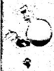

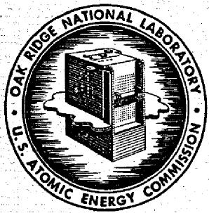

# OAK RIDGE NATIONAL LABORATORY operated by

# UNION CARBIDE CORPORATION

# NUCLEAR DIVISION

for the

U.S. ATOMIC ENERGY COMMISSION

ORNL-TM-1946

COPY NO. - 1

DATE - August 16, 1967

REVIEW OF MOLTEN SALT REACTOR PHYSICS CALCULATIONS

R. S. Carlsmith

L. L. Bennett

G. E. Edison

E. H. Gift

W.E.Thomas

F. G. Welfare

# ABSTRACT

A set of calculations was made to check the reactivity and breeding ratio of the reference design of the MSBR. Insofar as possible, the cross sections and calculational methods were made independent of those used previously. The reference composition gave a $k_{\text{eff}}$ of 0.95. When the reactor was made critical by the addition of 14% more $233$ U, the breeding ratio was 1.062 compared with 1.054 in the previous calculations. Reoptimization of the composition would probably decrease this difference in breeding ratio.

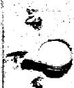

NOTICE This document contains information of a preliminary nature and was prepared primarily for internal use at the Oak Ridge National Laboratory. It is subject to revision or correction and therefore does not represent a final report.

# LEGAL NOTICE

This report was prepared as an account of Government sponsored work. Neither the United States, nor the Commission, nor any person acting on behalf of the Commission:

A. Makes any warranty or representation, expressed or implied, with respect to the accuracy, completeness, or usefulness of the information contained in this report, or that the use of any information, apparatus, method, or process disclosed in this report may not infringe privately owned rights; or   
B. Assumes any liabilities with respect to the use of, or for damages resulting from the use of any information, apparatus, method, or process disclosed in this report.

As used in the above, "person acting on behalf of the Commission" includes any employee or contractor of the Commission, or employee of such contractor, to the extent that such employee or contractor of the Commission, or employee of such contractor prepares, disseminates, or provides access to, any information pursuant to his employment or contract with the Commission, or his employment with such contractor.

# CONTENTS

Page

Introduction 5   
Summary of Results and Recommendations 8   
Cross Sections 14   
Fission Product Treatment 25   
Cell Calculations 34   
Two-Dimensional Calculations 44   
Depletion Calculations 52

#   
#

#   
：  
等

# LEGAL NOTICE

This report was prepared as an account of Government sponsored work, Neither the United States, nor the Commission, nor any person acting on behalf of the Commission: A. Makes any warranty or representation, expressed or implied, with respect to the accu- racy, completeness, or usefulness of the information contained in this report, or that the use privately owned rights; or B. Assumes any liabilities with respect to the use of, or for damages resulting from the As used in the above, "person acting on behalf of the Commission" includes any emuch employee or contractor of the Commission, or employee of such contractor, to the extent that disseminates, or provides access to, any information pursuant to his employment or contract with the Commission, or his employment with such contractor.

# 1. INTRODUCTION

This review of the physics of the Molten Salt Breeder Reactor was undertaken for the purpose of providing an independent check of as many aspects as possible of the calculations already made. We have not attempted any further optimization. Instead we chose a design of the core and blanket regions for which calculations had already been made, and subjected this design to our analysis. Our primary interest was in the breeding ratio of the equilibrium reactor.

The design we chose is essentially the one presented as the reference case in ORNL-TM-1467 (Ref. 1). It is a 1000 Mw(e) power plant with a single core, separate fissile and fertile streams, and without provision for removal of $^{233}\mathrm{Pa}$ from the fertile stream.

The previous calculation for this design is known as Case 555 in a series of calculations by the OPTIMERC code. Insofar as possible we attempted to specify the same geometry and composition as case 555, resisting suggestions that this case is already obsolete, so that a valid comparison could be made between the two calculations. For some regions, particularly for the lower blanket and plenum, the specifications for case 555 were not detailed enough for our calculations, or appeared to leave out certain components. To fill in these gaps we obtained additional layout drawings and dimensions from the group working on the design of the molten salt reactors.[2]

Our review covered six principal areas: cross section selection, fission product treatment, multigroup cell calculations, two-dimensional reactor criticality calculations, equilibrium depletion calculations, and start up depletion calculations. In each area we attempted to choose methods and data which were as independent as possible from those used previously. However, in a number of instances we used the same methods because alternate computer codes were not available, and for many nuclides we used essentially the same cross section data because they seemed most likely to be correct.

The cross sections selected were mainly those that have been assembled over a period of years for use in reactor evaluation studies. We reviewed carefully the situation with regard to $^{233}\mathrm{U}$ , whose cross sections always turn out to be the most important single factor in determining the neutron economy of thorium cycle reactors. We also reviewed the data for several other nuclides which are important to the MSER. These included $^{7}\mathrm{Li},$ $^{6}\mathrm{Li},$ Be, F, C, and Th.

We reviewed the fission product chains and chose to treat 32 nuclides explicitly in each of the fluid streams. The remainder of the fission products which were lumped together as a single pseudo-element gave a total fractional absorption of 0.005 per neutron absorbed in fuel.

Our basic cross section set consists of the 68 energy group library for the M-GAM code, used to generate broad-group cross sections above 1.86 ev, plus the 30 group library for the THERMOS code, from which the broad group cross sections below 1.86 ev are obtained. The M-GAM calculation gives a spectrum for the typical reactor cell and averages the cross sections over this cell. The heterogeneity of the cell for neutron energies above 30 kev was taken into account by a separate transport calculation of the flux distribution within the cell. Self-shielding and heterogeneity effects in the resonances of $^{233}\mathrm{Pa}$ , $^{234}\mathrm{U}$ , $^{236}\mathrm{U}$ , and Th were computed in the M-GAM code by the Adler, Hinman, and Nordheim (narrow resonance approximation) method. The THERMOS calculation gives an integral-transport solution to the group fluxes in a one-dimensional representation of the cell, and averages the cross sections over the spectrum and over the cell. In the M-GAM-THERMOS calculations we reduced the cross sections to a set consisting of five fast groups and four thermal groups. We did one calculation for the nuclides in a core cell and a second one for the blanket region. The previous calculations had also employed the M-GAM-THERMOS code but had included somewhat different approximations as to cell geometry, particularly with regard to the heterogeneity in the resonance absorption by the thorium.

We made a two-dimensional nine-group calculation of the entire reactor using the microscopic cross sections calculated by the M-GAM-THERMOS code and the nuclide densities specified for the reference case.

This calculation was done with the ASSAULT code. Considerable effort was made to represent realistically all of the blanket areas, structure, reflectors, and pressure vessel, as well as the core. The previous calculations made use of the MERC code which synthesizes the flux distribution from one-dimensional calculations in the radial and axial directions. After determining the multiplication factor for the specified core composition, we changed the $233_{\mathrm{U}}$ concentration to obtain criticality. With this calculation we could examine the neutron balance for the various regions and the power distribution.

Using the reaction rates (one-group microscopic cross sections) obtained in the ASSAULT code calculation we did an equilibrium point-depletion calculation. We used the LTM code, modified to do calculations of separate fertile and fissile streams with transfer of bred fuel from the fertile to the fissile stream, to calculate processing loss and fuel removal based on average concentrations, and to give specified cycle times. From the calculation with this code we obtained the equilibrium cycle neutron balance and the equilibrium breeding ratio. The cycle times for fissile and fertile streams, and the removal rates associated with reprocessing were taken from TM-1467. Previous calculations had used the MERC code to obtain this equilibrium neutron balance.

To check the assumption that the performance of the reactor can be adequately represented by an equilibrium cycle, we also calculated the heavy-element concentrations for a 30-year reactor history, starting with $93\%$ $^{235}\mathrm{U} - 7\%$ $^{238}\mathrm{U}$ as the initial fuel material. No calculations of this type had been done previously.

# References

1. P. R. Kasten et al., Summary of Molten-Salt Breeder Reactor Design Studies, USAEC Report ORNL-TM-1467, Oak Ridge National Laboratory, March 24, 1966.   
2. Personal communication from E. S. Bettis.

# 2. SUMMARY OF RESULTS AND RECOMMENDATIONS

# Summary of Results

The most significant difference between the results of our calculations and previous ones was in the reactivity of the reference design. Using the reference composition we obtained a $\mathbf{k}_{\text{eff}}$ of 0.95. An additional $14\%$ $^{233}\mathrm{U}$ was required to achieve criticality, holding all other concentrations constant. The discrepancy in $\mathbf{k}_{\text{eff}}$ is entirely traceable to the values used for thorium resonance integral. We calculated the resonance integral for the geometry of the reference design and obtained 36.5 barns. In the OPTIMERC calculations it had been found convenient to use the same resonance integral for all geometries being considered; the value assigned was 30.1 barns.

Our calculations agreed with the previous ones to within 0.01 in breeding ratio as shown in Tables 2.1 and 2.2. However, there were a number of individual differences of 0.001 to 0.005 in the neutron balance. An analysis of some of these is as follows:

Table 2.1 MSER Performance Comparison   

<table><tr><td></td><td>Present 
Calculations</td><td>Previous 
Calculations</td></tr><tr><td>Nuclear breeding ratio</td><td>1.062</td><td>1.054</td></tr><tr><td>Neutron production per fissile 
absorption (ηe)</td><td>2.228</td><td>2.221</td></tr><tr><td>Mean η of 233U</td><td>2.221</td><td>2.219</td></tr><tr><td>Mean η of 235U</td><td>1.971</td><td>1.958</td></tr><tr><td>Power factor, core, peak/mean 
Radial</td><td>2.18</td><td>2.22</td></tr><tr><td>Axial</td><td>1.51</td><td>1.37</td></tr><tr><td>Total</td><td>3.29</td><td>3.04</td></tr></table>

1. The average $\eta$ of $^{233}\mathrm{U}$ in our calculations was 2.221 while it was 2.219 previously. We used a 2200 m/sec $\eta$ that was 0.003 higher but obtained a less thermal spectrum because of our higher fissile concentration. However, the previous calculations used only a single thermal

Table 2.2 MSER Neutron Balance Comparison   

<table><tr><td rowspan="2"></td><td colspan="2">Present Calculation</td><td colspan="2">Previous Calculation</td></tr><tr><td>Absorptions</td><td>Productions</td><td>Absorptions</td><td>Productions</td></tr><tr><td>232Th</td><td>0.9825</td><td>0.0056</td><td>0.9710</td><td>0.0059</td></tr><tr><td>233Pa</td><td>0.0078</td><td></td><td>0.0079</td><td></td></tr><tr><td>233U</td><td>0.9156</td><td>2.0338</td><td>0.9119</td><td>2.0233</td></tr><tr><td>234U</td><td>0.0907</td><td>0.0014</td><td>0.0936</td><td>0.0010</td></tr><tr><td>235U</td><td>0.0844</td><td>0.1664</td><td>0.0881</td><td>0.1721</td></tr><tr><td>236U</td><td>0.0105</td><td>0.0002</td><td>0.0115</td><td>0.0001</td></tr><tr><td>237Np</td><td>0.0009</td><td></td><td>0.0014</td><td></td></tr><tr><td>238U</td><td></td><td></td><td>0.0009</td><td></td></tr><tr><td>Carrier salt (except 6Li1)</td><td>0.0605</td><td>0.0205</td><td>0.0623</td><td>0.0185</td></tr><tr><td>6Li</td><td>0.0080</td><td></td><td>0.0030</td><td></td></tr><tr><td>Graphite</td><td>0.0261</td><td></td><td>0.0300</td><td></td></tr><tr><td>135Xe</td><td>0.0050</td><td></td><td>0.0050</td><td></td></tr><tr><td>149Sm</td><td>0.0078</td><td></td><td>0.0069</td><td></td></tr><tr><td>151Sm</td><td>0.0018</td><td></td><td>0.0018</td><td></td></tr><tr><td>Other fission products</td><td>0.0152</td><td></td><td>0.0196</td><td></td></tr><tr><td>Delayed neutrons Lost</td><td>0.0051</td><td></td><td>0.0050</td><td></td></tr><tr><td>Leakage</td><td>0.0010</td><td></td><td>0.0012</td><td></td></tr><tr><td>INOR</td><td>0.0050</td><td></td><td></td><td></td></tr><tr><td>TOTAL</td><td>2.2279</td><td>2.2279</td><td>2.2211</td><td>2.2209</td></tr></table>

group for neutrons below 1.86 ev. Since the cross sections had been calculated with a composition which gave a harder spectrum than the reference case, the resulting $\eta$ for the thermal group was lower than it would have been if the reference composition had been used. The total result for the $\eta$ of $^{233}\mathrm{U}$ was an increase of 0.002 in breeding ratio for our calculations compared to the previous ones.

2. The average $\eta$ of $^{235}\mathrm{U}$ was 1.971 compared with 1.958 in the previous calculations. We believe that the new cross sections are likely to be better for this nuclide. The result was an increase in breeding ratio of 0.001.   
3. We used a lower cross section for $^{234}\mathrm{U}$ in accordance with the recommendations of the latest edition of BNL-325. As a consequence, more of the $^{234}\mathrm{U}$ was removed with the excess uranium, and there were fewer absorptions in $^{235}\mathrm{U}, ^{236}\mathrm{U},$ and $^{237}\mathrm{Np}$ . The net result appears to have been an increase in breeding ratio of less than 0.001.   
4. We did not include any $^{238}\mathrm{U}$ production in our calculation since it did not seem appropriate. Any other trans-uranium isotopes beyond $^{237}\mathrm{Np}$ should not lead to a net loss since they could probably be separated and sold if there were any tendency for them to accumulate. An increase in breeding ratio of 0.001 resulted.   
5. Parasitic absorptions in carrier salt (other than ${}^{6}$ Li) were lower because of the increased fissile loading in our calculation. An increase of 0.003 in breeding ratio occurred.   
6. Parasitic absorptions in graphite were lower for the same reason. An increase of $0.004$ occurred.   
7. The previous calculations omitted the INOR tubes in the lower blanket. Although there is a possibility of reducing the effect by redesign, the current design gave a breeding ratio loss of 0.005 to absorptions in the INOR.   
8. Our calculations gave an increase in breeding ratio of 0.003 from lower fission product absorption. About one-half of this difference came from nuclides which were allowed to recycle in the OPTIMERC calculation although belonging to chemical groups which are actually thought to be removed in reprocessing. It may be that the previous calculations were justified in introducing a measure of conservatism at this point. The remainder of the difference is associated with the higher fissile inventory in our calculations.   
9. The previous calculations used a 7Li content in the makeup of 99.997% together with a cost of $120 per kg. In reviewing the basis for this choice we find that the published AEC price schedule is for 99.990%

7Li at this price.1 More recently it has been concluded by those working on molten salt reactor design that it would be reasonable to assume that 99.995% 7Li could be obtained in large quantities at $120 per kg.2 We have followed this latter assumption and used 99.995% 7Li in our calculations, leading to a decrease in breeding ratio of 0.002. In addition, the previous calculations neglected the production of 6Li in the core from n,α reactions in beryllium. This source of 6Li gave an additional 0.003 decrease in breeding ratio.

10. We obtained a $10\%$ higher neutron production from the Be(n, 2n) reaction than in the previous calculations. The difference came from our taking into account the heterogeneity of the cell in the high-energy range. The effect on breeding ratio was an increase of about 0.001.

Although our calculations gave a net increase in breeding ratio of almost 0.01 compared to the previous ones, it should be kept in mind that this increase in breeding ratio was accompanied by an increase in fissile inventory. Indeed, the increase in breeding ratio is about what one would expect from the change in fissile inventory alone, so that other increases and decreases have approximately cancelled. A subsequent re-optimization would probably lead to a somewhat lower breeding ratio and lower inventory.

Table 2.3 shows a comparison of the two sets of calculations with respect to spacial distribution of neutron absorptions. There is generally good agreement. However, the low values of leakage obtained in our calculations raise a question as to whether the blankets are thicker than optimum.

Table 2.3 MSBR Absorption Distribution Comparison   

<table><tr><td></td><td>Present Calculation</td><td>Previous Calculation</td></tr><tr><td>Core</td><td>2.0305</td><td>2.0325</td></tr><tr><td>Radial blanket</td><td>0.1458</td><td>0.1375</td></tr><tr><td>Axial blanket</td><td>0.0451</td><td>0.0441</td></tr><tr><td>Radial leakage plus structure</td><td>0.0012</td><td>0.0019</td></tr><tr><td>Axial leakage plus structure</td><td>0.0002</td><td>0.0001</td></tr><tr><td>Delayed neutrons lost</td><td>0.0051</td><td>0.0050</td></tr><tr><td>Total</td><td>2.2279</td><td>2.2211</td></tr></table>

The power distributions obtained in the two-dimensional ASSAULT calculations agreed very closely with those of the one-dimensional OPTIMERC calculations (Table 2.1) with the exception of a slight increase near the central control channel which was not included in the OPTIMERC calculations.

When the reactor was started up on $^{235}\mathrm{U}$ fuel, sale of fuel started after four months because the inventory requirements are less for $^{233}\mathrm{U}$ than for $^{235}\mathrm{U}$ . The breeding ratio was above unity after 18 months, although some isotopes did not approach their equilibrium value for about 10 years. The 30-year present-valued fuel cycle cost was only 0.02 mills/kwhr(e) higher than the equilibrium fuel cycle cost. The 30-year average of the breeding ratio was 0.013 lower than the equilibrium value.

# Recommendations

The OPTIMERC calculations have clearly provided a valuable and reasonably accurate assessment of the design configuration for the molten salt reactor. However, based on the results of our independent calculations, we believe that there are several points on which a more precise treatment of the physics would help future optimization studies. These points are listed below, roughly in the order of their importance.

1. The OPTIMERC code should be provided with a means of varying the thorium resonance cross sections as fertile stream concentration and geometry are changed. It is not likely to prove sufficient to recalculate the fissile (or fertile) loading for criticality of the final reference design since the optimization procedure is affected in a complex manner by gross changes in cross sections.   
2. Optimization of the thicknesses of the axial and radial blankets should be rechecked using a calculational model that agrees with a two-dimensional ASSAULT calculation for a base case.   
3. The $6_{\text{Li}}$ production from beryllium should be included. Another look at the $6_{\text{Li}}$ concentration in the makeup lithium may be in order, although this is admittedly an area in which high precision is not possible.   
4. Our cross sections for $^{234}\mathrm{U}$ and $^{235}\mathrm{U}$ are probably better than those previously used and should be considered in future calculations.

5. It would be desirable if OPTIMERC could be modified to allow multiple thermal groups, particularly so that a more correct calculation could be made of the $\eta$ of $U$ as a function of fuel composition. As in the case with the thorium cross sections, the optimization cannot be carried out successfully if this variation is not built in to the code. If it is too difficult to provide for multiple thermal groups, then it may be preferable to reduce the thermal cut-off from 1.86 ev to about 1.0 ev.   
6. Heterogeneity effects should be included in the high energy region.

As an added comment, it would be in order in the future for the reference design, as given by OPTIMERC, to be checked by a complete calculation in which the cross section reduction is redone for the reference composition.

# References

1. News in Brief; Supply of Lithium-7 Increased, H-Bomb Role Bared, Nucleonics, 17(11): 31, November 1959.   
2. L. G. Alexander, et al., Molten Salt Converter Reactor Design Study and Power Cost Estimates for a 1000 Mwe Station, USAEC Report ORNL-TM-1060, Oak Ridge National Laboratory, September 1965.

# 3. CROSS SECTIONS

For the most part the cross sections used both in this review and in previous molten salt breeder reactor design studies are the same. The cross section data used have been accumulated over a period of about five years and regularly used for reactor evaluation studies. In this regard they have proven to be reasonably accurate in comparison with experiments and calculations by others. A summary of the basic thermal neutron cross section data used in this review and their experimental sources are given in Table 3.1. Table 3.2 lists the resonance fission and absorption integrals and the data sources for the same nuclides.

There are some small differences between the thermal neutron cross sections for some nuclides in this review and in the previous design studies. These differences are primarily a result of the issuance of Supplement II of BNL-325 (Ref. 1) which recommends some renormalization of previously accepted cross section values. The differences are shown in Table 3.3. Of these differences only those in $^{233}_{\mathrm{U}}$ , $^{235}_{\mathrm{U}}$ and $^{234}_{\mathrm{U}}$ are significant in the MSBR and lead to a slightly higher breeding ratio. The use of $2200 \, \text{m/sec} \, \nu$ of 2.503 rather than 2.500 for $^{233}_{\mathrm{U}}$ is consistent with the BNL-325 (Ref. 1) recommended value for the prompt $\nu$ of 2.497 ± 0.008 and a delayed neutron fraction of 0.00264. The $\pi$ of 2.295 at 2200 m/sec for $^{233}_{\mathrm{U}}$ is within the uncertainty range for this nuclide although not necessarily more accurate than the value of 2.292 used in the previous calculations.

The $^{235}\mathrm{U}$ 2200 m/sec data have been renormalized as recommended in BNL-325, the primary result being a slightly higher $\alpha$ (0.175 vs 0.174), a higher thermal $\nu$ (2.442 vs 2.430), and a resulting slightly higher $\eta$ (2.078 vs 2.070). The 10 barn difference in the $^{234}\mathrm{U}$ thermal cross section makes a significant difference in the equilibrium concentrations of $^{234}\mathrm{U}$ and $^{235}\mathrm{U}$ .

The Brown St. John² heavy-gas model was used for the scattering kernel for all nuclides except carbon both in this review and in the previous design studies. For carbon the crystalline model as developed by Parks³ was employed. For the review calculations all kernels were computed for an average temperature of $900^{\circ}\mathrm{K}$ : This temperature was based

Table 3.1 Normalization and Data Sources of the Thermal Cross Sections Used in the MSBR Studies   

<table><tr><td>Nuclide</td><td>σa(2200), b.</td><td>Data Sources</td><td>Basis for the Energy Dependence of the Cross Section</td></tr><tr><td>238U</td><td>2.73</td><td>BNL-325 (Ref. 1)</td><td>Assumed 1/v throughout thermal energy range.</td></tr><tr><td>236U</td><td>6.0</td><td>BNL-325 (Ref. 1)</td><td>Four lowest energy resonances and a computed negative energy resonance.</td></tr><tr><td rowspan="5">235U</td><td>σa=678.2</td><td rowspan="5">BNL-325 (Ref. 1)</td><td rowspan="5">Fission cross section based on recommended curve in BNL-325, 2nd Ed., Supp. 2, Vol. III. Capture cross section based on recent α(E) measurements of Brooks4 and of Weston, DeSaussure et al.5</td></tr><tr><td>δe=577.1</td></tr><tr><td>ν=2.442</td></tr><tr><td>η=2.0780</td></tr><tr><td>α=0.1752</td></tr><tr><td>234U</td><td>95.0</td><td>BNL-325 (Ref. 1)</td><td>Computed from two lowest positive energy resonances, and a computed negative energy resonance.</td></tr><tr><td rowspan="5">233U</td><td>σa=574.0</td><td rowspan="5">η based on data of Macklin et al., 6 and of Gwin and Magnusson and sa from data of Block et al. 10 with σs taken to be 13.0 b.based on measurements of Oleksa.11</td><td rowspan="5">The multilevel resonance parameters of Moore and Reich5 and the α(E) data of BNL-325 (Ref. 9).</td></tr><tr><td>σf=526.2</td></tr><tr><td>ν=2.503</td></tr><tr><td>η=2.2946</td></tr><tr><td>α=0.0908</td></tr><tr><td>233Pa</td><td>43.0</td><td>BNL-325 (Ref. 1)</td><td>The resolved resonance parameters of Simpson et al.12</td></tr><tr><td>232Th</td><td>7.56</td><td>BNL-325 (Ref..9)</td><td>The eight lowest energy resonance parameters as reported by Nordheim13 and a computed negative energy resonance.</td></tr><tr><td>Chromium</td><td>3.1</td><td>BNL-325 (Ref. 1) [σg(2200) = 13.0 b.]</td><td>Assumed 1/v in thermal range.</td></tr><tr><td>Iron</td><td>2.62</td><td>BNL-325 (Ref. 9) [σg(2200) = 11.0 b.]</td><td>Assumed 1/v in thermal range.</td></tr></table>

Table 3.1 (cont'd)   

<table><tr><td>Nuclide</td><td>σa(2200), b.</td><td>Data Sources</td><td>Basis for the Energy Dependence of the Cross Section</td></tr><tr><td>Nickel</td><td>4.6</td><td>BNL-325 (Ref. 9) [σs(2200) = 17.5 b.]</td><td>Assumed l/v in thermal range.</td></tr><tr><td>Molybdenum</td><td>2.70</td><td>BNL-325 (Ref. 1) [σs(2200) = 7.06]</td><td>Assumed l/v in thermal range.</td></tr><tr><td>Lead</td><td>0.170</td><td>BNL-325 (Ref. 9) [σs(2200) = 11.0 b.]</td><td>Assumed l/v in thermal range.</td></tr><tr><td>Sodium</td><td>0.534</td><td>BNL-325 (Ref. 1) [σs(2200) = 4.0 b.]</td><td>Assumed l/v in thermal range.</td></tr><tr><td>Fluorine</td><td>0.0098</td><td>BNL-325 (Ref. 1) [σs(2200) = 3.9 b.]</td><td>Assumed l/v in thermal range.</td></tr><tr><td>Lithium-6</td><td>945.0</td><td>BNL-325 (Ref. 9) [σs(2200) = 1.4]</td><td>Assumed l/v in thermal range</td></tr><tr><td>Lithium-7</td><td>0.037</td><td>BNL-325 (Ref. 1) [σs(2200) = 1.4]</td><td>Assumed l/v in thermal range</td></tr><tr><td>Carbon</td><td>0.004</td><td>Average of measurements of delivered graphite to EGCR. [σs(2200) = 4.8]</td><td>Assumed l/v in thermal range.</td></tr><tr><td>Beryllium</td><td>0.0095</td><td>BNL-325 (Ref. 1) [σs(2200) = 7.0]</td><td>Assumed l/v in thermal range</td></tr><tr><td>95Mo</td><td>13.9</td><td>BNL-325 (Ref. 9)</td><td>Assumed l/v in thermal range.</td></tr><tr><td>129I</td><td>31.0</td><td>Block et al.10</td><td>Assumed l/v in thermal range.</td></tr><tr><td>135Xe</td><td>2.65 x 106</td><td>AEEW-R116 (Ref. 14)</td><td>Computed by method outlined in AEEW-R116.</td></tr></table>

Table 3.1 (cont'd)   

<table><tr><td>Nuclide</td><td>δa(2200), b.</td><td>Data Sources</td><td>Basis for the Energy Dependence of the Cross Section</td></tr><tr><td>135Cs</td><td>8.7</td><td>BNL-325 (Ref. 9)</td><td>Assumed 1/v in thermal range.</td></tr><tr><td>143Nd</td><td>324.0</td><td>BNL-325 (Ref. 9)</td><td>One positive energy resonance and a computed negative energy resonance.</td></tr><tr><td>145Nd</td><td>60.0</td><td>BNL-325 (Ref. 9)</td><td>Two positive energy resonances and a computed negative energy resonance.</td></tr><tr><td>146Nd</td><td>10.0</td><td>BNL-325 (Ref. 9)</td><td>Assumed 1/v in thermal range.</td></tr><tr><td>148Nd</td><td>3.4</td><td>BNL-325 (Ref. 9)</td><td>Assumed 1/v in thermal range.</td></tr><tr><td>147Pm</td><td>235.0</td><td>σ2200 from Schuman and Berreth;16 resonance parameters from BNL-325 (Ref. 9).</td><td>Four positive energy resonances and a computed negative energy resonance.</td></tr><tr><td>147Sm</td><td>87.0</td><td>BNL-325 (Ref. 9)</td><td>Five positive energy resonances and a computed negative energy resonance.</td></tr><tr><td>148Sm</td><td>9.0</td><td>WAPD-TM-333 (Ref. 16)</td><td>Assumed 1/v in thermal range.</td></tr><tr><td>149Sm</td><td>40,800</td><td>BNL-325 (Ref. 9)</td><td>Seven positive energy resonances plus a 1/v adjustment to agree with experiment at 2200 m/sec</td></tr><tr><td>150Sm</td><td>85.0</td><td>WAPD-TM-333 (Ref. 16)</td><td>Assumed 1/v in thermal range.</td></tr><tr><td>151Sm</td><td>15,400</td><td>WASH-1029 (Ref. 17) for σa(2200); BNL-325 (Ref. 9) for resonance parameters.</td><td>Five positive energy resonances, a negative energy resonance.</td></tr><tr><td>152Sm</td><td>208</td><td>Bernabei16</td><td>Computed from positive energy resonance parameters of Ref. 16.</td></tr></table>

Table 3.1 (cont'd)   

<table><tr><td>Nuclide</td><td>σa(2200), b.</td><td>Data Sources</td><td>Basis for the Energy Dependence of the Cross Section</td></tr><tr><td>154Sm</td><td>5.5</td><td>BNL-325 (Ref. 9)</td><td>Assumed l/v in thermal range.</td></tr><tr><td>153Eu</td><td>440.0</td><td>BNL-325 (Ref. 9)</td><td>Nine positive energy resonances plus a computed negative energy resonance.</td></tr><tr><td>154Eu</td><td>1,500</td><td>BNL-325 (Ref. 9)</td><td>Assumed l/v in the thermal range.</td></tr><tr><td>155Eu</td><td>14,000</td><td>BNL-325 (Ref. 9)</td><td>Assumed l/v in the thermal range.</td></tr><tr><td>155Gd</td><td>61,000</td><td>BNL-325 (Ref. 9) for 2200 m/s σa; Moller et al.19 for resonance parameters.</td><td>Three positive energy resonances.</td></tr><tr><td>157Gd</td><td>242,000</td><td>BNL-325 (Ref. 9)</td><td>Five positive energy resonances and a renormalization to the accepted 2200 m/s cross section.</td></tr><tr><td>237Np</td><td>170</td><td>BNL-325 (Ref. 9) for 2200 m/s σa; WASH-1031 (Ref. 19) for resonance parameters.</td><td>All resonances given in WASH-1031 (Ref. 19) plus a computed negative energy resonance.</td></tr></table>

Table 3.2 Normalization and Date Sources for the Fast Cross Sections Used in MSBR Studies   

<table><tr><td>Nuclide</td><td>Absorption 
Resonance 
Integral to 
0.414 ev, b.</td><td>Fission 
Resonance 
Integral to 
0.414 ev, b.</td><td>Data Sources</td></tr><tr><td>238U</td><td>274</td><td>1.276</td><td>ENL-325 (Ref. 9)</td></tr><tr><td>236U</td><td>311</td><td>2.45</td><td>Harvey and Hughes (Ref. 20) 
and Ga-2451 (Ref. 21)</td></tr><tr><td>234U</td><td>689</td><td>4.51</td><td>Harvey and Hughes (Ref. 20) and 
GA-2451 (Ref. 21)</td></tr><tr><td>235U</td><td>447.2</td><td>298.3</td><td>Weston and DeSaussure (Ref. 33 
and 23), ENL-325 (Ref. 1), 
Brooks (Ref. 4), Hopkins and 
Diven (Ref. 22), White (Ref. 24)</td></tr><tr><td>233U</td><td>1,012</td><td>865</td><td>Pattenden and Harvey (Ref 25), 
Moore, Miller and Simpson (Ref. 
26), Moore and Reich (Ref. 8), 
Hopkins and Diven (Ref. 22)</td></tr><tr><td>233Pa</td><td>925.0</td><td>4.477</td><td>Simpson (Ref. 12), Eastwood and 
Werner (Ref. 27), Halperin, et 
al. (Ref. 28)</td></tr><tr><td>232Th</td><td>83.7</td><td>0.38</td><td>Nordheim (Ref. 13), GA-2451 
(Ref. 21), WASH-1006 (Ref. 29), 
WASH-1013 (Ref. 30), Butler and 
Santry (Ref. 31)</td></tr><tr><td>Chromium</td><td>1.55</td><td></td><td>GAM-II Library - (Based on 
ENL-325) (Ref. 9)</td></tr><tr><td>Iron</td><td>1.37</td><td></td><td>GAM-II Library - (Based on 
ENL-325) (Ref. 9)</td></tr><tr><td>Nickel</td><td>2.78</td><td></td><td>GAM-II Library - (Based on 
ENL-325) (Ref. 9)</td></tr><tr><td>Molybdenum</td><td>27.24</td><td></td><td>GAM-II Library</td></tr><tr><td>Lead</td><td>0.08</td><td></td><td>GAM-II Library</td></tr><tr><td>Sodium</td><td>0.3177</td><td></td><td>GAM-II Library</td></tr></table>

Table 3.2 (cont'd)   

<table><tr><td>Nuclide</td><td>Absorption Resonance Integral to 0.414 ev, b.</td><td>Fission Resonance Integral to 0.414 ev, b.</td><td>Data Sources</td></tr><tr><td>Fluorine</td><td>0.1839</td><td></td><td>ENL-325 (Ref. 9), E. A. Davis, et al., (Ref. 33), Marion and Brugger (Ref. 33), R. C. Block et al., (Ref. 34), F. Babbard, et al., (Ref. 35), Joanou and Fenech (Ref. 36).</td></tr><tr><td>Lithium-6</td><td>468.9</td><td></td><td>GAM-II Library - (Based on ENL-325) (Ref. 1 and 9)</td></tr><tr><td>Lithium-7</td><td>0.0187</td><td></td><td>GAM-II Library - (Based on ENL-325) (Ref. 1 and 9)</td></tr><tr><td>Carbon</td><td>0.00192</td><td></td><td>ENL-325 (Ref. 9)</td></tr><tr><td>Beryllium</td><td>0.1203</td><td></td><td>GAM-II Library - (Based on ENL-325) (Ref. 1 and 9)</td></tr><tr><td>95Mo</td><td>111.3</td><td></td><td>GAM-II Library</td></tr><tr><td>129I</td><td>39.45</td><td></td><td>GAM-II Library</td></tr><tr><td>135Xe</td><td>13,000</td><td></td><td>GAM-II Library</td></tr><tr><td>135Cs</td><td>35.33</td><td></td><td>GAM-II Library</td></tr><tr><td>143Nd</td><td>134</td><td></td><td>GAM-II Library</td></tr><tr><td>145Nd</td><td>314.6</td><td></td><td>GAM-II Library</td></tr><tr><td>146Nd</td><td>8.78</td><td></td><td>GAM-II Library</td></tr><tr><td>148Nd</td><td>10.5</td><td></td><td>GAM-II Library</td></tr><tr><td>147Pm</td><td>2,279</td><td></td><td>GAM-II Library</td></tr><tr><td>147Sm</td><td>609.7</td><td></td><td>GAM-II Library</td></tr><tr><td>148Sm</td><td>4.41</td><td></td><td>GAM-II Library</td></tr><tr><td>149Sm</td><td>3,148</td><td></td><td>GAM-II Library</td></tr><tr><td>150Sm</td><td>309.7</td><td></td><td>GAM-II Library</td></tr></table>

Table 3.2 (cont'd)   

<table><tr><td>Nuclide</td><td>Absorption 
Resonance 
Integral to 
0.414 ev, b.</td><td>Fission 
Resonance 
Integral to 
0.414 ev, b.</td><td>Data Source</td></tr><tr><td>151Sm</td><td>2,480</td><td></td><td>GAM-II Library</td></tr><tr><td>152Sm</td><td>2,242</td><td></td><td>GAM-II Library</td></tr><tr><td>154Sm</td><td>2.72</td><td></td><td>GAM-II Library</td></tr><tr><td>153Eu</td><td>432.1</td><td></td><td>GAM-II Library</td></tr><tr><td>154Eu</td><td>1,010</td><td></td><td>GAM-II Library</td></tr><tr><td>155Eu</td><td>6,787</td><td></td><td>GAM-II Library</td></tr><tr><td>155Gd</td><td>1,668</td><td></td><td>GAM-II Library</td></tr><tr><td>157Gd</td><td>780</td><td></td><td>GAM-II Library</td></tr><tr><td>237Np</td><td>1,513.3</td><td>4.73</td><td>GAM-II Library, WASH-1031, 
(Ref. 19)</td></tr></table>

Table 3.3 Differences in Thermal Neutron Cross Sections in the MSER Review and in the Design Studies   

<table><tr><td rowspan="2">Nuclide</td><td colspan="3">Used in Review</td><td colspan="3">Used in Design Studies</td></tr><tr><td>\( \dot{\sigma}_{\mathrm {a}},\mathrm {b}. \)</td><td>\( \sigma_{\mathrm {f}},\mathrm {b}. \)</td><td>v</td><td>\( \sigma_{\mathrm {a}},\mathrm {b}. \)</td><td>\( \sigma_{\mathrm {f}},\mathrm {b}. \)</td><td>v</td></tr><tr><td>\( 233_{\mathrm {U}} \)</td><td>574.0</td><td>526.2</td><td>2.503</td><td>574.0</td><td>526.2</td><td>2,500</td></tr><tr><td>\( 238_{\mathrm {U}} \)</td><td>2.78</td><td></td><td></td><td>2.71</td><td></td><td></td></tr><tr><td>\( 235_{\mathrm {U}} \)</td><td>678.2</td><td>577.1</td><td>2.442</td><td>682.2</td><td>581.1</td><td>2.43</td></tr><tr><td>\( 234_{\mathrm {U}} \)</td><td>95.0</td><td></td><td></td><td>105.0</td><td></td><td></td></tr><tr><td>Iron</td><td>2.62</td><td></td><td></td><td>2.53</td><td></td><td></td></tr><tr><td>Molybdenum</td><td>2.70</td><td></td><td></td><td>2.73</td><td></td><td></td></tr><tr><td>Fluorine</td><td>0.0098</td><td></td><td></td><td>0.01</td><td></td><td></td></tr><tr><td>Li-7</td><td>0.037</td><td></td><td></td><td>0.036</td><td></td><td></td></tr><tr><td>Beryllium</td><td>0.0095</td><td></td><td></td><td>0.01</td><td></td><td></td></tr></table>

on an average fuel salt temperature of $922^{\circ}\mathrm{K}$ and an average blanket salt temperature of $895^{\circ}\mathrm{K}$ . The previous calculations were done with the kernels for fluorine, lithium and beryllium computed at $922^{\circ}\mathrm{K}$ and for the heavy metals and carbon at $1000^{\circ}\mathrm{K}$ .

# References

1. J. R. Stehn et al., Neutron Cross Sections, USAEC Report BNL-325, 2nd Ed., Supplement No. 2, February 1965.   
2. H. Brown and D. St. John, Neutron Energy Spectrum in $\mathbf{D}_2\mathbf{O}$ , USAEC Report DO-33 (1954).   
3. D. E. Parks, The Calculation of Thermal Neutron Scattering Kernels in Graphite, USAEC Report GA-2438 (October 1961).   
4. F. D. Brooks et al., Eta and Neutron Cross Sections of $U^{235}$ from 0.04 to 200 ev, AERE-M-1670, Harwell, November 1965.   
5. Personal Communication L. Weston and G. DeSaussure to E. H. Gift, March 1966.   
6. R. L. Macklin et al., Manganese Bath Measurements of Eta of $U^{233}$ and $U^{235}$ , Nucl. Sci. Eng., 8(3): 210-220 (September 1960).   
7. R. Gwin and D. W. Magnuson, The Measurement of Eta and Other Nuclear Properties of $\mathbf{U}^{233}$ and $\mathbf{U}^{235}$ in Critical Aqueous Solution, Nucl. Sci. Eng., 12(3): 364-380 (March 1962).   
8. M. S. Moore and C. W. Reich, Multilevel Analysis of the Slow Neutron Cross Sections of $U^{233}$ , Phy. Review, 118(3): 714-718 (May 1960).   
9. D. Hughes et al., Neutron Cross Sections, USAEC Report ENI-325, 2nd Ed., July 1958 and Supplement No. 1 dated January 1960.   
10. R. C. Block et al., Thermal Neutron Cross Section Measurements of U-233, U-235, Pu-240, U-234 and I-129 with the ORNL Fast Chopper Time of Flight Neutron Spectrometer, Nucl. Sci. Eng., 8(2): 112-121 (August 1960).   
11. S. Oleksa, Neutron Scattering Cross Section of U-233, Phys. Review, 109(5): 1645 (March 1958).   
12. F. B. Simpson et al., The Resolved Resonance Parameters of Pa-233, Bull. of Am. Phys. Soc., 9, page 433 (1964).   
13. L. Nordheim, Resonance Absorption, USAEC Report GA-3973, Feb. 12, 1963.

14. H. M. Sumner, The Neutron Cross Section of Xe-135, AEEW-1116, Winfrith Report, (June 1962).   
15. R. P. Schuman and J. R. Berreth, Neutron Activation Cross Sections of $\mathbf{Pm - 147}$ , $\mathbf{Pm - 148}$ and $\mathbf{Pm - 148m}$ , Nucl. Sci. Eng., 12(4): 519-522, April 1962.   
16. T. R. England, Time Dependent Fission Product Thermal and Resonance Absorption Cross Sections, USAEC Report WAPD-TM-333 (November 1962).   
17. J. P. Harvey, Reports to the AEC Nuclear Cross Sections Advisory Group, USAEC Report WASH-1029, September 1960.   
18. Brother Austin Bernabei et al., Neutron Resonance in Samarium, Nucl. Sci. Eng., 12(1): 63-67 (January 1962).   
19. J. A. Harvey, Reports to the AEC Nuclear Cross Sections Advisory Group, USAEC Report WASH-1031, February 1961.   
20. J. A. Harvey and D. J. Hughes, Spacing of Nuclear Energy Levels, Phys. Review, 109(2): 471-479 (January 1958).   
21. G. D. Joanou et al., Nuclear Data for GAM-I, DATA Tape, USAEC Report GA-2451, August 1961.   
22. J. C. Hopkins and B. C. Diven, Neutron Capture to Fission Ratios in U-233, U-235, and Pu-239, Nucl. Sci. Eng., 12(2): 169-177 (Feb. 1962).   
23. L. W. Weston, D. DeSaussure and R. Gwin, Ratio of Capture to Fission in U-235 at kev Neutron Energies, Nucl. Sci. Eng., 20(1): 80-87 (September 1964).   
24. P. H. White, Measurements of the U-235 Neutron Fission Cross Section in the Energy Range 0.04 to 14 MeV, J. of Nucl. Energy, Parts A/B, 19: 325-334 (1965).   
25. N. J. Pattenden and J. A. Harvey, Tabulation of the Neutron Total Cross Section of U-233 from 0.07 to 10000 ev Measured with the ORNL Fast Chopper, USAEC Report ORNL-TM-556, April 1963.   
26. M. S. Moore, L. G. Miller and O. D. Simpson, Slow Neutron Total and Fission Cross Sections of U-233, Phys. Review, 118(3): 714-717 (May 1960), also reported in ID0-16576.   
27. T. A. Eastwood and Werner, The Thermal Neutron Capture Cross Section and Resonance Capture Integral of Pa-233, Can. J. of Phys., 38: 751-769 (1960).

28. J. Halperin et al., The Thermal Cross Section and Resonance Integral of Pa-233, USAEC Report ORNL-3320.   
29. V. Sailor, Reports to the AEC Nuclear Cross Section Advisory Group, USAEC Report WASH-1006.   
30. V. Sailor, Reports to the AEC Nuclear Cross Section Advisory Group, USAEC Report WASH-1013.   
31. J. P. Butler and D. C. Santry, Th-232 (n,2n) Th-231 Cross Section from Threshold to 20.4 Mev, Can. J. Chem., 39: 689-696 (1961).   
32. E. A. Davis et al., Disintegration of B-10 and F-19 by Fast Neutrons, Nucl. Phys., 27: 448-466 (1961).   
33. J. B. Marion and R. M. Brugger, Neutron Induced Reactions in Fluorine, Phys. Review, 100(1): 69-74 (October 1955).   
34. R. C. Block, W. Haeberli, H. W. Newson, Neutron Resonances in the kev Region: Differential Scattering Cross Sections, Phys. Review, 109(5): 1620-1631 (March 1958).   
35. F. Gabbard, R. H. Davis, T. W. Bonner, Study of the Neutron Reactions Li $^{6}$ (n,α) H $^{3}$ , F $^{19}$ (n,λ) F $^{20}$ , I $^{127}$ (n,λ) I $^{128}$ , Phys. Review, 114(1): 201-209 (April 1959).   
36. G. D. Joanou and H. Fenech, Fast Neutron Cross Sections and Legendre Expansion Coefficients for Oxygen-16, J. Nucl. Energy, 17: 425-434 (Dec. 1963).

# 4. FISSION PRODUCT TREATMENT

The MERC calculation includes ~125 fission product nuclides in explicit chains. However, many of these nuclides make extremely small contributions to the overall fission product poison fraction. To facilitate our ASSAULT and LTM calculations, it appeared desirable to include these small contributions in one or more pseudo-elements, with only the more important nuclides being treated explicitly.

The long fission product treatment used in the advanced converter study (ORNL-3686) was chosen as the basic "complete" fission product description. This description is pictured in Fig. 4.1.

Since the fluid-fuel system in the MSER allows some of the fission products to be stripped as gases or be removed in fuel processing, the above treatment needs to be modified to include those effects. The modifications made are discussed below.

1. $\underline{105}_{\text{Rh}} - \underline{109}_{\text{Ag}}$ Chain. All the nuclides in this chain plate out on metal surfaces and are assumed to be removed instantaneously.   
2. 115In. Assumed to be removed instantaneously by plating out on metal surfaces.   
3. $99_{\text{No}-103_{\text{Rh}} \text{Chain}}$ . All the nuclides beyond and including $^{100}_{\text{Ru}}$ plate out on metal surfaces. Instantaneous removal was assumed. Since the $^{99}_{\text{Mo}}$ half life is only 66.5 hr, it was assumed that the $^{99}_{\text{Mo}}$ fission fission yield produces $^{99}_{\text{Tc}}$ instantly.   
4. $\underline{131}_{\text{I}} - \underline{131}_{\text{Xe}}$ . Assumed that $\underline{131}_{\text{I}}$ decays instantly (8 day half-life) to $\underline{131}_{\text{Xe}}$ which is removed instantly by gas stripping.   
5. $136_{\mathrm{Xe}}$ . Removed instantly by gas stripping.   
6. $\overline{133_{Xe}} - 133_{Cs}$ . Removed instantly by gas stripping.   
7. $\underline{135}_{\mathrm{Xe}}$ . The assumptions of the MERC studies stated that a poison fraction of 0.0050 (fractional loss per neutron absorbed in fuel) would be assumed for $\underline{135}_{\mathrm{Xe}}$ to allow for any absorption of xenon and krypton by graphite. Since this assumption determines the $\underline{135}_{\mathrm{Xe}}$ concentration, the $\underline{135}_{\mathrm{I}}$ precursor is not included in the chains.

The reduced set of explicit fission product chains is shown in Fig. 4.2. Yield fractions for the explicit nuclides are listed in Table 4.1.

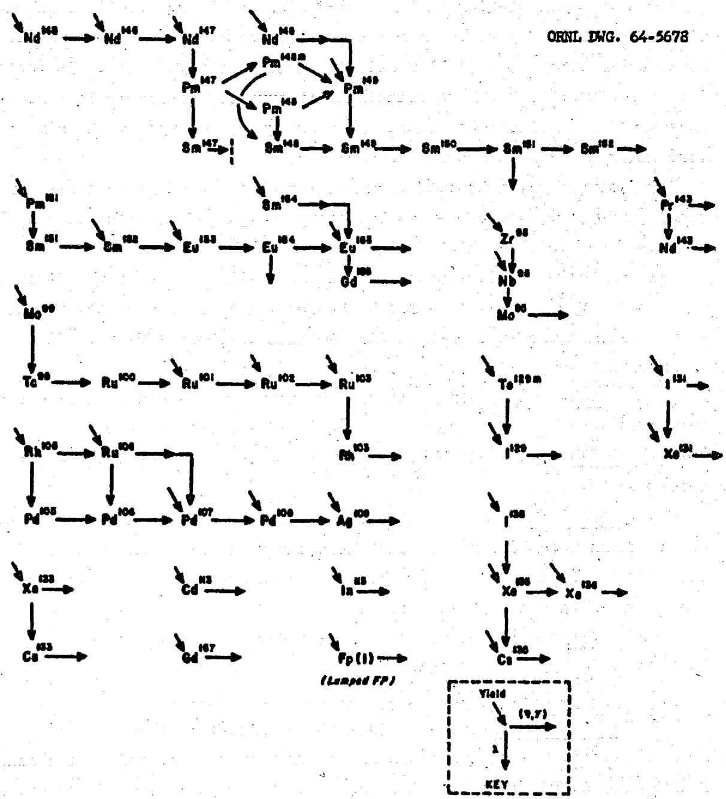  
Fig. 4.1 Nuclide Chains Used in Long Fission-Product (LFP) Treatment in ORNL-3686.

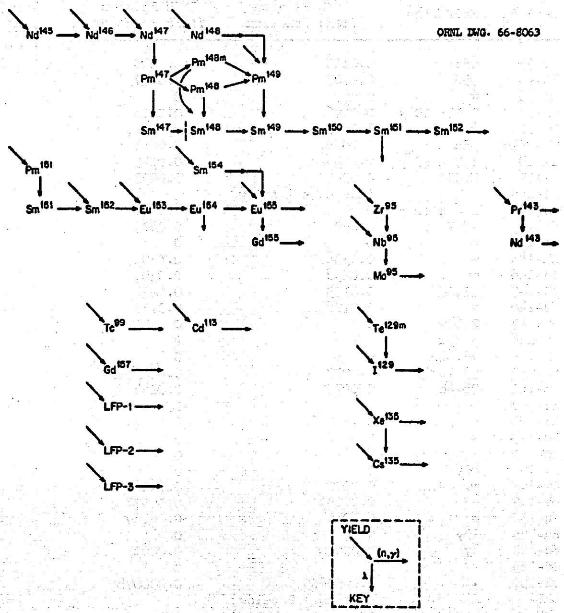  
Fig. 4.2 Nuclide Chains Used in Reduced Treatment for MSER.

Table 4.1 Yield Fractions and Half-Life for Fission Products   

<table><tr><td>Nuclide</td><td>Half Life</td><td>233U Fission Yield Fraction</td><td>235U Fission Yield Fraction</td></tr><tr><td>Zr-95</td><td>65d</td><td>0.0615</td><td>0.0620</td></tr><tr><td>Nb-95</td><td>35d</td><td>0.0007</td><td>0.0007</td></tr><tr><td>Mo-95</td><td>∞</td><td>0</td><td>0</td></tr><tr><td>Tc-99</td><td>2.1 x 105y</td><td>0.0496</td><td>0.0606</td></tr><tr><td>Cd-113</td><td>∞</td><td>0.0002</td><td>0.00012</td></tr><tr><td>Te-129m</td><td>33d</td><td>0.0075</td><td>0.0035</td></tr><tr><td>I-129</td><td>1.7 x 107y</td><td>0.0095</td><td>0.0045</td></tr><tr><td>I-131</td><td>8.05d</td><td>0.0341</td><td>0.0293</td></tr><tr><td>Xe-135</td><td></td><td>(See note 1 below)</td><td></td></tr><tr><td>Cs-135</td><td>2.6 x 106y</td><td>0</td><td>0.0011</td></tr><tr><td>Pr-143</td><td>13.7d</td><td>0.0591</td><td>0.0603</td></tr><tr><td>Nd-143</td><td>∞</td><td>0</td><td>0</td></tr><tr><td>Nd-145</td><td>∞</td><td>0.0338</td><td>0.0398</td></tr><tr><td>Nd-146</td><td>∞</td><td>0.0258</td><td>0.0307</td></tr><tr><td>Nd-147</td><td>11.1d</td><td>0.0193</td><td>0.0236</td></tr><tr><td>Nd-148</td><td>∞</td><td>0.0128</td><td>0.0171</td></tr><tr><td>Pm-147</td><td>2.65y</td><td>0</td><td>0</td></tr><tr><td>Pm-148</td><td>5.39d</td><td>0</td><td>0</td></tr><tr><td>Pm-148m</td><td>40.6d</td><td>0</td><td>0</td></tr><tr><td>Pm-149</td><td>53.1h</td><td>0.0077</td><td>0.0113</td></tr><tr><td>Pm-151</td><td>28.4h</td><td>0.0035</td><td>0.0044</td></tr><tr><td>Sm-147</td><td>∞</td><td>0</td><td>0</td></tr><tr><td>Sm-148</td><td>∞</td><td>0</td><td>0</td></tr><tr><td>Sm-149</td><td>∞</td><td>0</td><td>0</td></tr><tr><td>Sm-150</td><td>∞</td><td>0</td><td>0</td></tr><tr><td>Sm-151</td><td>80y</td><td>0</td><td>0</td></tr><tr><td>Sm-152</td><td>∞</td><td>0.0022</td><td>0.00281</td></tr><tr><td>Sm-154</td><td>∞</td><td>0.00047</td><td>0.00077</td></tr><tr><td>Eu-153</td><td>∞</td><td>0.0015</td><td>0.00169</td></tr><tr><td>Eu-154</td><td>16y</td><td>0</td><td>0</td></tr><tr><td>Eu-155</td><td>4y</td><td>0.00030</td><td>0.00033</td></tr><tr><td>Cd-155</td><td>∞</td><td>0</td><td>0</td></tr><tr><td>Cd-157</td><td>∞</td><td>0.0000635</td><td>0.000078</td></tr><tr><td>LFP-1</td><td></td><td>(See note 2 below)</td><td></td></tr><tr><td>LFP-2</td><td></td><td>(See note 2 below)</td><td></td></tr><tr><td>LFP-3</td><td></td><td>(See note 2 below)</td><td></td></tr></table>

1. Concentration of $^{135}\mathrm{Xe}$ is determined by the assumption of 0.005 poison fraction. Fission yield fraction does not enter the calculation.   
2. The poison fractions for these nuclides were obtained from ASSAULT calculations using the concentrations from Table 4.2. This poison fraction was then used as input to time dependent calculations.

Those nuclides which are not included explicitly and which are not assumed to be removed instantly by plating out or gas stripping are placed in one of three lumped pseudo-elements, which are described below.

1. Pseudo-element No. 1. Includes those nuclides which are removed by fluoride-volatility during fuel reprocessing.   
2. Pseudo-element No. 2. Includes those nuclides which are removed by vacuum distillation during fuel reprocessing.   
3. Pseudoelement No. 3. Includes those nuclides which are removed only by discarding some of the carrier salt.

The properties of these pseudo-elements are listed in Table 4.2 below.

Table 4.2 Effective Cross Sections and Concentrations for Pseudo-Elements in MSBR   

<table><tr><td></td><td colspan="3">Pseudo-Elements</td></tr><tr><td></td><td>No. 1</td><td>No. 2</td><td>No. 3</td></tr><tr><td>Effective Cross Section</td><td></td><td></td><td></td></tr><tr><td>σe(2200), barns</td><td>1.1372</td><td>3.6037</td><td>0.5061</td></tr><tr><td>Tg(E &gt; 0.414 ev), barns</td><td>12.2266</td><td>6.4986</td><td>2.5119</td></tr><tr><td>Effective Concentration, atoms/barn-cm</td><td></td><td></td><td></td></tr><tr><td>In fuel salt</td><td>2.84093-06</td><td>6.90232-06</td><td>1.28997-04</td></tr><tr><td>In fertile salt</td><td>3.79832+09</td><td>3.28086-06</td><td>2.83107-06</td></tr></table>

aNote that these are concentrations in the salt stream. For use in reactor calculations, these concentrations must be multiplied by the volume fraction of salt in a given region.

The nuclides which were included in each of these pseudo-elements are listed in Tables 4.3 through 4.5. The concentrations listed were taken from MERC case 555. These concentrations are the number densities in the salt itself.

The cross sections for the pseudo-elements were formed for each energy group in GAM and THERMOS by summing the product of concentration times group cross section for all the individual nuclides in the

Table 4.3 Fission Product Nuclides Included in Pseudo-Element No. 1   

<table><tr><td rowspan="2">Nuclide</td><td rowspan="2">σa(2200) barns</td><td rowspan="2">RI barns</td><td colspan="2">Concentration, atoms/b-cm</td></tr><tr><td>Fuel Stream</td><td>Fert. Stream</td></tr><tr><td>Br-81</td><td>3.3</td><td>57.63</td><td>6.0518-08</td><td>8.7537-11</td></tr><tr><td>Mo-96</td><td>1.2</td><td>30.87</td><td>9.8135-09</td><td>7.1924-13</td></tr><tr><td>Mo-97</td><td>2.2</td><td>15.30</td><td>7.6741-07</td><td>1.0316-09</td></tr><tr><td>Mo-98</td><td>0.51</td><td>5.95</td><td>7.5249-07</td><td>1.0119-09</td></tr><tr><td>Mo-100</td><td>0.5</td><td>7.87</td><td>6.5213-07</td><td>8.5615-10</td></tr><tr><td>Te-126</td><td>0.8</td><td>10.98</td><td>3.2118-08</td><td>4,6696-11</td></tr><tr><td>Te-128</td><td>0.3</td><td>2.52</td><td>1.3583-07</td><td>1.9458-10</td></tr><tr><td>Te-130</td><td>0.5</td><td>2.01</td><td>3.7842-07</td><td>5.2536-10</td></tr><tr><td>I-127</td><td>7.0</td><td>155.90</td><td>5.2200-08</td><td>7.5838-11</td></tr><tr><td colspan="3">Summed concentrations</td><td>2.84093-06</td><td>3.83038-09</td></tr><tr><td colspan="3">Effective σa(2200), barns</td><td>1.1372</td><td>1.1468</td></tr><tr><td colspan="3">Effective RI, barns</td><td>12.2266</td><td>12.3985</td></tr></table>

Table 4.4 Fission Product Nuclides Included in Pseudo-Element No. 2   

<table><tr><td rowspan="2">Nuclide</td><td rowspan="2">σa(2200) barns</td><td rowspan="2">RI barns</td><td colspan="2">Concentration, atoms/b-cm</td></tr><tr><td>Fuel Stream</td><td>Fert. Stream</td></tr><tr><td>Sr-86</td><td>1.65</td><td>0.65a</td><td>1.4223-09</td><td>5.9135-10</td></tr><tr><td>Sr-88</td><td>0.005</td><td>0.057</td><td>6.9942-07</td><td>3.2394-07</td></tr><tr><td>Y-89</td><td>1.31</td><td>0.792</td><td>9.1064-07</td><td>4.1837-07</td></tr><tr><td>Y-90</td><td>3.5</td><td>1.4a</td><td>7.0060-08</td><td>2.1953-10</td></tr><tr><td>Ba-136</td><td>0.4</td><td>13.01</td><td>1.4357-09</td><td>1.2256-09</td></tr><tr><td>Ba-137</td><td>5.1</td><td>7.77</td><td>5.2406-08</td><td>1.3713-07</td></tr><tr><td>Ba-138</td><td>0.7</td><td>0.368</td><td>9.6240-07</td><td>4.4279-07</td></tr><tr><td>La-139</td><td>8.9</td><td>11.0</td><td>9.1588-07</td><td>3.9520-07</td></tr><tr><td>Ce-140</td><td>0.66</td><td>0.477</td><td>8.8026-07</td><td>4.1478-07</td></tr></table>

Table 4.4 (cont'd)   

<table><tr><td rowspan="2">Nuclide</td><td rowspan="2">σa(2200) barns</td><td rowspan="2">RI barns</td><td colspan="2">Concentration, atoms/b-cm</td></tr><tr><td>Fuel Stream</td><td>Fert. Stream</td></tr><tr><td>Ce-142</td><td>1.0</td><td>2.654</td><td>8.1908-07</td><td>3.6721-07</td></tr><tr><td>Ce-143</td><td>6.0</td><td>2.4a</td><td>1.0447-11</td><td>5.4542-13</td></tr><tr><td>Pr-141</td><td>11.6</td><td>24.08</td><td>8.4718-07</td><td>3.5522-07</td></tr><tr><td>Pr-142</td><td>18.0</td><td>7.1a</td><td>3.8145-09</td><td>2.6162-08</td></tr><tr><td>Nd-144</td><td>5.0</td><td>13.85</td><td>6.6381-07</td><td>4.5433-07</td></tr><tr><td>Nd-150</td><td>3.0</td><td>10.86</td><td>7.0879-08</td><td>3.0366-08</td></tr><tr><td>Gd-156</td><td>4.0</td><td>33.97</td><td>2.9716-09</td><td>1.2041-09</td></tr><tr><td>Gd-158</td><td>3.9</td><td>32.03</td><td>5.7834-10</td><td>2.9853-10</td></tr><tr><td>Tb-159</td><td>45.0</td><td>438.00</td><td>7.4401-11</td><td>1.8706-11</td></tr><tr><td colspan="3">Summed concentrations</td><td>6.90232-06</td><td>3.36906-06</td></tr><tr><td colspan="3">Effective σa(2200), barns</td><td>3.6037</td><td>3.7006</td></tr><tr><td colspan="3">Effective RI, barns</td><td>6.4986</td><td>6.6896</td></tr></table>

a. Nuclei do not on GAM library. Used group cross sections for pure 1/v nuclide (RI = 0.5014 barns) with nuclide concentrations multiplied by ratio of (RI₁)/0.5014.

Table 4,5 Fission Product Nuclides Included in Pseudo-Element No. 3   

<table><tr><td rowspan="2">Nuclide</td><td rowspan="2">σa(2200) barns</td><td rowspan="2">RI barns</td><td colspan="2">Concentration, atoms/b-cm</td></tr><tr><td>Fuel Stream</td><td>Fert. Stream</td></tr><tr><td>Rb-85</td><td>0.91</td><td>0.671</td><td>5.1984-06</td><td>1.2251-07</td></tr><tr><td>Rb-87</td><td>0.12</td><td>0.166</td><td>1.1084-05</td><td>2.5896-07</td></tr><tr><td>Zr-90</td><td>0.10</td><td>0.540</td><td>5.2226-10</td><td>1.4553-12</td></tr><tr><td>Zr-91</td><td>1.58</td><td>7.45</td><td>1.8109-05</td><td>4.1428-07</td></tr><tr><td>Zr-92</td><td>0.25</td><td>0.264</td><td>1.9327-05</td><td>4.4042-07</td></tr><tr><td>Zr-93</td><td>1.10</td><td>7.96</td><td>1.9072-05</td><td>4.3664-07</td></tr><tr><td>Zr-94</td><td>0.076</td><td>0.15</td><td>2.0215-05</td><td>4.5786-07</td></tr></table>

Table 4.5 (cont'd)   

<table><tr><td rowspan="2">Nuclide</td><td rowspan="2">σa(2200) barns</td><td rowspan="2">RI barns</td><td colspan="2">Concentration, atoms/b-cm</td></tr><tr><td>Fuel Stream</td><td>Fert. Stream</td></tr><tr><td>Zr-96</td><td>0.053</td><td>0.32</td><td>1.6454-05</td><td>3.6922-07</td></tr><tr><td>Cd-111</td><td>2.0</td><td>51.09</td><td>6.4725-08</td><td>1.5078-09</td></tr><tr><td>Cd-112</td><td>0.03</td><td>12.99</td><td>5.8933-08</td><td>1.3793-09</td></tr><tr><td>Cd-114</td><td>1.24</td><td>14.38</td><td>1.0804-07</td><td>2.5536-09</td></tr><tr><td>Sn-116</td><td>0.006</td><td>14.0a</td><td>1.3033-08</td><td>2.0729-11</td></tr><tr><td>Cs-137</td><td>0.11</td><td>0.653</td><td>1.9292-05</td><td>3.2572-07</td></tr><tr><td colspan="3">Summed concentrations</td><td>1.28997-04</td><td>2.83107-06</td></tr><tr><td colspan="3">Effective σa(2200), barns</td><td>0.5061</td><td>0.5242</td></tr><tr><td colspan="3">Effective RI, barns</td><td>2.5119</td><td>2.5922</td></tr></table>

eNuclide not on GAM library. Used group cross sections for pure 1/v nuclide (RI = 0.5014 barns) with nuclide concentrations multiplied by ratio of (RI₁)/0.5014.

pseudo-element and then dividing by the summed concentrations. That is, the effective group cross section for the pseudo-element is defined to be

$$
\sigma_ {g} ^ {\text {e f f}} = \sum_ {1} N _ {1} \sigma_ {g / 1} ^ {i} N _ {1},
$$

where $\mathbf{g}$ is a GAM or THERMOS group number, and $\mathbf{i}$ identifies an individual nuclide included in the pseudo-element.

Performing this calculation for each group, we obtain an energy-dependent effective microscopic cross section for each pseudo-element. These numbers are then placed on the GAM and THERMOS libraries for use in spectrum calculations.

The summed concentrations and cross sections calculated for the three lumped fission products are presented at the bottom of Tables 4.2 through 4.4.

Since the effective microscopic cross sections for the lumped pseudoelement differs only slightly between the fuel and fertile stream, only

the cross sections for fuel-stream pseudo-elements were put on the library tapes. The summed concentrations for the fertile stream pseudo-element were then multiplied by the ratio of $\sigma_{\mathrm{o}}(\text{fertile}) / \sigma_{\mathrm{o}}$ (fuel) in order to obtain the correct reaction rate at 2200 m/sec. The properties of the lumped pseudo-elements are summarized in Table 4.2.

# 5. CELL CALCULATIONS

The infinite-medium code M-GAM was used to calculate spectra and to obtain energy-averaged cross sections for neutrons from 10 MeV to 1.86 eV. Two of these calculations were made, one for the typical core cell, shown in Fig. 5.1 and the other for a homogeneous cell representing the blanket composition. Two subsidiary calculations were done first to provide input information for the M-GAM calculation: a calculation of high energy intra-cell flux ratios and a calculation of effective chord length for the resonance absorbers. The intra-cell flux ratios were obtained for the energy groups between 10 MeV and 30 kev, by means of a one-dimensional calculation of the cell in $S_{4}$ approximation to the transport equation. The code ANISN was used. Thirty group cross sections were obtained through use of GAM-II to reduce the 94 group library data. The cell was approximated by a series of concentric annuli as shown in Fig. 5.2 and described in Tables 5.1, 5.2, and 5.3. The calculated ratios of region flux to cell flux are shown in Table 5.4. The values appearing in Table 5.4 were averaged by volume and density to obtain the proper factors for input by nuclide to the M-GAM calculation.

The effective resonance integrals for the resonance absorbers are calculated in the M-QAM code by means of the narrow resonance and infinite mass approximations. Heterogeneity effects are accounted for by specifying the effective chord length of a sphere, infinite cylinder, or infinite slab which gives the same collision probabilities as the actual region containing the resonance absorber. Since the fissile and fertile stream regions of the MSBR cell (Figure 5.1) do not correspond to a lattice of one of these simple shapes, a calculation of the collision probabilities was required. We used a three-dimensional Monte Carlo code in which the neutron histories were started with random position and direction within the material for which the collision probability was to be calculated. The fraction having a first collision in each of the materials was computed for several values of its total cross section. The fissile stream regions in the core cell corresponded to an infinite cylinder with radius of 2.87 ± 0.07 cm with 95% confidence. This value was used for the isotopes,

Fig. 5.1 Molten Salt Breeder Reactor Core Cell.   
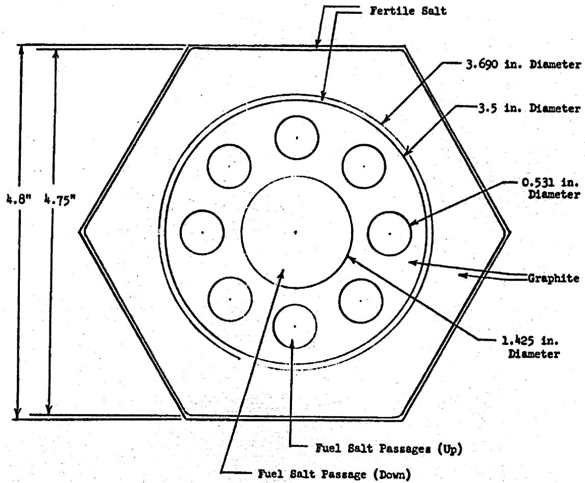  
ORNL DWG. 66-8064

ORNL DWG. 66-8065

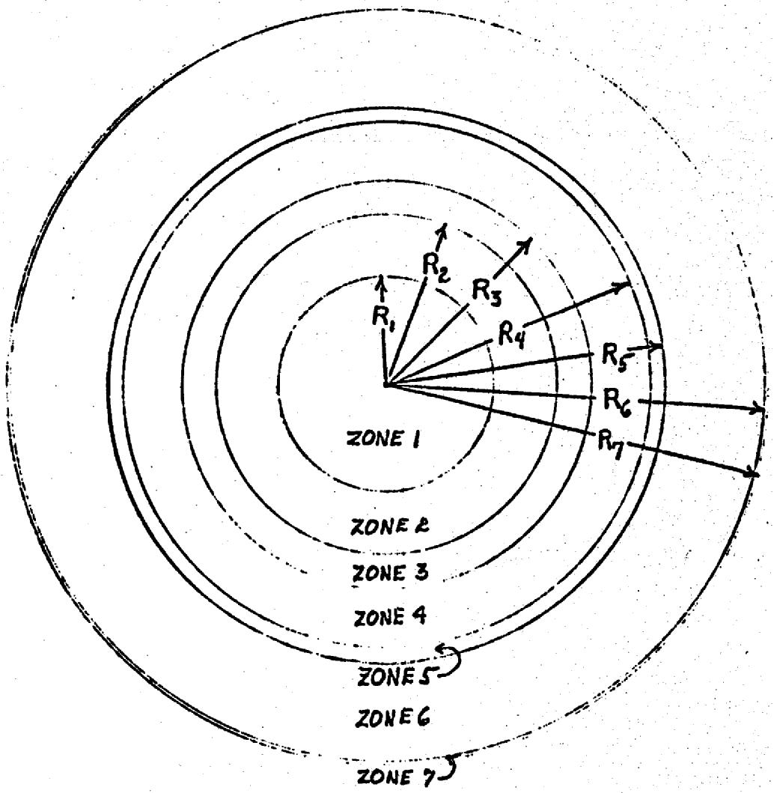  
Fig. 5.2 The One-Dimensional Approximation of the MSER Cell.

Table 5.1. Figure 5.1 Materials   

<table><tr><td>Zone</td><td>Materials</td></tr><tr><td>1</td><td>Fissile Stream</td></tr><tr><td>2</td><td>Graphite</td></tr><tr><td>3</td><td>Fissile Stream</td></tr><tr><td>4</td><td>Graphite</td></tr><tr><td>5</td><td>Fertile Stream</td></tr><tr><td>6</td><td>Graphite</td></tr><tr><td>7</td><td>Fertile Stream</td></tr></table>

Table 5.2. Figure 5.1 Dimensions   

<table><tr><td>Radius</td><td>Length (cm)</td></tr><tr><td>R1</td><td>1.8098</td></tr><tr><td>R2</td><td>2.8882</td></tr><tr><td>R3</td><td>3.4617</td></tr><tr><td>R4</td><td>4.4450</td></tr><tr><td>R5</td><td>4.6863</td></tr><tr><td>R6</td><td>6.3346</td></tr><tr><td>R7</td><td>6.4013</td></tr></table>

Table 5.3. Atomic Densities for MSER Calculations (Atoms per barn cm.)   

<table><tr><td>Nuclide</td><td>Pure Fuel</td><td>Pure Fertile</td><td>Pure Graphite</td><td>Cell Average</td></tr><tr><td>Be</td><td>1.2239-02</td><td>5.2320-04</td><td></td><td>0.21057-02</td></tr><tr><td>C</td><td></td><td></td><td>9.53-02</td><td>7.2105-02</td></tr><tr><td>Th-232</td><td></td><td>7.0630-03</td><td></td><td>0.52641-03</td></tr><tr><td>Pa-233</td><td></td><td>2.79163-06</td><td></td><td>0.20806-06</td></tr><tr><td>U-233</td><td>7.00685-05</td><td>1.57079-06</td><td></td><td>1.19484-05</td></tr><tr><td>U-234</td><td>2.51191-05</td><td>1.53989-08</td><td></td><td>0.42427-05</td></tr><tr><td>U-235</td><td>7.63459-06</td><td>5.02589-11</td><td></td><td>1.28918-06</td></tr><tr><td>U-236</td><td>8.45420-06</td><td>1.11775-13</td><td></td><td>1.42758-06</td></tr><tr><td>U-238</td><td>7.20564-07</td><td></td><td></td><td>1.21674-07</td></tr><tr><td>Cr*</td><td></td><td></td><td></td><td></td></tr><tr><td>Fe*</td><td></td><td></td><td></td><td></td></tr><tr><td>Ni*</td><td></td><td></td><td></td><td></td></tr><tr><td>Mo*</td><td></td><td></td><td></td><td></td></tr><tr><td>Mo-95</td><td>8.79340-07</td><td>1.20594-09</td><td></td><td>1.48575-07</td></tr><tr><td>Tc-99</td><td>6.91964-07</td><td>9.33264-10</td><td></td><td>1.16915-07</td></tr><tr><td>Cd-113</td><td>1.89260-10</td><td>5.01213-12</td><td></td><td>0.32332-10</td></tr><tr><td>I-129</td><td>2.71048-07</td><td>3.88965-10</td><td></td><td>0.45798-07</td></tr><tr><td>Xe-135</td><td>1.28135-10</td><td></td><td></td><td>0.21637-10</td></tr><tr><td>Ca-135</td><td>2.16231-07</td><td>1.95074-13</td><td></td><td>0.36513-07</td></tr><tr><td>Nd-143</td><td>6.94383-07</td><td>1.33582-07</td><td></td><td>1.27210-07</td></tr><tr><td>Nd-145</td><td>4.27650-07</td><td>1.31705-07</td><td></td><td>0.82029-07</td></tr><tr><td>Nd-146</td><td>3.51506-07</td><td>2.12537-07</td><td></td><td>0.75195-07</td></tr><tr><td>Nd-148</td><td>1.77059-07</td><td>7.242694-08</td><td></td><td>0.35296-07</td></tr><tr><td>Pm-147</td><td>2.00812-07</td><td>1.20786-08</td><td></td><td>0.34809-07</td></tr><tr><td>Sm-147</td><td>6.48113-09</td><td>2.93786-08</td><td></td><td>3.28399-09</td></tr><tr><td>Sm-148</td><td>2.02350-08</td><td>7.19904-08</td><td></td><td>0.87823-08</td></tr><tr><td>Sm-149</td><td>5.39408-09</td><td>1.58085-10</td><td></td><td>0.92262-09</td></tr><tr><td>Sm-150</td><td>1.06162-07</td><td>2.97040-08</td><td></td><td>0.20141-07</td></tr><tr><td>Sm-151</td><td>1.76667-08</td><td>1.60114-09</td><td></td><td>0.31025-08</td></tr><tr><td>Sm-152</td><td>4.34709-08</td><td>1.10604-08</td><td></td><td>0.81648-08</td></tr><tr><td>Sm-154</td><td>5.75048-09</td><td>2.27567-09</td><td></td><td>1.14064-09</td></tr><tr><td>Eu-153</td><td>1.97099-08</td><td>1.14064-08</td><td></td><td>0.41783-08</td></tr><tr><td>Eu-154</td><td>2.65506-09</td><td>4.13375-09</td><td></td><td>0.75642-09</td></tr><tr><td>Eu-155</td><td>3.31571-10</td><td>6.01616-10</td><td></td><td>1.00827-10</td></tr><tr><td>Gd-155</td><td>1.49662-10</td><td>3.75438-12</td><td></td><td>0.25552-10</td></tr><tr><td>Gd-157</td><td>7.12370-12</td><td>2.35735-13</td><td></td><td>1.22048-12</td></tr><tr><td>Pm-148*</td><td></td><td></td><td></td><td></td></tr><tr><td>Pm-148m</td><td>3.22506-09</td><td>4.35073-11</td><td></td><td>0.54782-09</td></tr><tr><td>Np-237</td><td>1.64999-07</td><td>4.47285-14</td><td></td><td>0.27862-07</td></tr><tr><td>Pr-143</td><td>2.61836-10</td><td>2.29571-09</td><td></td><td>2.15313-10</td></tr><tr><td>F</td><td>4.6341-02</td><td>4.7870-02</td><td></td><td>1.13929-02</td></tr><tr><td>Li-6</td><td>1.3174-07</td><td>9.8022-08</td><td></td><td>0.29552-07</td></tr><tr><td>Li-7</td><td>2.1460-02</td><td>1.8570-02</td><td></td><td>0.50077-02</td></tr></table>

*Trace quantities assumed for the cell calculation.

Table 5.3. (cont'd)   

<table><tr><td>Nuclide</td><td>Pure Fuel</td><td>Pure Fertile</td><td>Pure Graphite</td><td>Cell Average</td></tr><tr><td>LFP-1</td><td>2.84093-06</td><td>3.79832-09</td><td></td><td>0.48000-06</td></tr><tr><td>LFP-2</td><td>6.90232-06</td><td>3.28086-06</td><td></td><td>1.41005-06</td></tr><tr><td>LFP-3</td><td>1.28997-04</td><td>2.73331406</td><td></td><td>0.21986-04</td></tr></table>

Table 5.4. Ratio of Average Fast Flux by Zone and Group* to the Cell Average   

<table><tr><td>Zone</td><td>Group 1</td><td>Group 2</td></tr><tr><td>1</td><td>1.297</td><td>1.121</td></tr><tr><td>2</td><td>1.134</td><td>1.056</td></tr><tr><td>3</td><td>1.104</td><td>1.038</td></tr><tr><td>4</td><td>0.9913</td><td>0.9969</td></tr><tr><td>5</td><td>0.9347</td><td>0.9775</td></tr><tr><td>6</td><td>0.9015</td><td>0.9603</td></tr><tr><td>7</td><td>0.8968</td><td>0.9585</td></tr></table>

*Group 1 is 0.82 Mev to 10 Mev.
Group 2 is 0.03 Nev to 0.82 Mev.

$234_{\mathrm{U}}, 236_{\mathrm{U}}$ , and $238_{\mathrm{U}}$ . The fertile stream regions in the core cell corresponded to an infinite slab with thickness of $0.277 \pm 0.002$ cm. This value was used for $233_{\mathrm{Pa}}$ and $232_{\mathrm{Th}}$ .

The atomic densities of the pure streams (Table 5.3) were volume weighted to obtain the mixture densities for the M-GAM calculation. The resonance materials were assumed to be at $900^{\circ}\mathrm{K}$ . Five group cross sections were generated by M-GAM. These groups were as follows: 10 Mev to 0.821 Mev, 0.821 Mev to 0.0318 Mev, 31.8 kev to 1.234 kev, 1234 ev to 47.8 ev, and 47.8 ev to 1.86 ev.

Figure 5.3 shows the epithermal neutron spectra as calculated by M-GAM for the blanket and core cells. The outstanding features of these curves are the dips in the lethargy range 2.5 to 6 and 10-5 to 13. The behavior in the range 2.5 to 6 may be explained on the basis of scattering resonances in fluorine. An inelastic resonance corresponds to the first

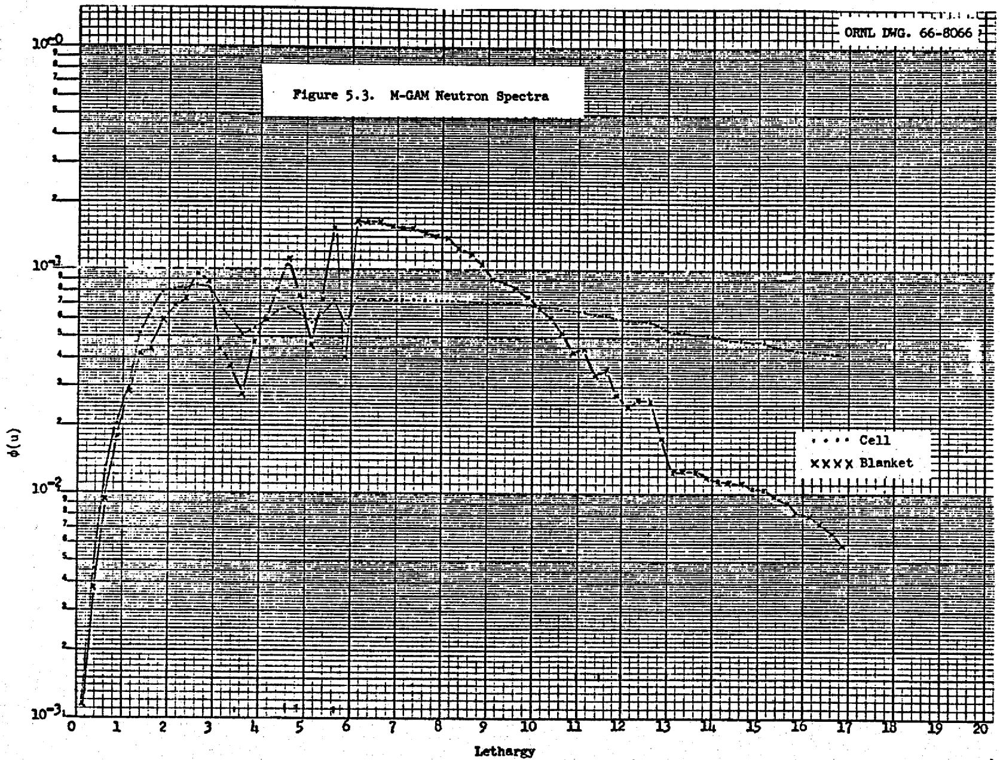

of these dips and elastic resonances to the second and third dips. The behavior in the lethargy range from 10.5 to 13 is caused by thorium absorption. Thorium has four large resonances which correspond in lethargy to the four dips appearing in this range. The fluctuations are always much more pronounced in the blanket calculation than in the cell calculation because the average densities of fluorine and thorium are much greater in the blanket than in the core.

THERMOS is a one-dimensional integral transport code which calculates the scalar thermal neutron spectrum as a function of position. The basic THERMOS data consists of a thirty group library tape. These fine groups are then averaged over the spectrum and over the cell to obtain broad group cross sections. In the present calculations four broad group thermal cross sections were generated with energy limits as follows: 0.005 ev to 0.06 ev, 0.06 ev to 0.18 ev, 0.18 ev to 0.77 ev and 0.77 ev to 1.86 ev.

The one-dimensional geometry of THERMOS makes necessary the description of the cell as a series of concentric annular rings. The core cell description for THERMOS was identical to that previously described for ANISN with one exception. Experience has shown that to obtain proper fluxes in THERMOS the unit cell should be enclosed in a region called a heavy scatterer. This region consists of a heavy nuclide whose only reaction is scattering. The unit cell as shown in Fig. 5.2 and described in Tables 5.1, 5.2, and 5.3 was enclosed in such a region for the THERMOS calculation.

The temperature of all materials in the cell and the blanket was assumed to be $900^{\circ}\mathrm{K}$ .

The spatial variation of the flux in two of the fine groups is shown in Fig. 5.4 (energies of 0.02-0.03 ev and 0.07-0.08 ev). The spatial variation is clearly quite small. Fig. 5.5 shows the energy distribution of the average flux for the cell and blanket calculations.

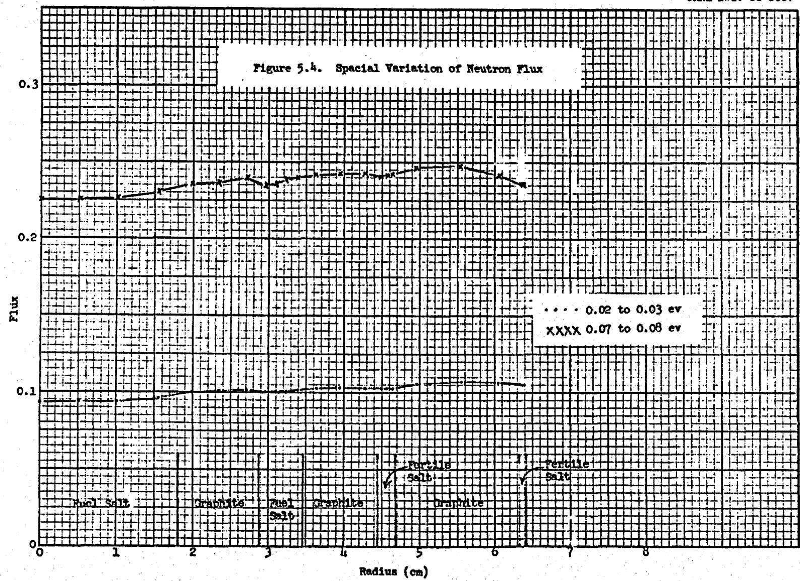

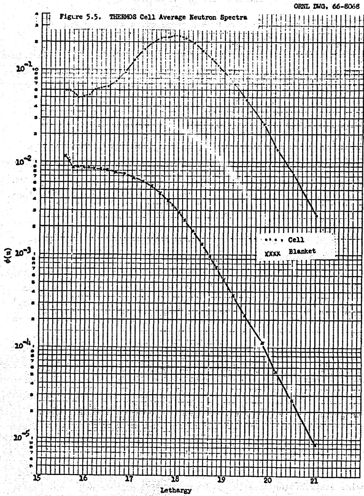

# 6. TWO-DIMENSIONAL CALCULATIONS

The reactor was described in R-Z geometry as shown in Fig. 6.1. (All dimensions on this figure are in feet.) Forty-eight mesh lines were used in the radial direction and 67 axially. The region compositions are listed in Table 6.1 and the main core densities are listed in Table 6.2. Region 11, the center control rod, was treated as a typical fuel cell (Figure 5.1) with the fuel stream replaced by graphite. In the lower axial blanket (region 12), each fuel tube was considered to be $100\%$ INOR-8 between the core and the lower plenum. Region 18 is a vacuum region which is used to impose a "black" boundary condition on the adjacent fuel and INOR boundaries. Region 19 is an annulus of fuel representing the four sets of entrance and exit fuel pipes at the bottom of the reactor. Where possible, reactor dimensions and volume fractions were made the same as in the previous calculations (case 555).

The nine-group neutron diffusion equations were solved with the ASSAULT code. A value of $\mathrm{k_{eff}} = 0.95$ was obtained. The decrease in $\mathrm{k_{eff}}$ of 0.05 compared to the previous calculations is entirely attributable to a 21% higher thorium resonance integral used in our calculations.

A fuel search calculation was then made on the $^{233}\mathrm{U}$ concentration in the fuel stream until the reactor was just critical. A $^{233}\mathrm{U}$ concentration increase of $13.9\%$ was required to raise $\mathbf{k}_{\mathrm{eff}}$ to unity. A region-by-region neutron balance for the critical configuration is given in Table 6.3. Only about 0.006 of the absorptions per fissile absorption occur outside the surrounding blankets, indicating optically thick blankets. In fact, the axial leakage is so small that the axial blankets could be made somewhat thinner without affecting the neutron economy. However, about 0.005 neutrons absorbed in the lower axial blanket are captured by INOR. This loss in breeding ratio might be avoided if it is possible to extend the graphite fuel tubes below the core about 6-12 in. before making the transition to INOR.

The power density is very nearly in a $J_{0}$ distribution radially and a cosine distribution axially, as shown in Fig. 6.2 and 6.3. The radial distribution corresponds to the mid-plane of the core, and the axial traverse was made near the center of the core at $r = 17$ cm. Power densities

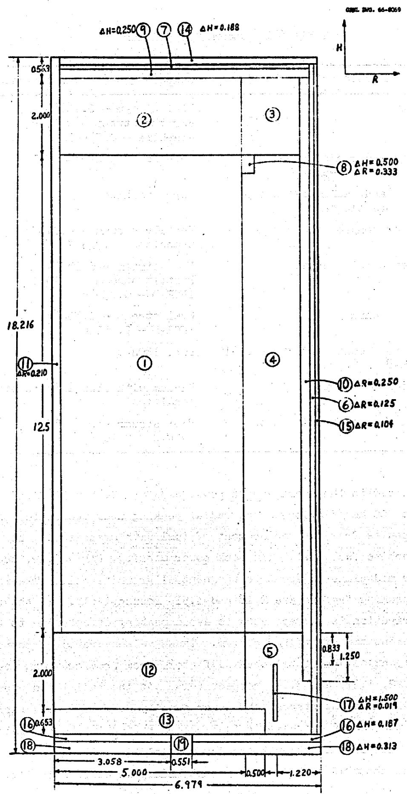  
Fig. 6.1 MSBR Reactor Model in R-Z Geometry

Table 6.1 Region Composition   

<table><tr><td></td><td>Region</td><td>Composition (Volume fractions)</td></tr><tr><td>1</td><td>Core</td><td>Fuel stream - 0.16886Fertile stream - 0.07453Graphite - 0.75661</td></tr><tr><td>2-7</td><td>Upper and radial blanketsand outer streams</td><td>Pure fertile stream</td></tr><tr><td>8-10</td><td>Upper and radial reflectorsand core tie-band</td><td>Pure graphite</td></tr><tr><td>11</td><td>Center control rod channel</td><td>Fertile stream - 0.07453Graphite - 0.92547</td></tr><tr><td>12</td><td>Lower axial blanket</td><td>Fuel stream - 0.16539Fertile stream - 0.79517INOR-8 - 0.03944</td></tr><tr><td>13</td><td>Fuel plenum</td><td>Fuel stream - 0.85484INOR-8 - 0.14516</td></tr><tr><td>14-17</td><td>Reactor vessel and structuralINOR-8</td><td>Pure INOR-8</td></tr><tr><td>18</td><td>&quot;Black Boundary&quot; region</td><td>Vacuum with flux extrapolationcondition</td></tr><tr><td>19</td><td>Fuel inlet and exit ducts</td><td>Fuel stream - 0.89437INOR-8 - 0.10563</td></tr></table>

were normalized to the average core power density, $2.48 \times 10^{12}$ fission/ cm³ sec (at 200 Mev/fission). The radial peaking near the center of the core results from the replacement of fuel with graphite in the central graphite fuel cell. The peak power density, $\mathrm{P} / \overline{\mathrm{P}} = 3.29$ , occurs at the core mid-plane adjacent to the central graphite cell. The radial and axial peaking factors are 2.18 and 1.51, respectively. If the radial power distribution is extrapolated to avoid peaking effects due to the central element treatment, $\mathrm{P} / \overline{\mathrm{P}} = 3.08$ . These values are to be compared with radial, axial, and total peaking factors from previous work (case 555) of 2.22, 1.37, and 3.04, respectively. At the radial and upper axial core-blanket interfaces, the power density drops off very rapidly because of the sudden decrease in fuel concentration in the blankets. However, fuel does flow up through the lower axial blanket, and power generation extends about 10 cm below the core boundary as defined in Fig. 6.1.

Table 6.2 Core Number Densities (atoms/barn-cm core)   

<table><tr><td>Nuclide</td><td>Fuel</td><td>Fertile</td></tr><tr><td>232Th</td><td>-</td><td>5.26410 x 10-4</td></tr><tr><td>233Pa</td><td>-</td><td>2.08060 x 10-7</td></tr><tr><td>233U</td><td>1.34708 x 10-5</td><td>1.17071 x 10-7</td></tr><tr><td>234U</td><td>4.24160 x 10-6</td><td>1.14767 x 10-9</td></tr><tr><td>235U</td><td>1.28918 x 10-6</td><td>3.74580 x 10-12</td></tr><tr><td>236U</td><td>1.42758 x 10-6</td><td>8.33060 x 10-15</td></tr><tr><td>237Np</td><td>2.78620 x 10-8</td><td>3.33360 x 10-15</td></tr><tr><td>Be</td><td>2.06670 x 10-3</td><td>3.89941 x 10-5</td></tr><tr><td>6Li,</td><td>2.22460 x 10-8</td><td>7.30600 x 10-9</td></tr><tr><td>7Li</td><td>3.62370 x 10-3</td><td>1.38400 x 10-3</td></tr><tr><td>F</td><td>7.82510 x 10-3</td><td>3.56730 x 10-3</td></tr><tr><td>135Xe</td><td>2.16370 x 10-11</td><td>1.0 x 10-20</td></tr><tr><td>149Sm</td><td>9.10840 x 10-10</td><td>1.17800 x 10-11</td></tr></table>

Table 6.3 Region Neutron Balance   

<table><tr><td rowspan="2" colspan="2">Region</td><td colspan="2">Neutrons per Fissile Absorption</td></tr><tr><td>Losses</td><td>Productions</td></tr><tr><td>1</td><td>Core</td><td>2.0369</td><td>2.2160</td></tr><tr><td>2</td><td>Upper axial blanket</td><td>0.0188</td><td>0.0007</td></tr><tr><td>3</td><td>Upper corner blanket</td><td>0.0009</td><td>0.0000</td></tr><tr><td>4</td><td>Radial blanket</td><td>0.1360</td><td>0.0051</td></tr><tr><td>5</td><td>Lower corner blanket</td><td>0.0009</td><td>0.0000</td></tr><tr><td>6</td><td>Radial outer stream</td><td>0.0006</td><td>0.0000</td></tr><tr><td>7</td><td>Upper outer stream</td><td>0.0000</td><td>0.0000</td></tr><tr><td>8</td><td>Core tie-band</td><td>0.0000</td><td>-</td></tr><tr><td>9</td><td>Upper reflector</td><td>0.0000</td><td>-</td></tr><tr><td>10</td><td>Radial reflector</td><td>0.0000</td><td>-</td></tr><tr><td>11</td><td>Central control rod channel</td><td>0.0033</td><td>0.0001</td></tr><tr><td>12</td><td>Lower axial blanket</td><td>0.0232</td><td>0.0058</td></tr><tr><td>13</td><td>Fuel plenum</td><td>0.0002</td><td>0.0002</td></tr><tr><td>14</td><td>Upper vessel structure</td><td>0.0000</td><td>-</td></tr><tr><td>15</td><td>Radial vessel structure</td><td>0.0010</td><td>-</td></tr><tr><td>16</td><td>Lower vessel structure</td><td>0.0000</td><td>-</td></tr><tr><td>17</td><td>Plenum structure</td><td>0.0000</td><td>-</td></tr><tr><td>19</td><td>Fuel ducts</td><td>0.0000</td><td>0.0000</td></tr><tr><td></td><td>Upper leakage</td><td>0.0000</td><td></td></tr><tr><td></td><td>Lower leakage (includes region 18)a</td><td>0.0000</td><td>-</td></tr><tr><td></td><td>Radial leakage</td><td>0.0010</td><td>-</td></tr><tr><td></td><td>Delayed neutrons lostb</td><td>0.0051</td><td></td></tr><tr><td></td><td></td><td>2.2279</td><td>2.2279</td></tr></table>

aRegion 18 is a "black" region located below the reactor vessel.   
bDelayed neutrons emitted outside the core.

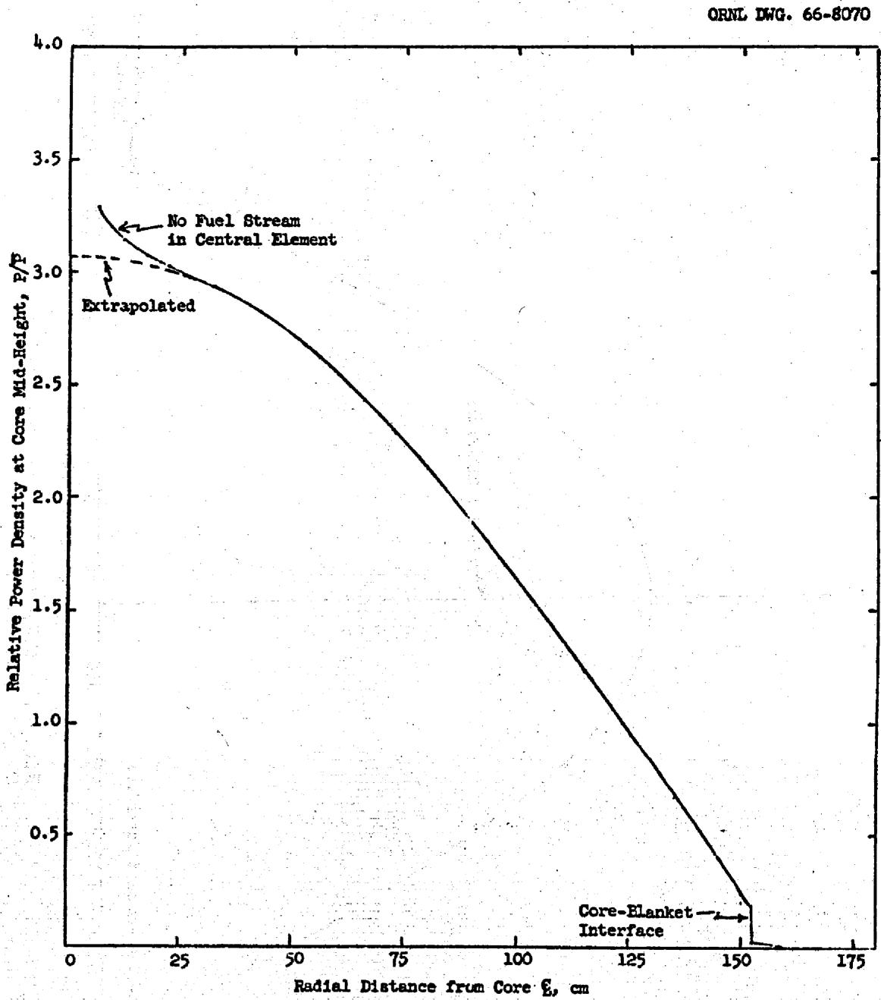  
Fig. 6.2 MSBR Radial Power Distribution

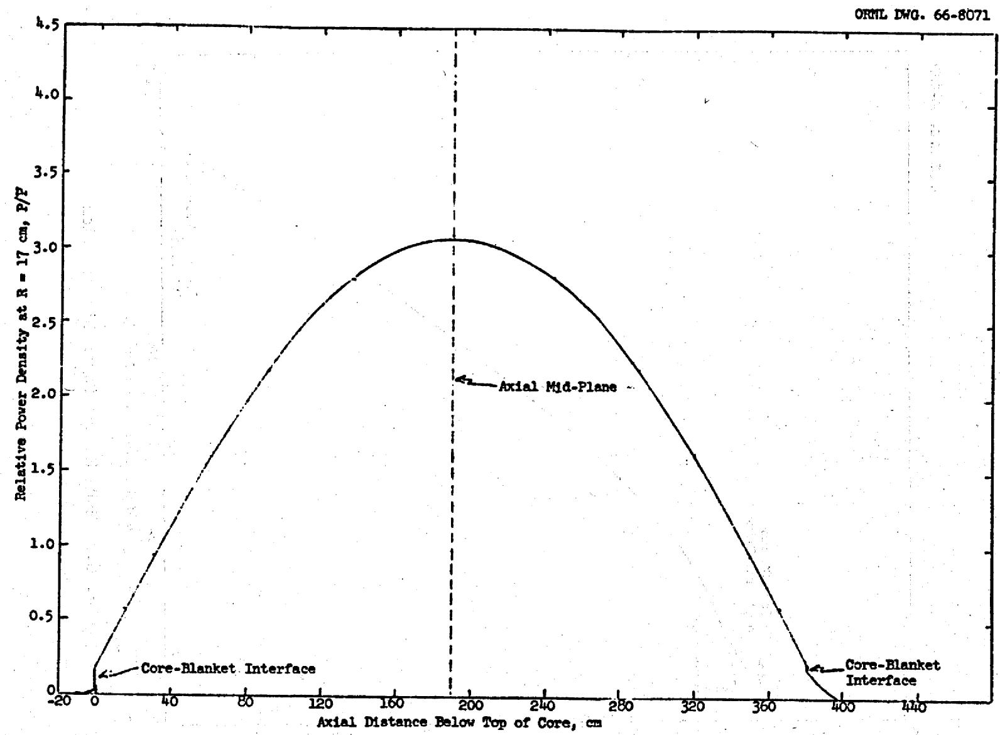  
Fig. 6.3 MSBR Axial Power Distribution

# References

1. D. R. Vondy, T. B. Fowler, M. L. Tobias, Reactor Depletion Code ASSAULT (Two-Dimensional, Multi-Neutron-Group, Diffusion), ORNL-TM-1302, March 1966.

# 7. DEPLETION CALCULATIONS

The previous calculations used the MERC code which obtains equilibrium reaction rates and equilibrium concentrations automatically. The concentrations are obtained from the ERC portion of MERC which solves directly the coupled equations of the equilibrium condition for a circulating fuel reactor. Since we wished to make an independent check on the validity of the solution, and had no other code available which solves the same problem, we made extensive modifications to an existing code. We took the LTM code, which does a multigroup point-depletion calculation of the equilibrium cycle for a solid-fuel reactor, and changed it to do a one-group, point-depletion calculation of the fluid fuel cycle. This required that the code use average stream densities for losses and removals, that it permit specification of separate cycle times for the two streams, and that the nuclide chains be modified to include all of those discussed in section 4 of this report.

We used the one-group cross sections (microscopic reaction rates) obtained from the ASSAULT calculation for each nuclide in each stream. The removal of fission products was treated as indicated in section 4. Losses of uranium isotopes were assumed to be 0.001 per reprocessing cycle, loss of $^{233}\mathrm{Pa}$ was assumed to be 0.00001 per cycle, and $^{237}\mathrm{Np}$ was assumed to be removed completely each cycle. Complete transfer of uranium isotopes from the fertile to the fissile stream at the end of each fertile stream cycle was assumed.

Table 7.1 gives the resulting neutron balance. The gross (nuclear) breeding ratio is 1.062 compared with 1.054 previously obtained (ORNL-TM-1467, calculated from Table 8).

Previous calculations have made the tacit assumption that the equilibrium fuel cycle can be used to represent the reactor history though it is known that some molten salt reactors might have to be started up on a uranium fully enriched in $^{235}\mathrm{U}$ .

In order to check the validity of the equilibrium assumption, we did a time-dependent depletion calculation for the heavy nuclides over a 30-year reactor history, starting with a $93\%$ $235_{\mathrm{U}} - 7\%$ $238_{\mathrm{U}}$ fuel. We held the thorium concentration constant and varied the fissile concentration to

Table 7.1 Neutron Balance by Nuclide   

<table><tr><td></td><td>Absorptions</td><td>Fissions</td><td>Productions</td></tr><tr><td>C</td><td>0.0261</td><td></td><td></td></tr><tr><td>Be</td><td>0.0159</td><td>0.0103</td><td>0.0205</td></tr><tr><td>7Li</td><td>0.0172</td><td></td><td></td></tr><tr><td>F</td><td>0.0274</td><td></td><td></td></tr><tr><td>INOR</td><td>0.0050</td><td></td><td></td></tr><tr><td>Leakage</td><td>0.0010</td><td></td><td></td></tr><tr><td>Delayed neutrons</td><td>0.0051</td><td></td><td></td></tr><tr><td>135Xe</td><td>0.0050</td><td></td><td></td></tr><tr><td>Fissile stream</td><td></td><td></td><td></td></tr><tr><td>233U</td><td>0.9070</td><td>0.8047</td><td>2.0148</td></tr><tr><td>234U</td><td>0.0907</td><td>0.0005</td><td>0.0014</td></tr><tr><td>235U</td><td>0.0844</td><td>0.0682</td><td>0.1664</td></tr><tr><td>236U</td><td>0.0105</td><td>0.0001</td><td>0.0002</td></tr><tr><td>237Np</td><td>0.0009</td><td></td><td></td></tr><tr><td>6Li</td><td>0.0063</td><td></td><td></td></tr><tr><td>149Sm</td><td>0.0077</td><td></td><td></td></tr><tr><td>151Sm</td><td>0.0018</td><td></td><td></td></tr><tr><td>147Pm</td><td>0.0023</td><td></td><td></td></tr><tr><td>148pm</td><td>0.0009</td><td></td><td></td></tr><tr><td>143Nd</td><td>0.0019</td><td></td><td></td></tr><tr><td>145Nd</td><td>0.0008</td><td></td><td></td></tr><tr><td>Other fission products</td><td>0.0086</td><td></td><td></td></tr><tr><td>Fertile stream</td><td></td><td></td><td></td></tr><tr><td>232Th</td><td>0.9825</td><td>0.0024</td><td>0.0056</td></tr><tr><td>233Pa</td><td>0.0078</td><td></td><td></td></tr><tr><td>233U</td><td>0.0086</td><td>0.0093</td><td>0.0190</td></tr><tr><td>234U</td><td>0.0000</td><td></td><td></td></tr><tr><td>6Li</td><td>0.0017</td><td></td><td></td></tr><tr><td>149Sm</td><td>0.0001</td><td></td><td></td></tr><tr><td>151Sm</td><td>0.0000</td><td></td><td></td></tr><tr><td>Other fission products</td><td>0.0007</td><td></td><td></td></tr><tr><td>TOTAL</td><td>2:2279</td><td>0.8955</td><td>2.2279</td></tr></table>

maintain criticality. Leakage and parasitic absorptions were held constant at the values determined by the IITM calculation, and the heavy nuclide reaction rates were obtained from the ASSAULT calculations. We assumed complete removal of plutonium isotopes on each cycle.

Figures 7.1, 7.2 and 7.3 give a picture of the approach to equilibrium. The net breeding ratio, as defined in Fig. 7.3, is the quantity of fissionable material produced less the amount lost divided by the amount consumed in nuclear reactions. This quantity reached on equilibrium value of 1.054 and was 1.041 when averaged over the 30-year history. It is noteworthy that sale of surplus fissionable materials started after only four months of operation, although the breeding ratio did not reach unity until after about two years of operation. The difference of one and one-half years was caused by a reduction of fissile inventory to maintain criticality as the reactor shifted from $^{235}\mathrm{U}$ to $^{233}\mathrm{U}$ . It should also be noted that the $^{236}\mathrm{U}$ concentration went through a maximum early in the reactor life and then decreased following the $^{235}\mathrm{U}$ concentration decrease instead of gradually building up toward equilibrium as frequently assumed.

A good measure of the suitability of equilibrium calculations is the comparison of present-valued costs over the 30-year history with those for the equilibrium cycle. These are shown in Table 7.2, with the fuel yield and inventories taken from our calculations, and the other costs from ORNL-TM-1467.1

Table 7.2 Fuel Cycle Costs [mills/kwhr(e)]   

<table><tr><td></td><td>30-Year History</td><td>Equilibrium Cycle</td></tr><tr><td>Fissile inventory</td><td>0.1806</td><td>0.1718</td></tr><tr><td>Fissile yield</td><td>-0.0773</td><td>-0.0862</td></tr><tr><td>Other costs</td><td>0.3665</td><td>0.3665</td></tr><tr><td>TOTAL</td><td>0.4698</td><td>0.4521</td></tr></table>

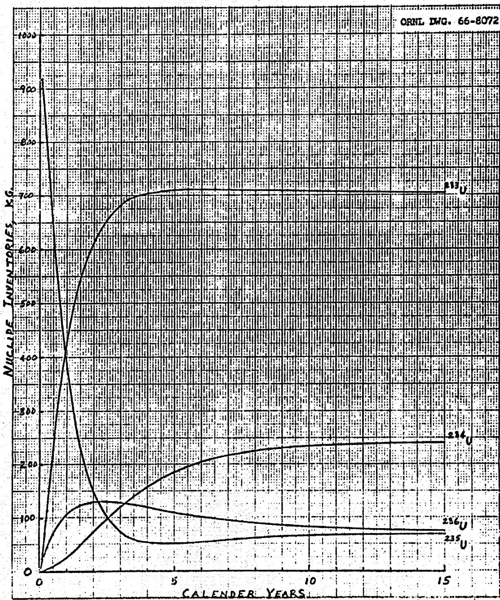  
Fig. 7.1 Nuclide Inventories During Startup.

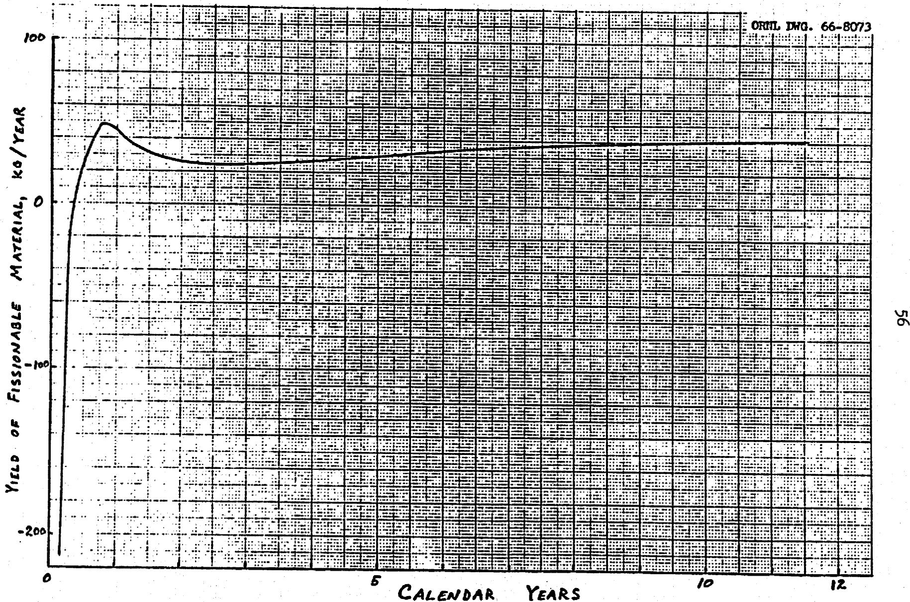  
Fig. 7.2 Fuel Yield During Startup.

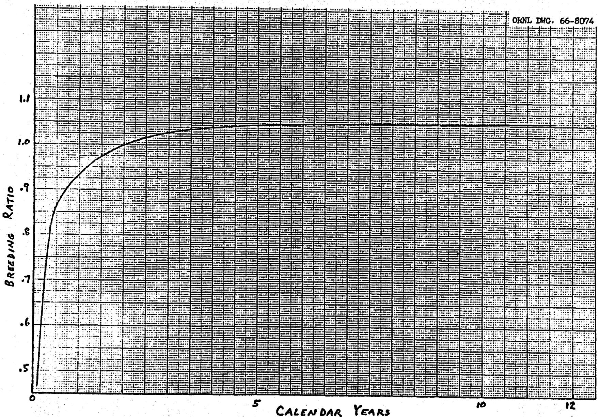  
Fig. 7.3 Breeding Ratio During Startup.

The equilibrium cycle calculation was based on a value of $14 per gm for 233U and 233Pa and $12 per gm for 235U. The interest rate was 10%. The 30-year cycle was calculated on a cash-flow basis with the same unit costs and a 6% discount factor. The "other costs" were taken from ORNL-TM-1467.

# References

1. P. R. Kasten et al., Summary of Molten-Salt Breeder Reactor Design Studies, USAEC Report ORNL-TM-1467, Oak Ridge National Laboratory, March 24, 1966.

# DISTRIBUTION

1-5. DTIE, OR

6-15. M. W. Rosenthal

16-20. R.S.Carlemith

21-25. A. M. Perry

26. M. J. Skinner

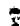