OPERATION OF MOLTEN-SALT CONVECTION LOOPS IN THE ORR

H. C. Savage   
E. Compere   
J.M.Baker   
E.G.Bohlmann

# LEGAL NOTICE

This report was prepared as an account of Government sponsored work. Neither the United States, nor the Commission, nor any person acting on behalf of the Commission;

A. Makes any warranty or representation, expressed or implied, with respect to the accuracy, completeness, or usefulness of the information contained in this report, or that the use of any information, apparatus, method, or process disclosed in this report may not infringe privately owned rights; or   
B. Assumes any liabilities with respect to the use of, or for damages resulting from the use of any Information, apparatus, method, or process disclosed in this report.

As used in the above, "person acting on behalf of the Commission" includes any employee or contractor of the Commission, or employee of such contractor, to the extent that such employee or contractor of the Commission, or employee of such contractor prepares, disseminates, or provides access to, any information pursuant to his employment or contract with the Commission, or his employment with such contractor.

Contract No. W-7405-eng-26

REACTOR CHEMISTRY

OPERATION OF MOLTEN-SALT CONVECTION LOOPS IN THE ORR

H. C. Savage

E. L. Compere

J. M. Baker

E. G. Bohlmann

# LEGAL NOTICE

This report was prepared as an account of Government sponsored work. Neither the United States nor the Commission, nor any person acting on behalf of the Commission:

A. Makes any warranty or representation, expressed or implied, with respect to the accuracy, completeness, or usefulness of the information contained in this report, or that the use of any information, apparatus, method, or process disclosed in this report may not infringe privately owned rights; or

B. Assume any liabilities with respect to the use of, or for damages resulting from the use of any information, apparatus, method, or process disclosed in this report.

As used in the above, "person acting on behalf of the Commission" includes any employee or contractor of the Commission, or employee of such contractor, to the extent that such employee or contractor of the Commission, or employee of such contractor prepares, disseminates, or provides access to, any information pursuant to his employment or contract with the Commission, or his employment with such contractor.

DECEMBER 1967

OAK RIDGE NATIONAL LABORATORY

Oak Ridge, Tennessee

operated by

UNION CARBIDE CORPORATION

for the

U.S. ATOMIC ENERGY COMMISSION

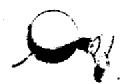

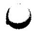

# TABLE OF CONTENTS

# Page

# ABSTRACT 1

1. INTRODUCTION 1   
2. DESCRIPTION OF REACTOR IRRADIATION FACILITY 2   
3. DESCRIPTION AND OPERATION OF FIRST LOOP EXPERIMENT 2

3.1 Description 2   
3.2 Operation 4

4. EVALUATION OF SYSTEM PERFORMANCE, IN-PIE SALT LOOP NO. 1 13

4.1 Temperature Control 13   
4.2 Problems Encountered During In-Pile Operation 14

5. DESCRIPTION AND OPERATION OF IN-FILE-SALT LOOP NO. 2 18

5.1 Loop Description 18

5.1.1 Core Cooling Coils 18   
5.1.2 Salt Sample Line 18   
5.1.3Cooler for the Gas Separation Tank 20   
5.1.4 Salt Flow by Convection 20

5.2 Operation of In-Pile Salt Loop No. 2 20

5.2.1 Out-of-Pile Test Operation 20   
5.2.2 In-Pile Operation of Loop No. 2 22

6. EXAMINATION OF FAILURE IN CORE OUTLET PIPE 25   
7.DISCUSSION AND CONCLUSIONS 29

ACKNOWLEDGEMENT 33

# LIST OF FIGURES

# Figure Number

# Title

# Page Number

1 In-Pile Molten-Salt Loop Facility, ORR HN-1 3   
2 In-Pile Molten-Salt Convection Loop No. 1 5   
3 Photograph of Partially Assembled Salt Loop No. 1 6   
Salt Sampling and Addition System, In-Pile MoltenSalt Loop 7   
5 Photograph of Salt Sampling and Addition System 8   
6 Thermocouple Locations for Molten-Salt Loop No. 1 11   
7 Nuclear Heat Generation in Molten-Salt Loop No. 1 12   
8 Photograph of Broken Coolant Coil, Molten-Salt Loop No. 1 15   
9 Photomicrograph of Coolant Coil Break, MoltenSalt Loop No. 1 16   
10 Photograph of In-Pile Molten-Salt Loop No. 2 19   
11 Photograph of Partially Assembled Loop No. 2 21   
12 Nuclear Heat Generation in Molten-Salt Loop No. 2 23   
13 Thermocouple Locations for Molten-Salt Loop No. 2 27   
14 Postirradiation Photograph of Molten-Salt Loop No. 2 Showing Location of Leak in Core Outlet Pipe .... 28   
15 Photomicrograph of Crack in Hastelloy N Outlet Pipe, Molten-Salt Loop No. 2 (\~20x) 30

# LIST OF TABLES

# Table Number

# Title

# Page Number

1 Operating Time Under Various Conditions for In-Pile Molten-Salt Loop No. 1 9   
2. Typical Loop Temperatures with Solvent Salt and Fuel Salt with the ORR at 30 Mw for In-Pile Molten-Salt Loop No. 1 10   
3 Tabulation of Component Failures Observed in In-Pile Loop No. 1 17   
4 Operating Time Under Various Conditions for In-Pile Molten-Salt Loop No. 2 25   
Typical Loop Temperatures with Solvent Salt and Fuel Salt with the ORR at 30 Mw for In-Pile Molten-Salt Loop No. 2 26

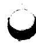

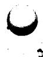

# OPERATION OF MOLITEN-SALT CONVECTION LOOPS IN THE ORR

H.C.Savage   
E. L. Compere   
J. M. Baker   
E. G. Bohlmann

# ABSTRACT

Two molten-salt convection loops have been operated in beam hole HN-1 of the Oak Ridge Research Reactor. Both loops contained molten-fluoride fuel salt ( $^{7}\mathrm{LiF - BeF}_2 - \mathrm{ZrF}_4 - \mathrm{UF}_4$ ) with enriched uranium varying in concentration up to 2.1 mole%.

Irradiation of the first molten-salt convection loop experiment in the ORR was terminated on August 8, 1966, after 1484 hr of in-pile operation and development of $1.1 \times 10^{18}$ fissions/cc (0.27% $^{235}\mathrm{U}$ burnup) in the $^{7}\mathrm{LiF}-\mathrm{BeF}_{2}-\mathrm{ZrF}_{4}-\mathrm{UF}_{4}$ (65.16-28.57-4.90-1.36 mole %) fuel. Average fuel power densities up to 105 w/cc of salt were obtained in the fuel channels of the core of MSRE-grade graphite.

Irradiation of the second loop experiment in the ORR was terminated on April 4, 1967, after 1955 hr of in-pile operation and development of $8.2 \times 10^{18}$ fissions/cc (1.2% $^{235}\mathrm{U}$ burnup) in the $^{7}\mathrm{LiF - BeF}_2\mathrm{-ZrF}_4\mathrm{-UF}_4$ (65.26-28.17-4.84-1.73 mole%) fuel. (The uranium concentration was increased to 2.1 mole % for a short time near the end of the experiment.) Average fission heat density in the fuel salt channels of the graphite core was 165 w/cc when at full power.

Successful operation of the major heating, cooling, temperature control, and sampling systems was demonstrated; however, both loop experiments were terminated because of breaks in the primary loop systems.

# 1. INTRODUCTION

The molten-salt convection loops are designed to irradiate a representative molten-salt fuel circulating in contact with graphite and Hastelloy N at fuel fission power densities up to 200 w/cc in the Oak Ridge Research Reactor. Long-term in-pile operation (one year) to achieve high uranium burnup (up to $50\%$ ) is an objective of the irradiation experiments. Provisions for sampling and replacement of both gas and salt permit conditions in the loop to be determined and to be altered during operation.

Irradiation experiments in the loop allow us to study the graphite-salt compatibility, Hastelloy N-salt compatibility, fuel-salt stability, and fission-product chemistry. The interaction of fission products with graphite, metal, fuel and gas phases can be investigated, as can the effects of irradiation on the respective materials.

In order to maintain and control temperatures around the loop circuit, sufficient heating and cooling capacity is provided to remove up to 14 kw of fission and gamma heat generated at full power operation and to maintain the salt molten when the reactor is shut down.

Operational experience with two in-pile molten-salt loop experiments is described in this report.

# 2. DESCRIPTION OF REACTOR IRRADIATION FACILITY

Both in-pile molten-salt loops were operated in horizontal beam hole HN-1 of the ORR (Fig. 1), which is approximately 8 in. diam and extends 12 ft from a point adjacent to the reactor lattice to the outside face of the reactor shielding. Two shielded equipment chambers contain the necessary auxiliary equipment needed for the salt sampling and addition system. Beam hole HN-1 and the associated instrumentation were previously used to operate in-pile loop experiments with uranyl sulfate solutions and thorium oxide slurries in support of the Homogeneous Reactor Program.

# 3. DESCRIPTION AND OPERATION OF FIRST LOOP EXPERIMENT

# 3.1 Description

The main body of the loop assembly was fabricated of 2-in. sched-40 Hastelloy N (INOR-8) pipe which contained a graphite core. The graphite core had eight $1/4$ -in. holes which served as fuel passages. Fuel volume in the graphite core was $\sim 43~\mathrm{cm}^3$ in a total loop fuel volume of $\sim 75~\mathrm{cm}^3$ . A gas separation tank served as a salt reservoir and provided for a liquid-vapor interface. A return line from the gas separation tank to the bottom of the graphite core completed the loop circuit. Calrod electric heaters and cooling coils imbedded in a sprayed nickel matrix surrounded the core section, gas separation tank, and return line to provide temperature control and to maintain the thermal gradients necessary to induce convective

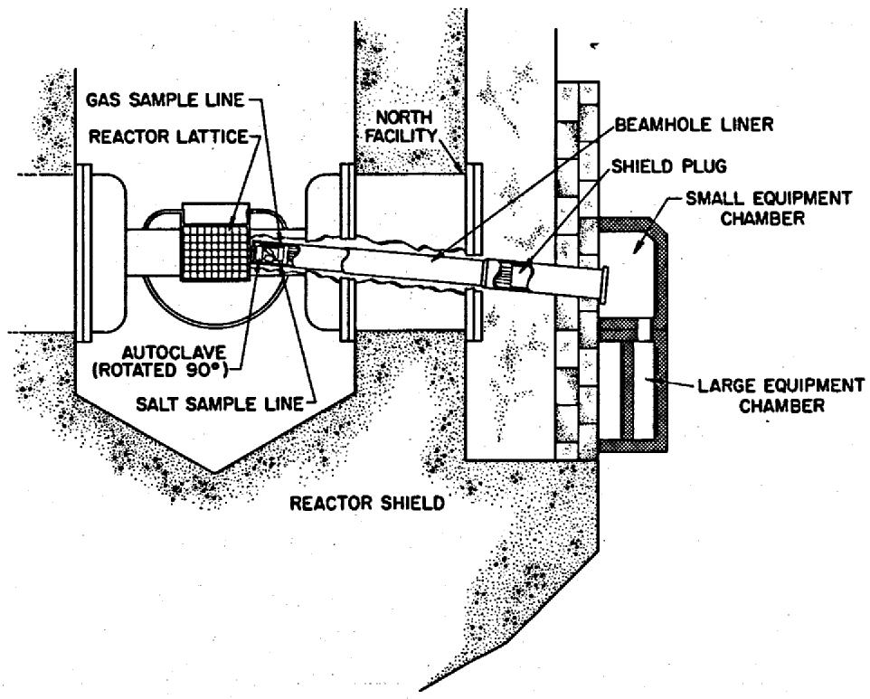  
ORNL-DWG 66-7152   
Fig. 1. In-Pile Molten-Salt Loop Facility, ORR HN-1.

flow. A drawing of the convection loop assembly is shown in Fig. 2, and Fig. 3 is a photograph of the partially assembled loop showing the fuel flow channels in the core graphite.

Tubes of capillary dimensions interconnected the vapor space of the gas separation tank with remotely located pressure monitoring equipment and a gas sampling and addition system. The salt sample line (0.100 in. OD × 0.050 in. ID) was ~12 ft long and was traced with electric calrod heaters which were imbedded, along with the sample line, in a sprayed nickel matrix. The sample line was routed to the salt sampling and addition system in the shielded equipment chamber at the reactor shield face.

A manually operated retraction screw was used to position the loop so that the neutron flux and resultant nuclear power generation in the loop could be varied from the maximum (fully inserted position) to $\sim 1\%$ of maximum by retracting the loop package some 9 in. away from the reactor lattice. Figure 4 is a diagram of the salt sampling and addition system, and Fig. 5 is a photograph of the system as fabricated for the second in-pile loop.

# 3.2 Operation

The loop package (shield plug, sampling and addition system, and loop assembly) was operated in an out-of-pile mockup facility for 187 hr with solvent salt without uranium. Composition of the solvent salt was $^{7}\mathrm{LiF - BeF}_2 - \mathrm{ZrF}_4$ (64.7-30.1-5.2 mole %). Nominal operating temperatures around the loop ranged from $650^{\circ}\mathrm{C}$ in the core section to $550^{\circ}\mathrm{C}$ in the cold leg return line. During this out-of-pile test period, three salt samples were removed from the loop and five salt additions were made without difficulty. Salt circulation in the loop was estimated to be 5 to 10 cc/min based on heat balance measurements around the cold leg.

The loop was removed from the mockup facility and installed in beam hole HN-1 of the ORR and brought to operating temperature on June 9, 1966. Operation with solvent salt continued until July 27, 1967, when enriched uranium (as $^{7}\mathrm{LiF - UF_4}$ eutectic) was added. In-pile operation was continued until August 10, 1966, when the reactor was shut down and the loop removed because of a fuel leak from a break in the capillary sample line near its point of attachment to the loop core section.

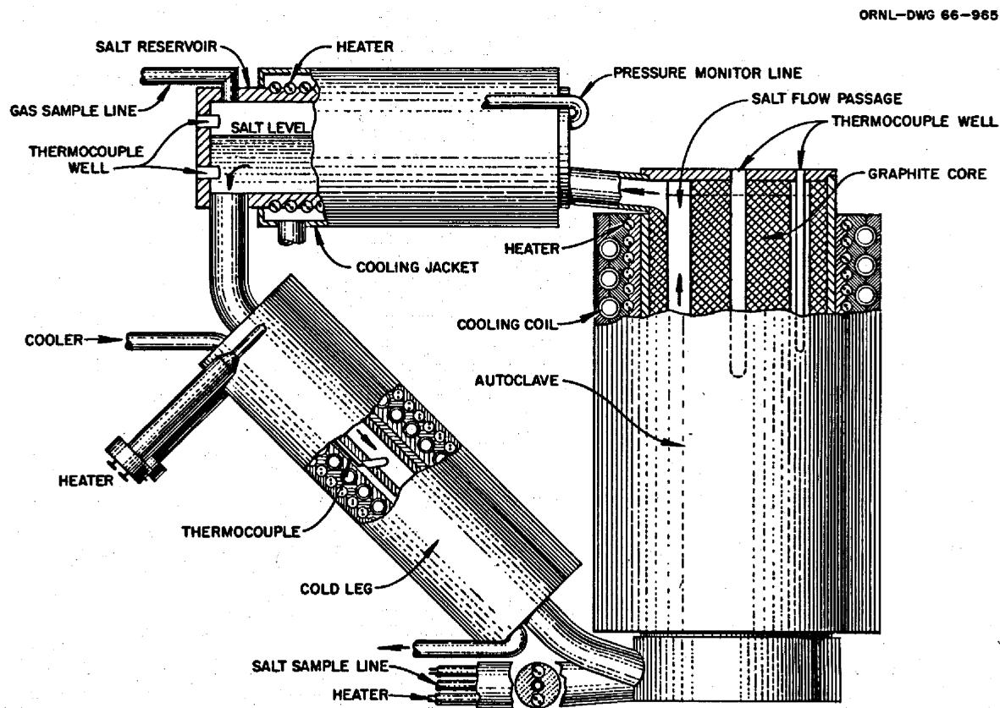  
Fig. 2. In-Pile Molten-Salt Convection Loop No. 1.

I on doon ties plesseessy Aetnrrn Joo dae2ooud 8

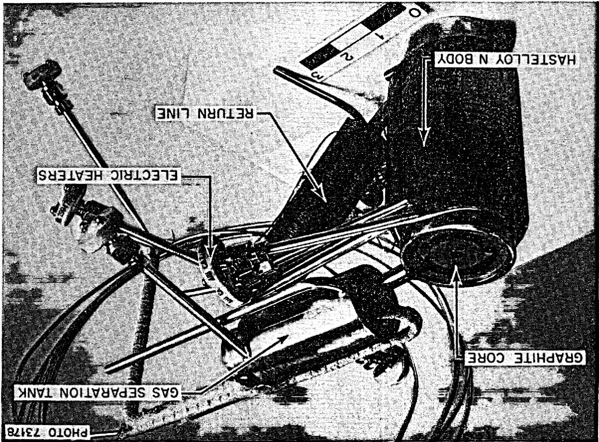

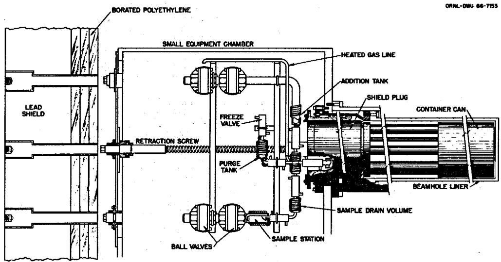  
Fig. 4. Salt Sampling and Addition System, In-Pile Molten-Salt Loop.

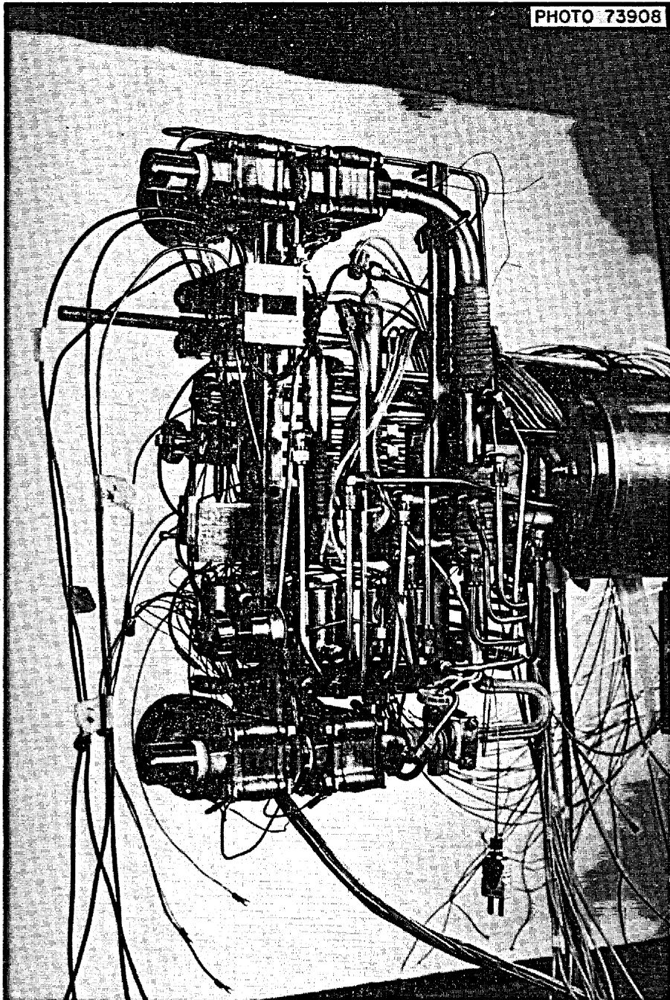  
Fig. 5. Photograph of Salt Sampling and Addition System.

During in-pile operation two salt samples were removed from the loop and three salt additions were made. While preparing to remove salt sample No. 8, a leak was detected in the sampling system. This leak precluded further sampling operation. Even though no additional samples could be taken, the addition of $^7\mathrm{LiF - UF_4}$ fuel and one final addition of solvent salt to adjust the loop inventory were subsequently made.

A tabulation of the operating time for the first loop is given in Table 1. Operating temperatures around the loop circuit with the reactor down and at full power (30 Mw) and with the loop fully inserted are shown in Table 2. Thermocouple locations for the temperatures shown in Table 2 are noted in Fig. 6. Total nuclear heat generated in the loop as a function of distance from the reactor tank is shown in Fig. 7.

Table 1. Operating Time Under Various Conditions for In-Pile Molten-Salt Loop No. 1   

<table><tr><td>Salt in Loop</td><td>Reactor Power</td><td>Operating Time (hr)</td></tr><tr><td>Solventa</td><td>0</td><td>330b</td></tr><tr><td></td><td>30 Mw</td><td>1025</td></tr><tr><td>Fuelc</td><td>0</td><td>27</td></tr><tr><td></td><td>30 Mw</td><td>289</td></tr><tr><td></td><td>Total</td><td>1671</td></tr></table>

Solvent salt composition = ${}^{7}$ LiF-BeF ${}_{2} - {\mathrm{{ZrF}}}_{4}$ (64.7-30.1-5.2 mole %).   
bIncludes 187 hr of out-of-pile mockup operation.   
Fuel salt composition = 7LiF-BeF2-ZrF4-UF4 (65.16-28.57-4.90-1.36 mole %).

Table 2. Typical Loop Temperatures with Solvent Salt and Fuel Salt with the ORR at 30 Mw for In-Pile Molten-Salt Loop No. 1   

<table><tr><td rowspan="2">Thermocouple Number</td><td rowspan="2">\( Location^a \)</td><td colspan="2">Core Section</td><td colspan="3">Gas Separation Tank</td><td colspan="3">Return Line (Cold Leg)</td></tr><tr><td>Solvent Temp, °C</td><td>Fuel Salt Temp, °C</td><td>Solvent Temp, °C</td><td>Fuel Salt Temp, °C</td><td></td><td>Solvent Temp, °C</td><td>Fuel Salt Temp, °C</td><td></td></tr><tr><td>1</td><td>Core bottom</td><td>624</td><td>568</td><td></td><td></td><td></td><td></td><td></td><td></td></tr><tr><td>2</td><td>Lower fuel passage</td><td>635</td><td>625</td><td></td><td></td><td></td><td></td><td></td><td></td></tr><tr><td>3</td><td>Upper fuel passage</td><td>670</td><td>784</td><td></td><td></td><td></td><td></td><td></td><td></td></tr><tr><td>4</td><td>Graphite center</td><td>671</td><td>634</td><td></td><td></td><td></td><td></td><td></td><td></td></tr><tr><td>5</td><td>Graphite OD</td><td>656</td><td>648</td><td></td><td></td><td></td><td></td><td></td><td></td></tr><tr><td>6</td><td>Core top</td><td>657</td><td>762</td><td></td><td></td><td></td><td></td><td></td><td></td></tr><tr><td>7</td><td>Inlet well</td><td></td><td></td><td>604</td><td>721</td><td></td><td></td><td></td><td></td></tr><tr><td>8</td><td>Outlet well</td><td></td><td></td><td>602</td><td>636</td><td></td><td></td><td></td><td></td></tr><tr><td>9</td><td>Gas space</td><td></td><td></td><td>589</td><td>626</td><td></td><td></td><td></td><td></td></tr><tr><td>10</td><td>Top</td><td></td><td></td><td></td><td></td><td></td><td>597</td><td>598</td><td></td></tr><tr><td>11</td><td>Center</td><td></td><td></td><td></td><td></td><td></td><td>579</td><td>591</td><td></td></tr><tr><td>12</td><td>Bottom</td><td></td><td></td><td></td><td></td><td></td><td>514</td><td>540</td><td></td></tr><tr><td>13</td><td>At core inlet</td><td></td><td></td><td></td><td></td><td></td><td>584</td><td>590</td><td></td></tr></table>

aRefer to Fig. 6.

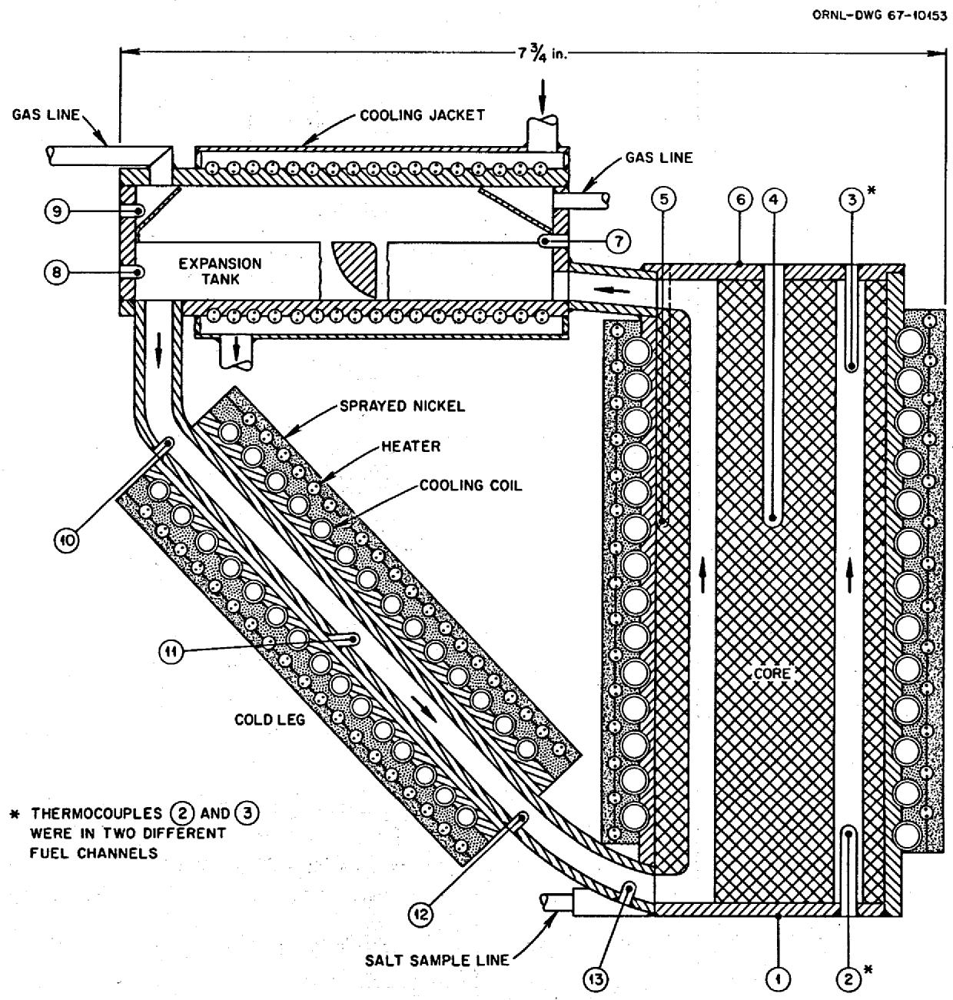  
Fig. 6. Thermocouple Locations for Molten-Salt Loop No. 1.

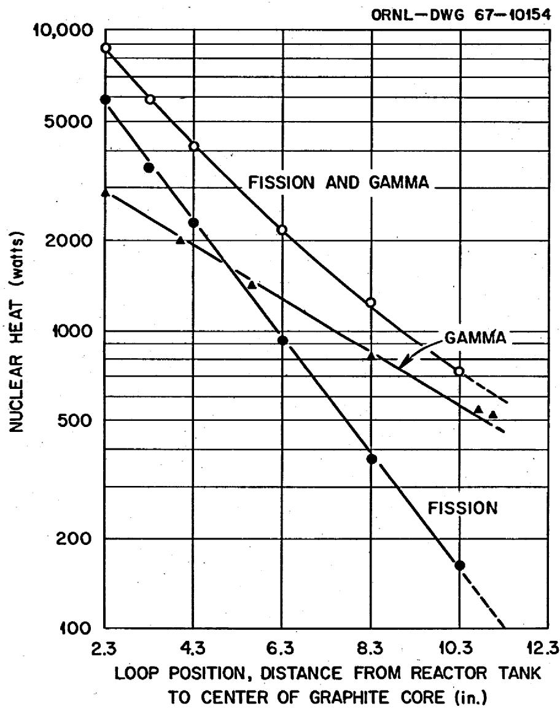  
Fig. 7. Nuclear Heat Generation in Molten-Salt Loop No. 1.

# 4. EVALUATION OF SYSTEM PERFORMANCE, IN-FILE SALT LOOP NO. 1

Several failures of component parts of the loop and associated systems occurred during in-pile operation. Finally, leakage of fuel salt from a break in the salt sample line caused the first loop experiment to be terminated. All parts of the system which failed were examined in hot cell facilities to determine the cause of failure before proceeding with design and fabrication of loop No. 2. These failures and the loop performance are discussed below.

# 4.1 Temperature Control

Heaters. The molten-salt loop package used 21 heaters to control salt temperature in the loop and to heat the salt sample line and associated sampling and addition system. All heaters were $1/8$ in. OD, Inconel sheathed, magnesium-oxide insulated, with a Nichrome V heating element. These heaters are designed for continuous operation at temperatures to $870^{\circ}\mathrm{C}$ . The heaters on the loop circuit were operated continuously at various power levels while those on the sampling and addition systems were used intermittently as required. There were no heater failures during the 1671 hr of loop operation.

Coolers. Four separate coolers were used to remove the 8.8 kw of fission and gamma heat produced when the loop was fully inserted and, in conjunction with the electric heaters, provided temperature control. Two of these coolers consisting of $1/4$ -in. $\times$ 0.035-in. wall, 304 stainless steel cooling coils, which used air and/or an air-water mixture as coolant, surrounded the core section where the maximum nuclear heat generation occurred. The two coolers provided for countercurrent coolant flow. Coolant for the No. 1 cooler entered at the top of the core section and exited at the bottom. Coolant for the No. 2 cooler entered at the bottom and exited at the top. Both cooling coils were wrapped around the core section in machined grooves, tack welded at each end to hold the coil in place, and then bonded to the Hastelloy N core body with nickel-sprayed material.

Another cooler consisting of a 3/16-in. OD × 0.035-in. wall, Inconel cooling coil, which used only air as coolant, was used on the cold leg. For the gas separation tank an annular jacket cooler of 1/16-in. thick 304

stainless steel with air as the coolant medium was used. Although calculations indicated that this cooling method would be adequate, air alone proved to be inadequate to maintain the temperature of the gas separation tank at temperatures below $600^{\circ}\mathrm{C}$ and a water injection system was added to the incoming air after in-pile operation had commenced.

The heat removal rate of the loop coolers was entirely adequate, except for the gas separation tank as noted above, to remove the 8.8 kw of fission and gamma heat generated when the reactor was at its maximum power of 30 Mw and with the loop in the fully inserted position. Even after the loss of one of the two cooling coils (see below) around the loop core section, the loop could be operated at full power (8.8 kw).

# 4.2 Problems Encountered During In-Pile Operation

Shortly before the addition of uranium to the loop, tests indicated that the No. 1 core cooler was leaking at a point near the loop (inside the loop container can). This cooler was removed from service by plugging off both ends. However, by referring to Table 2, it can be seen that temperatures in the top section of the loop core were quite high (up to $784^{\circ}\mathrm{C}$ in the upper fuel passage) because of the loss of the No. 1 cooler. Subsequent examination of the loop in the hot cells showed that this cooling coil had broken at the point of attachment to the core body on the exit end. A photograph of the break is shown in Fig. 8, and a photomicrograph of the break is shown in Fig. 9.

After the uranium addition, the reactor was brought to 30 Mw and the loop was inserted in incremental steps over a period of $\sim 160$ hr in order to measure nuclear heat generation and to test operation. After $\sim 92$ hr of operation in the fully inserted position, a leak in the cooling jacket around the gas separation tank (using an air-water mixture as coolant) allowed water to enter the loop container causing erratic temperatures in the bottom part of the loop - especially at the salt sample line. Subsequently, water entered the small equipment chamber at the face of the reactor shielding where it was detected by a water level probe.

The reactor was shut down, the equipment chamber opened and dried, and reactor operation resumed. Because of the leak in the jacket cooler, water

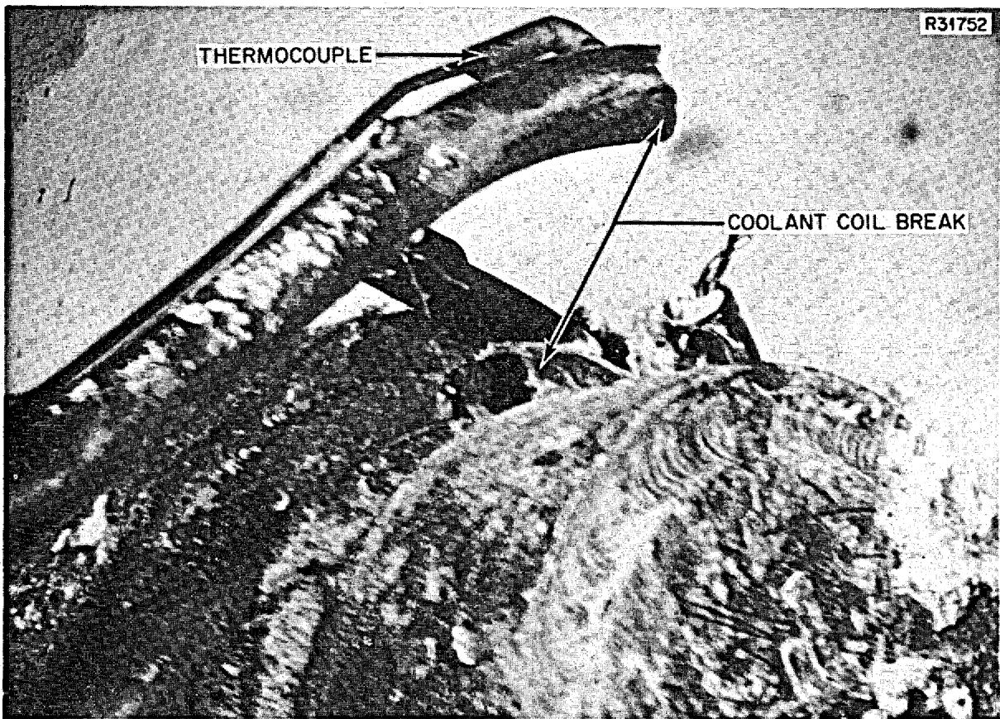  
Fig. 8. Photograph of Broken Coolant Coil, Molten-Salt Loop No. 1.

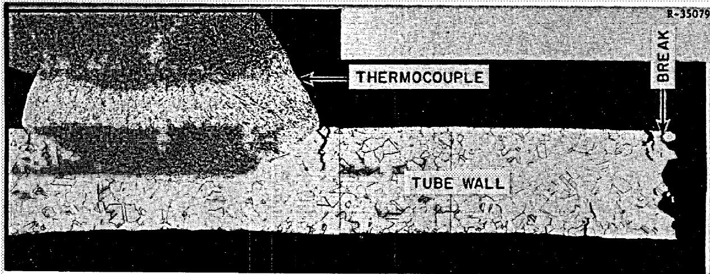  
Fig. 9. Photomicrograph of Coolant Coil Break, Molten-Salt Loop No. 1.

injection could not be used in the cooling air to the gas separation tank, and this loss of cooling capacity limited the loop operation to a position at l in. retracted (~70% of full power). A few hours after reactor startup the loop was retracted out of the high flux region and the salt was frozen when high radiation levels were observed in the charcoal trap in the loop container off-gas line - indicating fission-product leakage from the loop.

Preparations for loop removal were begun, and on August 10, 1966, the reactor was shut down and the loop removed from beam hole HN-1.

Examination of the loop in hot cell facilities showed that fuel salt had leaked from the loop at a break in the salt sample line near its point of attachment to the loop core section. It appears that this failure can be attributed to the water leakage described above, which caused the nickel spray bonding the heaters to the salt sample line to break, leaving the capillary sample line (0.100 in. OD × 0.050 in. ID) unsupported. This line then failed because of excessive mechanical stresses.

Table 3 is a tabulation of the component failures which occurred during in-pile operation of loop No. 1.

Table 3. Tabulation of Component Failures Observed in In-Pile Loop No. 1   

<table><tr><td>Description of Failure</td><td>Material</td><td>Probable Cause</td></tr><tr><td>Break in a capillary tube in the sampling and addition system</td><td>Hastelloy N</td><td>Mechanical stress</td></tr><tr><td>Break in 1/4-in. tubing used for loop cooler No. l at point of attachment to loop</td><td>304 SS</td><td>Unknown, but probably associated with mechanical forces from thermal expansion of cooler discharge line</td></tr><tr><td>Leak in seal weld of cooler jacket around gas separation tank</td><td>304 SS</td><td>Unknown, but probably due to poor quality of seal weld</td></tr><tr><td>Break in salt sample line near point of attachment to loop</td><td>Hastelloy N</td><td>Mechanical stress resulting from loss of support when nickel spray matrix surrounding line cracked off</td></tr></table>

# 5. DESCRIPTION AND OPERATION OF IN-FILE SALT LOOP NO. 2

# 5.1 Loop Description

The design of the second in-pile salt convection loop was essentially identical to the first loop experiment and is shown in Fig. 10. Problems encountered in the first experiment, described previously, and subsequent postirradiation hot-cell examination led to modifications to the second loop which were designed to eliminate these problems. These modifications are described below.

# 5.1.1 Core Cooling Coils

The material for the $1/4$ -in. OD $\times$ 0.035-in. wall core coolant tubes was changed from 304 stainless steel to Inconel for the second loop. Although stainless steel tubing should have been entirely adequate for the intended service, Inconel is the preferred material for exposure to high-temperature steam ( $\sim 400^{\circ}\mathrm{C}$ ) generated when air-water mixtures are used as coolant. Since the rupture of the No. 1 core cooler occurred adjacent to a point where the tube was tack welded to the core wall, the tack weld was eliminated in favor of a mechanical strap attachment. Further, an expansion loop to relieve stresses was included in each of the coolant tube outlet lines. A test of the adequacy of the modified core cooling coils was made by operating a mockup of the redesigned coil with air-water mixtures as coolant for more than 400 hr at temperatures expected in-pile, including 120 thermal shock cycles ( $600 - 350^{\circ}\mathrm{C}$ ), with no sign of difficulty. Thermal cycling occurs during a reactor setback and startup, and it was estimated that no more than about 20 such thermal cycles would occur during a year of operation.

# 5.1.2 Salt Sample Line

The two failures which occurred in the capillary tube (0.100 in. OD × 0.050 in. ID) used in the salt sampling and addition system of loop No. 1 resulted from excessive mechanical stress. Consequently, the wall thickness of these tubes was increased (0.170 in. OD × 0.060 in. ID), and additional mechanical support was added - particularly on the section of the line for a distance of $\sim 9$ in. from its point of attachment to the loop core.

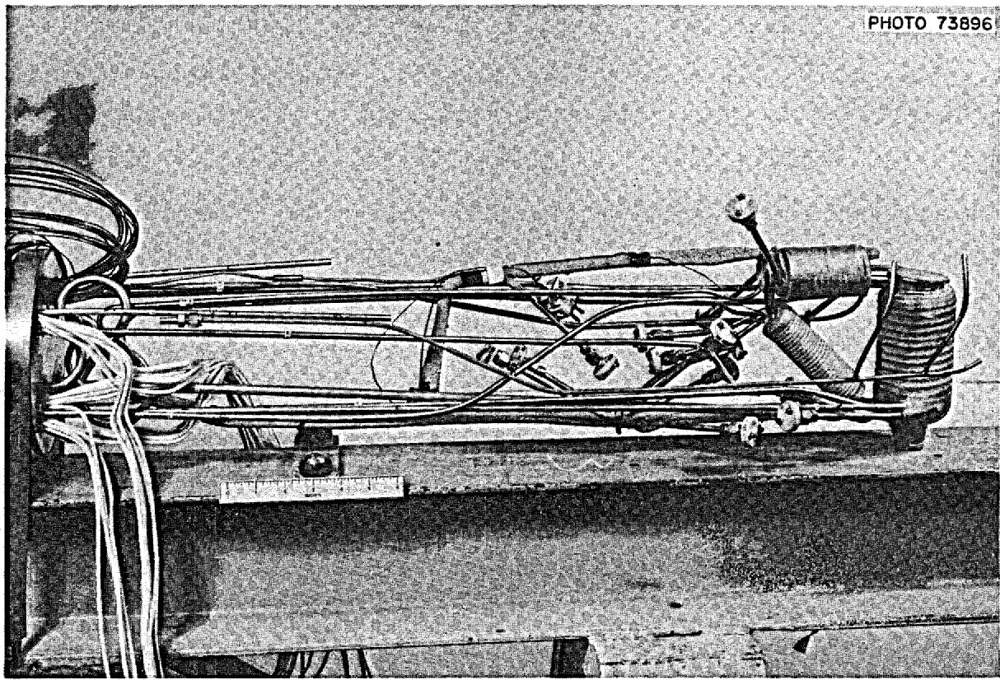  
Fig. 10. Photograph of In-Pile Molten-Salt Loop No. 2.

# 5.1.3 Cooler for the Gas Separation Tank

The cooling jacket of 1/16-in.-thick stainless steel surrounding the reservoir tank used in the first loop was replaced by an Inconel tube wrapped around the outside of the tank and attached by means of sprayed-on nickel. Also, provisions for use of an air-water mixture as coolant were added since it was found that air alone did not provide sufficient cooling in the first experiment.

# 5.1.4 Salt Flow by Convection

Continuous salt circulation by thermal convection was not maintained in the first experiment, and salt flow rates of 5 to $10~\mathrm{cm}^3/\mathrm{min}$ were substantially below the calculated rate of $\sim 45~\mathrm{cm}^3/\mathrm{min}$ for a temperature difference of $100^{\circ}\mathrm{C}$ between the salt in the loop core section and in the cold leg. It was concluded that the occasional loss of salt circulation was caused by gas accumulation in the top of the core section where salt from the eight $1/4$ -in. fuel passages in the graphite was collected in an annular ring before entering the gas separation tank. The low salt flow rate could also be partially attributed to flow restriction caused by the design of the top and bottom salt flow passages in the graphite core. Accordingly, the salt flow channels at the top and bottom of the eight $1/4$ -in. holes in the graphite core were redesigned to provide a better flow pattern as shown in Fig. 11 which can be compared with the original design (Fig. 3). Further, the top and bottom of the core section, horizontally oriented on the first loop, were inclined at $5^{\circ}$ to minimize trapping of gas.

# 5.2 Operation of In-Pile Salt Loop No. 2

# 5.2.1 Out-of-Pile Test Operation

The loop package was operated in the out-of-pile mockup facility for 248 hr. In order to remove potential contaminants such as oxygen, water, etc., the empty loop was flushed with argon gas and vacuum pumped at $600^{\circ}\mathrm{C}$ for 20 hr. The loop was charged with solvent salt (without uranium) and operated for 77 hr and then drained to flush the loop. A second charge of

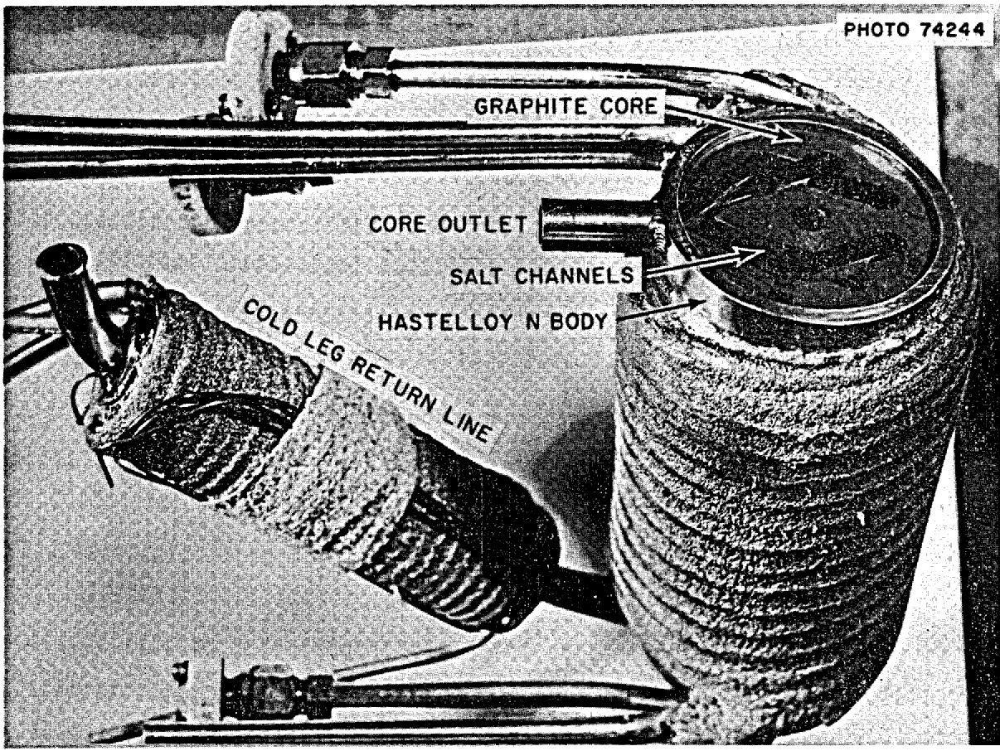  
Fig. 11. Photograph of Partially Assembled Loop No. 2.

solvent salt was subsequently added, and operation at temperature was continued for an additional 171 hr. During these mockup operations, 15 salt samples were removed from the loop and 12 salt additions were made. No. problems were encountered.

Salt circulation by convective flow was estimated to be 30 to $40~\mathrm{cc / min}$ as determined both by heat balance measurements around the cold leg return line and by adding an increment of heat in a stepwise fashion to one point in the loop and recording the time required for the heated salt to traverse a known distance as recorded on thermocouples around the loop circuit. This flow rate is a five-fold increase over the rate observed in loop No. 1 and is attributed to the modifications described previously. However, occasional loss of flow still occurred. One possible explanation for this is that a sufficient temperature difference was not maintained between the salt in the hot and cold legs. This is supported by the fact that flow, when lost, could be restored by adjusting the temperature around the loop circuit. Since occasional flow loss did not adversely affect the loop operation in-pile, this was not considered to be a problem of any serious consequence.

After satisfactorily completing out-of-pile testing, the loop was transferred to the ORR, installed in beam hole HN-1, and in-pile operation was begun on January 12, 1967.

# 5.2.2 In-Pile Operation of Loop No. 2

At the start of in-pile operation, the loop contained the solvent salt charged to the loop during the mockup operation. In-pile operation with this solvent salt continued for 417 hr during which the loop was operated at various distances from the reactor lattice to determine operating parameters and to measure gamma heat generation. Uranium as $^{7}\mathrm{LiF - UF_4}$ eutectic (93% enriched) was added on January 30, 1967, to bring the uranium concentration in the salt to 1.72 mole %, which was expected to produce an average fission-power generation of 200 w/cm³ in the 43 cm³ of fuel salt in the core section. This estimate was based on an expected average thermal neutron flux of ~2 × 10¹³ in beam hole HN-1. Subsequent measurements of the nuclear power generation as a function of distance from the reactor lattice gave a value of 165 w/cm³ for average core fission-power density with the loop fully inserted (Fig. 12). This indicated that the flux was ~1 × 10¹³.

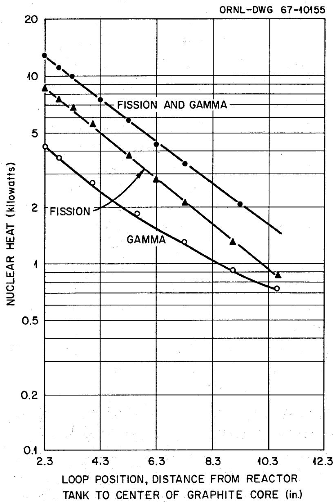  
Fig. 12. Nuclear Heat Generation in Molten-Salt Loop No. 2.

In order to increase the fission-power density in the loop, a second addition of enriched uranium (as $^{7}\mathrm{LiF - UF_4}$ eutectic) was made on March 7, 1967, to bring the uranium concentration in the fuel salt to 2.1 mole %. This addition was expected to increase the average fission-power density to the desired value of $200\mathrm{w/cm^3}$ average in the loop core (graphite) region. However, as a result of a rearrangement of the fuel loading in the ORR just prior to the second addition of uranium, there was essentially no increase in fission power. This rearrangement of the reactor fuel reduced the thermal flux in beam hole HN-1 in an amount sufficient to compensate for the increased uranium in the fuel salt. Previous rearrangements presumably also accounted for the lower than anticipated neutron flux observed initially.

Loop operation was continued and the ORR was brought to full power (30 Mw) on March 11, 1967. On March 14 the reading of the radiation monitor on the charcoal trap in the loop container sweep gas line had increased to 18 mr/hr from the normal level of essentially zero. Some 8 hr later the radiation level had increased to 3.4 r/hr. This reading did not increase further until March 17 when it increased rapidly (over a period of $\sim 3$ hr) to $\sim 100$ r/hr which indicated leakage of fission products from the loop into the container can surrounding it. At this point the loop was retracted out of the high flux and the loop temperatures were reduced to $\sim 400^{\circ}\mathrm{C}$ to freeze the salt. This caused the radiation in the charcoal trap to decrease to $\sim 1$ r/hr over a 15-hr period.

From March 17 to March 23, 1967, the loop was operated in a position where the flux levels were 1 to $2\%$ of that when the loop was fully inserted. During this time, the fuel salt was kept frozen $(\sim 400^{\circ}\mathrm{C})$ except for brief periods when it was melted in an attempt to locate the point of leakage. It was concluded that the leak was in the vicinity of the gas separation tank and continued operation of the loop was not possible.

From March 27 to March 31, 1967, the fuel salt was drained from the loop by sampling. By this procedure, requiring removal of 10 samples (12 to 25 g per sample), the loop inventory was reduced from 216.8 g to 2.1 g. The ORR was shut down on April 4, 1967, and the loop removed from beam hole HN-1 and transferred to hot cell facilities for examination.

Hours of operation with both solvent salt and fuel salt and with the ORR at zero power and 30 Mw are tabulated in Table 4. Typical operating

temperatures around the loop with fuel salt and solvent salt when the loop was in the maximum thermal flux position are shown in Table 5. Figure 13 shows the location of thermocouples on molten-salt loop No. 2.

Table 4. Operating Time Under Various Conditions for In-Pile Molten-Salt Loop No. 2   

<table><tr><td>Salt in Loop</td><td>Reactor Power</td><td>Operating Time (hr)</td></tr><tr><td rowspan="2">Solventa</td><td>0</td><td>325b</td></tr><tr><td>30 Mw</td><td>341</td></tr><tr><td rowspan="2">Fuelc</td><td>0</td><td>168</td></tr><tr><td>30 Mw</td><td>1369</td></tr><tr><td></td><td></td><td>2203</td></tr></table>

Solvent salt composition = ${}^{7}$ LiF-BeF ${}_{2} - {\mathrm{{ZrF}}}_{4}$ (7-30.1-5.2 mole %).   
b Includes 248 hr of out-of-pile mockup operation.   
Fuel salt composition = $^7$ LiF-BeF $_2$ -ZrF $_4$ -UF $_4$ (65.3-28.2-4.8-1.7 mole %) and (65.4-27.8-4.8-2.1 mole %).

# 6. EXAMINATION OF FAILURE IN CORE OUTLET PIPE

Following its removal from the reactor, the loop package was transferred to hot-cell facilities where the convection loop was removed from its container can for examination. No evidence of salt leakage from the loop was seen by visual examination. The loop was then pressurized to $\sim 100$ psig with helium and "Leak Tec" solution applied to the external surfaces of the loop. By this technique a gas leak was observed in the core outlet tube adjacent to the point where it was attached to the core body. Figure 14 is a photograph of the loop taken in the hot cell and indicates the point where the gas leak was seen. Subsequently, sections of the loop were cut out for metallographic examination and a crack through the wall

Table 5. Typical Loop Temperatures with Solvent Salt and Fuel Salt with the ORR at 30 Mw for In-Pile Molten-Salt Loop No. 2   

<table><tr><td rowspan="2">Thermocouple Number</td><td rowspan="2">\( Location^a \)</td><td colspan="2">Core Section</td><td colspan="3">Gas Separation Tank</td><td colspan="3">Return Line (Cold Leg)</td></tr><tr><td>Solvent Temp, °C</td><td>Fuel Salt Temp, °C</td><td>Solvent Temp, °C</td><td>Fuel Salt Temp, °C</td><td></td><td>Solvent Temp, °C</td><td>Fuel Salt Temp, °C</td><td></td></tr><tr><td>1</td><td>Core bottom</td><td>590</td><td>535</td><td></td><td></td><td></td><td></td><td></td><td></td></tr><tr><td>2</td><td>Lower fuel passage</td><td>619</td><td>588</td><td></td><td></td><td></td><td></td><td></td><td></td></tr><tr><td>3</td><td>Upper fuel passage</td><td>661</td><td>655</td><td></td><td></td><td></td><td></td><td></td><td></td></tr><tr><td>4</td><td>Graphite center</td><td>651</td><td>543</td><td></td><td></td><td></td><td></td><td></td><td></td></tr><tr><td>5</td><td>Graphite OD</td><td>648</td><td>510</td><td></td><td></td><td></td><td></td><td></td><td></td></tr><tr><td>6</td><td>Core top</td><td>698</td><td>672</td><td></td><td></td><td></td><td></td><td></td><td></td></tr><tr><td>7</td><td>Core outlet pipe</td><td>668</td><td>730</td><td></td><td></td><td></td><td></td><td></td><td></td></tr><tr><td>8</td><td>Inlet well</td><td></td><td></td><td>524</td><td>543</td><td></td><td></td><td></td><td></td></tr><tr><td>9</td><td>Outlet well</td><td></td><td></td><td>577</td><td>578</td><td></td><td></td><td></td><td></td></tr><tr><td>10</td><td>Gas space</td><td></td><td></td><td>529</td><td>450</td><td></td><td></td><td></td><td></td></tr><tr><td>11</td><td>Top</td><td>535</td><td></td><td></td><td></td><td></td><td>535</td><td>544</td><td></td></tr><tr><td>12</td><td>Center</td><td>548</td><td></td><td></td><td></td><td></td><td>548</td><td>560</td><td></td></tr><tr><td>13</td><td>Bottom</td><td>586</td><td></td><td></td><td></td><td></td><td>586</td><td>617</td><td></td></tr><tr><td>14</td><td>At core inlet</td><td>575</td><td></td><td></td><td></td><td></td><td>575</td><td>577</td><td></td></tr></table>

$^\text{a}$ Refer to Fig. 13.

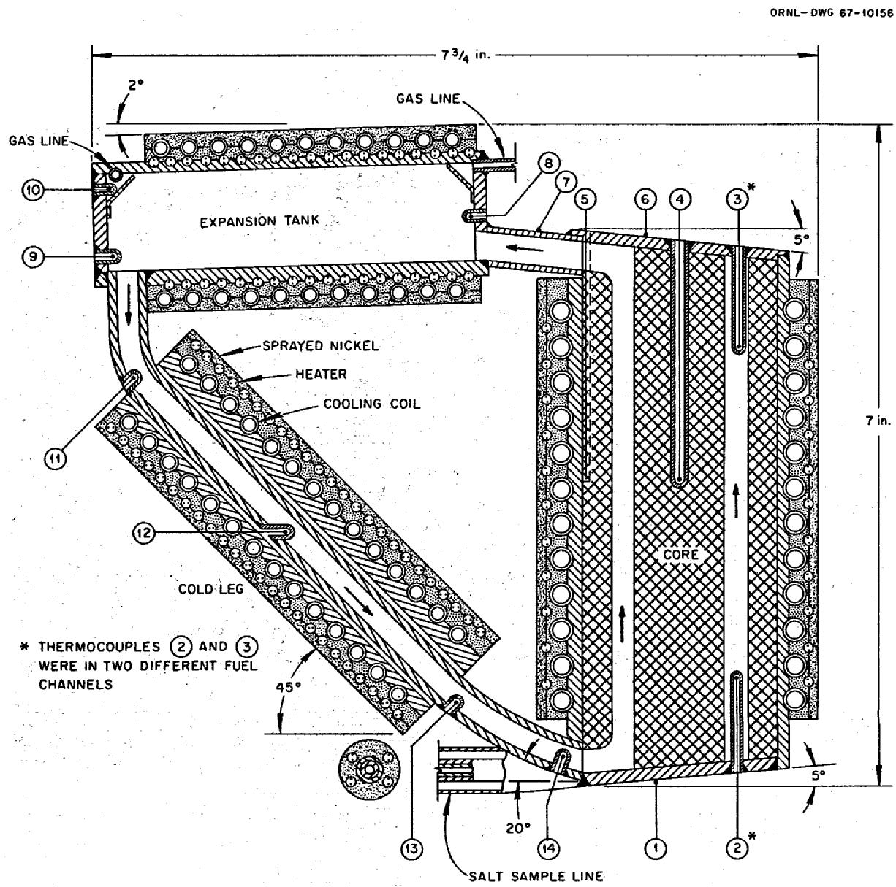  
Fig. 13. Thermocouple Location for Molten-Salt Loop No. 2.

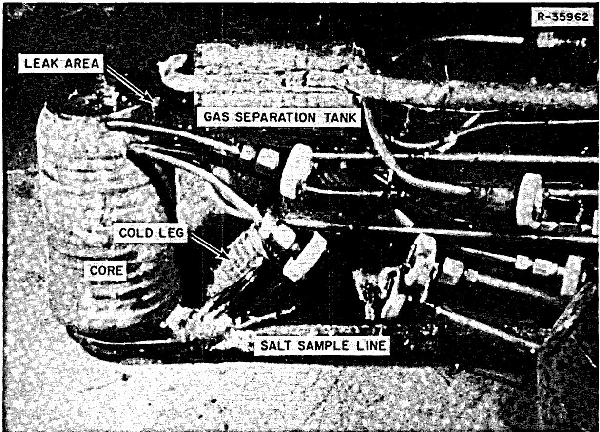  
Fig. 14. Postirradiation Photograph of Molten-Salt Loop No. 2 Showing Location of Leak in Core Outlet Pipe.

of the Hastelloy N pipe (0.406 in. OD × 0.300 in. ID) was found. Figure 15 is a photomicrograph of the crack which extended almost completely around the circumference of the pipe. There was no evidence that fuel salt had leaked through the crack and only gaseous fission products had escaped.

# 7. DISCUSSION AND CONCLUSIONS

The four failures encountered during operation of loop No. 1 were examined in hot-cell facilities. Based on this examination and the operating history of the loop, corrective measures were taken in the design and construction of loop No. 2 (refer to Section 5). None of these failures were encountered during the operation of in-pile salt loop No. 2.

Analysis of the causes of the failure of the outlet pipe in loop No. 2 had led to the conclusion that this failure was probably caused by excessive stresses resulting from differential thermal expansion of the loop components (core, cold leg, gas separation tank, and outlet pipe). Computer code MEC-21 (ref. 1) was used to determine the stresses developed due to the thermal expansion of the piping system. Calculations of the piping stresses in the loop were made for two conditions: (1) for the temperature profile around the loop at full power operating conditions, and (2) for the temperature profile changes observed during a reactor setback.

For both conditions (1) and (2) the piping stress analysis indicates that the maximum stress from thermal expansion occurs in the core outlet pipe where the failure occurred. For the normal operating condition the bending moment produces a stress of $\sim 10,000$ psi in the pipe wall (tension on the top and compression on the bottom). For the temperatures encountered during a reactor setback, the direction of the bending moment is reversed causing a stress of $\sim 17,000$ psi in the pipe wall (compression on top and tension on bottom).

The entire loop was fabricated on Hastelloy N (INOR-8) which is also the material used for the MSRE. Materials used in the loop were obtained from the MSRE stock of specially ordered heats of Hastelloy N. Data on the

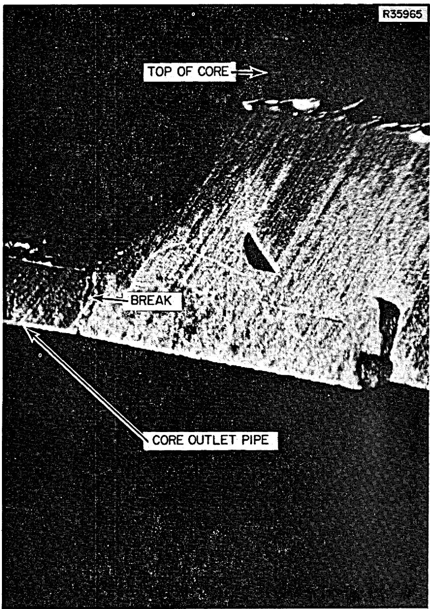  
Fig. 15. Photomicrograph of Crack in Hastelloy N Outlet Pipe, Molten-Salt Loop No. 2 (\~200x).

properties of Hastelloy N at temperatures of interest in the Molten-Salt Reactor Program and the effect of irradiation on these properties have been summarized by R. B. Briggs. $^2$

Data contained in the referenced report2 indicate that, for a temperature of $1200^{\circ}\mathrm{F}$ ( $650^{\circ}\mathrm{C}$ ) and for an irradiation dose of $5 \times 10^{19}$ nvt, stresses of 8000 to 10,000 psi would produce rupture after 10,000 hr. Stress-rupture properties of Hastelloy N at the $1350^{\circ}\mathrm{F}$ ( $732^{\circ}\mathrm{C}$ ) temperature of the core outlet pipe and after an irradiation dose of $5 \times 10^{19}$ nvt are below those at the temperature of $1200^{\circ}\mathrm{F}$ ( $650^{\circ}\mathrm{C}$ ) used for design purposes.3

For the in-pile molten-salt loop there are no significant primary stresses since the loop is operated at or near the ambient pressure (loop pressure is maintained between 12 and 20 psia). Thermal stresses, although important, are usually of less concern because once encountered they tend to be self-limiting provided the material has sufficient ductility. However, tests indicate that the ductility of Hastelloy N is reduced such that strains of 1 to $3\%$ can result in fracture at temperatures of 1200 to $1300^{\circ}\mathrm{F}$ and an irradiation dose of $1 \times 10^{19}$ nvt or more.

For the design of the in-pile salt loop, thermal stresses in the core wall (Hastelloy N) and in the core cooling coil (304 stainless steel for loop No. 1 and Inconel for loop No. 2) were evaluated. Based on heat flow at $10\mathrm{kw}$ of nuclear heat generation, these stresses were estimated to be about 10,000 psi. For the core wall at $650^{\circ}\mathrm{C}$ and a dose rate of up to $1\times 10^{13}\mathrm{n/cm}^2\cdot \mathrm{sec}$ , this thermal stress was considered acceptable for operating times to 10,000 hr or more than the one year projected as the maximum time of in-pile operation. Stresses caused by differential thermal expansion of the loop pipe were not calculated prior to in-pile operation. For normal operating conditions temperature differences of 50 to $100^{\circ}\mathrm{C}$ around the loop circuit did not seem sufficient to produce undue stresses. In particular, no evidence of stress or any other failure was observed during in-pile operation of loop No. 1.

It now appears that several factors could have caused the failure in the core outlet pipe. First, the temperature of the section of pipe where failure occurred was at a temperature of $\sim 1350^{\circ}\mathrm{F}$ ( $732^{\circ}\mathrm{C}$ ). Thus, a thermal stress of $\sim 10,000$ psi calculated to exist in the outlet pipe may have been sufficient to cause failure. A second and more likely cause of failure is the rapid stress reversal ( $+10,000$ psi to $-17,500$ psi) calculated for the thermal shock caused by a reactor setback. Approximately six such cycles were encountered during in-pile operation. In particular one such cycle occurred on March 3 after a dose accumulation of $\sim 2 \times 10^{19}$ nvt. It was on March 11 that evidence of fission-product leakage from the loop was first observed. Whether or not such thermal cycles caused the failure is speculative, but the stress reversal resulting from such cycles would certainly appear likely to contribute to failure at the point of maximum stress where the temperature was $1350^{\circ}\mathrm{F}$ and after accumulation of a radiation dose sufficient to affect the strength and ductility of Hastelloy N.

Some thought has been given to possible design changes that might eliminate or at least reduce thermal stresses - possibly expansion joints for example. However, such designs, as well as the present loop configuration, require a material with more strength and ductility than the present Hastelloy N possesses at temperatures and radiation doses anticipated for meaningful in-pile loop experiments. Therefore, a material exhibiting better physical properties under these conditions is needed for future in-pile loops designed to obtain data at high fuel fission power and long-term operation. Improvement in the physical properties of Hastelloy N - especially improving its resistance to neutron irradiation - is being given major attention.4 Work has shown that additions of titanium, zirconium, and hafnium will reduce the radiation damage of Hastelloy N. In-pile and out-of-pile tests are being run on these modified Hastelloy N alloys. To date, laboratory-size vacuum melts and small 100-lb commercial melts are being evaluated. A commercial melt of an improved Hastelloy N containing $1/2\%$ Ti addition has been ordered, and it is anticipated that this material will be used for the next in-pile convection loop assembly.

# ACKNOWLEDGEMENT

Credit is due to Mr. C. W. Collins of the Reactor Division for assistance in the thermal stress analysis of the loop piping.

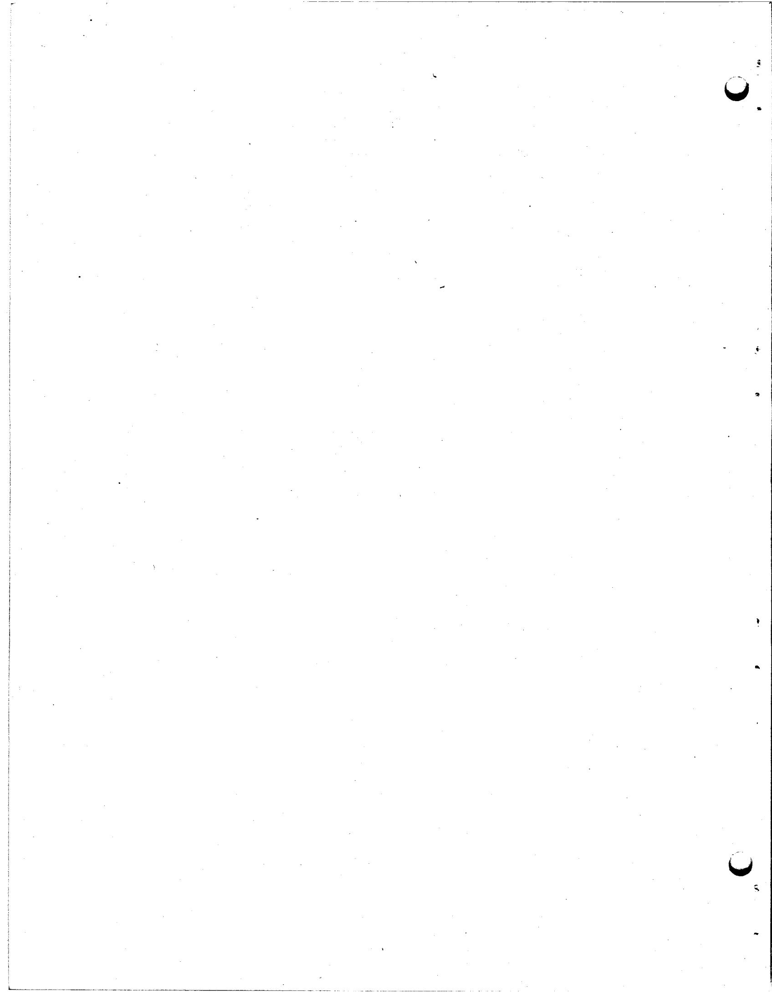

# INTERNAL DISTRIBUTION

1. C.F.Baes

29. E. L. Long

2. J.M.Baker

30. M. I. Lundin

3. H. F. Bauman

31. R. E. MacPherson

4. S.E.Beall

32. R. W. McClung

5. M. Bender

33. H. E. McCoy

6. E. S. Bettis

34. H. F. McDuffie

7. F. F. Blankenship

35. A. S. Meyer

8. E. G. Bohlmann

36. R L. Moore

9. G. E. Boyd

37. E. L. Nicholson

10. R. B. Briggs

38. L. C. Oakes

ll. C. W. Collins

39. A. M. Perry

12. E. L. Compere

40-41. M. W. Rosenthal

13. W. H. Cook

42. H. C. Savage

14. F. L. Culler

43. J. E. Savolainen

15. J. H. Devan

44. D. Scott

16. S. J. Ditto

45. J.H.Shaffer

17. E. P. Epler

46. M. J. Skinner

18. D. E. Ferguson

47. R.E.Thoma

19. W. R. Grimes

48. G. M. Watson

20. A. G. Grindell

49. J.R.Weir

21. P. N. Haubenreich

50. M. E. Whatley

22. P. R. Kasten

51. J. C. White

23. R. J. Kedl

52. E.I.Wyatt

24. M. J. Kelly

53-54. Central Research Library

25. E.M.King

55-56. Document Reference Section

26. S. S. Kirslis

57-59. Laboratory Records

27. C. E. Lamb

60. Laboratory Records (LRD-RC)

28. A. P. Litman

# EXTERNAL DISTRIBUTION

61-75. Division of Technical Information Extension (DTIE)

76. Laboratory and University Division, ORO