# OAK RIDGE NATIONAL LABORATORY

operated by

UNION CARBIDE CORPORATION

NUCLEAR DIVISION

for the

U.S. ATOMIC ENERGY COMMISSION

ORNL-TM-1993

203

EXPERIENCE WITH HIGH-TEMPERATURE CENTRIFUGAL PUMPS IN NUCLEAR REACTORS AND THEIR APPLICATION TO MOLTEN-SALT THERMAL BREEDER REACTORS

P. G. Smith

NOTICE This document contains information of a preliminary nature and was prepared primarily for internal use at the Oak Ridge National Laboratory. It is subject to revision or correction and therefore does not represent a final report.

# LEGAL NOTICE

This report was prepared as an account of Government sponsored work. Neither the United States, nor the Commission, nor any person acting on behalf of the Commission:

A. Makes any warranty or representation, expressed or implied, with respect to the accuracy, completeness, or usefulness of the information contained in this report, or that the use of any information, apparatus, method, or process disclosed in this report may not infringe privately owned rights; or   
B. Assumes any liabilities with respect to the use of, or for damages resulting from the use of any information, apparatus, method, or process disclosed in this report.

As used in the above, "person acting on behalf of the Commission" includes any employee or contractor of the Commission, or employee of such contractor, to the extent that such employee or contractor of the Commission, or employee of such contractor prepares, disseminates, or provides access to, any information pursuant to his employment or contract with the Commission, or his employment with such contractor.

Contract No. W-7405-eng-26

REACTOR DIVISION

EXPERIENCE WITH HIGH-TEMPERATURE CENTRIFUGAL PUMPS IN NUCLEAR REACTORS AND THEIR APPLICATION TO MOLTEN-SALT THERMAL BREEDER REACTORS

P. G. Smith

SEPTEMBER 1967

OAK RIDGE NATIONAL LABORATORY Oak Ridge, Tennessee operated by UNION CARBIDE CORPORATION for the U.S. ATOMIC ENERGY COMMISSION

# ELOON 14031

Prrnne nnnnne nee eae ene eee eee eee eee eee eee

e e e e e e e e e e e e e e e e e e e e e e e e e e e e e e e e e e

aee eae aee eae eae eae eae eae eae eae eae eae eae eae eae eae eae eae eae eae eae eae eae eae eae eae eae eae eae eae eae eae eae eae eae eae eae eae eae eae

e e e e e e e e e e e e e e e e e e e e e e e e e e e e

Prrnne nnnnne nee eaeene nne ene nee nee nee nee nee nee nee nee nee nee nee nee nee nee nee nee nee nee nee nee nee nee nee nee nee nee nee nee nee nee nee nee nee nee nee nee nee nee

e e e e e e e e e e e e e e e e e e e e e e e e e e e e

，

$\therefore m = \frac{3}{11}$ ;

# CONTENTS

# Page

# ABSTRACT 1

# INTRODUCTION 1

# DESCRIPTION AND OPERATING EXPERIENCE OF THE PUMPS 2

# Long-Shaft Pump 3

General Description 3

Sodium Pumps for the Hallam Nuclear Power Reactor 3

Primary Sodium Pumps for the Experimental Breeder 11 Reactor-2

Sodium Pumps for the Enrico Fermi Reactor 11

Development Sodium Pump for the UKAEA Prototype 15 Fast Reactor

Sodium Pumps for the Rapsodie Reactor 17

Sodium Pumps of the Sodium Test Facility at LASL 18

Molten-Salt Pump Operated at ORNL 21

Large Reactor Sodium Pump Proposed for Development 24 by USAEC

# Short-Shaft Pump 26

SodiumPumpsat the SRE 26

General Description of ORNL Pumps 27

MSRE Fuel and Coolant Salt Pumps 30

# PROBLEMS ANTICIPATED WITH LARGE PUMPS FOR MOLTEN-SALT BREEDER REACTORS 33

Dynamic Response of the Rotary Components Assembly 33

Bearings 35

Thermal and Radiation Damage Protection 36

Shaft Seal 37

Hydraulic Design 37

Fabrication and Assembly 38

# iv

# CONTENTS (continued)

Page   
CONCLUSIONS 38   
ACKNOWLEDGMENT 39   
REFERENCES 40

# LIST OF FIGURES

Page

Figure 1 Sodium Pumps, Hallam Nuclear Power Facility (from Ref. 5).   
2 Primary Sodium Pump Rotary Assembly, Hallam 8 Nuclear Power Facility (courtesy of Atomics International).   
3 Primary Sodium Pump, Experimental Breeder 12 Reactor-2 (from Ref. 5).   
4 Primary Sodium Pump, Enrico Fermi Fast Reactor 13 (from Ref. APDA-124, January 1959).   
5 Secondary Sodium Pump, Enrico Fermi Fast Reactors, 14 (courtesy of Atomic Power Development Associates).   
6 Development Sodium Pump, UKAEA Prototype Fast Reactor (from Ref. 9).   
7 Primary Pump for Rapsodie Reactor 19 (from Ref. 4).   
8 Primary Pump for Sodium Test Facility (LASL). 20   
9 Molten-Salt Pump With One Molten-Salt Lubricated Bearing (ORNL). 22   
10 Large Sodium Pump Concept Proposed for Development 25 by USAEC (from Ref. 19).   
ll Main Primary and Secondary Pumps, Sodium Reactor 28 Experiment (from Ref. 7).   
12 MSRE Fuel Salt Pump (ORNL). 29

# LIST OF TABLES

Page

Table 1 List of the Pumps and Their Distinguishing Features.   
2 Characteristics of Reactor Sodium Pumps, Long-Shaft Sump Pumps. 5   
3 Characteristics of Development Pumps, Long-Shaft Sump Pumps. 6   
4 Sodium Pump Operating Parameters, Hallam Nuclear Power Facility. 10   
5 Operating Characteristics, Molten-Salt Pump With 23 One Molten-Salt Lubricated Bearing.   
6 Characteristics of Short-Shaft Sump Pumps at ORNL. 31   
7 Endurance Operation of Short-Shaft Sump Pumps. 32   
8 Pumps for Molten-Salt Breeder Reactors. 34

# EXPERIENCE WITH HIGH-TEMPERATURE CENTRIFUGAL PUMPS IN NUCLEAR REACTORS AND THEIR APPLICATION TO MOLTEN-SALT THERMAL BREEDER REACTORS

P. G. Smith

# ABSTRACT

Design features, development problems, and operating experience have been compiled for liquid-metal and molten-salt circulating pumps used in various nuclear reactors and test facilities. The compilation was made to search out the problem areas and to select suitable combinations of features for the circulating pumps required by each of the three molten-salt systems in the proposed molten-salt thermal breeder reactor. The pumps are divided into two configurations: the "short-shaft pump" and the "long-shaft pump." The short-shaft pump is favored for the coolant salt system, and the long-shaft pump is favored for the fuel-and-blanket salt systems.

# INTRODUCTION

As part of a continuing program for development of molten-salt reactors, the Oak Ridge National Laboratory (ORNL) is working on the design of molten-salt thermal breeder reactors. A conceptual design of a 2225 Mw(t) Molten Salt Breeder Reactor $^{1,2}$ (MSBR) has been prepared, and a 100-150 Mw(t) Molten-Salt Breeder Experiment (MSBE) has been proposed as the follow-on to the 7.5 Mw(t) Molten-Salt Reactor Experiment $^{3}$ (MSRE). One version of the MSBR consists of four modules each of 556 Mw(t); and the MSBE consists of a single, reduced-scale module. Each module has three molten-salt systems, the fuel, blanket, and coolant; and each system requires a salt pump. The fuel and blanket salt systems are contained in an oven that is maintained at temperatures varying from $1050 - 1150^{\circ}\mathrm{F}$ , and they are so arranged that the discharge and suction connections for the pumps are located well below the oven ceiling and very near the nuclear core. The coolant salt system, in

which little radioactivity is expected, is contained in a separate oven that is maintained at $900 - 1000^{\circ}\mathrm{F}$ ; and it is so arranged that the discharge and suction connections for the pump are located very near the ceiling.

A survey of the experience with large pumps for high-temperature fluids has been made to assist in the design of pumps for the molten-salt breeder reactors. Descriptions, cross section drawings, and photographs, tables of pump parameters, and accounts of significant operating problems have been obtained for specific pumps of interest to the survey from various reactor installations. The pumps are classified into two configurations: "short-shaft pump" and "long-shaft pump." The pumps included are: the primary and secondary system sodium pumps for the Hallam Nuclear Power Facility $^{4,5}$ (HNPF), the Enrico Fermi Reactor, $^{4,5}$ and the Sodium Reactor Experiment $^{6,7,8}$ (SRE); the primary system sodium pumps in the Experimental Breeder Reactor- $2^{4,5}$ (EBR-2); the sodium pump being developed for the Prototype Fast Reactor $^{9}$ (PFR) by the United Kingdom Atomic Energy Authority (UKAEA); the sodium pumps of the 10 Mw experimental circuit for the Rapsodie reactor at the Cadarache installation in France $^{4,10,11}$ the sodium pumps of the 2000-Kw Sodium Test Facility at Los Alamos Scientific Laboratory $^{13,13,14}$ (LASL); the fuel and coolant salt pumps for the MSRE; $^{15,16}$ other elevated temperature pumps developed at ORNL; $^{17,18}$ and the large sodium pump (50,000 to 100,000 gpm) proposed for development by the United States Atomic Energy Commission (USAEC) for sodium-cooled fast breeder reactors. $^{19}$ All centrifugal pumps known to have been used in sodium-cooled and molten-salt nuclear reactors are included in the survey.

The problem areas anticipated for the two pump configurations in the molten-salt breeder applications are discussed briefly, and tentative conclusions are reached on a choice of pump configuration for each of the salt systems.

# PUMP DESCRIPTIONS AND OPERATING EXPERIENCE

The pumps included in this survey are described as mechanical, free-surface, centrifugal, vertical-shaft, sump pumps. They are

subdivided into two groups: those that have a long shaft with at least one shaft support bearing located in the pumped fluid, and those that have a short shaft with the impeller overhung. The first group (here-after referred to as long-shaft pump) includes reactor sodium pumps in the HNPF, EBR-2, and Enrico Fermi systems; the experimental development sodium pump for the PFR by UKAEA; the large sodium pump proposed for development by the USAEC; the sodium pumps for the Rapsodie reactor in France; the sodium pumps used in the Sodium Test Facility at LASL; and one molten salt pump that was operated at ORNL.[20] The second group (hereafter referred to as short-shaft pump) includes the remainder of the liquid-metal and molten-salt pumps that were developed and operated at ORNL, and the main and auxiliary sodium pumps of the SRE. The distinguishing features of each pump are listed in Table 1.

# Long-Shaft Pump

# General Description

The pumps in this group have a shaft support adjacent to the impeller provided by a journal bearing that is lubricated with the pumped fluid. This permits the use of long shafts to separate the drive motor and its sensitive electrical insulation and hydrocarbon lubricant from intense radioactivity and high-temperature. In addition to the distance effect, the separation provides space to accommodate radiation shielding.

The pumps that were used to circulate high-temperature sodium in primary and secondary nuclear reactor systems are listed in Table 2, with pertinent design parameters and operating experience. Table 3 provides design and operational information for development pumps.

# Sodium Pumps for the Hallam Nuclear Power Facility

The HNPF, a graphite-moderated, sodium-cooled reactor, designed for 256 Mw(t), required three sodium pumps in both the primary and secondary systems. The same hydraulic designs were used for the single-suction radial-impeller and vaned diffusers in both the primary and secondary pumps (Figs. 1 and 2). A conventional oil-lubricated ball

Table 1. List of the Pumps and Their Distinguishing Features   

<table><tr><td>Type Pump</td><td>Distinguishing Features</td></tr><tr><td>Long Shaft Pumps</td><td>Relatively long shaft, at least one bearing lubricated with pumped fluid.</td></tr><tr><td>Sodium pumps for the Hallam Nuclear Power Facility</td><td>Mechanical shaft seal, one sodium lubricated hydrostatic bearing.</td></tr><tr><td>Primary sodium pumps for the Experimental Breeder Reactor -2</td><td>Hermetic containment of motor, one sodium lubricated hydrostatic bearing.</td></tr><tr><td>Sodium pumps for the Enrico Fermi Reactor</td><td>Mechanical shaft seal, primary pumps have two sodium lubricated hydrostatic bearings, secondary pumps have only one.</td></tr><tr><td>Development sodium pump for the UKAEA Prototype Fast Reactor</td><td>Mechanical shaft seal, one sodium lubricated hydrostatic bearing.</td></tr><tr><td>Sodium pumps for the Rapsodie Reactor</td><td>Mechanical shaft seal, one sodium lubricated hydrostatic bearing.</td></tr><tr><td>Sodium pumps for the Sodium Test Facility at LASL</td><td>Mechanical shaft seals, three sodium lubricated hydrodynamic bearings. Primary pump - 2 stages; secondary pump - 4 stages.</td></tr><tr><td>Molten salt pumps operated at ORNL</td><td>Mechanical shaft seal, one molten salt lubricated hydrodynamic bearing.</td></tr><tr><td>Large reactor sodium pump proposed for development by USAEC</td><td>Mechanical shaft seal, one sodium lubricated hydrostatic bearing.</td></tr><tr><td>Short Shaft Pumps</td><td>Short shaft, impeller overhung.</td></tr><tr><td>Liquid metal and molten salt pumps developed at ORNL</td><td>Mechanical shaft seal, impeller overhung.</td></tr><tr><td>Sodium pumps for the SRE</td><td>Shaft freeze seal, impeller overhung, shaft extension used to remove motor from radiation field.</td></tr></table>

Table 2. Characteristics of Reactor Sodium Pumps, Long Shaft Sump Pumps   

<table><tr><td></td><td>Hallam</td><td>EBR-2</td><td>Enrico Fermi</td></tr><tr><td colspan="4">Primary System Pumps</td></tr><tr><td colspan="4">Design</td></tr><tr><td>Type</td><td>Centrifugal Free-surface</td><td>Centrifugal Free-surface</td><td>Centrifugal Free-surface</td></tr><tr><td>Number of units</td><td>3</td><td>2</td><td>3</td></tr><tr><td>Capacity, gpm</td><td>7200</td><td>5500</td><td>11,800</td></tr><tr><td>Dynamic head, ft</td><td>160</td><td>200</td><td>310</td></tr><tr><td>Design temperature, °F</td><td>1000</td><td>800</td><td>1000</td></tr><tr><td>Motor speed, rpm</td><td>900</td><td>1075</td><td>900</td></tr><tr><td>Motor power, hp</td><td>350</td><td>350</td><td>1060</td></tr><tr><td>Sealing arrangement</td><td>Mechanical Shaft seal</td><td>Hermetically sealed Drive motor</td><td>Mechanical Shaft seal</td></tr><tr><td>Material</td><td>304 ss</td><td>304 ss</td><td>304 ss</td></tr><tr><td>Type of speed control</td><td>Eddy current coupling</td><td>Variable freq. and voltage</td><td>Wound rotor motor w/liquid rheostat</td></tr><tr><td>Manufacturer</td><td>Byron-Jackson</td><td>Byron-Jackson</td><td>Byron-Jackson</td></tr><tr><td colspan="4">Operation</td></tr><tr><td>Sodium temperature, °F</td><td>300-1000</td><td>700</td><td>500-600</td></tr><tr><td>Sodium flow per pump, gpm</td><td>Up to 7200</td><td>4670</td><td>900-11,800</td></tr><tr><td>Time per pump, hr</td><td>20,000a</td><td>12,000b</td><td>26,000-28,500c</td></tr><tr><td colspan="4">Secondary System Pumps</td></tr><tr><td colspan="4">Design</td></tr><tr><td>Type</td><td>Centrifugal Free-surface</td><td>A-C linear Inductiond</td><td>Centrifugal Free-surface</td></tr><tr><td>Number of units</td><td>3</td><td>1</td><td>3</td></tr><tr><td>Capacity, gpm</td><td>7200</td><td>6500</td><td>13,000</td></tr><tr><td>Dynamic head, ft</td><td>170</td><td>142</td><td>100</td></tr><tr><td>Design temperature, °F</td><td>1000</td><td>700</td><td>1000</td></tr><tr><td>Motor speed, rpm</td><td>900</td><td>1180 (MG set)</td><td>900</td></tr><tr><td>Motor power, hp</td><td>350</td><td>500 (MG set)</td><td>350</td></tr><tr><td>Sealing arrangement</td><td>Mechanical Shaft seal</td><td>Total metal Enclosure</td><td>Mechanical Shaft seal</td></tr><tr><td>Material</td><td>304 ss</td><td>304 ss</td><td>2 l/4 Cr-1% Mo</td></tr><tr><td>Type of speed control</td><td>Eddy current coupling</td><td>Variable voltage (MG set)</td><td>Eddy current coupling</td></tr><tr><td>Manufacturer</td><td>Byron-Jackson</td><td>General Electric</td><td>Byron-Jackson</td></tr><tr><td colspan="4">Operation</td></tr><tr><td>Sodium temperature, °F</td><td>300-1000</td><td>---</td><td>500</td></tr><tr><td>Sodium flow per pump, gpm</td><td>Up to 7200</td><td>---</td><td>Up to 13,000</td></tr><tr><td>Time per pump, hr</td><td>19,000a</td><td>---</td><td>17,000-23,000c</td></tr></table>

Total operation per pump, facility discontinued.   
bTotal operation per pump as of January 18, 1967.   
Total operation per pump as of April, 1967.   
dElectromagnetic pump, for information only.

Table 3. Characteristics of Development Pumps, Long Shaft Sump Pumps   

<table><tr><td></td><td>Prototype Past Reactor (UKAEA)</td><td>10 Mw Test Loop Rapsodie (France)</td><td>Molten Salt Pump (ORNL)</td><td>LASL Sodium Test Facility (Los Alamos)</td><td>Past Breeder Reactor (USAEC)</td></tr><tr><td colspan="6">Primary System Pumps</td></tr><tr><td colspan="6">Design</td></tr><tr><td>Type</td><td>Centrifugal free-surface</td><td>Centrifugal free-surface</td><td>Centrifugal free-surface</td><td>Centrifugal free-surface</td><td>Centrifugal free-surface</td></tr><tr><td>Number of units</td><td>1</td><td>1</td><td>1</td><td>1 (2-stage)</td><td>1</td></tr><tr><td>Capacity, gpm</td><td>7100</td><td>1650</td><td>260</td><td>230</td><td>50,000-100,000</td></tr><tr><td>Dynamic head, ft</td><td>150</td><td>105</td><td>50</td><td>50</td><td>300</td></tr><tr><td>Design temperature, °F</td><td>750</td><td>1200</td><td>1350</td><td>850</td><td>800-1200</td></tr><tr><td>Motor speed, rpm</td><td>100-900</td><td>1100</td><td>1400</td><td>1675</td><td>890</td></tr><tr><td>Motor power, hp</td><td>475</td><td>73</td><td>---</td><td>7 1/2</td><td>6000</td></tr><tr><td>Sealing arrangement</td><td>Mechanical shaft seal</td><td>Mechanical shaft seal</td><td>Mechanical shaft seal</td><td>Mechanical shaft seal</td><td>Mechanical shaft seal</td></tr><tr><td>Material</td><td>321 ss</td><td>316 ss</td><td>Inconel</td><td>300 series ss</td><td>---</td></tr><tr><td>Type of speed control</td><td>Commutator ac motor w/induction regulator</td><td>Ward Leonard system</td><td>---</td><td>Electromagnetic drive</td><td>---</td></tr><tr><td>Manufacturer</td><td>---</td><td>Hispano-Suiza</td><td>---</td><td>Byron-Jackson</td><td>---</td></tr><tr><td colspan="6">Operation</td></tr><tr><td>Pumped fluid</td><td>Sodium</td><td>Sodium</td><td>Molten-Salt</td><td>Sodium</td><td>---</td></tr><tr><td>Temperature, °F</td><td>Up to 750</td><td>Up to 1022</td><td>1100-1350</td><td>Up to 850</td><td>---</td></tr><tr><td>Flow per pump, gpm</td><td>4000-7100</td><td>2000b</td><td>45-260</td><td>230</td><td>---</td></tr><tr><td>Time per pump, hr</td><td>7000a</td><td>12,000b</td><td>13,600c</td><td>11,920d</td><td>---</td></tr><tr><td colspan="6">Secondary System Pumps</td></tr><tr><td colspan="6">Design</td></tr><tr><td>Type</td><td>---</td><td>Centrifugal free-surface</td><td>---</td><td>Centrifugal free-surface</td><td>---</td></tr><tr><td>Number of units</td><td>---</td><td>1</td><td>---</td><td>1 (4-stage)</td><td>---</td></tr><tr><td>Capacity, gpm</td><td>---</td><td>1675</td><td>---</td><td>230</td><td>---</td></tr><tr><td>Dynamic head, ft</td><td>---</td><td>59</td><td>---</td><td>110</td><td>---</td></tr><tr><td>Design temperature, °F</td><td>---</td><td>1200</td><td>---</td><td>550</td><td>---</td></tr><tr><td>Motor speed, rpm</td><td>---</td><td>875</td><td>---</td><td>1675</td><td>---</td></tr><tr><td>Motor power, hp</td><td>---</td><td>75</td><td>---</td><td>10</td><td>---</td></tr><tr><td>Sealing arrangement</td><td>---</td><td>Mechanical shaft seal</td><td>---</td><td>Mechanical shaft seal</td><td>---</td></tr><tr><td>Material</td><td>---</td><td>316 ss</td><td>---</td><td>300 series ss</td><td>---</td></tr><tr><td>Type of speed control</td><td>---</td><td>Ward Leonard system</td><td>---</td><td>Electrodynamict drive</td><td>---</td></tr><tr><td>Manufacturer</td><td>---</td><td>Hispano-Suiza</td><td>---</td><td>Byron-Jackson</td><td>---</td></tr><tr><td colspan="6">Operation</td></tr><tr><td>Pumped fluid</td><td>---</td><td>NaK</td><td>---</td><td>Sodium</td><td>---</td></tr><tr><td>Temperature, °F</td><td>---</td><td>Up to 1022</td><td>---</td><td>Up to 550</td><td>---</td></tr><tr><td>Flow per pump, gpm</td><td>---</td><td>2000 gpm</td><td>---</td><td>230</td><td>---</td></tr><tr><td>Time per pump, hr</td><td>---</td><td>12,000b</td><td>---</td><td>13,474d</td><td>---</td></tr></table>

aLatest published information, May 1967, Nuclear Engineering.   
Total operation as of April 1965.   
Total as of September 1967.   
Total operation, facility discontinued.

ORNL-DWG 67-2568R

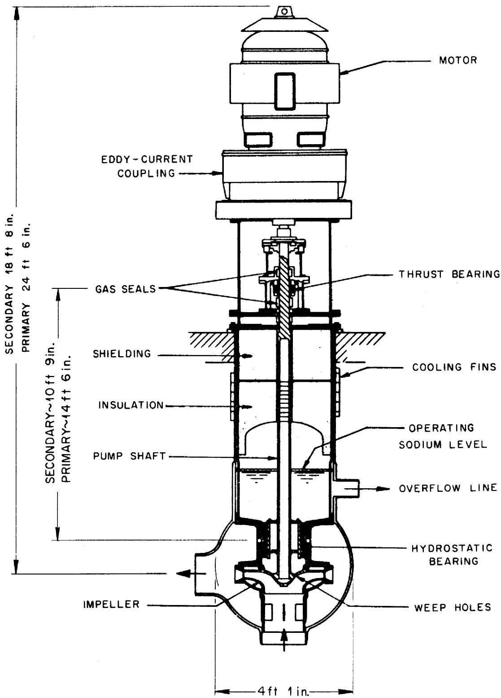  
Fig. 1. Sodium Pumps, Hallam Nuclear Power Facility (From Ref. 5).

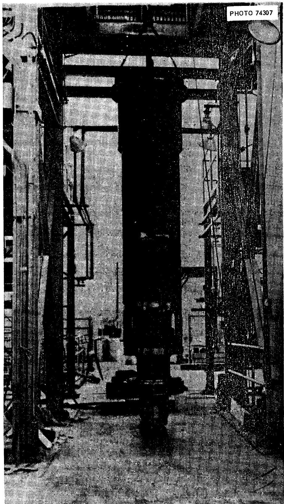  
Fig. 2. Primary Sodium Pump Rotary Assembly, Hallam Nuclear Power Facility. (Courtesy of Atomics International).

bearing supported the upper end of the pump shaft. Shaft seals constrained oil from leaking into either the sodium system or the atmosphere. A sodium-lubricated hydrostatic bearing supported the lower end of the pump shaft. The drive motor was located outside the reactor system primary containment. The shaft seals in the pumps were a part of the system containment. No shaft-annulus gas purge was used with these pumps. The pump and piping comprising a system were preheated before sodium was introduced. The preheating was accomplished with electrical resistance heaters, which were attached to the exterior of the sodium-wetted parts of the pump and piping.

Each of the three primary sodium pumps operated for approximately 20,000 hr, and each of the secondary pumps operated for approximately 19,000 hr. The speed-dependent operating parameters for both the primary and secondary pumps are presented in Table 4.

Initially the sodium level in the primary pump casing dropped below normal when the pump was operated at flow rates above $60\%$ of design and with the system resistance to flow lower than the design value of 160 ft at 7200 gpm.[21] Analyses and tests indicated that the flow rates of various sodium leakages into the pump casing were less than the outflow rate, thus lowering the sodium level in the casing. The problem was resolved by plugging four of the eight balancing holes in the impeller, which reduced the flow rate out of the casing.

The secondary pumps experienced binding of the rotating element caused by heavy wearing of the close running-clearance surfaces on the impeller wear rings, the sodium-lubricated bearing, and the impeller rim and casing inner diameter. The difficulty was traced to extraneous materials in the close running clearances and thermal distortion of the pump casing. The successful corrective actions that were taken included filtering the circulating sodium in a bypass loop, forced cooling the outer pump casing, and increasing the running clearances of both the upper and lower wear rings.

A prototype of the Hallam pumps $^{22}$ was operated for 800 hr at temperatures of $350 - 1000^{\circ}\mathrm{F}$ , speeds of 227-1135 rpm, and flows up to 9000 gpm.

Table 4. Sodium Pump Operating Parameters, Hallam Nuclear Power Facility   

<table><tr><td rowspan="2">Parameter</td><td rowspan="2">Units</td><td colspan="7">Run Number</td></tr><tr><td>1</td><td>2</td><td>3</td><td>4</td><td>5</td><td>6</td><td></td></tr><tr><td colspan="9">Primary Pump</td></tr><tr><td>Pump speed</td><td>rpm</td><td>316</td><td>360</td><td>498</td><td>590</td><td>620</td><td>642</td><td></td></tr><tr><td>Sodium flow</td><td>lb/hr</td><td>1.42 (10)</td><td>1.67 (10)</td><td>2.30 (10)</td><td>2.82 (10)</td><td>3.04 (10)</td><td>3.13 (10)</td><td></td></tr><tr><td>Pump head</td><td>ft</td><td>19.3</td><td>24.3</td><td>48.0</td><td>68.7</td><td>76.7</td><td>81.5</td><td></td></tr><tr><td>Hydraulic work</td><td>ft-lb/min</td><td>4.56 (10)</td><td>6.76 (10)</td><td>18.4 (10)</td><td>32.3 (10)</td><td>38.8 (10)</td><td>42.5 (10)</td><td></td></tr><tr><td>Pump output power</td><td>hp</td><td>13.8</td><td>20.5</td><td>56.4</td><td>97.9</td><td>118</td><td>129</td><td></td></tr><tr><td>Pump input power</td><td>hp</td><td>31</td><td>38</td><td>78</td><td>127</td><td>144</td><td>158</td><td></td></tr><tr><td>Pump efficiency</td><td>%</td><td>45</td><td>54</td><td>72</td><td>77</td><td>82</td><td>82</td><td></td></tr><tr><td>Motor input power</td><td>hp</td><td>101</td><td>111</td><td>160</td><td>222</td><td>228</td><td>242</td><td></td></tr><tr><td>System efficiency</td><td>%</td><td>14</td><td>18</td><td>35</td><td>44</td><td>52</td><td>53</td><td></td></tr><tr><td colspan="9">Secondary Pump</td></tr><tr><td>Pump speed</td><td>rpm</td><td>260</td><td>462</td><td>416</td><td>492</td><td>508</td><td>514</td><td></td></tr><tr><td>Sodium flow</td><td>lb/hr</td><td>1.30 (10)</td><td>1.60 (10)</td><td>2.02 (10)</td><td>2.35 (10)</td><td>2.48 (10)</td><td>2.60 (10)</td><td></td></tr><tr><td>Pump head</td><td>ft</td><td>20.4</td><td>64.7</td><td>45.1</td><td>61.6</td><td>68.0</td><td>73.2</td><td></td></tr><tr><td>Hydraulic work</td><td>ft-lb/min</td><td>4.42 (10)</td><td>17.3 (10)</td><td>15.2 (10)</td><td>24.2 (10)</td><td>28.1 (10)</td><td>31.7 (10)</td><td></td></tr><tr><td>Pump output power</td><td>hp</td><td>13.4</td><td>52.5</td><td>46.1</td><td>73.4</td><td>85.1</td><td>96.0</td><td></td></tr><tr><td>Pump input power</td><td>hp</td><td>25</td><td>72</td><td>64</td><td>99</td><td>107</td><td>118</td><td></td></tr><tr><td>Pump efficiency</td><td>%</td><td>53</td><td>73</td><td>72</td><td>74</td><td>80</td><td>81</td><td></td></tr><tr><td>Motor input power</td><td>hp</td><td>102</td><td>157</td><td>179</td><td>199</td><td>206</td><td>224</td><td></td></tr><tr><td>System efficiency</td><td>%</td><td>13</td><td>33</td><td>26</td><td>37</td><td>41</td><td>43</td><td></td></tr></table>

The EBR-2, an experimental fast breeder reactor designed for 62.5 Mw(t), uses two centrifugal pumps in the primary sodium system (Fig. 3) and an ac linear induction pump in the secondary system. The upper end of the primary pump shaft is supported by the motor bearings, and the lower end is supported by a sodium-lubricated hydrostatic bearing. The motor is enclosed in a hermetic vessel, which is part of the reactor containment; and it is protected from the intrusion of sodium vapor by a purge of argon gas that flows downward through close running clearances in the pump shaft annulus.

The primary pumps are located within the primary vessel and are preheated to $250 - 275^{\circ}\mathrm{F}$ by tubular resistance heaters attached to the core tank.

Each of the two primary sodium pumps has been operated for 12,000 hr. During initial operation the pump shaft rubbed against the shaft labyrinth. This problem was resolved satisfactorily by installing new pump shafts that had been subjected to proper stress-relief heat treatment. In addition, the labyrinth radial running clearance was increased from 0.017 to 0.129-in.

One pump would not restart in a normal fashion following a shutdown that occurred after 4400 hr operation. Manual movement of the shaft presented a "spongy" feel, as might be caused by a sodium oxide buildup. The pump was restarted after the shaft-impeller assembly was raised sufficiently with the shaft drawbolt to free it.

A prototype pump3 was operated for 16,000 hr during sodium pump development tests at temperatures up to $900^{\circ}\mathrm{F}$ , speeds up to 1750 gpm, and flows up to 6500 gpm.

# Sodium Pump for the Enrico Fermi Reactor

This fast breeder reactor designed for $430\mathrm{Mw(t)}$ requires three sodium pumps (Fig. 4) in the primary system and three sodium pumps (Fig. 5) in the secondary system. Each primary pump has two sodium-lubricated hydrostatic bearings, and each secondary pump has only one such bearing. The upper end of the primary pump shaft is attached to

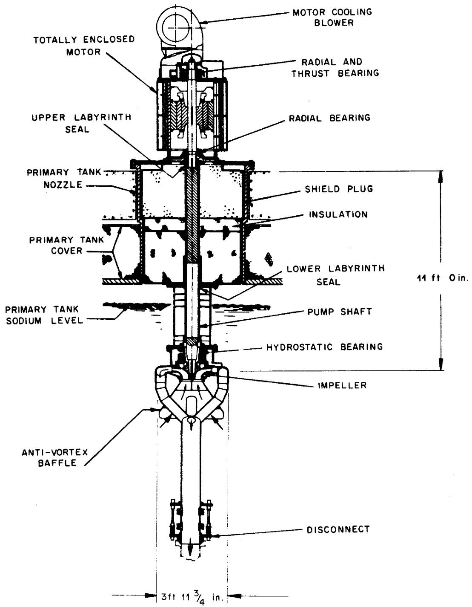  
Fig. 3. Primary Sodium Pump, Experimental Breeder Reactor-2 (From Ref. 5).

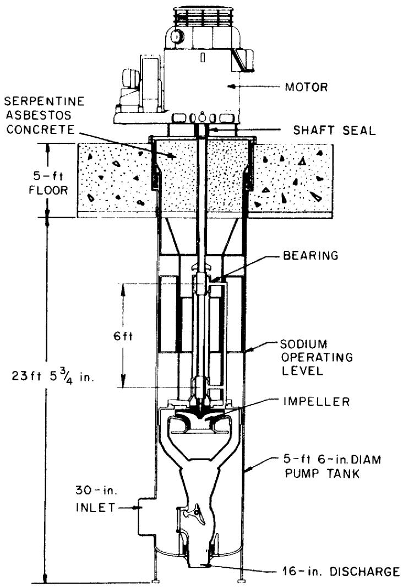

ORNL-DWG 67-2570R

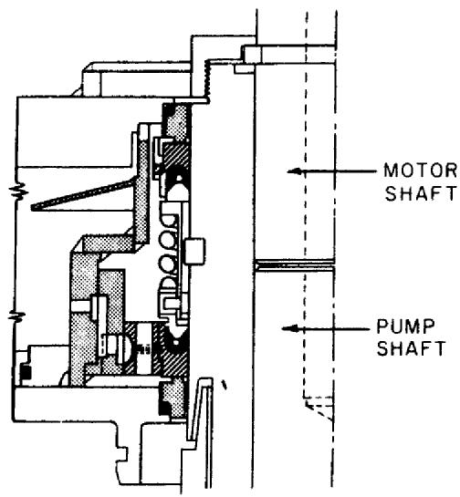  
Fig. 4. Primary Sodium Pump, Enrico Fermi Fast Reactor (From Ref. APDA-124, January 1959).

HALF SECTION OF SHAFT SEAL

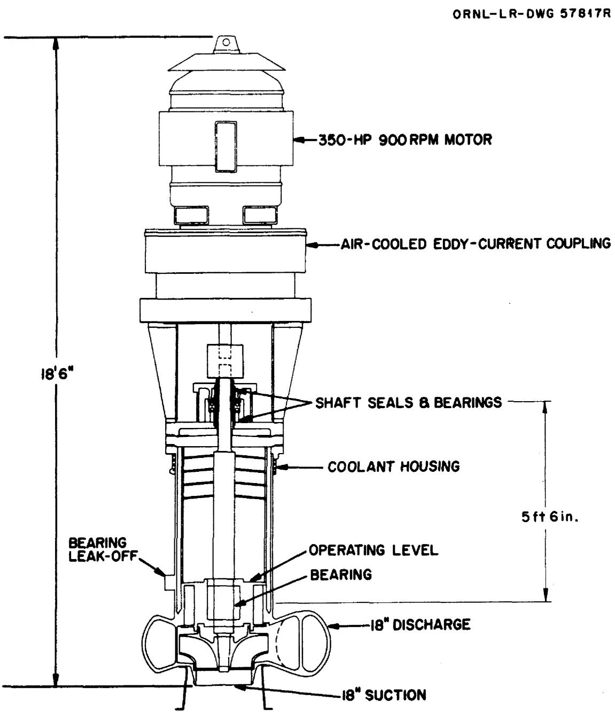  
Fig. 5. Secondary Sodium Pump, Enrico Fermi Fast Reactors, (Courtesy of Atomic Power Development Associates).

which are oil lubricated. Shaft seals are applied to the bearing at the upper end of the shaft to constrain the lubricant from leaking into the atmosphere or the sodium system. The radial force that acts on the impeller is minimized by discharging sodium at four symmetrical ports around the diffuser casing. The impeller is of the mixed flow type. The pump is driven by a 475-hp, ac commutator motor, which is controlled with an induction regulator and is capable of continuous speed variation between 10 and $100\%$ of design speed.

The pump tank and loop are surrounded by a mild steel jacket that forms an annulus for the purge of hot or cold air for preheating or cooling. The jacket also serves as secondary containment to provide protection in the event of sodium leakage. Air is heated by finned electrical resistance heaters and is circulated through the annulus to provide preheat to $400^{\circ}\mathrm{F}$ .

This pump has operated satisfactorily for 7000 hr and was removed from test twice for inspection. It was subjected to 300 starts and stops and has been operated at speeds between 10 and $100\%$ of design values at sodium temperatures up to $750^{\circ}\mathrm{F}$ . During operation the oil leakage past the shaft seals decreased from 1 to $\sim 0.2\mathrm{cm}^3/\mathrm{hr}$ .

During disassembly some difficulty was encountered in loosening flange bolts and in separating the faces of flanges that had been immersed in the sodium. It was necessary to heat these components above the melting point of sodium to perform the loosening and separation; however, the surfaces of the components showed no signs of distress. The pumps for the PFR will be supplied with provisions for jack bolts to assist in the separation of flange faces. Also, an impeller with double entry is being considered to provide a greater margin for cavitation-free operation.

# Sodium Pumps for the Rapsodie Reactor

These pumps (see Table 2 for design conditions) are similar to the EBR-2 and Fermi pumps in many aspects.4 The important differences are the arrangement of the discharge and suction that eliminates the complexity of the discharge manifolding, and the arrangement of the sodium-lubricated hydrostatic bearing that has the sodium supplied to pockets

on the journal rather than on the bearing sleeve. A cross section of the pump is shown in Fig. 7. The shaft is supported by two bearings: the sodium-lubricated bearing (mentioned above) located just above the impeller, and an upper roller bearing that consists of two thrust races placed just below the motor coupling. The latter bearing is lubricated with oil. Means are provided for purging helium through a labyrinth seal around the shaft to prevent diffusion of sodium vapor along the shaft. The pump tank contains a sheath casing of stainless steel, through which hot nitrogen is circulated for preheating.

The experience as of April 1965 consisted of approximately 12,000 hr operation each for the primary and secondary pumps. They have been operated at temperatures up to $1022^{\circ}\mathrm{F}$ and at flows of approximately 2000 gpm. Operation with the secondary pump has been with NaK rather than sodium.

The main difficulties experienced with the pumps have been with defective operation of the hydrostatic bearings. Adjustments have been made in clearances and the length-to-diameter ratio. In the case of clearances, it has been necessary to increase the clearance. Other difficulties were experienced with defective operation of the check valve in the discharge line, contamination in the form of oxides, and thermal distortions. Problems that had to do with vortexing and gas entrainment were found and solutions were provided during water tests.

# Sodium Pumps of the 2000 kw Sodium Test Facility at LASL

The Sodium Test Facility, $^{12}$ which LASL operated, contained two sodium circuits, each of which used a vertical centrifugal pump (Fig. 8) for circulating the sodium. These pumps were two-and four-stage pumps with the shafts supported by three sodium-lubricated hydrodynamic bearings and an oil-lubricated bearing. The shaft lengths are approximately $10\mathrm{l}/2$ ft on the primary pump and approximately $9\mathrm{l}/2$ ft on the secondary pump. The impellers are located just above a sodium-lubricated hydrodynamic bearing that supports the shaft at the lower end. The other two sodium bearings are separated by $45$ -in. on the primary and $34$ -in. on the secondary, and they are above the impellers. The oil-lubricated bearing is near the upper end of the shaft. It consists of a duplex pair of ball bearings,

ORNL-DWG 67-7791

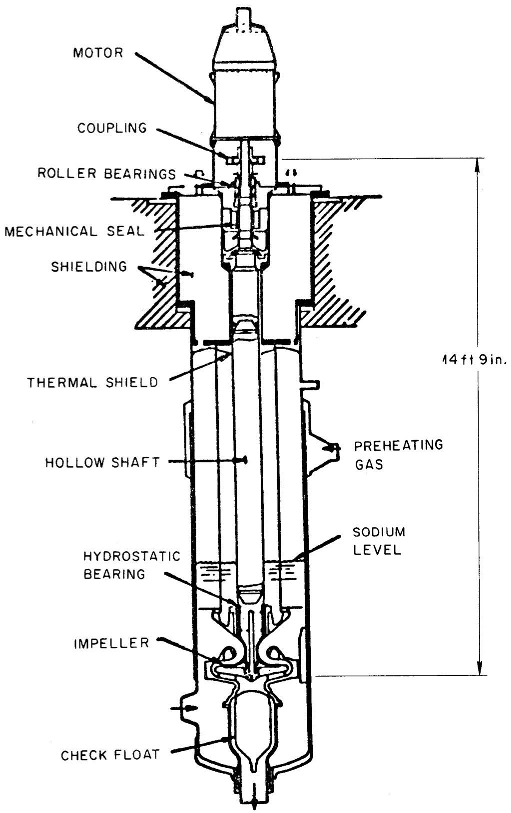  
Fig. 7. Primary Pump for Rapsodie Reactor (From Ref. 4).

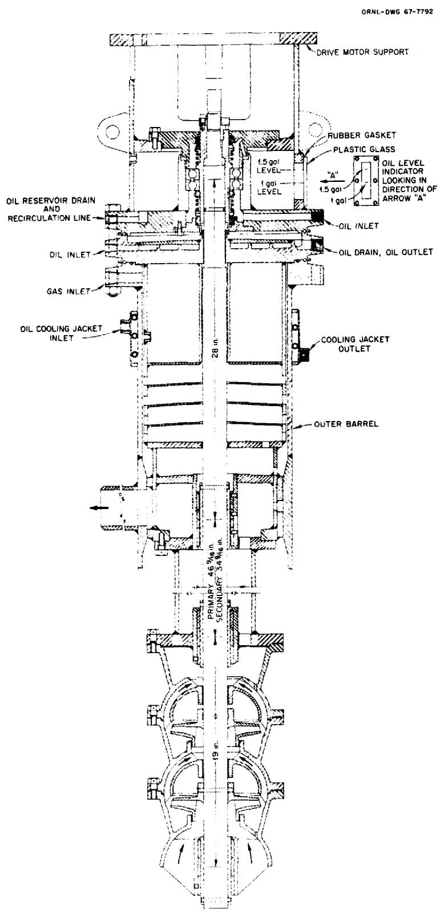  
Fig. 8. Primary Pump for Sodium Test Facility (LASL).

mounted back to back. Shaft mechanical seals are used to contain the oil.

The pumps served very satisfactorily throughout the life of the facility. The primary pump operated for 11,920 hr at temperatures up to $850^{\circ}\mathrm{F}$ , and the secondary pump operated 13,474 hr at temperatures up to $550^{\circ}\mathrm{F}$ . The pump design characteristics are listed in Table 3.

The oil-lubricated shaft seals performed well with an oil leakage rate of 1-5 cm³/day. After 10,700 hr of operation, the oil-lubricated shaft seal on the primary pump was replaced with a helium-lubricated seal. The helium consumption due to leakage was unsatisfactorily high after 150 hr of operation. Modifications were made and the seal was returned to service. The leakage rate was 10 scf/day. After 1030 hr operation the seal failed and again leaked helium excessively. The program was then discontinued.

# Molten-Salt Pump Operated at ORNL

This pump, $^{20}$ Fig. 9, is similar to the sodium pumps; but it is smaller. The pump shaft is supported at the lower end with a molten-salt-lubricated hydrodynamic journal bearing and at the upper end by an oil lubricated ball bearing. The sleeve of the molten-salt-lubricated bearing is gimbals mounted. Shaft seals are applied to the upper bearing region to prevent leakage of oil to the atmosphere or to the molten salt. The pump is driven with an electric motor mounted in the ambient atmosphere. The pump tank and loop are preheated to $1200^{\circ}\mathrm{F}$ before they are filled with molten salt. Preheating is provided by electrical resistance heaters attached to the pump tank and piping.

A summary of the operating experience with this pump is presented in Table 5. It became evident during the early development tests that the lubricant flow path to the bearing was inadequate, and that the rigid bearing support used at that time was probably being distorted sufficiently to cause or to aid in the shaft seizures that halted the first three tests. The lubricant flow path into the bearing was improved by removing a flow restriction between the pool of molten salt in the pump tank and the annular entrance to the bearing. The bearing was

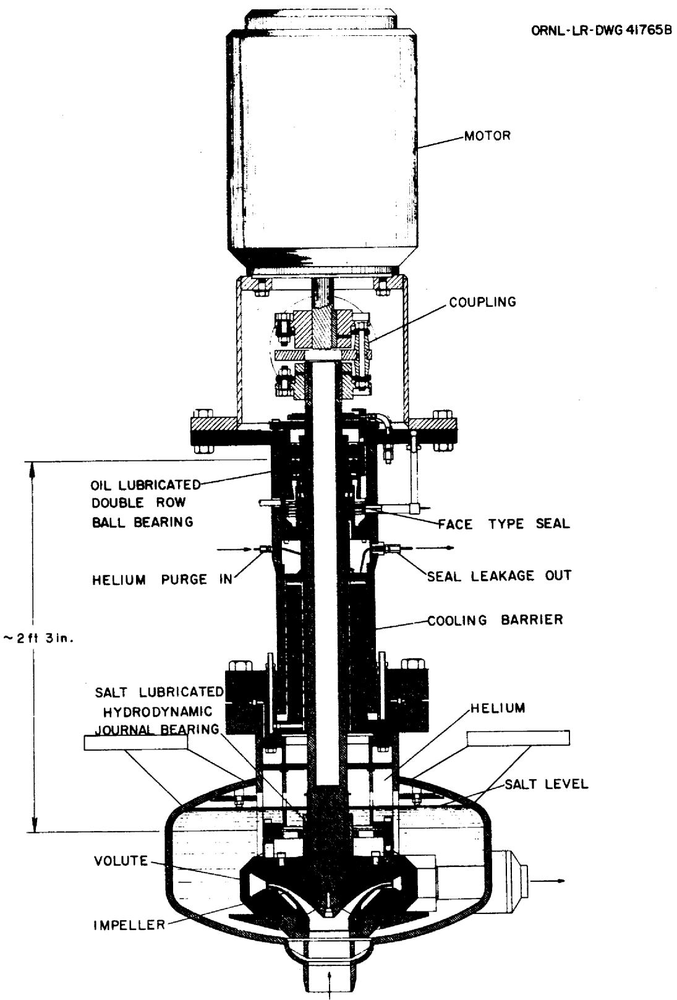  
Fig. 9. Molten-Salt Pump With One Molten-Salt Lubricated Bearing (ORNL).

Table 5. Operating Characteristics Molten Salt Pump With One Molten Salt Lubricated Bearing, Operated at ORNL   

<table><tr><td>Test No.</td><td>Salt Temp. (°F)</td><td>Pump Shaft Speed (rpm)</td><td>Salt Flow (gpm)</td><td>No. of Start-Stops</td><td>Test Duration (hr)</td><td>Reason for Termination</td></tr><tr><td>1</td><td>1200</td><td>1200-1400</td><td>50-100</td><td>1</td><td>1/3</td><td>Salt bearing seizure</td></tr><tr><td>2</td><td>1200</td><td>1150</td><td>50</td><td>1</td><td>0</td><td>Salt bearing seizure</td></tr><tr><td>3</td><td>1200</td><td>1200</td><td>50</td><td>1</td><td>11</td><td>Salt bearing seizure</td></tr><tr><td>4</td><td>1200</td><td>1400</td><td>100</td><td>2</td><td>1000</td><td>Scheduled</td></tr><tr><td>5</td><td>1200</td><td>1200</td><td>50</td><td>100</td><td>105</td><td>Scheduled</td></tr><tr><td>6</td><td>1100-1350</td><td>800-1400</td><td>45-260</td><td>100</td><td>12,500</td><td>Salt bearing showed signs of rubbing</td></tr><tr><td>7</td><td>1200</td><td>1200</td><td>50</td><td>1</td><td>58</td><td>Fulcrum pin worked loose in bearing gimbals mount</td></tr><tr><td>8</td><td>1200</td><td>1200</td><td></td><td>1</td><td>1</td><td>Fulcrum pin worked loose in bearing gimbals mount</td></tr><tr><td colspan="5">Total Operation</td><td>13,616</td><td></td></tr></table>

mounted in a gimbals arrangement to decouple it from thermal distortions that might be experienced during high-temperature operation.

Three tests were made with this bearing configuration, in which the pump was operated approximately 13,600 hr and was subjected to 200 start-stop operations. The longest run of 12,500 hr and 100 start-stop cycles was terminated when the bearing showed signs of slight rubbing. During the short period between each pump stop and the subsequent restart, the pump shaft was rotated by hand to check for tactile signs of rubbing between the bearing sleeve and journal.

Two additional attempts to operate the pump with new bearings were halted by bearing seizure. We believe the seizures resulted from the loosening of fulcrum pins in the gimbals mount. A revision to the gimbals design to prevent the loosening of these pins will be tested in the near future.

# Large Reactor Sodium Pump Proposed for Development by USAEC

Westinghouse and Byron-Jackson are developing conceptual designs for a sodium pump of approximately 60,000 gpm capacity for the fast breeder reactor program under USAEC contractual arrangements. An early conceptual design (Fig. 10) shows the electric drive motor coupled to the vertical pump shaft. The shaft extends downward from the floor level through five feet of shielding into the pump tank. The lower end of the shaft is supported in a sodium-lubricated bearing located above the pump impeller. The upper end of the shaft is supported in an oil-lubricated bearing located above the floor level. The sodium pool is blanketed with an inert gas at pressures ranging from 5 to 50 psig. A shaft seal located close to the upper bearing prevents the leakage of the blanket gas to the atmosphere.

The pump rotary element, including the double suction impeller, can be withdrawn vertically from the pump tank by personnel working at floor level. The overall length of the rotary element is 45-ft, and its diameter is approximately five feet. Baffles are applied to minimize the formation of vortexes in the sodium pool by the rotating shaft and to reduce both the convective heat transfer and the diffusion of sodium vapor in the blanket gas region.

ORNL.DWG.67-2694

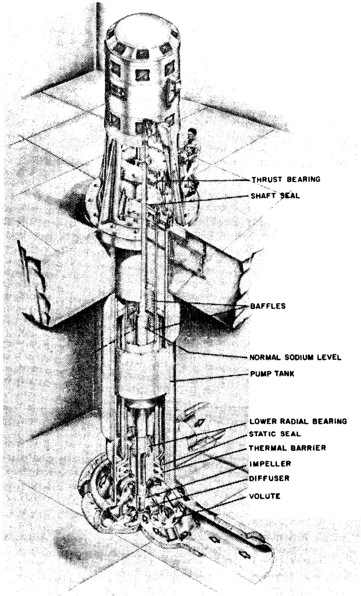  
CONCEPTUAL DRAWING   
OF A 6000 HP FREE SURFACE   
SHAFT SEATED SODIUM PUMP   
Fig. 10. Large Sodium Pump Concept Proposed for Development by USAEC (From Ref. 19).

# Short-Shaft Pumps

The distinguishing features of the short-shaft pump are the short distance between the shaft support bearings and the overhung impeller. This pump was used in the SRE and has been applied extensively by the Reactor Division of ORNL; however, the capacities of the various models are smaller than the requirements for proposed molten-salt breeder reactors. At ORNL, the pumps have been used in the Aircraft Reactor Experiment $^{24}$ and in the MSRE. $^{3,15}$ They have also been used extensively in metallurgical development programs and in heat transfer and heat exchanger development tests.

The SRE sodium pumps used a packing type seal (sodium freeze seal) that separated the sodium from the atmosphere; whereas, the ORNL pumps have the impeller and volute submerged in a vessel that serves as an expansion tank in which there is a liquid-free surface. Oil-lubricated shaft seals are used to maintain an inert atmosphere on the liquid-free surface and to contain the oil.

# Sodium Pumps for the SRE

The SRE is a 20 Mw(t) sodium-cooled nuclear power reactor with heat transfer and service systems and a steam plant. The heat transfer system consists of a primary sodium loop that cools the reactor and delivers heat to a secondary sodium loop. The secondary loop heats the steam operating system. The primary sodium flow passes through the reactor and therefore becomes radioactive, while the secondary system is non-radioactive. An auxiliary heat transfer system, comprised of primary and secondary sodium loops, is provided to remove "after glow" heat during reactor shutdown or during a failure of the main system.

Each of the four heat transfer loops contained a sodium pump, which was a modified hot process pump similar to those used in refineries. The principal modifications consisted of vertical mounting and the addition of sodium-freeze seals on the shaft and the casing. The primary pumps differed from the secondary pumps in that they had their shaft and casing extended to remove the drive unit to a safe operating zone. The shaft

freeze seal replaced the conventional type packing. In this seal, which earlier used tetralin as a coolant and later used NaK, sodium freezes around the shaft to provide a seal. The earlier pumps used oil-lubricated bearings to support the shaft. In later models the lower bearings were replaced by grease-lubricated bearings to minimize the possibility of hydrocarbon leakage into the sodium system. The main system pumps are shown in Fig. 11. The auxiliary pumps are similar, but their capacity is reduced by the use of reduced diameter impellers.

The pumps served to circulate coolant sodium in the SRE for a cumulative period of 37,000 hr at coolant temperatures of $285 - 1030^{\circ}\mathrm{F}$ and at flows of 600-1600 gpm. The main problems encountered with the pumps were associated with the freeze seals, which were responsible for shaft binding, sodium extrusion, and gas inleakage. In view of these problems, different pump concepts were used in the sodium pumps for the HNPF (discussed in a previous section).

# General Description of ORNL Pumps

The vertical pump shaft (Fig. 12) is supported at two places with oil-lubricated bearings separated by about 11 3/8-in. and mounted in a bearing housing. The impeller, which is mounted on the pump shaft about 26 1/4-in. below the lower shaft bearing (i.e., overhung), and the pump casing, or volute, are immersed in a pool of the working fluid in the pump tank. The drive motor is mounted directly above and in line with the bearing housing and is connected to the pump shaft through a flexible coupling.

Shaft seals are used to minimize the leakage of the oil to the atmosphere and to the pumped fluid and also to prevent the leakage of inert gas from the pump tank. A blanket of inert gas covers the free surface of the working fluid in the pump tank to protect the fluid from air and moisture contamination. Purge gas is used to scavenge seal oil leakage and to remove fission products in reactor pump applications. Running clearances between the rotating shaft and impeller and their respective matching stationary surfaces accommodate radial shaft deflection and axial differential thermal expansion. Preheat is provided in

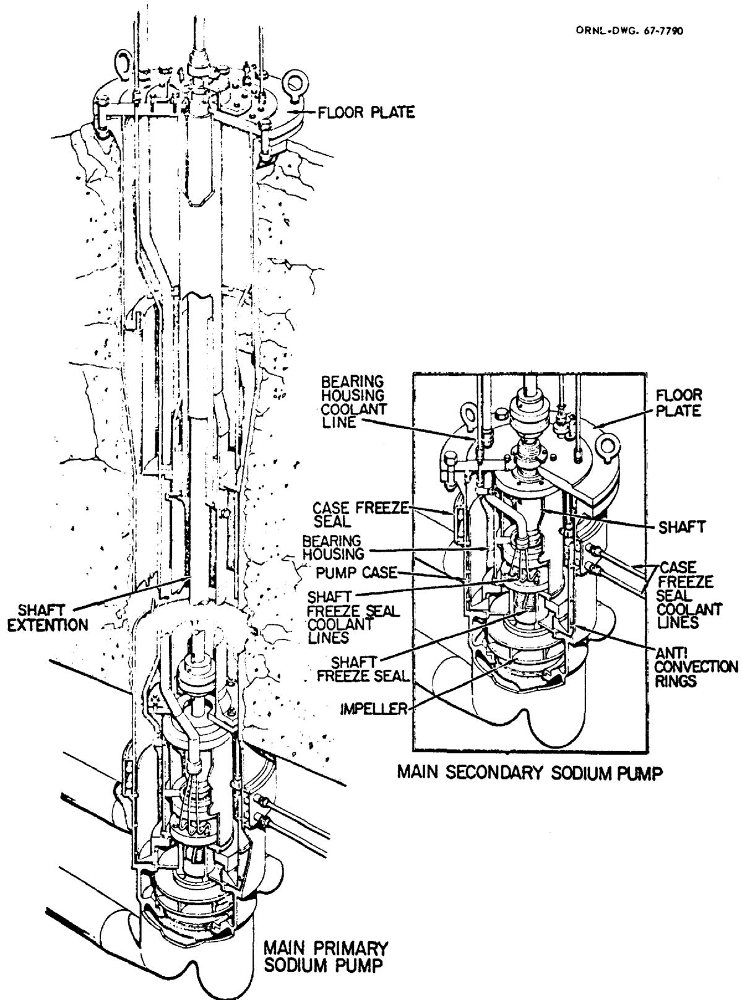  
Fig. 11. Main Primary and Secondary Pumps, Sodium Reactor Experiment (From Ref. 7).

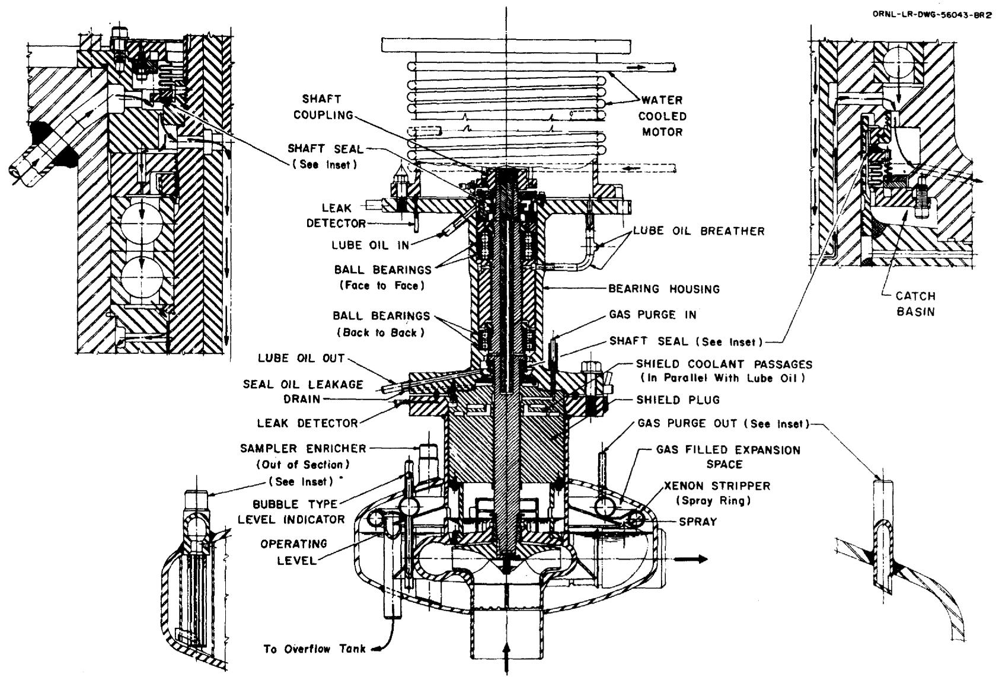  
Fig. 12. MSRE Fuel Salt Pump (ORNL).

most cases with electrical resistance heaters which are attached to the pump tanks and piping. Also, where possible, the pumps are rotated to circulate helium and to bring the system container material to near isothermal conditions.

The design parameters for these pumps used in the Reactor Division at ORNL are presented in Table 6. The capacities range from 5 gpm for the early LFB pumps to 1200 to 1600 gpm for the later MSRE and PKP pumps, and the pump heads range up to 400 ft. The range of operating temperatures and the total operating time for each pump model are also presented. Table 7 provides a list of those pumps that were operated for periods in excess of one year.

# MSRE Fuel and Coolant Salt Pumps

Both of these pumps, which are operating in the MSRE, are short shaft sump pumps; and in external appearance they are nearly identical. The hydraulic designs of the volutes and impellers and the pump operating speeds differ, as set forth in Table 6.

The inert gas in the fuel salt pump performs functions additional to that of protecting the salt from contamination. A flow of inert gas introduced at an intermediate point in the pump shaft annulus (Fig. 12) is used (1) to scavenge oil that leaks past the lower shaft seal into the catch basin (oil is carried from the pump to an external tank); (2) to prevent the diffusion of radioactivity from the pump tank gas space to the region of the lower shaft seal; (3) to strip Xenon-135, principal poison of the thermal neutron chain reaction, from a spray of salt in the pump tank; and (4) to dilute and transport the poison to an external charcoal trap system.

The MSRE pumps have been operated a total of more than 21,000 hr in the reactor and were previously subjected to approximately 5000 hr operation during various hot shakedown tests in a prototype pump test facility. Also, a prototype pump was operated nearly 9,000 hr during various development tests.

The principal difficulties that were resolved during development of the MSRE pumps included shaft seizures and excessive oil leakage

Table 6. Characteristics of Short Shaft Sump Pumps at ORNL   

<table><tr><td>Model</td><td>Process Fluid</td><td>Heada(ft)</td><td>Flowa(gpm)</td><td>Speeda(rpm)</td><td>Temp. (°F)</td><td>No. Built</td><td>Total Hours</td></tr><tr><td>LFB</td><td>Na, NaK, and Molten Salt</td><td>92</td><td>5</td><td>6000</td><td>1100-1400</td><td>46</td><td>451,000a</td></tr><tr><td>DANA</td><td>Na, NaK, and Molten Salt</td><td>300</td><td>150</td><td>3750</td><td>1000-1500</td><td>10</td><td>57,000</td></tr><tr><td>DAC</td><td>Molten Salt</td><td>50</td><td>60</td><td>1450</td><td>1000-1400</td><td>3</td><td>4,000</td></tr><tr><td>In-Pile Loop</td><td>Molten Salt</td><td>10</td><td>1</td><td>3000</td><td></td><td>8</td><td>14,000</td></tr><tr><td>MF</td><td>NaK and Molten Salt</td><td>50</td><td>700</td><td>3000</td><td>1100-1500</td><td>3</td><td>41,000d</td></tr><tr><td>MN</td><td>Na and NaK</td><td>120</td><td>500</td><td>3600</td><td>1050-1250</td><td>1</td><td>7,000</td></tr><tr><td>PKA</td><td>NaK and Molten Salt</td><td>400</td><td>375</td><td>3550</td><td>700-1500</td><td>2</td><td>19,000</td></tr><tr><td>FKP</td><td>NaK and Molten Salt</td><td>380</td><td>1500</td><td>3500</td><td>700-1500</td><td>4</td><td>40,000</td></tr><tr><td>MSRE Prototype Fuel</td><td>Molten Salt</td><td>50</td><td>1200</td><td>1150</td><td>1100-1500</td><td>1</td><td>8,900</td></tr><tr><td>MSRE - Fuele</td><td>Molten Salt</td><td>50</td><td>1200</td><td>1150</td><td>1100-1300</td><td>2</td><td>3,300</td></tr><tr><td>MSRE - Coolante</td><td>Molten Salt</td><td>100</td><td>850</td><td>1750</td><td>1100-1300</td><td>2</td><td>1,600</td></tr><tr><td>MSRE Reactor Operation (Fuel Pump)f</td><td>Molten Salt</td><td>50</td><td>1200</td><td>1175</td><td>1200</td><td></td><td>9,700</td></tr><tr><td>MSRE Reactor Operation (Coolant Pump)f</td><td>Molten Salt</td><td>78</td><td>800</td><td>1775</td><td>1000</td><td></td><td>11,400</td></tr><tr><td></td><td></td><td></td><td></td><td></td><td>Total</td><td></td><td>668,000</td></tr></table>

aAt design points.   
bSome pumps were operated for periods of 15,000-20,000 hr.   
c Includes 3000 hr in-pile operation.   
dIncludes continuous operation of 25,500 hr for a.single pump, circulating molten salt.   
$^{e}$ Operation in Molten Salt Pump Test Facility, hot shakedown of 2 ea rotary elements.   
$^{\mathrm{f}}$ Operation of single rotary element.

Table 7. Endurance Operation of Short Shaft Sump Pumps at ORNL   

<table><tr><td>Model</td><td>Number of Units</td><td>Working Fluid</td><td>Duration of Test (hr)</td></tr><tr><td>LFB</td><td>3</td><td>Molten Salt</td><td>8,800</td></tr><tr><td>LFB</td><td>1</td><td>Molten Salt</td><td>20,000</td></tr><tr><td>LFB</td><td>1</td><td>Molten Salt</td><td>15,000</td></tr><tr><td>MF</td><td>1</td><td>Molten Salt</td><td>25,500</td></tr><tr><td>PK</td><td>1</td><td>NaK</td><td>16,600</td></tr><tr><td>PK</td><td>1</td><td>Molten Salt</td><td>9,700</td></tr><tr><td>MSRE Fuel</td><td>1</td><td>Molten Salt</td><td>9,700</td></tr><tr><td>MSRE Coolant</td><td>1</td><td>Molten Salt</td><td>11,400</td></tr></table>

past the lower shaft seal. Operation of the pump at off-design capacity conditions caused a pump shaft seizure, when the shaft deflection exceeded the value of the running clearance. The running clearances were increased sufficiently to accommodate the off-design operating conditions. Seal performance was improved by reducing the tolerances on the concentricity and parallelism of the stator face of the shaft seal with respect to the rotor face. The final machining operation on the seal stator is performed in a lathe, using a fixture designed to attain the required concentricity and parallelism.

Several incidents of plugging in the off-gas line from the fuel salt pump tank have occurred during operation of the MSRE. We believe there is a small leakage of oil into the fuel salt pump tank, and that the thermally cracked products are subsequently polymerized by radio-activity in the off-gas line, particularly in small flow-area configurations (e.g., needle valves, capillary tubes, and gas filters). The spare rotary elements for the MSRE pumps have been modified to replace a gasketed joint with a seal weld to remove what is thought to be the major source of oil leakage into the pump tank.

Experience indicates that after pump development has been accomplished, the main sources of difficulty arise from failures in electrical and speed control systems and from such drive motor components as the electrical insulation system and the rotor support bearings.

# PROBLEMS ANTICIPATED WITH LARGE PUMPS FOR MOLTEN-SALT BREEDER REACTORS

Other than the shaft length, the primary configuration difference between the short- and long-shaft pumps is the means of supporting the shaft. The short shaft is usually supported with oil-lubricated ball bearings at two places located relatively close together. A short separation distance is provided between the elevated temperature working fluid and the thermal and radiation sensitive pump components in the bearing housing and drive motor. The long shaft is supported at its lower end with a pumped fluid-lubricated bearing and at its upper end with a conventionally lubricated bearing. These two bearings are widely separated. A long separation is provided between the pumped fluid and the sensitive pump components. The two configurations differ strongly in other areas: the dynamic response of the individual rotating components assembly, the kind of shaft support bearings used, and the thermal and radiation damage protection requirements.

The molten-salt pump requirements presently envisioned for the MSBR and the MSBE are listed in Table 8. A comparison between the two pumps is made on the bases of their differences and the problems anticipated with their application to the pumping requirements for the molten-salt thermal breeder reactors. The principal technology problems include (1) dynamic response of the rotating components assembly, (2) bearings, (3) thermal and radiation damage protection, (4) shaft seals, (5) hydraulic design, and (6) fabrication and assembly.

# Dynamic Response of the Rotating Components Assembly

The dynamic response of the rotating components assembly (which is comprised of the shaft, drive motor, impeller, and bearings) and the

Table 8. Pumps for Molten-Salt Breeder Reactors   

<table><tr><td></td><td>Fuel</td><td>Blanket</td><td>Coolant</td></tr><tr><td colspan="4">2225 Mwt MSBR</td></tr><tr><td>Number required</td><td>4a</td><td>4a</td><td>4a</td></tr><tr><td>Design temperature, °F</td><td>1300</td><td>1300</td><td>1300</td></tr><tr><td>Capacity, gpm</td><td>11000</td><td>2000</td><td>16000</td></tr><tr><td>Head, ft</td><td>150</td><td>80</td><td>150</td></tr><tr><td>Speed, rpm</td><td>1160</td><td>1160</td><td>1160</td></tr><tr><td>Specific speed, Ns</td><td>2830</td><td>2150</td><td>3400</td></tr><tr><td>NPSH, required, ft</td><td>25</td><td>8</td><td>32</td></tr><tr><td colspan="4">(Net Positive Suction Head)</td></tr><tr><td>Impeller input power, hp</td><td>990</td><td>250</td><td>1440</td></tr><tr><td>Distance between bearings, ftb</td><td>29</td><td>29</td><td>1.5</td></tr><tr><td>Impeller overhang, ftb</td><td>2.5</td><td>2.5</td><td>5</td></tr><tr><td colspan="4">150 Mwt MSBE</td></tr><tr><td>Number required</td><td>1</td><td>1</td><td>1</td></tr><tr><td>Design temperature, °F</td><td>1300</td><td>1300</td><td>1300</td></tr><tr><td>Capacity, gpm</td><td>4500</td><td>540</td><td>4300</td></tr><tr><td>Head, ft</td><td>150</td><td>80</td><td>150</td></tr><tr><td>Speed, rpm</td><td>1750</td><td>1750</td><td>1750</td></tr><tr><td>Specific speed, Ns</td><td>2730</td><td>1520</td><td>2670</td></tr><tr><td>NPSH required, ft</td><td>27</td><td>5</td><td>26</td></tr><tr><td colspan="4">(Net Positive Suction Head)</td></tr><tr><td>Impeller input power, hp</td><td>410</td><td>61</td><td>390</td></tr><tr><td>Distance between bearings, ftb</td><td>20</td><td>20</td><td>1.5</td></tr><tr><td>Impeller overhang, ftb</td><td>2</td><td>2</td><td>5</td></tr></table>

a One pump is required for each of the four modules in the MSBR.   
bEstimated from preliminary pump layouts.

pump casings must provide vibration amplitudes that are sufficiently low to be tolerable to the shaft support bearings and seals, and pump structure throughout the entire range of operating speeds. In this respect the long shaft presents the more critical problem.

A preliminary layout of the MSBR fuel salt pump indicates a shaft length of approximately 35-ft for use with the oven housing concept. It may be necessary to operate this pump supercritically, i.e., at design speed above the first shaft critical frequency, in contradistinction to the usual practice of setting the design speed at approximately three-quarters of the first shaft critical. Mathematical analyses can now be made of the dynamic response of supercritical shafts. The usual closed solutions and graphical approximation methods for calculating shaft response have been augmented during the past few years with sophisticated computer programs. These programs have been expanded to permit computation of the dynamic response of supercritical shafts.

The newness of operating long supercritical shafts and calculating their dynamic response invites, if not requires, proof-testing. Although it would be most satisfactory to simulate the full-scale supercritical shaft system, study may indicate the feasibility of proof-testing with reduced-scale models. Because of these problems, additional studies will be made of the reactor cell layout. It may be possible to reduce shaft length sufficiently to permit sub-critical operation of the MSBR fuel and blanket salt pumps.

# Bearings

The short-shaft pump does not require development of bearings, and its reliability is enhanced by the use of conventionally lubricated ball bearings that have good long-term life based on large statistical samplings.

The long-shaft pump configuration requires a molten-salt lubricated journal bearing near the lower end of the shaft. The bearing guides the pump impeller in its casing so that there is no rubbing between these two components. The problems include the design of the bearing to produce the hydrodynamic lubricating film with molten salt, the selection of the bearing materials and their form (hard surface coating or integral body construction), the accommodation of differential thermal expansion

if integral body construction is used, and the design of a bearing mounting arrangement that will accommodate some thermal distortion between the pump shaft and casing without interfering with the lubricating film in the bearing.

The hydrodynamic design of process fluid lubricated bearings is on a firm foundation and no real problem is anticipated with this aspect of the design of molten-salt bearings. However, there are some unresolved questions about the bearing materials and the mechanical design of their attachment to the pump stationary element.

Although approximately 30 Hastelloy-N vs Hastelloy-N bearings, $^{20}$ which represent a relatively soft-on-soft combination, were successfully operated in molten salt, it is believed that a hard-on-hard combination is a better choice for molten-salt systems. The cemented carbides, which utilize cobalt, nickel or molybdenum binder, appear to be good candidate materials. They may be used in solid body form or applied to the softer container material with plasma spray techniques to form a hard surface coating. A program to determine the compatibility and to assess the appropriate characteristics of the selected bearing materials in molten salt is required.

Thermal distortion of the pump casing can have a deleterious effect on the alignment between journal and bearing, which is so necessary to the satisfactory operation of the molten-salt bearing. It appears that a uniform temperature distribution in the casing and a bearing mounting arrangement that will accommodate some distortion between shaft and casing must be provided. A program is required to proof-test the full-scale bearing and mounting arrangement in molten salt and to simulate the anticipated start-stop requirements, thermal cycling, and endurance conditions.

# Thermal and Radiation Damage Protection

The reliability of a salt pump for the fuel and blanket salt systems for a molten-salt breeder reactor is strongly dependent upon the temperature and the radiation dose to which the conventional lubricant and drive motor components are subjected. The long-shaft pump provides a much

greater separation between the sensitive components and the sources of thermal and radiation damage than the short shaft configuration. Very low radiation dosage and gentle temperature gradients are expected for the long-shaft pump.

# Shaft Seals

A shaft seal is required with either the long- or short-shaft pump to maintain separation between the lubricant in the upper shaft bearing and the molten salt in the pump tank. Its design should be as simple as possible, consistent with convenient replacement of the seal. The anticipated problems include (1) the fabrication of a bellows to accommodate the required pump shaft diameter, (2) the attachment of the rotor wear surface with respect to the axis of shaft rotation, (3) the attachment of the stator wear element to the bellows to obtain a hermetic joint, (4) the assembly of the stator element to provide both squareness and concentricity of its wear surface with the axis of shaft rotation to close tolerances. Although shaft seals proportioned for 3-in.-diam shafts have been operated continuously for more than 25,000 hr, a program to produce and to proof-test seals for larger diameter pump shafts is required.

# Hydraulic Design

The salt pump capacities for the MSBE and the MSBR range from 500 to 16,000 gpm. The hydraulic designs of impellers and diffusers or volute casings in this capacity range are available in the pump industry. Allis-Chalmers Manufacturing Company provided the hydraulic designs and assisted a reputable founder to produce the Hastelloy-N impeller and volute castings for the MSRE fuel and coolant salt pumps.

# Fabrication and Assembly

Both the long- and short-shaft pumps will require the fabrication of large pump impellers and diffusers or volute casings from castings

or weldments. A survey of U. S. industry is being made to determine the influence of the best state-of-the-art fabrication methods and quality controls on the design of long and large diameter shafts and casings. The results of the survey will be used in making pump conceptual layouts and will be made available to pump manufacturers. By comparison, the long-shaft pump components will require large and long handling equipment and increased headroom in the assembly and installation areas.

# CONCLUSIONS

A history of satisfactory operation makes the short shaft pump very attractive for application to molten-salt breeder reactors. However, the proposed oven concept, mentioned previously for preheating and containing the fuel and blanket salt systems, would impose stringent cooling and radiation protection requirements for the pump. The pump would need to be contained in a re-entrant cell supported from the ceiling. The cell would restrict accessibility to the drive motor and rotary element and would increase the pump installation problems. The reliability of the pump would depend directly on the reliability of the cooling system.

However, the application of the short-shaft pump to the fuel and blanket salt systems would be attractive if the salt system components were preheated individually, the pump were provided with adequate local nuclear radiation shielding, and an ambient temperature below $200^{\circ}\mathrm{F}$ were maintained in the reactor cell.

Probably the most desirable pump configuration from the viewpoint of the reactor designers and operators is the canned rotor pump. This pump has no limitations on either orientation or elevation. However, its application to molten-salt reactors would require the development or invention of a radiation-resistant, high-temperature electric motor. It also would impose the necessity for long term maintenance of satisfactory alignment between the matching surfaces of process-lubricated journal and thrust bearings. These problems appear to be difficult and expensive to resolve.

We believe that the long-shaft pump is the best configuration for the fuel and blanket salt oven cell concept being considered for moltensalt breeder reactors because it provides the greatest thermal and nuclear radiation protection to the drive motor. The location of the coolant salt pump near the ceiling of its oven and the anticipated low level of radioactivity make feasible the application of the short-shaft pump to the coolant salt system.

# ACKNOWLEDGMENT

We acknowledge gratefully the work and cooperation of the individuals and companies who contributed to the survey and the contributions of Orville Seim of Argonne National Laboratory, Norman Peters of Atomic Power Development Associates, and Robert Atz of Atomics International.

# REFERENCES

1. P. R. Kasten, E. S. Bettis, and R. C. Robertson, Design Studies of 1000-Mw(e) Molten-Salt Breeder Reactors, ORNL-3996, Oak Ridge National Laboratory, August 1966.   
2. H. G. MacPherson, Molten-Salt Reactor Will Produce Low Cost Power, Power Engineering, Part 1, 71(1): 28-31 (January 1967); Part 2, 71(2): 56-58 (February 1967).   
3. R. C. Robertson, MSRE Design and Operations Report, Part 1 - Description of Reactor Design, ORNL-TM-728, Oak Ridge National Laboratory, January 1965.   
4. J. J. Morabito and H. W. Savage, Major Components and Test Facilities for Sodium Systems, Detroit Meeting April 26-28, 1965, ANS-100, pp. 308-311.   
5. H. O. Monson et al., Components for Sodium Reactors, 1964 Geneva Conference, P/228 USA, pp. 594-597.   
6. Design Modifications to the SRE During FY 1960, NAA-SR-5348 (Rev.) February 15, 1961, p. 108.   
7. E. N. Pearson, SRE System and Components Experience - Core II, Presented at the Sodium Components Development Program Information Meeting, Palo Alto, California, August 20-21, 1963, Atomics International.   
8. The Effects of Long-Term Operation on SRE Sodium System Components, NAA-SR-11396, 50 p., August 31, 1965.   
9. K. G. Eickhoff, J. Allen, and C. Boorman, Engineering Development for Sodium Systems, BNES, London Conference on Fast Breeder Reactors, May 17-19, pp. 6-9, 1966.   
10. J. Baumier, Mechanical Pumps for 1 and 10 Mw Test Loops, DRP/ML/FAR R/100, February 20, 1962.   
11. J. Baumier and H. J. Gollion, Mechanical Pumps for Liquid Metals, Colloquium of the European Society of Atomic Energy on Liquid Metals, Aix-en-Provence, September 30 to October 2, 1963.   
12. L. A. Whinery, 2000-Kw Sodium Test Facility Project Description and Progress Report, LAMS-254l, June 30, 1958 through September 30, 1959.   
13. Quarterly Status Progress Report on Lampre Program for Period Ending August 20, 1961, LAMS-2620, pp. 23-24, September 29, 1961.

14. Quarterly Status Progress Report on Lampre Program for Period Ending November 20, 1961, LAMS-2647, pp. 12-13, December 27, 1961.   
15. P. G. Smith and L. V. Wilson, Development of an Elevated-Temperature Centrifugal Pump for a Molten-Salt Nuclear Reactor, ASME Paper 65 WA/FE-27 11 p., December 1965.   
16. Oak Ridge National Laboratory, MSRP Semiann. Progr. Rept. July 31, 1964, USAEC Report ORNL-3708, pp. 147-167.   
17. H. W. Savage and A. G. Grindell, Pumps for High-Temperature Liquid Systems, Space Nuclear Conference, Gatlinburg, Tennessee, American Rocket Society, 16 p., May 3-5.   
18. A. G. Grindell, W. F. Boudreau, and H. W. Savage, Development of Centrifugal Pumps for Operation with Liquid Metals and Molten Salts at 1100-1500°F, Nuclear Science and Engineering, 7(1): 83-91 (January 1960).   
19. Sodium Pump Development and Pump Test Facility Design, WCAP-2347, August 1963.   
20. P. G. Smith, High-Temperature Molten-Salt Lubricated Hydrodynamic Journal Bearings, ASLE Trans., 4(2): 263-274 (November 1961).   
21. R. W. Atz, Operating Experience with Heat Transfer System Pumps at the Hallam Nuclear Power Facility, NAA-SR-9717, June 15, 1964.   
22. R. W. Atz, Performance of HNPF Prototype Free-Surface Sodium Pump, NAA-SR-4336, 26 p., June 1960.   
23. O. S. Seim and R. A. Jaross, Characteristics and Performance of 5000 gpm A.C. Linear Induction and Mechanical Centrifugal Sodium Pumps, A/CONF 15/P/2158, USA, June 1958.   
24. H. W. Savage, G. D. Whitman, W. G. Cobb, and W. B. McDonald, Components of the Fused-Salt and Sodium Circuits of the Aircraft Reactor Experiment, ORNL-2348, Oak Ridge National Laboratory, September 1958.

# INTERNAL DISTRIBUTION

1. R.K. Adams

2. G. M. Adamson

3. R.G.Affel

4. L.G. Alexander

5. R.F.Apple

6. C. F. Baes

7. J.M.Baker

8. S.J.Ball

9. H. F. Bauman

10. S. E. Beall

11. M. Bender

12. E. S. Bettis

13. F. F. Blankenship

14. R. E. Blanco

15. J. O. Blomeke

16. R. Blumberg

17. E. G. Bohlmann

18. C.J.Borkowski

19. G. E. Boyd

20. J. Braunstein

21. M. A. Bredig

22. R. B. Briggs

23. H. R. Bronstein

24. G. D. Brunton

25. D. A. Canonico

26. S. Cantor

27. W. L. Carter

28. G. I. Cathers

29. J.M. Chandler

30. E. L. Compere

31. W.H.Cook

32. L. T. Corbin

33. J. L. Crowley

34. F. L. Culler

35. J.M.Dale

36. D. G. Davis

37. S.J.Ditto

38. A. S. Dworkin

39. J.R. Engel

40. E.P.Epler

41. D. E. Ferguson

42. L.M.Ferris

43. A. P. Fraas

44. H. A. Friedman

45. J.H.Frye, Jr.

46. C. H. Gabbard

47. R.B.Gallaher

48. H. E. Goeller

49. W.R.Grimes

50. A. G. Grindell

51. R.H.Guymon

52. B. A. Hannaford

53. P.H.Harley

54. D. G. Harman

55. C. S. Harrill

56. P. N. Haubenreich

57. F. A. Heddleson

58. P. G. Herndon

59. J.R.Hightower

60. H.W.Hoffman

61. R.W.Horton

62. T. L. Hudson

63. H. Inouye

64. W.H. Jordan

65. P.R.Kasten

66. R.J.Kedl

67. M. T. Kelley

68. M. J. Kelly

69. C. R. Kennedy

70. T. W. Kerlin

71. H. T. Kerr

72. S. S. Kirslis

73. A. I. Krakoviak

74. J. W. Krewson

75. C. E. Lamb

76. J.A.Lane

77. R.B.Lindauer

78. A. P. Litman

79. M. I. Lundin

80. R.N.Lyon

81. H. G. MacPherson

82. R.E.MacPherson

83. C. D. Martin

84. C. E. Mathews

85. R.W.McClung

86. H. E. McCoy

87. H. F. McDuffie

88. C. K. McGlothlan

89. C. J. McHargue

90. L. E. McNeese

91. A. S. Meyer

92. R. L. Moore

93. J. P. Nichols

94. E. L. Nicholson

95. L. C. Oakes

96. P. Patriarca

INTERNAL DISTRIBUTION (continued)   

<table><tr><td>97.</td><td>A. M. Perry</td><td>132.</td><td>R. C. Steffy</td></tr><tr><td>98.</td><td>H. B. Piper</td><td>133.</td><td>H. H. Stone</td></tr><tr><td>99.</td><td>B. E. Prince</td><td>134.</td><td>J. R. Tallackson</td></tr><tr><td>100.</td><td>J. L. Redford</td><td>135.</td><td>E. H. Taylor</td></tr><tr><td>101.</td><td>M. Richardson</td><td>136.</td><td>R. E. Thoma</td></tr><tr><td>102.</td><td>R. C. Robertson</td><td>137.</td><td>J. S. Watson</td></tr><tr><td>103.</td><td>H. C. Roller</td><td>138.</td><td>C. F. Weaver</td></tr><tr><td>104-105.</td><td>M. W. Rosenthal</td><td>139.</td><td>B. H. Webster</td></tr><tr><td>106.</td><td>H. C. Savage</td><td>140.</td><td>A. M. Weinberg</td></tr><tr><td>107.</td><td>C. E. Schilling</td><td>141.</td><td>J. R. Weir</td></tr><tr><td>108.</td><td>Dunlap Scott</td><td>142.</td><td>W. J. Werner</td></tr><tr><td>109.</td><td>H. E. Seagren</td><td>143.</td><td>K. W. West</td></tr><tr><td>110.</td><td>W. F. Schaffer</td><td>144.</td><td>M. E. Whatley</td></tr><tr><td>111.</td><td>J. H. Shaffer</td><td>145.</td><td>J. C. White</td></tr><tr><td>112.</td><td>M. J. Skinner</td><td>146.</td><td>L. V. Wilson</td></tr><tr><td>113.</td><td>G. M. Slaughter</td><td>147.</td><td>G. Young</td></tr><tr><td>114.</td><td>A. N. Smith</td><td>148.</td><td>H. C. Young</td></tr><tr><td>115.</td><td>F. J. Smith</td><td>149.</td><td>ORNL Patent Office</td></tr><tr><td>116.</td><td>G. P. Smith</td><td>150-151.</td><td>Central Research Library (CRL)</td></tr><tr><td>117.</td><td>O. L. Smith</td><td>152-153.</td><td>Document Reference Section (DRS)</td></tr><tr><td>118-129.</td><td>P. G. Smith</td><td>154-206.</td><td>Laboratory Records (LRD)</td></tr><tr><td>130.</td><td>W. F. Spencer</td><td>207.</td><td>Laboratory Records - Record Copy (LRD-RC)</td></tr><tr><td>131.</td><td>I. Spiewak</td><td></td><td></td></tr></table>

EXTERNAL DISTRIBUTION   

<table><tr><td>208.</td><td>R. W. Atz, Atomics International, Canoga Park, California</td></tr><tr><td>209.</td><td>Byron-Jackson Pumps, Inc., Los Angeles</td></tr><tr><td>210.</td><td>B.Cametti, Westinghouse, Cheswick, Pennsylvania</td></tr><tr><td>211.</td><td>E. J. Cattabiani, Westinghouse, Cheswick, Pennsylvania</td></tr><tr><td>212-213.</td><td>D. F. Cope, AEC-ORNL R.D.T. Site Office</td></tr><tr><td>214.</td><td>J. W. Crawford, AEC-RDT, Washington</td></tr><tr><td>215.</td><td>P. W. Curwen, Mechanical Technology Incorporated, Latham, N. Y.</td></tr><tr><td>216.</td><td>C. B. Deering, AEC-ORO</td></tr><tr><td>217.</td><td>E. G. Eickhoff, UKAEA</td></tr><tr><td>218.</td><td>A. Giambusso, AEC-Washington</td></tr><tr><td>219.</td><td>W. J. Larkin, AEC-ORO</td></tr><tr><td>220.</td><td>Liquid Metal Information Center, Atomics International</td></tr><tr><td>221.</td><td>C. L. Matthews, AEC-ORO</td></tr><tr><td>222-223.</td><td>T. W. McIntosh, Atomic Energy Commission, Washington</td></tr><tr><td>224.</td><td>C. E. Miller, Jr., Atomic Energy Commission, Washington</td></tr><tr><td>225.</td><td>N. T. Peters, Atomic Power Development Associates</td></tr><tr><td>226.</td><td>B. T. Resnick, Atomic Energy Commission, Washington</td></tr><tr><td>227.</td><td>H. M. Roth, AEC-ORO</td></tr><tr><td>228.</td><td>O. S. Seim, Argonne National Laboratory</td></tr><tr><td>229.</td><td>Milton Shaw, Atomic Energy Commission, Washington</td></tr><tr><td>230.</td><td>W. L. Smalley, AEC-ORO</td></tr><tr><td>231.</td><td>Beno Sternlicht, Mechanical Technology, Incorporated, Latham, N. Y.</td></tr><tr><td>232.</td><td>R. F. Sweek, AEC-Washington</td></tr><tr><td>233-247.</td><td>Division of Technical Information Extension (DTIE)</td></tr></table>