# OAK RIDGE NATIONAL LABORATORY operated by

# UNION CARBIDE CORPORATION

# NUCLEAR DIVISION

for the

U.S. ATOMIC ENERGY COMMISSION

ORNL-TM-1997

ASTER

AN EVALUATION OF THE MOLTEN SALT REACTOR EXPERIMENT HASTELLOY N SURVEILLANCE SPECIMENS - FIRST GROUP

H. E..McCoy, Jr.

# LEGAL NOTICE

This report was prepared as an account of Government sponsored work. Neither the United States, nor the Commission, nor any person acting on behalf of the Commission:

A. Makes any warranty or representation, expressed or implied, with respect to the accuracy, completeness, or usefulness of the information contained in this report, or that the use of any information, apparatus, method, or process disclosed in this report may not infringe privately owned rights; or   
B. Assumes any liabilities with respect to the use of, or for damages resulting from the use of any information, apparatus, method, or process disclosed in this report.

As used in the above, "person acting on behalf of the Commission" includes any employee or contractor of the Commission, or employee of such contractor, to the extent that such employee or contractor of the Commission, or employee of such contractor prepares, disseminates, or provides access to, any information pursuant to his employment or contract with the Commission, or his employment with such contractor.

Contract No. W-7405-eng-26

METALS AND CERAMICS DIVISION

AN EVALUATION OF THE MOLTEN SALT REACTOR EXPERIMENT HASTELLOY N SURVEILLANCE SPECIMENS - FIRST GROUP

H. E. McCoy, Jr.

# LEGAL NOTICE

This report was prepared as an account of Government sponsored work. Neither the United States, nor the Commission, nor any person acting on behalf of the Commission;

A. Stands any warranty or representation, expressed or implied, with respect to the accuracy, completeness, or usefulness of the information contained in this report, or that the use of any information, apparatus, method, or process disclosed in this report may not infringe privately owned rights; or

B. Assumes any liabilities with respect to the use of, or for damages resulting from the use of any information, apparatus, method, or process disclosed in this report.

As used in the above, "person acting on behalf of the Commission" includes any employee or contractor of the Commission, or employee of such contractor, to the extent that such employee or contractor of the Commission, or employee of such contractor prepares, disseminates, or provides access to, any information pursuant to his employment or contract with the Commission, or his employment with such contractor.

NOVEMBER 1967

OAK RIDGE NATIONAL LABORATORY

Oak Ridge, Tennessee

operated by

UNION CARBIDE CORPORATION

for the

U.S. ATOMIC ENERGY COMMISSION

# CONTENTS

Abstract 1   
Introduction 1   
Experimental Details 2   
Surveillance Assembly 2   
Materials 4   
Test Specimens 4   
Irradiation Conditions 6   
Testing Techniques 8   
Test Results 9   
Discussion of Results 49   
Summary and Conclusions 52   
Acknowledgments 52

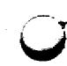

# AN EVALUATION OF THE MOLTEN SALT REACTOR EXPERIMENT HASTELLOY N SURVEILLANCE SPECIMENS - FIRST GROUP

H. E. McCoy, Jr.

# ABSTRACT

We have tested the first group of surveillance specimens from the Molten Salt Reactor Experiment core. They were removed after 7823 Mwhr of reactor operation during which the specimens were held at $645 \pm 10^{\circ}\mathrm{C}$ for 4800 hr and accumulated a thermal dose of $1.3 \times 10^{20}$ neutrons/cm $^2$ . The high-temperature ductility was reduced, but the reduction was similar to that observed for these materials when irradiated in the Oak Ridge Reactor in a helium environment. The low-temperature ductility was reduced, and this is thought to be due to the formation of intergranular $\mathsf{M}_6\mathsf{C}$ . The specimens showed no evidence of corrosion; however, a carbon-rich layer, 1 to 2 mils in depth, was noted where the Hastelloy N and graphite were in contact. The mechanical properties of the Hastelloy N appear adequate for the continued satisfactory operation of the MSRE.

Test results are presented for the effects of several variables on the tensile ductility of irradiated and unirradiated Hastelloy N. These variables included test temperature, strain rate, and pretraining.

# INTRODUCTION

The Molten Salt Reactor Experiment is a single region reactor that is fueled by a molten fluoride salt (65 LiF, 29.1 BeF $_2$ , 5 ZrF $_4$ , 0.9 UF $_4$ mole %), moderated by unclad graphite, and contained by Hastelloy N (Ni-16 Mo-7 Cr-4 Fe-0.05 C, wt %). The details of the reactor design and construction can be found elsewhere. $^1$ We knew that the neutron environment would produce some changes in the two structural materials - graphite and Hastelloy N. Although we were very confident of the compatibility of these

materials with the fluoride salt, we needed to keep abreast of the possible development of corrosion problems within the reactor itself. For these reasons, we developed a surveillance program that would allow us to follow the property changes of graphite and Hastelloy N specimens as the reactor operated.

The reactor went critical on June 1, 1965, and after numerous small problems were solved, assumed normal operation on May 1966. The present group of surveillance specimens was in the reactor from September 8, 1965, to July 28, 1966, and was removed after 7823 Mwhr of operation (designated "first group"). This report covers the tests that were run on the Hastelloy N specimens that were removed.

# EXPERIMENTAL DETAILS

# Surveillance Assembly

The core surveillance assembly was designed by W. H. Cook and others, and the details have been reported previously. $^2$ The facility is shown pictorially and schematically in Fig. 1. The specimens are arranged in three stringers. Each stringer is about 62 in. long and consists of two Hastelloy N rods and a graphite section made up of various pieces that are joined by pinning and tongue-and-groove joints. The Hastelloy N rod has periodic reduced sections 1 l/8 in. long × 1/8 in. in diameter and can be cut into small tensile specimens after it is removed from the reactor. Three stringers are joined together so that they can be separated in a hot cell and reassembled with one or more new stringers for reinsertion into the reactor. The assembled stringers fit into a perforated Hastelloy N basket that is inserted into an axial position about 3.6 in. from the core center line.

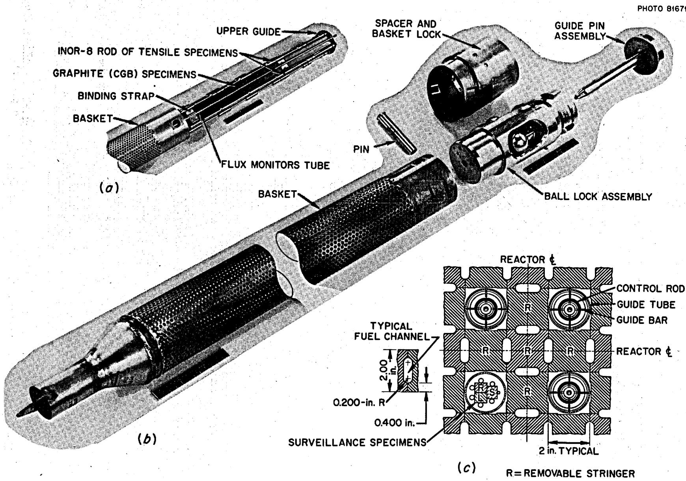  
Fig. 1. MSRE Surveillance Fixture.

When the basket was removed on July 28, 1966, some of the specimens were bent and the entire assembly had to be replaced.3 Slight modifications in the design were made, and the assembly was removed recently and found to be in excellent condition.4

A control facility is associated with the surveillance program. It utilizes a "fuel salt" containing depleted uranium in a static pot that is heated electrically. The temperature is controlled by the MSRE computer so that the temperature matches that of the reactor. Thus, these specimens are exposed to conditions the same as those in the reactor except for the static salt and the absence of a neutron flux.

There is another surveillance facility for Hastelloy N located outside the core in a vertical position about 4.5 in. from the vessel. These specimens are exposed to the cell environment $(\mathsf{N}_2 + 2 - 5\% \mathsf{O}_2)$ . They were not removed during the first group.

# Materials

Two heats of Hastelloy N were used in this program: heats 5081 and 5085. Both of these heats were air-melted by Stellite Division of Union Carbide Corporation, and their chemical analyses are given in Table 1. Heat 5085 was used for making the cylindrical portion of the core vessel, and heat 5081 was used for various parts inside the reactor.

# Test Specimens

The specimens were put into the reactor as rods 62 in. long by $\frac{1}{4}$ in. in diameter with reduced sections $\frac{1}{8}$ in. in diameter by $\frac{1}{8}$ in. long. The long rod was made in seven pieces and welded together to obtain the 62-in.-long rod. After removal from the reactor, the rod was sawed into small specimens with a gage section $\frac{1}{8}$ in. long by $\frac{1}{8}$ in. in diameter. Each rod is designated by a letter and the individual

Table 1. Chemical Analysis of Surveillance Heats   

<table><tr><td rowspan="2">Element</td><td colspan="2">Content, wt %</td></tr><tr><td>Heat 5085</td><td>Heat 5081</td></tr><tr><td>Cr</td><td>6.2</td><td>6.1</td></tr><tr><td>Fe</td><td>3.3</td><td>3.4</td></tr><tr><td>Mo</td><td>16.3</td><td>16.4</td></tr><tr><td>C</td><td>0.054</td><td>0.059</td></tr><tr><td>Si</td><td>0.58</td><td>0.52</td></tr><tr><td>Co</td><td>0.15</td><td>0.10</td></tr><tr><td>W</td><td>0.07</td><td>0.07</td></tr><tr><td>Mn</td><td>0.67</td><td>0.65</td></tr><tr><td>V</td><td>0.20</td><td>0.20</td></tr><tr><td>P</td><td>0.013</td><td>0.012</td></tr><tr><td>S</td><td>0.004</td><td>0.002</td></tr><tr><td>Al</td><td>0.02</td><td>0.05</td></tr><tr><td>Ti</td><td>&lt;0.01</td><td>&lt;0.01</td></tr><tr><td>Cu</td><td>0.01</td><td>0.01</td></tr><tr><td>B</td><td>0.0038</td><td>0.0050</td></tr><tr><td>Ni</td><td>bal</td><td>bal</td></tr></table>

specimens are numbered beginning at the bottom of the rod and increasing to 27 at the top.

The rods in the first group were bent, and it was necessary to examine each specimen with an optical comparator to determine whether it was suitable for use. If the total indicated runout of the gage section was greater than 0.002 in., the specimen was not used. The best specimens were used for the higher temperature tests where the expected strains were smallest. The results from a brittle material are affected more seriously by specimen alignment than are those from a ductile material.

The materials were received in the mill annealed condition (1 hr at $1177^{\circ}\mathrm{C}$ ). They were given a further anneal of 2 hr at $900^{\circ}\mathrm{C}$ prior to insertion into the reactor and the control facility.

# Irradiation Conditions

The specimens from the first group were in the reactor from September 8, 1965, to July 28, 1966. The reactor had operated 0.0066 Mwhr when the specimens were inserted and 7823 Mwhr when they were removed. They were at temperature for 4800 hr with the temperature range being $645 \pm 10^{\circ}\mathrm{C}$ . However, the material was only exposed to salt for 2796 hr. The flux was measured by H. B. Piper using stainless steel wires that were attached to the surveillance specimens. The thermal and fast flux profiles are shown in Figs. 2 and 3 along with the axial location of each specimen. The peak thermal dose, based on the $^{59}\mathrm{Co}(n,\gamma)^{60}\mathrm{Co}$ transmutation, was $1.3 \times 10^{20}$ neutrons/cm $^2$ and the fast dose (>1.22 MeV), based on the $^{58}\mathrm{Ni}(n,p)^{58}\mathrm{Co}$ transmutation, was $3 \times 10^{19}$ neutrons/cm $^2$ . The cross section used for the $^{59}\mathrm{Co}(n,\gamma)^{60}\mathrm{Co}$ transmutation was 22.25 barns, and that for the $^{58}\mathrm{Ni}(n,p)^{58}\mathrm{Co}$ transmutation was 0.1262 barns.

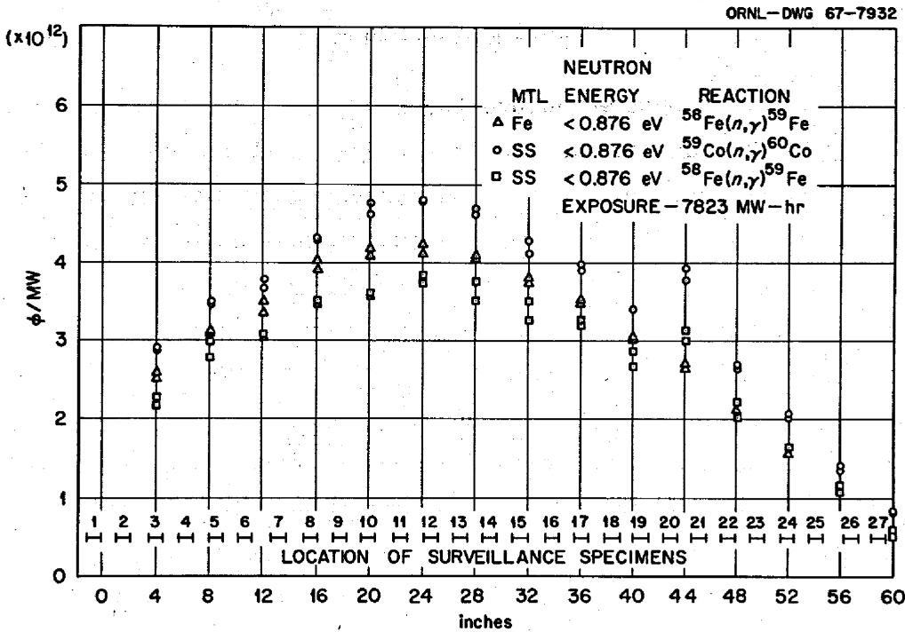  
Fig. 2. Measurements of the Thermal Flux for the MSRE Core Specimens - First Group.

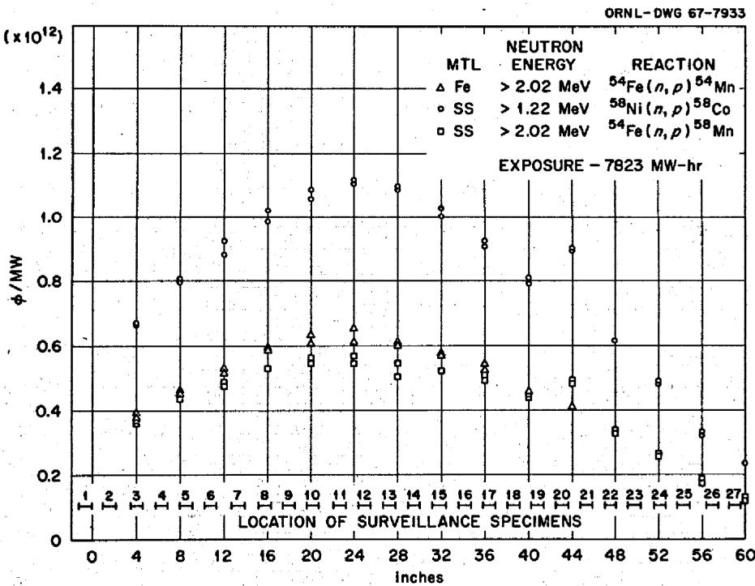  
Fig. 3. Measurements of the Fast Flux for the MSRE Core Specimens - First Group.

# Testing Techniques

The laboratory creep-rupture tests were run in conventional creep machines of the dead load and lever arm types. The strain was measured by a dial indicator that showed the total movement of the specimen and part of the load train. The zero strain measurement was taken immediately after the load was applied. The temperature accuracy was $\pm 0.75\%$ , the guaranteed accuracy of the Chromel-P-Alumel thermocouples used.

The postirradiation creep-rupture tests were run in lever arm machines that were located in hot cells. The strain was measured by an extensometer with rods attached to the upper and lower specimen grips. The relative movement of these two rods was measured by a linear differential transformer, and the transformer signal was recorded. The accuracy of the strain measurements is difficult to determine. The extensometer (mechanical and electrical portions) produced measurements that could be read to about $\pm 0.02\%$ strain; however, other factors (temperature changes in the cell, mechanical vibrations, etc.) probably combined to give an overall accuracy of $\pm 0.1\%$ strain. This is considerably better than the specimen-to-specimen reproducibility that one would expect for relatively brittle materials. The temperature measuring and control system was the same as that used in the laboratory with only one exception. In the laboratory, the control system was stabilized at the desired temperature by use of a recorder with an expanded scale. In the tests in the hot cells, the control point was established by setting the controller without the aid of the expanded-scale recorder. This error and the thermocouple accuracy combine to give a temperature uncertainty of about $\pm 1\%$ .

The tensile tests were run on Instron Universal Testing Machines. The strain measurements were taken from the crosshead travel.

The test environment was air in all cases. Metallographic examination showed that the depth of oxidation was small (<0.002 in.), and hence we feel that the environment did not appreciably influence the test results.

# Test Results

Since the surveillance assembly was bent, it was necessary to remove all the specimens in the first group, and we had about 50 specimens of each heat after the bent ones were discarded. Thus, we had enough specimens to run the desired tests for surveillance purposes and enough to look at some further variables that are of value in understanding the behavior of irradiated Hastelloy N. We shall present all the results that were obtained even though much of this information has little direct bearing on the safe operation of the MSRE. Since the rupture ductility is of primary importance, we shall be most concerned with this property.

The results of tensile tests on the control specimens of heat 5081 are given in Table 2. The total elongations at fracture as a function of temperature are shown in Fig. 4 for strain rates of 0.05 and $0.002\mathrm{min}^{-1}$ . This material exhibits the ductility minimum that is characteristic of nickel-base alloys. The temperature of the minimum ductility seems to decrease with decreasing strain rate. Several of the specimens were run at various strain rates over the range of 2 to $0.002\mathrm{min}^{-1}$ . The results of these tests are also given in Table 2, and the fracture elongations are given in Fig. 5. The fracture elongation is very sensitive to strain rate at $650^{\circ}\mathrm{C}$ , but relatively insensitive at higher and lower temperatures.

The results of the tests on the surveillance specimens from heat 5081 are summarized in Table 3. The elongation at fracture is plotted as a function of temperature in Fig. 6. The irradiated material is characterized by a sharp drop in ductility with increasing temperature above about $500^{\circ}\mathrm{C}$ . The ductility continues to decrease with increasing temperature rather than exhibiting a ductility minimum like the unirradiated material (Fig. 4). The ductility is lower at a strain rate of $0.002\mathrm{min}^{-1}$ than at $0.05\mathrm{min}^{-1}$ , but the difference decreases with increasing temperature. This point is demonstrated quite well in Fig. 7 where the dependence of the ductility on strain rate is shown for several temperatures.

We have looked individually at the properties of the surveillance and control specimens of heat 5081; let us now compare these properties. The ratios of the property for the irradiated material to that of the unirradiated material are compared in Fig. 8 as a function of temperature.

Table 2. Results of Tensile Tests on MSRE Surveillance Control Specimens Heat 5081   

<table><tr><td rowspan="2">Specimen Number</td><td rowspan="2">Test Temperature (°C)</td><td rowspan="2">Strain Rate (min-1)</td><td colspan="2">Stress (psi)</td><td colspan="2">Elongation (%)</td><td rowspan="2">Reduction in Area (%)</td><td rowspan="2">True Fracture Strain (%)</td></tr><tr><td>Yield</td><td>Ultimate</td><td>Uniform</td><td>Total</td></tr><tr><td>AC-8</td><td>25</td><td>0.05</td><td>47,700</td><td>118,700</td><td>55.9</td><td>57.6</td><td>48.8</td><td>67.4</td></tr><tr><td>AC-11</td><td>200</td><td>0.05</td><td>40,200</td><td>107,100</td><td>53.3</td><td>54.6</td><td>42.0</td><td>58.9</td></tr><tr><td>CC-27</td><td>400</td><td>2</td><td>41,400</td><td>94,500</td><td>50.4</td><td>53.6</td><td>42.4</td><td>55.7</td></tr><tr><td>CC-26</td><td>400</td><td>0.5</td><td>34,600</td><td>97,000</td><td>53.7</td><td>58.2</td><td>46.6</td><td>63.1</td></tr><tr><td>CC-25</td><td>400</td><td>0.2</td><td>36,300</td><td>97,900</td><td>52.2</td><td>53.8</td><td>42.7</td><td>56.0</td></tr><tr><td>AC-22</td><td>400</td><td>0.05</td><td>36,700</td><td>100,600</td><td>51.0</td><td>52.0</td><td>48.7</td><td>66.8</td></tr><tr><td>CC-24</td><td>400</td><td>0.02</td><td>37,800</td><td>99,900</td><td>51.7</td><td>56.0</td><td>41.7</td><td>54.4</td></tr><tr><td>CC-23</td><td>400</td><td>0.005</td><td>34,700</td><td>97,400</td><td>55.4</td><td>56.3</td><td>44.0</td><td>58.6</td></tr><tr><td>BC-8</td><td>400</td><td>0.002</td><td>37,100</td><td></td><td>52.9</td><td>55.2</td><td>46.7</td><td>63.0</td></tr><tr><td>CC-21</td><td>500</td><td>2</td><td>36,200</td><td>93,200</td><td>52.0</td><td>56.0</td><td>48.8</td><td>67.4</td></tr><tr><td>CC-19</td><td>500</td><td>2</td><td>35,200</td><td>92,700</td><td>52.4</td><td>56.0</td><td>42.6</td><td>55.8</td></tr><tr><td>CC-29</td><td>500</td><td>0.5</td><td>52,600</td><td>105,400</td><td>45.8</td><td>49.4</td><td>40.5</td><td>52.0</td></tr><tr><td>CC-18</td><td>500</td><td>0.2</td><td>36,800</td><td>98,800</td><td>55.0</td><td>57.0</td><td>51.1</td><td>72.0</td></tr><tr><td>AC-19</td><td>500</td><td>0.05</td><td>35,800</td><td>97,800</td><td>53.6</td><td>56.6</td><td>46.2</td><td>62.0</td></tr><tr><td>CC-17</td><td>500</td><td>0.02</td><td>34,900</td><td>97,600</td><td>55.5</td><td>56.6</td><td>46.2</td><td>62.5</td></tr><tr><td>CC-16</td><td>500</td><td>0.005</td><td>34,700</td><td>92,500</td><td>54.4</td><td>55.4</td><td>40.3</td><td>51.6</td></tr><tr><td>AC-24</td><td>500</td><td>0.002</td><td>35,000</td><td>97,700</td><td>44.9</td><td>45.3</td><td>33.6</td><td>41.0</td></tr><tr><td>BC-9</td><td>500</td><td>0.002</td><td>36,200</td><td>95,300</td><td>46.2</td><td>47.0</td><td>38.1</td><td>48.2</td></tr><tr><td>AC-20</td><td>550</td><td>0.05</td><td>35,900</td><td>93,300</td><td>49.7</td><td>51.1</td><td>40.3</td><td>51.8</td></tr><tr><td>AC-25</td><td>550</td><td>0.002</td><td>37,300</td><td>80,300</td><td>22.8</td><td>23.7</td><td>23.0</td><td>26.2</td></tr><tr><td>AC-18</td><td>600</td><td>0.05</td><td>34,900</td><td>81,200</td><td>31.8</td><td>32.3</td><td>31.0</td><td>37.2</td></tr><tr><td>AC-29</td><td>600</td><td>0.002</td><td>37,400</td><td>71,400</td><td>21.3</td><td>21.7</td><td>19.9</td><td>22.4</td></tr><tr><td rowspan="2">Specimen Number</td><td rowspan="2">Test Temperature (%)</td><td rowspan="2">Strain Rate (min-1)</td><td colspan="2">Stress (psi)</td><td colspan="2">Elongation (%)</td><td rowspan="2">Reduction in Area (%)</td><td rowspan="2">True Fracture Strain (%)</td></tr><tr><td>Yield</td><td>Ultimate</td><td>Uniform</td><td>Total</td></tr><tr><td>BC-10</td><td>650</td><td>2</td><td>36,300</td><td>88,500</td><td>51.5</td><td>52.4</td><td>36.9</td><td>46.3</td></tr><tr><td>CC-8</td><td>650</td><td>2</td><td>42,400</td><td>85,200</td><td>44.4</td><td>46.8</td><td>37.2</td><td>46.5</td></tr><tr><td>AC-4</td><td>650</td><td>0.5</td><td>32,900</td><td>81,500</td><td>37.1</td><td>39.0</td><td>28.8</td><td>34.0</td></tr><tr><td>AC-10</td><td>650</td><td>0.2</td><td>36,300</td><td>78,200</td><td>28.5</td><td>29.3</td><td>23.4</td><td>26.4</td></tr><tr><td>AC-27</td><td>650</td><td>0.05</td><td>32,400</td><td>68,400</td><td>23.8</td><td>24.6</td><td>23.1</td><td>26.2</td></tr><tr><td>AC-7</td><td>650</td><td>0.02</td><td>34,400</td><td>65,200</td><td>16.8</td><td>17.7</td><td>19.0</td><td>21.1</td></tr><tr><td>AC-5</td><td>650</td><td>0.005</td><td>33,900</td><td>68,400</td><td>22.6</td><td>23.1</td><td>24.4</td><td>28.0</td></tr><tr><td>AC-17</td><td>650</td><td>0.002</td><td>33,600</td><td>66,700</td><td>22.8</td><td>23.2</td><td>21.6</td><td>21.4</td></tr><tr><td>AC-28</td><td>700</td><td>0.05</td><td>39,500</td><td>68,400</td><td>18.8</td><td>19.8</td><td>25.8</td><td>14.9</td></tr><tr><td>AC-16</td><td>700</td><td>0.002</td><td>32,400</td><td>63,100</td><td>20.0</td><td>29.3</td><td>23.5</td><td>21.7</td></tr><tr><td>CC-2</td><td>760</td><td>2</td><td>41,600</td><td>76,600</td><td>36.8</td><td>40.8</td><td>24.4</td><td>28.0</td></tr><tr><td>CC-9</td><td>760</td><td>0.5</td><td>30,800</td><td>72,700</td><td>37.1</td><td>40.2</td><td>30.7</td><td>36.9</td></tr><tr><td>CC-5</td><td>760</td><td>0.2</td><td>32,100</td><td>71,900</td><td>33.3</td><td>38.9</td><td>21.9</td><td>24.7</td></tr><tr><td>AC-12</td><td>760</td><td>0.05</td><td>29,900</td><td>64,500</td><td>25.1</td><td>41.6</td><td>35.0</td><td>43.1</td></tr><tr><td>CC-4</td><td>760</td><td>0.02</td><td>32,400</td><td>63,800</td><td>20.0</td><td>43.8</td><td>42.4</td><td>55.3</td></tr><tr><td>CC-3</td><td>760</td><td>0.005</td><td>32,700</td><td>54,500</td><td>12.7</td><td>39.2</td><td>41.0</td><td>52.9</td></tr><tr><td>AC-14</td><td>760</td><td>0.002</td><td>32,600</td><td>47,200</td><td>9.4</td><td>39.5</td><td>42.7</td><td>56.0</td></tr><tr><td>CC-15</td><td>850</td><td>2</td><td>33,200</td><td>66,300</td><td>30.0</td><td>48.0</td><td>46.3</td><td>62.5</td></tr><tr><td>CC-14</td><td>850</td><td>0.5</td><td>28,900</td><td>60,600</td><td>23.2</td><td>49.2</td><td>43.9</td><td>58.2</td></tr><tr><td>CC-12</td><td>850</td><td>0.2</td><td>29,600</td><td>54,100</td><td>16.3</td><td>51.4</td><td>50.8</td><td>71.1</td></tr><tr><td>AC-6</td><td>850</td><td>0.05</td><td>28,300</td><td>43,400</td><td>11.2</td><td>53.2</td><td>49.8</td><td>69.0</td></tr><tr><td>CC-11</td><td>850</td><td>0.02</td><td>30,000</td><td>40,400</td><td>7.8</td><td>43.6</td><td>48.7</td><td>67.0</td></tr><tr><td>CC-10</td><td>850</td><td>0.005</td><td>29,200</td><td>30,600</td><td>2.0</td><td>44.4</td><td>50.9</td><td>71.6</td></tr><tr><td>AC-15</td><td>850</td><td>0.002</td><td>26,400</td><td>26,400</td><td>1.5</td><td>45.0</td><td>43.9</td><td>58.3</td></tr></table>

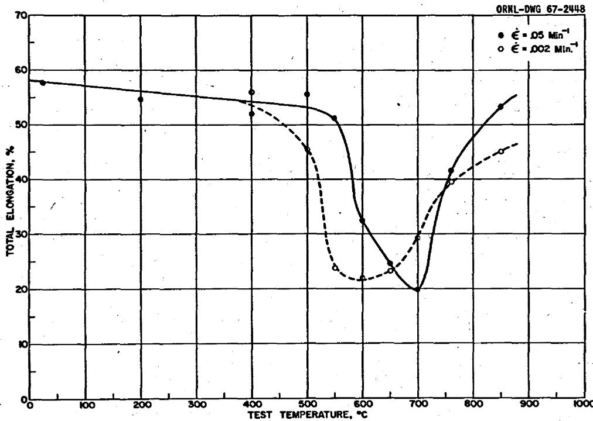  
Fig. 4. Tensile Ductilities of MSRE Surveillance Control Specimens, Heat 5081.

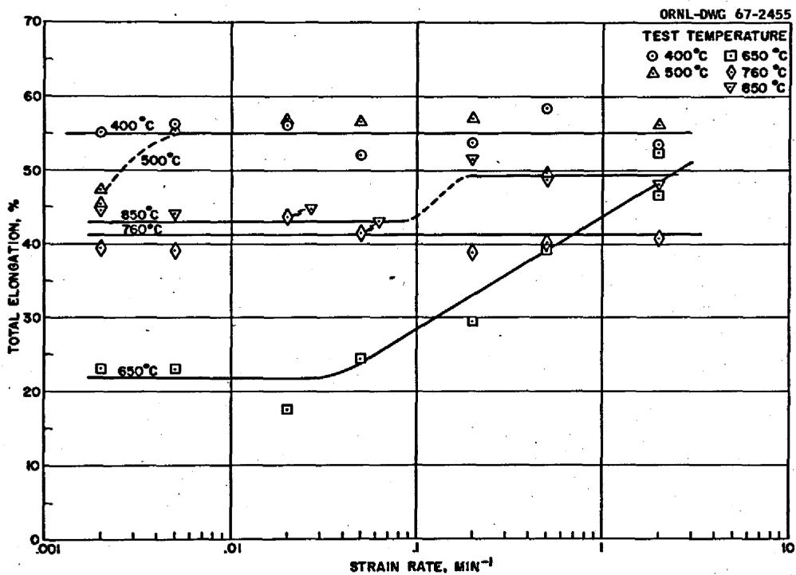  
Fig. 5. Influence of Strain Rate on the Ductility of MSRE Surveillance Control Specimens, Heat 5081.

Table 3. Results of Tensile Tests on MSRE Surveillance Specimens Heat 5081   

<table><tr><td rowspan="2">Specimen Number</td><td rowspan="2">Test Temperature (°C)</td><td rowspan="2">Strain Rate (min-1)</td><td colspan="2">Stress (psi)</td><td colspan="2">Elongation (%)</td><td rowspan="2">Reduction in Area (%)</td><td rowspan="2">True Fracture Strain (%)</td></tr><tr><td>Yield</td><td>Ultimate</td><td>Uniform</td><td>Total</td></tr><tr><td>D-16</td><td>25</td><td>0.05</td><td>51,100</td><td>105,500</td><td>38.5</td><td>38.7</td><td>31.3</td><td>37.0</td></tr><tr><td>D-19</td><td>25</td><td>0.05</td><td>54,100</td><td>109,000</td><td>42.6</td><td>42.6</td><td>25.9</td><td>30.0</td></tr><tr><td>D-15</td><td>200</td><td>0.05</td><td>42,700</td><td>99,600</td><td>49.0</td><td>49.4</td><td>33.3</td><td>40.7</td></tr><tr><td>F-2</td><td>400</td><td>2</td><td>41,200</td><td>91,400</td><td>49.2</td><td>51.6</td><td>34.4</td><td>42.0</td></tr><tr><td>F-1</td><td>400</td><td>0.5</td><td>43,700</td><td>88,300</td><td>33.2</td><td>33.9</td><td>32.5</td><td>39.5</td></tr><tr><td>E-15</td><td>400</td><td>0.5</td><td>39,900</td><td>93,800</td><td>48.3</td><td>49.1</td><td>33.9</td><td>41.5</td></tr><tr><td>F-7</td><td>400</td><td>0.2</td><td>38,300</td><td>92,200</td><td>49.4</td><td>51.0</td><td>37.2</td><td>46.9</td></tr><tr><td>D-24</td><td>400</td><td>0.05</td><td>37,100</td><td>94,100</td><td>49.3</td><td>50.9</td><td>33.3</td><td>40.7</td></tr><tr><td>F-23</td><td>400</td><td>0.02</td><td>37,800</td><td>91,700</td><td>45.8</td><td>46.1</td><td>36.0</td><td>44.7</td></tr><tr><td>F-10</td><td>400</td><td>0.005</td><td>38,800</td><td>93,300</td><td>49.9</td><td>50.4</td><td>37.7</td><td>47.7</td></tr><tr><td>F-19</td><td>400</td><td>0.002</td><td>39,100</td><td>92,500</td><td>47.1</td><td>47.7</td><td>32.3</td><td>38.9</td></tr><tr><td>F-5</td><td>450</td><td>0.002</td><td>38,200</td><td>86,900</td><td>37.8</td><td>38.6</td><td>25.8</td><td>30.1</td></tr><tr><td>F-8</td><td>500</td><td>2</td><td>44,000</td><td>85,600</td><td>44.4</td><td>46.0</td><td>31.6</td><td>38.2</td></tr><tr><td>F-20</td><td>500</td><td>0.5</td><td>36,400</td><td>87,000</td><td>43.1</td><td>44.1</td><td>36.2</td><td>45.2</td></tr><tr><td>E-6</td><td>500</td><td>0.2</td><td>37,300</td><td>86,500</td><td>47.8</td><td>48.5</td><td>32.1</td><td>38.7</td></tr><tr><td>D-9</td><td>500</td><td>0.05</td><td>38,600</td><td>90,200</td><td>50.6</td><td>51.0</td><td>31.9</td><td>38.7</td></tr><tr><td>E-25</td><td>500</td><td>0.02</td><td>36,600</td><td>83,600</td><td>37.0</td><td>37.5</td><td>30.2</td><td>35.8</td></tr><tr><td>E-12</td><td>500</td><td>0.005</td><td>38,000</td><td>76,800</td><td>23.3</td><td>24.1</td><td>24.2</td><td>27.8</td></tr><tr><td>F-13</td><td>500</td><td>0.002</td><td>38,800</td><td>75,800</td><td>22.4</td><td>23.1</td><td>21.9</td><td>24.9</td></tr><tr><td>E-9</td><td>500</td><td>0.002</td><td>38,000</td><td>84,800</td><td>31.0</td><td>32.1</td><td>29.8</td><td>35.4</td></tr><tr><td>D-25</td><td>550</td><td>0.05</td><td>35,400</td><td>77,800</td><td>31.6</td><td>32.1</td><td>26.1</td><td>30.3</td></tr><tr><td>F-27</td><td>550</td><td>0.002</td><td>42,200</td><td>62,700</td><td>11.8</td><td>13.8</td><td>3.34</td><td>6.5</td></tr><tr><td>E-23</td><td>600</td><td>0.05</td><td>35,200</td><td>74,800</td><td>25.6</td><td>26.4</td><td>31.8</td><td>38.2</td></tr><tr><td>E-24</td><td>600</td><td>0.002</td><td>36,100</td><td>62,100</td><td>15.0</td><td>15.8</td><td>16.7</td><td>18.3</td></tr><tr><td>F-18</td><td>650</td><td>2</td><td>36,700</td><td>61,100</td><td>20.8</td><td>24.0</td><td>21.8</td><td>24.4</td></tr><tr><td>F-6</td><td>650</td><td>0.5</td><td>33,400</td><td>63,900</td><td>18.2</td><td>18.9</td><td>15.4</td><td>16.9</td></tr><tr><td>F-26</td><td>650</td><td>0.5</td><td>30,500</td><td>34,900</td><td>2.6</td><td>3.7</td><td>2.9</td><td>21.5</td></tr><tr><td>F-3</td><td>650</td><td>0.5</td><td>34,300</td><td>75,600</td><td>34.0</td><td>35.3</td><td>29.1</td><td>58.4</td></tr><tr><td>E-3</td><td>650</td><td>0.2</td><td>37,200</td><td>64,200</td><td>14.9</td><td>15.8</td><td>22.5</td><td>25.4</td></tr><tr><td>E-7</td><td>650</td><td>0.05</td><td>34,600</td><td>57,200</td><td>13.8</td><td>14.3</td><td>13.9</td><td>14.8</td></tr><tr><td>E-13</td><td>650</td><td>0.02</td><td>33,800</td><td>53,600</td><td>11.1</td><td>12.9</td><td>17.6</td><td>19.1</td></tr><tr><td>E-19</td><td>650</td><td>0.005</td><td>34,600</td><td>53,000</td><td>10.8</td><td>11.3</td><td>14.6</td><td>15.9</td></tr><tr><td>E-14</td><td>650</td><td>0.002</td><td>34,400</td><td>48,400</td><td>8.2</td><td>9.0</td><td>11.6</td><td>12.2</td></tr><tr><td>E-22</td><td>700</td><td>0.05</td><td>31,700</td><td>53,900</td><td>13.8</td><td>14.2</td><td>12.9</td><td>13.9</td></tr><tr><td>E-2</td><td>700</td><td>0.002</td><td>33,800</td><td>44,000</td><td>4.8</td><td>5.5</td><td>6.7</td><td>6.9</td></tr><tr><td>F-22</td><td>760</td><td>2</td><td>36,100</td><td>57,600</td><td>18.8</td><td>22.0</td><td>14.7</td><td>15.9</td></tr><tr><td>D-8</td><td>760</td><td>0.5</td><td>31,000</td><td>49,100</td><td>12.0</td><td>12.9</td><td>11.0</td><td>11.5</td></tr><tr><td>D-13</td><td>760</td><td>0.2</td><td>31,300</td><td>49,400</td><td>11.9</td><td>12.4</td><td>10.2</td><td>10.5</td></tr><tr><td>E-8</td><td>760</td><td>0.05</td><td>31,400</td><td>43,200</td><td>6.7</td><td>7.4</td><td>6.2</td><td>6.1</td></tr><tr><td>D-10</td><td>760</td><td>0.02</td><td>32,000</td><td>42,200</td><td>5.2</td><td>5.7</td><td>4.6</td><td>4.6</td></tr><tr><td>D-27</td><td>760</td><td>0.005</td><td>36,500</td><td>40,600</td><td>4.0</td><td>4.3</td><td>2.6</td><td>2.6</td></tr><tr><td>E-20</td><td>760</td><td>0.002</td><td>32,100</td><td>36,700</td><td>1.9</td><td>3.9</td><td>3.5</td><td>3.6</td></tr><tr><td>E-4</td><td>850</td><td>2</td><td></td><td></td><td>4.4</td><td>8.4</td><td>8.7</td><td>9.0</td></tr><tr><td>E-27</td><td>850</td><td>0.5</td><td>32,700</td><td>39,100</td><td>3.5</td><td>4.6</td><td>5.4</td><td>5.5</td></tr><tr><td>E-1</td><td>850</td><td>0.2</td><td>33,600</td><td>38,600</td><td>3.0</td><td>3.8</td><td>1.6</td><td>0.8</td></tr><tr><td>F-17</td><td>850</td><td>0.05</td><td>30,700</td><td>32,400</td><td>1.8</td><td>2.3</td><td>2.3</td><td>2.4</td></tr><tr><td>D-14</td><td>850</td><td>0.02</td><td>30,600</td><td>30,700</td><td>1.2</td><td>2.0</td><td>1.7</td><td>0.9</td></tr><tr><td>D-23</td><td>850</td><td>0.005</td><td>20,200</td><td>20,200</td><td>0.7</td><td>2.0</td><td>0.3</td><td>0.2</td></tr><tr><td>E-21</td><td>850</td><td>0.002</td><td>21,800</td><td>21,800</td><td>0.7</td><td>2.1</td><td>0.7</td><td>0.3</td></tr></table>

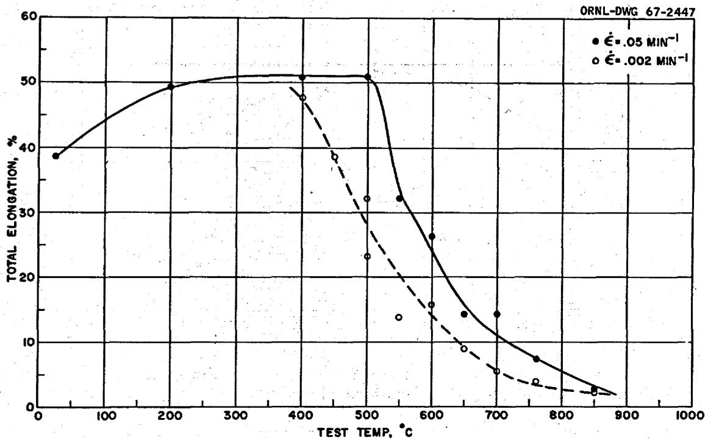  
Fig. 6. Tensile Ductility of MSRE Surveillance Specimens, Heat 5081.

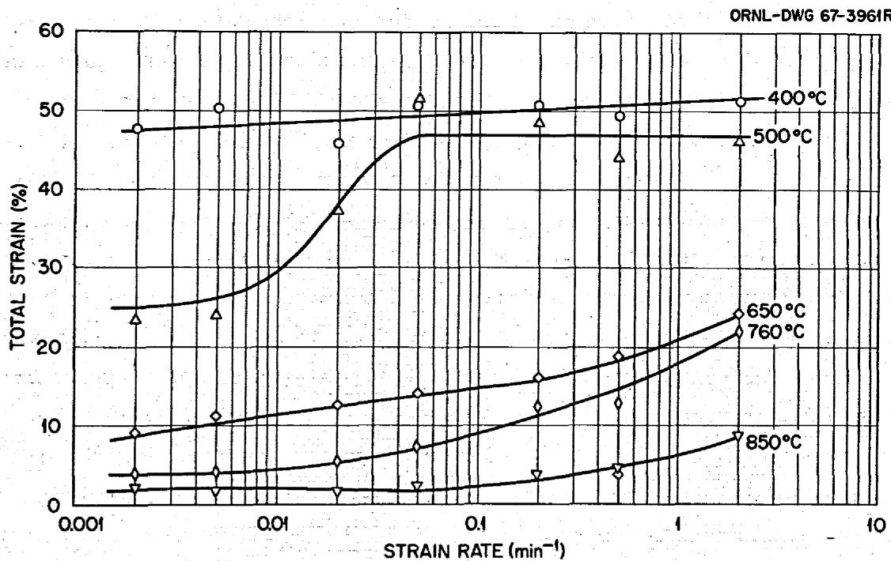  
Fig. 7. Influence of Strain Rate on the Ductility of Hastelloy N (Heat 5081) - MSRE Surveillance Specimens.

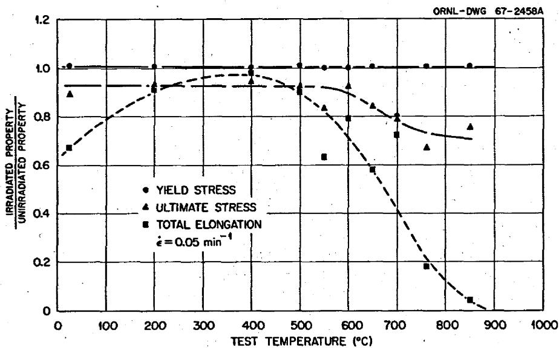  
Fig. 8. Comparative Tensile Properties of Irradiated and Unirradiated MSRE Surveillance Specimens, Heat 5081.

The yield stress is unaffected by irradiation. The ultimate stress is reduced approximately $8\%$ up to about $600^{\circ}\mathrm{C}$ where the reduction becomes greater with increasing temperature.

The total elongation at fracture for the irradiated material is lower by about $30\%$ at room temperature, but recovers to be almost equivalent at $400^{\circ}\mathrm{C}$ . As the temperature is increased above $400^{\circ}\mathrm{C}$ , the ductility of the irradiated material drops to where it is only about $4\%$ of that of the unirradiated specimens. The strain rate versus temperature data are treated in a similar way in Fig. 9. At $400^{\circ}\mathrm{C}$ the surveillance and control specimens have about the same ductility with only a slight decrease in the ratio with decreasing strain rate. At $500^{\circ}\mathrm{C}$ there is a sharp drop in the ratio at a strain rate of about $0.05 \, \mathrm{min}^{-1}$ . This sharp change in strain rate sensitivity is probably due to the transition from transgranular to intergranular fracture. The ratio is a bit confusing at $650^{\circ}\mathrm{C}$ ; its rise with decreasing strain rate is due to the fact that the ductility of the control specimens decreases more rapidly with decreasing strain rate than that of the surveillance specimens. At 760 and $850^{\circ}\mathrm{C}$ the ratio becomes quite small and its dependence on strain rate becomes less.

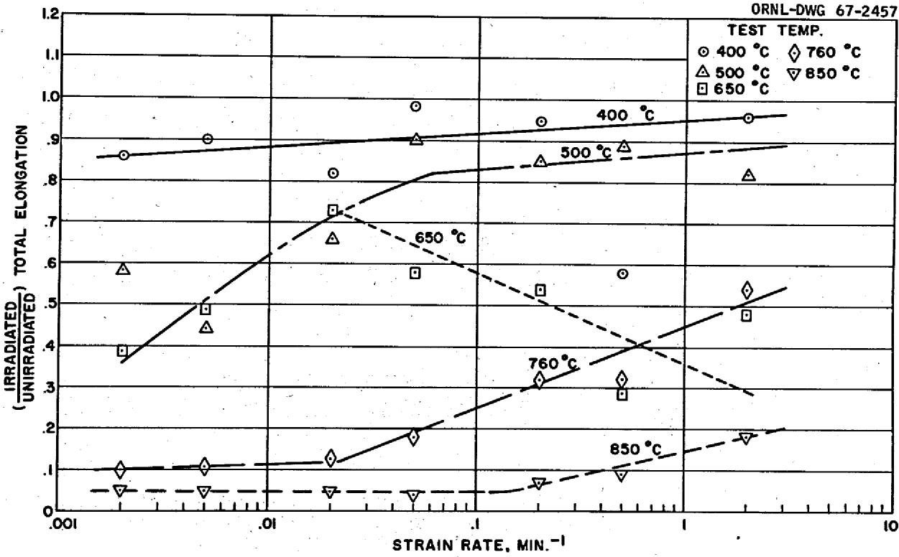  
Fig. 9. Comparative Ductilities of MSRE Surveillance Specimens as a Function of Strain Rate, Heat 5081.

The results of the tensile tests on the control specimens of heat 5085 are given in Table 4. The total elongation at fracture is plotted in Fig. 10 as a function of the test temperature. The characteristic ductility minimum is obtained, but the temperature of the minimum ductility does not appear to be sensitive to strain rate.

The results of the tensile tests on the surveillance specimens from heat 5085 are given in Table 5. The fracture elongation is plotted as a function of test temperature in Fig. 11. The ductility drops precipitously above $500^{\circ}\mathrm{C}$ with the elongation being lower at the lower strain rate.

The ratio of the irradiated property to that of the unirradiated property for heat 5085 is shown in Fig. 12 as a function of temperature. The yield and ultimate stresses of this heat are influenced about the same by irradiation as those of heat 5081 (Fig. 8). The elongation at low temperatures is not reduced as much by irradiation, but it does not recover as the test temperature is increased.

Heat 5085

Table 4. Results of Tensile Tests on MSRE Surveillance Control Specimens   

<table><tr><td rowspan="2">Specimen Number</td><td rowspan="2">Test Temperature (°C)</td><td rowspan="2">Strain Rate (min-1)</td><td colspan="2">Stress (psi)</td><td colspan="2">Elongation (%)</td><td rowspan="2">Reduction in Area (%)</td><td rowspan="2">True Fracture Strain (%)</td></tr><tr><td>Yield</td><td>Ultimate</td><td>Uniform</td><td>Total</td></tr><tr><td>DC-24</td><td>25</td><td>0.05</td><td>46,200</td><td>109,200</td><td>40.0</td><td>40.0</td><td>28.61</td><td>33.8</td></tr><tr><td>FC-3</td><td>25</td><td>0.05</td><td>45,500</td><td>111,200</td><td>46.8</td><td>46.8</td><td>31.45</td><td>39.5</td></tr><tr><td>DC-20</td><td>200</td><td>0.05</td><td>39,100</td><td>105,200</td><td>48.6</td><td>49.8</td><td>36.69</td><td>46.1</td></tr><tr><td>DC-23</td><td>400</td><td>0.05</td><td>34,800</td><td>95,800</td><td>47.6</td><td>48.8</td><td>39.01</td><td>49.6</td></tr><tr><td>DC-19</td><td>500</td><td>0.05</td><td>33,600</td><td>94,300</td><td>48.8</td><td>49.3</td><td>41.48</td><td>54.1</td></tr><tr><td>DC-26</td><td>500</td><td>0.002</td><td>33,400</td><td>91,700</td><td>43.3</td><td>44.3</td><td>37.78</td><td>47.7</td></tr><tr><td>DC-18</td><td>550</td><td>0.05</td><td>33,700</td><td>89,200</td><td>47.0</td><td>47.5</td><td>35.19</td><td>43.4</td></tr><tr><td>DC-13</td><td>550</td><td>0.002</td><td>32,500</td><td>74,000</td><td>26.5</td><td>27.5</td><td>26.1</td><td>30.2</td></tr><tr><td>FC-2</td><td>550</td><td>0.002</td><td>33,600</td><td>77,900</td><td>30.3</td><td>31.0</td><td>33.98</td><td>41.6</td></tr><tr><td>DC-17</td><td>600</td><td>0.05</td><td>32,200</td><td>78,300</td><td>33.8</td><td>34.6</td><td>32.60</td><td>37.8</td></tr><tr><td>DC-16</td><td>600</td><td>0.002</td><td>32,100</td><td>69,600</td><td>26.5</td><td>27.3</td><td>25.55</td><td>29.6</td></tr><tr><td>DC-14</td><td>650</td><td>0.05</td><td>31,800</td><td>70,100</td><td>25.8</td><td>26.8</td><td>29.97</td><td>35.9</td></tr><tr><td>DC-25</td><td>650</td><td>0.002</td><td>31,500</td><td>62,500</td><td>22.8</td><td>24.3</td><td>27.15</td><td>31.8</td></tr><tr><td>DC-5</td><td>700</td><td>0.05</td><td>29,200</td><td>64,000</td><td>28.4</td><td>29.5</td><td>28.14</td><td>33.2</td></tr><tr><td>DC-10</td><td>700</td><td>0.002</td><td>30,900</td><td>62,100</td><td>22.3</td><td>28.3</td><td>24.04</td><td>27.5</td></tr><tr><td>DC-3</td><td>760</td><td>0.05</td><td>28,100</td><td>60,800</td><td>27.0</td><td>33.0</td><td>32.16</td><td>38.7</td></tr><tr><td>DC-9</td><td>760</td><td>0.002</td><td>28,900</td><td>51,500</td><td>11.0</td><td>35.1</td><td>36.07</td><td>44.8</td></tr><tr><td>DC-22</td><td>850</td><td>0.05</td><td>25,700</td><td>45,100</td><td>11.5</td><td>38.8</td><td>47.23</td><td>64.1</td></tr><tr><td>DC-8</td><td>850</td><td>0.002</td><td>27,900</td><td>28,400</td><td>1.4</td><td>39.2</td><td>43.76</td><td>55.7</td></tr></table>

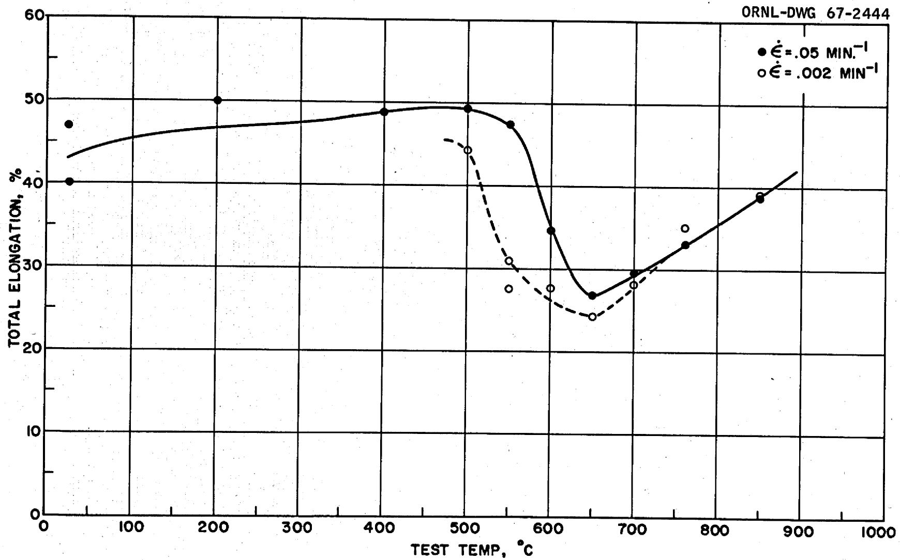  
Fig. 10. Tensile Ductilities of MSRE Surveillance Control Specimens, Heat 5085.

Heat 5085

Table 5. Results of Tensile Tests on MSRE Surveillance Specimens   

<table><tr><td rowspan="2">Specimen Number</td><td rowspan="2">Test Temperature (°C)</td><td rowspan="2">Strain Rate (min-1)</td><td colspan="2">Stress (psi)</td><td colspan="2">Elongation (%)</td><td rowspan="2">Reduction in Area (%)</td><td rowspan="2">True Fracture Strain (%)</td></tr><tr><td>Yield</td><td>Ultimate</td><td>Uniform</td><td>Total</td></tr><tr><td>C-27</td><td>25</td><td>2</td><td>62,300</td><td>101,500</td><td>25.6</td><td>28.4</td><td>17.1</td><td>19.0</td></tr><tr><td>A-25</td><td>25</td><td>0.5</td><td>50,200</td><td>95,600</td><td>26.7</td><td>27.3</td><td>19.7</td><td>22.0</td></tr><tr><td>A-16</td><td>25</td><td>0.05</td><td>48,100</td><td>100,300</td><td>34.3</td><td>34.5</td><td>26.0</td><td>30.1</td></tr><tr><td>A-15</td><td>200</td><td>0.05</td><td>39,500</td><td>94,100</td><td>37.8</td><td>38.6</td><td>28.2</td><td>33.3</td></tr><tr><td>A-26</td><td>400</td><td>0.05</td><td>35,700</td><td>87,300</td><td>35.0</td><td>36.0</td><td>26.3</td><td>30.6</td></tr><tr><td>A-9</td><td>500</td><td>0.05</td><td>34,900</td><td>87,900</td><td>42.2</td><td>42.8</td><td>33.9</td><td>40.0</td></tr><tr><td>B-23</td><td>500</td><td>0.002</td><td>34,000</td><td>71,600</td><td>21.9</td><td>23.1</td><td>27.9</td><td>32.6</td></tr><tr><td>B-1</td><td>550</td><td>0.05</td><td>42,000</td><td>74,000</td><td>19.6</td><td>20.0</td><td>18.7</td><td>20.9</td></tr><tr><td>B-5</td><td>550</td><td>0.002</td><td>33,700</td><td>55,100</td><td>10.4</td><td>12.7</td><td>14.7</td><td>15.9</td></tr><tr><td>B-26</td><td>600</td><td>0.05</td><td>32,500</td><td>62,000</td><td>18.2</td><td>19.6</td><td>21.7</td><td>24.5</td></tr><tr><td>B-4</td><td>600</td><td>0.002</td><td>32,300</td><td>52,000</td><td>11.1</td><td>12.0</td><td>12.5</td><td>13.5</td></tr><tr><td>B-19</td><td>650</td><td>0.05</td><td>32,000</td><td>52,800</td><td>12.6</td><td>13.7</td><td>13.9</td><td>15.0</td></tr><tr><td>B-6</td><td>650</td><td>0.002</td><td>32,100</td><td>42,900</td><td>6.5</td><td>9.4</td><td>7.9</td><td>8.1</td></tr><tr><td>C-20</td><td>700</td><td>0.05</td><td>29,900</td><td>43,600</td><td>9.3</td><td>12.3</td><td>5.6</td><td>9.4</td></tr><tr><td>C-1</td><td>700</td><td>0.002</td><td>37,800</td><td>43,100</td><td>2.4</td><td>2.8</td><td>5.9</td><td>5.9</td></tr><tr><td>B-2</td><td>760</td><td>0.05</td><td>28,900</td><td>41,100</td><td>8.0</td><td>8.5</td><td>10.0</td><td>10.5</td></tr><tr><td>C-21</td><td>760</td><td>0.002</td><td>28,010</td><td>33,700</td><td>2.4</td><td>3.5</td><td>2.3</td><td>2.0</td></tr><tr><td>B-20</td><td>850</td><td>0.05</td><td>27,900</td><td>31,400</td><td>2.5</td><td>3.8</td><td>0.65</td><td>0.20</td></tr><tr><td>C-8</td><td>850</td><td>0.002</td><td>20,600</td><td>20,600</td><td>0.8</td><td>1.8</td><td>1.3</td><td>0.60</td></tr></table>

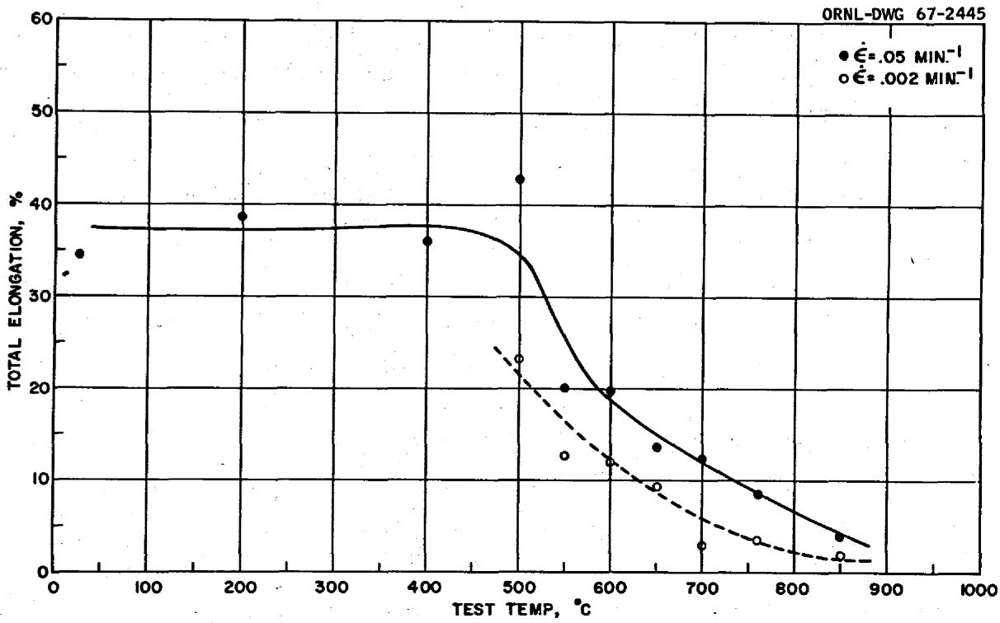  
Fig. 11. Tensile Ductilities of MSRE Surveillance Specimens, Heat 5085.

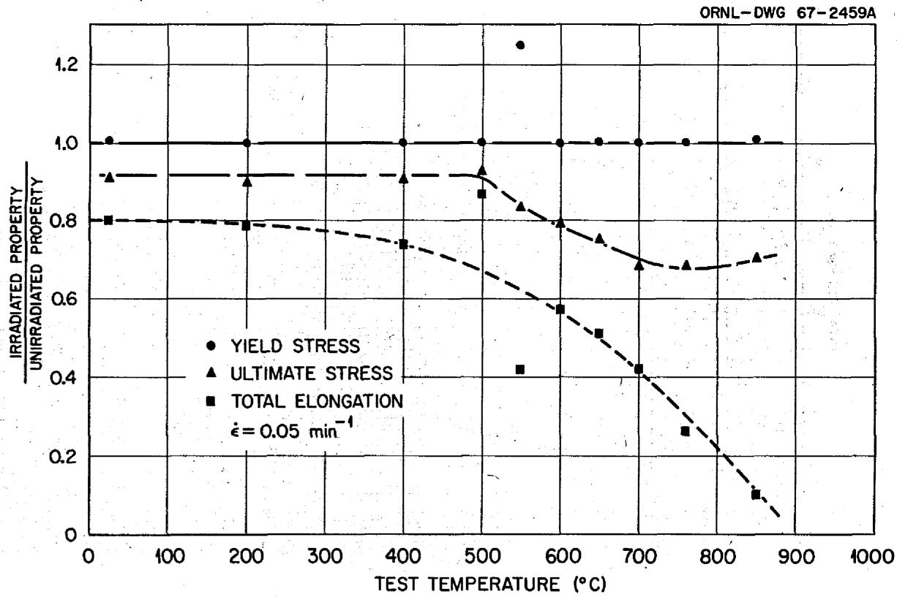  
Fig. 12. Comparative Tensile Properties of Irradiated and Unirradiated MSRE Surveillance Specimens, Heat 5085.

The elongations at failure for the two heats of material are compared in Figs. 13 and 14. At a strain rate of $0.05 \, \text{min}^{-1}$ (Fig. 13) there are several minor variations in the ductilities of the control specimens. The main difference is that the ductility of heat 5085 is consistently lower up to about $500^{\circ}\text{C}$ . Both heats of the surveillance specimens exhibit a reduction in ductility at a test temperature of $25^{\circ}\text{C}$ ; however, the reduction is greater for heat 5085. The ductility of heat 5081 recovers some with increasing test temperature, but heat 5085 maintains its reduced ductility. Above about $500^{\circ}\text{C}$ the ductility of the controls drops rapidly, but the ductility of the irradiated surveillance specimens decreases more rapidly. Both heats have very similar ductilities at temperatures above $600^{\circ}\text{C}$ . The ductilities of the two heats at a strain rate of $0.002 \, \text{min}^{-1}$ are compared in Fig. 14. The control specimens of both heats exhibited very similar ductilities, the characteristic ductility minimum being exhibited. The irradiated surveillance specimens have much lower ductilities, but the values are very similar for the two heats.

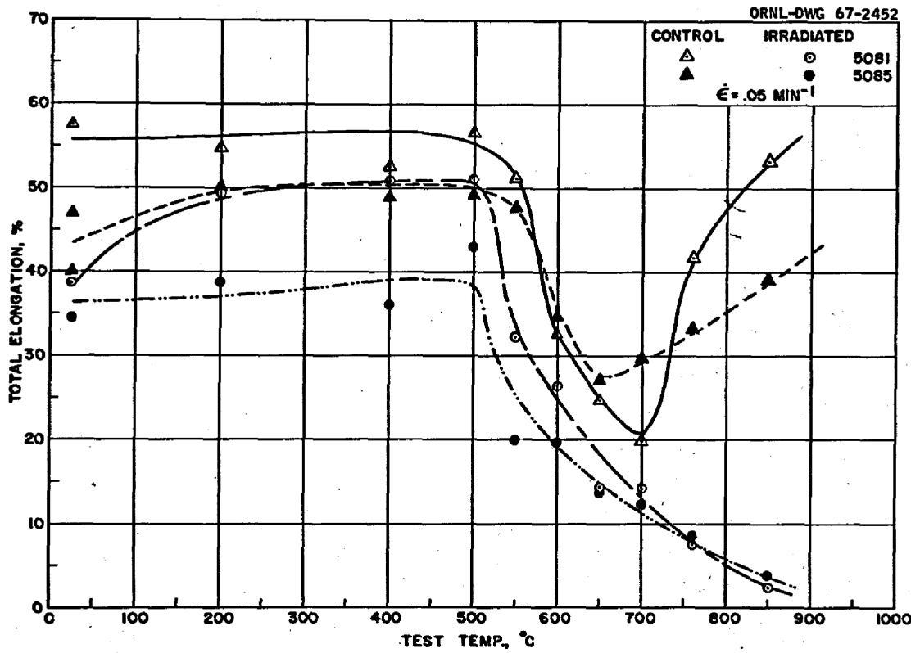  
Fig. 13. Comparative Tensile Ductilities of MSRE Surveillance Specimens and Their Controls at a Strain Rate of $0.05 \, \text{min}^{-1}$ .

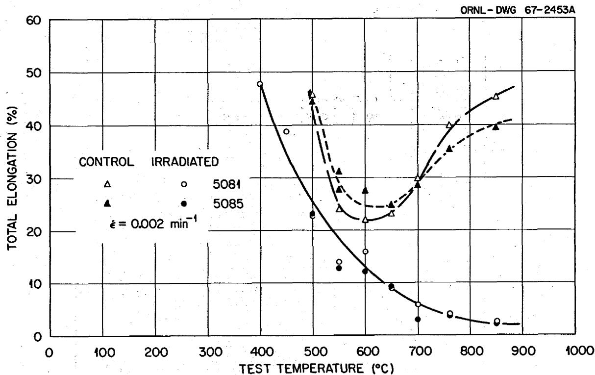  
Fig. 14. Comparative Tensile Ductilities of MSRE Surveillance Specimens and Their Controls at a Strain Rate of $0.002 \, \text{min}^{-1}$ .

We took a brief look at how the tensile properties of the material varied as a function of heat treatment in the unirradiated state. The properties of heat 5081 in several metallurgical conditions are given in Table 6. The anneal for 2 hr at $900^{\circ}\mathrm{C}$ generally decreased the strength and increased the rupture strain over that of the as-received material. One exception to this behavior is an increase in ultimate stress at $650^{\circ}\mathrm{C}$ due to the 2 hr anneal at $900^{\circ}\mathrm{C}$ . The exposure to molten salt at $650^{\circ}\mathrm{C}$ for 4800 hr caused a decrease in the ductility and slight variations in the strength. The tensile properties of heat 5085 in the unirradiated condition are given in Table 7. The properties of this heat are not significantly different in the as-received condition and after annealing 2 hr at $900^{\circ}\mathrm{C}$ . The exposure to molten salt at $650^{\circ}\mathrm{C}$ caused a general decrease of 10 to $20\%$ in the rupture ductility, but the strength was not affected significantly.

The postirradiation tensile properties of several heats of MSRE material are compared in Table 8. The first two sets of data for heat 5065 show that the postirradiation properties were not affected by

Table 6. Tensile Properties of Unirradiated Hastelloy N Heat 5081   

<table><tr><td rowspan="2">Specimen Number</td><td rowspan="2">Test Temperature (°C)</td><td rowspan="2">Strain Rate (min-1)</td><td colspan="2">Stress (psi)</td><td colspan="2">Elongation (%)</td><td rowspan="2">Reduction in Area (%)</td></tr><tr><td>Yield</td><td>Ultimate</td><td>Uniform</td><td>Total</td></tr><tr><td colspan="8">As-received</td></tr><tr><td>5006</td><td>25</td><td>0.05</td><td>77,400</td><td>130,600</td><td>44.9</td><td>46.9</td><td>48.0</td></tr><tr><td>5005</td><td>500</td><td>0.05</td><td>38,200</td><td>103,300</td><td>53.3</td><td>55.3</td><td>34.0</td></tr><tr><td>5004</td><td>500</td><td>0.002</td><td>40,000</td><td>103,200</td><td>51.2</td><td>52.6</td><td>41.5</td></tr><tr><td>5008</td><td>650</td><td>0.05</td><td>39,100</td><td>73,400</td><td>18.0</td><td>19.8</td><td>19.1</td></tr><tr><td>5007</td><td>650</td><td>0.002</td><td>38,200</td><td>65,100</td><td>14.4</td><td>15.2</td><td>15.8</td></tr><tr><td colspan="8">Annealed 2 hr at 900°C</td></tr><tr><td>4300</td><td>25</td><td>0.05</td><td>52,600</td><td>125,300</td><td>56.7</td><td>59.5</td><td>50.5</td></tr><tr><td>4303</td><td>500</td><td>0.05</td><td>32,000</td><td>100,300</td><td>57.8</td><td>60.7</td><td>44.4</td></tr><tr><td>4301</td><td>650</td><td>0.05</td><td>32,200</td><td>81,800</td><td>31.7</td><td>33.9</td><td>29.9</td></tr><tr><td>4302</td><td>650</td><td>0.002</td><td>32,900</td><td>74,900</td><td>29.0</td><td>29.5</td><td>31.8</td></tr><tr><td colspan="8">Annealed 2 hr at 900°C plus 4800 hr in MSRE salt at 650°C</td></tr><tr><td>AC-8</td><td>25</td><td>0.05</td><td>47,700</td><td>118,700</td><td>55.9</td><td>57.6</td><td>48.8</td></tr><tr><td>AC-19</td><td>500</td><td>0.05</td><td>35,800</td><td>97,800</td><td>53.6</td><td>56.6</td><td>46.2</td></tr><tr><td>BC-9</td><td>500</td><td>0.002</td><td>36,200</td><td>95,300</td><td>46.2</td><td>47.0</td><td>38.1</td></tr><tr><td>AC-27</td><td>650</td><td>0.05</td><td>32,400</td><td>68,400</td><td>23.8</td><td>24.6</td><td>23.1</td></tr><tr><td>AC-17</td><td>650</td><td>0.002</td><td>33,600</td><td>66,700</td><td>22.8</td><td>23.2</td><td>21.6</td></tr></table>

Table 7. Tensile Properties of Unirradiated Hastelloy N Heat 5085   

<table><tr><td rowspan="2">Specimen Number</td><td rowspan="2">Test Temperature (°C)</td><td rowspan="2">Strain Rate (min-1)</td><td colspan="2">Stress (psi)</td><td colspan="2">Elongation (%)</td><td rowspan="2">Reduction in Area (%)</td></tr><tr><td>Yield</td><td>Ultimate</td><td>Uniform</td><td>Total</td></tr><tr><td colspan="8">As-received</td></tr><tr><td>76</td><td>25</td><td>0.05</td><td>52,200</td><td>116,400</td><td>51.3</td><td>52.5</td><td>56.3</td></tr><tr><td>77</td><td>427</td><td>0.05</td><td>30,700</td><td>102,900</td><td>57.6</td><td>59.4</td><td>49.9</td></tr><tr><td>284</td><td>600</td><td>0.02</td><td>32,200</td><td>85,100</td><td>46.6</td><td>47.6</td><td>40.4</td></tr><tr><td>78</td><td>650</td><td>0.05</td><td>28,700</td><td>80,700</td><td>35.5</td><td>36.7</td><td>33.2</td></tr><tr><td>285</td><td>650</td><td>0.02</td><td>31,900</td><td>65,000</td><td>25.8</td><td>31.8</td><td>27.2</td></tr><tr><td>283</td><td>650</td><td>0.002</td><td>30,500</td><td>64,300</td><td>22.6</td><td>24.1</td><td>28.8</td></tr><tr><td>79</td><td>760</td><td>0.05</td><td>32,100</td><td>61,500</td><td>24.7</td><td>27.0</td><td>31.9</td></tr><tr><td>80</td><td>871</td><td>0.05</td><td>30,700</td><td>42,300</td><td>9.0</td><td>31.8</td><td>33.4</td></tr><tr><td>81</td><td>982</td><td>0.05</td><td>23,100</td><td>23,100</td><td>1.8</td><td>40.2</td><td>43.9</td></tr><tr><td colspan="8">Annealed 2 hr at 900°C</td></tr><tr><td>4295</td><td>25</td><td>0.05</td><td>51,500</td><td>120,800</td><td>52.3</td><td>53.1</td><td>42.2</td></tr><tr><td>4298</td><td>500</td><td>0.05</td><td>32,600</td><td>94,800</td><td>51.2</td><td>54.1</td><td>40.9</td></tr><tr><td>4299</td><td>500</td><td>0.002</td><td>33,500</td><td>100,200</td><td>52.0</td><td>53.3</td><td>41.7</td></tr><tr><td>4296</td><td>650</td><td>0.05</td><td>29,600</td><td>75,800</td><td>31.7</td><td>33.7</td><td>34.6</td></tr><tr><td colspan="8">Annealed 2 hr at 900°C plus 4800 hr in MSRE salt at 650°C</td></tr><tr><td>FC-3</td><td>25</td><td>0.05</td><td>45,500</td><td>111,200</td><td>46.8</td><td>46.8</td><td>31.5</td></tr><tr><td>DC-19</td><td>500</td><td>0.05</td><td>33,600</td><td>94,300</td><td>48.8</td><td>49.3</td><td>41.5</td></tr><tr><td>DC-26</td><td>500</td><td>0.002</td><td>33,400</td><td>91,700</td><td>43.3</td><td>44.3</td><td>37.8</td></tr><tr><td>DC-14</td><td>650</td><td>0.05</td><td>31,800</td><td>70,100</td><td>25.8</td><td>26.8</td><td>30.0</td></tr><tr><td>DC-25</td><td>650</td><td>0.002</td><td>31,500</td><td>62,500</td><td>22.8</td><td>24.3</td><td>27.2</td></tr></table>

Table 8. Postirradiation Tensile Properties of Several Heats of MSRE Hastelloy N   

<table><tr><td rowspan="2">Specimen Number</td><td rowspan="2">Heat Number</td><td rowspan="2">Boron Level (ppm)</td><td rowspan="2">Irradiation Temperature (°C)</td><td rowspan="2">Thermal Dose (neutrons/cm2)</td><td rowspan="2">Test Temperature (°C)</td><td rowspan="2">Strain Rate (min-1)</td><td colspan="2">Stress (psi)</td><td colspan="2">Elongation (%)</td><td rowspan="2">Reduction in Area (%)</td></tr><tr><td>Yield</td><td>Ultimate</td><td>Uniform</td><td>Total</td></tr><tr><td colspan="12">x 1020</td></tr><tr><td colspan="12">Experiment ORR-149</td></tr><tr><td>570b</td><td>5065</td><td>20</td><td>43</td><td>8.5</td><td>25</td><td>0.05</td><td>102,900</td><td>135,100</td><td>31.5</td><td>35.5</td><td>52.0</td></tr><tr><td>571b</td><td>5065</td><td>20</td><td>43</td><td>8.5</td><td>200</td><td>0.05</td><td>82,300</td><td>119,600</td><td>36.1</td><td>39.2</td><td>54.8</td></tr><tr><td>572b</td><td>5065</td><td>20</td><td>43</td><td>8.5</td><td>650</td><td>0.05</td><td>44,600</td><td>76,900</td><td>26.3</td><td>27.3</td><td>24.5</td></tr><tr><td>574b</td><td>5065</td><td>20</td><td>43</td><td>8.5</td><td>650</td><td>0.002</td><td>40,800</td><td>57,400</td><td>12.2</td><td>13.1</td><td>21.9</td></tr><tr><td>573b</td><td>5065</td><td>20</td><td>43</td><td>8.5</td><td>871</td><td>0.05</td><td>33,500</td><td>36,400</td><td>1.7</td><td>1.8</td><td>3.25</td></tr><tr><td>575b</td><td>5065</td><td>20</td><td>43</td><td>8.5</td><td>871</td><td>0.002</td><td>23,200</td><td>23,400</td><td>0.9</td><td>1.8</td><td>6.07</td></tr><tr><td>581c</td><td>5065</td><td>20</td><td>43</td><td>8.5</td><td>25</td><td>0.05</td><td>101,500</td><td>132,200</td><td>30.0</td><td>33.6</td><td>55.2</td></tr><tr><td>582c</td><td>5065</td><td>20</td><td>43</td><td>8.5</td><td>200</td><td>0.05</td><td>78,600</td><td>118,300</td><td>37.3</td><td>39.8</td><td>45.9</td></tr><tr><td>583c</td><td>5065</td><td>20</td><td>43</td><td>8.5</td><td>650</td><td>0.05</td><td>35,100</td><td>77,700</td><td>25.3</td><td>25.8</td><td>22.6</td></tr><tr><td>585c</td><td>5065</td><td>20</td><td>43</td><td>8.5</td><td>650</td><td>0.002</td><td>38,100</td><td>66,200</td><td>13.7</td><td>14.3</td><td>17.3</td></tr><tr><td>584c</td><td>5065</td><td>20</td><td>43</td><td>8.5</td><td>871</td><td>0.05</td><td>37,100</td><td>38,500</td><td>1.7</td><td>1.9</td><td>2.94</td></tr><tr><td>586c</td><td>5065</td><td>20</td><td>43</td><td>8.5</td><td>871</td><td>0.002</td><td>25,900</td><td>25,900</td><td>0.8</td><td>1.6</td><td>5.26</td></tr><tr><td colspan="12">Experiment ORR-155</td></tr><tr><td>2289b</td><td>5067</td><td>20</td><td>500-700</td><td>1.4</td><td>25</td><td>0.05</td><td>59,000</td><td>123,700</td><td>49.4</td><td>51.2</td><td>45.4</td></tr><tr><td>2290b</td><td>5067</td><td>20</td><td>500-700</td><td>1.4</td><td>650</td><td>0.05</td><td>38,400</td><td>66,800</td><td>14.0</td><td>14.0</td><td>20.5</td></tr><tr><td>2291b</td><td>5067</td><td>20</td><td>500-700</td><td>1.4</td><td>650</td><td>0.002</td><td>36,400</td><td>59,900</td><td>9.6</td><td>9.6</td><td>16.0</td></tr><tr><td>2285b</td><td>5085</td><td>38</td><td>500-700</td><td>1.4</td><td>25</td><td>0.05</td><td>46,300</td><td>110,600</td><td>41.1</td><td>41.2</td><td>40.3</td></tr><tr><td>2286b</td><td>5085</td><td>38</td><td>500-700</td><td>1.4</td><td>650</td><td>0.05</td><td>30,800</td><td>64,400</td><td>18.0</td><td>21.2</td><td>19.1</td></tr><tr><td>2287b</td><td>5085</td><td>38</td><td>500-700</td><td>1.4</td><td>650</td><td>0.002</td><td>30,200</td><td>51,800</td><td>9.3</td><td>9.9</td><td>15.4</td></tr><tr><td>1857b</td><td>5065</td><td>20</td><td>500-700</td><td>1.4</td><td>25</td><td>0.05</td><td>50,100</td><td>117,000</td><td>54.4</td><td>56.1</td><td>53.2</td></tr><tr><td>1858b</td><td>5065</td><td>20</td><td>500-700</td><td>1.4</td><td>650</td><td>0.05</td><td>37,400</td><td>62,100</td><td>12.3</td><td>12.4</td><td>17.2</td></tr><tr><td>1859b</td><td>5065</td><td>20</td><td>500-700</td><td>1.4</td><td>650</td><td>0.002</td><td>34,800</td><td>49,100</td><td>6.4</td><td>6.5</td><td>15.3</td></tr><tr><td colspan="12">Experiment ETR-41-31</td></tr><tr><td>1273b</td><td>5065</td><td>20</td><td>600 ± 100</td><td>3.5</td><td>550</td><td>0.002</td><td>49,100</td><td>68,600</td><td>9.1</td><td>9.4</td><td>14.7</td></tr><tr><td>1276b</td><td>5065</td><td>20</td><td>600 ± 100</td><td>3.5</td><td>600</td><td>0.002</td><td>42,200</td><td>56,300</td><td>8.2</td><td>8.5</td><td>11.7</td></tr><tr><td>1270b</td><td>5065</td><td>20</td><td>600 ± 100</td><td>3.5</td><td>650</td><td>0.05</td><td>41,200</td><td>59,000</td><td>10.8</td><td>11.3</td><td>14.7</td></tr><tr><td>1271b</td><td>5065</td><td>20</td><td>600 ± 100</td><td>3.5</td><td>650</td><td>0.002</td><td>42,600</td><td>51,800</td><td>5.9</td><td>6.1</td><td>10.2</td></tr><tr><td>1274b</td><td>5065</td><td>20</td><td>600 ± 100</td><td>3.5</td><td>760</td><td>0.002</td><td>41,900</td><td>46,000</td><td>2.8</td><td>2.8</td><td>5.6</td></tr><tr><td colspan="12">Experiment ETR-41-30</td></tr><tr><td>383b</td><td>5065</td><td>20</td><td>&lt;150</td><td>5</td><td>650</td><td>0.05</td><td>46,700</td><td>76,200</td><td>21.6</td><td>22.2</td><td>28.8</td></tr><tr><td>380b</td><td>5065</td><td>20</td><td>&lt;150</td><td>5</td><td>650</td><td>0.002</td><td>37,700</td><td>53,300</td><td>9.3</td><td>10.0</td><td>10.1</td></tr><tr><td>384b</td><td>5065</td><td>20</td><td>&lt;150</td><td>5</td><td>650</td><td>0.002</td><td>40,000</td><td>57,500</td><td>11.4</td><td>11.6</td><td>17.5</td></tr><tr><td colspan="12">Experiment MSRE</td></tr><tr><td>D-16d</td><td>5081</td><td>50</td><td>650</td><td>1.3</td><td>25</td><td>0.05</td><td>51,100</td><td>105,500</td><td>38.5</td><td>38.7</td><td>31.3</td></tr><tr><td>E-7d</td><td>5081</td><td>50</td><td>650</td><td>1.3</td><td>650</td><td>0.05</td><td>34,600</td><td>57,200</td><td>13.8</td><td>14.3</td><td>13.9</td></tr><tr><td>E-14d</td><td>5081</td><td>50</td><td>650</td><td>1.3</td><td>650</td><td>0.002</td><td>34,400</td><td>48,400</td><td>8.2</td><td>9.0</td><td>11.6</td></tr><tr><td>A-16d</td><td>5085</td><td>38</td><td>650</td><td>1.3</td><td>25</td><td>0.05</td><td>48,100</td><td>100,300</td><td>34.3</td><td>34.5</td><td>26.0</td></tr><tr><td>B-19d</td><td>5085</td><td>38</td><td>650</td><td>1.3</td><td>650</td><td>0.05</td><td>32,000</td><td>52,800</td><td>12.6</td><td>13.7</td><td>13.9</td></tr><tr><td>B-6d</td><td>5085</td><td>38</td><td>650</td><td>1.3</td><td>650</td><td>0.002</td><td>32,100</td><td>42,900</td><td>6.5</td><td>9.4</td><td>7.9</td></tr></table>

aIrradiated in a helium environment except for specimens from MRE.   
$b_{\mathrm{As}}$ received.

Annealed 8 hr at $871^{\circ}C$

dAnnealed 2 hr at $900^{\circ}\mathrm{C}$

whether the material was irradiated in the as-received condition or whether it was annealed 8 hr at $871^{\circ}\mathrm{C}$ . These specimens were irradiated at $43^{\circ}\mathrm{C}$ , and the ductilities at $25^{\circ}\mathrm{C}$ $(0.05\mathrm{min}^{-1})$ and $650^{\circ}\mathrm{C}$ $(0.002\mathrm{min}^{-1})$ were 34 to 36 and 13 to $14\%$ , respectively. When irradiated at an elevated temperature, this same heat had elongations at $650^{\circ}\mathrm{C}$ $(0.002\mathrm{min}^{-1})$ of 6.5 and $6.1\%$ . Heats 5067 and 5085 showed somewhat better ductilities at $650^{\circ}\mathrm{C}$ $(0.002\mathrm{min}^{-1})$ with values of 9 to $10\%$ being obtained for irradiations at elevated temperatures. The ductilities of the two surveillance heats at $650^{\circ}\mathrm{C}$ agree closely with those observed previously for heats 5085 and 5067. However, the room temperature ductilities are lower than those observed for any heat of material irradiated at an elevated temperature. Heat 5081 was included in another experiment in the Oak Ridge Research Reactor, $^{6}$ and the results are compared with those for the MSRE surveillance specimens in Fig. 15. These results indicate that the properties of the material are unaffected by the salt environment.

$^6$ W. R. Martin and J. R. Weir, "Effect of Elevated Temperature Irradiation on the Strength and Ductility of the Nickel-Base Alloy, Hastelloy N," Nucl. Appl. 1(2), 160-67 (1965).

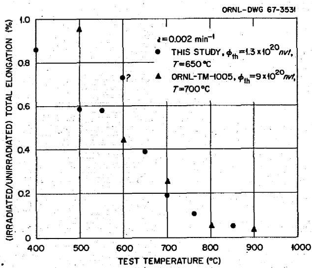  
Fig. 15. Comparative Effects of Irradiation in MSRE and ORR on the Ductility of Hastelloy N, Heat 5081.

We also ran several creep-rupture tests on the irradiated materials to evaluate their properties under creep conditions. For comparison, the results of several creep-rupture tests on unirradiated heat 5081 are given in Table 9. Of the two heat treatments investigated, 2 hr at $900^{\circ}\mathrm{C}$ and the surveillance control treatment, the latter resulted in slightly lower rupture strains. The creep-rupture data are plotted in Fig. 16, and the MSRE surveillance control specimens exhibit a slightly reduced rupture life. However, the minimum creep rate is the same after the two heat treatments (Fig. 17).

Table 9. Creep-Rupture Properties of Unirradiated Hastelloy N at $650^{\circ}\mathrm{C}$ Heat 5081   

<table><tr><td>Test Number</td><td>Stress (psi)</td><td>Rupture Life (hr)</td><td>Rupture Strain (%)</td><td>Reduction in Area (%)</td><td>Minimum Creep Rate (%/hr)</td></tr><tr><td colspan="6">Annealed 2 hr at 900°C</td></tr><tr><td>6159</td><td>70,000</td><td>5.1</td><td>35.0</td><td>12.8</td><td>2.1</td></tr><tr><td>6155</td><td>55,000</td><td>71.8</td><td>33.9</td><td>29.2</td><td>0.26</td></tr><tr><td>6156</td><td>47,000</td><td>76.0</td><td>12.4</td><td>27.0</td><td>0.091</td></tr><tr><td>6157</td><td>40,000</td><td>648.3</td><td>42.5</td><td>25.2</td><td>0.032</td></tr><tr><td>6158</td><td>32,400</td><td>2133.3</td><td>46.8</td><td>20.1</td><td>0.012</td></tr><tr><td>6160a</td><td>27,000</td><td>2349.0</td><td>10.2</td><td>3.7</td><td>0.0047</td></tr><tr><td colspan="6">Annealed 2 hr at 900°C plus 4800 hr at 650°C in MSRE salt</td></tr><tr><td>6077</td><td>55,000</td><td>40.7</td><td>24.3</td><td>21.9</td><td>0.25</td></tr><tr><td>6075</td><td>47,000</td><td>147.9</td><td>27.2</td><td>21.9</td><td>0.098</td></tr><tr><td>6076</td><td>40,000</td><td>321.0</td><td>31.1</td><td>26.7</td><td>0.061</td></tr><tr><td>6071</td><td>32,400</td><td>848.0</td><td>16.5</td><td>16.1</td><td>0.014</td></tr></table>

aDiscontinued prior to failure.

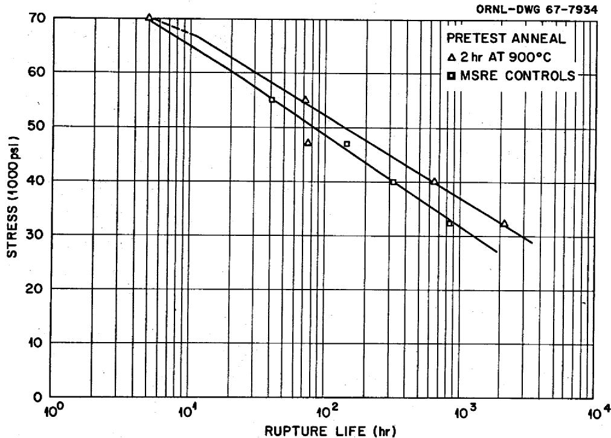  
Fig. 16. Creep-Rupture Properties of Hastelloy N at $650^{\circ}\mathrm{C}$ , Heat 5081.

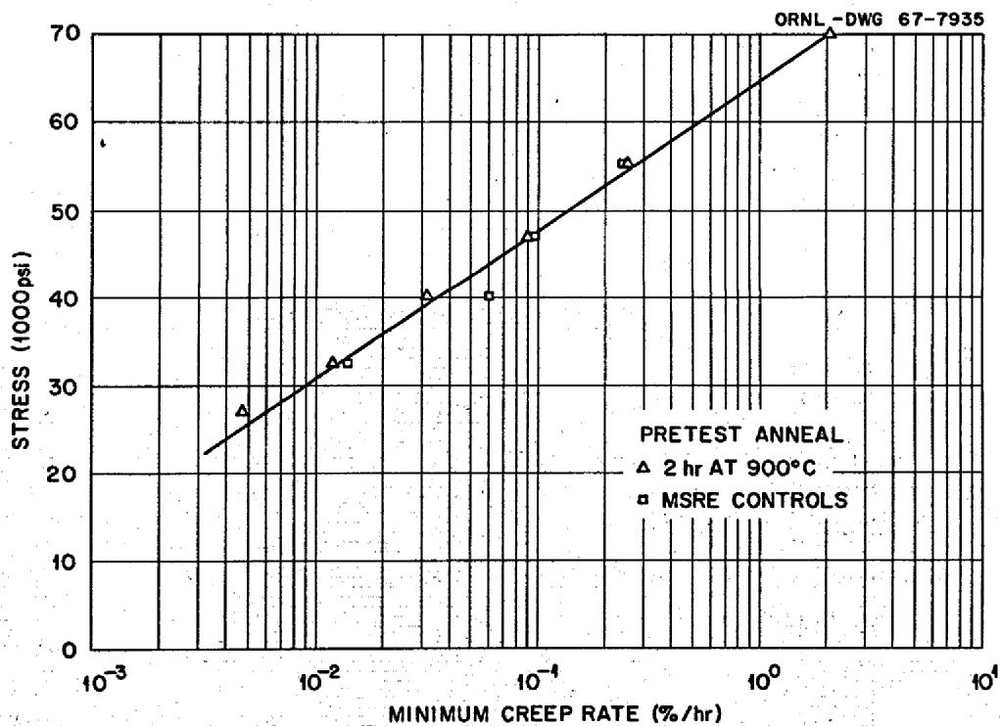  
Fig. 17. Minimum Creep Rate of Hastelloy N at $650^{\circ}\mathrm{C}$ , Heat 5081.

The creep-rupture properties of heat 5085 were investigated in three conditions - as-received, annealed 2 hr at $900^{\circ}\mathrm{C}$ , and 2 hr at $900^{\circ}\mathrm{C}$ plus 4800 hr in molten salt (Table 10). The rupture strain of the as-received material is improved by annealing at $900^{\circ}\mathrm{C}$ , but the long aging treatment at $650^{\circ}\mathrm{C}$ brings about a slight reduction in the fracture ductility.

Figure 18 compares the rupture life after the various heat treatments.

The pattern is the same as that for the ductility with the minimum strength being observed for the as-received material and the maximum for the material annealed 2 hr at $900^{\circ}\mathrm{C}$ . However, the minimum creep rate was unaffected by heat treatment (Fig. 19).

Table 10. Creep-Rupture Properties of Unirradiated Hastelloy N at $650^{\circ}\mathrm{C}$ Heat 5085   

<table><tr><td>Test Number</td><td>Stress (psi)</td><td>Rupture Life (hr)</td><td>Rupture Strain (%)</td><td>Reduction in Area (%)</td><td>Minimum Creep Rate (%/hr)</td></tr><tr><td colspan="6">As-received</td></tr><tr><td>3792</td><td>70,000</td><td>0.4</td><td>28.0</td><td>21.9</td><td>9.0</td></tr><tr><td>3710</td><td>55,000</td><td>10.8</td><td>10.9</td><td>13.3</td><td>0.27</td></tr><tr><td>3781</td><td>47,000</td><td>48.6</td><td>12.5</td><td>14.6</td><td>0.086</td></tr><tr><td>3713</td><td>40,000</td><td>179.5</td><td>10.9</td><td>5.6</td><td>0.024</td></tr><tr><td>3714</td><td>40,000</td><td>215.7</td><td>14.0</td><td>5.6</td><td>0.024</td></tr><tr><td>3975</td><td>30,000</td><td>672.6</td><td>6.3</td><td>6.4</td><td>0.006</td></tr><tr><td>3795</td><td>30,000</td><td>1030.0</td><td>9.4</td><td>7.1</td><td>0.006</td></tr><tr><td colspan="6">Annealed 2 hr at 900°C</td></tr><tr><td>6153</td><td>70,000</td><td>4.1</td><td>32.6</td><td>30.7</td><td>2.1</td></tr><tr><td>6149</td><td>55,000</td><td>49.5</td><td>22.6</td><td>30.8</td><td>0.26</td></tr><tr><td>6150</td><td>47,000</td><td>246.8</td><td>38.5</td><td>28.9</td><td>0.084</td></tr><tr><td>6151</td><td>40,000</td><td>725.1</td><td>37.6</td><td>18.4</td><td>0.029</td></tr><tr><td>6152a</td><td>32,400</td><td>2386.0</td><td>37.7</td><td>19.9</td><td>0.009</td></tr><tr><td>6154a</td><td>27,000</td><td>2445.0</td><td>9.0</td><td>4.0</td><td>0.0035</td></tr><tr><td colspan="6">Annealed 2 hr at 900°C plus 4800 hr at 650°C in MSRE salt</td></tr><tr><td>6074</td><td>55,000</td><td>20.5</td><td>20.8</td><td>21.9</td><td>0.30</td></tr><tr><td>6073</td><td>47,000</td><td>124.6</td><td>31.2</td><td>22.9</td><td>0.080</td></tr><tr><td>6072</td><td>40,000</td><td>513.3</td><td>22.3</td><td>19.7</td><td>0.029</td></tr><tr><td>6070</td><td>32,400</td><td>2054.6</td><td>26.7</td><td>16.7</td><td>0.0082</td></tr></table>

aDiscontinued prior to failure.

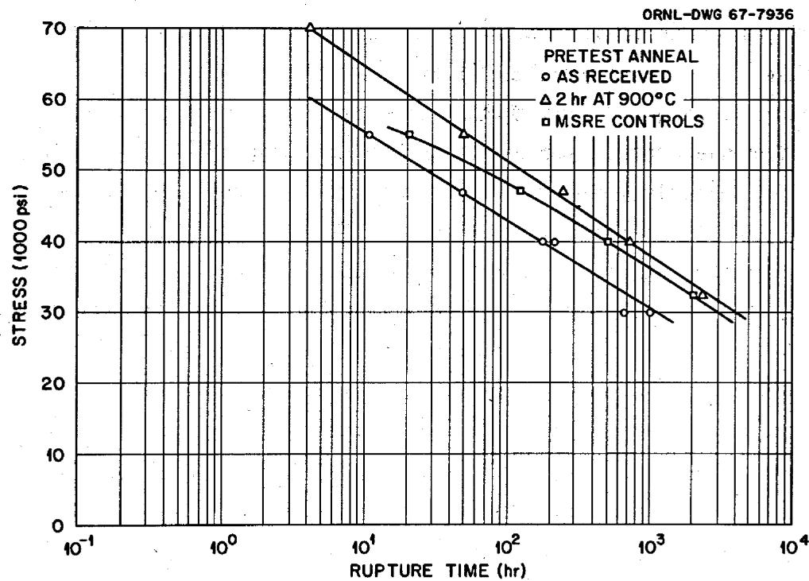  
Fig. 18. Creep-Rupture Properties of Hastelloy N at $650^{\circ}\mathrm{C}$ , Heat 5085.

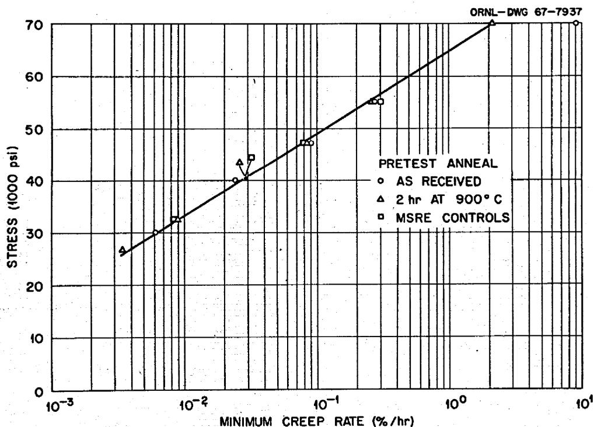  
Fig. 19. Minimum Creep Rate of Hastelloy N at $650^{\circ}\mathrm{C}$ , Heat 5085.

The results of the tests on the surveillance specimens are given in Table 11. The properties (ductility and strength) of heat 5081 are superior to those of heat 5085. However, a comparison of these data with those for the control specimens in Tables 9 and 10 shows that irradiation has significantly reduced the rupture life and ductility of both heats. The rupture lives are compared in Fig. 20 for both heats of material in the irradiated and unirradiated conditions. The effect of irradiation is greater as the stress level increases. The minimum creep rates of the two heats of material in the irradiated and unirradiated conditions are compared in Fig. 21. This parameter appears to be independent of the variables being studied with the possible exception of the irradiated specimens exhibiting a higher strain rate at the 47,000-psi stress level.

Table 11. Postirradiation Creep-Rupture Properties of MSRE Surveillance Specimensa at $650^{\circ}\mathrm{C}$   

<table><tr><td>Test Number</td><td>Heat Number</td><td>Stress (psi)</td><td>Rupture Life (hr)</td><td>Rupture Strain (%)</td><td>Reduction in Area (%)</td><td>Minimum Creep Rate (%/hr)</td></tr><tr><td>R-230</td><td>5085</td><td>47,000</td><td>0.8</td><td>1.45</td><td>10.0</td><td>0.81</td></tr><tr><td>R-266</td><td>5085</td><td>40,000</td><td>24.2</td><td>1.57</td><td>9.7</td><td>0.031</td></tr><tr><td>R-267</td><td>5085</td><td>32,400</td><td>148.2</td><td>1.05</td><td>6.5</td><td>0.006</td></tr><tr><td>R-250</td><td>5085</td><td>27,000</td><td>25.2</td><td>1.86</td><td>2.2</td><td>0.004</td></tr><tr><td>R-229</td><td>5081</td><td>47,000</td><td>8.7</td><td>2.28</td><td>9.2</td><td>0.20</td></tr><tr><td>R-231</td><td>5081</td><td>40,000</td><td>98.7</td><td>2.65</td><td>5.8</td><td>0.017</td></tr><tr><td>R-226</td><td>5081</td><td>32,400</td><td>474.0</td><td>3.78</td><td>4.0</td><td>0.0059</td></tr><tr><td>R-233</td><td>5081</td><td>27,000</td><td>2137.1</td><td>4.25</td><td>0.58</td><td>0.0009</td></tr></table>

aAnnealed 2 hr at $900^{\circ}\mathrm{C}$ prior to irradiation.

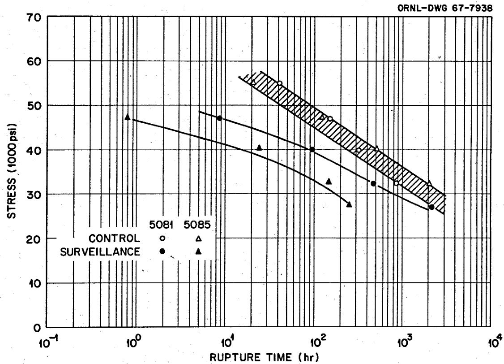  
Fig. 20. Comparative Creep-Rupture Properties of Surveillance and Control Specimens at $650^{\circ}\mathrm{C}$ .

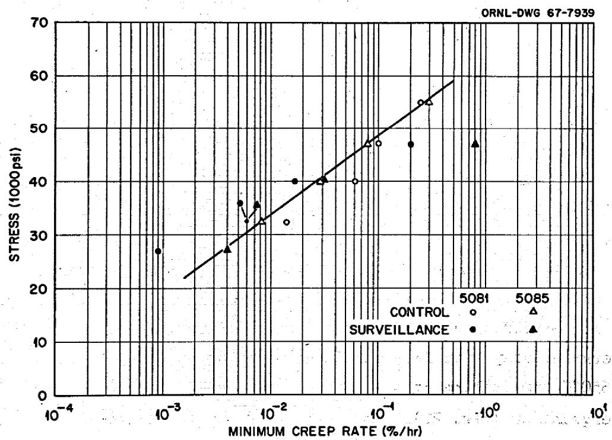  
Fig. 21. Comparative Creep Rates for Surveillance and Control Specimens at $650^{\circ}\mathrm{C}$ .

The results of the creep-rupture tests on the surveillance specimens were compared with data which we had obtained on the "MSRE materials" in other irradiation experiments in the ORR. The results used in this comparison are given in Table 12. The creep-rupture lives are compared in Fig. 22. The data for heat 5085 agree quite well with those obtained previously in the ORR for this same heat and several other MSRE heats. However, the results for heat 5081 are slightly superior. The fracture strains for the various heats of irradiated material are compared in Fig. 23. The data indicate a minimum ductility for a rupture life of 1 to 10 hr with ductility increasing with increasing rupture life. A lower ductility of heat 5085 after irradiation in the MSRE is also indicated, although the data scatter will not permit this as an unequivocal conclusion. The superior ductility of heat 5081 and the least ductility of heat 5065 (heat used for the top and bottom heads of MSRE) are clearly illustrated.

Since transients may occur in which the material is strained at some temperature other than the operating temperature $(650^{\circ}\mathrm{C})$ , we ran a series of tests to determine what effect such transients could have on the fracture strain at $650^{\circ}\mathrm{C}$ . The results of these tests are given in Table 13. The specimens were strained at other temperatures and then quickly cooled or heated to $650^{\circ}\mathrm{C}$ and tested to failure. Even though the pretraining treatments carried the specimens as far as $37\%$ of the strain to failure, the strain at $650^{\circ}\mathrm{C}$ was not decreased. In fact, the pretraining at 760 and $850^{\circ}\mathrm{C}$ seemed to improve the ability of the material to strain at $650^{\circ}\mathrm{C}$ .

Several of the specimens were examined metallographically after testing. Figure 24 shows the microstructure of a control specimen from heat 5081 that was tested at $25^{\circ}\mathrm{C}$ . The specimen has undergone extensive deformation, and the fracture is typical of a transgranular shear-type failure. There is no evidence of intergranular cracking. In contrast, the irradiated specimen from the same heat, shown in Fig. 25, failed intergranularly with less strain and considerable intergranular cracking. At $650^{\circ}\mathrm{C}$ the failure of the control specimen was predominantly intergranular (Fig. 26). The failure of the surveillance specimen was also intergranular at $650^{\circ}\mathrm{C}$ with no microstructural evidence of plastic deformation (Fig. 27).

Table 12. Postirradiation Creep-Rupture Properties of Irradiateda Hastelloy N at $650^{\circ}\mathrm{C}$   

<table><tr><td>Test Number</td><td>Thermal Dose (neutrons/cm2)</td><td>Experiment Number</td><td>Stress (psi)</td><td>Rupture Life (hr)</td><td>Rupture Strain (%)</td><td>Minimum Creep Rate (%/hr)</td></tr><tr><td></td><td>x 1020</td><td></td><td>Heat 5065</td><td></td><td></td><td></td></tr><tr><td>R-15</td><td>3.0</td><td>ORR-138</td><td>39,800</td><td>2.8</td><td>0.59</td><td>0.086</td></tr><tr><td>R-13</td><td>3.0</td><td>ORR-138</td><td>32,400</td><td>62.6</td><td>2.23</td><td>0.011</td></tr><tr><td>R-35</td><td>3.0</td><td>ORR-138</td><td>27,000</td><td>765.8</td><td>1.75</td><td>0.0019</td></tr><tr><td>R-12</td><td>3.0</td><td>ORR-138</td><td>21,500</td><td>1907.8</td><td>2.28</td><td>0.0010</td></tr><tr><td>R-159</td><td>5.2</td><td>ORR-148</td><td>40,000</td><td>28.6</td><td>0.98</td><td>0.028</td></tr><tr><td>R-167</td><td>5.2</td><td>ORR-148</td><td>40,000</td><td>13.0</td><td>0.46</td><td>0.018</td></tr><tr><td>R-65</td><td>5.2</td><td>ORR-148</td><td>35,000</td><td>17.7</td><td>0.60</td><td>0.016</td></tr><tr><td>R-168</td><td>5.2</td><td>ORR-148</td><td>30,000</td><td>117.0</td><td>0.66</td><td>0.0049</td></tr><tr><td>R-215</td><td>1.4</td><td>ORR-155</td><td>32,400</td><td>135.7</td><td>1.45</td><td>0.0083</td></tr><tr><td></td><td></td><td></td><td>Heat 5067</td><td></td><td></td><td></td></tr><tr><td>R-214</td><td>1.4</td><td>ORR-155</td><td>32,400</td><td>361.4</td><td>2:78</td><td>0.0056</td></tr><tr><td></td><td></td><td></td><td>Heat 5085</td><td></td><td></td><td></td></tr><tr><td>R-14</td><td>2.0</td><td>ORR-140</td><td>39,800</td><td>6.7</td><td>1.90</td><td>0.25</td></tr><tr><td>R-11</td><td>2.0</td><td>ORR-140</td><td>32,400</td><td>49.3</td><td>1.61</td><td>0.0098</td></tr><tr><td>R-41</td><td>2.0</td><td>ORR-140</td><td>27,000</td><td>102.8</td><td>2.88</td><td>0.0023</td></tr><tr><td>R-10</td><td>2.0</td><td>ORR-140</td><td>21,500</td><td>2625.8</td><td>3.70</td><td>0.0009</td></tr><tr><td>R-206</td><td>1.4</td><td>ORR-155</td><td>32,400</td><td>247.6</td><td>1.48</td><td>0.0055</td></tr></table>

aIrradiation environment: He-1 vol $\%$ O2. All specimens in the as-received condition.

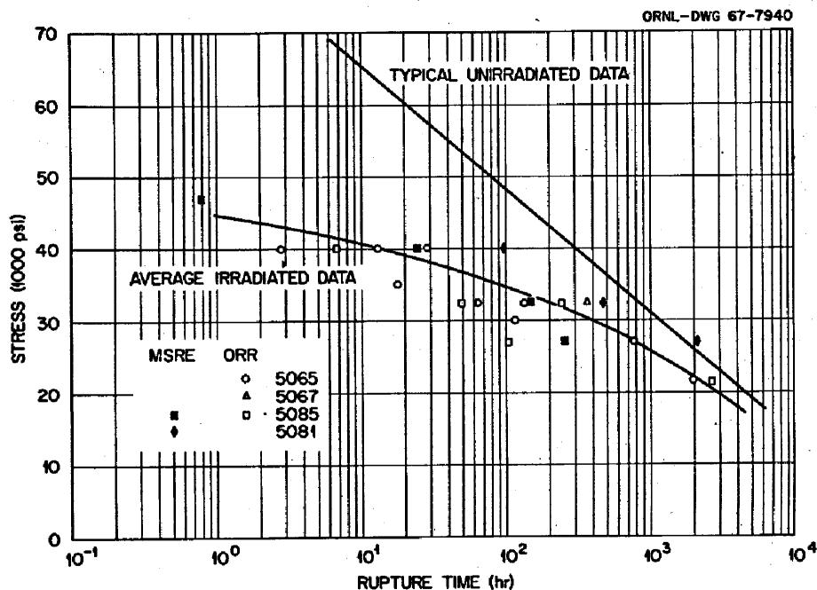  
Fig. 22. Comparative Stress-Rupture Properties for Material Irradiated in the MSRE and the ORR at $650^{\circ}\mathrm{C}$ .

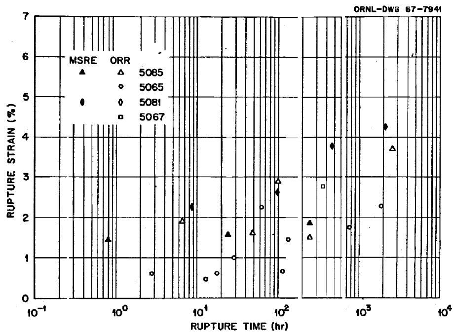  
Fig. 23. Comparative Rupture Strains for Irradiated Hastelloy at $650^{\circ}\mathrm{C}$ .

Table 13. Effects of Prestraining on the Tensile Properties of Hastelloy N Heat 5081   

<table><tr><td rowspan="2">Specimen Number</td><td rowspan="2">Pretreatmentb</td><td colspan="2">Stress (psi)</td><td colspan="2">Elongationb (%)</td><td rowspan="2">Reduction in Area (%)</td><td rowspan="2">True Strain (%)</td><td rowspan="2">Fraction of Rupture Strain at Prestraining Temperature (%)</td></tr><tr><td>Yield</td><td>Ultimate</td><td>Uniform</td><td>Total</td></tr><tr><td>E-19</td><td>None</td><td>34,600</td><td>53,000</td><td>10.8</td><td>11.3</td><td>14.6</td><td>15.9</td><td></td></tr><tr><td>E-14</td><td>None</td><td>34,400</td><td>48,400</td><td>8.2</td><td>9.0</td><td>11.6</td><td>12.2</td><td></td></tr><tr><td>F-11</td><td>Strained 5% at 400°C</td><td>45,900</td><td>54,700</td><td>8.0</td><td>10.0</td><td>8.2</td><td>8.2</td><td>10</td></tr><tr><td>F-25</td><td>Strained 5% at 500°C</td><td>47,700</td><td>58,300</td><td>10.9</td><td>11.5</td><td>14.2</td><td>15.4</td><td>20</td></tr><tr><td>F-24</td><td>Strained 5% at 600°C</td><td>47,900</td><td>58,500</td><td>10.4</td><td>11.3</td><td>11.0</td><td>11.3</td><td>32</td></tr><tr><td>D-11</td><td>Strained 2% at 700°C</td><td>40,200</td><td>54,000</td><td>9.7</td><td>10.6</td><td>14.2</td><td>15.4</td><td>37</td></tr><tr><td>F-4</td><td>Strained 1% at 760°C</td><td>35,500</td><td>56,400</td><td>11.9</td><td>12.6</td><td>15.5</td><td>16.9</td><td>26</td></tr><tr><td>F-16</td><td>Strained 0.5% at 850°C</td><td>35,700</td><td>59,800</td><td>15.2</td><td>15.9</td><td>13.5</td><td>14.7</td><td>24</td></tr></table>

${}^{a}$ Ruptured at ${650}^{ \circ  }\mathrm{C}$ : Strain rate $= {0.002}{\mathrm{\;{min}}}^{-1}$ .   
bPrestraining carried out at a strain rate of 0.002 min-1.   
cIncludes only the strain at $650^{\circ}C$

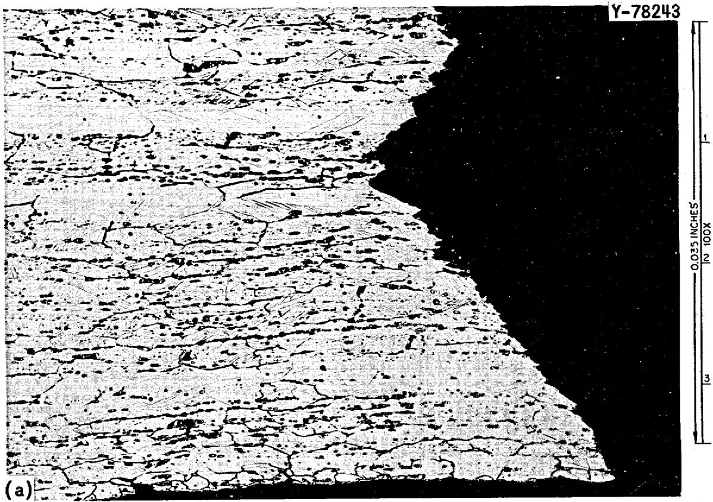

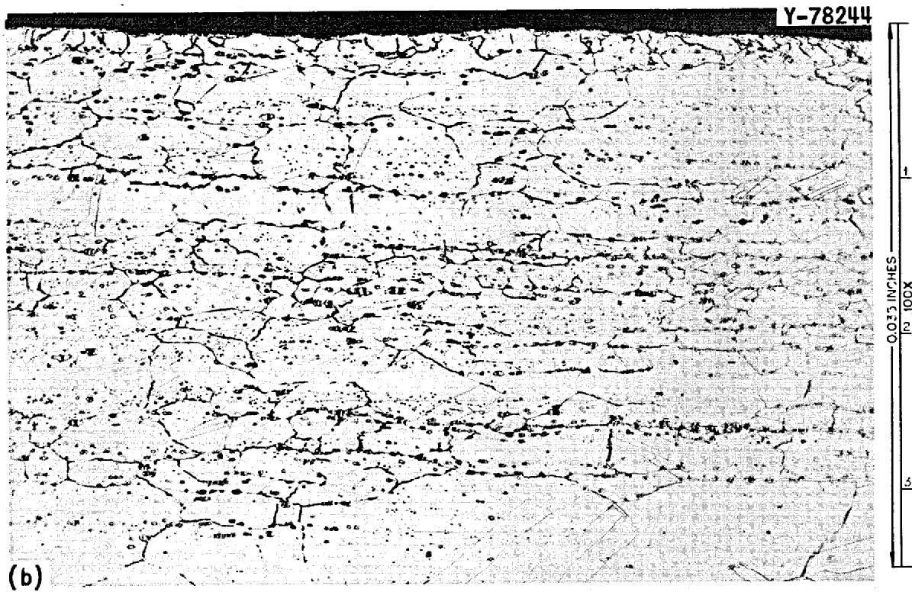  
Fig. 24. Photomicrographs of Control Specimen AC-8 from Heat 5081 Tested at $25^{\circ}\mathrm{C}$ and at a Strain Rate of $0.05\mathrm{min}^{-1}$ . (a) Fracture. (b) Edge of specimen about $1/4$ in. from fracture. Etchant: glyceria regia.

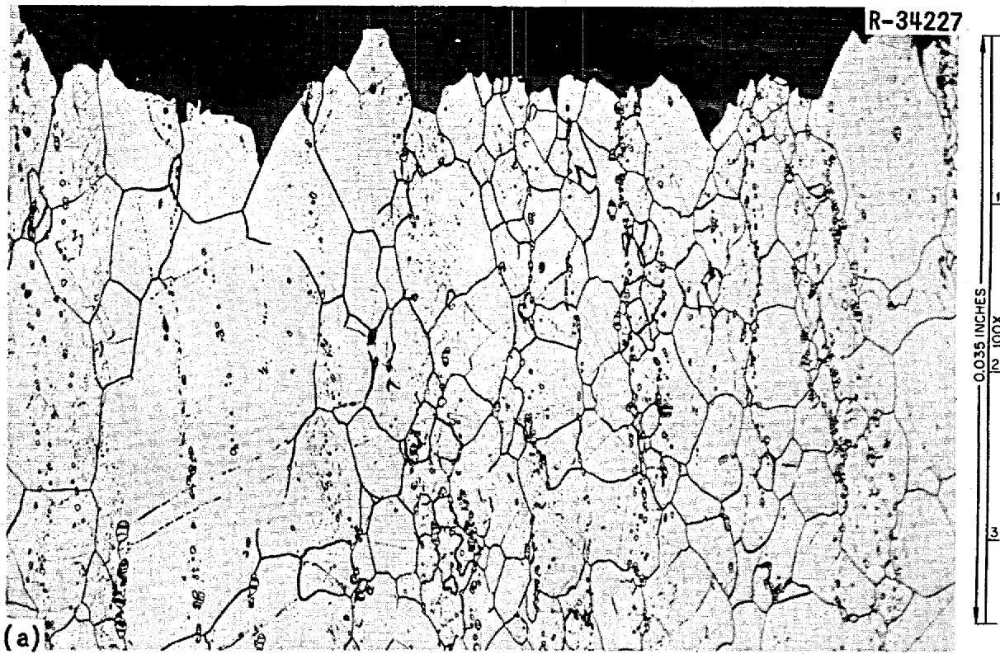

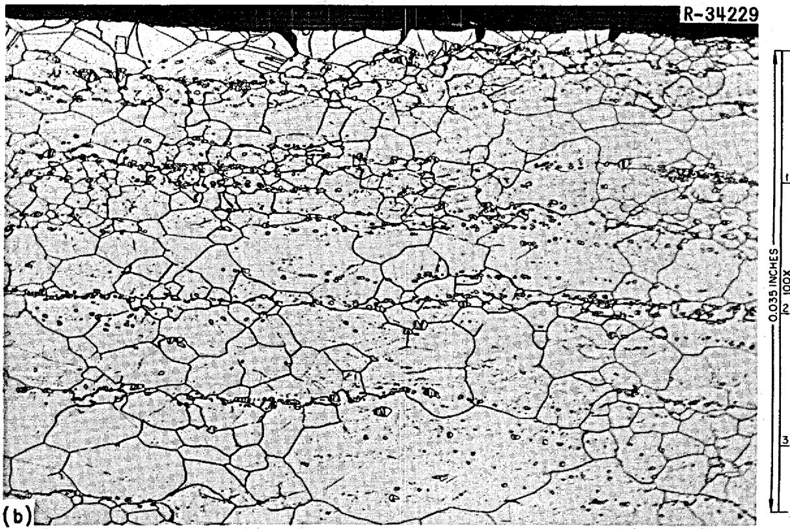  
Fig. 25. Photomicrographs of Surveillance Specimen D-16 from Heat 5081 Tested at $25^{\circ}\mathrm{C}$ and at a Strain Rate of $0.05\mathrm{min}^{-1}$ . (a) Fracture. (b) Edge of specimen about $1/4$ in. from fracture. Etchant: glyceria regia.

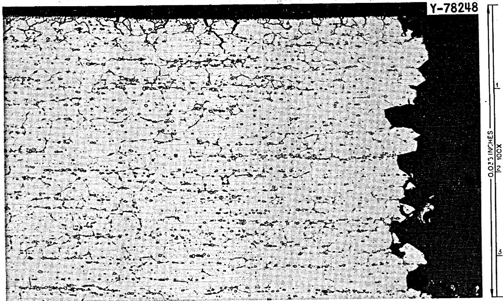  
Fig. 26. Photomicrograph of the Fracture of Control Specimen AC-17 from Heat 5081 Tested at $650^{\circ}\mathrm{C}$ and at a Strain Rate of $0.002\mathrm{min}^{-1}$ . Etchant: glyceria regia.

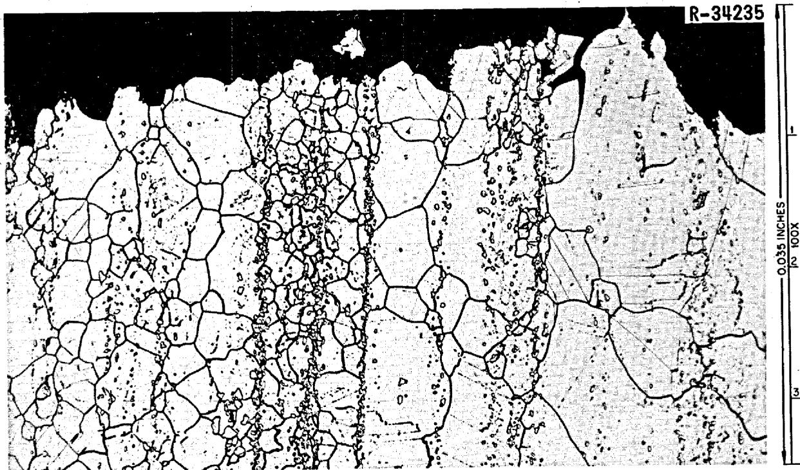  
Fig. 27. Fracture of Surveillance Specimen E-14 from Heat 5081 Tested at $650^{\circ}\mathrm{C}$ and at a Strain Rate of $0.002\mathrm{min}^{-1}$ . Etchant: glyceria regia.

The failure of the control material from heat 5085 was found to be predominantly intergranular (Fig. 28). However, the elongated grains attest to the large amount of strain that has occurred. The large precipitates have been identified as $\mathbf{M}_6\mathbf{C}$ , and they normally fracture when strained at temperatures less than about $500^{\circ}\mathrm{C}$ . The surveillance specimen from heat 5085 tested at $25^{\circ}\mathrm{C}$ is shown in Fig. 29. The failure is largely intergranular with numerous intergranular cracks in the microstructure. The edge of the specimen (Fig. 29b) is quite clean with no evidence of corrosion or material deposition. However, the part of the specimen that touched the graphite in the surveillance assembly was found to have a reaction product near the surface varying from 1 to 2 mils in depth (Fig. 30). This product was not distributed uniformly around the specimen and varied in form from a lamellar to a rope-like intergranular product. At $650^{\circ}\mathrm{C}$ the failure of the control specimen was predominantly intergranular (Fig. 31). The surface reaction product observed in specimens from the reactor where they were in contact with the graphite was also noted in the control specimens (Fig. 32). Although the micrographs that have been shown are for heat 5085, the surface reaction was also noted in heat 5081. Electron microprobe examination showed that this layer contained from 0.3 to 1.5 wt % C, indicating that there was some transfer of carbon from the graphite to the Hastelloy N where the two materials were in contact. Figure 33 shows the fracture of the surveillance specimen from heat 5085 that was tested at $650^{\circ}\mathrm{C}$ . The failure is predominantly intergranular with no metallographic evidence of plastic deformation.

Extraction replicas were made on the surveillance and control specimens. This technique involves depositing carbon on a polished surface of the specimen and then dissolving electrolytically the matrix in a solution of $10\%$ HCl in ethanol until the carbon falls free. The precipitates are not attacked by the solution, and they are held by the carbon. After suitable washing and drying, the replica can be examined in the electron microscope. Transmission electron micrographs can be made as well as selected area diffraction patterns for phase identification. An extraction replica of a control specimen from heat 5081 is shown in Fig. 34. The predominant feature is the relatively large precipitates that have been identified

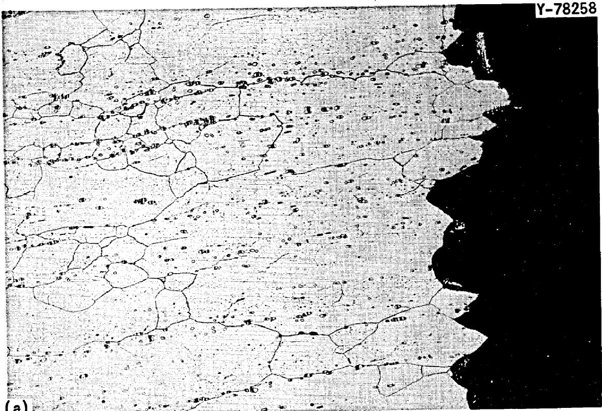  
0.035 INCHES 1w 100x

Fig. 28. Photomicrographs of Control Specimen DC-24 from Heat 5085 Tested at $25^{\circ}\mathrm{C}$ and at a Strain Rate of $0.05\mathrm{min}^{-1}$ . (a) Fracture. (b) Edge of specimen about $1/4$ in. from fracture. Etchant: glyceria regia.   
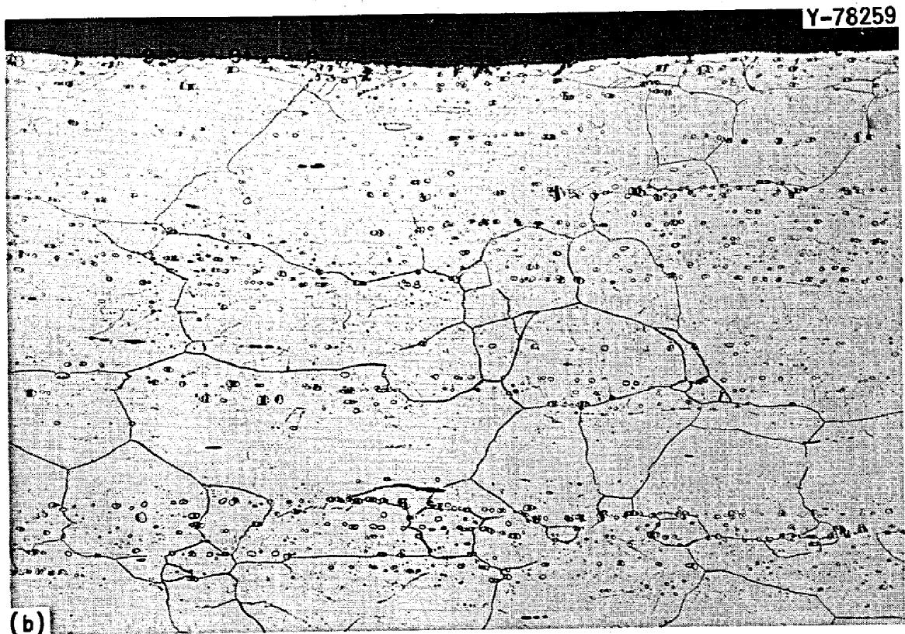  
0.03 INCHES 100x

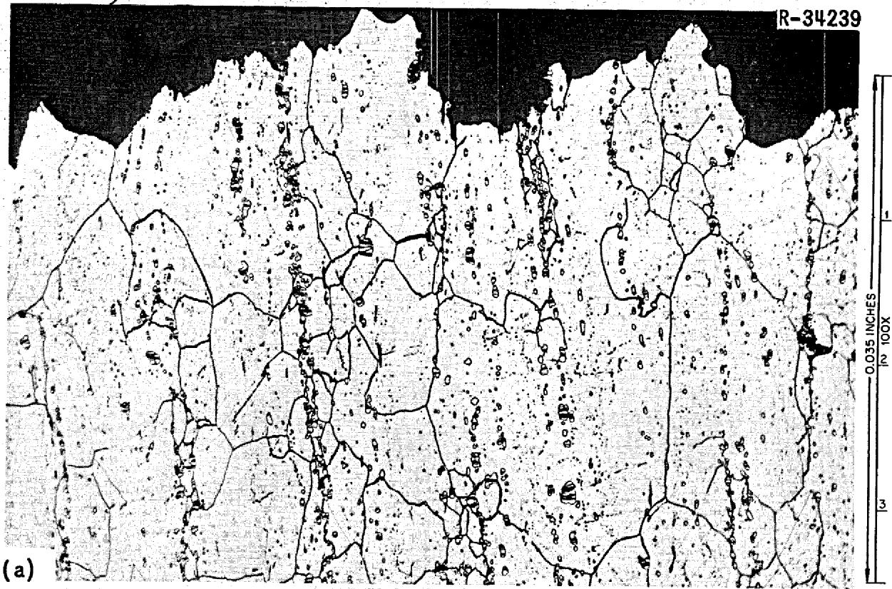

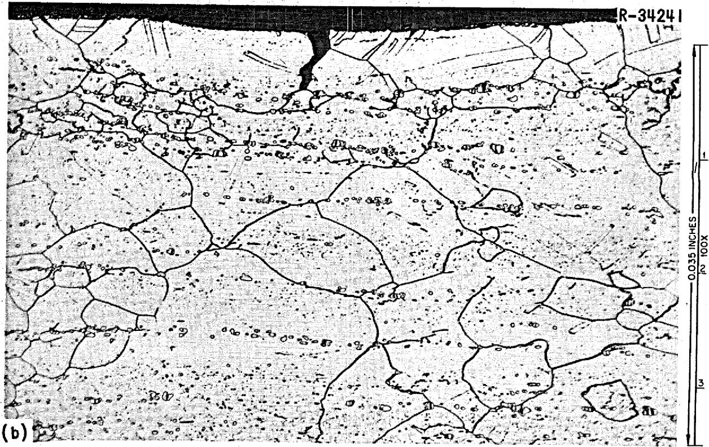  
Fig. 29. Photomicrographs of Surveillance Specimen A-16 from Heat 5085 Tested at $25^{\circ}\mathrm{C}$ and at a Strain Rate of $0.05\mathrm{min}^{-1}$ . (a) Fracture. (b) Edge of specimen about $1/4$ in. from fracture. Etchant: glyceria regia.

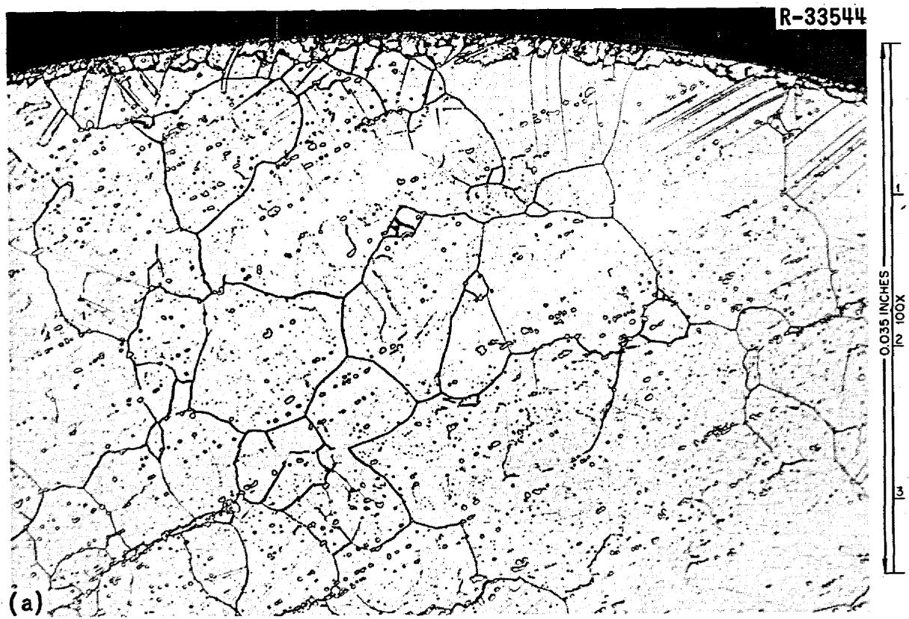

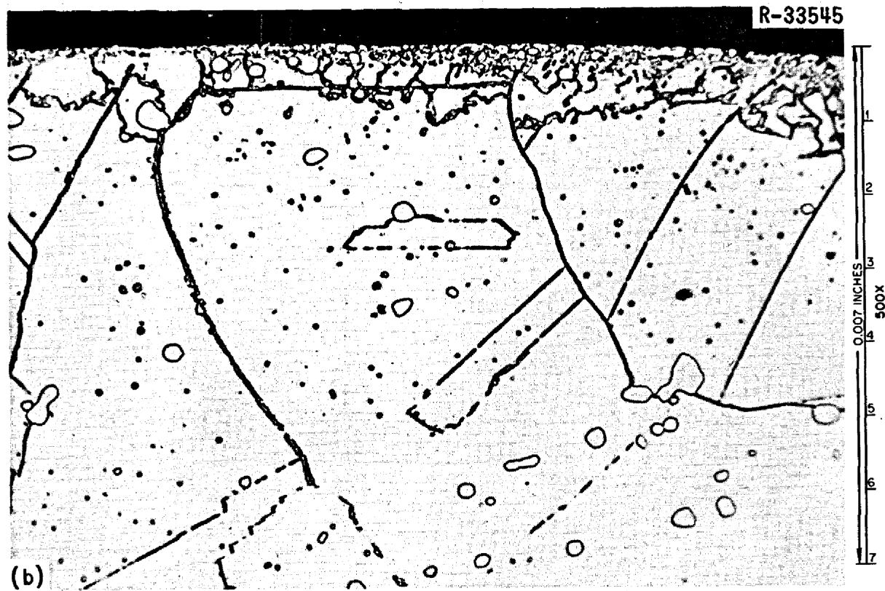  
Fig. 30. Cross Section of the Buttonhead of Surveillance Specimen A-16 from Heat 5085 Tested at $25^{\circ}\mathrm{C}$ . (a) $100 \times$ . (b) $500 \times$ .

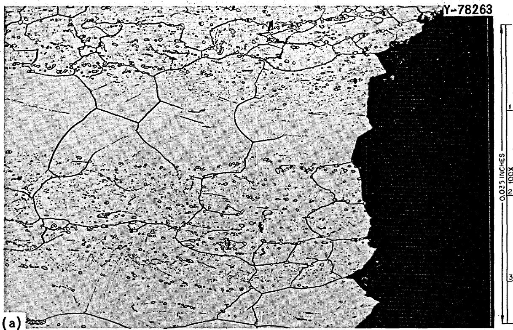

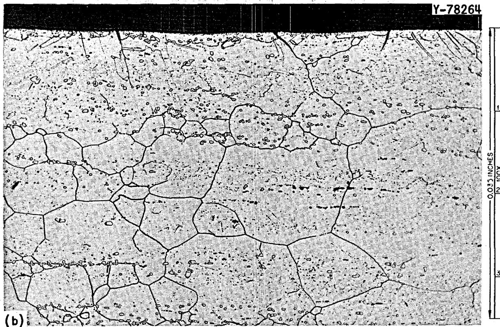  
Fig. 31. Photomicrographs of Control Specimen DC-25 from Heat 5085 Tested at $650^{\circ}\mathrm{C}$ and at a Strain Rate of $0.002\mathrm{min}^{-1}$ . (a) Fracture. (b) Edge of specimen about $1/4$ in. from fracture. Etchant: glyceria regia.

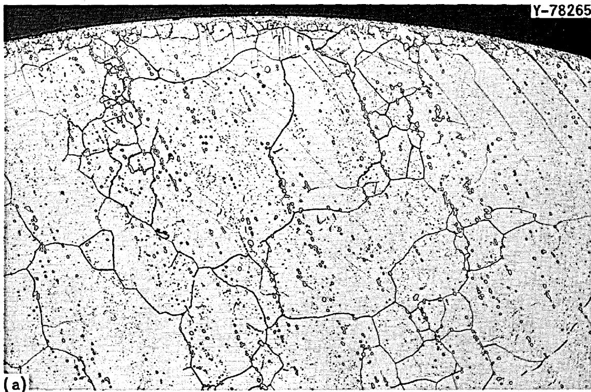  
0.03 INCHES 100x

Fig. 32. Photomicrographs of the Cross Section of the Buttonhead of Specimen DC-25. (a) $100 \times$ . (b) $500 \times$ . Etchant: glyceria regia.   
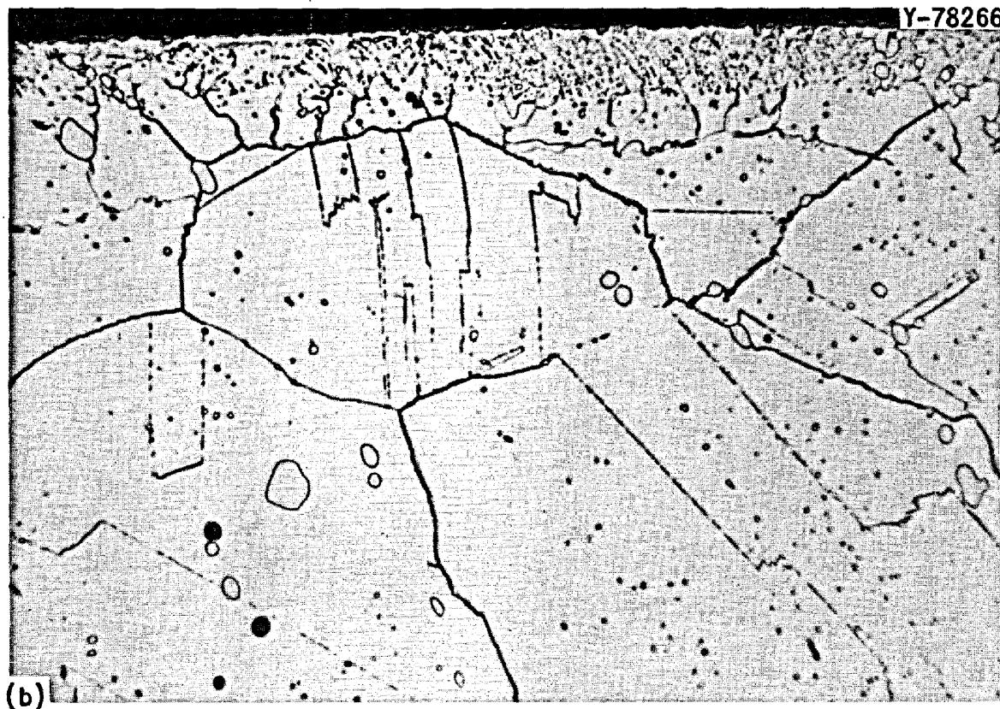  
0.007 INCHES

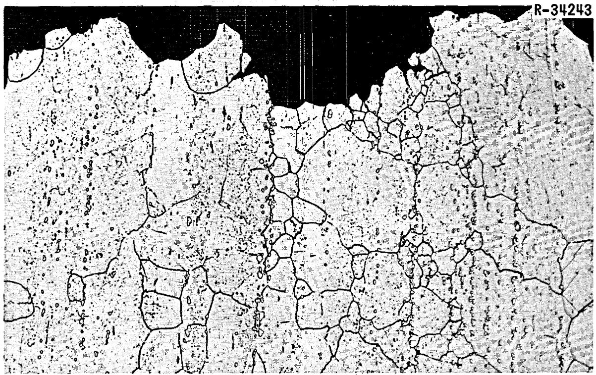

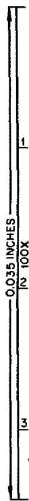  
Fig. 33. Fracture of Surveillance Specimen B-6 from Heat 5085 Tested at $650^{\circ}\mathrm{C}$ and at a Strain Rate of $0.002\mathrm{min}^{-1}$ . Etchant: glyceria regia.

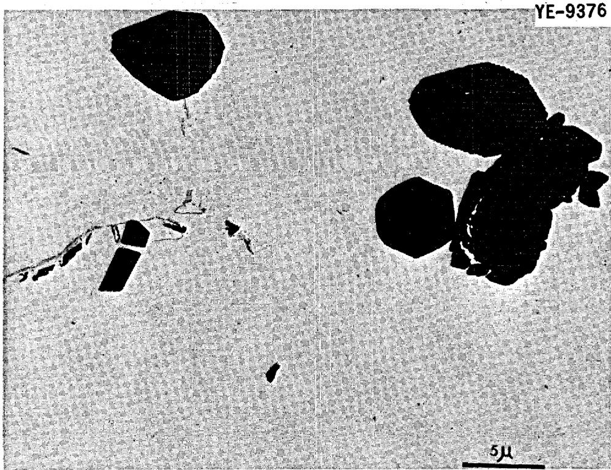  
Fig. 34. Extraction Replica from Control Specimen, Heat 5081.

as $\mathbf{M}_6\mathbf{C}$ . A replica is shown in Fig. 35 for a surveillance specimen from heat 5081. The large $\mathbf{M}_6\mathbf{C}$ particles are present, but there is a lot of fine intergranular precipitate that has also been identified as $\mathbf{M}_6\mathbf{C}$ . The irradiation appears to enhance the formation of the fine intergranular precipitate.

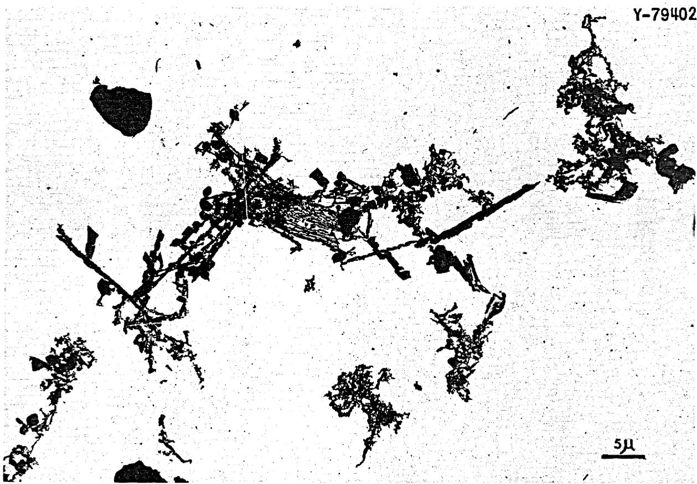  
Fig. 35. Extraction Replica From Surveillance Specimen, Heat 5081.

# DISCUSSION OF RESULTS

Because of the large amount of data presented, we will briefly recapitulate the most important observations.

1. The control specimens from both heats of Hastelloy N exhibited the characteristic ductility minimum in the temperature range of 600 to $700^{\circ}\mathrm{C}$ . The ductility at various temperatures was reasonably insensitive to strain rate except near $650^{\circ}\mathrm{C}$ where the ductility decreased with decreasing strain rate.   
2. After irradiation the tensile ductility was reduced significantly. There was an unexpected reduction in the room temperature ductility with fracture strains in the range of 35 to $40\%$ being observed. Intergranular fractures were obtained at room temperature in heat 5085. The fracture strain generally became lower as the test temperature was increased and the strain rate decreased.   
3. At elevated temperatures (400-850°C) the fracture strains were equivalent for the two heats of surveillance specimens and were found to be the same as those observed previously in other experiments where molten salt was not present.   
4. Creep-rupture tests run on unirradiated specimens indicated that the pretest anneal of 2 hr at $900^{\circ}\mathrm{C}$ improved the rupture strength and ductility over that of the material in the as-received condition. Thus, the stress-relieving anneals at $871^{\circ}\mathrm{C}$ used in fabricating the MSRE improved the base properties. However, the long exposure of the control specimens at $650^{\circ}\mathrm{C}$ (operating temperature of the MSRE) caused slight reductions in rupture strength and ductility.   
5. The creep-rupture life of the surveillance specimens was less than that of the control specimens, the effect being greater at the higher stress levels. Heat 5085 was affected much as we had observed previously in other experiments on this same heat and other MSRE heats. Heat 5081 exhibited a significant but smaller effect.   
6. The creep-rupture ductility of irradiated Hastelloy N goes through a minimum value for a rupture life of from 1 to 10 hr. The fracture strain increases as the rupture life increases (or the stress level decreases). Heat 5081 exhibited appreciably higher fracture strains

than did heat 5085. Heat 5065 (material used for the top and bottom heads of the MSRE) exhibited the lowest ductility of any heat examined to date.   
7. A series of tensile tests indicated that prestraining at temperatures over the range of 400 to $850^{\circ}\mathrm{C}$ did not appreciably lower the fracture strain of the material when tested to failure at $650^{\circ}\mathrm{C}$ .   
8. Neither the control nor the surveillance specimens showed any evidence of corrosion. However, there was a surface product from 0.001 to 0.002 in. in depth that formed where the Hastelloy N and graphite were in contact. Microprobe studies indicate that this layer is high in carbon, and hence the reaction product is probably a metal carbide.   
9. Extraction replicas indicated that more intergranular precipitate formed in the surveillance specimens than in the controls. Thus, irradiation must enhance the nucleation and growth of the precipitate (identified as $\mathbf{M}_6\mathbf{C}$ ).   
The changes in the unirradiated properties of these heats of Hastelloy N have been demonstrated previously.7 However, these changes are relatively small, and the properties do not appear to be deteriorating enough for concern. They are probably due to the solution and reprecipitation of $\mathbf{M}_{6}\mathbf{C}$ .   
The effects of irradiation on Hastelloy N are drastic, but pretty much as expected. Previous work had shown a reduction in the rupture ductility in postirradiation tensile and creep-rupture tests at elevated temperatures.[8,9] These effects are attributed to the helium produced by the $^{10}\mathrm{B}(n,\alpha)$ transmutation. Many of the details of the role of helium in metals have been reviewed by Harries,[10] and we have applied these

ideas to Hastelloy N in two-recent papers. $^{11,12}$ Hence, we shall not discuss the mechanism whereby helium alters the properties. There are some questions concerning the comparison of thermal flux measurements for the MSRE and ORR. However, about 30 to $40\%$ of the $^{10}\mathrm{B}$ was transmuted in the surveillance specimens with a resulting atomic fraction of helium of about $1 \times 10^{-5}$ . We feel that, at least at low strain rates, the deterioration of properties saturates at helium levels an order of magnitude lower. Hence, the exact helium level is rather academic, and the high-temperature properties have probably stabilized unless continued exposure at $650^{\circ}\mathrm{C}$ causes metallurgical changes that are detrimental. The drop in ductility at low temperatures is somewhat surprising and bears watching. However, the ductility levels are still quite reasonable.

The mechanical properties appear unaffected by the salt. This is evidenced by the excellent agreement between the results of tests on materials irradiated in the MSRE and the ORR (helium environment). The small amount of carburization that occurred in the Hastelloy N which was in contact with graphite was not surprising and did not extend to alarming depths.

The very low stress levels in the MSRE during normal operation, $^{13}$ coupled with the experimental observation that the deterioration of the creep-rupture properties (rupture life and ductility) due to irradiation becomes smaller at low stresses, indicate that transient conditions offer the greatest risk of failure. Thus, with reasonable care in operation, it does not appear at this time that the life of the MSRE will be limited by radiation damage to the Hastelloy N.

# SUMMARY AND CONCLUSIONS

We have tested the first group of surveillance specimens from the MSRE core. They were removed after 7800 Mwhr of operation during which the specimens were held at $645 \pm 10^{\circ}\mathrm{C}$ for 4800 hr and accumulated a thermal dose of $1.3 \times 10^{20}$ neutrons/cm $^2$ . Specimens were exposed to molten salt to duplicate the thermal history of the surveillance specimens. Two heats of material, 5081 and 5085, were used with both showing similar deterioration of tensile ductility at elevated temperatures. However, heat 5085 (cylindrical core vessel) exhibited a greater loss of creep-rupture strength and ductility. The property changes were quite similar to those that had been observed for these same materials after irradiation in the ORR where the environment was helium. There was a significant reduction in the low-temperature ductility, but fracture strains of 35 to $40\%$ were still obtained. This change in properties is probably due to the formation of intergranular $\mathbf{M}_{6}\mathbf{C}$ .

We noted the formation of a carbon-rich layer on the Hastelloy N where it was in contact with graphite. This layer was only 1 to 2 mils deep and probably would have little effect on the mechanical properties of thick sections. Sacrificial metal shims were placed in the MSRE where the graphite and Hastelloy N were in contact, so the noted carburization should present no problems in the MSRE.

The mechanical properties of the Hastelloy N appear to be quite adequate for the normal operating conditions of the MSRE. However, transients should be prevented that expose the material to high stresses or strains.

# ACKNOWLEDGMENTS

The author is indebted to numerous persons for assistance in this study.

W. H. Cook and A. Taboada - Design of surveillance assembly and insertion of specimens.

W. H. Cook and H. B. Piper - Flux measurements.

J. R. Weir, Jr., and W. H. Cook - Review of manuscript.

R. E. Gehlbach - Prepared the extraction replicas.   
E. J. Lawrence and J. L. Griffith - Assembled surveillance and control specimens in fixture.   
P. Haubenreich and MSRE Operation Staff - Exercised extreme care in inserting and removing the surveillance specimens.   
E. M. King and Hot Cell Operation Staff - Developed techniques for cutting long rods into individual specimens, determined specimen straightness, and offered assistance in running creep and tensile tests.   
B. C. Williams, B. McNabb, N. O. Pleasant - Ran tensile and creep tests on surveillance and control specimens.   
E. M. Thomas, V. G. Lane, and J. Feltner - Processed test data.   
H. R. Tinch and E. Lee - Metallography on control and surveillance specimens. Metals and Ceramics Reports Office - Preparation of manuscript. Graphic Arts - Preparation of drawings.

）

A

$\left( {x + 2}\right) \left( {x + 3}\right)  = {12}$

）

$\left( {x{t}^{2} + x}\right) a + b{t}^{2} = 7\left| {8y}\right|$

# INTERNAL DISTRIBUTION

1-2. Central Research Library   
3-4. ORNL - Y-12 Technical Library Document Reference Section   
5-14. Laboratory Records Department   
15. Laboratory Records, ORNL R.C.   
16. ORNL Patent Office   
17. R. K. Adams   
18. G. M. Adamson, Jr.   
19. R. G. Affel   
20. L. G. Alexander   
21. R.F.Apple   
22. C. F. Baes   
23. J. M. Baker   
24. S.J.Ball   
25. W. P. Barthold   
26. H. F. Bariman   
27. S. E. Beall   
28. M. Bender   
29. E. S. Bettis   
30. F. F. Blankenship   
31. R. E. Blanco   
32. J. O. Blomeke   
33. E. E. Bloom   
34. R. Blumberg   
35. E.G. Bohlmann   
36. C. J. Borkowski   
37. G. E. Boyd   
38. J. Braunstein   
39. M. A. Bredig   
40. R. B. Briggs   
41. H. R. Bronstein   
42. G. D. Brunton   
43. D. A. Canonico   
44. S. Cantor   
45. W. L. Carter   
46. G. I. Cathers   
47. J. M. Chandler   
48. E. I. Compere   
49. W. H. Cook   
50. L. T. Corbin   
51. J. L. Crowley   
52. F. L. Culler   
53. J. E. Cunningham   
54. J.M.Dale   
55. D. G. Davis   
56. J. H. Devan

57. S. J. Ditto   
58. A. S. Dworkin   
59. J. R. Engel   
60. E. P. Epler   
61. D. E. Ferguson   
62. L. M. Ferris   
63. A. P. Fraas   
64. H. A. Friedman   
65. J. H Frye, Jr.   
66. C. H. Gabbard   
67. R. B. Gallaher   
68. H. E. Goeller   
69. W. R. Grimes   
70. A. G. Grindell   
71. R. H. Guyman   
72. B. A. Hannaford   
73. P. H. Harley   
74. D. G. Harman   
75. W. O. Harms   
76. C. S. Harrill   
77. P. N. Haubenreich   
78. F. A. Heddleson   
79. P. G. Herndon   
80. J. R. Hightower   
83. M.R.Hill   
84. H. W. Hoffman   
85. R.W.Horton   
86. T. L. Hudson   
87. H. Inouye   
88. W. H. Jordan   
89. P. R. Kasten   
90. R. J. Kedl   
91. M. T. Kelley   
92. M. J. Kelly   
93. C. R. Kennedy   
94. T. W. Kerlin   
95. H. T. Kerr   
96. S. S. Kirlis   
97. A. I. Krakoviak   
98. J. W. Krewson   
99. C. E. Iamb   
00. J.A. Lane   
O1. R. B. Lindauer   
02. A. P. Litman   
03. E. L. Long, Jr.   
24. M. I. Lundin

105. R. N. Lyon

106. H. G. MacPherson

107. R.E. MacPherson

108. C. D. Martin

109. C. E. Mathews

110. C. L. Matthews

111. R.W. McClung

112-116. H. E. McCoy, Jr.

117. H. F. McDuffie

118. C. K. McGlothlan

119. C. J. McHargue

120. L. E. McNeese

121. A. S. Meyer

122. R. L. Moore

123. J. P. Nichols

124. E. L. Nicholson

125. I. C. Oakes

126. P. Patriarca

127. A.M.Perry

128. H. B. Piper

129. B. E. Prince

130. J. L. Redford

131. M. Richardson

132. R. C. Robinson

133. H. C. Roller

134-138. M. W. Rosenthal

139. H. C. Savage

140. W. F. Schaffer

141. C. E. Schilling

142. Dunlap Scott

143. H. E. Seagren

144. C. E. Sessions

145. J. H. Shaffer

146. G. M. Slaughter

147. A. N. Smith

148. F. J. Smith

149. G.P.Smith

150. O. I. Smith

151. P. G. Smith

152. W. F. Spencer

153. I. Spiewak

154. R. C. Steffy

155. H. H. Stone

156. J.R.Tallackson

157. E. H. Taylor

158. R. E. Thoma

159. J. S. Watson

160. C. F. Weaver

161. B. H. Webster

162. A. M. Weinberg

163. J. R. Weir, Jr.

164. W. J. Werner

165. K.W. West

166. M. E. Whatley

167. J. C. White

168. L. V. Wilson

169. G. Young

170. H. C. Young

# EXTERNAL DISTRIBUTION

171. G. G. Allaria, Atomics International

172. J. G. Asquith, Atomics International

173. D. F. Cope, RDT, SSR, AEC, Oak Ridge National Laboratory

174. H. M. Dieckamp, Atomics International

175. A. Giambusso, AEC, Washington

176. J. L. Gregg, Bard Hall, Cornell University

177. F. D. Haines, AEC, Washington

178. C. E. Johnson, AEC, Washington

179. W. L. Kitterman, AEC, Washington

180. W. J. Larkin, AEC, Oak Ridge Operations

181-182. T. W. McIntosh, AEC, Washington

183. A. B. Martin, Atomics International   
184. D. G. Mason, Atomics International   
185. G. W. Meyers, Atomics International   
186. D. E. Reardon, AEC, Canoga Park Area Office   
187. R. M. Roth, AEC, Oak Ridge Operations

188. M. Shaw, AEC, Washington   
189. J. M. Simmons, AEC, Washington   
190. W. L. Smalley, AEC, Washington   
191. S. R. Stamp, AEC, Canoga Park Area Office   
192. D. K. Stevens, AEC, Washington   
193. R. F. Sweek, AEC, Washington   
194. A. Taboada, AEC, Washington   
195. R. F. Wilson, Atomics International   
196. Laboratory and University Division, AEC, Oak Ridge Operations   
-211. Division Technical Information Extension