3445605134654

#

#IONAL LABORATORY

operated by

# UNION CARBIDE CORPORATION

# NUCLEAR DIVISION

for the

U.S. ATOMIC ENERGY COMMISSION

ORNL-TM-2021,Vol.1

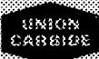

1

EFFECT OF ALLOYING ADDITIONS ON CORROSION BEHAVIOR OF NICKEL -

MOLYBDENUM ALLOYS IN FUSED FLUORIDE MIXTURES (Thesis)

Jackson Harvey DeVan

OKRIGE MTRX15-0305AOR

CEN

LIBRAY LOAN COPTY

DO NOT USE THE CODE THIS IS EXCEL

l you wish someone else can be on thisVery unique and unique game with documentand the history will encourage you

This report is a portion of a thesis submitted to the Graduate Council of the University of Tennessee in partial fulfillment of the requirements for the degree of Master of Science.

# LEGAL NOTICE

This report was prepared as an account of Government sponsored work. Neither the United States, nor the Commission, nor any person acting on behalf of the Commission:

A. Makes any warranty or representation, expressed or implied, with respect to the accuracy, completeness, or usefulness of the information contained in this report, or that the use of any information, apparatus, method, or process disclosed in this report may not infringe privately owned rights; or   
B. Assumes any liabilities with respect to the use of, or for damages resulting from the use of any information, apparatus, method, or process disclosed in this report.

As used in the above, "person acting on behalf of the Commission" includes any employee or contractor of the Commission, or employees of such contractor, to the extent that such employee or contractor of the Commission, or employee of such contractor prepares, disseminates, or provides access to, any information pursuant to his employment or contract with the Commission, or his employment with such contractor.

Contract No. W-7405-eng-26

METALS AND CERAMICS DIVISION

EFFECT OF ALLOYING ADDITIONS ON CORROSION BEHAVIOR OF NICKELMOLYBDENUM ALLOYS IN FUSED FLUORIDE MIXTURES

Jackson Harvey DeVan

MAY 1969

This report is a portion of a thesis submitted to the Graduate Council of the University of Tennessee in partial fulfillment of the requirements for the degree of Master of Science.

OAK RIDGE NATIONAL LABORATORY

Oak Ridge, Tennessee

operated by

UNION CARBIDE CORPORATION

for the

U.S. ATOMIC ENERGY COMMISSION

# CONTENTS

Page

Abstract 1

Introduction 1

Review of Related Work 3

Corrosion by Fluoride Mixtures 3

Corrosion Reactions 3

Reduction of $\mathbf{U}\mathbf{F}_4$ by Chromium 4

Corrosion of Nickel-Molybdenum Alloys. 6

Materials and Procedures 8

Test Materials 8

Test Equipment 8

Salt Preparation 12

Operating Procedures 13

Test Examination 13

Results and Discussion 15

Chromium 15

Corrosion-Product Concentrations 15

Metallographic Results 21

Aluminum 24

Corrosion-Product Concentrations 24

Metallographic Results 25

Titanium 28

Corrosion-Product Concentrations 28

Metallographic Results 29

Vanadium 30

Corrosion-Product Concentrations 30

Metallographic Results 30

Iron 30

Corrosion-Product Concentrations 30

Metallographic Results 32

Page

Niobium 32

Corrosion-Product Concentrations 32   
Metallographic Results 33

Tungsten 34

Corrosion-Product Concentrations 34   
Metallographic Results 36

Relative Thermodynamic Stabilities of Alloying Constituents 36

General Discussion of Alloying Effects 38

Summary and Conclusions 40

Acknowledgments 42

# ABSTRACT

Fused fluoride mixtures containing $\mathrm{UF_4}$ have been developed as fuel solutions for high-temperature nuclear reactors. To develop container materials for such mixtures, we investigated the corrosion properties of nickel-molybdenum alloys with various solid-solution strengthening additions. These evaluations utilized thermal convection loops which circulated salt mixtures between a hot-zone temperature of $815^{\circ}\mathrm{C}$ and a cold-zone temperature of $650^{\circ}\mathrm{C}$ .

The alloys selected for study contained 17 to $20\%$ Mo and various percentages of Cr, Al, Ti, V, Fe, Nb, and W. Loops of individual alloys were exposed to the salt mixture NaF-LiF-KF-UF $_4$ (11.2-45.3-41.0-2.5 mole %) for periods of 500 and 1000 hr. Measurements of the concentrations of corrosion products in after-test salt samples indicated the corrosion susceptibility of alloying additions to increase in this order: Fe, Nb, V, Cr, W, Ti, and Al. However, metallographic examinations of loop surfaces showed relatively light attack for all alloys except those containing combined additions of aluminum and titanium or aluminum and chromium.

A nickel-base alloy containing $17\%$ Mo, $7\%$ Cr, and $5\%$ Fe, designated Hastelloy N, was found to afford the best combination of strength and corrosion resistance among the alloy compositions tested.

# INTRODUCTION

Molten fluorides of uranium, thorium, or plutonium, in combination with other fluoride compounds, have wide applicability as fuels for the production of nuclear power. Because of their high boiling points, these mixtures can be contained at low pressures even at extremely high operating temperatures. Their chemical and physical properties impart additional advantages such as excellent stability under irradiation and large

solubility ranges for both uranium and thorium. These factors have prompted design studies of molten fluoride fuel systems in conjunction with thorium-uranium thermal breeders, uranium-plutonium converters, and uranium burners.

The development of reactors which incorporate a circulating fluoride salt is predicated on the availability of a construction material which will contain the salt over long time periods and also afford useful structural properties. The container material must also be resistant to air oxidation, be easily formed and welded into relatively complicated shapes, and be metallurgically stable over a wide temperature range.

In order to provide a material for initial reactor studies, several commercially available high-temperature alloy systems were evaluated with respect to the above requirements. As a result of these studies, Inconel, a nickel-base alloy containing 15 wt $\%$ Cr and 7 wt $\%$ Fe, was found to afford the best combination of desired properties and was utilized for the construction of the Aircraft Reactor Experiment. $^{2}$ Extensive corrosion tests, $^{3,4}$ as well as posttest examinations of the ARE, $^{5}$ confirmed the suitability of Inconel as a container material for relatively short-term fluoride salt exposures. Corrosion rates encountered with this alloy at temperatures above $700^{\circ}\mathrm{C}$ , however, were excessive for long-term use with most fluoride fuel systems.

Utilizing experience gained in corrosion testing of commercial alloys, we initiated an alloy development program to provide an advanced container material for fluoride fuel reactor systems. The reference alloy system was composed of nickel with a primary strengthening addition of $15 - 20\%$ Mo. This composition afforded exceptional resistance to fluoride attack but lacked sufficient mechanical strength and oxidation

resistance at desired operating temperatures. To augment these latter properties, additions of various solid-solution alloying agents were evaluated, among them Cr, Al, Ti, Nb, Fe, V, and W. An optimum alloy composition was selected on the basis of parallel investigations of the mechanical and corrosion properties which were imparted by each of these additions. The composition best suited to reactor use was determined to be within the range 15-17 wt % Mo, 6-8 wt % Cr, 4-6 wt % Fe, 0.04-0.08 wt % C, balance Ni. Subsequent studies of the alloy, designated Hastelloy N, have shown it to be extremely well suited for applications demanding long-term compatibility with fluoride salts in the temperature range 650-800°C.

The present research was concerned with the corrosion effects resulting from additions of alloying elements to the nickel-molybdenum system and an analysis of the thermodynamics of the corrosion process as indicated by these alloying effects.

# REVIEW OF RELATED WORK

# Corrosion by Fluoride Mixtures

# Corrosion Reactions

The corrosion of nickel-base alloys, containing iron and chromium, by fluoride fuel mixtures has been found to result from a combination of the following types of oxidation reactions:

1. Reactions involving impurities in the salt

$$
2 \mathrm {H F} + \mathrm {C r} = \mathrm {C r F} _ {2} + \mathrm {H} _ {2}, \tag {1}
$$

$$
\mathrm {N i F} _ {2} + \underline {{\mathrm {C r}}} = \mathrm {C r F} _ {2} + \underline {{\mathrm {N i}}}, \tag {2}
$$

$$
\mathrm {F e F} _ {2} + \underline {{\mathrm {C r}}} = \mathrm {C r F} _ {2} + \underline {{\mathrm {F e}}}. \tag {3}
$$

2. Reactions involving impurities in or on the metal, for example

$$
2 \mathrm {N i O} + \mathrm {Z r F} _ {4} = \mathrm {Z r O} _ {2} + 2 \mathrm {N i F} _ {2} \tag {4}
$$

followed by reaction (2).

3. Reactions involving components in the salt

$$
2 \mathrm {U F} _ {4} + \mathrm {C r} = \mathrm {C r F} _ {2} + 2 \mathrm {U F} _ {3}, \tag {5}
$$

$$
3 \mathrm {U F} _ {4} + \underline {{\mathrm {C r}}} = \mathrm {C r F} _ {3} + 3 \mathrm {U F} _ {3}. \tag {6}
$$

The extent of the first four of these reactions, which proceed strongly to the right and to completion rapidly, can be reduced by maintaining low impurity concentrations in the salt and on the surface of the metal. Reactions (5) and (6), on the other hand, are indigenous to fluoride systems which derive their usefulness through the containment of $\mathrm{UF_4}$ . While the role of chromium has been investigated extensively in connection with these reactions, $^8$ considerably less information is available regarding the thermodynamics of these reactions for the other alloying elements which were of interest in the present study.

# Reduction of $\mathbf{U}\mathbf{F}_{4}$ by Chromium

The reaction of $\mathsf{UF}_4$ with chromium is found to be strongly influenced by the reaction medium employed. In melts composed principally of NaF-ZrF $_4$ or NaF-BeF $_2$ , the reaction produces only divalent chromium, that is,

$$
2 \mathrm {U F} _ {4} + \underline {{\mathrm {C r}}} = 2 \mathrm {U F} _ {3} + \mathrm {C r F} _ {2}. \tag {7}
$$

However, in the case of NaF-KF-LiF-UF $_4$ mixtures used for this investigation, the reaction between chromium and UF $_4$ produces both divalent and

trivalent chromium. At equilibrium, approximately $80\%$ of the total chromium ions in the mixtures are observed to be trivalent, giving the net reaction

$$
2. 8 \mathrm {U F} _ {4} + \underline {{\mathrm {C r}}} = 0. 2 \mathrm {C r F} _ {2} + 0. 8 \mathrm {C r F} _ {3} + 2. 8 \mathrm {U F} _ {3}. \tag {8}
$$

The equilibrium constant for this reaction is given by

$$
K _ {\alpha} = \frac {\left(\alpha_ {C r F _ {2}}\right) ^ {0 . 2} \left(\alpha_ {C r F _ {3}}\right) ^ {0 . 8} \left(\alpha_ {U F _ {3}}\right) ^ {2 . 8}}{\left(\alpha_ {U F _ {4}}\right) ^ {2 . 8} \left(\alpha_ {C r}\right)} \tag {9}
$$

where $\alpha$ represents thermodynamic activity. Because of the relatively small concentrations of $\mathrm{CrF_2}$ and $\mathrm{UF_3}$ which are attained in the salt solutions at equilibrium, the activities of each of these components can be closely approximated by their mole fractions, in accordance with Henry's law. Thus, for a salt system of fixed $\mathrm{UF_4}$ concentration, assuming the reference states for salt components to be the infinitely dilute solution,

$$
K _ {\alpha} = \frac {\left(\mathrm {N} _ {\mathrm {C r F} _ {2}}\right) ^ {0 . 2} \left(\mathrm {N} _ {\mathrm {C r F} _ {3}}\right) ^ {0 . 8} \left(\mathrm {N} _ {\mathrm {U F} _ {3}}\right) ^ {2 . 8}}{\left(\alpha_ {\mathrm {U F} _ {4}}\right) ^ {2 . 8} \left(\alpha_ {\underline {{\mathrm {C r}}}}\right)} \tag {10}
$$

For a system initially containing no $\mathbf{U}\mathbf{F}_3$ , $\mathrm{CrF_2}$ , or $\mathrm{CrF_3}$ , it follows that $\mathrm{N}_{\mathrm{CrF_2}} = 1 / 4\mathrm{N}_{\mathrm{CrF_3}} = 1 / 14\mathrm{N}_{\mathrm{UF_3}}$ . In such systems where the change in $\mathbf{U}\mathbf{F}_4$ concentration is small, Eq. (9) reduces to

$$
\left(\mathrm {N} _ {\mathrm {C r F} _ {2}} + \mathrm {N} _ {\mathrm {C r F} _ {3}}\right) = \mathrm {K} _ {\mathrm {N}} \alpha_ {\underline {{\mathrm {C r}}}} ^ {5 / 1 9} \tag {11}
$$

where

$$
\mathrm {K} _ {\mathrm {N}} = 5 \left(\frac {\mathrm {K} _ {\alpha}}{4}\right) ^ {4 / 1 9} \left(\frac {\alpha_ {\mathrm {U F} _ {4}}}{1 4}\right) ^ {1 4 / 1 9}.
$$

The constant $\mathbf{K}_{\mathbb{N}}$ has been experimentally determined for the mixture LiF-KF-NaF-UF4 (11.2-41.0-45.3-2.5 mole %) by equilibrating it with pure chromium ( $\alpha_{\mathrm{Cr}}^{\circ} = 1$ ) at 600 and $800^{\circ}\mathrm{C}$ (ref. 8). Under these conditions, the constant is equivalent in value to the mole fraction of chromium ions in the salt at equilibrium. The measured values of $\mathbf{K}_{\mathbb{N}}$ are listed in Table 1.

Table 1. Equilibrium Concentrationsa of Chromium Fluorides for the Reaction of Pure Chromium with UF4   

<table><tr><td rowspan="2">Equilibration Temperature (°C)</td><td colspan="2">Concentration of Chromium Ions in NaF-LiF-KF-UF4(11.2-41.0-45.3-2.5 mole %)</td></tr><tr><td>ppm</td><td>mole fraction (KN)</td></tr><tr><td>600</td><td>1100</td><td>1.0 × 10-3</td></tr><tr><td>800</td><td>2600</td><td>2.4 × 10-3</td></tr></table>

aJ. D. Redman, ANP Quart. Progr. Rept. Dec. 31, 1957, ORNL-2440, pp. 78-82.

Because the chromium- $\mathrm{UF_4}$ reaction is temperature dependent, chemical equilibrium between these two components is precluded in systems of uniform alloy composition where the circulating salt continually experiences a temperature change. In such systems chromium tends to be continually removed from hotter portions and deposited in cooler portions. A theory relating the rate of this movement to the operating parameters of the container system has been formulated by Evans.[9]

# Corrosion of Nickel-Molybdenum Alloys

Because of the oxidation of chromium by fuel-bearing fluoride salts, alloys employing large percentages of this element were not satisfactory

as container materials except at temperatures where diffusion rates in the alloys were relatively low. Accordingly, evaluations were made of several commercial alloys in which chromium was not employed as a major alloying addition. Based on these tests, alloys of nickel and molybdenum appeared to offer the most promising container system for achieving relatively high reactor operating temperatures. Unfortunately, commercially available nickel-molybdenum alloys which exhibited excellent corrosion properties were not well suited to contemplated reactor systems because of three adverse characteristics: (1) poor fabricability; (2) a tendency to age-harden and embrittle at service temperatures between 650 and $815^{\circ}\mathrm{C}$ (ref. 10); and (3) poor resistance to oxidation by air at elevated temperatures. The scale formed on exposure of these alloys to high-temperature air was of the type NiMoO₄, which upon thermal cycling between 760 and $350^{\circ}\mathrm{C}$ underwent a phase transformation and spalled as a consequence of a resultant volume change.[11]

By means of an alloy development program, however, it was considered plausible to eliminate the undesirable features of the commercial materials while retaining their inherent corrosion resistance. The initial objective of this program was to provide an alloy which did not embrittle under the thermal treatments imposed by reactor operation. By experimenting with various compositions of binary nickel-molybdenum alloys, it was determined that lowering the molybdenum concentration to a level of $15 - 17\%$ served to avoid detrimental age-hardening effects in the alloy system.[12] Although such an alloy system was satisfactory from the standpoint of corrosion resistance, it was necessary to augment the oxidation and strength characteristics of the system through additional solid-solution alloying agents. The corrosion effects which resulted from these additions were the subjects of the present study.

# MATERIALS AND PROCEDURES

# Test Materials

The nickel-molybdenum alloy compositions selected for study were supplied by the Metals and Ceramics Division at ORNL and, under subcontract agreements, by Battelle Memorial Institute and Superior Tube Company. Alloys furnished by ORNL were induction-melted under vacuum, while those furnished by subcontractors were induction-melted in air using a protective slag. Each alloy heat, which ranged in weight from 12 to 100 lb, was either forged or extruded into a 3-in.-diam tube blank and was subsequently drawn into 1/2-in.-OD seamless tubing by the Superior Tube Company. The cold-drawn tubing was annealed at $1120^{\circ}\mathrm{C}$ . Table 2 lists the experimental alloy compositions used for this corrosion study.

# Test Equipment

The method selected to evaluate the corrosion properties of these alloys was based on the following considerations:

1. The method necessarily had to be tailored to the use of relatively small quantities of material, since it was practical to produce only small heats of the many alloys desired for study.   
2. Tubing was considered to be a highly desirable form in which to test the material, since production of the material in this form was carried out as an adjunct to evaluating the fabricability of each alloy.   
3. Previous demonstrations of the effects of temperature gradient in the salt and the salt flow rate on the corrosion behavior of container materials in fluorides made it mandatory that corrosion tests be conducted under dynamic conditions, that is, conditions which provided for the continuous flow of salt through a temperature gradient.

The thermal convection loop, which had been used extensively for Inconel corrosion studies and had been developed into an extremely straightforward and reliable test device, was judged to be the best form of experimental device for meeting these requirements. This device consists of a closed loop of tubing, bent to resemble the outline of a harp,

Table 2. Compositions of Experimental Alloys Used for Corrosion Studies   

<table><tr><td rowspan="2">Heat Numbera</td><td colspan="9">Composition, wt %</td><td colspan="9">Composition, at. %</td></tr><tr><td>Ni</td><td>Mo</td><td>Cr</td><td>Fe</td><td>Ti</td><td>Al</td><td>Nb</td><td>W</td><td>V</td><td>Ni</td><td>Mo</td><td>Cr</td><td>Fe</td><td>Ti</td><td>Al</td><td>Nb</td><td>W</td><td>V</td></tr><tr><td colspan="19">Series I</td></tr><tr><td>OR 30-1</td><td>80.12</td><td>16.93</td><td>2.83</td><td></td><td></td><td></td><td></td><td></td><td></td><td>85.50</td><td>11.10</td><td>3.41</td><td></td><td></td><td></td><td></td><td></td><td></td></tr><tr><td>-2</td><td>78.55</td><td>16.65</td><td>4.62</td><td></td><td></td><td></td><td></td><td></td><td></td><td>83.60</td><td>10.80</td><td>5.55</td><td></td><td></td><td></td><td></td><td></td><td></td></tr><tr><td>-4</td><td>73.65</td><td>16.37</td><td>9.21</td><td></td><td></td><td></td><td></td><td></td><td></td><td>78.30</td><td>10.60</td><td>11.04</td><td></td><td></td><td></td><td></td><td></td><td></td></tr><tr><td>-6</td><td>78.50</td><td>15.11</td><td>6.40</td><td></td><td></td><td></td><td></td><td></td><td></td><td>82.70</td><td>9.72</td><td>7.60</td><td></td><td></td><td></td><td></td><td></td><td></td></tr><tr><td>37A-1</td><td>77.0</td><td>20.39</td><td>2.62</td><td></td><td></td><td></td><td></td><td></td><td></td><td>83.30</td><td>13.50</td><td>3.20</td><td></td><td></td><td></td><td></td><td></td><td></td></tr><tr><td>43A-3</td><td>73.30</td><td>20.34</td><td>6.34</td><td></td><td></td><td></td><td></td><td></td><td></td><td>78.90</td><td>13.40</td><td>7.71</td><td></td><td></td><td></td><td></td><td></td><td></td></tr><tr><td colspan="19">Series II</td></tr><tr><td>OR 30-7</td><td>82.10</td><td>15.93</td><td></td><td></td><td></td><td>1.88</td><td></td><td></td><td></td><td>85.60</td><td>10.15</td><td></td><td></td><td>4.26</td><td></td><td></td><td></td><td></td></tr><tr><td>-8</td><td>80.30</td><td>17.80</td><td></td><td></td><td>1.89</td><td></td><td></td><td></td><td></td><td>85.90</td><td>11.60</td><td></td><td>2.47</td><td></td><td></td><td></td><td></td><td></td></tr><tr><td>-9</td><td>81.10</td><td>16.8</td><td></td><td></td><td></td><td></td><td></td><td>2.09</td><td></td><td>88.10</td><td>11.20</td><td></td><td></td><td></td><td></td><td>0.72</td><td></td><td></td></tr><tr><td>-10</td><td>81.10</td><td>16.60</td><td></td><td></td><td></td><td></td><td></td><td></td><td>2.23</td><td>86.40</td><td>10.80</td><td></td><td></td><td></td><td></td><td></td><td>2.73</td><td></td></tr><tr><td>-11</td><td>79.80</td><td>16.53</td><td></td><td>3.68</td><td></td><td></td><td></td><td></td><td></td><td>85.10</td><td>10.80</td><td>4.12</td><td></td><td></td><td></td><td></td><td></td><td></td></tr><tr><td>-12</td><td>80.00</td><td>16.80</td><td></td><td></td><td></td><td></td><td>3.22</td><td></td><td></td><td>86.70</td><td>11.10</td><td></td><td></td><td></td><td>2.20</td><td></td><td></td><td></td></tr><tr><td>-19</td><td>79.00</td><td>16.90</td><td></td><td></td><td></td><td></td><td></td><td>4.10</td><td></td><td>87.10</td><td>11.40</td><td></td><td></td><td></td><td></td><td>1.44</td><td></td><td></td></tr><tr><td>-20</td><td>79.20</td><td>16.60</td><td></td><td></td><td></td><td></td><td></td><td></td><td>4.18</td><td>84.10</td><td>10.80</td><td></td><td></td><td></td><td></td><td></td><td>5.11</td><td></td></tr><tr><td>-21</td><td>78.90</td><td>16.40</td><td></td><td></td><td></td><td></td><td>4.71</td><td></td><td></td><td>85.50</td><td>10.90</td><td></td><td></td><td></td><td>3.62</td><td></td><td></td><td></td></tr><tr><td>S T23012</td><td>82.00</td><td>17.42</td><td></td><td></td><td></td><td>0.53</td><td></td><td></td><td></td><td>87.40</td><td>11.40</td><td></td><td></td><td>1.22</td><td></td><td></td><td></td><td></td></tr><tr><td>OR 1491</td><td>86.58</td><td>11.23</td><td></td><td></td><td></td><td>2.19</td><td></td><td></td><td></td><td>88.16</td><td>6.99</td><td></td><td></td><td>4.35</td><td></td><td></td><td></td><td></td></tr><tr><td colspan="19">Series III</td></tr><tr><td>OR 30-13</td><td>79.93</td><td>17.56</td><td></td><td></td><td>1.56</td><td>0.95</td><td></td><td></td><td></td><td>84.48</td><td>11.35</td><td></td><td>2.02</td><td>2.18</td><td></td><td></td><td></td><td></td></tr><tr><td>-14</td><td>79.53</td><td>16.50</td><td></td><td></td><td>1.52</td><td>2.45</td><td></td><td></td><td></td><td>82.11</td><td>10.42</td><td></td><td>1.92</td><td>5.51</td><td></td><td></td><td></td><td></td></tr><tr><td>-16</td><td>77.74</td><td>16.00</td><td>3.65</td><td></td><td>1.49</td><td>1.12</td><td></td><td></td><td></td><td>81.01</td><td>10.20</td><td>4.30</td><td>1.90</td><td>2.54</td><td></td><td></td><td></td><td></td></tr><tr><td>-22</td><td>77.65</td><td>15.90</td><td>5.69</td><td></td><td></td><td>1.16</td><td>0.60</td><td></td><td></td><td>80.27</td><td>10.05</td><td>6.64</td><td></td><td>2.61</td><td>0.39</td><td></td><td></td><td></td></tr><tr><td>-33</td><td>74.07</td><td>15.15</td><td>5.01</td><td>5.07</td><td></td><td>0.70</td><td></td><td></td><td></td><td>77.26</td><td>9.66</td><td>5.90</td><td>5.56</td><td>1.59</td><td></td><td></td><td></td><td></td></tr><tr><td>B2897</td><td>76.13</td><td>20.50</td><td></td><td></td><td>1.25</td><td></td><td>1.32</td><td></td><td></td><td>83.61</td><td>13.77</td><td></td><td>1.68</td><td></td><td>0.92</td><td></td><td></td><td></td></tr><tr><td>B2898</td><td>76.30</td><td>20.50</td><td></td><td></td><td>2.44</td><td></td><td>1.31</td><td></td><td></td><td>82.60</td><td>13.20</td><td></td><td>3.24</td><td></td><td>0.90</td><td></td><td></td><td></td></tr><tr><td>B3276</td><td>69.19</td><td>21.10</td><td>7.58</td><td></td><td></td><td></td><td>2.16</td><td></td><td></td><td>75.17</td><td>14.00</td><td>9.32</td><td></td><td></td><td>1.48</td><td></td><td></td><td></td></tr><tr><td>B3277</td><td>66.95</td><td>21.60</td><td>7.82</td><td></td><td></td><td>1.31</td><td>2.32</td><td></td><td></td><td>71.72</td><td>14.20</td><td>9.47</td><td></td><td>3.06</td><td>1.57</td><td></td><td></td><td></td></tr><tr><td>S T23011</td><td>71.50</td><td>15.06</td><td>3.84</td><td></td><td></td><td>0.53</td><td>4.17</td><td>4.90</td><td></td><td>79.04</td><td>10.20</td><td>4.79</td><td></td><td>1.27</td><td>2.91</td><td>1.72</td><td></td><td></td></tr><tr><td>S T23013</td><td>74.42</td><td>15.20</td><td></td><td></td><td></td><td>0.58</td><td>4.57</td><td>5.23</td><td></td><td>83.14</td><td>10.36</td><td></td><td></td><td>1.40</td><td>3.23</td><td>1.85</td><td></td><td></td></tr><tr><td>S T23014</td><td>80.86</td><td>16.70</td><td></td><td></td><td>2.10</td><td>0.57</td><td></td><td></td><td></td><td>85.22</td><td>10.76</td><td></td><td>2.71</td><td>1.30</td><td></td><td></td><td></td><td></td></tr></table>

aOR denotes heats furnished by the Metals and Ceramics Division; S T by Superior Tube Company; and B by Battelle Memorial Institute.

two legs of which are heated and two of which are exposed to the cooling effects of ambient air. Flow results from the difference in density of the salt in the hot and cold portions of the loop.

The configuration and dimensions of the loop design are presented in Fig. 1. All loops were fabricated of seamless tubing having an outside diameter of 0.500 in. and a wall thickness of 0.035 in. The tubing was assembled by the Heliarc welding technique using an inert gas backing.

During operation the loops were heated by a series of clamshell resistance heating elements located as shown in Fig. 1. To fill the loop required that we apply heat to both the cold- and hot-leg sections. Auxiliary heating for this purpose was provided by passage of electric current directly through the tube wall. When the loop was filled, as determined by an electrical shorting probe near the top of the loop, the auxiliary heat source was turned off and the heating elements were turned on. Insulation was then removed from the cold leg to whatever amount was required to establish a predetermined temperature gradient.

Loop temperatures were measured with Chromel-P-Alumel thermocouples located as shown in Fig. 1. The thermocouple junctions, in the form of small beads, were welded to the outside tube wall with a condenser discharge welder and covered by a layer of quartz tape, which in turn was covered with stainless steel shim stock. All tests were operated so as to achieve a maximum mixed-mean salt temperature of $815^{\circ}\mathrm{C}$ and a minimum salt temperature of $650^{\circ}\mathrm{C}$ . The maximum salt-metal interface temperature, which was attained near the top of the vertical heated section, exceeded the maximum bulk salt temperature by approximately $95^{\circ}\mathrm{C}$ (ref. 13). The salt-flow rate under these temperature conditions was established from heat balance calculations to be in the range of 5 to 7 ft/min.

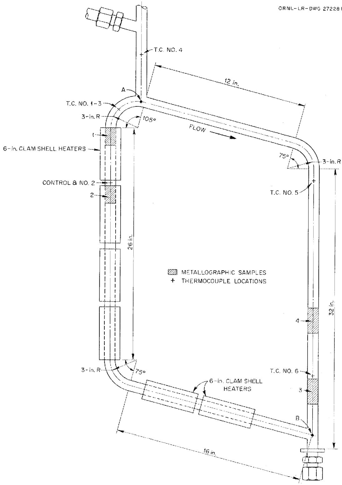  
Fig. 1. Schematic Diagram of Thermal Convection Loop Used for Evaluations of Experimental Nickel-Molybdenum Alloys. The locations of thermocouples and test samples are shown.

# Salt Preparation

The fuel mixture used in these studies was of the composition shown in Table 3. We selected the LiF-KF-NaF-UF $_4$ composition (Salt 107) on the basis that the oxidation of container constituents by a given concentration of UF $_4$ tended to be greater for this mixture than for other mixtures of practical importance. Thus, achievement of satisfactory compatibility with this mixture in effect provided a container material of ultimate versatility with respect to all fuel mixtures.

Table 3. Composition of Fluoride Mixture Used to Evaluate Experimental Nickel-Molybdenum Alloys   
Salt Number: 107 Liquidus Temperature: $490^{\circ}C$   

<table><tr><td>Component</td><td>Mole %</td><td>Weight %</td></tr><tr><td>NaF</td><td>11.2</td><td>9.79</td></tr><tr><td>LiF</td><td>45.3</td><td>24.4</td></tr><tr><td>KF</td><td>41.0</td><td>49.4</td></tr><tr><td>UF4</td><td>2.5</td><td>16.3</td></tr></table>

The fluoride mixtures were prepared from reagent-grade materials and were purified by the Fluoride Processing Group of the Reactor Chemistry Division. In general, the procedure for purification was as follows: (1) the dry ingredients, except for $\mathrm{UF_4}$ , were mixed, evacuated several times for moisture removal, and then melted under an atmosphere of helium; (2) the molten mixture was held at $815^{\circ}\mathrm{C}$ and treated with hydrogen for 4 hr to purge hydrofluoric acid from the mixture; (3) the mixture was cooled to $205^{\circ}\mathrm{C}$ under a helium atmosphere and $\mathrm{UF_4}$ was admitted. Upon the addition of the $\mathrm{UF_4}$ , the mixture was remelted, heated to $815^{\circ}\mathrm{C}$ , and then treated again with hydrogen to purge the excess hydrofluoric acid.

All mixtures were prepared in 300-lb quantities and apportioned into 50-lb containers, after which samples were submitted for analysis of Ni, Fe, and Cr. It was required that each of these elements be present

in amounts less than 500 ppm as determined from individual batch analyses. A second before-test analysis of each salt mixture was obtained from a sample of the salt taken as it was being admitted to the test loop.

# Operating Procedures

Each loop was thoroughly degreased with acetone and checked for leaks using a helium mass spectrometer. After thermocouples and heaters were assembled and insulation was applied, the loop was placed in a test stand, as shown in Fig. 2.

The salt charging pot was connected to the loop with nickel or Inconel tubing, and both the loop and the charging pot were heated to $650^{\circ}\mathrm{C}$ under a dynamic vacuum of less than $50\mu \mathrm{Hg}$ . Helium pressure was then applied to the charging pot in order to force the salt mixture from the pot to the loop. After filling, salt was allowed to stand in the loop at $650^{\circ}\mathrm{C}$ for approximately 2 hr, so that oxides and other impurities would be dissolved from the container surface into the salt mixture. This mixture was then removed, and a fresh salt mixture was admitted from the fluoride charging pot. A helium cover gas under slight positive pressure (approx 5 psig) was maintained over the salt mixture during all periods of testing.

At the end of test, power to the loop was cut off and insulation was stripped from the loop so as to freeze the salt mixture as rapidly as possible.

# Test Examination

Each loop was sectioned with a tubing cutter into approximately 6-in. lengths. Five 2-in. sections were then removed from the loop positions indicated in Fig. 1 for metallographic examination. Two of the remaining 6-in. sections, one from the hottest section of the loop (specimen H) and one from the coldest section (specimen C), were obtained for salt chemistry studies, and the remaining loop segments were held in storage until all examinations of the loop were completed.

Salt removal was accomplished by heating each section in a small tube furnace at $600^{\circ}\mathrm{C}$ in helium. The salt was collected in a graphite

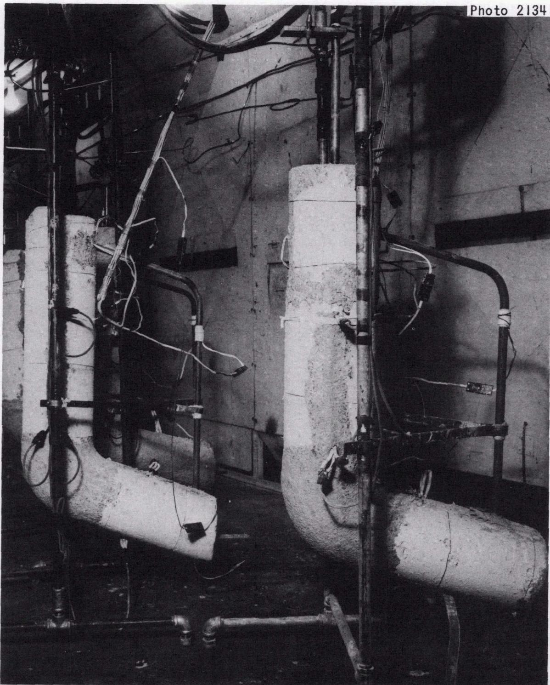  
Fig. 2. Photograph of Assembled Thermal Convection Loops and Test Stands.

crucible located below the furnace windings. The five 2-in. sections of tubing were examined metallographically, and the salt samples were submitted individually for petrographic and chemical analyses. If layers of corrosion products were discovered on the tube wall, samples of the tubing and salt contained in that section were also submitted for x-ray diffraction examination.

# RESULTS AND DISCUSSION

Alloying effects were evaluated in terms of both the corrosion products entering the salt mixtures and the metallographic appearance of the alloy after test. Results have been grouped in this section according to the alloying element studied.

# Chromium

# Corrosion-Product Concentrations

Effects of chromium additions were examined in six ternary alloys with chromium contents of 3.2 to 11.0 at. %. One loop of each of these compositions was operated with Salt 107 for 500 hr under the test conditions described above. The compositions investigated and the attendant concentrations of chromium ions in salt samples taken at the conclusion of these tests are shown in Table 4. The extent of reaction between chromium and fluoride constituents, as indicated by the chromium ion concentrations, increased with the amount of chromium in the alloy. This increase is illustrated graphically in Fig. 3, where the data are compared with data for Inconel14 and pure chromium.15 It may be noted that the chromium concentrations of the salts were less than those for Inconel loops operated under identical temperature conditions. A horizontal line, which represents the chromium ion concentration at

Table 4. Corrosion-Product Concentrations of Salts Tested with Nickel-Molybdenum-Chromium Alloys   

<table><tr><td rowspan="2">Heat Number</td><td colspan="2">Alloy Composition (at. %)</td><td rowspan="2">Test Duration (hr)</td><td colspan="3">Chromium Concentration in Salt Samplesa (mole %)</td></tr><tr><td>Cr</td><td>Other Components</td><td>Sample H</td><td>Sample C</td><td>Other</td></tr><tr><td>OR 37A-1</td><td>3.20</td><td>13.5 Mo, bal Ni</td><td>500</td><td>0.0194</td><td>0.0180</td><td>0.0213</td></tr><tr><td>OR 30-1</td><td>3.41</td><td>11.1 Mo, bal Ni</td><td>500</td><td>0.0222</td><td>0.0365</td><td>0.0291</td></tr><tr><td>OR 30-2</td><td>5.55</td><td>10.8 Mo, bal Ni</td><td>500</td><td>0.0375</td><td>0.0352</td><td>0.0376</td></tr><tr><td>OR 30-2</td><td>5.55</td><td>10.8 Mo, bal Ni</td><td>1000</td><td>0.0509</td><td>0.0509</td><td>0.0543</td></tr><tr><td>OR 30-6</td><td>7.60</td><td>9.72 Mo, bal Ni</td><td>500</td><td>0.0606</td><td>0.0606</td><td>0.0566</td></tr><tr><td>OR 43A-3</td><td>7.71</td><td>13.4 Mo, bal Ni</td><td>500</td><td>0.0453</td><td>0.0476</td><td>0.0425</td></tr><tr><td>OR 30-4</td><td>11.04</td><td>10.6 Mo, bal Ni</td><td>500</td><td>0.0819</td><td>0.0814</td><td>0.0699</td></tr></table>

aSample designations "H" and "C" are discussed on page 13; "other" designates salt samples obtained from metallographic specimens.

equilibrium with pure chromium at $600^{\circ}\mathrm{C}$ , is seen in Fig. 3 to be above the measured chromium ion concentrations for all alloys tested. Thus, the observed concentrations were less than those required for the formation of pure chromium crystals in the coldest portion of the loops (approx $650^{\circ}\mathrm{C}$ ).

As discussed previously, the concentration of chromium ions under the conditions of these tests should be governed by the relation [Eq. (11)]

$$
\mathrm {N} _ {\mathrm {C r} \text {i o n s}} = \left(\mathrm {N} _ {\mathrm {C r F} _ {2}} + \mathrm {N} _ {\mathrm {C r F} _ {3}}\right) = \mathrm {K} _ {2} \alpha_ {\underline {{\mathrm {C r}}}} ^ {5 / 1 9},
$$

where $\mathbf{N}_{\mathrm{Cr}}$ is the mole fraction of chromium ions in Salt 107 at equilibrium with an alloy of given chromium activity, $\alpha_{\mathrm{Cr}}$ . If we assume that $\mathbf{N}_{\mathrm{Cr}}$ gives an approximate measure of $\alpha_{\mathrm{Cr}}$ , the resultant chromium ion concentrations for these alloys should lie within a region which is bounded above by the function determined at a temperature equivalent to the maximum loop temperature and below by the function determined at the minimum loop temperature. Bounds using experimental values of $\mathbf{K}_2$

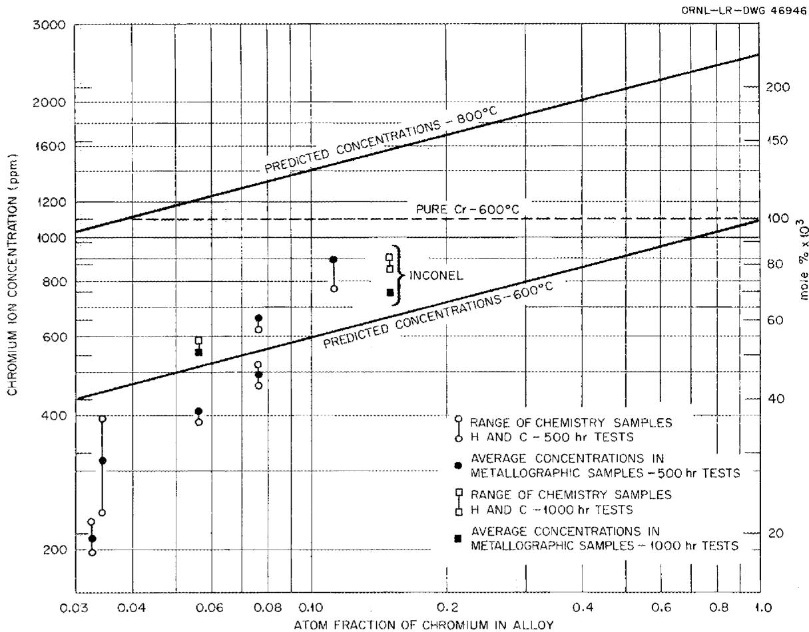  
Fig. 3. Concentration of Chromium Ions in Salt 107 as a Function of Chromium Content in Nickel-Molybdenum-Chromium Alloys.

measured at 800 and $600^{\circ}\mathrm{C}$ (Table 1), which reasonably approximate the maximum and minimum loop temperatures, are plotted in Fig. 3 and are seen to include only two of the observed loop concentrations, both corresponding to chromium compositions greater than 7 at. %. However, except for the alloy with least chromium content, all concentrations lie relatively close to the lower bound and roughly approximate the slope of this bound.

The deviation of measured corrosion-product concentrations in these tests from the predicted concentration ranges may have resulted primarily from inaccuracy in the assumption that $\underline{\mathbb{N}_{\mathrm{Cr}}}$ equals $\alpha_{\mathrm{Cr}}$ . However, assuming $\alpha_{\mathrm{Cr}}$ to be accurately known, the corrosion-product concentrations in these tests would nevertheless have been lower than those predicted, since corrosive attack would necessarily reduce the chromium content and hence the

chromium activity at the surface of the alloys relative to the original chromium activity. We also examined the possibility that the test times were not sufficiently long for the chromium concentration of the salt to have completely attained the maximum or steady-state level. To evaluate this latter point, sufficient material of one of the alloy compositions, heat OR 30-2, was obtained to permit the operation of a 1000-hr test. Results of this test, which are shown in Table 4 and Fig. 3, indicated that only a small increase in chromium concentration occurred between the 500- and 1000-hr intervals. It was concluded, therefore, that the 500-hr test provided a reasonably close estimate of the limiting corrosion-product concentrations associated with the temperature conditions of these experiments.

Additional data on the effects of chromium in nickel-molybdenum alloys were afforded by tests of five alloys which contained chromium in combination with one or more other alloying elements, as shown in Table 5. Notwithstanding the additional alloying agents, the concentrations of chromium-containing corrosion products following 500-hr tests of these alloys in Salt 107, as shown in Table 5, were comparable to the concentrations associated with the simple ternary chromium-containing alloys. The corrosion-product concentrations for the alloys with multiple additions are plotted in Fig. 4, and are seen to show the same general variation with chromium content as the ternary alloys (see Fig. 3).

Also shown in Table 5 and Fig. 4 are the results of 1000-hr tests of four of the alloys containing multiple additions. After all but one of these tests, the chromium ion concentrations in the salts were slightly higher than for 500-hr tests of the same alloys; in one test, the chromium ion concentration was unaccountably lower. The chromium ion concentrations of these multicomponent alloys again fell near those predicted on the basis of equilibrium data for pure chromium at $600^{\circ}\mathrm{C}$ and were considerably less than the concentration needed to deposit pure chromium at $600^{\circ}\mathrm{C}$ .

The chromium activities in all of the alloys tested would appear on the basis of corresponding corrosion-product concentrations to be lower than the activity of chromium in Inconel. However, it is important to note in Figs. 3 or 4 that any alloy in which the chromium activity

Table 5. Corrosion-Product Concentrations of Salts Tested with Nickel-Molybdenum Alloys Containing Chromium in Combination with Other Alloying Elements   

<table><tr><td rowspan="2">Heat Number</td><td colspan="2">Alloy Composition, at. %</td><td rowspan="2">Test Duration (hr)</td><td colspan="3">Chromium Concentration in Salt Samples,\( ^a \)mole %</td></tr><tr><td>Chromium</td><td>Other Components</td><td>Sample H</td><td>Sample C</td><td>Other</td></tr><tr><td>OR 30-16</td><td>4.30</td><td>2.54 Al, 1.90 Ti, 10.2 Mo, bal Ni</td><td>502</td><td>0.0227</td><td>0.0236</td><td>0.0204</td></tr><tr><td>S T2.3311</td><td>4.79</td><td>1.27 Al, 2.91 Nb, 1.72 W, 13.2 Mo, bal Ni</td><td>500</td><td>0.0490</td><td>0.0490</td><td>0.0426</td></tr><tr><td>OR 30-33</td><td>5.90</td><td>1.59 Al, 5.56 Fe, 9.66 Mo, bal Mi</td><td>1000</td><td>0.0689</td><td>0.0731</td><td>0.0620</td></tr><tr><td>OR 30-22</td><td>6.64</td><td>0.43 Fe, 0.39 Nb, 2.61 Al, 10.05 Mo, bal Ni</td><td>500</td><td>0.0583</td><td>0.0555</td><td>0.0490</td></tr><tr><td>OR 30-22</td><td>6.64</td><td>0.43 Fe, 0.39 Nb, 2.61 Al, 10.05 Mo, bal Ni</td><td>1000</td><td>0.0416</td><td>0.0402</td><td>0.0370</td></tr><tr><td>B3276</td><td>3.32</td><td>1.48 Nb, 14.0 Mo, bal Ni</td><td>500</td><td>0.0615</td><td>0.0615</td><td>0.0578</td></tr><tr><td>B32 77</td><td>9.47</td><td>1.57 Nb, 3.36 Al, 14.2 Mo, bal Ni</td><td>500</td><td>0.0698</td><td>0.0700</td><td>0.0624</td></tr><tr><td>B32 77</td><td>9.47</td><td>1.57 Nb, 3.06 Al, 14.2 Mo, bal Ni</td><td>1000</td><td>0.0731</td><td>0.0657</td><td>0.0740</td></tr></table>

aSample designations "H" and "C" are discussed on page 13; "other" designates samples obtained from metallographic specimens.

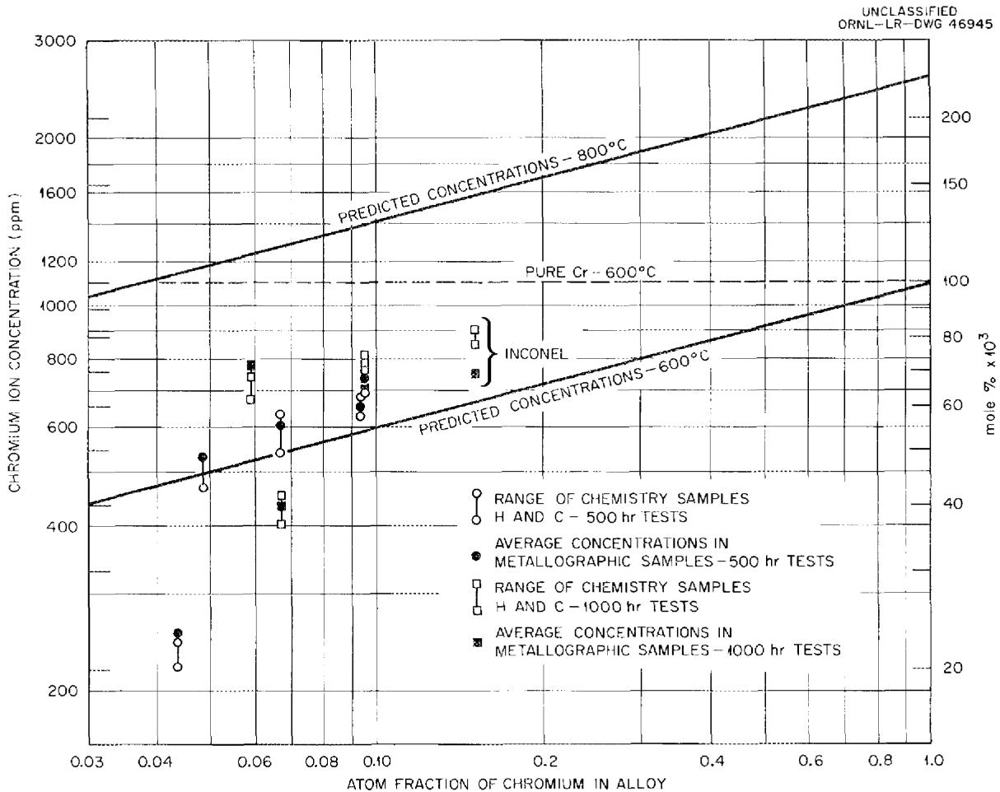  
Fig. 4. Concentration of Chromium Ions in Salt 107 as a Function of Chromium Contents in Nickel-Molybdenum Alloys Containing Multiple Alloy Additions.

exceeded a value of 0.035 would support the formation of pure chromium at $600^{\circ}\mathrm{C}$ in any case where the concentration of $\mathrm{CrF}_2$ and $\mathrm{CrF}_3$ approached equilibrium with the alloy at temperatures of $800^{\circ}\mathrm{C}$ or above. Thus, unless the activity coefficients for chromium in these alloys are much smaller than unity, the possibility for the deposition of pure chromium in cold-leg regions cannot be completely excluded for any of the alloys tested.

In the case of $\mathrm{ZrF_4}$ or $\mathrm{BeF_2}$ -base salt mixtures, the temperature dependence of the $\mathrm{Cr - UF_4}$ reaction is much less than for Salt 107. It has been shown16 that in these mixtures, alloys having a chromium

activity equivalent to or less than that for Inconel cannot support chromium ion concentrations at $800^{\circ}\mathrm{C}$ which are sufficiently high to maintain pure chromium at $600^{\circ}\mathrm{C}$ . Consequently, mass transfer of chromium by deposition of pure chromium crystals in the latter salt mixtures should not be possible for any of the alloys listed in Tables 4 and 5.

# Metallographic Results

Metallographic examinations of the ternary alloys shown in Table 4 showed little evidence of corrosive attack other than shallow surface roughening. Void formation, which characteristically had been found in nickel-chromium alloys under similar test conditions,[17] was not detected in any of these alloys. The relative depths of attack which occurred for the alloy containing 5.55 at. $\frac{1}{2}$ Cr (heat OR 30-2) after 500- and 1000-hr tests, respectively, are compared in Fig. 5. Although the depth of attack was similar at both time intervals, the intensity of surface pitting was somewhat greater after the 1000-hr exposure. The intensity of surface roughening was also found to increase with increasing chromium concentration. This is seen in Fig. 6 which compares photomicrographs of two alloys containing different chromium contents. Cold-leg sections of these loops showed no evidence of corrosion and contained no visible deposits of corrosion products.

The depths of attack observed metallographically for alloys containing chromium in combination with other additions are shown graphically in Fig. 7. Attack in these alloys was manifested as surface roughening after 500 hr and as a combination of surface pitting and shallow void formation after 1000 hr. Depths of corrosion were in general higher than for the ternary chromium-containing alloys, particularly in alloys which contained aluminum additions.

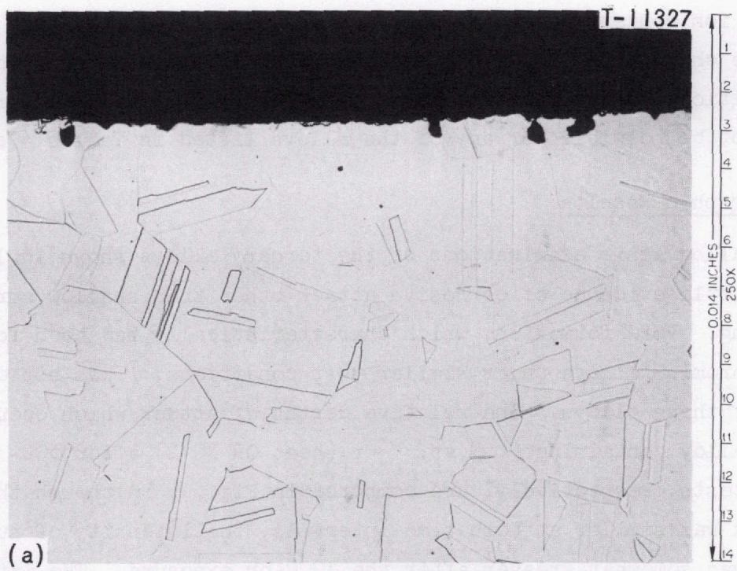

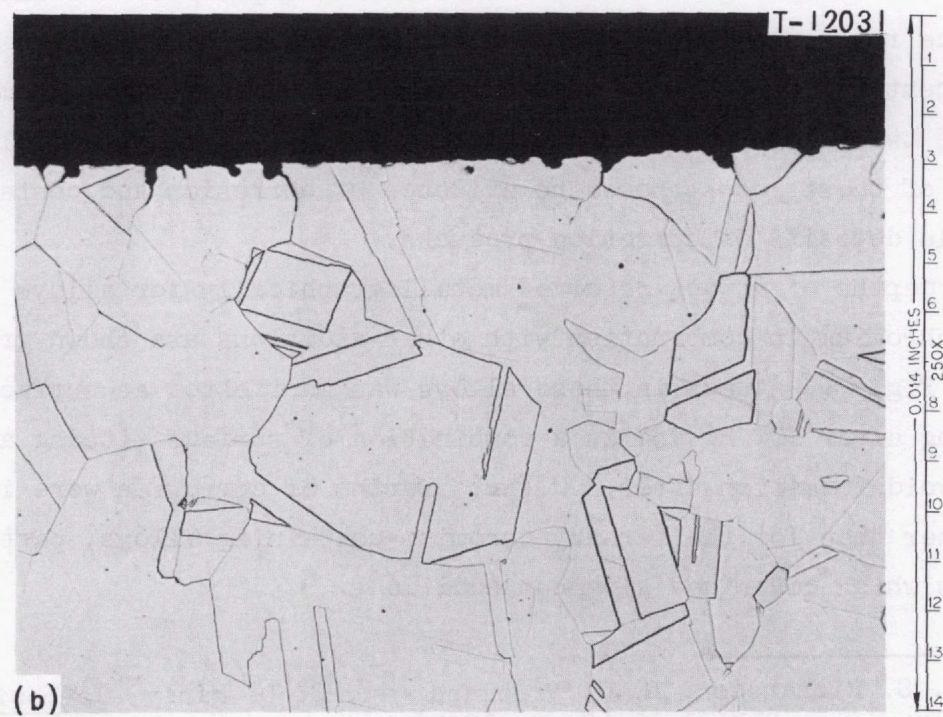  
Fig. 5. Appearance of Hot-Leg Surface of Ternary Nickel-Molybdenum Alloy Containing 5.55 at. $\%$ Cr Following Exposure to Salt 107. Heat OR 30-2. (a) After 500 hr and (b) after 1000 hr.

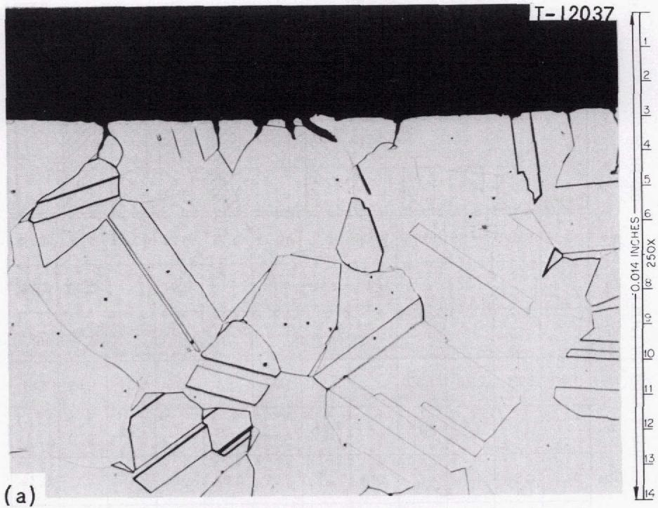

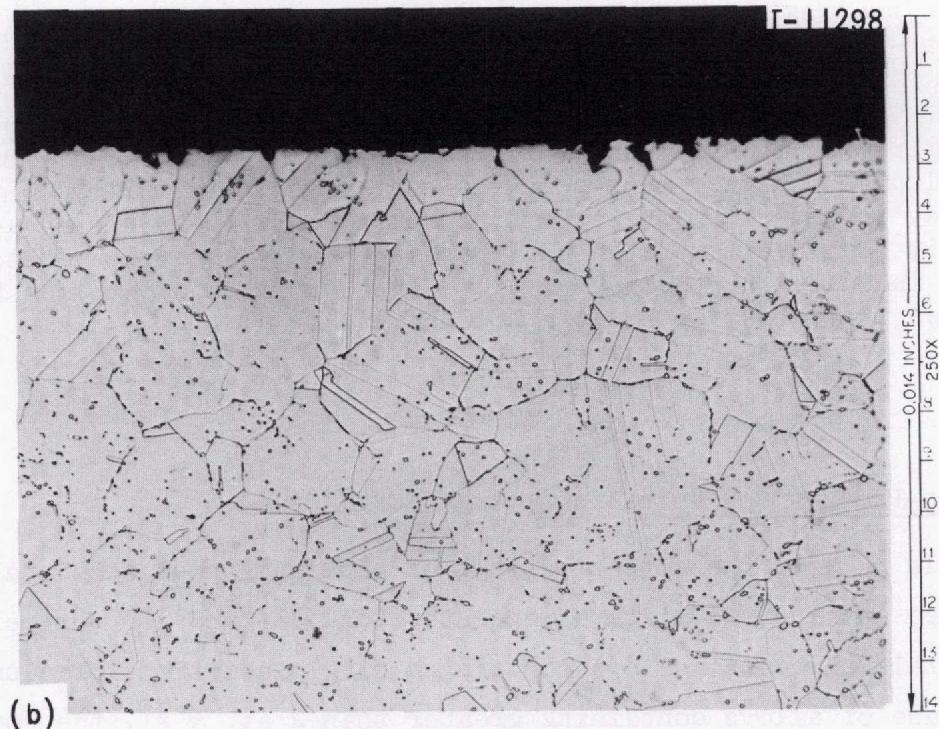  
Fig. 6. Hot-Leg Sections of Nickel-Molybdenum-Chromium Thermal Convection Loops Following 500-hr Exposure to Salt 107. (a) 3.2 Cr-13.5 Mo-bal Ni (at. %), (b) 11.0 Cr-10.6 Mo-bal Ni (at. %).

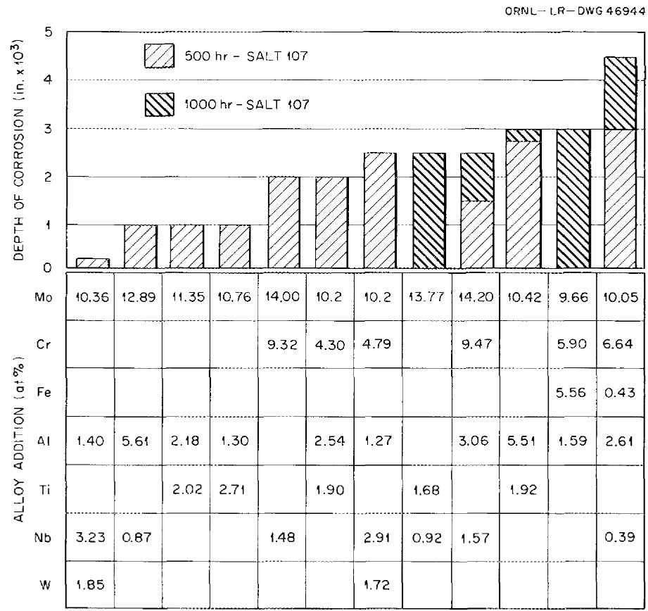  
Fig. 7. Depths of Corrosion Observed for Nickel-Molybdenum Alloys with Multiple Alloy Additions Following Exposure to Salt 107. Bars designating corrosion depths appear directly above the alloy compositions which they represent. (Where bars have both positively sloped and negatively sloped cross-hatching, the height of positively sloped cross-hatching indicates depth of corrosion after 500 hr and combined height of both types indicates depth after 1000 hr.)

# Aluminum

# Corrosion-Product Concentrations

Table 6 lists the concentrations of aluminum which were analytically determined in fluoride mixtures operated for 500- and 1000-hr periods with nickel-molybdenum alloys containing single additions of aluminum. In the case of alloys containing greater than 2 at. % Al, the corresponding aluminum concentrations in the salt mixture were relatively high, that is, in the range of 0.15-0.37 mole %. Only one alloy composition was subjected to tests at both 500 and 1000 hr; however, results for this alloy suggest that effectively similar salt concentrations were

Table 6. Corrosion-Product Concentrations of Salts Tested with Nickel-Molybdenum-Aluminum Alloys   

<table><tr><td rowspan="2">Heat Number</td><td colspan="2">Alloy Composition (at. %)</td><td rowspan="2">Test Duration (hr)</td><td colspan="3">Aluminum Concentration in Salt Samplesa (mole %)</td></tr><tr><td>Al</td><td>Other Components</td><td>Sample H</td><td>Sample C</td><td>Other</td></tr><tr><td>S T23012</td><td>1.22</td><td>11.4 Mo, bal Ni</td><td>500</td><td>0.000872</td><td>0.000872</td><td>b</td></tr><tr><td>OR 30-7</td><td>4.26</td><td>10.15 Mo, bal Ni</td><td>500</td><td>0.220</td><td>0.070</td><td>0.137</td></tr><tr><td>OR 30-7</td><td>4.26</td><td>10.15 Mo, bal Ni</td><td>1000</td><td>0.214</td><td>0.105</td><td>0.178</td></tr><tr><td>OR 1491</td><td>4.85</td><td>6.99 Mo, bal Ni</td><td>1000</td><td>0.374</td><td>0.374</td><td>0.374</td></tr></table>

aSample designations "H" and "C" are discussed on page 13; "other" designates samples obtained from metallographic specimens.

bNot determined.

realized for both time intervals. Table 7 lists the concentrations of corrosion products which formed in salt mixtures circulated in loops containing aluminum in combination with other alloying elements. These concentrations were of the same general magnitudes as those observed for the ternary Ni-Mo-Al alloys.

The corrosion-product concentrations showed no definable correspondence with the aluminum content of the alloys. However, the propensity for aluminum to react with interstitial contaminants, such as nitrogen, in these alloys, makes the activity of aluminum in the alloys very dependent on composition and metallurgical history. For this reason poor correspondence between the corrosion-product concentration and total aluminum concentration in the alloy would not be unexpected.

It is apparent from tests of both the ternary and multicomponent alloys that aluminum additions less than 2 at. $\%$ give rise to very much lower aluminum ion concentrations than additions above 2 at. $\%$ . This observation may suggest that below a concentration of 2 at. $\%$ the bulk of the aluminum addition has formed highly stable compounds with interstitial contaminants in the alloy.

# Metallographic Results

Hot-leg surfaces of ternary alloys containing aluminum in amounts greater than 2 at. % underwent relatively severe attack by Salt 107 in

Table 7. Corrosion-Product Concentrations of Salts Tested with Nickel-Molybdenum Alloys Containing Aluminum in Combination with Other Alloying Elements   

<table><tr><td rowspan="2">Heat Number</td><td colspan="2">Alloy Composition, at. %</td><td rowspan="2">Test Duration (hr)</td><td colspan="3">Aluminum Concentration of Salt Samples,\( ^a \)mole %</td></tr><tr><td>Aluminum</td><td>Other Components</td><td>Sample H</td><td>Sample C</td><td>Other</td></tr><tr><td>S T23014</td><td>1.30</td><td>10.8 Mo, 2.7 Ti, bal Ni</td><td>500</td><td>&lt;0.0009</td><td>&lt;0.0009</td><td>&lt;0.0009</td></tr><tr><td>S T23013</td><td>1.40</td><td>10.4 Mo, 3.2 Nb, 1.8 W, bal Ni</td><td>500</td><td>0.160</td><td>0.0606</td><td>b</td></tr><tr><td>OR 30-33</td><td>1.59</td><td>9.7 Mo, 5.9 Cr, 5.6 Fe, bal Ni</td><td>1000</td><td>0.0660</td><td>0.0820</td><td>0.124</td></tr><tr><td>OR 30-16</td><td>2.54</td><td>10.2 Mo, 4.3 Cr, 1.9 Ti, bal Ni</td><td>500</td><td>0.358</td><td>0.326</td><td>0.334</td></tr><tr><td>OR 30-22</td><td>2.61</td><td>10.0 Mo, 6.6 Cr, 0.4 Fe, 0.4 Nb, 2.6 W, bal Ni</td><td>500</td><td>0.382</td><td>0.570</td><td>0.244</td></tr><tr><td>OR 30-22</td><td>2.61</td><td>10.0 Mo, 6.6 Cr, 0.4 Fe, 0.4 Nb, 2.6 W, bal Ni</td><td>1000</td><td>0.249</td><td>0.259</td><td>b</td></tr><tr><td>B3277</td><td>3.06</td><td>14.2 Mo, 9.5 Cr, 1.6 Nb, 3.1 W, bal Ni</td><td>500</td><td>0.502</td><td>0.525</td><td>0.481</td></tr><tr><td>B3277</td><td>3.06</td><td>14.2 Mo, 9.5 Cr, 1.6 Nb, 3.1 W, bal Ni</td><td>1000</td><td>0.473</td><td>0.394</td><td>0.374</td></tr><tr><td>OR 30-14</td><td>5.51</td><td>10.4 Mo, 1.9 Ti, bal Ni</td><td>500</td><td>0.394</td><td>0.439</td><td>0.499</td></tr><tr><td>OR 30-14</td><td>5.51</td><td>10.4 Mo, 1.9 Ti, bal Ni</td><td>1000</td><td>0.250</td><td>0.174</td><td>0.0960</td></tr></table>

aSample designations "H" and "C" are discussed on page 13; "other" designates samples obtained from metallographic specimens.   
bNot determined.

the form of surface pitting and subsurface void formation. Void formation was evident to a depth of 0.002 in. in 500-hr tests of these alloys and to 0.003 in. in 1000-hr tests. Figure 8 shows the appearance of an alloy containing 4.27 at. % Al after a 1000-hr test exposure. However, an alloy containing only 1.22 at. % Al revealed negligible attack after a 500-hr exposure to Salt 107.

Alloys containing aluminum combined with other alloying components also exhibited both surface pitting and subsurface void formation after exposure to Salt 107. The depths of attack for these alloys are shown graphically in Fig. 7. Additions of up to 2 at. % Al resulted in only light attack except in alloys where chromium additions were also present. Alloys which contained over 2.5 at. % Al in combination with chromium or titanium revealed pronounced attack in the form of subsurface voids to depths ranging from 0.002 to 0.0045 in. Cold-leg sections of all loops were unattacked and contained no insoluble corrosion products.

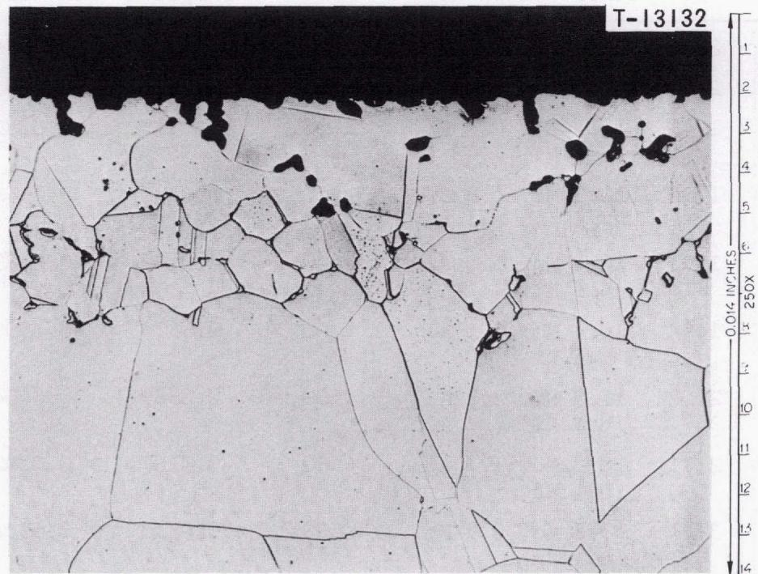  
Fig. 8. Hot-Leg Surface of Ternary Nickel-Molybdenum Alloy Containing 4.27 at. % Al After 1000-hr Exposure to Salt 107. Heat OR 30-7.

# Titanium

# Corrosion-Product Concentrations

Titanium-containing alloys which were investigated are listed in Table 8, together with attendant titanium corrosion-product concentrations. Except for the first composition shown, which contained 2.47 at. $\%$ Ti, alloying agents in addition to titanium were present in all of the alloys evaluated. The corrosion properties of the single ternary alloy were studied at both 500- and 1000-hr time intervals. Analyses of salts operated in loops of this alloy revealed titanium

Table 8. Corrosion-Product Concentrations of Salts Tested with Nickel-Molybdenum Alloys Containing Titanium   

<table><tr><td rowspan="2">Heat Number</td><td colspan="2">Alloy Composition (at. %)</td><td rowspan="2">Test Duration (hr)</td><td colspan="3">Titanium Concentration in Salt Samplesa (mole %)</td></tr><tr><td>Ti</td><td>Other Components</td><td>Sample H</td><td>Sample C</td><td>Other</td></tr><tr><td>OR 30-8</td><td>2.47</td><td>11.6 Mo, bal Ni</td><td>500</td><td>0.0394</td><td>0.0386</td><td>0.0380</td></tr><tr><td>OR 30-8</td><td>2.47</td><td>11.6 Mo, bal Ni</td><td>1000</td><td>0.0404</td><td>0.0495</td><td>0.0505</td></tr><tr><td>B2897</td><td>1.68</td><td>13.8 Mo, 0.9 Nb, bal Ni</td><td>1000</td><td>0.0373</td><td>0.0383</td><td>0.0283</td></tr><tr><td>OR 30-16</td><td>1.90</td><td>10.2 Mo, 4.3 Cr, 2.5 Al, bal Ni</td><td>500</td><td>0.0378</td><td>0.0348</td><td>0.0500</td></tr><tr><td>OR 30-14</td><td>1.92</td><td>10.4 Mo, 5.5 Al, bal Ni</td><td>500</td><td>0.0449</td><td>0.0489</td><td>0.0378</td></tr><tr><td>OR 30-14</td><td>1.92</td><td>10.4 Mo, 5.5 Al, bal Ni</td><td>1000</td><td>0.0373</td><td>0.0530</td><td>0.0434</td></tr><tr><td>OR 30-13</td><td>2.02</td><td>11.3 Mo, 2.2 Al, bal Ni</td><td>500</td><td>0.0389</td><td>0.0404</td><td>0.0484</td></tr><tr><td>S T23014</td><td>2.71</td><td>10.8 Mo, 1.3 Al, bal Ni</td><td>500</td><td>0.0187</td><td>0.0242</td><td>0.0187</td></tr><tr><td>B2898</td><td>3.24</td><td>13.2 Mo, 0.9 Nb, bal Ni</td><td>500</td><td>0.0353</td><td>0.0252</td><td>b</td></tr></table>

aSample designation "H" and "C" are discussed on page 13; "other" designates samples obtained from metallographic specimens.   
bNot determined.

concentrations of 0.038-0.040 mole % after 500 hr and 0.040-0.055 mole % after 1000 hr. These analyses correspond closely to the analyses of salts circulated in loops constructed of the other titanium-bearing alloys, in which titanium contents ranged from 1.68-3.24 at. %. Only the test of the 2.71 at. % alloy effected a titanium salt concentration significantly different from the ternary alloy, the concentration in the former test being unaccountably lower than for the other tests.

# Metallographic Results

The ternary titanium-bearing alloy revealed only light attack in the form of surface pitting after both the 500- and 1000-hr test intervals. The photomicrograph in Fig. 9 shows the appearance of a typical hot-leg section of this alloy after the longer test interval. Depths of attack which were observed in the remainder of the titanium-bearing alloys are graphically depicted in Fig. 7. Except where aluminum additions were present in these alloys in amounts greater than 2 at. $\%$ depths of attack were in all cases less than O.003 in. and generally

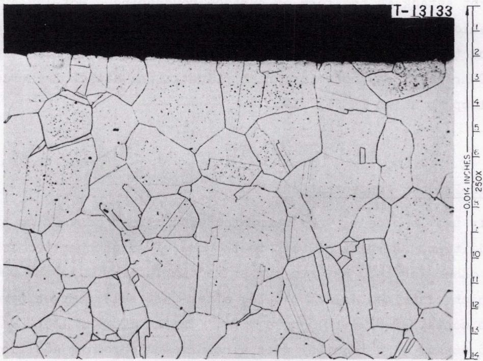  
Fig. 9. Hot-Leg Surface of Ternary Nickel-Molybdenum Alloy Containing 2.47 at. % Ti After 1000-hr Exposure to Salt 107. Heat OR 30-8.

were less than 0.002 in. Attack in all cases was manifested as general surface pitting and shallow void formation. No attack was seen in the cold-leg sections of any of the titanium-containing loops nor were cold-leg deposits detected.

# Vanadium

# Corrosion-Product Concentrations

Loops were operated with two ternary alloys containing vanadium additions of 2.73 and 5.11 at. $\%$ , respectively. As shown in Table 9, the vanadium concentration detected in a salt mixture tested with the former alloy after 500-hr exposure was less than 0.005 mole $\%$ . However, salts operated with the alloy of higher vanadium content contained 0.027 mole $\%$ V in a 500-hr test and 0.019-0.020 mole $\%$ V in a 1000-hr test.

# Metallographic Results

Metallographic examination of the alloy with 2.73 at. $\%$ V revealed very light attack in the form of surface roughening. Hot-leg surfaces of the alloy with 5.11 at. $\%$ V exhibited attack in the form of void formation to a depth of 0.002 in. in the 500-hr loop and 0.004 in. in the 1000-hr loop. A photomicrograph illustrating attack incurred by the latter loop is shown in Fig. 10.

# Iron

# Corrosion-Product Concentrations

Only two loop tests were completed with alloys containing iron as a major addition. Results of both tests, one of which operated for 500 hr and the other for 1000 hr, are summarized in Table 9. In the 500-hr loop, which contained 4.12 at. $\frac{d}{\%}$ Fe, after-test salt samples were analyzed to contain 0.013-0.015 mole $\frac{d}{\%}$ Fe. In the 1000-hr loop, which contained 5.56 at. $\frac{d}{\%}$ Fe together with aluminum and chromium additions, the after-test salt samples contained an even lower iron concentration. It would appear that corrosion products formed by reactions involving

Table 9. Corrosion-Product Concentrations of Salts Tested with Nickel-Molybdenum Alloys Containing Vanadium and Iron   

<table><tr><td rowspan="2">Heat Number</td><td colspan="6">Alloy Composition (at. %)</td><td rowspan="2">Test Duration (hr)</td><td colspan="3">Corrosion-Product Concentration in Salt Samples&quot; (mole %)</td></tr><tr><td>V</td><td>Fe</td><td>NO</td><td>Cr</td><td>Al</td><td>Mi</td><td>Sample H</td><td>Sample C</td><td>Other</td></tr><tr><td></td><td></td><td></td><td></td><td></td><td></td><td></td><td></td><td colspan="3">Vanadium Concentration</td></tr><tr><td>OR 30-10</td><td>2.73</td><td></td><td>10.8</td><td></td><td></td><td>bal</td><td>500</td><td>&lt;0.005</td><td>&lt;0.005</td><td>&lt;0.005</td></tr><tr><td>OR 30-20</td><td>5.11</td><td></td><td>10.8</td><td></td><td></td><td>bal</td><td>500</td><td>0.0274</td><td>0.32&#x27;74</td><td>0.0261</td></tr><tr><td>OR 30-20</td><td>5.11</td><td></td><td>10.8</td><td></td><td></td><td>bal</td><td>1000</td><td>0.0198</td><td>0.3194</td><td>b</td></tr><tr><td></td><td></td><td></td><td></td><td></td><td></td><td></td><td></td><td colspan="3">Iron Concentration</td></tr><tr><td>OR 30-11</td><td></td><td>4.12</td><td>10.8</td><td></td><td></td><td>bal</td><td>500</td><td>0.0146</td><td>0.0134.</td><td>0.0152</td></tr><tr><td>OR 30-33</td><td></td><td>5.56</td><td>9.7</td><td>5.9</td><td>1.6</td><td>bal</td><td>1003</td><td>0.00517</td><td>0.00387</td><td>0.00517</td></tr></table>

aSample designation "H" and "C" are discussed on page 13: "other" designates samples obtained from aetallographic specimens.   
bNot determined.

Fig. 10. Attack at Hot-Leg Surface of Ternary Nickel-Molybdenum Alloy Containing 5.11 at. $\%$ V. Alloy was exposed to Salt 107 for 1000 hr. Heat OR 30-20.   
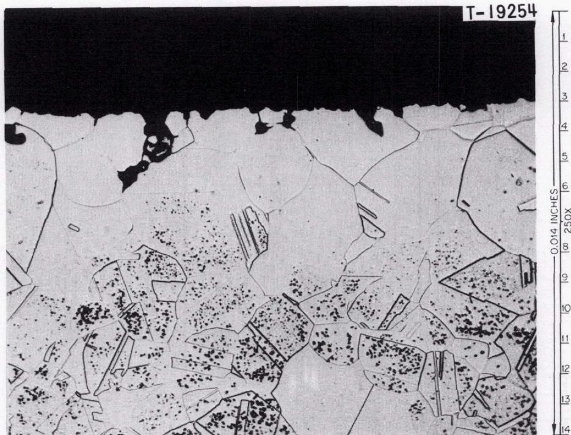  
0.014 INCHES 100 Mo Tu We Th Fr So Su

chromium and aluminum in this latter test served to inhibit the reaction with iron.

# Metallographic Results

Metallographic examinations of specimens from the 500-hr loop showed no evidence of attack other than light surface roughening. Examinations of the 1000-hr test, as indicated in Fig. 7, showed corrosive attack to a depth of 0.003 in. in the form of small subsurface voids.

# Niobium

# Corrosion-Product Concentrations

Loop tests of 500- and 1000-hr durations were carried out with ternary alloys containing 2.20 and 3.62 at. % Nb, respectively. As shown in Table 10, the niobium concentrations in salts exposed to these alloys increased from a value near 0.015 mole % in the 500-hr tests to values of from 0.022 to 0.025 mole % in the 1000-hr tests. Salts tested with

Table 10. Corrosion-Product Concentrations of Salts Tested with Nickel-Molybdenum-Niobium Alloys   

<table><tr><td rowspan="2">Heat Number</td><td colspan="3">Alloy Composition (at. %)</td><td rowspan="2">Test Duration (hr)</td><td colspan="3">Niobium Concentration in Salt Samplesa (mole %)</td></tr><tr><td>Nb</td><td>Mo</td><td>Ni</td><td>Sample H</td><td>Sample C</td><td>Other</td></tr><tr><td>OR 30-12</td><td>2.20</td><td>11.1</td><td>bal</td><td>500</td><td>0.00363</td><td>b</td><td>0.0135</td></tr><tr><td>OR 30-12</td><td>2.20</td><td>11.1</td><td>bal</td><td>1000</td><td>0.0225</td><td>0.0207</td><td>0.0233</td></tr><tr><td>OR 30-21</td><td>3.62</td><td>10.9</td><td>bal</td><td>500</td><td>0.0155</td><td>0.0174</td><td>0.0153</td></tr><tr><td>OR 30-21</td><td>3.62</td><td>10.9</td><td>bal</td><td>1000</td><td>0.0244</td><td>0.0228</td><td>0.0259</td></tr></table>

aSample designations "H" and "C" are discussed on page 13; "other" designates samples obtained from metallographic specimens.   
b Not determined.

alloys which contained niobium combined with other additions showed very much lower niobium concentrations than did the simple ternary alloys. As seen in Table 11, concentrations in the multiple-addition tests were less than 0.002 mole % for niobium contents as high as 3.62 at. %. Thus, it appears that corrosion products formed by reactions with other components in these alloys, namely titanium, aluminum, and chromium, were effective in inhibiting reaction of the salt with niobium.

# Metallographic Results

Neither ternary alloy containing niobium showed significant attack in metallographic examinations of 500-hr tests; however, the presence of very small subsurface voids to depths of approximately 0.001 in. was detected in examinations of the 1000-hr tests, as illustrated in Fig. 11. Corrosion results determined for alloys containing niobium together with other additions are summarized in Fig. 7. Except where aluminum and chromium were both present, attack in these alloys was less than 0.002 in. in depth.

Table 11. Corrosion-Product Concentrations of Salts Tested with Nickel-Molybdenum Alloys Containing Niobium in Combination with Other Alloying Elements   

<table><tr><td rowspan="2">Heat Number</td><td colspan="2">Alloy Composition (at. %)</td><td rowspan="2">Test Duration (hr)</td><td colspan="3">Niobium Concentration in Salt Samplesa (mole %)</td></tr><tr><td>Nb</td><td>Other Components</td><td>Sample H</td><td>Sample C</td><td>Other</td></tr><tr><td>OR 30-22</td><td>0.39</td><td>10.0 Mo, 6.6 Cr, 2.6 Al, bal Ni</td><td>500</td><td>0.00129</td><td>0.00181</td><td>0.00207</td></tr><tr><td>OR 30-22</td><td>0.39</td><td>10.0 Mo, 6.6 Cr, 2.6 Al, bal Ni</td><td>1000</td><td>0.00052</td><td>0.00104</td><td>0.00052</td></tr><tr><td>B2898</td><td>0.90</td><td>13.2 Mo, 3.24 Ti, bal Ni</td><td>500</td><td>&lt;0.0005</td><td>&lt;0.0005</td><td>b</td></tr><tr><td>B2897</td><td>0.92</td><td>13.8 Mo, 1.7 Ti, bal Ni</td><td>1000</td><td>0.00104</td><td>0.00052</td><td>0.00129</td></tr><tr><td>B3276</td><td>1.48</td><td>14.0 Mo, 9.3 Cr, bal Ni</td><td>500</td><td>0.00078</td><td>0.00052</td><td>0.00078</td></tr><tr><td>B3277</td><td>1.57</td><td>14.2 Mo, 9.5 Cr, 3.1 Al, bal Ni</td><td>500</td><td>&lt;0.0005</td><td>&lt;0.0005</td><td>&lt;0.0005</td></tr><tr><td>B3277</td><td>1.57</td><td>14.2 Mo, 9.5 Cr, 3.1 Al, bal Ni</td><td>1000</td><td>0.00259</td><td>0.00181</td><td>0.00104</td></tr><tr><td>S T23013</td><td>3.23</td><td>10.4 Mo, 1.4 Al, 1.8 W, bal Ni</td><td>500</td><td>&lt;0.0005</td><td>&lt;0.0005</td><td>&lt;0.0005</td></tr></table>

aSample designations "H" and "C" are discussed on page 13; "other" designates samples obtained from metallographic specimens.   
bNot determined.

# Tungsten

# Corrosion-Product Concentrations

Single alloying additions of tungsten to the nickel-molybdenum system were evaluated at levels of 0.72 and 1.44 at. $\%$ , respectively. Loop tests of both alloys were conducted for 500 hr, at which time tungsten concentrations in the salt mixtures had reached levels of 0.029 to 0.032 mole $\%$ . In 500-hr tests of two alloys which contained tungsten in addition to chromium, niobium, or aluminum, the concentration of tungsten detected in salt samples was below 0.010 mole $\%$ . Compositions of these alloys and their attendant salt corrosion-product concentrations are shown in Table 12.

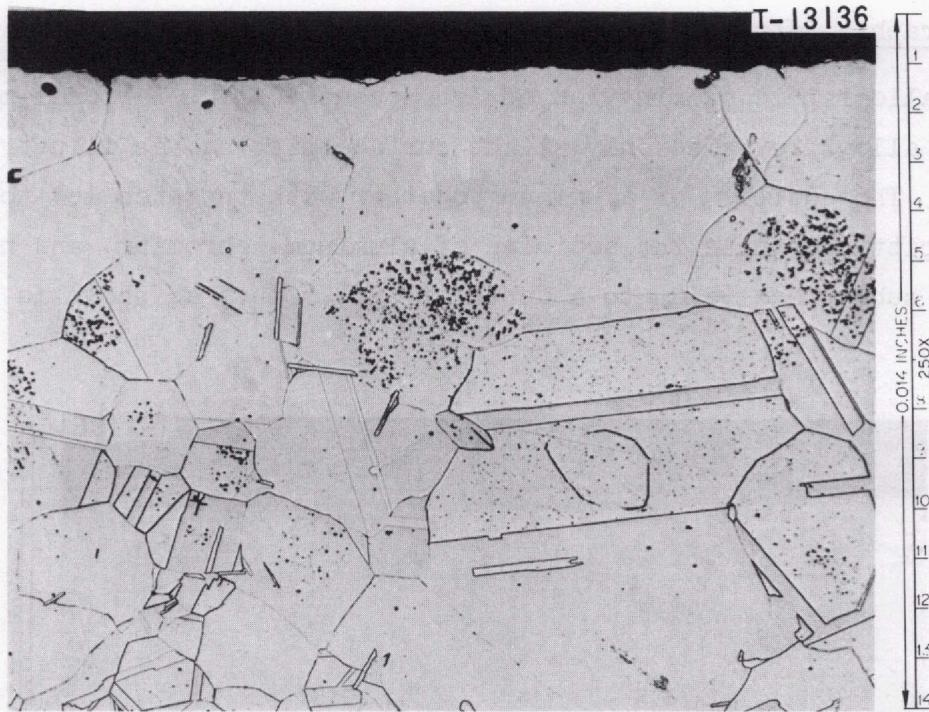  
Fig. 11. Appearance of Voids in Nickel-Molybdenum Alloy Containing 3.62 at. % Nb after 1000-hr Exposure to Salt 107. Heat OR 30-21.

Table 12. Corrosion-Product Concentrations of Salts Tested with Nickel-Molybdenum Alloys Containing Tungsten   

<table><tr><td rowspan="2">Heat Number</td><td colspan="2">Alloy Composition (at. %)</td><td rowspan="2">Test Duration (hr)</td><td colspan="3">Tungsten Concentration in Salt Samplesa (mole %)</td></tr><tr><td>W</td><td>Other Components</td><td>Sample H</td><td>Sample C</td><td>Other</td></tr><tr><td>OR 30-9</td><td>0.72</td><td>11.2 Mo, bal Ni</td><td>500</td><td>0.0318</td><td>0.0287</td><td>0.0325</td></tr><tr><td>OR 30-19</td><td>1.44</td><td>11.4 Mo, bal Ni</td><td>500</td><td>0.0384</td><td>0.0311</td><td>0.0310</td></tr><tr><td>S T23011</td><td>1.72</td><td>10.2 Mo, 1.3 Al, 2.9 Nb, 4.8 Cr, bal Ni</td><td>500</td><td>0.00500</td><td>0.00983</td><td>b</td></tr><tr><td>S T23013</td><td>1.85</td><td>10.4 Mo, 1.4 Al, bal Ni</td><td>500</td><td>0.00223</td><td>0.00105</td><td>b</td></tr></table>

${}^{a}$ Samples designations "H" and "C" are discussed on page 13; "other" designates samples obtained from metallographic specimens.   
bNot determined.

# Metallographic Results

Metallographic examination of loops constructed of nickel-molybdenum-tungsten alloys revealed only slight surface pitting, as illustrated in Fig. 12. The addition of aluminum together with tungsten led to heavy surface pitting, while the addition of aluminum, chromium, and niobium produced subsurface voids to a depth of 0.0025 in., as shown in Fig. 7.

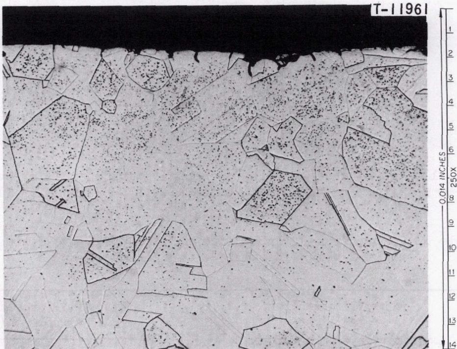  
Fig. 12. Hot-Leg Surface of Nickel-Molybdenum Alloy Containing 1.44 at. % W after 500-hr Exposure to Salt 107. Heat OR 30-19.

Relative Thermodynamic Stabilities of Alloying Constituents

Since the salt mixtures supplied for this investigation were very uniform in composition, one can presume that the same relative activities of $\mathrm{UF_4}$ and $\mathrm{UF_3}$ existed at the start of each test. It follows, therefore, that the relative extent of reaction which occurred between the salt mixtures and an alloying element

$$
x \underline {{M}} + y U F _ {4} = M _ {x} F _ {y} + y U F _ {3}
$$

for which

$$
K _ {\alpha} = \frac {\alpha_ {M x F y} \cdot \alpha^ {y} U F _ {4}}{\alpha^ {x} \underline {{M}} \cdot \alpha^ {y} U F _ {3}} \tag {12}
$$

should be directly related to the activity of the fluoride compounds,

M F y, involving that element.

An indication of the relative activities of these compounds is provided by a consideration of their standard free energies of formation, as derived from the reaction

$$
x M + \frac {y}{2} F _ {2} (g) = M x F y \tag {13}
$$

where

$$
\alpha_ {\underset {x y} {M F}} = e ^ {- \frac {\Delta G _ {T} ^ {\circ}}{R T}}.
$$

In Table 13 are listed the standard free energies of formation, per gram-atom of fluorine, of fluoride compounds at 800 and $600^{\circ}\mathrm{C}$ associated with each of the alloying elements investigated. Values are given for the most stable compounds (that is, those with most negative free energies) reported18 for these elements, and are listed in order of decreasing stabilities. The resultant order suggests that corrosion-product concentrations associated with each element at a given activity should have increased in the following order: W, Nb, Fe, Cr, V, Ti, and Al.

In Fig. 13, the general ranges of corrosion-product concentrations actually observed for these components, when present as single alloying additions, are plotted as a function of alloy content. It is seen that,

Table 13. Relative Thermodynamic Stabilities of Fluoride Compounds Formed by Elements Employed as Alloying Additions (Data Compiled by Glassner)a   

<table><tr><td>Element</td><td>Most Stable Fluoride Compound</td><td>ΔG°800°C
Kcal/g atom of F</td><td>ΔG°800°C
Kcal/g atom of F</td></tr><tr><td>Al</td><td>AlF3</td><td>-87</td><td>-92</td></tr><tr><td>Ti</td><td>TiF3</td><td>-85</td><td>-90</td></tr><tr><td>V</td><td>VF2</td><td>-80</td><td>-84</td></tr><tr><td>Cr</td><td>CrF2</td><td>-72</td><td>-77</td></tr><tr><td>Fe</td><td>FeF2</td><td>-66</td><td>-66</td></tr><tr><td>Nb</td><td>NbF5</td><td>-58</td><td>-60</td></tr><tr><td>W</td><td>WF5</td><td>-46</td><td>-48</td></tr></table>

aA. Glassner, The Thermodynamic Properties of the Oxides, Fluorides, and Chlorides to $2500^{\circ}\mathrm{K}$ , ANL-5750.

with the exception of niobium and tungsten, the concentrations per atomic per cent of addition do increase in the exact order predicted. Only tungsten noticeably deviates from this predicted behavior; the causes for this deviation have not been established, although the number of tests completed on alloys with tungsten additions were quite limited.

# General Discussion of Alloying Effects

The corrosion-product concentrations associated with either iron, niobium, or tungsten alloying additions were much lower when these elements existed in multicomponent alloys than in simple ternary alloys. The reason for this behavior is undoubtedly associated with the presence of the more reactive alloying additions in the multicomponent alloys. Consider, for example, a system containing comparable additions of chromium and iron, for which the corrosion reactions are

$$
\underline {{\mathrm {C r}}} + 2 \mathrm {U F} _ {4} = \mathrm {C r F} _ {2} + 2 \mathrm {U F} _ {3}: \quad \underline {{\Delta G}} _ {\mathrm {I}} \tag {14}
$$

$$
\underline {{\mathrm {F e}}} + 2 \mathrm {U F} _ {4} = \mathrm {F e F} _ {2} + 2 \mathrm {U F} _ {3}: \quad \Delta G _ {\mathrm {I I}} \cdot \tag {15}
$$

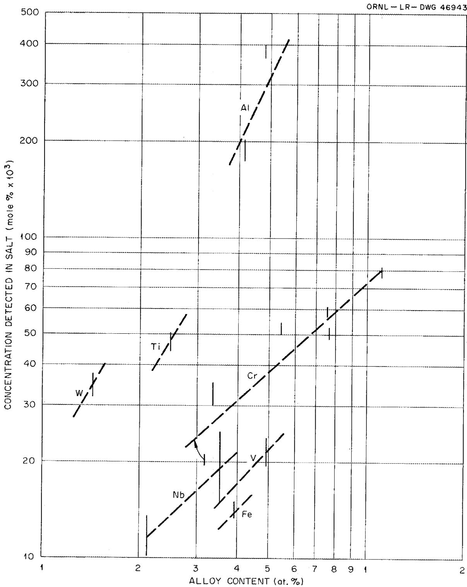  
Fig. 13. Comparison of Corrosion-Product Concentrations Formed in Salt 107 by Various Alloying Additions as a Function of Alloy Content.

Since $\Delta G_{\mathrm{I}}$ is considerably more negative than $\Delta G_{\mathrm{II}}$ , the equilibrium $\mathrm{UF}_3$ concentration produced by the first reaction is higher than that which would be produced by the second reaction. According to the law of mass action, therefore, the $\mathrm{FeF}_2$ concentration at equilibrium should be reduced in the presence of chromium compared to a system containing iron only.

While this means of corrosion inhibition was effective for those alloying components less reactive than chromium, its effect was not apparent among elements of relatively high reactivities. Thus, chromium corrosion-product concentrations were the same in the case of alloys containing both aluminum and chromium as in the case of alloys containing chromium alone. Similarly, the presence of aluminum did not noticeably reduce the titanium-corrosion products associated with titanium-containing alloys. For most of the multicomponent alloys, the amount of chromium and titanium, on an atomic percent basis, exceeded that of aluminum; consequently their activities could have approached the activity of the aluminum component. Nevertheless, the high aluminum concentrations of fluoride mixtures after these tests suggest a level of $\mathrm{UF}_3$ higher than would have been produced by either chromium or titanium alone, so that some inhibitive action would be predicted. The fact that none occurred may suggest that the measured aluminum concentrations were somewhat higher than actually existed.[19]

# SUMMARY AND CONCLUSIONS

The corrosion properties of solid-solution alloying elements in the Ni-17% Mo system were investigated in molten mixtures of NaF-LiF-KF-UF $_4$ (11.2-41.0-45.3-2.5 mole %). The corrosion susceptibility of alloying additions was found to increase in the following order: Fe, Nb, V, Cr, W, Ti, and Al. With the exception of tungsten, the susceptibility of

these elements to corrosion increased in approximately the same order as the stabilities of fluoride compounds of the elements.

The corrosion-product concentrations produced by either iron, niobium or tungsten alloying additions in the above salt mixture were much lower when these elements existed in combination with chromium, titanium, or aluminum than when they existed as single alloying additions. In contrast, corrosion-product concentrations associated with chromium, titanium, or aluminum were unchanged by the presence of other alloying constituents.

The metallographic examinations of all alloys investigated under this program showed considerably less corrosion than Inconel under equivalent conditions. Surface roughening or shallow pitting was manifested in hot-leg sections of all the loops tested. Shallow subsurface voids were also seen in aluminum- and niobium-containing systems. Alloys containing more than one alloying addition invariably were attacked to depths greater than alloys containing each of the additions individually. The greatest depths of attack, which ranged from 0.003 to 0.0045 in. in 1000-hr exposures, were incurred in alloys which contained combined additions of aluminum and chromium or aluminum and titanium. Alloys without either aluminum or titanium in no case exhibited attack to depths of more than 0.002 in. and generally showed attack in the range from 0.001 to 0.002 in.

In the case of the majority of alloys tested, the depth of attack increased at a greater rate between 0 and 500 hr than between 500 and 1000 hr. This finding is in agreement with the concentrations of corrosion products, which in general increased only slightly between the periods of 500 and 1000 hr. Both results suggest that nearly steady-state conditions were established within the first 500 hr of test operation.

In view of the generally favorable results of these tests, one has considerable freedom in the choice of potential alloying components for nickel-molybdenum alloys for molten salt service. Only titanium and aluminum appear to afford potential corrosion problems, particularly if used as combined additions or in combination with chromium. Thus, the choice of an optimum alloy composition for any given application can be judged mainly on the basis of strength and fabrication requirement.

# ACKNOWLEDGMENTS

The many loop experiments reported here were carried out under the skilled hand of M. A. Redden. The author is also indebted to W. O. Harms for his editorial assistance and guidance as thesis advisor.

# INTERNAL DISTRIBUTION

1-3. Central Research Library   
4-5. ORNL Y-12 Technical Library Document Reference Section

16. Laboratory Records, ORNL-RC   
17. ORNL Patent Office   
18. R. K. Adams   
19. G.M. Adamson   
20. R.G.Affel

6-15. Laboratory Records   
21. J. L. Anderson   
22. R.F.Apple   
23. C. F. Baes   
24. J. M. Baker   
25. S.J.Ball   
26. C. E. Bamberger   
27. C. J. Barton   
28. H. F. Bauman   
29. S. E. Beall   
30. R. L. Beatty   
31. M.J.Bell   
32. M. Bender   
33. C. E. Bettis   
34. E. S. Bettis   
35. D. S. Billington   
36. R. E. Blanco   
37. F. F. Blankenship   
38. J. O. Blomeke   
39. R. Blumberg   
40. E. G. Bohlmann   
41. C. J. Borkowski   
42. G. E. Boyd   
43. J. Braunstein   
44. M. A. Bredig   
45. R. B. Briggs   
46. H. R. Bronstein   
47. G. D. Brunton   
43. D. A. Canonico   
49. S. Cantor   
50. W. L. Carter   
51. G. I. Cathers   
52. O. B. Cavin   
53. A. Cepolina   
54. J. M. Chandler   
55. F. H. Clark   
56. W.R.Cobb   
57. H. D. Cochran

58. C. W. Collins   
59. E. L. Compere   
60. K. V. Cook   
61. W.H.Cook   
62. L. T. Corbin   
63. B. Cox   
64. J. L. Crowley   
65. F. L. Culler   
66. D. R. Cuneo   
67. J. E. Cunningham   
68. J.M.Dale   
69. D. G. Davis   
70. R. J. DeBakker

71-80. J.H.DeVan

81. S. J. Ditto   
82. A. S. Dworkin   
83. I. T. Dudley   
34. D. A. Dyslin   
85. W. P. Eatherly   
86. J. R. Engel   
87. E.P.Epler   
88. R. B. Evans III   
89. D. E. Ferguson   
90. L. M. Ferris   
91. A. P. Fraas   
92. H. A. Friedman   
93. J.H Frye, Jr.   
94. W. K. Furlong   
95. C. H. Gabbard   
96. R.B.Gallaher   
97. R.E.Gehlbach   
98. J.H.Gibbons   
99. L. O. Gilpatrick   
OO. W.R.Grimes   
O1. A. G. Grindell   
02. R.W.Gunkel   
03. R.H.Guymon   
O4. J.P.Hammond   
05. B. A. Hannaford   
06. P. H. Harley   
O7. D. G. Harman   
08. W. O. Harms   
09. C. S. Harrill   
10. P. N. Haubenreich   
11. R.E.Helms   
12. P. G. Herndon

113. D. N. Hess   
114. J. R. Hightower

115-117. M.R.Hill   
118. H.W.Hoffman   
119. D. K. Holmes   
120. P. P. Holz   
121. R.W.Horton   
122. A. Houtzeel   
123. T. L. Hudson   
124. W. R. Huntley   
125. H. Inouye   
126. W.H. Jordan   
127. P. R. Kasten   
128. R.J.Kedl   
129. M. T. Kelley   
130. M. J. Kelly   
131. C. R. Kennedy   
132. T. W. Kerlin   
133. H. T. Kerr   
134. J. J. Keyes   
135. D. V. Kiplinger   
136. S. S. Kirslis   
137. J.W.Koger   
138. R. B. Korsmeyer   
139. A. I. Krakoviak   
140. T. S. Kress   
141. J. W. Krewson   
142. C.E.Lamb   
143. J. A. Lane   
144. C. E. Larson   
145. J. J. Lawrence   
146. M. S. Lin   
147. R.B.Lindauer   
148. A. P. Litman   
149. G. H. Llewellyn   
150. E. L. Long, Jr.   
151. A. L. Lotts   
152. M. I. Lundin   
153. R.N.Lyon   
154. R. L. Macklin   
155. H. G. MacPherson   
156. R. E. MacPherson   
157. J.C.Mailen   
158. D. L. Manning   
159. C. D. Martin   
160. W. R. Martin   
161. H. V. Mateer   
162. T. H. Mauney   
163. H. McClain   
164. R.W. McClung   
165. H. E. McCoy   
166. D. L. McElroy

167. C. K. McGlothlan   
163. C.J.McHargue   
169. L. E. McNeese   
170. J. R. McWherter   
171. H. J. Metz   
172. A. S. Meyer   
173. R. L. Moore   
174. D. M. Moulton   
175. T.W.Mueller   
176. H. A. Nelms   
177. H. H. Nichol   
178. J. P. Nichols   
179. E. L. Nicholson   
180. L.C.Oakes   
181. P. Patriarca   
182. A.M.Perry   
183. T. W. Pickel   
184. H. B. Piper   
185. B. E. Prince   
186. G. L. Ragan   
187. J. L. Redford   
188. M. Richardson   
189. G. D. Robbins   
190. R.C. Robertson   
191. K. A. Romberger   
192. R.G.Ross   
193. H. C. Savage   
194. W.F. Schaffer   
195. C. E. Schilling   
196. Dunlap Scott   
197. J. L. Scott   
198. H. E. Seagren   
199. C. E. Sessions   
200. J.H.Shaffer   
201. W.H.Sides   
202. G. M. Slaughter   
203. A. N. Smith   
204. F.J.Smith   
205. G.P. Smith   
206. O. L. Smith   
207. P.G.Smith   
208. I. Spiewak   
209. R.C.Steffy   
210. W.C.Stoddart   
211. H. H. Stone   
212. R.A. Strehlow   
213. D. A. Sundberg   
214. J. R. Tallackson   
215. E.H.Taylor   
216. W. Terry   
217. R.E.Thoma   
218. P. F. Thomason

219. L.M.Toth

230. K. W. West

220. D. B. Trauger

231. M. E. Whatley

221. W.E.Unger

232. J.C. White

222. G.M.Watson

233. R.P.Wichner

223. J. S. Watson

234. L. V. Wilson

224. H. L. Watts

235. Gale Young

225. C.F.Weaver

236. H.C.Young

226. B.H.Webster

237. J.P.Young

227. A.M.Weinberg

238. E. L. Youngblood

228. J. R. Weir

239. F. C. Zapp

229. W. J. Werner

# EXTERNAL DISTRIBUTION

240. G. G. Allaria, Atomics International

241. J. G. Asquith, Atomics International

242. D. F. Cope, RDT, SSR, AEC, Oak Ridge National Laboratory

243. C. B. Deering, AEC, OSR, Oak Ridge National Laboratory

244. H. M. Dieckamp, Atomics International

245. A. Ciambusso, AEC, Washington

246. F. D. Haines, AEC, Washington

247. C. E. Johnson, AEC, Washington

243. W. L. Kitterman, AEC, Washington

249. W. J. Larkin, AEC, Oak Ridge Operations

250-251. T. W. McIntosh, AEC, Washington

252. A. B. Martin, Atomics International

253. D. G. Mason, Atomics International

254. G. W. Meyers, Atomics International

255. D. E. Reardon, AEC, Canoga Park Area Office

256. H. M. Roth, AEC, Oak Ridge Operations

257. M. Shaw, AEC, Washington

258. J. M. Simmons, AEC, Washington

259. W. L. Smalley, AEC, Washington

260. S. R. Stamp, AEC, Canoga Park Area Office

261. E. E. Stansbury, the University of Tennessee

262. R. F. Sweek, AEC, Washington

263. A. Taboada, AEC, Washington

264. R. F. Wilson, Atomics International

265. Laboratory and University Division, AEC, Oak Ridge Operations

266-280. Division of Technical Information Extension