ORNL-TM-2029

MASTER

INVESTIGATION OF ONE CONCEPT OF A THERMAL SHIELD FOR THE ROOM HOUSING A MOLTEN-SALT BREEDER REACTOR

W. K. Crowley

J.R.Rose

# LEGAL NOTICE

This report was prepared as an account of Government sponsored work. Neither the United States, nor the Commission, nor any person acting on behalf of the Commission:

A. Makes any warranty or representation, expressed or implied, with respect to the accuracy, completeness, or usefulness of the information contained in this report, or that the use of any information, apparatus, method, or process disclosed in this report may not infringe privately owned rights; or   
B. Assumes any liabilities with respect to the use of, or for damages resulting from the use of any information, apparatus, method, or process disclosed in this report.

As used in the above, "person acting on behalf of the Commission" includes any employee or contractor of the Commission, or employee of such contractor, to the extent that such employee or contractor of the Commission, or employee of such contractor prepares, disseminates, or provides access to, any information pursuant to his employment or contract with the Commission, or his employment with such contractor.

Contract No. W-7405-eng-26

General Engineering Division

INVESTIGATION OF ONE CONCEPT OF A THERMAL SHIELD FOR THE ROOM HOUSING A MOLTEN-SALT BREEDER REACTOR

W. K. Crowley  
J. R. Rose

NOVEMBER 1967

OAK RIDGE NATIONAL LABORATORY Oak Ridge, Tennessee operated by UNION CARBIDE CORPORATION for the

U. S. ATOMIC ENERGY COMMISSION


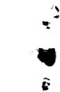

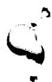

# CONTENTS

Page

Abstract 1

1. INTRODUCTION 1   
2. SUMMARY 4   
3. DEVELOPMENT OF ANALYTICAL METHODS 6

Steady-State Condition 7

Derivation of Equations 8

Calculational Procedure 15

Transient Case 17

4. PARAMETRIC STUDIES 20

Cases Studied for Steady-State Condition 20   
Case Studied for Transient Condition 29

5. CONCLUSIONS 35

Appendix A. EQUATIONS NECESSARY TO CONSIDER A MULTIENERGETIC GAMMA CURRENT 41

Appendix B. EVALUATION OF THE CONVECTIVE HEAT TRANSFER COEFFICIENT 44   
Appendix C. VALUES OF PHYSICAL CONSTANTS USED IN THIS STUDY 46   
Appendix D. TSS COMPUTER PROGRAM 47   
Appendix E. NOMENCLATURE 60

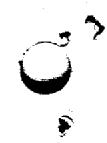

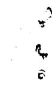

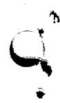

# LIST OF TABLES

<table><tr><td>Table Number</td><td>Title</td><td>Page Number</td></tr><tr><td>1</td><td>Results of Investigation of First Steady-State Case</td><td>22</td></tr><tr><td>2</td><td>Results of Investigation of Second Steady-State Case</td><td>23</td></tr><tr><td>3</td><td>Results of Investigation of Third Steady-State Case</td><td>24</td></tr><tr><td>4</td><td>Results of Investigation of Fourth Steady-State Case</td><td>25</td></tr><tr><td>5</td><td>Results of Investigation of Fifth Steady-State Case</td><td>26</td></tr><tr><td>6</td><td>Results of Investigation of Sixth Steady-State Case</td><td>27</td></tr><tr><td>7</td><td>Results of Investigation of Seventh Steady-State Case</td><td>28</td></tr><tr><td>8</td><td>Computer Program Used to Analyze the Proposed Reactor Room Wall for the Condition of Internal Heat Generation</td><td>31</td></tr><tr><td>9</td><td>Range of Parameters of Interest in Studies Made of Proposed Wall With An Incident Gamma Current of 1 x 1013 photons/cm2·sec</td><td>36</td></tr><tr><td>D.1</td><td>Typical Data for 32 Cases With One Energy Group for the TSS Computer Program</td><td>54</td></tr><tr><td>D.2</td><td>TSS Output Data at the Bottom of the Air Channel for One Case</td><td>58</td></tr><tr><td>D.3</td><td>TSS Output Data at the Top of the Air Channel for One Case</td><td>59</td></tr></table>

1 2 3 4 5 6 7 8 9 10 11 12 13 14 15 16 17 18 19 20

1 2 3 4 5 6 7 8 9 10 11 12 13 14 15 16 17 18 19 20 21 22 23 24 25 26 27 28 29 30 31 32 33 34 35 36 37 38 39 40 41 42 43 44 45 46 47 48 49 50 51 52 53 54 55 56 57 58 59 60

20 13 14 15 16 17 18 19 20 21 22 23 24 25 26 27 28 29 30 31 32 33 34 35 36 37 38 39 40 41 42 43 44 45 46 47 48 49 50 51 52 53 54 55 56 57 58 59 60

#

#

__________

LIST OF FIGURES   

<table><tr><td>Figure Number</td><td>Title</td><td>Page Number</td></tr><tr><td>1</td><td>Proposed Configuration of Reactor Room Wall</td><td>2</td></tr><tr><td>2</td><td>Proposed Configuration of Reactor Room Wall With Corresponding Terminology</td><td>6</td></tr><tr><td>3</td><td>Designations Given Segments of Reactor Room Wall for Study of Transient Conditions</td><td>18</td></tr><tr><td>4</td><td>Temperature Distribution in Proposed Reactor Room Wall With Internal Heat Generation Rate Maintained During Loss-of-Wall-Coolant Transient Period</td><td>33</td></tr><tr><td>5</td><td>Temperature Distribution in Proposed Reactor Room Wall With No Internal Heat Generation During the Loss-of-Wall-Coolant Transient Period</td><td>34</td></tr><tr><td>D.1</td><td>Assembly of Data Cards for TSS Computer Program</td><td>53</td></tr></table>

# INVESTIGATION OF ONE CONCEPT OF A THERMAL SHIELD FOR THE ROOM HOUSING A MOLTEN-SALT BREEDER REACTOR

# Abstract

The concrete providing the biological shield for a 250-Mw(e) molten-salt breeder reactor must be protected from the gamma current within the reactor room. A configuration of a laminated shielding wall proposed for the reactor room was studied to determine (1) its ability to maintain the bulk temperature of the concrete and the maximum temperature differential at levels below the allowable maximums, (2) whether or not the conduction loss from the reactor room will be kept below a given maximum value, (3) whether air is an acceptable medium for cooling the wall, and (4) the length of time that a loss of this coolant air flow can be sustained before the bulk temperature of the concrete exceeds the maximum allowable temperature. Equations were developed to study the heat transfer and shielding properties of the proposed reactor room wall for various combinations of lamination thicknesses. The proposed configuration is acceptable for (1) an incident monoenergetic (1 Mev) gamma current of $1 \times 10^{12}$ photons/cm²·sec and (2) an insulation thickness of 5 in. or more. The best results are obtained when most of the gamma-shield steel is placed on the reactor side of the cooling channel.

# 1. INTRODUCTION

Thermal-energy molten-salt breeder reactors (MSBR) are being studied to assess their economic and nuclear performance and to identify important design problems. One design problem identified during the study made of a conceptual 1000-Mw(e) MSBR power plant<sup>1</sup> was that there will be a rather intense gamma current in the room in which the molten-salt breeder reactor is housed. The concrete wall providing the biological shield around the reactor room must be protected from this intense gamma current to limit

gamma heating in the concrete. Further, the concrete must be protected from the high ambient temperature in the reactor room. One possible method of protecting the concrete is the application of layers of gamma and thermal shielding and insulating materials on the reactor side of the concrete. A proposed configuration of the layered-type wall for the reactor room is illustrated in Fig. 1.

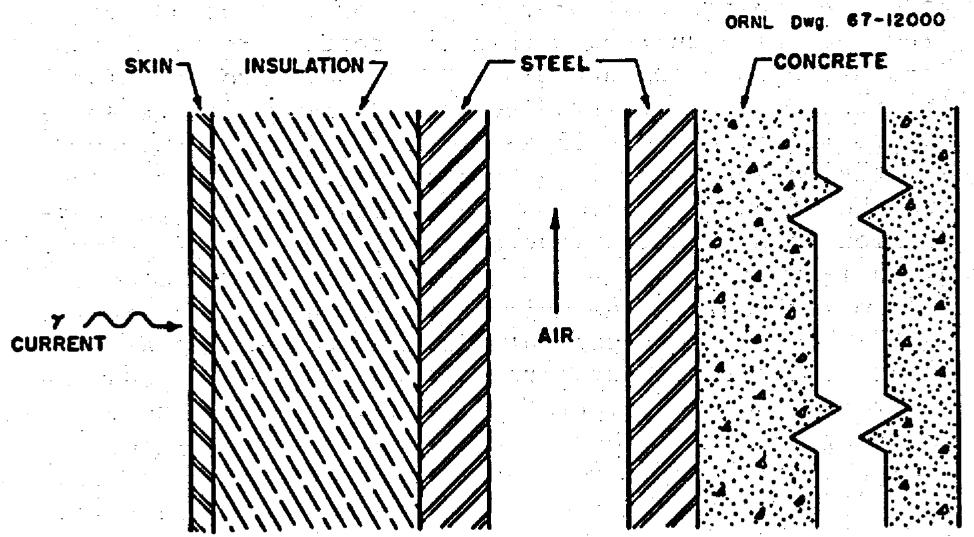  
Fig. 1. Proposed Configuration of Reactor Room Wall.

The study reported here was made to investigate this proposed configuration of a reactor room wall for the modular concept<sup>1</sup> of a 1000-Mw(e) MSBR power plant. This modular plant would have four separate and identical 250-Mw(e) reactors with their separate salt circuits and heat-exchange loops. This preliminary investigation was made to determine whether or not the proposed configuration for the reactor room wall will

1. maintain the bulk temperature of the concrete portion of the wall at levels below $212^{\circ}\mathrm{F}$ ,   
2. maintain the temperature differential in the concrete lamination at less than $40^{\circ}\mathrm{F}$ (a fairly conservative value), and   
3. maintain the conduction loss from a reactor room at 1 Mw or less. This study was also performed to determine whether or not air is a suitable medium for cooling the reactor room wall and to determine the length of time over which the loss of this air flow can be tolerated before the

bulk temperature of the concrete lamination exceeds the maximum allowable temperature of $212^{\circ}\mathrm{F}$ .

Analysis of the proposed configuration for the wall of the reactor room was based on an investigation of the heat transfer and shielding properties of the composite wall shown in Fig. 1. Equations were developed that would allow these properties to be examined parametrically for various combinations of lamination materials and thicknesses in the wall.

# 2. SUMMARY

Methods were devised to parametrically analyze a composite plane wall with internal heat generation produced by the attenuation of the gamma current from the reactor room. Both steady state and transient conditions were considered. Thirty-one equations were derived and a computer program was written to examine the heat transfer and shielding properties of the proposed wall for various combinations of lamination materials and thicknesses. Incident monoenergetic (1 Mev) gamma currents of $1 \times 10^{12}$ photons/cm²·sec through $3 \times 10^{12}$ photons/cm²·sec were examined. A finite difference approach, with the differencing with respect to time, was used in the transient-condition analysis to obtain a first approximation of the amount of time that the proposed wall could sustain a loss of coolant air flow.

The results of these studies indicate that the proposed configuration of the laminated wall in the reactor room is acceptable for the cases considered with an incident monoenergetic (1 Mev) gamma current of $1 \times 10^{12}$ photons/cm²·sec and a firebrick insulation lamination of 5 in. or more. Under these conditions, a total of approximately 4 in. of steel is sufficient for gamma shielding. The best results are obtained when the thicknesses of the mild-steel gamma shields are arranged so that the major portion of the steel is on the reactor side of the air channel. However, the proposed configuration of the laminated wall for the reactor room does not protect the concrete from excessive temperature when the incident monoenergetic gamma current is $2 \times 10^{12}$ photons/cm²·sec.

With an incident monoenergetic (1 Mev) gamma current of $1 \times 10^{12}$ photons/cm²·sec, the proposed laminated wall will maintain the temperature differential in the steel to within $10^{\circ}\mathrm{F}$ or less for all the cases studied. The differential between the temperature of the steel-concrete interface and the maximum temperature of the concrete is less than $15^{\circ}\mathrm{F}$ for all the cases studied. The values of both of these temperature differentials are well below a critical value.

Based on the assumption that the floor and ceiling of the reactor room have the same laminated configuration as the walls, the proposed

wall will allow the conduction loss from the reactor room to be maintained at a level below 1 Mw for an incident monoenergetic (1 Mev) gamma current of $1 \times 10^{12}$ photons/cm²·sec if the thickness of the firebrick insulation lamination is 5 in. or more and if at least 4 in. of mild-steel gamma shielding is included.

With a coolant air channel width of 3 in. and an air velocity of 50 ft/sec, air is an acceptable medium for cooling the proposed reactor room wall. If the ambient temperature of the reactor room remains at approximately $1100^{\circ}\mathrm{F}$ and if the gamma current is maintained at $1 \times 10^{12}$ photons/cm²·sec, the temperature of the concrete will remain below the critical level (2120F) for approximately one hour after a loss of the coolant air flow. If a zero incident gamma current is assumed, the "permissible" loss-of-coolant-air-flow time is greater than one hour but less than two hours.

To determine whether or not a conduction loss of 1 Mw will permit maintenance of the desired ambient temperature within the reactor room without the addition of auxiliary cooling or heating systems, an overall energy balance should be performed when sufficient information becomes available. This balance should start with the fissioning process in the reactor and extend out through the wall of the reactor room to an outside surface.

# 3. DEVELOPMENT OF ANALYTICAL METHODS

In the modular concept of a 1000-Mw(e) MSBR power plant, $^{1}$ the four identical but separate 250-Mw(e) molten-salt breeder reactors would be housed in four separate reactor rooms. One primary fuel-salt-to-coolant-salt heat exchanger and one blanket-salt-to-coolant-salt heat exchanger would also be housed in each reactor room along with the reactor. These items of equipment are to be located 11 ft from each other in the 52-ft-long reactor room that is 22 ft wide and 48 ft high. The reactor and the primary fuel-salt-to-coolant-salt heat exchanger are responsible for the gamma current in each of the reactor rooms. The proposed configuration of the laminations devised to protect the concrete from the gamma current in the reactor room is shown in Fig. 2 with the corresponding terminology used in the parametric studies made of the composite wall.

1P. R. Kasten, E. S. Bettis, and R. C. Robertson, "Design Studies of 1000-Mw(e) Molten-Salt Breeder Reactors," USAEC Report ORNL-3996, Oak Ridge National Laboratory, August 1966.

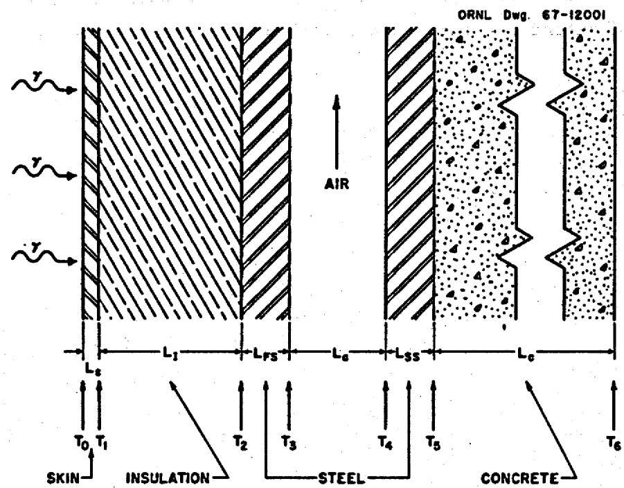  
Fig. 2. Proposed Configuration of Reactor Room Wall With Corresponding Terminology.

In the direction from the interior of the reactor room out to the outer surface of the wall (left to right in Fig. 2), the layers of material comprising the wall are a stainless steel skin, firebrick insulation, a mild-steel gamma shield, an air channel, a mild-steel gamma shield, and the concrete biological shield. The thicknesses of the firebrick insulation and each of the two mild-steel gamma shields are considered to be the variable parameters in this study. The thickness of the stainless steel skin is fixed at 1/16 in., the thickness of the concrete is either 8 ft for an exterior wall or 3 ft for an interior wall, and the width of the air channel is fixed at 3 in.

The temperature of the interior surface of the reactor room wall is considered to be uniform over the surface and constant at $1100^{\circ}\mathrm{F}$ . The temperature of the exterior surface of the wall is considered to be uniform over the surface and constant at $50^{\circ}\mathrm{F}$ for the 8-ft thickness of concrete (the temperature of the earth for an exterior wall) or at $70^{\circ}\mathrm{F}$ for the 3-ft thickness of concrete (the ambient temperature of an adjoining room within the facility for an interior wall). The temperature of the coolant air is assumed to be $100^{\circ}\mathrm{F}$ at the bottom (entrance) of the air channel, and the velocity of the air is assumed to be 50 ft/sec.

The situation examined is basically one involving a composite plane wall with internal heat generation caused by the attenuation of the gamma current from the reactor room. Two conditions were considered: the steady-state condition and the transient condition. The steady-state condition was considered first and the transient condition was considered later when the problem of a loss of wall coolant was examined.

# Steady-State Condition

Equations were developed to allow the heat transfer and shielding properties of the composite wall, shown in Fig. 2, to be examined parametrically for various combinations of lamination materials and thicknesses. A one-dimensional analysis was used, assuming that the temperatures of the interior and exterior surfaces of the wall were constant and uniform.

A steady-state energy balance on a differential element of the reactor room wall can be expressed semantically as follows. The heat conducted into the element through the left face during the time $\Delta \theta$ plus the heat generated by sources in the element during the time $\Delta \theta$ equals the heat conducted out of the element through the right face during the time $\Delta \theta$ . This is expressed algebraically in Eq. 1.

$$
- k A _ {1} \left. \frac {d T}{d x} \right| _ {x} \Delta \theta + Q (A _ {1} \Delta x) \Delta \theta = - k A _ {1} \left. \frac {d T}{d x} \right| _ {x + \Delta x} \Delta \theta , \tag {1}
$$

where

$$
k = \text {t h e r m a l}
$$

$$
A _ {1} = \text {u n i t a r e a o n w a l l}, f t ^ {2},
$$

$$
\mathbf {T} = \text {t e m p e r a t u r e}, ^ {\mathbf {o}} \mathbf {F},
$$

$$
x = \text {d i s t a n c e}
$$

$$
\theta = \text {t i m e}, \text {h o u r s}, \text {a n d}
$$

$$
Q = \text {v o l u m e t r i c g a m m a h e a t i n g r a t e}, B t u / h r \cdot f t ^ {3}.
$$

Application of the mean-value theorem to dT/dx gives the expression of Eq. 2.

$$
\left. \frac {d T}{d x} \right| _ {x + \Delta x} = \left. \frac {d T}{d x} \right| _ {x} + \left[ \frac {d}{d x} \left(\frac {d T}{d x}\right) \right] _ {M} \Delta x, \tag {2}
$$

where $M$ is a point between $x$ and $x + \Delta x$ . Equation 2 is substituted into Eq. 1 and $\Delta \theta$ is canceled.

$$
- k A _ {1} \left. \frac {d T}{d x} \right| _ {x} + Q (A _ {1} \Delta x) = - k A _ {1} \left. \frac {d T}{d x} \right| _ {x} - k A _ {1} \left[ \frac {d}{d x} \left(\frac {d T}{d x}\right) \right] _ {M} \Delta x. \tag {3}
$$

The common term $-kA_{1}\left.\frac{dT}{dx}\right|_{x}$ is canceled, and it is noted that $\frac{d}{dx}\left(\frac{dT}{dx}\right) = d^2 T / dx^2$ . The resulting expression is given in Eq. 4.

$$
\mathrm {Q A} _ {1} \Delta \mathrm {x} = - \mathrm {k A} _ {1} \left. \frac {\mathrm {d} ^ {2} \mathrm {T}}{\mathrm {d x} ^ {2}} \right| _ {\mathrm {M}} \Delta \mathrm {x}. \tag {4}
$$

Dividing Eq. 4 by $A_1 \Delta x$ and allowing $\Delta x$ to approach zero as a limit so that a value at $M$ becomes a value at $x$ , the volumetric gamma heating rate,

$$
Q = - k \frac {d ^ {2} T}{d x ^ {2}}. \tag {5}
$$

Equation 5 is integrated twice, and if $Q \neq Q(x)$ ,

$$
T (x) = - \frac {Q}{2 k} x ^ {2} + C _ {1} x + C _ {2}. \tag {6}
$$

The applicable boundary conditions for any particular lamination in the wall are $\mathbf{T} = \mathbf{T}_0$ at $\mathbf{x} = 0$ and $\mathbf{T} = \mathbf{T}_L$ at $\mathbf{x} = L$ , where $\mathbf{T}_0$ is the temperature of the lamination interface at zero location designated in Fig. 2 and $L$ is the thickness of the material in a lamination in feet. These conditions are applied to Eq. 6.

$$
T (x) = T _ {0} + \frac {x}{L} \left(T _ {L} - T _ {0}\right) + \frac {Q}{2 k} \left(L x - x ^ {2}\right). \tag {7}
$$

The internal heat generation encountered in this study is caused by a deposition of energy in the form of heat when the gamma rays are attenuated by the materials in the wall of the room. Because of this attenuation of the gamma rays, the volumetric gamma heating rate, $Q$ , is a function of the distance perpendicular to the surface of the wall, $x$ . The equations derived in this study are based on the assumption that the incident gamma current is monoenergetic, but appropriate equations for a multi-energetic gamma current are given in Appendix A. For a mono-energetic gamma current where buildup and exponential attenuation are considered, the equation for $Q(x)$ becomes

$$
Q (x) = Q _ {0} \left[ A e ^ {C \mu x} + (1 - A) e ^ {- \beta \mu x} \right] e ^ {- \mu x}, \tag {8}
$$

where

A, $\alpha$ , and $\beta =$ dimensionless constants used in the Taylor buildup equation

and $\mu =$ the total gamma attenuation coefficient, $f t^{-1}$

When

$$
Q _ {0} = E \Phi_ {0} \mu_ {E},
$$

$$
Q (x) = Q _ {0} \left[ A e ^ {\mu x (\alpha - 1)} + (1 - A) e ^ {- \mu x (\beta + 1)} \right], \tag {9}
$$

where

$Q_{0} =$ the volumetric gamma heating rate at the surface on the reactor side of the stainless steel skin, Btu/hr·ft³,

$\mathbf{E} =$ energy of the incident gamma current, Mev,

$\Phi_0 =$ incident gamma current, photons/cm²·sec, and

$\mu_{E} =$ gamma energy attenuation coefficient, ft-1.

Substituting Eq. 9 into Eq. 5,

$$
\frac {d ^ {2} \mathrm {T}}{d x ^ {2}} + \frac {Q _ {0}}{k} \left[ A e ^ {\mu x (\alpha - 1)} + (1 - A) e ^ {- \mu x (\beta + 1)} \right] = 0. \tag {10}
$$

Equation 10 is integrated twice to yield

$$
\begin{array}{l} T (x) = - \frac {Q _ {0}}{k} \left[ \frac {A}{\mu^ {2} (\alpha - 1) ^ {2}} e ^ {\mu x (\alpha - 1)} + \frac {(1 - A)}{\mu^ {2} (\beta + 1) ^ {2}} e ^ {- \mu x (\beta + 1)} \right] \\ + \mathrm {C} _ {3} \mathrm {x} + \mathrm {C} _ {4} = 0. \tag {11} \\ \end{array}
$$

The previously stated boundary conditions are still applicable, and the result of applying these conditions to Eq. 11 is that

$$
\begin{array}{l} \mathrm {T} (\mathbf {x}) = \mathrm {T} _ {0} + \frac {\mathrm {x}}{\mathrm {L}} \left(\mathrm {T} _ {\mathrm {L}} - \mathrm {T} _ {0}\right) \\ + \frac {Q _ {0}}{k \mu^ {2}} \left\{\left[ \frac {A}{(\alpha - 1) ^ {2}} \left(1 - e ^ {\mu x (\alpha - 1)}\right) + \frac {1 - A}{(\beta + 1) ^ {2}} \left(1 - e ^ {- \mu x (\beta + 1)}\right) \right] \right. \\ \left. - \frac {\mathrm {x}}{\mathrm {L}} \left[ \frac {\mathrm {A}}{(\alpha - 1) ^ {2}} \left(1 - e ^ {\mu \mathrm {L} (\alpha - 1)}\right) + \frac {1 - \mathrm {A}}{(\beta + 1) ^ {2}} \left(1 - e ^ {- \mu \mathrm {L} (\beta + 1)}\right) \right] \right\} \tag {12} \\ \end{array}
$$

The temperature distribution in any particular lamination of the wall is given by Eq. 12 when the appropriate constants for that lamination are used. Equation 12 is used primarily to determine the maximum temperature in the concrete and to determine the location of this maximum temperature. To locate the position of the maximum temperature in the concrete, Eq. 12 is differentiated with respect to $x$ , the resulting derivative (dT/dx) is set equal to zero, and the equation is solved for $x$ . The value of $x$ obtained gives the distance from the concrete-steel interface to the position of the maximum temperature in the concrete.

$$
\begin{array}{l} \frac {d T}{d x} = \frac {1}{L} \left(T _ {L} - T _ {0}\right) \\ + \frac {Q _ {0}}{k \mu^ {2}} \left\{\left[ \frac {A \mu}{(\alpha - 1)} \left(- e ^ {\mu x (\alpha - 1)}\right) + \frac {\mu (1 - A)}{\beta + 1} \left(+ e ^ {- \mu x (\beta + 1)}\right) \right] \right. \\ \left. - \frac {1}{L} \left[ \frac {A}{(\alpha - 1) ^ {2}} \left(1 - e ^ {\mu L (\alpha - 1)}\right) + \frac {1 - A}{(\beta + 1) ^ {2}} \left(1 - e ^ {- \mu L (\beta + 1)}\right) \right] \right\} = 0. \tag {13} \\ \end{array}
$$

Equation 13 is a transcendental equation in $\mathbf{x}$ , and as such, it must be solved by using a trial-and-error technique. There are only two terms in Eq. 13 that contain $\mathbf{x}$ , and these terms are rearranged to put Eq. 13 in a form more easily solved by trial and error.

$$
\begin{array}{l} \frac {Q _ {0} (1 - A)}{\mu k (\beta + 1)} e ^ {- \mu x (\beta + 1)} - \frac {Q _ {0} A}{\mu k (\alpha - 1)} e ^ {\mu x (\alpha - 1)} \\ = \frac {1}{L} \left(T _ {0} - T _ {L}\right) + \frac {1}{L} \left(\frac {Q _ {0}}{k \mu^ {2}}\right) \left[ \frac {A}{(\alpha - 1) ^ {2}} \left(1 - e ^ {\mu L (\alpha - 1)}\right) \right. \\ \left. + \frac {1 - A}{(\beta + 1) ^ {2}} \left(1 - e ^ {- \mu L (\alpha - 1)}\right) \right]. \tag {14} \\ \end{array}
$$

All of the coefficients on the left side of Eq. 14 are known, and all of the terms on the right side are known. Therefore, Eq. 14 may be written in the form

$$
\mathrm {K} _ {1} \mathrm {e} ^ {- a _ {1} \mathrm {X}} + \mathrm {K} _ {2} \mathrm {e} ^ {- a _ {2} \mathrm {X}} = \mathrm {K} _ {3}, \tag {15}
$$

where the K's and a's are calculable numbers. When Eq. 14 is solved for x, this value of x is called $\mathbf{x}_{\mathrm{Tmax}}$ . The value $\mathbf{x} = \mathbf{x}_{\mathrm{Tmax}}$ is substituted into Eq. 12 to obtain the maximum temperature of the concrete.

To determine the magnitude of the conduction loss, $\mathbf{q}^*$ , from the reactor room, equations were written to give the temperature drops across each separate lamination in the wall. These equations are simple conduction and convection equations in which all of the heat generated in a particular lamination is assumed to be conducted through a length equal to two-thirds of the thickness of the particular lamination. The total amount of gamma heat, $q_{\mathrm{T}}$ , deposited per unit area in a direction normal to the face of the wall is found for any particular lamination by integrating Eq. 9 over the length, $L$ , of the particular lamination.

$$
\begin{array}{l} q _ {T} = \int_ {0} ^ {L} Q _ {0} \left[ A e ^ {\mu x (\alpha - 1)} + (1 - A) e ^ {- \mu x (\beta + 1)} \right] d x (16) \\ = \frac {Q _ {0}}{\mu} \left[ \frac {A}{(\alpha - 1)} \left(e ^ {\mu L (\alpha - 1)} - 1\right) - \frac {1 - A}{\beta + 1} \left(e ^ {- \mu L (\beta + 1)} - 1\right) \right], (17) \\ \end{array}
$$

where $\mathbf{Q}_0$ is the incident volumetric gamma heating rate.

There are two possible ways to evaluate the incident volumetric gamma heating rate at some particular material interface, which shall be referred to as the "j-th" interface. The first way is to calculate the gamma current, $\Phi_{o(j)}$ , at each interface. To obtain $Q_{o(j)}$ , this calculated value of $\Phi_{o(j)}$ is substituted into the equation

$$
Q _ {0} (j) = E \Phi_ {0} (j) \mu_ {E}.
$$

The second method of evaluating the incident volumetric gamma heating rate involves subtracting the total amount of gamma heat deposited per unit area in the j-th lamination, $q_j$ , from the gamma energy current per unit area incident upon the j-th lamination, $q_{o(j)}$ , to approximate the gamma energy current per unit area incident upon the face of the following lamination $q_{o(j + 1)}$ .

$$
q _ {o (j + 1)} = q _ {o (j)} - q _ {j}. \tag {18}
$$

The volumetric gamma heating rate incident upon a particular lamination, $Q_{o(j)}$ , and the gamma energy current per unit area incident upon the $j$ -th lamination, $q_{o(j)}$ , are related by the following equation.

$$
q _ {o (j)} = Q _ {o (j)} / \mu_ {E (j)}. \tag {18a}
$$

Therefore,

$$
\mathrm {Q} _ {\mathrm {o} (\mathrm {j} + 1)} = \mathrm {q} _ {\mathrm {o} (\mathrm {j} + 1) ^ {\mu} \mathrm {E} (\mathrm {j} + 1)}. \tag {18b}
$$

These two methods are in fairly good agreement, and since the values for the various material constants were not well fixed at this point in the design for the reactor room wall, the second method of evaluating the incident volumetric gamma heating rate was used in this study. The second method is simpler to use and easier to calculate.

The equations for the steady-state temperature drops across each of the material laminations on the reactor side of the air channel are given below and the temperature points are as illustrated in Fig. 2.

$$
\mathrm {T} _ {0} - \mathrm {T} _ {1} = \frac {\left(\mathrm {q} ^ {*} + \frac {2}{3} \mathrm {q} _ {\mathrm {s}}\right) \mathrm {L} _ {\mathrm {s}}}{\mathrm {k} _ {\mathrm {s}}} \quad , \tag {19}
$$

where

$$
\begin{array}{l} q ^ {*} = \text {h e a t c o n d u c t i o n r a t e o u t o f t h e r e a c t o r r o o m , B t u / h r} ^ {2}, \\ \begin{array}{l} \mathbf {q} _ {\mathrm {s}} = \text {g a m m a h e a t d e p o s i t i o n r a t e i n t h e s t a i n l e s s s t e l o w e l o u t e r s k i n}, \\ \text {B t u / h r} \cdot \text {f t} ^ {2}, \end{array} \\ \end{array}
$$

$$
\begin{array}{l} L _ {s} = \text {t h i c k n e s s o f t h e s t a i n l e s s s e l e w s k i n , f t , a n d} \\ k _ {s} = \text {t h e r m a l c o n d u c t i v i t y o f t h e s t i a n s w e l l s k i n , B t u / h r \cdot f t \cdot {} ^ {o} F .} \\ \end{array}
$$

$$
\mathrm {T} _ {1} - \mathrm {T} _ {2} = \frac {\left(\mathrm {q} ^ {*} + \mathrm {q} _ {\mathrm {S}} + \frac {2}{3} \mathrm {q} _ {\mathrm {I}}\right) \mathrm {L} _ {\mathrm {I}}}{\mathrm {k} _ {\mathrm {I}}} \tag {20}
$$

where the subscript I refers to the insulation lamination shown in Fig. 2.

$$
\mathrm {T} _ {2} - \mathrm {T} _ {3} = \frac {\left(\mathrm {q} ^ {*} + \mathrm {q} _ {\mathrm {S}} + \mathrm {q} _ {\mathrm {I}} + \frac {2}{3} \mathrm {q} _ {\mathrm {F S}}\right) \mathrm {L} _ {\mathrm {F S}}}{\mathrm {k} _ {\mathrm {F S}}} \tag {21}
$$

where the subscript FS refers to the first mild-steel gamma shield (on the reactor side of the air channel).

$$
\mathrm {T} _ {3} - \mathrm {T} _ {\mathrm {a}} = \frac {\mathrm {q} ^ {*} + \mathrm {q} _ {\mathrm {S}} + \mathrm {q} _ {\mathrm {I}} + \mathrm {q} _ {\mathrm {F S}}}{\mathrm {h}}, \tag {22}
$$

where

$\mathbf{T}_{a} =$ temperature of the air in the channel, ${}^{\mathrm{0}}\mathbf{F}$ , and

h = convective heat transfer coefficient, Btu/hr·ft².⁰F.

The average convective heat transfer coefficient across the walls of the air channel is evaluated in Appendix B, and the value of 5 was determined for a mean temperature of from 130 to $150^{\circ}\mathrm{F}$ . It was assumed that the gamma heating in the air channel is negligible. Equations 19, 20, 21, and 22 were added and the resulting equation was solved for $\mathbf{q}^*$ . The heat conduction rate out of the reactor room to the air channel,

$$
\left(\mathrm {T} _ {\mathrm {o}} - \mathrm {T} _ {\mathrm {a}}\right) - q _ {\mathrm {s}} \left[ \left(\frac {2}{3}\right) \frac {\mathrm {L} _ {\mathrm {s}}}{\mathrm {k} _ {\mathrm {s}}} + \frac {\mathrm {L} _ {\mathrm {I}}}{\mathrm {k} _ {\mathrm {I}}} + \frac {\mathrm {L} _ {\mathrm {F S}}}{\mathrm {k} _ {\mathrm {F S}}} + \frac {1}{\mathrm {h}} \right]
$$

$$
q ^ {*} = \frac {- q _ {I} \left[ \left(\frac {2}{3}\right) \frac {L _ {I}}{k _ {I}} + \frac {L _ {F S}}{k _ {F S}} + \frac {1}{h} \right] - q _ {F S} \left[ \left(\frac {2}{3}\right) \frac {L _ {F S}}{k _ {F S}} + \frac {1}{h} \right]}{\left(\frac {L _ {s}}{k _ {s}} + \frac {L _ {I}}{k _ {I}} + \frac {L _ {F S}}{k _ {F S}} + \frac {1}{h}\right)}. \tag {23}
$$

On the concrete side of the air channel, the value of primary interest is the maximum temperature of the concrete, $T_{\text{max}}$ . This temperature may be determined by using Eqs. 12 and 14, but the temperature of the steel-concrete interface, $T_{5}$ , must be known before these equations can be used. The simple conduction and convection equations for the laminated wall on the concrete side of the air channel are given below.

$$
\mathrm {T} _ {4} - \mathrm {T} _ {\mathrm {a}} = \frac {\mathrm {q} _ {\mathrm {S S}} + \mathrm {q} _ {\mathrm {c}} ^ {\prime} + \mathrm {q} _ {\mathrm {R}}}{\mathrm {h}}, \tag {24}
$$

where

$$
\begin{array}{l} q _ {S S} = \text {g a m m a h e a t d e p o s i t i o n r a t e i n t h e s e c o n d m i l d - s t e e l g a m m a s h i e l d}, \\ B t u / h r \cdot f t ^ {2}, \end{array}
$$

$$
q _ {c} ^ {\prime} = \text {r a t e}
$$

$$
\begin{array}{l} q _ {R} = \text {r a d i a n t h e a t t r a n s f e r r a t e b e t w e e n t h e w a l l s o f t h e a i r c h a n n e l}, \\ B t u / h r \cdot f t ^ {2}, \end{array}
$$

$$
q _ {R} = \frac {\sigma}{\frac {2}{\epsilon} - 1} \left(T _ {3} ^ {4} - T _ {4} ^ {4}\right)
$$

where

$$
\begin{array}{l} \sigma = \text {S t e f a n - B o l t z m a n n c o n s t a n t} \\ = 0. 1 7 1 4 \times 1 0 ^ {- 6} \\ \end{array}
$$

$\epsilon =$ surface emissivity of air channel walls, assumed to the same for both surfaces.

$$
\mathrm {T} _ {5} - \mathrm {T} _ {4} = \frac {\left(\mathrm {q} _ {\mathrm {c}} ^ {\prime} + \frac {2}{3} \mathrm {q} _ {\mathrm {S S}}\right) \mathrm {L} _ {\mathrm {S S}}}{\mathrm {k} _ {\mathrm {S S}}} \cdot \tag {26}
$$

In this study, there is a point in the concrete at which the temperature of the concrete is a maximum. All of the gamma heat generated on the air channel side of that point will be conducted toward the air channel; that is, in the direction of decreasing temperature. This amount of heat, $q_{c}^{\prime}$ , may be calculated by evaluating $\frac{dT}{dx}$ in the concrete at $x = 0$ , using Eq. 13.

$$
\begin{array}{l} \left. \frac {d T}{d x} \right| _ {x = 0} = \frac {1}{L _ {c}} \left(T _ {6} - T _ {6}\right) + \frac {Q _ {o} (c)}{k _ {c} \mu^ {2}} \left\{\left[ - \frac {A _ {\mu}}{(\alpha - 1)} + \frac {\mu (1 - A)}{\beta + 1} \right] \right. \\ \left. - \frac {1}{L _ {c}} \left[ \frac {A}{(\alpha - 1) ^ {2}} \left(1 - e ^ {\mu L _ {c} (\alpha - 1)}\right) + \frac {1 - A}{(\beta + 1) ^ {2}} \left(1 - e ^ {- \mu L _ {c} (\beta + 1)}\right) \right] \right\}, \tag {27} \\ \end{array}
$$

recognizing that.

$$
q _ {c} ^ {\prime} = k _ {c} \left. \frac {d T}{d x} \right| _ {x = 0}, \tag {28}
$$

where the subscript $c$ denotes concrete. The right side of Eq. 28 is positive rather than negative because Eq. 27 makes positive conduction in the direction from the air channel toward the concrete, but $q_{c}^{\prime}$ is

to be made positive in the direction from the concrete toward the air channel. Equations 24, 25, 26, 27, and 28 were combined to yield one equation in which the only unknown is $\mathbf{T}_4$ . The value for $\mathbf{T}_3$ can be calculated from the equations for the reactor side of the air channel.

$$
\begin{array}{l} \left(\frac {\sigma}{\underline {{2}} - 1} \right\rvert   T _ {4} ^ {4} + T _ {4} \left(h + \frac {1}{\frac {L _ {S S}}{k _ {S S}} + \frac {L _ {c}}{k _ {c}}}\right) \\ = \left(\frac {\sigma}{\frac {2}{\epsilon} - 1}\right) T _ {3} ^ {4} + h T _ {a} + q _ {S S} + \frac {T _ {6} + \frac {L _ {c} Q _ {o} (c)}{k _ {c} \mu^ {2}} B ^ {\prime} - \frac {2 L _ {S S} q _ {S S}}{3 k _ {S S}}}{\frac {L _ {S S}}{k _ {S S}} + \frac {L _ {c}}{k _ {c}}} \tag {29} \\ \end{array}
$$

where

$$
\begin{array}{l} B ^ {\prime} = \left(\frac {\mu (1 - A)}{\beta + 1} - \frac {\mu A}{(\alpha - 1)}\right) - \frac {1}{L _ {c}} \left[ \frac {A}{(\alpha - 1) ^ {2}} \left(1 - e ^ {\mu L _ {c} (\alpha - 1)}\right) \right. \\ \left. + \frac {1 - A}{(\beta + 1) ^ {2}} \left(1 - e ^ {- \mu L _ {c} (\beta + 1)}\right) \right]. \tag {29a} \\ \end{array}
$$

The constants in Eq. 29a that have no identifying subscripts are understood to be for concrete. Equation 29 is also a transcendental equation. Therefore, a trial-and-error method must be used to solve for $\mathbf{T}_4$ . Once $\mathbf{T}_4$ and $q_c'$ are known, $\mathbf{T}_5$ can be calculated by using Eq. 25.

# Calculational Procedure

Since the calculation of certain of the desired quantities requires that the value of other desired quantities be known, there is a certain order in which the problem must be worked. For a particular case, the thickness of each of the laminations in the wall is selected, and the inside (reactor room) and outside (earth or internal) wall temperatures are specified. The incident gamma current and the temperature of the coolant air are also specified. The constants for the various equations are selected, and those used are given in Appendix C.

With the proper constants for each different lamination, Eq. 17 is first used to calculate the gamma heat depositions in each of the separate laminations $(q_{s}, q_{I}, q_{FS}, q_{SS},$ and $q_{c})$ . Equation 23 is then used to calculate the conduction loss from the reactor room $q^{\star}$ . The temperature drops and the interface temperatures on the reactor side of the air channel are calculated by using Eqs. 19, 20, 21, and 22. Equation 29 is used to calculate the value of $T_{4}$ , and then the value of $q_{R}$ is calculated by using Eq. 25. Then $q_{c}^{\prime}$ is calculated by using Eq. 24, and the value of $T_{5}$ is calculated by using Eq. 26. Once the value of $T_{5}$ is known, $x_{T \max}$ is obtained by using Eq. 14, and the maximum temperature of the concrete is calculated by evaluating Eq. 12 at $x = x_{T \max}$ .

At this point, it is possible to calculate the vertical temperature gradient $(^0\mathbf{F} / \mathbf{ft})$ in the coolant air. This temperature gradient,

$$
\Delta \mathrm {T} = \frac {\mathrm {q} _ {\mathrm {s}} + \mathrm {q} _ {\mathrm {I}} + \mathrm {q} _ {\mathrm {F S}} + \mathrm {q} _ {\mathrm {S S}} + \mathrm {q} ^ {*} + \mathrm {q} _ {\mathrm {R}} + \mathrm {q} _ {\mathrm {c}} ^ {\prime}}{3 6 0 0 \mathrm {U} _ {\mathrm {a}} \rho_ {\mathrm {a}} \mathrm {L} _ {\mathrm {c h}} \mathrm {C} _ {\mathrm {p} _ {\mathrm {a}}}}, \tag {30}
$$

where

$$
U _ {a} = \text {b u l k v e l o c i t y o f c o o l a n t a i r , f t / s e c},
$$

$$
\rho_ {a} = \text {d e n s i t y o f a i r}, l b / f t ^ {3},
$$

$$
L _ {c h} = \text {w i d t h o f a i r c h a n n e l (d i s t a n c e b e t w e e n s t e e l l a m i n a t i o n s) , f t},
$$

$$
C _ {P _ {a}} = \text {s p e c i f i c h e a t o f a i r a t c o n s t a n t p r e s s u r e}, B t u / 1 b ^ {\cdot} F.
$$

The temperature of the air at the top of the channel,

$$
\mathrm {T} _ {\mathrm {B}} ^ {\prime} = \mathrm {T} _ {\mathrm {B}} + \Delta \mathrm {T} (\mathrm {H}), \tag {31}
$$

where $\mathbf{H} =$ the vertical length of the air channel in feet.

The entire calculational procedure can now be repeated using the new air temperature at the top of the air channel, $\mathbf{T}_{\mathbf{a}}^{\prime}$ . This calculation of the temperature of the air at the top of the channel is necessary because a higher $\mathbf{T}_{\mathbf{a}}$ causes the maximum temperature of the concrete to be higher, and the magnitude of this maximum temperature is one of the constraints in this study.

A program was developed for the CDC 1604-A computer to solve Eqs. 8 through 31 for the steady-state condition. The TSS (Thermal Shield Study)

computer program is described in Appendix D. The program performs the calculations in the order described above, and it will handle up to five material laminations (excluding the air channel) in the proposed reactor room wall and up to eight energy groups for the incident gamma current.

# Transient Case

The problem of the loss of coolant for the reactor room wall is basically a transient heat conduction problem with internal heat generation. If the flow of coolant air through the channel in the wall is lost for an appreciable length of time, the temperature in the concrete and/or the steel laminations may become excessive. To investigate this situation with the goal of obtaining a first approximation of the amount of time that such a loss of air flow could be sustained safely, a finite difference approach was taken. The differencing is with respect to time and the superscript n in the following equations denotes values after the $n$ -th time interval.

The proposed configuration of the reactor room wall was broken into segments of given lengths with nodal points located at the center of each segment, as shown in Fig. 3. Each segment in the concrete region of the wall was assumed to be 1 ft thick, each segment in the mild-steel gamma shields and in the firebrick insulation was assumed to be 1 in. thick, the entire stainless steel skin was treated as a single segment 1/16 in. thick, and the air channel was treated as a single segment 3 in. thick.

The energy balance for a particular segment can be expressed semantically as follows. The heat conducted into a segment during the time $\triangle \theta$ plus the heat generated in the segment during the time $\triangle \theta$ equals the heat stored in the segment during the time $\triangle \theta$ plus the heat conducted out of the segment during the time $\triangle \theta$ . The corresponding algebraic equation for a typical segment of the composite wall is given below with Segment 4 selected for illustrative purposes.

$$
\frac {k c A}{L _ {c}} \left(T _ {5} ^ {n} - T _ {4} ^ {n}\right) + q _ {4} c ^ {A} = \frac {\rho_ {c} A L _ {c} C p _ {c}}{\Delta \theta} \left(T _ {4} ^ {n + 1} - T _ {4} ^ {n}\right) + \frac {k c A}{L _ {c}} \left(T _ {4} ^ {n} - T _ {3} ^ {n}\right). \tag {32}
$$

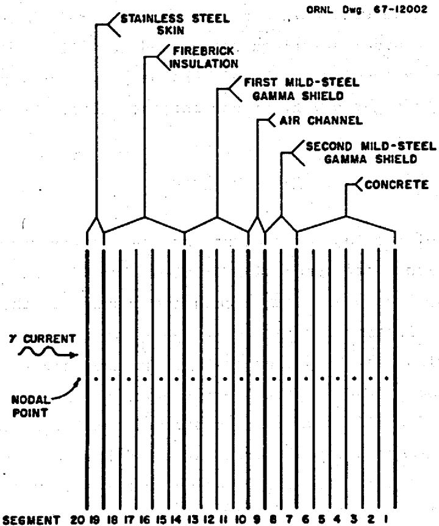  
Fig. 3. Designations Given Segments of Reactor Room Wall for Study of Transient Conditions.

Rearranging Eq. 32,

$$
T _ {4} ^ {n + 1} = T _ {4} ^ {n} + \frac {k _ {c} \Delta \theta}{\rho_ {c} L _ {c} ^ {2} C _ {p _ {c}}} \left(T _ {5} ^ {n} - 2 T _ {4} ^ {n} + T _ {3} ^ {n}\right) + \frac {q _ {4} c \Delta \theta}{\rho_ {c} L _ {c} C _ {p _ {c}}}. \tag {33}
$$

A characteristic equation at an interface between two different materials is given in Eq. 34.

$$
T _ {7} ^ {n + 1} = T _ {7} ^ {n} + \frac {k _ {s} \Delta \theta}{\rho_ {s} L _ {s} ^ {2} C _ {p _ {s}}} \left(T _ {6} ^ {n} - T _ {7} ^ {n}\right) + \frac {\overline {{k}} _ {s - c} \Delta \theta}{\rho_ {s} L _ {s} L _ {c} C _ {p _ {s}}} \left(T _ {6} ^ {n} - T _ {7} ^ {n}\right) + \frac {q _ {7} s \Delta \theta}{\rho_ {s} L _ {s} C _ {p _ {s}}}, \tag {34}
$$

where the subscript $s$ denotes the stainless steel skin, the subscript $c$ denotes the concrete, and $\overline{k}_{s-c}$ is an equivalent conductivity given by Eq. 35.

$$
\overline {{k}} _ {a - b} = \frac {k _ {a} k _ {b} \left(L _ {a} + L _ {b}\right)}{k _ {a} L _ {b} + k _ {b} L _ {a}}, \tag {35}
$$

where the subscripts a and b refer to any two adjacent materials.

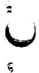

Eighteen equations similar to those just given were derived to carry the analysis across the entire reactor room wall, and a simple computer program was written to perform the calculations required for one specific transient condition.

# 4. PARAMETRIC STUDIES

The parametric studies of the proposed configuration of a laminated wall for the reactor room, shown in Fig. 2, to protect the concrete biological shield from the gamma current within the room were made for two conditions: the steady-state condition and the transient condition. Parametric studies of the material laminations for the steady-state condition were made to determine whether or not

1. the bulk temperature of the concrete portion of the wall could be maintained at levels below $212^{\circ}\mathbf{F}$ ,   
2. the temperature differential in the concrete could be maintained at less than $40^{\circ}\mathbf{F}$ , and   
3. the conduction loss for a reactor room could be maintained at 1 Mw or less.

A transient condition was investigated to determine the length of time over which the loss of coolant air flow could be tolerated before the temperature of the concrete would exceed the maximum allowable temperature of $212^{\circ}\mathrm{F}$ .

# Cases Studied for Steady-State Condition

For the parametric analysis of the composite plane wall with internal heat generation for steady-state conditions, the air channel was not considered as a material lamination but rather as having a fixed width of 3 in. between the first and second mild-steel gamma shields. The temperature of the incoming cooling air at the bottom of the air channel was assumed to be $100^{\circ}\mathrm{F}$ , and the velocity of the air was set at 50 ft/sec. The thickness of the stainless steel skin on the reactor side or interior surface of the wall was fixed at 1/16 in., and the temperature of the interior surface of the reactor room wall was considered to be uniform over the surface and constant at $1100^{\circ}\mathrm{F}$ . Equations 8 through 31 derived in Chapter 3 were used with the TSS computer program described in Appendix D to examine the steady-state effects of changing the

1. thickness of the firebrick insulation,   
2. total amount of mild steel used for the gamma shields,   
3. ratio of the amount of steel on the reactor side of the air channel to the amount of steel on the concrete side of the air channel,   
4. thickness and outside temperature of the concrete wall, and the   
5. magnitude of the incident monoenergetic (1 Mev) gamma current.

Sixty-four separate cases were analyzed for the steady-state condition to determine the effects of changing those parameters of interest. Data illustrative of the typical effects of varying the parameters were selected from the results of these analyses and are compiled in Tables 1 through 7. The effects of changing the parameters are given for incident gamma currents of $1 \times 10^{13}$ and $2 \times 10^{12}$ photons/cm²·sec in all of these tables, and the conditions at the bottom (entrance) and top (exit) of the air channel are given for both magnitudes of incident gamma current.

For cases with an incident gamma current of $1 \times 10^{12}$ photons/cm²·sec, the maximum temperature of the concrete increases approximately $50^{\circ}\mathrm{F}$ from the bottom of the air channel to the top. For cases with an incident gamma current of $2 \times 10^{12}$ photons/cm²·sec and no conduction back to the reactor room, the maximum temperature of the concrete increases approximately $80^{\circ}\mathrm{F}$ from the bottom to the top of the air channel. For a given gamma current and insulation thickness, the conduction loss changes very little (about 0.04 Mw) between the bottom and the top of the air channel.

The largest value for the maximum temperature of the concrete at the top of the air channel in those cases with an incident gamma current of $1 \times 10^{12}$ photons/cm²·sec and an insulation thickness of 5 in. or more is approximately $200^{\circ}\mathrm{F}$ . On the other hand, the smallest value for the maximum temperature of the concrete at the top of the air channel in those cases with an incident gamma current of $2 \times 10^{12}$ photons/cm²·sec and an insulation thickness of 5 in. or more is greater than $250^{\circ}\mathrm{F}$ .

Table 1. Results of Investigation of First Steady-State Case   

<table><tr><td colspan="5">Case Conditions Studied</td></tr><tr><td colspan="2">T0= 1100°F</td><td>Lc= 8 ft</td><td colspan="2">T6= 50°F</td></tr><tr><td colspan="2">Lg= 1/16 in.</td><td>L1= 5 in.</td><td>LFS= 4 in.</td><td>LSS= 2 in.</td></tr><tr><td></td><td colspan="2">Φ0= 1 × 1018 photons/cm2·sec</td><td colspan="2">Φ0= 2 × 1018 photons/cm2·sec</td></tr><tr><td></td><td>Bottom of Channel</td><td>Top of Channel</td><td>Bottom of Channel</td><td>Top of Channel</td></tr><tr><td>qg, Btu/hr·ft2</td><td>16.57</td><td>16.57</td><td>33.14</td><td>33.14</td></tr><tr><td>qT, Btu/hr·ft2</td><td>75.47</td><td>75.47</td><td>151.0</td><td>151.0</td></tr><tr><td>qFS, Btu/hr·ft2</td><td>370.6</td><td>370.6</td><td>741.2</td><td>741.2</td></tr><tr><td>qSS, Btu/hr·ft2</td><td>11.69</td><td>11.69</td><td>23.38</td><td>23.38</td></tr><tr><td>qc, Btu/hr·ft2</td><td>33.65</td><td>33.65</td><td>67.30</td><td>67.30</td></tr><tr><td>qc&#x27;, Btu/hr·ft2</td><td>25.84</td><td>22.04</td><td>55.31</td><td>48.99</td></tr><tr><td>qR, Btu/hr·ft2</td><td>110.6</td><td>131.2</td><td>198.9</td><td>253.9</td></tr><tr><td>MWL, Mw</td><td>0.5812</td><td>0.5382</td><td>0.3520</td><td>0.2838</td></tr><tr><td>T1, CF</td><td>1099.9</td><td>1099.9</td><td>1099.9</td><td>1099.9</td></tr><tr><td>T2, CF</td><td>247.9</td><td>297.1</td><td>324.6</td><td>402.7</td></tr><tr><td>T3, CF</td><td>240.5</td><td>289.9</td><td>314.1</td><td>392.5</td></tr><tr><td>T4, CF</td><td>100.0</td><td>153.0</td><td>100.0</td><td>184.0</td></tr><tr><td>T4, OF</td><td>129.6</td><td>186.0</td><td>155.5</td><td>249.3</td></tr><tr><td>T6, OF</td><td>129.8</td><td>186.2</td><td>156.0</td><td>249.7</td></tr><tr><td>T0-T1, OF</td><td>0.1018</td><td>0.0946</td><td>0.0679</td><td>0.0565</td></tr><tr><td>T1-T2, OF</td><td>852.0</td><td>802.8</td><td>775.3</td><td>697.3</td></tr><tr><td>T2-T3, OF</td><td>7.412</td><td>7.185</td><td>10.55</td><td>10.19</td></tr><tr><td>T3-T4, OF</td><td>140.5</td><td>136.9</td><td>214.1</td><td>208.5</td></tr><tr><td>T4-T4, OF</td><td>29.63</td><td>32.98</td><td>55.52</td><td>65.25</td></tr><tr><td>T6-T4, OF</td><td>0.216</td><td>0.1916</td><td>0.4554</td><td>0.4148</td></tr><tr><td>Tmax, OF</td><td>140.5</td><td>193.6</td><td>181.3</td><td>268.5</td></tr><tr><td>xT max, ft</td><td>0.5422</td><td>0.4083</td><td>0.6343</td><td>0.4887</td></tr><tr><td>ΔT/H, OF/ft</td><td>1.104</td><td>1.103</td><td>1.751</td><td>1.777</td></tr></table>

Table 2. Results of Investigation of Second Steady-State Case   

<table><tr><td colspan="5">Case Conditions Studied</td></tr><tr><td colspan="2">T0= 1100°F</td><td>Lc= 3 ft</td><td colspan="2">T8= 70°F</td></tr><tr><td colspan="2">Lg= 1/16 in.</td><td>L= 5 in.</td><td>LFS= 4 in.</td><td>LSS= 2 in.</td></tr><tr><td></td><td colspan="2">Φo= 1 × 1012photons/cm2·sec</td><td colspan="2">Φo= 2 × 1013photons/cm2·sec</td></tr><tr><td></td><td>Bottom of Channel</td><td>Top of Channel</td><td>Bottom of Channel</td><td>Top of Channel</td></tr><tr><td>qS, Btu/hr·ft2</td><td>16.57</td><td>16.57</td><td>33.14</td><td>33.14</td></tr><tr><td>qI, Btu/hr·ft2</td><td>75.47</td><td>75.47</td><td>151.0</td><td>151.0</td></tr><tr><td>qFS, Btu/hr·ft2</td><td>370.6</td><td>370.6</td><td>741.2</td><td>741.2</td></tr><tr><td>qSS, Btu/hr·ft2</td><td>11.69</td><td>11.69</td><td>23.38</td><td>23.38</td></tr><tr><td>qc, Btu/hr·ft2</td><td>33.65</td><td>33.65</td><td>67.30</td><td>67.30</td></tr><tr><td>qc&#x27;, Btu/hr·ft2</td><td>18.33</td><td>8.446</td><td>42.64</td><td>26.19</td></tr><tr><td>qR, Btu/hr·ft2</td><td>111.6</td><td>133.3</td><td>200.8</td><td>258.2</td></tr><tr><td>MWL, Mw</td><td>0.5812</td><td>0.5385</td><td>0.3520</td><td>0.2845</td></tr><tr><td>T1, °F</td><td>1099.9</td><td>1099.9</td><td>1099.9</td><td>1099.9</td></tr><tr><td>T2, °F</td><td>247.9</td><td>296.7</td><td>324.6</td><td>402.1</td></tr><tr><td>T3, °F</td><td>240.5</td><td>289.5</td><td>314.1</td><td>391.9</td></tr><tr><td>T4, °F</td><td>100.0</td><td>152.6</td><td>100.0</td><td>183.4</td></tr><tr><td>T4, °F</td><td>128.3</td><td>183.3</td><td>153.4</td><td>244.9</td></tr><tr><td>T6, °F</td><td>128.5</td><td>183.4</td><td>153.7</td><td>245.2</td></tr><tr><td>T0-T1, °F</td><td>0.1018</td><td>0.0947</td><td>0.0679</td><td>0.0566</td></tr><tr><td>T1-T2, °F</td><td>852.0</td><td>803.2</td><td>775.3</td><td>697.9</td></tr><tr><td>T2-T3, °F</td><td>7.412</td><td>7.187</td><td>10.55</td><td>10.19</td></tr><tr><td>T3-T4, °F</td><td>140.5</td><td>136.9</td><td>214.1</td><td>208.5</td></tr><tr><td>T4-T5, °F</td><td>28.32</td><td>30.68</td><td>53.36</td><td>60.55</td></tr><tr><td>T5-T6, °F</td><td>0.1678</td><td>0.1043</td><td>0.3740</td><td>0.2683</td></tr><tr><td>Tmax, °F</td><td>133.4</td><td>184.4</td><td>167.4</td><td>250.0</td></tr><tr><td>xT max, ft</td><td>0.3124</td><td>0.1276</td><td>0.3878</td><td>0.2061</td></tr><tr><td>ΔT/H, °F/ft</td><td>1.096</td><td>1.088</td><td>1.737</td><td>1.754</td></tr></table>

Table 3. Results of Investigation of Third Steady-State Case   

<table><tr><td colspan="5">Case Conditions Studied</td></tr><tr><td>T0=1100°F</td><td>Lc=8 ft</td><td colspan="3">Te=50°F</td></tr><tr><td>Lg=1/16 in.</td><td>L1=5 in.</td><td>LFS=2 in.</td><td colspan="2">LSS=4 in.</td></tr><tr><td></td><td colspan="2">Φ0=1×1013photons/cm3·sec</td><td colspan="2">Φ0=2×1013photons/cm3·sec</td></tr><tr><td></td><td>Bottom of Channel</td><td>Top of Channel</td><td>Bottom of Channel</td><td>Top of Channel</td></tr><tr><td>qS, Btu/hr·ft2</td><td>16.57</td><td>16.57</td><td>33.14</td><td>33.14</td></tr><tr><td>qI, Btu/hr·ft2</td><td>75.47</td><td>75.47</td><td>151.0</td><td>151.0</td></tr><tr><td>qFS, Btu/hr·ft2</td><td>299.6</td><td>299.6</td><td>599.2</td><td>599.2</td></tr><tr><td>qSS, Btu/hr·ft2</td><td>82.69</td><td>82.69</td><td>165.4</td><td>165.4</td></tr><tr><td>qc, Btu/hr·ft2</td><td>33.65</td><td>33.65</td><td>67.30</td><td>67.30</td></tr><tr><td>qc&#x27;, Btu/hr·ft2</td><td>25.15</td><td>21.50</td><td>54.08</td><td>48.21</td></tr><tr><td>qR, Btu/hr·ft2</td><td>87.31</td><td>102.6</td><td>141.5</td><td>177.6</td></tr><tr><td>MWL, Mw</td><td>0.5960</td><td>0.5538</td><td>0.3799</td><td>0.3139</td></tr><tr><td>T1, °F</td><td>1099.9</td><td>1099.9</td><td>1099.9</td><td>1099.9</td></tr><tr><td>T2, °F</td><td>230.9</td><td>279.2</td><td>292.7</td><td>368.2</td></tr><tr><td>T3, °F</td><td>227.5</td><td>275.9</td><td>288.0</td><td>363.6</td></tr><tr><td>T4, °F</td><td>100.0</td><td>151.9</td><td>100.0</td><td>181.1</td></tr><tr><td>T4, °F</td><td>139.0</td><td>193.3</td><td>172.2</td><td>259.3</td></tr><tr><td>T5, °F</td><td>140.1</td><td>194.2</td><td>174.3</td><td>261.4</td></tr><tr><td>T0-T1, °F</td><td>0.1043</td><td>0.0972</td><td>0.0276</td><td>0.0616</td></tr><tr><td>T1-T2, °F</td><td>869.0</td><td>820.7</td><td>807.2</td><td>731.7</td></tr><tr><td>T2-T3, °F</td><td>3.452</td><td>3.341</td><td>4.754</td><td>4.580</td></tr><tr><td>T3-T4, °F</td><td>127.5</td><td>124.0</td><td>188.0</td><td>182.5</td></tr><tr><td>T4-T5, °F</td><td>39.03</td><td>41.35</td><td>72.19</td><td>78.24</td></tr><tr><td>T5-T6, °F</td><td>1.028</td><td>0.9814</td><td>2.105</td><td>2.030</td></tr><tr><td>Tmax, °F</td><td>150.1</td><td>201.2</td><td>198.2</td><td>279.5</td></tr><tr><td>xT max, ft</td><td>0.5139</td><td>0.3927</td><td>0.6004</td><td>0.4745</td></tr><tr><td>ΔT/H, °F/ft</td><td>1.081</td><td>1.074</td><td>1.689</td><td>1.694</td></tr></table>

Table 4. Results of Investigation of Fourth Steady-State Case   

<table><tr><td colspan="5">Case Conditions Studied</td></tr><tr><td colspan="2">T0= 1100°F</td><td>Lc= 3 ft</td><td colspan="2">T6= 70°F</td></tr><tr><td>Lg= 1/16 in.</td><td>L1= 5 in.</td><td>LFS= 2 in.</td><td colspan="2">LSS= 4 in.</td></tr><tr><td></td><td colspan="2">Φ0= 1 × 1012photons/cm2·sec</td><td colspan="2">Φ0= 2 × 1012photons/cm2·sec</td></tr><tr><td></td><td>Bottom of Channel</td><td>Top of Channel</td><td>Bottom of Channel</td><td>Top of Channel</td></tr><tr><td>qg, Btu/hr·ft2</td><td>16.57</td><td>16.57</td><td>33.14</td><td>33.14</td></tr><tr><td>qI, Btu/hr·ft2</td><td>75.47</td><td>75.47</td><td>151.0</td><td>151.0</td></tr><tr><td>qFS, Btu/hr·ft2</td><td>299.6</td><td>299.6</td><td>599.2</td><td>599.2</td></tr><tr><td>qSS, Btu/hr·ft2</td><td>82.69</td><td>82.69</td><td>165.4</td><td>165.4</td></tr><tr><td>qc, Btu/hr·ft2</td><td>33.65</td><td>33.65</td><td>67.30</td><td>67.30</td></tr><tr><td>qc&#x27;, Btu/hr·ft2</td><td>16.53</td><td>7.048</td><td>39.42</td><td>24.17</td></tr><tr><td>qR, Btu/hr·ft2</td><td>88.49</td><td>104.9</td><td>143.8</td><td>182.4</td></tr><tr><td>MWL, Mw</td><td>0.5960</td><td>0.5543</td><td>0.3799</td><td>0.3146</td></tr><tr><td>T1, OF</td><td>1099.9</td><td>1099.9</td><td>1099.9</td><td>1099.9</td></tr><tr><td>T2, OF</td><td>230.9</td><td>278.8</td><td>292.7</td><td>367.5</td></tr><tr><td>T3, OF</td><td>227.5</td><td>275.5</td><td>288.0</td><td>362.9</td></tr><tr><td>Ta, OF</td><td>100.0</td><td>151.4</td><td>100.0</td><td>180.3</td></tr><tr><td>T4, OF</td><td>137.5</td><td>190.4</td><td>169.7</td><td>254.7</td></tr><tr><td>T6, OF</td><td>138.5</td><td>191.2</td><td>171.6</td><td>256.4</td></tr><tr><td>T0-T1, OF</td><td>0.1043</td><td>0.0973</td><td>0.0726</td><td>0.0617</td></tr><tr><td>T1-T2, OF</td><td>869.0</td><td>821.1</td><td>807.2</td><td>732.4</td></tr><tr><td>T2-T3, OF</td><td>3.452</td><td>3.342</td><td>4.754</td><td>4.581</td></tr><tr><td>T3-T4, OF</td><td>127.5</td><td>124.0</td><td>188.0</td><td>182.6</td></tr><tr><td>T4-T3, OF</td><td>37.54</td><td>38.93</td><td>69.71</td><td>74.40</td></tr><tr><td>T5-T4, OF</td><td>0.9178</td><td>0.7963</td><td>1.917</td><td>1.722</td></tr><tr><td>Tmax, OF</td><td>142.4</td><td>192.8</td><td>183.1</td><td>260.5</td></tr><tr><td>xT max, ft</td><td>0.2724</td><td>0.1052</td><td>0.3454</td><td>0.1881</td></tr><tr><td>ΔT/H, OF/ft</td><td>1.072</td><td>1.058</td><td>1.673</td><td>1.669</td></tr></table>

Table 5. Results of Investigation of Fifth Steady-State Case   

<table><tr><td colspan="5">Case Conditions Studied</td></tr><tr><td colspan="2">T0=1100°F</td><td>Lc=8 ft</td><td colspan="2">T6=50°F</td></tr><tr><td colspan="2">Lg=1/16 in.</td><td>L=5 in.</td><td>LFS=2 in.</td><td>LSS=2 in.</td></tr><tr><td></td><td colspan="2">Φ0=1×1012photons/cm2·sec</td><td colspan="2">Φ0=2×1012photons/cm2·sec</td></tr><tr><td></td><td>Bottom of Channel</td><td>Top of Channel</td><td>Bottom of Channel</td><td>Top of Channel</td></tr><tr><td>qS, Btu/hr·ft2</td><td>16.57</td><td>16.57</td><td>33.14</td><td>33.14</td></tr><tr><td>qI, Btu/hr·ft2</td><td>75.47</td><td>75.47</td><td>151.0</td><td>151.0</td></tr><tr><td>qFS, Btu/hr·ft2</td><td>299.6</td><td>299.6</td><td>599.2</td><td>599.2</td></tr><tr><td>qSS, Btu/hr·ft2</td><td>71.15</td><td>71.15</td><td>142.3</td><td>142.3</td></tr><tr><td>qC, Btu/hr·ft2</td><td>45.19</td><td>45.19</td><td>90.38</td><td>90.38</td></tr><tr><td>qC&#x27;, Btu/hr·ft2</td><td>35.90</td><td>32.24</td><td>75.58</td><td>69.71</td></tr><tr><td>qR, Btu/hr·ft2</td><td>87.42</td><td>102.7</td><td>141.7</td><td>177.9</td></tr><tr><td>MWL, Mw</td><td>0.5960</td><td>0.5538</td><td>0.3799</td><td>0.3141</td></tr><tr><td>T1, °F</td><td>1099.9</td><td>1099.9</td><td>1099.9</td><td>1099.9</td></tr><tr><td>T2, °F</td><td>230.9</td><td>279.2</td><td>292.7</td><td>368.1</td></tr><tr><td>T3, °F</td><td>227.5</td><td>275.9</td><td>288.0</td><td>363.6</td></tr><tr><td>T4, °F</td><td>100.0</td><td>151.9</td><td>100.0</td><td>181.0</td></tr><tr><td>T5, °F</td><td>138.9</td><td>193.1</td><td>171.9</td><td>259.0</td></tr><tr><td>T0-T1, °F</td><td>139.4</td><td>193.6</td><td>173.0</td><td>260.1</td></tr><tr><td>T1-T2, °F</td><td>0.1043</td><td>0.0972</td><td>0.0726</td><td>0.0616</td></tr><tr><td>T2-T3, °F</td><td>869.0</td><td>820.7</td><td>807.2</td><td>731.8</td></tr><tr><td>T3-T4, °F</td><td>3.452</td><td>3.341</td><td>4.754</td><td>4.580</td></tr><tr><td>T4-T5, °F</td><td>127.5</td><td>124.0</td><td>188.0</td><td>182.6</td></tr><tr><td>T5-T6, °F</td><td>38.89</td><td>41.22</td><td>71.92</td><td>77.99</td></tr><tr><td>Tmax, °F</td><td>0.5353</td><td>0.5118</td><td>1.095</td><td>1.057</td></tr><tr><td>xT max, ft</td><td>155.0</td><td>205.6</td><td>208.6</td><td>289.1</td></tr><tr><td>ΔT/H, °F/ft</td><td>0.5851</td><td>0.4716</td><td>0.6638</td><td>0.5484</td></tr><tr><td>ΔT/H, °F/ft</td><td>1.080</td><td>1.073</td><td>1.688</td><td>1.692</td></tr></table>

Table 6. Results of Investigation of Sixth Steady-State Case   

<table><tr><td colspan="5">Case Conditions Studied</td></tr><tr><td colspan="2">T0= 1100°F</td><td>Lc= 8 ft</td><td colspan="2">T6= 50°F</td></tr><tr><td colspan="2">Lg= 1/16 in.</td><td>LT= 7.5 in.</td><td>LFS= 4 in.</td><td>LSS= 2 in.</td></tr><tr><td></td><td colspan="2">Φ0= 1 × 1012photons/cm2·sec</td><td colspan="2">Φ0= 2 × 1012photons/cm2·sec</td></tr><tr><td></td><td>Bottom of Channel</td><td>Top of Channel</td><td>Bottom of Channel</td><td>Top of Channel</td></tr><tr><td>qg, Btu/hr·ft2</td><td>16.57</td><td>16.57</td><td>33.14</td><td></td></tr><tr><td>qI, Btu/hr·ft2</td><td>111.9</td><td>111.9</td><td>223.8</td><td></td></tr><tr><td>qFS, Btu/hr·ft2</td><td>338.1</td><td>338.1</td><td>676.2</td><td></td></tr><tr><td>qSS, Btu/hr·ft2</td><td>10.69</td><td>10.69</td><td>21.38</td><td></td></tr><tr><td>qc, Btu/hr·ft3</td><td>30.70</td><td>30.70</td><td>61.40</td><td></td></tr><tr><td>qc&#x27;, Btu/hr·ft3</td><td>23.47</td><td>20.35</td><td>50.39</td><td></td></tr><tr><td>qR, Btu/hr·ft3</td><td>86.60</td><td>101.1</td><td>164.5</td><td></td></tr><tr><td>MWL, Mw</td><td>0.2891</td><td>0.2649</td><td>0.0245</td><td></td></tr><tr><td>T1, oF</td><td>1099.9</td><td>1099.95</td><td>1099.99</td><td></td></tr><tr><td>T2, oF</td><td>223.2</td><td>265.1</td><td>297.9</td><td></td></tr><tr><td>T3, oF</td><td>217.2</td><td>259.2</td><td>288.7</td><td></td></tr><tr><td>T4, oF</td><td>100.0</td><td>144.0</td><td>100.0</td><td></td></tr><tr><td>T4, oF</td><td>124.1</td><td>170.5</td><td>147.2</td><td></td></tr><tr><td>T5, oF</td><td>193.6</td><td>170.6</td><td>147.7</td><td></td></tr><tr><td>T0-T1, oF</td><td>0.0529</td><td>0.0488</td><td>0.0131</td><td></td></tr><tr><td>T1-T2, oF</td><td>876.7</td><td>834.8</td><td>802.1</td><td></td></tr><tr><td>T2-T3, oF</td><td>6.060</td><td>5.931</td><td>9.195</td><td></td></tr><tr><td>T3-T4, oF</td><td>117.2</td><td>115.2</td><td>188.7</td><td></td></tr><tr><td>T4-T4, oF</td><td>24.10</td><td>26.42</td><td>47.24</td><td></td></tr><tr><td>T5-T4, oF</td><td>0.1965</td><td>0.1764</td><td>0.4150</td><td></td></tr><tr><td>Tmax, oF</td><td>134.0</td><td>177.6</td><td>170.7</td><td></td></tr><tr><td>xT max, ft</td><td>0.5375</td><td>0.4162</td><td>0.6322</td><td></td></tr><tr><td>ΔT/H, oF/ft</td><td>0.9177</td><td>0.9194</td><td>1.532</td><td></td></tr></table>

Table 7. Results of Investigation of Seventh Steady-State Case   

<table><tr><td colspan="5">Case Conditions Studied</td></tr><tr><td colspan="2">T0=1100°F</td><td>Lc=8 ft</td><td colspan="2">T6=50°F</td></tr><tr><td colspan="2">Lg=1/16 in.</td><td>L1=10 in.</td><td>LFS=4 in.</td><td>LSS=2 in.</td></tr><tr><td></td><td colspan="2">Φ0=1×1012photons/cm2·sec</td><td colspan="2">Φ0=2×1012photons/cm2·sec</td></tr><tr><td></td><td>Bottom of Channel</td><td>Top of Channel</td><td>Bottom of Channel</td><td>Top of Channel</td></tr><tr><td>qg,Btu/hr·ft2</td><td>16.57</td><td>16.57</td><td>33.14</td><td>33.14</td></tr><tr><td>qI,Btu/hr·ft2</td><td>146.7</td><td>146.7</td><td>293.4</td><td>293.4</td></tr><tr><td>qFS,Btu/hr·ft2</td><td>307.1</td><td>307.1</td><td>614.2</td><td>614.2</td></tr><tr><td>qSS,Btu/hr·ft2</td><td>9.689</td><td>9.689</td><td>19.38</td><td>19.38</td></tr><tr><td>qc,Btu/hr·ft2</td><td>27.89</td><td>27.89</td><td>55.78</td><td>55.78</td></tr><tr><td>qc&#x27;,Btu/hr·ft2</td><td>21.08</td><td>18.35</td><td></td><td></td></tr><tr><td>qR,Btu/hr·ft2</td><td>73.58</td><td>84.92</td><td></td><td></td></tr><tr><td>MWL,Mv</td><td>0.1118</td><td>0.0955</td><td></td><td></td></tr><tr><td>T1,°F</td><td>1099.98</td><td>1099.98</td><td></td><td></td></tr><tr><td>T2,°F</td><td>208.6</td><td>245.9</td><td></td><td></td></tr><tr><td>T3,°F</td><td>203.3</td><td>240.7</td><td></td><td></td></tr><tr><td>T4,°F</td><td>100.0</td><td>138.7</td><td></td><td></td></tr><tr><td>T5,°F</td><td>120.9</td><td>161.3</td><td></td><td></td></tr><tr><td>T6,-T1,°F</td><td>121.0</td><td>161.5</td><td></td><td></td></tr><tr><td>T0-T1,°F</td><td>0.0232</td><td>0.0205</td><td></td><td></td></tr><tr><td>T1-T2,°F</td><td>891.4</td><td>854.1</td><td></td><td></td></tr><tr><td>T2-T3,°F</td><td>5.304</td><td>5.218</td><td></td><td></td></tr><tr><td>T3-T4,°F</td><td>103.3</td><td>102.0</td><td></td><td></td></tr><tr><td>T4-T5,°F</td><td>20.87</td><td>22.59</td><td></td><td></td></tr><tr><td>T5-T4,°F</td><td>0.1769</td><td>0.1594</td><td></td><td></td></tr><tr><td>Tmax,°F</td><td>129.6</td><td>167.6</td><td></td><td></td></tr><tr><td>xT max,ft</td><td>0.5256</td><td>0.4117</td><td></td><td></td></tr><tr><td>ΔT/H,°F/ft</td><td>0.8064</td><td>0.8088</td><td></td><td></td></tr></table>

Tables 1, 6, and 7 may be compared for the effects of changing the thickness of the firebrick insulation from 5 in. to 7.5 in. and 10 in. The addition of 2.5 in. of insulation decreases the conduction loss by about a factor of 2, and this addition also decreases the maximum temperature of the concrete by approximately $15^{\circ}\mathrm{F}$ in those cases with an incident gamma current of $1 \times 10^{12}$ photons/cm²·sec.

Tables 1 and 5 may be compared for the effects of changing the total thickness of the steel in the two gamma shields. Decreasing the total thickness from 4 to 2 in. causes only a slight increase in the conduction loss. The maximum temperature of the concrete is increased approximately $10^{0}\mathrm{F}$ for the cases with an incident gamma current of $1 \times 10^{12}$ photons/cm²·sec and by approximately $20^{0}\mathrm{F}$ for the cases with an incident gamma current of $2 \times 10^{12}$ photons/cm²·sec.

Tables 1 and 3 and Tables 2 and 4 may be compared for the effects of changing the ratio of the thickness of the steel on the reactor side of the air channel to the thickness of the steel on the concrete side of the air channel. Changing from 4 in. on the reactor side and 2 in. on the concrete side to 2 in. on the reactor side and 4 in. on the concrete side increases the conduction loss only slightly and increases the maximum temperature of the concrete approximately $10^{\circ}\mathrm{F}$ .

Tables 1 and 2 and Tables 3 and 4 may be compared for the effects of changing the thickness of the concrete and the temperature over the outside surface of the concrete wall. Changing the thickness of the concrete from 8 to 3 ft and the temperature on the outside surface from 50 to $70^{\circ}\mathrm{F}$ decreases the maximum temperature of the concrete about $10^{\circ}\mathrm{F}$ but the conduction loss is not affected appreciably.

# Case Studied for Transient Condition

Eighteen finite difference equations, with the differencing with respect to time, similar to Eqs. 32 through 35 discussed in Chapter 3 were written to analyze the proposed configuration of the reactor room wall for one transient-condition case. The analysis was performed to

determine the length of time over which a loss of coolant air flow could be tolerated before the temperature of the concrete would exceed the maximum allowable temperature of $212^{\circ}\mathrm{F}$ . Such a loss of coolant air flow could arise as a result of a malfunction in the blower system supplying the coolant air. Although natural convection currents would cause some circulation of the coolant air during a blower failure, it was assumed that the coolant air was stagnant during the failure so that the worst case could be analyzed. Under this assumption, the air channel serves only as an insulating material and removes no heat from the wall.

The conditions established for the analysis of this particular case were a 5-in.-thick layer of firebrick insulation, a 4-in.-thick layer of mild steel for the first gamma shield, the 3-in.-wide air channel, a 2-in.-thick layer of mild steel for the second gamma shield, and a 6-ft-thick concrete wall for the biological shield. A simple computer program was written to perform the calculations, but the zero-time temperatures and heat depositions for each segment in the composite wall were calculated by hand and used as fixed numbers in the program. This computer program was used only to obtain a first approximation to the transient situation for one particular case, and the details of the program are not presented here.

The program was run for elapsed times of $t = 1.0$ hr, $t = 2.0$ hr, $t = 3.0$ hr, $t = 4.0$ hr, and $t = 5.0$ hr for the condition of internal heat generation (reactor at power during blower failure) during the transient period. The program was then run again for the same elapsed times but for the condition of no internal heat generation (reactor shutdown simultaneous with blower failure) during the transient period. The computer program used to analyze the condition for internal heat generation is given in Table 8. To analyze the condition of no internal heat generation, Q2C through Q19SS in Table 8 are set equal to zero. The resulting temperature distribution in the proposed reactor room wall analyzed for the condition of internal heat generation during the transient period is shown in Fig. 4, and the temperature distribution in the wall with no internal heat generation during the transient period is illustrated in Fig. 5.

Table 8. Computer Program Used to Analyze the Proposed Reactor Room Wall for the Condition of Internal Heat Generation   

<table><tr><td colspan="2">PHEGRAN TSS</td></tr><tr><td colspan="2">R = 500.</td></tr><tr><td colspan="2">T = 0.001.</td></tr><tr><td colspan="2">T1 = 06.35</td></tr><tr><td colspan="2">T2A = 109.65</td></tr><tr><td colspan="2">T3A = 132.95</td></tr><tr><td colspan="2">T4A = 156.25</td></tr><tr><td colspan="2">T5A = 179.42</td></tr><tr><td colspan="2">T6A = 197.30</td></tr><tr><td colspan="2">T7A = 186.14</td></tr><tr><td colspan="2">T8A = 186.04</td></tr><tr><td colspan="2">T9A = 153.00</td></tr><tr><td colspan="2">T10A = 290.93</td></tr><tr><td colspan="2">T11A = 293.03</td></tr><tr><td colspan="2">T12A = 294.94</td></tr><tr><td colspan="2">T13A = 296.50</td></tr><tr><td colspan="2">T14A = 385.98</td></tr><tr><td colspan="2">T15A = 558.90</td></tr><tr><td colspan="2">T16A = 724.60</td></tr><tr><td colspan="2">T17A = 880.72</td></tr><tr><td colspan="2">T18A = 1030.43</td></tr><tr><td colspan="2">T19A = 1099.90</td></tr><tr><td colspan="2">T20 = 1100.00</td></tr><tr><td colspan="2">Q2C = 0.255</td></tr><tr><td colspan="2">Q3C = 0.255</td></tr><tr><td colspan="2">Q4C = 0.255</td></tr><tr><td colspan="2">Q5C = 1.32</td></tr><tr><td colspan="2">Q6C = 29.99</td></tr><tr><td colspan="2">Q7S = 2.46</td></tr><tr><td colspan="2">Q8S = 8.59</td></tr><tr><td colspan="2">Q10S = 21.11</td></tr><tr><td colspan="2">Q11S = 49.62</td></tr><tr><td colspan="2">Q12S = 109.68</td></tr><tr><td colspan="2">Q13S = 190.84</td></tr><tr><td colspan="2">Q14S = 15.09</td></tr><tr><td colspan="2">Q15S = 16.57</td></tr><tr><td colspan="2">SIGRA = 0.00000001714</td></tr><tr><td colspan="2">EPSIL = 0.7</td></tr><tr><td colspan="2">K = 1</td></tr><tr><td colspan="2">10U QRAD = (SIGMA/(2./EPSIL=1,))**((T10A+460,)**4=(T8A+460,)**4)</td></tr><tr><td colspan="2">2 T2E = T2A+0.016405*T*(T3A-2,**T2A+T1)+T*0,034063*Q2C</td></tr><tr><td colspan="2">3 T3E = T3A+0.018405*T*(T4A-2,**T3A+T2A)+T*0,034063*Q3C</td></tr><tr><td colspan="2">4 T4E = T4A+0.018405*T*(T5A-2,**T4A+T3A)+T*0,034063*Q4C</td></tr><tr><td colspan="2">5 T5E = T5A+0.018405*T*(T6A-2,**T5A+T4A)+T*0,034063*Q5C</td></tr><tr><td colspan="2">6 T6E = T6A+0.036747*T*(T7A-T6A)+0.018405*T*(T5A-T6A)*T*0,034083*Q6C</td></tr><tr><td colspan="2">7 T7E = T7A+69.6325*T*(T8A-T7A)+0.24062*T*(T6A-T7A)+T*0,223181*Q7S</td></tr><tr><td colspan="2">8 T8E = T8A+0.03127*T*(T9A-T8A)+69.6325*T*(T7A-T8A)*ORAD*T*0,223181</td></tr><tr><td colspan="2">1 *T*0,223181*Q8S</td></tr><tr><td colspan="2">9 T9E = T9A+38.9062*(T10A*2,**T9A+T8A)*T</td></tr><tr><td colspan="2">10 T10B = T10A+69.6325*T*(T11A-T10A)+0.03107*T*(T9A-T10A)*T*0,223181*</td></tr><tr><td colspan="2">11 C1US</td></tr><tr><td colspan="2">12 T11B = T11A+69.6325*T*(T12A-2,**T11A+T10A)+T*0,223181*Q11S</td></tr><tr><td colspan="2">13 T12B = T12A+69.6325*T*(T13A-2,**T12A+T11A)+T*0,223181*Q12S</td></tr><tr><td colspan="2">14 T13B = T13A+0.79810*T*(T14A-T13A)+69.6325*T*(T12A-T13A)*T*0,223181</td></tr><tr><td colspan="2">1 *T*0,223181</td></tr><tr><td colspan="2">14 T14B = T14A+3.4744*T*(T15A-T14A)+6.90248*T*(T13A-T14A)*T*0,43022*</td></tr><tr><td>12</td><td>T15u = T15A+3.4744°T*(T16A=2.0*T15A*T14A)+T*1.93022°QINS</td></tr><tr><td>13</td><td>T16e = T16A+3.4744°T*(T17A=2.0*T16A*T15A)*T*1.93022°QINS</td></tr><tr><td>14</td><td>T17u = T17A+3.4744°T*(T18A=2.0*T17A*T16A)*T*1.93022°QINS</td></tr><tr><td>15</td><td>T18h = T18A+6.93245°T*(T19A*T18A)+3.4744°T*(T17A*T18A)*T*1.93022°</td></tr><tr><td>16</td><td>CINS</td></tr><tr><td>17</td><td>T19d = T19A+10.7549°T*(T20=T19A)+12.8750°T*(T18A=T19A)*T*3.58483°</td></tr><tr><td>18</td><td>C19SS</td></tr><tr><td>20</td><td>V = K</td></tr><tr><td>21</td><td>TIMEN = V*T</td></tr><tr><td>22</td><td>TIMEN = TIMEH*63.</td></tr><tr><td>23</td><td>IF(V=R) 29,22,33</td></tr><tr><td>24</td><td>IF(V=2.0*R) 29,22,31</td></tr><tr><td>25</td><td>IF(V=3.0*R) 29,22,32</td></tr><tr><td>26</td><td>IF(V=4.0*R) 29,22,33</td></tr><tr><td>27</td><td>IF(V=5.0*R) 29,22,34</td></tr><tr><td>28</td><td>IF(V=6.0*R) 29,22,35</td></tr><tr><td>29</td><td>IF(V/=0.0*R) 29,22,36</td></tr><tr><td>30</td><td>IF(V=0.0*R) 29,22,37</td></tr><tr><td>31</td><td>IF(V=9.0*R) 29,22,38</td></tr><tr><td>32</td><td>IF(V=10.0*R) 29,22,39</td></tr><tr><td>33</td><td>WRITE(51,1000)(K,TIMEH,TIMEH)</td></tr><tr><td>34</td><td>WRITE(51,2000)(T1,T2B,T3B,T4B,T5B,T6B,T7B,T8B,T9B,T10B,T11B,T12B, T13B,T14B,T15B,T16B,T17B,T18B,T18B,T19B,T20)</td></tr><tr><td>35</td><td>WRITE(51,3000)(URAD)</td></tr><tr><td>36</td><td>IF(V=10.0°R) 29,25,25</td></tr><tr><td>37</td><td>K = K+1</td></tr><tr><td>38</td><td>T2A = F2B</td></tr><tr><td>39</td><td>T3A = T3B</td></tr><tr><td>40</td><td>T4A = T4B</td></tr><tr><td>41</td><td>T5A = T5B</td></tr><tr><td>42</td><td>T6A = T6B</td></tr><tr><td>43</td><td>T7A = T7B</td></tr><tr><td>44</td><td>T8A = T8B</td></tr><tr><td>45</td><td>T9A = T9B</td></tr><tr><td>46</td><td>T10A = T10B</td></tr><tr><td>47</td><td>T11A = T11B</td></tr><tr><td>48</td><td>T12A = T12B</td></tr><tr><td>49</td><td>T13A = T13B</td></tr><tr><td>50</td><td>T14A = T14B</td></tr><tr><td>51</td><td>T15A = T15B</td></tr><tr><td>52</td><td>T16A = T16B</td></tr><tr><td>53</td><td>T17A = T17B</td></tr><tr><td>54</td><td>T18A = T18B</td></tr><tr><td>55</td><td>T19A = T19B</td></tr><tr><td>56</td><td>GO TO 100</td></tr><tr><td>57</td><td>CONTINUE</td></tr><tr><td>1000</td><td>FORMAT(24H,NUMBER OF ITERATIONS = ,16/24H ELAPSED TIME (HOURS) = ,</td></tr><tr><td>1001</td><td>F1U-6/26H ELAPSED TIME (MINUTES) = ,F11.6/7/7</td></tr><tr><td>1002</td><td>FORMAT(3GHKCELL TEMPERATURES (DEGREES-F)/6HOT1 = ,F8.3,3X,5HT2 = ,</td></tr><tr><td>1003</td><td>IF8.3,3X,5HT3 = ,F8.3,3X,5HT4 = ,F8.3,3X,5HT5 = ,F8.3/6N T6 = ,F8.3</td></tr><tr><td>1004</td><td>2,3X,5HT7 = ,F8.3,3X,5HT4 = ,F8.3,3X,5HT9 = ,F8.3,3X,5HT10 = ,F8.3/</td></tr><tr><td>1005</td><td>3OH T11E = ,F8.3,3X,5HT12 = ,F8.3,3X,5HT13 = ,F8.3,3X,5HT14 = ,F8.3,3X,</td></tr><tr><td>1006</td><td>42HT15E = ,F8.3/6H T16E = ,F8.3,3X,5HT17 = ,F8.3,3X,5HT18 = ,F8.3,3X,</td></tr><tr><td>1007</td><td>55HT19 = ,F8.3,3X,5HT20 = ,F8.3)</td></tr><tr><td>1008</td><td>3UU FORMAT(8NOGRAD = ,F10.4,15H (BTU/HR=SQ FT))</td></tr></table>

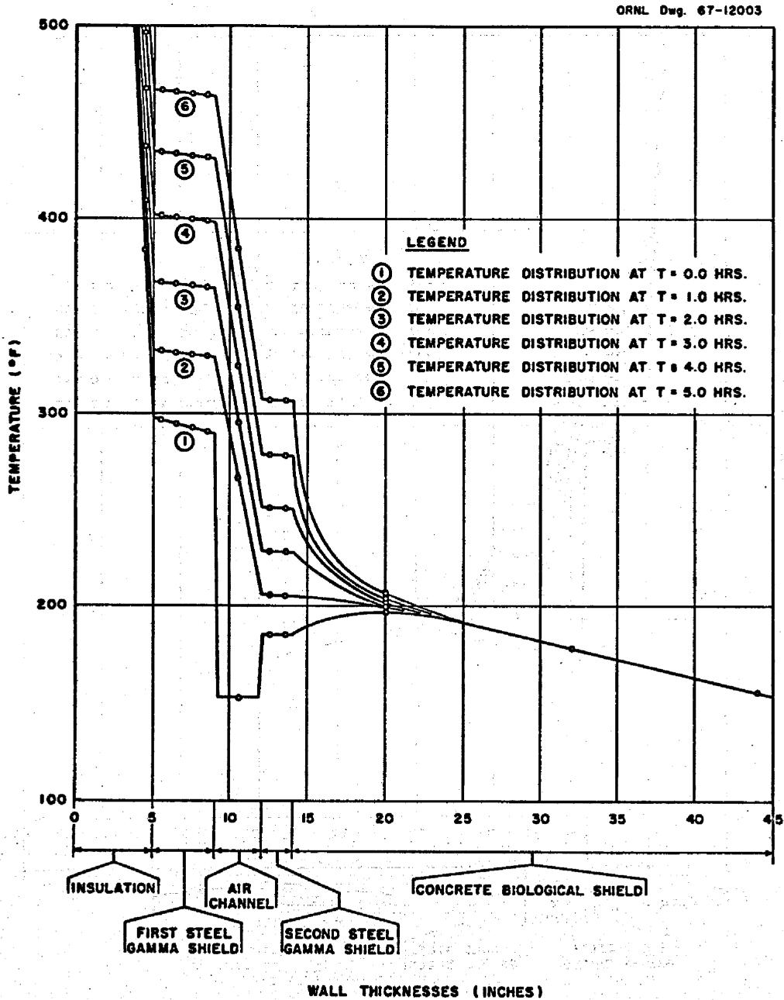  
Fig. 4. Temperature Distribution in Proposed Reactor Room Wall With Internal Heat Generation Rate Maintained During Loss-of-Wall-Coolant Transient Period.

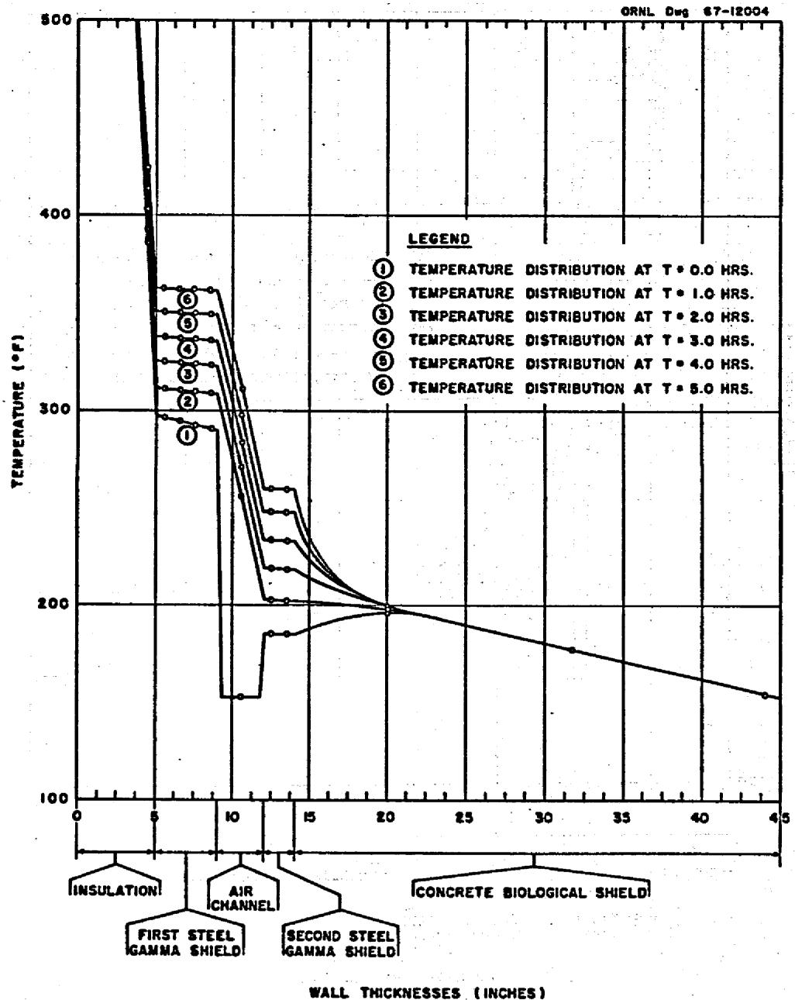  
Fig. 5. Temperature Distribution in Proposed Reactor Room Wall With No Internal Heat Generation During the Loss-of-Wall-Coolant Transient Period.

Two basic conclusions may be drawn from the results of the parametric studies made in this investigation of the proposed configuration of a laminated wall to protect the concrete biological shield from the gamma current within the room housing a 250-Mw(e) molten-salt breeder reactor, a fuel-salt-to-coolant-salt heat exchanger, and a blanket-salt-to-coolant-salt heat exchanger. The first basic conclusion is that with air used as the wall coolant, the proposed configuration is acceptable for an incident monoenergetic (1 Mev) gamma current of $1 \times 10^{13}$ photons/cm²·sec for all cases considered in which the thickness of the firebrick insulation was 5 in. or more. A second basic conclusion is that the proposed configuration is not acceptable for those cases considered with an incident monoenergetic (1 Mev) gamma current of $2 \times 10^{12}$ photons/cm²·sec because the maximum allowable temperature of the concrete ( $212^{\circ}\mathrm{F}$ ) is exceeded by 50 to $100^{\circ}\mathrm{F}$ . The values of several of the parameters of interest in this study that were obtained from the cases analyzed for a gamma current of $1 \times 10^{12}$ photons/cm²·sec are given in Table 9.

Based on the assumption that the floor and ceiling of the reactor room have the same laminated configuration as the walls, giving a total "wall" surface area of 8276 ft², the proposed wall configuration will allow the conduction loss from the reactor room to be maintained at a level below 1 Mw if the thickness of the insulation is 5 in. or more. Further, based on an air velocity of 50 ft/sec and an air coolant channel width of 3 in., air is an acceptable medium for cooling the wall.

A general conclusion that may be drawn from the limited analysis made of one transient-condition case is that if the ambient temperature of the reactor room remains at approximately $1100^{\circ}\mathrm{F}$ , the proposed configuration of the reactor room wall studied in this case can sustain a loss of coolant air flow under the conditions described in Chapter 4 for approximately 1 hour before the temperature of the concrete begins to exceed $212^{\circ}\mathrm{F}$ . If a zero incident gamma current is assumed, the "permissible" loss-of-coolant-air time is greater than one hour but less than two hours.

Table 9. Range of Parameters of Interest in Studies Made of Proposed Wall With An Incident Gamma Current of $1 \times 10^{12}$ photons/cm²·sec   

<table><tr><td rowspan="2">Variable of Interest</td><td rowspan="2">Minimum Value</td><td rowspan="2">Maximum Value</td><td colspan="5">Parametric Conditions</td></tr><tr><td>L1(in.)</td><td>LFS(in.)</td><td>LSS(in.)</td><td>Lc(ft)</td><td>T6(0F)</td></tr><tr><td>Skin ΔT,0F</td><td>0.021</td><td></td><td>10</td><td>4</td><td>2</td><td>a</td><td>a</td></tr><tr><td></td><td></td><td>0.22</td><td>2.5</td><td>2</td><td>4</td><td>a</td><td>a</td></tr><tr><td>Insulation ΔT,0F</td><td>726</td><td></td><td>2.5</td><td>4</td><td>2</td><td>8</td><td>50</td></tr><tr><td></td><td></td><td>906</td><td>10</td><td>2</td><td>a</td><td>a</td><td>a</td></tr><tr><td>First steel shield ΔT,0F</td><td>2.38</td><td></td><td>10</td><td>2</td><td>a</td><td>a</td><td>a</td></tr><tr><td></td><td></td><td>10.9</td><td>2.5</td><td>4</td><td>2</td><td>a</td><td>a</td></tr><tr><td>Second steel shield ΔT,0F</td><td>0.08</td><td></td><td>2.5</td><td>4</td><td>2</td><td>3</td><td>70</td></tr><tr><td></td><td></td><td>1.1</td><td>2.5</td><td>2</td><td>4</td><td>8</td><td>50</td></tr><tr><td>Air vertical tempera-ture gradient,0F/ft</td><td>0.77</td><td></td><td>10</td><td>2</td><td>2</td><td>3</td><td>70</td></tr><tr><td></td><td></td><td>1.57</td><td>2.5</td><td>4</td><td>2</td><td>8</td><td>50</td></tr><tr><td>Tc max,0F(&lt;2120F)</td><td>124</td><td></td><td>10</td><td>4</td><td>2</td><td>3</td><td>70</td></tr><tr><td></td><td></td><td>205.6</td><td>5</td><td>2</td><td>2</td><td>8</td><td>50</td></tr><tr><td>xT max, ft(Tmax&lt; 2120F)</td><td>0.11</td><td></td><td>5</td><td>2</td><td>4</td><td>3</td><td>70</td></tr><tr><td></td><td></td><td>0.58</td><td>7.5</td><td>2</td><td>2</td><td>8</td><td>50</td></tr><tr><td>MWL, Mw</td><td>0.096</td><td></td><td>10</td><td>4</td><td>2</td><td>8</td><td>50</td></tr><tr><td></td><td></td><td>1.32</td><td>2.5</td><td>2</td><td>a</td><td>a</td><td>a</td></tr></table>

${}^{a}$ This parameter has little effect in combination with the other parameters given, and the values of the variables of interest are essentially the same for various values of this parameter.

If a wall of the type proposed is used, the temperature of the concrete, $\mathbf{T}_{\mathbf{c}}$ , or the conduction loss, or both, can be controlled to some extent by varying the physical characteristics of the wall. The thickness of the insulation can be increased, but the desirable effect approaches a limit rather rapidly. As the results of our parametric studies have indicated, an insulation thickness can be reached that will cause conduction back into the reactor room. The total thickness of the mild-steel gamma shields can be increased with good results up to the point where the gamma current is reduced by several orders of magnitude. After this point is reached, adding more steel for gamma shielding does not produce sizable changes in the maximum temperature of the concrete. A total of approximately 6 in. of steel is sufficient for an incident monoenergetic (1 MeV) gamma current of $1 \times 10^{12}$ photons/cm²·sec. The thickness of the mild-steel gamma shields should be arranged so that the major portion of the steel is on the reactor side of the air channel. Placing the major portion of the steel on the concrete side of the air channel results in the undesirable effect of raising the maximum temperature of the concrete. Shadow shielding of the particular components within the reactor room that may be causing a large gamma current appears to be a better solution than increasing the thickness of the wall laminations for gamma currents greater than $1 \times 10^{12}$ photons/cm²·sec.

When sufficient information becomes available, an overall energy balance should be written, starting with the fissioning process in the reactor and extending out through the wall of the reactor room to an outside surface. This balance is necessary to determine whether or not a conduction loss of 1 Mw will permit maintenance of the desired ambient temperature within the reactor room without the addition of auxiliary cooling or heating systems.

APPENDICES

D

O

# Appendix A

# EQUATIONS NECESSARY TO CONSIDER A MULTIENERGETIC GAMMA CURRENT

The equations derived in Chapter 3 of this report were based on the assumption that the incident gamma current is monoenergetic. If the energy distribution of the incident gamma current is known, this current can be represented as a multigroup current. The equations in which an incident multigroup gamma current appears, either directly or indirectly, must be written to account for this segmentation in gamma energy. This multigroup modification has been made in the following equations, and they are to be used in place of the correspondingly numbered equations in Chapter 3 when the energy distribution of the gamma current is known. The subscript $i$ denotes the energy group, and the terms are defined in Appendix E.

$$
Q (x) = \sum_ {i} Q _ {o _ {i}} \left[ A _ {i} e ^ {\alpha_ {i} \mu_ {i} x} + (1 - A _ {i}) e ^ {- \beta_ {i} \mu_ {i} x} \right] e ^ {- \mu_ {i} x}. \tag {A.8}
$$

$$
Q (x) = \sum_ {i} Q _ {o _ {i}} \left[ A _ {i} e ^ {\mu_ {i} x (\alpha_ {i} - 1)} + (1 - A _ {i}) e ^ {- \mu_ {i} x (\beta_ {i} + 1)} \right]. \tag {A.9}
$$

$$
Q _ {0} = \sum_ {i} E _ {i} \Phi_ {o _ {i}} \mu_ {E _ {i}}. \tag {A.9a}
$$

$$
\begin{array}{l} \mathrm {T} (\mathrm {x}) = \mathrm {T} _ {\mathrm {o}} + \frac {\mathrm {x}}{\mathrm {L}} \left(\mathrm {T} _ {\mathrm {L}} - \mathrm {T} _ {\mathrm {o}}\right) \\ + \sum_ {i} ^ {\infty} \frac {Q _ {0 i}}{k \mu_ {i} ^ {2}} \left\{\left[ \frac {A _ {i}}{(\alpha_ {i} - 1) ^ {2}} \left(1 - e ^ {\mu_ {i} x (\alpha_ {i} - 1)}\right) \right. \right. \\ \left. + \frac {(1 - A _ {1})}{(\beta_ {1} + 1) ^ {2}} \left(1 - e ^ {- \mu_ {1} x (\beta_ {1} + 1)}\right) \right] \\ \left. - \frac {x}{L} \left\{\frac {A _ {1}}{\left(\alpha_ {1} - 1\right)} \left(1 - e ^ {\mu_ {1} L \left(\alpha_ {1} - 1\right)}\right) + \frac {1 - A _ {1}}{\left(\beta_ {1} + 1\right) ^ {2}} \left(1 - e ^ {- \mu_ {1} L \left(\beta_ {1} + 1\right)}\right) \right] \right\} \tag {A.12} \\ \end{array}
$$

$$
\begin{array}{l} \frac {d T}{d x} = \frac {1}{L} \left(T _ {L} - T _ {o}\right) \\ + \sum_ {i} \frac {Q _ {o _ {i}}}{k \mu_ {i} ^ {2}} \left\{\left. \frac {- A _ {i} \mu_ {i}}{(\alpha_ {i} - 1)} \left(- e ^ {\mu_ {i} x (\alpha_ {i} - 1)}\right) + \frac {\mu_ {i} (1 - A _ {i})}{\beta_ {i} + 1} \left(+ e ^ {- \mu_ {i} x (\beta_ {i} + 1)}\right) \right] \right. \\ \left. - \frac {1}{L} \left[ \frac {A _ {1}}{(\alpha_ {1} - 1) ^ {2}} \left(1 - e ^ {\mu_ {1} L (\alpha_ {1} - 1)}\right) + \frac {1 - A}{(\beta_ {1} + 1) ^ {2}} \left(1 - e ^ {- \mu_ {1} L (\beta_ {1} + 1)}\right) \right] \right\} \tag {A.13} \\ \end{array}
$$

$$
\begin{array}{l} \sum_ {i} \left[ \frac {Q _ {o _ {1}} (1 - A _ {1})}{\mu_ {1} k (\beta_ {1} + 1)} e ^ {- \mu_ {1} x (\beta_ {1} + 1)} - \frac {Q _ {o _ {1}} A _ {1}}{\mu_ {1} k (\alpha_ {1} - 1)} e ^ {\mu_ {1} x (\alpha_ {1} - 1)} \right] \\ = \frac {1}{L} \left(T _ {o} - T _ {L}\right) + \sum_ {i} \frac {Q _ {o i}}{k \mu_ {i}} \left\{\frac {1}{L} \left[ \frac {A _ {i}}{(\alpha_ {i} - 1) ^ {2}} \left(1 - e ^ {\mu_ {i} L (\alpha_ {i} - 1)}\right) \right. \right. \\ \left. \left. + \frac {\left(1 - A _ {i}\right)}{\left(\beta_ {i} + 1\right) ^ {2}} \left(1 - e ^ {- \mu_ {i} L \left(\alpha_ {i} - 1\right)}\right) \right] \right\}. \tag {A.14} \\ \end{array}
$$

$$
\begin{array}{l} \mathrm {q} _ {\mathrm {T}} = \sum_ {\mathrm {i}} \left\{\int_ {0} ^ {\mathrm {I}} Q _ {\mathrm {o} _ {\mathrm {i}}} \left[ \mathrm {A} _ {\mathrm {i}} e ^ {\mu_ {\mathrm {i}} x (\alpha_ {\mathrm {i}} - 1)} + (1 - \mathrm {A} _ {\mathrm {i}}) e ^ {- \mu_ {\mathrm {i}} x (\beta_ {\mathrm {i}} + 1)} \right] d \mathrm {x} \right\}. (A.16) \\ \mathrm {q} _ {\mathrm {T}} = \sum_ {\mathrm {i}} \left\{\frac {\mathrm {Q} _ {\mathrm {o} _ {\mathrm {i}}} ^ {\mathrm {0}}}{\mu_ {\mathrm {i}}} \left[ \frac {\mathrm {A} _ {\mathrm {i}}}{(\alpha_ {\mathrm {i}} - 1)} \left(e ^ {\mu_ {\mathrm {i}} L (\alpha_ {\mathrm {i}} - 1)} - 1\right) - \frac {(1 - \mathrm {A} _ {\mathrm {i}})}{(\beta_ {\mathrm {i}} + 1)} \left(e ^ {- \mu_ {\mathrm {i}} L (\beta_ {\mathrm {i}} + 1)} - 1\right) \right] \right\}. (A.17) \\ q _ {j} + 1 _ {i} = q  - q _ {j _ {i}}, \\ q _ {j + 1} = \sum_ {i} q _ {j + 1 _ {i}} = \sum_ {i} \left(q _ {o (j) _ {i}} - q _ {j _ {i}}\right). (A.18) \\ q  = \left(\frac {Q _ {o (j)}}{\mu_ {E (j)}}\right) _ {i}, \\ \mathrm {q} _ {\mathrm {o} (\mathrm {j})} = \sum_ {\mathrm {i}} \mathrm {q}  = \sum_ {\mathrm {i}} \left(\frac {\mathrm {Q} _ {\mathrm {o} (\mathrm {j})}}{\mu_ {\mathrm {E} (\mathrm {j})}}\right) _ {\mathrm {i}}, (A.18a) \\ \end{array}
$$

$$
Q _ {o (j + 1) _ {i}} = \left(q _ {o (j + 1) _ {i}}\right) (\mu_ {E (j + 1) _ {i}}),
$$

$$
\mathrm {Q} _ {\mathrm {o}} (\mathrm {j} + 1) = \sum_ {\mathrm {i}} \mathrm {Q} _ {\mathrm {o}} (\mathrm {j} + 1) _ {\mathrm {i}} = \sum_ {\mathrm {i}} \left. \left\langle \mathrm {q} _ {\mathrm {o}} (\mathrm {j} + 1) _ {\mathrm {i}} \right| \left| \mu_ {\mathrm {E}} (\mathrm {j} + 1) _ {\mathrm {i}} \right. \right\rangle . \tag {A.18b}
$$

$$
\begin{array}{l} \left. \frac {d T}{d x} \right| _ {x = 0} = \frac {1}{L _ {c}} \left(T _ {6} - T _ {6}\right) + \sum_ {i} \frac {Q _ {o _ {i}}}{k _ {c} \mu_ {i} ^ {2}} \left\{\left[ - \frac {A _ {i} \mu_ {i}}{(\alpha_ {i} - 1)} + \frac {\mu_ {i} (1 - A _ {i})}{(\beta_ {i} + 1)} \right] \right. \\ - \frac {1}{L _ {c}} \left[ \frac {A _ {i}}{(\alpha_ {i} - 1) ^ {3}} \left(1 - e ^ {\mu_ {i} L _ {c} (\alpha_ {i} - 1)}\right) \right. \\ \left. \left. + \frac {\left(1 - A _ {i}\right)}{\left(\beta_ {i} + 1\right) ^ {2}} \left(1 - e ^ {- \mu_ {i} L _ {c} \left(\beta_ {i} + 1\right)}\right) \right] \right\}. \tag {A.27} \\ \end{array}
$$

$$
\begin{array}{l} \left(\frac {\sigma}{\frac {2}{\epsilon} - 1}\right) T _ {4} ^ {4} + T _ {4} \left(h + \frac {1}{\frac {L _ {S S}}{k _ {S S}} + \frac {L _ {c}}{k _ {c}}}\right) \\ = \left(\frac {\sigma}{\epsilon - 1}\right) T _ {3} ^ {4} + h T _ {a} + q _ {S S} + \frac {T _ {6} + \frac {L _ {c}}{k _ {c}} \sum_ {i} \left[ \left(\frac {Q _ {o} (c) _ {i}}{\mu_ {i} ^ {2}}\right) B _ {i} ^ {\prime} \right] - \frac {2 L _ {S S} q _ {S S}}{3 k _ {S S}}}{\frac {L _ {S S}}{k _ {S S}} + \frac {L _ {c}}{k _ {c}}}, \tag {A.29} \\ \end{array}
$$

where

$$
\begin{array}{l} B _ {1} ^ {\prime} = \left(\frac {\mu_ {1} (1 - A _ {1})}{(\beta_ {1} + 1)} - \frac {\mu_ {1} A _ {1}}{(\alpha_ {1} - 1)}\right) - \frac {1}{L} \left[ \frac {A _ {1}}{(\alpha_ {1} - 1) ^ {2}} \left(1 - e ^ {\mu_ {1} L _ {c} (\alpha_ {1} - 1)}\right) \right. \\ \left. + \frac {\left(1 - A _ {1}\right)}{\left(\beta_ {1} + 1\right) ^ {2}} \left(1 - e ^ {- \mu_ {1} L _ {c} \left(\beta_ {1} + 1\right)}\right) \right] \\ \end{array}
$$

# Appendix B

# EVALUATION OF THE CONVECTIVE HEAT TRANSFER COEFFICIENT

The average convective heat transfer coefficient, h, for the walls of the air channel was evaluated by using the expression published by Kreith.1

$$
h = 0. 0 3 6 \frac {k}{H} R e _ {H} ^ {0} \cdot^ {8} P r ^ {1 / 3},
$$

where

$$
k = \text {t h e r m a l} B t u / h r \cdot f t ^ {\circ} F,
$$

$$
\mathrm {H} = \text {v e r t i c a l}
$$

$$
R e _ {H} = R e y n o l d s \text {n u m b e r e v a l u a t e d a t t h e t o p o f t h e a i r c h a n n e l , a n d}
$$

$$
\Pr = \text {P r a n d t l}
$$

The Reynolds number evaluated at the top of the air channel,

$$
R e _ {H} = \frac {U _ {0} H}{\mu},
$$

where

$$
U = \text {t h e} f t / \sec ,
$$

$$
\rho = \text {d e n s i t y} \text {o f t h e a i r , l b / f t} ^ {3}, \text {a n d}
$$

$$
\mu = \text {v i s c o s i t y} \quad \text {a i r}, \quad \mathrm {l b / f t} \cdot \sec .
$$

The Prandtl number evaluated for air,

$$
\Pr = \frac {\mu C}{k},
$$

where $C_p$ = the specific heat of air at a constant pressure, Btu/lb $^{\cdot 0}$ F. In the range of temperatures considered, Pr is approximately constant and equal to 0.72. Kreith's expression for h was evaluated for various air-wall mean temperatures in the air channel, and the results are on the following page.

<table><tr><td>T
(oF)</td></tr><tr><td>100</td></tr><tr><td>130</td></tr><tr><td>150</td></tr></table>

<table><tr><td>h(Btu/hr·ft2·°F)</td></tr><tr><td>5.15</td></tr><tr><td>5.04</td></tr><tr><td>5.04</td></tr></table>

The mean temperature of the walls of the air channel is expected to be approximately 130 to $150^{\circ}\mathrm{F}$ , and a value of 5 was used for the convective heat transfer coefficient at the walls of the air channel.

# Appendix C

# VALUES OF PHYSICAL CONSTANTS USED IN THIS STUDY

Values for the gamma energy attenuation coefficient, $\mu_{\mathrm{E}}$ , the total gamma attenuation coefficient, $\mu$ , and the dimensionless constants $\alpha$ , $\beta$ , and $\Lambda$ used in the Taylor buildup formula for a gamma energy of 1 MeV are tabulated below.

<table><tr><td>Material</td><td>μE(ft-1)</td><td>μ(ft-1)</td><td>α</td><td>β</td><td>A</td></tr><tr><td>Type 347 stainless steel</td><td>6.28a</td><td>14.08b</td><td>0.0895c</td><td>0.04c</td><td>8c</td></tr><tr><td>Kaolin insulating brick</td><td>0.367d</td><td>0.838d</td><td>0.088d</td><td>0.029d</td><td>10d</td></tr><tr><td>Mild steel</td><td>6.30a</td><td>14.02a</td><td>0.0895c</td><td>0.04c</td><td>8c</td></tr><tr><td>Concrete</td><td>1.99d</td><td>4.55d</td><td>0.088d</td><td>0.029d</td><td>10d</td></tr></table>

Values for the density, $\rho$ , specific heat, $C_p$ , thermal conductivity, $k$ , and equivalent thermal conductivity at interfaces of adjacent materials, $\overline{k}$ , for materials in the proposed laminated wall in their order of occurrence from the reactor outward are tabulated below.

<table><tr><td rowspan="2">Material</td><td colspan="2">ρ</td><td rowspan="2">Cp(Btu/1b·°F)</td><td rowspan="2">k(Btu/hr·ft·°F)</td><td rowspan="2">k(Btu/hr·ft·°F)</td></tr><tr><td>(g/cm3)</td><td>(ft3)</td></tr><tr><td>Type 347 stainless steel</td><td>7.8b</td><td>486.9b</td><td>0.11e</td><td>12.8e</td><td>0.159</td></tr><tr><td>Kaolin insulating brick</td><td>0.433e</td><td>27.03e</td><td>0.23e</td><td>0.15e</td><td>0.298</td></tr><tr><td>Mild steel</td><td>7.83b</td><td>488.8b</td><td>0.11e</td><td>26.0e</td><td>0.0232</td></tr><tr><td>Air</td><td></td><td>0.060e</td><td>0.241e</td><td>0.0174e</td><td>0.0232</td></tr><tr><td>Mild steel</td><td>7.83b</td><td>488.8b</td><td>0.11e</td><td>26.0e</td><td>0.584</td></tr><tr><td>Concrete</td><td>2.35d</td><td>146.7d</td><td>0.20e</td><td>0.54e</td><td></td></tr></table>

# Appendix D

# TSS COMPUTER PROGRAM

A program was developed for the CDC 1604-A computer to solve the equations (Eqs. 8 through 31) necessary to evaluate the proposed configuration of the reactor room wall for the steady-state conditions. As written, the TSS (Thermal Shield Study) program will handle up to five material laminations, excluding the air channel, and up to eight energy groups for the incident gamma current. The calculations are performed in the order described in Chapter 3. For a problem with five energy groups and sixteen different combinations of laminations (cases), the machine time is one minute and 45 seconds and the compilation time is 56 seconds.

A Newton-Raphson iteration scheme is used to evaluate $\mathbf{T}_4$ and $\mathbf{x}_{\mathbf{T} \max}$ . The convergence criterion for $\mathbf{T}_4$ is that the right and left sides of Eq. 29 must agree to within 0.05, and the criterion for $\mathbf{x}_{\mathbf{T} \max}$ is that the right and left sides of Eq. 14 must agree to within 0.10. These convergence criteria could be made smaller with a corresponding increase in machine time, but very little more real accuracy would be obtained because the program uses the approximate method to calculate the incident gamma current at each material interface. If more real accuracy is required, the program could be modified to calculate the attenuated gamma current at each interface and to calculate from this information the incident gamma current at the material interfaces.

If a vertical temperature profile were known for the interface of the reactor room and the skin, the program could be modified to do calculations at several points up the air channel rather than just at the top and bottom as it does at present. Both the setup of the program and the manner in which the necessary input data are prepared are explained in the following discussion.

The TSS computer program is set up for a given physical situation with a given photon current incident upon the reactor room wall. The temperature of the inside surface of the wall is fixed at a given value.

The composite wall is composed of five material regions, and progressing from the inside surface outward, these regions are (1) a thin steel skin, (2) an insulating material, (3) the first steel gamma shield, (4) the second steel gamma shield, and (5) the concrete biological shield with a fixed temperature on the outside surface. The 3-in.-wide air channel placed between the first and second gamma shields is not considered a material region. By calculating a vertical temperature gradient in the air channel, the program will calculate at both the bottom and top of the reactor room wall the

1. gamma heat generation rate in each material,   
2. temperature at each material interface and temperature changes across each material,   
3. conduction heat loss from the reactor room to the air channel,   
4. radiation heat transfer rate between the walls of the air channel,   
5. heat in the concrete conducted both toward and away from the air channel, and the   
6. maximum temperature in the concrete and its corresponding location.

The program input deck allows the use of any material in any region of the composite wall. For a fixed incident photon current, a fixed inside wall temperature, a fixed inlet air velocity and temperature, and fixed wall materials, the calculation of a particular case is done by selecting all material thicknesses and the temperature of the outside surface of the concrete wall. At present, the program will allow a maximum of 32 cases to be run, but it can easily be expanded to handle more.

# Preparation of Input Data

The first set of input data consists of energy-dependent information pertaining to the incident photon current and to the nuclear properties of the materials chosen for each region in the wall. The order in which the information is supplied is given on the following page.

Card 1. QS1(1), QS1(2), ..., QS1(8). The incident photon current (Btu/hr·ft²) for each of eight possible energy groups.

Card 2. EMU1(1), EMU1(2), ..., EMU1(8). The energy absorption coefficient (1/ft) in the first region of the wall (the inner skin) for each of eight possible energy groups.

Card 3. AMU1(1), AMU1(2), ..., AMU1(8). The mass attenuation coefficient (1/ft) in the first region of the wall (the inner skin) for each of eight possible energy groups.

Card 4. ALPHA(1), ALPHA(2), ..., ALPHA(8). The dimensionless constant $\alpha$ used in the Taylor buildup formula in the first region of the wall (the inner skin) for each of eight possible energy groups.

Card 5. BETA1(1), BETA1(2), ..., BETA1(8). The dimensionless constant $\beta$ used in the Taylor buildup formula in the first region of the wall (the inner skin) for each of eight possible energy groups.

Card 6. A1(1), A1(2), ..., A1(8). The dimensionless constant A used in the Taylor buildup formula in the first region of the wall (the inner skin) for each of eight possible energy groups.

Card 7. EMU2(1), EMU2(2), ..., EMU2(8). The same as Card 2 except for the second region of the wall (insulation).

Card 8. AMU2(1), AMU2(2), ..., AMU2(8). The same as Card 3 except for the second region of the wall (insulation).

Card 9. ALPHA2(1), ALPHA2(2), ..., ALPHA2(8). The same as Card 4 except for the second region of the wall (insulation).

Card 10. BETA2(1), BETA2(2), ..., BETA2(8). The same as Card 5 except for the second region of the wall (insulation).

Card 11. A2(1), A2(2), ..., A2(8). The same as Card 6 except for the second region of the wall (insulation).

Card 12. EMU3(1), EMU3(2), ..., EMU3(8). The same as Card 2 except for the third region of the wall (the first gamma shield).

Card 13. AMU3(1), AMU3(2), ..., AMU3(8). The same as Card 3 except for the third region of the wall (the first gamma shield).

Card 14. ALPHA3(1), ALPHA3(2), ..., ALPHA3(8). The same as Card 4 except for the third region of the wall (the first gamma shield).

Card 15. BETA3(1), BETA3(2), ..., BETA3(8). The same as Card 5 except for the third region of the wall (the first gamma shield).

Card 16. A3(1), A3(2), ..., A3(8). The same as Card 6 for the third region of the wall (the first gamma shield).

Card 17. EMU4(1), EMU4(2), ..., EMU4(8). The same as Card 2 except for the fourth region of the wall (the second gamma shield).

Card 18. AMU4(1), AMU4(2), ..., AMU4(8). The same as Card 3 except for the fourth region of the wall (the second gamma shield).

Card 19. ALPHA4(1), ALPHA4(2), ..., ALPHA4(8). The same as Card 4 except for the fourth region of the wall (the second gamma shield).

Card 20. BETA4(1), BETA4(2), ..., BETA4(8). The same as Card 5 except for the fourth region of the wall (the second gamma shield).

Card 21. A4(1), A4(2), ..., A4(8). The same as Card 6 except for the fourth region of the wall (the second gamma shield).

Card 22. EMU5(1), EMU5(2), ..., EMU5(8). The same as Card 2 except for the fifth region of the wall (the biological shield).

Card 23. AMU5(1), AMU5(2), ..., AMU5(8). The same as Card 3 except for the fifth region of the wall (the biological shield).

Card 24. ALPHA5(1), ALPHA5(2), ..., ALPHA5(8). The same as Card 4 except for the fifth region of the wall (the biological shield).

Card 25. BETA5(1), BETA5(2), ..., BETA5(8). The same as Card 5 except for the fifth region of the wall (the biological shield).

Card 26. A5(1), A5(2), ..., A5(8). The same as Card 6 except for the fifth region of the wall (the biological shield).

The format statement for all of the above cards is 8F9.0. Since only the first 72 spaces on each data card are used, the last eight may be used for identification purposes. If fewer than eight energy groups are used, the unused data fields may either be punched with a zero or left blank. In either case, the energy-summing DO loops subscripted J, K, L, and N must be changed to correspond to the number of energy groups used; that is, if there are six energy groups, DO 100 I = 1,6; and K, L, and N are also 1,6. If the DO loops are not changed to correspond to the number of energy groups used, division by zero will occur.

The next set of data entered is energy independent and is assumed to be constant over the range of temperatures covered in the program. This information should be given on the two following cards.

Card 27. CON1, CON2, CON3, CON4, CON5, TO, HT, and HF. The thermal conductivities (Btu/hr·ft· ${}^0$ F) of the materials in each of the five regions should be entered in the first five data fields. The temperature on the inside surface of the reactor room wall, TO in ${}^0$ R, the height of the reactor room, HT in ft, and the film coefficient on the sides of the air channel, HF in Btu/hr·ft²· ${}^0$ F, should be entered in data fields six through eight. The format for this card is the same as that for the previous 26 cards (8F9.0).

Card 28. TA, EPSIL, VEL, ACHAN, CP, RHO, and SIGMA are respectively the inlet air temperature, $^0\mathbb{R}$ , the emissivity of the surface of the air channel (dimensionless and assumed to be equal for both sides of the air channel), the velocity of the air, ft/sec, the width of the air channel, ft², the specific heat of air, Btu/lb·F, the density of air, lb/ft³, and the Stefan-Boltzmann constant (Btu/hr·ft²·R⁴). These values must be entered according to format 6F9.0, F18.0. Again, the last eight spaces can be used for identification.

# Preparation of Case Data

Once the input data have been supplied, one card must be prepared for each case to be run. This card contains EL1, EL2, EL3, EL4, EL5, and T6. EL1 through EL5 correspond to the material thicknesses (ft) to be used for each of the five regions in the wall, and T6 is the temperature of the external surface of the concrete biological shield in $^0\mathrm{R}$ . The format 8F9.0 allows nine spaces for each data field and the last eight spaces for identification. For 16 cases, the cards could be numbered 29 through 44. Numbering is for the user's convenience and is not required. The first DO loop in the program must always be changed to DO 5000 I = 1,N where N is the number of cases to be run. All cases must have the same air temperature, TA, and the statement immediately

following DO 5000 I = 1, N must be written to correspond to the air temperature used. The DIMENSION statement containing EL1(I) through EL5(I), T6(I), BOP(I), and BAM(I) must be checked to see that a sufficient dimension size is given to allow all of the cases to be run. BOP(I) and BAM(I) are dummy variables and may be left blank.

# Typical Computer Sheets

The assembly of the control cards, deck, input data, and case data cards for the TSS computer program is illustrated in Fig. D.1. Typical data for 32 cases to be run with one energy group are given in Table D.1. The output data at the bottom of the air channel for one case are given in Table D.2, and the output data at the top of the air channel for the case are given in Table D.3.

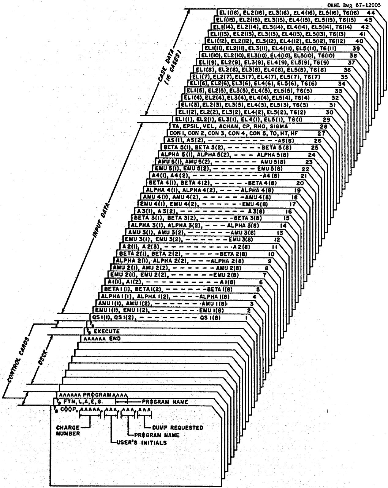  
Fig. D.l. Assembly of Data Cards for TSS Computer Program.

Table D.1....Typical Data for 32 Cases With One Energy Group for the TSS

Computer Program

```csv
PROGRAM TSS   
DIMENSION ODPTS(6)   
DIMENSION QSI(8), ENUI(8), AMUI(8), ALPHA(6), BETA1(8), AI(8),   
JEML2(8), AMU2(8), ALPHA2(8), BETA2(8), A2(8), EMU3(8), AMU3(8),   
2ALPHA3(8), BETA3(8), A3(8), EMU4(8), AMU4(8), ALPHA4(8), BETA4(8),   
3A4(8), EYUS(8), AMU5(8), ALPHA5(8), BETA5(8), AS(8)   
DIMENSION ELI(32), EL2(32), EL3(32), EL4(32), EL5(32), T6(32),   
IBOF(32), BAH(32)   
DIMENSION QDEP1(6), QS2(6), QV1(6), QV2(6), QDEP2(6), QS3(6),   
IOV3(6), ODEP3(6), OS4(6), OV4(6), ODEP4(6), OS5(6), OV5(6),   
2ODEP5(6), B(6), DI(6), EI(6), D2(6), E2(6), FI(6), F2(6), F3(6),   
3FTF(6), SUM(6), SUMP(6), RI(6), REI(6), R2(6), RE2(6)   
READ (50, 1000) (OS1, EMU1, AMU1, ALPHAI, BETA1,   
IA1, EMU2, AMU2, ALPHA2, BETA2, A2, EMU3,   
2AML3, ALPHA3, BETA3, A3, EMU4, AMU4, ALPHA4,   
3BETA4, A4, EMU5, AMU5, ALPHA5, BETA5, A5)   
READ (50, 1000)(CON1, CON2, CON3, CON4, CON5, TO, HT, HF)   
READ (50, 1001)(TA, EPSIL, VEL, ACHAN, CP, RHO, SIGMA)   
READ (50, 1000)(ELI1, EL21, EL31, EL41, EL51T617)   
IBOF(I), BAM(I), I=1.32)   
C BEGIM MAIN PROGRAM   
DO 5000 I=1.32   
TA = 560.   
ELX1 = EL1(I)   
ELX2 = EL2(I)   
ELX3 = EL3(I)   
ELX4 = EL4(I)   
ELX5 = EL5(I)   
T6x = T6(I)   
QDEPY1 = 0.   
QDEPY2 = 0.   
QDEPY3 = 0.   
QDEPY4 = 0.   
QDEPY5 = 0.   
C CALCULATION OF SOURCE TERM AND GAMMA HEAT DEPOSITION TERMS   
DO 100 J = 1.1   
1 QVI(J) = QS1(J)*EHUI(J)   
2 ODEPI(J) = QVI(J)*(((AI(J)*EXPAMUI(J)*ELXI*(ALPHA1(J)=1.)))/   
1 (APUT(J)*(ALPHA1(J)=1.))+(I,A1(J))*EXPAMUI(J)*ELXI*(BETA1(J)+   
2I,(J))(AMUI(J)*BETA1(J)=I,(J))))=(AI(J)/(AMUI(J)*(ALPHA1(J)=I,(J)))=   
-3(I,A1(J))/(AMUI(J)*BETA1(J)=I,(J))))   
3 OS2(J) = OSIJ*ODEPI(J)   
4 QV2(J) = QS2(J)*EHUIJ)   
5 ODEP2(J) = OV2(J)*(((A2(J)*EXPAMUI2(J)*ELX2*(ALPHA2(J)=I,(J)))/   
1 (APU2(J)*(ALPHA2(J)=I,(J))=((I,A2(J))*EXPAMUI2(J)*ELX2*(BETA2(J)   
2+I,(J))/AMU2(J)*(BETA2(J)=I,(J)))=(A2(J)/AMU2(J)*(ALPHA2(J)=I,(J)))   
3=(I,A2(J))/(AMU2(J)*BETA2(J)=I,(J)))   
6 OS3(J) = QS1(J)*ODEPI(J)*(OPEPI(J))   
7 QV3(J) = QS3(J)*EHUIJ)   
8 ODEP3(J) = OV3(J)*(((A3(J)*EXPAMUI3(J)*ELX3*(ALPHA3(J)=I,(J)))/   
1 (APU3(J)*(ALPHA3(J)=I,(J))=((I,A3(J))*EXPAMUI3(J)*ELX3*(BETA3(J)   
2+I,(J))/AMU3(J)*(BETA3(J)=I,(J)))=(A3J)/AMU3(J)*(ALPHA3(J)=I,(J)))   
3=(I,A3J/(AMU3J)*(BETA3J)=I,(J)))   
ELX4 = ELX4*ELX3   
ODPTS(J) = OV3(J)*(((A4J)*EXPAMUI4(J)*ELX4*(ALPHA4(J)=I,(J)))/   
1 (APU4(J)*(ALPHA4(J)=I,(J))=((I,A4J)*EXPAMUI4(J)*ELX4*(BETA4(J)   
2+I,(J))/AMU4J)*(BETA4J)=I,(J)))=(A4J)/AMU4J)*(ALPHA4(j)=I,(J))   
3=(I,A4J/(AMU4J)*(BETA4J)=I,(J)))   
ODEP4(J) = ODPTS(J)*ODEPI(S)   
ELX4 = ELX4*ELX3   
12 OS5(J) = QS1(J)*ODEPI(S) -ODEPI(S) -ODEPI(S)   
13 QV5(J) = QS5(J)*EMU5(j)   
14 ODEP5(J) = OS5(j)   
15 ODEPT1 = ODEPT1*ODEPI(j)   
16 ODEPT2 = ODEPT2*ODEPT2(j) 
```

Table D.1 (continued)   

<table><tr><td>17</td><td>ODEPT3 = QDEPT3+QDEP3(J)</td></tr><tr><td>18</td><td>ODEPT4 = ODEPT4+ODEP4(J)</td></tr><tr><td>19</td><td>ODEPT5 = ODEPT5+ODEP5(J)</td></tr><tr><td>100</td><td>CONTINUE</td></tr><tr><td>20</td><td>K7=0</td></tr><tr><td>C</td><td>BEGIN CALCULATION FOR THE REACTOR SIDE OF THE CHANNEL</td></tr><tr><td>21</td><td>OCEN = ((TO-TA)+QDEPT1*(2, *ELX1/13, *CON1)+ELX2/CON2+ELX3/CON3+1.)/</td></tr><tr><td></td><td>HF)=ODEPT2*(2, *ELX2/(3, *CON2)+ELX3/CON3+1./HF)=ODEPT3*(2, *ELX3/</td></tr><tr><td></td><td>2(3, *CON3)+1./HF)/(ELX1/CON1+ELX2/CON2+ELX3/CON3+1./HF)</td></tr><tr><td>22</td><td>DELTI = (QCON+2, *QDEPT1/3,)*ELX1/CON1</td></tr><tr><td>C</td><td>(NC CARD NO. 23)</td></tr><tr><td>24</td><td>TOF = TO-460.</td></tr><tr><td>25</td><td>TIF = TDF-DELT1</td></tr><tr><td>26</td><td>DELTI2 = (QCON+ODEPT1+2, *ODEPT2/3,)*ELX2/CON2</td></tr><tr><td>27</td><td>T2F = TIF-DELT2</td></tr><tr><td>28</td><td>DELTI3 = (QCON+ODEPT1+QDEPT2+2, *ODEPT3/3,)*ELX3/CON3</td></tr><tr><td>29</td><td>T3F = T2F-DELT3</td></tr><tr><td>30</td><td>DELTI4 = (QCON+ODEPT1+QDEPT2+ODEPT3)/HF</td></tr><tr><td>31</td><td>TAF = TA-460.</td></tr><tr><td>C</td><td>CHECK FOR UNACCEPTABLE HEAT CONDUCTION CODITIONS</td></tr><tr><td>32</td><td>IF(OCON) 3005,33,33</td></tr><tr><td>33</td><td>CONTINUE</td></tr><tr><td>34</td><td>IF(DELTI) 3005,35,35</td></tr><tr><td>35</td><td>CONTINUE</td></tr><tr><td>36</td><td>IF(DELTI2) 3005,37,37</td></tr><tr><td>37</td><td>CONTINUE</td></tr><tr><td>38</td><td>IF(DELTI3) 3005,39,39</td></tr><tr><td>39</td><td>CONTINUE</td></tr><tr><td>40</td><td>IF(DELTI4) 3005,41,41</td></tr><tr><td>41</td><td>CONTINUE</td></tr><tr><td>42</td><td>BT = 0.</td></tr><tr><td>C</td><td>BEGIN CALCULATION FOR THE CONCRETE SIDE OF THE CHANNEL</td></tr><tr><td>43</td><td>DO 200 K=1.1</td></tr><tr><td>44</td><td>B(K) = (2V5(K)/(AMU5(K)*2))*((AMU5(K)*(1,-A5(K)))/(1, +BETA5(K))</td></tr><tr><td></td><td>1=(AMU5(K)*A5(K))/(ALPHA5(K)=1,))=(1,-ELX5)*(1/(A5(K)/(ALPHA5(K)=1,))</td></tr><tr><td></td><td>2**2) * (1, -EXP(AMU5(K)*ELX5*(ALPHA5(K)=1,)) * ((1, -A5(K))/(1, +</td></tr><tr><td></td><td>3BETA5(K)**2)) * (1, -EXP(AMU5(K)*ELX5*(1, +BETA5(K))))</td></tr><tr><td>45</td><td>BT = BT+B(K)</td></tr><tr><td>200</td><td>CONTINUE</td></tr><tr><td>46</td><td>CFI = SIGMA/(2, EPSIL=1, )</td></tr><tr><td>47</td><td>CF2 = HF+1./(ELX4/CON4+ELX5/CON5)</td></tr><tr><td>48</td><td>CF3 = (T6X+ELX5*B/TCON5*2, *ELX4*ODEPT4/(3, *CON4))/(ELX4/CON4*ELX5/</td></tr><tr><td></td><td>1CON5)</td></tr><tr><td>49</td><td>K9 = 0</td></tr><tr><td>C</td><td>ITERATION PROCESS FOR T4</td></tr><tr><td>50</td><td>T4 = TA</td></tr><tr><td>51</td><td>T3 = T3F*460.</td></tr><tr><td>52</td><td>FT4 = CF1*(T4**4) * CF2*44-CF1*(T3**4) * HF*TA-QDEPT4-CF3</td></tr><tr><td>53</td><td>FT4P = 4, *CF1*(T4**3) * CF2</td></tr><tr><td>54</td><td>IF(ABSF(T4) = 0.05) 58,58,55</td></tr><tr><td>55</td><td>T4 = T4-FT4/FT4P</td></tr><tr><td>56</td><td>K9 = K9+1</td></tr><tr><td>57</td><td>GO TO 51</td></tr><tr><td>58</td><td>CONTINUE</td></tr><tr><td>59</td><td>ORAD = CF1*(T3**4-T4**4)</td></tr><tr><td>60</td><td>OCCP = HF*(T4-TA)-OPEPT4-ORAD</td></tr><tr><td>61</td><td>DELTI5 = (T4-TA)</td></tr><tr><td>62</td><td>DELTI6 = (ELX4*OCCP/CON4) + 2, *ELX4*ODEPT4/(3, *CON4)</td></tr><tr><td>63</td><td>T4F = T4-460.</td></tr><tr><td>64</td><td>T5 = T4-DELTI6</td></tr><tr><td>65</td><td>T5F = T5-460.</td></tr><tr><td>66</td><td>T6XF = T6X=460.</td></tr><tr><td>C</td><td>(NC CARD NUMBERS 67*70)</td></tr><tr><td>71</td><td>x = 0.</td></tr><tr><td>72</td><td>K3 = 0</td></tr><tr><td>73</td><td>FT = 0.</td></tr></table>

Table D.1 (continued)   

<table><tr><td>74 SUMT = 0.</td></tr><tr><td>75 SUMPT = 0.</td></tr><tr><td>CALCULATION FOR LOCATION OF MAXIMUM CONCRETE TEMPERATURE</td></tr><tr><td>76 DO 300 L=1,1</td></tr><tr><td>77 DI(L) = ((OV5(L)*A5(L))/(AMUS(L)*(ALPHA5(L)=1,))</td></tr><tr><td>78 EI(L) = AMUS(L)*(ALPHA5(L)=1,</td></tr><tr><td>79 D2(L) = OV5(L)*(1,-A5(L))/(AMUS(L)*(1,)+BETA5(L))</td></tr><tr><td>80 E2(L) = AMUS(L)*(1,)+BETA5(L))</td></tr><tr><td>81 FI(L) = OV5(L)/(AMUS(L)**2)*ELX5)</td></tr><tr><td>82 F2(L) = A5(L)*(EXPF(E1(L)*ELX5)=1,)/(ALPHA5(L)*1,)*2)</td></tr><tr><td>83 F3(L) = (1,-A5(L))*EXPF(E2(L)*ELX5)=1,)/(1,)+BETA5(L)**2)</td></tr><tr><td>84 FTF(L) = FI(L)*(F2(L)*F3(L))</td></tr><tr><td>85 FT = FT*FTP(L)</td></tr><tr><td>86 SUM(L) = DI(L)*EXPF(E1(L)*X)+D2(L)*EXPF(E2(L)*X)</td></tr><tr><td>87 SUMT = SUMT + SUM(L)</td></tr><tr><td>88 SUPP(L) = EI(L)*DI(L)*EXPF(E1(L)*X)+E2(L)*D2(L)*EXPF(E2TL)*X)</td></tr><tr><td>89 SUMPT = SUMPT*SUMP(L)</td></tr><tr><td>300 CONTINUE</td></tr><tr><td>90 FX = ((T6X-T5)/ELX5)+(SUMT+FT)/CON5</td></tr><tr><td>91 FX = SUMPT/CON5</td></tr><tr><td>92 IF(ABSF(FX)=0,10) 96,96,93.</td></tr><tr><td>93 K3 = K3+1</td></tr><tr><td>94 X = x-FX/FXP</td></tr><tr><td>95 GO TO 73</td></tr><tr><td>96 CONTINUE</td></tr><tr><td>97 XTHAX = X</td></tr><tr><td>98 SCHT = 0.</td></tr><tr><td>CALCULATION OF MAXIMUM CONCRETE TEMPERATURE</td></tr><tr><td>99 DO 400 N=1,1</td></tr><tr><td>101 RI(N) = OV5(N)*A5(N)/(AMUS(N)*2)*(ALPHA5(N)=1,)*2))</td></tr><tr><td>102 REI(N) = (1,)*EXPF(E1(N)*XTMAX))</td></tr><tr><td>103 R2(N) = 2V5(N)*(1,-A5(N))/((AMUS(N)*2)*(1,)+BETA5(N)**2))</td></tr><tr><td>104 RE2(N) = (1,)*EXPF(E2(N)*XTMAX))</td></tr><tr><td>105 SOT = SOT+RI(N)*REI(N)+R2(N)*RE2(N)*FTP(N)*XTMAX</td></tr><tr><td>400 CONTINUE</td></tr><tr><td>106 THAX = T5*XTMAX*(T6X-T5)/ELX5*STMT/CON5</td></tr><tr><td>107 TMAX = TMAX=460.</td></tr><tr><td>C CALCULATION OF AIR TEMPERATURE AT TOP OF AIR CHANNEL</td></tr><tr><td>108 DELTAL = (ODEPT1*ODEPT2*DEPT3*CREPT4*OCCP*ORAD*OCN)/(VEL*ACHAN#</td></tr><tr><td>ICP*3600, *RHO)</td></tr><tr><td>1081 WRITE(51,2007)(1)</td></tr><tr><td>IF (K7-1) 1121,4999,4999.</td></tr><tr><td>3000 WRITE(51,2000)(ELX1,ELX2,ELX3,ELX4,ELX5,T6XF,TAF)</td></tr><tr><td>3001 WRITE(51,2002)(CDEPT1,ODEPT2,ODEPT3,ODEPT4,ODEPT5,OCCP,ORAD,OCON)</td></tr><tr><td>3002 WRITE(51,2003)(TOF,TIF,T2F,T3F,T4F,T5F)</td></tr><tr><td>3003 WRITE(51,2004)(DELTI,DELT2,DELT3,DELT4,DELT5,DELT6)</td></tr><tr><td>3004 WRITE(51,2005)(TMAXF,XTMAX,DELTOL)</td></tr><tr><td>109 K7 = K7+1</td></tr><tr><td>110 IF(K7-2) 111,5000,5000</td></tr><tr><td>111 TA = TA*DELTL*HT</td></tr><tr><td>112 GO TO 21</td></tr><tr><td>1121 WRITE(51,2008)</td></tr><tr><td>GO TA 3000</td></tr><tr><td>4999 WRITE(51,2009)</td></tr><tr><td>GO TE 3000</td></tr><tr><td>3005 WRITE(51,2007)(1)</td></tr><tr><td>IF (K7-1) 4005,4006,4006</td></tr><tr><td>4005 WRITE(51,2008)</td></tr><tr><td>WRITE(51,2006)(ELX1,ELX2,ELX3,ELX4,ELX5,T6XF,TAF)</td></tr><tr><td>GO TA 5000</td></tr><tr><td>4006 WRITE(51,2009)</td></tr><tr><td>WRITE(51,2006)(ELX1,ELX2,ELX3,ELX4,ELX5,T6XF,TAF)</td></tr><tr><td>5000 CONTINUE</td></tr><tr><td>1000 FORMAT(6F9,0,BX)</td></tr><tr><td>1001 FORMAT(6F9,0,F18,0,BX)</td></tr><tr><td>2000 FORMAT(53HKTHIS CASE HAS THE FOLLOWING PHYSICAL CHARACTERISTICS,1/// 30H LAMINATION THICKNESSES (FEET) / 8HOSKIN = .F6.3,5X,9H INSU2L. * .F6.3,5X,15H FIRST STEEL = .F6.3,5X,16H SECOND STEEL = .F6.3,35X,12H CONCRETE = .F6.3, // 26H EXTERIOR CONCRETE TEMP = .F5.1,42X,12H (DEGREES=F),14X,20H COOLANT AIR TEMP = .F5.1,2X,12H (DEGREE5S=F) //)</td></tr><tr><td>2002 FORMAT(66HKGAMMA HEAT DEPOSITIONS IN EACH SEPARATE LAMINATION (BTU1/HR-SO FT)/RHOSKIN = .F9.3,2X,9H INSUL = .F9.3,2X,15H FIRST STEEL2 = .F9.3,2X,16H SECOND STEEL = .F9.3,2X,18H CONCRETE (TOT) = .F9.33/24H RETURN FROM CONCRETE = .F9.3,2X,27H RADIATION HEAT TRANSFER =4 .F9.3,2X,37H CONDUCTION LASS FROM REACTOR ROOM = .F9.3 //)</td></tr><tr><td>2003 FORMAT(35HKINTERFACE TEMPERATURES (DEGREES=F) /21HOREACTOR KNOHM=SK1IN = .F9.3,15X,14H SKIN=INSUL = .F9.3,15X,21H INSUL=FIRST STEEL =2 .F9.3 /19H FIRST STEEL-AIR = .F9.3,13X,20H AIR=SECOND STEEL = .3F9.3,13X,25H SECOND STEEL-CONCRETE = .F9.3 //)</td></tr><tr><td>2004 FORMAT(52HKTEMPERATURE DROP ACROSS EACH LAMINATION (F=DEGRFES) /19HOT=TI = .F9.4,2X,9H TI-T2 = .F9.4,2X,9H T2-T3 = .F9.4,2X,9H T32-TA = .F9.4,2X,9H T4-TA = .F9.4,2X,9H T5-T4 = .F9.4 //)</td></tr><tr><td>2005 FORMAT(32HKMAXIMUM CONCRETE TEMPERATURE = .F9.3,2X,12H (DEGREES=F)1/89H DISTANCE FROM CONCRETE=STEEL INTERFACE TO LOCATION OF MAXIMUM2 TEMPERATURE IN CONCRETE = .F7.4,2X,7H (FEET) /48H VERTICAL TEMPER3ATLRE GRADIENT OF COOLANT AIR = .FA.4,2X,15H (DEGREES/FOOT) )</td></tr><tr><td>2006 FORMAT(53HITTHIS CASE HAS THE FOLLOWING PHYSICAL CHARACTERISTICS,1/// 30H LAMINATION THICKNESSES (FEET) /8HOSKIN = .F6.3,5X,9H INSUL2 = .F6.3,5X,15H FIRST STEEL = .F6.3,5X,16H SECOND STEEL = .F6.3,35X,12H CONCRETE = .F6.3, // 26H EXTERIOR CONCRETE TEMP = .F5.1,42X,12H (DEGREES=F),14X,20H COOLANT AIR TEMP= .F5.1,2X,12H (DEGREE5S=F) // 93HQ THIS CASE GIVES HEAT CONDUCTION BACK INTO THE REACTO</td></tr></table>

OR FORM AND IS THEREFORE NOT ACCEPTABLE

2007 FORMAT(5H1CASE,13)

2008 FORMAT(y7HKCALCULATION AT BOTTOM OF AIR CHANNEL)

2009 FORMAT(34HKCALCULATION AT TOP OF AIR CHANNEL)

END

Table D.2....TS8 Output Data at the Bottom of the Air Channel for-One Case   

<table><tr><td colspan="7">CALCULATION AT BOTTOM OF AIR CHANNEL</td></tr><tr><td colspan="7">THIS CASE HAS THE FOLLOWING PHYSICAL CHARACTERISTICS</td></tr><tr><td colspan="7">LAMINATION THICKNESSES (FEET)</td></tr><tr><td colspan="7">SKIN = .005 INSUL = .208 FIRST STEEL = .250 SECOND STEEL = .250 CONCRETE = 6.000</td></tr><tr><td colspan="7">EXTERIOR CONCRETE TEMP = 50.0 (DEGREES=F) COOLANT AIR TEMP = 100.0 (DEGREES=F)</td></tr><tr><td colspan="7">GAMMA-HEAT DEPOSITIONS IN EACH SEPARATE LAMINATION (BTU/HR-SQ-FT)</td></tr><tr><td colspan="7">SKIN = 16.573 INSUL = 37.762 FIRST STEEL = 301.237 SECOND STEEL = 35.723 CONCRETE (TOT) = 36.705</td></tr><tr><td colspan="7">RETURN FROM CONCRETE = 27.420 RADIATION HEAT TRANSFER = 192.618 CONDUCTION LOSS FROM REACTOR ROOM = 533.620</td></tr><tr><td colspan="7">INTERFACE TEMPERATURES (DEGREES=F)</td></tr><tr><td colspan="7">REACTOR ROOM=SKIN = 1100.000 SKIN=INSUL = 1099.779 INSUL=FIRST STEEL = 301.936</td></tr><tr><td colspan="7">FIRST STEEL=AIR = 293.838 AIR=SECOND STEEL = 147.162 SECOND STEEL=CONCRETE = 147.655</td></tr><tr><td colspan="7">TEMPERATURE DROP ACROSS EACH LAMINATION (F=DEGREES)</td></tr><tr><td colspan="7">T0=T1 = .2213 T1=T2 = 797.8430 T2=T3 = 0.0972 T3=TA = 193.8304 T4=TA = 47.1622 T5=T4 = .4931</td></tr><tr><td colspan="7">MAXIMUM CONCRETE TEMPERATURE = 158.618 (DEGREES=F)</td></tr><tr><td colspan="7">DISTANCE FROM CONCRETE=STEEL INTERFACE TO LOCATION OF MAXIMUM TEMPERATURE IN CONCRETE = .5153 (FEET)</td></tr><tr><td colspan="7">VERTICAL TEMPERATURE GRADIENT OF COOLANT AIR = 1.5649 (DEGREES/FOOT)</td></tr></table>

Table D.3. TSS Output Data at the Top of the Air Channel for One Case   

<table><tr><td colspan="7">CALCULATION AT TOP OF AIR CHANNEL</td></tr><tr><td colspan="7">THIS CASE HAS THE FOLLOWING PHYSICAL CHARACTERISTICS</td></tr><tr><td colspan="7">LAMINATION THICKNESSES (FEET)</td></tr><tr><td>SKIN = .005</td><td>INSUL = .208</td><td>FIRST STEEL = .250</td><td>SECOND STEEL = .250</td><td>CONCRETE = 8,000</td><td></td><td></td></tr><tr><td colspan="3">EXTERIOR CONCRETE TEMP = 50.0 (DEGREES=F)</td><td colspan="2">COOLANT AIR TEMP = 175.1 (DEGREES=F)</td><td></td><td></td></tr></table>

<table><tr><td colspan="2">GAMMA HEAT DEPOSITIONS IN EACH SEPARATE LAHINATION (BTU/HR-SQ FT)</td></tr><tr><td>SKIN</td><td>10,373 INSUL 37,762 FIRST STEEL 381,237 SECOND STEEL 35,723 CONCRETE (TOT) 36,709</td></tr><tr><td>RETURN FROM CONCRETE</td><td>21,989 RADIATION HEAT TRANSFER 209,011 CONDUCTION LOSS FROM REACTOR ROOM 486,574</td></tr></table>

<table><tr><td colspan="3">INTERFACE TEMPERATURES (DEGREES=F)</td></tr><tr><td>REACTOR ROOM=SKIN = 1100.000</td><td>SKIN=INSUL = 1099.798</td><td>INSUL=FIRST STEEL = 367.192</td></tr><tr><td>FIRST STEEL=AIR = 359.547</td><td>AIR=SECOND STEEL = 228.462</td><td>SECOND STEEL=CONCRETE = 228.902</td></tr></table>

<table><tr><td colspan="11">TEMPERATURE DROP ACROSS EACH LAMINATION (F-DEGREES)</td></tr><tr><td>T0-T1</td><td>.2022</td><td>732.6061</td><td>72073</td><td>.7,6449</td><td>73vTA</td><td>.184,4293</td><td>T40TA</td><td>.53,3445</td><td>75vTA</td><td>.4404</td></tr></table>

<table><tr><td>MAXIMUM CONCRETE TEMPERATURE # 235.493 (DEGREES=F)</td></tr><tr><td>DISTANCE FROM CONCRETE-STEEL INTERFACE TO LOCATION OF MAXIMUM TEMPERATURE IN CONCRETE = .3568 (FEET)</td></tr><tr><td>VERTICAL TEMPERATURE GRADIENT OF COOLANT AIR = 1.5440 (DEGREES/FOOT)</td></tr></table>

# Appendix E

# NOMENCLATURE

```txt
A = dimensionless constant used in the Taylor buildup equation
A1 = unit area of reactor room wall, ft²
C_p = specific heat at constant pressure, Btu/lb·°F
E = energy of incident gamma current, Mev
H = vertical length of air channel, ft
h = convective heat transfer coefficient, Btu/hr·ft²·°F
k = thermal conductivity, Btu/hr·ft·°F
k_a-b = equivalent conductivity where the subscripts a and b refer to any two adjacent materials
L = thickness of a material lamination
L_ch = width of air channel (distance between adjacent surfaces of first and second steel gamma shields), ft
MWL = heat conduction rate out of the reactor room to the air channel, Mw
Q = volumetric gamma heating rate, Btu/hr·ft³
q* = heat conduction rate out of the reactor room to the air channel, Btu/hr·ft³
q_c' = rate at which the gamma heat generated in the concrete is conducted back toward the air channel, Btu/hr·ft²
q_R = rate of radiant heat transfer between the walls of the air channel, Btu/hr·ft²
T = temperature, °F
U_a = bulk velocity of coolant air, ft/sec
x = distance perpendicular to the surface of the reactor room wall, ft
and β = dimensionless constants used in the Taylor buildup equation
ε = surface emissivity of walls of air channel
θ = time, hours
μ = total gamma attenuation coefficient, ft⁻¹
μ_E = gamma energy attenuation coefficient, ft⁻¹ 
```

$$
\begin{array}{l} \rho = \text {d e n s i t y}, 1 b / f t ^ {3} \\ \sigma = \text {S t e f a n - B o l t z m a n n c o n s t a n t} \\ \Phi_ {0} = \text {i n c i d e n t g a m m a c u r r e n t , p h o t o n s / c m ^ {2}}. \\ \end{array}
$$

# Subscripts Used With Terms

0 through 6 = numbers denoting a lamination interface as illustrated in Fig. 2 and usually associated with temperature, T

$$
\begin{array}{l} a = a i r \\ \mathbf {c} = \text {c o n c r e t e} \\ I = \text {i n s u l a t i o n} \\ i = e n e r g y \quad g r o u p \\ j = \text {l a m i n a t i o n} \\ s = \text {s k i n} \\ F S = f i r s t \quad s t e l g a m m a \quad s h i e l d \\ S S = \text {s e c o n d s t e e l g a m m a f i e l d} \\ \mathbf {T} = \text {t o t a l} \\ \end{array}
$$

（20 $\left\{ \begin{array}{l} \frac{\partial u}{\partial x} + \frac{\partial v}{\partial x} = 0, \\ \frac{\partial w}{\partial x} + \frac{\partial w}{\partial y} = 0. \end{array} \right.$

（）（）

12

， 10月28日 ，在重庆国际会议中心举行 ，重庆市总工会与重庆市总工会联合举办 “职工文化周 ”活动 。重庆市总工会将

+2

1. 1. 1.

1

__________

$\therefore m - 1 \neq  0$ ;

$\therefore m - 1 \neq  0$ ;

$\therefore m - 1 \neq  0$ ;

$\because {AD} = {AC} = 1$

__________

$\therefore m - 1 \neq  0$ ;

$\therefore m - 1 \neq  0$ ;

__________

__________

$\therefore m - 1 \neq  0$ ;

$\therefore m - 1 \neq  0$ ;

__________

__________

# Internal Distribution

1. M. Bender   
2. C. E. Bettis   
3. E. S. Bettis   
4. E. G. Bohlmann   
5. R. B. Briggs

26. R. L. Moore   
27. H. A. Nelms   
28. E. L. Nicholson   
29. L. C. Oakes   
30. A. M. Perry   
31. T. W. Pickel

8. F. L. Culler   
9. S. J. Ditto   
10. H. G. Duggan   
11. D. A. Dyslin   
12. D. E. Ferguson   
13. W. F. Ferguson   
14. F. C. Fitzpatrick   
15. C. H. Gabbard   
16. W.R.Ga11   
17. W. R. Grimes   
18. A. G. Grindell   
19. P. N. Haubenreich   
20. H. W. Hoffman   
21. P. R. Kasten   
22. R. J. Kedl   
23. G. H. Llewellyn   
24. R. E. MacPherson   
25. H. E. McCoy   
32-33. J.R.Rose   
34-35. M. W. Rosenthal   
36. Dunlap Scott   
37. W.C. Stoddart   
38. D. A. Sunberg   
39. R.E.Thoma   
40. H. K. Walker   
41. J. R. Weir   
42. M. E. Whatley   
43. J. C. White   
44. W. R. Winsbro   
48. GE Division Library   
60. ORNL Patent Office

45-46. Central Research Library

47. Document Reference Section

49-58. Laboratory Records Department

59. Laboratory Records, ORNL R. C.

# External Distribution

61. P. F. Pasqua, Nuclear Engineering Department, University of Tennessee, Knoxville, Tennessee   
62. L. R. Shobe, Engineering Mechanics Department, University of Tennessee, Knoxville, Tennessee

63-77. Division of Technical Information Extension   
78. Laboratory and University Division, USAEC, ORO