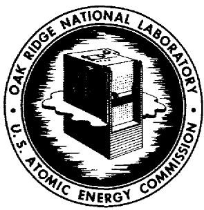
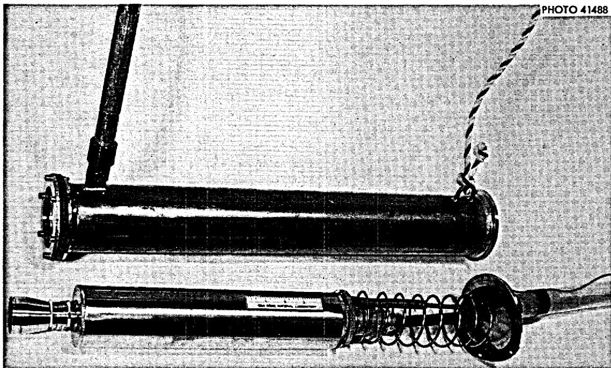
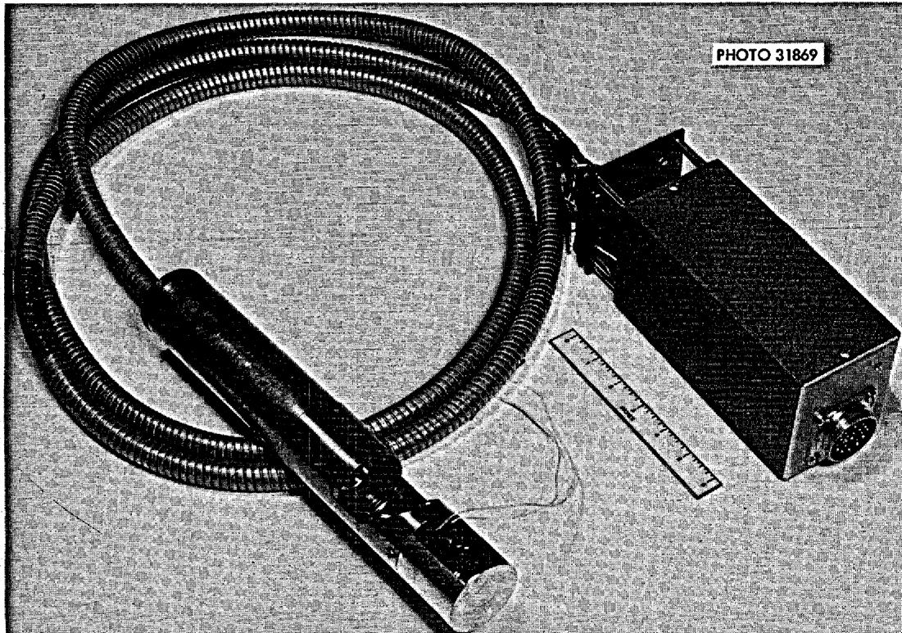
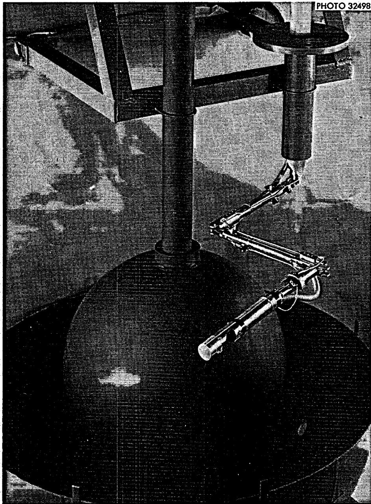
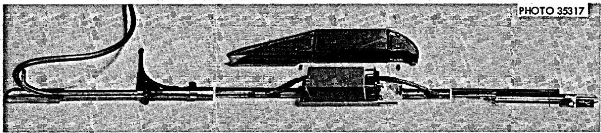
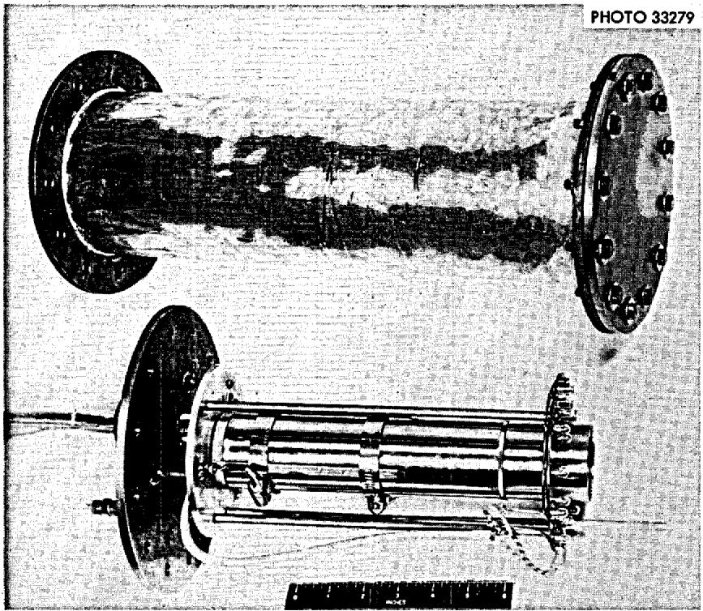
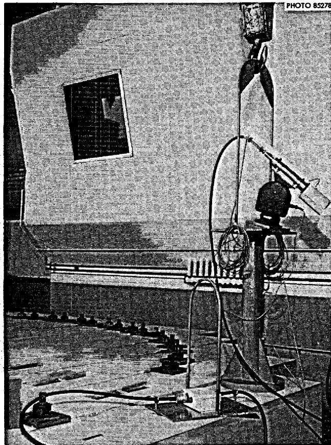
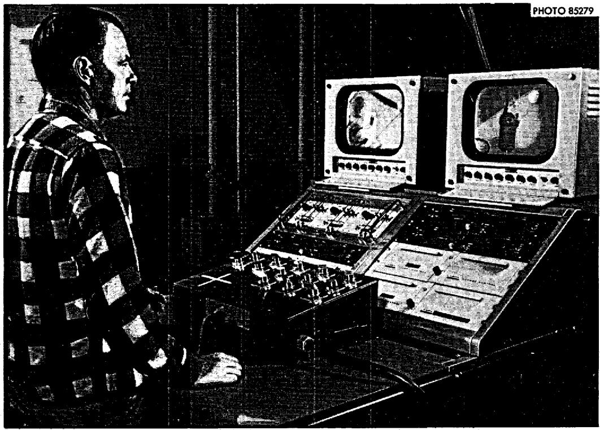

# OAK RIDGE NATIONAL LABORATO. operated by

# UNION CARBIDE CORPORATION

NUCLEAR DIVISION

for the

U.S. ATOMIC ENERGY COMMISSION

ORNL-TM-2032

63

DATE - November 1, 1967

（）-6/

CLOSED-CIRCUIT TELEVISION VIEWING IN MAINTENANCE

OF RADIOACTIVE SYSTEMS AT ORNL*

R. L. Moore

# ABSTRACT

Considerations affecting the use of closed-circuit television in radioactive systems are discussed.

Equipment used for closed-circuit television viewing at the Homogeneous Reactor Test and at the Molten-Salt Reactor Experiment is described.

The results of a radiation test of a miniature, radiation-resistant television camera are presented.

# LEGAL NOTICE

This report was prepared as an account of Government sponsored work. Neither the United States, nor the Commission, nor any person acting on behalf of the Commission:

A. Makes any warranty or representation, expressed or implied, with respect to the accuracy, completeness, or usefulness of the information contained in this report, or that the use of any information, apparatus, method, or process disclosed in this report may not infringe privately owned rights; or   
B. Assumes any liabilities with respect to the use of, or for damages resulting from the use of any information, apparatus, method, or process disclosed in this report.

As used in the above, "person acting on behalf of the Commission" includes any employee or contractor of the Commission, or employee of such contractor, to the extent that such employee or contractor of the Commission, or employee of such contractor prepares, disseminates, or provides access to, any information pursuant to his employment or contract with the Commission, or his employment with such contractor.

# CONTENTS

Page Introduction. 4

Underwater Viewing in the Homogeneous Reactor Test. 4

Core Inspection in the Homogeneous Reactor Test 5

Radiation Tests on a Miniature, Radiation-Resistant TV Camera. 8

Remote Maintenance Viewing in the MoltenSalt Reactor Experiment. 9

Conclusions. 11

# INTRODUCTION

The ease with which maintenance of radioactive systems can be performed is strongly dependent on the ability to view the operations. In systems such as the Molten-Salt Reactor Experiment (MSRE), the radiation levels in portions of the system are very high and viewing must be accomplished directly through high-density windows or indirectly by means of optical devices or closed-circuit television. At ORNL, the use of windows or optical devices is the preferred method of viewing; however, in some cases, supplementary viewing with closed-circuit television is either necessary or desirable. Radiation damage is the most important consideration affecting the selection of television for viewing of maintenance operations. Other considerations are the ruggedness and reliability of the equipment. The radiation levels encountered in many of the ORNL viewing operations are high in comparison with permissible biological dose rates, but low in comparison to the dose that conventional electronic circuitry can withstand. Commercial grade equipment is used for these applications and little, if any, attempt is made to make the equipment radiation resistant. In other cases the radiation levels are much higher, and radiation resistant equipment is required.

UNDERWATER VIEWING IN THE HOMOGENEOUS REACTOR TEST

  
Figure 1 shows a camera used for underwater viewing in Homogeneous   
Fig. 1. HRT Underwater TV Camera Assembly.

Reactor Test (HRT) maintenance operations. This assembly consisted of a standard Dage Model 112 AR camera, a flanged tube, a Lucite face plate, and a Tygon tube. The Tygon tube enclosed the camera cable to a point well above the pool level and provided mechanical protection as well as water-proofing. To keep the camera temperature within the recommended limit, an air purge was supplied to the camera through a small polyethylene tube and returned through the Tygon tube. The camera was manipulated manually by means of a rigid pipe and a plastic line.

Because of the shielding provided by the water and the variety of locations of the camera, no exact data were obtained on the dose which the camera accumulated. However, we estimate that the dose rate varied from negligible to $10^{5}r/hr$ and that the total dose was about $10^{4}r$ . Some lens browning occurred, and more than the usual amount of trouble was encountered with the electronic circuits. However, most of the trouble was routine or was caused by shock and vibration. The only electronic trouble attributable to radiation damage was the failure of several electrolytic condensers in the camera. Replacement of these condensers restored the camera performance.

# CORE INSPECTION IN THE HOMOGENEOUS REACTOR TEST

  
Figure 2 shows a camera assembly developed for use in locating and inspecting a hole in the HRT core. The camera assembly, developed by   
Fig. 2. HRT Miniature TV Camera and Preamplifier.

Dage Electronics Division of Thompson Products to ORNL specifications, consists of a camera equipped with a non-browning lens, a camera preamplifier, and a 10-ft interconnecting cable. A mirror and lighting assembly, consisting of a polished Stellar, right-angle mirror and a 50-cp spotlight bulb, was added at ORNL. The outside diameter of the camera is 2 in., and the length (exclusive of lens, mirror, and lamp) is 7-3/4 in. The only electronic components in the camera head are a type 6198A vidicon tube, a deflection coil assembly, one carbon resistor, and one ceramic capacitor. All other electronics are located in the preamplifier or in the camera control unit. Separation of the camera and the preamplifier resulted in a considerable reduction in size of the assembly to be inserted in the reactor core and permitted the radiation-sensitive components of the preamplifier to be located in a region of much lower activity, outside the reactor core. This camera was designed to be interchangeable with the underwater camera previously described and used the same camera control unit and monitors.

Figure 3 shows the camera assembly installed on an articulated manipulator in a remote maintenance mock-up of the HRT core and blanket vessels. Hydraulic control of the three manipulator joints, together with rotation of the camera by means of an electric motor, enabled the operator to view any part of the exterior surface of the reactor core vessel.

Figure 4 shows a manipulator and camera assembly constructed for use in viewing the internal surface of the HRT core vessel. The assembly shown here is foreshortened, as evidenced by the lines above and below the preamplifier. The actual distance from the preamplifier to the camera is 10 ft, and the overall length is approximately 20 ft. The camera was required to pass through a 2-in. diameter hole, in a reactor access flange, located 14 ft below the top of a portable maintenance shield.

In the manipulator shown in Fig. 3, a fixed-focus lens was used, and focusing was accomplished by moving the camera. In the assembly shown in Fig. 4, camera motion was restricted to vertical motion along the centerline of the reactor, and remote focusing was required. This was accomplished with a remotely operated spur-gear mechanism, shown at right of the camera. To permit insertion into the reactor, the mechanism was designed to retract and fold inside a 2-in. diameter cylindrical surface which was concentric with and parallel to the outer surface of the camera. After the camera was inserted, the mechanism was lowered and rotated to engage a spur gear on the camera-lens focusing ring.

  
Fig. 3. HRT Miniature TV Camera and Articulated Manipulator.

  
Fig. 4. HRT Miniature TV Camera and Linear Manipulated.

# RADIATION TESTS OF A MINIATURE, RADIATION-RESISTANT TV CAMERA

Fortunately for the project (but unfortunately for our TV camera program) the hole in the HRT core was found and inspected by semidirect optical means, and these remotely manipulated TV camera systems were not needed. However, we did gain experience in developing and operating these devices and we did obtain some useful data. As part of the camera evaluation, we installed the camera in the waterproof container shown in Fig. 5 and exposed it to intense gamma radiation produced by $^{60}\mathrm{Co}$ slugs in the canal at the Oak Ridge Graphite Reactor. During these tests, the camera was focused on a miniaturized resolution chart, and performance was observed during initial insertion and prolonged operation. The gamma dose rate was monitored with $\mathrm{Ce(SO_4)_2}$ dosimeters.

In the first test, the camera was equipped with a standard lens and lowered into a $1.5 \times 10^{6} \mathrm{r/hr}$ gamma field. There was no observable initial effect as the camera was lowered into the field; however, the picture faded rapidly and required maximum target voltage after 20 min of operation. After 1 hr of additional exposure in a reduced field of approximately $5 \times 10^{5} \mathrm{r}/\text{hour}$ , the picture was not readable. An additional 18 hr of exposure was accumulated at this lower level before the camera was removed from the radiation field. The total dose was $5 \times 10^{6} \mathrm{r}$ . Subsequent examination showed no visual damage other than glass-browning of the lens and the vidicon tube. After replacement of the lens, the

  
Fig. 5. HRT Miniature TV Camera Radiation Test Assembly.

camera operated satisfactorily with only a slight loss of sensitivity.

In the second test, the camera was equipped with a nonbrowning lens and lowered into a $3.9 \times 10^{5} \mathrm{r/hr}$ gamma field. The only effect observed was a gradual loss of sensitivity, which was compensated by adjustment of the target control. The duration of the test was approximately 250 hr, and the total integrated dose received by the camera was approximately $10^{8} \mathrm{r}$ . At the end of the test, the target control had been advanced to its maximum position, and there was a slight loss in picture resolution. Subsequent tests showed that approximately $20\%$ of the loss of sensitivity was due to browning of the camera lens and the lamp bulbs. The remaining $80\%$ was apparently due to browning of the vidicon faceplate. Replacement of the vidicon, the lens, and the lamps restored the original sensitivity of the equipment. Because of the time and expense involved, and because the $10^{8} \mathrm{r}$ dosage obtained exceeded the dose expected in the HRT viewing operation, no attempt was made to determine the ultimate life of the camera.

# REMOTE MAINTENANCE VIEWING IN THE

# MOLTEN-SALT REACTOR EXPERIMENT

Figure 6 shows a Kintel, model 25ll radiation-resistant camera presently used in maintenance operations at the Molten-Salt Reactor Experiment (MSRE). The use of television in MSRE maintenance operations

  
Fig. 6. MSRE Remote Maintenance TV Camera and Preamplifier.

is presently limited to those operations associated with removal of large components. For these operations large cell-access openings are required, and the maintenance operations must be performed remotely from a shielded maintenance control room. To supplement the direct view available through windows in the maintenance control room, indirect, orthogonal viewing of these operations will be provided by two cameras mounted on portable stands which can be moved by use of an overhead crane. A third camera is also provided for use as an operating spare. The cameras are radiation and shock resistant, and will withstand continuous exposure to 1-Mev gamma radiation at a dose rate of about $10^{5}$ r/hr for 100 hr without degradation of performance. Replacement of the vidicon tube and the lens will restore the camera performance until the camera has accumulated a radiation dosage of $10^{5}$ r. Each camera is connected by 50 ft of radiation-resistant cable to a pre-amplifier which, in turn, is connected by a 100-ft cable to a camera control unit. The preamplifier is not radiation resistant and must be shielded from high-level radiation. The camera control units for the three cameras are mounted in a console in the maintenance control room together with the monitors and associated camera controls. Figure 7 shows the assembled console. Although three camera systems are installed, only two monitors are used. A video switching system permits the operator to display the signal from any of the three cameras on either or both monitors. The joy stick control mounted on the front of the console table enables the operator to control pan, tilt, focus, and zoom motions with wrist and finger actions. Other less frequently

  
Fig. 7. MSRE Remote Maintenance TV Console Assembly.

used controls and adjustments are located on the sloping panel in front of the operator. Space was provided on the table for the addition of crane controls.

Except for the vidicon tube and a small (nuvistor) vacuum tube in the camera, the system uses solid-state components throughout.

The complete system produces high-quality pictures, and performance is stable over a wide range of variation of line voltage, line frequency, ambient temperature, and humidity. Except for a few minor failures which occurred during the first few weeks of acceptance testing, the reliability of the system has been excellent.

The design of this system and the selection and procurement of components was strongly influenced by prior experience at ORNL with the use of closed-circuit television in maintenance operation at the HRT and in the MSRE remote-maintenance demonstration facility.

# CONCLUSIONS

The HRT operations demonstrated that the use of television for viewing in high-level radiation environments was practical. The tests performed in the maintenance demonstration facility demonstrated that orthogonal viewing was preferred to three-dimensional viewing for MSRE maintenance operations. Both operations demonstrated that systems used for remote maintenance must be rugged and easy to operate and must have a high degree of performance and reliability. The conclusions drawn from this experience have been supported and supplemented by the experience gained by others in similar operations.

Since viewing equipment must be operable when needed, maintenance personnel have been understandably reluctant to use the low-reliability equipment available in the past. This equipment used vacuum tube circuitry throughout, was sensitive to shock and vibration, and reliability ranged from marginal to poor. It is my belief that the state of the art of closed-circuit television has now advanced to the point where the performance and reliability of presently available equipment are commensurate with the requirements for remote maintenance viewing and that the system installed at the MSRE will be a useful and vital tool in future maintenance operations.

# INTERNAL DISTRIBUTION

1. S.J.Ball   
2. S.E.Beall   
3. E.S.Bettis   
4. W.A.Bird   
5. R. Blumberg   
6. E. G. Bohlman   
7. C. J. Borkowski   
8. R.B. Briggs   
9. A. L. Case   
L. T. M. Cate   
1. R.A.Dandl   
2. D. G. Davis   
3. S. J. Ditto   
4. E.P.Epler   
5. D. E. Ferguson   
6. W.R.Grimes   
7. A.G.Grindell   
8. C. S. Harrill   
9. P. G. Herndon   
P.P.Holtz   
P.N.Haubenreich   
2. W.H. Jordan   
3. P.R.Kasten   
24. J. W. Krewson   
5. F.W.Manning   
16. R.E. MacPherson   
7. H. E. McCoy   
8. H.J.Metz   
29-34. R. L. Moore   
35. C. A. Mossman   
36. E. L. Nicholson   
37. L.C.Oakes

38. R.W. Peele   
39. A. M. Perry   
40. J. L. Redford   
41. M.W. Rosenthal   
42. G. S. Sadowski   
43. Dunlap Scott   
44. Ben Squires   
45. J.R.Tallackson   
46. R.E.Thoma   
47. J.R.Weir   
48. K.W. West   
49. M. E. Whatley   
50. J.C. White   
51. J. L. Winters

52-53. Central Research Library

54. Document Reference Section

55-60. Laboratory Records Department

61. Laboratory Records, ORNL R.C.   
62. ORNL Patent Office

63-77. Division of Technical Information Extension

78. Laboratory and University Div. ORO

# EXTERNAL DISTRIBUTION

79. E. H. Cooke-Yarborough, *Électronics Division*, AERE, Harwell, England   
80. J. B. H. Kuper, BNL   
81. E. Siddall, AECL, Chalk River, Ontario