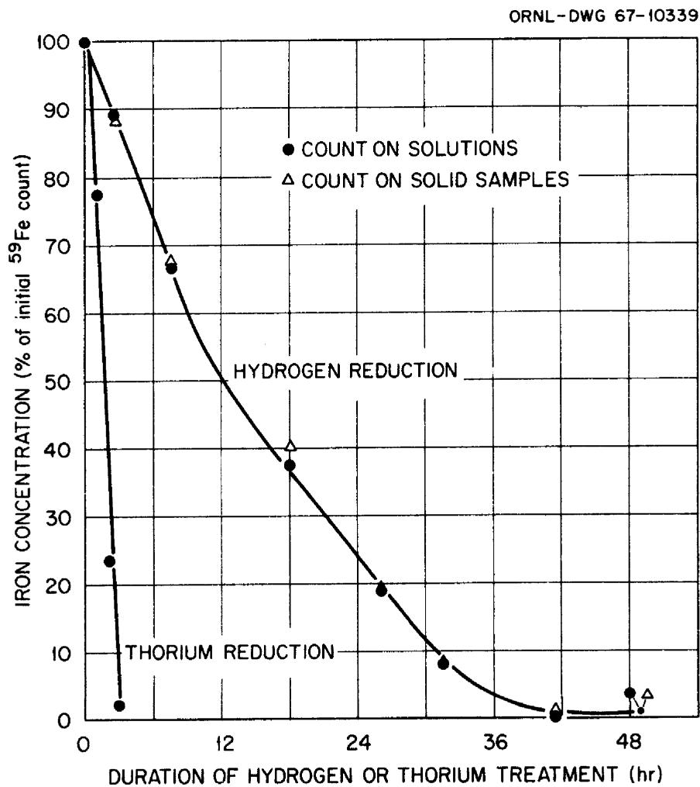

ORNL-TM-2036

COPY NO. - 57

DATE -11/2/67

Aster

Reduction of Iron Dissolved in Molten LiF-ThF4

C. J. Barton and H. H. Stone

# ABSTRACT

Additions of $^{59}\mathrm{Fe}$ tracer to LiF-ThF $_4$ (73-27 mole %) permitted rapid and sensitive measurements of the iron content of filtered samples of molten material. More than 40 hours were required for nearly complete removal of iron from the melt by hydrogen reduction at about $600^{\circ}\mathrm{C}$ while reduction of iron by metallic thorium at the same temperature was virtually complete after three hours. Disappearance of a relatively large quantity of solid thorium on long exposure to the molten salt will require further investigation. Comparison of the data obtained by use of $^{59}\mathrm{Fe}$ tracer counts with the results of colorimetric iron determinations by two different laboratories seems to indicate that the colorimetric iron method employed when these tests were performed did not give reliable iron results at low iron concentrations. Colorimetric nickel determinations by the two laboratories give divergent data for more than half of the samples.

# LEGAL NOTICE

This report was prepared as an account of Government sponsored work. Neither the United States, nor the Commission, nor any person acting on behalf of the Commission:

A. Makes any warranty or representation, expressed or implied, with respect to the accuracy, completeness, or usefulness of the information contained in this report, or that the use of any information, apparatus, method, or process disclosed in this report may not infringe privately owned rights; or   
B. Assumes any liabilities with respect to the use of, or for damages resulting from the use of any information, apparatus, method, or process disclosed in this report.

As used in the above, "person acting on behalf of the Commission" includes any employee or contractor of the Commission, or employee of such contractor, to the extent that such employee or contractor of the Commission, or employee of such contractor prepares, disseminates, or provides access to, any information pursuant to his employment or contract with the Commission, or his employment with such contractor.

Reduction of Iron Dissolved in Molten LiF-ThF

C. J. Barton and H. H. Stone

# INTRODUCTION

Many samples of LiF-ThF $_4$ (73-27 mole %) from protactinium recovery experiments have been analyzed for iron and some for nickel. In some cases it has been possible to correlate the iron and protactinium results but the low iron and nickel concentrations expected in filtered salt samples reduced with metallic thorium have seldom been confirmed by the analytical data. We decided, therefore, to conduct an experiment in which $^{59}\mathrm{Fe}$ tracer would be used to follow the reduction of iron dissolved in molten LiF-ThF $_4$ and to compare the $^{59}\mathrm{Fe}$ results obtained with analytical values obtained by two laboratories that routinely perform iron and nickel determinations using colorimetric methods. It appears that similar studies have been performed at least twice before during the history of the molten salt project at ORNL. The results were not documented in any detail on either occasion, but the data obtained are in general agreement with the findings of the present investigation.

# EXPERIMENTAL PROCEDURE

The LiF-ThF $_4$ (73-27 mole %) used as the solvent material in this experiment was supplied by J. H. Shaffer (Reactor Chemistry Division, ORNL) as part of a large (3.5 kg) batch that had received the usual purification treatment including hydrofluorination with a HF- $\mathsf{H}_2$ mixture followed by prolonged hydrogen reduction to remove iron, nickel, and other reducible impurities.

We obtained approximately one millicurie of $^{59}\mathrm{Fe}$ tracer by purchasing 10 mg of iron in the form of $\mathrm{Fe}_2\mathrm{O}_3$ that had been enriched in $^{58}\mathrm{Fe}$ isotope and irradiating it in the LITR. The irradiated material was mixed with enough inactive $\mathrm{Fe}_2\mathrm{O}_3$ to give approximately 600 ppm of Fe when completely dissolved in 320 g of salt. The salt and iron oxide were placed in a nickel container, heated to approximately $600^{\circ}\mathrm{C}$ in flowing helium, treated with mixed helium and anhydrous HF followed by a brief hydrogen treatment and then with mixed hydrogen and HF in an effort to remove oxygen and to dissolve the added iron. We believe, on the basis of thermodynamic data, that this treatment also reduced $\mathrm{Fe}^{3+}$ to $\mathrm{Fe}^{2+}$ . Subsequent analyses of filtered samples indicated that part of the added iron was not dissolved by this treatment. Hydrogen reduction was then started. This gas was purified by passing it through a Deoxo unit to convert any oxygen present to water and then through a column of Drierite and a liquid-nitrogen-cooled trap to remove water. Hydrogen treatment continued until the $^{59}\mathrm{Fe}$ count on filtered samples indicated that only a slight trace of iron remained in the melt. The melt temperature varied during this period from about 590 to $625^{\circ}\mathrm{C}$ due to daily variations in the line voltage that supplied the furnace.

The melt was treated with mixed hydrogen-HF and with helium-HF to redissolve the hydrogen-reduced iron. When the $^{59}\mathrm{Fe}$ counts indicated that no further increase in the iron content of filtered samples was occurring, we gave the melt a brief hydrogen treatment (1-1/2 hours) to effect at least partial reduction of dissolved $\mathrm{Ni}^{2+}$ and removal of dissolved HF. Thorium rods approximately 1/4 inch in diameter were exposed to the melt for three, 1-hr periods and one, 16-hr period, taking a filtered sample each time after the rod was removed. The rods were cleaned by filing before they were reused. This experiment was performed

in a hood located in the High Alpha Molten Salt Laboratory since no protactinium was added to the melt. The samples were handled in the hood as far as possible because of the hazard of airborne thorium.

Most samples were removed by filtering through sintered copper filters following the procedure previously described. The frozen salt samples were removed from the filter sticks and crushed in porcelain mortars. One-gram portions of the samples were placed in small plastic vials, sealed in plastic bags, and given the following analytical treatment. The gamma activity of the solid samples was first measured by use of a multichannel analyzer. The samples were then dissolved in the High Level Alpha Radiation Laboratory (Building 3508) and analyzed for iron and nickel content by colorimetric methods. Portions of the solutions were transferred to the General Hot Analysis Laboratory (Building 2026) for similar determinations and the Radioisotopes Radiochemistry Laboratory (Building 3019) for $^{59}\mathrm{Fe}$ counting. Selected samples were also submitted for spectrographic analysis as indicated in Table I.

# ANALYTICAL DATA

Most of the analytical data obtained from the experiment are displayed in Table 1. It was necessary to calculate a factor for converting the $^{59}\mathrm{Fe}$ counts into iron concentrations. This was accomplished by choosing one or two samples for which the 2026 and 3508 colorimetric analyses agreed reasonably well, and dividing the average of their results by the $^{59}\mathrm{Fe}$ count (per minute). The values calculated from the $^{59}\mathrm{Fe}$ counts obtained with solutions were slightly more consistent than the values calculated from the $^{59}\mathrm{Fe}$ counts on solid samples using less refined counting techniques. The iron concentration values shown in parentheses in the $^{59}\mathrm{Fe}$ column of Table 1 are the values assumed to be correct for the calculation of the conversion factor. The factor used for the

hydrogen reduction phase of the experiment was not applicable in the last part of the experiment. Although the $^{59}\mathrm{Fe}$ counts were approximately the same for samples 14 and 15 as for samples 2-5, the colorimetric iron values were much higher. We believe that some iron was introduced into the salt by use of stainless steel samplers at a time when no copper samplers were available or that the second hydrofluorination treatment was more effective in dissolving the added iron oxide than the initial treatment.

Good agreement among the results of iron determination of the three laboratories is noted for about $1/3$ of the samples analyzed. The largest discrepancies between colorimetric determinations and $^{59}\mathrm{Fe}$ count values were obtained with samples that were almost certainly contaminated. (Samples 12, 13, 19, and 21). Excluding these samples, reasonable agreement was obtained with almost half of the samples analyzed by the three laboratories. In general, agreement was poorest where the iron concentration calculated from tracer counts was less than $0.10\mathrm{Fe/g}$ .

An effort was made to ascertain whether the discrepancy observed at low iron concentrations was due to some deficiency in the colorimetric iron method or to sample contamination. Several samples, including the as received salt, were submitted for spectrographic analysis. The value reported for the as received salt, $0.011 \, \mathrm{mg/g}$ , was lower than any of the colorimetric values obtained. These ranged from $0.03 \, \mathrm{mg/g}$ (General Analysis Laboratory) to $0.13 \, \mathrm{mg/g}$ (2026 lab.). Of course, no tracer result was obtained with this sample. The spectrographic concentrations determined for the other three samples analyzed by this method were all higher than the values calculated from $^{59}$ Fe counts. In each case, the spectrographic result was in good agreement with at least one colorimetric value but it was lower than most of the data obtained by this method. If the spectrographic data are correct, then we must assume that the samples were slightly

contaminated with iron either in our laboratory or in the analytical laboratory. Any solid iron or nickel or compounds of either metal, that was introduced into a sample after it was removed from the melt would have been dissolved and thus would contaminate the sample solution. It appears, however, that the colorimetric iron method tends to give high results with samples having a low iron concentration.

Much less attention has been given to the colorimetric nickel data because we had no tracer for this element. The results obtained by the 2026 laboratory were lower than those reported by the 3508 laboratory for a majority of the samples but the cause of the observed discrepancies has not been determined. Since $\mathrm{Ni}^{2+}$ is thermodynamically incompatible with $\mathrm{Fe}^0$ at $600^{\circ}\mathrm{C}$ , high nickel values in filtered, reduced samples of salt are unlikely to be correct unless the samples were contaminated or metallic nickel particles were small enough to pass through the sampler filters.

# IRON REDUCTION

The plot of iron concentration as a function of time is shown in Fig. 1. The hydrogen reduction process is obviously quite slow and the reduction rate seems to diminish with decreasing iron concentration. It is not clear whether any significance can be attached to the apparently linear rates during the initial and middle fractions of the reduction period as indicated in Fig. 1 but the data indicate that the first $10\%$ of the iron was reduced in less than three hours while approximately 12 hours were required to remove the last $10\%$ .

The thorium reduction process was quite rapid in comparison to hydrogen reduction and there was no indication of a change in reduction rate during the initial three-hour period when $97.5\%$ of the iron activity was removed from solution.

# THORIUM LOSS

A puzzling aspect of this experiment was that during the 16-hr period between samples 22 and 23, the thorium rod (estimated to weigh about $12\mathrm{g}$ ) used to reduce the iron completely disappeared. Samples 25-28 were obtained during the post-mortem phase of the experiment when the nickel pot was cut through and its contents were removed for examination and analysis. Black lumps of varying size were removed from the frozen salt, ground to pass a 40-mesh sieve and submitted for analysis. The complete analysis of samples 25-27 is given in Table 2. In addition to the chemical analysis, which is not entirely satisfactory because none of the totals came close to $100\%$ , sample 25 (the largest black lumps) was submitted for X-ray diffraction examination. The only definitely identified component of the material was $\mathrm{Li}_{3}\mathrm{ThF}_{7}$ but LiF and $\mathrm{LiThF}_{5}$ were reported to be possibly present and a number of unidentified lines were also found.

If we assume that all the fluoride ions were combined either with lithium or thorium, calculations show that $170\mathrm{mg / g}$ of thorium was present as metal in sample 25 and $290\mathrm{mg / g}$ in sample 26. Since metallic nickel and thorium were not found in sample 25 by X-ray diffraction, it is possible that these metals were present as an intermetallic compound of unknown composition.

The fact that the black material composing samples 25 and 26 could be ground to small particles seems to indicate that the metals present were deposited from the melt.

The disappearance of a significant quantity of solid thorium on long exposure to molten LiF-ThF $_4$ served as a reminder of similar behavior in an experiment, Run 2-22 (66), reported earlier. There, a 6-hr exposure resulted in removal of 28 g of thorium from a larger rod than that used here. In that

instance, it was speculated that the thorium rod came in contact with the bottom of the nickel pot causing a current to flow that eroded the thorium rod. In both experiments the thorium rod was supported by a 1/8-in nickel rod that was electrically insulated from the container by a Teflon plug. Black magnetic material removed from the nickel pot after cooling to room temperature in the earlier experiment analyzed $45\%$ nickel and $30\%$ thorium, while non-magnetic material contained $22\%$ nickel and $49.5\%$ thorium. The chunks of black material found in the pot were quite brittle, as in the present experiment, which was interpreted to mean that they were aggregates of finely divided thorium and nickel particles.

While the same explanation of thorium loss given earlier could be offered here, an alternative explanation can be given although it is purely speculative at present. This assumes that the reaction

$$
3 \mathrm {T h F} _ {4} \quad + \quad \mathrm {T h} ^ {\circ} \quad \rightarrow \quad 4 \mathrm {T h F} _ {3}
$$

can occur in the molten mixture and that the $\mathrm{ThF}_3$ , when it diffuses to the nickel wall, disproportionates because of formation of Th-Ni intermetallic compounds. Failure to find X-ray evidence of such compounds in sample 25 weakens the argument for this explanation, but since the form of the nickel present has not been determined, the question remains open. Since $\mathrm{ThF}_3$ is not observed in our frozen salt samples, and it has not been reported in the literature, we must assume that if the above reaction occurs at $600^{\circ}$ it must be reversed on cooling.

Since $\mathsf{ThF}_3$ , if it exists, may be strongly colored, we plan to expose molten LiF-ThF4 to solid thorium in a furnace that allows visual observation of the melted material.

# Conclusions

1. Use of $^{59}\mathrm{Fe}$ tracer gives a sensitive measure of the iron content of fluoride salt samples.   
2. The colorimetric iron method presently employed by the 2026 and 3508 laboratories does not appear to give reliable results at low iron concentrations.   
3. There is a large and presently unexplained discrepancy in the nickel analyses by the 2026 and 3509 laboratories for a large fraction of the samples.   
4. Disappearance of a comparatively large amount of thorium metal on long exposure to molten LiF-ThF $_4$ raises the possibility that a lower-than-normal valence state of thorium may occur in melts exposed to solid thorium. In addition to its scientific interest, this reaction could affect the use of solid thorium as the reductant for protactinium and we are planning further examination of this phenomenon.

Table 1. Analysis of Samples from Iron Reduction Experiment   

<table><tr><td>Sample No.</td><td colspan="4">Iron Concentration (mg/g)</td><td colspan="2">Nickel Conc. (mg/g)</td><td>Sample Description</td></tr><tr><td></td><td>2026</td><td>3508</td><td>59Fe</td><td>Spec.</td><td>2026</td><td>3508</td><td></td></tr><tr><td></td><td>Lab.</td><td>Lab.</td><td>Count</td><td>Anal.</td><td>Lab.</td><td>Lab.</td><td></td></tr><tr><td>0</td><td>0.13</td><td>0.07</td><td>-</td><td>0.011</td><td>&lt;0.01</td><td>0.04</td><td>Salt as received</td></tr><tr><td>1</td><td>0.52</td><td>&lt;0.01</td><td>0.21</td><td></td><td>0.06</td><td>0.02</td><td>Filtered salt - 1½ hr He-HF</td></tr><tr><td>2</td><td>0.27</td><td>0.02</td><td>0.31</td><td></td><td>&lt;0.01</td><td>0.26</td><td>Filtered salt - 2¼ hr He-HF</td></tr><tr><td>3</td><td>0.18</td><td>0.04</td><td>0.33</td><td></td><td>&lt;0.01</td><td>0.12</td><td>Filtered salt - 1½ hr H₂</td></tr><tr><td>4</td><td>0.29</td><td>0.34</td><td>(0.315)</td><td></td><td>&lt;0.01</td><td>0.35</td><td>Filtered salt - 1 hr H₂-HF</td></tr><tr><td>5</td><td>0.29</td><td>0.30</td><td>(0.295)</td><td></td><td>&lt;0.01</td><td>0.32</td><td>Filtered salt - 2 hr H₂</td></tr><tr><td>6</td><td>0.25</td><td>0.22</td><td>0.22</td><td></td><td>&lt;0.01</td><td>0.08</td><td>Filtered salt - 7½ hr H₂</td></tr><tr><td>7</td><td>0.20</td><td>0.01</td><td>0.13</td><td></td><td>0.06</td><td>0.17</td><td>Filtered salt - 18 hr H₂</td></tr><tr><td>8</td><td>0.21</td><td>0.09</td><td>0.07</td><td></td><td>&lt;0.01</td><td>0.17</td><td>Filtered salt - 26 hr H₂</td></tr><tr><td>9</td><td>0.18</td><td>0.10 - 0.27 - &lt;0.01</td><td>0.030</td><td>0.15</td><td>0.07</td><td>0.14</td><td>Filtered salt - 31½ hr H₂</td></tr><tr><td>10</td><td>0.12</td><td>0.05 - 0.17 - 0.10</td><td>0.002</td><td>0.04</td><td>&lt;0.01</td><td>0.29</td><td>Filtered salt - 41½ hr H₂</td></tr><tr><td>11</td><td>0.14</td><td>0.02 - 0.16 - 0.07</td><td>0.003</td><td>0.03</td><td>0.09</td><td>0.12</td><td>Filtered salt - 49½ hr H₂</td></tr><tr><td>12</td><td>0.67a</td><td>0.10 - 0.61a</td><td></td><td>0.021</td><td></td><td>0.24</td><td>Filtered salt - 1 hr H₂-HF</td></tr><tr><td>13</td><td>1.85a</td><td>2.10a</td><td></td><td>0.07</td><td></td><td>0.27</td><td>Filtered salt - 3 hr H₂-HF</td></tr><tr><td>14</td><td>0.13</td><td>0.17</td><td>0.55c</td><td></td><td>&lt;0.01</td><td>0.04</td><td>Filtered salt - 5½ hr H₂-HF</td></tr><tr><td>15</td><td>0.53</td><td>0.58</td><td>(0.55)</td><td></td><td>&lt;0.01</td><td>0.17</td><td>Filtered salt - 16 hr He-HF</td></tr><tr><td>16</td><td>0.43</td><td>0.47</td><td>0.50</td><td></td><td>0.33</td><td>0.27</td><td>Filtered salt - 2 hr H₂-HF</td></tr><tr><td>17</td><td>0.48</td><td>0.54</td><td>0.52</td><td></td><td>&lt;0.01</td><td>0.03</td><td>Filtered salt - 1½ hr H₂</td></tr><tr><td>18</td><td>0.38</td><td>0.47</td><td>0.43</td><td></td><td>&lt;0.01</td><td>0.11</td><td>Filtered salt - 1 hr Th exp.</td></tr><tr><td>19</td><td>14.3b</td><td>14.9b</td><td>0.11</td><td></td><td>0.18</td><td>0.22</td><td>Filings from Th rod</td></tr><tr><td>20</td><td>0.17</td><td>0.20</td><td>0.13</td><td></td><td>&lt;0.01</td><td>0.11</td><td>Filtered salt - 2 hr Th exp.</td></tr><tr><td>21</td><td>2.89b</td><td>2.99b</td><td>0.07</td><td></td><td>0.16</td><td>0.14</td><td>Filings from 2nd Th rod</td></tr><tr><td>22</td><td>0.14</td><td>0.05</td><td>0.01</td><td></td><td>0.33</td><td>0.50</td><td>Filtered salt - 3 hr Th exp.</td></tr><tr><td>23</td><td>&lt;0.01</td><td>&lt;0.01</td><td>0.04</td><td></td><td>&lt;0.01</td><td>2.23</td><td>Filtered salt - 19 hr Th exp.</td></tr><tr><td>24</td><td>&lt;0.01</td><td>0.27</td><td>1.05</td><td></td><td>240</td><td>205</td><td>Crust from Ni support rod</td></tr><tr><td>25</td><td>-</td><td>1.03</td><td>1.32</td><td></td><td>-</td><td>140-218</td><td>Large black lumps from salt</td></tr><tr><td>26</td><td>-</td><td>1.84</td><td>1.36</td><td></td><td>-</td><td>131-137</td><td>Small black lumps from salt</td></tr><tr><td>27</td><td>-</td><td>0.53</td><td>0.37</td><td></td><td>-</td><td>3.7-5.5</td><td>Ground unfiltered salt</td></tr><tr><td>28</td><td>Total</td><td>34.5</td><td>25.7</td><td></td><td>-</td><td>-</td><td>Material leached from vessel wall by acid</td></tr></table>

Contaminated by stainless steel sampler.   
bProbably contaminated by iron from file used to remove surface of Th rod.   
The higher iron concentration in this and subsequent samples, as compared to earlier uncontaminated samples, is possibly due to use of stainless steel samplers for samples 12 and 13, or to solution of some of the added iron that did not dissolve in the initial hydrofluorination treatment.

Table 2. Analysis of Material   
Removed from Nickel Pot   

<table><tr><td rowspan="2">Sample No.</td><td colspan="6">Concentration (mg/g)</td></tr><tr><td>Th</td><td>Li</td><td>F</td><td>Fe</td><td>Ni</td><td>Total</td></tr><tr><td>25</td><td>524</td><td>21.2</td><td>174</td><td>1.03</td><td>218</td><td>936</td></tr><tr><td>26</td><td>646</td><td>24.1</td><td>150</td><td>1.84</td><td>134</td><td>956</td></tr><tr><td>27</td><td>561</td><td>44.1</td><td>310</td><td>0.53</td><td>4.6</td><td>920</td></tr><tr><td>Theoretical (pure salt)</td><td>615</td><td>49.5</td><td>335</td><td>-</td><td>-</td><td>1000</td></tr></table>

  
Fig. 1. Reduction of $\mathsf{Fe}^{2+}$ in LiF-ThF $_4$ (73-27 mole %) as Indicated by $^{59}\mathsf{Fe}$ Counts on Filtered Samples.

# References

1. C. J. Barton and H. H. Stone, "Protactinium Studies in the High-Alpha Molten Salt Laboratory," MSR Program Semiann. Progr. Rept. Feb. 28, 1966, ORNL-3936, p. 148.   
2. Ibid, ORNL-4119, p. 153.   
3. C. J. Barton, "Recovery of Protactinium from Breeder Blanket Mixtures," MSR Program Semiann. Progr. Rept. August 31, 1965, ORNL-3872, p. 137.   
4. A. Glassner, "The Thermochemical Properties of the Oxides, Fluorides, and Chlorides to $2500^{\circ}\mathrm{K}$ , ANL-5750 (1957).   
5. C. J. Barton, H. H. Stone, "Removal of Protactinium from Molten Fluoride Breeder Blanket Mixtures," ORNL-TM-1543, June, 1966.

# INTERNAL DISTRIBUTION

1. R.F.Apple   
2. C.F.Baes   
3-12. C.J.Barton   
13. E. S. Bettis   
14. F. F. Blankenship   
15. E. G. Bohlmann   
16. G.E. Boyd   
17. J. Braunstein   
18. M.A.Bredig   
19. R. B. Briggs   
20. H. R. Bronstein   
21. S. Cantor   
22. L. T. Corbin   
23. S.J.Ditto   
24. D. E. Ferguson   
25. L. M. Ferris   
26. W.R.Grimes   
27. A. G. Grindell   
28. P. N. Haubenreich   
29. P. R. Kasten   
30. M. T. Kelly   
31. C. E. Lamb   
32. R.E. MacPherson   
33. H. E. McCoy   
34. H.F.McDuffie   
35. R. L. Moore   
36. E. L. Nicholson   
37. L.C.Oakes   
38. A. M. Perry   
39-40. M. W. Rosenthal   
41. Dunlap Scott   
42. J.H.Shaffer   
43-44. M. J. Skinner   
45. H. H. Stone   
46. R.E.Thoma   
47. J.R.Weir   
48. M. E. Whatley   
49. J. C. White   
50-51. Central Research Library   
52-53. Document Reference Section   
54-55. Laboratory Records   
56. Laboratory Records, ORNL R.C.

# EXTERNAL DISTRIBUTION

57-71. Division of Technical Information Extension (DTIE)   
72. Laboratory and University Division, ORO