3445605132442

CENTRAL RESEARCH LIBRARY

DOCUMENT COLLECTION

OAK KIDVE MAMILLABORATORY

operated by

# UNION CARBIDE CORPORATION

# NUCLEAR DIVISION

UNION CARGO

for the

U.S. ATOMIC ENERGY COMMISSION

ORNL-TM-2043

43

EFFECTS OF IRRADIATION ON THE MECHANICAL PROPERTIES OF TWO VACUUM-MELTED HEATS OF HASTELLOY N

H.E.McCoy, Jr.

PAPERS (ARTICLE)

1

LIBRARY LOAN COPY

DID NOT TRANSFER TO ANOTHER PERSON

If you wish to use this code, please link to

143.2008 143.2007

#

$\therefore m = \frac{3}{11}$ ;

NOTICE This document contains information of a preliminary nature and was prepared primarily for internal use at the Oak Ridge National Laboratory. It is subject to revision or correction and therefore does not represent a final report.

# LEGAL NOTICE

This report was prepared as an account of Government sponsored work. Neither the United States, nor the Commission, nor any person acting on behalf of the Commission:

A. Makes any warranty or representation, expressed or implied, with respect to the accuracy, completeness, or usefulness of the information contained in this report, or that the use of any information, apparatus, method, or process disclosed in this report may not infringe privately owned rights; or   
B. Assumes any liabilities with respect to the use of, or for damages resulting from the use of any information, apparatus, method, or process disclosed in this report.

As used in the above, "person acting on behalf of the Commission" includes any employee or contractor of the Commission, or employee of such contractor, to the extent that such employee or contractor of the Commission, or employee of such contractor prepares, disseminates, or provides access to, any information pursuant to his employment or contract with the Commission, or his employment with such contractor.

Contract No. W-7405-eng-26

METALS AND CERAMICS DIVISION

EFFECTS OF IRRADIATION ON THE MECHANICAL PROPERTIES OF TWO VACUUM-MELTED HEATS OF HASTELLOY N

H. E. McCoy, Jr.

JANUARY 1968

OAK RIDGE NATIONAL LABORATORY

Oak Ridge, Tennessee

operated by

UNION CARBIDE CORPORATION

for the

U.S. ATOMIC ENERGY COMMISSION

TABLE OF CONTENTS   

<table><tr><td></td><td>Page</td></tr><tr><td>Abstract</td><td>1</td></tr><tr><td>Introduction</td><td>1</td></tr><tr><td>Experimental Details</td><td>2</td></tr><tr><td>Test Materials</td><td>2</td></tr><tr><td>Heat Treatments</td><td>2</td></tr><tr><td>Test Specimen</td><td>3</td></tr><tr><td>Irradiation Conditions</td><td>3</td></tr><tr><td>Testing Techniques</td><td>5</td></tr><tr><td>Experimental Results</td><td>6</td></tr><tr><td>Discussion of Results</td><td>33</td></tr><tr><td>Summary and Conclusions</td><td>40</td></tr><tr><td>Acknowledgments</td><td>41</td></tr></table>

# EFFECTS OF IRRADIATION ON THE MECHANICAL PROPERTIES OF TWO VACUUM-MELTED HEATS OF HASTELLOY N

H. E. McCoy, Jr.

# ABSTRACT

The mechanical behavior of two vacuum-melted heats of Hastelloy N was evaluated at 650 and $760^{\circ}\mathrm{C}$ . The material was subjected to several thermal-mechanical treatments and then irradiated at 650 and $760^{\circ}\mathrm{C}$ to a thermal dose of $2.3 \times 10^{20}$ neutrons/cm $^2$ . The results are compared with those for unirradiated specimens that were given a similar thermal treatment. The various thermal-mechanical treatments had some relatively small effects on the unirradiated tensile properties, but the creep properties were very similar. The primary effects of irradiation were reductions in the creep-rupture life and the rupture ductility in both creep and tensile tests. These observations are explained on the basis of helium production in the metal by the $^{10}\mathrm{B}(n,\alpha)$ transmutation.

# INTRODUCTION

The potential use of Hastelloy N in several reactors has developed considerable interest in how the properties of this material change with neutron irradiation. Previous studies at ORNL1,2 have shown that the high-temperature mechanical properties of this alloy deteriorate under neutron irradiation. This deterioration manifests itself as both a reduction in the creep-rupture life and in the rupture ductility. However, these studies involved air-melted material with B levels in the range of 20 to 50 ppm.

We have recently run two series of experiments that were aimed primarily at characterizing this alloy for use in the SNAP-8 system. This system will utilize thin-walled Hastelloy N tubing for fuel element cladding and will operate over the temperature range of 650 to $760^{\circ}\mathrm{C}$ . One series of experiments involved in-reactor tube-burst tests on cladding material, and the details of this study have been reported. $^3$ The second series of experiments involved postirradiation creep rupture and tensile tests on small bar samples, and these results are presented in this report. Two vacuum-melted heats were used, and the properties were evaluated after the material had been subjected to various thermal-mechanical treatments. These treatments were dictated largely by the steps used to process the fuel element cladding.

# EXPERIMENTAL DETAILS

# Test Materials

The two lots of material used in this study were 12-in.-diam, 10,000-lb double vacuum-melted heats obtained from Allvac Metals Company. The chemical analysis of each heat is given in Table 1. Heat 5911 was obtained in two forms: forged to a bar $2 \times 2$ in. (designated 5911 AW) and forged and machined to a tube shell 2-in. OD × 1 l/2-in. ID (designated 5911 TH). Heat 6252 was obtained in the as-cast condition (designated 6252 AC).

# Heat Treatments

The materials were given several different mechanical and thermal treatments prior to irradiation. These treatments are described in Table 2 and will be referred to by number. All annealing was carried out in an argon environment, and the specimens were cooled by pulling them into a water-cooled section at the end of the furnace.

Table 1. Chemical Analysis of Test Materials   

<table><tr><td rowspan="2">Element</td><td colspan="2">Content (wt %)</td></tr><tr><td>Heat Number 5911</td><td>Heat Number 6252</td></tr><tr><td>Fe</td><td>0.03</td><td>0.12</td></tr><tr><td>Cr</td><td>6.14</td><td>7.26</td></tr><tr><td>Mo</td><td>17.01</td><td>16.53</td></tr><tr><td>Ni</td><td>bal</td><td>bal</td></tr><tr><td>C</td><td>0.056</td><td>0.051</td></tr><tr><td>Mn</td><td>0.21</td><td>0.20</td></tr><tr><td>B</td><td>0.0010</td><td>0.0003</td></tr><tr><td>S</td><td>0.002a</td><td>0.002a</td></tr><tr><td>P</td><td>0.002a</td><td>0.002a</td></tr><tr><td>Si</td><td>0.05</td><td>0.05</td></tr><tr><td>Cu</td><td>&lt; 0.01</td><td>&lt; 0.01</td></tr><tr><td>Co</td><td>0.08a</td><td>0.11a</td></tr><tr><td>Al</td><td>0.15</td><td>0.20</td></tr><tr><td>Ti</td><td>0.067</td><td>0.13</td></tr><tr><td>W</td><td>0.01a</td><td>0.02a</td></tr><tr><td>Zr</td><td>&lt; 0.01</td><td>&lt; 0.01</td></tr><tr><td>O</td><td>0.0014</td><td>0.0008</td></tr><tr><td>N</td><td>&lt; 0.0005</td><td>0.0005</td></tr></table>

aLadle analysis, Allvac Metals Company. All other values obtained at ORNL on the finished product.

# Test Specimen

The small tensile specimen shown in Fig. 1 was used for in- and ex-reactor tests. The small size made it possible to get several specimens into a single experiment. Our work with this specimen has shown that it yields data that are quite similar to those obtained from larger specimens. Because of the stress concentration at the base of the filet, there is some tendency for the brittle specimens to fail at this point.

# Irradiation Conditions

The specimens were irradiated in a single-test capsule in the P-4 poolside position in the ORR. The peak thermal flux was $6 \times 10^{13}$ neutrons $\mathrm{cm}^{-2} \sec^{-1}$ , and the peak fast ( $>2.9 \mathrm{Mev}$ ) flux was $5 \times 10^{12}$ neutrons $\mathrm{cm}^{-2} \sec^{-1}$ . The duration of the experiment was 1080 hr

Table 2. Description of Thermal-Mechanical Treatments   

<table><tr><td>Designation</td><td>Thermal-Mechanical Treatment</td></tr><tr><td>1</td><td>Annealed 1 hr at 1177°C in argon</td></tr><tr><td>2</td><td>Hot rolled 50% at 1150°C, 
Annealed 1 hr at 1177°C in argon</td></tr><tr><td>3</td><td>Annealed 1 hr at 1177°C in argon, 
Cold worked 25%, 
Annealed 1 l/2 hr at 1066°C 
in argon, 
Annealed 2 hr at 1093°C in argon, 
Annealed 10 min at 1150°C in argon</td></tr><tr><td>3A</td><td>Annealed 1 hr at 1260°C in argon</td></tr><tr><td>2A</td><td>Hot rolled 50% at 1150°C, 
Annealed 1 hr at 1260°C in argon</td></tr></table>

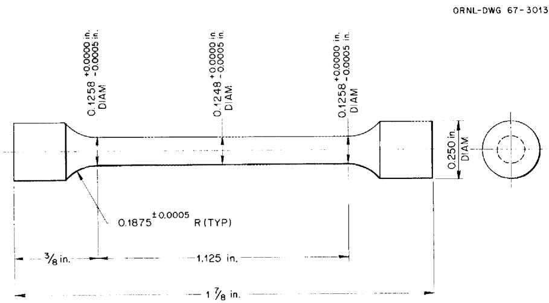  
Fig. 1. Test Specimen

(time at temperature and full power), so the thermal and fast doses were $2.3 \times 10^{20}$ and $1.9 \times 10^{19}$ neutrons/cm $^2$ , respectively. Each specimen was heated by a small furnace, and the temperature was controlled by a proportioning controller which acted on response to a Chromel-P-Alumel thermocouple attached to the specimen gage length. Some of the specimens were controlled at $650^{\circ}\mathrm{C}$ , but most of them were held at $760^{\circ}\mathrm{C}$ . The environment in the capsule was flowing He-1% O $_2$ . Ex-reactor control specimens were given the same thermal exposure as the in-reactor specimens.

# Testing Techniques

The laboratory creep-rupture tests were run in conventional creep machines of the dead load and lever arm types. The strain was measured by a dial indicator that showed the total movement of the specimen and part of the load train. The zero strain measurement was taken immediately after the load was applied. The temperature accuracy was $\pm 0.75\%$ , the guaranteed accuracy of the Chromel-P-Alumel thermocouples used.

The postirradiation creep-rupture tests were run in lever arm machines that were located in hot cells. The strain was measured by an extensometer with rods attached to the upper and lower specimen grips. The relative movement of these two rods was measured by a linear differential transformer, and the transformer signal was recorded. The accuracy of strain measurements is difficult to determine. The extensometer (mechanical and electrical portions) produced measurements that could be read to about $\pm 0.02\%$ strain. However, other factors (temperature changes in the cell, mechanical vibrations, etc.) probably combined to give an overall accuracy of $\pm 0.1\%$ strain. This is considerably better than the specimen-to-specimen reproducibility that one would expect for relatively brittle materials. The temperature measuring and control system was the same as that used in the laboratory with one exception. In the laboratory, the control system was stabilized at the desired temperature by use of a recorder with an expanded scale. In the tests in the hot cells, the control point was established by setting the controller without the aid of the expanded-scale recorder. This error and the thermocouple accuracy combine to give a temperature uncertainty of about $\pm 1\%$ .

The tensile tests were run on Instron Universal Testing Machines. The strain measurements were taken from the crosshead travel.

The test environment was air in all cases. Metallographic examination showed that the depth of oxidation was small (< 0.002 in.), and hence, we feel that the environment did not appreciably influence the test results.

# Experimental Results

The results of tensile tests run on the materials in this study are summarized in Tables 3 and 4. All of the unirradiated specimens were subjected to a thermal aging treatment (1080 hr at 650 or $760^{\circ}\mathrm{C}$ ) equivalent to that of the irradiated specimens. The data in Table 3 indicate several important features of the tensile properties of the unirradiated materials.

1. The yield stress decreases slightly with increasing test temperature, whereas the tensile stress decreases by about a factor of 2 over the temperature range of 550 to $760^{\circ}\mathrm{C}$ .   
2. There appear to be some small variations in the yield and tensile strengths due to the various heat treatments. For example, the data for heat 5911 AW-anneal 1 indicate that aging at $650^{\circ}\mathrm{C}$ results in lower yield stress and a higher tensile stress than aging at $760^{\circ}\mathrm{C}$ . The anneals at $1260^{\circ}\mathrm{C}$ (3A and 2A) cause slight strength reductions.   
3. The fracture ductility decreases with increasing test temperature for all materials.   
4. The data for 5911 AW-anneal 1 indicate that aging at $650^{\circ}\mathrm{C}$ results in better ductility than aging at $760^{\circ}\mathrm{C}$ .   
5. A comparison of the data for 5911 AW-anneals 1 and 3 indicate that the ductility of the materials receiving the anneal 3 is lower when aged and tested at $650^{\circ}\mathrm{C}$ and higher at $760^{\circ}\mathrm{C}$ .   
6. Heat 6252 AC generally exhibited lower ductility than heat 5911. This is probably due to the smaller amount of working received by heat 6252 AC. This is supported

Table 3. Tensile Properties of Unirradiated Materials ${}^{a}$   

<table><tr><td rowspan="2">Annealb</td><td rowspan="2">Specimen Number</td><td rowspan="2">Test Temperature (°C)</td><td colspan="2">Stress (psi)</td><td colspan="2">Elongation (%)</td><td rowspan="2">Reduction in Area (%)</td><td rowspan="2">Pretest Agingc</td></tr><tr><td>Yield</td><td>Tensile</td><td>Uniform</td><td>Total</td></tr><tr><td colspan="9">Heat 5911 AW</td></tr><tr><td>1</td><td>3113</td><td>550</td><td>32,600</td><td>87,800</td><td>57.1</td><td>58.2</td><td>41.6</td><td>2</td></tr><tr><td>1</td><td>3114</td><td>600</td><td>35,400</td><td>65,200</td><td>22.5</td><td>23.5</td><td>23.2</td><td>2</td></tr><tr><td>1</td><td>3109</td><td>760</td><td>32,200</td><td>47,700</td><td>8.0</td><td>13.4</td><td>14.4</td><td>2</td></tr><tr><td>1</td><td>3115</td><td>760</td><td>31,700</td><td>51,100</td><td>12.8</td><td>16.6</td><td>13.1</td><td>2</td></tr><tr><td>1</td><td>3117</td><td>550</td><td>31,400</td><td>96,500</td><td>61.7</td><td>64.8</td><td>47.5</td><td>1</td></tr><tr><td>1</td><td>3108</td><td>650</td><td>29,700</td><td>77,700</td><td>39.8</td><td>40.8</td><td>35.3</td><td>1</td></tr><tr><td>1</td><td>3121</td><td>760</td><td>28,900</td><td>50,900</td><td>12.5</td><td>25.9</td><td>27.3</td><td>1</td></tr><tr><td>3A</td><td>3106</td><td>650</td><td>26,400</td><td>70,800</td><td>43.2</td><td>43.4</td><td>36.6</td><td>1</td></tr><tr><td>3A</td><td>2854</td><td>760</td><td>31,700</td><td>46,700</td><td>8.0</td><td>13.6</td><td>12.5</td><td>2</td></tr><tr><td>3</td><td>2959</td><td>650</td><td>34,300</td><td>76,600</td><td>29.6</td><td>30.3</td><td>25.7</td><td>1</td></tr><tr><td>3</td><td>2953</td><td>760</td><td>32,200</td><td>45,800</td><td>8.2</td><td>22.9</td><td>22.1</td><td>2</td></tr><tr><td colspan="9">Heat 5911 TH</td></tr><tr><td>1</td><td>3103</td><td>650</td><td>29,200</td><td>74,300</td><td>41.1</td><td>42.7</td><td>33.5</td><td>1</td></tr><tr><td>1</td><td>3091</td><td>760</td><td>32,400</td><td>47,800</td><td>7.7</td><td>16.2</td><td>13.9</td><td>2</td></tr><tr><td colspan="9">Heat 6252 AC</td></tr><tr><td>2</td><td>2919</td><td>650</td><td>34,000</td><td>66,600</td><td>15.1</td><td>15.4</td><td>17.4</td><td>1</td></tr><tr><td>2</td><td>2921</td><td>760</td><td>32,000</td><td>45,000</td><td>6.1</td><td>8.6</td><td>7.3</td><td>2</td></tr><tr><td>2 + 3</td><td>2948</td><td>650</td><td>37,100</td><td>73,500</td><td>21.6</td><td>21.9</td><td>19.1</td><td>1</td></tr><tr><td>2 + 3</td><td>2944</td><td>760</td><td>33,500</td><td>44,700</td><td>8.7</td><td>20.2</td><td>17.6</td><td>2</td></tr><tr><td>2A</td><td>3130</td><td>760</td><td>25,700</td><td>46,800</td><td>7.7</td><td>10.6</td><td>10.1</td><td>2</td></tr></table>

aAt a strain rate of 0.002 min-1.   
bAnneal designation given in Table 2.   
c7 - 1080 hr at $650^{\circ}\mathrm{C}$ ; 2 - 1080 hr at $760^{\circ}\mathrm{C}$

Table 4. Tensile Properties of Irradiated Materials   

<table><tr><td rowspan="2">Heat Number</td><td rowspan="2">Anneal</td><td rowspan="2">Specimen Number</td><td colspan="2">Temperature (°C)</td><td colspan="2">Stress (psi)</td><td colspan="2">Elongation (%)</td><td rowspan="2">Reduction in Area (%)</td></tr><tr><td>Irradiation</td><td>Test</td><td>Yield</td><td>Tensile</td><td>Uniform</td><td>Total</td></tr><tr><td>5911 AW</td><td>1</td><td>2837</td><td>760</td><td>760</td><td>32,600</td><td>32,700</td><td>1.0</td><td>1.0</td><td>3.6</td></tr><tr><td>5911 AW</td><td>1</td><td>2839</td><td>760</td><td>760</td><td>33,700</td><td>33,700</td><td>1.1</td><td>1.4</td><td>2.0</td></tr><tr><td>5911 AW</td><td>1</td><td>2846</td><td>650</td><td>650</td><td>38,200</td><td>50,600</td><td>7.7</td><td>8.1</td><td>11.2</td></tr><tr><td>5911 AW</td><td>1</td><td>2847</td><td>650</td><td>650</td><td>36,400</td><td>52,600</td><td>10.5</td><td>11.2</td><td>14.6</td></tr><tr><td>6252 AC</td><td>2</td><td>2917</td><td>760</td><td>760</td><td>32,200</td><td>32,200</td><td>1.1</td><td>1.5</td><td>0.9</td></tr><tr><td>6252 AC</td><td>2</td><td>2918</td><td>760</td><td>760</td><td>31,800</td><td>31,800</td><td>1.2</td><td>1.5</td><td>0.0</td></tr><tr><td>6252 AC</td><td>2</td><td>2926</td><td>650</td><td>650</td><td>39,100</td><td>48,500</td><td>4.6</td><td>4.8</td><td>5.6</td></tr><tr><td>6252 AC</td><td>2</td><td>2927</td><td>650</td><td>650</td><td>40,200</td><td>48,900</td><td>4.6</td><td>5.6</td><td>8.0</td></tr></table>

${}^{a}$ Thermal dose equals ${2.3} \times  {10}^{20}$ neutrons/cm ${}^{2}$ ; strain rate equals ${0.002}{\mathrm{\;{min}}}^{-1}$ .

by the fact that the additional working received in the $2 + 3$ treatment improved the ductility over that obtained after just the treatment 2.

The tensile properties of some of the materials were obtained at 650 and $760^{\circ}\mathrm{C}$ after irradiation, and these results are given in Table 4. A comparison of these data with those for the unirradiated specimens in Table 3 leads to several important observations:

1. The yield stress at $650^{\circ}\mathrm{C}$ is higher for the irradiated specimens whereas the yield stress at $760^{\circ}\mathrm{C}$ is equivalent for irradiated and unirradiated specimens.   
2. The tensile stress is lower for the irradiated materials at both 650 and $760^{\circ}\mathrm{C}$ .   
3. The ductility at both temperatures is reduced severely by irradiation, the reduction being much greater at $760^{\circ}\mathrm{C}$ .

The variations in the rupture ductility of Hastelloy N in the various conditions investigated are summarized in Fig. 2. The spread in the rupture

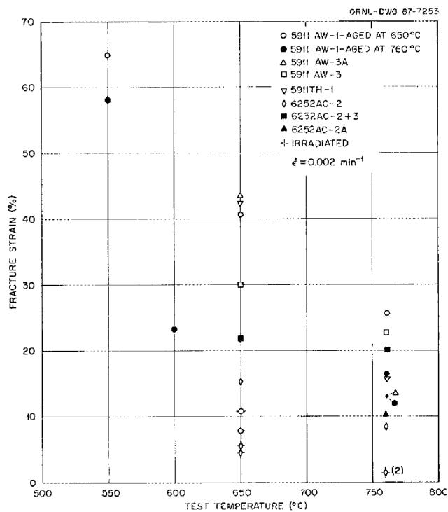  
Fig. 2. Variation of the Tensile Fracture Strain with Temperature. (Unless designated otherwise, specimens were irradiated or aged at the test temperature.)

strain at a given test temperature is quite large. At $650^{\circ}\mathrm{C}$ , for example, the unirradiated material shows a range of about 15 to $44\%$ , and the range is further extended by values as low as $5\%$ in the irradiated condition.

The main emphasis in this study was on the creep-rupture properties, since the potential application involves service under creep conditions. The results of tests on unirradiated and irradiated specimens are given in Tables 5 and 6, respectively. The data on unirradiated materials are of value themselves, but we are more concerned with how the properties change as a result of irradiation. Figure 3 shows that the rupture ductility varies from about 15 to $30\%$ for the unirradiated material at $650^{\circ}\mathrm{C}$ . However, many of the variations appear to be random rather than due to the effects of a particular pretest heat treatment. The general trend seems to be for decreasing ductility with increasing rupture life. Figure 4 compares the rupture lives of unirradiated and irradiated specimens at $650^{\circ}\mathrm{C}$ . The line for the irradiated material is based on our results for several air-melted heats. The results on the present heat at $650^{\circ}\mathrm{C}$ are inadequate to establish a stress-rupture curve, but the data are in reasonable agreement with those for the air melts. The rupture life variations appear to be entirely random with respect to material and conditions of annealing. The rupture life is reduced by an order of magnitude by irradiation, but there is some indication that this factor decreases with increasing rupture life. The minimum creep rate is shown in Fig. 5 as a function of the stress at $650^{\circ}\mathrm{C}$ for irradiated and unirradiated materials. The variation due to heat and anneal is again random and irradiation does not have any appreciable effect.

The rupture strain at $760^{\circ}\mathrm{C}$ is shown in Fig. 6 as a function of rupture life for unirradiated material. The rupture strain varies from 10 to $50\%$ with most of the variation appearing to be independent of heat and annealing treatment. Most of the materials exhibit a trend of increasing strain with increasing rupture life. The rupture lives of the irradiated and unirradiated materials are compared in Fig. 7. Again, the variations due to heat and anneal appear to be random. One exception may be heat 6252 AC, which, after irradiation, has a greater rupture life. At a stress level of 20,000 psi, the rupture life is reduced about two orders of magnitude by irradiation. The curves converge

Table 5. Creep-Rupture Properties of Unirradiated Materials   

<table><tr><td>Heat Number</td><td>Anneal \( {}^{a} \)</td><td>Test Number</td><td>Test Temperature (℃)</td><td>Stress (psi)</td><td>Minimum Creep Rate (%/hr)</td><td>Rupture Life (hr)</td><td>Rupture Strain (%)</td><td>Reduction in Area (%)</td><td>Pretest Aging \( {}^{\mathrm{b}} \)</td></tr><tr><td>5911 AW</td><td>1</td><td>6185</td><td>650</td><td>65,000</td><td>0.590</td><td>9.4</td><td>26.5</td><td>21.9</td><td>1</td></tr><tr><td>5911 AW</td><td>1</td><td>6014</td><td>650</td><td>55,000</td><td>0.140</td><td>49.6</td><td>27.4</td><td>21.2</td><td>1</td></tr><tr><td>5911 AW</td><td>1</td><td>6013</td><td>650</td><td>47,000</td><td>0.043</td><td>206.5</td><td>17.3</td><td>17.1</td><td>1</td></tr><tr><td>5911 AW</td><td>1</td><td>6012</td><td>650</td><td>40,000</td><td>0.022</td><td>413.7</td><td>17.3</td><td>16.7</td><td>1</td></tr><tr><td>5911 AW</td><td>1</td><td>6186</td><td>650</td><td>40,000</td><td>0.018</td><td>598.2</td><td>22.7</td><td>11.0</td><td>1</td></tr><tr><td>5911 AW</td><td>1</td><td>6059</td><td>650</td><td>32,400</td><td>0.0045</td><td>1828.1</td><td>21.8</td><td>19.8</td><td>1</td></tr><tr><td>5911 AW</td><td>1</td><td>6126</td><td>760</td><td>30,000</td><td>0.83</td><td>21.8</td><td>29.8</td><td>23.1</td><td>2</td></tr><tr><td>5911 AW</td><td>1</td><td>6187</td><td>760</td><td>25,000</td><td>0.36</td><td>53.7</td><td>31.9</td><td>13.9</td><td>2</td></tr><tr><td>5911 AW</td><td>1</td><td>6023</td><td>760</td><td>20,000</td><td>0.12</td><td>147.7</td><td>35.5</td><td>20.6</td><td>2</td></tr><tr><td>5911 AW</td><td>1</td><td>6039</td><td>760</td><td>17,500</td><td>0.049</td><td>367.7</td><td>24.3</td><td>10.6</td><td>2</td></tr><tr><td>5911 AW</td><td>1</td><td>6024</td><td>760</td><td>15,000</td><td>0.035</td><td>607.2</td><td>39.8</td><td>29.0</td><td>2</td></tr><tr><td>5911 AW</td><td>1</td><td>6188</td><td>760</td><td>13,000</td><td>0.017</td><td>1198.9</td><td>29.7</td><td>16.0</td><td>2</td></tr><tr><td>5911 AW</td><td>3A</td><td>6057</td><td>650</td><td>47,000</td><td>0.026</td><td>120.8</td><td>27.2</td><td>21.1</td><td>1</td></tr><tr><td>5911 AW</td><td>3A</td><td>6015</td><td>650</td><td>40,000</td><td>0.012</td><td>489.0</td><td>21.0</td><td>17.3</td><td>1</td></tr><tr><td>5911 AW</td><td>3A</td><td>6040</td><td>760</td><td>30,000</td><td>0.94</td><td>15.4</td><td>23.6</td><td>16.1</td><td>2</td></tr><tr><td>5911 AW</td><td>3A</td><td>6025</td><td>760</td><td>20,000</td><td>0.14</td><td>114.7</td><td>24.6</td><td>16.1</td><td>2</td></tr><tr><td>5911 AW</td><td>3A</td><td>6026</td><td>760</td><td>15,000</td><td>0.025</td><td>402.8</td><td>13.3</td><td>8.0</td><td>2</td></tr><tr><td>5911 AW</td><td>3</td><td>6058</td><td>650</td><td>47,000</td><td>0.067</td><td>181.0</td><td>23.5</td><td>20.7</td><td>1</td></tr><tr><td>5911 AW</td><td>3</td><td>6016</td><td>650</td><td>40,000</td><td>0.025</td><td>761.7</td><td>29.5</td><td>22.8</td><td>1</td></tr><tr><td>5911 AW</td><td>3</td><td>6127</td><td>760</td><td>30,000</td><td>1.18</td><td>24.2</td><td>38.5</td><td>33.0</td><td>2</td></tr><tr><td>5911 AW</td><td>3</td><td>6189</td><td>760</td><td>25,000</td><td>0.42</td><td>47.0</td><td>34.4</td><td>15.0</td><td>2</td></tr><tr><td>5911 AW</td><td>3</td><td>6027</td><td>760</td><td>20,000</td><td>0.19</td><td>73.7</td><td>17.6</td><td>21.7</td><td>2</td></tr><tr><td>5911 AW</td><td>3</td><td>6041</td><td>760</td><td>17,500</td><td>0.13</td><td>153.3</td><td>29.3</td><td>17.3</td><td>2</td></tr><tr><td>5911 AW</td><td>3</td><td>6028</td><td>760</td><td>15,000</td><td>0.048</td><td>419.2</td><td>32.2</td><td>16.4</td><td>2</td></tr><tr><td>5911 TH</td><td>1</td><td>6042</td><td>650</td><td>55,000</td><td>0.018</td><td>48.9</td><td>27.9</td><td>21.6</td><td>1</td></tr><tr><td>5911 TH</td><td>1</td><td>6018</td><td>650</td><td>47,000</td><td>0.038</td><td>189.1</td><td>26.6</td><td>21.9</td><td>1</td></tr><tr><td>5911 TH</td><td>1</td><td>6017</td><td>650</td><td>40,000</td><td>0.023</td><td>706.3</td><td>29.2</td><td>25.4</td><td>1</td></tr><tr><td>5911 TH</td><td>1</td><td>6056</td><td>650</td><td>32,400</td><td>0.0019</td><td>2082.1</td><td>18.7</td><td>13.4</td><td>1</td></tr><tr><td>5911 TH</td><td>1</td><td>6125</td><td>760</td><td>30,000</td><td>0.765</td><td>17.7</td><td>19.2</td><td>14.3</td><td>2</td></tr><tr><td>Heat Number</td><td>Anneal a</td><td>Test Number</td><td>Test Temperature (°C)</td><td>Stress (psi)</td><td>Minimum Creep Rate (%/hr)</td><td>Rupture Life (hr)</td><td>Rupture Strain (%)</td><td>Reduction in Area (%)</td><td>Pretest Aging b</td></tr><tr><td>5911 TH</td><td>1</td><td>6190</td><td>760</td><td>25,000</td><td>0.41</td><td>27.7</td><td>14.1</td><td>10.7</td><td>2</td></tr><tr><td>5911 TH</td><td>1</td><td>6029</td><td>760</td><td>20,000</td><td>0.13</td><td>113.5</td><td>25.3</td><td>16.2</td><td>2</td></tr><tr><td>5911 TH</td><td>1</td><td>6043</td><td>760</td><td>17,500</td><td>0.054</td><td>161.4</td><td>11.9</td><td>10.0</td><td>2</td></tr><tr><td>5911 TH</td><td>1</td><td>6030</td><td>760</td><td>15,000</td><td>0.026</td><td>654.7</td><td>24.8</td><td>13.2</td><td>2</td></tr><tr><td>6252 AC</td><td>2</td><td>6022</td><td>650</td><td>47,000</td><td>0.054</td><td>99.3</td><td>9.4</td><td>12.2</td><td>1</td></tr><tr><td>6252 AC</td><td>2</td><td>6019</td><td>650</td><td>40,000</td><td>0.026</td><td>647.3</td><td>21.2</td><td>15.6</td><td>1</td></tr><tr><td>6252 AC</td><td>2</td><td>6060</td><td>650</td><td>32,400</td><td>0.0041</td><td>1813.3</td><td>15.9</td><td>14.7</td><td>1</td></tr><tr><td>6252 AC</td><td>2</td><td>6124</td><td>760</td><td>30,000</td><td>1.37</td><td>7.3</td><td>14.1</td><td>10.2</td><td>2</td></tr><tr><td>6252 AC</td><td>2</td><td>6191</td><td>760</td><td>25,000</td><td>0.51</td><td>48.9</td><td>31.2</td><td>14.3</td><td>2</td></tr><tr><td>6252 AC</td><td>2</td><td>6031</td><td>760</td><td>20,000</td><td>0.19</td><td>119.1</td><td>39.0</td><td>29.0</td><td>2</td></tr><tr><td>6252 AC</td><td>2</td><td>6044</td><td>760</td><td>17,500</td><td>0.13</td><td>130.8</td><td>22.5</td><td>15.7</td><td>2</td></tr><tr><td>6252 AC</td><td>2</td><td>6032</td><td>760</td><td>15,000</td><td>0.049</td><td>636.5</td><td>46.7</td><td>37.7</td><td>2</td></tr><tr><td>6252 AC</td><td>2A</td><td>6033</td><td>760</td><td>20,000</td><td>0.13</td><td>162.9</td><td>35.6</td><td>21.9</td><td>2</td></tr><tr><td>6252 AC</td><td>2A</td><td>6034</td><td>760</td><td>10,000</td><td>0.0047</td><td>3570.2</td><td>28.0</td><td>13.7</td><td>2</td></tr><tr><td>6252 AC</td><td>2 + 3</td><td>6021</td><td>650</td><td>47,000</td><td>0.073</td><td>123.6</td><td>17.5</td><td>13.9</td><td>1</td></tr><tr><td>6252 AC</td><td>2 + 3</td><td>6020</td><td>650</td><td>40,000</td><td>0.024</td><td>622.2</td><td>14.9</td><td>14.0</td><td>1</td></tr><tr><td>6252 AC</td><td>2 + 3</td><td>6045</td><td>760</td><td>30,000</td><td>0.80</td><td>10.0</td><td>13.1</td><td>12.0</td><td>2</td></tr><tr><td>6252 AC</td><td>2 + 3</td><td>6047</td><td>760</td><td>20,000</td><td>0.24</td><td>114.3</td><td>53.1</td><td>31.6</td><td>2</td></tr><tr><td>6252 AC</td><td>2 + 3</td><td>6046</td><td>760</td><td>15,000</td><td>0.044</td><td>535.6</td><td>46.6</td><td>21.6</td><td>2</td></tr></table>

aAnneal designation given in Table 2.   
b1 - 1080 hr at $650^{\circ}\mathrm{C}$ ; 2 - 1080 hr at $760^{\circ}\mathrm{C}$ .

Table 6. Creep-Rupture Properties of Irradiated Materials ${}^{a}$   

<table><tr><td>Heat Number</td><td>Annealb</td><td>Test Number</td><td>Test and Irradiation Temperature (°C)</td><td>Stress (psi)</td><td>Minimum Creep Rate (%/hr)</td><td>Rupture Life (hr)</td><td>Rupture Strain (%)</td><td>Reduction in Area (%)</td><td>Specifi-cation Number</td><td>Comments</td></tr><tr><td>5911 AW</td><td>1</td><td>R-194</td><td>650</td><td>47,000</td><td>0.056</td><td>12.8</td><td>1.68</td><td>-0.9</td><td>2851</td><td></td></tr><tr><td>5911 AW</td><td>1</td><td>R-182</td><td>650</td><td>40,000</td><td>0.015</td><td>43.0</td><td>0.83</td><td>8.2</td><td>2850</td><td></td></tr><tr><td>5911 AW</td><td>1</td><td>R-170</td><td>650</td><td>32,400</td><td>0.0049</td><td>144.3</td><td>0.84</td><td>-4.0</td><td>2848</td><td>c</td></tr><tr><td>5911 AW</td><td>1</td><td>R-177</td><td>760</td><td>10,000</td><td>0.0086</td><td>104.6</td><td>0.98</td><td>-0.3</td><td>2842</td><td></td></tr><tr><td>5911 AW</td><td>1</td><td>R-196</td><td>760</td><td>8,000</td><td>0.0011</td><td>834.8</td><td>1.77</td><td>0.0</td><td>2841</td><td></td></tr><tr><td>5911 AW</td><td>3A</td><td>R-183</td><td>760</td><td>15,000</td><td>0.22</td><td>2.2</td><td>0.57</td><td>0.8</td><td>2849</td><td></td></tr><tr><td>5911 AW</td><td>3A</td><td>R-201</td><td>760</td><td>10,000</td><td>0.0041</td><td>179.4</td><td>1.08</td><td>1.1</td><td>2845</td><td></td></tr><tr><td>5911 AW</td><td>3</td><td>R-175</td><td>760</td><td>20,000</td><td>0.85</td><td>0.5</td><td>0.58</td><td>-1.5</td><td>2950</td><td></td></tr><tr><td>5911 AW</td><td>3</td><td>R-180</td><td>760</td><td>10,000</td><td>0.011</td><td>55.2</td><td>1.34</td><td>4.5</td><td>2951</td><td>c</td></tr><tr><td>5911 AW</td><td>3</td><td>R-223</td><td>760</td><td>8,000</td><td>0.0024</td><td>825.7</td><td>4.49</td><td>0.0</td><td>2949</td><td></td></tr><tr><td>5911 TH</td><td>1</td><td>R-176</td><td>760</td><td>20,000</td><td>0.28</td><td>1.0</td><td>0.67</td><td>3.1</td><td>2981</td><td></td></tr><tr><td>5911 TH</td><td>1</td><td>R-184</td><td>760</td><td>15,000</td><td>0.090</td><td>2.1</td><td>0.99</td><td>-0.3</td><td>2980</td><td></td></tr><tr><td>5911 TH</td><td>1</td><td>R-218</td><td>760</td><td>8,000</td><td>0.0024</td><td>365.2</td><td>1.45</td><td></td><td>2982</td><td></td></tr><tr><td>6252 AC</td><td>2</td><td>R-197</td><td>650</td><td>47,000</td><td>0.021</td><td>16.8</td><td>1.50</td><td>-0.4</td><td>2937</td><td></td></tr><tr><td>6252 AC</td><td>2</td><td>R-181</td><td>650</td><td>40,000</td><td>0.029</td><td>23.5</td><td>0.93</td><td>1.1</td><td>2929</td><td></td></tr><tr><td>6252 AC</td><td>2</td><td>R-173</td><td>650</td><td>32,400</td><td>0.0050</td><td>220.6</td><td>1.70</td><td>-0.3</td><td>2928</td><td>c</td></tr><tr><td>6252 AC</td><td>2</td><td>R-185</td><td>760</td><td>15,000</td><td>0.18</td><td>3.5</td><td>0.95</td><td>0.0</td><td>2920</td><td></td></tr><tr><td>6252 AC</td><td>2</td><td>R-224</td><td>760</td><td>12,500</td><td>0.039</td><td>24.1</td><td>1.55</td><td>4.8</td><td>2923</td><td></td></tr><tr><td>6252 AC</td><td>2</td><td>R-178</td><td>760</td><td>10,000</td><td>0.0032</td><td>581.5</td><td>2.36</td><td>-1.8</td><td>2922</td><td></td></tr><tr><td>6252 AC</td><td>2A</td><td>R-186</td><td>760</td><td>15,000</td><td>0.36</td><td>0.7</td><td>0.32</td><td>-2.2</td><td>2930</td><td>c</td></tr><tr><td>6252 AC</td><td>2A</td><td>R-217</td><td>760</td><td>10,000</td><td>0.0028</td><td>289.8</td><td>1.12</td><td>-3.7</td><td>2932</td><td>c</td></tr><tr><td>6252 AC</td><td>2 + 3</td><td>R-187</td><td>760</td><td>15,000</td><td>0.17</td><td>5.0</td><td>1.49</td><td>2.5</td><td>2939</td><td></td></tr><tr><td>6252 AC</td><td>2 + 3</td><td>R-225</td><td>760</td><td>12,500</td><td>0.0067</td><td>284.3</td><td>3.18</td><td></td><td>2941</td><td></td></tr><tr><td>6252 AC</td><td>2 + 3</td><td>R-209</td><td>760</td><td>10,000</td><td>0.0046</td><td>504.6</td><td>3.58</td><td>3.5</td><td>2940</td><td></td></tr></table>

$^a$ Dose equals $2.3 \times 10^{20}$ neutrons/cm $^2$ .   
bAnneal designation given in Table 2.   
Specimen broke in the radius at the end of gage section.

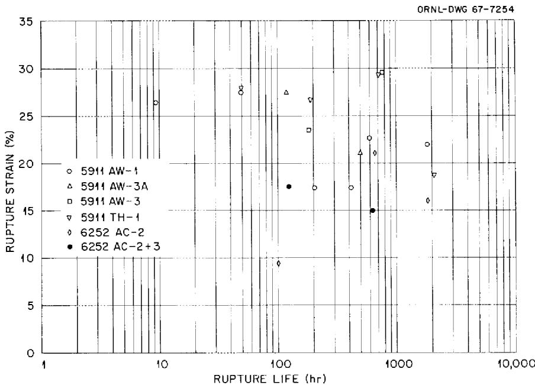  
Fig. 3. Variation of the Rupture Strain with Rupture Life Under Creep at $650^{\circ}\mathrm{C}$ .

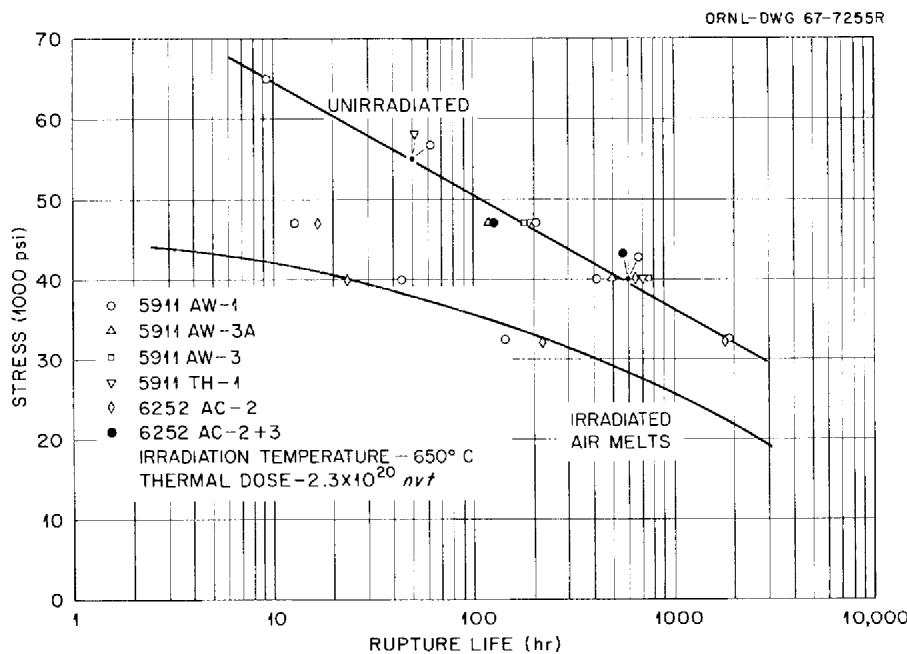  
Fig. 4. A Comparison of the Creep-Rupture Properties of Irradiated and Unirradiated Hastelloy N at $650^{\circ}\mathrm{C}$ .

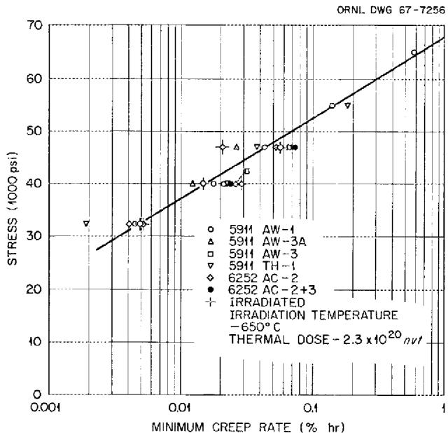  
Fig. 5. A Comparison of the Creep Rates of Irradiated and Unirradiated Hastelloy N at $650^{\circ}\mathrm{C}$ .

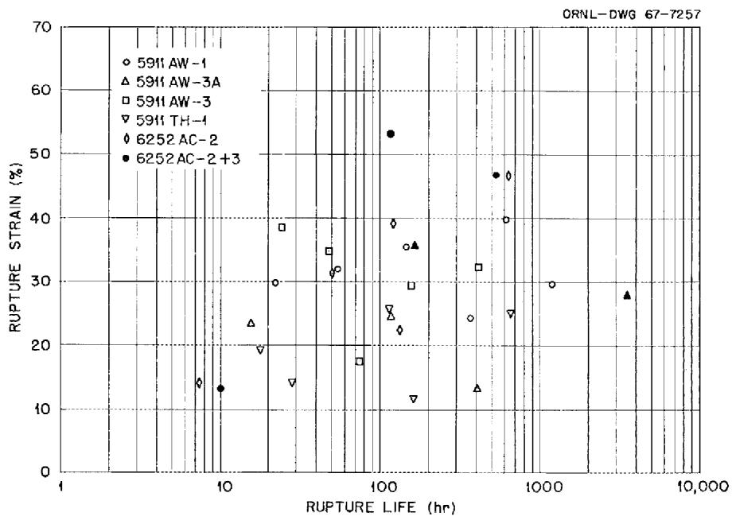  
Fig. 6. The Variation of Rupture Strain with Creep-Rupture Life for Hastelloy N at $650^{\circ}\mathrm{C}$ .

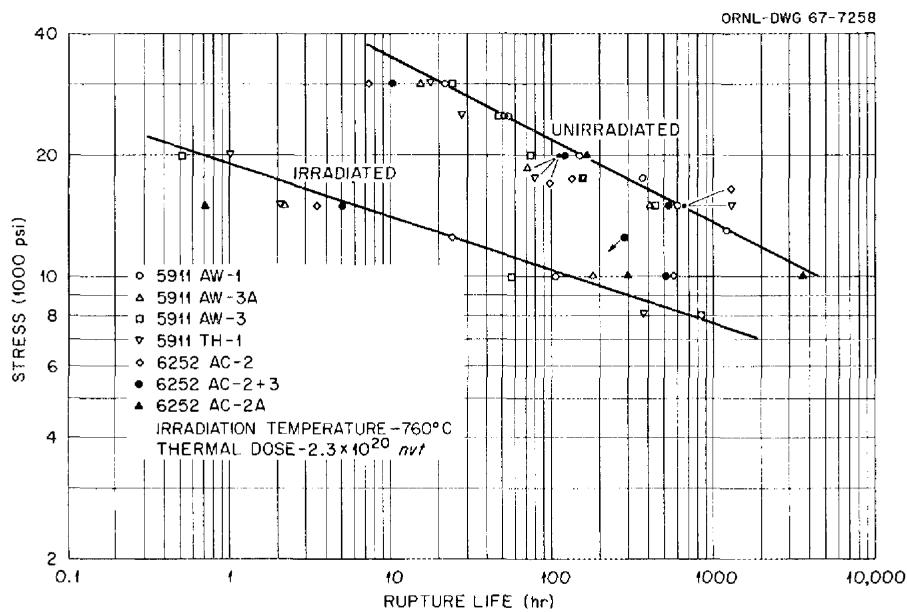  
Fig. 7. A Comparison of the Creep-Rupture Properties of Irradiated and Unirradiated Hastelloy N at $760^{\circ}\mathrm{C}$ .

slightly as the stress level is reduced. The minimum creep rates of the irradiated and unirradiated specimens are compared in Fig. 8. At a stress level of 20,000 psi, the creep rate of the irradiated material is higher. As the stress is decreased, the curves converge to where the difference in creep rate below 10,000 psi is negligible.

The rupture strains of the irradiated specimens are compared in Fig. 9 as a function of strain rate. Although the tensile tests at a strain rate of $0.002\mathrm{min}^{-1}$ (12%/hr) indicated that the ductility was much lower at $760^{\circ}\mathrm{C}$ than at $650^{\circ}\mathrm{C}$ , the ductility appears to be independent of temperature at strain rates below about $0.1\% / \mathrm{hr}$ . There is also a distinct trend of increasing fracture strain with decreasing strain rate.

Although all of the creep curves were examined in detail, only a few typical ones will be presented. The data were taken manually, but were reduced and plotted by computer. Figures 10, 11, 12, and 13 are direct photographs of the plotted data after the curves were drawn in manually. Figures 10 and 11 show the results of tests on unirradiated and irradiated specimens, respectively, from heat 5911 AW-anneal 1 at $650^{\circ}\mathrm{C}$ and 40,000 psi. The primary creep stage is very short, and the accumulated strain at the beginning of secondary creep was only about $0.1\%$ . A comparison of points on the two plots indicates that the results

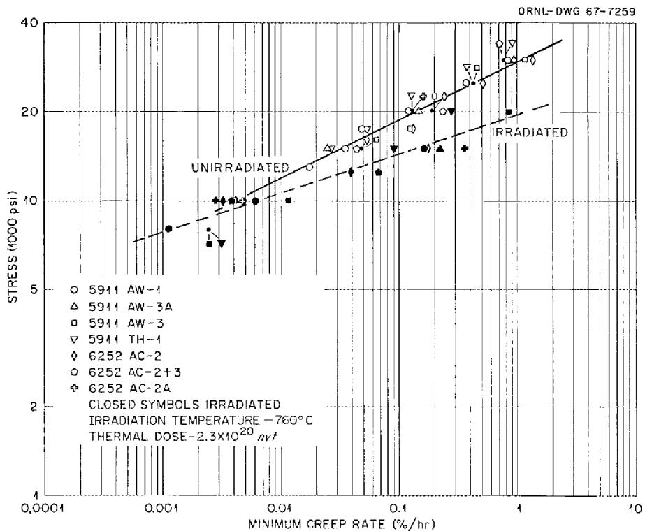  
Fig. 8. A Comparison of the Creep Rates of Irradiated and Unirradiated Hastelloy N at $760^{\circ}\mathrm{C}$ .

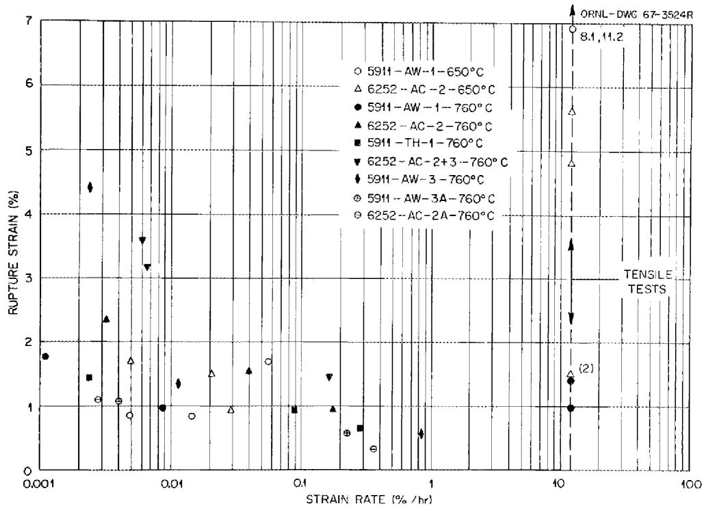  
Fig. 9. Fracture Ductilities for Hastelloy N Under Several Test Conditions.

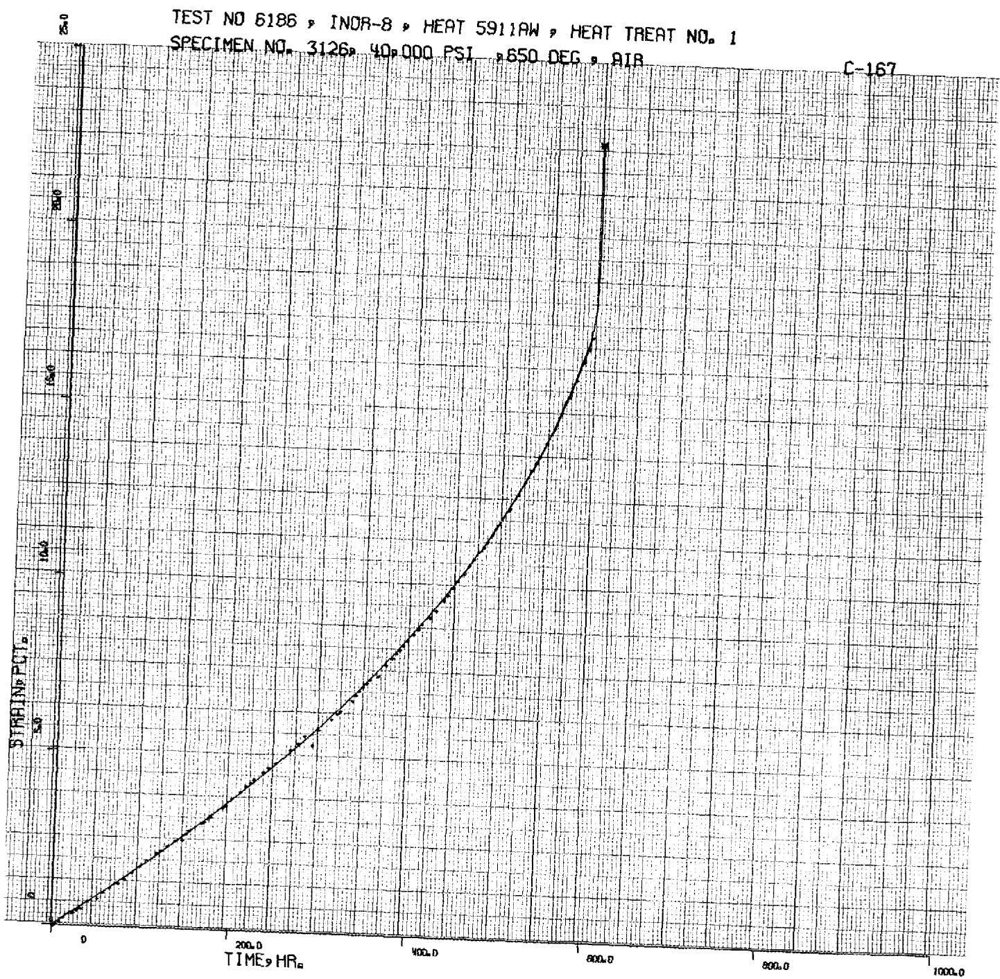  
Fig. 10. Creep Curve for Test 6186.

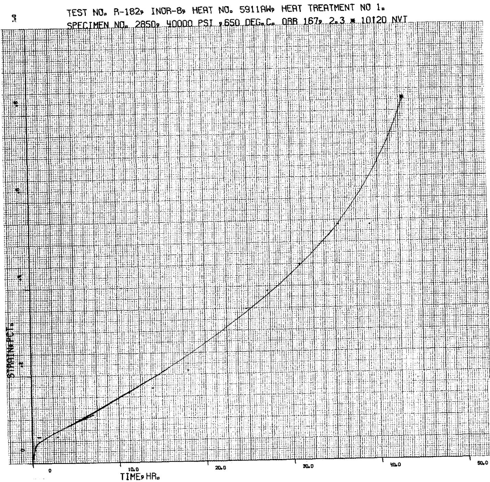  
Fig. 11. Creep Curve for Test R-182.

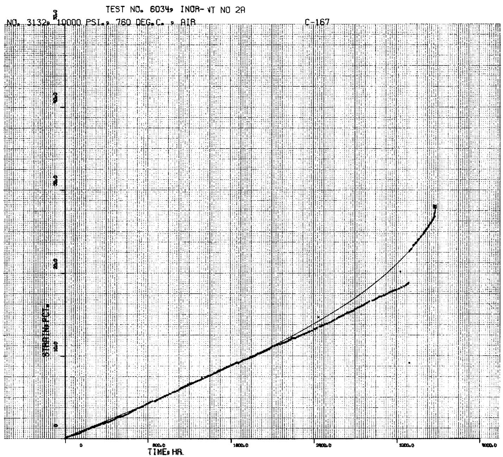  
Fig. 12. Creep Curve for Test 6034.

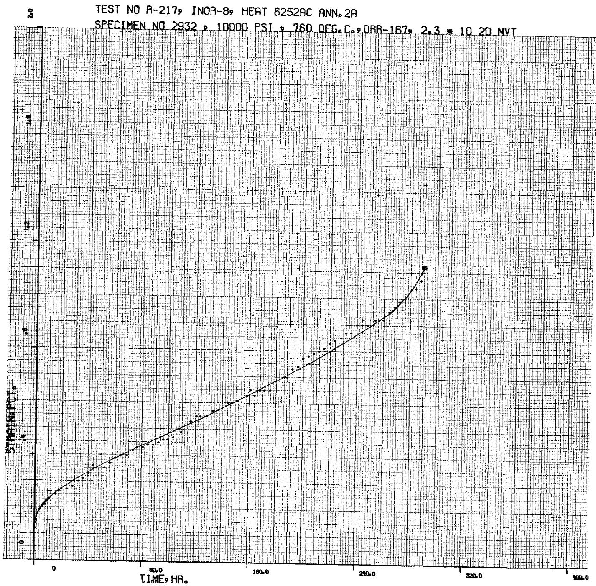  
Fig. 13. Creep Curve for Test R-217.

are quite similar up to the point where the irradiated specimen failed. Figures 12 and 13 show the results of tests at $760^{\circ}\mathrm{C}$ and 10,000 psi on unirradiated and irradiated specimens, respectively. There is no distinguishable primary creep stage, and the results are quite comparable up to fracture of the irradiated specimen.

Since considerable data were obtained on heats 5911 AW and 5911 TH with heat treatment 1, the creep properties of these materials were examined in detail. Further details of the creep behavior are given in Table 7. At $650^{\circ}\mathrm{C}$ the behavior of the two lots of material was quite similar. The times for rupture and $1\%$ strain for unirradiated and irradiated material at $650^{\circ}\mathrm{C}$ are compared in Fig. 14. The curve for rupture of the irradiated material falls just short of the $1\%$ strain curve for the unirradiated specimens. At $760^{\circ}\mathrm{C}$ materials 5911 AW and 5911 TH have slightly different strength properties. Figure 15 shows the results for heat 5911 AW-anneal 1. At 8000 psi, the time to $1\%$ strain for the irradiated specimen agrees very well with that for the unirradiated material. At 10,000 psi, the time to $1\%$ strain for the irradiated material is slightly less than that for the unirradiated specimen. The data for heat 5911 TH-anneal 1 are plotted in Fig. 16. The time to $1\%$ strain for the irradiated material is much shorter than that for the unirradiated material at high stresses, but the two nearly converge at lower stresses. This behavior agrees well with the minimum creep rate behavior shown in Fig. 8. There is some uncertainty in Fig. 16 concerning the location of the curve for the time to $1\%$ strain. Since an extensometer was not used in the laboratory tests, the scatter in data for small strains is understandable.

In an effort to determine the effects of strain rate on the rupture ductility at 650 and $760^{\circ}\mathrm{C}$ , several specimens were tested in the unaged condition at various strain rates. The results of these tests are given in Table 8. The tensile results from Tables 3 and 8 and the creep results from Table 5 were used to obtain the plot of ductility versus strain rate in Fig. 17. At $650^{\circ}\mathrm{C}$ the ductility decreases with decreasing

Table 7. Detailed Creep Properties on Heats 5911 AW-1 and 5911 TH-1a   

<table><tr><td rowspan="2">Test Number</td><td rowspan="2">Test Temperature (°C)</td><td rowspan="2">Stress (psi)</td><td colspan="5">Time (hr) to Indicated Strain (%)</td></tr><tr><td>1</td><td>2</td><td>5</td><td>10</td><td>Rupture</td></tr><tr><td colspan="8">Heat 5911 AW-1</td></tr><tr><td>6185</td><td>650</td><td>65,000</td><td>0.2</td><td>1.4</td><td>6.5</td><td>9.4</td><td>9.4</td></tr><tr><td>6014</td><td>650</td><td>55,000</td><td></td><td></td><td>17.5</td><td>46</td><td>49.6</td></tr><tr><td>6013</td><td>650</td><td>47,000</td><td>3.0</td><td>17</td><td>90</td><td>175</td><td>206.5</td></tr><tr><td>6012</td><td>650</td><td>40,000</td><td>31.5</td><td>80</td><td>198</td><td>351</td><td>413.7</td></tr><tr><td>6186</td><td>650</td><td>40,000</td><td>62</td><td>113</td><td>260</td><td>445</td><td>598.2</td></tr><tr><td>6059</td><td>650</td><td>32,400</td><td>195</td><td>340</td><td>774</td><td>1322</td><td>1828.1</td></tr><tr><td>R-194</td><td>650</td><td>47,000</td><td>7.8</td><td></td><td></td><td></td><td>12.8</td></tr><tr><td>R-182</td><td>650</td><td>40,000</td><td></td><td></td><td></td><td></td><td>43.0</td></tr><tr><td>R-170</td><td>650</td><td>32,400</td><td></td><td></td><td></td><td></td><td>144.3</td></tr><tr><td>6126</td><td>760</td><td>30,000</td><td>1.0</td><td>2.1</td><td>5.7</td><td>11</td><td>21.8</td></tr><tr><td>6187</td><td>760</td><td>25,000</td><td>2.2</td><td>5</td><td>13</td><td>26</td><td>53.7</td></tr><tr><td>6023</td><td>760</td><td>20,000</td><td>9.5</td><td>17</td><td>41.5</td><td>73</td><td>147.7</td></tr><tr><td>6039</td><td>760</td><td>17,500</td><td>15</td><td>35</td><td>97</td><td>189</td><td>367.7</td></tr><tr><td>6024</td><td>760</td><td>15,000</td><td>30</td><td>63</td><td>152</td><td>277</td><td>607.2</td></tr><tr><td>6188</td><td>760</td><td>13,000</td><td>52</td><td>110</td><td>275</td><td>525</td><td>1198.9</td></tr><tr><td>R-177</td><td>760</td><td>10,000 ~105</td><td></td><td></td><td></td><td></td><td>104.6</td></tr><tr><td>R-196</td><td>760</td><td>8,000</td><td>645</td><td></td><td></td><td></td><td>834.8</td></tr><tr><td colspan="8">Heat 5911 TH-1</td></tr><tr><td>6042</td><td>650</td><td>55,000</td><td>3</td><td>8.5</td><td>25</td><td>42</td><td>48.9</td></tr><tr><td>6018</td><td>650</td><td>47,000</td><td>14</td><td>40</td><td>99</td><td>166</td><td>189.1</td></tr><tr><td>6017</td><td>650</td><td>40,000</td><td>44</td><td>95</td><td>230</td><td>430</td><td>706.3</td></tr><tr><td>6056</td><td>650</td><td>32,400</td><td>260</td><td>495</td><td>1090</td><td>1750</td><td>2082.1</td></tr><tr><td>6125</td><td>760</td><td>30,000</td><td>1.0</td><td>2.4</td><td>6.3</td><td>12</td><td>17.7</td></tr><tr><td>6190</td><td>760</td><td>25,000</td><td>1.8</td><td>4.3</td><td>12</td><td>23</td><td>27.7</td></tr><tr><td>6029</td><td>760</td><td>20,000</td><td>8.7</td><td>16</td><td>38.5</td><td>72</td><td>113.5</td></tr><tr><td>6043</td><td>760</td><td>17,500</td><td>7.9</td><td>27</td><td>76</td><td>142</td><td>161.4</td></tr><tr><td>6030</td><td>760</td><td>15,000</td><td>52</td><td>90</td><td>202</td><td>372</td><td>654.7</td></tr><tr><td>R-176</td><td>760</td><td>20,000</td><td></td><td></td><td></td><td></td><td>1.0</td></tr><tr><td>R-184</td><td>760</td><td>15,000 ~2</td><td></td><td></td><td></td><td></td><td>2.1</td></tr><tr><td>R-218</td><td>760</td><td>8,000</td><td>250</td><td></td><td></td><td></td><td>365.2</td></tr></table>

aSee Tables 5 and 6 for other details.

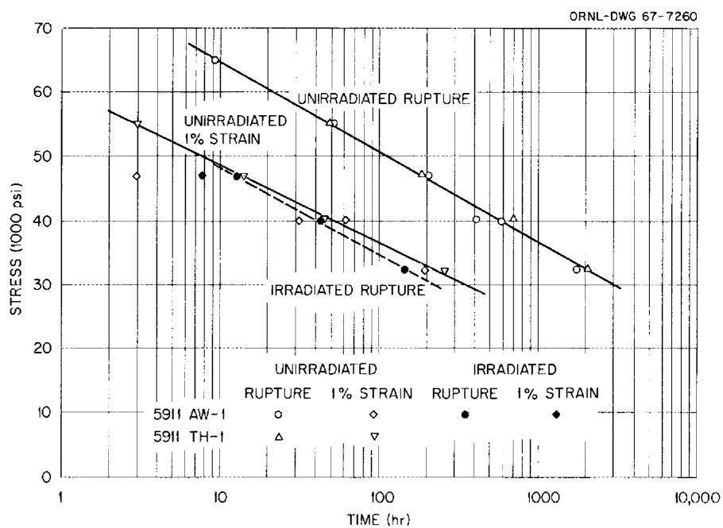  
Fig. 14. A Comparison of the Unirradiated and Irradiated Creep Rupture Behavior of Heats 5911 AW-1 and 5911 TH-1 at $650^{\circ}\mathrm{C}$ .

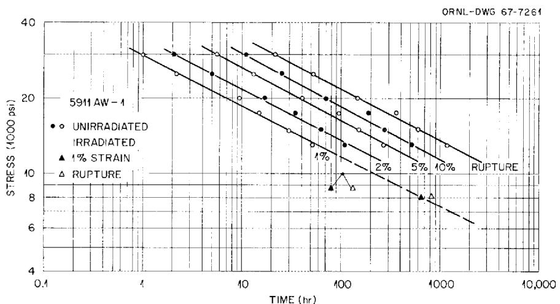  
Fig. 15. A Comparison of the Creep-Rupture Properties of Heat 5911 AW-1 at $760^{\circ}\mathrm{C}$ in the Irradiated and Unirradiated Conditions.

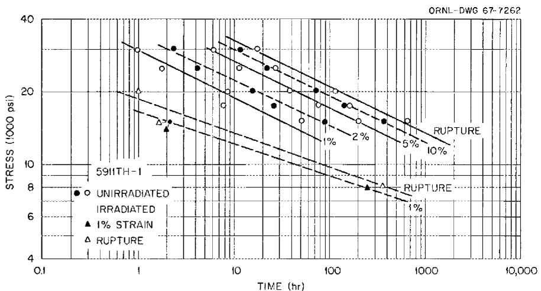  
Fig. 16. A Comparison of the Creep-Rupture Properties of Heat 5911 TH-1 at $760^{\circ}\mathrm{C}$ in the Irradiated and Unirradiated Conditions.

strain rate. At high strain rates, the ductility is lower at $760^{\circ}\mathrm{C}$ than at $650^{\circ}\mathrm{C}$ and decreases with decreasing strain rate. A minimum is reached at a strain rate of about $10\% / \mathrm{hr}$ and an increase in ductility occurs as the strain rate is decreased further.

Our metallographic studies were confined to the unirradiated tensile specimens that were aged and tested at 650 and $760^{\circ}\mathrm{C}$ at a strain rate of $0.002\mathrm{min}^{-1}$ . The failures were all intergranular at $760^{\circ}\mathrm{C}$ . At $650^{\circ}\mathrm{C}$ extensive intergranular cracking occurred, and the failures were predominantly intergranular even though some areas failed by transgranular shear. The microstructure of a specimen from heat 5911 AW-anneal 1 after aging and testing at $650^{\circ}\mathrm{C}$ is shown in Fig. 18. The grain size is relatively coarse with stringers, probably of the $\mathrm{M}_{6}\mathrm{C}$ type. The microstructure of heat 5911 AW-anneal 3 is shown in Fig. 19. The cold working and recrystallization of this material has resulted in the formation of bands of small grains and a "ghost" structure in which fine precipitates mark the boundaries of the original grains before recrystallization. The coarse microstructure of heat 5911 AW-anneal 3A is shown in Fig. 20. The "feathery" growth is probably fine carbides that have reprecipitated. These were not visible in the specimen aged at $650^{\circ}\mathrm{C}$ . Small amounts of the same product were visible in the other heat 5911 AW specimens that were aged at $760^{\circ}\mathrm{C}$ . The microstructure of heat 5911 TH-anneal 1 after aging and testing at $650^{\circ}\mathrm{C}$ is shown in Fig. 21. The grain

Table 8. Tensile Properties of Heat 5911 AW-1 at Various Strain Rates   

<table><tr><td rowspan="2">Specification Number</td><td rowspan="2">Test Temperature (℃)</td><td rowspan="2">Strain Rate (min-1)</td><td colspan="2">Stress (psi)</td><td colspan="2">Elongation (%)</td><td rowspan="2">Reduction in Area (%)</td></tr><tr><td>Yield</td><td>Tensile</td><td>Uniform</td><td>Total</td></tr><tr><td>5167</td><td>650</td><td>2.0</td><td>34,200</td><td>79,500</td><td>60.1</td><td>68.6</td><td>53.4</td></tr><tr><td>5168</td><td>650</td><td>0.5</td><td>37,000</td><td>81,700</td><td>65.5</td><td>67.2</td><td>53.6</td></tr><tr><td>5169</td><td>650</td><td>0.2</td><td>26,500</td><td>80,300</td><td>55.3</td><td>57.9</td><td>40.8</td></tr><tr><td>5170</td><td>650</td><td>0.05</td><td>26,700</td><td>75,600</td><td>41.0</td><td>42.6</td><td>36.1</td></tr><tr><td>5171</td><td>650</td><td>0.02</td><td>26,300</td><td>74,000</td><td>38.9</td><td>40.5</td><td>32.4</td></tr><tr><td>5172</td><td>650</td><td>0.005</td><td>27,200</td><td>65,200</td><td>28.6</td><td>29.7</td><td>26.0</td></tr><tr><td>5173</td><td>650</td><td>0.002</td><td>26,900</td><td>61,900</td><td>26.5</td><td>27.6</td><td>23.6</td></tr><tr><td>5174</td><td>760</td><td>2.0</td><td>31,300</td><td>67,400</td><td>44.8</td><td>50.4</td><td>34.1</td></tr><tr><td>5175</td><td>760</td><td>0.5</td><td>25,900</td><td>68,300</td><td>36.5</td><td>38.4</td><td>30.6</td></tr><tr><td>5176</td><td>760</td><td>0.2</td><td>26,400</td><td>65,900</td><td>31.4</td><td>32.7</td><td>26.8</td></tr><tr><td>5177</td><td>760</td><td>0.05</td><td>26,400</td><td>62,800</td><td>26.8</td><td>28.2</td><td>20.7</td></tr><tr><td>5179</td><td>760</td><td>0.02</td><td>26,600</td><td>62,500</td><td>11.2</td><td>11.7</td><td>24.6</td></tr><tr><td>5180</td><td>760</td><td>0.005</td><td>26,000</td><td>55,600</td><td>15.6</td><td>21.9</td><td>18.4</td></tr><tr><td>5181</td><td>760</td><td>0.002</td><td>27,200</td><td>49,500</td><td>10.0</td><td>21.8</td><td>21.2</td></tr></table>

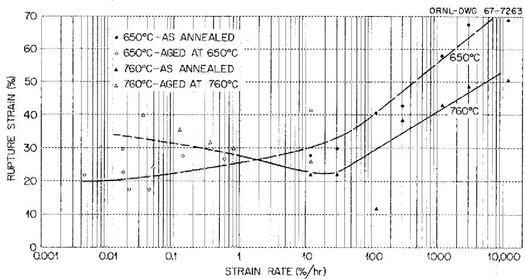  
Fig. 17. Influence of Strain Rate on the Rupture Strain of Heat 5911 AW-1 at 650 and $760^{\circ}\mathrm{C}$ .

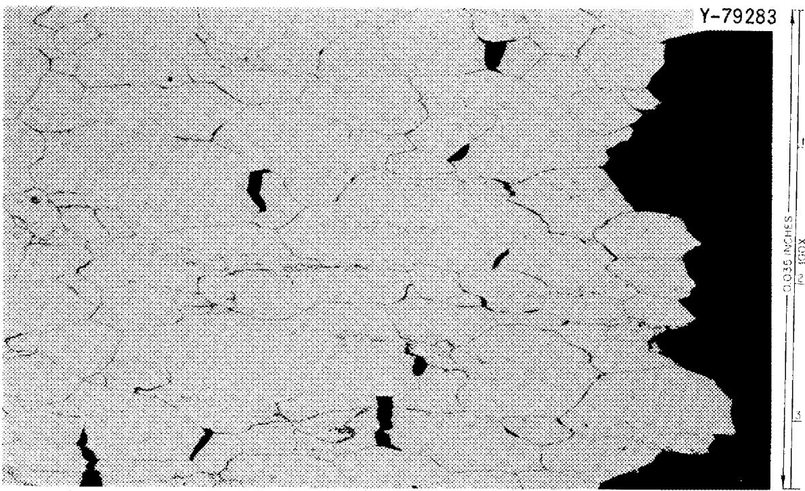  
Fig. 18. Photomicrograph of the Fracture of a Heat 5911 AW-Anneal 1 Specimen Tested at $650^{\circ}\mathrm{C}$ at a Strain Rate of $0.002\mathrm{min}^{-1}$ . Etchant: glyceria regia.

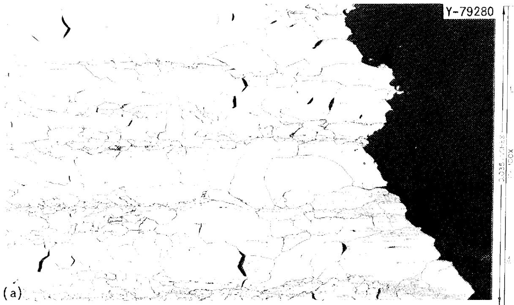

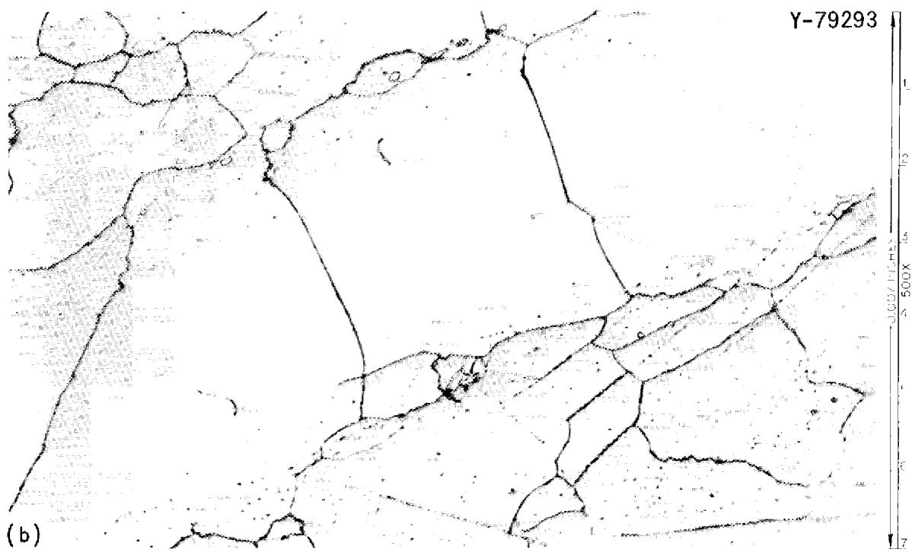  
Fig. 19. Photomicrographs of a Specimen from Heat 5911 AW-Anneal 3 Tested at $650^{\circ}\mathrm{C}$ at a Strain Rate of $0.002\mathrm{min}^{-1}$ . Etchant: glyceria regia.

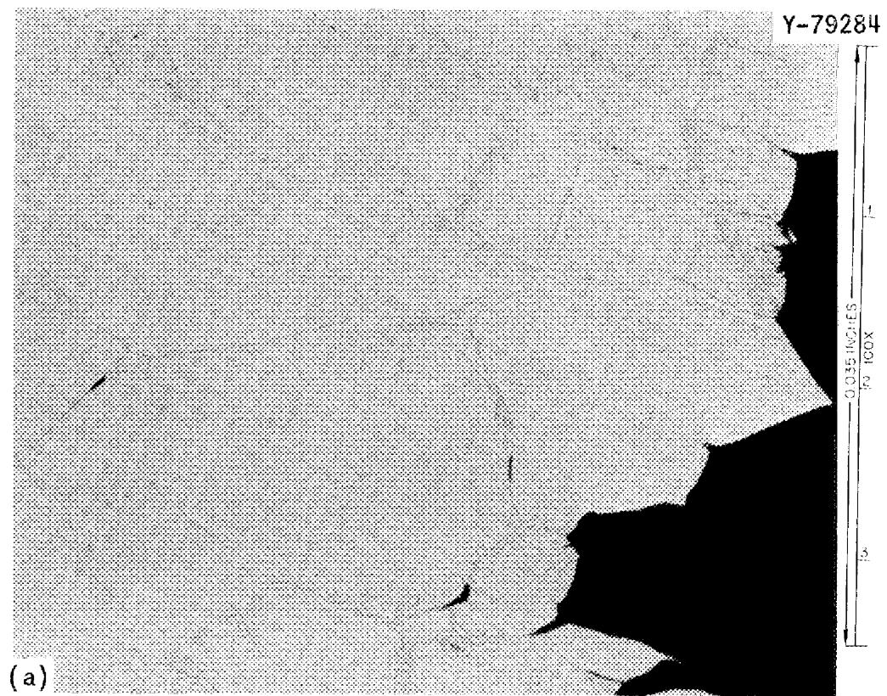

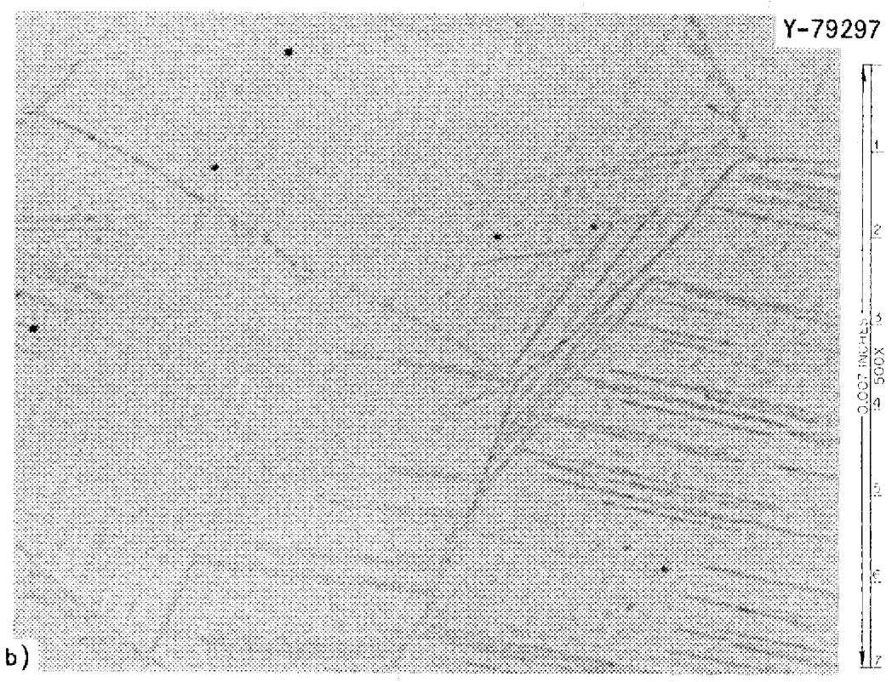  
Fig. 20. Photomicrographs of a Specimen from Heat 5911 AW-Anneal 3 Tested at $760^{\circ}\mathrm{C}$ at a Strain Rate of $0.002\mathrm{min}^{-1}$ . Etchant: glyceria regia.

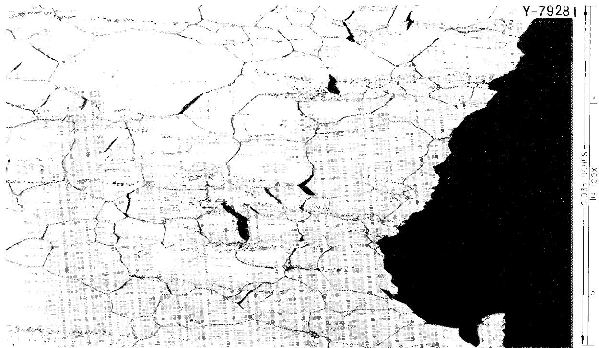  
Fig. 21. Photomicrograph of the Fracture of a Specimen from Heat 5911 TH-Anneal 1 Tested at $650^{\circ}\mathrm{C}$ and at a Strain Rate of $0.002\mathrm{min}^{-1}$ . Etchant: glyceria regia.

size is quite similar to that of heat 5911 AW-anneal 1 (Fig. 18), but the curved twin boundaries are indicative of the more complex and extensive working of the tube hollow.

Heat 6252 AC was not homogenized adequately by any of the heat treatments used. This material was received as a section cut from an as-cast 12-in.-diam billet. Figure 22 shows the microstructure after anneal 2 and aging and testing at $650^{\circ}\mathrm{C}$ . A lamellar phase and the typical carbide stringers have been "smeared" through the metal in a very inhomogeneous manner. Figure 23 shows that the working of treatments $2 + 3$ improved the homogeneity but not sufficiently to yield a typical microstructure. Figure 24 shows that the higher temperature encountered in anneal 2A increased the grain size, but only increased the degree of segregation.

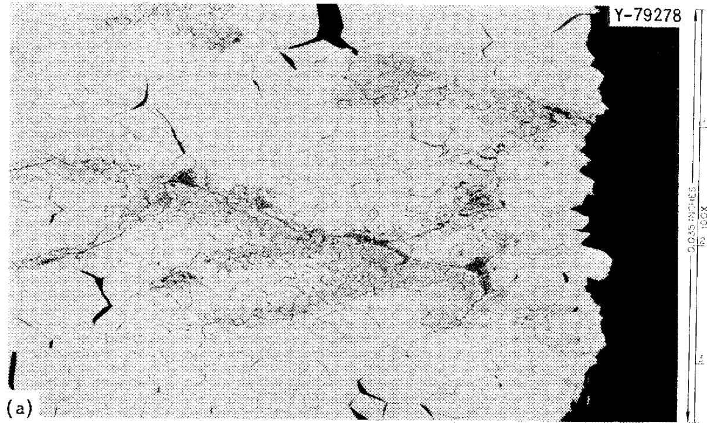

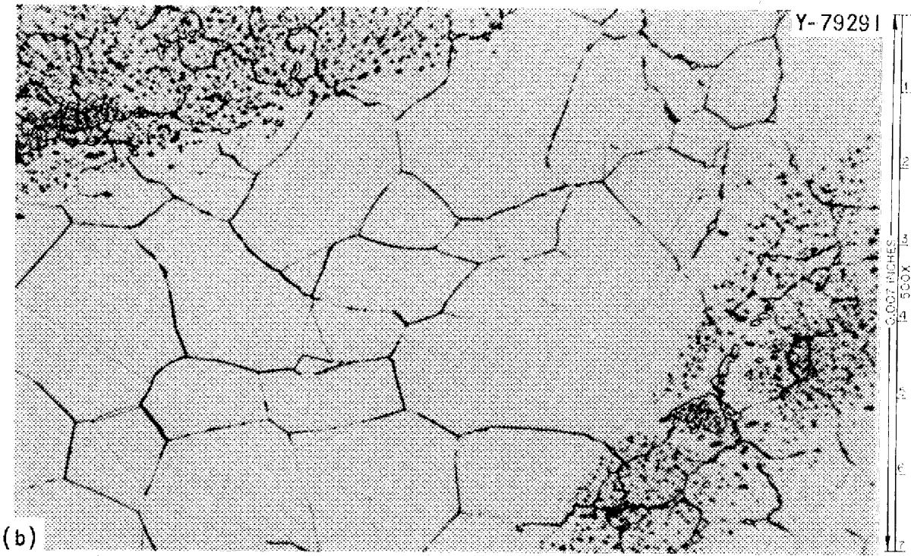  
Fig. 22. Photomicrographs of a Specimen from Heat 6252 AC-Anneal 2 Tested at $650^{\circ}\mathrm{C}$ at a Strain Rate of $0.002\mathrm{min}^{-1}$ . Etchant: glyceria regia.

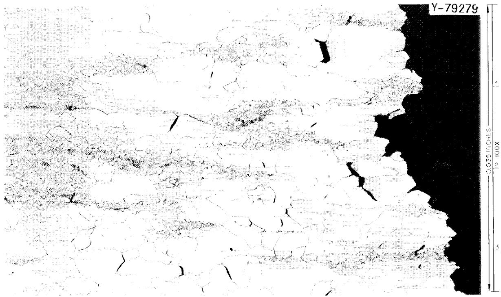  
Fig. 23. Photomicrograph of the Fracture of a Specimen from Heat 6252 AC-Anneal $2 + 3$ Tested at $650^{\circ}\mathrm{C}$ and at a Strain Rate of $0.002\mathrm{min}^{-1}$ . Etchant: glyceria regia.

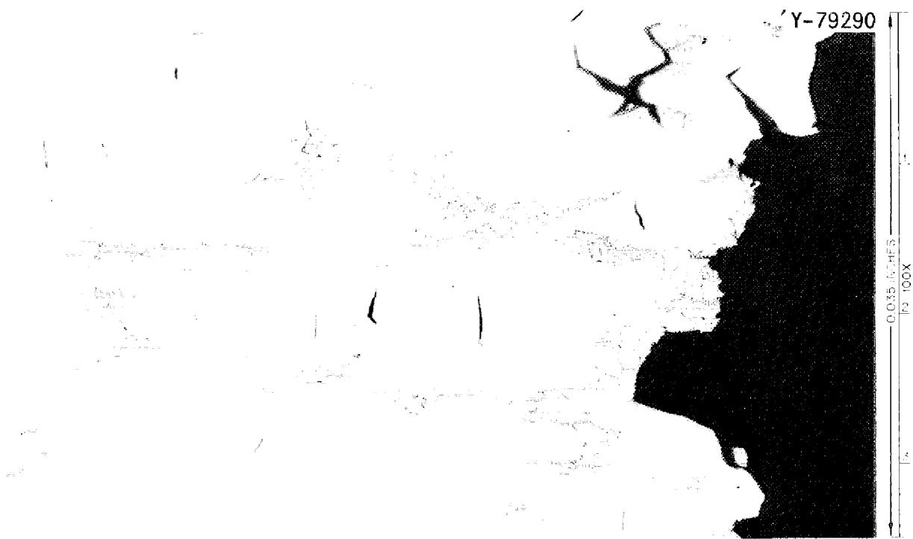  
Fig. 24. Photomicrograph of the Fracture of a Specimen from Heat 6252 AC-Anneal 2A Tested at $760^{\circ}\mathrm{C}$ and at a Strain Rate of $0.002\mathrm{min}^{-1}$ . Etchant: glyceria regia.

# DISCUSSION OF RESULTS

The effects of several variables on the unirradiated properties of Hastelloy N were investigated. The dramatic decrease in tensile ductility with increasing test temperature is a characteristic of this alloy.4 However, the exact mechanism of the ductility minimum is not understood. Our results showed that the ductility is very strain rate dependent over certain ranges of temperature and strain rate. For example, Fig. 17 shows that the rupture strain at high strain rates is greater at $650^{\circ}\mathrm{C}$ than at $760^{\circ}\mathrm{C}$ , and at low strain rates the converse is true. The changes in tensile properties as a result of varying the anneal and the aging treatment (650 or $760^{\circ}\mathrm{C}$ ) are relatively small for such a complex alloy. Although adequate work was not done to support this conclusion, these changes are probably due to variations in grain size and the concentration and morphology of grain-boundary carbides. Under creep conditions, all the variables investigated seem to have very minor effects (Figs. 3-8). Although the results obtained on heat 6252 AC generally agreed with those for the other materials, several tests exhibited low ductility. The photomicrographs shown in Figs. 22-24 demonstrate the inhomogeneous nature of heat 6252 AC. None of the mechanical and thermal treatments were adequate to homogenize the alloy. Thus, the scatter in test results is as expected.

The main object of these experiments was to determine the properties of Hastelloy N after irradiation. Irradiation changed the properties in the following ways:

1. At $650^{\circ}\mathrm{C}$ the yield stress was increased and the tensile stress was decreased.   
2. At $760^{\circ}\mathrm{C}$ the yield stress was unaffected and the tensile stress was reduced.   
3. The stress-rupture life was reduced, the effect being greater at $760^{\circ}\mathrm{C}$ than at $650^{\circ}\mathrm{C}$ .   
4. The minimum creep rate was unaffected at $650^{\circ}\mathrm{C}$ but was increased at $760^{\circ}\mathrm{C}$ .

5. The rupture strain was lowered in both tensile and creep-rupture tests, with the minimum strain occurring at a strain rate of 1 to $10\% / \mathrm{hr}$ .

We shall discuss each of these observations separately, after we have discussed high-temperature deformation in general terms.

At high temperatures there are at least two types of intergranular failures that are reported: (a) wedge or triple point fracture and (b) cavitation. The wedge crack forms when the stress concentration at the end of a sliding boundary is sufficient to locally exceed the fracture stress. Stroh $^{5,6}$ developed an analytical expression for the value of the critical shear stress, $\tau$ , required to form a crack under these conditions

$$
\tau = \sqrt {\frac {1 2 \mathrm {v G}}{\pi L}}, \tag {1}
$$

where

$\gamma =$ the effective surface energy

$\mathbf{G} =$ the shear modulus,

L = the length of the sliding interface (normally taken to be the grain diameter at high temperatures).

Cavitation is a term used to describe the formation of small intergranular voids and the linking of these voids to form cracks. Numerous mechanisms have been proposed for the nucleation of these voids, however, they all require plastic deformation. $^{7}$ Once nucleated, the cavities grow by the ingress of vacancies. Balluffi and Seigle $^{8}$ developed an expression for the stability of the void under an applied stress

$$
\sigma = \frac {2 \gamma}{r \cos^ {2} \theta}, \tag {2}
$$

where

$\sigma =$ the applied stress,

$\gamma =$ the surface tension,

$r =$ radius of the void,

$\theta =$ the angle between the applied stress and the normal to the plane in which the void lies.

When the stress becomes less than that required to satisfy this equality, the void will decrease in size. If the stress is greater, the void will grow as rapidly as the supply of vacancies will allow.

Hull and Rimmer9 developed an expression for the kinetics of failure by the growth of these voids due to the stress induced diffusion of vacancies along the grain boundaries. Their model assumed a constant number of void nuclei that grew as spheres. The time to rupture, $t_r$ , was related to the applied stress, $\sigma$ , and other factors

$$
t _ {r} \cong \frac {k T a ^ {3}}{4 (D g z) (\sigma - P)} \Omega , \tag {3}
$$

where

$\mathbf{k} =$ Boltzman's constant,

$\mathbf{T} =$ the absolute temperature,

a = the void spacing,

$\mathbf{D}_{\mathbf{g}} =$ the atomic grain-boundary diffusion coefficient,

$\delta_{\mathbb{Z}} =$ the width of the grain boundary

$\Omega =$ the atomic volume,

$\mathbf{P} =$ the externally applied hydrostatic pressure.

Hull and Rimmer found in their experimental work with impure copper that it was necessary to allow the void spacing, a, to decrease with increasing stress in order to obtain reasonable agreement between Eq. (3) and their experimental data. The activation energy was found to be less than that for bulk diffusion, so grain-boundary diffusion was assumed to be the rate controlling process.

Although the wedge and the cavitation fractures appear distinctly different when viewed in the optical microscope, we recently performed

some work with tungsten $^{10}$ that makes us question whether they result from basically different mechanisms. The stressed tungsten specimens were fractured intergranularly and the surfaces replicated to study the details of the deformation. All of the cracks seemed to be nucleated by intergranular voids. At high stresses and relatively low temperatures, the voids linked together to form cracks that appeared wedge-shaped in the optical microscope. At low stresses and high temperatures, the voids grew to quite large sizes as voids and linked together primarily by impingement. Hence, the different appearance of cracks may be influenced more strongly by the local stress concentrations available to propagate them than by differences in the mechanism of crack nucleation. Thus, even though the cracks in the Hastelloy N specimens appear to be wedge-shaped, we should still be concerned with how voids nucleate and grow in this alloy.

Let us now consider how neutron irradiation can alter the high-temperature deformation processes in this material. When the alloy is irradiated at temperatures in excess of about one-half the absolute melting point, the atoms have high mobility and the atoms displaced by fast neutrons are able to return to their normal lattice positions. However, many experimenters have shown that structural materials irradiated even at high temperatures exhibit reduced rupture ductility when tested at elevated temperatures. This effect has been correlated with the thermal neutron exposure and more specifically with the helium that is formed by the $^{10}\mathrm{B}(n,\alpha)$ transmutation.[11] The boron, because of its size and low solubility, is initially segregated at the grain boundaries.[12] The recoil range of the $\alpha$ -particle produced by transmutation is $2\mu$ (ref. 13) so most of the helium will lie in the proximity of the grain boundaries. The solubility of the helium in the metal is very low and most of it will be precipitated as small bubbles along the grain boundaries. The size of a spherical gas bubble must satisfy the following equality

$$
P _ {O} = \frac {2 \gamma}{r _ {O}}, \tag {4}
$$

where

$P_{0} =$ the internal gas pressure,

$\mathbf{r}_{\circ} =$ the radius.

If a tensile stress, $\sigma$ , is now applied perpendicular to the boundary in which the bubble lies, the bubble will grow to a new radius, $r$ , and the internal gas pressure will be reduced to $P$ .

$$
\sigma + P = \frac {2 \gamma}{r}. \tag {5}
$$

It can be shown that the critical stress, $\sigma_{\mathrm{c}}$ , that must be applied for unlimited growth to occur is given by

$$
\sigma_ {c} = 0. 3 8 P _ {o} = 0. 7 6 \frac {\gamma}{r _ {o}}. \tag {6}
$$

By comparing Eqs. (2) and (6), it is apparent that the applied stress to allow a bubble to grow without bound is only about one-third that required for the growth of an empty void of the same size.

Thus, the presence of helium results in the formation of small gas bubbles that can serve as void nuclei. These nuclei can grow by the stress induced migration of vacancies and the applied stress necessary for their growth is reduced by the presence of helium. Russel and Vela14 have attempted to develop an equation similar to that of Hull and Rimmer [Eq. (3)] for predicting the time to rupture with the complicating factors of a gas in the void and lenticular growth of the voids. They obtained:

$$
t _ {r} = \frac {k T d _ {o}}{5 . 4 D _ {p} \delta_ {z} \Omega [ \sigma + (2 n k T _ {p} / d _ {o}) - 2 \pi \gamma d _ {o} \rho ]}, \tag {7}
$$

where

$d_{\circ} =$ the bubble width perpendicular to the grain boundary,

$D =$ the diffusion coefficient (bulk or grain boundary),

$\rho =$ the number of bubbles per unit surface area,

n = the number of atoms within each bubble.

Although several questions have been raised about some of the assumptions on which this equation is based, $^{15}$ the factors being considered seem quite reasonable and the equation is probably valid for qualitative arguments. The temperature dependence shows up primarily in the diffusion coefficient that varies exponentially with temperature. At a given temperature, the factors that combine to determine whether a void can undergo growth are the applied stress, the gas pressure in the void, and the surface energy. These three factors appear in order in the bracketed portion of the denominator of Eq. (7).

Let us now discuss the various experimental observations that were made. The increase in the yield stress at $650^{\circ}\mathrm{C}$ after irradiating at $650^{\circ}\mathrm{C}$ was not anticipated on the basis of previous work.[16] However, the previous work involved air-melted materials irradiated at $700^{\circ}\mathrm{C}$ , and a direct comparison cannot be made with the results of the present study. This increase in yield stress is probably due to the formation of fine, generally dispersed precipitates during irradiation. Since $650^{\circ}\mathrm{C}$ is only approximately 0.55 of the absolute melting point of the alloy, there is also a possibility that some displacement defects such as dislocation loops may be present. At $760^{\circ}\mathrm{C}$ the yield stress is unaffected. The tensile stresses at both 650 and $760^{\circ}\mathrm{C}$ are reduced by irradiation. This does not reflect a basic difference in the shape of the initial portion of the stress-strain diagram for the irradiated and unirradiated specimens, but is due simply to the premature failure of the irradiated specimen before the normal tensile stress is reached.

The reduced rupture life under creep conditions is due to the effect of helium on the processes responsible for forming wedge-shaped cracks and for cavitation that we have just discussed in detail. The reason that the

effect is greater at $760^{\circ}\mathrm{C}$ than at $650^{\circ}\mathrm{C}$ is probably due to the greater atomic mobility at $760^{\circ}\mathrm{C}$ . The motion of helium to the grain boundaries, whether as atoms or small bubbles, will be quite sensitive to temperature. For example, studies by Bloom and Stiegler17 on type 304 stainless steel have failed to disclose any bubbles in material irradiated at $650^{\circ}\mathrm{C}$ , but have shown that the same material irradiated at $800^{\circ}\mathrm{C}$ contains bubbles up to 700 A in diameter.

The convergence of the stress-rupture curves for the irradiated and unirradiated materials at low stresses can be rationalized from Eq. (2). The lower the stress, the larger a void must be to be stable. Thus, the number of void nuclei of sufficient size to undergo extensive growth is quite small in both irradiated and unirradiated materials and the deformation processes in both approach each other at low stresses.

The reduction in ductility under tensile and creep conditions is due basically to the accumulation of helium at the grain boundaries causing premature fracture. At high strain rates, such as those encountered in tensile tests, bulk deformation accounts for a large portion of the total strain. The bulk deformation characteristics do not seem to be affected significantly by irradiation at elevated temperatures and the fracture strains for irradiated materials are fairly high. As the strain rate is decreased, the conditions become more favorable for grain-boundary deformation18 and the ductility of the irradiated material decreases rapidly. The minimum fracture strain observed in a creep test with a creep rate of 1 to $10\% / \text{hr}$ is likely due to the worst combination of two factors: (1) low enough stress that the ratio of grain boundary to bulk deformation is fairly high and (2) high enough stress to cause many of the helium bubbles to grow. Decreasing the stress level further causes the first factor to be more detrimental and the second factor less detrimental; the rate of change of the second factor apparently being less since the ductility improves slowly with decreasing stress level.

The higher minimum creep rate of the irradiated material at $760^{\circ}\mathrm{C}$ is difficult to explain, particularly since the rates converge at low stresses. Since the fraction of strain due to bulk deformation increases with stress and the grain boundary contribution decreases, it would appear that bulk deformation can occur more easily in the irradiated material. However, it would seem that this would result in a decrease in the yield stress, which was not observed. Thus, this result is not presently explained.

# SUMMARY AND CONCLUSIONS

We evaluated the mechanical behavior of two heats of vacuum-melted Hastelloy N in several metallurgical conditions before and after irradiation. The various mechanical-thermal treatments studied had some small effects on the tensile properties, but the creep-rupture properties were very similar.

The specimens were irradiated to a thermal dose of $2.3 \times 10^{20}$ neutrons/cm² at temperatures of 650 and $760^{\circ}\mathrm{C}$ . It was found that:

1. At $650^{\circ}\mathrm{C}$ the yield stress was increased and the tensile stress was decreased.   
2. At $760^{\circ}\mathrm{C}$ the yield stress was unaffected and the tensile stress was reduced.   
3. The creep-rupture life was reduced, the effect being greater at $760^{\circ}\mathrm{C}$ than at $650^{\circ}\mathrm{C}$ .   
4. The minimum creep rate was unaffected at $650^{\circ}\mathrm{C}$ but was increased at $760^{\circ}\mathrm{C}$ .   
5. The rupture strain was lowered in both tensile and creep-rupture tests, with the minimum occurring at a strain rate of 1 to $10\% / \mathrm{hr}$ .

These results are consistent with our understanding of how helium introduced by the $^{10}\mathrm{B}(n,\alpha)$ reaction should influence the properties.

# ACKNOWLEDGMENTS

This study would not have been possible without the assistance of several individuals and service groups. I gratefully acknowledge the following: J. R. Weir, E. E. Bloom, and J. O. Stiegler for reviewing this report and making several useful suggestions; B. C. Williams, N. O. Pleasant, and B. McNabb for running the tensile and creep tests; V. G. Lane, E. M. Thomas, and J. C. Feltner for data processing; H. R. Tinch for metallographic work; the Metals and Ceramics Division Reports Office for preparation of the manuscript; and Graphic Arts for preparation of the illustrations.

We also are pleased to acknowledge the assistance of Atomics International in supplying the materials used in this program and the support of the Division of Space Nuclear Systems of the AEC.

# INTERNAL DISTRIBUTION

1-3. Central Research Library   
4-5. ORNL - Y-12 Technical Library Document Reference Section   
6-25. Laboratory Records   
26. Laboratory Records, ORNL RC   
27. ORNL Patent Office   
28. G. M. Adamson, Jr.   
29. S.E.Beall   
30. D. S. Billington   
31. E. E. Bloom   
32. E. G. Bolhmann   
33. G. E. Boyd   
34. R. B. Briggs   
35. D.Canonico   
36. E. I. Compere   
37. J. E. Cunningham   
38. J.H.DeVan   
39. J. H Frye, Jr.   
40. R.E. Gelbach   
41. J. L. Gregg   
42. D. G. Harman   
43. W. O. Harms   
4-46. M.R.Hill   
47. N.E.Hinkle

48. H. Inouye   
49. P. R. Kasten   
50. C. R. Kennedy   
51. R. T. King   
52. A. P. Litman   
53. E. L. Long, Jr.   
54. H. G. MacPherson   
-59. H. E. McCoy, Jr.   
60. C.J.McHargue   
61. A.J.Miller   
62. A. R. Olsen   
63. P. Patriarca   
64. M. W. Rosenthal   
65. H. C. Savage   
66. J. L. Scott   
67. C. E. Sessions   
68. J. Stanley   
69. J. 0. Stiegler   
70. G. M. Slaughter   
71. D. A. Sundberg   
72. D. B. Trauger   
73-77. J.R.Weir, Jr.   
78. J. W. Woods   
79. M. S. Wechsler

# EXTERNAL DISTRIBUTION

80. G. G. Allaria, Atomics International   
81. J. G. Asquith, Atomics International   
82. D. F. Cope, RDT, SSR, AEC, Oak Ridge National Laboratory   
83. H. M. Dieckamp, Atomics International   
84. F. D. Haines, AEC, Washington   
85. C. E. Johnson, AEC, Washington   
86. W. L. Kitterman, AEC, Washington   
87. W. J. Larkin, AEC, Oak Ridge Operations   
88. P. J. Levine, Westinghouse Advanced Reactor Division, Waltz Mill Site, Madison, Pa.   
89. A. B. Martin, Atomics International   
90. D. G. Mason, Atomics International   
91. G. W. Meyers, Atomics International   
92. W. E. Ray, Westinghouse Advanced Reactor Division, Waltz Mill Site, Madison, Pa.   
93. D. E. Reardon, AEC, Canoga Park Area Office   
94. J. M. Simmons, AEC, Washington   
95. S. R. Stamp, AEC, Canoga Park Area Office   
96. G. A. Whitlow, Westinghouse Advanced Reactor Division, Waltz Mill Site, Madison, Pa.   
97. R. F. Wilson, Atomics International   
98. Laboratory and University Division, Oak Ridge Operations   
113. Division of Technical Information Extension