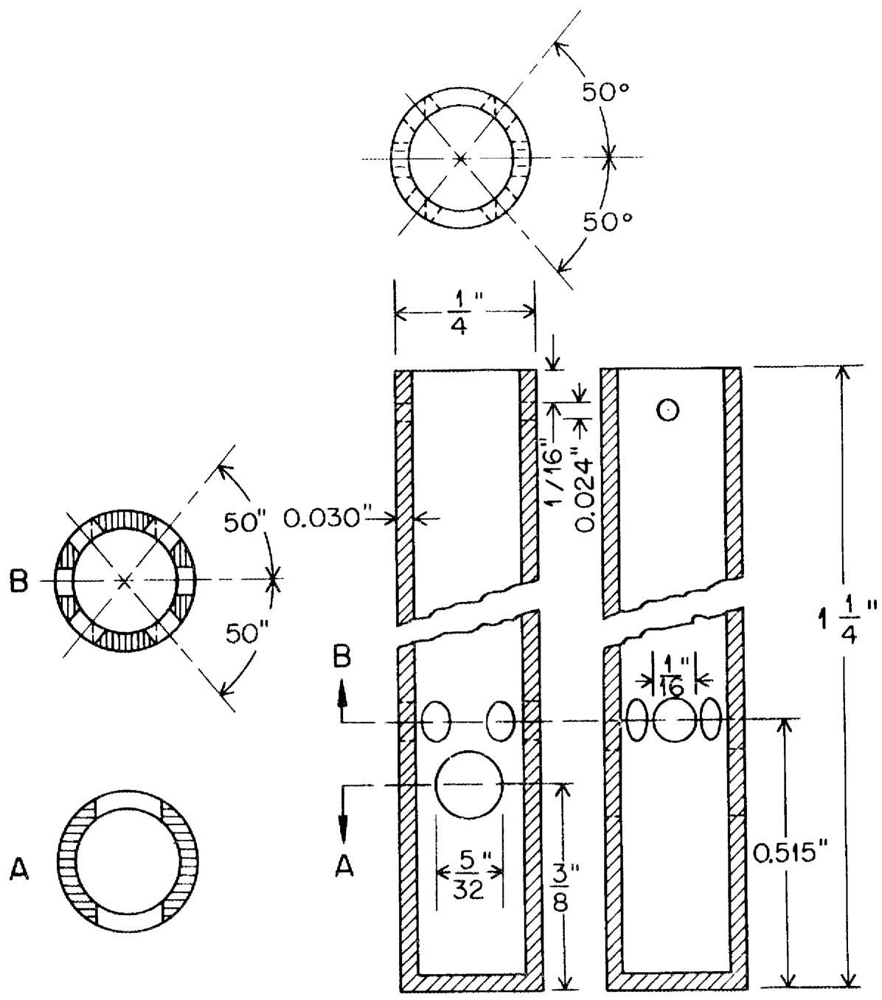
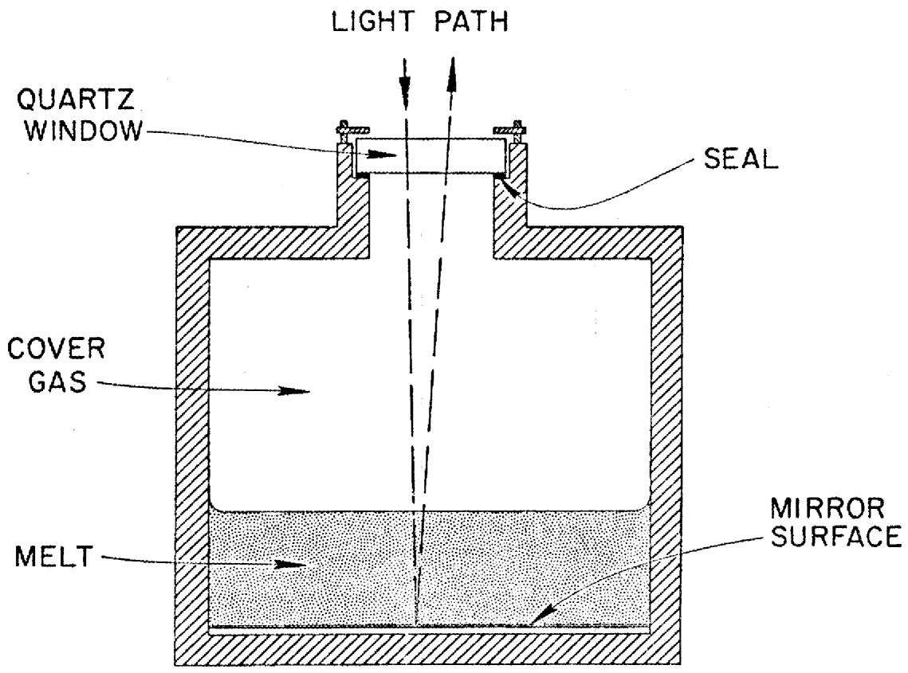
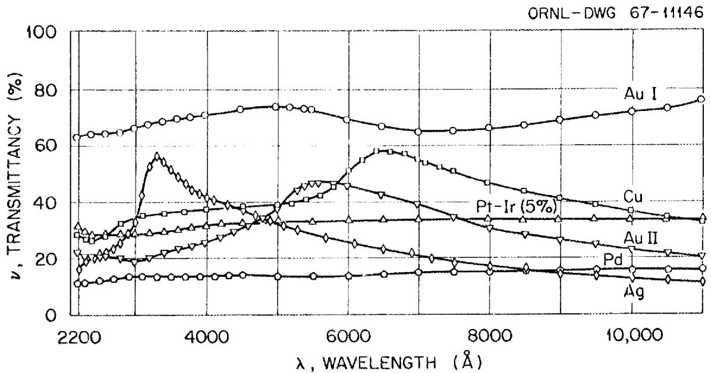
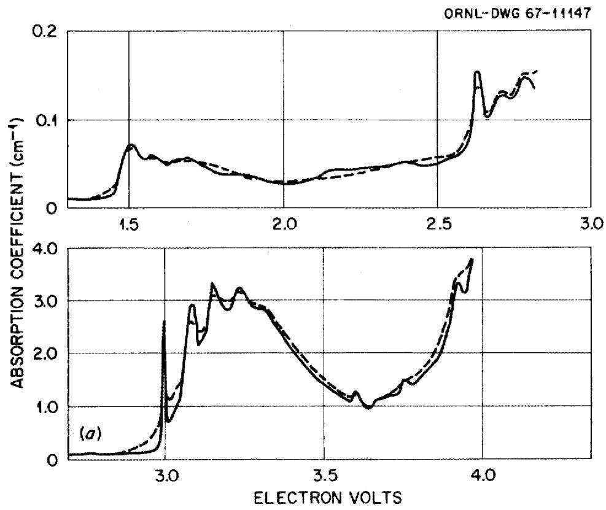
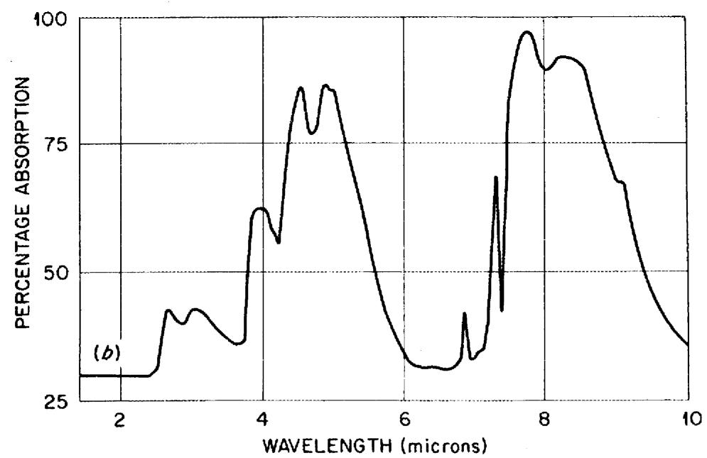
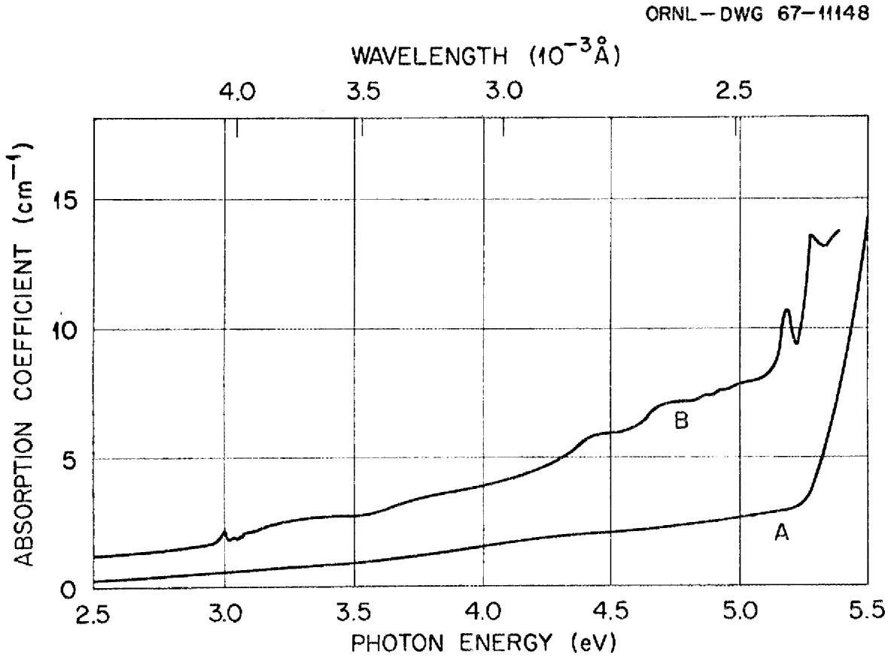

ORNL-TM-2047

COPY NO. - GO

DATE - November 8, 1967

# CONTAINERS FOR MOLTEN FLUORIDE SPECTROSCOPY

L. M. Toth

# ABSTRACT

Techniques which have been used previously for visible-U.V. absorption spectroscopy of molten fluoride salts are reviewed and evaluated. Numerous optical materials which could be useful for fluoride spectroscopy are suggested on the basis of thermodynamic predictions and limited testing. It is concluded that quartz should be used to its practical limits and perhaps then should be coated with transparent metal films in order to extend its usefulness. Ultimately, however, diamond-windowed metal cells are viewed as the only corrosion-resistant absorption cell for fluorides above $500^{\circ}\mathrm{C}$ .

CIS NUCLEOGENOMICS ABSTRACT

0000

1

DO KOL TRAVELER 10 AND THE PERSION

If you wish to see more information , see this

This work is supported by the grant of the European Union.

zhi xiè 1. 穿白 衣 2. 穿红 裙衣 3. 穿蓝 裙衣 4. 穿绿 裙衣

$\therefore m = \frac{3}{11}$ ;

58

# NOTICE

This document contains information of a preliminary nature and was prepared primarily for internal use at the Oak Ridge National Laboratory. It is subject to revision or correction and therefore does not represent a final report.

# LEGAL NOTICE

This report was prepared as an account of Government sponsored work. Neither the United States, nor the Commission, nor any person acting on behalf of the Commission:

A. Makes any warranty or representation, expressed or implied, with respect to the accuracy, completeness, or usefulness of the information contained in this report, or that the use of any information, apparatus, method, or process disclosed in this report may not infringe privately owned rights; or   
B. Assumes any liabilities with respect to the use of, or for damages resulting from the use of any information, apparatus, method, or process disclosed in this report.

As used in the above, "person acting on behalf of the Commission" includes any employee or contractor of the Commission, or employee of such contractor, to the extent that such employee or contractor of the Commission, or employee of such contractor prepares, disseminates, or provides access to, any information pursuant to his employment or contract with the Commission, or his employment with such contractor.

# LIST OF FIGURES

Fig. 1. Captive Liquid Cell. 16   
Fig. 2. Fluoride Reflection Cell Concept. 17   
Fig. 3. The Optical Transmittance of Several Metal and Alloy Films Produced on Quartz Plate as a Function of Wave Length. 18   
Fig. 4. (a) Absorption Spectrum of a Type I Diamond. (The Dashed Curve was Measured at Room Temperature and the Full Curve was Measured at $80^{\circ}\mathrm{K}$ .) (b) Absorption Spectrum for a Type I Diamond in the Infrared, Measured at Room Temperature.   
Fig. 5. Absorption Spectra of Type II Diamond Measured at Room Temperature. Curves A and B are for Two Different Species.

# INTRODUCTION

Molten fluoride spectroscopy has been very limited in the past because of the unavailability of an optical cell which is both resistant to fluoride attack and yet reasonably transparent throughout the spectral range of interest.

With the increasing emphasis in molten fluoride programs such as the molten salt breeder reactor, MSBR, spectroscopy on fluoride systems has become a must in clarifying many of the reactions which are taking place.

At present, the chemistry of Nb, Mo, and Ru (to name a few) is uncertain. Equilibrium reactions such as:

$$
\mathrm {N b} + 5 \mathrm {U F} _ {4} \rightleftharpoons \mathrm {N b F} _ {5} + 5 \mathrm {U F} _ {3} \tag {1}
$$

have been considered and are of prime concern. Spectroscopy could aid in the investigation of reactions such as:

$$
\mathrm {N b} + \mathrm {N b F} _ {5} \rightleftharpoons \text {l o w e r f l u o r i d e s} \tag {2}
$$

because the lower fluorides would display visible and ultraviolet absorption spectra due to their $d \leftrightarrow d$ transitions. As the work progressed, the action of $\mathrm{UF}_4$ on $\mathrm{Nb}^0$ and $\mathrm{UF}_3$ on $\mathrm{NbF}_5$ could be examined to verify if equilibrium reactions between niobium fluorides and uranium fluorides do actually exist as predicted by thermodynamic data.

Before embarking upon any general program of fluoride spectroscopy, a survey of the tools available for the work should be made. All equipment but the optical cells would be standard. The container problem can be divided into two parts -- that of finding a non-optical corrosion-resistant material (e.g., some metals, graphite, etc.) and that of using good optical materials (e.g., quartz).

# Windowless Containers

# Captive Liquid Cells:

One approach to the problem has been to abandon the search for a satisfactory optical material and to employ corrosion-resistant containers so that the light beam could pass through the melt and yet avoid the container. The most successful application of this has been developed by Young² in which he used a captive-liquid cell (Figure 1). He has also tried wire loops wetted with fluoride melts but found that the "cell" principle worked best.

The cell has several "keeper" holes above the optical path which insure that the cell is filled to the same level every time. Some of the difficulties encountered with the cell were changes in the liquid meniscus in the optical path and, as a result, some noticeable uncertainty in the real optical path length. Problems such as these limit the accuracy to within $10\%$ for absorption coefficient measurements. In addition, it is impossible to bubble reagent gases through this kind of a cell. The only alternative is to use a reagent gas mixed in with the helium cover gas that is incorporated in the cell design and to rely upon gas diffusion through the melt for adequate mixing.

Some measurements require the equilibration of the melt and a solid phase and intermittent scans throughout this period (e.g., excess metal in contact with melt in which a higher valence solute is reduced.) This technique is, of course, impossible using such a windowless cell.

These devices must not be passed over lightly for they have accomplished many of the tasks for which they were designed. It is only the objective here to indicate the characteristics of the various techniques so that the spectroscopist can select the best one for his particular problem.

# Screens for Windows:

Screens are another application of non-optical materials to the solution of the cell problem. A single screen wetted with molten salt has been used previously for infrared absorption spectroscopy. $^{10}$ This or the alternative of using two screens as windows on a cell could be employed for visible-U.V. work. However the concept is not without flaw because the liquid will tend to flow down to the lowest part of the screen. Then the meniscus and path length will vary noticeably between the upper and lower portions of the screen, detracting from the precision of the optical measurements.

# Reflection Cells:

Reflection cells have also been used for spectroscopy, $^{10,12}$ The concept, illustrated in Figure 2, is that of reflecting the incident light from a mirror surface on the bottom of the melt. The window can then be situated above the melt so that only vapors are in contact with it. These vapors may even be controlled by a purge gas if necessary. The window material problem is then solved because almost any optical material would be suitable.

In fastening a window to a metal container, it may prove difficult to obtain a gas-tight seal which would withstand temperature changes of several hundred degrees. However, it might not be absolutely necessary to have that good a seal.

The most serious faults with such a system would be at the gas-liquid and liquid-mirror interfaces. Insoluble impurities and films would collect at both, causing high degrees of light scatter. There would also be the problem of corrosion at the liquid-mirror interface. Furthermore, accurate path length measurements would be difficult, if not impossible, to make.

This cell could be useful if some of the problems with it were overcome, but there are conceivably easier alternatives which should first be investigated.

# Cell Stabilities As Predicted by Thermodynamics

It is sometimes useful to speculate on the corrosion reactions which are occurring and to calculate the free energies of reaction for the process. For a silica container it has been proposed9 that

$$
\mathrm {S i O} _ {2} (\mathrm {s}) + 2 \mathrm {B e F} _ {2} (\mathrm {1}) \rightleftharpoons \mathrm {S i F} _ {4} (\mathrm {g}) + 2 \mathrm {B e O} (\mathrm {s}) \tag {3}
$$

Using standard free energies of formation3 for the various constituents involved, a $\Delta G$ for the reaction can be calculated. Assuming that all activities are unity, the equilibrium pressure of $\mathrm{SiF}_4$ can be calculated. These calculations should be extended to compare $\Delta G$ values of other reactions with experimental results, for instance:

$$
\mathrm {S i O} _ {2} + 4 \mathrm {L i F} \rightleftharpoons \mathrm {S i F} _ {4} + 2 \mathrm {L i} _ {2} \mathrm {O} \tag {4}
$$

Table I lists the values of $\Delta G^0$ which have been calculated for fluoride salts following the general scheme of:

$$
\mathrm {S i O} _ {2} + \frac {4}{x} \mathrm {M F} _ {x} \rightleftharpoons \mathrm {S i F} _ {4} + \frac {4}{x y} \mathrm {M} _ {y} \mathrm {O} _ {x y / 2} \tag {5}
$$

Standard free energies of reaction for fluoride salts in the equilibrium of equation (5).

Table I   

<table><tr><td rowspan="2">\( M F_{x} \)</td><td colspan="3">\( \Delta G^{0}_{Reaction} (Kcal/mole) \)</td></tr><tr><td>600°K</td><td>800°</td><td>1000°</td></tr><tr><td>LiF</td><td>112.930</td><td>108.004</td><td>103.292</td></tr><tr><td>\( BeF_{2} \)</td><td>29.118</td><td>20.418</td><td>13.380</td></tr><tr><td>\( ZrF_{4} \)</td><td>-6.005</td><td>-12.699</td><td>-17.915</td></tr><tr><td>\( AlF_{3} \)</td><td>-105.126</td><td>-93.812</td><td>-80.218</td></tr></table>

Assuming that $\mathbf{SiF}_4$ and the oxide are insoluble in the melt and that the oxide formed, $\mathrm{M}_y\mathrm{O}_{xy/2}$ does not react with the silica.

The $\Delta G^0$ values would then predict that the order of decreasing stability in quartz is: LiF, BeF $_2$ , ZrF $_4$ , and AlF $_3$ . Actual experimental evidence, however, indicates that the order is: 2LiF-BeF $_2$ > LiF-NaF-KF(eutectic) > LiF-ZrF $_4$ (30%) which is interpreted as BeF $_2$ > LiF > ZrF $_4$ . This suggests that the prevailing reactions are not as simple as those suggested by the above equilibria.

The high degree of alkali oxide solubility would lead to reactions such as:

$$
\mathrm {L i} _ {2} \mathrm {O} + \mathrm {S i O} _ {2} \rightleftharpoons \mathrm {L i} _ {2} \mathrm {S i O} _ {3} \tag {6}
$$

$$
\mathrm {L i} _ {2} \mathrm {O} + 2 \mathrm {S i O} _ {2} = \mathrm {L i} _ {2} \mathrm {S i} _ {2} \mathrm {O} _ {5} \tag {7}
$$

at temperatures in the $400 - 800^{\circ}\mathrm{C}$ range. In support of this hypothesis is the observation that the LiF-KF-NaF eutectic melt in quartz is very clear for an hour or more at $454^{\circ}\mathrm{C}$ . If the temperature is raised to $550^{\circ}\mathrm{C}$ , it is still clear. But if the temperature is then dropped to $500^{\circ}\mathrm{C}$ the melt becomes clouded by an insoluble species. It disappears when the temperature is raised back to the maximum temperature. Upon cooling, the quartz container indicates severe corrosion.

The stability of fluorides in contact with other materials should also be estimated from thermodynamic data and using similar qualifying assumptions. A few are listed in Table II for common window materials. If $\mathrm{SiO}_2$ is satisfactory in accordance with previous predictions, $\mathrm{Al}_{2}\mathrm{O}_{3}$ (sapphire) would be much better and MgO worse.

MgO has been used successfully for the LiF-KF-NaF eutectic to obtain the $\mathrm{NiF}_2$ spectrum. It has also been tested for use with 2LiF-BeF $_2$ melts and found to become coated with a grey-white film which resisted all attempts to separate it from the MgO crystal. The melt was analyzed for magnesium and found to contain $0.5\%$ . It was concluded that the opaque coat on the MgO crystal was BeO.

Sapphire had been tested some years ago with the LiF-KF-NaF eutectic. $^{13}$ It has traditionally been reported as "unsatisfactory" as a result of these tests. However no comparison

Estimated $\Delta G^0$ Values for Fluoride Melts in Contact with $\mathrm{Al}_{2}\mathrm{O}_{3}$ and MgO Windows.

Table II   

<table><tr><td rowspan="2">Reaction</td><td colspan="3">ΔG0Reaction</td></tr><tr><td>6000K</td><td>8000K</td><td>10000K</td></tr><tr><td>Al2O3(s) + 6LiF(1) ⇌ 2AlF3(g) + 3Li2O(l)</td><td>223.138</td><td>208.912</td><td>195.200</td></tr><tr><td>Al2O3(s) + 3BeF2(l) ⇌ 2AlF3(g) + 3BeO(s)</td><td>95.740</td><td>77.533</td><td>60.329</td></tr><tr><td>2 (Al2O3)(s) + 3ZrF4(l) ⇌ 4AlF3(g) + 3ZrO2(s)</td><td>86.111</td><td>55.715</td><td>26.773</td></tr><tr><td>MgO(s) + 2LiF(1) ⇌ MgF2(l) + Li2O(l)</td><td>35.692</td><td>35.744</td><td>35.510</td></tr><tr><td>MgO(s) + BeF2(l) ⇌ MgF2(l) + BeO(s)</td><td>-6.714</td><td>-8.049</td><td>-9.447</td></tr></table>

has ever been attempted between quartz and sapphire. Thermodynamically, the latter would be predicted to be more stable. Then if quartz proved to be of limited applicability, sapphire would probably extend the range much further and permit extensive use with 2LiF-BeF $_2$ .

Within the scope of crystalline windows, it is feasible to use high-melting fluorides. Lithium and calcium fluorides are two standard optical materials which are relatively inexpensive. They might be useful if their solubilities in the melt could be tolerated. At the melting point of a salt such as $2\mathrm{LiF - BeF}_2$ , LiF would be in equilibrium with the melt and hence not dissolve further. At higher temperatures, LiF would dissolve until it saturated the melt. Barring adverse effects from such a change in composition and mass transfer of LiF due to thermal gradients, it could prove to be a useful material.

$\mathrm{CaF}_2$ is higher melting and less soluble in salts like $\angle \mathrm{LiF - BeF}_2$ . The melt should wet the crystal and thereby maintain optically fine conditions. The only impurity which would be added to the system would be calcium ions. For some laboratory problems, they would not prove to be of any difficulty. $\mathrm{CaF}_2$ was tested with $2\mathrm{LiF - BeF}_2$ at $500^{\circ}\mathrm{C}$ and it behaved as predicted. An analysis of the salt after a five-hour exposure indicated that 4.53 wt. % of calcium had dissolved. During the dissolution, the crystal remained perfectly clear. However, upon cooling rapidly, it fractured into several pieces indicating one disadvantage of single crystals.

All of the materials mentioned above, quartz, sapphire, LiF, $\mathrm{CaF}_2$ , and MgO, possess excellent transmission characteristics from 2400 to $200\mu$ and are relatively inexpensive. If a metal cell were built to handle a variety of window materials, the window could be changed as the task demanded.

# Coated Quartz:

The list of satisfactory materials for fluoride spectroscopy is meager. Each particular material has severe limitations when applied to molten fluorides. To extend the usefulness of quartz, it might be possible to coat the $\mathrm{SiO}_2$ surface with a thin, unreactive layer. This coat must stick adequately, be corrosion resistant, and be transparent in the optical range of interest. These characteristics are most ideally obtained with the noble metals Ag, Au, and Pd. Because they have been used previously for purposes related to these, their absorption spectra are known and are shown in Figure 3. Silver is a well-developed coating material for glasses but it has a Fermi cut-off at $3000\textup{\AA}$ which absorbs strongly. It has been studied by Joos and Klopfer7 who show the absorption at and below $3000\textup{\AA}$ in detail.

The absorption curves of Figure 3 were obtained by coating quartz with an unmeasured thickness of metal until a satisfactory transmission was obtained. For this reason two curves for gold layers of different thickness appear in the figure. It is seen that Pd and Pt-Ir (5%) offer the best coats as far as uniform transmission through the UV visible range is concerned.

The authors discuss problems associated with the non-uniformity of the coat but do not mention which material gave the best results. However, if the salts are non-wetting as some fluorides have been observed to be, then the effect of holes in the coat should not be noticed. Nevertheless, the coating should improve the corrosion resistance to some degree. Then if quartz were found to be fairly resistant to attack by particular fluorides i.e., $2\mathrm{LiF - BeF_2}$ - any extent of coverage by an unreactive material would increase its usefulness. Since it is more difficult to plate the inside of a container than a plane surface, a number of quartz windows could be prepared and these mounted in the same metal cell used for

the crystalline windows mentioned above. Then a general purpose cell for crystalline windows could be used for metal-coated quartz windows as well.

# Diamonds:

Although there are many alternatives to the partial solution of the molten fluoride containment problem, the material which fulfills the requirements best is diamond. It possesses complete stability up to $700^{\circ}\mathrm{C}$ at which point it begins to react with oxygen. However, in an inert atmosphere, higher temperatures are conceivably available.

There are few reported applications of diamonds for use as optical materials. One such case has been that for the I.R. spectra of solids.[11] Although the usage is not identical, it indicates the feasibility of employing diamonds for spectroscopy.

The actual usage of diamonds for molten-fluoride cell windows has been previously investigated by Cocks, et al and is described in a report of limited circulation. $^{12}$ It discusses the absorption spectroscopy of $\mathrm{NaF - ZrF_4}$ doped with $\mathrm{UF_4}$ . Experience in the field of molten fluorides tells that this melt is a most corrosive liquid, much more so than 2LiF-BeF $_2$ . This article clearly demonstrates the feasibility of diamonds as high-temperature cell windows.

The transmission properties are shown in Figures 4 and 5 for type I and II diamonds, respectively. Type II is preferred but it is a rarer and hence more expensive variety. One may then be forced to settle for type I.

The cell for diamond windows would necessarily be of different design because smaller windows would have to be used. It is assumed that a cell with windows of $1/8$ to $1/4$ inch diameter would suffice. Such a cell should be constructed so as to protect the diamonds from the atmosphere.

# CONCLUSIONS

If it is decided to develop a routine handling capability of molten fluorides in the field of absorption spectroscopy, then one is forced to accept the reality that none of the above materials except perhaps diamond would be universally applicable. It is assumed that fixed optical windows provide the best system for accurate path length measurement and ease of containment.

Therefore, quartz cuvettes offer the best starting point for many reasons. After having thoroughly cleaned and degassed the quartz at temperatures greater than $600^{\circ}\mathrm{C}$ , they can be loaded with optically pure fluorides. "Optically pure" would describe in this case a fluoride which has been freed of alkali oxide, HF, $\mathbf{H}_2\mathbf{O}$ , and then filtered to remove suspended particles.* The MSRE salt, 2LiF-BeF $_2$ , handled in a drybox of $<1$ ppm $\mathbf{H}_2\mathbf{O}$ and stored in a degassed container behaves surprisingly well in quartz under an atmosphere of helium. It shows no sign of container corrosion after five hours at $500^{\circ}\mathrm{C}$ . Further testing will describe its limits in detail.

It has been suggested that $\mathrm{SiF_4}$ atmospheres would improve the quartz stability due to a displacement of the equilibrium depicted in equation (3). This should be thoroughly tested with reference samples under helium to determine their relative stability. If it does behave favorably, $\mathrm{SiF_4}$ would provide a simple modification to the silica container. However, special attention should be paid to avoid subtleties such as changes in the spectra due to $\mathrm{SiF_4}$ solubility, etc.

A metal-coated quartz container would then follow as a further modification to the quartz system.

To study very reactive fluorides such as $\mathbf{ZrF}_4$ , a metal cell should be built to accommodate windows of metal-coated quartz, sapphire, magnesium oxide, and fluoride single crystals. Finally for ultimate stability, a diamond window cell should be constructed.

The steps to the proposed solution are numerous and some are perhaps not worth the limited gains which they might yield. The sequence of quartz, coated-quartz, sapphire, and diamond is preferred because it would save much time in developing procedures. If diamond proves to be reasonably priced, coated quartz and sapphire could be omitted from the sequence.

Therefore, quartz is favored from the standpoint of convenience and economy although it does have limited applicability. Diamond should prove best in the long-term work because it is most nearly ideal with respect to corrosion resistance and transparency.

# REFERENCES

1. W. R. Grimes, "Chemical Research and Development of Molten-Salt Breeder Reactors," ORNL-TM-1853, pp. 61-65.   
2. J. P. Young, Anal. Chem. 36, 390 (1964).   
3. JANAF Tables of Thermochemical Data.   
4. J. H. Shaffer, ANP Quar. Progress Report, September 30, 1957, ORNL-2387, pp. 139-141.   
5. J. P. Young and J. C. White, Anal. Chem. 32, 799 (1960).   
6. Z. Nagy, Z. Samsoni, and K. Benko, Spectrochimica Acta, 19, 2057 (1963).   
7. G. Joos and A. Klopfer, Z. Physik. 138, 251 (1954).   
8. R. Berman, ed., Physical Properties of Diamonds, Clacerdon Press, Oxford, 1965, pp. 295-300.   
9. C. E. L. Bamberger, J. P. Young, and C. F. Baes, Jr., "Containment of Molten Fluorides in Silica," Unpublished, August, 1967.   
10. J. Grenberg and L. J. Hallgren, Rev. Sci. Instr. 31, 44 (1960).   
11. E. R. Lippincott et al., Anal. Chem. 33, 137 (1961).   
12. G. G. Cocks, J. B. Schroder, and C. M. Schwartz, "The Spectroscopy of Fused Salts," Progress Relating to ANP Applications, February - April, 1957, Battelle Memorial Institute Report No. BMI - 1185, p. 13.   
13. J. P. Young, private communication.

ORNL-LR-DWG.79851

  
Fig. 1. Captive Liquid Cell.

ORNL-DWG 67-11149

  
Fig. 2. Fluoride Reflection Cell Concept.

  
Fig. 3. The Optical Transmittance of Several Metal and Alloy Films Produced on Quartz Plate as a Function of Wave Length.

  
Fig. 4. (a) Absorption Spectrum of a Type I Diamond. (The Dashed Curve was Measured at Room Temperature and the Full Curve was Measured at $80^{\circ}\mathrm{K}$ .) (b) Absorption Spectrum for a Type I Diamond in the Infrared, Measured at Room Temperature.

  
Fig. 5. Absorption Spectra of Type II Diamond Measured at Room Temperature. Curves A and B are for Two Different Species.

# Distribution

1. MSRP Director's Office 58. C. J. Barton   
Bldg. 9204-1, Rm. 325 59. D. M. Moulton   
2. G. M. Adamson 60-61. Central Research   
3. R. F. Apple Library   
4. C. F. Baes 62-63. Document   
5. J. M. Baker Section   
6. F. F. Blankenship 64-66. Laboratory Records   
7. R.E. Blanco 67. ORNL-RC   
8.E.G.Bohlmann 68-82.DTIE   
9. G. E. Boyd 83. Laboratory and   
10. J. Braunstein Division, ORO

11. M. A. Bredig   
12. R. B. Briggs   
13. H. R. Bronstein   
14. G. D. Brunton   
15. J. Brynestad   
16. S. Cantor   
17. G. I. Cathers   
18. E. L. Compere   
19. J. M. Dale   
20. A. S. Dworkin   
21. D. E. Ferguson   
22. L. M. Ferris   
23. H. A. Friedman   
24. W.R.Grimes   
25. P. R. Kasten   
26. M. T. Kelley   
27. M. J. Kelly   
28. S. S. Kirslis   
29. R. B. Lindauer   
30. H. E. McCoy   
31. H. F. McDuffie   
32. L. E. McNeese   
33. A. S. Meyer   
34. E. L. Nicholson   
35. H. C. Savage   
36. C. E. Schilling   
37. Dunlap Scott   
38. J. H. Shaffer   
39. M. J. Skinner   
40. G. P. Smith   
41. H. H. Stone   
42. E. H. Taylor   
43. R. E. Thoma   
53. L. M. Toth   
54. C. F. Weaver   
55. M. E. Whatley   
56. J. C. White   
57. J. P. Young