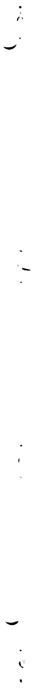
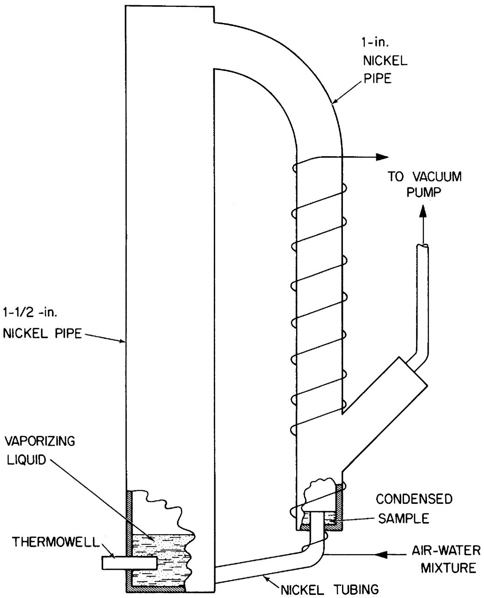
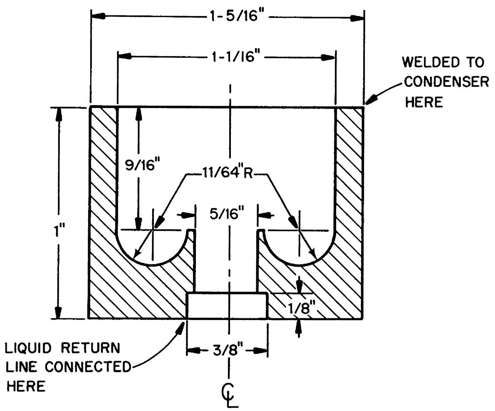
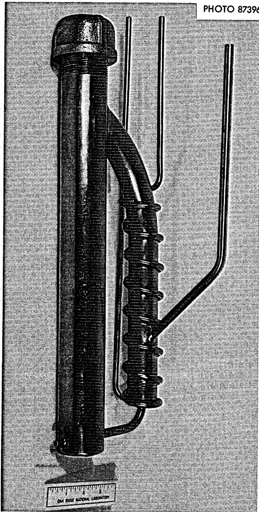
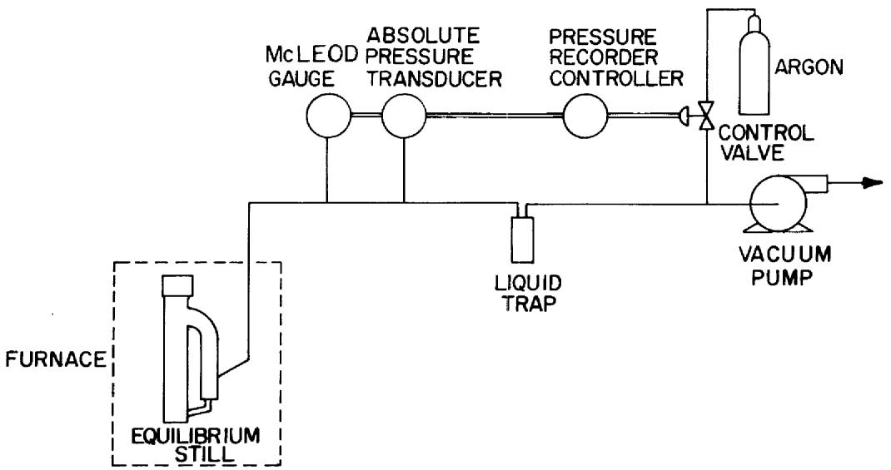
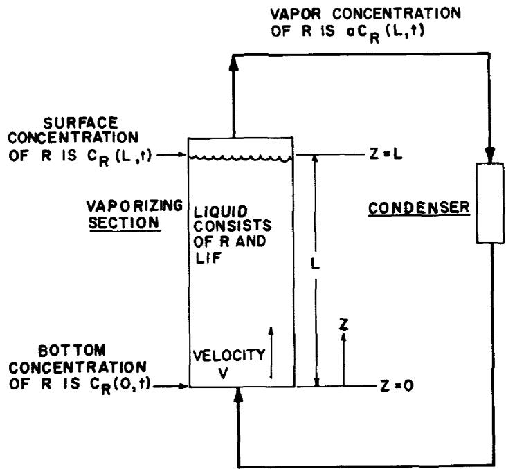
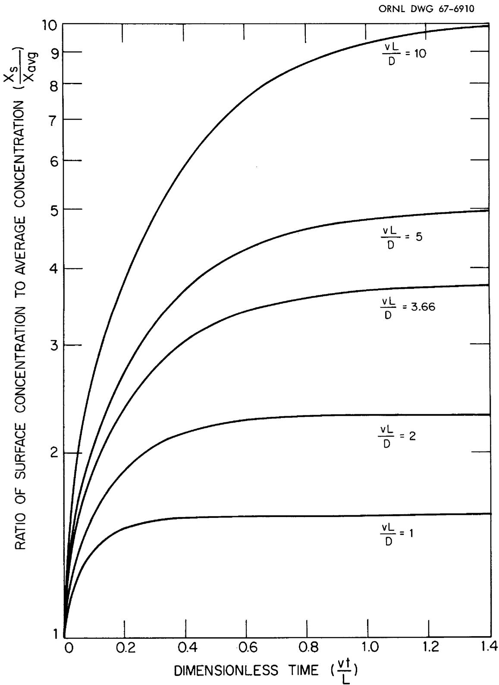
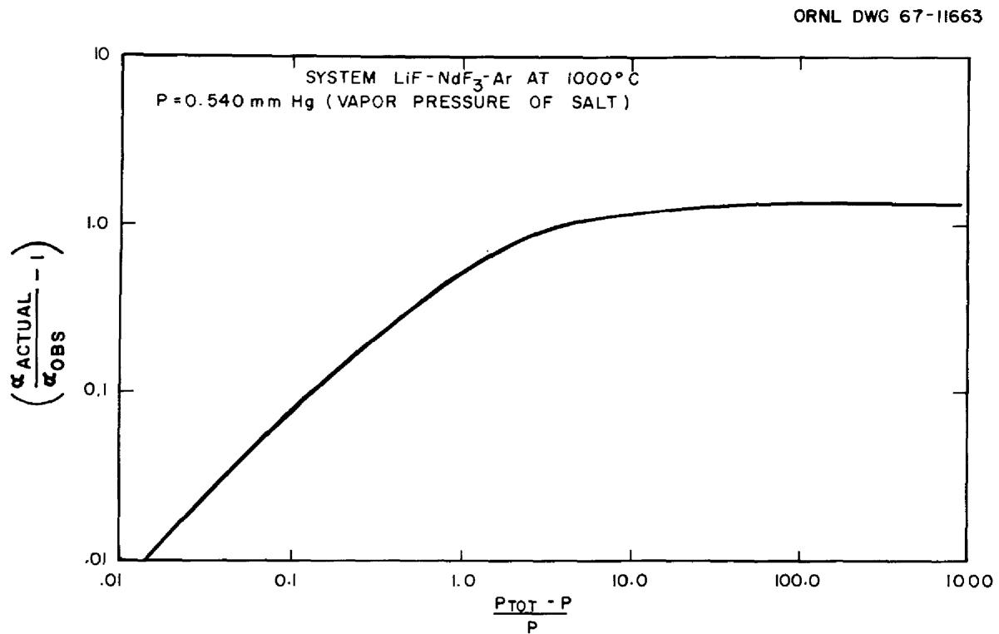
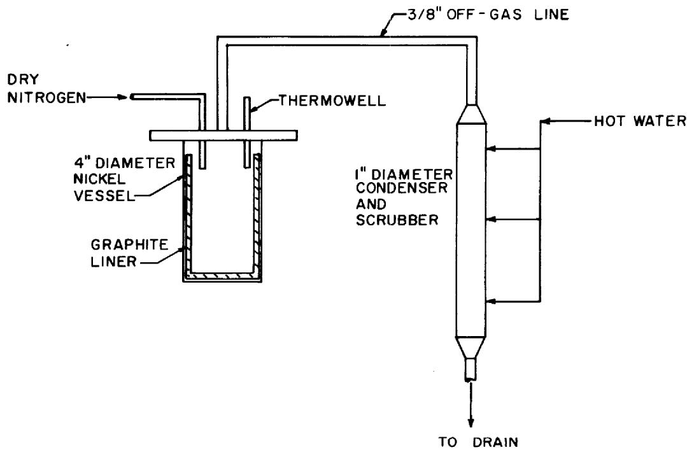

# OAK RIDGE NATIONAL LABORATORY

operated by

# UNION CARBIDE CORPORATION

NUCLEAR DIVISION

for the

U.S. ATOMIC ENERGY COMMISSION

ORNL-TM-2058

MEASUREMENT OF THE RELATIVE VOLATILITIES OF FLUORIDES

OF Ce, La, Pr, Nd, Sm, Eu, Ba, Sr, Y and Zr

IN MIXTURES OF LiF AND $\mathsf{BeF}_2$

J. R. Hightower, Jr.

L. E. McNeese

# LEGAL NOTICE

This report was prepared as an account of Government sponsored work. Neither the United States, nor the Commission, nor any person acting on behalf of the Commission:

A. Makes any warranty or representation, expressed or implied, with respect to the accuracy, completeness, or usefulness of the information contained in this report, or that the use of any information, apparatus, method, or process disclosed in this report may not infringe privately owned rights; or   
B. Assumes any liabilities with respect to the use of, or for damages resulting from the use of any information, apparatus, method, or process disclosed in this report.

As used in the above, "person acting on behalf of the Commission" includes any employee or contractor of the Commission, or employee of such contractor, to the extent that such employee or contractor of the Commission, or employee of such contractor prepares, disseminates, or provides access to, any information pursuant to his employment or contract with the Commission, or his employment with such contractor.

Contract No. W-7405-eng-26

CHEMICAL, TECHNOLOGY DIVISION

MEASUREMENT OF THE RELATIVE VOLATILITIES OF FLUORIDES OF Ce, La, Pr, Nd, Sm, Eu, Ba, Sr, Y AND Zr IN MIXTURES OF LiF AND BeF2

J. R. Hightower, Jr. L. E. McNeese

# LEGAL NOTICE

This report was prepared as an account of Government sponsored work. Neither the United States, nor the Commission, nor any person acting on behalf of the Commission:

A. Makes any warranty or representation, expressed or implied, with respect to the accuracy, completeness, or usefulness of the information contained in this report, or that the use of any information, apparatus, method, or process disclosed in this report may not infringe privately owned rights; or

B. Assumes any liabilities with respect to the use of, or for damages resulting from the use of any information, apparatus, method, or process disclosed in this report.

As used in the above, "person acting on behalf of the Commission" includes any employee or contractor of the Commission, or employee of such contractor, to the extent that such employee or contractor of the Commission, or employee of such contractor prepares, disseminates, or provides access to, any information pursuant to his employment or contract with the Commission, or his employment with such contractor.

JANUARY 1968

OAK RIDGE NATIONAL LABORATORY Oak Ridge, Tennessee operated by UNION CARBIDE CORPORATION for the U.S. ATOMIC ENERGY COMMISSION

# CONTENTS

# Page

# ABSTRACT 1

1. INTRODUCTION 1   
2. PREVIOUS STUDIES ON VAPORIZATION OF MOLTEN SALT MIXTURES . 2   
3. EXPERIMENTAL EQUIPMENT 3   
4. MATERIALS 8   
5. EXPERIMENTAL PROCEDURES 9   
6.DISCUSSION OF RESULTS 10   
7. ESTIMATION OF ERRORS IN RESULTS 12

7.1 Nonuniform Liquid Phase Concentration 15   
7.2 Diffusion of Vaporized Materials Between Vaporization and Condensation Surfaces 16   
7.3 Inaccuracies in Analyses of Salt Samples 16   
7.4 Holdup of Condensate in the Condenser 16

# 8. CONCLUSIONS 17

# REFERENCES 19

# APPENDIXES 20

Appendix A 21   
Appendix B 27   
Appendix C 35   
Appendix D 37   
Appendix E 40

MEASUREMENT OF THE RELATIVE VOLATILITIES OF FLUORIDES OF Ce, La, Pr, Nd, Sm, Eu, Ba, Sr, Y AND Zr IN MIXTURES OF LiF AND BeF2

J. R. Hightower, Jr.

L. E. McNeese

# ABSTRACT

One step in processing the fuel stream of a molten salt breeder reactor is removal of rare earth fission product fluorides from the LiF-BeF₂ carrier salt by low pressure distillation. For designing the distillation system we have measured relative volatilities of the fluorides of Ce, La, Pr, Nd, Sm, Eu, Ba, Sr, Y, and Zr with respect to LiF, the major component. The measurements were made using a recirculating equilibrium still operated at 1000°C and at pressures from 0.5 to 1.5 mm Hg. Errors from several sources were estimated and shown to be small.

# 1. INTRODUCTION

The molten-salt breeder reactor (MSBR) is a reactor concept having the possibilities of economic nuclear power production and simultaneous breeding of fissile material using the thorium-uranium fuel cycle. The reactor is fueled with a mixture of molten fluoride salts which circulate continuously through the reactor core where fission occurs and through a heat exchanger where most of the fission energy is removed. The reactor also uses a blanket of molten fluorides containing a fertile material (thorium) in order to increase the neutron economy of the system by the conversion of thorium to fissile uranium-233. A close-coupled processing facility for removal of fission products, corrosion products, and fissile materials from these fused fluoride mixtures will be an integral part of the reactor system.

During one step of a proposed method for processing the fuel stream, LiF and $\mathrm{BeF}_2$ are separated from less volatile fission

product fluorides by low pressure distillation. Important fission products having fluorides less volatile than LiF include Ba, Sr, Y, and rare earths which have significant fission yields. Design of distillation systems and evaluation of distillation as a processing step require data on the relative volatilities of the fluorides of these materials. The purpose of this report is to summarize the results of an experimental program designed to yield the needed relative volatility data.

# 2. PREVIOUS STUDIES ON VAPORIZATION OF MOLTEN SALT MIXTURES

Very little information has been reported on distillation of molten salts or on vapor-liquid equilibria involving fluorides of interest.

Singh, Ross, and Thoma² have shown vacuum distillation to be an effective method for removal of cationic impurities such as Na, Ca, Mg, and Mn from LiF on a small scale. The use of distillation for removal of rare earth fission products from MSBR fuel salt was suggested by Kelly³ on the basis of estimated vapor pressures of the rare earth fluorides. Kelly's experiments on batch distillation using salt similar to the fuel salt from the Molten Salt Reactor Experiment demonstrated that distillation was possible and yielded average relative volatilities of 0.05 and 0.02 for LaF₃ and SmF₃, respectively.

Relative volatility is a useful technique for representing vapor-liquid equilibrium data and the relative volatility of component A referred to component B, $\alpha_{\mathrm{AB}}$ , is defined as

$$
\alpha_ {\mathrm {A B}} \equiv \frac {\mathrm {y} _ {\mathrm {A}} / \mathrm {x} _ {\mathrm {A}}}{\mathrm {y} _ {\mathrm {B}} / \mathrm {x} _ {\mathrm {B}}}
$$

where $y_{A, B} =$ vapor phase mole fraction of components A and B respectively.

$\mathrm{x}_{\mathrm{A}}, \mathrm{B} =$ liquid phase mole fraction of components A and B respectively.

Scott4 measured relative volatilities of six rare earth trifluorides at temperatures from $900^{\circ}\mathrm{C}$ to $1050^{\circ}\mathrm{C}$ in a simple closed vessel with a cold surface in the vapor space on which a vapor sample condensed. His results showed that the average relative volatilities of the trivalent rare earth trifuronides in LiF varied from 0.01 and 0.05.

Cantor reported measurements made by the transpiration method which indicated relative volatilities for $\mathrm{LaF}_3$ of $1.4 \times 10^{-3}$ and $1.1 \times 10^{-3}$ at $1000^{\circ}\mathrm{C}$ and $1028^{\circ}\mathrm{C}$ , respectively.

# 3. EXPERIMENTAL EQUIPMENT

A diagram of the equilibrium still used in this study is shown in Fig. 3.1 The vaporizing section was a 16-in. length of 1 1/2-in. diam sched 40 nickel pipe. The condensing section was made from 1-in.-diam sched 40 nickel pipe wrapped with cooling coils of 1/4-in. nickel tubing. Condensate collected in a trap below the condenser and overflowed a weir before returning to the still pot. The condensate trap (diagrammed in Fig. 3.2) was designed to provide flow of condensate through all regions in order to collect a representative condensate sample. A vacuum pump was connected near the bottom of the condenser. A photograph of a typical still is shown in Fig. 3.3.

A diagram of the pressure control system is shown in Fig. 3.4. Pressure was measured at a point near the condenser in the line connecting the still and the pump. As there was little or no gas flow from the still, the measured pressure should have been equal to the condenser pressure. Pressure was controlled by varying an argon flow to the vacuum pump inlet which changed the pump inlet pressure. The pressure was sensed by a Taylor absolute transducer with a range of 0 to $6\mathrm{mmHg}$ abs. The signal from the transducer was fed to a

  
Fig. 3.1 Molten Salt Still Used for Relative Volatility Measurements.

ORNL DWG 67-6890

  
Fig. 3.2 Cross Section View of Condensate Trap Used in Molten Salt Equilibrium Still.

  
Fig. 3.3 Photograph of a Typical Molten Salt Equilibrium Still.

  
Fig. 3.4 Molten Salt Equilibrium Still Pressure Control.

Foxboro recorder-controller which in turn operated an air-driven control valve to vary the argon flow. The pressure at the measuring point was also read with a tilting McLeod gauge and with an ionization guage.

# 4. MATERIALS

The rare earths and yttrium were obtained from commercial sources as oxides with a minimum purity of $99.9\%$ and were converted to the trifluorides by fusion with ammonium bifluoride as described in appendix E. The LiF, $\mathrm{BaF_2}$ , $\mathrm{SrF_2}$ , and $\mathrm{ZrF_4}$ were commercial c.p. grade material. The source of $\mathrm{BeF_2}$ for these experiments was 2 LiF $\cdot$ $\mathrm{BeF_2}$ which was obtained from Reactor Chemistry Division's Molten Salt preparation facility. The most troublesome impurities in these chemicals were thought to be oxides or oxyfluorides. However, analyses indicated oxygen concentrations to be low, as shown in Table 4.1.

Table 4.1 Oxygen Analyses of Chemicals Used in Equilibrium Still Experiments   

<table><tr><td>Material</td><td>wt % O2</td></tr><tr><td>CeF3</td><td>0.05</td></tr><tr><td>NdF3</td><td>0.018</td></tr><tr><td>PrF3</td><td>&lt; 0.01</td></tr><tr><td>LaF3</td><td>&lt; 0.01</td></tr><tr><td>SmF3</td><td>0.05</td></tr><tr><td>EuF3</td><td>0.12</td></tr><tr><td>YF3</td><td>0.05</td></tr><tr><td>BaF2</td><td>0.31</td></tr><tr><td>SrF2</td><td>1.09</td></tr><tr><td>ZrF4</td><td>0.8</td></tr><tr><td>LiF</td><td>0.27</td></tr><tr><td>2 LiF · BeF2</td><td>0.46</td></tr></table>

# 5. EXPERIMENTAL PROCEDURES

The salt charge for an experiment was prepared by melting in a graphite-lined crucible sufficient quantities of LiF, 2 LiF-BeF $_2$ , and the fluorides of interest to yield a mixture having the desired composition and weighing 90 gms. The salt was blanketed with argon during all operations and after melting the mixture, it was sparged with argon for approximately 1/2 hr at $800^{\circ}$ to $850^{\circ}$ C. The mixture was then allowed to solidify and the resulting salt ingot was loaded into the still with little danger of transferring finely divided salt into the condensate trap which could result in substantial error in relative volatility. The threaded cap on the still was then backwelded to produce a leak-tight system, the condenser section of the still was insulated, and the still was suspended in the furnace. After leak-checking the system, it was repeatedly evacuated and brought to 1 atm pressure with argon in order to rid the system of oxygen. The pressure was set at that desired for the run, the furnace temperature was raised to $1000^{\circ}$ C, and the condenser temperature was set at the desired value. During runs with fluorides dissolved in LiF, the operating pressure was 0.5 mm Hg and the condenser outlet temperature was $855^{\circ}$ to $875^{\circ}$ C; during runs with the LiF-BeF $_2$ mixture, the pressure was 1.5 mm Hg and the condenser outlet temperature was $675^{\circ}$ to $700^{\circ}$ C.

An experiment was continued for approximately 30 hrs after which the system was cooled to room temperature and the still was cut open to remove the salt samples from the still pot and condensate trap. These samples were then analyzed for all components used in the experiment.

Since beryllium compounds are toxic when inhaled or ingested, special precautions were taken during runs using $\mathrm{BeF}_2$ to prevent exposure of operating personnel.

# 6. DISCUSSION OF RESULTS

Experimentally determined relative volatilities of six rare earth trifluorides, $\mathrm{YF}_3$ , $\mathrm{BaF}_2$ , $\mathrm{SrF}_2$ , $\mathrm{BeF}_2$ , and $\mathrm{ZrF}_4$ , with respect to LiF (measured at $1000^{\circ}\mathrm{C}$ and $1.5\mathrm{mmHg}$ in a ternary liquid having a molar ratio of LiF to $\mathrm{BeF}_2$ of approximately 8.5) are given in Table 6.1. The mole fraction of the component of interest varied from 0.01 to 0.05. It should be noted that the relative volatilities of the fluorides of the rare earths, Ba, Sr, and Y are lower than $2\times 10^{-4}$ with the exception of Pr and Eu which have relative volatilities of $1.9\times 10^{-3}$ and $1.1\times 10^{-3}$ , respectively. The relative volatility of $\mathrm{ZrF_4}$ was found to vary between .76 and 1.4 as the $\mathrm{ZrF_4}$ concentration was increased from 0.03 mole % to 1.0 mole %. The average relative volatility of $\mathrm{BeF}_2$ was found to be 4.73 which indicates that vapor having the MSBR fuel carrier salt composition (66 mole % Lif-34 mole % $\mathrm{BeF}_2$ ) will be in equilibrium with liquid having the composition 91.2 mole % LiF-9.8 mole % $\mathrm{BeF}_2$ .

Relative volatilities with respect to LiF are also given for five rare earth trifluorides in a binary mixture of rare earth fluoride and LiF. These measurements were made at $1000^{\circ}\mathrm{C}$ and $0.5\mathrm{mmHg}$ using mixtures having rare earth fluoride concentrations of 2 to 5 mole%. Except for $\mathrm{PrF_3}$ the relative volatilities for the rare earth fluorides are slightly lower where $\mathrm{BeF_2}$ is present.

It is interesting to compare the measured relative volatilities to values predicted via Raoult's Law where the pertinent data are available. For mixtures which obey Raoult's Law (ideal solutions), the relative volatility of component A with respect to component B is equal to the ratio of the vapor pressure of component A to that of component B. Relative volatilities were calculated for fluorides for which sublimation pressure data are available and are compared with experimentally determined values in Table 6.2. The ideal relative volatilities were calculated using sublimation pressures of the rare earth fluorides at $1000^{\circ}\mathrm{C}$ . The deviation between measured and predicted relative volatilities is within the probable error in

Table 6.1 Relative Volatilities of Rare Earth Trifluorides, $\mathbf{Y}\mathbf{F}_3$ , $\mathbf{BaF}_2$ , $\mathbf{ZrF}_4$ , and $\mathbf{BeF}_2$ at $1000^{\circ}\mathbf{C}$ with Respect to LiF   

<table><tr><td>Compound</td><td>Relative Volatility in LiF-BeF2-REF Mixturea</td><td>Relative Volatility in LiF-REF Mixtureb</td></tr><tr><td>CeF3</td><td>1.8 x 10-4</td><td>4.2 x 10-4</td></tr><tr><td>LaF3</td><td>1.4 x 10-4e</td><td>3 x 10-4</td></tr><tr><td>NdF3</td><td>1.4 x 10-4</td><td>6 x 10-4</td></tr><tr><td>PrF3</td><td>1.9 x 10-3</td><td>6.3 x 10-4</td></tr><tr><td>SmF3</td><td>8.4 x 10-5</td><td>4.5 x 10-4</td></tr><tr><td>EuF3</td><td>1.1 x 10-3</td><td>---</td></tr><tr><td>YF3</td><td>3.4 x 10-5e</td><td>---</td></tr><tr><td>BaF2</td><td>1.1 x 10-4</td><td>---</td></tr><tr><td>SrF2</td><td>5.0 x 10-5</td><td>---</td></tr><tr><td>ZrF4</td><td>1.4, 0.76c</td><td>---</td></tr><tr><td>BeF2</td><td>4.73d</td><td>---</td></tr></table>

Pressure was 1.5 mm Hg; liq. composition was ~85-10-5 mole % LiF-BeF2-REF.   
Pressure was 0.5 mm Hg; liq. composition was ~95-5 mole % LiF-REF.   
cTwo widely different liquid compositions used. See Table 6.3.   
dAverage of 18 values.   
One value from two experiments reported; other value was questionable.

Table 6.2 Measured and Predicted Relative Volatilities with Respect to LiF at $1000^{\circ}\mathrm{C}$   

<table><tr><td rowspan="2">Component</td><td colspan="3">Measured Value</td></tr><tr><td>Binary Systema</td><td>Ternary Systemb</td><td>Predicted Value</td></tr><tr><td>NdF3</td><td>6 x 10-4</td><td>1.4 x 10-4</td><td>3 x 10-4</td></tr><tr><td>CeF3</td><td>4.2 x 10-4</td><td>3.3 x 10-4</td><td>2.5 x 10-4</td></tr><tr><td>LaF3</td><td>3 x 10-4</td><td>1.4 x 10-4</td><td>0.41 x 10-4</td></tr><tr><td>YF3</td><td>---</td><td>0.33 x 10-4</td><td>0.59 x 10-4</td></tr><tr><td>BaF2</td><td>---</td><td>1.1 x 10-4</td><td>1.6 x 10-4</td></tr><tr><td>SrF2</td><td>---</td><td>0.5 x 10-4</td><td>0.07 x 10-4</td></tr></table>

a3-5 mole % of component shown in LiF.   
b3-5 mole % of component shown in mixture of 8.5 moles LiF per mole BeF2.

measurements of the sublimation pressures and the relative volatilities for fluorides of Ba, Y, and the rare earths. The somewhat larger discrepancy for strontium is unexplained.

Table 6.3 and 6.4 summarize all the experiments. Numbers in the "Material Balance" columns of Table 6.3 give an indication of the consistency of each analysis. Since the concentration of each material was determined independently in these experiments, a large deviation of these numbers from unity indicates a poor analysis. Not all concentrations were determined in the experiments listed in Table 6.4; hence, there is no "Material Balance" column.

# 7. ESTIMATION OF ERRORS IN RESULTS

The recirculating still used for measurement of relative volatilities operated under conditions such that the composition of the condensate collected below the condenser was not necessarily that of vapor in equilibrium with the bulk of the liquid in the

Table 6.3 Summary of Experiments with Ternary Salt Systems   

<table><tr><td rowspan="2">Run No.</td><td colspan="3">Mole Fraction in Liquid</td><td rowspan="2">Material Balance</td><td rowspan="2">LiF</td><td colspan="2">Mole Fraction in Vapor</td><td rowspan="2">Material Balance</td><td rowspan="2">Relative Volatility of 3rd Component</td><td rowspan="2">Relative Volatility of BeF2</td><td rowspan="2">Remarks</td></tr><tr><td>LiF</td><td>BeF2</td><td>3rd Component</td><td>BeF2</td><td>3rd Component</td></tr><tr><td>Be-1SM-1</td><td>0.848</td><td>0.103</td><td>SmF3: 0.049</td><td>All analyses were not independent</td><td>0.669</td><td>0.330</td><td>Contaminated sample</td><td>Not applicable</td><td></td><td>4.05</td><td></td></tr><tr><td>Be-25M-2</td><td>0.846</td><td>0.104</td><td>SmF3: 0.05</td><td>0.962</td><td>0.653</td><td>0.347</td><td>4.65 x 10-6</td><td>0.948</td><td>1.2 x 10-4</td><td>4.32</td><td></td></tr><tr><td>Be-1Zr-3</td><td>0.893</td><td>0.097</td><td>ZrF4: 0.0096</td><td>0.970</td><td>0.667</td><td>0.323</td><td>0.010</td><td>0.999</td><td>1.4</td><td>4.46</td><td></td></tr><tr><td>Be-1Nd-4</td><td>0.840</td><td>0.101</td><td>NdF3: 0.060</td><td>0.933</td><td>0.636</td><td>0.364</td><td>2.51 x 10-6</td><td>0.922</td><td>6.14 x 10-5</td><td>4.76</td><td></td></tr><tr><td>Be-2Nd-5</td><td>0.849</td><td>0.098</td><td>NdF3: 0.053</td><td>0.968</td><td>0.624</td><td>0.376</td><td>7.8 x 10-7</td><td>0.900</td><td>2.09 x 10-5</td><td>5.22</td><td></td></tr><tr><td>Be-1Pr-6</td><td>0.836</td><td>0.110</td><td>PrF3: 0.056</td><td>1.00</td><td>0.651</td><td>0.349</td><td>9.59 x 10-5</td><td>0.985</td><td>2.46 x 10-3</td><td>4.07</td><td></td></tr><tr><td>Be-2Pr-7</td><td>0.842</td><td>0.1047</td><td>PrF3: 0.055</td><td>0.985</td><td>0.625</td><td>0.375</td><td>5.26 x 10-5</td><td>0.912</td><td>1.30 x 10-3</td><td>4.81</td><td></td></tr><tr><td>Be-1La-8</td><td>0.802</td><td>0.102</td><td>LaF3: 0.096</td><td>0.967</td><td>0.605</td><td>0.395</td><td>1.03 x 10-4</td><td>0.980</td><td>1.42 x 10-3</td><td>5.14</td><td></td></tr><tr><td>Be-2Zr-9</td><td>0.878</td><td>0.120</td><td>ZrF4: 0.0003</td><td>1.060</td><td>0.602</td><td>0.396</td><td>1.6 x 10-4</td><td>0.959</td><td>0.763</td><td>4.80</td><td></td></tr><tr><td>Be-1Cc-10</td><td>0.836</td><td>0.112</td><td>CeF3: 0.053</td><td>1.001</td><td>0.609</td><td>0.392</td><td>1.2 x 10-6</td><td>1.019</td><td>3.11 x 10-5</td><td>4.81</td><td></td></tr><tr><td>Be-2La-11</td><td>0.845</td><td>0.1055</td><td>LaF3: 0.051</td><td>1.066</td><td>0.625</td><td>0.375</td><td>5.1 x 10-6</td><td>0.942</td><td>1.36 x 10-4</td><td>4.90</td><td></td></tr><tr><td>Be-2Ce-12</td><td>0.843</td><td>0.107</td><td>CeF3: 0.051</td><td>1.036</td><td>0.625</td><td>0.375</td><td>1.26 x 10-5</td><td>0.961</td><td>3.33 x 10-4</td><td>4.71</td><td></td></tr><tr><td>Be-1Y-13</td><td>0.865</td><td>0.1002</td><td>YF3: 0.0357</td><td>0.957</td><td>0.643</td><td>0.357</td><td>9.1 x 10-7</td><td>0.967</td><td>3.43 x 10-5</td><td>4.80</td><td></td></tr><tr><td>Be-2Y-14</td><td>0.865</td><td>0.105</td><td>YF3: 0.0298</td><td>0.963</td><td>0.602</td><td>0.398</td><td>4.51 x 10-6</td><td>1.004</td><td>2.18 x 10-4</td><td>5.44</td><td>Trouble during run; results questionable</td></tr><tr><td>Be-1U-15</td><td>0.892</td><td>0.0991</td><td>UF4: 0.010</td><td>1.04</td><td>0.663</td><td>0.337</td><td>2.01 x 10-4</td><td>1.04</td><td>2.59 x 10-2</td><td>4.58</td><td></td></tr><tr><td>Be-1Eu-16</td><td>0.862</td><td>0.0884</td><td>EuF3: 0.050</td><td>1.011</td><td>0.654</td><td>0.347</td><td>4.33 x 10-5</td><td>1.012</td><td>1.14 x 10-3</td><td>5.18</td><td>Questionable</td></tr><tr><td>Be-2Eu-17</td><td>0.870</td><td>0.100</td><td>EuF3: 0.029</td><td>1.001</td><td>0.625</td><td>0.378</td><td>1.61 x 10-3</td><td>1.06</td><td>7.7 x 10-2</td><td>5.26</td><td>Questionable</td></tr><tr><td>Be-3Eu-18</td><td>0.896</td><td>0.0774</td><td>EuF3: 0.026</td><td>1.05</td><td>0.632</td><td>0.368</td><td>1.25 x 10-4</td><td>1.07</td><td>6.8 x 10-3</td><td>6.74</td><td>Questionable</td></tr><tr><td>Be-1BaSr-19</td><td>0.814</td><td>0.156</td><td>BaF2: 0.014</td><td>1.052</td><td>0.699</td><td>0.301</td><td>BaF2: 2.3 x 10-6</td><td>1.012</td><td>BaF2: 2 x 10-4</td><td>2.24</td><td>Difficultly with Analyses; results questionable</td></tr><tr><td></td><td></td><td></td><td>SrF2: 0.016</td><td></td><td></td><td></td><td>SrF2: 1.46 x 10-6</td><td></td><td>SrF2: 1.1 x 10-4</td><td></td><td></td></tr><tr><td>Be-1YL1a-20</td><td>0.830</td><td>0.1086</td><td>YF3: 0.030</td><td>0.990</td><td>0.649</td><td>0.351</td><td>YF3: 7.3 x 10-6</td><td>1.011</td><td>YF3: 3.17 x 10-5</td><td>4.05</td><td></td></tr><tr><td></td><td></td><td></td><td>LaF3: 0.033</td><td></td><td></td><td></td><td>LaF3: &lt; 1.7 x 10-5</td><td></td><td>LaF3: &lt; 1.85 x 10-4</td><td></td><td></td></tr><tr><td>Be-35m-21</td><td>0.870</td><td>0.086</td><td>SmF3: 0.044</td><td>1.066</td><td>0.646</td><td>0.354</td><td>1.55 x 10-6</td><td>1.006</td><td>4.7 x 10-5</td><td>5.57</td><td></td></tr><tr><td>Be-2BaSr-22</td><td>0.883</td><td>0.096</td><td>BaF2: 0.0103</td><td>1.012</td><td>0.702</td><td>0.298</td><td>BaF2: 9.33 x 10-7</td><td>0.981</td><td>BaF2: 1.14 x 10-4</td><td>3.89</td><td></td></tr><tr><td></td><td></td><td></td><td>SrF2: 0.0093</td><td></td><td></td><td></td><td>SrF2: 3.66 x 10-7</td><td></td><td>SrF2: 5.0 x 10-5</td><td></td><td></td></tr></table>

Table 6.4 Summary of Experiments With Binary Salt Systems   

<table><tr><td>Run</td><td>Rare Earth Fluoride</td><td>Mole Percent in Still Pot (%)</td><td>Mole Percent in Condensate (%)</td><td>Relative Volatility With Respect To LiF</td></tr><tr><td>MSES-3-2</td><td>CeF3</td><td>0.82</td><td>0.037</td><td>0.045</td></tr><tr><td>MSES-3-3</td><td>CeF3</td><td>0.90</td><td>0.13</td><td>0.14</td></tr><tr><td>MSES-3-4</td><td>CeF3</td><td>1.07</td><td>0.0093</td><td>0.0087</td></tr><tr><td>MSES-3-5</td><td>CeF3</td><td>0.90</td><td>0.019</td><td>0.021</td></tr><tr><td>MSES-3-7</td><td>CeF3</td><td>1.05</td><td>&lt; 0.0018</td><td>&lt; 0.0017</td></tr><tr><td>MSES-3-7</td><td>NdF3</td><td>0.62</td><td>0.0009</td><td>0.00014</td></tr><tr><td>MSES-3-8</td><td>CeF3</td><td>0.98</td><td>0.0030</td><td>0.0030</td></tr><tr><td>MSES-3-9</td><td>CeF3</td><td>2.01</td><td>&lt; 0.0018</td><td>&lt; 0.00084</td></tr><tr><td>MSES-3-9</td><td>LaF3</td><td>1.87</td><td>0.0003</td><td>0.00017</td></tr><tr><td>MSES-3-9</td><td>NdF3</td><td>2.00</td><td>&lt; 0.0009</td><td>&lt; 0.00042</td></tr><tr><td>MSES-4-1</td><td>LaF3</td><td>2.02</td><td>0.0006</td><td>0.00028</td></tr><tr><td>MSES-4-1</td><td>NdF3</td><td>2.05</td><td>&lt; 0.0018</td><td>&lt; 0.00084</td></tr><tr><td>MSES-4-2</td><td>LaF3</td><td>2.04</td><td>0.0019</td><td>0.00089</td></tr><tr><td>MSES-4-2</td><td>NdF3</td><td>2.01</td><td>0.0018</td><td>0.00086</td></tr><tr><td>MSES-4-4</td><td>SmF3</td><td>4.72</td><td>0.0087</td><td>0.0018</td></tr><tr><td>MSES-4-5</td><td>NdF3</td><td>5.77</td><td>0.0036</td><td>0.00059</td></tr><tr><td>MSES-4-6</td><td>SmF3</td><td>5.04</td><td>0.0012</td><td>0.00023</td></tr><tr><td>MSES-4-7</td><td>SmF3</td><td>4.88</td><td>0.0035</td><td>0.00068</td></tr><tr><td>MSES-4-8</td><td>PrF3</td><td>5.54</td><td>0.0037</td><td>0.00063</td></tr><tr><td>MSES-4-9</td><td>CeF3</td><td>5.74</td><td>0.0026</td><td>0.00043</td></tr><tr><td>MSES-5-1</td><td>PrF3</td><td>5.52</td><td>&lt; 0.00092</td><td>&lt; 0.00016</td></tr></table>

vaporizing section. Factors which could cause error in the relative volatilities include (1) a nonuniform concentration in the liquid in the still pot, (2) unequal rates of diffusion of vaporized materials between the vaporization and condensation surfaces, (3) holdup of condensate on the walls of the condenser and the random manner in which condensate flowed into the condensate trap, and (4) inaccuracies in chemical analyses of the salt samples. Errors arising from these factors will be discussed and estimates of the order of magnitude of the error will be made.

# 7.1 Nonuniform Liquid Phase Concentration

As LiF and $\mathrm{BeF_2}$ vaporize from the salt surface in the still pot, materials less volatile than LiF and $\mathrm{BeF_2}$ tend to remain in the vicinity of the vaporization surface and the surface concentration of these materials will be greater than their average concentration in the still pot. Under these conditions, the vapor phase concentration of a material of low volatility will be greater than the concentration in equilibrium with the bulk of the salt. Since surface concentrations are difficult to measure (segregation occurs when the salt freezes), the average concentration in the still pot is used in calculating the relative volatility; the relative volatility thus calculated will be in error by a factor equal to the ratio of the surface concentration to the average concentration for the material considered. A relation was derived for the variation in concentration of materials of low volatility (Appendix A) in the still pot in order to estimate the order of magnitude of the error arising from this effect.

It was concluded that the measured relative volatilities are in error by no more than a factor of 5 as a result of a nonuniform liquid concentration and that the likely error is a factor of 2 or less.

# 7.2 Diffusion of Vaporized Materials Between Vaporization and Condensation Surfaces

The still used in the study was operated at a pressure near the vapor pressure of the salt so that the recirculation rate (equal to the vaporization rate) was set by the rate at which salt vapor diffused through stationary argon in the passage between the vaporization and condensation surfaces. An error in the measured relative volatilities could arise because of differences in the rates of diffusion of LiF vapor and the vapor of the material being considered. The general case of two gases diffusing through a third stationary component was solved (Appendix B) and conditions were noted under which no error would occur in relative volatility from this effect. The contribution to error in measured relative volatilities was shown to be approximately $1\%$ for typical operating conditions.

# 7.3 Inaccuracies in Analyses of Salt Samples

Analyses for LiF in the salt samples had a reported precision of $\pm 3\%$ and analyses for other materials in the samples had a reported precision of $\pm 15\%$ . The maximum error in relative volatilities due to inaccuracies in analyses were shown (Appendix C) to be $36\%$ .

# 7.4 Holdup of Condensate in the Condenser

The combination of differential condensation and irregular condensate drainage in the condenser is another source of error in the measured relative volatilities. Condensation of the vapor is not instantaneous and since the components of the vapor have different vapor pressures, materials of low volatility (such as rare earth fluorides) tend to condense near the top of the condenser, LiF tends to condense farther down the condenser, and is followed by $\mathrm{BeF}_2$ . If condensate does not drain from the condenser at a rate equal to

the condensation rate, the composition of material entering the condensate trap will not be that of the condensing vapor. If the drainage of condensate from the top of the condenser is irregular, the concentration of materials of low volatility in the stream entering the condensate trap will fall below the concentration in the vapor during the time that this material is held up and will rise above the average value in the vapor when drainage is faster than the condensation rate at the top of the condenser. The concentration of materials of low volatility in the condensate trap will thus depend on when the still is sampled and the concentration can be greater or less than that in the vapor.

Several factors tend to minimize the differences between the composition of material in the condensate trap and the initial vapor composition. Two of these are (1) the condensate trap has a finite volume, which tends to average out variations in inlet concentration, and (2) inherent variations in condenser temperature alter the location where the major components condense, which promotes drainage of materials of low volatility from the condenser.

Observed holdup of condensate near the top of the condenser has been of the order of $0.5 - 1.0\mathrm{g}$ and the rare earth fluoride concentration in this material was higher than the concentration in the condensate trap by a factor of 10. An estimate of the maximum error due to this effect is made in Appendix D where it is shown that the observed relative volatility is within a factor of 2 of the actual relative volatility.

# 8. CONCLUSIONS

Relative volatilities of six rare earth fluorides, $\mathrm{YF}_3$ , $\mathrm{BaF}_2$ , $\mathrm{SrF}_2$ , $\mathrm{ZrF}_4$ , and $\mathrm{BeF}_2$ have been measured with respect to LiF at $1000^{\circ}\mathrm{C}$ . These values are such that the rare earth trifluorides (except $\mathrm{EuF}_3$ possibly), $\mathrm{YF}_3$ , $\mathrm{BaF}_2$ , and $\mathrm{SrF}_2$ can be removed adequately in a still of simple design with no rectification. Zirconium will not be removed by the still.

Estimates of the errors incurred in measuring the relative volatilities show that the measured numbers are probably within a factor of 5 of the true equilibrium values.

# REFERENCES

1. Kasten, P. R., et al., Design Studies of 1000-Mw(e) Molten-Salt Breeder Reactors, USAEC Report ORNL-3996, Oak Ridge National Laboratory, August 1966.   
2. Singh, A. J. et al., "Vacuum Distillation of LiF," J. Appl. Phys. 36, 1367 (1965).   
3. Kelly, M. J., "Recovery of Carrier Salt by Distillation," Reactor Chemistry Division Annual Progress Report, USAEC Report ORNL-3789, Oak Ridge National Laboratory, Jan. 31, 1965, p. 86.   
4. Ferguson, D. E., Chemical Technology Division Annual Progress Report, USAEC Report ORNL-3830, Oak Ridge National Laboratory, May 31, 1965.   
5. Cantor, S., MSRP Semiannual Progress Report, USAEC Report ORNL-4037, Oak Ridge National Laboratory, August 31, 1966, p. 140.   
6. Kent, R. A., et al., Sublimation Pressures of Refractory Fluorides NASA Report NASA-CR-77001, 1966.   
7. R. B. Bird, W. E. Stewart, E. N. Lightfoot, Transport Phenomena, 1st ed., John Wilery and Sons, New York, p. 502 (1960).   
8. Rosenthal, M. W., et al., MSRP Semiannual Progress Report, USAEC Report ORNL-4119, Oak Ridge National Laboratory, February 28, 1967, p. 206.   
9. R. B. Bird, W. E. Stewart, E. N. Lightfoot, Transport Phenomena, 1st ed., John Wiley and Sons, New York, New York, p. 560 (1960).

APPENDIXES

# APPENDIX A

# Nonuniform Liquid Phase Concentration

Consider the equilibrium still shown in Fig. A.l, which is to be used for measuring the relative volatility of material R with respect to LiF. A dilute mixture of component R in LiF recirculates with velocity V in this still because of vaporization and condensation of salt vapor. In the model to be used, vapor leaves at the top of the still, is condensed and returns instantaneously to the bottom of the still. The initial concentration of material R in the liquid is uniform. The concentration of material R at any time t and at any level Z in the still pot is determined by the relation

$$
\frac {\partial C _ {R}}{\partial t} = - \frac {\partial N _ {R Z}}{\partial Z} \tag {A.1}
$$

where

$$
C _ {R} = \text {m o l a r c o n c e n t r a t i o n o f m a t e r i a l R}
$$

$$
N _ {R Z} = \text {m o l a r f l u x o f m a t e r i a l R i n Z d i r e c t i o n}.
$$

The flux of material R, $\mathbf{N}_{\mathbb{R}\mathbb{Z}}$ is related to the concentration of material R by the following:

$$
\mathrm {N} _ {\mathrm {R Z}} = \mathrm {X} _ {\mathrm {R}} \left(\mathrm {N} _ {\mathrm {R Z}} + \mathrm {N} _ {\mathrm {L Z}}\right) - \rho \mathrm {D} \frac {\partial \mathrm {X} _ {\mathrm {R}}}{\partial \mathrm {Z}} \tag {A.2}
$$

where

$$
\mathrm {N} _ {\mathrm {L Z}} = \text {m o l a r f l u x o f L i F i n t h e Z d i r e c t i o n},
$$

$$
\mathrm {X} _ {\mathrm {R}} = \text {m o l e f r a c t i o n o f m a t e r i a l R},
$$

$$
\rho = \text {m o l a r d e n s i t y}
$$

$$
D = \text {e f f e c t i v e}
$$

Eq. (A.2) is true only for a binary mixture of R and LiF, although this equation will also be used for estimating errors when three

ORNL DWG 67-6911-RI

  
Fig. A.l Schematic Diagram of a Recirculating Equilibrium Still.

components (LiF, $\mathrm{BeF}_2$ and material R) are present in the still. In this case $\mathbf{N}_{\mathbb{L}\mathbb{Z}}$ will represent the combined flux of LiF and $\mathrm{BeF}_2$ . The error in relative volatility in the ternary system should not differ greatly from that in the binary system.

By substituting Eq. (A.2) into Eq. (A.1) and dividing by $\rho$ , the molar density (assumed to be constant), yields

$$
\frac {\partial X _ {R}}{\partial t} = - V \frac {\partial X _ {R}}{\partial Z} + D \frac {\partial^ {2} X _ {R}}{\partial Z ^ {2}} \tag {A.3}
$$

where

$$
V = \frac {N _ {R Z} + N _ {L Z}}{\rho} = l i q u i d v e l o c i t y i n t h e s t i l l p o t.
$$

Equation (A.3) must be solved with the following boundary conditions:

$$
\left. \begin{array}{l} t = 0: \quad X _ {R} (Z, 0) = X _ {i} \text {c o n s t a n t i n i t i a l c o m p o s i t i o n ,} \\ Z = 0: \quad \frac {\partial X _ {R}}{\partial Z} | _ {Z = 0} = \frac {V}{D} [ X _ {R} (0, t) - \alpha X _ {R} (L, t) ] \\ Z = L: \quad \frac {\partial X _ {R}}{\partial Z} | _ {Z = 1} = \frac {V}{D} (1 - \alpha) X _ {R} (L, t) \end{array} \right\} \tag {A.4}
$$

where $\alpha =$ relative volatility of material R with respect to LiF. The following approximation, valid for small $\alpha$ and small $X_{R}$ , will be used:

$$
\alpha_ {R - L} \stackrel {\sim} {=} Y _ {R} / X _ {R}. \tag {A.5}
$$

Eq. (A.3) and boundary conditions (A.4) can be put in a more convenient form for solution by introducing the following dimensionless variables:

$$
\sigma = \frac {X _ {R} - X _ {i}}{X _ {i}},
$$

$$
\Theta = \frac {\mathrm {V t}}{\mathrm {L}},
$$

$$
\mathrm {P e} = \frac {\mathrm {V L}}{\mathrm {D}}.
$$

With these substitutions Eqs. (A.3) and (A.4) become

$$
\frac {\partial \sigma}{\partial \theta} = \frac {1}{P e} \frac {\partial^ {2} \sigma}{\partial \xi^ {2}} - \frac {\partial \sigma}{\partial \xi} \tag {A.6}
$$

$$
\Theta = 0: \quad \sigma (\xi , 0) = 0
$$

$$
\xi = 0: \left. \frac {\partial \sigma}{\partial \xi} \right| _ {\xi = 0} = \operatorname {P e} [ \sigma (0, \theta) - \alpha (\mathbf {1}, \theta) + (1 - \alpha) ] \tag {A.7}
$$

$$
\xi = 1: \left. \frac {\partial \sigma}{\partial \xi} \right| _ {\xi = 1} = \operatorname {P e} (1 - \alpha) [ \sigma (1, \Theta) + 1 ]
$$

By taking the Laplace transform of Eqs. (A.5) and (A.7) with respect to $\Theta$ and solving the resulting ordinary differential equation, the Laplace transform of the variation of surface concentration with time can be obtained. The transform is very complicated but can be inverted numerically to yield accurate values for the surface concentration of material R as a function of time. Since vapor removed at the top of the still is instantly fed back to the bottom of the still, the average concentration of rare earth fluoride in the still is $X_{i}$ at any time.

Using the approximation in Eq. (A.5) we define the observed relative as

$$
\alpha_ {\text {o b s}} = \mathrm {Y} _ {\mathrm {R}} / \mathrm {X} _ {\mathrm {i}} \tag {A.8}
$$

where $\mathbf{Y}_{\mathbb{R}}$ is the vapor phase mole fraction of R and $\mathbf{X_{i}}$ is the average liquid concentration of R; this is the quantity measured in experiments. The actual relative volatility is given by

$$
\alpha_ {\text {a c t u a l}} = \mathrm {Y} _ {\mathrm {R}} / \mathrm {X} _ {\mathrm {R} (\mathrm {L}, \mathrm {t})} = \mathrm {Y} _ {\mathrm {R}} / \mathrm {X} _ {\mathrm {i}} [ \sigma (1, \theta) + 1 ]. \tag {A.9}
$$

and the ratio of observed relative volatility to actual volatility is therefore

$$
\frac {\alpha_ {\text {o b s}}}{\alpha_ {\text {a c t u a l}}} = \frac {\mathrm {X} _ {\mathrm {R}} (\mathrm {L} , \mathrm {t})}{\mathrm {X} _ {\mathrm {i}}} = \sigma (1, \Theta) + 1. \tag {A.10}
$$

Variation of the ratio of the observed relative volatility to the actual relative volatility is shown in Fig. A.2 as a function of dimensionless time, $\mathrm{Vt} / \mathrm{L}$ , for several values of the dimensionless group VL/D.

In other studies, Hightower has shown the vaporization rate in the still to be approximately $3.3 \times 10^{-5} \, \text{g/cm}^2 \cdot \text{sec}$ . The density of LiF at $1000^\circ \text{C}$ is $1.7 \, \text{g/cm}^3$ . The effective diffusivity of a typical fluoride in molten LiF in the still is not known accurately because of natural convection in the still pot, but probably has a value between $10^{-5}$ and $10^{-4} \, \text{cm}^2/\text{sec}$ . Since the liquid depth in the still pot was approximately $2.5 \, \text{cm}$ for most runs, the group VL/D varies between 0.5 and 5.0.

The usual operating time for the still was 30 hrs which yields a value of Vt/L of 0.83. Thus, the measured relative volatilities are in error by no more than a factor of 5 as a result of a nonuniform liquid concentration and the likely error is a factor of 2 or less.

  
Fig. A.2 Buildup of Surface Concentration of a Slightly Volatile Solute in a Recirculating Equilibrium Still with a Uniform Initial Concentration (Valid for $\alpha < 2 \times 10^{-3}$ ).

# APPENDIX B

# Simultaneous Diffusion of Two Gases Through a Stationary Gas

It has been shown that under the operating conditions of the equilibrium still the vaporization rate is controlled by the rate of diffusion of LiF through stationary argon in the passage between the vaporization and condensation surfaces. In a system containing both LiF and a second volatile fluoride, the condensate composition will be influenced by the relative rates of diffusion of LiF and the second fluoride through stationary argon. For this reason, it is of interest to determine the conditions under which relative volatilities measured by this method represent equilibrium data and to assess the contribution to error in measured relative volatilities which can be ascribed to this effect.

Consider the simultaneous diffusion of gases 1 and 2 through a third stationary gas 3. From the equation of continuity of 1, 2, and 3

$$
\rho \left[ \frac {\partial \omega_ {i}}{\partial t} + v \cdot \omega_ {i} \right] = - \nabla \cdot j _ {i}, i = 1, 2, 3 \tag {B.1}
$$

where

$$
\begin{array}{l} \rho = \text {d e n s i t y} \\ \omega_ {i} = \text {m a s s f r a c t i o n o f c o m p o n e n t} i, \\ t = t i m e \\ \rightarrow \\ v = \text {l o c a l m a s s - a v e r a g e f l u i d v e l o c i t y}, \\ \rightarrow \quad \rightarrow \\ \end{array}
$$

If the mixture of gases is ideal,

$$
\vec {j} _ {i} = \frac {\mathrm {C} ^ {2}}{\rho} \sum_ {j = 1} ^ {3} \mathrm {M} _ {i} \mathrm {M} _ {j} \mathrm {D} _ {i j} \stackrel {\rightarrow} {\nabla} \mathrm {x} _ {j}, i = 1, 2, 3 \tag {B.2}
$$

where

$$
\vec {j} _ {i} = \text {m a s s f l u x o f i r e l a t i v e t o t h e m a s s - a v e r a g e v e l o c i t y},
$$

$$
C = \text {m o l a r}
$$

$$
\rho = \text {d e n s i t y}
$$

$$
M _ {i} = \text {d i f f u s i v i t y o f t h e p a i r i - j i n t h e m u l t i c o m p o n e n t m i x u t r e},
$$

$$
x _ {j} = \text {m o l e f r a c t i o n o f c o m p o n e n t j i n t h e g a s m i t r u e}.
$$

Equation (B.2) has been rearranged by Curtiss and Hirshfelder to yield

$$
\vec {\nabla} \mathbf {x} _ {i} = \sum_ {j = 1} ^ {3} \frac {1}{C D _ {i j}} \left(\mathbf {x} _ {i} \vec {N} _ {j} - \mathbf {x} _ {j} \vec {N} _ {i}\right) \tag {B.3}
$$

which can be written as

$$
\vec {\nabla} \mathrm {c} _ {\mathrm {i}} = \sum_ {\mathrm {j} = 1} ^ {3} \frac {1}{C D _ {\mathrm {i j}}} \left(\mathrm {c} _ {\mathrm {i}} \vec {\mathrm {N}} _ {\mathrm {j}} - \mathrm {c} _ {\mathrm {j}} \vec {\mathrm {N}} _ {\mathrm {i}}\right) \tag {B.4}
$$

where

$$
\begin{array}{l} D _ {i j} = \text {b i n a r y d i f f u s i o n c o e f f i c i e n t , i . e . , d i f f u s i v i t y o f} \\ \text {c o m p o n e n t i i n c o m p o n e n t j ,} \end{array}
$$

$$
\vec {\mathrm {N}} _ {i} = \text {m o l a r f l u x o f c o m p o n e n t i w i t h r e s p e c t t o s t a n a t o r y} \quad \text {c o o r d i n a t e s},
$$

$$
C _ {i} = \text {m o l a r d e n s i t y o f c o m p o n e n t i}.
$$

Since component 3 is assumed stationary, $\vec{\mathbf{N}}_3 = 0$ and since $\mathsf{D}_{21} = \mathsf{D}_{12}$ , the concentration profiles for the three components are defined by the three relations

$$
\frac {\mathrm {d} C _ {i}}{\mathrm {d} z} = \sum_ {j = 1} ^ {3} \frac {1}{C D _ {i j}} \left(C _ {i} N _ {j} - C _ {j} N _ {i}\right), i = 1, 2, 3 \tag {B.5}
$$

where

$$
z = \text {d i s t a n c e},
$$

$$
\mathrm {N} _ {\mathrm {i}} = \text {m o l a r f l u x o f c o m p o n e n t i i n z d i r e c t i o n}
$$

By noting that $C = C_1 + C_2 + C_3$ , these relations can be written as

$$
\frac {\mathrm {d} C _ {1}}{\mathrm {d} z} = \left[ \frac {N _ {2}}{C D _ {1 2}} + \frac {N _ {1}}{C D _ {1 3}} \right] C _ {1} + \left[ \frac {N _ {1}}{C D _ {1 3}} - \frac {N _ {1}}{C D _ {1 2}} \right] C _ {2} - \frac {N _ {1}}{D _ {1 3}}, \tag {B.6}
$$

$$
\frac {\mathrm {d} \mathrm {C} _ {2}}{\mathrm {d} z} = \left[ \frac {\mathrm {N} _ {2}}{\mathrm {C D} _ {2 3}} - \frac {\mathrm {N} _ {2}}{\mathrm {C D} _ {1 2}} \right] \mathrm {C} _ {1} + \left[ \frac {\mathrm {N} _ {1}}{\mathrm {C D} _ {1 2}} + \frac {\mathrm {N} _ {2}}{\mathrm {C D} _ {2 3}} \right] \mathrm {C} _ {2} - \frac {\mathrm {N} _ {2}}{\mathrm {D} _ {2 3}}, \tag {B.7}
$$

$$
\frac {d C _ {3}}{d z} = \left[ \frac {N _ {1}}{C D _ {1 3}} + \frac {N _ {2}}{C D _ {2 3}} \right] C _ {3}. \tag {B.8}
$$

Only two of these relations are independent, and solutions of two of these equations or equations derived from them will define the concentrations of the three components in the system. Equation (B.8) has the boundary conditions

$$
C _ {3} = C _ {3} z a t z = z (C o n d e n s a t i o n s u r f a c e)
$$

$$
C _ {3} = C _ {3 0} \text {a t} z = 0 \text {(V a p o r i z a t i o n s u r f a c e)}
$$

and has the solution

$$
\frac {\mathrm {N} _ {1}}{\mathrm {D} _ {1 3}} + \frac {\mathrm {N} _ {2}}{\mathrm {D} _ {2 3}} = \frac {\mathrm {C}}{\mathrm {z}} \ln \frac {\mathrm {C} _ {3} z}{\mathrm {C} _ {3 0}} \tag {B.9}
$$

Equations (B.6) and (B.7) can be combined to yield the exact differential equation

$$
\begin{array}{l} \frac {1}{N _ {2}} \left[ \frac {1}{C D _ {1 2}} - \frac {1}{C D _ {1 3}} \right] \frac {d C _ {2}}{d z} - \frac {1}{N _ {1}} \left[ \frac {1}{C D _ {1 2}} - \frac {1}{C D _ {2 3}} \right] \frac {d C _ {1}}{d z} = \\ \frac {1}{C D _ {1 2}} \left\{\frac {N _ {1} + N _ {2}}{N _ {1}} \quad \left[ \frac {1}{C D _ {1 2}} - \frac {1}{C D _ {1 3}} \right] C _ {2} - \frac {N _ {2} + N _ {1}}{N _ {1}} \left[ \frac {1}{C D _ {1 2}} - \frac {1}{C D _ {1 3}} \right] C _ {1} \right. \\ + \left. \left[ \frac {1}{D _ {1 3}} - \frac {1}{D _ {2 3}} \right] \right\}, \tag {B.10} \\ \end{array}
$$

which can be written as

$$
\begin{array}{l} \frac {\frac {\mathrm {N} _ {1} + \mathrm {N} _ {2}}{\mathrm {N} _ {2}} \left[ \frac {1}{\frac {\mathrm {D} _ {1 2}}{\mathrm {D} _ {1 2}}} - \frac {1}{\mathrm {D} _ {1 3}} \right] \mathrm {d C} _ {2} - \left[ \frac {\mathrm {N} _ {1} + \mathrm {N} _ {2}}{\mathrm {N} _ {1}} \right] \mathrm {d C} _ {1}}{\frac {\mathrm {N} _ {1} + \mathrm {N} _ {2}}{\mathrm {N} _ {2}} \left[ \frac {1}{\frac {\mathrm {D} _ {1 2}}{\mathrm {D} _ {1 2}}} - \frac {1}{\mathrm {D} _ {1 3}} \right] \mathrm {C} _ {2} - \left[ \frac {\mathrm {N} _ {1} + \mathrm {N} _ {2}}{\mathrm {N} _ {1}} \right] \mathrm {C} _ {1} + \left[ \frac {1}{\frac {\mathrm {D} _ {1 3}}{\mathrm {D} _ {1 2}}} - \frac {1}{\mathrm {D} _ {2 3}} \right] \mathrm {C}} = \\ \frac {\left(\mathrm {N} _ {1} + \mathrm {N} _ {2}\right) \mathrm {d z}}{\mathrm {C D} _ {1 2}} \tag {B.11} \\ \end{array}
$$

which has the boundary conditions

$$
\begin{array}{l} \left. \begin{array}{l} C _ {1} = C _ {1 0} \\ C _ {2} = C _ {2 0} \end{array} \right\} \quad \text {a t} z = 0 \text {(v a p o r i z a t i o n s u r f a c e)} \\ \left. \begin{array}{l} C _ {1} = C _ {1} z \\ C _ {1} = C _ {2} z \end{array} \right\} \text {a t} z = z \text {(c o n d e n s a t i o n s u r f a c e)} \\ \end{array}
$$

and has the solution

$$
\begin{array}{l} \text {i n} \frac {\frac {\mathrm {N} _ {1} + \mathrm {N} _ {2}}{\mathrm {N} _ {2}} \left[ \frac {1}{\mathrm {D} _ {1 2}} - \frac {1}{\mathrm {D} _ {1 3}} \right] \frac {\mathrm {C} _ {2 z}}{\mathrm {C}} - \left[ \frac {\mathrm {N} _ {1} + \mathrm {N} _ {2}}{\mathrm {N} _ {1}} \right] \frac {\mathrm {C} _ {1 z}}{\mathrm {C}} + \left[ \frac {1}{\mathrm {D} _ {1 3}} - \frac {1}{\mathrm {D} _ {2 3}} \right]}{\frac {\mathrm {N} _ {1} + \mathrm {N} _ {2}}{\mathrm {N} _ {2}} \left[ \frac {1}{\mathrm {D} _ {1 2}} - \frac {1}{\mathrm {D} _ {1 3}} \right] \frac {\mathrm {C} _ {2 0}}{\mathrm {C}} - \left[ \frac {\mathrm {N} _ {1} + \mathrm {N} _ {2}}{\mathrm {N} _ {1}} \right] \frac {\mathrm {C} _ {1 0}}{\mathrm {C}} + \left[ \frac {1}{\mathrm {D} _ {1 3}} - \frac {1}{\mathrm {D} _ {2 3}} \right]} = \\ \frac {\left(\mathrm {N} _ {1} + \mathrm {N} _ {2}\right) \mathrm {z}}{\mathrm {C D} _ {1 2}}. \tag {B.12} \\ \end{array}
$$

Equation (B.9) and (B.12) represent two equations in the two unknowns $\mathbf{N}_1$ and $\mathbf{N}_2$ for specified values of the concentration of components 1, 2, and 3 at the end points of the system. For the condition

$$
D _ {1 3} = D _ {2 3}
$$

these relations reduce to the relations

$$
\frac {z \left(\mathrm {N} _ {1} + \mathrm {N} _ {2}\right)}{\mathrm {C}} = ^ {\mathrm {D} 2 3} \ln \frac {\mathrm {c} _ {3 z}}{\mathrm {c} _ {3 0}}, \tag {B.13}
$$

$$
\frac {z \left(\mathrm {N} _ {1} + \mathrm {N} _ {2}\right)}{\mathrm {C}} = \mathrm {D} _ {1 2} \ln \frac {\frac {\mathrm {N} _ {1}}{\mathrm {N} _ {2}} \mathrm {C} _ {2 \mathrm {z}} - \mathrm {C} _ {1 \mathrm {z}}}{\frac {\mathrm {N} _ {1}}{\mathrm {N} _ {2}} \mathrm {C} _ {2 0} - \mathrm {C} _ {1 0}}, \tag {B.14}
$$

which can be combined to yield the relation

$$
\frac {N _ {1}}{N _ {2}} \frac {C _ {2 0}}{C _ {1 0}} = \begin{array}{l} \left[ \frac {c _ {3 z}}{c _ {3 0}} \right] ^ {\left(D _ {2 3} / D _ {1 2}\right)} - \frac {c _ {1 z}}{c _ {1 0}} \\ \left[ \frac {c _ {3 z}}{c _ {3 0}} \right] ^ {\left(D _ {2 3} / D _ {1 2}\right)} - \frac {c _ {2 z}}{c _ {1 0}} \end{array} \tag {B.15}
$$

If $\alpha_{12}$ denotes the actual relative volatility of component 1 with respect to component 2, $\alpha_{12}$ is defined as

$$
\alpha_ {1 2} = \left(\frac {\mathbf {x} _ {2}}{\mathbf {x} _ {1}}\right) \left(\frac {\mathbf {y} _ {1}}{\mathbf {y} _ {2}}\right) = \frac {\mathbf {x} _ {2}}{\mathbf {x} _ {1}} \frac {\mathbf {c} _ {1 0}}{\mathbf {c} _ {2 0}} \tag {B.16}
$$

and if $\alpha_{12}^{*}$ denotes the observed relative volatility based on $\mathbf{N}_1$ and $\mathbf{N}_2$ ,

$$
\alpha_ {1 2} ^ {*} = \left( \begin{array}{l l} \frac {\mathrm {x} _ {2}}{\mathrm {x} _ {1}} & \frac {\mathrm {y} _ {1}}{\mathrm {y} _ {2}} \end{array} \right) _ {\text {o b s e r v e d}} = \frac {\mathrm {x} _ {2}}{\mathrm {x} _ {1}} \frac {\mathrm {N} _ {1}}{\mathrm {N} _ {2}} \tag {B.17}
$$

where

$$
x _ {i} = \text {l i q u i d p h a s e m o l e f r a c t i o n o f i},
$$

$$
y _ {i} = \text {v a p o r p h a s e m o l e f r a c t i o n o f i .}
$$

Thus, the ratio of the observed and actual relative volatilities is

$$
\frac {\alpha_ {1 2} ^ {*}}{\alpha_ {1 2}} = \frac {\mathrm {N} _ {1}}{\mathrm {N} _ {2}} \quad \frac {\mathrm {C} _ {2 0}}{\mathrm {C} _ {1 0}} \tag {B.18}
$$

which is given by Equation (B.15). Conditions sufficient that $\alpha_{12}^{*}$ = $\alpha_{12}$ are

(1) constant temperature and pressure throughout system.   
(2) gas mixture behaves as ideal gas,   
(3) $D_{13} = D_{23}$ ,   
(4) component 3 has negligible solubility in the liquid,

$$
(5) \frac {c _ {1 2}}{c _ {1 0}} = \frac {c _ {2 z}}{c _ {2 0}}
$$

Condition (5) can be met by having a sufficiently low condenser temperature or by the condition that the heats of vaporization of components 1 and 2 are equal.

If component 1 denotes a rare earth fluoride REF, component 2 denotes LiF, and component 3 denotes argon, conditions (3) and (5) are not fulfilled, however, the error in $\alpha_{\mathrm{REF - LiF}}^*$ for typical operating conditions is only $1\%$ . Fig. B.1 shows a solution of Eq. (B.12) for the system $\mathrm{NdF_3 - LiF - Ar}$ at $1000^{\circ}\mathrm{C}$ and at various total pressures. The error due to unequal diffusion rates partially offsets the error due to the liquid concentration gradient.

  
Fig. B.1 Effect of Total Pressure on Relative Volatility Error in $\mathsf{NdF}_3$ -LiF-Ar System.

# APPENDIX C

# Inaccuracies in Analyses of Samples

Analyses for the rare earths, alkaline earths, and zirconium, were done by emission spectroscopy. Analyses for lithium was done by flame photometry. Lithium analyses had an estimated precision of $\pm 3\%$ , while the analyses done by emission spectroscopy had a reported precision of $\pm 15\%$ . The weight per cent of the metal of interest (Li, Be, or lanthanide) is reported in early sample. The relative volatility of the rare earth with respect to LiF can be expressed in terms of the weight fractions of the metals

$$
\alpha_ {\text {R E F - L i F}} = \frac {\omega_ {\text {R E}} ^ {\text {v}} \quad \omega_ {\text {L i}} ^ {\text {L}}}{\omega_ {\text {R E}} ^ {\text {L}} \quad \omega_ {\text {L i}} ^ {\text {v}}} \tag {C.1}
$$

where

$$
\alpha = \text {r e l a t i v e}
$$

$$
\omega_ {i} ^ {v} = \text {w e i g h t f r a c t i o n o f m e t a l i i n v a p o r},
$$

$$
\omega_ {i} ^ {L} = \text {w e i g h t f r a c t i o n o f m e t a l i i n l i q u i d}.
$$

The error in $\alpha_{\text{REF-LiF}}$ due to errors in the analyses will be estimated as follows. Taking the natural logarithm of both sides of Eq. (C.1) yields

$$
\ln \left(\alpha_ {\text {R E F - L i F}}\right) = \ln \left(\omega_ {\text {R E}} ^ {\mathrm {v}}\right) - \ln \left(\omega_ {\text {R E}} ^ {\mathrm {L}}\right) + \ln \left(\omega_ {\text {L i}} ^ {\mathrm {L}}\right) - \ln \left(\omega_ {\text {L i}} ^ {\mathrm {v}}\right). \tag {C.2}
$$

Taking the differential of both sides of Eq. (C.2) results in

$$
\frac {\mathrm {d} \alpha_ {\text {R E F - L i F}}}{\alpha_ {\text {R E F - L i F}}} = \frac {\mathrm {d} \omega_ {\text {R E}} ^ {\mathrm {v}}}{\omega_ {\text {R E}} ^ {\mathrm {v}}} - \frac {\mathrm {d} \omega_ {\text {R E}} ^ {\mathrm {L}}}{\omega_ {\text {R E}} ^ {\mathrm {L}}} + \frac {\mathrm {d} \omega_ {\text {L i}} ^ {\mathrm {L}}}{\omega_ {\text {L i}} ^ {\mathrm {L}}} - \frac {\mathrm {d} \omega_ {\text {L i}} ^ {\mathrm {v}}}{\omega_ {\text {L i}} ^ {\mathrm {v}}} \cdot \tag {C.3}
$$

This equation represents the fractional deviation of $\alpha_{\mathrm{REF - LiF}}$ from

the true value due to fractional errors in the measured weight fractions. The signs of the deviations $\mathrm{d}\omega_{\mathrm{i}}$ are not known, but the maximum error can be estimated since

$$
\left| \frac {d \alpha_ {\mathrm {R E F} - \mathrm {L i F}}}{\alpha_ {\mathrm {R E F} - \mathrm {L i F}}} \right| \leq \left| \frac {d \omega_ {\mathrm {R E}} ^ {\mathrm {v}}}{\omega_ {\mathrm {R E}} ^ {\mathrm {v}}} \right| + \left| \frac {d \omega_ {\mathrm {R E}} ^ {\mathrm {L}}}{\omega_ {\mathrm {R E}} ^ {\mathrm {L}}} \right| + \left| \frac {d \omega_ {\mathrm {L i}} ^ {\mathrm {L}}}{\omega_ {\mathrm {L i}} ^ {\mathrm {L}}} \right| + \left| \frac {d \omega_ {\mathrm {L i}} ^ {\mathrm {v}}}{\omega_ {\mathrm {L i}} ^ {\mathrm {v}}} \right|. \tag {C.4}
$$

Substituting the reported precisions gives the following estimate of the maximum error in $\alpha_{\mathrm{REF - LiF}}$ due to chemical analysis errors:

$$
\left| \frac {d \alpha_ {\mathrm {REF} - \mathrm {LiF}}}{\alpha_ {\mathrm {REF} - \mathrm {LiF}}} \right| \leq 15 \% + 15 \% + 3 \% + 3 \% = 36 \%
$$

# APPENDIX D

# Estimation of Errors Due to Differential Condensation and Unsteady Condensate Drainage

As discussed in section 7.4 the measured relative volatility can be either higher or lower than the true value because of condensation and drainage effects in the condenser. The extreme values of the observed relative volatility can be estimated with the help of the following model. Assuming (1) steady state operation, and (2) that a known fraction of the total vapor flow condenses at a constant rate at one point at the top of the condenser but does not drain to the condensate trap, the minimum value of the observed relative volatility can be estimated. If it is assumed that the material, which has been held up on the condenser wall drains suddenly into the condensate trap and mixes with its contents, the maximum value of the observed relative volatility results. The true relative volatility lies between these extreme values.

For the first calculation (the minimum value) we assume that the mole fraction of the rare earth fluoride is small compared to 1 and that the average molecular weight of the three vapor streams in question are the same. Analyses of pertinent salt samples have shown that these approximations are fairly good. A material balance results in the following equation relating the concentration of the three streams:

$$
\omega \mathcal {Y} _ {1 0} = \omega_ {1} \mathcal {Y} _ {1 2} + (\omega - \omega_ {1}) \mathcal {Y} _ {1 1} \tag {D.1}
$$

where

$$
\omega = \text {t o t a l}
$$

$$
\omega_ {1} = \text {m a s s r a t e o f c o n d e n s a t i o n o f s a l t a t t h e t o p o f t h e}
$$

$$
y _ {1 0} = \text {m o l e f r a c t i o n o f r a r e e a r t h f l u o r i d e i n t h e v a p o r i n}
$$

$y_{12} =$ mole fraction of rare earth fluoride in the condensate at the top of the condenser,

$y_{11} =$ mole fraction of rare earth fluoride in the condensate trap.

Given the results of an experiment, the observed relative volatility is calculated by

$$
\alpha_ {\text {o b s}} = \frac {\mathrm {y} _ {1 1}}{\mathrm {x} _ {1}} \frac {\mathrm {x} _ {2}}{\mathrm {y} _ {2}} \tag {D.2}
$$

where

$X_{1}$ is the liquid phase mole fraction of rare earth fluoride,

$\mathbf{X}_{2}$ is the liquid phase mole fraction of LiF,

$y_{2}$ is the vapor phase mole fraction of LiF and is assumed to have the same value in each of the three salt streams considered.

The actual relative volatility is given by the following equation

$$
\alpha = \frac {y _ {1 0}}{x _ {1}} \frac {x _ {2}}{y _ {2}} \tag {D.3}
$$

The ratio of the observed to the actual relative volatility then is

$$
\alpha_ {\text {o b s}} / \alpha = \frac {y _ {1 1}}{y _ {1 0}}. \tag {D.4}
$$

This ratio can be obtained from Eq. (D.l) and is found to be

$$
\frac {\alpha_ {\mathbf {o b s}}}{\alpha} = \frac {1 - \left[ \frac {1}{1 + (1 / f - 1) \left(\frac {y _ {1 1}}{y _ {1 2}}\right)} \right]}{(1 - f)}, \tag {D.5}
$$

where $\mathbf{f} = \omega_1 / \omega$ .

Observed values of $\omega_{1}$ have been of the order of $0.5\mathrm{g}$ per $30\mathrm{hr}$ , and measured values of $\omega$ at the operating conditions of the still were $3.8\times 10^{-4}\mathrm{g / sec}$ . A value of $\omega_{1}$ of $1.0\mathrm{g}$ per $30\mathrm{hr}$ (allowing a safety factor) results in a value of $f$ of $0.0244$ . Measured values of $(y_{11} / y_{12})$ were 0.1. Using these values in Eq. (D.5), $\alpha_{obs} / \alpha$ is found to be 0.82.

If the $1\mathrm{g}$ of salt having a rare earth fluoride composition $\mathbf{y}_{12}$ suddenly mixes with the salt in the condensate trap (about $5\mathrm{g}$ capacity) of composition $\mathbf{y}_{11}$ the average composition is given by

$$
\mathrm {y} _ {\text {a v g}} = 1 / 6 \mathrm {y} _ {1 2} + 5 / 6 \mathrm {y} _ {1 1}. \tag {D.6}
$$

The ratio of the observed relative volatility to the true relative volatility is given by

$$
\frac {\alpha_ {\text {o b s}}}{\alpha} = \frac {\mathrm {y} _ {\text {a v g}}}{\mathrm {y} _ {1 0}}. \tag {D.7}
$$

Using Eqs. (D.1) and (D.6) this is shown to be

$$
\frac {\alpha_ {\mathrm {o b s}}}{\alpha} = \frac {1 / 6 + 5 / 6 \left(\frac {\mathrm {y} _ {1 1}}{\mathrm {y} _ {1 2}}\right)}{\mathrm {f} + (1 - \mathrm {f}) \left(\frac {\mathrm {y} _ {1 1}}{\mathrm {y} _ {1 2}}\right)}. \tag {D.8}
$$

Using observed values for $(\mathbf{y}_{11} / \mathbf{y}_{12})$ and f, Eq. (D.8) yields a value of 2.1 for $\alpha_{\mathrm{obs}} / \alpha$ .

The extreme values for the error are then $0.82 \leq \frac{\alpha_{\mathrm{obs}}}{\alpha} \leq 2.1$ . It is unlikely that the extreme conditions depicted in this model would actually be realized so that the observed relative volatility would be less than a factor of 2 of the actual relative volatility.

# APPENDIX E

# Conversion of Rare Earth Oxides to Fluorides

The rare earths and yttrium were obtained from commercial sources as the sesquioxides $\mathbf{M}_2\mathbf{O}_3$ , where M is La, Nd, Pr, Eu, Sm, or Y. The cerium was obtained as CeO. The oxides were converted to the trifluorides by reaction with ammonium bifluoride. The exact reaction is not known but is approximately

$$
\mathrm {M} _ {2} \mathrm {O} _ {3} + 4 \mathrm {N H} _ {4} \mathrm {F} \cdot \mathrm {H F} \rightarrow 2 \mathrm {M F} _ {3} + 2 \mathrm {N H} _ {4} \mathrm {F} + 3 \mathrm {H} _ {2} \mathrm {O} + 2 \mathrm {N H} _ {3}.
$$

The equipment used to carry out the reaction is shown in Fig. E.1. Approximately $1/2$ lb of the rare earth oxide and 1 lb of ammonium bifluoride were mixed in the graphite liner. This was placed in the flanged reaction vessel and heated to $110^{\circ}\mathrm{C}$ at which temperature the $\mathrm{NH_4F} \cdot \mathrm{HF}$ is molten. The mixture was allowed to remain at this temperature for 16-40 hrs to insure complete conversion of the oxide to the trifluoride. At the end of the reaction period the reaction vessel was heated to about $230^{\circ}\mathrm{C}$ to drive off reaction products and unreacted $\mathrm{NH_4F} \cdot \mathrm{HF}$ . The resulting vapor was contacted with a spray of water at $100^{\circ}\mathrm{C}$ to condense and dissolve the $\mathrm{NH_4F} \cdot \mathrm{HF}$ . After driving off the bulk of the excess fluorinating agent the rare earth trifluoride was heated to $500^{\circ}\mathrm{C}$ to dissociate any complexes formed during the previous steps.

ORNL DWG 67-11664

  
Fig. E.1 Equipment for Converting Rare Earth Oxides to Fluorides with Ammonium Bifluoride.

# INTERNAL DISTRIBUTION

1-2. MSRP Director's Office   
Bldg. 9204-1, Rm. 325   
3. C. F. Baes   
4. S. E. Beall   
5. E. S. Bettis   
6. F. F. Blankenship   
7. R.E.Blanco   
8. J. O. Blomeke   
9. E. G. Bohlmann   
10. G. E. Boyd   
11. M. A. Bredig   
12. R. B. Briggs   
13. S. Cantor   
14. W. L. Carter   
15. J. M. Chandler   
16. W.H.Cook   
17. F. L. Culler   
18. S. J. Ditto   
19. D. E. Ferguson   
20. L. M. Ferris   
21. H. A. Friedman   
22. H. E. Goeller   
23. W. R. Grimes   
24. A. G. Grindell   
25. B. A. Hannaford   
26. P. N. Haubenreich   
27. J. R. Hightower   
28. R. W. Horton   
29. P. R. Kasten   
30. R. J. Kedl   
31. M. J. Kelly

32. H. T. Kerr   
33. S. S. Kirslis   
34. R. B. Lindauer   
35. H. G. MacPherson   
36. R. E. MacPherson   
37. H. E. McCoy   
38. H. F. McDuffie   
39. L. E. McNeese   
40. R. L. Moore   
41. J. P. Nichols   
42. E. L. Nicholson   
43. L.C.Oakes   
44. A. M. Perry   
45. J. T. Roberts   
46. C. E. Schilling   
47. C. D. Scott   
48. Dunlap Scott   
49. W. F. Schaffer   
50. J.H.Shaffer   
51. M. J. Skinner   
52. F. J. Smith   
53. R.E.Thoma   
54. J. S. Watson   
55. J. R. Weir   
56. M. E. Whatley   
57. J.C. White   
59. Central Research Library   
60-61. Document Reference Section   
62-64. Laboratory Records   
65. Laboratory Records (LRD-RC)   
66-80. DTIE   
81. Laboratory and University Division, AEC, ORO