ORNL-TM-2098

COPY NO. -

DATE - January 3, 1968

# TUBE VIBRATION IN MSRE PRIMARY HEAT EXCHANGER

R.J.Kedl

C. K. McGlothlan

# ABSTRACT

The primary heat exchanger for the Molten-Salt Reactor Experiment was completed in 1963. Preoperational tests with water revealed excessive tube vibrations and high fluid pressure drop on the shell side of the exchanger. Modifications were made to correct these deficiencies. From January 1965 through November 1967 the heat exchanger has operated for about 14,000 hours in molten salt without indications of leakage or change in performance.

# LEGAL NOTICE

This report was prepared as an account of Government sponsored work. Neither the United States, nor the Commission, nor any person acting on behalf of the Commission:

A. Makes any warranty or representation, expressed or implied, with respect to the accuracy, completeness, or usefulness of the information contained in this report, or that the use of any information, apparatus, method, or process disclosed in this report may not infringe privately owned rights; or   
B. Assumes any liabilities with respect to the use of, or for damages resulting from the use of any information, apparatus, method, or process disclosed in this report.

As used in the above, "person acting on behalf of the Commission" includes any employee or contractor of the Commission, or employee of such contractor, to the extent that such employee or contractor of the Commission, or employee of such contractor prepares, disseminates, or provides access to, any information pursuant to his employment or contract with the Commission, or his employment with such contractor.

# CONTENTS

Abstract 1   
List of Tables 4   
List of Figures. 4   
Introduction 5   
Design Considerations of Primary Heat Exchanger. 5   
Description of Heat Exchanger. 13   
Pre-Operational Testing and Modifications. 14   
Operational History. 23   
Conclusions. 27   
List of References 29   
Appendix - Fabrication Drawings - Primary Heat Exchanger 31

# LIST OF TABLES

# Page

1. Design Data for Primary Heat Exchanger. 9   
2. Properties of Fuel and Coolant Salts. 11   
3. Composition and Properties of Hastelloy-N 12   
4. Reactor Accumulated Operating Data. 26

# LIST OF FIGURES

1. MSRE Flow Diagram 6   
2. Primary Heat Exchanger for MSRE 7   
3. Tube-to-Tube Sheet Joint, MSRE Primary Heat Exchanger 15   
4. Hydraulic Test Installation, MSRE Primary Heat Exchanger.. 17   
5. Hydraulic Test Shell Assembly, Primary Heat Exchanger 19   
6. MSRE Primary Heat Exchanger Tube Damage 20   
7. Fluid Frictional Head Loss in Primary Heat Exchanger. 24   
8. MSRE Operational History. 25

# INTRODUCTION

In October 1967, the Division of Reactor Development and Technology of the AEC began a survey of heat exchangers in the primary circuits of nuclear reactor facilities for which the Division has technical responsibility. $^{1,2}$ The heat exchanger in the fuel circuit of the Molten-Salt Reactor Experiment (MSRE) was included in the survey, and this report is intended to provide the information requested.

The heat exchanger was designed in 1961. Fabrication was completed early in 1963. Difficulties with excessive vibrations in heat exchangers at other nuclear reactor facilities prompted a review of the design of the unit that had been built for the MSRE. This review indicated that vibration could be a problem and that flow tests should be conducted with the heat exchanger. Flow tests with water were performed on the exchanger during the winter of 1963-1964. The tests revealed excessive vibration of the tubes and excessive pressure drop through the shell side of the heat exchanger. Its faults were corrected, and the modified component was installed in the primary loop of the reactor system, Fig. 1, in the spring of 1964. From January 1965 through November 1967 the heat exchanger has been operated for approximately 14,000 hours with molten salt at temperatures from 1000 to $1225^{\circ}\mathrm{F}$ without indications of leakage or change in performance.

# DESIGN CONSIDERATIONS OF PRIMARY HEAT EXCHANGER

The MSRE primary heat exchanger is used to transfer heat from the fuel salt to the coolant salt. It was designed for low holdup of salts, simplicity of construction, and moderately high performance. The space limitations within the containment and other considerations dictated a fairly compact unit.3 A U-tube configuration as shown in Fig. 2 best satisfied the requirements and also minimized the thermal-expansion problems in the heat exchanger.

Molten salt discharged by the fuel pump flows at 1200 gpm through the shell side of the primary heat exchanger where it is cooled from

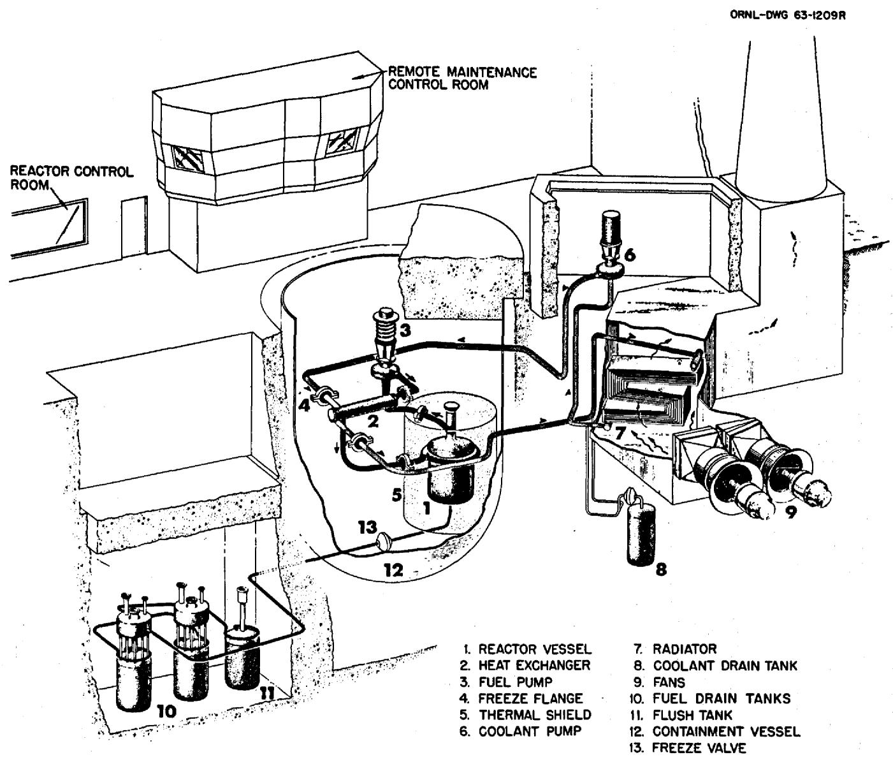  
Fig. 1. MSRE Flow Diagram.

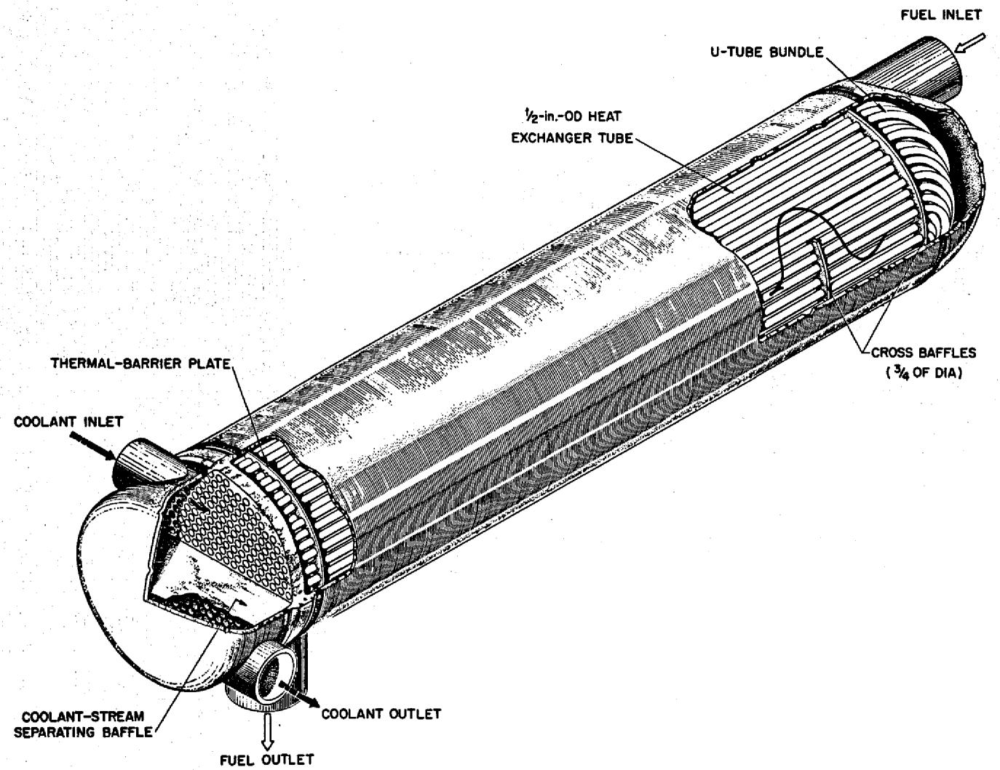  
Fig. 2. Primary Heat Exchanger for MSRE.

ORNL-LR-DWG 52036

1225°F to 1175°F.\* The coolant salt circulates through the tubes at a rate of 850 gpm, entering at 1025°F and leaving at 1100°F. From the heat transfer and drainability standpoints, it was better to pass the fuel salt through the shell and the coolant salt through the tubes. The shell side also presents less opportunity for retention of gas pockets during fuel salt filling operations.

The design data are given in Table 1 and the design basis physical properties of the fuel and coolant salts and container material are given in Tables 2 and 3. Stresses in the shell, tubes, and tube sheet were evaluated for the design point conditions and reported in design reports.[4,5] Design of the heat exchanger was based on formulae and correlations of Kern,[6] requirements of the ASME Unfired Pressure Vessel Code, Section VIII,[7] Interpretations of ASME Boiler and Pressure Vessel Codes,[8,9,10,11] and Standards of Tubular Exchanger Manufacturers Association.[12] The exchanger was of a common design; applicable ASME and TEMA standards did not require a vibration analysis and none was made.

The TEMA standards do require that means be provided to protect the tube bundle against impinging fluids at the entrance to the shell if the velocity of the entering fluid exceeds 3 ft/sec. Since the fluid enters the MSRE heat exchanger at 19.3 ft/sec, an impingement baffle was needed to satisfy TEMA standards. This impingement baffle was omitted from the design in order to keep the hold-up of fuel salt to a minimum.

Tube holes in cross baffles were drilled 1/32 in. larger in diameter than the outside diameter of the tubes as indicated by TEMA standards. This large clearance contributed to a tube vibration problem that was discovered during preoperational testing and is discussed in a later section of this report.

Table 1   
Design Data for Primary Heat Exchanger   

<table><tr><td>Construction Material</td><td>Hastelloy-N</td></tr><tr><td>Heat Load, Mw</td><td>10</td></tr><tr><td>Shell-side Fluid</td><td>Fuel Salt</td></tr><tr><td>Tube-side Fluid</td><td>Coolant Salt</td></tr><tr><td>Layout</td><td>25% cut, cross-baffled shell with U-tubes</td></tr><tr><td>Baffle pitch, in.</td><td>12</td></tr><tr><td>Tube pitch, in.</td><td>0.775 triangular</td></tr><tr><td>Active shell length, ft</td><td>~ 6</td></tr><tr><td>Overall shell length, ft</td><td>~ 8</td></tr><tr><td>Shell outside diameter, in.</td><td>~ 17</td></tr><tr><td>Shell thickness, in.</td><td>1/2</td></tr><tr><td>Average tube length, ft</td><td>~ 14</td></tr><tr><td>Number of U-tubes</td><td>163a 159b</td></tr><tr><td>Tube size, in.</td><td>1/2 OD; 0.042 wall</td></tr><tr><td>Effective heat-transfer surface, ft2</td><td>~ 254c</td></tr><tr><td>Tubesheet thickness, in.</td><td>1-1/2</td></tr><tr><td>Fuel salt holdup, ft3</td><td>6.1</td></tr><tr><td>Design temperature: shell side, °F tube side, °F</td><td>1300 1300</td></tr><tr><td>Design pressure: shell side, psig tube side, psig</td><td>55 90</td></tr><tr><td>Allowable working pressure: shell side, psig tube side, psig</td><td>75d 125d</td></tr><tr><td colspan="2">Hydrostatic test pressure:</td></tr><tr><td>Shell side, psig</td><td>800</td></tr><tr><td>tube side, psig</td><td>1335</td></tr><tr><td>Terminal temperature: fuel salt, °F</td><td>1225 inlet; 1175 outlet</td></tr><tr><td>coolant, °F</td><td>1025 inlet; 1100 outlet</td></tr><tr><td>Effective log mean temperature difference, °F</td><td>133</td></tr><tr><td>Pressure drop: shell side, psi</td><td>24</td></tr><tr><td>tube side, psi</td><td>29</td></tr><tr><td>Nozzles: shell, in. (Sched-40)</td><td>5 inlet &amp; outlet; a 5 inlet,b</td></tr><tr><td>tube, in. (Sched-40)</td><td>5 '' '' 7 outlet</td></tr><tr><td>Fuel-salt flow rate, gpm</td><td>1200 (2.67 cfs)</td></tr><tr><td>Coolant-salt flow rate, gpm</td><td>850 (1.85 cfs)</td></tr><tr><td>Overall heat transfer coefficient, Btu/hr-ft2-°F</td><td>~ 1100, ~ 600e</td></tr><tr><td colspan="2">Average Heat Transfer Coefficient</td></tr><tr><td>Tube Side, Btu/ft2-hr-°F</td><td>~ 5000</td></tr><tr><td>Shell Side, Btu/ft2-hr-°F</td><td>~ 3500</td></tr></table>

aBefore modification.   
bAfter modification.   
eAs measured.

Table 2   
Properties of Fuel and Coolant Salts   

<table><tr><td></td><td>Fuel Salt</td><td>Coolant Salt</td></tr><tr><td colspan="3">Composition, mole%:</td></tr><tr><td>LiF</td><td>70</td><td>66</td></tr><tr><td>BeF2</td><td>23</td><td>34</td></tr><tr><td>ThF4</td><td>1</td><td></td></tr><tr><td>ZrF4</td><td>5</td><td></td></tr><tr><td>UF4</td><td>~ 1</td><td></td></tr><tr><td>Average Physical Properties:</td><td>@ 1200°F</td><td>@ 1065°F</td></tr><tr><td>Specific heat, Btu/lb-°F</td><td>0.46</td><td>0.57</td></tr><tr><td>Thermal conductivity, Btu/ft2-hr-°F/ft</td><td>2.8*</td><td>3.5*</td></tr><tr><td>Viscosity, lb/ft-hr</td><td>18</td><td>20</td></tr><tr><td>Density, lb/ft3</td><td>154</td><td>120</td></tr><tr><td>Prandtl number</td><td>3.00</td><td>3.26</td></tr><tr><td>Liquidus Temperature, °F</td><td>840</td><td>850</td></tr></table>

*These are estimated values that were used in the design. Values obtained from measurements in 1967 are about 0.8 Btu/ft²-hr-°F/ft.

Table 3   
Composition and Properties of Hastelloy- $\mathbf{N}^2$   
Chemical Properties:   

<table><tr><td>Ni</td><td>66-71%</td><td>Mn, max</td><td>1.0%</td></tr><tr><td>Mo</td><td>15-18</td><td>Si, max</td><td>1.0</td></tr><tr><td>Cr</td><td>6-8</td><td>Cu, max</td><td>0.35</td></tr><tr><td>Fe, max</td><td>5</td><td>B, max</td><td>0.010</td></tr><tr><td>C</td><td>0.04-0.08</td><td>W, max</td><td>0.50</td></tr><tr><td>Ti + Al, max</td><td>0.50</td><td>P, max</td><td>0.015</td></tr><tr><td>S, max</td><td>0.02</td><td>Co, max</td><td>0.20</td></tr></table>

Physical Properties:   

<table><tr><td>Density, lb/in.3</td><td>0.317</td></tr><tr><td>Melting Point, °F</td><td>2470-2555</td></tr><tr><td>Thermal conductivity, Btu/hr-ft2-°F/ft at 1300°F</td><td>12.7</td></tr><tr><td>Modulus of elasticity at ~ 1300°F, psi</td><td>24.8 x 106</td></tr><tr><td>Specific heat, Btu/lb-°F at 1300°F</td><td>0.135</td></tr><tr><td>Mean coefficient of thermal expansion, 70-1300°F range, in./in.-°F</td><td>8.0 x 10-6</td></tr></table>

Mechanical Properties:   

<table><tr><td>Maximum allowable stress, b psi: at 1000°F</td><td>17,000</td></tr><tr><td>1100°F</td><td>13,000</td></tr><tr><td>1200°F</td><td>6,000</td></tr><tr><td>1300°F</td><td>3,500</td></tr></table>

# DESCRIPTION OF HEAT EXCHANGER

The heat exchanger is a conventional shell and U-tube exchanger with a cross-baffled tube bundle. It is of all-welded construction and is fabricated from Hastelloy-N throughout, except for the alloy used to back-braze the tube sheet joints. The dished heads were cold-pressed by the Paducah Plant of Union Carbide, the tube sheet was forged by Taylor Forge Co., the tube-to-tube sheet joints were back-brazed by Wall Colmonoy Co., and the remainder of the fabrication was done in machine shops of the Y-12 Plant of Union Carbide. All work was covered by ORNL Specifications.[13]

The shell is $\sim 17$ in. OD and about 8-ft 3-in. long, including the $8 - 3 / 4$ -in. long coolant salt header and the ASME flanged and dished heads at the ends. (See ORNL Drawings D-EE-A-40869, -72, -74.) The shell is $1 / 2$ -in. thick in the cylindrical portion and the heads. The fuel enters at the U-bend end of the shell through a 5-in. Schedule-40 pipe nozzle, near the top of the dished head. Before modifications, the fuel salt left through a 5-in. Schedule-40 pipe nozzle at the bottom of the shell at the tube sheet end. (See ORNL Drawings D-EE-A-40873, -74.)

Six $25\%$ -cut cross baffles of 1/4-in. plate, spaced at 12-in. intervals, direct the fuel salt flow across the tube bundle (see ORNL Drawings D-EE-A-40864, -65, -66). A barrier plate, similar to the baffle plates but with no cutaway segment, is located 1-7/8 in. from the tube sheet to provide a more-or-less stagnant layer of fuel salt and reduce temperature differences across the tube sheet. The baffles and the barrier plate are held in position by spacer rods, screwed and tack-welded together, to the tube sheet, and to each baffle.

A divider separates the entering and leaving coolant salt streams in the coolant header. It is fabricated of 1/2-in. plate and extends from the tube sheet to the dished head. It is positioned by guide strips on the shell wall, and a groove in the edge fits over a 1/4-in. pointed, horizontal projection on the tube sheet. This arrangement provides a labyrinth-type seal between the channels without stiffening the tubesheet.

Before modifications to the heat exchanger, there were 163 tubes, $1/2$ -in. OD by $0.042$ -in. wall thickness, affording an effective transfer surface of $\sim 254$ ft². See ORNL Drawing D-EE-40867. The tubes are arranged on a 0.775-in. equilateral triangular pitch. The tube holes through the $1-1/2$ -in. thick tube sheet had trepaned grooves on both sides of the sheet. See ORNL Drawing D-EE-A-40865.

The grooves on the coolant salt side were to permit the tube-to-tubesheet welds to be made between the tube and a lip of about equal wall thickness in the tube sheet (see Figure 3). The tubes were expanded at the tip end into the holes before welding. After welding, the tube openings were reamed to the inside diameter of the tubes. The trepaned grooves on the fuel-salt side were to permit back-brazing of the joints. The back-brazing operation was performed in a furnace with a hydrogen atmosphere using a ring of gold-nickel brazing alloy.

The heat exchanger is installed horizontally, pitching toward the fuel-salt outlet at a slope of about $3^{\circ}$ . Each U-tube is oriented so that the coolant salt will also drain. The unit weighs about 2060 lbs when empty and 3500 lbs when filled with fuel and coolant salts. The fuel-salt holdup is $\sim 6.1 ft^{3}$ , and the coolant-salt holdup is about 3.7 ft $^{3}$ .

# PRE-OPERATIONAL TESTING AND MODIFICATIONS

Difficulties with excessive vibrations in heat exchangers at the Enrico Fermi Atomic Power Plant and the Hallam Nuclear Power Facility prompted a review of the MSRE heat exchanger design in the fall of 1963. This review, together with some exploratory tests of a single tube mockup, indicated that fluid induced vibrations could be a problem, and that flow tests should be conducted on the heat exchanger.

Water was the fluid used for these tests for the following reasons:

1. It is convenient to use and readily available at the necessary flow rates.   
2. The Strouhal Number $\left(\frac{(\text { frequency }) (\text { length })}{(\text { fluid velocity })}\right)$ which is the characteristic number used to correlate fluid-induced vibrations from vortex shedding, is independent of fluid properties such as density and viscosity.

ORNL-LR-DWG65682R3

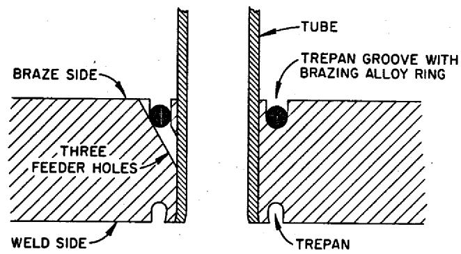  
(a) BEFORE WELDING AND BRAZING

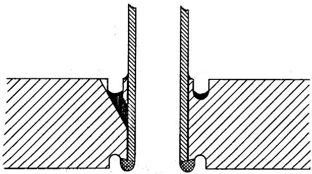  
(b) AFTER WELDING AND BRAZING   
Fig. 3. Tube-to-Tube Sheet Joint MSRE Primary Heat Exchanger.

3. Fluid pressure drop measurements were also taken during the tests and are readily convertible from a water system to a molten salt system.

Accordingly, an outdoor test installation was built as shown schematically in Figure 4. Water was supplied from a large capacity water main. A once-through system was used and the water discharged into a drainage ditch. Before installing the MSRE heat exchanger, the line without the strainer installed was flushed out for about 20 minutes at a flow rate of $2800\mathrm{gpm}$ . The strainer was then inserted and the system was flushed again for about 1 hour at $2600\mathrm{gpm}$ . Sediment collected by the strainer consisted of several small pieces of paper gasket material, and a very small piece of lead. The system was now considered clean and the heat exchanger was installed. During each successive run, the system was flushed for a few minutes before water was run through the heat exchanger.

Hydraulic testing of the heat exchanger can be conveniently divided into 4 chronological phases as follows:

1. Initial test of the heat exchanger as built.   
2. Testing the heat exchanger as designed, but with the Hastelloy-N shell replaced by a special stainless steel shell featuring observation windows.   
3. Testing the heat exchanger as modified, and with the special stainless steel shell.   
4. Final testing of the heat exchanger as modified, and with the Hastelloy-N shell.

# Initial Test of Heat Exchanger, As-Built

The heat exchanger, as built, was installed in the water test facility and tested in December of 1963. Results of this test are as follows:

1. The most dramatic results were audible. At flow rates of 800 to 900 gpm (~ 2/3 design flow) through the shell side, an intermittent rattling noise came from the heat exchanger. This noise is hard to describe but it impressed us as the kind of noise one might hear if tubes were rattling in the baffle plates. As the flow rate was increased, the

ORNL DWG 68-667

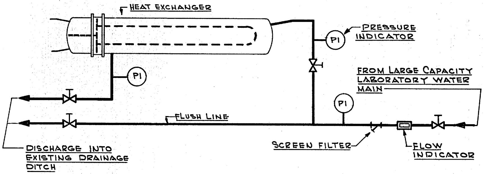  
Fig. 4. Hydraulic Test Installation MSRE Primary Heat Exchanger.

fraction of time that the rattling noise was heard also increased and it seemed to get louder. At about 1100 gpm the noise was continuous. The rattling continued to get louder to the maximum flow rate tested, 1300 gpm. The character of the noise heard differed little whether the tubes were empty or full of water.

Measurements were taken with an International Research and Development Corporation, Model 600B, external pick-up vibrometer at intervals of 200 gpm from 500 to 1300 gpm. The results were hard to interpret. Generally at flow rates above 900 gpm, more instrument activity in the range of 450-3500 cpm was observed, however, no discrete and continuous frequencies could be detected. The audible rattling noise was the best indication we had that the tubes were vibrating. To assure ourselves that the noise was not due to cavitation, we increased back pressure to 55 psig at 1000 gpm. There was no obvious change in the character of the noise. The conclusion from these tests was that the tubes were probably vibrating excessively.

2. The overall pressure drop through the tube side and the shell side of the heat exchanger was measured. The pressure drop through the tube side was almost exactly the estimated value. The pressure drop through the shell side was about twice the estimated value.

From these tests, it appeared that we had two serious problems, tube vibrations and excessive pressure drop on the shell side. To investigate these problems more thoroughly, we cut off the Hastelloy-N shell and replaced it with a special stainless steel shell incorporating 16 windows. The vibrations could then be viewed directly, also the windows could be fitted with pressure taps to determine the pressure drop distribution. This special shell is shown in Figure 5.

When the Hastelloy-N shell was removed, we noted that 2 tubes in the outermost row of 4 tubes (longest tubes) had vibrated against a seam weld in the shell wearing a notch $\sim$ 0.0025-in. deep in the wall of Tube A and $\sim$ 0.005-in. deep in Tube B. A photograph of this is shown in Figure 6. No worn places could be found on the tubes where they penetrated the baffle plates.

ORNL DWG 68-668

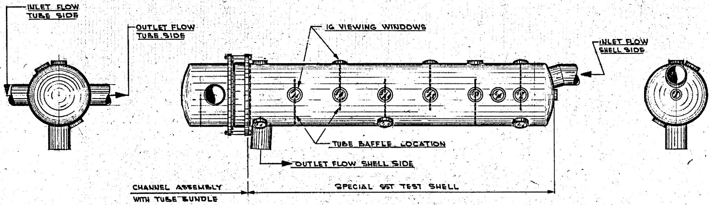  
Fig. 5. Hydraulic Test Shell Assembly, Primary Heat Exchanger.

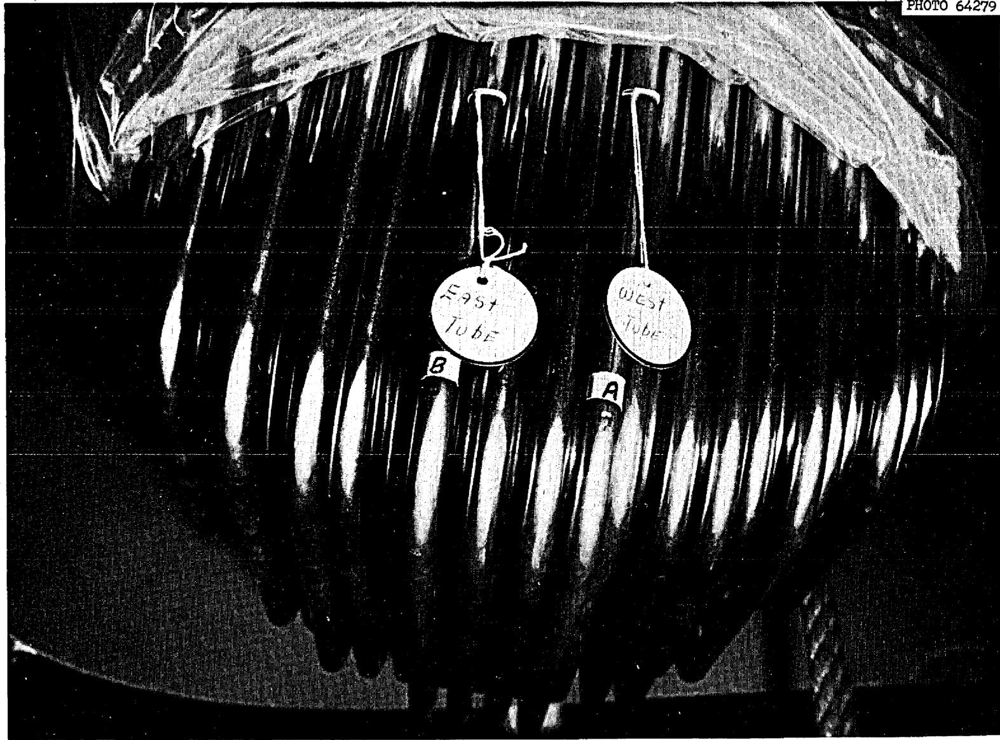  
Fig. 6. MSRE Primary Heat Exchanger Tube Damage.

Test of Heat Exchanger, As-Designed but with Special Shell

The heat exchanger, as designed but with its new shell, was then tested with flow rates up to 1200 gpm. Results of this test are as follows:

1. The "U" bends vibrated quite severely with estimated frequencies from 5 to 10 cps, and with peak-to-peak amplitudes as high as $\frac{1}{4}$ in.   
2. In the bulk of the heat exchanger, some of the tubes that penetrate every baffle plate vibrated, and most of the tubes that penetrate every other baffle plate vibrated. The sections of tubes between baffles vibrated with much less amplitude than did the U bends.   
3. In the bulk of the heat exchanger the tubes in the interior of the bundle seemed to vibrate less severely than those near the edge. This may be because most of the tubes in the interior of the bundle penetrate every baffle plate. It may also have been an illusion because the tubes on the interior of the bundle were difficult to see.   
4. In the vicinity of the tube sheet where the tubes are brazed in, there was no visible vibration.   
5. The character of the rattling noise in this test was the same as in the previous test and could definitely be correlated with tube vibration.   
6. The excessive fluid pressure drop through the shell side was determined to be where the tubes passed very close to the inlet and outlet pipes and tended to choke them off.

Based on the above observations, the following corrective actions were taken:

1. The 4 outermost U tubes and 4 associated tie bars were removed. Plugs were welded into the 8 resulting tube stub ends, and into all the resulting holes in the baffle plates. (See ORNL Drawing M-10329-RE-003E2.) The intent of this change was two-fold. First, it helped alleviate the tube vibration problem because two of these tubes had the worn spots shown in Figure 6. Second, it helped lower the shell side pressure drop because these tubes and tie bars contributed greatly to choking the shell side inlet and outlet.

2. Bars were laced between the tubes on the downstream side and adjacent to each baffle plate as shown in ORNL Drawing M-10329-RE-003E2. Note that the lacing is in two directions. It was believed that lacing in one direction would not be adequate. It also seemed that lacing in the third direction would be redundant because the holes in the baffle plates could serve as contact points. The lacing bars were sized so that they fit snugly between the tubes, and were tack-welded to the baffle plates. Other methods of tightening the tubes in this structure were considered, such as expanding the tubes into the baffles and bending, twisting or in some other way deforming the bundle. All were discarded however, in favor of this lacing method.

3. A similar lacing was built across the middle of the U bends as shown in ORNL Drawing M-10329-RE-002El. In this structure the lacing bars are threaded through the tubes in two directions and welded to the outer band. This makes all the tubes in the U bend behave as a single member. The structure is supported by the tubes. This arrangement probably affects only a small increase in fluid pressure drop through the region of the U bends.   
4. The special stainless steel heat exchanger shell was lengthened 1.0 in. and an impingement baffle was installed in the inlet as shown in ORNL Drawing M-20794-RE-030El for the Hastelloy-N shell.   
5. The 5-in. outlet pipe was replaced by a $7 \times 5$ in. conical reducer as shown in ORNL Drawing M-20794-RE-030El to reduce the exit pressure drop.   
6. An accelerometer (Endevco Corp., Model 2220) was mounted on one of the centermost tubes in the U bend just below the midplane of the heat exchanger.

Testing Heat Exchanger, As-Modified but with Special Shell

With the above modifications incorporated into the tube bundle and the special, the heat exchanger was again installed into the test facility. Results of this series of tests with flow rates up to 1700 gpm are as follows:

1. Tube vibrations were reduced to a negligible amount. No tube vibrations were visible anywhere in the tube bundle. No noise attributable to tube vibrations (metal-to-metal contacting) could be detected. The accelerometer detected a very high frequency vibration of 2000-3000 cps. The amplitude was not accurately measurable but appeared to be less than 0.001 in.   
2. The overall fluid pressure drop on the shell side was reduced and almost exactly equaled the predicted value.

At this point, the vibrational and pressure drop problems were considered adequately solved.

# Final Test of Modified Heat Exchanger

All modifications were now incorporated into the Hastelloy-N shell, and the heat exchanger was reassembled. The unit was installed in the test facility and tested to flow rates as high as 1650 gpm. The results of this test were identical to those of the previous test, that is, fluid induced tube vibrations were reduced to a negligible level and the shell side pressure drop was adequately low. Figure 7 shows the final overall pressure drop through the tube side and shell side. The tubeside pressure drop is based on data taken during the initial test and the shell side pressure drop was measured during the final test.

# OPERATIONAL HISTORY

Installation of the heat exchanger in the reactor was completed late in the spring of 1964. Fuel and coolant salt were first circulated through the reactor systems in January 1965. The reactor reached criticality on June 1, 1965, and low levels (0 - 50 kw) of nuclear power were first generated in December 1965. (See Figure 8.) Full-power (7-1/2 Mw) operations began in April 1966 and are continuing at the present time.

During the past three years the heat exchanger has operated for more than 14,000 hours with molten salt without any indication of a leak between fuel and coolant salts or into the reactor cell. There has been no evidence either of gas filming of the heat exchanger tubes or of a decrease in performance by a buildup of scale. Accumulated operating data are given in Table 4.

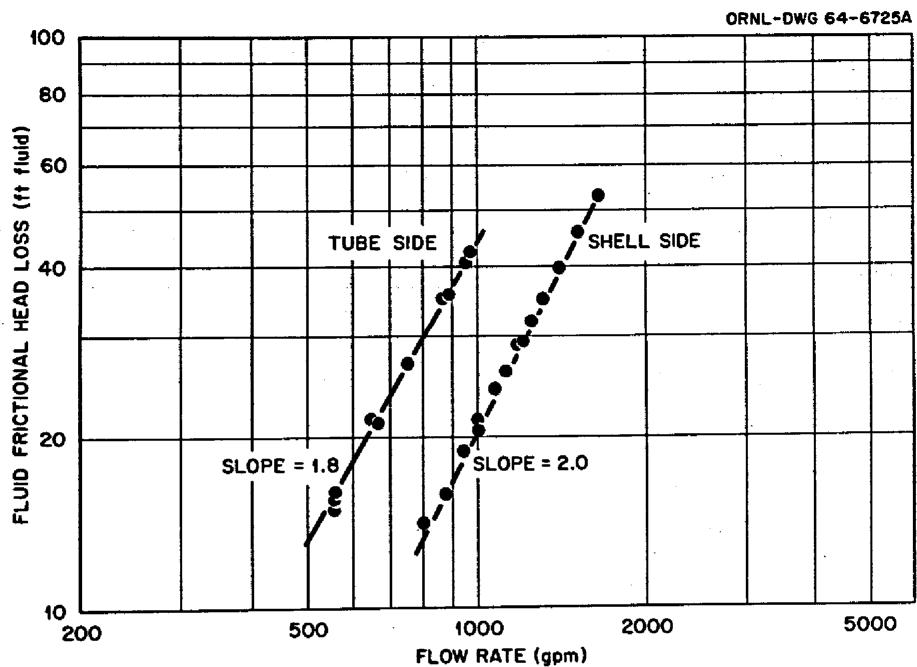  
Fig. 7. Fluid Frictional Head Loss in Primary Heat Exchanger.

ORNL DWG 68-669

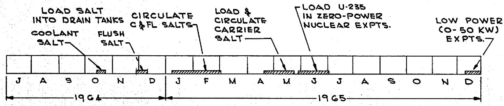

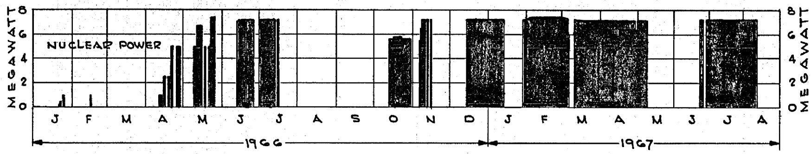

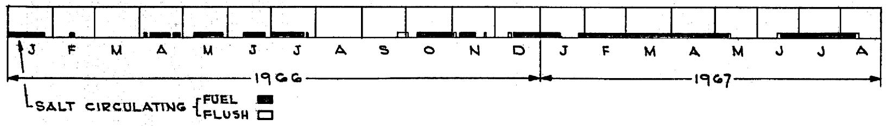  
Fig. 8. MSRE Operational History.

Table 4   
Reactor Accumulated Operating Data   

<table><tr><td>Time Critical (hrs)</td><td>8,830</td></tr><tr><td>Fuel Loop Time Above 900°F (hrs)</td><td>18,021</td></tr><tr><td>Fuel Pump Time Circulating Helium (hrs)</td><td>3,985</td></tr><tr><td>Fuel Pump Time Circulating Salt (hrs)</td><td>12,334</td></tr><tr><td>Coolant Loop Time Above 900°F (hrs)</td><td>15,684</td></tr><tr><td>Coolant Pump Time Circulating Helium (hrs)</td><td>3,082</td></tr><tr><td>Coolant Pump Time Circulating Salt (hrs)</td><td>14,149</td></tr><tr><td>Heating Cycles (70 - 1200°F) Fuel/Coolant Systems</td><td>9/8</td></tr><tr><td>Fill-Drain Cycles (Fuel/Coolant Systems)</td><td>30/13</td></tr><tr><td>Nuclear Power Cycles (Fuel/Coolant Systems)</td><td>63/59</td></tr><tr><td>Equivalent Full-Power Hours</td><td>7,124</td></tr></table>

Total to December 5, 1967

Soon after the operating power of the MSRE was raised to a significant level, the heat-transfer capability of the main heat exchanger and the coolant radiator was found to be less than predicted and, in fact, limited the attainable heat removal to about $7 - 1 / 2\mathrm{Mw}$ . The nominal power chosen for the design of the MSRE was $10\mathrm{Mw}$ . The overall heat-transfer coefficient of the primary heat exchanger was below the predicted value, resulting in somewhat larger fuel to coolant temperature differences than had been planned. The performance of the main heat exchanger was explained by recent measurements of the fuel salt thermal conductivity which indicated a value of $0.83\frac{\text{Btu}}{\text{Hr - Ft} - {}^{\circ}\text{F}}$ rather than $2.75\frac{\text{Btu}}{\text{Hr - Ft} - {}^{\circ}\text{F}}$ which was used in the calculations.

The fuel salt that circulates through the heat exchanger in the MSRE is highly radioactive. Noble metal fission products are reduced to metals in the salt, and some of them deposit on surfaces in the heat exchanger so it too becomes highly radioactive. The heat exchanger is of all-welded

construction and is covered by heater-insulation boxes that are difficult to remove and reinstall remotely. Any meaningful nondestructive inspection of the interior is impossible and of the exterior is extremely difficult. No inspection is planned, at least until the experiment is completed or the heat exchanger must be removed because it develops a leak. Leakage through failure of one or more tubes by vibration should be detectable by a small increase in salt inventory in the fuel system and decrease in salt inventory in the coolant system. The reactor is designed on the basis that such a leak or a leak from the fuel system into the coolant system might someday occur. The fuel and coolant salt systems are tested separately at pressures above the normal operating pressures at intervals of 6 to 12 months.[15] No leakage has ever been indicated.

Because the heat exchanger operates at temperatures above $1000^{\circ}\mathrm{F}$ in a highly radioactive environment, no equipment is installed to monitor vibrations. However, we believe it unlikely that the vibration has increased since the final preoperational hydraulic flow tests. For vibration to reoccur, the rigidity of the tube bundle would have to be reduced. This could happen if the clearances between the tubes and lacing were increased by corrosion of the salt container material, however, this is unlikely. Chemical analysis of the fuel and coolant salt show that general corrosion of Hastelloy-N in the system has been practically nil ( $\sim 0.1$ mil).[16]

Vibration could also reoccur if the flow rate of the fuel salt entering the shell side of the heat exchanger were substantially increased. This is also unlikely as the fuel and coolant salt flow rates are fixed and cannot be varied unless the impellers of the pumps are modified. The original pumps are still in operation and there are no plans to replace these pumps before the MSRE is terminated in 1969.

# CONCLUSIONS

1. Testing the MSRE heat exchanger with water indicated fluid flow induced tube vibrations and an excessive pressure drop on the shell side. The best indication we had of tube vibrations was a rattling noise emanating from the heat exchanger.

2. An extension of the above conclusion is that water is an adequate fluid to test molten salt heat exchangers for fluid-induced vibrations.   
3. The fluid-induced tube vibrations were eliminated by lacing bars between the tubes at the baffle plates, by building a structure of bars around the U bend in the tube bundle, and by installing an impinge-ment baffle at the inlet to the shell.   
4. The excessive fluid pressure drop through the shell side was found to result from choking of the inlet and outlet pipes by the outermost row of tubes and tie bars. The pressure drop was reduced to an acceptable value by removing these tubes and tie bars and increasing the diameter of the outlet pipe.   
5. After more than 14,000 hours of operation with salt in the system to date, the heat exchanger has shown no indication of leakage or change in operating performance.   
6. We find no reasons why the primary heat exchanger should fail from vibration-induced damage before the planned termination of the MSRE in 1969.

# REFERENCES

1. Memorandum from Milton Shaw to the Managers of the Operations Offices, September 29, 1967, Subject: Information on Primary Circuit Heat Exchangers - Damage from Tube Vibrations.   
2. Letter from H. M. Roth to A. M. Weinberg, October 13, 1967, Subject: Information on Primary Circuit Heat Exchangers - Damage from Tube Vibrations.   
3. J. H. Westsik, Oak Ridge National Laboratory, Heat Transfer and $\Delta P$ Design of MSRE Primary Heat Exchanger, CF-61-4-1, April 3, 1961. (Internal Distribution Only)   
4. E. S. Bettis and J. H. Westsik, Oak Ridge National Laboratory, MSRE Component Design Report, Section V, Stress Analysis of Primary Heat Exchanger of the MSRE, MSR-61-67, June 20, 1961. (Internal Distribution Only)   
5. R. C. Robertson, MSRE Design and Operations Report, Part I, Description of Reactor Design, USAEG Report ORNL-TM-728, Oak Ridge National Laboratory, January 1965.   
6. D. Q. Kern, Process Heat Transfer, McGraw Hill Co., New York, 1st Ed., 1950.   
7. Unfired Pressure Vessels, Section VIII ASME Boiler and Pressure Vessel Code, American Society of Mechanical Engineers, New York.   
8. General Requirements for Nuclear Vessels, Case 1270N-5, Interpretations of ASME Boiler and Pressure Vessel Codes, American Society of Mechanical Engineers, New York.   
9. Containment and Intermediate Containment Vessels, Case 1272 N-5, Case Interpretations of ASME Boiler and Pressure Vessel Codes, American Society of Mechanical Engineers, New York.   
10. Nuclear Reactor Vessels and Primary Vessels, Case 1273N-7, Case Interpretations of ASME Boiler and Pressure Vessel Codes, American Society of Mechanical Engineers, New York.   
11. Special Equipment Requirements, Case 1276N-1, Case Interpretations of ASME Boiler and Pressure Vessel Codes, American Society of Mechanical Engineers, New York.   
12. Standards of Tubular Exchanger Manufacturers Association, 2nd ed., Tubular Exchanger Mfrs, Assn. Inc., New York 1949.

References (continued)

13. C. K. McGlothlan, Oak Ridge National Laboratory, Fabrication Specifications, Procedure and Records for MSRE Components, MSR-62-3, Rev. A, February 18, 1965. (Internal Distribution Only)   
14. C. H. Gabbard, R. J. Kedl, and H. B. Piper, Oak Ridge National Laboratory, Heat Transfer of the MSRE Main Heat Exchanger and Radiator, CF-67-3-38, March 21, 1967. (Internal Distribution Only)   
15. R. H. Guymon, MSRE Design and Operations Report Part VIII, Operating Procedures, USAEC Report ORNL-TM-908, Vol. II, Procedure 5H, Oak Ridge National Laboratory, January 1966.   
16. Oak Ridge National Laboratory, MSRP Semiann. Progr. Rept. Feb. 1967, USAEC Report ORNL-4119, p. 120.

# APPENDIX

# Fabrication Drawings - Primary Heat Exchanger

D-EE-A-40864

Baffle Plates

D-EE-A-40865

Tube Sheet

D-EE-A-40866

Baffle Assembly

D-EE-A-40867

Tube Bundle Assembly

D-EE-A-40869

Details

D-EE-A-40872

Channel Assembly

D-EE-A-40873

Assembly Sections

D-EE-A-40874

Assembly Elevation

M-10329-RE-003E2

Stabilizers.- Details Return Bend

M-10329-RE-002E1

Stabilizer Details - Return Bend

M-20794-RE-O30E1

Modifications

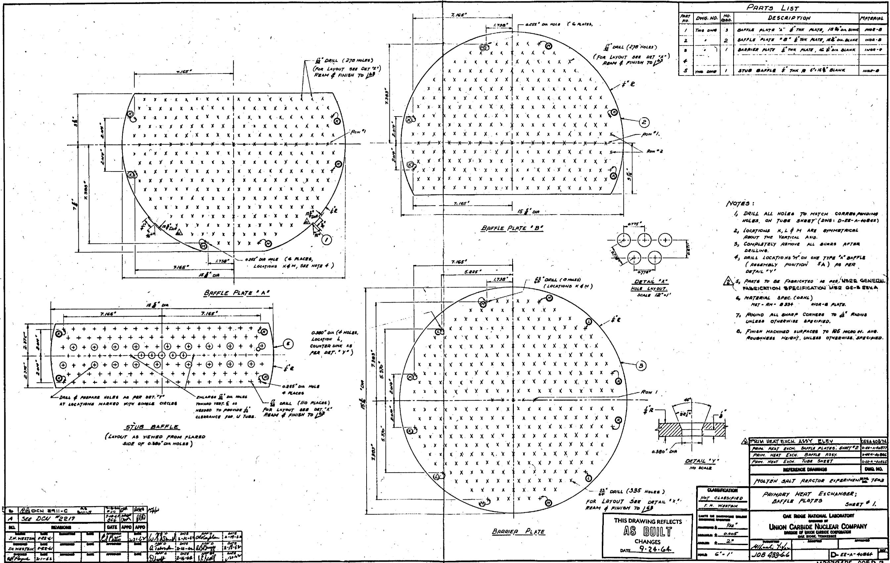  
NOTES :   
1. DRILL ALL NOLE TO MATCH CORREAS PENDING NOLE, ON TUBE SNRT (DWS: D-EE-A-4086)   
2. L $\oint M$ ARE SYMMETRICAL ABOUT THE VERTICAL AXI.   
3, COMPLETELY ABMOVE ALL BURS AFTER DILLING.   
4. DRAWING LCCATIONS "ON ONE TYPE "A" BAFFLE (Asseemblly POsiTION SA) A6 PER DETAIL "Y"   
2 PARTO TO BE FABRICATED AS PIRM WBRG GENEDAL. FABRICATION SPECIFICATION M3E 02-58VA   
6. MATERIAL SPEC. (CONL)  
MET - RM = 834 INOR - #PLATE.   
70 ROUNO ALL SHARP CORNERS To 1" RADIUS UNLESS OTHERWISE APPLIED.   
6. FINISH MACHINED SURFACES TO ASMS MCAD IN. AVQ. ROUNNNES HIGNT, UNLESS OTNWISSE. SPECIFIED

<table><tr><td colspan="5">PARTS LIST</td></tr><tr><td>PART NO.</td><td>DWG.NO.</td><td>NO.
BENO.</td><td>DESCRIPTION</td><td>MATERIAL</td></tr><tr><td>1</td><td>TWIN DWG</td><td>3</td><td>BAFFLE PLATE &#x27;A&quot; &#x27;THX PLATE, &#x27;B&quot; &#x27;DU BLANK</td><td>INOR-G</td></tr><tr><td>2</td><td></td><td>2</td><td>BAFFLE &quot;B&quot; &#x27;THX PLATE, &#x27;B&quot; &#x27;DU BLANK</td><td>INDA-B</td></tr><tr><td>3</td><td></td><td>1</td><td>BAFFLE PLATE &#x27;THX PLATE, &#x27;C&quot; &#x27;DA SLANK</td><td>INOR-G</td></tr><tr><td>4</td><td></td><td></td><td></td><td></td></tr><tr><td>5</td><td>TWIN DONG</td><td>1</td><td>STUB BAFFLE &#x27;THX RD &#x27;S&#x27;IS &#x27;BLANK</td><td>INOR-G</td></tr></table>

<table><tr><td>FRIM. HEAT EXCH. ASSY ELEV</td><td>DEEA 40874</td></tr><tr><td>PRIM. HEAT EXCH. BAFFLE PLATES, SHRT#2</td><td>D-65-A-40871</td></tr><tr><td>PRIM. HEAT EXCH. BAFFLE ASSY</td><td>D-65-A-4086</td></tr><tr><td>PRIM. HEAT EXCH. TUBE SHEET</td><td>D-65-A-4085</td></tr><tr><td>REFERENCE DRAWINGS</td><td>DWG NO.</td></tr><tr><td>MOLTEN SALT REACTOR EXPERIMENTAL TOC3</td><td></td></tr></table>

<table><tr><td>CLASSIFICATION
NOT CLASSIFIED
J.N.WEET&amp;ME</td><td colspan="3">PRIMARY HEAT EXCHANGER;
BAFFLE PLATES
SHEET # 1.</td></tr><tr><td>Limits on dimensionless values
Dimensioned in units
mm/mm2</td><td colspan="3">OAK RIDGE NATIONAL LABORATORY
Generalized by
UNION CARBIDE NUCLEAR COMPANY
BEFORE OF UNION CARBIDE COUPERTON
OAK MODEL, TECHNICALS</td></tr><tr><td>UNITED
MILLION YIING</td><td>AMOUNTS</td><td>DRAFTED</td><td>APPROVED</td></tr><tr><td>SCALE G&#x27; - 1&#x27;</td><td>108 433-6.6</td><td>D- CE-A-40864</td><td>A07</td></tr></table>

M20794RE 005D 2

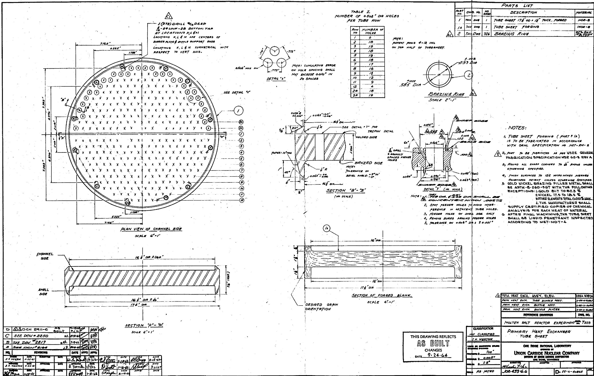

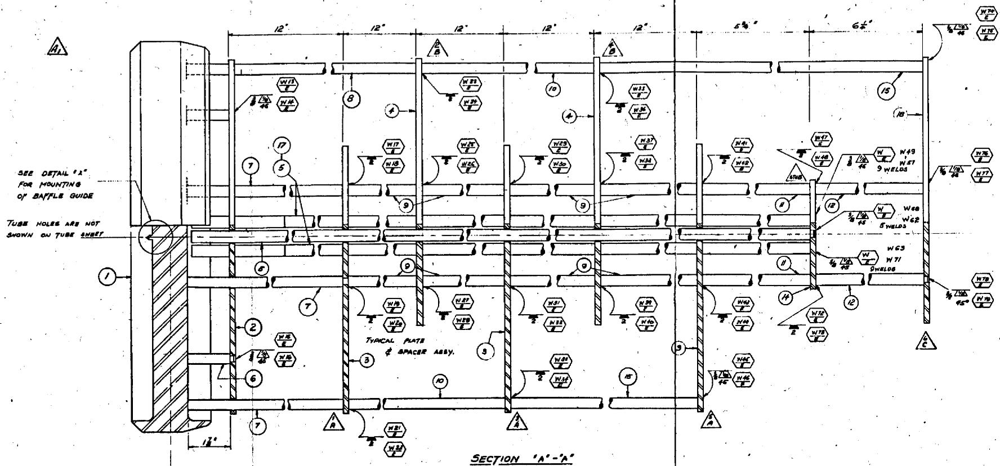

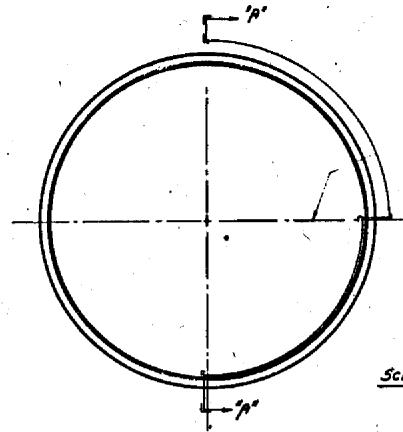  
MORIONAL CENTRE LINE, LOCATION OF BAPBLE ODWS   
SCHEMATIC FRONT ELEVATION NO SCALE

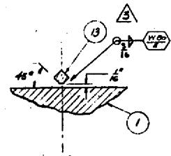  
WELD SETUP FOR BAFFLE GUIDE   
DETAIL “x” BAFFLE GUIDE

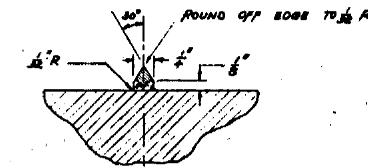  
MACINING OF BAFFLE GUIDE

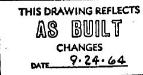

<table><tr><td colspan="5">PARTS LIST</td></tr><tr><td>Part No.</td><td>DWG. No.</td><td>No. R&amp;D.</td><td>DESCRIPTION</td><td>MATERIAL</td></tr><tr><td>1</td><td>D-EE-A-008E</td><td>1</td><td>TUME SNEET 1/2&quot; TNK</td><td>INOR-B</td></tr><tr><td>2</td><td>D-EE-A-008F</td><td>1</td><td>BARRIER PLATE 4/2&quot; TNK</td><td>*</td></tr><tr><td>3</td><td>*</td><td>3</td><td>BAFFLE PLATE &#x27;A&#x27; &#x27;H&#x27; &#x27;TNK</td><td>*</td></tr><tr><td>4</td><td>*</td><td>2</td><td>BAFFLE PLATE &#x27;B&#x27; &#x27;H&#x27; &#x27;TNK</td><td>*</td></tr><tr><td>5</td><td>D-EE-A-008G</td><td>9</td><td>DUNNY ROOD &#x27;Y&#x27; &#x27;H&#x27; D/R</td><td>*</td></tr><tr><td>6</td><td>*</td><td>4</td><td>BARRIER PLATE SPACER ROO &#x27;TG&#x27; DIA</td><td>*</td></tr><tr><td>7</td><td>*</td><td>6</td><td>BAFFLE PLATE SPACER ROO &quot;I&quot; &#x27;TH&#x27; DIA</td><td>*</td></tr><tr><td>8</td><td>*</td><td>2</td><td>BAFFLE PLATE SPACER ROO &quot;I&quot; &#x27;TH&#x27; DIA</td><td>*</td></tr><tr><td>9</td><td>*</td><td>16</td><td>BAFFLE PLATE SPACER ROO &quot;II&quot; &#x27;TH&#x27; DIA</td><td>*</td></tr><tr><td>10</td><td>*</td><td>4</td><td>BAFFLE PLATE SPACER ROO &quot;II&quot; &#x27;TH&#x27; DIA</td><td>*</td></tr><tr><td>11</td><td>*</td><td>4</td><td>BAFFLE PLATE SPACER ROO &quot;J&quot; &#x27;TH&#x27; DIA</td><td>*</td></tr><tr><td>12</td><td>*</td><td>4</td><td>BAFFLE PLATE SPACER ROO &quot;J&quot; &#x27;TG&#x27; DIA</td><td>*</td></tr><tr><td>13</td><td>THIS DWG</td><td>1</td><td>BAFFLE PLATE GUIOB &#x27;k&#x27; &#x27;H&#x27; &#x27;15 &#x27;H&#x27;</td><td>*</td></tr><tr><td>14</td><td>D-EE-A-008H</td><td>1</td><td>STUG BAFFLE &#x27;k&#x27; &#x27;TNK</td><td>*</td></tr><tr><td>15</td><td>D-EE-A-008I</td><td>4</td><td>BAFFLE PLATE SPACER ROO &#x27;II&#x27; &#x27;TG&#x27; DIA</td><td>*</td></tr><tr><td>16</td><td>*</td><td>*</td><td>*</td><td>*</td></tr><tr><td>17</td><td>*</td><td>14</td><td>DUNNY ROO &#x27;Z&#x27; &#x27;H&#x27; DIA</td><td>*</td></tr><tr><td>18</td><td>D-EE-A-008J</td><td>1</td><td>BAFFLE PLATE &#x27;C&#x27; &#x27;H&#x27; TNK</td><td>*</td></tr></table>

NOTES: 1. WELD NUMBERS PROGRESS FROM LEFT TO RIGHT, FROM TOP TO BOTTOM, AND FROM FRONT TO BACK OF SECTION "A"-"A"   
2. PARTS TO BE FABRICATED AS PER USE GENERAL FABRICATION SPECIFICATION M32 G2-28M   
J3 MATERIAL SPECIFICATIONS: METR-RAB BAR METR-AM@30（NOA-BAR） METR-AM@30（NOA-BWING FILLER METAL  
A1UCNC FABRICATORS WHO- AER APPLICATICNS AS-B5, PAB-B5, PAB-B6, APPLICABLE. IMPACT PERWA=0.   
5. NELO NUMBERS ASBVED w! = w 50 NELO NUMBERS: USED w! = w 60   
6. AROUND ALL SHARP COVERS TO "A"ADUOS UNLESS OTHERWISE SPECIFIED.   
7 FINISH SURFACE 125 NICKENCHED AVERAGE NEWINGHONG NEIGHT UNLESS OTHERWISE OFFPIED   
B BEFORE ASSEMBLY OF SAPPLE PLAYERS THREAD TUGES CODE 1-8-COOD 1-8 THROUGH.

<table><tr><td>P21L. HEAT EACH, ASY, ELEV.</td><td>DELA 4074</td></tr><tr><td>PRIM. NEAT EACH, BAPPLA PLATES, SWEET #2</td><td>D-25A-4087</td></tr><tr><td>PRIM. NEAT EACH, TUBE ANSHT</td><td>D-25A-4085</td></tr><tr><td>PRIM. NEAT EACH, BAPPLA PLATES SWEET #1</td><td>D-25A-4086</td></tr><tr><td>PRIM. NEAT EACH, TUBE &amp; ROB DETAILS</td><td>D-25A-4085</td></tr><tr><td>REFERENCE DRAWINGS</td><td>DWG. NO.</td></tr><tr><td>NOCTEN SAUT REACTOR EXPERIMENT</td><td>NO.
No. 7803</td></tr></table>

<table><tr><td>CATION
1/1/ED
3573/K</td><td colspan="3">PRIMARY HEAT EXCHANGER
BAFFLE ASSEMBLY</td></tr><tr><td>MOON HAZOO
32°
00:05&#x27;</td><td colspan="3">OAK RIDGE NATIONAL LABORATORY
OBSERVED BY
UNION CARBIDE NUCLEAR COMPANY
DENISION OF UNION CARBIDE COUPONTATION
OAK STROK, TENNESSEE</td></tr><tr><td>P°a&#x27;</td><td>SPECIAL
WIND: 246.6</td><td>ASSURED</td><td>ATTRIBUT</td></tr><tr><td>1&#x27;</td><td>J08-133-6.6</td><td></td><td>D-E-A-F00GG</td></tr></table>

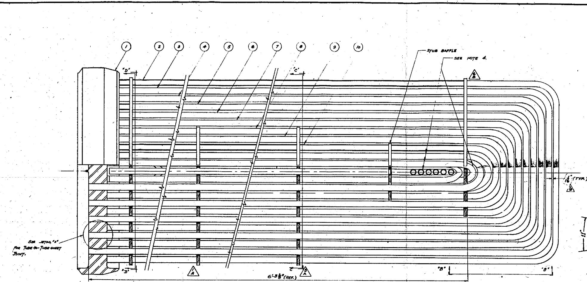

<table><tr><td colspan="6">PARTS LIST</td></tr><tr><td>A07
NO.</td><td>DWG. NO.</td><td>NO.
REDO.</td><td>DESCRIPTION</td><td colspan="2">MATERIAL</td></tr><tr><td>1</td><td>D-88-A
NOM.</td><td>1</td><td>BAFFLE ASSEMBLY</td><td colspan="2">INOR-B</td></tr><tr><td>2</td><td>D-88-A
NOM.</td><td>4</td><td>U TUBE 1/2&quot; O.O G O O H WALL FOR ROW 12</td><td colspan="2">#</td></tr><tr><td>3</td><td></td><td>9</td><td>FOR ROW 1</td><td colspan="2">#</td></tr><tr><td>4</td><td></td><td>12</td><td>FOR ROW 10</td><td colspan="2">#</td></tr><tr><td>5</td><td></td><td>13</td><td>FOR ROW 9</td><td colspan="2">#</td></tr><tr><td>6</td><td></td><td>16</td><td>FOR ROW 6</td><td colspan="2">#</td></tr><tr><td>7</td><td></td><td>17</td><td>FOR ROW 7</td><td colspan="2">#</td></tr><tr><td>8</td><td></td><td>18</td><td>FOR ROW 6</td><td colspan="2">#</td></tr><tr><td>9</td><td></td><td>19</td><td>FOR ROW 6</td><td colspan="2">#</td></tr><tr><td>10</td><td></td><td>18</td><td>FOR ROW 4</td><td colspan="2">#</td></tr><tr><td>11</td><td>D-88-A
NOM.</td><td>32.6</td><td>SKAZING RING</td><td colspan="2">6300-N24ETP
ALLOY</td></tr></table>

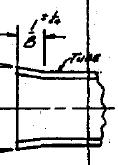

DETAIL   
DETAIL   
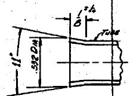  
NOTES:   
1. PARTS TO BE FABRICATED AS AEG NCL SATE,NS2 67-3 REV.A (USGE GENERAL FABRICATION SPEC.) J.S.-81-152 FABRICATION OF TUBE BUNDLE J.S. 80-1G7 BRAZING OF TUBE BUNDLE   
2. MAKE TUBE TO TUBE SHEET WELD JOINTS AS PER. MSRE METALLURY Memo 02-00   
$\therefore m = \frac{3}{11}$

4. FOR DETAILS AND PARTS LIST OF RONS NO 1,2,3 SEE DNG NO D-EE-A-40875

5. FOR SECTIONS $12^{\circ}C$ AND $"0^{\circ} - 0^{\circ}$ AEBB NO D-EE-A-4876

6,FLARE TUBE AND TREPAN LIP ACCORDING TO DETAR "Y" $\text{四} ^ { \prime }$ "Z" BEFORE WELDING. FLARE HOLE IN TUBE SHEET AND MERTY TUBE THROUGH HOLE BEFORE FLARING THE TUBE.

7. A HELIUM LEAK CHECK SHALL BE PERFORMED AFTER WELDING AND BRAZING AS FOLLOWS ENCLOSE THE TUBE BONDLE IN A Plastic Bag AND COVER THE TUBE SHEET WITH A FLAT PLATE. FILL THE BEAG WITH HELIUM AND EVIDATE INTERPOL OF TUBE'S. THE HELIUM LEAK RATE SHALL BE LESS THAN 1x10 $^{-6}$ /sec.

6. COMPLETED WHAT EXCHANGEZ-TUBE BUNDLE WAS MODIFIED IN THE FIELD AFTER WATER FLOW TESTS ACCORDING TO DRAWINGS E-10329-R-001 AND 002

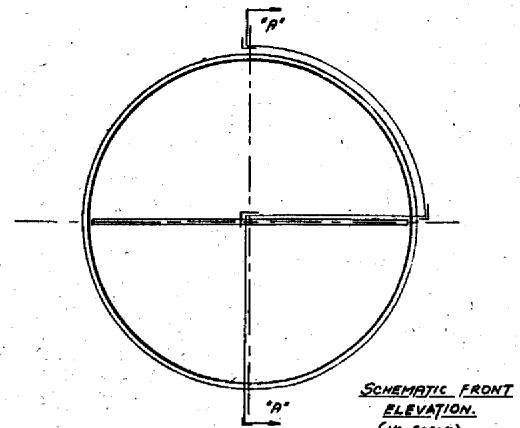

DETAIL X   
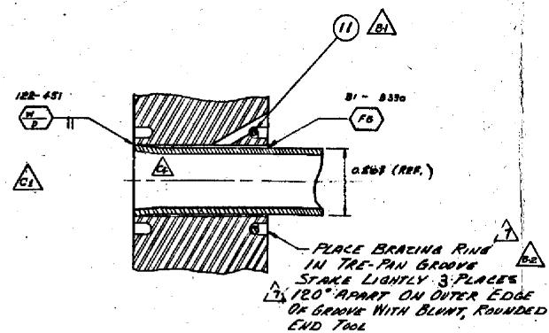  
TYPICAL TUBE-TO-TUBE-SHEET JOINT.   
NOTEI SEE ON. No. D-EE-Z-40851 FOR NUMBERING OF TUBE WELDS AND BRAZED JOINT

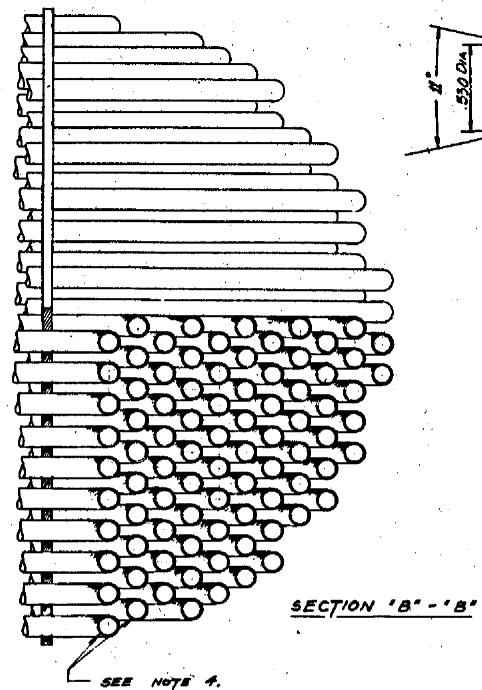

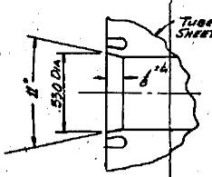  
#

#

.

<table><tr><td>THIS DRAWING REFLECTS
A8 BUILT
CHANGES
DATE 9-24-64.</td></tr></table>

<table><tr><td colspan="3"></td></tr><tr><td></td><td></td><td></td></tr><tr><td></td><td></td><td></td></tr><tr><td></td><td></td><td></td></tr><tr><td>HOD. PRIMARY HEAT EXCH. TUBE STABILIZER 20000000000000000000000000000000000000000000000000000000000000000000000000000000000000000000000000000</td><td colspan="2">D-18-74.</td></tr><tr><td colspan="2">PRIMARY HEAT EXCHANGER ASSY.</td><td>D-18-74.</td></tr><tr><td colspan="2">ASSY SHIPPING SUPPORT TO PRIMARY RAREXCHANGES</td><td>A-18-77</td></tr><tr><td colspan="2">PRIN. NEAT EXCH. TUBE BANDLE OPTIONS</td><td>D-18-A-F-865</td></tr><tr><td colspan="2">PRIM. NEAT EXCH. TUBE BANDLE DETAIL</td><td>D-18-A-F-865</td></tr><tr><td colspan="2">PRIN. NEAT EXCH. TUBE &amp;OLO DETAILS</td><td>D-18-A-F-865</td></tr><tr><td colspan="2">PRIM. NEAT EXCH. TUBE SHEET LAYOUT</td><td>D-18-A-F-865</td></tr><tr><td colspan="2">PRIN. NEAT EXCH. BARES ASSY.</td><td>D-18-A-F-865</td></tr><tr><td colspan="2">REFERENCE DRIVERS</td><td>DWG.NO.</td></tr><tr><td colspan="3">NOLTEEN SALT REACTOR EXPERIMENT 1996 No.7303</td></tr><tr><td colspan="3">PRIMARY HEAT EXCHANGER
TUBE BANDLE ASSEMBLY</td></tr><tr><td colspan="3">OK ROAD NATIONAL LABORATORY
BRANCH OF UNION CARBIDE LABORATORY
INFORMATION OF INTERIOR CARBIDE CORPORATION
CME INDUSTRY, TEMPERATURE</td></tr><tr><td>SERVICES
MURS. 3/4</td><td>ACCEPTED</td><td>APPROVED</td></tr><tr><td>JOG 433-6.6</td><td>D=22-A-40467</td><td></td></tr></table>

M20794RE 00BD.4

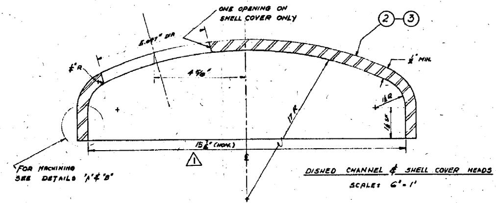

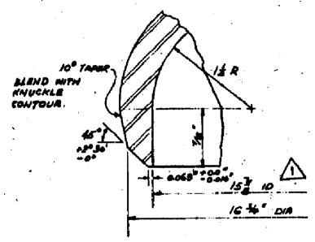  
DETAIL "A"   
SNELL COVER MACHINING   
SCALE: NON

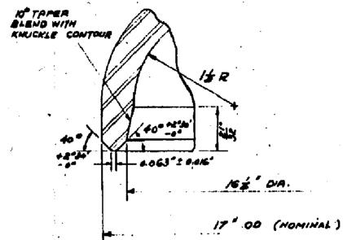  
DETAIL   
CHANNEL COVER MACINING   
SCALE : NONG

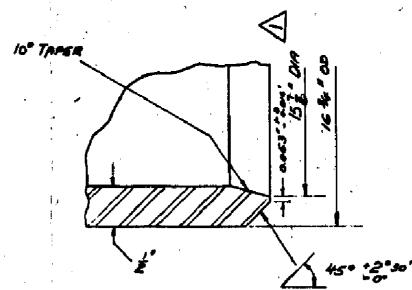  
DETAIL "D"   
(ScAe 12'01')

A. A. D. OcN 891C. A. C. D.   

<table><tr><td rowspan="2">NO.</td><td colspan="4">REVISIONS</td><td>DATE</td><td>APPD</td><td>APPD</td><td>APPROVED</td><td>DATE</td><td>APPROVED</td><td>DATE</td></tr><tr><td>Bayer
1,4,6,8,9,10,11</td><td>Bayer
12-12-13</td><td>Bayer
14-14-15</td><td>Bayer</td><td>15-16-17</td><td>Bayer
17-18-19</td><td>Bayer
20-21-22</td><td>11/12/13</td><td>2-1-2-3</td><td>12-12-13</td><td>2-14-15</td></tr><tr><td>1</td><td>Bayer
12-12-13</td><td>Bayer
14-14-15</td><td>Bayer
17-18-19</td><td>Bayer</td><td>15-16-17</td><td>Bayer
17-18-19</td><td>Bayer
20-21-22</td><td>11/12/13</td><td>2-1-2-3</td><td>12-12-13</td><td>2-14-15</td></tr><tr><td>2</td><td>Bayer
12-12-13</td><td>Bayer
14-14-15</td><td>Bayer
17-18-19</td><td>Bayer</td><td>15-16-17</td><td>Bayer
17-18-19</td><td>Bayer
20-21-22</td><td>11/12/13</td><td>2-1-2-3</td><td>12-12-13</td><td>1/1/12</td></tr><tr><td>3</td><td>Bayer
12-12-13</td><td>Bayer
14-14-15</td><td>Bayer
17-18-19</td><td>Bayer</td><td>15-16-17</td><td>Bayer
17-18-19</td><td>Bayer
20-21-22</td><td>11/12/13</td><td>2-1-2-3</td><td>12-12-13</td><td>3/1/12</td></tr></table>

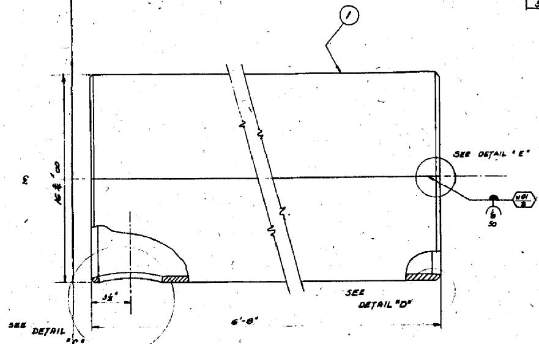  
HEAT EXCHANGER SHELL.   
(SCALE $j^{\prime \prime} = j^{\prime})$

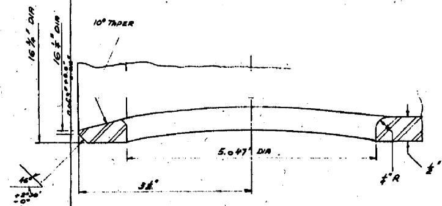  
DETAIL C   
(SCALE 12=1)

DETAIL   
SHELL SEAM JOINT PREPARATION.   
（SCLB！/²=）  
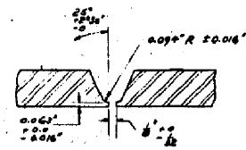  
NOTE6:   
PARTO TO BE FABRICATED AS FOR MS.R.E.GENERAL   
2,UCHC PABRICATG WELLOAER P8-88,P6-88, P8-86 A4 APPLICABLE INAPICF P88 W=80   
3. MATERIAL SPECIFICATIONS:  
NET - AM - B34 (MOB - B PLATE)  
NET - AM - G (MOB - G FOAMED NEAD)  
NET - AM - B34 (MOB - B WELDING FILLER METAL)   
4.3 ROUND ALL SNAP CONVERS TO $\frac{1}{2}$ RADONS UNLESS OTHERWISE SPECIFIED.   
5 FINAN ALL SURACES TO IIB INCHOINCHES AVERAGE ANGANNGNNEI UNLESS OTHER WARD SPINEID   
G WELD NUMERAB ASSIGNED: W#E WELD NUMBERS CAO W#E   
7 STASS RELICF ASOT APTES 2 PESTS APWMA METOL OT 1600TTE POE NOURI IN NELLUM ATMOS FNEE.

<table><tr><td colspan="5">PARTS LIST</td></tr><tr><td>PIER NO</td><td>DNO. NO</td><td>NO READ</td><td>DESCRIPTION</td><td>MATERIAL</td></tr><tr><td>1</td><td>THIS DVE</td><td>/</td><td>SMELL, 16&quot; OD &quot;HALL PIPE, &quot;Long&quot;</td><td>HDE-②</td></tr><tr><td>2</td><td>*</td><td>/</td><td>SWELL COVER, 17&quot; OD ASME DIENED HEAD &amp; PART</td><td>*</td></tr><tr><td>3</td><td>*</td><td>/</td><td>CHANNEL COVER, 17&quot; OD ASME DIENED HEAD &amp; PART</td><td>*</td></tr></table>

THIS DRAWING REFLECTS   

<table><tr><td></td><td></td></tr><tr><td></td><td></td></tr><tr><td>PMM NEAT EXCH. CHANNEL 468Y.</td><td>3-EEF-468</td></tr><tr><td>PMM NEAT EXCH. ASSEMBLY ELEVATION</td><td>024-4-100</td></tr><tr><td>REFERENCE DAMINGS</td><td>DWG.NO.</td></tr><tr><td colspan="2">MOLTEN AOLT REACTOR EXPERIMENTAL No. 760</td></tr></table>

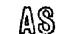  
M20794RE 010D1

3 2

CHANKES

$9 \cdot  {24} \cdot  {64}$

<table><tr><td>CLASSIFICATION
NOT CLASSIFIED
T. N. NEISTUK</td><td colspan="3">PRIMARY HEAT EXCHANGER
DETAILS SHEET # 2</td></tr><tr><td>Limits on DENSENESS BOUND
OVERLIMATES</td><td colspan="3">OAK RIDGE NATIONAL LABORATORY
INNOVATED OF
UNION CARBIDE NUCLEAR COMPANY
DISEASE OF UNION CARBIDE COMPORATOR
OUX RIOSE, TENDERSES</td></tr><tr><td>NEWTON ± 1/2</td><td rowspan="3">AUSHERS</td><td rowspan="3">ATTACHED</td><td rowspan="3"></td></tr><tr><td>DEGREE ± 0.006°</td></tr><tr><td>AMOUNT ± 2°</td></tr></table>

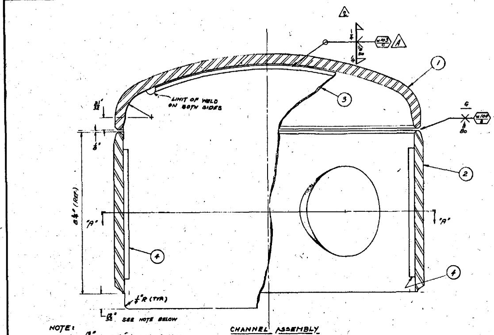  
NOTE:   
MACINING DIMENSION AND GROOVE

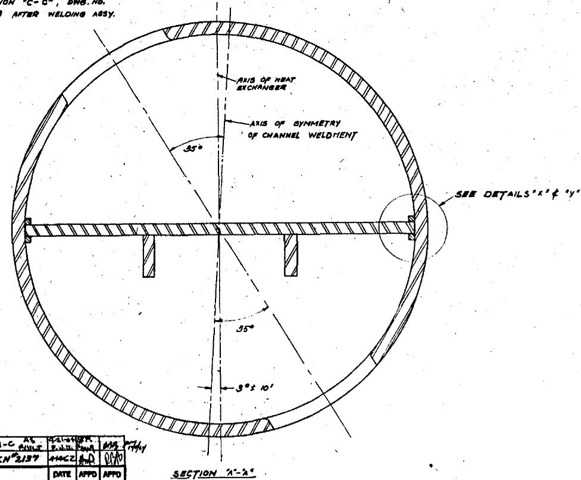  
SHOWN ON SECTION "C-C", DWS, NO   
D-EE-A-F0B68 AFTER WELDING A\$3Y.

<table><tr><td>B</td><td>A</td><td>D</td><td>DCN 2911-C</td><td>AB
AELT</td><td>P</td><td>Q</td><td>R</td><td>S</td><td>W</td></tr><tr><td>A</td><td>WAS</td><td>&quot;</td><td>WEND DCN&quot;</td><td></td><td>44CZ</td><td></td><td></td><td></td><td></td></tr><tr><td>NO.</td><td colspan="4">REVISIONS</td><td>DATE</td><td>APPD</td><td>APPD</td><td colspan="2"></td></tr><tr><td>SHEET
J.N.WEIGHT</td><td>DATE
J-24-G</td><td>SUBMITTED</td><td>DATE</td><td>APPROVED</td><td>12-6-2013</td><td>DATE</td><td>12-6-2013</td><td colspan="2"></td></tr><tr><td>DEMODED
J.A.WEIGHT</td><td>DATE
J-22-G</td><td>APPROVED</td><td>DATE</td><td>APPROVED</td><td>12-6-2013</td><td>DATE</td><td>12-6-2013</td><td colspan="2"></td></tr><tr><td>CHECKED
J.WEIGHT</td><td>DATE
J-22-G</td><td>APPROVED</td><td>DATE</td><td>APPROVED</td><td>12-6-2013</td><td>DATE</td><td>12-6-2013</td><td colspan="2"></td></tr></table>

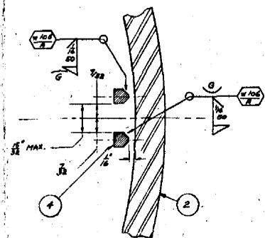  
DETAIL

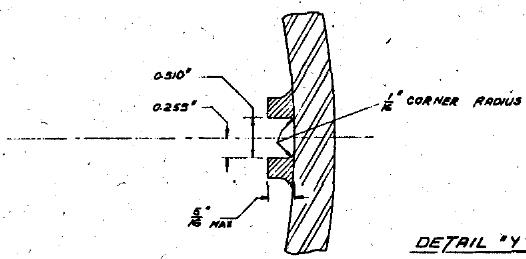

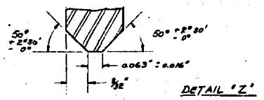

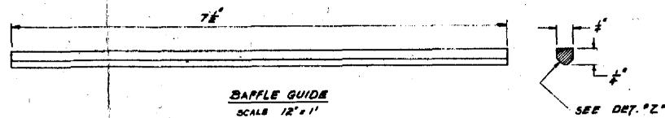  
NOTES:   
3.1. FABRICATE ASSY AS PM MSRS GENERAL FABRICATION SPEC.MSR.G2-B.ZEV A   
2. MATERIAL SPECIFICATION: MET-RN-B3J6 (MOR-B BAR) NET-RN-B304 (MOR-B WEDDING PILLER METAL)  
3.1 ABDNAD ALL SHARP CONNES TO 4 RADIUS UNLESS OFGRRWSE SPECIFIED.   
4. FINISH SURFACES TO 125 MICROINCHES AVERAGE RADIUSED MEASURED OTHERWISE SPECIFIED.   
5UCNCFABACICOTORS WILD PER F3-23,FA-8E,FA-8G AS APPLICABLE. INSECT PER W4-W60   
G3 WELD NUMBERS ASSIGNED: W/03 - W/08  
WELD NUMBERS USED: W/03 - W/06   
7 STRESS RELIEVE CHANNEL ASSEMBLY AFTER WELDING PARTS 1,2, 4 IN POSITION AND AGAIN AFTER WELDING PART 5 IN POSITION AT 1400F25 F FOZ 2HOURS EACH TIME IN INERT ATMOSHEE.

<table><tr><td>THIS DRAWING REFLECTS
A$ BUILT
CHANGES
DATE 9-24-64</td></tr></table>

<table><tr><td colspan="5">PARTS LIST</td></tr><tr><td>PROT
NO.</td><td>DIN. No.</td><td>NO.
RADIUS</td><td>DESCRIPTION</td><td>MATERIAL</td></tr><tr><td>1</td><td>1-2-17-4000</td><td>1</td><td>ASME FLANDED # DIENIED HEAD, 17&quot; OD × 1/2&quot; WALL, 8&quot; LONG</td><td>IVOR-B</td></tr><tr><td>2</td><td>2-2-17-4000</td><td>1</td><td>CHANNEL, 17&quot; OD × 1/2&quot; WALL, 8&quot; LONG</td><td>#</td></tr><tr><td>3</td><td>3-2-17-4000</td><td>1</td><td>CHANNEL SEPARATING BAFFLE, 9&quot; TNC B</td><td>#</td></tr><tr><td>4</td><td>4-2-17-4000</td><td>4</td><td>BAFFLE GUIDE, 1&quot; 1/2&quot; × 1/2&quot;</td><td>#</td></tr></table>

<table><tr><td>PRIM. HEAT EXCH. DETAILS SHEET #/</td><td>D-86A-405F</td></tr><tr><td>1</td><td>SHEET #2 D-86A-405F</td></tr><tr><td>2</td><td>SHEET #3 D-86A-405F</td></tr><tr><td colspan="2">PRIM. HEAT EXCH. ASSEMBLY ELEVATION D-86A-405F</td></tr><tr><td colspan="2">REFERENCE DRAWINGS DWG NO.</td></tr><tr><td colspan="2">MOLTEEN SALT REACTOR EXPERIMENT SW 7403</td></tr></table>

<table><tr><td>CLASSIFICATION
NOT CLASSIFIED
√ M. NESTSIK</td></tr><tr><td>LIFE ON AMERICAN DRUGGE
OTHER SPECIFIED
PRODUCTION ± 20</td></tr><tr><td>DECRATES ± 0.005</td></tr><tr><td>AMOUNT ± 2°30&#x27;</td></tr><tr><td>SCALE ± 6&quot; - 11&#x27;</td></tr></table>

M20794RE 013D 2   

<table><tr><td colspan="3">PRIMARY HEAT EXCHANGER
CHANNEL ASSEMBLY</td></tr><tr><td colspan="3">OAK RIDGE NATIONAL LABORATORY
OFFICES OF
UNION CARBIDE NUCLEAR COMPANY
DIRECTOR OF UNITOR CREMEDE CORPORATION
DUE 2018, THESEANCE</td></tr><tr><td>ASSIGNED
Attn: D.</td><td>ACCTED</td><td>APPROVED</td></tr><tr><td>J06-433-66</td><td></td><td>D-25-A-40972</td></tr></table>

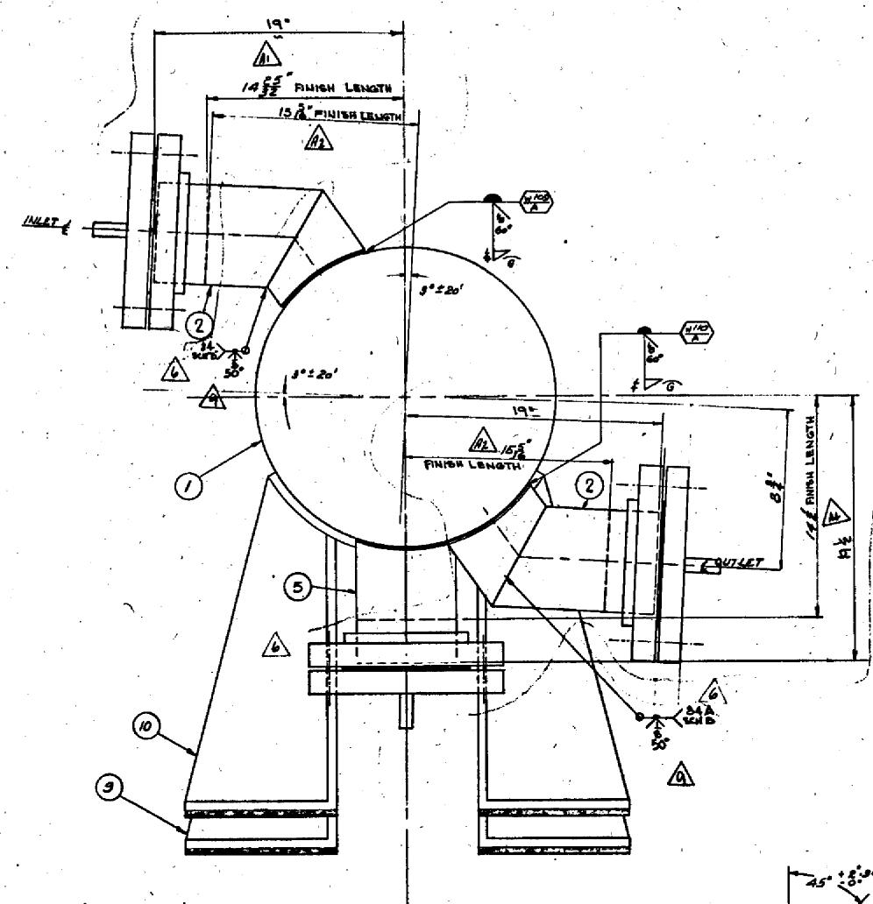  
SECTION 'A'-'A' OF OWG NO 0-EE-A-40874

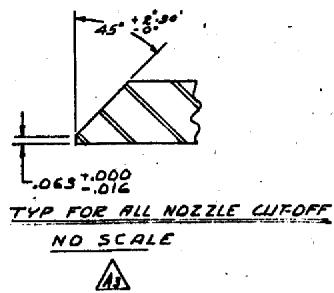

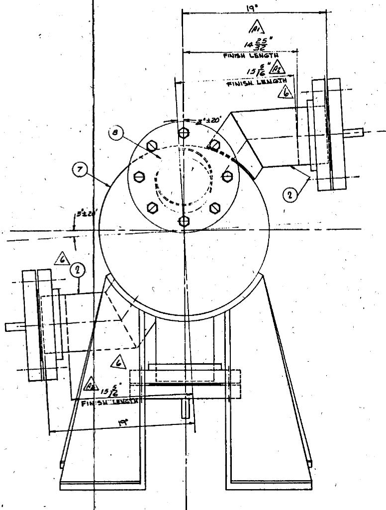  
SECTION 'B'-B' OF DWG NO D-EE-A 40874

<table><tr><td>B</td><td>A</td><td>ACN2911-C</td><td>△</td><td>JL</td><td>AP</td><td>CIN</td></tr><tr><td>A</td><td colspan="3">SEE DCN 8137</td><td>HCL</td><td>UP</td><td>QHP</td></tr><tr><td>NO.</td><td colspan="3">REVISIONS</td><td>DATE</td><td>APPD</td><td>APPD</td></tr><tr><td>###</td><td>###</td><td>###</td><td>###</td><td>###</td><td>###</td><td>###</td></tr><tr><td>###</td><td>###</td><td>###</td><td>###</td><td>###</td><td>###</td><td>###</td></tr><tr><td>###</td><td>###</td><td>###</td><td>###</td><td>###</td><td>###</td><td>###</td></tr></table>

<table><tr><td>THIS DRAWING REFLECTS
A$ BUILT
CHANGES
DATE 9.24.64</td></tr></table>

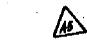

NOTES

1. FABRICATE MEAT EXCH. 46 PER USRE GENERAL
FABRICATION SPEC. M32. GZ-2 REV. A
2. NATUREL SPECIFICATION:

NE- $\mathbf{RM}$ -B3p4 (NOB-G WELING PILLEA METAL)

3,UCNC FABRICATORI WELD PER PA-83,PS-86,PA-8G AS APPLICABLE. INSPECT. PER Wt-200.   
f2 WELN NUMBERS ASSEDED1 w/o -w/o,  
WELN NUMBERS VED1 w/o -w/o,

3. FOR ANOUT SEE ONGAN, D-28-A-10074   
A COMPLETED HEAT EXCHANGER SHELL WAS MODIFIED IN THE FIELD AFTER WATER FLOW TESTS ACCORDING TO DRAWING E-59198. 7.REMOVE LEAK TEST FLANGES AND CUT NOZZLE#TO FINISH LENGTH IN FIELD.

<table><tr><td></td><td></td></tr><tr><td></td><td></td></tr><tr><td></td><td></td></tr><tr><td>PRINT, MEAT EACH. ASSEMBLY ELEVATION:</td><td>0254-4087</td></tr><tr><td>REFERENCE DRAWINGS:</td><td>DWG. NO.</td></tr><tr><td>MOLTEX SMT REFACTOR ENVIANTIEN</td><td>N/A. 7083</td></tr></table>

M20194RE Q14D 2   

<table><tr><td>CLASSIFICATION
NOT CLASSIFIED
J.M.WEST3M</td><td colspan="3">PRIMARY HEAT EXCHANGER
ASSEMBLY SECTIONS.</td></tr><tr><td>LIMITS ON IMMANUAL VOLUME
CONDITIONS SPECIFIED</td><td colspan="3">OAK RIDGE NATIONAL LABORATORY
OPERATED BY
UNION CARBIDE NUCLEAR COMPANY
BRANDING OF UNION CARBIDE CORPORATION
OAK NORTH, TEXAS, US</td></tr><tr><td>AMOUNT ±-</td><td>DESCRIPTION
W/ML 74/L</td><td>ACCEIVED</td><td>ADDITIONAL</td></tr><tr><td>SCALE 3&quot;°11&#x27;</td><td>108.633-6.6</td><td>D-E-A-40873</td><td>REF</td></tr></table>

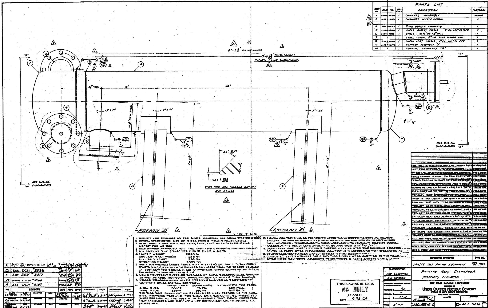  
M20794RE 015D 5

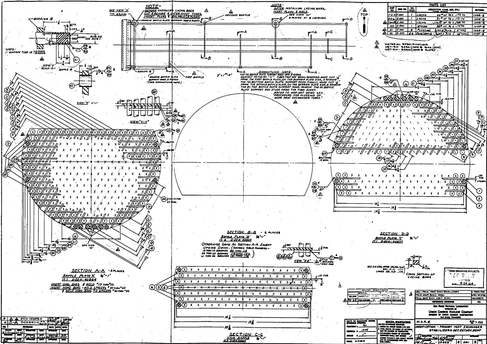  
Mn29E03E2

#

#

$\therefore m = \frac{3}{11}$

5

#

$\because {AD} = {AC} = 1 = x,y$

$\because {AD} = {AC} = 1$

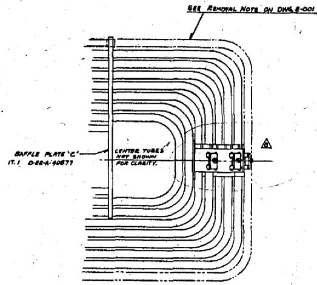

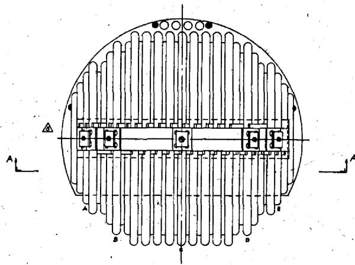

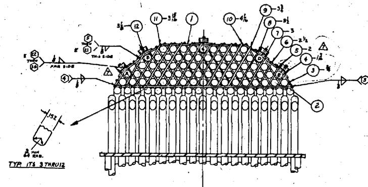  
SECTION A·A

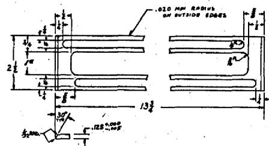  
DETAIL ITEM 2 INNER BAND   
FULL SIZE

<table><tr><td colspan="2">REVVISIONS</td><td>DATE</td><td>APPD</td><td>APPM</td></tr><tr><td>A.</td><td>SUBMITTED</td><td>DATE</td><td>APPROVED</td><td>DATE</td></tr><tr><td>B.</td><td>APPROVED</td><td>DATE</td><td>APPROVED</td><td>DATE</td></tr><tr><td>C.</td><td>APPROVED</td><td>DATE</td><td>APPROVED</td><td>DATE</td></tr></table>

<table><tr><td>PART NO.</td><td>DIAL NO.</td><td>NO. REQ.</td><td></td><td>DESCRIPTION (NAME, SIZE, ETC.)</td><td>MATERIAL</td></tr><tr><td>1</td><td>E-002</td><td>1</td><td>OUTER ANS 17 or 8% = 1%</td><td></td><td>N/A-B</td></tr><tr><td>2</td><td>E-002</td><td>1</td><td>ANBERAND 14 or 8% = 2%</td><td></td><td>N/A-B</td></tr><tr><td>3mm12</td><td>E-002</td><td>1</td><td>LACNA 5 or 6% = 15 or 152 TX</td><td></td><td>N/A-B</td></tr><tr><td>13</td><td>E-002</td><td>5</td><td>PAMMONI 1/1/1/1/1/1/1/1/1/1/1/1/1/1/1/1/1/1/1/1/1/1/1/1/1/1/1/1/1/1/1/1/1/1/1/1/1/1/1/1/1/1/1/1/1/1/1/1/1/1/1</td><td></td><td>N/A-B</td></tr><tr><td>14</td><td>E-002</td><td>5</td><td>CLIP 2/2 or 2A</td><td>12/1 or 10/10/10/10</td><td>N/A-B</td></tr><tr><td>15</td><td>E-002</td><td>5</td><td>BLOCK 46 or 40</td><td>4/6 or 1/1 or 7/1/7/1/7/1/7/1/7/1/7/1/7/1/7/1/7/1/7/1/7/1/7/1/7/1/7/1/7/1/7/1/7/1/7/1/7/1/7/1/7/1/7/1/7/1/7/1/7/1/7/1</td><td>N/A-B</td></tr><tr><td>16</td><td>E-002</td><td>5</td><td>SET CLIP 2/2 or 2A</td><td>2/2 or 1/1/1/1/1/1/1/1/1/1/1/1/1/1/1/1/1/1/1/1/1/1/1/1/1/1/1/1/1/1/1/1/1/1/1/1/1/1/1/1/1/1/1/1/1/1/1/1/1/2</td><td>N/A-B</td></tr></table>

NOTE 1:ITEMS 3 INAV 2-14

${10} : \left( {a + b}\right)  + c = {10} + {10} + c$

ASSEMI× 80054185

${AB} = {AC}$

NOIE EINSEY IV.2 INNNE PROPER LOCATION.

4.1.15.10 AND MARK LOCATION OF E OR FUBES

A

4. WED 1173 INPEA E RECHN FDR 2026, DODS-45

4. Ptas (1/4) on PpOe Tnepa 4052

WELD 17.17017-（wELOs34）

B. WELD 17.14 § 18 (Socayons) $= \left( {{W}_{L}{D}_{S} - {44}\mathrm{{MN}}\left( B\right) }\right)$ .

1

1

MIL:BN-104 (INORO-PLAKI)

MET·RM·B36G（MOA·200）

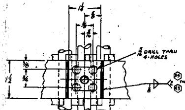

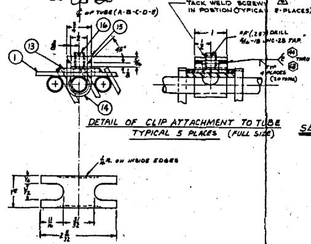  
$\bigtriangleup {ABC}$   
DEVELOPVED VIEW ITEM 14 CCIP   
SEE NOTE 2

#

C

CANNEX NUCLER COMPANY 10000

1. of Unw contd composition

$\therefore {S}_{\Delta OBC} = {S}_{\Delta COD} + {S}_{\Delta BOC}$

1103295408

<table><tr><td colspan="3">WELDING RECOGNITION</td></tr><tr><td colspan="2">INTERNAL</td><td>EXTERNAL</td></tr><tr><td>Welwons</td><td>Impedance</td><td>Unit A/20</td></tr><tr><td>PAS-13</td><td>Impedance</td><td>B</td></tr></table>

AG REFLECTS

#

#

#

$\therefore m - 1 \neq  0$ ;

${26.64}$

(1)

$\therefore m = \frac{3}{11}$ ;

L

1.1 Introduction

1

1

1

1

#

1

on Gs

$\cos \theta  + \frac{1}{2}$

$\therefore m = \frac{3}{11}$ ;

#

·

#

$\therefore m = \frac{3}{11}$

NALP

#

#

$\frac{1 + u}{1} - \frac{u}{1} = \frac{\left( {1 + u}\right) u}{1} < \frac{u}{1} = u$

一

$\therefore m = \frac{3}{11}$

.

$\frac{1}{2}$

$\therefore m = \frac{3}{11}$

$\therefore m = \frac{3}{11}$

#

#

#

OAK RIDGE NATIONAL LABORATORY

1 、

UNION CARBIDE NUCLEAR COMPANY

OK OK, OK

-

#

。

?

$\therefore m = \frac{3}{11}$

$\therefore m = \frac{3}{11}$ ;

$\frac{1}{2} =$

华

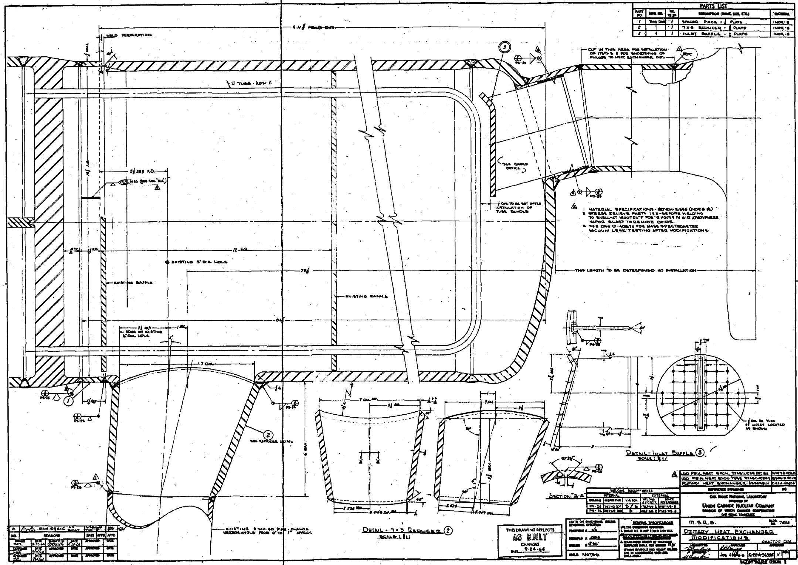

# Internal Distribution

1. S. E. Beall

2. M. Bender

3. E. S. Bettis

4. E. G. Bohlmann

5. G. E. Boyd

6. R.B. Briggs

7. W. B. Cottrell

8. F. L. Culler, Jr.

9. S.J. Ditto

10. D. E. Ferguson

11. A. P. Fraas

12. C. H. Gabbard

13. W. R. Grimes

14. A. G. Grindell

15. P. N. Haubenreich

16. P. R. Kasten

17-18. R. J. Kedl

19. M. I. Lundin

20. R. N. Lyon

21. R.E. MacPherson

22-23. C. K. McGlothlan

24. H. E. McCoy

25. H. C. McCurdy

26. A. J. Miller

27. R. L. Moore

28. E. L. Nicholson

29. L.C.Oakes

30. A. M. Perry

31. M. W. Rosenthal

32. A. W. Savolainen

33. Dunlap Scott

34. M. J. Skinner

35. I. Spiewak

36. D. A. Sundberg

37. R.E.Thoma

38. D. B. Trauger

39. J. E. Weir

40. M. E. Whatley

41. J. C. White

42. G. D. Whitman

43. ORNL Patent Office

44-45. Central Research Library (CRL)

46-47. Document Reference Section (DRS)

48-52. Laboratory Records (LRD)

53. Laboratory Records - Record Copy (LRD-RC)

# External Distribution

54-68. Division of Technical Information Extension (DTIE)   
69. Laboratory and University Division (ORO)