MSRE DESIGN AND OPERATIONS REPORT

Part V-A

SAFETY ANALYSIS OF OPERATION WITH $^{233}\mathrm{U}$

P.N. Haubenreich

J.R. Engel   
C.H. Gabbard   
R.H. Guymon   
B.E. Prince

# LEGAL NOTICE

This report was prepared as an account of Government sponsored work. Neither the United States, nor the Commission, nor any person acting on behalf of the Commission:

A. Makes any warranty or representation, expressed or implied, with respect to the accuracy, completeness, or usefulness of the information contained in this report, or that the use of any information, apparatus, method, or process disclosed in this report may not infringe privately owned rights; or   
B. Assumes any liabilities with respect to the use of, or for damages resulting from the use of any information, apparatus, method, or process disclosed in this report.

As used in the above, "person acting on behalf of the Commission" includes any employee or contractor of the Commission, or employee of such contractor, to the extent that such employee or contractor of the Commission, or employee of such contractor prepares, disseminates, or provides access to, any information pursuant to his employment or contract with the Commission, or his employment with such contractor.

Reactor Division

MSRE DESIGN AND OPERATIONS REPORT

Part V-A

SAFETY ANALYSIS OF OPERATION WITH $^{233}\mathrm{U}$

P. N. Haubenreich   
J. R. Engel   
C. H. Gabbard   
R. H. Guymon   
B. E. Prince

FEBRUARY 1968

OAK RIDGE NATIONAL LABORATORY

Oak Ridge, Tennessee

operated by

UNION CARBIDE CORPORATION

for the

U.S. ATOMIC ENERGY COMMISSION

# LEGAL NOTICE

This report was prepared as an account of Government sponsored work. Neither the United States, nor the Commission, nor any person acting on behalf of the Commission:

A. Makes any warranty or representation, expressed or implied, with respect to the accuracy, completeness, or usefulness of the information contained in this report, or that the use of any information, apparatus, method, or process disclosed in this report may not infringe privately owned rights; or

B. Assumes any liabilities with respect to the use of, or for damages resulting from the use of any information, apparatus, method, or process disclosed in this report.

As used in the above, "person acting on behalf of the Commission" includes any employee or contractor of the Commission, or employee of such contractor, to the extent that such employee or contractor of the Commission, or employee of such contractor prepares, disseminates, or provides access to, any information pursuant to his employment or contract with the Commission, or his employment with such contractor.

#

# CONTENTS

PREFACE 1

LIST OF FIGURES  vii

INTRODUCTION. 1

1. REACTOR SYSTEM 3

1.l Fuel and Primary System Materials 3   
1.1.1 Salts.. 3   
1.l.2 Salt Container Material.. 4   
1.1.3 Moderator Material 10   
1.1.4 Compatibility of Salt, Hastelloy-N, and Graphite 10

1.2 System Components 11

2. CONTROLS AND INSTRUMENTATION 13

2.1 Control Rods and Drives 13   
2.2 Safety Instrumentation 16   
2.3 Control Instrumentation 16   
2.4 Neutron Sources 17

2.4.1 Sources Inherent in Fuel Salt. 17   
2.4.2 External Source 18

2.5 Electric Power System 18   
2.6 Physical Layout of Instruments and Controls 19

3. PLANT LAYOUT 19   
4. CONTAINMENT 20

4.1 Description 20

4.1.1 Containment During Operation 20   
4.1.2 Containment During Maintenance 23

4.2 Experience. 23

4.2.1 Containment During Maintenance 23   
4.2.2 Primary Containment During Operation 23   
4.2.3 Secondary Containment During Operation 24

5. SITE 27

# Page

6. OPERATION 27

6.1 Staff and Procedures. 27   
6.2 Chronological Account 28   
6.3 Evaluation of Experience. 34

7. HANDLING AND LOADING 233U. 35

7.1 Production. 35   
7.2 Major Additions Through a Drain Tank. 36   
7.3 Small Additions Through the Sampler-Enricher.. 38

8. SAFETY OF ROUTINE OPERATIONS 39  
9. BREACH OF PRIMARY CONTAINMENT. 40

9.1 Damaging Nuclear Incidents. 40

9.1.1 General Considerations 40   
9.1.2 Uncontrolled Rod Withdrawal 46   
9.1.3 Sudden Return of Separated Uranium 52   
9.1.4 Fuel Additions 60   
9.1.5 Graphite Effects 61   
9.1.6 Loss of Load 63   
9.1.7 Loss of Flow 63   
9.1.8 "Cold-Slug" Accident 64   
9.1.9 Filling Accident 66   
9.1.10 Afterheat 67   
9.1.11 Criticality in Drain Tanks 67

9.2 Damage from Other Causes. 69

9.2.1 Thermal Stress Cycling 69   
9.2.2 Freezing and Thawing Salt. 71   
9.2.3 Excessive Wall Temperatures 71   
9.2.4 Corrosion. 73   
9.2.5 Radiation Damage to Container Material 77

10. RELEASE FROM SECONDARY CONTAINMENT 78

# PREFACE

This report is one of a series that describes the design and operation of the Molten Salt Reactor Experiment. All the reports have been issued with the exceptions noted.

<table><tr><td>ORNL-TM-728</td><td>MSRE Design and Operations Report, Part I, Description of Reactor Design by R. C. Robertson</td></tr><tr><td>ORNL-TM-729*</td><td>MSRE Design and Operations Report, Part II, Nuclear and Process Instrumentation, by J. R. Tallackson</td></tr><tr><td>ORNL-TM-730</td><td>MSRE Design and Operations Report, Part III, Nuclear Analysis, by P. N. Haubenreich, J. R. Engel, B. E. Prince, and H. C. Claiborne</td></tr><tr><td>ORNL-TM-731**</td><td>MSRE Design and Operations Report, Part IV, Chemistry and Materials, by F. F. Blankenship and A. Taboada</td></tr><tr><td>ORNL-TM-732</td><td>MSRE Design and Operations Report, Part V, Reactor Safety Analysis Report, by S. E. Beall, P. N. Haubenreich, R. B. Lindauer, and J. R. Tallackson</td></tr><tr><td>ORNL-TM-2111</td><td>MSRE Design and Operations Report, Part V-A, Safety Analysis of Operation with 233U, by P. N. Haubenreich, J. R. Engel, C. H. Gabbard, R. H. Guymon, and B. E. Prince</td></tr><tr><td>ORNL-TM-733</td><td>MSRE Design and Operations Report, Part VI, Operating Limits, by S. E. Beall and R. H. Guymon</td></tr><tr><td>ORNL-TM-907*</td><td>MSRE Design and Operations Report, Part VII, Fuel Handling and Processing Plant, by R. B. Lindauer</td></tr></table>

ORNL-TM-908

MSRE Design and Operations Report, Part VIII, Operating Procedures, by R. H. Guymon

ORNL-TM-909

MSRE Design and Operations Report, Part IX, Safety Procedures and Emergency Plans, by A. N. Smith

ORNL-TM-910\*\*

MSRE Design and Operations Report, Part X, Maintenance Equipment and Procedures, by E. C. Hise and R. Blumberg

ORNL-TM-911

MSRE Design and Operations Report, Part XI, Test Program, by R. H. Guymon, P. N. Haubenreich, and J. R. Engel

\*\*

MSRE Design and Operations Report, Part XII, Lists: Drawings, Specifications, Line Schedules, Instrument Tabulations (Vol. 1 and 2)

# LIST OF FIGURES

# Figure

1.1 Comparative Stress-Rupture Properties for Irradiated Hastelloy-N at $650^{\circ}\mathrm{C}$ 6   
1.2 Comparative Rupture Strains for Irradiated Hastelloy-N at $650^{\circ}\mathrm{C}$   
1.3 Comparative Tensile Properties of Irradiated and Un-irradiated MSRE Surveillance Specimens, Heat 5085. 8   
1.4 Comparative Creep Rates for Surveillance and Control Specimens at $650^{\circ}\mathrm{C}$ 9   
1.5 Hastelloy-N Surface from Exposed MSRE Surveillance Samples. Surface Deposit from Hastelloy-N in Near Contact with Graphite. 12   
2.1 Control Rod Worth in MSRE. 15   
4.1 Schematic of MSRE Secondary Containment Showing Typical Penetration Seals and Closures. 22   
4.2 Secondary Containment Leak Rates. 25   
6.1 MSRE Activities from July 1964 through December 1965. 29   
6.2 MSRE Activities in 1966. 30   
6.3 MSRE Activities in 1967. 31   
7.1 Arrangement for Adding $^{23}$ Enriching Salt to Fuel Drain Tank. 37   
9.1 Observed Response of Nuclear Power to Small Step Changes in Reactivity at Various Initial Powers With $^{235}\mathrm{U}$ Fuel. 43   
9.2 Results of Uncontrolled Rod Withdrawal with No Safety Action, 233U Fuel. 48   
9.3 Results of Uncontrolled Rod Withdrawal with No Safety Action, $^{235}\mathrm{U}$ Fuel. 50   
9.4 Results of Uncontrolled Rod Withdrawal, with Scram at 11 Mw, $^{233}\mathrm{U}$ Fuel. 51   
9.5 Time Dependence of Reactivity Addition due to Sudden Resuspension of Uranium in Lower Head of Reactor Vessel 54   
9.6 Temperature Excursion Caused by Sudden Resuspension of Uranium Equivalent to $0.25\%$ $\mathrm{8k / k}$ if Uniformly Distributed; Initial Power, 1 kw; No Safety Action 56

# Figure

# Page

9.7 Effect of Magnitude of Reactivity Recovery on Peak Pressures and Temperatures during Uranium Resuspension Incident with No Safety Action. 57   
9.8 Effect of Initial Power on Peak Pressure Rise Caused By Sudden Resuspension of Uranium Equivalent to $0.25\%$ 8k/k if Uniformly Distributed; No Safety Action. 58   
9.9 Effect of Magnitude of Reactivity Recovery on Peak Pressures and Temperatures During Uranium Resuspension Incident with Rod Scram at 11.25 Mw. $P_{0} = 1$ kw. 59   
9.10 Regulating Control Rod Motion During $^{235}\mathrm{U}$ Fuel Capsule Addition at Full Reactor Power. 62   
9.11 System Response to Load Increase from 2 to 7 Mw at Maximum Rate. 65   
9.12 Chromium in Fuel Salt Samples 76

# INTRODUCTION

The Molten Salt Reactor Experiment is an important step in a project whose ultimate goal is a thermal breeder reactor operating on the thorium-uranium-233 cycle. The breeder project is the outgrowth of extensive development of molten salt technology in the Aircraft Nuclear Propulsion Program of the 1950's. The MSRE was built to demonstrate that the molten salt technology had advanced to the point that many of the features of the proposed breeders could be incorporated in a reactor that could be operated safely and reliably and could be maintained when necessary. The MSRE began nuclear operation in June 1965, reached full power in May 1966, and now has passed 8000 equivalent full-power hours of operation. In a large measure, it has met its objectives. It is now proposed to extend its usefulness by experimental operation of a sort not contemplated in the original planning and safety analysis. In order to obtain information directly relating to the neutronic and stability analyses of $^{233}\mathrm{U}$ breeders, we propose to remove the present uranium from the fuel salt and substitute $^{233}\mathrm{U}$ . After the replacement of the uranium, the reactor would be taken to full power again and operated for the better part of a year to obtain data on $^{233}\mathrm{U}$ cross sections.

This report presents the data and the analyses that have led us to conclude that it is safe to load the MSRE with $^{233}\mathrm{U}$ and pursue the program of experimental operation. It leans on the MSRE Design Report1 and the original safety analysis report2 for much of the detailed description of the reactor components and the site. A comprehensive report on the instruments and controls is being issued concurrently,3 so no attempt is

made here to give a complete description of those systems. What this report does include is a summary of relevant experience and new information and an assessment of the safety of operation with $^{233}\mathrm{U}$ , taking into account that experience, the physical condition of the system, and the different neutronic characteristics with $^{233}\mathrm{U}$ in place of $^{235}\mathrm{U}$ .

# 1. REACTOR SYSTEM

At the time the MSRE design report and the original safety analysis report were issued, construction of the reactor was essentially complete. The description of the components and the mechanical systems given in those reports therefore is as-built, is still valid in all essential respects, and will not be repeated here. There is new information on the materials, however, as a result of further testing and experience and this is discussed below.

# 1.1 Fuel and Primary System Materials

# 1.1.1. Salts

The original safety analysis considered the possible use of fuel salts of three different compositions. One of these, Fuel C, has been used throughout all the operation to date, and the composition therefore has been proved in use. The present mixture contains $^{235}\mathrm{U}$ as the fissile material, diluted with $^{238}\mathrm{U}$ to provide a total uranium concentration of about 0.9 mole percent. This mixture will be fluorinated to remove that uranium, then $^{233}\mathrm{UF}_4$ -LiF eutectic will be added and nuclear operation resumed. With most of the non-fissile uranium removed, the operating uranium concentration with $^{233}\mathrm{U}$ will be about 0.2 mole percent, otherwise the chemical composition of the fuel salt will be practically unchanged. There should be no significant difference in the chemical stability of the salt. The higher uranium concentration was desired originally because at that time it was considered possible that the fission products from one fission might use up more than four fluorine atoms or that fluorine might be lost by some other process, causing some reduction of $\mathrm{UF}_4$ to $\mathrm{UF}_3$ . This process, if allowed to continue, could lead ultimately to precipitation of metallic uranium. The higher concentration of $\mathrm{UF}_4$ gave more time for careful analysis and determination of the actual situation before uranium precipitation could occur. It turned out that the fission products from one fission tie up less than four fluorine atoms, not more, and there is no significant loss of fluorine by other reactions, so the need for $\mathrm{UF}_4$ much in excess of the minimum required for criticality does

not exist. The slight amount of fluorine liberated as a result of fission gradually oxidizes some of the $\mathrm{UF}_3$ in the salt to $\mathrm{UF}_4$ . A reducing environment must be maintained to prevent attack of the container walls, so the $\mathrm{UF}_3$ concentration is held at approximately one percent of the total uranium by exposing a rod of beryllium metal in the sampler-enricher at intervals of several weeks. (The reaction is $2\mathrm{UF}_4 + \mathrm{Be} \rightarrow 2\mathrm{UF}_3 + \mathrm{BeF}_2$ .)

During the operation of the MSRE, corrosion products and fission products in the fuel salt have not built up to concentrations that could have any deleterious effect on chemistry. Moisture has been effectively excluded from the salt systems as evidenced by fuel salt analyses which have consistently shown only about 50 ppm oxide. Since this is far below the solubility of $\mathrm{ZrO_2}$ , no precipitation of $\mathrm{ZrO_2}$ is expected. Fluorination of the salt to remove the original charge of uranium will produce additional corrosion products, but the salt will be given further treatment (probably reduction and filtration) to insure that concentrations are acceptably low when the salt is returned for use in the reactor.

In summary, no problems have been encountered with the fuel salt chemistry and none are expected in the $^{233}\mathrm{U}$ operation.

# 1.1.2 Salt Container Material

All the salt piping and vessels in the MSRE are made of the nickel-base alloy Hastelloy-N (also called INOR-8) which was especially developed to be corrosion-resistant in molten fluorides and to have good high-temperature physical properties. Experience with and testing of Hastelloy-N since the construction of the MSRE have shown that it is indeed corrosion resistant, but that certain of its high-temperature physical properties suffer under prolonged neutron irradiation. Corrosion experience is summarized in Section 9.2.4. Effects of irradiation are discussed below.

Irradiation of Hastelloy-N has little effect on the yield strength and the secondary creep rate, but causes drastic reduction in the rupture ductility and the creep rupture life. Rupture ductility in creep tests may be reduced from strains of 8 - $12\%$ to as little as 0.5 to $4\%$ . Rupture life may be reduced by as much as a factor of ten at high stress levels. The damage is believed to stem from n-α reactions producing helium that collects in grain boundaries and promotes intergranular cracking. This

type of damage is quite general among iron- and nickel-base structural alloys and can be caused by n,α reactions of fast neutrons as well as by thermal neutron absorptions in boron. However, in the Hastelloy-N in the MSRE, helium production is predominantly from boron. Thus the degree of damage is primarily a function of thermal neutron fluence and practically saturates at $10^{21} \mathrm{n/cm}^2$ or less.

A comparison of stress-rupture characteristics of irradiated and unirradiated Hastelloy-N is given in Figure 1.l. The rupture strains observed in these tests are shown in Figure 1.2. The irradiated specimens were from four commercial heats of metal used in the fabrication of the MSRE reactor vessel. The specimens irradiated in MSRE were removed in August 1966 after exposure to a thermal neutron fluence ranging from $0.5 \times 10^{20}$ to $1.3 \times 10^{20} \, \text{n/cm}^2$ (Reference 4). (Hastelloy-N specimens have since been irradiated in the MSRE core to higher doses, but these specimens were of heats modified by the addition of $0.5\%$ Ti or Zr to greatly reduce radiation damage and so are not directly relevant to the condition of the MSRE vessel.) Those marked ORR were exposed in a helium atmosphere in that reactor to $1.4 \times 10^{20}$ to $5.2 \times 10^{20} \, \text{n/cm}^2$ .

Figure 1.3 illustrates that yield strength was not affected and that ultimate strength was not drastically reduced by the irradiation in the MSRE. The total elongation in these tensile tests was reduced, but not nearly so much as in the creep-rupture tests. For example, at $650^{\circ}\mathrm{C}$ $(1200^{\circ}\mathrm{F})$ the elongation was $13\%$ in the tensile test at a strain rate of $0.05\mathrm{min}^{-1}$ compared to elongations of 1 to $4\%$ in the longer-term tests shown in Fig. 1.2. Figure 1.4 shows that there was practically no difference between the secondary creep rate of irradiated specimens and unirradiated control specimens.

The effects of neutron irradiation must be considered against the background of allowable stresses used in the MSRE design and the anticipated service life of the reactor. When the MSRE was designed, Hastelloy-N

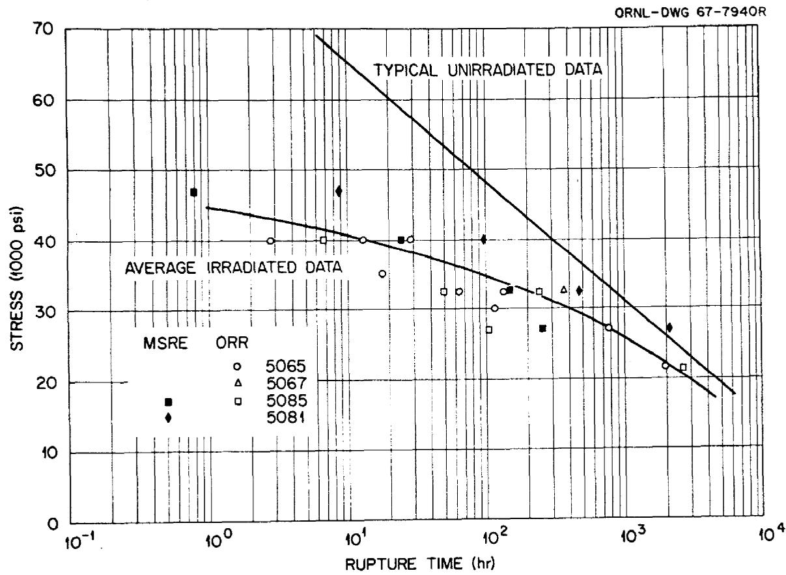  
Figure 1.l. Comparative Stress-Rupture Properties for Irradiated Hastelloy-N at $650^{\circ}\mathrm{C}$ .

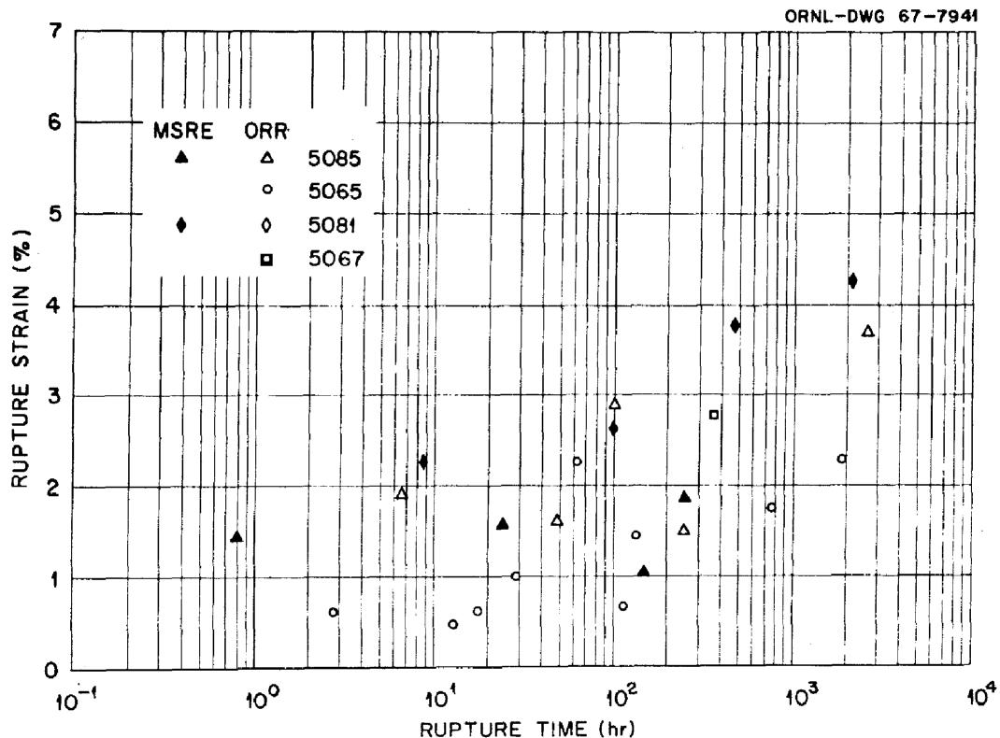  
Figure 1.2. Comparative Rupture Strains for Irradiated Hastelloy-N at $650^{\circ}\mathrm{C}$ .

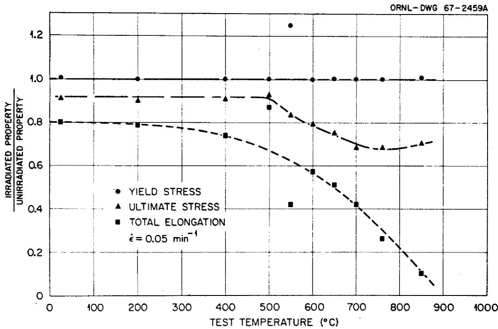  
Figure 1.3. Comparative Tensile Properties of Irradiated and Unirradiated MSRE Surveillance Specimens, Heat 5085.

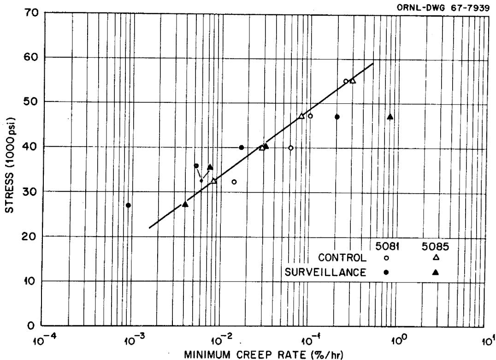  
Figure 1.4. Comparative Creep Rates for Surveillance and Control Specimens at $650^{\circ}\mathrm{C}$ .

had not yet been considered by the ASME Code Committee, so a curve of maximum allowable stress as a function of temperature was prepared using code criteria and the physical properties of unirradiated Hastelloy-N. Below $900^{\circ}\mathrm{F}$ the allowable stresses were governed by the tensile and yield strengths, from 900 to $1150^{\circ}\mathrm{F}$ the 100,000-hour rupture stress was limiting, and above $1150^{\circ}\mathrm{F}$ the stress that produces a secondary creep rate of $0.1\%$ in 10,000 hr governed. Subsequently the ASME Boiler and Pressure Vessel Code Committee approved Hastelloy-N for construction under the Unfired Pressure Vessel Code and the Nuclear Vessel Code. Maximum allowable stresses approved under the codes are essentially those on the MSRE design curve. Maximum allowable primary stress at $1200^{\circ}\mathrm{F}$ is 6000 psi and at $1300^{\circ}\mathrm{F}$ , 3500 psi. Actually, in the design of the MSRE, primary stresses were generally limited to 2750 psi or less except in a few locations where lower temperatures justified higher allowable stresses.

The data in Fig. 1.l suggest that the difference in the rupture life of irradiated and unirradiated Hastelloy-N decreases as the stress is reduced and that it may be very small at the MSRE design stresses.

Implications of the effect of irradiation on the serviceability of the MSRE primary containment are discussed in Section 9.2.5.

# 1.1.3 Moderator Material

Further information on the MSRE graphite has come from exposure of surveillance specimens in the MSRE core (discussed in the next section) and from irradiations in the ORR to doses far beyond those anticipated in the MSRE. The irradiated specimens showed practically no dimensional changes at doses that may be reached in the MSRE and no other changes of any consequence to the MSRE.

# 1.1.4 Compatibility of Salt, Hastelloy-N, and Graphite

Analyses of several hundred samples of fuel salt, taken over more than two years of operation, and examination of two sets of metal and

graphite specimens exposed for thousands of hours in the MSRE core have further demonstrated the compatibility of the fuel, the moderator, and the container materials.

Interaction between the salt and the Hastelloy-N appears to have been limited to deposition of an extremely thin layer of noble metal fission products on loop surfaces and an inconsequential amount of corrosion, i.e., leaching of chromium. This is discussed more fully in Section 9.2.4.

Two sets of graphite specimens exposed in the MSRE core showed no attack by the salt in 2800 and $4300\mathrm{hr}$ . There was no change in the surface finish, no intrusion of salt into the pores and no further cracking of the graphite. Radiochemical analyses and examinations with electron microprobes showed that noble metal fission products were deposited at the surface (less than 0.3 mil deep) and products of xenon and krypton decay were distributed throughout the specimens. Although of great interest, the effects of these fission products in the MSRE are insignificant.

Where graphite and Hastelloy-N are in direct contact in the MSRE core, some carburization of the metal was expected. Thus, when the core was assembled, sacrificial metal inserts were included at contact points. The surveillance specimens showed that some reaction does take place where surfaces are in contact. Figure 1.5 is a section through a Hastelloy-N surface that was in contact with graphite through $4800\mathrm{hr}$ at $1200^{\circ}\mathrm{F}$ in the first set of surveillance specimens. (The affected layer is small compared to the thickness of the inserts between graphite and structural metal in the core.)

Substitution of $^{233}\mathrm{U}$ should in no way affect the compatibility of the materials in the primary system.

# 1.2 System Components

There has been no modification of any of the reactor components described in Section 1.2 of the original safety analysis report, so the descriptions given there are still valid. The heat transfer performance of both the primary heat exchanger and the coolant radiator proved to be

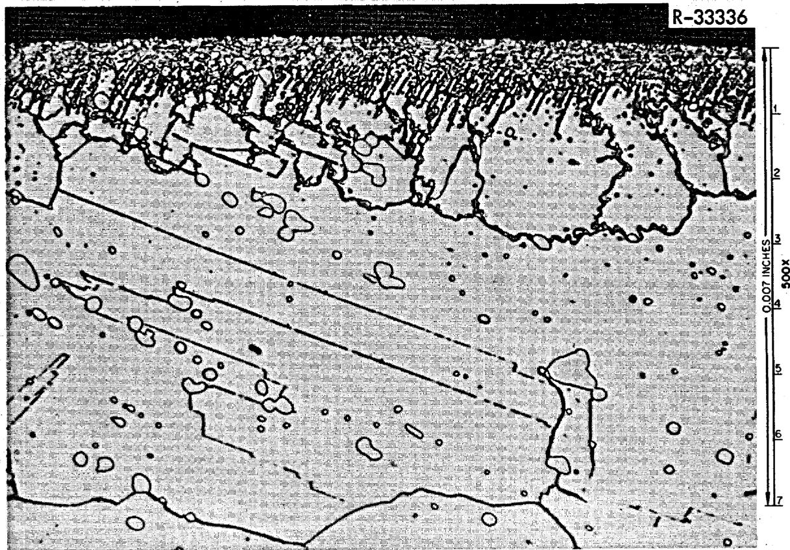  
Figure 1.5. Hastelloy-N Surface from Exposed MSRE Surveillance Samples. Surface deposit from Hastelloy-N in near contact with graphite.

less than predicted, however. $^{6}$ The important consequence of this is that the steady-state reactor power has been limited to about 7.5 Mw instead of the 10 Mw originally contemplated in the safety analysis.

# 2 CONTROLS AND INSTRUMENTATION

The system of instrumentation and controls remains essentially as described in the original safety analysis report, and experience has shown that it performs as intended. There have been a few changes, however, notably the addition of a period scream of the control rods. Also the change to $^{233}\mathrm{U}$ has some control implications. These points will be discussed in this section, which follows the outline of the original report.

# 2.1 Control Rods and Drives

The mechanical description of the MSRE control rods and drives presented in the original safety analysis report is still valid since no changes have been made.

The measured worth of the control rods with $^{235}\mathrm{U}$ fuel in the reactor is slightly greater than was predicted. The worth of one rod was found to be $2.26\%$ $\delta \mathrm{k / k}$ , compared to a prediction of $2.11\%$ $\delta \mathrm{k / k}$ . The observed worth of three rods was $5.59\%$ $\delta \mathrm{k / k}$ ; the predicted worth, $5.46\%$ . When $^{233}\mathrm{U}$ is substituted for the present partially-enriched uranium, the neutron diffusion length will be longer and the rod worth greater by a factor of 1.3. The worth predicted for one rod is $2.75\%$ $\delta \mathrm{k / k}$ ; for three rods, $7.01\%$ $\delta \mathrm{k / k}$ . (These worths are for the 5l-inch travel between limit switches, with the critical concentration of uranium in the fuel. The

one-rod worth is with the other two rods fully withdrawn). Figure 2.1 shows measured and predicted worth curves with the original fuel and the predicted curve with $^{233}\mathrm{U}$ fuel.

Experience has shown that mechanically the rods are quite reliable. There have been 28 unscheduled control-rod scams (through November 1967) when fuel salt was in the reactor vessel. (None was caused by a process variable actually exceeding the scam setpoint.) Scrams for testing purposes brought the total for each rod to well over 100 scams. Never has a rod failed to drop on request.

Rod drop time with the core hot has ranged from 0.97 down to 0.71 sec. depending on the rod and its length of prior service. (The rod becomes more flexible with use, leading to shorter drop times.) The drop time corresponding to the delay and acceleration assumed in the safety analysis is 1.4 sec. One rod drive was replaced in September 1966 because the drop time was slower than normal. It had been 0.96 sec. at the end of a run and during the shutdown with the core and rod cold the drop time approached 1.3 sec. After replacement of the rod itself (see below) did not improve the drop time, the cause of the slow drop was found to be a bent air tube in the drive unit that rubbed the inside of the hollow rod.

Two of the three rods currently in the reactor have been in service since the start of nuclear operation in May 1965. The rod that was replaced in September 1966 had developed a tendency to hang on withdrawal about two inches above the fully inserted position. The hanging was attributed to interference between a sharp corner on the bottom fitting on the rod and the lower end of a guide rib in the rod thimble. The upper corners of the end fitting on the replacement rod were rounded and no further difficulty has been encountered. Aside from this instance the rods have always moved freely in either direction.

The gadolinium loading in the poison elements is such that the rods should remain black to neutrons for much longer than the expected operation of the MSRE. In July 1967, tests verified that there had been no change in sensitivity due to poison burnout.

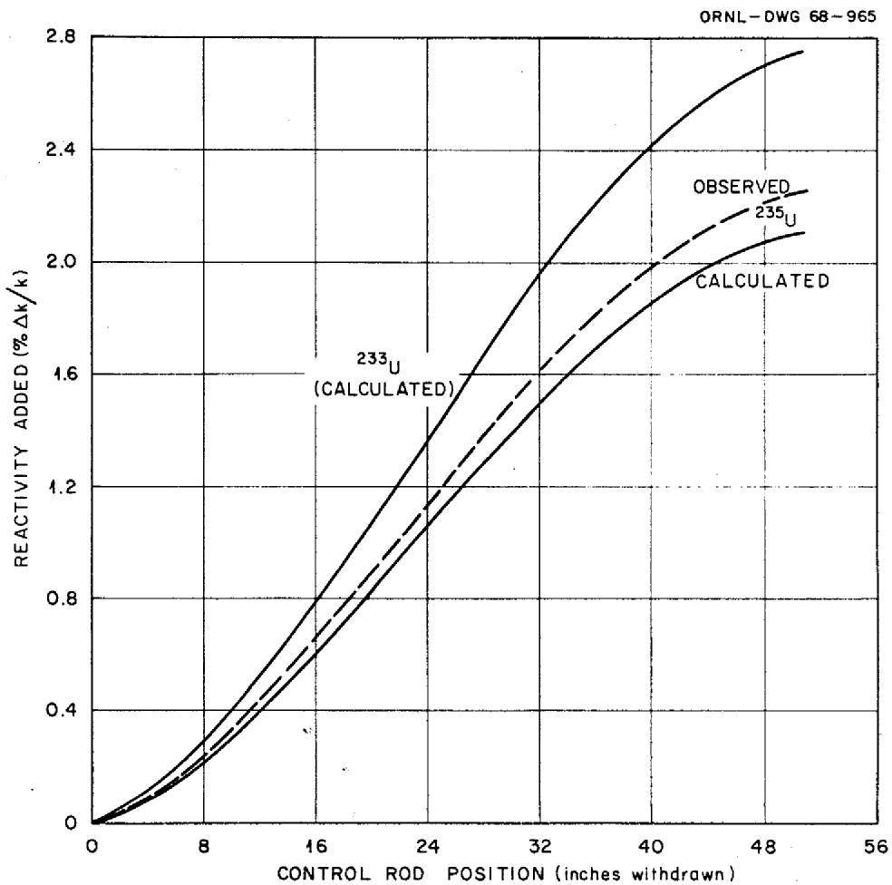  
Figure 2.1. Control Rod Worth in MSRE.

# 2.2 Safety Instrumentation

An up-to-date description of the safety system is given in Part II-A of the MSRE Design and Operations Report, recently issued.8

Shortly before the beginning of nuclear operation with $^{235}\mathrm{U}$ , a period scram was added to the safety system described in the original safety analysis report. The control rods are scrambled when there are indications of a positive period shorter than 1 second. A period signal derived from the output of a safety chamber is included, along with flux level and core outlet temperature, in each of three trip channels. These channels are connected so a trip on any two channels scrams the rods.

Other changes made after the original safety analysis report was issued are in the flux level trips. After full power proved to be about 7.5 Mw, the high level trip was set down to 11.25 Mw (150% of 7.5 Mw). This is the trip point if the fuel pump is running. If the fuel pump is off, the level trip points are automatically reduced to 11.25 kw, and each of the three channels must be reset manually to the higher level after the pump is started.

Other than the changes described above, there have been no changes in the functions of the safety system since the original safety analysis. As will be shown in Chapter 9, no changes will be necessitated by the substitution of $^{233}\mathrm{U}$ for the $^{235}\mathrm{U}$ in the fuel.

# 2.3 Control Instrumentation

Since the time of the original safety analysis report, several changes have been made in the control system. These changes affect normal operating procedures, but none are of significance from the standpoint of the safety analysis. No changes are anticipated because of the $^{233}\mathrm{U}$ loading.

# 2.4 Neutron Sources

The presence of a neutron source is important because of its influence on the course of excursions from reactivity additions that begin with the reactor subcritical.[9]

# 2.4.1 Sources Inherent in Fuel Salt

Alpha particles emitted by heavy elements in the fuel salt interact with the lithium, beryllium and fluorine to produce an abundant source of neutrons within the salt. In the original fuel salt most of the energetic alpha particles come from the decay of $^{234}\mathrm{U}$ , which constitutes $0.3\%$ of the uranium. The neutron source in the amount of fuel salt required to fill the core was predicted to be $4 \times 10^{5}$ n/sec. (Ref. 10) This strength was verified approximately during the experiments at the beginning of nuclear operation.[11]

After $^{233}\mathrm{U}$ is substituted for the present uranium, the inherent alpha-n source will be much greater. The $^{234}\mathrm{U}$ concentration in the salt will be higher, but its contribution to the alpha-n source will be insignificant compared to that of the $^{233}\mathrm{U}$ and the daughters of $^{232}\mathrm{U}$ . There is a chain of short-lived alpha emitters descending from 1.9-y $^{228}\mathrm{Th}$ whose activity builds up with that of the thorium following chemical purification of the uranium. In the spring of 1968, the $^{228}\mathrm{Th}$ (and daughters) associated with the uranium will be at about three-fourths of saturation. The predicted alpha-n source in a core full of fuel salt at that time is $3 \times 10^{8}$ n/sec, a factor of 700 higher than in the original fuel salt.

There will also be a substantial photoneutron source in the fuel salt from interaction of fission product gamma rays with the beryllium. Immediately after high power operation, this source will emit more than $10^{9}$ n/sec in the core, but within about a day will have decayed below the predicted alpha-n source.

The inherent alpha-n source is particularly valuable from the standpoint of safety because it is absolutely dependable. Wherever there is $^{233}\mathrm{U}$ , there is the neutron source.

# 2.4.2 External Source

An external neutron source, located in the thermal shield, is provided for convenience. This source permits checking that the nuclear startup instruments are working properly before the fuel salt is brought out of the drain tanks into the reactor vessel. After only a small fraction of the vessel is filled with fuel, the neutrons from the inherent source completely overshadow the effects of the external source and give a strong counting rate on both the wide-range channels and the startup channel.[12]

The external source is an alpha-n source consisting of a mixture of $^{241}\mathrm{Am}$ , $^{242}\mathrm{Cm}$ and Be. When the source was new the strength was $10^{8}$ n/sec, mostly from $^{242}\mathrm{Cm}$ alphas. The flux of fission neutrons at the source tube during power operation is not enough to keep the $^{242}\mathrm{Cm}$ regenerated by production from the $^{241}\mathrm{Am}$ . Thus the source decays after installation with practically the 163-d halflife of the $^{242}\mathrm{Cm}$ originally present. The first source was installed in May 1965 and remained adequate through May 1967. Another source of the same type and original intensity was installed on top of the first in June 1967. This will remain adequate through the anticipated operation of the MSRE.

# 2.5 Electric Power System

The electric power system at MSRE is essentially the same as described in the design report, but some improvements have been made to reduce the likelihood of power failures interfering with operation of the reactor. These include better lightning protection for the 13.8-kv feeder lines, installation of a battery-powered 50-kva static inverter for uninterrupted instrument power, and provision of independent power supplies for each of the three channels in the safety system.

# 2.6 Physical Layout of Instruments and Controls

The location of the reactor controls and instrumentation is as described in the original safety analysis report (ORNL-TM-732). Not described was the fire protection system. In the main control area are three detectors, each a combination of rate-of-rise and fixed-temperature $(136^{\circ}\mathrm{F})$ devices, connected to the building and plant alarm system. Carbon dioxide fire extinguishers are readily available to all control areas. The automatic sprinkler system in the building also covers the control areas and computer room with fog nozzles triggered by $212^{\circ}\mathrm{F}$ fusible plugs.

# 3. PLANT LAYOUT

The plant layout was described in the safety analysis report (ORNL-TM-732). Construction was essentially complete at the time of that report and there has been no significant change from the original description.

# 4. CONTAINMENT

The MSRE design aimed at zero leakage from the system of piping and vessels that is the primary containment for the fission products. In addition, a secondary containment system was provided to limit the release of fission products to the environs in the event of a failure in the primary containment. Stringent leakage criteria had to be met by the secondary containment, because the potential release from the primary containment in the ultimate accident might conceivably amount to practically the entire inventory in the reactor.

The MSRE has met the criterion for primary containment. By the use of welded construction with a minimum of gasketed joints, and those pressure-buffered, zero leakage has been attained during all periods of operation. No accident has ever occurred to test the secondary containment, but tests of various kinds have shown that the specified design criteria have been met and routine, frequent measurements indicate that the reactor has always operated within a satisfactory secondary containment.

Containment during $^{23}$ U operation will be the same as in the $^{23}$ U operation.

# 4.1 Description

Most of the fission products remain in the fuel salt, but the fuel offgas is also intensely radioactive, containing noble gases and part of the noble metal fission products. Some fission products deposit on surfaces in contact with salt or offgas, thus presenting radiation and contamination problems in maintenance and inspection. Containment is always provided for these sources, the nature depending on the situation.

# 4.1.1 Containment During Operation

The salt is contained in piping and vessels of Hastelloy-N. This system was designed for long operation at 50 psig and $1300^{\circ}\mathrm{F}$ without excessive creep and is therefore capable of containing much higher pressures and temperatures for short periods of time. The fuel system contains only a few flanges. In the fuel circulating loop there are three "freeze flanges", with a metal ring seal backing up a frozen salt barrier. As in

all other primary containment flanges, the groove under the ring is pressurized to 100 psig with helium to provide a buffer zone and continuous leak detection. There is also an access nozzle on top of the reactor vessel with a frozen salt seal backed by a buffered ring-joint flange. The piping and vessels in the cover gas and offgas system are of Hastelloy-N and stainless steel, with several flanges, all leak-detected and buffered. This grade of containment extends through the charcoal beds, where practically everything but 10.6-y $^{85}\mathrm{Kr}$ decays, to the point where the offgas is mixed into the ventilation stack flow. This then is the primary containment during operation.

The sealed reactor and drain-tank cells are the secondary containment for the fuel salt during operation. The lines and vessels through which the cell atmosphere is recirculated by the component coolant pump are in effect extensions of the reactor cell. The cells are held at -2 psig by venting about 70 scf/d of the component coolant pump output to compensate for inleakage and deliberate inputs of nitrogen. The evacuation flow passes a radiation monitor and an automatic block valve, then through high-efficiency particulate filters before passing up the ventilation stack past another set of monitors. The fuel offgas line (outside the reactor cell) and the charcoal beds are inside enclosures through which ventilation air flows directly to the stack filters. The fuel sampler-enricher, which when it is being used is an extension of the offgas system, is in an enclosure swept with helium that exhausts through a charcoal trap to the stack filters. All service lines penetrating the secondary containment are equipped with closure devices, the type depending on the application, as indicated in Fig. 4.1. Most of the safety block valves are actuated by radiation monitors, but many close if the reactor cell pressure goes above atmospheric.

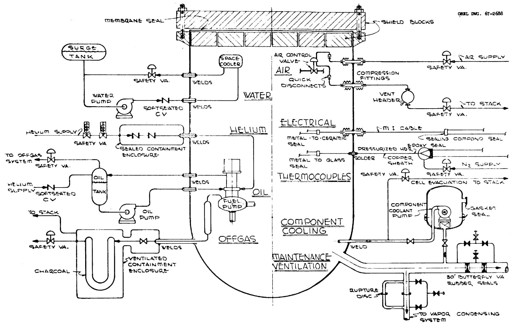  
Figure 4.1. Schematic of MSRE Secondary Containment Showing Typical Penetration Seals and Closures.

# 4.1.2 Containment During Maintenance

Most maintenance does not entail opening the containment described above. When it is necessary to perform work inside the reactor cell, a 30-inch line is opened, connecting the cell to the ventilation stack through the high-efficiency filters. Then when the opening necessary for maintenance is made in the cell roof, air is drawn down into the cell from the work area. The work area is maintained slightly below atmospheric pressure to provide another line of defense against unfiltered releases. Contaminated equipment and tools are bagged in plastic or sealed in cans before being withdrawn from the containment.

# 4.2 Experience

# 4.2.1 Containment During Maintenance

Experience with regard to containment during maintenance can be briefly summarized. In no case has personnel exposure exceeded normal occupational limits, and the maximum release of fission products to the environment in any week has been less than 0.2 curie.

# 4.2.2 Primary Containment During Operation

The primary containment of the fuel salt has been perfect. Buffer pressure has been maintained on the freeze flanges at all times, ensuring zero leakage of salt. The tightness of the system is indicated by buffer gas leakage, which is less than $5 \times 10^{-4} \, \text{cm}^3/\text{sec}$ from each flange buffer zone when the system is hot.

There has been no significant release from the radioactive gas system. Occasionally during fuel salt sampling, minute quantities $(< 10\mu c)$ of fission products have been vented to the stack when the sampler enclosure is purged, but large releases of this kind are impossible because the source is limited. The radiation block valve on the offgas line has been called on to block release of activity on only one occasion. In October 1966, as a result of excessively rapid changes in the fuel pump pressure, radioactive gases entered the pump shaft seal vent line.[13] The

radiation monitor blocked the line before there was a measurable $(10\mu c)$ release to the stack. Subsequently a charcoal filter was installed in this line even though the need for the troublesome pressure changes was eliminated.

The primary system is routinely pressure-tested by applying 65 psig helium pressure in the pump bowl with flush salt circulating at $1200^{\circ}\mathrm{F}$ . Never has there been any indication of leakage.

# 4.2.3 Secondary Containment During Operation

In 1962, soon after the construction of the reactor cell and drain tank cells was completed, they were tested hydrostatically at 48 psig (measured at the tops of the cells) to assure they would withstand the design pressure of 40 psig. The first complete leak test was made in 1965, after the vapor-condensing system was connected. All individual service line block valves and check valves that could become secondary containment in case of a catastrophic failure in a cell were tested and proved satisfactory. A check at 1 psig showed no leaks in the welded membranes covering the cells. After the top blocks were installed, all openings closed, and penetrations sealed, the cells were tested successively at 20, 30, 10, and -2 psig. At each positive pressure level all penetrations, cable seals, tube fittings and external parts of valves comprising secondary containment were checked for leakage. Leakage rates were measured with the results shown in Fig. 4.2.

The safety analysis had assumed that the leakage rate from the cells would reach $1\%$ per day at 39 psig and $260^{\circ}\mathrm{F}$ . Corresponding leakage rates at other pressures would be approximately as indicated by the curves on Fig. 4.2; the exact relationship between pressure and leakage would depend on the relative contribution of various types of leaks. The secondary containment was judged to be acceptable since all the leakage rates measured at positive pressure fell well below even the straight line (which is a conservative way to extrapolate to higher pressures). Subsequent tests at positive pressure also showed acceptable rates. In the fall of 1966, two tests at 10 psig gave 65 and 43 scf/d at 10 psig. In June 1967, a test at 20 psig showed only 35 scf/d.

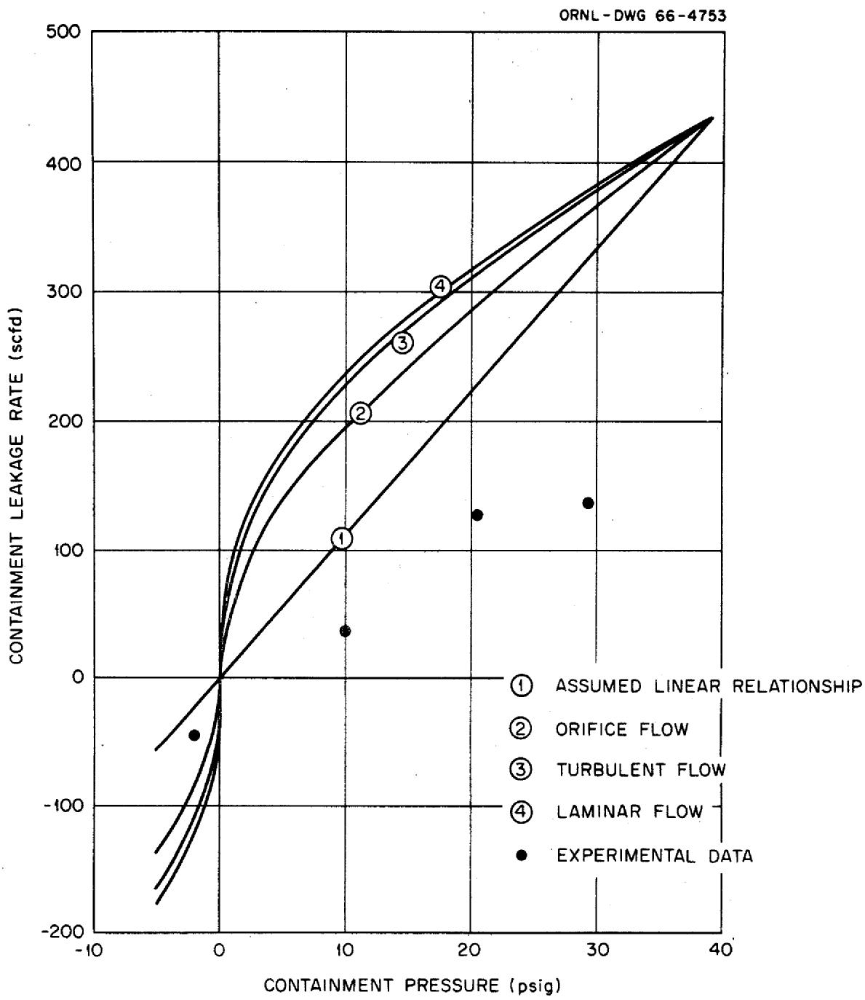  
Figure 4.2. Secondary Containment Leak Rates.

Leakage rates with the cells at positive pressure are measured by changes in differential pressure between the cell atmosphere and a reference volume within the cell. During operation, when the reactor cell is held at -2 psig, the inleakage rate is determined by a balance on measured inputs and exhaust rate with corrections for small changes in pressure. Although large changes in inleakage are detectable almost immediately, an accurate determination at the normal rate takes about a week of data under fairly steady conditions.

When the cell is at negative pressure, gas enters through sump bubblers and by leakage from pressurized service lines and penetrations, but the important component is the cell inleakage through routes that represent possible outleakage paths at positive pressure. This inleakage has been less than 50 scf/d during all periods of operation. On three occasions other inputs have caused anomalously high measurements, but on investigation the actual cell inleakage was found to be acceptably low. In May 1966, the reactor was shut down when the apparent inleakage increased above 100 scf/d and it was found that nitrogen was leaking into the cell from the pressurized thermocouple penetration sleeves. Gas cannot leak out by this route so a flowmeter was installed and this input was factored into the balance. In November 1966, another indication of high inleakage was found to be leaks in the cell from pneumatic valve operator lines. Flowmeters were installed to measure this inflow and the actual inleakage was again found to be low. Over the next two months, however, the air line leaks increased until the error in measurement became so large that the actual cell leakage could not be determined with satisfactory accuracy. In January 1967, the reactor was shut down and the air line disconnects in the reactor cell were all replaced, stopping the leaks. (The elastomer seals in the original disconnects had suffered radiation damage and were replaced by metal-to-metal seals.) Since then the cell leak rate measurements have always been acceptable, usually below 25 scf/d.

# 5. SITE

The MSRE is situated in Melton Valley, about a mile across a ridge from the main X-10 Area of Oak Ridge National Laboratory. A detailed description of the site, including surrounding population densities and geophysical features, is given in Chapter 4 of the original MSRE Safety Analysis Report. There have been minor changes in population within the plant areas; otherwise the original description is still valid.

# 6. OPERATION

Operation of the MSRE has attained most of the objectives of the experiment. Mechanical problems in the operation of some components and systems have been met, and overcome, but experience has shown no deficiency with regard to safety.

# 6.1 Staff and Procedures

The MSRE is operated routinely by four crews on rotating shifts, each crew consisting of a minimum of one supervisor and two operators. Supervisors and operators are trained, examined and formally certified before being assigned to a crew. During periods involving experiments, sampling or other such operations, the crews are augmented by additional trained members of the MSRE staff. Analysis and maintenance support is as described in the original safety analysis report.

There has been very little turnover of personnel. Of the persons presently on the operating crews, only two operators were not part of the MSRE staff from the beginning of nuclear operation.

Operating procedures are contained in Part VIII of the MSRE Design and Operations Report.14 Loose-leaf versions, formally updated, are used

by the operating crews. Safety procedures and emergency plans constitute Part IX of the Design and Operations Report.[15] Part VI (Ref. 16) sets forth the safety limits on the operation.

Any modification of the system or any change in the operating procedures must first be appropriately reviewed and formally approved.[17]

# 6.2 Chronological Account

The operation of the MSRE has consisted of the following phases: pre-critical testing, initial critical measurements, low-power measurements, and reactor capability investigations.[18] The last phase covers both the approach to full power and sustained operation at high power.

Figure 6.1 outlines the activities for the 18 months beginning with the arrival of the operating staff at the reactor site in July 1964. Subsequent operation is outlined in Figures 6.2 and 6.3.

Precritical testing served both to check out the equipment and train the operators. Coolant and flush salts were successfully loaded in the molten state and few difficulties were encountered in the integrated operation of the system with these salts. It was found, however, that the radiator doors would not operate properly after being heated, which would require modifications before power operation. The final test before beginning nuclear operation was loading, circulating, and sampling the fuel carrier salt containing $150\mathrm{kg}$ of depleted uranium.

The reactor was first made critical on June 1, 1965. Highly enriched $^{235}\mathrm{U}$ was added as the $\mathrm{LiF - UF_4}$ eutectic, with four batches totalling $69\mathrm{-kg}^{235}\mathrm{U}$ added through the drain tanks and $0.6\mathrm{kg}$ added in small capsules

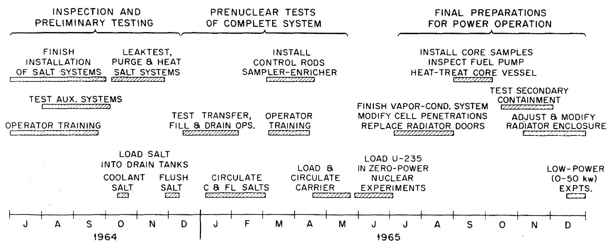  
Figure 6.1. MSRE Activities from July 1964 through December 1965.

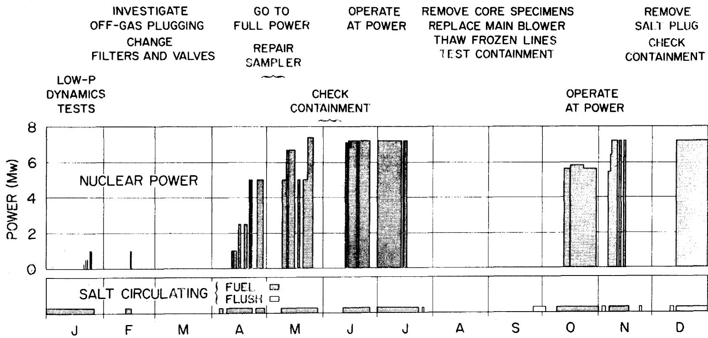  
Figure 6.2. MSRE Activities in 1966.

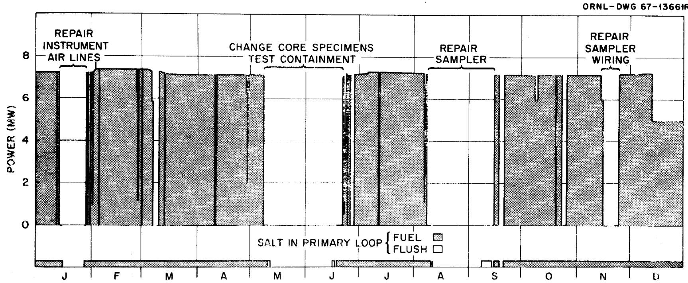  
Figure 6.3. MSRE Activities in 1967.

through the sampler-enricher to reach criticality. Another 6.6 kg was added in 85-g capsules while measurements were made of control rod worth and various reactivity coefficients.

After the zero-power physics experiments, the fuel was drained and stored while final preparations were completed for operation at power. The service life of the reactor was reevaluated and some steps were taken to prolong the life. The penetrations of the coolant salt lines through the reactor cell wall were modified to reduce thermal stresses and increase the permissible number of thermal cycles. Piping and vessel supports were adjusted to minimize stresses, and strain-gage analyses were made of questionable points. The reactor vessel closure weld was heat-trated in situ to improve the physical properties. Data on stresses, neutron fluxes and the results of experimental measurements on the effects of irradiation on Hastelloy-N were combined to establish an expected serviceable life for the reactor vessel. Before this shutdown, the fuel pump had circulated salt for more than 2000 hours. The rotary element was removed for inspection and to provide a final test of an important remote maintenance operation. It was reinstalled when it was found to be in excellent condition. The original, heat-warped radiator doors were replaced and the door guidance mechanisms were modified and adjusted to provide reliable, free operation, hot or cold. On the radiator enclosure, air leakage paths were reduced, thermal insulation was improved, wires were relocated, and cell ventilation was modified to eliminate overheating of the surroundings.

Late in the prepower shutdown, the reactor secondary containment was sealed, the vapor-condensing system was connected and the combined volumes were leak-tested. Leaks, which were confined to service penetrations of the reactor and drain tank cells, were repaired, after which tests over a range of pressure showed the leakage was well within acceptable limits. (See Chapter 4.) Meanwhile, analysis of the zero-power experiments was completed, furnishing values for the characteristic coefficients needed to monitor and interpret subsequent operation.

Nuclear operation resumed in December 1965 with low-power tests. A month later the escalation of the power was started, only to be interrupted

at 1 Mw when small valves and filters in the fuel offgas system plugged. Investigation disclosed a few grams of heat- and radiation-affected organic matter, presumably from oil that had leaked in through the fuel pump rotary element. A seal-welded unit was readied, but was not installed when larger valves and a new type of filter reduced the problem to a manageable nuisance. After this delay, power escalation was resumed and in May reached the capability of the heat removal system - about 7.5 Mw.

The first weeks of power operation were interrupted briefly to repair an electrical failure in the fuel sampler and to investigate apparently high leakage into the reactor cell. Then in July, after 7800 Mwh of power operation, one of the air blowers used to remove heat from the coolant salt broke up from mechanical stress. Cracks were found in the other blower and the spare (all left over from the Aircraft Reactor Test), necessitating procurement of three new units. While the reactor was down for the blower replacement, the array of graphite and metal specimens in the core was removed and new specimens were installed. The special filter assembly in the fuel offgas line was also replaced so the first assembly could be examined to further identify the material that had caused plugging before the filter was installed. A complete test of the secondary containment was also completed during this shutdown.

Power operation was resumed in October with one blower, then in November the second blower was installed and the reactor was taken to full power. After a shutdown to remove flush salt that had accidentally gotten into a gas line at the fuel pump during the July shutdown, the reactor was operated for 30 days without interruption at full power in December and January. This run was terminated to inspect the new blowers, to install an improved offgas filter and to replace leaking air-line disconnects in the reactor cell. Full-power operation was resumed late in January and continued into May for 103 days of nuclear operation. During this time numerous samples were taken to elucidate fission product behavior, long-term effects on reactivity were studied, and enriching capsules were added for the first time with the reactor at power. The reactor was finally shut down for the scheduled removal of specimens from the core.

During the May-June shutdown the core sample array was reinstalled with some new specimens, minor maintenance and inspection were carried out, and the complete annual tests of controls and containment were completed.

After 7 weeks of full-power operation, the reactor had to be shut down to repair the fuel sampler mechanism and to retrieve a latch from the sampler tube at the pump bowl. Power operation was resumed on September 15 and continued through the end of 1967 with only brief interruptions.

# 6.3 Evaluation of Experience

From the standpoint of reactor safety, experience with the MSRE has been most gratifying. The chemistry of the fuel salt has borne out expectations that it would be quite stable. Nor is there any trend in the chemical analyses that gives cause to expect instability in the future. Very close monitoring of the reactivity has shown that all changes in normal operation are described by the analytical model to within $\pm 0.05\%$ $\delta \mathbf{k} / \mathbf{k}$ , indicating excellent precision of measurements and computations and no anomalous physical behavior in the system. (The only times this difference has been exceeded was during experiments when unusual amounts of gas were entrained in the fuel, causing the xenon poisoning to deviate from the model by about $0.2\%$ $\delta \mathbf{k} / \mathbf{k}$ .) The neutronic characteristics of the system agree very closely with predictions. The heat removal and nuclear dynamics are such that the system is stable at all power levels and quite easy to control. The operations of filling, going critical, and changing power level are simple and well-governed by control interlocks. An indication of the docility of the system is that in over $10,000\mathrm{h}$ of nuclear operation, there has never been a control rod scram because any process variable went out of limits. Corrosion has been practically nil and, aside from tolerable changes in the physical properties of the reactor-vessel material, there has been no deterioration of reactor materials. Dependability of major components has generally been good. Some delays were encountered in early operation because of the offgas system and the main blower failure, but these did not prevent the accomplishment of the planned experimental program or require any undesirable

compromises in the operation. The safety system is reliable; no safety circuit or component has ever failed so as to decrease the intended protection. Thus there is nothing in the experience to date to cause reservations about operating with $^{233}\mathrm{U}$ .

# 7. HANDLING AND LOADING 233U

After the partially enriched uranium now in the fuel salt is stripped by fluorination in the MSRE storage tank, $^{233}\mathrm{U}$ will be added to the remaining carrier salt as the eutectic $\mathrm{LiF - UF_4}$ (73 - 27 mole%). Adequate precautions will be taken to prevent accidental criticality in handling and storing the eutectic; techniques proven in maintenance of the MSRE will be used to cope with the problems of radiation and contamination which prohibit direct handling of the material.

# 7.1 Production

The enriching salt will be prepared in the Thorium-Uranium Recycle Facility (TURF) by hydrofluorination of uranium oxide in the presence of molten lithium fluoride. The process must be carried out remotely in a shielded cell because of the intense activity of the daughters of $^{232}\mathrm{U}$ , which constitutes 220 ppm of the uranium. (The isotopic composition of the $^{233}\mathrm{U}$ feed material is given in Table 7.1.) The molten salt will be transferred from the process vessel to small containers for transport to the MSRE. A total of 35 kg of $^{233}\mathrm{U}$ will be loaded into nine 2-1/2-inch-OD cans ranging in size from 0.5 to 7 kg $^{233}\mathrm{U}$ each. Forty-five capsules, like those used previously for $^{235}\mathrm{U}$ additions through the sampler-enricher, will be filled with eutectic salt containing a total of 4.0 kg $^{233}\mathrm{U}$ .

Table 7.1   
Isotopic Composition of $^{233}\mathrm{U}$ Feed Material   

<table><tr><td>U Isotope</td><td>Abundance (atom %)</td></tr><tr><td>232</td><td>0.022</td></tr><tr><td>233</td><td>91.49</td></tr><tr><td>234</td><td>7.6</td></tr><tr><td>235</td><td>0.7</td></tr><tr><td>236</td><td>0.05</td></tr><tr><td>238</td><td>0.14</td></tr></table>

# 7.2 Major Additions Through a Drain Tank

While the uranium is being stripped from the fuel and the fuel drain tanks are empty, equipment for adding cans of salt will be attached to the access flange of one drain tank. This equipment is shown in Fig. 7.l. The procedure for making the additions is as follows. The carrier salt will be divided between the two drain tanks, bringing the levels somewhat below the tank centerlines. The pressure of helium in the fuel system will be lowered slightly below the pressure in the containment enclosure attached to the access nozzle. One can of salt will be brought from the nearby TURF building to the MSRE in a shielded, bagged carrier. From the carrier it will be lowered through a temporary opening into a storage well in the containment enclosure. After the enclosure is sealed and purged to reduce moisture and oxygen, the isolation valve will be opened and the salt can will be taken from the turntable and lowered into the upper part of the drain tank, above the salt surface. The can will remain suspended in the tank until the salt has melted and drained. After a weight measurement has verified that the can is empty, it will be placed in a storage well in the turntable and the isolation valve will be closed until the next addition. The charging cans are individually safe from criticality and no more than one loaded can will be in the enclosure at any time.

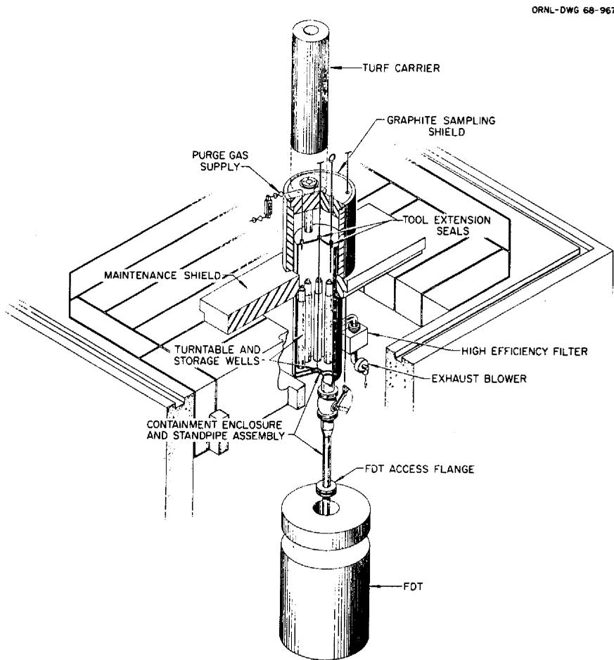  
Figure 7.1. Arrangement for Adding $^{233}\mathrm{U}$ Enriching Salt to Fuel Drain Tank.

After each can of enriching salt is added, the salt in the other drain tank will be transferred back to distribute the uranium throughout all the salt. Experience in the $^{235}\mathrm{U}$ critical experiment indicated that such transfers provide excellent mixing of the salt. If more uranium is then to be added, half of the mixture will again be transferred to the second drain tank. However, if the next step is filling of the fuel loop, no further transfers will be made. Although not shown in Fig. 7.l, two neutron-sensitive chambers will be suspended in the drain tank cell and the count rates will be analyzed to monitor the subcritical multiplication in the tank.

The approach to the critical loading of the reactor will be the same as in the $^{235}\mathrm{U}$ startup. $^{19,20}$ The predicted minimum critical loading at $1200^{\circ}\mathrm{F}$ is $34.6\mathrm{kg}^{233}\mathrm{U}$ . After three 7-kg cans have been added to the drain tank and the salt mixed, the core will be filled and neutron count-rates determined. This will be repeated after another 7-kg can has been added. The size of two subsequent additions will be determined by the extrapolation of inverse count rates. The last major addition should bring the $^{233}\mathrm{U}$ content to about 0.5 kg below the projected minimum critical loading. At this point the turntable with all the empty cans, the containment enclosure, and the standpipe assembly will be removed and the blank will be installed on the access nozzle. The drain tank cell will then be sealed and the shield blocks will be installed before the reactor is made critical.

# 7.3 Small Additions Through the Sampler-Enricher

As in the original experiment with $^{235}\mathrm{U}$ , the final approach to criticality will be made by adding capsules through the sampler-enricher with the fuel circulating. Some changes will be necessary in handling the

capsules on their way to the sampler-enricher because of the neutrons and gamma radiation from the enriching salt. Latch keys and cables will have been attached before the capsules are filled and the filled capsules will be drilled to expose the frozen eutectic before they leave the TURF cell. Six capsules at a time, each containing about $88\mathrm{g}^{233}\mathrm{U}$ will be moved to the MSRE in a shielded, bagged carrier. One capsule at a time will be removed from the carrier and lowered directly into the sampler-enricher enclosure. This transfer can be made without shielding because of the relatively small amount of salt in a single capsule.

# 8. SAFETY OF ROUTINE OPERATIONS

Operation of the MSRE involves handling substantial amounts of radioactivity in fuel sampling, offgas sampling, removal of core specimens, and maintenance of radioactive systems. In these there is the potential for radiation exposure or activity release that could affect the personnel operating the reactor and delay the experimental program. Therefore, each of these operations follows careful, formally approved procedures, and uses equipment designed to provide adequate protection. But at any rate the hazards of misoperation or improper functioning of equipment are local in nature and are no different with $^{233}\mathrm{U}$ fuel than they have been in operations to date. The next two chapters consider conceivable incidents that threaten serious damage to the reactor or activity releases hazardous to the public.

# 9. BREACH OF PRIMARY CONTAINMENT

A gross failure or breach of the primary containment of the fuel salt would have a serious impact on the program even though personnel would be protected by the secondary containment. The possibility of such an occurrence has therefore been reconsidered, taking into account the different characteristics of the reactor with $^{233}\mathrm{U}$ fuel, the changes in safety circuitry since the original safety analysis, and the condition of the salt containment after more than two years of operation.

# 9.1 Damaging Nuclear Incidents

The most significant effect of changing from $^{235}\mathrm{U}$ to $^{233}\mathrm{U}$ fuel is the change in the nuclear characteristics of the system, particularly the dynamics. It was necessary, therefore, to reexamine carefully the response of the reactor to incidents that could cause nuclear excursions. The original safety analysis considered in some detail the complete spectrum of nuclear incidents that could be postulated. As expected, some kinds of incidents proved trivial in the MSRE because of the nature of the reactor. The safety analysis for $^{233}\mathrm{U}$ therefore only briefly touches on these inconsequential cases and focuseses primarily on those incidents that could conceivably have significant potential for damage.

# 9.1.1 General Considerations

The basic neutronic characteristics that determine the dynamic behavior of the system are presented in Table 9.1 for both the projected $^{233}\mathrm{U}$ loading and the current loading with partially enriched $^{235}\mathrm{U}$ . For the $^{235}\mathrm{U}$ loading both the predicted and the observed values are listed for purposes of comparison. The characteristics for $^{233}\mathrm{U}$ fuel were calculated by the same procedures as the $^{235}\mathrm{U}$ predictions, and the probable errors are about the same.

The smaller fraction of delayed neutrons from the $^{233}\mathrm{U}$ fuel may suggest a decrease in the inherent relative stability of the system. But stability is a function of many system parameters. A detailed analysis21

Table 9.1   
Neutronic Characteristics of MSRE with $^{233}\mathrm{U}$ and $^{235}\mathrm{U}$ Fuel Salt at 1200°F   

<table><tr><td></td><td>235U Fuel</td><td>235U Fuel</td></tr><tr><td colspan="3">Minimum Critical Uranium Loadinga</td></tr><tr><td>Concentration (g U/liter salt)</td><td>15.82</td><td>33.06b[32.85 ± 0.25]c</td></tr><tr><td>Total Uranium Inventory (kg)d</td><td>32.8</td><td>207.5e</td></tr><tr><td colspan="3">Control Rod Worth at Minimum Critical Loading (% 5k/k)</td></tr><tr><td>One Rod</td><td>-2.75</td><td>-2.11 [2.26 ± 0.07]</td></tr><tr><td>Three Rods</td><td>-7.01</td><td>-5.46 [5.59 ± 0.07]</td></tr><tr><td>Prompt Neutron Generation Time (sec)</td><td>4.0 x 10-4</td><td>2.4 x 10-4</td></tr><tr><td colspan="3">Reactivity Coefficientsf</td></tr><tr><td>Fuel Salt Temperature (°F)-1</td><td>-6.13 x 10-5</td><td>-4.1 x 10-5[(-4.9 ± 2.3) x 10-5]</td></tr><tr><td>Graphite Temperature [(°F)-1]</td><td>-3.23 x 10-5</td><td>-4.0 x 10-5</td></tr><tr><td>Total Temperature [(°F)-1]</td><td>-9.36 x 10-5</td><td>-8.1 x 10-5[-7.3 x 10-5]</td></tr><tr><td>Fuel Salt Density</td><td>+.447</td><td>0.182</td></tr><tr><td>Graphite Density</td><td>+.444</td><td>0.767</td></tr><tr><td>Uranium Concentrationg</td><td>+.389</td><td>0.234 [0.223]</td></tr><tr><td colspan="3">Effective Delayed Neutron Fractions</td></tr><tr><td>Fuel Stationary</td><td>2.64 x 10-3</td><td>6.66 x 10-3</td></tr><tr><td>Fuel Circulating</td><td>1.71 x 10-3</td><td>4.44 x 10-3</td></tr><tr><td>Reactivity Change Due to Fuel Circulation (% 6k/k)</td><td>-0.093</td><td>-0.222 [-0.212 ± 0.004]</td></tr></table>

aFuel not circulating, control rods withdrawn to upper limits.   
b   
235U only.   
cValues in brackets are measured results. The others are predicted.   
${}^{\mathrm{d}}$ Based on 73.2 ft ${}^{3}$ of fuel salt at ${1200}^{ \circ  }\mathrm{F}$ ,in circulating system and drain tanks.   
${}^{\mathrm{e}}$ Based on a final enrichment of ${33}\% {}^{235}\mathrm{U}$ .   
fAt initial critical concentration. Where units are shown, coefficients for variable x are of the form $\delta k / k\delta x$ ; otherwise, coefficients are of the form $x\delta k / k\delta x$   
gHighly enriched in the fissionable isotope (91.5% 233U or 93% 235U).

predicted and subsequent experiments $^{22}$ confirmed that in the MSRE among the most important parameters are the prompt and delayed temperature feedbacks. Consequently the larger temperature coefficients of reactivity with $^{233}\mathrm{U}$ fuel give the system a larger stability margin, particularly at low powers. Figure 9.1 shows experimental results with $^{235}\mathrm{U}$ fuel, namely observed responses to small step changes in reactivity at different initial power levels. The importance of temperature effects is evident in the lighter damping at low powers. Calculations have been made for $^{233}\mathrm{U}$ fuel, $^{23}$ using the techniques proved in the $^{235}\mathrm{U}$ operation. These indicate that relative to the behavior in Fig. 9.1, the damping will be much greater at the low powers because of the larger temperature coefficients of reactivity for $^{233}\mathrm{U}$ fuel. The higher gain of the neutron kinetics will appear primarily as shorter natural periods of oscillation. The important conclusion from these results is that the small perturbations and reactivity fluctuations that occur in any reactor will not lead to divergent nuclear behavior that could damage the MSRE. Thus if there is any severe nuclear transient, it will have to be caused by an independent, large and persistent reactivity perturbation.

For an incident in which reactivity is added continuously (such as uncontrolled rod withdrawal), the severity of the power transient is greater at lower initial power levels. A lower initial power allows the insertion of more reactivity, and hence the establishment of a shorter positive period, before the power level gets high enough for power feedback shutdown mechanisms (e.g. fuel temperature coefficient of reactivity) to become effective. Thus, the source power level is an important parameter in defining this type of incident. In the MSRE the principal sources of neutrons are those in the fuel salt. At the time of the $^{233}\mathrm{U}$ startup, the fuel salt will contain only a small fraction of the fission products from prior nuclear operation and the photoneutron source will be completely

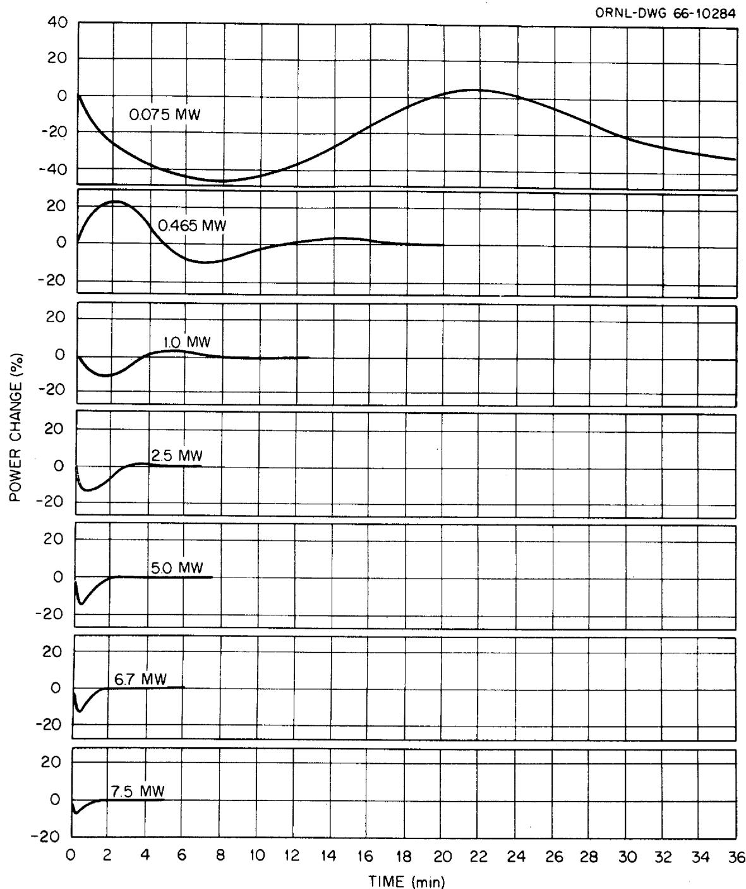  
Figure 9.1. Observed Response of Nuclear Power in Small Step Changes in Reactivity at Various Initial Powers with $^{235}\mathrm{U}$ Fuel.

overshadowed by the very intense $\alpha$ -n source in the $^{233}\mathrm{U}$ fuel. The $\alpha$ -n source, alone, in the $^{233}\mathrm{U}$ mixture will be a factor of 700 stronger than the minimum source (also $\alpha$ -n) that was available in the $^{235}\mathrm{U}$ loading. Thus, while the lowest power at which the reactor could pass through criticality was about 2 milliwatts with $^{235}\mathrm{U}$ fuel, the corresponding value for the $^{233}\mathrm{U}$ fuel will be more than a watt.

Aside from the basic properties of the reactor, the action of the reactor safety system is important in limiting the severity of the various incidents to be considered. Control-rod scams are actuated by three reactor parameters: high neutron flux level (over 11.25 Mw if the fuel pump is running or 11.25 kw if the pump is off), positive reactor period less than 1 sec, and reactor outlet temperature greater than $1300^{\circ}\mathrm{F}$ . The efficacy of a control-rod scam depends on the specific behavior of the rods. In analyzing the various incidents, we assume that (1) only 2 of the 3 control rods actually drop on request, (2) a delay of 100 msec occurs between the scam signal and the start of rod motion, and (3) the control-rod acceleration is 10 ft/sec². All of these assumptions are conservative since no control rod has ever failed to drop, the clutch-release time is about 20 msec, and the actual rod acceleration is about 13 ft/sec².

Nuclear excursions severe enough to threaten damage produce responses from the reactor system that are similar in important respects, almost regardless of the cause of the reactivity excursion. Typically, the reactivity must increase rapidly until the reactor is well supercritical. There is then a brief excursion to high power which causes a rapid increase in the temperature of the fuel salt at a rate locally proportional to the fission distribution. At the same time there is a pressure surge as the heated salt expands. Inertial effects of acceleration of fluid in the outlet pipe, momentary increase in friction losses in the pipe and compression of the gas in the pump bowl are the components of the pressure surge, with inertial effects predominating during very rapid heating. The power excursion is brief because of negative reactivity feedback from the rising temperature and the effects of the control rods being dropped by the safety system. The termination of the power excursion leaves hotter salt in the core, which moves on up through the channels, giving up heat to the graphite, and then mixes with salt from other channels in the upper head.

In the original safety analysis, somewhat arbitrary limits of 50-psi pressure increase or $1800^{\circ}\mathrm{F}$ maximum fuel temperature were used to define accidents that would not be expected to cause damage. In light of the effects of neutron irradiation on the mechanical properties of the vessel material, damage mechanisms and thresholds have been reconsidered in more detail.

Damage could conceivably result from either of two mechanisms: stresses caused by the pressure surge or thermal stresses caused by the rapid change in the temperature of salt in contact with surfaces. Consideration of the details of mechanical design and the system response in an excursion lead to the conclusion that thermal stresses in the top head of the reactor vessel near the outlet pipe are controlling. The control rod thimbles are exposed to greater temperature changes, but they are relatively thin and transient thermal stresses are lower there than in the top head. In an excursion, the pressure surge is over before the rising salt temperatures affect the top head. Therefore the effects of pressure and temperature on the top head can be considered independently to determine which is limiting.

In calculating the most severe excursion tolerable from the standpoint of thermal stresses, we chose 25,000 psi as the limit on the computed thermal stresses. The rupture life at this stress level is at least an hour at temperatures to $1400^{\circ}\mathrm{F}$ , and the yield stress for rapidly applied strains is greater than this at temperatures on up to $1600^{\circ}\mathrm{F}$ or so. Wall temperatures will be less than $1400^{\circ}\mathrm{F}$ in the limiting cases and the high stresses will be of brief duration, so 25,000 psi is a conservative limit under these accident conditions. Thermal stresses in the top head were calculated assuming an instantaneous rise in salt temperature and a heat transfer coefficient of 300 Btu/hr·ft²·°F between the salt and the head. It was found that for step changes of up to $178^{\circ}\mathrm{F}$ stresses were less than the 25,000-psi limit. (For a $178^{\circ}\mathrm{F}$ step change, the temperature difference through the wall reaches a maximum in about 16 seconds and decreases to only $10^{\circ}\mathrm{F}$ in 6 minutes.) An increase of $178^{\circ}\mathrm{F}$ in the temperature of the salt leaving the vessel corresponds to an increase of about $343^{\circ}\mathrm{F}$ in the temperature at the exit of the hottest channel through the

core. Therefore, if a nuclear incident does not cause the hot channel outlet temperature to rise more than $340^{\circ}\mathrm{F}$ , thermal stresses will not damage the top head.

The fuel system was designed for 50 psig (more in some parts) with primary stresses of 3500 psi or less. A nuclear incident that would cause a temperature excursion approaching the limiting thermal stresses would produce a pressure surge of less than 90 psi. Thus the pressure alone would produce primary stresses of no more than 10,000 psi. Therefore, the thermal stresses are limiting, not the pressure surge.

# 9.1.2 Uncontrolled Rod Withdrawal

The control rods are the most direct means of increasing the reactivity. The amount of excess reactivity held down by the rods can be as much as $2.8\%$ $\mathrm{sk / k}$ (with $^{233}\mathrm{U}$ fuel) and the speed of the rods is such that the reactivity can be increased fairly rapidly. There are, of course, many restrictions on the rods. In the order of increasing reliability they include: administrative procedures, control interlocks that inhibit withdrawal at a 25-sec period and insert the rods if the period reaches 5 sec, and the safety system that scrams the rods. It is conceivable, although very unlikely, that some combination of misoperation and control system malfunction could result in a reactivity excursion with the potential for damage but, in such an event, the safety system can be depended on for its design action.

Uncontrolled rod withdrawal would have the greatest effect if it began with the reactor subcritical, i.e., with the fission rate very low, and passed through criticality with all three rods moving in unison through the region of maximum sensitivity. This accident was analyzed in detail in the original safety analysis. With $^{233}\mathrm{U}$ fuel, however, the power, temperature and pressure excursions resulting from uncontrolled rod withdrawal would be different because of differences in rod worth, inherent neutron source strength, delayed neutron fraction, and temperature coefficients of reactivity. The rod worth and sensitivity are about $30\%$ higher with $^{233}\mathrm{U}$ fuel so the reactivity increase would be faster. On the other hand, the stronger neutron source in the $^{233}\mathrm{U}$ fuel would tend to bring the fission rate into the range where safety interlocks (and temperature

feedback) can act at an earlier point in terms of the excess reactivity that has been introduced. These factors affect the ability of the safety system to suppress the excursion. If there were no safety action, but only the temperature feedback to shut down the reactor, the delayed neutron fraction and the temperature coefficient of reactivity would also be of great importance. In the case of a sustained reactivity ramp such as this the smaller delayed neutron fraction is an advantage in that the reactor becomes prompt critical and the power begins to rise rapidly when there is less excess reactivity that must be cancelled by rising temperatures. The larger temperature coefficient further reduces the temperature rise necessary to turn down the power.

In the analysis of this accident we assumed that the rods would be poisoning $2.8\%$ $\delta \mathbf{k} / \mathbf{k}$ when the reactor is just critical. (This will be the condition at the end of the zero-power experiments, in which one rod will be calibrated over its entire travel.) For this condition, the reactor would be subcritical by $4.2\%$ $\delta \mathbf{k} / \mathbf{k}$ when the rods are fully inserted, and would go critical with the three rods at 28 inches withdrawal, slightly above the center of their range and very near the position of maximum differential worth. Following continuous withdrawal of the rods from full insertion, the fission power when criticality is attained would be somewhat greater than 1 watt, which was used in the analysis. The speed of withdrawal is 0.5 in./sec, giving a rate of reactivity increase of $0.093\%$ $\delta \mathbf{k} / \mathbf{k} / \mathbf{sec}$ at criticality. If the rods were not scrambled, this rate of increase would continue for approximately 16 sec after criticality, then would gradually slow down and finally stop when the rods reach their upper limits at 51 inches withdrawal.

The first step in the analysis of the effects of the uncontrolled rod withdrawal was to compute the response in the absence of a rod scream. These results were needed to determine the point at which the reactivity effect equivalent to two rods scrambling should be started in the computation. Although unrealistic and not directly applicable to the safety evaluation because the reliable scream of the rods cannot be ignored, the results of the computation with no safety action are of some interest. Figure 9.2 shows these results for the reactor fueled with $^{233}\mathrm{U}$ . The

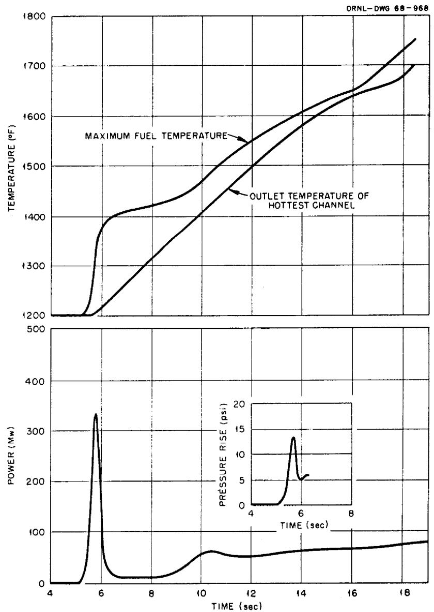  
Figure 9.2. Results of Uncontrolled Rod Withdrawal with no Safety Action, $^{233}\mathrm{U}$ Fuel.

digital program used for the calculations includes a detailed numerical treatment of the axial convection of heat by fluid motion during the power transient.[24] Both the temperature of the fluid at the hottest point in the reactor channels and the outlet temperature of the hottest channel are plotted in Fig. 9.2. The calculated pressure rise in the core during the period of very rapid heating is also shown.

To elucidate the effects of the differences in the important neutronic properties, we performed calculations similar to those of Fig. 9.2, using $^{235}\mathrm{U}$ characteristics but assuming that the reactivity addition rates are identical (.093% sk/k/sec), and also that the power levels at the time of criticality are identical (1 watt). With these simplifications, the calculated nuclear excursions differ only because of the differences in delayed neutron fractions, fuel temperature coefficients of reactivity, and prompt neutron generation time. The resulting transients calculated for the $^{235}\mathrm{U}$ fuel are shown in Fig. 9.3. It is evident that the rapid-rise portion of the transient occurs later in time than with the $^{233}\mathrm{U}$ fuel, since more reactivity must be added to reach the prompt critical condition. The temperature excursion in this admittedly fictitious case is greater with $^{235}\mathrm{U}$ because more reactivity must be cancelled by this mechanism to stop the power rise and the temperature coefficient of reactivity is smaller than when $^{233}\mathrm{U}$ is the fuel.

Although the calculations shown in Fig. 9.2 indicate that the fuel temperature and core pressure rise incurred during the rapid portion of the transient would be inconsequential, it is clear that counteraction of rod withdrawal would ultimately be necessary to prevent overheating in the core. Figure 9.4 shows the results of actuating the rod scram mechanism in the $^{233}\mathrm{U}$ case when the neutron flux level exceeds 11.25 Mw. This action would be effective in reducing the transient to inconsequential proportions. Therefore the runaway rod accident will not damage the primary containment.

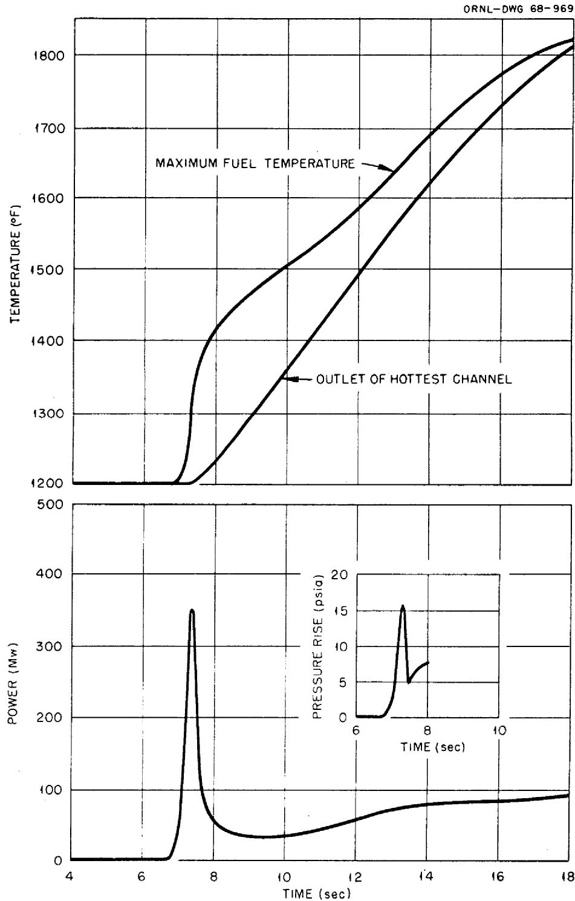  
Figure 9.3. Results of Uncontrolled Rod Withdrawal with no Safety Action, $^{235}\mathrm{U}$ Fuel.

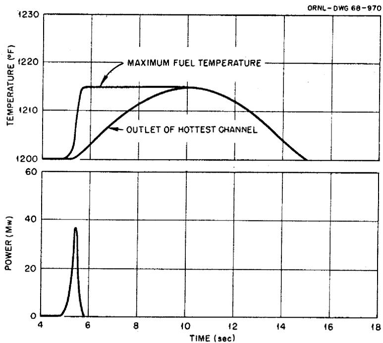  
Figure 9.4. Results of Uncontrolled Rod Withdrawal, with Scram at 11 Mw, $^{233}$ U Fuel.

The present safety system provides an additional margin of safety by actuating the rod scram when the reactor period decreases below one second. The digital calculations for the transient without safety action indicate that a one-sec period is reached at 1.4 sec after criticality, the 11.25-Mw level is not reached until 5.3 sec, only 0.5 sec before the maximum power is reached at 5.8 sec. The actual time of actuation of the period-safety scram device is not simply arrived at since it lags the attainment of the 1-sec period by an interval that depends on the ion chamber current and the rate at which the period is decreasing. However, calculations based on quite conservative assumptions on the actual time of actuation of the period scram show that the power transient would be reduced by at least two orders of magnitude below that shown in Fig. 9.4 and would be quite insignificant.

# 9.1.3 Sudden Return of Separated Uranium

Two remote possibilities exist for separation of uranium from molten fluoride fuel salt. If fluorine should be lost from the salt, the $\mathrm{UF}_3 / \mathrm{UF}_4$ ratio would increase, possibly to the point that metallic uranium would be produced by disproportionation of the $\mathrm{UF}_3$ to $\mathrm{UF}_4$ and U. Second, if enough moisture or oxygen were introduced, $\mathrm{ZrO}_2$ would be produced and precipitate until the $\mathrm{Zr}^{4+} / \mathrm{U}^{4+}$ ratio fell below 2; after which some $\mathrm{UO}_2$ would form along with additional $\mathrm{ZrO}_2$ . (Ref. 25)

Neither of these mechanisms was expected to cause separation in the MSRE, and experience has supported this expectation. Furthermore, there is no trend in the fuel chemistry that would indicate that precipitation of uranium or uranium oxide is likely in future operation. There has been no detectable loss of fluorine to increase the $\mathrm{UF}_3$ . In fact, as explained in Section 1.l.l, $\mathrm{UF}_3$ gradually decreases during power operation. Analysis of the fuel for oxides at intervals of approximately one month since the summer of 1966 has shown that the oxide content has been practically steady at about 50 ppm. This level is more than a factor of ten below the solubility of $\mathrm{ZrO}_2$ and even farther below the point at which $\mathrm{UO}_2$ would begin

to form. The fluorination of the original fuel charge will not produce any uranium-bearing precipitate. Verification of proper composition and state of the salt will be obtained by analyses after the complete processing and before $^{235}\mathrm{U}$ additions begin.

Clearly if present conditions persist through the operation with $^{233}\mathrm{U}$ , as we expect them to, there will be no gradual drift toward uranium separation. Nor is precipitation of $\mathrm{UO_2}$ because of accidental gross contamination of the fuel with oxygen likely, for the reasons discussed in the original safety analysis report. If however, despite all precautions, $\mathrm{UO_2}$ should separate from the circulating fuel, there would be a detectable effect on reactivity before a hazardous situation could develop. This conclusion is based on the analysis that follows.

If $\mathrm{UO_2}$ solids were to appear in the fuel, being more dense than the salt, they would tend to accumulate in lower-velocity regions such as the lower head or the vicinity of the core support lugs. (Detection of deposits in these regions is discussed on Page 84.) The reactivity worth of the separated uranium would almost certainly be less than when the uranium was dispersed in the salt, so the reactivity would tend to go down. Normally the regulating rod would be withdrawn automatically to keep the reactor critical. If the separated $\mathrm{UO_2}$ were by some mechanism suddenly resuspended in the salt, the flow would carry it through the core, producing a reactivity excursion. The magnitude and the time variation of the reactivity would depend on the amount of uranium returning and the details of how it entered the circulating stream and the core. We have analyzed a hypothetical case in which an increment of uranium is instantaneously dispersed throughout the $10\mathrm{ft}^3$ of fuel salt in the lower head of the reactor and then is carried up through the core with the flowing fuel. Figure 9.5 shows the time dependence of the added reactivity, calculated from the flow velocities observed in the MSRE hydraulic mockup and the computed spatial variation of nuclear importance in the reactor vessel. The reactivity effect in this figure is normalized to $\Delta k_{\mathrm{o}}$ , the reactivity effect of the increment of uranium when it is uniformly dispersed throughout the $70\mathrm{ft}^3$ of salt in the fuel loop. In our analysis we varied the size of the increment and the initial power level to determine the maximum amount of uranium that could be introduced in this manner without causing damaging temperatures or pressure.

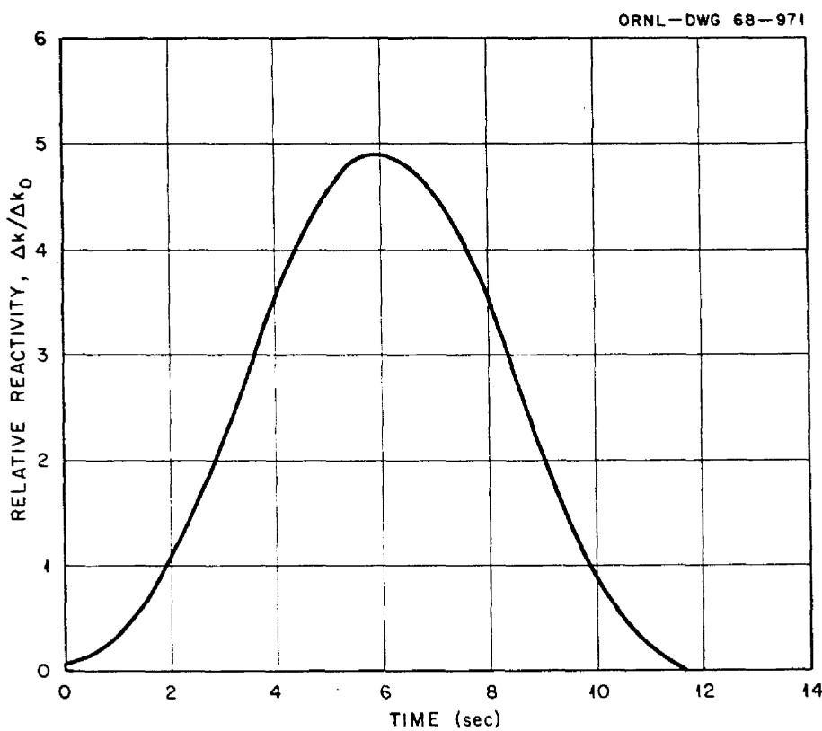  
Figure 9.5. Time Dependence of Reactivity Addition due to Sudden Resuspension of Uranium in Lower Head of Reactor Vessel.

Some results of a typical calculation are shown in Fig. 9.6. In this case $\Delta k_{0}$ is $0.25\%$ (giving a peak added reactivity of $1.2\%$ $\delta k / k$ ), the initial power is $1\mathrm{kw}$ , the core inlet temperature is $1200^{\circ}\mathrm{F}$ , and there is no safety scream of the control rods. Shown is the temperature of the fuel at the hottest point in the core (which moves with time) and the temperature of fuel leaving the hottest channel. During the time when the maximum temperature is rising most steeply, the pressure in the core increases briefly by 39 psi.

The magnitude of the temperature and pressure excursions depend on the amount of uranium resuspended and also on the initial power. Figures 9.7 and 9.8 illustrate this dependence for cases in which the effects of scrambling the rods were not included. Figure 9.7 shows the variation of temperature rise with the amount of uranium recovered for two initial power levels: near full power and $1\mathrm{kw}$ . (The latter is the lowest power considered because it is a factor of ten below the lowest steady-state power at which the reactor is routinely operated. The reactor is critical below $10\mathrm{kw}$ only briefly during startups.) For sizeable recoveries, i.e. $\Delta k_{\mathrm{o}}$ greater than about $0.25\%$ $\delta k / k$ , the initial power makes very little difference in the outlet temperature rise during the excursion. The pressure excursion is worse for lower initial powers, as illustrated in Fig. 9.8 for $\Delta k_{\mathrm{o}} = 0.25\%$ . When the safety action of scrambling the rods is taken into account, the picture is completely changed. Figure 9.9 shows the effects of rod scream at $11.25\mathrm{Mw}$ . Initial power in these cases is $1\mathrm{kw}$ , which, with only a level scream, results in larger pressure and temperature excursions than would occur if the initial power were higher. Actually scream due to short period would considerably precede the $11.25\mathrm{-Mw}$ level and the excursions would be much less than indicated in Fig. 9.9, particularly at the low initial power. Thus, this figure is a conservative upper limit on the disturbances in temperature and pressure that would result from recovery of various amounts of uranium.

Based on Fig. 9.9, recoveries up to $\Delta k_{0} = 0.78\%$ at least will not cause the hot-channel outlet temperature excursion to exceed the $343^{\circ}\mathrm{F}$ criterion adopted to limit thermal stresses to safe values. Nor would the pressure excursion be serious at this $\Delta k_{0}$ . So $\Delta k_{0} = 0.78\%$ is a conservatively

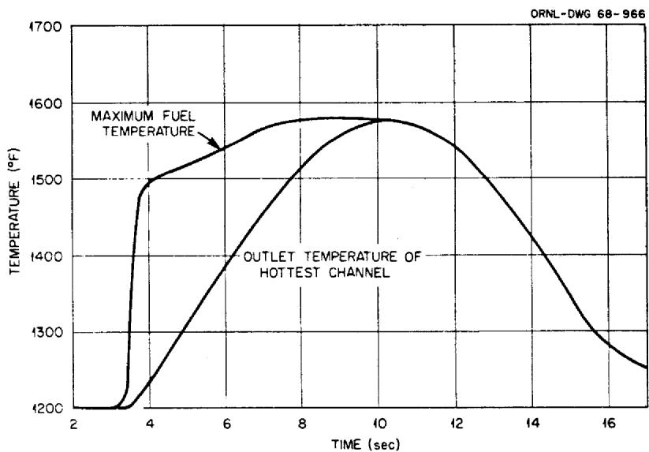  
Figure 9.6. Temperature Excursion Caused by Sudden Resuspension of Uranium Equivalent to $0.25\% \delta k / k$ if Uniformly Distributed; Initial Power, 1 kw; No Safety Action.

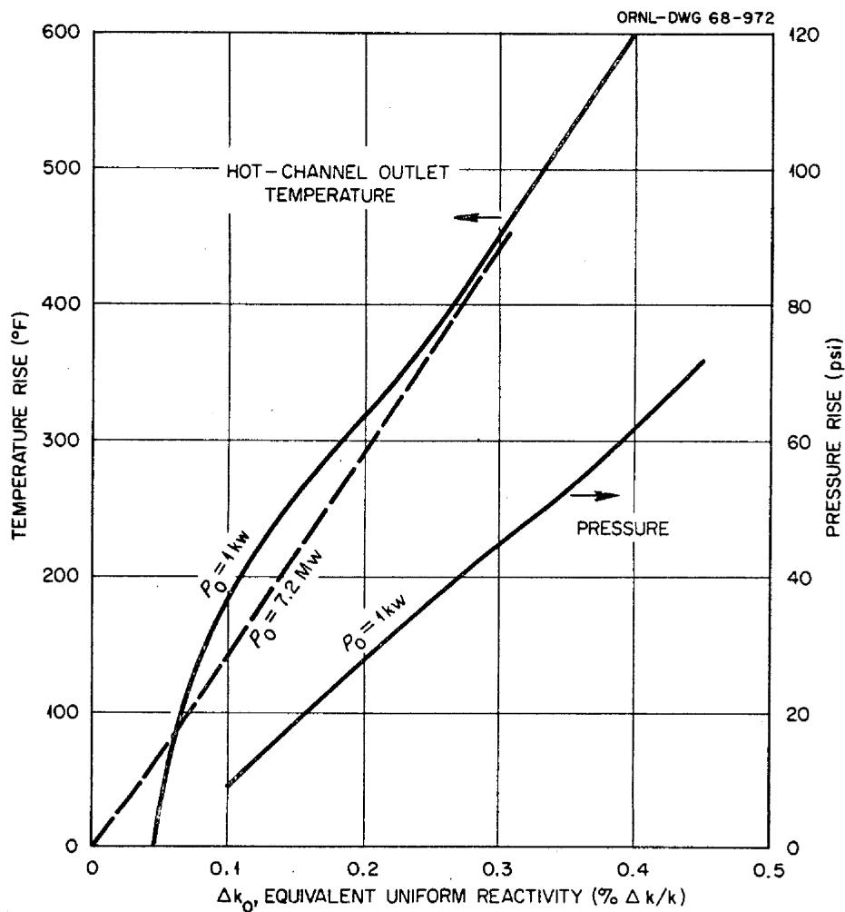  
Figure 9.7. Effect of Magnitude of Reactivity Recovery on Peak Pressures and Temperature during Uranium Resuspension Incident with No Safety Action.

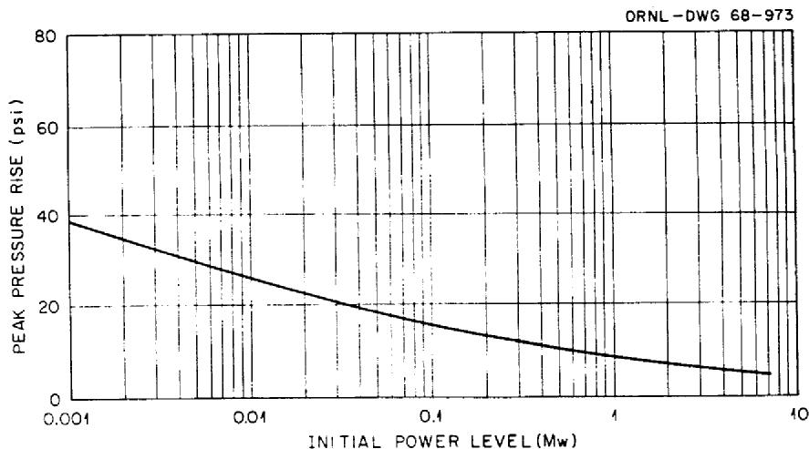  
Figure 9.8. Effect of Initial Power on Peak Pressure Rise Caused by Sudden Resuspension of Uranium Equivalent to $0.25\%$ $\delta \mathrm{k} / \mathrm{k}$ if Uniformly Distributed; No Safety Action.

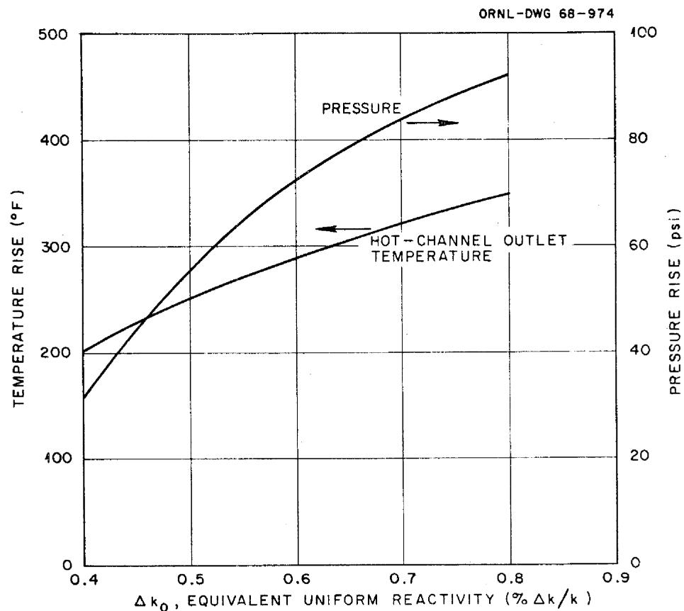  
Figure 9.9. Effect of Magnitude of Reactivity Recovery on Peak Pressures and Temperature during Uranium Resuspension Incident with Rod Scram at 11.25 Mw. $P_0 = 1$ kw.

safe limit on the amount of uranium that could be resuspended suddenly without causing damage to the fuel containment.

Before uranium could be resuspended in the lower head, it would have to first separate from the fuel, causing a reactivity decrease. If one assumes that all the separated uranium comes back, then the reactivity decrease will equal $\Delta k_{0}$ . If only a fraction of the separated uranium is resuspended, as is more reasonable, then the reactivity decrease will have been larger than $\Delta k_{0}$ . Thus the separation of enough uranium to cause potential damage by its sudden and complete suspension would be attended by a decrease of at least $0.78\%$ $\delta k / k$ .

Separation of uranium would show up as an anomalous change (in the negative direction) in the residual term in the computed reactivity balance that is used routinely to monitor nuclear operation.[26] Normally the computation is done at 5-minute intervals by the on-line digital computer. The precision of the measurements and computation is about $\pm 0.02\%$ $\delta \mathrm{k} / \mathrm{k}$ and an anomalous change of $0.2\%$ $\delta \mathrm{k} / \mathrm{k}$ would be clearly distinguishable from normal variations. An administrative safety limit will be imposed to prohibit nuclear operation when the residual term in the reactivity balance is too large. The prescribed limit will be something less than $0.78\%$ $\delta \mathrm{k} / \mathrm{k}$ , providing an added safeguard against the development of a situation with the potential for damage due to resuspension of uranium.

# 9.1.4 Fuel Additions

The possible reactivity, power and temperature effects of a fuel addition through the sampler-enricher are quite mild because the amount of uranium and the rate at which it can be introduced into the core are limited by the physical system.

The enriching capsules for $^{233}\mathrm{U}$ operation will each contain 97 grams of uranium (88-g $^{233}\mathrm{U}$ ). This amount of uranium, uniformly dispersed in the circulating fuel salt will produce a reactivity increase of $0.12\% \delta \mathrm{k / k}$ . This could be compensated by 2 to 3 inches of regulating rod insertion or by an increase of $13^{\circ}\mathrm{F}$ in the core temperature.

The rate at which added uranium mixes into the core has been observed during twenty-seven capsule additions of $^{235}\mathrm{U}$ with the reactor operating at full power. Each time the regulating rod was servo-controlled to keep the core outlet temperature constant. Figure 9.l0 shows a plot of regulating rod position as a function of time during a typical capsule addition. (The plot was made on-line by the MSRE digital computer and most of the indicated changes smaller than 0.l inch are not real shifts of the rod.) The lag and the transient indicate that the enriching salt metls and disperses rapidly in the salt in the pump bowl, then mixes into the circulating stream with a time constant close to the residence time in the pump bowl. The same behavior was repeated in each of the twenty-seven additions. The reactivity increase from a capsule of $^{233}\mathrm{U}$ will be about 4 times as great as those from $^{235}\mathrm{U}$ additions, but the regulating rod can easily keep up with the change. If for any reason administrative control or the servo system failed and the regulating rod was not driven in, the temperature and power would start to rise, probably causing a level scram at 11.25 Mw. Certainly there would be no damage.

# 9.1.5 Graphite Effects

As indicated in the original safety analysis, loss of graphite from the core is extremely unlikely and would in any event cause no hazardous nuclear excursion. This conclusion is still valid. Substitution of $^{233}\mathrm{U}$ fuel salt for an entire stringer of graphite would cause the reactivity to increase less than $0.2\% \delta \mathrm{k / k}$ and this could not occur very rapidly.

Graphite distortion because of irradiation effects would not be hazardous, but the most recent data on the kind of graphite in the MSRE indicate that exposure through the proposed operation with $^{233}\mathrm{U}$ should produce practically no distortion.

Salt penetration of the graphite has proved to be no problem. Specimens removed after exposure during 24,000 Mwh of operation showed weight gains of $0.03\%$ and only occasional salt penetration into cracks that happened to extend to the surfaces.[27] It was calculated from analyses of

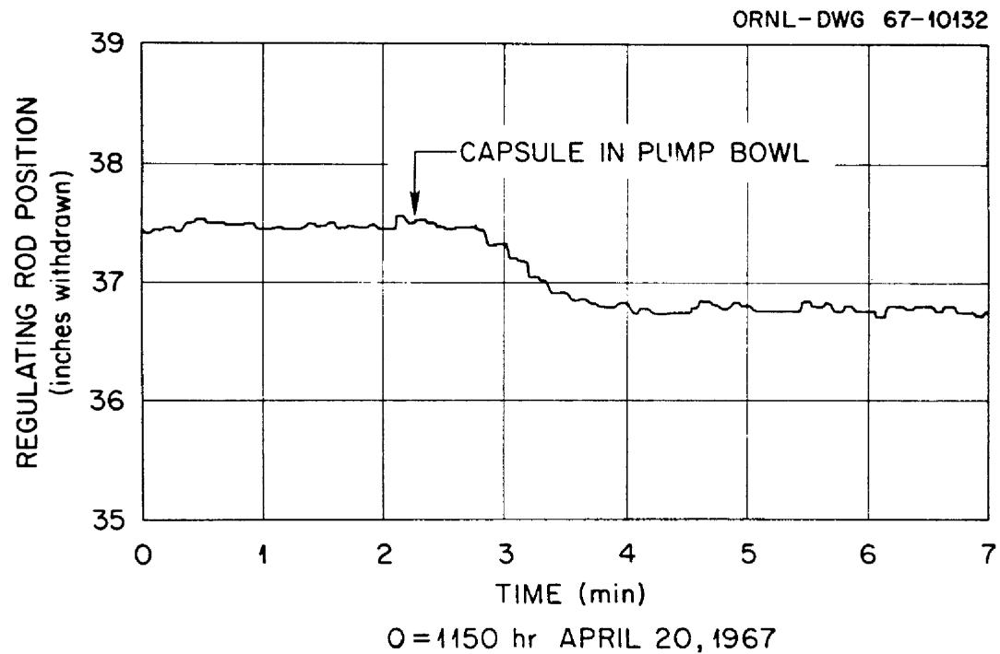  
Figure 9.10. Regulating Control Rod Motion during $^{235}\mathrm{U}$ Fuel Capsule Addition at Full Reactor Power.

these specimens that the total amount of $^{235}\mathrm{U}$ in all the core graphite was less than $4\mathrm{g}$ , a quite inconsequential amount. There is no reason to expect any change with substitution of $^{233}\mathrm{U}$ for the $^{235}\mathrm{U}$ in the salt.

# 9.1.6 Loss of Load

Several load scams from full power have shown that sudden interruption of air flow through the radiator has no ill effects on the system. The coolant system heats up at a moderate rate and, because the large gas volume in the drain tank is connected to the pump bowl surge space, there is no detectable pressure rise. The load scam is accompanied by automatic control action that reverses the rods when the blowers stop until the nuclear power goes below 1.5 Mw. This rod action prevents any rise in core temperature, but as shown in the original analysis, the temperature rise would be at most $40^{\circ}\mathrm{F}$ without any corrective action. With the $^{233}\mathrm{U}$ fuel and its larger temperature coefficient of reactivity, the temperature rise would be even less.

# 9.1.7 Loss of Flow

Interruption of fuel circulation produces two immediate effects in the core: delayed neutron precursors are no longer swept out so the reactivity tends to increase, and heat is not carried out of the core by fuel flow so the temperature begins to rise. It was shown in the original safety analysis that even in the absence of safety action, fuel flow interruption would cause no damage. The situation is better with $^{235}\mathrm{U}$ fuel for two reasons: the change in effective delayed neutron fraction is only $0.08\%$ instead of $0.21\%$ for $^{235}\mathrm{U}$ fuel, and the temperature coefficients of reactivity are larger. These differences would cause the fission rate and core heating to decrease more rapidly. From a practical standpoint, however, there is little or no difference; the safety system would prevent undesirable excursions with either $^{235}\mathrm{U}$ or $^{233}\mathrm{U}$ fuel. With the pump off the scram at $11\mathrm{kw}$ prevents fission heat from contributing much and without fission heat the core temperature will rise very slowly if at all.

# 9.1.8 "Cold-Slug" Accident

The "cold-slug" accident is one in which the mean temperature of the core decreases rapidly because of the injection of fuel at an abnormally low temperature. The reactivity increases because of the negative temperature coefficient of the fuel. Of course, something of the sort occurs whenever the power is raised by withdrawing more heat at the radiator. But physical limitations of the load system make the reactivity rates moderate and not disturbing even in the absence of automatic rod action. Figure 9.11 shows system responses in just this situation, where the heat removal was increased from 2 to $7\mathrm{Mw}$ as quickly as possible while the control rods were kept stationary. So for there to be a "cold-slug" worthy of the name there must be some sort of flow interruption, cooling and flow resumption. Another important fact about the "cold-slug" accident is that it cannot happen if the control rods are inserted. The fuel loading and the rod worth are such that the core could be cooled to the salt liquidus temperature without going critical if all the rods are fully inserted.

In principle, a cold-slug could result from interruption of either the fuel or the coolant flow. Suppose the coolant flow were interrupted and part of the coolant loop cooled down while the fuel pump continued to run. Then if the coolant flow were resumed, a cold slug would hit the heat exchanger and would show up as a fairly fast reduction in core inlet temperature. But this is prevented by interlocks which scram the load and stop the fuel pump if the coolant flow drops. A sharper cold-slug could result if the fuel pump were stopped while the coolant flow continued. The fuel in the heat exchanger could be cooled down and then be introduced to the core by restarting the fuel pump. In this case a decrease in reactivity due to loss of delayed neutron precursors would be superimposed on the increase due to fuel temperature as flow is resumed. Protection against a power excursion in this event is provided by an interlock which requires that all three control rods be fully inserted before the fuel pump can be started.

For the foregoing reasons we believe a serious cold-slug accident is practically impossible. But in any case, the nuclear excursion associated

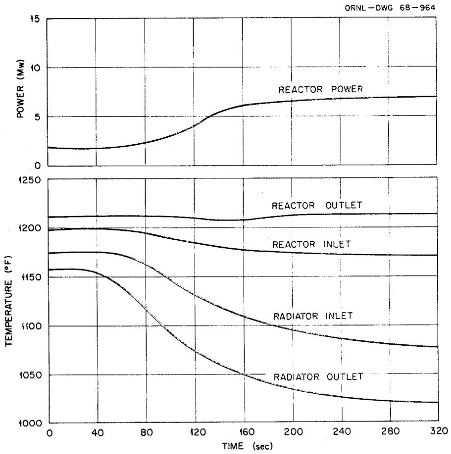  
Figure 9.11. System Response to Load Increase from 2 to 7 Mw at Maximum Rate.

with an incident of this type should not be damaging to the system. This conclusion is reached by the following argument. The total volume of fuel salt in the circulating system outside the reactor vessel furnace is only $12\mathrm{ft}^3$ — about half the volume of salt in the passages in the graphite core. If this much subcooled salt were pumped through the core, the shape of the reactivity-time curve would be very nearly that shown in Fig. 9.5 for the resuspended uranium. If the entire core were suddenly filled with fuel at $900^{\circ}\mathrm{F}$ , which is only slightly above the liquidus temperature, the excess reactivity would be $1.8\% \delta \mathrm{k / k}$ . This equals the peak reactivity from resuspension of uranium equivalent to $0.37\% \delta \mathrm{k / k}$ when uniformly dispersed. As shown in Section 9.1.3, a uranium-resuspension accident of this magnitude would not cause damage. Therefore, the possibility of a cold slug causing a damaging nuclear excursion can be dismissed.

# 9.1.9 Filling Accident

The original safety analysis report included detailed analyses of accidents in which the reactor became supercritical while the core was being filled with fuel salt under various abnormal conditions. The only accident of any consequence was found to be one in which the core was filled with fuel with a uranium concentration substantially higher than normal. The possibility of such an accident was suggested by the equilibrium crystallization path of the fuel mixture in which the last phase to freeze is rich in uranium. It was postulated that there was partial freezing of the salt in a drain tank followed by physical separation of the solid and liquid phases, then a series of operator and equipment malfunctions.

Since the original analysis, there have been experiments duplicating as nearly as possible the situation in the drain tanks during very slow cooling and freezing.[28] Results of these showed that the degree of

concentration and separation originally postulated are unrealistic and led us to the conclusion that a serious filling accident will not occur even if other malfunctions are assumed.

Although no credible filling accident threatens damage, the administrative procedures to prevent any kind of abnormal fill and the automatic actions to terminate any such fill will be retained.

# 9.1.10 Afterheat

As discussed in the original safety analysis report, problems associated with decay heat in the MSRE are quite moderate and require no rapid emergency action. The afterheat in the proposed operation will be less than was considered in the original safety analysis, because heat transfer has limited full power to about 7.5 Mw rather than the 10 Mw that was anticipated. (Because of differences in fission product yields, the afterheat from $^{233}\mathrm{U}$ fuel will be about $7\%$ greater than from $^{235}\mathrm{U}$ fuel operated at the same power.) Testing has verified that the cooling system on the drain tanks has ample capacity and that the salt can be drained reliably, but that a drain is not essential to afterheat removal because heat losses from the reactor vessel are enough that overheating can be prevented simply by turning off the electric heat to the furnace. Therefore, afterheat poses no threat to the primary containment.

# 9.1.11 Criticality in Drain Tanks

The nuclear reactivity of the unmoderated fuel salt with the partially enriched $^{235}\mathrm{U}$ currently in use is somewhat lower than it will be when $^{233}\mathrm{U}$ is substituted. In the original safety analysis, the drain tanks were shown to be critically safe even with the assumption of some highly unrealistic conditions to increase the reactivity. Because of the greater reactivity of the $^{233}\mathrm{U}$ mixture these assumptions have been reevaluated in terms of conditions that are physically attainable.

The most reactive situation in a drain tank would occur if the entire fuel charge were stored in one drain tank and allowed to cool to room temperature. An important increase in reactivity would result if water were supplied for neutron moderation and, since the drain-tank cooling thimbles use water, it must assumed that the thimbles will be full of

water for the worst condition. An external water reflector around the tank would also increase reactivity but this cannot be attained. The only water available to the drain tank cell is that in the treated water system and the total amount that could collect in the cell would not reach even the bottom of the lower head of the drain tank. The reactivity of a full drain tank at room temperature is sensitive to the bulk density of the frozen salt. For small amounts of salt, this density has been estimated to be 1.14 times that of liquid salt at $1200^{\circ}\mathrm{F}$ . Although the bulk density for a large mass of salt will be less because of pores and cracks, to be conservative we used the density named above in calculating reactivity. In the calculations we did not include any effect of uranium inhomogeneity because the rapid heat removal rates during freezing associated with the presence of water in the thimbles would produce frozen salt that is homogeneous from the nuclear standpoint.

Under normal fuel storage conditions, with all the salt in one drain tank at $1200^{\circ}\mathrm{F}$ and no water in the cooling thimbles, the neutron multiplication factor was calculated to be 0.85. Using the most reactive conditions (tank at room temperature, water in the thimbles) calculations gave a multiplication factor of 1.00 with all the salt in one tank. If the salt is equally divided between the two drain tanks that are available, $\mathrm{k_{eff}} = 0.88$ at room temperature with water in the thimbles.

Because of the advantage in dividing the fuel, if freezing of the salt is ever anticipated, it will first be divided equally between the two tanks. In an emergency shutdown from power operation, the fuel salt automatically drains to both tanks, so the salt would be left in a critically safe condition even if the operators had to leave immediately, before the salt drained. Only if there should be an unplanned, extended building evacuation during a shutdown in which all the salt is stored in a single tank could there be a chance of criticality in the drain tank. In this case it is possible that an electric power failure would allow water to be admitted to the thimbles and the salt to freeze. Whether or not criticality would be reached is questionable because there is some conservatism and uncertainty in the calculated value of 1.00 for $\mathrm{k_{eff}}$ at room temperature. But criticality is conceivable, to say the least.

Since criticality in a drain tank cannot be absolutely ruled out under all possible circumstances with $^{233}\mathrm{U}$ , some evaluation of such an event is in order. If criticality did occur, it would not be until the fuel salt was frozen and at a relatively low temperature. At the low temperature, the rate of temperature decrease and, hence, the rate of reactivity increase as $\mathrm{k_{eff}}$ approached 1 would be very slow. Since the mixture contains an intense inherent neutron source from $^{232}\mathrm{U}$ and its daughters, no nuclear excursion would result. Instead, the nuclear power would rise slowly to a level just sufficient to maintain the salt at the critical temperature. The drain tanks are inside the reactor secondary containment with sufficient biological shielding, so no radiological hazard would exist in the reactor building from that source. Thus, it would be possible to reenter the reactor building to stop the reaction by remelting the salt and to distribute it between the two tanks for safe storage.

# 9.2 Damage from Other Causes

The original safety analysis considered several possible causes of damage to the primary containment other than nuclear incidents. These other causes are not affected by the change to $^{233}\mathrm{U}$ fuel. However, the system has now been operated and there is experience pertinent to each damage mechanism. Therefore, they are re-examined here.

# 9.2.1 Thermal Stress Cycling

In a normal heating and cooling cycle of the salt systems, temperatures may change from as low as $70^{\circ}\mathrm{F}$ to as high as $1300^{\circ}\mathrm{F}$ . The piping was laid out with sufficient flexibility to avoid excessive stresses due to expansion and contraction. Analyses indicated piping stresses were 7000 psi or less except at a nozzle on the primary heat exchanger. Strain gage measurements in September 1965 showed maximum stresses there were 15,500 psi. Even this is below the point at which stress cycling could be damaging. Thus stresses caused by reaction forces from piping are inconsequential.

Thermal gradients do produce high stresses and plastic strains in some components, notably the freeze flanges.

A steep radial temperature gradient is inherent in the design of the freeze flange. During thermal cycling this steep gradient and the thermal inertia of the massive flange result in plastic strains at the bore. Stresses are highest at the bore and decrease rapidly with increasing radius so that damage due to thermal cycling would first appear as shallow cracks at the bore. The flanges were analyzed on the basis of low-cycle fatigue to predict the number of cycles of various kinds at which cracking would be expected to begin. The calculated numbers of cycles were then reduced by a factor of ten to obtain the following permissible numbers of cycles.

heating cycle 160

fill cycle 58

power cycle (coolant flanges) 550

Although, as described below, these numbers are used to prescribe limits on the operating life, the flanges should survive considerably more cycles without consequential damage. First, the safety factor of ten on the calculated cycles is conservative. Second, the initial cracking would be superficial and many cycles would be required to propagate a crack through the pipe wall.

An accurate history of thermal cycles is maintained and the effects of the different kinds of cycles are combined by summing the fractions of the permissible number of each kind of cycle that have been sustained. Through the startup in September 1967, the fuel freeze flanges had reached $69\%$ of permissible life on this basis. The anticipated operations, including $^{233}\mathrm{U}$ startup experiments, will not exhaust the specified permissible life.

As a supplement to the fatigue calculations for the freeze flanges, a test flange was subjected to 103 combined heating and filling cycles. Although the permissible number of cycles, calculated as for the reactor flanges, was only 30 cycles, dye-penetrant inspection showed no evidence of damage after the 103 cycles. This test facility has been reactivated for continued cycling of the flange.

No component other than the freeze flanges will approach a limit on thermal cycles during the proposed operation of the MSRE. The component with the next shortest life is the coolant pump and its predicted service life is ten times that of the freeze flanges.

In summary, failure of the primary containment because of stress cycling does not appear credible.

# 9.2.2 Freezing and Thawing Salt

As the fuel salt melts its specific volume increases by at most 5 percent. Conceivably this could result in damage if a portion of salt thawed and the expansion were confined by frozen plugs on either side.

Salt is routinely frozen and thawed in the freeze valves, but the design is such that they are not damaged. The pipe in the valve is flattened, permitting some expansion if required. The frozen plug is kept short and thawing is done from the ends toward the center of the plug. The adequacy of the design from this standpoint was proved by thorough testing of prototypes. (Stresses are so low that fatigue is no problem in the freeze valves.)

The MSRE fuel salt system is provided with heaters, emergency power supply, and insulation to minimize the chances of accidental freezing. No fuel salt has been frozen unintentionally since it was charged into the MSRE. Furthermore, in case of freezing in a pipe it would in general be possible to heat and thaw from the ends rather than in the middle. Thus there is no significant risk of damage due to freezing and thawing the fuel.

There is practically no change in the density of the flush salt or coolant salt on thawing and thus no threat to the containment.

# 9.2.3 Excessive Wall Temperatures

Since the entire salt system of the MSRE is electrically heated with an installed heater capacity somewhat greater than that actually required, the possibility exists of heating the system to abnormally high temperatures. Local overheating of the system by the electric heaters is most probable when the system is being heated while empty. The possibility of local overheating is greatly reduced when the system is salt-filled and local overheating is virtually impossible when salt is circulating.

The operational high temperature limit for the reactor is $1300^{\circ}\mathrm{F}$ and the following steps have been taken to avoid exceeding this limit. Mechanical stops are placed on all the heater controls to limit the heater power to $110\%$ of the power requirement for $1200^{\circ}\mathrm{F}$ . This in itself should limit the temperature to about $1300^{\circ}\mathrm{F}$ . Thermocouples are located under each heater assembly, and the wall temperatures of the system are monitored continuously by the temperature scanner which gives an alarm if any of the thermocouples exceed the preselected limit. In addition, the on-line computer monitors numerous other thermocouples and gives an alarm if any of the thermocouples exceed the alarm point. The heater settings are routinely checked and recorded every 4 hours so that any significant changes in heater power would be promptly noted and corrections could be made if required.

Eastelloy-N has good high temperature strength properties, and the design stress of the reactor system was selected on the basis of the $1300^{\circ}\mathrm{F}$ creep rate. Actually much higher temperatures could be tolerated on a short term basis. The yield strength at $1800^{\circ}\mathrm{F}$ is about 20,000 psi, and the stresses in the MSRE are sufficiently low that temperatures of this magnitude could be safely tolerated for a short time. Tests loops of Eastelloy-N have routinely operated for relatively long periods of time at $1500^{\circ}\mathrm{F}$ and the reactor vessel was given a 100-hour heat treatment at $1400^{\circ}\mathrm{F}$ to improve the mechanical properties of the closure weld.

In conclusion, the mechanical heater stops prevent the system from being overheated to actually dangerous temperatures. The possibility of exceeding the $1300^{\circ}\mathrm{F}$ limit is minimized by the high temperature alarms on the scanner and computer and by the close surveillance of the temperatures and heater settings by the operating personnel.

In addition to the possibility of overheating by the electric heaters, excessively high temperatures in some areas might also occur as a result of nuclear radiation heating. The two areas of special interest are the reactor vessel and the upper surface of the fuel pump tank.

Calculations indicated that heating of the reactor vessel and internal structures by gamma rays from fissions and fission products distributed normally in the fuel salt would produce only trivial temperature

elevation and thermal stresses. Observation of thermocouples on the outside of the reactor vessel have shown no effects of any consequence. Particularly close attention is given to thermocouples on the lower head and adjacent to the core support lugs, for it is here, if anywhere, that any solids in the salt would accumulate. The on-line computer continuously monitors the temperature difference between the reactor inlet line and six locations on the lower head and four locations at the core support lugs. An alarm is given by the computer if the temperature differences exceed specified limits. These temperature differences have been 1.5 and 2.1 °F/Mw respectively for the lower head and core support lugs, and there has been no significant change since the beginning of power operation to suggest heat generation from the buildup of a deposit.

Conservative design calculations indicated that radiation from fission products in the gas space in the fuel pump could cause serious heating of the upper surface of the tank. Thus the pump design included an air-cooling shroud to limit temperatures and produce a distribution giving low thermal stresses. Sustained operation of the reactor at power proved that the temperature distribution was satisfactory with no forced air cooling and this was adopted as the normal mode of operation. When $^{233}\mathrm{U}$ is substituted in the fuel, the heat that must be removed through the upper pump tank surface should increase by about 50 percent. This is a consequence of the higher yield of the short-lived krypton isotopes from $^{233}\mathrm{U}$ fission (about a factor of two over $^{235}\mathrm{U}$ yields). Some cooling air flow through the shroud may be required, but a moderate amount, well within the capacity of the system, will be adequate to maintain tank temperatures at a suitable level.

In conclusion, radiation heating is not a credible cause of damage to the primary containment.

# 9.2.4 Corrosion

There is abundant evidence that corrosion has not and will not weaken the MSRE piping and vessels.

First, there is the basic character of the corrosion process in molten fluoride systems.[29] No film of oxidation products develops in these systems so corrosion protection does not depend on the integrity of such a film. Instead corrosion is controlled by the thermodynamic driving forces of the corrosion reactions. The fluorides that constitute the salt are much more stable than the structural metal fluorides, so there is a minimal tendency to corrode the metal. Thus the principal source of corrosion becomes the trace impurities, such as HF, which can be controlled.

Corrosion data on Hastelloy-N in LiF-BeF $_2$ based salts have been generated in thermal- and forced-convection loops and in inpile capsules. $^{30}$ Operation of 37 thermal-convection loops (l7 for a year or more) demonstrated the compatibility of Hastelloy-N with various fluoride mixtures. Subsequently 15 forced-convection loops were operated at temperatures from $1200^{\circ}\mathrm{F}$ to $1500^{\circ}\mathrm{F}$ , with a temperature difference of $200^{\circ}\mathrm{F}$ (except for one loop with $100^{\circ}\mathrm{F} \Delta \mathrm{T}$ ) for periods up to 20,000 hours. Metallographic examination of surfaces exposed at 1200 to $1400^{\circ}\mathrm{F}$ showed no evidence of attack during the first 5000 hr of operation; at longer times a thin (less than 0.5 mil), continuous intermetallic layer was faintly discernable. At $1500^{\circ}\mathrm{F}$ , the surface layer was depleted of chromium, as indicated by moderate subsurface void formation to a maximum depth of 4 mils after 6500 hours. Numerous inpile tests involving capsules and forced-circulation loops have shown no effect of radiation on the corrosion behavior of Hastelloy-N in the fluoride salts. $^{31}$

Corrosion in the MSRE has been monitored by frequent analysis of the salts for corrosion products and by examination of two sets of specimens taken from the core, the first in August 1966 and the second in May 1967.

Chromium in the fuel salt is the best indicator of corrosion of the Hastelloy-N, since corrosion selectively attacks the chromium and the product, $\mathrm{CrF_2}$ , is quite soluble in the fuel.[32] Therefore the MSRE fuel has been sampled and analyzed for chromium at least once a week during operation. Chromium analyses of fuel salt samples taken from the reactor over a period of more than two years are shown in Figure 9.12. The increase from 38 to 72 ppm corresponds to $170\mathrm{g}$ of chromium, which is the amount in a 0.2 mil-layer of Hastelloy-N over the entire metal surface in the circulating system. However, the data suggest that most of the chromium appeared in the salt while it was in the drain tanks between runs. The indication is that chromium has been leached from a 0.6 - 1.2-mil layer in the drain tanks and from only 0.08 mils in the circulating system. There is some reason to believe that an extremely thin layer of noble-metal fission products on loop surfaces is responsible for the virtual nonexistence of corrosion there. But in any event, the generalized corrosion has been quite low.

The indication of extremely low corrosion in the loop was substantiated by the condition of surveillance specimens exposed in the core. The first set was exposed to salt for 2800 hours, during which time the reactor power generation amounted to 7800 Mwhr. None of the Hastelloy-N specimens showed any evidence of corrosion.[33] A second set, in which the Hastelloy-N was slightly modified by the addition of $0.5\%$ Ti or $0.5\%$ Zr, was exposed to salt for 4300 hours and 24,900 Mwh. The metal surfaces were only slightly discolored, and metallographic examination showed no appreciable corrosion.[34]

Operation of the MSRE has also provided information on the corrosion of the Hastelloy-N vessels and piping from the outside, that is by the

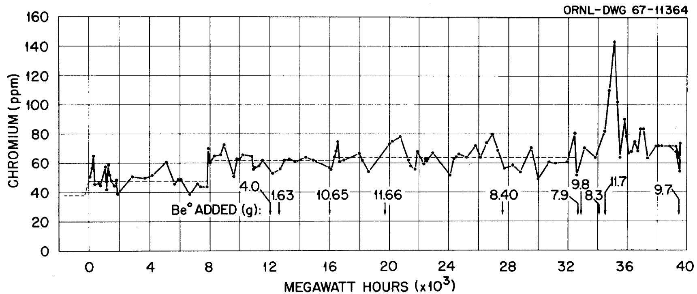  
Figure 9.12. Chromium in Fuel Salt Sample.

cell atmosphere. In June 1967, a set of specimens was removed from the furnace around the reactor vessel after 11,000 hours at high temperature, covering all the power operation up to that date. There was no evidence of nitriding, and the maximum depth of oxidation was only about 3 mils.[35] Visual examination of a control rod removed in January 1967 also disclosed only moderate oxidation of the surface in the 8500 hours the rod operated at high temperature in its thimble in the core.

# 9.2.5 Radiation Damage to Container Material

The effects of neutron irradiation on Hastelloy-N were discussed in Section 1.1.2 of this report. In summary, the irradiation effects at MSRE temperatures are a reduction in tensile ductility and a reduction in the fracture strain during stress rupture tests. The rupture life was also reduced at high stress levels, but the available data at lower stresses show only a small reduction (Fig. 1.1). The ultimate strength, yield strength, and creep rate were not significantly affected in regard to MSRE operation.

The primary stress levels in the reactor vessel during normal operation are well below the range of the tests on irradiated material, but extrapolation of the data indicate that the decrease in rupture life should not be enough to shorten the service life below that contemplated for the $^{233}\mathrm{U}$ operation. Calculations have indicated that the secondary stresses, thermal stresses, and stresses from piping reactions are also satisfactorily low.[36] Significant transient thermal stresses do not develop during normal operation because of the relatively thin sections and the slow thermal response of the reactor system to power and load changes. Transient thermal stresses would have to exceed the yield point before the life of the reactor would be reduced, and even then the stresses would be relieved without actual failure of the vessel.

Since normal operations and the credible reactivity accidents (with safety system action) do not produce high stresses in the reactor vessel, we believe that the vessel can be used safely, despite radiation effects, for the proposed life of the experiment.

# 10. RELEASE FROM SECONDARY CONTAINMENT

Ultimate reliance for protection of the public from the consequences of any credible accident in the MSRE is placed on the secondary containment that surrounds the fuel salt system. The original safety analysis assumed a containment leak rate that could probably be attained and assayed the possibility of damage that would significantly increase the leak rate. Then the analysis considered the situation that would place the most stringent demands on the containment - the simultaneous spillage of gross quantities of the fuel salt and water in the reactor cell. Calculations of leakage and dispersal of fission products indicated that the secondary containment adequately limited the consequences of this hypothetical event. It was largely on this basis that the USAEC concluded that the MSRE could be operated "without undue risk to the health and safety of the public."

Periodic tests of the secondary containment at high pressure have invariably shown lower leak rates than were assumed, and there has been nothing to reduce confidence in the strength and reliability of the containment. Therefore from the standpoint of containment adequacy, any differences between the operation originally approved and the proposed operation with $^{233}\mathrm{U}$ fuel must lie wholly in the amounts of fission products that must be contained. There are differences, partly because the yields from $^{233}\mathrm{U}$ fission are different and partly because the power is limited to 7.5 Mw instead of the 10 Mw originally contemplated. Detailed calculations show that there will be less of each of the important categories of fission products in the salt than was considered in the original safety analysis. (There will be $9\%$ less iodine, $27\%$ less bone-seekers and $11\%$ less kidney-seekers.) On this basis, then, we assert that the conclusion of the USAEC is still valid and the proposed operation will not entail undue risk to the health and safety of the public.

# Internal Distribution

1. R. K. Adams

2. R.G.Affel

3. R.F.Apple

4. D. S. Asquith

5. C. F. Baes

6. S.J.Ball

7. S. E. Beall

8. M. Bender

9. E. S. Bettis

10. F. F. Blankenship

11. R. Blumberg

12. E. G. Bohlmann

13. C. J. Borkowski

14. G.E. Boyd

15. R. B. Briggs

16. R. H. Bryan

17. J. M. Chandler

18. R.H.Chapman

19. F. H. Clark

20. C. E. Clifford

21. W.H.Cook

22. L. T. Corbin

23. W. B. Cottrell

24. J. L. Crowley

25. F. L. Culler, Jr.

26. D. G. Davis

27. R.J.DeBakker

28. S.J.Ditto

29. F. A. Doss

30. W.P.Fatherly

31. J.R. Engel

32. E.P.Epler

33. D. E. Ferguson

34. A. P. Fraas

35. D. N. Fry

36. J. H. Frye, Jr.

37. H. A. Friedman

38. C. H. Gabbard

39. R. B. Gallaher

40. W. R. Grimes

41. A. G. Grindell

42. E. D. Gupton

43. R. H. Guymon

44. P. H. Harley

45-49. P. N. Haubenreich

50. P. G. Herndon

51. T. L. Hudson

52. E. B. Johnson

53. W. H. Jordan

54. S. I. Kaplan

55. P.R. Kasten

56. R.J.Kedl

57. T. W. Kerlin

58. S. S. Kirslis

59. A. I. Krakoviak

60. J. W. Krewson

61. R.C. Kryter

62. J. A. Lane

63. R. B. Lindauer

64. M. I. Lundin

65. R. N. Lyon

66. H. G. MacPherson

67. R. E. MacPherson

68. C. D. Martin

69. T. H. Mauney

70. H. E. McCoy

71. H. C. McCurdy

72. H. F. McDuffie

73. C. K. McGlothlan

74. A.J.Miller

75. R. L. Moore

76. E. L. Nicholson

77. L.C.Oakes

78. A.M. Perry

79. H.B.Piper

30. B. E. Prince

31. G. L. Ragan

32. J. L. Redford

33. M. Richardson

34. R.C.Robertson

# Internal Distribution

<table><tr><td>85.</td><td>J. C. Robinson</td></tr><tr><td>86-161.</td><td>M. W. Rosenthal</td></tr><tr><td>162.</td><td>A. W. Savolainenen</td></tr><tr><td>163.</td><td>Dunlap Scott</td></tr><tr><td>164.</td><td>J. H. Shaffer</td></tr><tr><td>165.</td><td>E. G. Silver</td></tr><tr><td>166.</td><td>M. J. Skinner</td></tr><tr><td>167.</td><td>A. N. Smith</td></tr><tr><td>168.</td><td>O. L. Smith</td></tr><tr><td>169.</td><td>P. G. Smith</td></tr><tr><td>170.</td><td>I. Spiewak</td></tr><tr><td>171.</td><td>D. A. Sundberg</td></tr><tr><td>172.</td><td>R. C. Steffy, Jr.</td></tr></table>

<table><tr><td>173.</td><td>H. H. Stone</td></tr><tr><td>174.</td><td>J. R. Tallackson</td></tr><tr><td>175.</td><td>R. E. Thoma</td></tr><tr><td>176.</td><td>D. B. Trauger</td></tr><tr><td>177.</td><td>C. S. Walker</td></tr><tr><td>178.</td><td>B. H. Webster</td></tr><tr><td>179.</td><td>A. M. Weinberg</td></tr><tr><td>180.</td><td>J. R. Weir</td></tr><tr><td>181.</td><td>K. W. West</td></tr><tr><td>182.</td><td>M. E. Whatley</td></tr><tr><td>183.</td><td>J. C. White</td></tr><tr><td>184.</td><td>G. D. Whitman</td></tr><tr><td>185.</td><td>Gale Young</td></tr></table>

<table><tr><td>186-187.</td><td>Central Research Library</td></tr><tr><td>188-189.</td><td>Y-12 Document Reference Section</td></tr><tr><td>190-200.</td><td>Laboratory Records Department, LRD</td></tr><tr><td>201.</td><td>Laboratory Records, LRD-RC</td></tr></table>

# External Distribution

<table><tr><td>202-203.</td><td>T. W. McIntosh, AEC, RDT, Washington, D. C. 20545</td></tr><tr><td>204-231.</td><td>H. M. Roth, Laboratory and University Division, ORO</td></tr><tr><td>232.</td><td>T. G. Schleiter, AEC, RDT, Washington, D. C. 20545</td></tr><tr><td>233.</td><td>Milton Shaw, AEC, RDT, Washington, D. C. 20545</td></tr><tr><td>234-248.</td><td>Division of Technical Information Extension, DTIE</td></tr></table>