ORNL-TM-2136

GRAPHITE BEHAVIOR AND ITS EFFECTS ON MSBR PERFORMANCE

# LEGAL NOTICE

This report was prepared as an account of Government sponsored work. Neither the United States, nor the Commission, nor any person acting on behalf of the Commission:

A. Makes any warranty or representation, expressed or implied, with respect to the accuracy, completeness, or usefulness of the information contained in this report, or that the use of any information, apparatus, method, or process disclosed in this report may not infringe privately owned rights; or   
B. Assumes any liabilities with respect to the use of, or for damages resulting from the use of any information, apparatus, method, or process disclosed in this report.

As used in the above, "person acting on behalf of the Commission" includes any employee or contractor of the Commission, or employee of such contractor, to the extent that such employee or contractor of the Commission, or employee of such contractor prepares, disseminates, or provides access to, any information pursuant to his employment or contract with the Commission, or his employment with such contractor.

Contract No. W-7405-eng-26

MOLTEN SALT REACTOR PROGRAM

# GRAPHITE BEHAVIOR AND ITS EFFECTS ON MSBR PERFORMANCE

P. R. Kasten

E. S. Bettis

W. H. Cook

W. P. Eatherly

D. K. Holmes

R.J.Kedl

C. R. Kennedy

S. S. Kirshlis

H. E. McCoy

A. M. Perry

R.C.Robertson

D. Scott

R. A. Strehlow

# LEGAL NOTICE

This report was prepared as an account of Government sponsored work. Neither the United States, nor the Commission, nor any person acting on behalf of the Commission:   
A. Makes any warranty or representation, expressed or implied, with respect to the accuracy, completeness, or usefulness of the information contained in this report, or that the use of any information, apparatus, method, or process disclosed in this report may not infringe privately owned rights; or   
B. Assumes any liabilities with respect to the use of, or for damages resulting from the use of any information, apparatus, method, or process disclosed in this report.   
As used in the above, "person acting on behalf of the Commission" includes any employee or contractor of the Commission, or employee of such contractor, to the extent that such employee or contractor of the Commission, or employee of such contractor prepares, disseminates, or provides access to, any information pursuant to his employment or contract with the Commission, or his employment with such contractor.

FEBRUARY 1969

OAK RIDGE NATIONAL LABORATORY

Oak Ridge, Tennessee

operated by

UNION CARBIDE CORPORATION

for the

U.S. ATOMIC ENERGY COMMISSION

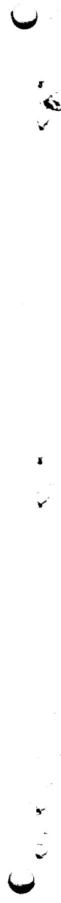

# CONTENTS

# ABSTRACT 1

1. INTRODUCTION 2   
2. SUMMARY AND CONCLUSIONS 3   
3. GRAPHITE BEHAVIOR 9

3.1 Irradiation Behavior of Graphite 10   
3.2 Stresses Generated in Graphite During Irradiation 17   
3.3 Penetration of Graphite by Gases and Salts 32

3.3.1 Penetration by Gases 32   
3.3.2 Penetration by Salts 34   
3.3.3 Pore Volume Sealing Technique 36   
3.3.4 Surface Coatings and Seals 39

3.4 Near-Term Industrial Production Capability 41

4. FISSION PRODUCT BEHAVIOR IN MOLTEN-SALT REACTOR SYSTEMS 42

4.1 In-Pile Capsule Tests 43   
4.2 Exposure Tests in the MSRE Core 43   
4.3 Tests in the MSRE Pump Bowl 47   
4.4 Chemical State of Noble-Metal Fission Products 50   
4.5 Results from ORR Loop Experiments 50   
4.6 Evaluation of Results 51

5. NOBLE-GAS BEHAVIOR IN THE MSER 53   
6. INFLUENCE OF GRAPHITE BEHAVIOR ON MSBR PERFORMANCE AND DESIGN 61

6.1 Effect of Core Power Density on MSBR Performance 61   
6.2 Effect of Graphite Dimensional Changes on MSBR Performance 62   
6.3 Mechanical Design Factors and Cost Considerations 65

6.4 The Influence on MSER Performance of Noble-Metal Deposition on Graphite 74   
6.5 Conclusions 79

# 7. PROGRAM TO DEVELOP IMPROVED GRAPHTITES FOR MSER'S 80

7.1 Fundamental Physical Studies 82   
7.2 Fundamental Chemical Studies 83   
7.3 Fabrication Studies 84   
7.4 Engineering Properties 85   
7.5 Irradiation Program 86   
7.6 Conclusions 86

# APPENDIX - Graphite Exposure Measurements and Their Relationships to Exposures in an MSBR 83

# P. R. Kasten

E. S. Bettis

S. S. Kirslis

W. H. Cook

H. E. McCoy

W. P. Eatherly

A. M. Perry

D. K. Holmes

R. C. Robertson

R.J.Kedl

D. Scott

C. R. Kennedy

R. A. Strehlow

# ABSTRACT

Graphite behavior under Molten-Salt Breeder Reactor (MSBR) conditions is reviewed and its influence on MSBR performance estimated. Based on the irradiation behavior of small-sized graphite specimens, a permissible reactor exposure for MSBR graphite is about $3 \times 10^{22}$ neutrons/cm² ( $E > 50$ kev). The stresses generated in the graphite due to differential growth and thermal gradients are relieved by radiation-induced creep, such that the maximum stress during reactor exposure is less than 1000 psi for reactor designs having a peak core power density of about 100 kw/liter and reactor exposures less than about 2-1/2 years. The corresponding power costs for single-fluid MSBR's would be about 3.1 mills/kwhr(e) based on a capital charge rate of $12\%$ per year and an $80\%$ load factor. Experimental data on graphite behavior also indicate that graphites with improved dimensional stability under irradiation can be developed, which would lead to improved reactor performance.

The deposition of fission products on graphite does not appear to be large (10 to $35\%$ of the "noble-metal" fission products based on MSRE experience); taking into account graphite replacement every two years, fission product deposition reduces the MSBR breeding ratio by about 0.002. Also, it appears that xenon poisoning can be kept at a $0.5\%$ fraction poisoning level by using pyrolytic carbon as a pore impregnant which seals the surface of MSBR graphite and/or by efficient gas stripping of the fuel salt fluid by injection and removal of helium gas bubbles.

It is concluded that good MSBR performance can be obtained by using graphite having combined properties presently demonstrated by small-size samples, and that development of MSBR graphite having such properties is feasible.

# 1. INTRODUCTION

Recent experimental results concerning the physical behavior of graphite during reactor irradiations have indicated that significant dimensional changes can take place at exposures of interest in MoltenSalt Breeder (MSBR) systems. These results indicate the need to evaluate graphite behavior under MSBR conditions, to estimate what constitutes a permissible reactor exposure for the graphite, to determine the influence of core power density and graphite replacement costs on MSBR performance, and to initiate an experimental program for the purpose of developing improved graphite. Also, in assessing overall reactor performance, a number of other interrelated problems are involved. For example, the deposition of fission products on graphite has an adverse effect on reactor performance, and this deposition behavior in an MSBR environment needs to be determined. Thus, the purpose of this study is to summarize and evaluate presently available information concerning graphite behavior and properties as they relate to MSBR operation. Further, investigations are proposed which may lead to development of improved graphites. Topics specifically treated in this report include the behavior of graphite under reactor radiation conditions; the evaluation of irradiation data; the stresses generated in graphite under MSBR conditions; the penetration of graphite by gases and salts; the sealing of graphite pores; the deposition of fission products on graphite; the effects of gas stripping and of graphite permeability on $^{135}\mathrm{Xe}$ neutron poisoning; the influence of graphite dimensional changes on MSBR fuel cycle performance, mechanical design, and power costs; the effect on MSBR fuel cycle performance of fission product deposition on graphite; and a proposed program for developing improved graphites which includes physical, mechanical, chemical, fabrication, and irradiation studies.

As mentioned above, the effect of graphite behavior on reactor performance influences reactor design. Until recently, the term MSBR was applied to a two-fluid concept, in which fuel salt containing fissile material was kept separate from fertile-containing fluid by means of graphite plumbing. Such a concept is given in reference 1,which presents

design information on a 1000-Mw(e) plant employing four reactor modules, each module generating the equivalent of 250 Mw(e). The core of each reactor uses graphite fuel cells in the form of reentrant tubes brazed to metal pipes. The pipes are welded into fuel-supply and discharge plenums in the bottom of the reactor vessel. The fertile salt fills the interstices between fuel cells as well as a blanket region around the core. Such a reactor is termed a two-fluid MSBR.

Also considered here is a single-fluid MSBR, in which the fissile and fertile salts are mixed together in carrier salt but which is otherwise similar to the two-fluid MSBR. Such a concept does not require graphite to serve as fuel plumbing, which is desirable from the viewpoint of reactor operation. However, in order to operate as a breeder, a fuel processing scheme is required that can rapidly and economically retain $^{233}\mathrm{Pa}$ outside the core region. Recent chemical developments indicate2 the feasibility of such a process. Thus, both the two-fluid and single-fluid MSBR's are referred to in the following sections. However, no differentiation is made to items which apply equally well to both reactor concepts.

# 2. SUMMARY AND CONCLUSIONS

When graphite is exposed to fast neutron doses, it tends to contract initially, with the rate of contraction decreasing with exposure until a minimum volume is attained; further exposure tends to cause volume expansion, with the rate of expansion increasing rapidly at neutron doses above about $3 \times 10^{22}$ neutrons/cm² (E > 50 kev) in graphite tested to date. This behavior is due to atomic displacements which take place when graphite is exposed to fast neutrons, and is dependent upon the source and fabrication history of the material and also the exposure temperature. Irradiation results for different grades of graphite have shown that gross volume changes are a function of crystallite arrangement as well as size of the individual crystallites. The initial decrease in graphite volume with reactor exposure is attributed to the closing of voids which were generated in the graphite during fabrication. These voids (as microcracks)

afford accommodation of the internal shearing strains without causing gross volume growth which would otherwise take place due to the differential growth rates of coke particles. Once the original microcracks are closed, however, this accommodation no longer exists, and macroscopic growth occurs with increasing exposure.

The rapid volume expansion of graphite observed at very high reactor exposures indicates that for these conditions the internal straining is not accommodated by particle deformation, but by cracking. Examinations show that this cracking generally takes place in the interparticle, or binder region. Thus, it appears that the binder region has little capacity to accommodate or control particle strain and thus fractures because of buildup of mechanical stresses. This indicates that graphites with improved radiation resistance might be obtained by developing graphites having little or no binder content, and there are experimental results which appear to encourage such development. Experimental data also indicate that improved radiation resistance is associated with isotropic graphites made up of large crystallites. Consequently, a research and development program aimed at producing improved graphite would emphasize development of graphite having large crystallite sizes and little or no binder content. Such a program would involve physical, chemical, mechanical, fabrication, and irradiation studies, and could be expected to develop graphites with permissible fast neutron exposures of 5 to $10 \times 10^{22}$ neutrons/ $\mathrm{cm}^2$ ( $\mathbf{E} > 50$ kev).

Volume changes in graphite during irradiation can influence reactor performance characteristics and thus affect MSBR design specifications. Consistent with the desire to maintain low permeability of the graphite to gases, obtain high nuclear performance during MSBR operation, and to simplify core design features, the maximum permissible graphite exposure was limited to that which causes the graphite to expand back to its original volume. On this basis, and considering results obtained to date with present-day graphites, the permissible exposure under MSBR conditions is estimated to be about $3 \times 10^{22} \mathrm{~nvt}$ ( $\mathbf{E} > 50 \mathrm{kev}$ ) at an effective temperature of $700^{\circ} \mathrm{C}$ . More specifically, at a peak core power density of 100 kw/liter under MSBR operating temperatures, return of the graphite to its original volume corresponds to about 2.5 years of reactor operation at $90\%$ load factor.

Neutron flux gradients in the MSBR will lead to differential volume changes in graphite components, and if the graphite is restrained from free growth, stresses are generated. The magnitude of the stress depends on the fast neutron flux distribution and also on the radiation-induced creep of the graphite. Based on a single-fluid MSBR design in which the peak power density is 100 kw/liter and where the graphite shape is represented by an annular graphite cylinder having an external radius of 5 cm and an internal radius of 1.5 cm, the maximum calculated stress in the graphite during a 2.5-year reactor exposure was less than 700 psi due to spatially symmetric neutron flux variations, and less than 240 psi due to asymmetric flux variations (flux variations around the tube periphery). Since MSBR graphite is estimated to have a tensile strength of about 5000 psi, the above stresses due to changes in graphite dimensions do not appear to be excessive. For the above conditions, the net change (decrease) in the length of the graphite cylinder is estimated to be about 1.6%, an amount which does not appear to introduce significant core design difficulties.

Graphite for an MSBR should have low penetration by both gas and salt, in order that performance characteristics of the system remain high. If neutron poisoning due to $^{135}\mathrm{Xe}$ is to be limited to $0.5\%$ fraction poisons by diffusional resistance of the graphite alone, a material is needed in which the xenon diffusion coefficient is about $10^{-6} \mathrm{ft}^2/\mathrm{hr}$ . The most promising of several approaches for producing such a graphite is that of sealing the surface pores with pyrolytic carbon or graphite. Experimental results indicate that graphite sealed in this manner has a diffusion coefficient of about $10^{-8} \mathrm{ft}^2/\mathrm{hr}$ (associated with the surface seal), and that this seal can be maintained even though some thermal cycling occurs. Alternatively, neutron poisoning could be maintained at low levels by efficient stripping of fission gases from the fuel salt with helium, and if this is accomplished, an increase in graphite permeability during reactor exposure may be permissible. Due to the nonwetting characteristics of molten fluoride salts, penetration of graphite by salts does not appear to be a problem.

Fission products other than gases also have access to the graphite. Retention by the graphite of fission products could significantly reduce

the nuclear performance of MSBR systems. However, tests conducted in the Molten-Salt Reactor Experiment (MSRE) have demonstrated that only a small fraction of the total fission products generated accumulate on the graphite. The primary interaction between MSRE graphite and fissioning fuel salt is the partial deposition (about $10 - 35\%$ ) of fission products that form relatively unstable fluorides. Of the "noble-metal" fission products which deposited, over $99\%$ of the associated activity was within 5 mils of the graphite surface. In no case was there permeation of fuel salt into the graphite or chemical damage to the graphite. Test results can be interpreted such that the percentage of the noble metals deposited on graphite depends on the ratio of graphite surface to metal surface in the fuel system, with deposition on graphite decreasing with decreasing ratio of graphite-to-metal surface. Finally, the MSRE results indicate that significant fractions of the noble-metal fission products appear in the gas phase in the fuel pump bowl. If these fission products can be removed from MSBR's by gas stripping, such a process would provide a convenient means for their removal.

Based on the results obtained in the MSRE and taking into account the higher metal/graphite surface area in an MSBR relative to the MSRE, it is estimated that deposition of fission products on the graphite in an MSBR would reduce the breeding ratio by about 0.002 on the average if graphite were replaced every two years, and about 0.004 if replaced every four years. Thus, although complete retention of the noble-metal fission products on core graphite would lead to a significant reduction in MSBR breeding ratio, the deposition behavior inferred from MSRE results corresponds to only a small reduction in MSBR performance.

Graphite dimensional changes due to exposure in an MSBR can alter the relative volume fractions of moderator, fuel salt, and fertile salt in the reactor. Such changes influence the design of a two-fluid MSBR more than a single-fluid reactor, since in the latter the fertile and fissile materials are mixed together and their ratio does not change when the graphite volume changes. By constructing a two-fluid reactor such that the fissile and fertile materials are confined to channels within the graphite assemblies and the spaces between graphite assemblies are filled with helium, changes in graphite volume fraction lead largely

to relative volume change in the helium space. Such volume changes have only a small effect on fuel cycle performance and on power distribution. In a single-fluid MSBR, graphite dimensional changes would have little effect on nuclear performance since the fissile and fertile salt volumes are equally affected. Also, the ability to independently adjust fissile and fertile material concentrations in both two-fluid and single-fluid MSBR's permits adjustment in reactor performance as changes in graphite volume occur. Thus, little change in nuclear performance is expected because of radiation damage to graphite, so long as the graphite volume does not increase much beyond its initial value and the graphite diffusion coefficient to gases remains low during reactor exposure (the latter condition neglects the possibility of removing xenon efficiently by gas stripping).

A limit on the permissible exposure of the graphite can have a significant influence on reactor power costs. If there were no exposure limit, the average core power density corresponding to the minimum cost would be in excess of 80 kw/liter. However, if a limit exists, high power density can lead to high cost because of graphite replacement cost. At the same time, decreasing the core power density leads to an increase in capital cost and fuel cycle cost. Thus, a limit on permissible graphite exposure generally requires a compromise between various cost items, with core power density chosen on the basis of power cost. The optimum power density also varies with MSBR concept, since only graphite requires replacement in a single-fluid MSBR, while both the reactor vessel and graphite appear to require replacement in a two-fluid MSBR because of the complexity of constructing the latter core. Further, reactor power outage due solely to graphite replacement requirements can be a significant cost factor. However, if graphite were replaced at time intervals no less than two years, it appears feasible to do the replacement operation during normal turbine maintenance periods, such that no effective downtime is assigned to graphite replacement. A two-year time interval is associated with an average power density in the power-producing "core" of about 40 kw/liter. For the above "reference" conditions, the single-fluid MSBR has power costs about 0.35 mill/kwhr(e) lower than the two-fluid MSBR. Doubling the permissible graphite exposure [to a value of $6 \times 10^{22} \mathrm{vct}(\mathrm{E} > 50 \mathrm{kev})$ ] would be more important to the two-fluid

concept and would reduce power costs by about 0.15 mill/kwhr(e); the corresponding change for the single-fluid MSBR would decrease power costs by about 0.07 mill/kwhr(e). If a two-week effective reactor downtime were assigned solely to graphite replacement operations, the associated power cost penalty would be about 0.05 mill/kwhr(e) for either concept. Conclusions of these studies are:

1. Satisfactory MSBR performance can be obtained using graphite having the combined properties presently demonstrated by small-sized samples, with single-fluid MSBR's appearing economically superior to two-fluid MSBR's.   
2. The development of MSBR graphite having desired properties is feasible. (It appears that at least two vendors could produce a material satisfactory for initial MSBR use, based on present industrial capability for graphite production.)   
3. The radiation behavior of small-sized graphite specimens indicates a permissible reactor exposure in excess of 2 years for a peak MSBR power density of $100\mathrm{kw / liter}$ , based on a zero net volumetric growth for graphite exposed to the peak power density. The maximum stress generated in the graphite under these conditions due to dimensional changes and thermal effects is estimated to be a factor of 5 less than the expected tensile strength of MSBR graphite.   
4. The deposition of fission products on/in graphite does not appear to influence nuclear performance significantly. Deposition of noble-metal fission products appears to reduce the breeding ratio about 0.002 every 2 years of graphite exposure. Also, it appears feasible that xenon concentrations can be kept at a $0.5\%$ fraction poison level by surface sealing of the graphite with pyrolytic carbon; further, gas stripping provides a means of keeping xenon poisoning at a low level.   
5. The design and operation of MSBR's appear sufficiently flexible that a high nuclear performance can be maintained even though graphite undergoes dimensional changes during reactor operation.

# 3. GRAPHITE BEHAVIOR

H. E. McCoy

Although the dimensional instability of graphite under neutron irradiation has been known for some time, volume changes associated with very high reactor exposure appear to be greater than originally anticipated. Until recently, graphite had been exposed to fast neutron doses of only about $1 \times 10^{22}$ neutrons/ $\mathrm{cm}^2$ . Isotropic graphite was noted to contract, with the rate of contraction continuously decreasing. It appeared that the contraction would cease and that the dimensions would begin to expand slightly as defects were produced by irradiation. However, graphite has now been irradiated to higher doses, and a very rapid rate of expansion is noted after the initial contraction. A large and rapid physical expansion is undesirable from the viewpoint of reactor performance; also, if the penetration of xenon into graphite were to increase markedly as the graphite density decreases, the nuclear performance would be adversely affected. Based on present information, a reasonable core design life appears to be that which permits the graphite to return to its original volume.

The initial graphite contraction with exposure would lead to an increase in the volume fraction of salt within the core region of the reactor. Since the contraction would take place slowly with time, the nuclear performance of the system could remain relatively constant by adjusting the fuel concentration, and if the graphite volume fraction did not increase much above its initial value. Expansion of the graphite would lead to a decrease in the salt volume in the core, and eventually lead to a decrease in nuclear performance of the system. However, if the core graphite were replaced before it expanded much beyond its original volume, the effect of moderator dimensional changes on nuclear performance would be small.

Graphite for MSBR use should have low penetration by both gas and salt so that the nuclear performance will remain high. Since salt normally does not wet graphite, there is little tendency for the salt to penetrate the graphite unless high pressures are applied or wetting conditions arise, and these latter conditions would normally not exist.

Gaseous penetration is controlled by the diffusion coefficient of the gas in the graphite and by gas stripping with helium bubbles. The most significant of the fission product gases is $^{135}\mathrm{Xe}$ . Even though xenon can be removed by stripping the salt with helium bubbles, it is desirable that the graphite have and retain a very low permeability so as to maintain xenon retention in the core at a low level. Ways for developing such a graphite are listed below, with method three the preferred one at present.

1. Development of a monolithic graphite having the desired characteristics.   
2. Impregnation of the graphite with pitch.   
3. Deposition of pyrolytic carbon within graphite by decomposition of hydrocarbon gases.   
4. Deposition of metal on the graphite surface.

An important consideration is the ability of the MSBR graphite to retain low values of the gaseous diffusion coefficient throughout the reactor exposure period.

As indicated above, the proposed use of graphite in molten-salt breeder reactors poses some rather stringent requirements upon this material. It must have excellent chemical purity in order to have the desired nuclear properties. It should be impermeable to molten salts and have a diffusion coefficient (to gaseous fission products) of about $10^{-8}\mathrm{ft}^2/\mathrm{hr}$ . Also, the graphite must have reasonable dimensional stability to fast neutron doses in the range of $10^{22}$ to $10^{23}$ neutrons/cm $^2$ ( $E > 50$ kev). In the next sections a critical assessment is made of the status of graphite development for molten-salt breeder reactors.

# 3.1 Irradiation Behavior of Graphite

# C. R. Kennedy

Graphite undergoes displacement damage under neutron irradiation, resulting in anisotropic crystallite growth rates. The crystal expands in the c-axis direction and experiences an a-axis contraction. Irradiation studies on isotropic large-crystallite pyrographite have shown

that the overall growth rates correspond to a very small volumetric expansion. The volume expansion is attributed to minor adjustments in lattice parameters to accommodate the vacancy and interstitial atom concentrations. However, the linear growth rates in highly orientated pyro-graphite are extremely large and represent the growth rates of individual crystallites of the filler coke particles in reactor-grade graphite. Also, the irradiation behavior of graphite is dependent upon its fabrication history.

A comparison of graphite irradiation behavior obtained at different laboratories is made difficult by the various exposure scales used by the different experimenters. Perry4 has examined this problem and concluded that an exposure scale based upon neutrons with energies greater than 50 kev can be used to compare results obtained from widely different reactors. This exposure scale will be used in our analysis of the existing data.

Neutron irradiation causes various grades of graphite to undergo an initial decrease in volume rather than the expansion observed in pyro-graphite having an equivalent crystallite size. Irradiation results $^{5,6}$ are given in Figs. 3.1 and 3.2 for an isotropic and an anisotropic grade (AGOT), respectively. The actual changes in linear dimensions are, of course, different from grade to grade, and depend largely on the degree of anisotropy present in the graphite. The initial decrease in volume is attributed to the closing of voids generated by thermal strains during cooling in the fabrication process. The closing of the void volume is accompanied by c-axis growth and a-axis shrinkage. The orientation of the crack or void structure, due to the thermal strain origin, allows the c-axis growth to be accommodated internally; the changes in crystallite dimensions do not contribute to the overall changes in macroscopic dimensions until the cracks are closed.

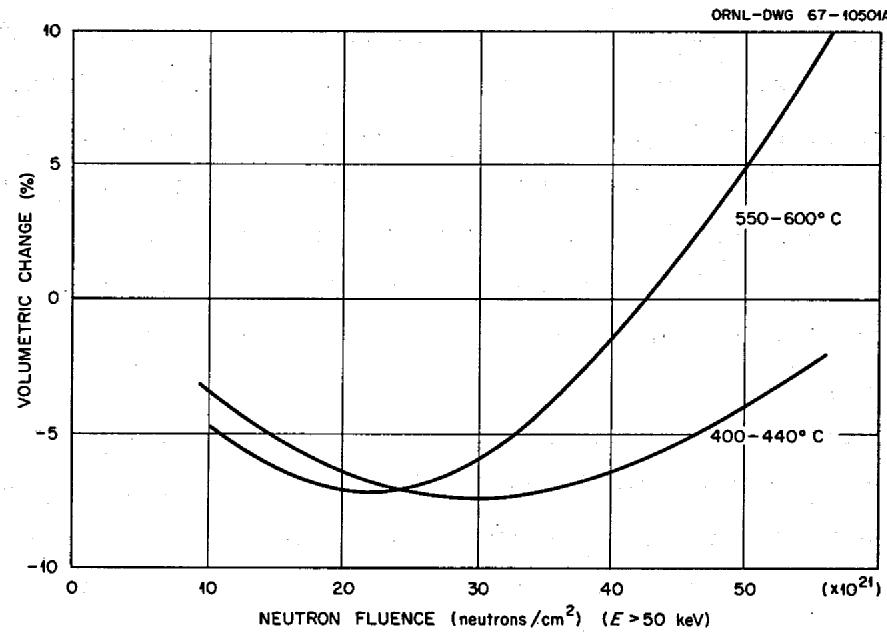

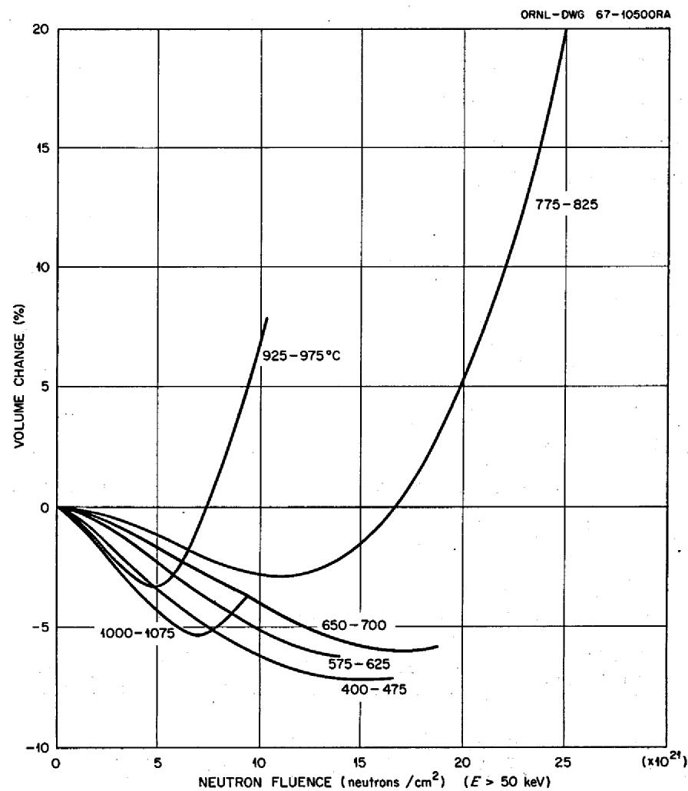  
Fig. 3.1. Volume Changes in Isotropic Graphite During Irradiation in the Dounreay Fast Reactor   
Fig. 3.2. Volume Change in Anisotropic (AGOT) Graphite During GETR Irradiations

The original graphite void volume also affords a degree of accommodation of the internal shearing strains that would otherwise be produced by the differential growth rates of graphitized coke particles. However, once the cracks are closed, this accommodation no longer exists, and the macroscopic dimensional changes should then reflect the c-axis growth.

If the shear strains are accommodated as in isotropic pyrolytic carbon, $^{7}$ large internal shear strains resulting from more than $160\%$ differential growth of the crystallites can be accommodated by plastic deformation without internal fracturing of the graphite and with very small gross volumetric expansions. However, as shown in Figs. 3.1 and 3.2, experimental results show that, for samples tested, the graphite generally contracts to a minimum volume and then expands very rapidly. The very rapid rate of volume expansion indicates that the expansion in all directions is dominated by c-axis growth. This is difficult to explain unless continuity in the direction of the a-axis has been lost, since there are two a-axes in the crystal and only one c-axis. It, therefore, appears that continuity has been lost between the adjacent grains and that overall the a-axis contraction cannot restrain the c-axis growth.

The above explanation for the changes taking place inside the graphite implies that the internal straining due to differential growth is accommodated primarily by cracking and not by deformation. To date, the highly exposed graphites have been subjected to casual, low-magnification surface examinations. These reveal, as expected, that the general region of failure has been in the interparticle or binder region. Only one isolated case has been found of a crack running across the layer planes of a particle. These results indicate that the binder region has little capacity to accommodate the shear strain and as a result it fractures.

If the graphite-volume decrease (during irradiation) is a result of closing the voids generated by thermal strains (introduced during fabrication), the minimum decrease in volume and the exposure required to

achieve the minimum volume should be temperature dependent; i.e., there would be partial closure of the void volume simply by the thermal expansion accompanying heating. Therefore, increasing the irradiation temperature should decrease the irradiation growth required to close the cracks and achieve the minimum volume. Thus, unless the irradiation growth rates in the c-axis and a-axes vary appreciably with temperature, the time to contract and then to expand to a specified volume should decrease with increasing temperature. This behavior has been observed as shown on Figs. 3.3, 3.4, and 3.5 using the results of Henson et al. and Helm. Figure 3.3 gives the maximum volume contraction as a function of temperature. Figure 3.4 and 3.5 give, respectively, as functions of temperature, the total exposure required to achieve maximum graphite volume contraction and that required for the graphite to expand back to its original volume.

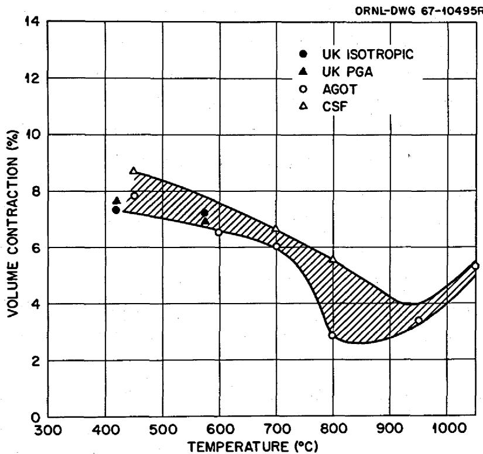  
Fig. 3.3. The Maximum Volume Decrease of Graphite During Reactor Exposure

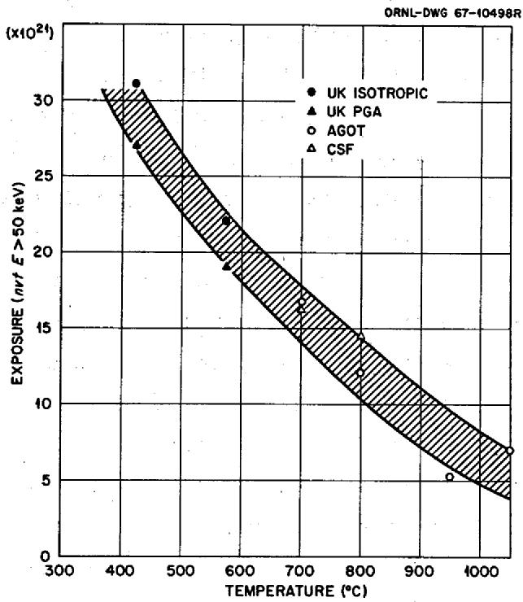  
Fig. 3.4. Reactor Exposure Corresponding to Minimum Graphite Volume

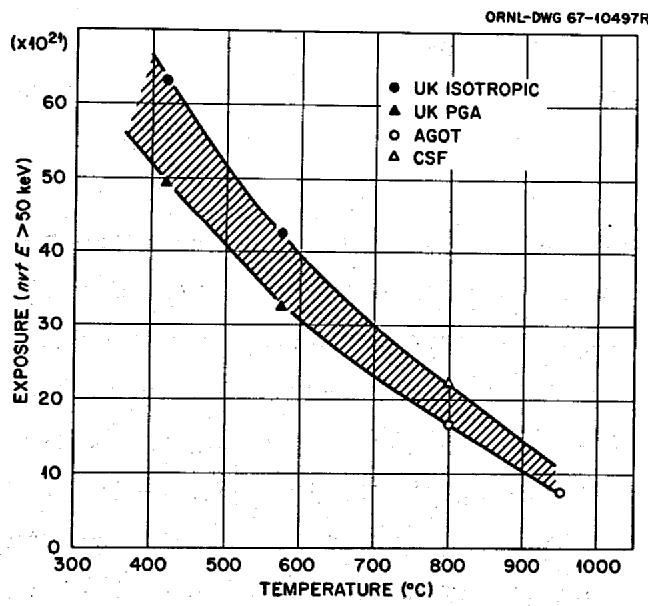  
Fig. 3.5. Total Reactor Exposure Required for Graphite to Expand Back to Its Original Volume

It should be recognized that these data were obtained from GETR and DFR experiments; the neutron energy spectra associated with these reactors differ significantly, and the fast flux differs by almost an order of magnitude. The data, however, correlate well and if a dose-rate effect exists, it appears to be very small over the temperature range studied.

In estimating the useful lifetime of the graphite for the MSBR, the present information on tested grades has been used. Some speculation is required since there is little information concerning the effects of volume expansion on pore spectrum, gas-penetration characteristics, and strength of the graphite. It appears probable that contraction followed by expansion back to the initial graphite volume does not create a structure less sound than the original unirradiated material. On this basis, the useful life of the graphite would correspond to the exposure required for the graphite to return to its original volume. Therefore, based upon grades of graphite that have been tested and the results shown in Fig. 3.5, the lifetime expectancy of graphite at $700^{\circ}\mathrm{C}$ would be about $3 \times 10^{22}$ neutrons/ $\mathrm{cm}^2$ ( $\mathrm{E} > 50\mathrm{keV}$ ).

The graphite temperature in an MSBR varies with core design and power density and also with spatial position within the reactor. For an MSBR operating at an average power density of 80 kw/liter, peak graphite temperatures would be in excess of $750^{\circ}\mathrm{C}$ . However, peak temperature is probably not the proper criterion; rather, the volume-averaged graphite temperature in the vicinity of the highest fast neutron flux would be more appropriate. The peak volume-averaged temperature would tend to decrease with increasing number of fuel flow channels, with decreasing power density, and upon changing from two-fluid to single-fluid type MSBR's. A value of $700^{\circ}\mathrm{C}$ is representative of the effective volume-averaged temperature to be used in estimating permissible graphite exposure for MSBR's operating at an average core power density of about 40 kw/liter; a more detailed analysis of graphite growth, temperature, and associated stresses is given in Section 3.2 which verifies the above.

The effect of graphite size on dimensional stability during reactor exposure has been reported by Nightingale and Woodruff.8 Large blocks

have shown a transverse shrinkage rate of up to twice that of subsize specimens. Although the rationale for such behavior is very vague, this "size effect" has occurred. Unpublished data from BNWL indicate that, although the volumetric contraction in the transverse direction with large-size graphite specimens is possibly greater by about $1\%$ than that obtained with small-size samples, the exposure required to obtain minimum volume and reversal in volume growth has not been reduced. Further, published data from BNWL of a very preliminary nature indicate that extruded pipe specimens of approximately 3 in. OD and 2 in. ID with about 0.2 in. machined from each surface had the same growth rate as small-size specimens. The "size effect" would, at the most, only require an allowance for this increase in transverse shrinkage in the design. The above would neither increase nor decrease the lifetime expectancy of the graphite.

# 3.2 Stresses Generated in Graphite During Irradiation

W. P. Eatherly and C. R. Kennedy

The above discussions concerned the limitations on graphite lifetime due to irradiation-induced dimensional changes, for the case of graphite in a stress-free condition. In actual fact, temperature and flux gradients in the core will tend to produce differential distortions within the graphite, thus generating internal stresses. In examining these effects, a single-fluid reactor will be considered in which the core is constructed of cylindrical prisms of graphite (i.e., tubes) running axially through the core. The stresses will arise from two distinct causes. Within each prism there will be symmetric neutron flux and temperature gradients due to flux distributions in a reactor "cell." In addition, across the prisms there will be superimposed asymmetric gradients due to the gross radial flux and temperature distributions within the core. The symmetric gradients will be maximum in the central region of the core where the power density is high; the asymmetric gradients will be maximum in the outer regions of the core where the "blanket" region causes a rapid decrease in power density with increasing core radius. The symmetric gradients will be considered first.

In examining stresses it is necessary to relate the dimensional behavior of the graphite to the three independent variables of temperature, flux, and time. In the temperature range of interest (550 to $750^{\circ}\mathrm{C}$ ), the dimensional behavior for isotropic graphite is approximated by

$$
\frac {\Delta \ell}{\ell} = \frac {1}{3} (0. 1 1 - 0. 7 x 1 0 ^ {- 4} T) (x ^ {2} - 2 x) \tag {3.1}
$$

where

$$
\begin{array}{l} x \approx \frac {1 0 ^ {- 2 2} \Phi t}{5 . 7 - 0 . 0 0 6 T} \\ T = t e m p e r a t u r e, ^ {\circ} C, \\ \Phi = \text {f a s t n e u t r o n f l u x , n e u t r o n s} \mathrm {c m} ^ {- 2} \sec^ {- 1} (\mathrm {E} > 5 0 \mathrm {k e v}), \\ t = \text {t i m e}, \text {s e c o n d}, \\ \end{array}
$$

and

$$
\frac {\Delta \ell}{\ell} = \text {f r a c t i o n a l}
$$

This function is plotted in Fig. 3.6 as a function of fluence with temperature as a parameter; as shown, $\Delta \ell / \ell$ is a strong function of the irradiation temperature.

The maximum internal symmetric flux gradients occur in the central region of the core; at this position the salt-to-graphite volume ratio will be about $20\%$ . An appropriate graphite cylinder size is one having an internal radius, a, of 1.5 cm and an external radius, b, of 5 cm; it is assumed that surface temperatures will be the same on both surfaces. The fuel salt enters the reactor at a temperature of $550^{\circ}\mathrm{C}$ and exits at $700^{\circ}\mathrm{C}$ . Also, the neutron flux causing fissions, $\Phi$ , is considered to vary as

$$
\Phi = \Phi_ {M} \sin \frac {\pi z}{L} \tag {3.2}
$$

where

$$
L = c o r e h e i g h t,
$$

$$
z = \text {a x i a l}
$$

$$
\Phi_ {M} = \text {m a x i m u m f l u x}.
$$

With a maximum core power density of 100 kw/liter, which is considered here,

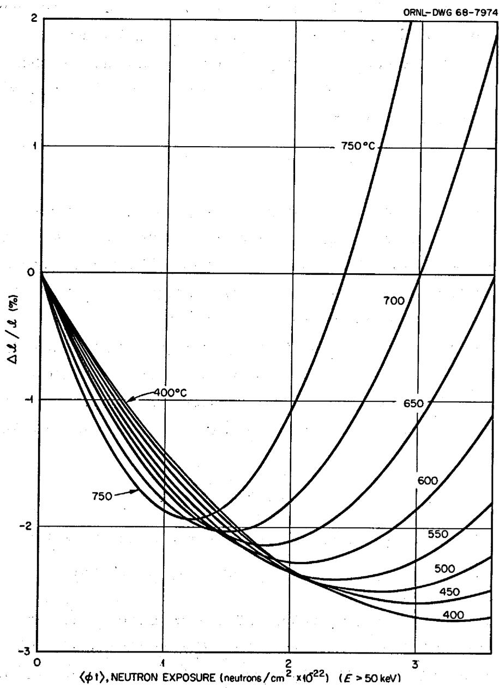  
Fig. 3.6. Radiation Induced Dimensional Changes in Gilso Graphite at Various Temperatures

$$
\Phi_ {M} = 4. 5 \times 1 0 ^ {1 4} \text {n e u t r o n s c m} ^ {- 2} \sec^ {- 1}.
$$

The internal heating within the graphite will be due to energy deposition by both prompt and delayed $\gamma$ rays. For the assumed peak power density of 100 kw/liter, this energy deposition amounts to about 8 w/cc prompt and 2 w/cc delayed. Thus, the internal energy generation rate, $q$ , is approximately given by

$$
q = 8 \sin \frac {\pi z}{L} + 2 w / c c.
$$

This expression combined with the graphite geometry and dimension gives $Q$ , the heat transfer rate per unit length of graphite between the graphite and the fuel salt. Since the radial temperature gradients are much greater than the axial gradients, all the energy generated in the graphite is considered to flow in the radial direction.

The heat generation in the flowing fuel salt will be nearly proportional to the flux $\Phi$ , and thus the temperature in the flowing salt will have a cosine dependence on $z$ . Further, the temperature drop, $\Delta T_{f}$ , from the flowing salt to the graphite-salt interface can be calculated from

$$
\Delta \mathrm {T} _ {\mathrm {f}} = \frac {\mathrm {Q}}{\mathrm {h}} \tag {3.3}
$$

where the effective heat transfer coefficient $h$ has the value,

$$
\mathrm {h} \approx 0. 7 3 1 \mathrm {w} \cdot \mathrm {c m} ^ {- 2} \cdot {} ^ {\circ} \mathrm {C} ^ {- 1} (1 2 4 0 \mathrm {B t u / h r - f t} ^ {2} - ^ {\circ} \mathrm {F})
$$

This yields the surface temperature of the graphite. The internal graphite temperatures follow immediately from the equations of heat flow in a hollow cylinder with a uniformly distributed heat source. The calculated salt, surface, and central graphite temperatures along the central axis of the core are shown in Fig. 3.7.

In the single-fluid MSBR under consideration, the fast flux decreases about $5\%$ from the surface of the graphite to its interior due to energy degradation. This relation is represented here by

$$
\frac {\Delta \Phi}{\Phi} = 0. 0 5 \sin \frac {r - a}{b - a} \pi \tag {3.4}
$$

where $\mathbf{r}$ is the radial coordinate for the graphite cylinder.

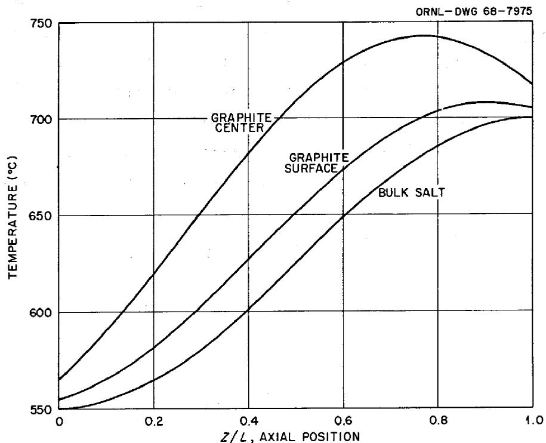  
Fig. 3.7. Axial Temperature Profiles in Center Channel of a Single-Fluid MSBR

Based on the above, the flux and temperature conditions in the graphite tube are specified as a function of $z$ and $r$ , and thus, through Eq. (3.1), so is the local radiation-induced distortion. Thus, the induced stresses can be obtained by solving the stress-strain equations. Before doing this, it is helpful to review briefly the creep behavior of a uniaxially loaded graphite bar under irradiation, and define terms used to describe this behavior. Figure 3.8 illustrates the type of relation between strain and fluence for a constant applied stress, $\sigma$ . The material responds immediately in an elastic mode,\* then proceeds to undergo a saturating primary creep superimposed on a linear secondary creep. The primary creep is essentially a constant volume creep and appears to be reversible. Since it saturates at fluences small compared to those of interest here, it is valid to treat it as a non-time-dependent elastic strain. With this simplification, the equations which must be solved take the form,

$$
\begin{array}{l} \epsilon_ {i} = \frac {1}{E} \left[ \sigma_ {i} - \mu \left(\sigma_ {j} + \sigma_ {k}\right) \right] + \frac {1}{E} \left[ \sigma_ {i} - \frac {1}{2} \left(\sigma_ {j} + \sigma_ {k}\right) \right] \\ + \int_ {0} ^ {t} k \Phi \left[ \sigma_ {1} - \frac {1}{2} \left(\sigma_ {j} + \sigma_ {k}\right) \right] d t \\ + \int_ {0} ^ {t} g d t + \alpha \left(T - T _ {0}\right) \tag {3.5} \\ \end{array}
$$

where

$$
\begin{array}{l} \epsilon_ {1} = \text {t o t a l s t r a i n i - t h d i r e c t i o n (i , j , k = r , \theta , z)}, \\ \sigma_ {i} = \text {s t r e s s i n i - t h d i r e c t i o n ,} \\ E = \text {Y o u n g} ^ {\prime} s \text {m o d u l u s}, \\ \mu = \text {P o i s s o n ' s} \\ k = \text {s e c o n d a r y} \\ g = \text {t i m e} \\ \alpha = \text {d i f f e r e n t i a l} \\ \mathrm {T} _ {\mathrm {o}} = \text {r e f e r e n c e} \\ \end{array}
$$

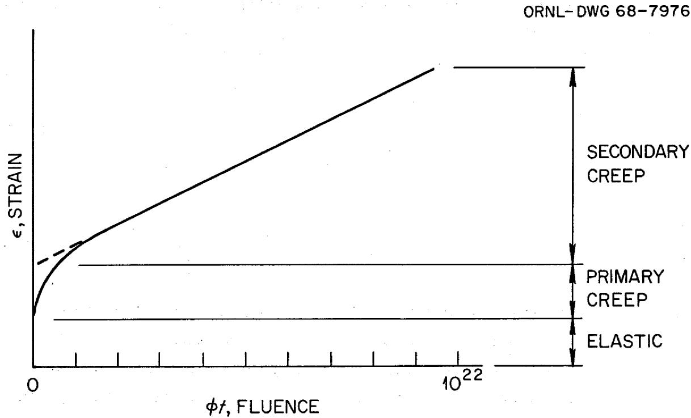  
Fig. 3.8. Elastic and Creep Strains Induced in Uniaxially Loaded Graphite Under Irradiation

The right side of Eq. (3.5) sums the elastic strain, the saturated primary creep strain, the secondary creep strain, the imposed radiation-induced distortions, and the thermal strain. In addition to Eq. (3.5) the following must be satisfied:

$$
\epsilon_ {\mathbf {r}} = \frac {\partial u}{\partial r} \quad \epsilon_ {\theta} = \frac {u}{r} \quad \epsilon_ {z} = \frac {w}{z} \tag {3.6}
$$

where $u$ and $w$ are the displacements of the material in the $r$ and $z$ directions, respectively; also,

$$
\begin{array}{l} \frac {\partial}{\partial \mathbf {r}} (\mathbf {r} \sigma_ {\mathbf {r}}) = \sigma_ {\theta} \tag {3.7} \\ \int_ {a} ^ {b} r \sigma_ {z} d r = 0 \\ \end{array}
$$

and

$$
\sigma_ {r} \left| _ {a} = \sigma_ {r} \right| _ {b} = 0. \tag {3.8}
$$

The above relationships have the following significance: Eqs. (3.6) preserve the continuity of the material during straining, Eqs. (3.7) define the conditions for static equilibrium within the material, and Eqs. (3.8) define static equilibrium at the free surfaces of the cylinder.

The above equations cannot be solved explicitly in closed form. Approximate solutions can be obtained under the conditions EkΦt << 1 and EkΦt >> 1. However, it was possible to obtain numerical solutions to the complete problem using a computer problem10 originally designed to study stresses developed in spherical coated particles and modifying it to cylindrical geometry. The program uses an iterative procedure as follows:

A zero-order approximation is generated by replacing Eq. (3.5) with

$$
\epsilon_ {i o} = \frac {1}{E} \left[ \sigma_ {i o} - \mu \left(\sigma_ {i o} + \sigma_ {k o}\right) \right] + \frac {1}{E} \left[ \sigma_ {i o} - \frac {1}{2} \left(\sigma_ {i o} + \sigma_ {k o}\right) \right] + h _ {i o} \tag {3.9a}
$$

where

$$
\mathrm {h} _ {\mathbf {1 0}} \approx \mathrm {f} _ {\mathbf {1 0}} + \int_ {0} ^ {t} \mathrm {g d t} + \alpha (\mathrm {T} - \mathrm {T} _ {\mathrm {o}}) \tag {3.9b}
$$

and $f_{10}$ , the secondary creep strain, is set equal to a constant. Equations (3.9) are solved for the $\sigma_0$ 's as functions of position and time, and a first-order approximation to $f_1$ is generated by setting

$$
f _ {1 1} = \int_ {0} ^ {t} k \Phi \left[ \sigma_ {i o} - \frac {1}{2} \left(\sigma_ {j o} + \sigma_ {k o}\right) \right] d t. \tag {3.10}
$$

Using this expression to replace $f_{10}$ in Eq. (3.9b) yields values for $\sigma_{11}, \sigma_{j1},$ and $\sigma_{kl}$ ; such a process is repeated until convergence is obtained. In general, convergence is achieved in two to three cycles.

The material constants appropriate for Gilso-carbon-based graphite (presumably to be used for the first MSBR cores) are

$$
\begin{array}{l} E = 1. 7 \times 1 0 ^ {6} p s i \\ \mu = 0. 2 7 \\ k = 2. 0 \times 1 0 ^ {- 2 7} c m ^ {2} \cdot n e u t ^ {- 1} \cdot p s i ^ {- 1} \\ \alpha = 6. 2 \times 1 0 ^ {- 6} ^ {\circ} C ^ {- 1} \\ \end{array}
$$

Using the above values and procedures, the maximum stresses occur at the surfaces of the graphite cylinder, and to within about $1\%$ the axial and tangential stresses are equal. Figure 3.9 gives the calculated axial stresses as a function of axial position for various times; it is apparent that the maximum stresses occur at $z / L \approx 0.6$ . The behavior of the surface stress at this point is given in Fig. 3.10 as a function of time. Two points are of immediate interest: the thermal stresses initially introduced as the reactor is brought to power disappear in a matter of a few weeks; further, the maximum stress occurs at the end of the graphite life, $\tau$ , and is approximately 700 psi. This is well below the anticipated tensile strength of 5000 psi expected for MSBR graphite.

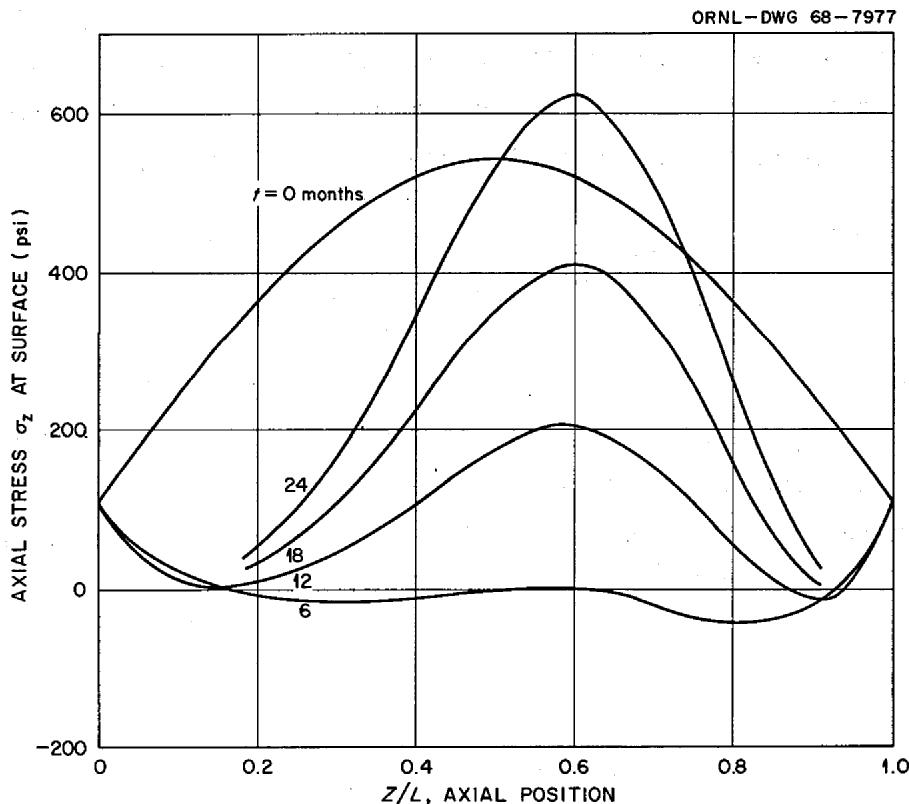  
Fig. 3.9. Axial Surface Stress as a Function of Position and Time in MSBR Graphite

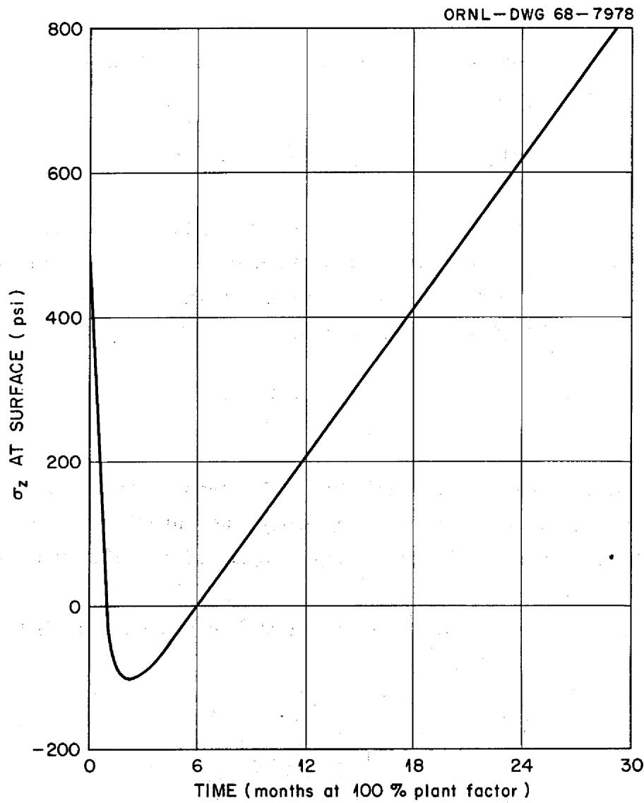  
Fig. 3.10. Axial Surface Stress as a Function of Time at $z / L = 0.6$ in MSBR Graphite

Of interest also is the overall dimensional change in graphite, determined by

$$
\bar {g} = \frac {2}{b ^ {2} - a ^ {2}} \int_ {a} ^ {b} r g d r. \tag {3.11}
$$

Within the accuracy of the calculations, the distortions u and w at the free surfaces are given by

$$
\left. \dot {u} \right| _ {a} = a \bar {g} \quad \left. \dot {u} \right| _ {b} = b \bar {g} \quad \dot {w} = z \bar {g}.
$$

Thus, the external dimensions of the graphite cylinder change according to the average distortion rate $\overline{g}$ quite independently of the details going on within the tube. Defining the graphite lifetime, $\tau$ , as that which gives a zero overall dimensional change,

$$
\int_ {0} ^ {\tau} \overline {{g}} d t = 0 a t \frac {z}{L} = 0. 6
$$

At time $\tau$ the surfaces of the graphite at highest average exposure are still in a slightly contracted state, while the interior is in a slightly expanded state. This criterion yields a value of $\tau = 26.7$ months at $100\%$ plant factor.

The total relative change in length of the graphite cylinder as a function of time is given by

$$
\frac {\Delta L}{L} = \frac {1}{L} \int_ {0} ^ {L} d z \int_ {0} ^ {t} \bar {g} d t \tag {3.12}
$$

The associated results are given in Fig. 3.11; as shown, for the case calculated, the core must accommodate a net $1.6\%$ linear shrinkage of the graphite column.

Attention is now given to the second problem mentioned above, namely, the stresses associated with asymmetrical gradients. Denoting by R the radial coordinate from the centerline of the reactor core toward the blanket regions, the flux $\Phi$ will die away rapidly as R approaches the blanket. Considering a graphite core cylinder near the blanket region,

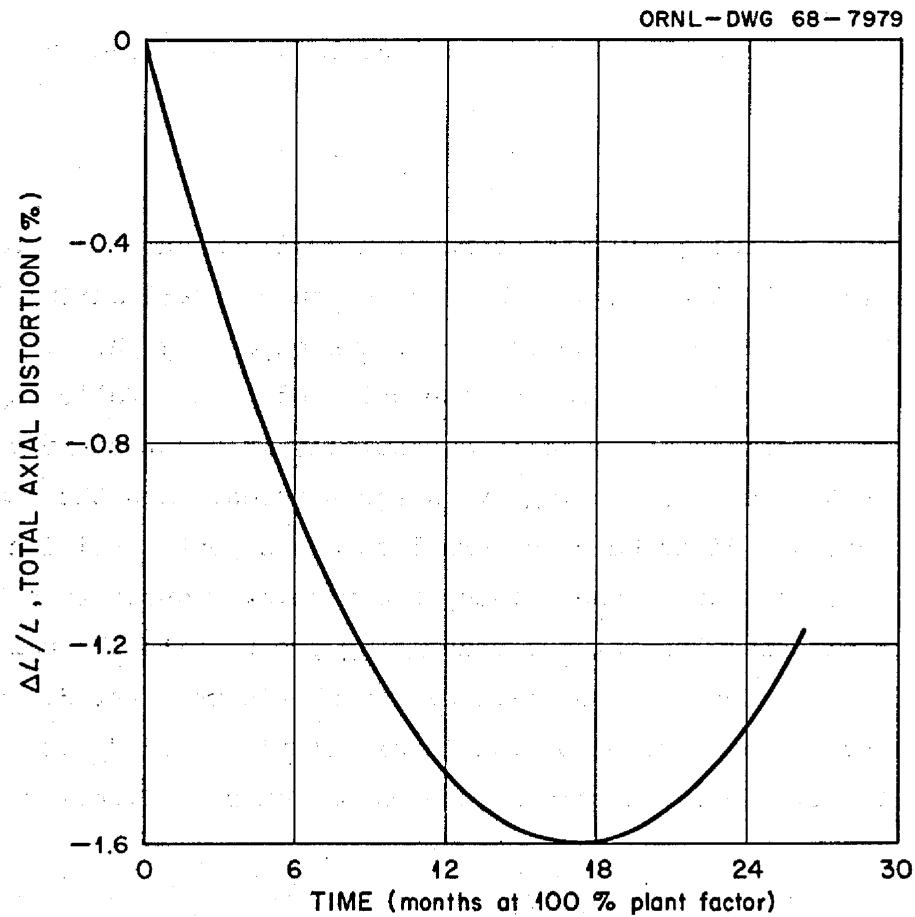  
Fig. 3.11. Total Axial Distortion of Center Line Tube in MSBR

the exterior surface facing toward the core centerline will be exposed to a more intense flux than the exterior surface facing away from the centerline. Specifically, if $\overline{\Phi}$ is the average flux in the tube, the surface facing the core centerline will be in a flux given by

$$
\overline {{\Phi}} + b \frac {\partial \Phi}{\partial R},
$$

and the surface facing the blanket will be in a flux given by

$$
\overline {{\Phi}} - b \frac {\partial \Phi}{\partial R}
$$

Referring back to Eq. (3.1), the core flux gradient existing near the blanket region will tend to bow the tube concave inward during its contracting phase, and convex inward during its expanding phase. The associated stresses which develop can be approximated in the following way: In its bowed condition the tube is essentially in a stress-free condition. If it is constrained from bowing by adjacent tubes, then these adjacent tubes must produce distributed external stresses just sufficient to straighten out the bowed tube. Thus, the problem reduces to a beam under distributed external loading but undergoing creep, with the maximum stresses being produced in the extreme radial fibers. Let $d_{\mathbf{i}}$ be the radiation-induced distortion of the innermost fiber and $d_{0}$ that of the outermost fiber. Then the strain rate on the extreme fibers will be given by

$$
\left| \dot {\epsilon} \right| = \frac {1}{2} \left| d _ {1} - d _ {0} \right| \tag {3.13a}
$$

and the resulting fiber stress by

$$
\left| \dot {\sigma} _ {z} \right| = \frac {| \epsilon |}{k \bar {\Phi}}. \tag {3.13b}
$$

Flux gradients in radially power flattened cores suggest that

$$
\begin{array}{l} \frac {\partial \Phi}{\partial R} <   2. 9 \times 1 0 ^ {1 2} \text {n e u t r o n s c m} ^ {- 3} \sec^ {- 1} \\ a t \overline {{\Phi}} = 2. 4 4 x 1 0 ^ {1 4} n e u t r o n s c m ^ {- 2} \sec^ {- 1} \\ \end{array}
$$

For $\mathbf{T} \approx 700^{\circ}\mathbf{C}$ , this yields

$$
d _ {1} = - 8. 1 0 \times 1 0 ^ {- 1 0} + 1. 6 2 \times 1 0 ^ {- 1 7} t
$$

and

$$
d _ {o} = - 7. 2 9 \times 1 0 ^ {- 1 0} + 1. 3 1 \times 1 0 ^ {- 1 7} t.
$$

Thus,

$$
\dot {\epsilon} = - 0. 4 1 \times 1 0 ^ {- 1 0} + 0. 1 6 \times 1 0 ^ {- 1 7} t.
$$

Near the end of life ( $\tau = 1.0 \times 10^8$ sec) the stresses reach a maximum, namely

$$
\left| \sigma_ {z} \right| = \frac {\left| \epsilon \right|}{k \bar {\phi}} = 2 4 0 p s i.
$$

Such a value is relatively small. To this must be added the tensile stress generated by the symmetric gradients occurring at the position of greatest flux gradient; however, the latter would be less than the value at the core centerline. Thus, it is concluded that there are no serious thermal- or radiation-induced stresses produced in the graphite during the life-time associated with a

$$
\int_ {0} ^ {t} \overline {{\mathrm {g}}} d t = 0,
$$

and that a net volumetric growth is permissible from the viewpoint of permissible stresses per se. Thus, a graphite lifetime associated with

$$
\int_ {0} ^ {t} \overline {{g}} d t = 0
$$

implies that other factors, such as the influence of dimensional changes on graphite permeability, limit graphite exposure.

# 3.3 Penetration of Graphite by Gases and Salts

W. H. Cook

# 3.3.1 Penetration by Gases

Numerous gaseous fission products will be produced in molten-salt breeder reactors,[11] the worst being $^{135}\mathrm{Xe}$ from the viewpoint of neutron absorptions. Ideally, the graphite should be completely impermeable to $^{135}\mathrm{Xe}$ . However, reasonably low values of the xenon fraction poisoning (about $0.5\%$ ) can be obtained by stripping the xenon with helium bubbles and/or by using a graphite in which the diffusion rate of xenon is very low.

Two parameters are very important in controlling the quantity of xenon residing in the graphite at a given time. The first is the void volume, since the amount of gas present is controlled by the space in which it can be accommodated. This void volume can be made low by multiple impregnations of the graphite during processing. The second factor is the rate at which xenon can diffuse into the graphite, which is controlled by the xenon concentration gradient and the properties of the graphite. The accessible void volume is measured by use of helium or kerosene, and the diffusion coefficient is obtained from permeability measurements with helium. Examination of gas transport phenomena reveals that in graphite having very low penetration characteristics, the permeability and diffusion coefficients* are numerically equal. This condition exists when the mean free path of the gaseous molecules is greater than the diameter of the pores in the graphite, corresponding to the Knudsen flow conditions. The value of the diffusion

(or permeability) coefficient at which this equivalence holds is generally about $10^{-4}$ cm $^2$ /sec or less when the pores are small in size and numerous. For MSBR graphite, a gaseous diffusion coefficient of about $10^{-8}$ ft $^2$ /hr is desirable; for such a value, Knudsen flow conditions would clearly apply. Under such circumstances, the relation between the permeability and the Knudsen diffusion coefficient is $^{12}$ (for steady state conditions):

$$
K = \frac {q _ {m} p _ {m} L}{\Delta p A} = \frac {B _ {o} p _ {m}}{\eta} + D _ {K}, \tag {3.14}
$$

where

K = combined Knudsen-viscous permeability coefficient, cm²/sec,

$\mathbf{D}_{\mathbf{K}} = \mathbf{Knudsen}$ diffusion coefficient $= \frac{4}{3} K_{0} \overline{v}, \mathrm{cm}^{2} / \mathrm{sec},$

$q_{m} =$ volume flow rate of gas measured at $\mathbf{p}_{\mathrm{m}}$ , cm³/sec,

$p_m =$ mean pressure in porous medium, dynes/cm²,

$\mathbf{L} =$ length of porous medium in the direction of flow, cm,

A = cross sectional area for flow, $\mathbf{cm}^2$

$\Delta p =$ pressure difference across sample, dynes/cm²,

$B_{0} =$ viscous flow parameter for porous material, $\mathrm{cm^2}$

$\eta =$ gas viscosity, poise,

$K_{0} =$ Knudsen flow permeability coefficient, cm,

$\overline{\mathbf{v}} =$ mean molecular velocity, cm/sec $\equiv \sqrt{\frac{8\pi T}{\pi M}}$

R = universal gas constant, ergs/°K/mole,

$\mathbf{T} =$ temperature of gas, ${}^{\mathrm{a}}\mathbf{K}$

$\mathbf{M} =$ molecular weight of gas, g/mole.

The value of $\mathbf{K}$ in the equation is easily determined experimentally by measuring the volumetric flow of gases through a piece of material

under a differential pressure. The term $\frac{B_0 p_m}{\eta}$ represents the viscous coefficient and is a function of the average pressure and the gas viscosity (laminar flow); the second term is the Knudsen diffusion coefficient.[13,14]

Having determined $\mathbf{D}_{\mathbf{K}}$ for a given set of experimental conditions, extrapolation to other conditions of interest can be made since the Knudsen flow coefficient, $\mathbf{K}_0$ , is a function only of the porous medium. Thus, through permeability measurements of helium in graphite, the diffusion coefficient of xenon in graphite can be calculated.

Methods for reducing void volumes and diffusion coefficients for gases in graphite, as well as values associated with these parameters, are given in subsequent sections of this chapter.

# 3.3.2 Penetration by Salts

The efforts being made to obtain graphite with a low gas permeability should yield a material with high resistance to penetration by salts. The resistance to salt penetration into the graphite pores results from the relatively high surface tensions of the molten salts such that they do not wet graphite. The molten fluoride salts at $700^{\circ}\mathrm{C}$ have surface tensions about 230 dynes/cm and a contact angle with graphite15 of approximately $150^{\circ}$ . It is inherent that massive polycrystalline graphite will have some accessible porosity, but the pore entrance diameters can be held reasonably small, $< 1\mu$ . Therefore, if there is no pressure differential between the helium-filled pores and the salts, the salts should not intrude into the accessible pores since they obey the Washburn relation16 given by

$$
\Delta p = - \frac {4 \gamma \cos \theta}{\delta} \tag {3.15}
$$

where

$$
\begin{array}{l} \Delta p = \text {t h e} \\ \gamma = \text {t h e} \\ \delta = \text {t h e} \\ \theta = \text {t h e} \\ \end{array}
$$

Several observations support the applicability of this equation to fluoride salt systems. Calculations indicate that a pressure difference of approximately 300 psia would be required to start the intrusion of fuel salt into the larger pore entrances (approximately $0.4\mu$ ) of the grade CGB graphite used in the MSRE. In out-of-pile standard salt-screening tests in which a 165-psia pressure differential was applied to a salt-CGB graphite system, the salt was limited to small penetrations of the surface and to cracks which intersected exterior surfaces. In the latter, the salt was confined to the crack and did not penetrate the matrix.[17] In-pile tests[18] and the experience to date with the MSRE[19-21] suggest that radiation does not alter the nonwetting characteristics of the fuel salt to the graphite. Finally, the effects of compositional differences in the fuel and blanket fluoride salts, of metal fission-product deposition on the graphite, of fission product fluorides or minor contamination of the salt do not appear to make important changes in the nonwetting characteristic.[22]

The pressure difference appears to be the controlling factor for salt penetration as long as the wetting characteristics are not altered. The maximum anticipated operating pressure of the fuel salt in the MSBR will be about 50 psig. The helium cover-gas pressure prior to filling the reactor with fuel will be approximately 20 psia. Consequently, the pressure will not be able to force salt into graphite pores having openings of $1\mu$ . Steps being taken to reduce the gas permeability will probably reduce the entrance diameters of the accessible pores to considerably less than $1\mu$ .

There are no data at this time which suggest that the salt will ever wet the graphite. However, if for some reason wetting occurred, some data suggest that penetration by a semiwetting or wetting liquid would be limited by frictional effects[23] and/or by the pore structure of the graphite involved. This should be particularly true for the type of graphite sought for MSBR's because it should have very small pore entrances. The friction concept has been referred to by Eatherly.[23] This effect was illustrated by tests with molten sulfur, which wets graphite. The sulfur penetrated only to an average depth of approximately 0.25 in. in a previously evacuated block of grade CGB graphite.[24]

# 3.3.3 Pore Volume Sealing Techniques

A graphite which prevents salt and fission products from entering is desired for improved neutron economy, as indicated previously. Several techniques show promise for producing such a graphite. These involve treatment of base-stock graphite by (1) impregnating with carbonaceous liquids that are carbonized and graphitized, (2) impregnating with salts, (3) sealing with pyrolytic carbon or graphite, and (4) sealing with a chemical-vapor-deposited metal. All should be of some value in limiting gaseous and liquid transport into the graphite; the latter two appear the most promising for MSBR application.

The base stock for all processes should have a narrow range of pore entrance diameters $\leq 1\mu$ . This pore structure is finer than that found in most high-density grades of graphite. However, with proper grain sizing, this type of base stock has already been fabricated by graphite manufacturers.

# Liquid Impregnations

Hydrocarbons. The classical approach for reducing the porosity and increasing the density of graphite has been to impregnate the base stock with coal tar pitches that are subsequently carbonized and graphitized.[25] Recent work has used a variety of carbonaceous materials such as thermosetting resins. During the pyrolysis of the impregnants, a variety of gases, primarily hydrocarbons, are driven off. The pore spaces created by these escaping gases will also be available to fission gases. Also, these impregnants usually decrease appreciably in volume during pyrolysis and slightly during carbonization; so, the final volume of the impregnant does not completely fill or block voids. Since a graphite is desired in which the gas flow is controlled by diffusion (Knudsen flow), the hydrocarbon gases formed during pyrolysis must escape by the same mechanism. Consequently, the carbonization cycle has to be long and carefully controlled. Spalling and cracking are common fabrication problems of such high-quality graphite. For example, the grade CGB graphite with a nominal permeability of $3 \times 10^{-4} \, \text{cm}^2/\text{sec}$ developed tight cracks during its final stages of fabrication because of the quality of the sealing. Graham and Price reported only a $38.3\%$ yield of fuel element graphite for the first charge of the Dragon reactor,[26] even though a fine carbon black, an amorphous carbon, was used in the fabrication of their base stock to give them a starting fine-pore structure. We are not considering the use of amorphous carbon in the graphite for MSBR's until we evaluate its dimensional stability under irradiation.

Liquid impregnation has been used to produce pieces of graphite having very low permeabilities; $^{26,27}$ permeability values reported have been $< 10^{-6} \mathrm{~cm}^2/\mathrm{sec}$ .

At this time, a permeability of about $10^{-3}$ cm²/sec appears to be readily obtainable in fine-grained, high-density anisotropic or isotropic graphite. As indicated above, decreasing this permeability by hydrocarbon impregnation techniques becomes increasingly difficult as permeability is decreased. The low permeabilities given above were for anisotropic grades of graphite, but a large part of the associated technology should be useful for the fabrication of low-permeability isotropic graphite. It would be desirable to produce a structure which is uniform throughout; however, it may be satisfactory to have a shallow surface impregnation plus graphitizing treatment.

Metals and Salts. Previously we emphasized the need for a premium grade of base stock. If metals or salts are used as impregnants, however, the restrictions on the fine-pore-diameter spectrum of the base stock could be relaxed. However, the impregnation of the pore volume with metals is not being seriously considered for the MSBR because it might introduce intolerable quantities of nuclear poisons. At the same time, impregnating graphite with salts such as LiF, CaF $_2$ , or Li $_2$ BeF $_4$ is a possibility. Such salts would not constitute intolerable nuclear poisons. The first two would not constitute intolerable nuclear poisons. The first two would be solids, and the third would be liquid at the reactor operating temperatures. Although not measured, it is probable that the diffusion rate of uranium, other fuel-salt and blanket-salt components, and fission products into the impregnant would be quite low.[28]

A small of work was done some years ago in which $\mathbf{CaF_2}$ was used as an impregnant. However, attendant experimental problems are difficult, since the fluoride salts are hygroscopic, and a graphite impregnated with

such salts would have to be protected from the atmosphere until installed in the core and the core sealed.

Finally, there is the possibility of using counter diffusion of gases-- a conceived worked on for some time by the British. A counter flow of helium cover gas from the graphite to the salt could help block diffusion of $^{135}\mathrm{Xe}$ and other gases into graphite. This method would also supply helium bubbles to the core region to help remove $^{135}\mathrm{Xe}$ from the fuel salt. However, such an approach requires special core designs and gas flow through the graphite, and appears less desirable than the development of improved graphite.

# 3.3.4 Surface Coatings and Seals

In addition to using liquid hydrocarbon impregnants for obtaining improved graphites, a promising method involves sealing the graphite surface by deposition of pyrolytic carbon (or graphite) or pure metals. Such a sealing method has been applied successfully to graphite to give an improved oxidation resistance. Much of this work has been associated with rockets and missile applications. The approach has been to apply a coating on a massive substrate of porous graphite. Similar work has been done on nuclear reactor graphite, to decrease helium permeability from $3.7 \times 10^{-2}$ to less than $10^{-7} \mathrm{~cm}^{2} / \mathrm{sec}$ . Coatings of carbides, oxides, silicides, pure metals, pyrocarbon, and pyrographite have been investigated. Not all were applied by the pyrolytic technique. The usual problems $^{30}$ were cracking of the coating or loss of the coatings because of differences in rates of thermal expansion. In some instances the graphite substrate was manufactured specifically to match the thermal expansion of a particular coating.

A low-permeability pyrocarbon-graphite material has been reported by Bochirol31 in which graphite was sealed with pyrolytic carbon formed

from methane or a sulfur-free natural gas at $900^{\circ}\mathrm{C}$ . Such material, even if heat treated to $3000^{\circ}\mathrm{C}$ , may not be stable enough to radiation damage for MSBR application because the crystallites are small, approximately 100 A. However, it does suggest that pyrocarbon can be deposited into graphite substrate to a significant depth. The gross permeabilities approached $10^{-7} \mathrm{~cm}^{2} / \mathrm{sec}$ as deposited, but were increased to $10^{-5} \mathrm{~cm}^{2} / \mathrm{sec}$ by a graphitizing heat treatment. Since the reduction in permeability of the sample was obtained by sealing the surface, the gas diffusion coefficient associated with the surface seal was much lower than the gross permeability coefficient, by the ratio of seal depth to sample thickness.

As indicated above, coatings or surface sealing can be employed. Surface sealing, which injects the sealant a short distance into the pore structure of the graphite, appears preferable to minimize the effects of radiation damage on the seal effectiveness. This type of sealant would be more adherent than a simple surface layer.

The surface sealant approach using pyrolytic carbon is in early stages of study at ORNL.[32] Pyrolytic carbon is deposited from propylene, $\mathrm{C_3H_6}$ , on graphite specimens in fluidized beds at approximately $1100^{\circ}\mathrm{C}$ . In one test the helium permeability of a graphite having two peaks in the pore spectrum was decreased from approximately $10^{-3}$ to about $2 \times 10^{-7}$ $\mathrm{cm}^2/\mathrm{sec}$ . This was the average permeability obtained by considering the graphite to be homogeneous; the permeability of the material near the surface was estimated to be about $10^{-9}$ $\mathrm{cm}^2/\mathrm{sec}$ . The carbon penetrated the pores as well as forming a surface layer approximately $15 \mu$ thick. The low permeability was maintained when the sample was heated to $3000^{\circ}\mathrm{C}$ and cooled to room temperature. Additional work on surface sealing is in progress using an isotropic graphite that has a narrow range of pores sizes with entrance diameters near $1 \mu$ . Specimens of this material have been sealed and irradiated to high reactor exposures in the High Flux Isotope Reactor (about $10^{22}$ nvt), but the results have not yet been evaluated.

The metallic surface sealing studies carried out at ORNL involve use of molybdenum or niobium.[33] The metal is deposited on a heated graphite substrate by reducing the metal halide with hydrogen. Initial results have shown that a molybdenum coating approximately 0.05-mil thick decreased the permeability of a porous, molded graphite sample from approximately $10^{-1}$ to $10^{-6}$ cm $^2$ /sec; the permeability of the coating itself would be much lower. The coating maintained its integrity during thermal cycling, and more extensive testing is planned.

# 3.4 Near-Term Industrial Production Capability

W. P. Eatherly

Discussions have been held with several vendors on the possibility of producing from Gilso-carbon flour an isotropic graphite meeting the initial MSBR requirements and having the radiation-behavior characteristics of the British graphite. Two vendors have made Gilso-base material into large blocks having the above radiation characteristics; the blocks, however, have a coarse-grained structure which would not meet the permeability requirements of the MSBR. Both vendors also have active programs aimed at producing fine-grained materials, and one vendor has made a production run on tubing approximately 1 in. OD.

Production equipment was exhibited by one vendor which is capable of producing tubing up to 15 ft in length, with processing parameters appropriate to Gilso-carbon flours, flaw-free structure, and low permeability. Several vendors have expressed their confidence in being able to produce the required material on a firm price basis in from 18 to 24 months.

It appears that at least two vendors would be able to produce a material which would be useable in an MSBR. Producing this material requires little extension of existing technology, and the uncertainties lay mostly in the region of processing yields and cycle times rather than in basic product formulation or process.

Thus, an isotropic graphite capable of operating up to an MSBR dose of about $3 \times 10^{22}$ neutrons/cm² (E > 50 kev) appears available with moderate extensions of existing technology. The base material would probably have a helium permeability of about $10^{-3} \mathrm{~cm}^2/\mathrm{sec}$ , and it appears that pyrolytic carbon can be used to seal the surface. Present work indicates that the surface of graphite can be sealed to obtain a surface permeability of about $10^{-9} \mathrm{~cm}^2/\mathrm{sec}$ ; the techniques presently being used can be scaled up to seal MSBR-size tubes. However, additional work may be required in order to develop a seal which is resistant to radiation damage.

# 4. FISSION PRODUCT BEHAVIOR IN MOLTEN-SALT REACTOR SYSTEMS

# S. S. Kirslis

The removal of fission products from the reactor core is required in MSER systems in order to attain good fuel utilization performance. The ability to continuously remove such nuclides is dependent upon their behavior in reactor environments and, in particular, upon the retention characteristics of graphite for fission products. In this chapter the behavior of important fission products in molten-salt-graphite-metal systems is considered; fission gases such as $^{135}\mathrm{Xe}$ , however, are treated more specifically in Chapter 5.

In order to use unclad graphite in direct contact with fissioning molten fluorides, some rather stringent chemical compatibility requirements must be met. First, there must be no destructive chemical reaction between graphite and the fuel salt with its contained fission products. Second, the fuel must not wet the graphite surface since this would lead to permeation of the graphite pores by bulk fuel and also fission products. Third, individual fission products of appreciable cross section must not leave the salt phase and accumulate on the graphite surface or penetrate into the graphite interior to a degree which significantly affects the neutron economy of a breeder reactor. This chapter summarizes recent experimental information on fission product behavior in MSR systems.

# 4.1 In-Pile Capsule Tests

In-pile capsule tests carried out early in the MSRE program showed that there was no significant chemical damage to graphite in contact with fissioning molten salt under reactor operating conditions. There were compatibility problems only when the molten fuel was allowed to freeze and cool below $100^{\circ}\mathrm{C}$ during the course of the experimental measurements. Under these conditions the solid fuel was radiolyzed by the fission product radiations, yielding elemental fluorine and reduced species in the salt. A final in-pile capsule test (ORNL-MTR-47-6) showed no graphite damage and no uranium deposition when the fuel was not allowed to freeze. Cover-gas samples taken during this test showed no $\mathbf{F}_2$ or $\mathbf{CF_4}$ generation from the irradiated capsules. There was also no permeation of fuel salt into the graphite in the final test nor even in the previous tests where some fuel radiolysis occurred.

No detailed observations on fission product behavior were made in these early tests. However, there were indications that $^{103}\mathrm{Ru}$ and $^{106}\mathrm{Ru}$ deposited on the submerged metal and graphite surfaces and some evidence that $^{131}\mathrm{I}$ and $^{129}\mathrm{Te}$ deposited on the capsule walls above the liquid level and on the walls of the cover-gas lines.

# 4.2 Exposure Tests in the MSRE Core

More detailed studies of the interaction of graphite with fissioning molten salt were carried out in the MSRE reactor environment. A 5-ft-long test assembly of graphite and Hastelloy N specimens, shown in Fig. 4.1, was exposed to circulating fuel salt in a central position of the reactor core for 7800 Mwhr of reactor operation. A second similar assembly was exposed subsequently for 24,000 Mwhr of reactor operation. These assemblies were removed from the reactor, dismantled in a hot cell, and the specimens subjected to a series of examinations and analyses.

Three rectangular graphite bars were selected from each assembly for examination, these bars being taken from the top, middle, and bottom parts of the core. Adjacent Hastelloy N specimens were cut from the perforated metal basket surrounding each specimen assembly. Visually, the graphite specimens appeared undamaged except for occasional bruises incurred during the dismantling. Metallographic examination showed no radiation

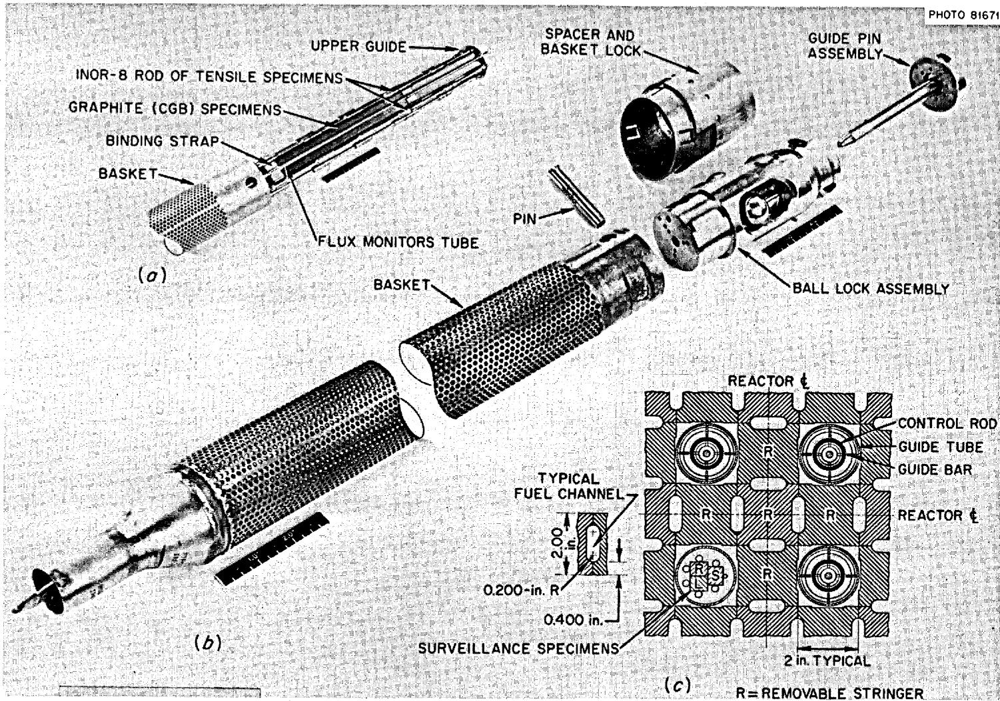  
Fig. 4.1. Hastelloy N and Grade CGB Graphite Surveillance Specimens and Container Basket. (a) Specimens partially inserted into the container. (b) Container and its lock assemblies. (c) Location of surveillance specimens in the MSRE.

or chemical damage to the graphite structure and no evidence of surface films. X-radiography of thin transverse slices showed occasional salt penetration into previously existing cracks which extended into the specimen surface. This penetration probably accounted for the slight gain in weight ( $\sim$ 13 mg out of about 30 g). Similar penetration was observed in the control specimens which were exposed to molten salt in the absence of radiation. No new cracks were caused by the exposure to radiation. A suggestion of a very thin layer of denser material on the graphite surface exposed to salt was visible in the x-radiographs of the irradiated and the control specimens. X-ray diffraction analyses of the graphite surface exposed to fuel showed a normal graphite pattern, with a very slightly expanded lattice spacing. A few very weak foreign lines, probably due to fuel salt, were observed. Autoradiography of the graphite specimens showed a high concentration of activity within 10 mils of the surface, with diffuse irregular penetrations to the center of the specimens (the resolution of these measurements was about 10 mils). An electron probe examination of the graphite specimens (carried out at Argonne National Laboratory) detected no impurities in the graphite at or near the surface exposed to fuel, with detection limits of 0.04 wt % for fission products and 0.02 wt % for uranium. These series of observations, based on samples having 7900- and 24,000-Mwhr reactor exposures, indicated satisfactory compatibility of graphite with fissioning molten salt relative to damage by chemical reaction and to permeation of bulk fuel into graphite.

The three rectangular graphite bars from each of the two MSRE runs were also used to study fission product deposition on graphite in more detail. Thin layers of graphite, 1 to 10 mils thick, were milled from the flat surfaces of the bars to a final depth of about 50 mils. These samples were dissolved and analyzed radiochemically. The predominant activities found deposited on and in the graphite were the isotopes of molybdenum, tellurium, ruthenium, and niobium. These elements may be classed as noble metals since their fluorides are relatively unstable. Their deposition on graphite is of practical concern since several isotopes in this class (in particular, $^{95}\mathrm{Mo}$ , $^{97}\mathrm{Mo}$ , $^{99}\mathrm{Tc}$ , and $^{101}\mathrm{Ru}$ ) have relatively high neutron cross sections; if the total fission yields of these fission products were retained in the graphite core, the long-term

neutron economy of an MSBR would be adversely affected. It is difficult to analyze directly for these stable or long-lived species; it was assumed that their deposition behavior was indicated either by that of a radioactive isotope of the same element or that of a radioactive noble-metal presursor of appreciable half-life.

Analyses of the milled graphite samples showed that over $99\%$ of the deposited noble-metal activities were concentrated within 5 mils of the graphite surfaces. Conversely, the daughters of the kryptons and xenons were more uniformly distributed throughout the graphite specimens with shorter lived rare gases having steeper concentration gradients through the graphite (as expected). Elements with stable fluorides and no gaseous precursors $(\mathrm{Zr},$ rare earths) showed low surface concentrations and were absent from the interior of the graphite.

Relatively heavy deposits of noble-metal fission products were observed on the Hastelloy N specimens adjacent to the graphite samples. The deposits of other fission products on Hastelloy N were relatively light. The deposition of noble metal fission products on Hastelloy N and graphite can be quantitatively described in terms of the fraction of the total fission products produced during reactor operation which was deposited. It was assumed that deposition on the specimens is representative of deposition on all the reactor graphite and Hastelloy N surfaces in the MSRE system. On this basis, $14\%$ of the $99\mathrm{Mo}$ , $13\%$ of the $^{132}\mathrm{Te}$ , $9\%$ of the $^{103}\mathrm{Ru}$ , and $45\%$ of the $^{95}\mathrm{Nb}$ produced during the first 7800 Mwhr of MSRE operation deposited on the graphite core. During the same period, $47\%$ of the $^{99}\mathrm{Mo}$ , nearly all the $^{132}\mathrm{Te}$ , and $23\%$ of the $^{103}\mathrm{Ru}$ produced deposited on the metal surfaces.

The deposition of fission products on graphite and metal after about 32,000 Mwhr of MSRE operation is shown in Table 4.1 as percentages of the total of each species generated in the reactor system. The results are again based on the assumption that deposition on specimens is representative of all surface deposits. The relative activities of $^{99}\mathrm{Mo}$ , $^{132}\mathrm{Te}$ , and $^{103}\mathrm{Ru}$ found on the graphite and metal specimens were about the same as those found after the first 7800 Mwhr; however, the relative activity of $^{95}\mathrm{No}$ was distinctly higher after the second exposure. Also, after the 24,000-Mwhr exposure, the ratio of $^{95}\mathrm{No}$ deposited per cm² on metal

Table 4.1. Approximate Fission Product Distribution in MSRE After 32,000 Mwhr of Operation   

<table><tr><td>Isotope</td><td>% in Fuel</td><td>% on Graphite</td><td>% on Hastelloy N</td><td>Cover Gasa (%)</td></tr><tr><td>99Mo</td><td>0.94</td><td>10.9</td><td>40.5</td><td>77</td></tr><tr><td>132Te</td><td>0.83</td><td>10.0</td><td>70.0</td><td>66</td></tr><tr><td>103Ru</td><td>0.13</td><td>6.6</td><td>14.9</td><td>40</td></tr><tr><td>95Nb</td><td>0.044</td><td>36.4</td><td>34.1</td><td>5.7</td></tr><tr><td>95Zr</td><td>96.1</td><td>0.03</td><td>0.06</td><td>0.14</td></tr><tr><td>89Sr</td><td>77.0</td><td></td><td>0.26</td><td>33</td></tr><tr><td>131I</td><td>64.0</td><td></td><td>1.0</td><td>16</td></tr></table>

aThe figures in this column represent the percentage of the daily generation rate lost to the cover gas per day. The sum of all columns does not add to $100\%$ because of time variations in behavior, nonuniform concentrations in the gas phase, and analytical inaccuracies.

to that on graphite was about 2 on the average. The corresponding ratio was 8 for $^{99}\mathrm{Mo}$ , 14 for $^{132}\mathrm{Te}$ , and 4 for $^{103}\mathrm{Ru}$ -- each somewhat higher than for the 7800-Mwhr exposure. It had been expected that the ratio would fall toward unity as both graphite and metal became coated with noble metals, but this apparently did not occur. In the present MSBR designs the ratio of metal surface to graphite surface is about 1.5 to 1, rather than 1 to 2 as in the MSRE. Thus, based on these test results, only a small percentage of the noble metal fission products should deposit on the graphite in the MSBR core.

# 4.3 Tests in the MSRE Pump Bowl

The behavior of fission products was further investigated by means of test samples from the MSRE pump bowl. Access to the fuel salt and the cover gas is provided by the salt sampling facility shown in Fig. 4.2. Samples were taken of fuel salt and of the helium cover gas; in

ORNL-DWG 67-10766R

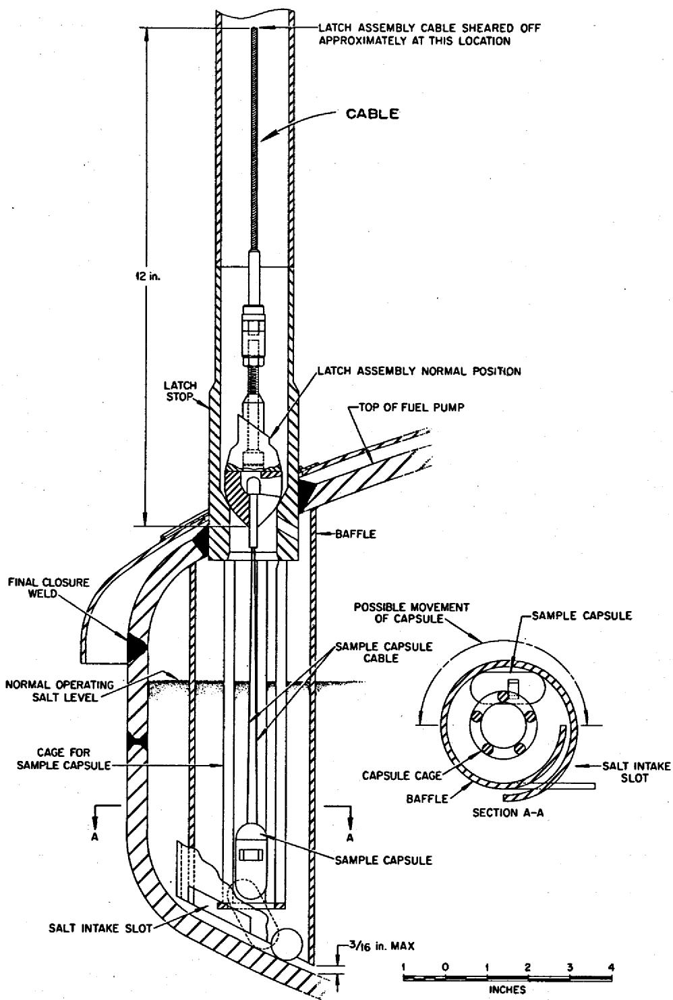  
Fig. 4.2. Salt Sampling Capsule in MSRE Fuel Pump Bowl

addition, metal and graphite specimens were exposed to the fuel salt and to the cover gas.

Early fuel-salt samples, taken in open copper ladles, were found to be highly contaminated with noble-metal activities because the open sampling ladles passed through the cover-gas region. Contamination was avoided in later fuel samples by sampling into an evacuated capsule provided with a freeze valve which melted when the capsule was lowered into the molten salt. The later results showed that less than $1\%$ of the noble-metal nuclides produced remain in the fuel-salt phase; species with stable fluorides (Zr, alkaline earths, rare earths), however, remained predominately in the fuel.

It was further found that high concentrations of noble-metal fission products existed in the MSRE cover-gas volume. The metal specimens exposed to the cover gas picked up activities associated with noble metals several times that contained in a gram of fuel salt. The fundamentals of why these materials transfer and remain in the gas phase are not fully understood; however, inert gas flow may prove to be an effective way to remove significant fractions of fission products, and this action may account for the relative decrease in fission product deposition on graphite with time, which is discussed below.

In another test, sets of graphite and Hastelloy specimens in the pump bowl were exposed to the gas phase and to the fuel phase for 8 hr during full power reactor operation. Within a factor of ten, the same amount of each nuclide deposited on all the specimens independent of location. The deposition of noble metals on Hastelloy $\mathbb{N}$ in this test appeared to proceed at the same constant rate in the 8-hr run as in the 24,000-Mwhr (3340-hr) exposure in the MSRE core. However, the average deposition rates of noble metals on graphite were about a factor of ten lower in the 3340-hr exposure than in the 8-hr test, except for $^{95}\mathrm{Nb}$ , where the factor was about 1.5. This could indicate that the deposition rate of noble metals (except $^{95}\mathrm{Nb}$ ) on graphite decreases with exposure time, which is an advantage from the viewpoint of neutron economy. However, results to date should be treated as preliminary, and further investigations are needed. Samples of the gas from the MSRE pump bowl indicated that the helium cover gas contained about 5 ppm by mole of $^{99}\mathrm{Mo}$ (i.e., 5 moles

of $^{99}\mathrm{Mo}$ per $10^{6}$ moles of helium) and $1 - 2$ ppm each of $^{132}\mathrm{Te}$ , $^{103}\mathrm{Ru}$ , $^{106}\mathrm{Ru}$ , and $^{95}\mathrm{Nb}$ . If these concentrations are present in the gas leaving the pump bowl and are multiplied by the flow of helium through the pump bowl (6000 liters/day), the losses of $^{99}\mathrm{Mo}$ and $^{132}\mathrm{Te}$ to the cover gas are those given in Table 4.1. As shown, these calculated losses are appreciable fractions of the generation rate of these species in the MSRE.

# 4.4 Chemical State of Noble-Metal Fission Products

The results above indicate that the noble-metal fission products rapidly leave the fuel-salt phase by depositing on solid surfaces and by entering the cover-gas volume. In order to help determine the mechanisms of volatilization, two hot-cell tests were carried out. These tests involved passing helium or a helium-hydrogen mixture either over or through a fuel sample from the MSRE. It was found that passage of hydrogen gas had no effect on fission product volatilization, which indicates that the volatile species of the noble metals were not high-valent gaseous fluorides. Some salt mist was swept from the sample, but the concentrations of noble metals volatilized were one to three orders of their concentration (if uniform) in the salt. Further, significant amounts of noble-metal fission products were swept from the fuel sample by gas passage either over or through the molten sample. The amounts of activity were the same whether or not the gas contained hydrogen, indicating that these "noble" fission products were present in metallic form. It was also found that about $20\%$ of the volatile noble metals passed through a filter which held back all particles larger than 4 microns. These results suggest that noble-metal fission products are injected into the gas phase as tiny metal particles and form stable gaseous suspensions.

# 4.5 Results from ORR Loop Experiments

In addition to the study of fission product behavior in the MSRE, fuel-salt-material tests have also been carried out with thermal convection loops containing fuel salt and graphite. These loops were operated in the Oak Ridge Research Reactor (ORR) to investigate fuel behavior at high power densities. The first loop experiment was terminated after generation of 1.1 x $10^{18}$ fissions/cc $(0.27\%$ 235 U burnup) because of

a break in a sample line. A second loop operated at an average fuel power density of 165 w/cc until a line leading from the "core" cracked; a fuel dose of approximately $8 \times 10^{16}$ fissions/cm³ was achieved. The test arrangement employed in these runs is indicated in Fig. 4.3. The "core" in these loop tests consisted of a 2-in.-diam by 6-in.-long cylinder of graphite (from MSRE stock). Vertical holes were bored through the graphite for salt flow. A horizontal gas separation tank connected the top of the core to a return line (cold leg) which, in turn, was connected to the bottom of the core, completing the loop. A fluid flow rate of 30 to 50 cc/min ( $\sim$ 2 min circuit time) was maintained at a "core" temperature of about $650^{\circ}\mathrm{C}$ .

The surfaces in the second loop were analyzed thoroughly to determine the deposition of fission products. This layers were machined from the core graphite surfaces, and these layers were analyzed to determine the concentration profile of the fission products within the graphite. The results obtained for noble-metal fission products resembled very closely those given above for the MSRE surveillance specimens. For reasons that are not clear, the salt seemed to have wet the graphite and penetrated to a distance of a few mils. This apparently was caused by the presence of a small amount of water vapor. No such wetting behavior has been observed during MSRE operations.

# 4.6 Evaluation of Results

A principal interaction between graphite and fissioning molten salt appears to be the partial deposition of noble metals on graphite. We infer from the results that the percentage of noble-metal fission products deposited on graphite depends on the ratio of graphite surface to metal surface, with deposition decreasing with decreasing ratio of graphite-to-metal surface. Finally, test results indicate that significant fractions of noble-metal fission products can be present in the gas phase. Such behavior could provide a convenient means for their rapid removal from MSBR systems. Experimental studies are continuing in order to verify the present indications.

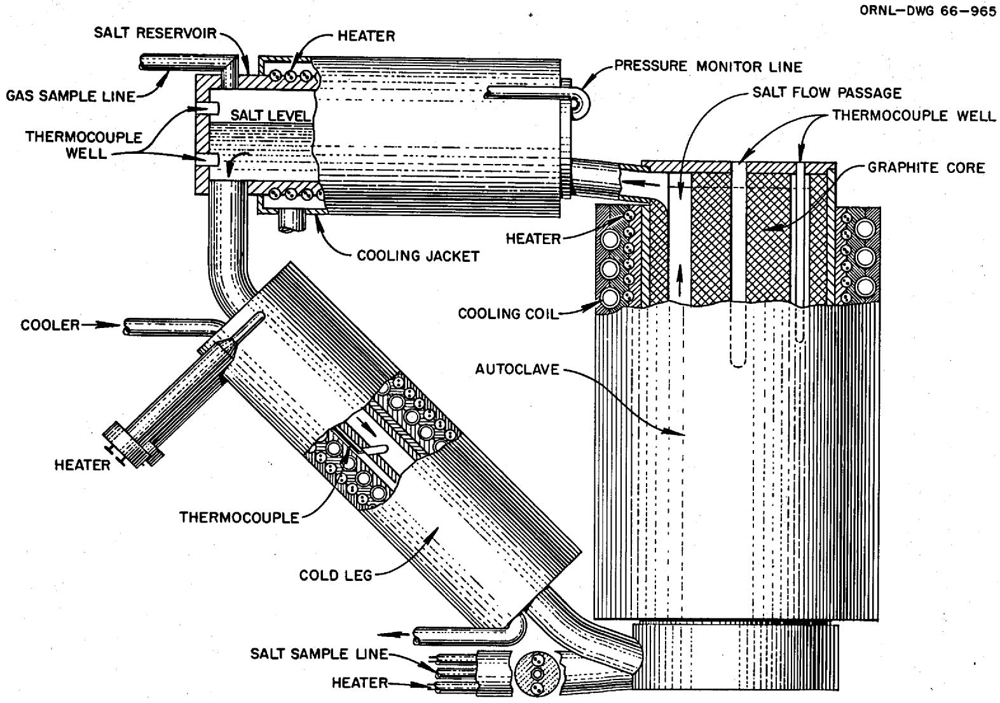  
Fig. 4.3. In-Pile Molten-Salt Convection Loop No. 1

# 5. NOBLE-GAS BEHAVIOR IN THE MSBR

R.J.Kedl Dunlap Scott

As pointed out previously, the graphite in the MSBR core is unclad and in intimate contact with fuel salt. Thus, noble gases generated by fission and any other gaseous compounds may diffuse into its porous structure where they can act as heat sources and neutron poisons. Although fission products other than xenon are involved, the greatest gain can be made by removing $^{135}\mathrm{Xe}$ , and later discussions refer primarily to $^{135}\mathrm{Xe}$ poisoning.

In order to estimate neutron poisoning effects, a steady-state analytical model was developed to estimate the transfer of noble gases in the MSBR to the graphite. The various factors considered included decay, burnup, migration into graphite, and migration to circulating gas bubbles. Gas generation direct from fission and generation from decay of gas precursors were considered as source terms. The model utilizes conventional mass transfer concepts and is used to compute nuclide concentrations and $^{135}\mathrm{Xe}$ poison fractions. The steady-state model for the MSRE is developed in reference 34, while the time-dependent model is given in references 35-38. When applied to very short-lived noble gases, the model has given calculated results in agreement with MSRE values39 measured under reactor operating conditions.

Using a model similar to that indicated above, steady-state $^{135}\mathrm{Xe}$ poisoning calculations were made for a modular two-fluid MSBR [556 Mw(t)] to show the influence of several design parameters on xenon poisoning. The reactor design concept considered here is essentially that described in reference 40; design parameters pertinent to Xe poisoning are given in Table 5.1. Xenon stripping from the fuel salt is accomplished by circulating helium bubbles with the salt; the bubbles are injected near the pump at the inlet to the heat exchanger. Xenon-135 is considered to migrate to the bubbles by mass transfer, with the mass transfer coefficient controlling the rate of migration. The circulating bubbles are then stripped from the salt by a pipeline gas separator located near the heat exchanger outlet.

With regard to mass transfer of xenon to the graphite, the principal parameters considered were the diffusion coefficient of xenon in graphite, the mass transfer coefficients and areas associated with the circulating bubbles, the time that bubbles are in contact with the salt, and the surface area of graphite exposed to salt in the core.

In Fig. 5.1 the diffusion coefficient of xenon in graphite at $1200^{\circ}\mathrm{F}$ $(650^{\circ}\mathrm{C})$ is given in units of $\mathrm{ft}^2/\mathrm{hr}$ . As mentioned in Chapter 3, the numerical value of this coefficient in $\mathrm{ft}^2/\mathrm{hr}$ is about equal to the more commonly quoted permeability of He in graphite at room temperature with units of $\mathrm{cm}^2/\mathrm{sec}$ , if Knudsen flow prevails. Knudsen flow should dominate for permeabilities $< 10^{-4}\mathrm{cm}^2/\mathrm{sec}$ .

The gas bubbles circulating through the fuel system were considered to be made up of two groups of bubbles. The first group, referred to as the "once-through" bubbles, were injected at the bubble generator and removed with $100\%$ efficiency by the gas separator. The second group, referred to as the "recirculated" bubbles, were also injected at the bubble generator but completely bypassed the gas separator on their first pass; it was assumed that bubbles in the second group were removed with $100\%$ efficiency on their second pass through the gas separator. The particular parameter used to indicate the amount of circulating bubbles was the bubble surface area; for orientation purposes, note

Table 5.1. MSBR Design Parameters Used in Estimating $\mathbf{{135}}$ Xe Poison Fraction ${}^{a}$   

<table><tr><td>Reactor power [Mw(t)]</td><td>556</td></tr><tr><td>Fuel</td><td>233U</td></tr><tr><td>Fuel salt flow rate (ft3/sec)</td><td>25.0</td></tr><tr><td>Core diameter (ft)</td><td>8.0</td></tr><tr><td>Core height (ft)</td><td>10.0</td></tr><tr><td>Volume fuel salt in core (ft3)</td><td>83.0</td></tr><tr><td>Volume fuel salt in stripper region-heat exchanger (ft3)</td><td>83.0</td></tr><tr><td>Volume fuel salt in piping between core and heat exchanger (ft3)</td><td>64.0</td></tr></table>

Fuel cell cross section

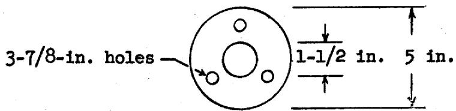

Total graphite surface area exposed to salt (ft²) 3627

Mass transfer coefficient to graphite, upflow (ft/hr) 0.72

Mass transfer coefficient to graphite, downstream (ft/hr) 0.66

Mean thermal flux (neutrons/sec cm²) 5.0 x 10¹⁴

Mean fast flux (neutrons/sec cm2) 7.6 x 1014

Thermal neutron cross section for $^{233}\mathrm{U}$ (barns) 252.7

Fast neutron cross section for $^{233}\mathrm{U}$ (barns) 36.5

Total core volume, graphite and salt (ft3) 502.6

233U concentration in core, homogenized (atoms/barn-cm) 1.11 x $10^{-5}$

Graphite void available to xenon $(\%)$ 10

Xenon-135 parameters

Decay constant (1/hr) 7.53 x 10-2

Generation direct from fission (%) 0.32

Generation from iodine decay (%) 6.38

Cross section for MSER neutron spectrum (barns) 9.94 x 105

Nominal core power density (kw/liter) 40

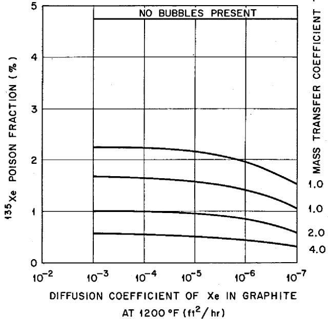  
Fig. 5.l. Effect of Diffusion Coefficient in Graphite on $^{135}\mathrm{Xe}$ Poison Fraction

<table><tr><td>0003</td><td>0005</td><td>0006</td><td>0007</td><td>SURFACE AREA OF &quot;ONCE THRU&quot; BUBBLES (ft2) IN STRIPPER REGION
CORRESPONDS TO Void FRACTION OF 1% AND BUBBLE DIAM OF O.O2O in.</td></tr><tr><td>0008</td><td>0009</td><td>0008</td><td>0009</td><td>SURFACE AREA OF &quot;RECIRCULATING&quot; BUBBLEs (ft2) IN STRIPPER REGION ONLY.
ACTUALLY, SINCE THE RECIRCULATING BUBBLE PASS THRU THE STRIPPER
REGION TWICE, THE TOTAL RECIRCULATING BUBBLE AREA IN THIS REGION
WILL BE TWICE THAT INDICATED.</td></tr></table>

that $3000\mathrm{ft}^2$ of bubble surface area corresponds to an average void fraction of $1\%$ in the stripper region of the fuel loop with bubbles 0.020 in. in diameter, when the gas flow rate is about 40 scfm.

Figure 5.1 shows the xenon-135 poison fraction as a function of the diffusion coefficient in graphite with other parameters having the values specified. The top curve in the figure is for no circulating bubbles. The other curves consider that about $10\%$ of the bubbles recirculate. From Fig. 5.1 it appears that the xenon poison fraction is not a strong function of the diffusion coefficient when it ranges from $10^{-3}$ to $10^{-6} \, \text{ft}^2/\text{hr}$ . Thus, for these values of the diffusion coefficient, the mass transfer coefficient from salt to graphite is the controlling resistance for migration of $^{135}\text{Xe}$ into the graphite. The mass transfer coefficients from salt to graphite were computed from the Dittus-Boelter equation as modified by the heat-mass-transfer analogy. Since $^{135}\text{Xe}$ in the graphite is the greatest contributor to the total neutron poison fraction, the parameters that control xenon migration will, in turn, control the poison fraction. For diffusion coefficients less than $10^{-6} \, \text{ft}^2/\text{hr}$ , the resistance to xenon diffusion in graphite starts becoming significant.

Figure 5.2 shows the effect on poison fraction of the xenon mass transfer coefficient from salt to helium bubbles. This mass transfer coefficient is one of the least well known parameters and can be a most significant factor. Available information indicates its value to lie between 0.7 and 6 ft/hr, with a value of $2 - 4$ ft/hr appearing reasonable to expect. Values of about 0.7 - 0.8 ft/hr were estimated, assuming that the bubbles behave as solid spheres having a fluid dynamic boundary layer. Values of about 3.5 ft/hr were estimated on the basis that the interface of bubbles is continually being replaced by fresh fluid (penetration theory). Both of these cases consider a bubble rising at its terminal velocity in a stagnant fluid. There is very little information in the literature concerning the effect of fluid turbulence on the bubble mass transfer coefficient, but from turbulence theory it has been postulated that, under MSBR conditions, mass transfer coefficients of 6 ft/hr or more could be realized. The analyses that lead to such values are generally optimistic in their assumptions. Figure 5.2 also

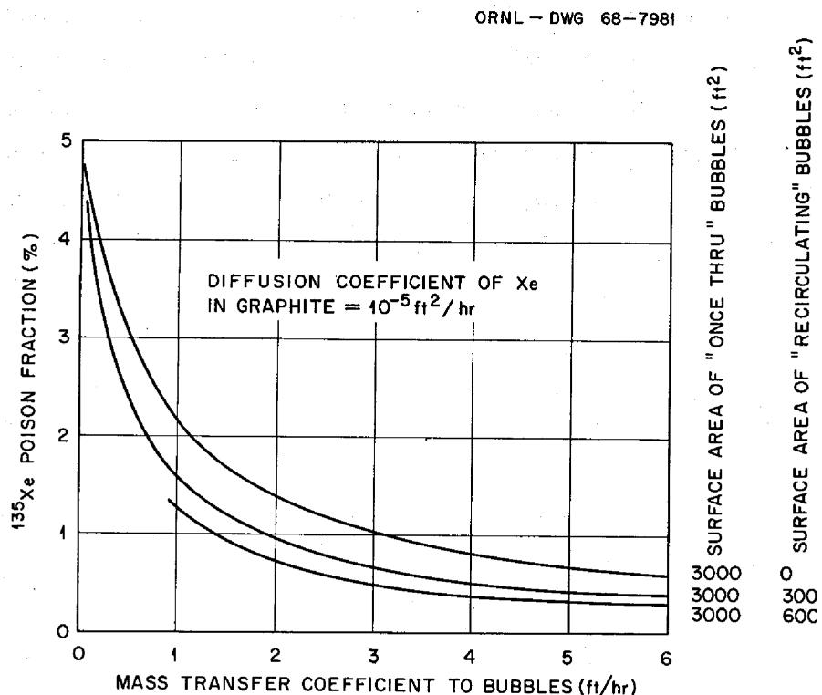  
Fig. 5.2. Effect of Bubble Mass Transfer Coefficient on $^{135}\mathrm{Xe}$ Poison Fraction

indicates that a small amount of recirculating bubbles is as effective as a large amount of once-through bubbles in reducing xenon poisoning; this result is due to the increased contact time for "recirculating" bubbles relative to "once-through" bubbles.

Another variable that will strongly affect the xenon poison fraction is the graphite surface area in the core. Calculations indicate that if the graphite surface area were doubled, all other parameters remaining constant, the poison fraction would increase by $50 - 70\%$ .

The target poison fraction for the MSBR is $0.5\%$ . Referring to Fig. 5.2, if the bubble mass transfer coefficient were 4-6 ft/hr, gas removal in itself appears to be a feasible method for attaining low xenon poison fractions. If, however, the bubble mass transfer coefficient were 2-3 ft/hr or less, it appears that the target poison fraction is not attainable under the specified conditions. Under the latter case, alternative methods for reducing xenon poisoning are to develop graphite having a very low gaseous diffusion coefficient (Fig. 5.1 indicates a value of $10^{-8} ft^2/hr$ would be satisfactory), or to coat the bulk graphite with a thin layer of graphite having a very low permeability.

Calculations were performed to determine the effectiveness of low-permeability graphite coatings on xenon poisoning; Fig. 5.3 gives the results obtained along with the parameter values used in the computations. It was assumed that for a coating of the indicated thickness, the specified diffusivity and available void would apply to all graphite surfaces exposed to fuel salt. The various xenon migration parameters were chosen to yield a $^{135}\mathrm{Xe}$ poison fraction of $2.25\%$ with no coating, so that Fig. 5.3 indicates the effect of coating parameters relative to this poison fraction. It was assumed that the available void fraction in the graphite coating decreased by one order of magnitude when the diffusion coefficient decreased by two orders of magnitude, which is a conservative assumption relative to experimental results. As shown in Fig. 5.3, it appears that a coating 10 mils thick and having a diffusivity of about $10^{-6} \, \text{ft}^2/\text{hr}$ and an available void of approximately $0.3\%$ would bring the $^{135}\mathrm{Xe}$ poison fraction down to the target value. A diffusion coefficient of $10^{-9} \, \text{ft}^2/\text{hr}$ would require a coating thickness of only one mil. As stated in Chapter 3, graphite coatings having the above characteristics have been produced, and

ORNL-DWG 68-7982

PARAMETERS

CORE POWER DENSITY ≈ 20 kW/liter

REACTOR POWER $= 556$ MWt

BULK GRAPHITE DIFFUSION COEFFICIENT $= 40^{-3} ft^2 / hr$

BULK GRAPHITE AVAILABLE VOID = 10%

MASS TRANSFER COEFFICIENT TO BUBBLES $= 2$ ft/hr

BUBBLE SURFACE AREA = 3000 ft² (NO RECENTURING BUBBLES)

FUEL CHANNEL GEOMETRY = CONCENTRIC ANNULUS

Fig. 5.3. Effect of Graphite Surface Seal on $^{135}\mathrm{Xe}$ Poison Fraction.   
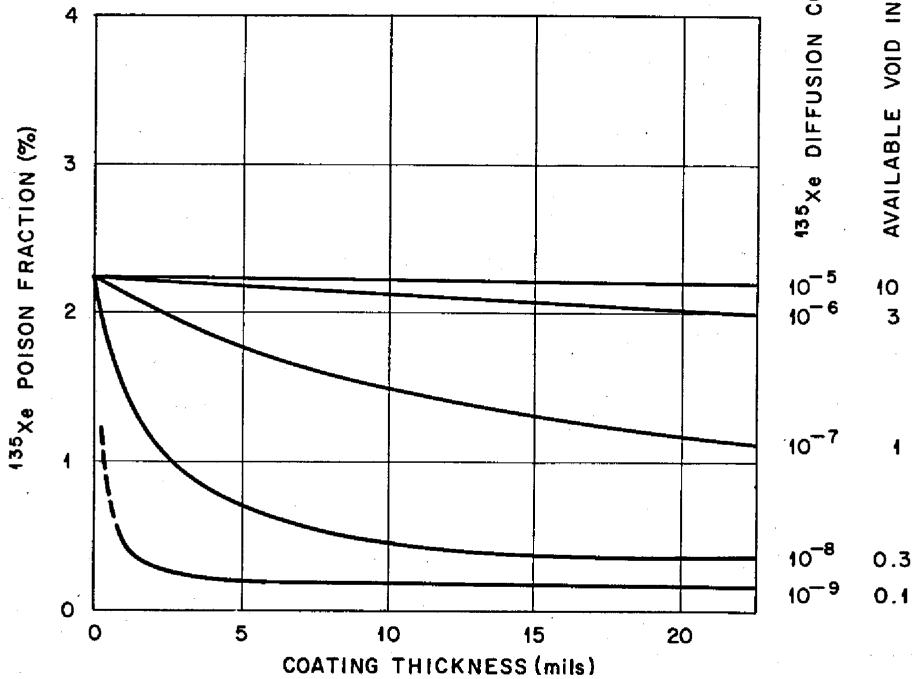  
10-8 0.3 0.1

these would keep xenon poisoning in the MSBR at a very low level if the coatings retained their integrity during reactor operation.

6. INFLUENCE OF GRAPHITE BEHAVIOR ON MSBR PERFORMANCE AND DESIGN

6.1 Effect of Core Power Density on MSBR Performance

A. M. Perry

Limitations on core power density due to graphite radiation damage will influence reactor performance. The performance of an MSBR may be judged both in terms of the estimated power cost and also in terms of the annual rate of net fissionable material production (the annual fuel yield) and the fuel specific power. The fuel yield depends not only on the breeding gain (breeding ratio minus one) but also on the specific power; that is, on the thermal power of the reactor per unit mass of fissionable material chargeable to the plant (including material in the core, heat exchangers and piping, and in the chemical processing plant). All three factors of cost, breeding gain, and specific power depend on the power density in the core, but the dependence in each case is not unique. That is, the extent to which each factor varies with power density depends on other reactor parameters such as the fuel-salt and fertile-salt volume fractions in the core, the concentration of fissionable material in the fuel salt, chemical processing rates, etc. An evaluation of the effect of power density on MSBR performance must therefore be based on a search for the optimum combinations of all of these variables for each fixed value of the average power density. The optimum combination is defined here in terms of a composite figure of merit, F, such that

$$
F = Y + 1 0 0 (C + X) ^ {- 1},
$$

where Y is the annual fuel yield (the annual percentage increase in fuel inventory due to breeding), C is the sum of all elements of the power cost which depend on the parameters being varied, and X is an adjustable parameter whose value determines the relative sensitivity of F to Y and to C. Thus, F increases with increasing yield and increases with decreasing cost, and may be made to depend almost entirely on one or the

other. An optimum configuration is considered here to be one which maximizes $\mathbf{F}$ , and by repeating the search procedure with different values of $\mathbf{X}$ , curves may be generated showing the minimum cost corresponding to each (attainable) value of the annual yield. In practice, the variation in cost is dominated by the changes in fuel-cycle cost (raw material plus inventory plus processing costs less production credits), and the curves derived from our calculations have therefore been plotted as fuel-cycle cost versus annual fuel yield. Such curves are shown in Fig. 6.1 for average core power densities of 80, 40, 20, and 10 w/cm³. These results apply to a two-region, two-fluid MSBR such as given in ORNL-3996. However, preliminary results obtained for single-fluid MSBR's (considering direct protactinium removal and fission product discard using liquid bismuth extraction processes) indicate that comparable performance is feasible for such systems also. For convenience in relating the annual fuel yield to the potential power doubling time, Fig. 6.1 also indicates the compound-interest doubling time as a function of yield.

It is apparent from Fig. 6.1 that there is an incentive to keep the power density as high as possible. However, if the useful life of the graphite is limited to a fixed fast neutron dose, it is desirable also to avoid the necessity for too frequent replacement of the graphite. The influence of graphite replacement on plant availability and on power cost and the technical problems associated with this operation are discussed in Section 6.3.

# 6.2 Effect of Graphite Dimensional Changes on MSBR Performance

# A. M. Perry

During reactor exposure the graphite moderator in the MSBR is expected to experience dimensional changes approximately like those shown in Fig. 3.1, i.e., a period of shrinkage followed by increasingly rapid growth. These dimensional changes must, of course, be allowed for in the mechanical design of the core. In addition, the dimensional changes of the graphite will alter the volume fractions of the three core constituents--moderator, fuel salt, and fertile salt--and these changes, even though accompanied by changes in uranium and thorium concentrations, may have an adverse effect on reactor performance. There are two such effects

ORNL-DWG 68-7983

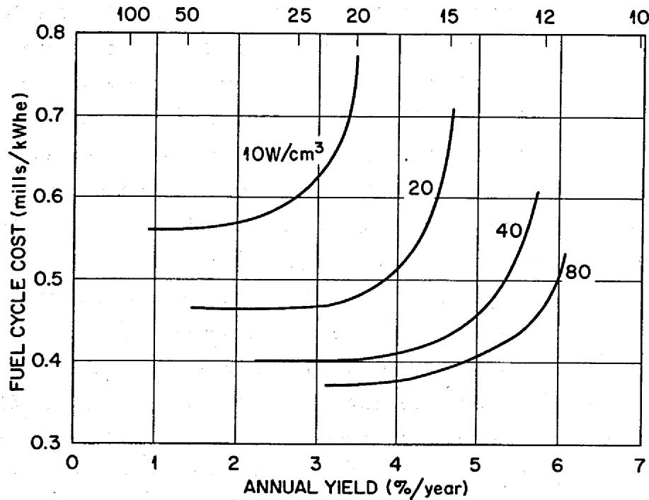  
POWER DOUBLING TIME (years)   
Fig. 6.1. Effect of Power Density on MSBR Performance.

which especially require attention. First, changes in graphite dimensions will cause a departure of reactor parameters from the optimum combination required to minimize costs and maximize fuel yield. Second, the spatial distribution of neutron productions and absorptions, which governs the power density distribution, may be appreciably altered because of changing graphite volume fractions, making it difficult to maintain as flat a power distribution as would be possible with a dimensionally stable moderator. These are both rather complex questions, and the extent to which the MSBR performance might be compromised, when averaged over a period of years, has not been fully analyzed. However, the results obtained to date are sufficient to indicate approximately the effects to be expected.

With fertile salt filling the spaces between the graphite "fuel elements" (two-fluid MSBR), it is clear that a $5\%$ reduction in graphite cross sectional area gives rise to a large fractional increase in the fertile-salt volume fraction in the core--from an initial value of 0.06, for example, to a maximum value of 0.11. Such a large volume fraction of fertile salt is not optimum and, if uniform throughout the core, would occasion a loss in annual fuel yield of about 0.01 and an increase in fuel-cycle cost of approximately 0.1 mill/kwhr(e). The actual penalties would not be this large, because the dimensional changes in graphite would not occur uniformly throughout the core and because the time-averaged volume change would be not much more than half the maximum change. The average loss in performance, therefore, does not appear excessive if graphite dimensional changes are no more than 5 vol%.

A potentially more serious difficulty arises in connection with the power density distribution in the core, which should be maintained as flat as possible throughout the core life to increase the time interval between graphite replacement. Calculations show that the spatial power distribution is very sensitive to details of core composition, and that the distributions of fertile and fissile materials in the core must be quite closely controlled in relation to each other. In the presence of large, spatially dependent changes in fertile-salt volume fraction, adjustments in uranium and thorium concentrations in the two salt streams do not appear sufficient to maintain both criticality and a flat power distribution.

As a consequence of the above considerations, the original concept of the two-fluid $\mathsf{MSBR}^{40}$ was revised so that the fertile salt stream, as well as the fuel stream, flows in annular passages defined by the spacing between concentric graphite pipes. The interstitial spaces between graphite assemblies would be filled with helium. For such a design, the relative volume fractions of the important core constituents--the solid moderator and the two salt streams--then remain nearly constant, while the variation in helium volume has little influence on reactor performance. This approach largely eliminates penalties in breeding performance in power flattening that might otherwise result from dimensional changes in the graphite.

Alternatively, use of a single-fluid MSBR would alleviate the influence of graphite volume changes on reactor performance. The single-fluid reactor contains fissile and fertile materials in the same salt stream, and so changes in graphite dimensions influence both fissile and fertile concentrations in the reactor equally. At the same time, fissile and fertile concentrations can be controlled independently due to use of on-stream processing. These conditions permit considerable flexibility with regard to material concentrations, such that there is little change in nuclear performance with expected graphite dimensional changes, based on equilibrium physics - fuel-cycle calculations.

# 6.3 Mechanical Design Factors and Cost Considerations

E. S. Bettis

Roy C. Robertson

As shown in Chapter 3, when graphite is exposed to a high neutron flux it first undergoes a period of shrinkage followed by swelling at an ever-increasing rate. These effects occur both with and across the grain structure of the graphite, although not necessarily at the same rate in each direction, and are related to the energy of the neutrons and to the total accumulated dose. Such dimensional changes in MSBR graphite impose mechanical and nuclear design problems; for example, it is necessary to prevent overstressing of the core graphite. Also, particularly, for the two-fluid design, the volumetric ratios of fuel-to-graphite need to be maintained within limits in order to obtain good nuclear and economic

performance. Thus, the useful life of the MSBR core graphite and the associated power production costs can be significantly influenced by the neutron-radiation-induced damage to the graphite. The influence that graphite volume changes and a finite permissible exposure have on reactor design features and performance are discussed below with respect to the two-fluid and also the single-fluid MSBR concepts. The maximum permissible radiation exposure to MSBR-graphite, based on presently tested grades, appears to be about $3 \times 10^{22}$ neutrons/cm $^2$ (neutron energies > 50 kev). This exposure corresponds to a final graphite volume about equal to its initial volume (see Chapter 3).

The two-fluid MSBR core $^{40}$ is designed with re-entrant type fuel channels in order to minimize the likelihood of mechanical failure of the graphite. Each fuel channel consists of concentric graphite pipes such that the fuel salt flows upward through the center pipe and downward through the annular passage; the outer pipe is closed at the top. At the bottom of the core, the graphite pipes are brazed to Hastelloy N nipples, with the other ends of the nipples being welded to the fuel plena at the bottom head of the reactor vessel. Each fuel channel is thus free to expand and contract in the axial (vertical) direction to accommodate the dimensional changes in the graphite caused by thermal effects and radiation-induced damage.

In order to accommodate dimensional changes in the core radial direction, it is necessary to locate the fuel channels with sufficient clearance to prevent interference when the graphite expands. Thus, the top ends of all the graphite elements in the core are mechanically interlocked to assure that they will maintain the same position relative to each other while at the same time not restricting the axial movement. There are no unattached graphite elements or filler pieces in the core. Also, in order to decrease the influence of graphite dimensional changes on reactor performance, the two-fluid design was modified so that fertile and fissile streams are contained in separate annular flow regions defined by the spacing between concentric graphite pipes. Helium was used to fill the interstitial spaces between graphite assemblies, so that changes in graphite volume have only a small effect on reactor performance (see Section 6.2).

As pointed out previously, MSBR's can also operate as single-fluid reactors, with features analogous to those of the MSRE. The performance of single-fluid MSBR's can be as good as that of the two-fluid concept so long as the fuel stream is processed on about a 5-day cycle to remove protactinium, and fission products are removed on about a 50-day cycle. Recent chemical discoveries suggest that processing methods which perform the above functions are feasible, and indicate that such fuel processing can be performed economically at a rapid rate. These methods utilize liquid bismuth to selectively extract uranium, protactinium, and fission products from fuel salt, and depend upon the relative nobilities of the various metals involved. Present information on relative nobilities indicates that reductive extraction processing effecting the desired separations is possible, and that the equipment involved is small in size. Since protactinium is of intermediate nobility to thorium and uranium, reductive extraction effectively holds Pa out of the reactor until it decays to uranium, after which it returns to the fuel system. Fission products are removed by concentration in a salt stream followed by salt discard; alternative methods are also available for fission product removal from the fuel circuit.

In the single-fluid concept, the fuel salt flows into the bottom of the reactor and out the top in a once-through arrangement that permits use of graphite having simple geometry. One of the present design concepts places the graphite elements on a supporting grid at the bottom of the reactor; these elements are supported by this grid when there is no salt in the reactor. Also, a metal grid is used at the top of the reactor to maintain proper spacing and alignment of the graphite elements; a strengthened top plenum is used to react to the buoyant force of the graphite when the reactor is filled with salt and operating. The top of the reactor vessel and/or portions of it are removable so that graphite can be withdrawn vertically and replaced as needed. Changes in the graphite dimensions in the axial (vertical) direction are easily accommodated since the graphite is not restrained. The graphite elements are long enough so that if axial shrinkage occurs, the graphite to fuel ratio in the active portion of the core due to this effect remains essentially unchanged. Changes in nuclear performance due to radial shrinkage or

expansion of the graphite can be accommodated by changes in the fuel-salt composition.

After the MSBR graphite has received the maximum permissible exposure, it must be taken out of service and replaced. In the two-fluid concept, it appears that this would be done by replacing the entire reactor vessel and core. In the single-fluid concept the graphite itself would be replaced, with the reactor vessel remaining in place throughout the life of the plant. The time required for this replacement, the replacement cost, and the time between replacements all influence the power cost penalty associated with graphite replacement. Also, for a given permissible exposure, the time between graphite replacements can be increased by lowering the reactor power density. The influence of these factors on reactor power costs is discussed below.

Lowering the core power density to increase the useful life of the graphite requires that the reactor be made larger, thus increasing the cost of the initial reactor as well as that for replacement equipment. For the two-fluid MSBR, the cost of replacing a spent reactor with a new one appears to be a strong function of the reactor vessel size and weight. Also, all the graphite is replaced in the operation. For the single-fluid concept, the reactor vessel would not be replaced and only a part of the total graphite would be removed during one replacement operation. For both concepts, increasing the reactor vessel size leads to higher fissile inventories and larger fuel-storage tanks, which increase fuel and capital costs. At the same time, lowering the core power density leads to longer graphite life and reduces the number of times the graphite must be replaced over the useful life of the power station. As a result, there is a minimum in the curve of power cost versus core power density for a specified maximum permissible exposure of the graphite.

The effective cost of graphite replacement is also influenced by plant downtime requirements associated with the replacement operation. Since the MSBR would be fueled on a continuous or semi-continuous basis, this concept has a potentially high load factor. Thus, if graphite replacement can be scheduled at times of regular turbine plant maintenance, total reactor downtime should be no greater than normally expected in a base-load power plant. This appears to be the case so long as graphite

replacement does not occur at intervals shorter than 2 to 2.5 years. However, in order to determine the effect on costs of losing power production due to graphite replacement, the term "effective downtime" was treated as a parameter, where effective downtime is the time during which power production is lost due solely to graphite replacement requirements. During the "effective downtime", it was considered that power would be bought at 4 mills/kwhr(e) from an outside source. Values of zero, 1/2 and 1 month were used for the effective downtime. This nonproductive time does not include plant downtime required for normal maintenance operations, which time could also be used for replacement operations. Labor costs associated with replacing the graphite were those for 18 men working in three shifts for two months at a cost of $10/hr, including overhead, etc.; these costs amounted to $259,200 per replacement.

Tables 6.1 and 6.2 summarize power costs calculated for two-fluid and single-fluid MSBR's, respectively, as a function of average core power density, on the bases given above; effective downtime for replacing graphite was considered to be $\frac{1}{2}$ month in these cases. The results in Table 6.1 consider replacement of the entire reactor vessel and its contents when the graphite exposure has reached a maximum value of $3 \times 10^{22}$ nvt ( $E > 50$ kev); Table 6.2 considers a single-fluid MSBR with replacement of graphite alone. Since costs and revenues occur at different times, a "levelized" cost calculation was performed, using a $6\%$ per year discount factor. The fuel cycle performance for the two MSBR concepts appear to be comparable, and so the same fuel cycle cost was used for each concept for a given average core power density.

The capital cost data shown in Tables 6.1 and 6.2 were based on cost estimates made for a two-fluid, 80-kw/liter, 1000-Mw(e) MSBR station. Rather broad adjustments were made to these base costs in estimating costs associated with other core power densities and with the single-fluid concept. While there is considerable uncertainty associated with the absolute costs given, the relative costs for the two concepts as a function of core power density appear to be significant.

Cost estimates were also made on the basis that the effective plant downtime associated with graphite replacement was either one month or zero. (The latter assumes that graphite replacement is performed during

Table 6.1. Effect of Core Power Density on Power Costs $^a$ in a 1000-Mw(e) MSBR Station if Reactor Vessel is Replaced After Graphite Reaches a Maximum Exposure of $3 \times 10^{22}$ nvt ( $E > 50$ kev)   

<table><tr><td rowspan="2"></td><td colspan="4">Average Core Power Density, kw/liter</td></tr><tr><td>80</td><td>40</td><td>20</td><td>10</td></tr><tr><td>Life of graphite plus vessel, years</td><td>2</td><td>4</td><td>8</td><td>16</td></tr><tr><td>Costs per replacement, $10^6</td><td></td><td></td><td></td><td></td></tr><tr><td>Reactor vessels (4 cores)</td><td>4.0</td><td>5.3</td><td>7.6</td><td>10.1</td></tr><tr><td>Graphiteb</td><td>1.2</td><td>1.9</td><td>3.1</td><td>6.3</td></tr><tr><td>Labor</td><td>0.3</td><td>0.3</td><td>0.3</td><td>0.3</td></tr><tr><td>Power loss for 1/2 month</td><td>1.2</td><td>1.2</td><td>1.2</td><td>1.2</td></tr><tr><td>Total</td><td>6.7</td><td>8.7</td><td>12.2</td><td>17.9</td></tr><tr><td>30-year replacement cost, c $10^6</td><td>43.4</td><td>26.4</td><td>15.5</td><td>7.0</td></tr><tr><td>Remote maintenance equipment, $10^6</td><td>5.0</td><td>5.0</td><td>5.0</td><td>5.0</td></tr><tr><td>Total depreciating capital cost, $/kw(e)</td><td>137</td><td>140</td><td>149</td><td>160</td></tr><tr><td>Total power production costs, mills/kwhr(e)</td><td></td><td></td><td></td><td></td></tr><tr><td>Capital costsd</td><td>2.34</td><td>2.40</td><td>2.54</td><td>2.73</td></tr><tr><td>Reactor replacement costs</td><td>0.50</td><td>0.30</td><td>0.18</td><td>0.08</td></tr><tr><td>Fuel cycle costse</td><td>0.44</td><td>0.46</td><td>0.52</td><td>0.62</td></tr><tr><td>Operating costs</td><td>0.29</td><td>0.29</td><td>0.29</td><td>0.29</td></tr><tr><td>Total, f mills/kwhr</td><td>3.57</td><td>3.45</td><td>3.53</td><td>3.72</td></tr></table>

Costs shown consider a four-module 1000-Mw(e) plant and include inspection and installation costs plus $41\%$ indirect charges.   
bGraphite cost is based on $5/lb and a density of 112 lb/ft3.   
cTime levelized replacement costs using a $6 \%$ per year discount factor.   
Based on $12\%$ per year fixed charge rate for depreciating capital and plant load factor.   
Fuel cycle costs include investment for fuel and blanket salts and fuel recycle costs. The fixed charge rate for nondepreciating fuel was $10\%$ per year.   
fOn comparable bases, light water reactors would have capital costs of 2.3 mills/kwhr(e), fuel cycle costs of 1.4 mills/kwhr(e), and power production costs of 4.0 mills/kwhr(e).

Table 6.2. Effect of Core Power Density on Power Costs in a 1000-Mw(e) MSBR Station if One-Half of Graphite is Replaced After Reaching a Maximum Exposure of $3 \times 10^{22}$ nvt (E > 50 kev)   

<table><tr><td rowspan="2"></td><td colspan="4">Average Core Power Density, kw/liter</td></tr><tr><td>80</td><td>40</td><td>20</td><td>10</td></tr><tr><td>Life of graphite, years</td><td>1.6</td><td>3.2</td><td>6.4</td><td>12.8</td></tr><tr><td>Costs per replacement, $10^6</td><td></td><td></td><td></td><td></td></tr><tr><td>Graphiteb</td><td>0.6</td><td>1.1</td><td>2.1</td><td>3.3</td></tr><tr><td>Labor</td><td>0.3</td><td>0.3</td><td>0.3</td><td>0.3</td></tr><tr><td>Power loss for 1/2 month</td><td>1.2</td><td>1.2</td><td>1.2</td><td>1.2</td></tr><tr><td>Total</td><td>2.1</td><td>2.6</td><td>3.6</td><td>4.8</td></tr><tr><td>30-year replacement cost, c $10^6</td><td>17.5</td><td>10.3</td><td>6.2</td><td>3.4</td></tr><tr><td>Remote maintenance equipment, $10^6</td><td>5.0</td><td>5.0</td><td>5.0</td><td>5.0</td></tr><tr><td>Total depreciating capital cost, $/kw(e)</td><td>128</td><td>131</td><td>134</td><td>136</td></tr><tr><td>Total power production cost, mills/kwhr(e)</td><td></td><td></td><td></td><td></td></tr><tr><td>Capital costsd</td><td>2.20</td><td>2.24</td><td>2.29</td><td>2.33</td></tr><tr><td>Graphite replacement costs</td><td>0.20</td><td>0.12</td><td>0.07</td><td>0.04</td></tr><tr><td>Fuel cycle costse</td><td>0.44</td><td>0.46</td><td>0.52</td><td>0.62</td></tr><tr><td>Operating costs</td><td>0.29</td><td>0.29</td><td>0.29</td><td>0.29</td></tr><tr><td>Total, f mills/kwhr(e)</td><td>3.13</td><td>3.11</td><td>3.17</td><td>3.28</td></tr></table>

Costs shown consider a 1000-Mw(e) plant utilizing a single reactor vessel, and include inspection and installation costs plus $41\%$ indirect charges.   
bGraphite cost is based on $5/lb and a density of 112 lb/ft3.

cTime levelized replacement costs using a $6 \%$ per year discount factor.

Based on $12 \%$ per year fixed charge rate for depreciating capital and $80 \%$ plant load factor.   
Fuel cycle costs include investment for fuel and blanket salts and fuel recycle costs. The fixed charge rate for nondepreciating fuel was $10\%$ per year.   
fOn comparable bases, light water reactors would have capital costs of 2.3 mills/kwhr(e), fuel cycle costs of 1.4 mills/kwhr(e), and power production costs of 4.0 mills/kwhr(e).

normal plant maintenance operations, and this is considered to be the reference condition. Graphite replacement can be considered equivalent to refueling operations in other reactor types, and so there should be no net load-factor penalty applied to MSBR's relative to other systems.) Further, the influence of graphite permissible exposure on power costs was determined by considering the permissible exposure to be either $6 \times 10^{22}$ nvt ( $E > 50$ kev) or 30 years (versus $3 \times 10^{22}$ nvt for reference case). In these latter studies no effective downtime was associated with graphite replacement. The results obtained, including those given in Tables 6.1 and 6.2, are summarized in Fig. 6.2.

The overall results given in Fig. 6.2 indicate that there is an economic advantage in developing an improved radiation-resistant graphite and that, for a given exposure lifetime, maintenance concepts and methods that reduce effective graphite replacement costs and replacement downtime are economically desirable. In utilizing these results, it should be remembered that a maximum core power density of $100\mathrm{kw / liter}$ for 2 to 2.5 years corresponds to a zero net change in graphite volume and to an nvt ( $E > 50$ kev) for graphite of about $3\times 10^{22}$ neutrons/cm². For the two-fluid concept, if graphite had a permissible exposure lifetime of 30 years at an average core power density of $80\mathrm{kw / liter}$ , the minimum power generation cost would be about 3.03 mills/kwhr(e); the minimum cost would be about 3.41 mills/kwhr(e) based on a permissible graphite exposure of $3\times 10^{22}$ nvt and zero effective downtime. The difference between 3.03 and 3.41 mills/kwhr(e) power cost amounts to about $\$80$ million of revenue over the 30-year life of a single 1000-Mw(e) power station. If the electric utility industry were to employ 100 such molten-salt breeder reactors at a given time, about $\$265$ million per year would be associated with removing exposure limitations on the graphite. Doubling the graphite life from $3\times 10^{22}$ to $6\times 10^{22}$ in the two-fluid reactor would reduce power costs by about 0.2 mill/kwhr and be worth about $\$125$ million per year for one hundred 1000-Mw(e) MSER's. For the single-fluid reactor, the comparable incentives would be about $\$28$ million per year for doubling the graphite life, and about $\$90$ million per year for removing restrictions on graphite life. Thus, even considering a reasonable discount factor, a significant effort for graphite improvement can be economically justified if such work leads to a graphite with improved irradiation characteristics.

Fig. 6.2. Effect on MSBR Power Production Costs of Core Power Density, Graphite Life, and Duration of Power Outage for Graphite Replacement   
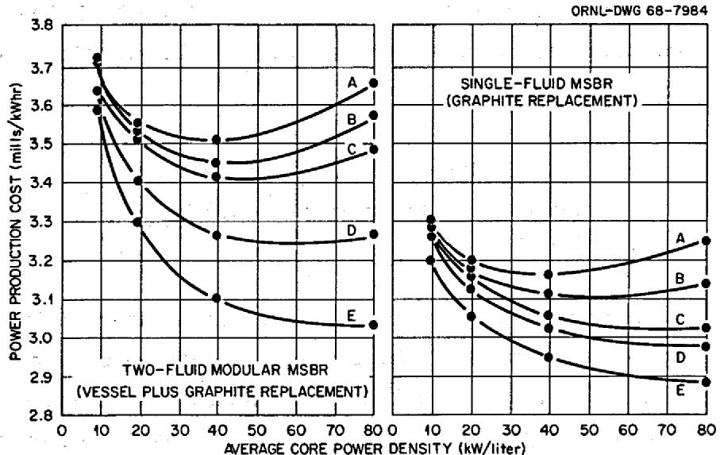  
CURVE A. ONE MONTH CHARGEABLE POWER OUTAGE  
CURVE B. ONE-HALF MONTH CHARGEABLE POWER OUTAGE  
CURVE C. NO CHARGEABLE POWER OUTAGE  
CURVE D. NO CHARGEABLE POWER OUTAGE, $6 \times 10^{22}$ neutron/cm² MAXIMUM GRAPHITE EXPOSURE ( $E > 50$ keV)  
MAXIMUM GRAPHITE EXPOSURE  
CURVE E. 30-yr LIFE GRAPHITE (REQUIRES NO REPLACEMENT)

The power cost results given in Fig. 6.2, for which effective downtime was treated as a parameter, show that, for the cited conditions, lower effective downtime for graphite replacement leads to lower power costs. Increasing the effective downtime from zero to one month increased minimum power costs by 0.08 to 0.15 mill/kwhr for permissible graphite exposures of $3 \times 10^{22}$ nvt ( $E > 50$ kev).

The above results indicate that exposure limitations for MSBR graphite lead to less economic penalty to the single-fluid MSBR than to the two-fluid concept. Nevertheless, an improvement in graphite behavior is desirable for both concepts.

# 6.4 The Influence on MSBR Performance of

# Noble-Metal Deposition on Graphite

# A. M. Perry

It has been recognized for several years that uncertainty in the chemical behavior of certain of the fission products--notably niobium, molybdenum, technetium, and to a lesser extent ruthenium and tellurium--constitutes one of the principal uncertainties in estimates of the breeding capabilities of molten-salt reactors. The Molten-Salt Reactor Experiment is being used to reduce or remove this uncertainty, and it has already yielded much encouraging information of value in this regard.

The essential question is whether these fission products will remain in the core, or whether, as we have assumed in our MSBR performance estimates, they will be removed from the melt during fuel processing, or perhaps be deposited as metals on the Hastelloy N surfaces outside the core. Experience in the MSRE indicates that most of the noble-metal fission products appear in the gas phase of the pump bowl.

Should they all remain in the core of an MSBR, they would significantly reduce the breeding ratio. While the cross sections of these isotopes are not especially large, their combined fission yields account for nearly a quarter of the total yield of fission products, and the cross sections of the stable isotopes in the group are, in several instances, sufficient to allow saturation to occur in a few years. At saturation, the rate of production by the fission of uranium equals the rate of removal

by neutron capture, and the total quantity of the material in the core becomes constant. The neutron loss--and hence the reduction in breeding ratio--than depends only on the fission product yield, not on the cross section. The neutron poisoning, $\mathbf{P}_{\mathbf{1}}$ , at any time $t$ after startup, due to a particular stable isotope designated by subscript $i$ , is expressed approximately by

$$
P _ {1} = \frac {y _ {1} f _ {1}}{(1 + \alpha)} \left(1 - e ^ {- \sigma_ {1} \Phi t}\right), \tag {6.1}
$$

where $\mathbf{y}_1$ is the fission yield of nuclide 1, $\sigma_1$ is its effective spectrum-averaged cross section, $\Phi$ is the flux in the reactor core, $\alpha$ is the capture-to-fission ratio for the fuel, and $\mathbf{f}_1$ is the fraction of this fission-product species that is deposited from the fuel salt and remains in the core. The value of $\mathbf{P}_1$ gives directly the loss in breeding ratio associated with this fission product.

Estimates of the amount of poisoning that could result from deposition of these fission products in the core have been made from time to time during the evolution of the MSBR design. While the fully saturated poisoning depends very little on details of the reactor design, the rate of approach to saturation does depend on detailed design parameters, and this accounts for some differences in the estimates that have appeared.

Table 6.3 gives the maximum reduction in breeding ratio associated with the stable and very long-lived isotopes of Mo, Tc, Ru, Rh, Pd, and Te, as a function of time after reactor startup or after the installation of fresh core graphite. These numbers correspond to complete deposition on the graphite of the entire yield of each of these isotopes. In some cases the probability of deposition of the stable poison is assumed to be associated with the chemical behavior of its precursor. For this reason, niobium deposition behavior, as well as that of molybdenum, is important. The quantity $(\sigma \Phi)^{-1}$ in Table 6.3 is the time required for a nuclide to reach about $70\%$ of its saturation value. These time constants are computed for noble metal fission products in the core region of a single-fluid MSBR, considering a $90\%$ plant factor and a fuel specific power in the "core" of $10.7\mathrm{Mw(t)}/\mathrm{kg}$ fissile. The total poisoning in Table 6.3 is the loss in breeding ratio at the given time after startup;

Table 6.3. Loss of Breeding Ratio Corresponding to Complete Retention of Certain Fission Products in a Single-Fluid MSBR   

<table><tr><td rowspan="2">Nuclide</td><td rowspan="2">(σΦ)-1(yr)a</td><td colspan="5">Time After Core Startup (years)</td></tr><tr><td>1</td><td>2</td><td>4</td><td>8</td><td>16</td></tr><tr><td>95Mo</td><td>4.3</td><td>0.0062</td><td>0.0111</td><td>0.0186</td><td>0.0272</td><td>0.0345</td></tr><tr><td>97Mo</td><td>29</td><td>0.0009</td><td>0.0018</td><td>0.0034</td><td>0.0086</td><td>0.0110</td></tr><tr><td>98Mo</td><td>93</td><td>0.0003</td><td>0.0005</td><td>0.0010</td><td>0.0021</td><td>0.0040</td></tr><tr><td>100Mo</td><td>95</td><td>0.0002</td><td>0.0005</td><td>0.0009</td><td>0.0018</td><td>0.0035</td></tr><tr><td>99Tc</td><td>3.1</td><td>0.0067</td><td>0.0116</td><td>0.0183</td><td>0.0252</td><td>0.0304</td></tr><tr><td>101Ru</td><td>7.3</td><td>0.0019</td><td>0.0037</td><td>0.0066</td><td>0.0107</td><td>0.0150</td></tr><tr><td>102Ru</td><td>42.5</td><td>0.0003</td><td>0.0005</td><td>0.0010</td><td>0.0020</td><td>0.0037</td></tr><tr><td>104Ru</td><td>66</td><td>0.0001</td><td>0.0002</td><td>0.0005</td><td>0.0009</td><td>0.0011</td></tr><tr><td>103Rh</td><td>0.41</td><td>0.0096</td><td>0.0117</td><td>0.0138</td><td>0.0158</td><td>0.0168</td></tr><tr><td>105Pd</td><td>6.0</td><td>0.0004</td><td>0.0007</td><td>0.0012</td><td>0.0019</td><td>0.0026</td></tr><tr><td>107Pd</td><td>9.1</td><td>-</td><td>0.0001</td><td>0.0002</td><td>0.0003</td><td>0.0004</td></tr><tr><td>126Te</td><td>46</td><td>-</td><td>0.0001</td><td>0.0002</td><td>0.0003</td><td>0.0006</td></tr><tr><td>128Te</td><td>230</td><td>0</td><td>0</td><td>0.0001</td><td>0.0002</td><td>0.0003</td></tr><tr><td>130Te</td><td>154</td><td>0.0001</td><td>0.0002</td><td>0.0004</td><td>0.0007</td><td>0.0013</td></tr><tr><td>Total</td><td></td><td>0.0267</td><td>0.0427</td><td>0.0662</td><td>0.0977</td><td>0.1252</td></tr><tr><td>F (average)</td><td></td><td>0.015</td><td>0.026</td><td>0.041</td><td>0.063</td><td>0.088</td></tr></table>

${}^{a}$ These saturation time constants (time required to reach about 70% of the equilibrium value) apply in the "core" zone,which contains approximately half the graphite area exposed to fuel salt. The time constants for the "blanket" zone are about ten times longer.

in the last row of the table, however, the average loss of breeding ratio, $\overline{\mathbb{P}}$ , over time, $t$ , is given, where

$$
\overline {{P}} = \frac {1}{t} \int_ {0} ^ {t} P (t ^ {\prime}) d t ^ {\prime}. \tag {6.2}
$$

Results obtained from graphite samples exposed in the MSRE regarding the behavior of these fission products are discussed in Section 4.2. From Table 4.1 it is noted that, on the assumption that the graphite samples are typical of all graphite surfaces exposed to the salt, approximately $10.9\%$ of the $^{99}\mathrm{Mo}$ produced in the MSRE was retained on the graphite as well as $10.0\%$ of the $^{132}\mathrm{Te}$ , $6.6\%$ of the $^{103}\mathrm{Ru}$ , and $36.4\%$ of the $^{95}\mathrm{Nb}$ . In using these results to estimate the fraction of the stable fission product poisons retained on the graphite surfaces in an MSBR, account is taken of the difference in the ratio of graphite-to-metal area in the two reactors. In the MSRE, the graphite comprises $63\%$ of the area exposed to salt, whereas in the single-fluid MSBR, the "core" graphite represents about $40\%$ . In addition, the MSRE results indicate a considerably greater affinity of the noble metals (except for Nb) for the metal surface than for the graphite surface. Thus, it is expected that the percentage deposition of noble metal fission products on graphite in the MSBR would be less than in the MSRE, with the ratio dependent upon the kinetics of the deposition process. On the basis that fission products have access to all surfaces equally, their relative deposition on MSBR graphite would be less than one-third that observed in the MSRE; however, since many of the fission products are generated in the core region, the factor is probably about one-half. Thus, in this analysis, the percentage of noble metals retained on the MSBR graphite is considered to be $5\%$ for $^{99}\mathrm{Mo}$ , $^{132}\mathrm{Te}$ , and $^{103}\mathrm{Ru}$ , and $20\%$ for $^{95}\mathrm{Nb}$ . It is further postulated in view of the small fraction of these nuclides found in the salt (see Table 4.1) that the deposition is relatively rapid compared to the decay rate of radioactive precursors of the stable noble metal poisons; consequently, the deposition fractions of the stable poisons are those of their precursors where the fission yield is zero. Thus, $^{95}\mathrm{Mo}$ is assumed to be deposited in accordance with its precursor $^{95}\mathrm{Nb}$ , while the other Mo isotopes and $^{99}\mathrm{Tc}$ are assumed to

behave like $^{99}\mathrm{Mo}$ . Similarly, the behavior of $^{103}\mathrm{Rh}$ is assumed to be governed by that of its precursor $^{103}\mathrm{Ru}$ ; Pd is also assumed to behave like Ru, although its contribution is very small. Finally, in view of the marked difference in neutron flux intensities (about tenfold) in the "core" zone and in the "blanket" zone of the single-fluid reactor, the expression for saturation of the deposited fission products was modified by including a separate term for each of the two zones. For the combined poisoning of all the noble metal fission products listed in Table 6.3, the above conditions give the results shown in Table 6.4, with P(t) and $\overline{\mathbb{P}}(t)$ defined as before.

Table 6.4. Anticipated Noble-Metal Fission Product Poisoning in a Single-Fluid MSBR (Loss of Breeding Ratio)   

<table><tr><td rowspan="2"></td><td colspan="5">Time After Startup (years)</td></tr><tr><td>1</td><td>2</td><td>4</td><td>8</td><td>16</td></tr><tr><td>P(t)</td><td>0.0022</td><td>0.0038</td><td>0.0061</td><td>0.0089</td><td>0.0114</td></tr><tr><td>\( \overline{P} (t) \)</td><td>0.0012</td><td>0.0022</td><td>0.0036</td><td>0.0056</td><td>0.0079</td></tr></table>

It may be seen from Table 6.4 that for exposures of up to 10 years' duration the degradation in breeding ratio due to deposition of noble-metal fission products is expected to remain less than 0.01, and the cumulative average will be smaller still. Inasmuch as the graphite will probably be replaced because of radiation damage considerations at intervals shorter than 10 years, it appears that the average loss in breeding ratio will be in the range of 0.002 to 0.005 due to fission product deposition on the graphite.

Thus, although complete retention of the noble-metal fission products on core graphite leads to a significant reduction in MSBR breeding ratio, the deposition behavior inferred by MSRE results gives only a small reduction in MSBR performance. Additional experimental results are needed to confirm these preliminary indications.

# 6.5 Conclusions

Graphite dimensional changes due to exposure in an MSBR can alter the relative volume fractions of moderator, fuel salt, and fertile salt in the reactor. Such changes influence the design of a two-fluid MSBR more than a single-fluid reactor, since in the latter the fertile and fissile materials are mixed together and their ratio does not change when the graphite volume changes. By constructing a two-fluid reactor such that the fissile and fertile materials are confined to channels within the graphite assemblies and the spaces between graphite assemblies are filled with helium, changes in graphite volume fraction lead largely to relative volume change in the helium space. Such volume changes have only a small effect on fuel cycle performance and on power distribution. In a single-fluid MSBR, graphite dimensional changes would have little effect on nuclear performance since the fissile and fertile salt volumes are equally affected. Also, the ability to independently adjust fissile and fertile material concentrations in both two-fluid and single-fluid MSBR's permits adjustment in reactor performance as changes in graphite volume occur. Thus, little change in nuclear performance is expected because of radiation damage to graphite so long as the graphite volume does not increase much beyond its initial value and the graphite diffusion coefficient to gases remains low during reactor exposure (the latter condition neglects the possibility of removing xenon efficiently by gas stripping).

A limit on the permissible exposure of the graphite can have a significant influence on reactor design conditions. If there were no exposure limit, the average core power density corresponding to the minimum power cost would be in excess of 80 kw/liter. However, if a limit exists, high power density can lead to high cost because of graphite replacement cost. At the same time, decreasing the core power density leads to an increase in capital cost and fuel cycle cost. Thus, a limit on permissible graphite exposure generally requires a compromise between various cost items, with core power density chosen on the basis of power cost. The optimum power density also varies with MSBR concept, since only graphite requires replacement in a single-fluid MSBR, while both the reactor vessel and graphite appear to require replacement in a two-fluid MSBR because of

the complexity of constructing the latter core. Further, reactor power outage due solely to graphite replacement requirements can be a significant cost factor. However, if graphite were replaced at time intervals no less than two years, it appears feasible to do the replacement operation during normal turbine maintenance periods, such that no effective downtime is assigned to graphite replacement. A two-year time interval is associated with an average power density in the power-producing "core" of about $40\mathrm{kw / liter}$ and a graphite exposure of about $3\times 10^{22}$ nvt $(E > 50\mathrm{kev})$ . For the above "reference" conditions, the single-fluid MSBR has power costs about 0.35 mill/kwhr(e) lower than the two-fluid MSBR. Doubling the permissible graphite exposure $\underline{\underline{\mathbf{\Pi}}}$ to a value of about $6\times 10^{22}$ nvt $(E > 50\mathrm{kev})$ would be more important to the two-fluid concept and would reduce power costs by about 0.15 mill/kwhr(e); the corresponding change for the single-fluid MSBR would decrease power costs by about 0.07 mill/kwhr(e). If a two-week effective reactor downtime were assigned solely to graphite replacement operations, the associated power cost penalty would be about 0.07 mill/kwhr(e) for either concept.

Deposition of noble-metal fission products in the core graphite of an MSBR would tend to lower the nuclear performance of an MSBR. Based on the results obtained in the MSRE and taking into account the higher metal/graphite surface area in an MSBR relative to the MSRE, it is estimated that deposition of fission products on the graphite in an MSBR would reduce the breeding ratio by about 0.002 on the average if graphite were replaced every two years, and about 0.004 if replaced every four years. Thus, although complete retention of the noble-metal fission products on core graphite would lead to a significant reduction in MSBR breeding ratio, the deposition behavior inferred from MSRE results corresponds to only a small reduction in MSBR performance.

# 7. PROGRAM TO DEVELOP IMPROVED GRAPHITE FOR MSBR'S

W. P. Eatherly

C. R. Kennedy

D. K. Holmes

R. A. Strehlow

Recent work on graphite implies that materials can be developed in the near future having improved properties for reactor application. The available information supports the hypothesis that resistance to radiation

damage is strongly connected to large crystallite sizes and to minimal binder content. Since the binder phase is, in general, dominated by small and highly disoriented crystal structures, these two bases may indeed be synonymous.

In connection with the graphite problem, representatives of ORNL have visited all U.S. centers where active research on graphite is being undertaken and all vendors who have expressed interest in the molten-salt reactor program. As a result of these visits and our own analyses of the problem, we have concluded that a graphite research and development program conducted largely (but not exclusively) at Oak Ridge National Laboratory is desirable and essential to furtherance of the molten-salt reactor concept. For convenience the program is divided into five areas: (1) Fundamental Physical Studies, (2) Fundamental Chemical Studies, (3) Fabrication Studies, (4) Engineering Properties, (5) Irradiation Program. This program is aimed not only at the development of a suitable type of graphite, but also at establishing an improved model for radiation damage which will aid in guiding graphite development.

At the present time it appears that a radiation damage model can probably be established which will possess predictive capacity and define the limits of material capability in withstanding irradiation. Such a model is desirable not only in guiding the development of superior materials, but also to define the ultimate material limitations on the reactor concept and design. Our confidence in the establishment of such a model rests on the emergence of recent techniques offering increased control over graphite microstructure, on the continuing development of new diagnostic techniques which enable one to obtain both quantitative and qualitative information on microstructures, and on the present indication that radiation damage at elevated temperatures may be more tractable to analysis.

As indicated above, the attainment of improved graphite for moltensalt reactors (viz., lifetimes of 5 to $10 \times 10^{22}$ neutrons/cm²) appears possible to enhancement of crystallinity and by minimization of binder content. These postulates rest primarily on British theories based on single-crystal experiments, work on pyrolytic graphites at Gulf General

Atomic and irradiation data on certain relatively binder-free graphites. The most promising routes of attack appear to be catalysis and pressure carbonization, methods not largely explored by the graphite industry, particularly with regard to radiation damage.

The development program is summarized in more detail below.

# 7.1 Fundamental Physical Studies

The ultimate solution to the problem of increasing the resistance of graphite to radiation damage may depend upon a fundamental understanding of the defect processes underlying the observed property changes. A coordinated effort should be planned for establishing the basic mechanisms of radiation damage. Damage models studied to date do not seem to offer a completely acceptable explanation of all aspects of the damage observed at high doses and relatively high temperatures; however, such models do indicate general directions for further investigation.

The crystalline composition of a given graphite seems to play an important role in the final results of the damage; thus, it appears important to study single crystals, polycrystalline samples, and pyrolytics (as transition materials) in order to better understand this crystallite-size effect. Because of the high exposures required, it also seems important to utilize charged particle bombardment (along with fast neutron irradiations in high flux reactors) in order to permit the accumulation of irradiation data in a reasonable time. This, of course, necessitates the use of thin specimens which may require careful development in some cases.

Various property changes (with irradiation) can be studied in each graphite material as deemed expedient for best identification of basic defect structures. Among the most important are dimensional changes, lattice spacing changes, and changes in thermal expansion coefficients and elastic moduli. Obtaining these properties (and others) may require supplemental work in developing techniques and establishing the precise property values of material in the unirradiated condition. In particular, use of electron microscopy in investigating defect clusters and their growth has already been shown to be of great value and would be of immediate utility, especially in association with single-crystal

irradiations. Additional valuable techniques which have not yet been exploited adequately are x-ray line shape analyses, optical transmission and decoration.

Theoretical support of the experimental work is required at three levels. Any realistic damage model must first involve a set of complex rate equations which would best be solved by automated analysis. Secondly, the basic defect energetics and interactions employed in the rate equations must be studied from the viewpoint of solid state theory. Finally, the entire model must be related to the directly observable parameters characterizing polycrystalline graphite.

# 7.2 Fundamental Chemical Studies

Recognition of the experimentally observed relationship between radiation-induced growth rate and crystallite size give reasonable assurance that an improved graphite can be developed. Crystallinity is strongly influenced by chemical changes occurring throughout the graphite manufacturing process. Three chemical approaches to the tailoring of the crystallite size distribution are: (1) alteration of carbonization conditions for filler-residual binder systems (e.g., carbonization pressure); (2) elimination of residual binder; and (3) modification of the graphite by catalytic recrystallization.

Residual binders (those yielding part of the carbon in a graphite body) carbonize and begin to develop their crystalline habit primarily by free radical mechanisms with evolution of the gases $\mathbf{H}_2\mathbf{O}$ , $\mathbf{CO}$ , $\mathbf{H}_2$ , etc. This habit of texture persists throughout the graphitization process. Changes in the crystallinity of the final product may be accomplished by chemical alteration of the binder material and by application of pressure during the critical baking operation.

In order to eliminate the residual binder one can utilize fugitive binders during green article fabrication which can evolve before substantial hardening of the article occurs. The use of raw or semicalcined cokes presents a promising course of action because of the inherent chemical activity of those material. The study of solvent action on these filler materials is a necessary first step.

Catalytic modification of graphite has been demonstrated to yield an increased crystallite size. Either of two rather distinct mechanisms may be involved. The first is via a solid-state diffusional path. Thorium, uranium, and titanium carbides, for example, in the presence of excess carbon have been observed to improve the graphite crystallinity. A second mechanism appears to be operative for carbides at temperatures above the eutectic (or peritectic) temperature where a solution-reprecipitation process can be readily driven by the free-energy differences between large and small crystallites.

The free-energy differences can also be expected to result in reaction rate differences; measurements of those rates could augment x-ray studies of the crystallite size. In view of the difficulty of obtaining crystallite-size distribution data from x-ray analysis, some effort in the field of chemical kinetics is desirable. Studies of gas evolution and catalyst removal from carbons at temperatures above $1500^{\circ}\mathrm{C}$ are expected to assist further in improvement of process control as well as to provide fundamental information.

# 7.3 Fabrication Studies

The fabrication of graphite samples for irradiation and physical property evaluation is aimed in two complementary directions: first, to provide the more fundamental programs with controlled test materials, and second, to take quick advantage of any information developed by these programs. It would also include the development of suitable graphite-joining techniques and pyrolytic-carbon surface impregnation techniques for control of gas penetration into the graphite. It is envisioned that the scope of graphite fabrication would not proceed beyond sample preparation, with scaleup being left to commercial vendors.

The highly specialized nature of graphites suitable for molten-salt applications required advanced fabrication techniques and strains the limits of current graphite technology. For these reasons, it has been our experience that vendor participation can be successfully secured only if their claims to protection of proprietary information are respected. On this basis two companies are actively scaling up processes to supply a graphite applicable to first cores in an experimental MSBR,

two other companies are actively supplying samples of more advanced materials, and several others have expressed an interest in subsequent participation.

Under these circumstances, an in-house capability of supplying materials for irradiation becomes essential. Only on this basis do materials become available of known character and controlled variability. Conversely, as long as vendor interest remains active and substantive, the difficult problems of process scaleup and control can remain with commercial suppliers. It is obvious that this approach to the graphite problem will require close and continued cooperation between ORNL and commercial suppliers.

# 7.4 Engineering Properties

Candidate graphite materials must be evaluated and engineering data generated to obtain the data required for proper design of an MSBR core. This will require that sufficient property values be determined within reasonable confidence intervals for specifying the design parameters. The bulk physical properties of the materials must be determined with particular emphasis on any effects that surface coatings may have. The mechanical and thermal properties must be critically evaluated with respect to possible anisotropic behavior. Sensitive properties determining the compatibility of the graphite with the MSBR environment, such as entrance pore diameter, accessible pore volume, and penetration characteristics, must be examined very carefully. Also, the effects of irradiation of these properties must be studied carefully.

Sound methods of quality control must be developed to ensure the soundness of all material to be used in an MSBR core. Techniques developed to ensure the integrity and effectiveness of coatings and of metal and/or graphite joints must have a high degree of reliability. There must also be development of nondestructive testing techniques and property interrelationships to reduce the amount of destructive testing required to ensure total integrity of the fabricated parts.

# 7.5 Irradiation Program

Initially the irradiation program will be directed to provide critical information assisting both the fundamental and developmental programs. Eventually the program will be devoted to evaluating candidate materials and to generating necessary engineering data. These studies require graphite irradiation exposures to a level where failure occurs or which exceeds the lifetime requirements of an MSBR. This necessitates that irradiation be done in reactors having high flux levels. Preliminary experiments in target rod positions in the core of the HFTR have already been performed and demonstrate the ability to maintain an irradiation temperature between 690 and $730^{\circ}\mathrm{C}$ over prolonged periods. This facility has the capability of accumulating a maximum of $4 \times 10^{22}$ neutrons/ $\mathrm{cm}^2$ ( $\mathrm{E} > 50\mathrm{keV}$ ) per year; even with recycling losses, the exposures will be about $3.5 \times 10^{22}$ neutrons/ $\mathrm{cm}^2$ ( $\mathrm{E} > 50\mathrm{keV}$ ) per year.

The main disadvantages of the HFIR irradiation facility is the small size which limits the experiments to a 1/2-in.-OD tube. Therefore, it will be necessary to consider the use of other irradiation facilities for studies requiring larger samples. These studies will be designed to determine the combined effects of stress and irradiation on the properties of graphite and to investigate the possibility of size effect on dimensional stability.

Ion-bombardment testing is also planned as a means of screening graphite samples. This treatment would be used either as an adjunct or as a substitute for high-flux neutron irradiations of graphite. It is proposed that the feasibility of ion-bombardment testing be examined thoroughly to determine whether such studies can feed back information to both fundamental and developmental studies.

# 7.6 Conclusions

Irradiation results for different grades of graphite have shown that gross volume changes are a function of crystallite arrangement as well as size of the individual crystallites. Also, in graphites containing binder materials, it appears that the binder region has little capacity to accommodate or control particle strain and thus fractures because of buildup of mechanical stresses. This indicates that graphites with

improved radiation resistance might be obtained by developing graphites having little or no binder content. Further, improved radiation resistance appears to be associated with isotropic graphites made up of large crystallites. Consequently, a research and development program aimed at producing improved graphite would emphasize development of graphite having large crystallite sizes and little or no binder content. Such a program would involve physical, chemical, mechanical, fabrication, and irradiation studies, and could lead possibly to graphites with permissible fast neutron exposures of 5 to $10 \times 10^{22}$ neutrons/cm² (E > 50 kev).

# APPENDIX

# Graphite Exposure Measurements and Their Relationships

# to Exposures in an MSBR

A. M. Perry

Irradiations of near-isotropic graphites have been carried out in the Dounreay Fast Reactor (DFR), providing information on dimensional changes as a function of fast neutron dose in the temperature range and at the high neutron doses of interest in the MSBR. The DFR irradiations are reported in terms of an Equivalent Pluto Dose (EPD), which investigators in the United Kingdom employ as a standard dose unit in order to express results of experiments carried out in several different facilities in directly comparable terms. In order to apply the results of the DFR irradiations to the MSBR, we must establish a connection between the Equivalent Pluto Dose and the irradiation conditions to be expected in the MSBR.

Rather than computing an Equivalent Pluto Dose (EPD) for the MSBR, which would require detailed information on the reference spectrum in Pluto, it is convenient to establish a correlation between neutron-induced damage and the integrated neutron flux above some standard reference energy. Such a correlation is extremely useful if it can be shown that there exists an energy $\mathbf{E}_0$ such that the ratio of observed damage rate to the flux above energy $\mathbf{E}_0$ is essentially the same for all reactor spectra in which graphite damage is measured or needs to be known. Mathematically this can be written as,

$$
R \left(E _ {0}\right) \equiv \frac {\int_ {0} ^ {\infty} \Phi (E) D (E) d E}{\int_ {E _ {0}} ^ {\infty} \Phi (E) d E} \tag {A.1}
$$

where $D(E)$ is a "damage cross section" giving the relative graphite damage per unit fast neutron flux as a function of neutron energy, $\Phi(E)$ is the fast flux per unit of energy, $E$ is neutron energy, and $R(E_0)$ is relative

damage to the graphite. Figure A.l shows the value of D(E) as a function of energy, based on the carbon scattering cross section, the energy distribution of primary-carbon-recoil atoms following a neutron collision, and on the number of carbon atoms displaced from their normal lattice positions by a primary carbon recoil atom as a function of the recoil-atom energy. This last function has been calculated by Thompson and Wright, and predictions based upon it have compared well with experimental observations. $^{1}$

Figure A.2 shows neutron spectra produced by a fission source in four widely different neutron moderating materials, these materials being $\mathsf{H}_{2}\mathsf{O}$ , $\mathsf{D}_{2}\mathsf{O}$ , $\mathsf{C}$ , and a mixture of equal volumes of sodium and uranium (enriched to $20\%$ in the 235U isotope). The last composition is intended to be representative of a fast reactor core. In Fig. A.3 the function $\mathbb{R}(\mathbb{E}_0)$ is shown as a function of $\mathbf{E}_0$ for each of these four spectra. Since all four curves across within a $4 \%$ band at 50 kev, it appears that the desired correlation exists.

In order to utilize Eq. (A.1) we need the neutron flux exposure above 50 kev corresponding to the EPD in DFR. The total neutron dose in DFR exceeds the EPD by a factor of 2.16. This is just the reciprocal of the factor that was used to infer the EPD from the total dose in the first place.[2] In addition, it is estimated that approximately $94\%$ of the neutron flux in DFR is above 50 kev; while this fraction is not accurately known to us at present, the uncertainty involved is believed to be small. Thus, the exposure in the DFR to neutrons above 50 kev is (2.16)(0.94) x $(\mathrm{EPD}) = 2.0\mathrm{x}$ (EPD). That is, the EPD scale on the damage curves obtained from Harwell is converted to dose (based on $\mathbf{E} > 50$ kev) by multiplying by 2.

Results of graphite damage experiments in the GEIR have been reported in terms of the dose above 180 kev. The spectrum in these experiments was

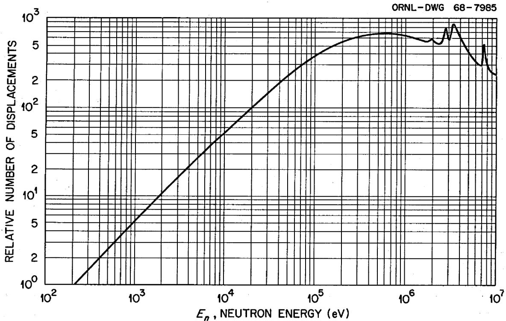  
Fig. A.1. Number of Atom Displacements in Graphite per $\mathrm{Cm}^3$ -Sec per Unit Flux as a Function of Neutron Energy.

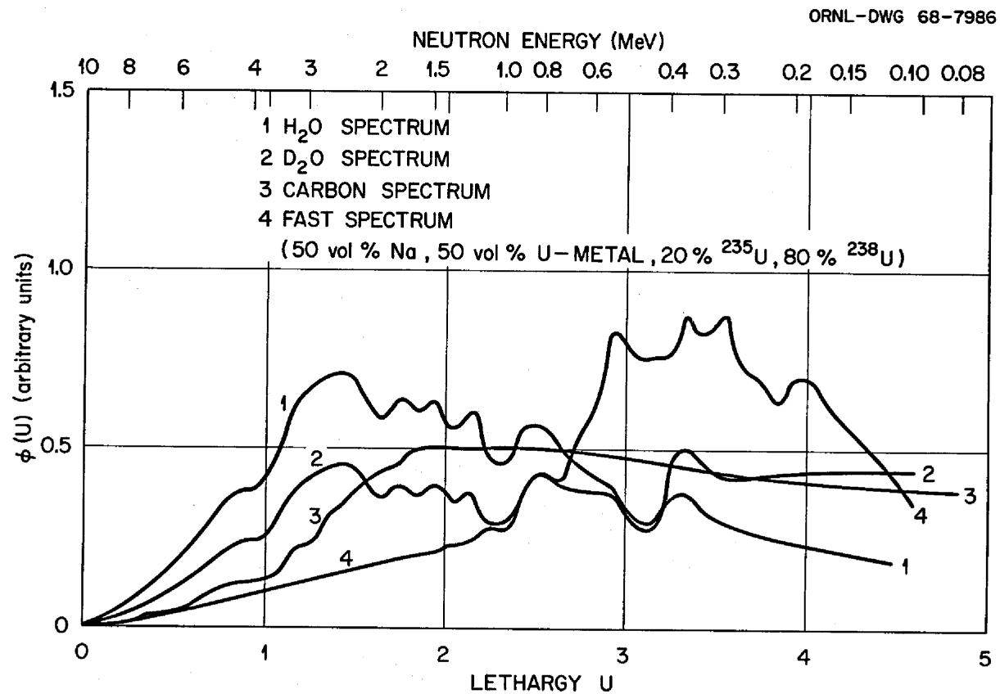  
Fig. A.2. Neutron Flux per Unit Lethargy Versus Neutron Lethargy Normalized for Equal Damage in Graphite

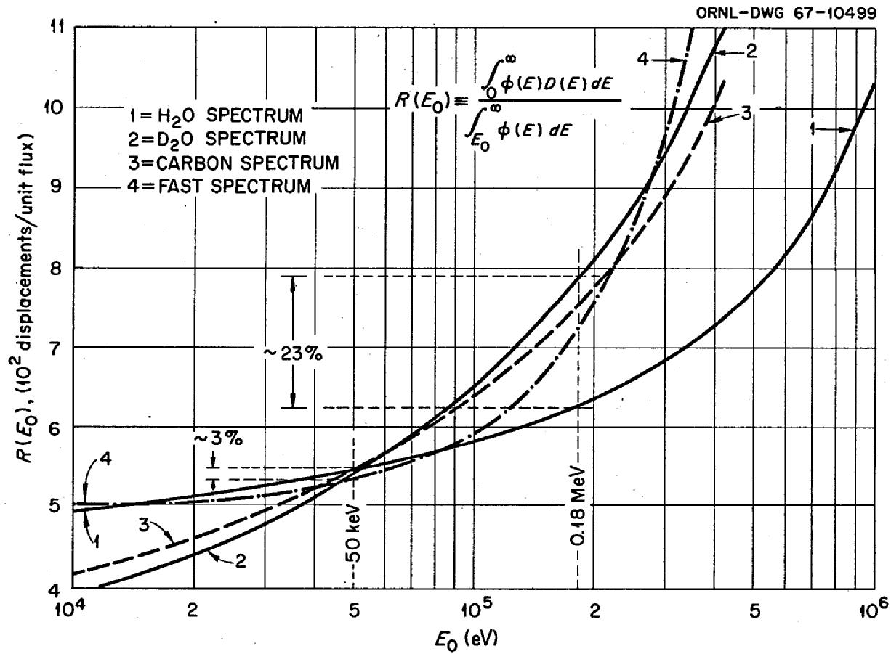  
Fig. A.3. Graphite Damage per Unit Neutron Flux in Various Reactor Spectra

such that the dose $(\mathbf{E} > 50\mathrm{kev})$ is $1.18\times$ dose $(\mathbf{E} > 180\mathrm{kev})$ .3 Thus, results of the several experiments can be placed on the same dose scale, for which equal dose should imply equal damage (other factors also being equal) even for widely different spectra such as those in the DFR and in the GETR.

Based on the above analysis, the permissible dose (E > 50 kev) for the MSBR spectrum is equal to twice the Equivalent Pluto Dose. Thus, an EPD of 1.5 x $10^{22}$ nvt in DFR, associated with what appears to be permissible graphite dimensional changes, corresponds to a permissible MSBR dose (E > 50 kev) of 3 x $10^{22}$ . The flux above 50 kev at any point in an MSBR core is very nearly proportional to the power density per unit of core volume in the vicinity of that point. For an MSBR with a central power density of 100 w/cc, the associated flux above 50 kev is about 4.5 x $10^{14}$ neutrons/cm²-sec, which would produce a dose (E > 50 kev) of about 1.1 x $10^{22}$ in one year at 80% plant load factor. Thus, if the permissible dose (E > 50 kev) is 3 x $10^{22}$ , and if the maximum power density is 100 w/cm³, then replacement of at least a portion of the graphite would be required at approximately 2.7-year intervals. Alternatively, if the average "core" power density is 80 w/cc and the power peaking factor is 2, the time between graphite replacements would be about 1.7 years.

# Internal Distribution

<table><tr><td>1-50.</td><td>MSRP Director&#x27;s Office</td><td>99.</td><td>F. L. Culler</td></tr><tr><td></td><td>Bldg. 9201-3, Rm. 109</td><td>100.</td><td>D. R. Cuneo</td></tr><tr><td>51.</td><td>R. K. Adams</td><td>101.</td><td>J. M. Dale</td></tr><tr><td>52.</td><td>G. M. Adamson</td><td>102.</td><td>D. G. Davis</td></tr><tr><td>53.</td><td>R. G. Affel</td><td>103.</td><td>R. J. DeBakker</td></tr><tr><td>54.</td><td>L. G. Alexander</td><td>104.</td><td>C. B. Deering</td></tr><tr><td>55.</td><td>J. L. Anderson</td><td>105.</td><td>J. H. Devan</td></tr><tr><td>56.</td><td>R. F. Apple</td><td>106.</td><td>S. J. Ditto</td></tr><tr><td>57.</td><td>C. F. Baes</td><td>107.</td><td>A. S. Dworkin</td></tr><tr><td>58.</td><td>J. M. Baker</td><td>108.</td><td>I. T. Dudley</td></tr><tr><td>59.</td><td>S. J. Ball</td><td>109.</td><td>D. A. Dyslin</td></tr><tr><td>60.</td><td>C. E. Bamberger</td><td>110.</td><td>W. P. Eatherly</td></tr><tr><td>61.</td><td>C. J. Barton</td><td>111.</td><td>J. R. Engel</td></tr><tr><td>62.</td><td>H. F. Bauman</td><td>112.</td><td>E. P. Epler</td></tr><tr><td>63.</td><td>S. E. Beall</td><td>113.</td><td>D. E. Ferguson</td></tr><tr><td>64.</td><td>R. L. Beatty</td><td>114.</td><td>L. M. Ferris</td></tr><tr><td>65.</td><td>M. J. Bell</td><td>115.</td><td>J. E. Fox, AEC, Wash.</td></tr><tr><td>66.</td><td>M. Bender</td><td>116.</td><td>A. P. Fraas</td></tr><tr><td>67.</td><td>C. E. Bettis</td><td>117.</td><td>H. A. Friedman</td></tr><tr><td>68.</td><td>E. S. Bettis</td><td>118.</td><td>J. H. Frye, Jr.</td></tr><tr><td>69.</td><td>D. S. Billington</td><td>119.</td><td>C. H. Gabbard</td></tr><tr><td>70.</td><td>R. E. Blanco</td><td>120.</td><td>R. B. Gallaher</td></tr><tr><td>71.</td><td>F. F. Blankenship</td><td>121.</td><td>R. E. Gelbach</td></tr><tr><td>72.</td><td>J. O. Blomeke</td><td>122.</td><td>A. Giambusso, AEC, Wash.</td></tr><tr><td>73.</td><td>R. Blumberg</td><td>123.</td><td>J. H. Gibbons</td></tr><tr><td>74.</td><td>E. G. Bohlmann</td><td>124.</td><td>L. O. Gilpatrick</td></tr><tr><td>75.</td><td>C. J. Borkowski</td><td>125.</td><td>H. E. Goeller</td></tr><tr><td>76.</td><td>G. E. Boyd</td><td>126.</td><td>B. L. Greenstreet</td></tr><tr><td>77.</td><td>C. A. Brandon</td><td>127.</td><td>W. R. Crimes</td></tr><tr><td>78.</td><td>M. A. Bredig</td><td>128.</td><td>A. G. Grindell</td></tr><tr><td>79.</td><td>R. B. Briggs</td><td>129.</td><td>R. W. Gunkel</td></tr><tr><td>80.</td><td>H. R. Bronstein</td><td>130.</td><td>R. H. Guymon</td></tr><tr><td>81.</td><td>G. D. Brunton</td><td>131.</td><td>J. P. Hammond</td></tr><tr><td>82.</td><td>D. A. Canonico</td><td>132.</td><td>B. A. Hannaford</td></tr><tr><td>83.</td><td>S. Cantor</td><td>133.</td><td>P. H. Harley</td></tr><tr><td>84.</td><td>R. S. Carlsmith</td><td>134.</td><td>D. G. Harman</td></tr><tr><td>85.</td><td>W. L. Carter</td><td>135.</td><td>W. O. Harms</td></tr><tr><td>86.</td><td>G. I. Cathers</td><td>136.</td><td>C. S. Harrill</td></tr><tr><td>87.</td><td>O. B. Cavin</td><td>137.</td><td>P. N. Haubenreich</td></tr><tr><td>88.</td><td>A. Cepolino</td><td>138.</td><td>R. E. Helms</td></tr><tr><td>89.</td><td>W. R. Cobb</td><td>139.</td><td>P. G. Herndon</td></tr><tr><td>90.</td><td>C. W. Collins</td><td>140.</td><td>D. N. Hess</td></tr><tr><td>91.</td><td>E. L. Compere</td><td>141.</td><td>J. R. Hightower</td></tr><tr><td>92.</td><td>K. V. Cook</td><td>142.</td><td>M. R. Hill</td></tr><tr><td>93.</td><td>W. E. Cook</td><td>143.</td><td>H. W. Hoffman</td></tr><tr><td>94.</td><td>D. F. Cope</td><td>144.</td><td>D. K. Holmes</td></tr><tr><td>95.</td><td>L. T. Corbin</td><td>145.</td><td>P. P. Holz</td></tr><tr><td>96.</td><td>W. B. Cottrell</td><td>146.</td><td>R. W. Horton</td></tr><tr><td>97.</td><td>B. Cox</td><td>147.</td><td>T. L. Hudson</td></tr><tr><td>98.</td><td>J. L. Crowley</td><td>148.</td><td>H. Inouye</td></tr></table>

149. W. H. Jordan   
150-169. P. R. Kasten   
170. R.J.Kedl   
171. M. T. Kelley   
172. M. J. Kelly   
173. C. R. Kennedy   
174. T. W. Kerlin   
175. H. T. Kerr   
176. S. S. Kirslis   
177. J. W. Koger   
178. A. I. Krakoviak   
179. T. S. Kress   
180. J. W. Krewson   
181. C. E. Lamb   
182. J.A.Lane   
183. W. J. Larkin   
184. C. E. Larson   
185. J. J. Lawrence   
186. M.S.Lin   
187. R.B.Lindauer   
188. A.P.Litman   
189. G. H. Llewellyn   
190. E. L. Long   
191. M. I. Lundin   
192. R. N. Lyon   
193. R. L. Macklin   
194. H.G. MacPherson   
195. R.E. MacPherson   
196. J.C.Mailen   
197. D. L. Manning   
198. C. D. Martin   
199. T. H. Mauney   
200. H. A. McLain   
201. R. W. McClung   
202. H.E.McCoy   
203. H. C. McCurdy   
204. H.F. McDuffie   
205. C. K. McGlothlan   
206. C. J. McHargue   
207-208. T. W. McIntosh, AEC, Wash.   
209. L.E. McNeese   
210. J. R. McWherter   
211. J. G. Merkle   
212. H. J. Metz   
213. A. S. Meyer   
214. A. J. Miller   
215. R. L. Moore   
216. S. E. Moore   
217. D.M. Moulton   
218. T. R. Mueller   
219. H. A. Nelms   
220. J.P.Nichols   
221. E. L. Nicholson   
222. E.D.Nogueira   
223. L.C.Oakes   
224. P. Patriarca   
225. A.M.Perry   
226. T. W. Pickel   
227. H. B. Piper   
228. B. E. Prince   
229. E.E.Purvis,AEC,Wash.   
230. G. L. Ragan   
231. J. L. Redford   
232. M. Richardson   
233. G. D. Robbins   
234. R. C. Robertson   
235. W.C.Robinson   
236. H.C.Roller   
237. K. A. Romberger   
238. R. G. Ross   
239. H. M. Roth, AEC, ORO   
240. S. R. Sapirie, AEC, ORO   
241. H. C. Savage   
242. A. W. Savolainen   
243. W.F. Schaffer   
244. C. E. Schilling   
245. Dunlap Scott   
246. J. L. Scott   
247. H. E. Seagren   
248. C. E. Sessions   
249. J.H.Shaffer   
250. M. Shaw, AEC, Wash.   
251. W.H. Sides   
252. J.M. Simmons, AEC, Wash.   
253. E. E. Sinclair, AEC, Wash.   
254. M. J. Skinner   
255. G. M. Slaughter   
256. W. L. Smalley, AEC, ORO   
257. A. N. Smith   
258. F.J. Smith   
259. G.P. Smith   
260. O.I. Smith   
261. P.G. Smith   
262. I. Spiewak   
263. R.C.Steffy   
264. W.C.Stoddart   
265. H. H. Stone   
266. R.A. Strehlow   
267. D. A. Sundberg   
268. R.F.Sweek,AEC,Wash.   
269. J. R. Tallackson   
270. E. H. Taylor   
271. W. Terry   
272. R.E.Thoma

273. P.F.Thomason

274. L. M. Toth

275. D. B. Trauger

276. J. S. Watson

277. E. L. Watts

278. C.F.Weaver

279. C. E. Weber, AEC, Wash.

280. B. H. Webster

281. A. M. Weinberg

282. J. R. Weir

283. W. J. Werner

284. K. W. West

285. M. E. Whatley

286. J.C. White

287. L. V. Wilson

288. Gale Young

289. H.C.Young

290. J.P. Young

291. E. L. Youngblood

292. F.C.Zapp

293-294. Central Research Library

295-296. Document Reference Section

297-299. Laboratory Records

300. Laboratory Records (LRD-RC)

# External Distribution

301-315. Division of Technical Information Extension (DTIE)

316. Laboratory and University Division, ORO