ORNL-TM-2170

HOT-CELL STUDIES OF THE FLUIDIZED-BED FLUORIDE VOLATILITY PROCESS FOR RECOVERING URANIUM AND PLUTONIUM FROM SPENT $\mathsf{UO}_2$ FUELS

J. C. Mailen and G. I. Cathers

OAK RIDGE NATIONAL

CENTRAL RESEARCH

DOCUMENT COLL

LIBRARY LO

DO NOT TRANSFER TO A

If you wish someone el

document, send in name

and the library will arro

UCN-7969

(3 3-67)

# LEGAL NOTICE

This report was prepared as an account of Government sponsored work. Neither the United States, nor the Commission, nor any person acting on behalf of the Commission:

A. Makes any warranty or representation, expressed or implied, with respect to the accuracy, completeness, or usefulness of the information contained in this report, or that the use of any information, apparatus, method, or process disclosed in this report may not infringe privately owned rights; or   
B. Assumes any liabilities with respect to the use of, or for damages resulting from the use of any information, apparatus, method, or process disclosed in this report.

As used in the above, "person acting on behalf of the Commission" includes any employee or contractor of the Commission, or employee of such contractor, to the extent that such employee or contractor of the Commission, or employee of such contractor prepares, disseminates, or provides access to, any information pursuant to his employment or contract with the Commission, or his employment with such contractor.

Contract No. W-7405-eng-26

CHEMICAL TECHNOLOGY DIVISION

Chemical Development Section B

HOT-CELL STUDIES OF THE FLUIDIZED-BED FLUORIDE VOLATILITY PROCESS FOR RECOVERING URANIUM AND PLUTONIUM FROM SPENT $\mathsf{UO}_{2}$ FUELS

J. C. Mailen and G. I. Cathers

APRIL 1969

OAK RIDGE NATIONAL LABORATORY

Oak Ridge, Tennessee

operated by

UNION CARBIDE CORPORATION

for the

U.S. ATOMIC ENERGY COMMISSION

# CONTENTS

Page

Abstract 1

1. Introduction 2   
2. Experimental 3

2.1 Equipment Used 3   
2.2 Sampling Procedure 9   
2.3 Experimental Materials 10

3. Results and Discussion 10

3.1 Oxidation of Fuel 10   
3.2 Volatilization of Uranium with BrF 5 12   
3.3 Desorption of Uranium 21   
3.4 Volatilization of $\mathsf{PuF}_6$ with Fluorine 21   
3.5Recovery of Plutonium from NaF Trap 29

4. Conclusions 29   
5. References 30

# J. C. Mailen and G. I. Cathers

# ABSTRACT

Bench-scale experiments with $\mathrm{UO}_2$ that had been irradiated to a burnup of 34,000 Mwd/metric ton and cooled for two years were performed, using a 0.94-in.-ID fluidized-bed reactor. The objectives of these experiments were to test NaF at $400^{\circ}\mathrm{C}$ for use as a trap for volatile fission product fluorides, to test $\mathrm{MgF}_2$ for use as a trap for neptunium and technetium fluorides, to test NaF at $550^{\circ}\mathrm{C}$ for use as a trap for sorbing $\mathrm{PuF}_6$ and separating it from ruthenium, to study the behavior of neptunium, and to determine the fate of tritium.

In these studies the $\mathrm{UO}_2$ was first oxidized with $20\%$ $\mathrm{O}_2 - 80\% \mathrm{N}_2$ at $450^{\circ}\mathrm{C}$ , to form $\mathrm{U}_3\mathrm{O}_8$ ; this was then treated with $\mathrm{BrF}_5$ - $\mathrm{N}_2$ mixtures (5 to $10\% \mathrm{BrF}_5$ ) at $300^{\circ}\mathrm{C}$ to form $\mathrm{UF}_6$ and volatilize the uranium and most of the ruthenium, molybdenum, and technetium fluorides; finally, treatment with fluorine at 300 to $500^{\circ}\mathrm{C}$ was used to fluorinate and volatilize the plutonium as $\mathrm{PuF}_6$ . In some runs, $\mathrm{BrF}_3$ was used for a final cleanup of uranium after the $\mathrm{BrF}_5$ treatment. Plutonium was separated from the fluorine stream, by irreversible sorption on $\mathrm{NaF}$ , in a trap at temperatures above $500^{\circ}\mathrm{C}$ . Uranium hexafluoride was purified by passage through a $400^{\circ}\mathrm{C}$ NaF bed and by sorption on, and desorption from, $\mathrm{NaF}$ .

A ruthenium decontamination factor of 2000 was obtained by using a $400^{\circ}\mathrm{C}$ NaF bed and a residence time of 15 sec; cosorption of ruthenium in the plutonium trap

was minimized by operating it at 550 to $600^{\circ}\mathrm{C}$ . Of the tritium in the fuel, about $95\%$ was liberated during the heatup of the fuel to $450^{\circ}\mathrm{C}$ and during the oxidation; the other $5\%$ was liberated during the $\mathrm{BrF}_5$ step.

# 1. INTRODUCTION

Hot-cell tests of the fluidized-bed fluoride volatility process were made at Oak Ridge National Laboratory in support of the proposed Fluidized-Bed Volatility Pilot Plant.* These studies were designed to explore the chemical behavior of various fission products, using high-burnup fuel, and to evaluate methods for decontaminating the uranium and plutonium products. Specifically, we attempted to do the following:

1. test NaF at $400^{\circ}\mathrm{C}$ for its effectiveness in removing volatile fission products,   
2. test $\mathrm{MgF}_2$ at $100^{\circ}\mathrm{C}$ for use as a neptunium and technetium trap,   
3. test NaF for use as a plutonium trap, particularly regarding cosorption of ruthenium,   
4. examine the behavior of neptunium, and   
5. determine the fate of tritium.

The results of these tests and examinations, along with significant observations made in the course of the work, are presented in this report.

Acknowledgments. - The authors wish to recognize the fine work done by the Analytical Chemistry Division in the analysis of the hot samples, and that of J. H. Goode for his analysis of the tritium and plutonium content of the fuel. We were assisted in the initial cold testing of the equipment by T. E. Crabtree; the hot-cell work was performed with the assistance of L. A. Byrd.

# 2. EXPERIMENTAL

# 2.1 Equipment Used

Because space was limited the hot-cell tests were done with small equipment. The fluidized-bed reactor, which was made of 1-in.-OD nickel pipe, had a 2-in.-OD disengaging section. Except for the cold trap and the NaF trap for plutonium sorption, the various traps consisted of 1- or 2-in.-OD nickel tubes.

The fluidized-bed reactor is shown in Fig. 1. The bed was supported in the reactor by a ball check valve. The temperature of the fluidized section was monitored by an external thermocouple in a well that was welded to the side of the reactor. Heat was supplied to the fluidized-bed portion of the reactor by a clamshell heater. The temperature of the disengaging section was monitored by an external thermocouple. Calibration of this thermocouple against an internal thermocouple indicated that the temperature of the gas in the disengaging section was about $30^{\circ}\mathrm{C}$ higher than that of the wall. The disengaging section was heated by means of a wrapping of asbestos-coated resistance wire (Cerro Corp. "Rockbestos") thermally insulated with Sauereisen. The filter at the top of the disengaging section was periodically blown back by a pulse of 5- to 10-psig nitrogen. The coaxial tube arrangement shown in Fig. 1 created sufficient restriction in the flow out of the bed to ensure that more than half of the blowback pulse passed through the filter. This arrangement eliminated the use of valves, which were known to require frequent maintenance.

Figure 2 shows the flange-filter assembly that was used on the fluidized-bed reactor and on all traps except the cold trap and the NaF trap for plutonium. In this design, the Teflon O-ring acts to seal the flanges and to seal in the filter. The presence of these filters at the top of each trap prevented significant transfer of dust between traps. The filters were replaced after each run.

The traps (except the cold trap and the plutonium trap) were heated with resistance wire wrappings and were insulated with Sauereisen.

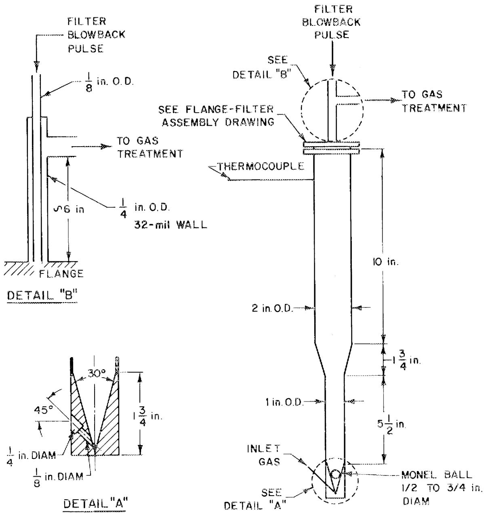  
Fig.1. Schematic Diagram of the 0.94-in.-ID Fluidized-Bed Reactor with Blowback System.

ORNL DWG 69-88

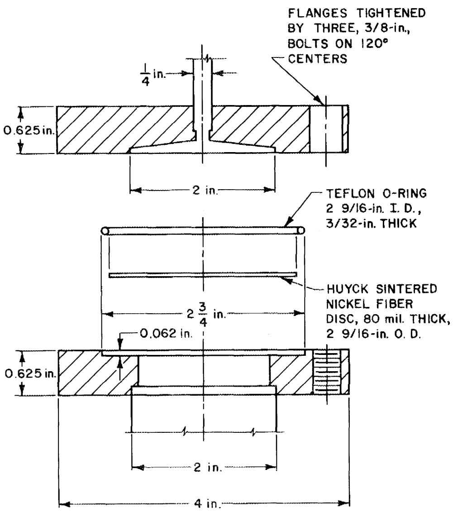  
Fig. 2. Standard Flange-Filter Assembly.

The bottom plates were recessed within the heated tubes to prevent a temperature decrease at the bottom of the trap. In each of these traps, the gas entered the trap at the bottom and exited at the top through a flange-filter assembly.

The cold trap, which was used to collect the UF₆ product, consisted of a 6-in.-long, 2-in.-OD nickel tube fitted with a baffle that forced the gas to circulate to within 2 in. of the bottom. The trap was cooled by immersion in dry ice-trichloroethylene.

In the first four hot-cell tests, the plutonium trap consisted of a straight tube having a thermocouple well that entered the side about halfway down the tube; here, the two NaF beds were supported on each side of the thermocouple well. The disadvantage of this type of trap was the large temperature differential (50 to $100^{\circ}\mathrm{C}$ ) across the section of NaF on the gas inlet side. The NaF trap used to sorb plutonium in the most recent tests is shown in Fig. 3. The double-wall design resulted in a very small temperature gradient in the inner tube. Two 2.5-g portions of 12- to 20-mesh NaF, separated by a plug of 3-mil nickel wire, were inserted into this inner tube. The highest temperature occurred at the bottom of the inner tube. The decreases in temperature over the first and second sections were about $1^{\circ}\mathrm{C}$ and about $4^{\circ}\mathrm{C}$ , respectively. Thus, this trap could be operated with an essentially constant sorption temperature; it was heated with a clamshell furnace.

Unheated $1/4$ -in.-OD Kel-F lines served to connect the fluidized-bed reactor, gas supplies, and the various traps. No valves were used inside the cell except on the uranium product cold trap.

Off-gas from the process was passed through the scrubber shown in Fig. 4. The $\underline{\mathrm{BrF}}_5$ and fluorine streams were scrubbed with $2\textbf{N}$ KOH--0.2 N KI solution in $100\%$ excess, and the gas resulting from the oxidation step was scrubbed with water. Representative samples of the scrubber effluent were withdrawn automatically by means of the solenoid valve and timer located at the bottom of the column.

Gas flows into the cell were monitored with differential pressure transmitters (Foxboro 15A-LS2). Nitrogen, oxygen, and fluorine were

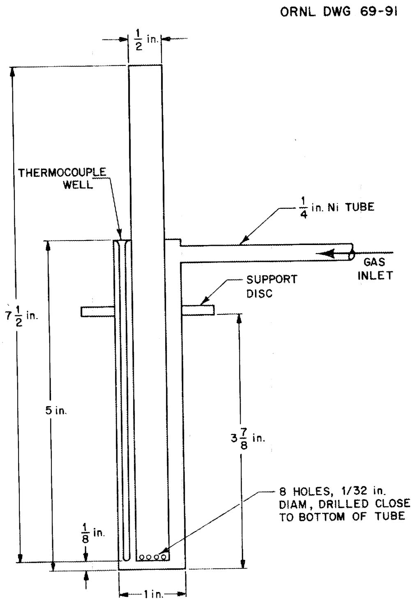  
Fig. 3. Plutonium Trap Used in Most Recent Tests.

ORNL DWG 69-86

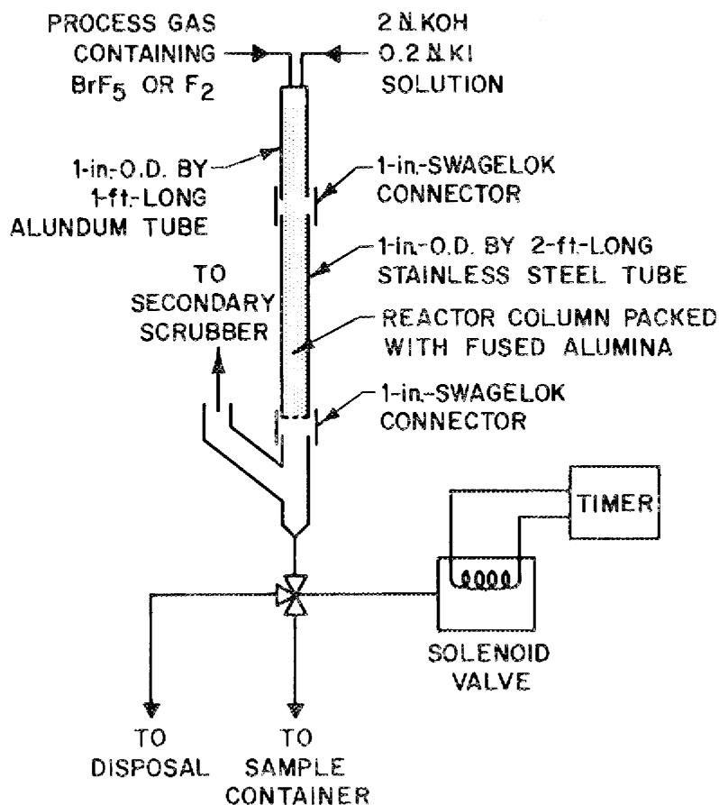  
Fig. 4. Fluorine and BrF $_5$ Disposal Apparatus Used in Hot-Cell Experiments.

piped through ambient-temperature tubing into the cell. Bromine pentafluoride gas was generated by heating a cylinder of liquid $\mathrm{BrF}_5$ to about $50^{\circ}\mathrm{C}$ and passing it through tubing and differential pressure transmitters heated above this temperature. Before entering the cell, the $\mathrm{BrF}_5$ gas was diluted with nitrogen to eliminate the necessity of heating the lines inside the cell. Bromine trifluoride was produced at the inlet of the fluidized-bed reactor by mixing appropriate amounts of bromine and $\mathrm{BrF}_5$ . Bromine was generated by passing nitrogen through a bromine bubbler maintained at $0^{\circ}\mathrm{C}$ .

# 2.2 Sampling Procedure

Sampling the solid traps, except the plutonium trap, was done by passing the solids through a funnel with an inverted "Y" bottom until a sample of convenient size (about $7\mathrm{g}$ except in the case of the fluidized-bed sample, which was $3.5\mathrm{g}$ ) was obtained. Two samples from each trap were submitted for analysis, and the results were averaged. The funnels used for this procedure were washed prior to the sampling step; and, in each run, the "coldest" traps were sampled first as a further precaution against cross-contamination. Such sampling was unnecessary for the plutonium trap since each section of the trap contained only about $2.5\mathrm{g}$ .

The filter of the fluidized-bed reactor was leached after each run with $100\mathrm{ml}$ of $2\mathrm{~NAl(NO_3)_3}$ solution, and a sample of the leachate was submitted for analysis. The $\mathrm{UF}_6$ product in the cold trap was hydrolyzed with 200 to 250 ml of $1\mathrm{~NAl(NO_3)_3}$ . This hydrolysis was started at either $30^{\circ}\mathrm{C}$ or $-80^{\circ}\mathrm{C}$ , and then the temperature was increased to $100^{\circ}\mathrm{C}$ for about 30 min. A more complete recovery of the uranium in the solution was achieved when hydrolysis was begun at $30^{\circ}\mathrm{C}$ . A sample of the resulting solution and a sample of a water rinse of the cold trap was submitted for analysis.

Samples of the scrub solutions were also submitted for analysis.

# 2.3 Experimental Materials

All metal vessels, except the scrubber, were fabricated of nickel; the scrubber was constructed of Alundum and stainless steel.

The heat-transfer medium in the fluidized-bed reactor consisted of $50\mathrm{g}$ of 48- to 100-mesh Alcoa T-61 alumina.

The fuel charge, which consisted of about $34\mathrm{g}$ of $\mathrm{UO}_2$ from the Yankee reactor, had been irradiated to a burnup of about $34,000\mathrm{Mwd}/$ metric ton and cooled for two years. The estimated composition of this fuel, as calculated by Merriman's program, $^1$ is given in Table 1. In general, these values were used in the calculations presented in this report. The isotopic analysis of the plutonium in this fuel, as determined by mass spectrographic methods, is given in Table 2.

The NaF used in the traps (except the plutonium trap) consisted of 1/8-in. right circular cylinders obtained from the Harshaw Chemical Company. In the plutonium trap, broken pellets or fused NaF, 12 to 20 mesh in each case, were used.

Part of the $\mathrm{MgF}_2$ used in the technetium-neptunium trap was obtained from the Paducah Gaseous Diffusion Plant; the remainder was prepared at ORNL by fluorination of $\mathrm{MgSO}_4$ .

# 3. RESULTS AND DISCUSSION

# 3.1 Oxidation of Fuel

Before the start of the oxidation, the fuel was first heated to $450^{\circ}\mathrm{C}$ in fluidizing nitrogen. The oxidation treatment with 20 vol $\%$ O $_2$ in nitrogen lasted for 2 hr at $450^{\circ}\mathrm{C}$ and resulted in pulverization of the fuel (see Fig. 5). During the heatup period and the oxidation, about $95\%$ of the tritium was evolved. $^2$ The initial tritium content was determined by dissolving a 6-g batch of fuel in nitric acid and analyzing the solution and off-gas for tritium; $^2$ the amount of tritium remaining after oxidation was determined similarly. No significant amounts of other materials, except the rare gases (which were not determined), escaped from the fluidized-bed reactor.

Table 1. Estimated Composition of ${34} - g$ Charge ${}^{a}$ of Yankee ${\mathrm{{UO}}}_{2}$ Fuel   

<table><tr><td>Element</td><td>mg</td><td>dis/min</td></tr><tr><td>U</td><td>28,600</td><td></td></tr><tr><td>Pu</td><td>374b</td><td></td></tr><tr><td>Np</td><td>2.5</td><td></td></tr><tr><td>Rb</td><td>10.4</td><td>~0</td></tr><tr><td>Sr</td><td>25.0</td><td>4.72 x 1012</td></tr><tr><td>Zr</td><td>106.5</td><td>2.25 x 1010</td></tr><tr><td>Nb</td><td>6.29 x 10-4</td><td>5.01 x 1010</td></tr><tr><td>Mo</td><td>103.5</td><td>~0</td></tr><tr><td>Te</td><td>26.4</td><td>109</td></tr><tr><td>Ru</td><td>65.2</td><td>8.44 x 1012</td></tr><tr><td>Te</td><td>17.7</td><td>3.43 x 1011</td></tr><tr><td>Cs</td><td>114.3</td><td>7.65 x 1012</td></tr><tr><td>Ce</td><td>73.8</td><td>1.03 x 1013</td></tr><tr><td>3Hb</td><td></td><td>1.15 x 1011</td></tr></table>

aFuel had been irradiated to a burnup of 34,000 Mwd/metric ton and cooled for two years.   
b From unpublished data of J. H. Goode, ORNL.

Table 2. Isotopic Analysis of Plutonium ${}^{a}$ in Yankee ${\mathrm{{UO}}}_{2}$ Fuel   

<table><tr><td>Isotope</td><td>At. %</td></tr><tr><td>238</td><td>2.36</td></tr><tr><td>239</td><td>57.75</td></tr><tr><td>240</td><td>20.60</td></tr><tr><td>241</td><td>13.78</td></tr><tr><td>242</td><td>5.52</td></tr><tr><td>244</td><td>&lt; 0.001</td></tr></table>

$\mathrm{dis}(\alpha) / (\min)(\mathrm{mgPu}) =$ 10.44 x 108 (calculated).

# 3.2 Volatilization of Uranium with BrF 5

The uranium volatilization step is shown in Fig. 6. In this step, which was carried out at $300^{\circ}\mathrm{C}$ , the treatment typically consisted of exposure to 5 vol $\%$ BrF $_5$ for 1 hr, $10\%$ BrF $_5$ for 2 hr, and $5\%$ BrF $_3$ for 0.5 hr; in each case, the BrF $_5$ or BrF $_3$ was diluted with nitrogen. After the gas containing the volatile fission product fluorides, UF $_6$ , bromine, and bromine fluorides leaves the fluidized-bed reactor, it enters the bottom of the CRP (complexable reaction products) trap, where it is mixed with excess fluorine to convert the bromine to BrF $_5$ . This prevents loss of uranium in the CRP trap via formation of non-volatile UF $_5$ complexes. In our experiments, an average of about $0.02\%$ of the uranium was found in the CRP trap. Most of the volatile fission product fluorides are removed in this trap. The gas then passes through the uranium sorption traps where uranium, technetium, and some molybdenum are sorbed. Finally, the gas is routed to the scrubber, where the fluorine and bromine fluorides are contacted with KOH-KI solution.

Treatment with $\mathbf{BrF}_3$ for a brief period at the end of the uranium volatilization step has been found to be desirable for the cleanup of

ORNL DWG. 69-92

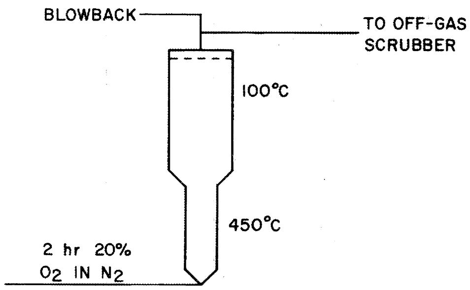  
Fig. 5. Oxidation Flowsheet.

ORNL DWG 69-1268

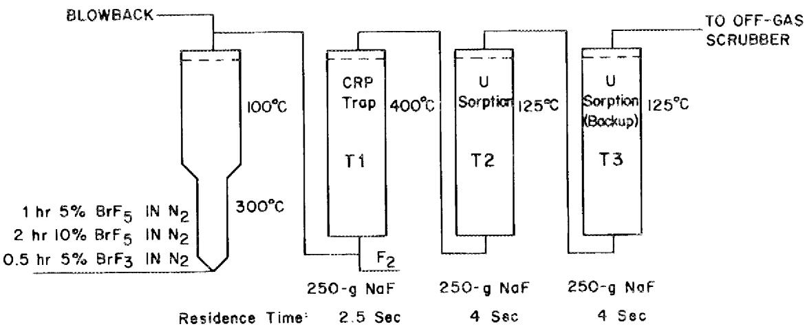  
Fig. 6. Uranium Volatilization Flowsheet.

uranium. In Fig. 7 the amount of uranium found in the fluorination step (subsequent to $\mathsf{BrF}_5$ - $\mathsf{BrF}_3$ treatment) is plotted vs the $\mathsf{BrF}_3$ treatment time. When no $\mathsf{BrF}_3$ treatment was used after the $\mathsf{BrF}_5$ volatilization, about $3\%$ ( $\sim 960$ mg) of the uranium charge was left in the fluidized-bed reactor. However, when a 0.5-hr treatment with $5\%$ $\mathsf{BrF}_3$ in $\mathsf{N}_2$ was used, about $80\%$ of this residual uranium was removed. The utility of $\mathsf{BrF}_3$ lies in its ability to fluorinate uranium at a lower temperature than $\mathsf{BrF}_5$ , thereby allowing cleanup of the disengaging system, filter, and lines. Bromine trifluoride also leaves less uranium on the alumina. The very high point at 3 hr exposure is probably due to an experimental error or some analytical error.

Since ruthenium fluoride was the major, high-activity, volatile fission product fluoride present in our experiments, it was studied more extensively than the other fission product fluorides. Figure 8 is a semilogarithmic plot showing the amount of ruthenium that was volatilized during the fluorine treatment vs the equivalent number of liters of $\mathrm{BrF}_5$ passed through the bed during the uranium volatilization step. (Here, one volume of $\mathrm{BrF}_3$ is considered to be equal to 0.6 volume of $\mathrm{BrF}_5$ .) This plot should be linear if the volatilization of ruthenium is a first-order reaction with respect to the amount of ruthenium remaining in the fluidized bed. This is seen to be approximately true. The importance of these data lies in the information they provide concerning the handling of a plutonium stream containing ruthenium. It would be advantageous for the ruthenium to be volatilized with the uranium. In our experiments, about $90\%$ of the ruthenium was volatilized with 6.7 liters of $\mathrm{BrF}_5$ ; this required 33 min of treatment with 10 vol.% $\mathrm{BrF}_5$ in nitrogen. For every additional 33-min period of $\mathrm{BrF}_5$ treatment, the ruthenium DF was increased by a factor of 10.

Ruthenium-106 was the only significant gamma emitter found in the CRP trap when the trap was counted with a lead-shielded Geiger tube. Figure 9 shows a plot of the fraction of the gamma activity vs the equivalent fluorine volume. In this plot one volume of $\mathsf{BrF}_5$ is assumed to be equal to 2.5 volumes of $\mathsf{F}_2$ , and one volume of $\mathsf{BrF}_3$ is considered equivalent to 1.5 volumes of $\mathsf{F}_2$ . When an all-fluorine flowsheet was

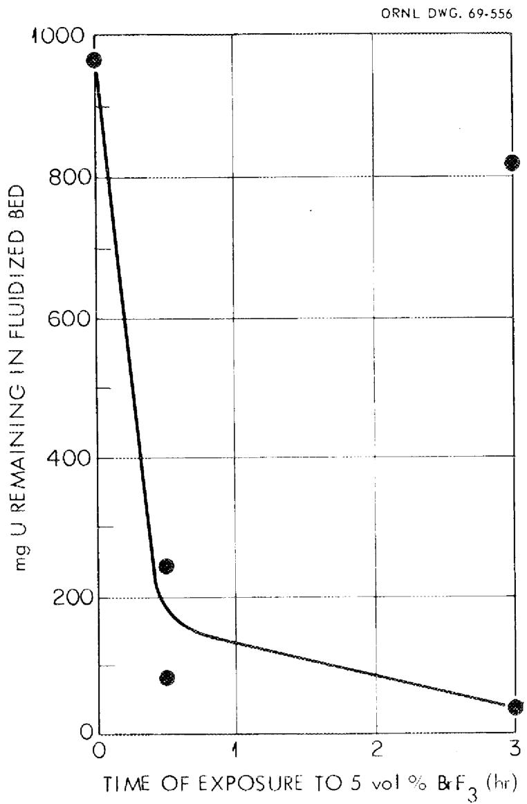  
Fig. 7. Residual Uranium vs BrF3 Exposure.

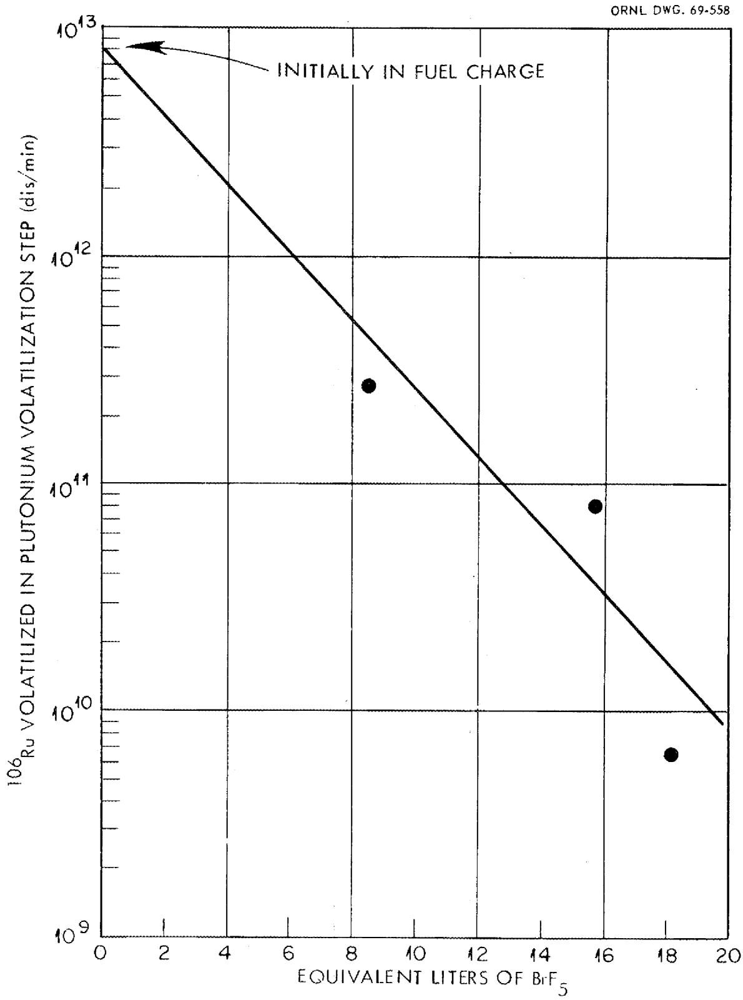  
Fig. 8. 106 Ru Found in Pu Volatilization vs Exposure to BrF5 in Uranium Volatilization Step.

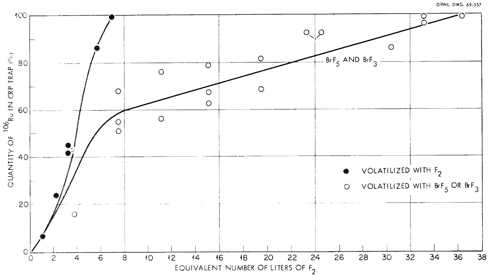  
Fig. 9. Rate of Appearance of $^{106}\mathrm{Ru}$ in CRP Trap After Volatilization with BrF $_5$ , BrF $_3$ , or F $_2$ .

tested, the ruthenium activity reached its maximum very rapidly (see Fig. 9). With $\mathrm{BrF}_5$ , an initial rapid increase was followed by a slow linear increase. A likely explanation for the slow linear increase is the transpiration of a compound having a relatively low volatility. Assuming that this compound is $\mathrm{RuF}_5$ , the results indicate that the temperature of transpiration is about $55^{\circ}\mathrm{C}$ using the reported vapor pressure of $\mathrm{RuF}_5$ and knowing the weight of ruthenium being picked up by the trap. This temperature corresponds to that of the line between the fluidized-bed reactor and the CRP trap, and indicates that the $\mathrm{RuF}_5$ is deposited there. These indications were confirmed by serious radiation damage to this line and by radiochemical analysis, which showed that, at the end of the volatilization step, about $20\%$ of the total ruthenium could be found on the inside of the line. Visual observation showed that the line used during the all-fluorine test was only slightly discolored, indicating that only a small quantity of ruthenium was deposited in it. Therefore, it seems likely that treatment with $\mathrm{BrF}_5$ produces a greater quantity of low-volatility ruthenium compounds than fluorine treatment does.

Fission product DF's for the CRP trap are listed in Table 3. In the first "hot" run (run 3) the DF's (except for cesium) were each about 2000. These values are quite high, considering that the residence time for the gas in contact with the $400^{\circ}\mathrm{C}$ NaF was only about 2.5 sec.

Table 3. Fission Product Decontamination Factors for the CRP Trap   

<table><tr><td rowspan="2">Run No.</td><td colspan="4">Decontamination Factors</td></tr><tr><td>Gross γ</td><td>Gross β</td><td>106 Ru</td><td>Cs</td></tr><tr><td>3</td><td>1790</td><td>2610</td><td>2000</td><td>2.2</td></tr><tr><td>4</td><td>6.1</td><td>5.8</td><td>6.4</td><td>~ 4.0</td></tr><tr><td>5</td><td>43</td><td>44</td><td>30</td><td>1.8</td></tr><tr><td>6</td><td>75</td><td>33</td><td>92</td><td>3.1</td></tr></table>

In later runs, despite the sampling precautions mentioned earlier, the DF's decreased significantly. The most likely explanation for the lower values is cross-contamination since all of the higher DF's decreased to about the same level. We believe that the DF's from the first hot run (No. 3) are "true" values (i.e., they are the values that could be expected in the absence of cross-contamination).

One undesirable result of the BrF5 treatment was the small amount of plutonium found in the CRP trap in each run. Table 4 compares the percentage of the total plutonium found on this trap with the percentage of the total Sr found there. It was felt that these quantities should be about equal since neither plutonium nor Sr is expected to be volatilized by BrF5. Surprisingly, the loss of plutonium is about ten times that of Sr; one possible explanation for this is that the PuF4 particles are considerably smaller than the SrF2 particles and are, consequently, preferentially blown through the filter. The presence of plutonium in the CRP trap was confirmed by differential pulse-height analysis.

Table 4. Plutonium Entrainment, as Compared with 90Sr Entrainment, by BrF $5^{-}\mathrm{N}_{2}$ Stream   

<table><tr><td>Run No.</td><td>90Sr Transferred to CRP Trap (% of total 90Sr)</td><td>Pu Transferred to CRP Trap (% of total Pu)</td><td>Pu/90Sr Percentage Ratio</td></tr><tr><td>3</td><td>2.4 x 10-2</td><td>0.4</td><td>17</td></tr><tr><td>4</td><td>1.4 x 10-2</td><td>0.1</td><td>7</td></tr><tr><td>5</td><td>1.6 x 10-2</td><td>0.14</td><td>9</td></tr><tr><td>6</td><td>3.0 x 10-2</td><td>0.25</td><td>8</td></tr></table>

# 3.3 Desorption of Uranium

Desorption of the uranium was accomplished by connecting the main uranium sorption trap (T2) to a $400^{\circ}\mathrm{C}$ NaF polishing trap $(\mathbb{T}^{4})$ , a $100^{\circ}\mathrm{C}$ $\mathrm{MgF}_{2}$ trap (T5), and a cold trap cooled to $-80^{\circ}\mathrm{C}$ . This arrangement is shown in Fig. 10. Fluorine was passed through the traps at the rate of about $100\mathrm{ml / min}$ . Reliable values for the fission product DF's for the sorption-desorption are not available because of the small quantities of fission products present and because of the cross-contamination problem mentioned previously. However, overall fission product DF's for the uranium product were obtained, and are listed in Table 5. It appears that DF's of about $10^{6}$ are easily obtained for many contaminants with this process. Molybdenum was partially removed by virtue of its tendency not to cosorb with uranium during the BrF volatilization step. The plutonium DF's are encouraging since they indicate that the uranium product could be treated as plutonium-free material during subsequent handling.

The technetium DF's for trap 5 are given in Table 6. Four-mesh $\mathrm{MgF}_2$ from the Paducah Gaseous Diffusion Plant was used in the traps for runs 3 and 4. In run 5, we used 12- to 20-mesh material that had been prepared at ORNL by fluorinating $\mathrm{MgSO}_4$ . The smaller particles gave much better results, probably because of their greater external surface area. Contact time was about 15 sec.

The overall uranium material balances (see Table 7) were not satisfactory in all cases. Data in the table suggest that the difficulty may be caused by starting the hydrolysis at a low temperature. The explanation for the uniformly low material balances, except in the case of run 5, is not known.

# 3.4 Volatilization of $\mathsf{PuF}_6$ with Fluorine

In the plutonium volatilization step, the fluidized bed was treated with elemental fluorine, as shown in Fig. 11, to form volatile $\mathrm{PuF}_6$ . In the cold tests and in the first two hot tests (runs 3 and 4), fluorination was started at $300^{\circ}\mathrm{C}$ . After sintering and actual ignition

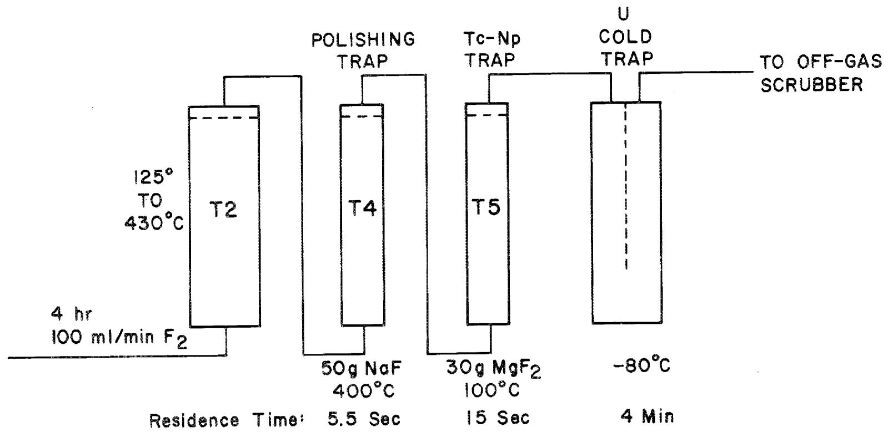  
Fig. 10. Uranium Desorption Flowsheet.

Table 5. Overall Decontamination Factors for the Uranium Product   

<table><tr><td rowspan="2">Run No.</td><td colspan="9">Decontamination Factors</td></tr><tr><td>Gross γ</td><td>Gross β</td><td>106Ru</td><td>Cs</td><td>90Sr</td><td>Total Rare Earths</td><td>Tc</td><td>Mo</td><td>Pu</td></tr><tr><td></td><td></td><td>x 104</td><td>x 105</td><td></td><td></td><td></td><td></td><td></td><td>x 106</td></tr><tr><td>3</td><td>1.3 x 106</td><td>4.9</td><td>4.9</td><td>2.6 x 106</td><td>2.9 x 106</td><td>2 x 106</td><td>0.69</td><td>8.3</td><td>4</td></tr><tr><td>4</td><td>1.2 x 105</td><td>3.3</td><td>2</td><td>1.4 x 105</td><td>105</td><td>8 x 104</td><td>0.61</td><td>2.5</td><td>3</td></tr><tr><td>5</td><td>7.7 x 104</td><td>4.7</td><td>7.3</td><td>9.5 x 104</td><td>1.35 x 105</td><td></td><td>2.4</td><td>9.5</td><td>9.7</td></tr></table>

Table 6. Decontamination Factors for Technetium, Using a $100^{\circ}\mathrm{C}$ MgF Trap (Trap 5)   

<table><tr><td>Run No.</td><td>Tc DF</td><td>Mesh Size of MgF2</td></tr><tr><td>3</td><td>1.09</td><td>~4</td></tr><tr><td>4</td><td>1.31</td><td>12 to 20</td></tr><tr><td>5</td><td>2.15</td><td>12 to 20</td></tr></table>

Table 7. Uranium Material Balances   

<table><tr><td rowspan="2">Run No.</td><td rowspan="2">U Charged (g)</td><td colspan="2">Amount U found</td><td rowspan="2">Cold Trap No.</td><td rowspan="2">Total for Cold Trap (%)</td><td rowspan="2">Initial Hydrolysis Temp. (°C)</td></tr><tr><td>(g)</td><td>(%)</td></tr><tr><td>1</td><td>29.6</td><td>26.6</td><td>90</td><td>1</td><td>90</td><td>30</td></tr><tr><td>3</td><td>27.2</td><td>20.4</td><td>75</td><td>2</td><td></td><td>-80</td></tr><tr><td>4</td><td>29.7</td><td>21.7</td><td>73</td><td>2</td><td>95.7</td><td>-80</td></tr><tr><td>5</td><td>28.0</td><td>39.2</td><td>140</td><td>2</td><td></td><td>30</td></tr><tr><td>6</td><td>26.7</td><td>24.9 ± 2</td><td>93.2 ± 7.5</td><td>None</td><td></td><td>No desorption</td></tr><tr><td>7</td><td>26.9</td><td>21.7 ± 0.6</td><td>80.7 ± 2.0</td><td>None</td><td></td><td>No desorption</td></tr></table>

ORNL DWG 69-1267

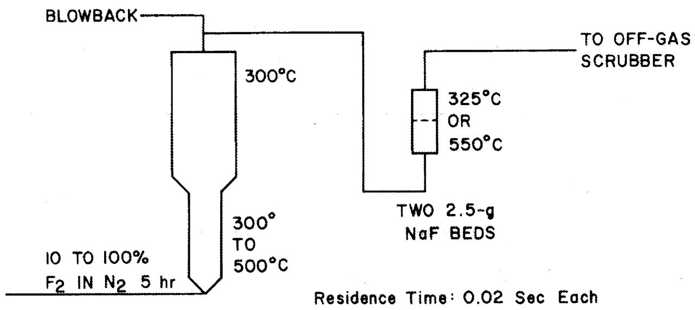  
Fig. 11. Plutonium Volatilization Flowsheet.

of the alumina occurred in runs 3 and 4, respectively, conditions for this step were modified. In the later tests, fluorination was begun at about $200^{\circ}\mathrm{C}$ , with the fluorine concentration (in nitrogen) programmed from 10 to 50 vol $\%$ . The temperature was then increased to $300^{\circ}\mathrm{C}$ over about a 30-min period; 50 vol $\%$ $\mathbf{F}_{2}$ was used. Next, the fluorine concentration was increased to $100\%$ over a subsequent 30-min period. Finally, the temperature was raised to $500^{\circ}\mathrm{C}$ over a 1-hr period and maintained at $500^{\circ}\mathrm{C}$ for 2 hr. The total fluorination program required 5 hr, of which 3.5 hr was at a temperature of $300^{\circ}\mathrm{C}$ or greater. When this program was followed, no sintering of the alumina was observed.

Plutonium is readily removed from the fluorine stream by a very small NaF trap. In our experiments, a 2.5-g NaF trap at $550^{\circ}\mathrm{C}$ sorbed about $99.9\%$ of the plutonium that reached it. The residence time for the gas was only about 0.02 sec.

The major fission product that cosorbed with the plutonium was ruthenium; after ruthenium, cesium was most important. The overall ruthenium and cesium DF's are shown in Table 8. The cesium DF is relatively high (about $10^{4}$ ), and cesium could be easily separated from the plutonium during its removal from the NaF (possibly by dissolution of the NaF in anhydrous HF). Thus ruthenium is likely to be the most troublesome. As was mentioned earlier in connection with the interhalogen flowsheet, the amount of ruthenium that is cosorbed with the

Table 8. Overall Ruthenium and Cesium Decontamination Factors for Plutonium Product   

<table><tr><td>Run No.</td><td>Temp. of Pu Trap (℃)</td><td>106 Ru (dpm/mg Pu)</td><td>Ru DF</td><td>Ratio of DF to DF in Run 3</td><td>134,137Cs (dpm/mg Pu)</td><td>Cs DF</td></tr><tr><td>3</td><td>325</td><td>2.67 x 108</td><td>76</td><td></td><td>6.7 x 107</td><td>273</td></tr><tr><td>4</td><td>325</td><td>1.21 x 109</td><td>17</td><td>0.22a</td><td>≤ 2.7 x 106</td><td>&gt;6.8 x 103</td></tr><tr><td>6</td><td>~550</td><td>3.85 x 106</td><td>5250</td><td>69a</td><td>1.8 x 106</td><td>104</td></tr></table>

${}^{a}$ Ratios expected from the amount of ruthenium found and the difference in trap temperature: 0.306 (run 4) and 49 (run 6). (By Ref. 5)

plutonium can be easily reduced by extensive treatment of the fluidized bed with $\mathrm{BrF}_5$ . Another method for reducing the amount of cosorbed ruthenium would be to operate the plutonium sorption bed at a temperature that is unfavorable for ruthenium sorption; for example, it is known that ruthenium sorption on NaF decreases significantly at temperatures above $500^{\circ}\mathrm{C}$ . However, in an experiment in which the NaF was heated to about $615^{\circ}\mathrm{C}$ , severe sintering was observed; this was probably the result of the formation of the $\mathrm{NaF - PuF_4}$ eutectic. Thus, $550^{\circ}\mathrm{C}$ seems to be about the highest usable temperature. At $550^{\circ}\mathrm{C}$ , the ruthenium DF (6.0) achieved in the plutonium trap was four times that obtained at $325^{\circ}\mathrm{C}$ (1.5). Thus, for plutonium decontamination the best recommendation is to fluorinate for a fairly long period of time with $\mathrm{BrF}_5$ and to operate the plutonium trap at about $550^{\circ}\mathrm{C}$ .

Plutonium material balances were not uniformly good (see Table 9). In run 1, which was a "cold" run, the exact plutonium content (262 mg) was known. A $93\%$ material balance is considered acceptable for this quantity of plutonium. However, material balances for runs 3 and 4 are poor. No material balance is available for run 5 because the plutonium trap was lost. Material balances for runs 6 and 7 are quite satisfactory.

Table 9. Plutonium Material Balance ${}^{a}$   

<table><tr><td rowspan="2">Run No.</td><td rowspan="2">Pu Charged (mg)</td><td colspan="2">Pu Found in Fluidized-Bed Reactor</td><td colspan="2">Total Pu Found</td></tr><tr><td>mg</td><td>% of Pu Charged</td><td>mg</td><td>% of Pu Charged</td></tr><tr><td>1</td><td>262</td><td>6.6</td><td>2.5</td><td>244.1</td><td>93.2</td></tr><tr><td>3</td><td>355</td><td>70.4</td><td>18.9</td><td>282</td><td>79.4</td></tr><tr><td>4</td><td>388</td><td>22.9</td><td>5.6</td><td>302</td><td>77.8</td></tr><tr><td>6</td><td>349</td><td>104</td><td>28.4</td><td>396.7</td><td>113.7</td></tr><tr><td>7</td><td>352</td><td>208 ± 40</td><td>56.3 ± 11</td><td>333.3</td><td>94.5 ± 11</td></tr></table>

${}^{a}$ Based on analyses of plutonium in fuel (11 mg of Pu per g of fuel) by J. Goode,except in run No. 1 where plutonium was weighed out.

# All-Fluorine Flowsheet

An alternative to the interhalogen flowsheet is the all-fluorine flowsheet in which both the uranium and plutonium are volatilized, as $\mathrm{UF}_6$ and $\mathrm{PuF}_6$ , by using fluorine. In one possible version of this flow-sheet the plutonium is removed from the fluorine stream by a small high-temperature NaF trap located immediately behind the fluidized-bed reactor. The remaining gas passes through the traps for the uranium volatilization step, as discussed previously.

In the hot-cell test of this flowsheet, the plutonium trap was operated at about $620^{\circ}\mathrm{C}$ . Unfortunately, before the run was completed, this trap plugged, apparently due to the formation of a molten $\mathrm{NaF - PuF}_{4}$ eutectic salt. At this point only about $35\%$ of the plutonium had been volatilized; about two-thirds of the $106\mathrm{Ru}$ and almost all the uranium had been volatilized when the run was terminated. Based on this partial run, we can make the following statements:

(1) A more effective decontamination of plutonium from ruthenium was achieved than was expected.   
(2) An overall ruthenium DF of $2^{49}$ was obtained; about 200 of this value is attributable to nonsorption of ruthenium in the plutonium trap.   
(3) Routine operation of the trap at $620^{\circ}\mathrm{C}$ would probably be difficult because of the plugging and sintering that would be encountered.

A previous run using the interhalogen flowsheet with a plutonium trap at about $550^{\circ}\mathrm{C}$ gave a $^{106}\mathrm{Ru}$ DF of only about 4.0; whether the higher DF in the all-fluorine case is the result of the presence of a larger amount of ruthenium (about 60 mg as compared with about 0.6 mg) or to the higher temperature is not known.

# 3.5 Recovery of Plutonium from NaF Trap

After the $\mathrm{PuF}_6$ is collected on NaF, the plutonium must be recovered from the complex that is formed. One possible method consists of aqueous dissolution followed by ion exchange treatment. Another method involves dissolution of the NaF with anhydrous HF, leaving $\mathrm{PuF}_{4}$ as an insoluble residue; this treatment also gives a significant additional ruthenium DF. The second method was tested with the plutonium trap from run 6. As a pretreatment the NaF was first fused in a platinium crucible at about $1050^{\circ}\mathrm{C}$ . A ruthenium DF of about 2 was obtained as a result of ruthenium plating on the crucible. [Use of a more-reactive crucible (e.g., nickel) would probably have given a higher DF.] When the NaF was dissolved in anhydrous HF, an additional ruthenium DF of 2.6 was obtained.

# 4. CONCLUSIONS

Based on the hot-cell work, the fluidized-bed volatility process appears to be chemically feasible. Care must be exercised at the start of the fluorination step to prevent sintering of the alumina bed. Larger equipment would probably present an even greater problem in this respect since the heat transfer would be less effective. Ruthenium contamination of the uranium product should be low since ruthenium DF's of about $10^{6}$ were found in the hot-cell experiments. Ruthenium contamination of the plutonium product can be reduced by removing most of the ruthenium with the uranium during the BrF 5 treatment. A more effective separation of plutonium and ruthenium is achieved by operating the plutonium trap at about 550 to $580^{\circ}\mathrm{C}$ (instead of at $325^{\circ}\mathrm{C}$ ).

# 5. REFERENCES

1. A. A. Chilenskas, Argonne National Laboratory, personal communication.   
2. J. H. Goode, ORNL, unpublished data.   
3. D. O. Rester, Co-op Student at ORNL from Mississippi State University, personal communication.   
4. H. A. Bernhardt, et al., The Preparation of Ruthenium Pentafluoride and the Determination of Its Melting Point and Vapor Pressure, ABCD-2390 (Nov. 1948).   
5. E. D. Nogueira and G. I. Cathers, Sorption of Fission Product (Niobium, Ruthenium) Fluorides on Sodium Fluoride, ORNL-TM-2169 (in press).   
6. Test performed by M. R. Bennett, ORNL.

# DISTRIBUTION

# Internal

1. R.E.Adams

2. G. M. Adamson

3. E. D. Arnold

4. M. R. Bennett

5. G. B. Berry

6. R.E.Blanco

7. J. O. Blomeke

8. E. S. Bomar

9. W. D. Bond

10. G.E. Boyd

11. R.A. Bradley

12. R.E.Brooksbank

13. K. B. Brown

14. F. R. Bruce

15. W. D. Burch

16. W.H.Carr

17. G. I. Cathers

18. W. L. Carter

19. J. M. Chandler

20. S. D. Clinton

21. C. F. Coleman

22. J.H.Coobs

23. L. T. Corbin

24. D. J. Crouse

25. F. L. Culler, Jr.

26. J. E. Cunningham

27. F. L. Daley

28. W. Davis, Jr.

29. D. E. Ferguson

30. L M. Ferris

31. B. C. Finney

32. R.B.Fitts

33. J.H.Frye, Jr.

34. F.J.Furman

35. J.H.Goode

36. A. T. Gresky

37. W. R. Grimes

38. W. S. Groenier

39. P. A. Haas

40. R.G.Haire

41. J. P. Hammond

42. W. O. Harms

43. C. C. Haws

44. D. E. Horner

45. F.J.Hurst

46. A. R. Irvine

47. F. A. Kappelmann

48. P.R.Kasten

49. A. H. Kibbey

50. F.J.Kitts

51. C. E. Lamb

52. J. M. Leitnaker

53. R.E.Leuze

54. C. S. Lisser

55. M. H. Lloyd

56. J. T. Long

57. A. L. Lotts

58. R. S. Lowrie

59. R. E. MacPherson, Jr.

60-62. J.C.Mailen

63. J. P. McBride

64. R.W. McClung

65. K. H. McCorkle

66. W. T. McDuffee

67. A. B. Meservey

68. R.P.Milford

69. J. G. Moore

70. L. E. Morse

71. J. P. Nichols

72. E. L. Nicholson

73. K.J.Notz

74. C.H.Odom

75. A. R. Olsen

76. J.R.Parrott

77. W.A.Pate

78. P. Patriarca

79. W. L. Pattison

80. W.H. Pechin

81. J.W. Prados

82. R. B. Pratt

83. R.H.Rainey

84. J. M. Robbins

85. M. W. Rosenthal

86. A. D. Ryon

87. J. M. Schmitt

88. J. L. Scott

89. J. D. Sease

90. L. B. Shappert

91. Moshe Siman-Tov

92. J. W. Snider

93. H. F. Board   
94. W.C.T.Stoddart   
95. D. A. Sundberg   
96. O.K. Tallent   
97. E. H. Taylor   
98. R.E.Thoma   
99. D. B. Trauger   
100. W.E.Unger   
101. V.C.A.Vaughen   
102. T. N. Washburn   
103. C. D. Watson   
104. A. M. Weinberg   
105. J.R.Weir

106. M.E.Whatley

107. W.M.Woods

108. R.G.Wymer

109. 0. 0. Yarbro

110. Document Reference Section

113. Central Research Library

114-115. ORNL Y-12 Technical Library

116-118. Laboratory Records

119. Laboratory Records-RC

120. ORNL Patent Office

121. Laboratory and University Div.

122-136. DTIE

# External

137. Librarian, AAEC, Res. Estb., Private Mail Bag, Sutherland, N.S.W., Australia, Attn: R.C. Cairns and L. Keher   
138. AECL, Chalk River, Canada; Attn: C. A. Manson, I. L. Ophel   
139. AERE, Harwell, England; Attn: H. J. Dunster   
140. AERE, Harwell, England; Attn: J. R. Grover   
141. AERE, Harwell, England; Library (Directorate)   
142. AERE, Harwell, England; Chemistry Library, Attn: W. Wild   
143. AERE, Harwell, England; Chemical Engineering Library, Attn: R. H. Burns, K. D. B. Johnson, W. H. Hardwick   
144. A. Amorosi, ANL, IMFBR Program Office   
145. R. H. Ball, RDT-OSR, P. O. Box 2325, San Diego, California 92112   
146. R. G. Barnes, General Electric Company, 283 Brokaw Road, Santa Clara, California 95050   
147. C. B. Bartlett, AEC, Washington   
148. Franc Baumgartner, Professor fur Radiochemie, Universitat Heidelberg, Kernforschungszentrum, Karlsruhe, 75 Karlsruhe, Postfash 947, West Germany   
149. W. G. Belter, AFC, Washington   
150. D. E. Bloomfield, Pacific Northwest Laboratory, Richland, Washington   
151. R. A. Bonniaud, Commissariat à L'Energie Atomique, Centra D'Etudes Nucleaires de Fontenay-aux-Roses, Boite Postale No. 6, Fontenay-aux-Roses, France   
152. S. H. Brown, Manager, New Projects Dept., National Lead Company, 111 Broadway, New York, New York   
153. J. A. Buckham, Idaho Nuclear Corp., Idaho Falls, Idaho   
154. Leslie Burris, Jr., ANL   
155. M. Benedict, Massachusetts Institute of Technology   
156. Andre Chesne, Centre d'Etudes Nucleaire, Fontenay-aux-Roses, Seine, 90, France   
157. C. W. Christenson, IASL   
158. A. Chilenskas, Argonne National Laboratory   
159. P. Clark, AEC, Washington   
160. L. J. Colby, Jr., AEC, Washington

161. C. R. Cooley, Pacific Northwest Laboratory, P. O. Box 999, Richland, Washington   
162. D. F. Cope, RDT Site Office (ORNL)   
163. E. A. Coppersinger, Pacific Northwest Laboratory, Richland, Washington   
164. J. Crawford, AEC, Washington   
165. G.W.Cunningham，AEC，Washington   
166. C. B. Deering, AEC-ORO   
167. Paul Dejonghe, CEN, Boeretang, 200, Mol, Belgium   
168. W. Devine, Jr., Production Reactor Division, P. O. Box 550, Richland, Washington 99352   
169. E. W. Dewell, Babcock & Wilcox, Lynchburg, Virginia   
170. Stanley Donelson, Gulf General Atomic, P. O. Box 608, San Diego, California   
171. Euratom, Casella Postale No. 1, Ispra, Italia; Attn: M. Lindner   
172. Eurochemical, Mol, Belgium; Attn: Eurochemical Library   
173. Yehuda Feige, Minister of Defense, AEC, Rehovoth, Israel   
174. Philip Fineman, Argonne National Laboratory, East Area EBR-2, National Reactor Testing Station, Scoville, Idaho   
175. S. Freeman, Mound Laboratory, Bldg. A, Room 155, Miamisburg, Ohio 45342   
176. J. C. Frye, State Geological Survey Division, Urbana, Illinois   
177. W.P. Gammill, AEC, Washington   
178. Ray Garde, Los Alamos   
179. R. M. Girdler, E. I. du Pont, SRL   
180. Simcha Golan, Atomics International, Canoga Park, California   
181. J. J. Goldin, Mound Laboratory, Bldg. A, Room 155, Miamisburg, Ohio 45342   
182. A. J. Goldjohn, Gulf General Atomic, P. O. Box 608, San Diego, California   
183. R. H. Graham, Gulf General Atomic, San Diego, California   
184. J. S. Griffo, AEC, Washington   
185. H. J. Groh, E. I. du Pont, Savannah River Laboratory   
186. Norton Haberman, RDT, AEC, Washington   
187. D. R. de Halas, Pacific Northwest Laboratory, Richland, Washington   
188. P. S. Holstead, RDT-OSR, P. O. Box 550, Richland, Washington   
189. C. H. Ice, E. I. du Pont, SRL   
190. Michio Ichikawa, Tokai Refinery, Atomic Fuel Corp., Tokai-Mura, Ibaraki-Ken, Japan   
191. C. J. Jouannaud, Fuel Reprocessing Plant, CEN, B.P. No. 106, 30-Bagrwls/cege, Marcoule, France   
192. K. K. Kennedy, AEC, Idaho Operations Office, P. O. Box 2108, Idaho Falls, Idaho 83401   
193. A. S. Kertes, The Hebrew University, Jerusalem, Israel   
194. Gerard M. K. Klinke, Const. Dept., Min. of Fed. Property, Bad Godesberg, West Germany   
195. Christian Josef Krahe, Scientific Member, Reprocessing Nuclear Fuels Section, Chemical Technology Division, Juelich Nuclear Research Center, Juelich, Germany   
196. Leopold Kuchler, Farbwerke Hoechst AG, Frankfurt (M) Hoechst, Germany   
197. W.J. Larkin, AEC-ORO   
198. F. Laude, Commissariat à L'Energie Atomique, Centra D'Etudes Nucleaires de Fontenay-aux-Roses, Boite Postale No. 6, Fontenay-aux-Roses, France

199. S. Lawroski, Argonne National Laboratory   
200. R. E. Lerth, Pacific Northwest Laboratory   
201. W. H. Lewis, Vice President, Nuclear Fuel Services, Inc., Wheaton, Maryland 20902   
202. T. McIntosh, AEC, Washington   
203. H. A. C. McKay, UKAEA, Harwell, Berks, United Kingdom   
204. W. H McVey, AEC, Washington   
205. S. Marshall, National Lead Company of Ohio   
206. A. R. Matheson, Gulf General Atomic, P. O. Box 608, San Diego, California   
207. Ken Mattern, AEC, Washington   
208. E. Lopez-Mechero, Eurochemical, Research Dept., Mol, Belgium   
209. R. L. Morgan, AEC-SROO   
210. R. I. Newman, Allied Chemical Corp., General Chemical Div., P. O. Box 405, Morristown, New Jersey 07960   
211. Eduardo D. Nogueira, Seccion de Combustibles Irradiados, Junta de Energia Nuclear, Ciudad Universitaria, Madrid-3, Spain   
212. R. E. Norman, ORNL (GGA employee)   
213. Laboratory and University Division, ORO   
214. D. A. Orth, E. I. du Pont, Savannah River Plant, Aiken, South Carolina   
215. R.E. Pahler, AEC, Washington   
216. F. L. Parker, Vanderbilt University, Nashville, Tennessee   
217. N. Parkinson, Experimental Reactor Establishment, UKAEA, Dounreay, Scotland   
218. Baldomero Lopez Perez, Doctor en Quimica Ind., Centro de Energia Nucl., Juan Vigon, Ciudad University, Madrid-3, Spain   
219. R. L. Philippone, RDT, ORNL Site Rep., AEC   
220. A. M. Platt, Pacific Northwest Laboratory, P. O. Box 999, Richland, Washington   
221. W. H. Reas, General Electric Co., Vallecitos Laboratory, Pleasanton, California   
222. W. H. Regan, AEC, Washington   
223. P.J. Regnaut, CEN, Fontenay-aux-Roses, Paris, France   
224. R.F. Reitemeier, AEC, Washington   
225. C. W. Richards, AEC, Canoga Park, California   
226. I. C. Roberts, AEC, Washington   
227. Theodore Rockwell III, Chariman, AIF Safety Task Force, MPR Associates, Inc., 815 Connecticut Avenue, N.W., Washington, D.C. 20006   
228. O. T. Roth, AEC, Washington   
229. Bruce L. Schmalz, Atomic Energy Commission, P. O. Box 2108, Idaho Falls, Idaho 83401   
230. A. Schneider, Allied Chemical Corp., Industrial Chemicals Div., P. O. Box 405, Morristown, New Jersey 07960   
231. W. F. Schueller, Technical Manager, BMWF Scientific Research, 7501 Leopaldschafen, Karlsruhe, Germany   
232. Harry S. Schneider, AEC, Washington   
233. Giancarlo Scibona, Centro di Studi Nucleari della Casaccia, Rome, Italy   
234. Jitender D. Sehgel, Bombay, India   
235. M. Selman, Nuclear Materials and Equipment Corp., Apollo, Pennsylvania 15613

236. J. J. Shefcik, General Dynamics, San Diego, California   
237. E. B. Sheldon, E. I. du Pont, SRL   
238. Abou Shimozato, Nucl. Reac. Des. Sect., Nucl. Power Plant Dept., Hitachi Ltd., Hitachi Works, Hitachi-Shi Ibaraki-Ken, Japan   
239. C. S. Shoup, AEC, ORO   
240. E. E. Sinclair, AEC, Washington   
241. W. L. Slagle, Water Reactor Safety Program Office, Phillips Petroleum Co., Idaho Falls, Idaho 83401   
242. C. M. Slansky, Idaho Nuclear Corp., Idaho Falls, Idaho   
243. Federico de Lora Soria, Grupo de Combustibles Irradiados, Junta de Energia Nucl., Div. de Mat., Ciudad University, Madrid-3, Spain   
244. Narayanan Srivivasan, Head, Fuel Reprocessing Division, Bhabha Atomic Research Center, Bombay, India   
245. F. Stelling, Gulf General Atomic, P. O. Box 608, San Diego, California 92112   
246. C. E. Stevenson, Argonne National Laboratory   
247. K. B. Steyer, Gulf General Atomic, P. O. Box 608, San Diego, California 92112   
248. C. L. Storrs, *Atoms International*, Division of North American Aviation, Inc., P. O. Box 309, Canoga Park, California 91305   
249. J. A. Swartout, Union Carbide Corporation, New York, New York   
250. Jacob Tadmore, *Israel Atomic Energy Commission*, Soreq Nuclear Research Center, Yavne, Israel   
251. X. L. Talmont, Plant of Irradiated Fuels Treatment, Centre de La Hague, Cherbourg, France   
252. V. R. Thayer, E. I. du Pont, Wilmington, Delaware   
253. K. T. Thomas, Atomic Energy Establishment, Trombay (Bombay), India   
254. R. E. Tomlinson, Atlantic Richfield Co., Richland, Washington   
255. L. B. Torobin, Standard Oil Company of New Jersey, 30 Rockefeller Plaza, Room 1711C, New York, New York 10020   
256. C. A. Trilling, Atomics International, Div. of North American Aviation, Inc., P. O. Box 309, Canoga Park, California 91305   
257. E.J.Tuthill,ANL   
258. Director, Division of Naval Reactors, U. S. Atomic Energy Commission, Washington, D. C. 20545 Attn: R. S. Brodsky   
259. R. P. Varnes, Combustion Engineering, Inc., Nuclear Division, P. O. Box 500, Windsor, Connecticut 06095   
260. R.C.Vogel,Argonne National Laboratory   
261. W. R. Voight, AEC, Washington   
262. E. E. Voiland, Pacific Northwest Laboratory, Richland, Washington   
263. R. D. Walton, Jr., AEC, Washington   
264. B. F. Warner, UKAEA, Technical Dept., Windscale, Sellafield, Cumb., United Kingdom   
265. M. J. Whitman, AEC, Washington   
266. W. E. Winsche, Brookhaven National Laboratory   
267. H. O. G. Witte, KFA-heisse zellen, Juelich, Germany   
268. J. N. Wolfe, AEC, Washington   
269. John Woolston, AECL, Chalk River, Canada   
270. D. L. Ziegler, Dow Chemical Co., Rocky Flats Division, P. O. Box 888, Golden, Colorado 80401   
271. M. Zifferero, Comitato Nazionale per L'Energie Nucleare, Via Belisaro, Rome, Italy   
272. L. H. Meyer, E. I. du Pont, SRL