# OAK RIDGE NATIONAL LABORATORY

operated by

UNION CARBIDE CORPORATION

NUCLEAR DIVISION

for the

U.S. ATOMIC ENERGY COMMISSION

ORNL-TM-2180

DATE-March 26,1968

ELECTRICAL CONDUCTIVITY OF MOLTEN FLUORIDES.

A REVIEW.

G. D. Robbins

# LEGAL NOTICE

This report was prepared as an account of Government sponsored work. Neither the United States, nor the Commission, nor any person acting on behalf of the Commission:

A. Makes any warranty or representation, expressed or implied, with respect to the accuracy, completeness, or usefulness of the information contained in this report, or that the use of any information, apparatus, method, or process disclosed in this report may not infringe privately owned rights; or   
B. Assumes any liabilities with respect to the use of, or for damages resulting from the use of any information, apparatus, method, or process disclosed in this report.

As used in the above, "person acting on behalf of the Commission" includes any employee or contractor of the Commission, or employee of such contractor, to the extent that such employee or contractor of the Commission, or employee of such contractor prepares, disseminates, or provides access to, any information pursuant to his employment or contract with the Commission, or his employment with such contractor.

# ELECTRICAL CONDUCTIVITY OF MOLTEN FLUORIDES.

A REVIEW

G. D. Robbins

Reactor Chemistry Division  
Oak Ridge National Laboratory  
Oak Ridge, Tennessee

# ABSTRACT/SUMMARY

A review of electrical conductivity measurements in molten fluoride systems covering the period 1927 to 1967 has been made, with particular emphasis on experimental approach. It is pointed out that the common practice of measuring resistance with a Wheatstone bridge having a parallel resistance and capacitance, $R_p$ and $C_p$ , in the balancing arm can result in considerable error if the relation $R_p = R_s[1 + R_p^2 C_p^2 (2\pi f)^2]$ is not employed in determining the solution resistance, $R_s$ . The frequency dependence of the measured resistance and the practice of extrapolating measured resistances to infinite frequency versus $1/\sqrt{f}$ is examined in terms of electrode process concepts. A summary of experimental approaches and results for 56 molten fluoride systems is presented.

# LEGAL NOTICE

This report was prepared as an account of Government sponsored work, Neither the United States nor the U.   
Stes, for the Commission, nor any person acting on behalf of the Commisston: 4. Makoe anu wamnnsy onp   
At least any warranty or representation, expressed or implied, with respect to the accuracy, completeness, or usefulness of the information contained in this report, or that the use of any information, apparatus, method, or process disclosed in this report may not infringe privately owned rights; or   
B. Assumes any liabilities with respect to the use of, or for damages resulting from the use of, such information.   
use of any information, apparatus, method, or process disclosed in this report. As used in the above, "person acting on behalf of the Commission" includes any employee or contractor of the Commission, or employee of such contractor, to the extent that such employee or contractor of the Commission, or employee of such contractor prepares, disseminates, or provides access to, any information pursuant to his employment or contract with the Commission, or his employment with such contractor.

# ELECTRICAL CONDUCTIVITY OF MOLTEN FLUORIDES.

# A REVIEW

# Introduction

Investigation of the electrical conductivity of molten salt systems has been an area of lively research in recent years, and a number of reviews have appeared which deal with this aspect of transport phenomena. (1-3) It will be the intent of this review to limit itself to the subject of conductance measurements in molten fluorides. The containment problems encountered with these materials set them apart from the other molten halides with respect to experimental difficulties and the consequent precision of measurement which can be expected. By limiting this review to fused fluorides, it is hoped that sufficient details may be presented to permit workers in the field to obtain a comprehensive survey covering the period 1927 to 1967. To our knowledge, no such review exists which addresses itself to the questions which we pose below.

Many investigations in the past have been concerned with cryolite-containing melts because of their relevance to the aluminum industry, and a review of these systems has been given by Grjothim and Matiasovsky.(4) Renewed interest in the transport properties of fused fluorides in general has resulted from their use as fuel, blanket, and coolant materials in molten salt reactors.(5)

Because of the high specific conductance of most molten salts $(1 - 6\Omega^{-1}\mathrm{cm}^{-1})$ , (6) experimental approaches have tended to fall into two groups: (1) use of capillary-containing cells, which results in a cell constant of several hundred $\mathrm{cm}^{-1}$ , the capillaries being constructed from electrically insulating materials; or (2) use of metallic cells in which the container is usually one electrode, with a second electrode positioned in the melt. The latter type of cells have cell constants of the order of a few tenths $\mathrm{cm}^{-1}$ , requiring very accurate measuring bridges and determination of lead resistances. Since the value of measured resistance in such cells is less than $1\Omega$ , errors due to temperature gradients, changes in cell constant with temperature, and polarization become a significant problem. Hence, cells of type (1) are clearly desirable for use in molten salts. However, electrically insulating materials for capillary construction which are resistant to attack by molten fluorides are scarce.

Measurement of electrical conductivity in molten salts differs from similar studies in aqueous solutions in several significant aspects. It is often the practice to employ some form of a Wheatstone bridge (7) (Figure 1) in which the two upper arms are matched, standard resistances, and the impedance of the cell in one lower arm is balanced by a variable impedance, $\mathbf{Z}$ , in the fourth arm. The balancing impedance is usually a variable resistance, $\mathbf{R}_{\mathfrak{p}}$ , and capacitance, $\mathbf{C}_{\mathfrak{p}}$ , connected in parallel. The solution resistance, $\mathbf{R}_{\mathbf{s}}$ , and solution-electrode interfacial capacitances, $\mathbf{C}_{\mathbf{s}}$ , in the cell are considered to be in series (8) (Figure 2). By requiring

one electrode to have a much greater area than the other, the impedance associated with such an electrode becomes negligible, and the equivalent circuit reduces to that shown in Figure 3. (Alternatively, one can employ electrodes of similar area and treat the capacitance resulting from their series combination as a single total capacitance, $\frac{1}{C_{S}} = \frac{1}{C_{S_1}} + \frac{1}{C_{S_2}}$ .) The capacitance resulting from the electrode leads is in parallel across the entire cell shown in Figure 2. However, at frequencies ordinarily employed, and with some care in positioning, this capacitance can be neglected.

When a sinusoidal alternating potential is impressed across the cell, a sinusoidal alternating current results. If the potential is insufficient to cause electrochemical reactions to occur at the electrodes, the equivalent circuit of Figure 3 is valid, and the interfacial capacitance is charged and discharged during each half-cycle through the solution resistance. By employing an oscilloscope as the null detector, one can balance the cell impedance with the parallel combination of $R_p$ and $C_p$ shown in Figure 1. The two balance equations (when the standard resistances are matched) are

$$
\frac {\mathrm {R} _ {\mathrm {S}}}{\overline {{\mathrm {R}}} _ {\mathrm {p}}} + \frac {\mathrm {C} _ {\mathrm {p}}}{\mathrm {C} _ {\mathrm {s}}} = 1 \tag {1}
$$

and

$$
R _ {S} R _ {p} C _ {S} C _ {p} (2 \pi f) ^ {2} = 1 \tag {2}
$$

These may be combined into

$$
R _ {p} = R _ {S} \left[ 1 + C _ {p} ^ {2} R _ {p} ^ {2} (2 \Pi f) ^ {2} \right] \tag {3}
$$

It is often the practice to equate $\mathbf{R_p}$ (the value of the bridgedials) to $\mathbf{R_s}$ (the true solution resistance). (In the case of unmatched standard resistors, their ratio is used.) This

is usually valid in aqueous solutions where $R_{s}$ and $C_{s}$ are such as to result in $R_{p}^{2}C_{p}^{2}(2\pi f)^{2}$ being negligibly smaller than unity. However, in molten salts experimental conditions for the measurement of electrical conductance can result in considerable error if these equations are not considered when using parallel components in the balancing arm of a Wheatstone bridge. For example, on rewriting equations (2) and (3) in the form

$$
R _ {p} = R _ {S} \left[ 1 + \frac {1}{C _ {S} ^ {2} R _ {S} ^ {2} (2 \Pi f) ^ {2}} \right] \tag {4}
$$

it is evident that in molten salts, where $\mathbf{R}_{\mathrm{S}}^{2}$ may be smaller by a factor of $10^{10}$ that in aqueous solutions* ( $C_{\mathrm{S}}$ having approximately similar values $^{(13)}$ ), an awareness of these relations is necessary.

Use of equation (3) to calculate $R_{S}$ is limited by the accuracy with which the values of the variable capacitance, $C_{p}$ , and the frequency are known. Use of precision capacitors can be avoided by employing a bridge in which the balancing components are in series.(14) Then in the case of no electrochemical reaction, the value of $R_{S}$ is well represented by the reading on the balanced bridge; however, this method does require the use of large capacitors.

When a sufficiently large a.c. potential is impressed on the cell that charge is transferred across the solution-electrolyte interfaces during part of each half-cycle, corresponding to an electrochemical reaction, the situation becomes considerably more complex. However, it is under these conditions

that conductivity measurements are usually performed. Based on the work of Jones and Christian, (15) resistance in aqueous systems is generally measured at a series of frequencies and extrapolated to infinite frequency employing the functional form $f^{-\frac{1}{2}}$ . Use of this particular functional form is attributed (15) to Warburg (16,17) and Neumann (18) who, on the basis of Fick's laws of diffusion, predicted that the polarization resistance (that part of the measured resistance due to electrode polarization) was inversely proportional to $\sqrt{f}$ .

Applying the concepts resulting from electrode process studies, one may envision the equivalent circuit shown in Figure 4 for an electrode-solution interface across which charge is being transferred. $\mathbf{Z}_{\mathrm{r}}$ represents the impedance associated with the reaction, which is in parallel with the solution-electrode interfacial capacitance. Under the exacting assumptions of faradaic impedance studies, $\mathbf{Z}_{\mathrm{r}}$ may be represented by a frequency-independent resistance, $\Theta$ , in series with a frequency-dependent impedance, -W-, the Warburg impedance. The latter is conveniently represented as a resistance and capacitance in series, $\mathbf{R}_{\mathrm{r}}$ and $\mathbf{C}_{\mathrm{r}}$ , at constant frequency (Figure 5). At a given frequency the impedances resulting from $\mathbf{R}_{\mathrm{r}}$ and $\mathbf{C}_{\mathrm{r}}$ are equal. However, both vary as $f^{-\frac{1}{2}}$ .

The assumptions upon which the mathematical analysis which results in $f^{-\frac{1}{2}}$ dependance of $R_{r}$ and $\frac{1}{2\pi f C_{r}}$ rests include 1) semi-infinite linear diffusion of reactants and products and 2) a small amplitude a.c. potential superimposed on a net d.c. polarizing potential. These are not the conditions of conductivity measurements. However, during that part of each

half-cycle during which reaction is occurring at the electrodes, the equivalent circuit of Figure 4 is a useful concept, even though $\mathbf{Z}_{\mathbf{r}}$ may not be treated rigorously according to Figure 5. That the above considerations lead to the same frequency dependence as that experimentally determined for many conductivity measurements (15) renders this conceptual analysis worth considering.

In brief, then, one may consider the equivalent circuit of Figure 4 as a rough analog of the solution resistance, electrode-solution interfacial capacitance, and reaction impedance (bearing in mind that $\mathbf{Z}_{\mathrm{r}}$ cannot be represented exactly by any finite combination of resistance, capacitance, and inductance which will render it frequency independent). During that part of each half-cycle in which the potential is below that which results in an electrode reaction, the equivalent circuit of Figure 4 reduces to that of Figure 3, i.e., $\mathbf{Z}_{\mathrm{r}}$ becomes infinite. It is also useful to consider the equivalent circuit of Figure 4 in view of the practice of extrapolating measured resistance to infinite frequency. It can be seen that at infinite frequency the impedance of $C_{\mathrm{s}}$ is infinitely less than that of $\mathbf{Z}_{\mathrm{r}}$ , and Figure 4 again reduces to Figure 3.

It should be emphasized that while one measures resistance at a series of frequencies and extrapolates to infinite frequency, one does not make measurements at frequencies which approach infinity. In fact, very high frequency measurements (in the megahertz range) are to be avoided because of the increased admittance of the leads and the fact that at very high frequencies one ceases to measure a property associated with ionic

mobility and observes properties associated with dipole moments and polarizabilities. Hence the question of concern remains viz, what functional form of the frequency does one employ to extrapolate the measured resistance to infinite frequency?

Robinson and Stokes (22) consider this question in terms of electrode process concepts as applied to aqueous media and give balance equations for a bridge with a parallel-component balancing arm, assuming various relative magnitudes of $\mathbf{R}_{\mathrm{S}}$ , $\Theta$ , and $\mathbf{R}_{\mathrm{r}}$ . Under the conditions employed by Jones and Christian, (15) $f^{-\frac{1}{2}}$ dependence is predicted. Robinson and Stokes conclude that one should measure resistance as a function of frequency and extrapolate to infinite frequency in accordance with the observed behavior. This is also the conclusion of Nichol and Fuoss, (23) who observed a $f^{-1}$ frequency dependence of resistance in methanol solutions.

In molten salts frequency dependence of the resistance has been reported at polarizing potentials much lower than required for faradaic processes.(24,25) Buckel and Tsaussoglou(26) have found that measured resistance vs. frequency plots show a plateau in the range 10-100 kHz in aqueous potassium chloride and molten potassium bromide. They suggest that extrapolation of resistance vs. $f^{-\frac{1}{2}}$ would lead to erroneous conductances and that one should study frequency dispersion in a particular apparatus and select a frequency-independent region for performing conductivity experiments. De Nooijer(27) reported that in molten nitrate melts plots of measured resistance vs. $f^{-\frac{1}{2}}$ were not linear, but approached linearity as the frequency approached infinity. His

values of measured resistance at $20\mathrm{kHz}$ only differed from values extrapolated to infinite frequency by about $0.1\%$ . Winterhager and Werner(28,29) have considered frequency dispersion in molten nitrate, chloride, and fluoride melts and have applied "electrical locus curve theory" (30) to their results obtained employing a Thomson-type bridge. They conclude that at sufficiently high frequencies measured resistance becomes independent of frequency, and they employ a measuring frequency of $50\mathrm{kHz}$ . Therefore, in this review particular attention will be given to the observed behavior of resistance with frequency and to the condition of the electrode surfaces, since in aqueous mdeia it is observed that frequency dispersion is less in cases of heavy platinization (increased $\mathbf{C}_{\mathbf{s}}$ ).

In light of the foregoing discussion the following information was sought from each study which was consulted:

A. Cell material, its general design, and the resulting cell constant, $(\ell /a)$ , or general range of measured resistance, $\{\mathbb{R}\}$ .   
B. Electrode material, shape, size, and surface character.   
C. Type of bridge employed.*   
D. Frequency range employed.   
E. Dependence of measured resistance on frequency.   
F. Voltage applied to the bridge.   
G. Results. Results are reported either in terms of the

specific conductance, $\kappa$ , the equivalent conductance, $\Lambda^{\mathrm{eq}}$ , or the molar conductance, $\Lambda^{\mathrm{m}}$ . These quantities are defined as

$$
\kappa = \frac {1}{R} (l / a) \tag {5}
$$

$$
\Lambda^ {\mathrm {e q}} = \kappa . \frac {\text {e q u i v a l e n t w e i g h t}}{\text {d e n s i t y}} \tag {6}
$$

$$
\Lambda^ {\mathrm {m}} = \kappa \cdot \frac {\text {m o l e c u l a r w e i g h t}}{\text {d e n s i t y}} \tag {7}
$$

These quantities are reported as functions of temperature for the minimum, maximum, and one intermediate value for pure salts. For binary mixtures a 3 x 3 grid also stating the extremes and one intermediate value of composition is employed where convenient. Conductivities of mixtures of more than two components are presented in a manner designed to convey maximum information.

The tabulation is ordered according to the system under consideration; and within each system, by date of publication, the earliest appearing first. Where one investigation has covered several systems, a cross reference is given. Additional values of $\kappa$ and $\Lambda$ may be found in Janz's Molten Salts Handbook (31) for many of the systems reported here. As previously stated, the primary concern of this review is topics A-F. The results presented herein are given for comparison and completeness and were, in all cases, taken from the original publications (exception: Appendix II).

It will be observed below that a number of publications have not addressed themselves to some of the questions raised above. If this review serves only to remedy this practice, it is considered justified.

TABULATION   

<table><tr><td>System</td><td>Ref</td><td>Cell [R] or (1/a)</td><td>Electrodes</td><td>Bridge (Detector)</td><td>f Range (kHz)</td><td>R vs. f</td><td>Vpp (v)</td><td>Results T(°C) × (Ω-1cm-1) or Δ(cm2Ω-1eq-1(mol-1))</td></tr><tr><td>1</td><td>LiF</td><td>32</td><td>Pt crucible [R] ≈ 0.1 Ω</td><td>Pt crucible and platinized Pt foil (1 x 4 mm)</td><td>Wheatstone (telephone)</td><td>6</td><td>N.S. - Not Stated</td><td>N.S.</td></tr><tr><td>2</td><td>LiF</td><td>33</td><td>Two Pt (80%) - Rh hemispheres (d = 1" &amp; 2") These are also current electrodes</td><td>Two Pt (80%) - Rh rods (d = .01") These are potential-measuring electrodes.</td><td>Specially developed by E. Fairstein.(14) f range=.2-6 kHz R range=.01-100 (oscilloscope)</td><td>N.S.</td><td>N.S.</td><td>N.S.</td></tr><tr><td>3</td><td>LiF</td><td>35</td><td>Hot-pressed BN cylinder (id = 3/16") surrounded by graphite [R] ≈ 3-6 Ω. (1/a) - 17-39 cm-1</td><td>Inconel rod and inconel plate across ends of BN cylinder.</td><td>Wheatstone, no capacitors (oscilloscope)</td><td>2</td><td>"did not vary appreciably between 1 and 20 kHz</td><td>N.S.</td></tr><tr><td>4</td><td>LiF</td><td>28</td><td>Pt crucible (vol. - 39 cm3) (1/a) ≈ 0.28 cm-1</td><td>Two platinized Pt foils (10 x 10 mm)</td><td>Thomson-type (oscilloscope)</td><td>50</td><td>f-dependency at lower f, independent at 50 kHz</td><td>~.05</td></tr><tr><td>5</td><td>LiF</td><td>37</td><td>Graphite crucible (id = 3.5", 5" deep) containing 2 BN cylinders (id = 3/16") encased in graphite and enlarged at top to accommodate electrodes. (1/a) ≈ 100cm-1</td><td>Two Mo tubes fitting into upper portions of BN cylinders</td><td>Jones (null detector)</td><td>10</td><td>f independent 1-20 kHz</td><td>N.S.</td></tr><tr><td rowspan="2">6</td><td>NaF</td><td>38</td><td rowspan="2">Pt crucible (400 ml), (1/a) ≈ 0.0835cm-1</td><td rowspan="2">Hemispherical Pt electrodes, platinized originally.</td><td rowspan="2">Kelvin</td><td rowspan="2">.6 to 4</td><td rowspan="2">R α f-2 extrapolated to f = ∞</td><td>10</td></tr><tr><td>NaF</td><td>39</td><td>(*several %)</td></tr><tr><td>7</td><td>NaF</td><td>40</td><td>Pt crucible (0.2 mm wall) [R] ≈ 0.02 Ω</td><td>Crucible and a Pt cylinder (area - 2 cm2), both platinized</td><td>N.S.</td><td>.15 to 8</td><td>N.S.</td><td>N.S.</td></tr><tr><td rowspan="2">8</td><td rowspan="2">NaF</td><td>35</td><td rowspan="2">#3</td><td rowspan="2">#3</td><td rowspan="2">#3</td><td rowspan="2">#3</td><td rowspan="2">#3</td><td>997</td></tr><tr><td>16</td><td>997</td></tr><tr><td rowspan="2">9</td><td rowspan="2">NaF</td><td>28</td><td rowspan="2">#4</td><td rowspan="2">#4</td><td rowspan="2">#4</td><td rowspan="2">#4</td><td rowspan="2">#4</td><td>1020</td></tr><tr><td>29</td><td>1020</td></tr><tr><td rowspan="2">10</td><td rowspan="2">NaF</td><td>37</td><td rowspan="2">#5</td><td rowspan="2">#5</td><td rowspan="2">#5</td><td rowspan="2">#5</td><td rowspan="2">#5</td><td>1030-</td></tr><tr><td>38</td><td>1090</td></tr><tr><td rowspan="2">11</td><td rowspan="2">KF</td><td>32</td><td rowspan="2">#1</td><td rowspan="2">#1</td><td rowspan="2">#1</td><td rowspan="2">#1</td><td rowspan="2">#1</td><td>(*1%)</td></tr><tr><td>33</td><td>860</td></tr><tr><td rowspan="2">12</td><td rowspan="2">KF</td><td>33</td><td rowspan="2">#2</td><td rowspan="2">#2</td><td rowspan="2">#2</td><td rowspan="2">#2</td><td rowspan="2">#2</td><td>869</td></tr><tr><td>34</td><td>1040</td></tr><tr><td>13</td><td>KF</td><td>3536</td><td>#3</td><td>#3</td><td>#3</td><td>#3</td><td>#3</td><td>900 Θ=1.05 λeq = 124 (±1%)</td></tr><tr><td>14</td><td>KF</td><td>2829</td><td>#4</td><td>#4</td><td>#4</td><td>#4</td><td>#4</td><td>859 938 1012 4.021</td></tr><tr><td>15</td><td>KF</td><td>414243</td><td>MgO, single crystal, dip cell; Pt container</td><td>Container and Pt electrode</td><td>Jones</td><td>.5-10</td><td>varied &lt;0.3% over f range</td><td>905 (±2%)</td></tr><tr><td>16</td><td>CsF</td><td>33</td><td>#2</td><td>#2</td><td>#2</td><td>#2</td><td>#2</td><td>725-921 (σ=0.009Ω-1cm-1)</td></tr><tr><td>17</td><td>CsF</td><td>4243</td><td>#15</td><td>#15</td><td>#15</td><td>#15</td><td>#15</td><td>737 784 852 3.03</td></tr><tr><td>18</td><td>AgF</td><td>2829</td><td>#4</td><td>#4</td><td>#4</td><td>#4</td><td>#4</td><td>590 670 6.0*</td></tr><tr><td>19</td><td>BeF2</td><td>4445</td><td>Pt-Rh (20%) crucible (id = 2", ht. = 2½") (ε/a) = .11 or .28cm-1</td><td>Crucible and Pt-Rh (20%) bob</td><td>"Wheatstone R-C bridge" (scope or VTVM)</td><td>2-10</td><td>f independent 2-10 kHz</td><td>N.S. 700 800 950 (±10%)</td></tr><tr><td>20</td><td>CuF2</td><td>46</td><td>Carbon crucible</td><td>Mo electrodes</td><td>N.S.</td><td>N.S.</td><td>N.S.</td><td>1418 (κ=3.56)</td></tr><tr><td>21</td><td>MnF2</td><td>2829</td><td>#4</td><td>#4</td><td>#4</td><td>#4</td><td>#4</td><td>940 990 (5.0*)</td></tr><tr><td>22</td><td>CuF2</td><td>2829</td><td>#4</td><td>#4</td><td>#4</td><td>#4</td><td>#4</td><td>970 1110 2.5*</td></tr><tr><td>23</td><td>ZnF2</td><td>2829</td><td>#4</td><td>#4</td><td>#4</td><td>#4</td><td>#4</td><td>900 960 (3.7*)</td></tr><tr><td>24</td><td>PbF2</td><td>2829</td><td>#4</td><td>#4</td><td>#4</td><td>#4</td><td>#4</td><td>820 1000 5.8*</td></tr><tr><td>25</td><td>KBF4</td><td>2829</td><td>#4</td><td>#4</td><td>#4</td><td>#4</td><td>#4</td><td>545 569 652 (1.245)</td></tr><tr><td>26</td><td>Na2TaF7</td><td>2829</td><td>#4</td><td>#4</td><td>#4</td><td>#4</td><td>#4</td><td>702 733 814 (1.395)</td></tr><tr><td>27</td><td>K2TiF6</td><td>2829</td><td>#4</td><td>#4</td><td>#4</td><td>#4</td><td>#4</td><td>843 888 976 (1.604)</td></tr><tr><td>28</td><td>K2TaF7</td><td>2829</td><td>#4</td><td>#4</td><td>#4</td><td>#4</td><td>#4</td><td>747 800 887 (1.0366)</td></tr></table>

<table><tr><td rowspan="2">System</td><td rowspan="2">Ref</td><td rowspan="2">Electrodes</td><td rowspan="2">Bridge(Detector)</td><td rowspan="2">fRange(KHz)</td><td rowspan="2">R vs. f</td><td rowspan="2">Vpp(v)</td><td colspan="5">Results</td></tr><tr><td>T(°C)</td><td colspan="4">x(Ω-1cm-1) or Λ(cm2Ω-1eq-1(mol-1))</td></tr><tr><td>29</td><td>Li3AlF6</td><td>1516</td><td>#3</td><td>#3</td><td>#3</td><td>#3</td><td>800 x = 3.45*920 x = 3.87*</td><td colspan="4"></td></tr><tr><td>30</td><td>Na3AlF6</td><td>12</td><td>Fused MgO tube (d=0.99, t=10.3 cm) (7/a) - 0.0752 cm-1</td><td>Graphite plates across ends of tube</td><td>Wheatstone, #and #in parallel(telephone)</td><td>two f's</td><td>N.S.</td><td colspan="4">1020 x = 1.5,</td></tr><tr><td>31</td><td>Na3AlF6</td><td>39</td><td>#6</td><td>#6</td><td>#6</td><td>#6</td><td>#6</td><td colspan="4">1000 x 2.801040 x 2.90 Λeq = 2.744 - 9801080 x 3.00 (a several %)</td></tr><tr><td>32</td><td>Na3AlF6</td><td>40</td><td>#7</td><td>#7</td><td>#7</td><td>#7</td><td>#7</td><td colspan="4">1013 x = 2.82*</td></tr><tr><td>33</td><td>Na3AlF6</td><td>3536</td><td>#3</td><td>#3</td><td>#3</td><td>#3</td><td>#3</td><td colspan="4">1000 x 2.80* 284 at 101001060 x 2.95* 296 at 10400</td></tr><tr><td>34</td><td>Na3AlF6</td><td>2829</td><td>#4</td><td>#4</td><td>#4</td><td>#4</td><td>#4</td><td colspan="4">1025 x 2.8*1120 x 3.05*</td></tr><tr><td>35</td><td>Na3AlF6</td><td>47</td><td>Pt hemisphere (od = 4 cm), (t/a) - 0.186 cm</td><td>Container and Pt rod (d = 3 mm)</td><td>Thompson plus phase indicator</td><td>5</td><td>N.S.</td><td colspan="4">1000 x 2.841040 x 2.921080 x 3.00</td></tr><tr><td>36</td><td>K3AlF6</td><td>3536</td><td>#3</td><td>#3</td><td>#3</td><td>#3</td><td>#3</td><td colspan="4">1000 x 2.22*1060 x 2.42*</td></tr><tr><td>37</td><td>LiF+ThF4</td><td>37</td><td>#5</td><td>#5</td><td>#5</td><td>#5</td><td>#5</td><td colspan="4">LiF-ThF496.8-3.2(m%) x = 7.14 + 10.97x10-3(T-880°C) Λeq = 117.2, for Θ = 1.278-22(m%) x = 2.50 + 7.58x10-3(T-640°C) Λeq = 29.9, for Θ = 1.250.2-49.8(m%) x = 2.13 + 4.19x10-3(T-820°C) Λeq = 31.0, for Θ = 1.2 (±1%)</td></tr><tr><td>38</td><td>LiF+UF4</td><td>37</td><td>#5</td><td>#5</td><td>#5</td><td>#5</td><td>#5</td><td colspan="4">LiF-UF475-5(m%) x = 7.55 + 5.86x10-3(T-900°C) Λeq = 99.3, for Θ = 1.260-40(m%) x = 2.17 + 5.68x10-3(T-700°C) Λeq = 23.8, for Θ = 1.240-60(m%) x = 2.89 + 3.29x10-3(T-900°C) Λeq = 33.5, for Θ = 1.2 (±1%)</td></tr><tr><td>39</td><td>NaF+CaF2(67 wt%)</td><td>48</td><td>Pt crucible [R] ≈ 0.1Ω</td><td>Curcible and Pt rod, both platinized originally</td><td>Carey-Foster</td><td>1</td><td>N.S.</td><td colspan="4">900 x 4.8371000 x 5.3731100 x 5.879 (±.5%)</td></tr><tr><td rowspan="2">System</td><td rowspan="2">Ref</td><td rowspan="2">CellR or (i/a)</td><td rowspan="2">Electrodes</td><td rowspan="2">Bridge(Detector)</td><td rowspan="2">Range(kHz)</td><td rowspan="2">R vs. f</td><td rowspan="2">Vpp(v)</td><td colspan="4">Results</td></tr><tr><td>T(°C)</td><td colspan="3">κ(Ω-1cm-1) or Λ(cm2Ω-1eq-1(mol-1))</td></tr><tr><td rowspan="4">40</td><td rowspan="4">NaF + SrF2(67 w%)</td><td rowspan="4">48</td><td rowspan="4">#39</td><td rowspan="4">#39</td><td rowspan="4">#39</td><td rowspan="4">#39</td><td rowspan="4">#39</td><td rowspan="4">#39</td><td colspan="3">κ</td></tr><tr><td>900</td><td>4.441</td><td></td></tr><tr><td>1000</td><td>4.961</td><td></td></tr><tr><td>1100</td><td>5.642</td><td>(±.5%)</td></tr><tr><td rowspan="4">41</td><td rowspan="4">NaF + BaF2(67 w%)</td><td rowspan="4">48</td><td rowspan="4">#39</td><td rowspan="4">#39</td><td rowspan="4">#39</td><td rowspan="4">#39</td><td rowspan="4">#39</td><td rowspan="4">#39</td><td colspan="3">κ</td></tr><tr><td>900</td><td>4.027</td><td></td></tr><tr><td>1000</td><td>4.602</td><td></td></tr><tr><td>1100</td><td>5.319</td><td>(±.5%)</td></tr><tr><td rowspan="4">42</td><td rowspan="4">NaF + ZrF4</td><td rowspan="4">49</td><td rowspan="4">Hot-pressed BeO tube in a cylindricalPt crucible (i/a) ≈ 24 cm-1</td><td rowspan="4">Pt crucible across bottom of the tube and Pt rod at top</td><td rowspan="4">Wheatstone, R and ∅ in parallel (oscilloscope)</td><td rowspan="4">1</td><td rowspan="4">N.S.</td><td rowspan="4">N.S</td><td colspan="3">κ*</td></tr><tr><td>NaF-ZrF4</td><td>565°</td><td>730°</td></tr><tr><td>57-43(m%)</td><td>0.82</td><td>1.27</td></tr><tr><td>50-50(m%)</td><td>0.52</td><td>0.92</td></tr><tr><td rowspan="6">43</td><td rowspan="6">NaF + ThF4</td><td rowspan="6">37</td><td rowspan="6">#5</td><td rowspan="6">#5</td><td rowspan="6">#5</td><td rowspan="6">#5</td><td rowspan="6">#5</td><td rowspan="6">#5</td><td colspan="3">κ = 3.49 + 3.74×10-3(T-900°C)</td></tr><tr><td colspan="3">Λ*q = 71.3, for Θ = 1.2</td></tr><tr><td>67-33(m%)</td><td colspan="2">κ = 1.76 + 3.88×10-3(T-800°C)</td></tr><tr><td colspan="3">Λ*q = 28.1, for Θ = 1.2</td></tr><tr><td>50-50(m%)</td><td colspan="2">κ = 1.48 + 5.23×10-3(T-800°C)</td></tr><tr><td colspan="3">Λ*q = 28.6, for Θ = 1.2</td></tr><tr><td rowspan="6">44</td><td rowspan="6">NaF + UF4</td><td rowspan="6">37</td><td rowspan="6">#5</td><td rowspan="6">#5</td><td rowspan="6">#5</td><td rowspan="6">#5</td><td rowspan="6">#5</td><td rowspan="6">#5</td><td colspan="3">κ = 2.81 + 3.56×10-3(T-850°C)</td></tr><tr><td colspan="3">Λ*q = 57.7, for Θ = 1.2</td></tr><tr><td>65-35(m%)</td><td colspan="2">κ = 1.37 + 4.65×10-3(T-700°C)</td></tr><tr><td colspan="3">Λ*q = 26.6, for Θ = 1.2</td></tr><tr><td>25-75(m%)</td><td colspan="2">κ = 2.18 + 3.56×10-3(T-900°C)</td></tr><tr><td colspan="3">Λ*q = 36.9, for Θ = 1.2</td></tr><tr><td rowspan="5">45</td><td rowspan="5">NaF + NaBF4</td><td rowspan="5">50</td><td rowspan="5">Described in Ref. 51, not readily available</td><td rowspan="5">Pt electrodes</td><td rowspan="5">Wheatstone, with balancing R2(oscilloscope)</td><td rowspan="5">5</td><td rowspan="5">N.S.</td><td rowspan="5">N.S.</td><td colspan="3">κ</td></tr><tr><td>NaF-NaBF4</td><td>450°</td><td>650°</td></tr><tr><td>60-40(w%)</td><td>-</td><td>-</td></tr><tr><td>40-60(w%)</td><td>0.905</td><td>6.350</td></tr><tr><td>10-90(w%)</td><td>2.408</td><td>8.801</td></tr><tr><td rowspan="5">46</td><td rowspan="5">NaF + Na3AlF6</td><td>38</td><td rowspan="5">#6</td><td rowspan="5">#6</td><td rowspan="5">#6</td><td rowspan="5">#6</td><td rowspan="5">#6</td><td rowspan="5">#6</td><td colspan="3">κ</td></tr><tr><td rowspan="4">39</td><td>NaF-Na3AlF4</td><td>1000°</td><td>1040°</td></tr><tr><td>76.9-23.1(m%)</td><td>3.86</td><td>4.00</td></tr><tr><td>50-50(m%)</td><td>3.19</td><td>3.30</td></tr><tr><td>35.7-64.3(m%)</td><td>3.12</td><td>3.23</td></tr><tr><td rowspan="5">47</td><td rowspan="5">KF + KBF4</td><td rowspan="5">50</td><td rowspan="5">#45</td><td rowspan="5">#45</td><td rowspan="5">#45</td><td rowspan="5">#45</td><td rowspan="5">#45</td><td rowspan="5">#45</td><td colspan="3">κ</td></tr><tr><td>KF-KBF4</td><td>450°</td><td>650°</td></tr><tr><td>70-30(w%)</td><td>-</td><td>-</td></tr><tr><td>40-60(w%)</td><td>-</td><td>2.255</td></tr><tr><td>10-90(w%)</td><td>0.281</td><td>3.601</td></tr><tr><td rowspan="5">48</td><td rowspan="5">MgF2+ Na3AlF6</td><td rowspan="5">52</td><td rowspan="5">Pt cell</td><td rowspan="5">N.S.</td><td rowspan="5">Wheatstone, R7and ∅ in parallel (oscilloscope)</td><td rowspan="5">N.S.</td><td rowspan="5">N.S.</td><td rowspan="5">N.S.</td><td colspan="3">data taken from graphs</td></tr><tr><td>MgF2-Na3AlF4</td><td>1070°</td><td></td></tr><tr><td>18-82(w%)</td><td>2.8</td><td></td></tr><tr><td>10-90(w%)</td><td>2.2</td><td></td></tr><tr><td>1-99(w%)</td><td>2.8</td><td></td></tr></table>

<table><tr><td>49</td><td>CaF2+Na3AlF6</td><td>5312</td><td>Graphite crucible [R] ≈ 0.5Ω</td><td>Carbon anode and molten Al cathode</td><td>Wheatstone, A and Ω&#x27; in parallel (telephone)</td><td>two f&#x27;&#x27;</td><td>N.S.</td><td>N.S.</td><td>CaF2-Na3AlF475-25(m%)7040-60(m%)13-87(m%)</td><td>Δm1000°70140185</td><td>Δm1000°1080°2.772.872.902.95</td><td>Δm1000°798388</td></tr><tr><td>50</td><td>CaF2+Na3AlF6</td><td>3839</td><td>#6</td><td>#6</td><td>#6</td><td>#6</td><td>#6</td><td>#6</td><td>CaF2-Na3AlF41000°1040°1080°1080°1080°1080°1080°1080°1080°1080°1080°1080°1080°1080°1080°1080°1080°1080°1080°1080°1080°1080°106</td><td>K1000°1040°2.772.792.852.95</td><td>Δm1000°798388</td><td></td></tr><tr><td>51</td><td>CaF2-Na3AlF6(81m%)</td><td>3536</td><td>#3</td><td>#3</td><td>#3</td><td>#3</td><td>#3</td><td>#3</td><td>T10102321040242</td><td>Δm1000°232242</td><td></td><td></td></tr><tr><td>52</td><td>AlF3-Na3AlF6</td><td>52</td><td>#48</td><td>#48</td><td>#48</td><td>#48</td><td>#48</td><td>#48</td><td>AlF2-Na3AlF413-87(w%)2.47.5-92.5(w%)2.62.5-97.5(w%)</td><td>K1070°2.42.62.8</td><td></td><td></td></tr><tr><td>53</td><td>AlF3+Na3AlF6</td><td>3839</td><td>#6</td><td>#6</td><td>#6</td><td>#6</td><td>#6</td><td>#6</td><td>AlF2-Na3AlF417.9-82.1(m%)2.602.682.772.86</td><td>K1000°1040°2.762.86</td><td>Δm1000°8488</td><td></td></tr><tr><td>54</td><td>Li3AlF6+Na3AlF6(40w%)</td><td>3536</td><td>#3</td><td>#3</td><td>#3</td><td>#3</td><td>#3</td><td>#3</td><td>7402.12*8802.82*</td><td></td><td></td><td></td></tr><tr><td>55</td><td>LiF4NaF+KF(46.5-11.5-42m%)</td><td>49</td><td>Hemispherical Pt crucible (t/a) ≈ 0.162</td><td>Current electrodes: crucible and Pt sphere; potential electrodes: crucible and Pt cylinder surrounding sphere</td><td>No bridge: VTVM and Ammeter</td><td>.5</td><td>N.S.</td><td>N.S.</td><td>5651.18*6751.52*8151.80*</td><td></td><td></td><td></td></tr><tr><td>56</td><td>NaF+ZrF4UF4</td><td>49</td><td>#55</td><td>#55</td><td>#55</td><td>#55</td><td>#55</td><td>#55</td><td>NaF-ZrF4-UF4565°730°1.4350-46-4(m%)0.791.081.60</td><td>K1000°885°1.431.60</td><td>Δm1000°(±10%)</td><td></td></tr></table>

* Interpolated from a linear plot of κ vs. T

+G T measured $(^{\circ}\mathrm{K})$ Tmelting $(\mathbb{V}\mathbb{K})$

# REFERENCES

1. Janz, G. J. and R. D. Reeves, "Molten-Salt Electrolytes - Transport Properties," in Adv. in Electrochem. and Elec. Eng., Vol. 5, C. W. Tobias, Ed., John Wiley and Sons, New York, 1967.   
2. Sundheim, B. R., "Transport Properties of Liquid Electrolytes" in Fused Salts, B. R. Sundheim, Ed., McGraw-Hill, New York, 1964.   
3. Klemm, A., "Transport Properties of Molten Salts," in Molten Salt Chemistry, M. Blander, Ed., John Wiley and Sons, New York, 1964.   
4. Grjothim, K. and K. Matiasovsky, Tidsskr. Kjemi Bergv. Metallurgi, 26, 226 (1966).   
5. Grimes, W. R., "Materials Problems in Molten Salt Reactors," in Materials and Fuels for High Temperature Nuclear Energy Applications by M. T. Simnad and L. R. Zumwalt, the M.I.T. Press, Mass., 1964.   
6. Yaffe, I. S. and E. R. Van Artsdalen, J. Phys. Chem., 60, 1125 (1956).   
7. Jones, G. and R. C. Josephs, J. Am. Chem. Soc., 50, 1049 (1928).   
8. Grahame, D. C., J. Am. Chem. Soc., 63, 1207 (1941).   
9. Daniels, F., et al., Experimental Physical Chemistry, 5th ed., McGraw-Hill, New York, 1956, p. 396.   
10. Glasstone, S. and D. Lewis, Elements of Physical Chemistry, Van Nostrand, Princeton, New Jersey, 1960, p. 430.   
11. Jones, G. and G. M. Bollinger, J. Am. Chem. Soc., 53, 411 (1931).   
12. Cuthbertson, J. W. and J. Waddington, Trans Faraday Soc., 32, 745 (1936).

13. Liu, C.H., K. E. Johnson, and H. A. Laitinen, in Molten Salt Chemistry, M. Blander, Ed., Interscience Publishers, New York, 1964, p. 715.   
14. Robbins, G. D. and J. Braunstein, Reactor Chemistry Division Annual Progress Report for Period Ending December 31, 1967, ORNL-4229, p. 57.   
15. Jones, G. and S. M. Christian, J. Am. Chem. Soc., 57, 272 (1935).   
16. Warburg, E., Wied. Ann. Physik, 67, 493 (1899).   
17. Warburg, E., Drude Ann. Physik, 6, 125 (1901).   
18. Neumann, E., Wied. Ann. Physik, 67, 500 (1899).   
19. Grahame, D. C., J. Electrochem. Soc., 99, 370C (1952).   
20. Grahame, D. C., Ann. Rev. Phys. Chem., 6, (1955), pp. 345-6.   
21. Delahay, P., New Instrumental Methods in Electrochemistry, Interscience Publishers, New York, 1954, pp. 146-168.   
22. Robinson, R. A. and R. H. Stokes, Electrolyte Solutions, Butterworths, London, 2nd ed.(revised), 1965, pp. 88-95.   
23. Nichol, J. C. and R. M. Fuoss, J. Am. Chem. Soc., 77, 198 (1955).   
24. Hills, G. J. and K. E. Johnson, J. Electrochem. Soc., 108, 1013 (1961).   
25. Hill, D. L., G. J. Hills, L. Young, and J. O'M. Bockris, J. Electroanal. Chem., 1, 79 (1959).   
26. Buckle, E. R. and P. E. Tsaoussoglou, J. Chem. Soc., London, 667 (1964).   
27. De Nooijer, B., "The Electrical Conductivity of Molten Nitrates and Binary Nitrates," thesis, University of Amsterdam, The Netherlands, 1965.

28. Winterhager, H. and L. Werner, Forschungsber. des Witschafts-u. Verkehrsministeriums Nordrhein-Westfalen, No. 438, 1957.   
29. Ibid., No. 341, 1956.   
30. Oberdorfer, G., Lehrbuch der Elektrotechnik, Bd.II, 1944, p. 212.   
31. Janz, G. J., Molten Salts Handbook, Academic Press, New York, 1967.   
32. Ryschkewitsch, E., Z. Elektrochem., 39, 531 (1933).   
33. Yaffe, I. S. and E. R. Van Artsdalen, Chemistry Division Semiannual Progress Report for Period Ending June 20, 1956, ORNL-2159, p. 77.   
34. Fairstein, E., Instrumentation and Controls Semiannual Progress Report for Period Ending July 31, 1955, ORNL-1997, p. 9.   
35. Yim, E. W. and M. Feinleib, J. Electrochem. Soc., 104, 622 (1957).   
36. Ibid., 626 (1957).   
37. Brown, E. A. and B. Porter, "U.S. Department of Interior, Bureau of Mines," I28.23:6500 (1964).   
38. Edwards, J. D., C. S. Taylor, L. A. Cosgrove, and A. S. Russell, J. Electrochem. Soc., 100, 508 (1953).   
39. Edwards, J. D., C. S. Taylor, A. S. Russell, and L. F. Maranville, ibid., 99, 527 (1952).   
40. Landon, G. J. and A. R. Ubbelohde, Proc. Royal Soc., A240, 160 (1957).   
41. Bronstein, H. R. and M. A. Bredig, Chemistry Division Annual Progress Report for Period Ending June 20, 1959, ORNL-2782, p. 59.

42. Ibid., J. Am. Chem. Soc., 80, 2077 (1958).   
43. Bronstein, H. R., A. S. Dworkin, and M. A. Bredig, Chemistry Division Annual Progress Report for Period Ending June 20, 1960, ORNL-2983, p. 65.   
44. Mackenzie, J. D., J. Chem. Phys., 32, 1150 (1960).   
45. Ibid., Rev. Sci. Instr., 27, 297 (1956).   
46. BaaK, T., Acta Chem. Scand., 8, 1727 (1954).   
47. Bajcsy, J., M. Malinovsky, and K. Matiasovsky, Electrochim. Acta, 7, 543 (1962).   
48. Thompson, M. deK. and A. L. Kaye, Trans. Electrochem. Soc., 67, 169 (1935).   
49. Greene, N. D., ORNL-CF-54-8-64 (1954).   
50. Selivanov, V. G. and V. V. Stender, Russian J. Inorg. Chem., 4, 934 (1959).   
51. Meerson, G. A. and M. P. Smirnov, Khimiva Redkikh Elementov, Akad. Nauk SSSR, 2, 133 (1955).   
52. Batslavik, E. and A. I. Belyayev, Russian J. Inorg. Chem. 3, No. 4, 324 (1958).   
53. Pearson, T. G. and J. Waddington, Disc. Faraday Soc., 1, 307 (1947).   
54. Malmstadt, H. V. and C. G. Enke, *Electronics for Scientists*, W. A. Benjamin, New York, 1962, p. 273.   
55. Dike, P. H., Rev. Sci. Instr., 2, 379 (1931).

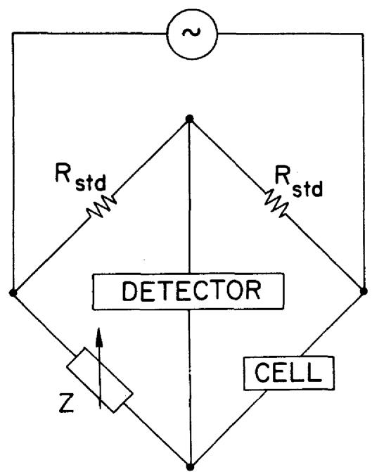

ORNL-DWG 68-2245

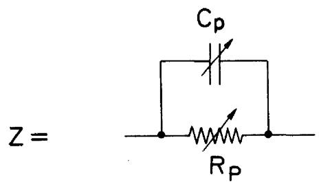  
Figure 1: Wheatstone bridge: parallel-component balancing arm.

ORNL-DWG 68-2216

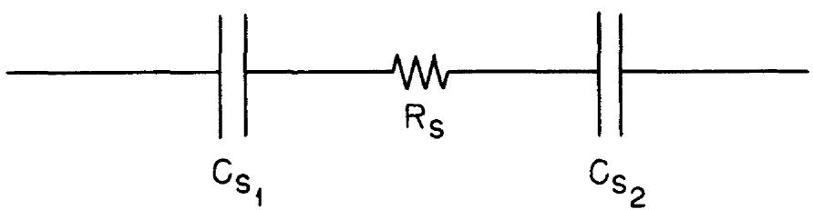  
Figure 2: Equivalent circuit of cell in absence of reaction.

ORNL-DWG 68-2217

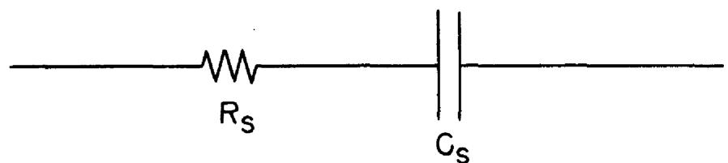  
Figure 3: Equivalent circuit of solution resistance and electrode-solution interfacial capacitance in absence of reaction.

ORNL-DWG 68-2218

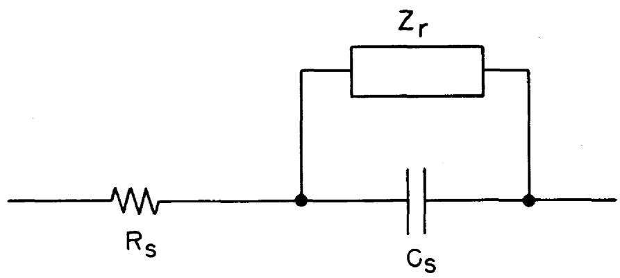  
Figure 4: Equivalent circuit including reaction.

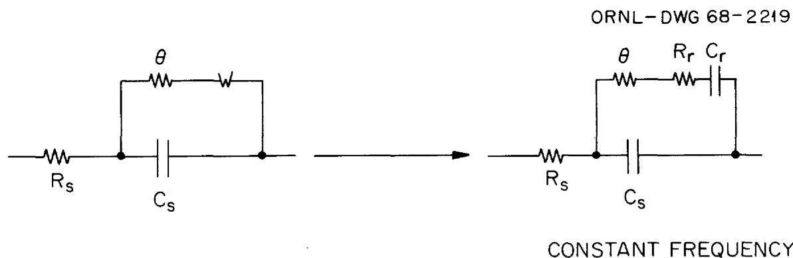  
Figure 5: Equivalent circuit for faradaic impedance studies.

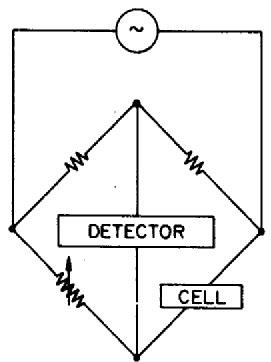  
A. WHEATSTONE BRIDGE, NO CAPACITORS(54)

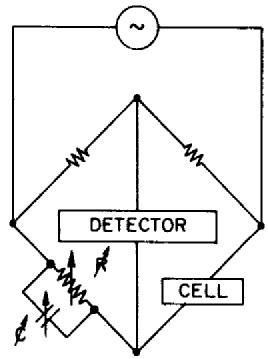  
JONES BRIDGE(7,55) 3. (WHEATSTONE BRIDGE, R AND C IN PARALLEL)

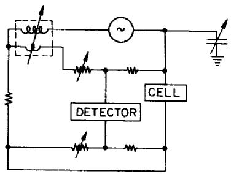  
C. KELVIN BRIDGE(38)

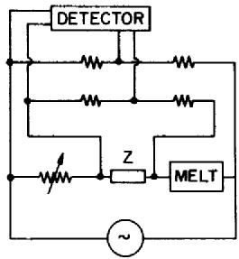  
D. THOMSON BRIDGE(47)   
Z=IMPEDANCE OF CONNECTIONS

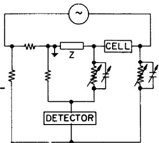  
E. (EMPLOYED BY WINTERHAGER AND WERNER)   
Z=IMPEDANCEOFCONNECTIONS

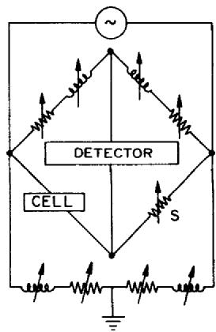  
CAREY-FOSTER BRIDGE(48) F. (CELL AND S ARE INTERCHANGEABLE)

# APPENDIX II

For the sake of completeness, references to those

cryolite systems which could not be consulted in the original

are listed in this appendix. An indication of their content,

together with the secondary source, is given.

Batashev, K. and A. Zhurin, Metallurg, 10, 67 (1935); C.A.,

30, 7018 (1936).

( $\kappa$ of KF-AlF $^3$ system vs. T)

Batashev, K. P., Legkie Metally, 10, 48 (1936); ref. 4.

(κ of cryolite vs. T)

Batashev, cited by Mashovets in The Electrometallurgy of

Aluminum (Russian), 1938; ref. 53.

$(\Lambda^{\mathfrak{m}}$ of cryolite $+$ NaF and cryolite $+$ $\mathrm{AlF}_6)$

Vayna, A., Alluminio, 19, 215 (1950); C. A., 44, 10, 549d

(1950) and ref. 4.

(κ of cryolite vs. T; κ of cryolite with additions of

NaF, $\mathbf{CaF}_2$ , or $\mathrm{AlF_3}$ near $1000^{\circ}\mathrm{C})$

Abramov, G. A., M. M. Vetyukov, I. P. Gupalo, A. A. Kostyukov,

and L. N. Lozhkin, "Teoreticheskie osnovy electrometal-

lurgii alyminia," Metallurizdat, Moscow (1953); ref. 4.

(κ of cryolite vs. T)

Ponomarev, V. G., F. M. Kolomilskii, Yu. M. Putilin, Izvest.

Vysshikh. Ucheb., Zavedenii, Tsvetnaya Met., 1958, No. 6,

78; C.A., 53, 14,670i (1959).

$(\kappa$ of $\mathbf{K}_2\mathbf{T}\mathbf{i}\mathbf{F}_6$ vs. T)

Belyaev, A. I., Tsvetnye Metally, 31, No. 10, 61 (1958); C.A.,

53, 6832i (1959).

( $\kappa$ of cryolite with additions of LiF, NaF, $\mathrm{BeF}_2$ , $\mathrm{MgF}_2$ ,

$\mathbf{CaF}_2$ ， $\mathbf{BaF}_2$ ，or $\mathrm{AlF_3}$ ）

Antipin, L. N., S. F. Vazhenin, and V. K. Shcherbakov, Nauch.

Doklady Vysshei Shkoly, Met. 1958, 11; C.A., 55, 124lf

(1961).

$(\kappa$ of $\mathbf{NaF} / \mathbf{AlF}_3$ ratios of 1.6 to 3.9)

Antipin, L. N. and S. F. Vazhenin, Tsvetnye Metally, 31, No.

12, 56 (1958); C.A., 53, 7824e (1959).

(κ of cryolite with additions of CaF₂ or MgF₂)

Chu, Y. A. and A. I. Belyaev, Izvest. Vysshikh. Ucheb.,

Zavedenii, Tsvetnaya Met., 2, No. 2, 69 (1959); C.A., 54,

24,025i (1960).

(κ of cryolite and cryolite with additions of LiF or BeF $_2$ )

Belyaev, A. I. and E. A. Zhemchuzhina, Tsvetnye Metally, 33,

No. 4, 45 (1960); C.A., 55, 1242a (1961).

( $\kappa$ of NaF/AlF3 ratio of 2.2 to 2.78 with additions of $\mathrm{MgF_2}$ )

Kuvakin, M. A. and P. S. Kusakin, Trudy Inst. Met., Akad. Nauk.

SSSR, Unal. Filial, 5, 145 (1960); C.A., 55, 2255i (1961).

(κ of cryolite)

Belyaev, A. I., "Elektrolit alyuminievykh vann," Metallurgizdat,

Moscow, 1961; ref. 4.

(κ of cryolite with BeF₂ additions up to 17 wt. % at 1000°C)

Matiasovsky, K., S. Ordzovensky, and M. Malinovsky, Chem. zvesti,

17, 839 (1963); ref. 4.

(κ of cryolite vs. T)

Vakhobov, A. V. and A. I. Belyaev, "Vliamie razlichnykh solevkykh

komponentov (dobavok) na elektroprovodnost elktrolita

alyuminievykh vann," in "Fizicheskaya khima rasplavlemykh

"solei," ed. by The Institute of General and Inorganic

Chemistry of the Soviet Academy of Science., Metallurgizdat,

Moscow, 1965, pp. 99-104; ref. 4.

( $\kappa$ of cryolite with additions of LiF, $\mathbf{MgF_2}$ , CaF, BaF,

cr AlF₃ up to 20 wt. % at 1000°C)

INTERNAL DISTRIBUTION   

<table><tr><td>1.</td><td>R. K. Adams</td><td>48.</td><td>C. H. Gabbard</td></tr><tr><td>2.</td><td>G. M. Adamson</td><td>49.</td><td>R. B. Gamage</td></tr><tr><td>3.</td><td>R. G. Affel</td><td>50.</td><td>L. O. Gilpatrick</td></tr><tr><td>4.</td><td>L. G. Alexander</td><td>51.</td><td>W. R. Grimes</td></tr><tr><td>5.</td><td>A. L. Bacarella</td><td>52.</td><td>A. G. Grindell</td></tr><tr><td>6.</td><td>C. F. Baes</td><td>53.</td><td>R. H. Guymon</td></tr><tr><td>7.</td><td>S. J. Ball</td><td>54.</td><td>B. A. Hannaford</td></tr><tr><td>8.</td><td>C. E. Bamberger</td><td>55.</td><td>C. S. Harrill</td></tr><tr><td>9.</td><td>C. J. Barton</td><td>56.</td><td>P. N. Haubenreich</td></tr><tr><td>10.</td><td>H. F. Bauman</td><td>57.</td><td>D. N. Hess</td></tr><tr><td>11.</td><td>S. E. Beall</td><td>58.</td><td>J. R. Hightower</td></tr><tr><td>12.</td><td>U. Bertocci</td><td>59.</td><td>M. R. Hill</td></tr><tr><td>13.</td><td>C. E. Bettis</td><td>60.</td><td>B. F. Hitch</td></tr><tr><td>14.</td><td>E. S. Bettis</td><td>61.</td><td>H. W. Hoffman</td></tr><tr><td>15.</td><td>P. B. Bien</td><td>62.</td><td>H. F. Holmes</td></tr><tr><td>16.</td><td>F. F. Blankenship</td><td>63.</td><td>R. W. Horton</td></tr><tr><td>17.</td><td>R. E. Blanco</td><td>64.</td><td>T. L. Hudson</td></tr><tr><td>18.</td><td>E. G. Bohmann</td><td>65.</td><td>R. F. Hyland</td></tr><tr><td>19.</td><td>C. J. Borkowski</td><td>66.</td><td>H. Inouye</td></tr><tr><td>20.</td><td>C. E. Boyd</td><td>67.</td><td>H. W. Jenkins</td></tr><tr><td>21.</td><td>J. Braunstein</td><td>68.</td><td>G. H. Jenks</td></tr><tr><td>22.</td><td>M. A. Bredig</td><td>69.</td><td>W. H. Jordan</td></tr><tr><td>23.</td><td>R. B. Briggs</td><td>70.</td><td>P. R. Kasten</td></tr><tr><td>24.</td><td>H. R. Bronstein</td><td>71.</td><td>M. T. Kelley</td></tr><tr><td>25.</td><td>G. D. Brunton</td><td>72.</td><td>C. R. Kennedy</td></tr><tr><td>26.</td><td>J. Brynestad</td><td>73.</td><td>H. T. Kerr</td></tr><tr><td>27.</td><td>S. Cantor</td><td>74.</td><td>S. S. Kirslis</td></tr><tr><td>28.</td><td>W. L. Carter</td><td>75.</td><td>H. W. Kohn</td></tr><tr><td>29.</td><td>G. I. Cathers</td><td>76.</td><td>J. W. Krewson</td></tr><tr><td>30.</td><td>E. L. Compere</td><td>77.</td><td>C. E. Lamb</td></tr><tr><td>31.</td><td>W. H. Cook</td><td>78.</td><td>J. A. Lane</td></tr><tr><td>32.</td><td>L. T. Corbin</td><td>79.</td><td>R. B. Lindauer</td></tr><tr><td>33.</td><td>J. L. Crowley</td><td>80.</td><td>A. P. Litman</td></tr><tr><td>34.</td><td>F. L. Culler, Jr.</td><td>81.</td><td>M. I. Lundin</td></tr><tr><td>35.</td><td>J. M. Dale</td><td>82.</td><td>R. N. Lyon</td></tr><tr><td>36.</td><td>D. G. Davis</td><td>83.</td><td>H. G. MacPherson</td></tr><tr><td>37.</td><td>S. J. Ditto</td><td>84.</td><td>R. E. MacPherson</td></tr><tr><td>38.</td><td>B. C. Duggins</td><td>85.</td><td>G. Mamantov</td></tr><tr><td>39.</td><td>L. A. Dunn</td><td>86.</td><td>D. L. Manning</td></tr><tr><td>40.</td><td>A. S. Dworkin</td><td>87.</td><td>W. L. Marshall</td></tr><tr><td>41.</td><td>J. R. Engle</td><td>88.</td><td>C. D. Martin</td></tr><tr><td>42.</td><td>E. P. Epler</td><td>89.</td><td>H. E. McCoy</td></tr><tr><td>43.</td><td>D. E. Ferguson</td><td>90.</td><td>H. F. McDuffie</td></tr><tr><td>44.</td><td>L. M. Ferris</td><td>91.</td><td>C. K. McGlothlan</td></tr><tr><td>45.</td><td>H. A. Friedman</td><td>92.</td><td>C. J. McHargue</td></tr><tr><td>46.</td><td>J. H. Frye, Jr.</td><td>93.</td><td>L. E. McNeese</td></tr><tr><td>47.</td><td>E. L. Fuller</td><td>94.</td><td>R. E. Mesmer</td></tr></table>

<table><tr><td>95.</td><td>A. S. Meyer</td><td>130.</td><td>G. P. Smith</td></tr><tr><td>96.</td><td>R. L. Moore</td><td>131.</td><td>R. W. Stelzner</td></tr><tr><td>97.</td><td>D. M. Moulton</td><td>132.</td><td>H. H. Stone</td></tr><tr><td>98.</td><td>T. R. Mueller</td><td>133.</td><td>R. A. Strehlow</td></tr><tr><td>99.</td><td>J. P. Nichols</td><td>134.</td><td>J. R. Tallackson</td></tr><tr><td>100.</td><td>E. L. Nicholson</td><td>135.</td><td>R. E. Thoma</td></tr><tr><td>101.</td><td>L. C. Oakes</td><td>136.</td><td>L. M. Toth</td></tr><tr><td>102.</td><td>F. A. Posey</td><td>137.</td><td>J. S. Watson</td></tr><tr><td>103.</td><td>J. L. Redford</td><td>138.</td><td>C. F. Weaver</td></tr><tr><td>104.</td><td>J. D. Redman</td><td>139.</td><td>A. M. Weinberg</td></tr><tr><td>105-119.</td><td>G. D. Robbins</td><td>140.</td><td>J. R. Weir</td></tr><tr><td>120.</td><td>R. C. Robertson</td><td>141.</td><td>M. E. Whatley</td></tr><tr><td>121.</td><td>W. C. Robinson</td><td>142.</td><td>J. C. White</td></tr><tr><td>122.</td><td>K. A. Romberger</td><td>143.</td><td>F. L. Whiting</td></tr><tr><td>123-124.</td><td>M. W. Rosenthal</td><td>144.</td><td>J. P. Young</td></tr><tr><td>125.</td><td>R. G. Ross</td><td>145-146.</td><td>Central Research Library</td></tr><tr><td>126.</td><td>H. C. Savage</td><td>147.</td><td>Document Reference Section</td></tr><tr><td>127.</td><td>Dunlap Scott</td><td>148-150.</td><td>Laboratory Records Dept.</td></tr><tr><td>128.</td><td>J. H. Shaffer</td><td>151.</td><td>Laboratory Records, ORNL</td></tr><tr><td>129.</td><td>M. J. Skinner</td><td>152.</td><td>ORNL Patent Office</td></tr></table>

# EXTERNAL DISTRIBUTION

<table><tr><td>153-154.</td><td>D. F. Cope, AEC, ORO</td></tr><tr><td>155.</td><td>A. Giambusso, AEC, Washington, D. C.</td></tr><tr><td>156.</td><td>W. J. Larkin, AEC, ORO</td></tr><tr><td>157-158.</td><td>T. W. McIntosh, AEC, Washington, D.</td></tr><tr><td>159.</td><td>H. M. Roth, AEC, ORO</td></tr><tr><td>160-161.</td><td>M. Shaw, AEC, Washington, D. C.</td></tr><tr><td>162.</td><td>W. L. Smalley, AEC, ORO</td></tr><tr><td>163.</td><td>R. F. Sweek, AEC, Washington, D. C.</td></tr><tr><td>164-178.</td><td>Division of Technical Information Ex</td></tr><tr><td>179-180.</td><td>Reactor Division, ORO</td></tr><tr><td>181.</td><td>Research and Development Division, C</td></tr></table>